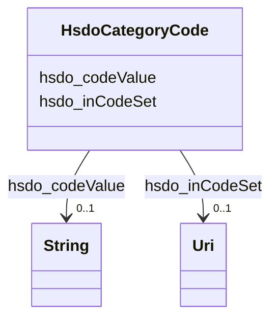

# Class: CategoryCode (hsdo_CategoryCode)


_A Category Code._


URI: [hsdo:CategoryCode](http://schema.org/CategoryCode)





<!-- no inheritance hierarchy -->


## Slots

| Name | Cardinality and Range | Description | Inheritance |
| ---  | --- | --- | --- |
| [hsdo_inCodeSet](../slots/hsdo_inCodeSet.md) | 0..1 <br/> [xsd:anyURI](xsd:anyURI) | No slot (predicate) description specified | direct |
| [hsdo_codeValue](../slots/hsdo_codeValue.md) | 0..1 <br/> [xsd:string](xsd:string) | No slot (predicate) description specified | direct |


## Usages

| used by | used in | type | used |
| ---  | --- | --- | --- |
| [HsdoService](../classes/HsdoService.md) | [hsdo_category](../slots/hsdo_category.md) | any_of[range] | [HsdoCategoryCode](../classes/HsdoCategoryCode.md) |


## Identifier and Mapping Information


### Schema Source


* from schema: dream-kg


## Mappings

| Mapping Type | Mapped Value |
| ---  | ---  |
| self | hsdo:CategoryCode |
| native | dream-kg/:HsdoCategoryCode |


## LinkML Source

<!-- TODO: investigate https://stackoverflow.com/questions/37606292/how-to-create-tabbed-code-blocks-in-mkdocs-or-sphinx -->

### Direct

<details>
```yaml
name: hsdo_CategoryCode
description: A Category Code.
title: CategoryCode
notes:
- Class with 157 occurrences.
from_schema: dream-kg
rank: 1000
slots:
- hsdo_inCodeSet
- hsdo_codeValue
class_uri: hsdo:CategoryCode

```
</details>

### Induced

<details>
```yaml
name: hsdo_CategoryCode
description: A Category Code.
title: CategoryCode
notes:
- Class with 157 occurrences.
from_schema: dream-kg
rank: 1000
attributes:
  hsdo_inCodeSet:
    name: hsdo_inCodeSet
    description: No slot (predicate) description specified
    comments:
    - 157 occurrences with subject type hsdo_CategoryCode and object type uri.
    examples:
    - description: hsdo_CategoryCode → uri
      object:
        example_object: dreamkg:_CategoryCodeSet_Services_Main
        example_predicate: hsdo:inCodeSet
        example_subject: dreamkg:category/service/main/HelpHotlines
    from_schema: dream-kg
    rank: 1000
    slot_uri: hsdo:inCodeSet
    alias: hsdo_inCodeSet
    owner: hsdo_CategoryCode
    domain_of:
    - hsdo_CategoryCode
    range: uri
  hsdo_codeValue:
    name: hsdo_codeValue
    description: No slot (predicate) description specified
    comments:
    - 158 occurrences with subject type hsdo_CategoryCode and object type string.
    examples:
    - description: hsdo_CategoryCode → string
      object:
        example_object: counseling medical care
        example_predicate: hsdo:codeValue
        example_subject: dreamkg:category/service/main/CounselingMedicalCare
    from_schema: dream-kg
    rank: 1000
    slot_uri: hsdo:codeValue
    alias: hsdo_codeValue
    owner: hsdo_CategoryCode
    domain_of:
    - hsdo_CategoryCode
    range: string
class_uri: hsdo:CategoryCode

```
</details>