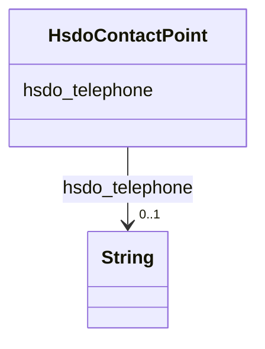

# Class: ContactPoint (hsdo_ContactPoint)


_A contact point&#x2014;for example, a Customer Complaints department._


This class occurs 87 times.


URI: [hsdo:ContactPoint](http://schema.org/ContactPoint)





<!-- no inheritance hierarchy -->


## Slots

| Name | Cardinality and Range | Description | Inheritance | Occurrences |
| ---  | --- | --- | --- | --- |
| [hsdo_telephone](../slots/hsdo_telephone.md) | 0..1 <br/> [xsd:string](http://www.w3.org/2001/XMLSchema#string) | The telephone number <br/>  | direct | 87 |


## Usages

| used by | used in | type | used |
| ---  | --- | --- | --- |
| [HsdoServiceChannel](../classes/HsdoServiceChannel.md) | [hsdo_servicePhone](../slots/hsdo_servicePhone.md) | range | [HsdoContactPoint](../classes/HsdoContactPoint.md) |


## LinkML Source

<!-- TODO: investigate https://stackoverflow.com/questions/37606292/how-to-create-tabbed-code-blocks-in-mkdocs-or-sphinx -->

### Direct

<details>

```yaml
name: hsdo_ContactPoint
conforms_to: No schema conformance document specified
annotations:
  count:
    tag: count
    value: 87
description: A contact point&#x2014;for example, a Customer Complaints department.
title: ContactPoint
from_schema: dream-kg
rank: 1000
slots:
- hsdo_telephone
slot_usage:
  hsdo_telephone:
    name: hsdo_telephone
    annotations:
      string:
        tag: string
        value: 87
class_uri: hsdo:ContactPoint

```
</details>

### Induced

<details>

```yaml
name: hsdo_ContactPoint
conforms_to: No schema conformance document specified
annotations:
  count:
    tag: count
    value: 87
description: A contact point&#x2014;for example, a Customer Complaints department.
title: ContactPoint
from_schema: dream-kg
rank: 1000
slot_usage:
  hsdo_telephone:
    name: hsdo_telephone
    annotations:
      string:
        tag: string
        value: 87
attributes:
  hsdo_telephone:
    name: hsdo_telephone
    annotations:
      string:
        tag: string
        value: 87
    description: The telephone number.
    title: telephone
    examples:
    - description: hsdo_ContactPoint→string
      object:
        example_object: 215-276-3922
        example_object_type: string
        example_predicate: hsdo:telephone
        example_subject: dreamkg:service/phone/4689179354857472
        example_subject_type: hsdo_ContactPoint
    from_schema: dream-kg
    rank: 1000
    slot_uri: hsdo:telephone
    alias: hsdo_telephone
    owner: hsdo_ContactPoint
    domain_of:
    - hsdo_ContactPoint
    range: string
class_uri: hsdo:ContactPoint

```
</details>