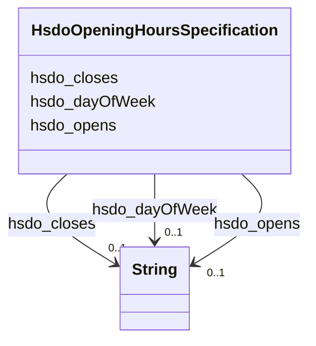

# Class: OpeningHoursSpecification (hsdo_OpeningHoursSpecification)


_A structured value providing information about the opening hours of a place or a certain service inside a place.\n\n␊The place is __open__ if the [[opens]] property is specified, and __closed__ otherwise.\n\nIf the value for the [[closes]] property is less than the value for the [[opens]] property then the hour range is assumed to span over the next day.␊      _


This class occurs 609 times.


URI: [hsdo:OpeningHoursSpecification](http://schema.org/OpeningHoursSpecification)





<!-- no inheritance hierarchy -->


## Slots

| Name | Cardinality and Range | Description | Inheritance | Occurrences |
| ---  | --- | --- | --- | --- |
| [hsdo_closes](../slots/hsdo_closes.md) | 0..1 <br/> [xsd:string](http://www.w3.org/2001/XMLSchema#string) | The closing hour of the place or service on the given day(s) of the week <br/>  | direct | 623 |
| [hsdo_opens](../slots/hsdo_opens.md) | 0..1 <br/> [xsd:string](http://www.w3.org/2001/XMLSchema#string) | The opening hour of the place or service on the given day(s) of the week <br/>  | direct | 631 |
| [hsdo_dayOfWeek](../slots/hsdo_dayOfWeek.md) | 0..1 <br/> [xsd:string](http://www.w3.org/2001/XMLSchema#string) | The day of the week for which these opening hours are valid <br/>  | direct | 609 |


## Usages

| used by | used in | type | used |
| ---  | --- | --- | --- |
| [HsdoService](../classes/HsdoService.md) | [hsdo_hoursAvailable](../slots/hsdo_hoursAvailable.md) | range | [HsdoOpeningHoursSpecification](../classes/HsdoOpeningHoursSpecification.md) |


## LinkML Source

<!-- TODO: investigate https://stackoverflow.com/questions/37606292/how-to-create-tabbed-code-blocks-in-mkdocs-or-sphinx -->

### Direct

<details>

```yaml
name: hsdo_OpeningHoursSpecification
conforms_to: No schema conformance document specified
annotations:
  count:
    tag: count
    value: 609
description: 'A structured value providing information about the opening hours of
  a place or a certain service inside a place.\n\n␊The place is __open__ if the [[opens]]
  property is specified, and __closed__ otherwise.\n\nIf the value for the [[closes]]
  property is less than the value for the [[opens]] property then the hour range is
  assumed to span over the next day.␊      '
title: OpeningHoursSpecification
from_schema: dream-kg
rank: 1000
slots:
- hsdo_closes
- hsdo_opens
- hsdo_dayOfWeek
slot_usage:
  hsdo_closes:
    name: hsdo_closes
    annotations:
      string:
        tag: string
        value: 623
  hsdo_dayOfWeek:
    name: hsdo_dayOfWeek
    annotations:
      string:
        tag: string
        value: 609
  hsdo_opens:
    name: hsdo_opens
    annotations:
      string:
        tag: string
        value: 631
class_uri: hsdo:OpeningHoursSpecification

```
</details>

### Induced

<details>

```yaml
name: hsdo_OpeningHoursSpecification
conforms_to: No schema conformance document specified
annotations:
  count:
    tag: count
    value: 609
description: 'A structured value providing information about the opening hours of
  a place or a certain service inside a place.\n\n␊The place is __open__ if the [[opens]]
  property is specified, and __closed__ otherwise.\n\nIf the value for the [[closes]]
  property is less than the value for the [[opens]] property then the hour range is
  assumed to span over the next day.␊      '
title: OpeningHoursSpecification
from_schema: dream-kg
rank: 1000
slot_usage:
  hsdo_closes:
    name: hsdo_closes
    annotations:
      string:
        tag: string
        value: 623
  hsdo_dayOfWeek:
    name: hsdo_dayOfWeek
    annotations:
      string:
        tag: string
        value: 609
  hsdo_opens:
    name: hsdo_opens
    annotations:
      string:
        tag: string
        value: 631
attributes:
  hsdo_closes:
    name: hsdo_closes
    annotations:
      string:
        tag: string
        value: 623
    description: The closing hour of the place or service on the given day(s) of the
      week.
    title: closes
    examples:
    - description: hsdo_OpeningHoursSpecification→string
      object:
        example_object: '17:00'
        example_object_type: string
        example_predicate: hsdo:closes
        example_subject: dreamkg:service/hours/friday/4689179354857472
        example_subject_type: hsdo_OpeningHoursSpecification
    from_schema: dream-kg
    rank: 1000
    slot_uri: hsdo:closes
    alias: hsdo_closes
    owner: hsdo_OpeningHoursSpecification
    domain_of:
    - hsdo_OpeningHoursSpecification
    range: string
  hsdo_opens:
    name: hsdo_opens
    annotations:
      string:
        tag: string
        value: 631
    description: The opening hour of the place or service on the given day(s) of the
      week.
    title: opens
    examples:
    - description: hsdo_OpeningHoursSpecification→string
      object:
        example_object: 08:00
        example_object_type: string
        example_predicate: hsdo:opens
        example_subject: dreamkg:service/hours/friday/4689179354857472
        example_subject_type: hsdo_OpeningHoursSpecification
    from_schema: dream-kg
    rank: 1000
    slot_uri: hsdo:opens
    alias: hsdo_opens
    owner: hsdo_OpeningHoursSpecification
    domain_of:
    - hsdo_OpeningHoursSpecification
    range: string
  hsdo_dayOfWeek:
    name: hsdo_dayOfWeek
    annotations:
      string:
        tag: string
        value: 609
    description: The day of the week for which these opening hours are valid.
    title: dayOfWeek
    examples:
    - description: hsdo_OpeningHoursSpecification→string
      object:
        example_object: Friday
        example_object_type: string
        example_predicate: hsdo:dayOfWeek
        example_subject: dreamkg:service/hours/friday/4689179354857472
        example_subject_type: hsdo_OpeningHoursSpecification
    from_schema: dream-kg
    rank: 1000
    slot_uri: hsdo:dayOfWeek
    alias: hsdo_dayOfWeek
    owner: hsdo_OpeningHoursSpecification
    domain_of:
    - hsdo_OpeningHoursSpecification
    range: string
class_uri: hsdo:OpeningHoursSpecification

```
</details>