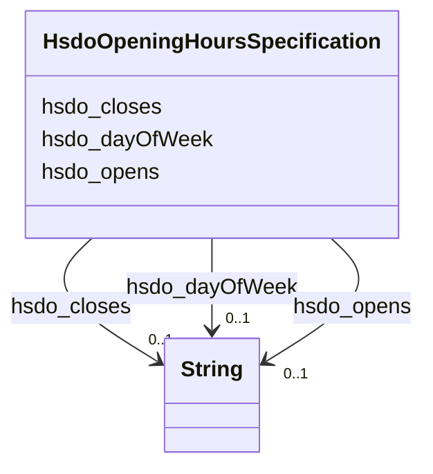

# Class: OpeningHoursSpecification (hsdo_OpeningHoursSpecification)


_A structured value providing information about the opening hours of a place or a certain service inside a place.\n\n_

_The place is __open__ if the [[opens]] property is specified, and __closed__ otherwise.\n\nIf the value for the [[closes]] property is less than the value for the [[opens]] property then the hour range is assumed to span over the next day._

_      _


URI: [hsdo:OpeningHoursSpecification](http://schema.org/OpeningHoursSpecification)





<!-- no inheritance hierarchy -->


## Slots

| Name | Cardinality and Range | Description | Inheritance |
| ---  | --- | --- | --- |
| [hsdo_opens](../slots/hsdo_opens.md) | 0..1 <br/> [xsd:string](xsd:string) | No slot (predicate) description specified | direct |
| [hsdo_closes](../slots/hsdo_closes.md) | 0..1 <br/> [xsd:string](xsd:string) | No slot (predicate) description specified | direct |
| [hsdo_dayOfWeek](../slots/hsdo_dayOfWeek.md) | 0..1 <br/> [xsd:string](xsd:string) | No slot (predicate) description specified | direct |


## Usages

| used by | used in | type | used |
| ---  | --- | --- | --- |
| [HsdoService](../classes/HsdoService.md) | [hsdo_hoursAvailable](../slots/hsdo_hoursAvailable.md) | range | [HsdoOpeningHoursSpecification](../classes/HsdoOpeningHoursSpecification.md) |


## Identifier and Mapping Information


### Schema Source


* from schema: dream-kg


## Mappings

| Mapping Type | Mapped Value |
| ---  | ---  |
| self | hsdo:OpeningHoursSpecification |
| native | dream-kg/:HsdoOpeningHoursSpecification |


## LinkML Source

<!-- TODO: investigate https://stackoverflow.com/questions/37606292/how-to-create-tabbed-code-blocks-in-mkdocs-or-sphinx -->

### Direct

<details>
```yaml
name: hsdo_OpeningHoursSpecification
description: "A structured value providing information about the opening hours of\
  \ a place or a certain service inside a place.\\n\\n\nThe place is __open__ if the\
  \ [[opens]] property is specified, and __closed__ otherwise.\\n\\nIf the value for\
  \ the [[closes]] property is less than the value for the [[opens]] property then\
  \ the hour range is assumed to span over the next day.\n      "
title: OpeningHoursSpecification
notes:
- Class with 609 occurrences.
from_schema: dream-kg
rank: 1000
slots:
- hsdo_opens
- hsdo_closes
- hsdo_dayOfWeek
class_uri: hsdo:OpeningHoursSpecification

```
</details>

### Induced

<details>
```yaml
name: hsdo_OpeningHoursSpecification
description: "A structured value providing information about the opening hours of\
  \ a place or a certain service inside a place.\\n\\n\nThe place is __open__ if the\
  \ [[opens]] property is specified, and __closed__ otherwise.\\n\\nIf the value for\
  \ the [[closes]] property is less than the value for the [[opens]] property then\
  \ the hour range is assumed to span over the next day.\n      "
title: OpeningHoursSpecification
notes:
- Class with 609 occurrences.
from_schema: dream-kg
rank: 1000
attributes:
  hsdo_opens:
    name: hsdo_opens
    description: No slot (predicate) description specified
    comments:
    - 631 occurrences with subject type hsdo_OpeningHoursSpecification and object
      type string.
    examples:
    - description: hsdo_OpeningHoursSpecification → string
      object:
        example_object: 00:00
        example_predicate: hsdo:opens
        example_subject: dreamkg:service/hours/sunday/5147295688687616
    from_schema: dream-kg
    rank: 1000
    slot_uri: hsdo:opens
    alias: hsdo_opens
    owner: hsdo_OpeningHoursSpecification
    domain_of:
    - hsdo_OpeningHoursSpecification
    range: string
  hsdo_closes:
    name: hsdo_closes
    description: No slot (predicate) description specified
    comments:
    - 623 occurrences with subject type hsdo_OpeningHoursSpecification and object
      type string.
    examples:
    - description: hsdo_OpeningHoursSpecification → string
      object:
        example_object: 00:00
        example_predicate: hsdo:closes
        example_subject: dreamkg:service/hours/saturday/5185303560585216
    from_schema: dream-kg
    rank: 1000
    slot_uri: hsdo:closes
    alias: hsdo_closes
    owner: hsdo_OpeningHoursSpecification
    domain_of:
    - hsdo_OpeningHoursSpecification
    range: string
  hsdo_dayOfWeek:
    name: hsdo_dayOfWeek
    description: No slot (predicate) description specified
    comments:
    - 609 occurrences with subject type hsdo_OpeningHoursSpecification and object
      type string.
    examples:
    - description: hsdo_OpeningHoursSpecification → string
      object:
        example_object: Thursday
        example_predicate: hsdo:dayOfWeek
        example_subject: dreamkg:service/hours/thursday/5639251868516352
    from_schema: dream-kg
    rank: 1000
    slot_uri: hsdo:dayOfWeek
    alias: hsdo_dayOfWeek
    owner: hsdo_OpeningHoursSpecification
    domain_of:
    - hsdo_OpeningHoursSpecification
    range: string
class_uri: hsdo:OpeningHoursSpecification

```
</details>