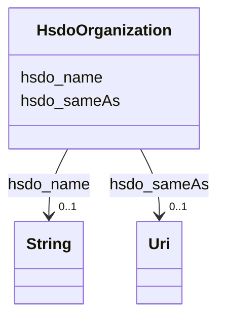

# Class: Organization (hsdo_Organization)


_An organization such as a school, NGO, corporation, club, etc._


This class occurs 87 times.


URI: [hsdo:Organization](http://schema.org/Organization)





<!-- no inheritance hierarchy -->


## Slots

| Name | Cardinality and Range | Description | Inheritance | Occurrences |
| ---  | --- | --- | --- | --- |
| [hsdo_name](../slots/hsdo_name.md) | 0..1 <br/> [xsd:string](http://www.w3.org/2001/XMLSchema#string) | The name of the item <br/>  | direct | 89 |
| [hsdo_sameAs](../slots/hsdo_sameAs.md) | 0..1 <br/> [xsd:anyURI](http://www.w3.org/2001/XMLSchema#anyURI) | URL of a reference Web page that unambiguously indicates the item's identity <br/>  | direct | 127 |


## Usages

| used by | used in | type | used |
| ---  | --- | --- | --- |
| [HsdoService](../classes/HsdoService.md) | [hsdo_provider](../slots/hsdo_provider.md) | range | [HsdoOrganization](../classes/HsdoOrganization.md) |


## LinkML Source

<!-- TODO: investigate https://stackoverflow.com/questions/37606292/how-to-create-tabbed-code-blocks-in-mkdocs-or-sphinx -->

### Direct

<details>

```yaml
name: hsdo_Organization
conforms_to: No schema conformance document specified
annotations:
  count:
    tag: count
    value: 87
description: An organization such as a school, NGO, corporation, club, etc.
title: Organization
from_schema: dream-kg
rank: 1000
slots:
- hsdo_name
- hsdo_sameAs
slot_usage:
  hsdo_name:
    name: hsdo_name
    annotations:
      string:
        tag: string
        value: 89
  hsdo_sameAs:
    name: hsdo_sameAs
    annotations:
      uri:
        tag: uri
        value: 127
class_uri: hsdo:Organization

```
</details>

### Induced

<details>

```yaml
name: hsdo_Organization
conforms_to: No schema conformance document specified
annotations:
  count:
    tag: count
    value: 87
description: An organization such as a school, NGO, corporation, club, etc.
title: Organization
from_schema: dream-kg
rank: 1000
slot_usage:
  hsdo_name:
    name: hsdo_name
    annotations:
      string:
        tag: string
        value: 89
  hsdo_sameAs:
    name: hsdo_sameAs
    annotations:
      uri:
        tag: uri
        value: 127
attributes:
  hsdo_name:
    name: hsdo_name
    annotations:
      string:
        tag: string
        value: 89
    description: The name of the item.
    title: name
    examples:
    - description: hsdo_Service→string
      object:
        example_object: New Pathways for Women Project
        example_object_type: string
        example_predicate: hsdo:name
        example_subject: dreamkg:service/6379467169595392
        example_subject_type: hsdo_Service
    - description: hsdo_Organization→string
      object:
        example_object: Circle Counseling
        example_object_type: string
        example_predicate: hsdo:name
        example_subject: dreamkg:service/provider/4780892498952192
        example_subject_type: hsdo_Organization
    from_schema: dream-kg
    rank: 1000
    slot_uri: hsdo:name
    alias: hsdo_name
    owner: hsdo_Organization
    domain_of:
    - hsdo_Organization
    - hsdo_Service
    range: string
  hsdo_sameAs:
    name: hsdo_sameAs
    annotations:
      uri:
        tag: uri
        value: 127
    description: URL of a reference Web page that unambiguously indicates the item's
      identity. E.g. the URL of the item's Wikipedia page, Wikidata entry, or official
      website.
    title: sameAs
    examples:
    - description: hsdo_Organization→uri
      object:
        example_object: https://www.facebook.com/sainthelenaparish
        example_object_type: uri
        example_predicate: hsdo:sameAs
        example_subject: dreamkg:service/provider/5017006984921088
        example_subject_type: hsdo_Organization
    from_schema: dream-kg
    rank: 1000
    slot_uri: hsdo:sameAs
    alias: hsdo_sameAs
    owner: hsdo_Organization
    domain_of:
    - hsdo_Organization
    range: uri
class_uri: hsdo:Organization

```
</details>