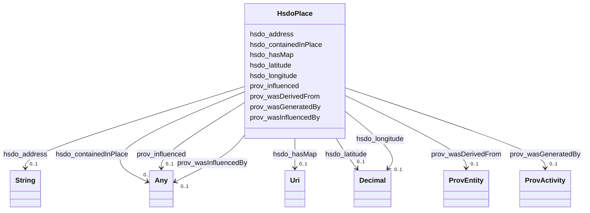

# Class: Place (hsdo_Place)


_Entities that have a somewhat fixed, physical extension._


This class occurs 87 times.


URI: [hsdo:Place](http://schema.org/Place)





<!-- no inheritance hierarchy -->


## Slots

| Name | Cardinality and Range | Description | Inheritance | Occurrences |
| ---  | --- | --- | --- | --- |
| [hsdo_address](../slots/hsdo_address.md) | 0..1 <br/> [xsd:string](http://www.w3.org/2001/XMLSchema#string) | Physical address of the item <br/>  | direct | 93 |
| [prov_wasDerivedFrom](../slots/prov_wasDerivedFrom.md) | 0..1 <br/> [ProvEntity](../classes/ProvEntity.md) | No slot (predicate) description specified <br/>  | direct | 174 |
| [prov_wasGeneratedBy](../slots/prov_wasGeneratedBy.md) | 0..1 <br/> [ProvActivity](../classes/ProvActivity.md) | No slot (predicate) description specified <br/>  | direct | 87 |
| [prov_influenced](../slots/prov_influenced.md) | 0..1 <br/> [HsdoTextObject](../classes/HsdoTextObject.md)&nbsp;or&nbsp;<br />[HsdoService](../classes/HsdoService.md)&nbsp;or&nbsp;<br />[HsdoOpeningHoursSpecification](../classes/HsdoOpeningHoursSpecification.md)&nbsp;or&nbsp;<br />[HsdoOrganization](../classes/HsdoOrganization.md)&nbsp;or&nbsp;<br />[ProvCollection](../classes/ProvCollection.md)&nbsp;or&nbsp;<br />[ProvEntity](../classes/ProvEntity.md)&nbsp;or&nbsp;<br />[HsdoCategoryCode](../classes/HsdoCategoryCode.md)&nbsp;or&nbsp;<br />[HsdoAudience](../classes/HsdoAudience.md)&nbsp;or&nbsp;<br />[HsdoPlace](../classes/HsdoPlace.md)&nbsp;or&nbsp;<br />[HsdoContactPoint](../classes/HsdoContactPoint.md)&nbsp;or&nbsp;<br />[HsdoAdministrativeArea](../classes/HsdoAdministrativeArea.md) | No slot (predicate) description specified <br/>  | direct | 174 |
| [hsdo_containedInPlace](../slots/hsdo_containedInPlace.md) | 0..1 <br/> [ProvEntity](../classes/ProvEntity.md)&nbsp;or&nbsp;<br />[HsdoAdministrativeArea](../classes/HsdoAdministrativeArea.md) | The basic containment relation between a place and one that contains it <br/>  | direct | 176 |
| [hsdo_hasMap](../slots/hsdo_hasMap.md) | 0..1 <br/> [xsd:anyURI](http://www.w3.org/2001/XMLSchema#anyURI) | A URL to a map of the place <br/>  | direct | 88 |
| [prov_wasInfluencedBy](../slots/prov_wasInfluencedBy.md) | 0..1 <br/> [HsdoWebPage](../classes/HsdoWebPage.md)&nbsp;or&nbsp;<br />[HsdoTextObject](../classes/HsdoTextObject.md)&nbsp;or&nbsp;<br />[HsdoService](../classes/HsdoService.md)&nbsp;or&nbsp;<br />[HsdoOpeningHoursSpecification](../classes/HsdoOpeningHoursSpecification.md)&nbsp;or&nbsp;<br />[HsdoOrganization](../classes/HsdoOrganization.md)&nbsp;or&nbsp;<br />[ProvEntity](../classes/ProvEntity.md)&nbsp;or&nbsp;<br />[ProvActivity](../classes/ProvActivity.md)&nbsp;or&nbsp;<br />[xsd:anyURI](http://www.w3.org/2001/XMLSchema#anyURI)&nbsp;or&nbsp;<br />[HsdoPlace](../classes/HsdoPlace.md)&nbsp;or&nbsp;<br />[HsdoContactPoint](../classes/HsdoContactPoint.md) | No slot (predicate) description specified <br/>  | direct | 435 |
| [hsdo_latitude](../slots/hsdo_latitude.md) | 0..1 <br/> [xsd:decimal](http://www.w3.org/2001/XMLSchema#decimal) | The latitude of a location <br/>  | direct | 89 |
| [hsdo_longitude](../slots/hsdo_longitude.md) | 0..1 <br/> [xsd:decimal](http://www.w3.org/2001/XMLSchema#decimal) | The longitude of a location <br/>  | direct | 89 |


## Usages

| used by | used in | type | used |
| ---  | --- | --- | --- |
| [HsdoAdministrativeArea](../classes/HsdoAdministrativeArea.md) | [prov_wasInfluencedBy](../slots/prov_wasInfluencedBy.md) | any_of[range] | [HsdoPlace](../classes/HsdoPlace.md) |
| [HsdoAudience](../classes/HsdoAudience.md) | [prov_wasInfluencedBy](../slots/prov_wasInfluencedBy.md) | any_of[range] | [HsdoPlace](../classes/HsdoPlace.md) |
| [HsdoCategoryCode](../classes/HsdoCategoryCode.md) | [prov_wasInfluencedBy](../slots/prov_wasInfluencedBy.md) | any_of[range] | [HsdoPlace](../classes/HsdoPlace.md) |
| [HsdoContactPoint](../classes/HsdoContactPoint.md) | [prov_influenced](../slots/prov_influenced.md) | any_of[range] | [HsdoPlace](../classes/HsdoPlace.md) |
| [HsdoContactPoint](../classes/HsdoContactPoint.md) | [prov_wasInfluencedBy](../slots/prov_wasInfluencedBy.md) | any_of[range] | [HsdoPlace](../classes/HsdoPlace.md) |
| [HsdoOpeningHoursSpecification](../classes/HsdoOpeningHoursSpecification.md) | [prov_influenced](../slots/prov_influenced.md) | any_of[range] | [HsdoPlace](../classes/HsdoPlace.md) |
| [HsdoOpeningHoursSpecification](../classes/HsdoOpeningHoursSpecification.md) | [prov_wasInfluencedBy](../slots/prov_wasInfluencedBy.md) | any_of[range] | [HsdoPlace](../classes/HsdoPlace.md) |
| [HsdoOrganization](../classes/HsdoOrganization.md) | [prov_influenced](../slots/prov_influenced.md) | any_of[range] | [HsdoPlace](../classes/HsdoPlace.md) |
| [HsdoOrganization](../classes/HsdoOrganization.md) | [prov_wasInfluencedBy](../slots/prov_wasInfluencedBy.md) | any_of[range] | [HsdoPlace](../classes/HsdoPlace.md) |
| [HsdoPlace](../classes/HsdoPlace.md) | [prov_influenced](../slots/prov_influenced.md) | any_of[range] | [HsdoPlace](../classes/HsdoPlace.md) |
| [HsdoPlace](../classes/HsdoPlace.md) | [prov_wasInfluencedBy](../slots/prov_wasInfluencedBy.md) | any_of[range] | [HsdoPlace](../classes/HsdoPlace.md) |
| [HsdoService](../classes/HsdoService.md) | [prov_influenced](../slots/prov_influenced.md) | any_of[range] | [HsdoPlace](../classes/HsdoPlace.md) |
| [HsdoService](../classes/HsdoService.md) | [prov_wasInfluencedBy](../slots/prov_wasInfluencedBy.md) | any_of[range] | [HsdoPlace](../classes/HsdoPlace.md) |
| [HsdoServiceChannel](../classes/HsdoServiceChannel.md) | [hsdo_serviceLocation](../slots/hsdo_serviceLocation.md) | any_of[range] | [HsdoPlace](../classes/HsdoPlace.md) |
| [HsdoTextObject](../classes/HsdoTextObject.md) | [prov_influenced](../slots/prov_influenced.md) | any_of[range] | [HsdoPlace](../classes/HsdoPlace.md) |
| [HsdoTextObject](../classes/HsdoTextObject.md) | [prov_wasInfluencedBy](../slots/prov_wasInfluencedBy.md) | any_of[range] | [HsdoPlace](../classes/HsdoPlace.md) |
| [HsdoWebPage](../classes/HsdoWebPage.md) | [prov_influenced](../slots/prov_influenced.md) | any_of[range] | [HsdoPlace](../classes/HsdoPlace.md) |
| [ProvActivity](../classes/ProvActivity.md) | [prov_generated](../slots/prov_generated.md) | any_of[range] | [HsdoPlace](../classes/HsdoPlace.md) |
| [ProvActivity](../classes/ProvActivity.md) | [prov_influenced](../slots/prov_influenced.md) | any_of[range] | [HsdoPlace](../classes/HsdoPlace.md) |
| [ProvCollection](../classes/ProvCollection.md) | [prov_hadMember](../slots/prov_hadMember.md) | any_of[range] | [HsdoPlace](../classes/HsdoPlace.md) |
| [ProvCollection](../classes/ProvCollection.md) | [prov_wasInfluencedBy](../slots/prov_wasInfluencedBy.md) | any_of[range] | [HsdoPlace](../classes/HsdoPlace.md) |
| [ProvEntity](../classes/ProvEntity.md) | [prov_hadMember](../slots/prov_hadMember.md) | any_of[range] | [HsdoPlace](../classes/HsdoPlace.md) |
| [ProvEntity](../classes/ProvEntity.md) | [prov_influenced](../slots/prov_influenced.md) | any_of[range] | [HsdoPlace](../classes/HsdoPlace.md) |
| [ProvEntity](../classes/ProvEntity.md) | [prov_wasInfluencedBy](../slots/prov_wasInfluencedBy.md) | any_of[range] | [HsdoPlace](../classes/HsdoPlace.md) |


## LinkML Source

<!-- TODO: investigate https://stackoverflow.com/questions/37606292/how-to-create-tabbed-code-blocks-in-mkdocs-or-sphinx -->

### Direct

<details>

```yaml
name: hsdo_Place
conforms_to: No schema conformance document specified
annotations:
  count:
    tag: count
    value: 87
description: Entities that have a somewhat fixed, physical extension.
title: Place
from_schema: dream-kg
rank: 1000
slots:
- hsdo_address
- prov_wasDerivedFrom
- prov_wasGeneratedBy
- prov_influenced
- hsdo_containedInPlace
- hsdo_hasMap
- prov_wasInfluencedBy
- hsdo_latitude
- hsdo_longitude
slot_usage:
  hsdo_address:
    name: hsdo_address
    annotations:
      string:
        tag: string
        value: 93
  hsdo_containedInPlace:
    name: hsdo_containedInPlace
    annotations:
      hsdo_AdministrativeArea:
        tag: hsdo_AdministrativeArea
        value: 88
      prov_Entity:
        tag: prov_Entity
        value: 88
  hsdo_hasMap:
    name: hsdo_hasMap
    annotations:
      uri:
        tag: uri
        value: 88
  hsdo_latitude:
    name: hsdo_latitude
    annotations:
      decimal:
        tag: decimal
        value: 89
  hsdo_longitude:
    name: hsdo_longitude
    annotations:
      decimal:
        tag: decimal
        value: 89
  prov_influenced:
    name: prov_influenced
    annotations:
      prov_Collection:
        tag: prov_Collection
        value: 87
      prov_Entity:
        tag: prov_Entity
        value: 87
  prov_wasDerivedFrom:
    name: prov_wasDerivedFrom
    annotations:
      prov_Entity:
        tag: prov_Entity
        value: 174
  prov_wasGeneratedBy:
    name: prov_wasGeneratedBy
    annotations:
      prov_Activity:
        tag: prov_Activity
        value: 87
  prov_wasInfluencedBy:
    name: prov_wasInfluencedBy
    annotations:
      hsdo_WebPage:
        tag: hsdo_WebPage
        value: 87
      prov_Activity:
        tag: prov_Activity
        value: 87
      prov_Entity:
        tag: prov_Entity
        value: 261
class_uri: hsdo:Place

```
</details>

### Induced

<details>

```yaml
name: hsdo_Place
conforms_to: No schema conformance document specified
annotations:
  count:
    tag: count
    value: 87
description: Entities that have a somewhat fixed, physical extension.
title: Place
from_schema: dream-kg
rank: 1000
slot_usage:
  hsdo_address:
    name: hsdo_address
    annotations:
      string:
        tag: string
        value: 93
  hsdo_containedInPlace:
    name: hsdo_containedInPlace
    annotations:
      hsdo_AdministrativeArea:
        tag: hsdo_AdministrativeArea
        value: 88
      prov_Entity:
        tag: prov_Entity
        value: 88
  hsdo_hasMap:
    name: hsdo_hasMap
    annotations:
      uri:
        tag: uri
        value: 88
  hsdo_latitude:
    name: hsdo_latitude
    annotations:
      decimal:
        tag: decimal
        value: 89
  hsdo_longitude:
    name: hsdo_longitude
    annotations:
      decimal:
        tag: decimal
        value: 89
  prov_influenced:
    name: prov_influenced
    annotations:
      prov_Collection:
        tag: prov_Collection
        value: 87
      prov_Entity:
        tag: prov_Entity
        value: 87
  prov_wasDerivedFrom:
    name: prov_wasDerivedFrom
    annotations:
      prov_Entity:
        tag: prov_Entity
        value: 174
  prov_wasGeneratedBy:
    name: prov_wasGeneratedBy
    annotations:
      prov_Activity:
        tag: prov_Activity
        value: 87
  prov_wasInfluencedBy:
    name: prov_wasInfluencedBy
    annotations:
      hsdo_WebPage:
        tag: hsdo_WebPage
        value: 87
      prov_Activity:
        tag: prov_Activity
        value: 87
      prov_Entity:
        tag: prov_Entity
        value: 261
attributes:
  hsdo_address:
    name: hsdo_address
    annotations:
      string:
        tag: string
        value: 93
    description: Physical address of the item.
    title: address
    examples:
    - object:
        example_object: 2901 Island Avenue, Philadelphia, PA 19153
        example_object_type: string
        example_predicate: hsdo:address
        example_subject: dreamkg:service/location/4542572480692224
        example_subject_type: prov_Entity
    - object:
        example_object: 2901 Island Avenue, Philadelphia, PA 19153
        example_object_type: string
        example_predicate: hsdo:address
        example_subject: dreamkg:service/location/4542572480692224
        example_subject_type: hsdo_Place
    from_schema: dream-kg
    rank: 1000
    slot_uri: hsdo:address
    alias: hsdo_address
    owner: hsdo_Place
    domain_of:
    - hsdo_Place
    - prov_Entity
    range: string
  prov_wasDerivedFrom:
    name: prov_wasDerivedFrom
    annotations:
      prov_Entity:
        tag: prov_Entity
        value: 174
    description: No slot (predicate) description specified
    examples:
    - object:
        example_object: dreamkg:data/sql
        example_object_type: prov_Entity
        example_predicate: prov:wasDerivedFrom
        example_subject: dreamkg:category/audience/AbuseOrNeglectSurvivors
        example_subject_type: prov_Entity
    - object:
        example_object: dreamkg:data/sql
        example_object_type: prov_Entity
        example_predicate: prov:wasDerivedFrom
        example_subject: dreamkg:category/audience/AbuseOrNeglectSurvivors
        example_subject_type: hsdo_Audience
    - object:
        example_object: dreamkg:data/sql
        example_object_type: prov_Entity
        example_predicate: prov:wasDerivedFrom
        example_subject: dreamkg:category/availability/Available
        example_subject_type: hsdo_CategoryCode
    - object:
        example_object: dreamkg:data/sql
        example_object_type: prov_Entity
        example_predicate: prov:wasDerivedFrom
        example_subject: dreamkg:service/4542572480692224
        example_subject_type: hsdo_Service
    - object:
        example_object: dreamkg:data/sql
        example_object_type: prov_Entity
        example_predicate: prov:wasDerivedFrom
        example_subject: dreamkg:service/desc/4542572480692224
        example_subject_type: hsdo_TextObject
    - object:
        example_object: dreamkg:data/sql
        example_object_type: prov_Entity
        example_predicate: prov:wasDerivedFrom
        example_subject: dreamkg:service/hours/friday/4542572480692224
        example_subject_type: hsdo_OpeningHoursSpecification
    - object:
        example_object: dreamkg:data/sql
        example_object_type: prov_Entity
        example_predicate: prov:wasDerivedFrom
        example_subject: dreamkg:service/location/4542572480692224
        example_subject_type: hsdo_Place
    - object:
        example_object: dreamkg:data/sql
        example_object_type: prov_Entity
        example_predicate: prov:wasDerivedFrom
        example_subject: dreamkg:service/phone/4542572480692224
        example_subject_type: hsdo_ContactPoint
    - object:
        example_object: dreamkg:data/sql
        example_object_type: prov_Entity
        example_predicate: prov:wasDerivedFrom
        example_subject: dreamkg:service/provider/4542572480692224
        example_subject_type: hsdo_Organization
    - object:
        example_object: dreamkg:data/sql
        example_object_type: prov_Entity
        example_predicate: prov:wasDerivedFrom
        example_subject: dreamkg:zip/17602
        example_subject_type: hsdo_AdministrativeArea
    from_schema: dream-kg
    rank: 1000
    slot_uri: prov:wasDerivedFrom
    alias: prov_wasDerivedFrom
    owner: hsdo_Place
    domain_of:
    - hsdo_AdministrativeArea
    - hsdo_Audience
    - hsdo_CategoryCode
    - hsdo_ContactPoint
    - hsdo_OpeningHoursSpecification
    - hsdo_Organization
    - hsdo_Place
    - hsdo_Service
    - hsdo_TextObject
    - prov_Entity
    range: prov_Entity
  prov_wasGeneratedBy:
    name: prov_wasGeneratedBy
    annotations:
      prov_Activity:
        tag: prov_Activity
        value: 87
    description: No slot (predicate) description specified
    examples:
    - object:
        example_object: dreamkg:process/run/ontop-CM
        example_object_type: prov_Activity
        example_predicate: prov:wasGeneratedBy
        example_subject: dreamkg:category/audience/AbuseOrNeglectSurvivors
        example_subject_type: prov_Entity
    - object:
        example_object: dreamkg:process/run/ontop-CM
        example_object_type: prov_Activity
        example_predicate: prov:wasGeneratedBy
        example_subject: dreamkg:category/audience/AbuseOrNeglectSurvivors
        example_subject_type: hsdo_Audience
    - object:
        example_object: dreamkg:process/run/ontop-CM
        example_object_type: prov_Activity
        example_predicate: prov:wasGeneratedBy
        example_subject: dreamkg:category/availability/Available
        example_subject_type: hsdo_CategoryCode
    - object:
        example_object: dreamkg:process/run/ontop-CM
        example_object_type: prov_Activity
        example_predicate: prov:wasGeneratedBy
        example_subject: dreamkg:service/4542572480692224
        example_subject_type: hsdo_Service
    - object:
        example_object: dreamkg:process/run/ontop-CM
        example_object_type: prov_Activity
        example_predicate: prov:wasGeneratedBy
        example_subject: dreamkg:service/desc/4542572480692224
        example_subject_type: hsdo_TextObject
    - object:
        example_object: dreamkg:process/run/ontop-CM
        example_object_type: prov_Activity
        example_predicate: prov:wasGeneratedBy
        example_subject: dreamkg:service/hours/friday/4542572480692224
        example_subject_type: hsdo_OpeningHoursSpecification
    - object:
        example_object: dreamkg:process/run/ontop-CM
        example_object_type: prov_Activity
        example_predicate: prov:wasGeneratedBy
        example_subject: dreamkg:service/location/4542572480692224
        example_subject_type: hsdo_Place
    - object:
        example_object: dreamkg:process/run/ontop-CM
        example_object_type: prov_Activity
        example_predicate: prov:wasGeneratedBy
        example_subject: dreamkg:service/phone/4542572480692224
        example_subject_type: hsdo_ContactPoint
    - object:
        example_object: dreamkg:process/run/ontop-CM
        example_object_type: prov_Activity
        example_predicate: prov:wasGeneratedBy
        example_subject: dreamkg:service/provider/4542572480692224
        example_subject_type: hsdo_Organization
    - object:
        example_object: dreamkg:process/run/ontop-CM
        example_object_type: prov_Activity
        example_predicate: prov:wasGeneratedBy
        example_subject: dreamkg:zip/17602
        example_subject_type: hsdo_AdministrativeArea
    from_schema: dream-kg
    rank: 1000
    slot_uri: prov:wasGeneratedBy
    alias: prov_wasGeneratedBy
    owner: hsdo_Place
    domain_of:
    - hsdo_AdministrativeArea
    - hsdo_Audience
    - hsdo_CategoryCode
    - hsdo_ContactPoint
    - hsdo_OpeningHoursSpecification
    - hsdo_Organization
    - hsdo_Place
    - hsdo_Service
    - hsdo_TextObject
    - prov_Entity
    range: prov_Activity
  prov_influenced:
    name: prov_influenced
    annotations:
      prov_Collection:
        tag: prov_Collection
        value: 87
      prov_Entity:
        tag: prov_Entity
        value: 87
    description: No slot (predicate) description specified
    examples:
    - object:
        example_object: dreamkg:category/audience/AbuseOrNeglectSurvivors
        example_object_type: prov_Entity
        example_predicate: prov:influenced
        example_subject: dreamkg:data/sql
        example_subject_type: prov_Entity
    - object:
        example_object: dreamkg:category/audience/AbuseOrNeglectSurvivors
        example_object_type: hsdo_Audience
        example_predicate: prov:influenced
        example_subject: dreamkg:data/sql
        example_subject_type: prov_Entity
    - object:
        example_object: dreamkg:category/availability/Available
        example_object_type: hsdo_CategoryCode
        example_predicate: prov:influenced
        example_subject: dreamkg:data/sql
        example_subject_type: prov_Entity
    - object:
        example_object: dreamkg:service/4542572480692224
        example_object_type: hsdo_Service
        example_predicate: prov:influenced
        example_subject: dreamkg:data/sql
        example_subject_type: prov_Entity
    - object:
        example_object: dreamkg:service/desc/4542572480692224
        example_object_type: hsdo_TextObject
        example_predicate: prov:influenced
        example_subject: dreamkg:data/sql
        example_subject_type: prov_Entity
    - object:
        example_object: dreamkg:service/hours/friday/4542572480692224
        example_object_type: hsdo_OpeningHoursSpecification
        example_predicate: prov:influenced
        example_subject: dreamkg:data/sql
        example_subject_type: prov_Entity
    - object:
        example_object: dreamkg:service/location/4542572480692224
        example_object_type: hsdo_Place
        example_predicate: prov:influenced
        example_subject: dreamkg:data/sql
        example_subject_type: prov_Entity
    - object:
        example_object: dreamkg:service/phone/4542572480692224
        example_object_type: hsdo_ContactPoint
        example_predicate: prov:influenced
        example_subject: dreamkg:data/sql
        example_subject_type: prov_Entity
    - object:
        example_object: dreamkg:service/provider/4542572480692224
        example_object_type: hsdo_Organization
        example_predicate: prov:influenced
        example_subject: dreamkg:data/sql
        example_subject_type: prov_Entity
    - object:
        example_object: dreamkg:zip/17602
        example_object_type: hsdo_AdministrativeArea
        example_predicate: prov:influenced
        example_subject: dreamkg:data/sql
        example_subject_type: prov_Entity
    - object:
        example_object: dreamkg:zip/19320
        example_object_type: prov_Entity
        example_predicate: prov:influenced
        example_subject: dreamkg:file/AuntBertha/UpToDateVersions/Final_Temporary_Shelter_20240109.csv
        example_subject_type: None
    - object:
        example_object: dreamkg:category/audience/YoungAdults
        example_object_type: hsdo_Audience
        example_predicate: prov:influenced
        example_subject: dreamkg:file/AuntBertha/UpToDateVersions/Final_Temporary_Shelter_20240109.csv
        example_subject_type: None
    - object:
        example_object: dreamkg:category/service/other/WeatherRelief
        example_object_type: hsdo_CategoryCode
        example_predicate: prov:influenced
        example_subject: dreamkg:file/AuntBertha/UpToDateVersions/Final_Temporary_Shelter_20240109.csv
        example_subject_type: None
    - object:
        example_object: dreamkg:zip/19320
        example_object_type: hsdo_AdministrativeArea
        example_predicate: prov:influenced
        example_subject: dreamkg:file/AuntBertha/UpToDateVersions/Final_Temporary_Shelter_20240109.csv
        example_subject_type: None
    - object:
        example_object: dreamkg:category/audience/AbuseOrNeglectSurvivors
        example_object_type: prov_Entity
        example_predicate: prov:influenced
        example_subject: dreamkg:process/run/ontop-CM
        example_subject_type: prov_Activity
    - object:
        example_object: dreamkg:category/audience/AbuseOrNeglectSurvivors
        example_object_type: hsdo_Audience
        example_predicate: prov:influenced
        example_subject: dreamkg:process/run/ontop-CM
        example_subject_type: prov_Activity
    - object:
        example_object: dreamkg:category/availability/Available
        example_object_type: hsdo_CategoryCode
        example_predicate: prov:influenced
        example_subject: dreamkg:process/run/ontop-CM
        example_subject_type: prov_Activity
    - object:
        example_object: dreamkg:service/4542572480692224
        example_object_type: hsdo_Service
        example_predicate: prov:influenced
        example_subject: dreamkg:process/run/ontop-CM
        example_subject_type: prov_Activity
    - object:
        example_object: dreamkg:service/desc/4542572480692224
        example_object_type: hsdo_TextObject
        example_predicate: prov:influenced
        example_subject: dreamkg:process/run/ontop-CM
        example_subject_type: prov_Activity
    - object:
        example_object: dreamkg:service/hours/friday/4542572480692224
        example_object_type: hsdo_OpeningHoursSpecification
        example_predicate: prov:influenced
        example_subject: dreamkg:process/run/ontop-CM
        example_subject_type: prov_Activity
    - object:
        example_object: dreamkg:service/location/4542572480692224
        example_object_type: hsdo_Place
        example_predicate: prov:influenced
        example_subject: dreamkg:process/run/ontop-CM
        example_subject_type: prov_Activity
    - object:
        example_object: dreamkg:service/phone/4542572480692224
        example_object_type: hsdo_ContactPoint
        example_predicate: prov:influenced
        example_subject: dreamkg:process/run/ontop-CM
        example_subject_type: prov_Activity
    - object:
        example_object: dreamkg:service/provider/4542572480692224
        example_object_type: hsdo_Organization
        example_predicate: prov:influenced
        example_subject: dreamkg:process/run/ontop-CM
        example_subject_type: prov_Activity
    - object:
        example_object: dreamkg:zip/17602
        example_object_type: hsdo_AdministrativeArea
        example_predicate: prov:influenced
        example_subject: dreamkg:process/run/ontop-CM
        example_subject_type: prov_Activity
    - object:
        example_object: dreamkg:file/kg.ttl
        example_object_type: prov_Collection
        example_predicate: prov:influenced
        example_subject: dreamkg:service/4542572480692224
        example_subject_type: hsdo_Service
    - object:
        example_object: dreamkg:file/kg.ttl
        example_object_type: prov_Entity
        example_predicate: prov:influenced
        example_subject: dreamkg:service/4542572480692224
        example_subject_type: hsdo_Service
    - object:
        example_object: dreamkg:file/kg.ttl
        example_object_type: prov_Collection
        example_predicate: prov:influenced
        example_subject: dreamkg:service/4542572480692224
        example_subject_type: prov_Entity
    - object:
        example_object: dreamkg:file/kg.ttl
        example_object_type: prov_Collection
        example_predicate: prov:influenced
        example_subject: dreamkg:service/desc/4542572480692224
        example_subject_type: hsdo_TextObject
    - object:
        example_object: dreamkg:file/kg.ttl
        example_object_type: prov_Entity
        example_predicate: prov:influenced
        example_subject: dreamkg:service/desc/4542572480692224
        example_subject_type: hsdo_TextObject
    - object:
        example_object: dreamkg:file/kg.ttl
        example_object_type: prov_Collection
        example_predicate: prov:influenced
        example_subject: dreamkg:service/hours/friday/4542572480692224
        example_subject_type: hsdo_OpeningHoursSpecification
    - object:
        example_object: dreamkg:file/kg.ttl
        example_object_type: prov_Entity
        example_predicate: prov:influenced
        example_subject: dreamkg:service/hours/friday/4542572480692224
        example_subject_type: hsdo_OpeningHoursSpecification
    - object:
        example_object: dreamkg:file/kg.ttl
        example_object_type: prov_Collection
        example_predicate: prov:influenced
        example_subject: dreamkg:service/location/4542572480692224
        example_subject_type: hsdo_Place
    - object:
        example_object: dreamkg:file/kg.ttl
        example_object_type: prov_Entity
        example_predicate: prov:influenced
        example_subject: dreamkg:service/location/4542572480692224
        example_subject_type: hsdo_Place
    - object:
        example_object: dreamkg:file/kg.ttl
        example_object_type: prov_Collection
        example_predicate: prov:influenced
        example_subject: dreamkg:service/phone/4542572480692224
        example_subject_type: hsdo_ContactPoint
    - object:
        example_object: dreamkg:file/kg.ttl
        example_object_type: prov_Entity
        example_predicate: prov:influenced
        example_subject: dreamkg:service/phone/4542572480692224
        example_subject_type: hsdo_ContactPoint
    - object:
        example_object: dreamkg:file/kg.ttl
        example_object_type: prov_Collection
        example_predicate: prov:influenced
        example_subject: dreamkg:service/provider/4542572480692224
        example_subject_type: hsdo_Organization
    - object:
        example_object: dreamkg:file/kg.ttl
        example_object_type: prov_Entity
        example_predicate: prov:influenced
        example_subject: dreamkg:service/provider/4542572480692224
        example_subject_type: hsdo_Organization
    - object:
        example_object: dreamkg:outside/ab
        example_object_type: prov_Collection
        example_predicate: prov:influenced
        example_subject: https://www.auntbertha.com//achievement-through-counseling-and-treatment-%2528act-1%2529--philadelphia-pa--opioid-treatment-program-%2528otp%2529/5792020391002112
        example_subject_type: hsdo_WebPage
    - object:
        example_object: dreamkg:outside/ab
        example_object_type: prov_Entity
        example_predicate: prov:influenced
        example_subject: https://www.auntbertha.com//achievement-through-counseling-and-treatment-%2528act-1%2529--philadelphia-pa--opioid-treatment-program-%2528otp%2529/5792020391002112
        example_subject_type: hsdo_WebPage
    - object:
        example_object: dreamkg:service/5792020391002112
        example_object_type: hsdo_Service
        example_predicate: prov:influenced
        example_subject: https://www.auntbertha.com//achievement-through-counseling-and-treatment-%2528act-1%2529--philadelphia-pa--opioid-treatment-program-%2528otp%2529/5792020391002112
        example_subject_type: hsdo_WebPage
    - object:
        example_object: dreamkg:service/desc/5792020391002112
        example_object_type: hsdo_TextObject
        example_predicate: prov:influenced
        example_subject: https://www.auntbertha.com//achievement-through-counseling-and-treatment-%2528act-1%2529--philadelphia-pa--opioid-treatment-program-%2528otp%2529/5792020391002112
        example_subject_type: hsdo_WebPage
    - object:
        example_object: dreamkg:service/hours/friday/5792020391002112
        example_object_type: hsdo_OpeningHoursSpecification
        example_predicate: prov:influenced
        example_subject: https://www.auntbertha.com//achievement-through-counseling-and-treatment-%2528act-1%2529--philadelphia-pa--opioid-treatment-program-%2528otp%2529/5792020391002112
        example_subject_type: hsdo_WebPage
    - object:
        example_object: dreamkg:service/location/5792020391002112
        example_object_type: hsdo_Place
        example_predicate: prov:influenced
        example_subject: https://www.auntbertha.com//achievement-through-counseling-and-treatment-%2528act-1%2529--philadelphia-pa--opioid-treatment-program-%2528otp%2529/5792020391002112
        example_subject_type: hsdo_WebPage
    - object:
        example_object: dreamkg:service/phone/5792020391002112
        example_object_type: hsdo_ContactPoint
        example_predicate: prov:influenced
        example_subject: https://www.auntbertha.com//achievement-through-counseling-and-treatment-%2528act-1%2529--philadelphia-pa--opioid-treatment-program-%2528otp%2529/5792020391002112
        example_subject_type: hsdo_WebPage
    - object:
        example_object: dreamkg:service/provider/5792020391002112
        example_object_type: hsdo_Organization
        example_predicate: prov:influenced
        example_subject: https://www.auntbertha.com//achievement-through-counseling-and-treatment-%2528act-1%2529--philadelphia-pa--opioid-treatment-program-%2528otp%2529/5792020391002112
        example_subject_type: hsdo_WebPage
    from_schema: dream-kg
    rank: 1000
    slot_uri: prov:influenced
    alias: prov_influenced
    owner: hsdo_Place
    domain_of:
    - hsdo_ContactPoint
    - hsdo_OpeningHoursSpecification
    - hsdo_Organization
    - hsdo_Place
    - hsdo_Service
    - hsdo_TextObject
    - hsdo_WebPage
    - prov_Activity
    - prov_Entity
    range: Any
    any_of:
    - range: hsdo_TextObject
    - range: hsdo_Service
    - range: hsdo_OpeningHoursSpecification
    - range: hsdo_Organization
    - range: prov_Collection
    - range: prov_Entity
    - range: hsdo_CategoryCode
    - range: hsdo_Audience
    - range: hsdo_Place
    - range: hsdo_ContactPoint
    - range: hsdo_AdministrativeArea
  hsdo_containedInPlace:
    name: hsdo_containedInPlace
    annotations:
      hsdo_AdministrativeArea:
        tag: hsdo_AdministrativeArea
        value: 88
      prov_Entity:
        tag: prov_Entity
        value: 88
    description: The basic containment relation between a place and one that contains
      it.
    title: containedInPlace
    examples:
    - object:
        example_object: dreamkg:zip/19153
        example_object_type: hsdo_AdministrativeArea
        example_predicate: hsdo:containedInPlace
        example_subject: dreamkg:service/location/4542572480692224
        example_subject_type: prov_Entity
    - object:
        example_object: dreamkg:zip/19153
        example_object_type: prov_Entity
        example_predicate: hsdo:containedInPlace
        example_subject: dreamkg:service/location/4542572480692224
        example_subject_type: prov_Entity
    - object:
        example_object: dreamkg:zip/19153
        example_object_type: hsdo_AdministrativeArea
        example_predicate: hsdo:containedInPlace
        example_subject: dreamkg:service/location/4542572480692224
        example_subject_type: hsdo_Place
    - object:
        example_object: dreamkg:zip/19153
        example_object_type: prov_Entity
        example_predicate: hsdo:containedInPlace
        example_subject: dreamkg:service/location/4542572480692224
        example_subject_type: hsdo_Place
    from_schema: dream-kg
    rank: 1000
    slot_uri: hsdo:containedInPlace
    alias: hsdo_containedInPlace
    owner: hsdo_Place
    domain_of:
    - hsdo_Place
    - prov_Entity
    range: Any
    any_of:
    - range: prov_Entity
    - range: hsdo_AdministrativeArea
  hsdo_hasMap:
    name: hsdo_hasMap
    annotations:
      uri:
        tag: uri
        value: 88
    description: A URL to a map of the place.
    title: hasMap
    examples:
    - object:
        example_object: https://www.google.com/maps/?q=2901+Island+Avenue,+Philadelphia,+PA+19153/
        example_object_type: uri
        example_predicate: hsdo:hasMap
        example_subject: dreamkg:service/location/4542572480692224
        example_subject_type: prov_Entity
    - object:
        example_object: https://www.google.com/maps/?q=2901+Island+Avenue,+Philadelphia,+PA+19153/
        example_object_type: uri
        example_predicate: hsdo:hasMap
        example_subject: dreamkg:service/location/4542572480692224
        example_subject_type: hsdo_Place
    from_schema: dream-kg
    rank: 1000
    slot_uri: hsdo:hasMap
    alias: hsdo_hasMap
    owner: hsdo_Place
    domain_of:
    - hsdo_Place
    - prov_Entity
    range: uri
  prov_wasInfluencedBy:
    name: prov_wasInfluencedBy
    annotations:
      hsdo_WebPage:
        tag: hsdo_WebPage
        value: 87
      prov_Activity:
        tag: prov_Activity
        value: 87
      prov_Entity:
        tag: prov_Entity
        value: 261
    description: No slot (predicate) description specified
    examples:
    - object:
        example_object: dreamkg:data/sql
        example_object_type: prov_Entity
        example_predicate: prov:wasInfluencedBy
        example_subject: dreamkg:category/audience/AbuseOrNeglectSurvivors
        example_subject_type: prov_Entity
    - object:
        example_object: dreamkg:data/sql
        example_object_type: prov_Entity
        example_predicate: prov:wasInfluencedBy
        example_subject: dreamkg:category/audience/AbuseOrNeglectSurvivors
        example_subject_type: hsdo_Audience
    - object:
        example_object: dreamkg:file/AuntBertha/UpToDate/Versions/Final_Emergency_Food_20240109.csv
        example_object_type: uri
        example_predicate: prov:wasInfluencedBy
        example_subject: dreamkg:category/audience/AbuseOrNeglectSurvivors
        example_subject_type: prov_Entity
    - object:
        example_object: dreamkg:file/AuntBertha/UpToDate/Versions/Final_Emergency_Food_20240109.csv
        example_object_type: uri
        example_predicate: prov:wasInfluencedBy
        example_subject: dreamkg:category/audience/AbuseOrNeglectSurvivors
        example_subject_type: hsdo_Audience
    - object:
        example_object: dreamkg:process/run/ontop-CM
        example_object_type: prov_Activity
        example_predicate: prov:wasInfluencedBy
        example_subject: dreamkg:category/audience/AbuseOrNeglectSurvivors
        example_subject_type: prov_Entity
    - object:
        example_object: dreamkg:process/run/ontop-CM
        example_object_type: prov_Activity
        example_predicate: prov:wasInfluencedBy
        example_subject: dreamkg:category/audience/AbuseOrNeglectSurvivors
        example_subject_type: hsdo_Audience
    - object:
        example_object: dreamkg:data/sql
        example_object_type: prov_Entity
        example_predicate: prov:wasInfluencedBy
        example_subject: dreamkg:category/availability/Available
        example_subject_type: hsdo_CategoryCode
    - object:
        example_object: dreamkg:file/AuntBertha/UpToDate/Versions/Final_Emergency_Food_20240109.csv
        example_object_type: uri
        example_predicate: prov:wasInfluencedBy
        example_subject: dreamkg:category/availability/Available
        example_subject_type: hsdo_CategoryCode
    - object:
        example_object: dreamkg:process/run/ontop-CM
        example_object_type: prov_Activity
        example_predicate: prov:wasInfluencedBy
        example_subject: dreamkg:category/availability/Available
        example_subject_type: hsdo_CategoryCode
    - object:
        example_object: dreamkg:service/4542572480692224
        example_object_type: hsdo_Service
        example_predicate: prov:wasInfluencedBy
        example_subject: dreamkg:file/kg.ttl
        example_subject_type: prov_Collection
    - object:
        example_object: dreamkg:service/4542572480692224
        example_object_type: prov_Entity
        example_predicate: prov:wasInfluencedBy
        example_subject: dreamkg:file/kg.ttl
        example_subject_type: prov_Collection
    - object:
        example_object: dreamkg:service/4542572480692224
        example_object_type: hsdo_Service
        example_predicate: prov:wasInfluencedBy
        example_subject: dreamkg:file/kg.ttl
        example_subject_type: prov_Entity
    - object:
        example_object: dreamkg:service/desc/4542572480692224
        example_object_type: hsdo_TextObject
        example_predicate: prov:wasInfluencedBy
        example_subject: dreamkg:file/kg.ttl
        example_subject_type: prov_Collection
    - object:
        example_object: dreamkg:service/desc/4542572480692224
        example_object_type: hsdo_TextObject
        example_predicate: prov:wasInfluencedBy
        example_subject: dreamkg:file/kg.ttl
        example_subject_type: prov_Entity
    - object:
        example_object: dreamkg:service/hours/friday/4542572480692224
        example_object_type: hsdo_OpeningHoursSpecification
        example_predicate: prov:wasInfluencedBy
        example_subject: dreamkg:file/kg.ttl
        example_subject_type: prov_Collection
    - object:
        example_object: dreamkg:service/hours/friday/4542572480692224
        example_object_type: hsdo_OpeningHoursSpecification
        example_predicate: prov:wasInfluencedBy
        example_subject: dreamkg:file/kg.ttl
        example_subject_type: prov_Entity
    - object:
        example_object: dreamkg:service/location/4542572480692224
        example_object_type: hsdo_Place
        example_predicate: prov:wasInfluencedBy
        example_subject: dreamkg:file/kg.ttl
        example_subject_type: prov_Collection
    - object:
        example_object: dreamkg:service/location/4542572480692224
        example_object_type: hsdo_Place
        example_predicate: prov:wasInfluencedBy
        example_subject: dreamkg:file/kg.ttl
        example_subject_type: prov_Entity
    - object:
        example_object: dreamkg:service/phone/4542572480692224
        example_object_type: hsdo_ContactPoint
        example_predicate: prov:wasInfluencedBy
        example_subject: dreamkg:file/kg.ttl
        example_subject_type: prov_Collection
    - object:
        example_object: dreamkg:service/phone/4542572480692224
        example_object_type: hsdo_ContactPoint
        example_predicate: prov:wasInfluencedBy
        example_subject: dreamkg:file/kg.ttl
        example_subject_type: prov_Entity
    - object:
        example_object: dreamkg:service/provider/4542572480692224
        example_object_type: hsdo_Organization
        example_predicate: prov:wasInfluencedBy
        example_subject: dreamkg:file/kg.ttl
        example_subject_type: prov_Collection
    - object:
        example_object: dreamkg:service/provider/4542572480692224
        example_object_type: hsdo_Organization
        example_predicate: prov:wasInfluencedBy
        example_subject: dreamkg:file/kg.ttl
        example_subject_type: prov_Entity
    - object:
        example_object: https://www.auntbertha.com//achievement-through-counseling-and-treatment-%2528act-1%2529--philadelphia-pa--opioid-treatment-program-%2528otp%2529/5792020391002112
        example_object_type: hsdo_WebPage
        example_predicate: prov:wasInfluencedBy
        example_subject: dreamkg:outside/ab
        example_subject_type: prov_Collection
    - object:
        example_object: https://www.auntbertha.com//achievement-through-counseling-and-treatment-%2528act-1%2529--philadelphia-pa--opioid-treatment-program-%2528otp%2529/5792020391002112
        example_object_type: hsdo_WebPage
        example_predicate: prov:wasInfluencedBy
        example_subject: dreamkg:outside/ab
        example_subject_type: prov_Entity
    - object:
        example_object: dreamkg:data/sql
        example_object_type: prov_Entity
        example_predicate: prov:wasInfluencedBy
        example_subject: dreamkg:service/4542572480692224
        example_subject_type: hsdo_Service
    - object:
        example_object: dreamkg:process/run/ontop-CM
        example_object_type: prov_Activity
        example_predicate: prov:wasInfluencedBy
        example_subject: dreamkg:service/4542572480692224
        example_subject_type: hsdo_Service
    - object:
        example_object: https://www.auntbertha.com//child-guidance-resource-centers-%2528cgrc%2529--philadelphia-pa--drug-and-alcohol-services/4542572480692224
        example_object_type: hsdo_WebPage
        example_predicate: prov:wasInfluencedBy
        example_subject: dreamkg:service/4542572480692224
        example_subject_type: hsdo_Service
    - object:
        example_object: dreamkg:data/sql
        example_object_type: prov_Entity
        example_predicate: prov:wasInfluencedBy
        example_subject: dreamkg:service/desc/4542572480692224
        example_subject_type: hsdo_TextObject
    - object:
        example_object: dreamkg:process/run/ontop-CM
        example_object_type: prov_Activity
        example_predicate: prov:wasInfluencedBy
        example_subject: dreamkg:service/desc/4542572480692224
        example_subject_type: hsdo_TextObject
    - object:
        example_object: https://www.auntbertha.com//child-guidance-resource-centers-%2528cgrc%2529--philadelphia-pa--drug-and-alcohol-services/4542572480692224
        example_object_type: hsdo_WebPage
        example_predicate: prov:wasInfluencedBy
        example_subject: dreamkg:service/desc/4542572480692224
        example_subject_type: hsdo_TextObject
    - object:
        example_object: dreamkg:data/sql
        example_object_type: prov_Entity
        example_predicate: prov:wasInfluencedBy
        example_subject: dreamkg:service/hours/friday/4542572480692224
        example_subject_type: hsdo_OpeningHoursSpecification
    - object:
        example_object: dreamkg:process/run/ontop-CM
        example_object_type: prov_Activity
        example_predicate: prov:wasInfluencedBy
        example_subject: dreamkg:service/hours/friday/4542572480692224
        example_subject_type: hsdo_OpeningHoursSpecification
    - object:
        example_object: https://www.auntbertha.com//child-guidance-resource-centers-%2528cgrc%2529--philadelphia-pa--drug-and-alcohol-services/4542572480692224
        example_object_type: hsdo_WebPage
        example_predicate: prov:wasInfluencedBy
        example_subject: dreamkg:service/hours/friday/4542572480692224
        example_subject_type: hsdo_OpeningHoursSpecification
    - object:
        example_object: dreamkg:data/sql
        example_object_type: prov_Entity
        example_predicate: prov:wasInfluencedBy
        example_subject: dreamkg:service/location/4542572480692224
        example_subject_type: hsdo_Place
    - object:
        example_object: dreamkg:process/run/ontop-CM
        example_object_type: prov_Activity
        example_predicate: prov:wasInfluencedBy
        example_subject: dreamkg:service/location/4542572480692224
        example_subject_type: hsdo_Place
    - object:
        example_object: https://www.auntbertha.com//child-guidance-resource-centers-%2528cgrc%2529--philadelphia-pa--drug-and-alcohol-services/4542572480692224
        example_object_type: hsdo_WebPage
        example_predicate: prov:wasInfluencedBy
        example_subject: dreamkg:service/location/4542572480692224
        example_subject_type: hsdo_Place
    - object:
        example_object: dreamkg:data/sql
        example_object_type: prov_Entity
        example_predicate: prov:wasInfluencedBy
        example_subject: dreamkg:service/phone/4542572480692224
        example_subject_type: hsdo_ContactPoint
    - object:
        example_object: dreamkg:process/run/ontop-CM
        example_object_type: prov_Activity
        example_predicate: prov:wasInfluencedBy
        example_subject: dreamkg:service/phone/4542572480692224
        example_subject_type: hsdo_ContactPoint
    - object:
        example_object: https://www.auntbertha.com//child-guidance-resource-centers-%2528cgrc%2529--philadelphia-pa--drug-and-alcohol-services/4542572480692224
        example_object_type: hsdo_WebPage
        example_predicate: prov:wasInfluencedBy
        example_subject: dreamkg:service/phone/4542572480692224
        example_subject_type: hsdo_ContactPoint
    - object:
        example_object: dreamkg:data/sql
        example_object_type: prov_Entity
        example_predicate: prov:wasInfluencedBy
        example_subject: dreamkg:service/provider/4542572480692224
        example_subject_type: hsdo_Organization
    - object:
        example_object: dreamkg:process/run/ontop-CM
        example_object_type: prov_Activity
        example_predicate: prov:wasInfluencedBy
        example_subject: dreamkg:service/provider/4542572480692224
        example_subject_type: hsdo_Organization
    - object:
        example_object: https://www.auntbertha.com//child-guidance-resource-centers-%2528cgrc%2529--philadelphia-pa--drug-and-alcohol-services/4542572480692224
        example_object_type: hsdo_WebPage
        example_predicate: prov:wasInfluencedBy
        example_subject: dreamkg:service/provider/4542572480692224
        example_subject_type: hsdo_Organization
    - object:
        example_object: dreamkg:data/sql
        example_object_type: prov_Entity
        example_predicate: prov:wasInfluencedBy
        example_subject: dreamkg:zip/17602
        example_subject_type: hsdo_AdministrativeArea
    - object:
        example_object: dreamkg:file/AuntBertha/UpToDate/Versions/Final_Emergency_Food_20240109.csv
        example_object_type: uri
        example_predicate: prov:wasInfluencedBy
        example_subject: dreamkg:zip/17602
        example_subject_type: hsdo_AdministrativeArea
    - object:
        example_object: dreamkg:process/run/ontop-CM
        example_object_type: prov_Activity
        example_predicate: prov:wasInfluencedBy
        example_subject: dreamkg:zip/17602
        example_subject_type: hsdo_AdministrativeArea
    from_schema: dream-kg
    rank: 1000
    slot_uri: prov:wasInfluencedBy
    alias: prov_wasInfluencedBy
    owner: hsdo_Place
    domain_of:
    - hsdo_AdministrativeArea
    - hsdo_Audience
    - hsdo_CategoryCode
    - hsdo_ContactPoint
    - hsdo_OpeningHoursSpecification
    - hsdo_Organization
    - hsdo_Place
    - hsdo_Service
    - hsdo_TextObject
    - prov_Collection
    - prov_Entity
    range: Any
    any_of:
    - range: hsdo_WebPage
    - range: hsdo_TextObject
    - range: hsdo_Service
    - range: hsdo_OpeningHoursSpecification
    - range: hsdo_Organization
    - range: prov_Entity
    - range: prov_Activity
    - range: uri
    - range: hsdo_Place
    - range: hsdo_ContactPoint
  hsdo_latitude:
    name: hsdo_latitude
    annotations:
      decimal:
        tag: decimal
        value: 89
    description: The latitude of a location. For example ```37.42242``` ([WGS 84](https://en.wikipedia.org/wiki/World_Geodetic_System)).
    title: latitude
    examples:
    - object:
        example_object: '39.9028317'
        example_object_type: decimal
        example_predicate: hsdo:latitude
        example_subject: dreamkg:service/location/4542572480692224
        example_subject_type: prov_Entity
    - object:
        example_object: '39.9028317'
        example_object_type: decimal
        example_predicate: hsdo:latitude
        example_subject: dreamkg:service/location/4542572480692224
        example_subject_type: hsdo_Place
    from_schema: dream-kg
    rank: 1000
    slot_uri: hsdo:latitude
    alias: hsdo_latitude
    owner: hsdo_Place
    domain_of:
    - hsdo_Place
    - prov_Entity
    range: decimal
  hsdo_longitude:
    name: hsdo_longitude
    annotations:
      decimal:
        tag: decimal
        value: 89
    description: The longitude of a location. For example ```-122.08585``` ([WGS 84](https://en.wikipedia.org/wiki/World_Geodetic_System)).
    title: longitude
    examples:
    - object:
        example_object: '-75.239064'
        example_object_type: decimal
        example_predicate: hsdo:longitude
        example_subject: dreamkg:service/location/4542572480692224
        example_subject_type: prov_Entity
    - object:
        example_object: '-75.239064'
        example_object_type: decimal
        example_predicate: hsdo:longitude
        example_subject: dreamkg:service/location/4542572480692224
        example_subject_type: hsdo_Place
    from_schema: dream-kg
    rank: 1000
    slot_uri: hsdo:longitude
    alias: hsdo_longitude
    owner: hsdo_Place
    domain_of:
    - hsdo_Place
    - prov_Entity
    range: decimal
class_uri: hsdo:Place

```
</details>