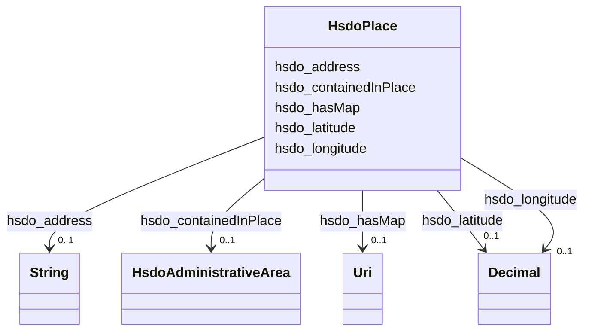

# Class: Place (hsdo_Place)


_Entities that have a somewhat fixed, physical extension._


This class occurs 87 times.


URI: [hsdo:Place](http://schema.org/Place)





<!-- no inheritance hierarchy -->


## Slots

| Name | Cardinality and Range | Description | Inheritance | Occurrences |
| ---  | --- | --- | --- | --- |
| [hsdo_longitude](../slots/hsdo_longitude.md) | 0..1 <br/> [xsd:decimal](http://www.w3.org/2001/XMLSchema#decimal) | The longitude of a location <br/>  | direct | 89 |
| [hsdo_containedInPlace](../slots/hsdo_containedInPlace.md) | 0..1 <br/> [HsdoAdministrativeArea](../classes/HsdoAdministrativeArea.md) | The basic containment relation between a place and one that contains it <br/>  | direct | 88 |
| [hsdo_latitude](../slots/hsdo_latitude.md) | 0..1 <br/> [xsd:decimal](http://www.w3.org/2001/XMLSchema#decimal) | The latitude of a location <br/>  | direct | 89 |
| [hsdo_hasMap](../slots/hsdo_hasMap.md) | 0..1 <br/> [xsd:anyURI](http://www.w3.org/2001/XMLSchema#anyURI) | A URL to a map of the place <br/>  | direct | 88 |
| [hsdo_address](../slots/hsdo_address.md) | 0..1 <br/> [xsd:string](http://www.w3.org/2001/XMLSchema#string) | Physical address of the item <br/>  | direct | 93 |


## Usages

| used by | used in | type | used |
| ---  | --- | --- | --- |
| [HsdoServiceChannel](../classes/HsdoServiceChannel.md) | [hsdo_serviceLocation](../slots/hsdo_serviceLocation.md) | range | [HsdoPlace](../classes/HsdoPlace.md) |


## LinkML Source

<!-- TODO: investigate https://stackoverflow.com/questions/37606292/how-to-create-tabbed-code-blocks-in-mkdocs-or-sphinx -->

### Direct

<details>

```yaml
name: hsdo_Place
conforms_to: No schema conformance document specified
annotations:
  count:
    tag: count
    value: 87
description: Entities that have a somewhat fixed, physical extension.
title: Place
from_schema: dream-kg
rank: 1000
slots:
- hsdo_longitude
- hsdo_containedInPlace
- hsdo_latitude
- hsdo_hasMap
- hsdo_address
slot_usage:
  hsdo_address:
    name: hsdo_address
    annotations:
      string:
        tag: string
        value: 93
  hsdo_containedInPlace:
    name: hsdo_containedInPlace
    annotations:
      hsdo_AdministrativeArea:
        tag: hsdo_AdministrativeArea
        value: 88
  hsdo_hasMap:
    name: hsdo_hasMap
    annotations:
      uri:
        tag: uri
        value: 88
  hsdo_latitude:
    name: hsdo_latitude
    annotations:
      decimal:
        tag: decimal
        value: 89
  hsdo_longitude:
    name: hsdo_longitude
    annotations:
      decimal:
        tag: decimal
        value: 89
class_uri: hsdo:Place

```
</details>

### Induced

<details>

```yaml
name: hsdo_Place
conforms_to: No schema conformance document specified
annotations:
  count:
    tag: count
    value: 87
description: Entities that have a somewhat fixed, physical extension.
title: Place
from_schema: dream-kg
rank: 1000
slot_usage:
  hsdo_address:
    name: hsdo_address
    annotations:
      string:
        tag: string
        value: 93
  hsdo_containedInPlace:
    name: hsdo_containedInPlace
    annotations:
      hsdo_AdministrativeArea:
        tag: hsdo_AdministrativeArea
        value: 88
  hsdo_hasMap:
    name: hsdo_hasMap
    annotations:
      uri:
        tag: uri
        value: 88
  hsdo_latitude:
    name: hsdo_latitude
    annotations:
      decimal:
        tag: decimal
        value: 89
  hsdo_longitude:
    name: hsdo_longitude
    annotations:
      decimal:
        tag: decimal
        value: 89
attributes:
  hsdo_longitude:
    name: hsdo_longitude
    annotations:
      decimal:
        tag: decimal
        value: 89
    description: The longitude of a location. For example ```-122.08585``` ([WGS 84](https://en.wikipedia.org/wiki/World_Geodetic_System)).
    title: longitude
    examples:
    - description: hsdo_Place→decimal
      object:
        example_object: '-75.1637779'
        example_object_type: decimal
        example_predicate: hsdo:longitude
        example_subject: dreamkg:service/location/5552002522939392
        example_subject_type: hsdo_Place
    from_schema: dream-kg
    rank: 1000
    slot_uri: hsdo:longitude
    alias: hsdo_longitude
    owner: hsdo_Place
    domain_of:
    - hsdo_Place
    range: decimal
  hsdo_containedInPlace:
    name: hsdo_containedInPlace
    annotations:
      hsdo_AdministrativeArea:
        tag: hsdo_AdministrativeArea
        value: 88
    description: The basic containment relation between a place and one that contains
      it.
    title: containedInPlace
    examples:
    - description: hsdo_Place→hsdo_AdministrativeArea
      object:
        example_object: dreamkg:zip/19140
        example_object_type: hsdo_AdministrativeArea
        example_predicate: hsdo:containedInPlace
        example_subject: dreamkg:service/location/5552002522939392
        example_subject_type: hsdo_Place
    from_schema: dream-kg
    rank: 1000
    slot_uri: hsdo:containedInPlace
    alias: hsdo_containedInPlace
    owner: hsdo_Place
    domain_of:
    - hsdo_Place
    range: hsdo_AdministrativeArea
  hsdo_latitude:
    name: hsdo_latitude
    annotations:
      decimal:
        tag: decimal
        value: 89
    description: The latitude of a location. For example ```37.42242``` ([WGS 84](https://en.wikipedia.org/wiki/World_Geodetic_System)).
    title: latitude
    examples:
    - description: hsdo_Place→decimal
      object:
        example_object: '40.0079322'
        example_object_type: decimal
        example_predicate: hsdo:latitude
        example_subject: dreamkg:service/location/5552002522939392
        example_subject_type: hsdo_Place
    from_schema: dream-kg
    rank: 1000
    slot_uri: hsdo:latitude
    alias: hsdo_latitude
    owner: hsdo_Place
    domain_of:
    - hsdo_Place
    range: decimal
  hsdo_hasMap:
    name: hsdo_hasMap
    annotations:
      uri:
        tag: uri
        value: 88
    description: A URL to a map of the place.
    title: hasMap
    examples:
    - description: hsdo_Place→uri
      object:
        example_object: https://www.google.com/maps/?q=2107+West+Tioga+Street,+Philadelphia,+PA+19140/
        example_object_type: uri
        example_predicate: hsdo:hasMap
        example_subject: dreamkg:service/location/5552002522939392
        example_subject_type: hsdo_Place
    from_schema: dream-kg
    rank: 1000
    slot_uri: hsdo:hasMap
    alias: hsdo_hasMap
    owner: hsdo_Place
    domain_of:
    - hsdo_Place
    range: uri
  hsdo_address:
    name: hsdo_address
    annotations:
      string:
        tag: string
        value: 93
    description: Physical address of the item.
    title: address
    examples:
    - description: hsdo_Place→string
      object:
        example_object: 2107 West Tioga Street, Philadelphia, PA 19140
        example_object_type: string
        example_predicate: hsdo:address
        example_subject: dreamkg:service/location/5552002522939392
        example_subject_type: hsdo_Place
    from_schema: dream-kg
    rank: 1000
    slot_uri: hsdo:address
    alias: hsdo_address
    owner: hsdo_Place
    domain_of:
    - hsdo_Place
    range: string
class_uri: hsdo:Place

```
</details>