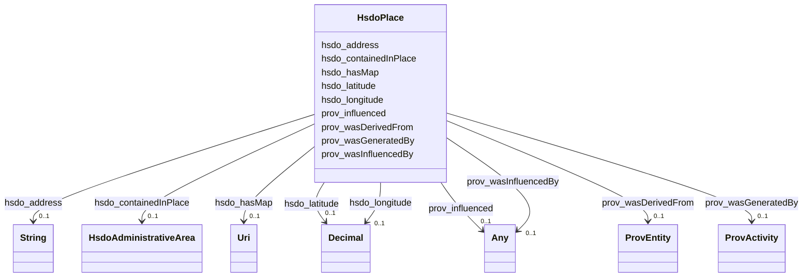

# Class: Place (hsdo_Place)


_Entities that have a somewhat fixed, physical extension._


URI: [hsdo:Place](http://schema.org/Place)





<!-- no inheritance hierarchy -->


## Slots

| Name | Cardinality and Range | Description | Inheritance |
| ---  | --- | --- | --- |
| [prov_wasDerivedFrom](../slots/prov_wasDerivedFrom.md) | 0..1 <br/> [ProvEntity](../classes/ProvEntity.md) | No slot (predicate) description specified <br/> 162 occurrences with subject type hsdo_Audience and object type prov_Entity.<br/>314 occurrences with subject type hsdo_CategoryCode and object type prov_Entity.<br/>174 occurrences with subject type hsdo_Service and object type prov_Entity.<br/>348 occurrences with subject type prov_Entity and object type prov_Entity.<br/>174 occurrences with subject type hsdo_TextObject and object type prov_Entity.<br/>1218 occurrences with subject type hsdo_OpeningHoursSpecification and object type prov_Entity.<br/>174 occurrences with subject type hsdo_Place and object type prov_Entity.<br/>174 occurrences with subject type hsdo_ContactPoint and object type prov_Entity.<br/>174 occurrences with subject type hsdo_Organization and object type prov_Entity.<br/>78 occurrences with subject type hsdo_AdministrativeArea and object type prov_Entity. | direct |
| [prov_wasGeneratedBy](../slots/prov_wasGeneratedBy.md) | 0..1 <br/> [ProvActivity](../classes/ProvActivity.md) | No slot (predicate) description specified <br/> 81 occurrences with subject type hsdo_Audience and object type prov_Activity.<br/>157 occurrences with subject type hsdo_CategoryCode and object type prov_Activity.<br/>87 occurrences with subject type hsdo_Service and object type prov_Activity.<br/>174 occurrences with subject type prov_Entity and object type prov_Activity.<br/>87 occurrences with subject type hsdo_TextObject and object type prov_Activity.<br/>609 occurrences with subject type hsdo_OpeningHoursSpecification and object type prov_Activity.<br/>87 occurrences with subject type hsdo_Place and object type prov_Activity.<br/>87 occurrences with subject type hsdo_ContactPoint and object type prov_Activity.<br/>87 occurrences with subject type hsdo_Organization and object type prov_Activity.<br/>39 occurrences with subject type hsdo_AdministrativeArea and object type prov_Activity. | direct |
| [hsdo_longitude](../slots/hsdo_longitude.md) | 0..1 <br/> [xsd:decimal](xsd:decimal) | No slot (predicate) description specified <br/> 89 occurrences with subject type hsdo_Place and object type decimal. | direct |
| [hsdo_latitude](../slots/hsdo_latitude.md) | 0..1 <br/> [xsd:decimal](xsd:decimal) | No slot (predicate) description specified <br/> 89 occurrences with subject type hsdo_Place and object type decimal. | direct |
| [hsdo_containedInPlace](../slots/hsdo_containedInPlace.md) | 0..1 <br/> [HsdoAdministrativeArea](../classes/HsdoAdministrativeArea.md) | No slot (predicate) description specified <br/> 88 occurrences with subject type hsdo_Place and object type hsdo_AdministrativeArea. | direct |
| [hsdo_hasMap](../slots/hsdo_hasMap.md) | 0..1 <br/> [xsd:anyURI](xsd:anyURI) | No slot (predicate) description specified <br/> 88 occurrences with subject type hsdo_Place and object type uri. | direct |
| [prov_influenced](../slots/prov_influenced.md) | 0..1 <br/> [HsdoCategoryCode](../classes/HsdoCategoryCode.md)&nbsp;or&nbsp;<br />[HsdoAdministrativeArea](../classes/HsdoAdministrativeArea.md)&nbsp;or&nbsp;<br />[HsdoOrganization](../classes/HsdoOrganization.md)&nbsp;or&nbsp;<br />[ProvCollection](../classes/ProvCollection.md)&nbsp;or&nbsp;<br />[HsdoPlace](../classes/HsdoPlace.md)&nbsp;or&nbsp;<br />[HsdoContactPoint](../classes/HsdoContactPoint.md)&nbsp;or&nbsp;<br />[HsdoService](../classes/HsdoService.md)&nbsp;or&nbsp;<br />[ProvEntity](../classes/ProvEntity.md)&nbsp;or&nbsp;<br />[HsdoAudience](../classes/HsdoAudience.md)&nbsp;or&nbsp;<br />[HsdoOpeningHoursSpecification](../classes/HsdoOpeningHoursSpecification.md)&nbsp;or&nbsp;<br />[HsdoTextObject](../classes/HsdoTextObject.md) | No slot (predicate) description specified <br/> 162 occurrences with subject type prov_Entity and object type hsdo_Audience.<br/>314 occurrences with subject type prov_Entity and object type hsdo_CategoryCode.<br/>174 occurrences with subject type prov_Entity and object type hsdo_Service.<br/>348 occurrences with subject type prov_Entity and object type prov_Entity.<br/>174 occurrences with subject type prov_Entity and object type hsdo_TextObject.<br/>1218 occurrences with subject type prov_Entity and object type hsdo_OpeningHoursSpecification.<br/>174 occurrences with subject type prov_Entity and object type hsdo_Place.<br/>174 occurrences with subject type prov_Entity and object type hsdo_ContactPoint.<br/>174 occurrences with subject type prov_Entity and object type hsdo_Organization.<br/>78 occurrences with subject type prov_Entity and object type hsdo_AdministrativeArea.<br/>243 occurrences with untyped subjects and object type hsdo_Audience.<br/>471 occurrences with untyped subjects and object type hsdo_CategoryCode.<br/>117 occurrences with untyped subjects and object type hsdo_AdministrativeArea.<br/>81 occurrences with subject type prov_Activity and object type hsdo_Audience.<br/>157 occurrences with subject type prov_Activity and object type hsdo_CategoryCode.<br/>87 occurrences with subject type prov_Activity and object type hsdo_Service.<br/>174 occurrences with subject type prov_Activity and object type prov_Entity.<br/>87 occurrences with subject type prov_Activity and object type hsdo_TextObject.<br/>609 occurrences with subject type prov_Activity and object type hsdo_OpeningHoursSpecification.<br/>87 occurrences with subject type prov_Activity and object type hsdo_Place.<br/>87 occurrences with subject type prov_Activity and object type hsdo_ContactPoint.<br/>87 occurrences with subject type prov_Activity and object type hsdo_Organization.<br/>39 occurrences with subject type prov_Activity and object type hsdo_AdministrativeArea.<br/>87 occurrences with subject type hsdo_Service and object type prov_Collection.<br/>174 occurrences with subject type prov_Entity and object type prov_Collection.<br/>87 occurrences with subject type hsdo_TextObject and object type prov_Collection.<br/>609 occurrences with subject type hsdo_OpeningHoursSpecification and object type prov_Collection.<br/>87 occurrences with subject type hsdo_Place and object type prov_Collection.<br/>87 occurrences with subject type hsdo_ContactPoint and object type prov_Collection.<br/>87 occurrences with subject type hsdo_Organization and object type prov_Collection.<br/>87 occurrences with subject type hsdo_WebPage and object type prov_Collection.<br/>87 occurrences with subject type hsdo_WebPage and object type hsdo_Service.<br/>174 occurrences with subject type hsdo_WebPage and object type prov_Entity.<br/>87 occurrences with subject type hsdo_WebPage and object type hsdo_TextObject.<br/>609 occurrences with subject type hsdo_WebPage and object type hsdo_OpeningHoursSpecification.<br/>87 occurrences with subject type hsdo_WebPage and object type hsdo_Place.<br/>87 occurrences with subject type hsdo_WebPage and object type hsdo_ContactPoint.<br/>87 occurrences with subject type hsdo_WebPage and object type hsdo_Organization. | direct |
| [prov_wasInfluencedBy](../slots/prov_wasInfluencedBy.md) | 0..1 <br/> [HsdoWebPage](../classes/HsdoWebPage.md)&nbsp;or&nbsp;<br />[HsdoOrganization](../classes/HsdoOrganization.md)&nbsp;or&nbsp;<br />[xsd:anyURI](xsd:anyURI)&nbsp;or&nbsp;<br />[ProvActivity](../classes/ProvActivity.md)&nbsp;or&nbsp;<br />[HsdoPlace](../classes/HsdoPlace.md)&nbsp;or&nbsp;<br />[HsdoContactPoint](../classes/HsdoContactPoint.md)&nbsp;or&nbsp;<br />[HsdoService](../classes/HsdoService.md)&nbsp;or&nbsp;<br />[ProvEntity](../classes/ProvEntity.md)&nbsp;or&nbsp;<br />[HsdoOpeningHoursSpecification](../classes/HsdoOpeningHoursSpecification.md)&nbsp;or&nbsp;<br />[HsdoTextObject](../classes/HsdoTextObject.md) | No slot (predicate) description specified <br/> 162 occurrences with subject type hsdo_Audience and object type prov_Entity.<br/>243 occurrences with subject type hsdo_Audience and object type uri.<br/>81 occurrences with subject type hsdo_Audience and object type prov_Activity.<br/>314 occurrences with subject type hsdo_CategoryCode and object type prov_Entity.<br/>471 occurrences with subject type hsdo_CategoryCode and object type uri.<br/>157 occurrences with subject type hsdo_CategoryCode and object type prov_Activity.<br/>87 occurrences with subject type prov_Collection and object type hsdo_Service.<br/>174 occurrences with subject type prov_Collection and object type prov_Entity.<br/>87 occurrences with subject type prov_Collection and object type hsdo_TextObject.<br/>609 occurrences with subject type prov_Collection and object type hsdo_OpeningHoursSpecification.<br/>87 occurrences with subject type prov_Collection and object type hsdo_Place.<br/>87 occurrences with subject type prov_Collection and object type hsdo_ContactPoint.<br/>87 occurrences with subject type prov_Collection and object type hsdo_Organization.<br/>87 occurrences with subject type prov_Collection and object type hsdo_WebPage.<br/>174 occurrences with subject type hsdo_Service and object type prov_Entity.<br/>87 occurrences with subject type hsdo_Service and object type prov_Activity.<br/>87 occurrences with subject type hsdo_Service and object type hsdo_WebPage.<br/>348 occurrences with subject type prov_Entity and object type prov_Entity.<br/>174 occurrences with subject type prov_Entity and object type prov_Activity.<br/>174 occurrences with subject type prov_Entity and object type hsdo_WebPage.<br/>174 occurrences with subject type hsdo_TextObject and object type prov_Entity.<br/>87 occurrences with subject type hsdo_TextObject and object type prov_Activity.<br/>87 occurrences with subject type hsdo_TextObject and object type hsdo_WebPage.<br/>1218 occurrences with subject type hsdo_OpeningHoursSpecification and object type prov_Entity.<br/>609 occurrences with subject type hsdo_OpeningHoursSpecification and object type prov_Activity.<br/>609 occurrences with subject type hsdo_OpeningHoursSpecification and object type hsdo_WebPage.<br/>174 occurrences with subject type hsdo_Place and object type prov_Entity.<br/>87 occurrences with subject type hsdo_Place and object type prov_Activity.<br/>87 occurrences with subject type hsdo_Place and object type hsdo_WebPage.<br/>174 occurrences with subject type hsdo_ContactPoint and object type prov_Entity.<br/>87 occurrences with subject type hsdo_ContactPoint and object type prov_Activity.<br/>87 occurrences with subject type hsdo_ContactPoint and object type hsdo_WebPage.<br/>174 occurrences with subject type hsdo_Organization and object type prov_Entity.<br/>87 occurrences with subject type hsdo_Organization and object type prov_Activity.<br/>87 occurrences with subject type hsdo_Organization and object type hsdo_WebPage.<br/>78 occurrences with subject type hsdo_AdministrativeArea and object type prov_Entity.<br/>117 occurrences with subject type hsdo_AdministrativeArea and object type uri.<br/>39 occurrences with subject type hsdo_AdministrativeArea and object type prov_Activity. | direct |
| [hsdo_address](../slots/hsdo_address.md) | 0..1 <br/> [xsd:string](xsd:string) | No slot (predicate) description specified <br/> 93 occurrences with subject type hsdo_Place and object type string. | direct |


## Usages

| used by | used in | type | used |
| ---  | --- | --- | --- |
| [HsdoAdministrativeArea](../classes/HsdoAdministrativeArea.md) | [prov_wasInfluencedBy](../slots/prov_wasInfluencedBy.md) | any_of[range] | [HsdoPlace](../classes/HsdoPlace.md) |
| [HsdoAudience](../classes/HsdoAudience.md) | [prov_wasInfluencedBy](../slots/prov_wasInfluencedBy.md) | any_of[range] | [HsdoPlace](../classes/HsdoPlace.md) |
| [HsdoCategoryCode](../classes/HsdoCategoryCode.md) | [prov_wasInfluencedBy](../slots/prov_wasInfluencedBy.md) | any_of[range] | [HsdoPlace](../classes/HsdoPlace.md) |
| [HsdoContactPoint](../classes/HsdoContactPoint.md) | [prov_influenced](../slots/prov_influenced.md) | any_of[range] | [HsdoPlace](../classes/HsdoPlace.md) |
| [HsdoContactPoint](../classes/HsdoContactPoint.md) | [prov_wasInfluencedBy](../slots/prov_wasInfluencedBy.md) | any_of[range] | [HsdoPlace](../classes/HsdoPlace.md) |
| [HsdoOpeningHoursSpecification](../classes/HsdoOpeningHoursSpecification.md) | [prov_influenced](../slots/prov_influenced.md) | any_of[range] | [HsdoPlace](../classes/HsdoPlace.md) |
| [HsdoOpeningHoursSpecification](../classes/HsdoOpeningHoursSpecification.md) | [prov_wasInfluencedBy](../slots/prov_wasInfluencedBy.md) | any_of[range] | [HsdoPlace](../classes/HsdoPlace.md) |
| [HsdoOrganization](../classes/HsdoOrganization.md) | [prov_influenced](../slots/prov_influenced.md) | any_of[range] | [HsdoPlace](../classes/HsdoPlace.md) |
| [HsdoOrganization](../classes/HsdoOrganization.md) | [prov_wasInfluencedBy](../slots/prov_wasInfluencedBy.md) | any_of[range] | [HsdoPlace](../classes/HsdoPlace.md) |
| [HsdoPlace](../classes/HsdoPlace.md) | [prov_influenced](../slots/prov_influenced.md) | any_of[range] | [HsdoPlace](../classes/HsdoPlace.md) |
| [HsdoPlace](../classes/HsdoPlace.md) | [prov_wasInfluencedBy](../slots/prov_wasInfluencedBy.md) | any_of[range] | [HsdoPlace](../classes/HsdoPlace.md) |
| [HsdoService](../classes/HsdoService.md) | [prov_influenced](../slots/prov_influenced.md) | any_of[range] | [HsdoPlace](../classes/HsdoPlace.md) |
| [HsdoService](../classes/HsdoService.md) | [prov_wasInfluencedBy](../slots/prov_wasInfluencedBy.md) | any_of[range] | [HsdoPlace](../classes/HsdoPlace.md) |
| [HsdoServiceChannel](../classes/HsdoServiceChannel.md) | [hsdo_serviceLocation](../slots/hsdo_serviceLocation.md) | range | [HsdoPlace](../classes/HsdoPlace.md) |
| [HsdoTextObject](../classes/HsdoTextObject.md) | [prov_influenced](../slots/prov_influenced.md) | any_of[range] | [HsdoPlace](../classes/HsdoPlace.md) |
| [HsdoTextObject](../classes/HsdoTextObject.md) | [prov_wasInfluencedBy](../slots/prov_wasInfluencedBy.md) | any_of[range] | [HsdoPlace](../classes/HsdoPlace.md) |
| [HsdoWebPage](../classes/HsdoWebPage.md) | [prov_influenced](../slots/prov_influenced.md) | any_of[range] | [HsdoPlace](../classes/HsdoPlace.md) |
| [ProvActivity](../classes/ProvActivity.md) | [prov_influenced](../slots/prov_influenced.md) | any_of[range] | [HsdoPlace](../classes/HsdoPlace.md) |
| [ProvActivity](../classes/ProvActivity.md) | [prov_generated](../slots/prov_generated.md) | any_of[range] | [HsdoPlace](../classes/HsdoPlace.md) |
| [ProvCollection](../classes/ProvCollection.md) | [prov_hadMember](../slots/prov_hadMember.md) | any_of[range] | [HsdoPlace](../classes/HsdoPlace.md) |
| [ProvCollection](../classes/ProvCollection.md) | [prov_wasInfluencedBy](../slots/prov_wasInfluencedBy.md) | any_of[range] | [HsdoPlace](../classes/HsdoPlace.md) |
| [ProvEntity](../classes/ProvEntity.md) | [prov_influenced](../slots/prov_influenced.md) | any_of[range] | [HsdoPlace](../classes/HsdoPlace.md) |
| [ProvEntity](../classes/ProvEntity.md) | [prov_wasInfluencedBy](../slots/prov_wasInfluencedBy.md) | any_of[range] | [HsdoPlace](../classes/HsdoPlace.md) |


## Identifier and Mapping Information


### Schema Source


* from schema: dream-kg


## Mappings

| Mapping Type | Mapped Value |
| ---  | ---  |
| self | hsdo:Place |
| native | dream-kg/:HsdoPlace |


## LinkML Source

<!-- TODO: investigate https://stackoverflow.com/questions/37606292/how-to-create-tabbed-code-blocks-in-mkdocs-or-sphinx -->

### Direct

<details>
```yaml
name: hsdo_Place
conforms_to: No schema conformance document specified
description: Entities that have a somewhat fixed, physical extension.
title: Place
notes:
- Class with 87 occurrences.
from_schema: dream-kg
rank: 1000
slots:
- prov_wasDerivedFrom
- prov_wasGeneratedBy
- hsdo_longitude
- hsdo_latitude
- hsdo_containedInPlace
- hsdo_hasMap
- prov_influenced
- prov_wasInfluencedBy
- hsdo_address
class_uri: hsdo:Place

```
</details>

### Induced

<details>
```yaml
name: hsdo_Place
conforms_to: No schema conformance document specified
description: Entities that have a somewhat fixed, physical extension.
title: Place
notes:
- Class with 87 occurrences.
from_schema: dream-kg
rank: 1000
attributes:
  prov_wasDerivedFrom:
    name: prov_wasDerivedFrom
    description: No slot (predicate) description specified
    comments:
    - 162 occurrences with subject type hsdo_Audience and object type prov_Entity.
    - 314 occurrences with subject type hsdo_CategoryCode and object type prov_Entity.
    - 174 occurrences with subject type hsdo_Service and object type prov_Entity.
    - 348 occurrences with subject type prov_Entity and object type prov_Entity.
    - 174 occurrences with subject type hsdo_TextObject and object type prov_Entity.
    - 1218 occurrences with subject type hsdo_OpeningHoursSpecification and object
      type prov_Entity.
    - 174 occurrences with subject type hsdo_Place and object type prov_Entity.
    - 174 occurrences with subject type hsdo_ContactPoint and object type prov_Entity.
    - 174 occurrences with subject type hsdo_Organization and object type prov_Entity.
    - 78 occurrences with subject type hsdo_AdministrativeArea and object type prov_Entity.
    examples:
    - description: hsdo_Audience → prov_Entity
      object:
        example_object: dreamkg:file/IJCAI/mappings/ontology.obda
        example_object_type: prov_Entity
        example_predicate: prov:wasDerivedFrom
        example_subject: dreamkg:category/audience/YoungAdults
        example_subject_type: hsdo_Audience
    - description: hsdo_CategoryCode → prov_Entity
      object:
        example_object: dreamkg:file/IJCAI/mappings/ontology.obda
        example_object_type: prov_Entity
        example_predicate: prov:wasDerivedFrom
        example_subject: dreamkg:category/service/other/WeatherRelief
        example_subject_type: hsdo_CategoryCode
    - description: hsdo_Service → prov_Entity
      object:
        example_object: dreamkg:file/IJCAI/mappings/ontology.obda
        example_object_type: prov_Entity
        example_predicate: prov:wasDerivedFrom
        example_subject: dreamkg:service/6710596967858176
        example_subject_type: hsdo_Service
    - description: prov_Entity → prov_Entity
      object:
        example_object: dreamkg:file/IJCAI/mappings/ontology.obda
        example_object_type: prov_Entity
        example_predicate: prov:wasDerivedFrom
        example_subject: dreamkg:service/channel/P--6710596967858176
        example_subject_type: prov_Entity
    - description: hsdo_TextObject → prov_Entity
      object:
        example_object: dreamkg:file/IJCAI/mappings/ontology.obda
        example_object_type: prov_Entity
        example_predicate: prov:wasDerivedFrom
        example_subject: dreamkg:service/desc/6710596967858176
        example_subject_type: hsdo_TextObject
    - description: hsdo_OpeningHoursSpecification → prov_Entity
      object:
        example_object: dreamkg:file/IJCAI/mappings/ontology.obda
        example_object_type: prov_Entity
        example_predicate: prov:wasDerivedFrom
        example_subject: dreamkg:service/hours/wednesday/6710596967858176
        example_subject_type: hsdo_OpeningHoursSpecification
    - description: hsdo_Place → prov_Entity
      object:
        example_object: dreamkg:file/IJCAI/mappings/ontology.obda
        example_object_type: prov_Entity
        example_predicate: prov:wasDerivedFrom
        example_subject: dreamkg:service/location/6710596967858176
        example_subject_type: hsdo_Place
    - description: hsdo_ContactPoint → prov_Entity
      object:
        example_object: dreamkg:file/IJCAI/mappings/ontology.obda
        example_object_type: prov_Entity
        example_predicate: prov:wasDerivedFrom
        example_subject: dreamkg:service/phone/6710596967858176
        example_subject_type: hsdo_ContactPoint
    - description: hsdo_Organization → prov_Entity
      object:
        example_object: dreamkg:file/IJCAI/mappings/ontology.obda
        example_object_type: prov_Entity
        example_predicate: prov:wasDerivedFrom
        example_subject: dreamkg:service/provider/6710596967858176
        example_subject_type: hsdo_Organization
    - description: hsdo_AdministrativeArea → prov_Entity
      object:
        example_object: dreamkg:file/IJCAI/mappings/ontology.obda
        example_object_type: prov_Entity
        example_predicate: prov:wasDerivedFrom
        example_subject: dreamkg:zip/19320
        example_subject_type: hsdo_AdministrativeArea
    from_schema: dream-kg
    rank: 1000
    slot_uri: prov:wasDerivedFrom
    alias: prov_wasDerivedFrom
    owner: hsdo_Place
    domain_of:
    - hsdo_AdministrativeArea
    - hsdo_Audience
    - hsdo_CategoryCode
    - hsdo_ContactPoint
    - hsdo_OpeningHoursSpecification
    - hsdo_Organization
    - hsdo_Place
    - hsdo_Service
    - hsdo_TextObject
    - prov_Entity
    range: prov_Entity
  prov_wasGeneratedBy:
    name: prov_wasGeneratedBy
    description: No slot (predicate) description specified
    comments:
    - 81 occurrences with subject type hsdo_Audience and object type prov_Activity.
    - 157 occurrences with subject type hsdo_CategoryCode and object type prov_Activity.
    - 87 occurrences with subject type hsdo_Service and object type prov_Activity.
    - 174 occurrences with subject type prov_Entity and object type prov_Activity.
    - 87 occurrences with subject type hsdo_TextObject and object type prov_Activity.
    - 609 occurrences with subject type hsdo_OpeningHoursSpecification and object
      type prov_Activity.
    - 87 occurrences with subject type hsdo_Place and object type prov_Activity.
    - 87 occurrences with subject type hsdo_ContactPoint and object type prov_Activity.
    - 87 occurrences with subject type hsdo_Organization and object type prov_Activity.
    - 39 occurrences with subject type hsdo_AdministrativeArea and object type prov_Activity.
    examples:
    - description: hsdo_Audience → prov_Activity
      object:
        example_object: dreamkg:process/run/ontop-CM
        example_object_type: prov_Activity
        example_predicate: prov:wasGeneratedBy
        example_subject: dreamkg:category/audience/YoungAdults
        example_subject_type: hsdo_Audience
    - description: hsdo_CategoryCode → prov_Activity
      object:
        example_object: dreamkg:process/run/ontop-CM
        example_object_type: prov_Activity
        example_predicate: prov:wasGeneratedBy
        example_subject: dreamkg:category/service/other/WeatherRelief
        example_subject_type: hsdo_CategoryCode
    - description: hsdo_Service → prov_Activity
      object:
        example_object: dreamkg:process/run/ontop-CM
        example_object_type: prov_Activity
        example_predicate: prov:wasGeneratedBy
        example_subject: dreamkg:service/6710596967858176
        example_subject_type: hsdo_Service
    - description: prov_Entity → prov_Activity
      object:
        example_object: dreamkg:process/run/ontop-CM
        example_object_type: prov_Activity
        example_predicate: prov:wasGeneratedBy
        example_subject: dreamkg:service/channel/P--6710596967858176
        example_subject_type: prov_Entity
    - description: hsdo_TextObject → prov_Activity
      object:
        example_object: dreamkg:process/run/ontop-CM
        example_object_type: prov_Activity
        example_predicate: prov:wasGeneratedBy
        example_subject: dreamkg:service/desc/6710596967858176
        example_subject_type: hsdo_TextObject
    - description: hsdo_OpeningHoursSpecification → prov_Activity
      object:
        example_object: dreamkg:process/run/ontop-CM
        example_object_type: prov_Activity
        example_predicate: prov:wasGeneratedBy
        example_subject: dreamkg:service/hours/wednesday/6710596967858176
        example_subject_type: hsdo_OpeningHoursSpecification
    - description: hsdo_Place → prov_Activity
      object:
        example_object: dreamkg:process/run/ontop-CM
        example_object_type: prov_Activity
        example_predicate: prov:wasGeneratedBy
        example_subject: dreamkg:service/location/6710596967858176
        example_subject_type: hsdo_Place
    - description: hsdo_ContactPoint → prov_Activity
      object:
        example_object: dreamkg:process/run/ontop-CM
        example_object_type: prov_Activity
        example_predicate: prov:wasGeneratedBy
        example_subject: dreamkg:service/phone/6710596967858176
        example_subject_type: hsdo_ContactPoint
    - description: hsdo_Organization → prov_Activity
      object:
        example_object: dreamkg:process/run/ontop-CM
        example_object_type: prov_Activity
        example_predicate: prov:wasGeneratedBy
        example_subject: dreamkg:service/provider/6710596967858176
        example_subject_type: hsdo_Organization
    - description: hsdo_AdministrativeArea → prov_Activity
      object:
        example_object: dreamkg:process/run/ontop-CM
        example_object_type: prov_Activity
        example_predicate: prov:wasGeneratedBy
        example_subject: dreamkg:zip/19320
        example_subject_type: hsdo_AdministrativeArea
    from_schema: dream-kg
    rank: 1000
    slot_uri: prov:wasGeneratedBy
    alias: prov_wasGeneratedBy
    owner: hsdo_Place
    domain_of:
    - hsdo_AdministrativeArea
    - hsdo_Audience
    - hsdo_CategoryCode
    - hsdo_ContactPoint
    - hsdo_OpeningHoursSpecification
    - hsdo_Organization
    - hsdo_Place
    - hsdo_Service
    - hsdo_TextObject
    - prov_Entity
    range: prov_Activity
  hsdo_longitude:
    name: hsdo_longitude
    description: No slot (predicate) description specified
    comments:
    - 89 occurrences with subject type hsdo_Place and object type decimal.
    examples:
    - description: hsdo_Place → decimal
      object:
        example_object: '-75.239064'
        example_object_type: decimal
        example_predicate: hsdo:longitude
        example_subject: dreamkg:service/location/4542572480692224
        example_subject_type: hsdo_Place
    from_schema: dream-kg
    rank: 1000
    slot_uri: hsdo:longitude
    alias: hsdo_longitude
    owner: hsdo_Place
    domain_of:
    - hsdo_Place
    range: decimal
  hsdo_latitude:
    name: hsdo_latitude
    description: No slot (predicate) description specified
    comments:
    - 89 occurrences with subject type hsdo_Place and object type decimal.
    examples:
    - description: hsdo_Place → decimal
      object:
        example_object: '39.9028317'
        example_object_type: decimal
        example_predicate: hsdo:latitude
        example_subject: dreamkg:service/location/4542572480692224
        example_subject_type: hsdo_Place
    from_schema: dream-kg
    rank: 1000
    slot_uri: hsdo:latitude
    alias: hsdo_latitude
    owner: hsdo_Place
    domain_of:
    - hsdo_Place
    range: decimal
  hsdo_containedInPlace:
    name: hsdo_containedInPlace
    description: No slot (predicate) description specified
    comments:
    - 88 occurrences with subject type hsdo_Place and object type hsdo_AdministrativeArea.
    examples:
    - description: hsdo_Place → hsdo_AdministrativeArea
      object:
        example_object: dreamkg:zip/19104
        example_object_type: hsdo_AdministrativeArea
        example_predicate: hsdo:containedInPlace
        example_subject: dreamkg:service/location/6710596967858176
        example_subject_type: hsdo_Place
    from_schema: dream-kg
    rank: 1000
    slot_uri: hsdo:containedInPlace
    alias: hsdo_containedInPlace
    owner: hsdo_Place
    domain_of:
    - hsdo_Place
    range: hsdo_AdministrativeArea
  hsdo_hasMap:
    name: hsdo_hasMap
    description: No slot (predicate) description specified
    comments:
    - 88 occurrences with subject type hsdo_Place and object type uri.
    examples:
    - description: hsdo_Place → uri
      object:
        example_object: https://www.google.com/maps/?q=2901+Island+Avenue,+Philadelphia,+PA+19153/
        example_object_type: uri
        example_predicate: hsdo:hasMap
        example_subject: dreamkg:service/location/4542572480692224
        example_subject_type: hsdo_Place
    from_schema: dream-kg
    rank: 1000
    slot_uri: hsdo:hasMap
    alias: hsdo_hasMap
    owner: hsdo_Place
    domain_of:
    - hsdo_Place
    range: uri
  prov_influenced:
    name: prov_influenced
    description: No slot (predicate) description specified
    comments:
    - 162 occurrences with subject type prov_Entity and object type hsdo_Audience.
    - 314 occurrences with subject type prov_Entity and object type hsdo_CategoryCode.
    - 174 occurrences with subject type prov_Entity and object type hsdo_Service.
    - 348 occurrences with subject type prov_Entity and object type prov_Entity.
    - 174 occurrences with subject type prov_Entity and object type hsdo_TextObject.
    - 1218 occurrences with subject type prov_Entity and object type hsdo_OpeningHoursSpecification.
    - 174 occurrences with subject type prov_Entity and object type hsdo_Place.
    - 174 occurrences with subject type prov_Entity and object type hsdo_ContactPoint.
    - 174 occurrences with subject type prov_Entity and object type hsdo_Organization.
    - 78 occurrences with subject type prov_Entity and object type hsdo_AdministrativeArea.
    - 243 occurrences with untyped subjects and object type hsdo_Audience.
    - 471 occurrences with untyped subjects and object type hsdo_CategoryCode.
    - 117 occurrences with untyped subjects and object type hsdo_AdministrativeArea.
    - 81 occurrences with subject type prov_Activity and object type hsdo_Audience.
    - 157 occurrences with subject type prov_Activity and object type hsdo_CategoryCode.
    - 87 occurrences with subject type prov_Activity and object type hsdo_Service.
    - 174 occurrences with subject type prov_Activity and object type prov_Entity.
    - 87 occurrences with subject type prov_Activity and object type hsdo_TextObject.
    - 609 occurrences with subject type prov_Activity and object type hsdo_OpeningHoursSpecification.
    - 87 occurrences with subject type prov_Activity and object type hsdo_Place.
    - 87 occurrences with subject type prov_Activity and object type hsdo_ContactPoint.
    - 87 occurrences with subject type prov_Activity and object type hsdo_Organization.
    - 39 occurrences with subject type prov_Activity and object type hsdo_AdministrativeArea.
    - 87 occurrences with subject type hsdo_Service and object type prov_Collection.
    - 174 occurrences with subject type prov_Entity and object type prov_Collection.
    - 87 occurrences with subject type hsdo_TextObject and object type prov_Collection.
    - 609 occurrences with subject type hsdo_OpeningHoursSpecification and object
      type prov_Collection.
    - 87 occurrences with subject type hsdo_Place and object type prov_Collection.
    - 87 occurrences with subject type hsdo_ContactPoint and object type prov_Collection.
    - 87 occurrences with subject type hsdo_Organization and object type prov_Collection.
    - 87 occurrences with subject type hsdo_WebPage and object type prov_Collection.
    - 87 occurrences with subject type hsdo_WebPage and object type hsdo_Service.
    - 174 occurrences with subject type hsdo_WebPage and object type prov_Entity.
    - 87 occurrences with subject type hsdo_WebPage and object type hsdo_TextObject.
    - 609 occurrences with subject type hsdo_WebPage and object type hsdo_OpeningHoursSpecification.
    - 87 occurrences with subject type hsdo_WebPage and object type hsdo_Place.
    - 87 occurrences with subject type hsdo_WebPage and object type hsdo_ContactPoint.
    - 87 occurrences with subject type hsdo_WebPage and object type hsdo_Organization.
    examples:
    - description: prov_Entity → hsdo_Audience
      object:
        example_object: dreamkg:category/audience/YoungAdults
        example_object_type: hsdo_Audience
        example_predicate: prov:influenced
        example_subject: dreamkg:file/IJCAI/mappings/ontology.obda
        example_subject_type: prov_Entity
    - description: prov_Entity → hsdo_CategoryCode
      object:
        example_object: dreamkg:category/service/other/WeatherRelief
        example_object_type: hsdo_CategoryCode
        example_predicate: prov:influenced
        example_subject: dreamkg:file/IJCAI/mappings/ontology.obda
        example_subject_type: prov_Entity
    - description: prov_Entity → hsdo_Service
      object:
        example_object: dreamkg:service/6710596967858176
        example_object_type: hsdo_Service
        example_predicate: prov:influenced
        example_subject: dreamkg:file/IJCAI/mappings/ontology.obda
        example_subject_type: prov_Entity
    - description: prov_Entity → prov_Entity
      object:
        example_object: dreamkg:service/channel/P--6710596967858176
        example_object_type: prov_Entity
        example_predicate: prov:influenced
        example_subject: dreamkg:file/IJCAI/mappings/ontology.obda
        example_subject_type: prov_Entity
    - description: prov_Entity → hsdo_TextObject
      object:
        example_object: dreamkg:service/desc/6710596967858176
        example_object_type: hsdo_TextObject
        example_predicate: prov:influenced
        example_subject: dreamkg:file/IJCAI/mappings/ontology.obda
        example_subject_type: prov_Entity
    - description: prov_Entity → hsdo_OpeningHoursSpecification
      object:
        example_object: dreamkg:service/hours/wednesday/6710596967858176
        example_object_type: hsdo_OpeningHoursSpecification
        example_predicate: prov:influenced
        example_subject: dreamkg:file/IJCAI/mappings/ontology.obda
        example_subject_type: prov_Entity
    - description: prov_Entity → hsdo_Place
      object:
        example_object: dreamkg:service/location/6710596967858176
        example_object_type: hsdo_Place
        example_predicate: prov:influenced
        example_subject: dreamkg:file/IJCAI/mappings/ontology.obda
        example_subject_type: prov_Entity
    - description: prov_Entity → hsdo_ContactPoint
      object:
        example_object: dreamkg:service/phone/6710596967858176
        example_object_type: hsdo_ContactPoint
        example_predicate: prov:influenced
        example_subject: dreamkg:file/IJCAI/mappings/ontology.obda
        example_subject_type: prov_Entity
    - description: prov_Entity → hsdo_Organization
      object:
        example_object: dreamkg:service/provider/6710596967858176
        example_object_type: hsdo_Organization
        example_predicate: prov:influenced
        example_subject: dreamkg:file/IJCAI/mappings/ontology.obda
        example_subject_type: prov_Entity
    - description: prov_Entity → hsdo_AdministrativeArea
      object:
        example_object: dreamkg:zip/19320
        example_object_type: hsdo_AdministrativeArea
        example_predicate: prov:influenced
        example_subject: dreamkg:file/IJCAI/mappings/ontology.obda
        example_subject_type: prov_Entity
    - description: None → hsdo_Audience
      object:
        example_object: dreamkg:category/audience/YoungAdults
        example_object_type: hsdo_Audience
        example_predicate: prov:influenced
        example_subject: dreamkg:file/AuntBertha/UpToDateVersions/Final_Temporary_Shelter_20240109.csv
        example_subject_type: None
    - description: None → hsdo_CategoryCode
      object:
        example_object: dreamkg:category/service/other/WeatherRelief
        example_object_type: hsdo_CategoryCode
        example_predicate: prov:influenced
        example_subject: dreamkg:file/AuntBertha/UpToDateVersions/Final_Temporary_Shelter_20240109.csv
        example_subject_type: None
    - description: None → hsdo_AdministrativeArea
      object:
        example_object: dreamkg:zip/19320
        example_object_type: hsdo_AdministrativeArea
        example_predicate: prov:influenced
        example_subject: dreamkg:file/AuntBertha/UpToDateVersions/Final_Temporary_Shelter_20240109.csv
        example_subject_type: None
    - description: prov_Activity → hsdo_Audience
      object:
        example_object: dreamkg:category/audience/YoungAdults
        example_object_type: hsdo_Audience
        example_predicate: prov:influenced
        example_subject: dreamkg:process/run/ontop-CM
        example_subject_type: prov_Activity
    - description: prov_Activity → hsdo_CategoryCode
      object:
        example_object: dreamkg:category/service/other/WeatherRelief
        example_object_type: hsdo_CategoryCode
        example_predicate: prov:influenced
        example_subject: dreamkg:process/run/ontop-CM
        example_subject_type: prov_Activity
    - description: prov_Activity → hsdo_Service
      object:
        example_object: dreamkg:service/6710596967858176
        example_object_type: hsdo_Service
        example_predicate: prov:influenced
        example_subject: dreamkg:process/run/ontop-CM
        example_subject_type: prov_Activity
    - description: prov_Activity → prov_Entity
      object:
        example_object: dreamkg:service/channel/P--6710596967858176
        example_object_type: prov_Entity
        example_predicate: prov:influenced
        example_subject: dreamkg:process/run/ontop-CM
        example_subject_type: prov_Activity
    - description: prov_Activity → hsdo_TextObject
      object:
        example_object: dreamkg:service/desc/6710596967858176
        example_object_type: hsdo_TextObject
        example_predicate: prov:influenced
        example_subject: dreamkg:process/run/ontop-CM
        example_subject_type: prov_Activity
    - description: prov_Activity → hsdo_OpeningHoursSpecification
      object:
        example_object: dreamkg:service/hours/wednesday/6710596967858176
        example_object_type: hsdo_OpeningHoursSpecification
        example_predicate: prov:influenced
        example_subject: dreamkg:process/run/ontop-CM
        example_subject_type: prov_Activity
    - description: prov_Activity → hsdo_Place
      object:
        example_object: dreamkg:service/location/6710596967858176
        example_object_type: hsdo_Place
        example_predicate: prov:influenced
        example_subject: dreamkg:process/run/ontop-CM
        example_subject_type: prov_Activity
    - description: prov_Activity → hsdo_ContactPoint
      object:
        example_object: dreamkg:service/phone/6710596967858176
        example_object_type: hsdo_ContactPoint
        example_predicate: prov:influenced
        example_subject: dreamkg:process/run/ontop-CM
        example_subject_type: prov_Activity
    - description: prov_Activity → hsdo_Organization
      object:
        example_object: dreamkg:service/provider/6710596967858176
        example_object_type: hsdo_Organization
        example_predicate: prov:influenced
        example_subject: dreamkg:process/run/ontop-CM
        example_subject_type: prov_Activity
    - description: prov_Activity → hsdo_AdministrativeArea
      object:
        example_object: dreamkg:zip/19320
        example_object_type: hsdo_AdministrativeArea
        example_predicate: prov:influenced
        example_subject: dreamkg:process/run/ontop-CM
        example_subject_type: prov_Activity
    - description: hsdo_Service → prov_Collection
      object:
        example_object: dreamkg:file/kg.ttl
        example_object_type: prov_Collection
        example_predicate: prov:influenced
        example_subject: dreamkg:service/6710596967858176
        example_subject_type: hsdo_Service
    - description: prov_Entity → prov_Collection
      object:
        example_object: dreamkg:file/kg.ttl
        example_object_type: prov_Collection
        example_predicate: prov:influenced
        example_subject: dreamkg:service/channel/P--6710596967858176
        example_subject_type: prov_Entity
    - description: hsdo_TextObject → prov_Collection
      object:
        example_object: dreamkg:file/kg.ttl
        example_object_type: prov_Collection
        example_predicate: prov:influenced
        example_subject: dreamkg:service/desc/6710596967858176
        example_subject_type: hsdo_TextObject
    - description: hsdo_OpeningHoursSpecification → prov_Collection
      object:
        example_object: dreamkg:file/kg.ttl
        example_object_type: prov_Collection
        example_predicate: prov:influenced
        example_subject: dreamkg:service/hours/wednesday/6710596967858176
        example_subject_type: hsdo_OpeningHoursSpecification
    - description: hsdo_Place → prov_Collection
      object:
        example_object: dreamkg:file/kg.ttl
        example_object_type: prov_Collection
        example_predicate: prov:influenced
        example_subject: dreamkg:service/location/6710596967858176
        example_subject_type: hsdo_Place
    - description: hsdo_ContactPoint → prov_Collection
      object:
        example_object: dreamkg:file/kg.ttl
        example_object_type: prov_Collection
        example_predicate: prov:influenced
        example_subject: dreamkg:service/phone/6710596967858176
        example_subject_type: hsdo_ContactPoint
    - description: hsdo_Organization → prov_Collection
      object:
        example_object: dreamkg:file/kg.ttl
        example_object_type: prov_Collection
        example_predicate: prov:influenced
        example_subject: dreamkg:service/provider/6710596967858176
        example_subject_type: hsdo_Organization
    - description: hsdo_WebPage → prov_Collection
      object:
        example_object: dreamkg:outside/ab
        example_object_type: prov_Collection
        example_predicate: prov:influenced
        example_subject: https://www.auntbertha.com//youth-service%252C-inc--philadelphia-pa--youth-emergency-service-%2528yes%2529/5680777996009472
        example_subject_type: hsdo_WebPage
    - description: hsdo_WebPage → hsdo_Service
      object:
        example_object: dreamkg:service/5680777996009472
        example_object_type: hsdo_Service
        example_predicate: prov:influenced
        example_subject: https://www.auntbertha.com//youth-service%252C-inc--philadelphia-pa--youth-emergency-service-%2528yes%2529/5680777996009472
        example_subject_type: hsdo_WebPage
    - description: hsdo_WebPage → prov_Entity
      object:
        example_object: dreamkg:service/channel/P--5680777996009472
        example_object_type: prov_Entity
        example_predicate: prov:influenced
        example_subject: https://www.auntbertha.com//youth-service%252C-inc--philadelphia-pa--youth-emergency-service-%2528yes%2529/5680777996009472
        example_subject_type: hsdo_WebPage
    - description: hsdo_WebPage → hsdo_TextObject
      object:
        example_object: dreamkg:service/desc/5680777996009472
        example_object_type: hsdo_TextObject
        example_predicate: prov:influenced
        example_subject: https://www.auntbertha.com//youth-service%252C-inc--philadelphia-pa--youth-emergency-service-%2528yes%2529/5680777996009472
        example_subject_type: hsdo_WebPage
    - description: hsdo_WebPage → hsdo_OpeningHoursSpecification
      object:
        example_object: dreamkg:service/hours/wednesday/5680777996009472
        example_object_type: hsdo_OpeningHoursSpecification
        example_predicate: prov:influenced
        example_subject: https://www.auntbertha.com//youth-service%252C-inc--philadelphia-pa--youth-emergency-service-%2528yes%2529/5680777996009472
        example_subject_type: hsdo_WebPage
    - description: hsdo_WebPage → hsdo_Place
      object:
        example_object: dreamkg:service/location/5680777996009472
        example_object_type: hsdo_Place
        example_predicate: prov:influenced
        example_subject: https://www.auntbertha.com//youth-service%252C-inc--philadelphia-pa--youth-emergency-service-%2528yes%2529/5680777996009472
        example_subject_type: hsdo_WebPage
    - description: hsdo_WebPage → hsdo_ContactPoint
      object:
        example_object: dreamkg:service/phone/5680777996009472
        example_object_type: hsdo_ContactPoint
        example_predicate: prov:influenced
        example_subject: https://www.auntbertha.com//youth-service%252C-inc--philadelphia-pa--youth-emergency-service-%2528yes%2529/5680777996009472
        example_subject_type: hsdo_WebPage
    - description: hsdo_WebPage → hsdo_Organization
      object:
        example_object: dreamkg:service/provider/5680777996009472
        example_object_type: hsdo_Organization
        example_predicate: prov:influenced
        example_subject: https://www.auntbertha.com//youth-service%252C-inc--philadelphia-pa--youth-emergency-service-%2528yes%2529/5680777996009472
        example_subject_type: hsdo_WebPage
    from_schema: dream-kg
    rank: 1000
    slot_uri: prov:influenced
    alias: prov_influenced
    owner: hsdo_Place
    domain_of:
    - hsdo_ContactPoint
    - hsdo_OpeningHoursSpecification
    - hsdo_Organization
    - hsdo_Place
    - hsdo_Service
    - hsdo_TextObject
    - hsdo_WebPage
    - prov_Activity
    - prov_Entity
    range: Any
    any_of:
    - range: hsdo_CategoryCode
    - range: hsdo_AdministrativeArea
    - range: hsdo_Organization
    - range: prov_Collection
    - range: hsdo_Place
    - range: hsdo_ContactPoint
    - range: hsdo_Service
    - range: prov_Entity
    - range: hsdo_Audience
    - range: hsdo_OpeningHoursSpecification
    - range: hsdo_TextObject
  prov_wasInfluencedBy:
    name: prov_wasInfluencedBy
    description: No slot (predicate) description specified
    comments:
    - 162 occurrences with subject type hsdo_Audience and object type prov_Entity.
    - 243 occurrences with subject type hsdo_Audience and object type uri.
    - 81 occurrences with subject type hsdo_Audience and object type prov_Activity.
    - 314 occurrences with subject type hsdo_CategoryCode and object type prov_Entity.
    - 471 occurrences with subject type hsdo_CategoryCode and object type uri.
    - 157 occurrences with subject type hsdo_CategoryCode and object type prov_Activity.
    - 87 occurrences with subject type prov_Collection and object type hsdo_Service.
    - 174 occurrences with subject type prov_Collection and object type prov_Entity.
    - 87 occurrences with subject type prov_Collection and object type hsdo_TextObject.
    - 609 occurrences with subject type prov_Collection and object type hsdo_OpeningHoursSpecification.
    - 87 occurrences with subject type prov_Collection and object type hsdo_Place.
    - 87 occurrences with subject type prov_Collection and object type hsdo_ContactPoint.
    - 87 occurrences with subject type prov_Collection and object type hsdo_Organization.
    - 87 occurrences with subject type prov_Collection and object type hsdo_WebPage.
    - 174 occurrences with subject type hsdo_Service and object type prov_Entity.
    - 87 occurrences with subject type hsdo_Service and object type prov_Activity.
    - 87 occurrences with subject type hsdo_Service and object type hsdo_WebPage.
    - 348 occurrences with subject type prov_Entity and object type prov_Entity.
    - 174 occurrences with subject type prov_Entity and object type prov_Activity.
    - 174 occurrences with subject type prov_Entity and object type hsdo_WebPage.
    - 174 occurrences with subject type hsdo_TextObject and object type prov_Entity.
    - 87 occurrences with subject type hsdo_TextObject and object type prov_Activity.
    - 87 occurrences with subject type hsdo_TextObject and object type hsdo_WebPage.
    - 1218 occurrences with subject type hsdo_OpeningHoursSpecification and object
      type prov_Entity.
    - 609 occurrences with subject type hsdo_OpeningHoursSpecification and object
      type prov_Activity.
    - 609 occurrences with subject type hsdo_OpeningHoursSpecification and object
      type hsdo_WebPage.
    - 174 occurrences with subject type hsdo_Place and object type prov_Entity.
    - 87 occurrences with subject type hsdo_Place and object type prov_Activity.
    - 87 occurrences with subject type hsdo_Place and object type hsdo_WebPage.
    - 174 occurrences with subject type hsdo_ContactPoint and object type prov_Entity.
    - 87 occurrences with subject type hsdo_ContactPoint and object type prov_Activity.
    - 87 occurrences with subject type hsdo_ContactPoint and object type hsdo_WebPage.
    - 174 occurrences with subject type hsdo_Organization and object type prov_Entity.
    - 87 occurrences with subject type hsdo_Organization and object type prov_Activity.
    - 87 occurrences with subject type hsdo_Organization and object type hsdo_WebPage.
    - 78 occurrences with subject type hsdo_AdministrativeArea and object type prov_Entity.
    - 117 occurrences with subject type hsdo_AdministrativeArea and object type uri.
    - 39 occurrences with subject type hsdo_AdministrativeArea and object type prov_Activity.
    examples:
    - description: hsdo_Audience → prov_Entity
      object:
        example_object: dreamkg:file/IJCAI/mappings/ontology.obda
        example_object_type: prov_Entity
        example_predicate: prov:wasInfluencedBy
        example_subject: dreamkg:category/audience/YoungAdults
        example_subject_type: hsdo_Audience
    - description: hsdo_Audience → uri
      object:
        example_object: dreamkg:file/AuntBertha/UpToDate/Versions/Final_Emergency_Food_20240109.csv
        example_object_type: uri
        example_predicate: prov:wasInfluencedBy
        example_subject: dreamkg:category/audience/AbuseOrNeglectSurvivors
        example_subject_type: hsdo_Audience
    - description: hsdo_Audience → prov_Activity
      object:
        example_object: dreamkg:process/run/ontop-CM
        example_object_type: prov_Activity
        example_predicate: prov:wasInfluencedBy
        example_subject: dreamkg:category/audience/YoungAdults
        example_subject_type: hsdo_Audience
    - description: hsdo_CategoryCode → prov_Entity
      object:
        example_object: dreamkg:file/IJCAI/mappings/ontology.obda
        example_object_type: prov_Entity
        example_predicate: prov:wasInfluencedBy
        example_subject: dreamkg:category/service/other/WeatherRelief
        example_subject_type: hsdo_CategoryCode
    - description: hsdo_CategoryCode → uri
      object:
        example_object: dreamkg:file/AuntBertha/UpToDate/Versions/Final_Emergency_Food_20240109.csv
        example_object_type: uri
        example_predicate: prov:wasInfluencedBy
        example_subject: dreamkg:category/availability/Available
        example_subject_type: hsdo_CategoryCode
    - description: hsdo_CategoryCode → prov_Activity
      object:
        example_object: dreamkg:process/run/ontop-CM
        example_object_type: prov_Activity
        example_predicate: prov:wasInfluencedBy
        example_subject: dreamkg:category/service/other/WeatherRelief
        example_subject_type: hsdo_CategoryCode
    - description: prov_Collection → hsdo_Service
      object:
        example_object: dreamkg:service/6710596967858176
        example_object_type: hsdo_Service
        example_predicate: prov:wasInfluencedBy
        example_subject: dreamkg:file/kg.ttl
        example_subject_type: prov_Collection
    - description: prov_Collection → prov_Entity
      object:
        example_object: dreamkg:service/channel/P--6710596967858176
        example_object_type: prov_Entity
        example_predicate: prov:wasInfluencedBy
        example_subject: dreamkg:file/kg.ttl
        example_subject_type: prov_Collection
    - description: prov_Collection → hsdo_TextObject
      object:
        example_object: dreamkg:service/desc/6710596967858176
        example_object_type: hsdo_TextObject
        example_predicate: prov:wasInfluencedBy
        example_subject: dreamkg:file/kg.ttl
        example_subject_type: prov_Collection
    - description: prov_Collection → hsdo_OpeningHoursSpecification
      object:
        example_object: dreamkg:service/hours/wednesday/6710596967858176
        example_object_type: hsdo_OpeningHoursSpecification
        example_predicate: prov:wasInfluencedBy
        example_subject: dreamkg:file/kg.ttl
        example_subject_type: prov_Collection
    - description: prov_Collection → hsdo_Place
      object:
        example_object: dreamkg:service/location/6710596967858176
        example_object_type: hsdo_Place
        example_predicate: prov:wasInfluencedBy
        example_subject: dreamkg:file/kg.ttl
        example_subject_type: prov_Collection
    - description: prov_Collection → hsdo_ContactPoint
      object:
        example_object: dreamkg:service/phone/6710596967858176
        example_object_type: hsdo_ContactPoint
        example_predicate: prov:wasInfluencedBy
        example_subject: dreamkg:file/kg.ttl
        example_subject_type: prov_Collection
    - description: prov_Collection → hsdo_Organization
      object:
        example_object: dreamkg:service/provider/6710596967858176
        example_object_type: hsdo_Organization
        example_predicate: prov:wasInfluencedBy
        example_subject: dreamkg:file/kg.ttl
        example_subject_type: prov_Collection
    - description: prov_Collection → hsdo_WebPage
      object:
        example_object: https://www.auntbertha.com//youth-service%252C-inc--philadelphia-pa--youth-emergency-service-%2528yes%2529/5680777996009472
        example_object_type: hsdo_WebPage
        example_predicate: prov:wasInfluencedBy
        example_subject: dreamkg:outside/ab
        example_subject_type: prov_Collection
    - description: hsdo_Service → prov_Entity
      object:
        example_object: dreamkg:file/IJCAI/mappings/ontology.obda
        example_object_type: prov_Entity
        example_predicate: prov:wasInfluencedBy
        example_subject: dreamkg:service/6710596967858176
        example_subject_type: hsdo_Service
    - description: hsdo_Service → prov_Activity
      object:
        example_object: dreamkg:process/run/ontop-CM
        example_object_type: prov_Activity
        example_predicate: prov:wasInfluencedBy
        example_subject: dreamkg:service/6710596967858176
        example_subject_type: hsdo_Service
    - description: hsdo_Service → hsdo_WebPage
      object:
        example_object: https://www.auntbertha.com//the-veterans-group--philadelphia-pa--men%2527s-shelter/6710596967858176
        example_object_type: hsdo_WebPage
        example_predicate: prov:wasInfluencedBy
        example_subject: dreamkg:service/6710596967858176
        example_subject_type: hsdo_Service
    - description: prov_Entity → prov_Entity
      object:
        example_object: dreamkg:file/IJCAI/mappings/ontology.obda
        example_object_type: prov_Entity
        example_predicate: prov:wasInfluencedBy
        example_subject: dreamkg:service/channel/P--6710596967858176
        example_subject_type: prov_Entity
    - description: prov_Entity → prov_Activity
      object:
        example_object: dreamkg:process/run/ontop-CM
        example_object_type: prov_Activity
        example_predicate: prov:wasInfluencedBy
        example_subject: dreamkg:service/channel/P--6710596967858176
        example_subject_type: prov_Entity
    - description: prov_Entity → hsdo_WebPage
      object:
        example_object: https://www.auntbertha.com//the-veterans-group--philadelphia-pa--men%2527s-shelter/6710596967858176
        example_object_type: hsdo_WebPage
        example_predicate: prov:wasInfluencedBy
        example_subject: dreamkg:service/channel/P--6710596967858176
        example_subject_type: prov_Entity
    - description: hsdo_TextObject → prov_Entity
      object:
        example_object: dreamkg:file/IJCAI/mappings/ontology.obda
        example_object_type: prov_Entity
        example_predicate: prov:wasInfluencedBy
        example_subject: dreamkg:service/desc/6710596967858176
        example_subject_type: hsdo_TextObject
    - description: hsdo_TextObject → prov_Activity
      object:
        example_object: dreamkg:process/run/ontop-CM
        example_object_type: prov_Activity
        example_predicate: prov:wasInfluencedBy
        example_subject: dreamkg:service/desc/6710596967858176
        example_subject_type: hsdo_TextObject
    - description: hsdo_TextObject → hsdo_WebPage
      object:
        example_object: https://www.auntbertha.com//the-veterans-group--philadelphia-pa--men%2527s-shelter/6710596967858176
        example_object_type: hsdo_WebPage
        example_predicate: prov:wasInfluencedBy
        example_subject: dreamkg:service/desc/6710596967858176
        example_subject_type: hsdo_TextObject
    - description: hsdo_OpeningHoursSpecification → prov_Entity
      object:
        example_object: dreamkg:file/IJCAI/mappings/ontology.obda
        example_object_type: prov_Entity
        example_predicate: prov:wasInfluencedBy
        example_subject: dreamkg:service/hours/wednesday/6710596967858176
        example_subject_type: hsdo_OpeningHoursSpecification
    - description: hsdo_OpeningHoursSpecification → prov_Activity
      object:
        example_object: dreamkg:process/run/ontop-CM
        example_object_type: prov_Activity
        example_predicate: prov:wasInfluencedBy
        example_subject: dreamkg:service/hours/wednesday/6710596967858176
        example_subject_type: hsdo_OpeningHoursSpecification
    - description: hsdo_OpeningHoursSpecification → hsdo_WebPage
      object:
        example_object: https://www.auntbertha.com//the-veterans-group--philadelphia-pa--men%2527s-shelter/6710596967858176
        example_object_type: hsdo_WebPage
        example_predicate: prov:wasInfluencedBy
        example_subject: dreamkg:service/hours/wednesday/6710596967858176
        example_subject_type: hsdo_OpeningHoursSpecification
    - description: hsdo_Place → prov_Entity
      object:
        example_object: dreamkg:file/IJCAI/mappings/ontology.obda
        example_object_type: prov_Entity
        example_predicate: prov:wasInfluencedBy
        example_subject: dreamkg:service/location/6710596967858176
        example_subject_type: hsdo_Place
    - description: hsdo_Place → prov_Activity
      object:
        example_object: dreamkg:process/run/ontop-CM
        example_object_type: prov_Activity
        example_predicate: prov:wasInfluencedBy
        example_subject: dreamkg:service/location/6710596967858176
        example_subject_type: hsdo_Place
    - description: hsdo_Place → hsdo_WebPage
      object:
        example_object: https://www.auntbertha.com//the-veterans-group--philadelphia-pa--men%2527s-shelter/6710596967858176
        example_object_type: hsdo_WebPage
        example_predicate: prov:wasInfluencedBy
        example_subject: dreamkg:service/location/6710596967858176
        example_subject_type: hsdo_Place
    - description: hsdo_ContactPoint → prov_Entity
      object:
        example_object: dreamkg:file/IJCAI/mappings/ontology.obda
        example_object_type: prov_Entity
        example_predicate: prov:wasInfluencedBy
        example_subject: dreamkg:service/phone/6710596967858176
        example_subject_type: hsdo_ContactPoint
    - description: hsdo_ContactPoint → prov_Activity
      object:
        example_object: dreamkg:process/run/ontop-CM
        example_object_type: prov_Activity
        example_predicate: prov:wasInfluencedBy
        example_subject: dreamkg:service/phone/6710596967858176
        example_subject_type: hsdo_ContactPoint
    - description: hsdo_ContactPoint → hsdo_WebPage
      object:
        example_object: https://www.auntbertha.com//the-veterans-group--philadelphia-pa--men%2527s-shelter/6710596967858176
        example_object_type: hsdo_WebPage
        example_predicate: prov:wasInfluencedBy
        example_subject: dreamkg:service/phone/6710596967858176
        example_subject_type: hsdo_ContactPoint
    - description: hsdo_Organization → prov_Entity
      object:
        example_object: dreamkg:file/IJCAI/mappings/ontology.obda
        example_object_type: prov_Entity
        example_predicate: prov:wasInfluencedBy
        example_subject: dreamkg:service/provider/6710596967858176
        example_subject_type: hsdo_Organization
    - description: hsdo_Organization → prov_Activity
      object:
        example_object: dreamkg:process/run/ontop-CM
        example_object_type: prov_Activity
        example_predicate: prov:wasInfluencedBy
        example_subject: dreamkg:service/provider/6710596967858176
        example_subject_type: hsdo_Organization
    - description: hsdo_Organization → hsdo_WebPage
      object:
        example_object: https://www.auntbertha.com//the-veterans-group--philadelphia-pa--men%2527s-shelter/6710596967858176
        example_object_type: hsdo_WebPage
        example_predicate: prov:wasInfluencedBy
        example_subject: dreamkg:service/provider/6710596967858176
        example_subject_type: hsdo_Organization
    - description: hsdo_AdministrativeArea → prov_Entity
      object:
        example_object: dreamkg:file/IJCAI/mappings/ontology.obda
        example_object_type: prov_Entity
        example_predicate: prov:wasInfluencedBy
        example_subject: dreamkg:zip/19320
        example_subject_type: hsdo_AdministrativeArea
    - description: hsdo_AdministrativeArea → uri
      object:
        example_object: dreamkg:file/AuntBertha/UpToDate/Versions/Final_Emergency_Food_20240109.csv
        example_object_type: uri
        example_predicate: prov:wasInfluencedBy
        example_subject: dreamkg:zip/17602
        example_subject_type: hsdo_AdministrativeArea
    - description: hsdo_AdministrativeArea → prov_Activity
      object:
        example_object: dreamkg:process/run/ontop-CM
        example_object_type: prov_Activity
        example_predicate: prov:wasInfluencedBy
        example_subject: dreamkg:zip/19320
        example_subject_type: hsdo_AdministrativeArea
    from_schema: dream-kg
    rank: 1000
    slot_uri: prov:wasInfluencedBy
    alias: prov_wasInfluencedBy
    owner: hsdo_Place
    domain_of:
    - hsdo_AdministrativeArea
    - hsdo_Audience
    - hsdo_CategoryCode
    - hsdo_ContactPoint
    - hsdo_OpeningHoursSpecification
    - hsdo_Organization
    - hsdo_Place
    - hsdo_Service
    - hsdo_TextObject
    - prov_Collection
    - prov_Entity
    range: Any
    any_of:
    - range: hsdo_WebPage
    - range: hsdo_Organization
    - range: uri
    - range: prov_Activity
    - range: hsdo_Place
    - range: hsdo_ContactPoint
    - range: hsdo_Service
    - range: prov_Entity
    - range: hsdo_OpeningHoursSpecification
    - range: hsdo_TextObject
  hsdo_address:
    name: hsdo_address
    description: No slot (predicate) description specified
    comments:
    - 93 occurrences with subject type hsdo_Place and object type string.
    examples:
    - description: hsdo_Place → string
      object:
        example_object: 2901 Island Avenue, Philadelphia, PA 19153
        example_object_type: string
        example_predicate: hsdo:address
        example_subject: dreamkg:service/location/4542572480692224
        example_subject_type: hsdo_Place
    from_schema: dream-kg
    rank: 1000
    slot_uri: hsdo:address
    alias: hsdo_address
    owner: hsdo_Place
    domain_of:
    - hsdo_Place
    range: string
class_uri: hsdo:Place

```
</details>