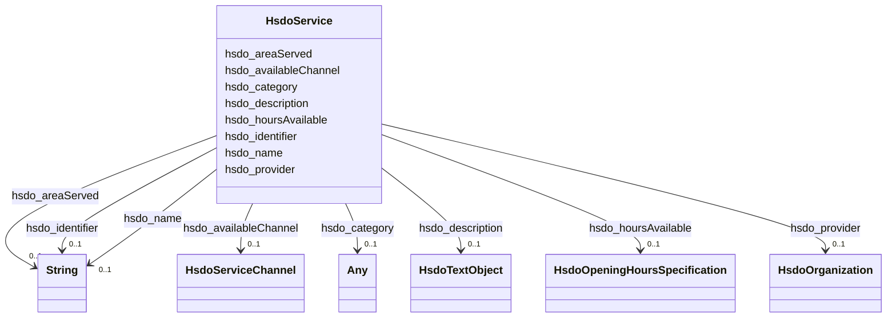

# Class: Service (hsdo_Service)


_A service provided by an organization, e.g. delivery service, print services, etc._


This class occurs 87 times.


URI: [hsdo:Service](http://schema.org/Service)





<!-- no inheritance hierarchy -->


## Slots

| Name | Cardinality and Range | Description | Inheritance | Occurrences |
| ---  | --- | --- | --- | --- |
| [hsdo_areaServed](../slots/hsdo_areaServed.md) | 0..1 <br/> [xsd:string](http://www.w3.org/2001/XMLSchema#string) | The geographic area where a service or offered item is provided <br/>  | direct | 87 |
| [hsdo_description](../slots/hsdo_description.md) | 0..1 <br/> [HsdoTextObject](../classes/HsdoTextObject.md) | A description of the item <br/>  | direct | 87 |
| [hsdo_availableChannel](../slots/hsdo_availableChannel.md) | 0..1 <br/> [HsdoServiceChannel](../classes/HsdoServiceChannel.md) | A means of accessing the service (e <br/>  | direct | 174 |
| [hsdo_name](../slots/hsdo_name.md) | 0..1 <br/> [xsd:string](http://www.w3.org/2001/XMLSchema#string) | The name of the item <br/>  | direct | 88 |
| [hsdo_category](../slots/hsdo_category.md) | 0..1 <br/> [HsdoCategoryCode](../classes/HsdoCategoryCode.md)&nbsp;or&nbsp;<br />[HsdoAudience](../classes/HsdoAudience.md) | A category for the item <br/>  | direct | 1345 |
| [hsdo_identifier](../slots/hsdo_identifier.md) | 0..1 <br/> [xsd:string](http://www.w3.org/2001/XMLSchema#string) | The identifier property represents any kind of identifier for any kind of [[T... <br/>  | direct | 87 |
| [hsdo_provider](../slots/hsdo_provider.md) | 0..1 <br/> [HsdoOrganization](../classes/HsdoOrganization.md) | The service provider, service operator, or service performer; the goods produ... <br/>  | direct | 87 |
| [hsdo_hoursAvailable](../slots/hsdo_hoursAvailable.md) | 0..1 <br/> [HsdoOpeningHoursSpecification](../classes/HsdoOpeningHoursSpecification.md) | The hours during which this service or contact is available <br/>  | direct | 609 |


## LinkML Source

<!-- TODO: investigate https://stackoverflow.com/questions/37606292/how-to-create-tabbed-code-blocks-in-mkdocs-or-sphinx -->

### Direct

<details>

```yaml
name: hsdo_Service
conforms_to: No schema conformance document specified
annotations:
  count:
    tag: count
    value: 87
description: A service provided by an organization, e.g. delivery service, print services,
  etc.
title: Service
from_schema: dream-kg
rank: 1000
slots:
- hsdo_areaServed
- hsdo_description
- hsdo_availableChannel
- hsdo_name
- hsdo_category
- hsdo_identifier
- hsdo_provider
- hsdo_hoursAvailable
slot_usage:
  hsdo_areaServed:
    name: hsdo_areaServed
    annotations:
      string:
        tag: string
        value: 87
  hsdo_availableChannel:
    name: hsdo_availableChannel
    annotations:
      hsdo_ServiceChannel:
        tag: hsdo_ServiceChannel
        value: 174
  hsdo_category:
    name: hsdo_category
    annotations:
      hsdo_Audience:
        tag: hsdo_Audience
        value: 539
      hsdo_CategoryCode:
        tag: hsdo_CategoryCode
        value: 806
  hsdo_description:
    name: hsdo_description
    annotations:
      hsdo_TextObject:
        tag: hsdo_TextObject
        value: 87
  hsdo_hoursAvailable:
    name: hsdo_hoursAvailable
    annotations:
      hsdo_OpeningHoursSpecification:
        tag: hsdo_OpeningHoursSpecification
        value: 609
  hsdo_identifier:
    name: hsdo_identifier
    annotations:
      string:
        tag: string
        value: 87
  hsdo_name:
    name: hsdo_name
    annotations:
      string:
        tag: string
        value: 88
  hsdo_provider:
    name: hsdo_provider
    annotations:
      hsdo_Organization:
        tag: hsdo_Organization
        value: 87
class_uri: hsdo:Service

```
</details>

### Induced

<details>

```yaml
name: hsdo_Service
conforms_to: No schema conformance document specified
annotations:
  count:
    tag: count
    value: 87
description: A service provided by an organization, e.g. delivery service, print services,
  etc.
title: Service
from_schema: dream-kg
rank: 1000
slot_usage:
  hsdo_areaServed:
    name: hsdo_areaServed
    annotations:
      string:
        tag: string
        value: 87
  hsdo_availableChannel:
    name: hsdo_availableChannel
    annotations:
      hsdo_ServiceChannel:
        tag: hsdo_ServiceChannel
        value: 174
  hsdo_category:
    name: hsdo_category
    annotations:
      hsdo_Audience:
        tag: hsdo_Audience
        value: 539
      hsdo_CategoryCode:
        tag: hsdo_CategoryCode
        value: 806
  hsdo_description:
    name: hsdo_description
    annotations:
      hsdo_TextObject:
        tag: hsdo_TextObject
        value: 87
  hsdo_hoursAvailable:
    name: hsdo_hoursAvailable
    annotations:
      hsdo_OpeningHoursSpecification:
        tag: hsdo_OpeningHoursSpecification
        value: 609
  hsdo_identifier:
    name: hsdo_identifier
    annotations:
      string:
        tag: string
        value: 87
  hsdo_name:
    name: hsdo_name
    annotations:
      string:
        tag: string
        value: 88
  hsdo_provider:
    name: hsdo_provider
    annotations:
      hsdo_Organization:
        tag: hsdo_Organization
        value: 87
attributes:
  hsdo_areaServed:
    name: hsdo_areaServed
    annotations:
      string:
        tag: string
        value: 87
    description: The geographic area where a service or offered item is provided.
    title: areaServed
    examples:
    - description: hsdo_Service→string
      object:
        example_object: 'This program covers residents of the following counties:
          Philadelphia County, PA.'
        example_object_type: string
        example_predicate: hsdo:areaServed
        example_subject: dreamkg:service/6379467169595392
        example_subject_type: hsdo_Service
    from_schema: dream-kg
    rank: 1000
    slot_uri: hsdo:areaServed
    alias: hsdo_areaServed
    owner: hsdo_Service
    domain_of:
    - hsdo_Service
    range: string
  hsdo_description:
    name: hsdo_description
    annotations:
      hsdo_TextObject:
        tag: hsdo_TextObject
        value: 87
    description: A description of the item.
    title: description
    examples:
    - description: hsdo_Service→hsdo_TextObject
      object:
        example_object: dreamkg:service/desc/6379467169595392
        example_object_type: hsdo_TextObject
        example_predicate: hsdo:description
        example_subject: dreamkg:service/6379467169595392
        example_subject_type: hsdo_Service
    from_schema: dream-kg
    rank: 1000
    slot_uri: hsdo:description
    alias: hsdo_description
    owner: hsdo_Service
    domain_of:
    - hsdo_Service
    range: hsdo_TextObject
  hsdo_availableChannel:
    name: hsdo_availableChannel
    annotations:
      hsdo_ServiceChannel:
        tag: hsdo_ServiceChannel
        value: 174
    description: A means of accessing the service (e.g. a phone bank, a web site,
      a location, etc.).
    title: availableChannel
    examples:
    - description: hsdo_Service→hsdo_ServiceChannel
      object:
        example_object: dreamkg:service/channel/P-6379467169595392
        example_object_type: hsdo_ServiceChannel
        example_predicate: hsdo:availableChannel
        example_subject: dreamkg:service/6379467169595392
        example_subject_type: hsdo_Service
    from_schema: dream-kg
    rank: 1000
    slot_uri: hsdo:availableChannel
    alias: hsdo_availableChannel
    owner: hsdo_Service
    domain_of:
    - hsdo_Service
    range: hsdo_ServiceChannel
  hsdo_name:
    name: hsdo_name
    annotations:
      string:
        tag: string
        value: 88
    description: The name of the item.
    title: name
    examples:
    - description: hsdo_Service→string
      object:
        example_object: New Pathways for Women Project
        example_object_type: string
        example_predicate: hsdo:name
        example_subject: dreamkg:service/6379467169595392
        example_subject_type: hsdo_Service
    - description: hsdo_Organization→string
      object:
        example_object: Circle Counseling
        example_object_type: string
        example_predicate: hsdo:name
        example_subject: dreamkg:service/provider/4780892498952192
        example_subject_type: hsdo_Organization
    from_schema: dream-kg
    rank: 1000
    slot_uri: hsdo:name
    alias: hsdo_name
    owner: hsdo_Service
    domain_of:
    - hsdo_Organization
    - hsdo_Service
    range: string
  hsdo_category:
    name: hsdo_category
    annotations:
      hsdo_Audience:
        tag: hsdo_Audience
        value: 539
      hsdo_CategoryCode:
        tag: hsdo_CategoryCode
        value: 806
    description: A category for the item. Greater signs or slashes can be used to
      informally indicate a category hierarchy.
    title: category
    examples:
    - description: hsdo_Service→hsdo_CategoryCode
      object:
        example_object: dreamkg:category/service/main/AddictionAndRecovery
        example_object_type: hsdo_CategoryCode
        example_predicate: hsdo:category
        example_subject: dreamkg:service/6379467169595392
        example_subject_type: hsdo_Service
    - description: hsdo_Service→hsdo_Audience
      object:
        example_object: dreamkg:category/audience/SubstanceDependency
        example_object_type: hsdo_Audience
        example_predicate: hsdo:category
        example_subject: dreamkg:service/6379467169595392
        example_subject_type: hsdo_Service
    from_schema: dream-kg
    rank: 1000
    slot_uri: hsdo:category
    alias: hsdo_category
    owner: hsdo_Service
    domain_of:
    - hsdo_Service
    range: Any
    any_of:
    - range: hsdo_CategoryCode
    - range: hsdo_Audience
  hsdo_identifier:
    name: hsdo_identifier
    annotations:
      string:
        tag: string
        value: 87
    description: 'The identifier property represents any kind of identifier for any
      kind of [[Thing]], such as ISBNs, GTIN codes, UUIDs etc. Schema.org provides
      dedicated properties for representing many of these, either as textual strings
      or as URL (URI) links. See [background notes](/docs/datamodel.html#identifierBg)
      for more details.␊        '
    title: identifier
    examples:
    - description: hsdo_Service→string
      object:
        example_object: '6379467169595392'
        example_object_type: string
        example_predicate: hsdo:identifier
        example_subject: dreamkg:service/6379467169595392
        example_subject_type: hsdo_Service
    - description: hsdo_AdministrativeArea→string
      object:
        example_object: '19131'
        example_object_type: string
        example_predicate: hsdo:identifier
        example_subject: dreamkg:zip/19131
        example_subject_type: hsdo_AdministrativeArea
    from_schema: dream-kg
    rank: 1000
    slot_uri: hsdo:identifier
    alias: hsdo_identifier
    owner: hsdo_Service
    domain_of:
    - hsdo_AdministrativeArea
    - hsdo_Service
    range: string
  hsdo_provider:
    name: hsdo_provider
    annotations:
      hsdo_Organization:
        tag: hsdo_Organization
        value: 87
    description: The service provider, service operator, or service performer; the
      goods producer. Another party (a seller) may offer those services or goods on
      behalf of the provider. A provider may also serve as the seller.
    title: provider
    examples:
    - description: hsdo_Service→hsdo_Organization
      object:
        example_object: dreamkg:service/provider/6379467169595392
        example_object_type: hsdo_Organization
        example_predicate: hsdo:provider
        example_subject: dreamkg:service/6379467169595392
        example_subject_type: hsdo_Service
    from_schema: dream-kg
    rank: 1000
    slot_uri: hsdo:provider
    alias: hsdo_provider
    owner: hsdo_Service
    domain_of:
    - hsdo_Service
    range: hsdo_Organization
  hsdo_hoursAvailable:
    name: hsdo_hoursAvailable
    annotations:
      hsdo_OpeningHoursSpecification:
        tag: hsdo_OpeningHoursSpecification
        value: 609
    description: The hours during which this service or contact is available.
    title: hoursAvailable
    examples:
    - description: hsdo_Service→hsdo_OpeningHoursSpecification
      object:
        example_object: dreamkg:service/hours/sunday/6379467169595392
        example_object_type: hsdo_OpeningHoursSpecification
        example_predicate: hsdo:hoursAvailable
        example_subject: dreamkg:service/6379467169595392
        example_subject_type: hsdo_Service
    from_schema: dream-kg
    rank: 1000
    slot_uri: hsdo:hoursAvailable
    alias: hsdo_hoursAvailable
    owner: hsdo_Service
    domain_of:
    - hsdo_Service
    range: hsdo_OpeningHoursSpecification
class_uri: hsdo:Service

```
</details>