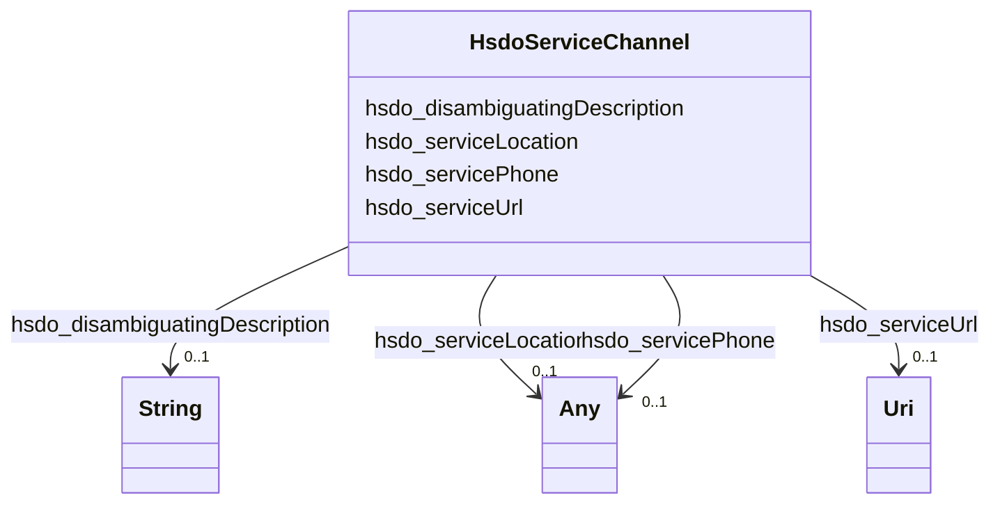

# Class: ServiceChannel (hsdo_ServiceChannel)


_A means for accessing a service, e.g. a government office location, web site, or phone number._


This class occurs 174 times.


URI: [hsdo:ServiceChannel](http://schema.org/ServiceChannel)





<!-- no inheritance hierarchy -->


## Slots

| Name | Cardinality and Range | Description | Inheritance | Occurrences |
| ---  | --- | --- | --- | --- |
| [hsdo_servicePhone](../slots/hsdo_servicePhone.md) | 0..1 <br/> [ProvEntity](../classes/ProvEntity.md)&nbsp;or&nbsp;<br />[HsdoContactPoint](../classes/HsdoContactPoint.md) | The phone number to use to access the service <br/>  | direct | 174 |
| [hsdo_disambiguatingDescription](../slots/hsdo_disambiguatingDescription.md) | 0..1 <br/> [xsd:string](http://www.w3.org/2001/XMLSchema#string) | A sub property of description <br/>  | direct | 174 |
| [hsdo_serviceUrl](../slots/hsdo_serviceUrl.md) | 0..1 <br/> [xsd:anyURI](http://www.w3.org/2001/XMLSchema#anyURI) | The website to access the service <br/>  | direct | 188 |
| [hsdo_serviceLocation](../slots/hsdo_serviceLocation.md) | 0..1 <br/> [ProvEntity](../classes/ProvEntity.md)&nbsp;or&nbsp;<br />[HsdoPlace](../classes/HsdoPlace.md) | The location (e <br/>  | direct | 174 |


## Usages

| used by | used in | type | used |
| ---  | --- | --- | --- |
| [HsdoService](../classes/HsdoService.md) | [hsdo_availableChannel](../slots/hsdo_availableChannel.md) | range | [HsdoServiceChannel](../classes/HsdoServiceChannel.md) |
| [ProvEntity](../classes/ProvEntity.md) | [hsdo_availableChannel](../slots/hsdo_availableChannel.md) | range | [HsdoServiceChannel](../classes/HsdoServiceChannel.md) |


## LinkML Source

<!-- TODO: investigate https://stackoverflow.com/questions/37606292/how-to-create-tabbed-code-blocks-in-mkdocs-or-sphinx -->

### Direct

<details>

```yaml
name: hsdo_ServiceChannel
conforms_to: No schema conformance document specified
annotations:
  count:
    tag: count
    value: 174
description: A means for accessing a service, e.g. a government office location, web
  site, or phone number.
title: ServiceChannel
from_schema: dream-kg
rank: 1000
slots:
- hsdo_servicePhone
- hsdo_disambiguatingDescription
- hsdo_serviceUrl
- hsdo_serviceLocation
slot_usage:
  hsdo_disambiguatingDescription:
    name: hsdo_disambiguatingDescription
    annotations:
      string:
        tag: string
        value: 174
  hsdo_serviceLocation:
    name: hsdo_serviceLocation
    annotations:
      hsdo_Place:
        tag: hsdo_Place
        value: 87
      prov_Entity:
        tag: prov_Entity
        value: 87
  hsdo_servicePhone:
    name: hsdo_servicePhone
    annotations:
      hsdo_ContactPoint:
        tag: hsdo_ContactPoint
        value: 87
      prov_Entity:
        tag: prov_Entity
        value: 87
  hsdo_serviceUrl:
    name: hsdo_serviceUrl
    annotations:
      uri:
        tag: uri
        value: 188
class_uri: hsdo:ServiceChannel

```
</details>

### Induced

<details>

```yaml
name: hsdo_ServiceChannel
conforms_to: No schema conformance document specified
annotations:
  count:
    tag: count
    value: 174
description: A means for accessing a service, e.g. a government office location, web
  site, or phone number.
title: ServiceChannel
from_schema: dream-kg
rank: 1000
slot_usage:
  hsdo_disambiguatingDescription:
    name: hsdo_disambiguatingDescription
    annotations:
      string:
        tag: string
        value: 174
  hsdo_serviceLocation:
    name: hsdo_serviceLocation
    annotations:
      hsdo_Place:
        tag: hsdo_Place
        value: 87
      prov_Entity:
        tag: prov_Entity
        value: 87
  hsdo_servicePhone:
    name: hsdo_servicePhone
    annotations:
      hsdo_ContactPoint:
        tag: hsdo_ContactPoint
        value: 87
      prov_Entity:
        tag: prov_Entity
        value: 87
  hsdo_serviceUrl:
    name: hsdo_serviceUrl
    annotations:
      uri:
        tag: uri
        value: 188
attributes:
  hsdo_servicePhone:
    name: hsdo_servicePhone
    annotations:
      hsdo_ContactPoint:
        tag: hsdo_ContactPoint
        value: 87
      prov_Entity:
        tag: prov_Entity
        value: 87
    description: The phone number to use to access the service.
    title: servicePhone
    examples:
    - object:
        example_object: dreamkg:service/phone/4542572480692224
        example_object_type: hsdo_ContactPoint
        example_predicate: hsdo:servicePhone
        example_subject: dreamkg:service/channel/P-4542572480692224
        example_subject_type: hsdo_ServiceChannel
    - object:
        example_object: dreamkg:service/phone/4542572480692224
        example_object_type: prov_Entity
        example_predicate: hsdo:servicePhone
        example_subject: dreamkg:service/channel/P-4542572480692224
        example_subject_type: hsdo_ServiceChannel
    from_schema: dream-kg
    rank: 1000
    slot_uri: hsdo:servicePhone
    alias: hsdo_servicePhone
    owner: hsdo_ServiceChannel
    domain_of:
    - hsdo_ServiceChannel
    range: Any
    any_of:
    - range: prov_Entity
    - range: hsdo_ContactPoint
  hsdo_disambiguatingDescription:
    name: hsdo_disambiguatingDescription
    annotations:
      string:
        tag: string
        value: 174
    description: A sub property of description. A short description of the item used
      to disambiguate from other, similar items. Information from other properties
      (in particular, name) may be necessary for the description to be useful for
      disambiguation.
    title: disambiguatingDescription
    examples:
    - object:
        example_object: Aunt Bertha
        example_object_type: string
        example_predicate: hsdo:disambiguatingDescription
        example_subject: dreamkg:service/channel/AB-4542572480692224
        example_subject_type: hsdo_ServiceChannel
    from_schema: dream-kg
    rank: 1000
    slot_uri: hsdo:disambiguatingDescription
    alias: hsdo_disambiguatingDescription
    owner: hsdo_ServiceChannel
    domain_of:
    - hsdo_ServiceChannel
    range: string
  hsdo_serviceUrl:
    name: hsdo_serviceUrl
    annotations:
      uri:
        tag: uri
        value: 188
    description: The website to access the service.
    title: serviceUrl
    examples:
    - object:
        example_object: https://www.auntbertha.com//child-guidance-resource-centers-%2528cgrc%2529--philadelphia-pa--drug-and-alcohol-services/4542572480692224?postal=19139
        example_object_type: uri
        example_predicate: hsdo:serviceUrl
        example_subject: dreamkg:service/channel/AB-4542572480692224
        example_subject_type: hsdo_ServiceChannel
    from_schema: dream-kg
    rank: 1000
    slot_uri: hsdo:serviceUrl
    alias: hsdo_serviceUrl
    owner: hsdo_ServiceChannel
    domain_of:
    - hsdo_ServiceChannel
    range: uri
  hsdo_serviceLocation:
    name: hsdo_serviceLocation
    annotations:
      hsdo_Place:
        tag: hsdo_Place
        value: 87
      prov_Entity:
        tag: prov_Entity
        value: 87
    description: The location (e.g. civic structure, local business, etc.) where a
      person can go to access the service.
    title: serviceLocation
    examples:
    - object:
        example_object: dreamkg:service/location/4542572480692224
        example_object_type: prov_Entity
        example_predicate: hsdo:serviceLocation
        example_subject: dreamkg:service/channel/P-4542572480692224
        example_subject_type: hsdo_ServiceChannel
    - object:
        example_object: dreamkg:service/location/4542572480692224
        example_object_type: hsdo_Place
        example_predicate: hsdo:serviceLocation
        example_subject: dreamkg:service/channel/P-4542572480692224
        example_subject_type: hsdo_ServiceChannel
    from_schema: dream-kg
    rank: 1000
    slot_uri: hsdo:serviceLocation
    alias: hsdo_serviceLocation
    owner: hsdo_ServiceChannel
    domain_of:
    - hsdo_ServiceChannel
    range: Any
    any_of:
    - range: prov_Entity
    - range: hsdo_Place
class_uri: hsdo:ServiceChannel

```
</details>