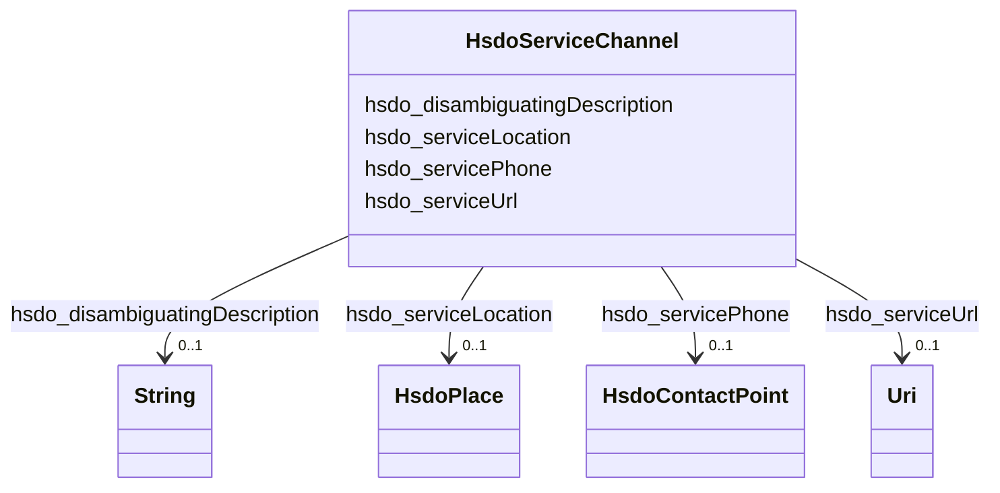

# Class: ServiceChannel (hsdo_ServiceChannel)


_A means for accessing a service, e.g. a government office location, web site, or phone number._


URI: [hsdo:ServiceChannel](http://schema.org/ServiceChannel)





<!-- no inheritance hierarchy -->


## Slots

| Name | Cardinality and Range | Description | Inheritance |
| ---  | --- | --- | --- |
| [hsdo_serviceLocation](../slots/hsdo_serviceLocation.md) | 0..1 <br/> [HsdoPlace](../classes/HsdoPlace.md) | No slot (predicate) description specified | direct |
| [hsdo_serviceUrl](../slots/hsdo_serviceUrl.md) | 0..1 <br/> [xsd:anyURI](xsd:anyURI) | No slot (predicate) description specified | direct |
| [hsdo_disambiguatingDescription](../slots/hsdo_disambiguatingDescription.md) | 0..1 <br/> [xsd:string](xsd:string) | No slot (predicate) description specified | direct |
| [hsdo_servicePhone](../slots/hsdo_servicePhone.md) | 0..1 <br/> [HsdoContactPoint](../classes/HsdoContactPoint.md) | No slot (predicate) description specified | direct |


## Usages

| used by | used in | type | used |
| ---  | --- | --- | --- |
| [HsdoService](../classes/HsdoService.md) | [hsdo_availableChannel](../slots/hsdo_availableChannel.md) | range | [HsdoServiceChannel](../classes/HsdoServiceChannel.md) |


## Identifier and Mapping Information


### Schema Source


* from schema: dream-kg


## Mappings

| Mapping Type | Mapped Value |
| ---  | ---  |
| self | hsdo:ServiceChannel |
| native | dream-kg/:HsdoServiceChannel |


## LinkML Source

<!-- TODO: investigate https://stackoverflow.com/questions/37606292/how-to-create-tabbed-code-blocks-in-mkdocs-or-sphinx -->

### Direct

<details>
```yaml
name: hsdo_ServiceChannel
description: A means for accessing a service, e.g. a government office location, web
  site, or phone number.
title: ServiceChannel
notes:
- Class with 174 occurrences.
from_schema: dream-kg
rank: 1000
slots:
- hsdo_serviceLocation
- hsdo_serviceUrl
- hsdo_disambiguatingDescription
- hsdo_servicePhone
class_uri: hsdo:ServiceChannel

```
</details>

### Induced

<details>
```yaml
name: hsdo_ServiceChannel
description: A means for accessing a service, e.g. a government office location, web
  site, or phone number.
title: ServiceChannel
notes:
- Class with 174 occurrences.
from_schema: dream-kg
rank: 1000
attributes:
  hsdo_serviceLocation:
    name: hsdo_serviceLocation
    description: No slot (predicate) description specified
    comments:
    - 87 occurrences with subject type hsdo_ServiceChannel and object type hsdo_Place.
    examples:
    - description: hsdo_ServiceChannel → hsdo_Place
      object:
        example_object: dreamkg:service/location/5138871176658944
        example_predicate: hsdo:serviceLocation
        example_subject: dreamkg:service/channel/P-5138871176658944
    from_schema: dream-kg
    rank: 1000
    slot_uri: hsdo:serviceLocation
    alias: hsdo_serviceLocation
    owner: hsdo_ServiceChannel
    domain_of:
    - hsdo_ServiceChannel
    range: hsdo_Place
  hsdo_serviceUrl:
    name: hsdo_serviceUrl
    description: No slot (predicate) description specified
    comments:
    - 188 occurrences with subject type hsdo_ServiceChannel and object type uri.
    examples:
    - description: hsdo_ServiceChannel → uri
      object:
        example_object: https://www.auntbertha.com//merakey---pennsylvania--philadelphia-pa--adult-substance-use-disorder-services/6032260047568896?postal=19139
        example_predicate: hsdo:serviceUrl
        example_subject: dreamkg:service/channel/AB-6032260047568896
    from_schema: dream-kg
    rank: 1000
    slot_uri: hsdo:serviceUrl
    alias: hsdo_serviceUrl
    owner: hsdo_ServiceChannel
    domain_of:
    - hsdo_ServiceChannel
    range: uri
  hsdo_disambiguatingDescription:
    name: hsdo_disambiguatingDescription
    description: No slot (predicate) description specified
    comments:
    - 174 occurrences with subject type hsdo_ServiceChannel and object type string.
    examples:
    - description: hsdo_ServiceChannel → string
      object:
        example_object: Provider
        example_predicate: hsdo:disambiguatingDescription
        example_subject: dreamkg:service/channel/P-5181712996761600
    from_schema: dream-kg
    rank: 1000
    slot_uri: hsdo:disambiguatingDescription
    alias: hsdo_disambiguatingDescription
    owner: hsdo_ServiceChannel
    domain_of:
    - hsdo_ServiceChannel
    range: string
  hsdo_servicePhone:
    name: hsdo_servicePhone
    description: No slot (predicate) description specified
    comments:
    - 87 occurrences with subject type hsdo_ServiceChannel and object type hsdo_ContactPoint.
    examples:
    - description: hsdo_ServiceChannel → hsdo_ContactPoint
      object:
        example_object: dreamkg:service/phone/5671175268335616
        example_predicate: hsdo:servicePhone
        example_subject: dreamkg:service/channel/P-5671175268335616
    from_schema: dream-kg
    rank: 1000
    slot_uri: hsdo:servicePhone
    alias: hsdo_servicePhone
    owner: hsdo_ServiceChannel
    domain_of:
    - hsdo_ServiceChannel
    range: hsdo_ContactPoint
class_uri: hsdo:ServiceChannel

```
</details>