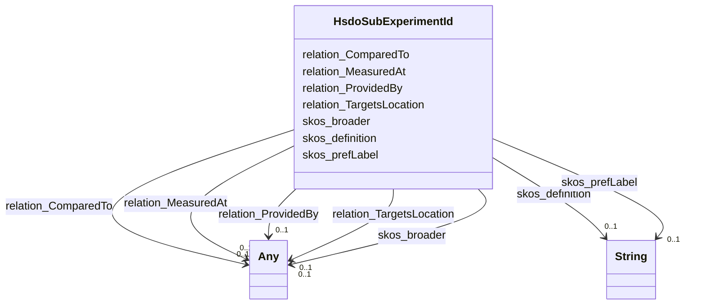

# Class: No class (type) name specified (hsdo_Sub_Experiment_Id)


_No class (type) description specified_


This class occurs 75 times.


URI: [hsdo:Sub_Experiment_Id](http://schema.org/Sub_Experiment_Id)





<!-- no inheritance hierarchy -->


## Slots

| Name | Cardinality and Range | Description | Inheritance | Occurrences |
| ---  | --- | --- | --- | --- |
| [skos_definition](../slots/skos_definition.md) | 0..1 <br/> [xsd:string](http://www.w3.org/2001/XMLSchema#string) | No slot (predicate) description specified <br/>  | direct | 74 |
| [relation_MeasuredAt](../slots/relation_MeasuredAt.md) | 0..1 <br/> [HsdoModel](../classes/HsdoModel.md)&nbsp;or&nbsp;<br />[HsdoDataset](../classes/HsdoDataset.md)&nbsp;or&nbsp;<br />[HsdoRegion](../classes/HsdoRegion.md)&nbsp;or&nbsp;<br />[HsdoCmip6SourceId](../classes/HsdoCmip6SourceId.md)&nbsp;or&nbsp;<br />[HsdoProvider](../classes/HsdoProvider.md)&nbsp;or&nbsp;<br />[HsdoVerticalResolutionRange](../classes/HsdoVerticalResolutionRange.md)&nbsp;or&nbsp;<br />[HsdoSourceType](../classes/HsdoSourceType.md)&nbsp;or&nbsp;<br />[HsdoRelatedUrlContentType](../classes/HsdoRelatedUrlContentType.md)&nbsp;or&nbsp;<br />[HsdoInstrument](../classes/HsdoInstrument.md)&nbsp;or&nbsp;<br />[HsdoProject](../classes/HsdoProject.md)&nbsp;or&nbsp;<br />[HsdoActivity](../classes/HsdoActivity.md)&nbsp;or&nbsp;<br />[HsdoDataFormat](../classes/HsdoDataFormat.md)&nbsp;or&nbsp;<br />[HsdoObs4MipsSourceId](../classes/HsdoObs4MipsSourceId.md)&nbsp;or&nbsp;<br />[HsdoModels](../classes/HsdoModels.md)&nbsp;or&nbsp;<br />[HsdoVariable](../classes/HsdoVariable.md)&nbsp;or&nbsp;<br />[HsdoChronostratigraphicUnit](../classes/HsdoChronostratigraphicUnit.md)&nbsp;or&nbsp;<br />[HsdoLocation](../classes/HsdoLocation.md)&nbsp;or&nbsp;<br />[HsdoMeasurementName](../classes/HsdoMeasurementName.md)&nbsp;or&nbsp;<br />[HsdoScienceKeyword](../classes/HsdoScienceKeyword.md)&nbsp;or&nbsp;<br />[HsdoRealm](../classes/HsdoRealm.md)&nbsp;or&nbsp;<br />[HsdoTemporalResolutionRange](../classes/HsdoTemporalResolutionRange.md)&nbsp;or&nbsp;<br />[HsdoSubExperimentId](../classes/HsdoSubExperimentId.md)&nbsp;or&nbsp;<br />[HsdoPlatform](../classes/HsdoPlatform.md)&nbsp;or&nbsp;<br />[HsdoExperiment](../classes/HsdoExperiment.md) | No slot (predicate) description specified <br/>  | direct | 15 |
| [skos_broader](../slots/skos_broader.md) | 0..1 <br/> [HsdoModel](../classes/HsdoModel.md)&nbsp;or&nbsp;<br />[HsdoDataset](../classes/HsdoDataset.md)&nbsp;or&nbsp;<br />[HsdoRegion](../classes/HsdoRegion.md)&nbsp;or&nbsp;<br />[HsdoProvider](../classes/HsdoProvider.md)&nbsp;or&nbsp;<br />[HsdoVerticalResolutionRange](../classes/HsdoVerticalResolutionRange.md)&nbsp;or&nbsp;<br />[HsdoSourceType](../classes/HsdoSourceType.md)&nbsp;or&nbsp;<br />[SkosConcept](../classes/SkosConcept.md)&nbsp;or&nbsp;<br />[HsdoRelatedUrlContentType](../classes/HsdoRelatedUrlContentType.md)&nbsp;or&nbsp;<br />[HsdoInstrument](../classes/HsdoInstrument.md)&nbsp;or&nbsp;<br />[HsdoProject](../classes/HsdoProject.md)&nbsp;or&nbsp;<br />[HsdoDataFormat](../classes/HsdoDataFormat.md)&nbsp;or&nbsp;<br />[HsdoMimeType](../classes/HsdoMimeType.md)&nbsp;or&nbsp;<br />[HsdoModels](../classes/HsdoModels.md)&nbsp;or&nbsp;<br />[HsdoVariable](../classes/HsdoVariable.md)&nbsp;or&nbsp;<br />[HsdoChronostratigraphicUnit](../classes/HsdoChronostratigraphicUnit.md)&nbsp;or&nbsp;<br />[HsdoLocation](../classes/HsdoLocation.md)&nbsp;or&nbsp;<br />[HsdoMeasurementName](../classes/HsdoMeasurementName.md)&nbsp;or&nbsp;<br />[HsdoScienceKeyword](../classes/HsdoScienceKeyword.md)&nbsp;or&nbsp;<br />[HsdoHorizontalResolutionRange](../classes/HsdoHorizontalResolutionRange.md)&nbsp;or&nbsp;<br />[HsdoRealm](../classes/HsdoRealm.md)&nbsp;or&nbsp;<br />[HsdoTemporalResolutionRange](../classes/HsdoTemporalResolutionRange.md)&nbsp;or&nbsp;<br />[HsdoLicense](../classes/HsdoLicense.md)&nbsp;or&nbsp;<br />[HsdoNominalResolution](../classes/HsdoNominalResolution.md)&nbsp;or&nbsp;<br />[HsdoSubExperimentId](../classes/HsdoSubExperimentId.md)&nbsp;or&nbsp;<br />[HsdoPlatform](../classes/HsdoPlatform.md)&nbsp;or&nbsp;<br />[HsdoExperiment](../classes/HsdoExperiment.md) | No slot (predicate) description specified <br/>  | direct | 74 |
| [relation_TargetsLocation](../slots/relation_TargetsLocation.md) | 0..1 <br/> [HsdoModel](../classes/HsdoModel.md)&nbsp;or&nbsp;<br />[HsdoRegion](../classes/HsdoRegion.md)&nbsp;or&nbsp;<br />[HsdoInstitution](../classes/HsdoInstitution.md)&nbsp;or&nbsp;<br />[HsdoProvider](../classes/HsdoProvider.md)&nbsp;or&nbsp;<br />[HsdoSourceType](../classes/HsdoSourceType.md)&nbsp;or&nbsp;<br />[HsdoRelatedUrlContentType](../classes/HsdoRelatedUrlContentType.md)&nbsp;or&nbsp;<br />[HsdoInstrument](../classes/HsdoInstrument.md)&nbsp;or&nbsp;<br />[HsdoProject](../classes/HsdoProject.md)&nbsp;or&nbsp;<br />[HsdoActivity](../classes/HsdoActivity.md)&nbsp;or&nbsp;<br />[HsdoDataFormat](../classes/HsdoDataFormat.md)&nbsp;or&nbsp;<br />[HsdoFrequency](../classes/HsdoFrequency.md)&nbsp;or&nbsp;<br />[HsdoModels](../classes/HsdoModels.md)&nbsp;or&nbsp;<br />[HsdoVariable](../classes/HsdoVariable.md)&nbsp;or&nbsp;<br />[HsdoChronostratigraphicUnit](../classes/HsdoChronostratigraphicUnit.md)&nbsp;or&nbsp;<br />[HsdoLocation](../classes/HsdoLocation.md)&nbsp;or&nbsp;<br />[HsdoMeasurementName](../classes/HsdoMeasurementName.md)&nbsp;or&nbsp;<br />[HsdoScienceKeyword](../classes/HsdoScienceKeyword.md)&nbsp;or&nbsp;<br />[HsdoRealm](../classes/HsdoRealm.md)&nbsp;or&nbsp;<br />[HsdoTemporalResolutionRange](../classes/HsdoTemporalResolutionRange.md)&nbsp;or&nbsp;<br />[HsdoPlatform](../classes/HsdoPlatform.md)&nbsp;or&nbsp;<br />[HsdoExperiment](../classes/HsdoExperiment.md) | No slot (predicate) description specified <br/>  | direct | 27 |
| [relation_ComparedTo](../slots/relation_ComparedTo.md) | 0..1 <br/> [HsdoModel](../classes/HsdoModel.md)&nbsp;or&nbsp;<br />[HsdoDataset](../classes/HsdoDataset.md)&nbsp;or&nbsp;<br />[HsdoRegion](../classes/HsdoRegion.md)&nbsp;or&nbsp;<br />[HsdoCmip6SourceId](../classes/HsdoCmip6SourceId.md)&nbsp;or&nbsp;<br />[HsdoInstitution](../classes/HsdoInstitution.md)&nbsp;or&nbsp;<br />[HsdoProvider](../classes/HsdoProvider.md)&nbsp;or&nbsp;<br />[HsdoSourceType](../classes/HsdoSourceType.md)&nbsp;or&nbsp;<br />[HsdoRelatedUrlContentType](../classes/HsdoRelatedUrlContentType.md)&nbsp;or&nbsp;<br />[HsdoInstrument](../classes/HsdoInstrument.md)&nbsp;or&nbsp;<br />[HsdoProject](../classes/HsdoProject.md)&nbsp;or&nbsp;<br />[HsdoActivity](../classes/HsdoActivity.md)&nbsp;or&nbsp;<br />[HsdoDataFormat](../classes/HsdoDataFormat.md)&nbsp;or&nbsp;<br />[HsdoObs4MipsSourceId](../classes/HsdoObs4MipsSourceId.md)&nbsp;or&nbsp;<br />[HsdoModels](../classes/HsdoModels.md)&nbsp;or&nbsp;<br />[HsdoVariable](../classes/HsdoVariable.md)&nbsp;or&nbsp;<br />[HsdoChronostratigraphicUnit](../classes/HsdoChronostratigraphicUnit.md)&nbsp;or&nbsp;<br />[HsdoLocation](../classes/HsdoLocation.md)&nbsp;or&nbsp;<br />[HsdoMeasurementName](../classes/HsdoMeasurementName.md)&nbsp;or&nbsp;<br />[HsdoScienceKeyword](../classes/HsdoScienceKeyword.md)&nbsp;or&nbsp;<br />[HsdoRealm](../classes/HsdoRealm.md)&nbsp;or&nbsp;<br />[HsdoTemporalResolutionRange](../classes/HsdoTemporalResolutionRange.md)&nbsp;or&nbsp;<br />[HsdoSubExperimentId](../classes/HsdoSubExperimentId.md)&nbsp;or&nbsp;<br />[HsdoPlatform](../classes/HsdoPlatform.md)&nbsp;or&nbsp;<br />[HsdoExperiment](../classes/HsdoExperiment.md) | No slot (predicate) description specified <br/>  | direct | 21 |
| [skos_prefLabel](../slots/skos_prefLabel.md) | 0..1 <br/> [xsd:string](http://www.w3.org/2001/XMLSchema#string) | No slot (predicate) description specified <br/>  | direct | 75 |
| [relation_ProvidedBy](../slots/relation_ProvidedBy.md) | 0..1 <br/> [HsdoModel](../classes/HsdoModel.md)&nbsp;or&nbsp;<br />[HsdoDataset](../classes/HsdoDataset.md)&nbsp;or&nbsp;<br />[HsdoRegion](../classes/HsdoRegion.md)&nbsp;or&nbsp;<br />[HsdoCmip6SourceId](../classes/HsdoCmip6SourceId.md)&nbsp;or&nbsp;<br />[HsdoInstitution](../classes/HsdoInstitution.md)&nbsp;or&nbsp;<br />[HsdoProvider](../classes/HsdoProvider.md)&nbsp;or&nbsp;<br />[HsdoSourceType](../classes/HsdoSourceType.md)&nbsp;or&nbsp;<br />[HsdoRelatedUrlContentType](../classes/HsdoRelatedUrlContentType.md)&nbsp;or&nbsp;<br />[HsdoInstrument](../classes/HsdoInstrument.md)&nbsp;or&nbsp;<br />[HsdoProject](../classes/HsdoProject.md)&nbsp;or&nbsp;<br />[HsdoActivity](../classes/HsdoActivity.md)&nbsp;or&nbsp;<br />[HsdoDataFormat](../classes/HsdoDataFormat.md)&nbsp;or&nbsp;<br />[HsdoObs4MipsSourceId](../classes/HsdoObs4MipsSourceId.md)&nbsp;or&nbsp;<br />[HsdoModels](../classes/HsdoModels.md)&nbsp;or&nbsp;<br />[HsdoVariable](../classes/HsdoVariable.md)&nbsp;or&nbsp;<br />[HsdoChronostratigraphicUnit](../classes/HsdoChronostratigraphicUnit.md)&nbsp;or&nbsp;<br />[HsdoLocation](../classes/HsdoLocation.md)&nbsp;or&nbsp;<br />[HsdoMeasurementName](../classes/HsdoMeasurementName.md)&nbsp;or&nbsp;<br />[HsdoScienceKeyword](../classes/HsdoScienceKeyword.md)&nbsp;or&nbsp;<br />[HsdoRealm](../classes/HsdoRealm.md)&nbsp;or&nbsp;<br />[HsdoSubExperimentId](../classes/HsdoSubExperimentId.md)&nbsp;or&nbsp;<br />[HsdoPlatform](../classes/HsdoPlatform.md)&nbsp;or&nbsp;<br />[HsdoExperiment](../classes/HsdoExperiment.md) | No slot (predicate) description specified <br/>  | direct | 20 |


## Usages

| used by | used in | type | used |
| ---  | --- | --- | --- |
| [HsdoActivity](../classes/HsdoActivity.md) | [relation_MeasuredAt](../slots/relation_MeasuredAt.md) | any_of[range] | [HsdoSubExperimentId](../classes/HsdoSubExperimentId.md) |
| [HsdoActivity](../classes/HsdoActivity.md) | [skos_broader](../slots/skos_broader.md) | any_of[range] | [HsdoSubExperimentId](../classes/HsdoSubExperimentId.md) |
| [HsdoActivity](../classes/HsdoActivity.md) | [relation_ComparedTo](../slots/relation_ComparedTo.md) | any_of[range] | [HsdoSubExperimentId](../classes/HsdoSubExperimentId.md) |
| [HsdoActivity](../classes/HsdoActivity.md) | [relation_ProvidedBy](../slots/relation_ProvidedBy.md) | any_of[range] | [HsdoSubExperimentId](../classes/HsdoSubExperimentId.md) |
| [HsdoChronostratigraphicUnit](../classes/HsdoChronostratigraphicUnit.md) | [relation_MeasuredAt](../slots/relation_MeasuredAt.md) | any_of[range] | [HsdoSubExperimentId](../classes/HsdoSubExperimentId.md) |
| [HsdoChronostratigraphicUnit](../classes/HsdoChronostratigraphicUnit.md) | [skos_broader](../slots/skos_broader.md) | any_of[range] | [HsdoSubExperimentId](../classes/HsdoSubExperimentId.md) |
| [HsdoChronostratigraphicUnit](../classes/HsdoChronostratigraphicUnit.md) | [relation_ComparedTo](../slots/relation_ComparedTo.md) | any_of[range] | [HsdoSubExperimentId](../classes/HsdoSubExperimentId.md) |
| [HsdoCmip6SourceId](../classes/HsdoCmip6SourceId.md) | [skos_broader](../slots/skos_broader.md) | any_of[range] | [HsdoSubExperimentId](../classes/HsdoSubExperimentId.md) |
| [HsdoCmip6SourceId](../classes/HsdoCmip6SourceId.md) | [relation_ComparedTo](../slots/relation_ComparedTo.md) | any_of[range] | [HsdoSubExperimentId](../classes/HsdoSubExperimentId.md) |
| [HsdoCmip6SourceId](../classes/HsdoCmip6SourceId.md) | [relation_ProvidedBy](../slots/relation_ProvidedBy.md) | any_of[range] | [HsdoSubExperimentId](../classes/HsdoSubExperimentId.md) |
| [HsdoDataFormat](../classes/HsdoDataFormat.md) | [relation_MeasuredAt](../slots/relation_MeasuredAt.md) | any_of[range] | [HsdoSubExperimentId](../classes/HsdoSubExperimentId.md) |
| [HsdoDataFormat](../classes/HsdoDataFormat.md) | [skos_broader](../slots/skos_broader.md) | any_of[range] | [HsdoSubExperimentId](../classes/HsdoSubExperimentId.md) |
| [HsdoDataFormat](../classes/HsdoDataFormat.md) | [relation_ComparedTo](../slots/relation_ComparedTo.md) | any_of[range] | [HsdoSubExperimentId](../classes/HsdoSubExperimentId.md) |
| [HsdoDataFormat](../classes/HsdoDataFormat.md) | [relation_ProvidedBy](../slots/relation_ProvidedBy.md) | any_of[range] | [HsdoSubExperimentId](../classes/HsdoSubExperimentId.md) |
| [HsdoDataset](../classes/HsdoDataset.md) | [relation_MeasuredAt](../slots/relation_MeasuredAt.md) | any_of[range] | [HsdoSubExperimentId](../classes/HsdoSubExperimentId.md) |
| [HsdoDataset](../classes/HsdoDataset.md) | [skos_broader](../slots/skos_broader.md) | any_of[range] | [HsdoSubExperimentId](../classes/HsdoSubExperimentId.md) |
| [HsdoDataset](../classes/HsdoDataset.md) | [relation_ComparedTo](../slots/relation_ComparedTo.md) | any_of[range] | [HsdoSubExperimentId](../classes/HsdoSubExperimentId.md) |
| [HsdoDataset](../classes/HsdoDataset.md) | [relation_ProvidedBy](../slots/relation_ProvidedBy.md) | any_of[range] | [HsdoSubExperimentId](../classes/HsdoSubExperimentId.md) |
| [HsdoExperiment](../classes/HsdoExperiment.md) | [relation_ComparedTo](../slots/relation_ComparedTo.md) | any_of[range] | [HsdoSubExperimentId](../classes/HsdoSubExperimentId.md) |
| [HsdoExperiment](../classes/HsdoExperiment.md) | [relation_MeasuredAt](../slots/relation_MeasuredAt.md) | any_of[range] | [HsdoSubExperimentId](../classes/HsdoSubExperimentId.md) |
| [HsdoExperiment](../classes/HsdoExperiment.md) | [skos_broader](../slots/skos_broader.md) | any_of[range] | [HsdoSubExperimentId](../classes/HsdoSubExperimentId.md) |
| [HsdoExperiment](../classes/HsdoExperiment.md) | [relation_ProvidedBy](../slots/relation_ProvidedBy.md) | any_of[range] | [HsdoSubExperimentId](../classes/HsdoSubExperimentId.md) |
| [HsdoFrequency](../classes/HsdoFrequency.md) | [relation_MeasuredAt](../slots/relation_MeasuredAt.md) | any_of[range] | [HsdoSubExperimentId](../classes/HsdoSubExperimentId.md) |
| [HsdoFrequency](../classes/HsdoFrequency.md) | [skos_broader](../slots/skos_broader.md) | any_of[range] | [HsdoSubExperimentId](../classes/HsdoSubExperimentId.md) |
| [HsdoGridLabel](../classes/HsdoGridLabel.md) | [skos_broader](../slots/skos_broader.md) | any_of[range] | [HsdoSubExperimentId](../classes/HsdoSubExperimentId.md) |
| [HsdoGridLabel](../classes/HsdoGridLabel.md) | [relation_ProvidedBy](../slots/relation_ProvidedBy.md) | any_of[range] | [HsdoSubExperimentId](../classes/HsdoSubExperimentId.md) |
| [HsdoHorizontalResolutionRange](../classes/HsdoHorizontalResolutionRange.md) | [relation_MeasuredAt](../slots/relation_MeasuredAt.md) | any_of[range] | [HsdoSubExperimentId](../classes/HsdoSubExperimentId.md) |
| [HsdoHorizontalResolutionRange](../classes/HsdoHorizontalResolutionRange.md) | [skos_broader](../slots/skos_broader.md) | any_of[range] | [HsdoSubExperimentId](../classes/HsdoSubExperimentId.md) |
| [HsdoInstitution](../classes/HsdoInstitution.md) | [relation_MeasuredAt](../slots/relation_MeasuredAt.md) | any_of[range] | [HsdoSubExperimentId](../classes/HsdoSubExperimentId.md) |
| [HsdoInstitution](../classes/HsdoInstitution.md) | [skos_broader](../slots/skos_broader.md) | any_of[range] | [HsdoSubExperimentId](../classes/HsdoSubExperimentId.md) |
| [HsdoInstitution](../classes/HsdoInstitution.md) | [relation_ComparedTo](../slots/relation_ComparedTo.md) | any_of[range] | [HsdoSubExperimentId](../classes/HsdoSubExperimentId.md) |
| [HsdoInstitution](../classes/HsdoInstitution.md) | [relation_ProvidedBy](../slots/relation_ProvidedBy.md) | any_of[range] | [HsdoSubExperimentId](../classes/HsdoSubExperimentId.md) |
| [HsdoInstrument](../classes/HsdoInstrument.md) | [relation_MeasuredAt](../slots/relation_MeasuredAt.md) | any_of[range] | [HsdoSubExperimentId](../classes/HsdoSubExperimentId.md) |
| [HsdoInstrument](../classes/HsdoInstrument.md) | [skos_broader](../slots/skos_broader.md) | any_of[range] | [HsdoSubExperimentId](../classes/HsdoSubExperimentId.md) |
| [HsdoInstrument](../classes/HsdoInstrument.md) | [relation_ComparedTo](../slots/relation_ComparedTo.md) | any_of[range] | [HsdoSubExperimentId](../classes/HsdoSubExperimentId.md) |
| [HsdoInstrument](../classes/HsdoInstrument.md) | [relation_ProvidedBy](../slots/relation_ProvidedBy.md) | any_of[range] | [HsdoSubExperimentId](../classes/HsdoSubExperimentId.md) |
| [HsdoLicense](../classes/HsdoLicense.md) | [skos_broader](../slots/skos_broader.md) | any_of[range] | [HsdoSubExperimentId](../classes/HsdoSubExperimentId.md) |
| [HsdoLocation](../classes/HsdoLocation.md) | [relation_ComparedTo](../slots/relation_ComparedTo.md) | any_of[range] | [HsdoSubExperimentId](../classes/HsdoSubExperimentId.md) |
| [HsdoLocation](../classes/HsdoLocation.md) | [relation_MeasuredAt](../slots/relation_MeasuredAt.md) | any_of[range] | [HsdoSubExperimentId](../classes/HsdoSubExperimentId.md) |
| [HsdoLocation](../classes/HsdoLocation.md) | [skos_broader](../slots/skos_broader.md) | any_of[range] | [HsdoSubExperimentId](../classes/HsdoSubExperimentId.md) |
| [HsdoLocation](../classes/HsdoLocation.md) | [relation_ProvidedBy](../slots/relation_ProvidedBy.md) | any_of[range] | [HsdoSubExperimentId](../classes/HsdoSubExperimentId.md) |
| [HsdoMeasurementName](../classes/HsdoMeasurementName.md) | [relation_MeasuredAt](../slots/relation_MeasuredAt.md) | any_of[range] | [HsdoSubExperimentId](../classes/HsdoSubExperimentId.md) |
| [HsdoMeasurementName](../classes/HsdoMeasurementName.md) | [skos_broader](../slots/skos_broader.md) | any_of[range] | [HsdoSubExperimentId](../classes/HsdoSubExperimentId.md) |
| [HsdoMeasurementName](../classes/HsdoMeasurementName.md) | [relation_ComparedTo](../slots/relation_ComparedTo.md) | any_of[range] | [HsdoSubExperimentId](../classes/HsdoSubExperimentId.md) |
| [HsdoMeasurementName](../classes/HsdoMeasurementName.md) | [relation_ProvidedBy](../slots/relation_ProvidedBy.md) | any_of[range] | [HsdoSubExperimentId](../classes/HsdoSubExperimentId.md) |
| [HsdoMimeType](../classes/HsdoMimeType.md) | [skos_broader](../slots/skos_broader.md) | any_of[range] | [HsdoSubExperimentId](../classes/HsdoSubExperimentId.md) |
| [HsdoModel](../classes/HsdoModel.md) | [relation_ComparedTo](../slots/relation_ComparedTo.md) | any_of[range] | [HsdoSubExperimentId](../classes/HsdoSubExperimentId.md) |
| [HsdoModel](../classes/HsdoModel.md) | [relation_MeasuredAt](../slots/relation_MeasuredAt.md) | any_of[range] | [HsdoSubExperimentId](../classes/HsdoSubExperimentId.md) |
| [HsdoModel](../classes/HsdoModel.md) | [skos_broader](../slots/skos_broader.md) | any_of[range] | [HsdoSubExperimentId](../classes/HsdoSubExperimentId.md) |
| [HsdoModel](../classes/HsdoModel.md) | [relation_ProvidedBy](../slots/relation_ProvidedBy.md) | any_of[range] | [HsdoSubExperimentId](../classes/HsdoSubExperimentId.md) |
| [HsdoModels](../classes/HsdoModels.md) | [relation_MeasuredAt](../slots/relation_MeasuredAt.md) | any_of[range] | [HsdoSubExperimentId](../classes/HsdoSubExperimentId.md) |
| [HsdoModels](../classes/HsdoModels.md) | [skos_broader](../slots/skos_broader.md) | any_of[range] | [HsdoSubExperimentId](../classes/HsdoSubExperimentId.md) |
| [HsdoModels](../classes/HsdoModels.md) | [relation_ComparedTo](../slots/relation_ComparedTo.md) | any_of[range] | [HsdoSubExperimentId](../classes/HsdoSubExperimentId.md) |
| [HsdoModels](../classes/HsdoModels.md) | [relation_ProvidedBy](../slots/relation_ProvidedBy.md) | any_of[range] | [HsdoSubExperimentId](../classes/HsdoSubExperimentId.md) |
| [HsdoNominalResolution](../classes/HsdoNominalResolution.md) | [skos_broader](../slots/skos_broader.md) | any_of[range] | [HsdoSubExperimentId](../classes/HsdoSubExperimentId.md) |
| [HsdoObs4MipsSourceId](../classes/HsdoObs4MipsSourceId.md) | [relation_MeasuredAt](../slots/relation_MeasuredAt.md) | any_of[range] | [HsdoSubExperimentId](../classes/HsdoSubExperimentId.md) |
| [HsdoObs4MipsSourceId](../classes/HsdoObs4MipsSourceId.md) | [skos_broader](../slots/skos_broader.md) | any_of[range] | [HsdoSubExperimentId](../classes/HsdoSubExperimentId.md) |
| [HsdoObs4MipsSourceId](../classes/HsdoObs4MipsSourceId.md) | [relation_ComparedTo](../slots/relation_ComparedTo.md) | any_of[range] | [HsdoSubExperimentId](../classes/HsdoSubExperimentId.md) |
| [HsdoObs4MipsSourceId](../classes/HsdoObs4MipsSourceId.md) | [relation_ProvidedBy](../slots/relation_ProvidedBy.md) | any_of[range] | [HsdoSubExperimentId](../classes/HsdoSubExperimentId.md) |
| [HsdoPlatform](../classes/HsdoPlatform.md) | [relation_MeasuredAt](../slots/relation_MeasuredAt.md) | any_of[range] | [HsdoSubExperimentId](../classes/HsdoSubExperimentId.md) |
| [HsdoPlatform](../classes/HsdoPlatform.md) | [skos_broader](../slots/skos_broader.md) | any_of[range] | [HsdoSubExperimentId](../classes/HsdoSubExperimentId.md) |
| [HsdoPlatform](../classes/HsdoPlatform.md) | [relation_ComparedTo](../slots/relation_ComparedTo.md) | any_of[range] | [HsdoSubExperimentId](../classes/HsdoSubExperimentId.md) |
| [HsdoPlatform](../classes/HsdoPlatform.md) | [relation_ProvidedBy](../slots/relation_ProvidedBy.md) | any_of[range] | [HsdoSubExperimentId](../classes/HsdoSubExperimentId.md) |
| [HsdoProject](../classes/HsdoProject.md) | [relation_ComparedTo](../slots/relation_ComparedTo.md) | any_of[range] | [HsdoSubExperimentId](../classes/HsdoSubExperimentId.md) |
| [HsdoProject](../classes/HsdoProject.md) | [relation_MeasuredAt](../slots/relation_MeasuredAt.md) | any_of[range] | [HsdoSubExperimentId](../classes/HsdoSubExperimentId.md) |
| [HsdoProject](../classes/HsdoProject.md) | [skos_broader](../slots/skos_broader.md) | any_of[range] | [HsdoSubExperimentId](../classes/HsdoSubExperimentId.md) |
| [HsdoProject](../classes/HsdoProject.md) | [relation_ProvidedBy](../slots/relation_ProvidedBy.md) | any_of[range] | [HsdoSubExperimentId](../classes/HsdoSubExperimentId.md) |
| [HsdoProvider](../classes/HsdoProvider.md) | [relation_ComparedTo](../slots/relation_ComparedTo.md) | any_of[range] | [HsdoSubExperimentId](../classes/HsdoSubExperimentId.md) |
| [HsdoProvider](../classes/HsdoProvider.md) | [relation_MeasuredAt](../slots/relation_MeasuredAt.md) | any_of[range] | [HsdoSubExperimentId](../classes/HsdoSubExperimentId.md) |
| [HsdoProvider](../classes/HsdoProvider.md) | [skos_broader](../slots/skos_broader.md) | any_of[range] | [HsdoSubExperimentId](../classes/HsdoSubExperimentId.md) |
| [HsdoProvider](../classes/HsdoProvider.md) | [relation_ProvidedBy](../slots/relation_ProvidedBy.md) | any_of[range] | [HsdoSubExperimentId](../classes/HsdoSubExperimentId.md) |
| [HsdoRealm](../classes/HsdoRealm.md) | [relation_MeasuredAt](../slots/relation_MeasuredAt.md) | any_of[range] | [HsdoSubExperimentId](../classes/HsdoSubExperimentId.md) |
| [HsdoRealm](../classes/HsdoRealm.md) | [skos_broader](../slots/skos_broader.md) | any_of[range] | [HsdoSubExperimentId](../classes/HsdoSubExperimentId.md) |
| [HsdoRealm](../classes/HsdoRealm.md) | [relation_ComparedTo](../slots/relation_ComparedTo.md) | any_of[range] | [HsdoSubExperimentId](../classes/HsdoSubExperimentId.md) |
| [HsdoRealm](../classes/HsdoRealm.md) | [relation_ProvidedBy](../slots/relation_ProvidedBy.md) | any_of[range] | [HsdoSubExperimentId](../classes/HsdoSubExperimentId.md) |
| [HsdoRegion](../classes/HsdoRegion.md) | [relation_MeasuredAt](../slots/relation_MeasuredAt.md) | any_of[range] | [HsdoSubExperimentId](../classes/HsdoSubExperimentId.md) |
| [HsdoRegion](../classes/HsdoRegion.md) | [skos_broader](../slots/skos_broader.md) | any_of[range] | [HsdoSubExperimentId](../classes/HsdoSubExperimentId.md) |
| [HsdoRegion](../classes/HsdoRegion.md) | [relation_ComparedTo](../slots/relation_ComparedTo.md) | any_of[range] | [HsdoSubExperimentId](../classes/HsdoSubExperimentId.md) |
| [HsdoRelatedUrlContentType](../classes/HsdoRelatedUrlContentType.md) | [relation_MeasuredAt](../slots/relation_MeasuredAt.md) | any_of[range] | [HsdoSubExperimentId](../classes/HsdoSubExperimentId.md) |
| [HsdoRelatedUrlContentType](../classes/HsdoRelatedUrlContentType.md) | [skos_broader](../slots/skos_broader.md) | any_of[range] | [HsdoSubExperimentId](../classes/HsdoSubExperimentId.md) |
| [HsdoRelatedUrlContentType](../classes/HsdoRelatedUrlContentType.md) | [relation_ComparedTo](../slots/relation_ComparedTo.md) | any_of[range] | [HsdoSubExperimentId](../classes/HsdoSubExperimentId.md) |
| [HsdoRelatedUrlContentType](../classes/HsdoRelatedUrlContentType.md) | [relation_ProvidedBy](../slots/relation_ProvidedBy.md) | any_of[range] | [HsdoSubExperimentId](../classes/HsdoSubExperimentId.md) |
| [HsdoScienceKeyword](../classes/HsdoScienceKeyword.md) | [relation_ComparedTo](../slots/relation_ComparedTo.md) | any_of[range] | [HsdoSubExperimentId](../classes/HsdoSubExperimentId.md) |
| [HsdoScienceKeyword](../classes/HsdoScienceKeyword.md) | [relation_MeasuredAt](../slots/relation_MeasuredAt.md) | any_of[range] | [HsdoSubExperimentId](../classes/HsdoSubExperimentId.md) |
| [HsdoScienceKeyword](../classes/HsdoScienceKeyword.md) | [skos_broader](../slots/skos_broader.md) | any_of[range] | [HsdoSubExperimentId](../classes/HsdoSubExperimentId.md) |
| [HsdoScienceKeyword](../classes/HsdoScienceKeyword.md) | [relation_ProvidedBy](../slots/relation_ProvidedBy.md) | any_of[range] | [HsdoSubExperimentId](../classes/HsdoSubExperimentId.md) |
| [HsdoSourceType](../classes/HsdoSourceType.md) | [relation_MeasuredAt](../slots/relation_MeasuredAt.md) | any_of[range] | [HsdoSubExperimentId](../classes/HsdoSubExperimentId.md) |
| [HsdoSourceType](../classes/HsdoSourceType.md) | [skos_broader](../slots/skos_broader.md) | any_of[range] | [HsdoSubExperimentId](../classes/HsdoSubExperimentId.md) |
| [HsdoSourceType](../classes/HsdoSourceType.md) | [relation_ComparedTo](../slots/relation_ComparedTo.md) | any_of[range] | [HsdoSubExperimentId](../classes/HsdoSubExperimentId.md) |
| [HsdoSourceType](../classes/HsdoSourceType.md) | [relation_ProvidedBy](../slots/relation_ProvidedBy.md) | any_of[range] | [HsdoSubExperimentId](../classes/HsdoSubExperimentId.md) |
| [HsdoSubExperimentId](../classes/HsdoSubExperimentId.md) | [relation_MeasuredAt](../slots/relation_MeasuredAt.md) | any_of[range] | [HsdoSubExperimentId](../classes/HsdoSubExperimentId.md) |
| [HsdoSubExperimentId](../classes/HsdoSubExperimentId.md) | [skos_broader](../slots/skos_broader.md) | any_of[range] | [HsdoSubExperimentId](../classes/HsdoSubExperimentId.md) |
| [HsdoSubExperimentId](../classes/HsdoSubExperimentId.md) | [relation_ComparedTo](../slots/relation_ComparedTo.md) | any_of[range] | [HsdoSubExperimentId](../classes/HsdoSubExperimentId.md) |
| [HsdoSubExperimentId](../classes/HsdoSubExperimentId.md) | [relation_ProvidedBy](../slots/relation_ProvidedBy.md) | any_of[range] | [HsdoSubExperimentId](../classes/HsdoSubExperimentId.md) |
| [HsdoTemporalResolutionRange](../classes/HsdoTemporalResolutionRange.md) | [relation_MeasuredAt](../slots/relation_MeasuredAt.md) | any_of[range] | [HsdoSubExperimentId](../classes/HsdoSubExperimentId.md) |
| [HsdoTemporalResolutionRange](../classes/HsdoTemporalResolutionRange.md) | [skos_broader](../slots/skos_broader.md) | any_of[range] | [HsdoSubExperimentId](../classes/HsdoSubExperimentId.md) |
| [HsdoVariable](../classes/HsdoVariable.md) | [relation_ComparedTo](../slots/relation_ComparedTo.md) | any_of[range] | [HsdoSubExperimentId](../classes/HsdoSubExperimentId.md) |
| [HsdoVariable](../classes/HsdoVariable.md) | [relation_MeasuredAt](../slots/relation_MeasuredAt.md) | any_of[range] | [HsdoSubExperimentId](../classes/HsdoSubExperimentId.md) |
| [HsdoVariable](../classes/HsdoVariable.md) | [skos_broader](../slots/skos_broader.md) | any_of[range] | [HsdoSubExperimentId](../classes/HsdoSubExperimentId.md) |
| [HsdoVariable](../classes/HsdoVariable.md) | [relation_ProvidedBy](../slots/relation_ProvidedBy.md) | any_of[range] | [HsdoSubExperimentId](../classes/HsdoSubExperimentId.md) |
| [HsdoVerticalResolutionRange](../classes/HsdoVerticalResolutionRange.md) | [relation_MeasuredAt](../slots/relation_MeasuredAt.md) | any_of[range] | [HsdoSubExperimentId](../classes/HsdoSubExperimentId.md) |
| [HsdoVerticalResolutionRange](../classes/HsdoVerticalResolutionRange.md) | [skos_broader](../slots/skos_broader.md) | any_of[range] | [HsdoSubExperimentId](../classes/HsdoSubExperimentId.md) |
| [HsdoPaper](../classes/HsdoPaper.md) | [relation_Mention](../slots/relation_Mention.md) | any_of[range] | [HsdoSubExperimentId](../classes/HsdoSubExperimentId.md) |
| [SkosConcept](../classes/SkosConcept.md) | [skos_broader](../slots/skos_broader.md) | any_of[range] | [HsdoSubExperimentId](../classes/HsdoSubExperimentId.md) |


## LinkML Source

<!-- TODO: investigate https://stackoverflow.com/questions/37606292/how-to-create-tabbed-code-blocks-in-mkdocs-or-sphinx -->

### Direct

<details>

```yaml
name: hsdo_Sub_Experiment_Id
conforms_to: No schema conformance document specified
annotations:
  count:
    tag: count
    value: 75
description: No class (type) description specified
title: No class (type) name specified
from_schema: dream-kg
rank: 1000
slots:
- skos_definition
- relation_MeasuredAt
- skos_broader
- relation_TargetsLocation
- relation_ComparedTo
- skos_prefLabel
- relation_ProvidedBy
slot_usage:
  relation_ComparedTo:
    name: relation_ComparedTo
    annotations:
      hsdo_Location:
        tag: hsdo_Location
        value: 1
      hsdo_Provider:
        tag: hsdo_Provider
        value: 4
      hsdo_Science_Keyword:
        tag: hsdo_Science_Keyword
        value: 1
      hsdo_Sub_Experiment_Id:
        tag: hsdo_Sub_Experiment_Id
        value: 8
      hsdo_Variable:
        tag: hsdo_Variable
        value: 7
  relation_MeasuredAt:
    name: relation_MeasuredAt
    annotations:
      hsdo_Location:
        tag: hsdo_Location
        value: 9
      hsdo_Models:
        tag: hsdo_Models
        value: 1
      hsdo_Project:
        tag: hsdo_Project
        value: 1
      hsdo_Provider:
        tag: hsdo_Provider
        value: 2
      hsdo_Science_Keyword:
        tag: hsdo_Science_Keyword
        value: 1
      hsdo_Variable:
        tag: hsdo_Variable
        value: 1
  relation_ProvidedBy:
    name: relation_ProvidedBy
    annotations:
      hsdo_Experiment:
        tag: hsdo_Experiment
        value: 1
      hsdo_Location:
        tag: hsdo_Location
        value: 3
      hsdo_Model:
        tag: hsdo_Model
        value: 4
      hsdo_Platform:
        tag: hsdo_Platform
        value: 2
      hsdo_Project:
        tag: hsdo_Project
        value: 2
      hsdo_Provider:
        tag: hsdo_Provider
        value: 4
      hsdo_Science_Keyword:
        tag: hsdo_Science_Keyword
        value: 1
      hsdo_Variable:
        tag: hsdo_Variable
        value: 3
  relation_TargetsLocation:
    name: relation_TargetsLocation
    annotations:
      hsdo_Experiment:
        tag: hsdo_Experiment
        value: 1
      hsdo_Instrument:
        tag: hsdo_Instrument
        value: 2
      hsdo_Location:
        tag: hsdo_Location
        value: 10
      hsdo_Model:
        tag: hsdo_Model
        value: 3
      hsdo_Platform:
        tag: hsdo_Platform
        value: 1
      hsdo_Project:
        tag: hsdo_Project
        value: 2
      hsdo_Provider:
        tag: hsdo_Provider
        value: 3
      hsdo_Science_Keyword:
        tag: hsdo_Science_Keyword
        value: 1
      hsdo_Variable:
        tag: hsdo_Variable
        value: 4
  skos_broader:
    name: skos_broader
    annotations:
      hsdo_Sub_Experiment_Id:
        tag: hsdo_Sub_Experiment_Id
        value: 74
  skos_definition:
    name: skos_definition
    annotations:
      string:
        tag: string
        value: 74
  skos_prefLabel:
    name: skos_prefLabel
    annotations:
      string:
        tag: string
        value: 75
class_uri: hsdo:Sub_Experiment_Id

```
</details>

### Induced

<details>

```yaml
name: hsdo_Sub_Experiment_Id
conforms_to: No schema conformance document specified
annotations:
  count:
    tag: count
    value: 75
description: No class (type) description specified
title: No class (type) name specified
from_schema: dream-kg
rank: 1000
slot_usage:
  relation_ComparedTo:
    name: relation_ComparedTo
    annotations:
      hsdo_Location:
        tag: hsdo_Location
        value: 1
      hsdo_Provider:
        tag: hsdo_Provider
        value: 4
      hsdo_Science_Keyword:
        tag: hsdo_Science_Keyword
        value: 1
      hsdo_Sub_Experiment_Id:
        tag: hsdo_Sub_Experiment_Id
        value: 8
      hsdo_Variable:
        tag: hsdo_Variable
        value: 7
  relation_MeasuredAt:
    name: relation_MeasuredAt
    annotations:
      hsdo_Location:
        tag: hsdo_Location
        value: 9
      hsdo_Models:
        tag: hsdo_Models
        value: 1
      hsdo_Project:
        tag: hsdo_Project
        value: 1
      hsdo_Provider:
        tag: hsdo_Provider
        value: 2
      hsdo_Science_Keyword:
        tag: hsdo_Science_Keyword
        value: 1
      hsdo_Variable:
        tag: hsdo_Variable
        value: 1
  relation_ProvidedBy:
    name: relation_ProvidedBy
    annotations:
      hsdo_Experiment:
        tag: hsdo_Experiment
        value: 1
      hsdo_Location:
        tag: hsdo_Location
        value: 3
      hsdo_Model:
        tag: hsdo_Model
        value: 4
      hsdo_Platform:
        tag: hsdo_Platform
        value: 2
      hsdo_Project:
        tag: hsdo_Project
        value: 2
      hsdo_Provider:
        tag: hsdo_Provider
        value: 4
      hsdo_Science_Keyword:
        tag: hsdo_Science_Keyword
        value: 1
      hsdo_Variable:
        tag: hsdo_Variable
        value: 3
  relation_TargetsLocation:
    name: relation_TargetsLocation
    annotations:
      hsdo_Experiment:
        tag: hsdo_Experiment
        value: 1
      hsdo_Instrument:
        tag: hsdo_Instrument
        value: 2
      hsdo_Location:
        tag: hsdo_Location
        value: 10
      hsdo_Model:
        tag: hsdo_Model
        value: 3
      hsdo_Platform:
        tag: hsdo_Platform
        value: 1
      hsdo_Project:
        tag: hsdo_Project
        value: 2
      hsdo_Provider:
        tag: hsdo_Provider
        value: 3
      hsdo_Science_Keyword:
        tag: hsdo_Science_Keyword
        value: 1
      hsdo_Variable:
        tag: hsdo_Variable
        value: 4
  skos_broader:
    name: skos_broader
    annotations:
      hsdo_Sub_Experiment_Id:
        tag: hsdo_Sub_Experiment_Id
        value: 74
  skos_definition:
    name: skos_definition
    annotations:
      string:
        tag: string
        value: 74
  skos_prefLabel:
    name: skos_prefLabel
    annotations:
      string:
        tag: string
        value: 75
attributes:
  skos_definition:
    name: skos_definition
    annotations:
      string:
        tag: string
        value: 74
    description: No slot (predicate) description specified
    examples:
    - object:
        example_object: An arm of the Atlantic Ocean between Greenland and Labrador
          Canada
        example_object_type: string
        example_predicate: skos:definition
        example_subject: https://climateKG.org/entity/0006e246-4296-448c-9b81-a0831cad7f1c
        example_subject_type: hsdo_Location
    - object:
        example_object: The degree to which the ocean absorbs light assuming verticalseparation
          between light source and light receiver
        example_object_type: string
        example_predicate: skos:definition
        example_subject: https://climateKG.org/entity/001f18d3-7e61-430b-9883-1960c6256fe5
        example_subject_type: hsdo_Science_Keyword
    - object:
        example_object: The degree to which the ocean absorbs light assuming verticalseparation
          between light source and light receiver
        example_object_type: string
        example_predicate: skos:definition
        example_subject: https://climateKG.org/entity/001f18d3-7e61-430b-9883-1960c6256fe5
        example_subject_type: hsdo_Variable
    - object:
        example_object: PREFERRED TERMS 1A S1B S1C S1D Sentinel1DEFINITIONSentinel1
          is the European Radar Observatory representing the first new space component
          of the GMES Global Monitoring for Environment and Security satellite family
          designed and developed by ESA and funded by the EC European Commission The
          Copernicus missions Sentinel1 2 and 3 represent the EU contribution to GEOSS
          Global Earth Observation System of Systems Sentinel1 is composed of a constellation
          of two satellites Sentinel1A and Sentinel1B sharing the same orbital plane
          with a 180 orbital phasing difference The mission provides an independent
          operational capability for continuous radar mapping of the Earth with enhanced
          revisit frequency coverage timeliness and reliability for operational services
          and applications requiring long time seriesBROADER CONCEPT Earth Observation
          SatelliteENTRY TERMS SENTINEL1NOTE ABCDHOSTS SARURI httpsearthesaintconceptsentinel1
        example_object_type: string
        example_predicate: skos:definition
        example_subject: https://climateKG.org/entity/007c3084-89db-458e-8387-14e192b6cb8e
        example_subject_type: hsdo_Platform
    - object:
        example_object: An international cooperative effort to increase tropical taxonomic
          expertise conduct a taxonomically diversified global census of coral reef
          ecosystems and improve access to and unify coral reef ecosystem information
          scattered throughout the globeCoral reefs are considered to be the most
          biologically diverse of all marine ecosystems  While individual reef systems
          likely host tens of thousands of species most of this diversity remains
          undocumented  Significant declines in key indicators of reef ecosystem health
          suggest a degradation of coral reefs globally in response to the combined
          effects of natural and anthropogenic stressors The vulnerability of coral
          reef ecosystems is anticipated to increase significantly in response to
          climate change induced coral bleaching and disease ocean acidification sealevel
          rise and changing storm tracks There is a clear danger that much reef biodiversity
          could be lost before it is even documented and researchers will be left
          with a limited and poor understanding of undisturbed reef communities on
          which to base future management decisions  Under these rapidly changing
          conditions a key goal for reef resource managers and policy makers over
          the next several decades will be the development of tools to increase the
          resilience of global communities through effective conservation of coral
          reef biodiversity  In order to develop reasonable approaches to improve
          the resilience of coral reef biodiversity and to effectively use the ecosystem
          approach to management it is first necessary to understand existing biodiversity
          and changes over time Summary provided by httpwwwcreefsorg
        example_object_type: string
        example_predicate: skos:definition
        example_subject: https://climateKG.org/entity/00923bad-d9ac-4093-aca3-83d3e9ae3171
        example_subject_type: hsdo_Project
    - object:
        example_object: Sea Ice Model Intercomparison Project
        example_object_type: string
        example_predicate: skos:definition
        example_subject: https://climateKG.org/entity/00a97d0c-e05e-43c9-93d0-3c7a2527b3c0
        example_subject_type: hsdo_Activity
    - object:
        example_object: Sea Ice Model Intercomparison Project
        example_object_type: string
        example_predicate: skos:definition
        example_subject: https://climateKG.org/entity/00a97d0c-e05e-43c9-93d0-3c7a2527b3c0
        example_subject_type: hsdo_Provider
    - object:
        example_object: The evolution of the RADARSAT program the RCM includes a trio
          of Earth observation satellites capable of scanning Earth day or night and
          in any weather conditions The threesatellite configuration allows for daily
          revisits of Canadas vast territory and maritime approaches as well as daily
          access to 90 of the worlds surface and the Arctic up to four times a day
        example_object_type: string
        example_predicate: skos:definition
        example_subject: https://climateKG.org/entity/00bb59aa-755d-4710-a097-f1e2836f4032
        example_subject_type: hsdo_Model
    - object:
        example_object: Concerns about harmful algal blooms HAB have increased over
          the lastdecade largely because of the perceived increase in the number andduration
          of events The toxins produced by these species cause finfishand shellfish
          poisoning and mortality of marine animals includingmammals and birdsAdvance
          warning of HABs increases the options for managing theseevents The HAB Project
          develops and supports systems that provideinformation on the location and
          extent of red tide blooms in the Gulfof Mexico The Experimental HAB bulletin
          alerts subscribers todeveloping blooms and changes in the location and extent
          of existingblooms The HAB Mapping System HABMapS provides the position of
          anidentified bloom and data from environmental conditions that mayaffect
          the extent or position Both tools rely on remote sensingtechnology to provide
          the large spatial scale and high frequency ofobservations required to assess
          bloom location and movements Thesetools can be used together to provide
          a regional perspective on HABeventsAdditional information on HAB available
          athttpwwwcscnoaagovcrshabfindexhtmlAdditional information on the HAB Mapping
          System available athttpwwwcscnoaagovcrshabfhabmapshtmlSST      Summary provided
          by NOAA
        example_object_type: string
        example_predicate: skos:definition
        example_subject: https://climateKG.org/entity/00ce4800-70ef-4346-aa15-0554280d0896
        example_subject_type: hsdo_Experiment
    - object:
        example_object: HYDRA is a plasma experimental investigation on the POLAR
          spacecraft HYDRA isa collection of electrostatic analyzers designed for
          high resolutionobservations of electron and ion velocity distributions in
          the earths polarmagnetosphere and was designed and constructed by a consortium
          of institutionsfor the purpose of improving our understanding of the complex
          interactions ofthe polar magnetosphere with the solar wind and the ionosphereHYDRA
          subsystems are DuoDecaElectronIonSpectrometer DDEIS Parallel Plate Analyzer
          PPA Data Processing Unit DPU and UV Intracalibration System For more information
          see httpwwwstphysicsuiowaeduandhttppwggsfcnasagovpolarpolarinstshtmlGroup
          InstrumentDetails   EntryID HYDRA   Group InstrumentIdentification      InstrumentCategory
          SolarSpace Observing Instruments      InstrumentClass Particle Detectors      ShortName
          HYDRA      LongName Hot Plasma Analyzer   EndGroup   Group AssociatedPlatforms      ShortName
          POLAR   EndGroup   OnlineResource httpwwwstphysicsuiowaedu   SampleImage
          httpwwwstphysicsuiowaeduwwwimagesddeis2jpg   Group InstrumentLogistics      InstrumentStartDate
          19960224      InstrumentOwner University of Iowa   EndGroupEndGroup
        example_object_type: string
        example_predicate: skos:definition
        example_subject: https://climateKG.org/entity/01407ecf-45af-4fcc-8a1b-9b383636e2e4
        example_subject_type: hsdo_Instrument
    - object:
        example_object: The Ordovician Period lasted almost 45 million years beginning
          4883 million years ago and ending 4437 million years ago During this period
          the area north of the tropics was almost entirely ocean and most of the
          worlds land was collected into the southern supercontinent Gondwana Throughout
          the Ordovician Gondwana shifted towards the South Pole and much of it was
          submerged underwater The Ordovician is best known for its diverse marine
          invertebrates including graptolites trilobites brachiopods and the conodonts
          early vertebrates A typical marine community consisted of these animals
          plus red and green algae primitive fish cephalopods corals crinoids and
          gastropods More recently tetrahedral spores that are similar to those of
          primitive land plants have been found suggesting that plants invaded the
          land at this time From the Lower to Middle Ordovician the Earth experienced
          a milder climate  the weather was warm and the atmosphere contained a lot
          of moisture However when Gondwana finally settled on the South Pole during
          the Upper Ordovician massive glaciers formed causing shallow seas to drain
          and sea levels to drop This likely caused the mass extinctions that characterize
          the end of the Ordovician in which 60 of all marine invertebrate genera
          and 25 of all families went extinct
        example_object_type: string
        example_predicate: skos:definition
        example_subject: https://climateKG.org/entity/02f8be65-6bdd-4f4d-9e69-adac5aec33f6
        example_subject_type: hsdo_Chronostratigraphic_Unit
    - object:
        example_object: Airborne solid particles also called dust or particulate matter
          PM or liquid droplets
        example_object_type: string
        example_predicate: skos:definition
        example_subject: https://climateKG.org/entity/038ac74c-470a-43e0-b80d-2b2fb1acfc13
        example_subject_type: hsdo_Measurement_Name
    - object:
        example_object: LLNL Lawrence Livermore National Laboratory Livermore CA 94550
          USA ANL Argonne National Laboratory Argonne IL 60439 USA BNL Brookhaven
          National Laboratory Upton NY 11973 USA LANL Los Alamos National Laboratory
          Los Alamos NM 87545 USA LBNL Lawrence Berkeley National Laboratory Berkeley
          CA 94720 USA ORNL Oak Ridge National Laboratory Oak Ridge TN 37831 USA PNNL
          Pacific Northwest National Laboratory Richland WA 99352 USA SNL Sandia National
          Laboratories Albuquerque NM 87185 USA Mailing address LLNL Climate Program
          co David C Bader Principal Investigator L103 7000 East Avenue Livermore
          CA 94550 USA
        example_object_type: string
        example_predicate: skos:definition
        example_subject: https://climateKG.org/entity/03976e48-3ff9-4dc6-a4c4-fd77026380ff
        example_subject_type: hsdo_Institution
    - object:
        example_object: initialized near end of year 2016
        example_object_type: string
        example_predicate: skos:definition
        example_subject: https://climateKG.org/entity/04e00ed0-39b6-4323-a788-2344264695c0
        example_subject_type: hsdo_Sub_Experiment_Id
    - object:
        example_object: Numerical representation of the atmosphere and its phenomena
          over the entireEarth using the equations of motion and including radiation
          photochemistryand the transfer of heat water vapor and momentum
        example_object_type: string
        example_predicate: skos:definition
        example_subject: https://climateKG.org/entity/063177a9-14cd-4750-9aa4-ad5d266bd7ad
        example_subject_type: hsdo_Models
    - object:
        example_object: A generalpurpose programming language that is interpreted
          and contains several features such as dynamic typing along with the flexible
          data types is known as ICI not an acronym programming language It is considered
          to be similar to the Perl language This ICI language comprises flow control
          constructs and also contains some operators of the C language It is not
          an objectoriented language but some of the features of OOP can be attained
          by a specific inheritance method known as superstructures Similar to C this
          ICI programming language has the same system interface and a standard library
          for builtin functions
        example_object_type: string
        example_predicate: skos:definition
        example_subject: https://climateKG.org/entity/0679d78d-0931-4948-94ec-46ab130785a6
        example_subject_type: hsdo_Data_Format
    - object:
        example_object: The URL for accessing a map service
        example_object_type: string
        example_predicate: skos:definition
        example_subject: https://climateKG.org/entity/0c3aa5c6-f1f9-4c16-aa96-30672028d26c
        example_subject_type: hsdo_Related_Url_Content_Type
    - object:
        example_object: IPSLCM5A2INCA
        example_object_type: string
        example_predicate: skos:definition
        example_subject: https://climateKG.org/entity/0cd4d2c4-ebfa-4759-b7aa-f9982122f581
        example_subject_type: hsdo_Cmip6_Source_Id
    - object:
        example_object: coupled atmosphereocean global climate model additionally
          including explicit representation of at least the land and sea ice
        example_object_type: string
        example_predicate: skos:definition
        example_subject: https://climateKG.org/entity/13df63e8-85ad-405d-9b43-256371e259c0
        example_subject_type: hsdo_Source_Type
    - object:
        example_object: ECMWF  ERA5 European ReAnalysis
        example_object_type: string
        example_predicate: skos:definition
        example_subject: https://climateKG.org/entity/2892e23f-5249-439d-8c0e-6c1d190b3beb
        example_subject_type: hsdo_Obs4Mips_Source_Id
    - object:
        example_object: ECMWF  ERA5 European ReAnalysis
        example_object_type: string
        example_predicate: skos:definition
        example_subject: https://climateKG.org/entity/2892e23f-5249-439d-8c0e-6c1d190b3beb
        example_subject_type: hsdo_Dataset
    - object:
        example_object: CMIP6 model data produced by Your Institution see CMIP6institutionidjson
          is licensed under a Creative Commons select and insert a licenseid see below
          License insert the matching licenseurl see below Consult httpspcmdillnlgovCMIP6TermsOfUse
          for terms of use governing CMIP6 output including citation requirements
          and proper acknowledgment Further information about this data including
          some limitations can be found via the furtherinfourl recorded as a global
          attribute in this file and at some URL maintained by modeling group The
          data producers and data providers make no warranty either express or implied
          including but not limited to warranties of merchantability and fitness for
          a particular purpose All liabilities arising from the supply of the information
          including any liability arising in negligence are excluded to the fullest
          extent permitted by law
        example_object_type: string
        example_predicate: skos:definition
        example_subject: https://climateKG.org/entity/3c937799-5ee5-4ea3-b7d5-418a625a7872
        example_subject_type: hsdo_License
    - object:
        example_object: daily mean samples
        example_object_type: string
        example_predicate: skos:definition
        example_subject: https://climateKG.org/entity/8e4900ff-c7bc-47a1-aa55-a8892696d769
        example_subject_type: hsdo_Frequency
    - object:
        example_object: daily mean samples
        example_object_type: string
        example_predicate: skos:definition
        example_subject: https://climateKG.org/entity/8e4900ff-c7bc-47a1-aa55-a8892696d769
        example_subject_type: hsdo_Temporal_Resolution_Range
    - object:
        example_object: regridded data in the region of Antarctica reported on the
          data providers preferred target grid
        example_object_type: string
        example_predicate: skos:definition
        example_subject: https://climateKG.org/entity/a42a0f2b-365b-42a9-b285-cf549596188d
        example_subject_type: hsdo_Grid_Label
    - object:
        example_object: 'Path = [''NORTH ATLANTIC OCEAN'', ''ATLANTIC OCEAN'', ''OCEAN'',
          ''Locations'']

          An arm of the Atlantic Ocean between Greenland and Labrador, Canada.'
        example_object_type: string
        example_predicate: skos:definition
        example_subject: https://gcmd.earthdata.nasa.gov/kms/concept/0006e246-4296-448c-9b81-a0831cad7f1c
        example_subject_type: skos_Concept
    - object:
        example_object: MIME Type for Opensearch Description files applicationopensearchdescriptionxml
          provides a humanreadable text description of the search engineParent OpenSearchDescriptionRestrictions
          The value must contain 1024 or fewer characters of plain text The value
          must not contain HTML or other markupRequirements This element must appear
          exactly once
        example_object_type: string
        example_predicate: skos:definition
        example_subject: https://climateKG.org/entity/07bcc60e-1551-44d9-b87e-7c260d230ecb
        example_subject_type: hsdo_Mime_Type
    from_schema: dream-kg
    rank: 1000
    slot_uri: skos:definition
    alias: skos_definition
    owner: hsdo_Sub_Experiment_Id
    domain_of:
    - hsdo_Activity
    - hsdo_Chronostratigraphic_Unit
    - hsdo_Cmip6_Source_Id
    - hsdo_Data_Format
    - hsdo_Dataset
    - hsdo_Experiment
    - hsdo_Frequency
    - hsdo_Grid_Label
    - hsdo_Institution
    - hsdo_Instrument
    - hsdo_License
    - hsdo_Location
    - hsdo_Measurement_Name
    - hsdo_Mime_Type
    - hsdo_Model
    - hsdo_Models
    - hsdo_Obs4Mips_Source_Id
    - hsdo_Platform
    - hsdo_Project
    - hsdo_Provider
    - hsdo_Related_Url_Content_Type
    - hsdo_Science_Keyword
    - hsdo_Source_Type
    - hsdo_Sub_Experiment_Id
    - hsdo_Temporal_Resolution_Range
    - hsdo_Variable
    - skos_Concept
    range: string
  relation_MeasuredAt:
    name: relation_MeasuredAt
    annotations:
      hsdo_Location:
        tag: hsdo_Location
        value: 9
      hsdo_Models:
        tag: hsdo_Models
        value: 1
      hsdo_Project:
        tag: hsdo_Project
        value: 1
      hsdo_Provider:
        tag: hsdo_Provider
        value: 2
      hsdo_Science_Keyword:
        tag: hsdo_Science_Keyword
        value: 1
      hsdo_Variable:
        tag: hsdo_Variable
        value: 1
    description: No slot (predicate) description specified
    examples:
    - object:
        example_object: https://climateKG.org/entity/0006e246-4296-448c-9b81-a0831cad7f1c
        example_object_type: hsdo_Location
        example_predicate: relation:MeasuredAt
        example_subject: https://climateKG.org/entity/0006e246-4296-448c-9b81-a0831cad7f1c
        example_subject_type: hsdo_Location
    - object:
        example_object: https://climateKG.org/entity/a0f3474e-9a54-4a82-97c4-43864b48df4c
        example_object_type: hsdo_Science_Keyword
        example_predicate: relation:MeasuredAt
        example_subject: https://climateKG.org/entity/001f18d3-7e61-430b-9883-1960c6256fe5
        example_subject_type: hsdo_Science_Keyword
    - object:
        example_object: https://climateKG.org/entity/a0f3474e-9a54-4a82-97c4-43864b48df4c
        example_object_type: hsdo_Variable
        example_predicate: relation:MeasuredAt
        example_subject: https://climateKG.org/entity/001f18d3-7e61-430b-9883-1960c6256fe5
        example_subject_type: hsdo_Science_Keyword
    - object:
        example_object: https://climateKG.org/entity/a0f3474e-9a54-4a82-97c4-43864b48df4c
        example_object_type: hsdo_Science_Keyword
        example_predicate: relation:MeasuredAt
        example_subject: https://climateKG.org/entity/001f18d3-7e61-430b-9883-1960c6256fe5
        example_subject_type: hsdo_Variable
    - object:
        example_object: https://climateKG.org/entity/a0f3474e-9a54-4a82-97c4-43864b48df4c
        example_object_type: hsdo_Variable
        example_predicate: relation:MeasuredAt
        example_subject: https://climateKG.org/entity/001f18d3-7e61-430b-9883-1960c6256fe5
        example_subject_type: hsdo_Variable
    - object:
        example_object: https://climateKG.org/entity/085edf65-1c8c-414a-b8e4-a1a08ff08f22
        example_object_type: hsdo_Instrument
        example_predicate: relation:MeasuredAt
        example_subject: https://climateKG.org/entity/007ab607-2ee1-484d-85fb-0bfb89f18c9b
        example_subject_type: hsdo_Science_Keyword
    - object:
        example_object: https://climateKG.org/entity/085edf65-1c8c-414a-b8e4-a1a08ff08f22
        example_object_type: hsdo_Project
        example_predicate: relation:MeasuredAt
        example_subject: https://climateKG.org/entity/007ab607-2ee1-484d-85fb-0bfb89f18c9b
        example_subject_type: hsdo_Science_Keyword
    - object:
        example_object: https://climateKG.org/entity/085edf65-1c8c-414a-b8e4-a1a08ff08f22
        example_object_type: hsdo_Location
        example_predicate: relation:MeasuredAt
        example_subject: https://climateKG.org/entity/007ab607-2ee1-484d-85fb-0bfb89f18c9b
        example_subject_type: hsdo_Science_Keyword
    - object:
        example_object: https://climateKG.org/entity/085edf65-1c8c-414a-b8e4-a1a08ff08f22
        example_object_type: hsdo_Platform
        example_predicate: relation:MeasuredAt
        example_subject: https://climateKG.org/entity/007ab607-2ee1-484d-85fb-0bfb89f18c9b
        example_subject_type: hsdo_Science_Keyword
    - object:
        example_object: https://climateKG.org/entity/085edf65-1c8c-414a-b8e4-a1a08ff08f22
        example_object_type: hsdo_Provider
        example_predicate: relation:MeasuredAt
        example_subject: https://climateKG.org/entity/007ab607-2ee1-484d-85fb-0bfb89f18c9b
        example_subject_type: hsdo_Science_Keyword
    - object:
        example_object: https://climateKG.org/entity/085edf65-1c8c-414a-b8e4-a1a08ff08f22
        example_object_type: hsdo_Model
        example_predicate: relation:MeasuredAt
        example_subject: https://climateKG.org/entity/007ab607-2ee1-484d-85fb-0bfb89f18c9b
        example_subject_type: hsdo_Science_Keyword
    - object:
        example_object: https://climateKG.org/entity/085edf65-1c8c-414a-b8e4-a1a08ff08f22
        example_object_type: hsdo_Instrument
        example_predicate: relation:MeasuredAt
        example_subject: https://climateKG.org/entity/007ab607-2ee1-484d-85fb-0bfb89f18c9b
        example_subject_type: hsdo_Variable
    - object:
        example_object: https://climateKG.org/entity/085edf65-1c8c-414a-b8e4-a1a08ff08f22
        example_object_type: hsdo_Project
        example_predicate: relation:MeasuredAt
        example_subject: https://climateKG.org/entity/007ab607-2ee1-484d-85fb-0bfb89f18c9b
        example_subject_type: hsdo_Variable
    - object:
        example_object: https://climateKG.org/entity/085edf65-1c8c-414a-b8e4-a1a08ff08f22
        example_object_type: hsdo_Location
        example_predicate: relation:MeasuredAt
        example_subject: https://climateKG.org/entity/007ab607-2ee1-484d-85fb-0bfb89f18c9b
        example_subject_type: hsdo_Variable
    - object:
        example_object: https://climateKG.org/entity/085edf65-1c8c-414a-b8e4-a1a08ff08f22
        example_object_type: hsdo_Platform
        example_predicate: relation:MeasuredAt
        example_subject: https://climateKG.org/entity/007ab607-2ee1-484d-85fb-0bfb89f18c9b
        example_subject_type: hsdo_Variable
    - object:
        example_object: https://climateKG.org/entity/085edf65-1c8c-414a-b8e4-a1a08ff08f22
        example_object_type: hsdo_Provider
        example_predicate: relation:MeasuredAt
        example_subject: https://climateKG.org/entity/007ab607-2ee1-484d-85fb-0bfb89f18c9b
        example_subject_type: hsdo_Variable
    - object:
        example_object: https://climateKG.org/entity/085edf65-1c8c-414a-b8e4-a1a08ff08f22
        example_object_type: hsdo_Model
        example_predicate: relation:MeasuredAt
        example_subject: https://climateKG.org/entity/007ab607-2ee1-484d-85fb-0bfb89f18c9b
        example_subject_type: hsdo_Variable
    - object:
        example_object: https://climateKG.org/entity/3678d18c-9dca-4743-abc0-1442b4d438d2
        example_object_type: hsdo_Experiment
        example_predicate: relation:MeasuredAt
        example_subject: https://climateKG.org/entity/007ab607-2ee1-484d-85fb-0bfb89f18c9b
        example_subject_type: hsdo_Science_Keyword
    - object:
        example_object: https://climateKG.org/entity/3678d18c-9dca-4743-abc0-1442b4d438d2
        example_object_type: hsdo_Experiment
        example_predicate: relation:MeasuredAt
        example_subject: https://climateKG.org/entity/007ab607-2ee1-484d-85fb-0bfb89f18c9b
        example_subject_type: hsdo_Variable
    - object:
        example_object: https://climateKG.org/entity/fa13c1b2-6be4-45c3-aefa-7918575a583d
        example_object_type: hsdo_Measurement_Name
        example_predicate: relation:MeasuredAt
        example_subject: https://climateKG.org/entity/007ab607-2ee1-484d-85fb-0bfb89f18c9b
        example_subject_type: hsdo_Science_Keyword
    - object:
        example_object: https://climateKG.org/entity/fa13c1b2-6be4-45c3-aefa-7918575a583d
        example_object_type: hsdo_Measurement_Name
        example_predicate: relation:MeasuredAt
        example_subject: https://climateKG.org/entity/007ab607-2ee1-484d-85fb-0bfb89f18c9b
        example_subject_type: hsdo_Variable
    - object:
        example_object: https://climateKG.org/entity/1b6309ac-463b-4512-ab29-9870f3f8ba19
        example_object_type: hsdo_Location
        example_predicate: relation:MeasuredAt
        example_subject: https://climateKG.org/entity/00923bad-d9ac-4093-aca3-83d3e9ae3171
        example_subject_type: hsdo_Project
    - object:
        example_object: https://climateKG.org/entity/1b6309ac-463b-4512-ab29-9870f3f8ba19
        example_object_type: hsdo_Location
        example_predicate: relation:MeasuredAt
        example_subject: https://climateKG.org/entity/00923bad-d9ac-4093-aca3-83d3e9ae3171
        example_subject_type: hsdo_Platform
    - object:
        example_object: https://climateKG.org/entity/f7e1f17b-7145-49ff-92c5-455ba506f13f
        example_object_type: hsdo_Provider
        example_predicate: relation:MeasuredAt
        example_subject: https://climateKG.org/entity/00923bad-d9ac-4093-aca3-83d3e9ae3171
        example_subject_type: hsdo_Project
    - object:
        example_object: https://climateKG.org/entity/f7e1f17b-7145-49ff-92c5-455ba506f13f
        example_object_type: hsdo_Provider
        example_predicate: relation:MeasuredAt
        example_subject: https://climateKG.org/entity/00923bad-d9ac-4093-aca3-83d3e9ae3171
        example_subject_type: hsdo_Platform
    - object:
        example_object: https://climateKG.org/entity/f7e1f17b-7145-49ff-92c5-455ba506f13f
        example_object_type: hsdo_Provider
        example_predicate: relation:MeasuredAt
        example_subject: https://climateKG.org/entity/00923bad-d9ac-4093-aca3-83d3e9ae3171
        example_subject_type: hsdo_Location
    - object:
        example_object: https://climateKG.org/entity/1459a39c-4781-4481-8bd9-510762865efd
        example_object_type: hsdo_Science_Keyword
        example_predicate: relation:MeasuredAt
        example_subject: https://climateKG.org/entity/00ce4800-70ef-4346-aa15-0554280d0896
        example_subject_type: hsdo_Project
    - object:
        example_object: https://climateKG.org/entity/1459a39c-4781-4481-8bd9-510762865efd
        example_object_type: hsdo_Variable
        example_predicate: relation:MeasuredAt
        example_subject: https://climateKG.org/entity/00ce4800-70ef-4346-aa15-0554280d0896
        example_subject_type: hsdo_Project
    - object:
        example_object: https://climateKG.org/entity/1459a39c-4781-4481-8bd9-510762865efd
        example_object_type: hsdo_Science_Keyword
        example_predicate: relation:MeasuredAt
        example_subject: https://climateKG.org/entity/00ce4800-70ef-4346-aa15-0554280d0896
        example_subject_type: hsdo_Location
    - object:
        example_object: https://climateKG.org/entity/1459a39c-4781-4481-8bd9-510762865efd
        example_object_type: hsdo_Variable
        example_predicate: relation:MeasuredAt
        example_subject: https://climateKG.org/entity/00ce4800-70ef-4346-aa15-0554280d0896
        example_subject_type: hsdo_Location
    - object:
        example_object: https://climateKG.org/entity/1459a39c-4781-4481-8bd9-510762865efd
        example_object_type: hsdo_Science_Keyword
        example_predicate: relation:MeasuredAt
        example_subject: https://climateKG.org/entity/00ce4800-70ef-4346-aa15-0554280d0896
        example_subject_type: hsdo_Experiment
    - object:
        example_object: https://climateKG.org/entity/1459a39c-4781-4481-8bd9-510762865efd
        example_object_type: hsdo_Variable
        example_predicate: relation:MeasuredAt
        example_subject: https://climateKG.org/entity/00ce4800-70ef-4346-aa15-0554280d0896
        example_subject_type: hsdo_Experiment
    - object:
        example_object: https://climateKG.org/entity/1459a39c-4781-4481-8bd9-510762865efd
        example_object_type: hsdo_Science_Keyword
        example_predicate: relation:MeasuredAt
        example_subject: https://climateKG.org/entity/00ce4800-70ef-4346-aa15-0554280d0896
        example_subject_type: hsdo_Provider
    - object:
        example_object: https://climateKG.org/entity/1459a39c-4781-4481-8bd9-510762865efd
        example_object_type: hsdo_Variable
        example_predicate: relation:MeasuredAt
        example_subject: https://climateKG.org/entity/00ce4800-70ef-4346-aa15-0554280d0896
        example_subject_type: hsdo_Provider
    - object:
        example_object: https://climateKG.org/entity/1459a39c-4781-4481-8bd9-510762865efd
        example_object_type: hsdo_Science_Keyword
        example_predicate: relation:MeasuredAt
        example_subject: https://climateKG.org/entity/00ce4800-70ef-4346-aa15-0554280d0896
        example_subject_type: hsdo_Model
    - object:
        example_object: https://climateKG.org/entity/1459a39c-4781-4481-8bd9-510762865efd
        example_object_type: hsdo_Variable
        example_predicate: relation:MeasuredAt
        example_subject: https://climateKG.org/entity/00ce4800-70ef-4346-aa15-0554280d0896
        example_subject_type: hsdo_Model
    - object:
        example_object: https://climateKG.org/entity/47be68db-d10d-43e7-b150-61cfd3f06126
        example_object_type: hsdo_Location
        example_predicate: relation:MeasuredAt
        example_subject: https://climateKG.org/entity/00ce4800-70ef-4346-aa15-0554280d0896
        example_subject_type: hsdo_Experiment
    - object:
        example_object: https://climateKG.org/entity/47be68db-d10d-43e7-b150-61cfd3f06126
        example_object_type: hsdo_Location
        example_predicate: relation:MeasuredAt
        example_subject: https://climateKG.org/entity/00ce4800-70ef-4346-aa15-0554280d0896
        example_subject_type: hsdo_Provider
    - object:
        example_object: https://climateKG.org/entity/47be68db-d10d-43e7-b150-61cfd3f06126
        example_object_type: hsdo_Location
        example_predicate: relation:MeasuredAt
        example_subject: https://climateKG.org/entity/00ce4800-70ef-4346-aa15-0554280d0896
        example_subject_type: hsdo_Model
    - object:
        example_object: https://climateKG.org/entity/ee0fce70-2097-4f5b-853a-c34e6cbff929
        example_object_type: hsdo_Instrument
        example_predicate: relation:MeasuredAt
        example_subject: https://climateKG.org/entity/00ce4800-70ef-4346-aa15-0554280d0896
        example_subject_type: hsdo_Project
    - object:
        example_object: https://climateKG.org/entity/ee0fce70-2097-4f5b-853a-c34e6cbff929
        example_object_type: hsdo_Instrument
        example_predicate: relation:MeasuredAt
        example_subject: https://climateKG.org/entity/00ce4800-70ef-4346-aa15-0554280d0896
        example_subject_type: hsdo_Location
    - object:
        example_object: https://climateKG.org/entity/ee0fce70-2097-4f5b-853a-c34e6cbff929
        example_object_type: hsdo_Instrument
        example_predicate: relation:MeasuredAt
        example_subject: https://climateKG.org/entity/00ce4800-70ef-4346-aa15-0554280d0896
        example_subject_type: hsdo_Experiment
    - object:
        example_object: https://climateKG.org/entity/ee0fce70-2097-4f5b-853a-c34e6cbff929
        example_object_type: hsdo_Instrument
        example_predicate: relation:MeasuredAt
        example_subject: https://climateKG.org/entity/00ce4800-70ef-4346-aa15-0554280d0896
        example_subject_type: hsdo_Provider
    - object:
        example_object: https://climateKG.org/entity/ee0fce70-2097-4f5b-853a-c34e6cbff929
        example_object_type: hsdo_Instrument
        example_predicate: relation:MeasuredAt
        example_subject: https://climateKG.org/entity/00ce4800-70ef-4346-aa15-0554280d0896
        example_subject_type: hsdo_Model
    - object:
        example_object: https://climateKG.org/entity/fa13c1b2-6be4-45c3-aefa-7918575a583d
        example_object_type: hsdo_Measurement_Name
        example_predicate: relation:MeasuredAt
        example_subject: https://climateKG.org/entity/00ce4800-70ef-4346-aa15-0554280d0896
        example_subject_type: hsdo_Project
    - object:
        example_object: https://climateKG.org/entity/fa13c1b2-6be4-45c3-aefa-7918575a583d
        example_object_type: hsdo_Experiment
        example_predicate: relation:MeasuredAt
        example_subject: https://climateKG.org/entity/00ce4800-70ef-4346-aa15-0554280d0896
        example_subject_type: hsdo_Project
    - object:
        example_object: https://climateKG.org/entity/fa13c1b2-6be4-45c3-aefa-7918575a583d
        example_object_type: hsdo_Measurement_Name
        example_predicate: relation:MeasuredAt
        example_subject: https://climateKG.org/entity/00ce4800-70ef-4346-aa15-0554280d0896
        example_subject_type: hsdo_Location
    - object:
        example_object: https://climateKG.org/entity/fa13c1b2-6be4-45c3-aefa-7918575a583d
        example_object_type: hsdo_Experiment
        example_predicate: relation:MeasuredAt
        example_subject: https://climateKG.org/entity/00ce4800-70ef-4346-aa15-0554280d0896
        example_subject_type: hsdo_Location
    - object:
        example_object: https://climateKG.org/entity/fa13c1b2-6be4-45c3-aefa-7918575a583d
        example_object_type: hsdo_Measurement_Name
        example_predicate: relation:MeasuredAt
        example_subject: https://climateKG.org/entity/00ce4800-70ef-4346-aa15-0554280d0896
        example_subject_type: hsdo_Experiment
    - object:
        example_object: https://climateKG.org/entity/fa13c1b2-6be4-45c3-aefa-7918575a583d
        example_object_type: hsdo_Experiment
        example_predicate: relation:MeasuredAt
        example_subject: https://climateKG.org/entity/00ce4800-70ef-4346-aa15-0554280d0896
        example_subject_type: hsdo_Experiment
    - object:
        example_object: https://climateKG.org/entity/fa13c1b2-6be4-45c3-aefa-7918575a583d
        example_object_type: hsdo_Measurement_Name
        example_predicate: relation:MeasuredAt
        example_subject: https://climateKG.org/entity/00ce4800-70ef-4346-aa15-0554280d0896
        example_subject_type: hsdo_Provider
    - object:
        example_object: https://climateKG.org/entity/fa13c1b2-6be4-45c3-aefa-7918575a583d
        example_object_type: hsdo_Experiment
        example_predicate: relation:MeasuredAt
        example_subject: https://climateKG.org/entity/00ce4800-70ef-4346-aa15-0554280d0896
        example_subject_type: hsdo_Provider
    - object:
        example_object: https://climateKG.org/entity/fa13c1b2-6be4-45c3-aefa-7918575a583d
        example_object_type: hsdo_Measurement_Name
        example_predicate: relation:MeasuredAt
        example_subject: https://climateKG.org/entity/00ce4800-70ef-4346-aa15-0554280d0896
        example_subject_type: hsdo_Model
    - object:
        example_object: https://climateKG.org/entity/fa13c1b2-6be4-45c3-aefa-7918575a583d
        example_object_type: hsdo_Experiment
        example_predicate: relation:MeasuredAt
        example_subject: https://climateKG.org/entity/00ce4800-70ef-4346-aa15-0554280d0896
        example_subject_type: hsdo_Model
    - object:
        example_object: https://climateKG.org/entity/ad3a5f4f-4624-4a08-b875-6723c2615e90
        example_object_type: hsdo_Model
        example_predicate: relation:MeasuredAt
        example_subject: https://climateKG.org/entity/0142954a-f944-4d31-b2c4-ec6ac3716f2d
        example_subject_type: hsdo_Project
    - object:
        example_object: https://climateKG.org/entity/ad3a5f4f-4624-4a08-b875-6723c2615e90
        example_object_type: hsdo_Model
        example_predicate: relation:MeasuredAt
        example_subject: https://climateKG.org/entity/0142954a-f944-4d31-b2c4-ec6ac3716f2d
        example_subject_type: hsdo_Experiment
    - object:
        example_object: https://climateKG.org/entity/ad3a5f4f-4624-4a08-b875-6723c2615e90
        example_object_type: hsdo_Provider
        example_predicate: relation:MeasuredAt
        example_subject: https://climateKG.org/entity/0142954a-f944-4d31-b2c4-ec6ac3716f2d
        example_subject_type: hsdo_Experiment
    - object:
        example_object: https://climateKG.org/entity/ad3a5f4f-4624-4a08-b875-6723c2615e90
        example_object_type: hsdo_Model
        example_predicate: relation:MeasuredAt
        example_subject: https://climateKG.org/entity/0142954a-f944-4d31-b2c4-ec6ac3716f2d
        example_subject_type: hsdo_Provider
    - object:
        example_object: https://climateKG.org/entity/ad3a5f4f-4624-4a08-b875-6723c2615e90
        example_object_type: hsdo_Provider
        example_predicate: relation:MeasuredAt
        example_subject: https://climateKG.org/entity/0142954a-f944-4d31-b2c4-ec6ac3716f2d
        example_subject_type: hsdo_Provider
    - object:
        example_object: https://climateKG.org/entity/ad3a5f4f-4624-4a08-b875-6723c2615e90
        example_object_type: hsdo_Model
        example_predicate: relation:MeasuredAt
        example_subject: https://climateKG.org/entity/0142954a-f944-4d31-b2c4-ec6ac3716f2d
        example_subject_type: hsdo_Model
    - object:
        example_object: https://climateKG.org/entity/ad3a5f4f-4624-4a08-b875-6723c2615e90
        example_object_type: hsdo_Provider
        example_predicate: relation:MeasuredAt
        example_subject: https://climateKG.org/entity/0142954a-f944-4d31-b2c4-ec6ac3716f2d
        example_subject_type: hsdo_Model
    - object:
        example_object: https://climateKG.org/entity/09ef7548-5e64-4296-8129-0ab625e15721
        example_object_type: hsdo_Platform
        example_predicate: relation:MeasuredAt
        example_subject: https://climateKG.org/entity/01a84bc1-a571-4d23-b57f-1b04fd9542a6
        example_subject_type: hsdo_Location
    - object:
        example_object: https://climateKG.org/entity/3678d18c-9dca-4743-abc0-1442b4d438d2
        example_object_type: hsdo_Project
        example_predicate: relation:MeasuredAt
        example_subject: https://climateKG.org/entity/01a84bc1-a571-4d23-b57f-1b04fd9542a6
        example_subject_type: hsdo_Location
    - object:
        example_object: https://climateKG.org/entity/74d079b5-9b36-45c9-9b09-7e3646b65a85
        example_object_type: hsdo_Project
        example_predicate: relation:MeasuredAt
        example_subject: https://climateKG.org/entity/01e75216-1cee-4cc3-b31d-83019730da85
        example_subject_type: hsdo_Project
    - object:
        example_object: https://climateKG.org/entity/74d079b5-9b36-45c9-9b09-7e3646b65a85
        example_object_type: hsdo_Platform
        example_predicate: relation:MeasuredAt
        example_subject: https://climateKG.org/entity/01e75216-1cee-4cc3-b31d-83019730da85
        example_subject_type: hsdo_Project
    - object:
        example_object: https://climateKG.org/entity/ac87227c-b943-400a-ac61-71e42e8eb5f3
        example_object_type: hsdo_Models
        example_predicate: relation:MeasuredAt
        example_subject: https://climateKG.org/entity/025d666e-a5bb-48b5-9890-129e60104611
        example_subject_type: hsdo_Science_Keyword
    - object:
        example_object: https://climateKG.org/entity/ac87227c-b943-400a-ac61-71e42e8eb5f3
        example_object_type: hsdo_Models
        example_predicate: relation:MeasuredAt
        example_subject: https://climateKG.org/entity/025d666e-a5bb-48b5-9890-129e60104611
        example_subject_type: hsdo_Variable
    - object:
        example_object: https://climateKG.org/entity/cf249a36-2e82-4d32-84cd-23a4f40bb393
        example_object_type: hsdo_Location
        example_predicate: relation:MeasuredAt
        example_subject: https://climateKG.org/entity/02927af0-918f-4980-9e47-69950323ab6e
        example_subject_type: hsdo_Instrument
    - object:
        example_object: https://climateKG.org/entity/cf249a36-2e82-4d32-84cd-23a4f40bb393
        example_object_type: hsdo_Variable
        example_predicate: relation:MeasuredAt
        example_subject: https://climateKG.org/entity/02927af0-918f-4980-9e47-69950323ab6e
        example_subject_type: hsdo_Instrument
    - object:
        example_object: https://climateKG.org/entity/28dc7895-3365-4bab-9946-3b247f4137b0
        example_object_type: hsdo_Variable
        example_predicate: relation:MeasuredAt
        example_subject: https://climateKG.org/entity/0399b52c-e3de-4dcc-9eb6-b1e3acf2cf1b
        example_subject_type: hsdo_Platform
    - object:
        example_object: https://climateKG.org/entity/28dc7895-3365-4bab-9946-3b247f4137b0
        example_object_type: hsdo_Platform
        example_predicate: relation:MeasuredAt
        example_subject: https://climateKG.org/entity/0399b52c-e3de-4dcc-9eb6-b1e3acf2cf1b
        example_subject_type: hsdo_Platform
    - object:
        example_object: https://climateKG.org/entity/28dc7895-3365-4bab-9946-3b247f4137b0
        example_object_type: hsdo_Model
        example_predicate: relation:MeasuredAt
        example_subject: https://climateKG.org/entity/0399b52c-e3de-4dcc-9eb6-b1e3acf2cf1b
        example_subject_type: hsdo_Platform
    - object:
        example_object: https://climateKG.org/entity/28dc7895-3365-4bab-9946-3b247f4137b0
        example_object_type: hsdo_Science_Keyword
        example_predicate: relation:MeasuredAt
        example_subject: https://climateKG.org/entity/0399b52c-e3de-4dcc-9eb6-b1e3acf2cf1b
        example_subject_type: hsdo_Platform
    - object:
        example_object: https://climateKG.org/entity/28dc7895-3365-4bab-9946-3b247f4137b0
        example_object_type: hsdo_Platform
        example_predicate: relation:MeasuredAt
        example_subject: https://climateKG.org/entity/0399b52c-e3de-4dcc-9eb6-b1e3acf2cf1b
        example_subject_type: hsdo_Provider
    - object:
        example_object: https://climateKG.org/entity/28dc7895-3365-4bab-9946-3b247f4137b0
        example_object_type: hsdo_Platform
        example_predicate: relation:MeasuredAt
        example_subject: https://climateKG.org/entity/0399b52c-e3de-4dcc-9eb6-b1e3acf2cf1b
        example_subject_type: hsdo_Model
    - object:
        example_object: https://climateKG.org/entity/41cd228c-4677-4900-9507-70144d8b50bc
        example_object_type: hsdo_Project
        example_predicate: relation:MeasuredAt
        example_subject: https://climateKG.org/entity/0399b52c-e3de-4dcc-9eb6-b1e3acf2cf1b
        example_subject_type: hsdo_Platform
    - object:
        example_object: https://climateKG.org/entity/41cd228c-4677-4900-9507-70144d8b50bc
        example_object_type: hsdo_Experiment
        example_predicate: relation:MeasuredAt
        example_subject: https://climateKG.org/entity/0399b52c-e3de-4dcc-9eb6-b1e3acf2cf1b
        example_subject_type: hsdo_Platform
    - object:
        example_object: https://climateKG.org/entity/41cd228c-4677-4900-9507-70144d8b50bc
        example_object_type: hsdo_Project
        example_predicate: relation:MeasuredAt
        example_subject: https://climateKG.org/entity/0399b52c-e3de-4dcc-9eb6-b1e3acf2cf1b
        example_subject_type: hsdo_Provider
    - object:
        example_object: https://climateKG.org/entity/41cd228c-4677-4900-9507-70144d8b50bc
        example_object_type: hsdo_Project
        example_predicate: relation:MeasuredAt
        example_subject: https://climateKG.org/entity/0399b52c-e3de-4dcc-9eb6-b1e3acf2cf1b
        example_subject_type: hsdo_Model
    - object:
        example_object: https://climateKG.org/entity/4401ec0e-0d64-41d3-b4bd-2ff797865e83
        example_object_type: hsdo_Instrument
        example_predicate: relation:MeasuredAt
        example_subject: https://climateKG.org/entity/0399b52c-e3de-4dcc-9eb6-b1e3acf2cf1b
        example_subject_type: hsdo_Platform
    - object:
        example_object: https://climateKG.org/entity/fa13c1b2-6be4-45c3-aefa-7918575a583d
        example_object_type: hsdo_Measurement_Name
        example_predicate: relation:MeasuredAt
        example_subject: https://climateKG.org/entity/0399b52c-e3de-4dcc-9eb6-b1e3acf2cf1b
        example_subject_type: hsdo_Platform
    - object:
        example_object: https://climateKG.org/entity/ab3a6b71-992e-4f21-a383-950c24549214
        example_object_type: hsdo_Instrument
        example_predicate: relation:MeasuredAt
        example_subject: https://climateKG.org/entity/03caa2f1-1753-47c5-923d-49e2043dbf7d
        example_subject_type: hsdo_Instrument
    - object:
        example_object: https://climateKG.org/entity/ab3a6b71-992e-4f21-a383-950c24549214
        example_object_type: hsdo_Platform
        example_predicate: relation:MeasuredAt
        example_subject: https://climateKG.org/entity/03caa2f1-1753-47c5-923d-49e2043dbf7d
        example_subject_type: hsdo_Instrument
    - object:
        example_object: https://climateKG.org/entity/ab3a6b71-992e-4f21-a383-950c24549214
        example_object_type: hsdo_Provider
        example_predicate: relation:MeasuredAt
        example_subject: https://climateKG.org/entity/03caa2f1-1753-47c5-923d-49e2043dbf7d
        example_subject_type: hsdo_Instrument
    - object:
        example_object: https://climateKG.org/entity/c91b0efc-4ab3-430f-9b55-5c469c2493e3
        example_object_type: hsdo_Model
        example_predicate: relation:MeasuredAt
        example_subject: https://climateKG.org/entity/03caa2f1-1753-47c5-923d-49e2043dbf7d
        example_subject_type: hsdo_Instrument
    - object:
        example_object: https://climateKG.org/entity/085edf65-1c8c-414a-b8e4-a1a08ff08f22
        example_object_type: hsdo_Project
        example_predicate: relation:MeasuredAt
        example_subject: https://climateKG.org/entity/03d38261-1c90-491b-bc4e-cc4e703e1dff
        example_subject_type: hsdo_Instrument
    - object:
        example_object: https://climateKG.org/entity/085edf65-1c8c-414a-b8e4-a1a08ff08f22
        example_object_type: hsdo_Science_Keyword
        example_predicate: relation:MeasuredAt
        example_subject: https://climateKG.org/entity/03d38261-1c90-491b-bc4e-cc4e703e1dff
        example_subject_type: hsdo_Instrument
    - object:
        example_object: https://climateKG.org/entity/49c6b17a-73b3-4a88-921e-960c5ceca013
        example_object_type: hsdo_Realm
        example_predicate: relation:MeasuredAt
        example_subject: https://climateKG.org/entity/042e723a-9d12-4eff-ab5d-334171182d5c
        example_subject_type: hsdo_Instrument
    - object:
        example_object: https://climateKG.org/entity/49c6b17a-73b3-4a88-921e-960c5ceca013
        example_object_type: hsdo_Realm
        example_predicate: relation:MeasuredAt
        example_subject: https://climateKG.org/entity/042e723a-9d12-4eff-ab5d-334171182d5c
        example_subject_type: hsdo_Variable
    - object:
        example_object: https://climateKG.org/entity/88bc8b39-ad19-4415-b426-e7d37450341a
        example_object_type: hsdo_Model
        example_predicate: relation:MeasuredAt
        example_subject: https://climateKG.org/entity/04c4a85f-91ce-4d64-9e19-b3e0897ff187
        example_subject_type: hsdo_Location
    - object:
        example_object: https://climateKG.org/entity/3a0d1a04-972c-4272-a34e-a57c77112d76
        example_object_type: hsdo_Measurement_Name
        example_predicate: relation:MeasuredAt
        example_subject: https://climateKG.org/entity/053b8d43-684c-43c4-977d-2b678575fe22
        example_subject_type: hsdo_Instrument
    - object:
        example_object: https://climateKG.org/entity/d91ab3c6-89b0-4748-b824-1e3d45e49049
        example_object_type: hsdo_Experiment
        example_predicate: relation:MeasuredAt
        example_subject: https://climateKG.org/entity/053b8d43-684c-43c4-977d-2b678575fe22
        example_subject_type: hsdo_Instrument
    - object:
        example_object: https://climateKG.org/entity/ab2fce71-e5f9-4ba6-bfb1-bc428a8b7dd8
        example_object_type: hsdo_Related_Url_Content_Type
        example_predicate: relation:MeasuredAt
        example_subject: https://climateKG.org/entity/05ac9d3e-bc44-41fa-ace0-c41bf3ebee97
        example_subject_type: hsdo_Science_Keyword
    - object:
        example_object: https://climateKG.org/entity/ab2fce71-e5f9-4ba6-bfb1-bc428a8b7dd8
        example_object_type: hsdo_Related_Url_Content_Type
        example_predicate: relation:MeasuredAt
        example_subject: https://climateKG.org/entity/05ac9d3e-bc44-41fa-ace0-c41bf3ebee97
        example_subject_type: hsdo_Variable
    - object:
        example_object: https://climateKG.org/entity/0d7a2c62-d0b0-4a13-8412-d7cc8d68aeff
        example_object_type: hsdo_Variable
        example_predicate: relation:MeasuredAt
        example_subject: https://climateKG.org/entity/063177a9-14cd-4750-9aa4-ad5d266bd7ad
        example_subject_type: hsdo_Models
    - object:
        example_object: https://climateKG.org/entity/0d7a2c62-d0b0-4a13-8412-d7cc8d68aeff
        example_object_type: hsdo_Location
        example_predicate: relation:MeasuredAt
        example_subject: https://climateKG.org/entity/063177a9-14cd-4750-9aa4-ad5d266bd7ad
        example_subject_type: hsdo_Models
    - object:
        example_object: https://climateKG.org/entity/0d7a2c62-d0b0-4a13-8412-d7cc8d68aeff
        example_object_type: hsdo_Experiment
        example_predicate: relation:MeasuredAt
        example_subject: https://climateKG.org/entity/063177a9-14cd-4750-9aa4-ad5d266bd7ad
        example_subject_type: hsdo_Models
    - object:
        example_object: https://climateKG.org/entity/0d7a2c62-d0b0-4a13-8412-d7cc8d68aeff
        example_object_type: hsdo_Chronostratigraphic_Unit
        example_predicate: relation:MeasuredAt
        example_subject: https://climateKG.org/entity/063177a9-14cd-4750-9aa4-ad5d266bd7ad
        example_subject_type: hsdo_Models
    - object:
        example_object: https://climateKG.org/entity/0d7a2c62-d0b0-4a13-8412-d7cc8d68aeff
        example_object_type: hsdo_Chronostratigraphic_Unit
        example_predicate: relation:MeasuredAt
        example_subject: https://climateKG.org/entity/063177a9-14cd-4750-9aa4-ad5d266bd7ad
        example_subject_type: hsdo_Science_Keyword
    - object:
        example_object: https://climateKG.org/entity/0d7a2c62-d0b0-4a13-8412-d7cc8d68aeff
        example_object_type: hsdo_Chronostratigraphic_Unit
        example_predicate: relation:MeasuredAt
        example_subject: https://climateKG.org/entity/063177a9-14cd-4750-9aa4-ad5d266bd7ad
        example_subject_type: hsdo_Variable
    - object:
        example_object: https://climateKG.org/entity/427e5121-a142-41cb-a8e9-a70b7f98eb6a
        example_object_type: hsdo_Instrument
        example_predicate: relation:MeasuredAt
        example_subject: https://climateKG.org/entity/063177a9-14cd-4750-9aa4-ad5d266bd7ad
        example_subject_type: hsdo_Models
    - object:
        example_object: https://climateKG.org/entity/427e5121-a142-41cb-a8e9-a70b7f98eb6a
        example_object_type: hsdo_Science_Keyword
        example_predicate: relation:MeasuredAt
        example_subject: https://climateKG.org/entity/063177a9-14cd-4750-9aa4-ad5d266bd7ad
        example_subject_type: hsdo_Models
    - object:
        example_object: https://climateKG.org/entity/5a7bb095-4d12-4232-bc75-b8e82197cb92
        example_object_type: hsdo_Project
        example_predicate: relation:MeasuredAt
        example_subject: https://climateKG.org/entity/063177a9-14cd-4750-9aa4-ad5d266bd7ad
        example_subject_type: hsdo_Models
    - object:
        example_object: https://climateKG.org/entity/5a7bb095-4d12-4232-bc75-b8e82197cb92
        example_object_type: hsdo_Provider
        example_predicate: relation:MeasuredAt
        example_subject: https://climateKG.org/entity/063177a9-14cd-4750-9aa4-ad5d266bd7ad
        example_subject_type: hsdo_Models
    - object:
        example_object: https://climateKG.org/entity/ae02541a-4968-4573-8569-0f4a02575ab2
        example_object_type: hsdo_Platform
        example_predicate: relation:MeasuredAt
        example_subject: https://climateKG.org/entity/063177a9-14cd-4750-9aa4-ad5d266bd7ad
        example_subject_type: hsdo_Models
    - object:
        example_object: https://climateKG.org/entity/ae02541a-4968-4573-8569-0f4a02575ab2
        example_object_type: hsdo_Model
        example_predicate: relation:MeasuredAt
        example_subject: https://climateKG.org/entity/063177a9-14cd-4750-9aa4-ad5d266bd7ad
        example_subject_type: hsdo_Models
    - object:
        example_object: https://climateKG.org/entity/ae02541a-4968-4573-8569-0f4a02575ab2
        example_object_type: hsdo_Project
        example_predicate: relation:MeasuredAt
        example_subject: https://climateKG.org/entity/06c1281f-e306-4511-bdab-ed6c0694f0f9
        example_subject_type: hsdo_Experiment
    - object:
        example_object: https://climateKG.org/entity/ae02541a-4968-4573-8569-0f4a02575ab2
        example_object_type: hsdo_Platform
        example_predicate: relation:MeasuredAt
        example_subject: https://climateKG.org/entity/06c1281f-e306-4511-bdab-ed6c0694f0f9
        example_subject_type: hsdo_Experiment
    - object:
        example_object: https://climateKG.org/entity/88dc22d3-1fb6-471a-94de-56acb94f0f58
        example_object_type: hsdo_Activity
        example_predicate: relation:MeasuredAt
        example_subject: https://climateKG.org/entity/0720043d-4d31-45ae-a37c-9ba5959bf97d
        example_subject_type: hsdo_Variable
    - object:
        example_object: https://climateKG.org/entity/88dc22d3-1fb6-471a-94de-56acb94f0f58
        example_object_type: hsdo_Activity
        example_predicate: relation:MeasuredAt
        example_subject: https://climateKG.org/entity/0720043d-4d31-45ae-a37c-9ba5959bf97d
        example_subject_type: hsdo_Science_Keyword
    - object:
        example_object: https://climateKG.org/entity/88dc22d3-1fb6-471a-94de-56acb94f0f58
        example_object_type: hsdo_Activity
        example_predicate: relation:MeasuredAt
        example_subject: https://climateKG.org/entity/0720043d-4d31-45ae-a37c-9ba5959bf97d
        example_subject_type: hsdo_Experiment
    - object:
        example_object: https://climateKG.org/entity/d896a8cc-4fce-4a8d-86bc-185b324fab2b
        example_object_type: hsdo_Data_Format
        example_predicate: relation:MeasuredAt
        example_subject: https://climateKG.org/entity/07a856fd-75e2-46e8-91eb-8a8562d3452f
        example_subject_type: hsdo_Science_Keyword
    - object:
        example_object: https://climateKG.org/entity/d896a8cc-4fce-4a8d-86bc-185b324fab2b
        example_object_type: hsdo_Data_Format
        example_predicate: relation:MeasuredAt
        example_subject: https://climateKG.org/entity/07a856fd-75e2-46e8-91eb-8a8562d3452f
        example_subject_type: hsdo_Location
    - object:
        example_object: https://climateKG.org/entity/d896a8cc-4fce-4a8d-86bc-185b324fab2b
        example_object_type: hsdo_Data_Format
        example_predicate: relation:MeasuredAt
        example_subject: https://climateKG.org/entity/07a856fd-75e2-46e8-91eb-8a8562d3452f
        example_subject_type: hsdo_Variable
    - object:
        example_object: https://climateKG.org/entity/ebe6f3c4-a78f-4152-977c-296d42e4e9e8
        example_object_type: hsdo_Data_Format
        example_predicate: relation:MeasuredAt
        example_subject: https://climateKG.org/entity/085edf65-1c8c-414a-b8e4-a1a08ff08f22
        example_subject_type: hsdo_Instrument
    - object:
        example_object: https://climateKG.org/entity/ebe6f3c4-a78f-4152-977c-296d42e4e9e8
        example_object_type: hsdo_Data_Format
        example_predicate: relation:MeasuredAt
        example_subject: https://climateKG.org/entity/085edf65-1c8c-414a-b8e4-a1a08ff08f22
        example_subject_type: hsdo_Project
    - object:
        example_object: https://climateKG.org/entity/ebe6f3c4-a78f-4152-977c-296d42e4e9e8
        example_object_type: hsdo_Data_Format
        example_predicate: relation:MeasuredAt
        example_subject: https://climateKG.org/entity/085edf65-1c8c-414a-b8e4-a1a08ff08f22
        example_subject_type: hsdo_Platform
    - object:
        example_object: https://climateKG.org/entity/ebe6f3c4-a78f-4152-977c-296d42e4e9e8
        example_object_type: hsdo_Data_Format
        example_predicate: relation:MeasuredAt
        example_subject: https://climateKG.org/entity/085edf65-1c8c-414a-b8e4-a1a08ff08f22
        example_subject_type: hsdo_Provider
    - object:
        example_object: https://climateKG.org/entity/ebe6f3c4-a78f-4152-977c-296d42e4e9e8
        example_object_type: hsdo_Data_Format
        example_predicate: relation:MeasuredAt
        example_subject: https://climateKG.org/entity/085edf65-1c8c-414a-b8e4-a1a08ff08f22
        example_subject_type: hsdo_Model
    - object:
        example_object: https://climateKG.org/entity/f08d8e34-01db-4e89-a840-336432d18ecb
        example_object_type: hsdo_Region
        example_predicate: relation:MeasuredAt
        example_subject: https://climateKG.org/entity/085edf65-1c8c-414a-b8e4-a1a08ff08f22
        example_subject_type: hsdo_Instrument
    - object:
        example_object: https://climateKG.org/entity/f08d8e34-01db-4e89-a840-336432d18ecb
        example_object_type: hsdo_Region
        example_predicate: relation:MeasuredAt
        example_subject: https://climateKG.org/entity/085edf65-1c8c-414a-b8e4-a1a08ff08f22
        example_subject_type: hsdo_Project
    - object:
        example_object: https://climateKG.org/entity/f08d8e34-01db-4e89-a840-336432d18ecb
        example_object_type: hsdo_Region
        example_predicate: relation:MeasuredAt
        example_subject: https://climateKG.org/entity/085edf65-1c8c-414a-b8e4-a1a08ff08f22
        example_subject_type: hsdo_Location
    - object:
        example_object: https://climateKG.org/entity/f08d8e34-01db-4e89-a840-336432d18ecb
        example_object_type: hsdo_Region
        example_predicate: relation:MeasuredAt
        example_subject: https://climateKG.org/entity/085edf65-1c8c-414a-b8e4-a1a08ff08f22
        example_subject_type: hsdo_Variable
    - object:
        example_object: https://climateKG.org/entity/f08d8e34-01db-4e89-a840-336432d18ecb
        example_object_type: hsdo_Region
        example_predicate: relation:MeasuredAt
        example_subject: https://climateKG.org/entity/085edf65-1c8c-414a-b8e4-a1a08ff08f22
        example_subject_type: hsdo_Platform
    - object:
        example_object: https://climateKG.org/entity/f08d8e34-01db-4e89-a840-336432d18ecb
        example_object_type: hsdo_Region
        example_predicate: relation:MeasuredAt
        example_subject: https://climateKG.org/entity/085edf65-1c8c-414a-b8e4-a1a08ff08f22
        example_subject_type: hsdo_Provider
    - object:
        example_object: https://climateKG.org/entity/f08d8e34-01db-4e89-a840-336432d18ecb
        example_object_type: hsdo_Region
        example_predicate: relation:MeasuredAt
        example_subject: https://climateKG.org/entity/085edf65-1c8c-414a-b8e4-a1a08ff08f22
        example_subject_type: hsdo_Model
    - object:
        example_object: https://climateKG.org/entity/f08d8e34-01db-4e89-a840-336432d18ecb
        example_object_type: hsdo_Region
        example_predicate: relation:MeasuredAt
        example_subject: https://climateKG.org/entity/085edf65-1c8c-414a-b8e4-a1a08ff08f22
        example_subject_type: hsdo_Science_Keyword
    - object:
        example_object: https://climateKG.org/entity/26d3953e-be79-46e4-b746-efb1983c3f5c
        example_object_type: hsdo_Instrument
        example_predicate: relation:MeasuredAt
        example_subject: https://climateKG.org/entity/0893353d-4e8c-4b31-bcc5-fce552ccfff3
        example_subject_type: hsdo_Vertical_Resolution_Range
    - object:
        example_object: https://climateKG.org/entity/26d3953e-be79-46e4-b746-efb1983c3f5c
        example_object_type: hsdo_Platform
        example_predicate: relation:MeasuredAt
        example_subject: https://climateKG.org/entity/0893353d-4e8c-4b31-bcc5-fce552ccfff3
        example_subject_type: hsdo_Vertical_Resolution_Range
    - object:
        example_object: https://climateKG.org/entity/26d3953e-be79-46e4-b746-efb1983c3f5c
        example_object_type: hsdo_Model
        example_predicate: relation:MeasuredAt
        example_subject: https://climateKG.org/entity/0893353d-4e8c-4b31-bcc5-fce552ccfff3
        example_subject_type: hsdo_Vertical_Resolution_Range
    - object:
        example_object: https://climateKG.org/entity/26d3953e-be79-46e4-b746-efb1983c3f5c
        example_object_type: hsdo_Provider
        example_predicate: relation:MeasuredAt
        example_subject: https://climateKG.org/entity/0893353d-4e8c-4b31-bcc5-fce552ccfff3
        example_subject_type: hsdo_Vertical_Resolution_Range
    - object:
        example_object: https://climateKG.org/entity/a686e751-3639-4cd0-840b-c8ad25c441c1
        example_object_type: hsdo_Chronostratigraphic_Unit
        example_predicate: relation:MeasuredAt
        example_subject: https://climateKG.org/entity/09a78997-581b-4d1b-ae71-b2b3f96ef719
        example_subject_type: hsdo_Location
    - object:
        example_object: https://climateKG.org/entity/e2e53a45-c6ee-4fac-9c08-7677c1318533
        example_object_type: hsdo_Realm
        example_predicate: relation:MeasuredAt
        example_subject: https://climateKG.org/entity/09ef7548-5e64-4296-8129-0ab625e15721
        example_subject_type: hsdo_Platform
    - object:
        example_object: https://climateKG.org/entity/e2e53a45-c6ee-4fac-9c08-7677c1318533
        example_object_type: hsdo_Realm
        example_predicate: relation:MeasuredAt
        example_subject: https://climateKG.org/entity/09ef7548-5e64-4296-8129-0ab625e15721
        example_subject_type: hsdo_Location
    - object:
        example_object: https://climateKG.org/entity/c7db33e9-b333-4aee-bcf8-8003fba420b0
        example_object_type: hsdo_Location
        example_predicate: relation:MeasuredAt
        example_subject: https://climateKG.org/entity/0ad9d595-8e1d-478b-873e-5b4a112354d4
        example_subject_type: hsdo_Region
    - object:
        example_object: https://climateKG.org/entity/49c6b17a-73b3-4a88-921e-960c5ceca013
        example_object_type: hsdo_Realm
        example_predicate: relation:MeasuredAt
        example_subject: https://climateKG.org/entity/0b3765f7-20f7-4425-bd50-d1bb99d09d86
        example_subject_type: hsdo_Provider
    - object:
        example_object: https://climateKG.org/entity/e2e53a45-c6ee-4fac-9c08-7677c1318533
        example_object_type: hsdo_Realm
        example_predicate: relation:MeasuredAt
        example_subject: https://climateKG.org/entity/0c603a5b-d5e9-4e87-a8dc-2af456678dba
        example_subject_type: hsdo_Science_Keyword
    - object:
        example_object: https://climateKG.org/entity/f4f7a865-befc-439b-8b6d-bb43ba772ba9
        example_object_type: hsdo_Measurement_Name
        example_predicate: relation:MeasuredAt
        example_subject: https://climateKG.org/entity/0d42ba19-5ce7-4840-a1b3-5a8341bcc272
        example_subject_type: hsdo_Models
    - object:
        example_object: https://climateKG.org/entity/4c94cb2e-37fb-4a76-a69b-a9d0731dbe3c
        example_object_type: hsdo_Project
        example_predicate: relation:MeasuredAt
        example_subject: https://climateKG.org/entity/10de1987-5896-42d6-be7c-506fd7ba1f21
        example_subject_type: hsdo_Data_Format
    - object:
        example_object: https://climateKG.org/entity/4c94cb2e-37fb-4a76-a69b-a9d0731dbe3c
        example_object_type: hsdo_Location
        example_predicate: relation:MeasuredAt
        example_subject: https://climateKG.org/entity/10de1987-5896-42d6-be7c-506fd7ba1f21
        example_subject_type: hsdo_Data_Format
    - object:
        example_object: https://climateKG.org/entity/4c94cb2e-37fb-4a76-a69b-a9d0731dbe3c
        example_object_type: hsdo_Variable
        example_predicate: relation:MeasuredAt
        example_subject: https://climateKG.org/entity/10de1987-5896-42d6-be7c-506fd7ba1f21
        example_subject_type: hsdo_Data_Format
    - object:
        example_object: https://climateKG.org/entity/4c94cb2e-37fb-4a76-a69b-a9d0731dbe3c
        example_object_type: hsdo_Experiment
        example_predicate: relation:MeasuredAt
        example_subject: https://climateKG.org/entity/10de1987-5896-42d6-be7c-506fd7ba1f21
        example_subject_type: hsdo_Data_Format
    - object:
        example_object: https://climateKG.org/entity/4c94cb2e-37fb-4a76-a69b-a9d0731dbe3c
        example_object_type: hsdo_Model
        example_predicate: relation:MeasuredAt
        example_subject: https://climateKG.org/entity/10de1987-5896-42d6-be7c-506fd7ba1f21
        example_subject_type: hsdo_Data_Format
    - object:
        example_object: https://climateKG.org/entity/5ce16b97-c91c-420c-9701-33d19d50b286
        example_object_type: hsdo_Science_Keyword
        example_predicate: relation:MeasuredAt
        example_subject: https://climateKG.org/entity/10de1987-5896-42d6-be7c-506fd7ba1f21
        example_subject_type: hsdo_Data_Format
    - object:
        example_object: https://climateKG.org/entity/a686e751-3639-4cd0-840b-c8ad25c441c1
        example_object_type: hsdo_Chronostratigraphic_Unit
        example_predicate: relation:MeasuredAt
        example_subject: https://climateKG.org/entity/10de1987-5896-42d6-be7c-506fd7ba1f21
        example_subject_type: hsdo_Data_Format
    - object:
        example_object: https://climateKG.org/entity/c9a128a1-c9b0-44e0-92db-4134793855a3
        example_object_type: hsdo_Instrument
        example_predicate: relation:MeasuredAt
        example_subject: https://climateKG.org/entity/10de1987-5896-42d6-be7c-506fd7ba1f21
        example_subject_type: hsdo_Data_Format
    - object:
        example_object: https://climateKG.org/entity/e6f9524a-e4bc-460a-bdf3-a5e8f0e921a9
        example_object_type: hsdo_Related_Url_Content_Type
        example_predicate: relation:MeasuredAt
        example_subject: https://climateKG.org/entity/10de1987-5896-42d6-be7c-506fd7ba1f21
        example_subject_type: hsdo_Data_Format
    - object:
        example_object: https://climateKG.org/entity/deeef0af-f305-4fd4-9796-e9e1906e5e15
        example_object_type: hsdo_Location
        example_predicate: relation:MeasuredAt
        example_subject: https://climateKG.org/entity/11e0d494-e43e-4035-bd74-7fca6c90f1f9
        example_subject_type: hsdo_Sub_Experiment_Id
    - object:
        example_object: https://climateKG.org/entity/51e3593f-4b42-4141-972e-96666c479f9c
        example_object_type: hsdo_Project
        example_predicate: relation:MeasuredAt
        example_subject: https://climateKG.org/entity/1499785c-8b74-45f4-bbf7-19d2d4e43b2f
        example_subject_type: hsdo_Horizontal_Resolution_Range
    - object:
        example_object: https://climateKG.org/entity/51e3593f-4b42-4141-972e-96666c479f9c
        example_object_type: hsdo_Location
        example_predicate: relation:MeasuredAt
        example_subject: https://climateKG.org/entity/1499785c-8b74-45f4-bbf7-19d2d4e43b2f
        example_subject_type: hsdo_Horizontal_Resolution_Range
    - object:
        example_object: https://climateKG.org/entity/51e3593f-4b42-4141-972e-96666c479f9c
        example_object_type: hsdo_Variable
        example_predicate: relation:MeasuredAt
        example_subject: https://climateKG.org/entity/1499785c-8b74-45f4-bbf7-19d2d4e43b2f
        example_subject_type: hsdo_Horizontal_Resolution_Range
    - object:
        example_object: https://climateKG.org/entity/51e3593f-4b42-4141-972e-96666c479f9c
        example_object_type: hsdo_Provider
        example_predicate: relation:MeasuredAt
        example_subject: https://climateKG.org/entity/1499785c-8b74-45f4-bbf7-19d2d4e43b2f
        example_subject_type: hsdo_Horizontal_Resolution_Range
    - object:
        example_object: https://climateKG.org/entity/51e3593f-4b42-4141-972e-96666c479f9c
        example_object_type: hsdo_Model
        example_predicate: relation:MeasuredAt
        example_subject: https://climateKG.org/entity/1499785c-8b74-45f4-bbf7-19d2d4e43b2f
        example_subject_type: hsdo_Horizontal_Resolution_Range
    - object:
        example_object: https://climateKG.org/entity/d56cdf5c-f9c9-470b-b9e3-35a8e852ca45
        example_object_type: hsdo_Location
        example_predicate: relation:MeasuredAt
        example_subject: https://climateKG.org/entity/191433fe-2d8e-4ac2-be15-a5f1c683c53a
        example_subject_type: hsdo_Measurement_Name
    - object:
        example_object: https://climateKG.org/entity/d56cdf5c-f9c9-470b-b9e3-35a8e852ca45
        example_object_type: hsdo_Provider
        example_predicate: relation:MeasuredAt
        example_subject: https://climateKG.org/entity/191433fe-2d8e-4ac2-be15-a5f1c683c53a
        example_subject_type: hsdo_Measurement_Name
    - object:
        example_object: https://climateKG.org/entity/e000088a-8252-4603-ba55-38189c45612c
        example_object_type: hsdo_Chronostratigraphic_Unit
        example_predicate: relation:MeasuredAt
        example_subject: https://climateKG.org/entity/1c03710e-1898-49ec-84bb-c064e7a358d0
        example_subject_type: hsdo_Instrument
    - object:
        example_object: https://climateKG.org/entity/17b1489c-fba7-4252-bf23-b981148343f1
        example_object_type: hsdo_Instrument
        example_predicate: relation:MeasuredAt
        example_subject: https://climateKG.org/entity/1c08d8f3-f733-41d8-a01b-2f4044043224
        example_subject_type: hsdo_Measurement_Name
    - object:
        example_object: https://climateKG.org/entity/17b1489c-fba7-4252-bf23-b981148343f1
        example_object_type: hsdo_Experiment
        example_predicate: relation:MeasuredAt
        example_subject: https://climateKG.org/entity/1c08d8f3-f733-41d8-a01b-2f4044043224
        example_subject_type: hsdo_Measurement_Name
    - object:
        example_object: https://climateKG.org/entity/17b1489c-fba7-4252-bf23-b981148343f1
        example_object_type: hsdo_Variable
        example_predicate: relation:MeasuredAt
        example_subject: https://climateKG.org/entity/1c08d8f3-f733-41d8-a01b-2f4044043224
        example_subject_type: hsdo_Measurement_Name
    - object:
        example_object: https://climateKG.org/entity/17b1489c-fba7-4252-bf23-b981148343f1
        example_object_type: hsdo_Platform
        example_predicate: relation:MeasuredAt
        example_subject: https://climateKG.org/entity/1c08d8f3-f733-41d8-a01b-2f4044043224
        example_subject_type: hsdo_Measurement_Name
    - object:
        example_object: https://climateKG.org/entity/1c08d8f3-f733-41d8-a01b-2f4044043224
        example_object_type: hsdo_Measurement_Name
        example_predicate: relation:MeasuredAt
        example_subject: https://climateKG.org/entity/1c08d8f3-f733-41d8-a01b-2f4044043224
        example_subject_type: hsdo_Measurement_Name
    - object:
        example_object: https://climateKG.org/entity/5a7bb095-4d12-4232-bc75-b8e82197cb92
        example_object_type: hsdo_Project
        example_predicate: relation:MeasuredAt
        example_subject: https://climateKG.org/entity/1c08d8f3-f733-41d8-a01b-2f4044043224
        example_subject_type: hsdo_Measurement_Name
    - object:
        example_object: https://climateKG.org/entity/5a7bb095-4d12-4232-bc75-b8e82197cb92
        example_object_type: hsdo_Science_Keyword
        example_predicate: relation:MeasuredAt
        example_subject: https://climateKG.org/entity/1c08d8f3-f733-41d8-a01b-2f4044043224
        example_subject_type: hsdo_Measurement_Name
    - object:
        example_object: https://climateKG.org/entity/ab2fce71-e5f9-4ba6-bfb1-bc428a8b7dd8
        example_object_type: hsdo_Model
        example_predicate: relation:MeasuredAt
        example_subject: https://climateKG.org/entity/1c08d8f3-f733-41d8-a01b-2f4044043224
        example_subject_type: hsdo_Measurement_Name
    - object:
        example_object: https://climateKG.org/entity/ab2fce71-e5f9-4ba6-bfb1-bc428a8b7dd8
        example_object_type: hsdo_Related_Url_Content_Type
        example_predicate: relation:MeasuredAt
        example_subject: https://climateKG.org/entity/1c08d8f3-f733-41d8-a01b-2f4044043224
        example_subject_type: hsdo_Measurement_Name
    - object:
        example_object: https://climateKG.org/entity/ab2fce71-e5f9-4ba6-bfb1-bc428a8b7dd8
        example_object_type: hsdo_Related_Url_Content_Type
        example_predicate: relation:MeasuredAt
        example_subject: https://climateKG.org/entity/1c08d8f3-f733-41d8-a01b-2f4044043224
        example_subject_type: hsdo_Platform
    - object:
        example_object: https://climateKG.org/entity/ab2fce71-e5f9-4ba6-bfb1-bc428a8b7dd8
        example_object_type: hsdo_Related_Url_Content_Type
        example_predicate: relation:MeasuredAt
        example_subject: https://climateKG.org/entity/1c08d8f3-f733-41d8-a01b-2f4044043224
        example_subject_type: hsdo_Location
    - object:
        example_object: https://climateKG.org/entity/c266a473-338f-4fe9-965c-f8ae853ff57b
        example_object_type: hsdo_Models
        example_predicate: relation:MeasuredAt
        example_subject: https://climateKG.org/entity/1c08d8f3-f733-41d8-a01b-2f4044043224
        example_subject_type: hsdo_Measurement_Name
    - object:
        example_object: https://climateKG.org/entity/c266a473-338f-4fe9-965c-f8ae853ff57b
        example_object_type: hsdo_Models
        example_predicate: relation:MeasuredAt
        example_subject: https://climateKG.org/entity/1c08d8f3-f733-41d8-a01b-2f4044043224
        example_subject_type: hsdo_Platform
    - object:
        example_object: https://climateKG.org/entity/c266a473-338f-4fe9-965c-f8ae853ff57b
        example_object_type: hsdo_Models
        example_predicate: relation:MeasuredAt
        example_subject: https://climateKG.org/entity/1c08d8f3-f733-41d8-a01b-2f4044043224
        example_subject_type: hsdo_Location
    - object:
        example_object: https://climateKG.org/entity/c266a473-338f-4fe9-965c-f8ae853ff57b
        example_object_type: hsdo_Models
        example_predicate: relation:MeasuredAt
        example_subject: https://climateKG.org/entity/1d6baa6e-5a29-4d4e-add7-a2b1ddfff712
        example_subject_type: hsdo_Model
    - object:
        example_object: https://climateKG.org/entity/35d2677c-619a-4a47-a5a7-3feb9973c5ab
        example_object_type: hsdo_Models
        example_predicate: relation:MeasuredAt
        example_subject: https://climateKG.org/entity/26745635-1a01-4060-bbea-3b8134e1baee
        example_subject_type: hsdo_Instrument
    - object:
        example_object: https://climateKG.org/entity/afd62c36-fd25-4673-a56d-85be8d47f3d0
        example_object_type: hsdo_Chronostratigraphic_Unit
        example_predicate: relation:MeasuredAt
        example_subject: https://climateKG.org/entity/26745635-1a01-4060-bbea-3b8134e1baee
        example_subject_type: hsdo_Model
    - object:
        example_object: https://climateKG.org/entity/e2e53a45-c6ee-4fac-9c08-7677c1318533
        example_object_type: hsdo_Realm
        example_predicate: relation:MeasuredAt
        example_subject: https://climateKG.org/entity/26745635-1a01-4060-bbea-3b8134e1baee
        example_subject_type: hsdo_Model
    - object:
        example_object: https://climateKG.org/entity/e8c6761b-0653-495c-82e9-feb685344542
        example_object_type: hsdo_Source_Type
        example_predicate: relation:MeasuredAt
        example_subject: https://climateKG.org/entity/283df7dc-58e0-41c5-80b1-e9cdeae9e79e
        example_subject_type: hsdo_Science_Keyword
    - object:
        example_object: https://climateKG.org/entity/e8c6761b-0653-495c-82e9-feb685344542
        example_object_type: hsdo_Source_Type
        example_predicate: relation:MeasuredAt
        example_subject: https://climateKG.org/entity/283df7dc-58e0-41c5-80b1-e9cdeae9e79e
        example_subject_type: hsdo_Variable
    - object:
        example_object: https://climateKG.org/entity/5debb283-51e4-435e-b2a2-e8e2a977220d
        example_object_type: hsdo_Science_Keyword
        example_predicate: relation:MeasuredAt
        example_subject: https://climateKG.org/entity/2892e23f-5249-439d-8c0e-6c1d190b3beb
        example_subject_type: hsdo_Obs4Mips_Source_Id
    - object:
        example_object: https://climateKG.org/entity/5debb283-51e4-435e-b2a2-e8e2a977220d
        example_object_type: hsdo_Location
        example_predicate: relation:MeasuredAt
        example_subject: https://climateKG.org/entity/2892e23f-5249-439d-8c0e-6c1d190b3beb
        example_subject_type: hsdo_Obs4Mips_Source_Id
    - object:
        example_object: https://climateKG.org/entity/5debb283-51e4-435e-b2a2-e8e2a977220d
        example_object_type: hsdo_Variable
        example_predicate: relation:MeasuredAt
        example_subject: https://climateKG.org/entity/2892e23f-5249-439d-8c0e-6c1d190b3beb
        example_subject_type: hsdo_Obs4Mips_Source_Id
    - object:
        example_object: https://climateKG.org/entity/5debb283-51e4-435e-b2a2-e8e2a977220d
        example_object_type: hsdo_Science_Keyword
        example_predicate: relation:MeasuredAt
        example_subject: https://climateKG.org/entity/2892e23f-5249-439d-8c0e-6c1d190b3beb
        example_subject_type: hsdo_Dataset
    - object:
        example_object: https://climateKG.org/entity/5debb283-51e4-435e-b2a2-e8e2a977220d
        example_object_type: hsdo_Location
        example_predicate: relation:MeasuredAt
        example_subject: https://climateKG.org/entity/2892e23f-5249-439d-8c0e-6c1d190b3beb
        example_subject_type: hsdo_Dataset
    - object:
        example_object: https://climateKG.org/entity/5debb283-51e4-435e-b2a2-e8e2a977220d
        example_object_type: hsdo_Variable
        example_predicate: relation:MeasuredAt
        example_subject: https://climateKG.org/entity/2892e23f-5249-439d-8c0e-6c1d190b3beb
        example_subject_type: hsdo_Dataset
    - object:
        example_object: https://climateKG.org/entity/4f3c0b04-1fe6-4e11-994a-9cc4afd09ce0
        example_object_type: hsdo_Related_Url_Content_Type
        example_predicate: relation:MeasuredAt
        example_subject: https://climateKG.org/entity/2a9bce94-c391-4834-96bb-a9685d3590b1
        example_subject_type: hsdo_Provider
    - object:
        example_object: https://climateKG.org/entity/8cf3a3ce-4dd4-4364-8414-83e3b01354ec
        example_object_type: hsdo_Models
        example_predicate: relation:MeasuredAt
        example_subject: https://climateKG.org/entity/342ee29f-1e63-4bb4-b8d0-8f07472de7a9
        example_subject_type: hsdo_Project
    - object:
        example_object: https://climateKG.org/entity/063177a9-14cd-4750-9aa4-ad5d266bd7ad
        example_object_type: hsdo_Models
        example_predicate: relation:MeasuredAt
        example_subject: https://climateKG.org/entity/3a0d1a04-972c-4272-a34e-a57c77112d76
        example_subject_type: hsdo_Provider
    - object:
        example_object: https://climateKG.org/entity/e2e53a45-c6ee-4fac-9c08-7677c1318533
        example_object_type: hsdo_Realm
        example_predicate: relation:MeasuredAt
        example_subject: https://climateKG.org/entity/3a0d1a04-972c-4272-a34e-a57c77112d76
        example_subject_type: hsdo_Measurement_Name
    - object:
        example_object: https://climateKG.org/entity/115d340f-cb5e-4436-bfa4-04a740988bf7
        example_object_type: hsdo_Variable
        example_predicate: relation:MeasuredAt
        example_subject: https://climateKG.org/entity/3b16a2e8-cc4d-40ce-a6c8-336bea211078
        example_subject_type: hsdo_Source_Type
    - object:
        example_object: https://climateKG.org/entity/115d340f-cb5e-4436-bfa4-04a740988bf7
        example_object_type: hsdo_Science_Keyword
        example_predicate: relation:MeasuredAt
        example_subject: https://climateKG.org/entity/3b16a2e8-cc4d-40ce-a6c8-336bea211078
        example_subject_type: hsdo_Source_Type
    - object:
        example_object: https://climateKG.org/entity/115d340f-cb5e-4436-bfa4-04a740988bf7
        example_object_type: hsdo_Experiment
        example_predicate: relation:MeasuredAt
        example_subject: https://climateKG.org/entity/3b16a2e8-cc4d-40ce-a6c8-336bea211078
        example_subject_type: hsdo_Source_Type
    - object:
        example_object: https://climateKG.org/entity/a4aea007-d297-4051-8b41-5cdde00b4d1e
        example_object_type: hsdo_Platform
        example_predicate: relation:MeasuredAt
        example_subject: https://climateKG.org/entity/3b20a141-8408-44b2-adf1-632ac9222c61
        example_subject_type: hsdo_Source_Type
    - object:
        example_object: https://climateKG.org/entity/a4aea007-d297-4051-8b41-5cdde00b4d1e
        example_object_type: hsdo_Location
        example_predicate: relation:MeasuredAt
        example_subject: https://climateKG.org/entity/3b20a141-8408-44b2-adf1-632ac9222c61
        example_subject_type: hsdo_Source_Type
    - object:
        example_object: https://climateKG.org/entity/ea213be5-fe37-4179-9a9b-030c2bf42cf5
        example_object_type: hsdo_Instrument
        example_predicate: relation:MeasuredAt
        example_subject: https://climateKG.org/entity/3b20a141-8408-44b2-adf1-632ac9222c61
        example_subject_type: hsdo_Source_Type
    - object:
        example_object: https://climateKG.org/entity/fa13c1b2-6be4-45c3-aefa-7918575a583d
        example_object_type: hsdo_Measurement_Name
        example_predicate: relation:MeasuredAt
        example_subject: https://climateKG.org/entity/3b20a141-8408-44b2-adf1-632ac9222c61
        example_subject_type: hsdo_Source_Type
    - object:
        example_object: https://climateKG.org/entity/67290503-94b9-4517-b5b6-063bba2bee27
        example_object_type: hsdo_Platform
        example_predicate: relation:MeasuredAt
        example_subject: https://climateKG.org/entity/3c9d4493-22fd-48a8-9af5-bf0d16b7ede5
        example_subject_type: hsdo_Related_Url_Content_Type
    - object:
        example_object: https://climateKG.org/entity/67290503-94b9-4517-b5b6-063bba2bee27
        example_object_type: hsdo_Science_Keyword
        example_predicate: relation:MeasuredAt
        example_subject: https://climateKG.org/entity/3c9d4493-22fd-48a8-9af5-bf0d16b7ede5
        example_subject_type: hsdo_Related_Url_Content_Type
    - object:
        example_object: https://climateKG.org/entity/67290503-94b9-4517-b5b6-063bba2bee27
        example_object_type: hsdo_Variable
        example_predicate: relation:MeasuredAt
        example_subject: https://climateKG.org/entity/3c9d4493-22fd-48a8-9af5-bf0d16b7ede5
        example_subject_type: hsdo_Related_Url_Content_Type
    - object:
        example_object: https://climateKG.org/entity/35d2677c-619a-4a47-a5a7-3feb9973c5ab
        example_object_type: hsdo_Project
        example_predicate: relation:MeasuredAt
        example_subject: https://climateKG.org/entity/4031cf1e-3c06-4339-8b81-dc675fec8fd7
        example_subject_type: hsdo_Sub_Experiment_Id
    - object:
        example_object: https://climateKG.org/entity/35d2677c-619a-4a47-a5a7-3feb9973c5ab
        example_object_type: hsdo_Models
        example_predicate: relation:MeasuredAt
        example_subject: https://climateKG.org/entity/4031cf1e-3c06-4339-8b81-dc675fec8fd7
        example_subject_type: hsdo_Sub_Experiment_Id
    - object:
        example_object: https://climateKG.org/entity/35d2677c-619a-4a47-a5a7-3feb9973c5ab
        example_object_type: hsdo_Variable
        example_predicate: relation:MeasuredAt
        example_subject: https://climateKG.org/entity/4031cf1e-3c06-4339-8b81-dc675fec8fd7
        example_subject_type: hsdo_Sub_Experiment_Id
    - object:
        example_object: https://climateKG.org/entity/35d2677c-619a-4a47-a5a7-3feb9973c5ab
        example_object_type: hsdo_Provider
        example_predicate: relation:MeasuredAt
        example_subject: https://climateKG.org/entity/4031cf1e-3c06-4339-8b81-dc675fec8fd7
        example_subject_type: hsdo_Sub_Experiment_Id
    - object:
        example_object: https://climateKG.org/entity/35d2677c-619a-4a47-a5a7-3feb9973c5ab
        example_object_type: hsdo_Science_Keyword
        example_predicate: relation:MeasuredAt
        example_subject: https://climateKG.org/entity/4031cf1e-3c06-4339-8b81-dc675fec8fd7
        example_subject_type: hsdo_Sub_Experiment_Id
    - object:
        example_object: https://climateKG.org/entity/cbd0d3aa-ef63-4920-bd0d-75ca27cf6066
        example_object_type: hsdo_Region
        example_predicate: relation:MeasuredAt
        example_subject: https://climateKG.org/entity/41cd228c-4677-4900-9507-70144d8b50bc
        example_subject_type: hsdo_Experiment
    - object:
        example_object: https://climateKG.org/entity/ac87227c-b943-400a-ac61-71e42e8eb5f3
        example_object_type: hsdo_Models
        example_predicate: relation:MeasuredAt
        example_subject: https://climateKG.org/entity/427953a5-2200-4620-a4cc-e8b7a5ac1509
        example_subject_type: hsdo_Models
    - object:
        example_object: https://climateKG.org/entity/2e0784f1-4c74-4e59-adc9-1245ae47db1e
        example_object_type: hsdo_Variable
        example_predicate: relation:MeasuredAt
        example_subject: https://climateKG.org/entity/4315c66b-86e9-4127-a456-e549687012cf
        example_subject_type: hsdo_Institution
    - object:
        example_object: https://climateKG.org/entity/afd62c36-fd25-4673-a56d-85be8d47f3d0
        example_object_type: hsdo_Chronostratigraphic_Unit
        example_predicate: relation:MeasuredAt
        example_subject: https://climateKG.org/entity/453a6807-abfa-481b-95b3-60bacf2cbb73
        example_subject_type: hsdo_Project
    - object:
        example_object: https://climateKG.org/entity/4c94cb2e-37fb-4a76-a69b-a9d0731dbe3c
        example_object_type: hsdo_Project
        example_predicate: relation:MeasuredAt
        example_subject: https://climateKG.org/entity/49c6b17a-73b3-4a88-921e-960c5ceca013
        example_subject_type: hsdo_Realm
    - object:
        example_object: https://climateKG.org/entity/4c94cb2e-37fb-4a76-a69b-a9d0731dbe3c
        example_object_type: hsdo_Location
        example_predicate: relation:MeasuredAt
        example_subject: https://climateKG.org/entity/49c6b17a-73b3-4a88-921e-960c5ceca013
        example_subject_type: hsdo_Realm
    - object:
        example_object: https://climateKG.org/entity/4c94cb2e-37fb-4a76-a69b-a9d0731dbe3c
        example_object_type: hsdo_Variable
        example_predicate: relation:MeasuredAt
        example_subject: https://climateKG.org/entity/49c6b17a-73b3-4a88-921e-960c5ceca013
        example_subject_type: hsdo_Realm
    - object:
        example_object: https://climateKG.org/entity/4c94cb2e-37fb-4a76-a69b-a9d0731dbe3c
        example_object_type: hsdo_Experiment
        example_predicate: relation:MeasuredAt
        example_subject: https://climateKG.org/entity/49c6b17a-73b3-4a88-921e-960c5ceca013
        example_subject_type: hsdo_Realm
    - object:
        example_object: https://climateKG.org/entity/4c94cb2e-37fb-4a76-a69b-a9d0731dbe3c
        example_object_type: hsdo_Model
        example_predicate: relation:MeasuredAt
        example_subject: https://climateKG.org/entity/49c6b17a-73b3-4a88-921e-960c5ceca013
        example_subject_type: hsdo_Realm
    - object:
        example_object: https://climateKG.org/entity/523afb73-9b4c-4478-97e2-a7d5e228e31c
        example_object_type: hsdo_Provider
        example_predicate: relation:MeasuredAt
        example_subject: https://climateKG.org/entity/49c6b17a-73b3-4a88-921e-960c5ceca013
        example_subject_type: hsdo_Realm
    - object:
        example_object: https://climateKG.org/entity/640d703f-9312-4f11-8367-30a8bd8fc508
        example_object_type: hsdo_Models
        example_predicate: relation:MeasuredAt
        example_subject: https://climateKG.org/entity/49c6b17a-73b3-4a88-921e-960c5ceca013
        example_subject_type: hsdo_Realm
    - object:
        example_object: https://climateKG.org/entity/640d703f-9312-4f11-8367-30a8bd8fc508
        example_object_type: hsdo_Science_Keyword
        example_predicate: relation:MeasuredAt
        example_subject: https://climateKG.org/entity/49c6b17a-73b3-4a88-921e-960c5ceca013
        example_subject_type: hsdo_Realm
    - object:
        example_object: https://climateKG.org/entity/ae02541a-4968-4573-8569-0f4a02575ab2
        example_object_type: hsdo_Instrument
        example_predicate: relation:MeasuredAt
        example_subject: https://climateKG.org/entity/49c6b17a-73b3-4a88-921e-960c5ceca013
        example_subject_type: hsdo_Realm
    - object:
        example_object: https://climateKG.org/entity/ae02541a-4968-4573-8569-0f4a02575ab2
        example_object_type: hsdo_Platform
        example_predicate: relation:MeasuredAt
        example_subject: https://climateKG.org/entity/49c6b17a-73b3-4a88-921e-960c5ceca013
        example_subject_type: hsdo_Realm
    - object:
        example_object: https://climateKG.org/entity/e384382c-fb2a-43ea-b064-610e6d4807e9
        example_object_type: hsdo_Measurement_Name
        example_predicate: relation:MeasuredAt
        example_subject: https://climateKG.org/entity/49c6b17a-73b3-4a88-921e-960c5ceca013
        example_subject_type: hsdo_Realm
    - object:
        example_object: https://climateKG.org/entity/49c6b17a-73b3-4a88-921e-960c5ceca013
        example_object_type: hsdo_Realm
        example_predicate: relation:MeasuredAt
        example_subject: https://climateKG.org/entity/4c4878cb-18f5-464c-b4bb-858273a48d6a
        example_subject_type: hsdo_Project
    - object:
        example_object: https://climateKG.org/entity/d3df0ea0-8954-4bea-aa01-c84c5d32eb54
        example_object_type: hsdo_Dataset
        example_predicate: relation:MeasuredAt
        example_subject: https://climateKG.org/entity/4c9f44b5-d2f0-4185-8b83-c3823e41a89b
        example_subject_type: hsdo_Location
    - object:
        example_object: https://climateKG.org/entity/d3df0ea0-8954-4bea-aa01-c84c5d32eb54
        example_object_type: hsdo_Dataset
        example_predicate: relation:MeasuredAt
        example_subject: https://climateKG.org/entity/4c9f44b5-d2f0-4185-8b83-c3823e41a89b
        example_subject_type: hsdo_Provider
    - object:
        example_object: https://climateKG.org/entity/271c9002-8a96-406e-a0ec-8fdbac41eb1e
        example_object_type: hsdo_Location
        example_predicate: relation:MeasuredAt
        example_subject: https://climateKG.org/entity/4f3c0b04-1fe6-4e11-994a-9cc4afd09ce0
        example_subject_type: hsdo_Related_Url_Content_Type
    - object:
        example_object: https://climateKG.org/entity/4c4878cb-18f5-464c-b4bb-858273a48d6a
        example_object_type: hsdo_Instrument
        example_predicate: relation:MeasuredAt
        example_subject: https://climateKG.org/entity/4f3c0b04-1fe6-4e11-994a-9cc4afd09ce0
        example_subject_type: hsdo_Related_Url_Content_Type
    - object:
        example_object: https://climateKG.org/entity/4c4878cb-18f5-464c-b4bb-858273a48d6a
        example_object_type: hsdo_Project
        example_predicate: relation:MeasuredAt
        example_subject: https://climateKG.org/entity/4f3c0b04-1fe6-4e11-994a-9cc4afd09ce0
        example_subject_type: hsdo_Related_Url_Content_Type
    - object:
        example_object: https://climateKG.org/entity/4c4878cb-18f5-464c-b4bb-858273a48d6a
        example_object_type: hsdo_Provider
        example_predicate: relation:MeasuredAt
        example_subject: https://climateKG.org/entity/4f3c0b04-1fe6-4e11-994a-9cc4afd09ce0
        example_subject_type: hsdo_Related_Url_Content_Type
    - object:
        example_object: https://climateKG.org/entity/e2e53a45-c6ee-4fac-9c08-7677c1318533
        example_object_type: hsdo_Realm
        example_predicate: relation:MeasuredAt
        example_subject: https://climateKG.org/entity/4f3c0b04-1fe6-4e11-994a-9cc4afd09ce0
        example_subject_type: hsdo_Related_Url_Content_Type
    - object:
        example_object: https://climateKG.org/entity/e2e53a45-c6ee-4fac-9c08-7677c1318533
        example_object_type: hsdo_Experiment
        example_predicate: relation:MeasuredAt
        example_subject: https://climateKG.org/entity/4f3c0b04-1fe6-4e11-994a-9cc4afd09ce0
        example_subject_type: hsdo_Related_Url_Content_Type
    - object:
        example_object: https://climateKG.org/entity/e384382c-fb2a-43ea-b064-610e6d4807e9
        example_object_type: hsdo_Measurement_Name
        example_predicate: relation:MeasuredAt
        example_subject: https://climateKG.org/entity/4f3c0b04-1fe6-4e11-994a-9cc4afd09ce0
        example_subject_type: hsdo_Related_Url_Content_Type
    - object:
        example_object: https://climateKG.org/entity/e384382c-fb2a-43ea-b064-610e6d4807e9
        example_object_type: hsdo_Model
        example_predicate: relation:MeasuredAt
        example_subject: https://climateKG.org/entity/4f3c0b04-1fe6-4e11-994a-9cc4afd09ce0
        example_subject_type: hsdo_Related_Url_Content_Type
    - object:
        example_object: https://climateKG.org/entity/446c1b9a-cee6-46e6-99be-3db5fbb798fb
        example_object_type: hsdo_Provider
        example_predicate: relation:MeasuredAt
        example_subject: https://climateKG.org/entity/559411a8-5fe5-4d2c-ad6b-30849e650396
        example_subject_type: hsdo_Region
    - object:
        example_object: https://climateKG.org/entity/4c4878cb-18f5-464c-b4bb-858273a48d6a
        example_object_type: hsdo_Instrument
        example_predicate: relation:MeasuredAt
        example_subject: https://climateKG.org/entity/559411a8-5fe5-4d2c-ad6b-30849e650396
        example_subject_type: hsdo_Region
    - object:
        example_object: https://climateKG.org/entity/4c4878cb-18f5-464c-b4bb-858273a48d6a
        example_object_type: hsdo_Project
        example_predicate: relation:MeasuredAt
        example_subject: https://climateKG.org/entity/559411a8-5fe5-4d2c-ad6b-30849e650396
        example_subject_type: hsdo_Region
    - object:
        example_object: https://climateKG.org/entity/4c4878cb-18f5-464c-b4bb-858273a48d6a
        example_object_type: hsdo_Variable
        example_predicate: relation:MeasuredAt
        example_subject: https://climateKG.org/entity/559411a8-5fe5-4d2c-ad6b-30849e650396
        example_subject_type: hsdo_Region
    - object:
        example_object: https://climateKG.org/entity/559411a8-5fe5-4d2c-ad6b-30849e650396
        example_object_type: hsdo_Region
        example_predicate: relation:MeasuredAt
        example_subject: https://climateKG.org/entity/559411a8-5fe5-4d2c-ad6b-30849e650396
        example_subject_type: hsdo_Region
    - object:
        example_object: https://climateKG.org/entity/559411a8-5fe5-4d2c-ad6b-30849e650396
        example_object_type: hsdo_Platform
        example_predicate: relation:MeasuredAt
        example_subject: https://climateKG.org/entity/559411a8-5fe5-4d2c-ad6b-30849e650396
        example_subject_type: hsdo_Region
    - object:
        example_object: https://climateKG.org/entity/559411a8-5fe5-4d2c-ad6b-30849e650396
        example_object_type: hsdo_Model
        example_predicate: relation:MeasuredAt
        example_subject: https://climateKG.org/entity/559411a8-5fe5-4d2c-ad6b-30849e650396
        example_subject_type: hsdo_Region
    - object:
        example_object: https://climateKG.org/entity/a4aea007-d297-4051-8b41-5cdde00b4d1e
        example_object_type: hsdo_Science_Keyword
        example_predicate: relation:MeasuredAt
        example_subject: https://climateKG.org/entity/559411a8-5fe5-4d2c-ad6b-30849e650396
        example_subject_type: hsdo_Region
    - object:
        example_object: https://climateKG.org/entity/ac87227c-b943-400a-ac61-71e42e8eb5f3
        example_object_type: hsdo_Models
        example_predicate: relation:MeasuredAt
        example_subject: https://climateKG.org/entity/559411a8-5fe5-4d2c-ad6b-30849e650396
        example_subject_type: hsdo_Region
    - object:
        example_object: https://climateKG.org/entity/559411a8-5fe5-4d2c-ad6b-30849e650396
        example_object_type: hsdo_Region
        example_predicate: relation:MeasuredAt
        example_subject: https://climateKG.org/entity/5668f6df-ab5a-4991-9720-dda2faae7f3e
        example_subject_type: hsdo_Realm
    - object:
        example_object: https://climateKG.org/entity/2e0784f1-4c74-4e59-adc9-1245ae47db1e
        example_object_type: hsdo_Variable
        example_predicate: relation:MeasuredAt
        example_subject: https://climateKG.org/entity/5796ebd9-7dcb-4968-b876-1e678484cc62
        example_subject_type: hsdo_Activity
    - object:
        example_object: https://climateKG.org/entity/bb6184eb-1ced-44fb-9668-d57cf1baa2e3
        example_object_type: hsdo_Data_Format
        example_predicate: relation:MeasuredAt
        example_subject: https://climateKG.org/entity/59b3849e-6704-402f-9a3e-512db10c2f51
        example_subject_type: hsdo_Experiment
    - object:
        example_object: https://climateKG.org/entity/ab2fce71-e5f9-4ba6-bfb1-bc428a8b7dd8
        example_object_type: hsdo_Related_Url_Content_Type
        example_predicate: relation:MeasuredAt
        example_subject: https://climateKG.org/entity/5a7bb095-4d12-4232-bc75-b8e82197cb92
        example_subject_type: hsdo_Project
    - object:
        example_object: https://climateKG.org/entity/e8c6761b-0653-495c-82e9-feb685344542
        example_object_type: hsdo_Source_Type
        example_predicate: relation:MeasuredAt
        example_subject: https://climateKG.org/entity/5a7bb095-4d12-4232-bc75-b8e82197cb92
        example_subject_type: hsdo_Project
    - object:
        example_object: https://climateKG.org/entity/e8c6761b-0653-495c-82e9-feb685344542
        example_object_type: hsdo_Source_Type
        example_predicate: relation:MeasuredAt
        example_subject: https://climateKG.org/entity/5a7bb095-4d12-4232-bc75-b8e82197cb92
        example_subject_type: hsdo_Provider
    - object:
        example_object: https://climateKG.org/entity/e6f9524a-e4bc-460a-bdf3-a5e8f0e921a9
        example_object_type: hsdo_Related_Url_Content_Type
        example_predicate: relation:MeasuredAt
        example_subject: https://climateKG.org/entity/5ce16b97-c91c-420c-9701-33d19d50b286
        example_subject_type: hsdo_Experiment
    - object:
        example_object: https://climateKG.org/entity/e6f9524a-e4bc-460a-bdf3-a5e8f0e921a9
        example_object_type: hsdo_Related_Url_Content_Type
        example_predicate: relation:MeasuredAt
        example_subject: https://climateKG.org/entity/5ce16b97-c91c-420c-9701-33d19d50b286
        example_subject_type: hsdo_Model
    - object:
        example_object: https://climateKG.org/entity/a686e751-3639-4cd0-840b-c8ad25c441c1
        example_object_type: hsdo_Chronostratigraphic_Unit
        example_predicate: relation:MeasuredAt
        example_subject: https://climateKG.org/entity/67a21bdb-2f92-4692-96e7-6a27e95f8c55
        example_subject_type: hsdo_Experiment
    - object:
        example_object: https://climateKG.org/entity/4f3c0b04-1fe6-4e11-994a-9cc4afd09ce0
        example_object_type: hsdo_Related_Url_Content_Type
        example_predicate: relation:MeasuredAt
        example_subject: https://climateKG.org/entity/6b8102e3-a4b7-4fe5-82a6-ce4f4117234e
        example_subject_type: hsdo_Instrument
    - object:
        example_object: https://climateKG.org/entity/4e8943e7-daf9-41f2-8a5e-b415b82e6381
        example_object_type: hsdo_Science_Keyword
        example_predicate: relation:MeasuredAt
        example_subject: https://climateKG.org/entity/6cb96c3b-1a1c-4d26-a894-2638d5cd05d1
        example_subject_type: hsdo_Chronostratigraphic_Unit
    - object:
        example_object: https://climateKG.org/entity/4e8943e7-daf9-41f2-8a5e-b415b82e6381
        example_object_type: hsdo_Location
        example_predicate: relation:MeasuredAt
        example_subject: https://climateKG.org/entity/6cb96c3b-1a1c-4d26-a894-2638d5cd05d1
        example_subject_type: hsdo_Chronostratigraphic_Unit
    - object:
        example_object: https://climateKG.org/entity/ac87227c-b943-400a-ac61-71e42e8eb5f3
        example_object_type: hsdo_Models
        example_predicate: relation:MeasuredAt
        example_subject: https://climateKG.org/entity/6cb96c3b-1a1c-4d26-a894-2638d5cd05d1
        example_subject_type: hsdo_Experiment
    - object:
        example_object: https://climateKG.org/entity/ac87227c-b943-400a-ac61-71e42e8eb5f3
        example_object_type: hsdo_Instrument
        example_predicate: relation:MeasuredAt
        example_subject: https://climateKG.org/entity/6cb96c3b-1a1c-4d26-a894-2638d5cd05d1
        example_subject_type: hsdo_Chronostratigraphic_Unit
    - object:
        example_object: https://climateKG.org/entity/ac87227c-b943-400a-ac61-71e42e8eb5f3
        example_object_type: hsdo_Models
        example_predicate: relation:MeasuredAt
        example_subject: https://climateKG.org/entity/6cb96c3b-1a1c-4d26-a894-2638d5cd05d1
        example_subject_type: hsdo_Chronostratigraphic_Unit
    - object:
        example_object: https://climateKG.org/entity/ac87227c-b943-400a-ac61-71e42e8eb5f3
        example_object_type: hsdo_Provider
        example_predicate: relation:MeasuredAt
        example_subject: https://climateKG.org/entity/6cb96c3b-1a1c-4d26-a894-2638d5cd05d1
        example_subject_type: hsdo_Chronostratigraphic_Unit
    - object:
        example_object: https://climateKG.org/entity/d3df0ea0-8954-4bea-aa01-c84c5d32eb54
        example_object_type: hsdo_Dataset
        example_predicate: relation:MeasuredAt
        example_subject: https://climateKG.org/entity/70fb5a3b-35b1-4048-a8be-56a0d865281c
        example_subject_type: hsdo_Variable
    - object:
        example_object: https://climateKG.org/entity/0a672f19-dad5-4114-819a-2eb55bdbb56a
        example_object_type: hsdo_Location
        example_predicate: relation:MeasuredAt
        example_subject: https://climateKG.org/entity/7c5420a6-94e2-40ca-9dff-20309090d327
        example_subject_type: hsdo_Temporal_Resolution_Range
    - object:
        example_object: https://climateKG.org/entity/afd62c36-fd25-4673-a56d-85be8d47f3d0
        example_object_type: hsdo_Chronostratigraphic_Unit
        example_predicate: relation:MeasuredAt
        example_subject: https://climateKG.org/entity/7da8400b-e2cf-4ab1-b2f0-5bc4b21c23b3
        example_subject_type: hsdo_Provider
    - object:
        example_object: https://climateKG.org/entity/afd62c36-fd25-4673-a56d-85be8d47f3d0
        example_object_type: hsdo_Chronostratigraphic_Unit
        example_predicate: relation:MeasuredAt
        example_subject: https://climateKG.org/entity/7e304e75-b6b9-4e4b-bbaf-64a0a49d157d
        example_subject_type: hsdo_Measurement_Name
    - object:
        example_object: https://climateKG.org/entity/085edf65-1c8c-414a-b8e4-a1a08ff08f22
        example_object_type: hsdo_Project
        example_predicate: relation:MeasuredAt
        example_subject: https://climateKG.org/entity/81cc3a0f-1084-42b4-9e40-637aad46aff4
        example_subject_type: hsdo_Chronostratigraphic_Unit
    - object:
        example_object: https://climateKG.org/entity/085edf65-1c8c-414a-b8e4-a1a08ff08f22
        example_object_type: hsdo_Variable
        example_predicate: relation:MeasuredAt
        example_subject: https://climateKG.org/entity/81cc3a0f-1084-42b4-9e40-637aad46aff4
        example_subject_type: hsdo_Chronostratigraphic_Unit
    - object:
        example_object: https://climateKG.org/entity/085edf65-1c8c-414a-b8e4-a1a08ff08f22
        example_object_type: hsdo_Platform
        example_predicate: relation:MeasuredAt
        example_subject: https://climateKG.org/entity/81cc3a0f-1084-42b4-9e40-637aad46aff4
        example_subject_type: hsdo_Chronostratigraphic_Unit
    - object:
        example_object: https://climateKG.org/entity/085edf65-1c8c-414a-b8e4-a1a08ff08f22
        example_object_type: hsdo_Model
        example_predicate: relation:MeasuredAt
        example_subject: https://climateKG.org/entity/81cc3a0f-1084-42b4-9e40-637aad46aff4
        example_subject_type: hsdo_Chronostratigraphic_Unit
    - object:
        example_object: https://climateKG.org/entity/0d7a2c62-d0b0-4a13-8412-d7cc8d68aeff
        example_object_type: hsdo_Chronostratigraphic_Unit
        example_predicate: relation:MeasuredAt
        example_subject: https://climateKG.org/entity/82823ffa-e4d5-4877-bf0a-b9eb5b8c1108
        example_subject_type: hsdo_Platform
    - object:
        example_object: https://climateKG.org/entity/99ef187e-6940-4c10-8d65-00d4426d493b
        example_object_type: hsdo_Temporal_Resolution_Range
        example_predicate: relation:MeasuredAt
        example_subject: https://climateKG.org/entity/82b62e59-6ea1-48e1-a402-bd386c5046eb
        example_subject_type: hsdo_Science_Keyword
    - object:
        example_object: https://climateKG.org/entity/99ef187e-6940-4c10-8d65-00d4426d493b
        example_object_type: hsdo_Temporal_Resolution_Range
        example_predicate: relation:MeasuredAt
        example_subject: https://climateKG.org/entity/82b62e59-6ea1-48e1-a402-bd386c5046eb
        example_subject_type: hsdo_Location
    - object:
        example_object: https://climateKG.org/entity/74d079b5-9b36-45c9-9b09-7e3646b65a85
        example_object_type: hsdo_Project
        example_predicate: relation:MeasuredAt
        example_subject: https://climateKG.org/entity/8e4900ff-c7bc-47a1-aa55-a8892696d769
        example_subject_type: hsdo_Frequency
    - object:
        example_object: https://climateKG.org/entity/74d079b5-9b36-45c9-9b09-7e3646b65a85
        example_object_type: hsdo_Location
        example_predicate: relation:MeasuredAt
        example_subject: https://climateKG.org/entity/8e4900ff-c7bc-47a1-aa55-a8892696d769
        example_subject_type: hsdo_Frequency
    - object:
        example_object: https://climateKG.org/entity/74d079b5-9b36-45c9-9b09-7e3646b65a85
        example_object_type: hsdo_Variable
        example_predicate: relation:MeasuredAt
        example_subject: https://climateKG.org/entity/8e4900ff-c7bc-47a1-aa55-a8892696d769
        example_subject_type: hsdo_Frequency
    - object:
        example_object: https://climateKG.org/entity/74d079b5-9b36-45c9-9b09-7e3646b65a85
        example_object_type: hsdo_Platform
        example_predicate: relation:MeasuredAt
        example_subject: https://climateKG.org/entity/8e4900ff-c7bc-47a1-aa55-a8892696d769
        example_subject_type: hsdo_Frequency
    - object:
        example_object: https://climateKG.org/entity/74d079b5-9b36-45c9-9b09-7e3646b65a85
        example_object_type: hsdo_Provider
        example_predicate: relation:MeasuredAt
        example_subject: https://climateKG.org/entity/8e4900ff-c7bc-47a1-aa55-a8892696d769
        example_subject_type: hsdo_Frequency
    - object:
        example_object: https://climateKG.org/entity/74d079b5-9b36-45c9-9b09-7e3646b65a85
        example_object_type: hsdo_Project
        example_predicate: relation:MeasuredAt
        example_subject: https://climateKG.org/entity/8e4900ff-c7bc-47a1-aa55-a8892696d769
        example_subject_type: hsdo_Temporal_Resolution_Range
    - object:
        example_object: https://climateKG.org/entity/74d079b5-9b36-45c9-9b09-7e3646b65a85
        example_object_type: hsdo_Variable
        example_predicate: relation:MeasuredAt
        example_subject: https://climateKG.org/entity/8e4900ff-c7bc-47a1-aa55-a8892696d769
        example_subject_type: hsdo_Temporal_Resolution_Range
    - object:
        example_object: https://climateKG.org/entity/74d079b5-9b36-45c9-9b09-7e3646b65a85
        example_object_type: hsdo_Platform
        example_predicate: relation:MeasuredAt
        example_subject: https://climateKG.org/entity/8e4900ff-c7bc-47a1-aa55-a8892696d769
        example_subject_type: hsdo_Temporal_Resolution_Range
    - object:
        example_object: https://climateKG.org/entity/74d079b5-9b36-45c9-9b09-7e3646b65a85
        example_object_type: hsdo_Provider
        example_predicate: relation:MeasuredAt
        example_subject: https://climateKG.org/entity/8e4900ff-c7bc-47a1-aa55-a8892696d769
        example_subject_type: hsdo_Temporal_Resolution_Range
    - object:
        example_object: https://climateKG.org/entity/cd77430e-8e10-4581-b36e-e2db1124c34f
        example_object_type: hsdo_Source_Type
        example_predicate: relation:MeasuredAt
        example_subject: https://climateKG.org/entity/910d9fdb-84fe-4f62-9172-41888cc181a4
        example_subject_type: hsdo_Model
    - object:
        example_object: https://climateKG.org/entity/cd77430e-8e10-4581-b36e-e2db1124c34f
        example_object_type: hsdo_Source_Type
        example_predicate: relation:MeasuredAt
        example_subject: https://climateKG.org/entity/910d9fdb-84fe-4f62-9172-41888cc181a4
        example_subject_type: hsdo_Experiment
    - object:
        example_object: https://climateKG.org/entity/cd77430e-8e10-4581-b36e-e2db1124c34f
        example_object_type: hsdo_Model
        example_predicate: relation:MeasuredAt
        example_subject: https://climateKG.org/entity/910d9fdb-84fe-4f62-9172-41888cc181a4
        example_subject_type: hsdo_Source_Type
    - object:
        example_object: https://climateKG.org/entity/cd77430e-8e10-4581-b36e-e2db1124c34f
        example_object_type: hsdo_Source_Type
        example_predicate: relation:MeasuredAt
        example_subject: https://climateKG.org/entity/910d9fdb-84fe-4f62-9172-41888cc181a4
        example_subject_type: hsdo_Source_Type
    - object:
        example_object: https://climateKG.org/entity/88dc22d3-1fb6-471a-94de-56acb94f0f58
        example_object_type: hsdo_Activity
        example_predicate: relation:MeasuredAt
        example_subject: https://climateKG.org/entity/9315c474-b65f-400d-beba-611c9a6a62cb
        example_subject_type: hsdo_Instrument
    - object:
        example_object: https://climateKG.org/entity/e8c6761b-0653-495c-82e9-feb685344542
        example_object_type: hsdo_Source_Type
        example_predicate: relation:MeasuredAt
        example_subject: https://climateKG.org/entity/9315c474-b65f-400d-beba-611c9a6a62cb
        example_subject_type: hsdo_Instrument
    - object:
        example_object: https://climateKG.org/entity/10a9c153-f37d-48fe-920d-c790d946ab07
        example_object_type: hsdo_Science_Keyword
        example_predicate: relation:MeasuredAt
        example_subject: https://climateKG.org/entity/99ef187e-6940-4c10-8d65-00d4426d493b
        example_subject_type: hsdo_Temporal_Resolution_Range
    - object:
        example_object: https://climateKG.org/entity/10a9c153-f37d-48fe-920d-c790d946ab07
        example_object_type: hsdo_Model
        example_predicate: relation:MeasuredAt
        example_subject: https://climateKG.org/entity/99ef187e-6940-4c10-8d65-00d4426d493b
        example_subject_type: hsdo_Temporal_Resolution_Range
    - object:
        example_object: https://climateKG.org/entity/ea213be5-fe37-4179-9a9b-030c2bf42cf5
        example_object_type: hsdo_Instrument
        example_predicate: relation:MeasuredAt
        example_subject: https://climateKG.org/entity/99ef187e-6940-4c10-8d65-00d4426d493b
        example_subject_type: hsdo_Temporal_Resolution_Range
    - object:
        example_object: https://climateKG.org/entity/e8c6761b-0653-495c-82e9-feb685344542
        example_object_type: hsdo_Source_Type
        example_predicate: relation:MeasuredAt
        example_subject: https://climateKG.org/entity/9c8d0175-b21d-4382-bed7-0a880625b565
        example_subject_type: hsdo_Measurement_Name
    - object:
        example_object: https://climateKG.org/entity/e8c6761b-0653-495c-82e9-feb685344542
        example_object_type: hsdo_Source_Type
        example_predicate: relation:MeasuredAt
        example_subject: https://climateKG.org/entity/9c8d0175-b21d-4382-bed7-0a880625b565
        example_subject_type: hsdo_Location
    - object:
        example_object: https://climateKG.org/entity/afd62c36-fd25-4673-a56d-85be8d47f3d0
        example_object_type: hsdo_Experiment
        example_predicate: relation:MeasuredAt
        example_subject: https://climateKG.org/entity/9f36c803-a972-4191-a345-faad9f6cf813
        example_subject_type: hsdo_Region
    - object:
        example_object: https://climateKG.org/entity/afd62c36-fd25-4673-a56d-85be8d47f3d0
        example_object_type: hsdo_Chronostratigraphic_Unit
        example_predicate: relation:MeasuredAt
        example_subject: https://climateKG.org/entity/9f36c803-a972-4191-a345-faad9f6cf813
        example_subject_type: hsdo_Region
    - object:
        example_object: https://climateKG.org/entity/ac87227c-b943-400a-ac61-71e42e8eb5f3
        example_object_type: hsdo_Instrument
        example_predicate: relation:MeasuredAt
        example_subject: https://climateKG.org/entity/a2e701d9-65e4-495c-b478-95b7d6a70ef8
        example_subject_type: hsdo_Institution
    - object:
        example_object: https://climateKG.org/entity/ac87227c-b943-400a-ac61-71e42e8eb5f3
        example_object_type: hsdo_Models
        example_predicate: relation:MeasuredAt
        example_subject: https://climateKG.org/entity/a2e701d9-65e4-495c-b478-95b7d6a70ef8
        example_subject_type: hsdo_Institution
    - object:
        example_object: https://climateKG.org/entity/ac87227c-b943-400a-ac61-71e42e8eb5f3
        example_object_type: hsdo_Location
        example_predicate: relation:MeasuredAt
        example_subject: https://climateKG.org/entity/a2e701d9-65e4-495c-b478-95b7d6a70ef8
        example_subject_type: hsdo_Institution
    - object:
        example_object: https://climateKG.org/entity/ac87227c-b943-400a-ac61-71e42e8eb5f3
        example_object_type: hsdo_Provider
        example_predicate: relation:MeasuredAt
        example_subject: https://climateKG.org/entity/a2e701d9-65e4-495c-b478-95b7d6a70ef8
        example_subject_type: hsdo_Institution
    - object:
        example_object: https://climateKG.org/entity/ac87227c-b943-400a-ac61-71e42e8eb5f3
        example_object_type: hsdo_Science_Keyword
        example_predicate: relation:MeasuredAt
        example_subject: https://climateKG.org/entity/a2e701d9-65e4-495c-b478-95b7d6a70ef8
        example_subject_type: hsdo_Institution
    - object:
        example_object: https://climateKG.org/entity/26d3953e-be79-46e4-b746-efb1983c3f5c
        example_object_type: hsdo_Platform
        example_predicate: relation:MeasuredAt
        example_subject: https://climateKG.org/entity/ac392872-1571-4bfd-94dd-81f93d9f1fd0
        example_subject_type: hsdo_Data_Format
    - object:
        example_object: https://climateKG.org/entity/26d3953e-be79-46e4-b746-efb1983c3f5c
        example_object_type: hsdo_Provider
        example_predicate: relation:MeasuredAt
        example_subject: https://climateKG.org/entity/ac392872-1571-4bfd-94dd-81f93d9f1fd0
        example_subject_type: hsdo_Data_Format
    - object:
        example_object: https://climateKG.org/entity/3b16a2e8-cc4d-40ce-a6c8-336bea211078
        example_object_type: hsdo_Source_Type
        example_predicate: relation:MeasuredAt
        example_subject: https://climateKG.org/entity/ac392872-1571-4bfd-94dd-81f93d9f1fd0
        example_subject_type: hsdo_Data_Format
    - object:
        example_object: https://climateKG.org/entity/0893353d-4e8c-4b31-bcc5-fce552ccfff3
        example_object_type: hsdo_Vertical_Resolution_Range
        example_predicate: relation:MeasuredAt
        example_subject: https://climateKG.org/entity/ae02541a-4968-4573-8569-0f4a02575ab2
        example_subject_type: hsdo_Instrument
    - object:
        example_object: https://climateKG.org/entity/0893353d-4e8c-4b31-bcc5-fce552ccfff3
        example_object_type: hsdo_Vertical_Resolution_Range
        example_predicate: relation:MeasuredAt
        example_subject: https://climateKG.org/entity/ae02541a-4968-4573-8569-0f4a02575ab2
        example_subject_type: hsdo_Project
    - object:
        example_object: https://climateKG.org/entity/0893353d-4e8c-4b31-bcc5-fce552ccfff3
        example_object_type: hsdo_Vertical_Resolution_Range
        example_predicate: relation:MeasuredAt
        example_subject: https://climateKG.org/entity/ae02541a-4968-4573-8569-0f4a02575ab2
        example_subject_type: hsdo_Location
    - object:
        example_object: https://climateKG.org/entity/0893353d-4e8c-4b31-bcc5-fce552ccfff3
        example_object_type: hsdo_Vertical_Resolution_Range
        example_predicate: relation:MeasuredAt
        example_subject: https://climateKG.org/entity/ae02541a-4968-4573-8569-0f4a02575ab2
        example_subject_type: hsdo_Variable
    - object:
        example_object: https://climateKG.org/entity/0893353d-4e8c-4b31-bcc5-fce552ccfff3
        example_object_type: hsdo_Vertical_Resolution_Range
        example_predicate: relation:MeasuredAt
        example_subject: https://climateKG.org/entity/ae02541a-4968-4573-8569-0f4a02575ab2
        example_subject_type: hsdo_Platform
    - object:
        example_object: https://climateKG.org/entity/0893353d-4e8c-4b31-bcc5-fce552ccfff3
        example_object_type: hsdo_Vertical_Resolution_Range
        example_predicate: relation:MeasuredAt
        example_subject: https://climateKG.org/entity/ae02541a-4968-4573-8569-0f4a02575ab2
        example_subject_type: hsdo_Provider
    - object:
        example_object: https://climateKG.org/entity/0893353d-4e8c-4b31-bcc5-fce552ccfff3
        example_object_type: hsdo_Vertical_Resolution_Range
        example_predicate: relation:MeasuredAt
        example_subject: https://climateKG.org/entity/ae02541a-4968-4573-8569-0f4a02575ab2
        example_subject_type: hsdo_Model
    - object:
        example_object: https://climateKG.org/entity/ebe6f3c4-a78f-4152-977c-296d42e4e9e8
        example_object_type: hsdo_Data_Format
        example_predicate: relation:MeasuredAt
        example_subject: https://climateKG.org/entity/bbafe0e9-38c1-4124-9bbd-ce0a83e4ca6e
        example_subject_type: hsdo_Measurement_Name
    - object:
        example_object: https://climateKG.org/entity/bff6b593-1884-4aea-87a1-36f606d3a020
        example_object_type: hsdo_Cmip6_Source_Id
        example_predicate: relation:MeasuredAt
        example_subject: https://climateKG.org/entity/be92ce0f-2f1f-4649-a3b2-36360964187a
        example_subject_type: hsdo_Variable
    - object:
        example_object: https://climateKG.org/entity/bff6b593-1884-4aea-87a1-36f606d3a020
        example_object_type: hsdo_Cmip6_Source_Id
        example_predicate: relation:MeasuredAt
        example_subject: https://climateKG.org/entity/be92ce0f-2f1f-4649-a3b2-36360964187a
        example_subject_type: hsdo_Provider
    - object:
        example_object: https://climateKG.org/entity/1411273b-4793-485b-91d6-1da4bfdaef22
        example_object_type: hsdo_Provider
        example_predicate: relation:MeasuredAt
        example_subject: https://climateKG.org/entity/d3df0ea0-8954-4bea-aa01-c84c5d32eb54
        example_subject_type: hsdo_Dataset
    - object:
        example_object: https://climateKG.org/entity/89fd4098-0bc4-4d26-a9fa-345390d7c9a9
        example_object_type: hsdo_Project
        example_predicate: relation:MeasuredAt
        example_subject: https://climateKG.org/entity/d3df0ea0-8954-4bea-aa01-c84c5d32eb54
        example_subject_type: hsdo_Dataset
    - object:
        example_object: https://climateKG.org/entity/5668f6df-ab5a-4991-9720-dda2faae7f3e
        example_object_type: hsdo_Realm
        example_predicate: relation:MeasuredAt
        example_subject: https://climateKG.org/entity/d91ab3c6-89b0-4748-b824-1e3d45e49049
        example_subject_type: hsdo_Experiment
    - object:
        example_object: https://climateKG.org/entity/0ad9d595-8e1d-478b-873e-5b4a112354d4
        example_object_type: hsdo_Region
        example_predicate: relation:MeasuredAt
        example_subject: https://climateKG.org/entity/e6f9524a-e4bc-460a-bdf3-a5e8f0e921a9
        example_subject_type: hsdo_Related_Url_Content_Type
    - object:
        example_object: https://climateKG.org/entity/a686e751-3639-4cd0-840b-c8ad25c441c1
        example_object_type: hsdo_Chronostratigraphic_Unit
        example_predicate: relation:MeasuredAt
        example_subject: https://climateKG.org/entity/e6f9524a-e4bc-460a-bdf3-a5e8f0e921a9
        example_subject_type: hsdo_Related_Url_Content_Type
    - object:
        example_object: https://climateKG.org/entity/640d703f-9312-4f11-8367-30a8bd8fc508
        example_object_type: hsdo_Models
        example_predicate: relation:MeasuredAt
        example_subject: https://climateKG.org/entity/e8c6761b-0653-495c-82e9-feb685344542
        example_subject_type: hsdo_Source_Type
    - object:
        example_object: https://climateKG.org/entity/df160e31-ae45-41a4-9093-a80fe5303cea
        example_object_type: hsdo_Provider
        example_predicate: relation:MeasuredAt
        example_subject: https://climateKG.org/entity/e8c6761b-0653-495c-82e9-feb685344542
        example_subject_type: hsdo_Source_Type
    - object:
        example_object: https://climateKG.org/entity/04e00ed0-39b6-4323-a788-2344264695c0
        example_object_type: hsdo_Sub_Experiment_Id
        example_predicate: relation:MeasuredAt
        example_subject: https://climateKG.org/entity/fcce904f-2989-49bb-801f-8829c5f85644
        example_subject_type: hsdo_Project
    - object:
        example_object: https://climateKG.org/entity/04e00ed0-39b6-4323-a788-2344264695c0
        example_object_type: hsdo_Sub_Experiment_Id
        example_predicate: relation:MeasuredAt
        example_subject: https://climateKG.org/entity/fcce904f-2989-49bb-801f-8829c5f85644
        example_subject_type: hsdo_Variable
    - object:
        example_object: https://climateKG.org/entity/2892e23f-5249-439d-8c0e-6c1d190b3beb
        example_object_type: hsdo_Obs4Mips_Source_Id
        example_predicate: relation:MeasuredAt
        example_subject: https://climateKG.org/entity/ff5d5c12-74d9-435d-9164-1c9d69f967d7
        example_subject_type: hsdo_Science_Keyword
    - object:
        example_object: https://climateKG.org/entity/2892e23f-5249-439d-8c0e-6c1d190b3beb
        example_object_type: hsdo_Dataset
        example_predicate: relation:MeasuredAt
        example_subject: https://climateKG.org/entity/ff5d5c12-74d9-435d-9164-1c9d69f967d7
        example_subject_type: hsdo_Science_Keyword
    - object:
        example_object: https://climateKG.org/entity/2892e23f-5249-439d-8c0e-6c1d190b3beb
        example_object_type: hsdo_Obs4Mips_Source_Id
        example_predicate: relation:MeasuredAt
        example_subject: https://climateKG.org/entity/ff5d5c12-74d9-435d-9164-1c9d69f967d7
        example_subject_type: hsdo_Location
    - object:
        example_object: https://climateKG.org/entity/2892e23f-5249-439d-8c0e-6c1d190b3beb
        example_object_type: hsdo_Obs4Mips_Source_Id
        example_predicate: relation:MeasuredAt
        example_subject: https://climateKG.org/entity/ff5d5c12-74d9-435d-9164-1c9d69f967d7
        example_subject_type: hsdo_Variable
    from_schema: dream-kg
    rank: 1000
    slot_uri: relation:MeasuredAt
    alias: relation_MeasuredAt
    owner: hsdo_Sub_Experiment_Id
    domain_of:
    - hsdo_Activity
    - hsdo_Chronostratigraphic_Unit
    - hsdo_Data_Format
    - hsdo_Dataset
    - hsdo_Experiment
    - hsdo_Frequency
    - hsdo_Horizontal_Resolution_Range
    - hsdo_Institution
    - hsdo_Instrument
    - hsdo_Location
    - hsdo_Measurement_Name
    - hsdo_Model
    - hsdo_Models
    - hsdo_Obs4Mips_Source_Id
    - hsdo_Platform
    - hsdo_Project
    - hsdo_Provider
    - hsdo_Realm
    - hsdo_Region
    - hsdo_Related_Url_Content_Type
    - hsdo_Science_Keyword
    - hsdo_Source_Type
    - hsdo_Sub_Experiment_Id
    - hsdo_Temporal_Resolution_Range
    - hsdo_Variable
    - hsdo_Vertical_Resolution_Range
    range: Any
    any_of:
    - range: hsdo_Model
    - range: hsdo_Dataset
    - range: hsdo_Region
    - range: hsdo_Cmip6_Source_Id
    - range: hsdo_Provider
    - range: hsdo_Vertical_Resolution_Range
    - range: hsdo_Source_Type
    - range: hsdo_Related_Url_Content_Type
    - range: hsdo_Instrument
    - range: hsdo_Project
    - range: hsdo_Activity
    - range: hsdo_Data_Format
    - range: hsdo_Obs4Mips_Source_Id
    - range: hsdo_Models
    - range: hsdo_Variable
    - range: hsdo_Chronostratigraphic_Unit
    - range: hsdo_Location
    - range: hsdo_Measurement_Name
    - range: hsdo_Science_Keyword
    - range: hsdo_Realm
    - range: hsdo_Temporal_Resolution_Range
    - range: hsdo_Sub_Experiment_Id
    - range: hsdo_Platform
    - range: hsdo_Experiment
  skos_broader:
    name: skos_broader
    annotations:
      hsdo_Sub_Experiment_Id:
        tag: hsdo_Sub_Experiment_Id
        value: 74
    description: No slot (predicate) description specified
    examples:
    - object:
        example_object: https://climateKG.org/entity/713eb469-abe4-4b6b-bad6-134187deabd8
        example_object_type: hsdo_Location
        example_predicate: skos:broader
        example_subject: https://climateKG.org/entity/0006e246-4296-448c-9b81-a0831cad7f1c
        example_subject_type: hsdo_Location
    - object:
        example_object: https://climateKG.org/entity/713eb469-abe4-4b6b-bad6-134187deabd8
        example_object_type: hsdo_Variable
        example_predicate: skos:broader
        example_subject: https://climateKG.org/entity/0006e246-4296-448c-9b81-a0831cad7f1c
        example_subject_type: hsdo_Location
    - object:
        example_object: https://climateKG.org/entity/ff03e9fc-9882-4a5e-ad0b-830d8f1186cb
        example_object_type: hsdo_Instrument
        example_predicate: skos:broader
        example_subject: https://climateKG.org/entity/0006e246-4296-448c-9b81-a0831cad7f1c
        example_subject_type: hsdo_Location
    - object:
        example_object: https://climateKG.org/entity/ff03e9fc-9882-4a5e-ad0b-830d8f1186cb
        example_object_type: hsdo_Provider
        example_predicate: skos:broader
        example_subject: https://climateKG.org/entity/0006e246-4296-448c-9b81-a0831cad7f1c
        example_subject_type: hsdo_Location
    - object:
        example_object: https://climateKG.org/entity/1eb0ea0a-312c-4d74-8d42-6f1ad758f999
        example_object_type: hsdo_Science_Keyword
        example_predicate: skos:broader
        example_subject: https://climateKG.org/entity/001f18d3-7e61-430b-9883-1960c6256fe5
        example_subject_type: hsdo_Science_Keyword
    - object:
        example_object: https://climateKG.org/entity/1eb0ea0a-312c-4d74-8d42-6f1ad758f999
        example_object_type: hsdo_Science_Keyword
        example_predicate: skos:broader
        example_subject: https://climateKG.org/entity/001f18d3-7e61-430b-9883-1960c6256fe5
        example_subject_type: hsdo_Variable
    - object:
        example_object: https://climateKG.org/entity/457883c4-b30c-4d26-bed8-6c2887ebbc90
        example_object_type: hsdo_Provider
        example_predicate: skos:broader
        example_subject: https://climateKG.org/entity/001f18d3-7e61-430b-9883-1960c6256fe5
        example_subject_type: hsdo_Science_Keyword
    - object:
        example_object: https://climateKG.org/entity/457883c4-b30c-4d26-bed8-6c2887ebbc90
        example_object_type: hsdo_Provider
        example_predicate: skos:broader
        example_subject: https://climateKG.org/entity/001f18d3-7e61-430b-9883-1960c6256fe5
        example_subject_type: hsdo_Variable
    - object:
        example_object: https://climateKG.org/entity/91697b7d-8f2b-4954-850e-61d5f61c867d
        example_object_type: hsdo_Location
        example_predicate: skos:broader
        example_subject: https://climateKG.org/entity/001f18d3-7e61-430b-9883-1960c6256fe5
        example_subject_type: hsdo_Science_Keyword
    - object:
        example_object: https://climateKG.org/entity/91697b7d-8f2b-4954-850e-61d5f61c867d
        example_object_type: hsdo_Model
        example_predicate: skos:broader
        example_subject: https://climateKG.org/entity/001f18d3-7e61-430b-9883-1960c6256fe5
        example_subject_type: hsdo_Science_Keyword
    - object:
        example_object: https://climateKG.org/entity/91697b7d-8f2b-4954-850e-61d5f61c867d
        example_object_type: hsdo_Location
        example_predicate: skos:broader
        example_subject: https://climateKG.org/entity/001f18d3-7e61-430b-9883-1960c6256fe5
        example_subject_type: hsdo_Variable
    - object:
        example_object: https://climateKG.org/entity/91697b7d-8f2b-4954-850e-61d5f61c867d
        example_object_type: hsdo_Model
        example_predicate: skos:broader
        example_subject: https://climateKG.org/entity/001f18d3-7e61-430b-9883-1960c6256fe5
        example_subject_type: hsdo_Variable
    - object:
        example_object: https://climateKG.org/entity/58f39353-7e1c-4884-9501-376cd0377fbf
        example_object_type: hsdo_Variable
        example_predicate: skos:broader
        example_subject: https://climateKG.org/entity/003466f4-9ee7-4d3b-81ff-2013add292e2
        example_subject_type: hsdo_Science_Keyword
    - object:
        example_object: https://climateKG.org/entity/58f39353-7e1c-4884-9501-376cd0377fbf
        example_object_type: hsdo_Variable
        example_predicate: skos:broader
        example_subject: https://climateKG.org/entity/003466f4-9ee7-4d3b-81ff-2013add292e2
        example_subject_type: hsdo_Variable
    - object:
        example_object: https://climateKG.org/entity/c47f6052-634e-40ef-a5ac-13f69f6f4c2a
        example_object_type: hsdo_Project
        example_predicate: skos:broader
        example_subject: https://climateKG.org/entity/005d192a-95b9-4fc2-afed-f87da3c3dc33
        example_subject_type: hsdo_Science_Keyword
    - object:
        example_object: https://climateKG.org/entity/c47f6052-634e-40ef-a5ac-13f69f6f4c2a
        example_object_type: hsdo_Project
        example_predicate: skos:broader
        example_subject: https://climateKG.org/entity/006b1ea6-222d-4740-b220-03886d49cd81
        example_subject_type: hsdo_Variable
    - object:
        example_object: https://climateKG.org/entity/3466eed1-2fbb-49bf-ab0b-dc08731d502b
        example_object_type: hsdo_Instrument
        example_predicate: skos:broader
        example_subject: https://climateKG.org/entity/007c3084-89db-458e-8387-14e192b6cb8e
        example_subject_type: hsdo_Platform
    - object:
        example_object: https://climateKG.org/entity/3466eed1-2fbb-49bf-ab0b-dc08731d502b
        example_object_type: hsdo_Platform
        example_predicate: skos:broader
        example_subject: https://climateKG.org/entity/007c3084-89db-458e-8387-14e192b6cb8e
        example_subject_type: hsdo_Platform
    - object:
        example_object: https://climateKG.org/entity/3466eed1-2fbb-49bf-ab0b-dc08731d502b
        example_object_type: hsdo_Provider
        example_predicate: skos:broader
        example_subject: https://climateKG.org/entity/007c3084-89db-458e-8387-14e192b6cb8e
        example_subject_type: hsdo_Platform
    - object:
        example_object: https://climateKG.org/entity/0c89f3f4-7ab1-43ce-89ee-795d35f0e30a
        example_object_type: hsdo_Project
        example_predicate: skos:broader
        example_subject: https://climateKG.org/entity/00923bad-d9ac-4093-aca3-83d3e9ae3171
        example_subject_type: hsdo_Project
    - object:
        example_object: https://climateKG.org/entity/0c89f3f4-7ab1-43ce-89ee-795d35f0e30a
        example_object_type: hsdo_Project
        example_predicate: skos:broader
        example_subject: https://climateKG.org/entity/00923bad-d9ac-4093-aca3-83d3e9ae3171
        example_subject_type: hsdo_Platform
    - object:
        example_object: https://climateKG.org/entity/0c89f3f4-7ab1-43ce-89ee-795d35f0e30a
        example_object_type: hsdo_Project
        example_predicate: skos:broader
        example_subject: https://climateKG.org/entity/00923bad-d9ac-4093-aca3-83d3e9ae3171
        example_subject_type: hsdo_Location
    - object:
        example_object: https://climateKG.org/entity/fb0b9fcd-5c96-4989-8c64-a479bbed83ab
        example_object_type: hsdo_Provider
        example_predicate: skos:broader
        example_subject: https://climateKG.org/entity/00923bad-d9ac-4093-aca3-83d3e9ae3171
        example_subject_type: hsdo_Project
    - object:
        example_object: https://climateKG.org/entity/88bc8b39-ad19-4415-b426-e7d37450341a
        example_object_type: hsdo_Model
        example_predicate: skos:broader
        example_subject: https://climateKG.org/entity/009ebc80-5561-40d1-98d9-13cbc5bd1591
        example_subject_type: hsdo_Location
    - object:
        example_object: https://climateKG.org/entity/fa0a36c3-2503-4662-98cd-7f3e74ce9f80
        example_object_type: hsdo_Platform
        example_predicate: skos:broader
        example_subject: https://climateKG.org/entity/00a21e9c-0c1d-4931-b9fa-b0204625a98a
        example_subject_type: hsdo_Science_Keyword
    - object:
        example_object: https://climateKG.org/entity/fa0a36c3-2503-4662-98cd-7f3e74ce9f80
        example_object_type: hsdo_Platform
        example_predicate: skos:broader
        example_subject: https://climateKG.org/entity/00a21e9c-0c1d-4931-b9fa-b0204625a98a
        example_subject_type: hsdo_Variable
    - object:
        example_object: https://climateKG.org/entity/4eb1894b-35b4-406b-8864-944a42bc7702
        example_object_type: hsdo_Project
        example_predicate: skos:broader
        example_subject: https://climateKG.org/entity/00a97d0c-e05e-43c9-93d0-3c7a2527b3c0
        example_subject_type: hsdo_Activity
    - object:
        example_object: https://climateKG.org/entity/4eb1894b-35b4-406b-8864-944a42bc7702
        example_object_type: hsdo_Project
        example_predicate: skos:broader
        example_subject: https://climateKG.org/entity/00a97d0c-e05e-43c9-93d0-3c7a2527b3c0
        example_subject_type: hsdo_Provider
    - object:
        example_object: https://climateKG.org/entity/fb0b9fcd-5c96-4989-8c64-a479bbed83ab
        example_object_type: hsdo_Provider
        example_predicate: skos:broader
        example_subject: https://climateKG.org/entity/00a97d0c-e05e-43c9-93d0-3c7a2527b3c0
        example_subject_type: hsdo_Activity
    - object:
        example_object: https://climateKG.org/entity/fb0b9fcd-5c96-4989-8c64-a479bbed83ab
        example_object_type: hsdo_Provider
        example_predicate: skos:broader
        example_subject: https://climateKG.org/entity/00a97d0c-e05e-43c9-93d0-3c7a2527b3c0
        example_subject_type: hsdo_Provider
    - object:
        example_object: https://climateKG.org/entity/3466eed1-2fbb-49bf-ab0b-dc08731d502b
        example_object_type: hsdo_Instrument
        example_predicate: skos:broader
        example_subject: https://climateKG.org/entity/00bb59aa-755d-4710-a097-f1e2836f4032
        example_subject_type: hsdo_Model
    - object:
        example_object: https://climateKG.org/entity/3466eed1-2fbb-49bf-ab0b-dc08731d502b
        example_object_type: hsdo_Platform
        example_predicate: skos:broader
        example_subject: https://climateKG.org/entity/00bb59aa-755d-4710-a097-f1e2836f4032
        example_subject_type: hsdo_Model
    - object:
        example_object: https://climateKG.org/entity/3466eed1-2fbb-49bf-ab0b-dc08731d502b
        example_object_type: hsdo_Provider
        example_predicate: skos:broader
        example_subject: https://climateKG.org/entity/00bb59aa-755d-4710-a097-f1e2836f4032
        example_subject_type: hsdo_Model
    - object:
        example_object: https://climateKG.org/entity/02f8be65-6bdd-4f4d-9e69-adac5aec33f6
        example_object_type: hsdo_Chronostratigraphic_Unit
        example_predicate: skos:broader
        example_subject: https://climateKG.org/entity/00c6f0f3-5734-4500-a69e-f6780e365985
        example_subject_type: hsdo_Chronostratigraphic_Unit
    - object:
        example_object: https://climateKG.org/entity/af145656-986a-4969-bb77-6e5b2cff1ede
        example_object_type: hsdo_Location
        example_predicate: skos:broader
        example_subject: https://climateKG.org/entity/00c6f0f3-5734-4500-a69e-f6780e365985
        example_subject_type: hsdo_Chronostratigraphic_Unit
    - object:
        example_object: https://climateKG.org/entity/af0968ce-ffe3-44a0-86de-2ec9b9a8fa5d
        example_object_type: hsdo_Project
        example_predicate: skos:broader
        example_subject: https://climateKG.org/entity/00ce4800-70ef-4346-aa15-0554280d0896
        example_subject_type: hsdo_Experiment
    - object:
        example_object: https://climateKG.org/entity/af0968ce-ffe3-44a0-86de-2ec9b9a8fa5d
        example_object_type: hsdo_Project
        example_predicate: skos:broader
        example_subject: https://climateKG.org/entity/00ce4800-70ef-4346-aa15-0554280d0896
        example_subject_type: hsdo_Model
    - object:
        example_object: https://climateKG.org/entity/fb0b9fcd-5c96-4989-8c64-a479bbed83ab
        example_object_type: hsdo_Provider
        example_predicate: skos:broader
        example_subject: https://climateKG.org/entity/00ce4800-70ef-4346-aa15-0554280d0896
        example_subject_type: hsdo_Experiment
    - object:
        example_object: https://climateKG.org/entity/02c354fd-8e2d-4825-b786-aa4b0782d1d6
        example_object_type: hsdo_Instrument
        example_predicate: skos:broader
        example_subject: https://climateKG.org/entity/01407ecf-45af-4fcc-8a1b-9b383636e2e4
        example_subject_type: hsdo_Instrument
    - object:
        example_object: https://climateKG.org/entity/b2140059-b3ca-415c-b0a7-3e142783ffe8
        example_object_type: hsdo_Location
        example_predicate: skos:broader
        example_subject: https://climateKG.org/entity/01407ecf-45af-4fcc-8a1b-9b383636e2e4
        example_subject_type: hsdo_Instrument
    - object:
        example_object: https://climateKG.org/entity/b2140059-b3ca-415c-b0a7-3e142783ffe8
        example_object_type: hsdo_Variable
        example_predicate: skos:broader
        example_subject: https://climateKG.org/entity/01407ecf-45af-4fcc-8a1b-9b383636e2e4
        example_subject_type: hsdo_Instrument
    - object:
        example_object: https://climateKG.org/entity/b2140059-b3ca-415c-b0a7-3e142783ffe8
        example_object_type: hsdo_Experiment
        example_predicate: skos:broader
        example_subject: https://climateKG.org/entity/01407ecf-45af-4fcc-8a1b-9b383636e2e4
        example_subject_type: hsdo_Instrument
    - object:
        example_object: https://climateKG.org/entity/b2140059-b3ca-415c-b0a7-3e142783ffe8
        example_object_type: hsdo_Provider
        example_predicate: skos:broader
        example_subject: https://climateKG.org/entity/01407ecf-45af-4fcc-8a1b-9b383636e2e4
        example_subject_type: hsdo_Instrument
    - object:
        example_object: https://climateKG.org/entity/1eb0ea0a-312c-4d74-8d42-6f1ad758f999
        example_object_type: hsdo_Science_Keyword
        example_predicate: skos:broader
        example_subject: https://climateKG.org/entity/01a84bc1-a571-4d23-b57f-1b04fd9542a6
        example_subject_type: hsdo_Location
    - object:
        example_object: https://climateKG.org/entity/b2140059-b3ca-415c-b0a7-3e142783ffe8
        example_object_type: hsdo_Instrument
        example_predicate: skos:broader
        example_subject: https://climateKG.org/entity/01cc0beb-7c9a-40ed-ad86-0661b41aee53
        example_subject_type: hsdo_Variable
    - object:
        example_object: https://climateKG.org/entity/b2140059-b3ca-415c-b0a7-3e142783ffe8
        example_object_type: hsdo_Experiment
        example_predicate: skos:broader
        example_subject: https://climateKG.org/entity/01cc0beb-7c9a-40ed-ad86-0661b41aee53
        example_subject_type: hsdo_Variable
    - object:
        example_object: https://climateKG.org/entity/61cd0af2-2f62-4aa4-b6c3-f683e975c820
        example_object_type: hsdo_Realm
        example_predicate: skos:broader
        example_subject: https://climateKG.org/entity/021d2b85-4728-4434-b429-082874cfab69
        example_subject_type: hsdo_Realm
    - object:
        example_object: https://climateKG.org/entity/61cd0af2-2f62-4aa4-b6c3-f683e975c820
        example_object_type: hsdo_Location
        example_predicate: skos:broader
        example_subject: https://climateKG.org/entity/021d2b85-4728-4434-b429-082874cfab69
        example_subject_type: hsdo_Realm
    - object:
        example_object: https://climateKG.org/entity/055a79c7-61db-4250-abad-f1e09909f14c
        example_object_type: hsdo_Instrument
        example_predicate: skos:broader
        example_subject: https://climateKG.org/entity/0252ac58-9091-4879-85e0-dc765d636e62
        example_subject_type: hsdo_Provider
    - object:
        example_object: https://climateKG.org/entity/b2140059-b3ca-415c-b0a7-3e142783ffe8
        example_object_type: hsdo_Location
        example_predicate: skos:broader
        example_subject: https://climateKG.org/entity/0252ac58-9091-4879-85e0-dc765d636e62
        example_subject_type: hsdo_Provider
    - object:
        example_object: https://climateKG.org/entity/b2140059-b3ca-415c-b0a7-3e142783ffe8
        example_object_type: hsdo_Variable
        example_predicate: skos:broader
        example_subject: https://climateKG.org/entity/0252ac58-9091-4879-85e0-dc765d636e62
        example_subject_type: hsdo_Provider
    - object:
        example_object: https://climateKG.org/entity/b2140059-b3ca-415c-b0a7-3e142783ffe8
        example_object_type: hsdo_Experiment
        example_predicate: skos:broader
        example_subject: https://climateKG.org/entity/0252ac58-9091-4879-85e0-dc765d636e62
        example_subject_type: hsdo_Provider
    - object:
        example_object: https://climateKG.org/entity/4eb1894b-35b4-406b-8864-944a42bc7702
        example_object_type: hsdo_Project
        example_predicate: skos:broader
        example_subject: https://climateKG.org/entity/026d8833-f593-4554-85b0-ac89df1f21c5
        example_subject_type: hsdo_Instrument
    - object:
        example_object: https://climateKG.org/entity/1eb0ea0a-312c-4d74-8d42-6f1ad758f999
        example_object_type: hsdo_Science_Keyword
        example_predicate: skos:broader
        example_subject: https://climateKG.org/entity/028fe075-8ed0-47f0-b462-71e4adf72a4e
        example_subject_type: hsdo_Models
    - object:
        example_object: https://climateKG.org/entity/1eb0ea0a-312c-4d74-8d42-6f1ad758f999
        example_object_type: hsdo_Science_Keyword
        example_predicate: skos:broader
        example_subject: https://climateKG.org/entity/028fe075-8ed0-47f0-b462-71e4adf72a4e
        example_subject_type: hsdo_Provider
    - object:
        example_object: https://climateKG.org/entity/2e5a401b-1507-4f57-82b8-36557c13b154
        example_object_type: hsdo_Instrument
        example_predicate: skos:broader
        example_subject: https://climateKG.org/entity/02ea239e-4bca-4fda-ab87-be12c723c30a
        example_subject_type: hsdo_Science_Keyword
    - object:
        example_object: https://climateKG.org/entity/d69f7457-db31-48ce-b8c2-98058c412bc6
        example_object_type: hsdo_Location
        example_predicate: skos:broader
        example_subject: https://climateKG.org/entity/033c6854-b6b0-47b7-b41d-6c482932f336
        example_subject_type: hsdo_Experiment
    - object:
        example_object: https://climateKG.org/entity/d69f7457-db31-48ce-b8c2-98058c412bc6
        example_object_type: hsdo_Variable
        example_predicate: skos:broader
        example_subject: https://climateKG.org/entity/033c6854-b6b0-47b7-b41d-6c482932f336
        example_subject_type: hsdo_Experiment
    - object:
        example_object: https://climateKG.org/entity/d69f7457-db31-48ce-b8c2-98058c412bc6
        example_object_type: hsdo_Experiment
        example_predicate: skos:broader
        example_subject: https://climateKG.org/entity/033c6854-b6b0-47b7-b41d-6c482932f336
        example_subject_type: hsdo_Experiment
    - object:
        example_object: https://climateKG.org/entity/d69f7457-db31-48ce-b8c2-98058c412bc6
        example_object_type: hsdo_Platform
        example_predicate: skos:broader
        example_subject: https://climateKG.org/entity/033c6854-b6b0-47b7-b41d-6c482932f336
        example_subject_type: hsdo_Experiment
    - object:
        example_object: https://climateKG.org/entity/1eb0ea0a-312c-4d74-8d42-6f1ad758f999
        example_object_type: hsdo_Science_Keyword
        example_predicate: skos:broader
        example_subject: https://climateKG.org/entity/0384fecd-9303-47f3-84e3-f01f58013fc3
        example_subject_type: hsdo_Model
    - object:
        example_object: https://climateKG.org/entity/23703b6b-ee15-4512-b5b2-f441547e2edf
        example_object_type: hsdo_Model
        example_predicate: skos:broader
        example_subject: https://climateKG.org/entity/0384fecd-9303-47f3-84e3-f01f58013fc3
        example_subject_type: hsdo_Model
    - object:
        example_object: https://climateKG.org/entity/23703b6b-ee15-4512-b5b2-f441547e2edf
        example_object_type: hsdo_Variable
        example_predicate: skos:broader
        example_subject: https://climateKG.org/entity/0384fecd-9303-47f3-84e3-f01f58013fc3
        example_subject_type: hsdo_Model
    - object:
        example_object: https://climateKG.org/entity/b887d3e5-4280-43d2-a34e-0f63ac086b6a
        example_object_type: hsdo_Experiment
        example_predicate: skos:broader
        example_subject: https://climateKG.org/entity/0384fecd-9303-47f3-84e3-f01f58013fc3
        example_subject_type: hsdo_Science_Keyword
    - object:
        example_object: https://climateKG.org/entity/b887d3e5-4280-43d2-a34e-0f63ac086b6a
        example_object_type: hsdo_Experiment
        example_predicate: skos:broader
        example_subject: https://climateKG.org/entity/0384fecd-9303-47f3-84e3-f01f58013fc3
        example_subject_type: hsdo_Model
    - object:
        example_object: https://climateKG.org/entity/2bc6e372-93d8-4672-96b1-ec159aff2e19
        example_object_type: hsdo_Instrument
        example_predicate: skos:broader
        example_subject: https://climateKG.org/entity/038ac74c-470a-43e0-b80d-2b2fb1acfc13
        example_subject_type: hsdo_Measurement_Name
    - object:
        example_object: https://climateKG.org/entity/2bc6e372-93d8-4672-96b1-ec159aff2e19
        example_object_type: hsdo_Variable
        example_predicate: skos:broader
        example_subject: https://climateKG.org/entity/038ac74c-470a-43e0-b80d-2b2fb1acfc13
        example_subject_type: hsdo_Measurement_Name
    - object:
        example_object: https://climateKG.org/entity/2bc6e372-93d8-4672-96b1-ec159aff2e19
        example_object_type: hsdo_Measurement_Name
        example_predicate: skos:broader
        example_subject: https://climateKG.org/entity/038ac74c-470a-43e0-b80d-2b2fb1acfc13
        example_subject_type: hsdo_Measurement_Name
    - object:
        example_object: https://climateKG.org/entity/ee0357cd-8f1c-4b62-8e97-51ebc91c4bb9
        example_object_type: hsdo_Location
        example_predicate: skos:broader
        example_subject: https://climateKG.org/entity/038ac74c-470a-43e0-b80d-2b2fb1acfc13
        example_subject_type: hsdo_Measurement_Name
    - object:
        example_object: https://climateKG.org/entity/a158f804-b000-4013-9513-cee7790381c3
        example_object_type: hsdo_Provider
        example_predicate: skos:broader
        example_subject: https://climateKG.org/entity/03976e48-3ff9-4dc6-a4c4-fd77026380ff
        example_subject_type: hsdo_Institution
    - object:
        example_object: https://climateKG.org/entity/1eb0ea0a-312c-4d74-8d42-6f1ad758f999
        example_object_type: hsdo_Science_Keyword
        example_predicate: skos:broader
        example_subject: https://climateKG.org/entity/0399b52c-e3de-4dcc-9eb6-b1e3acf2cf1b
        example_subject_type: hsdo_Platform
    - object:
        example_object: https://climateKG.org/entity/91c64c46-d040-4daa-b26c-61952fdfaf50
        example_object_type: hsdo_Location
        example_predicate: skos:broader
        example_subject: https://climateKG.org/entity/0399b52c-e3de-4dcc-9eb6-b1e3acf2cf1b
        example_subject_type: hsdo_Platform
    - object:
        example_object: https://climateKG.org/entity/91c64c46-d040-4daa-b26c-61952fdfaf50
        example_object_type: hsdo_Location
        example_predicate: skos:broader
        example_subject: https://climateKG.org/entity/0399b52c-e3de-4dcc-9eb6-b1e3acf2cf1b
        example_subject_type: hsdo_Model
    - object:
        example_object: https://climateKG.org/entity/c6455081-132d-4661-bb5f-22edf2f90800
        example_object_type: hsdo_Variable
        example_predicate: skos:broader
        example_subject: https://climateKG.org/entity/0399b52c-e3de-4dcc-9eb6-b1e3acf2cf1b
        example_subject_type: hsdo_Platform
    - object:
        example_object: https://climateKG.org/entity/c6455081-132d-4661-bb5f-22edf2f90800
        example_object_type: hsdo_Model
        example_predicate: skos:broader
        example_subject: https://climateKG.org/entity/0399b52c-e3de-4dcc-9eb6-b1e3acf2cf1b
        example_subject_type: hsdo_Platform
    - object:
        example_object: https://climateKG.org/entity/c6455081-132d-4661-bb5f-22edf2f90800
        example_object_type: hsdo_Platform
        example_predicate: skos:broader
        example_subject: https://climateKG.org/entity/0399b52c-e3de-4dcc-9eb6-b1e3acf2cf1b
        example_subject_type: hsdo_Provider
    - object:
        example_object: https://climateKG.org/entity/c6455081-132d-4661-bb5f-22edf2f90800
        example_object_type: hsdo_Model
        example_predicate: skos:broader
        example_subject: https://climateKG.org/entity/0399b52c-e3de-4dcc-9eb6-b1e3acf2cf1b
        example_subject_type: hsdo_Provider
    - object:
        example_object: https://climateKG.org/entity/f1a25060-330c-4f84-9633-ed59ae8c64bf
        example_object_type: hsdo_Experiment
        example_predicate: skos:broader
        example_subject: https://climateKG.org/entity/0399b52c-e3de-4dcc-9eb6-b1e3acf2cf1b
        example_subject_type: hsdo_Platform
    - object:
        example_object: https://climateKG.org/entity/1eb0ea0a-312c-4d74-8d42-6f1ad758f999
        example_object_type: hsdo_Science_Keyword
        example_predicate: skos:broader
        example_subject: https://climateKG.org/entity/03d38261-1c90-491b-bc4e-cc4e703e1dff
        example_subject_type: hsdo_Instrument
    - object:
        example_object: https://climateKG.org/entity/1eb0ea0a-312c-4d74-8d42-6f1ad758f999
        example_object_type: hsdo_Science_Keyword
        example_predicate: skos:broader
        example_subject: https://climateKG.org/entity/03d38261-1c90-491b-bc4e-cc4e703e1dff
        example_subject_type: hsdo_Project
    - object:
        example_object: https://climateKG.org/entity/1eb0ea0a-312c-4d74-8d42-6f1ad758f999
        example_object_type: hsdo_Science_Keyword
        example_predicate: skos:broader
        example_subject: https://climateKG.org/entity/03fbea0a-74b9-4c78-8752-a588cff27f17
        example_subject_type: hsdo_Experiment
    - object:
        example_object: https://climateKG.org/entity/91697b7d-8f2b-4954-850e-61d5f61c867d
        example_object_type: hsdo_Model
        example_predicate: skos:broader
        example_subject: https://climateKG.org/entity/03fbea0a-74b9-4c78-8752-a588cff27f17
        example_subject_type: hsdo_Experiment
    - object:
        example_object: https://climateKG.org/entity/0a184cdc-c074-4946-90a6-02f03c686341
        example_object_type: hsdo_Platform
        example_predicate: skos:broader
        example_subject: https://climateKG.org/entity/04d24dfe-c9f7-43b6-8bd8-8f2613767257
        example_subject_type: hsdo_Project
    - object:
        example_object: https://climateKG.org/entity/0a184cdc-c074-4946-90a6-02f03c686341
        example_object_type: hsdo_Model
        example_predicate: skos:broader
        example_subject: https://climateKG.org/entity/04d24dfe-c9f7-43b6-8bd8-8f2613767257
        example_subject_type: hsdo_Project
    - object:
        example_object: https://climateKG.org/entity/0a184cdc-c074-4946-90a6-02f03c686341
        example_object_type: hsdo_Variable
        example_predicate: skos:broader
        example_subject: https://climateKG.org/entity/04d24dfe-c9f7-43b6-8bd8-8f2613767257
        example_subject_type: hsdo_Project
    - object:
        example_object: https://climateKG.org/entity/f3261de5-34c1-4980-af22-f9d7e7206d12
        example_object_type: hsdo_Instrument
        example_predicate: skos:broader
        example_subject: https://climateKG.org/entity/04d24dfe-c9f7-43b6-8bd8-8f2613767257
        example_subject_type: hsdo_Project
    - object:
        example_object: https://climateKG.org/entity/2eecd388-25be-4367-90c6-0d683ef476ac
        example_object_type: hsdo_Sub_Experiment_Id
        example_predicate: skos:broader
        example_subject: https://climateKG.org/entity/04e00ed0-39b6-4323-a788-2344264695c0
        example_subject_type: hsdo_Variable
    - object:
        example_object: https://climateKG.org/entity/2eecd388-25be-4367-90c6-0d683ef476ac
        example_object_type: hsdo_Sub_Experiment_Id
        example_predicate: skos:broader
        example_subject: https://climateKG.org/entity/04e00ed0-39b6-4323-a788-2344264695c0
        example_subject_type: hsdo_Sub_Experiment_Id
    - object:
        example_object: https://climateKG.org/entity/91697b7d-8f2b-4954-850e-61d5f61c867d
        example_object_type: hsdo_Model
        example_predicate: skos:broader
        example_subject: https://climateKG.org/entity/0517ae1f-7617-4f3b-80cb-649178032825
        example_subject_type: hsdo_Instrument
    - object:
        example_object: https://climateKG.org/entity/713eb469-abe4-4b6b-bad6-134187deabd8
        example_object_type: hsdo_Location
        example_predicate: skos:broader
        example_subject: https://climateKG.org/entity/05af56f1-42b1-4205-8b85-0f3470f30011
        example_subject_type: hsdo_Project
    - object:
        example_object: https://climateKG.org/entity/3466eed1-2fbb-49bf-ab0b-dc08731d502b
        example_object_type: hsdo_Platform
        example_predicate: skos:broader
        example_subject: https://climateKG.org/entity/05d8035f-176b-451a-a52b-43d2cc6286bb
        example_subject_type: hsdo_Location
    - object:
        example_object: https://climateKG.org/entity/a956d045-3b12-441c-8a18-fac7d33b2b4e
        example_object_type: hsdo_Platform
        example_predicate: skos:broader
        example_subject: https://climateKG.org/entity/06053150-d796-477b-b305-292442d658ed
        example_subject_type: hsdo_Instrument
    - object:
        example_object: https://climateKG.org/entity/a956d045-3b12-441c-8a18-fac7d33b2b4e
        example_object_type: hsdo_Experiment
        example_predicate: skos:broader
        example_subject: https://climateKG.org/entity/06053150-d796-477b-b305-292442d658ed
        example_subject_type: hsdo_Location
    - object:
        example_object: https://climateKG.org/entity/8e770fe1-6e82-43aa-9f8a-75d217d7e6cb
        example_object_type: hsdo_Data_Format
        example_predicate: skos:broader
        example_subject: https://climateKG.org/entity/0679d78d-0931-4948-94ec-46ab130785a6
        example_subject_type: hsdo_Data_Format
    - object:
        example_object: https://climateKG.org/entity/8e770fe1-6e82-43aa-9f8a-75d217d7e6cb
        example_object_type: hsdo_Model
        example_predicate: skos:broader
        example_subject: https://climateKG.org/entity/0679d78d-0931-4948-94ec-46ab130785a6
        example_subject_type: hsdo_Data_Format
    - object:
        example_object: https://climateKG.org/entity/8e770fe1-6e82-43aa-9f8a-75d217d7e6cb
        example_object_type: hsdo_Data_Format
        example_predicate: skos:broader
        example_subject: https://climateKG.org/entity/0679d78d-0931-4948-94ec-46ab130785a6
        example_subject_type: hsdo_Variable
    - object:
        example_object: https://climateKG.org/entity/8e770fe1-6e82-43aa-9f8a-75d217d7e6cb
        example_object_type: hsdo_Data_Format
        example_predicate: skos:broader
        example_subject: https://climateKG.org/entity/08208d5b-1311-4c14-b8c1-5f64f75cb392
        example_subject_type: hsdo_Location
    - object:
        example_object: https://climateKG.org/entity/8e770fe1-6e82-43aa-9f8a-75d217d7e6cb
        example_object_type: hsdo_Data_Format
        example_predicate: skos:broader
        example_subject: https://climateKG.org/entity/08208d5b-1311-4c14-b8c1-5f64f75cb392
        example_subject_type: hsdo_Provider
    - object:
        example_object: https://climateKG.org/entity/9728ca44-7bb3-40a4-9dd2-49470ad47fa5
        example_object_type: hsdo_Vertical_Resolution_Range
        example_predicate: skos:broader
        example_subject: https://climateKG.org/entity/0893353d-4e8c-4b31-bcc5-fce552ccfff3
        example_subject_type: hsdo_Vertical_Resolution_Range
    - object:
        example_object: https://climateKG.org/entity/9728ca44-7bb3-40a4-9dd2-49470ad47fa5
        example_object_type: hsdo_Variable
        example_predicate: skos:broader
        example_subject: https://climateKG.org/entity/0893353d-4e8c-4b31-bcc5-fce552ccfff3
        example_subject_type: hsdo_Vertical_Resolution_Range
    - object:
        example_object: https://climateKG.org/entity/9728ca44-7bb3-40a4-9dd2-49470ad47fa5
        example_object_type: hsdo_Vertical_Resolution_Range
        example_predicate: skos:broader
        example_subject: https://climateKG.org/entity/0893353d-4e8c-4b31-bcc5-fce552ccfff3
        example_subject_type: hsdo_Variable
    - object:
        example_object: https://climateKG.org/entity/559411a8-5fe5-4d2c-ad6b-30849e650396
        example_object_type: hsdo_Region
        example_predicate: skos:broader
        example_subject: https://climateKG.org/entity/0ad9d595-8e1d-478b-873e-5b4a112354d4
        example_subject_type: hsdo_Location
    - object:
        example_object: https://climateKG.org/entity/559411a8-5fe5-4d2c-ad6b-30849e650396
        example_object_type: hsdo_Location
        example_predicate: skos:broader
        example_subject: https://climateKG.org/entity/0ad9d595-8e1d-478b-873e-5b4a112354d4
        example_subject_type: hsdo_Region
    - object:
        example_object: https://climateKG.org/entity/559411a8-5fe5-4d2c-ad6b-30849e650396
        example_object_type: hsdo_Variable
        example_predicate: skos:broader
        example_subject: https://climateKG.org/entity/0ad9d595-8e1d-478b-873e-5b4a112354d4
        example_subject_type: hsdo_Region
    - object:
        example_object: https://climateKG.org/entity/559411a8-5fe5-4d2c-ad6b-30849e650396
        example_object_type: hsdo_Region
        example_predicate: skos:broader
        example_subject: https://climateKG.org/entity/0ad9d595-8e1d-478b-873e-5b4a112354d4
        example_subject_type: hsdo_Region
    - object:
        example_object: https://climateKG.org/entity/559411a8-5fe5-4d2c-ad6b-30849e650396
        example_object_type: hsdo_Platform
        example_predicate: skos:broader
        example_subject: https://climateKG.org/entity/0ad9d595-8e1d-478b-873e-5b4a112354d4
        example_subject_type: hsdo_Region
    - object:
        example_object: https://climateKG.org/entity/559411a8-5fe5-4d2c-ad6b-30849e650396
        example_object_type: hsdo_Model
        example_predicate: skos:broader
        example_subject: https://climateKG.org/entity/0ad9d595-8e1d-478b-873e-5b4a112354d4
        example_subject_type: hsdo_Region
    - object:
        example_object: https://climateKG.org/entity/b2140059-b3ca-415c-b0a7-3e142783ffe8
        example_object_type: hsdo_Experiment
        example_predicate: skos:broader
        example_subject: https://climateKG.org/entity/0bdca141-ccec-471e-9dd9-f47d3a94abf7
        example_subject_type: hsdo_Project
    - object:
        example_object: https://climateKG.org/entity/8759ab63-ac04-4136-bc25-0c00eece1096
        example_object_type: hsdo_Related_Url_Content_Type
        example_predicate: skos:broader
        example_subject: https://climateKG.org/entity/0c3aa5c6-f1f9-4c16-aa96-30672028d26c
        example_subject_type: hsdo_Related_Url_Content_Type
    - object:
        example_object: https://climateKG.org/entity/8759ab63-ac04-4136-bc25-0c00eece1096
        example_object_type: hsdo_Related_Url_Content_Type
        example_predicate: skos:broader
        example_subject: https://climateKG.org/entity/0c3aa5c6-f1f9-4c16-aa96-30672028d26c
        example_subject_type: hsdo_Provider
    - object:
        example_object: https://climateKG.org/entity/1eb0ea0a-312c-4d74-8d42-6f1ad758f999
        example_object_type: hsdo_Science_Keyword
        example_predicate: skos:broader
        example_subject: https://climateKG.org/entity/0cd4d2c4-ebfa-4759-b7aa-f9982122f581
        example_subject_type: hsdo_Cmip6_Source_Id
    - object:
        example_object: https://climateKG.org/entity/fe4392b0-13a9-43ff-bacc-f44a65aed4fa
        example_object_type: hsdo_Models
        example_predicate: skos:broader
        example_subject: https://climateKG.org/entity/0d42ba19-5ce7-4840-a1b3-5a8341bcc272
        example_subject_type: hsdo_Instrument
    - object:
        example_object: https://climateKG.org/entity/fe4392b0-13a9-43ff-bacc-f44a65aed4fa
        example_object_type: hsdo_Instrument
        example_predicate: skos:broader
        example_subject: https://climateKG.org/entity/0d42ba19-5ce7-4840-a1b3-5a8341bcc272
        example_subject_type: hsdo_Models
    - object:
        example_object: https://climateKG.org/entity/fe4392b0-13a9-43ff-bacc-f44a65aed4fa
        example_object_type: hsdo_Platform
        example_predicate: skos:broader
        example_subject: https://climateKG.org/entity/0d42ba19-5ce7-4840-a1b3-5a8341bcc272
        example_subject_type: hsdo_Models
    - object:
        example_object: https://climateKG.org/entity/fe4392b0-13a9-43ff-bacc-f44a65aed4fa
        example_object_type: hsdo_Models
        example_predicate: skos:broader
        example_subject: https://climateKG.org/entity/0d42ba19-5ce7-4840-a1b3-5a8341bcc272
        example_subject_type: hsdo_Models
    - object:
        example_object: https://climateKG.org/entity/fe4392b0-13a9-43ff-bacc-f44a65aed4fa
        example_object_type: hsdo_Models
        example_predicate: skos:broader
        example_subject: https://climateKG.org/entity/0d42ba19-5ce7-4840-a1b3-5a8341bcc272
        example_subject_type: hsdo_Science_Keyword
    - object:
        example_object: https://climateKG.org/entity/fe4392b0-13a9-43ff-bacc-f44a65aed4fa
        example_object_type: hsdo_Models
        example_predicate: skos:broader
        example_subject: https://climateKG.org/entity/0d42ba19-5ce7-4840-a1b3-5a8341bcc272
        example_subject_type: hsdo_Provider
    - object:
        example_object: https://climateKG.org/entity/a0bd8bda-adb6-4ea2-ae02-5caef1557ad6
        example_object_type: hsdo_Chronostratigraphic_Unit
        example_predicate: skos:broader
        example_subject: https://climateKG.org/entity/0d7a2c62-d0b0-4a13-8412-d7cc8d68aeff
        example_subject_type: hsdo_Variable
    - object:
        example_object: https://climateKG.org/entity/a0bd8bda-adb6-4ea2-ae02-5caef1557ad6
        example_object_type: hsdo_Chronostratigraphic_Unit
        example_predicate: skos:broader
        example_subject: https://climateKG.org/entity/0d7a2c62-d0b0-4a13-8412-d7cc8d68aeff
        example_subject_type: hsdo_Location
    - object:
        example_object: https://climateKG.org/entity/a0bd8bda-adb6-4ea2-ae02-5caef1557ad6
        example_object_type: hsdo_Chronostratigraphic_Unit
        example_predicate: skos:broader
        example_subject: https://climateKG.org/entity/0d7a2c62-d0b0-4a13-8412-d7cc8d68aeff
        example_subject_type: hsdo_Experiment
    - object:
        example_object: https://climateKG.org/entity/e384382c-fb2a-43ea-b064-610e6d4807e9
        example_object_type: hsdo_Platform
        example_predicate: skos:broader
        example_subject: https://climateKG.org/entity/11abb715-37f4-43b7-8681-1410ee578290
        example_subject_type: hsdo_Measurement_Name
    - object:
        example_object: https://climateKG.org/entity/e384382c-fb2a-43ea-b064-610e6d4807e9
        example_object_type: hsdo_Provider
        example_predicate: skos:broader
        example_subject: https://climateKG.org/entity/11abb715-37f4-43b7-8681-1410ee578290
        example_subject_type: hsdo_Measurement_Name
    - object:
        example_object: https://climateKG.org/entity/e384382c-fb2a-43ea-b064-610e6d4807e9
        example_object_type: hsdo_Model
        example_predicate: skos:broader
        example_subject: https://climateKG.org/entity/11abb715-37f4-43b7-8681-1410ee578290
        example_subject_type: hsdo_Measurement_Name
    - object:
        example_object: https://climateKG.org/entity/2eecd388-25be-4367-90c6-0d683ef476ac
        example_object_type: hsdo_Sub_Experiment_Id
        example_predicate: skos:broader
        example_subject: https://climateKG.org/entity/11e0d494-e43e-4035-bd74-7fca6c90f1f9
        example_subject_type: hsdo_Provider
    - object:
        example_object: https://climateKG.org/entity/35aa6f1d-da5b-473d-b95c-24ba82cc0780
        example_object_type: hsdo_Chronostratigraphic_Unit
        example_predicate: skos:broader
        example_subject: https://climateKG.org/entity/11fdca69-e5fb-4b41-97e5-de678fd7eade
        example_subject_type: hsdo_Provider
    - object:
        example_object: https://climateKG.org/entity/b44427cd-4b20-42a3-9e14-8d1f6d8399d5
        example_object_type: hsdo_Project
        example_predicate: skos:broader
        example_subject: https://climateKG.org/entity/11fdca69-e5fb-4b41-97e5-de678fd7eade
        example_subject_type: hsdo_Chronostratigraphic_Unit
    - object:
        example_object: https://climateKG.org/entity/27a62e86-0b64-4e21-9766-cfdcd95ff87b
        example_object_type: hsdo_Source_Type
        example_predicate: skos:broader
        example_subject: https://climateKG.org/entity/13df63e8-85ad-405d-9b43-256371e259c0
        example_subject_type: hsdo_Model
    - object:
        example_object: https://climateKG.org/entity/27a62e86-0b64-4e21-9766-cfdcd95ff87b
        example_object_type: hsdo_Source_Type
        example_predicate: skos:broader
        example_subject: https://climateKG.org/entity/13df63e8-85ad-405d-9b43-256371e259c0
        example_subject_type: hsdo_Source_Type
    - object:
        example_object: https://climateKG.org/entity/2e38423f-a5e6-411a-88d3-8fdc00aaf30a
        example_object_type: hsdo_Instrument
        example_predicate: skos:broader
        example_subject: https://climateKG.org/entity/1449ce31-3588-45cd-88b5-55e24d677210
        example_subject_type: hsdo_Experiment
    - object:
        example_object: https://climateKG.org/entity/c98a4c91-1b1d-464d-8380-497a186db7eb
        example_object_type: hsdo_Instrument
        example_predicate: skos:broader
        example_subject: https://climateKG.org/entity/16e234b5-5ecb-4e03-b4ec-7a5e03db8017
        example_subject_type: hsdo_Chronostratigraphic_Unit
    - object:
        example_object: https://climateKG.org/entity/c98a4c91-1b1d-464d-8380-497a186db7eb
        example_object_type: hsdo_Variable
        example_predicate: skos:broader
        example_subject: https://climateKG.org/entity/16e234b5-5ecb-4e03-b4ec-7a5e03db8017
        example_subject_type: hsdo_Chronostratigraphic_Unit
    - object:
        example_object: https://climateKG.org/entity/2bc6e372-93d8-4672-96b1-ec159aff2e19
        example_object_type: hsdo_Measurement_Name
        example_predicate: skos:broader
        example_subject: https://climateKG.org/entity/1838e31f-ef6d-42f8-b166-71f6cd1aaa57
        example_subject_type: hsdo_Model
    - object:
        example_object: https://climateKG.org/entity/2bc6e372-93d8-4672-96b1-ec159aff2e19
        example_object_type: hsdo_Measurement_Name
        example_predicate: skos:broader
        example_subject: https://climateKG.org/entity/1838e31f-ef6d-42f8-b166-71f6cd1aaa57
        example_subject_type: hsdo_Variable
    - object:
        example_object: https://climateKG.org/entity/2eecd388-25be-4367-90c6-0d683ef476ac
        example_object_type: hsdo_Sub_Experiment_Id
        example_predicate: skos:broader
        example_subject: https://climateKG.org/entity/18b92a48-f493-4818-89a1-8cd8f63b6420
        example_subject_type: hsdo_Location
    - object:
        example_object: https://climateKG.org/entity/8e770fe1-6e82-43aa-9f8a-75d217d7e6cb
        example_object_type: hsdo_Data_Format
        example_predicate: skos:broader
        example_subject: https://climateKG.org/entity/191a9f1d-cfd3-469d-86b8-ce2d2355034a
        example_subject_type: hsdo_Instrument
    - object:
        example_object: https://climateKG.org/entity/2bc6e372-93d8-4672-96b1-ec159aff2e19
        example_object_type: hsdo_Measurement_Name
        example_predicate: skos:broader
        example_subject: https://climateKG.org/entity/1c08d8f3-f733-41d8-a01b-2f4044043224
        example_subject_type: hsdo_Platform
    - object:
        example_object: https://climateKG.org/entity/2bc6e372-93d8-4672-96b1-ec159aff2e19
        example_object_type: hsdo_Measurement_Name
        example_predicate: skos:broader
        example_subject: https://climateKG.org/entity/1c08d8f3-f733-41d8-a01b-2f4044043224
        example_subject_type: hsdo_Location
    - object:
        example_object: https://climateKG.org/entity/d3df0ea0-8954-4bea-aa01-c84c5d32eb54
        example_object_type: hsdo_Dataset
        example_predicate: skos:broader
        example_subject: https://climateKG.org/entity/2892e23f-5249-439d-8c0e-6c1d190b3beb
        example_subject_type: hsdo_Obs4Mips_Source_Id
    - object:
        example_object: https://climateKG.org/entity/d3df0ea0-8954-4bea-aa01-c84c5d32eb54
        example_object_type: hsdo_Model
        example_predicate: skos:broader
        example_subject: https://climateKG.org/entity/2892e23f-5249-439d-8c0e-6c1d190b3beb
        example_subject_type: hsdo_Obs4Mips_Source_Id
    - object:
        example_object: https://climateKG.org/entity/d3df0ea0-8954-4bea-aa01-c84c5d32eb54
        example_object_type: hsdo_Variable
        example_predicate: skos:broader
        example_subject: https://climateKG.org/entity/2892e23f-5249-439d-8c0e-6c1d190b3beb
        example_subject_type: hsdo_Obs4Mips_Source_Id
    - object:
        example_object: https://climateKG.org/entity/d3df0ea0-8954-4bea-aa01-c84c5d32eb54
        example_object_type: hsdo_Provider
        example_predicate: skos:broader
        example_subject: https://climateKG.org/entity/2892e23f-5249-439d-8c0e-6c1d190b3beb
        example_subject_type: hsdo_Obs4Mips_Source_Id
    - object:
        example_object: https://climateKG.org/entity/d3df0ea0-8954-4bea-aa01-c84c5d32eb54
        example_object_type: hsdo_Dataset
        example_predicate: skos:broader
        example_subject: https://climateKG.org/entity/2892e23f-5249-439d-8c0e-6c1d190b3beb
        example_subject_type: hsdo_Provider
    - object:
        example_object: https://climateKG.org/entity/d3df0ea0-8954-4bea-aa01-c84c5d32eb54
        example_object_type: hsdo_Dataset
        example_predicate: skos:broader
        example_subject: https://climateKG.org/entity/2892e23f-5249-439d-8c0e-6c1d190b3beb
        example_subject_type: hsdo_Dataset
    - object:
        example_object: https://climateKG.org/entity/d3df0ea0-8954-4bea-aa01-c84c5d32eb54
        example_object_type: hsdo_Model
        example_predicate: skos:broader
        example_subject: https://climateKG.org/entity/2892e23f-5249-439d-8c0e-6c1d190b3beb
        example_subject_type: hsdo_Dataset
    - object:
        example_object: https://climateKG.org/entity/d3df0ea0-8954-4bea-aa01-c84c5d32eb54
        example_object_type: hsdo_Variable
        example_predicate: skos:broader
        example_subject: https://climateKG.org/entity/2892e23f-5249-439d-8c0e-6c1d190b3beb
        example_subject_type: hsdo_Dataset
    - object:
        example_object: https://climateKG.org/entity/d3df0ea0-8954-4bea-aa01-c84c5d32eb54
        example_object_type: hsdo_Provider
        example_predicate: skos:broader
        example_subject: https://climateKG.org/entity/2892e23f-5249-439d-8c0e-6c1d190b3beb
        example_subject_type: hsdo_Dataset
    - object:
        example_object: https://climateKG.org/entity/d3df0ea0-8954-4bea-aa01-c84c5d32eb54
        example_object_type: hsdo_Dataset
        example_predicate: skos:broader
        example_subject: https://climateKG.org/entity/2892e23f-5249-439d-8c0e-6c1d190b3beb
        example_subject_type: hsdo_Model
    - object:
        example_object: https://climateKG.org/entity/d3df0ea0-8954-4bea-aa01-c84c5d32eb54
        example_object_type: hsdo_Dataset
        example_predicate: skos:broader
        example_subject: https://climateKG.org/entity/2892e23f-5249-439d-8c0e-6c1d190b3beb
        example_subject_type: hsdo_Science_Keyword
    - object:
        example_object: https://climateKG.org/entity/559411a8-5fe5-4d2c-ad6b-30849e650396
        example_object_type: hsdo_Region
        example_predicate: skos:broader
        example_subject: https://climateKG.org/entity/2ea2cf5b-f0ae-4ea0-bcaa-b4b0c2e6636b
        example_subject_type: hsdo_Variable
    - object:
        example_object: https://climateKG.org/entity/5ec1bb9d-0efc-4099-9b31-ec791bbd8145
        example_object_type: hsdo_Related_Url_Content_Type
        example_predicate: skos:broader
        example_subject: https://climateKG.org/entity/3112d474-b44f-4af1-8266-c3dd6d28220f
        example_subject_type: hsdo_Project
    - object:
        example_object: https://climateKG.org/entity/5ec1bb9d-0efc-4099-9b31-ec791bbd8145
        example_object_type: hsdo_Related_Url_Content_Type
        example_predicate: skos:broader
        example_subject: https://climateKG.org/entity/3112d474-b44f-4af1-8266-c3dd6d28220f
        example_subject_type: hsdo_Location
    - object:
        example_object: https://climateKG.org/entity/fe4392b0-13a9-43ff-bacc-f44a65aed4fa
        example_object_type: hsdo_Models
        example_predicate: skos:broader
        example_subject: https://climateKG.org/entity/35d2677c-619a-4a47-a5a7-3feb9973c5ab
        example_subject_type: hsdo_Project
    - object:
        example_object: https://climateKG.org/entity/fe4392b0-13a9-43ff-bacc-f44a65aed4fa
        example_object_type: hsdo_Models
        example_predicate: skos:broader
        example_subject: https://climateKG.org/entity/35d2677c-619a-4a47-a5a7-3feb9973c5ab
        example_subject_type: hsdo_Variable
    - object:
        example_object: https://climateKG.org/entity/5ec1bb9d-0efc-4099-9b31-ec791bbd8145
        example_object_type: hsdo_Related_Url_Content_Type
        example_predicate: skos:broader
        example_subject: https://climateKG.org/entity/367f8b8a-e57e-4c49-b971-0b5c6a484186
        example_subject_type: hsdo_Variable
    - object:
        example_object: https://climateKG.org/entity/2bc6e372-93d8-4672-96b1-ec159aff2e19
        example_object_type: hsdo_Measurement_Name
        example_predicate: skos:broader
        example_subject: https://climateKG.org/entity/3a0d1a04-972c-4272-a34e-a57c77112d76
        example_subject_type: hsdo_Instrument
    - object:
        example_object: https://climateKG.org/entity/2bc6e372-93d8-4672-96b1-ec159aff2e19
        example_object_type: hsdo_Measurement_Name
        example_predicate: skos:broader
        example_subject: https://climateKG.org/entity/3a0d1a04-972c-4272-a34e-a57c77112d76
        example_subject_type: hsdo_Provider
    - object:
        example_object: https://climateKG.org/entity/8e770fe1-6e82-43aa-9f8a-75d217d7e6cb
        example_object_type: hsdo_Data_Format
        example_predicate: skos:broader
        example_subject: https://climateKG.org/entity/3a3d2a90-5cf6-4ddd-a3c4-c88fa0c6941d
        example_subject_type: hsdo_Model
    - object:
        example_object: https://climateKG.org/entity/27a62e86-0b64-4e21-9766-cfdcd95ff87b
        example_object_type: hsdo_Source_Type
        example_predicate: skos:broader
        example_subject: https://climateKG.org/entity/3b16a2e8-cc4d-40ce-a6c8-336bea211078
        example_subject_type: hsdo_Variable
    - object:
        example_object: https://climateKG.org/entity/27a62e86-0b64-4e21-9766-cfdcd95ff87b
        example_object_type: hsdo_Source_Type
        example_predicate: skos:broader
        example_subject: https://climateKG.org/entity/3b16a2e8-cc4d-40ce-a6c8-336bea211078
        example_subject_type: hsdo_Provider
    - object:
        example_object: https://climateKG.org/entity/750f6c61-0f15-4185-94d8-c029dec04bc5
        example_object_type: hsdo_Variable
        example_predicate: skos:broader
        example_subject: https://climateKG.org/entity/3c2a68a6-d8c2-4f14-8208-e57a4446ad71
        example_subject_type: hsdo_Related_Url_Content_Type
    - object:
        example_object: https://climateKG.org/entity/750f6c61-0f15-4185-94d8-c029dec04bc5
        example_object_type: hsdo_Provider
        example_predicate: skos:broader
        example_subject: https://climateKG.org/entity/3c2a68a6-d8c2-4f14-8208-e57a4446ad71
        example_subject_type: hsdo_Related_Url_Content_Type
    - object:
        example_object: https://climateKG.org/entity/8759ab63-ac04-4136-bc25-0c00eece1096
        example_object_type: hsdo_Related_Url_Content_Type
        example_predicate: skos:broader
        example_subject: https://climateKG.org/entity/3c9d4493-22fd-48a8-9af5-bf0d16b7ede5
        example_subject_type: hsdo_Instrument
    - object:
        example_object: https://climateKG.org/entity/502ad03c-dba8-4b32-8af5-13fa947c3988
        example_object_type: hsdo_Temporal_Resolution_Range
        example_predicate: skos:broader
        example_subject: https://climateKG.org/entity/3d97e993-dc6a-41ff-8a49-3e837c1fc2b1
        example_subject_type: hsdo_Temporal_Resolution_Range
    - object:
        example_object: https://climateKG.org/entity/502ad03c-dba8-4b32-8af5-13fa947c3988
        example_object_type: hsdo_Variable
        example_predicate: skos:broader
        example_subject: https://climateKG.org/entity/3d97e993-dc6a-41ff-8a49-3e837c1fc2b1
        example_subject_type: hsdo_Temporal_Resolution_Range
    - object:
        example_object: https://climateKG.org/entity/502ad03c-dba8-4b32-8af5-13fa947c3988
        example_object_type: hsdo_Temporal_Resolution_Range
        example_predicate: skos:broader
        example_subject: https://climateKG.org/entity/3d97e993-dc6a-41ff-8a49-3e837c1fc2b1
        example_subject_type: hsdo_Variable
    - object:
        example_object: https://climateKG.org/entity/6cb96c3b-1a1c-4d26-a894-2638d5cd05d1
        example_object_type: hsdo_Experiment
        example_predicate: skos:broader
        example_subject: https://climateKG.org/entity/430b7535-b720-4b3e-a497-5517eb571a75
        example_subject_type: hsdo_Chronostratigraphic_Unit
    - object:
        example_object: https://climateKG.org/entity/61cd0af2-2f62-4aa4-b6c3-f683e975c820
        example_object_type: hsdo_Realm
        example_predicate: skos:broader
        example_subject: https://climateKG.org/entity/49c6b17a-73b3-4a88-921e-960c5ceca013
        example_subject_type: hsdo_Location
    - object:
        example_object: https://climateKG.org/entity/61cd0af2-2f62-4aa4-b6c3-f683e975c820
        example_object_type: hsdo_Realm
        example_predicate: skos:broader
        example_subject: https://climateKG.org/entity/49c6b17a-73b3-4a88-921e-960c5ceca013
        example_subject_type: hsdo_Variable
    - object:
        example_object: https://climateKG.org/entity/61cd0af2-2f62-4aa4-b6c3-f683e975c820
        example_object_type: hsdo_Realm
        example_predicate: skos:broader
        example_subject: https://climateKG.org/entity/5668f6df-ab5a-4991-9720-dda2faae7f3e
        example_subject_type: hsdo_Provider
    - object:
        example_object: https://climateKG.org/entity/61cd0af2-2f62-4aa4-b6c3-f683e975c820
        example_object_type: hsdo_Realm
        example_predicate: skos:broader
        example_subject: https://climateKG.org/entity/5668f6df-ab5a-4991-9720-dda2faae7f3e
        example_subject_type: hsdo_Model
    - object:
        example_object: https://climateKG.org/entity/a77f665d-345c-49b0-9e9b-f9f78a1415cc
        example_object_type: hsdo_Provider
        example_predicate: skos:broader
        example_subject: https://climateKG.org/entity/5e89981e-0ef5-4aec-b118-54fdf197eb05
        example_subject_type: hsdo_Chronostratigraphic_Unit
    - object:
        example_object: https://climateKG.org/entity/a9f88ca9-5d19-45fa-8fbb-3c6ff5f1f190
        example_object_type: hsdo_Chronostratigraphic_Unit
        example_predicate: skos:broader
        example_subject: https://climateKG.org/entity/6cb96c3b-1a1c-4d26-a894-2638d5cd05d1
        example_subject_type: hsdo_Project
    - object:
        example_object: https://climateKG.org/entity/559411a8-5fe5-4d2c-ad6b-30849e650396
        example_object_type: hsdo_Region
        example_predicate: skos:broader
        example_subject: https://climateKG.org/entity/6d951069-13eb-45c9-9165-572bc9d6dcd9
        example_subject_type: hsdo_Platform
    - object:
        example_object: https://climateKG.org/entity/aef2fc80-def0-46a4-9259-9dc37e80ed08
        example_object_type: hsdo_Location
        example_predicate: skos:broader
        example_subject: https://climateKG.org/entity/75592ef1-3940-4d00-9dd1-cfc57ab9f30c
        example_subject_type: hsdo_Institution
    - object:
        example_object: https://climateKG.org/entity/aef2fc80-def0-46a4-9259-9dc37e80ed08
        example_object_type: hsdo_Variable
        example_predicate: skos:broader
        example_subject: https://climateKG.org/entity/75592ef1-3940-4d00-9dd1-cfc57ab9f30c
        example_subject_type: hsdo_Institution
    - object:
        example_object: https://climateKG.org/entity/c059a189-5d19-42f1-8a3a-1d0154da17dd
        example_object_type: hsdo_Nominal_Resolution
        example_predicate: skos:broader
        example_subject: https://climateKG.org/entity/82a2971f-82eb-46aa-8d70-1343570edba8
        example_subject_type: hsdo_Variable
    - object:
        example_object: https://climateKG.org/entity/c059a189-5d19-42f1-8a3a-1d0154da17dd
        example_object_type: hsdo_Nominal_Resolution
        example_predicate: skos:broader
        example_subject: https://climateKG.org/entity/82a2971f-82eb-46aa-8d70-1343570edba8
        example_subject_type: hsdo_Nominal_Resolution
    - object:
        example_object: https://climateKG.org/entity/559411a8-5fe5-4d2c-ad6b-30849e650396
        example_object_type: hsdo_Region
        example_predicate: skos:broader
        example_subject: https://climateKG.org/entity/86163a89-c736-4f6a-a48e-a6ca7a1a06af
        example_subject_type: hsdo_Project
    - object:
        example_object: https://climateKG.org/entity/559411a8-5fe5-4d2c-ad6b-30849e650396
        example_object_type: hsdo_Region
        example_predicate: skos:broader
        example_subject: https://climateKG.org/entity/86163a89-c736-4f6a-a48e-a6ca7a1a06af
        example_subject_type: hsdo_Provider
    - object:
        example_object: https://climateKG.org/entity/559411a8-5fe5-4d2c-ad6b-30849e650396
        example_object_type: hsdo_Region
        example_predicate: skos:broader
        example_subject: https://climateKG.org/entity/86163a89-c736-4f6a-a48e-a6ca7a1a06af
        example_subject_type: hsdo_Model
    - object:
        example_object: https://climateKG.org/entity/27a62e86-0b64-4e21-9766-cfdcd95ff87b
        example_object_type: hsdo_Source_Type
        example_predicate: skos:broader
        example_subject: https://climateKG.org/entity/878e70de-f929-4d2f-9325-145ca95787e9
        example_subject_type: hsdo_Instrument
    - object:
        example_object: https://climateKG.org/entity/27a62e86-0b64-4e21-9766-cfdcd95ff87b
        example_object_type: hsdo_Source_Type
        example_predicate: skos:broader
        example_subject: https://climateKG.org/entity/878e70de-f929-4d2f-9325-145ca95787e9
        example_subject_type: hsdo_Experiment
    - object:
        example_object: https://climateKG.org/entity/502ad03c-dba8-4b32-8af5-13fa947c3988
        example_object_type: hsdo_Temporal_Resolution_Range
        example_predicate: skos:broader
        example_subject: https://climateKG.org/entity/8e4900ff-c7bc-47a1-aa55-a8892696d769
        example_subject_type: hsdo_Frequency
    - object:
        example_object: https://climateKG.org/entity/502ad03c-dba8-4b32-8af5-13fa947c3988
        example_object_type: hsdo_Variable
        example_predicate: skos:broader
        example_subject: https://climateKG.org/entity/8e4900ff-c7bc-47a1-aa55-a8892696d769
        example_subject_type: hsdo_Frequency
    - object:
        example_object: https://climateKG.org/entity/502ad03c-dba8-4b32-8af5-13fa947c3988
        example_object_type: hsdo_Temporal_Resolution_Range
        example_predicate: skos:broader
        example_subject: https://climateKG.org/entity/8e4900ff-c7bc-47a1-aa55-a8892696d769
        example_subject_type: hsdo_Provider
    - object:
        example_object: https://climateKG.org/entity/3c937799-5ee5-4ea3-b7d5-418a625a7872
        example_object_type: hsdo_Instrument
        example_predicate: skos:broader
        example_subject: https://climateKG.org/entity/95c7e601-fcfe-4fc9-9994-8105a1e11428
        example_subject_type: hsdo_License
    - object:
        example_object: https://climateKG.org/entity/3c937799-5ee5-4ea3-b7d5-418a625a7872
        example_object_type: hsdo_License
        example_predicate: skos:broader
        example_subject: https://climateKG.org/entity/95c7e601-fcfe-4fc9-9994-8105a1e11428
        example_subject_type: hsdo_License
    - object:
        example_object: https://climateKG.org/entity/3c937799-5ee5-4ea3-b7d5-418a625a7872
        example_object_type: hsdo_Provider
        example_predicate: skos:broader
        example_subject: https://climateKG.org/entity/95c7e601-fcfe-4fc9-9994-8105a1e11428
        example_subject_type: hsdo_License
    - object:
        example_object: https://climateKG.org/entity/8e770fe1-6e82-43aa-9f8a-75d217d7e6cb
        example_object_type: hsdo_Data_Format
        example_predicate: skos:broader
        example_subject: https://climateKG.org/entity/a42a0f2b-365b-42a9-b285-cf549596188d
        example_subject_type: hsdo_Grid_Label
    - object:
        example_object: https://climateKG.org/entity/8e770fe1-6e82-43aa-9f8a-75d217d7e6cb
        example_object_type: hsdo_Model
        example_predicate: skos:broader
        example_subject: https://climateKG.org/entity/a42a0f2b-365b-42a9-b285-cf549596188d
        example_subject_type: hsdo_Grid_Label
    - object:
        example_object: https://climateKG.org/entity/bb6184eb-1ced-44fb-9668-d57cf1baa2e3
        example_object_type: hsdo_Instrument
        example_predicate: skos:broader
        example_subject: https://climateKG.org/entity/a42a0f2b-365b-42a9-b285-cf549596188d
        example_subject_type: hsdo_Data_Format
    - object:
        example_object: https://climateKG.org/entity/bb6184eb-1ced-44fb-9668-d57cf1baa2e3
        example_object_type: hsdo_Platform
        example_predicate: skos:broader
        example_subject: https://climateKG.org/entity/a42a0f2b-365b-42a9-b285-cf549596188d
        example_subject_type: hsdo_Data_Format
    - object:
        example_object: https://climateKG.org/entity/bb6184eb-1ced-44fb-9668-d57cf1baa2e3
        example_object_type: hsdo_Location
        example_predicate: skos:broader
        example_subject: https://climateKG.org/entity/a42a0f2b-365b-42a9-b285-cf549596188d
        example_subject_type: hsdo_Data_Format
    - object:
        example_object: https://climateKG.org/entity/bb6184eb-1ced-44fb-9668-d57cf1baa2e3
        example_object_type: hsdo_Instrument
        example_predicate: skos:broader
        example_subject: https://climateKG.org/entity/a42a0f2b-365b-42a9-b285-cf549596188d
        example_subject_type: hsdo_Grid_Label
    - object:
        example_object: https://climateKG.org/entity/bb6184eb-1ced-44fb-9668-d57cf1baa2e3
        example_object_type: hsdo_Platform
        example_predicate: skos:broader
        example_subject: https://climateKG.org/entity/a42a0f2b-365b-42a9-b285-cf549596188d
        example_subject_type: hsdo_Grid_Label
    - object:
        example_object: https://climateKG.org/entity/bb6184eb-1ced-44fb-9668-d57cf1baa2e3
        example_object_type: hsdo_Location
        example_predicate: skos:broader
        example_subject: https://climateKG.org/entity/a42a0f2b-365b-42a9-b285-cf549596188d
        example_subject_type: hsdo_Grid_Label
    - object:
        example_object: https://climateKG.org/entity/fe4392b0-13a9-43ff-bacc-f44a65aed4fa
        example_object_type: hsdo_Models
        example_predicate: skos:broader
        example_subject: https://climateKG.org/entity/a63c35d7-bf69-4f64-a6a9-e87cde0ce801
        example_subject_type: hsdo_Platform
    - object:
        example_object: https://climateKG.org/entity/35d2677c-619a-4a47-a5a7-3feb9973c5ab
        example_object_type: hsdo_Project
        example_predicate: skos:broader
        example_subject: https://climateKG.org/entity/a68048f4-181c-4c6c-9bfa-9e4171e9f237
        example_subject_type: hsdo_Models
    - object:
        example_object: https://climateKG.org/entity/35d2677c-619a-4a47-a5a7-3feb9973c5ab
        example_object_type: hsdo_Variable
        example_predicate: skos:broader
        example_subject: https://climateKG.org/entity/a68048f4-181c-4c6c-9bfa-9e4171e9f237
        example_subject_type: hsdo_Models
    - object:
        example_object: https://climateKG.org/entity/35d2677c-619a-4a47-a5a7-3feb9973c5ab
        example_object_type: hsdo_Provider
        example_predicate: skos:broader
        example_subject: https://climateKG.org/entity/a68048f4-181c-4c6c-9bfa-9e4171e9f237
        example_subject_type: hsdo_Models
    - object:
        example_object: https://climateKG.org/entity/27a62e86-0b64-4e21-9766-cfdcd95ff87b
        example_object_type: hsdo_Source_Type
        example_predicate: skos:broader
        example_subject: https://climateKG.org/entity/a79831b8-8dc4-4445-9b77-4344394b7034
        example_subject_type: hsdo_Location
    - object:
        example_object: https://climateKG.org/entity/5ec1bb9d-0efc-4099-9b31-ec791bbd8145
        example_object_type: hsdo_Related_Url_Content_Type
        example_predicate: skos:broader
        example_subject: https://climateKG.org/entity/ab2fce71-e5f9-4ba6-bfb1-bc428a8b7dd8
        example_subject_type: hsdo_Model
    - object:
        example_object: https://climateKG.org/entity/8e770fe1-6e82-43aa-9f8a-75d217d7e6cb
        example_object_type: hsdo_Data_Format
        example_predicate: skos:broader
        example_subject: https://climateKG.org/entity/ac392872-1571-4bfd-94dd-81f93d9f1fd0
        example_subject_type: hsdo_Project
    - object:
        example_object: https://climateKG.org/entity/d3df0ea0-8954-4bea-aa01-c84c5d32eb54
        example_object_type: hsdo_Dataset
        example_predicate: skos:broader
        example_subject: https://climateKG.org/entity/aeec8336-4b23-4f14-a985-9ca0150f1afd
        example_subject_type: hsdo_Instrument
    - object:
        example_object: https://climateKG.org/entity/8e770fe1-6e82-43aa-9f8a-75d217d7e6cb
        example_object_type: hsdo_Data_Format
        example_predicate: skos:broader
        example_subject: https://climateKG.org/entity/bb6184eb-1ced-44fb-9668-d57cf1baa2e3
        example_subject_type: hsdo_Platform
    - object:
        example_object: https://climateKG.org/entity/0e098a6e-2123-4566-9069-6a3401775ca3
        example_object_type: hsdo_Chronostratigraphic_Unit
        example_predicate: skos:broader
        example_subject: https://climateKG.org/entity/c98a4c91-1b1d-464d-8380-497a186db7eb
        example_subject_type: hsdo_Instrument
    - object:
        example_object: https://climateKG.org/entity/8e770fe1-6e82-43aa-9f8a-75d217d7e6cb
        example_object_type: hsdo_Data_Format
        example_predicate: skos:broader
        example_subject: https://climateKG.org/entity/d896a8cc-4fce-4a8d-86bc-185b324fab2b
        example_subject_type: hsdo_Experiment
    - object:
        example_object: https://climateKG.org/entity/a9f88ca9-5d19-45fa-8fbb-3c6ff5f1f190
        example_object_type: hsdo_Chronostratigraphic_Unit
        example_predicate: skos:broader
        example_subject: https://climateKG.org/entity/e000088a-8252-4603-ba55-38189c45612c
        example_subject_type: hsdo_Model
    - object:
        example_object: https://climateKG.org/entity/502ad03c-dba8-4b32-8af5-13fa947c3988
        example_object_type: hsdo_Temporal_Resolution_Range
        example_predicate: skos:broader
        example_subject: https://climateKG.org/entity/e0040d4b-e398-4b65-bd42-d39434b5cc95
        example_subject_type: hsdo_Model
    - object:
        example_object: https://climateKG.org/entity/61cd0af2-2f62-4aa4-b6c3-f683e975c820
        example_object_type: hsdo_Realm
        example_predicate: skos:broader
        example_subject: https://climateKG.org/entity/e2e53a45-c6ee-4fac-9c08-7677c1318533
        example_subject_type: hsdo_Experiment
    - object:
        example_object: https://climateKG.org/entity/731f4e5c-d200-4c56-9daa-e6fad17415ef
        example_object_type: hsdo_Related_Url_Content_Type
        example_predicate: skos:broader
        example_subject: https://climateKG.org/entity/efbd1edc-388f-4985-8033-6782ee87d463
        example_subject_type: hsdo_Platform
    - object:
        example_object: https://climateKG.org/entity/559411a8-5fe5-4d2c-ad6b-30849e650396
        example_object_type: hsdo_Region
        example_predicate: skos:broader
        example_subject: https://climateKG.org/entity/f08d8e34-01db-4e89-a840-336432d18ecb
        example_subject_type: hsdo_Instrument
    - object:
        example_object: https://climateKG.org/entity/2bc6e372-93d8-4672-96b1-ec159aff2e19
        example_object_type: hsdo_Measurement_Name
        example_predicate: skos:broader
        example_subject: https://climateKG.org/entity/fa13c1b2-6be4-45c3-aefa-7918575a583d
        example_subject_type: hsdo_Experiment
    - object:
        example_object: https://gcmd.earthdata.nasa.gov/kms/concept/a4202721-0cba-4fa1-853f-890f146b04f9
        example_object_type: skos_Concept
        example_predicate: skos:broader
        example_subject: https://gcmd.earthdata.nasa.gov/kms/concept/0006e246-4296-448c-9b81-a0831cad7f1c
        example_subject_type: skos_Concept
    - object:
        example_object: https://climateKG.org/entity/e000088a-8252-4603-ba55-38189c45612c
        example_object_type: hsdo_Model
        example_predicate: skos:broader
        example_subject: https://climateKG.org/entity/007cc0a7-cccf-47c9-a55d-af36592055b3
        example_subject_type: hsdo_Chronostratigraphic_Unit
    - object:
        example_object: https://climateKG.org/entity/ec1a1350-be24-42e6-a5cc-ccb806793def
        example_object_type: hsdo_Mime_Type
        example_predicate: skos:broader
        example_subject: https://climateKG.org/entity/07bcc60e-1551-44d9-b87e-7c260d230ecb
        example_subject_type: hsdo_Mime_Type
    - object:
        example_object: https://climateKG.org/entity/1499785c-8b74-45f4-bbf7-19d2d4e43b2f
        example_object_type: hsdo_Horizontal_Resolution_Range
        example_predicate: skos:broader
        example_subject: https://climateKG.org/entity/08e4b31c-0be3-49cd-9374-caac345e7402
        example_subject_type: hsdo_Horizontal_Resolution_Range
    - object:
        example_object: https://climateKG.org/entity/1499785c-8b74-45f4-bbf7-19d2d4e43b2f
        example_object_type: hsdo_Variable
        example_predicate: skos:broader
        example_subject: https://climateKG.org/entity/08e4b31c-0be3-49cd-9374-caac345e7402
        example_subject_type: hsdo_Horizontal_Resolution_Range
    - object:
        example_object: https://climateKG.org/entity/3c9d4493-22fd-48a8-9af5-bf0d16b7ede5
        example_object_type: hsdo_Instrument
        example_predicate: skos:broader
        example_subject: https://climateKG.org/entity/4cc17021-b9cc-4b3f-a4f1-f05f7c1aeb2d
        example_subject_type: hsdo_Related_Url_Content_Type
    from_schema: dream-kg
    rank: 1000
    slot_uri: skos:broader
    alias: skos_broader
    owner: hsdo_Sub_Experiment_Id
    domain_of:
    - hsdo_Activity
    - hsdo_Chronostratigraphic_Unit
    - hsdo_Cmip6_Source_Id
    - hsdo_Data_Format
    - hsdo_Dataset
    - hsdo_Experiment
    - hsdo_Frequency
    - hsdo_Grid_Label
    - hsdo_Horizontal_Resolution_Range
    - hsdo_Institution
    - hsdo_Instrument
    - hsdo_License
    - hsdo_Location
    - hsdo_Measurement_Name
    - hsdo_Mime_Type
    - hsdo_Model
    - hsdo_Models
    - hsdo_Nominal_Resolution
    - hsdo_Obs4Mips_Source_Id
    - hsdo_Platform
    - hsdo_Project
    - hsdo_Provider
    - hsdo_Realm
    - hsdo_Region
    - hsdo_Related_Url_Content_Type
    - hsdo_Science_Keyword
    - hsdo_Source_Type
    - hsdo_Sub_Experiment_Id
    - hsdo_Temporal_Resolution_Range
    - hsdo_Variable
    - hsdo_Vertical_Resolution_Range
    - skos_Concept
    range: Any
    any_of:
    - range: hsdo_Model
    - range: hsdo_Dataset
    - range: hsdo_Region
    - range: hsdo_Provider
    - range: hsdo_Vertical_Resolution_Range
    - range: hsdo_Source_Type
    - range: skos_Concept
    - range: hsdo_Related_Url_Content_Type
    - range: hsdo_Instrument
    - range: hsdo_Project
    - range: hsdo_Data_Format
    - range: hsdo_Mime_Type
    - range: hsdo_Models
    - range: hsdo_Variable
    - range: hsdo_Chronostratigraphic_Unit
    - range: hsdo_Location
    - range: hsdo_Measurement_Name
    - range: hsdo_Science_Keyword
    - range: hsdo_Horizontal_Resolution_Range
    - range: hsdo_Realm
    - range: hsdo_Temporal_Resolution_Range
    - range: hsdo_License
    - range: hsdo_Nominal_Resolution
    - range: hsdo_Sub_Experiment_Id
    - range: hsdo_Platform
    - range: hsdo_Experiment
  relation_TargetsLocation:
    name: relation_TargetsLocation
    annotations:
      hsdo_Experiment:
        tag: hsdo_Experiment
        value: 1
      hsdo_Instrument:
        tag: hsdo_Instrument
        value: 2
      hsdo_Location:
        tag: hsdo_Location
        value: 10
      hsdo_Model:
        tag: hsdo_Model
        value: 3
      hsdo_Platform:
        tag: hsdo_Platform
        value: 1
      hsdo_Project:
        tag: hsdo_Project
        value: 2
      hsdo_Provider:
        tag: hsdo_Provider
        value: 3
      hsdo_Science_Keyword:
        tag: hsdo_Science_Keyword
        value: 1
      hsdo_Variable:
        tag: hsdo_Variable
        value: 4
    description: No slot (predicate) description specified
    examples:
    - object:
        example_object: https://climateKG.org/entity/9d15e288-95cd-476e-acdd-5e31add3ca32
        example_object_type: hsdo_Instrument
        example_predicate: relation:TargetsLocation
        example_subject: https://climateKG.org/entity/0006e246-4296-448c-9b81-a0831cad7f1c
        example_subject_type: hsdo_Location
    - object:
        example_object: https://climateKG.org/entity/9d15e288-95cd-476e-acdd-5e31add3ca32
        example_object_type: hsdo_Location
        example_predicate: relation:TargetsLocation
        example_subject: https://climateKG.org/entity/0006e246-4296-448c-9b81-a0831cad7f1c
        example_subject_type: hsdo_Location
    - object:
        example_object: https://climateKG.org/entity/9d15e288-95cd-476e-acdd-5e31add3ca32
        example_object_type: hsdo_Provider
        example_predicate: relation:TargetsLocation
        example_subject: https://climateKG.org/entity/0006e246-4296-448c-9b81-a0831cad7f1c
        example_subject_type: hsdo_Location
    - object:
        example_object: https://climateKG.org/entity/c266a473-338f-4fe9-965c-f8ae853ff57b
        example_object_type: hsdo_Models
        example_predicate: relation:TargetsLocation
        example_subject: https://climateKG.org/entity/0006e246-4296-448c-9b81-a0831cad7f1c
        example_subject_type: hsdo_Location
    - object:
        example_object: https://climateKG.org/entity/c266a473-338f-4fe9-965c-f8ae853ff57b
        example_object_type: hsdo_Science_Keyword
        example_predicate: relation:TargetsLocation
        example_subject: https://climateKG.org/entity/0006e246-4296-448c-9b81-a0831cad7f1c
        example_subject_type: hsdo_Location
    - object:
        example_object: https://climateKG.org/entity/4e366444-01ea-4517-9d93-56f55ddf41b7
        example_object_type: hsdo_Science_Keyword
        example_predicate: relation:TargetsLocation
        example_subject: https://climateKG.org/entity/003466f4-9ee7-4d3b-81ff-2013add292e2
        example_subject_type: hsdo_Science_Keyword
    - object:
        example_object: https://climateKG.org/entity/4e366444-01ea-4517-9d93-56f55ddf41b7
        example_object_type: hsdo_Variable
        example_predicate: relation:TargetsLocation
        example_subject: https://climateKG.org/entity/003466f4-9ee7-4d3b-81ff-2013add292e2
        example_subject_type: hsdo_Science_Keyword
    - object:
        example_object: https://climateKG.org/entity/4e366444-01ea-4517-9d93-56f55ddf41b7
        example_object_type: hsdo_Provider
        example_predicate: relation:TargetsLocation
        example_subject: https://climateKG.org/entity/003466f4-9ee7-4d3b-81ff-2013add292e2
        example_subject_type: hsdo_Science_Keyword
    - object:
        example_object: https://climateKG.org/entity/4e366444-01ea-4517-9d93-56f55ddf41b7
        example_object_type: hsdo_Science_Keyword
        example_predicate: relation:TargetsLocation
        example_subject: https://climateKG.org/entity/003466f4-9ee7-4d3b-81ff-2013add292e2
        example_subject_type: hsdo_Variable
    - object:
        example_object: https://climateKG.org/entity/4e366444-01ea-4517-9d93-56f55ddf41b7
        example_object_type: hsdo_Variable
        example_predicate: relation:TargetsLocation
        example_subject: https://climateKG.org/entity/003466f4-9ee7-4d3b-81ff-2013add292e2
        example_subject_type: hsdo_Variable
    - object:
        example_object: https://climateKG.org/entity/4e366444-01ea-4517-9d93-56f55ddf41b7
        example_object_type: hsdo_Provider
        example_predicate: relation:TargetsLocation
        example_subject: https://climateKG.org/entity/003466f4-9ee7-4d3b-81ff-2013add292e2
        example_subject_type: hsdo_Variable
    - object:
        example_object: https://climateKG.org/entity/d40d9651-aa19-4b2c-9764-7371bb64b9a7
        example_object_type: hsdo_Location
        example_predicate: relation:TargetsLocation
        example_subject: https://climateKG.org/entity/006b1ea6-222d-4740-b220-03886d49cd81
        example_subject_type: hsdo_Science_Keyword
    - object:
        example_object: https://climateKG.org/entity/d40d9651-aa19-4b2c-9764-7371bb64b9a7
        example_object_type: hsdo_Location
        example_predicate: relation:TargetsLocation
        example_subject: https://climateKG.org/entity/006b1ea6-222d-4740-b220-03886d49cd81
        example_subject_type: hsdo_Variable
    - object:
        example_object: https://climateKG.org/entity/0a672f19-dad5-4114-819a-2eb55bdbb56a
        example_object_type: hsdo_Location
        example_predicate: relation:TargetsLocation
        example_subject: https://climateKG.org/entity/00bb59aa-755d-4710-a097-f1e2836f4032
        example_subject_type: hsdo_Platform
    - object:
        example_object: https://climateKG.org/entity/0a672f19-dad5-4114-819a-2eb55bdbb56a
        example_object_type: hsdo_Location
        example_predicate: relation:TargetsLocation
        example_subject: https://climateKG.org/entity/00bb59aa-755d-4710-a097-f1e2836f4032
        example_subject_type: hsdo_Model
    - object:
        example_object: https://climateKG.org/entity/0ffab597-284f-4d1a-b026-a78a6604cec5
        example_object_type: hsdo_Science_Keyword
        example_predicate: relation:TargetsLocation
        example_subject: https://climateKG.org/entity/00bb59aa-755d-4710-a097-f1e2836f4032
        example_subject_type: hsdo_Platform
    - object:
        example_object: https://climateKG.org/entity/0ffab597-284f-4d1a-b026-a78a6604cec5
        example_object_type: hsdo_Variable
        example_predicate: relation:TargetsLocation
        example_subject: https://climateKG.org/entity/00bb59aa-755d-4710-a097-f1e2836f4032
        example_subject_type: hsdo_Platform
    - object:
        example_object: https://climateKG.org/entity/0ffab597-284f-4d1a-b026-a78a6604cec5
        example_object_type: hsdo_Science_Keyword
        example_predicate: relation:TargetsLocation
        example_subject: https://climateKG.org/entity/00bb59aa-755d-4710-a097-f1e2836f4032
        example_subject_type: hsdo_Model
    - object:
        example_object: https://climateKG.org/entity/0ffab597-284f-4d1a-b026-a78a6604cec5
        example_object_type: hsdo_Variable
        example_predicate: relation:TargetsLocation
        example_subject: https://climateKG.org/entity/00bb59aa-755d-4710-a097-f1e2836f4032
        example_subject_type: hsdo_Model
    - object:
        example_object: https://climateKG.org/entity/3efdeb69-25ca-4756-b293-d4d10af2a921
        example_object_type: hsdo_Instrument
        example_predicate: relation:TargetsLocation
        example_subject: https://climateKG.org/entity/00bb59aa-755d-4710-a097-f1e2836f4032
        example_subject_type: hsdo_Platform
    - object:
        example_object: https://climateKG.org/entity/3efdeb69-25ca-4756-b293-d4d10af2a921
        example_object_type: hsdo_Instrument
        example_predicate: relation:TargetsLocation
        example_subject: https://climateKG.org/entity/00bb59aa-755d-4710-a097-f1e2836f4032
        example_subject_type: hsdo_Model
    - object:
        example_object: https://climateKG.org/entity/615614b4-dbcd-4172-8c48-7f20eea655dc
        example_object_type: hsdo_Provider
        example_predicate: relation:TargetsLocation
        example_subject: https://climateKG.org/entity/00bb59aa-755d-4710-a097-f1e2836f4032
        example_subject_type: hsdo_Platform
    - object:
        example_object: https://climateKG.org/entity/615614b4-dbcd-4172-8c48-7f20eea655dc
        example_object_type: hsdo_Provider
        example_predicate: relation:TargetsLocation
        example_subject: https://climateKG.org/entity/00bb59aa-755d-4710-a097-f1e2836f4032
        example_subject_type: hsdo_Model
    - object:
        example_object: https://climateKG.org/entity/88bc8b39-ad19-4415-b426-e7d37450341a
        example_object_type: hsdo_Model
        example_predicate: relation:TargetsLocation
        example_subject: https://climateKG.org/entity/00bb59aa-755d-4710-a097-f1e2836f4032
        example_subject_type: hsdo_Platform
    - object:
        example_object: https://climateKG.org/entity/88bc8b39-ad19-4415-b426-e7d37450341a
        example_object_type: hsdo_Model
        example_predicate: relation:TargetsLocation
        example_subject: https://climateKG.org/entity/00bb59aa-755d-4710-a097-f1e2836f4032
        example_subject_type: hsdo_Model
    - object:
        example_object: https://climateKG.org/entity/c322d007-8d19-451b-ba46-daa216782248
        example_object_type: hsdo_Project
        example_predicate: relation:TargetsLocation
        example_subject: https://climateKG.org/entity/00bb59aa-755d-4710-a097-f1e2836f4032
        example_subject_type: hsdo_Platform
    - object:
        example_object: https://climateKG.org/entity/c322d007-8d19-451b-ba46-daa216782248
        example_object_type: hsdo_Project
        example_predicate: relation:TargetsLocation
        example_subject: https://climateKG.org/entity/00bb59aa-755d-4710-a097-f1e2836f4032
        example_subject_type: hsdo_Model
    - object:
        example_object: https://climateKG.org/entity/d1e2c5e2-076b-4949-8125-384712a33b58
        example_object_type: hsdo_Platform
        example_predicate: relation:TargetsLocation
        example_subject: https://climateKG.org/entity/00bb59aa-755d-4710-a097-f1e2836f4032
        example_subject_type: hsdo_Platform
    - object:
        example_object: https://climateKG.org/entity/d1e2c5e2-076b-4949-8125-384712a33b58
        example_object_type: hsdo_Platform
        example_predicate: relation:TargetsLocation
        example_subject: https://climateKG.org/entity/00bb59aa-755d-4710-a097-f1e2836f4032
        example_subject_type: hsdo_Model
    - object:
        example_object: https://climateKG.org/entity/0f01d3b9-3691-471e-b21b-3f42c512dcd2
        example_object_type: hsdo_Location
        example_predicate: relation:TargetsLocation
        example_subject: https://climateKG.org/entity/00ce4800-70ef-4346-aa15-0554280d0896
        example_subject_type: hsdo_Project
    - object:
        example_object: https://climateKG.org/entity/0f01d3b9-3691-471e-b21b-3f42c512dcd2
        example_object_type: hsdo_Location
        example_predicate: relation:TargetsLocation
        example_subject: https://climateKG.org/entity/00ce4800-70ef-4346-aa15-0554280d0896
        example_subject_type: hsdo_Experiment
    - object:
        example_object: https://climateKG.org/entity/0f01d3b9-3691-471e-b21b-3f42c512dcd2
        example_object_type: hsdo_Location
        example_predicate: relation:TargetsLocation
        example_subject: https://climateKG.org/entity/00ce4800-70ef-4346-aa15-0554280d0896
        example_subject_type: hsdo_Provider
    - object:
        example_object: https://climateKG.org/entity/47be68db-d10d-43e7-b150-61cfd3f06126
        example_object_type: hsdo_Science_Keyword
        example_predicate: relation:TargetsLocation
        example_subject: https://climateKG.org/entity/00ce4800-70ef-4346-aa15-0554280d0896
        example_subject_type: hsdo_Project
    - object:
        example_object: https://climateKG.org/entity/47be68db-d10d-43e7-b150-61cfd3f06126
        example_object_type: hsdo_Variable
        example_predicate: relation:TargetsLocation
        example_subject: https://climateKG.org/entity/00ce4800-70ef-4346-aa15-0554280d0896
        example_subject_type: hsdo_Project
    - object:
        example_object: https://climateKG.org/entity/47be68db-d10d-43e7-b150-61cfd3f06126
        example_object_type: hsdo_Variable
        example_predicate: relation:TargetsLocation
        example_subject: https://climateKG.org/entity/00ce4800-70ef-4346-aa15-0554280d0896
        example_subject_type: hsdo_Location
    - object:
        example_object: https://climateKG.org/entity/47be68db-d10d-43e7-b150-61cfd3f06126
        example_object_type: hsdo_Science_Keyword
        example_predicate: relation:TargetsLocation
        example_subject: https://climateKG.org/entity/00ce4800-70ef-4346-aa15-0554280d0896
        example_subject_type: hsdo_Experiment
    - object:
        example_object: https://climateKG.org/entity/47be68db-d10d-43e7-b150-61cfd3f06126
        example_object_type: hsdo_Variable
        example_predicate: relation:TargetsLocation
        example_subject: https://climateKG.org/entity/00ce4800-70ef-4346-aa15-0554280d0896
        example_subject_type: hsdo_Experiment
    - object:
        example_object: https://climateKG.org/entity/47be68db-d10d-43e7-b150-61cfd3f06126
        example_object_type: hsdo_Science_Keyword
        example_predicate: relation:TargetsLocation
        example_subject: https://climateKG.org/entity/00ce4800-70ef-4346-aa15-0554280d0896
        example_subject_type: hsdo_Provider
    - object:
        example_object: https://climateKG.org/entity/47be68db-d10d-43e7-b150-61cfd3f06126
        example_object_type: hsdo_Variable
        example_predicate: relation:TargetsLocation
        example_subject: https://climateKG.org/entity/00ce4800-70ef-4346-aa15-0554280d0896
        example_subject_type: hsdo_Provider
    - object:
        example_object: https://climateKG.org/entity/a0176a92-3eff-4278-b8db-02148c990302
        example_object_type: hsdo_Platform
        example_predicate: relation:TargetsLocation
        example_subject: https://climateKG.org/entity/00ce4800-70ef-4346-aa15-0554280d0896
        example_subject_type: hsdo_Project
    - object:
        example_object: https://climateKG.org/entity/a0176a92-3eff-4278-b8db-02148c990302
        example_object_type: hsdo_Provider
        example_predicate: relation:TargetsLocation
        example_subject: https://climateKG.org/entity/00ce4800-70ef-4346-aa15-0554280d0896
        example_subject_type: hsdo_Project
    - object:
        example_object: https://climateKG.org/entity/a0176a92-3eff-4278-b8db-02148c990302
        example_object_type: hsdo_Platform
        example_predicate: relation:TargetsLocation
        example_subject: https://climateKG.org/entity/00ce4800-70ef-4346-aa15-0554280d0896
        example_subject_type: hsdo_Location
    - object:
        example_object: https://climateKG.org/entity/a0176a92-3eff-4278-b8db-02148c990302
        example_object_type: hsdo_Platform
        example_predicate: relation:TargetsLocation
        example_subject: https://climateKG.org/entity/00ce4800-70ef-4346-aa15-0554280d0896
        example_subject_type: hsdo_Experiment
    - object:
        example_object: https://climateKG.org/entity/a0176a92-3eff-4278-b8db-02148c990302
        example_object_type: hsdo_Provider
        example_predicate: relation:TargetsLocation
        example_subject: https://climateKG.org/entity/00ce4800-70ef-4346-aa15-0554280d0896
        example_subject_type: hsdo_Experiment
    - object:
        example_object: https://climateKG.org/entity/a0176a92-3eff-4278-b8db-02148c990302
        example_object_type: hsdo_Platform
        example_predicate: relation:TargetsLocation
        example_subject: https://climateKG.org/entity/00ce4800-70ef-4346-aa15-0554280d0896
        example_subject_type: hsdo_Variable
    - object:
        example_object: https://climateKG.org/entity/a0176a92-3eff-4278-b8db-02148c990302
        example_object_type: hsdo_Platform
        example_predicate: relation:TargetsLocation
        example_subject: https://climateKG.org/entity/00ce4800-70ef-4346-aa15-0554280d0896
        example_subject_type: hsdo_Provider
    - object:
        example_object: https://climateKG.org/entity/a0176a92-3eff-4278-b8db-02148c990302
        example_object_type: hsdo_Provider
        example_predicate: relation:TargetsLocation
        example_subject: https://climateKG.org/entity/00ce4800-70ef-4346-aa15-0554280d0896
        example_subject_type: hsdo_Provider
    - object:
        example_object: https://climateKG.org/entity/c6455081-132d-4661-bb5f-22edf2f90800
        example_object_type: hsdo_Project
        example_predicate: relation:TargetsLocation
        example_subject: https://climateKG.org/entity/00ce4800-70ef-4346-aa15-0554280d0896
        example_subject_type: hsdo_Project
    - object:
        example_object: https://climateKG.org/entity/c6455081-132d-4661-bb5f-22edf2f90800
        example_object_type: hsdo_Model
        example_predicate: relation:TargetsLocation
        example_subject: https://climateKG.org/entity/00ce4800-70ef-4346-aa15-0554280d0896
        example_subject_type: hsdo_Project
    - object:
        example_object: https://climateKG.org/entity/c6455081-132d-4661-bb5f-22edf2f90800
        example_object_type: hsdo_Project
        example_predicate: relation:TargetsLocation
        example_subject: https://climateKG.org/entity/00ce4800-70ef-4346-aa15-0554280d0896
        example_subject_type: hsdo_Location
    - object:
        example_object: https://climateKG.org/entity/c6455081-132d-4661-bb5f-22edf2f90800
        example_object_type: hsdo_Model
        example_predicate: relation:TargetsLocation
        example_subject: https://climateKG.org/entity/00ce4800-70ef-4346-aa15-0554280d0896
        example_subject_type: hsdo_Location
    - object:
        example_object: https://climateKG.org/entity/c6455081-132d-4661-bb5f-22edf2f90800
        example_object_type: hsdo_Project
        example_predicate: relation:TargetsLocation
        example_subject: https://climateKG.org/entity/00ce4800-70ef-4346-aa15-0554280d0896
        example_subject_type: hsdo_Experiment
    - object:
        example_object: https://climateKG.org/entity/c6455081-132d-4661-bb5f-22edf2f90800
        example_object_type: hsdo_Model
        example_predicate: relation:TargetsLocation
        example_subject: https://climateKG.org/entity/00ce4800-70ef-4346-aa15-0554280d0896
        example_subject_type: hsdo_Experiment
    - object:
        example_object: https://climateKG.org/entity/c6455081-132d-4661-bb5f-22edf2f90800
        example_object_type: hsdo_Project
        example_predicate: relation:TargetsLocation
        example_subject: https://climateKG.org/entity/00ce4800-70ef-4346-aa15-0554280d0896
        example_subject_type: hsdo_Variable
    - object:
        example_object: https://climateKG.org/entity/c6455081-132d-4661-bb5f-22edf2f90800
        example_object_type: hsdo_Model
        example_predicate: relation:TargetsLocation
        example_subject: https://climateKG.org/entity/00ce4800-70ef-4346-aa15-0554280d0896
        example_subject_type: hsdo_Variable
    - object:
        example_object: https://climateKG.org/entity/c6455081-132d-4661-bb5f-22edf2f90800
        example_object_type: hsdo_Project
        example_predicate: relation:TargetsLocation
        example_subject: https://climateKG.org/entity/00ce4800-70ef-4346-aa15-0554280d0896
        example_subject_type: hsdo_Provider
    - object:
        example_object: https://climateKG.org/entity/c6455081-132d-4661-bb5f-22edf2f90800
        example_object_type: hsdo_Model
        example_predicate: relation:TargetsLocation
        example_subject: https://climateKG.org/entity/00ce4800-70ef-4346-aa15-0554280d0896
        example_subject_type: hsdo_Provider
    - object:
        example_object: https://climateKG.org/entity/f6350232-b1c7-458c-bc43-bda357ebb6db
        example_object_type: hsdo_Instrument
        example_predicate: relation:TargetsLocation
        example_subject: https://climateKG.org/entity/00ce4800-70ef-4346-aa15-0554280d0896
        example_subject_type: hsdo_Project
    - object:
        example_object: https://climateKG.org/entity/f6350232-b1c7-458c-bc43-bda357ebb6db
        example_object_type: hsdo_Instrument
        example_predicate: relation:TargetsLocation
        example_subject: https://climateKG.org/entity/00ce4800-70ef-4346-aa15-0554280d0896
        example_subject_type: hsdo_Experiment
    - object:
        example_object: https://climateKG.org/entity/f6350232-b1c7-458c-bc43-bda357ebb6db
        example_object_type: hsdo_Instrument
        example_predicate: relation:TargetsLocation
        example_subject: https://climateKG.org/entity/00ce4800-70ef-4346-aa15-0554280d0896
        example_subject_type: hsdo_Variable
    - object:
        example_object: https://climateKG.org/entity/f6350232-b1c7-458c-bc43-bda357ebb6db
        example_object_type: hsdo_Instrument
        example_predicate: relation:TargetsLocation
        example_subject: https://climateKG.org/entity/00ce4800-70ef-4346-aa15-0554280d0896
        example_subject_type: hsdo_Provider
    - object:
        example_object: https://climateKG.org/entity/eaa0bc43-e283-4bf1-ba20-ca32850a66ef
        example_object_type: hsdo_Experiment
        example_predicate: relation:TargetsLocation
        example_subject: https://climateKG.org/entity/017ac312-b650-4800-992f-5167708b4d31
        example_subject_type: hsdo_Location
    - object:
        example_object: https://climateKG.org/entity/0bdca141-ccec-471e-9dd9-f47d3a94abf7
        example_object_type: hsdo_Instrument
        example_predicate: relation:TargetsLocation
        example_subject: https://climateKG.org/entity/01a84bc1-a571-4d23-b57f-1b04fd9542a6
        example_subject_type: hsdo_Science_Keyword
    - object:
        example_object: https://climateKG.org/entity/0bdca141-ccec-471e-9dd9-f47d3a94abf7
        example_object_type: hsdo_Project
        example_predicate: relation:TargetsLocation
        example_subject: https://climateKG.org/entity/01a84bc1-a571-4d23-b57f-1b04fd9542a6
        example_subject_type: hsdo_Science_Keyword
    - object:
        example_object: https://climateKG.org/entity/0bdca141-ccec-471e-9dd9-f47d3a94abf7
        example_object_type: hsdo_Model
        example_predicate: relation:TargetsLocation
        example_subject: https://climateKG.org/entity/01a84bc1-a571-4d23-b57f-1b04fd9542a6
        example_subject_type: hsdo_Science_Keyword
    - object:
        example_object: https://climateKG.org/entity/f1a25060-330c-4f84-9633-ed59ae8c64bf
        example_object_type: hsdo_Experiment
        example_predicate: relation:TargetsLocation
        example_subject: https://climateKG.org/entity/01a84bc1-a571-4d23-b57f-1b04fd9542a6
        example_subject_type: hsdo_Science_Keyword
    - object:
        example_object: https://climateKG.org/entity/f1a25060-330c-4f84-9633-ed59ae8c64bf
        example_object_type: hsdo_Platform
        example_predicate: relation:TargetsLocation
        example_subject: https://climateKG.org/entity/01a84bc1-a571-4d23-b57f-1b04fd9542a6
        example_subject_type: hsdo_Science_Keyword
    - object:
        example_object: https://climateKG.org/entity/f1a25060-330c-4f84-9633-ed59ae8c64bf
        example_object_type: hsdo_Experiment
        example_predicate: relation:TargetsLocation
        example_subject: https://climateKG.org/entity/01a84bc1-a571-4d23-b57f-1b04fd9542a6
        example_subject_type: hsdo_Variable
    - object:
        example_object: https://climateKG.org/entity/fa13c1b2-6be4-45c3-aefa-7918575a583d
        example_object_type: hsdo_Measurement_Name
        example_predicate: relation:TargetsLocation
        example_subject: https://climateKG.org/entity/01a84bc1-a571-4d23-b57f-1b04fd9542a6
        example_subject_type: hsdo_Science_Keyword
    - object:
        example_object: https://climateKG.org/entity/fa13c1b2-6be4-45c3-aefa-7918575a583d
        example_object_type: hsdo_Measurement_Name
        example_predicate: relation:TargetsLocation
        example_subject: https://climateKG.org/entity/01a84bc1-a571-4d23-b57f-1b04fd9542a6
        example_subject_type: hsdo_Location
    - object:
        example_object: https://climateKG.org/entity/fa13c1b2-6be4-45c3-aefa-7918575a583d
        example_object_type: hsdo_Measurement_Name
        example_predicate: relation:TargetsLocation
        example_subject: https://climateKG.org/entity/01a84bc1-a571-4d23-b57f-1b04fd9542a6
        example_subject_type: hsdo_Variable
    - object:
        example_object: https://climateKG.org/entity/f1a25060-330c-4f84-9633-ed59ae8c64bf
        example_object_type: hsdo_Experiment
        example_predicate: relation:TargetsLocation
        example_subject: https://climateKG.org/entity/01e75216-1cee-4cc3-b31d-83019730da85
        example_subject_type: hsdo_Project
    - object:
        example_object: https://climateKG.org/entity/1ed45273-3e2b-4586-b852-05578c04041b
        example_object_type: hsdo_Location
        example_predicate: relation:TargetsLocation
        example_subject: https://climateKG.org/entity/028fe075-8ed0-47f0-b462-71e4adf72a4e
        example_subject_type: hsdo_Models
    - object:
        example_object: https://climateKG.org/entity/9d15e288-95cd-476e-acdd-5e31add3ca32
        example_object_type: hsdo_Instrument
        example_predicate: relation:TargetsLocation
        example_subject: https://climateKG.org/entity/028fe075-8ed0-47f0-b462-71e4adf72a4e
        example_subject_type: hsdo_Models
    - object:
        example_object: https://climateKG.org/entity/9d15e288-95cd-476e-acdd-5e31add3ca32
        example_object_type: hsdo_Provider
        example_predicate: relation:TargetsLocation
        example_subject: https://climateKG.org/entity/028fe075-8ed0-47f0-b462-71e4adf72a4e
        example_subject_type: hsdo_Models
    - object:
        example_object: https://climateKG.org/entity/ba70b595-5263-4ffd-97a2-f86ba91681ae
        example_object_type: hsdo_Variable
        example_predicate: relation:TargetsLocation
        example_subject: https://climateKG.org/entity/028fe075-8ed0-47f0-b462-71e4adf72a4e
        example_subject_type: hsdo_Models
    - object:
        example_object: https://climateKG.org/entity/713eb469-abe4-4b6b-bad6-134187deabd8
        example_object_type: hsdo_Location
        example_predicate: relation:TargetsLocation
        example_subject: https://climateKG.org/entity/03caa2f1-1753-47c5-923d-49e2043dbf7d
        example_subject_type: hsdo_Instrument
    - object:
        example_object: https://climateKG.org/entity/713eb469-abe4-4b6b-bad6-134187deabd8
        example_object_type: hsdo_Variable
        example_predicate: relation:TargetsLocation
        example_subject: https://climateKG.org/entity/03caa2f1-1753-47c5-923d-49e2043dbf7d
        example_subject_type: hsdo_Instrument
    - object:
        example_object: https://climateKG.org/entity/d91ab3c6-89b0-4748-b824-1e3d45e49049
        example_object_type: hsdo_Project
        example_predicate: relation:TargetsLocation
        example_subject: https://climateKG.org/entity/03d38261-1c90-491b-bc4e-cc4e703e1dff
        example_subject_type: hsdo_Instrument
    - object:
        example_object: https://climateKG.org/entity/d91ab3c6-89b0-4748-b824-1e3d45e49049
        example_object_type: hsdo_Experiment
        example_predicate: relation:TargetsLocation
        example_subject: https://climateKG.org/entity/03d38261-1c90-491b-bc4e-cc4e703e1dff
        example_subject_type: hsdo_Instrument
    - object:
        example_object: https://climateKG.org/entity/d91ab3c6-89b0-4748-b824-1e3d45e49049
        example_object_type: hsdo_Provider
        example_predicate: relation:TargetsLocation
        example_subject: https://climateKG.org/entity/03d38261-1c90-491b-bc4e-cc4e703e1dff
        example_subject_type: hsdo_Instrument
    - object:
        example_object: https://climateKG.org/entity/d91ab3c6-89b0-4748-b824-1e3d45e49049
        example_object_type: hsdo_Model
        example_predicate: relation:TargetsLocation
        example_subject: https://climateKG.org/entity/03d38261-1c90-491b-bc4e-cc4e703e1dff
        example_subject_type: hsdo_Instrument
    - object:
        example_object: https://climateKG.org/entity/d91ab3c6-89b0-4748-b824-1e3d45e49049
        example_object_type: hsdo_Experiment
        example_predicate: relation:TargetsLocation
        example_subject: https://climateKG.org/entity/03d38261-1c90-491b-bc4e-cc4e703e1dff
        example_subject_type: hsdo_Provider
    - object:
        example_object: https://climateKG.org/entity/d91ab3c6-89b0-4748-b824-1e3d45e49049
        example_object_type: hsdo_Experiment
        example_predicate: relation:TargetsLocation
        example_subject: https://climateKG.org/entity/03d38261-1c90-491b-bc4e-cc4e703e1dff
        example_subject_type: hsdo_Model
    - object:
        example_object: https://climateKG.org/entity/eabe42d5-1826-4d7c-9988-4a6397873061
        example_object_type: hsdo_Instrument
        example_predicate: relation:TargetsLocation
        example_subject: https://climateKG.org/entity/04029c7f-6df9-47f0-ad9f-dd93ad04ec2c
        example_subject_type: hsdo_Instrument
    - object:
        example_object: https://climateKG.org/entity/72de9813-4c72-45bc-a216-be6ebd08bb6c
        example_object_type: hsdo_Science_Keyword
        example_predicate: relation:TargetsLocation
        example_subject: https://climateKG.org/entity/042e723a-9d12-4eff-ab5d-334171182d5c
        example_subject_type: hsdo_Instrument
    - object:
        example_object: https://climateKG.org/entity/f88c4559-fc4b-4b4a-ac57-0f15bb24e8e0
        example_object_type: hsdo_Platform
        example_predicate: relation:TargetsLocation
        example_subject: https://climateKG.org/entity/042e723a-9d12-4eff-ab5d-334171182d5c
        example_subject_type: hsdo_Instrument
    - object:
        example_object: https://climateKG.org/entity/f88c4559-fc4b-4b4a-ac57-0f15bb24e8e0
        example_object_type: hsdo_Models
        example_predicate: relation:TargetsLocation
        example_subject: https://climateKG.org/entity/042e723a-9d12-4eff-ab5d-334171182d5c
        example_subject_type: hsdo_Instrument
    - object:
        example_object: https://climateKG.org/entity/f88c4559-fc4b-4b4a-ac57-0f15bb24e8e0
        example_object_type: hsdo_Models
        example_predicate: relation:TargetsLocation
        example_subject: https://climateKG.org/entity/042e723a-9d12-4eff-ab5d-334171182d5c
        example_subject_type: hsdo_Variable
    - object:
        example_object: https://climateKG.org/entity/d91ab3c6-89b0-4748-b824-1e3d45e49049
        example_object_type: hsdo_Experiment
        example_predicate: relation:TargetsLocation
        example_subject: https://climateKG.org/entity/04c4a85f-91ce-4d64-9e19-b3e0897ff187
        example_subject_type: hsdo_Platform
    - object:
        example_object: https://climateKG.org/entity/48ec6449-373c-41f6-8a61-8f1e9ed95737
        example_object_type: hsdo_Science_Keyword
        example_predicate: relation:TargetsLocation
        example_subject: https://climateKG.org/entity/063177a9-14cd-4750-9aa4-ad5d266bd7ad
        example_subject_type: hsdo_Models
    - object:
        example_object: https://climateKG.org/entity/48ec6449-373c-41f6-8a61-8f1e9ed95737
        example_object_type: hsdo_Model
        example_predicate: relation:TargetsLocation
        example_subject: https://climateKG.org/entity/063177a9-14cd-4750-9aa4-ad5d266bd7ad
        example_subject_type: hsdo_Models
    - object:
        example_object: https://climateKG.org/entity/7b335954-929b-4568-a758-1640d15c2504
        example_object_type: hsdo_Platform
        example_predicate: relation:TargetsLocation
        example_subject: https://climateKG.org/entity/063177a9-14cd-4750-9aa4-ad5d266bd7ad
        example_subject_type: hsdo_Models
    - object:
        example_object: https://climateKG.org/entity/ae02541a-4968-4573-8569-0f4a02575ab2
        example_object_type: hsdo_Project
        example_predicate: relation:TargetsLocation
        example_subject: https://climateKG.org/entity/063177a9-14cd-4750-9aa4-ad5d266bd7ad
        example_subject_type: hsdo_Models
    - object:
        example_object: https://climateKG.org/entity/b887d3e5-4280-43d2-a34e-0f63ac086b6a
        example_object_type: hsdo_Experiment
        example_predicate: relation:TargetsLocation
        example_subject: https://climateKG.org/entity/063177a9-14cd-4750-9aa4-ad5d266bd7ad
        example_subject_type: hsdo_Models
    - object:
        example_object: https://climateKG.org/entity/ca240508-9cd7-400e-9420-ad96f72195bd
        example_object_type: hsdo_Models
        example_predicate: relation:TargetsLocation
        example_subject: https://climateKG.org/entity/063177a9-14cd-4750-9aa4-ad5d266bd7ad
        example_subject_type: hsdo_Models
    - object:
        example_object: https://climateKG.org/entity/ca240508-9cd7-400e-9420-ad96f72195bd
        example_object_type: hsdo_Models
        example_predicate: relation:TargetsLocation
        example_subject: https://climateKG.org/entity/063177a9-14cd-4750-9aa4-ad5d266bd7ad
        example_subject_type: hsdo_Science_Keyword
    - object:
        example_object: https://climateKG.org/entity/e000088a-8252-4603-ba55-38189c45612c
        example_object_type: hsdo_Chronostratigraphic_Unit
        example_predicate: relation:TargetsLocation
        example_subject: https://climateKG.org/entity/063177a9-14cd-4750-9aa4-ad5d266bd7ad
        example_subject_type: hsdo_Models
    - object:
        example_object: https://climateKG.org/entity/e000088a-8252-4603-ba55-38189c45612c
        example_object_type: hsdo_Chronostratigraphic_Unit
        example_predicate: relation:TargetsLocation
        example_subject: https://climateKG.org/entity/063177a9-14cd-4750-9aa4-ad5d266bd7ad
        example_subject_type: hsdo_Science_Keyword
    - object:
        example_object: https://climateKG.org/entity/e000088a-8252-4603-ba55-38189c45612c
        example_object_type: hsdo_Chronostratigraphic_Unit
        example_predicate: relation:TargetsLocation
        example_subject: https://climateKG.org/entity/063177a9-14cd-4750-9aa4-ad5d266bd7ad
        example_subject_type: hsdo_Variable
    - object:
        example_object: https://climateKG.org/entity/e384382c-fb2a-43ea-b064-610e6d4807e9
        example_object_type: hsdo_Measurement_Name
        example_predicate: relation:TargetsLocation
        example_subject: https://climateKG.org/entity/063177a9-14cd-4750-9aa4-ad5d266bd7ad
        example_subject_type: hsdo_Models
    - object:
        example_object: https://climateKG.org/entity/9d15e288-95cd-476e-acdd-5e31add3ca32
        example_object_type: hsdo_Instrument
        example_predicate: relation:TargetsLocation
        example_subject: https://climateKG.org/entity/0679d78d-0931-4948-94ec-46ab130785a6
        example_subject_type: hsdo_Data_Format
    - object:
        example_object: https://climateKG.org/entity/9d15e288-95cd-476e-acdd-5e31add3ca32
        example_object_type: hsdo_Location
        example_predicate: relation:TargetsLocation
        example_subject: https://climateKG.org/entity/0679d78d-0931-4948-94ec-46ab130785a6
        example_subject_type: hsdo_Data_Format
    - object:
        example_object: https://climateKG.org/entity/9d15e288-95cd-476e-acdd-5e31add3ca32
        example_object_type: hsdo_Provider
        example_predicate: relation:TargetsLocation
        example_subject: https://climateKG.org/entity/0679d78d-0931-4948-94ec-46ab130785a6
        example_subject_type: hsdo_Data_Format
    - object:
        example_object: https://climateKG.org/entity/e000088a-8252-4603-ba55-38189c45612c
        example_object_type: hsdo_Experiment
        example_predicate: relation:TargetsLocation
        example_subject: https://climateKG.org/entity/06c1281f-e306-4511-bdab-ed6c0694f0f9
        example_subject_type: hsdo_Experiment
    - object:
        example_object: https://climateKG.org/entity/e000088a-8252-4603-ba55-38189c45612c
        example_object_type: hsdo_Chronostratigraphic_Unit
        example_predicate: relation:TargetsLocation
        example_subject: https://climateKG.org/entity/06c1281f-e306-4511-bdab-ed6c0694f0f9
        example_subject_type: hsdo_Experiment
    - object:
        example_object: https://climateKG.org/entity/e000088a-8252-4603-ba55-38189c45612c
        example_object_type: hsdo_Chronostratigraphic_Unit
        example_predicate: relation:TargetsLocation
        example_subject: https://climateKG.org/entity/06c1281f-e306-4511-bdab-ed6c0694f0f9
        example_subject_type: hsdo_Provider
    - object:
        example_object: https://climateKG.org/entity/afd62c36-fd25-4673-a56d-85be8d47f3d0
        example_object_type: hsdo_Chronostratigraphic_Unit
        example_predicate: relation:TargetsLocation
        example_subject: https://climateKG.org/entity/079724fa-ff86-4195-aee0-51a4d6dd73bb
        example_subject_type: hsdo_Project
    - object:
        example_object: https://climateKG.org/entity/afd62c36-fd25-4673-a56d-85be8d47f3d0
        example_object_type: hsdo_Chronostratigraphic_Unit
        example_predicate: relation:TargetsLocation
        example_subject: https://climateKG.org/entity/079724fa-ff86-4195-aee0-51a4d6dd73bb
        example_subject_type: hsdo_Location
    - object:
        example_object: https://climateKG.org/entity/0006e246-4296-448c-9b81-a0831cad7f1c
        example_object_type: hsdo_Location
        example_predicate: relation:TargetsLocation
        example_subject: https://climateKG.org/entity/09347fb2-7842-4939-836e-6b8b2c35f5b1
        example_subject_type: hsdo_Activity
    - object:
        example_object: https://climateKG.org/entity/e2e53a45-c6ee-4fac-9c08-7677c1318533
        example_object_type: hsdo_Realm
        example_predicate: relation:TargetsLocation
        example_subject: https://climateKG.org/entity/09c21315-faba-446c-b060-136705972347
        example_subject_type: hsdo_Variable
    - object:
        example_object: https://climateKG.org/entity/e2e53a45-c6ee-4fac-9c08-7677c1318533
        example_object_type: hsdo_Realm
        example_predicate: relation:TargetsLocation
        example_subject: https://climateKG.org/entity/09c21315-faba-446c-b060-136705972347
        example_subject_type: hsdo_Science_Keyword
    - object:
        example_object: https://climateKG.org/entity/e2e53a45-c6ee-4fac-9c08-7677c1318533
        example_object_type: hsdo_Realm
        example_predicate: relation:TargetsLocation
        example_subject: https://climateKG.org/entity/09c21315-faba-446c-b060-136705972347
        example_subject_type: hsdo_Location
    - object:
        example_object: https://climateKG.org/entity/e2e53a45-c6ee-4fac-9c08-7677c1318533
        example_object_type: hsdo_Realm
        example_predicate: relation:TargetsLocation
        example_subject: https://climateKG.org/entity/09c21315-faba-446c-b060-136705972347
        example_subject_type: hsdo_Model
    - object:
        example_object: https://climateKG.org/entity/5668f6df-ab5a-4991-9720-dda2faae7f3e
        example_object_type: hsdo_Realm
        example_predicate: relation:TargetsLocation
        example_subject: https://climateKG.org/entity/09ef7548-5e64-4296-8129-0ab625e15721
        example_subject_type: hsdo_Platform
    - object:
        example_object: https://climateKG.org/entity/559411a8-5fe5-4d2c-ad6b-30849e650396
        example_object_type: hsdo_Region
        example_predicate: relation:TargetsLocation
        example_subject: https://climateKG.org/entity/0a184cdc-c074-4946-90a6-02f03c686341
        example_subject_type: hsdo_Platform
    - object:
        example_object: https://climateKG.org/entity/559411a8-5fe5-4d2c-ad6b-30849e650396
        example_object_type: hsdo_Region
        example_predicate: relation:TargetsLocation
        example_subject: https://climateKG.org/entity/0a184cdc-c074-4946-90a6-02f03c686341
        example_subject_type: hsdo_Model
    - object:
        example_object: https://climateKG.org/entity/559411a8-5fe5-4d2c-ad6b-30849e650396
        example_object_type: hsdo_Region
        example_predicate: relation:TargetsLocation
        example_subject: https://climateKG.org/entity/0a184cdc-c074-4946-90a6-02f03c686341
        example_subject_type: hsdo_Variable
    - object:
        example_object: https://climateKG.org/entity/e384382c-fb2a-43ea-b064-610e6d4807e9
        example_object_type: hsdo_Measurement_Name
        example_predicate: relation:TargetsLocation
        example_subject: https://climateKG.org/entity/0a184cdc-c074-4946-90a6-02f03c686341
        example_subject_type: hsdo_Platform
    - object:
        example_object: https://climateKG.org/entity/e384382c-fb2a-43ea-b064-610e6d4807e9
        example_object_type: hsdo_Measurement_Name
        example_predicate: relation:TargetsLocation
        example_subject: https://climateKG.org/entity/0a184cdc-c074-4946-90a6-02f03c686341
        example_subject_type: hsdo_Model
    - object:
        example_object: https://climateKG.org/entity/559411a8-5fe5-4d2c-ad6b-30849e650396
        example_object_type: hsdo_Region
        example_predicate: relation:TargetsLocation
        example_subject: https://climateKG.org/entity/0ac1326b-77cd-4b5a-a60b-32c5528ff9d0
        example_subject_type: hsdo_Project
    - object:
        example_object: https://climateKG.org/entity/559411a8-5fe5-4d2c-ad6b-30849e650396
        example_object_type: hsdo_Region
        example_predicate: relation:TargetsLocation
        example_subject: https://climateKG.org/entity/0ac1326b-77cd-4b5a-a60b-32c5528ff9d0
        example_subject_type: hsdo_Provider
    - object:
        example_object: https://climateKG.org/entity/7f1f0059-de73-4a9e-9200-1bbcd2d6e789
        example_object_type: hsdo_Project
        example_predicate: relation:TargetsLocation
        example_subject: https://climateKG.org/entity/0ad9d595-8e1d-478b-873e-5b4a112354d4
        example_subject_type: hsdo_Region
    - object:
        example_object: https://climateKG.org/entity/7f1f0059-de73-4a9e-9200-1bbcd2d6e789
        example_object_type: hsdo_Variable
        example_predicate: relation:TargetsLocation
        example_subject: https://climateKG.org/entity/0ad9d595-8e1d-478b-873e-5b4a112354d4
        example_subject_type: hsdo_Region
    - object:
        example_object: https://climateKG.org/entity/7f1f0059-de73-4a9e-9200-1bbcd2d6e789
        example_object_type: hsdo_Experiment
        example_predicate: relation:TargetsLocation
        example_subject: https://climateKG.org/entity/0ad9d595-8e1d-478b-873e-5b4a112354d4
        example_subject_type: hsdo_Region
    - object:
        example_object: https://climateKG.org/entity/7f1f0059-de73-4a9e-9200-1bbcd2d6e789
        example_object_type: hsdo_Provider
        example_predicate: relation:TargetsLocation
        example_subject: https://climateKG.org/entity/0ad9d595-8e1d-478b-873e-5b4a112354d4
        example_subject_type: hsdo_Region
    - object:
        example_object: https://climateKG.org/entity/7f1f0059-de73-4a9e-9200-1bbcd2d6e789
        example_object_type: hsdo_Model
        example_predicate: relation:TargetsLocation
        example_subject: https://climateKG.org/entity/0ad9d595-8e1d-478b-873e-5b4a112354d4
        example_subject_type: hsdo_Region
    - object:
        example_object: https://climateKG.org/entity/868b87a1-d8c2-49b3-8bbd-9cbbed115271
        example_object_type: hsdo_Location
        example_predicate: relation:TargetsLocation
        example_subject: https://climateKG.org/entity/0ad9d595-8e1d-478b-873e-5b4a112354d4
        example_subject_type: hsdo_Region
    - object:
        example_object: https://climateKG.org/entity/868b87a1-d8c2-49b3-8bbd-9cbbed115271
        example_object_type: hsdo_Platform
        example_predicate: relation:TargetsLocation
        example_subject: https://climateKG.org/entity/0ad9d595-8e1d-478b-873e-5b4a112354d4
        example_subject_type: hsdo_Region
    - object:
        example_object: https://climateKG.org/entity/868b87a1-d8c2-49b3-8bbd-9cbbed115271
        example_object_type: hsdo_Science_Keyword
        example_predicate: relation:TargetsLocation
        example_subject: https://climateKG.org/entity/0ad9d595-8e1d-478b-873e-5b4a112354d4
        example_subject_type: hsdo_Region
    - object:
        example_object: https://climateKG.org/entity/35d2677c-619a-4a47-a5a7-3feb9973c5ab
        example_object_type: hsdo_Models
        example_predicate: relation:TargetsLocation
        example_subject: https://climateKG.org/entity/0b3765f7-20f7-4425-bd50-d1bb99d09d86
        example_subject_type: hsdo_Provider
    - object:
        example_object: https://climateKG.org/entity/68885007-d975-4f24-bdd5-dd19b246bdf6
        example_object_type: hsdo_Activity
        example_predicate: relation:TargetsLocation
        example_subject: https://climateKG.org/entity/0b3765f7-20f7-4425-bd50-d1bb99d09d86
        example_subject_type: hsdo_Location
    - object:
        example_object: https://climateKG.org/entity/68885007-d975-4f24-bdd5-dd19b246bdf6
        example_object_type: hsdo_Activity
        example_predicate: relation:TargetsLocation
        example_subject: https://climateKG.org/entity/0b3765f7-20f7-4425-bd50-d1bb99d09d86
        example_subject_type: hsdo_Provider
    - object:
        example_object: https://climateKG.org/entity/75820b0a-56f5-4599-be19-ef4f078ca7e9
        example_object_type: hsdo_Institution
        example_predicate: relation:TargetsLocation
        example_subject: https://climateKG.org/entity/0b3765f7-20f7-4425-bd50-d1bb99d09d86
        example_subject_type: hsdo_Location
    - object:
        example_object: https://climateKG.org/entity/75820b0a-56f5-4599-be19-ef4f078ca7e9
        example_object_type: hsdo_Institution
        example_predicate: relation:TargetsLocation
        example_subject: https://climateKG.org/entity/0b3765f7-20f7-4425-bd50-d1bb99d09d86
        example_subject_type: hsdo_Provider
    - object:
        example_object: https://climateKG.org/entity/fa13c1b2-6be4-45c3-aefa-7918575a583d
        example_object_type: hsdo_Measurement_Name
        example_predicate: relation:TargetsLocation
        example_subject: https://climateKG.org/entity/0bf5fb56-9d29-438a-a84f-a60296a2e503
        example_subject_type: hsdo_Provider
    - object:
        example_object: https://climateKG.org/entity/5debb283-51e4-435e-b2a2-e8e2a977220d
        example_object_type: hsdo_Science_Keyword
        example_predicate: relation:TargetsLocation
        example_subject: https://climateKG.org/entity/0c3aa5c6-f1f9-4c16-aa96-30672028d26c
        example_subject_type: hsdo_Related_Url_Content_Type
    - object:
        example_object: https://climateKG.org/entity/5debb283-51e4-435e-b2a2-e8e2a977220d
        example_object_type: hsdo_Location
        example_predicate: relation:TargetsLocation
        example_subject: https://climateKG.org/entity/0c3aa5c6-f1f9-4c16-aa96-30672028d26c
        example_subject_type: hsdo_Related_Url_Content_Type
    - object:
        example_object: https://climateKG.org/entity/5debb283-51e4-435e-b2a2-e8e2a977220d
        example_object_type: hsdo_Variable
        example_predicate: relation:TargetsLocation
        example_subject: https://climateKG.org/entity/0c3aa5c6-f1f9-4c16-aa96-30672028d26c
        example_subject_type: hsdo_Related_Url_Content_Type
    - object:
        example_object: https://climateKG.org/entity/5668f6df-ab5a-4991-9720-dda2faae7f3e
        example_object_type: hsdo_Realm
        example_predicate: relation:TargetsLocation
        example_subject: https://climateKG.org/entity/0cd4d2c4-ebfa-4759-b7aa-f9982122f581
        example_subject_type: hsdo_Cmip6_Source_Id
    - object:
        example_object: https://climateKG.org/entity/5668f6df-ab5a-4991-9720-dda2faae7f3e
        example_object_type: hsdo_Location
        example_predicate: relation:TargetsLocation
        example_subject: https://climateKG.org/entity/0cd4d2c4-ebfa-4759-b7aa-f9982122f581
        example_subject_type: hsdo_Cmip6_Source_Id
    - object:
        example_object: https://climateKG.org/entity/5668f6df-ab5a-4991-9720-dda2faae7f3e
        example_object_type: hsdo_Variable
        example_predicate: relation:TargetsLocation
        example_subject: https://climateKG.org/entity/0cd4d2c4-ebfa-4759-b7aa-f9982122f581
        example_subject_type: hsdo_Cmip6_Source_Id
    - object:
        example_object: https://climateKG.org/entity/5668f6df-ab5a-4991-9720-dda2faae7f3e
        example_object_type: hsdo_Provider
        example_predicate: relation:TargetsLocation
        example_subject: https://climateKG.org/entity/0cd4d2c4-ebfa-4759-b7aa-f9982122f581
        example_subject_type: hsdo_Cmip6_Source_Id
    - object:
        example_object: https://climateKG.org/entity/5668f6df-ab5a-4991-9720-dda2faae7f3e
        example_object_type: hsdo_Model
        example_predicate: relation:TargetsLocation
        example_subject: https://climateKG.org/entity/0cd4d2c4-ebfa-4759-b7aa-f9982122f581
        example_subject_type: hsdo_Cmip6_Source_Id
    - object:
        example_object: https://climateKG.org/entity/5668f6df-ab5a-4991-9720-dda2faae7f3e
        example_object_type: hsdo_Realm
        example_predicate: relation:TargetsLocation
        example_subject: https://climateKG.org/entity/0cd4d2c4-ebfa-4759-b7aa-f9982122f581
        example_subject_type: hsdo_Models
    - object:
        example_object: https://climateKG.org/entity/0d7a2c62-d0b0-4a13-8412-d7cc8d68aeff
        example_object_type: hsdo_Variable
        example_predicate: relation:TargetsLocation
        example_subject: https://climateKG.org/entity/0d7a2c62-d0b0-4a13-8412-d7cc8d68aeff
        example_subject_type: hsdo_Chronostratigraphic_Unit
    - object:
        example_object: https://climateKG.org/entity/0d7a2c62-d0b0-4a13-8412-d7cc8d68aeff
        example_object_type: hsdo_Location
        example_predicate: relation:TargetsLocation
        example_subject: https://climateKG.org/entity/0d7a2c62-d0b0-4a13-8412-d7cc8d68aeff
        example_subject_type: hsdo_Chronostratigraphic_Unit
    - object:
        example_object: https://climateKG.org/entity/0d7a2c62-d0b0-4a13-8412-d7cc8d68aeff
        example_object_type: hsdo_Experiment
        example_predicate: relation:TargetsLocation
        example_subject: https://climateKG.org/entity/0d7a2c62-d0b0-4a13-8412-d7cc8d68aeff
        example_subject_type: hsdo_Chronostratigraphic_Unit
    - object:
        example_object: https://climateKG.org/entity/0d7a2c62-d0b0-4a13-8412-d7cc8d68aeff
        example_object_type: hsdo_Chronostratigraphic_Unit
        example_predicate: relation:TargetsLocation
        example_subject: https://climateKG.org/entity/0d7a2c62-d0b0-4a13-8412-d7cc8d68aeff
        example_subject_type: hsdo_Chronostratigraphic_Unit
    - object:
        example_object: https://climateKG.org/entity/c7245882-84a1-4192-acfa-a758b5b9c151
        example_object_type: hsdo_Instrument
        example_predicate: relation:TargetsLocation
        example_subject: https://climateKG.org/entity/0d7a2c62-d0b0-4a13-8412-d7cc8d68aeff
        example_subject_type: hsdo_Chronostratigraphic_Unit
    - object:
        example_object: https://climateKG.org/entity/c7245882-84a1-4192-acfa-a758b5b9c151
        example_object_type: hsdo_Project
        example_predicate: relation:TargetsLocation
        example_subject: https://climateKG.org/entity/0d7a2c62-d0b0-4a13-8412-d7cc8d68aeff
        example_subject_type: hsdo_Chronostratigraphic_Unit
    - object:
        example_object: https://climateKG.org/entity/c7245882-84a1-4192-acfa-a758b5b9c151
        example_object_type: hsdo_Provider
        example_predicate: relation:TargetsLocation
        example_subject: https://climateKG.org/entity/0d7a2c62-d0b0-4a13-8412-d7cc8d68aeff
        example_subject_type: hsdo_Chronostratigraphic_Unit
    - object:
        example_object: https://climateKG.org/entity/c7245882-84a1-4192-acfa-a758b5b9c151
        example_object_type: hsdo_Model
        example_predicate: relation:TargetsLocation
        example_subject: https://climateKG.org/entity/0d7a2c62-d0b0-4a13-8412-d7cc8d68aeff
        example_subject_type: hsdo_Chronostratigraphic_Unit
    - object:
        example_object: https://climateKG.org/entity/c7245882-84a1-4192-acfa-a758b5b9c151
        example_object_type: hsdo_Science_Keyword
        example_predicate: relation:TargetsLocation
        example_subject: https://climateKG.org/entity/0d7a2c62-d0b0-4a13-8412-d7cc8d68aeff
        example_subject_type: hsdo_Chronostratigraphic_Unit
    - object:
        example_object: https://climateKG.org/entity/3b20a141-8408-44b2-adf1-632ac9222c61
        example_object_type: hsdo_Source_Type
        example_predicate: relation:TargetsLocation
        example_subject: https://climateKG.org/entity/0ebe4123-f42a-41fb-80ea-bb1b97b9db0b
        example_subject_type: hsdo_Location
    - object:
        example_object: https://climateKG.org/entity/e4ef83d6-c132-4cd9-ab8b-5745949877d4
        example_object_type: hsdo_Models
        example_predicate: relation:TargetsLocation
        example_subject: https://climateKG.org/entity/0f07d4c2-cfee-43ff-86d1-289058fe5050
        example_subject_type: hsdo_Model
    - object:
        example_object: https://climateKG.org/entity/e4ef83d6-c132-4cd9-ab8b-5745949877d4
        example_object_type: hsdo_Models
        example_predicate: relation:TargetsLocation
        example_subject: https://climateKG.org/entity/0f07d4c2-cfee-43ff-86d1-289058fe5050
        example_subject_type: hsdo_Experiment
    - object:
        example_object: https://climateKG.org/entity/a62ae820-58c5-47ff-bb72-2680962b26f4
        example_object_type: hsdo_Region
        example_predicate: relation:TargetsLocation
        example_subject: https://climateKG.org/entity/101950b9-00d3-4721-9af8-fa5d51b196c3
        example_subject_type: hsdo_Science_Keyword
    - object:
        example_object: https://climateKG.org/entity/a62ae820-58c5-47ff-bb72-2680962b26f4
        example_object_type: hsdo_Region
        example_predicate: relation:TargetsLocation
        example_subject: https://climateKG.org/entity/101950b9-00d3-4721-9af8-fa5d51b196c3
        example_subject_type: hsdo_Location
    - object:
        example_object: https://climateKG.org/entity/afd62c36-fd25-4673-a56d-85be8d47f3d0
        example_object_type: hsdo_Chronostratigraphic_Unit
        example_predicate: relation:TargetsLocation
        example_subject: https://climateKG.org/entity/10a9c153-f37d-48fe-920d-c790d946ab07
        example_subject_type: hsdo_Model
    - object:
        example_object: https://climateKG.org/entity/70fb5a3b-35b1-4048-a8be-56a0d865281c
        example_object_type: hsdo_Location
        example_predicate: relation:TargetsLocation
        example_subject: https://climateKG.org/entity/13df63e8-85ad-405d-9b43-256371e259c0
        example_subject_type: hsdo_Source_Type
    - object:
        example_object: https://climateKG.org/entity/70fb5a3b-35b1-4048-a8be-56a0d865281c
        example_object_type: hsdo_Variable
        example_predicate: relation:TargetsLocation
        example_subject: https://climateKG.org/entity/13df63e8-85ad-405d-9b43-256371e259c0
        example_subject_type: hsdo_Source_Type
    - object:
        example_object: https://climateKG.org/entity/82191e97-53ba-413d-9a08-acd8b848e0b0
        example_object_type: hsdo_Science_Keyword
        example_predicate: relation:TargetsLocation
        example_subject: https://climateKG.org/entity/13df63e8-85ad-405d-9b43-256371e259c0
        example_subject_type: hsdo_Source_Type
    - object:
        example_object: https://climateKG.org/entity/9d15e288-95cd-476e-acdd-5e31add3ca32
        example_object_type: hsdo_Instrument
        example_predicate: relation:TargetsLocation
        example_subject: https://climateKG.org/entity/13df63e8-85ad-405d-9b43-256371e259c0
        example_subject_type: hsdo_Source_Type
    - object:
        example_object: https://climateKG.org/entity/9d15e288-95cd-476e-acdd-5e31add3ca32
        example_object_type: hsdo_Provider
        example_predicate: relation:TargetsLocation
        example_subject: https://climateKG.org/entity/13df63e8-85ad-405d-9b43-256371e259c0
        example_subject_type: hsdo_Source_Type
    - object:
        example_object: https://climateKG.org/entity/e384382c-fb2a-43ea-b064-610e6d4807e9
        example_object_type: hsdo_Measurement_Name
        example_predicate: relation:TargetsLocation
        example_subject: https://climateKG.org/entity/13df63e8-85ad-405d-9b43-256371e259c0
        example_subject_type: hsdo_Source_Type
    - object:
        example_object: https://climateKG.org/entity/e384382c-fb2a-43ea-b064-610e6d4807e9
        example_object_type: hsdo_Platform
        example_predicate: relation:TargetsLocation
        example_subject: https://climateKG.org/entity/13df63e8-85ad-405d-9b43-256371e259c0
        example_subject_type: hsdo_Source_Type
    - object:
        example_object: https://climateKG.org/entity/e384382c-fb2a-43ea-b064-610e6d4807e9
        example_object_type: hsdo_Model
        example_predicate: relation:TargetsLocation
        example_subject: https://climateKG.org/entity/13df63e8-85ad-405d-9b43-256371e259c0
        example_subject_type: hsdo_Source_Type
    - object:
        example_object: https://climateKG.org/entity/cbab6fb9-2240-4fb4-97c0-6ec918ddd729
        example_object_type: hsdo_Project
        example_predicate: relation:TargetsLocation
        example_subject: https://climateKG.org/entity/1c08d8f3-f733-41d8-a01b-2f4044043224
        example_subject_type: hsdo_Measurement_Name
    - object:
        example_object: https://climateKG.org/entity/cbab6fb9-2240-4fb4-97c0-6ec918ddd729
        example_object_type: hsdo_Experiment
        example_predicate: relation:TargetsLocation
        example_subject: https://climateKG.org/entity/1c08d8f3-f733-41d8-a01b-2f4044043224
        example_subject_type: hsdo_Measurement_Name
    - object:
        example_object: https://climateKG.org/entity/8b7f66ea-d481-4641-9dbf-da90ca3ad9c9
        example_object_type: hsdo_Platform
        example_predicate: relation:TargetsLocation
        example_subject: https://climateKG.org/entity/1f697c83-969d-48ee-87b8-245b11f7e24f
        example_subject_type: hsdo_Measurement_Name
    - object:
        example_object: https://climateKG.org/entity/8b7f66ea-d481-4641-9dbf-da90ca3ad9c9
        example_object_type: hsdo_Science_Keyword
        example_predicate: relation:TargetsLocation
        example_subject: https://climateKG.org/entity/1f697c83-969d-48ee-87b8-245b11f7e24f
        example_subject_type: hsdo_Measurement_Name
    - object:
        example_object: https://climateKG.org/entity/8b7f66ea-d481-4641-9dbf-da90ca3ad9c9
        example_object_type: hsdo_Location
        example_predicate: relation:TargetsLocation
        example_subject: https://climateKG.org/entity/1f697c83-969d-48ee-87b8-245b11f7e24f
        example_subject_type: hsdo_Measurement_Name
    - object:
        example_object: https://climateKG.org/entity/abc70f23-f386-41da-b1ad-43cd7aebe7c4
        example_object_type: hsdo_Measurement_Name
        example_predicate: relation:TargetsLocation
        example_subject: https://climateKG.org/entity/1f697c83-969d-48ee-87b8-245b11f7e24f
        example_subject_type: hsdo_Measurement_Name
    - object:
        example_object: https://climateKG.org/entity/abc70f23-f386-41da-b1ad-43cd7aebe7c4
        example_object_type: hsdo_Variable
        example_predicate: relation:TargetsLocation
        example_subject: https://climateKG.org/entity/1f697c83-969d-48ee-87b8-245b11f7e24f
        example_subject_type: hsdo_Measurement_Name
    - object:
        example_object: https://climateKG.org/entity/3112d474-b44f-4af1-8266-c3dd6d28220f
        example_object_type: hsdo_Related_Url_Content_Type
        example_predicate: relation:TargetsLocation
        example_subject: https://climateKG.org/entity/1f6a5b36-78b5-4412-bf1b-f98456b12d63
        example_subject_type: hsdo_Project
    - object:
        example_object: https://climateKG.org/entity/3112d474-b44f-4af1-8266-c3dd6d28220f
        example_object_type: hsdo_Related_Url_Content_Type
        example_predicate: relation:TargetsLocation
        example_subject: https://climateKG.org/entity/1f6a5b36-78b5-4412-bf1b-f98456b12d63
        example_subject_type: hsdo_Model
    - object:
        example_object: https://climateKG.org/entity/bbafe0e9-38c1-4124-9bbd-ce0a83e4ca6e
        example_object_type: hsdo_Measurement_Name
        example_predicate: relation:TargetsLocation
        example_subject: https://climateKG.org/entity/262e3568-c57b-4e28-a142-ad5e7b51dfb7
        example_subject_type: hsdo_Experiment
    - object:
        example_object: https://climateKG.org/entity/559411a8-5fe5-4d2c-ad6b-30849e650396
        example_object_type: hsdo_Region
        example_predicate: relation:TargetsLocation
        example_subject: https://climateKG.org/entity/26d3953e-be79-46e4-b746-efb1983c3f5c
        example_subject_type: hsdo_Instrument
    - object:
        example_object: https://climateKG.org/entity/c7e7fb38-44ef-4c5b-aa1d-b3fdcf89d838
        example_object_type: hsdo_Chronostratigraphic_Unit
        example_predicate: relation:TargetsLocation
        example_subject: https://climateKG.org/entity/26d3953e-be79-46e4-b746-efb1983c3f5c
        example_subject_type: hsdo_Instrument
    - object:
        example_object: https://climateKG.org/entity/c7e7fb38-44ef-4c5b-aa1d-b3fdcf89d838
        example_object_type: hsdo_Chronostratigraphic_Unit
        example_predicate: relation:TargetsLocation
        example_subject: https://climateKG.org/entity/26d3953e-be79-46e4-b746-efb1983c3f5c
        example_subject_type: hsdo_Platform
    - object:
        example_object: https://climateKG.org/entity/446c1b9a-cee6-46e6-99be-3db5fbb798fb
        example_object_type: hsdo_Location
        example_predicate: relation:TargetsLocation
        example_subject: https://climateKG.org/entity/2892e23f-5249-439d-8c0e-6c1d190b3beb
        example_subject_type: hsdo_Obs4Mips_Source_Id
    - object:
        example_object: https://climateKG.org/entity/446c1b9a-cee6-46e6-99be-3db5fbb798fb
        example_object_type: hsdo_Provider
        example_predicate: relation:TargetsLocation
        example_subject: https://climateKG.org/entity/2892e23f-5249-439d-8c0e-6c1d190b3beb
        example_subject_type: hsdo_Obs4Mips_Source_Id
    - object:
        example_object: https://climateKG.org/entity/446c1b9a-cee6-46e6-99be-3db5fbb798fb
        example_object_type: hsdo_Location
        example_predicate: relation:TargetsLocation
        example_subject: https://climateKG.org/entity/2892e23f-5249-439d-8c0e-6c1d190b3beb
        example_subject_type: hsdo_Dataset
    - object:
        example_object: https://climateKG.org/entity/446c1b9a-cee6-46e6-99be-3db5fbb798fb
        example_object_type: hsdo_Provider
        example_predicate: relation:TargetsLocation
        example_subject: https://climateKG.org/entity/2892e23f-5249-439d-8c0e-6c1d190b3beb
        example_subject_type: hsdo_Dataset
    - object:
        example_object: https://climateKG.org/entity/e8c6761b-0653-495c-82e9-feb685344542
        example_object_type: hsdo_Variable
        example_predicate: relation:TargetsLocation
        example_subject: https://climateKG.org/entity/2892e23f-5249-439d-8c0e-6c1d190b3beb
        example_subject_type: hsdo_Obs4Mips_Source_Id
    - object:
        example_object: https://climateKG.org/entity/e8c6761b-0653-495c-82e9-feb685344542
        example_object_type: hsdo_Source_Type
        example_predicate: relation:TargetsLocation
        example_subject: https://climateKG.org/entity/2892e23f-5249-439d-8c0e-6c1d190b3beb
        example_subject_type: hsdo_Obs4Mips_Source_Id
    - object:
        example_object: https://climateKG.org/entity/e8c6761b-0653-495c-82e9-feb685344542
        example_object_type: hsdo_Source_Type
        example_predicate: relation:TargetsLocation
        example_subject: https://climateKG.org/entity/2892e23f-5249-439d-8c0e-6c1d190b3beb
        example_subject_type: hsdo_Provider
    - object:
        example_object: https://climateKG.org/entity/e8c6761b-0653-495c-82e9-feb685344542
        example_object_type: hsdo_Variable
        example_predicate: relation:TargetsLocation
        example_subject: https://climateKG.org/entity/2892e23f-5249-439d-8c0e-6c1d190b3beb
        example_subject_type: hsdo_Dataset
    - object:
        example_object: https://climateKG.org/entity/e8c6761b-0653-495c-82e9-feb685344542
        example_object_type: hsdo_Source_Type
        example_predicate: relation:TargetsLocation
        example_subject: https://climateKG.org/entity/2892e23f-5249-439d-8c0e-6c1d190b3beb
        example_subject_type: hsdo_Dataset
    - object:
        example_object: https://climateKG.org/entity/e8c6761b-0653-495c-82e9-feb685344542
        example_object_type: hsdo_Source_Type
        example_predicate: relation:TargetsLocation
        example_subject: https://climateKG.org/entity/2892e23f-5249-439d-8c0e-6c1d190b3beb
        example_subject_type: hsdo_Model
    - object:
        example_object: https://climateKG.org/entity/e8c6761b-0653-495c-82e9-feb685344542
        example_object_type: hsdo_Source_Type
        example_predicate: relation:TargetsLocation
        example_subject: https://climateKG.org/entity/2892e23f-5249-439d-8c0e-6c1d190b3beb
        example_subject_type: hsdo_Science_Keyword
    - object:
        example_object: https://climateKG.org/entity/ff03e9fc-9882-4a5e-ad0b-830d8f1186cb
        example_object_type: hsdo_Instrument
        example_predicate: relation:TargetsLocation
        example_subject: https://climateKG.org/entity/2892e23f-5249-439d-8c0e-6c1d190b3beb
        example_subject_type: hsdo_Obs4Mips_Source_Id
    - object:
        example_object: https://climateKG.org/entity/ff03e9fc-9882-4a5e-ad0b-830d8f1186cb
        example_object_type: hsdo_Instrument
        example_predicate: relation:TargetsLocation
        example_subject: https://climateKG.org/entity/2892e23f-5249-439d-8c0e-6c1d190b3beb
        example_subject_type: hsdo_Dataset
    - object:
        example_object: https://climateKG.org/entity/e6f9524a-e4bc-460a-bdf3-a5e8f0e921a9
        example_object_type: hsdo_Related_Url_Content_Type
        example_predicate: relation:TargetsLocation
        example_subject: https://climateKG.org/entity/2a65dfd1-83e7-4886-a732-316b170522a1
        example_subject_type: hsdo_Location
    - object:
        example_object: https://climateKG.org/entity/e6f9524a-e4bc-460a-bdf3-a5e8f0e921a9
        example_object_type: hsdo_Related_Url_Content_Type
        example_predicate: relation:TargetsLocation
        example_subject: https://climateKG.org/entity/2a65dfd1-83e7-4886-a732-316b170522a1
        example_subject_type: hsdo_Variable
    - object:
        example_object: https://climateKG.org/entity/e6f9524a-e4bc-460a-bdf3-a5e8f0e921a9
        example_object_type: hsdo_Related_Url_Content_Type
        example_predicate: relation:TargetsLocation
        example_subject: https://climateKG.org/entity/2a65dfd1-83e7-4886-a732-316b170522a1
        example_subject_type: hsdo_Provider
    - object:
        example_object: https://climateKG.org/entity/d6aec072-daf9-4f96-b667-6c7831cf6bdd
        example_object_type: hsdo_Science_Keyword
        example_predicate: relation:TargetsLocation
        example_subject: https://climateKG.org/entity/2c37a52f-c159-4d16-a5c1-36ca833863e1
        example_subject_type: hsdo_Data_Format
    - object:
        example_object: https://climateKG.org/entity/d6aec072-daf9-4f96-b667-6c7831cf6bdd
        example_object_type: hsdo_Variable
        example_predicate: relation:TargetsLocation
        example_subject: https://climateKG.org/entity/2c37a52f-c159-4d16-a5c1-36ca833863e1
        example_subject_type: hsdo_Data_Format
    - object:
        example_object: https://climateKG.org/entity/1d6baa6e-5a29-4d4e-add7-a2b1ddfff712
        example_object_type: hsdo_Model
        example_predicate: relation:TargetsLocation
        example_subject: https://climateKG.org/entity/2dbbd81a-8a15-4748-b11c-700c3924860a
        example_subject_type: hsdo_Measurement_Name
    - object:
        example_object: https://climateKG.org/entity/d91ab3c6-89b0-4748-b824-1e3d45e49049
        example_object_type: hsdo_Provider
        example_predicate: relation:TargetsLocation
        example_subject: https://climateKG.org/entity/2dbbd81a-8a15-4748-b11c-700c3924860a
        example_subject_type: hsdo_Measurement_Name
    - object:
        example_object: https://climateKG.org/entity/e384382c-fb2a-43ea-b064-610e6d4807e9
        example_object_type: hsdo_Instrument
        example_predicate: relation:TargetsLocation
        example_subject: https://climateKG.org/entity/2dbbd81a-8a15-4748-b11c-700c3924860a
        example_subject_type: hsdo_Measurement_Name
    - object:
        example_object: https://climateKG.org/entity/ff0316d3-bbdd-463d-9a23-9f1eb69ca2a9
        example_object_type: hsdo_Models
        example_predicate: relation:TargetsLocation
        example_subject: https://climateKG.org/entity/2dbbd81a-8a15-4748-b11c-700c3924860a
        example_subject_type: hsdo_Measurement_Name
    - object:
        example_object: https://climateKG.org/entity/0bf5fb56-9d29-438a-a84f-a60296a2e503
        example_object_type: hsdo_Platform
        example_predicate: relation:TargetsLocation
        example_subject: https://climateKG.org/entity/3112d474-b44f-4af1-8266-c3dd6d28220f
        example_subject_type: hsdo_Related_Url_Content_Type
    - object:
        example_object: https://climateKG.org/entity/0bf5fb56-9d29-438a-a84f-a60296a2e503
        example_object_type: hsdo_Provider
        example_predicate: relation:TargetsLocation
        example_subject: https://climateKG.org/entity/3112d474-b44f-4af1-8266-c3dd6d28220f
        example_subject_type: hsdo_Related_Url_Content_Type
    - object:
        example_object: https://climateKG.org/entity/2f258ac2-0e7f-4b99-a904-36c69eb921d9
        example_object_type: hsdo_Model
        example_predicate: relation:TargetsLocation
        example_subject: https://climateKG.org/entity/3112d474-b44f-4af1-8266-c3dd6d28220f
        example_subject_type: hsdo_Related_Url_Content_Type
    - object:
        example_object: https://climateKG.org/entity/3d1847aa-4eba-4c78-b4fc-f4223ca16539
        example_object_type: hsdo_Project
        example_predicate: relation:TargetsLocation
        example_subject: https://climateKG.org/entity/3112d474-b44f-4af1-8266-c3dd6d28220f
        example_subject_type: hsdo_Related_Url_Content_Type
    - object:
        example_object: https://climateKG.org/entity/ac87227c-b943-400a-ac61-71e42e8eb5f3
        example_object_type: hsdo_Models
        example_predicate: relation:TargetsLocation
        example_subject: https://climateKG.org/entity/32e58bec-22e7-406e-bded-20d97de35f64
        example_subject_type: hsdo_Platform
    - object:
        example_object: https://climateKG.org/entity/ac87227c-b943-400a-ac61-71e42e8eb5f3
        example_object_type: hsdo_Models
        example_predicate: relation:TargetsLocation
        example_subject: https://climateKG.org/entity/35d2677c-619a-4a47-a5a7-3feb9973c5ab
        example_subject_type: hsdo_Project
    - object:
        example_object: https://climateKG.org/entity/e384382c-fb2a-43ea-b064-610e6d4807e9
        example_object_type: hsdo_Measurement_Name
        example_predicate: relation:TargetsLocation
        example_subject: https://climateKG.org/entity/35d2677c-619a-4a47-a5a7-3feb9973c5ab
        example_subject_type: hsdo_Project
    - object:
        example_object: https://climateKG.org/entity/559411a8-5fe5-4d2c-ad6b-30849e650396
        example_object_type: hsdo_Region
        example_predicate: relation:TargetsLocation
        example_subject: https://climateKG.org/entity/3678d18c-9dca-4743-abc0-1442b4d438d2
        example_subject_type: hsdo_Experiment
    - object:
        example_object: https://climateKG.org/entity/9c8d0175-b21d-4382-bed7-0a880625b565
        example_object_type: hsdo_Measurement_Name
        example_predicate: relation:TargetsLocation
        example_subject: https://climateKG.org/entity/3678d18c-9dca-4743-abc0-1442b4d438d2
        example_subject_type: hsdo_Instrument
    - object:
        example_object: https://climateKG.org/entity/e2e53a45-c6ee-4fac-9c08-7677c1318533
        example_object_type: hsdo_Realm
        example_predicate: relation:TargetsLocation
        example_subject: https://climateKG.org/entity/3678d18c-9dca-4743-abc0-1442b4d438d2
        example_subject_type: hsdo_Instrument
    - object:
        example_object: https://climateKG.org/entity/e2e53a45-c6ee-4fac-9c08-7677c1318533
        example_object_type: hsdo_Realm
        example_predicate: relation:TargetsLocation
        example_subject: https://climateKG.org/entity/3678d18c-9dca-4743-abc0-1442b4d438d2
        example_subject_type: hsdo_Project
    - object:
        example_object: https://climateKG.org/entity/e2e53a45-c6ee-4fac-9c08-7677c1318533
        example_object_type: hsdo_Realm
        example_predicate: relation:TargetsLocation
        example_subject: https://climateKG.org/entity/3678d18c-9dca-4743-abc0-1442b4d438d2
        example_subject_type: hsdo_Experiment
    - object:
        example_object: https://climateKG.org/entity/e2e53a45-c6ee-4fac-9c08-7677c1318533
        example_object_type: hsdo_Realm
        example_predicate: relation:TargetsLocation
        example_subject: https://climateKG.org/entity/3678d18c-9dca-4743-abc0-1442b4d438d2
        example_subject_type: hsdo_Provider
    - object:
        example_object: https://climateKG.org/entity/e0040d4b-e398-4b65-bd42-d39434b5cc95
        example_object_type: hsdo_Temporal_Resolution_Range
        example_predicate: relation:TargetsLocation
        example_subject: https://climateKG.org/entity/386eb378-1d17-4fdb-b0de-7aec4db7be59
        example_subject_type: hsdo_Platform
    - object:
        example_object: https://climateKG.org/entity/e0040d4b-e398-4b65-bd42-d39434b5cc95
        example_object_type: hsdo_Temporal_Resolution_Range
        example_predicate: relation:TargetsLocation
        example_subject: https://climateKG.org/entity/386eb378-1d17-4fdb-b0de-7aec4db7be59
        example_subject_type: hsdo_Variable
    - object:
        example_object: https://climateKG.org/entity/e0040d4b-e398-4b65-bd42-d39434b5cc95
        example_object_type: hsdo_Temporal_Resolution_Range
        example_predicate: relation:TargetsLocation
        example_subject: https://climateKG.org/entity/386eb378-1d17-4fdb-b0de-7aec4db7be59
        example_subject_type: hsdo_Provider
    - object:
        example_object: https://climateKG.org/entity/a6212424-1146-4a79-a14c-8ce88543b08b
        example_object_type: hsdo_Project
        example_predicate: relation:TargetsLocation
        example_subject: https://climateKG.org/entity/3b16a2e8-cc4d-40ce-a6c8-336bea211078
        example_subject_type: hsdo_Source_Type
    - object:
        example_object: https://climateKG.org/entity/a6212424-1146-4a79-a14c-8ce88543b08b
        example_object_type: hsdo_Experiment
        example_predicate: relation:TargetsLocation
        example_subject: https://climateKG.org/entity/3b16a2e8-cc4d-40ce-a6c8-336bea211078
        example_subject_type: hsdo_Source_Type
    - object:
        example_object: https://climateKG.org/entity/a4202721-0cba-4fa1-853f-890f146b04f9
        example_object_type: hsdo_Location
        example_predicate: relation:TargetsLocation
        example_subject: https://climateKG.org/entity/3be6270c-8554-467a-b2c7-9c13bc086b10
        example_subject_type: hsdo_Institution
    - object:
        example_object: https://climateKG.org/entity/a4202721-0cba-4fa1-853f-890f146b04f9
        example_object_type: hsdo_Variable
        example_predicate: relation:TargetsLocation
        example_subject: https://climateKG.org/entity/3be6270c-8554-467a-b2c7-9c13bc086b10
        example_subject_type: hsdo_Institution
    - object:
        example_object: https://climateKG.org/entity/73236574-93e5-4520-ad5d-e298fd28d42d
        example_object_type: hsdo_Location
        example_predicate: relation:TargetsLocation
        example_subject: https://climateKG.org/entity/3cd3433c-dcd5-4f0d-82b6-8f94ff9a4c40
        example_subject_type: hsdo_Sub_Experiment_Id
    - object:
        example_object: https://climateKG.org/entity/e8c6761b-0653-495c-82e9-feb685344542
        example_object_type: hsdo_Source_Type
        example_predicate: relation:TargetsLocation
        example_subject: https://climateKG.org/entity/3ce7f4f0-d2db-4352-8762-d88296f7aa15
        example_subject_type: hsdo_Instrument
    - object:
        example_object: https://climateKG.org/entity/559411a8-5fe5-4d2c-ad6b-30849e650396
        example_object_type: hsdo_Region
        example_predicate: relation:TargetsLocation
        example_subject: https://climateKG.org/entity/40b2663d-1313-4382-bb13-016b14fc1f14
        example_subject_type: hsdo_Models
    - object:
        example_object: https://climateKG.org/entity/5668f6df-ab5a-4991-9720-dda2faae7f3e
        example_object_type: hsdo_Realm
        example_predicate: relation:TargetsLocation
        example_subject: https://climateKG.org/entity/4315c66b-86e9-4127-a456-e549687012cf
        example_subject_type: hsdo_Institution
    - object:
        example_object: https://climateKG.org/entity/5668f6df-ab5a-4991-9720-dda2faae7f3e
        example_object_type: hsdo_Provider
        example_predicate: relation:TargetsLocation
        example_subject: https://climateKG.org/entity/4315c66b-86e9-4127-a456-e549687012cf
        example_subject_type: hsdo_Institution
    - object:
        example_object: https://climateKG.org/entity/5668f6df-ab5a-4991-9720-dda2faae7f3e
        example_object_type: hsdo_Model
        example_predicate: relation:TargetsLocation
        example_subject: https://climateKG.org/entity/4315c66b-86e9-4127-a456-e549687012cf
        example_subject_type: hsdo_Institution
    - object:
        example_object: https://climateKG.org/entity/ca133c4d-9751-4b92-a1ec-013ef625ad7b
        example_object_type: hsdo_Science_Keyword
        example_predicate: relation:TargetsLocation
        example_subject: https://climateKG.org/entity/4315c66b-86e9-4127-a456-e549687012cf
        example_subject_type: hsdo_Institution
    - object:
        example_object: https://climateKG.org/entity/e384382c-fb2a-43ea-b064-610e6d4807e9
        example_object_type: hsdo_Instrument
        example_predicate: relation:TargetsLocation
        example_subject: https://climateKG.org/entity/4315c66b-86e9-4127-a456-e549687012cf
        example_subject_type: hsdo_Institution
    - object:
        example_object: https://climateKG.org/entity/e384382c-fb2a-43ea-b064-610e6d4807e9
        example_object_type: hsdo_Measurement_Name
        example_predicate: relation:TargetsLocation
        example_subject: https://climateKG.org/entity/4315c66b-86e9-4127-a456-e549687012cf
        example_subject_type: hsdo_Institution
    - object:
        example_object: https://climateKG.org/entity/e384382c-fb2a-43ea-b064-610e6d4807e9
        example_object_type: hsdo_Platform
        example_predicate: relation:TargetsLocation
        example_subject: https://climateKG.org/entity/4315c66b-86e9-4127-a456-e549687012cf
        example_subject_type: hsdo_Institution
    - object:
        example_object: https://climateKG.org/entity/e8c6761b-0653-495c-82e9-feb685344542
        example_object_type: hsdo_Source_Type
        example_predicate: relation:TargetsLocation
        example_subject: https://climateKG.org/entity/44e49605-e860-41d0-8ef8-cb74419f831d
        example_subject_type: hsdo_Variable
    - object:
        example_object: https://climateKG.org/entity/8ad656db-1324-4e92-8273-5a765ca29282
        example_object_type: hsdo_Platform
        example_predicate: relation:TargetsLocation
        example_subject: https://climateKG.org/entity/49c6b17a-73b3-4a88-921e-960c5ceca013
        example_subject_type: hsdo_Realm
    - object:
        example_object: https://climateKG.org/entity/8ad656db-1324-4e92-8273-5a765ca29282
        example_object_type: hsdo_Model
        example_predicate: relation:TargetsLocation
        example_subject: https://climateKG.org/entity/49c6b17a-73b3-4a88-921e-960c5ceca013
        example_subject_type: hsdo_Realm
    - object:
        example_object: https://climateKG.org/entity/8ad656db-1324-4e92-8273-5a765ca29282
        example_object_type: hsdo_Variable
        example_predicate: relation:TargetsLocation
        example_subject: https://climateKG.org/entity/49c6b17a-73b3-4a88-921e-960c5ceca013
        example_subject_type: hsdo_Realm
    - object:
        example_object: https://climateKG.org/entity/8ad656db-1324-4e92-8273-5a765ca29282
        example_object_type: hsdo_Provider
        example_predicate: relation:TargetsLocation
        example_subject: https://climateKG.org/entity/49c6b17a-73b3-4a88-921e-960c5ceca013
        example_subject_type: hsdo_Realm
    - object:
        example_object: https://climateKG.org/entity/03fbea0a-74b9-4c78-8752-a588cff27f17
        example_object_type: hsdo_Experiment
        example_predicate: relation:TargetsLocation
        example_subject: https://climateKG.org/entity/4f3c0b04-1fe6-4e11-994a-9cc4afd09ce0
        example_subject_type: hsdo_Related_Url_Content_Type
    - object:
        example_object: https://climateKG.org/entity/5668f6df-ab5a-4991-9720-dda2faae7f3e
        example_object_type: hsdo_Realm
        example_predicate: relation:TargetsLocation
        example_subject: https://climateKG.org/entity/4f3c0b04-1fe6-4e11-994a-9cc4afd09ce0
        example_subject_type: hsdo_Related_Url_Content_Type
    - object:
        example_object: https://climateKG.org/entity/ebe6f3c4-a78f-4152-977c-296d42e4e9e8
        example_object_type: hsdo_Data_Format
        example_predicate: relation:TargetsLocation
        example_subject: https://climateKG.org/entity/4f5b8f3d-19fe-4600-be01-b944f2eaf294
        example_subject_type: hsdo_Location
    - object:
        example_object: https://climateKG.org/entity/ebe6f3c4-a78f-4152-977c-296d42e4e9e8
        example_object_type: hsdo_Instrument
        example_predicate: relation:TargetsLocation
        example_subject: https://climateKG.org/entity/4f5b8f3d-19fe-4600-be01-b944f2eaf294
        example_subject_type: hsdo_Region
    - object:
        example_object: https://climateKG.org/entity/ebe6f3c4-a78f-4152-977c-296d42e4e9e8
        example_object_type: hsdo_Data_Format
        example_predicate: relation:TargetsLocation
        example_subject: https://climateKG.org/entity/4f5b8f3d-19fe-4600-be01-b944f2eaf294
        example_subject_type: hsdo_Region
    - object:
        example_object: https://climateKG.org/entity/fa13c1b2-6be4-45c3-aefa-7918575a583d
        example_object_type: hsdo_Measurement_Name
        example_predicate: relation:TargetsLocation
        example_subject: https://climateKG.org/entity/559411a8-5fe5-4d2c-ad6b-30849e650396
        example_subject_type: hsdo_Region
    - object:
        example_object: https://climateKG.org/entity/47be68db-d10d-43e7-b150-61cfd3f06126
        example_object_type: hsdo_Science_Keyword
        example_predicate: relation:TargetsLocation
        example_subject: https://climateKG.org/entity/5668f6df-ab5a-4991-9720-dda2faae7f3e
        example_subject_type: hsdo_Realm
    - object:
        example_object: https://climateKG.org/entity/47be68db-d10d-43e7-b150-61cfd3f06126
        example_object_type: hsdo_Location
        example_predicate: relation:TargetsLocation
        example_subject: https://climateKG.org/entity/5668f6df-ab5a-4991-9720-dda2faae7f3e
        example_subject_type: hsdo_Realm
    - object:
        example_object: https://climateKG.org/entity/640d703f-9312-4f11-8367-30a8bd8fc508
        example_object_type: hsdo_Models
        example_predicate: relation:TargetsLocation
        example_subject: https://climateKG.org/entity/5668f6df-ab5a-4991-9720-dda2faae7f3e
        example_subject_type: hsdo_Realm
    - object:
        example_object: https://climateKG.org/entity/afd62c36-fd25-4673-a56d-85be8d47f3d0
        example_object_type: hsdo_Project
        example_predicate: relation:TargetsLocation
        example_subject: https://climateKG.org/entity/5668f6df-ab5a-4991-9720-dda2faae7f3e
        example_subject_type: hsdo_Realm
    - object:
        example_object: https://climateKG.org/entity/afd62c36-fd25-4673-a56d-85be8d47f3d0
        example_object_type: hsdo_Experiment
        example_predicate: relation:TargetsLocation
        example_subject: https://climateKG.org/entity/5668f6df-ab5a-4991-9720-dda2faae7f3e
        example_subject_type: hsdo_Realm
    - object:
        example_object: https://climateKG.org/entity/afd62c36-fd25-4673-a56d-85be8d47f3d0
        example_object_type: hsdo_Chronostratigraphic_Unit
        example_predicate: relation:TargetsLocation
        example_subject: https://climateKG.org/entity/5668f6df-ab5a-4991-9720-dda2faae7f3e
        example_subject_type: hsdo_Realm
    - object:
        example_object: https://climateKG.org/entity/b62575f6-25e9-4a50-b0f6-a45dbf22c8d4
        example_object_type: hsdo_Instrument
        example_predicate: relation:TargetsLocation
        example_subject: https://climateKG.org/entity/5668f6df-ab5a-4991-9720-dda2faae7f3e
        example_subject_type: hsdo_Realm
    - object:
        example_object: https://climateKG.org/entity/e384382c-fb2a-43ea-b064-610e6d4807e9
        example_object_type: hsdo_Measurement_Name
        example_predicate: relation:TargetsLocation
        example_subject: https://climateKG.org/entity/5668f6df-ab5a-4991-9720-dda2faae7f3e
        example_subject_type: hsdo_Realm
    - object:
        example_object: https://climateKG.org/entity/e8c6761b-0653-495c-82e9-feb685344542
        example_object_type: hsdo_Source_Type
        example_predicate: relation:TargetsLocation
        example_subject: https://climateKG.org/entity/5668f6df-ab5a-4991-9720-dda2faae7f3e
        example_subject_type: hsdo_Realm
    - object:
        example_object: https://climateKG.org/entity/4c94cb2e-37fb-4a76-a69b-a9d0731dbe3c
        example_object_type: hsdo_Project
        example_predicate: relation:TargetsLocation
        example_subject: https://climateKG.org/entity/5796ebd9-7dcb-4968-b876-1e678484cc62
        example_subject_type: hsdo_Activity
    - object:
        example_object: https://climateKG.org/entity/4c94cb2e-37fb-4a76-a69b-a9d0731dbe3c
        example_object_type: hsdo_Variable
        example_predicate: relation:TargetsLocation
        example_subject: https://climateKG.org/entity/5796ebd9-7dcb-4968-b876-1e678484cc62
        example_subject_type: hsdo_Activity
    - object:
        example_object: https://climateKG.org/entity/4c94cb2e-37fb-4a76-a69b-a9d0731dbe3c
        example_object_type: hsdo_Experiment
        example_predicate: relation:TargetsLocation
        example_subject: https://climateKG.org/entity/5796ebd9-7dcb-4968-b876-1e678484cc62
        example_subject_type: hsdo_Activity
    - object:
        example_object: https://climateKG.org/entity/4c94cb2e-37fb-4a76-a69b-a9d0731dbe3c
        example_object_type: hsdo_Model
        example_predicate: relation:TargetsLocation
        example_subject: https://climateKG.org/entity/5796ebd9-7dcb-4968-b876-1e678484cc62
        example_subject_type: hsdo_Activity
    - object:
        example_object: https://climateKG.org/entity/e8c6761b-0653-495c-82e9-feb685344542
        example_object_type: hsdo_Source_Type
        example_predicate: relation:TargetsLocation
        example_subject: https://climateKG.org/entity/584dd91f-bbf4-4c20-8d4b-f5b5e57cd001
        example_subject_type: hsdo_Project
    - object:
        example_object: https://climateKG.org/entity/d896a8cc-4fce-4a8d-86bc-185b324fab2b
        example_object_type: hsdo_Data_Format
        example_predicate: relation:TargetsLocation
        example_subject: https://climateKG.org/entity/592c9ac4-74d9-495a-8736-f4d0e4dc3a2b
        example_subject_type: hsdo_Provider
    - object:
        example_object: https://climateKG.org/entity/97298feb-6991-4d68-8337-177460e436ad
        example_object_type: hsdo_Platform
        example_predicate: relation:TargetsLocation
        example_subject: https://climateKG.org/entity/5ba80ec4-1060-4228-ab97-d7c24980c97e
        example_subject_type: hsdo_Chronostratigraphic_Unit
    - object:
        example_object: https://climateKG.org/entity/0b3765f7-20f7-4425-bd50-d1bb99d09d86
        example_object_type: hsdo_Provider
        example_predicate: relation:TargetsLocation
        example_subject: https://climateKG.org/entity/68885007-d975-4f24-bdd5-dd19b246bdf6
        example_subject_type: hsdo_Activity
    - object:
        example_object: https://climateKG.org/entity/ac87227c-b943-400a-ac61-71e42e8eb5f3
        example_object_type: hsdo_Models
        example_predicate: relation:TargetsLocation
        example_subject: https://climateKG.org/entity/6cb96c3b-1a1c-4d26-a894-2638d5cd05d1
        example_subject_type: hsdo_Chronostratigraphic_Unit
    - object:
        example_object: https://climateKG.org/entity/559411a8-5fe5-4d2c-ad6b-30849e650396
        example_object_type: hsdo_Region
        example_predicate: relation:TargetsLocation
        example_subject: https://climateKG.org/entity/6f7a0a68-6387-4f49-84ea-9652139018f5
        example_subject_type: hsdo_Cmip6_Source_Id
    - object:
        example_object: https://climateKG.org/entity/559411a8-5fe5-4d2c-ad6b-30849e650396
        example_object_type: hsdo_Platform
        example_predicate: relation:TargetsLocation
        example_subject: https://climateKG.org/entity/6f7a0a68-6387-4f49-84ea-9652139018f5
        example_subject_type: hsdo_Cmip6_Source_Id
    - object:
        example_object: https://climateKG.org/entity/9221496b-49fb-4998-a932-a51e11bf6cd7
        example_object_type: hsdo_Activity
        example_predicate: relation:TargetsLocation
        example_subject: https://climateKG.org/entity/70fb5a3b-35b1-4048-a8be-56a0d865281c
        example_subject_type: hsdo_Variable
    - object:
        example_object: https://climateKG.org/entity/c322d007-8d19-451b-ba46-daa216782248
        example_object_type: hsdo_Project
        example_predicate: relation:TargetsLocation
        example_subject: https://climateKG.org/entity/75820b0a-56f5-4599-be19-ef4f078ca7e9
        example_subject_type: hsdo_Institution
    - object:
        example_object: https://climateKG.org/entity/9d258088-e5bd-42b9-a281-e566da10ea74
        example_object_type: hsdo_Variable
        example_predicate: relation:TargetsLocation
        example_subject: https://climateKG.org/entity/7c5420a6-94e2-40ca-9dff-20309090d327
        example_subject_type: hsdo_Temporal_Resolution_Range
    - object:
        example_object: https://climateKG.org/entity/9d258088-e5bd-42b9-a281-e566da10ea74
        example_object_type: hsdo_Science_Keyword
        example_predicate: relation:TargetsLocation
        example_subject: https://climateKG.org/entity/7c5420a6-94e2-40ca-9dff-20309090d327
        example_subject_type: hsdo_Temporal_Resolution_Range
    - object:
        example_object: https://climateKG.org/entity/9d258088-e5bd-42b9-a281-e566da10ea74
        example_object_type: hsdo_Location
        example_predicate: relation:TargetsLocation
        example_subject: https://climateKG.org/entity/7c5420a6-94e2-40ca-9dff-20309090d327
        example_subject_type: hsdo_Temporal_Resolution_Range
    - object:
        example_object: https://climateKG.org/entity/9d258088-e5bd-42b9-a281-e566da10ea74
        example_object_type: hsdo_Model
        example_predicate: relation:TargetsLocation
        example_subject: https://climateKG.org/entity/7c5420a6-94e2-40ca-9dff-20309090d327
        example_subject_type: hsdo_Temporal_Resolution_Range
    - object:
        example_object: https://climateKG.org/entity/d91ab3c6-89b0-4748-b824-1e3d45e49049
        example_object_type: hsdo_Project
        example_predicate: relation:TargetsLocation
        example_subject: https://climateKG.org/entity/7c5420a6-94e2-40ca-9dff-20309090d327
        example_subject_type: hsdo_Temporal_Resolution_Range
    - object:
        example_object: https://climateKG.org/entity/d91ab3c6-89b0-4748-b824-1e3d45e49049
        example_object_type: hsdo_Experiment
        example_predicate: relation:TargetsLocation
        example_subject: https://climateKG.org/entity/7c5420a6-94e2-40ca-9dff-20309090d327
        example_subject_type: hsdo_Temporal_Resolution_Range
    - object:
        example_object: https://climateKG.org/entity/d91ab3c6-89b0-4748-b824-1e3d45e49049
        example_object_type: hsdo_Provider
        example_predicate: relation:TargetsLocation
        example_subject: https://climateKG.org/entity/7c5420a6-94e2-40ca-9dff-20309090d327
        example_subject_type: hsdo_Temporal_Resolution_Range
    - object:
        example_object: https://climateKG.org/entity/fbb455d3-de90-43dc-b678-48f463461740
        example_object_type: hsdo_Instrument
        example_predicate: relation:TargetsLocation
        example_subject: https://climateKG.org/entity/7c5420a6-94e2-40ca-9dff-20309090d327
        example_subject_type: hsdo_Temporal_Resolution_Range
    - object:
        example_object: https://climateKG.org/entity/68885007-d975-4f24-bdd5-dd19b246bdf6
        example_object_type: hsdo_Activity
        example_predicate: relation:TargetsLocation
        example_subject: https://climateKG.org/entity/88bc8b39-ad19-4415-b426-e7d37450341a
        example_subject_type: hsdo_Model
    - object:
        example_object: https://climateKG.org/entity/3be6270c-8554-467a-b2c7-9c13bc086b10
        example_object_type: hsdo_Institution
        example_predicate: relation:TargetsLocation
        example_subject: https://climateKG.org/entity/8a101ca4-ba38-4e32-a14c-59501e4927d0
        example_subject_type: hsdo_Variable
    - object:
        example_object: https://climateKG.org/entity/bb6184eb-1ced-44fb-9668-d57cf1baa2e3
        example_object_type: hsdo_Data_Format
        example_predicate: relation:TargetsLocation
        example_subject: https://climateKG.org/entity/8ad656db-1324-4e92-8273-5a765ca29282
        example_subject_type: hsdo_Platform
    - object:
        example_object: https://climateKG.org/entity/bb6184eb-1ced-44fb-9668-d57cf1baa2e3
        example_object_type: hsdo_Data_Format
        example_predicate: relation:TargetsLocation
        example_subject: https://climateKG.org/entity/8ad656db-1324-4e92-8273-5a765ca29282
        example_subject_type: hsdo_Model
    - object:
        example_object: https://climateKG.org/entity/bb6184eb-1ced-44fb-9668-d57cf1baa2e3
        example_object_type: hsdo_Data_Format
        example_predicate: relation:TargetsLocation
        example_subject: https://climateKG.org/entity/8ad656db-1324-4e92-8273-5a765ca29282
        example_subject_type: hsdo_Variable
    - object:
        example_object: https://climateKG.org/entity/cd77430e-8e10-4581-b36e-e2db1124c34f
        example_object_type: hsdo_Source_Type
        example_predicate: relation:TargetsLocation
        example_subject: https://climateKG.org/entity/910d9fdb-84fe-4f62-9172-41888cc181a4
        example_subject_type: hsdo_Experiment
    - object:
        example_object: https://climateKG.org/entity/cd77430e-8e10-4581-b36e-e2db1124c34f
        example_object_type: hsdo_Source_Type
        example_predicate: relation:TargetsLocation
        example_subject: https://climateKG.org/entity/910d9fdb-84fe-4f62-9172-41888cc181a4
        example_subject_type: hsdo_Source_Type
    - object:
        example_object: https://climateKG.org/entity/9d15e288-95cd-476e-acdd-5e31add3ca32
        example_object_type: hsdo_Instrument
        example_predicate: relation:TargetsLocation
        example_subject: https://climateKG.org/entity/9221496b-49fb-4998-a932-a51e11bf6cd7
        example_subject_type: hsdo_Activity
    - object:
        example_object: https://climateKG.org/entity/d34c3aa5-81b8-4b56-b298-5f33307815b0
        example_object_type: hsdo_Platform
        example_predicate: relation:TargetsLocation
        example_subject: https://climateKG.org/entity/9221496b-49fb-4998-a932-a51e11bf6cd7
        example_subject_type: hsdo_Activity
    - object:
        example_object: https://climateKG.org/entity/e8c6761b-0653-495c-82e9-feb685344542
        example_object_type: hsdo_Source_Type
        example_predicate: relation:TargetsLocation
        example_subject: https://climateKG.org/entity/9361962c-cfc7-4428-8843-b3502718c382
        example_subject_type: hsdo_Platform
    - object:
        example_object: https://climateKG.org/entity/f1a25060-330c-4f84-9633-ed59ae8c64bf
        example_object_type: hsdo_Instrument
        example_predicate: relation:TargetsLocation
        example_subject: https://climateKG.org/entity/94b30c2f-8ce1-4744-904b-92e27cd20eaf
        example_subject_type: hsdo_Sub_Experiment_Id
    - object:
        example_object: https://climateKG.org/entity/f1a25060-330c-4f84-9633-ed59ae8c64bf
        example_object_type: hsdo_Project
        example_predicate: relation:TargetsLocation
        example_subject: https://climateKG.org/entity/94b30c2f-8ce1-4744-904b-92e27cd20eaf
        example_subject_type: hsdo_Sub_Experiment_Id
    - object:
        example_object: https://climateKG.org/entity/f1a25060-330c-4f84-9633-ed59ae8c64bf
        example_object_type: hsdo_Experiment
        example_predicate: relation:TargetsLocation
        example_subject: https://climateKG.org/entity/94b30c2f-8ce1-4744-904b-92e27cd20eaf
        example_subject_type: hsdo_Sub_Experiment_Id
    - object:
        example_object: https://climateKG.org/entity/f1a25060-330c-4f84-9633-ed59ae8c64bf
        example_object_type: hsdo_Variable
        example_predicate: relation:TargetsLocation
        example_subject: https://climateKG.org/entity/94b30c2f-8ce1-4744-904b-92e27cd20eaf
        example_subject_type: hsdo_Sub_Experiment_Id
    - object:
        example_object: https://climateKG.org/entity/f1a25060-330c-4f84-9633-ed59ae8c64bf
        example_object_type: hsdo_Platform
        example_predicate: relation:TargetsLocation
        example_subject: https://climateKG.org/entity/94b30c2f-8ce1-4744-904b-92e27cd20eaf
        example_subject_type: hsdo_Sub_Experiment_Id
    - object:
        example_object: https://climateKG.org/entity/f1a25060-330c-4f84-9633-ed59ae8c64bf
        example_object_type: hsdo_Provider
        example_predicate: relation:TargetsLocation
        example_subject: https://climateKG.org/entity/94b30c2f-8ce1-4744-904b-92e27cd20eaf
        example_subject_type: hsdo_Sub_Experiment_Id
    - object:
        example_object: https://climateKG.org/entity/f1a25060-330c-4f84-9633-ed59ae8c64bf
        example_object_type: hsdo_Model
        example_predicate: relation:TargetsLocation
        example_subject: https://climateKG.org/entity/94b30c2f-8ce1-4744-904b-92e27cd20eaf
        example_subject_type: hsdo_Sub_Experiment_Id
    - object:
        example_object: https://climateKG.org/entity/f1a25060-330c-4f84-9633-ed59ae8c64bf
        example_object_type: hsdo_Science_Keyword
        example_predicate: relation:TargetsLocation
        example_subject: https://climateKG.org/entity/94b30c2f-8ce1-4744-904b-92e27cd20eaf
        example_subject_type: hsdo_Sub_Experiment_Id
    - object:
        example_object: https://climateKG.org/entity/9221496b-49fb-4998-a932-a51e11bf6cd7
        example_object_type: hsdo_Activity
        example_predicate: relation:TargetsLocation
        example_subject: https://climateKG.org/entity/9d15e288-95cd-476e-acdd-5e31add3ca32
        example_subject_type: hsdo_Instrument
    - object:
        example_object: https://climateKG.org/entity/afd62c36-fd25-4673-a56d-85be8d47f3d0
        example_object_type: hsdo_Chronostratigraphic_Unit
        example_predicate: relation:TargetsLocation
        example_subject: https://climateKG.org/entity/9f36c803-a972-4191-a345-faad9f6cf813
        example_subject_type: hsdo_Region
    - object:
        example_object: https://climateKG.org/entity/70fb5a3b-35b1-4048-a8be-56a0d865281c
        example_object_type: hsdo_Location
        example_predicate: relation:TargetsLocation
        example_subject: https://climateKG.org/entity/a42a0f2b-365b-42a9-b285-cf549596188d
        example_subject_type: hsdo_Grid_Label
    - object:
        example_object: https://climateKG.org/entity/70fb5a3b-35b1-4048-a8be-56a0d865281c
        example_object_type: hsdo_Variable
        example_predicate: relation:TargetsLocation
        example_subject: https://climateKG.org/entity/a42a0f2b-365b-42a9-b285-cf549596188d
        example_subject_type: hsdo_Grid_Label
    - object:
        example_object: https://climateKG.org/entity/f08d8e34-01db-4e89-a840-336432d18ecb
        example_object_type: hsdo_Region
        example_predicate: relation:TargetsLocation
        example_subject: https://climateKG.org/entity/a42a0f2b-365b-42a9-b285-cf549596188d
        example_subject_type: hsdo_Data_Format
    - object:
        example_object: https://climateKG.org/entity/f08d8e34-01db-4e89-a840-336432d18ecb
        example_object_type: hsdo_Instrument
        example_predicate: relation:TargetsLocation
        example_subject: https://climateKG.org/entity/a42a0f2b-365b-42a9-b285-cf549596188d
        example_subject_type: hsdo_Grid_Label
    - object:
        example_object: https://climateKG.org/entity/f08d8e34-01db-4e89-a840-336432d18ecb
        example_object_type: hsdo_Region
        example_predicate: relation:TargetsLocation
        example_subject: https://climateKG.org/entity/a42a0f2b-365b-42a9-b285-cf549596188d
        example_subject_type: hsdo_Grid_Label
    - object:
        example_object: https://climateKG.org/entity/f08d8e34-01db-4e89-a840-336432d18ecb
        example_object_type: hsdo_Provider
        example_predicate: relation:TargetsLocation
        example_subject: https://climateKG.org/entity/a42a0f2b-365b-42a9-b285-cf549596188d
        example_subject_type: hsdo_Grid_Label
    - object:
        example_object: https://climateKG.org/entity/4f3c0b04-1fe6-4e11-994a-9cc4afd09ce0
        example_object_type: hsdo_Related_Url_Content_Type
        example_predicate: relation:TargetsLocation
        example_subject: https://climateKG.org/entity/a956d045-3b12-441c-8a18-fac7d33b2b4e
        example_subject_type: hsdo_Instrument
    - object:
        example_object: https://climateKG.org/entity/4f3c0b04-1fe6-4e11-994a-9cc4afd09ce0
        example_object_type: hsdo_Related_Url_Content_Type
        example_predicate: relation:TargetsLocation
        example_subject: https://climateKG.org/entity/a956d045-3b12-441c-8a18-fac7d33b2b4e
        example_subject_type: hsdo_Experiment
    - object:
        example_object: https://climateKG.org/entity/4f3c0b04-1fe6-4e11-994a-9cc4afd09ce0
        example_object_type: hsdo_Related_Url_Content_Type
        example_predicate: relation:TargetsLocation
        example_subject: https://climateKG.org/entity/a956d045-3b12-441c-8a18-fac7d33b2b4e
        example_subject_type: hsdo_Platform
    - object:
        example_object: https://climateKG.org/entity/4f3c0b04-1fe6-4e11-994a-9cc4afd09ce0
        example_object_type: hsdo_Related_Url_Content_Type
        example_predicate: relation:TargetsLocation
        example_subject: https://climateKG.org/entity/a956d045-3b12-441c-8a18-fac7d33b2b4e
        example_subject_type: hsdo_Science_Keyword
    - object:
        example_object: https://climateKG.org/entity/c266a473-338f-4fe9-965c-f8ae853ff57b
        example_object_type: hsdo_Models
        example_predicate: relation:TargetsLocation
        example_subject: https://climateKG.org/entity/aae8d964-6870-45ea-9fff-8c1b580d614d
        example_subject_type: hsdo_Region
    - object:
        example_object: https://climateKG.org/entity/ae02541a-4968-4573-8569-0f4a02575ab2
        example_object_type: hsdo_Instrument
        example_predicate: relation:TargetsLocation
        example_subject: https://climateKG.org/entity/ab2fce71-e5f9-4ba6-bfb1-bc428a8b7dd8
        example_subject_type: hsdo_Related_Url_Content_Type
    - object:
        example_object: https://climateKG.org/entity/3d97e993-dc6a-41ff-8a49-3e837c1fc2b1
        example_object_type: hsdo_Temporal_Resolution_Range
        example_predicate: relation:TargetsLocation
        example_subject: https://climateKG.org/entity/ae02541a-4968-4573-8569-0f4a02575ab2
        example_subject_type: hsdo_Instrument
    - object:
        example_object: https://climateKG.org/entity/3d97e993-dc6a-41ff-8a49-3e837c1fc2b1
        example_object_type: hsdo_Temporal_Resolution_Range
        example_predicate: relation:TargetsLocation
        example_subject: https://climateKG.org/entity/ae02541a-4968-4573-8569-0f4a02575ab2
        example_subject_type: hsdo_Project
    - object:
        example_object: https://climateKG.org/entity/3d97e993-dc6a-41ff-8a49-3e837c1fc2b1
        example_object_type: hsdo_Temporal_Resolution_Range
        example_predicate: relation:TargetsLocation
        example_subject: https://climateKG.org/entity/ae02541a-4968-4573-8569-0f4a02575ab2
        example_subject_type: hsdo_Location
    - object:
        example_object: https://climateKG.org/entity/3d97e993-dc6a-41ff-8a49-3e837c1fc2b1
        example_object_type: hsdo_Temporal_Resolution_Range
        example_predicate: relation:TargetsLocation
        example_subject: https://climateKG.org/entity/ae02541a-4968-4573-8569-0f4a02575ab2
        example_subject_type: hsdo_Model
    - object:
        example_object: https://climateKG.org/entity/db06b2a9-4ed5-4222-8533-fbf3ed3bdc23
        example_object_type: hsdo_Chronostratigraphic_Unit
        example_predicate: relation:TargetsLocation
        example_subject: https://climateKG.org/entity/bbeba5ce-f6b2-437c-be1b-a0dca73b7f33
        example_subject_type: hsdo_Activity
    - object:
        example_object: https://climateKG.org/entity/75820b0a-56f5-4599-be19-ef4f078ca7e9
        example_object_type: hsdo_Institution
        example_predicate: relation:TargetsLocation
        example_subject: https://climateKG.org/entity/c322d007-8d19-451b-ba46-daa216782248
        example_subject_type: hsdo_Project
    - object:
        example_object: https://climateKG.org/entity/75820b0a-56f5-4599-be19-ef4f078ca7e9
        example_object_type: hsdo_Institution
        example_predicate: relation:TargetsLocation
        example_subject: https://climateKG.org/entity/c322d007-8d19-451b-ba46-daa216782248
        example_subject_type: hsdo_Model
    - object:
        example_object: https://climateKG.org/entity/88dc22d3-1fb6-471a-94de-56acb94f0f58
        example_object_type: hsdo_Activity
        example_predicate: relation:TargetsLocation
        example_subject: https://climateKG.org/entity/c88a747b-2302-49c9-b747-f2faa21e2b6b
        example_subject_type: hsdo_Science_Keyword
    - object:
        example_object: https://climateKG.org/entity/1837fc8f-4622-433b-8148-dd2b5826f6f2
        example_object_type: hsdo_Project
        example_predicate: relation:TargetsLocation
        example_subject: https://climateKG.org/entity/ce35e51d-6949-400a-889b-4673b8c9a503
        example_subject_type: hsdo_Obs4Mips_Source_Id
    - object:
        example_object: https://climateKG.org/entity/1837fc8f-4622-433b-8148-dd2b5826f6f2
        example_object_type: hsdo_Project
        example_predicate: relation:TargetsLocation
        example_subject: https://climateKG.org/entity/ce35e51d-6949-400a-889b-4673b8c9a503
        example_subject_type: hsdo_Dataset
    - object:
        example_object: https://climateKG.org/entity/6a7eed90-327a-4609-b952-c9617445a1d1
        example_object_type: hsdo_Science_Keyword
        example_predicate: relation:TargetsLocation
        example_subject: https://climateKG.org/entity/d0c16581-6951-4e8d-a0c1-97e9fcaa031a
        example_subject_type: hsdo_Cmip6_Source_Id
    - object:
        example_object: https://climateKG.org/entity/6a7eed90-327a-4609-b952-c9617445a1d1
        example_object_type: hsdo_Experiment
        example_predicate: relation:TargetsLocation
        example_subject: https://climateKG.org/entity/d0c16581-6951-4e8d-a0c1-97e9fcaa031a
        example_subject_type: hsdo_Cmip6_Source_Id
    - object:
        example_object: https://climateKG.org/entity/e8c6761b-0653-495c-82e9-feb685344542
        example_object_type: hsdo_Source_Type
        example_predicate: relation:TargetsLocation
        example_subject: https://climateKG.org/entity/d4548c1b-c0b1-47a9-a2ea-6000baa98647
        example_subject_type: hsdo_Cmip6_Source_Id
    - object:
        example_object: https://climateKG.org/entity/e8c6761b-0653-495c-82e9-feb685344542
        example_object_type: hsdo_Source_Type
        example_predicate: relation:TargetsLocation
        example_subject: https://climateKG.org/entity/d4548c1b-c0b1-47a9-a2ea-6000baa98647
        example_subject_type: hsdo_Models
    - object:
        example_object: https://climateKG.org/entity/7c5420a6-94e2-40ca-9dff-20309090d327
        example_object_type: hsdo_Temporal_Resolution_Range
        example_predicate: relation:TargetsLocation
        example_subject: https://climateKG.org/entity/db28e274-27f4-4006-a363-32a98eab859d
        example_subject_type: hsdo_Science_Keyword
    - object:
        example_object: https://climateKG.org/entity/a2cc8e02-3207-4c40-af41-9656404bac0a
        example_object_type: hsdo_Model
        example_predicate: relation:TargetsLocation
        example_subject: https://climateKG.org/entity/ddcd5941-9ba8-4c39-a498-1e214d1bfa6e
        example_subject_type: hsdo_Data_Format
    - object:
        example_object: https://climateKG.org/entity/382c2401-604b-44bb-bf78-5c201ea119e6
        example_object_type: hsdo_Project
        example_predicate: relation:TargetsLocation
        example_subject: https://climateKG.org/entity/df0ba39b-7461-4cee-8660-c80fee72e96b
        example_subject_type: hsdo_Cmip6_Source_Id
    - object:
        example_object: https://climateKG.org/entity/d896a8cc-4fce-4a8d-86bc-185b324fab2b
        example_object_type: hsdo_Data_Format
        example_predicate: relation:TargetsLocation
        example_subject: https://climateKG.org/entity/e000088a-8252-4603-ba55-38189c45612c
        example_subject_type: hsdo_Project
    - object:
        example_object: https://climateKG.org/entity/d896a8cc-4fce-4a8d-86bc-185b324fab2b
        example_object_type: hsdo_Data_Format
        example_predicate: relation:TargetsLocation
        example_subject: https://climateKG.org/entity/e000088a-8252-4603-ba55-38189c45612c
        example_subject_type: hsdo_Experiment
    - object:
        example_object: https://climateKG.org/entity/d896a8cc-4fce-4a8d-86bc-185b324fab2b
        example_object_type: hsdo_Data_Format
        example_predicate: relation:TargetsLocation
        example_subject: https://climateKG.org/entity/e000088a-8252-4603-ba55-38189c45612c
        example_subject_type: hsdo_Chronostratigraphic_Unit
    - object:
        example_object: https://climateKG.org/entity/8e4900ff-c7bc-47a1-aa55-a8892696d769
        example_object_type: hsdo_Frequency
        example_predicate: relation:TargetsLocation
        example_subject: https://climateKG.org/entity/e2203a61-1ef4-4e3d-b7aa-98e7867f8b7c
        example_subject_type: hsdo_Measurement_Name
    - object:
        example_object: https://climateKG.org/entity/8e4900ff-c7bc-47a1-aa55-a8892696d769
        example_object_type: hsdo_Temporal_Resolution_Range
        example_predicate: relation:TargetsLocation
        example_subject: https://climateKG.org/entity/e2203a61-1ef4-4e3d-b7aa-98e7867f8b7c
        example_subject_type: hsdo_Measurement_Name
    - object:
        example_object: https://climateKG.org/entity/8e4900ff-c7bc-47a1-aa55-a8892696d769
        example_object_type: hsdo_Frequency
        example_predicate: relation:TargetsLocation
        example_subject: https://climateKG.org/entity/e2203a61-1ef4-4e3d-b7aa-98e7867f8b7c
        example_subject_type: hsdo_Variable
    - object:
        example_object: https://climateKG.org/entity/5668f6df-ab5a-4991-9720-dda2faae7f3e
        example_object_type: hsdo_Realm
        example_predicate: relation:TargetsLocation
        example_subject: https://climateKG.org/entity/e2e53a45-c6ee-4fac-9c08-7677c1318533
        example_subject_type: hsdo_Realm
    - object:
        example_object: https://climateKG.org/entity/5668f6df-ab5a-4991-9720-dda2faae7f3e
        example_object_type: hsdo_Realm
        example_predicate: relation:TargetsLocation
        example_subject: https://climateKG.org/entity/e384382c-fb2a-43ea-b064-610e6d4807e9
        example_subject_type: hsdo_Measurement_Name
    - object:
        example_object: https://climateKG.org/entity/5668f6df-ab5a-4991-9720-dda2faae7f3e
        example_object_type: hsdo_Realm
        example_predicate: relation:TargetsLocation
        example_subject: https://climateKG.org/entity/e8c6761b-0653-495c-82e9-feb685344542
        example_subject_type: hsdo_Source_Type
    - object:
        example_object: https://climateKG.org/entity/e384382c-fb2a-43ea-b064-610e6d4807e9
        example_object_type: hsdo_Instrument
        example_predicate: relation:TargetsLocation
        example_subject: https://climateKG.org/entity/f2c510b5-e0dc-413f-a7a2-35791cb07090
        example_subject_type: hsdo_Cmip6_Source_Id
    - object:
        example_object: https://climateKG.org/entity/e384382c-fb2a-43ea-b064-610e6d4807e9
        example_object_type: hsdo_Measurement_Name
        example_predicate: relation:TargetsLocation
        example_subject: https://climateKG.org/entity/f2c510b5-e0dc-413f-a7a2-35791cb07090
        example_subject_type: hsdo_Cmip6_Source_Id
    - object:
        example_object: https://climateKG.org/entity/86b8b121-d710-4c5b-84b0-7b40717f6c76
        example_object_type: hsdo_Related_Url_Content_Type
        example_predicate: relation:TargetsLocation
        example_subject: https://climateKG.org/entity/f4f7a865-befc-439b-8b6d-bb43ba772ba9
        example_subject_type: hsdo_Measurement_Name
    from_schema: dream-kg
    rank: 1000
    slot_uri: relation:TargetsLocation
    alias: relation_TargetsLocation
    owner: hsdo_Sub_Experiment_Id
    domain_of:
    - hsdo_Activity
    - hsdo_Chronostratigraphic_Unit
    - hsdo_Cmip6_Source_Id
    - hsdo_Data_Format
    - hsdo_Dataset
    - hsdo_Experiment
    - hsdo_Grid_Label
    - hsdo_Institution
    - hsdo_Instrument
    - hsdo_Location
    - hsdo_Measurement_Name
    - hsdo_Model
    - hsdo_Models
    - hsdo_Obs4Mips_Source_Id
    - hsdo_Platform
    - hsdo_Project
    - hsdo_Provider
    - hsdo_Realm
    - hsdo_Region
    - hsdo_Related_Url_Content_Type
    - hsdo_Science_Keyword
    - hsdo_Source_Type
    - hsdo_Sub_Experiment_Id
    - hsdo_Temporal_Resolution_Range
    - hsdo_Variable
    range: Any
    any_of:
    - range: hsdo_Model
    - range: hsdo_Region
    - range: hsdo_Institution
    - range: hsdo_Provider
    - range: hsdo_Source_Type
    - range: hsdo_Related_Url_Content_Type
    - range: hsdo_Instrument
    - range: hsdo_Project
    - range: hsdo_Activity
    - range: hsdo_Data_Format
    - range: hsdo_Frequency
    - range: hsdo_Models
    - range: hsdo_Variable
    - range: hsdo_Chronostratigraphic_Unit
    - range: hsdo_Location
    - range: hsdo_Measurement_Name
    - range: hsdo_Science_Keyword
    - range: hsdo_Realm
    - range: hsdo_Temporal_Resolution_Range
    - range: hsdo_Platform
    - range: hsdo_Experiment
  relation_ComparedTo:
    name: relation_ComparedTo
    annotations:
      hsdo_Location:
        tag: hsdo_Location
        value: 1
      hsdo_Provider:
        tag: hsdo_Provider
        value: 4
      hsdo_Science_Keyword:
        tag: hsdo_Science_Keyword
        value: 1
      hsdo_Sub_Experiment_Id:
        tag: hsdo_Sub_Experiment_Id
        value: 8
      hsdo_Variable:
        tag: hsdo_Variable
        value: 7
    description: No slot (predicate) description specified
    examples:
    - object:
        example_object: https://climateKG.org/entity/7a1f45ea-4804-4ae0-8949-e4f33223d39d
        example_object_type: hsdo_Location
        example_predicate: relation:ComparedTo
        example_subject: https://climateKG.org/entity/0006e246-4296-448c-9b81-a0831cad7f1c
        example_subject_type: hsdo_Location
    - object:
        example_object: https://climateKG.org/entity/7a1f45ea-4804-4ae0-8949-e4f33223d39d
        example_object_type: hsdo_Provider
        example_predicate: relation:ComparedTo
        example_subject: https://climateKG.org/entity/0006e246-4296-448c-9b81-a0831cad7f1c
        example_subject_type: hsdo_Location
    - object:
        example_object: https://climateKG.org/entity/fa13c1b2-6be4-45c3-aefa-7918575a583d
        example_object_type: hsdo_Measurement_Name
        example_predicate: relation:ComparedTo
        example_subject: https://climateKG.org/entity/007ab607-2ee1-484d-85fb-0bfb89f18c9b
        example_subject_type: hsdo_Science_Keyword
    - object:
        example_object: https://climateKG.org/entity/fa13c1b2-6be4-45c3-aefa-7918575a583d
        example_object_type: hsdo_Variable
        example_predicate: relation:ComparedTo
        example_subject: https://climateKG.org/entity/007ab607-2ee1-484d-85fb-0bfb89f18c9b
        example_subject_type: hsdo_Science_Keyword
    - object:
        example_object: https://climateKG.org/entity/fa13c1b2-6be4-45c3-aefa-7918575a583d
        example_object_type: hsdo_Location
        example_predicate: relation:ComparedTo
        example_subject: https://climateKG.org/entity/007ab607-2ee1-484d-85fb-0bfb89f18c9b
        example_subject_type: hsdo_Science_Keyword
    - object:
        example_object: https://climateKG.org/entity/fa13c1b2-6be4-45c3-aefa-7918575a583d
        example_object_type: hsdo_Experiment
        example_predicate: relation:ComparedTo
        example_subject: https://climateKG.org/entity/007ab607-2ee1-484d-85fb-0bfb89f18c9b
        example_subject_type: hsdo_Science_Keyword
    - object:
        example_object: https://climateKG.org/entity/fa13c1b2-6be4-45c3-aefa-7918575a583d
        example_object_type: hsdo_Measurement_Name
        example_predicate: relation:ComparedTo
        example_subject: https://climateKG.org/entity/007ab607-2ee1-484d-85fb-0bfb89f18c9b
        example_subject_type: hsdo_Variable
    - object:
        example_object: https://climateKG.org/entity/fa13c1b2-6be4-45c3-aefa-7918575a583d
        example_object_type: hsdo_Variable
        example_predicate: relation:ComparedTo
        example_subject: https://climateKG.org/entity/007ab607-2ee1-484d-85fb-0bfb89f18c9b
        example_subject_type: hsdo_Variable
    - object:
        example_object: https://climateKG.org/entity/fa13c1b2-6be4-45c3-aefa-7918575a583d
        example_object_type: hsdo_Location
        example_predicate: relation:ComparedTo
        example_subject: https://climateKG.org/entity/007ab607-2ee1-484d-85fb-0bfb89f18c9b
        example_subject_type: hsdo_Variable
    - object:
        example_object: https://climateKG.org/entity/fa13c1b2-6be4-45c3-aefa-7918575a583d
        example_object_type: hsdo_Experiment
        example_predicate: relation:ComparedTo
        example_subject: https://climateKG.org/entity/007ab607-2ee1-484d-85fb-0bfb89f18c9b
        example_subject_type: hsdo_Variable
    - object:
        example_object: https://climateKG.org/entity/bbafe0e9-38c1-4124-9bbd-ce0a83e4ca6e
        example_object_type: hsdo_Provider
        example_predicate: relation:ComparedTo
        example_subject: https://climateKG.org/entity/008708ac-65a4-481a-8e03-640376f42f56
        example_subject_type: hsdo_Science_Keyword
    - object:
        example_object: https://climateKG.org/entity/bbafe0e9-38c1-4124-9bbd-ce0a83e4ca6e
        example_object_type: hsdo_Provider
        example_predicate: relation:ComparedTo
        example_subject: https://climateKG.org/entity/008708ac-65a4-481a-8e03-640376f42f56
        example_subject_type: hsdo_Variable
    - object:
        example_object: https://climateKG.org/entity/f08d8e34-01db-4e89-a840-336432d18ecb
        example_object_type: hsdo_Instrument
        example_predicate: relation:ComparedTo
        example_subject: https://climateKG.org/entity/009ebc80-5561-40d1-98d9-13cbc5bd1591
        example_subject_type: hsdo_Location
    - object:
        example_object: https://climateKG.org/entity/f08d8e34-01db-4e89-a840-336432d18ecb
        example_object_type: hsdo_Region
        example_predicate: relation:ComparedTo
        example_subject: https://climateKG.org/entity/009ebc80-5561-40d1-98d9-13cbc5bd1591
        example_subject_type: hsdo_Location
    - object:
        example_object: https://climateKG.org/entity/fe761190-36bb-4eb1-8d5d-340c4a7f89ea
        example_object_type: hsdo_Project
        example_predicate: relation:ComparedTo
        example_subject: https://climateKG.org/entity/00a21e9c-0c1d-4931-b9fa-b0204625a98a
        example_subject_type: hsdo_Science_Keyword
    - object:
        example_object: https://climateKG.org/entity/fe761190-36bb-4eb1-8d5d-340c4a7f89ea
        example_object_type: hsdo_Model
        example_predicate: relation:ComparedTo
        example_subject: https://climateKG.org/entity/00a21e9c-0c1d-4931-b9fa-b0204625a98a
        example_subject_type: hsdo_Science_Keyword
    - object:
        example_object: https://climateKG.org/entity/fe761190-36bb-4eb1-8d5d-340c4a7f89ea
        example_object_type: hsdo_Project
        example_predicate: relation:ComparedTo
        example_subject: https://climateKG.org/entity/00a21e9c-0c1d-4931-b9fa-b0204625a98a
        example_subject_type: hsdo_Variable
    - object:
        example_object: https://climateKG.org/entity/fe761190-36bb-4eb1-8d5d-340c4a7f89ea
        example_object_type: hsdo_Model
        example_predicate: relation:ComparedTo
        example_subject: https://climateKG.org/entity/00a21e9c-0c1d-4931-b9fa-b0204625a98a
        example_subject_type: hsdo_Variable
    - object:
        example_object: https://climateKG.org/entity/502ea6bd-45e9-45af-9092-a4cbe6ba2e7e
        example_object_type: hsdo_Instrument
        example_predicate: relation:ComparedTo
        example_subject: https://climateKG.org/entity/00bb59aa-755d-4710-a097-f1e2836f4032
        example_subject_type: hsdo_Platform
    - object:
        example_object: https://climateKG.org/entity/502ea6bd-45e9-45af-9092-a4cbe6ba2e7e
        example_object_type: hsdo_Project
        example_predicate: relation:ComparedTo
        example_subject: https://climateKG.org/entity/00bb59aa-755d-4710-a097-f1e2836f4032
        example_subject_type: hsdo_Platform
    - object:
        example_object: https://climateKG.org/entity/502ea6bd-45e9-45af-9092-a4cbe6ba2e7e
        example_object_type: hsdo_Provider
        example_predicate: relation:ComparedTo
        example_subject: https://climateKG.org/entity/00bb59aa-755d-4710-a097-f1e2836f4032
        example_subject_type: hsdo_Platform
    - object:
        example_object: https://climateKG.org/entity/502ea6bd-45e9-45af-9092-a4cbe6ba2e7e
        example_object_type: hsdo_Instrument
        example_predicate: relation:ComparedTo
        example_subject: https://climateKG.org/entity/00bb59aa-755d-4710-a097-f1e2836f4032
        example_subject_type: hsdo_Model
    - object:
        example_object: https://climateKG.org/entity/502ea6bd-45e9-45af-9092-a4cbe6ba2e7e
        example_object_type: hsdo_Project
        example_predicate: relation:ComparedTo
        example_subject: https://climateKG.org/entity/00bb59aa-755d-4710-a097-f1e2836f4032
        example_subject_type: hsdo_Model
    - object:
        example_object: https://climateKG.org/entity/502ea6bd-45e9-45af-9092-a4cbe6ba2e7e
        example_object_type: hsdo_Provider
        example_predicate: relation:ComparedTo
        example_subject: https://climateKG.org/entity/00bb59aa-755d-4710-a097-f1e2836f4032
        example_subject_type: hsdo_Model
    - object:
        example_object: https://climateKG.org/entity/8894d92c-be32-465b-ae08-e5de755a92fc
        example_object_type: hsdo_Model
        example_predicate: relation:ComparedTo
        example_subject: https://climateKG.org/entity/00bb59aa-755d-4710-a097-f1e2836f4032
        example_subject_type: hsdo_Platform
    - object:
        example_object: https://climateKG.org/entity/8894d92c-be32-465b-ae08-e5de755a92fc
        example_object_type: hsdo_Model
        example_predicate: relation:ComparedTo
        example_subject: https://climateKG.org/entity/00bb59aa-755d-4710-a097-f1e2836f4032
        example_subject_type: hsdo_Model
    - object:
        example_object: https://climateKG.org/entity/c1564b40-d4ae-4e5b-b925-411b93cb68c5
        example_object_type: hsdo_Variable
        example_predicate: relation:ComparedTo
        example_subject: https://climateKG.org/entity/00bb59aa-755d-4710-a097-f1e2836f4032
        example_subject_type: hsdo_Platform
    - object:
        example_object: https://climateKG.org/entity/c1564b40-d4ae-4e5b-b925-411b93cb68c5
        example_object_type: hsdo_Variable
        example_predicate: relation:ComparedTo
        example_subject: https://climateKG.org/entity/00bb59aa-755d-4710-a097-f1e2836f4032
        example_subject_type: hsdo_Model
    - object:
        example_object: https://climateKG.org/entity/d1e2c5e2-076b-4949-8125-384712a33b58
        example_object_type: hsdo_Platform
        example_predicate: relation:ComparedTo
        example_subject: https://climateKG.org/entity/00bb59aa-755d-4710-a097-f1e2836f4032
        example_subject_type: hsdo_Platform
    - object:
        example_object: https://climateKG.org/entity/d1e2c5e2-076b-4949-8125-384712a33b58
        example_object_type: hsdo_Platform
        example_predicate: relation:ComparedTo
        example_subject: https://climateKG.org/entity/00bb59aa-755d-4710-a097-f1e2836f4032
        example_subject_type: hsdo_Model
    - object:
        example_object: https://climateKG.org/entity/28dc7895-3365-4bab-9946-3b247f4137b0
        example_object_type: hsdo_Location
        example_predicate: relation:ComparedTo
        example_subject: https://climateKG.org/entity/00ce4800-70ef-4346-aa15-0554280d0896
        example_subject_type: hsdo_Project
    - object:
        example_object: https://climateKG.org/entity/28dc7895-3365-4bab-9946-3b247f4137b0
        example_object_type: hsdo_Variable
        example_predicate: relation:ComparedTo
        example_subject: https://climateKG.org/entity/00ce4800-70ef-4346-aa15-0554280d0896
        example_subject_type: hsdo_Project
    - object:
        example_object: https://climateKG.org/entity/28dc7895-3365-4bab-9946-3b247f4137b0
        example_object_type: hsdo_Platform
        example_predicate: relation:ComparedTo
        example_subject: https://climateKG.org/entity/00ce4800-70ef-4346-aa15-0554280d0896
        example_subject_type: hsdo_Project
    - object:
        example_object: https://climateKG.org/entity/28dc7895-3365-4bab-9946-3b247f4137b0
        example_object_type: hsdo_Provider
        example_predicate: relation:ComparedTo
        example_subject: https://climateKG.org/entity/00ce4800-70ef-4346-aa15-0554280d0896
        example_subject_type: hsdo_Project
    - object:
        example_object: https://climateKG.org/entity/28dc7895-3365-4bab-9946-3b247f4137b0
        example_object_type: hsdo_Model
        example_predicate: relation:ComparedTo
        example_subject: https://climateKG.org/entity/00ce4800-70ef-4346-aa15-0554280d0896
        example_subject_type: hsdo_Project
    - object:
        example_object: https://climateKG.org/entity/28dc7895-3365-4bab-9946-3b247f4137b0
        example_object_type: hsdo_Science_Keyword
        example_predicate: relation:ComparedTo
        example_subject: https://climateKG.org/entity/00ce4800-70ef-4346-aa15-0554280d0896
        example_subject_type: hsdo_Project
    - object:
        example_object: https://climateKG.org/entity/28dc7895-3365-4bab-9946-3b247f4137b0
        example_object_type: hsdo_Variable
        example_predicate: relation:ComparedTo
        example_subject: https://climateKG.org/entity/00ce4800-70ef-4346-aa15-0554280d0896
        example_subject_type: hsdo_Location
    - object:
        example_object: https://climateKG.org/entity/28dc7895-3365-4bab-9946-3b247f4137b0
        example_object_type: hsdo_Platform
        example_predicate: relation:ComparedTo
        example_subject: https://climateKG.org/entity/00ce4800-70ef-4346-aa15-0554280d0896
        example_subject_type: hsdo_Location
    - object:
        example_object: https://climateKG.org/entity/28dc7895-3365-4bab-9946-3b247f4137b0
        example_object_type: hsdo_Model
        example_predicate: relation:ComparedTo
        example_subject: https://climateKG.org/entity/00ce4800-70ef-4346-aa15-0554280d0896
        example_subject_type: hsdo_Location
    - object:
        example_object: https://climateKG.org/entity/28dc7895-3365-4bab-9946-3b247f4137b0
        example_object_type: hsdo_Science_Keyword
        example_predicate: relation:ComparedTo
        example_subject: https://climateKG.org/entity/00ce4800-70ef-4346-aa15-0554280d0896
        example_subject_type: hsdo_Location
    - object:
        example_object: https://climateKG.org/entity/28dc7895-3365-4bab-9946-3b247f4137b0
        example_object_type: hsdo_Location
        example_predicate: relation:ComparedTo
        example_subject: https://climateKG.org/entity/00ce4800-70ef-4346-aa15-0554280d0896
        example_subject_type: hsdo_Experiment
    - object:
        example_object: https://climateKG.org/entity/28dc7895-3365-4bab-9946-3b247f4137b0
        example_object_type: hsdo_Variable
        example_predicate: relation:ComparedTo
        example_subject: https://climateKG.org/entity/00ce4800-70ef-4346-aa15-0554280d0896
        example_subject_type: hsdo_Experiment
    - object:
        example_object: https://climateKG.org/entity/28dc7895-3365-4bab-9946-3b247f4137b0
        example_object_type: hsdo_Platform
        example_predicate: relation:ComparedTo
        example_subject: https://climateKG.org/entity/00ce4800-70ef-4346-aa15-0554280d0896
        example_subject_type: hsdo_Experiment
    - object:
        example_object: https://climateKG.org/entity/28dc7895-3365-4bab-9946-3b247f4137b0
        example_object_type: hsdo_Provider
        example_predicate: relation:ComparedTo
        example_subject: https://climateKG.org/entity/00ce4800-70ef-4346-aa15-0554280d0896
        example_subject_type: hsdo_Experiment
    - object:
        example_object: https://climateKG.org/entity/28dc7895-3365-4bab-9946-3b247f4137b0
        example_object_type: hsdo_Model
        example_predicate: relation:ComparedTo
        example_subject: https://climateKG.org/entity/00ce4800-70ef-4346-aa15-0554280d0896
        example_subject_type: hsdo_Experiment
    - object:
        example_object: https://climateKG.org/entity/28dc7895-3365-4bab-9946-3b247f4137b0
        example_object_type: hsdo_Science_Keyword
        example_predicate: relation:ComparedTo
        example_subject: https://climateKG.org/entity/00ce4800-70ef-4346-aa15-0554280d0896
        example_subject_type: hsdo_Experiment
    - object:
        example_object: https://climateKG.org/entity/28dc7895-3365-4bab-9946-3b247f4137b0
        example_object_type: hsdo_Platform
        example_predicate: relation:ComparedTo
        example_subject: https://climateKG.org/entity/00ce4800-70ef-4346-aa15-0554280d0896
        example_subject_type: hsdo_Variable
    - object:
        example_object: https://climateKG.org/entity/28dc7895-3365-4bab-9946-3b247f4137b0
        example_object_type: hsdo_Science_Keyword
        example_predicate: relation:ComparedTo
        example_subject: https://climateKG.org/entity/00ce4800-70ef-4346-aa15-0554280d0896
        example_subject_type: hsdo_Variable
    - object:
        example_object: https://climateKG.org/entity/28dc7895-3365-4bab-9946-3b247f4137b0
        example_object_type: hsdo_Location
        example_predicate: relation:ComparedTo
        example_subject: https://climateKG.org/entity/00ce4800-70ef-4346-aa15-0554280d0896
        example_subject_type: hsdo_Provider
    - object:
        example_object: https://climateKG.org/entity/28dc7895-3365-4bab-9946-3b247f4137b0
        example_object_type: hsdo_Variable
        example_predicate: relation:ComparedTo
        example_subject: https://climateKG.org/entity/00ce4800-70ef-4346-aa15-0554280d0896
        example_subject_type: hsdo_Provider
    - object:
        example_object: https://climateKG.org/entity/28dc7895-3365-4bab-9946-3b247f4137b0
        example_object_type: hsdo_Platform
        example_predicate: relation:ComparedTo
        example_subject: https://climateKG.org/entity/00ce4800-70ef-4346-aa15-0554280d0896
        example_subject_type: hsdo_Provider
    - object:
        example_object: https://climateKG.org/entity/28dc7895-3365-4bab-9946-3b247f4137b0
        example_object_type: hsdo_Provider
        example_predicate: relation:ComparedTo
        example_subject: https://climateKG.org/entity/00ce4800-70ef-4346-aa15-0554280d0896
        example_subject_type: hsdo_Provider
    - object:
        example_object: https://climateKG.org/entity/28dc7895-3365-4bab-9946-3b247f4137b0
        example_object_type: hsdo_Model
        example_predicate: relation:ComparedTo
        example_subject: https://climateKG.org/entity/00ce4800-70ef-4346-aa15-0554280d0896
        example_subject_type: hsdo_Provider
    - object:
        example_object: https://climateKG.org/entity/28dc7895-3365-4bab-9946-3b247f4137b0
        example_object_type: hsdo_Science_Keyword
        example_predicate: relation:ComparedTo
        example_subject: https://climateKG.org/entity/00ce4800-70ef-4346-aa15-0554280d0896
        example_subject_type: hsdo_Provider
    - object:
        example_object: https://climateKG.org/entity/28dc7895-3365-4bab-9946-3b247f4137b0
        example_object_type: hsdo_Location
        example_predicate: relation:ComparedTo
        example_subject: https://climateKG.org/entity/00ce4800-70ef-4346-aa15-0554280d0896
        example_subject_type: hsdo_Model
    - object:
        example_object: https://climateKG.org/entity/28dc7895-3365-4bab-9946-3b247f4137b0
        example_object_type: hsdo_Science_Keyword
        example_predicate: relation:ComparedTo
        example_subject: https://climateKG.org/entity/00ce4800-70ef-4346-aa15-0554280d0896
        example_subject_type: hsdo_Model
    - object:
        example_object: https://climateKG.org/entity/d91ab3c6-89b0-4748-b824-1e3d45e49049
        example_object_type: hsdo_Project
        example_predicate: relation:ComparedTo
        example_subject: https://climateKG.org/entity/00ce4800-70ef-4346-aa15-0554280d0896
        example_subject_type: hsdo_Project
    - object:
        example_object: https://climateKG.org/entity/d91ab3c6-89b0-4748-b824-1e3d45e49049
        example_object_type: hsdo_Experiment
        example_predicate: relation:ComparedTo
        example_subject: https://climateKG.org/entity/00ce4800-70ef-4346-aa15-0554280d0896
        example_subject_type: hsdo_Project
    - object:
        example_object: https://climateKG.org/entity/d91ab3c6-89b0-4748-b824-1e3d45e49049
        example_object_type: hsdo_Project
        example_predicate: relation:ComparedTo
        example_subject: https://climateKG.org/entity/00ce4800-70ef-4346-aa15-0554280d0896
        example_subject_type: hsdo_Location
    - object:
        example_object: https://climateKG.org/entity/d91ab3c6-89b0-4748-b824-1e3d45e49049
        example_object_type: hsdo_Experiment
        example_predicate: relation:ComparedTo
        example_subject: https://climateKG.org/entity/00ce4800-70ef-4346-aa15-0554280d0896
        example_subject_type: hsdo_Location
    - object:
        example_object: https://climateKG.org/entity/d91ab3c6-89b0-4748-b824-1e3d45e49049
        example_object_type: hsdo_Project
        example_predicate: relation:ComparedTo
        example_subject: https://climateKG.org/entity/00ce4800-70ef-4346-aa15-0554280d0896
        example_subject_type: hsdo_Experiment
    - object:
        example_object: https://climateKG.org/entity/d91ab3c6-89b0-4748-b824-1e3d45e49049
        example_object_type: hsdo_Experiment
        example_predicate: relation:ComparedTo
        example_subject: https://climateKG.org/entity/00ce4800-70ef-4346-aa15-0554280d0896
        example_subject_type: hsdo_Experiment
    - object:
        example_object: https://climateKG.org/entity/d91ab3c6-89b0-4748-b824-1e3d45e49049
        example_object_type: hsdo_Project
        example_predicate: relation:ComparedTo
        example_subject: https://climateKG.org/entity/00ce4800-70ef-4346-aa15-0554280d0896
        example_subject_type: hsdo_Provider
    - object:
        example_object: https://climateKG.org/entity/d91ab3c6-89b0-4748-b824-1e3d45e49049
        example_object_type: hsdo_Experiment
        example_predicate: relation:ComparedTo
        example_subject: https://climateKG.org/entity/00ce4800-70ef-4346-aa15-0554280d0896
        example_subject_type: hsdo_Provider
    - object:
        example_object: https://climateKG.org/entity/d91ab3c6-89b0-4748-b824-1e3d45e49049
        example_object_type: hsdo_Experiment
        example_predicate: relation:ComparedTo
        example_subject: https://climateKG.org/entity/00ce4800-70ef-4346-aa15-0554280d0896
        example_subject_type: hsdo_Model
    - object:
        example_object: https://climateKG.org/entity/01a84bc1-a571-4d23-b57f-1b04fd9542a6
        example_object_type: hsdo_Science_Keyword
        example_predicate: relation:ComparedTo
        example_subject: https://climateKG.org/entity/01a84bc1-a571-4d23-b57f-1b04fd9542a6
        example_subject_type: hsdo_Science_Keyword
    - object:
        example_object: https://climateKG.org/entity/0aad04f5-5438-4800-a0c9-6155656a720e
        example_object_type: hsdo_Instrument
        example_predicate: relation:ComparedTo
        example_subject: https://climateKG.org/entity/026d8833-f593-4554-85b0-ac89df1f21c5
        example_subject_type: hsdo_Instrument
    - object:
        example_object: https://climateKG.org/entity/0aad04f5-5438-4800-a0c9-6155656a720e
        example_object_type: hsdo_Location
        example_predicate: relation:ComparedTo
        example_subject: https://climateKG.org/entity/026d8833-f593-4554-85b0-ac89df1f21c5
        example_subject_type: hsdo_Instrument
    - object:
        example_object: https://climateKG.org/entity/0aad04f5-5438-4800-a0c9-6155656a720e
        example_object_type: hsdo_Variable
        example_predicate: relation:ComparedTo
        example_subject: https://climateKG.org/entity/026d8833-f593-4554-85b0-ac89df1f21c5
        example_subject_type: hsdo_Instrument
    - object:
        example_object: https://climateKG.org/entity/0aad04f5-5438-4800-a0c9-6155656a720e
        example_object_type: hsdo_Platform
        example_predicate: relation:ComparedTo
        example_subject: https://climateKG.org/entity/026d8833-f593-4554-85b0-ac89df1f21c5
        example_subject_type: hsdo_Instrument
    - object:
        example_object: https://climateKG.org/entity/0aad04f5-5438-4800-a0c9-6155656a720e
        example_object_type: hsdo_Provider
        example_predicate: relation:ComparedTo
        example_subject: https://climateKG.org/entity/026d8833-f593-4554-85b0-ac89df1f21c5
        example_subject_type: hsdo_Instrument
    - object:
        example_object: https://climateKG.org/entity/0aad04f5-5438-4800-a0c9-6155656a720e
        example_object_type: hsdo_Instrument
        example_predicate: relation:ComparedTo
        example_subject: https://climateKG.org/entity/026d8833-f593-4554-85b0-ac89df1f21c5
        example_subject_type: hsdo_Project
    - object:
        example_object: https://climateKG.org/entity/0aad04f5-5438-4800-a0c9-6155656a720e
        example_object_type: hsdo_Instrument
        example_predicate: relation:ComparedTo
        example_subject: https://climateKG.org/entity/026d8833-f593-4554-85b0-ac89df1f21c5
        example_subject_type: hsdo_Variable
    - object:
        example_object: https://climateKG.org/entity/0aad04f5-5438-4800-a0c9-6155656a720e
        example_object_type: hsdo_Instrument
        example_predicate: relation:ComparedTo
        example_subject: https://climateKG.org/entity/026d8833-f593-4554-85b0-ac89df1f21c5
        example_subject_type: hsdo_Provider
    - object:
        example_object: https://climateKG.org/entity/0ec1bee6-8e03-48d4-a3a2-0312f5b562f8
        example_object_type: hsdo_Models
        example_predicate: relation:ComparedTo
        example_subject: https://climateKG.org/entity/028fe075-8ed0-47f0-b462-71e4adf72a4e
        example_subject_type: hsdo_Models
    - object:
        example_object: https://climateKG.org/entity/0ec1bee6-8e03-48d4-a3a2-0312f5b562f8
        example_object_type: hsdo_Science_Keyword
        example_predicate: relation:ComparedTo
        example_subject: https://climateKG.org/entity/028fe075-8ed0-47f0-b462-71e4adf72a4e
        example_subject_type: hsdo_Models
    - object:
        example_object: https://climateKG.org/entity/0ec1bee6-8e03-48d4-a3a2-0312f5b562f8
        example_object_type: hsdo_Models
        example_predicate: relation:ComparedTo
        example_subject: https://climateKG.org/entity/028fe075-8ed0-47f0-b462-71e4adf72a4e
        example_subject_type: hsdo_Science_Keyword
    - object:
        example_object: https://climateKG.org/entity/0ec1bee6-8e03-48d4-a3a2-0312f5b562f8
        example_object_type: hsdo_Models
        example_predicate: relation:ComparedTo
        example_subject: https://climateKG.org/entity/028fe075-8ed0-47f0-b462-71e4adf72a4e
        example_subject_type: hsdo_Provider
    - object:
        example_object: https://climateKG.org/entity/4c09d43f-68d5-469d-aaed-f9ef8968ef2e
        example_object_type: hsdo_Science_Keyword
        example_predicate: relation:ComparedTo
        example_subject: https://climateKG.org/entity/0364f832-b1a8-4056-b811-51d3d1fc32ed
        example_subject_type: hsdo_Instrument
    - object:
        example_object: https://climateKG.org/entity/0399b52c-e3de-4dcc-9eb6-b1e3acf2cf1b
        example_object_type: hsdo_Science_Keyword
        example_predicate: relation:ComparedTo
        example_subject: https://climateKG.org/entity/0399b52c-e3de-4dcc-9eb6-b1e3acf2cf1b
        example_subject_type: hsdo_Platform
    - object:
        example_object: https://climateKG.org/entity/0399b52c-e3de-4dcc-9eb6-b1e3acf2cf1b
        example_object_type: hsdo_Platform
        example_predicate: relation:ComparedTo
        example_subject: https://climateKG.org/entity/0399b52c-e3de-4dcc-9eb6-b1e3acf2cf1b
        example_subject_type: hsdo_Science_Keyword
    - object:
        example_object: https://climateKG.org/entity/09a78997-581b-4d1b-ae71-b2b3f96ef719
        example_object_type: hsdo_Location
        example_predicate: relation:ComparedTo
        example_subject: https://climateKG.org/entity/0399b52c-e3de-4dcc-9eb6-b1e3acf2cf1b
        example_subject_type: hsdo_Platform
    - object:
        example_object: https://climateKG.org/entity/ab3a6b71-992e-4f21-a383-950c24549214
        example_object_type: hsdo_Instrument
        example_predicate: relation:ComparedTo
        example_subject: https://climateKG.org/entity/0399b52c-e3de-4dcc-9eb6-b1e3acf2cf1b
        example_subject_type: hsdo_Science_Keyword
    - object:
        example_object: https://climateKG.org/entity/2de06b90-4abe-4c71-a537-978679bf8aea
        example_object_type: hsdo_Model
        example_predicate: relation:ComparedTo
        example_subject: https://climateKG.org/entity/042e723a-9d12-4eff-ab5d-334171182d5c
        example_subject_type: hsdo_Instrument
    - object:
        example_object: https://climateKG.org/entity/3cd3433c-dcd5-4f0d-82b6-8f94ff9a4c40
        example_object_type: hsdo_Sub_Experiment_Id
        example_predicate: relation:ComparedTo
        example_subject: https://climateKG.org/entity/04e00ed0-39b6-4323-a788-2344264695c0
        example_subject_type: hsdo_Variable
    - object:
        example_object: https://climateKG.org/entity/3cd3433c-dcd5-4f0d-82b6-8f94ff9a4c40
        example_object_type: hsdo_Location
        example_predicate: relation:ComparedTo
        example_subject: https://climateKG.org/entity/04e00ed0-39b6-4323-a788-2344264695c0
        example_subject_type: hsdo_Sub_Experiment_Id
    - object:
        example_object: https://climateKG.org/entity/3cd3433c-dcd5-4f0d-82b6-8f94ff9a4c40
        example_object_type: hsdo_Variable
        example_predicate: relation:ComparedTo
        example_subject: https://climateKG.org/entity/04e00ed0-39b6-4323-a788-2344264695c0
        example_subject_type: hsdo_Sub_Experiment_Id
    - object:
        example_object: https://climateKG.org/entity/3cd3433c-dcd5-4f0d-82b6-8f94ff9a4c40
        example_object_type: hsdo_Sub_Experiment_Id
        example_predicate: relation:ComparedTo
        example_subject: https://climateKG.org/entity/04e00ed0-39b6-4323-a788-2344264695c0
        example_subject_type: hsdo_Sub_Experiment_Id
    - object:
        example_object: https://climateKG.org/entity/05af56f1-42b1-4205-8b85-0f3470f30011
        example_object_type: hsdo_Project
        example_predicate: relation:ComparedTo
        example_subject: https://climateKG.org/entity/05af56f1-42b1-4205-8b85-0f3470f30011
        example_subject_type: hsdo_Instrument
    - object:
        example_object: https://climateKG.org/entity/83ec2082-64bb-48d7-bcd2-454f082d608e
        example_object_type: hsdo_Location
        example_predicate: relation:ComparedTo
        example_subject: https://climateKG.org/entity/063177a9-14cd-4750-9aa4-ad5d266bd7ad
        example_subject_type: hsdo_Models
    - object:
        example_object: https://climateKG.org/entity/83ec2082-64bb-48d7-bcd2-454f082d608e
        example_object_type: hsdo_Variable
        example_predicate: relation:ComparedTo
        example_subject: https://climateKG.org/entity/063177a9-14cd-4750-9aa4-ad5d266bd7ad
        example_subject_type: hsdo_Models
    - object:
        example_object: https://climateKG.org/entity/83ec2082-64bb-48d7-bcd2-454f082d608e
        example_object_type: hsdo_Provider
        example_predicate: relation:ComparedTo
        example_subject: https://climateKG.org/entity/063177a9-14cd-4750-9aa4-ad5d266bd7ad
        example_subject_type: hsdo_Models
    - object:
        example_object: https://climateKG.org/entity/83ec2082-64bb-48d7-bcd2-454f082d608e
        example_object_type: hsdo_Model
        example_predicate: relation:ComparedTo
        example_subject: https://climateKG.org/entity/063177a9-14cd-4750-9aa4-ad5d266bd7ad
        example_subject_type: hsdo_Models
    - object:
        example_object: https://climateKG.org/entity/5668f6df-ab5a-4991-9720-dda2faae7f3e
        example_object_type: hsdo_Realm
        example_predicate: relation:ComparedTo
        example_subject: https://climateKG.org/entity/06a2da0f-5234-4d29-905b-153d88657eb9
        example_subject_type: hsdo_Science_Keyword
    - object:
        example_object: https://climateKG.org/entity/5668f6df-ab5a-4991-9720-dda2faae7f3e
        example_object_type: hsdo_Realm
        example_predicate: relation:ComparedTo
        example_subject: https://climateKG.org/entity/06a2da0f-5234-4d29-905b-153d88657eb9
        example_subject_type: hsdo_Location
    - object:
        example_object: https://climateKG.org/entity/fa13c1b2-6be4-45c3-aefa-7918575a583d
        example_object_type: hsdo_Measurement_Name
        example_predicate: relation:ComparedTo
        example_subject: https://climateKG.org/entity/085edf65-1c8c-414a-b8e4-a1a08ff08f22
        example_subject_type: hsdo_Instrument
    - object:
        example_object: https://climateKG.org/entity/fa13c1b2-6be4-45c3-aefa-7918575a583d
        example_object_type: hsdo_Experiment
        example_predicate: relation:ComparedTo
        example_subject: https://climateKG.org/entity/085edf65-1c8c-414a-b8e4-a1a08ff08f22
        example_subject_type: hsdo_Instrument
    - object:
        example_object: https://climateKG.org/entity/fa13c1b2-6be4-45c3-aefa-7918575a583d
        example_object_type: hsdo_Measurement_Name
        example_predicate: relation:ComparedTo
        example_subject: https://climateKG.org/entity/085edf65-1c8c-414a-b8e4-a1a08ff08f22
        example_subject_type: hsdo_Project
    - object:
        example_object: https://climateKG.org/entity/fa13c1b2-6be4-45c3-aefa-7918575a583d
        example_object_type: hsdo_Measurement_Name
        example_predicate: relation:ComparedTo
        example_subject: https://climateKG.org/entity/085edf65-1c8c-414a-b8e4-a1a08ff08f22
        example_subject_type: hsdo_Location
    - object:
        example_object: https://climateKG.org/entity/fa13c1b2-6be4-45c3-aefa-7918575a583d
        example_object_type: hsdo_Measurement_Name
        example_predicate: relation:ComparedTo
        example_subject: https://climateKG.org/entity/085edf65-1c8c-414a-b8e4-a1a08ff08f22
        example_subject_type: hsdo_Platform
    - object:
        example_object: https://climateKG.org/entity/fa13c1b2-6be4-45c3-aefa-7918575a583d
        example_object_type: hsdo_Experiment
        example_predicate: relation:ComparedTo
        example_subject: https://climateKG.org/entity/085edf65-1c8c-414a-b8e4-a1a08ff08f22
        example_subject_type: hsdo_Platform
    - object:
        example_object: https://climateKG.org/entity/fa13c1b2-6be4-45c3-aefa-7918575a583d
        example_object_type: hsdo_Measurement_Name
        example_predicate: relation:ComparedTo
        example_subject: https://climateKG.org/entity/085edf65-1c8c-414a-b8e4-a1a08ff08f22
        example_subject_type: hsdo_Provider
    - object:
        example_object: https://climateKG.org/entity/fa13c1b2-6be4-45c3-aefa-7918575a583d
        example_object_type: hsdo_Measurement_Name
        example_predicate: relation:ComparedTo
        example_subject: https://climateKG.org/entity/085edf65-1c8c-414a-b8e4-a1a08ff08f22
        example_subject_type: hsdo_Model
    - object:
        example_object: https://climateKG.org/entity/72387526-4ad9-439d-b14c-47b91a4e7ba2
        example_object_type: hsdo_Activity
        example_predicate: relation:ComparedTo
        example_subject: https://climateKG.org/entity/09347fb2-7842-4939-836e-6b8b2c35f5b1
        example_subject_type: hsdo_Project
    - object:
        example_object: https://climateKG.org/entity/72387526-4ad9-439d-b14c-47b91a4e7ba2
        example_object_type: hsdo_Activity
        example_predicate: relation:ComparedTo
        example_subject: https://climateKG.org/entity/09347fb2-7842-4939-836e-6b8b2c35f5b1
        example_subject_type: hsdo_Experiment
    - object:
        example_object: https://climateKG.org/entity/72387526-4ad9-439d-b14c-47b91a4e7ba2
        example_object_type: hsdo_Project
        example_predicate: relation:ComparedTo
        example_subject: https://climateKG.org/entity/09347fb2-7842-4939-836e-6b8b2c35f5b1
        example_subject_type: hsdo_Activity
    - object:
        example_object: https://climateKG.org/entity/72387526-4ad9-439d-b14c-47b91a4e7ba2
        example_object_type: hsdo_Experiment
        example_predicate: relation:ComparedTo
        example_subject: https://climateKG.org/entity/09347fb2-7842-4939-836e-6b8b2c35f5b1
        example_subject_type: hsdo_Activity
    - object:
        example_object: https://climateKG.org/entity/72387526-4ad9-439d-b14c-47b91a4e7ba2
        example_object_type: hsdo_Activity
        example_predicate: relation:ComparedTo
        example_subject: https://climateKG.org/entity/09347fb2-7842-4939-836e-6b8b2c35f5b1
        example_subject_type: hsdo_Activity
    - object:
        example_object: https://climateKG.org/entity/88bc8b39-ad19-4415-b426-e7d37450341a
        example_object_type: hsdo_Variable
        example_predicate: relation:ComparedTo
        example_subject: https://climateKG.org/entity/0ad9d595-8e1d-478b-873e-5b4a112354d4
        example_subject_type: hsdo_Region
    - object:
        example_object: https://climateKG.org/entity/88bc8b39-ad19-4415-b426-e7d37450341a
        example_object_type: hsdo_Location
        example_predicate: relation:ComparedTo
        example_subject: https://climateKG.org/entity/0ad9d595-8e1d-478b-873e-5b4a112354d4
        example_subject_type: hsdo_Region
    - object:
        example_object: https://climateKG.org/entity/88bc8b39-ad19-4415-b426-e7d37450341a
        example_object_type: hsdo_Model
        example_predicate: relation:ComparedTo
        example_subject: https://climateKG.org/entity/0ad9d595-8e1d-478b-873e-5b4a112354d4
        example_subject_type: hsdo_Region
    - object:
        example_object: https://climateKG.org/entity/a62ae820-58c5-47ff-bb72-2680962b26f4
        example_object_type: hsdo_Region
        example_predicate: relation:ComparedTo
        example_subject: https://climateKG.org/entity/0ad9d595-8e1d-478b-873e-5b4a112354d4
        example_subject_type: hsdo_Region
    - object:
        example_object: https://climateKG.org/entity/a62ae820-58c5-47ff-bb72-2680962b26f4
        example_object_type: hsdo_Provider
        example_predicate: relation:ComparedTo
        example_subject: https://climateKG.org/entity/0ad9d595-8e1d-478b-873e-5b4a112354d4
        example_subject_type: hsdo_Region
    - object:
        example_object: https://climateKG.org/entity/559411a8-5fe5-4d2c-ad6b-30849e650396
        example_object_type: hsdo_Region
        example_predicate: relation:ComparedTo
        example_subject: https://climateKG.org/entity/0b3765f7-20f7-4425-bd50-d1bb99d09d86
        example_subject_type: hsdo_Provider
    - object:
        example_object: https://climateKG.org/entity/afd62c36-fd25-4673-a56d-85be8d47f3d0
        example_object_type: hsdo_Chronostratigraphic_Unit
        example_predicate: relation:ComparedTo
        example_subject: https://climateKG.org/entity/0d7a2c62-d0b0-4a13-8412-d7cc8d68aeff
        example_subject_type: hsdo_Variable
    - object:
        example_object: https://climateKG.org/entity/afd62c36-fd25-4673-a56d-85be8d47f3d0
        example_object_type: hsdo_Chronostratigraphic_Unit
        example_predicate: relation:ComparedTo
        example_subject: https://climateKG.org/entity/0d7a2c62-d0b0-4a13-8412-d7cc8d68aeff
        example_subject_type: hsdo_Location
    - object:
        example_object: https://climateKG.org/entity/afd62c36-fd25-4673-a56d-85be8d47f3d0
        example_object_type: hsdo_Chronostratigraphic_Unit
        example_predicate: relation:ComparedTo
        example_subject: https://climateKG.org/entity/0d7a2c62-d0b0-4a13-8412-d7cc8d68aeff
        example_subject_type: hsdo_Experiment
    - object:
        example_object: https://climateKG.org/entity/afd62c36-fd25-4673-a56d-85be8d47f3d0
        example_object_type: hsdo_Project
        example_predicate: relation:ComparedTo
        example_subject: https://climateKG.org/entity/0d7a2c62-d0b0-4a13-8412-d7cc8d68aeff
        example_subject_type: hsdo_Chronostratigraphic_Unit
    - object:
        example_object: https://climateKG.org/entity/afd62c36-fd25-4673-a56d-85be8d47f3d0
        example_object_type: hsdo_Location
        example_predicate: relation:ComparedTo
        example_subject: https://climateKG.org/entity/0d7a2c62-d0b0-4a13-8412-d7cc8d68aeff
        example_subject_type: hsdo_Chronostratigraphic_Unit
    - object:
        example_object: https://climateKG.org/entity/afd62c36-fd25-4673-a56d-85be8d47f3d0
        example_object_type: hsdo_Experiment
        example_predicate: relation:ComparedTo
        example_subject: https://climateKG.org/entity/0d7a2c62-d0b0-4a13-8412-d7cc8d68aeff
        example_subject_type: hsdo_Chronostratigraphic_Unit
    - object:
        example_object: https://climateKG.org/entity/afd62c36-fd25-4673-a56d-85be8d47f3d0
        example_object_type: hsdo_Chronostratigraphic_Unit
        example_predicate: relation:ComparedTo
        example_subject: https://climateKG.org/entity/0d7a2c62-d0b0-4a13-8412-d7cc8d68aeff
        example_subject_type: hsdo_Chronostratigraphic_Unit
    - object:
        example_object: https://climateKG.org/entity/db06b2a9-4ed5-4222-8533-fbf3ed3bdc23
        example_object_type: hsdo_Provider
        example_predicate: relation:ComparedTo
        example_subject: https://climateKG.org/entity/0d7a2c62-d0b0-4a13-8412-d7cc8d68aeff
        example_subject_type: hsdo_Chronostratigraphic_Unit
    - object:
        example_object: https://climateKG.org/entity/f88c4559-fc4b-4b4a-ac57-0f15bb24e8e0
        example_object_type: hsdo_Platform
        example_predicate: relation:ComparedTo
        example_subject: https://climateKG.org/entity/0ec1bee6-8e03-48d4-a3a2-0312f5b562f8
        example_subject_type: hsdo_Models
    - object:
        example_object: https://climateKG.org/entity/afd62c36-fd25-4673-a56d-85be8d47f3d0
        example_object_type: hsdo_Chronostratigraphic_Unit
        example_predicate: relation:ComparedTo
        example_subject: https://climateKG.org/entity/0f07d4c2-cfee-43ff-86d1-289058fe5050
        example_subject_type: hsdo_Model
    - object:
        example_object: https://climateKG.org/entity/e6f9524a-e4bc-460a-bdf3-a5e8f0e921a9
        example_object_type: hsdo_Instrument
        example_predicate: relation:ComparedTo
        example_subject: https://climateKG.org/entity/10de1987-5896-42d6-be7c-506fd7ba1f21
        example_subject_type: hsdo_Data_Format
    - object:
        example_object: https://climateKG.org/entity/e6f9524a-e4bc-460a-bdf3-a5e8f0e921a9
        example_object_type: hsdo_Variable
        example_predicate: relation:ComparedTo
        example_subject: https://climateKG.org/entity/10de1987-5896-42d6-be7c-506fd7ba1f21
        example_subject_type: hsdo_Data_Format
    - object:
        example_object: https://climateKG.org/entity/e6f9524a-e4bc-460a-bdf3-a5e8f0e921a9
        example_object_type: hsdo_Related_Url_Content_Type
        example_predicate: relation:ComparedTo
        example_subject: https://climateKG.org/entity/10de1987-5896-42d6-be7c-506fd7ba1f21
        example_subject_type: hsdo_Data_Format
    - object:
        example_object: https://climateKG.org/entity/e6f9524a-e4bc-460a-bdf3-a5e8f0e921a9
        example_object_type: hsdo_Related_Url_Content_Type
        example_predicate: relation:ComparedTo
        example_subject: https://climateKG.org/entity/10de1987-5896-42d6-be7c-506fd7ba1f21
        example_subject_type: hsdo_Variable
    - object:
        example_object: https://climateKG.org/entity/67a21bdb-2f92-4692-96e7-6a27e95f8c55
        example_object_type: hsdo_Instrument
        example_predicate: relation:ComparedTo
        example_subject: https://climateKG.org/entity/115d340f-cb5e-4436-bfa4-04a740988bf7
        example_subject_type: hsdo_Experiment
    - object:
        example_object: https://climateKG.org/entity/683ca30b-37fa-48f1-8357-92b6dabf2bf5
        example_object_type: hsdo_Provider
        example_predicate: relation:ComparedTo
        example_subject: https://climateKG.org/entity/11e0d494-e43e-4035-bd74-7fca6c90f1f9
        example_subject_type: hsdo_Sub_Experiment_Id
    - object:
        example_object: https://climateKG.org/entity/683ca30b-37fa-48f1-8357-92b6dabf2bf5
        example_object_type: hsdo_Sub_Experiment_Id
        example_predicate: relation:ComparedTo
        example_subject: https://climateKG.org/entity/11e0d494-e43e-4035-bd74-7fca6c90f1f9
        example_subject_type: hsdo_Provider
    - object:
        example_object: https://climateKG.org/entity/b62575f6-25e9-4a50-b0f6-a45dbf22c8d4
        example_object_type: hsdo_Instrument
        example_predicate: relation:ComparedTo
        example_subject: https://climateKG.org/entity/13df63e8-85ad-405d-9b43-256371e259c0
        example_subject_type: hsdo_Source_Type
    - object:
        example_object: https://climateKG.org/entity/b62575f6-25e9-4a50-b0f6-a45dbf22c8d4
        example_object_type: hsdo_Model
        example_predicate: relation:ComparedTo
        example_subject: https://climateKG.org/entity/13df63e8-85ad-405d-9b43-256371e259c0
        example_subject_type: hsdo_Source_Type
    - object:
        example_object: https://climateKG.org/entity/b62575f6-25e9-4a50-b0f6-a45dbf22c8d4
        example_object_type: hsdo_Provider
        example_predicate: relation:ComparedTo
        example_subject: https://climateKG.org/entity/13df63e8-85ad-405d-9b43-256371e259c0
        example_subject_type: hsdo_Source_Type
    - object:
        example_object: https://climateKG.org/entity/878e70de-f929-4d2f-9325-145ca95787e9
        example_object_type: hsdo_Source_Type
        example_predicate: relation:ComparedTo
        example_subject: https://climateKG.org/entity/17b1489c-fba7-4252-bf23-b981148343f1
        example_subject_type: hsdo_Instrument
    - object:
        example_object: https://climateKG.org/entity/878e70de-f929-4d2f-9325-145ca95787e9
        example_object_type: hsdo_Source_Type
        example_predicate: relation:ComparedTo
        example_subject: https://climateKG.org/entity/17b1489c-fba7-4252-bf23-b981148343f1
        example_subject_type: hsdo_Location
    - object:
        example_object: https://climateKG.org/entity/878e70de-f929-4d2f-9325-145ca95787e9
        example_object_type: hsdo_Source_Type
        example_predicate: relation:ComparedTo
        example_subject: https://climateKG.org/entity/17b1489c-fba7-4252-bf23-b981148343f1
        example_subject_type: hsdo_Experiment
    - object:
        example_object: https://climateKG.org/entity/878e70de-f929-4d2f-9325-145ca95787e9
        example_object_type: hsdo_Source_Type
        example_predicate: relation:ComparedTo
        example_subject: https://climateKG.org/entity/17b1489c-fba7-4252-bf23-b981148343f1
        example_subject_type: hsdo_Variable
    - object:
        example_object: https://climateKG.org/entity/878e70de-f929-4d2f-9325-145ca95787e9
        example_object_type: hsdo_Source_Type
        example_predicate: relation:ComparedTo
        example_subject: https://climateKG.org/entity/17b1489c-fba7-4252-bf23-b981148343f1
        example_subject_type: hsdo_Platform
    - object:
        example_object: https://climateKG.org/entity/878e70de-f929-4d2f-9325-145ca95787e9
        example_object_type: hsdo_Source_Type
        example_predicate: relation:ComparedTo
        example_subject: https://climateKG.org/entity/17b1489c-fba7-4252-bf23-b981148343f1
        example_subject_type: hsdo_Provider
    - object:
        example_object: https://climateKG.org/entity/15029eb0-6342-4066-8ac9-c50f7dbfb392
        example_object_type: hsdo_Science_Keyword
        example_predicate: relation:ComparedTo
        example_subject: https://climateKG.org/entity/1c08d8f3-f733-41d8-a01b-2f4044043224
        example_subject_type: hsdo_Measurement_Name
    - object:
        example_object: https://climateKG.org/entity/15029eb0-6342-4066-8ac9-c50f7dbfb392
        example_object_type: hsdo_Variable
        example_predicate: relation:ComparedTo
        example_subject: https://climateKG.org/entity/1c08d8f3-f733-41d8-a01b-2f4044043224
        example_subject_type: hsdo_Measurement_Name
    - object:
        example_object: https://climateKG.org/entity/a4aea007-d297-4051-8b41-5cdde00b4d1e
        example_object_type: hsdo_Platform
        example_predicate: relation:ComparedTo
        example_subject: https://climateKG.org/entity/1c08d8f3-f733-41d8-a01b-2f4044043224
        example_subject_type: hsdo_Measurement_Name
    - object:
        example_object: https://climateKG.org/entity/a4aea007-d297-4051-8b41-5cdde00b4d1e
        example_object_type: hsdo_Location
        example_predicate: relation:ComparedTo
        example_subject: https://climateKG.org/entity/1c08d8f3-f733-41d8-a01b-2f4044043224
        example_subject_type: hsdo_Measurement_Name
    - object:
        example_object: https://climateKG.org/entity/bbafe0e9-38c1-4124-9bbd-ce0a83e4ca6e
        example_object_type: hsdo_Measurement_Name
        example_predicate: relation:ComparedTo
        example_subject: https://climateKG.org/entity/1c08d8f3-f733-41d8-a01b-2f4044043224
        example_subject_type: hsdo_Measurement_Name
    - object:
        example_object: https://climateKG.org/entity/bbafe0e9-38c1-4124-9bbd-ce0a83e4ca6e
        example_object_type: hsdo_Provider
        example_predicate: relation:ComparedTo
        example_subject: https://climateKG.org/entity/1c08d8f3-f733-41d8-a01b-2f4044043224
        example_subject_type: hsdo_Measurement_Name
    - object:
        example_object: https://climateKG.org/entity/fa13c1b2-6be4-45c3-aefa-7918575a583d
        example_object_type: hsdo_Experiment
        example_predicate: relation:ComparedTo
        example_subject: https://climateKG.org/entity/1c08d8f3-f733-41d8-a01b-2f4044043224
        example_subject_type: hsdo_Measurement_Name
    - object:
        example_object: https://climateKG.org/entity/f08d8e34-01db-4e89-a840-336432d18ecb
        example_object_type: hsdo_Region
        example_predicate: relation:ComparedTo
        example_subject: https://climateKG.org/entity/1cbefa2a-484e-4742-ad3d-d347d27272bd
        example_subject_type: hsdo_Instrument
    - object:
        example_object: https://climateKG.org/entity/f08d8e34-01db-4e89-a840-336432d18ecb
        example_object_type: hsdo_Region
        example_predicate: relation:ComparedTo
        example_subject: https://climateKG.org/entity/1cbefa2a-484e-4742-ad3d-d347d27272bd
        example_subject_type: hsdo_Variable
    - object:
        example_object: https://climateKG.org/entity/f08d8e34-01db-4e89-a840-336432d18ecb
        example_object_type: hsdo_Region
        example_predicate: relation:ComparedTo
        example_subject: https://climateKG.org/entity/1cbefa2a-484e-4742-ad3d-d347d27272bd
        example_subject_type: hsdo_Science_Keyword
    - object:
        example_object: https://climateKG.org/entity/26d3953e-be79-46e4-b746-efb1983c3f5c
        example_object_type: hsdo_Instrument
        example_predicate: relation:ComparedTo
        example_subject: https://climateKG.org/entity/1e11026d-b012-494a-a813-8c69cb41fc0d
        example_subject_type: hsdo_Models
    - object:
        example_object: https://climateKG.org/entity/07825acf-619a-4689-b1ed-09c15166624c
        example_object_type: hsdo_Instrument
        example_predicate: relation:ComparedTo
        example_subject: https://climateKG.org/entity/1f697c83-969d-48ee-87b8-245b11f7e24f
        example_subject_type: hsdo_Measurement_Name
    - object:
        example_object: https://climateKG.org/entity/8ad656db-1324-4e92-8273-5a765ca29282
        example_object_type: hsdo_Model
        example_predicate: relation:ComparedTo
        example_subject: https://climateKG.org/entity/1f697c83-969d-48ee-87b8-245b11f7e24f
        example_subject_type: hsdo_Measurement_Name
    - object:
        example_object: https://climateKG.org/entity/7906156a-dcf2-4078-b0fc-d4134eb08e87
        example_object_type: hsdo_Project
        example_predicate: relation:ComparedTo
        example_subject: https://climateKG.org/entity/24b382cb-5ed5-46f5-9134-1e34462f9f20
        example_subject_type: hsdo_Models
    - object:
        example_object: https://climateKG.org/entity/4401ec0e-0d64-41d3-b4bd-2ff797865e83
        example_object_type: hsdo_Instrument
        example_predicate: relation:ComparedTo
        example_subject: https://climateKG.org/entity/26151786-4435-42d0-8369-d6cbfe4013db
        example_subject_type: hsdo_Region
    - object:
        example_object: https://climateKG.org/entity/bbd90aa4-fe5e-4580-a51d-90d7568a9fee
        example_object_type: hsdo_Models
        example_predicate: relation:ComparedTo
        example_subject: https://climateKG.org/entity/26d3953e-be79-46e4-b746-efb1983c3f5c
        example_subject_type: hsdo_Instrument
    - object:
        example_object: https://climateKG.org/entity/bbd90aa4-fe5e-4580-a51d-90d7568a9fee
        example_object_type: hsdo_Models
        example_predicate: relation:ComparedTo
        example_subject: https://climateKG.org/entity/26d3953e-be79-46e4-b746-efb1983c3f5c
        example_subject_type: hsdo_Platform
    - object:
        example_object: https://climateKG.org/entity/bbd90aa4-fe5e-4580-a51d-90d7568a9fee
        example_object_type: hsdo_Models
        example_predicate: relation:ComparedTo
        example_subject: https://climateKG.org/entity/26d3953e-be79-46e4-b746-efb1983c3f5c
        example_subject_type: hsdo_Model
    - object:
        example_object: https://climateKG.org/entity/4315c66b-86e9-4127-a456-e549687012cf
        example_object_type: hsdo_Institution
        example_predicate: relation:ComparedTo
        example_subject: https://climateKG.org/entity/28f19126-40ea-4f2d-856c-3a5ac1fda96a
        example_subject_type: hsdo_Models
    - object:
        example_object: https://climateKG.org/entity/4315c66b-86e9-4127-a456-e549687012cf
        example_object_type: hsdo_Institution
        example_predicate: relation:ComparedTo
        example_subject: https://climateKG.org/entity/28f19126-40ea-4f2d-856c-3a5ac1fda96a
        example_subject_type: hsdo_Science_Keyword
    - object:
        example_object: https://climateKG.org/entity/4315c66b-86e9-4127-a456-e549687012cf
        example_object_type: hsdo_Institution
        example_predicate: relation:ComparedTo
        example_subject: https://climateKG.org/entity/28f19126-40ea-4f2d-856c-3a5ac1fda96a
        example_subject_type: hsdo_Provider
    - object:
        example_object: https://climateKG.org/entity/5668f6df-ab5a-4991-9720-dda2faae7f3e
        example_object_type: hsdo_Realm
        example_predicate: relation:ComparedTo
        example_subject: https://climateKG.org/entity/2a9bce94-c391-4834-96bb-a9685d3590b1
        example_subject_type: hsdo_Variable
    - object:
        example_object: https://climateKG.org/entity/5668f6df-ab5a-4991-9720-dda2faae7f3e
        example_object_type: hsdo_Realm
        example_predicate: relation:ComparedTo
        example_subject: https://climateKG.org/entity/2a9bce94-c391-4834-96bb-a9685d3590b1
        example_subject_type: hsdo_Provider
    - object:
        example_object: https://climateKG.org/entity/5944a3af-0381-4097-b6d8-567da3b8e125
        example_object_type: hsdo_Models
        example_predicate: relation:ComparedTo
        example_subject: https://climateKG.org/entity/2e0784f1-4c74-4e59-adc9-1245ae47db1e
        example_subject_type: hsdo_Variable
    - object:
        example_object: https://climateKG.org/entity/0d7a2c62-d0b0-4a13-8412-d7cc8d68aeff
        example_object_type: hsdo_Variable
        example_predicate: relation:ComparedTo
        example_subject: https://climateKG.org/entity/2fc65458-428c-4d02-ae15-f4b0a1c1dc39
        example_subject_type: hsdo_Chronostratigraphic_Unit
    - object:
        example_object: https://climateKG.org/entity/b46bb83e-736e-4189-b1d8-6f0570fdfa6c
        example_object_type: hsdo_Data_Format
        example_predicate: relation:ComparedTo
        example_subject: https://climateKG.org/entity/30ea4e9a-4741-42c9-ad8f-f10930b35294
        example_subject_type: hsdo_Instrument
    - object:
        example_object: https://climateKG.org/entity/b46bb83e-736e-4189-b1d8-6f0570fdfa6c
        example_object_type: hsdo_Data_Format
        example_predicate: relation:ComparedTo
        example_subject: https://climateKG.org/entity/30ea4e9a-4741-42c9-ad8f-f10930b35294
        example_subject_type: hsdo_Data_Format
    - object:
        example_object: https://climateKG.org/entity/b46bb83e-736e-4189-b1d8-6f0570fdfa6c
        example_object_type: hsdo_Data_Format
        example_predicate: relation:ComparedTo
        example_subject: https://climateKG.org/entity/30ea4e9a-4741-42c9-ad8f-f10930b35294
        example_subject_type: hsdo_Variable
    - object:
        example_object: https://climateKG.org/entity/ac87227c-b943-400a-ac61-71e42e8eb5f3
        example_object_type: hsdo_Models
        example_predicate: relation:ComparedTo
        example_subject: https://climateKG.org/entity/32e58bec-22e7-406e-bded-20d97de35f64
        example_subject_type: hsdo_Location
    - object:
        example_object: https://climateKG.org/entity/35d2677c-619a-4a47-a5a7-3feb9973c5ab
        example_object_type: hsdo_Models
        example_predicate: relation:ComparedTo
        example_subject: https://climateKG.org/entity/35d2677c-619a-4a47-a5a7-3feb9973c5ab
        example_subject_type: hsdo_Project
    - object:
        example_object: https://climateKG.org/entity/68885007-d975-4f24-bdd5-dd19b246bdf6
        example_object_type: hsdo_Activity
        example_predicate: relation:ComparedTo
        example_subject: https://climateKG.org/entity/35d2677c-619a-4a47-a5a7-3feb9973c5ab
        example_subject_type: hsdo_Models
    - object:
        example_object: https://climateKG.org/entity/68885007-d975-4f24-bdd5-dd19b246bdf6
        example_object_type: hsdo_Activity
        example_predicate: relation:ComparedTo
        example_subject: https://climateKG.org/entity/35d2677c-619a-4a47-a5a7-3feb9973c5ab
        example_subject_type: hsdo_Variable
    - object:
        example_object: https://climateKG.org/entity/68885007-d975-4f24-bdd5-dd19b246bdf6
        example_object_type: hsdo_Activity
        example_predicate: relation:ComparedTo
        example_subject: https://climateKG.org/entity/35d2677c-619a-4a47-a5a7-3feb9973c5ab
        example_subject_type: hsdo_Provider
    - object:
        example_object: https://climateKG.org/entity/68885007-d975-4f24-bdd5-dd19b246bdf6
        example_object_type: hsdo_Activity
        example_predicate: relation:ComparedTo
        example_subject: https://climateKG.org/entity/35d2677c-619a-4a47-a5a7-3feb9973c5ab
        example_subject_type: hsdo_Science_Keyword
    - object:
        example_object: https://climateKG.org/entity/9c8d0175-b21d-4382-bed7-0a880625b565
        example_object_type: hsdo_Measurement_Name
        example_predicate: relation:ComparedTo
        example_subject: https://climateKG.org/entity/3678d18c-9dca-4743-abc0-1442b4d438d2
        example_subject_type: hsdo_Experiment
    - object:
        example_object: https://climateKG.org/entity/7013bdc9-519d-42b6-827c-4b8013fbb726
        example_object_type: hsdo_Science_Keyword
        example_predicate: relation:ComparedTo
        example_subject: https://climateKG.org/entity/3cd3433c-dcd5-4f0d-82b6-8f94ff9a4c40
        example_subject_type: hsdo_Sub_Experiment_Id
    - object:
        example_object: https://climateKG.org/entity/3b20a141-8408-44b2-adf1-632ac9222c61
        example_object_type: hsdo_Source_Type
        example_predicate: relation:ComparedTo
        example_subject: https://climateKG.org/entity/3ce7f4f0-d2db-4352-8762-d88296f7aa15
        example_subject_type: hsdo_Model
    - object:
        example_object: https://climateKG.org/entity/1e97323a-ac5b-4d1d-858f-505b875b3bfb
        example_object_type: hsdo_Models
        example_predicate: relation:ComparedTo
        example_subject: https://climateKG.org/entity/4315c66b-86e9-4127-a456-e549687012cf
        example_subject_type: hsdo_Institution
    - object:
        example_object: https://climateKG.org/entity/1e97323a-ac5b-4d1d-858f-505b875b3bfb
        example_object_type: hsdo_Science_Keyword
        example_predicate: relation:ComparedTo
        example_subject: https://climateKG.org/entity/4315c66b-86e9-4127-a456-e549687012cf
        example_subject_type: hsdo_Institution
    - object:
        example_object: https://climateKG.org/entity/1e97323a-ac5b-4d1d-858f-505b875b3bfb
        example_object_type: hsdo_Provider
        example_predicate: relation:ComparedTo
        example_subject: https://climateKG.org/entity/4315c66b-86e9-4127-a456-e549687012cf
        example_subject_type: hsdo_Institution
    - object:
        example_object: https://climateKG.org/entity/de76fdb4-9055-4cad-8422-3bae8870e799
        example_object_type: hsdo_Project
        example_predicate: relation:ComparedTo
        example_subject: https://climateKG.org/entity/4315c66b-86e9-4127-a456-e549687012cf
        example_subject_type: hsdo_Institution
    - object:
        example_object: https://climateKG.org/entity/3be6270c-8554-467a-b2c7-9c13bc086b10
        example_object_type: hsdo_Institution
        example_predicate: relation:ComparedTo
        example_subject: https://climateKG.org/entity/4576f6dc-d2c6-460b-9001-248043a65765
        example_subject_type: hsdo_Project
    - object:
        example_object: https://climateKG.org/entity/3be6270c-8554-467a-b2c7-9c13bc086b10
        example_object_type: hsdo_Institution
        example_predicate: relation:ComparedTo
        example_subject: https://climateKG.org/entity/4576f6dc-d2c6-460b-9001-248043a65765
        example_subject_type: hsdo_Platform
    - object:
        example_object: https://climateKG.org/entity/0d7a2c62-d0b0-4a13-8412-d7cc8d68aeff
        example_object_type: hsdo_Chronostratigraphic_Unit
        example_predicate: relation:ComparedTo
        example_subject: https://climateKG.org/entity/46e4aaa4-349c-4049-a910-035391360010
        example_subject_type: hsdo_Project
    - object:
        example_object: https://climateKG.org/entity/0d7a2c62-d0b0-4a13-8412-d7cc8d68aeff
        example_object_type: hsdo_Chronostratigraphic_Unit
        example_predicate: relation:ComparedTo
        example_subject: https://climateKG.org/entity/46e4aaa4-349c-4049-a910-035391360010
        example_subject_type: hsdo_Platform
    - object:
        example_object: https://climateKG.org/entity/0d7a2c62-d0b0-4a13-8412-d7cc8d68aeff
        example_object_type: hsdo_Chronostratigraphic_Unit
        example_predicate: relation:ComparedTo
        example_subject: https://climateKG.org/entity/46e4aaa4-349c-4049-a910-035391360010
        example_subject_type: hsdo_Provider
    - object:
        example_object: https://climateKG.org/entity/0d7a2c62-d0b0-4a13-8412-d7cc8d68aeff
        example_object_type: hsdo_Chronostratigraphic_Unit
        example_predicate: relation:ComparedTo
        example_subject: https://climateKG.org/entity/46e4aaa4-349c-4049-a910-035391360010
        example_subject_type: hsdo_Science_Keyword
    - object:
        example_object: https://climateKG.org/entity/1c08d8f3-f733-41d8-a01b-2f4044043224
        example_object_type: hsdo_Measurement_Name
        example_predicate: relation:ComparedTo
        example_subject: https://climateKG.org/entity/49c6b17a-73b3-4a88-921e-960c5ceca013
        example_subject_type: hsdo_Realm
    - object:
        example_object: https://climateKG.org/entity/1c08d8f3-f733-41d8-a01b-2f4044043224
        example_object_type: hsdo_Platform
        example_predicate: relation:ComparedTo
        example_subject: https://climateKG.org/entity/49c6b17a-73b3-4a88-921e-960c5ceca013
        example_subject_type: hsdo_Realm
    - object:
        example_object: https://climateKG.org/entity/1c08d8f3-f733-41d8-a01b-2f4044043224
        example_object_type: hsdo_Location
        example_predicate: relation:ComparedTo
        example_subject: https://climateKG.org/entity/49c6b17a-73b3-4a88-921e-960c5ceca013
        example_subject_type: hsdo_Realm
    - object:
        example_object: https://climateKG.org/entity/1c08d8f3-f733-41d8-a01b-2f4044043224
        example_object_type: hsdo_Variable
        example_predicate: relation:ComparedTo
        example_subject: https://climateKG.org/entity/49c6b17a-73b3-4a88-921e-960c5ceca013
        example_subject_type: hsdo_Realm
    - object:
        example_object: https://climateKG.org/entity/2ab4134d-1ac7-4421-a7a6-659a542aff4c
        example_object_type: hsdo_Science_Keyword
        example_predicate: relation:ComparedTo
        example_subject: https://climateKG.org/entity/49c6b17a-73b3-4a88-921e-960c5ceca013
        example_subject_type: hsdo_Realm
    - object:
        example_object: https://climateKG.org/entity/ae02541a-4968-4573-8569-0f4a02575ab2
        example_object_type: hsdo_Instrument
        example_predicate: relation:ComparedTo
        example_subject: https://climateKG.org/entity/49c6b17a-73b3-4a88-921e-960c5ceca013
        example_subject_type: hsdo_Realm
    - object:
        example_object: https://climateKG.org/entity/ae02541a-4968-4573-8569-0f4a02575ab2
        example_object_type: hsdo_Project
        example_predicate: relation:ComparedTo
        example_subject: https://climateKG.org/entity/49c6b17a-73b3-4a88-921e-960c5ceca013
        example_subject_type: hsdo_Realm
    - object:
        example_object: https://climateKG.org/entity/ae02541a-4968-4573-8569-0f4a02575ab2
        example_object_type: hsdo_Provider
        example_predicate: relation:ComparedTo
        example_subject: https://climateKG.org/entity/49c6b17a-73b3-4a88-921e-960c5ceca013
        example_subject_type: hsdo_Realm
    - object:
        example_object: https://climateKG.org/entity/ae02541a-4968-4573-8569-0f4a02575ab2
        example_object_type: hsdo_Model
        example_predicate: relation:ComparedTo
        example_subject: https://climateKG.org/entity/49c6b17a-73b3-4a88-921e-960c5ceca013
        example_subject_type: hsdo_Realm
    - object:
        example_object: https://climateKG.org/entity/84614820-6ae3-4c24-aae2-92b010656305
        example_object_type: hsdo_Cmip6_Source_Id
        example_predicate: relation:ComparedTo
        example_subject: https://climateKG.org/entity/4baeaba9-9381-4ed5-b7aa-75879bacbb03
        example_subject_type: hsdo_Cmip6_Source_Id
    - object:
        example_object: https://climateKG.org/entity/84614820-6ae3-4c24-aae2-92b010656305
        example_object_type: hsdo_Models
        example_predicate: relation:ComparedTo
        example_subject: https://climateKG.org/entity/4baeaba9-9381-4ed5-b7aa-75879bacbb03
        example_subject_type: hsdo_Cmip6_Source_Id
    - object:
        example_object: https://climateKG.org/entity/84614820-6ae3-4c24-aae2-92b010656305
        example_object_type: hsdo_Science_Keyword
        example_predicate: relation:ComparedTo
        example_subject: https://climateKG.org/entity/4baeaba9-9381-4ed5-b7aa-75879bacbb03
        example_subject_type: hsdo_Cmip6_Source_Id
    - object:
        example_object: https://climateKG.org/entity/84614820-6ae3-4c24-aae2-92b010656305
        example_object_type: hsdo_Cmip6_Source_Id
        example_predicate: relation:ComparedTo
        example_subject: https://climateKG.org/entity/4baeaba9-9381-4ed5-b7aa-75879bacbb03
        example_subject_type: hsdo_Models
    - object:
        example_object: https://climateKG.org/entity/84614820-6ae3-4c24-aae2-92b010656305
        example_object_type: hsdo_Cmip6_Source_Id
        example_predicate: relation:ComparedTo
        example_subject: https://climateKG.org/entity/4baeaba9-9381-4ed5-b7aa-75879bacbb03
        example_subject_type: hsdo_Science_Keyword
    - object:
        example_object: https://climateKG.org/entity/ddcd5941-9ba8-4c39-a498-1e214d1bfa6e
        example_object_type: hsdo_Data_Format
        example_predicate: relation:ComparedTo
        example_subject: https://climateKG.org/entity/4cf1a3bd-20ce-42d7-95ac-9a4ece7be12c
        example_subject_type: hsdo_Project
    - object:
        example_object: https://climateKG.org/entity/ddcd5941-9ba8-4c39-a498-1e214d1bfa6e
        example_object_type: hsdo_Data_Format
        example_predicate: relation:ComparedTo
        example_subject: https://climateKG.org/entity/4cf1a3bd-20ce-42d7-95ac-9a4ece7be12c
        example_subject_type: hsdo_Location
    - object:
        example_object: https://climateKG.org/entity/ddcd5941-9ba8-4c39-a498-1e214d1bfa6e
        example_object_type: hsdo_Data_Format
        example_predicate: relation:ComparedTo
        example_subject: https://climateKG.org/entity/4cf1a3bd-20ce-42d7-95ac-9a4ece7be12c
        example_subject_type: hsdo_Provider
    - object:
        example_object: https://climateKG.org/entity/ddcd5941-9ba8-4c39-a498-1e214d1bfa6e
        example_object_type: hsdo_Data_Format
        example_predicate: relation:ComparedTo
        example_subject: https://climateKG.org/entity/4cf1a3bd-20ce-42d7-95ac-9a4ece7be12c
        example_subject_type: hsdo_Science_Keyword
    - object:
        example_object: https://climateKG.org/entity/ce35e51d-6949-400a-889b-4673b8c9a503
        example_object_type: hsdo_Obs4Mips_Source_Id
        example_predicate: relation:ComparedTo
        example_subject: https://climateKG.org/entity/502ea6bd-45e9-45af-9092-a4cbe6ba2e7e
        example_subject_type: hsdo_Instrument
    - object:
        example_object: https://climateKG.org/entity/ce35e51d-6949-400a-889b-4673b8c9a503
        example_object_type: hsdo_Dataset
        example_predicate: relation:ComparedTo
        example_subject: https://climateKG.org/entity/502ea6bd-45e9-45af-9092-a4cbe6ba2e7e
        example_subject_type: hsdo_Instrument
    - object:
        example_object: https://climateKG.org/entity/ce35e51d-6949-400a-889b-4673b8c9a503
        example_object_type: hsdo_Obs4Mips_Source_Id
        example_predicate: relation:ComparedTo
        example_subject: https://climateKG.org/entity/502ea6bd-45e9-45af-9092-a4cbe6ba2e7e
        example_subject_type: hsdo_Project
    - object:
        example_object: https://climateKG.org/entity/ce35e51d-6949-400a-889b-4673b8c9a503
        example_object_type: hsdo_Dataset
        example_predicate: relation:ComparedTo
        example_subject: https://climateKG.org/entity/502ea6bd-45e9-45af-9092-a4cbe6ba2e7e
        example_subject_type: hsdo_Project
    - object:
        example_object: https://climateKG.org/entity/ce35e51d-6949-400a-889b-4673b8c9a503
        example_object_type: hsdo_Obs4Mips_Source_Id
        example_predicate: relation:ComparedTo
        example_subject: https://climateKG.org/entity/502ea6bd-45e9-45af-9092-a4cbe6ba2e7e
        example_subject_type: hsdo_Provider
    - object:
        example_object: https://climateKG.org/entity/ce35e51d-6949-400a-889b-4673b8c9a503
        example_object_type: hsdo_Dataset
        example_predicate: relation:ComparedTo
        example_subject: https://climateKG.org/entity/502ea6bd-45e9-45af-9092-a4cbe6ba2e7e
        example_subject_type: hsdo_Provider
    - object:
        example_object: https://climateKG.org/entity/47be68db-d10d-43e7-b150-61cfd3f06126
        example_object_type: hsdo_Science_Keyword
        example_predicate: relation:ComparedTo
        example_subject: https://climateKG.org/entity/559411a8-5fe5-4d2c-ad6b-30849e650396
        example_subject_type: hsdo_Region
    - object:
        example_object: https://climateKG.org/entity/559411a8-5fe5-4d2c-ad6b-30849e650396
        example_object_type: hsdo_Platform
        example_predicate: relation:ComparedTo
        example_subject: https://climateKG.org/entity/559411a8-5fe5-4d2c-ad6b-30849e650396
        example_subject_type: hsdo_Region
    - object:
        example_object: https://climateKG.org/entity/559411a8-5fe5-4d2c-ad6b-30849e650396
        example_object_type: hsdo_Region
        example_predicate: relation:ComparedTo
        example_subject: https://climateKG.org/entity/559411a8-5fe5-4d2c-ad6b-30849e650396
        example_subject_type: hsdo_Platform
    - object:
        example_object: https://climateKG.org/entity/559411a8-5fe5-4d2c-ad6b-30849e650396
        example_object_type: hsdo_Region
        example_predicate: relation:ComparedTo
        example_subject: https://climateKG.org/entity/559411a8-5fe5-4d2c-ad6b-30849e650396
        example_subject_type: hsdo_Model
    - object:
        example_object: https://climateKG.org/entity/67a6312d-9164-48c9-86b5-310320a1f50c
        example_object_type: hsdo_Project
        example_predicate: relation:ComparedTo
        example_subject: https://climateKG.org/entity/559411a8-5fe5-4d2c-ad6b-30849e650396
        example_subject_type: hsdo_Region
    - object:
        example_object: https://climateKG.org/entity/9c8d0175-b21d-4382-bed7-0a880625b565
        example_object_type: hsdo_Measurement_Name
        example_predicate: relation:ComparedTo
        example_subject: https://climateKG.org/entity/559411a8-5fe5-4d2c-ad6b-30849e650396
        example_subject_type: hsdo_Region
    - object:
        example_object: https://climateKG.org/entity/5668f6df-ab5a-4991-9720-dda2faae7f3e
        example_object_type: hsdo_Realm
        example_predicate: relation:ComparedTo
        example_subject: https://climateKG.org/entity/5668f6df-ab5a-4991-9720-dda2faae7f3e
        example_subject_type: hsdo_Realm
    - object:
        example_object: https://climateKG.org/entity/5668f6df-ab5a-4991-9720-dda2faae7f3e
        example_object_type: hsdo_Realm
        example_predicate: relation:ComparedTo
        example_subject: https://climateKG.org/entity/5668f6df-ab5a-4991-9720-dda2faae7f3e
        example_subject_type: hsdo_Model
    - object:
        example_object: https://climateKG.org/entity/e2e53a45-c6ee-4fac-9c08-7677c1318533
        example_object_type: hsdo_Experiment
        example_predicate: relation:ComparedTo
        example_subject: https://climateKG.org/entity/5668f6df-ab5a-4991-9720-dda2faae7f3e
        example_subject_type: hsdo_Realm
    - object:
        example_object: https://climateKG.org/entity/e8c6761b-0653-495c-82e9-feb685344542
        example_object_type: hsdo_Source_Type
        example_predicate: relation:ComparedTo
        example_subject: https://climateKG.org/entity/5668f6df-ab5a-4991-9720-dda2faae7f3e
        example_subject_type: hsdo_Realm
    - object:
        example_object: https://climateKG.org/entity/1972d5b3-339a-4d27-9542-df9d9eabfd0e
        example_object_type: hsdo_Model
        example_predicate: relation:ComparedTo
        example_subject: https://climateKG.org/entity/5796ebd9-7dcb-4968-b876-1e678484cc62
        example_subject_type: hsdo_Activity
    - object:
        example_object: https://climateKG.org/entity/1972d5b3-339a-4d27-9542-df9d9eabfd0e
        example_object_type: hsdo_Provider
        example_predicate: relation:ComparedTo
        example_subject: https://climateKG.org/entity/5796ebd9-7dcb-4968-b876-1e678484cc62
        example_subject_type: hsdo_Activity
    - object:
        example_object: https://climateKG.org/entity/20dea6db-e5d4-42a9-a1d5-0421c65fced8
        example_object_type: hsdo_Experiment
        example_predicate: relation:ComparedTo
        example_subject: https://climateKG.org/entity/5944a3af-0381-4097-b6d8-567da3b8e125
        example_subject_type: hsdo_Models
    - object:
        example_object: https://climateKG.org/entity/88dc22d3-1fb6-471a-94de-56acb94f0f58
        example_object_type: hsdo_Activity
        example_predicate: relation:ComparedTo
        example_subject: https://climateKG.org/entity/5944a3af-0381-4097-b6d8-567da3b8e125
        example_subject_type: hsdo_Location
    - object:
        example_object: https://climateKG.org/entity/afd62c36-fd25-4673-a56d-85be8d47f3d0
        example_object_type: hsdo_Chronostratigraphic_Unit
        example_predicate: relation:ComparedTo
        example_subject: https://climateKG.org/entity/5944a3af-0381-4097-b6d8-567da3b8e125
        example_subject_type: hsdo_Models
    - object:
        example_object: https://climateKG.org/entity/559411a8-5fe5-4d2c-ad6b-30849e650396
        example_object_type: hsdo_Region
        example_predicate: relation:ComparedTo
        example_subject: https://climateKG.org/entity/67a6312d-9164-48c9-86b5-310320a1f50c
        example_subject_type: hsdo_Project
    - object:
        example_object: https://climateKG.org/entity/35d2677c-619a-4a47-a5a7-3feb9973c5ab
        example_object_type: hsdo_Models
        example_predicate: relation:ComparedTo
        example_subject: https://climateKG.org/entity/68885007-d975-4f24-bdd5-dd19b246bdf6
        example_subject_type: hsdo_Activity
    - object:
        example_object: https://climateKG.org/entity/35d2677c-619a-4a47-a5a7-3feb9973c5ab
        example_object_type: hsdo_Variable
        example_predicate: relation:ComparedTo
        example_subject: https://climateKG.org/entity/68885007-d975-4f24-bdd5-dd19b246bdf6
        example_subject_type: hsdo_Activity
    - object:
        example_object: https://climateKG.org/entity/35d2677c-619a-4a47-a5a7-3feb9973c5ab
        example_object_type: hsdo_Science_Keyword
        example_predicate: relation:ComparedTo
        example_subject: https://climateKG.org/entity/68885007-d975-4f24-bdd5-dd19b246bdf6
        example_subject_type: hsdo_Activity
    - object:
        example_object: https://climateKG.org/entity/d1e2c5e2-076b-4949-8125-384712a33b58
        example_object_type: hsdo_Platform
        example_predicate: relation:ComparedTo
        example_subject: https://climateKG.org/entity/68885007-d975-4f24-bdd5-dd19b246bdf6
        example_subject_type: hsdo_Activity
    - object:
        example_object: https://climateKG.org/entity/5668f6df-ab5a-4991-9720-dda2faae7f3e
        example_object_type: hsdo_Realm
        example_predicate: relation:ComparedTo
        example_subject: https://climateKG.org/entity/6a7eed90-327a-4609-b952-c9617445a1d1
        example_subject_type: hsdo_Experiment
    - object:
        example_object: https://climateKG.org/entity/4dbe7764-a2ea-4a19-b754-696c35ac3205
        example_object_type: hsdo_Instrument
        example_predicate: relation:ComparedTo
        example_subject: https://climateKG.org/entity/6cb96c3b-1a1c-4d26-a894-2638d5cd05d1
        example_subject_type: hsdo_Chronostratigraphic_Unit
    - object:
        example_object: https://climateKG.org/entity/b62575f6-25e9-4a50-b0f6-a45dbf22c8d4
        example_object_type: hsdo_Instrument
        example_predicate: relation:ComparedTo
        example_subject: https://climateKG.org/entity/71f69b1f-f00c-4303-809b-027d58ebacf5
        example_subject_type: hsdo_Cmip6_Source_Id
    - object:
        example_object: https://climateKG.org/entity/b62575f6-25e9-4a50-b0f6-a45dbf22c8d4
        example_object_type: hsdo_Model
        example_predicate: relation:ComparedTo
        example_subject: https://climateKG.org/entity/71f69b1f-f00c-4303-809b-027d58ebacf5
        example_subject_type: hsdo_Cmip6_Source_Id
    - object:
        example_object: https://climateKG.org/entity/b62575f6-25e9-4a50-b0f6-a45dbf22c8d4
        example_object_type: hsdo_Provider
        example_predicate: relation:ComparedTo
        example_subject: https://climateKG.org/entity/71f69b1f-f00c-4303-809b-027d58ebacf5
        example_subject_type: hsdo_Cmip6_Source_Id
    - object:
        example_object: https://climateKG.org/entity/e2e53a45-c6ee-4fac-9c08-7677c1318533
        example_object_type: hsdo_Realm
        example_predicate: relation:ComparedTo
        example_subject: https://climateKG.org/entity/73f95799-e579-4a24-8e02-5c0a84271129
        example_subject_type: hsdo_Instrument
    - object:
        example_object: https://climateKG.org/entity/e2e53a45-c6ee-4fac-9c08-7677c1318533
        example_object_type: hsdo_Realm
        example_predicate: relation:ComparedTo
        example_subject: https://climateKG.org/entity/73f95799-e579-4a24-8e02-5c0a84271129
        example_subject_type: hsdo_Project
    - object:
        example_object: https://climateKG.org/entity/a1135cb4-a824-4e32-b5b1-7c0633d5f817
        example_object_type: hsdo_Instrument
        example_predicate: relation:ComparedTo
        example_subject: https://climateKG.org/entity/750f6c61-0f15-4185-94d8-c029dec04bc5
        example_subject_type: hsdo_Related_Url_Content_Type
    - object:
        example_object: https://climateKG.org/entity/a1135cb4-a824-4e32-b5b1-7c0633d5f817
        example_object_type: hsdo_Variable
        example_predicate: relation:ComparedTo
        example_subject: https://climateKG.org/entity/750f6c61-0f15-4185-94d8-c029dec04bc5
        example_subject_type: hsdo_Related_Url_Content_Type
    - object:
        example_object: https://climateKG.org/entity/e8df7edd-a176-45c9-8515-3a520948ef63
        example_object_type: hsdo_Institution
        example_predicate: relation:ComparedTo
        example_subject: https://climateKG.org/entity/8491e067-951e-4cba-9619-d376b5c628a0
        example_subject_type: hsdo_Model
    - object:
        example_object: https://climateKG.org/entity/efbd1edc-388f-4985-8033-6782ee87d463
        example_object_type: hsdo_Related_Url_Content_Type
        example_predicate: relation:ComparedTo
        example_subject: https://climateKG.org/entity/8491e067-951e-4cba-9619-d376b5c628a0
        example_subject_type: hsdo_Project
    - object:
        example_object: https://climateKG.org/entity/efbd1edc-388f-4985-8033-6782ee87d463
        example_object_type: hsdo_Related_Url_Content_Type
        example_predicate: relation:ComparedTo
        example_subject: https://climateKG.org/entity/8491e067-951e-4cba-9619-d376b5c628a0
        example_subject_type: hsdo_Platform
    - object:
        example_object: https://climateKG.org/entity/efbd1edc-388f-4985-8033-6782ee87d463
        example_object_type: hsdo_Related_Url_Content_Type
        example_predicate: relation:ComparedTo
        example_subject: https://climateKG.org/entity/8491e067-951e-4cba-9619-d376b5c628a0
        example_subject_type: hsdo_Model
    - object:
        example_object: https://climateKG.org/entity/efbd1edc-388f-4985-8033-6782ee87d463
        example_object_type: hsdo_Related_Url_Content_Type
        example_predicate: relation:ComparedTo
        example_subject: https://climateKG.org/entity/8491e067-951e-4cba-9619-d376b5c628a0
        example_subject_type: hsdo_Provider
    - object:
        example_object: https://climateKG.org/entity/8680cb49-1637-4a47-a5fd-f39d4e618e45
        example_object_type: hsdo_Platform
        example_predicate: relation:ComparedTo
        example_subject: https://climateKG.org/entity/878e70de-f929-4d2f-9325-145ca95787e9
        example_subject_type: hsdo_Source_Type
    - object:
        example_object: https://climateKG.org/entity/8680cb49-1637-4a47-a5fd-f39d4e618e45
        example_object_type: hsdo_Variable
        example_predicate: relation:ComparedTo
        example_subject: https://climateKG.org/entity/878e70de-f929-4d2f-9325-145ca95787e9
        example_subject_type: hsdo_Source_Type
    - object:
        example_object: https://climateKG.org/entity/979e8a4e-a41d-4355-91a0-1026375d5bb0
        example_object_type: hsdo_Cmip6_Source_Id
        example_predicate: relation:ComparedTo
        example_subject: https://climateKG.org/entity/8894d92c-be32-465b-ae08-e5de755a92fc
        example_subject_type: hsdo_Project
    - object:
        example_object: https://climateKG.org/entity/979e8a4e-a41d-4355-91a0-1026375d5bb0
        example_object_type: hsdo_Cmip6_Source_Id
        example_predicate: relation:ComparedTo
        example_subject: https://climateKG.org/entity/8894d92c-be32-465b-ae08-e5de755a92fc
        example_subject_type: hsdo_Model
    - object:
        example_object: https://climateKG.org/entity/20dea6db-e5d4-42a9-a1d5-0421c65fced8
        example_object_type: hsdo_Location
        example_predicate: relation:ComparedTo
        example_subject: https://climateKG.org/entity/88dc22d3-1fb6-471a-94de-56acb94f0f58
        example_subject_type: hsdo_Activity
    - object:
        example_object: https://climateKG.org/entity/88dc22d3-1fb6-471a-94de-56acb94f0f58
        example_object_type: hsdo_Activity
        example_predicate: relation:ComparedTo
        example_subject: https://climateKG.org/entity/88dc22d3-1fb6-471a-94de-56acb94f0f58
        example_subject_type: hsdo_Model
    - object:
        example_object: https://climateKG.org/entity/cd77430e-8e10-4581-b36e-e2db1124c34f
        example_object_type: hsdo_Experiment
        example_predicate: relation:ComparedTo
        example_subject: https://climateKG.org/entity/910d9fdb-84fe-4f62-9172-41888cc181a4
        example_subject_type: hsdo_Source_Type
    - object:
        example_object: https://climateKG.org/entity/cd77430e-8e10-4581-b36e-e2db1124c34f
        example_object_type: hsdo_Source_Type
        example_predicate: relation:ComparedTo
        example_subject: https://climateKG.org/entity/910d9fdb-84fe-4f62-9172-41888cc181a4
        example_subject_type: hsdo_Source_Type
    - object:
        example_object: https://climateKG.org/entity/914cbb7e-5b20-4bcd-86e3-ffcfa26f0a73
        example_object_type: hsdo_Related_Url_Content_Type
        example_predicate: relation:ComparedTo
        example_subject: https://climateKG.org/entity/914cbb7e-5b20-4bcd-86e3-ffcfa26f0a73
        example_subject_type: hsdo_Related_Url_Content_Type
    - object:
        example_object: https://climateKG.org/entity/502ad03c-dba8-4b32-8af5-13fa947c3988
        example_object_type: hsdo_Temporal_Resolution_Range
        example_predicate: relation:ComparedTo
        example_subject: https://climateKG.org/entity/9c8d0175-b21d-4382-bed7-0a880625b565
        example_subject_type: hsdo_Measurement_Name
    - object:
        example_object: https://climateKG.org/entity/502ad03c-dba8-4b32-8af5-13fa947c3988
        example_object_type: hsdo_Temporal_Resolution_Range
        example_predicate: relation:ComparedTo
        example_subject: https://climateKG.org/entity/9c8d0175-b21d-4382-bed7-0a880625b565
        example_subject_type: hsdo_Location
    - object:
        example_object: https://climateKG.org/entity/502ad03c-dba8-4b32-8af5-13fa947c3988
        example_object_type: hsdo_Temporal_Resolution_Range
        example_predicate: relation:ComparedTo
        example_subject: https://climateKG.org/entity/9c8d0175-b21d-4382-bed7-0a880625b565
        example_subject_type: hsdo_Variable
    - object:
        example_object: https://climateKG.org/entity/f4bc60f4-5505-4eb4-83e6-585e0683eac3
        example_object_type: hsdo_Project
        example_predicate: relation:ComparedTo
        example_subject: https://climateKG.org/entity/a0b26420-3a13-4742-8d6f-391dc5c49d64
        example_subject_type: hsdo_Obs4Mips_Source_Id
    - object:
        example_object: https://climateKG.org/entity/f4bc60f4-5505-4eb4-83e6-585e0683eac3
        example_object_type: hsdo_Project
        example_predicate: relation:ComparedTo
        example_subject: https://climateKG.org/entity/a0b26420-3a13-4742-8d6f-391dc5c49d64
        example_subject_type: hsdo_Dataset
    - object:
        example_object: https://climateKG.org/entity/e000088a-8252-4603-ba55-38189c45612c
        example_object_type: hsdo_Model
        example_predicate: relation:ComparedTo
        example_subject: https://climateKG.org/entity/a686e751-3639-4cd0-840b-c8ad25c441c1
        example_subject_type: hsdo_Chronostratigraphic_Unit
    - object:
        example_object: https://climateKG.org/entity/ddcd5941-9ba8-4c39-a498-1e214d1bfa6e
        example_object_type: hsdo_Data_Format
        example_predicate: relation:ComparedTo
        example_subject: https://climateKG.org/entity/ab3a6b71-992e-4f21-a383-950c24549214
        example_subject_type: hsdo_Platform
    - object:
        example_object: https://climateKG.org/entity/e0040d4b-e398-4b65-bd42-d39434b5cc95
        example_object_type: hsdo_Temporal_Resolution_Range
        example_predicate: relation:ComparedTo
        example_subject: https://climateKG.org/entity/ae02541a-4968-4573-8569-0f4a02575ab2
        example_subject_type: hsdo_Instrument
    - object:
        example_object: https://climateKG.org/entity/e0040d4b-e398-4b65-bd42-d39434b5cc95
        example_object_type: hsdo_Temporal_Resolution_Range
        example_predicate: relation:ComparedTo
        example_subject: https://climateKG.org/entity/ae02541a-4968-4573-8569-0f4a02575ab2
        example_subject_type: hsdo_Project
    - object:
        example_object: https://climateKG.org/entity/e0040d4b-e398-4b65-bd42-d39434b5cc95
        example_object_type: hsdo_Temporal_Resolution_Range
        example_predicate: relation:ComparedTo
        example_subject: https://climateKG.org/entity/ae02541a-4968-4573-8569-0f4a02575ab2
        example_subject_type: hsdo_Platform
    - object:
        example_object: https://climateKG.org/entity/e0040d4b-e398-4b65-bd42-d39434b5cc95
        example_object_type: hsdo_Temporal_Resolution_Range
        example_predicate: relation:ComparedTo
        example_subject: https://climateKG.org/entity/ae02541a-4968-4573-8569-0f4a02575ab2
        example_subject_type: hsdo_Provider
    - object:
        example_object: https://climateKG.org/entity/e0040d4b-e398-4b65-bd42-d39434b5cc95
        example_object_type: hsdo_Temporal_Resolution_Range
        example_predicate: relation:ComparedTo
        example_subject: https://climateKG.org/entity/ae02541a-4968-4573-8569-0f4a02575ab2
        example_subject_type: hsdo_Model
    - object:
        example_object: https://climateKG.org/entity/3be6270c-8554-467a-b2c7-9c13bc086b10
        example_object_type: hsdo_Institution
        example_predicate: relation:ComparedTo
        example_subject: https://climateKG.org/entity/b3b8b168-e509-44f2-9610-326c72bec833
        example_subject_type: hsdo_Instrument
    - object:
        example_object: https://climateKG.org/entity/4f3c0b04-1fe6-4e11-994a-9cc4afd09ce0
        example_object_type: hsdo_Related_Url_Content_Type
        example_predicate: relation:ComparedTo
        example_subject: https://climateKG.org/entity/ca154e02-a226-4cc7-8e4a-4474e7eb1eeb
        example_subject_type: hsdo_Science_Keyword
    - object:
        example_object: https://climateKG.org/entity/4f3c0b04-1fe6-4e11-994a-9cc4afd09ce0
        example_object_type: hsdo_Related_Url_Content_Type
        example_predicate: relation:ComparedTo
        example_subject: https://climateKG.org/entity/ca154e02-a226-4cc7-8e4a-4474e7eb1eeb
        example_subject_type: hsdo_Location
    - object:
        example_object: https://climateKG.org/entity/168a28d0-b862-4f23-944d-776b00b6feb2
        example_object_type: hsdo_Instrument
        example_predicate: relation:ComparedTo
        example_subject: https://climateKG.org/entity/ce35e51d-6949-400a-889b-4673b8c9a503
        example_subject_type: hsdo_Obs4Mips_Source_Id
    - object:
        example_object: https://climateKG.org/entity/168a28d0-b862-4f23-944d-776b00b6feb2
        example_object_type: hsdo_Model
        example_predicate: relation:ComparedTo
        example_subject: https://climateKG.org/entity/ce35e51d-6949-400a-889b-4673b8c9a503
        example_subject_type: hsdo_Obs4Mips_Source_Id
    - object:
        example_object: https://climateKG.org/entity/168a28d0-b862-4f23-944d-776b00b6feb2
        example_object_type: hsdo_Provider
        example_predicate: relation:ComparedTo
        example_subject: https://climateKG.org/entity/ce35e51d-6949-400a-889b-4673b8c9a503
        example_subject_type: hsdo_Obs4Mips_Source_Id
    - object:
        example_object: https://climateKG.org/entity/168a28d0-b862-4f23-944d-776b00b6feb2
        example_object_type: hsdo_Instrument
        example_predicate: relation:ComparedTo
        example_subject: https://climateKG.org/entity/ce35e51d-6949-400a-889b-4673b8c9a503
        example_subject_type: hsdo_Dataset
    - object:
        example_object: https://climateKG.org/entity/168a28d0-b862-4f23-944d-776b00b6feb2
        example_object_type: hsdo_Model
        example_predicate: relation:ComparedTo
        example_subject: https://climateKG.org/entity/ce35e51d-6949-400a-889b-4673b8c9a503
        example_subject_type: hsdo_Dataset
    - object:
        example_object: https://climateKG.org/entity/168a28d0-b862-4f23-944d-776b00b6feb2
        example_object_type: hsdo_Provider
        example_predicate: relation:ComparedTo
        example_subject: https://climateKG.org/entity/ce35e51d-6949-400a-889b-4673b8c9a503
        example_subject_type: hsdo_Dataset
    - object:
        example_object: https://climateKG.org/entity/b1c1ea44-000a-4535-8e90-d8dd447371d4
        example_object_type: hsdo_Platform
        example_predicate: relation:ComparedTo
        example_subject: https://climateKG.org/entity/d3df0ea0-8954-4bea-aa01-c84c5d32eb54
        example_subject_type: hsdo_Dataset
    - object:
        example_object: https://climateKG.org/entity/d3df0ea0-8954-4bea-aa01-c84c5d32eb54
        example_object_type: hsdo_Dataset
        example_predicate: relation:ComparedTo
        example_subject: https://climateKG.org/entity/d3df0ea0-8954-4bea-aa01-c84c5d32eb54
        example_subject_type: hsdo_Dataset
    - object:
        example_object: https://climateKG.org/entity/d3df0ea0-8954-4bea-aa01-c84c5d32eb54
        example_object_type: hsdo_Variable
        example_predicate: relation:ComparedTo
        example_subject: https://climateKG.org/entity/d3df0ea0-8954-4bea-aa01-c84c5d32eb54
        example_subject_type: hsdo_Dataset
    - object:
        example_object: https://climateKG.org/entity/d3df0ea0-8954-4bea-aa01-c84c5d32eb54
        example_object_type: hsdo_Dataset
        example_predicate: relation:ComparedTo
        example_subject: https://climateKG.org/entity/d3df0ea0-8954-4bea-aa01-c84c5d32eb54
        example_subject_type: hsdo_Model
    - object:
        example_object: https://climateKG.org/entity/d3df0ea0-8954-4bea-aa01-c84c5d32eb54
        example_object_type: hsdo_Dataset
        example_predicate: relation:ComparedTo
        example_subject: https://climateKG.org/entity/d3df0ea0-8954-4bea-aa01-c84c5d32eb54
        example_subject_type: hsdo_Variable
    - object:
        example_object: https://climateKG.org/entity/b7bc737c-15de-4b67-9bc3-5fa7c2b651d5
        example_object_type: hsdo_Location
        example_predicate: relation:ComparedTo
        example_subject: https://climateKG.org/entity/d57a6f6d-507c-4af1-9bd1-c4e962394a04
        example_subject_type: hsdo_Source_Type
    - object:
        example_object: https://climateKG.org/entity/ce35e51d-6949-400a-889b-4673b8c9a503
        example_object_type: hsdo_Obs4Mips_Source_Id
        example_predicate: relation:ComparedTo
        example_subject: https://climateKG.org/entity/d6141f58-40bf-4a59-9fc2-707528e53486
        example_subject_type: hsdo_Model
    - object:
        example_object: https://climateKG.org/entity/aa1789f5-f433-4ed5-b0b6-20c220fcf6c0
        example_object_type: hsdo_Institution
        example_predicate: relation:ComparedTo
        example_subject: https://climateKG.org/entity/d9fbd2ea-803e-48b7-a1f2-774e6845cc1f
        example_subject_type: hsdo_Institution
    - object:
        example_object: https://climateKG.org/entity/aa1789f5-f433-4ed5-b0b6-20c220fcf6c0
        example_object_type: hsdo_Model
        example_predicate: relation:ComparedTo
        example_subject: https://climateKG.org/entity/d9fbd2ea-803e-48b7-a1f2-774e6845cc1f
        example_subject_type: hsdo_Institution
    - object:
        example_object: https://climateKG.org/entity/d1e2c5e2-076b-4949-8125-384712a33b58
        example_object_type: hsdo_Platform
        example_predicate: relation:ComparedTo
        example_subject: https://climateKG.org/entity/d9fbd2ea-803e-48b7-a1f2-774e6845cc1f
        example_subject_type: hsdo_Institution
    - object:
        example_object: https://climateKG.org/entity/28dc7895-3365-4bab-9946-3b247f4137b0
        example_object_type: hsdo_Location
        example_predicate: relation:ComparedTo
        example_subject: https://climateKG.org/entity/ddcd5941-9ba8-4c39-a498-1e214d1bfa6e
        example_subject_type: hsdo_Data_Format
    - object:
        example_object: https://climateKG.org/entity/28dc7895-3365-4bab-9946-3b247f4137b0
        example_object_type: hsdo_Platform
        example_predicate: relation:ComparedTo
        example_subject: https://climateKG.org/entity/ddcd5941-9ba8-4c39-a498-1e214d1bfa6e
        example_subject_type: hsdo_Data_Format
    - object:
        example_object: https://climateKG.org/entity/28dc7895-3365-4bab-9946-3b247f4137b0
        example_object_type: hsdo_Provider
        example_predicate: relation:ComparedTo
        example_subject: https://climateKG.org/entity/ddcd5941-9ba8-4c39-a498-1e214d1bfa6e
        example_subject_type: hsdo_Data_Format
    - object:
        example_object: https://climateKG.org/entity/28dc7895-3365-4bab-9946-3b247f4137b0
        example_object_type: hsdo_Model
        example_predicate: relation:ComparedTo
        example_subject: https://climateKG.org/entity/ddcd5941-9ba8-4c39-a498-1e214d1bfa6e
        example_subject_type: hsdo_Data_Format
    - object:
        example_object: https://climateKG.org/entity/28dc7895-3365-4bab-9946-3b247f4137b0
        example_object_type: hsdo_Science_Keyword
        example_predicate: relation:ComparedTo
        example_subject: https://climateKG.org/entity/ddcd5941-9ba8-4c39-a498-1e214d1bfa6e
        example_subject_type: hsdo_Data_Format
    - object:
        example_object: https://climateKG.org/entity/4cf1a3bd-20ce-42d7-95ac-9a4ece7be12c
        example_object_type: hsdo_Project
        example_predicate: relation:ComparedTo
        example_subject: https://climateKG.org/entity/ddcd5941-9ba8-4c39-a498-1e214d1bfa6e
        example_subject_type: hsdo_Data_Format
    - object:
        example_object: https://climateKG.org/entity/0a4a7d30-32af-4e91-bbf5-a6381a6e8d22
        example_object_type: hsdo_Project
        example_predicate: relation:ComparedTo
        example_subject: https://climateKG.org/entity/e384382c-fb2a-43ea-b064-610e6d4807e9
        example_subject_type: hsdo_Measurement_Name
    - object:
        example_object: https://climateKG.org/entity/5668f6df-ab5a-4991-9720-dda2faae7f3e
        example_object_type: hsdo_Realm
        example_predicate: relation:ComparedTo
        example_subject: https://climateKG.org/entity/e384382c-fb2a-43ea-b064-610e6d4807e9
        example_subject_type: hsdo_Measurement_Name
    - object:
        example_object: https://climateKG.org/entity/5668f6df-ab5a-4991-9720-dda2faae7f3e
        example_object_type: hsdo_Realm
        example_predicate: relation:ComparedTo
        example_subject: https://climateKG.org/entity/e384382c-fb2a-43ea-b064-610e6d4807e9
        example_subject_type: hsdo_Platform
    - object:
        example_object: https://climateKG.org/entity/5668f6df-ab5a-4991-9720-dda2faae7f3e
        example_object_type: hsdo_Realm
        example_predicate: relation:ComparedTo
        example_subject: https://climateKG.org/entity/e8c6761b-0653-495c-82e9-feb685344542
        example_subject_type: hsdo_Source_Type
    - object:
        example_object: https://climateKG.org/entity/91697b7d-8f2b-4954-850e-61d5f61c867d
        example_object_type: hsdo_Science_Keyword
        example_predicate: relation:ComparedTo
        example_subject: https://climateKG.org/entity/e8c6761b-0653-495c-82e9-feb685344542
        example_subject_type: hsdo_Source_Type
    - object:
        example_object: https://climateKG.org/entity/e384382c-fb2a-43ea-b064-610e6d4807e9
        example_object_type: hsdo_Measurement_Name
        example_predicate: relation:ComparedTo
        example_subject: https://climateKG.org/entity/e8c6761b-0653-495c-82e9-feb685344542
        example_subject_type: hsdo_Source_Type
    - object:
        example_object: https://climateKG.org/entity/60992683-3183-4510-9fce-e4611115315c
        example_object_type: hsdo_Science_Keyword
        example_predicate: relation:ComparedTo
        example_subject: https://climateKG.org/entity/ee019c00-2300-4675-9dea-8f993a744a67
        example_subject_type: hsdo_Chronostratigraphic_Unit
    - object:
        example_object: https://climateKG.org/entity/8491e067-951e-4cba-9619-d376b5c628a0
        example_object_type: hsdo_Project
        example_predicate: relation:ComparedTo
        example_subject: https://climateKG.org/entity/efbd1edc-388f-4985-8033-6782ee87d463
        example_subject_type: hsdo_Related_Url_Content_Type
    - object:
        example_object: https://climateKG.org/entity/8491e067-951e-4cba-9619-d376b5c628a0
        example_object_type: hsdo_Platform
        example_predicate: relation:ComparedTo
        example_subject: https://climateKG.org/entity/efbd1edc-388f-4985-8033-6782ee87d463
        example_subject_type: hsdo_Related_Url_Content_Type
    - object:
        example_object: https://climateKG.org/entity/8491e067-951e-4cba-9619-d376b5c628a0
        example_object_type: hsdo_Model
        example_predicate: relation:ComparedTo
        example_subject: https://climateKG.org/entity/efbd1edc-388f-4985-8033-6782ee87d463
        example_subject_type: hsdo_Related_Url_Content_Type
    - object:
        example_object: https://climateKG.org/entity/8491e067-951e-4cba-9619-d376b5c628a0
        example_object_type: hsdo_Provider
        example_predicate: relation:ComparedTo
        example_subject: https://climateKG.org/entity/efbd1edc-388f-4985-8033-6782ee87d463
        example_subject_type: hsdo_Related_Url_Content_Type
    - object:
        example_object: https://climateKG.org/entity/e8df7edd-a176-45c9-8515-3a520948ef63
        example_object_type: hsdo_Institution
        example_predicate: relation:ComparedTo
        example_subject: https://climateKG.org/entity/efbd1edc-388f-4985-8033-6782ee87d463
        example_subject_type: hsdo_Location
    - object:
        example_object: https://climateKG.org/entity/e8df7edd-a176-45c9-8515-3a520948ef63
        example_object_type: hsdo_Institution
        example_predicate: relation:ComparedTo
        example_subject: https://climateKG.org/entity/efbd1edc-388f-4985-8033-6782ee87d463
        example_subject_type: hsdo_Related_Url_Content_Type
    - object:
        example_object: https://climateKG.org/entity/0cd4d2c4-ebfa-4759-b7aa-f9982122f581
        example_object_type: hsdo_Cmip6_Source_Id
        example_predicate: relation:ComparedTo
        example_subject: https://climateKG.org/entity/f2c510b5-e0dc-413f-a7a2-35791cb07090
        example_subject_type: hsdo_Experiment
    - object:
        example_object: https://climateKG.org/entity/0cd4d2c4-ebfa-4759-b7aa-f9982122f581
        example_object_type: hsdo_Models
        example_predicate: relation:ComparedTo
        example_subject: https://climateKG.org/entity/f2c510b5-e0dc-413f-a7a2-35791cb07090
        example_subject_type: hsdo_Experiment
    from_schema: dream-kg
    rank: 1000
    slot_uri: relation:ComparedTo
    alias: relation_ComparedTo
    owner: hsdo_Sub_Experiment_Id
    domain_of:
    - hsdo_Activity
    - hsdo_Chronostratigraphic_Unit
    - hsdo_Cmip6_Source_Id
    - hsdo_Data_Format
    - hsdo_Dataset
    - hsdo_Experiment
    - hsdo_Institution
    - hsdo_Instrument
    - hsdo_Location
    - hsdo_Measurement_Name
    - hsdo_Model
    - hsdo_Models
    - hsdo_Obs4Mips_Source_Id
    - hsdo_Platform
    - hsdo_Project
    - hsdo_Provider
    - hsdo_Realm
    - hsdo_Region
    - hsdo_Related_Url_Content_Type
    - hsdo_Science_Keyword
    - hsdo_Source_Type
    - hsdo_Sub_Experiment_Id
    - hsdo_Variable
    range: Any
    any_of:
    - range: hsdo_Model
    - range: hsdo_Dataset
    - range: hsdo_Region
    - range: hsdo_Cmip6_Source_Id
    - range: hsdo_Institution
    - range: hsdo_Provider
    - range: hsdo_Source_Type
    - range: hsdo_Related_Url_Content_Type
    - range: hsdo_Instrument
    - range: hsdo_Project
    - range: hsdo_Activity
    - range: hsdo_Data_Format
    - range: hsdo_Obs4Mips_Source_Id
    - range: hsdo_Models
    - range: hsdo_Variable
    - range: hsdo_Chronostratigraphic_Unit
    - range: hsdo_Location
    - range: hsdo_Measurement_Name
    - range: hsdo_Science_Keyword
    - range: hsdo_Realm
    - range: hsdo_Temporal_Resolution_Range
    - range: hsdo_Sub_Experiment_Id
    - range: hsdo_Platform
    - range: hsdo_Experiment
  skos_prefLabel:
    name: skos_prefLabel
    annotations:
      string:
        tag: string
        value: 75
    description: No slot (predicate) description specified
    examples:
    - object:
        example_object: LABRADOR_SEA
        example_object_type: string
        example_predicate: skos:prefLabel
        example_subject: https://climateKG.org/entity/0006e246-4296-448c-9b81-a0831cad7f1c
        example_subject_type: hsdo_Location
    - object:
        example_object: OPTICAL_DEPTH
        example_object_type: string
        example_predicate: skos:prefLabel
        example_subject: https://climateKG.org/entity/001f18d3-7e61-430b-9883-1960c6256fe5
        example_subject_type: hsdo_Science_Keyword
    - object:
        example_object: OPTICAL_DEPTH
        example_object_type: string
        example_predicate: skos:prefLabel
        example_subject: https://climateKG.org/entity/001f18d3-7e61-430b-9883-1960c6256fe5
        example_subject_type: hsdo_Variable
    - object:
        example_object: Sentinel_1
        example_object_type: string
        example_predicate: skos:prefLabel
        example_subject: https://climateKG.org/entity/007c3084-89db-458e-8387-14e192b6cb8e
        example_subject_type: hsdo_Platform
    - object:
        example_object: CREEFS
        example_object_type: string
        example_predicate: skos:prefLabel
        example_subject: https://climateKG.org/entity/00923bad-d9ac-4093-aca3-83d3e9ae3171
        example_subject_type: hsdo_Project
    - object:
        example_object: SIMIP
        example_object_type: string
        example_predicate: skos:prefLabel
        example_subject: https://climateKG.org/entity/00a97d0c-e05e-43c9-93d0-3c7a2527b3c0
        example_subject_type: hsdo_Activity
    - object:
        example_object: SIMIP
        example_object_type: string
        example_predicate: skos:prefLabel
        example_subject: https://climateKG.org/entity/00a97d0c-e05e-43c9-93d0-3c7a2527b3c0
        example_subject_type: hsdo_Provider
    - object:
        example_object: RCM_3
        example_object_type: string
        example_predicate: skos:prefLabel
        example_subject: https://climateKG.org/entity/00bb59aa-755d-4710-a097-f1e2836f4032
        example_subject_type: hsdo_Model
    - object:
        example_object: EARLY
        example_object_type: string
        example_predicate: skos:prefLabel
        example_subject: https://climateKG.org/entity/00c6f0f3-5734-4500-a69e-f6780e365985
        example_subject_type: hsdo_Chronostratigraphic_Unit
    - object:
        example_object: HAB
        example_object_type: string
        example_predicate: skos:prefLabel
        example_subject: https://climateKG.org/entity/00ce4800-70ef-4346-aa15-0554280d0896
        example_subject_type: hsdo_Experiment
    - object:
        example_object: HYDRA
        example_object_type: string
        example_predicate: skos:prefLabel
        example_subject: https://climateKG.org/entity/01407ecf-45af-4fcc-8a1b-9b383636e2e4
        example_subject_type: hsdo_Instrument
    - object:
        example_object: ocnBgchem
        example_object_type: string
        example_predicate: skos:prefLabel
        example_subject: https://climateKG.org/entity/021d2b85-4728-4434-b429-082874cfab69
        example_subject_type: hsdo_Realm
    - object:
        example_object: HadGEM2_ES
        example_object_type: string
        example_predicate: skos:prefLabel
        example_subject: https://climateKG.org/entity/028fe075-8ed0-47f0-b462-71e4adf72a4e
        example_subject_type: hsdo_Models
    - object:
        example_object: ambient_aerosol_particles
        example_object_type: string
        example_predicate: skos:prefLabel
        example_subject: https://climateKG.org/entity/038ac74c-470a-43e0-b80d-2b2fb1acfc13
        example_subject_type: hsdo_Measurement_Name
    - object:
        example_object: E3SM_Project
        example_object_type: string
        example_predicate: skos:prefLabel
        example_subject: https://climateKG.org/entity/03976e48-3ff9-4dc6-a4c4-fd77026380ff
        example_subject_type: hsdo_Institution
    - object:
        example_object: s2016
        example_object_type: string
        example_predicate: skos:prefLabel
        example_subject: https://climateKG.org/entity/04e00ed0-39b6-4323-a788-2344264695c0
        example_subject_type: hsdo_Sub_Experiment_Id
    - object:
        example_object: ICI
        example_object_type: string
        example_predicate: skos:prefLabel
        example_subject: https://climateKG.org/entity/0679d78d-0931-4948-94ec-46ab130785a6
        example_subject_type: hsdo_Data_Format
    - object:
        example_object: Point_Resolution
        example_object_type: string
        example_predicate: skos:prefLabel
        example_subject: https://climateKG.org/entity/0893353d-4e8c-4b31-bcc5-fce552ccfff3
        example_subject_type: hsdo_Vertical_Resolution_Range
    - object:
        example_object: eurasia
        example_object_type: string
        example_predicate: skos:prefLabel
        example_subject: https://climateKG.org/entity/0ad9d595-8e1d-478b-873e-5b4a112354d4
        example_subject_type: hsdo_Region
    - object:
        example_object: MAP_SERVICE
        example_object_type: string
        example_predicate: skos:prefLabel
        example_subject: https://climateKG.org/entity/0c3aa5c6-f1f9-4c16-aa96-30672028d26c
        example_subject_type: hsdo_Related_Url_Content_Type
    - object:
        example_object: IPSL_CM5A2_INCA
        example_object_type: string
        example_predicate: skos:prefLabel
        example_subject: https://climateKG.org/entity/0cd4d2c4-ebfa-4759-b7aa-f9982122f581
        example_subject_type: hsdo_Cmip6_Source_Id
    - object:
        example_object: AOGCM
        example_object_type: string
        example_predicate: skos:prefLabel
        example_subject: https://climateKG.org/entity/13df63e8-85ad-405d-9b43-256371e259c0
        example_subject_type: hsdo_Source_Type
    - object:
        example_object: Horizontal_Resolution_Ranges
        example_object_type: string
        example_predicate: skos:prefLabel
        example_subject: https://climateKG.org/entity/1499785c-8b74-45f4-bbf7-19d2d4e43b2f
        example_subject_type: hsdo_Horizontal_Resolution_Range
    - object:
        example_object: ERA_5
        example_object_type: string
        example_predicate: skos:prefLabel
        example_subject: https://climateKG.org/entity/2892e23f-5249-439d-8c0e-6c1d190b3beb
        example_subject_type: hsdo_Obs4Mips_Source_Id
    - object:
        example_object: ERA_5
        example_object_type: string
        example_predicate: skos:prefLabel
        example_subject: https://climateKG.org/entity/2892e23f-5249-439d-8c0e-6c1d190b3beb
        example_subject_type: hsdo_Dataset
    - object:
        example_object: License
        example_object_type: string
        example_predicate: skos:prefLabel
        example_subject: https://climateKG.org/entity/3c937799-5ee5-4ea3-b7d5-418a625a7872
        example_subject_type: hsdo_License
    - object:
        example_object: Decadal
        example_object_type: string
        example_predicate: skos:prefLabel
        example_subject: https://climateKG.org/entity/3d97e993-dc6a-41ff-8a49-3e837c1fc2b1
        example_subject_type: hsdo_Temporal_Resolution_Range
    - object:
        example_object: 10000_km
        example_object_type: string
        example_predicate: skos:prefLabel
        example_subject: https://climateKG.org/entity/82a2971f-82eb-46aa-8d70-1343570edba8
        example_subject_type: hsdo_Nominal_Resolution
    - object:
        example_object: day
        example_object_type: string
        example_predicate: skos:prefLabel
        example_subject: https://climateKG.org/entity/8e4900ff-c7bc-47a1-aa55-a8892696d769
        example_subject_type: hsdo_Frequency
    - object:
        example_object: gra
        example_object_type: string
        example_predicate: skos:prefLabel
        example_subject: https://climateKG.org/entity/a42a0f2b-365b-42a9-b285-cf549596188d
        example_subject_type: hsdo_Grid_Label
    - object:
        example_object: Mime_Type
        example_object_type: string
        example_predicate: skos:prefLabel
        example_subject: https://climateKG.org/entity/ec1a1350-be24-42e6-a5cc-ccb806793def
        example_subject_type: hsdo_Mime_Type
    - object:
        example_object: LABRADOR_SEA
        example_object_type: string
        example_predicate: skos:prefLabel
        example_subject: https://gcmd.earthdata.nasa.gov/kms/concept/0006e246-4296-448c-9b81-a0831cad7f1c
        example_subject_type: skos_Concept
    from_schema: dream-kg
    rank: 1000
    slot_uri: skos:prefLabel
    alias: skos_prefLabel
    owner: hsdo_Sub_Experiment_Id
    domain_of:
    - hsdo_Activity
    - hsdo_Chronostratigraphic_Unit
    - hsdo_Cmip6_Source_Id
    - hsdo_Data_Format
    - hsdo_Dataset
    - hsdo_Experiment
    - hsdo_Frequency
    - hsdo_Grid_Label
    - hsdo_Horizontal_Resolution_Range
    - hsdo_Institution
    - hsdo_Instrument
    - hsdo_License
    - hsdo_Location
    - hsdo_Measurement_Name
    - hsdo_Mime_Type
    - hsdo_Model
    - hsdo_Models
    - hsdo_Nominal_Resolution
    - hsdo_Obs4Mips_Source_Id
    - hsdo_Platform
    - hsdo_Project
    - hsdo_Provider
    - hsdo_Realm
    - hsdo_Region
    - hsdo_Related_Url_Content_Type
    - hsdo_Science_Keyword
    - hsdo_Source_Type
    - hsdo_Sub_Experiment_Id
    - hsdo_Temporal_Resolution_Range
    - hsdo_Variable
    - hsdo_Vertical_Resolution_Range
    - skos_Concept
    range: string
  relation_ProvidedBy:
    name: relation_ProvidedBy
    annotations:
      hsdo_Experiment:
        tag: hsdo_Experiment
        value: 1
      hsdo_Location:
        tag: hsdo_Location
        value: 3
      hsdo_Model:
        tag: hsdo_Model
        value: 4
      hsdo_Platform:
        tag: hsdo_Platform
        value: 2
      hsdo_Project:
        tag: hsdo_Project
        value: 2
      hsdo_Provider:
        tag: hsdo_Provider
        value: 4
      hsdo_Science_Keyword:
        tag: hsdo_Science_Keyword
        value: 1
      hsdo_Variable:
        tag: hsdo_Variable
        value: 3
    description: No slot (predicate) description specified
    examples:
    - object:
        example_object: https://climateKG.org/entity/a1442b82-dfd2-46ee-aae3-e6ceda513648
        example_object_type: hsdo_Instrument
        example_predicate: relation:ProvidedBy
        example_subject: https://climateKG.org/entity/00bb59aa-755d-4710-a097-f1e2836f4032
        example_subject_type: hsdo_Platform
    - object:
        example_object: https://climateKG.org/entity/a1442b82-dfd2-46ee-aae3-e6ceda513648
        example_object_type: hsdo_Location
        example_predicate: relation:ProvidedBy
        example_subject: https://climateKG.org/entity/00bb59aa-755d-4710-a097-f1e2836f4032
        example_subject_type: hsdo_Platform
    - object:
        example_object: https://climateKG.org/entity/a1442b82-dfd2-46ee-aae3-e6ceda513648
        example_object_type: hsdo_Variable
        example_predicate: relation:ProvidedBy
        example_subject: https://climateKG.org/entity/00bb59aa-755d-4710-a097-f1e2836f4032
        example_subject_type: hsdo_Platform
    - object:
        example_object: https://climateKG.org/entity/a1442b82-dfd2-46ee-aae3-e6ceda513648
        example_object_type: hsdo_Platform
        example_predicate: relation:ProvidedBy
        example_subject: https://climateKG.org/entity/00bb59aa-755d-4710-a097-f1e2836f4032
        example_subject_type: hsdo_Platform
    - object:
        example_object: https://climateKG.org/entity/a1442b82-dfd2-46ee-aae3-e6ceda513648
        example_object_type: hsdo_Provider
        example_predicate: relation:ProvidedBy
        example_subject: https://climateKG.org/entity/00bb59aa-755d-4710-a097-f1e2836f4032
        example_subject_type: hsdo_Platform
    - object:
        example_object: https://climateKG.org/entity/a1442b82-dfd2-46ee-aae3-e6ceda513648
        example_object_type: hsdo_Instrument
        example_predicate: relation:ProvidedBy
        example_subject: https://climateKG.org/entity/00bb59aa-755d-4710-a097-f1e2836f4032
        example_subject_type: hsdo_Model
    - object:
        example_object: https://climateKG.org/entity/a1442b82-dfd2-46ee-aae3-e6ceda513648
        example_object_type: hsdo_Location
        example_predicate: relation:ProvidedBy
        example_subject: https://climateKG.org/entity/00bb59aa-755d-4710-a097-f1e2836f4032
        example_subject_type: hsdo_Model
    - object:
        example_object: https://climateKG.org/entity/a1442b82-dfd2-46ee-aae3-e6ceda513648
        example_object_type: hsdo_Variable
        example_predicate: relation:ProvidedBy
        example_subject: https://climateKG.org/entity/00bb59aa-755d-4710-a097-f1e2836f4032
        example_subject_type: hsdo_Model
    - object:
        example_object: https://climateKG.org/entity/a1442b82-dfd2-46ee-aae3-e6ceda513648
        example_object_type: hsdo_Platform
        example_predicate: relation:ProvidedBy
        example_subject: https://climateKG.org/entity/00bb59aa-755d-4710-a097-f1e2836f4032
        example_subject_type: hsdo_Model
    - object:
        example_object: https://climateKG.org/entity/a1442b82-dfd2-46ee-aae3-e6ceda513648
        example_object_type: hsdo_Provider
        example_predicate: relation:ProvidedBy
        example_subject: https://climateKG.org/entity/00bb59aa-755d-4710-a097-f1e2836f4032
        example_subject_type: hsdo_Model
    - object:
        example_object: https://climateKG.org/entity/9b328d2c-07c9-4fd8-945d-f8d4d12e0bb3
        example_object_type: hsdo_Location
        example_predicate: relation:ProvidedBy
        example_subject: https://climateKG.org/entity/0142954a-f944-4d31-b2c4-ec6ac3716f2d
        example_subject_type: hsdo_Project
    - object:
        example_object: https://climateKG.org/entity/9b328d2c-07c9-4fd8-945d-f8d4d12e0bb3
        example_object_type: hsdo_Model
        example_predicate: relation:ProvidedBy
        example_subject: https://climateKG.org/entity/0142954a-f944-4d31-b2c4-ec6ac3716f2d
        example_subject_type: hsdo_Project
    - object:
        example_object: https://climateKG.org/entity/9b328d2c-07c9-4fd8-945d-f8d4d12e0bb3
        example_object_type: hsdo_Provider
        example_predicate: relation:ProvidedBy
        example_subject: https://climateKG.org/entity/0142954a-f944-4d31-b2c4-ec6ac3716f2d
        example_subject_type: hsdo_Project
    - object:
        example_object: https://climateKG.org/entity/9b328d2c-07c9-4fd8-945d-f8d4d12e0bb3
        example_object_type: hsdo_Location
        example_predicate: relation:ProvidedBy
        example_subject: https://climateKG.org/entity/0142954a-f944-4d31-b2c4-ec6ac3716f2d
        example_subject_type: hsdo_Variable
    - object:
        example_object: https://climateKG.org/entity/9b328d2c-07c9-4fd8-945d-f8d4d12e0bb3
        example_object_type: hsdo_Model
        example_predicate: relation:ProvidedBy
        example_subject: https://climateKG.org/entity/0142954a-f944-4d31-b2c4-ec6ac3716f2d
        example_subject_type: hsdo_Variable
    - object:
        example_object: https://climateKG.org/entity/9b328d2c-07c9-4fd8-945d-f8d4d12e0bb3
        example_object_type: hsdo_Provider
        example_predicate: relation:ProvidedBy
        example_subject: https://climateKG.org/entity/0142954a-f944-4d31-b2c4-ec6ac3716f2d
        example_subject_type: hsdo_Variable
    - object:
        example_object: https://climateKG.org/entity/9b328d2c-07c9-4fd8-945d-f8d4d12e0bb3
        example_object_type: hsdo_Location
        example_predicate: relation:ProvidedBy
        example_subject: https://climateKG.org/entity/0142954a-f944-4d31-b2c4-ec6ac3716f2d
        example_subject_type: hsdo_Experiment
    - object:
        example_object: https://climateKG.org/entity/9b328d2c-07c9-4fd8-945d-f8d4d12e0bb3
        example_object_type: hsdo_Model
        example_predicate: relation:ProvidedBy
        example_subject: https://climateKG.org/entity/0142954a-f944-4d31-b2c4-ec6ac3716f2d
        example_subject_type: hsdo_Experiment
    - object:
        example_object: https://climateKG.org/entity/9b328d2c-07c9-4fd8-945d-f8d4d12e0bb3
        example_object_type: hsdo_Provider
        example_predicate: relation:ProvidedBy
        example_subject: https://climateKG.org/entity/0142954a-f944-4d31-b2c4-ec6ac3716f2d
        example_subject_type: hsdo_Experiment
    - object:
        example_object: https://climateKG.org/entity/9b328d2c-07c9-4fd8-945d-f8d4d12e0bb3
        example_object_type: hsdo_Location
        example_predicate: relation:ProvidedBy
        example_subject: https://climateKG.org/entity/0142954a-f944-4d31-b2c4-ec6ac3716f2d
        example_subject_type: hsdo_Provider
    - object:
        example_object: https://climateKG.org/entity/9b328d2c-07c9-4fd8-945d-f8d4d12e0bb3
        example_object_type: hsdo_Model
        example_predicate: relation:ProvidedBy
        example_subject: https://climateKG.org/entity/0142954a-f944-4d31-b2c4-ec6ac3716f2d
        example_subject_type: hsdo_Provider
    - object:
        example_object: https://climateKG.org/entity/9b328d2c-07c9-4fd8-945d-f8d4d12e0bb3
        example_object_type: hsdo_Provider
        example_predicate: relation:ProvidedBy
        example_subject: https://climateKG.org/entity/0142954a-f944-4d31-b2c4-ec6ac3716f2d
        example_subject_type: hsdo_Provider
    - object:
        example_object: https://climateKG.org/entity/9b328d2c-07c9-4fd8-945d-f8d4d12e0bb3
        example_object_type: hsdo_Model
        example_predicate: relation:ProvidedBy
        example_subject: https://climateKG.org/entity/0142954a-f944-4d31-b2c4-ec6ac3716f2d
        example_subject_type: hsdo_Model
    - object:
        example_object: https://climateKG.org/entity/de76fdb4-9055-4cad-8422-3bae8870e799
        example_object_type: hsdo_Project
        example_predicate: relation:ProvidedBy
        example_subject: https://climateKG.org/entity/0142954a-f944-4d31-b2c4-ec6ac3716f2d
        example_subject_type: hsdo_Project
    - object:
        example_object: https://climateKG.org/entity/de76fdb4-9055-4cad-8422-3bae8870e799
        example_object_type: hsdo_Project
        example_predicate: relation:ProvidedBy
        example_subject: https://climateKG.org/entity/0142954a-f944-4d31-b2c4-ec6ac3716f2d
        example_subject_type: hsdo_Variable
    - object:
        example_object: https://climateKG.org/entity/de76fdb4-9055-4cad-8422-3bae8870e799
        example_object_type: hsdo_Project
        example_predicate: relation:ProvidedBy
        example_subject: https://climateKG.org/entity/0142954a-f944-4d31-b2c4-ec6ac3716f2d
        example_subject_type: hsdo_Experiment
    - object:
        example_object: https://climateKG.org/entity/de76fdb4-9055-4cad-8422-3bae8870e799
        example_object_type: hsdo_Project
        example_predicate: relation:ProvidedBy
        example_subject: https://climateKG.org/entity/0142954a-f944-4d31-b2c4-ec6ac3716f2d
        example_subject_type: hsdo_Provider
    - object:
        example_object: https://climateKG.org/entity/de76fdb4-9055-4cad-8422-3bae8870e799
        example_object_type: hsdo_Project
        example_predicate: relation:ProvidedBy
        example_subject: https://climateKG.org/entity/0142954a-f944-4d31-b2c4-ec6ac3716f2d
        example_subject_type: hsdo_Model
    - object:
        example_object: https://climateKG.org/entity/68885007-d975-4f24-bdd5-dd19b246bdf6
        example_object_type: hsdo_Activity
        example_predicate: relation:ProvidedBy
        example_subject: https://climateKG.org/entity/0258d108-269d-409f-b2de-422483fe808e
        example_subject_type: hsdo_Provider
    - object:
        example_object: https://climateKG.org/entity/8f528b66-670d-4198-b014-7fdc9e1f6890
        example_object_type: hsdo_Project
        example_predicate: relation:ProvidedBy
        example_subject: https://climateKG.org/entity/028fe075-8ed0-47f0-b462-71e4adf72a4e
        example_subject_type: hsdo_Models
    - object:
        example_object: https://climateKG.org/entity/8f528b66-670d-4198-b014-7fdc9e1f6890
        example_object_type: hsdo_Activity
        example_predicate: relation:ProvidedBy
        example_subject: https://climateKG.org/entity/028fe075-8ed0-47f0-b462-71e4adf72a4e
        example_subject_type: hsdo_Models
    - object:
        example_object: https://climateKG.org/entity/8f528b66-670d-4198-b014-7fdc9e1f6890
        example_object_type: hsdo_Project
        example_predicate: relation:ProvidedBy
        example_subject: https://climateKG.org/entity/028fe075-8ed0-47f0-b462-71e4adf72a4e
        example_subject_type: hsdo_Science_Keyword
    - object:
        example_object: https://climateKG.org/entity/8f528b66-670d-4198-b014-7fdc9e1f6890
        example_object_type: hsdo_Activity
        example_predicate: relation:ProvidedBy
        example_subject: https://climateKG.org/entity/028fe075-8ed0-47f0-b462-71e4adf72a4e
        example_subject_type: hsdo_Science_Keyword
    - object:
        example_object: https://climateKG.org/entity/bbafe0e9-38c1-4124-9bbd-ce0a83e4ca6e
        example_object_type: hsdo_Measurement_Name
        example_predicate: relation:ProvidedBy
        example_subject: https://climateKG.org/entity/0364f832-b1a8-4056-b811-51d3d1fc32ed
        example_subject_type: hsdo_Instrument
    - object:
        example_object: https://climateKG.org/entity/bbafe0e9-38c1-4124-9bbd-ce0a83e4ca6e
        example_object_type: hsdo_Variable
        example_predicate: relation:ProvidedBy
        example_subject: https://climateKG.org/entity/0364f832-b1a8-4056-b811-51d3d1fc32ed
        example_subject_type: hsdo_Instrument
    - object:
        example_object: https://climateKG.org/entity/bbafe0e9-38c1-4124-9bbd-ce0a83e4ca6e
        example_object_type: hsdo_Provider
        example_predicate: relation:ProvidedBy
        example_subject: https://climateKG.org/entity/0364f832-b1a8-4056-b811-51d3d1fc32ed
        example_subject_type: hsdo_Instrument
    - object:
        example_object: https://climateKG.org/entity/bbafe0e9-38c1-4124-9bbd-ce0a83e4ca6e
        example_object_type: hsdo_Measurement_Name
        example_predicate: relation:ProvidedBy
        example_subject: https://climateKG.org/entity/0364f832-b1a8-4056-b811-51d3d1fc32ed
        example_subject_type: hsdo_Provider
    - object:
        example_object: https://climateKG.org/entity/bbafe0e9-38c1-4124-9bbd-ce0a83e4ca6e
        example_object_type: hsdo_Variable
        example_predicate: relation:ProvidedBy
        example_subject: https://climateKG.org/entity/0364f832-b1a8-4056-b811-51d3d1fc32ed
        example_subject_type: hsdo_Provider
    - object:
        example_object: https://climateKG.org/entity/ef0b5153-2e92-4634-9c27-930c591a262d
        example_object_type: hsdo_Location
        example_predicate: relation:ProvidedBy
        example_subject: https://climateKG.org/entity/0364f832-b1a8-4056-b811-51d3d1fc32ed
        example_subject_type: hsdo_Instrument
    - object:
        example_object: https://climateKG.org/entity/fa57b0a0-9723-4195-bdd1-4f26aefa0e07
        example_object_type: hsdo_Project
        example_predicate: relation:ProvidedBy
        example_subject: https://climateKG.org/entity/03caa2f1-1753-47c5-923d-49e2043dbf7d
        example_subject_type: hsdo_Instrument
    - object:
        example_object: https://climateKG.org/entity/fa57b0a0-9723-4195-bdd1-4f26aefa0e07
        example_object_type: hsdo_Platform
        example_predicate: relation:ProvidedBy
        example_subject: https://climateKG.org/entity/03caa2f1-1753-47c5-923d-49e2043dbf7d
        example_subject_type: hsdo_Instrument
    - object:
        example_object: https://climateKG.org/entity/fa57b0a0-9723-4195-bdd1-4f26aefa0e07
        example_object_type: hsdo_Model
        example_predicate: relation:ProvidedBy
        example_subject: https://climateKG.org/entity/03caa2f1-1753-47c5-923d-49e2043dbf7d
        example_subject_type: hsdo_Instrument
    - object:
        example_object: https://climateKG.org/entity/fa57b0a0-9723-4195-bdd1-4f26aefa0e07
        example_object_type: hsdo_Science_Keyword
        example_predicate: relation:ProvidedBy
        example_subject: https://climateKG.org/entity/03caa2f1-1753-47c5-923d-49e2043dbf7d
        example_subject_type: hsdo_Instrument
    - object:
        example_object: https://climateKG.org/entity/fa57b0a0-9723-4195-bdd1-4f26aefa0e07
        example_object_type: hsdo_Variable
        example_predicate: relation:ProvidedBy
        example_subject: https://climateKG.org/entity/03caa2f1-1753-47c5-923d-49e2043dbf7d
        example_subject_type: hsdo_Variable
    - object:
        example_object: https://climateKG.org/entity/fa57b0a0-9723-4195-bdd1-4f26aefa0e07
        example_object_type: hsdo_Platform
        example_predicate: relation:ProvidedBy
        example_subject: https://climateKG.org/entity/03caa2f1-1753-47c5-923d-49e2043dbf7d
        example_subject_type: hsdo_Variable
    - object:
        example_object: https://climateKG.org/entity/fa57b0a0-9723-4195-bdd1-4f26aefa0e07
        example_object_type: hsdo_Science_Keyword
        example_predicate: relation:ProvidedBy
        example_subject: https://climateKG.org/entity/03caa2f1-1753-47c5-923d-49e2043dbf7d
        example_subject_type: hsdo_Variable
    - object:
        example_object: https://climateKG.org/entity/fa57b0a0-9723-4195-bdd1-4f26aefa0e07
        example_object_type: hsdo_Platform
        example_predicate: relation:ProvidedBy
        example_subject: https://climateKG.org/entity/03caa2f1-1753-47c5-923d-49e2043dbf7d
        example_subject_type: hsdo_Provider
    - object:
        example_object: https://climateKG.org/entity/fa57b0a0-9723-4195-bdd1-4f26aefa0e07
        example_object_type: hsdo_Science_Keyword
        example_predicate: relation:ProvidedBy
        example_subject: https://climateKG.org/entity/03caa2f1-1753-47c5-923d-49e2043dbf7d
        example_subject_type: hsdo_Provider
    - object:
        example_object: https://climateKG.org/entity/ff03e9fc-9882-4a5e-ad0b-830d8f1186cb
        example_object_type: hsdo_Instrument
        example_predicate: relation:ProvidedBy
        example_subject: https://climateKG.org/entity/03d38261-1c90-491b-bc4e-cc4e703e1dff
        example_subject_type: hsdo_Instrument
    - object:
        example_object: https://climateKG.org/entity/ff03e9fc-9882-4a5e-ad0b-830d8f1186cb
        example_object_type: hsdo_Instrument
        example_predicate: relation:ProvidedBy
        example_subject: https://climateKG.org/entity/03d38261-1c90-491b-bc4e-cc4e703e1dff
        example_subject_type: hsdo_Project
    - object:
        example_object: https://climateKG.org/entity/ff03e9fc-9882-4a5e-ad0b-830d8f1186cb
        example_object_type: hsdo_Variable
        example_predicate: relation:ProvidedBy
        example_subject: https://climateKG.org/entity/03d38261-1c90-491b-bc4e-cc4e703e1dff
        example_subject_type: hsdo_Project
    - object:
        example_object: https://climateKG.org/entity/ff03e9fc-9882-4a5e-ad0b-830d8f1186cb
        example_object_type: hsdo_Instrument
        example_predicate: relation:ProvidedBy
        example_subject: https://climateKG.org/entity/03d38261-1c90-491b-bc4e-cc4e703e1dff
        example_subject_type: hsdo_Variable
    - object:
        example_object: https://climateKG.org/entity/ff03e9fc-9882-4a5e-ad0b-830d8f1186cb
        example_object_type: hsdo_Instrument
        example_predicate: relation:ProvidedBy
        example_subject: https://climateKG.org/entity/03d38261-1c90-491b-bc4e-cc4e703e1dff
        example_subject_type: hsdo_Provider
    - object:
        example_object: https://climateKG.org/entity/ff03e9fc-9882-4a5e-ad0b-830d8f1186cb
        example_object_type: hsdo_Instrument
        example_predicate: relation:ProvidedBy
        example_subject: https://climateKG.org/entity/03d38261-1c90-491b-bc4e-cc4e703e1dff
        example_subject_type: hsdo_Science_Keyword
    - object:
        example_object: https://climateKG.org/entity/ff03e9fc-9882-4a5e-ad0b-830d8f1186cb
        example_object_type: hsdo_Location
        example_predicate: relation:ProvidedBy
        example_subject: https://climateKG.org/entity/03d38261-1c90-491b-bc4e-cc4e703e1dff
        example_subject_type: hsdo_Science_Keyword
    - object:
        example_object: https://climateKG.org/entity/ff03e9fc-9882-4a5e-ad0b-830d8f1186cb
        example_object_type: hsdo_Variable
        example_predicate: relation:ProvidedBy
        example_subject: https://climateKG.org/entity/03d38261-1c90-491b-bc4e-cc4e703e1dff
        example_subject_type: hsdo_Science_Keyword
    - object:
        example_object: https://climateKG.org/entity/ff03e9fc-9882-4a5e-ad0b-830d8f1186cb
        example_object_type: hsdo_Provider
        example_predicate: relation:ProvidedBy
        example_subject: https://climateKG.org/entity/03d38261-1c90-491b-bc4e-cc4e703e1dff
        example_subject_type: hsdo_Science_Keyword
    - object:
        example_object: https://climateKG.org/entity/6fb2817f-c3e3-4332-85ad-79f74227e6bc
        example_object_type: hsdo_Platform
        example_predicate: relation:ProvidedBy
        example_subject: https://climateKG.org/entity/0408bac9-c247-4b00-80de-f4665b813658
        example_subject_type: hsdo_Science_Keyword
    - object:
        example_object: https://climateKG.org/entity/6fb2817f-c3e3-4332-85ad-79f74227e6bc
        example_object_type: hsdo_Model
        example_predicate: relation:ProvidedBy
        example_subject: https://climateKG.org/entity/0408bac9-c247-4b00-80de-f4665b813658
        example_subject_type: hsdo_Science_Keyword
    - object:
        example_object: https://climateKG.org/entity/878e70de-f929-4d2f-9325-145ca95787e9
        example_object_type: hsdo_Experiment
        example_predicate: relation:ProvidedBy
        example_subject: https://climateKG.org/entity/0595fdeb-9d82-49c0-a987-ff3892117cbd
        example_subject_type: hsdo_Instrument
    - object:
        example_object: https://climateKG.org/entity/878e70de-f929-4d2f-9325-145ca95787e9
        example_object_type: hsdo_Source_Type
        example_predicate: relation:ProvidedBy
        example_subject: https://climateKG.org/entity/0595fdeb-9d82-49c0-a987-ff3892117cbd
        example_subject_type: hsdo_Instrument
    - object:
        example_object: https://climateKG.org/entity/38fb609b-2a10-4d4f-b2e8-7e51161ec974
        example_object_type: hsdo_Experiment
        example_predicate: relation:ProvidedBy
        example_subject: https://climateKG.org/entity/085edf65-1c8c-414a-b8e4-a1a08ff08f22
        example_subject_type: hsdo_Project
    - object:
        example_object: https://climateKG.org/entity/38fb609b-2a10-4d4f-b2e8-7e51161ec974
        example_object_type: hsdo_Platform
        example_predicate: relation:ProvidedBy
        example_subject: https://climateKG.org/entity/085edf65-1c8c-414a-b8e4-a1a08ff08f22
        example_subject_type: hsdo_Project
    - object:
        example_object: https://climateKG.org/entity/38fb609b-2a10-4d4f-b2e8-7e51161ec974
        example_object_type: hsdo_Science_Keyword
        example_predicate: relation:ProvidedBy
        example_subject: https://climateKG.org/entity/085edf65-1c8c-414a-b8e4-a1a08ff08f22
        example_subject_type: hsdo_Project
    - object:
        example_object: https://climateKG.org/entity/38fb609b-2a10-4d4f-b2e8-7e51161ec974
        example_object_type: hsdo_Instrument
        example_predicate: relation:ProvidedBy
        example_subject: https://climateKG.org/entity/085edf65-1c8c-414a-b8e4-a1a08ff08f22
        example_subject_type: hsdo_Location
    - object:
        example_object: https://climateKG.org/entity/38fb609b-2a10-4d4f-b2e8-7e51161ec974
        example_object_type: hsdo_Location
        example_predicate: relation:ProvidedBy
        example_subject: https://climateKG.org/entity/085edf65-1c8c-414a-b8e4-a1a08ff08f22
        example_subject_type: hsdo_Location
    - object:
        example_object: https://climateKG.org/entity/38fb609b-2a10-4d4f-b2e8-7e51161ec974
        example_object_type: hsdo_Experiment
        example_predicate: relation:ProvidedBy
        example_subject: https://climateKG.org/entity/085edf65-1c8c-414a-b8e4-a1a08ff08f22
        example_subject_type: hsdo_Location
    - object:
        example_object: https://climateKG.org/entity/38fb609b-2a10-4d4f-b2e8-7e51161ec974
        example_object_type: hsdo_Variable
        example_predicate: relation:ProvidedBy
        example_subject: https://climateKG.org/entity/085edf65-1c8c-414a-b8e4-a1a08ff08f22
        example_subject_type: hsdo_Location
    - object:
        example_object: https://climateKG.org/entity/38fb609b-2a10-4d4f-b2e8-7e51161ec974
        example_object_type: hsdo_Platform
        example_predicate: relation:ProvidedBy
        example_subject: https://climateKG.org/entity/085edf65-1c8c-414a-b8e4-a1a08ff08f22
        example_subject_type: hsdo_Location
    - object:
        example_object: https://climateKG.org/entity/38fb609b-2a10-4d4f-b2e8-7e51161ec974
        example_object_type: hsdo_Provider
        example_predicate: relation:ProvidedBy
        example_subject: https://climateKG.org/entity/085edf65-1c8c-414a-b8e4-a1a08ff08f22
        example_subject_type: hsdo_Location
    - object:
        example_object: https://climateKG.org/entity/38fb609b-2a10-4d4f-b2e8-7e51161ec974
        example_object_type: hsdo_Model
        example_predicate: relation:ProvidedBy
        example_subject: https://climateKG.org/entity/085edf65-1c8c-414a-b8e4-a1a08ff08f22
        example_subject_type: hsdo_Location
    - object:
        example_object: https://climateKG.org/entity/38fb609b-2a10-4d4f-b2e8-7e51161ec974
        example_object_type: hsdo_Science_Keyword
        example_predicate: relation:ProvidedBy
        example_subject: https://climateKG.org/entity/085edf65-1c8c-414a-b8e4-a1a08ff08f22
        example_subject_type: hsdo_Location
    - object:
        example_object: https://climateKG.org/entity/38fb609b-2a10-4d4f-b2e8-7e51161ec974
        example_object_type: hsdo_Experiment
        example_predicate: relation:ProvidedBy
        example_subject: https://climateKG.org/entity/085edf65-1c8c-414a-b8e4-a1a08ff08f22
        example_subject_type: hsdo_Variable
    - object:
        example_object: https://climateKG.org/entity/38fb609b-2a10-4d4f-b2e8-7e51161ec974
        example_object_type: hsdo_Experiment
        example_predicate: relation:ProvidedBy
        example_subject: https://climateKG.org/entity/085edf65-1c8c-414a-b8e4-a1a08ff08f22
        example_subject_type: hsdo_Platform
    - object:
        example_object: https://climateKG.org/entity/38fb609b-2a10-4d4f-b2e8-7e51161ec974
        example_object_type: hsdo_Model
        example_predicate: relation:ProvidedBy
        example_subject: https://climateKG.org/entity/085edf65-1c8c-414a-b8e4-a1a08ff08f22
        example_subject_type: hsdo_Platform
    - object:
        example_object: https://climateKG.org/entity/38fb609b-2a10-4d4f-b2e8-7e51161ec974
        example_object_type: hsdo_Science_Keyword
        example_predicate: relation:ProvidedBy
        example_subject: https://climateKG.org/entity/085edf65-1c8c-414a-b8e4-a1a08ff08f22
        example_subject_type: hsdo_Platform
    - object:
        example_object: https://climateKG.org/entity/38fb609b-2a10-4d4f-b2e8-7e51161ec974
        example_object_type: hsdo_Experiment
        example_predicate: relation:ProvidedBy
        example_subject: https://climateKG.org/entity/085edf65-1c8c-414a-b8e4-a1a08ff08f22
        example_subject_type: hsdo_Provider
    - object:
        example_object: https://climateKG.org/entity/38fb609b-2a10-4d4f-b2e8-7e51161ec974
        example_object_type: hsdo_Experiment
        example_predicate: relation:ProvidedBy
        example_subject: https://climateKG.org/entity/085edf65-1c8c-414a-b8e4-a1a08ff08f22
        example_subject_type: hsdo_Model
    - object:
        example_object: https://climateKG.org/entity/38fb609b-2a10-4d4f-b2e8-7e51161ec974
        example_object_type: hsdo_Science_Keyword
        example_predicate: relation:ProvidedBy
        example_subject: https://climateKG.org/entity/085edf65-1c8c-414a-b8e4-a1a08ff08f22
        example_subject_type: hsdo_Model
    - object:
        example_object: https://climateKG.org/entity/38fb609b-2a10-4d4f-b2e8-7e51161ec974
        example_object_type: hsdo_Experiment
        example_predicate: relation:ProvidedBy
        example_subject: https://climateKG.org/entity/085edf65-1c8c-414a-b8e4-a1a08ff08f22
        example_subject_type: hsdo_Science_Keyword
    - object:
        example_object: https://climateKG.org/entity/38fb609b-2a10-4d4f-b2e8-7e51161ec974
        example_object_type: hsdo_Science_Keyword
        example_predicate: relation:ProvidedBy
        example_subject: https://climateKG.org/entity/085edf65-1c8c-414a-b8e4-a1a08ff08f22
        example_subject_type: hsdo_Science_Keyword
    - object:
        example_object: https://climateKG.org/entity/46e4aaa4-349c-4049-a910-035391360010
        example_object_type: hsdo_Project
        example_predicate: relation:ProvidedBy
        example_subject: https://climateKG.org/entity/085edf65-1c8c-414a-b8e4-a1a08ff08f22
        example_subject_type: hsdo_Location
    - object:
        example_object: https://climateKG.org/entity/46e4aaa4-349c-4049-a910-035391360010
        example_object_type: hsdo_Project
        example_predicate: relation:ProvidedBy
        example_subject: https://climateKG.org/entity/085edf65-1c8c-414a-b8e4-a1a08ff08f22
        example_subject_type: hsdo_Platform
    - object:
        example_object: https://climateKG.org/entity/ac87227c-b943-400a-ac61-71e42e8eb5f3
        example_object_type: hsdo_Models
        example_predicate: relation:ProvidedBy
        example_subject: https://climateKG.org/entity/0a82d8c8-5b43-4348-8b73-4becec2c9ed3
        example_subject_type: hsdo_Instrument
    - object:
        example_object: https://climateKG.org/entity/ac87227c-b943-400a-ac61-71e42e8eb5f3
        example_object_type: hsdo_Models
        example_predicate: relation:ProvidedBy
        example_subject: https://climateKG.org/entity/0a82d8c8-5b43-4348-8b73-4becec2c9ed3
        example_subject_type: hsdo_Provider
    - object:
        example_object: https://climateKG.org/entity/3306fdd4-c844-4280-ac37-226d2272dcd4
        example_object_type: hsdo_Institution
        example_predicate: relation:ProvidedBy
        example_subject: https://climateKG.org/entity/13215210-664a-4636-96a8-cf8713e94c76
        example_subject_type: hsdo_Provider
    - object:
        example_object: https://climateKG.org/entity/f4bc60f4-5505-4eb4-83e6-585e0683eac3
        example_object_type: hsdo_Project
        example_predicate: relation:ProvidedBy
        example_subject: https://climateKG.org/entity/13df63e8-85ad-405d-9b43-256371e259c0
        example_subject_type: hsdo_Source_Type
    - object:
        example_object: https://climateKG.org/entity/85510ccc-5dc9-44ff-871e-775e856714f8
        example_object_type: hsdo_Science_Keyword
        example_predicate: relation:ProvidedBy
        example_subject: https://climateKG.org/entity/1437e718-2f76-4eac-8615-69221dab50c1
        example_subject_type: hsdo_Sub_Experiment_Id
    - object:
        example_object: https://climateKG.org/entity/85510ccc-5dc9-44ff-871e-775e856714f8
        example_object_type: hsdo_Variable
        example_predicate: relation:ProvidedBy
        example_subject: https://climateKG.org/entity/1437e718-2f76-4eac-8615-69221dab50c1
        example_subject_type: hsdo_Sub_Experiment_Id
    - object:
        example_object: https://climateKG.org/entity/85510ccc-5dc9-44ff-871e-775e856714f8
        example_object_type: hsdo_Provider
        example_predicate: relation:ProvidedBy
        example_subject: https://climateKG.org/entity/1437e718-2f76-4eac-8615-69221dab50c1
        example_subject_type: hsdo_Sub_Experiment_Id
    - object:
        example_object: https://climateKG.org/entity/ae4dd4b3-9603-4dee-9241-ec1ed2b905bf
        example_object_type: hsdo_Institution
        example_predicate: relation:ProvidedBy
        example_subject: https://climateKG.org/entity/168a28d0-b862-4f23-944d-776b00b6feb2
        example_subject_type: hsdo_Instrument
    - object:
        example_object: https://climateKG.org/entity/ae4dd4b3-9603-4dee-9241-ec1ed2b905bf
        example_object_type: hsdo_Institution
        example_predicate: relation:ProvidedBy
        example_subject: https://climateKG.org/entity/168a28d0-b862-4f23-944d-776b00b6feb2
        example_subject_type: hsdo_Project
    - object:
        example_object: https://climateKG.org/entity/ae4dd4b3-9603-4dee-9241-ec1ed2b905bf
        example_object_type: hsdo_Institution
        example_predicate: relation:ProvidedBy
        example_subject: https://climateKG.org/entity/168a28d0-b862-4f23-944d-776b00b6feb2
        example_subject_type: hsdo_Model
    - object:
        example_object: https://climateKG.org/entity/aa1789f5-f433-4ed5-b0b6-20c220fcf6c0
        example_object_type: hsdo_Institution
        example_predicate: relation:ProvidedBy
        example_subject: https://climateKG.org/entity/17225214-5f80-473d-9efb-6477d470c603
        example_subject_type: hsdo_Models
    - object:
        example_object: https://climateKG.org/entity/aa1789f5-f433-4ed5-b0b6-20c220fcf6c0
        example_object_type: hsdo_Model
        example_predicate: relation:ProvidedBy
        example_subject: https://climateKG.org/entity/17225214-5f80-473d-9efb-6477d470c603
        example_subject_type: hsdo_Models
    - object:
        example_object: https://climateKG.org/entity/aa1789f5-f433-4ed5-b0b6-20c220fcf6c0
        example_object_type: hsdo_Provider
        example_predicate: relation:ProvidedBy
        example_subject: https://climateKG.org/entity/17225214-5f80-473d-9efb-6477d470c603
        example_subject_type: hsdo_Models
    - object:
        example_object: https://climateKG.org/entity/aa1789f5-f433-4ed5-b0b6-20c220fcf6c0
        example_object_type: hsdo_Institution
        example_predicate: relation:ProvidedBy
        example_subject: https://climateKG.org/entity/17225214-5f80-473d-9efb-6477d470c603
        example_subject_type: hsdo_Science_Keyword
    - object:
        example_object: https://climateKG.org/entity/5a7bb095-4d12-4232-bc75-b8e82197cb92
        example_object_type: hsdo_Science_Keyword
        example_predicate: relation:ProvidedBy
        example_subject: https://climateKG.org/entity/17b1489c-fba7-4252-bf23-b981148343f1
        example_subject_type: hsdo_Experiment
    - object:
        example_object: https://climateKG.org/entity/5a7bb095-4d12-4232-bc75-b8e82197cb92
        example_object_type: hsdo_Variable
        example_predicate: relation:ProvidedBy
        example_subject: https://climateKG.org/entity/17b1489c-fba7-4252-bf23-b981148343f1
        example_subject_type: hsdo_Experiment
    - object:
        example_object: https://climateKG.org/entity/6524ba60-7265-49ae-b368-c18d981e7381
        example_object_type: hsdo_Instrument
        example_predicate: relation:ProvidedBy
        example_subject: https://climateKG.org/entity/17b1489c-fba7-4252-bf23-b981148343f1
        example_subject_type: hsdo_Experiment
    - object:
        example_object: https://climateKG.org/entity/6524ba60-7265-49ae-b368-c18d981e7381
        example_object_type: hsdo_Platform
        example_predicate: relation:ProvidedBy
        example_subject: https://climateKG.org/entity/17b1489c-fba7-4252-bf23-b981148343f1
        example_subject_type: hsdo_Experiment
    - object:
        example_object: https://climateKG.org/entity/d69f7457-db31-48ce-b8c2-98058c412bc6
        example_object_type: hsdo_Experiment
        example_predicate: relation:ProvidedBy
        example_subject: https://climateKG.org/entity/17b1489c-fba7-4252-bf23-b981148343f1
        example_subject_type: hsdo_Experiment
    - object:
        example_object: https://climateKG.org/entity/00bb59aa-755d-4710-a097-f1e2836f4032
        example_object_type: hsdo_Platform
        example_predicate: relation:ProvidedBy
        example_subject: https://climateKG.org/entity/18b92a48-f493-4818-89a1-8cd8f63b6420
        example_subject_type: hsdo_Sub_Experiment_Id
    - object:
        example_object: https://climateKG.org/entity/00bb59aa-755d-4710-a097-f1e2836f4032
        example_object_type: hsdo_Model
        example_predicate: relation:ProvidedBy
        example_subject: https://climateKG.org/entity/18b92a48-f493-4818-89a1-8cd8f63b6420
        example_subject_type: hsdo_Sub_Experiment_Id
    - object:
        example_object: https://climateKG.org/entity/878e70de-f929-4d2f-9325-145ca95787e9
        example_object_type: hsdo_Source_Type
        example_predicate: relation:ProvidedBy
        example_subject: https://climateKG.org/entity/1bb21d0f-bf48-42b5-8e09-cc0d58407e4a
        example_subject_type: hsdo_Platform
    - object:
        example_object: https://climateKG.org/entity/878e70de-f929-4d2f-9325-145ca95787e9
        example_object_type: hsdo_Source_Type
        example_predicate: relation:ProvidedBy
        example_subject: https://climateKG.org/entity/1bb21d0f-bf48-42b5-8e09-cc0d58407e4a
        example_subject_type: hsdo_Location
    - object:
        example_object: https://climateKG.org/entity/ac87227c-b943-400a-ac61-71e42e8eb5f3
        example_object_type: hsdo_Models
        example_predicate: relation:ProvidedBy
        example_subject: https://climateKG.org/entity/1cefbe03-03dd-4dd2-abed-0eac80bf00cf
        example_subject_type: hsdo_Location
    - object:
        example_object: https://climateKG.org/entity/c9e429cb-eff0-4dd3-9eca-527e0081f65c
        example_object_type: hsdo_Science_Keyword
        example_predicate: relation:ProvidedBy
        example_subject: https://climateKG.org/entity/22996c6c-4a7c-4ff3-9782-1fc3c680a88c
        example_subject_type: hsdo_Data_Format
    - object:
        example_object: https://climateKG.org/entity/c9e429cb-eff0-4dd3-9eca-527e0081f65c
        example_object_type: hsdo_Variable
        example_predicate: relation:ProvidedBy
        example_subject: https://climateKG.org/entity/22996c6c-4a7c-4ff3-9782-1fc3c680a88c
        example_subject_type: hsdo_Data_Format
    - object:
        example_object: https://climateKG.org/entity/5ba80ec4-1060-4228-ab97-d7c24980c97e
        example_object_type: hsdo_Chronostratigraphic_Unit
        example_predicate: relation:ProvidedBy
        example_subject: https://climateKG.org/entity/25193d98-16dc-47df-a2b1-51bbbdcdbc2e
        example_subject_type: hsdo_Project
    - object:
        example_object: https://climateKG.org/entity/5ba80ec4-1060-4228-ab97-d7c24980c97e
        example_object_type: hsdo_Chronostratigraphic_Unit
        example_predicate: relation:ProvidedBy
        example_subject: https://climateKG.org/entity/25193d98-16dc-47df-a2b1-51bbbdcdbc2e
        example_subject_type: hsdo_Provider
    - object:
        example_object: https://climateKG.org/entity/ac87227c-b943-400a-ac61-71e42e8eb5f3
        example_object_type: hsdo_Models
        example_predicate: relation:ProvidedBy
        example_subject: https://climateKG.org/entity/25b02230-ab89-44d5-bb71-ad3cea5e2aba
        example_subject_type: hsdo_Project
    - object:
        example_object: https://climateKG.org/entity/ac87227c-b943-400a-ac61-71e42e8eb5f3
        example_object_type: hsdo_Models
        example_predicate: relation:ProvidedBy
        example_subject: https://climateKG.org/entity/25b02230-ab89-44d5-bb71-ad3cea5e2aba
        example_subject_type: hsdo_Model
    - object:
        example_object: https://climateKG.org/entity/3be6270c-8554-467a-b2c7-9c13bc086b10
        example_object_type: hsdo_Institution
        example_predicate: relation:ProvidedBy
        example_subject: https://climateKG.org/entity/2892e23f-5249-439d-8c0e-6c1d190b3beb
        example_subject_type: hsdo_Obs4Mips_Source_Id
    - object:
        example_object: https://climateKG.org/entity/3be6270c-8554-467a-b2c7-9c13bc086b10
        example_object_type: hsdo_Model
        example_predicate: relation:ProvidedBy
        example_subject: https://climateKG.org/entity/2892e23f-5249-439d-8c0e-6c1d190b3beb
        example_subject_type: hsdo_Obs4Mips_Source_Id
    - object:
        example_object: https://climateKG.org/entity/3be6270c-8554-467a-b2c7-9c13bc086b10
        example_object_type: hsdo_Provider
        example_predicate: relation:ProvidedBy
        example_subject: https://climateKG.org/entity/2892e23f-5249-439d-8c0e-6c1d190b3beb
        example_subject_type: hsdo_Obs4Mips_Source_Id
    - object:
        example_object: https://climateKG.org/entity/3be6270c-8554-467a-b2c7-9c13bc086b10
        example_object_type: hsdo_Institution
        example_predicate: relation:ProvidedBy
        example_subject: https://climateKG.org/entity/2892e23f-5249-439d-8c0e-6c1d190b3beb
        example_subject_type: hsdo_Dataset
    - object:
        example_object: https://climateKG.org/entity/3be6270c-8554-467a-b2c7-9c13bc086b10
        example_object_type: hsdo_Model
        example_predicate: relation:ProvidedBy
        example_subject: https://climateKG.org/entity/2892e23f-5249-439d-8c0e-6c1d190b3beb
        example_subject_type: hsdo_Dataset
    - object:
        example_object: https://climateKG.org/entity/3be6270c-8554-467a-b2c7-9c13bc086b10
        example_object_type: hsdo_Provider
        example_predicate: relation:ProvidedBy
        example_subject: https://climateKG.org/entity/2892e23f-5249-439d-8c0e-6c1d190b3beb
        example_subject_type: hsdo_Dataset
    - object:
        example_object: https://climateKG.org/entity/446c1b9a-cee6-46e6-99be-3db5fbb798fb
        example_object_type: hsdo_Location
        example_predicate: relation:ProvidedBy
        example_subject: https://climateKG.org/entity/2892e23f-5249-439d-8c0e-6c1d190b3beb
        example_subject_type: hsdo_Obs4Mips_Source_Id
    - object:
        example_object: https://climateKG.org/entity/446c1b9a-cee6-46e6-99be-3db5fbb798fb
        example_object_type: hsdo_Location
        example_predicate: relation:ProvidedBy
        example_subject: https://climateKG.org/entity/2892e23f-5249-439d-8c0e-6c1d190b3beb
        example_subject_type: hsdo_Dataset
    - object:
        example_object: https://climateKG.org/entity/811391d2-4113-4d52-9c88-47d56afda481
        example_object_type: hsdo_Science_Keyword
        example_predicate: relation:ProvidedBy
        example_subject: https://climateKG.org/entity/2892e23f-5249-439d-8c0e-6c1d190b3beb
        example_subject_type: hsdo_Obs4Mips_Source_Id
    - object:
        example_object: https://climateKG.org/entity/811391d2-4113-4d52-9c88-47d56afda481
        example_object_type: hsdo_Variable
        example_predicate: relation:ProvidedBy
        example_subject: https://climateKG.org/entity/2892e23f-5249-439d-8c0e-6c1d190b3beb
        example_subject_type: hsdo_Obs4Mips_Source_Id
    - object:
        example_object: https://climateKG.org/entity/811391d2-4113-4d52-9c88-47d56afda481
        example_object_type: hsdo_Science_Keyword
        example_predicate: relation:ProvidedBy
        example_subject: https://climateKG.org/entity/2892e23f-5249-439d-8c0e-6c1d190b3beb
        example_subject_type: hsdo_Dataset
    - object:
        example_object: https://climateKG.org/entity/811391d2-4113-4d52-9c88-47d56afda481
        example_object_type: hsdo_Variable
        example_predicate: relation:ProvidedBy
        example_subject: https://climateKG.org/entity/2892e23f-5249-439d-8c0e-6c1d190b3beb
        example_subject_type: hsdo_Dataset
    - object:
        example_object: https://climateKG.org/entity/da9cf145-0986-42b4-9ae4-c8b65932ee77
        example_object_type: hsdo_Instrument
        example_predicate: relation:ProvidedBy
        example_subject: https://climateKG.org/entity/2892e23f-5249-439d-8c0e-6c1d190b3beb
        example_subject_type: hsdo_Obs4Mips_Source_Id
    - object:
        example_object: https://climateKG.org/entity/da9cf145-0986-42b4-9ae4-c8b65932ee77
        example_object_type: hsdo_Platform
        example_predicate: relation:ProvidedBy
        example_subject: https://climateKG.org/entity/2892e23f-5249-439d-8c0e-6c1d190b3beb
        example_subject_type: hsdo_Obs4Mips_Source_Id
    - object:
        example_object: https://climateKG.org/entity/da9cf145-0986-42b4-9ae4-c8b65932ee77
        example_object_type: hsdo_Instrument
        example_predicate: relation:ProvidedBy
        example_subject: https://climateKG.org/entity/2892e23f-5249-439d-8c0e-6c1d190b3beb
        example_subject_type: hsdo_Dataset
    - object:
        example_object: https://climateKG.org/entity/da9cf145-0986-42b4-9ae4-c8b65932ee77
        example_object_type: hsdo_Platform
        example_predicate: relation:ProvidedBy
        example_subject: https://climateKG.org/entity/2892e23f-5249-439d-8c0e-6c1d190b3beb
        example_subject_type: hsdo_Dataset
    - object:
        example_object: https://climateKG.org/entity/a0b26420-3a13-4742-8d6f-391dc5c49d64
        example_object_type: hsdo_Obs4Mips_Source_Id
        example_predicate: relation:ProvidedBy
        example_subject: https://climateKG.org/entity/29f04f16-3652-4210-bd9e-1578718aac70
        example_subject_type: hsdo_Project
    - object:
        example_object: https://climateKG.org/entity/a0b26420-3a13-4742-8d6f-391dc5c49d64
        example_object_type: hsdo_Dataset
        example_predicate: relation:ProvidedBy
        example_subject: https://climateKG.org/entity/29f04f16-3652-4210-bd9e-1578718aac70
        example_subject_type: hsdo_Project
    - object:
        example_object: https://climateKG.org/entity/750f6c61-0f15-4185-94d8-c029dec04bc5
        example_object_type: hsdo_Related_Url_Content_Type
        example_predicate: relation:ProvidedBy
        example_subject: https://climateKG.org/entity/2a726c91-2cd0-4b08-a301-30396de71b91
        example_subject_type: hsdo_Location
    - object:
        example_object: https://climateKG.org/entity/750f6c61-0f15-4185-94d8-c029dec04bc5
        example_object_type: hsdo_Related_Url_Content_Type
        example_predicate: relation:ProvidedBy
        example_subject: https://climateKG.org/entity/2a726c91-2cd0-4b08-a301-30396de71b91
        example_subject_type: hsdo_Provider
    - object:
        example_object: https://climateKG.org/entity/9221496b-49fb-4998-a932-a51e11bf6cd7
        example_object_type: hsdo_Activity
        example_predicate: relation:ProvidedBy
        example_subject: https://climateKG.org/entity/2a726c91-2cd0-4b08-a301-30396de71b91
        example_subject_type: hsdo_Location
    - object:
        example_object: https://climateKG.org/entity/e6f9524a-e4bc-460a-bdf3-a5e8f0e921a9
        example_object_type: hsdo_Related_Url_Content_Type
        example_predicate: relation:ProvidedBy
        example_subject: https://climateKG.org/entity/2f340c79-ed96-4c46-8546-90c14dca2078
        example_subject_type: hsdo_Instrument
    - object:
        example_object: https://climateKG.org/entity/e6f9524a-e4bc-460a-bdf3-a5e8f0e921a9
        example_object_type: hsdo_Related_Url_Content_Type
        example_predicate: relation:ProvidedBy
        example_subject: https://climateKG.org/entity/2f340c79-ed96-4c46-8546-90c14dca2078
        example_subject_type: hsdo_Platform
    - object:
        example_object: https://climateKG.org/entity/3a70c424-2067-4b1a-83e6-9948477dd4b4
        example_object_type: hsdo_Institution
        example_predicate: relation:ProvidedBy
        example_subject: https://climateKG.org/entity/3306fdd4-c844-4280-ac37-226d2272dcd4
        example_subject_type: hsdo_Institution
    - object:
        example_object: https://climateKG.org/entity/3a70c424-2067-4b1a-83e6-9948477dd4b4
        example_object_type: hsdo_Provider
        example_predicate: relation:ProvidedBy
        example_subject: https://climateKG.org/entity/3306fdd4-c844-4280-ac37-226d2272dcd4
        example_subject_type: hsdo_Institution
    - object:
        example_object: https://climateKG.org/entity/878e70de-f929-4d2f-9325-145ca95787e9
        example_object_type: hsdo_Source_Type
        example_predicate: relation:ProvidedBy
        example_subject: https://climateKG.org/entity/3466eed1-2fbb-49bf-ab0b-dc08731d502b
        example_subject_type: hsdo_Provider
    - object:
        example_object: https://climateKG.org/entity/0b3765f7-20f7-4425-bd50-d1bb99d09d86
        example_object_type: hsdo_Location
        example_predicate: relation:ProvidedBy
        example_subject: https://climateKG.org/entity/35d2677c-619a-4a47-a5a7-3feb9973c5ab
        example_subject_type: hsdo_Models
    - object:
        example_object: https://climateKG.org/entity/3ce7f4f0-d2db-4352-8762-d88296f7aa15
        example_object_type: hsdo_Instrument
        example_predicate: relation:ProvidedBy
        example_subject: https://climateKG.org/entity/35d2677c-619a-4a47-a5a7-3feb9973c5ab
        example_subject_type: hsdo_Models
    - object:
        example_object: https://climateKG.org/entity/8680cb49-1637-4a47-a5fd-f39d4e618e45
        example_object_type: hsdo_Platform
        example_predicate: relation:ProvidedBy
        example_subject: https://climateKG.org/entity/35d2677c-619a-4a47-a5a7-3feb9973c5ab
        example_subject_type: hsdo_Models
    - object:
        example_object: https://climateKG.org/entity/8680cb49-1637-4a47-a5fd-f39d4e618e45
        example_object_type: hsdo_Variable
        example_predicate: relation:ProvidedBy
        example_subject: https://climateKG.org/entity/35d2677c-619a-4a47-a5a7-3feb9973c5ab
        example_subject_type: hsdo_Models
    - object:
        example_object: https://climateKG.org/entity/c02c9bf5-7637-462e-994c-cf29ba1cb12e
        example_object_type: hsdo_Experiment
        example_predicate: relation:ProvidedBy
        example_subject: https://climateKG.org/entity/35d2677c-619a-4a47-a5a7-3feb9973c5ab
        example_subject_type: hsdo_Models
    - object:
        example_object: https://climateKG.org/entity/00bb59aa-755d-4710-a097-f1e2836f4032
        example_object_type: hsdo_Platform
        example_predicate: relation:ProvidedBy
        example_subject: https://climateKG.org/entity/3be6270c-8554-467a-b2c7-9c13bc086b10
        example_subject_type: hsdo_Institution
    - object:
        example_object: https://climateKG.org/entity/00bb59aa-755d-4710-a097-f1e2836f4032
        example_object_type: hsdo_Model
        example_predicate: relation:ProvidedBy
        example_subject: https://climateKG.org/entity/3be6270c-8554-467a-b2c7-9c13bc086b10
        example_subject_type: hsdo_Institution
    - object:
        example_object: https://climateKG.org/entity/25b02230-ab89-44d5-bb71-ad3cea5e2aba
        example_object_type: hsdo_Project
        example_predicate: relation:ProvidedBy
        example_subject: https://climateKG.org/entity/3be6270c-8554-467a-b2c7-9c13bc086b10
        example_subject_type: hsdo_Institution
    - object:
        example_object: https://climateKG.org/entity/2892e23f-5249-439d-8c0e-6c1d190b3beb
        example_object_type: hsdo_Obs4Mips_Source_Id
        example_predicate: relation:ProvidedBy
        example_subject: https://climateKG.org/entity/3be6270c-8554-467a-b2c7-9c13bc086b10
        example_subject_type: hsdo_Institution
    - object:
        example_object: https://climateKG.org/entity/2892e23f-5249-439d-8c0e-6c1d190b3beb
        example_object_type: hsdo_Dataset
        example_predicate: relation:ProvidedBy
        example_subject: https://climateKG.org/entity/3be6270c-8554-467a-b2c7-9c13bc086b10
        example_subject_type: hsdo_Institution
    - object:
        example_object: https://climateKG.org/entity/2892e23f-5249-439d-8c0e-6c1d190b3beb
        example_object_type: hsdo_Science_Keyword
        example_predicate: relation:ProvidedBy
        example_subject: https://climateKG.org/entity/3be6270c-8554-467a-b2c7-9c13bc086b10
        example_subject_type: hsdo_Institution
    - object:
        example_object: https://climateKG.org/entity/2892e23f-5249-439d-8c0e-6c1d190b3beb
        example_object_type: hsdo_Obs4Mips_Source_Id
        example_predicate: relation:ProvidedBy
        example_subject: https://climateKG.org/entity/3be6270c-8554-467a-b2c7-9c13bc086b10
        example_subject_type: hsdo_Model
    - object:
        example_object: https://climateKG.org/entity/2892e23f-5249-439d-8c0e-6c1d190b3beb
        example_object_type: hsdo_Dataset
        example_predicate: relation:ProvidedBy
        example_subject: https://climateKG.org/entity/3be6270c-8554-467a-b2c7-9c13bc086b10
        example_subject_type: hsdo_Model
    - object:
        example_object: https://climateKG.org/entity/2892e23f-5249-439d-8c0e-6c1d190b3beb
        example_object_type: hsdo_Obs4Mips_Source_Id
        example_predicate: relation:ProvidedBy
        example_subject: https://climateKG.org/entity/3be6270c-8554-467a-b2c7-9c13bc086b10
        example_subject_type: hsdo_Provider
    - object:
        example_object: https://climateKG.org/entity/2892e23f-5249-439d-8c0e-6c1d190b3beb
        example_object_type: hsdo_Dataset
        example_predicate: relation:ProvidedBy
        example_subject: https://climateKG.org/entity/3be6270c-8554-467a-b2c7-9c13bc086b10
        example_subject_type: hsdo_Provider
    - object:
        example_object: https://climateKG.org/entity/70fb5a3b-35b1-4048-a8be-56a0d865281c
        example_object_type: hsdo_Location
        example_predicate: relation:ProvidedBy
        example_subject: https://climateKG.org/entity/3be6270c-8554-467a-b2c7-9c13bc086b10
        example_subject_type: hsdo_Institution
    - object:
        example_object: https://climateKG.org/entity/70fb5a3b-35b1-4048-a8be-56a0d865281c
        example_object_type: hsdo_Variable
        example_predicate: relation:ProvidedBy
        example_subject: https://climateKG.org/entity/3be6270c-8554-467a-b2c7-9c13bc086b10
        example_subject_type: hsdo_Institution
    - object:
        example_object: https://climateKG.org/entity/bbd90aa4-fe5e-4580-a51d-90d7568a9fee
        example_object_type: hsdo_Models
        example_predicate: relation:ProvidedBy
        example_subject: https://climateKG.org/entity/3be6270c-8554-467a-b2c7-9c13bc086b10
        example_subject_type: hsdo_Institution
    - object:
        example_object: https://climateKG.org/entity/c322d007-8d19-451b-ba46-daa216782248
        example_object_type: hsdo_Project
        example_predicate: relation:ProvidedBy
        example_subject: https://climateKG.org/entity/4031cf1e-3c06-4339-8b81-dc675fec8fd7
        example_subject_type: hsdo_Sub_Experiment_Id
    - object:
        example_object: https://climateKG.org/entity/c322d007-8d19-451b-ba46-daa216782248
        example_object_type: hsdo_Location
        example_predicate: relation:ProvidedBy
        example_subject: https://climateKG.org/entity/4031cf1e-3c06-4339-8b81-dc675fec8fd7
        example_subject_type: hsdo_Sub_Experiment_Id
    - object:
        example_object: https://climateKG.org/entity/2bc6e372-93d8-4672-96b1-ec159aff2e19
        example_object_type: hsdo_Measurement_Name
        example_predicate: relation:ProvidedBy
        example_subject: https://climateKG.org/entity/451995e8-a883-4468-abfd-a0e211ca9b72
        example_subject_type: hsdo_Model
    - object:
        example_object: https://climateKG.org/entity/2bc6e372-93d8-4672-96b1-ec159aff2e19
        example_object_type: hsdo_Measurement_Name
        example_predicate: relation:ProvidedBy
        example_subject: https://climateKG.org/entity/451995e8-a883-4468-abfd-a0e211ca9b72
        example_subject_type: hsdo_Variable
    - object:
        example_object: https://climateKG.org/entity/3be6270c-8554-467a-b2c7-9c13bc086b10
        example_object_type: hsdo_Institution
        example_predicate: relation:ProvidedBy
        example_subject: https://climateKG.org/entity/45abac35-586f-4fed-ac38-5dcd59af2cc5
        example_subject_type: hsdo_Platform
    - object:
        example_object: https://climateKG.org/entity/68885007-d975-4f24-bdd5-dd19b246bdf6
        example_object_type: hsdo_Activity
        example_predicate: relation:ProvidedBy
        example_subject: https://climateKG.org/entity/485e86f3-7cd1-43c0-bb02-a929b7d96e43
        example_subject_type: hsdo_Project
    - object:
        example_object: https://climateKG.org/entity/63dffc44-2557-41a5-80c0-9594fcd19dfc
        example_object_type: hsdo_Provider
        example_predicate: relation:ProvidedBy
        example_subject: https://climateKG.org/entity/49c6b17a-73b3-4a88-921e-960c5ceca013
        example_subject_type: hsdo_Realm
    - object:
        example_object: https://climateKG.org/entity/f4bc60f4-5505-4eb4-83e6-585e0683eac3
        example_object_type: hsdo_Project
        example_predicate: relation:ProvidedBy
        example_subject: https://climateKG.org/entity/4baeaba9-9381-4ed5-b7aa-75879bacbb03
        example_subject_type: hsdo_Cmip6_Source_Id
    - object:
        example_object: https://climateKG.org/entity/ad314c7a-babc-4e80-ba1e-150a0cb01ced
        example_object_type: hsdo_Region
        example_predicate: relation:ProvidedBy
        example_subject: https://climateKG.org/entity/4c4878cb-18f5-464c-b4bb-858273a48d6a
        example_subject_type: hsdo_Instrument
    - object:
        example_object: https://climateKG.org/entity/ad314c7a-babc-4e80-ba1e-150a0cb01ced
        example_object_type: hsdo_Region
        example_predicate: relation:ProvidedBy
        example_subject: https://climateKG.org/entity/4c4878cb-18f5-464c-b4bb-858273a48d6a
        example_subject_type: hsdo_Project
    - object:
        example_object: https://climateKG.org/entity/ad314c7a-babc-4e80-ba1e-150a0cb01ced
        example_object_type: hsdo_Region
        example_predicate: relation:ProvidedBy
        example_subject: https://climateKG.org/entity/4c4878cb-18f5-464c-b4bb-858273a48d6a
        example_subject_type: hsdo_Location
    - object:
        example_object: https://climateKG.org/entity/ad314c7a-babc-4e80-ba1e-150a0cb01ced
        example_object_type: hsdo_Region
        example_predicate: relation:ProvidedBy
        example_subject: https://climateKG.org/entity/4c4878cb-18f5-464c-b4bb-858273a48d6a
        example_subject_type: hsdo_Variable
    - object:
        example_object: https://climateKG.org/entity/ad314c7a-babc-4e80-ba1e-150a0cb01ced
        example_object_type: hsdo_Region
        example_predicate: relation:ProvidedBy
        example_subject: https://climateKG.org/entity/4c4878cb-18f5-464c-b4bb-858273a48d6a
        example_subject_type: hsdo_Provider
    - object:
        example_object: https://climateKG.org/entity/fac06b86-cd69-418f-86f6-b14d60d37cfd
        example_object_type: hsdo_Realm
        example_predicate: relation:ProvidedBy
        example_subject: https://climateKG.org/entity/4ff8fcaf-dea3-4b01-b88b-4fe5c0507220
        example_subject_type: hsdo_Instrument
    - object:
        example_object: https://climateKG.org/entity/fac06b86-cd69-418f-86f6-b14d60d37cfd
        example_object_type: hsdo_Realm
        example_predicate: relation:ProvidedBy
        example_subject: https://climateKG.org/entity/4ff8fcaf-dea3-4b01-b88b-4fe5c0507220
        example_subject_type: hsdo_Project
    - object:
        example_object: https://climateKG.org/entity/49c6b17a-73b3-4a88-921e-960c5ceca013
        example_object_type: hsdo_Realm
        example_predicate: relation:ProvidedBy
        example_subject: https://climateKG.org/entity/523afb73-9b4c-4478-97e2-a7d5e228e31c
        example_subject_type: hsdo_Location
    - object:
        example_object: https://climateKG.org/entity/49c6b17a-73b3-4a88-921e-960c5ceca013
        example_object_type: hsdo_Realm
        example_predicate: relation:ProvidedBy
        example_subject: https://climateKG.org/entity/523afb73-9b4c-4478-97e2-a7d5e228e31c
        example_subject_type: hsdo_Provider
    - object:
        example_object: https://climateKG.org/entity/265aeed3-74b5-4740-8a4a-82e1b5503e72
        example_object_type: hsdo_Models
        example_predicate: relation:ProvidedBy
        example_subject: https://climateKG.org/entity/5796ebd9-7dcb-4968-b876-1e678484cc62
        example_subject_type: hsdo_Activity
    - object:
        example_object: https://climateKG.org/entity/265aeed3-74b5-4740-8a4a-82e1b5503e72
        example_object_type: hsdo_Science_Keyword
        example_predicate: relation:ProvidedBy
        example_subject: https://climateKG.org/entity/5796ebd9-7dcb-4968-b876-1e678484cc62
        example_subject_type: hsdo_Activity
    - object:
        example_object: https://climateKG.org/entity/4315c66b-86e9-4127-a456-e549687012cf
        example_object_type: hsdo_Institution
        example_predicate: relation:ProvidedBy
        example_subject: https://climateKG.org/entity/5796ebd9-7dcb-4968-b876-1e678484cc62
        example_subject_type: hsdo_Activity
    - object:
        example_object: https://climateKG.org/entity/4315c66b-86e9-4127-a456-e549687012cf
        example_object_type: hsdo_Model
        example_predicate: relation:ProvidedBy
        example_subject: https://climateKG.org/entity/5796ebd9-7dcb-4968-b876-1e678484cc62
        example_subject_type: hsdo_Activity
    - object:
        example_object: https://climateKG.org/entity/4315c66b-86e9-4127-a456-e549687012cf
        example_object_type: hsdo_Provider
        example_predicate: relation:ProvidedBy
        example_subject: https://climateKG.org/entity/5796ebd9-7dcb-4968-b876-1e678484cc62
        example_subject_type: hsdo_Activity
    - object:
        example_object: https://climateKG.org/entity/4c94cb2e-37fb-4a76-a69b-a9d0731dbe3c
        example_object_type: hsdo_Project
        example_predicate: relation:ProvidedBy
        example_subject: https://climateKG.org/entity/5796ebd9-7dcb-4968-b876-1e678484cc62
        example_subject_type: hsdo_Activity
    - object:
        example_object: https://climateKG.org/entity/4c94cb2e-37fb-4a76-a69b-a9d0731dbe3c
        example_object_type: hsdo_Location
        example_predicate: relation:ProvidedBy
        example_subject: https://climateKG.org/entity/5796ebd9-7dcb-4968-b876-1e678484cc62
        example_subject_type: hsdo_Activity
    - object:
        example_object: https://climateKG.org/entity/4c94cb2e-37fb-4a76-a69b-a9d0731dbe3c
        example_object_type: hsdo_Variable
        example_predicate: relation:ProvidedBy
        example_subject: https://climateKG.org/entity/5796ebd9-7dcb-4968-b876-1e678484cc62
        example_subject_type: hsdo_Activity
    - object:
        example_object: https://climateKG.org/entity/4c94cb2e-37fb-4a76-a69b-a9d0731dbe3c
        example_object_type: hsdo_Experiment
        example_predicate: relation:ProvidedBy
        example_subject: https://climateKG.org/entity/5796ebd9-7dcb-4968-b876-1e678484cc62
        example_subject_type: hsdo_Activity
    - object:
        example_object: https://climateKG.org/entity/efbd1edc-388f-4985-8033-6782ee87d463
        example_object_type: hsdo_Related_Url_Content_Type
        example_predicate: relation:ProvidedBy
        example_subject: https://climateKG.org/entity/5796ebd9-7dcb-4968-b876-1e678484cc62
        example_subject_type: hsdo_Project
    - object:
        example_object: https://climateKG.org/entity/efbd1edc-388f-4985-8033-6782ee87d463
        example_object_type: hsdo_Instrument
        example_predicate: relation:ProvidedBy
        example_subject: https://climateKG.org/entity/5796ebd9-7dcb-4968-b876-1e678484cc62
        example_subject_type: hsdo_Activity
    - object:
        example_object: https://climateKG.org/entity/efbd1edc-388f-4985-8033-6782ee87d463
        example_object_type: hsdo_Related_Url_Content_Type
        example_predicate: relation:ProvidedBy
        example_subject: https://climateKG.org/entity/5796ebd9-7dcb-4968-b876-1e678484cc62
        example_subject_type: hsdo_Activity
    - object:
        example_object: https://climateKG.org/entity/efbd1edc-388f-4985-8033-6782ee87d463
        example_object_type: hsdo_Platform
        example_predicate: relation:ProvidedBy
        example_subject: https://climateKG.org/entity/5796ebd9-7dcb-4968-b876-1e678484cc62
        example_subject_type: hsdo_Activity
    - object:
        example_object: https://climateKG.org/entity/ef36cb15-ad64-4bdc-9331-42cc5b493671
        example_object_type: hsdo_Science_Keyword
        example_predicate: relation:ProvidedBy
        example_subject: https://climateKG.org/entity/5af07204-b327-4fd3-9f00-74b628deee62
        example_subject_type: hsdo_Models
    - object:
        example_object: https://climateKG.org/entity/fa13c1b2-6be4-45c3-aefa-7918575a583d
        example_object_type: hsdo_Measurement_Name
        example_predicate: relation:ProvidedBy
        example_subject: https://climateKG.org/entity/666b0926-b509-4680-b551-530d8aaca9ec
        example_subject_type: hsdo_Project
    - object:
        example_object: https://climateKG.org/entity/fa13c1b2-6be4-45c3-aefa-7918575a583d
        example_object_type: hsdo_Measurement_Name
        example_predicate: relation:ProvidedBy
        example_subject: https://climateKG.org/entity/666b0926-b509-4680-b551-530d8aaca9ec
        example_subject_type: hsdo_Experiment
    - object:
        example_object: https://climateKG.org/entity/68885007-d975-4f24-bdd5-dd19b246bdf6
        example_object_type: hsdo_Activity
        example_predicate: relation:ProvidedBy
        example_subject: https://climateKG.org/entity/68885007-d975-4f24-bdd5-dd19b246bdf6
        example_subject_type: hsdo_Model
    - object:
        example_object: https://climateKG.org/entity/68885007-d975-4f24-bdd5-dd19b246bdf6
        example_object_type: hsdo_Activity
        example_predicate: relation:ProvidedBy
        example_subject: https://climateKG.org/entity/68885007-d975-4f24-bdd5-dd19b246bdf6
        example_subject_type: hsdo_Activity
    - object:
        example_object: https://climateKG.org/entity/d0b3505e-77bb-45a0-83fe-787bc3812b67
        example_object_type: hsdo_Data_Format
        example_predicate: relation:ProvidedBy
        example_subject: https://climateKG.org/entity/74d079b5-9b36-45c9-9b09-7e3646b65a85
        example_subject_type: hsdo_Project
    - object:
        example_object: https://climateKG.org/entity/d0b3505e-77bb-45a0-83fe-787bc3812b67
        example_object_type: hsdo_Data_Format
        example_predicate: relation:ProvidedBy
        example_subject: https://climateKG.org/entity/74d079b5-9b36-45c9-9b09-7e3646b65a85
        example_subject_type: hsdo_Location
    - object:
        example_object: https://climateKG.org/entity/d0b3505e-77bb-45a0-83fe-787bc3812b67
        example_object_type: hsdo_Data_Format
        example_predicate: relation:ProvidedBy
        example_subject: https://climateKG.org/entity/74d079b5-9b36-45c9-9b09-7e3646b65a85
        example_subject_type: hsdo_Variable
    - object:
        example_object: https://climateKG.org/entity/d0b3505e-77bb-45a0-83fe-787bc3812b67
        example_object_type: hsdo_Data_Format
        example_predicate: relation:ProvidedBy
        example_subject: https://climateKG.org/entity/74d079b5-9b36-45c9-9b09-7e3646b65a85
        example_subject_type: hsdo_Platform
    - object:
        example_object: https://climateKG.org/entity/d0b3505e-77bb-45a0-83fe-787bc3812b67
        example_object_type: hsdo_Data_Format
        example_predicate: relation:ProvidedBy
        example_subject: https://climateKG.org/entity/74d079b5-9b36-45c9-9b09-7e3646b65a85
        example_subject_type: hsdo_Provider
    - object:
        example_object: https://climateKG.org/entity/3676031d-011b-4561-af6a-f83f282974b3
        example_object_type: hsdo_Instrument
        example_predicate: relation:ProvidedBy
        example_subject: https://climateKG.org/entity/750f6c61-0f15-4185-94d8-c029dec04bc5
        example_subject_type: hsdo_Related_Url_Content_Type
    - object:
        example_object: https://climateKG.org/entity/3676031d-011b-4561-af6a-f83f282974b3
        example_object_type: hsdo_Platform
        example_predicate: relation:ProvidedBy
        example_subject: https://climateKG.org/entity/750f6c61-0f15-4185-94d8-c029dec04bc5
        example_subject_type: hsdo_Related_Url_Content_Type
    - object:
        example_object: https://climateKG.org/entity/3676031d-011b-4561-af6a-f83f282974b3
        example_object_type: hsdo_Project
        example_predicate: relation:ProvidedBy
        example_subject: https://climateKG.org/entity/750f6c61-0f15-4185-94d8-c029dec04bc5
        example_subject_type: hsdo_Related_Url_Content_Type
    - object:
        example_object: https://climateKG.org/entity/3676031d-011b-4561-af6a-f83f282974b3
        example_object_type: hsdo_Provider
        example_predicate: relation:ProvidedBy
        example_subject: https://climateKG.org/entity/750f6c61-0f15-4185-94d8-c029dec04bc5
        example_subject_type: hsdo_Related_Url_Content_Type
    - object:
        example_object: https://climateKG.org/entity/ac87227c-b943-400a-ac61-71e42e8eb5f3
        example_object_type: hsdo_Models
        example_predicate: relation:ProvidedBy
        example_subject: https://climateKG.org/entity/785f7c57-93c9-4fe0-8309-ff32aa59a637
        example_subject_type: hsdo_Platform
    - object:
        example_object: https://climateKG.org/entity/028fe075-8ed0-47f0-b462-71e4adf72a4e
        example_object_type: hsdo_Models
        example_predicate: relation:ProvidedBy
        example_subject: https://climateKG.org/entity/7f1f0059-de73-4a9e-9200-1bbcd2d6e789
        example_subject_type: hsdo_Variable
    - object:
        example_object: https://climateKG.org/entity/028fe075-8ed0-47f0-b462-71e4adf72a4e
        example_object_type: hsdo_Models
        example_predicate: relation:ProvidedBy
        example_subject: https://climateKG.org/entity/7f1f0059-de73-4a9e-9200-1bbcd2d6e789
        example_subject_type: hsdo_Experiment
    - object:
        example_object: https://climateKG.org/entity/00ce4800-70ef-4346-aa15-0554280d0896
        example_object_type: hsdo_Experiment
        example_predicate: relation:ProvidedBy
        example_subject: https://climateKG.org/entity/819e9cb9-ede9-4c71-9c13-cb2114e0ea4c
        example_subject_type: hsdo_Sub_Experiment_Id
    - object:
        example_object: https://climateKG.org/entity/75820b0a-56f5-4599-be19-ef4f078ca7e9
        example_object_type: hsdo_Institution
        example_predicate: relation:ProvidedBy
        example_subject: https://climateKG.org/entity/82af9cb6-cc72-435d-adbe-4a823aabbbcd
        example_subject_type: hsdo_Experiment
    - object:
        example_object: https://climateKG.org/entity/3668de06-8a7d-4667-beb8-d04dcac619b0
        example_object_type: hsdo_Models
        example_predicate: relation:ProvidedBy
        example_subject: https://climateKG.org/entity/878e70de-f929-4d2f-9325-145ca95787e9
        example_subject_type: hsdo_Source_Type
    - object:
        example_object: https://climateKG.org/entity/3668de06-8a7d-4667-beb8-d04dcac619b0
        example_object_type: hsdo_Science_Keyword
        example_predicate: relation:ProvidedBy
        example_subject: https://climateKG.org/entity/878e70de-f929-4d2f-9325-145ca95787e9
        example_subject_type: hsdo_Source_Type
    - object:
        example_object: https://climateKG.org/entity/8680cb49-1637-4a47-a5fd-f39d4e618e45
        example_object_type: hsdo_Platform
        example_predicate: relation:ProvidedBy
        example_subject: https://climateKG.org/entity/878e70de-f929-4d2f-9325-145ca95787e9
        example_subject_type: hsdo_Source_Type
    - object:
        example_object: https://climateKG.org/entity/8680cb49-1637-4a47-a5fd-f39d4e618e45
        example_object_type: hsdo_Model
        example_predicate: relation:ProvidedBy
        example_subject: https://climateKG.org/entity/878e70de-f929-4d2f-9325-145ca95787e9
        example_subject_type: hsdo_Source_Type
    - object:
        example_object: https://climateKG.org/entity/8680cb49-1637-4a47-a5fd-f39d4e618e45
        example_object_type: hsdo_Variable
        example_predicate: relation:ProvidedBy
        example_subject: https://climateKG.org/entity/878e70de-f929-4d2f-9325-145ca95787e9
        example_subject_type: hsdo_Source_Type
    - object:
        example_object: https://climateKG.org/entity/8680cb49-1637-4a47-a5fd-f39d4e618e45
        example_object_type: hsdo_Provider
        example_predicate: relation:ProvidedBy
        example_subject: https://climateKG.org/entity/878e70de-f929-4d2f-9325-145ca95787e9
        example_subject_type: hsdo_Source_Type
    - object:
        example_object: https://climateKG.org/entity/d3df0ea0-8954-4bea-aa01-c84c5d32eb54
        example_object_type: hsdo_Dataset
        example_predicate: relation:ProvidedBy
        example_subject: https://climateKG.org/entity/878e70de-f929-4d2f-9325-145ca95787e9
        example_subject_type: hsdo_Instrument
    - object:
        example_object: https://climateKG.org/entity/d3df0ea0-8954-4bea-aa01-c84c5d32eb54
        example_object_type: hsdo_Dataset
        example_predicate: relation:ProvidedBy
        example_subject: https://climateKG.org/entity/878e70de-f929-4d2f-9325-145ca95787e9
        example_subject_type: hsdo_Experiment
    - object:
        example_object: https://climateKG.org/entity/d3df0ea0-8954-4bea-aa01-c84c5d32eb54
        example_object_type: hsdo_Dataset
        example_predicate: relation:ProvidedBy
        example_subject: https://climateKG.org/entity/878e70de-f929-4d2f-9325-145ca95787e9
        example_subject_type: hsdo_Variable
    - object:
        example_object: https://climateKG.org/entity/d3df0ea0-8954-4bea-aa01-c84c5d32eb54
        example_object_type: hsdo_Dataset
        example_predicate: relation:ProvidedBy
        example_subject: https://climateKG.org/entity/878e70de-f929-4d2f-9325-145ca95787e9
        example_subject_type: hsdo_Source_Type
    - object:
        example_object: https://climateKG.org/entity/d0c16581-6951-4e8d-a0c1-97e9fcaa031a
        example_object_type: hsdo_Cmip6_Source_Id
        example_predicate: relation:ProvidedBy
        example_subject: https://climateKG.org/entity/910d9fdb-84fe-4f62-9172-41888cc181a4
        example_subject_type: hsdo_Model
    - object:
        example_object: https://climateKG.org/entity/d0c16581-6951-4e8d-a0c1-97e9fcaa031a
        example_object_type: hsdo_Cmip6_Source_Id
        example_predicate: relation:ProvidedBy
        example_subject: https://climateKG.org/entity/910d9fdb-84fe-4f62-9172-41888cc181a4
        example_subject_type: hsdo_Experiment
    - object:
        example_object: https://climateKG.org/entity/d0c16581-6951-4e8d-a0c1-97e9fcaa031a
        example_object_type: hsdo_Cmip6_Source_Id
        example_predicate: relation:ProvidedBy
        example_subject: https://climateKG.org/entity/910d9fdb-84fe-4f62-9172-41888cc181a4
        example_subject_type: hsdo_Source_Type
    - object:
        example_object: https://climateKG.org/entity/d0c16581-6951-4e8d-a0c1-97e9fcaa031a
        example_object_type: hsdo_Cmip6_Source_Id
        example_predicate: relation:ProvidedBy
        example_subject: https://climateKG.org/entity/910d9fdb-84fe-4f62-9172-41888cc181a4
        example_subject_type: hsdo_Provider
    - object:
        example_object: https://climateKG.org/entity/8f528b66-670d-4198-b014-7fdc9e1f6890
        example_object_type: hsdo_Activity
        example_predicate: relation:ProvidedBy
        example_subject: https://climateKG.org/entity/9b9d4779-b195-437d-97c0-28982a273d8a
        example_subject_type: hsdo_Cmip6_Source_Id
    - object:
        example_object: https://climateKG.org/entity/25f8d5c2-1a32-4453-9421-65c5d9d3d114
        example_object_type: hsdo_Experiment
        example_predicate: relation:ProvidedBy
        example_subject: https://climateKG.org/entity/a0b26420-3a13-4742-8d6f-391dc5c49d64
        example_subject_type: hsdo_Obs4Mips_Source_Id
    - object:
        example_object: https://climateKG.org/entity/25f8d5c2-1a32-4453-9421-65c5d9d3d114
        example_object_type: hsdo_Experiment
        example_predicate: relation:ProvidedBy
        example_subject: https://climateKG.org/entity/a0b26420-3a13-4742-8d6f-391dc5c49d64
        example_subject_type: hsdo_Dataset
    - object:
        example_object: https://climateKG.org/entity/d9fbd2ea-803e-48b7-a1f2-774e6845cc1f
        example_object_type: hsdo_Institution
        example_predicate: relation:ProvidedBy
        example_subject: https://climateKG.org/entity/a1135cb4-a824-4e32-b5b1-7c0633d5f817
        example_subject_type: hsdo_Variable
    - object:
        example_object: https://climateKG.org/entity/32f12730-2c26-43e7-a357-dee6ff4b1764
        example_object_type: hsdo_Provider
        example_predicate: relation:ProvidedBy
        example_subject: https://climateKG.org/entity/a2904083-1e32-4086-b028-a2afc2ffd443
        example_subject_type: hsdo_Data_Format
    - object:
        example_object: https://climateKG.org/entity/b62575f6-25e9-4a50-b0f6-a45dbf22c8d4
        example_object_type: hsdo_Instrument
        example_predicate: relation:ProvidedBy
        example_subject: https://climateKG.org/entity/a505db9b-09ce-46d1-8b05-870ee3bf52dc
        example_subject_type: hsdo_Cmip6_Source_Id
    - object:
        example_object: https://climateKG.org/entity/b62575f6-25e9-4a50-b0f6-a45dbf22c8d4
        example_object_type: hsdo_Model
        example_predicate: relation:ProvidedBy
        example_subject: https://climateKG.org/entity/a505db9b-09ce-46d1-8b05-870ee3bf52dc
        example_subject_type: hsdo_Cmip6_Source_Id
    - object:
        example_object: https://climateKG.org/entity/b62575f6-25e9-4a50-b0f6-a45dbf22c8d4
        example_object_type: hsdo_Provider
        example_predicate: relation:ProvidedBy
        example_subject: https://climateKG.org/entity/a505db9b-09ce-46d1-8b05-870ee3bf52dc
        example_subject_type: hsdo_Cmip6_Source_Id
    - object:
        example_object: https://climateKG.org/entity/ac87227c-b943-400a-ac61-71e42e8eb5f3
        example_object_type: hsdo_Models
        example_predicate: relation:ProvidedBy
        example_subject: https://climateKG.org/entity/a9586b25-36da-4e7d-ac2a-b1b24e2f44bd
        example_subject_type: hsdo_Science_Keyword
    - object:
        example_object: https://climateKG.org/entity/3ce7f4f0-d2db-4352-8762-d88296f7aa15
        example_object_type: hsdo_Model
        example_predicate: relation:ProvidedBy
        example_subject: https://climateKG.org/entity/ab2fce71-e5f9-4ba6-bfb1-bc428a8b7dd8
        example_subject_type: hsdo_Related_Url_Content_Type
    - object:
        example_object: https://climateKG.org/entity/45abac35-586f-4fed-ac38-5dcd59af2cc5
        example_object_type: hsdo_Platform
        example_predicate: relation:ProvidedBy
        example_subject: https://climateKG.org/entity/ac392872-1571-4bfd-94dd-81f93d9f1fd0
        example_subject_type: hsdo_Data_Format
    - object:
        example_object: https://climateKG.org/entity/3be6270c-8554-467a-b2c7-9c13bc086b10
        example_object_type: hsdo_Institution
        example_predicate: relation:ProvidedBy
        example_subject: https://climateKG.org/entity/ac87227c-b943-400a-ac61-71e42e8eb5f3
        example_subject_type: hsdo_Location
    - object:
        example_object: https://climateKG.org/entity/878e70de-f929-4d2f-9325-145ca95787e9
        example_object_type: hsdo_Source_Type
        example_predicate: relation:ProvidedBy
        example_subject: https://climateKG.org/entity/b76fad89-06bb-454e-a779-ae57f6d6cbd0
        example_subject_type: hsdo_Project
    - object:
        example_object: https://climateKG.org/entity/bbafe0e9-38c1-4124-9bbd-ce0a83e4ca6e
        example_object_type: hsdo_Measurement_Name
        example_predicate: relation:ProvidedBy
        example_subject: https://climateKG.org/entity/c5b13fa4-0069-40ce-85cb-bfbab34c2058
        example_subject_type: hsdo_Models
    - object:
        example_object: https://climateKG.org/entity/bbafe0e9-38c1-4124-9bbd-ce0a83e4ca6e
        example_object_type: hsdo_Measurement_Name
        example_predicate: relation:ProvidedBy
        example_subject: https://climateKG.org/entity/c5b13fa4-0069-40ce-85cb-bfbab34c2058
        example_subject_type: hsdo_Science_Keyword
    - object:
        example_object: https://climateKG.org/entity/78e5e44c-7832-456d-a599-893ea87ae695
        example_object_type: hsdo_Science_Keyword
        example_predicate: relation:ProvidedBy
        example_subject: https://climateKG.org/entity/ca5440d6-a9e4-416b-8e35-c4769f664b95
        example_subject_type: hsdo_Related_Url_Content_Type
    - object:
        example_object: https://climateKG.org/entity/78e5e44c-7832-456d-a599-893ea87ae695
        example_object_type: hsdo_Location
        example_predicate: relation:ProvidedBy
        example_subject: https://climateKG.org/entity/ca5440d6-a9e4-416b-8e35-c4769f664b95
        example_subject_type: hsdo_Related_Url_Content_Type
    - object:
        example_object: https://climateKG.org/entity/502ea6bd-45e9-45af-9092-a4cbe6ba2e7e
        example_object_type: hsdo_Project
        example_predicate: relation:ProvidedBy
        example_subject: https://climateKG.org/entity/ce35e51d-6949-400a-889b-4673b8c9a503
        example_subject_type: hsdo_Obs4Mips_Source_Id
    - object:
        example_object: https://climateKG.org/entity/502ea6bd-45e9-45af-9092-a4cbe6ba2e7e
        example_object_type: hsdo_Project
        example_predicate: relation:ProvidedBy
        example_subject: https://climateKG.org/entity/ce35e51d-6949-400a-889b-4673b8c9a503
        example_subject_type: hsdo_Dataset
    - object:
        example_object: https://climateKG.org/entity/085edf65-1c8c-414a-b8e4-a1a08ff08f22
        example_object_type: hsdo_Instrument
        example_predicate: relation:ProvidedBy
        example_subject: https://climateKG.org/entity/d0b3505e-77bb-45a0-83fe-787bc3812b67
        example_subject_type: hsdo_Data_Format
    - object:
        example_object: https://climateKG.org/entity/085edf65-1c8c-414a-b8e4-a1a08ff08f22
        example_object_type: hsdo_Project
        example_predicate: relation:ProvidedBy
        example_subject: https://climateKG.org/entity/d0b3505e-77bb-45a0-83fe-787bc3812b67
        example_subject_type: hsdo_Data_Format
    - object:
        example_object: https://climateKG.org/entity/085edf65-1c8c-414a-b8e4-a1a08ff08f22
        example_object_type: hsdo_Location
        example_predicate: relation:ProvidedBy
        example_subject: https://climateKG.org/entity/d0b3505e-77bb-45a0-83fe-787bc3812b67
        example_subject_type: hsdo_Data_Format
    - object:
        example_object: https://climateKG.org/entity/085edf65-1c8c-414a-b8e4-a1a08ff08f22
        example_object_type: hsdo_Model
        example_predicate: relation:ProvidedBy
        example_subject: https://climateKG.org/entity/d0b3505e-77bb-45a0-83fe-787bc3812b67
        example_subject_type: hsdo_Data_Format
    - object:
        example_object: https://climateKG.org/entity/384cd160-ef82-4278-ae45-7c7d78dd7609
        example_object_type: hsdo_Instrument
        example_predicate: relation:ProvidedBy
        example_subject: https://climateKG.org/entity/d9fbd2ea-803e-48b7-a1f2-774e6845cc1f
        example_subject_type: hsdo_Institution
    - object:
        example_object: https://climateKG.org/entity/41cd228c-4677-4900-9507-70144d8b50bc
        example_object_type: hsdo_Experiment
        example_predicate: relation:ProvidedBy
        example_subject: https://climateKG.org/entity/ee016d07-002a-4c22-b05b-5ead6121ed3f
        example_subject_type: hsdo_Data_Format
    - object:
        example_object: https://climateKG.org/entity/41cd228c-4677-4900-9507-70144d8b50bc
        example_object_type: hsdo_Project
        example_predicate: relation:ProvidedBy
        example_subject: https://climateKG.org/entity/ee016d07-002a-4c22-b05b-5ead6121ed3f
        example_subject_type: hsdo_Grid_Label
    - object:
        example_object: https://climateKG.org/entity/41cd228c-4677-4900-9507-70144d8b50bc
        example_object_type: hsdo_Location
        example_predicate: relation:ProvidedBy
        example_subject: https://climateKG.org/entity/ee016d07-002a-4c22-b05b-5ead6121ed3f
        example_subject_type: hsdo_Grid_Label
    - object:
        example_object: https://climateKG.org/entity/41cd228c-4677-4900-9507-70144d8b50bc
        example_object_type: hsdo_Experiment
        example_predicate: relation:ProvidedBy
        example_subject: https://climateKG.org/entity/ee016d07-002a-4c22-b05b-5ead6121ed3f
        example_subject_type: hsdo_Grid_Label
    - object:
        example_object: https://climateKG.org/entity/41cd228c-4677-4900-9507-70144d8b50bc
        example_object_type: hsdo_Provider
        example_predicate: relation:ProvidedBy
        example_subject: https://climateKG.org/entity/ee016d07-002a-4c22-b05b-5ead6121ed3f
        example_subject_type: hsdo_Grid_Label
    - object:
        example_object: https://climateKG.org/entity/41cd228c-4677-4900-9507-70144d8b50bc
        example_object_type: hsdo_Model
        example_predicate: relation:ProvidedBy
        example_subject: https://climateKG.org/entity/ee016d07-002a-4c22-b05b-5ead6121ed3f
        example_subject_type: hsdo_Grid_Label
    - object:
        example_object: https://climateKG.org/entity/88dc22d3-1fb6-471a-94de-56acb94f0f58
        example_object_type: hsdo_Activity
        example_predicate: relation:ProvidedBy
        example_subject: https://climateKG.org/entity/ee3e296f-fdc0-4695-95af-dbe63f43b679
        example_subject_type: hsdo_Instrument
    - object:
        example_object: https://climateKG.org/entity/88dc22d3-1fb6-471a-94de-56acb94f0f58
        example_object_type: hsdo_Activity
        example_predicate: relation:ProvidedBy
        example_subject: https://climateKG.org/entity/ee3e296f-fdc0-4695-95af-dbe63f43b679
        example_subject_type: hsdo_Variable
    - object:
        example_object: https://climateKG.org/entity/55f26126-eba6-44e1-9734-a629b7c1ee8a
        example_object_type: hsdo_Sub_Experiment_Id
        example_predicate: relation:ProvidedBy
        example_subject: https://climateKG.org/entity/f4bc60f4-5505-4eb4-83e6-585e0683eac3
        example_subject_type: hsdo_Project
    - object:
        example_object: https://climateKG.org/entity/ae02541a-4968-4573-8569-0f4a02575ab2
        example_object_type: hsdo_Instrument
        example_predicate: relation:ProvidedBy
        example_subject: https://climateKG.org/entity/fa13c1b2-6be4-45c3-aefa-7918575a583d
        example_subject_type: hsdo_Measurement_Name
    - object:
        example_object: https://climateKG.org/entity/ae02541a-4968-4573-8569-0f4a02575ab2
        example_object_type: hsdo_Project
        example_predicate: relation:ProvidedBy
        example_subject: https://climateKG.org/entity/fa13c1b2-6be4-45c3-aefa-7918575a583d
        example_subject_type: hsdo_Measurement_Name
    - object:
        example_object: https://climateKG.org/entity/ae02541a-4968-4573-8569-0f4a02575ab2
        example_object_type: hsdo_Location
        example_predicate: relation:ProvidedBy
        example_subject: https://climateKG.org/entity/fa13c1b2-6be4-45c3-aefa-7918575a583d
        example_subject_type: hsdo_Measurement_Name
    - object:
        example_object: https://climateKG.org/entity/ae02541a-4968-4573-8569-0f4a02575ab2
        example_object_type: hsdo_Variable
        example_predicate: relation:ProvidedBy
        example_subject: https://climateKG.org/entity/fa13c1b2-6be4-45c3-aefa-7918575a583d
        example_subject_type: hsdo_Measurement_Name
    - object:
        example_object: https://climateKG.org/entity/ae02541a-4968-4573-8569-0f4a02575ab2
        example_object_type: hsdo_Platform
        example_predicate: relation:ProvidedBy
        example_subject: https://climateKG.org/entity/fa13c1b2-6be4-45c3-aefa-7918575a583d
        example_subject_type: hsdo_Measurement_Name
    - object:
        example_object: https://climateKG.org/entity/ae02541a-4968-4573-8569-0f4a02575ab2
        example_object_type: hsdo_Provider
        example_predicate: relation:ProvidedBy
        example_subject: https://climateKG.org/entity/fa13c1b2-6be4-45c3-aefa-7918575a583d
        example_subject_type: hsdo_Measurement_Name
    - object:
        example_object: https://climateKG.org/entity/ae02541a-4968-4573-8569-0f4a02575ab2
        example_object_type: hsdo_Model
        example_predicate: relation:ProvidedBy
        example_subject: https://climateKG.org/entity/fa13c1b2-6be4-45c3-aefa-7918575a583d
        example_subject_type: hsdo_Measurement_Name
    from_schema: dream-kg
    rank: 1000
    slot_uri: relation:ProvidedBy
    alias: relation_ProvidedBy
    owner: hsdo_Sub_Experiment_Id
    domain_of:
    - hsdo_Activity
    - hsdo_Cmip6_Source_Id
    - hsdo_Data_Format
    - hsdo_Dataset
    - hsdo_Experiment
    - hsdo_Grid_Label
    - hsdo_Institution
    - hsdo_Instrument
    - hsdo_Location
    - hsdo_Measurement_Name
    - hsdo_Model
    - hsdo_Models
    - hsdo_Obs4Mips_Source_Id
    - hsdo_Platform
    - hsdo_Project
    - hsdo_Provider
    - hsdo_Realm
    - hsdo_Related_Url_Content_Type
    - hsdo_Science_Keyword
    - hsdo_Source_Type
    - hsdo_Sub_Experiment_Id
    - hsdo_Variable
    range: Any
    any_of:
    - range: hsdo_Model
    - range: hsdo_Dataset
    - range: hsdo_Region
    - range: hsdo_Cmip6_Source_Id
    - range: hsdo_Institution
    - range: hsdo_Provider
    - range: hsdo_Source_Type
    - range: hsdo_Related_Url_Content_Type
    - range: hsdo_Instrument
    - range: hsdo_Project
    - range: hsdo_Activity
    - range: hsdo_Data_Format
    - range: hsdo_Obs4Mips_Source_Id
    - range: hsdo_Models
    - range: hsdo_Variable
    - range: hsdo_Chronostratigraphic_Unit
    - range: hsdo_Location
    - range: hsdo_Measurement_Name
    - range: hsdo_Science_Keyword
    - range: hsdo_Realm
    - range: hsdo_Sub_Experiment_Id
    - range: hsdo_Platform
    - range: hsdo_Experiment
class_uri: hsdo:Sub_Experiment_Id

```
</details>