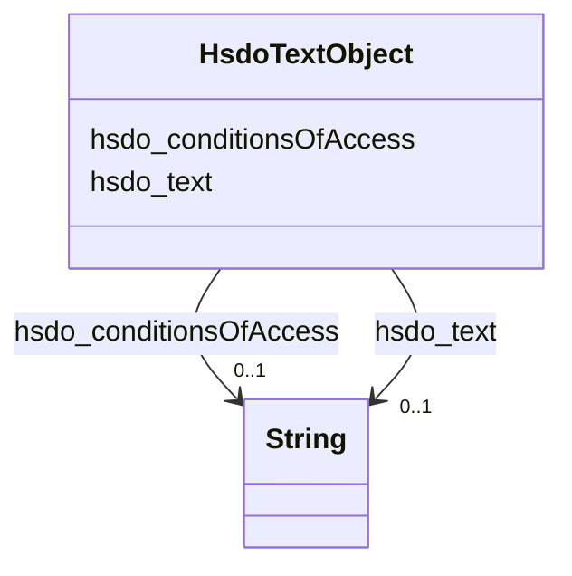

# Class: TextObject (hsdo_TextObject)


_A text file. The text can be unformatted or contain markup, html, etc._


This class occurs 87 times.


URI: [hsdo:TextObject](http://schema.org/TextObject)





<!-- no inheritance hierarchy -->


## Slots

| Name | Cardinality and Range | Description | Inheritance | Occurrences |
| ---  | --- | --- | --- | --- |
| [hsdo_conditionsOfAccess](../slots/hsdo_conditionsOfAccess.md) | 0..1 <br/> [xsd:string](http://www.w3.org/2001/XMLSchema#string) | Conditions that affect the availability of, or method(s) of access to, an ite... <br/>  | direct | 88 |
| [hsdo_text](../slots/hsdo_text.md) | 0..1 <br/> [xsd:string](http://www.w3.org/2001/XMLSchema#string) | The textual content of this CreativeWork <br/>  | direct | 90 |


## Usages

| used by | used in | type | used |
| ---  | --- | --- | --- |
| [HsdoService](../classes/HsdoService.md) | [hsdo_description](../slots/hsdo_description.md) | range | [HsdoTextObject](../classes/HsdoTextObject.md) |


## LinkML Source

<!-- TODO: investigate https://stackoverflow.com/questions/37606292/how-to-create-tabbed-code-blocks-in-mkdocs-or-sphinx -->

### Direct

<details>

```yaml
name: hsdo_TextObject
conforms_to: No schema conformance document specified
annotations:
  count:
    tag: count
    value: 87
description: A text file. The text can be unformatted or contain markup, html, etc.
title: TextObject
from_schema: dream-kg
rank: 1000
slots:
- hsdo_conditionsOfAccess
- hsdo_text
slot_usage:
  hsdo_conditionsOfAccess:
    name: hsdo_conditionsOfAccess
    annotations:
      string:
        tag: string
        value: 88
  hsdo_text:
    name: hsdo_text
    annotations:
      string:
        tag: string
        value: 90
class_uri: hsdo:TextObject

```
</details>

### Induced

<details>

```yaml
name: hsdo_TextObject
conforms_to: No schema conformance document specified
annotations:
  count:
    tag: count
    value: 87
description: A text file. The text can be unformatted or contain markup, html, etc.
title: TextObject
from_schema: dream-kg
rank: 1000
slot_usage:
  hsdo_conditionsOfAccess:
    name: hsdo_conditionsOfAccess
    annotations:
      string:
        tag: string
        value: 88
  hsdo_text:
    name: hsdo_text
    annotations:
      string:
        tag: string
        value: 90
attributes:
  hsdo_conditionsOfAccess:
    name: hsdo_conditionsOfAccess
    annotations:
      string:
        tag: string
        value: 88
    description: 'Conditions that affect the availability of, or method(s) of access
      to, an item. Typically used for real world items such as an [[ArchiveComponent]]
      held by an [[ArchiveOrganization]]. This property is not suitable for use as
      a general Web access control mechanism. It is expressed only in natural language.\n\nFor
      example "Available by appointment from the Reading Room" or "Accessible only
      from logged-in accounts ". '
    title: conditionsOfAccess
    examples:
    - description: hsdo_TextObject→string
      object:
        example_object: We serve single men experiencing homelessness.
        example_object_type: string
        example_predicate: hsdo:conditionsOfAccess
        example_subject: dreamkg:service/desc/6354456388829184
        example_subject_type: hsdo_TextObject
    from_schema: dream-kg
    rank: 1000
    slot_uri: hsdo:conditionsOfAccess
    alias: hsdo_conditionsOfAccess
    owner: hsdo_TextObject
    domain_of:
    - hsdo_TextObject
    range: string
  hsdo_text:
    name: hsdo_text
    annotations:
      string:
        tag: string
        value: 90
    description: The textual content of this CreativeWork.
    title: text
    examples:
    - description: hsdo_TextObject→string
      object:
        example_object: Centralized Homeless Intake Services includes an assessment
          of eligibility and service needs of persons and families presenting for
          placement into emergency housing. If eligible, persons and families are
          placed in appropriate emergency housing, boarding homes, or other alternative
          housing. Services include:- Temporary shelter- Ongoing case management services-
          Assistance with obtaining transitional and/or permanent housing- Supportive
          housing for special populations- An optional savings program which allows
          households to save a part of their income for future housing expensesMental
          health assessments and referrals to drug/alcohol treatment, health services,
          children and youth services, legal services and veteran's services, etc.,
          are provided as needed to clients of the program.- Connecting Services to
          other community resources- ScreeningIf you are currently experiencing homelessness,
          please call us during business hours. You must go through central intake
          for an initial assessment of your housing needs before placement into the
          homeless housing system.
        example_object_type: string
        example_predicate: hsdo:text
        example_subject: dreamkg:service/desc/6354456388829184
        example_subject_type: hsdo_TextObject
    from_schema: dream-kg
    rank: 1000
    slot_uri: hsdo:text
    alias: hsdo_text
    owner: hsdo_TextObject
    domain_of:
    - hsdo_TextObject
    range: string
class_uri: hsdo:TextObject

```
</details>