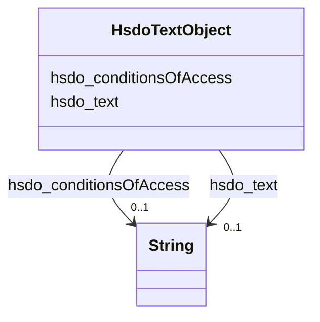

# Class: TextObject (hsdo_TextObject)


_A text file. The text can be unformatted or contain markup, html, etc._


URI: [hsdo:TextObject](hsdo:TextObject)





<!-- no inheritance hierarchy -->


## Slots

| Name | Cardinality and Range | Description | Inheritance |
| ---  | --- | --- | --- |
| [hsdo_text](../slots/hsdo_text.md) | 0..1 <br/> [xsd:string](xsd:string) | No slot (predicate) description specified | direct |
| [hsdo_conditionsOfAccess](../slots/hsdo_conditionsOfAccess.md) | 0..1 <br/> [xsd:string](xsd:string) | No slot (predicate) description specified | direct |


## Usages

| used by | used in | type | used |
| ---  | --- | --- | --- |
| [HsdoService](../classes/HsdoService.md) | [hsdo_description](../slots/hsdo_description.md) | range | [HsdoTextObject](../classes/HsdoTextObject.md) |


## Identifier and Mapping Information


### Schema Source


* from schema: dream-kg


## Mappings

| Mapping Type | Mapped Value |
| ---  | ---  |
| self | hsdo:TextObject |
| native | dream-kg/:HsdoTextObject |


## LinkML Source

<!-- TODO: investigate https://stackoverflow.com/questions/37606292/how-to-create-tabbed-code-blocks-in-mkdocs-or-sphinx -->

### Direct

<details>
```yaml
name: hsdo_TextObject
description: A text file. The text can be unformatted or contain markup, html, etc.
title: TextObject
notes:
- Class with 87 occurrences.
from_schema: dream-kg
rank: 1000
slots:
- hsdo_text
- hsdo_conditionsOfAccess
class_uri: hsdo:TextObject

```
</details>

### Induced

<details>
```yaml
name: hsdo_TextObject
description: A text file. The text can be unformatted or contain markup, html, etc.
title: TextObject
notes:
- Class with 87 occurrences.
from_schema: dream-kg
rank: 1000
attributes:
  hsdo_text:
    name: hsdo_text
    description: No slot (predicate) description specified
    comments:
    - 90 occurrences with subject type hsdo_TextObject and object type string.
    examples:
    - description: hsdo_TextObject → string
      object:
        example_object: Merakey offers comprehensive clinical, evidence-based practice,
          and therapeutic programs in both community based and clinic based settings
          to address the impact of addiction on the community, family, and individual.Services
          Include:- Group, Family, and Individual Counseling- Outpatient and Intensive
          Outpatient Programs- Drug Free and Medication Assisted Modalities- Co-Occurring
          Disorders Treatment- Pharmacotherapy Programs- Drug and Alcohol Education-
          Life Skills Management- Relapse Prevention Planning- Drug ScreeningMerakey
          accepts Medicaid.
        example_predicate: hsdo:text
        example_subject: dreamkg:service/desc/6032260047568896
    from_schema: dream-kg
    rank: 1000
    slot_uri: hsdo:text
    alias: hsdo_text
    owner: hsdo_TextObject
    domain_of:
    - hsdo_TextObject
    range: string
  hsdo_conditionsOfAccess:
    name: hsdo_conditionsOfAccess
    description: No slot (predicate) description specified
    comments:
    - 88 occurrences with subject type hsdo_TextObject and object type string.
    examples:
    - description: hsdo_TextObject → string
      object:
        example_object: Must have Medicare or Medicaid.
        example_predicate: hsdo:conditionsOfAccess
        example_subject: dreamkg:service/desc/4829363626049536
    from_schema: dream-kg
    rank: 1000
    slot_uri: hsdo:conditionsOfAccess
    alias: hsdo_conditionsOfAccess
    owner: hsdo_TextObject
    domain_of:
    - hsdo_TextObject
    range: string
class_uri: hsdo:TextObject

```
</details>