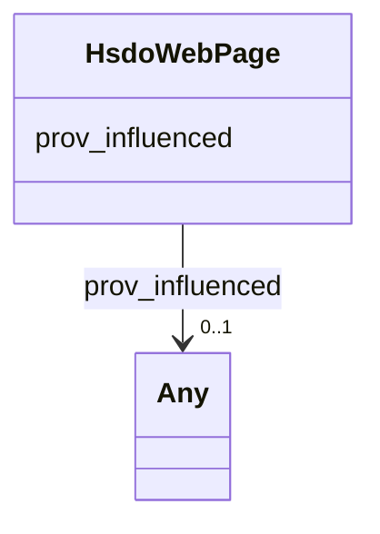

# Class: WebPage (hsdo_WebPage)


_A web page. Every web page is implicitly assumed to be declared to be of type WebPage, so the various properties about that webpage, such as <code>breadcrumb</code> may be used. We recommend explicit declaration if these properties are specified, but if they are found outside of an itemscope, they will be assumed to be about the page._


This class occurs 87 times.


URI: [hsdo:WebPage](http://schema.org/WebPage)





<!-- no inheritance hierarchy -->


## Slots

| Name | Cardinality and Range | Description | Inheritance | Occurrences |
| ---  | --- | --- | --- | --- |
| [prov_influenced](../slots/prov_influenced.md) | 0..1 <br/> [HsdoTextObject](../classes/HsdoTextObject.md)&nbsp;or&nbsp;<br />[HsdoService](../classes/HsdoService.md)&nbsp;or&nbsp;<br />[HsdoOpeningHoursSpecification](../classes/HsdoOpeningHoursSpecification.md)&nbsp;or&nbsp;<br />[HsdoOrganization](../classes/HsdoOrganization.md)&nbsp;or&nbsp;<br />[ProvCollection](../classes/ProvCollection.md)&nbsp;or&nbsp;<br />[ProvEntity](../classes/ProvEntity.md)&nbsp;or&nbsp;<br />[HsdoCategoryCode](../classes/HsdoCategoryCode.md)&nbsp;or&nbsp;<br />[HsdoAudience](../classes/HsdoAudience.md)&nbsp;or&nbsp;<br />[HsdoPlace](../classes/HsdoPlace.md)&nbsp;or&nbsp;<br />[HsdoContactPoint](../classes/HsdoContactPoint.md)&nbsp;or&nbsp;<br />[HsdoAdministrativeArea](../classes/HsdoAdministrativeArea.md) | No slot (predicate) description specified <br/>  | direct | 2436 |


## Usages

| used by | used in | type | used |
| ---  | --- | --- | --- |
| [HsdoAdministrativeArea](../classes/HsdoAdministrativeArea.md) | [prov_wasInfluencedBy](../slots/prov_wasInfluencedBy.md) | any_of[range] | [HsdoWebPage](../classes/HsdoWebPage.md) |
| [HsdoAudience](../classes/HsdoAudience.md) | [prov_wasInfluencedBy](../slots/prov_wasInfluencedBy.md) | any_of[range] | [HsdoWebPage](../classes/HsdoWebPage.md) |
| [HsdoCategoryCode](../classes/HsdoCategoryCode.md) | [prov_wasInfluencedBy](../slots/prov_wasInfluencedBy.md) | any_of[range] | [HsdoWebPage](../classes/HsdoWebPage.md) |
| [HsdoContactPoint](../classes/HsdoContactPoint.md) | [prov_wasInfluencedBy](../slots/prov_wasInfluencedBy.md) | any_of[range] | [HsdoWebPage](../classes/HsdoWebPage.md) |
| [HsdoOpeningHoursSpecification](../classes/HsdoOpeningHoursSpecification.md) | [prov_wasInfluencedBy](../slots/prov_wasInfluencedBy.md) | any_of[range] | [HsdoWebPage](../classes/HsdoWebPage.md) |
| [HsdoOrganization](../classes/HsdoOrganization.md) | [prov_wasInfluencedBy](../slots/prov_wasInfluencedBy.md) | any_of[range] | [HsdoWebPage](../classes/HsdoWebPage.md) |
| [HsdoPlace](../classes/HsdoPlace.md) | [prov_wasInfluencedBy](../slots/prov_wasInfluencedBy.md) | any_of[range] | [HsdoWebPage](../classes/HsdoWebPage.md) |
| [HsdoService](../classes/HsdoService.md) | [prov_wasInfluencedBy](../slots/prov_wasInfluencedBy.md) | any_of[range] | [HsdoWebPage](../classes/HsdoWebPage.md) |
| [HsdoTextObject](../classes/HsdoTextObject.md) | [prov_wasInfluencedBy](../slots/prov_wasInfluencedBy.md) | any_of[range] | [HsdoWebPage](../classes/HsdoWebPage.md) |
| [ProvCollection](../classes/ProvCollection.md) | [prov_hadMember](../slots/prov_hadMember.md) | any_of[range] | [HsdoWebPage](../classes/HsdoWebPage.md) |
| [ProvCollection](../classes/ProvCollection.md) | [prov_wasInfluencedBy](../slots/prov_wasInfluencedBy.md) | any_of[range] | [HsdoWebPage](../classes/HsdoWebPage.md) |
| [ProvEntity](../classes/ProvEntity.md) | [prov_hadMember](../slots/prov_hadMember.md) | any_of[range] | [HsdoWebPage](../classes/HsdoWebPage.md) |
| [ProvEntity](../classes/ProvEntity.md) | [prov_wasInfluencedBy](../slots/prov_wasInfluencedBy.md) | any_of[range] | [HsdoWebPage](../classes/HsdoWebPage.md) |


## LinkML Source

<!-- TODO: investigate https://stackoverflow.com/questions/37606292/how-to-create-tabbed-code-blocks-in-mkdocs-or-sphinx -->

### Direct

<details>

```yaml
name: hsdo_WebPage
conforms_to: No schema conformance document specified
annotations:
  count:
    tag: count
    value: 87
description: A web page. Every web page is implicitly assumed to be declared to be
  of type WebPage, so the various properties about that webpage, such as <code>breadcrumb</code>
  may be used. We recommend explicit declaration if these properties are specified,
  but if they are found outside of an itemscope, they will be assumed to be about
  the page.
title: WebPage
from_schema: dream-kg
rank: 1000
slots:
- prov_influenced
slot_usage:
  prov_influenced:
    name: prov_influenced
    annotations:
      hsdo_ContactPoint:
        tag: hsdo_ContactPoint
        value: 87
      hsdo_OpeningHoursSpecification:
        tag: hsdo_OpeningHoursSpecification
        value: 609
      hsdo_Organization:
        tag: hsdo_Organization
        value: 87
      hsdo_Place:
        tag: hsdo_Place
        value: 87
      hsdo_Service:
        tag: hsdo_Service
        value: 87
      hsdo_TextObject:
        tag: hsdo_TextObject
        value: 87
      prov_Collection:
        tag: prov_Collection
        value: 87
      prov_Entity:
        tag: prov_Entity
        value: 1305
class_uri: hsdo:WebPage

```
</details>

### Induced

<details>

```yaml
name: hsdo_WebPage
conforms_to: No schema conformance document specified
annotations:
  count:
    tag: count
    value: 87
description: A web page. Every web page is implicitly assumed to be declared to be
  of type WebPage, so the various properties about that webpage, such as <code>breadcrumb</code>
  may be used. We recommend explicit declaration if these properties are specified,
  but if they are found outside of an itemscope, they will be assumed to be about
  the page.
title: WebPage
from_schema: dream-kg
rank: 1000
slot_usage:
  prov_influenced:
    name: prov_influenced
    annotations:
      hsdo_ContactPoint:
        tag: hsdo_ContactPoint
        value: 87
      hsdo_OpeningHoursSpecification:
        tag: hsdo_OpeningHoursSpecification
        value: 609
      hsdo_Organization:
        tag: hsdo_Organization
        value: 87
      hsdo_Place:
        tag: hsdo_Place
        value: 87
      hsdo_Service:
        tag: hsdo_Service
        value: 87
      hsdo_TextObject:
        tag: hsdo_TextObject
        value: 87
      prov_Collection:
        tag: prov_Collection
        value: 87
      prov_Entity:
        tag: prov_Entity
        value: 1305
attributes:
  prov_influenced:
    name: prov_influenced
    annotations:
      hsdo_ContactPoint:
        tag: hsdo_ContactPoint
        value: 87
      hsdo_OpeningHoursSpecification:
        tag: hsdo_OpeningHoursSpecification
        value: 609
      hsdo_Organization:
        tag: hsdo_Organization
        value: 87
      hsdo_Place:
        tag: hsdo_Place
        value: 87
      hsdo_Service:
        tag: hsdo_Service
        value: 87
      hsdo_TextObject:
        tag: hsdo_TextObject
        value: 87
      prov_Collection:
        tag: prov_Collection
        value: 87
      prov_Entity:
        tag: prov_Entity
        value: 1305
    description: No slot (predicate) description specified
    examples:
    - object:
        example_object: dreamkg:category/audience/AbuseOrNeglectSurvivors
        example_object_type: prov_Entity
        example_predicate: prov:influenced
        example_subject: dreamkg:data/sql
        example_subject_type: prov_Entity
    - object:
        example_object: dreamkg:category/audience/AbuseOrNeglectSurvivors
        example_object_type: hsdo_Audience
        example_predicate: prov:influenced
        example_subject: dreamkg:data/sql
        example_subject_type: prov_Entity
    - object:
        example_object: dreamkg:category/availability/Available
        example_object_type: hsdo_CategoryCode
        example_predicate: prov:influenced
        example_subject: dreamkg:data/sql
        example_subject_type: prov_Entity
    - object:
        example_object: dreamkg:service/4542572480692224
        example_object_type: hsdo_Service
        example_predicate: prov:influenced
        example_subject: dreamkg:data/sql
        example_subject_type: prov_Entity
    - object:
        example_object: dreamkg:service/desc/4542572480692224
        example_object_type: hsdo_TextObject
        example_predicate: prov:influenced
        example_subject: dreamkg:data/sql
        example_subject_type: prov_Entity
    - object:
        example_object: dreamkg:service/hours/friday/4542572480692224
        example_object_type: hsdo_OpeningHoursSpecification
        example_predicate: prov:influenced
        example_subject: dreamkg:data/sql
        example_subject_type: prov_Entity
    - object:
        example_object: dreamkg:service/location/4542572480692224
        example_object_type: hsdo_Place
        example_predicate: prov:influenced
        example_subject: dreamkg:data/sql
        example_subject_type: prov_Entity
    - object:
        example_object: dreamkg:service/phone/4542572480692224
        example_object_type: hsdo_ContactPoint
        example_predicate: prov:influenced
        example_subject: dreamkg:data/sql
        example_subject_type: prov_Entity
    - object:
        example_object: dreamkg:service/provider/4542572480692224
        example_object_type: hsdo_Organization
        example_predicate: prov:influenced
        example_subject: dreamkg:data/sql
        example_subject_type: prov_Entity
    - object:
        example_object: dreamkg:zip/17602
        example_object_type: hsdo_AdministrativeArea
        example_predicate: prov:influenced
        example_subject: dreamkg:data/sql
        example_subject_type: prov_Entity
    - object:
        example_object: dreamkg:zip/19320
        example_object_type: prov_Entity
        example_predicate: prov:influenced
        example_subject: dreamkg:file/AuntBertha/UpToDateVersions/Final_Temporary_Shelter_20240109.csv
        example_subject_type: None
    - object:
        example_object: dreamkg:category/audience/YoungAdults
        example_object_type: hsdo_Audience
        example_predicate: prov:influenced
        example_subject: dreamkg:file/AuntBertha/UpToDateVersions/Final_Temporary_Shelter_20240109.csv
        example_subject_type: None
    - object:
        example_object: dreamkg:category/service/other/WeatherRelief
        example_object_type: hsdo_CategoryCode
        example_predicate: prov:influenced
        example_subject: dreamkg:file/AuntBertha/UpToDateVersions/Final_Temporary_Shelter_20240109.csv
        example_subject_type: None
    - object:
        example_object: dreamkg:zip/19320
        example_object_type: hsdo_AdministrativeArea
        example_predicate: prov:influenced
        example_subject: dreamkg:file/AuntBertha/UpToDateVersions/Final_Temporary_Shelter_20240109.csv
        example_subject_type: None
    - object:
        example_object: dreamkg:category/audience/AbuseOrNeglectSurvivors
        example_object_type: prov_Entity
        example_predicate: prov:influenced
        example_subject: dreamkg:process/run/ontop-CM
        example_subject_type: prov_Activity
    - object:
        example_object: dreamkg:category/audience/AbuseOrNeglectSurvivors
        example_object_type: hsdo_Audience
        example_predicate: prov:influenced
        example_subject: dreamkg:process/run/ontop-CM
        example_subject_type: prov_Activity
    - object:
        example_object: dreamkg:category/availability/Available
        example_object_type: hsdo_CategoryCode
        example_predicate: prov:influenced
        example_subject: dreamkg:process/run/ontop-CM
        example_subject_type: prov_Activity
    - object:
        example_object: dreamkg:service/4542572480692224
        example_object_type: hsdo_Service
        example_predicate: prov:influenced
        example_subject: dreamkg:process/run/ontop-CM
        example_subject_type: prov_Activity
    - object:
        example_object: dreamkg:service/desc/4542572480692224
        example_object_type: hsdo_TextObject
        example_predicate: prov:influenced
        example_subject: dreamkg:process/run/ontop-CM
        example_subject_type: prov_Activity
    - object:
        example_object: dreamkg:service/hours/friday/4542572480692224
        example_object_type: hsdo_OpeningHoursSpecification
        example_predicate: prov:influenced
        example_subject: dreamkg:process/run/ontop-CM
        example_subject_type: prov_Activity
    - object:
        example_object: dreamkg:service/location/4542572480692224
        example_object_type: hsdo_Place
        example_predicate: prov:influenced
        example_subject: dreamkg:process/run/ontop-CM
        example_subject_type: prov_Activity
    - object:
        example_object: dreamkg:service/phone/4542572480692224
        example_object_type: hsdo_ContactPoint
        example_predicate: prov:influenced
        example_subject: dreamkg:process/run/ontop-CM
        example_subject_type: prov_Activity
    - object:
        example_object: dreamkg:service/provider/4542572480692224
        example_object_type: hsdo_Organization
        example_predicate: prov:influenced
        example_subject: dreamkg:process/run/ontop-CM
        example_subject_type: prov_Activity
    - object:
        example_object: dreamkg:zip/17602
        example_object_type: hsdo_AdministrativeArea
        example_predicate: prov:influenced
        example_subject: dreamkg:process/run/ontop-CM
        example_subject_type: prov_Activity
    - object:
        example_object: dreamkg:file/kg.ttl
        example_object_type: prov_Collection
        example_predicate: prov:influenced
        example_subject: dreamkg:service/4542572480692224
        example_subject_type: hsdo_Service
    - object:
        example_object: dreamkg:file/kg.ttl
        example_object_type: prov_Entity
        example_predicate: prov:influenced
        example_subject: dreamkg:service/4542572480692224
        example_subject_type: hsdo_Service
    - object:
        example_object: dreamkg:file/kg.ttl
        example_object_type: prov_Collection
        example_predicate: prov:influenced
        example_subject: dreamkg:service/4542572480692224
        example_subject_type: prov_Entity
    - object:
        example_object: dreamkg:file/kg.ttl
        example_object_type: prov_Collection
        example_predicate: prov:influenced
        example_subject: dreamkg:service/desc/4542572480692224
        example_subject_type: hsdo_TextObject
    - object:
        example_object: dreamkg:file/kg.ttl
        example_object_type: prov_Entity
        example_predicate: prov:influenced
        example_subject: dreamkg:service/desc/4542572480692224
        example_subject_type: hsdo_TextObject
    - object:
        example_object: dreamkg:file/kg.ttl
        example_object_type: prov_Collection
        example_predicate: prov:influenced
        example_subject: dreamkg:service/hours/friday/4542572480692224
        example_subject_type: hsdo_OpeningHoursSpecification
    - object:
        example_object: dreamkg:file/kg.ttl
        example_object_type: prov_Entity
        example_predicate: prov:influenced
        example_subject: dreamkg:service/hours/friday/4542572480692224
        example_subject_type: hsdo_OpeningHoursSpecification
    - object:
        example_object: dreamkg:file/kg.ttl
        example_object_type: prov_Collection
        example_predicate: prov:influenced
        example_subject: dreamkg:service/location/4542572480692224
        example_subject_type: hsdo_Place
    - object:
        example_object: dreamkg:file/kg.ttl
        example_object_type: prov_Entity
        example_predicate: prov:influenced
        example_subject: dreamkg:service/location/4542572480692224
        example_subject_type: hsdo_Place
    - object:
        example_object: dreamkg:file/kg.ttl
        example_object_type: prov_Collection
        example_predicate: prov:influenced
        example_subject: dreamkg:service/phone/4542572480692224
        example_subject_type: hsdo_ContactPoint
    - object:
        example_object: dreamkg:file/kg.ttl
        example_object_type: prov_Entity
        example_predicate: prov:influenced
        example_subject: dreamkg:service/phone/4542572480692224
        example_subject_type: hsdo_ContactPoint
    - object:
        example_object: dreamkg:file/kg.ttl
        example_object_type: prov_Collection
        example_predicate: prov:influenced
        example_subject: dreamkg:service/provider/4542572480692224
        example_subject_type: hsdo_Organization
    - object:
        example_object: dreamkg:file/kg.ttl
        example_object_type: prov_Entity
        example_predicate: prov:influenced
        example_subject: dreamkg:service/provider/4542572480692224
        example_subject_type: hsdo_Organization
    - object:
        example_object: dreamkg:outside/ab
        example_object_type: prov_Collection
        example_predicate: prov:influenced
        example_subject: https://www.auntbertha.com//achievement-through-counseling-and-treatment-%2528act-1%2529--philadelphia-pa--opioid-treatment-program-%2528otp%2529/5792020391002112
        example_subject_type: hsdo_WebPage
    - object:
        example_object: dreamkg:outside/ab
        example_object_type: prov_Entity
        example_predicate: prov:influenced
        example_subject: https://www.auntbertha.com//achievement-through-counseling-and-treatment-%2528act-1%2529--philadelphia-pa--opioid-treatment-program-%2528otp%2529/5792020391002112
        example_subject_type: hsdo_WebPage
    - object:
        example_object: dreamkg:service/5792020391002112
        example_object_type: hsdo_Service
        example_predicate: prov:influenced
        example_subject: https://www.auntbertha.com//achievement-through-counseling-and-treatment-%2528act-1%2529--philadelphia-pa--opioid-treatment-program-%2528otp%2529/5792020391002112
        example_subject_type: hsdo_WebPage
    - object:
        example_object: dreamkg:service/desc/5792020391002112
        example_object_type: hsdo_TextObject
        example_predicate: prov:influenced
        example_subject: https://www.auntbertha.com//achievement-through-counseling-and-treatment-%2528act-1%2529--philadelphia-pa--opioid-treatment-program-%2528otp%2529/5792020391002112
        example_subject_type: hsdo_WebPage
    - object:
        example_object: dreamkg:service/hours/friday/5792020391002112
        example_object_type: hsdo_OpeningHoursSpecification
        example_predicate: prov:influenced
        example_subject: https://www.auntbertha.com//achievement-through-counseling-and-treatment-%2528act-1%2529--philadelphia-pa--opioid-treatment-program-%2528otp%2529/5792020391002112
        example_subject_type: hsdo_WebPage
    - object:
        example_object: dreamkg:service/location/5792020391002112
        example_object_type: hsdo_Place
        example_predicate: prov:influenced
        example_subject: https://www.auntbertha.com//achievement-through-counseling-and-treatment-%2528act-1%2529--philadelphia-pa--opioid-treatment-program-%2528otp%2529/5792020391002112
        example_subject_type: hsdo_WebPage
    - object:
        example_object: dreamkg:service/phone/5792020391002112
        example_object_type: hsdo_ContactPoint
        example_predicate: prov:influenced
        example_subject: https://www.auntbertha.com//achievement-through-counseling-and-treatment-%2528act-1%2529--philadelphia-pa--opioid-treatment-program-%2528otp%2529/5792020391002112
        example_subject_type: hsdo_WebPage
    - object:
        example_object: dreamkg:service/provider/5792020391002112
        example_object_type: hsdo_Organization
        example_predicate: prov:influenced
        example_subject: https://www.auntbertha.com//achievement-through-counseling-and-treatment-%2528act-1%2529--philadelphia-pa--opioid-treatment-program-%2528otp%2529/5792020391002112
        example_subject_type: hsdo_WebPage
    from_schema: dream-kg
    rank: 1000
    slot_uri: prov:influenced
    alias: prov_influenced
    owner: hsdo_WebPage
    domain_of:
    - hsdo_ContactPoint
    - hsdo_OpeningHoursSpecification
    - hsdo_Organization
    - hsdo_Place
    - hsdo_Service
    - hsdo_TextObject
    - hsdo_WebPage
    - prov_Activity
    - prov_Entity
    range: Any
    any_of:
    - range: hsdo_TextObject
    - range: hsdo_Service
    - range: hsdo_OpeningHoursSpecification
    - range: hsdo_Organization
    - range: prov_Collection
    - range: prov_Entity
    - range: hsdo_CategoryCode
    - range: hsdo_Audience
    - range: hsdo_Place
    - range: hsdo_ContactPoint
    - range: hsdo_AdministrativeArea
class_uri: hsdo:WebPage

```
</details>