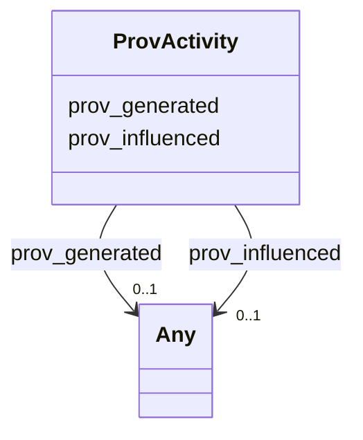

# Class: No class (type) name specified (prov_Activity)


_No class (type) description specified_


This class occurs 1 times.


URI: [prov:Activity](http://www.w3.org/ns/prov#Activity)





<!-- no inheritance hierarchy -->


## Slots

| Name | Cardinality and Range | Description | Inheritance | Occurrences |
| ---  | --- | --- | --- | --- |
| [prov_influenced](../slots/prov_influenced.md) | 0..1 <br/> [HsdoCategoryCode](../classes/HsdoCategoryCode.md)&nbsp;or&nbsp;<br />[HsdoAudience](../classes/HsdoAudience.md)&nbsp;or&nbsp;<br />[HsdoPlace](../classes/HsdoPlace.md)&nbsp;or&nbsp;<br />[HsdoAdministrativeArea](../classes/HsdoAdministrativeArea.md)&nbsp;or&nbsp;<br />[HsdoOpeningHoursSpecification](../classes/HsdoOpeningHoursSpecification.md)&nbsp;or&nbsp;<br />[ProvCollection](../classes/ProvCollection.md)&nbsp;or&nbsp;<br />[HsdoService](../classes/HsdoService.md)&nbsp;or&nbsp;<br />[ProvEntity](../classes/ProvEntity.md)&nbsp;or&nbsp;<br />[HsdoOrganization](../classes/HsdoOrganization.md)&nbsp;or&nbsp;<br />[HsdoContactPoint](../classes/HsdoContactPoint.md)&nbsp;or&nbsp;<br />[HsdoTextObject](../classes/HsdoTextObject.md) | No slot (predicate) description specified <br/>  | direct | 2816 |
| [prov_generated](../slots/prov_generated.md) | 0..1 <br/> [HsdoCategoryCode](../classes/HsdoCategoryCode.md)&nbsp;or&nbsp;<br />[HsdoAudience](../classes/HsdoAudience.md)&nbsp;or&nbsp;<br />[HsdoPlace](../classes/HsdoPlace.md)&nbsp;or&nbsp;<br />[HsdoAdministrativeArea](../classes/HsdoAdministrativeArea.md)&nbsp;or&nbsp;<br />[HsdoOpeningHoursSpecification](../classes/HsdoOpeningHoursSpecification.md)&nbsp;or&nbsp;<br />[HsdoService](../classes/HsdoService.md)&nbsp;or&nbsp;<br />[ProvEntity](../classes/ProvEntity.md)&nbsp;or&nbsp;<br />[HsdoOrganization](../classes/HsdoOrganization.md)&nbsp;or&nbsp;<br />[HsdoContactPoint](../classes/HsdoContactPoint.md)&nbsp;or&nbsp;<br />[HsdoTextObject](../classes/HsdoTextObject.md) | No slot (predicate) description specified <br/>  | direct | 2816 |


## Usages

| used by | used in | type | used |
| ---  | --- | --- | --- |
| [HsdoAdministrativeArea](../classes/HsdoAdministrativeArea.md) | [prov_wasGeneratedBy](../slots/prov_wasGeneratedBy.md) | range | [ProvActivity](../classes/ProvActivity.md) |
| [HsdoAdministrativeArea](../classes/HsdoAdministrativeArea.md) | [prov_wasInfluencedBy](../slots/prov_wasInfluencedBy.md) | any_of[range] | [ProvActivity](../classes/ProvActivity.md) |
| [HsdoAudience](../classes/HsdoAudience.md) | [prov_wasGeneratedBy](../slots/prov_wasGeneratedBy.md) | range | [ProvActivity](../classes/ProvActivity.md) |
| [HsdoAudience](../classes/HsdoAudience.md) | [prov_wasInfluencedBy](../slots/prov_wasInfluencedBy.md) | any_of[range] | [ProvActivity](../classes/ProvActivity.md) |
| [HsdoCategoryCode](../classes/HsdoCategoryCode.md) | [prov_wasGeneratedBy](../slots/prov_wasGeneratedBy.md) | range | [ProvActivity](../classes/ProvActivity.md) |
| [HsdoCategoryCode](../classes/HsdoCategoryCode.md) | [prov_wasInfluencedBy](../slots/prov_wasInfluencedBy.md) | any_of[range] | [ProvActivity](../classes/ProvActivity.md) |
| [HsdoContactPoint](../classes/HsdoContactPoint.md) | [prov_wasGeneratedBy](../slots/prov_wasGeneratedBy.md) | range | [ProvActivity](../classes/ProvActivity.md) |
| [HsdoContactPoint](../classes/HsdoContactPoint.md) | [prov_wasInfluencedBy](../slots/prov_wasInfluencedBy.md) | any_of[range] | [ProvActivity](../classes/ProvActivity.md) |
| [HsdoOpeningHoursSpecification](../classes/HsdoOpeningHoursSpecification.md) | [prov_wasGeneratedBy](../slots/prov_wasGeneratedBy.md) | range | [ProvActivity](../classes/ProvActivity.md) |
| [HsdoOpeningHoursSpecification](../classes/HsdoOpeningHoursSpecification.md) | [prov_wasInfluencedBy](../slots/prov_wasInfluencedBy.md) | any_of[range] | [ProvActivity](../classes/ProvActivity.md) |
| [HsdoOrganization](../classes/HsdoOrganization.md) | [prov_wasGeneratedBy](../slots/prov_wasGeneratedBy.md) | range | [ProvActivity](../classes/ProvActivity.md) |
| [HsdoOrganization](../classes/HsdoOrganization.md) | [prov_wasInfluencedBy](../slots/prov_wasInfluencedBy.md) | any_of[range] | [ProvActivity](../classes/ProvActivity.md) |
| [HsdoPlace](../classes/HsdoPlace.md) | [prov_wasGeneratedBy](../slots/prov_wasGeneratedBy.md) | range | [ProvActivity](../classes/ProvActivity.md) |
| [HsdoPlace](../classes/HsdoPlace.md) | [prov_wasInfluencedBy](../slots/prov_wasInfluencedBy.md) | any_of[range] | [ProvActivity](../classes/ProvActivity.md) |
| [HsdoService](../classes/HsdoService.md) | [prov_wasGeneratedBy](../slots/prov_wasGeneratedBy.md) | range | [ProvActivity](../classes/ProvActivity.md) |
| [HsdoService](../classes/HsdoService.md) | [prov_wasInfluencedBy](../slots/prov_wasInfluencedBy.md) | any_of[range] | [ProvActivity](../classes/ProvActivity.md) |
| [HsdoTextObject](../classes/HsdoTextObject.md) | [prov_wasGeneratedBy](../slots/prov_wasGeneratedBy.md) | range | [ProvActivity](../classes/ProvActivity.md) |
| [HsdoTextObject](../classes/HsdoTextObject.md) | [prov_wasInfluencedBy](../slots/prov_wasInfluencedBy.md) | any_of[range] | [ProvActivity](../classes/ProvActivity.md) |
| [ProvCollection](../classes/ProvCollection.md) | [prov_wasInfluencedBy](../slots/prov_wasInfluencedBy.md) | any_of[range] | [ProvActivity](../classes/ProvActivity.md) |
| [ProvEntity](../classes/ProvEntity.md) | [prov_wasGeneratedBy](../slots/prov_wasGeneratedBy.md) | range | [ProvActivity](../classes/ProvActivity.md) |
| [ProvEntity](../classes/ProvEntity.md) | [prov_wasInfluencedBy](../slots/prov_wasInfluencedBy.md) | any_of[range] | [ProvActivity](../classes/ProvActivity.md) |


## LinkML Source

<!-- TODO: investigate https://stackoverflow.com/questions/37606292/how-to-create-tabbed-code-blocks-in-mkdocs-or-sphinx -->

### Direct

<details>

```yaml
name: prov_Activity
conforms_to: No schema conformance document specified
annotations:
  count:
    tag: count
    value: 1
description: No class (type) description specified
title: No class (type) name specified
from_schema: dream-kg
rank: 1000
slots:
- prov_influenced
- prov_generated
slot_usage:
  prov_generated:
    name: prov_generated
    annotations:
      hsdo_AdministrativeArea:
        tag: hsdo_AdministrativeArea
        value: 39
      hsdo_Audience:
        tag: hsdo_Audience
        value: 81
      hsdo_CategoryCode:
        tag: hsdo_CategoryCode
        value: 157
      hsdo_ContactPoint:
        tag: hsdo_ContactPoint
        value: 87
      hsdo_OpeningHoursSpecification:
        tag: hsdo_OpeningHoursSpecification
        value: 609
      hsdo_Organization:
        tag: hsdo_Organization
        value: 87
      hsdo_Place:
        tag: hsdo_Place
        value: 87
      hsdo_Service:
        tag: hsdo_Service
        value: 87
      hsdo_TextObject:
        tag: hsdo_TextObject
        value: 87
      prov_Entity:
        tag: prov_Entity
        value: 1495
  prov_influenced:
    name: prov_influenced
    annotations:
      hsdo_AdministrativeArea:
        tag: hsdo_AdministrativeArea
        value: 39
      hsdo_Audience:
        tag: hsdo_Audience
        value: 81
      hsdo_CategoryCode:
        tag: hsdo_CategoryCode
        value: 157
      hsdo_ContactPoint:
        tag: hsdo_ContactPoint
        value: 87
      hsdo_OpeningHoursSpecification:
        tag: hsdo_OpeningHoursSpecification
        value: 609
      hsdo_Organization:
        tag: hsdo_Organization
        value: 87
      hsdo_Place:
        tag: hsdo_Place
        value: 87
      hsdo_Service:
        tag: hsdo_Service
        value: 87
      hsdo_TextObject:
        tag: hsdo_TextObject
        value: 87
      prov_Entity:
        tag: prov_Entity
        value: 1495
class_uri: prov:Activity

```
</details>

### Induced

<details>

```yaml
name: prov_Activity
conforms_to: No schema conformance document specified
annotations:
  count:
    tag: count
    value: 1
description: No class (type) description specified
title: No class (type) name specified
from_schema: dream-kg
rank: 1000
slot_usage:
  prov_generated:
    name: prov_generated
    annotations:
      hsdo_AdministrativeArea:
        tag: hsdo_AdministrativeArea
        value: 39
      hsdo_Audience:
        tag: hsdo_Audience
        value: 81
      hsdo_CategoryCode:
        tag: hsdo_CategoryCode
        value: 157
      hsdo_ContactPoint:
        tag: hsdo_ContactPoint
        value: 87
      hsdo_OpeningHoursSpecification:
        tag: hsdo_OpeningHoursSpecification
        value: 609
      hsdo_Organization:
        tag: hsdo_Organization
        value: 87
      hsdo_Place:
        tag: hsdo_Place
        value: 87
      hsdo_Service:
        tag: hsdo_Service
        value: 87
      hsdo_TextObject:
        tag: hsdo_TextObject
        value: 87
      prov_Entity:
        tag: prov_Entity
        value: 1495
  prov_influenced:
    name: prov_influenced
    annotations:
      hsdo_AdministrativeArea:
        tag: hsdo_AdministrativeArea
        value: 39
      hsdo_Audience:
        tag: hsdo_Audience
        value: 81
      hsdo_CategoryCode:
        tag: hsdo_CategoryCode
        value: 157
      hsdo_ContactPoint:
        tag: hsdo_ContactPoint
        value: 87
      hsdo_OpeningHoursSpecification:
        tag: hsdo_OpeningHoursSpecification
        value: 609
      hsdo_Organization:
        tag: hsdo_Organization
        value: 87
      hsdo_Place:
        tag: hsdo_Place
        value: 87
      hsdo_Service:
        tag: hsdo_Service
        value: 87
      hsdo_TextObject:
        tag: hsdo_TextObject
        value: 87
      prov_Entity:
        tag: prov_Entity
        value: 1495
attributes:
  prov_influenced:
    name: prov_influenced
    annotations:
      hsdo_AdministrativeArea:
        tag: hsdo_AdministrativeArea
        value: 39
      hsdo_Audience:
        tag: hsdo_Audience
        value: 81
      hsdo_CategoryCode:
        tag: hsdo_CategoryCode
        value: 157
      hsdo_ContactPoint:
        tag: hsdo_ContactPoint
        value: 87
      hsdo_OpeningHoursSpecification:
        tag: hsdo_OpeningHoursSpecification
        value: 609
      hsdo_Organization:
        tag: hsdo_Organization
        value: 87
      hsdo_Place:
        tag: hsdo_Place
        value: 87
      hsdo_Service:
        tag: hsdo_Service
        value: 87
      hsdo_TextObject:
        tag: hsdo_TextObject
        value: 87
      prov_Entity:
        tag: prov_Entity
        value: 1495
    description: No slot (predicate) description specified
    examples:
    - object:
        example_object: dreamkg:category/audience/AbuseOrNeglectSurvivors
        example_object_type: hsdo_Audience
        example_predicate: prov:influenced
        example_subject: dreamkg:data/sql
        example_subject_type: prov_Entity
    - object:
        example_object: dreamkg:category/audience/AbuseOrNeglectSurvivors
        example_object_type: prov_Entity
        example_predicate: prov:influenced
        example_subject: dreamkg:data/sql
        example_subject_type: prov_Entity
    - object:
        example_object: dreamkg:category/availability/Available
        example_object_type: hsdo_CategoryCode
        example_predicate: prov:influenced
        example_subject: dreamkg:data/sql
        example_subject_type: prov_Entity
    - object:
        example_object: dreamkg:service/4542572480692224
        example_object_type: hsdo_Service
        example_predicate: prov:influenced
        example_subject: dreamkg:data/sql
        example_subject_type: prov_Entity
    - object:
        example_object: dreamkg:service/desc/4542572480692224
        example_object_type: hsdo_TextObject
        example_predicate: prov:influenced
        example_subject: dreamkg:data/sql
        example_subject_type: prov_Entity
    - object:
        example_object: dreamkg:service/hours/friday/4542572480692224
        example_object_type: hsdo_OpeningHoursSpecification
        example_predicate: prov:influenced
        example_subject: dreamkg:data/sql
        example_subject_type: prov_Entity
    - object:
        example_object: dreamkg:service/location/4542572480692224
        example_object_type: hsdo_Place
        example_predicate: prov:influenced
        example_subject: dreamkg:data/sql
        example_subject_type: prov_Entity
    - object:
        example_object: dreamkg:service/phone/4542572480692224
        example_object_type: hsdo_ContactPoint
        example_predicate: prov:influenced
        example_subject: dreamkg:data/sql
        example_subject_type: prov_Entity
    - object:
        example_object: dreamkg:service/provider/4542572480692224
        example_object_type: hsdo_Organization
        example_predicate: prov:influenced
        example_subject: dreamkg:data/sql
        example_subject_type: prov_Entity
    - object:
        example_object: dreamkg:zip/17602
        example_object_type: hsdo_AdministrativeArea
        example_predicate: prov:influenced
        example_subject: dreamkg:data/sql
        example_subject_type: prov_Entity
    - object:
        example_object: dreamkg:category/audience/YoungAdults
        example_object_type: hsdo_Audience
        example_predicate: prov:influenced
        example_subject: dreamkg:file/AuntBertha/UpToDateVersions/Final_Temporary_Shelter_20240109.csv
        example_subject_type: None
    - object:
        example_object: dreamkg:zip/19320
        example_object_type: prov_Entity
        example_predicate: prov:influenced
        example_subject: dreamkg:file/AuntBertha/UpToDateVersions/Final_Temporary_Shelter_20240109.csv
        example_subject_type: None
    - object:
        example_object: dreamkg:category/service/other/WeatherRelief
        example_object_type: hsdo_CategoryCode
        example_predicate: prov:influenced
        example_subject: dreamkg:file/AuntBertha/UpToDateVersions/Final_Temporary_Shelter_20240109.csv
        example_subject_type: None
    - object:
        example_object: dreamkg:zip/19320
        example_object_type: hsdo_AdministrativeArea
        example_predicate: prov:influenced
        example_subject: dreamkg:file/AuntBertha/UpToDateVersions/Final_Temporary_Shelter_20240109.csv
        example_subject_type: None
    - object:
        example_object: dreamkg:category/audience/AbuseOrNeglectSurvivors
        example_object_type: hsdo_Audience
        example_predicate: prov:influenced
        example_subject: dreamkg:process/run/ontop-CM
        example_subject_type: prov_Activity
    - object:
        example_object: dreamkg:category/audience/AbuseOrNeglectSurvivors
        example_object_type: prov_Entity
        example_predicate: prov:influenced
        example_subject: dreamkg:process/run/ontop-CM
        example_subject_type: prov_Activity
    - object:
        example_object: dreamkg:category/availability/Available
        example_object_type: hsdo_CategoryCode
        example_predicate: prov:influenced
        example_subject: dreamkg:process/run/ontop-CM
        example_subject_type: prov_Activity
    - object:
        example_object: dreamkg:service/4542572480692224
        example_object_type: hsdo_Service
        example_predicate: prov:influenced
        example_subject: dreamkg:process/run/ontop-CM
        example_subject_type: prov_Activity
    - object:
        example_object: dreamkg:service/desc/4542572480692224
        example_object_type: hsdo_TextObject
        example_predicate: prov:influenced
        example_subject: dreamkg:process/run/ontop-CM
        example_subject_type: prov_Activity
    - object:
        example_object: dreamkg:service/hours/friday/4542572480692224
        example_object_type: hsdo_OpeningHoursSpecification
        example_predicate: prov:influenced
        example_subject: dreamkg:process/run/ontop-CM
        example_subject_type: prov_Activity
    - object:
        example_object: dreamkg:service/location/4542572480692224
        example_object_type: hsdo_Place
        example_predicate: prov:influenced
        example_subject: dreamkg:process/run/ontop-CM
        example_subject_type: prov_Activity
    - object:
        example_object: dreamkg:service/phone/4542572480692224
        example_object_type: hsdo_ContactPoint
        example_predicate: prov:influenced
        example_subject: dreamkg:process/run/ontop-CM
        example_subject_type: prov_Activity
    - object:
        example_object: dreamkg:service/provider/4542572480692224
        example_object_type: hsdo_Organization
        example_predicate: prov:influenced
        example_subject: dreamkg:process/run/ontop-CM
        example_subject_type: prov_Activity
    - object:
        example_object: dreamkg:zip/17602
        example_object_type: hsdo_AdministrativeArea
        example_predicate: prov:influenced
        example_subject: dreamkg:process/run/ontop-CM
        example_subject_type: prov_Activity
    - object:
        example_object: dreamkg:file/kg.ttl
        example_object_type: prov_Collection
        example_predicate: prov:influenced
        example_subject: dreamkg:service/4542572480692224
        example_subject_type: prov_Entity
    - object:
        example_object: dreamkg:file/kg.ttl
        example_object_type: prov_Entity
        example_predicate: prov:influenced
        example_subject: dreamkg:service/4542572480692224
        example_subject_type: hsdo_Service
    - object:
        example_object: dreamkg:file/kg.ttl
        example_object_type: prov_Collection
        example_predicate: prov:influenced
        example_subject: dreamkg:service/4542572480692224
        example_subject_type: hsdo_Service
    - object:
        example_object: dreamkg:file/kg.ttl
        example_object_type: prov_Entity
        example_predicate: prov:influenced
        example_subject: dreamkg:service/desc/4542572480692224
        example_subject_type: hsdo_TextObject
    - object:
        example_object: dreamkg:file/kg.ttl
        example_object_type: prov_Collection
        example_predicate: prov:influenced
        example_subject: dreamkg:service/desc/4542572480692224
        example_subject_type: hsdo_TextObject
    - object:
        example_object: dreamkg:file/kg.ttl
        example_object_type: prov_Entity
        example_predicate: prov:influenced
        example_subject: dreamkg:service/hours/friday/4542572480692224
        example_subject_type: hsdo_OpeningHoursSpecification
    - object:
        example_object: dreamkg:file/kg.ttl
        example_object_type: prov_Collection
        example_predicate: prov:influenced
        example_subject: dreamkg:service/hours/friday/4542572480692224
        example_subject_type: hsdo_OpeningHoursSpecification
    - object:
        example_object: dreamkg:file/kg.ttl
        example_object_type: prov_Entity
        example_predicate: prov:influenced
        example_subject: dreamkg:service/location/4542572480692224
        example_subject_type: hsdo_Place
    - object:
        example_object: dreamkg:file/kg.ttl
        example_object_type: prov_Collection
        example_predicate: prov:influenced
        example_subject: dreamkg:service/location/4542572480692224
        example_subject_type: hsdo_Place
    - object:
        example_object: dreamkg:file/kg.ttl
        example_object_type: prov_Entity
        example_predicate: prov:influenced
        example_subject: dreamkg:service/phone/4542572480692224
        example_subject_type: hsdo_ContactPoint
    - object:
        example_object: dreamkg:file/kg.ttl
        example_object_type: prov_Collection
        example_predicate: prov:influenced
        example_subject: dreamkg:service/phone/4542572480692224
        example_subject_type: hsdo_ContactPoint
    - object:
        example_object: dreamkg:file/kg.ttl
        example_object_type: prov_Entity
        example_predicate: prov:influenced
        example_subject: dreamkg:service/provider/4542572480692224
        example_subject_type: hsdo_Organization
    - object:
        example_object: dreamkg:file/kg.ttl
        example_object_type: prov_Collection
        example_predicate: prov:influenced
        example_subject: dreamkg:service/provider/4542572480692224
        example_subject_type: hsdo_Organization
    - object:
        example_object: dreamkg:outside/ab
        example_object_type: prov_Entity
        example_predicate: prov:influenced
        example_subject: https://www.auntbertha.com//achievement-through-counseling-and-treatment-%2528act-1%2529--philadelphia-pa--opioid-treatment-program-%2528otp%2529/5792020391002112
        example_subject_type: hsdo_WebPage
    - object:
        example_object: dreamkg:outside/ab
        example_object_type: prov_Collection
        example_predicate: prov:influenced
        example_subject: https://www.auntbertha.com//achievement-through-counseling-and-treatment-%2528act-1%2529--philadelphia-pa--opioid-treatment-program-%2528otp%2529/5792020391002112
        example_subject_type: hsdo_WebPage
    - object:
        example_object: dreamkg:service/5792020391002112
        example_object_type: hsdo_Service
        example_predicate: prov:influenced
        example_subject: https://www.auntbertha.com//achievement-through-counseling-and-treatment-%2528act-1%2529--philadelphia-pa--opioid-treatment-program-%2528otp%2529/5792020391002112
        example_subject_type: hsdo_WebPage
    - object:
        example_object: dreamkg:service/desc/5792020391002112
        example_object_type: hsdo_TextObject
        example_predicate: prov:influenced
        example_subject: https://www.auntbertha.com//achievement-through-counseling-and-treatment-%2528act-1%2529--philadelphia-pa--opioid-treatment-program-%2528otp%2529/5792020391002112
        example_subject_type: hsdo_WebPage
    - object:
        example_object: dreamkg:service/hours/friday/5792020391002112
        example_object_type: hsdo_OpeningHoursSpecification
        example_predicate: prov:influenced
        example_subject: https://www.auntbertha.com//achievement-through-counseling-and-treatment-%2528act-1%2529--philadelphia-pa--opioid-treatment-program-%2528otp%2529/5792020391002112
        example_subject_type: hsdo_WebPage
    - object:
        example_object: dreamkg:service/location/5792020391002112
        example_object_type: hsdo_Place
        example_predicate: prov:influenced
        example_subject: https://www.auntbertha.com//achievement-through-counseling-and-treatment-%2528act-1%2529--philadelphia-pa--opioid-treatment-program-%2528otp%2529/5792020391002112
        example_subject_type: hsdo_WebPage
    - object:
        example_object: dreamkg:service/phone/5792020391002112
        example_object_type: hsdo_ContactPoint
        example_predicate: prov:influenced
        example_subject: https://www.auntbertha.com//achievement-through-counseling-and-treatment-%2528act-1%2529--philadelphia-pa--opioid-treatment-program-%2528otp%2529/5792020391002112
        example_subject_type: hsdo_WebPage
    - object:
        example_object: dreamkg:service/provider/5792020391002112
        example_object_type: hsdo_Organization
        example_predicate: prov:influenced
        example_subject: https://www.auntbertha.com//achievement-through-counseling-and-treatment-%2528act-1%2529--philadelphia-pa--opioid-treatment-program-%2528otp%2529/5792020391002112
        example_subject_type: hsdo_WebPage
    from_schema: dream-kg
    rank: 1000
    slot_uri: prov:influenced
    alias: prov_influenced
    owner: prov_Activity
    domain_of:
    - hsdo_ContactPoint
    - hsdo_OpeningHoursSpecification
    - hsdo_Organization
    - hsdo_Place
    - hsdo_Service
    - hsdo_TextObject
    - hsdo_WebPage
    - prov_Activity
    - prov_Entity
    range: Any
    any_of:
    - range: hsdo_CategoryCode
    - range: hsdo_Audience
    - range: hsdo_Place
    - range: hsdo_AdministrativeArea
    - range: hsdo_OpeningHoursSpecification
    - range: prov_Collection
    - range: hsdo_Service
    - range: prov_Entity
    - range: hsdo_Organization
    - range: hsdo_ContactPoint
    - range: hsdo_TextObject
  prov_generated:
    name: prov_generated
    annotations:
      hsdo_AdministrativeArea:
        tag: hsdo_AdministrativeArea
        value: 39
      hsdo_Audience:
        tag: hsdo_Audience
        value: 81
      hsdo_CategoryCode:
        tag: hsdo_CategoryCode
        value: 157
      hsdo_ContactPoint:
        tag: hsdo_ContactPoint
        value: 87
      hsdo_OpeningHoursSpecification:
        tag: hsdo_OpeningHoursSpecification
        value: 609
      hsdo_Organization:
        tag: hsdo_Organization
        value: 87
      hsdo_Place:
        tag: hsdo_Place
        value: 87
      hsdo_Service:
        tag: hsdo_Service
        value: 87
      hsdo_TextObject:
        tag: hsdo_TextObject
        value: 87
      prov_Entity:
        tag: prov_Entity
        value: 1495
    description: No slot (predicate) description specified
    examples:
    - object:
        example_object: dreamkg:category/audience/AbuseOrNeglectSurvivors
        example_object_type: hsdo_Audience
        example_predicate: prov:generated
        example_subject: dreamkg:process/run/ontop-CM
        example_subject_type: prov_Activity
    - object:
        example_object: dreamkg:category/audience/AbuseOrNeglectSurvivors
        example_object_type: prov_Entity
        example_predicate: prov:generated
        example_subject: dreamkg:process/run/ontop-CM
        example_subject_type: prov_Activity
    - object:
        example_object: dreamkg:category/availability/Available
        example_object_type: hsdo_CategoryCode
        example_predicate: prov:generated
        example_subject: dreamkg:process/run/ontop-CM
        example_subject_type: prov_Activity
    - object:
        example_object: dreamkg:service/4542572480692224
        example_object_type: hsdo_Service
        example_predicate: prov:generated
        example_subject: dreamkg:process/run/ontop-CM
        example_subject_type: prov_Activity
    - object:
        example_object: dreamkg:service/desc/4542572480692224
        example_object_type: hsdo_TextObject
        example_predicate: prov:generated
        example_subject: dreamkg:process/run/ontop-CM
        example_subject_type: prov_Activity
    - object:
        example_object: dreamkg:service/hours/friday/4542572480692224
        example_object_type: hsdo_OpeningHoursSpecification
        example_predicate: prov:generated
        example_subject: dreamkg:process/run/ontop-CM
        example_subject_type: prov_Activity
    - object:
        example_object: dreamkg:service/location/4542572480692224
        example_object_type: hsdo_Place
        example_predicate: prov:generated
        example_subject: dreamkg:process/run/ontop-CM
        example_subject_type: prov_Activity
    - object:
        example_object: dreamkg:service/phone/4542572480692224
        example_object_type: hsdo_ContactPoint
        example_predicate: prov:generated
        example_subject: dreamkg:process/run/ontop-CM
        example_subject_type: prov_Activity
    - object:
        example_object: dreamkg:service/provider/4542572480692224
        example_object_type: hsdo_Organization
        example_predicate: prov:generated
        example_subject: dreamkg:process/run/ontop-CM
        example_subject_type: prov_Activity
    - object:
        example_object: dreamkg:zip/17602
        example_object_type: hsdo_AdministrativeArea
        example_predicate: prov:generated
        example_subject: dreamkg:process/run/ontop-CM
        example_subject_type: prov_Activity
    from_schema: dream-kg
    rank: 1000
    slot_uri: prov:generated
    alias: prov_generated
    owner: prov_Activity
    domain_of:
    - prov_Activity
    range: Any
    any_of:
    - range: hsdo_CategoryCode
    - range: hsdo_Audience
    - range: hsdo_Place
    - range: hsdo_AdministrativeArea
    - range: hsdo_OpeningHoursSpecification
    - range: hsdo_Service
    - range: prov_Entity
    - range: hsdo_Organization
    - range: hsdo_ContactPoint
    - range: hsdo_TextObject
class_uri: prov:Activity

```
</details>