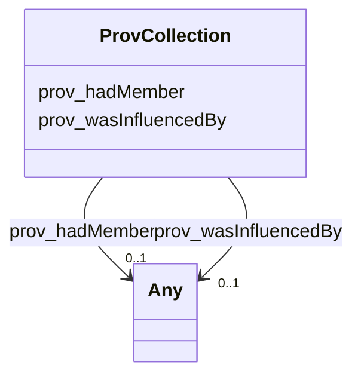

# Class: No class (type) name specified (prov_Collection)


_No class (type) description specified_


This class occurs 2 times.


URI: [prov:Collection](http://www.w3.org/ns/prov#Collection)





<!-- no inheritance hierarchy -->


## Slots

| Name | Cardinality and Range | Description | Inheritance | Occurrences |
| ---  | --- | --- | --- | --- |
| [prov_hadMember](../slots/prov_hadMember.md) | 0..1 <br/> [HsdoWebPage](../classes/HsdoWebPage.md)&nbsp;or&nbsp;<br />[HsdoTextObject](../classes/HsdoTextObject.md)&nbsp;or&nbsp;<br />[HsdoOpeningHoursSpecification](../classes/HsdoOpeningHoursSpecification.md)&nbsp;or&nbsp;<br />[HsdoService](../classes/HsdoService.md)&nbsp;or&nbsp;<br />[HsdoOrganization](../classes/HsdoOrganization.md)&nbsp;or&nbsp;<br />[ProvEntity](../classes/ProvEntity.md)&nbsp;or&nbsp;<br />[HsdoPlace](../classes/HsdoPlace.md)&nbsp;or&nbsp;<br />[HsdoContactPoint](../classes/HsdoContactPoint.md) | No slot (predicate) description specified <br/>  | direct | 2436 |
| [prov_wasInfluencedBy](../slots/prov_wasInfluencedBy.md) | 0..1 <br/> [HsdoWebPage](../classes/HsdoWebPage.md)&nbsp;or&nbsp;<br />[HsdoTextObject](../classes/HsdoTextObject.md)&nbsp;or&nbsp;<br />[HsdoService](../classes/HsdoService.md)&nbsp;or&nbsp;<br />[HsdoOpeningHoursSpecification](../classes/HsdoOpeningHoursSpecification.md)&nbsp;or&nbsp;<br />[HsdoOrganization](../classes/HsdoOrganization.md)&nbsp;or&nbsp;<br />[ProvEntity](../classes/ProvEntity.md)&nbsp;or&nbsp;<br />[ProvActivity](../classes/ProvActivity.md)&nbsp;or&nbsp;<br />[xsd:anyURI](http://www.w3.org/2001/XMLSchema#anyURI)&nbsp;or&nbsp;<br />[HsdoPlace](../classes/HsdoPlace.md)&nbsp;or&nbsp;<br />[HsdoContactPoint](../classes/HsdoContactPoint.md) | No slot (predicate) description specified <br/>  | direct | 2436 |


## Usages

| used by | used in | type | used |
| ---  | --- | --- | --- |
| [HsdoContactPoint](../classes/HsdoContactPoint.md) | [prov_influenced](../slots/prov_influenced.md) | any_of[range] | [ProvCollection](../classes/ProvCollection.md) |
| [HsdoOpeningHoursSpecification](../classes/HsdoOpeningHoursSpecification.md) | [prov_influenced](../slots/prov_influenced.md) | any_of[range] | [ProvCollection](../classes/ProvCollection.md) |
| [HsdoOrganization](../classes/HsdoOrganization.md) | [prov_influenced](../slots/prov_influenced.md) | any_of[range] | [ProvCollection](../classes/ProvCollection.md) |
| [HsdoPlace](../classes/HsdoPlace.md) | [prov_influenced](../slots/prov_influenced.md) | any_of[range] | [ProvCollection](../classes/ProvCollection.md) |
| [HsdoService](../classes/HsdoService.md) | [prov_influenced](../slots/prov_influenced.md) | any_of[range] | [ProvCollection](../classes/ProvCollection.md) |
| [HsdoTextObject](../classes/HsdoTextObject.md) | [prov_influenced](../slots/prov_influenced.md) | any_of[range] | [ProvCollection](../classes/ProvCollection.md) |
| [HsdoWebPage](../classes/HsdoWebPage.md) | [prov_influenced](../slots/prov_influenced.md) | any_of[range] | [ProvCollection](../classes/ProvCollection.md) |
| [ProvActivity](../classes/ProvActivity.md) | [prov_influenced](../slots/prov_influenced.md) | any_of[range] | [ProvCollection](../classes/ProvCollection.md) |
| [ProvEntity](../classes/ProvEntity.md) | [prov_influenced](../slots/prov_influenced.md) | any_of[range] | [ProvCollection](../classes/ProvCollection.md) |


## LinkML Source

<!-- TODO: investigate https://stackoverflow.com/questions/37606292/how-to-create-tabbed-code-blocks-in-mkdocs-or-sphinx -->

### Direct

<details>

```yaml
name: prov_Collection
conforms_to: No schema conformance document specified
annotations:
  count:
    tag: count
    value: 2
description: No class (type) description specified
title: No class (type) name specified
from_schema: dream-kg
rank: 1000
slots:
- prov_hadMember
- prov_wasInfluencedBy
slot_usage:
  prov_hadMember:
    name: prov_hadMember
    annotations:
      hsdo_ContactPoint:
        tag: hsdo_ContactPoint
        value: 87
      hsdo_OpeningHoursSpecification:
        tag: hsdo_OpeningHoursSpecification
        value: 609
      hsdo_Organization:
        tag: hsdo_Organization
        value: 87
      hsdo_Place:
        tag: hsdo_Place
        value: 87
      hsdo_Service:
        tag: hsdo_Service
        value: 87
      hsdo_TextObject:
        tag: hsdo_TextObject
        value: 87
      hsdo_WebPage:
        tag: hsdo_WebPage
        value: 87
      prov_Entity:
        tag: prov_Entity
        value: 1305
  prov_wasInfluencedBy:
    name: prov_wasInfluencedBy
    annotations:
      hsdo_ContactPoint:
        tag: hsdo_ContactPoint
        value: 87
      hsdo_OpeningHoursSpecification:
        tag: hsdo_OpeningHoursSpecification
        value: 609
      hsdo_Organization:
        tag: hsdo_Organization
        value: 87
      hsdo_Place:
        tag: hsdo_Place
        value: 87
      hsdo_Service:
        tag: hsdo_Service
        value: 87
      hsdo_TextObject:
        tag: hsdo_TextObject
        value: 87
      hsdo_WebPage:
        tag: hsdo_WebPage
        value: 87
      prov_Entity:
        tag: prov_Entity
        value: 1305
class_uri: prov:Collection

```
</details>

### Induced

<details>

```yaml
name: prov_Collection
conforms_to: No schema conformance document specified
annotations:
  count:
    tag: count
    value: 2
description: No class (type) description specified
title: No class (type) name specified
from_schema: dream-kg
rank: 1000
slot_usage:
  prov_hadMember:
    name: prov_hadMember
    annotations:
      hsdo_ContactPoint:
        tag: hsdo_ContactPoint
        value: 87
      hsdo_OpeningHoursSpecification:
        tag: hsdo_OpeningHoursSpecification
        value: 609
      hsdo_Organization:
        tag: hsdo_Organization
        value: 87
      hsdo_Place:
        tag: hsdo_Place
        value: 87
      hsdo_Service:
        tag: hsdo_Service
        value: 87
      hsdo_TextObject:
        tag: hsdo_TextObject
        value: 87
      hsdo_WebPage:
        tag: hsdo_WebPage
        value: 87
      prov_Entity:
        tag: prov_Entity
        value: 1305
  prov_wasInfluencedBy:
    name: prov_wasInfluencedBy
    annotations:
      hsdo_ContactPoint:
        tag: hsdo_ContactPoint
        value: 87
      hsdo_OpeningHoursSpecification:
        tag: hsdo_OpeningHoursSpecification
        value: 609
      hsdo_Organization:
        tag: hsdo_Organization
        value: 87
      hsdo_Place:
        tag: hsdo_Place
        value: 87
      hsdo_Service:
        tag: hsdo_Service
        value: 87
      hsdo_TextObject:
        tag: hsdo_TextObject
        value: 87
      hsdo_WebPage:
        tag: hsdo_WebPage
        value: 87
      prov_Entity:
        tag: prov_Entity
        value: 1305
attributes:
  prov_hadMember:
    name: prov_hadMember
    annotations:
      hsdo_ContactPoint:
        tag: hsdo_ContactPoint
        value: 87
      hsdo_OpeningHoursSpecification:
        tag: hsdo_OpeningHoursSpecification
        value: 609
      hsdo_Organization:
        tag: hsdo_Organization
        value: 87
      hsdo_Place:
        tag: hsdo_Place
        value: 87
      hsdo_Service:
        tag: hsdo_Service
        value: 87
      hsdo_TextObject:
        tag: hsdo_TextObject
        value: 87
      hsdo_WebPage:
        tag: hsdo_WebPage
        value: 87
      prov_Entity:
        tag: prov_Entity
        value: 1305
    description: No slot (predicate) description specified
    examples:
    - object:
        example_object: dreamkg:service/4542572480692224
        example_object_type: hsdo_Service
        example_predicate: prov:hadMember
        example_subject: dreamkg:file/kg.ttl
        example_subject_type: prov_Collection
    - object:
        example_object: dreamkg:service/4542572480692224
        example_object_type: prov_Entity
        example_predicate: prov:hadMember
        example_subject: dreamkg:file/kg.ttl
        example_subject_type: prov_Collection
    - object:
        example_object: dreamkg:service/4542572480692224
        example_object_type: hsdo_Service
        example_predicate: prov:hadMember
        example_subject: dreamkg:file/kg.ttl
        example_subject_type: prov_Entity
    - object:
        example_object: dreamkg:service/4542572480692224
        example_object_type: prov_Entity
        example_predicate: prov:hadMember
        example_subject: dreamkg:file/kg.ttl
        example_subject_type: prov_Entity
    - object:
        example_object: dreamkg:service/desc/4542572480692224
        example_object_type: hsdo_TextObject
        example_predicate: prov:hadMember
        example_subject: dreamkg:file/kg.ttl
        example_subject_type: prov_Collection
    - object:
        example_object: dreamkg:service/desc/4542572480692224
        example_object_type: hsdo_TextObject
        example_predicate: prov:hadMember
        example_subject: dreamkg:file/kg.ttl
        example_subject_type: prov_Entity
    - object:
        example_object: dreamkg:service/hours/friday/4542572480692224
        example_object_type: hsdo_OpeningHoursSpecification
        example_predicate: prov:hadMember
        example_subject: dreamkg:file/kg.ttl
        example_subject_type: prov_Collection
    - object:
        example_object: dreamkg:service/hours/friday/4542572480692224
        example_object_type: hsdo_OpeningHoursSpecification
        example_predicate: prov:hadMember
        example_subject: dreamkg:file/kg.ttl
        example_subject_type: prov_Entity
    - object:
        example_object: dreamkg:service/location/4542572480692224
        example_object_type: hsdo_Place
        example_predicate: prov:hadMember
        example_subject: dreamkg:file/kg.ttl
        example_subject_type: prov_Collection
    - object:
        example_object: dreamkg:service/location/4542572480692224
        example_object_type: hsdo_Place
        example_predicate: prov:hadMember
        example_subject: dreamkg:file/kg.ttl
        example_subject_type: prov_Entity
    - object:
        example_object: dreamkg:service/phone/4542572480692224
        example_object_type: hsdo_ContactPoint
        example_predicate: prov:hadMember
        example_subject: dreamkg:file/kg.ttl
        example_subject_type: prov_Collection
    - object:
        example_object: dreamkg:service/phone/4542572480692224
        example_object_type: hsdo_ContactPoint
        example_predicate: prov:hadMember
        example_subject: dreamkg:file/kg.ttl
        example_subject_type: prov_Entity
    - object:
        example_object: dreamkg:service/provider/4542572480692224
        example_object_type: hsdo_Organization
        example_predicate: prov:hadMember
        example_subject: dreamkg:file/kg.ttl
        example_subject_type: prov_Collection
    - object:
        example_object: dreamkg:service/provider/4542572480692224
        example_object_type: hsdo_Organization
        example_predicate: prov:hadMember
        example_subject: dreamkg:file/kg.ttl
        example_subject_type: prov_Entity
    - object:
        example_object: https://www.auntbertha.com//achievement-through-counseling-and-treatment-%2528act-1%2529--philadelphia-pa--opioid-treatment-program-%2528otp%2529/5792020391002112
        example_object_type: hsdo_WebPage
        example_predicate: prov:hadMember
        example_subject: dreamkg:outside/ab
        example_subject_type: prov_Collection
    - object:
        example_object: https://www.auntbertha.com//achievement-through-counseling-and-treatment-%2528act-1%2529--philadelphia-pa--opioid-treatment-program-%2528otp%2529/5792020391002112
        example_object_type: hsdo_WebPage
        example_predicate: prov:hadMember
        example_subject: dreamkg:outside/ab
        example_subject_type: prov_Entity
    from_schema: dream-kg
    rank: 1000
    slot_uri: prov:hadMember
    alias: prov_hadMember
    owner: prov_Collection
    domain_of:
    - prov_Collection
    - prov_Entity
    range: Any
    any_of:
    - range: hsdo_WebPage
    - range: hsdo_TextObject
    - range: hsdo_OpeningHoursSpecification
    - range: hsdo_Service
    - range: hsdo_Organization
    - range: prov_Entity
    - range: hsdo_Place
    - range: hsdo_ContactPoint
  prov_wasInfluencedBy:
    name: prov_wasInfluencedBy
    annotations:
      hsdo_ContactPoint:
        tag: hsdo_ContactPoint
        value: 87
      hsdo_OpeningHoursSpecification:
        tag: hsdo_OpeningHoursSpecification
        value: 609
      hsdo_Organization:
        tag: hsdo_Organization
        value: 87
      hsdo_Place:
        tag: hsdo_Place
        value: 87
      hsdo_Service:
        tag: hsdo_Service
        value: 87
      hsdo_TextObject:
        tag: hsdo_TextObject
        value: 87
      hsdo_WebPage:
        tag: hsdo_WebPage
        value: 87
      prov_Entity:
        tag: prov_Entity
        value: 1305
    description: No slot (predicate) description specified
    examples:
    - object:
        example_object: dreamkg:data/sql
        example_object_type: prov_Entity
        example_predicate: prov:wasInfluencedBy
        example_subject: dreamkg:category/audience/AbuseOrNeglectSurvivors
        example_subject_type: prov_Entity
    - object:
        example_object: dreamkg:data/sql
        example_object_type: prov_Entity
        example_predicate: prov:wasInfluencedBy
        example_subject: dreamkg:category/audience/AbuseOrNeglectSurvivors
        example_subject_type: hsdo_Audience
    - object:
        example_object: dreamkg:file/AuntBertha/UpToDate/Versions/Final_Emergency_Food_20240109.csv
        example_object_type: uri
        example_predicate: prov:wasInfluencedBy
        example_subject: dreamkg:category/audience/AbuseOrNeglectSurvivors
        example_subject_type: prov_Entity
    - object:
        example_object: dreamkg:file/AuntBertha/UpToDate/Versions/Final_Emergency_Food_20240109.csv
        example_object_type: uri
        example_predicate: prov:wasInfluencedBy
        example_subject: dreamkg:category/audience/AbuseOrNeglectSurvivors
        example_subject_type: hsdo_Audience
    - object:
        example_object: dreamkg:process/run/ontop-CM
        example_object_type: prov_Activity
        example_predicate: prov:wasInfluencedBy
        example_subject: dreamkg:category/audience/AbuseOrNeglectSurvivors
        example_subject_type: prov_Entity
    - object:
        example_object: dreamkg:process/run/ontop-CM
        example_object_type: prov_Activity
        example_predicate: prov:wasInfluencedBy
        example_subject: dreamkg:category/audience/AbuseOrNeglectSurvivors
        example_subject_type: hsdo_Audience
    - object:
        example_object: dreamkg:data/sql
        example_object_type: prov_Entity
        example_predicate: prov:wasInfluencedBy
        example_subject: dreamkg:category/availability/Available
        example_subject_type: hsdo_CategoryCode
    - object:
        example_object: dreamkg:file/AuntBertha/UpToDate/Versions/Final_Emergency_Food_20240109.csv
        example_object_type: uri
        example_predicate: prov:wasInfluencedBy
        example_subject: dreamkg:category/availability/Available
        example_subject_type: hsdo_CategoryCode
    - object:
        example_object: dreamkg:process/run/ontop-CM
        example_object_type: prov_Activity
        example_predicate: prov:wasInfluencedBy
        example_subject: dreamkg:category/availability/Available
        example_subject_type: hsdo_CategoryCode
    - object:
        example_object: dreamkg:service/4542572480692224
        example_object_type: hsdo_Service
        example_predicate: prov:wasInfluencedBy
        example_subject: dreamkg:file/kg.ttl
        example_subject_type: prov_Collection
    - object:
        example_object: dreamkg:service/4542572480692224
        example_object_type: prov_Entity
        example_predicate: prov:wasInfluencedBy
        example_subject: dreamkg:file/kg.ttl
        example_subject_type: prov_Collection
    - object:
        example_object: dreamkg:service/4542572480692224
        example_object_type: hsdo_Service
        example_predicate: prov:wasInfluencedBy
        example_subject: dreamkg:file/kg.ttl
        example_subject_type: prov_Entity
    - object:
        example_object: dreamkg:service/desc/4542572480692224
        example_object_type: hsdo_TextObject
        example_predicate: prov:wasInfluencedBy
        example_subject: dreamkg:file/kg.ttl
        example_subject_type: prov_Collection
    - object:
        example_object: dreamkg:service/desc/4542572480692224
        example_object_type: hsdo_TextObject
        example_predicate: prov:wasInfluencedBy
        example_subject: dreamkg:file/kg.ttl
        example_subject_type: prov_Entity
    - object:
        example_object: dreamkg:service/hours/friday/4542572480692224
        example_object_type: hsdo_OpeningHoursSpecification
        example_predicate: prov:wasInfluencedBy
        example_subject: dreamkg:file/kg.ttl
        example_subject_type: prov_Collection
    - object:
        example_object: dreamkg:service/hours/friday/4542572480692224
        example_object_type: hsdo_OpeningHoursSpecification
        example_predicate: prov:wasInfluencedBy
        example_subject: dreamkg:file/kg.ttl
        example_subject_type: prov_Entity
    - object:
        example_object: dreamkg:service/location/4542572480692224
        example_object_type: hsdo_Place
        example_predicate: prov:wasInfluencedBy
        example_subject: dreamkg:file/kg.ttl
        example_subject_type: prov_Collection
    - object:
        example_object: dreamkg:service/location/4542572480692224
        example_object_type: hsdo_Place
        example_predicate: prov:wasInfluencedBy
        example_subject: dreamkg:file/kg.ttl
        example_subject_type: prov_Entity
    - object:
        example_object: dreamkg:service/phone/4542572480692224
        example_object_type: hsdo_ContactPoint
        example_predicate: prov:wasInfluencedBy
        example_subject: dreamkg:file/kg.ttl
        example_subject_type: prov_Collection
    - object:
        example_object: dreamkg:service/phone/4542572480692224
        example_object_type: hsdo_ContactPoint
        example_predicate: prov:wasInfluencedBy
        example_subject: dreamkg:file/kg.ttl
        example_subject_type: prov_Entity
    - object:
        example_object: dreamkg:service/provider/4542572480692224
        example_object_type: hsdo_Organization
        example_predicate: prov:wasInfluencedBy
        example_subject: dreamkg:file/kg.ttl
        example_subject_type: prov_Collection
    - object:
        example_object: dreamkg:service/provider/4542572480692224
        example_object_type: hsdo_Organization
        example_predicate: prov:wasInfluencedBy
        example_subject: dreamkg:file/kg.ttl
        example_subject_type: prov_Entity
    - object:
        example_object: https://www.auntbertha.com//achievement-through-counseling-and-treatment-%2528act-1%2529--philadelphia-pa--opioid-treatment-program-%2528otp%2529/5792020391002112
        example_object_type: hsdo_WebPage
        example_predicate: prov:wasInfluencedBy
        example_subject: dreamkg:outside/ab
        example_subject_type: prov_Collection
    - object:
        example_object: https://www.auntbertha.com//achievement-through-counseling-and-treatment-%2528act-1%2529--philadelphia-pa--opioid-treatment-program-%2528otp%2529/5792020391002112
        example_object_type: hsdo_WebPage
        example_predicate: prov:wasInfluencedBy
        example_subject: dreamkg:outside/ab
        example_subject_type: prov_Entity
    - object:
        example_object: dreamkg:data/sql
        example_object_type: prov_Entity
        example_predicate: prov:wasInfluencedBy
        example_subject: dreamkg:service/4542572480692224
        example_subject_type: hsdo_Service
    - object:
        example_object: dreamkg:process/run/ontop-CM
        example_object_type: prov_Activity
        example_predicate: prov:wasInfluencedBy
        example_subject: dreamkg:service/4542572480692224
        example_subject_type: hsdo_Service
    - object:
        example_object: https://www.auntbertha.com//child-guidance-resource-centers-%2528cgrc%2529--philadelphia-pa--drug-and-alcohol-services/4542572480692224
        example_object_type: hsdo_WebPage
        example_predicate: prov:wasInfluencedBy
        example_subject: dreamkg:service/4542572480692224
        example_subject_type: hsdo_Service
    - object:
        example_object: dreamkg:data/sql
        example_object_type: prov_Entity
        example_predicate: prov:wasInfluencedBy
        example_subject: dreamkg:service/desc/4542572480692224
        example_subject_type: hsdo_TextObject
    - object:
        example_object: dreamkg:process/run/ontop-CM
        example_object_type: prov_Activity
        example_predicate: prov:wasInfluencedBy
        example_subject: dreamkg:service/desc/4542572480692224
        example_subject_type: hsdo_TextObject
    - object:
        example_object: https://www.auntbertha.com//child-guidance-resource-centers-%2528cgrc%2529--philadelphia-pa--drug-and-alcohol-services/4542572480692224
        example_object_type: hsdo_WebPage
        example_predicate: prov:wasInfluencedBy
        example_subject: dreamkg:service/desc/4542572480692224
        example_subject_type: hsdo_TextObject
    - object:
        example_object: dreamkg:data/sql
        example_object_type: prov_Entity
        example_predicate: prov:wasInfluencedBy
        example_subject: dreamkg:service/hours/friday/4542572480692224
        example_subject_type: hsdo_OpeningHoursSpecification
    - object:
        example_object: dreamkg:process/run/ontop-CM
        example_object_type: prov_Activity
        example_predicate: prov:wasInfluencedBy
        example_subject: dreamkg:service/hours/friday/4542572480692224
        example_subject_type: hsdo_OpeningHoursSpecification
    - object:
        example_object: https://www.auntbertha.com//child-guidance-resource-centers-%2528cgrc%2529--philadelphia-pa--drug-and-alcohol-services/4542572480692224
        example_object_type: hsdo_WebPage
        example_predicate: prov:wasInfluencedBy
        example_subject: dreamkg:service/hours/friday/4542572480692224
        example_subject_type: hsdo_OpeningHoursSpecification
    - object:
        example_object: dreamkg:data/sql
        example_object_type: prov_Entity
        example_predicate: prov:wasInfluencedBy
        example_subject: dreamkg:service/location/4542572480692224
        example_subject_type: hsdo_Place
    - object:
        example_object: dreamkg:process/run/ontop-CM
        example_object_type: prov_Activity
        example_predicate: prov:wasInfluencedBy
        example_subject: dreamkg:service/location/4542572480692224
        example_subject_type: hsdo_Place
    - object:
        example_object: https://www.auntbertha.com//child-guidance-resource-centers-%2528cgrc%2529--philadelphia-pa--drug-and-alcohol-services/4542572480692224
        example_object_type: hsdo_WebPage
        example_predicate: prov:wasInfluencedBy
        example_subject: dreamkg:service/location/4542572480692224
        example_subject_type: hsdo_Place
    - object:
        example_object: dreamkg:data/sql
        example_object_type: prov_Entity
        example_predicate: prov:wasInfluencedBy
        example_subject: dreamkg:service/phone/4542572480692224
        example_subject_type: hsdo_ContactPoint
    - object:
        example_object: dreamkg:process/run/ontop-CM
        example_object_type: prov_Activity
        example_predicate: prov:wasInfluencedBy
        example_subject: dreamkg:service/phone/4542572480692224
        example_subject_type: hsdo_ContactPoint
    - object:
        example_object: https://www.auntbertha.com//child-guidance-resource-centers-%2528cgrc%2529--philadelphia-pa--drug-and-alcohol-services/4542572480692224
        example_object_type: hsdo_WebPage
        example_predicate: prov:wasInfluencedBy
        example_subject: dreamkg:service/phone/4542572480692224
        example_subject_type: hsdo_ContactPoint
    - object:
        example_object: dreamkg:data/sql
        example_object_type: prov_Entity
        example_predicate: prov:wasInfluencedBy
        example_subject: dreamkg:service/provider/4542572480692224
        example_subject_type: hsdo_Organization
    - object:
        example_object: dreamkg:process/run/ontop-CM
        example_object_type: prov_Activity
        example_predicate: prov:wasInfluencedBy
        example_subject: dreamkg:service/provider/4542572480692224
        example_subject_type: hsdo_Organization
    - object:
        example_object: https://www.auntbertha.com//child-guidance-resource-centers-%2528cgrc%2529--philadelphia-pa--drug-and-alcohol-services/4542572480692224
        example_object_type: hsdo_WebPage
        example_predicate: prov:wasInfluencedBy
        example_subject: dreamkg:service/provider/4542572480692224
        example_subject_type: hsdo_Organization
    - object:
        example_object: dreamkg:data/sql
        example_object_type: prov_Entity
        example_predicate: prov:wasInfluencedBy
        example_subject: dreamkg:zip/17602
        example_subject_type: hsdo_AdministrativeArea
    - object:
        example_object: dreamkg:file/AuntBertha/UpToDate/Versions/Final_Emergency_Food_20240109.csv
        example_object_type: uri
        example_predicate: prov:wasInfluencedBy
        example_subject: dreamkg:zip/17602
        example_subject_type: hsdo_AdministrativeArea
    - object:
        example_object: dreamkg:process/run/ontop-CM
        example_object_type: prov_Activity
        example_predicate: prov:wasInfluencedBy
        example_subject: dreamkg:zip/17602
        example_subject_type: hsdo_AdministrativeArea
    from_schema: dream-kg
    rank: 1000
    slot_uri: prov:wasInfluencedBy
    alias: prov_wasInfluencedBy
    owner: prov_Collection
    domain_of:
    - hsdo_AdministrativeArea
    - hsdo_Audience
    - hsdo_CategoryCode
    - hsdo_ContactPoint
    - hsdo_OpeningHoursSpecification
    - hsdo_Organization
    - hsdo_Place
    - hsdo_Service
    - hsdo_TextObject
    - prov_Collection
    - prov_Entity
    range: Any
    any_of:
    - range: hsdo_WebPage
    - range: hsdo_TextObject
    - range: hsdo_Service
    - range: hsdo_OpeningHoursSpecification
    - range: hsdo_Organization
    - range: prov_Entity
    - range: prov_Activity
    - range: uri
    - range: hsdo_Place
    - range: hsdo_ContactPoint
class_uri: prov:Collection

```
</details>