# Class: No class (type) name specified (prov_Entity)


_No class (type) description specified_


This class occurs 1586 times.


URI: [prov:Entity](http://www.w3.org/ns/prov#Entity)

```mermaid
 classDiagram
    class ProvEntity
    click ProvEntity href "../ProvEntity"
      ProvEntity : hsdo_address
        
          
    
    
    ProvEntity --> "0..1" String : hsdo_address
    click String href "../String"

        
      ProvEntity : hsdo_areaServed
        
          
    
    
    ProvEntity --> "0..1" String : hsdo_areaServed
    click String href "../String"

        
      ProvEntity : hsdo_audienceType
        
          
    
    
    ProvEntity --> "0..1" String : hsdo_audienceType
    click String href "../String"

        
      ProvEntity : hsdo_availableChannel
        
          
    
    
    ProvEntity --> "0..1" HsdoServiceChannel : hsdo_availableChannel
    click HsdoServiceChannel href "../HsdoServiceChannel"

        
      ProvEntity : hsdo_category
        
          
    
    
    ProvEntity --> "0..1" Any : hsdo_category
    click Any href "../Any"

        
      ProvEntity : hsdo_closes
        
          
    
    
    ProvEntity --> "0..1" String : hsdo_closes
    click String href "../String"

        
      ProvEntity : hsdo_codeValue
        
          
    
    
    ProvEntity --> "0..1" String : hsdo_codeValue
    click String href "../String"

        
      ProvEntity : hsdo_conditionsOfAccess
        
          
    
    
    ProvEntity --> "0..1" String : hsdo_conditionsOfAccess
    click String href "../String"

        
      ProvEntity : hsdo_containedInPlace
        
          
    
    
    ProvEntity --> "0..1" Any : hsdo_containedInPlace
    click Any href "../Any"

        
      ProvEntity : hsdo_dayOfWeek
        
          
    
    
    ProvEntity --> "0..1" String : hsdo_dayOfWeek
    click String href "../String"

        
      ProvEntity : hsdo_description
        
          
    
    
    ProvEntity --> "0..1" Any : hsdo_description
    click Any href "../Any"

        
      ProvEntity : hsdo_hasMap
        
          
    
    
    ProvEntity --> "0..1" Uri : hsdo_hasMap
    click Uri href "../Uri"

        
      ProvEntity : hsdo_hoursAvailable
        
          
    
    
    ProvEntity --> "0..1" Any : hsdo_hoursAvailable
    click Any href "../Any"

        
      ProvEntity : hsdo_identifier
        
          
    
    
    ProvEntity --> "0..1" String : hsdo_identifier
    click String href "../String"

        
      ProvEntity : hsdo_inCodeSet
        
          
    
    
    ProvEntity --> "0..1" Uri : hsdo_inCodeSet
    click Uri href "../Uri"

        
      ProvEntity : hsdo_latitude
        
          
    
    
    ProvEntity --> "0..1" Decimal : hsdo_latitude
    click Decimal href "../Decimal"

        
      ProvEntity : hsdo_longitude
        
          
    
    
    ProvEntity --> "0..1" Decimal : hsdo_longitude
    click Decimal href "../Decimal"

        
      ProvEntity : hsdo_name
        
          
    
    
    ProvEntity --> "0..1" String : hsdo_name
    click String href "../String"

        
      ProvEntity : hsdo_opens
        
          
    
    
    ProvEntity --> "0..1" String : hsdo_opens
    click String href "../String"

        
      ProvEntity : hsdo_provider
        
          
    
    
    ProvEntity --> "0..1" Any : hsdo_provider
    click Any href "../Any"

        
      ProvEntity : hsdo_sameAs
        
          
    
    
    ProvEntity --> "0..1" Uri : hsdo_sameAs
    click Uri href "../Uri"

        
      ProvEntity : hsdo_telephone
        
          
    
    
    ProvEntity --> "0..1" String : hsdo_telephone
    click String href "../String"

        
      ProvEntity : hsdo_text
        
          
    
    
    ProvEntity --> "0..1" String : hsdo_text
    click String href "../String"

        
      ProvEntity : prov_hadMember
        
          
    
    
    ProvEntity --> "0..1" Any : prov_hadMember
    click Any href "../Any"

        
      ProvEntity : prov_influenced
        
          
    
    
    ProvEntity --> "0..1" Any : prov_influenced
    click Any href "../Any"

        
      ProvEntity : prov_wasDerivedFrom
        
          
    
    
    ProvEntity --> "0..1" ProvEntity : prov_wasDerivedFrom
    click ProvEntity href "../ProvEntity"

        
      ProvEntity : prov_wasGeneratedBy
        
          
    
    
    ProvEntity --> "0..1" ProvActivity : prov_wasGeneratedBy
    click ProvActivity href "../ProvActivity"

        
      ProvEntity : prov_wasInfluencedBy
        
          
    
    
    ProvEntity --> "0..1" Any : prov_wasInfluencedBy
    click Any href "../Any"

        
      
```





<!-- no inheritance hierarchy -->


## Slots

| Name | Cardinality and Range | Description | Inheritance | Occurrences |
| ---  | --- | --- | --- | --- |
| [hsdo_sameAs](../slots/hsdo_sameAs.md) | 0..1 <br/> [xsd:anyURI](http://www.w3.org/2001/XMLSchema#anyURI) | URL of a reference Web page that unambiguously indicates the item's identity <br/>  | direct | 127 |
| [prov_wasDerivedFrom](../slots/prov_wasDerivedFrom.md) | 0..1 <br/> [ProvEntity](../classes/ProvEntity.md) | No slot (predicate) description specified <br/>  | direct | 2990 |
| [hsdo_description](../slots/hsdo_description.md) | 0..1 <br/> [ProvEntity](../classes/ProvEntity.md)&nbsp;or&nbsp;<br />[HsdoTextObject](../classes/HsdoTextObject.md) | A description of the item <br/>  | direct | 174 |
| [hsdo_identifier](../slots/hsdo_identifier.md) | 0..1 <br/> [xsd:string](http://www.w3.org/2001/XMLSchema#string) | The identifier property represents any kind of identifier for any kind of [[T... <br/>  | direct | 126 |
| [prov_hadMember](../slots/prov_hadMember.md) | 0..1 <br/> [HsdoWebPage](../classes/HsdoWebPage.md)&nbsp;or&nbsp;<br />[HsdoTextObject](../classes/HsdoTextObject.md)&nbsp;or&nbsp;<br />[HsdoOpeningHoursSpecification](../classes/HsdoOpeningHoursSpecification.md)&nbsp;or&nbsp;<br />[HsdoService](../classes/HsdoService.md)&nbsp;or&nbsp;<br />[HsdoOrganization](../classes/HsdoOrganization.md)&nbsp;or&nbsp;<br />[ProvEntity](../classes/ProvEntity.md)&nbsp;or&nbsp;<br />[HsdoPlace](../classes/HsdoPlace.md)&nbsp;or&nbsp;<br />[HsdoContactPoint](../classes/HsdoContactPoint.md) | No slot (predicate) description specified <br/>  | direct | 2436 |
| [hsdo_opens](../slots/hsdo_opens.md) | 0..1 <br/> [xsd:string](http://www.w3.org/2001/XMLSchema#string) | The opening hour of the place or service on the given day(s) of the week <br/>  | direct | 631 |
| [hsdo_provider](../slots/hsdo_provider.md) | 0..1 <br/> [ProvEntity](../classes/ProvEntity.md)&nbsp;or&nbsp;<br />[HsdoOrganization](../classes/HsdoOrganization.md) | The service provider, service operator, or service performer; the goods produ... <br/>  | direct | 174 |
| [hsdo_audienceType](../slots/hsdo_audienceType.md) | 0..1 <br/> [xsd:string](http://www.w3.org/2001/XMLSchema#string) | The target group associated with a given audience (e <br/>  | direct | 81 |
| [hsdo_hoursAvailable](../slots/hsdo_hoursAvailable.md) | 0..1 <br/> [ProvEntity](../classes/ProvEntity.md)&nbsp;or&nbsp;<br />[HsdoOpeningHoursSpecification](../classes/HsdoOpeningHoursSpecification.md) | The hours during which this service or contact is available <br/>  | direct | 1218 |
| [prov_wasGeneratedBy](../slots/prov_wasGeneratedBy.md) | 0..1 <br/> [ProvActivity](../classes/ProvActivity.md) | No slot (predicate) description specified <br/>  | direct | 1495 |
| [hsdo_text](../slots/hsdo_text.md) | 0..1 <br/> [xsd:string](http://www.w3.org/2001/XMLSchema#string) | The textual content of this CreativeWork <br/>  | direct | 90 |
| [hsdo_areaServed](../slots/hsdo_areaServed.md) | 0..1 <br/> [xsd:string](http://www.w3.org/2001/XMLSchema#string) | The geographic area where a service or offered item is provided <br/>  | direct | 87 |
| [hsdo_category](../slots/hsdo_category.md) | 0..1 <br/> [HsdoAudience](../classes/HsdoAudience.md)&nbsp;or&nbsp;<br />[ProvEntity](../classes/ProvEntity.md)&nbsp;or&nbsp;<br />[HsdoCategoryCode](../classes/HsdoCategoryCode.md) | A category for the item <br/>  | direct | 2690 |
| [hsdo_conditionsOfAccess](../slots/hsdo_conditionsOfAccess.md) | 0..1 <br/> [xsd:string](http://www.w3.org/2001/XMLSchema#string) | Conditions that affect the availability of, or method(s) of access to, an ite... <br/>  | direct | 88 |
| [hsdo_address](../slots/hsdo_address.md) | 0..1 <br/> [xsd:string](http://www.w3.org/2001/XMLSchema#string) | Physical address of the item <br/>  | direct | 93 |
| [hsdo_telephone](../slots/hsdo_telephone.md) | 0..1 <br/> [xsd:string](http://www.w3.org/2001/XMLSchema#string) | The telephone number <br/>  | direct | 87 |
| [hsdo_hasMap](../slots/hsdo_hasMap.md) | 0..1 <br/> [xsd:anyURI](http://www.w3.org/2001/XMLSchema#anyURI) | A URL to a map of the place <br/>  | direct | 88 |
| [hsdo_dayOfWeek](../slots/hsdo_dayOfWeek.md) | 0..1 <br/> [xsd:string](http://www.w3.org/2001/XMLSchema#string) | The day of the week for which these opening hours are valid <br/>  | direct | 609 |
| [hsdo_availableChannel](../slots/hsdo_availableChannel.md) | 0..1 <br/> [HsdoServiceChannel](../classes/HsdoServiceChannel.md) | A means of accessing the service (e <br/>  | direct | 174 |
| [hsdo_name](../slots/hsdo_name.md) | 0..1 <br/> [xsd:string](http://www.w3.org/2001/XMLSchema#string) | The name of the item <br/>  | direct | 177 |
| [prov_influenced](../slots/prov_influenced.md) | 0..1 <br/> [HsdoTextObject](../classes/HsdoTextObject.md)&nbsp;or&nbsp;<br />[HsdoService](../classes/HsdoService.md)&nbsp;or&nbsp;<br />[HsdoOpeningHoursSpecification](../classes/HsdoOpeningHoursSpecification.md)&nbsp;or&nbsp;<br />[HsdoOrganization](../classes/HsdoOrganization.md)&nbsp;or&nbsp;<br />[ProvCollection](../classes/ProvCollection.md)&nbsp;or&nbsp;<br />[ProvEntity](../classes/ProvEntity.md)&nbsp;or&nbsp;<br />[HsdoCategoryCode](../classes/HsdoCategoryCode.md)&nbsp;or&nbsp;<br />[HsdoAudience](../classes/HsdoAudience.md)&nbsp;or&nbsp;<br />[HsdoPlace](../classes/HsdoPlace.md)&nbsp;or&nbsp;<br />[HsdoContactPoint](../classes/HsdoContactPoint.md)&nbsp;or&nbsp;<br />[HsdoAdministrativeArea](../classes/HsdoAdministrativeArea.md) | No slot (predicate) description specified <br/>  | direct | 10504 |
| [hsdo_containedInPlace](../slots/hsdo_containedInPlace.md) | 0..1 <br/> [ProvEntity](../classes/ProvEntity.md)&nbsp;or&nbsp;<br />[HsdoAdministrativeArea](../classes/HsdoAdministrativeArea.md) | The basic containment relation between a place and one that contains it <br/>  | direct | 176 |
| [prov_wasInfluencedBy](../slots/prov_wasInfluencedBy.md) | 0..1 <br/> [HsdoWebPage](../classes/HsdoWebPage.md)&nbsp;or&nbsp;<br />[HsdoTextObject](../classes/HsdoTextObject.md)&nbsp;or&nbsp;<br />[HsdoService](../classes/HsdoService.md)&nbsp;or&nbsp;<br />[HsdoOpeningHoursSpecification](../classes/HsdoOpeningHoursSpecification.md)&nbsp;or&nbsp;<br />[HsdoOrganization](../classes/HsdoOrganization.md)&nbsp;or&nbsp;<br />[ProvEntity](../classes/ProvEntity.md)&nbsp;or&nbsp;<br />[ProvActivity](../classes/ProvActivity.md)&nbsp;or&nbsp;<br />[xsd:anyURI](http://www.w3.org/2001/XMLSchema#anyURI)&nbsp;or&nbsp;<br />[HsdoPlace](../classes/HsdoPlace.md)&nbsp;or&nbsp;<br />[HsdoContactPoint](../classes/HsdoContactPoint.md) | No slot (predicate) description specified <br/>  | direct | 10188 |
| [hsdo_codeValue](../slots/hsdo_codeValue.md) | 0..1 <br/> [xsd:string](http://www.w3.org/2001/XMLSchema#string) | A short textual code that uniquely identifies the value <br/>  | direct | 158 |
| [hsdo_latitude](../slots/hsdo_latitude.md) | 0..1 <br/> [xsd:decimal](http://www.w3.org/2001/XMLSchema#decimal) | The latitude of a location <br/>  | direct | 89 |
| [hsdo_longitude](../slots/hsdo_longitude.md) | 0..1 <br/> [xsd:decimal](http://www.w3.org/2001/XMLSchema#decimal) | The longitude of a location <br/>  | direct | 89 |
| [hsdo_inCodeSet](../slots/hsdo_inCodeSet.md) | 0..1 <br/> [xsd:anyURI](http://www.w3.org/2001/XMLSchema#anyURI) | A [[CategoryCodeSet]] that contains this category code <br/>  | direct | 157 |
| [hsdo_closes](../slots/hsdo_closes.md) | 0..1 <br/> [xsd:string](http://www.w3.org/2001/XMLSchema#string) | The closing hour of the place or service on the given day(s) of the week <br/>  | direct | 623 |


## Usages

| used by | used in | type | used |
| ---  | --- | --- | --- |
| [HsdoAdministrativeArea](../classes/HsdoAdministrativeArea.md) | [prov_wasInfluencedBy](../slots/prov_wasInfluencedBy.md) | any_of[range] | [ProvEntity](../classes/ProvEntity.md) |
| [HsdoAdministrativeArea](../classes/HsdoAdministrativeArea.md) | [prov_wasDerivedFrom](../slots/prov_wasDerivedFrom.md) | range | [ProvEntity](../classes/ProvEntity.md) |
| [HsdoAudience](../classes/HsdoAudience.md) | [prov_wasInfluencedBy](../slots/prov_wasInfluencedBy.md) | any_of[range] | [ProvEntity](../classes/ProvEntity.md) |
| [HsdoAudience](../classes/HsdoAudience.md) | [prov_wasDerivedFrom](../slots/prov_wasDerivedFrom.md) | range | [ProvEntity](../classes/ProvEntity.md) |
| [HsdoCategoryCode](../classes/HsdoCategoryCode.md) | [prov_wasDerivedFrom](../slots/prov_wasDerivedFrom.md) | range | [ProvEntity](../classes/ProvEntity.md) |
| [HsdoCategoryCode](../classes/HsdoCategoryCode.md) | [prov_wasInfluencedBy](../slots/prov_wasInfluencedBy.md) | any_of[range] | [ProvEntity](../classes/ProvEntity.md) |
| [HsdoContactPoint](../classes/HsdoContactPoint.md) | [prov_wasDerivedFrom](../slots/prov_wasDerivedFrom.md) | range | [ProvEntity](../classes/ProvEntity.md) |
| [HsdoContactPoint](../classes/HsdoContactPoint.md) | [prov_influenced](../slots/prov_influenced.md) | any_of[range] | [ProvEntity](../classes/ProvEntity.md) |
| [HsdoContactPoint](../classes/HsdoContactPoint.md) | [prov_wasInfluencedBy](../slots/prov_wasInfluencedBy.md) | any_of[range] | [ProvEntity](../classes/ProvEntity.md) |
| [HsdoOpeningHoursSpecification](../classes/HsdoOpeningHoursSpecification.md) | [prov_wasDerivedFrom](../slots/prov_wasDerivedFrom.md) | range | [ProvEntity](../classes/ProvEntity.md) |
| [HsdoOpeningHoursSpecification](../classes/HsdoOpeningHoursSpecification.md) | [prov_influenced](../slots/prov_influenced.md) | any_of[range] | [ProvEntity](../classes/ProvEntity.md) |
| [HsdoOpeningHoursSpecification](../classes/HsdoOpeningHoursSpecification.md) | [prov_wasInfluencedBy](../slots/prov_wasInfluencedBy.md) | any_of[range] | [ProvEntity](../classes/ProvEntity.md) |
| [HsdoOrganization](../classes/HsdoOrganization.md) | [prov_wasDerivedFrom](../slots/prov_wasDerivedFrom.md) | range | [ProvEntity](../classes/ProvEntity.md) |
| [HsdoOrganization](../classes/HsdoOrganization.md) | [prov_influenced](../slots/prov_influenced.md) | any_of[range] | [ProvEntity](../classes/ProvEntity.md) |
| [HsdoOrganization](../classes/HsdoOrganization.md) | [prov_wasInfluencedBy](../slots/prov_wasInfluencedBy.md) | any_of[range] | [ProvEntity](../classes/ProvEntity.md) |
| [HsdoPlace](../classes/HsdoPlace.md) | [prov_wasDerivedFrom](../slots/prov_wasDerivedFrom.md) | range | [ProvEntity](../classes/ProvEntity.md) |
| [HsdoPlace](../classes/HsdoPlace.md) | [prov_influenced](../slots/prov_influenced.md) | any_of[range] | [ProvEntity](../classes/ProvEntity.md) |
| [HsdoPlace](../classes/HsdoPlace.md) | [hsdo_containedInPlace](../slots/hsdo_containedInPlace.md) | any_of[range] | [ProvEntity](../classes/ProvEntity.md) |
| [HsdoPlace](../classes/HsdoPlace.md) | [prov_wasInfluencedBy](../slots/prov_wasInfluencedBy.md) | any_of[range] | [ProvEntity](../classes/ProvEntity.md) |
| [HsdoService](../classes/HsdoService.md) | [hsdo_hoursAvailable](../slots/hsdo_hoursAvailable.md) | any_of[range] | [ProvEntity](../classes/ProvEntity.md) |
| [HsdoService](../classes/HsdoService.md) | [hsdo_description](../slots/hsdo_description.md) | any_of[range] | [ProvEntity](../classes/ProvEntity.md) |
| [HsdoService](../classes/HsdoService.md) | [prov_wasDerivedFrom](../slots/prov_wasDerivedFrom.md) | range | [ProvEntity](../classes/ProvEntity.md) |
| [HsdoService](../classes/HsdoService.md) | [prov_influenced](../slots/prov_influenced.md) | any_of[range] | [ProvEntity](../classes/ProvEntity.md) |
| [HsdoService](../classes/HsdoService.md) | [prov_wasInfluencedBy](../slots/prov_wasInfluencedBy.md) | any_of[range] | [ProvEntity](../classes/ProvEntity.md) |
| [HsdoService](../classes/HsdoService.md) | [hsdo_category](../slots/hsdo_category.md) | any_of[range] | [ProvEntity](../classes/ProvEntity.md) |
| [HsdoService](../classes/HsdoService.md) | [hsdo_provider](../slots/hsdo_provider.md) | any_of[range] | [ProvEntity](../classes/ProvEntity.md) |
| [HsdoServiceChannel](../classes/HsdoServiceChannel.md) | [hsdo_servicePhone](../slots/hsdo_servicePhone.md) | any_of[range] | [ProvEntity](../classes/ProvEntity.md) |
| [HsdoServiceChannel](../classes/HsdoServiceChannel.md) | [hsdo_serviceLocation](../slots/hsdo_serviceLocation.md) | any_of[range] | [ProvEntity](../classes/ProvEntity.md) |
| [HsdoTextObject](../classes/HsdoTextObject.md) | [prov_wasDerivedFrom](../slots/prov_wasDerivedFrom.md) | range | [ProvEntity](../classes/ProvEntity.md) |
| [HsdoTextObject](../classes/HsdoTextObject.md) | [prov_influenced](../slots/prov_influenced.md) | any_of[range] | [ProvEntity](../classes/ProvEntity.md) |
| [HsdoTextObject](../classes/HsdoTextObject.md) | [prov_wasInfluencedBy](../slots/prov_wasInfluencedBy.md) | any_of[range] | [ProvEntity](../classes/ProvEntity.md) |
| [HsdoWebPage](../classes/HsdoWebPage.md) | [prov_influenced](../slots/prov_influenced.md) | any_of[range] | [ProvEntity](../classes/ProvEntity.md) |
| [ProvActivity](../classes/ProvActivity.md) | [prov_generated](../slots/prov_generated.md) | any_of[range] | [ProvEntity](../classes/ProvEntity.md) |
| [ProvActivity](../classes/ProvActivity.md) | [prov_influenced](../slots/prov_influenced.md) | any_of[range] | [ProvEntity](../classes/ProvEntity.md) |
| [ProvCollection](../classes/ProvCollection.md) | [prov_hadMember](../slots/prov_hadMember.md) | any_of[range] | [ProvEntity](../classes/ProvEntity.md) |
| [ProvCollection](../classes/ProvCollection.md) | [prov_wasInfluencedBy](../slots/prov_wasInfluencedBy.md) | any_of[range] | [ProvEntity](../classes/ProvEntity.md) |
| [ProvEntity](../classes/ProvEntity.md) | [prov_wasDerivedFrom](../slots/prov_wasDerivedFrom.md) | range | [ProvEntity](../classes/ProvEntity.md) |
| [ProvEntity](../classes/ProvEntity.md) | [hsdo_description](../slots/hsdo_description.md) | any_of[range] | [ProvEntity](../classes/ProvEntity.md) |
| [ProvEntity](../classes/ProvEntity.md) | [prov_hadMember](../slots/prov_hadMember.md) | any_of[range] | [ProvEntity](../classes/ProvEntity.md) |
| [ProvEntity](../classes/ProvEntity.md) | [hsdo_provider](../slots/hsdo_provider.md) | any_of[range] | [ProvEntity](../classes/ProvEntity.md) |
| [ProvEntity](../classes/ProvEntity.md) | [hsdo_hoursAvailable](../slots/hsdo_hoursAvailable.md) | any_of[range] | [ProvEntity](../classes/ProvEntity.md) |
| [ProvEntity](../classes/ProvEntity.md) | [hsdo_category](../slots/hsdo_category.md) | any_of[range] | [ProvEntity](../classes/ProvEntity.md) |
| [ProvEntity](../classes/ProvEntity.md) | [prov_influenced](../slots/prov_influenced.md) | any_of[range] | [ProvEntity](../classes/ProvEntity.md) |
| [ProvEntity](../classes/ProvEntity.md) | [hsdo_containedInPlace](../slots/hsdo_containedInPlace.md) | any_of[range] | [ProvEntity](../classes/ProvEntity.md) |
| [ProvEntity](../classes/ProvEntity.md) | [prov_wasInfluencedBy](../slots/prov_wasInfluencedBy.md) | any_of[range] | [ProvEntity](../classes/ProvEntity.md) |


## LinkML Source

<!-- TODO: investigate https://stackoverflow.com/questions/37606292/how-to-create-tabbed-code-blocks-in-mkdocs-or-sphinx -->

### Direct

<details>

```yaml
name: prov_Entity
conforms_to: No schema conformance document specified
annotations:
  count:
    tag: count
    value: 1586
description: No class (type) description specified
title: No class (type) name specified
from_schema: dream-kg
rank: 1000
slots:
- hsdo_sameAs
- prov_wasDerivedFrom
- hsdo_description
- hsdo_identifier
- prov_hadMember
- hsdo_opens
- hsdo_provider
- hsdo_audienceType
- hsdo_hoursAvailable
- prov_wasGeneratedBy
- hsdo_text
- hsdo_areaServed
- hsdo_category
- hsdo_conditionsOfAccess
- hsdo_address
- hsdo_telephone
- hsdo_hasMap
- hsdo_dayOfWeek
- hsdo_availableChannel
- hsdo_name
- prov_influenced
- hsdo_containedInPlace
- prov_wasInfluencedBy
- hsdo_codeValue
- hsdo_latitude
- hsdo_longitude
- hsdo_inCodeSet
- hsdo_closes
slot_usage:
  hsdo_address:
    name: hsdo_address
    annotations:
      string:
        tag: string
        value: 93
  hsdo_areaServed:
    name: hsdo_areaServed
    annotations:
      string:
        tag: string
        value: 87
  hsdo_audienceType:
    name: hsdo_audienceType
    annotations:
      string:
        tag: string
        value: 81
  hsdo_availableChannel:
    name: hsdo_availableChannel
    annotations:
      hsdo_ServiceChannel:
        tag: hsdo_ServiceChannel
        value: 174
  hsdo_category:
    name: hsdo_category
    annotations:
      hsdo_Audience:
        tag: hsdo_Audience
        value: 539
      hsdo_CategoryCode:
        tag: hsdo_CategoryCode
        value: 806
      prov_Entity:
        tag: prov_Entity
        value: 1345
  hsdo_closes:
    name: hsdo_closes
    annotations:
      string:
        tag: string
        value: 623
  hsdo_codeValue:
    name: hsdo_codeValue
    annotations:
      string:
        tag: string
        value: 158
  hsdo_conditionsOfAccess:
    name: hsdo_conditionsOfAccess
    annotations:
      string:
        tag: string
        value: 88
  hsdo_containedInPlace:
    name: hsdo_containedInPlace
    annotations:
      hsdo_AdministrativeArea:
        tag: hsdo_AdministrativeArea
        value: 88
      prov_Entity:
        tag: prov_Entity
        value: 88
  hsdo_dayOfWeek:
    name: hsdo_dayOfWeek
    annotations:
      string:
        tag: string
        value: 609
  hsdo_description:
    name: hsdo_description
    annotations:
      hsdo_TextObject:
        tag: hsdo_TextObject
        value: 87
      prov_Entity:
        tag: prov_Entity
        value: 87
  hsdo_hasMap:
    name: hsdo_hasMap
    annotations:
      uri:
        tag: uri
        value: 88
  hsdo_hoursAvailable:
    name: hsdo_hoursAvailable
    annotations:
      hsdo_OpeningHoursSpecification:
        tag: hsdo_OpeningHoursSpecification
        value: 609
      prov_Entity:
        tag: prov_Entity
        value: 609
  hsdo_identifier:
    name: hsdo_identifier
    annotations:
      string:
        tag: string
        value: 126
  hsdo_inCodeSet:
    name: hsdo_inCodeSet
    annotations:
      uri:
        tag: uri
        value: 157
  hsdo_latitude:
    name: hsdo_latitude
    annotations:
      decimal:
        tag: decimal
        value: 89
  hsdo_longitude:
    name: hsdo_longitude
    annotations:
      decimal:
        tag: decimal
        value: 89
  hsdo_name:
    name: hsdo_name
    annotations:
      string:
        tag: string
        value: 177
  hsdo_opens:
    name: hsdo_opens
    annotations:
      string:
        tag: string
        value: 631
  hsdo_provider:
    name: hsdo_provider
    annotations:
      hsdo_Organization:
        tag: hsdo_Organization
        value: 87
      prov_Entity:
        tag: prov_Entity
        value: 87
  hsdo_sameAs:
    name: hsdo_sameAs
    annotations:
      uri:
        tag: uri
        value: 127
  hsdo_telephone:
    name: hsdo_telephone
    annotations:
      string:
        tag: string
        value: 87
  hsdo_text:
    name: hsdo_text
    annotations:
      string:
        tag: string
        value: 90
  prov_hadMember:
    name: prov_hadMember
    annotations:
      hsdo_ContactPoint:
        tag: hsdo_ContactPoint
        value: 87
      hsdo_OpeningHoursSpecification:
        tag: hsdo_OpeningHoursSpecification
        value: 609
      hsdo_Organization:
        tag: hsdo_Organization
        value: 87
      hsdo_Place:
        tag: hsdo_Place
        value: 87
      hsdo_Service:
        tag: hsdo_Service
        value: 87
      hsdo_TextObject:
        tag: hsdo_TextObject
        value: 87
      hsdo_WebPage:
        tag: hsdo_WebPage
        value: 87
      prov_Entity:
        tag: prov_Entity
        value: 1305
  prov_influenced:
    name: prov_influenced
    annotations:
      hsdo_AdministrativeArea:
        tag: hsdo_AdministrativeArea
        value: 78
      hsdo_Audience:
        tag: hsdo_Audience
        value: 162
      hsdo_CategoryCode:
        tag: hsdo_CategoryCode
        value: 314
      hsdo_ContactPoint:
        tag: hsdo_ContactPoint
        value: 261
      hsdo_OpeningHoursSpecification:
        tag: hsdo_OpeningHoursSpecification
        value: 1827
      hsdo_Organization:
        tag: hsdo_Organization
        value: 261
      hsdo_Place:
        tag: hsdo_Place
        value: 261
      hsdo_Service:
        tag: hsdo_Service
        value: 261
      hsdo_TextObject:
        tag: hsdo_TextObject
        value: 261
      prov_Collection:
        tag: prov_Collection
        value: 1305
      prov_Entity:
        tag: prov_Entity
        value: 5513
  prov_wasDerivedFrom:
    name: prov_wasDerivedFrom
    annotations:
      prov_Entity:
        tag: prov_Entity
        value: 2990
  prov_wasGeneratedBy:
    name: prov_wasGeneratedBy
    annotations:
      prov_Activity:
        tag: prov_Activity
        value: 1495
  prov_wasInfluencedBy:
    name: prov_wasInfluencedBy
    annotations:
      hsdo_ContactPoint:
        tag: hsdo_ContactPoint
        value: 87
      hsdo_OpeningHoursSpecification:
        tag: hsdo_OpeningHoursSpecification
        value: 609
      hsdo_Organization:
        tag: hsdo_Organization
        value: 87
      hsdo_Place:
        tag: hsdo_Place
        value: 87
      hsdo_Service:
        tag: hsdo_Service
        value: 87
      hsdo_TextObject:
        tag: hsdo_TextObject
        value: 87
      hsdo_WebPage:
        tag: hsdo_WebPage
        value: 1305
      prov_Activity:
        tag: prov_Activity
        value: 1495
      prov_Entity:
        tag: prov_Entity
        value: 5513
      uri:
        tag: uri
        value: 831
class_uri: prov:Entity

```
</details>

### Induced

<details>

```yaml
name: prov_Entity
conforms_to: No schema conformance document specified
annotations:
  count:
    tag: count
    value: 1586
description: No class (type) description specified
title: No class (type) name specified
from_schema: dream-kg
rank: 1000
slot_usage:
  hsdo_address:
    name: hsdo_address
    annotations:
      string:
        tag: string
        value: 93
  hsdo_areaServed:
    name: hsdo_areaServed
    annotations:
      string:
        tag: string
        value: 87
  hsdo_audienceType:
    name: hsdo_audienceType
    annotations:
      string:
        tag: string
        value: 81
  hsdo_availableChannel:
    name: hsdo_availableChannel
    annotations:
      hsdo_ServiceChannel:
        tag: hsdo_ServiceChannel
        value: 174
  hsdo_category:
    name: hsdo_category
    annotations:
      hsdo_Audience:
        tag: hsdo_Audience
        value: 539
      hsdo_CategoryCode:
        tag: hsdo_CategoryCode
        value: 806
      prov_Entity:
        tag: prov_Entity
        value: 1345
  hsdo_closes:
    name: hsdo_closes
    annotations:
      string:
        tag: string
        value: 623
  hsdo_codeValue:
    name: hsdo_codeValue
    annotations:
      string:
        tag: string
        value: 158
  hsdo_conditionsOfAccess:
    name: hsdo_conditionsOfAccess
    annotations:
      string:
        tag: string
        value: 88
  hsdo_containedInPlace:
    name: hsdo_containedInPlace
    annotations:
      hsdo_AdministrativeArea:
        tag: hsdo_AdministrativeArea
        value: 88
      prov_Entity:
        tag: prov_Entity
        value: 88
  hsdo_dayOfWeek:
    name: hsdo_dayOfWeek
    annotations:
      string:
        tag: string
        value: 609
  hsdo_description:
    name: hsdo_description
    annotations:
      hsdo_TextObject:
        tag: hsdo_TextObject
        value: 87
      prov_Entity:
        tag: prov_Entity
        value: 87
  hsdo_hasMap:
    name: hsdo_hasMap
    annotations:
      uri:
        tag: uri
        value: 88
  hsdo_hoursAvailable:
    name: hsdo_hoursAvailable
    annotations:
      hsdo_OpeningHoursSpecification:
        tag: hsdo_OpeningHoursSpecification
        value: 609
      prov_Entity:
        tag: prov_Entity
        value: 609
  hsdo_identifier:
    name: hsdo_identifier
    annotations:
      string:
        tag: string
        value: 126
  hsdo_inCodeSet:
    name: hsdo_inCodeSet
    annotations:
      uri:
        tag: uri
        value: 157
  hsdo_latitude:
    name: hsdo_latitude
    annotations:
      decimal:
        tag: decimal
        value: 89
  hsdo_longitude:
    name: hsdo_longitude
    annotations:
      decimal:
        tag: decimal
        value: 89
  hsdo_name:
    name: hsdo_name
    annotations:
      string:
        tag: string
        value: 177
  hsdo_opens:
    name: hsdo_opens
    annotations:
      string:
        tag: string
        value: 631
  hsdo_provider:
    name: hsdo_provider
    annotations:
      hsdo_Organization:
        tag: hsdo_Organization
        value: 87
      prov_Entity:
        tag: prov_Entity
        value: 87
  hsdo_sameAs:
    name: hsdo_sameAs
    annotations:
      uri:
        tag: uri
        value: 127
  hsdo_telephone:
    name: hsdo_telephone
    annotations:
      string:
        tag: string
        value: 87
  hsdo_text:
    name: hsdo_text
    annotations:
      string:
        tag: string
        value: 90
  prov_hadMember:
    name: prov_hadMember
    annotations:
      hsdo_ContactPoint:
        tag: hsdo_ContactPoint
        value: 87
      hsdo_OpeningHoursSpecification:
        tag: hsdo_OpeningHoursSpecification
        value: 609
      hsdo_Organization:
        tag: hsdo_Organization
        value: 87
      hsdo_Place:
        tag: hsdo_Place
        value: 87
      hsdo_Service:
        tag: hsdo_Service
        value: 87
      hsdo_TextObject:
        tag: hsdo_TextObject
        value: 87
      hsdo_WebPage:
        tag: hsdo_WebPage
        value: 87
      prov_Entity:
        tag: prov_Entity
        value: 1305
  prov_influenced:
    name: prov_influenced
    annotations:
      hsdo_AdministrativeArea:
        tag: hsdo_AdministrativeArea
        value: 78
      hsdo_Audience:
        tag: hsdo_Audience
        value: 162
      hsdo_CategoryCode:
        tag: hsdo_CategoryCode
        value: 314
      hsdo_ContactPoint:
        tag: hsdo_ContactPoint
        value: 261
      hsdo_OpeningHoursSpecification:
        tag: hsdo_OpeningHoursSpecification
        value: 1827
      hsdo_Organization:
        tag: hsdo_Organization
        value: 261
      hsdo_Place:
        tag: hsdo_Place
        value: 261
      hsdo_Service:
        tag: hsdo_Service
        value: 261
      hsdo_TextObject:
        tag: hsdo_TextObject
        value: 261
      prov_Collection:
        tag: prov_Collection
        value: 1305
      prov_Entity:
        tag: prov_Entity
        value: 5513
  prov_wasDerivedFrom:
    name: prov_wasDerivedFrom
    annotations:
      prov_Entity:
        tag: prov_Entity
        value: 2990
  prov_wasGeneratedBy:
    name: prov_wasGeneratedBy
    annotations:
      prov_Activity:
        tag: prov_Activity
        value: 1495
  prov_wasInfluencedBy:
    name: prov_wasInfluencedBy
    annotations:
      hsdo_ContactPoint:
        tag: hsdo_ContactPoint
        value: 87
      hsdo_OpeningHoursSpecification:
        tag: hsdo_OpeningHoursSpecification
        value: 609
      hsdo_Organization:
        tag: hsdo_Organization
        value: 87
      hsdo_Place:
        tag: hsdo_Place
        value: 87
      hsdo_Service:
        tag: hsdo_Service
        value: 87
      hsdo_TextObject:
        tag: hsdo_TextObject
        value: 87
      hsdo_WebPage:
        tag: hsdo_WebPage
        value: 1305
      prov_Activity:
        tag: prov_Activity
        value: 1495
      prov_Entity:
        tag: prov_Entity
        value: 5513
      uri:
        tag: uri
        value: 831
attributes:
  hsdo_sameAs:
    name: hsdo_sameAs
    annotations:
      uri:
        tag: uri
        value: 127
    description: URL of a reference Web page that unambiguously indicates the item's
      identity. E.g. the URL of the item's Wikipedia page, Wikidata entry, or official
      website.
    title: sameAs
    examples:
    - object:
        example_object: https://www.facebook.com/ChildGuidanceResourceCenters
        example_object_type: uri
        example_predicate: hsdo:sameAs
        example_subject: dreamkg:service/provider/4542572480692224
        example_subject_type: hsdo_Organization
    - object:
        example_object: https://www.facebook.com/ChildGuidanceResourceCenters
        example_object_type: uri
        example_predicate: hsdo:sameAs
        example_subject: dreamkg:service/provider/4542572480692224
        example_subject_type: prov_Entity
    from_schema: dream-kg
    rank: 1000
    slot_uri: hsdo:sameAs
    alias: hsdo_sameAs
    owner: prov_Entity
    domain_of:
    - hsdo_Organization
    - prov_Entity
    range: uri
  prov_wasDerivedFrom:
    name: prov_wasDerivedFrom
    annotations:
      prov_Entity:
        tag: prov_Entity
        value: 2990
    description: No slot (predicate) description specified
    examples:
    - object:
        example_object: dreamkg:data/sql
        example_object_type: prov_Entity
        example_predicate: prov:wasDerivedFrom
        example_subject: dreamkg:category/audience/AbuseOrNeglectSurvivors
        example_subject_type: prov_Entity
    - object:
        example_object: dreamkg:data/sql
        example_object_type: prov_Entity
        example_predicate: prov:wasDerivedFrom
        example_subject: dreamkg:category/audience/AbuseOrNeglectSurvivors
        example_subject_type: hsdo_Audience
    - object:
        example_object: dreamkg:data/sql
        example_object_type: prov_Entity
        example_predicate: prov:wasDerivedFrom
        example_subject: dreamkg:category/availability/Available
        example_subject_type: hsdo_CategoryCode
    - object:
        example_object: dreamkg:data/sql
        example_object_type: prov_Entity
        example_predicate: prov:wasDerivedFrom
        example_subject: dreamkg:service/4542572480692224
        example_subject_type: hsdo_Service
    - object:
        example_object: dreamkg:data/sql
        example_object_type: prov_Entity
        example_predicate: prov:wasDerivedFrom
        example_subject: dreamkg:service/desc/4542572480692224
        example_subject_type: hsdo_TextObject
    - object:
        example_object: dreamkg:data/sql
        example_object_type: prov_Entity
        example_predicate: prov:wasDerivedFrom
        example_subject: dreamkg:service/hours/friday/4542572480692224
        example_subject_type: hsdo_OpeningHoursSpecification
    - object:
        example_object: dreamkg:data/sql
        example_object_type: prov_Entity
        example_predicate: prov:wasDerivedFrom
        example_subject: dreamkg:service/location/4542572480692224
        example_subject_type: hsdo_Place
    - object:
        example_object: dreamkg:data/sql
        example_object_type: prov_Entity
        example_predicate: prov:wasDerivedFrom
        example_subject: dreamkg:service/phone/4542572480692224
        example_subject_type: hsdo_ContactPoint
    - object:
        example_object: dreamkg:data/sql
        example_object_type: prov_Entity
        example_predicate: prov:wasDerivedFrom
        example_subject: dreamkg:service/provider/4542572480692224
        example_subject_type: hsdo_Organization
    - object:
        example_object: dreamkg:data/sql
        example_object_type: prov_Entity
        example_predicate: prov:wasDerivedFrom
        example_subject: dreamkg:zip/17602
        example_subject_type: hsdo_AdministrativeArea
    from_schema: dream-kg
    rank: 1000
    slot_uri: prov:wasDerivedFrom
    alias: prov_wasDerivedFrom
    owner: prov_Entity
    domain_of:
    - hsdo_AdministrativeArea
    - hsdo_Audience
    - hsdo_CategoryCode
    - hsdo_ContactPoint
    - hsdo_OpeningHoursSpecification
    - hsdo_Organization
    - hsdo_Place
    - hsdo_Service
    - hsdo_TextObject
    - prov_Entity
    range: prov_Entity
  hsdo_description:
    name: hsdo_description
    annotations:
      hsdo_TextObject:
        tag: hsdo_TextObject
        value: 87
      prov_Entity:
        tag: prov_Entity
        value: 87
    description: A description of the item.
    title: description
    examples:
    - object:
        example_object: dreamkg:service/desc/4542572480692224
        example_object_type: prov_Entity
        example_predicate: hsdo:description
        example_subject: dreamkg:service/4542572480692224
        example_subject_type: hsdo_Service
    - object:
        example_object: dreamkg:service/desc/4542572480692224
        example_object_type: hsdo_TextObject
        example_predicate: hsdo:description
        example_subject: dreamkg:service/4542572480692224
        example_subject_type: hsdo_Service
    - object:
        example_object: dreamkg:service/desc/4542572480692224
        example_object_type: prov_Entity
        example_predicate: hsdo:description
        example_subject: dreamkg:service/4542572480692224
        example_subject_type: prov_Entity
    - object:
        example_object: dreamkg:service/desc/4542572480692224
        example_object_type: hsdo_TextObject
        example_predicate: hsdo:description
        example_subject: dreamkg:service/4542572480692224
        example_subject_type: prov_Entity
    from_schema: dream-kg
    rank: 1000
    slot_uri: hsdo:description
    alias: hsdo_description
    owner: prov_Entity
    domain_of:
    - hsdo_Service
    - prov_Entity
    range: Any
    any_of:
    - range: prov_Entity
    - range: hsdo_TextObject
  hsdo_identifier:
    name: hsdo_identifier
    annotations:
      string:
        tag: string
        value: 126
    description: 'The identifier property represents any kind of identifier for any
      kind of [[Thing]], such as ISBNs, GTIN codes, UUIDs etc. Schema.org provides
      dedicated properties for representing many of these, either as textual strings
      or as URL (URI) links. See [background notes](/docs/datamodel.html#identifierBg)
      for more details.␊        '
    title: identifier
    examples:
    - object:
        example_object: '4542572480692224'
        example_object_type: string
        example_predicate: hsdo:identifier
        example_subject: dreamkg:service/4542572480692224
        example_subject_type: hsdo_Service
    - object:
        example_object: '4542572480692224'
        example_object_type: string
        example_predicate: hsdo:identifier
        example_subject: dreamkg:service/4542572480692224
        example_subject_type: prov_Entity
    - object:
        example_object: '17602'
        example_object_type: string
        example_predicate: hsdo:identifier
        example_subject: dreamkg:zip/17602
        example_subject_type: hsdo_AdministrativeArea
    from_schema: dream-kg
    rank: 1000
    slot_uri: hsdo:identifier
    alias: hsdo_identifier
    owner: prov_Entity
    domain_of:
    - hsdo_AdministrativeArea
    - hsdo_Service
    - prov_Entity
    range: string
  prov_hadMember:
    name: prov_hadMember
    annotations:
      hsdo_ContactPoint:
        tag: hsdo_ContactPoint
        value: 87
      hsdo_OpeningHoursSpecification:
        tag: hsdo_OpeningHoursSpecification
        value: 609
      hsdo_Organization:
        tag: hsdo_Organization
        value: 87
      hsdo_Place:
        tag: hsdo_Place
        value: 87
      hsdo_Service:
        tag: hsdo_Service
        value: 87
      hsdo_TextObject:
        tag: hsdo_TextObject
        value: 87
      hsdo_WebPage:
        tag: hsdo_WebPage
        value: 87
      prov_Entity:
        tag: prov_Entity
        value: 1305
    description: No slot (predicate) description specified
    examples:
    - object:
        example_object: dreamkg:service/4542572480692224
        example_object_type: hsdo_Service
        example_predicate: prov:hadMember
        example_subject: dreamkg:file/kg.ttl
        example_subject_type: prov_Collection
    - object:
        example_object: dreamkg:service/4542572480692224
        example_object_type: prov_Entity
        example_predicate: prov:hadMember
        example_subject: dreamkg:file/kg.ttl
        example_subject_type: prov_Collection
    - object:
        example_object: dreamkg:service/4542572480692224
        example_object_type: hsdo_Service
        example_predicate: prov:hadMember
        example_subject: dreamkg:file/kg.ttl
        example_subject_type: prov_Entity
    - object:
        example_object: dreamkg:service/4542572480692224
        example_object_type: prov_Entity
        example_predicate: prov:hadMember
        example_subject: dreamkg:file/kg.ttl
        example_subject_type: prov_Entity
    - object:
        example_object: dreamkg:service/desc/4542572480692224
        example_object_type: hsdo_TextObject
        example_predicate: prov:hadMember
        example_subject: dreamkg:file/kg.ttl
        example_subject_type: prov_Collection
    - object:
        example_object: dreamkg:service/desc/4542572480692224
        example_object_type: hsdo_TextObject
        example_predicate: prov:hadMember
        example_subject: dreamkg:file/kg.ttl
        example_subject_type: prov_Entity
    - object:
        example_object: dreamkg:service/hours/friday/4542572480692224
        example_object_type: hsdo_OpeningHoursSpecification
        example_predicate: prov:hadMember
        example_subject: dreamkg:file/kg.ttl
        example_subject_type: prov_Collection
    - object:
        example_object: dreamkg:service/hours/friday/4542572480692224
        example_object_type: hsdo_OpeningHoursSpecification
        example_predicate: prov:hadMember
        example_subject: dreamkg:file/kg.ttl
        example_subject_type: prov_Entity
    - object:
        example_object: dreamkg:service/location/4542572480692224
        example_object_type: hsdo_Place
        example_predicate: prov:hadMember
        example_subject: dreamkg:file/kg.ttl
        example_subject_type: prov_Collection
    - object:
        example_object: dreamkg:service/location/4542572480692224
        example_object_type: hsdo_Place
        example_predicate: prov:hadMember
        example_subject: dreamkg:file/kg.ttl
        example_subject_type: prov_Entity
    - object:
        example_object: dreamkg:service/phone/4542572480692224
        example_object_type: hsdo_ContactPoint
        example_predicate: prov:hadMember
        example_subject: dreamkg:file/kg.ttl
        example_subject_type: prov_Collection
    - object:
        example_object: dreamkg:service/phone/4542572480692224
        example_object_type: hsdo_ContactPoint
        example_predicate: prov:hadMember
        example_subject: dreamkg:file/kg.ttl
        example_subject_type: prov_Entity
    - object:
        example_object: dreamkg:service/provider/4542572480692224
        example_object_type: hsdo_Organization
        example_predicate: prov:hadMember
        example_subject: dreamkg:file/kg.ttl
        example_subject_type: prov_Collection
    - object:
        example_object: dreamkg:service/provider/4542572480692224
        example_object_type: hsdo_Organization
        example_predicate: prov:hadMember
        example_subject: dreamkg:file/kg.ttl
        example_subject_type: prov_Entity
    - object:
        example_object: https://www.auntbertha.com//achievement-through-counseling-and-treatment-%2528act-1%2529--philadelphia-pa--opioid-treatment-program-%2528otp%2529/5792020391002112
        example_object_type: hsdo_WebPage
        example_predicate: prov:hadMember
        example_subject: dreamkg:outside/ab
        example_subject_type: prov_Collection
    - object:
        example_object: https://www.auntbertha.com//achievement-through-counseling-and-treatment-%2528act-1%2529--philadelphia-pa--opioid-treatment-program-%2528otp%2529/5792020391002112
        example_object_type: hsdo_WebPage
        example_predicate: prov:hadMember
        example_subject: dreamkg:outside/ab
        example_subject_type: prov_Entity
    from_schema: dream-kg
    rank: 1000
    slot_uri: prov:hadMember
    alias: prov_hadMember
    owner: prov_Entity
    domain_of:
    - prov_Collection
    - prov_Entity
    range: Any
    any_of:
    - range: hsdo_WebPage
    - range: hsdo_TextObject
    - range: hsdo_OpeningHoursSpecification
    - range: hsdo_Service
    - range: hsdo_Organization
    - range: prov_Entity
    - range: hsdo_Place
    - range: hsdo_ContactPoint
  hsdo_opens:
    name: hsdo_opens
    annotations:
      string:
        tag: string
        value: 631
    description: The opening hour of the place or service on the given day(s) of the
      week.
    title: opens
    examples:
    - object:
        example_object: 08:00
        example_object_type: string
        example_predicate: hsdo:opens
        example_subject: dreamkg:service/hours/friday/4542572480692224
        example_subject_type: prov_Entity
    - object:
        example_object: 08:00
        example_object_type: string
        example_predicate: hsdo:opens
        example_subject: dreamkg:service/hours/friday/4542572480692224
        example_subject_type: hsdo_OpeningHoursSpecification
    from_schema: dream-kg
    rank: 1000
    slot_uri: hsdo:opens
    alias: hsdo_opens
    owner: prov_Entity
    domain_of:
    - hsdo_OpeningHoursSpecification
    - prov_Entity
    range: string
  hsdo_provider:
    name: hsdo_provider
    annotations:
      hsdo_Organization:
        tag: hsdo_Organization
        value: 87
      prov_Entity:
        tag: prov_Entity
        value: 87
    description: The service provider, service operator, or service performer; the
      goods producer. Another party (a seller) may offer those services or goods on
      behalf of the provider. A provider may also serve as the seller.
    title: provider
    examples:
    - object:
        example_object: dreamkg:service/provider/4542572480692224
        example_object_type: hsdo_Organization
        example_predicate: hsdo:provider
        example_subject: dreamkg:service/4542572480692224
        example_subject_type: hsdo_Service
    - object:
        example_object: dreamkg:service/provider/4542572480692224
        example_object_type: prov_Entity
        example_predicate: hsdo:provider
        example_subject: dreamkg:service/4542572480692224
        example_subject_type: hsdo_Service
    - object:
        example_object: dreamkg:service/provider/4542572480692224
        example_object_type: hsdo_Organization
        example_predicate: hsdo:provider
        example_subject: dreamkg:service/4542572480692224
        example_subject_type: prov_Entity
    - object:
        example_object: dreamkg:service/provider/4542572480692224
        example_object_type: prov_Entity
        example_predicate: hsdo:provider
        example_subject: dreamkg:service/4542572480692224
        example_subject_type: prov_Entity
    from_schema: dream-kg
    rank: 1000
    slot_uri: hsdo:provider
    alias: hsdo_provider
    owner: prov_Entity
    domain_of:
    - hsdo_Service
    - prov_Entity
    range: Any
    any_of:
    - range: prov_Entity
    - range: hsdo_Organization
  hsdo_audienceType:
    name: hsdo_audienceType
    annotations:
      string:
        tag: string
        value: 81
    description: The target group associated with a given audience (e.g. veterans,
      car owners, musicians, etc.).
    title: audienceType
    examples:
    - object:
        example_object: abuse or neglect survivors
        example_object_type: string
        example_predicate: hsdo:audienceType
        example_subject: dreamkg:category/audience/AbuseOrNeglectSurvivors
        example_subject_type: prov_Entity
    - object:
        example_object: abuse or neglect survivors
        example_object_type: string
        example_predicate: hsdo:audienceType
        example_subject: dreamkg:category/audience/AbuseOrNeglectSurvivors
        example_subject_type: hsdo_Audience
    from_schema: dream-kg
    rank: 1000
    slot_uri: hsdo:audienceType
    alias: hsdo_audienceType
    owner: prov_Entity
    domain_of:
    - hsdo_Audience
    - prov_Entity
    range: string
  hsdo_hoursAvailable:
    name: hsdo_hoursAvailable
    annotations:
      hsdo_OpeningHoursSpecification:
        tag: hsdo_OpeningHoursSpecification
        value: 609
      prov_Entity:
        tag: prov_Entity
        value: 609
    description: The hours during which this service or contact is available.
    title: hoursAvailable
    examples:
    - object:
        example_object: dreamkg:service/hours/friday/4542572480692224
        example_object_type: prov_Entity
        example_predicate: hsdo:hoursAvailable
        example_subject: dreamkg:service/4542572480692224
        example_subject_type: hsdo_Service
    - object:
        example_object: dreamkg:service/hours/friday/4542572480692224
        example_object_type: hsdo_OpeningHoursSpecification
        example_predicate: hsdo:hoursAvailable
        example_subject: dreamkg:service/4542572480692224
        example_subject_type: hsdo_Service
    - object:
        example_object: dreamkg:service/hours/friday/4542572480692224
        example_object_type: prov_Entity
        example_predicate: hsdo:hoursAvailable
        example_subject: dreamkg:service/4542572480692224
        example_subject_type: prov_Entity
    - object:
        example_object: dreamkg:service/hours/friday/4542572480692224
        example_object_type: hsdo_OpeningHoursSpecification
        example_predicate: hsdo:hoursAvailable
        example_subject: dreamkg:service/4542572480692224
        example_subject_type: prov_Entity
    from_schema: dream-kg
    rank: 1000
    slot_uri: hsdo:hoursAvailable
    alias: hsdo_hoursAvailable
    owner: prov_Entity
    domain_of:
    - hsdo_Service
    - prov_Entity
    range: Any
    any_of:
    - range: prov_Entity
    - range: hsdo_OpeningHoursSpecification
  prov_wasGeneratedBy:
    name: prov_wasGeneratedBy
    annotations:
      prov_Activity:
        tag: prov_Activity
        value: 1495
    description: No slot (predicate) description specified
    examples:
    - object:
        example_object: dreamkg:process/run/ontop-CM
        example_object_type: prov_Activity
        example_predicate: prov:wasGeneratedBy
        example_subject: dreamkg:category/audience/AbuseOrNeglectSurvivors
        example_subject_type: prov_Entity
    - object:
        example_object: dreamkg:process/run/ontop-CM
        example_object_type: prov_Activity
        example_predicate: prov:wasGeneratedBy
        example_subject: dreamkg:category/audience/AbuseOrNeglectSurvivors
        example_subject_type: hsdo_Audience
    - object:
        example_object: dreamkg:process/run/ontop-CM
        example_object_type: prov_Activity
        example_predicate: prov:wasGeneratedBy
        example_subject: dreamkg:category/availability/Available
        example_subject_type: hsdo_CategoryCode
    - object:
        example_object: dreamkg:process/run/ontop-CM
        example_object_type: prov_Activity
        example_predicate: prov:wasGeneratedBy
        example_subject: dreamkg:service/4542572480692224
        example_subject_type: hsdo_Service
    - object:
        example_object: dreamkg:process/run/ontop-CM
        example_object_type: prov_Activity
        example_predicate: prov:wasGeneratedBy
        example_subject: dreamkg:service/desc/4542572480692224
        example_subject_type: hsdo_TextObject
    - object:
        example_object: dreamkg:process/run/ontop-CM
        example_object_type: prov_Activity
        example_predicate: prov:wasGeneratedBy
        example_subject: dreamkg:service/hours/friday/4542572480692224
        example_subject_type: hsdo_OpeningHoursSpecification
    - object:
        example_object: dreamkg:process/run/ontop-CM
        example_object_type: prov_Activity
        example_predicate: prov:wasGeneratedBy
        example_subject: dreamkg:service/location/4542572480692224
        example_subject_type: hsdo_Place
    - object:
        example_object: dreamkg:process/run/ontop-CM
        example_object_type: prov_Activity
        example_predicate: prov:wasGeneratedBy
        example_subject: dreamkg:service/phone/4542572480692224
        example_subject_type: hsdo_ContactPoint
    - object:
        example_object: dreamkg:process/run/ontop-CM
        example_object_type: prov_Activity
        example_predicate: prov:wasGeneratedBy
        example_subject: dreamkg:service/provider/4542572480692224
        example_subject_type: hsdo_Organization
    - object:
        example_object: dreamkg:process/run/ontop-CM
        example_object_type: prov_Activity
        example_predicate: prov:wasGeneratedBy
        example_subject: dreamkg:zip/17602
        example_subject_type: hsdo_AdministrativeArea
    from_schema: dream-kg
    rank: 1000
    slot_uri: prov:wasGeneratedBy
    alias: prov_wasGeneratedBy
    owner: prov_Entity
    domain_of:
    - hsdo_AdministrativeArea
    - hsdo_Audience
    - hsdo_CategoryCode
    - hsdo_ContactPoint
    - hsdo_OpeningHoursSpecification
    - hsdo_Organization
    - hsdo_Place
    - hsdo_Service
    - hsdo_TextObject
    - prov_Entity
    range: prov_Activity
  hsdo_text:
    name: hsdo_text
    annotations:
      string:
        tag: string
        value: 90
    description: The textual content of this CreativeWork.
    title: text
    examples:
    - object:
        example_object: Child Guidance Resource Centers offers a supportive and effective
          program specifically for teenagers struggling with addiction. The Drug and
          Alcohol Service (D and A) is an extensive, family-based program that focuses
          on education, treatment and recovery from substance abuse. We supportively
          confront and coach our clients through the personal, academic, social and
          family problems created by and participating in the use of drugs and alcohol.Our
          treatment includes- Individual therapy- Family therapy- Group therapy- Relapse
          prevention techniques - After-care planningChild Guidance Resource Centers
          accepts Medicaid for their services.
        example_object_type: string
        example_predicate: hsdo:text
        example_subject: dreamkg:service/desc/4542572480692224
        example_subject_type: prov_Entity
    - object:
        example_object: Child Guidance Resource Centers offers a supportive and effective
          program specifically for teenagers struggling with addiction. The Drug and
          Alcohol Service (D and A) is an extensive, family-based program that focuses
          on education, treatment and recovery from substance abuse. We supportively
          confront and coach our clients through the personal, academic, social and
          family problems created by and participating in the use of drugs and alcohol.Our
          treatment includes- Individual therapy- Family therapy- Group therapy- Relapse
          prevention techniques - After-care planningChild Guidance Resource Centers
          accepts Medicaid for their services.
        example_object_type: string
        example_predicate: hsdo:text
        example_subject: dreamkg:service/desc/4542572480692224
        example_subject_type: hsdo_TextObject
    from_schema: dream-kg
    rank: 1000
    slot_uri: hsdo:text
    alias: hsdo_text
    owner: prov_Entity
    domain_of:
    - hsdo_TextObject
    - prov_Entity
    range: string
  hsdo_areaServed:
    name: hsdo_areaServed
    annotations:
      string:
        tag: string
        value: 87
    description: The geographic area where a service or offered item is provided.
    title: areaServed
    examples:
    - object:
        example_object: 'This program covers residents of the following counties:
          Chester County, PA, Delaware County, PA, Montgomery County, PA and Philadelphia
          County, PA.'
        example_object_type: string
        example_predicate: hsdo:areaServed
        example_subject: dreamkg:service/4542572480692224
        example_subject_type: hsdo_Service
    - object:
        example_object: 'This program covers residents of the following counties:
          Chester County, PA, Delaware County, PA, Montgomery County, PA and Philadelphia
          County, PA.'
        example_object_type: string
        example_predicate: hsdo:areaServed
        example_subject: dreamkg:service/4542572480692224
        example_subject_type: prov_Entity
    from_schema: dream-kg
    rank: 1000
    slot_uri: hsdo:areaServed
    alias: hsdo_areaServed
    owner: prov_Entity
    domain_of:
    - hsdo_Service
    - prov_Entity
    range: string
  hsdo_category:
    name: hsdo_category
    annotations:
      hsdo_Audience:
        tag: hsdo_Audience
        value: 539
      hsdo_CategoryCode:
        tag: hsdo_CategoryCode
        value: 806
      prov_Entity:
        tag: prov_Entity
        value: 1345
    description: A category for the item. Greater signs or slashes can be used to
      informally indicate a category hierarchy.
    title: category
    examples:
    - object:
        example_object: dreamkg:category/audience/AlcoholDependency
        example_object_type: prov_Entity
        example_predicate: hsdo:category
        example_subject: dreamkg:service/4542572480692224
        example_subject_type: hsdo_Service
    - object:
        example_object: dreamkg:category/audience/AlcoholDependency
        example_object_type: hsdo_Audience
        example_predicate: hsdo:category
        example_subject: dreamkg:service/4542572480692224
        example_subject_type: hsdo_Service
    - object:
        example_object: dreamkg:category/audience/AlcoholDependency
        example_object_type: prov_Entity
        example_predicate: hsdo:category
        example_subject: dreamkg:service/4542572480692224
        example_subject_type: prov_Entity
    - object:
        example_object: dreamkg:category/audience/AlcoholDependency
        example_object_type: hsdo_Audience
        example_predicate: hsdo:category
        example_subject: dreamkg:service/4542572480692224
        example_subject_type: prov_Entity
    - object:
        example_object: dreamkg:category/availability/Available
        example_object_type: hsdo_CategoryCode
        example_predicate: hsdo:category
        example_subject: dreamkg:service/4542572480692224
        example_subject_type: hsdo_Service
    - object:
        example_object: dreamkg:category/availability/Available
        example_object_type: hsdo_CategoryCode
        example_predicate: hsdo:category
        example_subject: dreamkg:service/4542572480692224
        example_subject_type: prov_Entity
    from_schema: dream-kg
    rank: 1000
    slot_uri: hsdo:category
    alias: hsdo_category
    owner: prov_Entity
    domain_of:
    - hsdo_Service
    - prov_Entity
    range: Any
    any_of:
    - range: hsdo_Audience
    - range: prov_Entity
    - range: hsdo_CategoryCode
  hsdo_conditionsOfAccess:
    name: hsdo_conditionsOfAccess
    annotations:
      string:
        tag: string
        value: 88
    description: 'Conditions that affect the availability of, or method(s) of access
      to, an item. Typically used for real world items such as an [[ArchiveComponent]]
      held by an [[ArchiveOrganization]]. This property is not suitable for use as
      a general Web access control mechanism. It is expressed only in natural language.\n\nFor
      example "Available by appointment from the Reading Room" or "Accessible only
      from logged-in accounts ". '
    title: conditionsOfAccess
    examples:
    - object:
        example_object: Must have Medical Assistance (Medicaid). This program helps
          people who are 13 to 19 years old.
        example_object_type: string
        example_predicate: hsdo:conditionsOfAccess
        example_subject: dreamkg:service/desc/4542572480692224
        example_subject_type: prov_Entity
    - object:
        example_object: Must have Medical Assistance (Medicaid). This program helps
          people who are 13 to 19 years old.
        example_object_type: string
        example_predicate: hsdo:conditionsOfAccess
        example_subject: dreamkg:service/desc/4542572480692224
        example_subject_type: hsdo_TextObject
    from_schema: dream-kg
    rank: 1000
    slot_uri: hsdo:conditionsOfAccess
    alias: hsdo_conditionsOfAccess
    owner: prov_Entity
    domain_of:
    - hsdo_TextObject
    - prov_Entity
    range: string
  hsdo_address:
    name: hsdo_address
    annotations:
      string:
        tag: string
        value: 93
    description: Physical address of the item.
    title: address
    examples:
    - object:
        example_object: 2901 Island Avenue, Philadelphia, PA 19153
        example_object_type: string
        example_predicate: hsdo:address
        example_subject: dreamkg:service/location/4542572480692224
        example_subject_type: prov_Entity
    - object:
        example_object: 2901 Island Avenue, Philadelphia, PA 19153
        example_object_type: string
        example_predicate: hsdo:address
        example_subject: dreamkg:service/location/4542572480692224
        example_subject_type: hsdo_Place
    from_schema: dream-kg
    rank: 1000
    slot_uri: hsdo:address
    alias: hsdo_address
    owner: prov_Entity
    domain_of:
    - hsdo_Place
    - prov_Entity
    range: string
  hsdo_telephone:
    name: hsdo_telephone
    annotations:
      string:
        tag: string
        value: 87
    description: The telephone number.
    title: telephone
    examples:
    - object:
        example_object: 484-454-8720
        example_object_type: string
        example_predicate: hsdo:telephone
        example_subject: dreamkg:service/phone/4542572480692224
        example_subject_type: hsdo_ContactPoint
    - object:
        example_object: 484-454-8720
        example_object_type: string
        example_predicate: hsdo:telephone
        example_subject: dreamkg:service/phone/4542572480692224
        example_subject_type: prov_Entity
    from_schema: dream-kg
    rank: 1000
    slot_uri: hsdo:telephone
    alias: hsdo_telephone
    owner: prov_Entity
    domain_of:
    - hsdo_ContactPoint
    - prov_Entity
    range: string
  hsdo_hasMap:
    name: hsdo_hasMap
    annotations:
      uri:
        tag: uri
        value: 88
    description: A URL to a map of the place.
    title: hasMap
    examples:
    - object:
        example_object: https://www.google.com/maps/?q=2901+Island+Avenue,+Philadelphia,+PA+19153/
        example_object_type: uri
        example_predicate: hsdo:hasMap
        example_subject: dreamkg:service/location/4542572480692224
        example_subject_type: prov_Entity
    - object:
        example_object: https://www.google.com/maps/?q=2901+Island+Avenue,+Philadelphia,+PA+19153/
        example_object_type: uri
        example_predicate: hsdo:hasMap
        example_subject: dreamkg:service/location/4542572480692224
        example_subject_type: hsdo_Place
    from_schema: dream-kg
    rank: 1000
    slot_uri: hsdo:hasMap
    alias: hsdo_hasMap
    owner: prov_Entity
    domain_of:
    - hsdo_Place
    - prov_Entity
    range: uri
  hsdo_dayOfWeek:
    name: hsdo_dayOfWeek
    annotations:
      string:
        tag: string
        value: 609
    description: The day of the week for which these opening hours are valid.
    title: dayOfWeek
    examples:
    - object:
        example_object: Friday
        example_object_type: string
        example_predicate: hsdo:dayOfWeek
        example_subject: dreamkg:service/hours/friday/4542572480692224
        example_subject_type: prov_Entity
    - object:
        example_object: Friday
        example_object_type: string
        example_predicate: hsdo:dayOfWeek
        example_subject: dreamkg:service/hours/friday/4542572480692224
        example_subject_type: hsdo_OpeningHoursSpecification
    from_schema: dream-kg
    rank: 1000
    slot_uri: hsdo:dayOfWeek
    alias: hsdo_dayOfWeek
    owner: prov_Entity
    domain_of:
    - hsdo_OpeningHoursSpecification
    - prov_Entity
    range: string
  hsdo_availableChannel:
    name: hsdo_availableChannel
    annotations:
      hsdo_ServiceChannel:
        tag: hsdo_ServiceChannel
        value: 174
    description: A means of accessing the service (e.g. a phone bank, a web site,
      a location, etc.).
    title: availableChannel
    examples:
    - object:
        example_object: dreamkg:service/channel/AB-4542572480692224
        example_object_type: hsdo_ServiceChannel
        example_predicate: hsdo:availableChannel
        example_subject: dreamkg:service/4542572480692224
        example_subject_type: hsdo_Service
    - object:
        example_object: dreamkg:service/channel/AB-4542572480692224
        example_object_type: hsdo_ServiceChannel
        example_predicate: hsdo:availableChannel
        example_subject: dreamkg:service/4542572480692224
        example_subject_type: prov_Entity
    from_schema: dream-kg
    rank: 1000
    slot_uri: hsdo:availableChannel
    alias: hsdo_availableChannel
    owner: prov_Entity
    domain_of:
    - hsdo_Service
    - prov_Entity
    range: hsdo_ServiceChannel
  hsdo_name:
    name: hsdo_name
    annotations:
      string:
        tag: string
        value: 177
    description: The name of the item.
    title: name
    examples:
    - object:
        example_object: Drug and Alcohol Services
        example_object_type: string
        example_predicate: hsdo:name
        example_subject: dreamkg:service/4542572480692224
        example_subject_type: hsdo_Service
    - object:
        example_object: Drug and Alcohol Services
        example_object_type: string
        example_predicate: hsdo:name
        example_subject: dreamkg:service/4542572480692224
        example_subject_type: prov_Entity
    - object:
        example_object: Child Guidance Resource Centers
        example_object_type: string
        example_predicate: hsdo:name
        example_subject: dreamkg:service/provider/4542572480692224
        example_subject_type: hsdo_Organization
    from_schema: dream-kg
    rank: 1000
    slot_uri: hsdo:name
    alias: hsdo_name
    owner: prov_Entity
    domain_of:
    - hsdo_Organization
    - hsdo_Service
    - prov_Entity
    range: string
  prov_influenced:
    name: prov_influenced
    annotations:
      hsdo_AdministrativeArea:
        tag: hsdo_AdministrativeArea
        value: 78
      hsdo_Audience:
        tag: hsdo_Audience
        value: 162
      hsdo_CategoryCode:
        tag: hsdo_CategoryCode
        value: 314
      hsdo_ContactPoint:
        tag: hsdo_ContactPoint
        value: 261
      hsdo_OpeningHoursSpecification:
        tag: hsdo_OpeningHoursSpecification
        value: 1827
      hsdo_Organization:
        tag: hsdo_Organization
        value: 261
      hsdo_Place:
        tag: hsdo_Place
        value: 261
      hsdo_Service:
        tag: hsdo_Service
        value: 261
      hsdo_TextObject:
        tag: hsdo_TextObject
        value: 261
      prov_Collection:
        tag: prov_Collection
        value: 1305
      prov_Entity:
        tag: prov_Entity
        value: 5513
    description: No slot (predicate) description specified
    examples:
    - object:
        example_object: dreamkg:category/audience/AbuseOrNeglectSurvivors
        example_object_type: prov_Entity
        example_predicate: prov:influenced
        example_subject: dreamkg:data/sql
        example_subject_type: prov_Entity
    - object:
        example_object: dreamkg:category/audience/AbuseOrNeglectSurvivors
        example_object_type: hsdo_Audience
        example_predicate: prov:influenced
        example_subject: dreamkg:data/sql
        example_subject_type: prov_Entity
    - object:
        example_object: dreamkg:category/availability/Available
        example_object_type: hsdo_CategoryCode
        example_predicate: prov:influenced
        example_subject: dreamkg:data/sql
        example_subject_type: prov_Entity
    - object:
        example_object: dreamkg:service/4542572480692224
        example_object_type: hsdo_Service
        example_predicate: prov:influenced
        example_subject: dreamkg:data/sql
        example_subject_type: prov_Entity
    - object:
        example_object: dreamkg:service/desc/4542572480692224
        example_object_type: hsdo_TextObject
        example_predicate: prov:influenced
        example_subject: dreamkg:data/sql
        example_subject_type: prov_Entity
    - object:
        example_object: dreamkg:service/hours/friday/4542572480692224
        example_object_type: hsdo_OpeningHoursSpecification
        example_predicate: prov:influenced
        example_subject: dreamkg:data/sql
        example_subject_type: prov_Entity
    - object:
        example_object: dreamkg:service/location/4542572480692224
        example_object_type: hsdo_Place
        example_predicate: prov:influenced
        example_subject: dreamkg:data/sql
        example_subject_type: prov_Entity
    - object:
        example_object: dreamkg:service/phone/4542572480692224
        example_object_type: hsdo_ContactPoint
        example_predicate: prov:influenced
        example_subject: dreamkg:data/sql
        example_subject_type: prov_Entity
    - object:
        example_object: dreamkg:service/provider/4542572480692224
        example_object_type: hsdo_Organization
        example_predicate: prov:influenced
        example_subject: dreamkg:data/sql
        example_subject_type: prov_Entity
    - object:
        example_object: dreamkg:zip/17602
        example_object_type: hsdo_AdministrativeArea
        example_predicate: prov:influenced
        example_subject: dreamkg:data/sql
        example_subject_type: prov_Entity
    - object:
        example_object: dreamkg:zip/19320
        example_object_type: prov_Entity
        example_predicate: prov:influenced
        example_subject: dreamkg:file/AuntBertha/UpToDateVersions/Final_Temporary_Shelter_20240109.csv
        example_subject_type: None
    - object:
        example_object: dreamkg:category/audience/YoungAdults
        example_object_type: hsdo_Audience
        example_predicate: prov:influenced
        example_subject: dreamkg:file/AuntBertha/UpToDateVersions/Final_Temporary_Shelter_20240109.csv
        example_subject_type: None
    - object:
        example_object: dreamkg:category/service/other/WeatherRelief
        example_object_type: hsdo_CategoryCode
        example_predicate: prov:influenced
        example_subject: dreamkg:file/AuntBertha/UpToDateVersions/Final_Temporary_Shelter_20240109.csv
        example_subject_type: None
    - object:
        example_object: dreamkg:zip/19320
        example_object_type: hsdo_AdministrativeArea
        example_predicate: prov:influenced
        example_subject: dreamkg:file/AuntBertha/UpToDateVersions/Final_Temporary_Shelter_20240109.csv
        example_subject_type: None
    - object:
        example_object: dreamkg:category/audience/AbuseOrNeglectSurvivors
        example_object_type: prov_Entity
        example_predicate: prov:influenced
        example_subject: dreamkg:process/run/ontop-CM
        example_subject_type: prov_Activity
    - object:
        example_object: dreamkg:category/audience/AbuseOrNeglectSurvivors
        example_object_type: hsdo_Audience
        example_predicate: prov:influenced
        example_subject: dreamkg:process/run/ontop-CM
        example_subject_type: prov_Activity
    - object:
        example_object: dreamkg:category/availability/Available
        example_object_type: hsdo_CategoryCode
        example_predicate: prov:influenced
        example_subject: dreamkg:process/run/ontop-CM
        example_subject_type: prov_Activity
    - object:
        example_object: dreamkg:service/4542572480692224
        example_object_type: hsdo_Service
        example_predicate: prov:influenced
        example_subject: dreamkg:process/run/ontop-CM
        example_subject_type: prov_Activity
    - object:
        example_object: dreamkg:service/desc/4542572480692224
        example_object_type: hsdo_TextObject
        example_predicate: prov:influenced
        example_subject: dreamkg:process/run/ontop-CM
        example_subject_type: prov_Activity
    - object:
        example_object: dreamkg:service/hours/friday/4542572480692224
        example_object_type: hsdo_OpeningHoursSpecification
        example_predicate: prov:influenced
        example_subject: dreamkg:process/run/ontop-CM
        example_subject_type: prov_Activity
    - object:
        example_object: dreamkg:service/location/4542572480692224
        example_object_type: hsdo_Place
        example_predicate: prov:influenced
        example_subject: dreamkg:process/run/ontop-CM
        example_subject_type: prov_Activity
    - object:
        example_object: dreamkg:service/phone/4542572480692224
        example_object_type: hsdo_ContactPoint
        example_predicate: prov:influenced
        example_subject: dreamkg:process/run/ontop-CM
        example_subject_type: prov_Activity
    - object:
        example_object: dreamkg:service/provider/4542572480692224
        example_object_type: hsdo_Organization
        example_predicate: prov:influenced
        example_subject: dreamkg:process/run/ontop-CM
        example_subject_type: prov_Activity
    - object:
        example_object: dreamkg:zip/17602
        example_object_type: hsdo_AdministrativeArea
        example_predicate: prov:influenced
        example_subject: dreamkg:process/run/ontop-CM
        example_subject_type: prov_Activity
    - object:
        example_object: dreamkg:file/kg.ttl
        example_object_type: prov_Collection
        example_predicate: prov:influenced
        example_subject: dreamkg:service/4542572480692224
        example_subject_type: hsdo_Service
    - object:
        example_object: dreamkg:file/kg.ttl
        example_object_type: prov_Entity
        example_predicate: prov:influenced
        example_subject: dreamkg:service/4542572480692224
        example_subject_type: hsdo_Service
    - object:
        example_object: dreamkg:file/kg.ttl
        example_object_type: prov_Collection
        example_predicate: prov:influenced
        example_subject: dreamkg:service/4542572480692224
        example_subject_type: prov_Entity
    - object:
        example_object: dreamkg:file/kg.ttl
        example_object_type: prov_Collection
        example_predicate: prov:influenced
        example_subject: dreamkg:service/desc/4542572480692224
        example_subject_type: hsdo_TextObject
    - object:
        example_object: dreamkg:file/kg.ttl
        example_object_type: prov_Entity
        example_predicate: prov:influenced
        example_subject: dreamkg:service/desc/4542572480692224
        example_subject_type: hsdo_TextObject
    - object:
        example_object: dreamkg:file/kg.ttl
        example_object_type: prov_Collection
        example_predicate: prov:influenced
        example_subject: dreamkg:service/hours/friday/4542572480692224
        example_subject_type: hsdo_OpeningHoursSpecification
    - object:
        example_object: dreamkg:file/kg.ttl
        example_object_type: prov_Entity
        example_predicate: prov:influenced
        example_subject: dreamkg:service/hours/friday/4542572480692224
        example_subject_type: hsdo_OpeningHoursSpecification
    - object:
        example_object: dreamkg:file/kg.ttl
        example_object_type: prov_Collection
        example_predicate: prov:influenced
        example_subject: dreamkg:service/location/4542572480692224
        example_subject_type: hsdo_Place
    - object:
        example_object: dreamkg:file/kg.ttl
        example_object_type: prov_Entity
        example_predicate: prov:influenced
        example_subject: dreamkg:service/location/4542572480692224
        example_subject_type: hsdo_Place
    - object:
        example_object: dreamkg:file/kg.ttl
        example_object_type: prov_Collection
        example_predicate: prov:influenced
        example_subject: dreamkg:service/phone/4542572480692224
        example_subject_type: hsdo_ContactPoint
    - object:
        example_object: dreamkg:file/kg.ttl
        example_object_type: prov_Entity
        example_predicate: prov:influenced
        example_subject: dreamkg:service/phone/4542572480692224
        example_subject_type: hsdo_ContactPoint
    - object:
        example_object: dreamkg:file/kg.ttl
        example_object_type: prov_Collection
        example_predicate: prov:influenced
        example_subject: dreamkg:service/provider/4542572480692224
        example_subject_type: hsdo_Organization
    - object:
        example_object: dreamkg:file/kg.ttl
        example_object_type: prov_Entity
        example_predicate: prov:influenced
        example_subject: dreamkg:service/provider/4542572480692224
        example_subject_type: hsdo_Organization
    - object:
        example_object: dreamkg:outside/ab
        example_object_type: prov_Collection
        example_predicate: prov:influenced
        example_subject: https://www.auntbertha.com//achievement-through-counseling-and-treatment-%2528act-1%2529--philadelphia-pa--opioid-treatment-program-%2528otp%2529/5792020391002112
        example_subject_type: hsdo_WebPage
    - object:
        example_object: dreamkg:outside/ab
        example_object_type: prov_Entity
        example_predicate: prov:influenced
        example_subject: https://www.auntbertha.com//achievement-through-counseling-and-treatment-%2528act-1%2529--philadelphia-pa--opioid-treatment-program-%2528otp%2529/5792020391002112
        example_subject_type: hsdo_WebPage
    - object:
        example_object: dreamkg:service/5792020391002112
        example_object_type: hsdo_Service
        example_predicate: prov:influenced
        example_subject: https://www.auntbertha.com//achievement-through-counseling-and-treatment-%2528act-1%2529--philadelphia-pa--opioid-treatment-program-%2528otp%2529/5792020391002112
        example_subject_type: hsdo_WebPage
    - object:
        example_object: dreamkg:service/desc/5792020391002112
        example_object_type: hsdo_TextObject
        example_predicate: prov:influenced
        example_subject: https://www.auntbertha.com//achievement-through-counseling-and-treatment-%2528act-1%2529--philadelphia-pa--opioid-treatment-program-%2528otp%2529/5792020391002112
        example_subject_type: hsdo_WebPage
    - object:
        example_object: dreamkg:service/hours/friday/5792020391002112
        example_object_type: hsdo_OpeningHoursSpecification
        example_predicate: prov:influenced
        example_subject: https://www.auntbertha.com//achievement-through-counseling-and-treatment-%2528act-1%2529--philadelphia-pa--opioid-treatment-program-%2528otp%2529/5792020391002112
        example_subject_type: hsdo_WebPage
    - object:
        example_object: dreamkg:service/location/5792020391002112
        example_object_type: hsdo_Place
        example_predicate: prov:influenced
        example_subject: https://www.auntbertha.com//achievement-through-counseling-and-treatment-%2528act-1%2529--philadelphia-pa--opioid-treatment-program-%2528otp%2529/5792020391002112
        example_subject_type: hsdo_WebPage
    - object:
        example_object: dreamkg:service/phone/5792020391002112
        example_object_type: hsdo_ContactPoint
        example_predicate: prov:influenced
        example_subject: https://www.auntbertha.com//achievement-through-counseling-and-treatment-%2528act-1%2529--philadelphia-pa--opioid-treatment-program-%2528otp%2529/5792020391002112
        example_subject_type: hsdo_WebPage
    - object:
        example_object: dreamkg:service/provider/5792020391002112
        example_object_type: hsdo_Organization
        example_predicate: prov:influenced
        example_subject: https://www.auntbertha.com//achievement-through-counseling-and-treatment-%2528act-1%2529--philadelphia-pa--opioid-treatment-program-%2528otp%2529/5792020391002112
        example_subject_type: hsdo_WebPage
    from_schema: dream-kg
    rank: 1000
    slot_uri: prov:influenced
    alias: prov_influenced
    owner: prov_Entity
    domain_of:
    - hsdo_ContactPoint
    - hsdo_OpeningHoursSpecification
    - hsdo_Organization
    - hsdo_Place
    - hsdo_Service
    - hsdo_TextObject
    - hsdo_WebPage
    - prov_Activity
    - prov_Entity
    range: Any
    any_of:
    - range: hsdo_TextObject
    - range: hsdo_Service
    - range: hsdo_OpeningHoursSpecification
    - range: hsdo_Organization
    - range: prov_Collection
    - range: prov_Entity
    - range: hsdo_CategoryCode
    - range: hsdo_Audience
    - range: hsdo_Place
    - range: hsdo_ContactPoint
    - range: hsdo_AdministrativeArea
  hsdo_containedInPlace:
    name: hsdo_containedInPlace
    annotations:
      hsdo_AdministrativeArea:
        tag: hsdo_AdministrativeArea
        value: 88
      prov_Entity:
        tag: prov_Entity
        value: 88
    description: The basic containment relation between a place and one that contains
      it.
    title: containedInPlace
    examples:
    - object:
        example_object: dreamkg:zip/19153
        example_object_type: hsdo_AdministrativeArea
        example_predicate: hsdo:containedInPlace
        example_subject: dreamkg:service/location/4542572480692224
        example_subject_type: prov_Entity
    - object:
        example_object: dreamkg:zip/19153
        example_object_type: prov_Entity
        example_predicate: hsdo:containedInPlace
        example_subject: dreamkg:service/location/4542572480692224
        example_subject_type: prov_Entity
    - object:
        example_object: dreamkg:zip/19153
        example_object_type: hsdo_AdministrativeArea
        example_predicate: hsdo:containedInPlace
        example_subject: dreamkg:service/location/4542572480692224
        example_subject_type: hsdo_Place
    - object:
        example_object: dreamkg:zip/19153
        example_object_type: prov_Entity
        example_predicate: hsdo:containedInPlace
        example_subject: dreamkg:service/location/4542572480692224
        example_subject_type: hsdo_Place
    from_schema: dream-kg
    rank: 1000
    slot_uri: hsdo:containedInPlace
    alias: hsdo_containedInPlace
    owner: prov_Entity
    domain_of:
    - hsdo_Place
    - prov_Entity
    range: Any
    any_of:
    - range: prov_Entity
    - range: hsdo_AdministrativeArea
  prov_wasInfluencedBy:
    name: prov_wasInfluencedBy
    annotations:
      hsdo_ContactPoint:
        tag: hsdo_ContactPoint
        value: 87
      hsdo_OpeningHoursSpecification:
        tag: hsdo_OpeningHoursSpecification
        value: 609
      hsdo_Organization:
        tag: hsdo_Organization
        value: 87
      hsdo_Place:
        tag: hsdo_Place
        value: 87
      hsdo_Service:
        tag: hsdo_Service
        value: 87
      hsdo_TextObject:
        tag: hsdo_TextObject
        value: 87
      hsdo_WebPage:
        tag: hsdo_WebPage
        value: 1305
      prov_Activity:
        tag: prov_Activity
        value: 1495
      prov_Entity:
        tag: prov_Entity
        value: 5513
      uri:
        tag: uri
        value: 831
    description: No slot (predicate) description specified
    examples:
    - object:
        example_object: dreamkg:data/sql
        example_object_type: prov_Entity
        example_predicate: prov:wasInfluencedBy
        example_subject: dreamkg:category/audience/AbuseOrNeglectSurvivors
        example_subject_type: prov_Entity
    - object:
        example_object: dreamkg:data/sql
        example_object_type: prov_Entity
        example_predicate: prov:wasInfluencedBy
        example_subject: dreamkg:category/audience/AbuseOrNeglectSurvivors
        example_subject_type: hsdo_Audience
    - object:
        example_object: dreamkg:file/AuntBertha/UpToDate/Versions/Final_Emergency_Food_20240109.csv
        example_object_type: uri
        example_predicate: prov:wasInfluencedBy
        example_subject: dreamkg:category/audience/AbuseOrNeglectSurvivors
        example_subject_type: prov_Entity
    - object:
        example_object: dreamkg:file/AuntBertha/UpToDate/Versions/Final_Emergency_Food_20240109.csv
        example_object_type: uri
        example_predicate: prov:wasInfluencedBy
        example_subject: dreamkg:category/audience/AbuseOrNeglectSurvivors
        example_subject_type: hsdo_Audience
    - object:
        example_object: dreamkg:process/run/ontop-CM
        example_object_type: prov_Activity
        example_predicate: prov:wasInfluencedBy
        example_subject: dreamkg:category/audience/AbuseOrNeglectSurvivors
        example_subject_type: prov_Entity
    - object:
        example_object: dreamkg:process/run/ontop-CM
        example_object_type: prov_Activity
        example_predicate: prov:wasInfluencedBy
        example_subject: dreamkg:category/audience/AbuseOrNeglectSurvivors
        example_subject_type: hsdo_Audience
    - object:
        example_object: dreamkg:data/sql
        example_object_type: prov_Entity
        example_predicate: prov:wasInfluencedBy
        example_subject: dreamkg:category/availability/Available
        example_subject_type: hsdo_CategoryCode
    - object:
        example_object: dreamkg:file/AuntBertha/UpToDate/Versions/Final_Emergency_Food_20240109.csv
        example_object_type: uri
        example_predicate: prov:wasInfluencedBy
        example_subject: dreamkg:category/availability/Available
        example_subject_type: hsdo_CategoryCode
    - object:
        example_object: dreamkg:process/run/ontop-CM
        example_object_type: prov_Activity
        example_predicate: prov:wasInfluencedBy
        example_subject: dreamkg:category/availability/Available
        example_subject_type: hsdo_CategoryCode
    - object:
        example_object: dreamkg:service/4542572480692224
        example_object_type: hsdo_Service
        example_predicate: prov:wasInfluencedBy
        example_subject: dreamkg:file/kg.ttl
        example_subject_type: prov_Collection
    - object:
        example_object: dreamkg:service/4542572480692224
        example_object_type: prov_Entity
        example_predicate: prov:wasInfluencedBy
        example_subject: dreamkg:file/kg.ttl
        example_subject_type: prov_Collection
    - object:
        example_object: dreamkg:service/4542572480692224
        example_object_type: hsdo_Service
        example_predicate: prov:wasInfluencedBy
        example_subject: dreamkg:file/kg.ttl
        example_subject_type: prov_Entity
    - object:
        example_object: dreamkg:service/desc/4542572480692224
        example_object_type: hsdo_TextObject
        example_predicate: prov:wasInfluencedBy
        example_subject: dreamkg:file/kg.ttl
        example_subject_type: prov_Collection
    - object:
        example_object: dreamkg:service/desc/4542572480692224
        example_object_type: hsdo_TextObject
        example_predicate: prov:wasInfluencedBy
        example_subject: dreamkg:file/kg.ttl
        example_subject_type: prov_Entity
    - object:
        example_object: dreamkg:service/hours/friday/4542572480692224
        example_object_type: hsdo_OpeningHoursSpecification
        example_predicate: prov:wasInfluencedBy
        example_subject: dreamkg:file/kg.ttl
        example_subject_type: prov_Collection
    - object:
        example_object: dreamkg:service/hours/friday/4542572480692224
        example_object_type: hsdo_OpeningHoursSpecification
        example_predicate: prov:wasInfluencedBy
        example_subject: dreamkg:file/kg.ttl
        example_subject_type: prov_Entity
    - object:
        example_object: dreamkg:service/location/4542572480692224
        example_object_type: hsdo_Place
        example_predicate: prov:wasInfluencedBy
        example_subject: dreamkg:file/kg.ttl
        example_subject_type: prov_Collection
    - object:
        example_object: dreamkg:service/location/4542572480692224
        example_object_type: hsdo_Place
        example_predicate: prov:wasInfluencedBy
        example_subject: dreamkg:file/kg.ttl
        example_subject_type: prov_Entity
    - object:
        example_object: dreamkg:service/phone/4542572480692224
        example_object_type: hsdo_ContactPoint
        example_predicate: prov:wasInfluencedBy
        example_subject: dreamkg:file/kg.ttl
        example_subject_type: prov_Collection
    - object:
        example_object: dreamkg:service/phone/4542572480692224
        example_object_type: hsdo_ContactPoint
        example_predicate: prov:wasInfluencedBy
        example_subject: dreamkg:file/kg.ttl
        example_subject_type: prov_Entity
    - object:
        example_object: dreamkg:service/provider/4542572480692224
        example_object_type: hsdo_Organization
        example_predicate: prov:wasInfluencedBy
        example_subject: dreamkg:file/kg.ttl
        example_subject_type: prov_Collection
    - object:
        example_object: dreamkg:service/provider/4542572480692224
        example_object_type: hsdo_Organization
        example_predicate: prov:wasInfluencedBy
        example_subject: dreamkg:file/kg.ttl
        example_subject_type: prov_Entity
    - object:
        example_object: https://www.auntbertha.com//achievement-through-counseling-and-treatment-%2528act-1%2529--philadelphia-pa--opioid-treatment-program-%2528otp%2529/5792020391002112
        example_object_type: hsdo_WebPage
        example_predicate: prov:wasInfluencedBy
        example_subject: dreamkg:outside/ab
        example_subject_type: prov_Collection
    - object:
        example_object: https://www.auntbertha.com//achievement-through-counseling-and-treatment-%2528act-1%2529--philadelphia-pa--opioid-treatment-program-%2528otp%2529/5792020391002112
        example_object_type: hsdo_WebPage
        example_predicate: prov:wasInfluencedBy
        example_subject: dreamkg:outside/ab
        example_subject_type: prov_Entity
    - object:
        example_object: dreamkg:data/sql
        example_object_type: prov_Entity
        example_predicate: prov:wasInfluencedBy
        example_subject: dreamkg:service/4542572480692224
        example_subject_type: hsdo_Service
    - object:
        example_object: dreamkg:process/run/ontop-CM
        example_object_type: prov_Activity
        example_predicate: prov:wasInfluencedBy
        example_subject: dreamkg:service/4542572480692224
        example_subject_type: hsdo_Service
    - object:
        example_object: https://www.auntbertha.com//child-guidance-resource-centers-%2528cgrc%2529--philadelphia-pa--drug-and-alcohol-services/4542572480692224
        example_object_type: hsdo_WebPage
        example_predicate: prov:wasInfluencedBy
        example_subject: dreamkg:service/4542572480692224
        example_subject_type: hsdo_Service
    - object:
        example_object: dreamkg:data/sql
        example_object_type: prov_Entity
        example_predicate: prov:wasInfluencedBy
        example_subject: dreamkg:service/desc/4542572480692224
        example_subject_type: hsdo_TextObject
    - object:
        example_object: dreamkg:process/run/ontop-CM
        example_object_type: prov_Activity
        example_predicate: prov:wasInfluencedBy
        example_subject: dreamkg:service/desc/4542572480692224
        example_subject_type: hsdo_TextObject
    - object:
        example_object: https://www.auntbertha.com//child-guidance-resource-centers-%2528cgrc%2529--philadelphia-pa--drug-and-alcohol-services/4542572480692224
        example_object_type: hsdo_WebPage
        example_predicate: prov:wasInfluencedBy
        example_subject: dreamkg:service/desc/4542572480692224
        example_subject_type: hsdo_TextObject
    - object:
        example_object: dreamkg:data/sql
        example_object_type: prov_Entity
        example_predicate: prov:wasInfluencedBy
        example_subject: dreamkg:service/hours/friday/4542572480692224
        example_subject_type: hsdo_OpeningHoursSpecification
    - object:
        example_object: dreamkg:process/run/ontop-CM
        example_object_type: prov_Activity
        example_predicate: prov:wasInfluencedBy
        example_subject: dreamkg:service/hours/friday/4542572480692224
        example_subject_type: hsdo_OpeningHoursSpecification
    - object:
        example_object: https://www.auntbertha.com//child-guidance-resource-centers-%2528cgrc%2529--philadelphia-pa--drug-and-alcohol-services/4542572480692224
        example_object_type: hsdo_WebPage
        example_predicate: prov:wasInfluencedBy
        example_subject: dreamkg:service/hours/friday/4542572480692224
        example_subject_type: hsdo_OpeningHoursSpecification
    - object:
        example_object: dreamkg:data/sql
        example_object_type: prov_Entity
        example_predicate: prov:wasInfluencedBy
        example_subject: dreamkg:service/location/4542572480692224
        example_subject_type: hsdo_Place
    - object:
        example_object: dreamkg:process/run/ontop-CM
        example_object_type: prov_Activity
        example_predicate: prov:wasInfluencedBy
        example_subject: dreamkg:service/location/4542572480692224
        example_subject_type: hsdo_Place
    - object:
        example_object: https://www.auntbertha.com//child-guidance-resource-centers-%2528cgrc%2529--philadelphia-pa--drug-and-alcohol-services/4542572480692224
        example_object_type: hsdo_WebPage
        example_predicate: prov:wasInfluencedBy
        example_subject: dreamkg:service/location/4542572480692224
        example_subject_type: hsdo_Place
    - object:
        example_object: dreamkg:data/sql
        example_object_type: prov_Entity
        example_predicate: prov:wasInfluencedBy
        example_subject: dreamkg:service/phone/4542572480692224
        example_subject_type: hsdo_ContactPoint
    - object:
        example_object: dreamkg:process/run/ontop-CM
        example_object_type: prov_Activity
        example_predicate: prov:wasInfluencedBy
        example_subject: dreamkg:service/phone/4542572480692224
        example_subject_type: hsdo_ContactPoint
    - object:
        example_object: https://www.auntbertha.com//child-guidance-resource-centers-%2528cgrc%2529--philadelphia-pa--drug-and-alcohol-services/4542572480692224
        example_object_type: hsdo_WebPage
        example_predicate: prov:wasInfluencedBy
        example_subject: dreamkg:service/phone/4542572480692224
        example_subject_type: hsdo_ContactPoint
    - object:
        example_object: dreamkg:data/sql
        example_object_type: prov_Entity
        example_predicate: prov:wasInfluencedBy
        example_subject: dreamkg:service/provider/4542572480692224
        example_subject_type: hsdo_Organization
    - object:
        example_object: dreamkg:process/run/ontop-CM
        example_object_type: prov_Activity
        example_predicate: prov:wasInfluencedBy
        example_subject: dreamkg:service/provider/4542572480692224
        example_subject_type: hsdo_Organization
    - object:
        example_object: https://www.auntbertha.com//child-guidance-resource-centers-%2528cgrc%2529--philadelphia-pa--drug-and-alcohol-services/4542572480692224
        example_object_type: hsdo_WebPage
        example_predicate: prov:wasInfluencedBy
        example_subject: dreamkg:service/provider/4542572480692224
        example_subject_type: hsdo_Organization
    - object:
        example_object: dreamkg:data/sql
        example_object_type: prov_Entity
        example_predicate: prov:wasInfluencedBy
        example_subject: dreamkg:zip/17602
        example_subject_type: hsdo_AdministrativeArea
    - object:
        example_object: dreamkg:file/AuntBertha/UpToDate/Versions/Final_Emergency_Food_20240109.csv
        example_object_type: uri
        example_predicate: prov:wasInfluencedBy
        example_subject: dreamkg:zip/17602
        example_subject_type: hsdo_AdministrativeArea
    - object:
        example_object: dreamkg:process/run/ontop-CM
        example_object_type: prov_Activity
        example_predicate: prov:wasInfluencedBy
        example_subject: dreamkg:zip/17602
        example_subject_type: hsdo_AdministrativeArea
    from_schema: dream-kg
    rank: 1000
    slot_uri: prov:wasInfluencedBy
    alias: prov_wasInfluencedBy
    owner: prov_Entity
    domain_of:
    - hsdo_AdministrativeArea
    - hsdo_Audience
    - hsdo_CategoryCode
    - hsdo_ContactPoint
    - hsdo_OpeningHoursSpecification
    - hsdo_Organization
    - hsdo_Place
    - hsdo_Service
    - hsdo_TextObject
    - prov_Collection
    - prov_Entity
    range: Any
    any_of:
    - range: hsdo_WebPage
    - range: hsdo_TextObject
    - range: hsdo_Service
    - range: hsdo_OpeningHoursSpecification
    - range: hsdo_Organization
    - range: prov_Entity
    - range: prov_Activity
    - range: uri
    - range: hsdo_Place
    - range: hsdo_ContactPoint
  hsdo_codeValue:
    name: hsdo_codeValue
    annotations:
      string:
        tag: string
        value: 158
    description: A short textual code that uniquely identifies the value.
    title: codeValue
    examples:
    - object:
        example_object: available
        example_object_type: string
        example_predicate: hsdo:codeValue
        example_subject: dreamkg:category/availability/Available
        example_subject_type: hsdo_CategoryCode
    - object:
        example_object: available
        example_object_type: string
        example_predicate: hsdo:codeValue
        example_subject: dreamkg:category/availability/Available
        example_subject_type: prov_Entity
    from_schema: dream-kg
    rank: 1000
    slot_uri: hsdo:codeValue
    alias: hsdo_codeValue
    owner: prov_Entity
    domain_of:
    - hsdo_CategoryCode
    - prov_Entity
    range: string
  hsdo_latitude:
    name: hsdo_latitude
    annotations:
      decimal:
        tag: decimal
        value: 89
    description: The latitude of a location. For example ```37.42242``` ([WGS 84](https://en.wikipedia.org/wiki/World_Geodetic_System)).
    title: latitude
    examples:
    - object:
        example_object: '39.9028317'
        example_object_type: decimal
        example_predicate: hsdo:latitude
        example_subject: dreamkg:service/location/4542572480692224
        example_subject_type: prov_Entity
    - object:
        example_object: '39.9028317'
        example_object_type: decimal
        example_predicate: hsdo:latitude
        example_subject: dreamkg:service/location/4542572480692224
        example_subject_type: hsdo_Place
    from_schema: dream-kg
    rank: 1000
    slot_uri: hsdo:latitude
    alias: hsdo_latitude
    owner: prov_Entity
    domain_of:
    - hsdo_Place
    - prov_Entity
    range: decimal
  hsdo_longitude:
    name: hsdo_longitude
    annotations:
      decimal:
        tag: decimal
        value: 89
    description: The longitude of a location. For example ```-122.08585``` ([WGS 84](https://en.wikipedia.org/wiki/World_Geodetic_System)).
    title: longitude
    examples:
    - object:
        example_object: '-75.239064'
        example_object_type: decimal
        example_predicate: hsdo:longitude
        example_subject: dreamkg:service/location/4542572480692224
        example_subject_type: prov_Entity
    - object:
        example_object: '-75.239064'
        example_object_type: decimal
        example_predicate: hsdo:longitude
        example_subject: dreamkg:service/location/4542572480692224
        example_subject_type: hsdo_Place
    from_schema: dream-kg
    rank: 1000
    slot_uri: hsdo:longitude
    alias: hsdo_longitude
    owner: prov_Entity
    domain_of:
    - hsdo_Place
    - prov_Entity
    range: decimal
  hsdo_inCodeSet:
    name: hsdo_inCodeSet
    annotations:
      uri:
        tag: uri
        value: 157
    description: A [[CategoryCodeSet]] that contains this category code.
    title: inCodeSet
    examples:
    - object:
        example_object: dreamkg:__CategoryCodeSet_Availability
        example_object_type: uri
        example_predicate: hsdo:inCodeSet
        example_subject: dreamkg:category/availability/Available
        example_subject_type: hsdo_CategoryCode
    - object:
        example_object: dreamkg:__CategoryCodeSet_Availability
        example_object_type: uri
        example_predicate: hsdo:inCodeSet
        example_subject: dreamkg:category/availability/Available
        example_subject_type: prov_Entity
    from_schema: dream-kg
    rank: 1000
    slot_uri: hsdo:inCodeSet
    alias: hsdo_inCodeSet
    owner: prov_Entity
    domain_of:
    - hsdo_CategoryCode
    - prov_Entity
    range: uri
  hsdo_closes:
    name: hsdo_closes
    annotations:
      string:
        tag: string
        value: 623
    description: The closing hour of the place or service on the given day(s) of the
      week.
    title: closes
    examples:
    - object:
        example_object: '17:00'
        example_object_type: string
        example_predicate: hsdo:closes
        example_subject: dreamkg:service/hours/friday/4542572480692224
        example_subject_type: prov_Entity
    - object:
        example_object: '17:00'
        example_object_type: string
        example_predicate: hsdo:closes
        example_subject: dreamkg:service/hours/friday/4542572480692224
        example_subject_type: hsdo_OpeningHoursSpecification
    from_schema: dream-kg
    rank: 1000
    slot_uri: hsdo:closes
    alias: hsdo_closes
    owner: prov_Entity
    domain_of:
    - hsdo_OpeningHoursSpecification
    - prov_Entity
    range: string
class_uri: prov:Entity

```
</details>