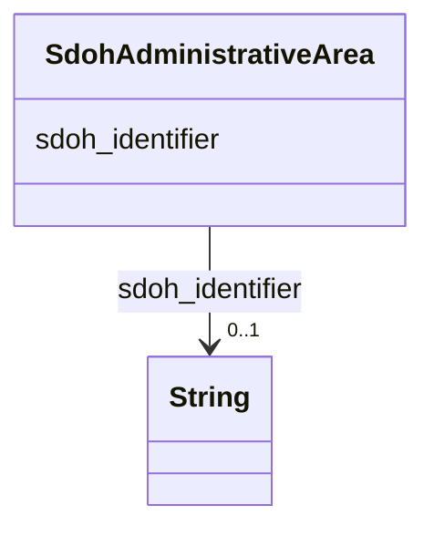

# Class: AdministrativeArea (sdoh_AdministrativeArea)


_A geographical region, typically under the jurisdiction of a particular government._


URI: [sdoh:AdministrativeArea](http://schema.org/AdministrativeArea)





<!-- no inheritance hierarchy -->


## Slots

| Name | Cardinality and Range | Description | Inheritance |
| ---  | --- | --- | --- |
| [sdoh_identifier](../slots/sdoh_identifier.md) | 0..1 <br/> [xsd:string](http://www.w3.org/2001/XMLSchema#string) | The identifier property represents any kind of identifier for any kind of [[T... | direct |


## Usages

| used by | used in | type | used |
| ---  | --- | --- | --- |
| [SdohPlace](../classes/SdohPlace.md) | [sdoh_containedInPlace](../slots/sdoh_containedInPlace.md) | range | [SdohAdministrativeArea](../classes/SdohAdministrativeArea.md) |


## Examples

| Value |
| --- |
| dreamkg:zip/19153 |

## TODOs

* TODO -- Todos for this class go here
* or you can delete the todos
* if you think the class is perfect.

## Identifier and Mapping Information


### Schema Source


* from schema: dream-kg


## Mappings

| Mapping Type | Mapped Value |
| ---  | ---  |
| self | sdoh:AdministrativeArea |
| native | dream-kg/:SdohAdministrativeArea |


## LinkML Source

<!-- TODO: investigate https://stackoverflow.com/questions/37606292/how-to-create-tabbed-code-blocks-in-mkdocs-or-sphinx -->

### Direct

<details>
```yaml
name: sdoh_AdministrativeArea
description: A geographical region, typically under the jurisdiction of a particular
  government.
title: AdministrativeArea
todos:
- TODO -- Todos for this class go here
- or you can delete the todos
- if you think the class is perfect.
notes:
- There are 39 instances of this class.
examples:
- value: dreamkg:zip/19153
from_schema: dream-kg
slots:
- sdoh_identifier
class_uri: sdoh:AdministrativeArea

```
</details>

### Induced

<details>
```yaml
name: sdoh_AdministrativeArea
description: A geographical region, typically under the jurisdiction of a particular
  government.
title: AdministrativeArea
todos:
- TODO -- Todos for this class go here
- or you can delete the todos
- if you think the class is perfect.
notes:
- There are 39 instances of this class.
examples:
- value: dreamkg:zip/19153
from_schema: dream-kg
attributes:
  sdoh_identifier:
    name: sdoh_identifier
    description: "The identifier property represents any kind of identifier for any\
      \ kind of [[Thing]], such as ISBNs, GTIN codes, UUIDs etc. Schema.org provides\
      \ dedicated properties for representing many of these, either as textual strings\
      \ or as URL (URI) links. See [background notes](/docs/datamodel.html#identifierBg)\
      \ for more details.\n        "
    title: identifier
    todos:
    - TODO -- Todos for this slot go here
    - or you can delete the todos
    - if you think the class is perfect.
    comments:
    - 87 occurrences with subject type sdoh_Service and object type string.
    - 39 occurrences with subject type sdoh_AdministrativeArea and object type string.
    examples:
    - value: dreamkg:service/4542572480692224 sdoh:identifier 4542572480692224
    - value: dreamkg:zip/19130 sdoh:identifier 19130
    from_schema: dream-kg
    rank: 1000
    slot_uri: sdoh:identifier
    alias: sdoh_identifier
    owner: sdoh_AdministrativeArea
    domain_of:
    - sdoh_AdministrativeArea
    - sdoh_Service
    range: string
class_uri: sdoh:AdministrativeArea

```
</details>