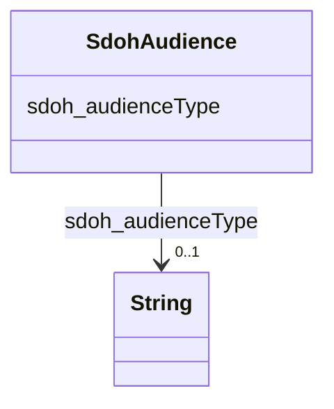

# Class: Audience (sdoh_Audience)


_Intended audience for an item, i.e. the group for whom the item was created._


URI: [sdoh:Audience](http://schema.org/Audience)





<!-- no inheritance hierarchy -->


## Slots

| Name | Cardinality and Range | Description | Inheritance |
| ---  | --- | --- | --- |
| [sdoh_audienceType](../slots/sdoh_audienceType.md) | 0..1 <br/> [xsd:string](xsd:string) | No slot description provided | direct |


## Usages

| used by | used in | type | used |
| ---  | --- | --- | --- |
| [SdohService](../classes/SdohService.md) | [sdoh_category](../slots/sdoh_category.md) | any_of[range] | [SdohAudience](../classes/SdohAudience.md) |


## Examples

| Value |
| --- |
| dreamkg:category/audience/DomesticViolenceSurvivors |

## TODOs

* TODO -- Todos for this class go here
* or you can delete the todos
* if you think the class is perfect.

## Identifier and Mapping Information


### Schema Source


* from schema: dream-kg


## Mappings

| Mapping Type | Mapped Value |
| ---  | ---  |
| self | sdoh:Audience |
| native | dream-kg/:SdohAudience |


## LinkML Source

<!-- TODO: investigate https://stackoverflow.com/questions/37606292/how-to-create-tabbed-code-blocks-in-mkdocs-or-sphinx -->

### Direct

<details>
```yaml
name: sdoh_Audience
description: Intended audience for an item, i.e. the group for whom the item was created.
title: Audience
todos:
- TODO -- Todos for this class go here
- or you can delete the todos
- if you think the class is perfect.
notes:
- Class with 81 occurences.
examples:
- value: dreamkg:category/audience/DomesticViolenceSurvivors
from_schema: dream-kg
rank: 1000
slots:
- sdoh_audienceType
class_uri: sdoh:Audience

```
</details>

### Induced

<details>
```yaml
name: sdoh_Audience
description: Intended audience for an item, i.e. the group for whom the item was created.
title: Audience
todos:
- TODO -- Todos for this class go here
- or you can delete the todos
- if you think the class is perfect.
notes:
- Class with 81 occurences.
examples:
- value: dreamkg:category/audience/DomesticViolenceSurvivors
from_schema: dream-kg
rank: 1000
attributes:
  sdoh_audienceType:
    name: sdoh_audienceType
    description: No slot description provided
    todos:
    - TODO -- Todos for this slot go here
    - or you can delete the todos
    - if you think the class is perfect.
    comments:
    - 81 occurrences with subject type sdoh_Audience and object type string.
    examples:
    - value: dreamkg:category/audience/TraumaSurvivors sdoh:audienceType trauma survivors
    from_schema: dream-kg
    rank: 1000
    slot_uri: sdoh:audienceType
    alias: sdoh_audienceType
    owner: sdoh_Audience
    domain_of:
    - sdoh_Audience
    range: string
class_uri: sdoh:Audience

```
</details>