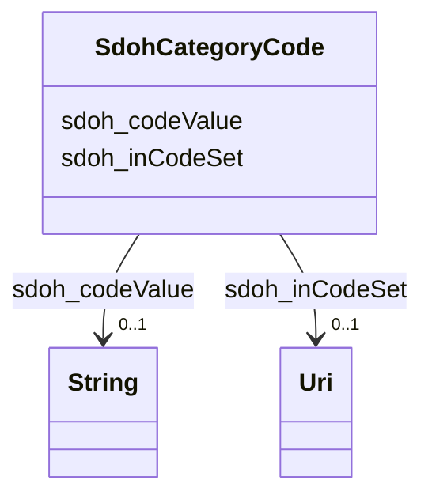

# Class: CategoryCode (sdoh_CategoryCode)


_A Category Code._


URI: [sdoh:CategoryCode](http://schema.org/CategoryCode)





<!-- no inheritance hierarchy -->


## Slots

| Name | Cardinality and Range | Description | Inheritance |
| ---  | --- | --- | --- |
| [sdoh_codeValue](../slots/sdoh_codeValue.md) | 0..1 <br/> [xsd:string](xsd:string) | No slot description provided | direct |
| [sdoh_inCodeSet](../slots/sdoh_inCodeSet.md) | 0..1 <br/> [xsd:anyURI](xsd:anyURI) | No slot description provided | direct |


## Usages

| used by | used in | type | used |
| ---  | --- | --- | --- |
| [SdohService](../classes/SdohService.md) | [sdoh_category](../slots/sdoh_category.md) | any_of[range] | [SdohCategoryCode](../classes/SdohCategoryCode.md) |


## Examples

| Value |
| --- |
| dreamkg:category/service/other/MoreEducation |

## TODOs

* TODO -- Todos for this class go here
* or you can delete the todos
* if you think the class is perfect.

## Identifier and Mapping Information


### Schema Source


* from schema: dream-kg


## Mappings

| Mapping Type | Mapped Value |
| ---  | ---  |
| self | sdoh:CategoryCode |
| native | dream-kg/:SdohCategoryCode |


## LinkML Source

<!-- TODO: investigate https://stackoverflow.com/questions/37606292/how-to-create-tabbed-code-blocks-in-mkdocs-or-sphinx -->

### Direct

<details>
```yaml
name: sdoh_CategoryCode
description: A Category Code.
title: CategoryCode
todos:
- TODO -- Todos for this class go here
- or you can delete the todos
- if you think the class is perfect.
notes:
- Class with 157 occurences.
examples:
- value: dreamkg:category/service/other/MoreEducation
from_schema: dream-kg
rank: 1000
slots:
- sdoh_codeValue
- sdoh_inCodeSet
class_uri: sdoh:CategoryCode

```
</details>

### Induced

<details>
```yaml
name: sdoh_CategoryCode
description: A Category Code.
title: CategoryCode
todos:
- TODO -- Todos for this class go here
- or you can delete the todos
- if you think the class is perfect.
notes:
- Class with 157 occurences.
examples:
- value: dreamkg:category/service/other/MoreEducation
from_schema: dream-kg
rank: 1000
attributes:
  sdoh_codeValue:
    name: sdoh_codeValue
    description: No slot description provided
    todos:
    - TODO -- Todos for this slot go here
    - or you can delete the todos
    - if you think the class is perfect.
    comments:
    - 158 occurrences with subject type sdoh_CategoryCode and object type string.
    examples:
    - value: dreamkg:category/language/Armenian sdoh:codeValue Armenian
    from_schema: dream-kg
    rank: 1000
    slot_uri: sdoh:codeValue
    alias: sdoh_codeValue
    owner: sdoh_CategoryCode
    domain_of:
    - sdoh_CategoryCode
    range: string
  sdoh_inCodeSet:
    name: sdoh_inCodeSet
    description: No slot description provided
    todos:
    - TODO -- Todos for this slot go here
    - or you can delete the todos
    - if you think the class is perfect.
    comments:
    - 157 occurrences with subject type sdoh_CategoryCode and object type uri.
    examples:
    - value: dreamkg:category/service/other/SkillsAndTraining sdoh:inCodeSet dreamkg:_CategoryCodeSet_Services_Other
    from_schema: dream-kg
    rank: 1000
    slot_uri: sdoh:inCodeSet
    alias: sdoh_inCodeSet
    owner: sdoh_CategoryCode
    domain_of:
    - sdoh_CategoryCode
    range: uri
class_uri: sdoh:CategoryCode

```
</details>