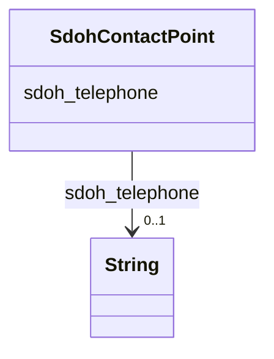

# Class: ContactPoint (sdoh_ContactPoint)


_A contact point&#x2014;for example, a Customer Complaints department._


URI: [sdoh:ContactPoint](http://schema.org/ContactPoint)





<!-- no inheritance hierarchy -->


## Slots

| Name | Cardinality and Range | Description | Inheritance |
| ---  | --- | --- | --- |
| [sdoh_telephone](../slots/sdoh_telephone.md) | 0..1 <br/> [xsd:string](http://www.w3.org/2001/XMLSchema#string) | TODO -- tell the world what this slot (predicate) describes | direct |


## Usages

| used by | used in | type | used |
| ---  | --- | --- | --- |
| [SdohServiceChannel](../classes/SdohServiceChannel.md) | [sdoh_servicePhone](../slots/sdoh_servicePhone.md) | range | [SdohContactPoint](../classes/SdohContactPoint.md) |


## Examples

| Value |
| --- |
| dreamkg:service/phone/5792020391002112 |

## TODOs

* TODO -- Todos for this class go here
* or you can delete the todos
* if you think the class is perfect.

## Identifier and Mapping Information


### Schema Source


* from schema: dream-kg


## Mappings

| Mapping Type | Mapped Value |
| ---  | ---  |
| self | sdoh:ContactPoint |
| native | dream-kg/:SdohContactPoint |


## LinkML Source

<!-- TODO: investigate https://stackoverflow.com/questions/37606292/how-to-create-tabbed-code-blocks-in-mkdocs-or-sphinx -->

### Direct

<details>
```yaml
name: sdoh_ContactPoint
description: A contact point&#x2014;for example, a Customer Complaints department.
title: ContactPoint
todos:
- TODO -- Todos for this class go here
- or you can delete the todos
- if you think the class is perfect.
notes:
- Class with 87 occurences.
examples:
- value: dreamkg:service/phone/5792020391002112
from_schema: dream-kg
slots:
- sdoh_telephone
class_uri: sdoh:ContactPoint

```
</details>

### Induced

<details>
```yaml
name: sdoh_ContactPoint
description: A contact point&#x2014;for example, a Customer Complaints department.
title: ContactPoint
todos:
- TODO -- Todos for this class go here
- or you can delete the todos
- if you think the class is perfect.
notes:
- Class with 87 occurences.
examples:
- value: dreamkg:service/phone/5792020391002112
from_schema: dream-kg
attributes:
  sdoh_telephone:
    name: sdoh_telephone
    description: TODO -- tell the world what this slot (predicate) describes.
    todos:
    - TODO -- Todos for this slot go here
    - or you can delete the todos
    - if you think the class is perfect.
    comments:
    - 87 occurrences with subject type sdoh_ContactPoint and object type string.
    examples:
    - value: dreamkg:service/phone/5385341432496128 sdoh:telephone 610-497-1082
    from_schema: dream-kg
    rank: 1000
    slot_uri: sdoh:telephone
    alias: sdoh_telephone
    owner: sdoh_ContactPoint
    domain_of:
    - sdoh_ContactPoint
    range: string
class_uri: sdoh:ContactPoint

```
</details>