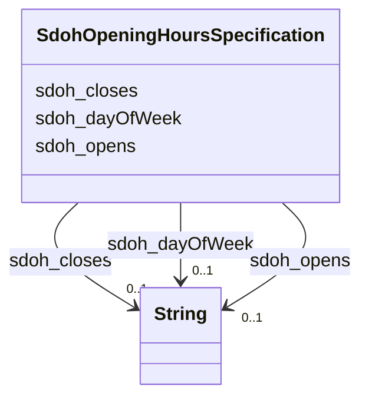

# Class: OpeningHoursSpecification (sdoh_OpeningHoursSpecification)


_A structured value providing information about the opening hours of a place or a certain service inside a place.\n\n_

_The place is __open__ if the [[opens]] property is specified, and __closed__ otherwise.\n\nIf the value for the [[closes]] property is less than the value for the [[opens]] property then the hour range is assumed to span over the next day._

_      _


URI: [sdoh:OpeningHoursSpecification](http://schema.org/OpeningHoursSpecification)





<!-- no inheritance hierarchy -->


## Slots

| Name | Cardinality and Range | Description | Inheritance |
| ---  | --- | --- | --- |
| [sdoh_closes](../slots/sdoh_closes.md) | 0..1 <br/> [xsd:string](http://www.w3.org/2001/XMLSchema#string) | TODO -- tell the world what this slot (predicate) describes | direct |
| [sdoh_dayOfWeek](../slots/sdoh_dayOfWeek.md) | 0..1 <br/> [xsd:string](http://www.w3.org/2001/XMLSchema#string) | TODO -- tell the world what this slot (predicate) describes | direct |
| [sdoh_opens](../slots/sdoh_opens.md) | 0..1 <br/> [xsd:string](http://www.w3.org/2001/XMLSchema#string) | TODO -- tell the world what this slot (predicate) describes | direct |


## Usages

| used by | used in | type | used |
| ---  | --- | --- | --- |
| [SdohService](../classes/SdohService.md) | [sdoh_hoursAvailable](../slots/sdoh_hoursAvailable.md) | range | [SdohOpeningHoursSpecification](../classes/SdohOpeningHoursSpecification.md) |


## Examples

| Value |
| --- |
| dreamkg:service/hours/monday/6213025361821696 |

## TODOs

* TODO -- Todos for this class go here
* or you can delete the todos
* if you think the class is perfect.

## Identifier and Mapping Information


### Schema Source


* from schema: dream-kg


## Mappings

| Mapping Type | Mapped Value |
| ---  | ---  |
| self | sdoh:OpeningHoursSpecification |
| native | dream-kg/:SdohOpeningHoursSpecification |


## LinkML Source

<!-- TODO: investigate https://stackoverflow.com/questions/37606292/how-to-create-tabbed-code-blocks-in-mkdocs-or-sphinx -->

### Direct

<details>
```yaml
name: sdoh_OpeningHoursSpecification
description: "A structured value providing information about the opening hours of\
  \ a place or a certain service inside a place.\\n\\n\nThe place is __open__ if the\
  \ [[opens]] property is specified, and __closed__ otherwise.\\n\\nIf the value for\
  \ the [[closes]] property is less than the value for the [[opens]] property then\
  \ the hour range is assumed to span over the next day.\n      "
title: OpeningHoursSpecification
todos:
- TODO -- Todos for this class go here
- or you can delete the todos
- if you think the class is perfect.
notes:
- There are 609 instances of this class.
examples:
- value: dreamkg:service/hours/monday/6213025361821696
from_schema: dream-kg
slots:
- sdoh_closes
- sdoh_dayOfWeek
- sdoh_opens
class_uri: sdoh:OpeningHoursSpecification

```
</details>

### Induced

<details>
```yaml
name: sdoh_OpeningHoursSpecification
description: "A structured value providing information about the opening hours of\
  \ a place or a certain service inside a place.\\n\\n\nThe place is __open__ if the\
  \ [[opens]] property is specified, and __closed__ otherwise.\\n\\nIf the value for\
  \ the [[closes]] property is less than the value for the [[opens]] property then\
  \ the hour range is assumed to span over the next day.\n      "
title: OpeningHoursSpecification
todos:
- TODO -- Todos for this class go here
- or you can delete the todos
- if you think the class is perfect.
notes:
- There are 609 instances of this class.
examples:
- value: dreamkg:service/hours/monday/6213025361821696
from_schema: dream-kg
attributes:
  sdoh_closes:
    name: sdoh_closes
    description: TODO -- tell the world what this slot (predicate) describes.
    todos:
    - TODO -- Todos for this slot go here
    - or you can delete the todos
    - if you think the class is perfect.
    comments:
    - 623 occurrences with subject type sdoh_OpeningHoursSpecification and object
      type string.
    examples:
    - value: dreamkg:service/hours/wednesday/5802794918608896 sdoh:closes 18:00
    from_schema: dream-kg
    rank: 1000
    slot_uri: sdoh:closes
    alias: sdoh_closes
    owner: sdoh_OpeningHoursSpecification
    domain_of:
    - sdoh_OpeningHoursSpecification
    range: string
  sdoh_dayOfWeek:
    name: sdoh_dayOfWeek
    description: TODO -- tell the world what this slot (predicate) describes.
    todos:
    - TODO -- Todos for this slot go here
    - or you can delete the todos
    - if you think the class is perfect.
    comments:
    - 609 occurrences with subject type sdoh_OpeningHoursSpecification and object
      type string.
    examples:
    - value: dreamkg:service/hours/wednesday/5552002522939392 sdoh:dayOfWeek Wednesday
    from_schema: dream-kg
    rank: 1000
    slot_uri: sdoh:dayOfWeek
    alias: sdoh_dayOfWeek
    owner: sdoh_OpeningHoursSpecification
    domain_of:
    - sdoh_OpeningHoursSpecification
    range: string
  sdoh_opens:
    name: sdoh_opens
    description: TODO -- tell the world what this slot (predicate) describes.
    todos:
    - TODO -- Todos for this slot go here
    - or you can delete the todos
    - if you think the class is perfect.
    comments:
    - 631 occurrences with subject type sdoh_OpeningHoursSpecification and object
      type string.
    examples:
    - value: dreamkg:service/hours/thursday/5147295688687616 sdoh:opens 08:00
    from_schema: dream-kg
    rank: 1000
    slot_uri: sdoh:opens
    alias: sdoh_opens
    owner: sdoh_OpeningHoursSpecification
    domain_of:
    - sdoh_OpeningHoursSpecification
    range: string
class_uri: sdoh:OpeningHoursSpecification

```
</details>