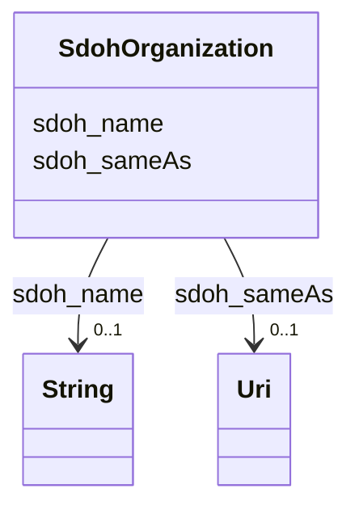

# Class: Organization (sdoh_Organization)


_An organization such as a school, NGO, corporation, club, etc._


URI: [sdoh:Organization](http://schema.org/Organization)





<!-- no inheritance hierarchy -->


## Slots

| Name | Cardinality and Range | Description | Inheritance |
| ---  | --- | --- | --- |
| [sdoh_sameAs](../slots/sdoh_sameAs.md) | 0..1 <br/> [xsd:anyURI](http://www.w3.org/2001/XMLSchema#anyURI) | URL of a reference Web page that unambiguously indicates the item's identity | direct |
| [sdoh_name](../slots/sdoh_name.md) | 0..1 <br/> [xsd:string](http://www.w3.org/2001/XMLSchema#string) | The name of the item | direct |


## Usages

| used by | used in | type | used |
| ---  | --- | --- | --- |
| [SdohService](../classes/SdohService.md) | [sdoh_provider](../slots/sdoh_provider.md) | range | [SdohOrganization](../classes/SdohOrganization.md) |


## Examples

| Value |
| --- |
| dreamkg:service/provider/5730442313465856 |

## TODOs

* TODO -- Todos for this class go here
* or you can delete the todos
* if you think the class is perfect.

## Identifier and Mapping Information


### Schema Source


* from schema: dream-kg


## Mappings

| Mapping Type | Mapped Value |
| ---  | ---  |
| self | sdoh:Organization |
| native | dream-kg/:SdohOrganization |


## LinkML Source

<!-- TODO: investigate https://stackoverflow.com/questions/37606292/how-to-create-tabbed-code-blocks-in-mkdocs-or-sphinx -->

### Direct

<details>
```yaml
name: sdoh_Organization
description: An organization such as a school, NGO, corporation, club, etc.
title: Organization
todos:
- TODO -- Todos for this class go here
- or you can delete the todos
- if you think the class is perfect.
notes:
- There are 87 instances of this class.
examples:
- value: dreamkg:service/provider/5730442313465856
from_schema: dream-kg
slots:
- sdoh_sameAs
- sdoh_name
class_uri: sdoh:Organization

```
</details>

### Induced

<details>
```yaml
name: sdoh_Organization
description: An organization such as a school, NGO, corporation, club, etc.
title: Organization
todos:
- TODO -- Todos for this class go here
- or you can delete the todos
- if you think the class is perfect.
notes:
- There are 87 instances of this class.
examples:
- value: dreamkg:service/provider/5730442313465856
from_schema: dream-kg
attributes:
  sdoh_sameAs:
    name: sdoh_sameAs
    description: URL of a reference Web page that unambiguously indicates the item's
      identity. E.g. the URL of the item's Wikipedia page, Wikidata entry, or official
      website.
    title: sameAs
    todos:
    - TODO -- Todos for this slot go here
    - or you can delete the todos
    - if you think the class is perfect.
    comments:
    - 127 occurrences with subject type sdoh_Organization and object type uri.
    examples:
    - value: dreamkg:service/provider/4874573658193920 sdoh:sameAs https://www.twitter.com/@WedgeRecovery
    from_schema: dream-kg
    rank: 1000
    slot_uri: sdoh:sameAs
    alias: sdoh_sameAs
    owner: sdoh_Organization
    domain_of:
    - sdoh_Organization
    range: uri
  sdoh_name:
    name: sdoh_name
    description: The name of the item.
    title: name
    todos:
    - TODO -- Todos for this slot go here
    - or you can delete the todos
    - if you think the class is perfect.
    comments:
    - 89 occurrences with subject type sdoh_Organization and object type string.
    - 88 occurrences with subject type sdoh_Service and object type string.
    examples:
    - value: dreamkg:service/provider/4967372504694784 sdoh:name Church World Service
        Inc
    - value: dreamkg:service/4873770804707328 sdoh:name Food Assistance and Relief
    from_schema: dream-kg
    rank: 1000
    slot_uri: sdoh:name
    alias: sdoh_name
    owner: sdoh_Organization
    domain_of:
    - sdoh_Organization
    - sdoh_Service
    range: string
class_uri: sdoh:Organization

```
</details>