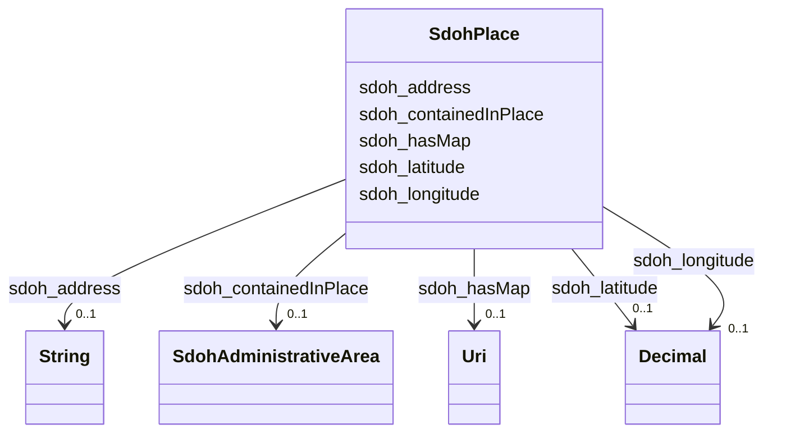

# Class: Place (sdoh_Place)


_Entities that have a somewhat fixed, physical extension._


URI: [sdoh:Place](http://schema.org/Place)





<!-- no inheritance hierarchy -->


## Slots

| Name | Cardinality and Range | Description | Inheritance |
| ---  | --- | --- | --- |
| [sdoh_containedInPlace](../slots/sdoh_containedInPlace.md) | 0..1 <br/> [SdohAdministrativeArea](../classes/SdohAdministrativeArea.md) | TODO -- tell the world what this slot (predicate) describes | direct |
| [sdoh_longitude](../slots/sdoh_longitude.md) | 0..1 <br/> [xsd:decimal](http://www.w3.org/2001/XMLSchema#decimal) | TODO -- tell the world what this slot (predicate) describes | direct |
| [sdoh_latitude](../slots/sdoh_latitude.md) | 0..1 <br/> [xsd:decimal](http://www.w3.org/2001/XMLSchema#decimal) | TODO -- tell the world what this slot (predicate) describes | direct |
| [sdoh_hasMap](../slots/sdoh_hasMap.md) | 0..1 <br/> [xsd:anyURI](http://www.w3.org/2001/XMLSchema#anyURI) | TODO -- tell the world what this slot (predicate) describes | direct |
| [sdoh_address](../slots/sdoh_address.md) | 0..1 <br/> [xsd:string](http://www.w3.org/2001/XMLSchema#string) | TODO -- tell the world what this slot (predicate) describes | direct |


## Usages

| used by | used in | type | used |
| ---  | --- | --- | --- |
| [SdohServiceChannel](../classes/SdohServiceChannel.md) | [sdoh_serviceLocation](../slots/sdoh_serviceLocation.md) | range | [SdohPlace](../classes/SdohPlace.md) |


## Examples

| Value |
| --- |
| dreamkg:service/location/6615452957540352 |

## TODOs

* TODO -- Todos for this class go here
* or you can delete the todos
* if you think the class is perfect.

## Identifier and Mapping Information


### Schema Source


* from schema: dream-kg


## Mappings

| Mapping Type | Mapped Value |
| ---  | ---  |
| self | sdoh:Place |
| native | dream-kg/:SdohPlace |


## LinkML Source

<!-- TODO: investigate https://stackoverflow.com/questions/37606292/how-to-create-tabbed-code-blocks-in-mkdocs-or-sphinx -->

### Direct

<details>
```yaml
name: sdoh_Place
description: Entities that have a somewhat fixed, physical extension.
title: Place
todos:
- TODO -- Todos for this class go here
- or you can delete the todos
- if you think the class is perfect.
notes:
- Class with 87 occurences.
examples:
- value: dreamkg:service/location/6615452957540352
from_schema: dream-kg
slots:
- sdoh_containedInPlace
- sdoh_longitude
- sdoh_latitude
- sdoh_hasMap
- sdoh_address
class_uri: sdoh:Place

```
</details>

### Induced

<details>
```yaml
name: sdoh_Place
description: Entities that have a somewhat fixed, physical extension.
title: Place
todos:
- TODO -- Todos for this class go here
- or you can delete the todos
- if you think the class is perfect.
notes:
- Class with 87 occurences.
examples:
- value: dreamkg:service/location/6615452957540352
from_schema: dream-kg
attributes:
  sdoh_containedInPlace:
    name: sdoh_containedInPlace
    description: TODO -- tell the world what this slot (predicate) describes.
    todos:
    - TODO -- Todos for this slot go here
    - or you can delete the todos
    - if you think the class is perfect.
    comments:
    - 88 occurrences with subject type sdoh_Place and object type sdoh_AdministrativeArea.
    examples:
    - value: dreamkg:service/location/5640139036164096 sdoh:containedInPlace dreamkg:zip/19124
    from_schema: dream-kg
    rank: 1000
    slot_uri: sdoh:containedInPlace
    alias: sdoh_containedInPlace
    owner: sdoh_Place
    domain_of:
    - sdoh_Place
    range: sdoh_AdministrativeArea
  sdoh_longitude:
    name: sdoh_longitude
    description: TODO -- tell the world what this slot (predicate) describes.
    todos:
    - TODO -- Todos for this slot go here
    - or you can delete the todos
    - if you think the class is perfect.
    comments:
    - 89 occurrences with subject type sdoh_Place and object type decimal.
    examples:
    - value: dreamkg:service/location/5671175268335616 sdoh:longitude -75.2187346
    from_schema: dream-kg
    rank: 1000
    slot_uri: sdoh:longitude
    alias: sdoh_longitude
    owner: sdoh_Place
    domain_of:
    - sdoh_Place
    range: decimal
  sdoh_latitude:
    name: sdoh_latitude
    description: TODO -- tell the world what this slot (predicate) describes.
    todos:
    - TODO -- Todos for this slot go here
    - or you can delete the todos
    - if you think the class is perfect.
    comments:
    - 89 occurrences with subject type sdoh_Place and object type decimal.
    examples:
    - value: dreamkg:service/location/6004150434004992 sdoh:latitude 39.9676669
    from_schema: dream-kg
    rank: 1000
    slot_uri: sdoh:latitude
    alias: sdoh_latitude
    owner: sdoh_Place
    domain_of:
    - sdoh_Place
    range: decimal
  sdoh_hasMap:
    name: sdoh_hasMap
    description: TODO -- tell the world what this slot (predicate) describes.
    todos:
    - TODO -- Todos for this slot go here
    - or you can delete the todos
    - if you think the class is perfect.
    comments:
    - 88 occurrences with subject type sdoh_Place and object type uri.
    examples:
    - value: dreamkg:service/location/6004150434004992 sdoh:hasMap https://www.google.com/maps/?q=715+North+Broad+Street,+Philadelphia,+PA+19123/
    from_schema: dream-kg
    rank: 1000
    slot_uri: sdoh:hasMap
    alias: sdoh_hasMap
    owner: sdoh_Place
    domain_of:
    - sdoh_Place
    range: uri
  sdoh_address:
    name: sdoh_address
    description: TODO -- tell the world what this slot (predicate) describes.
    todos:
    - TODO -- Todos for this slot go here
    - or you can delete the todos
    - if you think the class is perfect.
    comments:
    - 93 occurrences with subject type sdoh_Place and object type string.
    examples:
    - value: dreamkg:service/location/5477271096786944 sdoh:address 2600 Southampton
        Rd, Philadelphia, PA 19116
    from_schema: dream-kg
    rank: 1000
    slot_uri: sdoh:address
    alias: sdoh_address
    owner: sdoh_Place
    domain_of:
    - sdoh_Place
    range: string
class_uri: sdoh:Place

```
</details>