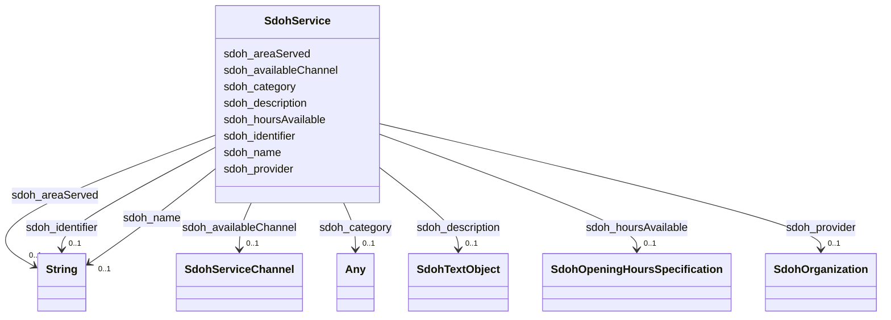

# Class: TODO -- what's a good name for what this class (type) describes? (sdoh_Service)


_TODO -- tell the world what this class (type) describes._


URI: [sdoh:Service](http://schema.org/Service)





<!-- no inheritance hierarchy -->


## Slots

| Name | Cardinality and Range | Description | Inheritance |
| ---  | --- | --- | --- |
| [sdoh_hoursAvailable](../slots/sdoh_hoursAvailable.md) | 0..1 <br/> [SdohOpeningHoursSpecification](../classes/SdohOpeningHoursSpecification.md) | TODO -- tell the world what this slot (predicate) describes | direct |
| [sdoh_category](../slots/sdoh_category.md) | 0..1 <br/> [Any](../classes/Any.md)&nbsp;or&nbsp;<br />[SdohAudience](../classes/SdohAudience.md)&nbsp;or&nbsp;<br />[SdohCategoryCode](../classes/SdohCategoryCode.md) | TODO -- tell the world what this slot (predicate) describes | direct |
| [sdoh_availableChannel](../slots/sdoh_availableChannel.md) | 0..1 <br/> [SdohServiceChannel](../classes/SdohServiceChannel.md) | TODO -- tell the world what this slot (predicate) describes | direct |
| [sdoh_provider](../slots/sdoh_provider.md) | 0..1 <br/> [SdohOrganization](../classes/SdohOrganization.md) | TODO -- tell the world what this slot (predicate) describes | direct |
| [sdoh_description](../slots/sdoh_description.md) | 0..1 <br/> [SdohTextObject](../classes/SdohTextObject.md) | TODO -- tell the world what this slot (predicate) describes | direct |
| [sdoh_areaServed](../slots/sdoh_areaServed.md) | 0..1 <br/> [xsd:string](http://www.w3.org/2001/XMLSchema#string) | TODO -- tell the world what this slot (predicate) describes | direct |
| [sdoh_identifier](../slots/sdoh_identifier.md) | 0..1 <br/> [xsd:string](http://www.w3.org/2001/XMLSchema#string) | TODO -- tell the world what this slot (predicate) describes | direct |
| [sdoh_name](../slots/sdoh_name.md) | 0..1 <br/> [xsd:string](http://www.w3.org/2001/XMLSchema#string) | TODO -- tell the world what this slot (predicate) describes | direct |


## Examples

| Value |
| --- |
| dreamkg:service/6354456388829184 |

## TODOs

* TODO -- Todos for this class go here
* or you can delete the todos
* if you think the class is perfect.

## Identifier and Mapping Information


### Schema Source


* from schema: dream-kg


## Mappings

| Mapping Type | Mapped Value |
| ---  | ---  |
| self | sdoh:Service |
| native | dream-kg/:SdohService |


## LinkML Source

<!-- TODO: investigate https://stackoverflow.com/questions/37606292/how-to-create-tabbed-code-blocks-in-mkdocs-or-sphinx -->

### Direct

<details>
```yaml
name: sdoh_Service
description: TODO -- tell the world what this class (type) describes.
title: TODO -- what's a good name for what this class (type) describes?
todos:
- TODO -- Todos for this class go here
- or you can delete the todos
- if you think the class is perfect.
notes:
- There are 87 instances of this class.
examples:
- value: dreamkg:service/6354456388829184
from_schema: dream-kg
slots:
- sdoh_hoursAvailable
- sdoh_category
- sdoh_availableChannel
- sdoh_provider
- sdoh_description
- sdoh_areaServed
- sdoh_identifier
- sdoh_name
class_uri: sdoh:Service

```
</details>

### Induced

<details>
```yaml
name: sdoh_Service
description: TODO -- tell the world what this class (type) describes.
title: TODO -- what's a good name for what this class (type) describes?
todos:
- TODO -- Todos for this class go here
- or you can delete the todos
- if you think the class is perfect.
notes:
- There are 87 instances of this class.
examples:
- value: dreamkg:service/6354456388829184
from_schema: dream-kg
attributes:
  sdoh_hoursAvailable:
    name: sdoh_hoursAvailable
    description: TODO -- tell the world what this slot (predicate) describes.
    todos:
    - TODO -- Todos for this slot go here
    - or you can delete the todos
    - if you think the class is perfect.
    comments:
    - 609 occurrences with subject type sdoh_Service and object type sdoh_OpeningHoursSpecification.
    examples:
    - value: dreamkg:service/5385341432496128 sdoh:hoursAvailable dreamkg:service/hours/thursday/5385341432496128
    from_schema: dream-kg
    rank: 1000
    slot_uri: sdoh:hoursAvailable
    alias: sdoh_hoursAvailable
    owner: sdoh_Service
    domain_of:
    - sdoh_Service
    range: sdoh_OpeningHoursSpecification
  sdoh_category:
    name: sdoh_category
    description: TODO -- tell the world what this slot (predicate) describes.
    todos:
    - TODO -- Todos for this slot go here
    - or you can delete the todos
    - if you think the class is perfect.
    comments:
    - 539 occurrences with subject type sdoh_Service and object type sdoh_Audience.
    - 806 occurrences with subject type sdoh_Service and object type sdoh_CategoryCode.
    examples:
    - value: dreamkg:service/6032260047568896 sdoh:category dreamkg:category/audience/Adults18
    - value: dreamkg:service/6378689670414336 sdoh:category dreamkg:category/cost/ReducedCost
    from_schema: dream-kg
    rank: 1000
    slot_uri: sdoh:category
    alias: sdoh_category
    owner: sdoh_Service
    domain_of:
    - sdoh_Service
    range: Any
    any_of:
    - range: sdoh_Audience
    - range: sdoh_CategoryCode
  sdoh_availableChannel:
    name: sdoh_availableChannel
    description: TODO -- tell the world what this slot (predicate) describes.
    todos:
    - TODO -- Todos for this slot go here
    - or you can delete the todos
    - if you think the class is perfect.
    comments:
    - 174 occurrences with subject type sdoh_Service and object type sdoh_ServiceChannel.
    examples:
    - value: dreamkg:service/4542572480692224 sdoh:availableChannel dreamkg:service/channel/P-4542572480692224
    from_schema: dream-kg
    rank: 1000
    slot_uri: sdoh:availableChannel
    alias: sdoh_availableChannel
    owner: sdoh_Service
    domain_of:
    - sdoh_Service
    range: sdoh_ServiceChannel
  sdoh_provider:
    name: sdoh_provider
    description: TODO -- tell the world what this slot (predicate) describes.
    todos:
    - TODO -- Todos for this slot go here
    - or you can delete the todos
    - if you think the class is perfect.
    comments:
    - 87 occurrences with subject type sdoh_Service and object type sdoh_Organization.
    examples:
    - value: dreamkg:service/4955538569953280 sdoh:provider dreamkg:service/provider/4955538569953280
    from_schema: dream-kg
    rank: 1000
    slot_uri: sdoh:provider
    alias: sdoh_provider
    owner: sdoh_Service
    domain_of:
    - sdoh_Service
    range: sdoh_Organization
  sdoh_description:
    name: sdoh_description
    description: TODO -- tell the world what this slot (predicate) describes.
    todos:
    - TODO -- Todos for this slot go here
    - or you can delete the todos
    - if you think the class is perfect.
    comments:
    - 87 occurrences with subject type sdoh_Service and object type sdoh_TextObject.
    examples:
    - value: dreamkg:service/6566876511207424 sdoh:description dreamkg:service/desc/6566876511207424
    from_schema: dream-kg
    rank: 1000
    slot_uri: sdoh:description
    alias: sdoh_description
    owner: sdoh_Service
    domain_of:
    - sdoh_Service
    range: sdoh_TextObject
  sdoh_areaServed:
    name: sdoh_areaServed
    description: TODO -- tell the world what this slot (predicate) describes.
    todos:
    - TODO -- Todos for this slot go here
    - or you can delete the todos
    - if you think the class is perfect.
    comments:
    - 87 occurrences with subject type sdoh_Service and object type string.
    examples:
    - value: 'dreamkg:service/4721819823112192 sdoh:areaServed This program covers
        residents of the following counties: Bucks County, PA, Burlington County,
        PA, Camden County, PA, Cecil County, PA, Chester County, PA, Delaware County,
        PA, Gloucester County, PA, Montgomery County, PA, New Castle County, PA, Philadelphia
        County, PA and Salem County, PA.'
    from_schema: dream-kg
    rank: 1000
    slot_uri: sdoh:areaServed
    alias: sdoh_areaServed
    owner: sdoh_Service
    domain_of:
    - sdoh_Service
    range: string
  sdoh_identifier:
    name: sdoh_identifier
    description: TODO -- tell the world what this slot (predicate) describes.
    todos:
    - TODO -- Todos for this slot go here
    - or you can delete the todos
    - if you think the class is perfect.
    comments:
    - 87 occurrences with subject type sdoh_Service and object type string.
    - 39 occurrences with subject type sdoh_AdministrativeArea and object type string.
    examples:
    - value: dreamkg:service/6139716755783680 sdoh:identifier 6139716755783680
    - value: dreamkg:zip/19154 sdoh:identifier 19154
    from_schema: dream-kg
    rank: 1000
    slot_uri: sdoh:identifier
    alias: sdoh_identifier
    owner: sdoh_Service
    domain_of:
    - sdoh_AdministrativeArea
    - sdoh_Service
    range: string
  sdoh_name:
    name: sdoh_name
    description: TODO -- tell the world what this slot (predicate) describes.
    todos:
    - TODO -- Todos for this slot go here
    - or you can delete the todos
    - if you think the class is perfect.
    comments:
    - 88 occurrences with subject type sdoh_Service and object type string.
    - 89 occurrences with subject type sdoh_Organization and object type string.
    examples:
    - value: dreamkg:service/5112554392387584 sdoh:name Coffee House
    - value: dreamkg:service/provider/5477271096786944 sdoh:name Self Help Movement
    from_schema: dream-kg
    rank: 1000
    slot_uri: sdoh:name
    alias: sdoh_name
    owner: sdoh_Service
    domain_of:
    - sdoh_Organization
    - sdoh_Service
    range: string
class_uri: sdoh:Service

```
</details>