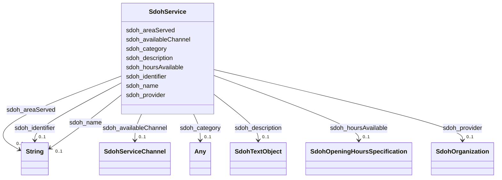

# Class: Service (sdoh_Service)


_A service provided by an organization, e.g. delivery service, print services, etc._


URI: [sdoh:Service](http://schema.org/Service)





<!-- no inheritance hierarchy -->


## Slots

| Name | Cardinality and Range | Description | Inheritance |
| ---  | --- | --- | --- |
| [sdoh_hoursAvailable](../slots/sdoh_hoursAvailable.md) | 0..1 <br/> [SdohOpeningHoursSpecification](../classes/SdohOpeningHoursSpecification.md) | The hours during which this service or contact is available | direct |
| [sdoh_availableChannel](../slots/sdoh_availableChannel.md) | 0..1 <br/> [SdohServiceChannel](../classes/SdohServiceChannel.md) | A means of accessing the service (e | direct |
| [sdoh_category](../slots/sdoh_category.md) | 0..1 <br/> [Any](../classes/Any.md)&nbsp;or&nbsp;<br />[SdohAudience](../classes/SdohAudience.md)&nbsp;or&nbsp;<br />[SdohCategoryCode](../classes/SdohCategoryCode.md) | A category for the item | direct |
| [sdoh_provider](../slots/sdoh_provider.md) | 0..1 <br/> [SdohOrganization](../classes/SdohOrganization.md) | The service provider, service operator, or service performer; the goods produ... | direct |
| [sdoh_description](../slots/sdoh_description.md) | 0..1 <br/> [SdohTextObject](../classes/SdohTextObject.md) | A description of the item | direct |
| [sdoh_name](../slots/sdoh_name.md) | 0..1 <br/> [xsd:string](http://www.w3.org/2001/XMLSchema#string) | The name of the item | direct |
| [sdoh_areaServed](../slots/sdoh_areaServed.md) | 0..1 <br/> [xsd:string](http://www.w3.org/2001/XMLSchema#string) | The geographic area where a service or offered item is provided | direct |
| [sdoh_identifier](../slots/sdoh_identifier.md) | 0..1 <br/> [xsd:string](http://www.w3.org/2001/XMLSchema#string) | The identifier property represents any kind of identifier for any kind of [[T... | direct |


## Examples

| Value |
| --- |
| dreamkg:service/5348732074983424 |

## TODOs

* TODO -- Todos for this class go here
* or you can delete the todos
* if you think the class is perfect.

## Identifier and Mapping Information


### Schema Source


* from schema: dream-kg


## Mappings

| Mapping Type | Mapped Value |
| ---  | ---  |
| self | sdoh:Service |
| native | dream-kg/:SdohService |


## LinkML Source

<!-- TODO: investigate https://stackoverflow.com/questions/37606292/how-to-create-tabbed-code-blocks-in-mkdocs-or-sphinx -->

### Direct

<details>
```yaml
name: sdoh_Service
description: A service provided by an organization, e.g. delivery service, print services,
  etc.
title: Service
todos:
- TODO -- Todos for this class go here
- or you can delete the todos
- if you think the class is perfect.
notes:
- There are 87 instances of this class.
examples:
- value: dreamkg:service/5348732074983424
from_schema: dream-kg
slots:
- sdoh_hoursAvailable
- sdoh_availableChannel
- sdoh_category
- sdoh_provider
- sdoh_description
- sdoh_name
- sdoh_areaServed
- sdoh_identifier
class_uri: sdoh:Service

```
</details>

### Induced

<details>
```yaml
name: sdoh_Service
description: A service provided by an organization, e.g. delivery service, print services,
  etc.
title: Service
todos:
- TODO -- Todos for this class go here
- or you can delete the todos
- if you think the class is perfect.
notes:
- There are 87 instances of this class.
examples:
- value: dreamkg:service/5348732074983424
from_schema: dream-kg
attributes:
  sdoh_hoursAvailable:
    name: sdoh_hoursAvailable
    description: The hours during which this service or contact is available.
    title: hoursAvailable
    todos:
    - TODO -- Todos for this slot go here
    - or you can delete the todos
    - if you think the class is perfect.
    comments:
    - 609 occurrences with subject type sdoh_Service and object type sdoh_OpeningHoursSpecification.
    examples:
    - value: dreamkg:service/5671175268335616 sdoh:hoursAvailable dreamkg:service/hours/monday/5671175268335616
    from_schema: dream-kg
    rank: 1000
    slot_uri: sdoh:hoursAvailable
    alias: sdoh_hoursAvailable
    owner: sdoh_Service
    domain_of:
    - sdoh_Service
    range: sdoh_OpeningHoursSpecification
  sdoh_availableChannel:
    name: sdoh_availableChannel
    description: A means of accessing the service (e.g. a phone bank, a web site,
      a location, etc.).
    title: availableChannel
    todos:
    - TODO -- Todos for this slot go here
    - or you can delete the todos
    - if you think the class is perfect.
    comments:
    - 174 occurrences with subject type sdoh_Service and object type sdoh_ServiceChannel.
    examples:
    - value: dreamkg:service/5671175268335616 sdoh:availableChannel dreamkg:service/channel/AB-5671175268335616
    from_schema: dream-kg
    rank: 1000
    slot_uri: sdoh:availableChannel
    alias: sdoh_availableChannel
    owner: sdoh_Service
    domain_of:
    - sdoh_Service
    range: sdoh_ServiceChannel
  sdoh_category:
    name: sdoh_category
    description: A category for the item. Greater signs or slashes can be used to
      informally indicate a category hierarchy.
    title: category
    todos:
    - TODO -- Todos for this slot go here
    - or you can delete the todos
    - if you think the class is perfect.
    comments:
    - 539 occurrences with subject type sdoh_Service and object type sdoh_Audience.
    - 806 occurrences with subject type sdoh_Service and object type sdoh_CategoryCode.
    examples:
    - value: dreamkg:service/6453846037626880 sdoh:category dreamkg:category/audience/LowIncome
    - value: dreamkg:service/5997720409997312 sdoh:category dreamkg:category/service/main/TemporaryShelter
    from_schema: dream-kg
    rank: 1000
    slot_uri: sdoh:category
    alias: sdoh_category
    owner: sdoh_Service
    domain_of:
    - sdoh_Service
    range: Any
    any_of:
    - range: sdoh_Audience
    - range: sdoh_CategoryCode
  sdoh_provider:
    name: sdoh_provider
    description: The service provider, service operator, or service performer; the
      goods producer. Another party (a seller) may offer those services or goods on
      behalf of the provider. A provider may also serve as the seller.
    title: provider
    todos:
    - TODO -- Todos for this slot go here
    - or you can delete the todos
    - if you think the class is perfect.
    comments:
    - 87 occurrences with subject type sdoh_Service and object type sdoh_Organization.
    examples:
    - value: dreamkg:service/6032260047568896 sdoh:provider dreamkg:service/provider/6032260047568896
    from_schema: dream-kg
    rank: 1000
    slot_uri: sdoh:provider
    alias: sdoh_provider
    owner: sdoh_Service
    domain_of:
    - sdoh_Service
    range: sdoh_Organization
  sdoh_description:
    name: sdoh_description
    description: A description of the item.
    title: description
    todos:
    - TODO -- Todos for this slot go here
    - or you can delete the todos
    - if you think the class is perfect.
    comments:
    - 87 occurrences with subject type sdoh_Service and object type sdoh_TextObject.
    examples:
    - value: dreamkg:service/5062487914577920 sdoh:description dreamkg:service/desc/5062487914577920
    from_schema: dream-kg
    rank: 1000
    slot_uri: sdoh:description
    alias: sdoh_description
    owner: sdoh_Service
    domain_of:
    - sdoh_Service
    range: sdoh_TextObject
  sdoh_name:
    name: sdoh_name
    description: The name of the item.
    title: name
    todos:
    - TODO -- Todos for this slot go here
    - or you can delete the todos
    - if you think the class is perfect.
    comments:
    - 89 occurrences with subject type sdoh_Organization and object type string.
    - 88 occurrences with subject type sdoh_Service and object type string.
    examples:
    - value: dreamkg:service/provider/4967372504694784 sdoh:name Church World Service
        Inc
    - value: dreamkg:service/4873770804707328 sdoh:name Food Assistance and Relief
    from_schema: dream-kg
    rank: 1000
    slot_uri: sdoh:name
    alias: sdoh_name
    owner: sdoh_Service
    domain_of:
    - sdoh_Organization
    - sdoh_Service
    range: string
  sdoh_areaServed:
    name: sdoh_areaServed
    description: The geographic area where a service or offered item is provided.
    title: areaServed
    todos:
    - TODO -- Todos for this slot go here
    - or you can delete the todos
    - if you think the class is perfect.
    comments:
    - 87 occurrences with subject type sdoh_Service and object type string.
    examples:
    - value: 'dreamkg:service/6383660694765568 sdoh:areaServed This program covers
        residents of the following counties: Philadelphia County, PA.'
    from_schema: dream-kg
    rank: 1000
    slot_uri: sdoh:areaServed
    alias: sdoh_areaServed
    owner: sdoh_Service
    domain_of:
    - sdoh_Service
    range: string
  sdoh_identifier:
    name: sdoh_identifier
    description: "The identifier property represents any kind of identifier for any\
      \ kind of [[Thing]], such as ISBNs, GTIN codes, UUIDs etc. Schema.org provides\
      \ dedicated properties for representing many of these, either as textual strings\
      \ or as URL (URI) links. See [background notes](/docs/datamodel.html#identifierBg)\
      \ for more details.\n        "
    title: identifier
    todos:
    - TODO -- Todos for this slot go here
    - or you can delete the todos
    - if you think the class is perfect.
    comments:
    - 87 occurrences with subject type sdoh_Service and object type string.
    - 39 occurrences with subject type sdoh_AdministrativeArea and object type string.
    examples:
    - value: dreamkg:service/4542572480692224 sdoh:identifier 4542572480692224
    - value: dreamkg:zip/19130 sdoh:identifier 19130
    from_schema: dream-kg
    rank: 1000
    slot_uri: sdoh:identifier
    alias: sdoh_identifier
    owner: sdoh_Service
    domain_of:
    - sdoh_AdministrativeArea
    - sdoh_Service
    range: string
class_uri: sdoh:Service

```
</details>