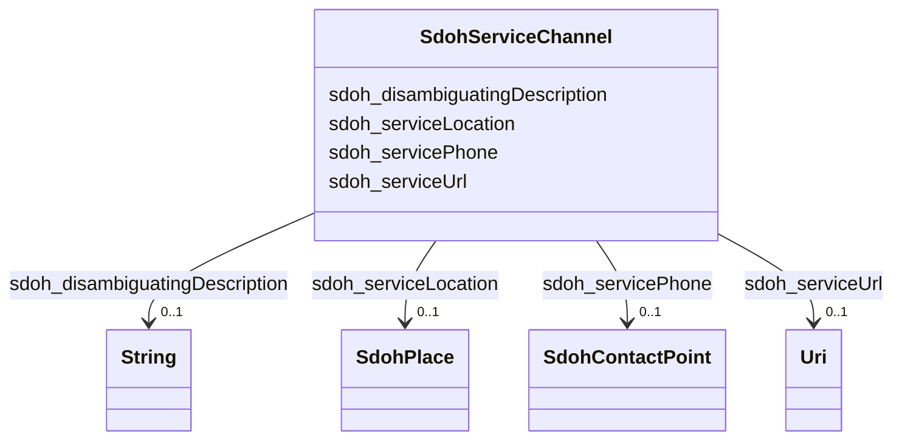

# Class: ServiceChannel (sdoh_ServiceChannel)


_A means for accessing a service, e.g. a government office location, web site, or phone number._


URI: [sdoh:ServiceChannel](http://schema.org/ServiceChannel)





<!-- no inheritance hierarchy -->


## Slots

| Name | Cardinality and Range | Description | Inheritance |
| ---  | --- | --- | --- |
| [sdoh_serviceLocation](../slots/sdoh_serviceLocation.md) | 0..1 <br/> [SdohPlace](../classes/SdohPlace.md) | TODO -- tell the world what this slot (predicate) describes | direct |
| [sdoh_servicePhone](../slots/sdoh_servicePhone.md) | 0..1 <br/> [SdohContactPoint](../classes/SdohContactPoint.md) | TODO -- tell the world what this slot (predicate) describes | direct |
| [sdoh_disambiguatingDescription](../slots/sdoh_disambiguatingDescription.md) | 0..1 <br/> [xsd:string](http://www.w3.org/2001/XMLSchema#string) | TODO -- tell the world what this slot (predicate) describes | direct |
| [sdoh_serviceUrl](../slots/sdoh_serviceUrl.md) | 0..1 <br/> [xsd:anyURI](http://www.w3.org/2001/XMLSchema#anyURI) | TODO -- tell the world what this slot (predicate) describes | direct |


## Usages

| used by | used in | type | used |
| ---  | --- | --- | --- |
| [SdohService](../classes/SdohService.md) | [sdoh_availableChannel](../slots/sdoh_availableChannel.md) | range | [SdohServiceChannel](../classes/SdohServiceChannel.md) |


## Examples

| Value |
| --- |
| dreamkg:service/channel/P-4964759830003712 |

## TODOs

* TODO -- Todos for this class go here
* or you can delete the todos
* if you think the class is perfect.

## Identifier and Mapping Information


### Schema Source


* from schema: dream-kg


## Mappings

| Mapping Type | Mapped Value |
| ---  | ---  |
| self | sdoh:ServiceChannel |
| native | dream-kg/:SdohServiceChannel |


## LinkML Source

<!-- TODO: investigate https://stackoverflow.com/questions/37606292/how-to-create-tabbed-code-blocks-in-mkdocs-or-sphinx -->

### Direct

<details>
```yaml
name: sdoh_ServiceChannel
description: A means for accessing a service, e.g. a government office location, web
  site, or phone number.
title: ServiceChannel
todos:
- TODO -- Todos for this class go here
- or you can delete the todos
- if you think the class is perfect.
notes:
- There are 174 instances of this class.
examples:
- value: dreamkg:service/channel/P-4964759830003712
from_schema: dream-kg
slots:
- sdoh_serviceLocation
- sdoh_servicePhone
- sdoh_disambiguatingDescription
- sdoh_serviceUrl
class_uri: sdoh:ServiceChannel

```
</details>

### Induced

<details>
```yaml
name: sdoh_ServiceChannel
description: A means for accessing a service, e.g. a government office location, web
  site, or phone number.
title: ServiceChannel
todos:
- TODO -- Todos for this class go here
- or you can delete the todos
- if you think the class is perfect.
notes:
- There are 174 instances of this class.
examples:
- value: dreamkg:service/channel/P-4964759830003712
from_schema: dream-kg
attributes:
  sdoh_serviceLocation:
    name: sdoh_serviceLocation
    description: TODO -- tell the world what this slot (predicate) describes.
    todos:
    - TODO -- Todos for this slot go here
    - or you can delete the todos
    - if you think the class is perfect.
    comments:
    - 87 occurrences with subject type sdoh_ServiceChannel and object type sdoh_Place.
    examples:
    - value: dreamkg:service/channel/P-4692155605712896 sdoh:serviceLocation dreamkg:service/location/4692155605712896
    from_schema: dream-kg
    rank: 1000
    slot_uri: sdoh:serviceLocation
    alias: sdoh_serviceLocation
    owner: sdoh_ServiceChannel
    domain_of:
    - sdoh_ServiceChannel
    range: sdoh_Place
  sdoh_servicePhone:
    name: sdoh_servicePhone
    description: TODO -- tell the world what this slot (predicate) describes.
    todos:
    - TODO -- Todos for this slot go here
    - or you can delete the todos
    - if you think the class is perfect.
    comments:
    - 87 occurrences with subject type sdoh_ServiceChannel and object type sdoh_ContactPoint.
    examples:
    - value: dreamkg:service/channel/P-4721819823112192 sdoh:servicePhone dreamkg:service/phone/4721819823112192
    from_schema: dream-kg
    rank: 1000
    slot_uri: sdoh:servicePhone
    alias: sdoh_servicePhone
    owner: sdoh_ServiceChannel
    domain_of:
    - sdoh_ServiceChannel
    range: sdoh_ContactPoint
  sdoh_disambiguatingDescription:
    name: sdoh_disambiguatingDescription
    description: TODO -- tell the world what this slot (predicate) describes.
    todos:
    - TODO -- Todos for this slot go here
    - or you can delete the todos
    - if you think the class is perfect.
    comments:
    - 174 occurrences with subject type sdoh_ServiceChannel and object type string.
    examples:
    - value: dreamkg:service/channel/P-4955538569953280 sdoh:disambiguatingDescription
        Provider
    from_schema: dream-kg
    rank: 1000
    slot_uri: sdoh:disambiguatingDescription
    alias: sdoh_disambiguatingDescription
    owner: sdoh_ServiceChannel
    domain_of:
    - sdoh_ServiceChannel
    range: string
  sdoh_serviceUrl:
    name: sdoh_serviceUrl
    description: TODO -- tell the world what this slot (predicate) describes.
    todos:
    - TODO -- Todos for this slot go here
    - or you can delete the todos
    - if you think the class is perfect.
    comments:
    - 188 occurrences with subject type sdoh_ServiceChannel and object type uri.
    examples:
    - value: dreamkg:service/channel/P-4795404263882752 sdoh:serviceUrl https://bewellctr.org/inpatient-drug-alcohol/
    from_schema: dream-kg
    rank: 1000
    slot_uri: sdoh:serviceUrl
    alias: sdoh_serviceUrl
    owner: sdoh_ServiceChannel
    domain_of:
    - sdoh_ServiceChannel
    range: uri
class_uri: sdoh:ServiceChannel

```
</details>