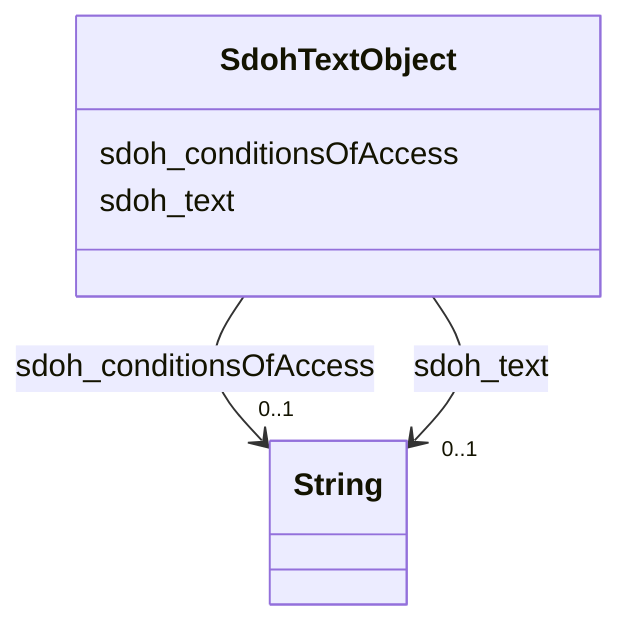

# Class: TextObject (sdoh_TextObject)


_A text file. The text can be unformatted or contain markup, html, etc._


URI: [sdoh:TextObject](http://schema.org/TextObject)





<!-- no inheritance hierarchy -->


## Slots

| Name | Cardinality and Range | Description | Inheritance |
| ---  | --- | --- | --- |
| [sdoh_text](../slots/sdoh_text.md) | 0..1 <br/> [xsd:string](http://www.w3.org/2001/XMLSchema#string) | The textual content of this CreativeWork | direct |
| [sdoh_conditionsOfAccess](../slots/sdoh_conditionsOfAccess.md) | 0..1 <br/> [xsd:string](http://www.w3.org/2001/XMLSchema#string) | Conditions that affect the availability of, or method(s) of access to, an ite... | direct |


## Usages

| used by | used in | type | used |
| ---  | --- | --- | --- |
| [SdohService](../classes/SdohService.md) | [sdoh_description](../slots/sdoh_description.md) | range | [SdohTextObject](../classes/SdohTextObject.md) |


## Examples

| Value |
| --- |
| dreamkg:service/desc/4921265385242624 |

## TODOs

* TODO -- Todos for this class go here
* or you can delete the todos
* if you think the class is perfect.

## Identifier and Mapping Information


### Schema Source


* from schema: dream-kg


## Mappings

| Mapping Type | Mapped Value |
| ---  | ---  |
| self | sdoh:TextObject |
| native | dream-kg/:SdohTextObject |


## LinkML Source

<!-- TODO: investigate https://stackoverflow.com/questions/37606292/how-to-create-tabbed-code-blocks-in-mkdocs-or-sphinx -->

### Direct

<details>
```yaml
name: sdoh_TextObject
description: A text file. The text can be unformatted or contain markup, html, etc.
title: TextObject
todos:
- TODO -- Todos for this class go here
- or you can delete the todos
- if you think the class is perfect.
notes:
- There are 87 instances of this class.
examples:
- value: dreamkg:service/desc/4921265385242624
from_schema: dream-kg
slots:
- sdoh_text
- sdoh_conditionsOfAccess
class_uri: sdoh:TextObject

```
</details>

### Induced

<details>
```yaml
name: sdoh_TextObject
description: A text file. The text can be unformatted or contain markup, html, etc.
title: TextObject
todos:
- TODO -- Todos for this class go here
- or you can delete the todos
- if you think the class is perfect.
notes:
- There are 87 instances of this class.
examples:
- value: dreamkg:service/desc/4921265385242624
from_schema: dream-kg
attributes:
  sdoh_text:
    name: sdoh_text
    description: The textual content of this CreativeWork.
    title: text
    todos:
    - TODO -- Todos for this slot go here
    - or you can delete the todos
    - if you think the class is perfect.
    comments:
    - 90 occurrences with subject type sdoh_TextObject and object type string.
    examples:
    - value: dreamkg:service/desc/6272068172382208 sdoh:text Wedge Recovery Center
        offers the Early Intervention Program for Philadelphia residents between the
        ages 12-21 who are currently using substances or who are otherwise at risk
        for substance abuse because of factors in the environmental, school, legal,
        family, mental health, peer & social, and dependency system domains.We offer:-
        Substance Use Screening and Assessment- Evidenced-based Substance Abuse Education-
        Intervention Counseling- Family Counseling- Community/School/Child service
        outreach- Individualized Service Planning- Group Psychoeducational Sessions-
        Parental Education/Consultation- Service Linkage
    from_schema: dream-kg
    rank: 1000
    slot_uri: sdoh:text
    alias: sdoh_text
    owner: sdoh_TextObject
    domain_of:
    - sdoh_TextObject
    range: string
  sdoh_conditionsOfAccess:
    name: sdoh_conditionsOfAccess
    description: 'Conditions that affect the availability of, or method(s) of access
      to, an item. Typically used for real world items such as an [[ArchiveComponent]]
      held by an [[ArchiveOrganization]]. This property is not suitable for use as
      a general Web access control mechanism. It is expressed only in natural language.\n\nFor
      example "Available by appointment from the Reading Room" or "Accessible only
      from logged-in accounts ". '
    title: conditionsOfAccess
    todos:
    - TODO -- Todos for this slot go here
    - or you can delete the todos
    - if you think the class is perfect.
    comments:
    - 88 occurrences with subject type sdoh_TextObject and object type string.
    examples:
    - value: dreamkg:service/desc/5481658659373056 sdoh:conditionsOfAccess Anyone
        can access this service.
    from_schema: dream-kg
    rank: 1000
    slot_uri: sdoh:conditionsOfAccess
    alias: sdoh_conditionsOfAccess
    owner: sdoh_TextObject
    domain_of:
    - sdoh_TextObject
    range: string
class_uri: sdoh:TextObject

```
</details>