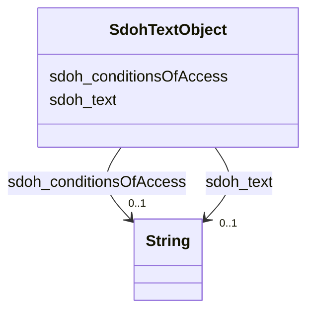

# Class: TextObject (sdoh_TextObject)


_A text file. The text can be unformatted or contain markup, html, etc._


URI: [sdoh:TextObject](http://schema.org/TextObject)





<!-- no inheritance hierarchy -->


## Slots

| Name | Cardinality and Range | Description | Inheritance |
| ---  | --- | --- | --- |
| [sdoh_conditionsOfAccess](../slots/sdoh_conditionsOfAccess.md) | 0..1 <br/> [xsd:string](http://www.w3.org/2001/XMLSchema#string) | TODO -- tell the world what this slot (predicate) describes | direct |
| [sdoh_text](../slots/sdoh_text.md) | 0..1 <br/> [xsd:string](http://www.w3.org/2001/XMLSchema#string) | TODO -- tell the world what this slot (predicate) describes | direct |


## Usages

| used by | used in | type | used |
| ---  | --- | --- | --- |
| [SdohService](../classes/SdohService.md) | [sdoh_description](../slots/sdoh_description.md) | range | [SdohTextObject](../classes/SdohTextObject.md) |


## Examples

| Value |
| --- |
| dreamkg:service/desc/5630846852399104 |

## TODOs

* TODO -- Todos for this class go here
* or you can delete the todos
* if you think the class is perfect.

## Identifier and Mapping Information


### Schema Source


* from schema: dream-kg


## Mappings

| Mapping Type | Mapped Value |
| ---  | ---  |
| self | sdoh:TextObject |
| native | dream-kg/:SdohTextObject |


## LinkML Source

<!-- TODO: investigate https://stackoverflow.com/questions/37606292/how-to-create-tabbed-code-blocks-in-mkdocs-or-sphinx -->

### Direct

<details>
```yaml
name: sdoh_TextObject
description: A text file. The text can be unformatted or contain markup, html, etc.
title: TextObject
todos:
- TODO -- Todos for this class go here
- or you can delete the todos
- if you think the class is perfect.
notes:
- There are 87 instances of this class.
examples:
- value: dreamkg:service/desc/5630846852399104
from_schema: dream-kg
slots:
- sdoh_conditionsOfAccess
- sdoh_text
class_uri: sdoh:TextObject

```
</details>

### Induced

<details>
```yaml
name: sdoh_TextObject
description: A text file. The text can be unformatted or contain markup, html, etc.
title: TextObject
todos:
- TODO -- Todos for this class go here
- or you can delete the todos
- if you think the class is perfect.
notes:
- There are 87 instances of this class.
examples:
- value: dreamkg:service/desc/5630846852399104
from_schema: dream-kg
attributes:
  sdoh_conditionsOfAccess:
    name: sdoh_conditionsOfAccess
    description: TODO -- tell the world what this slot (predicate) describes.
    todos:
    - TODO -- Todos for this slot go here
    - or you can delete the todos
    - if you think the class is perfect.
    comments:
    - 88 occurrences with subject type sdoh_TextObject and object type string.
    examples:
    - value: dreamkg:service/desc/6206753615380480 sdoh:conditionsOfAccess All families
        must be referred to us through the City of Philadelphias Office of Supportive
        Housing central intake.
    from_schema: dream-kg
    rank: 1000
    slot_uri: sdoh:conditionsOfAccess
    alias: sdoh_conditionsOfAccess
    owner: sdoh_TextObject
    domain_of:
    - sdoh_TextObject
    range: string
  sdoh_text:
    name: sdoh_text
    description: TODO -- tell the world what this slot (predicate) describes.
    todos:
    - TODO -- Todos for this slot go here
    - or you can delete the todos
    - if you think the class is perfect.
    comments:
    - 90 occurrences with subject type sdoh_TextObject and object type string.
    examples:
    - value: dreamkg:service/desc/5181712996761600 sdoh:text The Bridge provides quality,
        accessible treatment while preparing clients to re-enter their communities
        as drug-and alcohol-free members of society.  Individualized treatment plans
        are created to meet clients' needs and clients have access to the comprehensive
        addictions, mental health, educational and life skills services provided at
        The Bridge.This program provides:- Individual Counseling- Substance Abuse
        Counseling- Mental Health Care- Short term housing- Long term housing- Addiction
        & Recovery
    from_schema: dream-kg
    rank: 1000
    slot_uri: sdoh:text
    alias: sdoh_text
    owner: sdoh_TextObject
    domain_of:
    - sdoh_TextObject
    range: string
class_uri: sdoh:TextObject

```
</details>