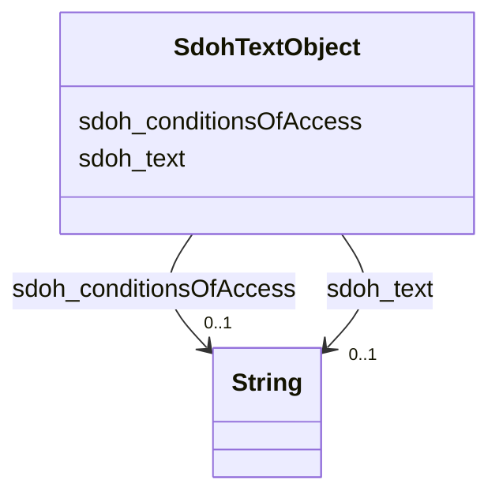

# Class: TextObject (sdoh_TextObject)


_A text file. The text can be unformatted or contain markup, html, etc._


URI: [sdoh:TextObject](http://schema.org/TextObject)





<!-- no inheritance hierarchy -->


## Slots

| Name | Cardinality and Range | Description | Inheritance |
| ---  | --- | --- | --- |
| [sdoh_conditionsOfAccess](../slots/sdoh_conditionsOfAccess.md) | 0..1 <br/> [xsd:string](http://www.w3.org/2001/XMLSchema#string) | TODO -- tell the world what this slot (predicate) describes | direct |
| [sdoh_text](../slots/sdoh_text.md) | 0..1 <br/> [xsd:string](http://www.w3.org/2001/XMLSchema#string) | TODO -- tell the world what this slot (predicate) describes | direct |


## Usages

| used by | used in | type | used |
| ---  | --- | --- | --- |
| [SdohService](../classes/SdohService.md) | [sdoh_description](../slots/sdoh_description.md) | range | [SdohTextObject](../classes/SdohTextObject.md) |


## Examples

| Value |
| --- |
| dreamkg:service/desc/6494806799548416 |

## TODOs

* TODO -- Todos for this class go here
* or you can delete the todos
* if you think the class is perfect.

## Identifier and Mapping Information


### Schema Source


* from schema: dream-kg


## Mappings

| Mapping Type | Mapped Value |
| ---  | ---  |
| self | sdoh:TextObject |
| native | dream-kg/:SdohTextObject |


## LinkML Source

<!-- TODO: investigate https://stackoverflow.com/questions/37606292/how-to-create-tabbed-code-blocks-in-mkdocs-or-sphinx -->

### Direct

<details>
```yaml
name: sdoh_TextObject
description: A text file. The text can be unformatted or contain markup, html, etc.
title: TextObject
todos:
- TODO -- Todos for this class go here
- or you can delete the todos
- if you think the class is perfect.
notes:
- Class with 87 occurences.
examples:
- value: dreamkg:service/desc/6494806799548416
from_schema: dream-kg
slots:
- sdoh_conditionsOfAccess
- sdoh_text
class_uri: sdoh:TextObject

```
</details>

### Induced

<details>
```yaml
name: sdoh_TextObject
description: A text file. The text can be unformatted or contain markup, html, etc.
title: TextObject
todos:
- TODO -- Todos for this class go here
- or you can delete the todos
- if you think the class is perfect.
notes:
- Class with 87 occurences.
examples:
- value: dreamkg:service/desc/6494806799548416
from_schema: dream-kg
attributes:
  sdoh_conditionsOfAccess:
    name: sdoh_conditionsOfAccess
    description: TODO -- tell the world what this slot (predicate) describes.
    todos:
    - TODO -- Todos for this slot go here
    - or you can delete the todos
    - if you think the class is perfect.
    comments:
    - 88 occurrences with subject type sdoh_TextObject and object type string.
    examples:
    - value: dreamkg:service/desc/4721819823112192 sdoh:conditionsOfAccess Follow
        the Next Steps to find out if this program has eligibility criteria.
    from_schema: dream-kg
    rank: 1000
    slot_uri: sdoh:conditionsOfAccess
    alias: sdoh_conditionsOfAccess
    owner: sdoh_TextObject
    domain_of:
    - sdoh_TextObject
    range: string
  sdoh_text:
    name: sdoh_text
    description: TODO -- tell the world what this slot (predicate) describes.
    todos:
    - TODO -- Todos for this slot go here
    - or you can delete the todos
    - if you think the class is perfect.
    comments:
    - 90 occurrences with subject type sdoh_TextObject and object type string.
    examples:
    - value: dreamkg:service/desc/5373543795916800 sdoh:text The Adult Outpatient
        Services provide assessment, diagnosis, and treatment to individuals requiring
        mental health or dual diagnosis treatment (treatment of mental health plus
        substance use). The outpatient treatment team consists of trained professionals
        including psychiatrists, licensed therapists, psychiatric technicians, counselors,
        and support staff. Focus areas include mental health and substance use assessment,
        psychiatric assessment and evaluation for medication, medication monitoring,
        limited individual counseling, group counseling, bilingual counseling services,
        interpreter services, benefits services, and community services referral.Common
        diagnoses for clients at HCCS include disorders of mood, anxiety, personality,
        addiction and psychosis. HCCS currently offers the following services within
        the traditional outpatient menu of services:- Psychiatric Evaluation- Medication
        Managemen- Individual Counseling- Family Therapy- Group Therapy- Psychological
        Testing and evaluation- Co-occurring Services - Mobile Therapy - Perinatal
        Depression Treatment servicesHispanic Community Counseling Services accepts
        Medicare and Medicaid.
    from_schema: dream-kg
    rank: 1000
    slot_uri: sdoh:text
    alias: sdoh_text
    owner: sdoh_TextObject
    domain_of:
    - sdoh_TextObject
    range: string
class_uri: sdoh:TextObject

```
</details>