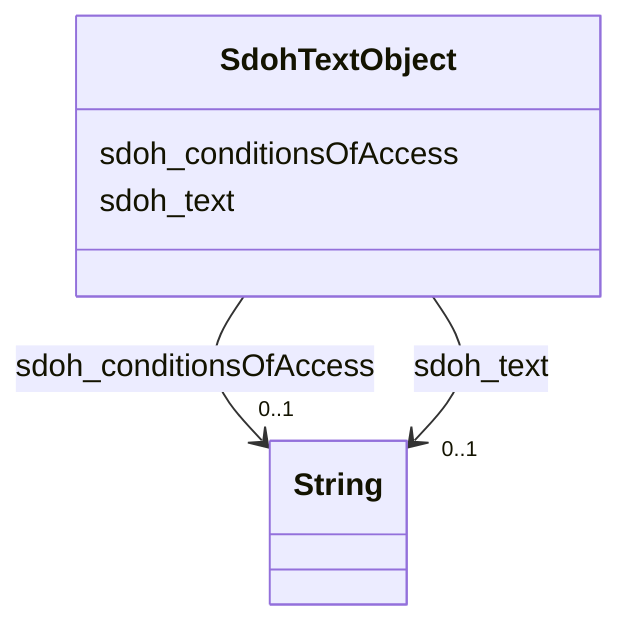

# Class: TextObject (sdoh_TextObject)


_A text file. The text can be unformatted or contain markup, html, etc._


URI: [sdoh:TextObject](http://schema.org/TextObject)





<!-- no inheritance hierarchy -->


## Slots

| Name | Cardinality and Range | Description | Inheritance |
| ---  | --- | --- | --- |
| [sdoh_text](../slots/sdoh_text.md) | 0..1 <br/> [xsd:string](http://www.w3.org/2001/XMLSchema#string) | TODO -- tell the world what this slot (predicate) describes | direct |
| [sdoh_conditionsOfAccess](../slots/sdoh_conditionsOfAccess.md) | 0..1 <br/> [xsd:string](http://www.w3.org/2001/XMLSchema#string) | TODO -- tell the world what this slot (predicate) describes | direct |


## Usages

| used by | used in | type | used |
| ---  | --- | --- | --- |
| [SdohService](../classes/SdohService.md) | [sdoh_description](../slots/sdoh_description.md) | range | [SdohTextObject](../classes/SdohTextObject.md) |


## Examples

| Value |
| --- |
| dreamkg:service/desc/5643194546257920 |

## TODOs

* TODO -- Todos for this class go here
* or you can delete the todos
* if you think the class is perfect.

## Identifier and Mapping Information


### Schema Source


* from schema: dream-kg


## Mappings

| Mapping Type | Mapped Value |
| ---  | ---  |
| self | sdoh:TextObject |
| native | dream-kg/:SdohTextObject |


## LinkML Source

<!-- TODO: investigate https://stackoverflow.com/questions/37606292/how-to-create-tabbed-code-blocks-in-mkdocs-or-sphinx -->

### Direct

<details>
```yaml
name: sdoh_TextObject
description: A text file. The text can be unformatted or contain markup, html, etc.
title: TextObject
todos:
- TODO -- Todos for this class go here
- or you can delete the todos
- if you think the class is perfect.
notes:
- There are 87 instances of this class.
examples:
- value: dreamkg:service/desc/5643194546257920
from_schema: dream-kg
slots:
- sdoh_text
- sdoh_conditionsOfAccess
class_uri: sdoh:TextObject

```
</details>

### Induced

<details>
```yaml
name: sdoh_TextObject
description: A text file. The text can be unformatted or contain markup, html, etc.
title: TextObject
todos:
- TODO -- Todos for this class go here
- or you can delete the todos
- if you think the class is perfect.
notes:
- There are 87 instances of this class.
examples:
- value: dreamkg:service/desc/5643194546257920
from_schema: dream-kg
attributes:
  sdoh_text:
    name: sdoh_text
    description: TODO -- tell the world what this slot (predicate) describes.
    todos:
    - TODO -- Todos for this slot go here
    - or you can delete the todos
    - if you think the class is perfect.
    comments:
    - 90 occurrences with subject type sdoh_TextObject and object type string.
    examples:
    - value: 'dreamkg:service/desc/5185303560585216 sdoh:text Addiction Medicine and
        Health Advocates, Inc. (AMHA) provides evidence-based substance abuse treatment,
        which is continuously responsive to the needs of the patients and their families.
        AMHA is an outpatient facility consisting of two levels of care: Outpatient
        and Intensive Outpatient. Methadone Maintenance is provided on both levels
        of care.Services provided include:_ Assessment and intake_ Medication-assisted
        treatment (methadone maintenance)_ Individual counseling & psychotherapy_
        Group psychotherapy_ Psycho education_ Medical & psychiatric evaluations _
        Aftercare & follow up services _ Referrals (educational, medical, vocational,
        psychiatric, higher levels of care)_ Couples & family therapy_ Drug screening
        To begin the admissions process, please contact us. You may also come in person
        between the hours of 9 am and 4 pm, Monday through Friday. You will be asked
        to complete a short screening interview and if initial eligibility criteria
        is met, you will be scheduled for an assessment.At the time of your assessment,
        you will need to bring:_ Current, state-issued photo ID_ Insurance cardAMHA
        is a private not-for-profit organization dependent upon patient fees for its
        continuance. Most of our patients have some form of insurance or medical assistance
        that pays for medication-assisted treatment services. Individuals who do not
        have insurance are responsible for payment or they may be eligible for county
        funding.'
    from_schema: dream-kg
    rank: 1000
    slot_uri: sdoh:text
    alias: sdoh_text
    owner: sdoh_TextObject
    domain_of:
    - sdoh_TextObject
    range: string
  sdoh_conditionsOfAccess:
    name: sdoh_conditionsOfAccess
    description: TODO -- tell the world what this slot (predicate) describes.
    todos:
    - TODO -- Todos for this slot go here
    - or you can delete the todos
    - if you think the class is perfect.
    comments:
    - 88 occurrences with subject type sdoh_TextObject and object type string.
    examples:
    - value: dreamkg:service/desc/4744972327714816 sdoh:conditionsOfAccess This program
        serves veterans.
    from_schema: dream-kg
    rank: 1000
    slot_uri: sdoh:conditionsOfAccess
    alias: sdoh_conditionsOfAccess
    owner: sdoh_TextObject
    domain_of:
    - sdoh_TextObject
    range: string
class_uri: sdoh:TextObject

```
</details>