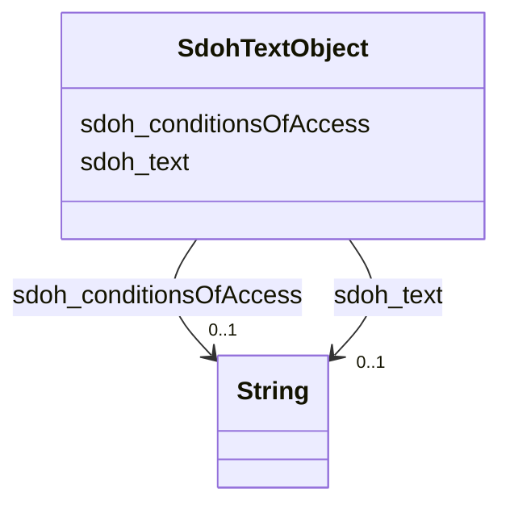

# Class: TODO -- what's a good name for what this class (type) describes? (sdoh_TextObject)


_TODO -- tell the world what this class (type) describes._


URI: [sdoh:TextObject](http://schema.org/TextObject)





<!-- no inheritance hierarchy -->


## Slots

| Name | Cardinality and Range | Description | Inheritance |
| ---  | --- | --- | --- |
| [sdoh_conditionsOfAccess](../slots/sdoh_conditionsOfAccess.md) | 0..1 <br/> [xsd:string](http://www.w3.org/2001/XMLSchema#string) | TODO -- tell the world what this slot (predicate) describes | direct |
| [sdoh_text](../slots/sdoh_text.md) | 0..1 <br/> [xsd:string](http://www.w3.org/2001/XMLSchema#string) | TODO -- tell the world what this slot (predicate) describes | direct |


## Usages

| used by | used in | type | used |
| ---  | --- | --- | --- |
| [SdohService](../classes/SdohService.md) | [sdoh_description](../slots/sdoh_description.md) | range | [SdohTextObject](../classes/SdohTextObject.md) |


## Examples

| Value |
| --- |
| dreamkg:service/desc/6101823548030976 |

## TODOs

* TODO -- Todos for this class go here
* or you can delete the todos
* if you think the class is perfect.

## Identifier and Mapping Information


### Schema Source


* from schema: dream-kg


## Mappings

| Mapping Type | Mapped Value |
| ---  | ---  |
| self | sdoh:TextObject |
| native | dream-kg/:SdohTextObject |


## LinkML Source

<!-- TODO: investigate https://stackoverflow.com/questions/37606292/how-to-create-tabbed-code-blocks-in-mkdocs-or-sphinx -->

### Direct

<details>
```yaml
name: sdoh_TextObject
description: TODO -- tell the world what this class (type) describes.
title: TODO -- what's a good name for what this class (type) describes?
todos:
- TODO -- Todos for this class go here
- or you can delete the todos
- if you think the class is perfect.
notes:
- There are 87 instances of this class.
examples:
- value: dreamkg:service/desc/6101823548030976
from_schema: dream-kg
slots:
- sdoh_conditionsOfAccess
- sdoh_text
class_uri: sdoh:TextObject

```
</details>

### Induced

<details>
```yaml
name: sdoh_TextObject
description: TODO -- tell the world what this class (type) describes.
title: TODO -- what's a good name for what this class (type) describes?
todos:
- TODO -- Todos for this class go here
- or you can delete the todos
- if you think the class is perfect.
notes:
- There are 87 instances of this class.
examples:
- value: dreamkg:service/desc/6101823548030976
from_schema: dream-kg
attributes:
  sdoh_conditionsOfAccess:
    name: sdoh_conditionsOfAccess
    description: TODO -- tell the world what this slot (predicate) describes.
    todos:
    - TODO -- Todos for this slot go here
    - or you can delete the todos
    - if you think the class is perfect.
    comments:
    - 88 occurrences with subject type sdoh_TextObject and object type string.
    examples:
    - value: dreamkg:service/desc/6453846037626880 sdoh:conditionsOfAccess This program
        helps people who are older than 59 years old.
    from_schema: dream-kg
    rank: 1000
    slot_uri: sdoh:conditionsOfAccess
    alias: sdoh_conditionsOfAccess
    owner: sdoh_TextObject
    domain_of:
    - sdoh_TextObject
    range: string
  sdoh_text:
    name: sdoh_text
    description: TODO -- tell the world what this slot (predicate) describes.
    todos:
    - TODO -- Todos for this slot go here
    - or you can delete the todos
    - if you think the class is perfect.
    comments:
    - 90 occurrences with subject type sdoh_TextObject and object type string.
    examples:
    - value: dreamkg:service/desc/4874573658193920 sdoh:text Wedge Recovery Center's
        Outpatient Subsance Abuse Program offers a holistic and individualized approach
        to addiction and recovery treatment with a shared goal of improving the quality
        of life of our members.We offer:- Group Therapy- Individual Counseling - Medication
        Management- Medication-Assisted Treatment- Case ManagementOur outpatient program
        delivers group twice a week with an individual session once a month. We also
        offer psych services and medication management for members with mental health
        diagnoses concurrent with drug and alcohol.We accept all referrals, including
        self-referrals, for our program. The potential member who is referred for
        treatment will receive an appointment  within 48 _ 72 hours and at that appointment
        a comprehensive Bio-Psychosocial Evaluation is completed. The member is scheduled
        for the appropriate level of care and provided a schedule for treatment and
        their Counselors name.We accept Medicaid insurance for our outpatient services.
    from_schema: dream-kg
    rank: 1000
    slot_uri: sdoh:text
    alias: sdoh_text
    owner: sdoh_TextObject
    domain_of:
    - sdoh_TextObject
    range: string
class_uri: sdoh:TextObject

```
</details>