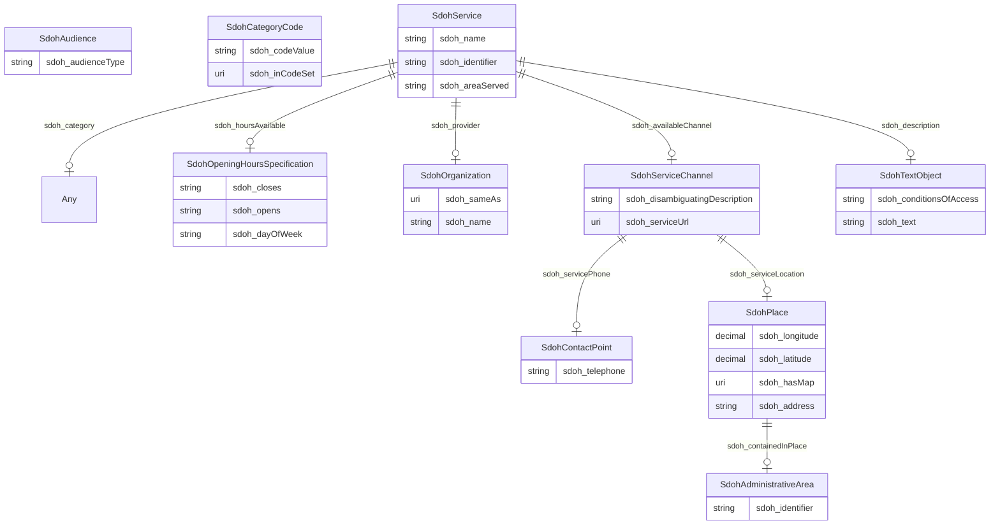

# TODO_Give_this_schema_a_name!

TODO -- tell the world what this schema describes.

URI: dream-kg

Name: dream-kg

## Schema Diagram

## Classes

| Class | Description |
| --- | --- |
| [Any](classes/Any.md) | None |
| [SdohAdministrativeArea](classes/SdohAdministrativeArea.md) | A geographical region, typically under the jurisdiction of a particular government. |
| [SdohAudience](classes/SdohAudience.md) | Intended audience for an item, i.e. the group for whom the item was created. |
| [SdohCategoryCode](classes/SdohCategoryCode.md) | A Category Code. |
| [SdohContactPoint](classes/SdohContactPoint.md) | A contact point&#x2014;for example, a Customer Complaints department. |
| [SdohOpeningHoursSpecification](classes/SdohOpeningHoursSpecification.md) | A structured value providing information about the opening hours of a place or a certain service inside a place.\n\n
The place is __open__ if the [[opens]] property is specified, and __closed__ otherwise.\n\nIf the value for the [[closes]] property is less than the value for the [[opens]] property then the hour range is assumed to span over the next day.
       |
| [SdohOrganization](classes/SdohOrganization.md) | An organization such as a school, NGO, corporation, club, etc. |
| [SdohPlace](classes/SdohPlace.md) | Entities that have a somewhat fixed, physical extension. |
| [SdohService](classes/SdohService.md) | A service provided by an organization, e.g. delivery service, print services, etc. |
| [SdohServiceChannel](classes/SdohServiceChannel.md) | A means for accessing a service, e.g. a government office location, web site, or phone number. |
| [SdohTextObject](classes/SdohTextObject.md) | A text file. The text can be unformatted or contain markup, html, etc. |

## Slots

| Slot | Description |
| --- | --- |
| [sdoh_address](slots/sdoh_address.md) | TODO -- tell the world what this slot (predicate) describes |
| [sdoh_areaServed](slots/sdoh_areaServed.md) | TODO -- tell the world what this slot (predicate) describes |
| [sdoh_audienceType](slots/sdoh_audienceType.md) | TODO -- tell the world what this slot (predicate) describes |
| [sdoh_availableChannel](slots/sdoh_availableChannel.md) | TODO -- tell the world what this slot (predicate) describes |
| [sdoh_category](slots/sdoh_category.md) | TODO -- tell the world what this slot (predicate) describes |
| [sdoh_closes](slots/sdoh_closes.md) | TODO -- tell the world what this slot (predicate) describes |
| [sdoh_codeValue](slots/sdoh_codeValue.md) | TODO -- tell the world what this slot (predicate) describes |
| [sdoh_conditionsOfAccess](slots/sdoh_conditionsOfAccess.md) | TODO -- tell the world what this slot (predicate) describes |
| [sdoh_containedInPlace](slots/sdoh_containedInPlace.md) | TODO -- tell the world what this slot (predicate) describes |
| [sdoh_dayOfWeek](slots/sdoh_dayOfWeek.md) | TODO -- tell the world what this slot (predicate) describes |
| [sdoh_description](slots/sdoh_description.md) | TODO -- tell the world what this slot (predicate) describes |
| [sdoh_disambiguatingDescription](slots/sdoh_disambiguatingDescription.md) | TODO -- tell the world what this slot (predicate) describes |
| [sdoh_hasMap](slots/sdoh_hasMap.md) | TODO -- tell the world what this slot (predicate) describes |
| [sdoh_hoursAvailable](slots/sdoh_hoursAvailable.md) | TODO -- tell the world what this slot (predicate) describes |
| [sdoh_identifier](slots/sdoh_identifier.md) | TODO -- tell the world what this slot (predicate) describes |
| [sdoh_inCodeSet](slots/sdoh_inCodeSet.md) | TODO -- tell the world what this slot (predicate) describes |
| [sdoh_latitude](slots/sdoh_latitude.md) | TODO -- tell the world what this slot (predicate) describes |
| [sdoh_longitude](slots/sdoh_longitude.md) | TODO -- tell the world what this slot (predicate) describes |
| [sdoh_name](slots/sdoh_name.md) | TODO -- tell the world what this slot (predicate) describes |
| [sdoh_opens](slots/sdoh_opens.md) | TODO -- tell the world what this slot (predicate) describes |
| [sdoh_provider](slots/sdoh_provider.md) | TODO -- tell the world what this slot (predicate) describes |
| [sdoh_sameAs](slots/sdoh_sameAs.md) | TODO -- tell the world what this slot (predicate) describes |
| [sdoh_serviceLocation](slots/sdoh_serviceLocation.md) | TODO -- tell the world what this slot (predicate) describes |
| [sdoh_servicePhone](slots/sdoh_servicePhone.md) | TODO -- tell the world what this slot (predicate) describes |
| [sdoh_serviceUrl](slots/sdoh_serviceUrl.md) | TODO -- tell the world what this slot (predicate) describes |
| [sdoh_telephone](slots/sdoh_telephone.md) | TODO -- tell the world what this slot (predicate) describes |
| [sdoh_text](slots/sdoh_text.md) | TODO -- tell the world what this slot (predicate) describes |

## Enumerations

| Enumeration | Description |
| --- | --- |

## Types

| Type | Description |
| --- | --- |

## Subsets

| Subset | Description |
| --- | --- |
