# Class: No class (entity type) name specified (__B38a1e90ecccbde897be5fbb09f517af6)


_No class (type) description specified_


This class occurs 26083 times.


URI: [_:B38a1e90ecccbde897be5fbb09f517af6](_:B38a1e90ecccbde897be5fbb09f517af6)

```mermaid
 classDiagram
    class B38a1e90ecccbde897be5fbb09f517af6
    click B38a1e90ecccbde897be5fbb09f517af6 href "../B38a1e90ecccbde897be5fbb09f517af6"
      OwlThing <|-- B38a1e90ecccbde897be5fbb09f517af6
        click OwlThing href "../OwlThing"
      
      B38a1e90ecccbde897be5fbb09f517af6 : dc_date
        
          
    
    
    B38a1e90ecccbde897be5fbb09f517af6 --> "0..1" Date : dc_date
    click Date href "../Date"

        
      B38a1e90ecccbde897be5fbb09f517af6 : dc_identifier
        
          
    
    
    B38a1e90ecccbde897be5fbb09f517af6 --> "0..1" String : dc_identifier
    click String href "../String"

        
      B38a1e90ecccbde897be5fbb09f517af6 : dc_title
        
          
    
    
    B38a1e90ecccbde897be5fbb09f517af6 --> "0..1" String : dc_title
    click String href "../String"

        
      B38a1e90ecccbde897be5fbb09f517af6 : dct_alternative
        
          
    
    
    B38a1e90ecccbde897be5fbb09f517af6 --> "0..1" Any : dct_alternative
    click Any href "../Any"

        
      B38a1e90ecccbde897be5fbb09f517af6 : dct_created
        
          
    
    
    B38a1e90ecccbde897be5fbb09f517af6 --> "0..1" Any : dct_created
    click Any href "../Any"

        
      B38a1e90ecccbde897be5fbb09f517af6 : dct_date
        
          
    
    
    B38a1e90ecccbde897be5fbb09f517af6 --> "0..1" Date : dct_date
    click Date href "../Date"

        
      B38a1e90ecccbde897be5fbb09f517af6 : dct_description
        
          
    
    
    B38a1e90ecccbde897be5fbb09f517af6 --> "0..1" String : dct_description
    click String href "../String"

        
      B38a1e90ecccbde897be5fbb09f517af6 : dct_identifier
        
          
    
    
    B38a1e90ecccbde897be5fbb09f517af6 --> "0..1" Any : dct_identifier
    click Any href "../Any"

        
      B38a1e90ecccbde897be5fbb09f517af6 : dct_modified
        
          
    
    
    B38a1e90ecccbde897be5fbb09f517af6 --> "0..1" Any : dct_modified
    click Any href "../Any"

        
      B38a1e90ecccbde897be5fbb09f517af6 : dct_source
        
          
    
    
    B38a1e90ecccbde897be5fbb09f517af6 --> "0..1" OwlThing : dct_source
    click OwlThing href "../OwlThing"

        
      B38a1e90ecccbde897be5fbb09f517af6 : dct_title
        
          
    
    
    B38a1e90ecccbde897be5fbb09f517af6 --> "0..1" String : dct_title
    click String href "../String"

        
      B38a1e90ecccbde897be5fbb09f517af6 : fio_ofIndustry
        
          
    
    
    B38a1e90ecccbde897be5fbb09f517af6 --> "0..1" Any : fio_ofIndustry
    click Any href "../Any"

        
      B38a1e90ecccbde897be5fbb09f517af6 : fio_ofYear
        
          
    
    
    B38a1e90ecccbde897be5fbb09f517af6 --> "0..1" Any : fio_ofYear
    click Any href "../Any"

        
      B38a1e90ecccbde897be5fbb09f517af6 : fio_ownedBy
        
          
    
    
    B38a1e90ecccbde897be5fbb09f517af6 --> "0..1" Any : fio_ownedBy
    click Any href "../Any"

        
      B38a1e90ecccbde897be5fbb09f517af6 : fio_subcodeOf
        
          
    
    
    B38a1e90ecccbde897be5fbb09f517af6 --> "0..1" Any : fio_subcodeOf
    click Any href "../Any"

        
      B38a1e90ecccbde897be5fbb09f517af6 : geo_asWKT
        
      B38a1e90ecccbde897be5fbb09f517af6 : geo_hasGeometry
        
          
    
    
    B38a1e90ecccbde897be5fbb09f517af6 --> "0..1" OwlThing : geo_hasGeometry
    click OwlThing href "../OwlThing"

        
      B38a1e90ecccbde897be5fbb09f517af6 : hsdo_address
        
          
    
    
    B38a1e90ecccbde897be5fbb09f517af6 --> "0..1" String : hsdo_address
    click String href "../String"

        
      B38a1e90ecccbde897be5fbb09f517af6 : hsdo_dateModified
        
          
    
    
    B38a1e90ecccbde897be5fbb09f517af6 --> "0..1" Date : hsdo_dateModified
    click Date href "../Date"

        
      B38a1e90ecccbde897be5fbb09f517af6 : http___w3id.org_fio_v1_epa_frs#fromSystem
        
          
    
    
    B38a1e90ecccbde897be5fbb09f517af6 --> "0..1" Any : http___w3id.org_fio_v1_epa_frs#fromSystem
    click Any href "../Any"

        
      B38a1e90ecccbde897be5fbb09f517af6 : http___w3id.org_fio_v1_epa_frs#hasEnvironmentalInterest
        
          
    
    
    B38a1e90ecccbde897be5fbb09f517af6 --> "0..1" Any : http___w3id.org_fio_v1_epa_frs#hasEnvironmentalInterest
    click Any href "../Any"

        
      B38a1e90ecccbde897be5fbb09f517af6 : http___w3id.org_fio_v1_epa_frs#hasFRSId
        
          
    
    
    B38a1e90ecccbde897be5fbb09f517af6 --> "0..1" Any : http___w3id.org_fio_v1_epa_frs#hasFRSId
    click Any href "../Any"

        
      B38a1e90ecccbde897be5fbb09f517af6 : http___w3id.org_fio_v1_epa_frs#hasRecord
        
          
    
    
    B38a1e90ecccbde897be5fbb09f517af6 --> "0..1" Any : http___w3id.org_fio_v1_epa_frs#hasRecord
    click Any href "../Any"

        
      B38a1e90ecccbde897be5fbb09f517af6 : http___w3id.org_fio_v1_epa_frs#hasSupplementalRecord
        
          
    
    
    B38a1e90ecccbde897be5fbb09f517af6 --> "0..1" Any : http___w3id.org_fio_v1_epa_frs#hasSupplementalRecord
    click Any href "../Any"

        
      B38a1e90ecccbde897be5fbb09f517af6 : http___w3id.org_fio_v1_epa_frs#ofFacilityType
        
          
    
    
    B38a1e90ecccbde897be5fbb09f517af6 --> "0..1" Any : http___w3id.org_fio_v1_epa_frs#ofFacilityType
    click Any href "../Any"

        
      B38a1e90ecccbde897be5fbb09f517af6 : http___w3id.org_fio_v1_epa_frs#ofInterestType
        
          
    
    
    B38a1e90ecccbde897be5fbb09f517af6 --> "0..1" Any : http___w3id.org_fio_v1_epa_frs#ofInterestType
    click Any href "../Any"

        
      B38a1e90ecccbde897be5fbb09f517af6 : http___w3id.org_fio_v1_epa_frs#ofPrimaryIndustry
        
          
    
    
    B38a1e90ecccbde897be5fbb09f517af6 --> "0..1" Any : http___w3id.org_fio_v1_epa_frs#ofPrimaryIndustry
    click Any href "../Any"

        
      B38a1e90ecccbde897be5fbb09f517af6 : http___w3id.org_fio_v1_epa_frs#ofSecondaryIndustry
        
          
    
    
    B38a1e90ecccbde897be5fbb09f517af6 --> "0..1" Any : http___w3id.org_fio_v1_epa_frs#ofSecondaryIndustry
    click Any href "../Any"

        
      B38a1e90ecccbde897be5fbb09f517af6 : http___w3id.org_fio_v1_epa_frs#partOf
        
          
    
    
    B38a1e90ecccbde897be5fbb09f517af6 --> "0..1" Any : http___w3id.org_fio_v1_epa_frs#partOf
    click Any href "../Any"

        
      B38a1e90ecccbde897be5fbb09f517af6 : http___w3id.org_fio_v1_epa_frs#replacedBy
        
          
    
    
    B38a1e90ecccbde897be5fbb09f517af6 --> "0..1" Any : http___w3id.org_fio_v1_epa_frs#replacedBy
    click Any href "../Any"

        
      B38a1e90ecccbde897be5fbb09f517af6 : kwgo_sfContains
        
          
    
    
    B38a1e90ecccbde897be5fbb09f517af6 --> "0..1" Any : kwgo_sfContains
    click Any href "../Any"

        
      B38a1e90ecccbde897be5fbb09f517af6 : kwgo_sfWithin
        
          
    
    
    B38a1e90ecccbde897be5fbb09f517af6 --> "0..1" Any : kwgo_sfWithin
    click Any href "../Any"

        
      B38a1e90ecccbde897be5fbb09f517af6 : owl_sameAs
        
          
    
    
    B38a1e90ecccbde897be5fbb09f517af6 --> "0..1" Any : owl_sameAs
    click Any href "../Any"

        
      B38a1e90ecccbde897be5fbb09f517af6 : prov_endedAtTime
        
          
    
    
    B38a1e90ecccbde897be5fbb09f517af6 --> "0..1" Datetime : prov_endedAtTime
    click Datetime href "../Datetime"

        
      B38a1e90ecccbde897be5fbb09f517af6 : prov_startedAtTime
        
          
    
    
    B38a1e90ecccbde897be5fbb09f517af6 --> "0..1" Datetime : prov_startedAtTime
    click Datetime href "../Datetime"

        
      B38a1e90ecccbde897be5fbb09f517af6 : rdfs_label
        
          
    
    
    B38a1e90ecccbde897be5fbb09f517af6 --> "0..1" Any : rdfs_label
    click Any href "../Any"

        
      
```





## Inheritance
* [OwlThing](../classes/OwlThing.md)
    * **B38a1e90ecccbde897be5fbb09f517af6**


## Slots

| Name | Cardinality and Range | Description | Inheritance | Occurrences |
| ---  | --- | --- | --- | --- |
| [dc_identifier](../slots/dc_identifier.md) | 0..1 <br/> [xsd:string](http://www.w3.org/2001/XMLSchema#string) | No slot (predicate) description specified <br/>  | direct | 26083 |
| [prov_startedAtTime](../slots/prov_startedAtTime.md) | 0..1 <br/> [xsd:dateTime](http://www.w3.org/2001/XMLSchema#dateTime) | No slot (predicate) description specified <br/>  | direct | 15115 |
| [http___w3id.org_fio_v1_epa_frs#hasRecord](../slots/http___w3id.org_fio_v1_epa_frs#hasRecord.md) | 0..1 <br/> [Be7f93ca25b469f263a4abeaf0a1ee33a](../classes/Be7f93ca25b469f263a4abeaf0a1ee33a.md)&nbsp;or&nbsp;<br />[B323a99959d9aa21ec2cbc4652700b98e](../classes/B323a99959d9aa21ec2cbc4652700b98e.md)&nbsp;or&nbsp;<br />[B08b3e94708f8805ddd7e9bf523dbf45e](../classes/B08b3e94708f8805ddd7e9bf523dbf45e.md)&nbsp;or&nbsp;<br />[B1568a680b2c949a6bcb95f2b2d85d9d3](../classes/B1568a680b2c949a6bcb95f2b2d85d9d3.md)&nbsp;or&nbsp;<br />[HttpW3id.orgFioV1Epa-frs#RegistrationRecord](../classes/HttpW3id.orgFioV1Epa-frs#RegistrationRecord.md)&nbsp;or&nbsp;<br />[B38a1e90ecccbde897be5fbb09f517af6](../classes/B38a1e90ecccbde897be5fbb09f517af6.md)&nbsp;or&nbsp;<br />[HttpW3id.orgFioV1Epa-frs#Record](../classes/HttpW3id.orgFioV1Epa-frs#Record.md)&nbsp;or&nbsp;<br />[HttpW3id.orgFioV1Epa-frs#FRS-Facility](../classes/HttpW3id.orgFioV1Epa-frs#FRS-Facility.md)&nbsp;or&nbsp;<br />[Bfccfd1b350324c6f9fc54cde2a7c3379](../classes/Bfccfd1b350324c6f9fc54cde2a7c3379.md)&nbsp;or&nbsp;<br />[B5a22e5b8842ede5af452144337513048](../classes/B5a22e5b8842ede5af452144337513048.md)&nbsp;or&nbsp;<br />[FioFacility](../classes/FioFacility.md)&nbsp;or&nbsp;<br />[HttpW3id.orgFioV1Epa-frs#ReportingRecord](../classes/HttpW3id.orgFioV1Epa-frs#ReportingRecord.md)&nbsp;or&nbsp;<br />[HttpW3id.orgFioV1Epa-frs#MonitoringRecord](../classes/HttpW3id.orgFioV1Epa-frs#MonitoringRecord.md)&nbsp;or&nbsp;<br />[B519e31a256acdee86701a7c362224016](../classes/B519e31a256acdee86701a7c362224016.md)&nbsp;or&nbsp;<br />[HttpW3id.orgFioV1Epa-frs#EnforcementActivity](../classes/HttpW3id.orgFioV1Epa-frs#EnforcementActivity.md)&nbsp;or&nbsp;<br />[Be46f6e733f357c9a3de32c1b329e779a](../classes/Be46f6e733f357c9a3de32c1b329e779a.md)&nbsp;or&nbsp;<br />[Be4c25a6d46a768c4e7e51859d6c12510](../classes/Be4c25a6d46a768c4e7e51859d6c12510.md)&nbsp;or&nbsp;<br />[B1c3acc9c4ef48dce3e99075a96c7c557](../classes/B1c3acc9c4ef48dce3e99075a96c7c557.md)&nbsp;or&nbsp;<br />[OwlThing](../classes/OwlThing.md)&nbsp;or&nbsp;<br />[HttpW3id.orgFioV1Epa-frs#SupplementalRecord](../classes/HttpW3id.orgFioV1Epa-frs#SupplementalRecord.md)&nbsp;or&nbsp;<br />[HttpW3id.orgFioV1Epa-frs#RiskPlanRecord](../classes/HttpW3id.orgFioV1Epa-frs#RiskPlanRecord.md)&nbsp;or&nbsp;<br />[HttpW3id.orgFioV1Epa-frs#EnforcementTrackingRecord](../classes/HttpW3id.orgFioV1Epa-frs#EnforcementTrackingRecord.md)&nbsp;or&nbsp;<br />[B5cbf557105e91552d50c482f8998b8f7](../classes/B5cbf557105e91552d50c482f8998b8f7.md)&nbsp;or&nbsp;<br />[Bc5ee56b9a6ee0d674e66a9ca3280af36](../classes/Bc5ee56b9a6ee0d674e66a9ca3280af36.md)&nbsp;or&nbsp;<br />[HttpW3id.orgFioV1Epa-frs#TribalTrackingRecord](../classes/HttpW3id.orgFioV1Epa-frs#TribalTrackingRecord.md)&nbsp;or&nbsp;<br />[B476e3c68daa13b250d73b29632306372](../classes/B476e3c68daa13b250d73b29632306372.md)&nbsp;or&nbsp;<br />[HttpW3id.orgFioV1Epa-frs#StateTrackingRecord](../classes/HttpW3id.orgFioV1Epa-frs#StateTrackingRecord.md)&nbsp;or&nbsp;<br />[HttpW3id.orgFioV1Epa-frs#ProjectRecord](../classes/HttpW3id.orgFioV1Epa-frs#ProjectRecord.md)&nbsp;or&nbsp;<br />[HttpW3id.orgFioV1Epa-frs#SiteRecord](../classes/HttpW3id.orgFioV1Epa-frs#SiteRecord.md)&nbsp;or&nbsp;<br />[HttpW3id.orgFioV1Epa-frs#PermitRecord](../classes/HttpW3id.orgFioV1Epa-frs#PermitRecord.md)&nbsp;or&nbsp;<br />[Bb80bdb469b0fb8e4ff984c2dd5a85a51](../classes/Bb80bdb469b0fb8e4ff984c2dd5a85a51.md)&nbsp;or&nbsp;<br />[B2f5e0a6411e701c2d293e6e8665132d5](../classes/B2f5e0a6411e701c2d293e6e8665132d5.md)&nbsp;or&nbsp;<br />[HttpW3id.orgFioV1Epa-frs#ComplianceRecord](../classes/HttpW3id.orgFioV1Epa-frs#ComplianceRecord.md) | No slot (predicate) description specified <br/>  | direct | 96 |
| [http___w3id.org_fio_v1_epa_frs#hasSupplementalRecord](../slots/http___w3id.org_fio_v1_epa_frs#hasSupplementalRecord.md) | 0..1 <br/> [Be7f93ca25b469f263a4abeaf0a1ee33a](../classes/Be7f93ca25b469f263a4abeaf0a1ee33a.md)&nbsp;or&nbsp;<br />[B323a99959d9aa21ec2cbc4652700b98e](../classes/B323a99959d9aa21ec2cbc4652700b98e.md)&nbsp;or&nbsp;<br />[B1568a680b2c949a6bcb95f2b2d85d9d3](../classes/B1568a680b2c949a6bcb95f2b2d85d9d3.md)&nbsp;or&nbsp;<br />[HttpW3id.orgFioV1Epa-frs#RegistrationRecord](../classes/HttpW3id.orgFioV1Epa-frs#RegistrationRecord.md)&nbsp;or&nbsp;<br />[B38a1e90ecccbde897be5fbb09f517af6](../classes/B38a1e90ecccbde897be5fbb09f517af6.md)&nbsp;or&nbsp;<br />[HttpW3id.orgFioV1Epa-frs#Record](../classes/HttpW3id.orgFioV1Epa-frs#Record.md)&nbsp;or&nbsp;<br />[HttpW3id.orgFioV1Epa-frs#FRS-Facility](../classes/HttpW3id.orgFioV1Epa-frs#FRS-Facility.md)&nbsp;or&nbsp;<br />[Bfccfd1b350324c6f9fc54cde2a7c3379](../classes/Bfccfd1b350324c6f9fc54cde2a7c3379.md)&nbsp;or&nbsp;<br />[FioFacility](../classes/FioFacility.md)&nbsp;or&nbsp;<br />[HttpW3id.orgFioV1Epa-frs#ReportingRecord](../classes/HttpW3id.orgFioV1Epa-frs#ReportingRecord.md)&nbsp;or&nbsp;<br />[HttpW3id.orgFioV1Epa-frs#MonitoringRecord](../classes/HttpW3id.orgFioV1Epa-frs#MonitoringRecord.md)&nbsp;or&nbsp;<br />[B519e31a256acdee86701a7c362224016](../classes/B519e31a256acdee86701a7c362224016.md)&nbsp;or&nbsp;<br />[HttpW3id.orgFioV1Epa-frs#EnforcementActivity](../classes/HttpW3id.orgFioV1Epa-frs#EnforcementActivity.md)&nbsp;or&nbsp;<br />[OwlThing](../classes/OwlThing.md)&nbsp;or&nbsp;<br />[HttpW3id.orgFioV1Epa-frs#SupplementalRecord](../classes/HttpW3id.orgFioV1Epa-frs#SupplementalRecord.md)&nbsp;or&nbsp;<br />[HttpW3id.orgFioV1Epa-frs#RiskPlanRecord](../classes/HttpW3id.orgFioV1Epa-frs#RiskPlanRecord.md)&nbsp;or&nbsp;<br />[HttpW3id.orgFioV1Epa-frs#EnforcementTrackingRecord](../classes/HttpW3id.orgFioV1Epa-frs#EnforcementTrackingRecord.md)&nbsp;or&nbsp;<br />[B5cbf557105e91552d50c482f8998b8f7](../classes/B5cbf557105e91552d50c482f8998b8f7.md)&nbsp;or&nbsp;<br />[Bc5ee56b9a6ee0d674e66a9ca3280af36](../classes/Bc5ee56b9a6ee0d674e66a9ca3280af36.md)&nbsp;or&nbsp;<br />[HttpW3id.orgFioV1Epa-frs#SiteRecord](../classes/HttpW3id.orgFioV1Epa-frs#SiteRecord.md)&nbsp;or&nbsp;<br />[HttpW3id.orgFioV1Epa-frs#PermitRecord](../classes/HttpW3id.orgFioV1Epa-frs#PermitRecord.md)&nbsp;or&nbsp;<br />[Bb80bdb469b0fb8e4ff984c2dd5a85a51](../classes/Bb80bdb469b0fb8e4ff984c2dd5a85a51.md)&nbsp;or&nbsp;<br />[B2f5e0a6411e701c2d293e6e8665132d5](../classes/B2f5e0a6411e701c2d293e6e8665132d5.md) | No slot (predicate) description specified <br/>  | direct | 96 |
| [prov_endedAtTime](../slots/prov_endedAtTime.md) | 0..1 <br/> [xsd:dateTime](http://www.w3.org/2001/XMLSchema#dateTime) | No slot (predicate) description specified <br/>  | direct | 870 |
| [http___w3id.org_fio_v1_epa_frs#hasEnvironmentalInterest](../slots/http___w3id.org_fio_v1_epa_frs#hasEnvironmentalInterest.md) | 0..1 <br/> [HttpW3id.orgFioV1Epa-frs#UndergroundStorageTankProgram](../classes/HttpW3id.orgFioV1Epa-frs#UndergroundStorageTankProgram.md)&nbsp;or&nbsp;<br />[HttpW3id.orgFioV1Epa-frs#RegistryInterest](../classes/HttpW3id.orgFioV1Epa-frs#RegistryInterest.md)&nbsp;or&nbsp;<br />[HttpW3id.orgFioV1Epa-frs#DrinkingWaterProgram](../classes/HttpW3id.orgFioV1Epa-frs#DrinkingWaterProgram.md)&nbsp;or&nbsp;<br />[HttpW3id.orgFioV1Epa-frs#AirProgram](../classes/HttpW3id.orgFioV1Epa-frs#AirProgram.md)&nbsp;or&nbsp;<br />[HttpW3id.orgFioV1Epa-frs#PermitInterest](../classes/HttpW3id.orgFioV1Epa-frs#PermitInterest.md)&nbsp;or&nbsp;<br />[HttpW3id.orgFioV1Epa-frs#AssistanceSupportProgram](../classes/HttpW3id.orgFioV1Epa-frs#AssistanceSupportProgram.md)&nbsp;or&nbsp;<br />[HttpW3id.orgFioV1Epa-frs#SiteInterest](../classes/HttpW3id.orgFioV1Epa-frs#SiteInterest.md)&nbsp;or&nbsp;<br />[HttpW3id.orgFioV1Epa-frs#PesticidesProgram](../classes/HttpW3id.orgFioV1Epa-frs#PesticidesProgram.md)&nbsp;or&nbsp;<br />[HttpW3id.orgFioV1Epa-frs#HazardousWasteProgram](../classes/HttpW3id.orgFioV1Epa-frs#HazardousWasteProgram.md)&nbsp;or&nbsp;<br />[HttpW3id.orgFioV1Epa-frs#ElectronicPermitSystem](../classes/HttpW3id.orgFioV1Epa-frs#ElectronicPermitSystem.md)&nbsp;or&nbsp;<br />[HttpW3id.orgFioV1Epa-frs#AnimalOperation](../classes/HttpW3id.orgFioV1Epa-frs#AnimalOperation.md)&nbsp;or&nbsp;<br />[HttpW3id.orgFioV1Epa-frs#WaterResourcesProgram](../classes/HttpW3id.orgFioV1Epa-frs#WaterResourcesProgram.md)&nbsp;or&nbsp;<br />[HttpW3id.orgFioV1Epa-frs#ChemicalReleaseProgram](../classes/HttpW3id.orgFioV1Epa-frs#ChemicalReleaseProgram.md)&nbsp;or&nbsp;<br />[HttpW3id.orgFioV1Epa-frs#EnforcementInterest](../classes/HttpW3id.orgFioV1Epa-frs#EnforcementInterest.md)&nbsp;or&nbsp;<br />[OwlThing](../classes/OwlThing.md)&nbsp;or&nbsp;<br />[HttpW3id.orgFioV1Epa-frs#EnvironmentalInterestType](../classes/HttpW3id.orgFioV1Epa-frs#EnvironmentalInterestType.md)&nbsp;or&nbsp;<br />[HttpW3id.orgFioV1Epa-frs#FacilitySiteIdentification](../classes/HttpW3id.orgFioV1Epa-frs#FacilitySiteIdentification.md)&nbsp;or&nbsp;<br />[HttpW3id.orgFioV1Epa-frs#RiskInterest](../classes/HttpW3id.orgFioV1Epa-frs#RiskInterest.md)&nbsp;or&nbsp;<br />[HttpW3id.orgFioV1Epa-frs#SolidWasteProgram](../classes/HttpW3id.orgFioV1Epa-frs#SolidWasteProgram.md)&nbsp;or&nbsp;<br />[HttpW3id.orgFioV1Epa-frs#ChemicalStorageProgram](../classes/HttpW3id.orgFioV1Epa-frs#ChemicalStorageProgram.md)&nbsp;or&nbsp;<br />[HttpW3id.orgFioV1Epa-frs#EnvironmentalInterestByRecordType](../classes/HttpW3id.orgFioV1Epa-frs#EnvironmentalInterestByRecordType.md)&nbsp;or&nbsp;<br />[HttpW3id.orgFioV1Epa-frs#RemediationRedevelopmentProgram](../classes/HttpW3id.orgFioV1Epa-frs#RemediationRedevelopmentProgram.md)&nbsp;or&nbsp;<br />[HttpW3id.orgFioV1Epa-frs#RadiationProtectionProgram](../classes/HttpW3id.orgFioV1Epa-frs#RadiationProtectionProgram.md)&nbsp;or&nbsp;<br />[HttpW3id.orgFioV1Epa-frs#GroundWaterProgram](../classes/HttpW3id.orgFioV1Epa-frs#GroundWaterProgram.md)&nbsp;or&nbsp;<br />[HttpW3id.orgFioV1Epa-frs#EnvironmentalInterestByProgram](../classes/HttpW3id.orgFioV1Epa-frs#EnvironmentalInterestByProgram.md)&nbsp;or&nbsp;<br />[HttpW3id.orgFioV1Epa-frs#WasteWaterProgram](../classes/HttpW3id.orgFioV1Epa-frs#WasteWaterProgram.md)&nbsp;or&nbsp;<br />[HttpW3id.orgFioV1Epa-frs#ComplianceInterest](../classes/HttpW3id.orgFioV1Epa-frs#ComplianceInterest.md)&nbsp;or&nbsp;<br />[HttpW3id.orgFioV1Epa-frs#ReportingInterest](../classes/HttpW3id.orgFioV1Epa-frs#ReportingInterest.md)&nbsp;or&nbsp;<br />[HttpW3id.orgFioV1Epa-frs#LegalEnforcementActivities](../classes/HttpW3id.orgFioV1Epa-frs#LegalEnforcementActivities.md)&nbsp;or&nbsp;<br />[B0270b679363208f9c3f4c68ea9459d44](../classes/B0270b679363208f9c3f4c68ea9459d44.md)&nbsp;or&nbsp;<br />[HttpW3id.orgFioV1Epa-frs#CoastalOceanProgram](../classes/HttpW3id.orgFioV1Epa-frs#CoastalOceanProgram.md)&nbsp;or&nbsp;<br />[HttpW3id.orgFioV1Epa-frs#HealthSafetyProgram](../classes/HttpW3id.orgFioV1Epa-frs#HealthSafetyProgram.md) | No slot (predicate) description specified <br/>  | direct | 70 |
| [owl_sameAs](../slots/owl_sameAs.md) | 0..1 <br/> [HttpW3id.orgFioV1Epa-frs#Agency.Treasury](../classes/HttpW3id.orgFioV1Epa-frs#Agency.Treasury.md)&nbsp;or&nbsp;<br />[HttpW3id.orgFioV1Naics#NAICS-IndustrySubsector](../classes/HttpW3id.orgFioV1Naics#NAICS-IndustrySubsector.md)&nbsp;or&nbsp;<br />[HttpW3id.orgFioV1Epa-frs#Agency.Labor](../classes/HttpW3id.orgFioV1Epa-frs#Agency.Labor.md)&nbsp;or&nbsp;<br />[HttpW3id.orgFioV1Epa-frs#PermitInterest](../classes/HttpW3id.orgFioV1Epa-frs#PermitInterest.md)&nbsp;or&nbsp;<br />[B1568a680b2c949a6bcb95f2b2d85d9d3](../classes/B1568a680b2c949a6bcb95f2b2d85d9d3.md)&nbsp;or&nbsp;<br />[FioIndustry](../classes/FioIndustry.md)&nbsp;or&nbsp;<br />[HttpW3id.orgFioV1Epa-frs#ProjectSystem](../classes/HttpW3id.orgFioV1Epa-frs#ProjectSystem.md)&nbsp;or&nbsp;<br />[HttpW3id.orgFioV1Epa-frs#AnimalOperation](../classes/HttpW3id.orgFioV1Epa-frs#AnimalOperation.md)&nbsp;or&nbsp;<br />[HttpW3id.orgFioV1Epa-frs#SiteSystem](../classes/HttpW3id.orgFioV1Epa-frs#SiteSystem.md)&nbsp;or&nbsp;<br />[OwlNamedIndividual](../classes/OwlNamedIndividual.md)&nbsp;or&nbsp;<br />[KwgoS2CellLevel13](../classes/KwgoS2CellLevel13.md)&nbsp;or&nbsp;<br />[HttpW3id.orgFioV1Epa-frs#FacilityType](../classes/HttpW3id.orgFioV1Epa-frs#FacilityType.md)&nbsp;or&nbsp;<br />[HttpW3id.orgFioV1Epa-frs#Agency.Defense](../classes/HttpW3id.orgFioV1Epa-frs#Agency.Defense.md)&nbsp;or&nbsp;<br />[HttpW3id.orgFioV1Epa-frs#MonitoringRecord](../classes/HttpW3id.orgFioV1Epa-frs#MonitoringRecord.md)&nbsp;or&nbsp;<br />[B519e31a256acdee86701a7c362224016](../classes/B519e31a256acdee86701a7c362224016.md)&nbsp;or&nbsp;<br />[KwgoAdministrativeRegion2](../classes/KwgoAdministrativeRegion2.md)&nbsp;or&nbsp;<br />[Be4c25a6d46a768c4e7e51859d6c12510](../classes/Be4c25a6d46a768c4e7e51859d6c12510.md)&nbsp;or&nbsp;<br />[HttpW3id.orgFioV1Epa-frs#RiskPlanRecord](../classes/HttpW3id.orgFioV1Epa-frs#RiskPlanRecord.md)&nbsp;or&nbsp;<br />[HttpW3id.orgFioV1Epa-frs#FacilitySiteIdentification](../classes/HttpW3id.orgFioV1Epa-frs#FacilitySiteIdentification.md)&nbsp;or&nbsp;<br />[HttpW3id.orgFioV1Epa-frs#RadiationProtectionProgram](../classes/HttpW3id.orgFioV1Epa-frs#RadiationProtectionProgram.md)&nbsp;or&nbsp;<br />[HttpW3id.orgFioV1Epa-frs#Agency.Congress](../classes/HttpW3id.orgFioV1Epa-frs#Agency.Congress.md)&nbsp;or&nbsp;<br />[HttpW3id.orgFioV1Epa-frs#EnvironmentalInterestByProgram](../classes/HttpW3id.orgFioV1Epa-frs#EnvironmentalInterestByProgram.md)&nbsp;or&nbsp;<br />[HttpW3id.orgFioV1Epa-frs#ComplianceInterest](../classes/HttpW3id.orgFioV1Epa-frs#ComplianceInterest.md)&nbsp;or&nbsp;<br />[HttpW3id.orgFioV1Naics#NAICS-IndustrySector](../classes/HttpW3id.orgFioV1Naics#NAICS-IndustrySector.md)&nbsp;or&nbsp;<br />[HttpW3id.orgFioV1Epa-frs#Agency.State](../classes/HttpW3id.orgFioV1Epa-frs#Agency.State.md)&nbsp;or&nbsp;<br />[HttpW3id.orgFioV1Epa-frs#Agency.HealthandHumanServices](../classes/HttpW3id.orgFioV1Epa-frs#Agency.HealthandHumanServices.md)&nbsp;or&nbsp;<br />[B0270b679363208f9c3f4c68ea9459d44](../classes/B0270b679363208f9c3f4c68ea9459d44.md)&nbsp;or&nbsp;<br />[HttpW3id.orgFioV1Epa-frs#CoastalOceanProgram](../classes/HttpW3id.orgFioV1Epa-frs#CoastalOceanProgram.md)&nbsp;or&nbsp;<br />[HttpW3id.orgFioV1Epa-frs#PermitRecord](../classes/HttpW3id.orgFioV1Epa-frs#PermitRecord.md)&nbsp;or&nbsp;<br />[B2f5e0a6411e701c2d293e6e8665132d5](../classes/B2f5e0a6411e701c2d293e6e8665132d5.md)&nbsp;or&nbsp;<br />[HttpW3id.orgFioV1Epa-frs#EPA-PFAS-Facility](../classes/HttpW3id.orgFioV1Epa-frs#EPA-PFAS-Facility.md)&nbsp;or&nbsp;<br />[HttpW3id.orgFioV1Epa-frs#RegistryInterest](../classes/HttpW3id.orgFioV1Epa-frs#RegistryInterest.md)&nbsp;or&nbsp;<br />[HttpW3id.orgFioV1Epa-frs#AssistanceSupportProgram](../classes/HttpW3id.orgFioV1Epa-frs#AssistanceSupportProgram.md)&nbsp;or&nbsp;<br />[HttpW3id.orgFioV1Epa-frs#SiteInterest](../classes/HttpW3id.orgFioV1Epa-frs#SiteInterest.md)&nbsp;or&nbsp;<br />[Bfccfd1b350324c6f9fc54cde2a7c3379](../classes/Bfccfd1b350324c6f9fc54cde2a7c3379.md)&nbsp;or&nbsp;<br />[HttpW3id.orgFioV1Epa-frs#Agency.Commerce](../classes/HttpW3id.orgFioV1Epa-frs#Agency.Commerce.md)&nbsp;or&nbsp;<br />[HttpW3id.orgFioV1Epa-frs#WaterResourcesProgram](../classes/HttpW3id.orgFioV1Epa-frs#WaterResourcesProgram.md)&nbsp;or&nbsp;<br />[HttpW3id.orgFioV1Epa-frs#FRS-Facility](../classes/HttpW3id.orgFioV1Epa-frs#FRS-Facility.md)&nbsp;or&nbsp;<br />[HttpW3id.orgFioV1Epa-frs#Record](../classes/HttpW3id.orgFioV1Epa-frs#Record.md)&nbsp;or&nbsp;<br />[B5a22e5b8842ede5af452144337513048](../classes/B5a22e5b8842ede5af452144337513048.md)&nbsp;or&nbsp;<br />[FioFacility](../classes/FioFacility.md)&nbsp;or&nbsp;<br />[HttpW3id.orgFioV1Epa-frs#PermitSystem](../classes/HttpW3id.orgFioV1Epa-frs#PermitSystem.md)&nbsp;or&nbsp;<br />[HttpW3id.orgFioV1Epa-frs#ComplianceSystem](../classes/HttpW3id.orgFioV1Epa-frs#ComplianceSystem.md)&nbsp;or&nbsp;<br />[HttpW3id.orgFioV1Epa-frs#Agency.VeteransAffairs](../classes/HttpW3id.orgFioV1Epa-frs#Agency.VeteransAffairs.md)&nbsp;or&nbsp;<br />[HttpW3id.orgFioV1Epa-frs#ReportingSystem](../classes/HttpW3id.orgFioV1Epa-frs#ReportingSystem.md)&nbsp;or&nbsp;<br />[HttpW3id.orgFioV1Epa-frs#Agency.Judicial](../classes/HttpW3id.orgFioV1Epa-frs#Agency.Judicial.md)&nbsp;or&nbsp;<br />[HttpW3id.orgFioV1Epa-frs#EnforcementTrackingRecord](../classes/HttpW3id.orgFioV1Epa-frs#EnforcementTrackingRecord.md)&nbsp;or&nbsp;<br />[HttpW3id.orgFioV1Epa-frs#SolidWasteProgram](../classes/HttpW3id.orgFioV1Epa-frs#SolidWasteProgram.md)&nbsp;or&nbsp;<br />[HttpW3id.orgFioV1Epa-frs#RemediationRedevelopmentProgram](../classes/HttpW3id.orgFioV1Epa-frs#RemediationRedevelopmentProgram.md)&nbsp;or&nbsp;<br />[B476e3c68daa13b250d73b29632306372](../classes/B476e3c68daa13b250d73b29632306372.md)&nbsp;or&nbsp;<br />[HttpW3id.orgFioV1Naics#NAICS-IndustryGroup](../classes/HttpW3id.orgFioV1Naics#NAICS-IndustryGroup.md)&nbsp;or&nbsp;<br />[HttpW3id.orgFioV1Epa-frs#StateTrackingRecord](../classes/HttpW3id.orgFioV1Epa-frs#StateTrackingRecord.md)&nbsp;or&nbsp;<br />[Bb80bdb469b0fb8e4ff984c2dd5a85a51](../classes/Bb80bdb469b0fb8e4ff984c2dd5a85a51.md)&nbsp;or&nbsp;<br />[HttpW3id.orgFioV1Epa-frs#TribalSystem](../classes/HttpW3id.orgFioV1Epa-frs#TribalSystem.md)&nbsp;or&nbsp;<br />[Be7f93ca25b469f263a4abeaf0a1ee33a](../classes/Be7f93ca25b469f263a4abeaf0a1ee33a.md)&nbsp;or&nbsp;<br />[B323a99959d9aa21ec2cbc4652700b98e](../classes/B323a99959d9aa21ec2cbc4652700b98e.md)&nbsp;or&nbsp;<br />[B08b3e94708f8805ddd7e9bf523dbf45e](../classes/B08b3e94708f8805ddd7e9bf523dbf45e.md)&nbsp;or&nbsp;<br />[KwgoAdministrativeRegion3](../classes/KwgoAdministrativeRegion3.md)&nbsp;or&nbsp;<br />[HttpW3id.orgFioV1Epa-frs#PesticidesProgram](../classes/HttpW3id.orgFioV1Epa-frs#PesticidesProgram.md)&nbsp;or&nbsp;<br />[B38a1e90ecccbde897be5fbb09f517af6](../classes/B38a1e90ecccbde897be5fbb09f517af6.md)&nbsp;or&nbsp;<br />[HttpW3id.orgFioV1Naics#NAICS-Industry](../classes/HttpW3id.orgFioV1Naics#NAICS-Industry.md)&nbsp;or&nbsp;<br />[HttpW3id.orgFioV1Epa-frs#GrantSystem](../classes/HttpW3id.orgFioV1Epa-frs#GrantSystem.md)&nbsp;or&nbsp;<br />[HttpW3id.orgFioV1Epa-frs#ReportingRecord](../classes/HttpW3id.orgFioV1Epa-frs#ReportingRecord.md)&nbsp;or&nbsp;<br />[HttpW3id.orgFioV1Epa-frs#LegacySystem](../classes/HttpW3id.orgFioV1Epa-frs#LegacySystem.md)&nbsp;or&nbsp;<br />[HttpW3id.orgFioV1Epa-frs#EnforcementInterest](../classes/HttpW3id.orgFioV1Epa-frs#EnforcementInterest.md)&nbsp;or&nbsp;<br />[OwlThing](../classes/OwlThing.md)&nbsp;or&nbsp;<br />[HttpW3id.orgFioV1Epa-frs#EnvironmentalInterestType](../classes/HttpW3id.orgFioV1Epa-frs#EnvironmentalInterestType.md)&nbsp;or&nbsp;<br />[KwgoAdministrativeRegion1](../classes/KwgoAdministrativeRegion1.md)&nbsp;or&nbsp;<br />[Bc5ee56b9a6ee0d674e66a9ca3280af36](../classes/Bc5ee56b9a6ee0d674e66a9ca3280af36.md)&nbsp;or&nbsp;<br />[HttpW3id.orgFioV1Epa-frs#ChemicalStorageProgram](../classes/HttpW3id.orgFioV1Epa-frs#ChemicalStorageProgram.md)&nbsp;or&nbsp;<br />[HttpW3id.orgFioV1Epa-frs#EnforcementSystem](../classes/HttpW3id.orgFioV1Epa-frs#EnforcementSystem.md)&nbsp;or&nbsp;<br />[RdfList](../classes/RdfList.md)&nbsp;or&nbsp;<br />[HttpW3id.orgFioV1Epa-frs#WasteWaterProgram](../classes/HttpW3id.orgFioV1Epa-frs#WasteWaterProgram.md)&nbsp;or&nbsp;<br />[HttpW3id.orgFioV1Epa-frs#ProgramInformationSystem](../classes/HttpW3id.orgFioV1Epa-frs#ProgramInformationSystem.md)&nbsp;or&nbsp;<br />[HttpW3id.orgFioV1Epa-frs#Agency.Agriculture](../classes/HttpW3id.orgFioV1Epa-frs#Agency.Agriculture.md)&nbsp;or&nbsp;<br />[HttpW3id.orgFioV1Epa-frs#HealthSafetyProgram](../classes/HttpW3id.orgFioV1Epa-frs#HealthSafetyProgram.md)&nbsp;or&nbsp;<br />[HttpW3id.orgFioV1Epa-frs#TribalTrackingRecord](../classes/HttpW3id.orgFioV1Epa-frs#TribalTrackingRecord.md)&nbsp;or&nbsp;<br />[HttpW3id.orgFioV1Epa-frs#ComplianceRecord](../classes/HttpW3id.orgFioV1Epa-frs#ComplianceRecord.md)&nbsp;or&nbsp;<br />[HttpW3id.orgFioV1Epa-frs#UndergroundStorageTankProgram](../classes/HttpW3id.orgFioV1Epa-frs#UndergroundStorageTankProgram.md)&nbsp;or&nbsp;<br />[HttpW3id.orgFioV1Epa-frs#StateSystem](../classes/HttpW3id.orgFioV1Epa-frs#StateSystem.md)&nbsp;or&nbsp;<br />[HttpW3id.orgFioV1Epa-frs#DrinkingWaterProgram](../classes/HttpW3id.orgFioV1Epa-frs#DrinkingWaterProgram.md)&nbsp;or&nbsp;<br />[HttpW3id.orgFioV1Epa-frs#AirProgram](../classes/HttpW3id.orgFioV1Epa-frs#AirProgram.md)&nbsp;or&nbsp;<br />[HttpW3id.orgFioV1Epa-frs#Agency.HousingandUrbanDevelopment](../classes/HttpW3id.orgFioV1Epa-frs#Agency.HousingandUrbanDevelopment.md)&nbsp;or&nbsp;<br />[HttpW3id.orgFioV1Epa-frs#HazardousWasteProgram](../classes/HttpW3id.orgFioV1Epa-frs#HazardousWasteProgram.md)&nbsp;or&nbsp;<br />[HttpW3id.orgFioV1Epa-frs#Agency](../classes/HttpW3id.orgFioV1Epa-frs#Agency.md)&nbsp;or&nbsp;<br />[HttpW3id.orgFioV1Epa-frs#ElectronicPermitSystem](../classes/HttpW3id.orgFioV1Epa-frs#ElectronicPermitSystem.md)&nbsp;or&nbsp;<br />[HttpW3id.orgFioV1Epa-frs#RegistrationRecord](../classes/HttpW3id.orgFioV1Epa-frs#RegistrationRecord.md)&nbsp;or&nbsp;<br />[HttpW3id.orgFioV1Epa-frs#ChemicalReleaseProgram](../classes/HttpW3id.orgFioV1Epa-frs#ChemicalReleaseProgram.md)&nbsp;or&nbsp;<br />[Be46f6e733f357c9a3de32c1b329e779a](../classes/Be46f6e733f357c9a3de32c1b329e779a.md)&nbsp;or&nbsp;<br />[HttpW3id.orgFioV1Epa-frs#EnforcementActivity](../classes/HttpW3id.orgFioV1Epa-frs#EnforcementActivity.md)&nbsp;or&nbsp;<br />[HttpW3id.orgFioV1Epa-frs#Agency.Interior](../classes/HttpW3id.orgFioV1Epa-frs#Agency.Interior.md)&nbsp;or&nbsp;<br />[B1c3acc9c4ef48dce3e99075a96c7c557](../classes/B1c3acc9c4ef48dce3e99075a96c7c557.md)&nbsp;or&nbsp;<br />[HttpW3id.orgFioV1Epa-frs#Agency.Transportation](../classes/HttpW3id.orgFioV1Epa-frs#Agency.Transportation.md)&nbsp;or&nbsp;<br />[HttpW3id.orgFioV1Epa-frs#SupplementalRecord](../classes/HttpW3id.orgFioV1Epa-frs#SupplementalRecord.md)&nbsp;or&nbsp;<br />[HttpW3id.orgFioV1Epa-frs#RiskInterest](../classes/HttpW3id.orgFioV1Epa-frs#RiskInterest.md)&nbsp;or&nbsp;<br />[B5cbf557105e91552d50c482f8998b8f7](../classes/B5cbf557105e91552d50c482f8998b8f7.md)&nbsp;or&nbsp;<br />[HttpW3id.orgFioV1Naics#NAICS-IndustryCode](../classes/HttpW3id.orgFioV1Naics#NAICS-IndustryCode.md)&nbsp;or&nbsp;<br />[HttpW3id.orgFioV1Epa-frs#Agency.HomelandSecurity](../classes/HttpW3id.orgFioV1Epa-frs#Agency.HomelandSecurity.md)&nbsp;or&nbsp;<br />[HttpW3id.orgFioV1Epa-frs#EnvironmentalInterestByRecordType](../classes/HttpW3id.orgFioV1Epa-frs#EnvironmentalInterestByRecordType.md)&nbsp;or&nbsp;<br />[HttpW3id.orgFioV1Epa-frs#GroundWaterProgram](../classes/HttpW3id.orgFioV1Epa-frs#GroundWaterProgram.md)&nbsp;or&nbsp;<br />[HttpW3id.orgFioV1Epa-frs#ReportingInterest](../classes/HttpW3id.orgFioV1Epa-frs#ReportingInterest.md)&nbsp;or&nbsp;<br />[HttpW3id.orgFioV1Epa-frs#EcologyOperation](../classes/HttpW3id.orgFioV1Epa-frs#EcologyOperation.md)&nbsp;or&nbsp;<br />[HttpW3id.orgFioV1Epa-frs#Agency.Energy](../classes/HttpW3id.orgFioV1Epa-frs#Agency.Energy.md)&nbsp;or&nbsp;<br />[HttpW3id.orgFioV1Epa-frs#LegalEnforcementActivities](../classes/HttpW3id.orgFioV1Epa-frs#LegalEnforcementActivities.md)&nbsp;or&nbsp;<br />[HttpW3id.orgFioV1Epa-frs#ProjectRecord](../classes/HttpW3id.orgFioV1Epa-frs#ProjectRecord.md)&nbsp;or&nbsp;<br />[HttpW3id.orgFioV1Epa-frs#SiteRecord](../classes/HttpW3id.orgFioV1Epa-frs#SiteRecord.md)&nbsp;or&nbsp;<br />[FioOrganization](../classes/FioOrganization.md)&nbsp;or&nbsp;<br />[HttpW3id.orgFioV1Epa-frs#Agency.Justice](../classes/HttpW3id.orgFioV1Epa-frs#Agency.Justice.md)&nbsp;or&nbsp;<br />[HttpW3id.orgFioV1Epa-frs#RegistrySystem](../classes/HttpW3id.orgFioV1Epa-frs#RegistrySystem.md)&nbsp;or&nbsp;<br />[ProvAgent](../classes/ProvAgent.md) | No slot (predicate) description specified <br/>  | direct | 163567 |
| [http___w3id.org_fio_v1_epa_frs#fromSystem](../slots/http___w3id.org_fio_v1_epa_frs#fromSystem.md) | 0..1 <br/> [HttpW3id.orgFioV1Epa-frs#StateSystem](../classes/HttpW3id.orgFioV1Epa-frs#StateSystem.md)&nbsp;or&nbsp;<br />[OwlThing](../classes/OwlThing.md)&nbsp;or&nbsp;<br />[HttpW3id.orgFioV1Epa-frs#SiteSystem](../classes/HttpW3id.orgFioV1Epa-frs#SiteSystem.md)&nbsp;or&nbsp;<br />[HttpW3id.orgFioV1Epa-frs#ProgramInformationSystem](../classes/HttpW3id.orgFioV1Epa-frs#ProgramInformationSystem.md)&nbsp;or&nbsp;<br />[HttpW3id.orgFioV1Epa-frs#ProjectSystem](../classes/HttpW3id.orgFioV1Epa-frs#ProjectSystem.md)&nbsp;or&nbsp;<br />[HttpW3id.orgFioV1Epa-frs#GrantSystem](../classes/HttpW3id.orgFioV1Epa-frs#GrantSystem.md)&nbsp;or&nbsp;<br />[HttpW3id.orgFioV1Epa-frs#ComplianceSystem](../classes/HttpW3id.orgFioV1Epa-frs#ComplianceSystem.md)&nbsp;or&nbsp;<br />[HttpW3id.orgFioV1Epa-frs#EnforcementSystem](../classes/HttpW3id.orgFioV1Epa-frs#EnforcementSystem.md)&nbsp;or&nbsp;<br />[HttpW3id.orgFioV1Epa-frs#LegacySystem](../classes/HttpW3id.orgFioV1Epa-frs#LegacySystem.md)&nbsp;or&nbsp;<br />[HttpW3id.orgFioV1Epa-frs#PermitSystem](../classes/HttpW3id.orgFioV1Epa-frs#PermitSystem.md)&nbsp;or&nbsp;<br />[HttpW3id.orgFioV1Epa-frs#TribalSystem](../classes/HttpW3id.orgFioV1Epa-frs#TribalSystem.md)&nbsp;or&nbsp;<br />[HttpW3id.orgFioV1Epa-frs#RegistrySystem](../classes/HttpW3id.orgFioV1Epa-frs#RegistrySystem.md)&nbsp;or&nbsp;<br />[HttpW3id.orgFioV1Epa-frs#ReportingSystem](../classes/HttpW3id.orgFioV1Epa-frs#ReportingSystem.md) | No slot (predicate) description specified <br/>  | direct | 58198 |
| [dct_identifier](../slots/dct_identifier.md) | 0..1 <br/> [RdfsLiteral](../classes/RdfsLiteral.md)&nbsp;or&nbsp;<br />[xsd:string](http://www.w3.org/2001/XMLSchema#string) | An unambiguous reference to the resource within a given context <br/>  | direct | 26083 |
| [dct_description](../slots/dct_description.md) | 0..1 <br/> [xsd:string](http://www.w3.org/2001/XMLSchema#string) | No slot (predicate) description specified <br/>  | direct | 23620 |
| [rdfs_label](../slots/rdfs_label.md) | 0..1 <br/> [RdfsLiteral](../classes/RdfsLiteral.md)&nbsp;or&nbsp;<br />[xsd:string](http://www.w3.org/2001/XMLSchema#string) | No slot (predicate) description specified <br/>  | direct | 33408 |
| [http___w3id.org_fio_v1_epa_frs#ofInterestType](../slots/http___w3id.org_fio_v1_epa_frs#ofInterestType.md) | 0..1 <br/> [HttpW3id.orgFioV1Epa-frs#UndergroundStorageTankProgram](../classes/HttpW3id.orgFioV1Epa-frs#UndergroundStorageTankProgram.md)&nbsp;or&nbsp;<br />[HttpW3id.orgFioV1Epa-frs#RegistryInterest](../classes/HttpW3id.orgFioV1Epa-frs#RegistryInterest.md)&nbsp;or&nbsp;<br />[HttpW3id.orgFioV1Epa-frs#DrinkingWaterProgram](../classes/HttpW3id.orgFioV1Epa-frs#DrinkingWaterProgram.md)&nbsp;or&nbsp;<br />[HttpW3id.orgFioV1Epa-frs#AirProgram](../classes/HttpW3id.orgFioV1Epa-frs#AirProgram.md)&nbsp;or&nbsp;<br />[HttpW3id.orgFioV1Epa-frs#PermitInterest](../classes/HttpW3id.orgFioV1Epa-frs#PermitInterest.md)&nbsp;or&nbsp;<br />[HttpW3id.orgFioV1Epa-frs#AssistanceSupportProgram](../classes/HttpW3id.orgFioV1Epa-frs#AssistanceSupportProgram.md)&nbsp;or&nbsp;<br />[HttpW3id.orgFioV1Epa-frs#SiteInterest](../classes/HttpW3id.orgFioV1Epa-frs#SiteInterest.md)&nbsp;or&nbsp;<br />[HttpW3id.orgFioV1Epa-frs#PesticidesProgram](../classes/HttpW3id.orgFioV1Epa-frs#PesticidesProgram.md)&nbsp;or&nbsp;<br />[HttpW3id.orgFioV1Epa-frs#HazardousWasteProgram](../classes/HttpW3id.orgFioV1Epa-frs#HazardousWasteProgram.md)&nbsp;or&nbsp;<br />[HttpW3id.orgFioV1Epa-frs#ElectronicPermitSystem](../classes/HttpW3id.orgFioV1Epa-frs#ElectronicPermitSystem.md)&nbsp;or&nbsp;<br />[HttpW3id.orgFioV1Epa-frs#AnimalOperation](../classes/HttpW3id.orgFioV1Epa-frs#AnimalOperation.md)&nbsp;or&nbsp;<br />[HttpW3id.orgFioV1Epa-frs#WaterResourcesProgram](../classes/HttpW3id.orgFioV1Epa-frs#WaterResourcesProgram.md)&nbsp;or&nbsp;<br />[HttpW3id.orgFioV1Epa-frs#ChemicalReleaseProgram](../classes/HttpW3id.orgFioV1Epa-frs#ChemicalReleaseProgram.md)&nbsp;or&nbsp;<br />[HttpW3id.orgFioV1Epa-frs#EnforcementInterest](../classes/HttpW3id.orgFioV1Epa-frs#EnforcementInterest.md)&nbsp;or&nbsp;<br />[OwlThing](../classes/OwlThing.md)&nbsp;or&nbsp;<br />[HttpW3id.orgFioV1Epa-frs#EnvironmentalInterestType](../classes/HttpW3id.orgFioV1Epa-frs#EnvironmentalInterestType.md)&nbsp;or&nbsp;<br />[HttpW3id.orgFioV1Epa-frs#FacilitySiteIdentification](../classes/HttpW3id.orgFioV1Epa-frs#FacilitySiteIdentification.md)&nbsp;or&nbsp;<br />[HttpW3id.orgFioV1Epa-frs#RiskInterest](../classes/HttpW3id.orgFioV1Epa-frs#RiskInterest.md)&nbsp;or&nbsp;<br />[HttpW3id.orgFioV1Epa-frs#SolidWasteProgram](../classes/HttpW3id.orgFioV1Epa-frs#SolidWasteProgram.md)&nbsp;or&nbsp;<br />[HttpW3id.orgFioV1Epa-frs#ChemicalStorageProgram](../classes/HttpW3id.orgFioV1Epa-frs#ChemicalStorageProgram.md)&nbsp;or&nbsp;<br />[HttpW3id.orgFioV1Epa-frs#EnvironmentalInterestByRecordType](../classes/HttpW3id.orgFioV1Epa-frs#EnvironmentalInterestByRecordType.md)&nbsp;or&nbsp;<br />[HttpW3id.orgFioV1Epa-frs#RemediationRedevelopmentProgram](../classes/HttpW3id.orgFioV1Epa-frs#RemediationRedevelopmentProgram.md)&nbsp;or&nbsp;<br />[HttpW3id.orgFioV1Epa-frs#RadiationProtectionProgram](../classes/HttpW3id.orgFioV1Epa-frs#RadiationProtectionProgram.md)&nbsp;or&nbsp;<br />[HttpW3id.orgFioV1Epa-frs#GroundWaterProgram](../classes/HttpW3id.orgFioV1Epa-frs#GroundWaterProgram.md)&nbsp;or&nbsp;<br />[HttpW3id.orgFioV1Epa-frs#EnvironmentalInterestByProgram](../classes/HttpW3id.orgFioV1Epa-frs#EnvironmentalInterestByProgram.md)&nbsp;or&nbsp;<br />[HttpW3id.orgFioV1Epa-frs#WasteWaterProgram](../classes/HttpW3id.orgFioV1Epa-frs#WasteWaterProgram.md)&nbsp;or&nbsp;<br />[HttpW3id.orgFioV1Epa-frs#ComplianceInterest](../classes/HttpW3id.orgFioV1Epa-frs#ComplianceInterest.md)&nbsp;or&nbsp;<br />[HttpW3id.orgFioV1Epa-frs#ReportingInterest](../classes/HttpW3id.orgFioV1Epa-frs#ReportingInterest.md)&nbsp;or&nbsp;<br />[HttpW3id.orgFioV1Epa-frs#LegalEnforcementActivities](../classes/HttpW3id.orgFioV1Epa-frs#LegalEnforcementActivities.md)&nbsp;or&nbsp;<br />[B0270b679363208f9c3f4c68ea9459d44](../classes/B0270b679363208f9c3f4c68ea9459d44.md)&nbsp;or&nbsp;<br />[HttpW3id.orgFioV1Epa-frs#CoastalOceanProgram](../classes/HttpW3id.orgFioV1Epa-frs#CoastalOceanProgram.md)&nbsp;or&nbsp;<br />[HttpW3id.orgFioV1Epa-frs#HealthSafetyProgram](../classes/HttpW3id.orgFioV1Epa-frs#HealthSafetyProgram.md) | No slot (predicate) description specified <br/>  | direct | 193142 |
| [fio_ofIndustry](../slots/fio_ofIndustry.md) | 0..1 <br/> [OwlThing](../classes/OwlThing.md)&nbsp;or&nbsp;<br />[HttpW3id.orgFioV1Naics#NAICS-IndustrySubsector](../classes/HttpW3id.orgFioV1Naics#NAICS-IndustrySubsector.md)&nbsp;or&nbsp;<br />[HttpW3id.orgFioV1Naics#NAICS-IndustryGroup](../classes/HttpW3id.orgFioV1Naics#NAICS-IndustryGroup.md)&nbsp;or&nbsp;<br />[HttpW3id.orgFioV1Naics#NAICS-IndustrySector](../classes/HttpW3id.orgFioV1Naics#NAICS-IndustrySector.md)&nbsp;or&nbsp;<br />[OwlNamedIndividual](../classes/OwlNamedIndividual.md)&nbsp;or&nbsp;<br />[HttpW3id.orgFioV1Naics#NAICS-Industry](../classes/HttpW3id.orgFioV1Naics#NAICS-Industry.md)&nbsp;or&nbsp;<br />[HttpW3id.orgFioV1Naics#NAICS-IndustryCode](../classes/HttpW3id.orgFioV1Naics#NAICS-IndustryCode.md)&nbsp;or&nbsp;<br />[FioIndustry](../classes/FioIndustry.md) | No slot (predicate) description specified | [OwlThing](../classes/OwlThing.md) |  |
| [dc_title](../slots/dc_title.md) | 0..1 <br/> [xsd:string](http://www.w3.org/2001/XMLSchema#string) | No slot (predicate) description specified | [OwlThing](../classes/OwlThing.md) |  |
| [fio_ownedBy](../slots/fio_ownedBy.md) | 0..1 <br/> [HttpW3id.orgFioV1Epa-frs#Agency.Commerce](../classes/HttpW3id.orgFioV1Epa-frs#Agency.Commerce.md)&nbsp;or&nbsp;<br />[OwlThing](../classes/OwlThing.md)&nbsp;or&nbsp;<br />[OwlNamedIndividual](../classes/OwlNamedIndividual.md)&nbsp;or&nbsp;<br />[HttpW3id.orgFioV1Epa-frs#Agency.Energy](../classes/HttpW3id.orgFioV1Epa-frs#Agency.Energy.md)&nbsp;or&nbsp;<br />[HttpW3id.orgFioV1Epa-frs#Agency.Agriculture](../classes/HttpW3id.orgFioV1Epa-frs#Agency.Agriculture.md)&nbsp;or&nbsp;<br />[HttpW3id.orgFioV1Epa-frs#Agency.Defense](../classes/HttpW3id.orgFioV1Epa-frs#Agency.Defense.md)&nbsp;or&nbsp;<br />[HttpW3id.orgFioV1Epa-frs#Agency.HealthandHumanServices](../classes/HttpW3id.orgFioV1Epa-frs#Agency.HealthandHumanServices.md)&nbsp;or&nbsp;<br />[HttpW3id.orgFioV1Epa-frs#Agency](../classes/HttpW3id.orgFioV1Epa-frs#Agency.md)&nbsp;or&nbsp;<br />[FioOrganization](../classes/FioOrganization.md)&nbsp;or&nbsp;<br />[HttpW3id.orgFioV1Epa-frs#Agency.HomelandSecurity](../classes/HttpW3id.orgFioV1Epa-frs#Agency.HomelandSecurity.md)&nbsp;or&nbsp;<br />[HttpW3id.orgFioV1Epa-frs#Agency.Justice](../classes/HttpW3id.orgFioV1Epa-frs#Agency.Justice.md)&nbsp;or&nbsp;<br />[HttpW3id.orgFioV1Epa-frs#Agency.Interior](../classes/HttpW3id.orgFioV1Epa-frs#Agency.Interior.md)&nbsp;or&nbsp;<br />[HttpW3id.orgFioV1Epa-frs#Agency.VeteransAffairs](../classes/HttpW3id.orgFioV1Epa-frs#Agency.VeteransAffairs.md)&nbsp;or&nbsp;<br />[HttpW3id.orgFioV1Epa-frs#Agency.Transportation](../classes/HttpW3id.orgFioV1Epa-frs#Agency.Transportation.md)&nbsp;or&nbsp;<br />[ProvAgent](../classes/ProvAgent.md) | No slot (predicate) description specified | [OwlThing](../classes/OwlThing.md) |  |
| [http___w3id.org_fio_v1_epa_frs#ofSecondaryIndustry](../slots/http___w3id.org_fio_v1_epa_frs#ofSecondaryIndustry.md) | 0..1 <br/> [OwlThing](../classes/OwlThing.md)&nbsp;or&nbsp;<br />[HttpW3id.orgFioV1Naics#NAICS-IndustrySubsector](../classes/HttpW3id.orgFioV1Naics#NAICS-IndustrySubsector.md)&nbsp;or&nbsp;<br />[HttpW3id.orgFioV1Naics#NAICS-IndustryGroup](../classes/HttpW3id.orgFioV1Naics#NAICS-IndustryGroup.md)&nbsp;or&nbsp;<br />[OwlNamedIndividual](../classes/OwlNamedIndividual.md)&nbsp;or&nbsp;<br />[HttpW3id.orgFioV1Naics#NAICS-Industry](../classes/HttpW3id.orgFioV1Naics#NAICS-Industry.md)&nbsp;or&nbsp;<br />[HttpW3id.orgFioV1Naics#NAICS-IndustryCode](../classes/HttpW3id.orgFioV1Naics#NAICS-IndustryCode.md)&nbsp;or&nbsp;<br />[FioIndustry](../classes/FioIndustry.md) | No slot (predicate) description specified | [OwlThing](../classes/OwlThing.md) |  |
| [kwgo_sfContains](../slots/kwgo_sfContains.md) | 0..1 <br/> [HttpW3id.orgFioV1Epa-frs#FRS-Facility](../classes/HttpW3id.orgFioV1Epa-frs#FRS-Facility.md)&nbsp;or&nbsp;<br />[OwlThing](../classes/OwlThing.md)&nbsp;or&nbsp;<br />[Be7f93ca25b469f263a4abeaf0a1ee33a](../classes/Be7f93ca25b469f263a4abeaf0a1ee33a.md)&nbsp;or&nbsp;<br />[FioFacility](../classes/FioFacility.md)&nbsp;or&nbsp;<br />[HttpW3id.orgFioV1Epa-frs#EPA-PFAS-Facility](../classes/HttpW3id.orgFioV1Epa-frs#EPA-PFAS-Facility.md) | No slot (predicate) description specified | [OwlThing](../classes/OwlThing.md) |  |
| [geo_asWKT](../slots/geo_asWKT.md) | 0..1 <br/> [GeoWktLiteral](../types/GeoWktLiteral.md) | No slot (predicate) description specified | [OwlThing](../classes/OwlThing.md) |  |
| [hsdo_dateModified](../slots/hsdo_dateModified.md) | 0..1 <br/> [xsd:date](http://www.w3.org/2001/XMLSchema#date) | No slot (predicate) description specified | [OwlThing](../classes/OwlThing.md) |  |
| [http___w3id.org_fio_v1_epa_frs#partOf](../slots/http___w3id.org_fio_v1_epa_frs#partOf.md) | 0..1 <br/> [OwlThing](../classes/OwlThing.md)&nbsp;or&nbsp;<br />[HttpW3id.orgFioV1Epa-frs#ReportingSystem](../classes/HttpW3id.orgFioV1Epa-frs#ReportingSystem.md)&nbsp;or&nbsp;<br />[HttpW3id.orgFioV1Epa-frs#ProgramInformationSystem](../classes/HttpW3id.orgFioV1Epa-frs#ProgramInformationSystem.md) | No slot (predicate) description specified | [OwlThing](../classes/OwlThing.md) |  |
| [hsdo_address](../slots/hsdo_address.md) | 0..1 <br/> [xsd:string](http://www.w3.org/2001/XMLSchema#string) | No slot (predicate) description specified | [OwlThing](../classes/OwlThing.md) |  |
| [kwgo_sfWithin](../slots/kwgo_sfWithin.md) | 0..1 <br/> [KwgoS2CellLevel13](../classes/KwgoS2CellLevel13.md)&nbsp;or&nbsp;<br />[OwlThing](../classes/OwlThing.md)&nbsp;or&nbsp;<br />[KwgoAdministrativeRegion2](../classes/KwgoAdministrativeRegion2.md)&nbsp;or&nbsp;<br />[KwgoAdministrativeRegion3](../classes/KwgoAdministrativeRegion3.md) | No slot (predicate) description specified | [OwlThing](../classes/OwlThing.md) |  |
| [dct_modified](../slots/dct_modified.md) | 0..1 <br/> [RdfsLiteral](../classes/RdfsLiteral.md)&nbsp;or&nbsp;<br />[xsd:date](http://www.w3.org/2001/XMLSchema#date) | Date on which the resource was changed | [OwlThing](../classes/OwlThing.md) |  |
| [dc_date](../slots/dc_date.md) | 0..1 <br/> [xsd:date](http://www.w3.org/2001/XMLSchema#date) | No slot (predicate) description specified | [OwlThing](../classes/OwlThing.md) |  |
| [http___w3id.org_fio_v1_epa_frs#replacedBy](../slots/http___w3id.org_fio_v1_epa_frs#replacedBy.md) | 0..1 <br/> [HttpW3id.orgFioV1Epa-frs#PermitSystem](../classes/HttpW3id.orgFioV1Epa-frs#PermitSystem.md)&nbsp;or&nbsp;<br />[OwlThing](../classes/OwlThing.md)&nbsp;or&nbsp;<br />[HttpW3id.orgFioV1Epa-frs#SiteSystem](../classes/HttpW3id.orgFioV1Epa-frs#SiteSystem.md)&nbsp;or&nbsp;<br />[HttpW3id.orgFioV1Epa-frs#ProgramInformationSystem](../classes/HttpW3id.orgFioV1Epa-frs#ProgramInformationSystem.md) | No slot (predicate) description specified | [OwlThing](../classes/OwlThing.md) |  |
| [dct_alternative](../slots/dct_alternative.md) | 0..1 <br/> [RdfsLiteral](../classes/RdfsLiteral.md)&nbsp;or&nbsp;<br />[xsd:string](http://www.w3.org/2001/XMLSchema#string) | An alternative name for the resource | [OwlThing](../classes/OwlThing.md) |  |
| [dct_date](../slots/dct_date.md) | 0..1 <br/> [xsd:date](http://www.w3.org/2001/XMLSchema#date) | No slot (predicate) description specified | [OwlThing](../classes/OwlThing.md) |  |
| [fio_ofYear](../slots/fio_ofYear.md) | 0..1 <br/> [XsdGYear](../types/XsdGYear.md)&nbsp;or&nbsp;<br />[xsd:date](http://www.w3.org/2001/XMLSchema#date) | A relation between an industry code and the schema year it belongs to | [OwlThing](../classes/OwlThing.md) |  |
| [dct_source](../slots/dct_source.md) | 0..1 <br/> [OwlThing](../classes/OwlThing.md) | No slot (predicate) description specified | [OwlThing](../classes/OwlThing.md) |  |
| [http___w3id.org_fio_v1_epa_frs#ofFacilityType](../slots/http___w3id.org_fio_v1_epa_frs#ofFacilityType.md) | 0..1 <br/> [OwlThing](../classes/OwlThing.md)&nbsp;or&nbsp;<br />[HttpW3id.orgFioV1Epa-frs#FacilityType](../classes/HttpW3id.orgFioV1Epa-frs#FacilityType.md) | No slot (predicate) description specified | [OwlThing](../classes/OwlThing.md) |  |
| [http___w3id.org_fio_v1_epa_frs#ofPrimaryIndustry](../slots/http___w3id.org_fio_v1_epa_frs#ofPrimaryIndustry.md) | 0..1 <br/> [OwlThing](../classes/OwlThing.md)&nbsp;or&nbsp;<br />[HttpW3id.orgFioV1Naics#NAICS-IndustrySubsector](../classes/HttpW3id.orgFioV1Naics#NAICS-IndustrySubsector.md)&nbsp;or&nbsp;<br />[HttpW3id.orgFioV1Naics#NAICS-IndustryGroup](../classes/HttpW3id.orgFioV1Naics#NAICS-IndustryGroup.md)&nbsp;or&nbsp;<br />[HttpW3id.orgFioV1Naics#NAICS-IndustrySector](../classes/HttpW3id.orgFioV1Naics#NAICS-IndustrySector.md)&nbsp;or&nbsp;<br />[OwlNamedIndividual](../classes/OwlNamedIndividual.md)&nbsp;or&nbsp;<br />[HttpW3id.orgFioV1Naics#NAICS-Industry](../classes/HttpW3id.orgFioV1Naics#NAICS-Industry.md)&nbsp;or&nbsp;<br />[HttpW3id.orgFioV1Naics#NAICS-IndustryCode](../classes/HttpW3id.orgFioV1Naics#NAICS-IndustryCode.md)&nbsp;or&nbsp;<br />[FioIndustry](../classes/FioIndustry.md) | No slot (predicate) description specified | [OwlThing](../classes/OwlThing.md) |  |
| [dct_title](../slots/dct_title.md) | 0..1 <br/> [xsd:string](http://www.w3.org/2001/XMLSchema#string) | No slot (predicate) description specified | [OwlThing](../classes/OwlThing.md) |  |
| [fio_subcodeOf](../slots/fio_subcodeOf.md) | 0..1 <br/> [OwlThing](../classes/OwlThing.md)&nbsp;or&nbsp;<br />[HttpW3id.orgFioV1Naics#NAICS-IndustrySubsector](../classes/HttpW3id.orgFioV1Naics#NAICS-IndustrySubsector.md)&nbsp;or&nbsp;<br />[HttpW3id.orgFioV1Naics#NAICS-IndustryGroup](../classes/HttpW3id.orgFioV1Naics#NAICS-IndustryGroup.md)&nbsp;or&nbsp;<br />[HttpW3id.orgFioV1Naics#NAICS-IndustrySector](../classes/HttpW3id.orgFioV1Naics#NAICS-IndustrySector.md)&nbsp;or&nbsp;<br />[OwlNamedIndividual](../classes/OwlNamedIndividual.md)&nbsp;or&nbsp;<br />[HttpW3id.orgFioV1Naics#NAICS-Industry](../classes/HttpW3id.orgFioV1Naics#NAICS-Industry.md)&nbsp;or&nbsp;<br />[HttpW3id.orgFioV1Naics#NAICS-IndustryCode](../classes/HttpW3id.orgFioV1Naics#NAICS-IndustryCode.md)&nbsp;or&nbsp;<br />[FioIndustry](../classes/FioIndustry.md) | A hierarchical relation between an industry and its parent industry | [OwlThing](../classes/OwlThing.md) |  |
| [geo_hasGeometry](../slots/geo_hasGeometry.md) | 0..1 <br/> [OwlThing](../classes/OwlThing.md) | No slot (predicate) description specified | [OwlThing](../classes/OwlThing.md) |  |
| [http___w3id.org_fio_v1_epa_frs#hasFRSId](../slots/http___w3id.org_fio_v1_epa_frs#hasFRSId.md) | 0..1 <br/> [RdfsLiteral](../classes/RdfsLiteral.md)&nbsp;or&nbsp;<br />[xsd:string](http://www.w3.org/2001/XMLSchema#string) | has Identifier in EPA Facility Registry Service | [OwlThing](../classes/OwlThing.md) |  |
| [dct_created](../slots/dct_created.md) | 0..1 <br/> [RdfsLiteral](../classes/RdfsLiteral.md)&nbsp;or&nbsp;<br />[xsd:date](http://www.w3.org/2001/XMLSchema#date) | Date of creation of the resource | [OwlThing](../classes/OwlThing.md) |  |


## Usages

| used by | used in | type | used |
| ---  | --- | --- | --- |
| [RdfList](../classes/RdfList.md) | [owl_sameAs](../slots/owl_sameAs.md) | any_of[range] | [B38a1e90ecccbde897be5fbb09f517af6](../classes/B38a1e90ecccbde897be5fbb09f517af6.md) |
| [OwlNamedIndividual](../classes/OwlNamedIndividual.md) | [owl_sameAs](../slots/owl_sameAs.md) | any_of[range] | [B38a1e90ecccbde897be5fbb09f517af6](../classes/B38a1e90ecccbde897be5fbb09f517af6.md) |
| [OwlNamedIndividual](../classes/OwlNamedIndividual.md) | [http___w3id.org_fio_v1_epa_frs#hasSupplementalRecord](../slots/http___w3id.org_fio_v1_epa_frs#hasSupplementalRecord.md) | any_of[range] | [B38a1e90ecccbde897be5fbb09f517af6](../classes/B38a1e90ecccbde897be5fbb09f517af6.md) |
| [OwlNamedIndividual](../classes/OwlNamedIndividual.md) | [http___w3id.org_fio_v1_epa_frs#hasRecord](../slots/http___w3id.org_fio_v1_epa_frs#hasRecord.md) | any_of[range] | [B38a1e90ecccbde897be5fbb09f517af6](../classes/B38a1e90ecccbde897be5fbb09f517af6.md) |
| [OwlThing](../classes/OwlThing.md) | [http___w3id.org_fio_v1_epa_frs#hasSupplementalRecord](../slots/http___w3id.org_fio_v1_epa_frs#hasSupplementalRecord.md) | any_of[range] | [B38a1e90ecccbde897be5fbb09f517af6](../classes/B38a1e90ecccbde897be5fbb09f517af6.md) |
| [OwlThing](../classes/OwlThing.md) | [http___w3id.org_fio_v1_epa_frs#hasRecord](../slots/http___w3id.org_fio_v1_epa_frs#hasRecord.md) | any_of[range] | [B38a1e90ecccbde897be5fbb09f517af6](../classes/B38a1e90ecccbde897be5fbb09f517af6.md) |
| [OwlThing](../classes/OwlThing.md) | [owl_sameAs](../slots/owl_sameAs.md) | any_of[range] | [B38a1e90ecccbde897be5fbb09f517af6](../classes/B38a1e90ecccbde897be5fbb09f517af6.md) |
| [B0270b679363208f9c3f4c68ea9459d44](../classes/B0270b679363208f9c3f4c68ea9459d44.md) | [owl_sameAs](../slots/owl_sameAs.md) | any_of[range] | [B38a1e90ecccbde897be5fbb09f517af6](../classes/B38a1e90ecccbde897be5fbb09f517af6.md) |
| [B08b3e94708f8805ddd7e9bf523dbf45e](../classes/B08b3e94708f8805ddd7e9bf523dbf45e.md) | [owl_sameAs](../slots/owl_sameAs.md) | any_of[range] | [B38a1e90ecccbde897be5fbb09f517af6](../classes/B38a1e90ecccbde897be5fbb09f517af6.md) |
| [B08b3e94708f8805ddd7e9bf523dbf45e](../classes/B08b3e94708f8805ddd7e9bf523dbf45e.md) | [http___w3id.org_fio_v1_epa_frs#hasSupplementalRecord](../slots/http___w3id.org_fio_v1_epa_frs#hasSupplementalRecord.md) | any_of[range] | [B38a1e90ecccbde897be5fbb09f517af6](../classes/B38a1e90ecccbde897be5fbb09f517af6.md) |
| [B08b3e94708f8805ddd7e9bf523dbf45e](../classes/B08b3e94708f8805ddd7e9bf523dbf45e.md) | [http___w3id.org_fio_v1_epa_frs#hasRecord](../slots/http___w3id.org_fio_v1_epa_frs#hasRecord.md) | any_of[range] | [B38a1e90ecccbde897be5fbb09f517af6](../classes/B38a1e90ecccbde897be5fbb09f517af6.md) |
| [B1568a680b2c949a6bcb95f2b2d85d9d3](../classes/B1568a680b2c949a6bcb95f2b2d85d9d3.md) | [http___w3id.org_fio_v1_epa_frs#hasRecord](../slots/http___w3id.org_fio_v1_epa_frs#hasRecord.md) | any_of[range] | [B38a1e90ecccbde897be5fbb09f517af6](../classes/B38a1e90ecccbde897be5fbb09f517af6.md) |
| [B1568a680b2c949a6bcb95f2b2d85d9d3](../classes/B1568a680b2c949a6bcb95f2b2d85d9d3.md) | [http___w3id.org_fio_v1_epa_frs#hasSupplementalRecord](../slots/http___w3id.org_fio_v1_epa_frs#hasSupplementalRecord.md) | any_of[range] | [B38a1e90ecccbde897be5fbb09f517af6](../classes/B38a1e90ecccbde897be5fbb09f517af6.md) |
| [B1568a680b2c949a6bcb95f2b2d85d9d3](../classes/B1568a680b2c949a6bcb95f2b2d85d9d3.md) | [owl_sameAs](../slots/owl_sameAs.md) | any_of[range] | [B38a1e90ecccbde897be5fbb09f517af6](../classes/B38a1e90ecccbde897be5fbb09f517af6.md) |
| [B1c3acc9c4ef48dce3e99075a96c7c557](../classes/B1c3acc9c4ef48dce3e99075a96c7c557.md) | [owl_sameAs](../slots/owl_sameAs.md) | any_of[range] | [B38a1e90ecccbde897be5fbb09f517af6](../classes/B38a1e90ecccbde897be5fbb09f517af6.md) |
| [B1c3acc9c4ef48dce3e99075a96c7c557](../classes/B1c3acc9c4ef48dce3e99075a96c7c557.md) | [http___w3id.org_fio_v1_epa_frs#hasSupplementalRecord](../slots/http___w3id.org_fio_v1_epa_frs#hasSupplementalRecord.md) | any_of[range] | [B38a1e90ecccbde897be5fbb09f517af6](../classes/B38a1e90ecccbde897be5fbb09f517af6.md) |
| [B1c3acc9c4ef48dce3e99075a96c7c557](../classes/B1c3acc9c4ef48dce3e99075a96c7c557.md) | [http___w3id.org_fio_v1_epa_frs#hasRecord](../slots/http___w3id.org_fio_v1_epa_frs#hasRecord.md) | any_of[range] | [B38a1e90ecccbde897be5fbb09f517af6](../classes/B38a1e90ecccbde897be5fbb09f517af6.md) |
| [B2f5e0a6411e701c2d293e6e8665132d5](../classes/B2f5e0a6411e701c2d293e6e8665132d5.md) | [http___w3id.org_fio_v1_epa_frs#hasRecord](../slots/http___w3id.org_fio_v1_epa_frs#hasRecord.md) | any_of[range] | [B38a1e90ecccbde897be5fbb09f517af6](../classes/B38a1e90ecccbde897be5fbb09f517af6.md) |
| [B2f5e0a6411e701c2d293e6e8665132d5](../classes/B2f5e0a6411e701c2d293e6e8665132d5.md) | [http___w3id.org_fio_v1_epa_frs#hasSupplementalRecord](../slots/http___w3id.org_fio_v1_epa_frs#hasSupplementalRecord.md) | any_of[range] | [B38a1e90ecccbde897be5fbb09f517af6](../classes/B38a1e90ecccbde897be5fbb09f517af6.md) |
| [B2f5e0a6411e701c2d293e6e8665132d5](../classes/B2f5e0a6411e701c2d293e6e8665132d5.md) | [owl_sameAs](../slots/owl_sameAs.md) | any_of[range] | [B38a1e90ecccbde897be5fbb09f517af6](../classes/B38a1e90ecccbde897be5fbb09f517af6.md) |
| [B323a99959d9aa21ec2cbc4652700b98e](../classes/B323a99959d9aa21ec2cbc4652700b98e.md) | [owl_sameAs](../slots/owl_sameAs.md) | any_of[range] | [B38a1e90ecccbde897be5fbb09f517af6](../classes/B38a1e90ecccbde897be5fbb09f517af6.md) |
| [B323a99959d9aa21ec2cbc4652700b98e](../classes/B323a99959d9aa21ec2cbc4652700b98e.md) | [http___w3id.org_fio_v1_epa_frs#hasSupplementalRecord](../slots/http___w3id.org_fio_v1_epa_frs#hasSupplementalRecord.md) | any_of[range] | [B38a1e90ecccbde897be5fbb09f517af6](../classes/B38a1e90ecccbde897be5fbb09f517af6.md) |
| [B323a99959d9aa21ec2cbc4652700b98e](../classes/B323a99959d9aa21ec2cbc4652700b98e.md) | [http___w3id.org_fio_v1_epa_frs#hasRecord](../slots/http___w3id.org_fio_v1_epa_frs#hasRecord.md) | any_of[range] | [B38a1e90ecccbde897be5fbb09f517af6](../classes/B38a1e90ecccbde897be5fbb09f517af6.md) |
| [B38a1e90ecccbde897be5fbb09f517af6](../classes/B38a1e90ecccbde897be5fbb09f517af6.md) | [http___w3id.org_fio_v1_epa_frs#hasRecord](../slots/http___w3id.org_fio_v1_epa_frs#hasRecord.md) | any_of[range] | [B38a1e90ecccbde897be5fbb09f517af6](../classes/B38a1e90ecccbde897be5fbb09f517af6.md) |
| [B38a1e90ecccbde897be5fbb09f517af6](../classes/B38a1e90ecccbde897be5fbb09f517af6.md) | [http___w3id.org_fio_v1_epa_frs#hasSupplementalRecord](../slots/http___w3id.org_fio_v1_epa_frs#hasSupplementalRecord.md) | any_of[range] | [B38a1e90ecccbde897be5fbb09f517af6](../classes/B38a1e90ecccbde897be5fbb09f517af6.md) |
| [B38a1e90ecccbde897be5fbb09f517af6](../classes/B38a1e90ecccbde897be5fbb09f517af6.md) | [owl_sameAs](../slots/owl_sameAs.md) | any_of[range] | [B38a1e90ecccbde897be5fbb09f517af6](../classes/B38a1e90ecccbde897be5fbb09f517af6.md) |
| [B476e3c68daa13b250d73b29632306372](../classes/B476e3c68daa13b250d73b29632306372.md) | [http___w3id.org_fio_v1_epa_frs#hasRecord](../slots/http___w3id.org_fio_v1_epa_frs#hasRecord.md) | any_of[range] | [B38a1e90ecccbde897be5fbb09f517af6](../classes/B38a1e90ecccbde897be5fbb09f517af6.md) |
| [B476e3c68daa13b250d73b29632306372](../classes/B476e3c68daa13b250d73b29632306372.md) | [http___w3id.org_fio_v1_epa_frs#hasSupplementalRecord](../slots/http___w3id.org_fio_v1_epa_frs#hasSupplementalRecord.md) | any_of[range] | [B38a1e90ecccbde897be5fbb09f517af6](../classes/B38a1e90ecccbde897be5fbb09f517af6.md) |
| [B476e3c68daa13b250d73b29632306372](../classes/B476e3c68daa13b250d73b29632306372.md) | [owl_sameAs](../slots/owl_sameAs.md) | any_of[range] | [B38a1e90ecccbde897be5fbb09f517af6](../classes/B38a1e90ecccbde897be5fbb09f517af6.md) |
| [B519e31a256acdee86701a7c362224016](../classes/B519e31a256acdee86701a7c362224016.md) | [http___w3id.org_fio_v1_epa_frs#hasRecord](../slots/http___w3id.org_fio_v1_epa_frs#hasRecord.md) | any_of[range] | [B38a1e90ecccbde897be5fbb09f517af6](../classes/B38a1e90ecccbde897be5fbb09f517af6.md) |
| [B519e31a256acdee86701a7c362224016](../classes/B519e31a256acdee86701a7c362224016.md) | [http___w3id.org_fio_v1_epa_frs#hasSupplementalRecord](../slots/http___w3id.org_fio_v1_epa_frs#hasSupplementalRecord.md) | any_of[range] | [B38a1e90ecccbde897be5fbb09f517af6](../classes/B38a1e90ecccbde897be5fbb09f517af6.md) |
| [B519e31a256acdee86701a7c362224016](../classes/B519e31a256acdee86701a7c362224016.md) | [owl_sameAs](../slots/owl_sameAs.md) | any_of[range] | [B38a1e90ecccbde897be5fbb09f517af6](../classes/B38a1e90ecccbde897be5fbb09f517af6.md) |
| [B5a22e5b8842ede5af452144337513048](../classes/B5a22e5b8842ede5af452144337513048.md) | [owl_sameAs](../slots/owl_sameAs.md) | any_of[range] | [B38a1e90ecccbde897be5fbb09f517af6](../classes/B38a1e90ecccbde897be5fbb09f517af6.md) |
| [B5a22e5b8842ede5af452144337513048](../classes/B5a22e5b8842ede5af452144337513048.md) | [http___w3id.org_fio_v1_epa_frs#hasSupplementalRecord](../slots/http___w3id.org_fio_v1_epa_frs#hasSupplementalRecord.md) | any_of[range] | [B38a1e90ecccbde897be5fbb09f517af6](../classes/B38a1e90ecccbde897be5fbb09f517af6.md) |
| [B5a22e5b8842ede5af452144337513048](../classes/B5a22e5b8842ede5af452144337513048.md) | [http___w3id.org_fio_v1_epa_frs#hasRecord](../slots/http___w3id.org_fio_v1_epa_frs#hasRecord.md) | any_of[range] | [B38a1e90ecccbde897be5fbb09f517af6](../classes/B38a1e90ecccbde897be5fbb09f517af6.md) |
| [B5cbf557105e91552d50c482f8998b8f7](../classes/B5cbf557105e91552d50c482f8998b8f7.md) | [http___w3id.org_fio_v1_epa_frs#hasRecord](../slots/http___w3id.org_fio_v1_epa_frs#hasRecord.md) | any_of[range] | [B38a1e90ecccbde897be5fbb09f517af6](../classes/B38a1e90ecccbde897be5fbb09f517af6.md) |
| [B5cbf557105e91552d50c482f8998b8f7](../classes/B5cbf557105e91552d50c482f8998b8f7.md) | [http___w3id.org_fio_v1_epa_frs#hasSupplementalRecord](../slots/http___w3id.org_fio_v1_epa_frs#hasSupplementalRecord.md) | any_of[range] | [B38a1e90ecccbde897be5fbb09f517af6](../classes/B38a1e90ecccbde897be5fbb09f517af6.md) |
| [B5cbf557105e91552d50c482f8998b8f7](../classes/B5cbf557105e91552d50c482f8998b8f7.md) | [owl_sameAs](../slots/owl_sameAs.md) | any_of[range] | [B38a1e90ecccbde897be5fbb09f517af6](../classes/B38a1e90ecccbde897be5fbb09f517af6.md) |
| [Bb80bdb469b0fb8e4ff984c2dd5a85a51](../classes/Bb80bdb469b0fb8e4ff984c2dd5a85a51.md) | [http___w3id.org_fio_v1_epa_frs#hasRecord](../slots/http___w3id.org_fio_v1_epa_frs#hasRecord.md) | any_of[range] | [B38a1e90ecccbde897be5fbb09f517af6](../classes/B38a1e90ecccbde897be5fbb09f517af6.md) |
| [Bb80bdb469b0fb8e4ff984c2dd5a85a51](../classes/Bb80bdb469b0fb8e4ff984c2dd5a85a51.md) | [http___w3id.org_fio_v1_epa_frs#hasSupplementalRecord](../slots/http___w3id.org_fio_v1_epa_frs#hasSupplementalRecord.md) | any_of[range] | [B38a1e90ecccbde897be5fbb09f517af6](../classes/B38a1e90ecccbde897be5fbb09f517af6.md) |
| [Bb80bdb469b0fb8e4ff984c2dd5a85a51](../classes/Bb80bdb469b0fb8e4ff984c2dd5a85a51.md) | [owl_sameAs](../slots/owl_sameAs.md) | any_of[range] | [B38a1e90ecccbde897be5fbb09f517af6](../classes/B38a1e90ecccbde897be5fbb09f517af6.md) |
| [Bc5ee56b9a6ee0d674e66a9ca3280af36](../classes/Bc5ee56b9a6ee0d674e66a9ca3280af36.md) | [owl_sameAs](../slots/owl_sameAs.md) | any_of[range] | [B38a1e90ecccbde897be5fbb09f517af6](../classes/B38a1e90ecccbde897be5fbb09f517af6.md) |
| [Bc5ee56b9a6ee0d674e66a9ca3280af36](../classes/Bc5ee56b9a6ee0d674e66a9ca3280af36.md) | [http___w3id.org_fio_v1_epa_frs#hasSupplementalRecord](../slots/http___w3id.org_fio_v1_epa_frs#hasSupplementalRecord.md) | any_of[range] | [B38a1e90ecccbde897be5fbb09f517af6](../classes/B38a1e90ecccbde897be5fbb09f517af6.md) |
| [Bc5ee56b9a6ee0d674e66a9ca3280af36](../classes/Bc5ee56b9a6ee0d674e66a9ca3280af36.md) | [http___w3id.org_fio_v1_epa_frs#hasRecord](../slots/http___w3id.org_fio_v1_epa_frs#hasRecord.md) | any_of[range] | [B38a1e90ecccbde897be5fbb09f517af6](../classes/B38a1e90ecccbde897be5fbb09f517af6.md) |
| [Be46f6e733f357c9a3de32c1b329e779a](../classes/Be46f6e733f357c9a3de32c1b329e779a.md) | [http___w3id.org_fio_v1_epa_frs#hasRecord](../slots/http___w3id.org_fio_v1_epa_frs#hasRecord.md) | any_of[range] | [B38a1e90ecccbde897be5fbb09f517af6](../classes/B38a1e90ecccbde897be5fbb09f517af6.md) |
| [Be46f6e733f357c9a3de32c1b329e779a](../classes/Be46f6e733f357c9a3de32c1b329e779a.md) | [http___w3id.org_fio_v1_epa_frs#hasSupplementalRecord](../slots/http___w3id.org_fio_v1_epa_frs#hasSupplementalRecord.md) | any_of[range] | [B38a1e90ecccbde897be5fbb09f517af6](../classes/B38a1e90ecccbde897be5fbb09f517af6.md) |
| [Be46f6e733f357c9a3de32c1b329e779a](../classes/Be46f6e733f357c9a3de32c1b329e779a.md) | [owl_sameAs](../slots/owl_sameAs.md) | any_of[range] | [B38a1e90ecccbde897be5fbb09f517af6](../classes/B38a1e90ecccbde897be5fbb09f517af6.md) |
| [Be4c25a6d46a768c4e7e51859d6c12510](../classes/Be4c25a6d46a768c4e7e51859d6c12510.md) | [http___w3id.org_fio_v1_epa_frs#hasRecord](../slots/http___w3id.org_fio_v1_epa_frs#hasRecord.md) | any_of[range] | [B38a1e90ecccbde897be5fbb09f517af6](../classes/B38a1e90ecccbde897be5fbb09f517af6.md) |
| [Be4c25a6d46a768c4e7e51859d6c12510](../classes/Be4c25a6d46a768c4e7e51859d6c12510.md) | [http___w3id.org_fio_v1_epa_frs#hasSupplementalRecord](../slots/http___w3id.org_fio_v1_epa_frs#hasSupplementalRecord.md) | any_of[range] | [B38a1e90ecccbde897be5fbb09f517af6](../classes/B38a1e90ecccbde897be5fbb09f517af6.md) |
| [Be4c25a6d46a768c4e7e51859d6c12510](../classes/Be4c25a6d46a768c4e7e51859d6c12510.md) | [owl_sameAs](../slots/owl_sameAs.md) | any_of[range] | [B38a1e90ecccbde897be5fbb09f517af6](../classes/B38a1e90ecccbde897be5fbb09f517af6.md) |
| [Be7f93ca25b469f263a4abeaf0a1ee33a](../classes/Be7f93ca25b469f263a4abeaf0a1ee33a.md) | [http___w3id.org_fio_v1_epa_frs#hasSupplementalRecord](../slots/http___w3id.org_fio_v1_epa_frs#hasSupplementalRecord.md) | any_of[range] | [B38a1e90ecccbde897be5fbb09f517af6](../classes/B38a1e90ecccbde897be5fbb09f517af6.md) |
| [Be7f93ca25b469f263a4abeaf0a1ee33a](../classes/Be7f93ca25b469f263a4abeaf0a1ee33a.md) | [http___w3id.org_fio_v1_epa_frs#hasRecord](../slots/http___w3id.org_fio_v1_epa_frs#hasRecord.md) | any_of[range] | [B38a1e90ecccbde897be5fbb09f517af6](../classes/B38a1e90ecccbde897be5fbb09f517af6.md) |
| [Be7f93ca25b469f263a4abeaf0a1ee33a](../classes/Be7f93ca25b469f263a4abeaf0a1ee33a.md) | [owl_sameAs](../slots/owl_sameAs.md) | any_of[range] | [B38a1e90ecccbde897be5fbb09f517af6](../classes/B38a1e90ecccbde897be5fbb09f517af6.md) |
| [Bfccfd1b350324c6f9fc54cde2a7c3379](../classes/Bfccfd1b350324c6f9fc54cde2a7c3379.md) | [http___w3id.org_fio_v1_epa_frs#hasRecord](../slots/http___w3id.org_fio_v1_epa_frs#hasRecord.md) | any_of[range] | [B38a1e90ecccbde897be5fbb09f517af6](../classes/B38a1e90ecccbde897be5fbb09f517af6.md) |
| [Bfccfd1b350324c6f9fc54cde2a7c3379](../classes/Bfccfd1b350324c6f9fc54cde2a7c3379.md) | [http___w3id.org_fio_v1_epa_frs#hasSupplementalRecord](../slots/http___w3id.org_fio_v1_epa_frs#hasSupplementalRecord.md) | any_of[range] | [B38a1e90ecccbde897be5fbb09f517af6](../classes/B38a1e90ecccbde897be5fbb09f517af6.md) |
| [Bfccfd1b350324c6f9fc54cde2a7c3379](../classes/Bfccfd1b350324c6f9fc54cde2a7c3379.md) | [owl_sameAs](../slots/owl_sameAs.md) | any_of[range] | [B38a1e90ecccbde897be5fbb09f517af6](../classes/B38a1e90ecccbde897be5fbb09f517af6.md) |
| [FioFacility](../classes/FioFacility.md) | [http___w3id.org_fio_v1_epa_frs#hasSupplementalRecord](../slots/http___w3id.org_fio_v1_epa_frs#hasSupplementalRecord.md) | any_of[range] | [B38a1e90ecccbde897be5fbb09f517af6](../classes/B38a1e90ecccbde897be5fbb09f517af6.md) |
| [FioFacility](../classes/FioFacility.md) | [http___w3id.org_fio_v1_epa_frs#hasRecord](../slots/http___w3id.org_fio_v1_epa_frs#hasRecord.md) | any_of[range] | [B38a1e90ecccbde897be5fbb09f517af6](../classes/B38a1e90ecccbde897be5fbb09f517af6.md) |
| [FioFacility](../classes/FioFacility.md) | [owl_sameAs](../slots/owl_sameAs.md) | any_of[range] | [B38a1e90ecccbde897be5fbb09f517af6](../classes/B38a1e90ecccbde897be5fbb09f517af6.md) |
| [FioIndustry](../classes/FioIndustry.md) | [owl_sameAs](../slots/owl_sameAs.md) | any_of[range] | [B38a1e90ecccbde897be5fbb09f517af6](../classes/B38a1e90ecccbde897be5fbb09f517af6.md) |
| [FioIndustry](../classes/FioIndustry.md) | [http___w3id.org_fio_v1_epa_frs#hasSupplementalRecord](../slots/http___w3id.org_fio_v1_epa_frs#hasSupplementalRecord.md) | any_of[range] | [B38a1e90ecccbde897be5fbb09f517af6](../classes/B38a1e90ecccbde897be5fbb09f517af6.md) |
| [FioIndustry](../classes/FioIndustry.md) | [http___w3id.org_fio_v1_epa_frs#hasRecord](../slots/http___w3id.org_fio_v1_epa_frs#hasRecord.md) | any_of[range] | [B38a1e90ecccbde897be5fbb09f517af6](../classes/B38a1e90ecccbde897be5fbb09f517af6.md) |
| [FioOrganization](../classes/FioOrganization.md) | [owl_sameAs](../slots/owl_sameAs.md) | any_of[range] | [B38a1e90ecccbde897be5fbb09f517af6](../classes/B38a1e90ecccbde897be5fbb09f517af6.md) |
| [HttpW3id.orgFioV1Epa-frs#Agency](../classes/HttpW3id.orgFioV1Epa-frs#Agency.md) | [owl_sameAs](../slots/owl_sameAs.md) | any_of[range] | [B38a1e90ecccbde897be5fbb09f517af6](../classes/B38a1e90ecccbde897be5fbb09f517af6.md) |
| [HttpW3id.orgFioV1Epa-frs#Agency.Agriculture](../classes/HttpW3id.orgFioV1Epa-frs#Agency.Agriculture.md) | [owl_sameAs](../slots/owl_sameAs.md) | any_of[range] | [B38a1e90ecccbde897be5fbb09f517af6](../classes/B38a1e90ecccbde897be5fbb09f517af6.md) |
| [HttpW3id.orgFioV1Epa-frs#Agency.Commerce](../classes/HttpW3id.orgFioV1Epa-frs#Agency.Commerce.md) | [owl_sameAs](../slots/owl_sameAs.md) | any_of[range] | [B38a1e90ecccbde897be5fbb09f517af6](../classes/B38a1e90ecccbde897be5fbb09f517af6.md) |
| [HttpW3id.orgFioV1Epa-frs#Agency.Congress](../classes/HttpW3id.orgFioV1Epa-frs#Agency.Congress.md) | [owl_sameAs](../slots/owl_sameAs.md) | any_of[range] | [B38a1e90ecccbde897be5fbb09f517af6](../classes/B38a1e90ecccbde897be5fbb09f517af6.md) |
| [HttpW3id.orgFioV1Epa-frs#Agency.Defense](../classes/HttpW3id.orgFioV1Epa-frs#Agency.Defense.md) | [owl_sameAs](../slots/owl_sameAs.md) | any_of[range] | [B38a1e90ecccbde897be5fbb09f517af6](../classes/B38a1e90ecccbde897be5fbb09f517af6.md) |
| [HttpW3id.orgFioV1Epa-frs#Agency.Energy](../classes/HttpW3id.orgFioV1Epa-frs#Agency.Energy.md) | [owl_sameAs](../slots/owl_sameAs.md) | any_of[range] | [B38a1e90ecccbde897be5fbb09f517af6](../classes/B38a1e90ecccbde897be5fbb09f517af6.md) |
| [HttpW3id.orgFioV1Epa-frs#Agency.HealthandHumanServices](../classes/HttpW3id.orgFioV1Epa-frs#Agency.HealthandHumanServices.md) | [owl_sameAs](../slots/owl_sameAs.md) | any_of[range] | [B38a1e90ecccbde897be5fbb09f517af6](../classes/B38a1e90ecccbde897be5fbb09f517af6.md) |
| [HttpW3id.orgFioV1Epa-frs#Agency.HomelandSecurity](../classes/HttpW3id.orgFioV1Epa-frs#Agency.HomelandSecurity.md) | [owl_sameAs](../slots/owl_sameAs.md) | any_of[range] | [B38a1e90ecccbde897be5fbb09f517af6](../classes/B38a1e90ecccbde897be5fbb09f517af6.md) |
| [HttpW3id.orgFioV1Epa-frs#Agency.HousingandUrbanDevelopment](../classes/HttpW3id.orgFioV1Epa-frs#Agency.HousingandUrbanDevelopment.md) | [owl_sameAs](../slots/owl_sameAs.md) | any_of[range] | [B38a1e90ecccbde897be5fbb09f517af6](../classes/B38a1e90ecccbde897be5fbb09f517af6.md) |
| [HttpW3id.orgFioV1Epa-frs#Agency.Interior](../classes/HttpW3id.orgFioV1Epa-frs#Agency.Interior.md) | [owl_sameAs](../slots/owl_sameAs.md) | any_of[range] | [B38a1e90ecccbde897be5fbb09f517af6](../classes/B38a1e90ecccbde897be5fbb09f517af6.md) |
| [HttpW3id.orgFioV1Epa-frs#Agency.Judicial](../classes/HttpW3id.orgFioV1Epa-frs#Agency.Judicial.md) | [owl_sameAs](../slots/owl_sameAs.md) | any_of[range] | [B38a1e90ecccbde897be5fbb09f517af6](../classes/B38a1e90ecccbde897be5fbb09f517af6.md) |
| [HttpW3id.orgFioV1Epa-frs#Agency.Justice](../classes/HttpW3id.orgFioV1Epa-frs#Agency.Justice.md) | [owl_sameAs](../slots/owl_sameAs.md) | any_of[range] | [B38a1e90ecccbde897be5fbb09f517af6](../classes/B38a1e90ecccbde897be5fbb09f517af6.md) |
| [HttpW3id.orgFioV1Epa-frs#Agency.Labor](../classes/HttpW3id.orgFioV1Epa-frs#Agency.Labor.md) | [owl_sameAs](../slots/owl_sameAs.md) | any_of[range] | [B38a1e90ecccbde897be5fbb09f517af6](../classes/B38a1e90ecccbde897be5fbb09f517af6.md) |
| [HttpW3id.orgFioV1Epa-frs#Agency.State](../classes/HttpW3id.orgFioV1Epa-frs#Agency.State.md) | [owl_sameAs](../slots/owl_sameAs.md) | any_of[range] | [B38a1e90ecccbde897be5fbb09f517af6](../classes/B38a1e90ecccbde897be5fbb09f517af6.md) |
| [HttpW3id.orgFioV1Epa-frs#Agency.Transportation](../classes/HttpW3id.orgFioV1Epa-frs#Agency.Transportation.md) | [owl_sameAs](../slots/owl_sameAs.md) | any_of[range] | [B38a1e90ecccbde897be5fbb09f517af6](../classes/B38a1e90ecccbde897be5fbb09f517af6.md) |
| [HttpW3id.orgFioV1Epa-frs#Agency.Treasury](../classes/HttpW3id.orgFioV1Epa-frs#Agency.Treasury.md) | [owl_sameAs](../slots/owl_sameAs.md) | any_of[range] | [B38a1e90ecccbde897be5fbb09f517af6](../classes/B38a1e90ecccbde897be5fbb09f517af6.md) |
| [HttpW3id.orgFioV1Epa-frs#Agency.VeteransAffairs](../classes/HttpW3id.orgFioV1Epa-frs#Agency.VeteransAffairs.md) | [owl_sameAs](../slots/owl_sameAs.md) | any_of[range] | [B38a1e90ecccbde897be5fbb09f517af6](../classes/B38a1e90ecccbde897be5fbb09f517af6.md) |
| [HttpW3id.orgFioV1Epa-frs#AirProgram](../classes/HttpW3id.orgFioV1Epa-frs#AirProgram.md) | [owl_sameAs](../slots/owl_sameAs.md) | any_of[range] | [B38a1e90ecccbde897be5fbb09f517af6](../classes/B38a1e90ecccbde897be5fbb09f517af6.md) |
| [HttpW3id.orgFioV1Epa-frs#AirProgram](../classes/HttpW3id.orgFioV1Epa-frs#AirProgram.md) | [http___w3id.org_fio_v1_epa_frs#hasSupplementalRecord](../slots/http___w3id.org_fio_v1_epa_frs#hasSupplementalRecord.md) | any_of[range] | [B38a1e90ecccbde897be5fbb09f517af6](../classes/B38a1e90ecccbde897be5fbb09f517af6.md) |
| [HttpW3id.orgFioV1Epa-frs#AirProgram](../classes/HttpW3id.orgFioV1Epa-frs#AirProgram.md) | [http___w3id.org_fio_v1_epa_frs#hasRecord](../slots/http___w3id.org_fio_v1_epa_frs#hasRecord.md) | any_of[range] | [B38a1e90ecccbde897be5fbb09f517af6](../classes/B38a1e90ecccbde897be5fbb09f517af6.md) |
| [HttpW3id.orgFioV1Epa-frs#AnimalOperation](../classes/HttpW3id.orgFioV1Epa-frs#AnimalOperation.md) | [owl_sameAs](../slots/owl_sameAs.md) | any_of[range] | [B38a1e90ecccbde897be5fbb09f517af6](../classes/B38a1e90ecccbde897be5fbb09f517af6.md) |
| [HttpW3id.orgFioV1Epa-frs#AnimalOperation](../classes/HttpW3id.orgFioV1Epa-frs#AnimalOperation.md) | [http___w3id.org_fio_v1_epa_frs#hasSupplementalRecord](../slots/http___w3id.org_fio_v1_epa_frs#hasSupplementalRecord.md) | any_of[range] | [B38a1e90ecccbde897be5fbb09f517af6](../classes/B38a1e90ecccbde897be5fbb09f517af6.md) |
| [HttpW3id.orgFioV1Epa-frs#AnimalOperation](../classes/HttpW3id.orgFioV1Epa-frs#AnimalOperation.md) | [http___w3id.org_fio_v1_epa_frs#hasRecord](../slots/http___w3id.org_fio_v1_epa_frs#hasRecord.md) | any_of[range] | [B38a1e90ecccbde897be5fbb09f517af6](../classes/B38a1e90ecccbde897be5fbb09f517af6.md) |
| [HttpW3id.orgFioV1Epa-frs#AssistanceSupportProgram](../classes/HttpW3id.orgFioV1Epa-frs#AssistanceSupportProgram.md) | [owl_sameAs](../slots/owl_sameAs.md) | any_of[range] | [B38a1e90ecccbde897be5fbb09f517af6](../classes/B38a1e90ecccbde897be5fbb09f517af6.md) |
| [HttpW3id.orgFioV1Epa-frs#AssistanceSupportProgram](../classes/HttpW3id.orgFioV1Epa-frs#AssistanceSupportProgram.md) | [http___w3id.org_fio_v1_epa_frs#hasSupplementalRecord](../slots/http___w3id.org_fio_v1_epa_frs#hasSupplementalRecord.md) | any_of[range] | [B38a1e90ecccbde897be5fbb09f517af6](../classes/B38a1e90ecccbde897be5fbb09f517af6.md) |
| [HttpW3id.orgFioV1Epa-frs#AssistanceSupportProgram](../classes/HttpW3id.orgFioV1Epa-frs#AssistanceSupportProgram.md) | [http___w3id.org_fio_v1_epa_frs#hasRecord](../slots/http___w3id.org_fio_v1_epa_frs#hasRecord.md) | any_of[range] | [B38a1e90ecccbde897be5fbb09f517af6](../classes/B38a1e90ecccbde897be5fbb09f517af6.md) |
| [HttpW3id.orgFioV1Epa-frs#ChemicalReleaseProgram](../classes/HttpW3id.orgFioV1Epa-frs#ChemicalReleaseProgram.md) | [owl_sameAs](../slots/owl_sameAs.md) | any_of[range] | [B38a1e90ecccbde897be5fbb09f517af6](../classes/B38a1e90ecccbde897be5fbb09f517af6.md) |
| [HttpW3id.orgFioV1Epa-frs#ChemicalReleaseProgram](../classes/HttpW3id.orgFioV1Epa-frs#ChemicalReleaseProgram.md) | [http___w3id.org_fio_v1_epa_frs#hasSupplementalRecord](../slots/http___w3id.org_fio_v1_epa_frs#hasSupplementalRecord.md) | any_of[range] | [B38a1e90ecccbde897be5fbb09f517af6](../classes/B38a1e90ecccbde897be5fbb09f517af6.md) |
| [HttpW3id.orgFioV1Epa-frs#ChemicalReleaseProgram](../classes/HttpW3id.orgFioV1Epa-frs#ChemicalReleaseProgram.md) | [http___w3id.org_fio_v1_epa_frs#hasRecord](../slots/http___w3id.org_fio_v1_epa_frs#hasRecord.md) | any_of[range] | [B38a1e90ecccbde897be5fbb09f517af6](../classes/B38a1e90ecccbde897be5fbb09f517af6.md) |
| [HttpW3id.orgFioV1Epa-frs#ChemicalStorageProgram](../classes/HttpW3id.orgFioV1Epa-frs#ChemicalStorageProgram.md) | [owl_sameAs](../slots/owl_sameAs.md) | any_of[range] | [B38a1e90ecccbde897be5fbb09f517af6](../classes/B38a1e90ecccbde897be5fbb09f517af6.md) |
| [HttpW3id.orgFioV1Epa-frs#ChemicalStorageProgram](../classes/HttpW3id.orgFioV1Epa-frs#ChemicalStorageProgram.md) | [http___w3id.org_fio_v1_epa_frs#hasSupplementalRecord](../slots/http___w3id.org_fio_v1_epa_frs#hasSupplementalRecord.md) | any_of[range] | [B38a1e90ecccbde897be5fbb09f517af6](../classes/B38a1e90ecccbde897be5fbb09f517af6.md) |
| [HttpW3id.orgFioV1Epa-frs#ChemicalStorageProgram](../classes/HttpW3id.orgFioV1Epa-frs#ChemicalStorageProgram.md) | [http___w3id.org_fio_v1_epa_frs#hasRecord](../slots/http___w3id.org_fio_v1_epa_frs#hasRecord.md) | any_of[range] | [B38a1e90ecccbde897be5fbb09f517af6](../classes/B38a1e90ecccbde897be5fbb09f517af6.md) |
| [HttpW3id.orgFioV1Epa-frs#Chemicalstorageprograms](../classes/HttpW3id.orgFioV1Epa-frs#Chemicalstorageprograms.md) | [http___w3id.org_fio_v1_epa_frs#hasSupplementalRecord](../slots/http___w3id.org_fio_v1_epa_frs#hasSupplementalRecord.md) | any_of[range] | [B38a1e90ecccbde897be5fbb09f517af6](../classes/B38a1e90ecccbde897be5fbb09f517af6.md) |
| [HttpW3id.orgFioV1Epa-frs#Chemicalstorageprograms](../classes/HttpW3id.orgFioV1Epa-frs#Chemicalstorageprograms.md) | [http___w3id.org_fio_v1_epa_frs#hasRecord](../slots/http___w3id.org_fio_v1_epa_frs#hasRecord.md) | any_of[range] | [B38a1e90ecccbde897be5fbb09f517af6](../classes/B38a1e90ecccbde897be5fbb09f517af6.md) |
| [HttpW3id.orgFioV1Epa-frs#Chemicalstorageprograms](../classes/HttpW3id.orgFioV1Epa-frs#Chemicalstorageprograms.md) | [owl_sameAs](../slots/owl_sameAs.md) | any_of[range] | [B38a1e90ecccbde897be5fbb09f517af6](../classes/B38a1e90ecccbde897be5fbb09f517af6.md) |
| [HttpW3id.orgFioV1Epa-frs#CoastalOceanProgram](../classes/HttpW3id.orgFioV1Epa-frs#CoastalOceanProgram.md) | [owl_sameAs](../slots/owl_sameAs.md) | any_of[range] | [B38a1e90ecccbde897be5fbb09f517af6](../classes/B38a1e90ecccbde897be5fbb09f517af6.md) |
| [HttpW3id.orgFioV1Epa-frs#CoastalOceanProgram](../classes/HttpW3id.orgFioV1Epa-frs#CoastalOceanProgram.md) | [http___w3id.org_fio_v1_epa_frs#hasSupplementalRecord](../slots/http___w3id.org_fio_v1_epa_frs#hasSupplementalRecord.md) | any_of[range] | [B38a1e90ecccbde897be5fbb09f517af6](../classes/B38a1e90ecccbde897be5fbb09f517af6.md) |
| [HttpW3id.orgFioV1Epa-frs#CoastalOceanProgram](../classes/HttpW3id.orgFioV1Epa-frs#CoastalOceanProgram.md) | [http___w3id.org_fio_v1_epa_frs#hasRecord](../slots/http___w3id.org_fio_v1_epa_frs#hasRecord.md) | any_of[range] | [B38a1e90ecccbde897be5fbb09f517af6](../classes/B38a1e90ecccbde897be5fbb09f517af6.md) |
| [HttpW3id.orgFioV1Epa-frs#ComplianceInterest](../classes/HttpW3id.orgFioV1Epa-frs#ComplianceInterest.md) | [owl_sameAs](../slots/owl_sameAs.md) | any_of[range] | [B38a1e90ecccbde897be5fbb09f517af6](../classes/B38a1e90ecccbde897be5fbb09f517af6.md) |
| [HttpW3id.orgFioV1Epa-frs#ComplianceInterest](../classes/HttpW3id.orgFioV1Epa-frs#ComplianceInterest.md) | [http___w3id.org_fio_v1_epa_frs#hasSupplementalRecord](../slots/http___w3id.org_fio_v1_epa_frs#hasSupplementalRecord.md) | any_of[range] | [B38a1e90ecccbde897be5fbb09f517af6](../classes/B38a1e90ecccbde897be5fbb09f517af6.md) |
| [HttpW3id.orgFioV1Epa-frs#ComplianceInterest](../classes/HttpW3id.orgFioV1Epa-frs#ComplianceInterest.md) | [http___w3id.org_fio_v1_epa_frs#hasRecord](../slots/http___w3id.org_fio_v1_epa_frs#hasRecord.md) | any_of[range] | [B38a1e90ecccbde897be5fbb09f517af6](../classes/B38a1e90ecccbde897be5fbb09f517af6.md) |
| [HttpW3id.orgFioV1Epa-frs#ComplianceRecord](../classes/HttpW3id.orgFioV1Epa-frs#ComplianceRecord.md) | [owl_sameAs](../slots/owl_sameAs.md) | any_of[range] | [B38a1e90ecccbde897be5fbb09f517af6](../classes/B38a1e90ecccbde897be5fbb09f517af6.md) |
| [HttpW3id.orgFioV1Epa-frs#ComplianceSystem](../classes/HttpW3id.orgFioV1Epa-frs#ComplianceSystem.md) | [owl_sameAs](../slots/owl_sameAs.md) | any_of[range] | [B38a1e90ecccbde897be5fbb09f517af6](../classes/B38a1e90ecccbde897be5fbb09f517af6.md) |
| [HttpW3id.orgFioV1Epa-frs#ComplianceSystem](../classes/HttpW3id.orgFioV1Epa-frs#ComplianceSystem.md) | [http___w3id.org_fio_v1_epa_frs#hasSupplementalRecord](../slots/http___w3id.org_fio_v1_epa_frs#hasSupplementalRecord.md) | any_of[range] | [B38a1e90ecccbde897be5fbb09f517af6](../classes/B38a1e90ecccbde897be5fbb09f517af6.md) |
| [HttpW3id.orgFioV1Epa-frs#ComplianceSystem](../classes/HttpW3id.orgFioV1Epa-frs#ComplianceSystem.md) | [http___w3id.org_fio_v1_epa_frs#hasRecord](../slots/http___w3id.org_fio_v1_epa_frs#hasRecord.md) | any_of[range] | [B38a1e90ecccbde897be5fbb09f517af6](../classes/B38a1e90ecccbde897be5fbb09f517af6.md) |
| [HttpW3id.orgFioV1Epa-frs#DrinkingWaterProgram](../classes/HttpW3id.orgFioV1Epa-frs#DrinkingWaterProgram.md) | [owl_sameAs](../slots/owl_sameAs.md) | any_of[range] | [B38a1e90ecccbde897be5fbb09f517af6](../classes/B38a1e90ecccbde897be5fbb09f517af6.md) |
| [HttpW3id.orgFioV1Epa-frs#DrinkingWaterProgram](../classes/HttpW3id.orgFioV1Epa-frs#DrinkingWaterProgram.md) | [http___w3id.org_fio_v1_epa_frs#hasSupplementalRecord](../slots/http___w3id.org_fio_v1_epa_frs#hasSupplementalRecord.md) | any_of[range] | [B38a1e90ecccbde897be5fbb09f517af6](../classes/B38a1e90ecccbde897be5fbb09f517af6.md) |
| [HttpW3id.orgFioV1Epa-frs#DrinkingWaterProgram](../classes/HttpW3id.orgFioV1Epa-frs#DrinkingWaterProgram.md) | [http___w3id.org_fio_v1_epa_frs#hasRecord](../slots/http___w3id.org_fio_v1_epa_frs#hasRecord.md) | any_of[range] | [B38a1e90ecccbde897be5fbb09f517af6](../classes/B38a1e90ecccbde897be5fbb09f517af6.md) |
| [HttpW3id.orgFioV1Epa-frs#EPA-PFAS-Facility](../classes/HttpW3id.orgFioV1Epa-frs#EPA-PFAS-Facility.md) | [http___w3id.org_fio_v1_epa_frs#hasRecord](../slots/http___w3id.org_fio_v1_epa_frs#hasRecord.md) | any_of[range] | [B38a1e90ecccbde897be5fbb09f517af6](../classes/B38a1e90ecccbde897be5fbb09f517af6.md) |
| [HttpW3id.orgFioV1Epa-frs#EPA-PFAS-Facility](../classes/HttpW3id.orgFioV1Epa-frs#EPA-PFAS-Facility.md) | [owl_sameAs](../slots/owl_sameAs.md) | any_of[range] | [B38a1e90ecccbde897be5fbb09f517af6](../classes/B38a1e90ecccbde897be5fbb09f517af6.md) |
| [HttpW3id.orgFioV1Epa-frs#EPA-PFAS-Facility](../classes/HttpW3id.orgFioV1Epa-frs#EPA-PFAS-Facility.md) | [http___w3id.org_fio_v1_epa_frs#hasSupplementalRecord](../slots/http___w3id.org_fio_v1_epa_frs#hasSupplementalRecord.md) | any_of[range] | [B38a1e90ecccbde897be5fbb09f517af6](../classes/B38a1e90ecccbde897be5fbb09f517af6.md) |
| [HttpW3id.orgFioV1Epa-frs#EcologyOperation](../classes/HttpW3id.orgFioV1Epa-frs#EcologyOperation.md) | [owl_sameAs](../slots/owl_sameAs.md) | any_of[range] | [B38a1e90ecccbde897be5fbb09f517af6](../classes/B38a1e90ecccbde897be5fbb09f517af6.md) |
| [HttpW3id.orgFioV1Epa-frs#EcologyOperation](../classes/HttpW3id.orgFioV1Epa-frs#EcologyOperation.md) | [http___w3id.org_fio_v1_epa_frs#hasSupplementalRecord](../slots/http___w3id.org_fio_v1_epa_frs#hasSupplementalRecord.md) | any_of[range] | [B38a1e90ecccbde897be5fbb09f517af6](../classes/B38a1e90ecccbde897be5fbb09f517af6.md) |
| [HttpW3id.orgFioV1Epa-frs#EcologyOperation](../classes/HttpW3id.orgFioV1Epa-frs#EcologyOperation.md) | [http___w3id.org_fio_v1_epa_frs#hasRecord](../slots/http___w3id.org_fio_v1_epa_frs#hasRecord.md) | any_of[range] | [B38a1e90ecccbde897be5fbb09f517af6](../classes/B38a1e90ecccbde897be5fbb09f517af6.md) |
| [HttpW3id.orgFioV1Epa-frs#ElectronicPermitSystem](../classes/HttpW3id.orgFioV1Epa-frs#ElectronicPermitSystem.md) | [owl_sameAs](../slots/owl_sameAs.md) | any_of[range] | [B38a1e90ecccbde897be5fbb09f517af6](../classes/B38a1e90ecccbde897be5fbb09f517af6.md) |
| [HttpW3id.orgFioV1Epa-frs#ElectronicPermitSystem](../classes/HttpW3id.orgFioV1Epa-frs#ElectronicPermitSystem.md) | [http___w3id.org_fio_v1_epa_frs#hasSupplementalRecord](../slots/http___w3id.org_fio_v1_epa_frs#hasSupplementalRecord.md) | any_of[range] | [B38a1e90ecccbde897be5fbb09f517af6](../classes/B38a1e90ecccbde897be5fbb09f517af6.md) |
| [HttpW3id.orgFioV1Epa-frs#ElectronicPermitSystem](../classes/HttpW3id.orgFioV1Epa-frs#ElectronicPermitSystem.md) | [http___w3id.org_fio_v1_epa_frs#hasRecord](../slots/http___w3id.org_fio_v1_epa_frs#hasRecord.md) | any_of[range] | [B38a1e90ecccbde897be5fbb09f517af6](../classes/B38a1e90ecccbde897be5fbb09f517af6.md) |
| [HttpW3id.orgFioV1Epa-frs#EnforcementActivity](../classes/HttpW3id.orgFioV1Epa-frs#EnforcementActivity.md) | [http___w3id.org_fio_v1_epa_frs#hasRecord](../slots/http___w3id.org_fio_v1_epa_frs#hasRecord.md) | any_of[range] | [B38a1e90ecccbde897be5fbb09f517af6](../classes/B38a1e90ecccbde897be5fbb09f517af6.md) |
| [HttpW3id.orgFioV1Epa-frs#EnforcementActivity](../classes/HttpW3id.orgFioV1Epa-frs#EnforcementActivity.md) | [http___w3id.org_fio_v1_epa_frs#hasSupplementalRecord](../slots/http___w3id.org_fio_v1_epa_frs#hasSupplementalRecord.md) | any_of[range] | [B38a1e90ecccbde897be5fbb09f517af6](../classes/B38a1e90ecccbde897be5fbb09f517af6.md) |
| [HttpW3id.orgFioV1Epa-frs#EnforcementActivity](../classes/HttpW3id.orgFioV1Epa-frs#EnforcementActivity.md) | [owl_sameAs](../slots/owl_sameAs.md) | any_of[range] | [B38a1e90ecccbde897be5fbb09f517af6](../classes/B38a1e90ecccbde897be5fbb09f517af6.md) |
| [HttpW3id.orgFioV1Epa-frs#EnforcementInterest](../classes/HttpW3id.orgFioV1Epa-frs#EnforcementInterest.md) | [owl_sameAs](../slots/owl_sameAs.md) | any_of[range] | [B38a1e90ecccbde897be5fbb09f517af6](../classes/B38a1e90ecccbde897be5fbb09f517af6.md) |
| [HttpW3id.orgFioV1Epa-frs#EnforcementInterest](../classes/HttpW3id.orgFioV1Epa-frs#EnforcementInterest.md) | [http___w3id.org_fio_v1_epa_frs#hasSupplementalRecord](../slots/http___w3id.org_fio_v1_epa_frs#hasSupplementalRecord.md) | any_of[range] | [B38a1e90ecccbde897be5fbb09f517af6](../classes/B38a1e90ecccbde897be5fbb09f517af6.md) |
| [HttpW3id.orgFioV1Epa-frs#EnforcementInterest](../classes/HttpW3id.orgFioV1Epa-frs#EnforcementInterest.md) | [http___w3id.org_fio_v1_epa_frs#hasRecord](../slots/http___w3id.org_fio_v1_epa_frs#hasRecord.md) | any_of[range] | [B38a1e90ecccbde897be5fbb09f517af6](../classes/B38a1e90ecccbde897be5fbb09f517af6.md) |
| [HttpW3id.orgFioV1Epa-frs#EnforcementSystem](../classes/HttpW3id.orgFioV1Epa-frs#EnforcementSystem.md) | [owl_sameAs](../slots/owl_sameAs.md) | any_of[range] | [B38a1e90ecccbde897be5fbb09f517af6](../classes/B38a1e90ecccbde897be5fbb09f517af6.md) |
| [HttpW3id.orgFioV1Epa-frs#EnforcementSystem](../classes/HttpW3id.orgFioV1Epa-frs#EnforcementSystem.md) | [http___w3id.org_fio_v1_epa_frs#hasSupplementalRecord](../slots/http___w3id.org_fio_v1_epa_frs#hasSupplementalRecord.md) | any_of[range] | [B38a1e90ecccbde897be5fbb09f517af6](../classes/B38a1e90ecccbde897be5fbb09f517af6.md) |
| [HttpW3id.orgFioV1Epa-frs#EnforcementSystem](../classes/HttpW3id.orgFioV1Epa-frs#EnforcementSystem.md) | [http___w3id.org_fio_v1_epa_frs#hasRecord](../slots/http___w3id.org_fio_v1_epa_frs#hasRecord.md) | any_of[range] | [B38a1e90ecccbde897be5fbb09f517af6](../classes/B38a1e90ecccbde897be5fbb09f517af6.md) |
| [HttpW3id.orgFioV1Epa-frs#EnforcementTrackingRecord](../classes/HttpW3id.orgFioV1Epa-frs#EnforcementTrackingRecord.md) | [http___w3id.org_fio_v1_epa_frs#hasRecord](../slots/http___w3id.org_fio_v1_epa_frs#hasRecord.md) | any_of[range] | [B38a1e90ecccbde897be5fbb09f517af6](../classes/B38a1e90ecccbde897be5fbb09f517af6.md) |
| [HttpW3id.orgFioV1Epa-frs#EnforcementTrackingRecord](../classes/HttpW3id.orgFioV1Epa-frs#EnforcementTrackingRecord.md) | [http___w3id.org_fio_v1_epa_frs#hasSupplementalRecord](../slots/http___w3id.org_fio_v1_epa_frs#hasSupplementalRecord.md) | any_of[range] | [B38a1e90ecccbde897be5fbb09f517af6](../classes/B38a1e90ecccbde897be5fbb09f517af6.md) |
| [HttpW3id.orgFioV1Epa-frs#EnforcementTrackingRecord](../classes/HttpW3id.orgFioV1Epa-frs#EnforcementTrackingRecord.md) | [owl_sameAs](../slots/owl_sameAs.md) | any_of[range] | [B38a1e90ecccbde897be5fbb09f517af6](../classes/B38a1e90ecccbde897be5fbb09f517af6.md) |
| [HttpW3id.orgFioV1Epa-frs#EnvironmentalInterestByProgram](../classes/HttpW3id.orgFioV1Epa-frs#EnvironmentalInterestByProgram.md) | [owl_sameAs](../slots/owl_sameAs.md) | any_of[range] | [B38a1e90ecccbde897be5fbb09f517af6](../classes/B38a1e90ecccbde897be5fbb09f517af6.md) |
| [HttpW3id.orgFioV1Epa-frs#EnvironmentalInterestByRecordType](../classes/HttpW3id.orgFioV1Epa-frs#EnvironmentalInterestByRecordType.md) | [owl_sameAs](../slots/owl_sameAs.md) | any_of[range] | [B38a1e90ecccbde897be5fbb09f517af6](../classes/B38a1e90ecccbde897be5fbb09f517af6.md) |
| [HttpW3id.orgFioV1Epa-frs#EnvironmentalInterestType](../classes/HttpW3id.orgFioV1Epa-frs#EnvironmentalInterestType.md) | [owl_sameAs](../slots/owl_sameAs.md) | any_of[range] | [B38a1e90ecccbde897be5fbb09f517af6](../classes/B38a1e90ecccbde897be5fbb09f517af6.md) |
| [HttpW3id.orgFioV1Epa-frs#FRS-Facility](../classes/HttpW3id.orgFioV1Epa-frs#FRS-Facility.md) | [http___w3id.org_fio_v1_epa_frs#hasSupplementalRecord](../slots/http___w3id.org_fio_v1_epa_frs#hasSupplementalRecord.md) | any_of[range] | [B38a1e90ecccbde897be5fbb09f517af6](../classes/B38a1e90ecccbde897be5fbb09f517af6.md) |
| [HttpW3id.orgFioV1Epa-frs#FRS-Facility](../classes/HttpW3id.orgFioV1Epa-frs#FRS-Facility.md) | [http___w3id.org_fio_v1_epa_frs#hasRecord](../slots/http___w3id.org_fio_v1_epa_frs#hasRecord.md) | any_of[range] | [B38a1e90ecccbde897be5fbb09f517af6](../classes/B38a1e90ecccbde897be5fbb09f517af6.md) |
| [HttpW3id.orgFioV1Epa-frs#FRS-Facility](../classes/HttpW3id.orgFioV1Epa-frs#FRS-Facility.md) | [owl_sameAs](../slots/owl_sameAs.md) | any_of[range] | [B38a1e90ecccbde897be5fbb09f517af6](../classes/B38a1e90ecccbde897be5fbb09f517af6.md) |
| [HttpW3id.orgFioV1Epa-frs#FacilitySiteIdentification](../classes/HttpW3id.orgFioV1Epa-frs#FacilitySiteIdentification.md) | [owl_sameAs](../slots/owl_sameAs.md) | any_of[range] | [B38a1e90ecccbde897be5fbb09f517af6](../classes/B38a1e90ecccbde897be5fbb09f517af6.md) |
| [HttpW3id.orgFioV1Epa-frs#FacilitySiteIdentification](../classes/HttpW3id.orgFioV1Epa-frs#FacilitySiteIdentification.md) | [http___w3id.org_fio_v1_epa_frs#hasSupplementalRecord](../slots/http___w3id.org_fio_v1_epa_frs#hasSupplementalRecord.md) | any_of[range] | [B38a1e90ecccbde897be5fbb09f517af6](../classes/B38a1e90ecccbde897be5fbb09f517af6.md) |
| [HttpW3id.orgFioV1Epa-frs#FacilitySiteIdentification](../classes/HttpW3id.orgFioV1Epa-frs#FacilitySiteIdentification.md) | [http___w3id.org_fio_v1_epa_frs#hasRecord](../slots/http___w3id.org_fio_v1_epa_frs#hasRecord.md) | any_of[range] | [B38a1e90ecccbde897be5fbb09f517af6](../classes/B38a1e90ecccbde897be5fbb09f517af6.md) |
| [HttpW3id.orgFioV1Epa-frs#FacilityType](../classes/HttpW3id.orgFioV1Epa-frs#FacilityType.md) | [owl_sameAs](../slots/owl_sameAs.md) | any_of[range] | [B38a1e90ecccbde897be5fbb09f517af6](../classes/B38a1e90ecccbde897be5fbb09f517af6.md) |
| [HttpW3id.orgFioV1Epa-frs#FacilityType](../classes/HttpW3id.orgFioV1Epa-frs#FacilityType.md) | [http___w3id.org_fio_v1_epa_frs#hasSupplementalRecord](../slots/http___w3id.org_fio_v1_epa_frs#hasSupplementalRecord.md) | any_of[range] | [B38a1e90ecccbde897be5fbb09f517af6](../classes/B38a1e90ecccbde897be5fbb09f517af6.md) |
| [HttpW3id.orgFioV1Epa-frs#FacilityType](../classes/HttpW3id.orgFioV1Epa-frs#FacilityType.md) | [http___w3id.org_fio_v1_epa_frs#hasRecord](../slots/http___w3id.org_fio_v1_epa_frs#hasRecord.md) | any_of[range] | [B38a1e90ecccbde897be5fbb09f517af6](../classes/B38a1e90ecccbde897be5fbb09f517af6.md) |
| [HttpW3id.orgFioV1Epa-frs#GrantSystem](../classes/HttpW3id.orgFioV1Epa-frs#GrantSystem.md) | [owl_sameAs](../slots/owl_sameAs.md) | any_of[range] | [B38a1e90ecccbde897be5fbb09f517af6](../classes/B38a1e90ecccbde897be5fbb09f517af6.md) |
| [HttpW3id.orgFioV1Epa-frs#GrantSystem](../classes/HttpW3id.orgFioV1Epa-frs#GrantSystem.md) | [http___w3id.org_fio_v1_epa_frs#hasSupplementalRecord](../slots/http___w3id.org_fio_v1_epa_frs#hasSupplementalRecord.md) | any_of[range] | [B38a1e90ecccbde897be5fbb09f517af6](../classes/B38a1e90ecccbde897be5fbb09f517af6.md) |
| [HttpW3id.orgFioV1Epa-frs#GrantSystem](../classes/HttpW3id.orgFioV1Epa-frs#GrantSystem.md) | [http___w3id.org_fio_v1_epa_frs#hasRecord](../slots/http___w3id.org_fio_v1_epa_frs#hasRecord.md) | any_of[range] | [B38a1e90ecccbde897be5fbb09f517af6](../classes/B38a1e90ecccbde897be5fbb09f517af6.md) |
| [HttpW3id.orgFioV1Epa-frs#GroundWaterProgram](../classes/HttpW3id.orgFioV1Epa-frs#GroundWaterProgram.md) | [owl_sameAs](../slots/owl_sameAs.md) | any_of[range] | [B38a1e90ecccbde897be5fbb09f517af6](../classes/B38a1e90ecccbde897be5fbb09f517af6.md) |
| [HttpW3id.orgFioV1Epa-frs#GroundWaterProgram](../classes/HttpW3id.orgFioV1Epa-frs#GroundWaterProgram.md) | [http___w3id.org_fio_v1_epa_frs#hasSupplementalRecord](../slots/http___w3id.org_fio_v1_epa_frs#hasSupplementalRecord.md) | any_of[range] | [B38a1e90ecccbde897be5fbb09f517af6](../classes/B38a1e90ecccbde897be5fbb09f517af6.md) |
| [HttpW3id.orgFioV1Epa-frs#GroundWaterProgram](../classes/HttpW3id.orgFioV1Epa-frs#GroundWaterProgram.md) | [http___w3id.org_fio_v1_epa_frs#hasRecord](../slots/http___w3id.org_fio_v1_epa_frs#hasRecord.md) | any_of[range] | [B38a1e90ecccbde897be5fbb09f517af6](../classes/B38a1e90ecccbde897be5fbb09f517af6.md) |
| [HttpW3id.orgFioV1Epa-frs#HazardousWasteProgram](../classes/HttpW3id.orgFioV1Epa-frs#HazardousWasteProgram.md) | [owl_sameAs](../slots/owl_sameAs.md) | any_of[range] | [B38a1e90ecccbde897be5fbb09f517af6](../classes/B38a1e90ecccbde897be5fbb09f517af6.md) |
| [HttpW3id.orgFioV1Epa-frs#HazardousWasteProgram](../classes/HttpW3id.orgFioV1Epa-frs#HazardousWasteProgram.md) | [http___w3id.org_fio_v1_epa_frs#hasSupplementalRecord](../slots/http___w3id.org_fio_v1_epa_frs#hasSupplementalRecord.md) | any_of[range] | [B38a1e90ecccbde897be5fbb09f517af6](../classes/B38a1e90ecccbde897be5fbb09f517af6.md) |
| [HttpW3id.orgFioV1Epa-frs#HazardousWasteProgram](../classes/HttpW3id.orgFioV1Epa-frs#HazardousWasteProgram.md) | [http___w3id.org_fio_v1_epa_frs#hasRecord](../slots/http___w3id.org_fio_v1_epa_frs#hasRecord.md) | any_of[range] | [B38a1e90ecccbde897be5fbb09f517af6](../classes/B38a1e90ecccbde897be5fbb09f517af6.md) |
| [HttpW3id.orgFioV1Epa-frs#HealthSafetyProgram](../classes/HttpW3id.orgFioV1Epa-frs#HealthSafetyProgram.md) | [owl_sameAs](../slots/owl_sameAs.md) | any_of[range] | [B38a1e90ecccbde897be5fbb09f517af6](../classes/B38a1e90ecccbde897be5fbb09f517af6.md) |
| [HttpW3id.orgFioV1Epa-frs#HealthSafetyProgram](../classes/HttpW3id.orgFioV1Epa-frs#HealthSafetyProgram.md) | [http___w3id.org_fio_v1_epa_frs#hasSupplementalRecord](../slots/http___w3id.org_fio_v1_epa_frs#hasSupplementalRecord.md) | any_of[range] | [B38a1e90ecccbde897be5fbb09f517af6](../classes/B38a1e90ecccbde897be5fbb09f517af6.md) |
| [HttpW3id.orgFioV1Epa-frs#HealthSafetyProgram](../classes/HttpW3id.orgFioV1Epa-frs#HealthSafetyProgram.md) | [http___w3id.org_fio_v1_epa_frs#hasRecord](../slots/http___w3id.org_fio_v1_epa_frs#hasRecord.md) | any_of[range] | [B38a1e90ecccbde897be5fbb09f517af6](../classes/B38a1e90ecccbde897be5fbb09f517af6.md) |
| [HttpW3id.orgFioV1Epa-frs#LegacySystem](../classes/HttpW3id.orgFioV1Epa-frs#LegacySystem.md) | [owl_sameAs](../slots/owl_sameAs.md) | any_of[range] | [B38a1e90ecccbde897be5fbb09f517af6](../classes/B38a1e90ecccbde897be5fbb09f517af6.md) |
| [HttpW3id.orgFioV1Epa-frs#LegacySystem](../classes/HttpW3id.orgFioV1Epa-frs#LegacySystem.md) | [http___w3id.org_fio_v1_epa_frs#hasSupplementalRecord](../slots/http___w3id.org_fio_v1_epa_frs#hasSupplementalRecord.md) | any_of[range] | [B38a1e90ecccbde897be5fbb09f517af6](../classes/B38a1e90ecccbde897be5fbb09f517af6.md) |
| [HttpW3id.orgFioV1Epa-frs#LegacySystem](../classes/HttpW3id.orgFioV1Epa-frs#LegacySystem.md) | [http___w3id.org_fio_v1_epa_frs#hasRecord](../slots/http___w3id.org_fio_v1_epa_frs#hasRecord.md) | any_of[range] | [B38a1e90ecccbde897be5fbb09f517af6](../classes/B38a1e90ecccbde897be5fbb09f517af6.md) |
| [HttpW3id.orgFioV1Epa-frs#LegalEnforcementActivities](../classes/HttpW3id.orgFioV1Epa-frs#LegalEnforcementActivities.md) | [owl_sameAs](../slots/owl_sameAs.md) | any_of[range] | [B38a1e90ecccbde897be5fbb09f517af6](../classes/B38a1e90ecccbde897be5fbb09f517af6.md) |
| [HttpW3id.orgFioV1Epa-frs#LegalEnforcementActivities](../classes/HttpW3id.orgFioV1Epa-frs#LegalEnforcementActivities.md) | [http___w3id.org_fio_v1_epa_frs#hasSupplementalRecord](../slots/http___w3id.org_fio_v1_epa_frs#hasSupplementalRecord.md) | any_of[range] | [B38a1e90ecccbde897be5fbb09f517af6](../classes/B38a1e90ecccbde897be5fbb09f517af6.md) |
| [HttpW3id.orgFioV1Epa-frs#LegalEnforcementActivities](../classes/HttpW3id.orgFioV1Epa-frs#LegalEnforcementActivities.md) | [http___w3id.org_fio_v1_epa_frs#hasRecord](../slots/http___w3id.org_fio_v1_epa_frs#hasRecord.md) | any_of[range] | [B38a1e90ecccbde897be5fbb09f517af6](../classes/B38a1e90ecccbde897be5fbb09f517af6.md) |
| [HttpW3id.orgFioV1Epa-frs#MonitoringRecord](../classes/HttpW3id.orgFioV1Epa-frs#MonitoringRecord.md) | [http___w3id.org_fio_v1_epa_frs#hasRecord](../slots/http___w3id.org_fio_v1_epa_frs#hasRecord.md) | any_of[range] | [B38a1e90ecccbde897be5fbb09f517af6](../classes/B38a1e90ecccbde897be5fbb09f517af6.md) |
| [HttpW3id.orgFioV1Epa-frs#MonitoringRecord](../classes/HttpW3id.orgFioV1Epa-frs#MonitoringRecord.md) | [http___w3id.org_fio_v1_epa_frs#hasSupplementalRecord](../slots/http___w3id.org_fio_v1_epa_frs#hasSupplementalRecord.md) | any_of[range] | [B38a1e90ecccbde897be5fbb09f517af6](../classes/B38a1e90ecccbde897be5fbb09f517af6.md) |
| [HttpW3id.orgFioV1Epa-frs#MonitoringRecord](../classes/HttpW3id.orgFioV1Epa-frs#MonitoringRecord.md) | [owl_sameAs](../slots/owl_sameAs.md) | any_of[range] | [B38a1e90ecccbde897be5fbb09f517af6](../classes/B38a1e90ecccbde897be5fbb09f517af6.md) |
| [HttpW3id.orgFioV1Epa-frs#PermitInterest](../classes/HttpW3id.orgFioV1Epa-frs#PermitInterest.md) | [owl_sameAs](../slots/owl_sameAs.md) | any_of[range] | [B38a1e90ecccbde897be5fbb09f517af6](../classes/B38a1e90ecccbde897be5fbb09f517af6.md) |
| [HttpW3id.orgFioV1Epa-frs#PermitInterest](../classes/HttpW3id.orgFioV1Epa-frs#PermitInterest.md) | [http___w3id.org_fio_v1_epa_frs#hasSupplementalRecord](../slots/http___w3id.org_fio_v1_epa_frs#hasSupplementalRecord.md) | any_of[range] | [B38a1e90ecccbde897be5fbb09f517af6](../classes/B38a1e90ecccbde897be5fbb09f517af6.md) |
| [HttpW3id.orgFioV1Epa-frs#PermitInterest](../classes/HttpW3id.orgFioV1Epa-frs#PermitInterest.md) | [http___w3id.org_fio_v1_epa_frs#hasRecord](../slots/http___w3id.org_fio_v1_epa_frs#hasRecord.md) | any_of[range] | [B38a1e90ecccbde897be5fbb09f517af6](../classes/B38a1e90ecccbde897be5fbb09f517af6.md) |
| [HttpW3id.orgFioV1Epa-frs#PermitRecord](../classes/HttpW3id.orgFioV1Epa-frs#PermitRecord.md) | [http___w3id.org_fio_v1_epa_frs#hasRecord](../slots/http___w3id.org_fio_v1_epa_frs#hasRecord.md) | any_of[range] | [B38a1e90ecccbde897be5fbb09f517af6](../classes/B38a1e90ecccbde897be5fbb09f517af6.md) |
| [HttpW3id.orgFioV1Epa-frs#PermitRecord](../classes/HttpW3id.orgFioV1Epa-frs#PermitRecord.md) | [http___w3id.org_fio_v1_epa_frs#hasSupplementalRecord](../slots/http___w3id.org_fio_v1_epa_frs#hasSupplementalRecord.md) | any_of[range] | [B38a1e90ecccbde897be5fbb09f517af6](../classes/B38a1e90ecccbde897be5fbb09f517af6.md) |
| [HttpW3id.orgFioV1Epa-frs#PermitRecord](../classes/HttpW3id.orgFioV1Epa-frs#PermitRecord.md) | [owl_sameAs](../slots/owl_sameAs.md) | any_of[range] | [B38a1e90ecccbde897be5fbb09f517af6](../classes/B38a1e90ecccbde897be5fbb09f517af6.md) |
| [HttpW3id.orgFioV1Epa-frs#PermitSystem](../classes/HttpW3id.orgFioV1Epa-frs#PermitSystem.md) | [owl_sameAs](../slots/owl_sameAs.md) | any_of[range] | [B38a1e90ecccbde897be5fbb09f517af6](../classes/B38a1e90ecccbde897be5fbb09f517af6.md) |
| [HttpW3id.orgFioV1Epa-frs#PermitSystem](../classes/HttpW3id.orgFioV1Epa-frs#PermitSystem.md) | [http___w3id.org_fio_v1_epa_frs#hasSupplementalRecord](../slots/http___w3id.org_fio_v1_epa_frs#hasSupplementalRecord.md) | any_of[range] | [B38a1e90ecccbde897be5fbb09f517af6](../classes/B38a1e90ecccbde897be5fbb09f517af6.md) |
| [HttpW3id.orgFioV1Epa-frs#PermitSystem](../classes/HttpW3id.orgFioV1Epa-frs#PermitSystem.md) | [http___w3id.org_fio_v1_epa_frs#hasRecord](../slots/http___w3id.org_fio_v1_epa_frs#hasRecord.md) | any_of[range] | [B38a1e90ecccbde897be5fbb09f517af6](../classes/B38a1e90ecccbde897be5fbb09f517af6.md) |
| [HttpW3id.orgFioV1Epa-frs#PesticidesProgram](../classes/HttpW3id.orgFioV1Epa-frs#PesticidesProgram.md) | [owl_sameAs](../slots/owl_sameAs.md) | any_of[range] | [B38a1e90ecccbde897be5fbb09f517af6](../classes/B38a1e90ecccbde897be5fbb09f517af6.md) |
| [HttpW3id.orgFioV1Epa-frs#PesticidesProgram](../classes/HttpW3id.orgFioV1Epa-frs#PesticidesProgram.md) | [http___w3id.org_fio_v1_epa_frs#hasSupplementalRecord](../slots/http___w3id.org_fio_v1_epa_frs#hasSupplementalRecord.md) | any_of[range] | [B38a1e90ecccbde897be5fbb09f517af6](../classes/B38a1e90ecccbde897be5fbb09f517af6.md) |
| [HttpW3id.orgFioV1Epa-frs#PesticidesProgram](../classes/HttpW3id.orgFioV1Epa-frs#PesticidesProgram.md) | [http___w3id.org_fio_v1_epa_frs#hasRecord](../slots/http___w3id.org_fio_v1_epa_frs#hasRecord.md) | any_of[range] | [B38a1e90ecccbde897be5fbb09f517af6](../classes/B38a1e90ecccbde897be5fbb09f517af6.md) |
| [HttpW3id.orgFioV1Epa-frs#ProgramInformationSystem](../classes/HttpW3id.orgFioV1Epa-frs#ProgramInformationSystem.md) | [owl_sameAs](../slots/owl_sameAs.md) | any_of[range] | [B38a1e90ecccbde897be5fbb09f517af6](../classes/B38a1e90ecccbde897be5fbb09f517af6.md) |
| [HttpW3id.orgFioV1Epa-frs#ProjectRecord](../classes/HttpW3id.orgFioV1Epa-frs#ProjectRecord.md) | [owl_sameAs](../slots/owl_sameAs.md) | any_of[range] | [B38a1e90ecccbde897be5fbb09f517af6](../classes/B38a1e90ecccbde897be5fbb09f517af6.md) |
| [HttpW3id.orgFioV1Epa-frs#ProjectSystem](../classes/HttpW3id.orgFioV1Epa-frs#ProjectSystem.md) | [owl_sameAs](../slots/owl_sameAs.md) | any_of[range] | [B38a1e90ecccbde897be5fbb09f517af6](../classes/B38a1e90ecccbde897be5fbb09f517af6.md) |
| [HttpW3id.orgFioV1Epa-frs#ProjectSystem](../classes/HttpW3id.orgFioV1Epa-frs#ProjectSystem.md) | [http___w3id.org_fio_v1_epa_frs#hasSupplementalRecord](../slots/http___w3id.org_fio_v1_epa_frs#hasSupplementalRecord.md) | any_of[range] | [B38a1e90ecccbde897be5fbb09f517af6](../classes/B38a1e90ecccbde897be5fbb09f517af6.md) |
| [HttpW3id.orgFioV1Epa-frs#ProjectSystem](../classes/HttpW3id.orgFioV1Epa-frs#ProjectSystem.md) | [http___w3id.org_fio_v1_epa_frs#hasRecord](../slots/http___w3id.org_fio_v1_epa_frs#hasRecord.md) | any_of[range] | [B38a1e90ecccbde897be5fbb09f517af6](../classes/B38a1e90ecccbde897be5fbb09f517af6.md) |
| [HttpW3id.orgFioV1Epa-frs#RadiationProtectionProgram](../classes/HttpW3id.orgFioV1Epa-frs#RadiationProtectionProgram.md) | [owl_sameAs](../slots/owl_sameAs.md) | any_of[range] | [B38a1e90ecccbde897be5fbb09f517af6](../classes/B38a1e90ecccbde897be5fbb09f517af6.md) |
| [HttpW3id.orgFioV1Epa-frs#RadiationProtectionProgram](../classes/HttpW3id.orgFioV1Epa-frs#RadiationProtectionProgram.md) | [http___w3id.org_fio_v1_epa_frs#hasSupplementalRecord](../slots/http___w3id.org_fio_v1_epa_frs#hasSupplementalRecord.md) | any_of[range] | [B38a1e90ecccbde897be5fbb09f517af6](../classes/B38a1e90ecccbde897be5fbb09f517af6.md) |
| [HttpW3id.orgFioV1Epa-frs#RadiationProtectionProgram](../classes/HttpW3id.orgFioV1Epa-frs#RadiationProtectionProgram.md) | [http___w3id.org_fio_v1_epa_frs#hasRecord](../slots/http___w3id.org_fio_v1_epa_frs#hasRecord.md) | any_of[range] | [B38a1e90ecccbde897be5fbb09f517af6](../classes/B38a1e90ecccbde897be5fbb09f517af6.md) |
| [HttpW3id.orgFioV1Epa-frs#Record](../classes/HttpW3id.orgFioV1Epa-frs#Record.md) | [http___w3id.org_fio_v1_epa_frs#hasRecord](../slots/http___w3id.org_fio_v1_epa_frs#hasRecord.md) | any_of[range] | [B38a1e90ecccbde897be5fbb09f517af6](../classes/B38a1e90ecccbde897be5fbb09f517af6.md) |
| [HttpW3id.orgFioV1Epa-frs#Record](../classes/HttpW3id.orgFioV1Epa-frs#Record.md) | [http___w3id.org_fio_v1_epa_frs#hasSupplementalRecord](../slots/http___w3id.org_fio_v1_epa_frs#hasSupplementalRecord.md) | any_of[range] | [B38a1e90ecccbde897be5fbb09f517af6](../classes/B38a1e90ecccbde897be5fbb09f517af6.md) |
| [HttpW3id.orgFioV1Epa-frs#Record](../classes/HttpW3id.orgFioV1Epa-frs#Record.md) | [owl_sameAs](../slots/owl_sameAs.md) | any_of[range] | [B38a1e90ecccbde897be5fbb09f517af6](../classes/B38a1e90ecccbde897be5fbb09f517af6.md) |
| [HttpW3id.orgFioV1Epa-frs#RegistrationRecord](../classes/HttpW3id.orgFioV1Epa-frs#RegistrationRecord.md) | [http___w3id.org_fio_v1_epa_frs#hasRecord](../slots/http___w3id.org_fio_v1_epa_frs#hasRecord.md) | any_of[range] | [B38a1e90ecccbde897be5fbb09f517af6](../classes/B38a1e90ecccbde897be5fbb09f517af6.md) |
| [HttpW3id.orgFioV1Epa-frs#RegistrationRecord](../classes/HttpW3id.orgFioV1Epa-frs#RegistrationRecord.md) | [http___w3id.org_fio_v1_epa_frs#hasSupplementalRecord](../slots/http___w3id.org_fio_v1_epa_frs#hasSupplementalRecord.md) | any_of[range] | [B38a1e90ecccbde897be5fbb09f517af6](../classes/B38a1e90ecccbde897be5fbb09f517af6.md) |
| [HttpW3id.orgFioV1Epa-frs#RegistrationRecord](../classes/HttpW3id.orgFioV1Epa-frs#RegistrationRecord.md) | [owl_sameAs](../slots/owl_sameAs.md) | any_of[range] | [B38a1e90ecccbde897be5fbb09f517af6](../classes/B38a1e90ecccbde897be5fbb09f517af6.md) |
| [HttpW3id.orgFioV1Epa-frs#RegistryInterest](../classes/HttpW3id.orgFioV1Epa-frs#RegistryInterest.md) | [owl_sameAs](../slots/owl_sameAs.md) | any_of[range] | [B38a1e90ecccbde897be5fbb09f517af6](../classes/B38a1e90ecccbde897be5fbb09f517af6.md) |
| [HttpW3id.orgFioV1Epa-frs#RegistryInterest](../classes/HttpW3id.orgFioV1Epa-frs#RegistryInterest.md) | [http___w3id.org_fio_v1_epa_frs#hasSupplementalRecord](../slots/http___w3id.org_fio_v1_epa_frs#hasSupplementalRecord.md) | any_of[range] | [B38a1e90ecccbde897be5fbb09f517af6](../classes/B38a1e90ecccbde897be5fbb09f517af6.md) |
| [HttpW3id.orgFioV1Epa-frs#RegistryInterest](../classes/HttpW3id.orgFioV1Epa-frs#RegistryInterest.md) | [http___w3id.org_fio_v1_epa_frs#hasRecord](../slots/http___w3id.org_fio_v1_epa_frs#hasRecord.md) | any_of[range] | [B38a1e90ecccbde897be5fbb09f517af6](../classes/B38a1e90ecccbde897be5fbb09f517af6.md) |
| [HttpW3id.orgFioV1Epa-frs#RegistrySystem](../classes/HttpW3id.orgFioV1Epa-frs#RegistrySystem.md) | [owl_sameAs](../slots/owl_sameAs.md) | any_of[range] | [B38a1e90ecccbde897be5fbb09f517af6](../classes/B38a1e90ecccbde897be5fbb09f517af6.md) |
| [HttpW3id.orgFioV1Epa-frs#RegistrySystem](../classes/HttpW3id.orgFioV1Epa-frs#RegistrySystem.md) | [http___w3id.org_fio_v1_epa_frs#hasSupplementalRecord](../slots/http___w3id.org_fio_v1_epa_frs#hasSupplementalRecord.md) | any_of[range] | [B38a1e90ecccbde897be5fbb09f517af6](../classes/B38a1e90ecccbde897be5fbb09f517af6.md) |
| [HttpW3id.orgFioV1Epa-frs#RegistrySystem](../classes/HttpW3id.orgFioV1Epa-frs#RegistrySystem.md) | [http___w3id.org_fio_v1_epa_frs#hasRecord](../slots/http___w3id.org_fio_v1_epa_frs#hasRecord.md) | any_of[range] | [B38a1e90ecccbde897be5fbb09f517af6](../classes/B38a1e90ecccbde897be5fbb09f517af6.md) |
| [HttpW3id.orgFioV1Epa-frs#RemediationRedevelopmentProgram](../classes/HttpW3id.orgFioV1Epa-frs#RemediationRedevelopmentProgram.md) | [owl_sameAs](../slots/owl_sameAs.md) | any_of[range] | [B38a1e90ecccbde897be5fbb09f517af6](../classes/B38a1e90ecccbde897be5fbb09f517af6.md) |
| [HttpW3id.orgFioV1Epa-frs#RemediationRedevelopmentProgram](../classes/HttpW3id.orgFioV1Epa-frs#RemediationRedevelopmentProgram.md) | [http___w3id.org_fio_v1_epa_frs#hasSupplementalRecord](../slots/http___w3id.org_fio_v1_epa_frs#hasSupplementalRecord.md) | any_of[range] | [B38a1e90ecccbde897be5fbb09f517af6](../classes/B38a1e90ecccbde897be5fbb09f517af6.md) |
| [HttpW3id.orgFioV1Epa-frs#RemediationRedevelopmentProgram](../classes/HttpW3id.orgFioV1Epa-frs#RemediationRedevelopmentProgram.md) | [http___w3id.org_fio_v1_epa_frs#hasRecord](../slots/http___w3id.org_fio_v1_epa_frs#hasRecord.md) | any_of[range] | [B38a1e90ecccbde897be5fbb09f517af6](../classes/B38a1e90ecccbde897be5fbb09f517af6.md) |
| [HttpW3id.orgFioV1Epa-frs#ReportingInterest](../classes/HttpW3id.orgFioV1Epa-frs#ReportingInterest.md) | [owl_sameAs](../slots/owl_sameAs.md) | any_of[range] | [B38a1e90ecccbde897be5fbb09f517af6](../classes/B38a1e90ecccbde897be5fbb09f517af6.md) |
| [HttpW3id.orgFioV1Epa-frs#ReportingInterest](../classes/HttpW3id.orgFioV1Epa-frs#ReportingInterest.md) | [http___w3id.org_fio_v1_epa_frs#hasSupplementalRecord](../slots/http___w3id.org_fio_v1_epa_frs#hasSupplementalRecord.md) | any_of[range] | [B38a1e90ecccbde897be5fbb09f517af6](../classes/B38a1e90ecccbde897be5fbb09f517af6.md) |
| [HttpW3id.orgFioV1Epa-frs#ReportingInterest](../classes/HttpW3id.orgFioV1Epa-frs#ReportingInterest.md) | [http___w3id.org_fio_v1_epa_frs#hasRecord](../slots/http___w3id.org_fio_v1_epa_frs#hasRecord.md) | any_of[range] | [B38a1e90ecccbde897be5fbb09f517af6](../classes/B38a1e90ecccbde897be5fbb09f517af6.md) |
| [HttpW3id.orgFioV1Epa-frs#ReportingRecord](../classes/HttpW3id.orgFioV1Epa-frs#ReportingRecord.md) | [http___w3id.org_fio_v1_epa_frs#hasRecord](../slots/http___w3id.org_fio_v1_epa_frs#hasRecord.md) | any_of[range] | [B38a1e90ecccbde897be5fbb09f517af6](../classes/B38a1e90ecccbde897be5fbb09f517af6.md) |
| [HttpW3id.orgFioV1Epa-frs#ReportingRecord](../classes/HttpW3id.orgFioV1Epa-frs#ReportingRecord.md) | [http___w3id.org_fio_v1_epa_frs#hasSupplementalRecord](../slots/http___w3id.org_fio_v1_epa_frs#hasSupplementalRecord.md) | any_of[range] | [B38a1e90ecccbde897be5fbb09f517af6](../classes/B38a1e90ecccbde897be5fbb09f517af6.md) |
| [HttpW3id.orgFioV1Epa-frs#ReportingRecord](../classes/HttpW3id.orgFioV1Epa-frs#ReportingRecord.md) | [owl_sameAs](../slots/owl_sameAs.md) | any_of[range] | [B38a1e90ecccbde897be5fbb09f517af6](../classes/B38a1e90ecccbde897be5fbb09f517af6.md) |
| [HttpW3id.orgFioV1Epa-frs#ReportingSystem](../classes/HttpW3id.orgFioV1Epa-frs#ReportingSystem.md) | [owl_sameAs](../slots/owl_sameAs.md) | any_of[range] | [B38a1e90ecccbde897be5fbb09f517af6](../classes/B38a1e90ecccbde897be5fbb09f517af6.md) |
| [HttpW3id.orgFioV1Epa-frs#ReportingSystem](../classes/HttpW3id.orgFioV1Epa-frs#ReportingSystem.md) | [http___w3id.org_fio_v1_epa_frs#hasSupplementalRecord](../slots/http___w3id.org_fio_v1_epa_frs#hasSupplementalRecord.md) | any_of[range] | [B38a1e90ecccbde897be5fbb09f517af6](../classes/B38a1e90ecccbde897be5fbb09f517af6.md) |
| [HttpW3id.orgFioV1Epa-frs#ReportingSystem](../classes/HttpW3id.orgFioV1Epa-frs#ReportingSystem.md) | [http___w3id.org_fio_v1_epa_frs#hasRecord](../slots/http___w3id.org_fio_v1_epa_frs#hasRecord.md) | any_of[range] | [B38a1e90ecccbde897be5fbb09f517af6](../classes/B38a1e90ecccbde897be5fbb09f517af6.md) |
| [HttpW3id.orgFioV1Epa-frs#RiskInterest](../classes/HttpW3id.orgFioV1Epa-frs#RiskInterest.md) | [owl_sameAs](../slots/owl_sameAs.md) | any_of[range] | [B38a1e90ecccbde897be5fbb09f517af6](../classes/B38a1e90ecccbde897be5fbb09f517af6.md) |
| [HttpW3id.orgFioV1Epa-frs#RiskPlanRecord](../classes/HttpW3id.orgFioV1Epa-frs#RiskPlanRecord.md) | [owl_sameAs](../slots/owl_sameAs.md) | any_of[range] | [B38a1e90ecccbde897be5fbb09f517af6](../classes/B38a1e90ecccbde897be5fbb09f517af6.md) |
| [HttpW3id.orgFioV1Epa-frs#SiteInterest](../classes/HttpW3id.orgFioV1Epa-frs#SiteInterest.md) | [owl_sameAs](../slots/owl_sameAs.md) | any_of[range] | [B38a1e90ecccbde897be5fbb09f517af6](../classes/B38a1e90ecccbde897be5fbb09f517af6.md) |
| [HttpW3id.orgFioV1Epa-frs#SiteInterest](../classes/HttpW3id.orgFioV1Epa-frs#SiteInterest.md) | [http___w3id.org_fio_v1_epa_frs#hasSupplementalRecord](../slots/http___w3id.org_fio_v1_epa_frs#hasSupplementalRecord.md) | any_of[range] | [B38a1e90ecccbde897be5fbb09f517af6](../classes/B38a1e90ecccbde897be5fbb09f517af6.md) |
| [HttpW3id.orgFioV1Epa-frs#SiteInterest](../classes/HttpW3id.orgFioV1Epa-frs#SiteInterest.md) | [http___w3id.org_fio_v1_epa_frs#hasRecord](../slots/http___w3id.org_fio_v1_epa_frs#hasRecord.md) | any_of[range] | [B38a1e90ecccbde897be5fbb09f517af6](../classes/B38a1e90ecccbde897be5fbb09f517af6.md) |
| [HttpW3id.orgFioV1Epa-frs#SiteRecord](../classes/HttpW3id.orgFioV1Epa-frs#SiteRecord.md) | [http___w3id.org_fio_v1_epa_frs#hasRecord](../slots/http___w3id.org_fio_v1_epa_frs#hasRecord.md) | any_of[range] | [B38a1e90ecccbde897be5fbb09f517af6](../classes/B38a1e90ecccbde897be5fbb09f517af6.md) |
| [HttpW3id.orgFioV1Epa-frs#SiteRecord](../classes/HttpW3id.orgFioV1Epa-frs#SiteRecord.md) | [http___w3id.org_fio_v1_epa_frs#hasSupplementalRecord](../slots/http___w3id.org_fio_v1_epa_frs#hasSupplementalRecord.md) | any_of[range] | [B38a1e90ecccbde897be5fbb09f517af6](../classes/B38a1e90ecccbde897be5fbb09f517af6.md) |
| [HttpW3id.orgFioV1Epa-frs#SiteRecord](../classes/HttpW3id.orgFioV1Epa-frs#SiteRecord.md) | [owl_sameAs](../slots/owl_sameAs.md) | any_of[range] | [B38a1e90ecccbde897be5fbb09f517af6](../classes/B38a1e90ecccbde897be5fbb09f517af6.md) |
| [HttpW3id.orgFioV1Epa-frs#SiteSystem](../classes/HttpW3id.orgFioV1Epa-frs#SiteSystem.md) | [owl_sameAs](../slots/owl_sameAs.md) | any_of[range] | [B38a1e90ecccbde897be5fbb09f517af6](../classes/B38a1e90ecccbde897be5fbb09f517af6.md) |
| [HttpW3id.orgFioV1Epa-frs#SiteSystem](../classes/HttpW3id.orgFioV1Epa-frs#SiteSystem.md) | [http___w3id.org_fio_v1_epa_frs#hasSupplementalRecord](../slots/http___w3id.org_fio_v1_epa_frs#hasSupplementalRecord.md) | any_of[range] | [B38a1e90ecccbde897be5fbb09f517af6](../classes/B38a1e90ecccbde897be5fbb09f517af6.md) |
| [HttpW3id.orgFioV1Epa-frs#SiteSystem](../classes/HttpW3id.orgFioV1Epa-frs#SiteSystem.md) | [http___w3id.org_fio_v1_epa_frs#hasRecord](../slots/http___w3id.org_fio_v1_epa_frs#hasRecord.md) | any_of[range] | [B38a1e90ecccbde897be5fbb09f517af6](../classes/B38a1e90ecccbde897be5fbb09f517af6.md) |
| [HttpW3id.orgFioV1Epa-frs#SolidWasteProgram](../classes/HttpW3id.orgFioV1Epa-frs#SolidWasteProgram.md) | [owl_sameAs](../slots/owl_sameAs.md) | any_of[range] | [B38a1e90ecccbde897be5fbb09f517af6](../classes/B38a1e90ecccbde897be5fbb09f517af6.md) |
| [HttpW3id.orgFioV1Epa-frs#SolidWasteProgram](../classes/HttpW3id.orgFioV1Epa-frs#SolidWasteProgram.md) | [http___w3id.org_fio_v1_epa_frs#hasSupplementalRecord](../slots/http___w3id.org_fio_v1_epa_frs#hasSupplementalRecord.md) | any_of[range] | [B38a1e90ecccbde897be5fbb09f517af6](../classes/B38a1e90ecccbde897be5fbb09f517af6.md) |
| [HttpW3id.orgFioV1Epa-frs#SolidWasteProgram](../classes/HttpW3id.orgFioV1Epa-frs#SolidWasteProgram.md) | [http___w3id.org_fio_v1_epa_frs#hasRecord](../slots/http___w3id.org_fio_v1_epa_frs#hasRecord.md) | any_of[range] | [B38a1e90ecccbde897be5fbb09f517af6](../classes/B38a1e90ecccbde897be5fbb09f517af6.md) |
| [HttpW3id.orgFioV1Epa-frs#StateSystem](../classes/HttpW3id.orgFioV1Epa-frs#StateSystem.md) | [owl_sameAs](../slots/owl_sameAs.md) | any_of[range] | [B38a1e90ecccbde897be5fbb09f517af6](../classes/B38a1e90ecccbde897be5fbb09f517af6.md) |
| [HttpW3id.orgFioV1Epa-frs#StateSystem](../classes/HttpW3id.orgFioV1Epa-frs#StateSystem.md) | [http___w3id.org_fio_v1_epa_frs#hasSupplementalRecord](../slots/http___w3id.org_fio_v1_epa_frs#hasSupplementalRecord.md) | any_of[range] | [B38a1e90ecccbde897be5fbb09f517af6](../classes/B38a1e90ecccbde897be5fbb09f517af6.md) |
| [HttpW3id.orgFioV1Epa-frs#StateSystem](../classes/HttpW3id.orgFioV1Epa-frs#StateSystem.md) | [http___w3id.org_fio_v1_epa_frs#hasRecord](../slots/http___w3id.org_fio_v1_epa_frs#hasRecord.md) | any_of[range] | [B38a1e90ecccbde897be5fbb09f517af6](../classes/B38a1e90ecccbde897be5fbb09f517af6.md) |
| [HttpW3id.orgFioV1Epa-frs#StateTrackingRecord](../classes/HttpW3id.orgFioV1Epa-frs#StateTrackingRecord.md) | [http___w3id.org_fio_v1_epa_frs#hasRecord](../slots/http___w3id.org_fio_v1_epa_frs#hasRecord.md) | any_of[range] | [B38a1e90ecccbde897be5fbb09f517af6](../classes/B38a1e90ecccbde897be5fbb09f517af6.md) |
| [HttpW3id.orgFioV1Epa-frs#StateTrackingRecord](../classes/HttpW3id.orgFioV1Epa-frs#StateTrackingRecord.md) | [http___w3id.org_fio_v1_epa_frs#hasSupplementalRecord](../slots/http___w3id.org_fio_v1_epa_frs#hasSupplementalRecord.md) | any_of[range] | [B38a1e90ecccbde897be5fbb09f517af6](../classes/B38a1e90ecccbde897be5fbb09f517af6.md) |
| [HttpW3id.orgFioV1Epa-frs#StateTrackingRecord](../classes/HttpW3id.orgFioV1Epa-frs#StateTrackingRecord.md) | [owl_sameAs](../slots/owl_sameAs.md) | any_of[range] | [B38a1e90ecccbde897be5fbb09f517af6](../classes/B38a1e90ecccbde897be5fbb09f517af6.md) |
| [HttpW3id.orgFioV1Epa-frs#StationSystem](../classes/HttpW3id.orgFioV1Epa-frs#StationSystem.md) | [http___w3id.org_fio_v1_epa_frs#hasSupplementalRecord](../slots/http___w3id.org_fio_v1_epa_frs#hasSupplementalRecord.md) | any_of[range] | [B38a1e90ecccbde897be5fbb09f517af6](../classes/B38a1e90ecccbde897be5fbb09f517af6.md) |
| [HttpW3id.orgFioV1Epa-frs#StationSystem](../classes/HttpW3id.orgFioV1Epa-frs#StationSystem.md) | [http___w3id.org_fio_v1_epa_frs#hasRecord](../slots/http___w3id.org_fio_v1_epa_frs#hasRecord.md) | any_of[range] | [B38a1e90ecccbde897be5fbb09f517af6](../classes/B38a1e90ecccbde897be5fbb09f517af6.md) |
| [HttpW3id.orgFioV1Epa-frs#StationSystem](../classes/HttpW3id.orgFioV1Epa-frs#StationSystem.md) | [owl_sameAs](../slots/owl_sameAs.md) | any_of[range] | [B38a1e90ecccbde897be5fbb09f517af6](../classes/B38a1e90ecccbde897be5fbb09f517af6.md) |
| [HttpW3id.orgFioV1Epa-frs#SupplementalRecord](../classes/HttpW3id.orgFioV1Epa-frs#SupplementalRecord.md) | [http___w3id.org_fio_v1_epa_frs#hasRecord](../slots/http___w3id.org_fio_v1_epa_frs#hasRecord.md) | any_of[range] | [B38a1e90ecccbde897be5fbb09f517af6](../classes/B38a1e90ecccbde897be5fbb09f517af6.md) |
| [HttpW3id.orgFioV1Epa-frs#SupplementalRecord](../classes/HttpW3id.orgFioV1Epa-frs#SupplementalRecord.md) | [http___w3id.org_fio_v1_epa_frs#hasSupplementalRecord](../slots/http___w3id.org_fio_v1_epa_frs#hasSupplementalRecord.md) | any_of[range] | [B38a1e90ecccbde897be5fbb09f517af6](../classes/B38a1e90ecccbde897be5fbb09f517af6.md) |
| [HttpW3id.orgFioV1Epa-frs#SupplementalRecord](../classes/HttpW3id.orgFioV1Epa-frs#SupplementalRecord.md) | [owl_sameAs](../slots/owl_sameAs.md) | any_of[range] | [B38a1e90ecccbde897be5fbb09f517af6](../classes/B38a1e90ecccbde897be5fbb09f517af6.md) |
| [HttpW3id.orgFioV1Epa-frs#TribalSystem](../classes/HttpW3id.orgFioV1Epa-frs#TribalSystem.md) | [owl_sameAs](../slots/owl_sameAs.md) | any_of[range] | [B38a1e90ecccbde897be5fbb09f517af6](../classes/B38a1e90ecccbde897be5fbb09f517af6.md) |
| [HttpW3id.orgFioV1Epa-frs#TribalSystem](../classes/HttpW3id.orgFioV1Epa-frs#TribalSystem.md) | [http___w3id.org_fio_v1_epa_frs#hasSupplementalRecord](../slots/http___w3id.org_fio_v1_epa_frs#hasSupplementalRecord.md) | any_of[range] | [B38a1e90ecccbde897be5fbb09f517af6](../classes/B38a1e90ecccbde897be5fbb09f517af6.md) |
| [HttpW3id.orgFioV1Epa-frs#TribalSystem](../classes/HttpW3id.orgFioV1Epa-frs#TribalSystem.md) | [http___w3id.org_fio_v1_epa_frs#hasRecord](../slots/http___w3id.org_fio_v1_epa_frs#hasRecord.md) | any_of[range] | [B38a1e90ecccbde897be5fbb09f517af6](../classes/B38a1e90ecccbde897be5fbb09f517af6.md) |
| [HttpW3id.orgFioV1Epa-frs#TribalTrackingRecord](../classes/HttpW3id.orgFioV1Epa-frs#TribalTrackingRecord.md) | [owl_sameAs](../slots/owl_sameAs.md) | any_of[range] | [B38a1e90ecccbde897be5fbb09f517af6](../classes/B38a1e90ecccbde897be5fbb09f517af6.md) |
| [HttpW3id.orgFioV1Epa-frs#UndergroundStorageTankProgram](../classes/HttpW3id.orgFioV1Epa-frs#UndergroundStorageTankProgram.md) | [owl_sameAs](../slots/owl_sameAs.md) | any_of[range] | [B38a1e90ecccbde897be5fbb09f517af6](../classes/B38a1e90ecccbde897be5fbb09f517af6.md) |
| [HttpW3id.orgFioV1Epa-frs#UndergroundStorageTankProgram](../classes/HttpW3id.orgFioV1Epa-frs#UndergroundStorageTankProgram.md) | [http___w3id.org_fio_v1_epa_frs#hasSupplementalRecord](../slots/http___w3id.org_fio_v1_epa_frs#hasSupplementalRecord.md) | any_of[range] | [B38a1e90ecccbde897be5fbb09f517af6](../classes/B38a1e90ecccbde897be5fbb09f517af6.md) |
| [HttpW3id.orgFioV1Epa-frs#UndergroundStorageTankProgram](../classes/HttpW3id.orgFioV1Epa-frs#UndergroundStorageTankProgram.md) | [http___w3id.org_fio_v1_epa_frs#hasRecord](../slots/http___w3id.org_fio_v1_epa_frs#hasRecord.md) | any_of[range] | [B38a1e90ecccbde897be5fbb09f517af6](../classes/B38a1e90ecccbde897be5fbb09f517af6.md) |
| [HttpW3id.orgFioV1Epa-frs#WasteWaterProgram](../classes/HttpW3id.orgFioV1Epa-frs#WasteWaterProgram.md) | [owl_sameAs](../slots/owl_sameAs.md) | any_of[range] | [B38a1e90ecccbde897be5fbb09f517af6](../classes/B38a1e90ecccbde897be5fbb09f517af6.md) |
| [HttpW3id.orgFioV1Epa-frs#WasteWaterProgram](../classes/HttpW3id.orgFioV1Epa-frs#WasteWaterProgram.md) | [http___w3id.org_fio_v1_epa_frs#hasSupplementalRecord](../slots/http___w3id.org_fio_v1_epa_frs#hasSupplementalRecord.md) | any_of[range] | [B38a1e90ecccbde897be5fbb09f517af6](../classes/B38a1e90ecccbde897be5fbb09f517af6.md) |
| [HttpW3id.orgFioV1Epa-frs#WasteWaterProgram](../classes/HttpW3id.orgFioV1Epa-frs#WasteWaterProgram.md) | [http___w3id.org_fio_v1_epa_frs#hasRecord](../slots/http___w3id.org_fio_v1_epa_frs#hasRecord.md) | any_of[range] | [B38a1e90ecccbde897be5fbb09f517af6](../classes/B38a1e90ecccbde897be5fbb09f517af6.md) |
| [HttpW3id.orgFioV1Epa-frs#WaterResourcesProgram](../classes/HttpW3id.orgFioV1Epa-frs#WaterResourcesProgram.md) | [owl_sameAs](../slots/owl_sameAs.md) | any_of[range] | [B38a1e90ecccbde897be5fbb09f517af6](../classes/B38a1e90ecccbde897be5fbb09f517af6.md) |
| [HttpW3id.orgFioV1Epa-frs#WaterResourcesProgram](../classes/HttpW3id.orgFioV1Epa-frs#WaterResourcesProgram.md) | [http___w3id.org_fio_v1_epa_frs#hasSupplementalRecord](../slots/http___w3id.org_fio_v1_epa_frs#hasSupplementalRecord.md) | any_of[range] | [B38a1e90ecccbde897be5fbb09f517af6](../classes/B38a1e90ecccbde897be5fbb09f517af6.md) |
| [HttpW3id.orgFioV1Epa-frs#WaterResourcesProgram](../classes/HttpW3id.orgFioV1Epa-frs#WaterResourcesProgram.md) | [http___w3id.org_fio_v1_epa_frs#hasRecord](../slots/http___w3id.org_fio_v1_epa_frs#hasRecord.md) | any_of[range] | [B38a1e90ecccbde897be5fbb09f517af6](../classes/B38a1e90ecccbde897be5fbb09f517af6.md) |
| [HttpW3id.orgFioV1Naics#NAICS-Industry](../classes/HttpW3id.orgFioV1Naics#NAICS-Industry.md) | [owl_sameAs](../slots/owl_sameAs.md) | any_of[range] | [B38a1e90ecccbde897be5fbb09f517af6](../classes/B38a1e90ecccbde897be5fbb09f517af6.md) |
| [HttpW3id.orgFioV1Naics#NAICS-Industry](../classes/HttpW3id.orgFioV1Naics#NAICS-Industry.md) | [http___w3id.org_fio_v1_epa_frs#hasSupplementalRecord](../slots/http___w3id.org_fio_v1_epa_frs#hasSupplementalRecord.md) | any_of[range] | [B38a1e90ecccbde897be5fbb09f517af6](../classes/B38a1e90ecccbde897be5fbb09f517af6.md) |
| [HttpW3id.orgFioV1Naics#NAICS-Industry](../classes/HttpW3id.orgFioV1Naics#NAICS-Industry.md) | [http___w3id.org_fio_v1_epa_frs#hasRecord](../slots/http___w3id.org_fio_v1_epa_frs#hasRecord.md) | any_of[range] | [B38a1e90ecccbde897be5fbb09f517af6](../classes/B38a1e90ecccbde897be5fbb09f517af6.md) |
| [HttpW3id.orgFioV1Naics#NAICS-IndustryCode](../classes/HttpW3id.orgFioV1Naics#NAICS-IndustryCode.md) | [owl_sameAs](../slots/owl_sameAs.md) | any_of[range] | [B38a1e90ecccbde897be5fbb09f517af6](../classes/B38a1e90ecccbde897be5fbb09f517af6.md) |
| [HttpW3id.orgFioV1Naics#NAICS-IndustryCode](../classes/HttpW3id.orgFioV1Naics#NAICS-IndustryCode.md) | [http___w3id.org_fio_v1_epa_frs#hasSupplementalRecord](../slots/http___w3id.org_fio_v1_epa_frs#hasSupplementalRecord.md) | any_of[range] | [B38a1e90ecccbde897be5fbb09f517af6](../classes/B38a1e90ecccbde897be5fbb09f517af6.md) |
| [HttpW3id.orgFioV1Naics#NAICS-IndustryCode](../classes/HttpW3id.orgFioV1Naics#NAICS-IndustryCode.md) | [http___w3id.org_fio_v1_epa_frs#hasRecord](../slots/http___w3id.org_fio_v1_epa_frs#hasRecord.md) | any_of[range] | [B38a1e90ecccbde897be5fbb09f517af6](../classes/B38a1e90ecccbde897be5fbb09f517af6.md) |
| [HttpW3id.orgFioV1Naics#NAICS-IndustryGroup](../classes/HttpW3id.orgFioV1Naics#NAICS-IndustryGroup.md) | [owl_sameAs](../slots/owl_sameAs.md) | any_of[range] | [B38a1e90ecccbde897be5fbb09f517af6](../classes/B38a1e90ecccbde897be5fbb09f517af6.md) |
| [HttpW3id.orgFioV1Naics#NAICS-IndustryGroup](../classes/HttpW3id.orgFioV1Naics#NAICS-IndustryGroup.md) | [http___w3id.org_fio_v1_epa_frs#hasSupplementalRecord](../slots/http___w3id.org_fio_v1_epa_frs#hasSupplementalRecord.md) | any_of[range] | [B38a1e90ecccbde897be5fbb09f517af6](../classes/B38a1e90ecccbde897be5fbb09f517af6.md) |
| [HttpW3id.orgFioV1Naics#NAICS-IndustryGroup](../classes/HttpW3id.orgFioV1Naics#NAICS-IndustryGroup.md) | [http___w3id.org_fio_v1_epa_frs#hasRecord](../slots/http___w3id.org_fio_v1_epa_frs#hasRecord.md) | any_of[range] | [B38a1e90ecccbde897be5fbb09f517af6](../classes/B38a1e90ecccbde897be5fbb09f517af6.md) |
| [HttpW3id.orgFioV1Naics#NAICS-IndustrySector](../classes/HttpW3id.orgFioV1Naics#NAICS-IndustrySector.md) | [owl_sameAs](../slots/owl_sameAs.md) | any_of[range] | [B38a1e90ecccbde897be5fbb09f517af6](../classes/B38a1e90ecccbde897be5fbb09f517af6.md) |
| [HttpW3id.orgFioV1Naics#NAICS-IndustrySector](../classes/HttpW3id.orgFioV1Naics#NAICS-IndustrySector.md) | [http___w3id.org_fio_v1_epa_frs#hasSupplementalRecord](../slots/http___w3id.org_fio_v1_epa_frs#hasSupplementalRecord.md) | any_of[range] | [B38a1e90ecccbde897be5fbb09f517af6](../classes/B38a1e90ecccbde897be5fbb09f517af6.md) |
| [HttpW3id.orgFioV1Naics#NAICS-IndustrySector](../classes/HttpW3id.orgFioV1Naics#NAICS-IndustrySector.md) | [http___w3id.org_fio_v1_epa_frs#hasRecord](../slots/http___w3id.org_fio_v1_epa_frs#hasRecord.md) | any_of[range] | [B38a1e90ecccbde897be5fbb09f517af6](../classes/B38a1e90ecccbde897be5fbb09f517af6.md) |
| [HttpW3id.orgFioV1Naics#NAICS-IndustrySubsector](../classes/HttpW3id.orgFioV1Naics#NAICS-IndustrySubsector.md) | [owl_sameAs](../slots/owl_sameAs.md) | any_of[range] | [B38a1e90ecccbde897be5fbb09f517af6](../classes/B38a1e90ecccbde897be5fbb09f517af6.md) |
| [HttpW3id.orgFioV1Naics#NAICS-IndustrySubsector](../classes/HttpW3id.orgFioV1Naics#NAICS-IndustrySubsector.md) | [http___w3id.org_fio_v1_epa_frs#hasSupplementalRecord](../slots/http___w3id.org_fio_v1_epa_frs#hasSupplementalRecord.md) | any_of[range] | [B38a1e90ecccbde897be5fbb09f517af6](../classes/B38a1e90ecccbde897be5fbb09f517af6.md) |
| [HttpW3id.orgFioV1Naics#NAICS-IndustrySubsector](../classes/HttpW3id.orgFioV1Naics#NAICS-IndustrySubsector.md) | [http___w3id.org_fio_v1_epa_frs#hasRecord](../slots/http___w3id.org_fio_v1_epa_frs#hasRecord.md) | any_of[range] | [B38a1e90ecccbde897be5fbb09f517af6](../classes/B38a1e90ecccbde897be5fbb09f517af6.md) |
| [KwgoAdministrativeRegion1](../classes/KwgoAdministrativeRegion1.md) | [owl_sameAs](../slots/owl_sameAs.md) | any_of[range] | [B38a1e90ecccbde897be5fbb09f517af6](../classes/B38a1e90ecccbde897be5fbb09f517af6.md) |
| [KwgoAdministrativeRegion2](../classes/KwgoAdministrativeRegion2.md) | [owl_sameAs](../slots/owl_sameAs.md) | any_of[range] | [B38a1e90ecccbde897be5fbb09f517af6](../classes/B38a1e90ecccbde897be5fbb09f517af6.md) |
| [KwgoAdministrativeRegion3](../classes/KwgoAdministrativeRegion3.md) | [owl_sameAs](../slots/owl_sameAs.md) | any_of[range] | [B38a1e90ecccbde897be5fbb09f517af6](../classes/B38a1e90ecccbde897be5fbb09f517af6.md) |
| [KwgoS2CellLevel13](../classes/KwgoS2CellLevel13.md) | [owl_sameAs](../slots/owl_sameAs.md) | any_of[range] | [B38a1e90ecccbde897be5fbb09f517af6](../classes/B38a1e90ecccbde897be5fbb09f517af6.md) |
| [ProvAgent](../classes/ProvAgent.md) | [owl_sameAs](../slots/owl_sameAs.md) | any_of[range] | [B38a1e90ecccbde897be5fbb09f517af6](../classes/B38a1e90ecccbde897be5fbb09f517af6.md) |


## LinkML Source

<!-- TODO: investigate https://stackoverflow.com/questions/37606292/how-to-create-tabbed-code-blocks-in-mkdocs-or-sphinx -->

### Direct

<details>

```yaml
name: __B38a1e90ecccbde897be5fbb09f517af6
conforms_to: No schema conformance document specified
annotations:
  count:
    tag: count
    value: 26083
description: No class (type) description specified
title: No class (entity type) name specified
from_schema: fio-kg
rank: 1000
is_a: owl_Thing
slots:
- dc_identifier
- prov_startedAtTime
- http___w3id.org_fio_v1_epa-frs#hasRecord
- http___w3id.org_fio_v1_epa-frs#hasSupplementalRecord
- prov_endedAtTime
- http___w3id.org_fio_v1_epa-frs#hasEnvironmentalInterest
- owl_sameAs
- http___w3id.org_fio_v1_epa-frs#fromSystem
- dct_identifier
- dct_description
- rdfs_label
- http___w3id.org_fio_v1_epa-frs#ofInterestType
slot_usage:
  dc_identifier:
    name: dc_identifier
    annotations:
      string:
        tag: string
        value: 26083
  dct_description:
    name: dct_description
    annotations:
      string:
        tag: string
        value: 23620
  dct_identifier:
    name: dct_identifier
    annotations:
      string:
        tag: string
        value: 26083
  http___w3id.org_fio_v1_epa-frs#fromSystem:
    name: http___w3id.org_fio_v1_epa-frs#fromSystem
    annotations:
      http___w3id.org_fio_v1_epa-frs#GrantSystem:
        tag: http___w3id.org_fio_v1_epa-frs#GrantSystem
        value: 6861
      http___w3id.org_fio_v1_epa-frs#ProgramInformationSystem:
        tag: http___w3id.org_fio_v1_epa-frs#ProgramInformationSystem
        value: 12670
      http___w3id.org_fio_v1_epa-frs#ReportingSystem:
        tag: http___w3id.org_fio_v1_epa-frs#ReportingSystem
        value: 43
      http___w3id.org_fio_v1_epa-frs#SiteSystem:
        tag: http___w3id.org_fio_v1_epa-frs#SiteSystem
        value: 12529
      http___w3id.org_fio_v1_epa-frs#StateSystem:
        tag: http___w3id.org_fio_v1_epa-frs#StateSystem
        value: 12
      owl_Thing:
        tag: owl_Thing
        value: 26083
  http___w3id.org_fio_v1_epa-frs#hasEnvironmentalInterest:
    name: http___w3id.org_fio_v1_epa-frs#hasEnvironmentalInterest
    annotations:
      __B0270b679363208f9c3f4c68ea9459d44:
        tag: __B0270b679363208f9c3f4c68ea9459d44
        value: 10
      http___w3id.org_fio_v1_epa-frs#EnforcementInterest:
        tag: http___w3id.org_fio_v1_epa-frs#EnforcementInterest
        value: 10
      http___w3id.org_fio_v1_epa-frs#EnvironmentalInterestByProgram:
        tag: http___w3id.org_fio_v1_epa-frs#EnvironmentalInterestByProgram
        value: 10
      http___w3id.org_fio_v1_epa-frs#EnvironmentalInterestByRecordType:
        tag: http___w3id.org_fio_v1_epa-frs#EnvironmentalInterestByRecordType
        value: 10
      http___w3id.org_fio_v1_epa-frs#EnvironmentalInterestType:
        tag: http___w3id.org_fio_v1_epa-frs#EnvironmentalInterestType
        value: 10
      http___w3id.org_fio_v1_epa-frs#LegalEnforcementActivities:
        tag: http___w3id.org_fio_v1_epa-frs#LegalEnforcementActivities
        value: 10
      owl_Thing:
        tag: owl_Thing
        value: 10
  http___w3id.org_fio_v1_epa-frs#hasRecord:
    name: http___w3id.org_fio_v1_epa-frs#hasRecord
    annotations:
      __B1568a680b2c949a6bcb95f2b2d85d9d3:
        tag: __B1568a680b2c949a6bcb95f2b2d85d9d3
        value: 12
      __Bb80bdb469b0fb8e4ff984c2dd5a85a51:
        tag: __Bb80bdb469b0fb8e4ff984c2dd5a85a51
        value: 12
      http___w3id.org_fio_v1_epa-frs#EnforcementActivity:
        tag: http___w3id.org_fio_v1_epa-frs#EnforcementActivity
        value: 12
      http___w3id.org_fio_v1_epa-frs#EnforcementTrackingRecord:
        tag: http___w3id.org_fio_v1_epa-frs#EnforcementTrackingRecord
        value: 12
      http___w3id.org_fio_v1_epa-frs#MonitoringRecord:
        tag: http___w3id.org_fio_v1_epa-frs#MonitoringRecord
        value: 12
      http___w3id.org_fio_v1_epa-frs#Record:
        tag: http___w3id.org_fio_v1_epa-frs#Record
        value: 12
      http___w3id.org_fio_v1_epa-frs#SupplementalRecord:
        tag: http___w3id.org_fio_v1_epa-frs#SupplementalRecord
        value: 12
      owl_Thing:
        tag: owl_Thing
        value: 12
  http___w3id.org_fio_v1_epa-frs#hasSupplementalRecord:
    name: http___w3id.org_fio_v1_epa-frs#hasSupplementalRecord
    annotations:
      __B1568a680b2c949a6bcb95f2b2d85d9d3:
        tag: __B1568a680b2c949a6bcb95f2b2d85d9d3
        value: 12
      __Bb80bdb469b0fb8e4ff984c2dd5a85a51:
        tag: __Bb80bdb469b0fb8e4ff984c2dd5a85a51
        value: 12
      http___w3id.org_fio_v1_epa-frs#EnforcementActivity:
        tag: http___w3id.org_fio_v1_epa-frs#EnforcementActivity
        value: 12
      http___w3id.org_fio_v1_epa-frs#EnforcementTrackingRecord:
        tag: http___w3id.org_fio_v1_epa-frs#EnforcementTrackingRecord
        value: 12
      http___w3id.org_fio_v1_epa-frs#MonitoringRecord:
        tag: http___w3id.org_fio_v1_epa-frs#MonitoringRecord
        value: 12
      http___w3id.org_fio_v1_epa-frs#Record:
        tag: http___w3id.org_fio_v1_epa-frs#Record
        value: 12
      http___w3id.org_fio_v1_epa-frs#SupplementalRecord:
        tag: http___w3id.org_fio_v1_epa-frs#SupplementalRecord
        value: 12
      owl_Thing:
        tag: owl_Thing
        value: 12
  http___w3id.org_fio_v1_epa-frs#ofInterestType:
    name: http___w3id.org_fio_v1_epa-frs#ofInterestType
    annotations:
      http___w3id.org_fio_v1_epa-frs#AirProgram:
        tag: http___w3id.org_fio_v1_epa-frs#AirProgram
        value: 2871
      http___w3id.org_fio_v1_epa-frs#EnvironmentalInterestByProgram:
        tag: http___w3id.org_fio_v1_epa-frs#EnvironmentalInterestByProgram
        value: 33449
      http___w3id.org_fio_v1_epa-frs#EnvironmentalInterestByRecordType:
        tag: http___w3id.org_fio_v1_epa-frs#EnvironmentalInterestByRecordType
        value: 29672
      http___w3id.org_fio_v1_epa-frs#EnvironmentalInterestType:
        tag: http___w3id.org_fio_v1_epa-frs#EnvironmentalInterestType
        value: 33450
      http___w3id.org_fio_v1_epa-frs#HazardousWasteProgram:
        tag: http___w3id.org_fio_v1_epa-frs#HazardousWasteProgram
        value: 3133
      http___w3id.org_fio_v1_epa-frs#PermitInterest:
        tag: http___w3id.org_fio_v1_epa-frs#PermitInterest
        value: 3547
      http___w3id.org_fio_v1_epa-frs#RemediationRedevelopmentProgram:
        tag: http___w3id.org_fio_v1_epa-frs#RemediationRedevelopmentProgram
        value: 9712
      http___w3id.org_fio_v1_epa-frs#SiteInterest:
        tag: http___w3id.org_fio_v1_epa-frs#SiteInterest
        value: 26125
      http___w3id.org_fio_v1_epa-frs#SolidWasteProgram:
        tag: http___w3id.org_fio_v1_epa-frs#SolidWasteProgram
        value: 16621
      http___w3id.org_fio_v1_epa-frs#WasteWaterProgram:
        tag: http___w3id.org_fio_v1_epa-frs#WasteWaterProgram
        value: 1112
      owl_Thing:
        tag: owl_Thing
        value: 33450
  owl_sameAs:
    name: owl_sameAs
    annotations:
      __B2f5e0a6411e701c2d293e6e8665132d5:
        tag: __B2f5e0a6411e701c2d293e6e8665132d5
        value: 43
      __B38a1e90ecccbde897be5fbb09f517af6:
        tag: __B38a1e90ecccbde897be5fbb09f517af6
        value: 26083
      __B519e31a256acdee86701a7c362224016:
        tag: __B519e31a256acdee86701a7c362224016
        value: 3547
      __Be46f6e733f357c9a3de32c1b329e779a:
        tag: __Be46f6e733f357c9a3de32c1b329e779a
        value: 12529
      __Be7f93ca25b469f263a4abeaf0a1ee33a:
        tag: __Be7f93ca25b469f263a4abeaf0a1ee33a
        value: 10
      fio_Facility:
        tag: fio_Facility
        value: 10
      http___w3id.org_fio_v1_epa-frs#FRS-Facility:
        tag: http___w3id.org_fio_v1_epa-frs#FRS-Facility
        value: 10
      http___w3id.org_fio_v1_epa-frs#MonitoringRecord:
        tag: http___w3id.org_fio_v1_epa-frs#MonitoringRecord
        value: 26083
      http___w3id.org_fio_v1_epa-frs#PermitRecord:
        tag: http___w3id.org_fio_v1_epa-frs#PermitRecord
        value: 3547
      http___w3id.org_fio_v1_epa-frs#Record:
        tag: http___w3id.org_fio_v1_epa-frs#Record
        value: 26083
      http___w3id.org_fio_v1_epa-frs#ReportingRecord:
        tag: http___w3id.org_fio_v1_epa-frs#ReportingRecord
        value: 43
      http___w3id.org_fio_v1_epa-frs#SiteRecord:
        tag: http___w3id.org_fio_v1_epa-frs#SiteRecord
        value: 26083
      http___w3id.org_fio_v1_epa-frs#SupplementalRecord:
        tag: http___w3id.org_fio_v1_epa-frs#SupplementalRecord
        value: 13413
      owl_Thing:
        tag: owl_Thing
        value: 26083
  prov_endedAtTime:
    name: prov_endedAtTime
    annotations:
      datetime:
        tag: datetime
        value: 870
  prov_startedAtTime:
    name: prov_startedAtTime
    annotations:
      datetime:
        tag: datetime
        value: 15115
  rdfs_label:
    name: rdfs_label
    annotations:
      string:
        tag: string
        value: 33408
class_uri: _:B38a1e90ecccbde897be5fbb09f517af6

```
</details>

### Induced

<details>

```yaml
name: __B38a1e90ecccbde897be5fbb09f517af6
conforms_to: No schema conformance document specified
annotations:
  count:
    tag: count
    value: 26083
description: No class (type) description specified
title: No class (entity type) name specified
from_schema: fio-kg
rank: 1000
is_a: owl_Thing
slot_usage:
  dc_identifier:
    name: dc_identifier
    annotations:
      string:
        tag: string
        value: 26083
  dct_description:
    name: dct_description
    annotations:
      string:
        tag: string
        value: 23620
  dct_identifier:
    name: dct_identifier
    annotations:
      string:
        tag: string
        value: 26083
  http___w3id.org_fio_v1_epa-frs#fromSystem:
    name: http___w3id.org_fio_v1_epa-frs#fromSystem
    annotations:
      http___w3id.org_fio_v1_epa-frs#GrantSystem:
        tag: http___w3id.org_fio_v1_epa-frs#GrantSystem
        value: 6861
      http___w3id.org_fio_v1_epa-frs#ProgramInformationSystem:
        tag: http___w3id.org_fio_v1_epa-frs#ProgramInformationSystem
        value: 12670
      http___w3id.org_fio_v1_epa-frs#ReportingSystem:
        tag: http___w3id.org_fio_v1_epa-frs#ReportingSystem
        value: 43
      http___w3id.org_fio_v1_epa-frs#SiteSystem:
        tag: http___w3id.org_fio_v1_epa-frs#SiteSystem
        value: 12529
      http___w3id.org_fio_v1_epa-frs#StateSystem:
        tag: http___w3id.org_fio_v1_epa-frs#StateSystem
        value: 12
      owl_Thing:
        tag: owl_Thing
        value: 26083
  http___w3id.org_fio_v1_epa-frs#hasEnvironmentalInterest:
    name: http___w3id.org_fio_v1_epa-frs#hasEnvironmentalInterest
    annotations:
      __B0270b679363208f9c3f4c68ea9459d44:
        tag: __B0270b679363208f9c3f4c68ea9459d44
        value: 10
      http___w3id.org_fio_v1_epa-frs#EnforcementInterest:
        tag: http___w3id.org_fio_v1_epa-frs#EnforcementInterest
        value: 10
      http___w3id.org_fio_v1_epa-frs#EnvironmentalInterestByProgram:
        tag: http___w3id.org_fio_v1_epa-frs#EnvironmentalInterestByProgram
        value: 10
      http___w3id.org_fio_v1_epa-frs#EnvironmentalInterestByRecordType:
        tag: http___w3id.org_fio_v1_epa-frs#EnvironmentalInterestByRecordType
        value: 10
      http___w3id.org_fio_v1_epa-frs#EnvironmentalInterestType:
        tag: http___w3id.org_fio_v1_epa-frs#EnvironmentalInterestType
        value: 10
      http___w3id.org_fio_v1_epa-frs#LegalEnforcementActivities:
        tag: http___w3id.org_fio_v1_epa-frs#LegalEnforcementActivities
        value: 10
      owl_Thing:
        tag: owl_Thing
        value: 10
  http___w3id.org_fio_v1_epa-frs#hasRecord:
    name: http___w3id.org_fio_v1_epa-frs#hasRecord
    annotations:
      __B1568a680b2c949a6bcb95f2b2d85d9d3:
        tag: __B1568a680b2c949a6bcb95f2b2d85d9d3
        value: 12
      __Bb80bdb469b0fb8e4ff984c2dd5a85a51:
        tag: __Bb80bdb469b0fb8e4ff984c2dd5a85a51
        value: 12
      http___w3id.org_fio_v1_epa-frs#EnforcementActivity:
        tag: http___w3id.org_fio_v1_epa-frs#EnforcementActivity
        value: 12
      http___w3id.org_fio_v1_epa-frs#EnforcementTrackingRecord:
        tag: http___w3id.org_fio_v1_epa-frs#EnforcementTrackingRecord
        value: 12
      http___w3id.org_fio_v1_epa-frs#MonitoringRecord:
        tag: http___w3id.org_fio_v1_epa-frs#MonitoringRecord
        value: 12
      http___w3id.org_fio_v1_epa-frs#Record:
        tag: http___w3id.org_fio_v1_epa-frs#Record
        value: 12
      http___w3id.org_fio_v1_epa-frs#SupplementalRecord:
        tag: http___w3id.org_fio_v1_epa-frs#SupplementalRecord
        value: 12
      owl_Thing:
        tag: owl_Thing
        value: 12
  http___w3id.org_fio_v1_epa-frs#hasSupplementalRecord:
    name: http___w3id.org_fio_v1_epa-frs#hasSupplementalRecord
    annotations:
      __B1568a680b2c949a6bcb95f2b2d85d9d3:
        tag: __B1568a680b2c949a6bcb95f2b2d85d9d3
        value: 12
      __Bb80bdb469b0fb8e4ff984c2dd5a85a51:
        tag: __Bb80bdb469b0fb8e4ff984c2dd5a85a51
        value: 12
      http___w3id.org_fio_v1_epa-frs#EnforcementActivity:
        tag: http___w3id.org_fio_v1_epa-frs#EnforcementActivity
        value: 12
      http___w3id.org_fio_v1_epa-frs#EnforcementTrackingRecord:
        tag: http___w3id.org_fio_v1_epa-frs#EnforcementTrackingRecord
        value: 12
      http___w3id.org_fio_v1_epa-frs#MonitoringRecord:
        tag: http___w3id.org_fio_v1_epa-frs#MonitoringRecord
        value: 12
      http___w3id.org_fio_v1_epa-frs#Record:
        tag: http___w3id.org_fio_v1_epa-frs#Record
        value: 12
      http___w3id.org_fio_v1_epa-frs#SupplementalRecord:
        tag: http___w3id.org_fio_v1_epa-frs#SupplementalRecord
        value: 12
      owl_Thing:
        tag: owl_Thing
        value: 12
  http___w3id.org_fio_v1_epa-frs#ofInterestType:
    name: http___w3id.org_fio_v1_epa-frs#ofInterestType
    annotations:
      http___w3id.org_fio_v1_epa-frs#AirProgram:
        tag: http___w3id.org_fio_v1_epa-frs#AirProgram
        value: 2871
      http___w3id.org_fio_v1_epa-frs#EnvironmentalInterestByProgram:
        tag: http___w3id.org_fio_v1_epa-frs#EnvironmentalInterestByProgram
        value: 33449
      http___w3id.org_fio_v1_epa-frs#EnvironmentalInterestByRecordType:
        tag: http___w3id.org_fio_v1_epa-frs#EnvironmentalInterestByRecordType
        value: 29672
      http___w3id.org_fio_v1_epa-frs#EnvironmentalInterestType:
        tag: http___w3id.org_fio_v1_epa-frs#EnvironmentalInterestType
        value: 33450
      http___w3id.org_fio_v1_epa-frs#HazardousWasteProgram:
        tag: http___w3id.org_fio_v1_epa-frs#HazardousWasteProgram
        value: 3133
      http___w3id.org_fio_v1_epa-frs#PermitInterest:
        tag: http___w3id.org_fio_v1_epa-frs#PermitInterest
        value: 3547
      http___w3id.org_fio_v1_epa-frs#RemediationRedevelopmentProgram:
        tag: http___w3id.org_fio_v1_epa-frs#RemediationRedevelopmentProgram
        value: 9712
      http___w3id.org_fio_v1_epa-frs#SiteInterest:
        tag: http___w3id.org_fio_v1_epa-frs#SiteInterest
        value: 26125
      http___w3id.org_fio_v1_epa-frs#SolidWasteProgram:
        tag: http___w3id.org_fio_v1_epa-frs#SolidWasteProgram
        value: 16621
      http___w3id.org_fio_v1_epa-frs#WasteWaterProgram:
        tag: http___w3id.org_fio_v1_epa-frs#WasteWaterProgram
        value: 1112
      owl_Thing:
        tag: owl_Thing
        value: 33450
  owl_sameAs:
    name: owl_sameAs
    annotations:
      __B2f5e0a6411e701c2d293e6e8665132d5:
        tag: __B2f5e0a6411e701c2d293e6e8665132d5
        value: 43
      __B38a1e90ecccbde897be5fbb09f517af6:
        tag: __B38a1e90ecccbde897be5fbb09f517af6
        value: 26083
      __B519e31a256acdee86701a7c362224016:
        tag: __B519e31a256acdee86701a7c362224016
        value: 3547
      __Be46f6e733f357c9a3de32c1b329e779a:
        tag: __Be46f6e733f357c9a3de32c1b329e779a
        value: 12529
      __Be7f93ca25b469f263a4abeaf0a1ee33a:
        tag: __Be7f93ca25b469f263a4abeaf0a1ee33a
        value: 10
      fio_Facility:
        tag: fio_Facility
        value: 10
      http___w3id.org_fio_v1_epa-frs#FRS-Facility:
        tag: http___w3id.org_fio_v1_epa-frs#FRS-Facility
        value: 10
      http___w3id.org_fio_v1_epa-frs#MonitoringRecord:
        tag: http___w3id.org_fio_v1_epa-frs#MonitoringRecord
        value: 26083
      http___w3id.org_fio_v1_epa-frs#PermitRecord:
        tag: http___w3id.org_fio_v1_epa-frs#PermitRecord
        value: 3547
      http___w3id.org_fio_v1_epa-frs#Record:
        tag: http___w3id.org_fio_v1_epa-frs#Record
        value: 26083
      http___w3id.org_fio_v1_epa-frs#ReportingRecord:
        tag: http___w3id.org_fio_v1_epa-frs#ReportingRecord
        value: 43
      http___w3id.org_fio_v1_epa-frs#SiteRecord:
        tag: http___w3id.org_fio_v1_epa-frs#SiteRecord
        value: 26083
      http___w3id.org_fio_v1_epa-frs#SupplementalRecord:
        tag: http___w3id.org_fio_v1_epa-frs#SupplementalRecord
        value: 13413
      owl_Thing:
        tag: owl_Thing
        value: 26083
  prov_endedAtTime:
    name: prov_endedAtTime
    annotations:
      datetime:
        tag: datetime
        value: 870
  prov_startedAtTime:
    name: prov_startedAtTime
    annotations:
      datetime:
        tag: datetime
        value: 15115
  rdfs_label:
    name: rdfs_label
    annotations:
      string:
        tag: string
        value: 33408
attributes:
  dc_identifier:
    name: dc_identifier
    annotations:
      string:
        tag: string
        value: 26083
    description: No slot (predicate) description specified
    title: No slot (predicate) name specified
    examples:
    - object:
        example_object: '110000307891'
        example_object_type: string
        example_predicate: dc:identifier
        example_subject: http://w3id.org/fio/v1/epa-frs-data#d.FRS-Facility.110000307891
        example_subject_type: __Be7f93ca25b469f263a4abeaf0a1ee33a
    - object:
        example_object: '110000307935'
        example_object_type: string
        example_predicate: dc:identifier
        example_subject: http://w3id.org/fio/v1/epa-frs-data#d.FRS-Facility.110000307935
        example_subject_type: http___w3id.org_fio_v1_epa-frs#EPA-PFAS-Facility
    - object:
        example_object: 938335W
        example_object_type: string
        example_predicate: dc:identifier
        example_subject: http://w3id.org/fio/v1/epa-frs-data#d.Record.ACCOUNTNUMBER.938335W
        example_subject_type: http___w3id.org_fio_v1_epa-frs#SupplementalRecord
    - object:
        example_object: '0010055005'
        example_object_type: string
        example_predicate: dc:identifier
        example_subject: http://w3id.org/fio/v1/epa-frs-data#d.Record.ACES-Supplemental.0010055005
        example_subject_type: http___w3id.org_fio_v1_epa-frs#PermitRecord
    - object:
        example_object: '0010105004'
        example_object_type: string
        example_predicate: dc:identifier
        example_subject: http://w3id.org/fio/v1/epa-frs-data#d.Record.ACES-Supplemental.0010105004
        example_subject_type: __B38a1e90ecccbde897be5fbb09f517af6
    - object:
        example_object: IL0010550
        example_object_type: string
        example_predicate: dc:identifier
        example_subject: http://w3id.org/fio/v1/epa-frs-data#d.Record.ACES-Supplemental.IL0010550
        example_subject_type: http___w3id.org_fio_v1_epa-frs#MonitoringRecord
    - object:
        example_object: '10451'
        example_object_type: string
        example_predicate: dc:identifier
        example_subject: http://w3id.org/fio/v1/epa-frs-data#d.Record.ACRES.10451
        example_subject_type: __Be46f6e733f357c9a3de32c1b329e779a
    - object:
        example_object: '0100100001'
        example_object_type: string
        example_predicate: dc:identifier
        example_subject: http://w3id.org/fio/v1/epa-frs-data#d.Record.AIRS-AFS.0100100001
        example_subject_type: __B2f5e0a6411e701c2d293e6e8665132d5
    - object:
        example_object: '1970571'
        example_object_type: string
        example_predicate: dc:identifier
        example_subject: http://w3id.org/fio/v1/epa-frs-data#d.Record.AZURITE-Supplemental.1970571
        example_subject_type: __Bfccfd1b350324c6f9fc54cde2a7c3379
    - object:
        example_object: D04B06
        example_object_type: string
        example_predicate: dc:identifier
        example_subject: http://w3id.org/fio/v1/epa-frs-data#d.Record.BIAINDIANSCHOOL.D04B06
        example_subject_type: http___w3id.org_fio_v1_epa-frs#EnforcementActivity
    - object:
        example_object: CEDRI10000621
        example_object_type: string
        example_predicate: dc:identifier
        example_subject: http://w3id.org/fio/v1/epa-frs-data#d.Record.CEDRI.CEDRI10000621
        example_subject_type: http___w3id.org_fio_v1_epa-frs#ComplianceRecord
    - object:
        example_object: '1000011'
        example_object_type: string
        example_predicate: dc:identifier
        example_subject: http://w3id.org/fio/v1/epa-frs-data#d.Record.EIS.1000011
        example_subject_type: http___w3id.org_fio_v1_epa-frs#RegistrationRecord
    - object:
        example_object: '1400016318'
        example_object_type: string
        example_predicate: dc:identifier
        example_subject: http://w3id.org/fio/v1/epa-frs-data#d.Record.ICIS.1400016318
        example_subject_type: owl_Thing
    - object:
        example_object: '600005894'
        example_object_type: string
        example_predicate: dc:identifier
        example_subject: http://w3id.org/fio/v1/epa-frs-data#d.Record.ICIS.600005894
        example_subject_type: fio_Facility
    - object:
        example_object: '1'
        example_object_type: string
        example_predicate: dc:identifier
        example_subject: http://w3id.org/fio/v1/epa-frs-data#d.Record.LMOP.1
        example_subject_type: http___w3id.org_fio_v1_epa-frs#ProjectRecord
    - object:
        example_object: 18-0654 (BONITO CANYON 5)
        example_object_type: string
        example_predicate: dc:identifier
        example_subject: http://w3id.org/fio/v1/epa-frs-data#d.Record.NNEMS.18-0654-BONITOCANYON5
        example_subject_type: http___w3id.org_fio_v1_epa-frs#TribalTrackingRecord
    - object:
        example_object: 01-2951-834
        example_object_type: string
        example_predicate: dc:identifier
        example_subject: http://w3id.org/fio/v1/epa-frs-data#d.Record.OH-CORE-Supplemental.01-2951-834
        example_subject_type: __Bc5ee56b9a6ee0d674e66a9ca3280af36
    - object:
        example_object: '11'
        example_object_type: string
        example_predicate: dc:identifier
        example_subject: http://w3id.org/fio/v1/naics#NAICS-11
        example_subject_type: fio_Industry
    from_schema: fio-kg
    rank: 1000
    slot_uri: dc:identifier
    alias: dc_identifier
    owner: __B38a1e90ecccbde897be5fbb09f517af6
    domain_of:
    - owl_NamedIndividual
    - owl_Thing
    - __B08b3e94708f8805ddd7e9bf523dbf45e
    - __B1568a680b2c949a6bcb95f2b2d85d9d3
    - __B1c3acc9c4ef48dce3e99075a96c7c557
    - __B2f5e0a6411e701c2d293e6e8665132d5
    - __B323a99959d9aa21ec2cbc4652700b98e
    - __B38a1e90ecccbde897be5fbb09f517af6
    - __B476e3c68daa13b250d73b29632306372
    - __B519e31a256acdee86701a7c362224016
    - __B5a22e5b8842ede5af452144337513048
    - __B5cbf557105e91552d50c482f8998b8f7
    - __Bb80bdb469b0fb8e4ff984c2dd5a85a51
    - __Bc5ee56b9a6ee0d674e66a9ca3280af36
    - __Be46f6e733f357c9a3de32c1b329e779a
    - __Be4c25a6d46a768c4e7e51859d6c12510
    - __Be7f93ca25b469f263a4abeaf0a1ee33a
    - __Bfccfd1b350324c6f9fc54cde2a7c3379
    - fio_Facility
    - fio_Industry
    - http___w3id.org_fio_v1_epa-frs#ComplianceRecord
    - http___w3id.org_fio_v1_epa-frs#EPA-PFAS-Facility
    - http___w3id.org_fio_v1_epa-frs#EnforcementActivity
    - http___w3id.org_fio_v1_epa-frs#EnforcementTrackingRecord
    - http___w3id.org_fio_v1_epa-frs#FRS-Facility
    - http___w3id.org_fio_v1_epa-frs#MonitoringRecord
    - http___w3id.org_fio_v1_epa-frs#PermitRecord
    - http___w3id.org_fio_v1_epa-frs#ProjectRecord
    - http___w3id.org_fio_v1_epa-frs#Record
    - http___w3id.org_fio_v1_epa-frs#RegistrationRecord
    - http___w3id.org_fio_v1_epa-frs#ReportingRecord
    - http___w3id.org_fio_v1_epa-frs#RiskPlanRecord
    - http___w3id.org_fio_v1_epa-frs#SiteRecord
    - http___w3id.org_fio_v1_epa-frs#StateTrackingRecord
    - http___w3id.org_fio_v1_epa-frs#SupplementalRecord
    - http___w3id.org_fio_v1_epa-frs#TribalTrackingRecord
    - http___w3id.org_fio_v1_naics#NAICS-Industry
    - http___w3id.org_fio_v1_naics#NAICS-IndustryCode
    - http___w3id.org_fio_v1_naics#NAICS-IndustryGroup
    - http___w3id.org_fio_v1_naics#NAICS-IndustrySector
    - http___w3id.org_fio_v1_naics#NAICS-IndustrySubsector
    range: string
  prov_startedAtTime:
    name: prov_startedAtTime
    annotations:
      datetime:
        tag: datetime
        value: 15115
    description: No slot (predicate) description specified
    title: No slot (predicate) name specified
    examples:
    - object:
        example_object: '1998-05-18T00:00:00'
        example_object_type: datetime
        example_predicate: prov:startedAtTime
        example_subject: http://w3id.org/fio/v1/epa-frs-data#d.Record.ACCOUNTNUMBER.938335W
        example_subject_type: http___w3id.org_fio_v1_epa-frs#SupplementalRecord
    - object:
        example_object: '1991-03-22T00:00:00'
        example_object_type: datetime
        example_predicate: prov:startedAtTime
        example_subject: http://w3id.org/fio/v1/epa-frs-data#d.Record.ACES-Supplemental.0010055005
        example_subject_type: http___w3id.org_fio_v1_epa-frs#PermitRecord
    - object:
        example_object: '1992-10-22T00:00:00'
        example_object_type: datetime
        example_predicate: prov:startedAtTime
        example_subject: http://w3id.org/fio/v1/epa-frs-data#d.Record.ACES-Supplemental.0010105004
        example_subject_type: __B38a1e90ecccbde897be5fbb09f517af6
    - object:
        example_object: '1973-01-01T00:00:00'
        example_object_type: datetime
        example_predicate: prov:startedAtTime
        example_subject: http://w3id.org/fio/v1/epa-frs-data#d.Record.ACES-Supplemental.IL0015300
        example_subject_type: http___w3id.org_fio_v1_epa-frs#MonitoringRecord
    - object:
        example_object: '2008-05-27T00:00:00'
        example_object_type: datetime
        example_predicate: prov:startedAtTime
        example_subject: http://w3id.org/fio/v1/epa-frs-data#d.Record.AZURITE-Supplemental.1970571
        example_subject_type: __Bfccfd1b350324c6f9fc54cde2a7c3379
    - object:
        example_object: '1965-05-04T00:00:00'
        example_object_type: datetime
        example_predicate: prov:startedAtTime
        example_subject: http://w3id.org/fio/v1/epa-frs-data#d.Record.CAMDBS.10
        example_subject_type: __B2f5e0a6411e701c2d293e6e8665132d5
    - object:
        example_object: '1971-04-27T00:00:00'
        example_object_type: datetime
        example_predicate: prov:startedAtTime
        example_subject: http://w3id.org/fio/v1/epa-frs-data#d.Record.ICIS.01-1971-0002
        example_subject_type: http___w3id.org_fio_v1_epa-frs#EnforcementActivity
    - object:
        example_object: '1972-01-01T00:00:00'
        example_object_type: datetime
        example_predicate: prov:startedAtTime
        example_subject: http://w3id.org/fio/v1/epa-frs-data#d.Record.LMOP.1
        example_subject_type: http___w3id.org_fio_v1_epa-frs#ProjectRecord
    - object:
        example_object: '1981-10-01T00:00:00'
        example_object_type: datetime
        example_predicate: prov:startedAtTime
        example_subject: http://w3id.org/fio/v1/epa-frs-data#d.Record.RBLC.1000
        example_subject_type: __Be46f6e733f357c9a3de32c1b329e779a
    - object:
        example_object: '2008-01-31T00:00:00'
        example_object_type: datetime
        example_predicate: prov:startedAtTime
        example_subject: http://w3id.org/fio/v1/epa-frs-data#d.Record.STATE.ADEQ20263
        example_subject_type: http___w3id.org_fio_v1_epa-frs#TribalTrackingRecord
    from_schema: fio-kg
    rank: 1000
    slot_uri: prov:startedAtTime
    alias: prov_startedAtTime
    owner: __B38a1e90ecccbde897be5fbb09f517af6
    domain_of:
    - owl_Thing
    - __B08b3e94708f8805ddd7e9bf523dbf45e
    - __B1568a680b2c949a6bcb95f2b2d85d9d3
    - __B2f5e0a6411e701c2d293e6e8665132d5
    - __B323a99959d9aa21ec2cbc4652700b98e
    - __B38a1e90ecccbde897be5fbb09f517af6
    - __B519e31a256acdee86701a7c362224016
    - __B5a22e5b8842ede5af452144337513048
    - __B5cbf557105e91552d50c482f8998b8f7
    - __Bb80bdb469b0fb8e4ff984c2dd5a85a51
    - __Be46f6e733f357c9a3de32c1b329e779a
    - __Be7f93ca25b469f263a4abeaf0a1ee33a
    - __Bfccfd1b350324c6f9fc54cde2a7c3379
    - fio_Facility
    - http___w3id.org_fio_v1_epa-frs#EnforcementActivity
    - http___w3id.org_fio_v1_epa-frs#EnforcementTrackingRecord
    - http___w3id.org_fio_v1_epa-frs#FRS-Facility
    - http___w3id.org_fio_v1_epa-frs#MonitoringRecord
    - http___w3id.org_fio_v1_epa-frs#PermitRecord
    - http___w3id.org_fio_v1_epa-frs#ProjectRecord
    - http___w3id.org_fio_v1_epa-frs#Record
    - http___w3id.org_fio_v1_epa-frs#RegistrationRecord
    - http___w3id.org_fio_v1_epa-frs#ReportingRecord
    - http___w3id.org_fio_v1_epa-frs#SiteRecord
    - http___w3id.org_fio_v1_epa-frs#SupplementalRecord
    - http___w3id.org_fio_v1_epa-frs#TribalTrackingRecord
    range: datetime
  http___w3id.org_fio_v1_epa-frs#hasRecord:
    name: http___w3id.org_fio_v1_epa-frs#hasRecord
    annotations:
      __B1568a680b2c949a6bcb95f2b2d85d9d3:
        tag: __B1568a680b2c949a6bcb95f2b2d85d9d3
        value: 12
      __Bb80bdb469b0fb8e4ff984c2dd5a85a51:
        tag: __Bb80bdb469b0fb8e4ff984c2dd5a85a51
        value: 12
      http___w3id.org_fio_v1_epa-frs#EnforcementActivity:
        tag: http___w3id.org_fio_v1_epa-frs#EnforcementActivity
        value: 12
      http___w3id.org_fio_v1_epa-frs#EnforcementTrackingRecord:
        tag: http___w3id.org_fio_v1_epa-frs#EnforcementTrackingRecord
        value: 12
      http___w3id.org_fio_v1_epa-frs#MonitoringRecord:
        tag: http___w3id.org_fio_v1_epa-frs#MonitoringRecord
        value: 12
      http___w3id.org_fio_v1_epa-frs#Record:
        tag: http___w3id.org_fio_v1_epa-frs#Record
        value: 12
      http___w3id.org_fio_v1_epa-frs#SupplementalRecord:
        tag: http___w3id.org_fio_v1_epa-frs#SupplementalRecord
        value: 12
      owl_Thing:
        tag: owl_Thing
        value: 12
    description: No slot (predicate) description specified
    title: No slot (predicate) name specified -- this slot is noted as a subproperty
      of another slot in this graph but has not itself been defined.
    examples:
    - object:
        example_object: http://w3id.org/fio/v1/epa-frs-data#d.Record.AIR.MA0000002504200456
        example_object_type: http___w3id.org_fio_v1_epa-frs#Record
        example_predicate: http://w3id.org/fio/v1/epa-frs#hasRecord
        example_subject: http://w3id.org/fio/v1/epa-frs-data#d.FRS-Facility.110000307891
        example_subject_type: http___w3id.org_fio_v1_epa-frs#FRS-Facility
    - object:
        example_object: http://w3id.org/fio/v1/epa-frs-data#d.Record.AIR.MA0000002504200456
        example_object_type: owl_Thing
        example_predicate: http://w3id.org/fio/v1/epa-frs#hasRecord
        example_subject: http://w3id.org/fio/v1/epa-frs-data#d.FRS-Facility.110000307891
        example_subject_type: http___w3id.org_fio_v1_epa-frs#FRS-Facility
    - object:
        example_object: http://w3id.org/fio/v1/epa-frs-data#d.Record.AIR.MA0000002504200456
        example_object_type: __Be7f93ca25b469f263a4abeaf0a1ee33a
        example_predicate: http://w3id.org/fio/v1/epa-frs#hasRecord
        example_subject: http://w3id.org/fio/v1/epa-frs-data#d.FRS-Facility.110000307891
        example_subject_type: http___w3id.org_fio_v1_epa-frs#FRS-Facility
    - object:
        example_object: http://w3id.org/fio/v1/epa-frs-data#d.Record.AIR.MA0000002504200456
        example_object_type: http___w3id.org_fio_v1_epa-frs#SupplementalRecord
        example_predicate: http://w3id.org/fio/v1/epa-frs#hasRecord
        example_subject: http://w3id.org/fio/v1/epa-frs-data#d.FRS-Facility.110000307891
        example_subject_type: http___w3id.org_fio_v1_epa-frs#FRS-Facility
    - object:
        example_object: http://w3id.org/fio/v1/epa-frs-data#d.Record.AIR.MA0000002504200456
        example_object_type: __B5cbf557105e91552d50c482f8998b8f7
        example_predicate: http://w3id.org/fio/v1/epa-frs#hasRecord
        example_subject: http://w3id.org/fio/v1/epa-frs-data#d.FRS-Facility.110000307891
        example_subject_type: http___w3id.org_fio_v1_epa-frs#FRS-Facility
    - object:
        example_object: http://w3id.org/fio/v1/epa-frs-data#d.Record.AIR.MA0000002504200456
        example_object_type: http___w3id.org_fio_v1_epa-frs#PermitRecord
        example_predicate: http://w3id.org/fio/v1/epa-frs#hasRecord
        example_subject: http://w3id.org/fio/v1/epa-frs-data#d.FRS-Facility.110000307891
        example_subject_type: http___w3id.org_fio_v1_epa-frs#FRS-Facility
    - object:
        example_object: http://w3id.org/fio/v1/epa-frs-data#d.Record.AIR.MA0000002504200456
        example_object_type: http___w3id.org_fio_v1_epa-frs#Record
        example_predicate: http://w3id.org/fio/v1/epa-frs#hasRecord
        example_subject: http://w3id.org/fio/v1/epa-frs-data#d.FRS-Facility.110000307891
        example_subject_type: fio_Facility
    - object:
        example_object: http://w3id.org/fio/v1/epa-frs-data#d.Record.AIR.MA0000002504200456
        example_object_type: owl_Thing
        example_predicate: http://w3id.org/fio/v1/epa-frs#hasRecord
        example_subject: http://w3id.org/fio/v1/epa-frs-data#d.FRS-Facility.110000307891
        example_subject_type: fio_Facility
    - object:
        example_object: http://w3id.org/fio/v1/epa-frs-data#d.Record.AIR.MA0000002504200456
        example_object_type: __Be7f93ca25b469f263a4abeaf0a1ee33a
        example_predicate: http://w3id.org/fio/v1/epa-frs#hasRecord
        example_subject: http://w3id.org/fio/v1/epa-frs-data#d.FRS-Facility.110000307891
        example_subject_type: fio_Facility
    - object:
        example_object: http://w3id.org/fio/v1/epa-frs-data#d.Record.AIR.MA0000002504200456
        example_object_type: http___w3id.org_fio_v1_epa-frs#SupplementalRecord
        example_predicate: http://w3id.org/fio/v1/epa-frs#hasRecord
        example_subject: http://w3id.org/fio/v1/epa-frs-data#d.FRS-Facility.110000307891
        example_subject_type: fio_Facility
    - object:
        example_object: http://w3id.org/fio/v1/epa-frs-data#d.Record.AIR.MA0000002504200456
        example_object_type: __B5cbf557105e91552d50c482f8998b8f7
        example_predicate: http://w3id.org/fio/v1/epa-frs#hasRecord
        example_subject: http://w3id.org/fio/v1/epa-frs-data#d.FRS-Facility.110000307891
        example_subject_type: fio_Facility
    - object:
        example_object: http://w3id.org/fio/v1/epa-frs-data#d.Record.AIR.MA0000002504200456
        example_object_type: http___w3id.org_fio_v1_epa-frs#PermitRecord
        example_predicate: http://w3id.org/fio/v1/epa-frs#hasRecord
        example_subject: http://w3id.org/fio/v1/epa-frs-data#d.FRS-Facility.110000307891
        example_subject_type: fio_Facility
    - object:
        example_object: http://w3id.org/fio/v1/epa-frs-data#d.Record.AIR.MA0000002504200456
        example_object_type: http___w3id.org_fio_v1_epa-frs#Record
        example_predicate: http://w3id.org/fio/v1/epa-frs#hasRecord
        example_subject: http://w3id.org/fio/v1/epa-frs-data#d.FRS-Facility.110000307891
        example_subject_type: owl_Thing
    - object:
        example_object: http://w3id.org/fio/v1/epa-frs-data#d.Record.AIR.MA0000002504200456
        example_object_type: owl_Thing
        example_predicate: http://w3id.org/fio/v1/epa-frs#hasRecord
        example_subject: http://w3id.org/fio/v1/epa-frs-data#d.FRS-Facility.110000307891
        example_subject_type: owl_Thing
    - object:
        example_object: http://w3id.org/fio/v1/epa-frs-data#d.Record.AIR.MA0000002504200456
        example_object_type: __Be7f93ca25b469f263a4abeaf0a1ee33a
        example_predicate: http://w3id.org/fio/v1/epa-frs#hasRecord
        example_subject: http://w3id.org/fio/v1/epa-frs-data#d.FRS-Facility.110000307891
        example_subject_type: owl_Thing
    - object:
        example_object: http://w3id.org/fio/v1/epa-frs-data#d.Record.AIR.MA0000002504200456
        example_object_type: http___w3id.org_fio_v1_epa-frs#SupplementalRecord
        example_predicate: http://w3id.org/fio/v1/epa-frs#hasRecord
        example_subject: http://w3id.org/fio/v1/epa-frs-data#d.FRS-Facility.110000307891
        example_subject_type: owl_Thing
    - object:
        example_object: http://w3id.org/fio/v1/epa-frs-data#d.Record.AIR.MA0000002504200456
        example_object_type: __B5cbf557105e91552d50c482f8998b8f7
        example_predicate: http://w3id.org/fio/v1/epa-frs#hasRecord
        example_subject: http://w3id.org/fio/v1/epa-frs-data#d.FRS-Facility.110000307891
        example_subject_type: owl_Thing
    - object:
        example_object: http://w3id.org/fio/v1/epa-frs-data#d.Record.AIR.MA0000002504200456
        example_object_type: http___w3id.org_fio_v1_epa-frs#PermitRecord
        example_predicate: http://w3id.org/fio/v1/epa-frs#hasRecord
        example_subject: http://w3id.org/fio/v1/epa-frs-data#d.FRS-Facility.110000307891
        example_subject_type: owl_Thing
    - object:
        example_object: http://w3id.org/fio/v1/epa-frs-data#d.Record.AIR.MA0000002504200456
        example_object_type: http___w3id.org_fio_v1_epa-frs#Record
        example_predicate: http://w3id.org/fio/v1/epa-frs#hasRecord
        example_subject: http://w3id.org/fio/v1/epa-frs-data#d.FRS-Facility.110000307891
        example_subject_type: __Be7f93ca25b469f263a4abeaf0a1ee33a
    - object:
        example_object: http://w3id.org/fio/v1/epa-frs-data#d.Record.AIR.MA0000002504200456
        example_object_type: owl_Thing
        example_predicate: http://w3id.org/fio/v1/epa-frs#hasRecord
        example_subject: http://w3id.org/fio/v1/epa-frs-data#d.FRS-Facility.110000307891
        example_subject_type: __Be7f93ca25b469f263a4abeaf0a1ee33a
    - object:
        example_object: http://w3id.org/fio/v1/epa-frs-data#d.Record.AIR.MA0000002504200456
        example_object_type: __Be7f93ca25b469f263a4abeaf0a1ee33a
        example_predicate: http://w3id.org/fio/v1/epa-frs#hasRecord
        example_subject: http://w3id.org/fio/v1/epa-frs-data#d.FRS-Facility.110000307891
        example_subject_type: __Be7f93ca25b469f263a4abeaf0a1ee33a
    - object:
        example_object: http://w3id.org/fio/v1/epa-frs-data#d.Record.AIR.MA0000002504200456
        example_object_type: http___w3id.org_fio_v1_epa-frs#SupplementalRecord
        example_predicate: http://w3id.org/fio/v1/epa-frs#hasRecord
        example_subject: http://w3id.org/fio/v1/epa-frs-data#d.FRS-Facility.110000307891
        example_subject_type: __Be7f93ca25b469f263a4abeaf0a1ee33a
    - object:
        example_object: http://w3id.org/fio/v1/epa-frs-data#d.Record.AIR.MA0000002504200456
        example_object_type: __B5cbf557105e91552d50c482f8998b8f7
        example_predicate: http://w3id.org/fio/v1/epa-frs#hasRecord
        example_subject: http://w3id.org/fio/v1/epa-frs-data#d.FRS-Facility.110000307891
        example_subject_type: __Be7f93ca25b469f263a4abeaf0a1ee33a
    - object:
        example_object: http://w3id.org/fio/v1/epa-frs-data#d.Record.AIR.MA0000002504200456
        example_object_type: http___w3id.org_fio_v1_epa-frs#PermitRecord
        example_predicate: http://w3id.org/fio/v1/epa-frs#hasRecord
        example_subject: http://w3id.org/fio/v1/epa-frs-data#d.FRS-Facility.110000307891
        example_subject_type: __Be7f93ca25b469f263a4abeaf0a1ee33a
    - object:
        example_object: http://w3id.org/fio/v1/epa-frs-data#d.Record.AIRS-AFS.2504200456
        example_object_type: http___w3id.org_fio_v1_epa-frs#ReportingRecord
        example_predicate: http://w3id.org/fio/v1/epa-frs#hasRecord
        example_subject: http://w3id.org/fio/v1/epa-frs-data#d.FRS-Facility.110000307891
        example_subject_type: http___w3id.org_fio_v1_epa-frs#FRS-Facility
    - object:
        example_object: http://w3id.org/fio/v1/epa-frs-data#d.Record.AIRS-AFS.2504200456
        example_object_type: http___w3id.org_fio_v1_epa-frs#MonitoringRecord
        example_predicate: http://w3id.org/fio/v1/epa-frs#hasRecord
        example_subject: http://w3id.org/fio/v1/epa-frs-data#d.FRS-Facility.110000307891
        example_subject_type: http___w3id.org_fio_v1_epa-frs#FRS-Facility
    - object:
        example_object: http://w3id.org/fio/v1/epa-frs-data#d.Record.AIRS-AFS.2504200456
        example_object_type: __B2f5e0a6411e701c2d293e6e8665132d5
        example_predicate: http://w3id.org/fio/v1/epa-frs#hasRecord
        example_subject: http://w3id.org/fio/v1/epa-frs-data#d.FRS-Facility.110000307891
        example_subject_type: http___w3id.org_fio_v1_epa-frs#FRS-Facility
    - object:
        example_object: http://w3id.org/fio/v1/epa-frs-data#d.Record.AIRS-AFS.2504200456
        example_object_type: http___w3id.org_fio_v1_epa-frs#ReportingRecord
        example_predicate: http://w3id.org/fio/v1/epa-frs#hasRecord
        example_subject: http://w3id.org/fio/v1/epa-frs-data#d.FRS-Facility.110000307891
        example_subject_type: fio_Facility
    - object:
        example_object: http://w3id.org/fio/v1/epa-frs-data#d.Record.AIRS-AFS.2504200456
        example_object_type: http___w3id.org_fio_v1_epa-frs#MonitoringRecord
        example_predicate: http://w3id.org/fio/v1/epa-frs#hasRecord
        example_subject: http://w3id.org/fio/v1/epa-frs-data#d.FRS-Facility.110000307891
        example_subject_type: fio_Facility
    - object:
        example_object: http://w3id.org/fio/v1/epa-frs-data#d.Record.AIRS-AFS.2504200456
        example_object_type: __B2f5e0a6411e701c2d293e6e8665132d5
        example_predicate: http://w3id.org/fio/v1/epa-frs#hasRecord
        example_subject: http://w3id.org/fio/v1/epa-frs-data#d.FRS-Facility.110000307891
        example_subject_type: fio_Facility
    - object:
        example_object: http://w3id.org/fio/v1/epa-frs-data#d.Record.AIRS-AFS.2504200456
        example_object_type: http___w3id.org_fio_v1_epa-frs#ReportingRecord
        example_predicate: http://w3id.org/fio/v1/epa-frs#hasRecord
        example_subject: http://w3id.org/fio/v1/epa-frs-data#d.FRS-Facility.110000307891
        example_subject_type: owl_Thing
    - object:
        example_object: http://w3id.org/fio/v1/epa-frs-data#d.Record.AIRS-AFS.2504200456
        example_object_type: http___w3id.org_fio_v1_epa-frs#MonitoringRecord
        example_predicate: http://w3id.org/fio/v1/epa-frs#hasRecord
        example_subject: http://w3id.org/fio/v1/epa-frs-data#d.FRS-Facility.110000307891
        example_subject_type: owl_Thing
    - object:
        example_object: http://w3id.org/fio/v1/epa-frs-data#d.Record.AIRS-AFS.2504200456
        example_object_type: __B2f5e0a6411e701c2d293e6e8665132d5
        example_predicate: http://w3id.org/fio/v1/epa-frs#hasRecord
        example_subject: http://w3id.org/fio/v1/epa-frs-data#d.FRS-Facility.110000307891
        example_subject_type: owl_Thing
    - object:
        example_object: http://w3id.org/fio/v1/epa-frs-data#d.Record.AIRS-AFS.2504200456
        example_object_type: http___w3id.org_fio_v1_epa-frs#ReportingRecord
        example_predicate: http://w3id.org/fio/v1/epa-frs#hasRecord
        example_subject: http://w3id.org/fio/v1/epa-frs-data#d.FRS-Facility.110000307891
        example_subject_type: __Be7f93ca25b469f263a4abeaf0a1ee33a
    - object:
        example_object: http://w3id.org/fio/v1/epa-frs-data#d.Record.AIRS-AFS.2504200456
        example_object_type: http___w3id.org_fio_v1_epa-frs#MonitoringRecord
        example_predicate: http://w3id.org/fio/v1/epa-frs#hasRecord
        example_subject: http://w3id.org/fio/v1/epa-frs-data#d.FRS-Facility.110000307891
        example_subject_type: __Be7f93ca25b469f263a4abeaf0a1ee33a
    - object:
        example_object: http://w3id.org/fio/v1/epa-frs-data#d.Record.AIRS-AFS.2504200456
        example_object_type: __B2f5e0a6411e701c2d293e6e8665132d5
        example_predicate: http://w3id.org/fio/v1/epa-frs#hasRecord
        example_subject: http://w3id.org/fio/v1/epa-frs-data#d.FRS-Facility.110000307891
        example_subject_type: __Be7f93ca25b469f263a4abeaf0a1ee33a
    - object:
        example_object: http://w3id.org/fio/v1/epa-frs-data#d.Record.EIS.5713611
        example_object_type: __Be4c25a6d46a768c4e7e51859d6c12510
        example_predicate: http://w3id.org/fio/v1/epa-frs#hasRecord
        example_subject: http://w3id.org/fio/v1/epa-frs-data#d.FRS-Facility.110000307891
        example_subject_type: http___w3id.org_fio_v1_epa-frs#FRS-Facility
    - object:
        example_object: http://w3id.org/fio/v1/epa-frs-data#d.Record.EIS.5713611
        example_object_type: http___w3id.org_fio_v1_epa-frs#RegistrationRecord
        example_predicate: http://w3id.org/fio/v1/epa-frs#hasRecord
        example_subject: http://w3id.org/fio/v1/epa-frs-data#d.FRS-Facility.110000307891
        example_subject_type: http___w3id.org_fio_v1_epa-frs#FRS-Facility
    - object:
        example_object: http://w3id.org/fio/v1/epa-frs-data#d.Record.EIS.5713611
        example_object_type: __Be4c25a6d46a768c4e7e51859d6c12510
        example_predicate: http://w3id.org/fio/v1/epa-frs#hasRecord
        example_subject: http://w3id.org/fio/v1/epa-frs-data#d.FRS-Facility.110000307891
        example_subject_type: fio_Facility
    - object:
        example_object: http://w3id.org/fio/v1/epa-frs-data#d.Record.EIS.5713611
        example_object_type: http___w3id.org_fio_v1_epa-frs#RegistrationRecord
        example_predicate: http://w3id.org/fio/v1/epa-frs#hasRecord
        example_subject: http://w3id.org/fio/v1/epa-frs-data#d.FRS-Facility.110000307891
        example_subject_type: fio_Facility
    - object:
        example_object: http://w3id.org/fio/v1/epa-frs-data#d.Record.EIS.5713611
        example_object_type: __Be4c25a6d46a768c4e7e51859d6c12510
        example_predicate: http://w3id.org/fio/v1/epa-frs#hasRecord
        example_subject: http://w3id.org/fio/v1/epa-frs-data#d.FRS-Facility.110000307891
        example_subject_type: owl_Thing
    - object:
        example_object: http://w3id.org/fio/v1/epa-frs-data#d.Record.EIS.5713611
        example_object_type: http___w3id.org_fio_v1_epa-frs#RegistrationRecord
        example_predicate: http://w3id.org/fio/v1/epa-frs#hasRecord
        example_subject: http://w3id.org/fio/v1/epa-frs-data#d.FRS-Facility.110000307891
        example_subject_type: owl_Thing
    - object:
        example_object: http://w3id.org/fio/v1/epa-frs-data#d.Record.EIS.5713611
        example_object_type: __Be4c25a6d46a768c4e7e51859d6c12510
        example_predicate: http://w3id.org/fio/v1/epa-frs#hasRecord
        example_subject: http://w3id.org/fio/v1/epa-frs-data#d.FRS-Facility.110000307891
        example_subject_type: __Be7f93ca25b469f263a4abeaf0a1ee33a
    - object:
        example_object: http://w3id.org/fio/v1/epa-frs-data#d.Record.EIS.5713611
        example_object_type: http___w3id.org_fio_v1_epa-frs#RegistrationRecord
        example_predicate: http://w3id.org/fio/v1/epa-frs#hasRecord
        example_subject: http://w3id.org/fio/v1/epa-frs-data#d.FRS-Facility.110000307891
        example_subject_type: __Be7f93ca25b469f263a4abeaf0a1ee33a
    - object:
        example_object: http://w3id.org/fio/v1/epa-frs-data#d.Record.ICIS.1400007627
        example_object_type: http___w3id.org_fio_v1_epa-frs#EnforcementTrackingRecord
        example_predicate: http://w3id.org/fio/v1/epa-frs#hasRecord
        example_subject: http://w3id.org/fio/v1/epa-frs-data#d.FRS-Facility.110000307891
        example_subject_type: http___w3id.org_fio_v1_epa-frs#FRS-Facility
    - object:
        example_object: http://w3id.org/fio/v1/epa-frs-data#d.Record.ICIS.1400007627
        example_object_type: __B1568a680b2c949a6bcb95f2b2d85d9d3
        example_predicate: http://w3id.org/fio/v1/epa-frs#hasRecord
        example_subject: http://w3id.org/fio/v1/epa-frs-data#d.FRS-Facility.110000307891
        example_subject_type: http___w3id.org_fio_v1_epa-frs#FRS-Facility
    - object:
        example_object: http://w3id.org/fio/v1/epa-frs-data#d.Record.ICIS.1400007627
        example_object_type: __Bb80bdb469b0fb8e4ff984c2dd5a85a51
        example_predicate: http://w3id.org/fio/v1/epa-frs#hasRecord
        example_subject: http://w3id.org/fio/v1/epa-frs-data#d.FRS-Facility.110000307891
        example_subject_type: http___w3id.org_fio_v1_epa-frs#FRS-Facility
    - object:
        example_object: http://w3id.org/fio/v1/epa-frs-data#d.Record.ICIS.1400007627
        example_object_type: http___w3id.org_fio_v1_epa-frs#EnforcementActivity
        example_predicate: http://w3id.org/fio/v1/epa-frs#hasRecord
        example_subject: http://w3id.org/fio/v1/epa-frs-data#d.FRS-Facility.110000307891
        example_subject_type: http___w3id.org_fio_v1_epa-frs#FRS-Facility
    - object:
        example_object: http://w3id.org/fio/v1/epa-frs-data#d.Record.ICIS.1400007627
        example_object_type: http___w3id.org_fio_v1_epa-frs#EnforcementTrackingRecord
        example_predicate: http://w3id.org/fio/v1/epa-frs#hasRecord
        example_subject: http://w3id.org/fio/v1/epa-frs-data#d.FRS-Facility.110000307891
        example_subject_type: fio_Facility
    - object:
        example_object: http://w3id.org/fio/v1/epa-frs-data#d.Record.ICIS.1400007627
        example_object_type: __B1568a680b2c949a6bcb95f2b2d85d9d3
        example_predicate: http://w3id.org/fio/v1/epa-frs#hasRecord
        example_subject: http://w3id.org/fio/v1/epa-frs-data#d.FRS-Facility.110000307891
        example_subject_type: fio_Facility
    - object:
        example_object: http://w3id.org/fio/v1/epa-frs-data#d.Record.ICIS.1400007627
        example_object_type: __Bb80bdb469b0fb8e4ff984c2dd5a85a51
        example_predicate: http://w3id.org/fio/v1/epa-frs#hasRecord
        example_subject: http://w3id.org/fio/v1/epa-frs-data#d.FRS-Facility.110000307891
        example_subject_type: fio_Facility
    - object:
        example_object: http://w3id.org/fio/v1/epa-frs-data#d.Record.ICIS.1400007627
        example_object_type: http___w3id.org_fio_v1_epa-frs#EnforcementActivity
        example_predicate: http://w3id.org/fio/v1/epa-frs#hasRecord
        example_subject: http://w3id.org/fio/v1/epa-frs-data#d.FRS-Facility.110000307891
        example_subject_type: fio_Facility
    - object:
        example_object: http://w3id.org/fio/v1/epa-frs-data#d.Record.ICIS.1400007627
        example_object_type: http___w3id.org_fio_v1_epa-frs#EnforcementTrackingRecord
        example_predicate: http://w3id.org/fio/v1/epa-frs#hasRecord
        example_subject: http://w3id.org/fio/v1/epa-frs-data#d.FRS-Facility.110000307891
        example_subject_type: owl_Thing
    - object:
        example_object: http://w3id.org/fio/v1/epa-frs-data#d.Record.ICIS.1400007627
        example_object_type: __B1568a680b2c949a6bcb95f2b2d85d9d3
        example_predicate: http://w3id.org/fio/v1/epa-frs#hasRecord
        example_subject: http://w3id.org/fio/v1/epa-frs-data#d.FRS-Facility.110000307891
        example_subject_type: owl_Thing
    - object:
        example_object: http://w3id.org/fio/v1/epa-frs-data#d.Record.ICIS.1400007627
        example_object_type: __Bb80bdb469b0fb8e4ff984c2dd5a85a51
        example_predicate: http://w3id.org/fio/v1/epa-frs#hasRecord
        example_subject: http://w3id.org/fio/v1/epa-frs-data#d.FRS-Facility.110000307891
        example_subject_type: owl_Thing
    - object:
        example_object: http://w3id.org/fio/v1/epa-frs-data#d.Record.ICIS.1400007627
        example_object_type: http___w3id.org_fio_v1_epa-frs#EnforcementActivity
        example_predicate: http://w3id.org/fio/v1/epa-frs#hasRecord
        example_subject: http://w3id.org/fio/v1/epa-frs-data#d.FRS-Facility.110000307891
        example_subject_type: owl_Thing
    - object:
        example_object: http://w3id.org/fio/v1/epa-frs-data#d.Record.ICIS.1400007627
        example_object_type: http___w3id.org_fio_v1_epa-frs#EnforcementTrackingRecord
        example_predicate: http://w3id.org/fio/v1/epa-frs#hasRecord
        example_subject: http://w3id.org/fio/v1/epa-frs-data#d.FRS-Facility.110000307891
        example_subject_type: __Be7f93ca25b469f263a4abeaf0a1ee33a
    - object:
        example_object: http://w3id.org/fio/v1/epa-frs-data#d.Record.ICIS.1400007627
        example_object_type: __B1568a680b2c949a6bcb95f2b2d85d9d3
        example_predicate: http://w3id.org/fio/v1/epa-frs#hasRecord
        example_subject: http://w3id.org/fio/v1/epa-frs-data#d.FRS-Facility.110000307891
        example_subject_type: __Be7f93ca25b469f263a4abeaf0a1ee33a
    - object:
        example_object: http://w3id.org/fio/v1/epa-frs-data#d.Record.ICIS.1400007627
        example_object_type: __Bb80bdb469b0fb8e4ff984c2dd5a85a51
        example_predicate: http://w3id.org/fio/v1/epa-frs#hasRecord
        example_subject: http://w3id.org/fio/v1/epa-frs-data#d.FRS-Facility.110000307891
        example_subject_type: __Be7f93ca25b469f263a4abeaf0a1ee33a
    - object:
        example_object: http://w3id.org/fio/v1/epa-frs-data#d.Record.ICIS.1400007627
        example_object_type: http___w3id.org_fio_v1_epa-frs#EnforcementActivity
        example_predicate: http://w3id.org/fio/v1/epa-frs#hasRecord
        example_subject: http://w3id.org/fio/v1/epa-frs-data#d.FRS-Facility.110000307891
        example_subject_type: __Be7f93ca25b469f263a4abeaf0a1ee33a
    - object:
        example_object: http://w3id.org/fio/v1/epa-frs-data#d.Record.MA-EPICS.130077
        example_object_type: __B476e3c68daa13b250d73b29632306372
        example_predicate: http://w3id.org/fio/v1/epa-frs#hasRecord
        example_subject: http://w3id.org/fio/v1/epa-frs-data#d.FRS-Facility.110000307891
        example_subject_type: http___w3id.org_fio_v1_epa-frs#FRS-Facility
    - object:
        example_object: http://w3id.org/fio/v1/epa-frs-data#d.Record.MA-EPICS.130077
        example_object_type: http___w3id.org_fio_v1_epa-frs#FRS-Facility
        example_predicate: http://w3id.org/fio/v1/epa-frs#hasRecord
        example_subject: http://w3id.org/fio/v1/epa-frs-data#d.FRS-Facility.110000307891
        example_subject_type: http___w3id.org_fio_v1_epa-frs#FRS-Facility
    - object:
        example_object: http://w3id.org/fio/v1/epa-frs-data#d.Record.MA-EPICS.130077
        example_object_type: fio_Facility
        example_predicate: http://w3id.org/fio/v1/epa-frs#hasRecord
        example_subject: http://w3id.org/fio/v1/epa-frs-data#d.FRS-Facility.110000307891
        example_subject_type: http___w3id.org_fio_v1_epa-frs#FRS-Facility
    - object:
        example_object: http://w3id.org/fio/v1/epa-frs-data#d.Record.MA-EPICS.130077
        example_object_type: http___w3id.org_fio_v1_epa-frs#StateTrackingRecord
        example_predicate: http://w3id.org/fio/v1/epa-frs#hasRecord
        example_subject: http://w3id.org/fio/v1/epa-frs-data#d.FRS-Facility.110000307891
        example_subject_type: http___w3id.org_fio_v1_epa-frs#FRS-Facility
    - object:
        example_object: http://w3id.org/fio/v1/epa-frs-data#d.Record.MA-EPICS.130077
        example_object_type: __B476e3c68daa13b250d73b29632306372
        example_predicate: http://w3id.org/fio/v1/epa-frs#hasRecord
        example_subject: http://w3id.org/fio/v1/epa-frs-data#d.FRS-Facility.110000307891
        example_subject_type: fio_Facility
    - object:
        example_object: http://w3id.org/fio/v1/epa-frs-data#d.Record.MA-EPICS.130077
        example_object_type: http___w3id.org_fio_v1_epa-frs#FRS-Facility
        example_predicate: http://w3id.org/fio/v1/epa-frs#hasRecord
        example_subject: http://w3id.org/fio/v1/epa-frs-data#d.FRS-Facility.110000307891
        example_subject_type: fio_Facility
    - object:
        example_object: http://w3id.org/fio/v1/epa-frs-data#d.Record.MA-EPICS.130077
        example_object_type: fio_Facility
        example_predicate: http://w3id.org/fio/v1/epa-frs#hasRecord
        example_subject: http://w3id.org/fio/v1/epa-frs-data#d.FRS-Facility.110000307891
        example_subject_type: fio_Facility
    - object:
        example_object: http://w3id.org/fio/v1/epa-frs-data#d.Record.MA-EPICS.130077
        example_object_type: http___w3id.org_fio_v1_epa-frs#StateTrackingRecord
        example_predicate: http://w3id.org/fio/v1/epa-frs#hasRecord
        example_subject: http://w3id.org/fio/v1/epa-frs-data#d.FRS-Facility.110000307891
        example_subject_type: fio_Facility
    - object:
        example_object: http://w3id.org/fio/v1/epa-frs-data#d.Record.MA-EPICS.130077
        example_object_type: __B476e3c68daa13b250d73b29632306372
        example_predicate: http://w3id.org/fio/v1/epa-frs#hasRecord
        example_subject: http://w3id.org/fio/v1/epa-frs-data#d.FRS-Facility.110000307891
        example_subject_type: owl_Thing
    - object:
        example_object: http://w3id.org/fio/v1/epa-frs-data#d.Record.MA-EPICS.130077
        example_object_type: http___w3id.org_fio_v1_epa-frs#FRS-Facility
        example_predicate: http://w3id.org/fio/v1/epa-frs#hasRecord
        example_subject: http://w3id.org/fio/v1/epa-frs-data#d.FRS-Facility.110000307891
        example_subject_type: owl_Thing
    - object:
        example_object: http://w3id.org/fio/v1/epa-frs-data#d.Record.MA-EPICS.130077
        example_object_type: fio_Facility
        example_predicate: http://w3id.org/fio/v1/epa-frs#hasRecord
        example_subject: http://w3id.org/fio/v1/epa-frs-data#d.FRS-Facility.110000307891
        example_subject_type: owl_Thing
    - object:
        example_object: http://w3id.org/fio/v1/epa-frs-data#d.Record.MA-EPICS.130077
        example_object_type: http___w3id.org_fio_v1_epa-frs#StateTrackingRecord
        example_predicate: http://w3id.org/fio/v1/epa-frs#hasRecord
        example_subject: http://w3id.org/fio/v1/epa-frs-data#d.FRS-Facility.110000307891
        example_subject_type: owl_Thing
    - object:
        example_object: http://w3id.org/fio/v1/epa-frs-data#d.Record.MA-EPICS.130077
        example_object_type: __B476e3c68daa13b250d73b29632306372
        example_predicate: http://w3id.org/fio/v1/epa-frs#hasRecord
        example_subject: http://w3id.org/fio/v1/epa-frs-data#d.FRS-Facility.110000307891
        example_subject_type: __Be7f93ca25b469f263a4abeaf0a1ee33a
    - object:
        example_object: http://w3id.org/fio/v1/epa-frs-data#d.Record.MA-EPICS.130077
        example_object_type: http___w3id.org_fio_v1_epa-frs#FRS-Facility
        example_predicate: http://w3id.org/fio/v1/epa-frs#hasRecord
        example_subject: http://w3id.org/fio/v1/epa-frs-data#d.FRS-Facility.110000307891
        example_subject_type: __Be7f93ca25b469f263a4abeaf0a1ee33a
    - object:
        example_object: http://w3id.org/fio/v1/epa-frs-data#d.Record.MA-EPICS.130077
        example_object_type: fio_Facility
        example_predicate: http://w3id.org/fio/v1/epa-frs#hasRecord
        example_subject: http://w3id.org/fio/v1/epa-frs-data#d.FRS-Facility.110000307891
        example_subject_type: __Be7f93ca25b469f263a4abeaf0a1ee33a
    - object:
        example_object: http://w3id.org/fio/v1/epa-frs-data#d.Record.MA-EPICS.130077
        example_object_type: http___w3id.org_fio_v1_epa-frs#StateTrackingRecord
        example_predicate: http://w3id.org/fio/v1/epa-frs#hasRecord
        example_subject: http://w3id.org/fio/v1/epa-frs-data#d.FRS-Facility.110000307891
        example_subject_type: __Be7f93ca25b469f263a4abeaf0a1ee33a
    - object:
        example_object: http://w3id.org/fio/v1/epa-frs-data#d.Record.NPDES.MAPIU00AQ
        example_object_type: __B519e31a256acdee86701a7c362224016
        example_predicate: http://w3id.org/fio/v1/epa-frs#hasRecord
        example_subject: http://w3id.org/fio/v1/epa-frs-data#d.FRS-Facility.110000307891
        example_subject_type: http___w3id.org_fio_v1_epa-frs#FRS-Facility
    - object:
        example_object: http://w3id.org/fio/v1/epa-frs-data#d.Record.NPDES.MAPIU00AQ
        example_object_type: __B519e31a256acdee86701a7c362224016
        example_predicate: http://w3id.org/fio/v1/epa-frs#hasRecord
        example_subject: http://w3id.org/fio/v1/epa-frs-data#d.FRS-Facility.110000307891
        example_subject_type: fio_Facility
    - object:
        example_object: http://w3id.org/fio/v1/epa-frs-data#d.Record.NPDES.MAPIU00AQ
        example_object_type: __B519e31a256acdee86701a7c362224016
        example_predicate: http://w3id.org/fio/v1/epa-frs#hasRecord
        example_subject: http://w3id.org/fio/v1/epa-frs-data#d.FRS-Facility.110000307891
        example_subject_type: owl_Thing
    - object:
        example_object: http://w3id.org/fio/v1/epa-frs-data#d.Record.NPDES.MAPIU00AQ
        example_object_type: __B519e31a256acdee86701a7c362224016
        example_predicate: http://w3id.org/fio/v1/epa-frs#hasRecord
        example_subject: http://w3id.org/fio/v1/epa-frs-data#d.FRS-Facility.110000307891
        example_subject_type: __Be7f93ca25b469f263a4abeaf0a1ee33a
    - object:
        example_object: http://w3id.org/fio/v1/epa-frs-data#d.Record.AIR.MA0000002504200433
        example_object_type: http___w3id.org_fio_v1_epa-frs#Record
        example_predicate: http://w3id.org/fio/v1/epa-frs#hasRecord
        example_subject: http://w3id.org/fio/v1/epa-frs-data#d.FRS-Facility.110000307935
        example_subject_type: http___w3id.org_fio_v1_epa-frs#EPA-PFAS-Facility
    - object:
        example_object: http://w3id.org/fio/v1/epa-frs-data#d.Record.AIR.MA0000002504200433
        example_object_type: owl_Thing
        example_predicate: http://w3id.org/fio/v1/epa-frs#hasRecord
        example_subject: http://w3id.org/fio/v1/epa-frs-data#d.FRS-Facility.110000307935
        example_subject_type: http___w3id.org_fio_v1_epa-frs#EPA-PFAS-Facility
    - object:
        example_object: http://w3id.org/fio/v1/epa-frs-data#d.Record.AIR.MA0000002504200433
        example_object_type: http___w3id.org_fio_v1_epa-frs#SupplementalRecord
        example_predicate: http://w3id.org/fio/v1/epa-frs#hasRecord
        example_subject: http://w3id.org/fio/v1/epa-frs-data#d.FRS-Facility.110000307935
        example_subject_type: http___w3id.org_fio_v1_epa-frs#EPA-PFAS-Facility
    - object:
        example_object: http://w3id.org/fio/v1/epa-frs-data#d.Record.AIR.MA0000002504200433
        example_object_type: __B5cbf557105e91552d50c482f8998b8f7
        example_predicate: http://w3id.org/fio/v1/epa-frs#hasRecord
        example_subject: http://w3id.org/fio/v1/epa-frs-data#d.FRS-Facility.110000307935
        example_subject_type: http___w3id.org_fio_v1_epa-frs#EPA-PFAS-Facility
    - object:
        example_object: http://w3id.org/fio/v1/epa-frs-data#d.Record.AIR.MA0000002504200433
        example_object_type: http___w3id.org_fio_v1_epa-frs#PermitRecord
        example_predicate: http://w3id.org/fio/v1/epa-frs#hasRecord
        example_subject: http://w3id.org/fio/v1/epa-frs-data#d.FRS-Facility.110000307935
        example_subject_type: http___w3id.org_fio_v1_epa-frs#EPA-PFAS-Facility
    - object:
        example_object: http://w3id.org/fio/v1/epa-frs-data#d.Record.AIRS-AFS.2504200433
        example_object_type: __Be7f93ca25b469f263a4abeaf0a1ee33a
        example_predicate: http://w3id.org/fio/v1/epa-frs#hasRecord
        example_subject: http://w3id.org/fio/v1/epa-frs-data#d.FRS-Facility.110000307935
        example_subject_type: http___w3id.org_fio_v1_epa-frs#EPA-PFAS-Facility
    - object:
        example_object: http://w3id.org/fio/v1/epa-frs-data#d.Record.AIRS-AFS.2504200433
        example_object_type: http___w3id.org_fio_v1_epa-frs#ReportingRecord
        example_predicate: http://w3id.org/fio/v1/epa-frs#hasRecord
        example_subject: http://w3id.org/fio/v1/epa-frs-data#d.FRS-Facility.110000307935
        example_subject_type: http___w3id.org_fio_v1_epa-frs#EPA-PFAS-Facility
    - object:
        example_object: http://w3id.org/fio/v1/epa-frs-data#d.Record.AIRS-AFS.2504200433
        example_object_type: http___w3id.org_fio_v1_epa-frs#MonitoringRecord
        example_predicate: http://w3id.org/fio/v1/epa-frs#hasRecord
        example_subject: http://w3id.org/fio/v1/epa-frs-data#d.FRS-Facility.110000307935
        example_subject_type: http___w3id.org_fio_v1_epa-frs#EPA-PFAS-Facility
    - object:
        example_object: http://w3id.org/fio/v1/epa-frs-data#d.Record.AIRS-AFS.2504200433
        example_object_type: __B2f5e0a6411e701c2d293e6e8665132d5
        example_predicate: http://w3id.org/fio/v1/epa-frs#hasRecord
        example_subject: http://w3id.org/fio/v1/epa-frs-data#d.FRS-Facility.110000307935
        example_subject_type: http___w3id.org_fio_v1_epa-frs#EPA-PFAS-Facility
    - object:
        example_object: http://w3id.org/fio/v1/epa-frs-data#d.Record.EIS.7717911
        example_object_type: __Be4c25a6d46a768c4e7e51859d6c12510
        example_predicate: http://w3id.org/fio/v1/epa-frs#hasRecord
        example_subject: http://w3id.org/fio/v1/epa-frs-data#d.FRS-Facility.110000307935
        example_subject_type: http___w3id.org_fio_v1_epa-frs#EPA-PFAS-Facility
    - object:
        example_object: http://w3id.org/fio/v1/epa-frs-data#d.Record.EIS.7717911
        example_object_type: http___w3id.org_fio_v1_epa-frs#RegistrationRecord
        example_predicate: http://w3id.org/fio/v1/epa-frs#hasRecord
        example_subject: http://w3id.org/fio/v1/epa-frs-data#d.FRS-Facility.110000307935
        example_subject_type: http___w3id.org_fio_v1_epa-frs#EPA-PFAS-Facility
    - object:
        example_object: http://w3id.org/fio/v1/epa-frs-data#d.Record.ICIS.2200017102
        example_object_type: http___w3id.org_fio_v1_epa-frs#EnforcementTrackingRecord
        example_predicate: http://w3id.org/fio/v1/epa-frs#hasRecord
        example_subject: http://w3id.org/fio/v1/epa-frs-data#d.FRS-Facility.110000307935
        example_subject_type: http___w3id.org_fio_v1_epa-frs#EPA-PFAS-Facility
    - object:
        example_object: http://w3id.org/fio/v1/epa-frs-data#d.Record.ICIS.2200017102
        example_object_type: __B1568a680b2c949a6bcb95f2b2d85d9d3
        example_predicate: http://w3id.org/fio/v1/epa-frs#hasRecord
        example_subject: http://w3id.org/fio/v1/epa-frs-data#d.FRS-Facility.110000307935
        example_subject_type: http___w3id.org_fio_v1_epa-frs#EPA-PFAS-Facility
    - object:
        example_object: http://w3id.org/fio/v1/epa-frs-data#d.Record.ICIS.2200017102
        example_object_type: __Bb80bdb469b0fb8e4ff984c2dd5a85a51
        example_predicate: http://w3id.org/fio/v1/epa-frs#hasRecord
        example_subject: http://w3id.org/fio/v1/epa-frs-data#d.FRS-Facility.110000307935
        example_subject_type: http___w3id.org_fio_v1_epa-frs#EPA-PFAS-Facility
    - object:
        example_object: http://w3id.org/fio/v1/epa-frs-data#d.Record.ICIS.2200017102
        example_object_type: http___w3id.org_fio_v1_epa-frs#EnforcementActivity
        example_predicate: http://w3id.org/fio/v1/epa-frs#hasRecord
        example_subject: http://w3id.org/fio/v1/epa-frs-data#d.FRS-Facility.110000307935
        example_subject_type: http___w3id.org_fio_v1_epa-frs#EPA-PFAS-Facility
    - object:
        example_object: http://w3id.org/fio/v1/epa-frs-data#d.Record.MA-EPICS.50335
        example_object_type: __B476e3c68daa13b250d73b29632306372
        example_predicate: http://w3id.org/fio/v1/epa-frs#hasRecord
        example_subject: http://w3id.org/fio/v1/epa-frs-data#d.FRS-Facility.110000307935
        example_subject_type: http___w3id.org_fio_v1_epa-frs#EPA-PFAS-Facility
    - object:
        example_object: http://w3id.org/fio/v1/epa-frs-data#d.Record.MA-EPICS.50335
        example_object_type: http___w3id.org_fio_v1_epa-frs#FRS-Facility
        example_predicate: http://w3id.org/fio/v1/epa-frs#hasRecord
        example_subject: http://w3id.org/fio/v1/epa-frs-data#d.FRS-Facility.110000307935
        example_subject_type: http___w3id.org_fio_v1_epa-frs#EPA-PFAS-Facility
    - object:
        example_object: http://w3id.org/fio/v1/epa-frs-data#d.Record.MA-EPICS.50335
        example_object_type: fio_Facility
        example_predicate: http://w3id.org/fio/v1/epa-frs#hasRecord
        example_subject: http://w3id.org/fio/v1/epa-frs-data#d.FRS-Facility.110000307935
        example_subject_type: http___w3id.org_fio_v1_epa-frs#EPA-PFAS-Facility
    - object:
        example_object: http://w3id.org/fio/v1/epa-frs-data#d.Record.MA-EPICS.50335
        example_object_type: http___w3id.org_fio_v1_epa-frs#StateTrackingRecord
        example_predicate: http://w3id.org/fio/v1/epa-frs#hasRecord
        example_subject: http://w3id.org/fio/v1/epa-frs-data#d.FRS-Facility.110000307935
        example_subject_type: http___w3id.org_fio_v1_epa-frs#EPA-PFAS-Facility
    - object:
        example_object: http://w3id.org/fio/v1/epa-frs-data#d.Record.NPDES.MAG250848
        example_object_type: __B519e31a256acdee86701a7c362224016
        example_predicate: http://w3id.org/fio/v1/epa-frs#hasRecord
        example_subject: http://w3id.org/fio/v1/epa-frs-data#d.FRS-Facility.110000307935
        example_subject_type: http___w3id.org_fio_v1_epa-frs#EPA-PFAS-Facility
    - object:
        example_object: http://w3id.org/fio/v1/epa-frs-data#d.Record.OSHA-OIS.342260601
        example_object_type: __B1c3acc9c4ef48dce3e99075a96c7c557
        example_predicate: http://w3id.org/fio/v1/epa-frs#hasRecord
        example_subject: http://w3id.org/fio/v1/epa-frs-data#d.FRS-Facility.110000307962
        example_subject_type: http___w3id.org_fio_v1_epa-frs#FRS-Facility
    - object:
        example_object: http://w3id.org/fio/v1/epa-frs-data#d.Record.OSHA-OIS.342260601
        example_object_type: http___w3id.org_fio_v1_epa-frs#ComplianceRecord
        example_predicate: http://w3id.org/fio/v1/epa-frs#hasRecord
        example_subject: http://w3id.org/fio/v1/epa-frs-data#d.FRS-Facility.110000307962
        example_subject_type: http___w3id.org_fio_v1_epa-frs#FRS-Facility
    - object:
        example_object: http://w3id.org/fio/v1/epa-frs-data#d.Record.OSHA-OIS.342260601
        example_object_type: __B1c3acc9c4ef48dce3e99075a96c7c557
        example_predicate: http://w3id.org/fio/v1/epa-frs#hasRecord
        example_subject: http://w3id.org/fio/v1/epa-frs-data#d.FRS-Facility.110000307962
        example_subject_type: owl_Thing
    - object:
        example_object: http://w3id.org/fio/v1/epa-frs-data#d.Record.OSHA-OIS.342260601
        example_object_type: http___w3id.org_fio_v1_epa-frs#ComplianceRecord
        example_predicate: http://w3id.org/fio/v1/epa-frs#hasRecord
        example_subject: http://w3id.org/fio/v1/epa-frs-data#d.FRS-Facility.110000307962
        example_subject_type: owl_Thing
    - object:
        example_object: http://w3id.org/fio/v1/epa-frs-data#d.Record.OSHA-OIS.342260601
        example_object_type: __B1c3acc9c4ef48dce3e99075a96c7c557
        example_predicate: http://w3id.org/fio/v1/epa-frs#hasRecord
        example_subject: http://w3id.org/fio/v1/epa-frs-data#d.FRS-Facility.110000307962
        example_subject_type: __Be7f93ca25b469f263a4abeaf0a1ee33a
    - object:
        example_object: http://w3id.org/fio/v1/epa-frs-data#d.Record.OSHA-OIS.342260601
        example_object_type: http___w3id.org_fio_v1_epa-frs#ComplianceRecord
        example_predicate: http://w3id.org/fio/v1/epa-frs#hasRecord
        example_subject: http://w3id.org/fio/v1/epa-frs-data#d.FRS-Facility.110000307962
        example_subject_type: __Be7f93ca25b469f263a4abeaf0a1ee33a
    - object:
        example_object: http://w3id.org/fio/v1/epa-frs-data#d.Record.OSHA-OIS.342260601
        example_object_type: __B1c3acc9c4ef48dce3e99075a96c7c557
        example_predicate: http://w3id.org/fio/v1/epa-frs#hasRecord
        example_subject: http://w3id.org/fio/v1/epa-frs-data#d.FRS-Facility.110000307962
        example_subject_type: fio_Facility
    - object:
        example_object: http://w3id.org/fio/v1/epa-frs-data#d.Record.OSHA-OIS.342260601
        example_object_type: http___w3id.org_fio_v1_epa-frs#ComplianceRecord
        example_predicate: http://w3id.org/fio/v1/epa-frs#hasRecord
        example_subject: http://w3id.org/fio/v1/epa-frs-data#d.FRS-Facility.110000307962
        example_subject_type: fio_Facility
    - object:
        example_object: http://w3id.org/fio/v1/epa-frs-data#d.Record.OSHA-OIS.342260601
        example_object_type: __B1c3acc9c4ef48dce3e99075a96c7c557
        example_predicate: http://w3id.org/fio/v1/epa-frs#hasRecord
        example_subject: http://w3id.org/fio/v1/epa-frs-data#d.FRS-Facility.110000307962
        example_subject_type: http___w3id.org_fio_v1_epa-frs#EPA-PFAS-Facility
    - object:
        example_object: http://w3id.org/fio/v1/epa-frs-data#d.Record.OSHA-OIS.342260601
        example_object_type: http___w3id.org_fio_v1_epa-frs#ComplianceRecord
        example_predicate: http://w3id.org/fio/v1/epa-frs#hasRecord
        example_subject: http://w3id.org/fio/v1/epa-frs-data#d.FRS-Facility.110000307962
        example_subject_type: http___w3id.org_fio_v1_epa-frs#EPA-PFAS-Facility
    - object:
        example_object: http://w3id.org/fio/v1/epa-frs-data#d.Record.ACRES.177722
        example_object_type: http___w3id.org_fio_v1_epa-frs#SiteRecord
        example_predicate: http://w3id.org/fio/v1/epa-frs#hasRecord
        example_subject: http://w3id.org/fio/v1/epa-frs-data#d.FRS-Facility.110000307971
        example_subject_type: http___w3id.org_fio_v1_epa-frs#FRS-Facility
    - object:
        example_object: http://w3id.org/fio/v1/epa-frs-data#d.Record.ACRES.177722
        example_object_type: __Be46f6e733f357c9a3de32c1b329e779a
        example_predicate: http://w3id.org/fio/v1/epa-frs#hasRecord
        example_subject: http://w3id.org/fio/v1/epa-frs-data#d.FRS-Facility.110000307971
        example_subject_type: http___w3id.org_fio_v1_epa-frs#FRS-Facility
    - object:
        example_object: http://w3id.org/fio/v1/epa-frs-data#d.Record.ACRES.177722
        example_object_type: __B38a1e90ecccbde897be5fbb09f517af6
        example_predicate: http://w3id.org/fio/v1/epa-frs#hasRecord
        example_subject: http://w3id.org/fio/v1/epa-frs-data#d.FRS-Facility.110000307971
        example_subject_type: http___w3id.org_fio_v1_epa-frs#FRS-Facility
    - object:
        example_object: http://w3id.org/fio/v1/epa-frs-data#d.Record.ACRES.177722
        example_object_type: http___w3id.org_fio_v1_epa-frs#SiteRecord
        example_predicate: http://w3id.org/fio/v1/epa-frs#hasRecord
        example_subject: http://w3id.org/fio/v1/epa-frs-data#d.FRS-Facility.110000307971
        example_subject_type: owl_Thing
    - object:
        example_object: http://w3id.org/fio/v1/epa-frs-data#d.Record.ACRES.177722
        example_object_type: __Be46f6e733f357c9a3de32c1b329e779a
        example_predicate: http://w3id.org/fio/v1/epa-frs#hasRecord
        example_subject: http://w3id.org/fio/v1/epa-frs-data#d.FRS-Facility.110000307971
        example_subject_type: owl_Thing
    - object:
        example_object: http://w3id.org/fio/v1/epa-frs-data#d.Record.ACRES.177722
        example_object_type: __B38a1e90ecccbde897be5fbb09f517af6
        example_predicate: http://w3id.org/fio/v1/epa-frs#hasRecord
        example_subject: http://w3id.org/fio/v1/epa-frs-data#d.FRS-Facility.110000307971
        example_subject_type: owl_Thing
    - object:
        example_object: http://w3id.org/fio/v1/epa-frs-data#d.Record.ACRES.177722
        example_object_type: http___w3id.org_fio_v1_epa-frs#SiteRecord
        example_predicate: http://w3id.org/fio/v1/epa-frs#hasRecord
        example_subject: http://w3id.org/fio/v1/epa-frs-data#d.FRS-Facility.110000307971
        example_subject_type: __Be7f93ca25b469f263a4abeaf0a1ee33a
    - object:
        example_object: http://w3id.org/fio/v1/epa-frs-data#d.Record.ACRES.177722
        example_object_type: __Be46f6e733f357c9a3de32c1b329e779a
        example_predicate: http://w3id.org/fio/v1/epa-frs#hasRecord
        example_subject: http://w3id.org/fio/v1/epa-frs-data#d.FRS-Facility.110000307971
        example_subject_type: __Be7f93ca25b469f263a4abeaf0a1ee33a
    - object:
        example_object: http://w3id.org/fio/v1/epa-frs-data#d.Record.ACRES.177722
        example_object_type: __B38a1e90ecccbde897be5fbb09f517af6
        example_predicate: http://w3id.org/fio/v1/epa-frs#hasRecord
        example_subject: http://w3id.org/fio/v1/epa-frs-data#d.FRS-Facility.110000307971
        example_subject_type: __Be7f93ca25b469f263a4abeaf0a1ee33a
    - object:
        example_object: http://w3id.org/fio/v1/epa-frs-data#d.Record.ACRES.177722
        example_object_type: http___w3id.org_fio_v1_epa-frs#SiteRecord
        example_predicate: http://w3id.org/fio/v1/epa-frs#hasRecord
        example_subject: http://w3id.org/fio/v1/epa-frs-data#d.FRS-Facility.110000307971
        example_subject_type: fio_Facility
    - object:
        example_object: http://w3id.org/fio/v1/epa-frs-data#d.Record.ACRES.177722
        example_object_type: __Be46f6e733f357c9a3de32c1b329e779a
        example_predicate: http://w3id.org/fio/v1/epa-frs#hasRecord
        example_subject: http://w3id.org/fio/v1/epa-frs-data#d.FRS-Facility.110000307971
        example_subject_type: fio_Facility
    - object:
        example_object: http://w3id.org/fio/v1/epa-frs-data#d.Record.ACRES.177722
        example_object_type: __B38a1e90ecccbde897be5fbb09f517af6
        example_predicate: http://w3id.org/fio/v1/epa-frs#hasRecord
        example_subject: http://w3id.org/fio/v1/epa-frs-data#d.FRS-Facility.110000307971
        example_subject_type: fio_Facility
    - object:
        example_object: http://w3id.org/fio/v1/epa-frs-data#d.Record.ACRES.177722
        example_object_type: http___w3id.org_fio_v1_epa-frs#SiteRecord
        example_predicate: http://w3id.org/fio/v1/epa-frs#hasRecord
        example_subject: http://w3id.org/fio/v1/epa-frs-data#d.FRS-Facility.110000307971
        example_subject_type: http___w3id.org_fio_v1_epa-frs#EPA-PFAS-Facility
    - object:
        example_object: http://w3id.org/fio/v1/epa-frs-data#d.Record.ACRES.177722
        example_object_type: __Be46f6e733f357c9a3de32c1b329e779a
        example_predicate: http://w3id.org/fio/v1/epa-frs#hasRecord
        example_subject: http://w3id.org/fio/v1/epa-frs-data#d.FRS-Facility.110000307971
        example_subject_type: http___w3id.org_fio_v1_epa-frs#EPA-PFAS-Facility
    - object:
        example_object: http://w3id.org/fio/v1/epa-frs-data#d.Record.ACRES.177722
        example_object_type: __B38a1e90ecccbde897be5fbb09f517af6
        example_predicate: http://w3id.org/fio/v1/epa-frs#hasRecord
        example_subject: http://w3id.org/fio/v1/epa-frs-data#d.FRS-Facility.110000307971
        example_subject_type: http___w3id.org_fio_v1_epa-frs#EPA-PFAS-Facility
    - object:
        example_object: http://w3id.org/fio/v1/epa-frs-data#d.Record.CEDRI.CEDRI10236587
        example_object_type: __B323a99959d9aa21ec2cbc4652700b98e
        example_predicate: http://w3id.org/fio/v1/epa-frs#hasRecord
        example_subject: http://w3id.org/fio/v1/epa-frs-data#d.FRS-Facility.110000308328
        example_subject_type: http___w3id.org_fio_v1_epa-frs#FRS-Facility
    - object:
        example_object: http://w3id.org/fio/v1/epa-frs-data#d.Record.CEDRI.CEDRI10236587
        example_object_type: __B323a99959d9aa21ec2cbc4652700b98e
        example_predicate: http://w3id.org/fio/v1/epa-frs#hasRecord
        example_subject: http://w3id.org/fio/v1/epa-frs-data#d.FRS-Facility.110000308328
        example_subject_type: fio_Facility
    - object:
        example_object: http://w3id.org/fio/v1/epa-frs-data#d.Record.CEDRI.CEDRI10236587
        example_object_type: __B323a99959d9aa21ec2cbc4652700b98e
        example_predicate: http://w3id.org/fio/v1/epa-frs#hasRecord
        example_subject: http://w3id.org/fio/v1/epa-frs-data#d.FRS-Facility.110000308328
        example_subject_type: owl_Thing
    - object:
        example_object: http://w3id.org/fio/v1/epa-frs-data#d.Record.CEDRI.CEDRI10236587
        example_object_type: __B323a99959d9aa21ec2cbc4652700b98e
        example_predicate: http://w3id.org/fio/v1/epa-frs#hasRecord
        example_subject: http://w3id.org/fio/v1/epa-frs-data#d.FRS-Facility.110000308328
        example_subject_type: __Be7f93ca25b469f263a4abeaf0a1ee33a
    - object:
        example_object: http://w3id.org/fio/v1/epa-frs-data#d.Record.OTAQREG.OTAQREG10025660
        example_object_type: __Bfccfd1b350324c6f9fc54cde2a7c3379
        example_predicate: http://w3id.org/fio/v1/epa-frs#hasRecord
        example_subject: http://w3id.org/fio/v1/epa-frs-data#d.FRS-Facility.110000308355
        example_subject_type: http___w3id.org_fio_v1_epa-frs#FRS-Facility
    - object:
        example_object: http://w3id.org/fio/v1/epa-frs-data#d.Record.OTAQREG.OTAQREG10025660
        example_object_type: __Bfccfd1b350324c6f9fc54cde2a7c3379
        example_predicate: http://w3id.org/fio/v1/epa-frs#hasRecord
        example_subject: http://w3id.org/fio/v1/epa-frs-data#d.FRS-Facility.110000308355
        example_subject_type: owl_Thing
    - object:
        example_object: http://w3id.org/fio/v1/epa-frs-data#d.Record.OTAQREG.OTAQREG10025660
        example_object_type: __Bfccfd1b350324c6f9fc54cde2a7c3379
        example_predicate: http://w3id.org/fio/v1/epa-frs#hasRecord
        example_subject: http://w3id.org/fio/v1/epa-frs-data#d.FRS-Facility.110000308355
        example_subject_type: __Be7f93ca25b469f263a4abeaf0a1ee33a
    - object:
        example_object: http://w3id.org/fio/v1/epa-frs-data#d.Record.OTAQREG.OTAQREG10025660
        example_object_type: __Bfccfd1b350324c6f9fc54cde2a7c3379
        example_predicate: http://w3id.org/fio/v1/epa-frs#hasRecord
        example_subject: http://w3id.org/fio/v1/epa-frs-data#d.FRS-Facility.110000308355
        example_subject_type: fio_Facility
    - object:
        example_object: http://w3id.org/fio/v1/epa-frs-data#d.Record.OTAQREG.OTAQREG10025660
        example_object_type: __Bfccfd1b350324c6f9fc54cde2a7c3379
        example_predicate: http://w3id.org/fio/v1/epa-frs#hasRecord
        example_subject: http://w3id.org/fio/v1/epa-frs-data#d.FRS-Facility.110000308355
        example_subject_type: http___w3id.org_fio_v1_epa-frs#EPA-PFAS-Facility
    - object:
        example_object: http://w3id.org/fio/v1/epa-frs-data#d.Record.CEDRI.CEDRI125417
        example_object_type: __B323a99959d9aa21ec2cbc4652700b98e
        example_predicate: http://w3id.org/fio/v1/epa-frs#hasRecord
        example_subject: http://w3id.org/fio/v1/epa-frs-data#d.FRS-Facility.110000308408
        example_subject_type: http___w3id.org_fio_v1_epa-frs#EPA-PFAS-Facility
    - object:
        example_object: http://w3id.org/fio/v1/epa-frs-data#d.Record.OH-CORE-Supplemental.21-2842-1010
        example_object_type: http___w3id.org_fio_v1_epa-frs#RiskPlanRecord
        example_predicate: http://w3id.org/fio/v1/epa-frs#hasRecord
        example_subject: http://w3id.org/fio/v1/epa-frs-data#d.FRS-Facility.110000381373
        example_subject_type: http___w3id.org_fio_v1_epa-frs#FRS-Facility
    - object:
        example_object: http://w3id.org/fio/v1/epa-frs-data#d.Record.OH-CORE-Supplemental.21-2842-1010
        example_object_type: __Bc5ee56b9a6ee0d674e66a9ca3280af36
        example_predicate: http://w3id.org/fio/v1/epa-frs#hasRecord
        example_subject: http://w3id.org/fio/v1/epa-frs-data#d.FRS-Facility.110000381373
        example_subject_type: http___w3id.org_fio_v1_epa-frs#FRS-Facility
    - object:
        example_object: http://w3id.org/fio/v1/epa-frs-data#d.Record.OH-CORE-Supplemental.21-2842-1010
        example_object_type: http___w3id.org_fio_v1_epa-frs#RiskPlanRecord
        example_predicate: http://w3id.org/fio/v1/epa-frs#hasRecord
        example_subject: http://w3id.org/fio/v1/epa-frs-data#d.FRS-Facility.110000381373
        example_subject_type: owl_Thing
    - object:
        example_object: http://w3id.org/fio/v1/epa-frs-data#d.Record.OH-CORE-Supplemental.21-2842-1010
        example_object_type: __Bc5ee56b9a6ee0d674e66a9ca3280af36
        example_predicate: http://w3id.org/fio/v1/epa-frs#hasRecord
        example_subject: http://w3id.org/fio/v1/epa-frs-data#d.FRS-Facility.110000381373
        example_subject_type: owl_Thing
    - object:
        example_object: http://w3id.org/fio/v1/epa-frs-data#d.Record.OH-CORE-Supplemental.21-2842-1010
        example_object_type: http___w3id.org_fio_v1_epa-frs#RiskPlanRecord
        example_predicate: http://w3id.org/fio/v1/epa-frs#hasRecord
        example_subject: http://w3id.org/fio/v1/epa-frs-data#d.FRS-Facility.110000381373
        example_subject_type: __Be7f93ca25b469f263a4abeaf0a1ee33a
    - object:
        example_object: http://w3id.org/fio/v1/epa-frs-data#d.Record.OH-CORE-Supplemental.21-2842-1010
        example_object_type: __Bc5ee56b9a6ee0d674e66a9ca3280af36
        example_predicate: http://w3id.org/fio/v1/epa-frs#hasRecord
        example_subject: http://w3id.org/fio/v1/epa-frs-data#d.FRS-Facility.110000381373
        example_subject_type: __Be7f93ca25b469f263a4abeaf0a1ee33a
    - object:
        example_object: http://w3id.org/fio/v1/epa-frs-data#d.Record.OH-CORE-Supplemental.21-2842-1010
        example_object_type: http___w3id.org_fio_v1_epa-frs#RiskPlanRecord
        example_predicate: http://w3id.org/fio/v1/epa-frs#hasRecord
        example_subject: http://w3id.org/fio/v1/epa-frs-data#d.FRS-Facility.110000381373
        example_subject_type: fio_Facility
    - object:
        example_object: http://w3id.org/fio/v1/epa-frs-data#d.Record.OH-CORE-Supplemental.21-2842-1010
        example_object_type: __Bc5ee56b9a6ee0d674e66a9ca3280af36
        example_predicate: http://w3id.org/fio/v1/epa-frs#hasRecord
        example_subject: http://w3id.org/fio/v1/epa-frs-data#d.FRS-Facility.110000381373
        example_subject_type: fio_Facility
    - object:
        example_object: http://w3id.org/fio/v1/epa-frs-data#d.Record.OH-CORE-Supplemental.21-2842-1010
        example_object_type: http___w3id.org_fio_v1_epa-frs#RiskPlanRecord
        example_predicate: http://w3id.org/fio/v1/epa-frs#hasRecord
        example_subject: http://w3id.org/fio/v1/epa-frs-data#d.FRS-Facility.110000381373
        example_subject_type: http___w3id.org_fio_v1_epa-frs#EPA-PFAS-Facility
    - object:
        example_object: http://w3id.org/fio/v1/epa-frs-data#d.Record.OH-CORE-Supplemental.21-2842-1010
        example_object_type: __Bc5ee56b9a6ee0d674e66a9ca3280af36
        example_predicate: http://w3id.org/fio/v1/epa-frs#hasRecord
        example_subject: http://w3id.org/fio/v1/epa-frs-data#d.FRS-Facility.110000381373
        example_subject_type: http___w3id.org_fio_v1_epa-frs#EPA-PFAS-Facility
    - object:
        example_object: http://w3id.org/fio/v1/epa-frs-data#d.Record.LMOP.509
        example_object_type: __B5a22e5b8842ede5af452144337513048
        example_predicate: http://w3id.org/fio/v1/epa-frs#hasRecord
        example_subject: http://w3id.org/fio/v1/epa-frs-data#d.FRS-Facility.110000438143
        example_subject_type: http___w3id.org_fio_v1_epa-frs#FRS-Facility
    - object:
        example_object: http://w3id.org/fio/v1/epa-frs-data#d.Record.LMOP.509
        example_object_type: http___w3id.org_fio_v1_epa-frs#ProjectRecord
        example_predicate: http://w3id.org/fio/v1/epa-frs#hasRecord
        example_subject: http://w3id.org/fio/v1/epa-frs-data#d.FRS-Facility.110000438143
        example_subject_type: http___w3id.org_fio_v1_epa-frs#FRS-Facility
    - object:
        example_object: http://w3id.org/fio/v1/epa-frs-data#d.Record.LMOP.509
        example_object_type: __B5a22e5b8842ede5af452144337513048
        example_predicate: http://w3id.org/fio/v1/epa-frs#hasRecord
        example_subject: http://w3id.org/fio/v1/epa-frs-data#d.FRS-Facility.110000438143
        example_subject_type: owl_Thing
    - object:
        example_object: http://w3id.org/fio/v1/epa-frs-data#d.Record.LMOP.509
        example_object_type: http___w3id.org_fio_v1_epa-frs#ProjectRecord
        example_predicate: http://w3id.org/fio/v1/epa-frs#hasRecord
        example_subject: http://w3id.org/fio/v1/epa-frs-data#d.FRS-Facility.110000438143
        example_subject_type: owl_Thing
    - object:
        example_object: http://w3id.org/fio/v1/epa-frs-data#d.Record.LMOP.509
        example_object_type: __B5a22e5b8842ede5af452144337513048
        example_predicate: http://w3id.org/fio/v1/epa-frs#hasRecord
        example_subject: http://w3id.org/fio/v1/epa-frs-data#d.FRS-Facility.110000438143
        example_subject_type: __Be7f93ca25b469f263a4abeaf0a1ee33a
    - object:
        example_object: http://w3id.org/fio/v1/epa-frs-data#d.Record.LMOP.509
        example_object_type: http___w3id.org_fio_v1_epa-frs#ProjectRecord
        example_predicate: http://w3id.org/fio/v1/epa-frs#hasRecord
        example_subject: http://w3id.org/fio/v1/epa-frs-data#d.FRS-Facility.110000438143
        example_subject_type: __Be7f93ca25b469f263a4abeaf0a1ee33a
    - object:
        example_object: http://w3id.org/fio/v1/epa-frs-data#d.Record.LMOP.509
        example_object_type: __B5a22e5b8842ede5af452144337513048
        example_predicate: http://w3id.org/fio/v1/epa-frs#hasRecord
        example_subject: http://w3id.org/fio/v1/epa-frs-data#d.FRS-Facility.110000438143
        example_subject_type: fio_Facility
    - object:
        example_object: http://w3id.org/fio/v1/epa-frs-data#d.Record.LMOP.509
        example_object_type: http___w3id.org_fio_v1_epa-frs#ProjectRecord
        example_predicate: http://w3id.org/fio/v1/epa-frs#hasRecord
        example_subject: http://w3id.org/fio/v1/epa-frs-data#d.FRS-Facility.110000438143
        example_subject_type: fio_Facility
    - object:
        example_object: http://w3id.org/fio/v1/epa-frs-data#d.Record.LMOP.509
        example_object_type: __B5a22e5b8842ede5af452144337513048
        example_predicate: http://w3id.org/fio/v1/epa-frs#hasRecord
        example_subject: http://w3id.org/fio/v1/epa-frs-data#d.FRS-Facility.110000438143
        example_subject_type: http___w3id.org_fio_v1_epa-frs#EPA-PFAS-Facility
    - object:
        example_object: http://w3id.org/fio/v1/epa-frs-data#d.Record.LMOP.509
        example_object_type: http___w3id.org_fio_v1_epa-frs#ProjectRecord
        example_predicate: http://w3id.org/fio/v1/epa-frs#hasRecord
        example_subject: http://w3id.org/fio/v1/epa-frs-data#d.FRS-Facility.110000438143
        example_subject_type: http___w3id.org_fio_v1_epa-frs#EPA-PFAS-Facility
    - object:
        example_object: http://w3id.org/fio/v1/epa-frs-data#d.Record.STATE.ADEQ20966
        example_object_type: __B08b3e94708f8805ddd7e9bf523dbf45e
        example_predicate: http://w3id.org/fio/v1/epa-frs#hasRecord
        example_subject: http://w3id.org/fio/v1/epa-frs-data#d.FRS-Facility.110000471178
        example_subject_type: http___w3id.org_fio_v1_epa-frs#FRS-Facility
    - object:
        example_object: http://w3id.org/fio/v1/epa-frs-data#d.Record.STATE.ADEQ20966
        example_object_type: http___w3id.org_fio_v1_epa-frs#TribalTrackingRecord
        example_predicate: http://w3id.org/fio/v1/epa-frs#hasRecord
        example_subject: http://w3id.org/fio/v1/epa-frs-data#d.FRS-Facility.110000471178
        example_subject_type: http___w3id.org_fio_v1_epa-frs#FRS-Facility
    - object:
        example_object: http://w3id.org/fio/v1/epa-frs-data#d.Record.STATE.ADEQ20966
        example_object_type: __B08b3e94708f8805ddd7e9bf523dbf45e
        example_predicate: http://w3id.org/fio/v1/epa-frs#hasRecord
        example_subject: http://w3id.org/fio/v1/epa-frs-data#d.FRS-Facility.110000471178
        example_subject_type: owl_Thing
    - object:
        example_object: http://w3id.org/fio/v1/epa-frs-data#d.Record.STATE.ADEQ20966
        example_object_type: http___w3id.org_fio_v1_epa-frs#TribalTrackingRecord
        example_predicate: http://w3id.org/fio/v1/epa-frs#hasRecord
        example_subject: http://w3id.org/fio/v1/epa-frs-data#d.FRS-Facility.110000471178
        example_subject_type: owl_Thing
    - object:
        example_object: http://w3id.org/fio/v1/epa-frs-data#d.Record.STATE.ADEQ20966
        example_object_type: __B08b3e94708f8805ddd7e9bf523dbf45e
        example_predicate: http://w3id.org/fio/v1/epa-frs#hasRecord
        example_subject: http://w3id.org/fio/v1/epa-frs-data#d.FRS-Facility.110000471178
        example_subject_type: __Be7f93ca25b469f263a4abeaf0a1ee33a
    - object:
        example_object: http://w3id.org/fio/v1/epa-frs-data#d.Record.STATE.ADEQ20966
        example_object_type: http___w3id.org_fio_v1_epa-frs#TribalTrackingRecord
        example_predicate: http://w3id.org/fio/v1/epa-frs#hasRecord
        example_subject: http://w3id.org/fio/v1/epa-frs-data#d.FRS-Facility.110000471178
        example_subject_type: __Be7f93ca25b469f263a4abeaf0a1ee33a
    - object:
        example_object: http://w3id.org/fio/v1/epa-frs-data#d.Record.STATE.ADEQ20966
        example_object_type: __B08b3e94708f8805ddd7e9bf523dbf45e
        example_predicate: http://w3id.org/fio/v1/epa-frs#hasRecord
        example_subject: http://w3id.org/fio/v1/epa-frs-data#d.FRS-Facility.110000471178
        example_subject_type: fio_Facility
    - object:
        example_object: http://w3id.org/fio/v1/epa-frs-data#d.Record.STATE.ADEQ20966
        example_object_type: http___w3id.org_fio_v1_epa-frs#TribalTrackingRecord
        example_predicate: http://w3id.org/fio/v1/epa-frs#hasRecord
        example_subject: http://w3id.org/fio/v1/epa-frs-data#d.FRS-Facility.110000471178
        example_subject_type: fio_Facility
    - object:
        example_object: http://w3id.org/fio/v1/epa-frs-data#d.Record.STATE.ADEQ20966
        example_object_type: __B08b3e94708f8805ddd7e9bf523dbf45e
        example_predicate: http://w3id.org/fio/v1/epa-frs#hasRecord
        example_subject: http://w3id.org/fio/v1/epa-frs-data#d.FRS-Facility.110000471178
        example_subject_type: http___w3id.org_fio_v1_epa-frs#EPA-PFAS-Facility
    - object:
        example_object: http://w3id.org/fio/v1/epa-frs-data#d.Record.STATE.ADEQ20966
        example_object_type: http___w3id.org_fio_v1_epa-frs#TribalTrackingRecord
        example_predicate: http://w3id.org/fio/v1/epa-frs#hasRecord
        example_subject: http://w3id.org/fio/v1/epa-frs-data#d.FRS-Facility.110000471178
        example_subject_type: http___w3id.org_fio_v1_epa-frs#EPA-PFAS-Facility
    - object:
        example_object: http://w3id.org/fio/v1/epa-frs-data#d.Record.ACES-Supplemental.0010655027
        example_object_type: http___w3id.org_fio_v1_epa-frs#Record
        example_predicate: http://w3id.org/fio/v1/epa-frs#hasRecord
        example_subject: http://w3id.org/fio/v1/epa-frs-data#d.Record.ACES.170000000157
        example_subject_type: http___w3id.org_fio_v1_epa-frs#Record
    - object:
        example_object: http://w3id.org/fio/v1/epa-frs-data#d.Record.ACES-Supplemental.0010655027
        example_object_type: owl_Thing
        example_predicate: http://w3id.org/fio/v1/epa-frs#hasRecord
        example_subject: http://w3id.org/fio/v1/epa-frs-data#d.Record.ACES.170000000157
        example_subject_type: http___w3id.org_fio_v1_epa-frs#Record
    - object:
        example_object: http://w3id.org/fio/v1/epa-frs-data#d.Record.ACES-Supplemental.0010655027
        example_object_type: http___w3id.org_fio_v1_epa-frs#SupplementalRecord
        example_predicate: http://w3id.org/fio/v1/epa-frs#hasRecord
        example_subject: http://w3id.org/fio/v1/epa-frs-data#d.Record.ACES.170000000157
        example_subject_type: http___w3id.org_fio_v1_epa-frs#Record
    - object:
        example_object: http://w3id.org/fio/v1/epa-frs-data#d.Record.ACES-Supplemental.0010655027
        example_object_type: http___w3id.org_fio_v1_epa-frs#MonitoringRecord
        example_predicate: http://w3id.org/fio/v1/epa-frs#hasRecord
        example_subject: http://w3id.org/fio/v1/epa-frs-data#d.Record.ACES.170000000157
        example_subject_type: http___w3id.org_fio_v1_epa-frs#Record
    - object:
        example_object: http://w3id.org/fio/v1/epa-frs-data#d.Record.ACES-Supplemental.0010655027
        example_object_type: http___w3id.org_fio_v1_epa-frs#SiteRecord
        example_predicate: http://w3id.org/fio/v1/epa-frs#hasRecord
        example_subject: http://w3id.org/fio/v1/epa-frs-data#d.Record.ACES.170000000157
        example_subject_type: http___w3id.org_fio_v1_epa-frs#Record
    - object:
        example_object: http://w3id.org/fio/v1/epa-frs-data#d.Record.ACES-Supplemental.0010655027
        example_object_type: __B38a1e90ecccbde897be5fbb09f517af6
        example_predicate: http://w3id.org/fio/v1/epa-frs#hasRecord
        example_subject: http://w3id.org/fio/v1/epa-frs-data#d.Record.ACES.170000000157
        example_subject_type: http___w3id.org_fio_v1_epa-frs#Record
    - object:
        example_object: http://w3id.org/fio/v1/epa-frs-data#d.Record.ACES-Supplemental.0010655027
        example_object_type: http___w3id.org_fio_v1_epa-frs#Record
        example_predicate: http://w3id.org/fio/v1/epa-frs#hasRecord
        example_subject: http://w3id.org/fio/v1/epa-frs-data#d.Record.ACES.170000000157
        example_subject_type: __B476e3c68daa13b250d73b29632306372
    - object:
        example_object: http://w3id.org/fio/v1/epa-frs-data#d.Record.ACES-Supplemental.0010655027
        example_object_type: owl_Thing
        example_predicate: http://w3id.org/fio/v1/epa-frs#hasRecord
        example_subject: http://w3id.org/fio/v1/epa-frs-data#d.Record.ACES.170000000157
        example_subject_type: __B476e3c68daa13b250d73b29632306372
    - object:
        example_object: http://w3id.org/fio/v1/epa-frs-data#d.Record.ACES-Supplemental.0010655027
        example_object_type: http___w3id.org_fio_v1_epa-frs#SupplementalRecord
        example_predicate: http://w3id.org/fio/v1/epa-frs#hasRecord
        example_subject: http://w3id.org/fio/v1/epa-frs-data#d.Record.ACES.170000000157
        example_subject_type: __B476e3c68daa13b250d73b29632306372
    - object:
        example_object: http://w3id.org/fio/v1/epa-frs-data#d.Record.ACES-Supplemental.0010655027
        example_object_type: http___w3id.org_fio_v1_epa-frs#MonitoringRecord
        example_predicate: http://w3id.org/fio/v1/epa-frs#hasRecord
        example_subject: http://w3id.org/fio/v1/epa-frs-data#d.Record.ACES.170000000157
        example_subject_type: __B476e3c68daa13b250d73b29632306372
    - object:
        example_object: http://w3id.org/fio/v1/epa-frs-data#d.Record.ACES-Supplemental.0010655027
        example_object_type: http___w3id.org_fio_v1_epa-frs#SiteRecord
        example_predicate: http://w3id.org/fio/v1/epa-frs#hasRecord
        example_subject: http://w3id.org/fio/v1/epa-frs-data#d.Record.ACES.170000000157
        example_subject_type: __B476e3c68daa13b250d73b29632306372
    - object:
        example_object: http://w3id.org/fio/v1/epa-frs-data#d.Record.ACES-Supplemental.0010655027
        example_object_type: __B38a1e90ecccbde897be5fbb09f517af6
        example_predicate: http://w3id.org/fio/v1/epa-frs#hasRecord
        example_subject: http://w3id.org/fio/v1/epa-frs-data#d.Record.ACES.170000000157
        example_subject_type: __B476e3c68daa13b250d73b29632306372
    - object:
        example_object: http://w3id.org/fio/v1/epa-frs-data#d.Record.ACES-Supplemental.0010655027
        example_object_type: http___w3id.org_fio_v1_epa-frs#Record
        example_predicate: http://w3id.org/fio/v1/epa-frs#hasRecord
        example_subject: http://w3id.org/fio/v1/epa-frs-data#d.Record.ACES.170000000157
        example_subject_type: http___w3id.org_fio_v1_epa-frs#StateTrackingRecord
    - object:
        example_object: http://w3id.org/fio/v1/epa-frs-data#d.Record.ACES-Supplemental.0010655027
        example_object_type: owl_Thing
        example_predicate: http://w3id.org/fio/v1/epa-frs#hasRecord
        example_subject: http://w3id.org/fio/v1/epa-frs-data#d.Record.ACES.170000000157
        example_subject_type: http___w3id.org_fio_v1_epa-frs#StateTrackingRecord
    - object:
        example_object: http://w3id.org/fio/v1/epa-frs-data#d.Record.ACES-Supplemental.0010655027
        example_object_type: http___w3id.org_fio_v1_epa-frs#SupplementalRecord
        example_predicate: http://w3id.org/fio/v1/epa-frs#hasRecord
        example_subject: http://w3id.org/fio/v1/epa-frs-data#d.Record.ACES.170000000157
        example_subject_type: http___w3id.org_fio_v1_epa-frs#StateTrackingRecord
    - object:
        example_object: http://w3id.org/fio/v1/epa-frs-data#d.Record.ACES-Supplemental.0010655027
        example_object_type: http___w3id.org_fio_v1_epa-frs#MonitoringRecord
        example_predicate: http://w3id.org/fio/v1/epa-frs#hasRecord
        example_subject: http://w3id.org/fio/v1/epa-frs-data#d.Record.ACES.170000000157
        example_subject_type: http___w3id.org_fio_v1_epa-frs#StateTrackingRecord
    - object:
        example_object: http://w3id.org/fio/v1/epa-frs-data#d.Record.ACES-Supplemental.0010655027
        example_object_type: http___w3id.org_fio_v1_epa-frs#SiteRecord
        example_predicate: http://w3id.org/fio/v1/epa-frs#hasRecord
        example_subject: http://w3id.org/fio/v1/epa-frs-data#d.Record.ACES.170000000157
        example_subject_type: http___w3id.org_fio_v1_epa-frs#StateTrackingRecord
    - object:
        example_object: http://w3id.org/fio/v1/epa-frs-data#d.Record.ACES-Supplemental.0010655027
        example_object_type: __B38a1e90ecccbde897be5fbb09f517af6
        example_predicate: http://w3id.org/fio/v1/epa-frs#hasRecord
        example_subject: http://w3id.org/fio/v1/epa-frs-data#d.Record.ACES.170000000157
        example_subject_type: http___w3id.org_fio_v1_epa-frs#StateTrackingRecord
    - object:
        example_object: http://w3id.org/fio/v1/epa-frs-data#d.Record.ACES-Supplemental.0010655027
        example_object_type: http___w3id.org_fio_v1_epa-frs#Record
        example_predicate: http://w3id.org/fio/v1/epa-frs#hasRecord
        example_subject: http://w3id.org/fio/v1/epa-frs-data#d.Record.ACES.170000000157
        example_subject_type: http___w3id.org_fio_v1_epa-frs#MonitoringRecord
    - object:
        example_object: http://w3id.org/fio/v1/epa-frs-data#d.Record.ACES-Supplemental.0010655027
        example_object_type: owl_Thing
        example_predicate: http://w3id.org/fio/v1/epa-frs#hasRecord
        example_subject: http://w3id.org/fio/v1/epa-frs-data#d.Record.ACES.170000000157
        example_subject_type: http___w3id.org_fio_v1_epa-frs#MonitoringRecord
    - object:
        example_object: http://w3id.org/fio/v1/epa-frs-data#d.Record.ACES-Supplemental.0010655027
        example_object_type: http___w3id.org_fio_v1_epa-frs#SupplementalRecord
        example_predicate: http://w3id.org/fio/v1/epa-frs#hasRecord
        example_subject: http://w3id.org/fio/v1/epa-frs-data#d.Record.ACES.170000000157
        example_subject_type: http___w3id.org_fio_v1_epa-frs#MonitoringRecord
    - object:
        example_object: http://w3id.org/fio/v1/epa-frs-data#d.Record.ACES-Supplemental.0010655027
        example_object_type: http___w3id.org_fio_v1_epa-frs#MonitoringRecord
        example_predicate: http://w3id.org/fio/v1/epa-frs#hasRecord
        example_subject: http://w3id.org/fio/v1/epa-frs-data#d.Record.ACES.170000000157
        example_subject_type: http___w3id.org_fio_v1_epa-frs#MonitoringRecord
    - object:
        example_object: http://w3id.org/fio/v1/epa-frs-data#d.Record.ACES-Supplemental.0010655027
        example_object_type: http___w3id.org_fio_v1_epa-frs#SiteRecord
        example_predicate: http://w3id.org/fio/v1/epa-frs#hasRecord
        example_subject: http://w3id.org/fio/v1/epa-frs-data#d.Record.ACES.170000000157
        example_subject_type: http___w3id.org_fio_v1_epa-frs#MonitoringRecord
    - object:
        example_object: http://w3id.org/fio/v1/epa-frs-data#d.Record.ACES-Supplemental.0010655027
        example_object_type: __B38a1e90ecccbde897be5fbb09f517af6
        example_predicate: http://w3id.org/fio/v1/epa-frs#hasRecord
        example_subject: http://w3id.org/fio/v1/epa-frs-data#d.Record.ACES.170000000157
        example_subject_type: http___w3id.org_fio_v1_epa-frs#MonitoringRecord
    - object:
        example_object: http://w3id.org/fio/v1/epa-frs-data#d.Record.ACES-Supplemental.0010655025
        example_object_type: __B519e31a256acdee86701a7c362224016
        example_predicate: http://w3id.org/fio/v1/epa-frs#hasRecord
        example_subject: http://w3id.org/fio/v1/epa-frs-data#d.Record.ACES.170000000237
        example_subject_type: http___w3id.org_fio_v1_epa-frs#Record
    - object:
        example_object: http://w3id.org/fio/v1/epa-frs-data#d.Record.ACES-Supplemental.0010655025
        example_object_type: http___w3id.org_fio_v1_epa-frs#PermitRecord
        example_predicate: http://w3id.org/fio/v1/epa-frs#hasRecord
        example_subject: http://w3id.org/fio/v1/epa-frs-data#d.Record.ACES.170000000237
        example_subject_type: http___w3id.org_fio_v1_epa-frs#Record
    - object:
        example_object: http://w3id.org/fio/v1/epa-frs-data#d.Record.ACES-Supplemental.0010655025
        example_object_type: __B519e31a256acdee86701a7c362224016
        example_predicate: http://w3id.org/fio/v1/epa-frs#hasRecord
        example_subject: http://w3id.org/fio/v1/epa-frs-data#d.Record.ACES.170000000237
        example_subject_type: __B476e3c68daa13b250d73b29632306372
    - object:
        example_object: http://w3id.org/fio/v1/epa-frs-data#d.Record.ACES-Supplemental.0010655025
        example_object_type: http___w3id.org_fio_v1_epa-frs#PermitRecord
        example_predicate: http://w3id.org/fio/v1/epa-frs#hasRecord
        example_subject: http://w3id.org/fio/v1/epa-frs-data#d.Record.ACES.170000000237
        example_subject_type: __B476e3c68daa13b250d73b29632306372
    - object:
        example_object: http://w3id.org/fio/v1/epa-frs-data#d.Record.ACES-Supplemental.0010655025
        example_object_type: __B519e31a256acdee86701a7c362224016
        example_predicate: http://w3id.org/fio/v1/epa-frs#hasRecord
        example_subject: http://w3id.org/fio/v1/epa-frs-data#d.Record.ACES.170000000237
        example_subject_type: http___w3id.org_fio_v1_epa-frs#StateTrackingRecord
    - object:
        example_object: http://w3id.org/fio/v1/epa-frs-data#d.Record.ACES-Supplemental.0010655025
        example_object_type: http___w3id.org_fio_v1_epa-frs#PermitRecord
        example_predicate: http://w3id.org/fio/v1/epa-frs#hasRecord
        example_subject: http://w3id.org/fio/v1/epa-frs-data#d.Record.ACES.170000000237
        example_subject_type: http___w3id.org_fio_v1_epa-frs#StateTrackingRecord
    - object:
        example_object: http://w3id.org/fio/v1/epa-frs-data#d.Record.ACES-Supplemental.0010655025
        example_object_type: __B519e31a256acdee86701a7c362224016
        example_predicate: http://w3id.org/fio/v1/epa-frs#hasRecord
        example_subject: http://w3id.org/fio/v1/epa-frs-data#d.Record.ACES.170000000237
        example_subject_type: http___w3id.org_fio_v1_epa-frs#MonitoringRecord
    - object:
        example_object: http://w3id.org/fio/v1/epa-frs-data#d.Record.ACES-Supplemental.0010655025
        example_object_type: http___w3id.org_fio_v1_epa-frs#PermitRecord
        example_predicate: http://w3id.org/fio/v1/epa-frs#hasRecord
        example_subject: http://w3id.org/fio/v1/epa-frs-data#d.Record.ACES.170000000237
        example_subject_type: http___w3id.org_fio_v1_epa-frs#MonitoringRecord
    - object:
        example_object: http://w3id.org/fio/v1/epa-frs-data#d.Record.NPDES.ILR006003
        example_object_type: __B5cbf557105e91552d50c482f8998b8f7
        example_predicate: http://w3id.org/fio/v1/epa-frs#hasRecord
        example_subject: http://w3id.org/fio/v1/epa-frs-data#d.Record.ACES.170000000521
        example_subject_type: http___w3id.org_fio_v1_epa-frs#Record
    - object:
        example_object: http://w3id.org/fio/v1/epa-frs-data#d.Record.NPDES.ILR006003
        example_object_type: __B5cbf557105e91552d50c482f8998b8f7
        example_predicate: http://w3id.org/fio/v1/epa-frs#hasRecord
        example_subject: http://w3id.org/fio/v1/epa-frs-data#d.Record.ACES.170000000521
        example_subject_type: __B476e3c68daa13b250d73b29632306372
    - object:
        example_object: http://w3id.org/fio/v1/epa-frs-data#d.Record.NPDES.ILR006003
        example_object_type: __B5cbf557105e91552d50c482f8998b8f7
        example_predicate: http://w3id.org/fio/v1/epa-frs#hasRecord
        example_subject: http://w3id.org/fio/v1/epa-frs-data#d.Record.ACES.170000000521
        example_subject_type: http___w3id.org_fio_v1_epa-frs#StateTrackingRecord
    - object:
        example_object: http://w3id.org/fio/v1/epa-frs-data#d.Record.NPDES.ILR006003
        example_object_type: __B5cbf557105e91552d50c482f8998b8f7
        example_predicate: http://w3id.org/fio/v1/epa-frs#hasRecord
        example_subject: http://w3id.org/fio/v1/epa-frs-data#d.Record.ACES.170000000521
        example_subject_type: http___w3id.org_fio_v1_epa-frs#MonitoringRecord
    - object:
        example_object: http://w3id.org/fio/v1/epa-frs-data#d.Record.NPDES.IL0004545
        example_object_type: http___w3id.org_fio_v1_epa-frs#FRS-Facility
        example_predicate: http://w3id.org/fio/v1/epa-frs#hasRecord
        example_subject: http://w3id.org/fio/v1/epa-frs-data#d.Record.ACES.170000006927
        example_subject_type: http___w3id.org_fio_v1_epa-frs#Record
    - object:
        example_object: http://w3id.org/fio/v1/epa-frs-data#d.Record.NPDES.IL0004545
        example_object_type: __Be7f93ca25b469f263a4abeaf0a1ee33a
        example_predicate: http://w3id.org/fio/v1/epa-frs#hasRecord
        example_subject: http://w3id.org/fio/v1/epa-frs-data#d.Record.ACES.170000006927
        example_subject_type: http___w3id.org_fio_v1_epa-frs#Record
    - object:
        example_object: http://w3id.org/fio/v1/epa-frs-data#d.Record.NPDES.IL0004545
        example_object_type: fio_Facility
        example_predicate: http://w3id.org/fio/v1/epa-frs#hasRecord
        example_subject: http://w3id.org/fio/v1/epa-frs-data#d.Record.ACES.170000006927
        example_subject_type: http___w3id.org_fio_v1_epa-frs#Record
    - object:
        example_object: http://w3id.org/fio/v1/epa-frs-data#d.Record.NPDES.IL0004545
        example_object_type: http___w3id.org_fio_v1_epa-frs#FRS-Facility
        example_predicate: http://w3id.org/fio/v1/epa-frs#hasRecord
        example_subject: http://w3id.org/fio/v1/epa-frs-data#d.Record.ACES.170000006927
        example_subject_type: __B476e3c68daa13b250d73b29632306372
    - object:
        example_object: http://w3id.org/fio/v1/epa-frs-data#d.Record.NPDES.IL0004545
        example_object_type: __Be7f93ca25b469f263a4abeaf0a1ee33a
        example_predicate: http://w3id.org/fio/v1/epa-frs#hasRecord
        example_subject: http://w3id.org/fio/v1/epa-frs-data#d.Record.ACES.170000006927
        example_subject_type: __B476e3c68daa13b250d73b29632306372
    - object:
        example_object: http://w3id.org/fio/v1/epa-frs-data#d.Record.NPDES.IL0004545
        example_object_type: fio_Facility
        example_predicate: http://w3id.org/fio/v1/epa-frs#hasRecord
        example_subject: http://w3id.org/fio/v1/epa-frs-data#d.Record.ACES.170000006927
        example_subject_type: __B476e3c68daa13b250d73b29632306372
    - object:
        example_object: http://w3id.org/fio/v1/epa-frs-data#d.Record.NPDES.IL0004545
        example_object_type: http___w3id.org_fio_v1_epa-frs#FRS-Facility
        example_predicate: http://w3id.org/fio/v1/epa-frs#hasRecord
        example_subject: http://w3id.org/fio/v1/epa-frs-data#d.Record.ACES.170000006927
        example_subject_type: http___w3id.org_fio_v1_epa-frs#StateTrackingRecord
    - object:
        example_object: http://w3id.org/fio/v1/epa-frs-data#d.Record.NPDES.IL0004545
        example_object_type: __Be7f93ca25b469f263a4abeaf0a1ee33a
        example_predicate: http://w3id.org/fio/v1/epa-frs#hasRecord
        example_subject: http://w3id.org/fio/v1/epa-frs-data#d.Record.ACES.170000006927
        example_subject_type: http___w3id.org_fio_v1_epa-frs#StateTrackingRecord
    - object:
        example_object: http://w3id.org/fio/v1/epa-frs-data#d.Record.NPDES.IL0004545
        example_object_type: fio_Facility
        example_predicate: http://w3id.org/fio/v1/epa-frs#hasRecord
        example_subject: http://w3id.org/fio/v1/epa-frs-data#d.Record.ACES.170000006927
        example_subject_type: http___w3id.org_fio_v1_epa-frs#StateTrackingRecord
    - object:
        example_object: http://w3id.org/fio/v1/epa-frs-data#d.Record.NPDES.IL0004545
        example_object_type: http___w3id.org_fio_v1_epa-frs#FRS-Facility
        example_predicate: http://w3id.org/fio/v1/epa-frs#hasRecord
        example_subject: http://w3id.org/fio/v1/epa-frs-data#d.Record.ACES.170000006927
        example_subject_type: http___w3id.org_fio_v1_epa-frs#MonitoringRecord
    - object:
        example_object: http://w3id.org/fio/v1/epa-frs-data#d.Record.NPDES.IL0004545
        example_object_type: __Be7f93ca25b469f263a4abeaf0a1ee33a
        example_predicate: http://w3id.org/fio/v1/epa-frs#hasRecord
        example_subject: http://w3id.org/fio/v1/epa-frs-data#d.Record.ACES.170000006927
        example_subject_type: http___w3id.org_fio_v1_epa-frs#MonitoringRecord
    - object:
        example_object: http://w3id.org/fio/v1/epa-frs-data#d.Record.NPDES.IL0004545
        example_object_type: fio_Facility
        example_predicate: http://w3id.org/fio/v1/epa-frs#hasRecord
        example_subject: http://w3id.org/fio/v1/epa-frs-data#d.Record.ACES.170000006927
        example_subject_type: http___w3id.org_fio_v1_epa-frs#MonitoringRecord
    - object:
        example_object: http://w3id.org/fio/v1/epa-frs-data#d.Record.ACES-Supplemental.IL0313180
        example_object_type: __B323a99959d9aa21ec2cbc4652700b98e
        example_predicate: http://w3id.org/fio/v1/epa-frs#hasRecord
        example_subject: http://w3id.org/fio/v1/epa-frs-data#d.Record.ACES.170000035717
        example_subject_type: http___w3id.org_fio_v1_epa-frs#Record
    - object:
        example_object: http://w3id.org/fio/v1/epa-frs-data#d.Record.ACES-Supplemental.IL0313180
        example_object_type: http___w3id.org_fio_v1_epa-frs#ReportingRecord
        example_predicate: http://w3id.org/fio/v1/epa-frs#hasRecord
        example_subject: http://w3id.org/fio/v1/epa-frs-data#d.Record.ACES.170000035717
        example_subject_type: http___w3id.org_fio_v1_epa-frs#Record
    - object:
        example_object: http://w3id.org/fio/v1/epa-frs-data#d.Record.ACES-Supplemental.IL0313180
        example_object_type: __B323a99959d9aa21ec2cbc4652700b98e
        example_predicate: http://w3id.org/fio/v1/epa-frs#hasRecord
        example_subject: http://w3id.org/fio/v1/epa-frs-data#d.Record.ACES.170000035717
        example_subject_type: __B476e3c68daa13b250d73b29632306372
    - object:
        example_object: http://w3id.org/fio/v1/epa-frs-data#d.Record.ACES-Supplemental.IL0313180
        example_object_type: http___w3id.org_fio_v1_epa-frs#ReportingRecord
        example_predicate: http://w3id.org/fio/v1/epa-frs#hasRecord
        example_subject: http://w3id.org/fio/v1/epa-frs-data#d.Record.ACES.170000035717
        example_subject_type: __B476e3c68daa13b250d73b29632306372
    - object:
        example_object: http://w3id.org/fio/v1/epa-frs-data#d.Record.ACES-Supplemental.IL0313180
        example_object_type: __B323a99959d9aa21ec2cbc4652700b98e
        example_predicate: http://w3id.org/fio/v1/epa-frs#hasRecord
        example_subject: http://w3id.org/fio/v1/epa-frs-data#d.Record.ACES.170000035717
        example_subject_type: http___w3id.org_fio_v1_epa-frs#StateTrackingRecord
    - object:
        example_object: http://w3id.org/fio/v1/epa-frs-data#d.Record.ACES-Supplemental.IL0313180
        example_object_type: http___w3id.org_fio_v1_epa-frs#ReportingRecord
        example_predicate: http://w3id.org/fio/v1/epa-frs#hasRecord
        example_subject: http://w3id.org/fio/v1/epa-frs-data#d.Record.ACES.170000035717
        example_subject_type: http___w3id.org_fio_v1_epa-frs#StateTrackingRecord
    - object:
        example_object: http://w3id.org/fio/v1/epa-frs-data#d.Record.ACES-Supplemental.IL0313180
        example_object_type: __B323a99959d9aa21ec2cbc4652700b98e
        example_predicate: http://w3id.org/fio/v1/epa-frs#hasRecord
        example_subject: http://w3id.org/fio/v1/epa-frs-data#d.Record.ACES.170000035717
        example_subject_type: http___w3id.org_fio_v1_epa-frs#MonitoringRecord
    - object:
        example_object: http://w3id.org/fio/v1/epa-frs-data#d.Record.ACES-Supplemental.IL0313180
        example_object_type: http___w3id.org_fio_v1_epa-frs#ReportingRecord
        example_predicate: http://w3id.org/fio/v1/epa-frs#hasRecord
        example_subject: http://w3id.org/fio/v1/epa-frs-data#d.Record.ACES.170000035717
        example_subject_type: http___w3id.org_fio_v1_epa-frs#MonitoringRecord
    - object:
        example_object: http://w3id.org/fio/v1/epa-frs-data#d.Record.SOLIDWASTEREGISTRA.34986
        example_object_type: http___w3id.org_fio_v1_epa-frs#EnforcementTrackingRecord
        example_predicate: http://w3id.org/fio/v1/epa-frs#hasRecord
        example_subject: http://w3id.org/fio/v1/epa-frs-data#d.Record.ACES.170000095199
        example_subject_type: http___w3id.org_fio_v1_epa-frs#Record
    - object:
        example_object: http://w3id.org/fio/v1/epa-frs-data#d.Record.SOLIDWASTEREGISTRA.34986
        example_object_type: __B1568a680b2c949a6bcb95f2b2d85d9d3
        example_predicate: http://w3id.org/fio/v1/epa-frs#hasRecord
        example_subject: http://w3id.org/fio/v1/epa-frs-data#d.Record.ACES.170000095199
        example_subject_type: http___w3id.org_fio_v1_epa-frs#Record
    - object:
        example_object: http://w3id.org/fio/v1/epa-frs-data#d.Record.SOLIDWASTEREGISTRA.34986
        example_object_type: __Bb80bdb469b0fb8e4ff984c2dd5a85a51
        example_predicate: http://w3id.org/fio/v1/epa-frs#hasRecord
        example_subject: http://w3id.org/fio/v1/epa-frs-data#d.Record.ACES.170000095199
        example_subject_type: http___w3id.org_fio_v1_epa-frs#Record
    - object:
        example_object: http://w3id.org/fio/v1/epa-frs-data#d.Record.SOLIDWASTEREGISTRA.34986
        example_object_type: http___w3id.org_fio_v1_epa-frs#EnforcementActivity
        example_predicate: http://w3id.org/fio/v1/epa-frs#hasRecord
        example_subject: http://w3id.org/fio/v1/epa-frs-data#d.Record.ACES.170000095199
        example_subject_type: http___w3id.org_fio_v1_epa-frs#Record
    - object:
        example_object: http://w3id.org/fio/v1/epa-frs-data#d.Record.SOLIDWASTEREGISTRA.34986
        example_object_type: http___w3id.org_fio_v1_epa-frs#EnforcementTrackingRecord
        example_predicate: http://w3id.org/fio/v1/epa-frs#hasRecord
        example_subject: http://w3id.org/fio/v1/epa-frs-data#d.Record.ACES.170000095199
        example_subject_type: __B476e3c68daa13b250d73b29632306372
    - object:
        example_object: http://w3id.org/fio/v1/epa-frs-data#d.Record.SOLIDWASTEREGISTRA.34986
        example_object_type: __B1568a680b2c949a6bcb95f2b2d85d9d3
        example_predicate: http://w3id.org/fio/v1/epa-frs#hasRecord
        example_subject: http://w3id.org/fio/v1/epa-frs-data#d.Record.ACES.170000095199
        example_subject_type: __B476e3c68daa13b250d73b29632306372
    - object:
        example_object: http://w3id.org/fio/v1/epa-frs-data#d.Record.SOLIDWASTEREGISTRA.34986
        example_object_type: __Bb80bdb469b0fb8e4ff984c2dd5a85a51
        example_predicate: http://w3id.org/fio/v1/epa-frs#hasRecord
        example_subject: http://w3id.org/fio/v1/epa-frs-data#d.Record.ACES.170000095199
        example_subject_type: __B476e3c68daa13b250d73b29632306372
    - object:
        example_object: http://w3id.org/fio/v1/epa-frs-data#d.Record.SOLIDWASTEREGISTRA.34986
        example_object_type: http___w3id.org_fio_v1_epa-frs#EnforcementActivity
        example_predicate: http://w3id.org/fio/v1/epa-frs#hasRecord
        example_subject: http://w3id.org/fio/v1/epa-frs-data#d.Record.ACES.170000095199
        example_subject_type: __B476e3c68daa13b250d73b29632306372
    - object:
        example_object: http://w3id.org/fio/v1/epa-frs-data#d.Record.SOLIDWASTEREGISTRA.34986
        example_object_type: http___w3id.org_fio_v1_epa-frs#EnforcementTrackingRecord
        example_predicate: http://w3id.org/fio/v1/epa-frs#hasRecord
        example_subject: http://w3id.org/fio/v1/epa-frs-data#d.Record.ACES.170000095199
        example_subject_type: http___w3id.org_fio_v1_epa-frs#StateTrackingRecord
    - object:
        example_object: http://w3id.org/fio/v1/epa-frs-data#d.Record.SOLIDWASTEREGISTRA.34986
        example_object_type: __B1568a680b2c949a6bcb95f2b2d85d9d3
        example_predicate: http://w3id.org/fio/v1/epa-frs#hasRecord
        example_subject: http://w3id.org/fio/v1/epa-frs-data#d.Record.ACES.170000095199
        example_subject_type: http___w3id.org_fio_v1_epa-frs#StateTrackingRecord
    - object:
        example_object: http://w3id.org/fio/v1/epa-frs-data#d.Record.SOLIDWASTEREGISTRA.34986
        example_object_type: __Bb80bdb469b0fb8e4ff984c2dd5a85a51
        example_predicate: http://w3id.org/fio/v1/epa-frs#hasRecord
        example_subject: http://w3id.org/fio/v1/epa-frs-data#d.Record.ACES.170000095199
        example_subject_type: http___w3id.org_fio_v1_epa-frs#StateTrackingRecord
    - object:
        example_object: http://w3id.org/fio/v1/epa-frs-data#d.Record.SOLIDWASTEREGISTRA.34986
        example_object_type: http___w3id.org_fio_v1_epa-frs#EnforcementActivity
        example_predicate: http://w3id.org/fio/v1/epa-frs#hasRecord
        example_subject: http://w3id.org/fio/v1/epa-frs-data#d.Record.ACES.170000095199
        example_subject_type: http___w3id.org_fio_v1_epa-frs#StateTrackingRecord
    - object:
        example_object: http://w3id.org/fio/v1/epa-frs-data#d.Record.SOLIDWASTEREGISTRA.34986
        example_object_type: http___w3id.org_fio_v1_epa-frs#EnforcementTrackingRecord
        example_predicate: http://w3id.org/fio/v1/epa-frs#hasRecord
        example_subject: http://w3id.org/fio/v1/epa-frs-data#d.Record.ACES.170000095199
        example_subject_type: http___w3id.org_fio_v1_epa-frs#MonitoringRecord
    - object:
        example_object: http://w3id.org/fio/v1/epa-frs-data#d.Record.SOLIDWASTEREGISTRA.34986
        example_object_type: __B1568a680b2c949a6bcb95f2b2d85d9d3
        example_predicate: http://w3id.org/fio/v1/epa-frs#hasRecord
        example_subject: http://w3id.org/fio/v1/epa-frs-data#d.Record.ACES.170000095199
        example_subject_type: http___w3id.org_fio_v1_epa-frs#MonitoringRecord
    - object:
        example_object: http://w3id.org/fio/v1/epa-frs-data#d.Record.SOLIDWASTEREGISTRA.34986
        example_object_type: __Bb80bdb469b0fb8e4ff984c2dd5a85a51
        example_predicate: http://w3id.org/fio/v1/epa-frs#hasRecord
        example_subject: http://w3id.org/fio/v1/epa-frs-data#d.Record.ACES.170000095199
        example_subject_type: http___w3id.org_fio_v1_epa-frs#MonitoringRecord
    - object:
        example_object: http://w3id.org/fio/v1/epa-frs-data#d.Record.SOLIDWASTEREGISTRA.34986
        example_object_type: http___w3id.org_fio_v1_epa-frs#EnforcementActivity
        example_predicate: http://w3id.org/fio/v1/epa-frs#hasRecord
        example_subject: http://w3id.org/fio/v1/epa-frs-data#d.Record.ACES.170000095199
        example_subject_type: http___w3id.org_fio_v1_epa-frs#MonitoringRecord
    - object:
        example_object: http://w3id.org/fio/v1/epa-frs-data#d.Record.SOLIDWASTEREGISTRA.40661
        example_object_type: http___w3id.org_fio_v1_epa-frs#RegistrationRecord
        example_predicate: http://w3id.org/fio/v1/epa-frs#hasRecord
        example_subject: http://w3id.org/fio/v1/epa-frs-data#d.Record.ACES.170000111466
        example_subject_type: http___w3id.org_fio_v1_epa-frs#Record
    - object:
        example_object: http://w3id.org/fio/v1/epa-frs-data#d.Record.SOLIDWASTEREGISTRA.40661
        example_object_type: __Bfccfd1b350324c6f9fc54cde2a7c3379
        example_predicate: http://w3id.org/fio/v1/epa-frs#hasRecord
        example_subject: http://w3id.org/fio/v1/epa-frs-data#d.Record.ACES.170000111466
        example_subject_type: http___w3id.org_fio_v1_epa-frs#Record
    - object:
        example_object: http://w3id.org/fio/v1/epa-frs-data#d.Record.SOLIDWASTEREGISTRA.40661
        example_object_type: http___w3id.org_fio_v1_epa-frs#RegistrationRecord
        example_predicate: http://w3id.org/fio/v1/epa-frs#hasRecord
        example_subject: http://w3id.org/fio/v1/epa-frs-data#d.Record.ACES.170000111466
        example_subject_type: __B476e3c68daa13b250d73b29632306372
    - object:
        example_object: http://w3id.org/fio/v1/epa-frs-data#d.Record.SOLIDWASTEREGISTRA.40661
        example_object_type: __Bfccfd1b350324c6f9fc54cde2a7c3379
        example_predicate: http://w3id.org/fio/v1/epa-frs#hasRecord
        example_subject: http://w3id.org/fio/v1/epa-frs-data#d.Record.ACES.170000111466
        example_subject_type: __B476e3c68daa13b250d73b29632306372
    - object:
        example_object: http://w3id.org/fio/v1/epa-frs-data#d.Record.SOLIDWASTEREGISTRA.40661
        example_object_type: http___w3id.org_fio_v1_epa-frs#RegistrationRecord
        example_predicate: http://w3id.org/fio/v1/epa-frs#hasRecord
        example_subject: http://w3id.org/fio/v1/epa-frs-data#d.Record.ACES.170000111466
        example_subject_type: http___w3id.org_fio_v1_epa-frs#StateTrackingRecord
    - object:
        example_object: http://w3id.org/fio/v1/epa-frs-data#d.Record.SOLIDWASTEREGISTRA.40661
        example_object_type: __Bfccfd1b350324c6f9fc54cde2a7c3379
        example_predicate: http://w3id.org/fio/v1/epa-frs#hasRecord
        example_subject: http://w3id.org/fio/v1/epa-frs-data#d.Record.ACES.170000111466
        example_subject_type: http___w3id.org_fio_v1_epa-frs#StateTrackingRecord
    - object:
        example_object: http://w3id.org/fio/v1/epa-frs-data#d.Record.SOLIDWASTEREGISTRA.40661
        example_object_type: http___w3id.org_fio_v1_epa-frs#RegistrationRecord
        example_predicate: http://w3id.org/fio/v1/epa-frs#hasRecord
        example_subject: http://w3id.org/fio/v1/epa-frs-data#d.Record.ACES.170000111466
        example_subject_type: http___w3id.org_fio_v1_epa-frs#MonitoringRecord
    - object:
        example_object: http://w3id.org/fio/v1/epa-frs-data#d.Record.SOLIDWASTEREGISTRA.40661
        example_object_type: __Bfccfd1b350324c6f9fc54cde2a7c3379
        example_predicate: http://w3id.org/fio/v1/epa-frs#hasRecord
        example_subject: http://w3id.org/fio/v1/epa-frs-data#d.Record.ACES.170000111466
        example_subject_type: http___w3id.org_fio_v1_epa-frs#MonitoringRecord
    - object:
        example_object: http://w3id.org/fio/v1/epa-frs-data#d.Record.ICIS.04-2003-9958
        example_object_type: http___w3id.org_fio_v1_epa-frs#Record
        example_predicate: http://w3id.org/fio/v1/epa-frs#hasRecord
        example_subject: http://w3id.org/fio/v1/epa-frs-data#d.Record.AIRS-AFS.0100300007
        example_subject_type: http___w3id.org_fio_v1_epa-frs#ReportingRecord
    - object:
        example_object: http://w3id.org/fio/v1/epa-frs-data#d.Record.ICIS.04-2003-9958
        example_object_type: owl_Thing
        example_predicate: http://w3id.org/fio/v1/epa-frs#hasRecord
        example_subject: http://w3id.org/fio/v1/epa-frs-data#d.Record.AIRS-AFS.0100300007
        example_subject_type: http___w3id.org_fio_v1_epa-frs#ReportingRecord
    - object:
        example_object: http://w3id.org/fio/v1/epa-frs-data#d.Record.ICIS.04-2003-9958
        example_object_type: http___w3id.org_fio_v1_epa-frs#SupplementalRecord
        example_predicate: http://w3id.org/fio/v1/epa-frs#hasRecord
        example_subject: http://w3id.org/fio/v1/epa-frs-data#d.Record.AIRS-AFS.0100300007
        example_subject_type: http___w3id.org_fio_v1_epa-frs#ReportingRecord
    - object:
        example_object: http://w3id.org/fio/v1/epa-frs-data#d.Record.ICIS.04-2003-9958
        example_object_type: http___w3id.org_fio_v1_epa-frs#EnforcementTrackingRecord
        example_predicate: http://w3id.org/fio/v1/epa-frs#hasRecord
        example_subject: http://w3id.org/fio/v1/epa-frs-data#d.Record.AIRS-AFS.0100300007
        example_subject_type: http___w3id.org_fio_v1_epa-frs#ReportingRecord
    - object:
        example_object: http://w3id.org/fio/v1/epa-frs-data#d.Record.ICIS.04-2003-9958
        example_object_type: __B1568a680b2c949a6bcb95f2b2d85d9d3
        example_predicate: http://w3id.org/fio/v1/epa-frs#hasRecord
        example_subject: http://w3id.org/fio/v1/epa-frs-data#d.Record.AIRS-AFS.0100300007
        example_subject_type: http___w3id.org_fio_v1_epa-frs#ReportingRecord
    - object:
        example_object: http://w3id.org/fio/v1/epa-frs-data#d.Record.ICIS.04-2003-9958
        example_object_type: http___w3id.org_fio_v1_epa-frs#MonitoringRecord
        example_predicate: http://w3id.org/fio/v1/epa-frs#hasRecord
        example_subject: http://w3id.org/fio/v1/epa-frs-data#d.Record.AIRS-AFS.0100300007
        example_subject_type: http___w3id.org_fio_v1_epa-frs#ReportingRecord
    - object:
        example_object: http://w3id.org/fio/v1/epa-frs-data#d.Record.ICIS.04-2003-9958
        example_object_type: __Bb80bdb469b0fb8e4ff984c2dd5a85a51
        example_predicate: http://w3id.org/fio/v1/epa-frs#hasRecord
        example_subject: http://w3id.org/fio/v1/epa-frs-data#d.Record.AIRS-AFS.0100300007
        example_subject_type: http___w3id.org_fio_v1_epa-frs#ReportingRecord
    - object:
        example_object: http://w3id.org/fio/v1/epa-frs-data#d.Record.ICIS.04-2003-9958
        example_object_type: http___w3id.org_fio_v1_epa-frs#EnforcementActivity
        example_predicate: http://w3id.org/fio/v1/epa-frs#hasRecord
        example_subject: http://w3id.org/fio/v1/epa-frs-data#d.Record.AIRS-AFS.0100300007
        example_subject_type: http___w3id.org_fio_v1_epa-frs#ReportingRecord
    - object:
        example_object: http://w3id.org/fio/v1/epa-frs-data#d.Record.ICIS.04-2003-9958
        example_object_type: http___w3id.org_fio_v1_epa-frs#Record
        example_predicate: http://w3id.org/fio/v1/epa-frs#hasRecord
        example_subject: http://w3id.org/fio/v1/epa-frs-data#d.Record.AIRS-AFS.0100300007
        example_subject_type: __B2f5e0a6411e701c2d293e6e8665132d5
    - object:
        example_object: http://w3id.org/fio/v1/epa-frs-data#d.Record.ICIS.04-2003-9958
        example_object_type: owl_Thing
        example_predicate: http://w3id.org/fio/v1/epa-frs#hasRecord
        example_subject: http://w3id.org/fio/v1/epa-frs-data#d.Record.AIRS-AFS.0100300007
        example_subject_type: __B2f5e0a6411e701c2d293e6e8665132d5
    - object:
        example_object: http://w3id.org/fio/v1/epa-frs-data#d.Record.ICIS.04-2003-9958
        example_object_type: http___w3id.org_fio_v1_epa-frs#SupplementalRecord
        example_predicate: http://w3id.org/fio/v1/epa-frs#hasRecord
        example_subject: http://w3id.org/fio/v1/epa-frs-data#d.Record.AIRS-AFS.0100300007
        example_subject_type: __B2f5e0a6411e701c2d293e6e8665132d5
    - object:
        example_object: http://w3id.org/fio/v1/epa-frs-data#d.Record.ICIS.04-2003-9958
        example_object_type: http___w3id.org_fio_v1_epa-frs#EnforcementTrackingRecord
        example_predicate: http://w3id.org/fio/v1/epa-frs#hasRecord
        example_subject: http://w3id.org/fio/v1/epa-frs-data#d.Record.AIRS-AFS.0100300007
        example_subject_type: __B2f5e0a6411e701c2d293e6e8665132d5
    - object:
        example_object: http://w3id.org/fio/v1/epa-frs-data#d.Record.ICIS.04-2003-9958
        example_object_type: __B1568a680b2c949a6bcb95f2b2d85d9d3
        example_predicate: http://w3id.org/fio/v1/epa-frs#hasRecord
        example_subject: http://w3id.org/fio/v1/epa-frs-data#d.Record.AIRS-AFS.0100300007
        example_subject_type: __B2f5e0a6411e701c2d293e6e8665132d5
    - object:
        example_object: http://w3id.org/fio/v1/epa-frs-data#d.Record.ICIS.04-2003-9958
        example_object_type: http___w3id.org_fio_v1_epa-frs#MonitoringRecord
        example_predicate: http://w3id.org/fio/v1/epa-frs#hasRecord
        example_subject: http://w3id.org/fio/v1/epa-frs-data#d.Record.AIRS-AFS.0100300007
        example_subject_type: __B2f5e0a6411e701c2d293e6e8665132d5
    - object:
        example_object: http://w3id.org/fio/v1/epa-frs-data#d.Record.ICIS.04-2003-9958
        example_object_type: __Bb80bdb469b0fb8e4ff984c2dd5a85a51
        example_predicate: http://w3id.org/fio/v1/epa-frs#hasRecord
        example_subject: http://w3id.org/fio/v1/epa-frs-data#d.Record.AIRS-AFS.0100300007
        example_subject_type: __B2f5e0a6411e701c2d293e6e8665132d5
    - object:
        example_object: http://w3id.org/fio/v1/epa-frs-data#d.Record.ICIS.04-2003-9958
        example_object_type: http___w3id.org_fio_v1_epa-frs#EnforcementActivity
        example_predicate: http://w3id.org/fio/v1/epa-frs#hasRecord
        example_subject: http://w3id.org/fio/v1/epa-frs-data#d.Record.AIRS-AFS.0100300007
        example_subject_type: __B2f5e0a6411e701c2d293e6e8665132d5
    - object:
        example_object: http://w3id.org/fio/v1/epa-frs-data#d.Record.ICIS.5048012
        example_object_type: http___w3id.org_fio_v1_epa-frs#Record
        example_predicate: http://w3id.org/fio/v1/epa-frs#hasRecord
        example_subject: http://w3id.org/fio/v1/epa-frs-data#d.Record.BIAINDIANSCHOOL.D52H21
        example_subject_type: http___w3id.org_fio_v1_epa-frs#SupplementalRecord
    - object:
        example_object: http://w3id.org/fio/v1/epa-frs-data#d.Record.ICIS.5048012
        example_object_type: owl_Thing
        example_predicate: http://w3id.org/fio/v1/epa-frs#hasRecord
        example_subject: http://w3id.org/fio/v1/epa-frs-data#d.Record.BIAINDIANSCHOOL.D52H21
        example_subject_type: http___w3id.org_fio_v1_epa-frs#SupplementalRecord
    - object:
        example_object: http://w3id.org/fio/v1/epa-frs-data#d.Record.ICIS.5048012
        example_object_type: http___w3id.org_fio_v1_epa-frs#SupplementalRecord
        example_predicate: http://w3id.org/fio/v1/epa-frs#hasRecord
        example_subject: http://w3id.org/fio/v1/epa-frs-data#d.Record.BIAINDIANSCHOOL.D52H21
        example_subject_type: http___w3id.org_fio_v1_epa-frs#SupplementalRecord
    - object:
        example_object: http://w3id.org/fio/v1/epa-frs-data#d.Record.ICIS.5048012
        example_object_type: http___w3id.org_fio_v1_epa-frs#EnforcementTrackingRecord
        example_predicate: http://w3id.org/fio/v1/epa-frs#hasRecord
        example_subject: http://w3id.org/fio/v1/epa-frs-data#d.Record.BIAINDIANSCHOOL.D52H21
        example_subject_type: http___w3id.org_fio_v1_epa-frs#SupplementalRecord
    - object:
        example_object: http://w3id.org/fio/v1/epa-frs-data#d.Record.ICIS.5048012
        example_object_type: __B1568a680b2c949a6bcb95f2b2d85d9d3
        example_predicate: http://w3id.org/fio/v1/epa-frs#hasRecord
        example_subject: http://w3id.org/fio/v1/epa-frs-data#d.Record.BIAINDIANSCHOOL.D52H21
        example_subject_type: http___w3id.org_fio_v1_epa-frs#SupplementalRecord
    - object:
        example_object: http://w3id.org/fio/v1/epa-frs-data#d.Record.ICIS.5048012
        example_object_type: http___w3id.org_fio_v1_epa-frs#MonitoringRecord
        example_predicate: http://w3id.org/fio/v1/epa-frs#hasRecord
        example_subject: http://w3id.org/fio/v1/epa-frs-data#d.Record.BIAINDIANSCHOOL.D52H21
        example_subject_type: http___w3id.org_fio_v1_epa-frs#SupplementalRecord
    - object:
        example_object: http://w3id.org/fio/v1/epa-frs-data#d.Record.ICIS.5048012
        example_object_type: __Bb80bdb469b0fb8e4ff984c2dd5a85a51
        example_predicate: http://w3id.org/fio/v1/epa-frs#hasRecord
        example_subject: http://w3id.org/fio/v1/epa-frs-data#d.Record.BIAINDIANSCHOOL.D52H21
        example_subject_type: http___w3id.org_fio_v1_epa-frs#SupplementalRecord
    - object:
        example_object: http://w3id.org/fio/v1/epa-frs-data#d.Record.ICIS.5048012
        example_object_type: http___w3id.org_fio_v1_epa-frs#EnforcementActivity
        example_predicate: http://w3id.org/fio/v1/epa-frs#hasRecord
        example_subject: http://w3id.org/fio/v1/epa-frs-data#d.Record.BIAINDIANSCHOOL.D52H21
        example_subject_type: http___w3id.org_fio_v1_epa-frs#SupplementalRecord
    - object:
        example_object: http://w3id.org/fio/v1/epa-frs-data#d.Record.ICIS.5048012
        example_object_type: http___w3id.org_fio_v1_epa-frs#Record
        example_predicate: http://w3id.org/fio/v1/epa-frs#hasRecord
        example_subject: http://w3id.org/fio/v1/epa-frs-data#d.Record.BIAINDIANSCHOOL.D52H21
        example_subject_type: __Bb80bdb469b0fb8e4ff984c2dd5a85a51
    - object:
        example_object: http://w3id.org/fio/v1/epa-frs-data#d.Record.ICIS.5048012
        example_object_type: owl_Thing
        example_predicate: http://w3id.org/fio/v1/epa-frs#hasRecord
        example_subject: http://w3id.org/fio/v1/epa-frs-data#d.Record.BIAINDIANSCHOOL.D52H21
        example_subject_type: __Bb80bdb469b0fb8e4ff984c2dd5a85a51
    - object:
        example_object: http://w3id.org/fio/v1/epa-frs-data#d.Record.ICIS.5048012
        example_object_type: http___w3id.org_fio_v1_epa-frs#SupplementalRecord
        example_predicate: http://w3id.org/fio/v1/epa-frs#hasRecord
        example_subject: http://w3id.org/fio/v1/epa-frs-data#d.Record.BIAINDIANSCHOOL.D52H21
        example_subject_type: __Bb80bdb469b0fb8e4ff984c2dd5a85a51
    - object:
        example_object: http://w3id.org/fio/v1/epa-frs-data#d.Record.ICIS.5048012
        example_object_type: http___w3id.org_fio_v1_epa-frs#EnforcementTrackingRecord
        example_predicate: http://w3id.org/fio/v1/epa-frs#hasRecord
        example_subject: http://w3id.org/fio/v1/epa-frs-data#d.Record.BIAINDIANSCHOOL.D52H21
        example_subject_type: __Bb80bdb469b0fb8e4ff984c2dd5a85a51
    - object:
        example_object: http://w3id.org/fio/v1/epa-frs-data#d.Record.ICIS.5048012
        example_object_type: __B1568a680b2c949a6bcb95f2b2d85d9d3
        example_predicate: http://w3id.org/fio/v1/epa-frs#hasRecord
        example_subject: http://w3id.org/fio/v1/epa-frs-data#d.Record.BIAINDIANSCHOOL.D52H21
        example_subject_type: __Bb80bdb469b0fb8e4ff984c2dd5a85a51
    - object:
        example_object: http://w3id.org/fio/v1/epa-frs-data#d.Record.ICIS.5048012
        example_object_type: http___w3id.org_fio_v1_epa-frs#MonitoringRecord
        example_predicate: http://w3id.org/fio/v1/epa-frs#hasRecord
        example_subject: http://w3id.org/fio/v1/epa-frs-data#d.Record.BIAINDIANSCHOOL.D52H21
        example_subject_type: __Bb80bdb469b0fb8e4ff984c2dd5a85a51
    - object:
        example_object: http://w3id.org/fio/v1/epa-frs-data#d.Record.ICIS.5048012
        example_object_type: __Bb80bdb469b0fb8e4ff984c2dd5a85a51
        example_predicate: http://w3id.org/fio/v1/epa-frs#hasRecord
        example_subject: http://w3id.org/fio/v1/epa-frs-data#d.Record.BIAINDIANSCHOOL.D52H21
        example_subject_type: __Bb80bdb469b0fb8e4ff984c2dd5a85a51
    - object:
        example_object: http://w3id.org/fio/v1/epa-frs-data#d.Record.ICIS.5048012
        example_object_type: http___w3id.org_fio_v1_epa-frs#EnforcementActivity
        example_predicate: http://w3id.org/fio/v1/epa-frs#hasRecord
        example_subject: http://w3id.org/fio/v1/epa-frs-data#d.Record.BIAINDIANSCHOOL.D52H21
        example_subject_type: __Bb80bdb469b0fb8e4ff984c2dd5a85a51
    - object:
        example_object: http://w3id.org/fio/v1/epa-frs-data#d.Record.ICIS.5048012
        example_object_type: http___w3id.org_fio_v1_epa-frs#Record
        example_predicate: http://w3id.org/fio/v1/epa-frs#hasRecord
        example_subject: http://w3id.org/fio/v1/epa-frs-data#d.Record.BIAINDIANSCHOOL.D52H21
        example_subject_type: http___w3id.org_fio_v1_epa-frs#EnforcementActivity
    - object:
        example_object: http://w3id.org/fio/v1/epa-frs-data#d.Record.ICIS.5048012
        example_object_type: owl_Thing
        example_predicate: http://w3id.org/fio/v1/epa-frs#hasRecord
        example_subject: http://w3id.org/fio/v1/epa-frs-data#d.Record.BIAINDIANSCHOOL.D52H21
        example_subject_type: http___w3id.org_fio_v1_epa-frs#EnforcementActivity
    - object:
        example_object: http://w3id.org/fio/v1/epa-frs-data#d.Record.ICIS.5048012
        example_object_type: http___w3id.org_fio_v1_epa-frs#SupplementalRecord
        example_predicate: http://w3id.org/fio/v1/epa-frs#hasRecord
        example_subject: http://w3id.org/fio/v1/epa-frs-data#d.Record.BIAINDIANSCHOOL.D52H21
        example_subject_type: http___w3id.org_fio_v1_epa-frs#EnforcementActivity
    - object:
        example_object: http://w3id.org/fio/v1/epa-frs-data#d.Record.ICIS.5048012
        example_object_type: http___w3id.org_fio_v1_epa-frs#EnforcementTrackingRecord
        example_predicate: http://w3id.org/fio/v1/epa-frs#hasRecord
        example_subject: http://w3id.org/fio/v1/epa-frs-data#d.Record.BIAINDIANSCHOOL.D52H21
        example_subject_type: http___w3id.org_fio_v1_epa-frs#EnforcementActivity
    - object:
        example_object: http://w3id.org/fio/v1/epa-frs-data#d.Record.ICIS.5048012
        example_object_type: __B1568a680b2c949a6bcb95f2b2d85d9d3
        example_predicate: http://w3id.org/fio/v1/epa-frs#hasRecord
        example_subject: http://w3id.org/fio/v1/epa-frs-data#d.Record.BIAINDIANSCHOOL.D52H21
        example_subject_type: http___w3id.org_fio_v1_epa-frs#EnforcementActivity
    - object:
        example_object: http://w3id.org/fio/v1/epa-frs-data#d.Record.ICIS.5048012
        example_object_type: http___w3id.org_fio_v1_epa-frs#MonitoringRecord
        example_predicate: http://w3id.org/fio/v1/epa-frs#hasRecord
        example_subject: http://w3id.org/fio/v1/epa-frs-data#d.Record.BIAINDIANSCHOOL.D52H21
        example_subject_type: http___w3id.org_fio_v1_epa-frs#EnforcementActivity
    - object:
        example_object: http://w3id.org/fio/v1/epa-frs-data#d.Record.ICIS.5048012
        example_object_type: __Bb80bdb469b0fb8e4ff984c2dd5a85a51
        example_predicate: http://w3id.org/fio/v1/epa-frs#hasRecord
        example_subject: http://w3id.org/fio/v1/epa-frs-data#d.Record.BIAINDIANSCHOOL.D52H21
        example_subject_type: http___w3id.org_fio_v1_epa-frs#EnforcementActivity
    - object:
        example_object: http://w3id.org/fio/v1/epa-frs-data#d.Record.ICIS.5048012
        example_object_type: http___w3id.org_fio_v1_epa-frs#EnforcementActivity
        example_predicate: http://w3id.org/fio/v1/epa-frs#hasRecord
        example_subject: http://w3id.org/fio/v1/epa-frs-data#d.Record.BIAINDIANSCHOOL.D52H21
        example_subject_type: http___w3id.org_fio_v1_epa-frs#EnforcementActivity
    - object:
        example_object: http://w3id.org/fio/v1/epa-frs-data#d.Record.ICIS.7170658
        example_object_type: http___w3id.org_fio_v1_epa-frs#Record
        example_predicate: http://w3id.org/fio/v1/epa-frs#hasRecord
        example_subject: http://w3id.org/fio/v1/epa-frs-data#d.Record.EIS.4998611
        example_subject_type: __Be4c25a6d46a768c4e7e51859d6c12510
    - object:
        example_object: http://w3id.org/fio/v1/epa-frs-data#d.Record.ICIS.7170658
        example_object_type: owl_Thing
        example_predicate: http://w3id.org/fio/v1/epa-frs#hasRecord
        example_subject: http://w3id.org/fio/v1/epa-frs-data#d.Record.EIS.4998611
        example_subject_type: __Be4c25a6d46a768c4e7e51859d6c12510
    - object:
        example_object: http://w3id.org/fio/v1/epa-frs-data#d.Record.ICIS.7170658
        example_object_type: http___w3id.org_fio_v1_epa-frs#SupplementalRecord
        example_predicate: http://w3id.org/fio/v1/epa-frs#hasRecord
        example_subject: http://w3id.org/fio/v1/epa-frs-data#d.Record.EIS.4998611
        example_subject_type: __Be4c25a6d46a768c4e7e51859d6c12510
    - object:
        example_object: http://w3id.org/fio/v1/epa-frs-data#d.Record.ICIS.7170658
        example_object_type: http___w3id.org_fio_v1_epa-frs#EnforcementTrackingRecord
        example_predicate: http://w3id.org/fio/v1/epa-frs#hasRecord
        example_subject: http://w3id.org/fio/v1/epa-frs-data#d.Record.EIS.4998611
        example_subject_type: __Be4c25a6d46a768c4e7e51859d6c12510
    - object:
        example_object: http://w3id.org/fio/v1/epa-frs-data#d.Record.ICIS.7170658
        example_object_type: __B1568a680b2c949a6bcb95f2b2d85d9d3
        example_predicate: http://w3id.org/fio/v1/epa-frs#hasRecord
        example_subject: http://w3id.org/fio/v1/epa-frs-data#d.Record.EIS.4998611
        example_subject_type: __Be4c25a6d46a768c4e7e51859d6c12510
    - object:
        example_object: http://w3id.org/fio/v1/epa-frs-data#d.Record.ICIS.7170658
        example_object_type: http___w3id.org_fio_v1_epa-frs#MonitoringRecord
        example_predicate: http://w3id.org/fio/v1/epa-frs#hasRecord
        example_subject: http://w3id.org/fio/v1/epa-frs-data#d.Record.EIS.4998611
        example_subject_type: __Be4c25a6d46a768c4e7e51859d6c12510
    - object:
        example_object: http://w3id.org/fio/v1/epa-frs-data#d.Record.ICIS.7170658
        example_object_type: __Bb80bdb469b0fb8e4ff984c2dd5a85a51
        example_predicate: http://w3id.org/fio/v1/epa-frs#hasRecord
        example_subject: http://w3id.org/fio/v1/epa-frs-data#d.Record.EIS.4998611
        example_subject_type: __Be4c25a6d46a768c4e7e51859d6c12510
    - object:
        example_object: http://w3id.org/fio/v1/epa-frs-data#d.Record.ICIS.7170658
        example_object_type: http___w3id.org_fio_v1_epa-frs#EnforcementActivity
        example_predicate: http://w3id.org/fio/v1/epa-frs#hasRecord
        example_subject: http://w3id.org/fio/v1/epa-frs-data#d.Record.EIS.4998611
        example_subject_type: __Be4c25a6d46a768c4e7e51859d6c12510
    - object:
        example_object: http://w3id.org/fio/v1/epa-frs-data#d.Record.ICIS.7170658
        example_object_type: http___w3id.org_fio_v1_epa-frs#Record
        example_predicate: http://w3id.org/fio/v1/epa-frs#hasRecord
        example_subject: http://w3id.org/fio/v1/epa-frs-data#d.Record.EIS.4998611
        example_subject_type: http___w3id.org_fio_v1_epa-frs#RegistrationRecord
    - object:
        example_object: http://w3id.org/fio/v1/epa-frs-data#d.Record.ICIS.7170658
        example_object_type: owl_Thing
        example_predicate: http://w3id.org/fio/v1/epa-frs#hasRecord
        example_subject: http://w3id.org/fio/v1/epa-frs-data#d.Record.EIS.4998611
        example_subject_type: http___w3id.org_fio_v1_epa-frs#RegistrationRecord
    - object:
        example_object: http://w3id.org/fio/v1/epa-frs-data#d.Record.ICIS.7170658
        example_object_type: http___w3id.org_fio_v1_epa-frs#SupplementalRecord
        example_predicate: http://w3id.org/fio/v1/epa-frs#hasRecord
        example_subject: http://w3id.org/fio/v1/epa-frs-data#d.Record.EIS.4998611
        example_subject_type: http___w3id.org_fio_v1_epa-frs#RegistrationRecord
    - object:
        example_object: http://w3id.org/fio/v1/epa-frs-data#d.Record.ICIS.7170658
        example_object_type: http___w3id.org_fio_v1_epa-frs#EnforcementTrackingRecord
        example_predicate: http://w3id.org/fio/v1/epa-frs#hasRecord
        example_subject: http://w3id.org/fio/v1/epa-frs-data#d.Record.EIS.4998611
        example_subject_type: http___w3id.org_fio_v1_epa-frs#RegistrationRecord
    - object:
        example_object: http://w3id.org/fio/v1/epa-frs-data#d.Record.ICIS.7170658
        example_object_type: __B1568a680b2c949a6bcb95f2b2d85d9d3
        example_predicate: http://w3id.org/fio/v1/epa-frs#hasRecord
        example_subject: http://w3id.org/fio/v1/epa-frs-data#d.Record.EIS.4998611
        example_subject_type: http___w3id.org_fio_v1_epa-frs#RegistrationRecord
    - object:
        example_object: http://w3id.org/fio/v1/epa-frs-data#d.Record.ICIS.7170658
        example_object_type: http___w3id.org_fio_v1_epa-frs#MonitoringRecord
        example_predicate: http://w3id.org/fio/v1/epa-frs#hasRecord
        example_subject: http://w3id.org/fio/v1/epa-frs-data#d.Record.EIS.4998611
        example_subject_type: http___w3id.org_fio_v1_epa-frs#RegistrationRecord
    - object:
        example_object: http://w3id.org/fio/v1/epa-frs-data#d.Record.ICIS.7170658
        example_object_type: __Bb80bdb469b0fb8e4ff984c2dd5a85a51
        example_predicate: http://w3id.org/fio/v1/epa-frs#hasRecord
        example_subject: http://w3id.org/fio/v1/epa-frs-data#d.Record.EIS.4998611
        example_subject_type: http___w3id.org_fio_v1_epa-frs#RegistrationRecord
    - object:
        example_object: http://w3id.org/fio/v1/epa-frs-data#d.Record.ICIS.7170658
        example_object_type: http___w3id.org_fio_v1_epa-frs#EnforcementActivity
        example_predicate: http://w3id.org/fio/v1/epa-frs#hasRecord
        example_subject: http://w3id.org/fio/v1/epa-frs-data#d.Record.EIS.4998611
        example_subject_type: http___w3id.org_fio_v1_epa-frs#RegistrationRecord
    - object:
        example_object: http://w3id.org/fio/v1/epa-frs-data#d.Record.ICIS.01-2008-2071
        example_object_type: http___w3id.org_fio_v1_epa-frs#Record
        example_predicate: http://w3id.org/fio/v1/epa-frs#hasRecord
        example_subject: http://w3id.org/fio/v1/epa-frs-data#d.Record.ICIS.1000000020
        example_subject_type: http___w3id.org_fio_v1_epa-frs#EnforcementTrackingRecord
    - object:
        example_object: http://w3id.org/fio/v1/epa-frs-data#d.Record.ICIS.01-2008-2071
        example_object_type: owl_Thing
        example_predicate: http://w3id.org/fio/v1/epa-frs#hasRecord
        example_subject: http://w3id.org/fio/v1/epa-frs-data#d.Record.ICIS.1000000020
        example_subject_type: http___w3id.org_fio_v1_epa-frs#EnforcementTrackingRecord
    - object:
        example_object: http://w3id.org/fio/v1/epa-frs-data#d.Record.ICIS.01-2008-2071
        example_object_type: http___w3id.org_fio_v1_epa-frs#SupplementalRecord
        example_predicate: http://w3id.org/fio/v1/epa-frs#hasRecord
        example_subject: http://w3id.org/fio/v1/epa-frs-data#d.Record.ICIS.1000000020
        example_subject_type: http___w3id.org_fio_v1_epa-frs#EnforcementTrackingRecord
    - object:
        example_object: http://w3id.org/fio/v1/epa-frs-data#d.Record.ICIS.01-2008-2071
        example_object_type: http___w3id.org_fio_v1_epa-frs#EnforcementTrackingRecord
        example_predicate: http://w3id.org/fio/v1/epa-frs#hasRecord
        example_subject: http://w3id.org/fio/v1/epa-frs-data#d.Record.ICIS.1000000020
        example_subject_type: http___w3id.org_fio_v1_epa-frs#EnforcementTrackingRecord
    - object:
        example_object: http://w3id.org/fio/v1/epa-frs-data#d.Record.ICIS.01-2008-2071
        example_object_type: __B1568a680b2c949a6bcb95f2b2d85d9d3
        example_predicate: http://w3id.org/fio/v1/epa-frs#hasRecord
        example_subject: http://w3id.org/fio/v1/epa-frs-data#d.Record.ICIS.1000000020
        example_subject_type: http___w3id.org_fio_v1_epa-frs#EnforcementTrackingRecord
    - object:
        example_object: http://w3id.org/fio/v1/epa-frs-data#d.Record.ICIS.01-2008-2071
        example_object_type: http___w3id.org_fio_v1_epa-frs#MonitoringRecord
        example_predicate: http://w3id.org/fio/v1/epa-frs#hasRecord
        example_subject: http://w3id.org/fio/v1/epa-frs-data#d.Record.ICIS.1000000020
        example_subject_type: http___w3id.org_fio_v1_epa-frs#EnforcementTrackingRecord
    - object:
        example_object: http://w3id.org/fio/v1/epa-frs-data#d.Record.ICIS.01-2008-2071
        example_object_type: __Bb80bdb469b0fb8e4ff984c2dd5a85a51
        example_predicate: http://w3id.org/fio/v1/epa-frs#hasRecord
        example_subject: http://w3id.org/fio/v1/epa-frs-data#d.Record.ICIS.1000000020
        example_subject_type: http___w3id.org_fio_v1_epa-frs#EnforcementTrackingRecord
    - object:
        example_object: http://w3id.org/fio/v1/epa-frs-data#d.Record.ICIS.01-2008-2071
        example_object_type: http___w3id.org_fio_v1_epa-frs#EnforcementActivity
        example_predicate: http://w3id.org/fio/v1/epa-frs#hasRecord
        example_subject: http://w3id.org/fio/v1/epa-frs-data#d.Record.ICIS.1000000020
        example_subject_type: http___w3id.org_fio_v1_epa-frs#EnforcementTrackingRecord
    - object:
        example_object: http://w3id.org/fio/v1/epa-frs-data#d.Record.ICIS.01-2008-2071
        example_object_type: http___w3id.org_fio_v1_epa-frs#Record
        example_predicate: http://w3id.org/fio/v1/epa-frs#hasRecord
        example_subject: http://w3id.org/fio/v1/epa-frs-data#d.Record.ICIS.1000000020
        example_subject_type: __B1568a680b2c949a6bcb95f2b2d85d9d3
    - object:
        example_object: http://w3id.org/fio/v1/epa-frs-data#d.Record.ICIS.01-2008-2071
        example_object_type: owl_Thing
        example_predicate: http://w3id.org/fio/v1/epa-frs#hasRecord
        example_subject: http://w3id.org/fio/v1/epa-frs-data#d.Record.ICIS.1000000020
        example_subject_type: __B1568a680b2c949a6bcb95f2b2d85d9d3
    - object:
        example_object: http://w3id.org/fio/v1/epa-frs-data#d.Record.ICIS.01-2008-2071
        example_object_type: http___w3id.org_fio_v1_epa-frs#SupplementalRecord
        example_predicate: http://w3id.org/fio/v1/epa-frs#hasRecord
        example_subject: http://w3id.org/fio/v1/epa-frs-data#d.Record.ICIS.1000000020
        example_subject_type: __B1568a680b2c949a6bcb95f2b2d85d9d3
    - object:
        example_object: http://w3id.org/fio/v1/epa-frs-data#d.Record.ICIS.01-2008-2071
        example_object_type: http___w3id.org_fio_v1_epa-frs#EnforcementTrackingRecord
        example_predicate: http://w3id.org/fio/v1/epa-frs#hasRecord
        example_subject: http://w3id.org/fio/v1/epa-frs-data#d.Record.ICIS.1000000020
        example_subject_type: __B1568a680b2c949a6bcb95f2b2d85d9d3
    - object:
        example_object: http://w3id.org/fio/v1/epa-frs-data#d.Record.ICIS.01-2008-2071
        example_object_type: __B1568a680b2c949a6bcb95f2b2d85d9d3
        example_predicate: http://w3id.org/fio/v1/epa-frs#hasRecord
        example_subject: http://w3id.org/fio/v1/epa-frs-data#d.Record.ICIS.1000000020
        example_subject_type: __B1568a680b2c949a6bcb95f2b2d85d9d3
    - object:
        example_object: http://w3id.org/fio/v1/epa-frs-data#d.Record.ICIS.01-2008-2071
        example_object_type: http___w3id.org_fio_v1_epa-frs#MonitoringRecord
        example_predicate: http://w3id.org/fio/v1/epa-frs#hasRecord
        example_subject: http://w3id.org/fio/v1/epa-frs-data#d.Record.ICIS.1000000020
        example_subject_type: __B1568a680b2c949a6bcb95f2b2d85d9d3
    - object:
        example_object: http://w3id.org/fio/v1/epa-frs-data#d.Record.ICIS.01-2008-2071
        example_object_type: __Bb80bdb469b0fb8e4ff984c2dd5a85a51
        example_predicate: http://w3id.org/fio/v1/epa-frs#hasRecord
        example_subject: http://w3id.org/fio/v1/epa-frs-data#d.Record.ICIS.1000000020
        example_subject_type: __B1568a680b2c949a6bcb95f2b2d85d9d3
    - object:
        example_object: http://w3id.org/fio/v1/epa-frs-data#d.Record.ICIS.01-2008-2071
        example_object_type: http___w3id.org_fio_v1_epa-frs#EnforcementActivity
        example_predicate: http://w3id.org/fio/v1/epa-frs#hasRecord
        example_subject: http://w3id.org/fio/v1/epa-frs-data#d.Record.ICIS.1000000020
        example_subject_type: __B1568a680b2c949a6bcb95f2b2d85d9d3
    - object:
        example_object: http://w3id.org/fio/v1/epa-frs-data#d.Record.RTK.CY00092
        example_object_type: http___w3id.org_fio_v1_epa-frs#RiskPlanRecord
        example_predicate: http://w3id.org/fio/v1/epa-frs#hasRecord
        example_subject: http://w3id.org/fio/v1/epa-frs-data#d.Record.KS-FP.11319370
        example_subject_type: http___w3id.org_fio_v1_epa-frs#Record
    - object:
        example_object: http://w3id.org/fio/v1/epa-frs-data#d.Record.RTK.CY00092
        example_object_type: __Bc5ee56b9a6ee0d674e66a9ca3280af36
        example_predicate: http://w3id.org/fio/v1/epa-frs#hasRecord
        example_subject: http://w3id.org/fio/v1/epa-frs-data#d.Record.KS-FP.11319370
        example_subject_type: http___w3id.org_fio_v1_epa-frs#Record
    - object:
        example_object: http://w3id.org/fio/v1/epa-frs-data#d.Record.RTK.CY00092
        example_object_type: http___w3id.org_fio_v1_epa-frs#RiskPlanRecord
        example_predicate: http://w3id.org/fio/v1/epa-frs#hasRecord
        example_subject: http://w3id.org/fio/v1/epa-frs-data#d.Record.KS-FP.11319370
        example_subject_type: __B476e3c68daa13b250d73b29632306372
    - object:
        example_object: http://w3id.org/fio/v1/epa-frs-data#d.Record.RTK.CY00092
        example_object_type: __Bc5ee56b9a6ee0d674e66a9ca3280af36
        example_predicate: http://w3id.org/fio/v1/epa-frs#hasRecord
        example_subject: http://w3id.org/fio/v1/epa-frs-data#d.Record.KS-FP.11319370
        example_subject_type: __B476e3c68daa13b250d73b29632306372
    - object:
        example_object: http://w3id.org/fio/v1/epa-frs-data#d.Record.RTK.CY00092
        example_object_type: http___w3id.org_fio_v1_epa-frs#RiskPlanRecord
        example_predicate: http://w3id.org/fio/v1/epa-frs#hasRecord
        example_subject: http://w3id.org/fio/v1/epa-frs-data#d.Record.KS-FP.11319370
        example_subject_type: http___w3id.org_fio_v1_epa-frs#StateTrackingRecord
    - object:
        example_object: http://w3id.org/fio/v1/epa-frs-data#d.Record.RTK.CY00092
        example_object_type: __Bc5ee56b9a6ee0d674e66a9ca3280af36
        example_predicate: http://w3id.org/fio/v1/epa-frs#hasRecord
        example_subject: http://w3id.org/fio/v1/epa-frs-data#d.Record.KS-FP.11319370
        example_subject_type: http___w3id.org_fio_v1_epa-frs#StateTrackingRecord
    - object:
        example_object: http://w3id.org/fio/v1/epa-frs-data#d.Record.RTK.CY00092
        example_object_type: http___w3id.org_fio_v1_epa-frs#RiskPlanRecord
        example_predicate: http://w3id.org/fio/v1/epa-frs#hasRecord
        example_subject: http://w3id.org/fio/v1/epa-frs-data#d.Record.KS-FP.11319370
        example_subject_type: http___w3id.org_fio_v1_epa-frs#MonitoringRecord
    - object:
        example_object: http://w3id.org/fio/v1/epa-frs-data#d.Record.RTK.CY00092
        example_object_type: __Bc5ee56b9a6ee0d674e66a9ca3280af36
        example_predicate: http://w3id.org/fio/v1/epa-frs#hasRecord
        example_subject: http://w3id.org/fio/v1/epa-frs-data#d.Record.KS-FP.11319370
        example_subject_type: http___w3id.org_fio_v1_epa-frs#MonitoringRecord
    - object:
        example_object: http://w3id.org/fio/v1/epa-frs-data#d.Record.ICIS.5519282
        example_object_type: http___w3id.org_fio_v1_epa-frs#Record
        example_predicate: http://w3id.org/fio/v1/epa-frs#hasRecord
        example_subject: http://w3id.org/fio/v1/epa-frs-data#d.Record.NPDES.AL0000027
        example_subject_type: __B5cbf557105e91552d50c482f8998b8f7
    - object:
        example_object: http://w3id.org/fio/v1/epa-frs-data#d.Record.ICIS.5519282
        example_object_type: owl_Thing
        example_predicate: http://w3id.org/fio/v1/epa-frs#hasRecord
        example_subject: http://w3id.org/fio/v1/epa-frs-data#d.Record.NPDES.AL0000027
        example_subject_type: __B5cbf557105e91552d50c482f8998b8f7
    - object:
        example_object: http://w3id.org/fio/v1/epa-frs-data#d.Record.ICIS.5519282
        example_object_type: http___w3id.org_fio_v1_epa-frs#SupplementalRecord
        example_predicate: http://w3id.org/fio/v1/epa-frs#hasRecord
        example_subject: http://w3id.org/fio/v1/epa-frs-data#d.Record.NPDES.AL0000027
        example_subject_type: __B5cbf557105e91552d50c482f8998b8f7
    - object:
        example_object: http://w3id.org/fio/v1/epa-frs-data#d.Record.ICIS.5519282
        example_object_type: http___w3id.org_fio_v1_epa-frs#EnforcementTrackingRecord
        example_predicate: http://w3id.org/fio/v1/epa-frs#hasRecord
        example_subject: http://w3id.org/fio/v1/epa-frs-data#d.Record.NPDES.AL0000027
        example_subject_type: __B5cbf557105e91552d50c482f8998b8f7
    - object:
        example_object: http://w3id.org/fio/v1/epa-frs-data#d.Record.ICIS.5519282
        example_object_type: __B1568a680b2c949a6bcb95f2b2d85d9d3
        example_predicate: http://w3id.org/fio/v1/epa-frs#hasRecord
        example_subject: http://w3id.org/fio/v1/epa-frs-data#d.Record.NPDES.AL0000027
        example_subject_type: __B5cbf557105e91552d50c482f8998b8f7
    - object:
        example_object: http://w3id.org/fio/v1/epa-frs-data#d.Record.ICIS.5519282
        example_object_type: http___w3id.org_fio_v1_epa-frs#MonitoringRecord
        example_predicate: http://w3id.org/fio/v1/epa-frs#hasRecord
        example_subject: http://w3id.org/fio/v1/epa-frs-data#d.Record.NPDES.AL0000027
        example_subject_type: __B5cbf557105e91552d50c482f8998b8f7
    - object:
        example_object: http://w3id.org/fio/v1/epa-frs-data#d.Record.ICIS.5519282
        example_object_type: __Bb80bdb469b0fb8e4ff984c2dd5a85a51
        example_predicate: http://w3id.org/fio/v1/epa-frs#hasRecord
        example_subject: http://w3id.org/fio/v1/epa-frs-data#d.Record.NPDES.AL0000027
        example_subject_type: __B5cbf557105e91552d50c482f8998b8f7
    - object:
        example_object: http://w3id.org/fio/v1/epa-frs-data#d.Record.ICIS.5519282
        example_object_type: http___w3id.org_fio_v1_epa-frs#EnforcementActivity
        example_predicate: http://w3id.org/fio/v1/epa-frs#hasRecord
        example_subject: http://w3id.org/fio/v1/epa-frs-data#d.Record.NPDES.AL0000027
        example_subject_type: __B5cbf557105e91552d50c482f8998b8f7
    - object:
        example_object: http://w3id.org/fio/v1/epa-frs-data#d.Record.ICIS.5519282
        example_object_type: http___w3id.org_fio_v1_epa-frs#Record
        example_predicate: http://w3id.org/fio/v1/epa-frs#hasRecord
        example_subject: http://w3id.org/fio/v1/epa-frs-data#d.Record.NPDES.AL0000027
        example_subject_type: __B519e31a256acdee86701a7c362224016
    - object:
        example_object: http://w3id.org/fio/v1/epa-frs-data#d.Record.ICIS.5519282
        example_object_type: owl_Thing
        example_predicate: http://w3id.org/fio/v1/epa-frs#hasRecord
        example_subject: http://w3id.org/fio/v1/epa-frs-data#d.Record.NPDES.AL0000027
        example_subject_type: __B519e31a256acdee86701a7c362224016
    - object:
        example_object: http://w3id.org/fio/v1/epa-frs-data#d.Record.ICIS.5519282
        example_object_type: http___w3id.org_fio_v1_epa-frs#SupplementalRecord
        example_predicate: http://w3id.org/fio/v1/epa-frs#hasRecord
        example_subject: http://w3id.org/fio/v1/epa-frs-data#d.Record.NPDES.AL0000027
        example_subject_type: __B519e31a256acdee86701a7c362224016
    - object:
        example_object: http://w3id.org/fio/v1/epa-frs-data#d.Record.ICIS.5519282
        example_object_type: http___w3id.org_fio_v1_epa-frs#EnforcementTrackingRecord
        example_predicate: http://w3id.org/fio/v1/epa-frs#hasRecord
        example_subject: http://w3id.org/fio/v1/epa-frs-data#d.Record.NPDES.AL0000027
        example_subject_type: __B519e31a256acdee86701a7c362224016
    - object:
        example_object: http://w3id.org/fio/v1/epa-frs-data#d.Record.ICIS.5519282
        example_object_type: __B1568a680b2c949a6bcb95f2b2d85d9d3
        example_predicate: http://w3id.org/fio/v1/epa-frs#hasRecord
        example_subject: http://w3id.org/fio/v1/epa-frs-data#d.Record.NPDES.AL0000027
        example_subject_type: __B519e31a256acdee86701a7c362224016
    - object:
        example_object: http://w3id.org/fio/v1/epa-frs-data#d.Record.ICIS.5519282
        example_object_type: http___w3id.org_fio_v1_epa-frs#MonitoringRecord
        example_predicate: http://w3id.org/fio/v1/epa-frs#hasRecord
        example_subject: http://w3id.org/fio/v1/epa-frs-data#d.Record.NPDES.AL0000027
        example_subject_type: __B519e31a256acdee86701a7c362224016
    - object:
        example_object: http://w3id.org/fio/v1/epa-frs-data#d.Record.ICIS.5519282
        example_object_type: __Bb80bdb469b0fb8e4ff984c2dd5a85a51
        example_predicate: http://w3id.org/fio/v1/epa-frs#hasRecord
        example_subject: http://w3id.org/fio/v1/epa-frs-data#d.Record.NPDES.AL0000027
        example_subject_type: __B519e31a256acdee86701a7c362224016
    - object:
        example_object: http://w3id.org/fio/v1/epa-frs-data#d.Record.ICIS.5519282
        example_object_type: http___w3id.org_fio_v1_epa-frs#EnforcementActivity
        example_predicate: http://w3id.org/fio/v1/epa-frs#hasRecord
        example_subject: http://w3id.org/fio/v1/epa-frs-data#d.Record.NPDES.AL0000027
        example_subject_type: __B519e31a256acdee86701a7c362224016
    - object:
        example_object: http://w3id.org/fio/v1/epa-frs-data#d.Record.ICIS.5519282
        example_object_type: http___w3id.org_fio_v1_epa-frs#Record
        example_predicate: http://w3id.org/fio/v1/epa-frs#hasRecord
        example_subject: http://w3id.org/fio/v1/epa-frs-data#d.Record.NPDES.AL0000027
        example_subject_type: http___w3id.org_fio_v1_epa-frs#PermitRecord
    - object:
        example_object: http://w3id.org/fio/v1/epa-frs-data#d.Record.ICIS.5519282
        example_object_type: owl_Thing
        example_predicate: http://w3id.org/fio/v1/epa-frs#hasRecord
        example_subject: http://w3id.org/fio/v1/epa-frs-data#d.Record.NPDES.AL0000027
        example_subject_type: http___w3id.org_fio_v1_epa-frs#PermitRecord
    - object:
        example_object: http://w3id.org/fio/v1/epa-frs-data#d.Record.ICIS.5519282
        example_object_type: http___w3id.org_fio_v1_epa-frs#SupplementalRecord
        example_predicate: http://w3id.org/fio/v1/epa-frs#hasRecord
        example_subject: http://w3id.org/fio/v1/epa-frs-data#d.Record.NPDES.AL0000027
        example_subject_type: http___w3id.org_fio_v1_epa-frs#PermitRecord
    - object:
        example_object: http://w3id.org/fio/v1/epa-frs-data#d.Record.ICIS.5519282
        example_object_type: http___w3id.org_fio_v1_epa-frs#EnforcementTrackingRecord
        example_predicate: http://w3id.org/fio/v1/epa-frs#hasRecord
        example_subject: http://w3id.org/fio/v1/epa-frs-data#d.Record.NPDES.AL0000027
        example_subject_type: http___w3id.org_fio_v1_epa-frs#PermitRecord
    - object:
        example_object: http://w3id.org/fio/v1/epa-frs-data#d.Record.ICIS.5519282
        example_object_type: __B1568a680b2c949a6bcb95f2b2d85d9d3
        example_predicate: http://w3id.org/fio/v1/epa-frs#hasRecord
        example_subject: http://w3id.org/fio/v1/epa-frs-data#d.Record.NPDES.AL0000027
        example_subject_type: http___w3id.org_fio_v1_epa-frs#PermitRecord
    - object:
        example_object: http://w3id.org/fio/v1/epa-frs-data#d.Record.ICIS.5519282
        example_object_type: http___w3id.org_fio_v1_epa-frs#MonitoringRecord
        example_predicate: http://w3id.org/fio/v1/epa-frs#hasRecord
        example_subject: http://w3id.org/fio/v1/epa-frs-data#d.Record.NPDES.AL0000027
        example_subject_type: http___w3id.org_fio_v1_epa-frs#PermitRecord
    - object:
        example_object: http://w3id.org/fio/v1/epa-frs-data#d.Record.ICIS.5519282
        example_object_type: __Bb80bdb469b0fb8e4ff984c2dd5a85a51
        example_predicate: http://w3id.org/fio/v1/epa-frs#hasRecord
        example_subject: http://w3id.org/fio/v1/epa-frs-data#d.Record.NPDES.AL0000027
        example_subject_type: http___w3id.org_fio_v1_epa-frs#PermitRecord
    - object:
        example_object: http://w3id.org/fio/v1/epa-frs-data#d.Record.ICIS.5519282
        example_object_type: http___w3id.org_fio_v1_epa-frs#EnforcementActivity
        example_predicate: http://w3id.org/fio/v1/epa-frs#hasRecord
        example_subject: http://w3id.org/fio/v1/epa-frs-data#d.Record.NPDES.AL0000027
        example_subject_type: http___w3id.org_fio_v1_epa-frs#PermitRecord
    - object:
        example_object: http://w3id.org/fio/v1/epa-frs-data#d.Record.ICIS.8073688
        example_object_type: http___w3id.org_fio_v1_epa-frs#FRS-Facility
        example_predicate: http://w3id.org/fio/v1/epa-frs#hasRecord
        example_subject: http://w3id.org/fio/v1/epa-frs-data#d.Record.NPDES.ALU001593
        example_subject_type: http___w3id.org_fio_v1_epa-frs#SupplementalRecord
    - object:
        example_object: http://w3id.org/fio/v1/epa-frs-data#d.Record.ICIS.8073688
        example_object_type: __Be7f93ca25b469f263a4abeaf0a1ee33a
        example_predicate: http://w3id.org/fio/v1/epa-frs#hasRecord
        example_subject: http://w3id.org/fio/v1/epa-frs-data#d.Record.NPDES.ALU001593
        example_subject_type: http___w3id.org_fio_v1_epa-frs#SupplementalRecord
    - object:
        example_object: http://w3id.org/fio/v1/epa-frs-data#d.Record.ICIS.8073688
        example_object_type: fio_Facility
        example_predicate: http://w3id.org/fio/v1/epa-frs#hasRecord
        example_subject: http://w3id.org/fio/v1/epa-frs-data#d.Record.NPDES.ALU001593
        example_subject_type: http___w3id.org_fio_v1_epa-frs#SupplementalRecord
    - object:
        example_object: http://w3id.org/fio/v1/epa-frs-data#d.Record.ICIS.8073688
        example_object_type: http___w3id.org_fio_v1_epa-frs#FRS-Facility
        example_predicate: http://w3id.org/fio/v1/epa-frs#hasRecord
        example_subject: http://w3id.org/fio/v1/epa-frs-data#d.Record.NPDES.ALU001593
        example_subject_type: __B5cbf557105e91552d50c482f8998b8f7
    - object:
        example_object: http://w3id.org/fio/v1/epa-frs-data#d.Record.ICIS.8073688
        example_object_type: __Be7f93ca25b469f263a4abeaf0a1ee33a
        example_predicate: http://w3id.org/fio/v1/epa-frs#hasRecord
        example_subject: http://w3id.org/fio/v1/epa-frs-data#d.Record.NPDES.ALU001593
        example_subject_type: __B5cbf557105e91552d50c482f8998b8f7
    - object:
        example_object: http://w3id.org/fio/v1/epa-frs-data#d.Record.ICIS.8073688
        example_object_type: fio_Facility
        example_predicate: http://w3id.org/fio/v1/epa-frs#hasRecord
        example_subject: http://w3id.org/fio/v1/epa-frs-data#d.Record.NPDES.ALU001593
        example_subject_type: __B5cbf557105e91552d50c482f8998b8f7
    - object:
        example_object: http://w3id.org/fio/v1/epa-frs-data#d.Record.ICIS.8073688
        example_object_type: http___w3id.org_fio_v1_epa-frs#FRS-Facility
        example_predicate: http://w3id.org/fio/v1/epa-frs#hasRecord
        example_subject: http://w3id.org/fio/v1/epa-frs-data#d.Record.NPDES.ALU001593
        example_subject_type: http___w3id.org_fio_v1_epa-frs#PermitRecord
    - object:
        example_object: http://w3id.org/fio/v1/epa-frs-data#d.Record.ICIS.8073688
        example_object_type: __Be7f93ca25b469f263a4abeaf0a1ee33a
        example_predicate: http://w3id.org/fio/v1/epa-frs#hasRecord
        example_subject: http://w3id.org/fio/v1/epa-frs-data#d.Record.NPDES.ALU001593
        example_subject_type: http___w3id.org_fio_v1_epa-frs#PermitRecord
    - object:
        example_object: http://w3id.org/fio/v1/epa-frs-data#d.Record.ICIS.8073688
        example_object_type: fio_Facility
        example_predicate: http://w3id.org/fio/v1/epa-frs#hasRecord
        example_subject: http://w3id.org/fio/v1/epa-frs-data#d.Record.NPDES.ALU001593
        example_subject_type: http___w3id.org_fio_v1_epa-frs#PermitRecord
    - object:
        example_object: http://w3id.org/fio/v1/epa-frs-data#d.Record.ICIS.8072982
        example_object_type: http___w3id.org_fio_v1_epa-frs#FRS-Facility
        example_predicate: http://w3id.org/fio/v1/epa-frs#hasRecord
        example_subject: http://w3id.org/fio/v1/epa-frs-data#d.Record.NPDES.KS0090573
        example_subject_type: __B519e31a256acdee86701a7c362224016
    - object:
        example_object: http://w3id.org/fio/v1/epa-frs-data#d.Record.ICIS.8072982
        example_object_type: __Be7f93ca25b469f263a4abeaf0a1ee33a
        example_predicate: http://w3id.org/fio/v1/epa-frs#hasRecord
        example_subject: http://w3id.org/fio/v1/epa-frs-data#d.Record.NPDES.KS0090573
        example_subject_type: __B519e31a256acdee86701a7c362224016
    - object:
        example_object: http://w3id.org/fio/v1/epa-frs-data#d.Record.ICIS.8072982
        example_object_type: fio_Facility
        example_predicate: http://w3id.org/fio/v1/epa-frs#hasRecord
        example_subject: http://w3id.org/fio/v1/epa-frs-data#d.Record.NPDES.KS0090573
        example_subject_type: __B519e31a256acdee86701a7c362224016
    - object:
        example_object: http://w3id.org/fio/v1/epa-frs-data#d.Record.TRIS.44104LGRYB2800E
        example_object_type: __B2f5e0a6411e701c2d293e6e8665132d5
        example_predicate: http://w3id.org/fio/v1/epa-frs#hasRecord
        example_subject: http://w3id.org/fio/v1/epa-frs-data#d.Record.OH-CORE.10039
        example_subject_type: http___w3id.org_fio_v1_epa-frs#Record
    - object:
        example_object: http://w3id.org/fio/v1/epa-frs-data#d.Record.TRIS.44104LGRYB2800E
        example_object_type: __B2f5e0a6411e701c2d293e6e8665132d5
        example_predicate: http://w3id.org/fio/v1/epa-frs#hasRecord
        example_subject: http://w3id.org/fio/v1/epa-frs-data#d.Record.OH-CORE.10039
        example_subject_type: __B476e3c68daa13b250d73b29632306372
    - object:
        example_object: http://w3id.org/fio/v1/epa-frs-data#d.Record.TRIS.44104LGRYB2800E
        example_object_type: __B2f5e0a6411e701c2d293e6e8665132d5
        example_predicate: http://w3id.org/fio/v1/epa-frs#hasRecord
        example_subject: http://w3id.org/fio/v1/epa-frs-data#d.Record.OH-CORE.10039
        example_subject_type: http___w3id.org_fio_v1_epa-frs#StateTrackingRecord
    - object:
        example_object: http://w3id.org/fio/v1/epa-frs-data#d.Record.TRIS.44104LGRYB2800E
        example_object_type: __B2f5e0a6411e701c2d293e6e8665132d5
        example_predicate: http://w3id.org/fio/v1/epa-frs#hasRecord
        example_subject: http://w3id.org/fio/v1/epa-frs-data#d.Record.OH-CORE.10039
        example_subject_type: http___w3id.org_fio_v1_epa-frs#MonitoringRecord
    - object:
        example_object: http://w3id.org/fio/v1/epa-frs-data#d.Record.ICIS.8947012
        example_object_type: http___w3id.org_fio_v1_epa-frs#Record
        example_predicate: http://w3id.org/fio/v1/epa-frs#hasRecord
        example_subject: http://w3id.org/fio/v1/epa-frs-data#d.Record.RCRAINFO.AL2640006746
        example_subject_type: __Bfccfd1b350324c6f9fc54cde2a7c3379
    - object:
        example_object: http://w3id.org/fio/v1/epa-frs-data#d.Record.ICIS.8947012
        example_object_type: owl_Thing
        example_predicate: http://w3id.org/fio/v1/epa-frs#hasRecord
        example_subject: http://w3id.org/fio/v1/epa-frs-data#d.Record.RCRAINFO.AL2640006746
        example_subject_type: __Bfccfd1b350324c6f9fc54cde2a7c3379
    - object:
        example_object: http://w3id.org/fio/v1/epa-frs-data#d.Record.ICIS.8947012
        example_object_type: http___w3id.org_fio_v1_epa-frs#SupplementalRecord
        example_predicate: http://w3id.org/fio/v1/epa-frs#hasRecord
        example_subject: http://w3id.org/fio/v1/epa-frs-data#d.Record.RCRAINFO.AL2640006746
        example_subject_type: __Bfccfd1b350324c6f9fc54cde2a7c3379
    - object:
        example_object: http://w3id.org/fio/v1/epa-frs-data#d.Record.ICIS.8947012
        example_object_type: http___w3id.org_fio_v1_epa-frs#EnforcementTrackingRecord
        example_predicate: http://w3id.org/fio/v1/epa-frs#hasRecord
        example_subject: http://w3id.org/fio/v1/epa-frs-data#d.Record.RCRAINFO.AL2640006746
        example_subject_type: __Bfccfd1b350324c6f9fc54cde2a7c3379
    - object:
        example_object: http://w3id.org/fio/v1/epa-frs-data#d.Record.ICIS.8947012
        example_object_type: __B1568a680b2c949a6bcb95f2b2d85d9d3
        example_predicate: http://w3id.org/fio/v1/epa-frs#hasRecord
        example_subject: http://w3id.org/fio/v1/epa-frs-data#d.Record.RCRAINFO.AL2640006746
        example_subject_type: __Bfccfd1b350324c6f9fc54cde2a7c3379
    - object:
        example_object: http://w3id.org/fio/v1/epa-frs-data#d.Record.ICIS.8947012
        example_object_type: http___w3id.org_fio_v1_epa-frs#MonitoringRecord
        example_predicate: http://w3id.org/fio/v1/epa-frs#hasRecord
        example_subject: http://w3id.org/fio/v1/epa-frs-data#d.Record.RCRAINFO.AL2640006746
        example_subject_type: __Bfccfd1b350324c6f9fc54cde2a7c3379
    - object:
        example_object: http://w3id.org/fio/v1/epa-frs-data#d.Record.ICIS.8947012
        example_object_type: __Bb80bdb469b0fb8e4ff984c2dd5a85a51
        example_predicate: http://w3id.org/fio/v1/epa-frs#hasRecord
        example_subject: http://w3id.org/fio/v1/epa-frs-data#d.Record.RCRAINFO.AL2640006746
        example_subject_type: __Bfccfd1b350324c6f9fc54cde2a7c3379
    - object:
        example_object: http://w3id.org/fio/v1/epa-frs-data#d.Record.ICIS.8947012
        example_object_type: http___w3id.org_fio_v1_epa-frs#EnforcementActivity
        example_predicate: http://w3id.org/fio/v1/epa-frs#hasRecord
        example_subject: http://w3id.org/fio/v1/epa-frs-data#d.Record.RCRAINFO.AL2640006746
        example_subject_type: __Bfccfd1b350324c6f9fc54cde2a7c3379
    - object:
        example_object: http://w3id.org/fio/v1/epa-frs-data#d.Record.ICIS.04-2016-9008
        example_object_type: http___w3id.org_fio_v1_epa-frs#Record
        example_predicate: http://w3id.org/fio/v1/epa-frs#hasRecord
        example_subject: http://w3id.org/fio/v1/epa-frs-data#d.Record.SEMS.ALN000410750
        example_subject_type: http___w3id.org_fio_v1_epa-frs#SiteRecord
    - object:
        example_object: http://w3id.org/fio/v1/epa-frs-data#d.Record.ICIS.04-2016-9008
        example_object_type: owl_Thing
        example_predicate: http://w3id.org/fio/v1/epa-frs#hasRecord
        example_subject: http://w3id.org/fio/v1/epa-frs-data#d.Record.SEMS.ALN000410750
        example_subject_type: http___w3id.org_fio_v1_epa-frs#SiteRecord
    - object:
        example_object: http://w3id.org/fio/v1/epa-frs-data#d.Record.ICIS.04-2016-9008
        example_object_type: http___w3id.org_fio_v1_epa-frs#SupplementalRecord
        example_predicate: http://w3id.org/fio/v1/epa-frs#hasRecord
        example_subject: http://w3id.org/fio/v1/epa-frs-data#d.Record.SEMS.ALN000410750
        example_subject_type: http___w3id.org_fio_v1_epa-frs#SiteRecord
    - object:
        example_object: http://w3id.org/fio/v1/epa-frs-data#d.Record.ICIS.04-2016-9008
        example_object_type: http___w3id.org_fio_v1_epa-frs#EnforcementTrackingRecord
        example_predicate: http://w3id.org/fio/v1/epa-frs#hasRecord
        example_subject: http://w3id.org/fio/v1/epa-frs-data#d.Record.SEMS.ALN000410750
        example_subject_type: http___w3id.org_fio_v1_epa-frs#SiteRecord
    - object:
        example_object: http://w3id.org/fio/v1/epa-frs-data#d.Record.ICIS.04-2016-9008
        example_object_type: __B1568a680b2c949a6bcb95f2b2d85d9d3
        example_predicate: http://w3id.org/fio/v1/epa-frs#hasRecord
        example_subject: http://w3id.org/fio/v1/epa-frs-data#d.Record.SEMS.ALN000410750
        example_subject_type: http___w3id.org_fio_v1_epa-frs#SiteRecord
    - object:
        example_object: http://w3id.org/fio/v1/epa-frs-data#d.Record.ICIS.04-2016-9008
        example_object_type: http___w3id.org_fio_v1_epa-frs#MonitoringRecord
        example_predicate: http://w3id.org/fio/v1/epa-frs#hasRecord
        example_subject: http://w3id.org/fio/v1/epa-frs-data#d.Record.SEMS.ALN000410750
        example_subject_type: http___w3id.org_fio_v1_epa-frs#SiteRecord
    - object:
        example_object: http://w3id.org/fio/v1/epa-frs-data#d.Record.ICIS.04-2016-9008
        example_object_type: __Bb80bdb469b0fb8e4ff984c2dd5a85a51
        example_predicate: http://w3id.org/fio/v1/epa-frs#hasRecord
        example_subject: http://w3id.org/fio/v1/epa-frs-data#d.Record.SEMS.ALN000410750
        example_subject_type: http___w3id.org_fio_v1_epa-frs#SiteRecord
    - object:
        example_object: http://w3id.org/fio/v1/epa-frs-data#d.Record.ICIS.04-2016-9008
        example_object_type: http___w3id.org_fio_v1_epa-frs#EnforcementActivity
        example_predicate: http://w3id.org/fio/v1/epa-frs#hasRecord
        example_subject: http://w3id.org/fio/v1/epa-frs-data#d.Record.SEMS.ALN000410750
        example_subject_type: http___w3id.org_fio_v1_epa-frs#SiteRecord
    - object:
        example_object: http://w3id.org/fio/v1/epa-frs-data#d.Record.ICIS.04-2016-9008
        example_object_type: http___w3id.org_fio_v1_epa-frs#Record
        example_predicate: http://w3id.org/fio/v1/epa-frs#hasRecord
        example_subject: http://w3id.org/fio/v1/epa-frs-data#d.Record.SEMS.ALN000410750
        example_subject_type: __Be46f6e733f357c9a3de32c1b329e779a
    - object:
        example_object: http://w3id.org/fio/v1/epa-frs-data#d.Record.ICIS.04-2016-9008
        example_object_type: owl_Thing
        example_predicate: http://w3id.org/fio/v1/epa-frs#hasRecord
        example_subject: http://w3id.org/fio/v1/epa-frs-data#d.Record.SEMS.ALN000410750
        example_subject_type: __Be46f6e733f357c9a3de32c1b329e779a
    - object:
        example_object: http://w3id.org/fio/v1/epa-frs-data#d.Record.ICIS.04-2016-9008
        example_object_type: http___w3id.org_fio_v1_epa-frs#SupplementalRecord
        example_predicate: http://w3id.org/fio/v1/epa-frs#hasRecord
        example_subject: http://w3id.org/fio/v1/epa-frs-data#d.Record.SEMS.ALN000410750
        example_subject_type: __Be46f6e733f357c9a3de32c1b329e779a
    - object:
        example_object: http://w3id.org/fio/v1/epa-frs-data#d.Record.ICIS.04-2016-9008
        example_object_type: http___w3id.org_fio_v1_epa-frs#EnforcementTrackingRecord
        example_predicate: http://w3id.org/fio/v1/epa-frs#hasRecord
        example_subject: http://w3id.org/fio/v1/epa-frs-data#d.Record.SEMS.ALN000410750
        example_subject_type: __Be46f6e733f357c9a3de32c1b329e779a
    - object:
        example_object: http://w3id.org/fio/v1/epa-frs-data#d.Record.ICIS.04-2016-9008
        example_object_type: __B1568a680b2c949a6bcb95f2b2d85d9d3
        example_predicate: http://w3id.org/fio/v1/epa-frs#hasRecord
        example_subject: http://w3id.org/fio/v1/epa-frs-data#d.Record.SEMS.ALN000410750
        example_subject_type: __Be46f6e733f357c9a3de32c1b329e779a
    - object:
        example_object: http://w3id.org/fio/v1/epa-frs-data#d.Record.ICIS.04-2016-9008
        example_object_type: http___w3id.org_fio_v1_epa-frs#MonitoringRecord
        example_predicate: http://w3id.org/fio/v1/epa-frs#hasRecord
        example_subject: http://w3id.org/fio/v1/epa-frs-data#d.Record.SEMS.ALN000410750
        example_subject_type: __Be46f6e733f357c9a3de32c1b329e779a
    - object:
        example_object: http://w3id.org/fio/v1/epa-frs-data#d.Record.ICIS.04-2016-9008
        example_object_type: __Bb80bdb469b0fb8e4ff984c2dd5a85a51
        example_predicate: http://w3id.org/fio/v1/epa-frs#hasRecord
        example_subject: http://w3id.org/fio/v1/epa-frs-data#d.Record.SEMS.ALN000410750
        example_subject_type: __Be46f6e733f357c9a3de32c1b329e779a
    - object:
        example_object: http://w3id.org/fio/v1/epa-frs-data#d.Record.ICIS.04-2016-9008
        example_object_type: http___w3id.org_fio_v1_epa-frs#EnforcementActivity
        example_predicate: http://w3id.org/fio/v1/epa-frs#hasRecord
        example_subject: http://w3id.org/fio/v1/epa-frs-data#d.Record.SEMS.ALN000410750
        example_subject_type: __Be46f6e733f357c9a3de32c1b329e779a
    - object:
        example_object: http://w3id.org/fio/v1/epa-frs-data#d.Record.ICIS.04-2016-9008
        example_object_type: http___w3id.org_fio_v1_epa-frs#Record
        example_predicate: http://w3id.org/fio/v1/epa-frs#hasRecord
        example_subject: http://w3id.org/fio/v1/epa-frs-data#d.Record.SEMS.ALN000410750
        example_subject_type: __B38a1e90ecccbde897be5fbb09f517af6
    - object:
        example_object: http://w3id.org/fio/v1/epa-frs-data#d.Record.ICIS.04-2016-9008
        example_object_type: owl_Thing
        example_predicate: http://w3id.org/fio/v1/epa-frs#hasRecord
        example_subject: http://w3id.org/fio/v1/epa-frs-data#d.Record.SEMS.ALN000410750
        example_subject_type: __B38a1e90ecccbde897be5fbb09f517af6
    - object:
        example_object: http://w3id.org/fio/v1/epa-frs-data#d.Record.ICIS.04-2016-9008
        example_object_type: http___w3id.org_fio_v1_epa-frs#SupplementalRecord
        example_predicate: http://w3id.org/fio/v1/epa-frs#hasRecord
        example_subject: http://w3id.org/fio/v1/epa-frs-data#d.Record.SEMS.ALN000410750
        example_subject_type: __B38a1e90ecccbde897be5fbb09f517af6
    - object:
        example_object: http://w3id.org/fio/v1/epa-frs-data#d.Record.ICIS.04-2016-9008
        example_object_type: http___w3id.org_fio_v1_epa-frs#EnforcementTrackingRecord
        example_predicate: http://w3id.org/fio/v1/epa-frs#hasRecord
        example_subject: http://w3id.org/fio/v1/epa-frs-data#d.Record.SEMS.ALN000410750
        example_subject_type: __B38a1e90ecccbde897be5fbb09f517af6
    - object:
        example_object: http://w3id.org/fio/v1/epa-frs-data#d.Record.ICIS.04-2016-9008
        example_object_type: __B1568a680b2c949a6bcb95f2b2d85d9d3
        example_predicate: http://w3id.org/fio/v1/epa-frs#hasRecord
        example_subject: http://w3id.org/fio/v1/epa-frs-data#d.Record.SEMS.ALN000410750
        example_subject_type: __B38a1e90ecccbde897be5fbb09f517af6
    - object:
        example_object: http://w3id.org/fio/v1/epa-frs-data#d.Record.ICIS.04-2016-9008
        example_object_type: http___w3id.org_fio_v1_epa-frs#MonitoringRecord
        example_predicate: http://w3id.org/fio/v1/epa-frs#hasRecord
        example_subject: http://w3id.org/fio/v1/epa-frs-data#d.Record.SEMS.ALN000410750
        example_subject_type: __B38a1e90ecccbde897be5fbb09f517af6
    - object:
        example_object: http://w3id.org/fio/v1/epa-frs-data#d.Record.ICIS.04-2016-9008
        example_object_type: __Bb80bdb469b0fb8e4ff984c2dd5a85a51
        example_predicate: http://w3id.org/fio/v1/epa-frs#hasRecord
        example_subject: http://w3id.org/fio/v1/epa-frs-data#d.Record.SEMS.ALN000410750
        example_subject_type: __B38a1e90ecccbde897be5fbb09f517af6
    - object:
        example_object: http://w3id.org/fio/v1/epa-frs-data#d.Record.ICIS.04-2016-9008
        example_object_type: http___w3id.org_fio_v1_epa-frs#EnforcementActivity
        example_predicate: http://w3id.org/fio/v1/epa-frs#hasRecord
        example_subject: http://w3id.org/fio/v1/epa-frs-data#d.Record.SEMS.ALN000410750
        example_subject_type: __B38a1e90ecccbde897be5fbb09f517af6
    from_schema: fio-kg
    rank: 1000
    slot_uri: http://w3id.org/fio/v1/epa-frs#hasRecord
    alias: http___w3id.org_fio_v1_epa_frs#hasRecord
    owner: __B38a1e90ecccbde897be5fbb09f517af6
    domain_of:
    - owl_Thing
    - __B1568a680b2c949a6bcb95f2b2d85d9d3
    - __B2f5e0a6411e701c2d293e6e8665132d5
    - __B38a1e90ecccbde897be5fbb09f517af6
    - __B476e3c68daa13b250d73b29632306372
    - __B519e31a256acdee86701a7c362224016
    - __B5cbf557105e91552d50c482f8998b8f7
    - __Bb80bdb469b0fb8e4ff984c2dd5a85a51
    - __Be46f6e733f357c9a3de32c1b329e779a
    - __Be4c25a6d46a768c4e7e51859d6c12510
    - __Be7f93ca25b469f263a4abeaf0a1ee33a
    - __Bfccfd1b350324c6f9fc54cde2a7c3379
    - fio_Facility
    - http___w3id.org_fio_v1_epa-frs#EPA-PFAS-Facility
    - http___w3id.org_fio_v1_epa-frs#EnforcementActivity
    - http___w3id.org_fio_v1_epa-frs#EnforcementTrackingRecord
    - http___w3id.org_fio_v1_epa-frs#FRS-Facility
    - http___w3id.org_fio_v1_epa-frs#MonitoringRecord
    - http___w3id.org_fio_v1_epa-frs#PermitRecord
    - http___w3id.org_fio_v1_epa-frs#Record
    - http___w3id.org_fio_v1_epa-frs#RegistrationRecord
    - http___w3id.org_fio_v1_epa-frs#ReportingRecord
    - http___w3id.org_fio_v1_epa-frs#SiteRecord
    - http___w3id.org_fio_v1_epa-frs#StateTrackingRecord
    - http___w3id.org_fio_v1_epa-frs#SupplementalRecord
    range: Any
    any_of:
    - range: __Be7f93ca25b469f263a4abeaf0a1ee33a
    - range: __B323a99959d9aa21ec2cbc4652700b98e
    - range: __B08b3e94708f8805ddd7e9bf523dbf45e
    - range: __B1568a680b2c949a6bcb95f2b2d85d9d3
    - range: http___w3id.org_fio_v1_epa-frs#RegistrationRecord
    - range: __B38a1e90ecccbde897be5fbb09f517af6
    - range: http___w3id.org_fio_v1_epa-frs#Record
    - range: http___w3id.org_fio_v1_epa-frs#FRS-Facility
    - range: __Bfccfd1b350324c6f9fc54cde2a7c3379
    - range: __B5a22e5b8842ede5af452144337513048
    - range: fio_Facility
    - range: http___w3id.org_fio_v1_epa-frs#ReportingRecord
    - range: http___w3id.org_fio_v1_epa-frs#MonitoringRecord
    - range: __B519e31a256acdee86701a7c362224016
    - range: http___w3id.org_fio_v1_epa-frs#EnforcementActivity
    - range: __Be46f6e733f357c9a3de32c1b329e779a
    - range: __Be4c25a6d46a768c4e7e51859d6c12510
    - range: __B1c3acc9c4ef48dce3e99075a96c7c557
    - range: owl_Thing
    - range: http___w3id.org_fio_v1_epa-frs#SupplementalRecord
    - range: http___w3id.org_fio_v1_epa-frs#RiskPlanRecord
    - range: http___w3id.org_fio_v1_epa-frs#EnforcementTrackingRecord
    - range: __B5cbf557105e91552d50c482f8998b8f7
    - range: __Bc5ee56b9a6ee0d674e66a9ca3280af36
    - range: http___w3id.org_fio_v1_epa-frs#TribalTrackingRecord
    - range: __B476e3c68daa13b250d73b29632306372
    - range: http___w3id.org_fio_v1_epa-frs#StateTrackingRecord
    - range: http___w3id.org_fio_v1_epa-frs#ProjectRecord
    - range: http___w3id.org_fio_v1_epa-frs#SiteRecord
    - range: http___w3id.org_fio_v1_epa-frs#PermitRecord
    - range: __Bb80bdb469b0fb8e4ff984c2dd5a85a51
    - range: __B2f5e0a6411e701c2d293e6e8665132d5
    - range: http___w3id.org_fio_v1_epa-frs#ComplianceRecord
  http___w3id.org_fio_v1_epa-frs#hasSupplementalRecord:
    name: http___w3id.org_fio_v1_epa-frs#hasSupplementalRecord
    annotations:
      __B1568a680b2c949a6bcb95f2b2d85d9d3:
        tag: __B1568a680b2c949a6bcb95f2b2d85d9d3
        value: 12
      __Bb80bdb469b0fb8e4ff984c2dd5a85a51:
        tag: __Bb80bdb469b0fb8e4ff984c2dd5a85a51
        value: 12
      http___w3id.org_fio_v1_epa-frs#EnforcementActivity:
        tag: http___w3id.org_fio_v1_epa-frs#EnforcementActivity
        value: 12
      http___w3id.org_fio_v1_epa-frs#EnforcementTrackingRecord:
        tag: http___w3id.org_fio_v1_epa-frs#EnforcementTrackingRecord
        value: 12
      http___w3id.org_fio_v1_epa-frs#MonitoringRecord:
        tag: http___w3id.org_fio_v1_epa-frs#MonitoringRecord
        value: 12
      http___w3id.org_fio_v1_epa-frs#Record:
        tag: http___w3id.org_fio_v1_epa-frs#Record
        value: 12
      http___w3id.org_fio_v1_epa-frs#SupplementalRecord:
        tag: http___w3id.org_fio_v1_epa-frs#SupplementalRecord
        value: 12
      owl_Thing:
        tag: owl_Thing
        value: 12
    description: No slot (predicate) description specified
    title: has supplemental record
    examples:
    - object:
        example_object: http://w3id.org/fio/v1/epa-frs-data#d.Record.ACES-Supplemental.0010655027
        example_object_type: http___w3id.org_fio_v1_epa-frs#Record
        example_predicate: http://w3id.org/fio/v1/epa-frs#hasSupplementalRecord
        example_subject: http://w3id.org/fio/v1/epa-frs-data#d.Record.ACES.170000000157
        example_subject_type: http___w3id.org_fio_v1_epa-frs#Record
    - object:
        example_object: http://w3id.org/fio/v1/epa-frs-data#d.Record.ACES-Supplemental.0010655027
        example_object_type: owl_Thing
        example_predicate: http://w3id.org/fio/v1/epa-frs#hasSupplementalRecord
        example_subject: http://w3id.org/fio/v1/epa-frs-data#d.Record.ACES.170000000157
        example_subject_type: http___w3id.org_fio_v1_epa-frs#Record
    - object:
        example_object: http://w3id.org/fio/v1/epa-frs-data#d.Record.ACES-Supplemental.0010655027
        example_object_type: http___w3id.org_fio_v1_epa-frs#SupplementalRecord
        example_predicate: http://w3id.org/fio/v1/epa-frs#hasSupplementalRecord
        example_subject: http://w3id.org/fio/v1/epa-frs-data#d.Record.ACES.170000000157
        example_subject_type: http___w3id.org_fio_v1_epa-frs#Record
    - object:
        example_object: http://w3id.org/fio/v1/epa-frs-data#d.Record.ACES-Supplemental.0010655027
        example_object_type: http___w3id.org_fio_v1_epa-frs#MonitoringRecord
        example_predicate: http://w3id.org/fio/v1/epa-frs#hasSupplementalRecord
        example_subject: http://w3id.org/fio/v1/epa-frs-data#d.Record.ACES.170000000157
        example_subject_type: http___w3id.org_fio_v1_epa-frs#Record
    - object:
        example_object: http://w3id.org/fio/v1/epa-frs-data#d.Record.ACES-Supplemental.0010655027
        example_object_type: http___w3id.org_fio_v1_epa-frs#SiteRecord
        example_predicate: http://w3id.org/fio/v1/epa-frs#hasSupplementalRecord
        example_subject: http://w3id.org/fio/v1/epa-frs-data#d.Record.ACES.170000000157
        example_subject_type: http___w3id.org_fio_v1_epa-frs#Record
    - object:
        example_object: http://w3id.org/fio/v1/epa-frs-data#d.Record.ACES-Supplemental.0010655027
        example_object_type: __B38a1e90ecccbde897be5fbb09f517af6
        example_predicate: http://w3id.org/fio/v1/epa-frs#hasSupplementalRecord
        example_subject: http://w3id.org/fio/v1/epa-frs-data#d.Record.ACES.170000000157
        example_subject_type: http___w3id.org_fio_v1_epa-frs#Record
    - object:
        example_object: http://w3id.org/fio/v1/epa-frs-data#d.Record.ACES-Supplemental.0010655027
        example_object_type: http___w3id.org_fio_v1_epa-frs#Record
        example_predicate: http://w3id.org/fio/v1/epa-frs#hasSupplementalRecord
        example_subject: http://w3id.org/fio/v1/epa-frs-data#d.Record.ACES.170000000157
        example_subject_type: __B476e3c68daa13b250d73b29632306372
    - object:
        example_object: http://w3id.org/fio/v1/epa-frs-data#d.Record.ACES-Supplemental.0010655027
        example_object_type: owl_Thing
        example_predicate: http://w3id.org/fio/v1/epa-frs#hasSupplementalRecord
        example_subject: http://w3id.org/fio/v1/epa-frs-data#d.Record.ACES.170000000157
        example_subject_type: __B476e3c68daa13b250d73b29632306372
    - object:
        example_object: http://w3id.org/fio/v1/epa-frs-data#d.Record.ACES-Supplemental.0010655027
        example_object_type: http___w3id.org_fio_v1_epa-frs#SupplementalRecord
        example_predicate: http://w3id.org/fio/v1/epa-frs#hasSupplementalRecord
        example_subject: http://w3id.org/fio/v1/epa-frs-data#d.Record.ACES.170000000157
        example_subject_type: __B476e3c68daa13b250d73b29632306372
    - object:
        example_object: http://w3id.org/fio/v1/epa-frs-data#d.Record.ACES-Supplemental.0010655027
        example_object_type: http___w3id.org_fio_v1_epa-frs#MonitoringRecord
        example_predicate: http://w3id.org/fio/v1/epa-frs#hasSupplementalRecord
        example_subject: http://w3id.org/fio/v1/epa-frs-data#d.Record.ACES.170000000157
        example_subject_type: __B476e3c68daa13b250d73b29632306372
    - object:
        example_object: http://w3id.org/fio/v1/epa-frs-data#d.Record.ACES-Supplemental.0010655027
        example_object_type: http___w3id.org_fio_v1_epa-frs#SiteRecord
        example_predicate: http://w3id.org/fio/v1/epa-frs#hasSupplementalRecord
        example_subject: http://w3id.org/fio/v1/epa-frs-data#d.Record.ACES.170000000157
        example_subject_type: __B476e3c68daa13b250d73b29632306372
    - object:
        example_object: http://w3id.org/fio/v1/epa-frs-data#d.Record.ACES-Supplemental.0010655027
        example_object_type: __B38a1e90ecccbde897be5fbb09f517af6
        example_predicate: http://w3id.org/fio/v1/epa-frs#hasSupplementalRecord
        example_subject: http://w3id.org/fio/v1/epa-frs-data#d.Record.ACES.170000000157
        example_subject_type: __B476e3c68daa13b250d73b29632306372
    - object:
        example_object: http://w3id.org/fio/v1/epa-frs-data#d.Record.ACES-Supplemental.0010655027
        example_object_type: http___w3id.org_fio_v1_epa-frs#Record
        example_predicate: http://w3id.org/fio/v1/epa-frs#hasSupplementalRecord
        example_subject: http://w3id.org/fio/v1/epa-frs-data#d.Record.ACES.170000000157
        example_subject_type: http___w3id.org_fio_v1_epa-frs#FRS-Facility
    - object:
        example_object: http://w3id.org/fio/v1/epa-frs-data#d.Record.ACES-Supplemental.0010655027
        example_object_type: owl_Thing
        example_predicate: http://w3id.org/fio/v1/epa-frs#hasSupplementalRecord
        example_subject: http://w3id.org/fio/v1/epa-frs-data#d.Record.ACES.170000000157
        example_subject_type: http___w3id.org_fio_v1_epa-frs#FRS-Facility
    - object:
        example_object: http://w3id.org/fio/v1/epa-frs-data#d.Record.ACES-Supplemental.0010655027
        example_object_type: http___w3id.org_fio_v1_epa-frs#SupplementalRecord
        example_predicate: http://w3id.org/fio/v1/epa-frs#hasSupplementalRecord
        example_subject: http://w3id.org/fio/v1/epa-frs-data#d.Record.ACES.170000000157
        example_subject_type: http___w3id.org_fio_v1_epa-frs#FRS-Facility
    - object:
        example_object: http://w3id.org/fio/v1/epa-frs-data#d.Record.ACES-Supplemental.0010655027
        example_object_type: http___w3id.org_fio_v1_epa-frs#MonitoringRecord
        example_predicate: http://w3id.org/fio/v1/epa-frs#hasSupplementalRecord
        example_subject: http://w3id.org/fio/v1/epa-frs-data#d.Record.ACES.170000000157
        example_subject_type: http___w3id.org_fio_v1_epa-frs#FRS-Facility
    - object:
        example_object: http://w3id.org/fio/v1/epa-frs-data#d.Record.ACES-Supplemental.0010655027
        example_object_type: http___w3id.org_fio_v1_epa-frs#SiteRecord
        example_predicate: http://w3id.org/fio/v1/epa-frs#hasSupplementalRecord
        example_subject: http://w3id.org/fio/v1/epa-frs-data#d.Record.ACES.170000000157
        example_subject_type: http___w3id.org_fio_v1_epa-frs#FRS-Facility
    - object:
        example_object: http://w3id.org/fio/v1/epa-frs-data#d.Record.ACES-Supplemental.0010655027
        example_object_type: __B38a1e90ecccbde897be5fbb09f517af6
        example_predicate: http://w3id.org/fio/v1/epa-frs#hasSupplementalRecord
        example_subject: http://w3id.org/fio/v1/epa-frs-data#d.Record.ACES.170000000157
        example_subject_type: http___w3id.org_fio_v1_epa-frs#FRS-Facility
    - object:
        example_object: http://w3id.org/fio/v1/epa-frs-data#d.Record.ACES-Supplemental.0010655027
        example_object_type: http___w3id.org_fio_v1_epa-frs#Record
        example_predicate: http://w3id.org/fio/v1/epa-frs#hasSupplementalRecord
        example_subject: http://w3id.org/fio/v1/epa-frs-data#d.Record.ACES.170000000157
        example_subject_type: owl_Thing
    - object:
        example_object: http://w3id.org/fio/v1/epa-frs-data#d.Record.ACES-Supplemental.0010655027
        example_object_type: owl_Thing
        example_predicate: http://w3id.org/fio/v1/epa-frs#hasSupplementalRecord
        example_subject: http://w3id.org/fio/v1/epa-frs-data#d.Record.ACES.170000000157
        example_subject_type: owl_Thing
    - object:
        example_object: http://w3id.org/fio/v1/epa-frs-data#d.Record.ACES-Supplemental.0010655027
        example_object_type: http___w3id.org_fio_v1_epa-frs#SupplementalRecord
        example_predicate: http://w3id.org/fio/v1/epa-frs#hasSupplementalRecord
        example_subject: http://w3id.org/fio/v1/epa-frs-data#d.Record.ACES.170000000157
        example_subject_type: owl_Thing
    - object:
        example_object: http://w3id.org/fio/v1/epa-frs-data#d.Record.ACES-Supplemental.0010655027
        example_object_type: http___w3id.org_fio_v1_epa-frs#MonitoringRecord
        example_predicate: http://w3id.org/fio/v1/epa-frs#hasSupplementalRecord
        example_subject: http://w3id.org/fio/v1/epa-frs-data#d.Record.ACES.170000000157
        example_subject_type: owl_Thing
    - object:
        example_object: http://w3id.org/fio/v1/epa-frs-data#d.Record.ACES-Supplemental.0010655027
        example_object_type: http___w3id.org_fio_v1_epa-frs#SiteRecord
        example_predicate: http://w3id.org/fio/v1/epa-frs#hasSupplementalRecord
        example_subject: http://w3id.org/fio/v1/epa-frs-data#d.Record.ACES.170000000157
        example_subject_type: owl_Thing
    - object:
        example_object: http://w3id.org/fio/v1/epa-frs-data#d.Record.ACES-Supplemental.0010655027
        example_object_type: __B38a1e90ecccbde897be5fbb09f517af6
        example_predicate: http://w3id.org/fio/v1/epa-frs#hasSupplementalRecord
        example_subject: http://w3id.org/fio/v1/epa-frs-data#d.Record.ACES.170000000157
        example_subject_type: owl_Thing
    - object:
        example_object: http://w3id.org/fio/v1/epa-frs-data#d.Record.ACES-Supplemental.0010655027
        example_object_type: http___w3id.org_fio_v1_epa-frs#Record
        example_predicate: http://w3id.org/fio/v1/epa-frs#hasSupplementalRecord
        example_subject: http://w3id.org/fio/v1/epa-frs-data#d.Record.ACES.170000000157
        example_subject_type: __Be7f93ca25b469f263a4abeaf0a1ee33a
    - object:
        example_object: http://w3id.org/fio/v1/epa-frs-data#d.Record.ACES-Supplemental.0010655027
        example_object_type: owl_Thing
        example_predicate: http://w3id.org/fio/v1/epa-frs#hasSupplementalRecord
        example_subject: http://w3id.org/fio/v1/epa-frs-data#d.Record.ACES.170000000157
        example_subject_type: __Be7f93ca25b469f263a4abeaf0a1ee33a
    - object:
        example_object: http://w3id.org/fio/v1/epa-frs-data#d.Record.ACES-Supplemental.0010655027
        example_object_type: http___w3id.org_fio_v1_epa-frs#SupplementalRecord
        example_predicate: http://w3id.org/fio/v1/epa-frs#hasSupplementalRecord
        example_subject: http://w3id.org/fio/v1/epa-frs-data#d.Record.ACES.170000000157
        example_subject_type: __Be7f93ca25b469f263a4abeaf0a1ee33a
    - object:
        example_object: http://w3id.org/fio/v1/epa-frs-data#d.Record.ACES-Supplemental.0010655027
        example_object_type: http___w3id.org_fio_v1_epa-frs#MonitoringRecord
        example_predicate: http://w3id.org/fio/v1/epa-frs#hasSupplementalRecord
        example_subject: http://w3id.org/fio/v1/epa-frs-data#d.Record.ACES.170000000157
        example_subject_type: __Be7f93ca25b469f263a4abeaf0a1ee33a
    - object:
        example_object: http://w3id.org/fio/v1/epa-frs-data#d.Record.ACES-Supplemental.0010655027
        example_object_type: http___w3id.org_fio_v1_epa-frs#SiteRecord
        example_predicate: http://w3id.org/fio/v1/epa-frs#hasSupplementalRecord
        example_subject: http://w3id.org/fio/v1/epa-frs-data#d.Record.ACES.170000000157
        example_subject_type: __Be7f93ca25b469f263a4abeaf0a1ee33a
    - object:
        example_object: http://w3id.org/fio/v1/epa-frs-data#d.Record.ACES-Supplemental.0010655027
        example_object_type: __B38a1e90ecccbde897be5fbb09f517af6
        example_predicate: http://w3id.org/fio/v1/epa-frs#hasSupplementalRecord
        example_subject: http://w3id.org/fio/v1/epa-frs-data#d.Record.ACES.170000000157
        example_subject_type: __Be7f93ca25b469f263a4abeaf0a1ee33a
    - object:
        example_object: http://w3id.org/fio/v1/epa-frs-data#d.Record.ACES-Supplemental.0010655027
        example_object_type: http___w3id.org_fio_v1_epa-frs#Record
        example_predicate: http://w3id.org/fio/v1/epa-frs#hasSupplementalRecord
        example_subject: http://w3id.org/fio/v1/epa-frs-data#d.Record.ACES.170000000157
        example_subject_type: fio_Facility
    - object:
        example_object: http://w3id.org/fio/v1/epa-frs-data#d.Record.ACES-Supplemental.0010655027
        example_object_type: owl_Thing
        example_predicate: http://w3id.org/fio/v1/epa-frs#hasSupplementalRecord
        example_subject: http://w3id.org/fio/v1/epa-frs-data#d.Record.ACES.170000000157
        example_subject_type: fio_Facility
    - object:
        example_object: http://w3id.org/fio/v1/epa-frs-data#d.Record.ACES-Supplemental.0010655027
        example_object_type: http___w3id.org_fio_v1_epa-frs#SupplementalRecord
        example_predicate: http://w3id.org/fio/v1/epa-frs#hasSupplementalRecord
        example_subject: http://w3id.org/fio/v1/epa-frs-data#d.Record.ACES.170000000157
        example_subject_type: fio_Facility
    - object:
        example_object: http://w3id.org/fio/v1/epa-frs-data#d.Record.ACES-Supplemental.0010655027
        example_object_type: http___w3id.org_fio_v1_epa-frs#MonitoringRecord
        example_predicate: http://w3id.org/fio/v1/epa-frs#hasSupplementalRecord
        example_subject: http://w3id.org/fio/v1/epa-frs-data#d.Record.ACES.170000000157
        example_subject_type: fio_Facility
    - object:
        example_object: http://w3id.org/fio/v1/epa-frs-data#d.Record.ACES-Supplemental.0010655027
        example_object_type: http___w3id.org_fio_v1_epa-frs#SiteRecord
        example_predicate: http://w3id.org/fio/v1/epa-frs#hasSupplementalRecord
        example_subject: http://w3id.org/fio/v1/epa-frs-data#d.Record.ACES.170000000157
        example_subject_type: fio_Facility
    - object:
        example_object: http://w3id.org/fio/v1/epa-frs-data#d.Record.ACES-Supplemental.0010655027
        example_object_type: __B38a1e90ecccbde897be5fbb09f517af6
        example_predicate: http://w3id.org/fio/v1/epa-frs#hasSupplementalRecord
        example_subject: http://w3id.org/fio/v1/epa-frs-data#d.Record.ACES.170000000157
        example_subject_type: fio_Facility
    - object:
        example_object: http://w3id.org/fio/v1/epa-frs-data#d.Record.ACES-Supplemental.0010655027
        example_object_type: http___w3id.org_fio_v1_epa-frs#Record
        example_predicate: http://w3id.org/fio/v1/epa-frs#hasSupplementalRecord
        example_subject: http://w3id.org/fio/v1/epa-frs-data#d.Record.ACES.170000000157
        example_subject_type: http___w3id.org_fio_v1_epa-frs#StateTrackingRecord
    - object:
        example_object: http://w3id.org/fio/v1/epa-frs-data#d.Record.ACES-Supplemental.0010655027
        example_object_type: owl_Thing
        example_predicate: http://w3id.org/fio/v1/epa-frs#hasSupplementalRecord
        example_subject: http://w3id.org/fio/v1/epa-frs-data#d.Record.ACES.170000000157
        example_subject_type: http___w3id.org_fio_v1_epa-frs#StateTrackingRecord
    - object:
        example_object: http://w3id.org/fio/v1/epa-frs-data#d.Record.ACES-Supplemental.0010655027
        example_object_type: http___w3id.org_fio_v1_epa-frs#SupplementalRecord
        example_predicate: http://w3id.org/fio/v1/epa-frs#hasSupplementalRecord
        example_subject: http://w3id.org/fio/v1/epa-frs-data#d.Record.ACES.170000000157
        example_subject_type: http___w3id.org_fio_v1_epa-frs#StateTrackingRecord
    - object:
        example_object: http://w3id.org/fio/v1/epa-frs-data#d.Record.ACES-Supplemental.0010655027
        example_object_type: http___w3id.org_fio_v1_epa-frs#MonitoringRecord
        example_predicate: http://w3id.org/fio/v1/epa-frs#hasSupplementalRecord
        example_subject: http://w3id.org/fio/v1/epa-frs-data#d.Record.ACES.170000000157
        example_subject_type: http___w3id.org_fio_v1_epa-frs#StateTrackingRecord
    - object:
        example_object: http://w3id.org/fio/v1/epa-frs-data#d.Record.ACES-Supplemental.0010655027
        example_object_type: http___w3id.org_fio_v1_epa-frs#SiteRecord
        example_predicate: http://w3id.org/fio/v1/epa-frs#hasSupplementalRecord
        example_subject: http://w3id.org/fio/v1/epa-frs-data#d.Record.ACES.170000000157
        example_subject_type: http___w3id.org_fio_v1_epa-frs#StateTrackingRecord
    - object:
        example_object: http://w3id.org/fio/v1/epa-frs-data#d.Record.ACES-Supplemental.0010655027
        example_object_type: __B38a1e90ecccbde897be5fbb09f517af6
        example_predicate: http://w3id.org/fio/v1/epa-frs#hasSupplementalRecord
        example_subject: http://w3id.org/fio/v1/epa-frs-data#d.Record.ACES.170000000157
        example_subject_type: http___w3id.org_fio_v1_epa-frs#StateTrackingRecord
    - object:
        example_object: http://w3id.org/fio/v1/epa-frs-data#d.Record.ACES-Supplemental.0010655027
        example_object_type: http___w3id.org_fio_v1_epa-frs#Record
        example_predicate: http://w3id.org/fio/v1/epa-frs#hasSupplementalRecord
        example_subject: http://w3id.org/fio/v1/epa-frs-data#d.Record.ACES.170000000157
        example_subject_type: http___w3id.org_fio_v1_epa-frs#MonitoringRecord
    - object:
        example_object: http://w3id.org/fio/v1/epa-frs-data#d.Record.ACES-Supplemental.0010655027
        example_object_type: owl_Thing
        example_predicate: http://w3id.org/fio/v1/epa-frs#hasSupplementalRecord
        example_subject: http://w3id.org/fio/v1/epa-frs-data#d.Record.ACES.170000000157
        example_subject_type: http___w3id.org_fio_v1_epa-frs#MonitoringRecord
    - object:
        example_object: http://w3id.org/fio/v1/epa-frs-data#d.Record.ACES-Supplemental.0010655027
        example_object_type: http___w3id.org_fio_v1_epa-frs#SupplementalRecord
        example_predicate: http://w3id.org/fio/v1/epa-frs#hasSupplementalRecord
        example_subject: http://w3id.org/fio/v1/epa-frs-data#d.Record.ACES.170000000157
        example_subject_type: http___w3id.org_fio_v1_epa-frs#MonitoringRecord
    - object:
        example_object: http://w3id.org/fio/v1/epa-frs-data#d.Record.ACES-Supplemental.0010655027
        example_object_type: http___w3id.org_fio_v1_epa-frs#MonitoringRecord
        example_predicate: http://w3id.org/fio/v1/epa-frs#hasSupplementalRecord
        example_subject: http://w3id.org/fio/v1/epa-frs-data#d.Record.ACES.170000000157
        example_subject_type: http___w3id.org_fio_v1_epa-frs#MonitoringRecord
    - object:
        example_object: http://w3id.org/fio/v1/epa-frs-data#d.Record.ACES-Supplemental.0010655027
        example_object_type: http___w3id.org_fio_v1_epa-frs#SiteRecord
        example_predicate: http://w3id.org/fio/v1/epa-frs#hasSupplementalRecord
        example_subject: http://w3id.org/fio/v1/epa-frs-data#d.Record.ACES.170000000157
        example_subject_type: http___w3id.org_fio_v1_epa-frs#MonitoringRecord
    - object:
        example_object: http://w3id.org/fio/v1/epa-frs-data#d.Record.ACES-Supplemental.0010655027
        example_object_type: __B38a1e90ecccbde897be5fbb09f517af6
        example_predicate: http://w3id.org/fio/v1/epa-frs#hasSupplementalRecord
        example_subject: http://w3id.org/fio/v1/epa-frs-data#d.Record.ACES.170000000157
        example_subject_type: http___w3id.org_fio_v1_epa-frs#MonitoringRecord
    - object:
        example_object: http://w3id.org/fio/v1/epa-frs-data#d.Record.ACES-Supplemental.0010655025
        example_object_type: __B519e31a256acdee86701a7c362224016
        example_predicate: http://w3id.org/fio/v1/epa-frs#hasSupplementalRecord
        example_subject: http://w3id.org/fio/v1/epa-frs-data#d.Record.ACES.170000000237
        example_subject_type: http___w3id.org_fio_v1_epa-frs#Record
    - object:
        example_object: http://w3id.org/fio/v1/epa-frs-data#d.Record.ACES-Supplemental.0010655025
        example_object_type: http___w3id.org_fio_v1_epa-frs#PermitRecord
        example_predicate: http://w3id.org/fio/v1/epa-frs#hasSupplementalRecord
        example_subject: http://w3id.org/fio/v1/epa-frs-data#d.Record.ACES.170000000237
        example_subject_type: http___w3id.org_fio_v1_epa-frs#Record
    - object:
        example_object: http://w3id.org/fio/v1/epa-frs-data#d.Record.ACES-Supplemental.0010655025
        example_object_type: __B519e31a256acdee86701a7c362224016
        example_predicate: http://w3id.org/fio/v1/epa-frs#hasSupplementalRecord
        example_subject: http://w3id.org/fio/v1/epa-frs-data#d.Record.ACES.170000000237
        example_subject_type: __B476e3c68daa13b250d73b29632306372
    - object:
        example_object: http://w3id.org/fio/v1/epa-frs-data#d.Record.ACES-Supplemental.0010655025
        example_object_type: http___w3id.org_fio_v1_epa-frs#PermitRecord
        example_predicate: http://w3id.org/fio/v1/epa-frs#hasSupplementalRecord
        example_subject: http://w3id.org/fio/v1/epa-frs-data#d.Record.ACES.170000000237
        example_subject_type: __B476e3c68daa13b250d73b29632306372
    - object:
        example_object: http://w3id.org/fio/v1/epa-frs-data#d.Record.ACES-Supplemental.0010655025
        example_object_type: __B519e31a256acdee86701a7c362224016
        example_predicate: http://w3id.org/fio/v1/epa-frs#hasSupplementalRecord
        example_subject: http://w3id.org/fio/v1/epa-frs-data#d.Record.ACES.170000000237
        example_subject_type: http___w3id.org_fio_v1_epa-frs#FRS-Facility
    - object:
        example_object: http://w3id.org/fio/v1/epa-frs-data#d.Record.ACES-Supplemental.0010655025
        example_object_type: http___w3id.org_fio_v1_epa-frs#PermitRecord
        example_predicate: http://w3id.org/fio/v1/epa-frs#hasSupplementalRecord
        example_subject: http://w3id.org/fio/v1/epa-frs-data#d.Record.ACES.170000000237
        example_subject_type: http___w3id.org_fio_v1_epa-frs#FRS-Facility
    - object:
        example_object: http://w3id.org/fio/v1/epa-frs-data#d.Record.ACES-Supplemental.0010655025
        example_object_type: __B519e31a256acdee86701a7c362224016
        example_predicate: http://w3id.org/fio/v1/epa-frs#hasSupplementalRecord
        example_subject: http://w3id.org/fio/v1/epa-frs-data#d.Record.ACES.170000000237
        example_subject_type: owl_Thing
    - object:
        example_object: http://w3id.org/fio/v1/epa-frs-data#d.Record.ACES-Supplemental.0010655025
        example_object_type: http___w3id.org_fio_v1_epa-frs#PermitRecord
        example_predicate: http://w3id.org/fio/v1/epa-frs#hasSupplementalRecord
        example_subject: http://w3id.org/fio/v1/epa-frs-data#d.Record.ACES.170000000237
        example_subject_type: owl_Thing
    - object:
        example_object: http://w3id.org/fio/v1/epa-frs-data#d.Record.ACES-Supplemental.0010655025
        example_object_type: __B519e31a256acdee86701a7c362224016
        example_predicate: http://w3id.org/fio/v1/epa-frs#hasSupplementalRecord
        example_subject: http://w3id.org/fio/v1/epa-frs-data#d.Record.ACES.170000000237
        example_subject_type: __Be7f93ca25b469f263a4abeaf0a1ee33a
    - object:
        example_object: http://w3id.org/fio/v1/epa-frs-data#d.Record.ACES-Supplemental.0010655025
        example_object_type: http___w3id.org_fio_v1_epa-frs#PermitRecord
        example_predicate: http://w3id.org/fio/v1/epa-frs#hasSupplementalRecord
        example_subject: http://w3id.org/fio/v1/epa-frs-data#d.Record.ACES.170000000237
        example_subject_type: __Be7f93ca25b469f263a4abeaf0a1ee33a
    - object:
        example_object: http://w3id.org/fio/v1/epa-frs-data#d.Record.ACES-Supplemental.0010655025
        example_object_type: __B519e31a256acdee86701a7c362224016
        example_predicate: http://w3id.org/fio/v1/epa-frs#hasSupplementalRecord
        example_subject: http://w3id.org/fio/v1/epa-frs-data#d.Record.ACES.170000000237
        example_subject_type: fio_Facility
    - object:
        example_object: http://w3id.org/fio/v1/epa-frs-data#d.Record.ACES-Supplemental.0010655025
        example_object_type: http___w3id.org_fio_v1_epa-frs#PermitRecord
        example_predicate: http://w3id.org/fio/v1/epa-frs#hasSupplementalRecord
        example_subject: http://w3id.org/fio/v1/epa-frs-data#d.Record.ACES.170000000237
        example_subject_type: fio_Facility
    - object:
        example_object: http://w3id.org/fio/v1/epa-frs-data#d.Record.ACES-Supplemental.0010655025
        example_object_type: __B519e31a256acdee86701a7c362224016
        example_predicate: http://w3id.org/fio/v1/epa-frs#hasSupplementalRecord
        example_subject: http://w3id.org/fio/v1/epa-frs-data#d.Record.ACES.170000000237
        example_subject_type: http___w3id.org_fio_v1_epa-frs#StateTrackingRecord
    - object:
        example_object: http://w3id.org/fio/v1/epa-frs-data#d.Record.ACES-Supplemental.0010655025
        example_object_type: http___w3id.org_fio_v1_epa-frs#PermitRecord
        example_predicate: http://w3id.org/fio/v1/epa-frs#hasSupplementalRecord
        example_subject: http://w3id.org/fio/v1/epa-frs-data#d.Record.ACES.170000000237
        example_subject_type: http___w3id.org_fio_v1_epa-frs#StateTrackingRecord
    - object:
        example_object: http://w3id.org/fio/v1/epa-frs-data#d.Record.ACES-Supplemental.0010655025
        example_object_type: __B519e31a256acdee86701a7c362224016
        example_predicate: http://w3id.org/fio/v1/epa-frs#hasSupplementalRecord
        example_subject: http://w3id.org/fio/v1/epa-frs-data#d.Record.ACES.170000000237
        example_subject_type: http___w3id.org_fio_v1_epa-frs#MonitoringRecord
    - object:
        example_object: http://w3id.org/fio/v1/epa-frs-data#d.Record.ACES-Supplemental.0010655025
        example_object_type: http___w3id.org_fio_v1_epa-frs#PermitRecord
        example_predicate: http://w3id.org/fio/v1/epa-frs#hasSupplementalRecord
        example_subject: http://w3id.org/fio/v1/epa-frs-data#d.Record.ACES.170000000237
        example_subject_type: http___w3id.org_fio_v1_epa-frs#MonitoringRecord
    - object:
        example_object: http://w3id.org/fio/v1/epa-frs-data#d.Record.NPDES.ILR006003
        example_object_type: __B5cbf557105e91552d50c482f8998b8f7
        example_predicate: http://w3id.org/fio/v1/epa-frs#hasSupplementalRecord
        example_subject: http://w3id.org/fio/v1/epa-frs-data#d.Record.ACES.170000000521
        example_subject_type: http___w3id.org_fio_v1_epa-frs#Record
    - object:
        example_object: http://w3id.org/fio/v1/epa-frs-data#d.Record.NPDES.ILR006003
        example_object_type: __B5cbf557105e91552d50c482f8998b8f7
        example_predicate: http://w3id.org/fio/v1/epa-frs#hasSupplementalRecord
        example_subject: http://w3id.org/fio/v1/epa-frs-data#d.Record.ACES.170000000521
        example_subject_type: __B476e3c68daa13b250d73b29632306372
    - object:
        example_object: http://w3id.org/fio/v1/epa-frs-data#d.Record.NPDES.ILR006003
        example_object_type: __B5cbf557105e91552d50c482f8998b8f7
        example_predicate: http://w3id.org/fio/v1/epa-frs#hasSupplementalRecord
        example_subject: http://w3id.org/fio/v1/epa-frs-data#d.Record.ACES.170000000521
        example_subject_type: http___w3id.org_fio_v1_epa-frs#FRS-Facility
    - object:
        example_object: http://w3id.org/fio/v1/epa-frs-data#d.Record.NPDES.ILR006003
        example_object_type: __B5cbf557105e91552d50c482f8998b8f7
        example_predicate: http://w3id.org/fio/v1/epa-frs#hasSupplementalRecord
        example_subject: http://w3id.org/fio/v1/epa-frs-data#d.Record.ACES.170000000521
        example_subject_type: owl_Thing
    - object:
        example_object: http://w3id.org/fio/v1/epa-frs-data#d.Record.NPDES.ILR006003
        example_object_type: __B5cbf557105e91552d50c482f8998b8f7
        example_predicate: http://w3id.org/fio/v1/epa-frs#hasSupplementalRecord
        example_subject: http://w3id.org/fio/v1/epa-frs-data#d.Record.ACES.170000000521
        example_subject_type: __Be7f93ca25b469f263a4abeaf0a1ee33a
    - object:
        example_object: http://w3id.org/fio/v1/epa-frs-data#d.Record.NPDES.ILR006003
        example_object_type: __B5cbf557105e91552d50c482f8998b8f7
        example_predicate: http://w3id.org/fio/v1/epa-frs#hasSupplementalRecord
        example_subject: http://w3id.org/fio/v1/epa-frs-data#d.Record.ACES.170000000521
        example_subject_type: fio_Facility
    - object:
        example_object: http://w3id.org/fio/v1/epa-frs-data#d.Record.NPDES.ILR006003
        example_object_type: __B5cbf557105e91552d50c482f8998b8f7
        example_predicate: http://w3id.org/fio/v1/epa-frs#hasSupplementalRecord
        example_subject: http://w3id.org/fio/v1/epa-frs-data#d.Record.ACES.170000000521
        example_subject_type: http___w3id.org_fio_v1_epa-frs#StateTrackingRecord
    - object:
        example_object: http://w3id.org/fio/v1/epa-frs-data#d.Record.NPDES.ILR006003
        example_object_type: __B5cbf557105e91552d50c482f8998b8f7
        example_predicate: http://w3id.org/fio/v1/epa-frs#hasSupplementalRecord
        example_subject: http://w3id.org/fio/v1/epa-frs-data#d.Record.ACES.170000000521
        example_subject_type: http___w3id.org_fio_v1_epa-frs#MonitoringRecord
    - object:
        example_object: http://w3id.org/fio/v1/epa-frs-data#d.Record.NPDES.IL0004545
        example_object_type: http___w3id.org_fio_v1_epa-frs#FRS-Facility
        example_predicate: http://w3id.org/fio/v1/epa-frs#hasSupplementalRecord
        example_subject: http://w3id.org/fio/v1/epa-frs-data#d.Record.ACES.170000006927
        example_subject_type: http___w3id.org_fio_v1_epa-frs#Record
    - object:
        example_object: http://w3id.org/fio/v1/epa-frs-data#d.Record.NPDES.IL0004545
        example_object_type: __Be7f93ca25b469f263a4abeaf0a1ee33a
        example_predicate: http://w3id.org/fio/v1/epa-frs#hasSupplementalRecord
        example_subject: http://w3id.org/fio/v1/epa-frs-data#d.Record.ACES.170000006927
        example_subject_type: http___w3id.org_fio_v1_epa-frs#Record
    - object:
        example_object: http://w3id.org/fio/v1/epa-frs-data#d.Record.NPDES.IL0004545
        example_object_type: fio_Facility
        example_predicate: http://w3id.org/fio/v1/epa-frs#hasSupplementalRecord
        example_subject: http://w3id.org/fio/v1/epa-frs-data#d.Record.ACES.170000006927
        example_subject_type: http___w3id.org_fio_v1_epa-frs#Record
    - object:
        example_object: http://w3id.org/fio/v1/epa-frs-data#d.Record.NPDES.IL0004545
        example_object_type: http___w3id.org_fio_v1_epa-frs#FRS-Facility
        example_predicate: http://w3id.org/fio/v1/epa-frs#hasSupplementalRecord
        example_subject: http://w3id.org/fio/v1/epa-frs-data#d.Record.ACES.170000006927
        example_subject_type: __B476e3c68daa13b250d73b29632306372
    - object:
        example_object: http://w3id.org/fio/v1/epa-frs-data#d.Record.NPDES.IL0004545
        example_object_type: __Be7f93ca25b469f263a4abeaf0a1ee33a
        example_predicate: http://w3id.org/fio/v1/epa-frs#hasSupplementalRecord
        example_subject: http://w3id.org/fio/v1/epa-frs-data#d.Record.ACES.170000006927
        example_subject_type: __B476e3c68daa13b250d73b29632306372
    - object:
        example_object: http://w3id.org/fio/v1/epa-frs-data#d.Record.NPDES.IL0004545
        example_object_type: fio_Facility
        example_predicate: http://w3id.org/fio/v1/epa-frs#hasSupplementalRecord
        example_subject: http://w3id.org/fio/v1/epa-frs-data#d.Record.ACES.170000006927
        example_subject_type: __B476e3c68daa13b250d73b29632306372
    - object:
        example_object: http://w3id.org/fio/v1/epa-frs-data#d.Record.NPDES.IL0004545
        example_object_type: http___w3id.org_fio_v1_epa-frs#FRS-Facility
        example_predicate: http://w3id.org/fio/v1/epa-frs#hasSupplementalRecord
        example_subject: http://w3id.org/fio/v1/epa-frs-data#d.Record.ACES.170000006927
        example_subject_type: http___w3id.org_fio_v1_epa-frs#FRS-Facility
    - object:
        example_object: http://w3id.org/fio/v1/epa-frs-data#d.Record.NPDES.IL0004545
        example_object_type: __Be7f93ca25b469f263a4abeaf0a1ee33a
        example_predicate: http://w3id.org/fio/v1/epa-frs#hasSupplementalRecord
        example_subject: http://w3id.org/fio/v1/epa-frs-data#d.Record.ACES.170000006927
        example_subject_type: http___w3id.org_fio_v1_epa-frs#FRS-Facility
    - object:
        example_object: http://w3id.org/fio/v1/epa-frs-data#d.Record.NPDES.IL0004545
        example_object_type: fio_Facility
        example_predicate: http://w3id.org/fio/v1/epa-frs#hasSupplementalRecord
        example_subject: http://w3id.org/fio/v1/epa-frs-data#d.Record.ACES.170000006927
        example_subject_type: http___w3id.org_fio_v1_epa-frs#FRS-Facility
    - object:
        example_object: http://w3id.org/fio/v1/epa-frs-data#d.Record.NPDES.IL0004545
        example_object_type: http___w3id.org_fio_v1_epa-frs#FRS-Facility
        example_predicate: http://w3id.org/fio/v1/epa-frs#hasSupplementalRecord
        example_subject: http://w3id.org/fio/v1/epa-frs-data#d.Record.ACES.170000006927
        example_subject_type: owl_Thing
    - object:
        example_object: http://w3id.org/fio/v1/epa-frs-data#d.Record.NPDES.IL0004545
        example_object_type: __Be7f93ca25b469f263a4abeaf0a1ee33a
        example_predicate: http://w3id.org/fio/v1/epa-frs#hasSupplementalRecord
        example_subject: http://w3id.org/fio/v1/epa-frs-data#d.Record.ACES.170000006927
        example_subject_type: owl_Thing
    - object:
        example_object: http://w3id.org/fio/v1/epa-frs-data#d.Record.NPDES.IL0004545
        example_object_type: fio_Facility
        example_predicate: http://w3id.org/fio/v1/epa-frs#hasSupplementalRecord
        example_subject: http://w3id.org/fio/v1/epa-frs-data#d.Record.ACES.170000006927
        example_subject_type: owl_Thing
    - object:
        example_object: http://w3id.org/fio/v1/epa-frs-data#d.Record.NPDES.IL0004545
        example_object_type: http___w3id.org_fio_v1_epa-frs#FRS-Facility
        example_predicate: http://w3id.org/fio/v1/epa-frs#hasSupplementalRecord
        example_subject: http://w3id.org/fio/v1/epa-frs-data#d.Record.ACES.170000006927
        example_subject_type: __Be7f93ca25b469f263a4abeaf0a1ee33a
    - object:
        example_object: http://w3id.org/fio/v1/epa-frs-data#d.Record.NPDES.IL0004545
        example_object_type: __Be7f93ca25b469f263a4abeaf0a1ee33a
        example_predicate: http://w3id.org/fio/v1/epa-frs#hasSupplementalRecord
        example_subject: http://w3id.org/fio/v1/epa-frs-data#d.Record.ACES.170000006927
        example_subject_type: __Be7f93ca25b469f263a4abeaf0a1ee33a
    - object:
        example_object: http://w3id.org/fio/v1/epa-frs-data#d.Record.NPDES.IL0004545
        example_object_type: fio_Facility
        example_predicate: http://w3id.org/fio/v1/epa-frs#hasSupplementalRecord
        example_subject: http://w3id.org/fio/v1/epa-frs-data#d.Record.ACES.170000006927
        example_subject_type: __Be7f93ca25b469f263a4abeaf0a1ee33a
    - object:
        example_object: http://w3id.org/fio/v1/epa-frs-data#d.Record.NPDES.IL0004545
        example_object_type: http___w3id.org_fio_v1_epa-frs#FRS-Facility
        example_predicate: http://w3id.org/fio/v1/epa-frs#hasSupplementalRecord
        example_subject: http://w3id.org/fio/v1/epa-frs-data#d.Record.ACES.170000006927
        example_subject_type: fio_Facility
    - object:
        example_object: http://w3id.org/fio/v1/epa-frs-data#d.Record.NPDES.IL0004545
        example_object_type: __Be7f93ca25b469f263a4abeaf0a1ee33a
        example_predicate: http://w3id.org/fio/v1/epa-frs#hasSupplementalRecord
        example_subject: http://w3id.org/fio/v1/epa-frs-data#d.Record.ACES.170000006927
        example_subject_type: fio_Facility
    - object:
        example_object: http://w3id.org/fio/v1/epa-frs-data#d.Record.NPDES.IL0004545
        example_object_type: fio_Facility
        example_predicate: http://w3id.org/fio/v1/epa-frs#hasSupplementalRecord
        example_subject: http://w3id.org/fio/v1/epa-frs-data#d.Record.ACES.170000006927
        example_subject_type: fio_Facility
    - object:
        example_object: http://w3id.org/fio/v1/epa-frs-data#d.Record.NPDES.IL0004545
        example_object_type: http___w3id.org_fio_v1_epa-frs#FRS-Facility
        example_predicate: http://w3id.org/fio/v1/epa-frs#hasSupplementalRecord
        example_subject: http://w3id.org/fio/v1/epa-frs-data#d.Record.ACES.170000006927
        example_subject_type: http___w3id.org_fio_v1_epa-frs#StateTrackingRecord
    - object:
        example_object: http://w3id.org/fio/v1/epa-frs-data#d.Record.NPDES.IL0004545
        example_object_type: __Be7f93ca25b469f263a4abeaf0a1ee33a
        example_predicate: http://w3id.org/fio/v1/epa-frs#hasSupplementalRecord
        example_subject: http://w3id.org/fio/v1/epa-frs-data#d.Record.ACES.170000006927
        example_subject_type: http___w3id.org_fio_v1_epa-frs#StateTrackingRecord
    - object:
        example_object: http://w3id.org/fio/v1/epa-frs-data#d.Record.NPDES.IL0004545
        example_object_type: fio_Facility
        example_predicate: http://w3id.org/fio/v1/epa-frs#hasSupplementalRecord
        example_subject: http://w3id.org/fio/v1/epa-frs-data#d.Record.ACES.170000006927
        example_subject_type: http___w3id.org_fio_v1_epa-frs#StateTrackingRecord
    - object:
        example_object: http://w3id.org/fio/v1/epa-frs-data#d.Record.NPDES.IL0004545
        example_object_type: http___w3id.org_fio_v1_epa-frs#FRS-Facility
        example_predicate: http://w3id.org/fio/v1/epa-frs#hasSupplementalRecord
        example_subject: http://w3id.org/fio/v1/epa-frs-data#d.Record.ACES.170000006927
        example_subject_type: http___w3id.org_fio_v1_epa-frs#MonitoringRecord
    - object:
        example_object: http://w3id.org/fio/v1/epa-frs-data#d.Record.NPDES.IL0004545
        example_object_type: __Be7f93ca25b469f263a4abeaf0a1ee33a
        example_predicate: http://w3id.org/fio/v1/epa-frs#hasSupplementalRecord
        example_subject: http://w3id.org/fio/v1/epa-frs-data#d.Record.ACES.170000006927
        example_subject_type: http___w3id.org_fio_v1_epa-frs#MonitoringRecord
    - object:
        example_object: http://w3id.org/fio/v1/epa-frs-data#d.Record.NPDES.IL0004545
        example_object_type: fio_Facility
        example_predicate: http://w3id.org/fio/v1/epa-frs#hasSupplementalRecord
        example_subject: http://w3id.org/fio/v1/epa-frs-data#d.Record.ACES.170000006927
        example_subject_type: http___w3id.org_fio_v1_epa-frs#MonitoringRecord
    - object:
        example_object: http://w3id.org/fio/v1/epa-frs-data#d.Record.ACES-Supplemental.IL0313180
        example_object_type: __B323a99959d9aa21ec2cbc4652700b98e
        example_predicate: http://w3id.org/fio/v1/epa-frs#hasSupplementalRecord
        example_subject: http://w3id.org/fio/v1/epa-frs-data#d.Record.ACES.170000035717
        example_subject_type: http___w3id.org_fio_v1_epa-frs#Record
    - object:
        example_object: http://w3id.org/fio/v1/epa-frs-data#d.Record.ACES-Supplemental.IL0313180
        example_object_type: http___w3id.org_fio_v1_epa-frs#ReportingRecord
        example_predicate: http://w3id.org/fio/v1/epa-frs#hasSupplementalRecord
        example_subject: http://w3id.org/fio/v1/epa-frs-data#d.Record.ACES.170000035717
        example_subject_type: http___w3id.org_fio_v1_epa-frs#Record
    - object:
        example_object: http://w3id.org/fio/v1/epa-frs-data#d.Record.ACES-Supplemental.IL0313180
        example_object_type: __B323a99959d9aa21ec2cbc4652700b98e
        example_predicate: http://w3id.org/fio/v1/epa-frs#hasSupplementalRecord
        example_subject: http://w3id.org/fio/v1/epa-frs-data#d.Record.ACES.170000035717
        example_subject_type: __B476e3c68daa13b250d73b29632306372
    - object:
        example_object: http://w3id.org/fio/v1/epa-frs-data#d.Record.ACES-Supplemental.IL0313180
        example_object_type: http___w3id.org_fio_v1_epa-frs#ReportingRecord
        example_predicate: http://w3id.org/fio/v1/epa-frs#hasSupplementalRecord
        example_subject: http://w3id.org/fio/v1/epa-frs-data#d.Record.ACES.170000035717
        example_subject_type: __B476e3c68daa13b250d73b29632306372
    - object:
        example_object: http://w3id.org/fio/v1/epa-frs-data#d.Record.ACES-Supplemental.IL0313180
        example_object_type: __B323a99959d9aa21ec2cbc4652700b98e
        example_predicate: http://w3id.org/fio/v1/epa-frs#hasSupplementalRecord
        example_subject: http://w3id.org/fio/v1/epa-frs-data#d.Record.ACES.170000035717
        example_subject_type: http___w3id.org_fio_v1_epa-frs#FRS-Facility
    - object:
        example_object: http://w3id.org/fio/v1/epa-frs-data#d.Record.ACES-Supplemental.IL0313180
        example_object_type: http___w3id.org_fio_v1_epa-frs#ReportingRecord
        example_predicate: http://w3id.org/fio/v1/epa-frs#hasSupplementalRecord
        example_subject: http://w3id.org/fio/v1/epa-frs-data#d.Record.ACES.170000035717
        example_subject_type: http___w3id.org_fio_v1_epa-frs#FRS-Facility
    - object:
        example_object: http://w3id.org/fio/v1/epa-frs-data#d.Record.ACES-Supplemental.IL0313180
        example_object_type: __B323a99959d9aa21ec2cbc4652700b98e
        example_predicate: http://w3id.org/fio/v1/epa-frs#hasSupplementalRecord
        example_subject: http://w3id.org/fio/v1/epa-frs-data#d.Record.ACES.170000035717
        example_subject_type: owl_Thing
    - object:
        example_object: http://w3id.org/fio/v1/epa-frs-data#d.Record.ACES-Supplemental.IL0313180
        example_object_type: http___w3id.org_fio_v1_epa-frs#ReportingRecord
        example_predicate: http://w3id.org/fio/v1/epa-frs#hasSupplementalRecord
        example_subject: http://w3id.org/fio/v1/epa-frs-data#d.Record.ACES.170000035717
        example_subject_type: owl_Thing
    - object:
        example_object: http://w3id.org/fio/v1/epa-frs-data#d.Record.ACES-Supplemental.IL0313180
        example_object_type: __B323a99959d9aa21ec2cbc4652700b98e
        example_predicate: http://w3id.org/fio/v1/epa-frs#hasSupplementalRecord
        example_subject: http://w3id.org/fio/v1/epa-frs-data#d.Record.ACES.170000035717
        example_subject_type: __Be7f93ca25b469f263a4abeaf0a1ee33a
    - object:
        example_object: http://w3id.org/fio/v1/epa-frs-data#d.Record.ACES-Supplemental.IL0313180
        example_object_type: http___w3id.org_fio_v1_epa-frs#ReportingRecord
        example_predicate: http://w3id.org/fio/v1/epa-frs#hasSupplementalRecord
        example_subject: http://w3id.org/fio/v1/epa-frs-data#d.Record.ACES.170000035717
        example_subject_type: __Be7f93ca25b469f263a4abeaf0a1ee33a
    - object:
        example_object: http://w3id.org/fio/v1/epa-frs-data#d.Record.ACES-Supplemental.IL0313180
        example_object_type: __B323a99959d9aa21ec2cbc4652700b98e
        example_predicate: http://w3id.org/fio/v1/epa-frs#hasSupplementalRecord
        example_subject: http://w3id.org/fio/v1/epa-frs-data#d.Record.ACES.170000035717
        example_subject_type: fio_Facility
    - object:
        example_object: http://w3id.org/fio/v1/epa-frs-data#d.Record.ACES-Supplemental.IL0313180
        example_object_type: http___w3id.org_fio_v1_epa-frs#ReportingRecord
        example_predicate: http://w3id.org/fio/v1/epa-frs#hasSupplementalRecord
        example_subject: http://w3id.org/fio/v1/epa-frs-data#d.Record.ACES.170000035717
        example_subject_type: fio_Facility
    - object:
        example_object: http://w3id.org/fio/v1/epa-frs-data#d.Record.ACES-Supplemental.IL0313180
        example_object_type: __B323a99959d9aa21ec2cbc4652700b98e
        example_predicate: http://w3id.org/fio/v1/epa-frs#hasSupplementalRecord
        example_subject: http://w3id.org/fio/v1/epa-frs-data#d.Record.ACES.170000035717
        example_subject_type: http___w3id.org_fio_v1_epa-frs#StateTrackingRecord
    - object:
        example_object: http://w3id.org/fio/v1/epa-frs-data#d.Record.ACES-Supplemental.IL0313180
        example_object_type: http___w3id.org_fio_v1_epa-frs#ReportingRecord
        example_predicate: http://w3id.org/fio/v1/epa-frs#hasSupplementalRecord
        example_subject: http://w3id.org/fio/v1/epa-frs-data#d.Record.ACES.170000035717
        example_subject_type: http___w3id.org_fio_v1_epa-frs#StateTrackingRecord
    - object:
        example_object: http://w3id.org/fio/v1/epa-frs-data#d.Record.ACES-Supplemental.IL0313180
        example_object_type: __B323a99959d9aa21ec2cbc4652700b98e
        example_predicate: http://w3id.org/fio/v1/epa-frs#hasSupplementalRecord
        example_subject: http://w3id.org/fio/v1/epa-frs-data#d.Record.ACES.170000035717
        example_subject_type: http___w3id.org_fio_v1_epa-frs#MonitoringRecord
    - object:
        example_object: http://w3id.org/fio/v1/epa-frs-data#d.Record.ACES-Supplemental.IL0313180
        example_object_type: http___w3id.org_fio_v1_epa-frs#ReportingRecord
        example_predicate: http://w3id.org/fio/v1/epa-frs#hasSupplementalRecord
        example_subject: http://w3id.org/fio/v1/epa-frs-data#d.Record.ACES.170000035717
        example_subject_type: http___w3id.org_fio_v1_epa-frs#MonitoringRecord
    - object:
        example_object: http://w3id.org/fio/v1/epa-frs-data#d.Record.SOLIDWASTEREGISTRA.34986
        example_object_type: http___w3id.org_fio_v1_epa-frs#EnforcementTrackingRecord
        example_predicate: http://w3id.org/fio/v1/epa-frs#hasSupplementalRecord
        example_subject: http://w3id.org/fio/v1/epa-frs-data#d.Record.ACES.170000095199
        example_subject_type: http___w3id.org_fio_v1_epa-frs#Record
    - object:
        example_object: http://w3id.org/fio/v1/epa-frs-data#d.Record.SOLIDWASTEREGISTRA.34986
        example_object_type: __B1568a680b2c949a6bcb95f2b2d85d9d3
        example_predicate: http://w3id.org/fio/v1/epa-frs#hasSupplementalRecord
        example_subject: http://w3id.org/fio/v1/epa-frs-data#d.Record.ACES.170000095199
        example_subject_type: http___w3id.org_fio_v1_epa-frs#Record
    - object:
        example_object: http://w3id.org/fio/v1/epa-frs-data#d.Record.SOLIDWASTEREGISTRA.34986
        example_object_type: __Bb80bdb469b0fb8e4ff984c2dd5a85a51
        example_predicate: http://w3id.org/fio/v1/epa-frs#hasSupplementalRecord
        example_subject: http://w3id.org/fio/v1/epa-frs-data#d.Record.ACES.170000095199
        example_subject_type: http___w3id.org_fio_v1_epa-frs#Record
    - object:
        example_object: http://w3id.org/fio/v1/epa-frs-data#d.Record.SOLIDWASTEREGISTRA.34986
        example_object_type: http___w3id.org_fio_v1_epa-frs#EnforcementActivity
        example_predicate: http://w3id.org/fio/v1/epa-frs#hasSupplementalRecord
        example_subject: http://w3id.org/fio/v1/epa-frs-data#d.Record.ACES.170000095199
        example_subject_type: http___w3id.org_fio_v1_epa-frs#Record
    - object:
        example_object: http://w3id.org/fio/v1/epa-frs-data#d.Record.SOLIDWASTEREGISTRA.34986
        example_object_type: http___w3id.org_fio_v1_epa-frs#EnforcementTrackingRecord
        example_predicate: http://w3id.org/fio/v1/epa-frs#hasSupplementalRecord
        example_subject: http://w3id.org/fio/v1/epa-frs-data#d.Record.ACES.170000095199
        example_subject_type: __B476e3c68daa13b250d73b29632306372
    - object:
        example_object: http://w3id.org/fio/v1/epa-frs-data#d.Record.SOLIDWASTEREGISTRA.34986
        example_object_type: __B1568a680b2c949a6bcb95f2b2d85d9d3
        example_predicate: http://w3id.org/fio/v1/epa-frs#hasSupplementalRecord
        example_subject: http://w3id.org/fio/v1/epa-frs-data#d.Record.ACES.170000095199
        example_subject_type: __B476e3c68daa13b250d73b29632306372
    - object:
        example_object: http://w3id.org/fio/v1/epa-frs-data#d.Record.SOLIDWASTEREGISTRA.34986
        example_object_type: __Bb80bdb469b0fb8e4ff984c2dd5a85a51
        example_predicate: http://w3id.org/fio/v1/epa-frs#hasSupplementalRecord
        example_subject: http://w3id.org/fio/v1/epa-frs-data#d.Record.ACES.170000095199
        example_subject_type: __B476e3c68daa13b250d73b29632306372
    - object:
        example_object: http://w3id.org/fio/v1/epa-frs-data#d.Record.SOLIDWASTEREGISTRA.34986
        example_object_type: http___w3id.org_fio_v1_epa-frs#EnforcementActivity
        example_predicate: http://w3id.org/fio/v1/epa-frs#hasSupplementalRecord
        example_subject: http://w3id.org/fio/v1/epa-frs-data#d.Record.ACES.170000095199
        example_subject_type: __B476e3c68daa13b250d73b29632306372
    - object:
        example_object: http://w3id.org/fio/v1/epa-frs-data#d.Record.SOLIDWASTEREGISTRA.34986
        example_object_type: http___w3id.org_fio_v1_epa-frs#EnforcementTrackingRecord
        example_predicate: http://w3id.org/fio/v1/epa-frs#hasSupplementalRecord
        example_subject: http://w3id.org/fio/v1/epa-frs-data#d.Record.ACES.170000095199
        example_subject_type: http___w3id.org_fio_v1_epa-frs#FRS-Facility
    - object:
        example_object: http://w3id.org/fio/v1/epa-frs-data#d.Record.SOLIDWASTEREGISTRA.34986
        example_object_type: __B1568a680b2c949a6bcb95f2b2d85d9d3
        example_predicate: http://w3id.org/fio/v1/epa-frs#hasSupplementalRecord
        example_subject: http://w3id.org/fio/v1/epa-frs-data#d.Record.ACES.170000095199
        example_subject_type: http___w3id.org_fio_v1_epa-frs#FRS-Facility
    - object:
        example_object: http://w3id.org/fio/v1/epa-frs-data#d.Record.SOLIDWASTEREGISTRA.34986
        example_object_type: __Bb80bdb469b0fb8e4ff984c2dd5a85a51
        example_predicate: http://w3id.org/fio/v1/epa-frs#hasSupplementalRecord
        example_subject: http://w3id.org/fio/v1/epa-frs-data#d.Record.ACES.170000095199
        example_subject_type: http___w3id.org_fio_v1_epa-frs#FRS-Facility
    - object:
        example_object: http://w3id.org/fio/v1/epa-frs-data#d.Record.SOLIDWASTEREGISTRA.34986
        example_object_type: http___w3id.org_fio_v1_epa-frs#EnforcementActivity
        example_predicate: http://w3id.org/fio/v1/epa-frs#hasSupplementalRecord
        example_subject: http://w3id.org/fio/v1/epa-frs-data#d.Record.ACES.170000095199
        example_subject_type: http___w3id.org_fio_v1_epa-frs#FRS-Facility
    - object:
        example_object: http://w3id.org/fio/v1/epa-frs-data#d.Record.SOLIDWASTEREGISTRA.34986
        example_object_type: http___w3id.org_fio_v1_epa-frs#EnforcementTrackingRecord
        example_predicate: http://w3id.org/fio/v1/epa-frs#hasSupplementalRecord
        example_subject: http://w3id.org/fio/v1/epa-frs-data#d.Record.ACES.170000095199
        example_subject_type: owl_Thing
    - object:
        example_object: http://w3id.org/fio/v1/epa-frs-data#d.Record.SOLIDWASTEREGISTRA.34986
        example_object_type: __B1568a680b2c949a6bcb95f2b2d85d9d3
        example_predicate: http://w3id.org/fio/v1/epa-frs#hasSupplementalRecord
        example_subject: http://w3id.org/fio/v1/epa-frs-data#d.Record.ACES.170000095199
        example_subject_type: owl_Thing
    - object:
        example_object: http://w3id.org/fio/v1/epa-frs-data#d.Record.SOLIDWASTEREGISTRA.34986
        example_object_type: __Bb80bdb469b0fb8e4ff984c2dd5a85a51
        example_predicate: http://w3id.org/fio/v1/epa-frs#hasSupplementalRecord
        example_subject: http://w3id.org/fio/v1/epa-frs-data#d.Record.ACES.170000095199
        example_subject_type: owl_Thing
    - object:
        example_object: http://w3id.org/fio/v1/epa-frs-data#d.Record.SOLIDWASTEREGISTRA.34986
        example_object_type: http___w3id.org_fio_v1_epa-frs#EnforcementActivity
        example_predicate: http://w3id.org/fio/v1/epa-frs#hasSupplementalRecord
        example_subject: http://w3id.org/fio/v1/epa-frs-data#d.Record.ACES.170000095199
        example_subject_type: owl_Thing
    - object:
        example_object: http://w3id.org/fio/v1/epa-frs-data#d.Record.SOLIDWASTEREGISTRA.34986
        example_object_type: http___w3id.org_fio_v1_epa-frs#EnforcementTrackingRecord
        example_predicate: http://w3id.org/fio/v1/epa-frs#hasSupplementalRecord
        example_subject: http://w3id.org/fio/v1/epa-frs-data#d.Record.ACES.170000095199
        example_subject_type: __Be7f93ca25b469f263a4abeaf0a1ee33a
    - object:
        example_object: http://w3id.org/fio/v1/epa-frs-data#d.Record.SOLIDWASTEREGISTRA.34986
        example_object_type: __B1568a680b2c949a6bcb95f2b2d85d9d3
        example_predicate: http://w3id.org/fio/v1/epa-frs#hasSupplementalRecord
        example_subject: http://w3id.org/fio/v1/epa-frs-data#d.Record.ACES.170000095199
        example_subject_type: __Be7f93ca25b469f263a4abeaf0a1ee33a
    - object:
        example_object: http://w3id.org/fio/v1/epa-frs-data#d.Record.SOLIDWASTEREGISTRA.34986
        example_object_type: __Bb80bdb469b0fb8e4ff984c2dd5a85a51
        example_predicate: http://w3id.org/fio/v1/epa-frs#hasSupplementalRecord
        example_subject: http://w3id.org/fio/v1/epa-frs-data#d.Record.ACES.170000095199
        example_subject_type: __Be7f93ca25b469f263a4abeaf0a1ee33a
    - object:
        example_object: http://w3id.org/fio/v1/epa-frs-data#d.Record.SOLIDWASTEREGISTRA.34986
        example_object_type: http___w3id.org_fio_v1_epa-frs#EnforcementActivity
        example_predicate: http://w3id.org/fio/v1/epa-frs#hasSupplementalRecord
        example_subject: http://w3id.org/fio/v1/epa-frs-data#d.Record.ACES.170000095199
        example_subject_type: __Be7f93ca25b469f263a4abeaf0a1ee33a
    - object:
        example_object: http://w3id.org/fio/v1/epa-frs-data#d.Record.SOLIDWASTEREGISTRA.34986
        example_object_type: http___w3id.org_fio_v1_epa-frs#EnforcementTrackingRecord
        example_predicate: http://w3id.org/fio/v1/epa-frs#hasSupplementalRecord
        example_subject: http://w3id.org/fio/v1/epa-frs-data#d.Record.ACES.170000095199
        example_subject_type: fio_Facility
    - object:
        example_object: http://w3id.org/fio/v1/epa-frs-data#d.Record.SOLIDWASTEREGISTRA.34986
        example_object_type: __B1568a680b2c949a6bcb95f2b2d85d9d3
        example_predicate: http://w3id.org/fio/v1/epa-frs#hasSupplementalRecord
        example_subject: http://w3id.org/fio/v1/epa-frs-data#d.Record.ACES.170000095199
        example_subject_type: fio_Facility
    - object:
        example_object: http://w3id.org/fio/v1/epa-frs-data#d.Record.SOLIDWASTEREGISTRA.34986
        example_object_type: __Bb80bdb469b0fb8e4ff984c2dd5a85a51
        example_predicate: http://w3id.org/fio/v1/epa-frs#hasSupplementalRecord
        example_subject: http://w3id.org/fio/v1/epa-frs-data#d.Record.ACES.170000095199
        example_subject_type: fio_Facility
    - object:
        example_object: http://w3id.org/fio/v1/epa-frs-data#d.Record.SOLIDWASTEREGISTRA.34986
        example_object_type: http___w3id.org_fio_v1_epa-frs#EnforcementActivity
        example_predicate: http://w3id.org/fio/v1/epa-frs#hasSupplementalRecord
        example_subject: http://w3id.org/fio/v1/epa-frs-data#d.Record.ACES.170000095199
        example_subject_type: fio_Facility
    - object:
        example_object: http://w3id.org/fio/v1/epa-frs-data#d.Record.SOLIDWASTEREGISTRA.34986
        example_object_type: http___w3id.org_fio_v1_epa-frs#EnforcementTrackingRecord
        example_predicate: http://w3id.org/fio/v1/epa-frs#hasSupplementalRecord
        example_subject: http://w3id.org/fio/v1/epa-frs-data#d.Record.ACES.170000095199
        example_subject_type: http___w3id.org_fio_v1_epa-frs#StateTrackingRecord
    - object:
        example_object: http://w3id.org/fio/v1/epa-frs-data#d.Record.SOLIDWASTEREGISTRA.34986
        example_object_type: __B1568a680b2c949a6bcb95f2b2d85d9d3
        example_predicate: http://w3id.org/fio/v1/epa-frs#hasSupplementalRecord
        example_subject: http://w3id.org/fio/v1/epa-frs-data#d.Record.ACES.170000095199
        example_subject_type: http___w3id.org_fio_v1_epa-frs#StateTrackingRecord
    - object:
        example_object: http://w3id.org/fio/v1/epa-frs-data#d.Record.SOLIDWASTEREGISTRA.34986
        example_object_type: __Bb80bdb469b0fb8e4ff984c2dd5a85a51
        example_predicate: http://w3id.org/fio/v1/epa-frs#hasSupplementalRecord
        example_subject: http://w3id.org/fio/v1/epa-frs-data#d.Record.ACES.170000095199
        example_subject_type: http___w3id.org_fio_v1_epa-frs#StateTrackingRecord
    - object:
        example_object: http://w3id.org/fio/v1/epa-frs-data#d.Record.SOLIDWASTEREGISTRA.34986
        example_object_type: http___w3id.org_fio_v1_epa-frs#EnforcementActivity
        example_predicate: http://w3id.org/fio/v1/epa-frs#hasSupplementalRecord
        example_subject: http://w3id.org/fio/v1/epa-frs-data#d.Record.ACES.170000095199
        example_subject_type: http___w3id.org_fio_v1_epa-frs#StateTrackingRecord
    - object:
        example_object: http://w3id.org/fio/v1/epa-frs-data#d.Record.SOLIDWASTEREGISTRA.34986
        example_object_type: http___w3id.org_fio_v1_epa-frs#EnforcementTrackingRecord
        example_predicate: http://w3id.org/fio/v1/epa-frs#hasSupplementalRecord
        example_subject: http://w3id.org/fio/v1/epa-frs-data#d.Record.ACES.170000095199
        example_subject_type: http___w3id.org_fio_v1_epa-frs#MonitoringRecord
    - object:
        example_object: http://w3id.org/fio/v1/epa-frs-data#d.Record.SOLIDWASTEREGISTRA.34986
        example_object_type: __B1568a680b2c949a6bcb95f2b2d85d9d3
        example_predicate: http://w3id.org/fio/v1/epa-frs#hasSupplementalRecord
        example_subject: http://w3id.org/fio/v1/epa-frs-data#d.Record.ACES.170000095199
        example_subject_type: http___w3id.org_fio_v1_epa-frs#MonitoringRecord
    - object:
        example_object: http://w3id.org/fio/v1/epa-frs-data#d.Record.SOLIDWASTEREGISTRA.34986
        example_object_type: __Bb80bdb469b0fb8e4ff984c2dd5a85a51
        example_predicate: http://w3id.org/fio/v1/epa-frs#hasSupplementalRecord
        example_subject: http://w3id.org/fio/v1/epa-frs-data#d.Record.ACES.170000095199
        example_subject_type: http___w3id.org_fio_v1_epa-frs#MonitoringRecord
    - object:
        example_object: http://w3id.org/fio/v1/epa-frs-data#d.Record.SOLIDWASTEREGISTRA.34986
        example_object_type: http___w3id.org_fio_v1_epa-frs#EnforcementActivity
        example_predicate: http://w3id.org/fio/v1/epa-frs#hasSupplementalRecord
        example_subject: http://w3id.org/fio/v1/epa-frs-data#d.Record.ACES.170000095199
        example_subject_type: http___w3id.org_fio_v1_epa-frs#MonitoringRecord
    - object:
        example_object: http://w3id.org/fio/v1/epa-frs-data#d.Record.SOLIDWASTEREGISTRA.40661
        example_object_type: http___w3id.org_fio_v1_epa-frs#RegistrationRecord
        example_predicate: http://w3id.org/fio/v1/epa-frs#hasSupplementalRecord
        example_subject: http://w3id.org/fio/v1/epa-frs-data#d.Record.ACES.170000111466
        example_subject_type: http___w3id.org_fio_v1_epa-frs#Record
    - object:
        example_object: http://w3id.org/fio/v1/epa-frs-data#d.Record.SOLIDWASTEREGISTRA.40661
        example_object_type: __Bfccfd1b350324c6f9fc54cde2a7c3379
        example_predicate: http://w3id.org/fio/v1/epa-frs#hasSupplementalRecord
        example_subject: http://w3id.org/fio/v1/epa-frs-data#d.Record.ACES.170000111466
        example_subject_type: http___w3id.org_fio_v1_epa-frs#Record
    - object:
        example_object: http://w3id.org/fio/v1/epa-frs-data#d.Record.SOLIDWASTEREGISTRA.40661
        example_object_type: http___w3id.org_fio_v1_epa-frs#RegistrationRecord
        example_predicate: http://w3id.org/fio/v1/epa-frs#hasSupplementalRecord
        example_subject: http://w3id.org/fio/v1/epa-frs-data#d.Record.ACES.170000111466
        example_subject_type: __B476e3c68daa13b250d73b29632306372
    - object:
        example_object: http://w3id.org/fio/v1/epa-frs-data#d.Record.SOLIDWASTEREGISTRA.40661
        example_object_type: __Bfccfd1b350324c6f9fc54cde2a7c3379
        example_predicate: http://w3id.org/fio/v1/epa-frs#hasSupplementalRecord
        example_subject: http://w3id.org/fio/v1/epa-frs-data#d.Record.ACES.170000111466
        example_subject_type: __B476e3c68daa13b250d73b29632306372
    - object:
        example_object: http://w3id.org/fio/v1/epa-frs-data#d.Record.SOLIDWASTEREGISTRA.40661
        example_object_type: http___w3id.org_fio_v1_epa-frs#RegistrationRecord
        example_predicate: http://w3id.org/fio/v1/epa-frs#hasSupplementalRecord
        example_subject: http://w3id.org/fio/v1/epa-frs-data#d.Record.ACES.170000111466
        example_subject_type: http___w3id.org_fio_v1_epa-frs#FRS-Facility
    - object:
        example_object: http://w3id.org/fio/v1/epa-frs-data#d.Record.SOLIDWASTEREGISTRA.40661
        example_object_type: __Bfccfd1b350324c6f9fc54cde2a7c3379
        example_predicate: http://w3id.org/fio/v1/epa-frs#hasSupplementalRecord
        example_subject: http://w3id.org/fio/v1/epa-frs-data#d.Record.ACES.170000111466
        example_subject_type: http___w3id.org_fio_v1_epa-frs#FRS-Facility
    - object:
        example_object: http://w3id.org/fio/v1/epa-frs-data#d.Record.SOLIDWASTEREGISTRA.40661
        example_object_type: http___w3id.org_fio_v1_epa-frs#RegistrationRecord
        example_predicate: http://w3id.org/fio/v1/epa-frs#hasSupplementalRecord
        example_subject: http://w3id.org/fio/v1/epa-frs-data#d.Record.ACES.170000111466
        example_subject_type: owl_Thing
    - object:
        example_object: http://w3id.org/fio/v1/epa-frs-data#d.Record.SOLIDWASTEREGISTRA.40661
        example_object_type: __Bfccfd1b350324c6f9fc54cde2a7c3379
        example_predicate: http://w3id.org/fio/v1/epa-frs#hasSupplementalRecord
        example_subject: http://w3id.org/fio/v1/epa-frs-data#d.Record.ACES.170000111466
        example_subject_type: owl_Thing
    - object:
        example_object: http://w3id.org/fio/v1/epa-frs-data#d.Record.SOLIDWASTEREGISTRA.40661
        example_object_type: http___w3id.org_fio_v1_epa-frs#RegistrationRecord
        example_predicate: http://w3id.org/fio/v1/epa-frs#hasSupplementalRecord
        example_subject: http://w3id.org/fio/v1/epa-frs-data#d.Record.ACES.170000111466
        example_subject_type: __Be7f93ca25b469f263a4abeaf0a1ee33a
    - object:
        example_object: http://w3id.org/fio/v1/epa-frs-data#d.Record.SOLIDWASTEREGISTRA.40661
        example_object_type: __Bfccfd1b350324c6f9fc54cde2a7c3379
        example_predicate: http://w3id.org/fio/v1/epa-frs#hasSupplementalRecord
        example_subject: http://w3id.org/fio/v1/epa-frs-data#d.Record.ACES.170000111466
        example_subject_type: __Be7f93ca25b469f263a4abeaf0a1ee33a
    - object:
        example_object: http://w3id.org/fio/v1/epa-frs-data#d.Record.SOLIDWASTEREGISTRA.40661
        example_object_type: http___w3id.org_fio_v1_epa-frs#RegistrationRecord
        example_predicate: http://w3id.org/fio/v1/epa-frs#hasSupplementalRecord
        example_subject: http://w3id.org/fio/v1/epa-frs-data#d.Record.ACES.170000111466
        example_subject_type: fio_Facility
    - object:
        example_object: http://w3id.org/fio/v1/epa-frs-data#d.Record.SOLIDWASTEREGISTRA.40661
        example_object_type: __Bfccfd1b350324c6f9fc54cde2a7c3379
        example_predicate: http://w3id.org/fio/v1/epa-frs#hasSupplementalRecord
        example_subject: http://w3id.org/fio/v1/epa-frs-data#d.Record.ACES.170000111466
        example_subject_type: fio_Facility
    - object:
        example_object: http://w3id.org/fio/v1/epa-frs-data#d.Record.SOLIDWASTEREGISTRA.40661
        example_object_type: http___w3id.org_fio_v1_epa-frs#RegistrationRecord
        example_predicate: http://w3id.org/fio/v1/epa-frs#hasSupplementalRecord
        example_subject: http://w3id.org/fio/v1/epa-frs-data#d.Record.ACES.170000111466
        example_subject_type: http___w3id.org_fio_v1_epa-frs#StateTrackingRecord
    - object:
        example_object: http://w3id.org/fio/v1/epa-frs-data#d.Record.SOLIDWASTEREGISTRA.40661
        example_object_type: __Bfccfd1b350324c6f9fc54cde2a7c3379
        example_predicate: http://w3id.org/fio/v1/epa-frs#hasSupplementalRecord
        example_subject: http://w3id.org/fio/v1/epa-frs-data#d.Record.ACES.170000111466
        example_subject_type: http___w3id.org_fio_v1_epa-frs#StateTrackingRecord
    - object:
        example_object: http://w3id.org/fio/v1/epa-frs-data#d.Record.SOLIDWASTEREGISTRA.40661
        example_object_type: http___w3id.org_fio_v1_epa-frs#RegistrationRecord
        example_predicate: http://w3id.org/fio/v1/epa-frs#hasSupplementalRecord
        example_subject: http://w3id.org/fio/v1/epa-frs-data#d.Record.ACES.170000111466
        example_subject_type: http___w3id.org_fio_v1_epa-frs#MonitoringRecord
    - object:
        example_object: http://w3id.org/fio/v1/epa-frs-data#d.Record.SOLIDWASTEREGISTRA.40661
        example_object_type: __Bfccfd1b350324c6f9fc54cde2a7c3379
        example_predicate: http://w3id.org/fio/v1/epa-frs#hasSupplementalRecord
        example_subject: http://w3id.org/fio/v1/epa-frs-data#d.Record.ACES.170000111466
        example_subject_type: http___w3id.org_fio_v1_epa-frs#MonitoringRecord
    - object:
        example_object: http://w3id.org/fio/v1/epa-frs-data#d.Record.ICIS.04-2003-9958
        example_object_type: http___w3id.org_fio_v1_epa-frs#Record
        example_predicate: http://w3id.org/fio/v1/epa-frs#hasSupplementalRecord
        example_subject: http://w3id.org/fio/v1/epa-frs-data#d.Record.AIRS-AFS.0100300007
        example_subject_type: http___w3id.org_fio_v1_epa-frs#ReportingRecord
    - object:
        example_object: http://w3id.org/fio/v1/epa-frs-data#d.Record.ICIS.04-2003-9958
        example_object_type: owl_Thing
        example_predicate: http://w3id.org/fio/v1/epa-frs#hasSupplementalRecord
        example_subject: http://w3id.org/fio/v1/epa-frs-data#d.Record.AIRS-AFS.0100300007
        example_subject_type: http___w3id.org_fio_v1_epa-frs#ReportingRecord
    - object:
        example_object: http://w3id.org/fio/v1/epa-frs-data#d.Record.ICIS.04-2003-9958
        example_object_type: http___w3id.org_fio_v1_epa-frs#SupplementalRecord
        example_predicate: http://w3id.org/fio/v1/epa-frs#hasSupplementalRecord
        example_subject: http://w3id.org/fio/v1/epa-frs-data#d.Record.AIRS-AFS.0100300007
        example_subject_type: http___w3id.org_fio_v1_epa-frs#ReportingRecord
    - object:
        example_object: http://w3id.org/fio/v1/epa-frs-data#d.Record.ICIS.04-2003-9958
        example_object_type: http___w3id.org_fio_v1_epa-frs#EnforcementTrackingRecord
        example_predicate: http://w3id.org/fio/v1/epa-frs#hasSupplementalRecord
        example_subject: http://w3id.org/fio/v1/epa-frs-data#d.Record.AIRS-AFS.0100300007
        example_subject_type: http___w3id.org_fio_v1_epa-frs#ReportingRecord
    - object:
        example_object: http://w3id.org/fio/v1/epa-frs-data#d.Record.ICIS.04-2003-9958
        example_object_type: __B1568a680b2c949a6bcb95f2b2d85d9d3
        example_predicate: http://w3id.org/fio/v1/epa-frs#hasSupplementalRecord
        example_subject: http://w3id.org/fio/v1/epa-frs-data#d.Record.AIRS-AFS.0100300007
        example_subject_type: http___w3id.org_fio_v1_epa-frs#ReportingRecord
    - object:
        example_object: http://w3id.org/fio/v1/epa-frs-data#d.Record.ICIS.04-2003-9958
        example_object_type: http___w3id.org_fio_v1_epa-frs#MonitoringRecord
        example_predicate: http://w3id.org/fio/v1/epa-frs#hasSupplementalRecord
        example_subject: http://w3id.org/fio/v1/epa-frs-data#d.Record.AIRS-AFS.0100300007
        example_subject_type: http___w3id.org_fio_v1_epa-frs#ReportingRecord
    - object:
        example_object: http://w3id.org/fio/v1/epa-frs-data#d.Record.ICIS.04-2003-9958
        example_object_type: __Bb80bdb469b0fb8e4ff984c2dd5a85a51
        example_predicate: http://w3id.org/fio/v1/epa-frs#hasSupplementalRecord
        example_subject: http://w3id.org/fio/v1/epa-frs-data#d.Record.AIRS-AFS.0100300007
        example_subject_type: http___w3id.org_fio_v1_epa-frs#ReportingRecord
    - object:
        example_object: http://w3id.org/fio/v1/epa-frs-data#d.Record.ICIS.04-2003-9958
        example_object_type: http___w3id.org_fio_v1_epa-frs#EnforcementActivity
        example_predicate: http://w3id.org/fio/v1/epa-frs#hasSupplementalRecord
        example_subject: http://w3id.org/fio/v1/epa-frs-data#d.Record.AIRS-AFS.0100300007
        example_subject_type: http___w3id.org_fio_v1_epa-frs#ReportingRecord
    - object:
        example_object: http://w3id.org/fio/v1/epa-frs-data#d.Record.ICIS.04-2003-9958
        example_object_type: http___w3id.org_fio_v1_epa-frs#Record
        example_predicate: http://w3id.org/fio/v1/epa-frs#hasSupplementalRecord
        example_subject: http://w3id.org/fio/v1/epa-frs-data#d.Record.AIRS-AFS.0100300007
        example_subject_type: __B2f5e0a6411e701c2d293e6e8665132d5
    - object:
        example_object: http://w3id.org/fio/v1/epa-frs-data#d.Record.ICIS.04-2003-9958
        example_object_type: owl_Thing
        example_predicate: http://w3id.org/fio/v1/epa-frs#hasSupplementalRecord
        example_subject: http://w3id.org/fio/v1/epa-frs-data#d.Record.AIRS-AFS.0100300007
        example_subject_type: __B2f5e0a6411e701c2d293e6e8665132d5
    - object:
        example_object: http://w3id.org/fio/v1/epa-frs-data#d.Record.ICIS.04-2003-9958
        example_object_type: http___w3id.org_fio_v1_epa-frs#SupplementalRecord
        example_predicate: http://w3id.org/fio/v1/epa-frs#hasSupplementalRecord
        example_subject: http://w3id.org/fio/v1/epa-frs-data#d.Record.AIRS-AFS.0100300007
        example_subject_type: __B2f5e0a6411e701c2d293e6e8665132d5
    - object:
        example_object: http://w3id.org/fio/v1/epa-frs-data#d.Record.ICIS.04-2003-9958
        example_object_type: http___w3id.org_fio_v1_epa-frs#EnforcementTrackingRecord
        example_predicate: http://w3id.org/fio/v1/epa-frs#hasSupplementalRecord
        example_subject: http://w3id.org/fio/v1/epa-frs-data#d.Record.AIRS-AFS.0100300007
        example_subject_type: __B2f5e0a6411e701c2d293e6e8665132d5
    - object:
        example_object: http://w3id.org/fio/v1/epa-frs-data#d.Record.ICIS.04-2003-9958
        example_object_type: __B1568a680b2c949a6bcb95f2b2d85d9d3
        example_predicate: http://w3id.org/fio/v1/epa-frs#hasSupplementalRecord
        example_subject: http://w3id.org/fio/v1/epa-frs-data#d.Record.AIRS-AFS.0100300007
        example_subject_type: __B2f5e0a6411e701c2d293e6e8665132d5
    - object:
        example_object: http://w3id.org/fio/v1/epa-frs-data#d.Record.ICIS.04-2003-9958
        example_object_type: http___w3id.org_fio_v1_epa-frs#MonitoringRecord
        example_predicate: http://w3id.org/fio/v1/epa-frs#hasSupplementalRecord
        example_subject: http://w3id.org/fio/v1/epa-frs-data#d.Record.AIRS-AFS.0100300007
        example_subject_type: __B2f5e0a6411e701c2d293e6e8665132d5
    - object:
        example_object: http://w3id.org/fio/v1/epa-frs-data#d.Record.ICIS.04-2003-9958
        example_object_type: __Bb80bdb469b0fb8e4ff984c2dd5a85a51
        example_predicate: http://w3id.org/fio/v1/epa-frs#hasSupplementalRecord
        example_subject: http://w3id.org/fio/v1/epa-frs-data#d.Record.AIRS-AFS.0100300007
        example_subject_type: __B2f5e0a6411e701c2d293e6e8665132d5
    - object:
        example_object: http://w3id.org/fio/v1/epa-frs-data#d.Record.ICIS.04-2003-9958
        example_object_type: http___w3id.org_fio_v1_epa-frs#EnforcementActivity
        example_predicate: http://w3id.org/fio/v1/epa-frs#hasSupplementalRecord
        example_subject: http://w3id.org/fio/v1/epa-frs-data#d.Record.AIRS-AFS.0100300007
        example_subject_type: __B2f5e0a6411e701c2d293e6e8665132d5
    - object:
        example_object: http://w3id.org/fio/v1/epa-frs-data#d.Record.ICIS.5048012
        example_object_type: http___w3id.org_fio_v1_epa-frs#Record
        example_predicate: http://w3id.org/fio/v1/epa-frs#hasSupplementalRecord
        example_subject: http://w3id.org/fio/v1/epa-frs-data#d.Record.BIAINDIANSCHOOL.D52H21
        example_subject_type: http___w3id.org_fio_v1_epa-frs#SupplementalRecord
    - object:
        example_object: http://w3id.org/fio/v1/epa-frs-data#d.Record.ICIS.5048012
        example_object_type: owl_Thing
        example_predicate: http://w3id.org/fio/v1/epa-frs#hasSupplementalRecord
        example_subject: http://w3id.org/fio/v1/epa-frs-data#d.Record.BIAINDIANSCHOOL.D52H21
        example_subject_type: http___w3id.org_fio_v1_epa-frs#SupplementalRecord
    - object:
        example_object: http://w3id.org/fio/v1/epa-frs-data#d.Record.ICIS.5048012
        example_object_type: http___w3id.org_fio_v1_epa-frs#SupplementalRecord
        example_predicate: http://w3id.org/fio/v1/epa-frs#hasSupplementalRecord
        example_subject: http://w3id.org/fio/v1/epa-frs-data#d.Record.BIAINDIANSCHOOL.D52H21
        example_subject_type: http___w3id.org_fio_v1_epa-frs#SupplementalRecord
    - object:
        example_object: http://w3id.org/fio/v1/epa-frs-data#d.Record.ICIS.5048012
        example_object_type: http___w3id.org_fio_v1_epa-frs#EnforcementTrackingRecord
        example_predicate: http://w3id.org/fio/v1/epa-frs#hasSupplementalRecord
        example_subject: http://w3id.org/fio/v1/epa-frs-data#d.Record.BIAINDIANSCHOOL.D52H21
        example_subject_type: http___w3id.org_fio_v1_epa-frs#SupplementalRecord
    - object:
        example_object: http://w3id.org/fio/v1/epa-frs-data#d.Record.ICIS.5048012
        example_object_type: __B1568a680b2c949a6bcb95f2b2d85d9d3
        example_predicate: http://w3id.org/fio/v1/epa-frs#hasSupplementalRecord
        example_subject: http://w3id.org/fio/v1/epa-frs-data#d.Record.BIAINDIANSCHOOL.D52H21
        example_subject_type: http___w3id.org_fio_v1_epa-frs#SupplementalRecord
    - object:
        example_object: http://w3id.org/fio/v1/epa-frs-data#d.Record.ICIS.5048012
        example_object_type: http___w3id.org_fio_v1_epa-frs#MonitoringRecord
        example_predicate: http://w3id.org/fio/v1/epa-frs#hasSupplementalRecord
        example_subject: http://w3id.org/fio/v1/epa-frs-data#d.Record.BIAINDIANSCHOOL.D52H21
        example_subject_type: http___w3id.org_fio_v1_epa-frs#SupplementalRecord
    - object:
        example_object: http://w3id.org/fio/v1/epa-frs-data#d.Record.ICIS.5048012
        example_object_type: __Bb80bdb469b0fb8e4ff984c2dd5a85a51
        example_predicate: http://w3id.org/fio/v1/epa-frs#hasSupplementalRecord
        example_subject: http://w3id.org/fio/v1/epa-frs-data#d.Record.BIAINDIANSCHOOL.D52H21
        example_subject_type: http___w3id.org_fio_v1_epa-frs#SupplementalRecord
    - object:
        example_object: http://w3id.org/fio/v1/epa-frs-data#d.Record.ICIS.5048012
        example_object_type: http___w3id.org_fio_v1_epa-frs#EnforcementActivity
        example_predicate: http://w3id.org/fio/v1/epa-frs#hasSupplementalRecord
        example_subject: http://w3id.org/fio/v1/epa-frs-data#d.Record.BIAINDIANSCHOOL.D52H21
        example_subject_type: http___w3id.org_fio_v1_epa-frs#SupplementalRecord
    - object:
        example_object: http://w3id.org/fio/v1/epa-frs-data#d.Record.ICIS.5048012
        example_object_type: http___w3id.org_fio_v1_epa-frs#Record
        example_predicate: http://w3id.org/fio/v1/epa-frs#hasSupplementalRecord
        example_subject: http://w3id.org/fio/v1/epa-frs-data#d.Record.BIAINDIANSCHOOL.D52H21
        example_subject_type: __Bb80bdb469b0fb8e4ff984c2dd5a85a51
    - object:
        example_object: http://w3id.org/fio/v1/epa-frs-data#d.Record.ICIS.5048012
        example_object_type: owl_Thing
        example_predicate: http://w3id.org/fio/v1/epa-frs#hasSupplementalRecord
        example_subject: http://w3id.org/fio/v1/epa-frs-data#d.Record.BIAINDIANSCHOOL.D52H21
        example_subject_type: __Bb80bdb469b0fb8e4ff984c2dd5a85a51
    - object:
        example_object: http://w3id.org/fio/v1/epa-frs-data#d.Record.ICIS.5048012
        example_object_type: http___w3id.org_fio_v1_epa-frs#SupplementalRecord
        example_predicate: http://w3id.org/fio/v1/epa-frs#hasSupplementalRecord
        example_subject: http://w3id.org/fio/v1/epa-frs-data#d.Record.BIAINDIANSCHOOL.D52H21
        example_subject_type: __Bb80bdb469b0fb8e4ff984c2dd5a85a51
    - object:
        example_object: http://w3id.org/fio/v1/epa-frs-data#d.Record.ICIS.5048012
        example_object_type: http___w3id.org_fio_v1_epa-frs#EnforcementTrackingRecord
        example_predicate: http://w3id.org/fio/v1/epa-frs#hasSupplementalRecord
        example_subject: http://w3id.org/fio/v1/epa-frs-data#d.Record.BIAINDIANSCHOOL.D52H21
        example_subject_type: __Bb80bdb469b0fb8e4ff984c2dd5a85a51
    - object:
        example_object: http://w3id.org/fio/v1/epa-frs-data#d.Record.ICIS.5048012
        example_object_type: __B1568a680b2c949a6bcb95f2b2d85d9d3
        example_predicate: http://w3id.org/fio/v1/epa-frs#hasSupplementalRecord
        example_subject: http://w3id.org/fio/v1/epa-frs-data#d.Record.BIAINDIANSCHOOL.D52H21
        example_subject_type: __Bb80bdb469b0fb8e4ff984c2dd5a85a51
    - object:
        example_object: http://w3id.org/fio/v1/epa-frs-data#d.Record.ICIS.5048012
        example_object_type: http___w3id.org_fio_v1_epa-frs#MonitoringRecord
        example_predicate: http://w3id.org/fio/v1/epa-frs#hasSupplementalRecord
        example_subject: http://w3id.org/fio/v1/epa-frs-data#d.Record.BIAINDIANSCHOOL.D52H21
        example_subject_type: __Bb80bdb469b0fb8e4ff984c2dd5a85a51
    - object:
        example_object: http://w3id.org/fio/v1/epa-frs-data#d.Record.ICIS.5048012
        example_object_type: __Bb80bdb469b0fb8e4ff984c2dd5a85a51
        example_predicate: http://w3id.org/fio/v1/epa-frs#hasSupplementalRecord
        example_subject: http://w3id.org/fio/v1/epa-frs-data#d.Record.BIAINDIANSCHOOL.D52H21
        example_subject_type: __Bb80bdb469b0fb8e4ff984c2dd5a85a51
    - object:
        example_object: http://w3id.org/fio/v1/epa-frs-data#d.Record.ICIS.5048012
        example_object_type: http___w3id.org_fio_v1_epa-frs#EnforcementActivity
        example_predicate: http://w3id.org/fio/v1/epa-frs#hasSupplementalRecord
        example_subject: http://w3id.org/fio/v1/epa-frs-data#d.Record.BIAINDIANSCHOOL.D52H21
        example_subject_type: __Bb80bdb469b0fb8e4ff984c2dd5a85a51
    - object:
        example_object: http://w3id.org/fio/v1/epa-frs-data#d.Record.ICIS.5048012
        example_object_type: http___w3id.org_fio_v1_epa-frs#Record
        example_predicate: http://w3id.org/fio/v1/epa-frs#hasSupplementalRecord
        example_subject: http://w3id.org/fio/v1/epa-frs-data#d.Record.BIAINDIANSCHOOL.D52H21
        example_subject_type: http___w3id.org_fio_v1_epa-frs#EnforcementActivity
    - object:
        example_object: http://w3id.org/fio/v1/epa-frs-data#d.Record.ICIS.5048012
        example_object_type: owl_Thing
        example_predicate: http://w3id.org/fio/v1/epa-frs#hasSupplementalRecord
        example_subject: http://w3id.org/fio/v1/epa-frs-data#d.Record.BIAINDIANSCHOOL.D52H21
        example_subject_type: http___w3id.org_fio_v1_epa-frs#EnforcementActivity
    - object:
        example_object: http://w3id.org/fio/v1/epa-frs-data#d.Record.ICIS.5048012
        example_object_type: http___w3id.org_fio_v1_epa-frs#SupplementalRecord
        example_predicate: http://w3id.org/fio/v1/epa-frs#hasSupplementalRecord
        example_subject: http://w3id.org/fio/v1/epa-frs-data#d.Record.BIAINDIANSCHOOL.D52H21
        example_subject_type: http___w3id.org_fio_v1_epa-frs#EnforcementActivity
    - object:
        example_object: http://w3id.org/fio/v1/epa-frs-data#d.Record.ICIS.5048012
        example_object_type: http___w3id.org_fio_v1_epa-frs#EnforcementTrackingRecord
        example_predicate: http://w3id.org/fio/v1/epa-frs#hasSupplementalRecord
        example_subject: http://w3id.org/fio/v1/epa-frs-data#d.Record.BIAINDIANSCHOOL.D52H21
        example_subject_type: http___w3id.org_fio_v1_epa-frs#EnforcementActivity
    - object:
        example_object: http://w3id.org/fio/v1/epa-frs-data#d.Record.ICIS.5048012
        example_object_type: __B1568a680b2c949a6bcb95f2b2d85d9d3
        example_predicate: http://w3id.org/fio/v1/epa-frs#hasSupplementalRecord
        example_subject: http://w3id.org/fio/v1/epa-frs-data#d.Record.BIAINDIANSCHOOL.D52H21
        example_subject_type: http___w3id.org_fio_v1_epa-frs#EnforcementActivity
    - object:
        example_object: http://w3id.org/fio/v1/epa-frs-data#d.Record.ICIS.5048012
        example_object_type: http___w3id.org_fio_v1_epa-frs#MonitoringRecord
        example_predicate: http://w3id.org/fio/v1/epa-frs#hasSupplementalRecord
        example_subject: http://w3id.org/fio/v1/epa-frs-data#d.Record.BIAINDIANSCHOOL.D52H21
        example_subject_type: http___w3id.org_fio_v1_epa-frs#EnforcementActivity
    - object:
        example_object: http://w3id.org/fio/v1/epa-frs-data#d.Record.ICIS.5048012
        example_object_type: __Bb80bdb469b0fb8e4ff984c2dd5a85a51
        example_predicate: http://w3id.org/fio/v1/epa-frs#hasSupplementalRecord
        example_subject: http://w3id.org/fio/v1/epa-frs-data#d.Record.BIAINDIANSCHOOL.D52H21
        example_subject_type: http___w3id.org_fio_v1_epa-frs#EnforcementActivity
    - object:
        example_object: http://w3id.org/fio/v1/epa-frs-data#d.Record.ICIS.5048012
        example_object_type: http___w3id.org_fio_v1_epa-frs#EnforcementActivity
        example_predicate: http://w3id.org/fio/v1/epa-frs#hasSupplementalRecord
        example_subject: http://w3id.org/fio/v1/epa-frs-data#d.Record.BIAINDIANSCHOOL.D52H21
        example_subject_type: http___w3id.org_fio_v1_epa-frs#EnforcementActivity
    - object:
        example_object: http://w3id.org/fio/v1/epa-frs-data#d.Record.ICIS.7170658
        example_object_type: http___w3id.org_fio_v1_epa-frs#Record
        example_predicate: http://w3id.org/fio/v1/epa-frs#hasSupplementalRecord
        example_subject: http://w3id.org/fio/v1/epa-frs-data#d.Record.EIS.4998611
        example_subject_type: __Be4c25a6d46a768c4e7e51859d6c12510
    - object:
        example_object: http://w3id.org/fio/v1/epa-frs-data#d.Record.ICIS.7170658
        example_object_type: owl_Thing
        example_predicate: http://w3id.org/fio/v1/epa-frs#hasSupplementalRecord
        example_subject: http://w3id.org/fio/v1/epa-frs-data#d.Record.EIS.4998611
        example_subject_type: __Be4c25a6d46a768c4e7e51859d6c12510
    - object:
        example_object: http://w3id.org/fio/v1/epa-frs-data#d.Record.ICIS.7170658
        example_object_type: http___w3id.org_fio_v1_epa-frs#SupplementalRecord
        example_predicate: http://w3id.org/fio/v1/epa-frs#hasSupplementalRecord
        example_subject: http://w3id.org/fio/v1/epa-frs-data#d.Record.EIS.4998611
        example_subject_type: __Be4c25a6d46a768c4e7e51859d6c12510
    - object:
        example_object: http://w3id.org/fio/v1/epa-frs-data#d.Record.ICIS.7170658
        example_object_type: http___w3id.org_fio_v1_epa-frs#EnforcementTrackingRecord
        example_predicate: http://w3id.org/fio/v1/epa-frs#hasSupplementalRecord
        example_subject: http://w3id.org/fio/v1/epa-frs-data#d.Record.EIS.4998611
        example_subject_type: __Be4c25a6d46a768c4e7e51859d6c12510
    - object:
        example_object: http://w3id.org/fio/v1/epa-frs-data#d.Record.ICIS.7170658
        example_object_type: __B1568a680b2c949a6bcb95f2b2d85d9d3
        example_predicate: http://w3id.org/fio/v1/epa-frs#hasSupplementalRecord
        example_subject: http://w3id.org/fio/v1/epa-frs-data#d.Record.EIS.4998611
        example_subject_type: __Be4c25a6d46a768c4e7e51859d6c12510
    - object:
        example_object: http://w3id.org/fio/v1/epa-frs-data#d.Record.ICIS.7170658
        example_object_type: http___w3id.org_fio_v1_epa-frs#MonitoringRecord
        example_predicate: http://w3id.org/fio/v1/epa-frs#hasSupplementalRecord
        example_subject: http://w3id.org/fio/v1/epa-frs-data#d.Record.EIS.4998611
        example_subject_type: __Be4c25a6d46a768c4e7e51859d6c12510
    - object:
        example_object: http://w3id.org/fio/v1/epa-frs-data#d.Record.ICIS.7170658
        example_object_type: __Bb80bdb469b0fb8e4ff984c2dd5a85a51
        example_predicate: http://w3id.org/fio/v1/epa-frs#hasSupplementalRecord
        example_subject: http://w3id.org/fio/v1/epa-frs-data#d.Record.EIS.4998611
        example_subject_type: __Be4c25a6d46a768c4e7e51859d6c12510
    - object:
        example_object: http://w3id.org/fio/v1/epa-frs-data#d.Record.ICIS.7170658
        example_object_type: http___w3id.org_fio_v1_epa-frs#EnforcementActivity
        example_predicate: http://w3id.org/fio/v1/epa-frs#hasSupplementalRecord
        example_subject: http://w3id.org/fio/v1/epa-frs-data#d.Record.EIS.4998611
        example_subject_type: __Be4c25a6d46a768c4e7e51859d6c12510
    - object:
        example_object: http://w3id.org/fio/v1/epa-frs-data#d.Record.ICIS.7170658
        example_object_type: http___w3id.org_fio_v1_epa-frs#Record
        example_predicate: http://w3id.org/fio/v1/epa-frs#hasSupplementalRecord
        example_subject: http://w3id.org/fio/v1/epa-frs-data#d.Record.EIS.4998611
        example_subject_type: http___w3id.org_fio_v1_epa-frs#RegistrationRecord
    - object:
        example_object: http://w3id.org/fio/v1/epa-frs-data#d.Record.ICIS.7170658
        example_object_type: owl_Thing
        example_predicate: http://w3id.org/fio/v1/epa-frs#hasSupplementalRecord
        example_subject: http://w3id.org/fio/v1/epa-frs-data#d.Record.EIS.4998611
        example_subject_type: http___w3id.org_fio_v1_epa-frs#RegistrationRecord
    - object:
        example_object: http://w3id.org/fio/v1/epa-frs-data#d.Record.ICIS.7170658
        example_object_type: http___w3id.org_fio_v1_epa-frs#SupplementalRecord
        example_predicate: http://w3id.org/fio/v1/epa-frs#hasSupplementalRecord
        example_subject: http://w3id.org/fio/v1/epa-frs-data#d.Record.EIS.4998611
        example_subject_type: http___w3id.org_fio_v1_epa-frs#RegistrationRecord
    - object:
        example_object: http://w3id.org/fio/v1/epa-frs-data#d.Record.ICIS.7170658
        example_object_type: http___w3id.org_fio_v1_epa-frs#EnforcementTrackingRecord
        example_predicate: http://w3id.org/fio/v1/epa-frs#hasSupplementalRecord
        example_subject: http://w3id.org/fio/v1/epa-frs-data#d.Record.EIS.4998611
        example_subject_type: http___w3id.org_fio_v1_epa-frs#RegistrationRecord
    - object:
        example_object: http://w3id.org/fio/v1/epa-frs-data#d.Record.ICIS.7170658
        example_object_type: __B1568a680b2c949a6bcb95f2b2d85d9d3
        example_predicate: http://w3id.org/fio/v1/epa-frs#hasSupplementalRecord
        example_subject: http://w3id.org/fio/v1/epa-frs-data#d.Record.EIS.4998611
        example_subject_type: http___w3id.org_fio_v1_epa-frs#RegistrationRecord
    - object:
        example_object: http://w3id.org/fio/v1/epa-frs-data#d.Record.ICIS.7170658
        example_object_type: http___w3id.org_fio_v1_epa-frs#MonitoringRecord
        example_predicate: http://w3id.org/fio/v1/epa-frs#hasSupplementalRecord
        example_subject: http://w3id.org/fio/v1/epa-frs-data#d.Record.EIS.4998611
        example_subject_type: http___w3id.org_fio_v1_epa-frs#RegistrationRecord
    - object:
        example_object: http://w3id.org/fio/v1/epa-frs-data#d.Record.ICIS.7170658
        example_object_type: __Bb80bdb469b0fb8e4ff984c2dd5a85a51
        example_predicate: http://w3id.org/fio/v1/epa-frs#hasSupplementalRecord
        example_subject: http://w3id.org/fio/v1/epa-frs-data#d.Record.EIS.4998611
        example_subject_type: http___w3id.org_fio_v1_epa-frs#RegistrationRecord
    - object:
        example_object: http://w3id.org/fio/v1/epa-frs-data#d.Record.ICIS.7170658
        example_object_type: http___w3id.org_fio_v1_epa-frs#EnforcementActivity
        example_predicate: http://w3id.org/fio/v1/epa-frs#hasSupplementalRecord
        example_subject: http://w3id.org/fio/v1/epa-frs-data#d.Record.EIS.4998611
        example_subject_type: http___w3id.org_fio_v1_epa-frs#RegistrationRecord
    - object:
        example_object: http://w3id.org/fio/v1/epa-frs-data#d.Record.ICIS.01-2008-2071
        example_object_type: http___w3id.org_fio_v1_epa-frs#Record
        example_predicate: http://w3id.org/fio/v1/epa-frs#hasSupplementalRecord
        example_subject: http://w3id.org/fio/v1/epa-frs-data#d.Record.ICIS.1000000020
        example_subject_type: http___w3id.org_fio_v1_epa-frs#EnforcementTrackingRecord
    - object:
        example_object: http://w3id.org/fio/v1/epa-frs-data#d.Record.ICIS.01-2008-2071
        example_object_type: owl_Thing
        example_predicate: http://w3id.org/fio/v1/epa-frs#hasSupplementalRecord
        example_subject: http://w3id.org/fio/v1/epa-frs-data#d.Record.ICIS.1000000020
        example_subject_type: http___w3id.org_fio_v1_epa-frs#EnforcementTrackingRecord
    - object:
        example_object: http://w3id.org/fio/v1/epa-frs-data#d.Record.ICIS.01-2008-2071
        example_object_type: http___w3id.org_fio_v1_epa-frs#SupplementalRecord
        example_predicate: http://w3id.org/fio/v1/epa-frs#hasSupplementalRecord
        example_subject: http://w3id.org/fio/v1/epa-frs-data#d.Record.ICIS.1000000020
        example_subject_type: http___w3id.org_fio_v1_epa-frs#EnforcementTrackingRecord
    - object:
        example_object: http://w3id.org/fio/v1/epa-frs-data#d.Record.ICIS.01-2008-2071
        example_object_type: http___w3id.org_fio_v1_epa-frs#EnforcementTrackingRecord
        example_predicate: http://w3id.org/fio/v1/epa-frs#hasSupplementalRecord
        example_subject: http://w3id.org/fio/v1/epa-frs-data#d.Record.ICIS.1000000020
        example_subject_type: http___w3id.org_fio_v1_epa-frs#EnforcementTrackingRecord
    - object:
        example_object: http://w3id.org/fio/v1/epa-frs-data#d.Record.ICIS.01-2008-2071
        example_object_type: __B1568a680b2c949a6bcb95f2b2d85d9d3
        example_predicate: http://w3id.org/fio/v1/epa-frs#hasSupplementalRecord
        example_subject: http://w3id.org/fio/v1/epa-frs-data#d.Record.ICIS.1000000020
        example_subject_type: http___w3id.org_fio_v1_epa-frs#EnforcementTrackingRecord
    - object:
        example_object: http://w3id.org/fio/v1/epa-frs-data#d.Record.ICIS.01-2008-2071
        example_object_type: http___w3id.org_fio_v1_epa-frs#MonitoringRecord
        example_predicate: http://w3id.org/fio/v1/epa-frs#hasSupplementalRecord
        example_subject: http://w3id.org/fio/v1/epa-frs-data#d.Record.ICIS.1000000020
        example_subject_type: http___w3id.org_fio_v1_epa-frs#EnforcementTrackingRecord
    - object:
        example_object: http://w3id.org/fio/v1/epa-frs-data#d.Record.ICIS.01-2008-2071
        example_object_type: __Bb80bdb469b0fb8e4ff984c2dd5a85a51
        example_predicate: http://w3id.org/fio/v1/epa-frs#hasSupplementalRecord
        example_subject: http://w3id.org/fio/v1/epa-frs-data#d.Record.ICIS.1000000020
        example_subject_type: http___w3id.org_fio_v1_epa-frs#EnforcementTrackingRecord
    - object:
        example_object: http://w3id.org/fio/v1/epa-frs-data#d.Record.ICIS.01-2008-2071
        example_object_type: http___w3id.org_fio_v1_epa-frs#EnforcementActivity
        example_predicate: http://w3id.org/fio/v1/epa-frs#hasSupplementalRecord
        example_subject: http://w3id.org/fio/v1/epa-frs-data#d.Record.ICIS.1000000020
        example_subject_type: http___w3id.org_fio_v1_epa-frs#EnforcementTrackingRecord
    - object:
        example_object: http://w3id.org/fio/v1/epa-frs-data#d.Record.ICIS.01-2008-2071
        example_object_type: http___w3id.org_fio_v1_epa-frs#Record
        example_predicate: http://w3id.org/fio/v1/epa-frs#hasSupplementalRecord
        example_subject: http://w3id.org/fio/v1/epa-frs-data#d.Record.ICIS.1000000020
        example_subject_type: __B1568a680b2c949a6bcb95f2b2d85d9d3
    - object:
        example_object: http://w3id.org/fio/v1/epa-frs-data#d.Record.ICIS.01-2008-2071
        example_object_type: owl_Thing
        example_predicate: http://w3id.org/fio/v1/epa-frs#hasSupplementalRecord
        example_subject: http://w3id.org/fio/v1/epa-frs-data#d.Record.ICIS.1000000020
        example_subject_type: __B1568a680b2c949a6bcb95f2b2d85d9d3
    - object:
        example_object: http://w3id.org/fio/v1/epa-frs-data#d.Record.ICIS.01-2008-2071
        example_object_type: http___w3id.org_fio_v1_epa-frs#SupplementalRecord
        example_predicate: http://w3id.org/fio/v1/epa-frs#hasSupplementalRecord
        example_subject: http://w3id.org/fio/v1/epa-frs-data#d.Record.ICIS.1000000020
        example_subject_type: __B1568a680b2c949a6bcb95f2b2d85d9d3
    - object:
        example_object: http://w3id.org/fio/v1/epa-frs-data#d.Record.ICIS.01-2008-2071
        example_object_type: http___w3id.org_fio_v1_epa-frs#EnforcementTrackingRecord
        example_predicate: http://w3id.org/fio/v1/epa-frs#hasSupplementalRecord
        example_subject: http://w3id.org/fio/v1/epa-frs-data#d.Record.ICIS.1000000020
        example_subject_type: __B1568a680b2c949a6bcb95f2b2d85d9d3
    - object:
        example_object: http://w3id.org/fio/v1/epa-frs-data#d.Record.ICIS.01-2008-2071
        example_object_type: __B1568a680b2c949a6bcb95f2b2d85d9d3
        example_predicate: http://w3id.org/fio/v1/epa-frs#hasSupplementalRecord
        example_subject: http://w3id.org/fio/v1/epa-frs-data#d.Record.ICIS.1000000020
        example_subject_type: __B1568a680b2c949a6bcb95f2b2d85d9d3
    - object:
        example_object: http://w3id.org/fio/v1/epa-frs-data#d.Record.ICIS.01-2008-2071
        example_object_type: http___w3id.org_fio_v1_epa-frs#MonitoringRecord
        example_predicate: http://w3id.org/fio/v1/epa-frs#hasSupplementalRecord
        example_subject: http://w3id.org/fio/v1/epa-frs-data#d.Record.ICIS.1000000020
        example_subject_type: __B1568a680b2c949a6bcb95f2b2d85d9d3
    - object:
        example_object: http://w3id.org/fio/v1/epa-frs-data#d.Record.ICIS.01-2008-2071
        example_object_type: __Bb80bdb469b0fb8e4ff984c2dd5a85a51
        example_predicate: http://w3id.org/fio/v1/epa-frs#hasSupplementalRecord
        example_subject: http://w3id.org/fio/v1/epa-frs-data#d.Record.ICIS.1000000020
        example_subject_type: __B1568a680b2c949a6bcb95f2b2d85d9d3
    - object:
        example_object: http://w3id.org/fio/v1/epa-frs-data#d.Record.ICIS.01-2008-2071
        example_object_type: http___w3id.org_fio_v1_epa-frs#EnforcementActivity
        example_predicate: http://w3id.org/fio/v1/epa-frs#hasSupplementalRecord
        example_subject: http://w3id.org/fio/v1/epa-frs-data#d.Record.ICIS.1000000020
        example_subject_type: __B1568a680b2c949a6bcb95f2b2d85d9d3
    - object:
        example_object: http://w3id.org/fio/v1/epa-frs-data#d.Record.RTK.CY00092
        example_object_type: http___w3id.org_fio_v1_epa-frs#RiskPlanRecord
        example_predicate: http://w3id.org/fio/v1/epa-frs#hasSupplementalRecord
        example_subject: http://w3id.org/fio/v1/epa-frs-data#d.Record.KS-FP.11319370
        example_subject_type: http___w3id.org_fio_v1_epa-frs#Record
    - object:
        example_object: http://w3id.org/fio/v1/epa-frs-data#d.Record.RTK.CY00092
        example_object_type: __Bc5ee56b9a6ee0d674e66a9ca3280af36
        example_predicate: http://w3id.org/fio/v1/epa-frs#hasSupplementalRecord
        example_subject: http://w3id.org/fio/v1/epa-frs-data#d.Record.KS-FP.11319370
        example_subject_type: http___w3id.org_fio_v1_epa-frs#Record
    - object:
        example_object: http://w3id.org/fio/v1/epa-frs-data#d.Record.RTK.CY00092
        example_object_type: http___w3id.org_fio_v1_epa-frs#RiskPlanRecord
        example_predicate: http://w3id.org/fio/v1/epa-frs#hasSupplementalRecord
        example_subject: http://w3id.org/fio/v1/epa-frs-data#d.Record.KS-FP.11319370
        example_subject_type: __B476e3c68daa13b250d73b29632306372
    - object:
        example_object: http://w3id.org/fio/v1/epa-frs-data#d.Record.RTK.CY00092
        example_object_type: __Bc5ee56b9a6ee0d674e66a9ca3280af36
        example_predicate: http://w3id.org/fio/v1/epa-frs#hasSupplementalRecord
        example_subject: http://w3id.org/fio/v1/epa-frs-data#d.Record.KS-FP.11319370
        example_subject_type: __B476e3c68daa13b250d73b29632306372
    - object:
        example_object: http://w3id.org/fio/v1/epa-frs-data#d.Record.RTK.CY00092
        example_object_type: http___w3id.org_fio_v1_epa-frs#RiskPlanRecord
        example_predicate: http://w3id.org/fio/v1/epa-frs#hasSupplementalRecord
        example_subject: http://w3id.org/fio/v1/epa-frs-data#d.Record.KS-FP.11319370
        example_subject_type: http___w3id.org_fio_v1_epa-frs#FRS-Facility
    - object:
        example_object: http://w3id.org/fio/v1/epa-frs-data#d.Record.RTK.CY00092
        example_object_type: __Bc5ee56b9a6ee0d674e66a9ca3280af36
        example_predicate: http://w3id.org/fio/v1/epa-frs#hasSupplementalRecord
        example_subject: http://w3id.org/fio/v1/epa-frs-data#d.Record.KS-FP.11319370
        example_subject_type: http___w3id.org_fio_v1_epa-frs#FRS-Facility
    - object:
        example_object: http://w3id.org/fio/v1/epa-frs-data#d.Record.RTK.CY00092
        example_object_type: http___w3id.org_fio_v1_epa-frs#RiskPlanRecord
        example_predicate: http://w3id.org/fio/v1/epa-frs#hasSupplementalRecord
        example_subject: http://w3id.org/fio/v1/epa-frs-data#d.Record.KS-FP.11319370
        example_subject_type: owl_Thing
    - object:
        example_object: http://w3id.org/fio/v1/epa-frs-data#d.Record.RTK.CY00092
        example_object_type: __Bc5ee56b9a6ee0d674e66a9ca3280af36
        example_predicate: http://w3id.org/fio/v1/epa-frs#hasSupplementalRecord
        example_subject: http://w3id.org/fio/v1/epa-frs-data#d.Record.KS-FP.11319370
        example_subject_type: owl_Thing
    - object:
        example_object: http://w3id.org/fio/v1/epa-frs-data#d.Record.RTK.CY00092
        example_object_type: http___w3id.org_fio_v1_epa-frs#RiskPlanRecord
        example_predicate: http://w3id.org/fio/v1/epa-frs#hasSupplementalRecord
        example_subject: http://w3id.org/fio/v1/epa-frs-data#d.Record.KS-FP.11319370
        example_subject_type: __Be7f93ca25b469f263a4abeaf0a1ee33a
    - object:
        example_object: http://w3id.org/fio/v1/epa-frs-data#d.Record.RTK.CY00092
        example_object_type: __Bc5ee56b9a6ee0d674e66a9ca3280af36
        example_predicate: http://w3id.org/fio/v1/epa-frs#hasSupplementalRecord
        example_subject: http://w3id.org/fio/v1/epa-frs-data#d.Record.KS-FP.11319370
        example_subject_type: __Be7f93ca25b469f263a4abeaf0a1ee33a
    - object:
        example_object: http://w3id.org/fio/v1/epa-frs-data#d.Record.RTK.CY00092
        example_object_type: http___w3id.org_fio_v1_epa-frs#RiskPlanRecord
        example_predicate: http://w3id.org/fio/v1/epa-frs#hasSupplementalRecord
        example_subject: http://w3id.org/fio/v1/epa-frs-data#d.Record.KS-FP.11319370
        example_subject_type: fio_Facility
    - object:
        example_object: http://w3id.org/fio/v1/epa-frs-data#d.Record.RTK.CY00092
        example_object_type: __Bc5ee56b9a6ee0d674e66a9ca3280af36
        example_predicate: http://w3id.org/fio/v1/epa-frs#hasSupplementalRecord
        example_subject: http://w3id.org/fio/v1/epa-frs-data#d.Record.KS-FP.11319370
        example_subject_type: fio_Facility
    - object:
        example_object: http://w3id.org/fio/v1/epa-frs-data#d.Record.RTK.CY00092
        example_object_type: http___w3id.org_fio_v1_epa-frs#RiskPlanRecord
        example_predicate: http://w3id.org/fio/v1/epa-frs#hasSupplementalRecord
        example_subject: http://w3id.org/fio/v1/epa-frs-data#d.Record.KS-FP.11319370
        example_subject_type: http___w3id.org_fio_v1_epa-frs#StateTrackingRecord
    - object:
        example_object: http://w3id.org/fio/v1/epa-frs-data#d.Record.RTK.CY00092
        example_object_type: __Bc5ee56b9a6ee0d674e66a9ca3280af36
        example_predicate: http://w3id.org/fio/v1/epa-frs#hasSupplementalRecord
        example_subject: http://w3id.org/fio/v1/epa-frs-data#d.Record.KS-FP.11319370
        example_subject_type: http___w3id.org_fio_v1_epa-frs#StateTrackingRecord
    - object:
        example_object: http://w3id.org/fio/v1/epa-frs-data#d.Record.RTK.CY00092
        example_object_type: http___w3id.org_fio_v1_epa-frs#RiskPlanRecord
        example_predicate: http://w3id.org/fio/v1/epa-frs#hasSupplementalRecord
        example_subject: http://w3id.org/fio/v1/epa-frs-data#d.Record.KS-FP.11319370
        example_subject_type: http___w3id.org_fio_v1_epa-frs#MonitoringRecord
    - object:
        example_object: http://w3id.org/fio/v1/epa-frs-data#d.Record.RTK.CY00092
        example_object_type: __Bc5ee56b9a6ee0d674e66a9ca3280af36
        example_predicate: http://w3id.org/fio/v1/epa-frs#hasSupplementalRecord
        example_subject: http://w3id.org/fio/v1/epa-frs-data#d.Record.KS-FP.11319370
        example_subject_type: http___w3id.org_fio_v1_epa-frs#MonitoringRecord
    - object:
        example_object: http://w3id.org/fio/v1/epa-frs-data#d.Record.ICIS.5519282
        example_object_type: http___w3id.org_fio_v1_epa-frs#Record
        example_predicate: http://w3id.org/fio/v1/epa-frs#hasSupplementalRecord
        example_subject: http://w3id.org/fio/v1/epa-frs-data#d.Record.NPDES.AL0000027
        example_subject_type: __B5cbf557105e91552d50c482f8998b8f7
    - object:
        example_object: http://w3id.org/fio/v1/epa-frs-data#d.Record.ICIS.5519282
        example_object_type: owl_Thing
        example_predicate: http://w3id.org/fio/v1/epa-frs#hasSupplementalRecord
        example_subject: http://w3id.org/fio/v1/epa-frs-data#d.Record.NPDES.AL0000027
        example_subject_type: __B5cbf557105e91552d50c482f8998b8f7
    - object:
        example_object: http://w3id.org/fio/v1/epa-frs-data#d.Record.ICIS.5519282
        example_object_type: http___w3id.org_fio_v1_epa-frs#SupplementalRecord
        example_predicate: http://w3id.org/fio/v1/epa-frs#hasSupplementalRecord
        example_subject: http://w3id.org/fio/v1/epa-frs-data#d.Record.NPDES.AL0000027
        example_subject_type: __B5cbf557105e91552d50c482f8998b8f7
    - object:
        example_object: http://w3id.org/fio/v1/epa-frs-data#d.Record.ICIS.5519282
        example_object_type: http___w3id.org_fio_v1_epa-frs#EnforcementTrackingRecord
        example_predicate: http://w3id.org/fio/v1/epa-frs#hasSupplementalRecord
        example_subject: http://w3id.org/fio/v1/epa-frs-data#d.Record.NPDES.AL0000027
        example_subject_type: __B5cbf557105e91552d50c482f8998b8f7
    - object:
        example_object: http://w3id.org/fio/v1/epa-frs-data#d.Record.ICIS.5519282
        example_object_type: __B1568a680b2c949a6bcb95f2b2d85d9d3
        example_predicate: http://w3id.org/fio/v1/epa-frs#hasSupplementalRecord
        example_subject: http://w3id.org/fio/v1/epa-frs-data#d.Record.NPDES.AL0000027
        example_subject_type: __B5cbf557105e91552d50c482f8998b8f7
    - object:
        example_object: http://w3id.org/fio/v1/epa-frs-data#d.Record.ICIS.5519282
        example_object_type: http___w3id.org_fio_v1_epa-frs#MonitoringRecord
        example_predicate: http://w3id.org/fio/v1/epa-frs#hasSupplementalRecord
        example_subject: http://w3id.org/fio/v1/epa-frs-data#d.Record.NPDES.AL0000027
        example_subject_type: __B5cbf557105e91552d50c482f8998b8f7
    - object:
        example_object: http://w3id.org/fio/v1/epa-frs-data#d.Record.ICIS.5519282
        example_object_type: __Bb80bdb469b0fb8e4ff984c2dd5a85a51
        example_predicate: http://w3id.org/fio/v1/epa-frs#hasSupplementalRecord
        example_subject: http://w3id.org/fio/v1/epa-frs-data#d.Record.NPDES.AL0000027
        example_subject_type: __B5cbf557105e91552d50c482f8998b8f7
    - object:
        example_object: http://w3id.org/fio/v1/epa-frs-data#d.Record.ICIS.5519282
        example_object_type: http___w3id.org_fio_v1_epa-frs#EnforcementActivity
        example_predicate: http://w3id.org/fio/v1/epa-frs#hasSupplementalRecord
        example_subject: http://w3id.org/fio/v1/epa-frs-data#d.Record.NPDES.AL0000027
        example_subject_type: __B5cbf557105e91552d50c482f8998b8f7
    - object:
        example_object: http://w3id.org/fio/v1/epa-frs-data#d.Record.ICIS.5519282
        example_object_type: http___w3id.org_fio_v1_epa-frs#Record
        example_predicate: http://w3id.org/fio/v1/epa-frs#hasSupplementalRecord
        example_subject: http://w3id.org/fio/v1/epa-frs-data#d.Record.NPDES.AL0000027
        example_subject_type: __B519e31a256acdee86701a7c362224016
    - object:
        example_object: http://w3id.org/fio/v1/epa-frs-data#d.Record.ICIS.5519282
        example_object_type: owl_Thing
        example_predicate: http://w3id.org/fio/v1/epa-frs#hasSupplementalRecord
        example_subject: http://w3id.org/fio/v1/epa-frs-data#d.Record.NPDES.AL0000027
        example_subject_type: __B519e31a256acdee86701a7c362224016
    - object:
        example_object: http://w3id.org/fio/v1/epa-frs-data#d.Record.ICIS.5519282
        example_object_type: http___w3id.org_fio_v1_epa-frs#SupplementalRecord
        example_predicate: http://w3id.org/fio/v1/epa-frs#hasSupplementalRecord
        example_subject: http://w3id.org/fio/v1/epa-frs-data#d.Record.NPDES.AL0000027
        example_subject_type: __B519e31a256acdee86701a7c362224016
    - object:
        example_object: http://w3id.org/fio/v1/epa-frs-data#d.Record.ICIS.5519282
        example_object_type: http___w3id.org_fio_v1_epa-frs#EnforcementTrackingRecord
        example_predicate: http://w3id.org/fio/v1/epa-frs#hasSupplementalRecord
        example_subject: http://w3id.org/fio/v1/epa-frs-data#d.Record.NPDES.AL0000027
        example_subject_type: __B519e31a256acdee86701a7c362224016
    - object:
        example_object: http://w3id.org/fio/v1/epa-frs-data#d.Record.ICIS.5519282
        example_object_type: __B1568a680b2c949a6bcb95f2b2d85d9d3
        example_predicate: http://w3id.org/fio/v1/epa-frs#hasSupplementalRecord
        example_subject: http://w3id.org/fio/v1/epa-frs-data#d.Record.NPDES.AL0000027
        example_subject_type: __B519e31a256acdee86701a7c362224016
    - object:
        example_object: http://w3id.org/fio/v1/epa-frs-data#d.Record.ICIS.5519282
        example_object_type: http___w3id.org_fio_v1_epa-frs#MonitoringRecord
        example_predicate: http://w3id.org/fio/v1/epa-frs#hasSupplementalRecord
        example_subject: http://w3id.org/fio/v1/epa-frs-data#d.Record.NPDES.AL0000027
        example_subject_type: __B519e31a256acdee86701a7c362224016
    - object:
        example_object: http://w3id.org/fio/v1/epa-frs-data#d.Record.ICIS.5519282
        example_object_type: __Bb80bdb469b0fb8e4ff984c2dd5a85a51
        example_predicate: http://w3id.org/fio/v1/epa-frs#hasSupplementalRecord
        example_subject: http://w3id.org/fio/v1/epa-frs-data#d.Record.NPDES.AL0000027
        example_subject_type: __B519e31a256acdee86701a7c362224016
    - object:
        example_object: http://w3id.org/fio/v1/epa-frs-data#d.Record.ICIS.5519282
        example_object_type: http___w3id.org_fio_v1_epa-frs#EnforcementActivity
        example_predicate: http://w3id.org/fio/v1/epa-frs#hasSupplementalRecord
        example_subject: http://w3id.org/fio/v1/epa-frs-data#d.Record.NPDES.AL0000027
        example_subject_type: __B519e31a256acdee86701a7c362224016
    - object:
        example_object: http://w3id.org/fio/v1/epa-frs-data#d.Record.ICIS.5519282
        example_object_type: http___w3id.org_fio_v1_epa-frs#Record
        example_predicate: http://w3id.org/fio/v1/epa-frs#hasSupplementalRecord
        example_subject: http://w3id.org/fio/v1/epa-frs-data#d.Record.NPDES.AL0000027
        example_subject_type: http___w3id.org_fio_v1_epa-frs#PermitRecord
    - object:
        example_object: http://w3id.org/fio/v1/epa-frs-data#d.Record.ICIS.5519282
        example_object_type: owl_Thing
        example_predicate: http://w3id.org/fio/v1/epa-frs#hasSupplementalRecord
        example_subject: http://w3id.org/fio/v1/epa-frs-data#d.Record.NPDES.AL0000027
        example_subject_type: http___w3id.org_fio_v1_epa-frs#PermitRecord
    - object:
        example_object: http://w3id.org/fio/v1/epa-frs-data#d.Record.ICIS.5519282
        example_object_type: http___w3id.org_fio_v1_epa-frs#SupplementalRecord
        example_predicate: http://w3id.org/fio/v1/epa-frs#hasSupplementalRecord
        example_subject: http://w3id.org/fio/v1/epa-frs-data#d.Record.NPDES.AL0000027
        example_subject_type: http___w3id.org_fio_v1_epa-frs#PermitRecord
    - object:
        example_object: http://w3id.org/fio/v1/epa-frs-data#d.Record.ICIS.5519282
        example_object_type: http___w3id.org_fio_v1_epa-frs#EnforcementTrackingRecord
        example_predicate: http://w3id.org/fio/v1/epa-frs#hasSupplementalRecord
        example_subject: http://w3id.org/fio/v1/epa-frs-data#d.Record.NPDES.AL0000027
        example_subject_type: http___w3id.org_fio_v1_epa-frs#PermitRecord
    - object:
        example_object: http://w3id.org/fio/v1/epa-frs-data#d.Record.ICIS.5519282
        example_object_type: __B1568a680b2c949a6bcb95f2b2d85d9d3
        example_predicate: http://w3id.org/fio/v1/epa-frs#hasSupplementalRecord
        example_subject: http://w3id.org/fio/v1/epa-frs-data#d.Record.NPDES.AL0000027
        example_subject_type: http___w3id.org_fio_v1_epa-frs#PermitRecord
    - object:
        example_object: http://w3id.org/fio/v1/epa-frs-data#d.Record.ICIS.5519282
        example_object_type: http___w3id.org_fio_v1_epa-frs#MonitoringRecord
        example_predicate: http://w3id.org/fio/v1/epa-frs#hasSupplementalRecord
        example_subject: http://w3id.org/fio/v1/epa-frs-data#d.Record.NPDES.AL0000027
        example_subject_type: http___w3id.org_fio_v1_epa-frs#PermitRecord
    - object:
        example_object: http://w3id.org/fio/v1/epa-frs-data#d.Record.ICIS.5519282
        example_object_type: __Bb80bdb469b0fb8e4ff984c2dd5a85a51
        example_predicate: http://w3id.org/fio/v1/epa-frs#hasSupplementalRecord
        example_subject: http://w3id.org/fio/v1/epa-frs-data#d.Record.NPDES.AL0000027
        example_subject_type: http___w3id.org_fio_v1_epa-frs#PermitRecord
    - object:
        example_object: http://w3id.org/fio/v1/epa-frs-data#d.Record.ICIS.5519282
        example_object_type: http___w3id.org_fio_v1_epa-frs#EnforcementActivity
        example_predicate: http://w3id.org/fio/v1/epa-frs#hasSupplementalRecord
        example_subject: http://w3id.org/fio/v1/epa-frs-data#d.Record.NPDES.AL0000027
        example_subject_type: http___w3id.org_fio_v1_epa-frs#PermitRecord
    - object:
        example_object: http://w3id.org/fio/v1/epa-frs-data#d.Record.ICIS.8073688
        example_object_type: http___w3id.org_fio_v1_epa-frs#FRS-Facility
        example_predicate: http://w3id.org/fio/v1/epa-frs#hasSupplementalRecord
        example_subject: http://w3id.org/fio/v1/epa-frs-data#d.Record.NPDES.ALU001593
        example_subject_type: http___w3id.org_fio_v1_epa-frs#SupplementalRecord
    - object:
        example_object: http://w3id.org/fio/v1/epa-frs-data#d.Record.ICIS.8073688
        example_object_type: __Be7f93ca25b469f263a4abeaf0a1ee33a
        example_predicate: http://w3id.org/fio/v1/epa-frs#hasSupplementalRecord
        example_subject: http://w3id.org/fio/v1/epa-frs-data#d.Record.NPDES.ALU001593
        example_subject_type: http___w3id.org_fio_v1_epa-frs#SupplementalRecord
    - object:
        example_object: http://w3id.org/fio/v1/epa-frs-data#d.Record.ICIS.8073688
        example_object_type: fio_Facility
        example_predicate: http://w3id.org/fio/v1/epa-frs#hasSupplementalRecord
        example_subject: http://w3id.org/fio/v1/epa-frs-data#d.Record.NPDES.ALU001593
        example_subject_type: http___w3id.org_fio_v1_epa-frs#SupplementalRecord
    - object:
        example_object: http://w3id.org/fio/v1/epa-frs-data#d.Record.ICIS.8073688
        example_object_type: http___w3id.org_fio_v1_epa-frs#FRS-Facility
        example_predicate: http://w3id.org/fio/v1/epa-frs#hasSupplementalRecord
        example_subject: http://w3id.org/fio/v1/epa-frs-data#d.Record.NPDES.ALU001593
        example_subject_type: __B5cbf557105e91552d50c482f8998b8f7
    - object:
        example_object: http://w3id.org/fio/v1/epa-frs-data#d.Record.ICIS.8073688
        example_object_type: __Be7f93ca25b469f263a4abeaf0a1ee33a
        example_predicate: http://w3id.org/fio/v1/epa-frs#hasSupplementalRecord
        example_subject: http://w3id.org/fio/v1/epa-frs-data#d.Record.NPDES.ALU001593
        example_subject_type: __B5cbf557105e91552d50c482f8998b8f7
    - object:
        example_object: http://w3id.org/fio/v1/epa-frs-data#d.Record.ICIS.8073688
        example_object_type: fio_Facility
        example_predicate: http://w3id.org/fio/v1/epa-frs#hasSupplementalRecord
        example_subject: http://w3id.org/fio/v1/epa-frs-data#d.Record.NPDES.ALU001593
        example_subject_type: __B5cbf557105e91552d50c482f8998b8f7
    - object:
        example_object: http://w3id.org/fio/v1/epa-frs-data#d.Record.ICIS.8073688
        example_object_type: http___w3id.org_fio_v1_epa-frs#FRS-Facility
        example_predicate: http://w3id.org/fio/v1/epa-frs#hasSupplementalRecord
        example_subject: http://w3id.org/fio/v1/epa-frs-data#d.Record.NPDES.ALU001593
        example_subject_type: http___w3id.org_fio_v1_epa-frs#PermitRecord
    - object:
        example_object: http://w3id.org/fio/v1/epa-frs-data#d.Record.ICIS.8073688
        example_object_type: __Be7f93ca25b469f263a4abeaf0a1ee33a
        example_predicate: http://w3id.org/fio/v1/epa-frs#hasSupplementalRecord
        example_subject: http://w3id.org/fio/v1/epa-frs-data#d.Record.NPDES.ALU001593
        example_subject_type: http___w3id.org_fio_v1_epa-frs#PermitRecord
    - object:
        example_object: http://w3id.org/fio/v1/epa-frs-data#d.Record.ICIS.8073688
        example_object_type: fio_Facility
        example_predicate: http://w3id.org/fio/v1/epa-frs#hasSupplementalRecord
        example_subject: http://w3id.org/fio/v1/epa-frs-data#d.Record.NPDES.ALU001593
        example_subject_type: http___w3id.org_fio_v1_epa-frs#PermitRecord
    - object:
        example_object: http://w3id.org/fio/v1/epa-frs-data#d.Record.ICIS.8072982
        example_object_type: http___w3id.org_fio_v1_epa-frs#FRS-Facility
        example_predicate: http://w3id.org/fio/v1/epa-frs#hasSupplementalRecord
        example_subject: http://w3id.org/fio/v1/epa-frs-data#d.Record.NPDES.KS0090573
        example_subject_type: __B519e31a256acdee86701a7c362224016
    - object:
        example_object: http://w3id.org/fio/v1/epa-frs-data#d.Record.ICIS.8072982
        example_object_type: __Be7f93ca25b469f263a4abeaf0a1ee33a
        example_predicate: http://w3id.org/fio/v1/epa-frs#hasSupplementalRecord
        example_subject: http://w3id.org/fio/v1/epa-frs-data#d.Record.NPDES.KS0090573
        example_subject_type: __B519e31a256acdee86701a7c362224016
    - object:
        example_object: http://w3id.org/fio/v1/epa-frs-data#d.Record.ICIS.8072982
        example_object_type: fio_Facility
        example_predicate: http://w3id.org/fio/v1/epa-frs#hasSupplementalRecord
        example_subject: http://w3id.org/fio/v1/epa-frs-data#d.Record.NPDES.KS0090573
        example_subject_type: __B519e31a256acdee86701a7c362224016
    - object:
        example_object: http://w3id.org/fio/v1/epa-frs-data#d.Record.TRIS.44104LGRYB2800E
        example_object_type: __B2f5e0a6411e701c2d293e6e8665132d5
        example_predicate: http://w3id.org/fio/v1/epa-frs#hasSupplementalRecord
        example_subject: http://w3id.org/fio/v1/epa-frs-data#d.Record.OH-CORE.10039
        example_subject_type: http___w3id.org_fio_v1_epa-frs#Record
    - object:
        example_object: http://w3id.org/fio/v1/epa-frs-data#d.Record.TRIS.44104LGRYB2800E
        example_object_type: __B2f5e0a6411e701c2d293e6e8665132d5
        example_predicate: http://w3id.org/fio/v1/epa-frs#hasSupplementalRecord
        example_subject: http://w3id.org/fio/v1/epa-frs-data#d.Record.OH-CORE.10039
        example_subject_type: __B476e3c68daa13b250d73b29632306372
    - object:
        example_object: http://w3id.org/fio/v1/epa-frs-data#d.Record.TRIS.44104LGRYB2800E
        example_object_type: __B2f5e0a6411e701c2d293e6e8665132d5
        example_predicate: http://w3id.org/fio/v1/epa-frs#hasSupplementalRecord
        example_subject: http://w3id.org/fio/v1/epa-frs-data#d.Record.OH-CORE.10039
        example_subject_type: http___w3id.org_fio_v1_epa-frs#FRS-Facility
    - object:
        example_object: http://w3id.org/fio/v1/epa-frs-data#d.Record.TRIS.44104LGRYB2800E
        example_object_type: __B2f5e0a6411e701c2d293e6e8665132d5
        example_predicate: http://w3id.org/fio/v1/epa-frs#hasSupplementalRecord
        example_subject: http://w3id.org/fio/v1/epa-frs-data#d.Record.OH-CORE.10039
        example_subject_type: owl_Thing
    - object:
        example_object: http://w3id.org/fio/v1/epa-frs-data#d.Record.TRIS.44104LGRYB2800E
        example_object_type: __B2f5e0a6411e701c2d293e6e8665132d5
        example_predicate: http://w3id.org/fio/v1/epa-frs#hasSupplementalRecord
        example_subject: http://w3id.org/fio/v1/epa-frs-data#d.Record.OH-CORE.10039
        example_subject_type: __Be7f93ca25b469f263a4abeaf0a1ee33a
    - object:
        example_object: http://w3id.org/fio/v1/epa-frs-data#d.Record.TRIS.44104LGRYB2800E
        example_object_type: __B2f5e0a6411e701c2d293e6e8665132d5
        example_predicate: http://w3id.org/fio/v1/epa-frs#hasSupplementalRecord
        example_subject: http://w3id.org/fio/v1/epa-frs-data#d.Record.OH-CORE.10039
        example_subject_type: fio_Facility
    - object:
        example_object: http://w3id.org/fio/v1/epa-frs-data#d.Record.TRIS.44104LGRYB2800E
        example_object_type: __B2f5e0a6411e701c2d293e6e8665132d5
        example_predicate: http://w3id.org/fio/v1/epa-frs#hasSupplementalRecord
        example_subject: http://w3id.org/fio/v1/epa-frs-data#d.Record.OH-CORE.10039
        example_subject_type: http___w3id.org_fio_v1_epa-frs#StateTrackingRecord
    - object:
        example_object: http://w3id.org/fio/v1/epa-frs-data#d.Record.TRIS.44104LGRYB2800E
        example_object_type: __B2f5e0a6411e701c2d293e6e8665132d5
        example_predicate: http://w3id.org/fio/v1/epa-frs#hasSupplementalRecord
        example_subject: http://w3id.org/fio/v1/epa-frs-data#d.Record.OH-CORE.10039
        example_subject_type: http___w3id.org_fio_v1_epa-frs#MonitoringRecord
    - object:
        example_object: http://w3id.org/fio/v1/epa-frs-data#d.Record.ICIS.8947012
        example_object_type: http___w3id.org_fio_v1_epa-frs#Record
        example_predicate: http://w3id.org/fio/v1/epa-frs#hasSupplementalRecord
        example_subject: http://w3id.org/fio/v1/epa-frs-data#d.Record.RCRAINFO.AL2640006746
        example_subject_type: __Bfccfd1b350324c6f9fc54cde2a7c3379
    - object:
        example_object: http://w3id.org/fio/v1/epa-frs-data#d.Record.ICIS.8947012
        example_object_type: owl_Thing
        example_predicate: http://w3id.org/fio/v1/epa-frs#hasSupplementalRecord
        example_subject: http://w3id.org/fio/v1/epa-frs-data#d.Record.RCRAINFO.AL2640006746
        example_subject_type: __Bfccfd1b350324c6f9fc54cde2a7c3379
    - object:
        example_object: http://w3id.org/fio/v1/epa-frs-data#d.Record.ICIS.8947012
        example_object_type: http___w3id.org_fio_v1_epa-frs#SupplementalRecord
        example_predicate: http://w3id.org/fio/v1/epa-frs#hasSupplementalRecord
        example_subject: http://w3id.org/fio/v1/epa-frs-data#d.Record.RCRAINFO.AL2640006746
        example_subject_type: __Bfccfd1b350324c6f9fc54cde2a7c3379
    - object:
        example_object: http://w3id.org/fio/v1/epa-frs-data#d.Record.ICIS.8947012
        example_object_type: http___w3id.org_fio_v1_epa-frs#EnforcementTrackingRecord
        example_predicate: http://w3id.org/fio/v1/epa-frs#hasSupplementalRecord
        example_subject: http://w3id.org/fio/v1/epa-frs-data#d.Record.RCRAINFO.AL2640006746
        example_subject_type: __Bfccfd1b350324c6f9fc54cde2a7c3379
    - object:
        example_object: http://w3id.org/fio/v1/epa-frs-data#d.Record.ICIS.8947012
        example_object_type: __B1568a680b2c949a6bcb95f2b2d85d9d3
        example_predicate: http://w3id.org/fio/v1/epa-frs#hasSupplementalRecord
        example_subject: http://w3id.org/fio/v1/epa-frs-data#d.Record.RCRAINFO.AL2640006746
        example_subject_type: __Bfccfd1b350324c6f9fc54cde2a7c3379
    - object:
        example_object: http://w3id.org/fio/v1/epa-frs-data#d.Record.ICIS.8947012
        example_object_type: http___w3id.org_fio_v1_epa-frs#MonitoringRecord
        example_predicate: http://w3id.org/fio/v1/epa-frs#hasSupplementalRecord
        example_subject: http://w3id.org/fio/v1/epa-frs-data#d.Record.RCRAINFO.AL2640006746
        example_subject_type: __Bfccfd1b350324c6f9fc54cde2a7c3379
    - object:
        example_object: http://w3id.org/fio/v1/epa-frs-data#d.Record.ICIS.8947012
        example_object_type: __Bb80bdb469b0fb8e4ff984c2dd5a85a51
        example_predicate: http://w3id.org/fio/v1/epa-frs#hasSupplementalRecord
        example_subject: http://w3id.org/fio/v1/epa-frs-data#d.Record.RCRAINFO.AL2640006746
        example_subject_type: __Bfccfd1b350324c6f9fc54cde2a7c3379
    - object:
        example_object: http://w3id.org/fio/v1/epa-frs-data#d.Record.ICIS.8947012
        example_object_type: http___w3id.org_fio_v1_epa-frs#EnforcementActivity
        example_predicate: http://w3id.org/fio/v1/epa-frs#hasSupplementalRecord
        example_subject: http://w3id.org/fio/v1/epa-frs-data#d.Record.RCRAINFO.AL2640006746
        example_subject_type: __Bfccfd1b350324c6f9fc54cde2a7c3379
    - object:
        example_object: http://w3id.org/fio/v1/epa-frs-data#d.Record.ICIS.04-2016-9008
        example_object_type: http___w3id.org_fio_v1_epa-frs#Record
        example_predicate: http://w3id.org/fio/v1/epa-frs#hasSupplementalRecord
        example_subject: http://w3id.org/fio/v1/epa-frs-data#d.Record.SEMS.ALN000410750
        example_subject_type: http___w3id.org_fio_v1_epa-frs#SiteRecord
    - object:
        example_object: http://w3id.org/fio/v1/epa-frs-data#d.Record.ICIS.04-2016-9008
        example_object_type: owl_Thing
        example_predicate: http://w3id.org/fio/v1/epa-frs#hasSupplementalRecord
        example_subject: http://w3id.org/fio/v1/epa-frs-data#d.Record.SEMS.ALN000410750
        example_subject_type: http___w3id.org_fio_v1_epa-frs#SiteRecord
    - object:
        example_object: http://w3id.org/fio/v1/epa-frs-data#d.Record.ICIS.04-2016-9008
        example_object_type: http___w3id.org_fio_v1_epa-frs#SupplementalRecord
        example_predicate: http://w3id.org/fio/v1/epa-frs#hasSupplementalRecord
        example_subject: http://w3id.org/fio/v1/epa-frs-data#d.Record.SEMS.ALN000410750
        example_subject_type: http___w3id.org_fio_v1_epa-frs#SiteRecord
    - object:
        example_object: http://w3id.org/fio/v1/epa-frs-data#d.Record.ICIS.04-2016-9008
        example_object_type: http___w3id.org_fio_v1_epa-frs#EnforcementTrackingRecord
        example_predicate: http://w3id.org/fio/v1/epa-frs#hasSupplementalRecord
        example_subject: http://w3id.org/fio/v1/epa-frs-data#d.Record.SEMS.ALN000410750
        example_subject_type: http___w3id.org_fio_v1_epa-frs#SiteRecord
    - object:
        example_object: http://w3id.org/fio/v1/epa-frs-data#d.Record.ICIS.04-2016-9008
        example_object_type: __B1568a680b2c949a6bcb95f2b2d85d9d3
        example_predicate: http://w3id.org/fio/v1/epa-frs#hasSupplementalRecord
        example_subject: http://w3id.org/fio/v1/epa-frs-data#d.Record.SEMS.ALN000410750
        example_subject_type: http___w3id.org_fio_v1_epa-frs#SiteRecord
    - object:
        example_object: http://w3id.org/fio/v1/epa-frs-data#d.Record.ICIS.04-2016-9008
        example_object_type: http___w3id.org_fio_v1_epa-frs#MonitoringRecord
        example_predicate: http://w3id.org/fio/v1/epa-frs#hasSupplementalRecord
        example_subject: http://w3id.org/fio/v1/epa-frs-data#d.Record.SEMS.ALN000410750
        example_subject_type: http___w3id.org_fio_v1_epa-frs#SiteRecord
    - object:
        example_object: http://w3id.org/fio/v1/epa-frs-data#d.Record.ICIS.04-2016-9008
        example_object_type: __Bb80bdb469b0fb8e4ff984c2dd5a85a51
        example_predicate: http://w3id.org/fio/v1/epa-frs#hasSupplementalRecord
        example_subject: http://w3id.org/fio/v1/epa-frs-data#d.Record.SEMS.ALN000410750
        example_subject_type: http___w3id.org_fio_v1_epa-frs#SiteRecord
    - object:
        example_object: http://w3id.org/fio/v1/epa-frs-data#d.Record.ICIS.04-2016-9008
        example_object_type: http___w3id.org_fio_v1_epa-frs#EnforcementActivity
        example_predicate: http://w3id.org/fio/v1/epa-frs#hasSupplementalRecord
        example_subject: http://w3id.org/fio/v1/epa-frs-data#d.Record.SEMS.ALN000410750
        example_subject_type: http___w3id.org_fio_v1_epa-frs#SiteRecord
    - object:
        example_object: http://w3id.org/fio/v1/epa-frs-data#d.Record.ICIS.04-2016-9008
        example_object_type: http___w3id.org_fio_v1_epa-frs#Record
        example_predicate: http://w3id.org/fio/v1/epa-frs#hasSupplementalRecord
        example_subject: http://w3id.org/fio/v1/epa-frs-data#d.Record.SEMS.ALN000410750
        example_subject_type: __Be46f6e733f357c9a3de32c1b329e779a
    - object:
        example_object: http://w3id.org/fio/v1/epa-frs-data#d.Record.ICIS.04-2016-9008
        example_object_type: owl_Thing
        example_predicate: http://w3id.org/fio/v1/epa-frs#hasSupplementalRecord
        example_subject: http://w3id.org/fio/v1/epa-frs-data#d.Record.SEMS.ALN000410750
        example_subject_type: __Be46f6e733f357c9a3de32c1b329e779a
    - object:
        example_object: http://w3id.org/fio/v1/epa-frs-data#d.Record.ICIS.04-2016-9008
        example_object_type: http___w3id.org_fio_v1_epa-frs#SupplementalRecord
        example_predicate: http://w3id.org/fio/v1/epa-frs#hasSupplementalRecord
        example_subject: http://w3id.org/fio/v1/epa-frs-data#d.Record.SEMS.ALN000410750
        example_subject_type: __Be46f6e733f357c9a3de32c1b329e779a
    - object:
        example_object: http://w3id.org/fio/v1/epa-frs-data#d.Record.ICIS.04-2016-9008
        example_object_type: http___w3id.org_fio_v1_epa-frs#EnforcementTrackingRecord
        example_predicate: http://w3id.org/fio/v1/epa-frs#hasSupplementalRecord
        example_subject: http://w3id.org/fio/v1/epa-frs-data#d.Record.SEMS.ALN000410750
        example_subject_type: __Be46f6e733f357c9a3de32c1b329e779a
    - object:
        example_object: http://w3id.org/fio/v1/epa-frs-data#d.Record.ICIS.04-2016-9008
        example_object_type: __B1568a680b2c949a6bcb95f2b2d85d9d3
        example_predicate: http://w3id.org/fio/v1/epa-frs#hasSupplementalRecord
        example_subject: http://w3id.org/fio/v1/epa-frs-data#d.Record.SEMS.ALN000410750
        example_subject_type: __Be46f6e733f357c9a3de32c1b329e779a
    - object:
        example_object: http://w3id.org/fio/v1/epa-frs-data#d.Record.ICIS.04-2016-9008
        example_object_type: http___w3id.org_fio_v1_epa-frs#MonitoringRecord
        example_predicate: http://w3id.org/fio/v1/epa-frs#hasSupplementalRecord
        example_subject: http://w3id.org/fio/v1/epa-frs-data#d.Record.SEMS.ALN000410750
        example_subject_type: __Be46f6e733f357c9a3de32c1b329e779a
    - object:
        example_object: http://w3id.org/fio/v1/epa-frs-data#d.Record.ICIS.04-2016-9008
        example_object_type: __Bb80bdb469b0fb8e4ff984c2dd5a85a51
        example_predicate: http://w3id.org/fio/v1/epa-frs#hasSupplementalRecord
        example_subject: http://w3id.org/fio/v1/epa-frs-data#d.Record.SEMS.ALN000410750
        example_subject_type: __Be46f6e733f357c9a3de32c1b329e779a
    - object:
        example_object: http://w3id.org/fio/v1/epa-frs-data#d.Record.ICIS.04-2016-9008
        example_object_type: http___w3id.org_fio_v1_epa-frs#EnforcementActivity
        example_predicate: http://w3id.org/fio/v1/epa-frs#hasSupplementalRecord
        example_subject: http://w3id.org/fio/v1/epa-frs-data#d.Record.SEMS.ALN000410750
        example_subject_type: __Be46f6e733f357c9a3de32c1b329e779a
    - object:
        example_object: http://w3id.org/fio/v1/epa-frs-data#d.Record.ICIS.04-2016-9008
        example_object_type: http___w3id.org_fio_v1_epa-frs#Record
        example_predicate: http://w3id.org/fio/v1/epa-frs#hasSupplementalRecord
        example_subject: http://w3id.org/fio/v1/epa-frs-data#d.Record.SEMS.ALN000410750
        example_subject_type: __B38a1e90ecccbde897be5fbb09f517af6
    - object:
        example_object: http://w3id.org/fio/v1/epa-frs-data#d.Record.ICIS.04-2016-9008
        example_object_type: owl_Thing
        example_predicate: http://w3id.org/fio/v1/epa-frs#hasSupplementalRecord
        example_subject: http://w3id.org/fio/v1/epa-frs-data#d.Record.SEMS.ALN000410750
        example_subject_type: __B38a1e90ecccbde897be5fbb09f517af6
    - object:
        example_object: http://w3id.org/fio/v1/epa-frs-data#d.Record.ICIS.04-2016-9008
        example_object_type: http___w3id.org_fio_v1_epa-frs#SupplementalRecord
        example_predicate: http://w3id.org/fio/v1/epa-frs#hasSupplementalRecord
        example_subject: http://w3id.org/fio/v1/epa-frs-data#d.Record.SEMS.ALN000410750
        example_subject_type: __B38a1e90ecccbde897be5fbb09f517af6
    - object:
        example_object: http://w3id.org/fio/v1/epa-frs-data#d.Record.ICIS.04-2016-9008
        example_object_type: http___w3id.org_fio_v1_epa-frs#EnforcementTrackingRecord
        example_predicate: http://w3id.org/fio/v1/epa-frs#hasSupplementalRecord
        example_subject: http://w3id.org/fio/v1/epa-frs-data#d.Record.SEMS.ALN000410750
        example_subject_type: __B38a1e90ecccbde897be5fbb09f517af6
    - object:
        example_object: http://w3id.org/fio/v1/epa-frs-data#d.Record.ICIS.04-2016-9008
        example_object_type: __B1568a680b2c949a6bcb95f2b2d85d9d3
        example_predicate: http://w3id.org/fio/v1/epa-frs#hasSupplementalRecord
        example_subject: http://w3id.org/fio/v1/epa-frs-data#d.Record.SEMS.ALN000410750
        example_subject_type: __B38a1e90ecccbde897be5fbb09f517af6
    - object:
        example_object: http://w3id.org/fio/v1/epa-frs-data#d.Record.ICIS.04-2016-9008
        example_object_type: http___w3id.org_fio_v1_epa-frs#MonitoringRecord
        example_predicate: http://w3id.org/fio/v1/epa-frs#hasSupplementalRecord
        example_subject: http://w3id.org/fio/v1/epa-frs-data#d.Record.SEMS.ALN000410750
        example_subject_type: __B38a1e90ecccbde897be5fbb09f517af6
    - object:
        example_object: http://w3id.org/fio/v1/epa-frs-data#d.Record.ICIS.04-2016-9008
        example_object_type: __Bb80bdb469b0fb8e4ff984c2dd5a85a51
        example_predicate: http://w3id.org/fio/v1/epa-frs#hasSupplementalRecord
        example_subject: http://w3id.org/fio/v1/epa-frs-data#d.Record.SEMS.ALN000410750
        example_subject_type: __B38a1e90ecccbde897be5fbb09f517af6
    - object:
        example_object: http://w3id.org/fio/v1/epa-frs-data#d.Record.ICIS.04-2016-9008
        example_object_type: http___w3id.org_fio_v1_epa-frs#EnforcementActivity
        example_predicate: http://w3id.org/fio/v1/epa-frs#hasSupplementalRecord
        example_subject: http://w3id.org/fio/v1/epa-frs-data#d.Record.SEMS.ALN000410750
        example_subject_type: __B38a1e90ecccbde897be5fbb09f517af6
    from_schema: fio-kg
    rank: 1000
    slot_uri: http://w3id.org/fio/v1/epa-frs#hasSupplementalRecord
    alias: http___w3id.org_fio_v1_epa_frs#hasSupplementalRecord
    owner: __B38a1e90ecccbde897be5fbb09f517af6
    domain_of:
    - owl_Thing
    - __B1568a680b2c949a6bcb95f2b2d85d9d3
    - __B2f5e0a6411e701c2d293e6e8665132d5
    - __B38a1e90ecccbde897be5fbb09f517af6
    - __B476e3c68daa13b250d73b29632306372
    - __B519e31a256acdee86701a7c362224016
    - __B5cbf557105e91552d50c482f8998b8f7
    - __Bb80bdb469b0fb8e4ff984c2dd5a85a51
    - __Be46f6e733f357c9a3de32c1b329e779a
    - __Be4c25a6d46a768c4e7e51859d6c12510
    - __Be7f93ca25b469f263a4abeaf0a1ee33a
    - __Bfccfd1b350324c6f9fc54cde2a7c3379
    - fio_Facility
    - http___w3id.org_fio_v1_epa-frs#EnforcementActivity
    - http___w3id.org_fio_v1_epa-frs#EnforcementTrackingRecord
    - http___w3id.org_fio_v1_epa-frs#FRS-Facility
    - http___w3id.org_fio_v1_epa-frs#MonitoringRecord
    - http___w3id.org_fio_v1_epa-frs#PermitRecord
    - http___w3id.org_fio_v1_epa-frs#Record
    - http___w3id.org_fio_v1_epa-frs#RegistrationRecord
    - http___w3id.org_fio_v1_epa-frs#ReportingRecord
    - http___w3id.org_fio_v1_epa-frs#SiteRecord
    - http___w3id.org_fio_v1_epa-frs#StateTrackingRecord
    - http___w3id.org_fio_v1_epa-frs#SupplementalRecord
    subproperty_of: http___w3id.org_fio_v1_epa-frs#hasRecord
    union_of:
    - '{''domain'': ''http___w3id.org_fio_v1_epa-frs#FRS-Facility''}'
    - '{''domain'': ''fio_Facility''}'
    - '{''domain'': ''owl_Thing''}'
    - '{''domain'': ''__Be7f93ca25b469f263a4abeaf0a1ee33a''}'
    range: Any
    any_of:
    - range: __Be7f93ca25b469f263a4abeaf0a1ee33a
    - range: __B323a99959d9aa21ec2cbc4652700b98e
    - range: __B1568a680b2c949a6bcb95f2b2d85d9d3
    - range: http___w3id.org_fio_v1_epa-frs#RegistrationRecord
    - range: __B38a1e90ecccbde897be5fbb09f517af6
    - range: http___w3id.org_fio_v1_epa-frs#Record
    - range: http___w3id.org_fio_v1_epa-frs#FRS-Facility
    - range: __Bfccfd1b350324c6f9fc54cde2a7c3379
    - range: fio_Facility
    - range: http___w3id.org_fio_v1_epa-frs#ReportingRecord
    - range: http___w3id.org_fio_v1_epa-frs#MonitoringRecord
    - range: __B519e31a256acdee86701a7c362224016
    - range: http___w3id.org_fio_v1_epa-frs#EnforcementActivity
    - range: owl_Thing
    - range: http___w3id.org_fio_v1_epa-frs#SupplementalRecord
    - range: http___w3id.org_fio_v1_epa-frs#RiskPlanRecord
    - range: http___w3id.org_fio_v1_epa-frs#EnforcementTrackingRecord
    - range: __B5cbf557105e91552d50c482f8998b8f7
    - range: __Bc5ee56b9a6ee0d674e66a9ca3280af36
    - range: http___w3id.org_fio_v1_epa-frs#SiteRecord
    - range: http___w3id.org_fio_v1_epa-frs#PermitRecord
    - range: __Bb80bdb469b0fb8e4ff984c2dd5a85a51
    - range: __B2f5e0a6411e701c2d293e6e8665132d5
  prov_endedAtTime:
    name: prov_endedAtTime
    annotations:
      datetime:
        tag: datetime
        value: 870
    description: No slot (predicate) description specified
    title: No slot (predicate) name specified
    examples:
    - object:
        example_object: '2009-04-20T00:00:00'
        example_object_type: datetime
        example_predicate: prov:endedAtTime
        example_subject: http://w3id.org/fio/v1/epa-frs-data#d.Record.ACES-Supplemental.001065ACS
        example_subject_type: http___w3id.org_fio_v1_epa-frs#SupplementalRecord
    - object:
        example_object: '2018-09-07T00:00:00'
        example_object_type: datetime
        example_predicate: prov:endedAtTime
        example_subject: http://w3id.org/fio/v1/epa-frs-data#d.Record.AIR.01000000E000000003
        example_subject_type: http___w3id.org_fio_v1_epa-frs#PermitRecord
    - object:
        example_object: '1996-12-31T00:00:00'
        example_object_type: datetime
        example_predicate: prov:endedAtTime
        example_subject: http://w3id.org/fio/v1/epa-frs-data#d.Record.AIRS-AQS.731
        example_subject_type: __B38a1e90ecccbde897be5fbb09f517af6
    - object:
        example_object: '2002-01-01T00:00:00'
        example_object_type: datetime
        example_predicate: prov:endedAtTime
        example_subject: http://w3id.org/fio/v1/epa-frs-data#d.Record.BR.AL0000029355
        example_subject_type: __B2f5e0a6411e701c2d293e6e8665132d5
    - object:
        example_object: '2006-09-01T00:00:00'
        example_object_type: datetime
        example_predicate: prov:endedAtTime
        example_subject: http://w3id.org/fio/v1/epa-frs-data#d.Record.ECRM.103
        example_subject_type: http___w3id.org_fio_v1_epa-frs#EnforcementActivity
    - object:
        example_object: '1991-11-01T00:00:00'
        example_object_type: datetime
        example_predicate: prov:endedAtTime
        example_subject: http://w3id.org/fio/v1/epa-frs-data#d.Record.FP.1
        example_subject_type: http___w3id.org_fio_v1_epa-frs#MonitoringRecord
    - object:
        example_object: '1987-12-31T00:00:00'
        example_object_type: datetime
        example_predicate: prov:endedAtTime
        example_subject: http://w3id.org/fio/v1/epa-frs-data#d.Record.LMOP.1
        example_subject_type: http___w3id.org_fio_v1_epa-frs#ProjectRecord
    from_schema: fio-kg
    rank: 1000
    slot_uri: prov:endedAtTime
    alias: prov_endedAtTime
    owner: __B38a1e90ecccbde897be5fbb09f517af6
    domain_of:
    - owl_Thing
    - __B1568a680b2c949a6bcb95f2b2d85d9d3
    - __B2f5e0a6411e701c2d293e6e8665132d5
    - __B323a99959d9aa21ec2cbc4652700b98e
    - __B38a1e90ecccbde897be5fbb09f517af6
    - __B519e31a256acdee86701a7c362224016
    - __B5a22e5b8842ede5af452144337513048
    - __B5cbf557105e91552d50c482f8998b8f7
    - __Bb80bdb469b0fb8e4ff984c2dd5a85a51
    - __Be46f6e733f357c9a3de32c1b329e779a
    - __Be7f93ca25b469f263a4abeaf0a1ee33a
    - fio_Facility
    - http___w3id.org_fio_v1_epa-frs#EnforcementActivity
    - http___w3id.org_fio_v1_epa-frs#EnforcementTrackingRecord
    - http___w3id.org_fio_v1_epa-frs#FRS-Facility
    - http___w3id.org_fio_v1_epa-frs#MonitoringRecord
    - http___w3id.org_fio_v1_epa-frs#PermitRecord
    - http___w3id.org_fio_v1_epa-frs#ProjectRecord
    - http___w3id.org_fio_v1_epa-frs#Record
    - http___w3id.org_fio_v1_epa-frs#ReportingRecord
    - http___w3id.org_fio_v1_epa-frs#SiteRecord
    - http___w3id.org_fio_v1_epa-frs#SupplementalRecord
    range: datetime
  http___w3id.org_fio_v1_epa-frs#hasEnvironmentalInterest:
    name: http___w3id.org_fio_v1_epa-frs#hasEnvironmentalInterest
    annotations:
      __B0270b679363208f9c3f4c68ea9459d44:
        tag: __B0270b679363208f9c3f4c68ea9459d44
        value: 10
      http___w3id.org_fio_v1_epa-frs#EnforcementInterest:
        tag: http___w3id.org_fio_v1_epa-frs#EnforcementInterest
        value: 10
      http___w3id.org_fio_v1_epa-frs#EnvironmentalInterestByProgram:
        tag: http___w3id.org_fio_v1_epa-frs#EnvironmentalInterestByProgram
        value: 10
      http___w3id.org_fio_v1_epa-frs#EnvironmentalInterestByRecordType:
        tag: http___w3id.org_fio_v1_epa-frs#EnvironmentalInterestByRecordType
        value: 10
      http___w3id.org_fio_v1_epa-frs#EnvironmentalInterestType:
        tag: http___w3id.org_fio_v1_epa-frs#EnvironmentalInterestType
        value: 10
      http___w3id.org_fio_v1_epa-frs#LegalEnforcementActivities:
        tag: http___w3id.org_fio_v1_epa-frs#LegalEnforcementActivities
        value: 10
      owl_Thing:
        tag: owl_Thing
        value: 10
    description: No slot (predicate) description specified
    title: in program type
    examples:
    - object:
        example_object: http://w3id.org/fio/v1/epa-frs-data#d.EnvironmentalInterestType.Airminor
        example_object_type: http___w3id.org_fio_v1_epa-frs#AirProgram
        example_predicate: http://w3id.org/fio/v1/epa-frs#hasEnvironmentalInterest
        example_subject: http://w3id.org/fio/v1/epa-frs-data#d.FRS-Facility.110000307891
        example_subject_type: http___w3id.org_fio_v1_epa-frs#FRS-Facility
    - object:
        example_object: http://w3id.org/fio/v1/epa-frs-data#d.EnvironmentalInterestType.Airminor
        example_object_type: http___w3id.org_fio_v1_epa-frs#EnvironmentalInterestByProgram
        example_predicate: http://w3id.org/fio/v1/epa-frs#hasEnvironmentalInterest
        example_subject: http://w3id.org/fio/v1/epa-frs-data#d.FRS-Facility.110000307891
        example_subject_type: http___w3id.org_fio_v1_epa-frs#FRS-Facility
    - object:
        example_object: http://w3id.org/fio/v1/epa-frs-data#d.EnvironmentalInterestType.Airminor
        example_object_type: http___w3id.org_fio_v1_epa-frs#EnvironmentalInterestType
        example_predicate: http://w3id.org/fio/v1/epa-frs#hasEnvironmentalInterest
        example_subject: http://w3id.org/fio/v1/epa-frs-data#d.FRS-Facility.110000307891
        example_subject_type: http___w3id.org_fio_v1_epa-frs#FRS-Facility
    - object:
        example_object: http://w3id.org/fio/v1/epa-frs-data#d.EnvironmentalInterestType.Airminor
        example_object_type: owl_Thing
        example_predicate: http://w3id.org/fio/v1/epa-frs#hasEnvironmentalInterest
        example_subject: http://w3id.org/fio/v1/epa-frs-data#d.FRS-Facility.110000307891
        example_subject_type: http___w3id.org_fio_v1_epa-frs#FRS-Facility
    - object:
        example_object: http://w3id.org/fio/v1/epa-frs-data#d.EnvironmentalInterestType.Airminor
        example_object_type: http___w3id.org_fio_v1_epa-frs#AirProgram
        example_predicate: http://w3id.org/fio/v1/epa-frs#hasEnvironmentalInterest
        example_subject: http://w3id.org/fio/v1/epa-frs-data#d.FRS-Facility.110000307891
        example_subject_type: fio_Facility
    - object:
        example_object: http://w3id.org/fio/v1/epa-frs-data#d.EnvironmentalInterestType.Airminor
        example_object_type: http___w3id.org_fio_v1_epa-frs#EnvironmentalInterestByProgram
        example_predicate: http://w3id.org/fio/v1/epa-frs#hasEnvironmentalInterest
        example_subject: http://w3id.org/fio/v1/epa-frs-data#d.FRS-Facility.110000307891
        example_subject_type: fio_Facility
    - object:
        example_object: http://w3id.org/fio/v1/epa-frs-data#d.EnvironmentalInterestType.Airminor
        example_object_type: http___w3id.org_fio_v1_epa-frs#EnvironmentalInterestType
        example_predicate: http://w3id.org/fio/v1/epa-frs#hasEnvironmentalInterest
        example_subject: http://w3id.org/fio/v1/epa-frs-data#d.FRS-Facility.110000307891
        example_subject_type: fio_Facility
    - object:
        example_object: http://w3id.org/fio/v1/epa-frs-data#d.EnvironmentalInterestType.Airminor
        example_object_type: owl_Thing
        example_predicate: http://w3id.org/fio/v1/epa-frs#hasEnvironmentalInterest
        example_subject: http://w3id.org/fio/v1/epa-frs-data#d.FRS-Facility.110000307891
        example_subject_type: fio_Facility
    - object:
        example_object: http://w3id.org/fio/v1/epa-frs-data#d.EnvironmentalInterestType.Airminor
        example_object_type: http___w3id.org_fio_v1_epa-frs#AirProgram
        example_predicate: http://w3id.org/fio/v1/epa-frs#hasEnvironmentalInterest
        example_subject: http://w3id.org/fio/v1/epa-frs-data#d.FRS-Facility.110000307891
        example_subject_type: owl_Thing
    - object:
        example_object: http://w3id.org/fio/v1/epa-frs-data#d.EnvironmentalInterestType.Airminor
        example_object_type: http___w3id.org_fio_v1_epa-frs#EnvironmentalInterestByProgram
        example_predicate: http://w3id.org/fio/v1/epa-frs#hasEnvironmentalInterest
        example_subject: http://w3id.org/fio/v1/epa-frs-data#d.FRS-Facility.110000307891
        example_subject_type: owl_Thing
    - object:
        example_object: http://w3id.org/fio/v1/epa-frs-data#d.EnvironmentalInterestType.Airminor
        example_object_type: http___w3id.org_fio_v1_epa-frs#EnvironmentalInterestType
        example_predicate: http://w3id.org/fio/v1/epa-frs#hasEnvironmentalInterest
        example_subject: http://w3id.org/fio/v1/epa-frs-data#d.FRS-Facility.110000307891
        example_subject_type: owl_Thing
    - object:
        example_object: http://w3id.org/fio/v1/epa-frs-data#d.EnvironmentalInterestType.Airminor
        example_object_type: owl_Thing
        example_predicate: http://w3id.org/fio/v1/epa-frs#hasEnvironmentalInterest
        example_subject: http://w3id.org/fio/v1/epa-frs-data#d.FRS-Facility.110000307891
        example_subject_type: owl_Thing
    - object:
        example_object: http://w3id.org/fio/v1/epa-frs-data#d.EnvironmentalInterestType.Airminor
        example_object_type: http___w3id.org_fio_v1_epa-frs#AirProgram
        example_predicate: http://w3id.org/fio/v1/epa-frs#hasEnvironmentalInterest
        example_subject: http://w3id.org/fio/v1/epa-frs-data#d.FRS-Facility.110000307891
        example_subject_type: __Be7f93ca25b469f263a4abeaf0a1ee33a
    - object:
        example_object: http://w3id.org/fio/v1/epa-frs-data#d.EnvironmentalInterestType.Airminor
        example_object_type: http___w3id.org_fio_v1_epa-frs#EnvironmentalInterestByProgram
        example_predicate: http://w3id.org/fio/v1/epa-frs#hasEnvironmentalInterest
        example_subject: http://w3id.org/fio/v1/epa-frs-data#d.FRS-Facility.110000307891
        example_subject_type: __Be7f93ca25b469f263a4abeaf0a1ee33a
    - object:
        example_object: http://w3id.org/fio/v1/epa-frs-data#d.EnvironmentalInterestType.Airminor
        example_object_type: http___w3id.org_fio_v1_epa-frs#EnvironmentalInterestType
        example_predicate: http://w3id.org/fio/v1/epa-frs#hasEnvironmentalInterest
        example_subject: http://w3id.org/fio/v1/epa-frs-data#d.FRS-Facility.110000307891
        example_subject_type: __Be7f93ca25b469f263a4abeaf0a1ee33a
    - object:
        example_object: http://w3id.org/fio/v1/epa-frs-data#d.EnvironmentalInterestType.Airminor
        example_object_type: owl_Thing
        example_predicate: http://w3id.org/fio/v1/epa-frs#hasEnvironmentalInterest
        example_subject: http://w3id.org/fio/v1/epa-frs-data#d.FRS-Facility.110000307891
        example_subject_type: __Be7f93ca25b469f263a4abeaf0a1ee33a
    - object:
        example_object: http://w3id.org/fio/v1/epa-frs-data#d.EnvironmentalInterestType.Enforcement-Complianceactivity
        example_object_type: http___w3id.org_fio_v1_epa-frs#LegalEnforcementActivities
        example_predicate: http://w3id.org/fio/v1/epa-frs#hasEnvironmentalInterest
        example_subject: http://w3id.org/fio/v1/epa-frs-data#d.FRS-Facility.110000307891
        example_subject_type: http___w3id.org_fio_v1_epa-frs#FRS-Facility
    - object:
        example_object: http://w3id.org/fio/v1/epa-frs-data#d.EnvironmentalInterestType.Enforcement-Complianceactivity
        example_object_type: __B0270b679363208f9c3f4c68ea9459d44
        example_predicate: http://w3id.org/fio/v1/epa-frs#hasEnvironmentalInterest
        example_subject: http://w3id.org/fio/v1/epa-frs-data#d.FRS-Facility.110000307891
        example_subject_type: http___w3id.org_fio_v1_epa-frs#FRS-Facility
    - object:
        example_object: http://w3id.org/fio/v1/epa-frs-data#d.EnvironmentalInterestType.Enforcement-Complianceactivity
        example_object_type: http___w3id.org_fio_v1_epa-frs#EnvironmentalInterestByRecordType
        example_predicate: http://w3id.org/fio/v1/epa-frs#hasEnvironmentalInterest
        example_subject: http://w3id.org/fio/v1/epa-frs-data#d.FRS-Facility.110000307891
        example_subject_type: http___w3id.org_fio_v1_epa-frs#FRS-Facility
    - object:
        example_object: http://w3id.org/fio/v1/epa-frs-data#d.EnvironmentalInterestType.Enforcement-Complianceactivity
        example_object_type: http___w3id.org_fio_v1_epa-frs#EnforcementInterest
        example_predicate: http://w3id.org/fio/v1/epa-frs#hasEnvironmentalInterest
        example_subject: http://w3id.org/fio/v1/epa-frs-data#d.FRS-Facility.110000307891
        example_subject_type: http___w3id.org_fio_v1_epa-frs#FRS-Facility
    - object:
        example_object: http://w3id.org/fio/v1/epa-frs-data#d.EnvironmentalInterestType.Enforcement-Complianceactivity
        example_object_type: http___w3id.org_fio_v1_epa-frs#LegalEnforcementActivities
        example_predicate: http://w3id.org/fio/v1/epa-frs#hasEnvironmentalInterest
        example_subject: http://w3id.org/fio/v1/epa-frs-data#d.FRS-Facility.110000307891
        example_subject_type: fio_Facility
    - object:
        example_object: http://w3id.org/fio/v1/epa-frs-data#d.EnvironmentalInterestType.Enforcement-Complianceactivity
        example_object_type: __B0270b679363208f9c3f4c68ea9459d44
        example_predicate: http://w3id.org/fio/v1/epa-frs#hasEnvironmentalInterest
        example_subject: http://w3id.org/fio/v1/epa-frs-data#d.FRS-Facility.110000307891
        example_subject_type: fio_Facility
    - object:
        example_object: http://w3id.org/fio/v1/epa-frs-data#d.EnvironmentalInterestType.Enforcement-Complianceactivity
        example_object_type: http___w3id.org_fio_v1_epa-frs#EnvironmentalInterestByRecordType
        example_predicate: http://w3id.org/fio/v1/epa-frs#hasEnvironmentalInterest
        example_subject: http://w3id.org/fio/v1/epa-frs-data#d.FRS-Facility.110000307891
        example_subject_type: fio_Facility
    - object:
        example_object: http://w3id.org/fio/v1/epa-frs-data#d.EnvironmentalInterestType.Enforcement-Complianceactivity
        example_object_type: http___w3id.org_fio_v1_epa-frs#EnforcementInterest
        example_predicate: http://w3id.org/fio/v1/epa-frs#hasEnvironmentalInterest
        example_subject: http://w3id.org/fio/v1/epa-frs-data#d.FRS-Facility.110000307891
        example_subject_type: fio_Facility
    - object:
        example_object: http://w3id.org/fio/v1/epa-frs-data#d.EnvironmentalInterestType.Enforcement-Complianceactivity
        example_object_type: http___w3id.org_fio_v1_epa-frs#LegalEnforcementActivities
        example_predicate: http://w3id.org/fio/v1/epa-frs#hasEnvironmentalInterest
        example_subject: http://w3id.org/fio/v1/epa-frs-data#d.FRS-Facility.110000307891
        example_subject_type: owl_Thing
    - object:
        example_object: http://w3id.org/fio/v1/epa-frs-data#d.EnvironmentalInterestType.Enforcement-Complianceactivity
        example_object_type: __B0270b679363208f9c3f4c68ea9459d44
        example_predicate: http://w3id.org/fio/v1/epa-frs#hasEnvironmentalInterest
        example_subject: http://w3id.org/fio/v1/epa-frs-data#d.FRS-Facility.110000307891
        example_subject_type: owl_Thing
    - object:
        example_object: http://w3id.org/fio/v1/epa-frs-data#d.EnvironmentalInterestType.Enforcement-Complianceactivity
        example_object_type: http___w3id.org_fio_v1_epa-frs#EnvironmentalInterestByRecordType
        example_predicate: http://w3id.org/fio/v1/epa-frs#hasEnvironmentalInterest
        example_subject: http://w3id.org/fio/v1/epa-frs-data#d.FRS-Facility.110000307891
        example_subject_type: owl_Thing
    - object:
        example_object: http://w3id.org/fio/v1/epa-frs-data#d.EnvironmentalInterestType.Enforcement-Complianceactivity
        example_object_type: http___w3id.org_fio_v1_epa-frs#EnforcementInterest
        example_predicate: http://w3id.org/fio/v1/epa-frs#hasEnvironmentalInterest
        example_subject: http://w3id.org/fio/v1/epa-frs-data#d.FRS-Facility.110000307891
        example_subject_type: owl_Thing
    - object:
        example_object: http://w3id.org/fio/v1/epa-frs-data#d.EnvironmentalInterestType.Enforcement-Complianceactivity
        example_object_type: http___w3id.org_fio_v1_epa-frs#LegalEnforcementActivities
        example_predicate: http://w3id.org/fio/v1/epa-frs#hasEnvironmentalInterest
        example_subject: http://w3id.org/fio/v1/epa-frs-data#d.FRS-Facility.110000307891
        example_subject_type: __Be7f93ca25b469f263a4abeaf0a1ee33a
    - object:
        example_object: http://w3id.org/fio/v1/epa-frs-data#d.EnvironmentalInterestType.Enforcement-Complianceactivity
        example_object_type: __B0270b679363208f9c3f4c68ea9459d44
        example_predicate: http://w3id.org/fio/v1/epa-frs#hasEnvironmentalInterest
        example_subject: http://w3id.org/fio/v1/epa-frs-data#d.FRS-Facility.110000307891
        example_subject_type: __Be7f93ca25b469f263a4abeaf0a1ee33a
    - object:
        example_object: http://w3id.org/fio/v1/epa-frs-data#d.EnvironmentalInterestType.Enforcement-Complianceactivity
        example_object_type: http___w3id.org_fio_v1_epa-frs#EnvironmentalInterestByRecordType
        example_predicate: http://w3id.org/fio/v1/epa-frs#hasEnvironmentalInterest
        example_subject: http://w3id.org/fio/v1/epa-frs-data#d.FRS-Facility.110000307891
        example_subject_type: __Be7f93ca25b469f263a4abeaf0a1ee33a
    - object:
        example_object: http://w3id.org/fio/v1/epa-frs-data#d.EnvironmentalInterestType.Enforcement-Complianceactivity
        example_object_type: http___w3id.org_fio_v1_epa-frs#EnforcementInterest
        example_predicate: http://w3id.org/fio/v1/epa-frs#hasEnvironmentalInterest
        example_subject: http://w3id.org/fio/v1/epa-frs-data#d.FRS-Facility.110000307891
        example_subject_type: __Be7f93ca25b469f263a4abeaf0a1ee33a
    - object:
        example_object: http://w3id.org/fio/v1/epa-frs-data#d.EnvironmentalInterestType.Hazardouswasteprogram
        example_object_type: http___w3id.org_fio_v1_epa-frs#HazardousWasteProgram
        example_predicate: http://w3id.org/fio/v1/epa-frs#hasEnvironmentalInterest
        example_subject: http://w3id.org/fio/v1/epa-frs-data#d.FRS-Facility.110000307891
        example_subject_type: http___w3id.org_fio_v1_epa-frs#FRS-Facility
    - object:
        example_object: http://w3id.org/fio/v1/epa-frs-data#d.EnvironmentalInterestType.Hazardouswasteprogram
        example_object_type: http___w3id.org_fio_v1_epa-frs#HazardousWasteProgram
        example_predicate: http://w3id.org/fio/v1/epa-frs#hasEnvironmentalInterest
        example_subject: http://w3id.org/fio/v1/epa-frs-data#d.FRS-Facility.110000307891
        example_subject_type: fio_Facility
    - object:
        example_object: http://w3id.org/fio/v1/epa-frs-data#d.EnvironmentalInterestType.Hazardouswasteprogram
        example_object_type: http___w3id.org_fio_v1_epa-frs#HazardousWasteProgram
        example_predicate: http://w3id.org/fio/v1/epa-frs#hasEnvironmentalInterest
        example_subject: http://w3id.org/fio/v1/epa-frs-data#d.FRS-Facility.110000307891
        example_subject_type: owl_Thing
    - object:
        example_object: http://w3id.org/fio/v1/epa-frs-data#d.EnvironmentalInterestType.Hazardouswasteprogram
        example_object_type: http___w3id.org_fio_v1_epa-frs#HazardousWasteProgram
        example_predicate: http://w3id.org/fio/v1/epa-frs#hasEnvironmentalInterest
        example_subject: http://w3id.org/fio/v1/epa-frs-data#d.FRS-Facility.110000307891
        example_subject_type: __Be7f93ca25b469f263a4abeaf0a1ee33a
    - object:
        example_object: http://w3id.org/fio/v1/epa-frs-data#d.EnvironmentalInterestType.Icis-Npdesnon-Major
        example_object_type: http___w3id.org_fio_v1_epa-frs#WasteWaterProgram
        example_predicate: http://w3id.org/fio/v1/epa-frs#hasEnvironmentalInterest
        example_subject: http://w3id.org/fio/v1/epa-frs-data#d.FRS-Facility.110000307891
        example_subject_type: http___w3id.org_fio_v1_epa-frs#FRS-Facility
    - object:
        example_object: http://w3id.org/fio/v1/epa-frs-data#d.EnvironmentalInterestType.Icis-Npdesnon-Major
        example_object_type: http___w3id.org_fio_v1_epa-frs#PermitInterest
        example_predicate: http://w3id.org/fio/v1/epa-frs#hasEnvironmentalInterest
        example_subject: http://w3id.org/fio/v1/epa-frs-data#d.FRS-Facility.110000307891
        example_subject_type: http___w3id.org_fio_v1_epa-frs#FRS-Facility
    - object:
        example_object: http://w3id.org/fio/v1/epa-frs-data#d.EnvironmentalInterestType.Icis-Npdesnon-Major
        example_object_type: http___w3id.org_fio_v1_epa-frs#WasteWaterProgram
        example_predicate: http://w3id.org/fio/v1/epa-frs#hasEnvironmentalInterest
        example_subject: http://w3id.org/fio/v1/epa-frs-data#d.FRS-Facility.110000307891
        example_subject_type: fio_Facility
    - object:
        example_object: http://w3id.org/fio/v1/epa-frs-data#d.EnvironmentalInterestType.Icis-Npdesnon-Major
        example_object_type: http___w3id.org_fio_v1_epa-frs#PermitInterest
        example_predicate: http://w3id.org/fio/v1/epa-frs#hasEnvironmentalInterest
        example_subject: http://w3id.org/fio/v1/epa-frs-data#d.FRS-Facility.110000307891
        example_subject_type: fio_Facility
    - object:
        example_object: http://w3id.org/fio/v1/epa-frs-data#d.EnvironmentalInterestType.Icis-Npdesnon-Major
        example_object_type: http___w3id.org_fio_v1_epa-frs#WasteWaterProgram
        example_predicate: http://w3id.org/fio/v1/epa-frs#hasEnvironmentalInterest
        example_subject: http://w3id.org/fio/v1/epa-frs-data#d.FRS-Facility.110000307891
        example_subject_type: owl_Thing
    - object:
        example_object: http://w3id.org/fio/v1/epa-frs-data#d.EnvironmentalInterestType.Icis-Npdesnon-Major
        example_object_type: http___w3id.org_fio_v1_epa-frs#PermitInterest
        example_predicate: http://w3id.org/fio/v1/epa-frs#hasEnvironmentalInterest
        example_subject: http://w3id.org/fio/v1/epa-frs-data#d.FRS-Facility.110000307891
        example_subject_type: owl_Thing
    - object:
        example_object: http://w3id.org/fio/v1/epa-frs-data#d.EnvironmentalInterestType.Icis-Npdesnon-Major
        example_object_type: http___w3id.org_fio_v1_epa-frs#WasteWaterProgram
        example_predicate: http://w3id.org/fio/v1/epa-frs#hasEnvironmentalInterest
        example_subject: http://w3id.org/fio/v1/epa-frs-data#d.FRS-Facility.110000307891
        example_subject_type: __Be7f93ca25b469f263a4abeaf0a1ee33a
    - object:
        example_object: http://w3id.org/fio/v1/epa-frs-data#d.EnvironmentalInterestType.Icis-Npdesnon-Major
        example_object_type: http___w3id.org_fio_v1_epa-frs#PermitInterest
        example_predicate: http://w3id.org/fio/v1/epa-frs#hasEnvironmentalInterest
        example_subject: http://w3id.org/fio/v1/epa-frs-data#d.FRS-Facility.110000307891
        example_subject_type: __Be7f93ca25b469f263a4abeaf0a1ee33a
    - object:
        example_object: http://w3id.org/fio/v1/epa-frs-data#d.EnvironmentalInterestType.Statemaster
        example_object_type: http___w3id.org_fio_v1_epa-frs#FacilitySiteIdentification
        example_predicate: http://w3id.org/fio/v1/epa-frs#hasEnvironmentalInterest
        example_subject: http://w3id.org/fio/v1/epa-frs-data#d.FRS-Facility.110000307891
        example_subject_type: http___w3id.org_fio_v1_epa-frs#FRS-Facility
    - object:
        example_object: http://w3id.org/fio/v1/epa-frs-data#d.EnvironmentalInterestType.Statemaster
        example_object_type: http___w3id.org_fio_v1_epa-frs#FacilitySiteIdentification
        example_predicate: http://w3id.org/fio/v1/epa-frs#hasEnvironmentalInterest
        example_subject: http://w3id.org/fio/v1/epa-frs-data#d.FRS-Facility.110000307891
        example_subject_type: fio_Facility
    - object:
        example_object: http://w3id.org/fio/v1/epa-frs-data#d.EnvironmentalInterestType.Statemaster
        example_object_type: http___w3id.org_fio_v1_epa-frs#FacilitySiteIdentification
        example_predicate: http://w3id.org/fio/v1/epa-frs#hasEnvironmentalInterest
        example_subject: http://w3id.org/fio/v1/epa-frs-data#d.FRS-Facility.110000307891
        example_subject_type: owl_Thing
    - object:
        example_object: http://w3id.org/fio/v1/epa-frs-data#d.EnvironmentalInterestType.Statemaster
        example_object_type: http___w3id.org_fio_v1_epa-frs#FacilitySiteIdentification
        example_predicate: http://w3id.org/fio/v1/epa-frs#hasEnvironmentalInterest
        example_subject: http://w3id.org/fio/v1/epa-frs-data#d.FRS-Facility.110000307891
        example_subject_type: __Be7f93ca25b469f263a4abeaf0a1ee33a
    - object:
        example_object: http://w3id.org/fio/v1/epa-frs-data#d.EnvironmentalInterestType.Trireporter
        example_object_type: http___w3id.org_fio_v1_epa-frs#ChemicalReleaseProgram
        example_predicate: http://w3id.org/fio/v1/epa-frs#hasEnvironmentalInterest
        example_subject: http://w3id.org/fio/v1/epa-frs-data#d.FRS-Facility.110000307891
        example_subject_type: http___w3id.org_fio_v1_epa-frs#FRS-Facility
    - object:
        example_object: http://w3id.org/fio/v1/epa-frs-data#d.EnvironmentalInterestType.Trireporter
        example_object_type: http___w3id.org_fio_v1_epa-frs#ChemicalReleaseProgram
        example_predicate: http://w3id.org/fio/v1/epa-frs#hasEnvironmentalInterest
        example_subject: http://w3id.org/fio/v1/epa-frs-data#d.FRS-Facility.110000307891
        example_subject_type: fio_Facility
    - object:
        example_object: http://w3id.org/fio/v1/epa-frs-data#d.EnvironmentalInterestType.Trireporter
        example_object_type: http___w3id.org_fio_v1_epa-frs#ChemicalReleaseProgram
        example_predicate: http://w3id.org/fio/v1/epa-frs#hasEnvironmentalInterest
        example_subject: http://w3id.org/fio/v1/epa-frs-data#d.FRS-Facility.110000307891
        example_subject_type: owl_Thing
    - object:
        example_object: http://w3id.org/fio/v1/epa-frs-data#d.EnvironmentalInterestType.Trireporter
        example_object_type: http___w3id.org_fio_v1_epa-frs#ChemicalReleaseProgram
        example_predicate: http://w3id.org/fio/v1/epa-frs#hasEnvironmentalInterest
        example_subject: http://w3id.org/fio/v1/epa-frs-data#d.FRS-Facility.110000307891
        example_subject_type: __Be7f93ca25b469f263a4abeaf0a1ee33a
    - object:
        example_object: http://w3id.org/fio/v1/epa-frs-data#d.EnvironmentalInterestType.Airminor
        example_object_type: http___w3id.org_fio_v1_epa-frs#AirProgram
        example_predicate: http://w3id.org/fio/v1/epa-frs#hasEnvironmentalInterest
        example_subject: http://w3id.org/fio/v1/epa-frs-data#d.FRS-Facility.110000307935
        example_subject_type: http___w3id.org_fio_v1_epa-frs#EPA-PFAS-Facility
    - object:
        example_object: http://w3id.org/fio/v1/epa-frs-data#d.EnvironmentalInterestType.Airminor
        example_object_type: http___w3id.org_fio_v1_epa-frs#EnvironmentalInterestByProgram
        example_predicate: http://w3id.org/fio/v1/epa-frs#hasEnvironmentalInterest
        example_subject: http://w3id.org/fio/v1/epa-frs-data#d.FRS-Facility.110000307935
        example_subject_type: http___w3id.org_fio_v1_epa-frs#EPA-PFAS-Facility
    - object:
        example_object: http://w3id.org/fio/v1/epa-frs-data#d.EnvironmentalInterestType.Airminor
        example_object_type: http___w3id.org_fio_v1_epa-frs#EnvironmentalInterestType
        example_predicate: http://w3id.org/fio/v1/epa-frs#hasEnvironmentalInterest
        example_subject: http://w3id.org/fio/v1/epa-frs-data#d.FRS-Facility.110000307935
        example_subject_type: http___w3id.org_fio_v1_epa-frs#EPA-PFAS-Facility
    - object:
        example_object: http://w3id.org/fio/v1/epa-frs-data#d.EnvironmentalInterestType.Airminor
        example_object_type: owl_Thing
        example_predicate: http://w3id.org/fio/v1/epa-frs#hasEnvironmentalInterest
        example_subject: http://w3id.org/fio/v1/epa-frs-data#d.FRS-Facility.110000307935
        example_subject_type: http___w3id.org_fio_v1_epa-frs#EPA-PFAS-Facility
    - object:
        example_object: http://w3id.org/fio/v1/epa-frs-data#d.EnvironmentalInterestType.Enforcement-Complianceactivity
        example_object_type: http___w3id.org_fio_v1_epa-frs#LegalEnforcementActivities
        example_predicate: http://w3id.org/fio/v1/epa-frs#hasEnvironmentalInterest
        example_subject: http://w3id.org/fio/v1/epa-frs-data#d.FRS-Facility.110000307935
        example_subject_type: http___w3id.org_fio_v1_epa-frs#EPA-PFAS-Facility
    - object:
        example_object: http://w3id.org/fio/v1/epa-frs-data#d.EnvironmentalInterestType.Enforcement-Complianceactivity
        example_object_type: __B0270b679363208f9c3f4c68ea9459d44
        example_predicate: http://w3id.org/fio/v1/epa-frs#hasEnvironmentalInterest
        example_subject: http://w3id.org/fio/v1/epa-frs-data#d.FRS-Facility.110000307935
        example_subject_type: http___w3id.org_fio_v1_epa-frs#EPA-PFAS-Facility
    - object:
        example_object: http://w3id.org/fio/v1/epa-frs-data#d.EnvironmentalInterestType.Enforcement-Complianceactivity
        example_object_type: http___w3id.org_fio_v1_epa-frs#EnvironmentalInterestByRecordType
        example_predicate: http://w3id.org/fio/v1/epa-frs#hasEnvironmentalInterest
        example_subject: http://w3id.org/fio/v1/epa-frs-data#d.FRS-Facility.110000307935
        example_subject_type: http___w3id.org_fio_v1_epa-frs#EPA-PFAS-Facility
    - object:
        example_object: http://w3id.org/fio/v1/epa-frs-data#d.EnvironmentalInterestType.Enforcement-Complianceactivity
        example_object_type: http___w3id.org_fio_v1_epa-frs#EnforcementInterest
        example_predicate: http://w3id.org/fio/v1/epa-frs#hasEnvironmentalInterest
        example_subject: http://w3id.org/fio/v1/epa-frs-data#d.FRS-Facility.110000307935
        example_subject_type: http___w3id.org_fio_v1_epa-frs#EPA-PFAS-Facility
    - object:
        example_object: http://w3id.org/fio/v1/epa-frs-data#d.EnvironmentalInterestType.Hazardouswasteprogram
        example_object_type: http___w3id.org_fio_v1_epa-frs#HazardousWasteProgram
        example_predicate: http://w3id.org/fio/v1/epa-frs#hasEnvironmentalInterest
        example_subject: http://w3id.org/fio/v1/epa-frs-data#d.FRS-Facility.110000307935
        example_subject_type: http___w3id.org_fio_v1_epa-frs#EPA-PFAS-Facility
    - object:
        example_object: http://w3id.org/fio/v1/epa-frs-data#d.EnvironmentalInterestType.Icis-Npdesnon-Major
        example_object_type: http___w3id.org_fio_v1_epa-frs#WasteWaterProgram
        example_predicate: http://w3id.org/fio/v1/epa-frs#hasEnvironmentalInterest
        example_subject: http://w3id.org/fio/v1/epa-frs-data#d.FRS-Facility.110000307935
        example_subject_type: http___w3id.org_fio_v1_epa-frs#EPA-PFAS-Facility
    - object:
        example_object: http://w3id.org/fio/v1/epa-frs-data#d.EnvironmentalInterestType.Icis-Npdesnon-Major
        example_object_type: http___w3id.org_fio_v1_epa-frs#PermitInterest
        example_predicate: http://w3id.org/fio/v1/epa-frs#hasEnvironmentalInterest
        example_subject: http://w3id.org/fio/v1/epa-frs-data#d.FRS-Facility.110000307935
        example_subject_type: http___w3id.org_fio_v1_epa-frs#EPA-PFAS-Facility
    - object:
        example_object: http://w3id.org/fio/v1/epa-frs-data#d.EnvironmentalInterestType.Pesticideproducer
        example_object_type: http___w3id.org_fio_v1_epa-frs#PesticidesProgram
        example_predicate: http://w3id.org/fio/v1/epa-frs#hasEnvironmentalInterest
        example_subject: http://w3id.org/fio/v1/epa-frs-data#d.FRS-Facility.110000307935
        example_subject_type: http___w3id.org_fio_v1_epa-frs#FRS-Facility
    - object:
        example_object: http://w3id.org/fio/v1/epa-frs-data#d.EnvironmentalInterestType.Pesticideproducer
        example_object_type: http___w3id.org_fio_v1_epa-frs#PesticidesProgram
        example_predicate: http://w3id.org/fio/v1/epa-frs#hasEnvironmentalInterest
        example_subject: http://w3id.org/fio/v1/epa-frs-data#d.FRS-Facility.110000307935
        example_subject_type: owl_Thing
    - object:
        example_object: http://w3id.org/fio/v1/epa-frs-data#d.EnvironmentalInterestType.Pesticideproducer
        example_object_type: http___w3id.org_fio_v1_epa-frs#PesticidesProgram
        example_predicate: http://w3id.org/fio/v1/epa-frs#hasEnvironmentalInterest
        example_subject: http://w3id.org/fio/v1/epa-frs-data#d.FRS-Facility.110000307935
        example_subject_type: __Be7f93ca25b469f263a4abeaf0a1ee33a
    - object:
        example_object: http://w3id.org/fio/v1/epa-frs-data#d.EnvironmentalInterestType.Pesticideproducer
        example_object_type: http___w3id.org_fio_v1_epa-frs#PesticidesProgram
        example_predicate: http://w3id.org/fio/v1/epa-frs#hasEnvironmentalInterest
        example_subject: http://w3id.org/fio/v1/epa-frs-data#d.FRS-Facility.110000307935
        example_subject_type: fio_Facility
    - object:
        example_object: http://w3id.org/fio/v1/epa-frs-data#d.EnvironmentalInterestType.Pesticideproducer
        example_object_type: http___w3id.org_fio_v1_epa-frs#PesticidesProgram
        example_predicate: http://w3id.org/fio/v1/epa-frs#hasEnvironmentalInterest
        example_subject: http://w3id.org/fio/v1/epa-frs-data#d.FRS-Facility.110000307935
        example_subject_type: http___w3id.org_fio_v1_epa-frs#EPA-PFAS-Facility
    - object:
        example_object: http://w3id.org/fio/v1/epa-frs-data#d.EnvironmentalInterestType.Statemaster
        example_object_type: http___w3id.org_fio_v1_epa-frs#FacilitySiteIdentification
        example_predicate: http://w3id.org/fio/v1/epa-frs#hasEnvironmentalInterest
        example_subject: http://w3id.org/fio/v1/epa-frs-data#d.FRS-Facility.110000307935
        example_subject_type: http___w3id.org_fio_v1_epa-frs#EPA-PFAS-Facility
    - object:
        example_object: http://w3id.org/fio/v1/epa-frs-data#d.EnvironmentalInterestType.Trireporter
        example_object_type: http___w3id.org_fio_v1_epa-frs#ChemicalReleaseProgram
        example_predicate: http://w3id.org/fio/v1/epa-frs#hasEnvironmentalInterest
        example_subject: http://w3id.org/fio/v1/epa-frs-data#d.FRS-Facility.110000307935
        example_subject_type: http___w3id.org_fio_v1_epa-frs#EPA-PFAS-Facility
    - object:
        example_object: http://w3id.org/fio/v1/epa-frs-data#d.EnvironmentalInterestType.Oshaestablishment
        example_object_type: http___w3id.org_fio_v1_epa-frs#HealthSafetyProgram
        example_predicate: http://w3id.org/fio/v1/epa-frs#hasEnvironmentalInterest
        example_subject: http://w3id.org/fio/v1/epa-frs-data#d.FRS-Facility.110000307962
        example_subject_type: http___w3id.org_fio_v1_epa-frs#FRS-Facility
    - object:
        example_object: http://w3id.org/fio/v1/epa-frs-data#d.EnvironmentalInterestType.Oshaestablishment
        example_object_type: http___w3id.org_fio_v1_epa-frs#HealthSafetyProgram
        example_predicate: http://w3id.org/fio/v1/epa-frs#hasEnvironmentalInterest
        example_subject: http://w3id.org/fio/v1/epa-frs-data#d.FRS-Facility.110000307962
        example_subject_type: owl_Thing
    - object:
        example_object: http://w3id.org/fio/v1/epa-frs-data#d.EnvironmentalInterestType.Oshaestablishment
        example_object_type: http___w3id.org_fio_v1_epa-frs#HealthSafetyProgram
        example_predicate: http://w3id.org/fio/v1/epa-frs#hasEnvironmentalInterest
        example_subject: http://w3id.org/fio/v1/epa-frs-data#d.FRS-Facility.110000307962
        example_subject_type: __Be7f93ca25b469f263a4abeaf0a1ee33a
    - object:
        example_object: http://w3id.org/fio/v1/epa-frs-data#d.EnvironmentalInterestType.Oshaestablishment
        example_object_type: http___w3id.org_fio_v1_epa-frs#HealthSafetyProgram
        example_predicate: http://w3id.org/fio/v1/epa-frs#hasEnvironmentalInterest
        example_subject: http://w3id.org/fio/v1/epa-frs-data#d.FRS-Facility.110000307962
        example_subject_type: fio_Facility
    - object:
        example_object: http://w3id.org/fio/v1/epa-frs-data#d.EnvironmentalInterestType.Oshaestablishment
        example_object_type: http___w3id.org_fio_v1_epa-frs#HealthSafetyProgram
        example_predicate: http://w3id.org/fio/v1/epa-frs#hasEnvironmentalInterest
        example_subject: http://w3id.org/fio/v1/epa-frs-data#d.FRS-Facility.110000307962
        example_subject_type: http___w3id.org_fio_v1_epa-frs#EPA-PFAS-Facility
    - object:
        example_object: http://w3id.org/fio/v1/epa-frs-data#d.EnvironmentalInterestType.Brownfieldsproperty
        example_object_type: http___w3id.org_fio_v1_epa-frs#SiteInterest
        example_predicate: http://w3id.org/fio/v1/epa-frs#hasEnvironmentalInterest
        example_subject: http://w3id.org/fio/v1/epa-frs-data#d.FRS-Facility.110000307971
        example_subject_type: http___w3id.org_fio_v1_epa-frs#FRS-Facility
    - object:
        example_object: http://w3id.org/fio/v1/epa-frs-data#d.EnvironmentalInterestType.Brownfieldsproperty
        example_object_type: http___w3id.org_fio_v1_epa-frs#RemediationRedevelopmentProgram
        example_predicate: http://w3id.org/fio/v1/epa-frs#hasEnvironmentalInterest
        example_subject: http://w3id.org/fio/v1/epa-frs-data#d.FRS-Facility.110000307971
        example_subject_type: http___w3id.org_fio_v1_epa-frs#FRS-Facility
    - object:
        example_object: http://w3id.org/fio/v1/epa-frs-data#d.EnvironmentalInterestType.Brownfieldsproperty
        example_object_type: http___w3id.org_fio_v1_epa-frs#SiteInterest
        example_predicate: http://w3id.org/fio/v1/epa-frs#hasEnvironmentalInterest
        example_subject: http://w3id.org/fio/v1/epa-frs-data#d.FRS-Facility.110000307971
        example_subject_type: owl_Thing
    - object:
        example_object: http://w3id.org/fio/v1/epa-frs-data#d.EnvironmentalInterestType.Brownfieldsproperty
        example_object_type: http___w3id.org_fio_v1_epa-frs#RemediationRedevelopmentProgram
        example_predicate: http://w3id.org/fio/v1/epa-frs#hasEnvironmentalInterest
        example_subject: http://w3id.org/fio/v1/epa-frs-data#d.FRS-Facility.110000307971
        example_subject_type: owl_Thing
    - object:
        example_object: http://w3id.org/fio/v1/epa-frs-data#d.EnvironmentalInterestType.Brownfieldsproperty
        example_object_type: http___w3id.org_fio_v1_epa-frs#SiteInterest
        example_predicate: http://w3id.org/fio/v1/epa-frs#hasEnvironmentalInterest
        example_subject: http://w3id.org/fio/v1/epa-frs-data#d.FRS-Facility.110000307971
        example_subject_type: __Be7f93ca25b469f263a4abeaf0a1ee33a
    - object:
        example_object: http://w3id.org/fio/v1/epa-frs-data#d.EnvironmentalInterestType.Brownfieldsproperty
        example_object_type: http___w3id.org_fio_v1_epa-frs#RemediationRedevelopmentProgram
        example_predicate: http://w3id.org/fio/v1/epa-frs#hasEnvironmentalInterest
        example_subject: http://w3id.org/fio/v1/epa-frs-data#d.FRS-Facility.110000307971
        example_subject_type: __Be7f93ca25b469f263a4abeaf0a1ee33a
    - object:
        example_object: http://w3id.org/fio/v1/epa-frs-data#d.EnvironmentalInterestType.Brownfieldsproperty
        example_object_type: http___w3id.org_fio_v1_epa-frs#SiteInterest
        example_predicate: http://w3id.org/fio/v1/epa-frs#hasEnvironmentalInterest
        example_subject: http://w3id.org/fio/v1/epa-frs-data#d.FRS-Facility.110000307971
        example_subject_type: fio_Facility
    - object:
        example_object: http://w3id.org/fio/v1/epa-frs-data#d.EnvironmentalInterestType.Brownfieldsproperty
        example_object_type: http___w3id.org_fio_v1_epa-frs#RemediationRedevelopmentProgram
        example_predicate: http://w3id.org/fio/v1/epa-frs#hasEnvironmentalInterest
        example_subject: http://w3id.org/fio/v1/epa-frs-data#d.FRS-Facility.110000307971
        example_subject_type: fio_Facility
    - object:
        example_object: http://w3id.org/fio/v1/epa-frs-data#d.EnvironmentalInterestType.Brownfieldsproperty
        example_object_type: http___w3id.org_fio_v1_epa-frs#SiteInterest
        example_predicate: http://w3id.org/fio/v1/epa-frs#hasEnvironmentalInterest
        example_subject: http://w3id.org/fio/v1/epa-frs-data#d.FRS-Facility.110000307971
        example_subject_type: http___w3id.org_fio_v1_epa-frs#EPA-PFAS-Facility
    - object:
        example_object: http://w3id.org/fio/v1/epa-frs-data#d.EnvironmentalInterestType.Brownfieldsproperty
        example_object_type: http___w3id.org_fio_v1_epa-frs#RemediationRedevelopmentProgram
        example_predicate: http://w3id.org/fio/v1/epa-frs#hasEnvironmentalInterest
        example_subject: http://w3id.org/fio/v1/epa-frs-data#d.FRS-Facility.110000307971
        example_subject_type: http___w3id.org_fio_v1_epa-frs#EPA-PFAS-Facility
    - object:
        example_object: http://w3id.org/fio/v1/epa-frs-data#d.EnvironmentalInterestType.Complianceactivity
        example_object_type: http___w3id.org_fio_v1_epa-frs#ComplianceInterest
        example_predicate: http://w3id.org/fio/v1/epa-frs#hasEnvironmentalInterest
        example_subject: http://w3id.org/fio/v1/epa-frs-data#d.FRS-Facility.110000308015
        example_subject_type: http___w3id.org_fio_v1_epa-frs#FRS-Facility
    - object:
        example_object: http://w3id.org/fio/v1/epa-frs-data#d.EnvironmentalInterestType.Complianceactivity
        example_object_type: http___w3id.org_fio_v1_epa-frs#ComplianceInterest
        example_predicate: http://w3id.org/fio/v1/epa-frs#hasEnvironmentalInterest
        example_subject: http://w3id.org/fio/v1/epa-frs-data#d.FRS-Facility.110000308015
        example_subject_type: fio_Facility
    - object:
        example_object: http://w3id.org/fio/v1/epa-frs-data#d.EnvironmentalInterestType.Complianceactivity
        example_object_type: http___w3id.org_fio_v1_epa-frs#ComplianceInterest
        example_predicate: http://w3id.org/fio/v1/epa-frs#hasEnvironmentalInterest
        example_subject: http://w3id.org/fio/v1/epa-frs-data#d.FRS-Facility.110000308015
        example_subject_type: owl_Thing
    - object:
        example_object: http://w3id.org/fio/v1/epa-frs-data#d.EnvironmentalInterestType.Complianceactivity
        example_object_type: http___w3id.org_fio_v1_epa-frs#ComplianceInterest
        example_predicate: http://w3id.org/fio/v1/epa-frs#hasEnvironmentalInterest
        example_subject: http://w3id.org/fio/v1/epa-frs-data#d.FRS-Facility.110000308015
        example_subject_type: __Be7f93ca25b469f263a4abeaf0a1ee33a
    - object:
        example_object: http://w3id.org/fio/v1/epa-frs-data#d.EnvironmentalInterestType.Complianceactivity
        example_object_type: http___w3id.org_fio_v1_epa-frs#ComplianceInterest
        example_predicate: http://w3id.org/fio/v1/epa-frs#hasEnvironmentalInterest
        example_subject: http://w3id.org/fio/v1/epa-frs-data#d.FRS-Facility.110000308131
        example_subject_type: http___w3id.org_fio_v1_epa-frs#EPA-PFAS-Facility
    - object:
        example_object: http://w3id.org/fio/v1/epa-frs-data#d.EnvironmentalInterestType.Complianceandemissionsreporting
        example_object_type: http___w3id.org_fio_v1_epa-frs#ReportingInterest
        example_predicate: http://w3id.org/fio/v1/epa-frs#hasEnvironmentalInterest
        example_subject: http://w3id.org/fio/v1/epa-frs-data#d.FRS-Facility.110000308328
        example_subject_type: http___w3id.org_fio_v1_epa-frs#FRS-Facility
    - object:
        example_object: http://w3id.org/fio/v1/epa-frs-data#d.EnvironmentalInterestType.Complianceandemissionsreporting
        example_object_type: http___w3id.org_fio_v1_epa-frs#ReportingInterest
        example_predicate: http://w3id.org/fio/v1/epa-frs#hasEnvironmentalInterest
        example_subject: http://w3id.org/fio/v1/epa-frs-data#d.FRS-Facility.110000308328
        example_subject_type: fio_Facility
    - object:
        example_object: http://w3id.org/fio/v1/epa-frs-data#d.EnvironmentalInterestType.Complianceandemissionsreporting
        example_object_type: http___w3id.org_fio_v1_epa-frs#ReportingInterest
        example_predicate: http://w3id.org/fio/v1/epa-frs#hasEnvironmentalInterest
        example_subject: http://w3id.org/fio/v1/epa-frs-data#d.FRS-Facility.110000308328
        example_subject_type: owl_Thing
    - object:
        example_object: http://w3id.org/fio/v1/epa-frs-data#d.EnvironmentalInterestType.Complianceandemissionsreporting
        example_object_type: http___w3id.org_fio_v1_epa-frs#ReportingInterest
        example_predicate: http://w3id.org/fio/v1/epa-frs#hasEnvironmentalInterest
        example_subject: http://w3id.org/fio/v1/epa-frs-data#d.FRS-Facility.110000308328
        example_subject_type: __Be7f93ca25b469f263a4abeaf0a1ee33a
    - object:
        example_object: http://w3id.org/fio/v1/epa-frs-data#d.EnvironmentalInterestType.Gasolineanddieselproducers
        example_object_type: http___w3id.org_fio_v1_epa-frs#RegistryInterest
        example_predicate: http://w3id.org/fio/v1/epa-frs#hasEnvironmentalInterest
        example_subject: http://w3id.org/fio/v1/epa-frs-data#d.FRS-Facility.110000308355
        example_subject_type: http___w3id.org_fio_v1_epa-frs#FRS-Facility
    - object:
        example_object: http://w3id.org/fio/v1/epa-frs-data#d.EnvironmentalInterestType.Gasolineanddieselproducers
        example_object_type: http___w3id.org_fio_v1_epa-frs#RegistryInterest
        example_predicate: http://w3id.org/fio/v1/epa-frs#hasEnvironmentalInterest
        example_subject: http://w3id.org/fio/v1/epa-frs-data#d.FRS-Facility.110000308355
        example_subject_type: owl_Thing
    - object:
        example_object: http://w3id.org/fio/v1/epa-frs-data#d.EnvironmentalInterestType.Gasolineanddieselproducers
        example_object_type: http___w3id.org_fio_v1_epa-frs#RegistryInterest
        example_predicate: http://w3id.org/fio/v1/epa-frs#hasEnvironmentalInterest
        example_subject: http://w3id.org/fio/v1/epa-frs-data#d.FRS-Facility.110000308355
        example_subject_type: __Be7f93ca25b469f263a4abeaf0a1ee33a
    - object:
        example_object: http://w3id.org/fio/v1/epa-frs-data#d.EnvironmentalInterestType.Gasolineanddieselproducers
        example_object_type: http___w3id.org_fio_v1_epa-frs#RegistryInterest
        example_predicate: http://w3id.org/fio/v1/epa-frs#hasEnvironmentalInterest
        example_subject: http://w3id.org/fio/v1/epa-frs-data#d.FRS-Facility.110000308355
        example_subject_type: fio_Facility
    - object:
        example_object: http://w3id.org/fio/v1/epa-frs-data#d.EnvironmentalInterestType.Gasolineanddieselproducers
        example_object_type: http___w3id.org_fio_v1_epa-frs#RegistryInterest
        example_predicate: http://w3id.org/fio/v1/epa-frs#hasEnvironmentalInterest
        example_subject: http://w3id.org/fio/v1/epa-frs-data#d.FRS-Facility.110000308355
        example_subject_type: http___w3id.org_fio_v1_epa-frs#EPA-PFAS-Facility
    - object:
        example_object: http://w3id.org/fio/v1/epa-frs-data#d.EnvironmentalInterestType.Complianceandemissionsreporting
        example_object_type: http___w3id.org_fio_v1_epa-frs#ReportingInterest
        example_predicate: http://w3id.org/fio/v1/epa-frs#hasEnvironmentalInterest
        example_subject: http://w3id.org/fio/v1/epa-frs-data#d.FRS-Facility.110000308408
        example_subject_type: http___w3id.org_fio_v1_epa-frs#EPA-PFAS-Facility
    - object:
        example_object: http://w3id.org/fio/v1/epa-frs-data#d.EnvironmentalInterestType.Watertreatmentplant
        example_object_type: http___w3id.org_fio_v1_epa-frs#DrinkingWaterProgram
        example_predicate: http://w3id.org/fio/v1/epa-frs#hasEnvironmentalInterest
        example_subject: http://w3id.org/fio/v1/epa-frs-data#d.FRS-Facility.110000311662
        example_subject_type: http___w3id.org_fio_v1_epa-frs#FRS-Facility
    - object:
        example_object: http://w3id.org/fio/v1/epa-frs-data#d.EnvironmentalInterestType.Watertreatmentplant
        example_object_type: http___w3id.org_fio_v1_epa-frs#DrinkingWaterProgram
        example_predicate: http://w3id.org/fio/v1/epa-frs#hasEnvironmentalInterest
        example_subject: http://w3id.org/fio/v1/epa-frs-data#d.FRS-Facility.110000311662
        example_subject_type: fio_Facility
    - object:
        example_object: http://w3id.org/fio/v1/epa-frs-data#d.EnvironmentalInterestType.Watertreatmentplant
        example_object_type: http___w3id.org_fio_v1_epa-frs#DrinkingWaterProgram
        example_predicate: http://w3id.org/fio/v1/epa-frs#hasEnvironmentalInterest
        example_subject: http://w3id.org/fio/v1/epa-frs-data#d.FRS-Facility.110000311662
        example_subject_type: owl_Thing
    - object:
        example_object: http://w3id.org/fio/v1/epa-frs-data#d.EnvironmentalInterestType.Watertreatmentplant
        example_object_type: http___w3id.org_fio_v1_epa-frs#DrinkingWaterProgram
        example_predicate: http://w3id.org/fio/v1/epa-frs#hasEnvironmentalInterest
        example_subject: http://w3id.org/fio/v1/epa-frs-data#d.FRS-Facility.110000311662
        example_subject_type: __Be7f93ca25b469f263a4abeaf0a1ee33a
    - object:
        example_object: http://w3id.org/fio/v1/epa-frs-data#d.EnvironmentalInterestType.Watertreatmentplant
        example_object_type: http___w3id.org_fio_v1_epa-frs#DrinkingWaterProgram
        example_predicate: http://w3id.org/fio/v1/epa-frs#hasEnvironmentalInterest
        example_subject: http://w3id.org/fio/v1/epa-frs-data#d.FRS-Facility.110000312028
        example_subject_type: http___w3id.org_fio_v1_epa-frs#EPA-PFAS-Facility
    - object:
        example_object: http://w3id.org/fio/v1/epa-frs-data#d.EnvironmentalInterestType.Hapmajorsource
        example_object_type: http___w3id.org_fio_v1_epa-frs#ElectronicPermitSystem
        example_predicate: http://w3id.org/fio/v1/epa-frs#hasEnvironmentalInterest
        example_subject: http://w3id.org/fio/v1/epa-frs-data#d.FRS-Facility.110000366247
        example_subject_type: http___w3id.org_fio_v1_epa-frs#FRS-Facility
    - object:
        example_object: http://w3id.org/fio/v1/epa-frs-data#d.EnvironmentalInterestType.Hapmajorsource
        example_object_type: http___w3id.org_fio_v1_epa-frs#ElectronicPermitSystem
        example_predicate: http://w3id.org/fio/v1/epa-frs#hasEnvironmentalInterest
        example_subject: http://w3id.org/fio/v1/epa-frs-data#d.FRS-Facility.110000366247
        example_subject_type: owl_Thing
    - object:
        example_object: http://w3id.org/fio/v1/epa-frs-data#d.EnvironmentalInterestType.Hapmajorsource
        example_object_type: http___w3id.org_fio_v1_epa-frs#ElectronicPermitSystem
        example_predicate: http://w3id.org/fio/v1/epa-frs#hasEnvironmentalInterest
        example_subject: http://w3id.org/fio/v1/epa-frs-data#d.FRS-Facility.110000366247
        example_subject_type: __Be7f93ca25b469f263a4abeaf0a1ee33a
    - object:
        example_object: http://w3id.org/fio/v1/epa-frs-data#d.EnvironmentalInterestType.Hapmajorsource
        example_object_type: http___w3id.org_fio_v1_epa-frs#ElectronicPermitSystem
        example_predicate: http://w3id.org/fio/v1/epa-frs#hasEnvironmentalInterest
        example_subject: http://w3id.org/fio/v1/epa-frs-data#d.FRS-Facility.110000366247
        example_subject_type: fio_Facility
    - object:
        example_object: http://w3id.org/fio/v1/epa-frs-data#d.EnvironmentalInterestType.Hapmajorsource
        example_object_type: http___w3id.org_fio_v1_epa-frs#ElectronicPermitSystem
        example_predicate: http://w3id.org/fio/v1/epa-frs#hasEnvironmentalInterest
        example_subject: http://w3id.org/fio/v1/epa-frs-data#d.FRS-Facility.110000366247
        example_subject_type: http___w3id.org_fio_v1_epa-frs#EPA-PFAS-Facility
    - object:
        example_object: http://w3id.org/fio/v1/epa-frs-data#d.EnvironmentalInterestType.Refusedisposal
        example_object_type: http___w3id.org_fio_v1_epa-frs#SolidWasteProgram
        example_predicate: http://w3id.org/fio/v1/epa-frs#hasEnvironmentalInterest
        example_subject: http://w3id.org/fio/v1/epa-frs-data#d.FRS-Facility.110000366390
        example_subject_type: http___w3id.org_fio_v1_epa-frs#FRS-Facility
    - object:
        example_object: http://w3id.org/fio/v1/epa-frs-data#d.EnvironmentalInterestType.Refusedisposal
        example_object_type: http___w3id.org_fio_v1_epa-frs#SolidWasteProgram
        example_predicate: http://w3id.org/fio/v1/epa-frs#hasEnvironmentalInterest
        example_subject: http://w3id.org/fio/v1/epa-frs-data#d.FRS-Facility.110000366390
        example_subject_type: owl_Thing
    - object:
        example_object: http://w3id.org/fio/v1/epa-frs-data#d.EnvironmentalInterestType.Refusedisposal
        example_object_type: http___w3id.org_fio_v1_epa-frs#SolidWasteProgram
        example_predicate: http://w3id.org/fio/v1/epa-frs#hasEnvironmentalInterest
        example_subject: http://w3id.org/fio/v1/epa-frs-data#d.FRS-Facility.110000366390
        example_subject_type: __Be7f93ca25b469f263a4abeaf0a1ee33a
    - object:
        example_object: http://w3id.org/fio/v1/epa-frs-data#d.EnvironmentalInterestType.Refusedisposal
        example_object_type: http___w3id.org_fio_v1_epa-frs#SolidWasteProgram
        example_predicate: http://w3id.org/fio/v1/epa-frs#hasEnvironmentalInterest
        example_subject: http://w3id.org/fio/v1/epa-frs-data#d.FRS-Facility.110000366390
        example_subject_type: fio_Facility
    - object:
        example_object: http://w3id.org/fio/v1/epa-frs-data#d.EnvironmentalInterestType.Refusedisposal
        example_object_type: http___w3id.org_fio_v1_epa-frs#SolidWasteProgram
        example_predicate: http://w3id.org/fio/v1/epa-frs#hasEnvironmentalInterest
        example_subject: http://w3id.org/fio/v1/epa-frs-data#d.FRS-Facility.110000366390
        example_subject_type: http___w3id.org_fio_v1_epa-frs#EPA-PFAS-Facility
    - object:
        example_object: http://w3id.org/fio/v1/epa-frs-data#d.EnvironmentalInterestType.Coastalzonemanagement-CZM
        example_object_type: http___w3id.org_fio_v1_epa-frs#CoastalOceanProgram
        example_predicate: http://w3id.org/fio/v1/epa-frs#hasEnvironmentalInterest
        example_subject: http://w3id.org/fio/v1/epa-frs-data#d.FRS-Facility.110000369360
        example_subject_type: http___w3id.org_fio_v1_epa-frs#FRS-Facility
    - object:
        example_object: http://w3id.org/fio/v1/epa-frs-data#d.EnvironmentalInterestType.Coastalzonemanagement-CZM
        example_object_type: http___w3id.org_fio_v1_epa-frs#CoastalOceanProgram
        example_predicate: http://w3id.org/fio/v1/epa-frs#hasEnvironmentalInterest
        example_subject: http://w3id.org/fio/v1/epa-frs-data#d.FRS-Facility.110000369360
        example_subject_type: owl_Thing
    - object:
        example_object: http://w3id.org/fio/v1/epa-frs-data#d.EnvironmentalInterestType.Coastalzonemanagement-CZM
        example_object_type: http___w3id.org_fio_v1_epa-frs#CoastalOceanProgram
        example_predicate: http://w3id.org/fio/v1/epa-frs#hasEnvironmentalInterest
        example_subject: http://w3id.org/fio/v1/epa-frs-data#d.FRS-Facility.110000369360
        example_subject_type: __Be7f93ca25b469f263a4abeaf0a1ee33a
    - object:
        example_object: http://w3id.org/fio/v1/epa-frs-data#d.EnvironmentalInterestType.Coastalzonemanagement-CZM
        example_object_type: http___w3id.org_fio_v1_epa-frs#CoastalOceanProgram
        example_predicate: http://w3id.org/fio/v1/epa-frs#hasEnvironmentalInterest
        example_subject: http://w3id.org/fio/v1/epa-frs-data#d.FRS-Facility.110000369360
        example_subject_type: fio_Facility
    - object:
        example_object: http://w3id.org/fio/v1/epa-frs-data#d.EnvironmentalInterestType.Coastalzonemanagement-CZM
        example_object_type: http___w3id.org_fio_v1_epa-frs#CoastalOceanProgram
        example_predicate: http://w3id.org/fio/v1/epa-frs#hasEnvironmentalInterest
        example_subject: http://w3id.org/fio/v1/epa-frs-data#d.FRS-Facility.110000369360
        example_subject_type: http___w3id.org_fio_v1_epa-frs#EPA-PFAS-Facility
    - object:
        example_object: http://w3id.org/fio/v1/epa-frs-data#d.EnvironmentalInterestType.EPCRA
        example_object_type: http___w3id.org_fio_v1_epa-frs#RiskInterest
        example_predicate: http://w3id.org/fio/v1/epa-frs#hasEnvironmentalInterest
        example_subject: http://w3id.org/fio/v1/epa-frs-data#d.FRS-Facility.110000381373
        example_subject_type: http___w3id.org_fio_v1_epa-frs#FRS-Facility
    - object:
        example_object: http://w3id.org/fio/v1/epa-frs-data#d.EnvironmentalInterestType.EPCRA
        example_object_type: http___w3id.org_fio_v1_epa-frs#ChemicalStorageProgram
        example_predicate: http://w3id.org/fio/v1/epa-frs#hasEnvironmentalInterest
        example_subject: http://w3id.org/fio/v1/epa-frs-data#d.FRS-Facility.110000381373
        example_subject_type: http___w3id.org_fio_v1_epa-frs#FRS-Facility
    - object:
        example_object: http://w3id.org/fio/v1/epa-frs-data#d.EnvironmentalInterestType.EPCRA
        example_object_type: http___w3id.org_fio_v1_epa-frs#RiskInterest
        example_predicate: http://w3id.org/fio/v1/epa-frs#hasEnvironmentalInterest
        example_subject: http://w3id.org/fio/v1/epa-frs-data#d.FRS-Facility.110000381373
        example_subject_type: owl_Thing
    - object:
        example_object: http://w3id.org/fio/v1/epa-frs-data#d.EnvironmentalInterestType.EPCRA
        example_object_type: http___w3id.org_fio_v1_epa-frs#ChemicalStorageProgram
        example_predicate: http://w3id.org/fio/v1/epa-frs#hasEnvironmentalInterest
        example_subject: http://w3id.org/fio/v1/epa-frs-data#d.FRS-Facility.110000381373
        example_subject_type: owl_Thing
    - object:
        example_object: http://w3id.org/fio/v1/epa-frs-data#d.EnvironmentalInterestType.EPCRA
        example_object_type: http___w3id.org_fio_v1_epa-frs#RiskInterest
        example_predicate: http://w3id.org/fio/v1/epa-frs#hasEnvironmentalInterest
        example_subject: http://w3id.org/fio/v1/epa-frs-data#d.FRS-Facility.110000381373
        example_subject_type: __Be7f93ca25b469f263a4abeaf0a1ee33a
    - object:
        example_object: http://w3id.org/fio/v1/epa-frs-data#d.EnvironmentalInterestType.EPCRA
        example_object_type: http___w3id.org_fio_v1_epa-frs#ChemicalStorageProgram
        example_predicate: http://w3id.org/fio/v1/epa-frs#hasEnvironmentalInterest
        example_subject: http://w3id.org/fio/v1/epa-frs-data#d.FRS-Facility.110000381373
        example_subject_type: __Be7f93ca25b469f263a4abeaf0a1ee33a
    - object:
        example_object: http://w3id.org/fio/v1/epa-frs-data#d.EnvironmentalInterestType.EPCRA
        example_object_type: http___w3id.org_fio_v1_epa-frs#RiskInterest
        example_predicate: http://w3id.org/fio/v1/epa-frs#hasEnvironmentalInterest
        example_subject: http://w3id.org/fio/v1/epa-frs-data#d.FRS-Facility.110000381373
        example_subject_type: fio_Facility
    - object:
        example_object: http://w3id.org/fio/v1/epa-frs-data#d.EnvironmentalInterestType.EPCRA
        example_object_type: http___w3id.org_fio_v1_epa-frs#ChemicalStorageProgram
        example_predicate: http://w3id.org/fio/v1/epa-frs#hasEnvironmentalInterest
        example_subject: http://w3id.org/fio/v1/epa-frs-data#d.FRS-Facility.110000381373
        example_subject_type: fio_Facility
    - object:
        example_object: http://w3id.org/fio/v1/epa-frs-data#d.EnvironmentalInterestType.EPCRA
        example_object_type: http___w3id.org_fio_v1_epa-frs#RiskInterest
        example_predicate: http://w3id.org/fio/v1/epa-frs#hasEnvironmentalInterest
        example_subject: http://w3id.org/fio/v1/epa-frs-data#d.FRS-Facility.110000381373
        example_subject_type: http___w3id.org_fio_v1_epa-frs#EPA-PFAS-Facility
    - object:
        example_object: http://w3id.org/fio/v1/epa-frs-data#d.EnvironmentalInterestType.EPCRA
        example_object_type: http___w3id.org_fio_v1_epa-frs#ChemicalStorageProgram
        example_predicate: http://w3id.org/fio/v1/epa-frs#hasEnvironmentalInterest
        example_subject: http://w3id.org/fio/v1/epa-frs-data#d.FRS-Facility.110000381373
        example_subject_type: http___w3id.org_fio_v1_epa-frs#EPA-PFAS-Facility
    - object:
        example_object: http://w3id.org/fio/v1/epa-frs-data#d.EnvironmentalInterestType.Undergroundstoragetankprogram
        example_object_type: http___w3id.org_fio_v1_epa-frs#UndergroundStorageTankProgram
        example_predicate: http://w3id.org/fio/v1/epa-frs#hasEnvironmentalInterest
        example_subject: http://w3id.org/fio/v1/epa-frs-data#d.FRS-Facility.110000430604
        example_subject_type: http___w3id.org_fio_v1_epa-frs#FRS-Facility
    - object:
        example_object: http://w3id.org/fio/v1/epa-frs-data#d.EnvironmentalInterestType.Undergroundstoragetankprogram
        example_object_type: http___w3id.org_fio_v1_epa-frs#UndergroundStorageTankProgram
        example_predicate: http://w3id.org/fio/v1/epa-frs#hasEnvironmentalInterest
        example_subject: http://w3id.org/fio/v1/epa-frs-data#d.FRS-Facility.110000430604
        example_subject_type: fio_Facility
    - object:
        example_object: http://w3id.org/fio/v1/epa-frs-data#d.EnvironmentalInterestType.Undergroundstoragetankprogram
        example_object_type: http___w3id.org_fio_v1_epa-frs#UndergroundStorageTankProgram
        example_predicate: http://w3id.org/fio/v1/epa-frs#hasEnvironmentalInterest
        example_subject: http://w3id.org/fio/v1/epa-frs-data#d.FRS-Facility.110000430604
        example_subject_type: owl_Thing
    - object:
        example_object: http://w3id.org/fio/v1/epa-frs-data#d.EnvironmentalInterestType.Undergroundstoragetankprogram
        example_object_type: http___w3id.org_fio_v1_epa-frs#UndergroundStorageTankProgram
        example_predicate: http://w3id.org/fio/v1/epa-frs#hasEnvironmentalInterest
        example_subject: http://w3id.org/fio/v1/epa-frs-data#d.FRS-Facility.110000430604
        example_subject_type: __Be7f93ca25b469f263a4abeaf0a1ee33a
    - object:
        example_object: http://w3id.org/fio/v1/epa-frs-data#d.EnvironmentalInterestType.Radneshaps
        example_object_type: http___w3id.org_fio_v1_epa-frs#RadiationProtectionProgram
        example_predicate: http://w3id.org/fio/v1/epa-frs#hasEnvironmentalInterest
        example_subject: http://w3id.org/fio/v1/epa-frs-data#d.FRS-Facility.110000433013
        example_subject_type: http___w3id.org_fio_v1_epa-frs#FRS-Facility
    - object:
        example_object: http://w3id.org/fio/v1/epa-frs-data#d.EnvironmentalInterestType.Radneshaps
        example_object_type: http___w3id.org_fio_v1_epa-frs#RadiationProtectionProgram
        example_predicate: http://w3id.org/fio/v1/epa-frs#hasEnvironmentalInterest
        example_subject: http://w3id.org/fio/v1/epa-frs-data#d.FRS-Facility.110000433013
        example_subject_type: owl_Thing
    - object:
        example_object: http://w3id.org/fio/v1/epa-frs-data#d.EnvironmentalInterestType.Radneshaps
        example_object_type: http___w3id.org_fio_v1_epa-frs#RadiationProtectionProgram
        example_predicate: http://w3id.org/fio/v1/epa-frs#hasEnvironmentalInterest
        example_subject: http://w3id.org/fio/v1/epa-frs-data#d.FRS-Facility.110000433013
        example_subject_type: __Be7f93ca25b469f263a4abeaf0a1ee33a
    - object:
        example_object: http://w3id.org/fio/v1/epa-frs-data#d.EnvironmentalInterestType.Radneshaps
        example_object_type: http___w3id.org_fio_v1_epa-frs#RadiationProtectionProgram
        example_predicate: http://w3id.org/fio/v1/epa-frs#hasEnvironmentalInterest
        example_subject: http://w3id.org/fio/v1/epa-frs-data#d.FRS-Facility.110000433013
        example_subject_type: fio_Facility
    - object:
        example_object: http://w3id.org/fio/v1/epa-frs-data#d.EnvironmentalInterestType.Radneshaps
        example_object_type: http___w3id.org_fio_v1_epa-frs#RadiationProtectionProgram
        example_predicate: http://w3id.org/fio/v1/epa-frs#hasEnvironmentalInterest
        example_subject: http://w3id.org/fio/v1/epa-frs-data#d.FRS-Facility.110000433013
        example_subject_type: http___w3id.org_fio_v1_epa-frs#EPA-PFAS-Facility
    - object:
        example_object: http://w3id.org/fio/v1/epa-frs-data#d.EnvironmentalInterestType.Undergroundstoragetankprogram
        example_object_type: http___w3id.org_fio_v1_epa-frs#UndergroundStorageTankProgram
        example_predicate: http://w3id.org/fio/v1/epa-frs#hasEnvironmentalInterest
        example_subject: http://w3id.org/fio/v1/epa-frs-data#d.FRS-Facility.110000445206
        example_subject_type: http___w3id.org_fio_v1_epa-frs#EPA-PFAS-Facility
    - object:
        example_object: http://w3id.org/fio/v1/epa-frs-data#d.EnvironmentalInterestType.Livestockwastecontrol
        example_object_type: http___w3id.org_fio_v1_epa-frs#AnimalOperation
        example_predicate: http://w3id.org/fio/v1/epa-frs#hasEnvironmentalInterest
        example_subject: http://w3id.org/fio/v1/epa-frs-data#d.FRS-Facility.110000453045
        example_subject_type: http___w3id.org_fio_v1_epa-frs#FRS-Facility
    - object:
        example_object: http://w3id.org/fio/v1/epa-frs-data#d.EnvironmentalInterestType.Livestockwastecontrol
        example_object_type: http___w3id.org_fio_v1_epa-frs#AnimalOperation
        example_predicate: http://w3id.org/fio/v1/epa-frs#hasEnvironmentalInterest
        example_subject: http://w3id.org/fio/v1/epa-frs-data#d.FRS-Facility.110000453045
        example_subject_type: fio_Facility
    - object:
        example_object: http://w3id.org/fio/v1/epa-frs-data#d.EnvironmentalInterestType.Livestockwastecontrol
        example_object_type: http___w3id.org_fio_v1_epa-frs#AnimalOperation
        example_predicate: http://w3id.org/fio/v1/epa-frs#hasEnvironmentalInterest
        example_subject: http://w3id.org/fio/v1/epa-frs-data#d.FRS-Facility.110000453045
        example_subject_type: owl_Thing
    - object:
        example_object: http://w3id.org/fio/v1/epa-frs-data#d.EnvironmentalInterestType.Livestockwastecontrol
        example_object_type: http___w3id.org_fio_v1_epa-frs#AnimalOperation
        example_predicate: http://w3id.org/fio/v1/epa-frs#hasEnvironmentalInterest
        example_subject: http://w3id.org/fio/v1/epa-frs-data#d.FRS-Facility.110000453045
        example_subject_type: __Be7f93ca25b469f263a4abeaf0a1ee33a
    - object:
        example_object: http://w3id.org/fio/v1/epa-frs-data#d.EnvironmentalInterestType.Groundwaterprogram
        example_object_type: http___w3id.org_fio_v1_epa-frs#GroundWaterProgram
        example_predicate: http://w3id.org/fio/v1/epa-frs#hasEnvironmentalInterest
        example_subject: http://w3id.org/fio/v1/epa-frs-data#d.FRS-Facility.110000470534
        example_subject_type: http___w3id.org_fio_v1_epa-frs#FRS-Facility
    - object:
        example_object: http://w3id.org/fio/v1/epa-frs-data#d.EnvironmentalInterestType.Groundwaterprogram
        example_object_type: http___w3id.org_fio_v1_epa-frs#GroundWaterProgram
        example_predicate: http://w3id.org/fio/v1/epa-frs#hasEnvironmentalInterest
        example_subject: http://w3id.org/fio/v1/epa-frs-data#d.FRS-Facility.110000470534
        example_subject_type: owl_Thing
    - object:
        example_object: http://w3id.org/fio/v1/epa-frs-data#d.EnvironmentalInterestType.Groundwaterprogram
        example_object_type: http___w3id.org_fio_v1_epa-frs#GroundWaterProgram
        example_predicate: http://w3id.org/fio/v1/epa-frs#hasEnvironmentalInterest
        example_subject: http://w3id.org/fio/v1/epa-frs-data#d.FRS-Facility.110000470534
        example_subject_type: __Be7f93ca25b469f263a4abeaf0a1ee33a
    - object:
        example_object: http://w3id.org/fio/v1/epa-frs-data#d.EnvironmentalInterestType.Groundwaterprogram
        example_object_type: http___w3id.org_fio_v1_epa-frs#GroundWaterProgram
        example_predicate: http://w3id.org/fio/v1/epa-frs#hasEnvironmentalInterest
        example_subject: http://w3id.org/fio/v1/epa-frs-data#d.FRS-Facility.110000470534
        example_subject_type: fio_Facility
    - object:
        example_object: http://w3id.org/fio/v1/epa-frs-data#d.EnvironmentalInterestType.Groundwaterprogram
        example_object_type: http___w3id.org_fio_v1_epa-frs#GroundWaterProgram
        example_predicate: http://w3id.org/fio/v1/epa-frs#hasEnvironmentalInterest
        example_subject: http://w3id.org/fio/v1/epa-frs-data#d.FRS-Facility.110000470534
        example_subject_type: http___w3id.org_fio_v1_epa-frs#EPA-PFAS-Facility
    - object:
        example_object: http://w3id.org/fio/v1/epa-frs-data#d.EnvironmentalInterestType.Complianceassistance
        example_object_type: http___w3id.org_fio_v1_epa-frs#AssistanceSupportProgram
        example_predicate: http://w3id.org/fio/v1/epa-frs#hasEnvironmentalInterest
        example_subject: http://w3id.org/fio/v1/epa-frs-data#d.FRS-Facility.110006872544
        example_subject_type: http___w3id.org_fio_v1_epa-frs#FRS-Facility
    - object:
        example_object: http://w3id.org/fio/v1/epa-frs-data#d.EnvironmentalInterestType.Complianceassistance
        example_object_type: http___w3id.org_fio_v1_epa-frs#AssistanceSupportProgram
        example_predicate: http://w3id.org/fio/v1/epa-frs#hasEnvironmentalInterest
        example_subject: http://w3id.org/fio/v1/epa-frs-data#d.FRS-Facility.110006872544
        example_subject_type: fio_Facility
    - object:
        example_object: http://w3id.org/fio/v1/epa-frs-data#d.EnvironmentalInterestType.Complianceassistance
        example_object_type: http___w3id.org_fio_v1_epa-frs#AssistanceSupportProgram
        example_predicate: http://w3id.org/fio/v1/epa-frs#hasEnvironmentalInterest
        example_subject: http://w3id.org/fio/v1/epa-frs-data#d.FRS-Facility.110006872544
        example_subject_type: owl_Thing
    - object:
        example_object: http://w3id.org/fio/v1/epa-frs-data#d.EnvironmentalInterestType.Complianceassistance
        example_object_type: http___w3id.org_fio_v1_epa-frs#AssistanceSupportProgram
        example_predicate: http://w3id.org/fio/v1/epa-frs#hasEnvironmentalInterest
        example_subject: http://w3id.org/fio/v1/epa-frs-data#d.FRS-Facility.110006872544
        example_subject_type: __Be7f93ca25b469f263a4abeaf0a1ee33a
    - object:
        example_object: http://w3id.org/fio/v1/epa-frs-data#d.EnvironmentalInterestType.Concentratedanimalfeedingoperation
        example_object_type: http___w3id.org_fio_v1_epa-frs#AnimalOperation
        example_predicate: http://w3id.org/fio/v1/epa-frs#hasEnvironmentalInterest
        example_subject: http://w3id.org/fio/v1/epa-frs-data#d.FRS-Facility.110010422676
        example_subject_type: http___w3id.org_fio_v1_epa-frs#EPA-PFAS-Facility
    - object:
        example_object: http://w3id.org/fio/v1/epa-frs-data#d.EnvironmentalInterestType.Navigablewaters
        example_object_type: http___w3id.org_fio_v1_epa-frs#WaterResourcesProgram
        example_predicate: http://w3id.org/fio/v1/epa-frs#hasEnvironmentalInterest
        example_subject: http://w3id.org/fio/v1/epa-frs-data#d.FRS-Facility.110022411656
        example_subject_type: http___w3id.org_fio_v1_epa-frs#FRS-Facility
    - object:
        example_object: http://w3id.org/fio/v1/epa-frs-data#d.EnvironmentalInterestType.Navigablewaters
        example_object_type: http___w3id.org_fio_v1_epa-frs#WaterResourcesProgram
        example_predicate: http://w3id.org/fio/v1/epa-frs#hasEnvironmentalInterest
        example_subject: http://w3id.org/fio/v1/epa-frs-data#d.FRS-Facility.110022411656
        example_subject_type: fio_Facility
    - object:
        example_object: http://w3id.org/fio/v1/epa-frs-data#d.EnvironmentalInterestType.Navigablewaters
        example_object_type: http___w3id.org_fio_v1_epa-frs#WaterResourcesProgram
        example_predicate: http://w3id.org/fio/v1/epa-frs#hasEnvironmentalInterest
        example_subject: http://w3id.org/fio/v1/epa-frs-data#d.FRS-Facility.110022411656
        example_subject_type: owl_Thing
    - object:
        example_object: http://w3id.org/fio/v1/epa-frs-data#d.EnvironmentalInterestType.Navigablewaters
        example_object_type: http___w3id.org_fio_v1_epa-frs#WaterResourcesProgram
        example_predicate: http://w3id.org/fio/v1/epa-frs#hasEnvironmentalInterest
        example_subject: http://w3id.org/fio/v1/epa-frs-data#d.FRS-Facility.110022411656
        example_subject_type: __Be7f93ca25b469f263a4abeaf0a1ee33a
    - object:
        example_object: http://w3id.org/fio/v1/epa-frs-data#d.EnvironmentalInterestType.Solidwasteprogram
        example_object_type: http___w3id.org_fio_v1_epa-frs#EnvironmentalInterestByProgram
        example_predicate: http://w3id.org/fio/v1/epa-frs#hasEnvironmentalInterest
        example_subject: http://w3id.org/fio/v1/epa-frs-data#d.Record.ACES.170000000157
        example_subject_type: http___w3id.org_fio_v1_epa-frs#Record
    - object:
        example_object: http://w3id.org/fio/v1/epa-frs-data#d.EnvironmentalInterestType.Solidwasteprogram
        example_object_type: http___w3id.org_fio_v1_epa-frs#EnvironmentalInterestType
        example_predicate: http://w3id.org/fio/v1/epa-frs#hasEnvironmentalInterest
        example_subject: http://w3id.org/fio/v1/epa-frs-data#d.Record.ACES.170000000157
        example_subject_type: http___w3id.org_fio_v1_epa-frs#Record
    - object:
        example_object: http://w3id.org/fio/v1/epa-frs-data#d.EnvironmentalInterestType.Solidwasteprogram
        example_object_type: owl_Thing
        example_predicate: http://w3id.org/fio/v1/epa-frs#hasEnvironmentalInterest
        example_subject: http://w3id.org/fio/v1/epa-frs-data#d.Record.ACES.170000000157
        example_subject_type: http___w3id.org_fio_v1_epa-frs#Record
    - object:
        example_object: http://w3id.org/fio/v1/epa-frs-data#d.EnvironmentalInterestType.Solidwasteprogram
        example_object_type: http___w3id.org_fio_v1_epa-frs#SolidWasteProgram
        example_predicate: http://w3id.org/fio/v1/epa-frs#hasEnvironmentalInterest
        example_subject: http://w3id.org/fio/v1/epa-frs-data#d.Record.ACES.170000000157
        example_subject_type: http___w3id.org_fio_v1_epa-frs#Record
    - object:
        example_object: http://w3id.org/fio/v1/epa-frs-data#d.EnvironmentalInterestType.Solidwasteprogram
        example_object_type: http___w3id.org_fio_v1_epa-frs#SiteInterest
        example_predicate: http://w3id.org/fio/v1/epa-frs#hasEnvironmentalInterest
        example_subject: http://w3id.org/fio/v1/epa-frs-data#d.Record.ACES.170000000157
        example_subject_type: http___w3id.org_fio_v1_epa-frs#Record
    - object:
        example_object: http://w3id.org/fio/v1/epa-frs-data#d.EnvironmentalInterestType.Solidwasteprogram
        example_object_type: http___w3id.org_fio_v1_epa-frs#EnvironmentalInterestByRecordType
        example_predicate: http://w3id.org/fio/v1/epa-frs#hasEnvironmentalInterest
        example_subject: http://w3id.org/fio/v1/epa-frs-data#d.Record.ACES.170000000157
        example_subject_type: http___w3id.org_fio_v1_epa-frs#Record
    - object:
        example_object: http://w3id.org/fio/v1/epa-frs-data#d.EnvironmentalInterestType.Solidwasteprogram
        example_object_type: http___w3id.org_fio_v1_epa-frs#EnvironmentalInterestByProgram
        example_predicate: http://w3id.org/fio/v1/epa-frs#hasEnvironmentalInterest
        example_subject: http://w3id.org/fio/v1/epa-frs-data#d.Record.ACES.170000000157
        example_subject_type: __B476e3c68daa13b250d73b29632306372
    - object:
        example_object: http://w3id.org/fio/v1/epa-frs-data#d.EnvironmentalInterestType.Solidwasteprogram
        example_object_type: http___w3id.org_fio_v1_epa-frs#EnvironmentalInterestType
        example_predicate: http://w3id.org/fio/v1/epa-frs#hasEnvironmentalInterest
        example_subject: http://w3id.org/fio/v1/epa-frs-data#d.Record.ACES.170000000157
        example_subject_type: __B476e3c68daa13b250d73b29632306372
    - object:
        example_object: http://w3id.org/fio/v1/epa-frs-data#d.EnvironmentalInterestType.Solidwasteprogram
        example_object_type: owl_Thing
        example_predicate: http://w3id.org/fio/v1/epa-frs#hasEnvironmentalInterest
        example_subject: http://w3id.org/fio/v1/epa-frs-data#d.Record.ACES.170000000157
        example_subject_type: __B476e3c68daa13b250d73b29632306372
    - object:
        example_object: http://w3id.org/fio/v1/epa-frs-data#d.EnvironmentalInterestType.Solidwasteprogram
        example_object_type: http___w3id.org_fio_v1_epa-frs#SolidWasteProgram
        example_predicate: http://w3id.org/fio/v1/epa-frs#hasEnvironmentalInterest
        example_subject: http://w3id.org/fio/v1/epa-frs-data#d.Record.ACES.170000000157
        example_subject_type: __B476e3c68daa13b250d73b29632306372
    - object:
        example_object: http://w3id.org/fio/v1/epa-frs-data#d.EnvironmentalInterestType.Solidwasteprogram
        example_object_type: http___w3id.org_fio_v1_epa-frs#SiteInterest
        example_predicate: http://w3id.org/fio/v1/epa-frs#hasEnvironmentalInterest
        example_subject: http://w3id.org/fio/v1/epa-frs-data#d.Record.ACES.170000000157
        example_subject_type: __B476e3c68daa13b250d73b29632306372
    - object:
        example_object: http://w3id.org/fio/v1/epa-frs-data#d.EnvironmentalInterestType.Solidwasteprogram
        example_object_type: http___w3id.org_fio_v1_epa-frs#EnvironmentalInterestByRecordType
        example_predicate: http://w3id.org/fio/v1/epa-frs#hasEnvironmentalInterest
        example_subject: http://w3id.org/fio/v1/epa-frs-data#d.Record.ACES.170000000157
        example_subject_type: __B476e3c68daa13b250d73b29632306372
    - object:
        example_object: http://w3id.org/fio/v1/epa-frs-data#d.EnvironmentalInterestType.Solidwasteprogram
        example_object_type: http___w3id.org_fio_v1_epa-frs#EnvironmentalInterestByProgram
        example_predicate: http://w3id.org/fio/v1/epa-frs#hasEnvironmentalInterest
        example_subject: http://w3id.org/fio/v1/epa-frs-data#d.Record.ACES.170000000157
        example_subject_type: http___w3id.org_fio_v1_epa-frs#StateTrackingRecord
    - object:
        example_object: http://w3id.org/fio/v1/epa-frs-data#d.EnvironmentalInterestType.Solidwasteprogram
        example_object_type: http___w3id.org_fio_v1_epa-frs#EnvironmentalInterestType
        example_predicate: http://w3id.org/fio/v1/epa-frs#hasEnvironmentalInterest
        example_subject: http://w3id.org/fio/v1/epa-frs-data#d.Record.ACES.170000000157
        example_subject_type: http___w3id.org_fio_v1_epa-frs#StateTrackingRecord
    - object:
        example_object: http://w3id.org/fio/v1/epa-frs-data#d.EnvironmentalInterestType.Solidwasteprogram
        example_object_type: owl_Thing
        example_predicate: http://w3id.org/fio/v1/epa-frs#hasEnvironmentalInterest
        example_subject: http://w3id.org/fio/v1/epa-frs-data#d.Record.ACES.170000000157
        example_subject_type: http___w3id.org_fio_v1_epa-frs#StateTrackingRecord
    - object:
        example_object: http://w3id.org/fio/v1/epa-frs-data#d.EnvironmentalInterestType.Solidwasteprogram
        example_object_type: http___w3id.org_fio_v1_epa-frs#SolidWasteProgram
        example_predicate: http://w3id.org/fio/v1/epa-frs#hasEnvironmentalInterest
        example_subject: http://w3id.org/fio/v1/epa-frs-data#d.Record.ACES.170000000157
        example_subject_type: http___w3id.org_fio_v1_epa-frs#StateTrackingRecord
    - object:
        example_object: http://w3id.org/fio/v1/epa-frs-data#d.EnvironmentalInterestType.Solidwasteprogram
        example_object_type: http___w3id.org_fio_v1_epa-frs#SiteInterest
        example_predicate: http://w3id.org/fio/v1/epa-frs#hasEnvironmentalInterest
        example_subject: http://w3id.org/fio/v1/epa-frs-data#d.Record.ACES.170000000157
        example_subject_type: http___w3id.org_fio_v1_epa-frs#StateTrackingRecord
    - object:
        example_object: http://w3id.org/fio/v1/epa-frs-data#d.EnvironmentalInterestType.Solidwasteprogram
        example_object_type: http___w3id.org_fio_v1_epa-frs#EnvironmentalInterestByRecordType
        example_predicate: http://w3id.org/fio/v1/epa-frs#hasEnvironmentalInterest
        example_subject: http://w3id.org/fio/v1/epa-frs-data#d.Record.ACES.170000000157
        example_subject_type: http___w3id.org_fio_v1_epa-frs#StateTrackingRecord
    - object:
        example_object: http://w3id.org/fio/v1/epa-frs-data#d.EnvironmentalInterestType.Solidwasteprogram
        example_object_type: http___w3id.org_fio_v1_epa-frs#EnvironmentalInterestByProgram
        example_predicate: http://w3id.org/fio/v1/epa-frs#hasEnvironmentalInterest
        example_subject: http://w3id.org/fio/v1/epa-frs-data#d.Record.ACES.170000000157
        example_subject_type: http___w3id.org_fio_v1_epa-frs#MonitoringRecord
    - object:
        example_object: http://w3id.org/fio/v1/epa-frs-data#d.EnvironmentalInterestType.Solidwasteprogram
        example_object_type: http___w3id.org_fio_v1_epa-frs#EnvironmentalInterestType
        example_predicate: http://w3id.org/fio/v1/epa-frs#hasEnvironmentalInterest
        example_subject: http://w3id.org/fio/v1/epa-frs-data#d.Record.ACES.170000000157
        example_subject_type: http___w3id.org_fio_v1_epa-frs#MonitoringRecord
    - object:
        example_object: http://w3id.org/fio/v1/epa-frs-data#d.EnvironmentalInterestType.Solidwasteprogram
        example_object_type: owl_Thing
        example_predicate: http://w3id.org/fio/v1/epa-frs#hasEnvironmentalInterest
        example_subject: http://w3id.org/fio/v1/epa-frs-data#d.Record.ACES.170000000157
        example_subject_type: http___w3id.org_fio_v1_epa-frs#MonitoringRecord
    - object:
        example_object: http://w3id.org/fio/v1/epa-frs-data#d.EnvironmentalInterestType.Solidwasteprogram
        example_object_type: http___w3id.org_fio_v1_epa-frs#SolidWasteProgram
        example_predicate: http://w3id.org/fio/v1/epa-frs#hasEnvironmentalInterest
        example_subject: http://w3id.org/fio/v1/epa-frs-data#d.Record.ACES.170000000157
        example_subject_type: http___w3id.org_fio_v1_epa-frs#MonitoringRecord
    - object:
        example_object: http://w3id.org/fio/v1/epa-frs-data#d.EnvironmentalInterestType.Solidwasteprogram
        example_object_type: http___w3id.org_fio_v1_epa-frs#SiteInterest
        example_predicate: http://w3id.org/fio/v1/epa-frs#hasEnvironmentalInterest
        example_subject: http://w3id.org/fio/v1/epa-frs-data#d.Record.ACES.170000000157
        example_subject_type: http___w3id.org_fio_v1_epa-frs#MonitoringRecord
    - object:
        example_object: http://w3id.org/fio/v1/epa-frs-data#d.EnvironmentalInterestType.Solidwasteprogram
        example_object_type: http___w3id.org_fio_v1_epa-frs#EnvironmentalInterestByRecordType
        example_predicate: http://w3id.org/fio/v1/epa-frs#hasEnvironmentalInterest
        example_subject: http://w3id.org/fio/v1/epa-frs-data#d.Record.ACES.170000000157
        example_subject_type: http___w3id.org_fio_v1_epa-frs#MonitoringRecord
    - object:
        example_object: http://w3id.org/fio/v1/epa-frs-data#d.EnvironmentalInterestType.Airprogram
        example_object_type: http___w3id.org_fio_v1_epa-frs#AirProgram
        example_predicate: http://w3id.org/fio/v1/epa-frs#hasEnvironmentalInterest
        example_subject: http://w3id.org/fio/v1/epa-frs-data#d.Record.ACES.170000000166
        example_subject_type: http___w3id.org_fio_v1_epa-frs#Record
    - object:
        example_object: http://w3id.org/fio/v1/epa-frs-data#d.EnvironmentalInterestType.Airprogram
        example_object_type: http___w3id.org_fio_v1_epa-frs#AirProgram
        example_predicate: http://w3id.org/fio/v1/epa-frs#hasEnvironmentalInterest
        example_subject: http://w3id.org/fio/v1/epa-frs-data#d.Record.ACES.170000000166
        example_subject_type: __B476e3c68daa13b250d73b29632306372
    - object:
        example_object: http://w3id.org/fio/v1/epa-frs-data#d.EnvironmentalInterestType.Airprogram
        example_object_type: http___w3id.org_fio_v1_epa-frs#AirProgram
        example_predicate: http://w3id.org/fio/v1/epa-frs#hasEnvironmentalInterest
        example_subject: http://w3id.org/fio/v1/epa-frs-data#d.Record.ACES.170000000166
        example_subject_type: http___w3id.org_fio_v1_epa-frs#StateTrackingRecord
    - object:
        example_object: http://w3id.org/fio/v1/epa-frs-data#d.EnvironmentalInterestType.Airprogram
        example_object_type: http___w3id.org_fio_v1_epa-frs#AirProgram
        example_predicate: http://w3id.org/fio/v1/epa-frs#hasEnvironmentalInterest
        example_subject: http://w3id.org/fio/v1/epa-frs-data#d.Record.ACES.170000000166
        example_subject_type: http___w3id.org_fio_v1_epa-frs#MonitoringRecord
    - object:
        example_object: http://w3id.org/fio/v1/epa-frs-data#d.EnvironmentalInterestType.Hazardouswasteprogram
        example_object_type: http___w3id.org_fio_v1_epa-frs#HazardousWasteProgram
        example_predicate: http://w3id.org/fio/v1/epa-frs#hasEnvironmentalInterest
        example_subject: http://w3id.org/fio/v1/epa-frs-data#d.Record.ACES.170000000200
        example_subject_type: http___w3id.org_fio_v1_epa-frs#Record
    - object:
        example_object: http://w3id.org/fio/v1/epa-frs-data#d.EnvironmentalInterestType.Hazardouswasteprogram
        example_object_type: http___w3id.org_fio_v1_epa-frs#HazardousWasteProgram
        example_predicate: http://w3id.org/fio/v1/epa-frs#hasEnvironmentalInterest
        example_subject: http://w3id.org/fio/v1/epa-frs-data#d.Record.ACES.170000000200
        example_subject_type: __B476e3c68daa13b250d73b29632306372
    - object:
        example_object: http://w3id.org/fio/v1/epa-frs-data#d.EnvironmentalInterestType.Hazardouswasteprogram
        example_object_type: http___w3id.org_fio_v1_epa-frs#HazardousWasteProgram
        example_predicate: http://w3id.org/fio/v1/epa-frs#hasEnvironmentalInterest
        example_subject: http://w3id.org/fio/v1/epa-frs-data#d.Record.ACES.170000000200
        example_subject_type: http___w3id.org_fio_v1_epa-frs#StateTrackingRecord
    - object:
        example_object: http://w3id.org/fio/v1/epa-frs-data#d.EnvironmentalInterestType.Hazardouswasteprogram
        example_object_type: http___w3id.org_fio_v1_epa-frs#HazardousWasteProgram
        example_predicate: http://w3id.org/fio/v1/epa-frs#hasEnvironmentalInterest
        example_subject: http://w3id.org/fio/v1/epa-frs-data#d.Record.ACES.170000000200
        example_subject_type: http___w3id.org_fio_v1_epa-frs#MonitoringRecord
    - object:
        example_object: http://w3id.org/fio/v1/epa-frs-data#d.EnvironmentalInterestType.Refusedisposal
        example_object_type: http___w3id.org_fio_v1_epa-frs#PermitInterest
        example_predicate: http://w3id.org/fio/v1/epa-frs#hasEnvironmentalInterest
        example_subject: http://w3id.org/fio/v1/epa-frs-data#d.Record.ACES.170000000237
        example_subject_type: http___w3id.org_fio_v1_epa-frs#Record
    - object:
        example_object: http://w3id.org/fio/v1/epa-frs-data#d.EnvironmentalInterestType.Refusedisposal
        example_object_type: http___w3id.org_fio_v1_epa-frs#PermitInterest
        example_predicate: http://w3id.org/fio/v1/epa-frs#hasEnvironmentalInterest
        example_subject: http://w3id.org/fio/v1/epa-frs-data#d.Record.ACES.170000000237
        example_subject_type: __B476e3c68daa13b250d73b29632306372
    - object:
        example_object: http://w3id.org/fio/v1/epa-frs-data#d.EnvironmentalInterestType.Refusedisposal
        example_object_type: http___w3id.org_fio_v1_epa-frs#PermitInterest
        example_predicate: http://w3id.org/fio/v1/epa-frs#hasEnvironmentalInterest
        example_subject: http://w3id.org/fio/v1/epa-frs-data#d.Record.ACES.170000000237
        example_subject_type: http___w3id.org_fio_v1_epa-frs#StateTrackingRecord
    - object:
        example_object: http://w3id.org/fio/v1/epa-frs-data#d.EnvironmentalInterestType.Refusedisposal
        example_object_type: http___w3id.org_fio_v1_epa-frs#PermitInterest
        example_predicate: http://w3id.org/fio/v1/epa-frs#hasEnvironmentalInterest
        example_subject: http://w3id.org/fio/v1/epa-frs-data#d.Record.ACES.170000000237
        example_subject_type: http___w3id.org_fio_v1_epa-frs#MonitoringRecord
    - object:
        example_object: http://w3id.org/fio/v1/epa-frs-data#d.EnvironmentalInterestType.Icis-Npdesnon-Major
        example_object_type: http___w3id.org_fio_v1_epa-frs#WasteWaterProgram
        example_predicate: http://w3id.org/fio/v1/epa-frs#hasEnvironmentalInterest
        example_subject: http://w3id.org/fio/v1/epa-frs-data#d.Record.ACES.170000000521
        example_subject_type: http___w3id.org_fio_v1_epa-frs#Record
    - object:
        example_object: http://w3id.org/fio/v1/epa-frs-data#d.EnvironmentalInterestType.Icis-Npdesnon-Major
        example_object_type: http___w3id.org_fio_v1_epa-frs#WasteWaterProgram
        example_predicate: http://w3id.org/fio/v1/epa-frs#hasEnvironmentalInterest
        example_subject: http://w3id.org/fio/v1/epa-frs-data#d.Record.ACES.170000000521
        example_subject_type: __B476e3c68daa13b250d73b29632306372
    - object:
        example_object: http://w3id.org/fio/v1/epa-frs-data#d.EnvironmentalInterestType.Icis-Npdesnon-Major
        example_object_type: http___w3id.org_fio_v1_epa-frs#WasteWaterProgram
        example_predicate: http://w3id.org/fio/v1/epa-frs#hasEnvironmentalInterest
        example_subject: http://w3id.org/fio/v1/epa-frs-data#d.Record.ACES.170000000521
        example_subject_type: http___w3id.org_fio_v1_epa-frs#StateTrackingRecord
    - object:
        example_object: http://w3id.org/fio/v1/epa-frs-data#d.EnvironmentalInterestType.Icis-Npdesnon-Major
        example_object_type: http___w3id.org_fio_v1_epa-frs#WasteWaterProgram
        example_predicate: http://w3id.org/fio/v1/epa-frs#hasEnvironmentalInterest
        example_subject: http://w3id.org/fio/v1/epa-frs-data#d.Record.ACES.170000000521
        example_subject_type: http___w3id.org_fio_v1_epa-frs#MonitoringRecord
    - object:
        example_object: http://w3id.org/fio/v1/epa-frs-data#d.EnvironmentalInterestType.Superfund
        example_object_type: http___w3id.org_fio_v1_epa-frs#RemediationRedevelopmentProgram
        example_predicate: http://w3id.org/fio/v1/epa-frs#hasEnvironmentalInterest
        example_subject: http://w3id.org/fio/v1/epa-frs-data#d.Record.ACES.170000011715
        example_subject_type: http___w3id.org_fio_v1_epa-frs#Record
    - object:
        example_object: http://w3id.org/fio/v1/epa-frs-data#d.EnvironmentalInterestType.Superfund
        example_object_type: http___w3id.org_fio_v1_epa-frs#RemediationRedevelopmentProgram
        example_predicate: http://w3id.org/fio/v1/epa-frs#hasEnvironmentalInterest
        example_subject: http://w3id.org/fio/v1/epa-frs-data#d.Record.ACES.170000011715
        example_subject_type: __B476e3c68daa13b250d73b29632306372
    - object:
        example_object: http://w3id.org/fio/v1/epa-frs-data#d.EnvironmentalInterestType.Superfund
        example_object_type: http___w3id.org_fio_v1_epa-frs#RemediationRedevelopmentProgram
        example_predicate: http://w3id.org/fio/v1/epa-frs#hasEnvironmentalInterest
        example_subject: http://w3id.org/fio/v1/epa-frs-data#d.Record.ACES.170000011715
        example_subject_type: http___w3id.org_fio_v1_epa-frs#StateTrackingRecord
    - object:
        example_object: http://w3id.org/fio/v1/epa-frs-data#d.EnvironmentalInterestType.Superfund
        example_object_type: http___w3id.org_fio_v1_epa-frs#RemediationRedevelopmentProgram
        example_predicate: http://w3id.org/fio/v1/epa-frs#hasEnvironmentalInterest
        example_subject: http://w3id.org/fio/v1/epa-frs-data#d.Record.ACES.170000011715
        example_subject_type: http___w3id.org_fio_v1_epa-frs#MonitoringRecord
    - object:
        example_object: http://w3id.org/fio/v1/epa-frs-data#d.EnvironmentalInterestType.Undergroundstoragetankprogram
        example_object_type: http___w3id.org_fio_v1_epa-frs#UndergroundStorageTankProgram
        example_predicate: http://w3id.org/fio/v1/epa-frs#hasEnvironmentalInterest
        example_subject: http://w3id.org/fio/v1/epa-frs-data#d.Record.ACES.170000011715
        example_subject_type: http___w3id.org_fio_v1_epa-frs#Record
    - object:
        example_object: http://w3id.org/fio/v1/epa-frs-data#d.EnvironmentalInterestType.Undergroundstoragetankprogram
        example_object_type: http___w3id.org_fio_v1_epa-frs#UndergroundStorageTankProgram
        example_predicate: http://w3id.org/fio/v1/epa-frs#hasEnvironmentalInterest
        example_subject: http://w3id.org/fio/v1/epa-frs-data#d.Record.ACES.170000011715
        example_subject_type: __B476e3c68daa13b250d73b29632306372
    - object:
        example_object: http://w3id.org/fio/v1/epa-frs-data#d.EnvironmentalInterestType.Undergroundstoragetankprogram
        example_object_type: http___w3id.org_fio_v1_epa-frs#UndergroundStorageTankProgram
        example_predicate: http://w3id.org/fio/v1/epa-frs#hasEnvironmentalInterest
        example_subject: http://w3id.org/fio/v1/epa-frs-data#d.Record.ACES.170000011715
        example_subject_type: http___w3id.org_fio_v1_epa-frs#StateTrackingRecord
    - object:
        example_object: http://w3id.org/fio/v1/epa-frs-data#d.EnvironmentalInterestType.Undergroundstoragetankprogram
        example_object_type: http___w3id.org_fio_v1_epa-frs#UndergroundStorageTankProgram
        example_predicate: http://w3id.org/fio/v1/epa-frs#hasEnvironmentalInterest
        example_subject: http://w3id.org/fio/v1/epa-frs-data#d.Record.ACES.170000011715
        example_subject_type: http___w3id.org_fio_v1_epa-frs#MonitoringRecord
    - object:
        example_object: http://w3id.org/fio/v1/epa-frs-data#d.EnvironmentalInterestType.Drinkingwaterprogram
        example_object_type: http___w3id.org_fio_v1_epa-frs#ReportingInterest
        example_predicate: http://w3id.org/fio/v1/epa-frs#hasEnvironmentalInterest
        example_subject: http://w3id.org/fio/v1/epa-frs-data#d.Record.ACES.170000035717
        example_subject_type: http___w3id.org_fio_v1_epa-frs#Record
    - object:
        example_object: http://w3id.org/fio/v1/epa-frs-data#d.EnvironmentalInterestType.Drinkingwaterprogram
        example_object_type: http___w3id.org_fio_v1_epa-frs#DrinkingWaterProgram
        example_predicate: http://w3id.org/fio/v1/epa-frs#hasEnvironmentalInterest
        example_subject: http://w3id.org/fio/v1/epa-frs-data#d.Record.ACES.170000035717
        example_subject_type: http___w3id.org_fio_v1_epa-frs#Record
    - object:
        example_object: http://w3id.org/fio/v1/epa-frs-data#d.EnvironmentalInterestType.Drinkingwaterprogram
        example_object_type: http___w3id.org_fio_v1_epa-frs#ReportingInterest
        example_predicate: http://w3id.org/fio/v1/epa-frs#hasEnvironmentalInterest
        example_subject: http://w3id.org/fio/v1/epa-frs-data#d.Record.ACES.170000035717
        example_subject_type: __B476e3c68daa13b250d73b29632306372
    - object:
        example_object: http://w3id.org/fio/v1/epa-frs-data#d.EnvironmentalInterestType.Drinkingwaterprogram
        example_object_type: http___w3id.org_fio_v1_epa-frs#DrinkingWaterProgram
        example_predicate: http://w3id.org/fio/v1/epa-frs#hasEnvironmentalInterest
        example_subject: http://w3id.org/fio/v1/epa-frs-data#d.Record.ACES.170000035717
        example_subject_type: __B476e3c68daa13b250d73b29632306372
    - object:
        example_object: http://w3id.org/fio/v1/epa-frs-data#d.EnvironmentalInterestType.Drinkingwaterprogram
        example_object_type: http___w3id.org_fio_v1_epa-frs#ReportingInterest
        example_predicate: http://w3id.org/fio/v1/epa-frs#hasEnvironmentalInterest
        example_subject: http://w3id.org/fio/v1/epa-frs-data#d.Record.ACES.170000035717
        example_subject_type: http___w3id.org_fio_v1_epa-frs#StateTrackingRecord
    - object:
        example_object: http://w3id.org/fio/v1/epa-frs-data#d.EnvironmentalInterestType.Drinkingwaterprogram
        example_object_type: http___w3id.org_fio_v1_epa-frs#DrinkingWaterProgram
        example_predicate: http://w3id.org/fio/v1/epa-frs#hasEnvironmentalInterest
        example_subject: http://w3id.org/fio/v1/epa-frs-data#d.Record.ACES.170000035717
        example_subject_type: http___w3id.org_fio_v1_epa-frs#StateTrackingRecord
    - object:
        example_object: http://w3id.org/fio/v1/epa-frs-data#d.EnvironmentalInterestType.Drinkingwaterprogram
        example_object_type: http___w3id.org_fio_v1_epa-frs#ReportingInterest
        example_predicate: http://w3id.org/fio/v1/epa-frs#hasEnvironmentalInterest
        example_subject: http://w3id.org/fio/v1/epa-frs-data#d.Record.ACES.170000035717
        example_subject_type: http___w3id.org_fio_v1_epa-frs#MonitoringRecord
    - object:
        example_object: http://w3id.org/fio/v1/epa-frs-data#d.EnvironmentalInterestType.Drinkingwaterprogram
        example_object_type: http___w3id.org_fio_v1_epa-frs#DrinkingWaterProgram
        example_predicate: http://w3id.org/fio/v1/epa-frs#hasEnvironmentalInterest
        example_subject: http://w3id.org/fio/v1/epa-frs-data#d.Record.ACES.170000035717
        example_subject_type: http___w3id.org_fio_v1_epa-frs#MonitoringRecord
    - object:
        example_object: http://w3id.org/fio/v1/epa-frs-data#d.EnvironmentalInterestType.Correctiveaction
        example_object_type: __B0270b679363208f9c3f4c68ea9459d44
        example_predicate: http://w3id.org/fio/v1/epa-frs#hasEnvironmentalInterest
        example_subject: http://w3id.org/fio/v1/epa-frs-data#d.Record.ACES.170000095199
        example_subject_type: http___w3id.org_fio_v1_epa-frs#Record
    - object:
        example_object: http://w3id.org/fio/v1/epa-frs-data#d.EnvironmentalInterestType.Correctiveaction
        example_object_type: http___w3id.org_fio_v1_epa-frs#EnforcementInterest
        example_predicate: http://w3id.org/fio/v1/epa-frs#hasEnvironmentalInterest
        example_subject: http://w3id.org/fio/v1/epa-frs-data#d.Record.ACES.170000095199
        example_subject_type: http___w3id.org_fio_v1_epa-frs#Record
    - object:
        example_object: http://w3id.org/fio/v1/epa-frs-data#d.EnvironmentalInterestType.Correctiveaction
        example_object_type: __B0270b679363208f9c3f4c68ea9459d44
        example_predicate: http://w3id.org/fio/v1/epa-frs#hasEnvironmentalInterest
        example_subject: http://w3id.org/fio/v1/epa-frs-data#d.Record.ACES.170000095199
        example_subject_type: __B476e3c68daa13b250d73b29632306372
    - object:
        example_object: http://w3id.org/fio/v1/epa-frs-data#d.EnvironmentalInterestType.Correctiveaction
        example_object_type: http___w3id.org_fio_v1_epa-frs#EnforcementInterest
        example_predicate: http://w3id.org/fio/v1/epa-frs#hasEnvironmentalInterest
        example_subject: http://w3id.org/fio/v1/epa-frs-data#d.Record.ACES.170000095199
        example_subject_type: __B476e3c68daa13b250d73b29632306372
    - object:
        example_object: http://w3id.org/fio/v1/epa-frs-data#d.EnvironmentalInterestType.Correctiveaction
        example_object_type: __B0270b679363208f9c3f4c68ea9459d44
        example_predicate: http://w3id.org/fio/v1/epa-frs#hasEnvironmentalInterest
        example_subject: http://w3id.org/fio/v1/epa-frs-data#d.Record.ACES.170000095199
        example_subject_type: http___w3id.org_fio_v1_epa-frs#StateTrackingRecord
    - object:
        example_object: http://w3id.org/fio/v1/epa-frs-data#d.EnvironmentalInterestType.Correctiveaction
        example_object_type: http___w3id.org_fio_v1_epa-frs#EnforcementInterest
        example_predicate: http://w3id.org/fio/v1/epa-frs#hasEnvironmentalInterest
        example_subject: http://w3id.org/fio/v1/epa-frs-data#d.Record.ACES.170000095199
        example_subject_type: http___w3id.org_fio_v1_epa-frs#StateTrackingRecord
    - object:
        example_object: http://w3id.org/fio/v1/epa-frs-data#d.EnvironmentalInterestType.Correctiveaction
        example_object_type: __B0270b679363208f9c3f4c68ea9459d44
        example_predicate: http://w3id.org/fio/v1/epa-frs#hasEnvironmentalInterest
        example_subject: http://w3id.org/fio/v1/epa-frs-data#d.Record.ACES.170000095199
        example_subject_type: http___w3id.org_fio_v1_epa-frs#MonitoringRecord
    - object:
        example_object: http://w3id.org/fio/v1/epa-frs-data#d.EnvironmentalInterestType.Correctiveaction
        example_object_type: http___w3id.org_fio_v1_epa-frs#EnforcementInterest
        example_predicate: http://w3id.org/fio/v1/epa-frs#hasEnvironmentalInterest
        example_subject: http://w3id.org/fio/v1/epa-frs-data#d.Record.ACES.170000095199
        example_subject_type: http___w3id.org_fio_v1_epa-frs#MonitoringRecord
    - object:
        example_object: http://w3id.org/fio/v1/epa-frs-data#d.EnvironmentalInterestType.Transporter
        example_object_type: http___w3id.org_fio_v1_epa-frs#RegistryInterest
        example_predicate: http://w3id.org/fio/v1/epa-frs#hasEnvironmentalInterest
        example_subject: http://w3id.org/fio/v1/epa-frs-data#d.Record.ACES.170000111466
        example_subject_type: http___w3id.org_fio_v1_epa-frs#Record
    - object:
        example_object: http://w3id.org/fio/v1/epa-frs-data#d.EnvironmentalInterestType.Transporter
        example_object_type: http___w3id.org_fio_v1_epa-frs#RegistryInterest
        example_predicate: http://w3id.org/fio/v1/epa-frs#hasEnvironmentalInterest
        example_subject: http://w3id.org/fio/v1/epa-frs-data#d.Record.ACES.170000111466
        example_subject_type: __B476e3c68daa13b250d73b29632306372
    - object:
        example_object: http://w3id.org/fio/v1/epa-frs-data#d.EnvironmentalInterestType.Transporter
        example_object_type: http___w3id.org_fio_v1_epa-frs#RegistryInterest
        example_predicate: http://w3id.org/fio/v1/epa-frs#hasEnvironmentalInterest
        example_subject: http://w3id.org/fio/v1/epa-frs-data#d.Record.ACES.170000111466
        example_subject_type: http___w3id.org_fio_v1_epa-frs#StateTrackingRecord
    - object:
        example_object: http://w3id.org/fio/v1/epa-frs-data#d.EnvironmentalInterestType.Transporter
        example_object_type: http___w3id.org_fio_v1_epa-frs#RegistryInterest
        example_predicate: http://w3id.org/fio/v1/epa-frs#hasEnvironmentalInterest
        example_subject: http://w3id.org/fio/v1/epa-frs-data#d.Record.ACES.170000111466
        example_subject_type: http___w3id.org_fio_v1_epa-frs#MonitoringRecord
    - object:
        example_object: http://w3id.org/fio/v1/epa-frs-data#d.EnvironmentalInterestType.Enforcement-Complianceactivity
        example_object_type: http___w3id.org_fio_v1_epa-frs#LegalEnforcementActivities
        example_predicate: http://w3id.org/fio/v1/epa-frs#hasEnvironmentalInterest
        example_subject: http://w3id.org/fio/v1/epa-frs-data#d.Record.ACES.170000145368
        example_subject_type: http___w3id.org_fio_v1_epa-frs#Record
    - object:
        example_object: http://w3id.org/fio/v1/epa-frs-data#d.EnvironmentalInterestType.Enforcement-Complianceactivity
        example_object_type: http___w3id.org_fio_v1_epa-frs#LegalEnforcementActivities
        example_predicate: http://w3id.org/fio/v1/epa-frs#hasEnvironmentalInterest
        example_subject: http://w3id.org/fio/v1/epa-frs-data#d.Record.ACES.170000145368
        example_subject_type: __B476e3c68daa13b250d73b29632306372
    - object:
        example_object: http://w3id.org/fio/v1/epa-frs-data#d.EnvironmentalInterestType.Enforcement-Complianceactivity
        example_object_type: http___w3id.org_fio_v1_epa-frs#LegalEnforcementActivities
        example_predicate: http://w3id.org/fio/v1/epa-frs#hasEnvironmentalInterest
        example_subject: http://w3id.org/fio/v1/epa-frs-data#d.Record.ACES.170000145368
        example_subject_type: http___w3id.org_fio_v1_epa-frs#StateTrackingRecord
    - object:
        example_object: http://w3id.org/fio/v1/epa-frs-data#d.EnvironmentalInterestType.Enforcement-Complianceactivity
        example_object_type: http___w3id.org_fio_v1_epa-frs#LegalEnforcementActivities
        example_predicate: http://w3id.org/fio/v1/epa-frs#hasEnvironmentalInterest
        example_subject: http://w3id.org/fio/v1/epa-frs-data#d.Record.ACES.170000145368
        example_subject_type: http___w3id.org_fio_v1_epa-frs#MonitoringRecord
    - object:
        example_object: http://w3id.org/fio/v1/epa-frs-data#d.EnvironmentalInterestType.Enforcement-Complianceactivity
        example_object_type: http___w3id.org_fio_v1_epa-frs#EnvironmentalInterestByProgram
        example_predicate: http://w3id.org/fio/v1/epa-frs#hasEnvironmentalInterest
        example_subject: http://w3id.org/fio/v1/epa-frs-data#d.Record.AIRS-AFS.0100300007
        example_subject_type: http___w3id.org_fio_v1_epa-frs#ReportingRecord
    - object:
        example_object: http://w3id.org/fio/v1/epa-frs-data#d.EnvironmentalInterestType.Enforcement-Complianceactivity
        example_object_type: http___w3id.org_fio_v1_epa-frs#EnvironmentalInterestType
        example_predicate: http://w3id.org/fio/v1/epa-frs#hasEnvironmentalInterest
        example_subject: http://w3id.org/fio/v1/epa-frs-data#d.Record.AIRS-AFS.0100300007
        example_subject_type: http___w3id.org_fio_v1_epa-frs#ReportingRecord
    - object:
        example_object: http://w3id.org/fio/v1/epa-frs-data#d.EnvironmentalInterestType.Enforcement-Complianceactivity
        example_object_type: owl_Thing
        example_predicate: http://w3id.org/fio/v1/epa-frs#hasEnvironmentalInterest
        example_subject: http://w3id.org/fio/v1/epa-frs-data#d.Record.AIRS-AFS.0100300007
        example_subject_type: http___w3id.org_fio_v1_epa-frs#ReportingRecord
    - object:
        example_object: http://w3id.org/fio/v1/epa-frs-data#d.EnvironmentalInterestType.Enforcement-Complianceactivity
        example_object_type: http___w3id.org_fio_v1_epa-frs#LegalEnforcementActivities
        example_predicate: http://w3id.org/fio/v1/epa-frs#hasEnvironmentalInterest
        example_subject: http://w3id.org/fio/v1/epa-frs-data#d.Record.AIRS-AFS.0100300007
        example_subject_type: http___w3id.org_fio_v1_epa-frs#ReportingRecord
    - object:
        example_object: http://w3id.org/fio/v1/epa-frs-data#d.EnvironmentalInterestType.Enforcement-Complianceactivity
        example_object_type: __B0270b679363208f9c3f4c68ea9459d44
        example_predicate: http://w3id.org/fio/v1/epa-frs#hasEnvironmentalInterest
        example_subject: http://w3id.org/fio/v1/epa-frs-data#d.Record.AIRS-AFS.0100300007
        example_subject_type: http___w3id.org_fio_v1_epa-frs#ReportingRecord
    - object:
        example_object: http://w3id.org/fio/v1/epa-frs-data#d.EnvironmentalInterestType.Enforcement-Complianceactivity
        example_object_type: http___w3id.org_fio_v1_epa-frs#EnvironmentalInterestByRecordType
        example_predicate: http://w3id.org/fio/v1/epa-frs#hasEnvironmentalInterest
        example_subject: http://w3id.org/fio/v1/epa-frs-data#d.Record.AIRS-AFS.0100300007
        example_subject_type: http___w3id.org_fio_v1_epa-frs#ReportingRecord
    - object:
        example_object: http://w3id.org/fio/v1/epa-frs-data#d.EnvironmentalInterestType.Enforcement-Complianceactivity
        example_object_type: http___w3id.org_fio_v1_epa-frs#EnforcementInterest
        example_predicate: http://w3id.org/fio/v1/epa-frs#hasEnvironmentalInterest
        example_subject: http://w3id.org/fio/v1/epa-frs-data#d.Record.AIRS-AFS.0100300007
        example_subject_type: http___w3id.org_fio_v1_epa-frs#ReportingRecord
    - object:
        example_object: http://w3id.org/fio/v1/epa-frs-data#d.EnvironmentalInterestType.Enforcement-Complianceactivity
        example_object_type: http___w3id.org_fio_v1_epa-frs#EnvironmentalInterestByProgram
        example_predicate: http://w3id.org/fio/v1/epa-frs#hasEnvironmentalInterest
        example_subject: http://w3id.org/fio/v1/epa-frs-data#d.Record.AIRS-AFS.0100300007
        example_subject_type: __B2f5e0a6411e701c2d293e6e8665132d5
    - object:
        example_object: http://w3id.org/fio/v1/epa-frs-data#d.EnvironmentalInterestType.Enforcement-Complianceactivity
        example_object_type: http___w3id.org_fio_v1_epa-frs#EnvironmentalInterestType
        example_predicate: http://w3id.org/fio/v1/epa-frs#hasEnvironmentalInterest
        example_subject: http://w3id.org/fio/v1/epa-frs-data#d.Record.AIRS-AFS.0100300007
        example_subject_type: __B2f5e0a6411e701c2d293e6e8665132d5
    - object:
        example_object: http://w3id.org/fio/v1/epa-frs-data#d.EnvironmentalInterestType.Enforcement-Complianceactivity
        example_object_type: owl_Thing
        example_predicate: http://w3id.org/fio/v1/epa-frs#hasEnvironmentalInterest
        example_subject: http://w3id.org/fio/v1/epa-frs-data#d.Record.AIRS-AFS.0100300007
        example_subject_type: __B2f5e0a6411e701c2d293e6e8665132d5
    - object:
        example_object: http://w3id.org/fio/v1/epa-frs-data#d.EnvironmentalInterestType.Enforcement-Complianceactivity
        example_object_type: http___w3id.org_fio_v1_epa-frs#LegalEnforcementActivities
        example_predicate: http://w3id.org/fio/v1/epa-frs#hasEnvironmentalInterest
        example_subject: http://w3id.org/fio/v1/epa-frs-data#d.Record.AIRS-AFS.0100300007
        example_subject_type: __B2f5e0a6411e701c2d293e6e8665132d5
    - object:
        example_object: http://w3id.org/fio/v1/epa-frs-data#d.EnvironmentalInterestType.Enforcement-Complianceactivity
        example_object_type: __B0270b679363208f9c3f4c68ea9459d44
        example_predicate: http://w3id.org/fio/v1/epa-frs#hasEnvironmentalInterest
        example_subject: http://w3id.org/fio/v1/epa-frs-data#d.Record.AIRS-AFS.0100300007
        example_subject_type: __B2f5e0a6411e701c2d293e6e8665132d5
    - object:
        example_object: http://w3id.org/fio/v1/epa-frs-data#d.EnvironmentalInterestType.Enforcement-Complianceactivity
        example_object_type: http___w3id.org_fio_v1_epa-frs#EnvironmentalInterestByRecordType
        example_predicate: http://w3id.org/fio/v1/epa-frs#hasEnvironmentalInterest
        example_subject: http://w3id.org/fio/v1/epa-frs-data#d.Record.AIRS-AFS.0100300007
        example_subject_type: __B2f5e0a6411e701c2d293e6e8665132d5
    - object:
        example_object: http://w3id.org/fio/v1/epa-frs-data#d.EnvironmentalInterestType.Enforcement-Complianceactivity
        example_object_type: http___w3id.org_fio_v1_epa-frs#EnforcementInterest
        example_predicate: http://w3id.org/fio/v1/epa-frs#hasEnvironmentalInterest
        example_subject: http://w3id.org/fio/v1/epa-frs-data#d.Record.AIRS-AFS.0100300007
        example_subject_type: __B2f5e0a6411e701c2d293e6e8665132d5
    - object:
        example_object: http://w3id.org/fio/v1/epa-frs-data#d.EnvironmentalInterestType.Groundwaterprogram
        example_object_type: http___w3id.org_fio_v1_epa-frs#GroundWaterProgram
        example_predicate: http://w3id.org/fio/v1/epa-frs#hasEnvironmentalInterest
        example_subject: http://w3id.org/fio/v1/epa-frs-data#d.Record.AZURITE.1003
        example_subject_type: http___w3id.org_fio_v1_epa-frs#Record
    - object:
        example_object: http://w3id.org/fio/v1/epa-frs-data#d.EnvironmentalInterestType.Groundwaterprogram
        example_object_type: http___w3id.org_fio_v1_epa-frs#GroundWaterProgram
        example_predicate: http://w3id.org/fio/v1/epa-frs#hasEnvironmentalInterest
        example_subject: http://w3id.org/fio/v1/epa-frs-data#d.Record.AZURITE.1003
        example_subject_type: __B476e3c68daa13b250d73b29632306372
    - object:
        example_object: http://w3id.org/fio/v1/epa-frs-data#d.EnvironmentalInterestType.Groundwaterprogram
        example_object_type: http___w3id.org_fio_v1_epa-frs#GroundWaterProgram
        example_predicate: http://w3id.org/fio/v1/epa-frs#hasEnvironmentalInterest
        example_subject: http://w3id.org/fio/v1/epa-frs-data#d.Record.AZURITE.1003
        example_subject_type: http___w3id.org_fio_v1_epa-frs#StateTrackingRecord
    - object:
        example_object: http://w3id.org/fio/v1/epa-frs-data#d.EnvironmentalInterestType.Groundwaterprogram
        example_object_type: http___w3id.org_fio_v1_epa-frs#GroundWaterProgram
        example_predicate: http://w3id.org/fio/v1/epa-frs#hasEnvironmentalInterest
        example_subject: http://w3id.org/fio/v1/epa-frs-data#d.Record.AZURITE.1003
        example_subject_type: http___w3id.org_fio_v1_epa-frs#MonitoringRecord
    - object:
        example_object: http://w3id.org/fio/v1/epa-frs-data#d.EnvironmentalInterestType.Livestockwastecontrol
        example_object_type: http___w3id.org_fio_v1_epa-frs#AnimalOperation
        example_predicate: http://w3id.org/fio/v1/epa-frs#hasEnvironmentalInterest
        example_subject: http://w3id.org/fio/v1/epa-frs-data#d.Record.AZURITE.1034
        example_subject_type: http___w3id.org_fio_v1_epa-frs#Record
    - object:
        example_object: http://w3id.org/fio/v1/epa-frs-data#d.EnvironmentalInterestType.Livestockwastecontrol
        example_object_type: http___w3id.org_fio_v1_epa-frs#AnimalOperation
        example_predicate: http://w3id.org/fio/v1/epa-frs#hasEnvironmentalInterest
        example_subject: http://w3id.org/fio/v1/epa-frs-data#d.Record.AZURITE.1034
        example_subject_type: __B476e3c68daa13b250d73b29632306372
    - object:
        example_object: http://w3id.org/fio/v1/epa-frs-data#d.EnvironmentalInterestType.Livestockwastecontrol
        example_object_type: http___w3id.org_fio_v1_epa-frs#AnimalOperation
        example_predicate: http://w3id.org/fio/v1/epa-frs#hasEnvironmentalInterest
        example_subject: http://w3id.org/fio/v1/epa-frs-data#d.Record.AZURITE.1034
        example_subject_type: http___w3id.org_fio_v1_epa-frs#StateTrackingRecord
    - object:
        example_object: http://w3id.org/fio/v1/epa-frs-data#d.EnvironmentalInterestType.Livestockwastecontrol
        example_object_type: http___w3id.org_fio_v1_epa-frs#AnimalOperation
        example_predicate: http://w3id.org/fio/v1/epa-frs#hasEnvironmentalInterest
        example_subject: http://w3id.org/fio/v1/epa-frs-data#d.Record.AZURITE.1034
        example_subject_type: http___w3id.org_fio_v1_epa-frs#MonitoringRecord
    - object:
        example_object: http://w3id.org/fio/v1/epa-frs-data#d.EnvironmentalInterestType.Pesticides-General
        example_object_type: http___w3id.org_fio_v1_epa-frs#PesticidesProgram
        example_predicate: http://w3id.org/fio/v1/epa-frs#hasEnvironmentalInterest
        example_subject: http://w3id.org/fio/v1/epa-frs-data#d.Record.AZURITE.106
        example_subject_type: http___w3id.org_fio_v1_epa-frs#Record
    - object:
        example_object: http://w3id.org/fio/v1/epa-frs-data#d.EnvironmentalInterestType.Pesticides-General
        example_object_type: http___w3id.org_fio_v1_epa-frs#PesticidesProgram
        example_predicate: http://w3id.org/fio/v1/epa-frs#hasEnvironmentalInterest
        example_subject: http://w3id.org/fio/v1/epa-frs-data#d.Record.AZURITE.106
        example_subject_type: __B476e3c68daa13b250d73b29632306372
    - object:
        example_object: http://w3id.org/fio/v1/epa-frs-data#d.EnvironmentalInterestType.Pesticides-General
        example_object_type: http___w3id.org_fio_v1_epa-frs#PesticidesProgram
        example_predicate: http://w3id.org/fio/v1/epa-frs#hasEnvironmentalInterest
        example_subject: http://w3id.org/fio/v1/epa-frs-data#d.Record.AZURITE.106
        example_subject_type: http___w3id.org_fio_v1_epa-frs#StateTrackingRecord
    - object:
        example_object: http://w3id.org/fio/v1/epa-frs-data#d.EnvironmentalInterestType.Pesticides-General
        example_object_type: http___w3id.org_fio_v1_epa-frs#PesticidesProgram
        example_predicate: http://w3id.org/fio/v1/epa-frs#hasEnvironmentalInterest
        example_subject: http://w3id.org/fio/v1/epa-frs-data#d.Record.AZURITE.106
        example_subject_type: http___w3id.org_fio_v1_epa-frs#MonitoringRecord
    - object:
        example_object: http://w3id.org/fio/v1/epa-frs-data#d.EnvironmentalInterestType.Enforcement-Complianceactivity
        example_object_type: http___w3id.org_fio_v1_epa-frs#EnvironmentalInterestByProgram
        example_predicate: http://w3id.org/fio/v1/epa-frs#hasEnvironmentalInterest
        example_subject: http://w3id.org/fio/v1/epa-frs-data#d.Record.BIAINDIANSCHOOL.D52H21
        example_subject_type: http___w3id.org_fio_v1_epa-frs#SupplementalRecord
    - object:
        example_object: http://w3id.org/fio/v1/epa-frs-data#d.EnvironmentalInterestType.Enforcement-Complianceactivity
        example_object_type: http___w3id.org_fio_v1_epa-frs#EnvironmentalInterestType
        example_predicate: http://w3id.org/fio/v1/epa-frs#hasEnvironmentalInterest
        example_subject: http://w3id.org/fio/v1/epa-frs-data#d.Record.BIAINDIANSCHOOL.D52H21
        example_subject_type: http___w3id.org_fio_v1_epa-frs#SupplementalRecord
    - object:
        example_object: http://w3id.org/fio/v1/epa-frs-data#d.EnvironmentalInterestType.Enforcement-Complianceactivity
        example_object_type: owl_Thing
        example_predicate: http://w3id.org/fio/v1/epa-frs#hasEnvironmentalInterest
        example_subject: http://w3id.org/fio/v1/epa-frs-data#d.Record.BIAINDIANSCHOOL.D52H21
        example_subject_type: http___w3id.org_fio_v1_epa-frs#SupplementalRecord
    - object:
        example_object: http://w3id.org/fio/v1/epa-frs-data#d.EnvironmentalInterestType.Enforcement-Complianceactivity
        example_object_type: http___w3id.org_fio_v1_epa-frs#LegalEnforcementActivities
        example_predicate: http://w3id.org/fio/v1/epa-frs#hasEnvironmentalInterest
        example_subject: http://w3id.org/fio/v1/epa-frs-data#d.Record.BIAINDIANSCHOOL.D52H21
        example_subject_type: http___w3id.org_fio_v1_epa-frs#SupplementalRecord
    - object:
        example_object: http://w3id.org/fio/v1/epa-frs-data#d.EnvironmentalInterestType.Enforcement-Complianceactivity
        example_object_type: __B0270b679363208f9c3f4c68ea9459d44
        example_predicate: http://w3id.org/fio/v1/epa-frs#hasEnvironmentalInterest
        example_subject: http://w3id.org/fio/v1/epa-frs-data#d.Record.BIAINDIANSCHOOL.D52H21
        example_subject_type: http___w3id.org_fio_v1_epa-frs#SupplementalRecord
    - object:
        example_object: http://w3id.org/fio/v1/epa-frs-data#d.EnvironmentalInterestType.Enforcement-Complianceactivity
        example_object_type: http___w3id.org_fio_v1_epa-frs#EnvironmentalInterestByRecordType
        example_predicate: http://w3id.org/fio/v1/epa-frs#hasEnvironmentalInterest
        example_subject: http://w3id.org/fio/v1/epa-frs-data#d.Record.BIAINDIANSCHOOL.D52H21
        example_subject_type: http___w3id.org_fio_v1_epa-frs#SupplementalRecord
    - object:
        example_object: http://w3id.org/fio/v1/epa-frs-data#d.EnvironmentalInterestType.Enforcement-Complianceactivity
        example_object_type: http___w3id.org_fio_v1_epa-frs#EnforcementInterest
        example_predicate: http://w3id.org/fio/v1/epa-frs#hasEnvironmentalInterest
        example_subject: http://w3id.org/fio/v1/epa-frs-data#d.Record.BIAINDIANSCHOOL.D52H21
        example_subject_type: http___w3id.org_fio_v1_epa-frs#SupplementalRecord
    - object:
        example_object: http://w3id.org/fio/v1/epa-frs-data#d.EnvironmentalInterestType.Enforcement-Complianceactivity
        example_object_type: http___w3id.org_fio_v1_epa-frs#EnvironmentalInterestByProgram
        example_predicate: http://w3id.org/fio/v1/epa-frs#hasEnvironmentalInterest
        example_subject: http://w3id.org/fio/v1/epa-frs-data#d.Record.BIAINDIANSCHOOL.D52H21
        example_subject_type: __Bb80bdb469b0fb8e4ff984c2dd5a85a51
    - object:
        example_object: http://w3id.org/fio/v1/epa-frs-data#d.EnvironmentalInterestType.Enforcement-Complianceactivity
        example_object_type: http___w3id.org_fio_v1_epa-frs#EnvironmentalInterestType
        example_predicate: http://w3id.org/fio/v1/epa-frs#hasEnvironmentalInterest
        example_subject: http://w3id.org/fio/v1/epa-frs-data#d.Record.BIAINDIANSCHOOL.D52H21
        example_subject_type: __Bb80bdb469b0fb8e4ff984c2dd5a85a51
    - object:
        example_object: http://w3id.org/fio/v1/epa-frs-data#d.EnvironmentalInterestType.Enforcement-Complianceactivity
        example_object_type: owl_Thing
        example_predicate: http://w3id.org/fio/v1/epa-frs#hasEnvironmentalInterest
        example_subject: http://w3id.org/fio/v1/epa-frs-data#d.Record.BIAINDIANSCHOOL.D52H21
        example_subject_type: __Bb80bdb469b0fb8e4ff984c2dd5a85a51
    - object:
        example_object: http://w3id.org/fio/v1/epa-frs-data#d.EnvironmentalInterestType.Enforcement-Complianceactivity
        example_object_type: http___w3id.org_fio_v1_epa-frs#LegalEnforcementActivities
        example_predicate: http://w3id.org/fio/v1/epa-frs#hasEnvironmentalInterest
        example_subject: http://w3id.org/fio/v1/epa-frs-data#d.Record.BIAINDIANSCHOOL.D52H21
        example_subject_type: __Bb80bdb469b0fb8e4ff984c2dd5a85a51
    - object:
        example_object: http://w3id.org/fio/v1/epa-frs-data#d.EnvironmentalInterestType.Enforcement-Complianceactivity
        example_object_type: __B0270b679363208f9c3f4c68ea9459d44
        example_predicate: http://w3id.org/fio/v1/epa-frs#hasEnvironmentalInterest
        example_subject: http://w3id.org/fio/v1/epa-frs-data#d.Record.BIAINDIANSCHOOL.D52H21
        example_subject_type: __Bb80bdb469b0fb8e4ff984c2dd5a85a51
    - object:
        example_object: http://w3id.org/fio/v1/epa-frs-data#d.EnvironmentalInterestType.Enforcement-Complianceactivity
        example_object_type: http___w3id.org_fio_v1_epa-frs#EnvironmentalInterestByRecordType
        example_predicate: http://w3id.org/fio/v1/epa-frs#hasEnvironmentalInterest
        example_subject: http://w3id.org/fio/v1/epa-frs-data#d.Record.BIAINDIANSCHOOL.D52H21
        example_subject_type: __Bb80bdb469b0fb8e4ff984c2dd5a85a51
    - object:
        example_object: http://w3id.org/fio/v1/epa-frs-data#d.EnvironmentalInterestType.Enforcement-Complianceactivity
        example_object_type: http___w3id.org_fio_v1_epa-frs#EnforcementInterest
        example_predicate: http://w3id.org/fio/v1/epa-frs#hasEnvironmentalInterest
        example_subject: http://w3id.org/fio/v1/epa-frs-data#d.Record.BIAINDIANSCHOOL.D52H21
        example_subject_type: __Bb80bdb469b0fb8e4ff984c2dd5a85a51
    - object:
        example_object: http://w3id.org/fio/v1/epa-frs-data#d.EnvironmentalInterestType.Enforcement-Complianceactivity
        example_object_type: http___w3id.org_fio_v1_epa-frs#EnvironmentalInterestByProgram
        example_predicate: http://w3id.org/fio/v1/epa-frs#hasEnvironmentalInterest
        example_subject: http://w3id.org/fio/v1/epa-frs-data#d.Record.BIAINDIANSCHOOL.D52H21
        example_subject_type: http___w3id.org_fio_v1_epa-frs#EnforcementActivity
    - object:
        example_object: http://w3id.org/fio/v1/epa-frs-data#d.EnvironmentalInterestType.Enforcement-Complianceactivity
        example_object_type: http___w3id.org_fio_v1_epa-frs#EnvironmentalInterestType
        example_predicate: http://w3id.org/fio/v1/epa-frs#hasEnvironmentalInterest
        example_subject: http://w3id.org/fio/v1/epa-frs-data#d.Record.BIAINDIANSCHOOL.D52H21
        example_subject_type: http___w3id.org_fio_v1_epa-frs#EnforcementActivity
    - object:
        example_object: http://w3id.org/fio/v1/epa-frs-data#d.EnvironmentalInterestType.Enforcement-Complianceactivity
        example_object_type: owl_Thing
        example_predicate: http://w3id.org/fio/v1/epa-frs#hasEnvironmentalInterest
        example_subject: http://w3id.org/fio/v1/epa-frs-data#d.Record.BIAINDIANSCHOOL.D52H21
        example_subject_type: http___w3id.org_fio_v1_epa-frs#EnforcementActivity
    - object:
        example_object: http://w3id.org/fio/v1/epa-frs-data#d.EnvironmentalInterestType.Enforcement-Complianceactivity
        example_object_type: http___w3id.org_fio_v1_epa-frs#LegalEnforcementActivities
        example_predicate: http://w3id.org/fio/v1/epa-frs#hasEnvironmentalInterest
        example_subject: http://w3id.org/fio/v1/epa-frs-data#d.Record.BIAINDIANSCHOOL.D52H21
        example_subject_type: http___w3id.org_fio_v1_epa-frs#EnforcementActivity
    - object:
        example_object: http://w3id.org/fio/v1/epa-frs-data#d.EnvironmentalInterestType.Enforcement-Complianceactivity
        example_object_type: __B0270b679363208f9c3f4c68ea9459d44
        example_predicate: http://w3id.org/fio/v1/epa-frs#hasEnvironmentalInterest
        example_subject: http://w3id.org/fio/v1/epa-frs-data#d.Record.BIAINDIANSCHOOL.D52H21
        example_subject_type: http___w3id.org_fio_v1_epa-frs#EnforcementActivity
    - object:
        example_object: http://w3id.org/fio/v1/epa-frs-data#d.EnvironmentalInterestType.Enforcement-Complianceactivity
        example_object_type: http___w3id.org_fio_v1_epa-frs#EnvironmentalInterestByRecordType
        example_predicate: http://w3id.org/fio/v1/epa-frs#hasEnvironmentalInterest
        example_subject: http://w3id.org/fio/v1/epa-frs-data#d.Record.BIAINDIANSCHOOL.D52H21
        example_subject_type: http___w3id.org_fio_v1_epa-frs#EnforcementActivity
    - object:
        example_object: http://w3id.org/fio/v1/epa-frs-data#d.EnvironmentalInterestType.Enforcement-Complianceactivity
        example_object_type: http___w3id.org_fio_v1_epa-frs#EnforcementInterest
        example_predicate: http://w3id.org/fio/v1/epa-frs#hasEnvironmentalInterest
        example_subject: http://w3id.org/fio/v1/epa-frs-data#d.Record.BIAINDIANSCHOOL.D52H21
        example_subject_type: http___w3id.org_fio_v1_epa-frs#EnforcementActivity
    - object:
        example_object: http://w3id.org/fio/v1/epa-frs-data#d.EnvironmentalInterestType.Enforcement-Complianceactivity
        example_object_type: http___w3id.org_fio_v1_epa-frs#EnvironmentalInterestByProgram
        example_predicate: http://w3id.org/fio/v1/epa-frs#hasEnvironmentalInterest
        example_subject: http://w3id.org/fio/v1/epa-frs-data#d.Record.EIS.4998611
        example_subject_type: __Be4c25a6d46a768c4e7e51859d6c12510
    - object:
        example_object: http://w3id.org/fio/v1/epa-frs-data#d.EnvironmentalInterestType.Enforcement-Complianceactivity
        example_object_type: http___w3id.org_fio_v1_epa-frs#EnvironmentalInterestType
        example_predicate: http://w3id.org/fio/v1/epa-frs#hasEnvironmentalInterest
        example_subject: http://w3id.org/fio/v1/epa-frs-data#d.Record.EIS.4998611
        example_subject_type: __Be4c25a6d46a768c4e7e51859d6c12510
    - object:
        example_object: http://w3id.org/fio/v1/epa-frs-data#d.EnvironmentalInterestType.Enforcement-Complianceactivity
        example_object_type: owl_Thing
        example_predicate: http://w3id.org/fio/v1/epa-frs#hasEnvironmentalInterest
        example_subject: http://w3id.org/fio/v1/epa-frs-data#d.Record.EIS.4998611
        example_subject_type: __Be4c25a6d46a768c4e7e51859d6c12510
    - object:
        example_object: http://w3id.org/fio/v1/epa-frs-data#d.EnvironmentalInterestType.Enforcement-Complianceactivity
        example_object_type: http___w3id.org_fio_v1_epa-frs#LegalEnforcementActivities
        example_predicate: http://w3id.org/fio/v1/epa-frs#hasEnvironmentalInterest
        example_subject: http://w3id.org/fio/v1/epa-frs-data#d.Record.EIS.4998611
        example_subject_type: __Be4c25a6d46a768c4e7e51859d6c12510
    - object:
        example_object: http://w3id.org/fio/v1/epa-frs-data#d.EnvironmentalInterestType.Enforcement-Complianceactivity
        example_object_type: __B0270b679363208f9c3f4c68ea9459d44
        example_predicate: http://w3id.org/fio/v1/epa-frs#hasEnvironmentalInterest
        example_subject: http://w3id.org/fio/v1/epa-frs-data#d.Record.EIS.4998611
        example_subject_type: __Be4c25a6d46a768c4e7e51859d6c12510
    - object:
        example_object: http://w3id.org/fio/v1/epa-frs-data#d.EnvironmentalInterestType.Enforcement-Complianceactivity
        example_object_type: http___w3id.org_fio_v1_epa-frs#EnvironmentalInterestByRecordType
        example_predicate: http://w3id.org/fio/v1/epa-frs#hasEnvironmentalInterest
        example_subject: http://w3id.org/fio/v1/epa-frs-data#d.Record.EIS.4998611
        example_subject_type: __Be4c25a6d46a768c4e7e51859d6c12510
    - object:
        example_object: http://w3id.org/fio/v1/epa-frs-data#d.EnvironmentalInterestType.Enforcement-Complianceactivity
        example_object_type: http___w3id.org_fio_v1_epa-frs#EnforcementInterest
        example_predicate: http://w3id.org/fio/v1/epa-frs#hasEnvironmentalInterest
        example_subject: http://w3id.org/fio/v1/epa-frs-data#d.Record.EIS.4998611
        example_subject_type: __Be4c25a6d46a768c4e7e51859d6c12510
    - object:
        example_object: http://w3id.org/fio/v1/epa-frs-data#d.EnvironmentalInterestType.Enforcement-Complianceactivity
        example_object_type: http___w3id.org_fio_v1_epa-frs#EnvironmentalInterestByProgram
        example_predicate: http://w3id.org/fio/v1/epa-frs#hasEnvironmentalInterest
        example_subject: http://w3id.org/fio/v1/epa-frs-data#d.Record.EIS.4998611
        example_subject_type: http___w3id.org_fio_v1_epa-frs#RegistrationRecord
    - object:
        example_object: http://w3id.org/fio/v1/epa-frs-data#d.EnvironmentalInterestType.Enforcement-Complianceactivity
        example_object_type: http___w3id.org_fio_v1_epa-frs#EnvironmentalInterestType
        example_predicate: http://w3id.org/fio/v1/epa-frs#hasEnvironmentalInterest
        example_subject: http://w3id.org/fio/v1/epa-frs-data#d.Record.EIS.4998611
        example_subject_type: http___w3id.org_fio_v1_epa-frs#RegistrationRecord
    - object:
        example_object: http://w3id.org/fio/v1/epa-frs-data#d.EnvironmentalInterestType.Enforcement-Complianceactivity
        example_object_type: owl_Thing
        example_predicate: http://w3id.org/fio/v1/epa-frs#hasEnvironmentalInterest
        example_subject: http://w3id.org/fio/v1/epa-frs-data#d.Record.EIS.4998611
        example_subject_type: http___w3id.org_fio_v1_epa-frs#RegistrationRecord
    - object:
        example_object: http://w3id.org/fio/v1/epa-frs-data#d.EnvironmentalInterestType.Enforcement-Complianceactivity
        example_object_type: http___w3id.org_fio_v1_epa-frs#LegalEnforcementActivities
        example_predicate: http://w3id.org/fio/v1/epa-frs#hasEnvironmentalInterest
        example_subject: http://w3id.org/fio/v1/epa-frs-data#d.Record.EIS.4998611
        example_subject_type: http___w3id.org_fio_v1_epa-frs#RegistrationRecord
    - object:
        example_object: http://w3id.org/fio/v1/epa-frs-data#d.EnvironmentalInterestType.Enforcement-Complianceactivity
        example_object_type: __B0270b679363208f9c3f4c68ea9459d44
        example_predicate: http://w3id.org/fio/v1/epa-frs#hasEnvironmentalInterest
        example_subject: http://w3id.org/fio/v1/epa-frs-data#d.Record.EIS.4998611
        example_subject_type: http___w3id.org_fio_v1_epa-frs#RegistrationRecord
    - object:
        example_object: http://w3id.org/fio/v1/epa-frs-data#d.EnvironmentalInterestType.Enforcement-Complianceactivity
        example_object_type: http___w3id.org_fio_v1_epa-frs#EnvironmentalInterestByRecordType
        example_predicate: http://w3id.org/fio/v1/epa-frs#hasEnvironmentalInterest
        example_subject: http://w3id.org/fio/v1/epa-frs-data#d.Record.EIS.4998611
        example_subject_type: http___w3id.org_fio_v1_epa-frs#RegistrationRecord
    - object:
        example_object: http://w3id.org/fio/v1/epa-frs-data#d.EnvironmentalInterestType.Enforcement-Complianceactivity
        example_object_type: http___w3id.org_fio_v1_epa-frs#EnforcementInterest
        example_predicate: http://w3id.org/fio/v1/epa-frs#hasEnvironmentalInterest
        example_subject: http://w3id.org/fio/v1/epa-frs-data#d.Record.EIS.4998611
        example_subject_type: http___w3id.org_fio_v1_epa-frs#RegistrationRecord
    - object:
        example_object: http://w3id.org/fio/v1/epa-frs-data#d.EnvironmentalInterestType.Formalenforcementaction
        example_object_type: http___w3id.org_fio_v1_epa-frs#EnvironmentalInterestByProgram
        example_predicate: http://w3id.org/fio/v1/epa-frs#hasEnvironmentalInterest
        example_subject: http://w3id.org/fio/v1/epa-frs-data#d.Record.ICIS.1000000020
        example_subject_type: http___w3id.org_fio_v1_epa-frs#EnforcementTrackingRecord
    - object:
        example_object: http://w3id.org/fio/v1/epa-frs-data#d.EnvironmentalInterestType.Formalenforcementaction
        example_object_type: http___w3id.org_fio_v1_epa-frs#EnvironmentalInterestType
        example_predicate: http://w3id.org/fio/v1/epa-frs#hasEnvironmentalInterest
        example_subject: http://w3id.org/fio/v1/epa-frs-data#d.Record.ICIS.1000000020
        example_subject_type: http___w3id.org_fio_v1_epa-frs#EnforcementTrackingRecord
    - object:
        example_object: http://w3id.org/fio/v1/epa-frs-data#d.EnvironmentalInterestType.Formalenforcementaction
        example_object_type: owl_Thing
        example_predicate: http://w3id.org/fio/v1/epa-frs#hasEnvironmentalInterest
        example_subject: http://w3id.org/fio/v1/epa-frs-data#d.Record.ICIS.1000000020
        example_subject_type: http___w3id.org_fio_v1_epa-frs#EnforcementTrackingRecord
    - object:
        example_object: http://w3id.org/fio/v1/epa-frs-data#d.EnvironmentalInterestType.Formalenforcementaction
        example_object_type: http___w3id.org_fio_v1_epa-frs#LegalEnforcementActivities
        example_predicate: http://w3id.org/fio/v1/epa-frs#hasEnvironmentalInterest
        example_subject: http://w3id.org/fio/v1/epa-frs-data#d.Record.ICIS.1000000020
        example_subject_type: http___w3id.org_fio_v1_epa-frs#EnforcementTrackingRecord
    - object:
        example_object: http://w3id.org/fio/v1/epa-frs-data#d.EnvironmentalInterestType.Formalenforcementaction
        example_object_type: __B0270b679363208f9c3f4c68ea9459d44
        example_predicate: http://w3id.org/fio/v1/epa-frs#hasEnvironmentalInterest
        example_subject: http://w3id.org/fio/v1/epa-frs-data#d.Record.ICIS.1000000020
        example_subject_type: http___w3id.org_fio_v1_epa-frs#EnforcementTrackingRecord
    - object:
        example_object: http://w3id.org/fio/v1/epa-frs-data#d.EnvironmentalInterestType.Formalenforcementaction
        example_object_type: http___w3id.org_fio_v1_epa-frs#EnvironmentalInterestByRecordType
        example_predicate: http://w3id.org/fio/v1/epa-frs#hasEnvironmentalInterest
        example_subject: http://w3id.org/fio/v1/epa-frs-data#d.Record.ICIS.1000000020
        example_subject_type: http___w3id.org_fio_v1_epa-frs#EnforcementTrackingRecord
    - object:
        example_object: http://w3id.org/fio/v1/epa-frs-data#d.EnvironmentalInterestType.Formalenforcementaction
        example_object_type: http___w3id.org_fio_v1_epa-frs#EnforcementInterest
        example_predicate: http://w3id.org/fio/v1/epa-frs#hasEnvironmentalInterest
        example_subject: http://w3id.org/fio/v1/epa-frs-data#d.Record.ICIS.1000000020
        example_subject_type: http___w3id.org_fio_v1_epa-frs#EnforcementTrackingRecord
    - object:
        example_object: http://w3id.org/fio/v1/epa-frs-data#d.EnvironmentalInterestType.Formalenforcementaction
        example_object_type: http___w3id.org_fio_v1_epa-frs#EnvironmentalInterestByProgram
        example_predicate: http://w3id.org/fio/v1/epa-frs#hasEnvironmentalInterest
        example_subject: http://w3id.org/fio/v1/epa-frs-data#d.Record.ICIS.1000000020
        example_subject_type: __B1568a680b2c949a6bcb95f2b2d85d9d3
    - object:
        example_object: http://w3id.org/fio/v1/epa-frs-data#d.EnvironmentalInterestType.Formalenforcementaction
        example_object_type: http___w3id.org_fio_v1_epa-frs#EnvironmentalInterestType
        example_predicate: http://w3id.org/fio/v1/epa-frs#hasEnvironmentalInterest
        example_subject: http://w3id.org/fio/v1/epa-frs-data#d.Record.ICIS.1000000020
        example_subject_type: __B1568a680b2c949a6bcb95f2b2d85d9d3
    - object:
        example_object: http://w3id.org/fio/v1/epa-frs-data#d.EnvironmentalInterestType.Formalenforcementaction
        example_object_type: owl_Thing
        example_predicate: http://w3id.org/fio/v1/epa-frs#hasEnvironmentalInterest
        example_subject: http://w3id.org/fio/v1/epa-frs-data#d.Record.ICIS.1000000020
        example_subject_type: __B1568a680b2c949a6bcb95f2b2d85d9d3
    - object:
        example_object: http://w3id.org/fio/v1/epa-frs-data#d.EnvironmentalInterestType.Formalenforcementaction
        example_object_type: http___w3id.org_fio_v1_epa-frs#LegalEnforcementActivities
        example_predicate: http://w3id.org/fio/v1/epa-frs#hasEnvironmentalInterest
        example_subject: http://w3id.org/fio/v1/epa-frs-data#d.Record.ICIS.1000000020
        example_subject_type: __B1568a680b2c949a6bcb95f2b2d85d9d3
    - object:
        example_object: http://w3id.org/fio/v1/epa-frs-data#d.EnvironmentalInterestType.Formalenforcementaction
        example_object_type: __B0270b679363208f9c3f4c68ea9459d44
        example_predicate: http://w3id.org/fio/v1/epa-frs#hasEnvironmentalInterest
        example_subject: http://w3id.org/fio/v1/epa-frs-data#d.Record.ICIS.1000000020
        example_subject_type: __B1568a680b2c949a6bcb95f2b2d85d9d3
    - object:
        example_object: http://w3id.org/fio/v1/epa-frs-data#d.EnvironmentalInterestType.Formalenforcementaction
        example_object_type: http___w3id.org_fio_v1_epa-frs#EnvironmentalInterestByRecordType
        example_predicate: http://w3id.org/fio/v1/epa-frs#hasEnvironmentalInterest
        example_subject: http://w3id.org/fio/v1/epa-frs-data#d.Record.ICIS.1000000020
        example_subject_type: __B1568a680b2c949a6bcb95f2b2d85d9d3
    - object:
        example_object: http://w3id.org/fio/v1/epa-frs-data#d.EnvironmentalInterestType.Formalenforcementaction
        example_object_type: http___w3id.org_fio_v1_epa-frs#EnforcementInterest
        example_predicate: http://w3id.org/fio/v1/epa-frs#hasEnvironmentalInterest
        example_subject: http://w3id.org/fio/v1/epa-frs-data#d.Record.ICIS.1000000020
        example_subject_type: __B1568a680b2c949a6bcb95f2b2d85d9d3
    - object:
        example_object: http://w3id.org/fio/v1/epa-frs-data#d.EnvironmentalInterestType.EPCRA
        example_object_type: http___w3id.org_fio_v1_epa-frs#RiskInterest
        example_predicate: http://w3id.org/fio/v1/epa-frs#hasEnvironmentalInterest
        example_subject: http://w3id.org/fio/v1/epa-frs-data#d.Record.KS-FP.11319370
        example_subject_type: http___w3id.org_fio_v1_epa-frs#Record
    - object:
        example_object: http://w3id.org/fio/v1/epa-frs-data#d.EnvironmentalInterestType.EPCRA
        example_object_type: http___w3id.org_fio_v1_epa-frs#ChemicalStorageProgram
        example_predicate: http://w3id.org/fio/v1/epa-frs#hasEnvironmentalInterest
        example_subject: http://w3id.org/fio/v1/epa-frs-data#d.Record.KS-FP.11319370
        example_subject_type: http___w3id.org_fio_v1_epa-frs#Record
    - object:
        example_object: http://w3id.org/fio/v1/epa-frs-data#d.EnvironmentalInterestType.EPCRA
        example_object_type: http___w3id.org_fio_v1_epa-frs#RiskInterest
        example_predicate: http://w3id.org/fio/v1/epa-frs#hasEnvironmentalInterest
        example_subject: http://w3id.org/fio/v1/epa-frs-data#d.Record.KS-FP.11319370
        example_subject_type: __B476e3c68daa13b250d73b29632306372
    - object:
        example_object: http://w3id.org/fio/v1/epa-frs-data#d.EnvironmentalInterestType.EPCRA
        example_object_type: http___w3id.org_fio_v1_epa-frs#ChemicalStorageProgram
        example_predicate: http://w3id.org/fio/v1/epa-frs#hasEnvironmentalInterest
        example_subject: http://w3id.org/fio/v1/epa-frs-data#d.Record.KS-FP.11319370
        example_subject_type: __B476e3c68daa13b250d73b29632306372
    - object:
        example_object: http://w3id.org/fio/v1/epa-frs-data#d.EnvironmentalInterestType.EPCRA
        example_object_type: http___w3id.org_fio_v1_epa-frs#RiskInterest
        example_predicate: http://w3id.org/fio/v1/epa-frs#hasEnvironmentalInterest
        example_subject: http://w3id.org/fio/v1/epa-frs-data#d.Record.KS-FP.11319370
        example_subject_type: http___w3id.org_fio_v1_epa-frs#StateTrackingRecord
    - object:
        example_object: http://w3id.org/fio/v1/epa-frs-data#d.EnvironmentalInterestType.EPCRA
        example_object_type: http___w3id.org_fio_v1_epa-frs#ChemicalStorageProgram
        example_predicate: http://w3id.org/fio/v1/epa-frs#hasEnvironmentalInterest
        example_subject: http://w3id.org/fio/v1/epa-frs-data#d.Record.KS-FP.11319370
        example_subject_type: http___w3id.org_fio_v1_epa-frs#StateTrackingRecord
    - object:
        example_object: http://w3id.org/fio/v1/epa-frs-data#d.EnvironmentalInterestType.EPCRA
        example_object_type: http___w3id.org_fio_v1_epa-frs#RiskInterest
        example_predicate: http://w3id.org/fio/v1/epa-frs#hasEnvironmentalInterest
        example_subject: http://w3id.org/fio/v1/epa-frs-data#d.Record.KS-FP.11319370
        example_subject_type: http___w3id.org_fio_v1_epa-frs#MonitoringRecord
    - object:
        example_object: http://w3id.org/fio/v1/epa-frs-data#d.EnvironmentalInterestType.EPCRA
        example_object_type: http___w3id.org_fio_v1_epa-frs#ChemicalStorageProgram
        example_predicate: http://w3id.org/fio/v1/epa-frs#hasEnvironmentalInterest
        example_subject: http://w3id.org/fio/v1/epa-frs-data#d.Record.KS-FP.11319370
        example_subject_type: http___w3id.org_fio_v1_epa-frs#MonitoringRecord
    - object:
        example_object: http://w3id.org/fio/v1/epa-frs-data#d.EnvironmentalInterestType.Enforcement-Complianceactivity
        example_object_type: http___w3id.org_fio_v1_epa-frs#EnvironmentalInterestByProgram
        example_predicate: http://w3id.org/fio/v1/epa-frs#hasEnvironmentalInterest
        example_subject: http://w3id.org/fio/v1/epa-frs-data#d.Record.NPDES.AL0000027
        example_subject_type: __B5cbf557105e91552d50c482f8998b8f7
    - object:
        example_object: http://w3id.org/fio/v1/epa-frs-data#d.EnvironmentalInterestType.Enforcement-Complianceactivity
        example_object_type: http___w3id.org_fio_v1_epa-frs#EnvironmentalInterestType
        example_predicate: http://w3id.org/fio/v1/epa-frs#hasEnvironmentalInterest
        example_subject: http://w3id.org/fio/v1/epa-frs-data#d.Record.NPDES.AL0000027
        example_subject_type: __B5cbf557105e91552d50c482f8998b8f7
    - object:
        example_object: http://w3id.org/fio/v1/epa-frs-data#d.EnvironmentalInterestType.Enforcement-Complianceactivity
        example_object_type: owl_Thing
        example_predicate: http://w3id.org/fio/v1/epa-frs#hasEnvironmentalInterest
        example_subject: http://w3id.org/fio/v1/epa-frs-data#d.Record.NPDES.AL0000027
        example_subject_type: __B5cbf557105e91552d50c482f8998b8f7
    - object:
        example_object: http://w3id.org/fio/v1/epa-frs-data#d.EnvironmentalInterestType.Enforcement-Complianceactivity
        example_object_type: http___w3id.org_fio_v1_epa-frs#LegalEnforcementActivities
        example_predicate: http://w3id.org/fio/v1/epa-frs#hasEnvironmentalInterest
        example_subject: http://w3id.org/fio/v1/epa-frs-data#d.Record.NPDES.AL0000027
        example_subject_type: __B5cbf557105e91552d50c482f8998b8f7
    - object:
        example_object: http://w3id.org/fio/v1/epa-frs-data#d.EnvironmentalInterestType.Enforcement-Complianceactivity
        example_object_type: __B0270b679363208f9c3f4c68ea9459d44
        example_predicate: http://w3id.org/fio/v1/epa-frs#hasEnvironmentalInterest
        example_subject: http://w3id.org/fio/v1/epa-frs-data#d.Record.NPDES.AL0000027
        example_subject_type: __B5cbf557105e91552d50c482f8998b8f7
    - object:
        example_object: http://w3id.org/fio/v1/epa-frs-data#d.EnvironmentalInterestType.Enforcement-Complianceactivity
        example_object_type: http___w3id.org_fio_v1_epa-frs#EnvironmentalInterestByRecordType
        example_predicate: http://w3id.org/fio/v1/epa-frs#hasEnvironmentalInterest
        example_subject: http://w3id.org/fio/v1/epa-frs-data#d.Record.NPDES.AL0000027
        example_subject_type: __B5cbf557105e91552d50c482f8998b8f7
    - object:
        example_object: http://w3id.org/fio/v1/epa-frs-data#d.EnvironmentalInterestType.Enforcement-Complianceactivity
        example_object_type: http___w3id.org_fio_v1_epa-frs#EnforcementInterest
        example_predicate: http://w3id.org/fio/v1/epa-frs#hasEnvironmentalInterest
        example_subject: http://w3id.org/fio/v1/epa-frs-data#d.Record.NPDES.AL0000027
        example_subject_type: __B5cbf557105e91552d50c482f8998b8f7
    - object:
        example_object: http://w3id.org/fio/v1/epa-frs-data#d.EnvironmentalInterestType.Enforcement-Complianceactivity
        example_object_type: http___w3id.org_fio_v1_epa-frs#EnvironmentalInterestByProgram
        example_predicate: http://w3id.org/fio/v1/epa-frs#hasEnvironmentalInterest
        example_subject: http://w3id.org/fio/v1/epa-frs-data#d.Record.NPDES.AL0000027
        example_subject_type: __B519e31a256acdee86701a7c362224016
    - object:
        example_object: http://w3id.org/fio/v1/epa-frs-data#d.EnvironmentalInterestType.Enforcement-Complianceactivity
        example_object_type: http___w3id.org_fio_v1_epa-frs#EnvironmentalInterestType
        example_predicate: http://w3id.org/fio/v1/epa-frs#hasEnvironmentalInterest
        example_subject: http://w3id.org/fio/v1/epa-frs-data#d.Record.NPDES.AL0000027
        example_subject_type: __B519e31a256acdee86701a7c362224016
    - object:
        example_object: http://w3id.org/fio/v1/epa-frs-data#d.EnvironmentalInterestType.Enforcement-Complianceactivity
        example_object_type: owl_Thing
        example_predicate: http://w3id.org/fio/v1/epa-frs#hasEnvironmentalInterest
        example_subject: http://w3id.org/fio/v1/epa-frs-data#d.Record.NPDES.AL0000027
        example_subject_type: __B519e31a256acdee86701a7c362224016
    - object:
        example_object: http://w3id.org/fio/v1/epa-frs-data#d.EnvironmentalInterestType.Enforcement-Complianceactivity
        example_object_type: http___w3id.org_fio_v1_epa-frs#LegalEnforcementActivities
        example_predicate: http://w3id.org/fio/v1/epa-frs#hasEnvironmentalInterest
        example_subject: http://w3id.org/fio/v1/epa-frs-data#d.Record.NPDES.AL0000027
        example_subject_type: __B519e31a256acdee86701a7c362224016
    - object:
        example_object: http://w3id.org/fio/v1/epa-frs-data#d.EnvironmentalInterestType.Enforcement-Complianceactivity
        example_object_type: __B0270b679363208f9c3f4c68ea9459d44
        example_predicate: http://w3id.org/fio/v1/epa-frs#hasEnvironmentalInterest
        example_subject: http://w3id.org/fio/v1/epa-frs-data#d.Record.NPDES.AL0000027
        example_subject_type: __B519e31a256acdee86701a7c362224016
    - object:
        example_object: http://w3id.org/fio/v1/epa-frs-data#d.EnvironmentalInterestType.Enforcement-Complianceactivity
        example_object_type: http___w3id.org_fio_v1_epa-frs#EnvironmentalInterestByRecordType
        example_predicate: http://w3id.org/fio/v1/epa-frs#hasEnvironmentalInterest
        example_subject: http://w3id.org/fio/v1/epa-frs-data#d.Record.NPDES.AL0000027
        example_subject_type: __B519e31a256acdee86701a7c362224016
    - object:
        example_object: http://w3id.org/fio/v1/epa-frs-data#d.EnvironmentalInterestType.Enforcement-Complianceactivity
        example_object_type: http___w3id.org_fio_v1_epa-frs#EnforcementInterest
        example_predicate: http://w3id.org/fio/v1/epa-frs#hasEnvironmentalInterest
        example_subject: http://w3id.org/fio/v1/epa-frs-data#d.Record.NPDES.AL0000027
        example_subject_type: __B519e31a256acdee86701a7c362224016
    - object:
        example_object: http://w3id.org/fio/v1/epa-frs-data#d.EnvironmentalInterestType.Enforcement-Complianceactivity
        example_object_type: http___w3id.org_fio_v1_epa-frs#EnvironmentalInterestByProgram
        example_predicate: http://w3id.org/fio/v1/epa-frs#hasEnvironmentalInterest
        example_subject: http://w3id.org/fio/v1/epa-frs-data#d.Record.NPDES.AL0000027
        example_subject_type: http___w3id.org_fio_v1_epa-frs#PermitRecord
    - object:
        example_object: http://w3id.org/fio/v1/epa-frs-data#d.EnvironmentalInterestType.Enforcement-Complianceactivity
        example_object_type: http___w3id.org_fio_v1_epa-frs#EnvironmentalInterestType
        example_predicate: http://w3id.org/fio/v1/epa-frs#hasEnvironmentalInterest
        example_subject: http://w3id.org/fio/v1/epa-frs-data#d.Record.NPDES.AL0000027
        example_subject_type: http___w3id.org_fio_v1_epa-frs#PermitRecord
    - object:
        example_object: http://w3id.org/fio/v1/epa-frs-data#d.EnvironmentalInterestType.Enforcement-Complianceactivity
        example_object_type: owl_Thing
        example_predicate: http://w3id.org/fio/v1/epa-frs#hasEnvironmentalInterest
        example_subject: http://w3id.org/fio/v1/epa-frs-data#d.Record.NPDES.AL0000027
        example_subject_type: http___w3id.org_fio_v1_epa-frs#PermitRecord
    - object:
        example_object: http://w3id.org/fio/v1/epa-frs-data#d.EnvironmentalInterestType.Enforcement-Complianceactivity
        example_object_type: http___w3id.org_fio_v1_epa-frs#LegalEnforcementActivities
        example_predicate: http://w3id.org/fio/v1/epa-frs#hasEnvironmentalInterest
        example_subject: http://w3id.org/fio/v1/epa-frs-data#d.Record.NPDES.AL0000027
        example_subject_type: http___w3id.org_fio_v1_epa-frs#PermitRecord
    - object:
        example_object: http://w3id.org/fio/v1/epa-frs-data#d.EnvironmentalInterestType.Enforcement-Complianceactivity
        example_object_type: __B0270b679363208f9c3f4c68ea9459d44
        example_predicate: http://w3id.org/fio/v1/epa-frs#hasEnvironmentalInterest
        example_subject: http://w3id.org/fio/v1/epa-frs-data#d.Record.NPDES.AL0000027
        example_subject_type: http___w3id.org_fio_v1_epa-frs#PermitRecord
    - object:
        example_object: http://w3id.org/fio/v1/epa-frs-data#d.EnvironmentalInterestType.Enforcement-Complianceactivity
        example_object_type: http___w3id.org_fio_v1_epa-frs#EnvironmentalInterestByRecordType
        example_predicate: http://w3id.org/fio/v1/epa-frs#hasEnvironmentalInterest
        example_subject: http://w3id.org/fio/v1/epa-frs-data#d.Record.NPDES.AL0000027
        example_subject_type: http___w3id.org_fio_v1_epa-frs#PermitRecord
    - object:
        example_object: http://w3id.org/fio/v1/epa-frs-data#d.EnvironmentalInterestType.Enforcement-Complianceactivity
        example_object_type: http___w3id.org_fio_v1_epa-frs#EnforcementInterest
        example_predicate: http://w3id.org/fio/v1/epa-frs#hasEnvironmentalInterest
        example_subject: http://w3id.org/fio/v1/epa-frs-data#d.Record.NPDES.AL0000027
        example_subject_type: http___w3id.org_fio_v1_epa-frs#PermitRecord
    - object:
        example_object: http://w3id.org/fio/v1/epa-frs-data#d.EnvironmentalInterestType.Trireporter
        example_object_type: http___w3id.org_fio_v1_epa-frs#ChemicalReleaseProgram
        example_predicate: http://w3id.org/fio/v1/epa-frs#hasEnvironmentalInterest
        example_subject: http://w3id.org/fio/v1/epa-frs-data#d.Record.OH-CORE.10000
        example_subject_type: http___w3id.org_fio_v1_epa-frs#Record
    - object:
        example_object: http://w3id.org/fio/v1/epa-frs-data#d.EnvironmentalInterestType.Trireporter
        example_object_type: http___w3id.org_fio_v1_epa-frs#ChemicalReleaseProgram
        example_predicate: http://w3id.org/fio/v1/epa-frs#hasEnvironmentalInterest
        example_subject: http://w3id.org/fio/v1/epa-frs-data#d.Record.OH-CORE.10000
        example_subject_type: __B476e3c68daa13b250d73b29632306372
    - object:
        example_object: http://w3id.org/fio/v1/epa-frs-data#d.EnvironmentalInterestType.Trireporter
        example_object_type: http___w3id.org_fio_v1_epa-frs#ChemicalReleaseProgram
        example_predicate: http://w3id.org/fio/v1/epa-frs#hasEnvironmentalInterest
        example_subject: http://w3id.org/fio/v1/epa-frs-data#d.Record.OH-CORE.10000
        example_subject_type: http___w3id.org_fio_v1_epa-frs#StateTrackingRecord
    - object:
        example_object: http://w3id.org/fio/v1/epa-frs-data#d.EnvironmentalInterestType.Trireporter
        example_object_type: http___w3id.org_fio_v1_epa-frs#ChemicalReleaseProgram
        example_predicate: http://w3id.org/fio/v1/epa-frs#hasEnvironmentalInterest
        example_subject: http://w3id.org/fio/v1/epa-frs-data#d.Record.OH-CORE.10000
        example_subject_type: http___w3id.org_fio_v1_epa-frs#MonitoringRecord
    - object:
        example_object: http://w3id.org/fio/v1/epa-frs-data#d.EnvironmentalInterestType.Facility
        example_object_type: http___w3id.org_fio_v1_epa-frs#FacilitySiteIdentification
        example_predicate: http://w3id.org/fio/v1/epa-frs#hasEnvironmentalInterest
        example_subject: http://w3id.org/fio/v1/epa-frs-data#d.Record.PDS.0100005
        example_subject_type: http___w3id.org_fio_v1_epa-frs#Record
    - object:
        example_object: http://w3id.org/fio/v1/epa-frs-data#d.EnvironmentalInterestType.Facility
        example_object_type: http___w3id.org_fio_v1_epa-frs#FacilitySiteIdentification
        example_predicate: http://w3id.org/fio/v1/epa-frs#hasEnvironmentalInterest
        example_subject: http://w3id.org/fio/v1/epa-frs-data#d.Record.PDS.0100005
        example_subject_type: __B476e3c68daa13b250d73b29632306372
    - object:
        example_object: http://w3id.org/fio/v1/epa-frs-data#d.EnvironmentalInterestType.Facility
        example_object_type: http___w3id.org_fio_v1_epa-frs#FacilitySiteIdentification
        example_predicate: http://w3id.org/fio/v1/epa-frs#hasEnvironmentalInterest
        example_subject: http://w3id.org/fio/v1/epa-frs-data#d.Record.PDS.0100005
        example_subject_type: http___w3id.org_fio_v1_epa-frs#StateTrackingRecord
    - object:
        example_object: http://w3id.org/fio/v1/epa-frs-data#d.EnvironmentalInterestType.Facility
        example_object_type: http___w3id.org_fio_v1_epa-frs#FacilitySiteIdentification
        example_predicate: http://w3id.org/fio/v1/epa-frs#hasEnvironmentalInterest
        example_subject: http://w3id.org/fio/v1/epa-frs-data#d.Record.PDS.0100005
        example_subject_type: http___w3id.org_fio_v1_epa-frs#MonitoringRecord
    - object:
        example_object: http://w3id.org/fio/v1/epa-frs-data#d.EnvironmentalInterestType.Coastalzonemanagement-CZM
        example_object_type: http___w3id.org_fio_v1_epa-frs#CoastalOceanProgram
        example_predicate: http://w3id.org/fio/v1/epa-frs#hasEnvironmentalInterest
        example_subject: http://w3id.org/fio/v1/epa-frs-data#d.Record.PERMITTRACKING.10371
        example_subject_type: http___w3id.org_fio_v1_epa-frs#Record
    - object:
        example_object: http://w3id.org/fio/v1/epa-frs-data#d.EnvironmentalInterestType.Coastalzonemanagement-CZM
        example_object_type: http___w3id.org_fio_v1_epa-frs#CoastalOceanProgram
        example_predicate: http://w3id.org/fio/v1/epa-frs#hasEnvironmentalInterest
        example_subject: http://w3id.org/fio/v1/epa-frs-data#d.Record.PERMITTRACKING.10371
        example_subject_type: __B476e3c68daa13b250d73b29632306372
    - object:
        example_object: http://w3id.org/fio/v1/epa-frs-data#d.EnvironmentalInterestType.Coastalzonemanagement-CZM
        example_object_type: http___w3id.org_fio_v1_epa-frs#CoastalOceanProgram
        example_predicate: http://w3id.org/fio/v1/epa-frs#hasEnvironmentalInterest
        example_subject: http://w3id.org/fio/v1/epa-frs-data#d.Record.PERMITTRACKING.10371
        example_subject_type: http___w3id.org_fio_v1_epa-frs#StateTrackingRecord
    - object:
        example_object: http://w3id.org/fio/v1/epa-frs-data#d.EnvironmentalInterestType.Coastalzonemanagement-CZM
        example_object_type: http___w3id.org_fio_v1_epa-frs#CoastalOceanProgram
        example_predicate: http://w3id.org/fio/v1/epa-frs#hasEnvironmentalInterest
        example_subject: http://w3id.org/fio/v1/epa-frs-data#d.Record.PERMITTRACKING.10371
        example_subject_type: http___w3id.org_fio_v1_epa-frs#MonitoringRecord
    - object:
        example_object: http://w3id.org/fio/v1/epa-frs-data#d.EnvironmentalInterestType.Enforcement-Complianceactivity
        example_object_type: http___w3id.org_fio_v1_epa-frs#EnvironmentalInterestByProgram
        example_predicate: http://w3id.org/fio/v1/epa-frs#hasEnvironmentalInterest
        example_subject: http://w3id.org/fio/v1/epa-frs-data#d.Record.RCRAINFO.AL2640006746
        example_subject_type: __Bfccfd1b350324c6f9fc54cde2a7c3379
    - object:
        example_object: http://w3id.org/fio/v1/epa-frs-data#d.EnvironmentalInterestType.Enforcement-Complianceactivity
        example_object_type: http___w3id.org_fio_v1_epa-frs#EnvironmentalInterestType
        example_predicate: http://w3id.org/fio/v1/epa-frs#hasEnvironmentalInterest
        example_subject: http://w3id.org/fio/v1/epa-frs-data#d.Record.RCRAINFO.AL2640006746
        example_subject_type: __Bfccfd1b350324c6f9fc54cde2a7c3379
    - object:
        example_object: http://w3id.org/fio/v1/epa-frs-data#d.EnvironmentalInterestType.Enforcement-Complianceactivity
        example_object_type: owl_Thing
        example_predicate: http://w3id.org/fio/v1/epa-frs#hasEnvironmentalInterest
        example_subject: http://w3id.org/fio/v1/epa-frs-data#d.Record.RCRAINFO.AL2640006746
        example_subject_type: __Bfccfd1b350324c6f9fc54cde2a7c3379
    - object:
        example_object: http://w3id.org/fio/v1/epa-frs-data#d.EnvironmentalInterestType.Enforcement-Complianceactivity
        example_object_type: http___w3id.org_fio_v1_epa-frs#LegalEnforcementActivities
        example_predicate: http://w3id.org/fio/v1/epa-frs#hasEnvironmentalInterest
        example_subject: http://w3id.org/fio/v1/epa-frs-data#d.Record.RCRAINFO.AL2640006746
        example_subject_type: __Bfccfd1b350324c6f9fc54cde2a7c3379
    - object:
        example_object: http://w3id.org/fio/v1/epa-frs-data#d.EnvironmentalInterestType.Enforcement-Complianceactivity
        example_object_type: __B0270b679363208f9c3f4c68ea9459d44
        example_predicate: http://w3id.org/fio/v1/epa-frs#hasEnvironmentalInterest
        example_subject: http://w3id.org/fio/v1/epa-frs-data#d.Record.RCRAINFO.AL2640006746
        example_subject_type: __Bfccfd1b350324c6f9fc54cde2a7c3379
    - object:
        example_object: http://w3id.org/fio/v1/epa-frs-data#d.EnvironmentalInterestType.Enforcement-Complianceactivity
        example_object_type: http___w3id.org_fio_v1_epa-frs#EnvironmentalInterestByRecordType
        example_predicate: http://w3id.org/fio/v1/epa-frs#hasEnvironmentalInterest
        example_subject: http://w3id.org/fio/v1/epa-frs-data#d.Record.RCRAINFO.AL2640006746
        example_subject_type: __Bfccfd1b350324c6f9fc54cde2a7c3379
    - object:
        example_object: http://w3id.org/fio/v1/epa-frs-data#d.EnvironmentalInterestType.Enforcement-Complianceactivity
        example_object_type: http___w3id.org_fio_v1_epa-frs#EnforcementInterest
        example_predicate: http://w3id.org/fio/v1/epa-frs#hasEnvironmentalInterest
        example_subject: http://w3id.org/fio/v1/epa-frs-data#d.Record.RCRAINFO.AL2640006746
        example_subject_type: __Bfccfd1b350324c6f9fc54cde2a7c3379
    - object:
        example_object: http://w3id.org/fio/v1/epa-frs-data#d.EnvironmentalInterestType.Formalenforcementaction
        example_object_type: http___w3id.org_fio_v1_epa-frs#EnvironmentalInterestByProgram
        example_predicate: http://w3id.org/fio/v1/epa-frs#hasEnvironmentalInterest
        example_subject: http://w3id.org/fio/v1/epa-frs-data#d.Record.SEMS.ALN000410750
        example_subject_type: http___w3id.org_fio_v1_epa-frs#SiteRecord
    - object:
        example_object: http://w3id.org/fio/v1/epa-frs-data#d.EnvironmentalInterestType.Formalenforcementaction
        example_object_type: http___w3id.org_fio_v1_epa-frs#EnvironmentalInterestType
        example_predicate: http://w3id.org/fio/v1/epa-frs#hasEnvironmentalInterest
        example_subject: http://w3id.org/fio/v1/epa-frs-data#d.Record.SEMS.ALN000410750
        example_subject_type: http___w3id.org_fio_v1_epa-frs#SiteRecord
    - object:
        example_object: http://w3id.org/fio/v1/epa-frs-data#d.EnvironmentalInterestType.Formalenforcementaction
        example_object_type: owl_Thing
        example_predicate: http://w3id.org/fio/v1/epa-frs#hasEnvironmentalInterest
        example_subject: http://w3id.org/fio/v1/epa-frs-data#d.Record.SEMS.ALN000410750
        example_subject_type: http___w3id.org_fio_v1_epa-frs#SiteRecord
    - object:
        example_object: http://w3id.org/fio/v1/epa-frs-data#d.EnvironmentalInterestType.Formalenforcementaction
        example_object_type: http___w3id.org_fio_v1_epa-frs#LegalEnforcementActivities
        example_predicate: http://w3id.org/fio/v1/epa-frs#hasEnvironmentalInterest
        example_subject: http://w3id.org/fio/v1/epa-frs-data#d.Record.SEMS.ALN000410750
        example_subject_type: http___w3id.org_fio_v1_epa-frs#SiteRecord
    - object:
        example_object: http://w3id.org/fio/v1/epa-frs-data#d.EnvironmentalInterestType.Formalenforcementaction
        example_object_type: __B0270b679363208f9c3f4c68ea9459d44
        example_predicate: http://w3id.org/fio/v1/epa-frs#hasEnvironmentalInterest
        example_subject: http://w3id.org/fio/v1/epa-frs-data#d.Record.SEMS.ALN000410750
        example_subject_type: http___w3id.org_fio_v1_epa-frs#SiteRecord
    - object:
        example_object: http://w3id.org/fio/v1/epa-frs-data#d.EnvironmentalInterestType.Formalenforcementaction
        example_object_type: http___w3id.org_fio_v1_epa-frs#EnvironmentalInterestByRecordType
        example_predicate: http://w3id.org/fio/v1/epa-frs#hasEnvironmentalInterest
        example_subject: http://w3id.org/fio/v1/epa-frs-data#d.Record.SEMS.ALN000410750
        example_subject_type: http___w3id.org_fio_v1_epa-frs#SiteRecord
    - object:
        example_object: http://w3id.org/fio/v1/epa-frs-data#d.EnvironmentalInterestType.Formalenforcementaction
        example_object_type: http___w3id.org_fio_v1_epa-frs#EnforcementInterest
        example_predicate: http://w3id.org/fio/v1/epa-frs#hasEnvironmentalInterest
        example_subject: http://w3id.org/fio/v1/epa-frs-data#d.Record.SEMS.ALN000410750
        example_subject_type: http___w3id.org_fio_v1_epa-frs#SiteRecord
    - object:
        example_object: http://w3id.org/fio/v1/epa-frs-data#d.EnvironmentalInterestType.Formalenforcementaction
        example_object_type: http___w3id.org_fio_v1_epa-frs#EnvironmentalInterestByProgram
        example_predicate: http://w3id.org/fio/v1/epa-frs#hasEnvironmentalInterest
        example_subject: http://w3id.org/fio/v1/epa-frs-data#d.Record.SEMS.ALN000410750
        example_subject_type: __Be46f6e733f357c9a3de32c1b329e779a
    - object:
        example_object: http://w3id.org/fio/v1/epa-frs-data#d.EnvironmentalInterestType.Formalenforcementaction
        example_object_type: http___w3id.org_fio_v1_epa-frs#EnvironmentalInterestType
        example_predicate: http://w3id.org/fio/v1/epa-frs#hasEnvironmentalInterest
        example_subject: http://w3id.org/fio/v1/epa-frs-data#d.Record.SEMS.ALN000410750
        example_subject_type: __Be46f6e733f357c9a3de32c1b329e779a
    - object:
        example_object: http://w3id.org/fio/v1/epa-frs-data#d.EnvironmentalInterestType.Formalenforcementaction
        example_object_type: owl_Thing
        example_predicate: http://w3id.org/fio/v1/epa-frs#hasEnvironmentalInterest
        example_subject: http://w3id.org/fio/v1/epa-frs-data#d.Record.SEMS.ALN000410750
        example_subject_type: __Be46f6e733f357c9a3de32c1b329e779a
    - object:
        example_object: http://w3id.org/fio/v1/epa-frs-data#d.EnvironmentalInterestType.Formalenforcementaction
        example_object_type: http___w3id.org_fio_v1_epa-frs#LegalEnforcementActivities
        example_predicate: http://w3id.org/fio/v1/epa-frs#hasEnvironmentalInterest
        example_subject: http://w3id.org/fio/v1/epa-frs-data#d.Record.SEMS.ALN000410750
        example_subject_type: __Be46f6e733f357c9a3de32c1b329e779a
    - object:
        example_object: http://w3id.org/fio/v1/epa-frs-data#d.EnvironmentalInterestType.Formalenforcementaction
        example_object_type: __B0270b679363208f9c3f4c68ea9459d44
        example_predicate: http://w3id.org/fio/v1/epa-frs#hasEnvironmentalInterest
        example_subject: http://w3id.org/fio/v1/epa-frs-data#d.Record.SEMS.ALN000410750
        example_subject_type: __Be46f6e733f357c9a3de32c1b329e779a
    - object:
        example_object: http://w3id.org/fio/v1/epa-frs-data#d.EnvironmentalInterestType.Formalenforcementaction
        example_object_type: http___w3id.org_fio_v1_epa-frs#EnvironmentalInterestByRecordType
        example_predicate: http://w3id.org/fio/v1/epa-frs#hasEnvironmentalInterest
        example_subject: http://w3id.org/fio/v1/epa-frs-data#d.Record.SEMS.ALN000410750
        example_subject_type: __Be46f6e733f357c9a3de32c1b329e779a
    - object:
        example_object: http://w3id.org/fio/v1/epa-frs-data#d.EnvironmentalInterestType.Formalenforcementaction
        example_object_type: http___w3id.org_fio_v1_epa-frs#EnforcementInterest
        example_predicate: http://w3id.org/fio/v1/epa-frs#hasEnvironmentalInterest
        example_subject: http://w3id.org/fio/v1/epa-frs-data#d.Record.SEMS.ALN000410750
        example_subject_type: __Be46f6e733f357c9a3de32c1b329e779a
    - object:
        example_object: http://w3id.org/fio/v1/epa-frs-data#d.EnvironmentalInterestType.Formalenforcementaction
        example_object_type: http___w3id.org_fio_v1_epa-frs#EnvironmentalInterestByProgram
        example_predicate: http://w3id.org/fio/v1/epa-frs#hasEnvironmentalInterest
        example_subject: http://w3id.org/fio/v1/epa-frs-data#d.Record.SEMS.ALN000410750
        example_subject_type: __B38a1e90ecccbde897be5fbb09f517af6
    - object:
        example_object: http://w3id.org/fio/v1/epa-frs-data#d.EnvironmentalInterestType.Formalenforcementaction
        example_object_type: http___w3id.org_fio_v1_epa-frs#EnvironmentalInterestType
        example_predicate: http://w3id.org/fio/v1/epa-frs#hasEnvironmentalInterest
        example_subject: http://w3id.org/fio/v1/epa-frs-data#d.Record.SEMS.ALN000410750
        example_subject_type: __B38a1e90ecccbde897be5fbb09f517af6
    - object:
        example_object: http://w3id.org/fio/v1/epa-frs-data#d.EnvironmentalInterestType.Formalenforcementaction
        example_object_type: owl_Thing
        example_predicate: http://w3id.org/fio/v1/epa-frs#hasEnvironmentalInterest
        example_subject: http://w3id.org/fio/v1/epa-frs-data#d.Record.SEMS.ALN000410750
        example_subject_type: __B38a1e90ecccbde897be5fbb09f517af6
    - object:
        example_object: http://w3id.org/fio/v1/epa-frs-data#d.EnvironmentalInterestType.Formalenforcementaction
        example_object_type: http___w3id.org_fio_v1_epa-frs#LegalEnforcementActivities
        example_predicate: http://w3id.org/fio/v1/epa-frs#hasEnvironmentalInterest
        example_subject: http://w3id.org/fio/v1/epa-frs-data#d.Record.SEMS.ALN000410750
        example_subject_type: __B38a1e90ecccbde897be5fbb09f517af6
    - object:
        example_object: http://w3id.org/fio/v1/epa-frs-data#d.EnvironmentalInterestType.Formalenforcementaction
        example_object_type: __B0270b679363208f9c3f4c68ea9459d44
        example_predicate: http://w3id.org/fio/v1/epa-frs#hasEnvironmentalInterest
        example_subject: http://w3id.org/fio/v1/epa-frs-data#d.Record.SEMS.ALN000410750
        example_subject_type: __B38a1e90ecccbde897be5fbb09f517af6
    - object:
        example_object: http://w3id.org/fio/v1/epa-frs-data#d.EnvironmentalInterestType.Formalenforcementaction
        example_object_type: http___w3id.org_fio_v1_epa-frs#EnvironmentalInterestByRecordType
        example_predicate: http://w3id.org/fio/v1/epa-frs#hasEnvironmentalInterest
        example_subject: http://w3id.org/fio/v1/epa-frs-data#d.Record.SEMS.ALN000410750
        example_subject_type: __B38a1e90ecccbde897be5fbb09f517af6
    - object:
        example_object: http://w3id.org/fio/v1/epa-frs-data#d.EnvironmentalInterestType.Formalenforcementaction
        example_object_type: http___w3id.org_fio_v1_epa-frs#EnforcementInterest
        example_predicate: http://w3id.org/fio/v1/epa-frs#hasEnvironmentalInterest
        example_subject: http://w3id.org/fio/v1/epa-frs-data#d.Record.SEMS.ALN000410750
        example_subject_type: __B38a1e90ecccbde897be5fbb09f517af6
    from_schema: fio-kg
    rank: 1000
    slot_uri: http://w3id.org/fio/v1/epa-frs#hasEnvironmentalInterest
    alias: http___w3id.org_fio_v1_epa_frs#hasEnvironmentalInterest
    owner: __B38a1e90ecccbde897be5fbb09f517af6
    domain_of:
    - owl_Thing
    - __B1568a680b2c949a6bcb95f2b2d85d9d3
    - __B2f5e0a6411e701c2d293e6e8665132d5
    - __B38a1e90ecccbde897be5fbb09f517af6
    - __B476e3c68daa13b250d73b29632306372
    - __B519e31a256acdee86701a7c362224016
    - __B5cbf557105e91552d50c482f8998b8f7
    - __Bb80bdb469b0fb8e4ff984c2dd5a85a51
    - __Be46f6e733f357c9a3de32c1b329e779a
    - __Be4c25a6d46a768c4e7e51859d6c12510
    - __Be7f93ca25b469f263a4abeaf0a1ee33a
    - __Bfccfd1b350324c6f9fc54cde2a7c3379
    - fio_Facility
    - http___w3id.org_fio_v1_epa-frs#EPA-PFAS-Facility
    - http___w3id.org_fio_v1_epa-frs#EnforcementActivity
    - http___w3id.org_fio_v1_epa-frs#EnforcementTrackingRecord
    - http___w3id.org_fio_v1_epa-frs#FRS-Facility
    - http___w3id.org_fio_v1_epa-frs#MonitoringRecord
    - http___w3id.org_fio_v1_epa-frs#PermitRecord
    - http___w3id.org_fio_v1_epa-frs#Record
    - http___w3id.org_fio_v1_epa-frs#RegistrationRecord
    - http___w3id.org_fio_v1_epa-frs#ReportingRecord
    - http___w3id.org_fio_v1_epa-frs#SiteRecord
    - http___w3id.org_fio_v1_epa-frs#StateTrackingRecord
    - http___w3id.org_fio_v1_epa-frs#SupplementalRecord
    union_of:
    - '{''domain'': ''http___w3id.org_fio_v1_epa-frs#FRS-Facility''}'
    - '{''domain'': ''fio_Facility''}'
    - '{''domain'': ''owl_Thing''}'
    - '{''domain'': ''__Be7f93ca25b469f263a4abeaf0a1ee33a''}'
    range: Any
    any_of:
    - range: http___w3id.org_fio_v1_epa-frs#UndergroundStorageTankProgram
    - range: http___w3id.org_fio_v1_epa-frs#RegistryInterest
    - range: http___w3id.org_fio_v1_epa-frs#DrinkingWaterProgram
    - range: http___w3id.org_fio_v1_epa-frs#AirProgram
    - range: http___w3id.org_fio_v1_epa-frs#PermitInterest
    - range: http___w3id.org_fio_v1_epa-frs#AssistanceSupportProgram
    - range: http___w3id.org_fio_v1_epa-frs#SiteInterest
    - range: http___w3id.org_fio_v1_epa-frs#PesticidesProgram
    - range: http___w3id.org_fio_v1_epa-frs#HazardousWasteProgram
    - range: http___w3id.org_fio_v1_epa-frs#ElectronicPermitSystem
    - range: http___w3id.org_fio_v1_epa-frs#AnimalOperation
    - range: http___w3id.org_fio_v1_epa-frs#WaterResourcesProgram
    - range: http___w3id.org_fio_v1_epa-frs#ChemicalReleaseProgram
    - range: http___w3id.org_fio_v1_epa-frs#EnforcementInterest
    - range: owl_Thing
    - range: http___w3id.org_fio_v1_epa-frs#EnvironmentalInterestType
    - range: http___w3id.org_fio_v1_epa-frs#FacilitySiteIdentification
    - range: http___w3id.org_fio_v1_epa-frs#RiskInterest
    - range: http___w3id.org_fio_v1_epa-frs#SolidWasteProgram
    - range: http___w3id.org_fio_v1_epa-frs#ChemicalStorageProgram
    - range: http___w3id.org_fio_v1_epa-frs#EnvironmentalInterestByRecordType
    - range: http___w3id.org_fio_v1_epa-frs#RemediationRedevelopmentProgram
    - range: http___w3id.org_fio_v1_epa-frs#RadiationProtectionProgram
    - range: http___w3id.org_fio_v1_epa-frs#GroundWaterProgram
    - range: http___w3id.org_fio_v1_epa-frs#EnvironmentalInterestByProgram
    - range: http___w3id.org_fio_v1_epa-frs#WasteWaterProgram
    - range: http___w3id.org_fio_v1_epa-frs#ComplianceInterest
    - range: http___w3id.org_fio_v1_epa-frs#ReportingInterest
    - range: http___w3id.org_fio_v1_epa-frs#LegalEnforcementActivities
    - range: __B0270b679363208f9c3f4c68ea9459d44
    - range: http___w3id.org_fio_v1_epa-frs#CoastalOceanProgram
    - range: http___w3id.org_fio_v1_epa-frs#HealthSafetyProgram
  owl_sameAs:
    name: owl_sameAs
    annotations:
      __B2f5e0a6411e701c2d293e6e8665132d5:
        tag: __B2f5e0a6411e701c2d293e6e8665132d5
        value: 43
      __B38a1e90ecccbde897be5fbb09f517af6:
        tag: __B38a1e90ecccbde897be5fbb09f517af6
        value: 26083
      __B519e31a256acdee86701a7c362224016:
        tag: __B519e31a256acdee86701a7c362224016
        value: 3547
      __Be46f6e733f357c9a3de32c1b329e779a:
        tag: __Be46f6e733f357c9a3de32c1b329e779a
        value: 12529
      __Be7f93ca25b469f263a4abeaf0a1ee33a:
        tag: __Be7f93ca25b469f263a4abeaf0a1ee33a
        value: 10
      fio_Facility:
        tag: fio_Facility
        value: 10
      http___w3id.org_fio_v1_epa-frs#FRS-Facility:
        tag: http___w3id.org_fio_v1_epa-frs#FRS-Facility
        value: 10
      http___w3id.org_fio_v1_epa-frs#MonitoringRecord:
        tag: http___w3id.org_fio_v1_epa-frs#MonitoringRecord
        value: 26083
      http___w3id.org_fio_v1_epa-frs#PermitRecord:
        tag: http___w3id.org_fio_v1_epa-frs#PermitRecord
        value: 3547
      http___w3id.org_fio_v1_epa-frs#Record:
        tag: http___w3id.org_fio_v1_epa-frs#Record
        value: 26083
      http___w3id.org_fio_v1_epa-frs#ReportingRecord:
        tag: http___w3id.org_fio_v1_epa-frs#ReportingRecord
        value: 43
      http___w3id.org_fio_v1_epa-frs#SiteRecord:
        tag: http___w3id.org_fio_v1_epa-frs#SiteRecord
        value: 26083
      http___w3id.org_fio_v1_epa-frs#SupplementalRecord:
        tag: http___w3id.org_fio_v1_epa-frs#SupplementalRecord
        value: 13413
      owl_Thing:
        tag: owl_Thing
        value: 26083
    description: No slot (predicate) description specified
    title: No slot (predicate) name specified
    examples:
    - object:
        example_object: _:B1a333ce66e8ec502f26be5894e1ecc63
        example_object_type: rdf_List
        example_predicate: owl:sameAs
        example_subject: _:B1a333ce66e8ec502f26be5894e1ecc63
        example_subject_type: rdf_List
    - object:
        example_object: _:B1a333ce66e8ec502f26be5894e1ecc63
        example_object_type: owl_Thing
        example_predicate: owl:sameAs
        example_subject: _:B1a333ce66e8ec502f26be5894e1ecc63
        example_subject_type: rdf_List
    - object:
        example_object: _:B1a333ce66e8ec502f26be5894e1ecc63
        example_object_type: rdf_List
        example_predicate: owl:sameAs
        example_subject: _:B1a333ce66e8ec502f26be5894e1ecc63
        example_subject_type: owl_Thing
    - object:
        example_object: _:B1a333ce66e8ec502f26be5894e1ecc63
        example_object_type: owl_Thing
        example_predicate: owl:sameAs
        example_subject: _:B1a333ce66e8ec502f26be5894e1ecc63
        example_subject_type: owl_Thing
    - object:
        example_object: kwgr:administrativeRegion.USA.17
        example_object_type: kwgo_AdministrativeRegion_1
        example_predicate: owl:sameAs
        example_subject: kwgr:administrativeRegion.USA.17
        example_subject_type: kwgo_AdministrativeRegion_1
    - object:
        example_object: kwgr:administrativeRegion.USA.17
        example_object_type: owl_Thing
        example_predicate: owl:sameAs
        example_subject: kwgr:administrativeRegion.USA.17
        example_subject_type: kwgo_AdministrativeRegion_1
    - object:
        example_object: kwgr:administrativeRegion.USA.17
        example_object_type: kwgo_AdministrativeRegion_1
        example_predicate: owl:sameAs
        example_subject: kwgr:administrativeRegion.USA.17
        example_subject_type: owl_Thing
    - object:
        example_object: kwgr:administrativeRegion.USA.17001
        example_object_type: kwgo_AdministrativeRegion_2
        example_predicate: owl:sameAs
        example_subject: kwgr:administrativeRegion.USA.17001
        example_subject_type: owl_Thing
    - object:
        example_object: kwgr:administrativeRegion.USA.17001
        example_object_type: owl_Thing
        example_predicate: owl:sameAs
        example_subject: kwgr:administrativeRegion.USA.17001
        example_subject_type: kwgo_AdministrativeRegion_2
    - object:
        example_object: kwgr:administrativeRegion.USA.17001
        example_object_type: kwgo_AdministrativeRegion_2
        example_predicate: owl:sameAs
        example_subject: kwgr:administrativeRegion.USA.17001
        example_subject_type: kwgo_AdministrativeRegion_2
    - object:
        example_object: kwgr:s2.level13.5522341869704445952
        example_object_type: kwgo_S2Cell_Level13
        example_predicate: owl:sameAs
        example_subject: kwgr:s2.level13.5522341869704445952
        example_subject_type: kwgo_S2Cell_Level13
    - object:
        example_object: kwgr:s2.level13.5522341869704445952
        example_object_type: owl_Thing
        example_predicate: owl:sameAs
        example_subject: kwgr:s2.level13.5522341869704445952
        example_subject_type: kwgo_S2Cell_Level13
    - object:
        example_object: kwgr:s2.level13.5522341869704445952
        example_object_type: kwgo_S2Cell_Level13
        example_predicate: owl:sameAs
        example_subject: kwgr:s2.level13.5522341869704445952
        example_subject_type: owl_Thing
    - object:
        example_object: http://w3id.org/fio/v1/epa-frs-data#d.Agency.C0067
        example_object_type: owl_NamedIndividual
        example_predicate: owl:sameAs
        example_subject: http://w3id.org/fio/v1/epa-frs-data#d.Agency.C0067
        example_subject_type: owl_Thing
    - object:
        example_object: http://w3id.org/fio/v1/epa-frs-data#d.Agency.C0067
        example_object_type: http___w3id.org_fio_v1_epa-frs#Agency.State
        example_predicate: owl:sameAs
        example_subject: http://w3id.org/fio/v1/epa-frs-data#d.Agency.C0067
        example_subject_type: owl_Thing
    - object:
        example_object: http://w3id.org/fio/v1/epa-frs-data#d.Agency.C0067
        example_object_type: http___w3id.org_fio_v1_epa-frs#Agency
        example_predicate: owl:sameAs
        example_subject: http://w3id.org/fio/v1/epa-frs-data#d.Agency.C0067
        example_subject_type: owl_Thing
    - object:
        example_object: http://w3id.org/fio/v1/epa-frs-data#d.Agency.C0067
        example_object_type: fio_Organization
        example_predicate: owl:sameAs
        example_subject: http://w3id.org/fio/v1/epa-frs-data#d.Agency.C0067
        example_subject_type: owl_Thing
    - object:
        example_object: http://w3id.org/fio/v1/epa-frs-data#d.Agency.C0067
        example_object_type: prov_Agent
        example_predicate: owl:sameAs
        example_subject: http://w3id.org/fio/v1/epa-frs-data#d.Agency.C0067
        example_subject_type: owl_Thing
    - object:
        example_object: http://w3id.org/fio/v1/epa-frs-data#d.Agency.C0067
        example_object_type: owl_Thing
        example_predicate: owl:sameAs
        example_subject: http://w3id.org/fio/v1/epa-frs-data#d.Agency.C0067
        example_subject_type: owl_NamedIndividual
    - object:
        example_object: http://w3id.org/fio/v1/epa-frs-data#d.Agency.C0067
        example_object_type: owl_NamedIndividual
        example_predicate: owl:sameAs
        example_subject: http://w3id.org/fio/v1/epa-frs-data#d.Agency.C0067
        example_subject_type: owl_NamedIndividual
    - object:
        example_object: http://w3id.org/fio/v1/epa-frs-data#d.Agency.C0067
        example_object_type: http___w3id.org_fio_v1_epa-frs#Agency.State
        example_predicate: owl:sameAs
        example_subject: http://w3id.org/fio/v1/epa-frs-data#d.Agency.C0067
        example_subject_type: owl_NamedIndividual
    - object:
        example_object: http://w3id.org/fio/v1/epa-frs-data#d.Agency.C0067
        example_object_type: http___w3id.org_fio_v1_epa-frs#Agency
        example_predicate: owl:sameAs
        example_subject: http://w3id.org/fio/v1/epa-frs-data#d.Agency.C0067
        example_subject_type: owl_NamedIndividual
    - object:
        example_object: http://w3id.org/fio/v1/epa-frs-data#d.Agency.C0067
        example_object_type: fio_Organization
        example_predicate: owl:sameAs
        example_subject: http://w3id.org/fio/v1/epa-frs-data#d.Agency.C0067
        example_subject_type: owl_NamedIndividual
    - object:
        example_object: http://w3id.org/fio/v1/epa-frs-data#d.Agency.C0067
        example_object_type: prov_Agent
        example_predicate: owl:sameAs
        example_subject: http://w3id.org/fio/v1/epa-frs-data#d.Agency.C0067
        example_subject_type: owl_NamedIndividual
    - object:
        example_object: http://w3id.org/fio/v1/epa-frs-data#d.Agency.C0067
        example_object_type: owl_Thing
        example_predicate: owl:sameAs
        example_subject: http://w3id.org/fio/v1/epa-frs-data#d.Agency.C0067
        example_subject_type: http___w3id.org_fio_v1_epa-frs#Agency.State
    - object:
        example_object: http://w3id.org/fio/v1/epa-frs-data#d.Agency.C0067
        example_object_type: owl_NamedIndividual
        example_predicate: owl:sameAs
        example_subject: http://w3id.org/fio/v1/epa-frs-data#d.Agency.C0067
        example_subject_type: http___w3id.org_fio_v1_epa-frs#Agency.State
    - object:
        example_object: http://w3id.org/fio/v1/epa-frs-data#d.Agency.C0067
        example_object_type: http___w3id.org_fio_v1_epa-frs#Agency.State
        example_predicate: owl:sameAs
        example_subject: http://w3id.org/fio/v1/epa-frs-data#d.Agency.C0067
        example_subject_type: http___w3id.org_fio_v1_epa-frs#Agency.State
    - object:
        example_object: http://w3id.org/fio/v1/epa-frs-data#d.Agency.C0067
        example_object_type: http___w3id.org_fio_v1_epa-frs#Agency
        example_predicate: owl:sameAs
        example_subject: http://w3id.org/fio/v1/epa-frs-data#d.Agency.C0067
        example_subject_type: http___w3id.org_fio_v1_epa-frs#Agency.State
    - object:
        example_object: http://w3id.org/fio/v1/epa-frs-data#d.Agency.C0067
        example_object_type: fio_Organization
        example_predicate: owl:sameAs
        example_subject: http://w3id.org/fio/v1/epa-frs-data#d.Agency.C0067
        example_subject_type: http___w3id.org_fio_v1_epa-frs#Agency.State
    - object:
        example_object: http://w3id.org/fio/v1/epa-frs-data#d.Agency.C0067
        example_object_type: prov_Agent
        example_predicate: owl:sameAs
        example_subject: http://w3id.org/fio/v1/epa-frs-data#d.Agency.C0067
        example_subject_type: http___w3id.org_fio_v1_epa-frs#Agency.State
    - object:
        example_object: http://w3id.org/fio/v1/epa-frs-data#d.Agency.C0067
        example_object_type: owl_Thing
        example_predicate: owl:sameAs
        example_subject: http://w3id.org/fio/v1/epa-frs-data#d.Agency.C0067
        example_subject_type: http___w3id.org_fio_v1_epa-frs#Agency
    - object:
        example_object: http://w3id.org/fio/v1/epa-frs-data#d.Agency.C0067
        example_object_type: owl_NamedIndividual
        example_predicate: owl:sameAs
        example_subject: http://w3id.org/fio/v1/epa-frs-data#d.Agency.C0067
        example_subject_type: http___w3id.org_fio_v1_epa-frs#Agency
    - object:
        example_object: http://w3id.org/fio/v1/epa-frs-data#d.Agency.C0067
        example_object_type: http___w3id.org_fio_v1_epa-frs#Agency.State
        example_predicate: owl:sameAs
        example_subject: http://w3id.org/fio/v1/epa-frs-data#d.Agency.C0067
        example_subject_type: http___w3id.org_fio_v1_epa-frs#Agency
    - object:
        example_object: http://w3id.org/fio/v1/epa-frs-data#d.Agency.C0067
        example_object_type: http___w3id.org_fio_v1_epa-frs#Agency
        example_predicate: owl:sameAs
        example_subject: http://w3id.org/fio/v1/epa-frs-data#d.Agency.C0067
        example_subject_type: http___w3id.org_fio_v1_epa-frs#Agency
    - object:
        example_object: http://w3id.org/fio/v1/epa-frs-data#d.Agency.C0067
        example_object_type: fio_Organization
        example_predicate: owl:sameAs
        example_subject: http://w3id.org/fio/v1/epa-frs-data#d.Agency.C0067
        example_subject_type: http___w3id.org_fio_v1_epa-frs#Agency
    - object:
        example_object: http://w3id.org/fio/v1/epa-frs-data#d.Agency.C0067
        example_object_type: prov_Agent
        example_predicate: owl:sameAs
        example_subject: http://w3id.org/fio/v1/epa-frs-data#d.Agency.C0067
        example_subject_type: http___w3id.org_fio_v1_epa-frs#Agency
    - object:
        example_object: http://w3id.org/fio/v1/epa-frs-data#d.Agency.C0067
        example_object_type: owl_Thing
        example_predicate: owl:sameAs
        example_subject: http://w3id.org/fio/v1/epa-frs-data#d.Agency.C0067
        example_subject_type: fio_Organization
    - object:
        example_object: http://w3id.org/fio/v1/epa-frs-data#d.Agency.C0067
        example_object_type: owl_NamedIndividual
        example_predicate: owl:sameAs
        example_subject: http://w3id.org/fio/v1/epa-frs-data#d.Agency.C0067
        example_subject_type: fio_Organization
    - object:
        example_object: http://w3id.org/fio/v1/epa-frs-data#d.Agency.C0067
        example_object_type: http___w3id.org_fio_v1_epa-frs#Agency.State
        example_predicate: owl:sameAs
        example_subject: http://w3id.org/fio/v1/epa-frs-data#d.Agency.C0067
        example_subject_type: fio_Organization
    - object:
        example_object: http://w3id.org/fio/v1/epa-frs-data#d.Agency.C0067
        example_object_type: http___w3id.org_fio_v1_epa-frs#Agency
        example_predicate: owl:sameAs
        example_subject: http://w3id.org/fio/v1/epa-frs-data#d.Agency.C0067
        example_subject_type: fio_Organization
    - object:
        example_object: http://w3id.org/fio/v1/epa-frs-data#d.Agency.C0067
        example_object_type: fio_Organization
        example_predicate: owl:sameAs
        example_subject: http://w3id.org/fio/v1/epa-frs-data#d.Agency.C0067
        example_subject_type: fio_Organization
    - object:
        example_object: http://w3id.org/fio/v1/epa-frs-data#d.Agency.C0067
        example_object_type: prov_Agent
        example_predicate: owl:sameAs
        example_subject: http://w3id.org/fio/v1/epa-frs-data#d.Agency.C0067
        example_subject_type: fio_Organization
    - object:
        example_object: http://w3id.org/fio/v1/epa-frs-data#d.Agency.C0067
        example_object_type: owl_Thing
        example_predicate: owl:sameAs
        example_subject: http://w3id.org/fio/v1/epa-frs-data#d.Agency.C0067
        example_subject_type: prov_Agent
    - object:
        example_object: http://w3id.org/fio/v1/epa-frs-data#d.Agency.C0067
        example_object_type: owl_NamedIndividual
        example_predicate: owl:sameAs
        example_subject: http://w3id.org/fio/v1/epa-frs-data#d.Agency.C0067
        example_subject_type: prov_Agent
    - object:
        example_object: http://w3id.org/fio/v1/epa-frs-data#d.Agency.C0067
        example_object_type: http___w3id.org_fio_v1_epa-frs#Agency.State
        example_predicate: owl:sameAs
        example_subject: http://w3id.org/fio/v1/epa-frs-data#d.Agency.C0067
        example_subject_type: prov_Agent
    - object:
        example_object: http://w3id.org/fio/v1/epa-frs-data#d.Agency.C0067
        example_object_type: http___w3id.org_fio_v1_epa-frs#Agency
        example_predicate: owl:sameAs
        example_subject: http://w3id.org/fio/v1/epa-frs-data#d.Agency.C0067
        example_subject_type: prov_Agent
    - object:
        example_object: http://w3id.org/fio/v1/epa-frs-data#d.Agency.C0067
        example_object_type: fio_Organization
        example_predicate: owl:sameAs
        example_subject: http://w3id.org/fio/v1/epa-frs-data#d.Agency.C0067
        example_subject_type: prov_Agent
    - object:
        example_object: http://w3id.org/fio/v1/epa-frs-data#d.Agency.C0067
        example_object_type: prov_Agent
        example_predicate: owl:sameAs
        example_subject: http://w3id.org/fio/v1/epa-frs-data#d.Agency.C0067
        example_subject_type: prov_Agent
    - object:
        example_object: http://w3id.org/fio/v1/epa-frs-data#d.Agency.C1016
        example_object_type: http___w3id.org_fio_v1_epa-frs#Agency.Agriculture
        example_predicate: owl:sameAs
        example_subject: http://w3id.org/fio/v1/epa-frs-data#d.Agency.C1016
        example_subject_type: owl_Thing
    - object:
        example_object: http://w3id.org/fio/v1/epa-frs-data#d.Agency.C1016
        example_object_type: http___w3id.org_fio_v1_epa-frs#Agency.Agriculture
        example_predicate: owl:sameAs
        example_subject: http://w3id.org/fio/v1/epa-frs-data#d.Agency.C1016
        example_subject_type: owl_NamedIndividual
    - object:
        example_object: http://w3id.org/fio/v1/epa-frs-data#d.Agency.C1016
        example_object_type: owl_Thing
        example_predicate: owl:sameAs
        example_subject: http://w3id.org/fio/v1/epa-frs-data#d.Agency.C1016
        example_subject_type: http___w3id.org_fio_v1_epa-frs#Agency.Agriculture
    - object:
        example_object: http://w3id.org/fio/v1/epa-frs-data#d.Agency.C1016
        example_object_type: owl_NamedIndividual
        example_predicate: owl:sameAs
        example_subject: http://w3id.org/fio/v1/epa-frs-data#d.Agency.C1016
        example_subject_type: http___w3id.org_fio_v1_epa-frs#Agency.Agriculture
    - object:
        example_object: http://w3id.org/fio/v1/epa-frs-data#d.Agency.C1016
        example_object_type: http___w3id.org_fio_v1_epa-frs#Agency.Agriculture
        example_predicate: owl:sameAs
        example_subject: http://w3id.org/fio/v1/epa-frs-data#d.Agency.C1016
        example_subject_type: http___w3id.org_fio_v1_epa-frs#Agency.Agriculture
    - object:
        example_object: http://w3id.org/fio/v1/epa-frs-data#d.Agency.C1016
        example_object_type: http___w3id.org_fio_v1_epa-frs#Agency
        example_predicate: owl:sameAs
        example_subject: http://w3id.org/fio/v1/epa-frs-data#d.Agency.C1016
        example_subject_type: http___w3id.org_fio_v1_epa-frs#Agency.Agriculture
    - object:
        example_object: http://w3id.org/fio/v1/epa-frs-data#d.Agency.C1016
        example_object_type: fio_Organization
        example_predicate: owl:sameAs
        example_subject: http://w3id.org/fio/v1/epa-frs-data#d.Agency.C1016
        example_subject_type: http___w3id.org_fio_v1_epa-frs#Agency.Agriculture
    - object:
        example_object: http://w3id.org/fio/v1/epa-frs-data#d.Agency.C1016
        example_object_type: prov_Agent
        example_predicate: owl:sameAs
        example_subject: http://w3id.org/fio/v1/epa-frs-data#d.Agency.C1016
        example_subject_type: http___w3id.org_fio_v1_epa-frs#Agency.Agriculture
    - object:
        example_object: http://w3id.org/fio/v1/epa-frs-data#d.Agency.C1016
        example_object_type: http___w3id.org_fio_v1_epa-frs#Agency.Agriculture
        example_predicate: owl:sameAs
        example_subject: http://w3id.org/fio/v1/epa-frs-data#d.Agency.C1016
        example_subject_type: http___w3id.org_fio_v1_epa-frs#Agency
    - object:
        example_object: http://w3id.org/fio/v1/epa-frs-data#d.Agency.C1016
        example_object_type: http___w3id.org_fio_v1_epa-frs#Agency.Agriculture
        example_predicate: owl:sameAs
        example_subject: http://w3id.org/fio/v1/epa-frs-data#d.Agency.C1016
        example_subject_type: fio_Organization
    - object:
        example_object: http://w3id.org/fio/v1/epa-frs-data#d.Agency.C1016
        example_object_type: http___w3id.org_fio_v1_epa-frs#Agency.Agriculture
        example_predicate: owl:sameAs
        example_subject: http://w3id.org/fio/v1/epa-frs-data#d.Agency.C1016
        example_subject_type: prov_Agent
    - object:
        example_object: http://w3id.org/fio/v1/epa-frs-data#d.Agency.C1026
        example_object_type: http___w3id.org_fio_v1_epa-frs#Agency.Commerce
        example_predicate: owl:sameAs
        example_subject: http://w3id.org/fio/v1/epa-frs-data#d.Agency.C1026
        example_subject_type: http___w3id.org_fio_v1_epa-frs#Agency.Commerce
    - object:
        example_object: http://w3id.org/fio/v1/epa-frs-data#d.Agency.C1026
        example_object_type: owl_Thing
        example_predicate: owl:sameAs
        example_subject: http://w3id.org/fio/v1/epa-frs-data#d.Agency.C1026
        example_subject_type: http___w3id.org_fio_v1_epa-frs#Agency.Commerce
    - object:
        example_object: http://w3id.org/fio/v1/epa-frs-data#d.Agency.C1026
        example_object_type: owl_NamedIndividual
        example_predicate: owl:sameAs
        example_subject: http://w3id.org/fio/v1/epa-frs-data#d.Agency.C1026
        example_subject_type: http___w3id.org_fio_v1_epa-frs#Agency.Commerce
    - object:
        example_object: http://w3id.org/fio/v1/epa-frs-data#d.Agency.C1026
        example_object_type: http___w3id.org_fio_v1_epa-frs#Agency
        example_predicate: owl:sameAs
        example_subject: http://w3id.org/fio/v1/epa-frs-data#d.Agency.C1026
        example_subject_type: http___w3id.org_fio_v1_epa-frs#Agency.Commerce
    - object:
        example_object: http://w3id.org/fio/v1/epa-frs-data#d.Agency.C1026
        example_object_type: fio_Organization
        example_predicate: owl:sameAs
        example_subject: http://w3id.org/fio/v1/epa-frs-data#d.Agency.C1026
        example_subject_type: http___w3id.org_fio_v1_epa-frs#Agency.Commerce
    - object:
        example_object: http://w3id.org/fio/v1/epa-frs-data#d.Agency.C1026
        example_object_type: prov_Agent
        example_predicate: owl:sameAs
        example_subject: http://w3id.org/fio/v1/epa-frs-data#d.Agency.C1026
        example_subject_type: http___w3id.org_fio_v1_epa-frs#Agency.Commerce
    - object:
        example_object: http://w3id.org/fio/v1/epa-frs-data#d.Agency.C1026
        example_object_type: http___w3id.org_fio_v1_epa-frs#Agency.Commerce
        example_predicate: owl:sameAs
        example_subject: http://w3id.org/fio/v1/epa-frs-data#d.Agency.C1026
        example_subject_type: owl_Thing
    - object:
        example_object: http://w3id.org/fio/v1/epa-frs-data#d.Agency.C1026
        example_object_type: http___w3id.org_fio_v1_epa-frs#Agency.Commerce
        example_predicate: owl:sameAs
        example_subject: http://w3id.org/fio/v1/epa-frs-data#d.Agency.C1026
        example_subject_type: owl_NamedIndividual
    - object:
        example_object: http://w3id.org/fio/v1/epa-frs-data#d.Agency.C1026
        example_object_type: http___w3id.org_fio_v1_epa-frs#Agency.Commerce
        example_predicate: owl:sameAs
        example_subject: http://w3id.org/fio/v1/epa-frs-data#d.Agency.C1026
        example_subject_type: http___w3id.org_fio_v1_epa-frs#Agency
    - object:
        example_object: http://w3id.org/fio/v1/epa-frs-data#d.Agency.C1026
        example_object_type: http___w3id.org_fio_v1_epa-frs#Agency.Commerce
        example_predicate: owl:sameAs
        example_subject: http://w3id.org/fio/v1/epa-frs-data#d.Agency.C1026
        example_subject_type: fio_Organization
    - object:
        example_object: http://w3id.org/fio/v1/epa-frs-data#d.Agency.C1026
        example_object_type: http___w3id.org_fio_v1_epa-frs#Agency.Commerce
        example_predicate: owl:sameAs
        example_subject: http://w3id.org/fio/v1/epa-frs-data#d.Agency.C1026
        example_subject_type: prov_Agent
    - object:
        example_object: http://w3id.org/fio/v1/epa-frs-data#d.Agency.C1065
        example_object_type: http___w3id.org_fio_v1_epa-frs#Agency.HealthandHumanServices
        example_predicate: owl:sameAs
        example_subject: http://w3id.org/fio/v1/epa-frs-data#d.Agency.C1065
        example_subject_type: owl_Thing
    - object:
        example_object: http://w3id.org/fio/v1/epa-frs-data#d.Agency.C1065
        example_object_type: http___w3id.org_fio_v1_epa-frs#Agency.HealthandHumanServices
        example_predicate: owl:sameAs
        example_subject: http://w3id.org/fio/v1/epa-frs-data#d.Agency.C1065
        example_subject_type: owl_NamedIndividual
    - object:
        example_object: http://w3id.org/fio/v1/epa-frs-data#d.Agency.C1065
        example_object_type: owl_Thing
        example_predicate: owl:sameAs
        example_subject: http://w3id.org/fio/v1/epa-frs-data#d.Agency.C1065
        example_subject_type: http___w3id.org_fio_v1_epa-frs#Agency.HealthandHumanServices
    - object:
        example_object: http://w3id.org/fio/v1/epa-frs-data#d.Agency.C1065
        example_object_type: owl_NamedIndividual
        example_predicate: owl:sameAs
        example_subject: http://w3id.org/fio/v1/epa-frs-data#d.Agency.C1065
        example_subject_type: http___w3id.org_fio_v1_epa-frs#Agency.HealthandHumanServices
    - object:
        example_object: http://w3id.org/fio/v1/epa-frs-data#d.Agency.C1065
        example_object_type: http___w3id.org_fio_v1_epa-frs#Agency.HealthandHumanServices
        example_predicate: owl:sameAs
        example_subject: http://w3id.org/fio/v1/epa-frs-data#d.Agency.C1065
        example_subject_type: http___w3id.org_fio_v1_epa-frs#Agency.HealthandHumanServices
    - object:
        example_object: http://w3id.org/fio/v1/epa-frs-data#d.Agency.C1065
        example_object_type: http___w3id.org_fio_v1_epa-frs#Agency
        example_predicate: owl:sameAs
        example_subject: http://w3id.org/fio/v1/epa-frs-data#d.Agency.C1065
        example_subject_type: http___w3id.org_fio_v1_epa-frs#Agency.HealthandHumanServices
    - object:
        example_object: http://w3id.org/fio/v1/epa-frs-data#d.Agency.C1065
        example_object_type: fio_Organization
        example_predicate: owl:sameAs
        example_subject: http://w3id.org/fio/v1/epa-frs-data#d.Agency.C1065
        example_subject_type: http___w3id.org_fio_v1_epa-frs#Agency.HealthandHumanServices
    - object:
        example_object: http://w3id.org/fio/v1/epa-frs-data#d.Agency.C1065
        example_object_type: prov_Agent
        example_predicate: owl:sameAs
        example_subject: http://w3id.org/fio/v1/epa-frs-data#d.Agency.C1065
        example_subject_type: http___w3id.org_fio_v1_epa-frs#Agency.HealthandHumanServices
    - object:
        example_object: http://w3id.org/fio/v1/epa-frs-data#d.Agency.C1065
        example_object_type: http___w3id.org_fio_v1_epa-frs#Agency.HealthandHumanServices
        example_predicate: owl:sameAs
        example_subject: http://w3id.org/fio/v1/epa-frs-data#d.Agency.C1065
        example_subject_type: http___w3id.org_fio_v1_epa-frs#Agency
    - object:
        example_object: http://w3id.org/fio/v1/epa-frs-data#d.Agency.C1065
        example_object_type: http___w3id.org_fio_v1_epa-frs#Agency.HealthandHumanServices
        example_predicate: owl:sameAs
        example_subject: http://w3id.org/fio/v1/epa-frs-data#d.Agency.C1065
        example_subject_type: fio_Organization
    - object:
        example_object: http://w3id.org/fio/v1/epa-frs-data#d.Agency.C1065
        example_object_type: http___w3id.org_fio_v1_epa-frs#Agency.HealthandHumanServices
        example_predicate: owl:sameAs
        example_subject: http://w3id.org/fio/v1/epa-frs-data#d.Agency.C1065
        example_subject_type: prov_Agent
    - object:
        example_object: http://w3id.org/fio/v1/epa-frs-data#d.Agency.C1071
        example_object_type: http___w3id.org_fio_v1_epa-frs#Agency.HomelandSecurity
        example_predicate: owl:sameAs
        example_subject: http://w3id.org/fio/v1/epa-frs-data#d.Agency.C1071
        example_subject_type: owl_Thing
    - object:
        example_object: http://w3id.org/fio/v1/epa-frs-data#d.Agency.C1071
        example_object_type: http___w3id.org_fio_v1_epa-frs#Agency.HomelandSecurity
        example_predicate: owl:sameAs
        example_subject: http://w3id.org/fio/v1/epa-frs-data#d.Agency.C1071
        example_subject_type: owl_NamedIndividual
    - object:
        example_object: http://w3id.org/fio/v1/epa-frs-data#d.Agency.C1071
        example_object_type: http___w3id.org_fio_v1_epa-frs#Agency.HomelandSecurity
        example_predicate: owl:sameAs
        example_subject: http://w3id.org/fio/v1/epa-frs-data#d.Agency.C1071
        example_subject_type: http___w3id.org_fio_v1_epa-frs#Agency
    - object:
        example_object: http://w3id.org/fio/v1/epa-frs-data#d.Agency.C1071
        example_object_type: http___w3id.org_fio_v1_epa-frs#Agency.HomelandSecurity
        example_predicate: owl:sameAs
        example_subject: http://w3id.org/fio/v1/epa-frs-data#d.Agency.C1071
        example_subject_type: fio_Organization
    - object:
        example_object: http://w3id.org/fio/v1/epa-frs-data#d.Agency.C1071
        example_object_type: owl_Thing
        example_predicate: owl:sameAs
        example_subject: http://w3id.org/fio/v1/epa-frs-data#d.Agency.C1071
        example_subject_type: http___w3id.org_fio_v1_epa-frs#Agency.HomelandSecurity
    - object:
        example_object: http://w3id.org/fio/v1/epa-frs-data#d.Agency.C1071
        example_object_type: owl_NamedIndividual
        example_predicate: owl:sameAs
        example_subject: http://w3id.org/fio/v1/epa-frs-data#d.Agency.C1071
        example_subject_type: http___w3id.org_fio_v1_epa-frs#Agency.HomelandSecurity
    - object:
        example_object: http://w3id.org/fio/v1/epa-frs-data#d.Agency.C1071
        example_object_type: http___w3id.org_fio_v1_epa-frs#Agency
        example_predicate: owl:sameAs
        example_subject: http://w3id.org/fio/v1/epa-frs-data#d.Agency.C1071
        example_subject_type: http___w3id.org_fio_v1_epa-frs#Agency.HomelandSecurity
    - object:
        example_object: http://w3id.org/fio/v1/epa-frs-data#d.Agency.C1071
        example_object_type: fio_Organization
        example_predicate: owl:sameAs
        example_subject: http://w3id.org/fio/v1/epa-frs-data#d.Agency.C1071
        example_subject_type: http___w3id.org_fio_v1_epa-frs#Agency.HomelandSecurity
    - object:
        example_object: http://w3id.org/fio/v1/epa-frs-data#d.Agency.C1071
        example_object_type: http___w3id.org_fio_v1_epa-frs#Agency.HomelandSecurity
        example_predicate: owl:sameAs
        example_subject: http://w3id.org/fio/v1/epa-frs-data#d.Agency.C1071
        example_subject_type: http___w3id.org_fio_v1_epa-frs#Agency.HomelandSecurity
    - object:
        example_object: http://w3id.org/fio/v1/epa-frs-data#d.Agency.C1071
        example_object_type: prov_Agent
        example_predicate: owl:sameAs
        example_subject: http://w3id.org/fio/v1/epa-frs-data#d.Agency.C1071
        example_subject_type: http___w3id.org_fio_v1_epa-frs#Agency.HomelandSecurity
    - object:
        example_object: http://w3id.org/fio/v1/epa-frs-data#d.Agency.C1071
        example_object_type: http___w3id.org_fio_v1_epa-frs#Agency.HomelandSecurity
        example_predicate: owl:sameAs
        example_subject: http://w3id.org/fio/v1/epa-frs-data#d.Agency.C1071
        example_subject_type: prov_Agent
    - object:
        example_object: http://w3id.org/fio/v1/epa-frs-data#d.Agency.C1074
        example_object_type: http___w3id.org_fio_v1_epa-frs#Agency.HousingandUrbanDevelopment
        example_predicate: owl:sameAs
        example_subject: http://w3id.org/fio/v1/epa-frs-data#d.Agency.C1074
        example_subject_type: owl_Thing
    - object:
        example_object: http://w3id.org/fio/v1/epa-frs-data#d.Agency.C1074
        example_object_type: http___w3id.org_fio_v1_epa-frs#Agency.HousingandUrbanDevelopment
        example_predicate: owl:sameAs
        example_subject: http://w3id.org/fio/v1/epa-frs-data#d.Agency.C1074
        example_subject_type: owl_NamedIndividual
    - object:
        example_object: http://w3id.org/fio/v1/epa-frs-data#d.Agency.C1074
        example_object_type: owl_Thing
        example_predicate: owl:sameAs
        example_subject: http://w3id.org/fio/v1/epa-frs-data#d.Agency.C1074
        example_subject_type: http___w3id.org_fio_v1_epa-frs#Agency.HousingandUrbanDevelopment
    - object:
        example_object: http://w3id.org/fio/v1/epa-frs-data#d.Agency.C1074
        example_object_type: owl_NamedIndividual
        example_predicate: owl:sameAs
        example_subject: http://w3id.org/fio/v1/epa-frs-data#d.Agency.C1074
        example_subject_type: http___w3id.org_fio_v1_epa-frs#Agency.HousingandUrbanDevelopment
    - object:
        example_object: http://w3id.org/fio/v1/epa-frs-data#d.Agency.C1074
        example_object_type: http___w3id.org_fio_v1_epa-frs#Agency.HousingandUrbanDevelopment
        example_predicate: owl:sameAs
        example_subject: http://w3id.org/fio/v1/epa-frs-data#d.Agency.C1074
        example_subject_type: http___w3id.org_fio_v1_epa-frs#Agency.HousingandUrbanDevelopment
    - object:
        example_object: http://w3id.org/fio/v1/epa-frs-data#d.Agency.C1074
        example_object_type: http___w3id.org_fio_v1_epa-frs#Agency
        example_predicate: owl:sameAs
        example_subject: http://w3id.org/fio/v1/epa-frs-data#d.Agency.C1074
        example_subject_type: http___w3id.org_fio_v1_epa-frs#Agency.HousingandUrbanDevelopment
    - object:
        example_object: http://w3id.org/fio/v1/epa-frs-data#d.Agency.C1074
        example_object_type: fio_Organization
        example_predicate: owl:sameAs
        example_subject: http://w3id.org/fio/v1/epa-frs-data#d.Agency.C1074
        example_subject_type: http___w3id.org_fio_v1_epa-frs#Agency.HousingandUrbanDevelopment
    - object:
        example_object: http://w3id.org/fio/v1/epa-frs-data#d.Agency.C1074
        example_object_type: prov_Agent
        example_predicate: owl:sameAs
        example_subject: http://w3id.org/fio/v1/epa-frs-data#d.Agency.C1074
        example_subject_type: http___w3id.org_fio_v1_epa-frs#Agency.HousingandUrbanDevelopment
    - object:
        example_object: http://w3id.org/fio/v1/epa-frs-data#d.Agency.C1074
        example_object_type: http___w3id.org_fio_v1_epa-frs#Agency.HousingandUrbanDevelopment
        example_predicate: owl:sameAs
        example_subject: http://w3id.org/fio/v1/epa-frs-data#d.Agency.C1074
        example_subject_type: http___w3id.org_fio_v1_epa-frs#Agency
    - object:
        example_object: http://w3id.org/fio/v1/epa-frs-data#d.Agency.C1074
        example_object_type: http___w3id.org_fio_v1_epa-frs#Agency.HousingandUrbanDevelopment
        example_predicate: owl:sameAs
        example_subject: http://w3id.org/fio/v1/epa-frs-data#d.Agency.C1074
        example_subject_type: fio_Organization
    - object:
        example_object: http://w3id.org/fio/v1/epa-frs-data#d.Agency.C1074
        example_object_type: http___w3id.org_fio_v1_epa-frs#Agency.HousingandUrbanDevelopment
        example_predicate: owl:sameAs
        example_subject: http://w3id.org/fio/v1/epa-frs-data#d.Agency.C1074
        example_subject_type: prov_Agent
    - object:
        example_object: http://w3id.org/fio/v1/epa-frs-data#d.Agency.C1076
        example_object_type: http___w3id.org_fio_v1_epa-frs#Agency.Interior
        example_predicate: owl:sameAs
        example_subject: http://w3id.org/fio/v1/epa-frs-data#d.Agency.C1076
        example_subject_type: owl_Thing
    - object:
        example_object: http://w3id.org/fio/v1/epa-frs-data#d.Agency.C1076
        example_object_type: http___w3id.org_fio_v1_epa-frs#Agency.Interior
        example_predicate: owl:sameAs
        example_subject: http://w3id.org/fio/v1/epa-frs-data#d.Agency.C1076
        example_subject_type: owl_NamedIndividual
    - object:
        example_object: http://w3id.org/fio/v1/epa-frs-data#d.Agency.C1076
        example_object_type: http___w3id.org_fio_v1_epa-frs#Agency.Interior
        example_predicate: owl:sameAs
        example_subject: http://w3id.org/fio/v1/epa-frs-data#d.Agency.C1076
        example_subject_type: http___w3id.org_fio_v1_epa-frs#Agency
    - object:
        example_object: http://w3id.org/fio/v1/epa-frs-data#d.Agency.C1076
        example_object_type: http___w3id.org_fio_v1_epa-frs#Agency.Interior
        example_predicate: owl:sameAs
        example_subject: http://w3id.org/fio/v1/epa-frs-data#d.Agency.C1076
        example_subject_type: fio_Organization
    - object:
        example_object: http://w3id.org/fio/v1/epa-frs-data#d.Agency.C1076
        example_object_type: owl_Thing
        example_predicate: owl:sameAs
        example_subject: http://w3id.org/fio/v1/epa-frs-data#d.Agency.C1076
        example_subject_type: http___w3id.org_fio_v1_epa-frs#Agency.Interior
    - object:
        example_object: http://w3id.org/fio/v1/epa-frs-data#d.Agency.C1076
        example_object_type: owl_NamedIndividual
        example_predicate: owl:sameAs
        example_subject: http://w3id.org/fio/v1/epa-frs-data#d.Agency.C1076
        example_subject_type: http___w3id.org_fio_v1_epa-frs#Agency.Interior
    - object:
        example_object: http://w3id.org/fio/v1/epa-frs-data#d.Agency.C1076
        example_object_type: http___w3id.org_fio_v1_epa-frs#Agency
        example_predicate: owl:sameAs
        example_subject: http://w3id.org/fio/v1/epa-frs-data#d.Agency.C1076
        example_subject_type: http___w3id.org_fio_v1_epa-frs#Agency.Interior
    - object:
        example_object: http://w3id.org/fio/v1/epa-frs-data#d.Agency.C1076
        example_object_type: fio_Organization
        example_predicate: owl:sameAs
        example_subject: http://w3id.org/fio/v1/epa-frs-data#d.Agency.C1076
        example_subject_type: http___w3id.org_fio_v1_epa-frs#Agency.Interior
    - object:
        example_object: http://w3id.org/fio/v1/epa-frs-data#d.Agency.C1076
        example_object_type: http___w3id.org_fio_v1_epa-frs#Agency.Interior
        example_predicate: owl:sameAs
        example_subject: http://w3id.org/fio/v1/epa-frs-data#d.Agency.C1076
        example_subject_type: http___w3id.org_fio_v1_epa-frs#Agency.Interior
    - object:
        example_object: http://w3id.org/fio/v1/epa-frs-data#d.Agency.C1076
        example_object_type: prov_Agent
        example_predicate: owl:sameAs
        example_subject: http://w3id.org/fio/v1/epa-frs-data#d.Agency.C1076
        example_subject_type: http___w3id.org_fio_v1_epa-frs#Agency.Interior
    - object:
        example_object: http://w3id.org/fio/v1/epa-frs-data#d.Agency.C1076
        example_object_type: http___w3id.org_fio_v1_epa-frs#Agency.Interior
        example_predicate: owl:sameAs
        example_subject: http://w3id.org/fio/v1/epa-frs-data#d.Agency.C1076
        example_subject_type: prov_Agent
    - object:
        example_object: http://w3id.org/fio/v1/epa-frs-data#d.Agency.C1080
        example_object_type: http___w3id.org_fio_v1_epa-frs#Agency.Justice
        example_predicate: owl:sameAs
        example_subject: http://w3id.org/fio/v1/epa-frs-data#d.Agency.C1080
        example_subject_type: owl_Thing
    - object:
        example_object: http://w3id.org/fio/v1/epa-frs-data#d.Agency.C1080
        example_object_type: http___w3id.org_fio_v1_epa-frs#Agency.Justice
        example_predicate: owl:sameAs
        example_subject: http://w3id.org/fio/v1/epa-frs-data#d.Agency.C1080
        example_subject_type: owl_NamedIndividual
    - object:
        example_object: http://w3id.org/fio/v1/epa-frs-data#d.Agency.C1080
        example_object_type: http___w3id.org_fio_v1_epa-frs#Agency.Justice
        example_predicate: owl:sameAs
        example_subject: http://w3id.org/fio/v1/epa-frs-data#d.Agency.C1080
        example_subject_type: http___w3id.org_fio_v1_epa-frs#Agency
    - object:
        example_object: http://w3id.org/fio/v1/epa-frs-data#d.Agency.C1080
        example_object_type: http___w3id.org_fio_v1_epa-frs#Agency.Justice
        example_predicate: owl:sameAs
        example_subject: http://w3id.org/fio/v1/epa-frs-data#d.Agency.C1080
        example_subject_type: fio_Organization
    - object:
        example_object: http://w3id.org/fio/v1/epa-frs-data#d.Agency.C1080
        example_object_type: owl_Thing
        example_predicate: owl:sameAs
        example_subject: http://w3id.org/fio/v1/epa-frs-data#d.Agency.C1080
        example_subject_type: http___w3id.org_fio_v1_epa-frs#Agency.Justice
    - object:
        example_object: http://w3id.org/fio/v1/epa-frs-data#d.Agency.C1080
        example_object_type: owl_NamedIndividual
        example_predicate: owl:sameAs
        example_subject: http://w3id.org/fio/v1/epa-frs-data#d.Agency.C1080
        example_subject_type: http___w3id.org_fio_v1_epa-frs#Agency.Justice
    - object:
        example_object: http://w3id.org/fio/v1/epa-frs-data#d.Agency.C1080
        example_object_type: http___w3id.org_fio_v1_epa-frs#Agency
        example_predicate: owl:sameAs
        example_subject: http://w3id.org/fio/v1/epa-frs-data#d.Agency.C1080
        example_subject_type: http___w3id.org_fio_v1_epa-frs#Agency.Justice
    - object:
        example_object: http://w3id.org/fio/v1/epa-frs-data#d.Agency.C1080
        example_object_type: fio_Organization
        example_predicate: owl:sameAs
        example_subject: http://w3id.org/fio/v1/epa-frs-data#d.Agency.C1080
        example_subject_type: http___w3id.org_fio_v1_epa-frs#Agency.Justice
    - object:
        example_object: http://w3id.org/fio/v1/epa-frs-data#d.Agency.C1080
        example_object_type: http___w3id.org_fio_v1_epa-frs#Agency.Justice
        example_predicate: owl:sameAs
        example_subject: http://w3id.org/fio/v1/epa-frs-data#d.Agency.C1080
        example_subject_type: http___w3id.org_fio_v1_epa-frs#Agency.Justice
    - object:
        example_object: http://w3id.org/fio/v1/epa-frs-data#d.Agency.C1080
        example_object_type: prov_Agent
        example_predicate: owl:sameAs
        example_subject: http://w3id.org/fio/v1/epa-frs-data#d.Agency.C1080
        example_subject_type: http___w3id.org_fio_v1_epa-frs#Agency.Justice
    - object:
        example_object: http://w3id.org/fio/v1/epa-frs-data#d.Agency.C1080
        example_object_type: http___w3id.org_fio_v1_epa-frs#Agency.Justice
        example_predicate: owl:sameAs
        example_subject: http://w3id.org/fio/v1/epa-frs-data#d.Agency.C1080
        example_subject_type: prov_Agent
    - object:
        example_object: http://w3id.org/fio/v1/epa-frs-data#d.Agency.C1085
        example_object_type: http___w3id.org_fio_v1_epa-frs#Agency.Labor
        example_predicate: owl:sameAs
        example_subject: http://w3id.org/fio/v1/epa-frs-data#d.Agency.C1085
        example_subject_type: owl_Thing
    - object:
        example_object: http://w3id.org/fio/v1/epa-frs-data#d.Agency.C1085
        example_object_type: owl_Thing
        example_predicate: owl:sameAs
        example_subject: http://w3id.org/fio/v1/epa-frs-data#d.Agency.C1085
        example_subject_type: http___w3id.org_fio_v1_epa-frs#Agency.Labor
    - object:
        example_object: http://w3id.org/fio/v1/epa-frs-data#d.Agency.C1085
        example_object_type: http___w3id.org_fio_v1_epa-frs#Agency.Labor
        example_predicate: owl:sameAs
        example_subject: http://w3id.org/fio/v1/epa-frs-data#d.Agency.C1085
        example_subject_type: http___w3id.org_fio_v1_epa-frs#Agency.Labor
    - object:
        example_object: http://w3id.org/fio/v1/epa-frs-data#d.Agency.C1085
        example_object_type: owl_NamedIndividual
        example_predicate: owl:sameAs
        example_subject: http://w3id.org/fio/v1/epa-frs-data#d.Agency.C1085
        example_subject_type: http___w3id.org_fio_v1_epa-frs#Agency.Labor
    - object:
        example_object: http://w3id.org/fio/v1/epa-frs-data#d.Agency.C1085
        example_object_type: http___w3id.org_fio_v1_epa-frs#Agency
        example_predicate: owl:sameAs
        example_subject: http://w3id.org/fio/v1/epa-frs-data#d.Agency.C1085
        example_subject_type: http___w3id.org_fio_v1_epa-frs#Agency.Labor
    - object:
        example_object: http://w3id.org/fio/v1/epa-frs-data#d.Agency.C1085
        example_object_type: fio_Organization
        example_predicate: owl:sameAs
        example_subject: http://w3id.org/fio/v1/epa-frs-data#d.Agency.C1085
        example_subject_type: http___w3id.org_fio_v1_epa-frs#Agency.Labor
    - object:
        example_object: http://w3id.org/fio/v1/epa-frs-data#d.Agency.C1085
        example_object_type: prov_Agent
        example_predicate: owl:sameAs
        example_subject: http://w3id.org/fio/v1/epa-frs-data#d.Agency.C1085
        example_subject_type: http___w3id.org_fio_v1_epa-frs#Agency.Labor
    - object:
        example_object: http://w3id.org/fio/v1/epa-frs-data#d.Agency.C1085
        example_object_type: http___w3id.org_fio_v1_epa-frs#Agency.Labor
        example_predicate: owl:sameAs
        example_subject: http://w3id.org/fio/v1/epa-frs-data#d.Agency.C1085
        example_subject_type: owl_NamedIndividual
    - object:
        example_object: http://w3id.org/fio/v1/epa-frs-data#d.Agency.C1085
        example_object_type: http___w3id.org_fio_v1_epa-frs#Agency.Labor
        example_predicate: owl:sameAs
        example_subject: http://w3id.org/fio/v1/epa-frs-data#d.Agency.C1085
        example_subject_type: http___w3id.org_fio_v1_epa-frs#Agency
    - object:
        example_object: http://w3id.org/fio/v1/epa-frs-data#d.Agency.C1085
        example_object_type: http___w3id.org_fio_v1_epa-frs#Agency.Labor
        example_predicate: owl:sameAs
        example_subject: http://w3id.org/fio/v1/epa-frs-data#d.Agency.C1085
        example_subject_type: fio_Organization
    - object:
        example_object: http://w3id.org/fio/v1/epa-frs-data#d.Agency.C1085
        example_object_type: http___w3id.org_fio_v1_epa-frs#Agency.Labor
        example_predicate: owl:sameAs
        example_subject: http://w3id.org/fio/v1/epa-frs-data#d.Agency.C1085
        example_subject_type: prov_Agent
    - object:
        example_object: http://w3id.org/fio/v1/epa-frs-data#d.Agency.C1096
        example_object_type: http___w3id.org_fio_v1_epa-frs#Agency.Transportation
        example_predicate: owl:sameAs
        example_subject: http://w3id.org/fio/v1/epa-frs-data#d.Agency.C1096
        example_subject_type: owl_Thing
    - object:
        example_object: http://w3id.org/fio/v1/epa-frs-data#d.Agency.C1096
        example_object_type: http___w3id.org_fio_v1_epa-frs#Agency.Transportation
        example_predicate: owl:sameAs
        example_subject: http://w3id.org/fio/v1/epa-frs-data#d.Agency.C1096
        example_subject_type: owl_NamedIndividual
    - object:
        example_object: http://w3id.org/fio/v1/epa-frs-data#d.Agency.C1096
        example_object_type: http___w3id.org_fio_v1_epa-frs#Agency.Transportation
        example_predicate: owl:sameAs
        example_subject: http://w3id.org/fio/v1/epa-frs-data#d.Agency.C1096
        example_subject_type: http___w3id.org_fio_v1_epa-frs#Agency
    - object:
        example_object: http://w3id.org/fio/v1/epa-frs-data#d.Agency.C1096
        example_object_type: http___w3id.org_fio_v1_epa-frs#Agency.Transportation
        example_predicate: owl:sameAs
        example_subject: http://w3id.org/fio/v1/epa-frs-data#d.Agency.C1096
        example_subject_type: fio_Organization
    - object:
        example_object: http://w3id.org/fio/v1/epa-frs-data#d.Agency.C1096
        example_object_type: owl_Thing
        example_predicate: owl:sameAs
        example_subject: http://w3id.org/fio/v1/epa-frs-data#d.Agency.C1096
        example_subject_type: http___w3id.org_fio_v1_epa-frs#Agency.Transportation
    - object:
        example_object: http://w3id.org/fio/v1/epa-frs-data#d.Agency.C1096
        example_object_type: owl_NamedIndividual
        example_predicate: owl:sameAs
        example_subject: http://w3id.org/fio/v1/epa-frs-data#d.Agency.C1096
        example_subject_type: http___w3id.org_fio_v1_epa-frs#Agency.Transportation
    - object:
        example_object: http://w3id.org/fio/v1/epa-frs-data#d.Agency.C1096
        example_object_type: http___w3id.org_fio_v1_epa-frs#Agency
        example_predicate: owl:sameAs
        example_subject: http://w3id.org/fio/v1/epa-frs-data#d.Agency.C1096
        example_subject_type: http___w3id.org_fio_v1_epa-frs#Agency.Transportation
    - object:
        example_object: http://w3id.org/fio/v1/epa-frs-data#d.Agency.C1096
        example_object_type: fio_Organization
        example_predicate: owl:sameAs
        example_subject: http://w3id.org/fio/v1/epa-frs-data#d.Agency.C1096
        example_subject_type: http___w3id.org_fio_v1_epa-frs#Agency.Transportation
    - object:
        example_object: http://w3id.org/fio/v1/epa-frs-data#d.Agency.C1096
        example_object_type: http___w3id.org_fio_v1_epa-frs#Agency.Transportation
        example_predicate: owl:sameAs
        example_subject: http://w3id.org/fio/v1/epa-frs-data#d.Agency.C1096
        example_subject_type: http___w3id.org_fio_v1_epa-frs#Agency.Transportation
    - object:
        example_object: http://w3id.org/fio/v1/epa-frs-data#d.Agency.C1096
        example_object_type: prov_Agent
        example_predicate: owl:sameAs
        example_subject: http://w3id.org/fio/v1/epa-frs-data#d.Agency.C1096
        example_subject_type: http___w3id.org_fio_v1_epa-frs#Agency.Transportation
    - object:
        example_object: http://w3id.org/fio/v1/epa-frs-data#d.Agency.C1096
        example_object_type: http___w3id.org_fio_v1_epa-frs#Agency.Transportation
        example_predicate: owl:sameAs
        example_subject: http://w3id.org/fio/v1/epa-frs-data#d.Agency.C1096
        example_subject_type: prov_Agent
    - object:
        example_object: http://w3id.org/fio/v1/epa-frs-data#d.Agency.C1105
        example_object_type: http___w3id.org_fio_v1_epa-frs#Agency.Treasury
        example_predicate: owl:sameAs
        example_subject: http://w3id.org/fio/v1/epa-frs-data#d.Agency.C1105
        example_subject_type: http___w3id.org_fio_v1_epa-frs#Agency.Treasury
    - object:
        example_object: http://w3id.org/fio/v1/epa-frs-data#d.Agency.C1105
        example_object_type: owl_Thing
        example_predicate: owl:sameAs
        example_subject: http://w3id.org/fio/v1/epa-frs-data#d.Agency.C1105
        example_subject_type: http___w3id.org_fio_v1_epa-frs#Agency.Treasury
    - object:
        example_object: http://w3id.org/fio/v1/epa-frs-data#d.Agency.C1105
        example_object_type: owl_NamedIndividual
        example_predicate: owl:sameAs
        example_subject: http://w3id.org/fio/v1/epa-frs-data#d.Agency.C1105
        example_subject_type: http___w3id.org_fio_v1_epa-frs#Agency.Treasury
    - object:
        example_object: http://w3id.org/fio/v1/epa-frs-data#d.Agency.C1105
        example_object_type: http___w3id.org_fio_v1_epa-frs#Agency
        example_predicate: owl:sameAs
        example_subject: http://w3id.org/fio/v1/epa-frs-data#d.Agency.C1105
        example_subject_type: http___w3id.org_fio_v1_epa-frs#Agency.Treasury
    - object:
        example_object: http://w3id.org/fio/v1/epa-frs-data#d.Agency.C1105
        example_object_type: fio_Organization
        example_predicate: owl:sameAs
        example_subject: http://w3id.org/fio/v1/epa-frs-data#d.Agency.C1105
        example_subject_type: http___w3id.org_fio_v1_epa-frs#Agency.Treasury
    - object:
        example_object: http://w3id.org/fio/v1/epa-frs-data#d.Agency.C1105
        example_object_type: prov_Agent
        example_predicate: owl:sameAs
        example_subject: http://w3id.org/fio/v1/epa-frs-data#d.Agency.C1105
        example_subject_type: http___w3id.org_fio_v1_epa-frs#Agency.Treasury
    - object:
        example_object: http://w3id.org/fio/v1/epa-frs-data#d.Agency.C1105
        example_object_type: http___w3id.org_fio_v1_epa-frs#Agency.Treasury
        example_predicate: owl:sameAs
        example_subject: http://w3id.org/fio/v1/epa-frs-data#d.Agency.C1105
        example_subject_type: owl_Thing
    - object:
        example_object: http://w3id.org/fio/v1/epa-frs-data#d.Agency.C1105
        example_object_type: http___w3id.org_fio_v1_epa-frs#Agency.Treasury
        example_predicate: owl:sameAs
        example_subject: http://w3id.org/fio/v1/epa-frs-data#d.Agency.C1105
        example_subject_type: owl_NamedIndividual
    - object:
        example_object: http://w3id.org/fio/v1/epa-frs-data#d.Agency.C1105
        example_object_type: http___w3id.org_fio_v1_epa-frs#Agency.Treasury
        example_predicate: owl:sameAs
        example_subject: http://w3id.org/fio/v1/epa-frs-data#d.Agency.C1105
        example_subject_type: http___w3id.org_fio_v1_epa-frs#Agency
    - object:
        example_object: http://w3id.org/fio/v1/epa-frs-data#d.Agency.C1105
        example_object_type: http___w3id.org_fio_v1_epa-frs#Agency.Treasury
        example_predicate: owl:sameAs
        example_subject: http://w3id.org/fio/v1/epa-frs-data#d.Agency.C1105
        example_subject_type: fio_Organization
    - object:
        example_object: http://w3id.org/fio/v1/epa-frs-data#d.Agency.C1105
        example_object_type: http___w3id.org_fio_v1_epa-frs#Agency.Treasury
        example_predicate: owl:sameAs
        example_subject: http://w3id.org/fio/v1/epa-frs-data#d.Agency.C1105
        example_subject_type: prov_Agent
    - object:
        example_object: http://w3id.org/fio/v1/epa-frs-data#d.Agency.C1114
        example_object_type: http___w3id.org_fio_v1_epa-frs#Agency.VeteransAffairs
        example_predicate: owl:sameAs
        example_subject: http://w3id.org/fio/v1/epa-frs-data#d.Agency.C1114
        example_subject_type: owl_Thing
    - object:
        example_object: http://w3id.org/fio/v1/epa-frs-data#d.Agency.C1114
        example_object_type: http___w3id.org_fio_v1_epa-frs#Agency.VeteransAffairs
        example_predicate: owl:sameAs
        example_subject: http://w3id.org/fio/v1/epa-frs-data#d.Agency.C1114
        example_subject_type: owl_NamedIndividual
    - object:
        example_object: http://w3id.org/fio/v1/epa-frs-data#d.Agency.C1114
        example_object_type: http___w3id.org_fio_v1_epa-frs#Agency.VeteransAffairs
        example_predicate: owl:sameAs
        example_subject: http://w3id.org/fio/v1/epa-frs-data#d.Agency.C1114
        example_subject_type: http___w3id.org_fio_v1_epa-frs#Agency
    - object:
        example_object: http://w3id.org/fio/v1/epa-frs-data#d.Agency.C1114
        example_object_type: http___w3id.org_fio_v1_epa-frs#Agency.VeteransAffairs
        example_predicate: owl:sameAs
        example_subject: http://w3id.org/fio/v1/epa-frs-data#d.Agency.C1114
        example_subject_type: fio_Organization
    - object:
        example_object: http://w3id.org/fio/v1/epa-frs-data#d.Agency.C1114
        example_object_type: owl_Thing
        example_predicate: owl:sameAs
        example_subject: http://w3id.org/fio/v1/epa-frs-data#d.Agency.C1114
        example_subject_type: http___w3id.org_fio_v1_epa-frs#Agency.VeteransAffairs
    - object:
        example_object: http://w3id.org/fio/v1/epa-frs-data#d.Agency.C1114
        example_object_type: owl_NamedIndividual
        example_predicate: owl:sameAs
        example_subject: http://w3id.org/fio/v1/epa-frs-data#d.Agency.C1114
        example_subject_type: http___w3id.org_fio_v1_epa-frs#Agency.VeteransAffairs
    - object:
        example_object: http://w3id.org/fio/v1/epa-frs-data#d.Agency.C1114
        example_object_type: http___w3id.org_fio_v1_epa-frs#Agency
        example_predicate: owl:sameAs
        example_subject: http://w3id.org/fio/v1/epa-frs-data#d.Agency.C1114
        example_subject_type: http___w3id.org_fio_v1_epa-frs#Agency.VeteransAffairs
    - object:
        example_object: http://w3id.org/fio/v1/epa-frs-data#d.Agency.C1114
        example_object_type: fio_Organization
        example_predicate: owl:sameAs
        example_subject: http://w3id.org/fio/v1/epa-frs-data#d.Agency.C1114
        example_subject_type: http___w3id.org_fio_v1_epa-frs#Agency.VeteransAffairs
    - object:
        example_object: http://w3id.org/fio/v1/epa-frs-data#d.Agency.C1114
        example_object_type: http___w3id.org_fio_v1_epa-frs#Agency.VeteransAffairs
        example_predicate: owl:sameAs
        example_subject: http://w3id.org/fio/v1/epa-frs-data#d.Agency.C1114
        example_subject_type: http___w3id.org_fio_v1_epa-frs#Agency.VeteransAffairs
    - object:
        example_object: http://w3id.org/fio/v1/epa-frs-data#d.Agency.C1114
        example_object_type: prov_Agent
        example_predicate: owl:sameAs
        example_subject: http://w3id.org/fio/v1/epa-frs-data#d.Agency.C1114
        example_subject_type: http___w3id.org_fio_v1_epa-frs#Agency.VeteransAffairs
    - object:
        example_object: http://w3id.org/fio/v1/epa-frs-data#d.Agency.C1114
        example_object_type: http___w3id.org_fio_v1_epa-frs#Agency.VeteransAffairs
        example_predicate: owl:sameAs
        example_subject: http://w3id.org/fio/v1/epa-frs-data#d.Agency.C1114
        example_subject_type: prov_Agent
    - object:
        example_object: http://w3id.org/fio/v1/epa-frs-data#d.Agency.D1032
        example_object_type: http___w3id.org_fio_v1_epa-frs#Agency.Defense
        example_predicate: owl:sameAs
        example_subject: http://w3id.org/fio/v1/epa-frs-data#d.Agency.D1032
        example_subject_type: owl_Thing
    - object:
        example_object: http://w3id.org/fio/v1/epa-frs-data#d.Agency.D1032
        example_object_type: http___w3id.org_fio_v1_epa-frs#Agency.Defense
        example_predicate: owl:sameAs
        example_subject: http://w3id.org/fio/v1/epa-frs-data#d.Agency.D1032
        example_subject_type: owl_NamedIndividual
    - object:
        example_object: http://w3id.org/fio/v1/epa-frs-data#d.Agency.D1032
        example_object_type: owl_Thing
        example_predicate: owl:sameAs
        example_subject: http://w3id.org/fio/v1/epa-frs-data#d.Agency.D1032
        example_subject_type: http___w3id.org_fio_v1_epa-frs#Agency.Defense
    - object:
        example_object: http://w3id.org/fio/v1/epa-frs-data#d.Agency.D1032
        example_object_type: owl_NamedIndividual
        example_predicate: owl:sameAs
        example_subject: http://w3id.org/fio/v1/epa-frs-data#d.Agency.D1032
        example_subject_type: http___w3id.org_fio_v1_epa-frs#Agency.Defense
    - object:
        example_object: http://w3id.org/fio/v1/epa-frs-data#d.Agency.D1032
        example_object_type: http___w3id.org_fio_v1_epa-frs#Agency.Defense
        example_predicate: owl:sameAs
        example_subject: http://w3id.org/fio/v1/epa-frs-data#d.Agency.D1032
        example_subject_type: http___w3id.org_fio_v1_epa-frs#Agency.Defense
    - object:
        example_object: http://w3id.org/fio/v1/epa-frs-data#d.Agency.D1032
        example_object_type: http___w3id.org_fio_v1_epa-frs#Agency
        example_predicate: owl:sameAs
        example_subject: http://w3id.org/fio/v1/epa-frs-data#d.Agency.D1032
        example_subject_type: http___w3id.org_fio_v1_epa-frs#Agency.Defense
    - object:
        example_object: http://w3id.org/fio/v1/epa-frs-data#d.Agency.D1032
        example_object_type: fio_Organization
        example_predicate: owl:sameAs
        example_subject: http://w3id.org/fio/v1/epa-frs-data#d.Agency.D1032
        example_subject_type: http___w3id.org_fio_v1_epa-frs#Agency.Defense
    - object:
        example_object: http://w3id.org/fio/v1/epa-frs-data#d.Agency.D1032
        example_object_type: prov_Agent
        example_predicate: owl:sameAs
        example_subject: http://w3id.org/fio/v1/epa-frs-data#d.Agency.D1032
        example_subject_type: http___w3id.org_fio_v1_epa-frs#Agency.Defense
    - object:
        example_object: http://w3id.org/fio/v1/epa-frs-data#d.Agency.D1032
        example_object_type: http___w3id.org_fio_v1_epa-frs#Agency.Defense
        example_predicate: owl:sameAs
        example_subject: http://w3id.org/fio/v1/epa-frs-data#d.Agency.D1032
        example_subject_type: http___w3id.org_fio_v1_epa-frs#Agency
    - object:
        example_object: http://w3id.org/fio/v1/epa-frs-data#d.Agency.D1032
        example_object_type: http___w3id.org_fio_v1_epa-frs#Agency.Defense
        example_predicate: owl:sameAs
        example_subject: http://w3id.org/fio/v1/epa-frs-data#d.Agency.D1032
        example_subject_type: fio_Organization
    - object:
        example_object: http://w3id.org/fio/v1/epa-frs-data#d.Agency.D1032
        example_object_type: http___w3id.org_fio_v1_epa-frs#Agency.Defense
        example_predicate: owl:sameAs
        example_subject: http://w3id.org/fio/v1/epa-frs-data#d.Agency.D1032
        example_subject_type: prov_Agent
    - object:
        example_object: http://w3id.org/fio/v1/epa-frs-data#d.Agency.E1044
        example_object_type: http___w3id.org_fio_v1_epa-frs#Agency.Energy
        example_predicate: owl:sameAs
        example_subject: http://w3id.org/fio/v1/epa-frs-data#d.Agency.E1044
        example_subject_type: owl_Thing
    - object:
        example_object: http://w3id.org/fio/v1/epa-frs-data#d.Agency.E1044
        example_object_type: http___w3id.org_fio_v1_epa-frs#Agency.Energy
        example_predicate: owl:sameAs
        example_subject: http://w3id.org/fio/v1/epa-frs-data#d.Agency.E1044
        example_subject_type: owl_NamedIndividual
    - object:
        example_object: http://w3id.org/fio/v1/epa-frs-data#d.Agency.E1044
        example_object_type: owl_Thing
        example_predicate: owl:sameAs
        example_subject: http://w3id.org/fio/v1/epa-frs-data#d.Agency.E1044
        example_subject_type: http___w3id.org_fio_v1_epa-frs#Agency.Energy
    - object:
        example_object: http://w3id.org/fio/v1/epa-frs-data#d.Agency.E1044
        example_object_type: owl_NamedIndividual
        example_predicate: owl:sameAs
        example_subject: http://w3id.org/fio/v1/epa-frs-data#d.Agency.E1044
        example_subject_type: http___w3id.org_fio_v1_epa-frs#Agency.Energy
    - object:
        example_object: http://w3id.org/fio/v1/epa-frs-data#d.Agency.E1044
        example_object_type: http___w3id.org_fio_v1_epa-frs#Agency.Energy
        example_predicate: owl:sameAs
        example_subject: http://w3id.org/fio/v1/epa-frs-data#d.Agency.E1044
        example_subject_type: http___w3id.org_fio_v1_epa-frs#Agency.Energy
    - object:
        example_object: http://w3id.org/fio/v1/epa-frs-data#d.Agency.E1044
        example_object_type: http___w3id.org_fio_v1_epa-frs#Agency
        example_predicate: owl:sameAs
        example_subject: http://w3id.org/fio/v1/epa-frs-data#d.Agency.E1044
        example_subject_type: http___w3id.org_fio_v1_epa-frs#Agency.Energy
    - object:
        example_object: http://w3id.org/fio/v1/epa-frs-data#d.Agency.E1044
        example_object_type: fio_Organization
        example_predicate: owl:sameAs
        example_subject: http://w3id.org/fio/v1/epa-frs-data#d.Agency.E1044
        example_subject_type: http___w3id.org_fio_v1_epa-frs#Agency.Energy
    - object:
        example_object: http://w3id.org/fio/v1/epa-frs-data#d.Agency.E1044
        example_object_type: prov_Agent
        example_predicate: owl:sameAs
        example_subject: http://w3id.org/fio/v1/epa-frs-data#d.Agency.E1044
        example_subject_type: http___w3id.org_fio_v1_epa-frs#Agency.Energy
    - object:
        example_object: http://w3id.org/fio/v1/epa-frs-data#d.Agency.E1044
        example_object_type: http___w3id.org_fio_v1_epa-frs#Agency.Energy
        example_predicate: owl:sameAs
        example_subject: http://w3id.org/fio/v1/epa-frs-data#d.Agency.E1044
        example_subject_type: http___w3id.org_fio_v1_epa-frs#Agency
    - object:
        example_object: http://w3id.org/fio/v1/epa-frs-data#d.Agency.E1044
        example_object_type: http___w3id.org_fio_v1_epa-frs#Agency.Energy
        example_predicate: owl:sameAs
        example_subject: http://w3id.org/fio/v1/epa-frs-data#d.Agency.E1044
        example_subject_type: fio_Organization
    - object:
        example_object: http://w3id.org/fio/v1/epa-frs-data#d.Agency.E1044
        example_object_type: http___w3id.org_fio_v1_epa-frs#Agency.Energy
        example_predicate: owl:sameAs
        example_subject: http://w3id.org/fio/v1/epa-frs-data#d.Agency.E1044
        example_subject_type: prov_Agent
    - object:
        example_object: http://w3id.org/fio/v1/epa-frs-data#d.Agency.X0100
        example_object_type: http___w3id.org_fio_v1_epa-frs#Agency.Congress
        example_predicate: owl:sameAs
        example_subject: http://w3id.org/fio/v1/epa-frs-data#d.Agency.X0100
        example_subject_type: owl_Thing
    - object:
        example_object: http://w3id.org/fio/v1/epa-frs-data#d.Agency.X0100
        example_object_type: http___w3id.org_fio_v1_epa-frs#Agency.Congress
        example_predicate: owl:sameAs
        example_subject: http://w3id.org/fio/v1/epa-frs-data#d.Agency.X0100
        example_subject_type: owl_NamedIndividual
    - object:
        example_object: http://w3id.org/fio/v1/epa-frs-data#d.Agency.X0100
        example_object_type: http___w3id.org_fio_v1_epa-frs#Agency.Congress
        example_predicate: owl:sameAs
        example_subject: http://w3id.org/fio/v1/epa-frs-data#d.Agency.X0100
        example_subject_type: http___w3id.org_fio_v1_epa-frs#Agency
    - object:
        example_object: http://w3id.org/fio/v1/epa-frs-data#d.Agency.X0100
        example_object_type: http___w3id.org_fio_v1_epa-frs#Agency.Congress
        example_predicate: owl:sameAs
        example_subject: http://w3id.org/fio/v1/epa-frs-data#d.Agency.X0100
        example_subject_type: fio_Organization
    - object:
        example_object: http://w3id.org/fio/v1/epa-frs-data#d.Agency.X0100
        example_object_type: owl_Thing
        example_predicate: owl:sameAs
        example_subject: http://w3id.org/fio/v1/epa-frs-data#d.Agency.X0100
        example_subject_type: http___w3id.org_fio_v1_epa-frs#Agency.Congress
    - object:
        example_object: http://w3id.org/fio/v1/epa-frs-data#d.Agency.X0100
        example_object_type: prov_Agent
        example_predicate: owl:sameAs
        example_subject: http://w3id.org/fio/v1/epa-frs-data#d.Agency.X0100
        example_subject_type: http___w3id.org_fio_v1_epa-frs#Agency.Congress
    - object:
        example_object: http://w3id.org/fio/v1/epa-frs-data#d.Agency.X0100
        example_object_type: owl_NamedIndividual
        example_predicate: owl:sameAs
        example_subject: http://w3id.org/fio/v1/epa-frs-data#d.Agency.X0100
        example_subject_type: http___w3id.org_fio_v1_epa-frs#Agency.Congress
    - object:
        example_object: http://w3id.org/fio/v1/epa-frs-data#d.Agency.X0100
        example_object_type: http___w3id.org_fio_v1_epa-frs#Agency
        example_predicate: owl:sameAs
        example_subject: http://w3id.org/fio/v1/epa-frs-data#d.Agency.X0100
        example_subject_type: http___w3id.org_fio_v1_epa-frs#Agency.Congress
    - object:
        example_object: http://w3id.org/fio/v1/epa-frs-data#d.Agency.X0100
        example_object_type: fio_Organization
        example_predicate: owl:sameAs
        example_subject: http://w3id.org/fio/v1/epa-frs-data#d.Agency.X0100
        example_subject_type: http___w3id.org_fio_v1_epa-frs#Agency.Congress
    - object:
        example_object: http://w3id.org/fio/v1/epa-frs-data#d.Agency.X0100
        example_object_type: http___w3id.org_fio_v1_epa-frs#Agency.Congress
        example_predicate: owl:sameAs
        example_subject: http://w3id.org/fio/v1/epa-frs-data#d.Agency.X0100
        example_subject_type: http___w3id.org_fio_v1_epa-frs#Agency.Congress
    - object:
        example_object: http://w3id.org/fio/v1/epa-frs-data#d.Agency.X0100
        example_object_type: http___w3id.org_fio_v1_epa-frs#Agency.Congress
        example_predicate: owl:sameAs
        example_subject: http://w3id.org/fio/v1/epa-frs-data#d.Agency.X0100
        example_subject_type: prov_Agent
    - object:
        example_object: http://w3id.org/fio/v1/epa-frs-data#d.Agency.X1011
        example_object_type: http___w3id.org_fio_v1_epa-frs#Agency.Judicial
        example_predicate: owl:sameAs
        example_subject: http://w3id.org/fio/v1/epa-frs-data#d.Agency.X1011
        example_subject_type: owl_Thing
    - object:
        example_object: http://w3id.org/fio/v1/epa-frs-data#d.Agency.X1011
        example_object_type: owl_Thing
        example_predicate: owl:sameAs
        example_subject: http://w3id.org/fio/v1/epa-frs-data#d.Agency.X1011
        example_subject_type: http___w3id.org_fio_v1_epa-frs#Agency.Judicial
    - object:
        example_object: http://w3id.org/fio/v1/epa-frs-data#d.Agency.X1011
        example_object_type: http___w3id.org_fio_v1_epa-frs#Agency.Judicial
        example_predicate: owl:sameAs
        example_subject: http://w3id.org/fio/v1/epa-frs-data#d.Agency.X1011
        example_subject_type: http___w3id.org_fio_v1_epa-frs#Agency.Judicial
    - object:
        example_object: http://w3id.org/fio/v1/epa-frs-data#d.Agency.X1011
        example_object_type: owl_NamedIndividual
        example_predicate: owl:sameAs
        example_subject: http://w3id.org/fio/v1/epa-frs-data#d.Agency.X1011
        example_subject_type: http___w3id.org_fio_v1_epa-frs#Agency.Judicial
    - object:
        example_object: http://w3id.org/fio/v1/epa-frs-data#d.Agency.X1011
        example_object_type: http___w3id.org_fio_v1_epa-frs#Agency
        example_predicate: owl:sameAs
        example_subject: http://w3id.org/fio/v1/epa-frs-data#d.Agency.X1011
        example_subject_type: http___w3id.org_fio_v1_epa-frs#Agency.Judicial
    - object:
        example_object: http://w3id.org/fio/v1/epa-frs-data#d.Agency.X1011
        example_object_type: fio_Organization
        example_predicate: owl:sameAs
        example_subject: http://w3id.org/fio/v1/epa-frs-data#d.Agency.X1011
        example_subject_type: http___w3id.org_fio_v1_epa-frs#Agency.Judicial
    - object:
        example_object: http://w3id.org/fio/v1/epa-frs-data#d.Agency.X1011
        example_object_type: prov_Agent
        example_predicate: owl:sameAs
        example_subject: http://w3id.org/fio/v1/epa-frs-data#d.Agency.X1011
        example_subject_type: http___w3id.org_fio_v1_epa-frs#Agency.Judicial
    - object:
        example_object: http://w3id.org/fio/v1/epa-frs-data#d.Agency.X1011
        example_object_type: http___w3id.org_fio_v1_epa-frs#Agency.Judicial
        example_predicate: owl:sameAs
        example_subject: http://w3id.org/fio/v1/epa-frs-data#d.Agency.X1011
        example_subject_type: owl_NamedIndividual
    - object:
        example_object: http://w3id.org/fio/v1/epa-frs-data#d.Agency.X1011
        example_object_type: http___w3id.org_fio_v1_epa-frs#Agency.Judicial
        example_predicate: owl:sameAs
        example_subject: http://w3id.org/fio/v1/epa-frs-data#d.Agency.X1011
        example_subject_type: http___w3id.org_fio_v1_epa-frs#Agency
    - object:
        example_object: http://w3id.org/fio/v1/epa-frs-data#d.Agency.X1011
        example_object_type: http___w3id.org_fio_v1_epa-frs#Agency.Judicial
        example_predicate: owl:sameAs
        example_subject: http://w3id.org/fio/v1/epa-frs-data#d.Agency.X1011
        example_subject_type: fio_Organization
    - object:
        example_object: http://w3id.org/fio/v1/epa-frs-data#d.Agency.X1011
        example_object_type: http___w3id.org_fio_v1_epa-frs#Agency.Judicial
        example_predicate: owl:sameAs
        example_subject: http://w3id.org/fio/v1/epa-frs-data#d.Agency.X1011
        example_subject_type: prov_Agent
    - object:
        example_object: http://w3id.org/fio/v1/epa-frs-data#d.Barge-Facility
        example_object_type: owl_Thing
        example_predicate: owl:sameAs
        example_subject: http://w3id.org/fio/v1/epa-frs-data#d.Barge-Facility
        example_subject_type: http___w3id.org_fio_v1_epa-frs#FacilityType
    - object:
        example_object: http://w3id.org/fio/v1/epa-frs-data#d.Barge-Facility
        example_object_type: http___w3id.org_fio_v1_epa-frs#FacilityType
        example_predicate: owl:sameAs
        example_subject: http://w3id.org/fio/v1/epa-frs-data#d.Barge-Facility
        example_subject_type: http___w3id.org_fio_v1_epa-frs#FacilityType
    - object:
        example_object: http://w3id.org/fio/v1/epa-frs-data#d.Barge-Facility
        example_object_type: http___w3id.org_fio_v1_epa-frs#FacilityType
        example_predicate: owl:sameAs
        example_subject: http://w3id.org/fio/v1/epa-frs-data#d.Barge-Facility
        example_subject_type: owl_Thing
    - object:
        example_object: http://w3id.org/fio/v1/epa-frs-data#d.EnvironmentalInterestType.401Certification
        example_object_type: http___w3id.org_fio_v1_epa-frs#EnvironmentalInterestByProgram
        example_predicate: owl:sameAs
        example_subject: http://w3id.org/fio/v1/epa-frs-data#d.EnvironmentalInterestType.401Certification
        example_subject_type: owl_Thing
    - object:
        example_object: http://w3id.org/fio/v1/epa-frs-data#d.EnvironmentalInterestType.401Certification
        example_object_type: http___w3id.org_fio_v1_epa-frs#EnvironmentalInterestType
        example_predicate: owl:sameAs
        example_subject: http://w3id.org/fio/v1/epa-frs-data#d.EnvironmentalInterestType.401Certification
        example_subject_type: owl_Thing
    - object:
        example_object: http://w3id.org/fio/v1/epa-frs-data#d.EnvironmentalInterestType.401Certification
        example_object_type: http___w3id.org_fio_v1_epa-frs#WasteWaterProgram
        example_predicate: owl:sameAs
        example_subject: http://w3id.org/fio/v1/epa-frs-data#d.EnvironmentalInterestType.401Certification
        example_subject_type: owl_Thing
    - object:
        example_object: http://w3id.org/fio/v1/epa-frs-data#d.EnvironmentalInterestType.401Certification
        example_object_type: owl_Thing
        example_predicate: owl:sameAs
        example_subject: http://w3id.org/fio/v1/epa-frs-data#d.EnvironmentalInterestType.401Certification
        example_subject_type: http___w3id.org_fio_v1_epa-frs#EnvironmentalInterestByProgram
    - object:
        example_object: http://w3id.org/fio/v1/epa-frs-data#d.EnvironmentalInterestType.401Certification
        example_object_type: http___w3id.org_fio_v1_epa-frs#EnvironmentalInterestByProgram
        example_predicate: owl:sameAs
        example_subject: http://w3id.org/fio/v1/epa-frs-data#d.EnvironmentalInterestType.401Certification
        example_subject_type: http___w3id.org_fio_v1_epa-frs#EnvironmentalInterestByProgram
    - object:
        example_object: http://w3id.org/fio/v1/epa-frs-data#d.EnvironmentalInterestType.401Certification
        example_object_type: http___w3id.org_fio_v1_epa-frs#EnvironmentalInterestType
        example_predicate: owl:sameAs
        example_subject: http://w3id.org/fio/v1/epa-frs-data#d.EnvironmentalInterestType.401Certification
        example_subject_type: http___w3id.org_fio_v1_epa-frs#EnvironmentalInterestByProgram
    - object:
        example_object: http://w3id.org/fio/v1/epa-frs-data#d.EnvironmentalInterestType.401Certification
        example_object_type: http___w3id.org_fio_v1_epa-frs#WasteWaterProgram
        example_predicate: owl:sameAs
        example_subject: http://w3id.org/fio/v1/epa-frs-data#d.EnvironmentalInterestType.401Certification
        example_subject_type: http___w3id.org_fio_v1_epa-frs#EnvironmentalInterestByProgram
    - object:
        example_object: http://w3id.org/fio/v1/epa-frs-data#d.EnvironmentalInterestType.401Certification
        example_object_type: owl_Thing
        example_predicate: owl:sameAs
        example_subject: http://w3id.org/fio/v1/epa-frs-data#d.EnvironmentalInterestType.401Certification
        example_subject_type: http___w3id.org_fio_v1_epa-frs#EnvironmentalInterestType
    - object:
        example_object: http://w3id.org/fio/v1/epa-frs-data#d.EnvironmentalInterestType.401Certification
        example_object_type: http___w3id.org_fio_v1_epa-frs#EnvironmentalInterestByProgram
        example_predicate: owl:sameAs
        example_subject: http://w3id.org/fio/v1/epa-frs-data#d.EnvironmentalInterestType.401Certification
        example_subject_type: http___w3id.org_fio_v1_epa-frs#EnvironmentalInterestType
    - object:
        example_object: http://w3id.org/fio/v1/epa-frs-data#d.EnvironmentalInterestType.401Certification
        example_object_type: http___w3id.org_fio_v1_epa-frs#EnvironmentalInterestType
        example_predicate: owl:sameAs
        example_subject: http://w3id.org/fio/v1/epa-frs-data#d.EnvironmentalInterestType.401Certification
        example_subject_type: http___w3id.org_fio_v1_epa-frs#EnvironmentalInterestType
    - object:
        example_object: http://w3id.org/fio/v1/epa-frs-data#d.EnvironmentalInterestType.401Certification
        example_object_type: http___w3id.org_fio_v1_epa-frs#WasteWaterProgram
        example_predicate: owl:sameAs
        example_subject: http://w3id.org/fio/v1/epa-frs-data#d.EnvironmentalInterestType.401Certification
        example_subject_type: http___w3id.org_fio_v1_epa-frs#EnvironmentalInterestType
    - object:
        example_object: http://w3id.org/fio/v1/epa-frs-data#d.EnvironmentalInterestType.401Certification
        example_object_type: owl_Thing
        example_predicate: owl:sameAs
        example_subject: http://w3id.org/fio/v1/epa-frs-data#d.EnvironmentalInterestType.401Certification
        example_subject_type: http___w3id.org_fio_v1_epa-frs#WasteWaterProgram
    - object:
        example_object: http://w3id.org/fio/v1/epa-frs-data#d.EnvironmentalInterestType.401Certification
        example_object_type: http___w3id.org_fio_v1_epa-frs#EnvironmentalInterestByProgram
        example_predicate: owl:sameAs
        example_subject: http://w3id.org/fio/v1/epa-frs-data#d.EnvironmentalInterestType.401Certification
        example_subject_type: http___w3id.org_fio_v1_epa-frs#WasteWaterProgram
    - object:
        example_object: http://w3id.org/fio/v1/epa-frs-data#d.EnvironmentalInterestType.401Certification
        example_object_type: http___w3id.org_fio_v1_epa-frs#EnvironmentalInterestType
        example_predicate: owl:sameAs
        example_subject: http://w3id.org/fio/v1/epa-frs-data#d.EnvironmentalInterestType.401Certification
        example_subject_type: http___w3id.org_fio_v1_epa-frs#WasteWaterProgram
    - object:
        example_object: http://w3id.org/fio/v1/epa-frs-data#d.EnvironmentalInterestType.401Certification
        example_object_type: http___w3id.org_fio_v1_epa-frs#WasteWaterProgram
        example_predicate: owl:sameAs
        example_subject: http://w3id.org/fio/v1/epa-frs-data#d.EnvironmentalInterestType.401Certification
        example_subject_type: http___w3id.org_fio_v1_epa-frs#WasteWaterProgram
    - object:
        example_object: http://w3id.org/fio/v1/epa-frs-data#d.EnvironmentalInterestType.AFO
        example_object_type: http___w3id.org_fio_v1_epa-frs#AnimalOperation
        example_predicate: owl:sameAs
        example_subject: http://w3id.org/fio/v1/epa-frs-data#d.EnvironmentalInterestType.AFO
        example_subject_type: http___w3id.org_fio_v1_epa-frs#EnvironmentalInterestByProgram
    - object:
        example_object: http://w3id.org/fio/v1/epa-frs-data#d.EnvironmentalInterestType.AFO
        example_object_type: http___w3id.org_fio_v1_epa-frs#AnimalOperation
        example_predicate: owl:sameAs
        example_subject: http://w3id.org/fio/v1/epa-frs-data#d.EnvironmentalInterestType.AFO
        example_subject_type: owl_Thing
    - object:
        example_object: http://w3id.org/fio/v1/epa-frs-data#d.EnvironmentalInterestType.AFO
        example_object_type: http___w3id.org_fio_v1_epa-frs#AnimalOperation
        example_predicate: owl:sameAs
        example_subject: http://w3id.org/fio/v1/epa-frs-data#d.EnvironmentalInterestType.AFO
        example_subject_type: http___w3id.org_fio_v1_epa-frs#EnvironmentalInterestType
    - object:
        example_object: http://w3id.org/fio/v1/epa-frs-data#d.EnvironmentalInterestType.AFO
        example_object_type: owl_Thing
        example_predicate: owl:sameAs
        example_subject: http://w3id.org/fio/v1/epa-frs-data#d.EnvironmentalInterestType.AFO
        example_subject_type: http___w3id.org_fio_v1_epa-frs#AnimalOperation
    - object:
        example_object: http://w3id.org/fio/v1/epa-frs-data#d.EnvironmentalInterestType.AFO
        example_object_type: http___w3id.org_fio_v1_epa-frs#EnvironmentalInterestByProgram
        example_predicate: owl:sameAs
        example_subject: http://w3id.org/fio/v1/epa-frs-data#d.EnvironmentalInterestType.AFO
        example_subject_type: http___w3id.org_fio_v1_epa-frs#AnimalOperation
    - object:
        example_object: http://w3id.org/fio/v1/epa-frs-data#d.EnvironmentalInterestType.AFO
        example_object_type: http___w3id.org_fio_v1_epa-frs#EnvironmentalInterestType
        example_predicate: owl:sameAs
        example_subject: http://w3id.org/fio/v1/epa-frs-data#d.EnvironmentalInterestType.AFO
        example_subject_type: http___w3id.org_fio_v1_epa-frs#AnimalOperation
    - object:
        example_object: http://w3id.org/fio/v1/epa-frs-data#d.EnvironmentalInterestType.AFO
        example_object_type: http___w3id.org_fio_v1_epa-frs#AnimalOperation
        example_predicate: owl:sameAs
        example_subject: http://w3id.org/fio/v1/epa-frs-data#d.EnvironmentalInterestType.AFO
        example_subject_type: http___w3id.org_fio_v1_epa-frs#AnimalOperation
    - object:
        example_object: http://w3id.org/fio/v1/epa-frs-data#d.EnvironmentalInterestType.Airemissioninventory
        example_object_type: http___w3id.org_fio_v1_epa-frs#ReportingInterest
        example_predicate: owl:sameAs
        example_subject: http://w3id.org/fio/v1/epa-frs-data#d.EnvironmentalInterestType.Airemissioninventory
        example_subject_type: http___w3id.org_fio_v1_epa-frs#EnvironmentalInterestByProgram
    - object:
        example_object: http://w3id.org/fio/v1/epa-frs-data#d.EnvironmentalInterestType.Airemissioninventory
        example_object_type: http___w3id.org_fio_v1_epa-frs#AirProgram
        example_predicate: owl:sameAs
        example_subject: http://w3id.org/fio/v1/epa-frs-data#d.EnvironmentalInterestType.Airemissioninventory
        example_subject_type: http___w3id.org_fio_v1_epa-frs#EnvironmentalInterestByProgram
    - object:
        example_object: http://w3id.org/fio/v1/epa-frs-data#d.EnvironmentalInterestType.Airemissioninventory
        example_object_type: http___w3id.org_fio_v1_epa-frs#EnvironmentalInterestByRecordType
        example_predicate: owl:sameAs
        example_subject: http://w3id.org/fio/v1/epa-frs-data#d.EnvironmentalInterestType.Airemissioninventory
        example_subject_type: http___w3id.org_fio_v1_epa-frs#EnvironmentalInterestByProgram
    - object:
        example_object: http://w3id.org/fio/v1/epa-frs-data#d.EnvironmentalInterestType.Airemissioninventory
        example_object_type: http___w3id.org_fio_v1_epa-frs#ReportingInterest
        example_predicate: owl:sameAs
        example_subject: http://w3id.org/fio/v1/epa-frs-data#d.EnvironmentalInterestType.Airemissioninventory
        example_subject_type: owl_Thing
    - object:
        example_object: http://w3id.org/fio/v1/epa-frs-data#d.EnvironmentalInterestType.Airemissioninventory
        example_object_type: http___w3id.org_fio_v1_epa-frs#AirProgram
        example_predicate: owl:sameAs
        example_subject: http://w3id.org/fio/v1/epa-frs-data#d.EnvironmentalInterestType.Airemissioninventory
        example_subject_type: owl_Thing
    - object:
        example_object: http://w3id.org/fio/v1/epa-frs-data#d.EnvironmentalInterestType.Airemissioninventory
        example_object_type: http___w3id.org_fio_v1_epa-frs#EnvironmentalInterestByRecordType
        example_predicate: owl:sameAs
        example_subject: http://w3id.org/fio/v1/epa-frs-data#d.EnvironmentalInterestType.Airemissioninventory
        example_subject_type: owl_Thing
    - object:
        example_object: http://w3id.org/fio/v1/epa-frs-data#d.EnvironmentalInterestType.Airemissioninventory
        example_object_type: http___w3id.org_fio_v1_epa-frs#ReportingInterest
        example_predicate: owl:sameAs
        example_subject: http://w3id.org/fio/v1/epa-frs-data#d.EnvironmentalInterestType.Airemissioninventory
        example_subject_type: http___w3id.org_fio_v1_epa-frs#EnvironmentalInterestType
    - object:
        example_object: http://w3id.org/fio/v1/epa-frs-data#d.EnvironmentalInterestType.Airemissioninventory
        example_object_type: http___w3id.org_fio_v1_epa-frs#AirProgram
        example_predicate: owl:sameAs
        example_subject: http://w3id.org/fio/v1/epa-frs-data#d.EnvironmentalInterestType.Airemissioninventory
        example_subject_type: http___w3id.org_fio_v1_epa-frs#EnvironmentalInterestType
    - object:
        example_object: http://w3id.org/fio/v1/epa-frs-data#d.EnvironmentalInterestType.Airemissioninventory
        example_object_type: http___w3id.org_fio_v1_epa-frs#EnvironmentalInterestByRecordType
        example_predicate: owl:sameAs
        example_subject: http://w3id.org/fio/v1/epa-frs-data#d.EnvironmentalInterestType.Airemissioninventory
        example_subject_type: http___w3id.org_fio_v1_epa-frs#EnvironmentalInterestType
    - object:
        example_object: http://w3id.org/fio/v1/epa-frs-data#d.EnvironmentalInterestType.Airemissioninventory
        example_object_type: http___w3id.org_fio_v1_epa-frs#EnvironmentalInterestByProgram
        example_predicate: owl:sameAs
        example_subject: http://w3id.org/fio/v1/epa-frs-data#d.EnvironmentalInterestType.Airemissioninventory
        example_subject_type: http___w3id.org_fio_v1_epa-frs#ReportingInterest
    - object:
        example_object: http://w3id.org/fio/v1/epa-frs-data#d.EnvironmentalInterestType.Airemissioninventory
        example_object_type: http___w3id.org_fio_v1_epa-frs#EnvironmentalInterestType
        example_predicate: owl:sameAs
        example_subject: http://w3id.org/fio/v1/epa-frs-data#d.EnvironmentalInterestType.Airemissioninventory
        example_subject_type: http___w3id.org_fio_v1_epa-frs#ReportingInterest
    - object:
        example_object: http://w3id.org/fio/v1/epa-frs-data#d.EnvironmentalInterestType.Airemissioninventory
        example_object_type: owl_Thing
        example_predicate: owl:sameAs
        example_subject: http://w3id.org/fio/v1/epa-frs-data#d.EnvironmentalInterestType.Airemissioninventory
        example_subject_type: http___w3id.org_fio_v1_epa-frs#ReportingInterest
    - object:
        example_object: http://w3id.org/fio/v1/epa-frs-data#d.EnvironmentalInterestType.Airemissioninventory
        example_object_type: http___w3id.org_fio_v1_epa-frs#ReportingInterest
        example_predicate: owl:sameAs
        example_subject: http://w3id.org/fio/v1/epa-frs-data#d.EnvironmentalInterestType.Airemissioninventory
        example_subject_type: http___w3id.org_fio_v1_epa-frs#ReportingInterest
    - object:
        example_object: http://w3id.org/fio/v1/epa-frs-data#d.EnvironmentalInterestType.Airemissioninventory
        example_object_type: http___w3id.org_fio_v1_epa-frs#AirProgram
        example_predicate: owl:sameAs
        example_subject: http://w3id.org/fio/v1/epa-frs-data#d.EnvironmentalInterestType.Airemissioninventory
        example_subject_type: http___w3id.org_fio_v1_epa-frs#ReportingInterest
    - object:
        example_object: http://w3id.org/fio/v1/epa-frs-data#d.EnvironmentalInterestType.Airemissioninventory
        example_object_type: http___w3id.org_fio_v1_epa-frs#EnvironmentalInterestByRecordType
        example_predicate: owl:sameAs
        example_subject: http://w3id.org/fio/v1/epa-frs-data#d.EnvironmentalInterestType.Airemissioninventory
        example_subject_type: http___w3id.org_fio_v1_epa-frs#ReportingInterest
    - object:
        example_object: http://w3id.org/fio/v1/epa-frs-data#d.EnvironmentalInterestType.Airemissioninventory
        example_object_type: http___w3id.org_fio_v1_epa-frs#EnvironmentalInterestByProgram
        example_predicate: owl:sameAs
        example_subject: http://w3id.org/fio/v1/epa-frs-data#d.EnvironmentalInterestType.Airemissioninventory
        example_subject_type: http___w3id.org_fio_v1_epa-frs#AirProgram
    - object:
        example_object: http://w3id.org/fio/v1/epa-frs-data#d.EnvironmentalInterestType.Airemissioninventory
        example_object_type: http___w3id.org_fio_v1_epa-frs#EnvironmentalInterestType
        example_predicate: owl:sameAs
        example_subject: http://w3id.org/fio/v1/epa-frs-data#d.EnvironmentalInterestType.Airemissioninventory
        example_subject_type: http___w3id.org_fio_v1_epa-frs#AirProgram
    - object:
        example_object: http://w3id.org/fio/v1/epa-frs-data#d.EnvironmentalInterestType.Airemissioninventory
        example_object_type: owl_Thing
        example_predicate: owl:sameAs
        example_subject: http://w3id.org/fio/v1/epa-frs-data#d.EnvironmentalInterestType.Airemissioninventory
        example_subject_type: http___w3id.org_fio_v1_epa-frs#AirProgram
    - object:
        example_object: http://w3id.org/fio/v1/epa-frs-data#d.EnvironmentalInterestType.Airemissioninventory
        example_object_type: http___w3id.org_fio_v1_epa-frs#ReportingInterest
        example_predicate: owl:sameAs
        example_subject: http://w3id.org/fio/v1/epa-frs-data#d.EnvironmentalInterestType.Airemissioninventory
        example_subject_type: http___w3id.org_fio_v1_epa-frs#AirProgram
    - object:
        example_object: http://w3id.org/fio/v1/epa-frs-data#d.EnvironmentalInterestType.Airemissioninventory
        example_object_type: http___w3id.org_fio_v1_epa-frs#AirProgram
        example_predicate: owl:sameAs
        example_subject: http://w3id.org/fio/v1/epa-frs-data#d.EnvironmentalInterestType.Airemissioninventory
        example_subject_type: http___w3id.org_fio_v1_epa-frs#AirProgram
    - object:
        example_object: http://w3id.org/fio/v1/epa-frs-data#d.EnvironmentalInterestType.Airemissioninventory
        example_object_type: http___w3id.org_fio_v1_epa-frs#EnvironmentalInterestByRecordType
        example_predicate: owl:sameAs
        example_subject: http://w3id.org/fio/v1/epa-frs-data#d.EnvironmentalInterestType.Airemissioninventory
        example_subject_type: http___w3id.org_fio_v1_epa-frs#AirProgram
    - object:
        example_object: http://w3id.org/fio/v1/epa-frs-data#d.EnvironmentalInterestType.Airemissioninventory
        example_object_type: http___w3id.org_fio_v1_epa-frs#EnvironmentalInterestByProgram
        example_predicate: owl:sameAs
        example_subject: http://w3id.org/fio/v1/epa-frs-data#d.EnvironmentalInterestType.Airemissioninventory
        example_subject_type: http___w3id.org_fio_v1_epa-frs#EnvironmentalInterestByRecordType
    - object:
        example_object: http://w3id.org/fio/v1/epa-frs-data#d.EnvironmentalInterestType.Airemissioninventory
        example_object_type: http___w3id.org_fio_v1_epa-frs#EnvironmentalInterestType
        example_predicate: owl:sameAs
        example_subject: http://w3id.org/fio/v1/epa-frs-data#d.EnvironmentalInterestType.Airemissioninventory
        example_subject_type: http___w3id.org_fio_v1_epa-frs#EnvironmentalInterestByRecordType
    - object:
        example_object: http://w3id.org/fio/v1/epa-frs-data#d.EnvironmentalInterestType.Airemissioninventory
        example_object_type: owl_Thing
        example_predicate: owl:sameAs
        example_subject: http://w3id.org/fio/v1/epa-frs-data#d.EnvironmentalInterestType.Airemissioninventory
        example_subject_type: http___w3id.org_fio_v1_epa-frs#EnvironmentalInterestByRecordType
    - object:
        example_object: http://w3id.org/fio/v1/epa-frs-data#d.EnvironmentalInterestType.Airemissioninventory
        example_object_type: http___w3id.org_fio_v1_epa-frs#ReportingInterest
        example_predicate: owl:sameAs
        example_subject: http://w3id.org/fio/v1/epa-frs-data#d.EnvironmentalInterestType.Airemissioninventory
        example_subject_type: http___w3id.org_fio_v1_epa-frs#EnvironmentalInterestByRecordType
    - object:
        example_object: http://w3id.org/fio/v1/epa-frs-data#d.EnvironmentalInterestType.Airemissioninventory
        example_object_type: http___w3id.org_fio_v1_epa-frs#AirProgram
        example_predicate: owl:sameAs
        example_subject: http://w3id.org/fio/v1/epa-frs-data#d.EnvironmentalInterestType.Airemissioninventory
        example_subject_type: http___w3id.org_fio_v1_epa-frs#EnvironmentalInterestByRecordType
    - object:
        example_object: http://w3id.org/fio/v1/epa-frs-data#d.EnvironmentalInterestType.Airemissioninventory
        example_object_type: http___w3id.org_fio_v1_epa-frs#EnvironmentalInterestByRecordType
        example_predicate: owl:sameAs
        example_subject: http://w3id.org/fio/v1/epa-frs-data#d.EnvironmentalInterestType.Airemissioninventory
        example_subject_type: http___w3id.org_fio_v1_epa-frs#EnvironmentalInterestByRecordType
    - object:
        example_object: http://w3id.org/fio/v1/epa-frs-data#d.EnvironmentalInterestType.Airmonitoringsite
        example_object_type: http___w3id.org_fio_v1_epa-frs#SiteInterest
        example_predicate: owl:sameAs
        example_subject: http://w3id.org/fio/v1/epa-frs-data#d.EnvironmentalInterestType.Airmonitoringsite
        example_subject_type: http___w3id.org_fio_v1_epa-frs#EnvironmentalInterestByProgram
    - object:
        example_object: http://w3id.org/fio/v1/epa-frs-data#d.EnvironmentalInterestType.Airmonitoringsite
        example_object_type: http___w3id.org_fio_v1_epa-frs#SiteInterest
        example_predicate: owl:sameAs
        example_subject: http://w3id.org/fio/v1/epa-frs-data#d.EnvironmentalInterestType.Airmonitoringsite
        example_subject_type: http___w3id.org_fio_v1_epa-frs#EnvironmentalInterestType
    - object:
        example_object: http://w3id.org/fio/v1/epa-frs-data#d.EnvironmentalInterestType.Airmonitoringsite
        example_object_type: http___w3id.org_fio_v1_epa-frs#SiteInterest
        example_predicate: owl:sameAs
        example_subject: http://w3id.org/fio/v1/epa-frs-data#d.EnvironmentalInterestType.Airmonitoringsite
        example_subject_type: owl_Thing
    - object:
        example_object: http://w3id.org/fio/v1/epa-frs-data#d.EnvironmentalInterestType.Airmonitoringsite
        example_object_type: http___w3id.org_fio_v1_epa-frs#SiteInterest
        example_predicate: owl:sameAs
        example_subject: http://w3id.org/fio/v1/epa-frs-data#d.EnvironmentalInterestType.Airmonitoringsite
        example_subject_type: http___w3id.org_fio_v1_epa-frs#AirProgram
    - object:
        example_object: http://w3id.org/fio/v1/epa-frs-data#d.EnvironmentalInterestType.Airmonitoringsite
        example_object_type: http___w3id.org_fio_v1_epa-frs#EnvironmentalInterestByProgram
        example_predicate: owl:sameAs
        example_subject: http://w3id.org/fio/v1/epa-frs-data#d.EnvironmentalInterestType.Airmonitoringsite
        example_subject_type: http___w3id.org_fio_v1_epa-frs#SiteInterest
    - object:
        example_object: http://w3id.org/fio/v1/epa-frs-data#d.EnvironmentalInterestType.Airmonitoringsite
        example_object_type: http___w3id.org_fio_v1_epa-frs#EnvironmentalInterestType
        example_predicate: owl:sameAs
        example_subject: http://w3id.org/fio/v1/epa-frs-data#d.EnvironmentalInterestType.Airmonitoringsite
        example_subject_type: http___w3id.org_fio_v1_epa-frs#SiteInterest
    - object:
        example_object: http://w3id.org/fio/v1/epa-frs-data#d.EnvironmentalInterestType.Airmonitoringsite
        example_object_type: owl_Thing
        example_predicate: owl:sameAs
        example_subject: http://w3id.org/fio/v1/epa-frs-data#d.EnvironmentalInterestType.Airmonitoringsite
        example_subject_type: http___w3id.org_fio_v1_epa-frs#SiteInterest
    - object:
        example_object: http://w3id.org/fio/v1/epa-frs-data#d.EnvironmentalInterestType.Airmonitoringsite
        example_object_type: http___w3id.org_fio_v1_epa-frs#AirProgram
        example_predicate: owl:sameAs
        example_subject: http://w3id.org/fio/v1/epa-frs-data#d.EnvironmentalInterestType.Airmonitoringsite
        example_subject_type: http___w3id.org_fio_v1_epa-frs#SiteInterest
    - object:
        example_object: http://w3id.org/fio/v1/epa-frs-data#d.EnvironmentalInterestType.Airmonitoringsite
        example_object_type: http___w3id.org_fio_v1_epa-frs#SiteInterest
        example_predicate: owl:sameAs
        example_subject: http://w3id.org/fio/v1/epa-frs-data#d.EnvironmentalInterestType.Airmonitoringsite
        example_subject_type: http___w3id.org_fio_v1_epa-frs#SiteInterest
    - object:
        example_object: http://w3id.org/fio/v1/epa-frs-data#d.EnvironmentalInterestType.Airmonitoringsite
        example_object_type: http___w3id.org_fio_v1_epa-frs#EnvironmentalInterestByRecordType
        example_predicate: owl:sameAs
        example_subject: http://w3id.org/fio/v1/epa-frs-data#d.EnvironmentalInterestType.Airmonitoringsite
        example_subject_type: http___w3id.org_fio_v1_epa-frs#SiteInterest
    - object:
        example_object: http://w3id.org/fio/v1/epa-frs-data#d.EnvironmentalInterestType.Airmonitoringsite
        example_object_type: http___w3id.org_fio_v1_epa-frs#SiteInterest
        example_predicate: owl:sameAs
        example_subject: http://w3id.org/fio/v1/epa-frs-data#d.EnvironmentalInterestType.Airmonitoringsite
        example_subject_type: http___w3id.org_fio_v1_epa-frs#EnvironmentalInterestByRecordType
    - object:
        example_object: http://w3id.org/fio/v1/epa-frs-data#d.EnvironmentalInterestType.Aquiferprotectionprogram
        example_object_type: http___w3id.org_fio_v1_epa-frs#GroundWaterProgram
        example_predicate: owl:sameAs
        example_subject: http://w3id.org/fio/v1/epa-frs-data#d.EnvironmentalInterestType.Aquiferprotectionprogram
        example_subject_type: owl_Thing
    - object:
        example_object: http://w3id.org/fio/v1/epa-frs-data#d.EnvironmentalInterestType.Aquiferprotectionprogram
        example_object_type: http___w3id.org_fio_v1_epa-frs#GroundWaterProgram
        example_predicate: owl:sameAs
        example_subject: http://w3id.org/fio/v1/epa-frs-data#d.EnvironmentalInterestType.Aquiferprotectionprogram
        example_subject_type: http___w3id.org_fio_v1_epa-frs#EnvironmentalInterestType
    - object:
        example_object: http://w3id.org/fio/v1/epa-frs-data#d.EnvironmentalInterestType.Aquiferprotectionprogram
        example_object_type: http___w3id.org_fio_v1_epa-frs#GroundWaterProgram
        example_predicate: owl:sameAs
        example_subject: http://w3id.org/fio/v1/epa-frs-data#d.EnvironmentalInterestType.Aquiferprotectionprogram
        example_subject_type: http___w3id.org_fio_v1_epa-frs#EnvironmentalInterestByProgram
    - object:
        example_object: http://w3id.org/fio/v1/epa-frs-data#d.EnvironmentalInterestType.Aquiferprotectionprogram
        example_object_type: owl_Thing
        example_predicate: owl:sameAs
        example_subject: http://w3id.org/fio/v1/epa-frs-data#d.EnvironmentalInterestType.Aquiferprotectionprogram
        example_subject_type: http___w3id.org_fio_v1_epa-frs#GroundWaterProgram
    - object:
        example_object: http://w3id.org/fio/v1/epa-frs-data#d.EnvironmentalInterestType.Aquiferprotectionprogram
        example_object_type: http___w3id.org_fio_v1_epa-frs#EnvironmentalInterestByProgram
        example_predicate: owl:sameAs
        example_subject: http://w3id.org/fio/v1/epa-frs-data#d.EnvironmentalInterestType.Aquiferprotectionprogram
        example_subject_type: http___w3id.org_fio_v1_epa-frs#GroundWaterProgram
    - object:
        example_object: http://w3id.org/fio/v1/epa-frs-data#d.EnvironmentalInterestType.Aquiferprotectionprogram
        example_object_type: http___w3id.org_fio_v1_epa-frs#EnvironmentalInterestType
        example_predicate: owl:sameAs
        example_subject: http://w3id.org/fio/v1/epa-frs-data#d.EnvironmentalInterestType.Aquiferprotectionprogram
        example_subject_type: http___w3id.org_fio_v1_epa-frs#GroundWaterProgram
    - object:
        example_object: http://w3id.org/fio/v1/epa-frs-data#d.EnvironmentalInterestType.Aquiferprotectionprogram
        example_object_type: http___w3id.org_fio_v1_epa-frs#GroundWaterProgram
        example_predicate: owl:sameAs
        example_subject: http://w3id.org/fio/v1/epa-frs-data#d.EnvironmentalInterestType.Aquiferprotectionprogram
        example_subject_type: http___w3id.org_fio_v1_epa-frs#GroundWaterProgram
    - object:
        example_object: http://w3id.org/fio/v1/epa-frs-data#d.EnvironmentalInterestType.BRAC
        example_object_type: http___w3id.org_fio_v1_epa-frs#RemediationRedevelopmentProgram
        example_predicate: owl:sameAs
        example_subject: http://w3id.org/fio/v1/epa-frs-data#d.EnvironmentalInterestType.BRAC
        example_subject_type: http___w3id.org_fio_v1_epa-frs#RemediationRedevelopmentProgram
    - object:
        example_object: http://w3id.org/fio/v1/epa-frs-data#d.EnvironmentalInterestType.BRAC
        example_object_type: owl_Thing
        example_predicate: owl:sameAs
        example_subject: http://w3id.org/fio/v1/epa-frs-data#d.EnvironmentalInterestType.BRAC
        example_subject_type: http___w3id.org_fio_v1_epa-frs#RemediationRedevelopmentProgram
    - object:
        example_object: http://w3id.org/fio/v1/epa-frs-data#d.EnvironmentalInterestType.BRAC
        example_object_type: http___w3id.org_fio_v1_epa-frs#EnvironmentalInterestByProgram
        example_predicate: owl:sameAs
        example_subject: http://w3id.org/fio/v1/epa-frs-data#d.EnvironmentalInterestType.BRAC
        example_subject_type: http___w3id.org_fio_v1_epa-frs#RemediationRedevelopmentProgram
    - object:
        example_object: http://w3id.org/fio/v1/epa-frs-data#d.EnvironmentalInterestType.BRAC
        example_object_type: http___w3id.org_fio_v1_epa-frs#EnvironmentalInterestType
        example_predicate: owl:sameAs
        example_subject: http://w3id.org/fio/v1/epa-frs-data#d.EnvironmentalInterestType.BRAC
        example_subject_type: http___w3id.org_fio_v1_epa-frs#RemediationRedevelopmentProgram
    - object:
        example_object: http://w3id.org/fio/v1/epa-frs-data#d.EnvironmentalInterestType.BRAC
        example_object_type: http___w3id.org_fio_v1_epa-frs#RemediationRedevelopmentProgram
        example_predicate: owl:sameAs
        example_subject: http://w3id.org/fio/v1/epa-frs-data#d.EnvironmentalInterestType.BRAC
        example_subject_type: owl_Thing
    - object:
        example_object: http://w3id.org/fio/v1/epa-frs-data#d.EnvironmentalInterestType.BRAC
        example_object_type: http___w3id.org_fio_v1_epa-frs#RemediationRedevelopmentProgram
        example_predicate: owl:sameAs
        example_subject: http://w3id.org/fio/v1/epa-frs-data#d.EnvironmentalInterestType.BRAC
        example_subject_type: http___w3id.org_fio_v1_epa-frs#EnvironmentalInterestByProgram
    - object:
        example_object: http://w3id.org/fio/v1/epa-frs-data#d.EnvironmentalInterestType.BRAC
        example_object_type: http___w3id.org_fio_v1_epa-frs#RemediationRedevelopmentProgram
        example_predicate: owl:sameAs
        example_subject: http://w3id.org/fio/v1/epa-frs-data#d.EnvironmentalInterestType.BRAC
        example_subject_type: http___w3id.org_fio_v1_epa-frs#EnvironmentalInterestType
    - object:
        example_object: http://w3id.org/fio/v1/epa-frs-data#d.EnvironmentalInterestType.Brownfieldsproperty
        example_object_type: http___w3id.org_fio_v1_epa-frs#RemediationRedevelopmentProgram
        example_predicate: owl:sameAs
        example_subject: http://w3id.org/fio/v1/epa-frs-data#d.EnvironmentalInterestType.Brownfieldsproperty
        example_subject_type: http___w3id.org_fio_v1_epa-frs#SiteInterest
    - object:
        example_object: http://w3id.org/fio/v1/epa-frs-data#d.EnvironmentalInterestType.Brownfieldsproperty
        example_object_type: http___w3id.org_fio_v1_epa-frs#RemediationRedevelopmentProgram
        example_predicate: owl:sameAs
        example_subject: http://w3id.org/fio/v1/epa-frs-data#d.EnvironmentalInterestType.Brownfieldsproperty
        example_subject_type: http___w3id.org_fio_v1_epa-frs#EnvironmentalInterestByRecordType
    - object:
        example_object: http://w3id.org/fio/v1/epa-frs-data#d.EnvironmentalInterestType.Brownfieldsproperty
        example_object_type: http___w3id.org_fio_v1_epa-frs#SiteInterest
        example_predicate: owl:sameAs
        example_subject: http://w3id.org/fio/v1/epa-frs-data#d.EnvironmentalInterestType.Brownfieldsproperty
        example_subject_type: http___w3id.org_fio_v1_epa-frs#RemediationRedevelopmentProgram
    - object:
        example_object: http://w3id.org/fio/v1/epa-frs-data#d.EnvironmentalInterestType.Brownfieldsproperty
        example_object_type: http___w3id.org_fio_v1_epa-frs#EnvironmentalInterestByRecordType
        example_predicate: owl:sameAs
        example_subject: http://w3id.org/fio/v1/epa-frs-data#d.EnvironmentalInterestType.Brownfieldsproperty
        example_subject_type: http___w3id.org_fio_v1_epa-frs#RemediationRedevelopmentProgram
    - object:
        example_object: http://w3id.org/fio/v1/epa-frs-data#d.EnvironmentalInterestType.CESQG
        example_object_type: http___w3id.org_fio_v1_epa-frs#HazardousWasteProgram
        example_predicate: owl:sameAs
        example_subject: http://w3id.org/fio/v1/epa-frs-data#d.EnvironmentalInterestType.CESQG
        example_subject_type: http___w3id.org_fio_v1_epa-frs#HazardousWasteProgram
    - object:
        example_object: http://w3id.org/fio/v1/epa-frs-data#d.EnvironmentalInterestType.CESQG
        example_object_type: http___w3id.org_fio_v1_epa-frs#EnvironmentalInterestByProgram
        example_predicate: owl:sameAs
        example_subject: http://w3id.org/fio/v1/epa-frs-data#d.EnvironmentalInterestType.CESQG
        example_subject_type: http___w3id.org_fio_v1_epa-frs#HazardousWasteProgram
    - object:
        example_object: http://w3id.org/fio/v1/epa-frs-data#d.EnvironmentalInterestType.CESQG
        example_object_type: http___w3id.org_fio_v1_epa-frs#EnvironmentalInterestType
        example_predicate: owl:sameAs
        example_subject: http://w3id.org/fio/v1/epa-frs-data#d.EnvironmentalInterestType.CESQG
        example_subject_type: http___w3id.org_fio_v1_epa-frs#HazardousWasteProgram
    - object:
        example_object: http://w3id.org/fio/v1/epa-frs-data#d.EnvironmentalInterestType.CESQG
        example_object_type: owl_Thing
        example_predicate: owl:sameAs
        example_subject: http://w3id.org/fio/v1/epa-frs-data#d.EnvironmentalInterestType.CESQG
        example_subject_type: http___w3id.org_fio_v1_epa-frs#HazardousWasteProgram
    - object:
        example_object: http://w3id.org/fio/v1/epa-frs-data#d.EnvironmentalInterestType.CESQG
        example_object_type: http___w3id.org_fio_v1_epa-frs#HazardousWasteProgram
        example_predicate: owl:sameAs
        example_subject: http://w3id.org/fio/v1/epa-frs-data#d.EnvironmentalInterestType.CESQG
        example_subject_type: owl_Thing
    - object:
        example_object: http://w3id.org/fio/v1/epa-frs-data#d.EnvironmentalInterestType.CESQG
        example_object_type: http___w3id.org_fio_v1_epa-frs#HazardousWasteProgram
        example_predicate: owl:sameAs
        example_subject: http://w3id.org/fio/v1/epa-frs-data#d.EnvironmentalInterestType.CESQG
        example_subject_type: http___w3id.org_fio_v1_epa-frs#EnvironmentalInterestType
    - object:
        example_object: http://w3id.org/fio/v1/epa-frs-data#d.EnvironmentalInterestType.CESQG
        example_object_type: http___w3id.org_fio_v1_epa-frs#HazardousWasteProgram
        example_predicate: owl:sameAs
        example_subject: http://w3id.org/fio/v1/epa-frs-data#d.EnvironmentalInterestType.CESQG
        example_subject_type: http___w3id.org_fio_v1_epa-frs#EnvironmentalInterestByProgram
    - object:
        example_object: http://w3id.org/fio/v1/epa-frs-data#d.EnvironmentalInterestType.Closedcriminalenforcementcase
        example_object_type: http___w3id.org_fio_v1_epa-frs#LegalEnforcementActivities
        example_predicate: owl:sameAs
        example_subject: http://w3id.org/fio/v1/epa-frs-data#d.EnvironmentalInterestType.Closedcriminalenforcementcase
        example_subject_type: http___w3id.org_fio_v1_epa-frs#EnvironmentalInterestByProgram
    - object:
        example_object: http://w3id.org/fio/v1/epa-frs-data#d.EnvironmentalInterestType.Closedcriminalenforcementcase
        example_object_type: __B0270b679363208f9c3f4c68ea9459d44
        example_predicate: owl:sameAs
        example_subject: http://w3id.org/fio/v1/epa-frs-data#d.EnvironmentalInterestType.Closedcriminalenforcementcase
        example_subject_type: http___w3id.org_fio_v1_epa-frs#EnvironmentalInterestByProgram
    - object:
        example_object: http://w3id.org/fio/v1/epa-frs-data#d.EnvironmentalInterestType.Closedcriminalenforcementcase
        example_object_type: http___w3id.org_fio_v1_epa-frs#EnforcementInterest
        example_predicate: owl:sameAs
        example_subject: http://w3id.org/fio/v1/epa-frs-data#d.EnvironmentalInterestType.Closedcriminalenforcementcase
        example_subject_type: http___w3id.org_fio_v1_epa-frs#EnvironmentalInterestByProgram
    - object:
        example_object: http://w3id.org/fio/v1/epa-frs-data#d.EnvironmentalInterestType.Closedcriminalenforcementcase
        example_object_type: http___w3id.org_fio_v1_epa-frs#LegalEnforcementActivities
        example_predicate: owl:sameAs
        example_subject: http://w3id.org/fio/v1/epa-frs-data#d.EnvironmentalInterestType.Closedcriminalenforcementcase
        example_subject_type: owl_Thing
    - object:
        example_object: http://w3id.org/fio/v1/epa-frs-data#d.EnvironmentalInterestType.Closedcriminalenforcementcase
        example_object_type: __B0270b679363208f9c3f4c68ea9459d44
        example_predicate: owl:sameAs
        example_subject: http://w3id.org/fio/v1/epa-frs-data#d.EnvironmentalInterestType.Closedcriminalenforcementcase
        example_subject_type: owl_Thing
    - object:
        example_object: http://w3id.org/fio/v1/epa-frs-data#d.EnvironmentalInterestType.Closedcriminalenforcementcase
        example_object_type: http___w3id.org_fio_v1_epa-frs#EnforcementInterest
        example_predicate: owl:sameAs
        example_subject: http://w3id.org/fio/v1/epa-frs-data#d.EnvironmentalInterestType.Closedcriminalenforcementcase
        example_subject_type: owl_Thing
    - object:
        example_object: http://w3id.org/fio/v1/epa-frs-data#d.EnvironmentalInterestType.Closedcriminalenforcementcase
        example_object_type: http___w3id.org_fio_v1_epa-frs#LegalEnforcementActivities
        example_predicate: owl:sameAs
        example_subject: http://w3id.org/fio/v1/epa-frs-data#d.EnvironmentalInterestType.Closedcriminalenforcementcase
        example_subject_type: http___w3id.org_fio_v1_epa-frs#EnvironmentalInterestType
    - object:
        example_object: http://w3id.org/fio/v1/epa-frs-data#d.EnvironmentalInterestType.Closedcriminalenforcementcase
        example_object_type: __B0270b679363208f9c3f4c68ea9459d44
        example_predicate: owl:sameAs
        example_subject: http://w3id.org/fio/v1/epa-frs-data#d.EnvironmentalInterestType.Closedcriminalenforcementcase
        example_subject_type: http___w3id.org_fio_v1_epa-frs#EnvironmentalInterestType
    - object:
        example_object: http://w3id.org/fio/v1/epa-frs-data#d.EnvironmentalInterestType.Closedcriminalenforcementcase
        example_object_type: http___w3id.org_fio_v1_epa-frs#EnforcementInterest
        example_predicate: owl:sameAs
        example_subject: http://w3id.org/fio/v1/epa-frs-data#d.EnvironmentalInterestType.Closedcriminalenforcementcase
        example_subject_type: http___w3id.org_fio_v1_epa-frs#EnvironmentalInterestType
    - object:
        example_object: http://w3id.org/fio/v1/epa-frs-data#d.EnvironmentalInterestType.Closedcriminalenforcementcase
        example_object_type: http___w3id.org_fio_v1_epa-frs#EnvironmentalInterestByProgram
        example_predicate: owl:sameAs
        example_subject: http://w3id.org/fio/v1/epa-frs-data#d.EnvironmentalInterestType.Closedcriminalenforcementcase
        example_subject_type: http___w3id.org_fio_v1_epa-frs#LegalEnforcementActivities
    - object:
        example_object: http://w3id.org/fio/v1/epa-frs-data#d.EnvironmentalInterestType.Closedcriminalenforcementcase
        example_object_type: http___w3id.org_fio_v1_epa-frs#EnvironmentalInterestType
        example_predicate: owl:sameAs
        example_subject: http://w3id.org/fio/v1/epa-frs-data#d.EnvironmentalInterestType.Closedcriminalenforcementcase
        example_subject_type: http___w3id.org_fio_v1_epa-frs#LegalEnforcementActivities
    - object:
        example_object: http://w3id.org/fio/v1/epa-frs-data#d.EnvironmentalInterestType.Closedcriminalenforcementcase
        example_object_type: owl_Thing
        example_predicate: owl:sameAs
        example_subject: http://w3id.org/fio/v1/epa-frs-data#d.EnvironmentalInterestType.Closedcriminalenforcementcase
        example_subject_type: http___w3id.org_fio_v1_epa-frs#LegalEnforcementActivities
    - object:
        example_object: http://w3id.org/fio/v1/epa-frs-data#d.EnvironmentalInterestType.Closedcriminalenforcementcase
        example_object_type: http___w3id.org_fio_v1_epa-frs#LegalEnforcementActivities
        example_predicate: owl:sameAs
        example_subject: http://w3id.org/fio/v1/epa-frs-data#d.EnvironmentalInterestType.Closedcriminalenforcementcase
        example_subject_type: http___w3id.org_fio_v1_epa-frs#LegalEnforcementActivities
    - object:
        example_object: http://w3id.org/fio/v1/epa-frs-data#d.EnvironmentalInterestType.Closedcriminalenforcementcase
        example_object_type: __B0270b679363208f9c3f4c68ea9459d44
        example_predicate: owl:sameAs
        example_subject: http://w3id.org/fio/v1/epa-frs-data#d.EnvironmentalInterestType.Closedcriminalenforcementcase
        example_subject_type: http___w3id.org_fio_v1_epa-frs#LegalEnforcementActivities
    - object:
        example_object: http://w3id.org/fio/v1/epa-frs-data#d.EnvironmentalInterestType.Closedcriminalenforcementcase
        example_object_type: http___w3id.org_fio_v1_epa-frs#EnvironmentalInterestByRecordType
        example_predicate: owl:sameAs
        example_subject: http://w3id.org/fio/v1/epa-frs-data#d.EnvironmentalInterestType.Closedcriminalenforcementcase
        example_subject_type: http___w3id.org_fio_v1_epa-frs#LegalEnforcementActivities
    - object:
        example_object: http://w3id.org/fio/v1/epa-frs-data#d.EnvironmentalInterestType.Closedcriminalenforcementcase
        example_object_type: http___w3id.org_fio_v1_epa-frs#EnforcementInterest
        example_predicate: owl:sameAs
        example_subject: http://w3id.org/fio/v1/epa-frs-data#d.EnvironmentalInterestType.Closedcriminalenforcementcase
        example_subject_type: http___w3id.org_fio_v1_epa-frs#LegalEnforcementActivities
    - object:
        example_object: http://w3id.org/fio/v1/epa-frs-data#d.EnvironmentalInterestType.Closedcriminalenforcementcase
        example_object_type: http___w3id.org_fio_v1_epa-frs#EnvironmentalInterestByProgram
        example_predicate: owl:sameAs
        example_subject: http://w3id.org/fio/v1/epa-frs-data#d.EnvironmentalInterestType.Closedcriminalenforcementcase
        example_subject_type: __B0270b679363208f9c3f4c68ea9459d44
    - object:
        example_object: http://w3id.org/fio/v1/epa-frs-data#d.EnvironmentalInterestType.Closedcriminalenforcementcase
        example_object_type: http___w3id.org_fio_v1_epa-frs#EnvironmentalInterestType
        example_predicate: owl:sameAs
        example_subject: http://w3id.org/fio/v1/epa-frs-data#d.EnvironmentalInterestType.Closedcriminalenforcementcase
        example_subject_type: __B0270b679363208f9c3f4c68ea9459d44
    - object:
        example_object: http://w3id.org/fio/v1/epa-frs-data#d.EnvironmentalInterestType.Closedcriminalenforcementcase
        example_object_type: owl_Thing
        example_predicate: owl:sameAs
        example_subject: http://w3id.org/fio/v1/epa-frs-data#d.EnvironmentalInterestType.Closedcriminalenforcementcase
        example_subject_type: __B0270b679363208f9c3f4c68ea9459d44
    - object:
        example_object: http://w3id.org/fio/v1/epa-frs-data#d.EnvironmentalInterestType.Closedcriminalenforcementcase
        example_object_type: http___w3id.org_fio_v1_epa-frs#LegalEnforcementActivities
        example_predicate: owl:sameAs
        example_subject: http://w3id.org/fio/v1/epa-frs-data#d.EnvironmentalInterestType.Closedcriminalenforcementcase
        example_subject_type: __B0270b679363208f9c3f4c68ea9459d44
    - object:
        example_object: http://w3id.org/fio/v1/epa-frs-data#d.EnvironmentalInterestType.Closedcriminalenforcementcase
        example_object_type: __B0270b679363208f9c3f4c68ea9459d44
        example_predicate: owl:sameAs
        example_subject: http://w3id.org/fio/v1/epa-frs-data#d.EnvironmentalInterestType.Closedcriminalenforcementcase
        example_subject_type: __B0270b679363208f9c3f4c68ea9459d44
    - object:
        example_object: http://w3id.org/fio/v1/epa-frs-data#d.EnvironmentalInterestType.Closedcriminalenforcementcase
        example_object_type: http___w3id.org_fio_v1_epa-frs#EnvironmentalInterestByRecordType
        example_predicate: owl:sameAs
        example_subject: http://w3id.org/fio/v1/epa-frs-data#d.EnvironmentalInterestType.Closedcriminalenforcementcase
        example_subject_type: __B0270b679363208f9c3f4c68ea9459d44
    - object:
        example_object: http://w3id.org/fio/v1/epa-frs-data#d.EnvironmentalInterestType.Closedcriminalenforcementcase
        example_object_type: http___w3id.org_fio_v1_epa-frs#EnforcementInterest
        example_predicate: owl:sameAs
        example_subject: http://w3id.org/fio/v1/epa-frs-data#d.EnvironmentalInterestType.Closedcriminalenforcementcase
        example_subject_type: __B0270b679363208f9c3f4c68ea9459d44
    - object:
        example_object: http://w3id.org/fio/v1/epa-frs-data#d.EnvironmentalInterestType.Closedcriminalenforcementcase
        example_object_type: http___w3id.org_fio_v1_epa-frs#LegalEnforcementActivities
        example_predicate: owl:sameAs
        example_subject: http://w3id.org/fio/v1/epa-frs-data#d.EnvironmentalInterestType.Closedcriminalenforcementcase
        example_subject_type: http___w3id.org_fio_v1_epa-frs#EnvironmentalInterestByRecordType
    - object:
        example_object: http://w3id.org/fio/v1/epa-frs-data#d.EnvironmentalInterestType.Closedcriminalenforcementcase
        example_object_type: __B0270b679363208f9c3f4c68ea9459d44
        example_predicate: owl:sameAs
        example_subject: http://w3id.org/fio/v1/epa-frs-data#d.EnvironmentalInterestType.Closedcriminalenforcementcase
        example_subject_type: http___w3id.org_fio_v1_epa-frs#EnvironmentalInterestByRecordType
    - object:
        example_object: http://w3id.org/fio/v1/epa-frs-data#d.EnvironmentalInterestType.Closedcriminalenforcementcase
        example_object_type: http___w3id.org_fio_v1_epa-frs#EnforcementInterest
        example_predicate: owl:sameAs
        example_subject: http://w3id.org/fio/v1/epa-frs-data#d.EnvironmentalInterestType.Closedcriminalenforcementcase
        example_subject_type: http___w3id.org_fio_v1_epa-frs#EnvironmentalInterestByRecordType
    - object:
        example_object: http://w3id.org/fio/v1/epa-frs-data#d.EnvironmentalInterestType.Closedcriminalenforcementcase
        example_object_type: http___w3id.org_fio_v1_epa-frs#EnvironmentalInterestByProgram
        example_predicate: owl:sameAs
        example_subject: http://w3id.org/fio/v1/epa-frs-data#d.EnvironmentalInterestType.Closedcriminalenforcementcase
        example_subject_type: http___w3id.org_fio_v1_epa-frs#EnforcementInterest
    - object:
        example_object: http://w3id.org/fio/v1/epa-frs-data#d.EnvironmentalInterestType.Closedcriminalenforcementcase
        example_object_type: http___w3id.org_fio_v1_epa-frs#EnvironmentalInterestType
        example_predicate: owl:sameAs
        example_subject: http://w3id.org/fio/v1/epa-frs-data#d.EnvironmentalInterestType.Closedcriminalenforcementcase
        example_subject_type: http___w3id.org_fio_v1_epa-frs#EnforcementInterest
    - object:
        example_object: http://w3id.org/fio/v1/epa-frs-data#d.EnvironmentalInterestType.Closedcriminalenforcementcase
        example_object_type: owl_Thing
        example_predicate: owl:sameAs
        example_subject: http://w3id.org/fio/v1/epa-frs-data#d.EnvironmentalInterestType.Closedcriminalenforcementcase
        example_subject_type: http___w3id.org_fio_v1_epa-frs#EnforcementInterest
    - object:
        example_object: http://w3id.org/fio/v1/epa-frs-data#d.EnvironmentalInterestType.Closedcriminalenforcementcase
        example_object_type: http___w3id.org_fio_v1_epa-frs#LegalEnforcementActivities
        example_predicate: owl:sameAs
        example_subject: http://w3id.org/fio/v1/epa-frs-data#d.EnvironmentalInterestType.Closedcriminalenforcementcase
        example_subject_type: http___w3id.org_fio_v1_epa-frs#EnforcementInterest
    - object:
        example_object: http://w3id.org/fio/v1/epa-frs-data#d.EnvironmentalInterestType.Closedcriminalenforcementcase
        example_object_type: __B0270b679363208f9c3f4c68ea9459d44
        example_predicate: owl:sameAs
        example_subject: http://w3id.org/fio/v1/epa-frs-data#d.EnvironmentalInterestType.Closedcriminalenforcementcase
        example_subject_type: http___w3id.org_fio_v1_epa-frs#EnforcementInterest
    - object:
        example_object: http://w3id.org/fio/v1/epa-frs-data#d.EnvironmentalInterestType.Closedcriminalenforcementcase
        example_object_type: http___w3id.org_fio_v1_epa-frs#EnvironmentalInterestByRecordType
        example_predicate: owl:sameAs
        example_subject: http://w3id.org/fio/v1/epa-frs-data#d.EnvironmentalInterestType.Closedcriminalenforcementcase
        example_subject_type: http___w3id.org_fio_v1_epa-frs#EnforcementInterest
    - object:
        example_object: http://w3id.org/fio/v1/epa-frs-data#d.EnvironmentalInterestType.Closedcriminalenforcementcase
        example_object_type: http___w3id.org_fio_v1_epa-frs#EnforcementInterest
        example_predicate: owl:sameAs
        example_subject: http://w3id.org/fio/v1/epa-frs-data#d.EnvironmentalInterestType.Closedcriminalenforcementcase
        example_subject_type: http___w3id.org_fio_v1_epa-frs#EnforcementInterest
    - object:
        example_object: http://w3id.org/fio/v1/epa-frs-data#d.EnvironmentalInterestType.Coastalerosion
        example_object_type: http___w3id.org_fio_v1_epa-frs#CoastalOceanProgram
        example_predicate: owl:sameAs
        example_subject: http://w3id.org/fio/v1/epa-frs-data#d.EnvironmentalInterestType.Coastalerosion
        example_subject_type: owl_Thing
    - object:
        example_object: http://w3id.org/fio/v1/epa-frs-data#d.EnvironmentalInterestType.Coastalerosion
        example_object_type: http___w3id.org_fio_v1_epa-frs#CoastalOceanProgram
        example_predicate: owl:sameAs
        example_subject: http://w3id.org/fio/v1/epa-frs-data#d.EnvironmentalInterestType.Coastalerosion
        example_subject_type: http___w3id.org_fio_v1_epa-frs#EnvironmentalInterestType
    - object:
        example_object: http://w3id.org/fio/v1/epa-frs-data#d.EnvironmentalInterestType.Coastalerosion
        example_object_type: owl_Thing
        example_predicate: owl:sameAs
        example_subject: http://w3id.org/fio/v1/epa-frs-data#d.EnvironmentalInterestType.Coastalerosion
        example_subject_type: http___w3id.org_fio_v1_epa-frs#CoastalOceanProgram
    - object:
        example_object: http://w3id.org/fio/v1/epa-frs-data#d.EnvironmentalInterestType.Coastalerosion
        example_object_type: http___w3id.org_fio_v1_epa-frs#EnvironmentalInterestByProgram
        example_predicate: owl:sameAs
        example_subject: http://w3id.org/fio/v1/epa-frs-data#d.EnvironmentalInterestType.Coastalerosion
        example_subject_type: http___w3id.org_fio_v1_epa-frs#CoastalOceanProgram
    - object:
        example_object: http://w3id.org/fio/v1/epa-frs-data#d.EnvironmentalInterestType.Coastalerosion
        example_object_type: http___w3id.org_fio_v1_epa-frs#EnvironmentalInterestType
        example_predicate: owl:sameAs
        example_subject: http://w3id.org/fio/v1/epa-frs-data#d.EnvironmentalInterestType.Coastalerosion
        example_subject_type: http___w3id.org_fio_v1_epa-frs#CoastalOceanProgram
    - object:
        example_object: http://w3id.org/fio/v1/epa-frs-data#d.EnvironmentalInterestType.Coastalerosion
        example_object_type: http___w3id.org_fio_v1_epa-frs#CoastalOceanProgram
        example_predicate: owl:sameAs
        example_subject: http://w3id.org/fio/v1/epa-frs-data#d.EnvironmentalInterestType.Coastalerosion
        example_subject_type: http___w3id.org_fio_v1_epa-frs#CoastalOceanProgram
    - object:
        example_object: http://w3id.org/fio/v1/epa-frs-data#d.EnvironmentalInterestType.Coastalerosion
        example_object_type: http___w3id.org_fio_v1_epa-frs#CoastalOceanProgram
        example_predicate: owl:sameAs
        example_subject: http://w3id.org/fio/v1/epa-frs-data#d.EnvironmentalInterestType.Coastalerosion
        example_subject_type: http___w3id.org_fio_v1_epa-frs#EnvironmentalInterestByProgram
    - object:
        example_object: http://w3id.org/fio/v1/epa-frs-data#d.EnvironmentalInterestType.Communitywatersystem
        example_object_type: http___w3id.org_fio_v1_epa-frs#DrinkingWaterProgram
        example_predicate: owl:sameAs
        example_subject: http://w3id.org/fio/v1/epa-frs-data#d.EnvironmentalInterestType.Communitywatersystem
        example_subject_type: http___w3id.org_fio_v1_epa-frs#EnvironmentalInterestByProgram
    - object:
        example_object: http://w3id.org/fio/v1/epa-frs-data#d.EnvironmentalInterestType.Communitywatersystem
        example_object_type: http___w3id.org_fio_v1_epa-frs#DrinkingWaterProgram
        example_predicate: owl:sameAs
        example_subject: http://w3id.org/fio/v1/epa-frs-data#d.EnvironmentalInterestType.Communitywatersystem
        example_subject_type: owl_Thing
    - object:
        example_object: http://w3id.org/fio/v1/epa-frs-data#d.EnvironmentalInterestType.Communitywatersystem
        example_object_type: http___w3id.org_fio_v1_epa-frs#DrinkingWaterProgram
        example_predicate: owl:sameAs
        example_subject: http://w3id.org/fio/v1/epa-frs-data#d.EnvironmentalInterestType.Communitywatersystem
        example_subject_type: http___w3id.org_fio_v1_epa-frs#EnvironmentalInterestType
    - object:
        example_object: http://w3id.org/fio/v1/epa-frs-data#d.EnvironmentalInterestType.Communitywatersystem
        example_object_type: http___w3id.org_fio_v1_epa-frs#EnvironmentalInterestByProgram
        example_predicate: owl:sameAs
        example_subject: http://w3id.org/fio/v1/epa-frs-data#d.EnvironmentalInterestType.Communitywatersystem
        example_subject_type: http___w3id.org_fio_v1_epa-frs#DrinkingWaterProgram
    - object:
        example_object: http://w3id.org/fio/v1/epa-frs-data#d.EnvironmentalInterestType.Communitywatersystem
        example_object_type: http___w3id.org_fio_v1_epa-frs#EnvironmentalInterestType
        example_predicate: owl:sameAs
        example_subject: http://w3id.org/fio/v1/epa-frs-data#d.EnvironmentalInterestType.Communitywatersystem
        example_subject_type: http___w3id.org_fio_v1_epa-frs#DrinkingWaterProgram
    - object:
        example_object: http://w3id.org/fio/v1/epa-frs-data#d.EnvironmentalInterestType.Communitywatersystem
        example_object_type: owl_Thing
        example_predicate: owl:sameAs
        example_subject: http://w3id.org/fio/v1/epa-frs-data#d.EnvironmentalInterestType.Communitywatersystem
        example_subject_type: http___w3id.org_fio_v1_epa-frs#DrinkingWaterProgram
    - object:
        example_object: http://w3id.org/fio/v1/epa-frs-data#d.EnvironmentalInterestType.Communitywatersystem
        example_object_type: http___w3id.org_fio_v1_epa-frs#ReportingInterest
        example_predicate: owl:sameAs
        example_subject: http://w3id.org/fio/v1/epa-frs-data#d.EnvironmentalInterestType.Communitywatersystem
        example_subject_type: http___w3id.org_fio_v1_epa-frs#DrinkingWaterProgram
    - object:
        example_object: http://w3id.org/fio/v1/epa-frs-data#d.EnvironmentalInterestType.Communitywatersystem
        example_object_type: http___w3id.org_fio_v1_epa-frs#DrinkingWaterProgram
        example_predicate: owl:sameAs
        example_subject: http://w3id.org/fio/v1/epa-frs-data#d.EnvironmentalInterestType.Communitywatersystem
        example_subject_type: http___w3id.org_fio_v1_epa-frs#DrinkingWaterProgram
    - object:
        example_object: http://w3id.org/fio/v1/epa-frs-data#d.EnvironmentalInterestType.Communitywatersystem
        example_object_type: http___w3id.org_fio_v1_epa-frs#EnvironmentalInterestByRecordType
        example_predicate: owl:sameAs
        example_subject: http://w3id.org/fio/v1/epa-frs-data#d.EnvironmentalInterestType.Communitywatersystem
        example_subject_type: http___w3id.org_fio_v1_epa-frs#DrinkingWaterProgram
    - object:
        example_object: http://w3id.org/fio/v1/epa-frs-data#d.EnvironmentalInterestType.Communitywatersystem
        example_object_type: http___w3id.org_fio_v1_epa-frs#DrinkingWaterProgram
        example_predicate: owl:sameAs
        example_subject: http://w3id.org/fio/v1/epa-frs-data#d.EnvironmentalInterestType.Communitywatersystem
        example_subject_type: http___w3id.org_fio_v1_epa-frs#ReportingInterest
    - object:
        example_object: http://w3id.org/fio/v1/epa-frs-data#d.EnvironmentalInterestType.Communitywatersystem
        example_object_type: http___w3id.org_fio_v1_epa-frs#DrinkingWaterProgram
        example_predicate: owl:sameAs
        example_subject: http://w3id.org/fio/v1/epa-frs-data#d.EnvironmentalInterestType.Communitywatersystem
        example_subject_type: http___w3id.org_fio_v1_epa-frs#EnvironmentalInterestByRecordType
    - object:
        example_object: http://w3id.org/fio/v1/epa-frs-data#d.EnvironmentalInterestType.Complianceactivity
        example_object_type: http___w3id.org_fio_v1_epa-frs#ComplianceInterest
        example_predicate: owl:sameAs
        example_subject: http://w3id.org/fio/v1/epa-frs-data#d.EnvironmentalInterestType.Complianceactivity
        example_subject_type: http___w3id.org_fio_v1_epa-frs#EnvironmentalInterestByProgram
    - object:
        example_object: http://w3id.org/fio/v1/epa-frs-data#d.EnvironmentalInterestType.Complianceactivity
        example_object_type: http___w3id.org_fio_v1_epa-frs#ComplianceInterest
        example_predicate: owl:sameAs
        example_subject: http://w3id.org/fio/v1/epa-frs-data#d.EnvironmentalInterestType.Complianceactivity
        example_subject_type: owl_Thing
    - object:
        example_object: http://w3id.org/fio/v1/epa-frs-data#d.EnvironmentalInterestType.Complianceactivity
        example_object_type: http___w3id.org_fio_v1_epa-frs#ComplianceInterest
        example_predicate: owl:sameAs
        example_subject: http://w3id.org/fio/v1/epa-frs-data#d.EnvironmentalInterestType.Complianceactivity
        example_subject_type: http___w3id.org_fio_v1_epa-frs#EnvironmentalInterestType
    - object:
        example_object: http://w3id.org/fio/v1/epa-frs-data#d.EnvironmentalInterestType.Complianceactivity
        example_object_type: http___w3id.org_fio_v1_epa-frs#EnvironmentalInterestByProgram
        example_predicate: owl:sameAs
        example_subject: http://w3id.org/fio/v1/epa-frs-data#d.EnvironmentalInterestType.Complianceactivity
        example_subject_type: http___w3id.org_fio_v1_epa-frs#ComplianceInterest
    - object:
        example_object: http://w3id.org/fio/v1/epa-frs-data#d.EnvironmentalInterestType.Complianceactivity
        example_object_type: http___w3id.org_fio_v1_epa-frs#EnvironmentalInterestType
        example_predicate: owl:sameAs
        example_subject: http://w3id.org/fio/v1/epa-frs-data#d.EnvironmentalInterestType.Complianceactivity
        example_subject_type: http___w3id.org_fio_v1_epa-frs#ComplianceInterest
    - object:
        example_object: http://w3id.org/fio/v1/epa-frs-data#d.EnvironmentalInterestType.Complianceactivity
        example_object_type: owl_Thing
        example_predicate: owl:sameAs
        example_subject: http://w3id.org/fio/v1/epa-frs-data#d.EnvironmentalInterestType.Complianceactivity
        example_subject_type: http___w3id.org_fio_v1_epa-frs#ComplianceInterest
    - object:
        example_object: http://w3id.org/fio/v1/epa-frs-data#d.EnvironmentalInterestType.Complianceactivity
        example_object_type: http___w3id.org_fio_v1_epa-frs#ComplianceInterest
        example_predicate: owl:sameAs
        example_subject: http://w3id.org/fio/v1/epa-frs-data#d.EnvironmentalInterestType.Complianceactivity
        example_subject_type: http___w3id.org_fio_v1_epa-frs#ComplianceInterest
    - object:
        example_object: http://w3id.org/fio/v1/epa-frs-data#d.EnvironmentalInterestType.Complianceactivity
        example_object_type: http___w3id.org_fio_v1_epa-frs#LegalEnforcementActivities
        example_predicate: owl:sameAs
        example_subject: http://w3id.org/fio/v1/epa-frs-data#d.EnvironmentalInterestType.Complianceactivity
        example_subject_type: http___w3id.org_fio_v1_epa-frs#ComplianceInterest
    - object:
        example_object: http://w3id.org/fio/v1/epa-frs-data#d.EnvironmentalInterestType.Complianceactivity
        example_object_type: __B0270b679363208f9c3f4c68ea9459d44
        example_predicate: owl:sameAs
        example_subject: http://w3id.org/fio/v1/epa-frs-data#d.EnvironmentalInterestType.Complianceactivity
        example_subject_type: http___w3id.org_fio_v1_epa-frs#ComplianceInterest
    - object:
        example_object: http://w3id.org/fio/v1/epa-frs-data#d.EnvironmentalInterestType.Complianceactivity
        example_object_type: http___w3id.org_fio_v1_epa-frs#EnvironmentalInterestByRecordType
        example_predicate: owl:sameAs
        example_subject: http://w3id.org/fio/v1/epa-frs-data#d.EnvironmentalInterestType.Complianceactivity
        example_subject_type: http___w3id.org_fio_v1_epa-frs#ComplianceInterest
    - object:
        example_object: http://w3id.org/fio/v1/epa-frs-data#d.EnvironmentalInterestType.Complianceactivity
        example_object_type: http___w3id.org_fio_v1_epa-frs#ComplianceInterest
        example_predicate: owl:sameAs
        example_subject: http://w3id.org/fio/v1/epa-frs-data#d.EnvironmentalInterestType.Complianceactivity
        example_subject_type: http___w3id.org_fio_v1_epa-frs#LegalEnforcementActivities
    - object:
        example_object: http://w3id.org/fio/v1/epa-frs-data#d.EnvironmentalInterestType.Complianceactivity
        example_object_type: http___w3id.org_fio_v1_epa-frs#ComplianceInterest
        example_predicate: owl:sameAs
        example_subject: http://w3id.org/fio/v1/epa-frs-data#d.EnvironmentalInterestType.Complianceactivity
        example_subject_type: __B0270b679363208f9c3f4c68ea9459d44
    - object:
        example_object: http://w3id.org/fio/v1/epa-frs-data#d.EnvironmentalInterestType.Complianceactivity
        example_object_type: http___w3id.org_fio_v1_epa-frs#ComplianceInterest
        example_predicate: owl:sameAs
        example_subject: http://w3id.org/fio/v1/epa-frs-data#d.EnvironmentalInterestType.Complianceactivity
        example_subject_type: http___w3id.org_fio_v1_epa-frs#EnvironmentalInterestByRecordType
    - object:
        example_object: http://w3id.org/fio/v1/epa-frs-data#d.EnvironmentalInterestType.Complianceandemissionsreporting
        example_object_type: __B0270b679363208f9c3f4c68ea9459d44
        example_predicate: owl:sameAs
        example_subject: http://w3id.org/fio/v1/epa-frs-data#d.EnvironmentalInterestType.Complianceandemissionsreporting
        example_subject_type: http___w3id.org_fio_v1_epa-frs#ReportingInterest
    - object:
        example_object: http://w3id.org/fio/v1/epa-frs-data#d.EnvironmentalInterestType.Complianceandemissionsreporting
        example_object_type: http___w3id.org_fio_v1_epa-frs#EnforcementInterest
        example_predicate: owl:sameAs
        example_subject: http://w3id.org/fio/v1/epa-frs-data#d.EnvironmentalInterestType.Complianceandemissionsreporting
        example_subject_type: http___w3id.org_fio_v1_epa-frs#ReportingInterest
    - object:
        example_object: http://w3id.org/fio/v1/epa-frs-data#d.EnvironmentalInterestType.Complianceandemissionsreporting
        example_object_type: __B0270b679363208f9c3f4c68ea9459d44
        example_predicate: owl:sameAs
        example_subject: http://w3id.org/fio/v1/epa-frs-data#d.EnvironmentalInterestType.Complianceandemissionsreporting
        example_subject_type: http___w3id.org_fio_v1_epa-frs#AirProgram
    - object:
        example_object: http://w3id.org/fio/v1/epa-frs-data#d.EnvironmentalInterestType.Complianceandemissionsreporting
        example_object_type: http___w3id.org_fio_v1_epa-frs#EnforcementInterest
        example_predicate: owl:sameAs
        example_subject: http://w3id.org/fio/v1/epa-frs-data#d.EnvironmentalInterestType.Complianceandemissionsreporting
        example_subject_type: http___w3id.org_fio_v1_epa-frs#AirProgram
    - object:
        example_object: http://w3id.org/fio/v1/epa-frs-data#d.EnvironmentalInterestType.Complianceandemissionsreporting
        example_object_type: http___w3id.org_fio_v1_epa-frs#ReportingInterest
        example_predicate: owl:sameAs
        example_subject: http://w3id.org/fio/v1/epa-frs-data#d.EnvironmentalInterestType.Complianceandemissionsreporting
        example_subject_type: __B0270b679363208f9c3f4c68ea9459d44
    - object:
        example_object: http://w3id.org/fio/v1/epa-frs-data#d.EnvironmentalInterestType.Complianceandemissionsreporting
        example_object_type: http___w3id.org_fio_v1_epa-frs#AirProgram
        example_predicate: owl:sameAs
        example_subject: http://w3id.org/fio/v1/epa-frs-data#d.EnvironmentalInterestType.Complianceandemissionsreporting
        example_subject_type: __B0270b679363208f9c3f4c68ea9459d44
    - object:
        example_object: http://w3id.org/fio/v1/epa-frs-data#d.EnvironmentalInterestType.Complianceandemissionsreporting
        example_object_type: http___w3id.org_fio_v1_epa-frs#ReportingInterest
        example_predicate: owl:sameAs
        example_subject: http://w3id.org/fio/v1/epa-frs-data#d.EnvironmentalInterestType.Complianceandemissionsreporting
        example_subject_type: http___w3id.org_fio_v1_epa-frs#EnforcementInterest
    - object:
        example_object: http://w3id.org/fio/v1/epa-frs-data#d.EnvironmentalInterestType.Complianceandemissionsreporting
        example_object_type: http___w3id.org_fio_v1_epa-frs#AirProgram
        example_predicate: owl:sameAs
        example_subject: http://w3id.org/fio/v1/epa-frs-data#d.EnvironmentalInterestType.Complianceandemissionsreporting
        example_subject_type: http___w3id.org_fio_v1_epa-frs#EnforcementInterest
    - object:
        example_object: http://w3id.org/fio/v1/epa-frs-data#d.EnvironmentalInterestType.Complianceassistance
        example_object_type: http___w3id.org_fio_v1_epa-frs#AssistanceSupportProgram
        example_predicate: owl:sameAs
        example_subject: http://w3id.org/fio/v1/epa-frs-data#d.EnvironmentalInterestType.Complianceassistance
        example_subject_type: http___w3id.org_fio_v1_epa-frs#EnvironmentalInterestByProgram
    - object:
        example_object: http://w3id.org/fio/v1/epa-frs-data#d.EnvironmentalInterestType.Complianceassistance
        example_object_type: http___w3id.org_fio_v1_epa-frs#AssistanceSupportProgram
        example_predicate: owl:sameAs
        example_subject: http://w3id.org/fio/v1/epa-frs-data#d.EnvironmentalInterestType.Complianceassistance
        example_subject_type: owl_Thing
    - object:
        example_object: http://w3id.org/fio/v1/epa-frs-data#d.EnvironmentalInterestType.Complianceassistance
        example_object_type: http___w3id.org_fio_v1_epa-frs#AssistanceSupportProgram
        example_predicate: owl:sameAs
        example_subject: http://w3id.org/fio/v1/epa-frs-data#d.EnvironmentalInterestType.Complianceassistance
        example_subject_type: http___w3id.org_fio_v1_epa-frs#EnvironmentalInterestType
    - object:
        example_object: http://w3id.org/fio/v1/epa-frs-data#d.EnvironmentalInterestType.Complianceassistance
        example_object_type: http___w3id.org_fio_v1_epa-frs#AssistanceSupportProgram
        example_predicate: owl:sameAs
        example_subject: http://w3id.org/fio/v1/epa-frs-data#d.EnvironmentalInterestType.Complianceassistance
        example_subject_type: http___w3id.org_fio_v1_epa-frs#ComplianceInterest
    - object:
        example_object: http://w3id.org/fio/v1/epa-frs-data#d.EnvironmentalInterestType.Complianceassistance
        example_object_type: http___w3id.org_fio_v1_epa-frs#EnvironmentalInterestByProgram
        example_predicate: owl:sameAs
        example_subject: http://w3id.org/fio/v1/epa-frs-data#d.EnvironmentalInterestType.Complianceassistance
        example_subject_type: http___w3id.org_fio_v1_epa-frs#AssistanceSupportProgram
    - object:
        example_object: http://w3id.org/fio/v1/epa-frs-data#d.EnvironmentalInterestType.Complianceassistance
        example_object_type: http___w3id.org_fio_v1_epa-frs#EnvironmentalInterestType
        example_predicate: owl:sameAs
        example_subject: http://w3id.org/fio/v1/epa-frs-data#d.EnvironmentalInterestType.Complianceassistance
        example_subject_type: http___w3id.org_fio_v1_epa-frs#AssistanceSupportProgram
    - object:
        example_object: http://w3id.org/fio/v1/epa-frs-data#d.EnvironmentalInterestType.Complianceassistance
        example_object_type: owl_Thing
        example_predicate: owl:sameAs
        example_subject: http://w3id.org/fio/v1/epa-frs-data#d.EnvironmentalInterestType.Complianceassistance
        example_subject_type: http___w3id.org_fio_v1_epa-frs#AssistanceSupportProgram
    - object:
        example_object: http://w3id.org/fio/v1/epa-frs-data#d.EnvironmentalInterestType.Complianceassistance
        example_object_type: http___w3id.org_fio_v1_epa-frs#ComplianceInterest
        example_predicate: owl:sameAs
        example_subject: http://w3id.org/fio/v1/epa-frs-data#d.EnvironmentalInterestType.Complianceassistance
        example_subject_type: http___w3id.org_fio_v1_epa-frs#AssistanceSupportProgram
    - object:
        example_object: http://w3id.org/fio/v1/epa-frs-data#d.EnvironmentalInterestType.Complianceassistance
        example_object_type: http___w3id.org_fio_v1_epa-frs#AssistanceSupportProgram
        example_predicate: owl:sameAs
        example_subject: http://w3id.org/fio/v1/epa-frs-data#d.EnvironmentalInterestType.Complianceassistance
        example_subject_type: http___w3id.org_fio_v1_epa-frs#AssistanceSupportProgram
    - object:
        example_object: http://w3id.org/fio/v1/epa-frs-data#d.EnvironmentalInterestType.Complianceassistance
        example_object_type: __B0270b679363208f9c3f4c68ea9459d44
        example_predicate: owl:sameAs
        example_subject: http://w3id.org/fio/v1/epa-frs-data#d.EnvironmentalInterestType.Complianceassistance
        example_subject_type: http___w3id.org_fio_v1_epa-frs#AssistanceSupportProgram
    - object:
        example_object: http://w3id.org/fio/v1/epa-frs-data#d.EnvironmentalInterestType.Complianceassistance
        example_object_type: http___w3id.org_fio_v1_epa-frs#EnvironmentalInterestByRecordType
        example_predicate: owl:sameAs
        example_subject: http://w3id.org/fio/v1/epa-frs-data#d.EnvironmentalInterestType.Complianceassistance
        example_subject_type: http___w3id.org_fio_v1_epa-frs#AssistanceSupportProgram
    - object:
        example_object: http://w3id.org/fio/v1/epa-frs-data#d.EnvironmentalInterestType.Complianceassistance
        example_object_type: http___w3id.org_fio_v1_epa-frs#AssistanceSupportProgram
        example_predicate: owl:sameAs
        example_subject: http://w3id.org/fio/v1/epa-frs-data#d.EnvironmentalInterestType.Complianceassistance
        example_subject_type: __B0270b679363208f9c3f4c68ea9459d44
    - object:
        example_object: http://w3id.org/fio/v1/epa-frs-data#d.EnvironmentalInterestType.Complianceassistance
        example_object_type: http___w3id.org_fio_v1_epa-frs#AssistanceSupportProgram
        example_predicate: owl:sameAs
        example_subject: http://w3id.org/fio/v1/epa-frs-data#d.EnvironmentalInterestType.Complianceassistance
        example_subject_type: http___w3id.org_fio_v1_epa-frs#EnvironmentalInterestByRecordType
    - object:
        example_object: http://w3id.org/fio/v1/epa-frs-data#d.EnvironmentalInterestType.Constructiondemolitionlandfill
        example_object_type: http___w3id.org_fio_v1_epa-frs#SolidWasteProgram
        example_predicate: owl:sameAs
        example_subject: http://w3id.org/fio/v1/epa-frs-data#d.EnvironmentalInterestType.Constructiondemolitionlandfill
        example_subject_type: http___w3id.org_fio_v1_epa-frs#EnvironmentalInterestByProgram
    - object:
        example_object: http://w3id.org/fio/v1/epa-frs-data#d.EnvironmentalInterestType.Constructiondemolitionlandfill
        example_object_type: http___w3id.org_fio_v1_epa-frs#SolidWasteProgram
        example_predicate: owl:sameAs
        example_subject: http://w3id.org/fio/v1/epa-frs-data#d.EnvironmentalInterestType.Constructiondemolitionlandfill
        example_subject_type: http___w3id.org_fio_v1_epa-frs#EnvironmentalInterestType
    - object:
        example_object: http://w3id.org/fio/v1/epa-frs-data#d.EnvironmentalInterestType.Constructiondemolitionlandfill
        example_object_type: http___w3id.org_fio_v1_epa-frs#SolidWasteProgram
        example_predicate: owl:sameAs
        example_subject: http://w3id.org/fio/v1/epa-frs-data#d.EnvironmentalInterestType.Constructiondemolitionlandfill
        example_subject_type: owl_Thing
    - object:
        example_object: http://w3id.org/fio/v1/epa-frs-data#d.EnvironmentalInterestType.Constructiondemolitionlandfill
        example_object_type: http___w3id.org_fio_v1_epa-frs#EnvironmentalInterestByProgram
        example_predicate: owl:sameAs
        example_subject: http://w3id.org/fio/v1/epa-frs-data#d.EnvironmentalInterestType.Constructiondemolitionlandfill
        example_subject_type: http___w3id.org_fio_v1_epa-frs#SolidWasteProgram
    - object:
        example_object: http://w3id.org/fio/v1/epa-frs-data#d.EnvironmentalInterestType.Constructiondemolitionlandfill
        example_object_type: http___w3id.org_fio_v1_epa-frs#EnvironmentalInterestType
        example_predicate: owl:sameAs
        example_subject: http://w3id.org/fio/v1/epa-frs-data#d.EnvironmentalInterestType.Constructiondemolitionlandfill
        example_subject_type: http___w3id.org_fio_v1_epa-frs#SolidWasteProgram
    - object:
        example_object: http://w3id.org/fio/v1/epa-frs-data#d.EnvironmentalInterestType.Constructiondemolitionlandfill
        example_object_type: owl_Thing
        example_predicate: owl:sameAs
        example_subject: http://w3id.org/fio/v1/epa-frs-data#d.EnvironmentalInterestType.Constructiondemolitionlandfill
        example_subject_type: http___w3id.org_fio_v1_epa-frs#SolidWasteProgram
    - object:
        example_object: http://w3id.org/fio/v1/epa-frs-data#d.EnvironmentalInterestType.Constructiondemolitionlandfill
        example_object_type: http___w3id.org_fio_v1_epa-frs#SolidWasteProgram
        example_predicate: owl:sameAs
        example_subject: http://w3id.org/fio/v1/epa-frs-data#d.EnvironmentalInterestType.Constructiondemolitionlandfill
        example_subject_type: http___w3id.org_fio_v1_epa-frs#SolidWasteProgram
    - object:
        example_object: http://w3id.org/fio/v1/epa-frs-data#d.EnvironmentalInterestType.Constructiondemolitionlandfill
        example_object_type: http___w3id.org_fio_v1_epa-frs#SiteInterest
        example_predicate: owl:sameAs
        example_subject: http://w3id.org/fio/v1/epa-frs-data#d.EnvironmentalInterestType.Constructiondemolitionlandfill
        example_subject_type: http___w3id.org_fio_v1_epa-frs#SolidWasteProgram
    - object:
        example_object: http://w3id.org/fio/v1/epa-frs-data#d.EnvironmentalInterestType.Constructiondemolitionlandfill
        example_object_type: http___w3id.org_fio_v1_epa-frs#EnvironmentalInterestByRecordType
        example_predicate: owl:sameAs
        example_subject: http://w3id.org/fio/v1/epa-frs-data#d.EnvironmentalInterestType.Constructiondemolitionlandfill
        example_subject_type: http___w3id.org_fio_v1_epa-frs#SolidWasteProgram
    - object:
        example_object: http://w3id.org/fio/v1/epa-frs-data#d.EnvironmentalInterestType.Constructiondemolitionlandfill
        example_object_type: http___w3id.org_fio_v1_epa-frs#SolidWasteProgram
        example_predicate: owl:sameAs
        example_subject: http://w3id.org/fio/v1/epa-frs-data#d.EnvironmentalInterestType.Constructiondemolitionlandfill
        example_subject_type: http___w3id.org_fio_v1_epa-frs#SiteInterest
    - object:
        example_object: http://w3id.org/fio/v1/epa-frs-data#d.EnvironmentalInterestType.Constructiondemolitionlandfill
        example_object_type: http___w3id.org_fio_v1_epa-frs#SolidWasteProgram
        example_predicate: owl:sameAs
        example_subject: http://w3id.org/fio/v1/epa-frs-data#d.EnvironmentalInterestType.Constructiondemolitionlandfill
        example_subject_type: http___w3id.org_fio_v1_epa-frs#EnvironmentalInterestByRecordType
    - object:
        example_object: http://w3id.org/fio/v1/epa-frs-data#d.EnvironmentalInterestType.Correctiveaction
        example_object_type: __B0270b679363208f9c3f4c68ea9459d44
        example_predicate: owl:sameAs
        example_subject: http://w3id.org/fio/v1/epa-frs-data#d.EnvironmentalInterestType.Correctiveaction
        example_subject_type: http___w3id.org_fio_v1_epa-frs#HazardousWasteProgram
    - object:
        example_object: http://w3id.org/fio/v1/epa-frs-data#d.EnvironmentalInterestType.Correctiveaction
        example_object_type: http___w3id.org_fio_v1_epa-frs#EnvironmentalInterestByRecordType
        example_predicate: owl:sameAs
        example_subject: http://w3id.org/fio/v1/epa-frs-data#d.EnvironmentalInterestType.Correctiveaction
        example_subject_type: http___w3id.org_fio_v1_epa-frs#HazardousWasteProgram
    - object:
        example_object: http://w3id.org/fio/v1/epa-frs-data#d.EnvironmentalInterestType.Correctiveaction
        example_object_type: http___w3id.org_fio_v1_epa-frs#EnforcementInterest
        example_predicate: owl:sameAs
        example_subject: http://w3id.org/fio/v1/epa-frs-data#d.EnvironmentalInterestType.Correctiveaction
        example_subject_type: http___w3id.org_fio_v1_epa-frs#HazardousWasteProgram
    - object:
        example_object: http://w3id.org/fio/v1/epa-frs-data#d.EnvironmentalInterestType.Correctiveaction
        example_object_type: http___w3id.org_fio_v1_epa-frs#HazardousWasteProgram
        example_predicate: owl:sameAs
        example_subject: http://w3id.org/fio/v1/epa-frs-data#d.EnvironmentalInterestType.Correctiveaction
        example_subject_type: __B0270b679363208f9c3f4c68ea9459d44
    - object:
        example_object: http://w3id.org/fio/v1/epa-frs-data#d.EnvironmentalInterestType.Correctiveaction
        example_object_type: http___w3id.org_fio_v1_epa-frs#HazardousWasteProgram
        example_predicate: owl:sameAs
        example_subject: http://w3id.org/fio/v1/epa-frs-data#d.EnvironmentalInterestType.Correctiveaction
        example_subject_type: http___w3id.org_fio_v1_epa-frs#EnvironmentalInterestByRecordType
    - object:
        example_object: http://w3id.org/fio/v1/epa-frs-data#d.EnvironmentalInterestType.Correctiveaction
        example_object_type: http___w3id.org_fio_v1_epa-frs#HazardousWasteProgram
        example_predicate: owl:sameAs
        example_subject: http://w3id.org/fio/v1/epa-frs-data#d.EnvironmentalInterestType.Correctiveaction
        example_subject_type: http___w3id.org_fio_v1_epa-frs#EnforcementInterest
    - object:
        example_object: http://w3id.org/fio/v1/epa-frs-data#d.EnvironmentalInterestType.Damsite
        example_object_type: http___w3id.org_fio_v1_epa-frs#WaterResourcesProgram
        example_predicate: owl:sameAs
        example_subject: http://w3id.org/fio/v1/epa-frs-data#d.EnvironmentalInterestType.Damsite
        example_subject_type: http___w3id.org_fio_v1_epa-frs#WaterResourcesProgram
    - object:
        example_object: http://w3id.org/fio/v1/epa-frs-data#d.EnvironmentalInterestType.Damsite
        example_object_type: http___w3id.org_fio_v1_epa-frs#EnvironmentalInterestByProgram
        example_predicate: owl:sameAs
        example_subject: http://w3id.org/fio/v1/epa-frs-data#d.EnvironmentalInterestType.Damsite
        example_subject_type: http___w3id.org_fio_v1_epa-frs#WaterResourcesProgram
    - object:
        example_object: http://w3id.org/fio/v1/epa-frs-data#d.EnvironmentalInterestType.Damsite
        example_object_type: http___w3id.org_fio_v1_epa-frs#EnvironmentalInterestType
        example_predicate: owl:sameAs
        example_subject: http://w3id.org/fio/v1/epa-frs-data#d.EnvironmentalInterestType.Damsite
        example_subject_type: http___w3id.org_fio_v1_epa-frs#WaterResourcesProgram
    - object:
        example_object: http://w3id.org/fio/v1/epa-frs-data#d.EnvironmentalInterestType.Damsite
        example_object_type: owl_Thing
        example_predicate: owl:sameAs
        example_subject: http://w3id.org/fio/v1/epa-frs-data#d.EnvironmentalInterestType.Damsite
        example_subject_type: http___w3id.org_fio_v1_epa-frs#WaterResourcesProgram
    - object:
        example_object: http://w3id.org/fio/v1/epa-frs-data#d.EnvironmentalInterestType.Damsite
        example_object_type: http___w3id.org_fio_v1_epa-frs#SiteInterest
        example_predicate: owl:sameAs
        example_subject: http://w3id.org/fio/v1/epa-frs-data#d.EnvironmentalInterestType.Damsite
        example_subject_type: http___w3id.org_fio_v1_epa-frs#WaterResourcesProgram
    - object:
        example_object: http://w3id.org/fio/v1/epa-frs-data#d.EnvironmentalInterestType.Damsite
        example_object_type: http___w3id.org_fio_v1_epa-frs#EnvironmentalInterestByRecordType
        example_predicate: owl:sameAs
        example_subject: http://w3id.org/fio/v1/epa-frs-data#d.EnvironmentalInterestType.Damsite
        example_subject_type: http___w3id.org_fio_v1_epa-frs#WaterResourcesProgram
    - object:
        example_object: http://w3id.org/fio/v1/epa-frs-data#d.EnvironmentalInterestType.Damsite
        example_object_type: http___w3id.org_fio_v1_epa-frs#WaterResourcesProgram
        example_predicate: owl:sameAs
        example_subject: http://w3id.org/fio/v1/epa-frs-data#d.EnvironmentalInterestType.Damsite
        example_subject_type: http___w3id.org_fio_v1_epa-frs#EnvironmentalInterestByProgram
    - object:
        example_object: http://w3id.org/fio/v1/epa-frs-data#d.EnvironmentalInterestType.Damsite
        example_object_type: http___w3id.org_fio_v1_epa-frs#WaterResourcesProgram
        example_predicate: owl:sameAs
        example_subject: http://w3id.org/fio/v1/epa-frs-data#d.EnvironmentalInterestType.Damsite
        example_subject_type: http___w3id.org_fio_v1_epa-frs#EnvironmentalInterestType
    - object:
        example_object: http://w3id.org/fio/v1/epa-frs-data#d.EnvironmentalInterestType.Damsite
        example_object_type: http___w3id.org_fio_v1_epa-frs#WaterResourcesProgram
        example_predicate: owl:sameAs
        example_subject: http://w3id.org/fio/v1/epa-frs-data#d.EnvironmentalInterestType.Damsite
        example_subject_type: owl_Thing
    - object:
        example_object: http://w3id.org/fio/v1/epa-frs-data#d.EnvironmentalInterestType.Damsite
        example_object_type: http___w3id.org_fio_v1_epa-frs#WaterResourcesProgram
        example_predicate: owl:sameAs
        example_subject: http://w3id.org/fio/v1/epa-frs-data#d.EnvironmentalInterestType.Damsite
        example_subject_type: http___w3id.org_fio_v1_epa-frs#SiteInterest
    - object:
        example_object: http://w3id.org/fio/v1/epa-frs-data#d.EnvironmentalInterestType.Damsite
        example_object_type: http___w3id.org_fio_v1_epa-frs#WaterResourcesProgram
        example_predicate: owl:sameAs
        example_subject: http://w3id.org/fio/v1/epa-frs-data#d.EnvironmentalInterestType.Damsite
        example_subject_type: http___w3id.org_fio_v1_epa-frs#EnvironmentalInterestByRecordType
    - object:
        example_object: http://w3id.org/fio/v1/epa-frs-data#d.EnvironmentalInterestType.Dischargepreventionprogram
        example_object_type: http___w3id.org_fio_v1_epa-frs#ChemicalStorageProgram
        example_predicate: owl:sameAs
        example_subject: http://w3id.org/fio/v1/epa-frs-data#d.EnvironmentalInterestType.Dischargepreventionprogram
        example_subject_type: http___w3id.org_fio_v1_epa-frs#EnvironmentalInterestByProgram
    - object:
        example_object: http://w3id.org/fio/v1/epa-frs-data#d.EnvironmentalInterestType.Dischargepreventionprogram
        example_object_type: http___w3id.org_fio_v1_epa-frs#ChemicalStorageProgram
        example_predicate: owl:sameAs
        example_subject: http://w3id.org/fio/v1/epa-frs-data#d.EnvironmentalInterestType.Dischargepreventionprogram
        example_subject_type: owl_Thing
    - object:
        example_object: http://w3id.org/fio/v1/epa-frs-data#d.EnvironmentalInterestType.Dischargepreventionprogram
        example_object_type: http___w3id.org_fio_v1_epa-frs#ChemicalStorageProgram
        example_predicate: owl:sameAs
        example_subject: http://w3id.org/fio/v1/epa-frs-data#d.EnvironmentalInterestType.Dischargepreventionprogram
        example_subject_type: http___w3id.org_fio_v1_epa-frs#EnvironmentalInterestType
    - object:
        example_object: http://w3id.org/fio/v1/epa-frs-data#d.EnvironmentalInterestType.Dischargepreventionprogram
        example_object_type: owl_Thing
        example_predicate: owl:sameAs
        example_subject: http://w3id.org/fio/v1/epa-frs-data#d.EnvironmentalInterestType.Dischargepreventionprogram
        example_subject_type: http___w3id.org_fio_v1_epa-frs#ChemicalStorageProgram
    - object:
        example_object: http://w3id.org/fio/v1/epa-frs-data#d.EnvironmentalInterestType.Dischargepreventionprogram
        example_object_type: http___w3id.org_fio_v1_epa-frs#EnvironmentalInterestByProgram
        example_predicate: owl:sameAs
        example_subject: http://w3id.org/fio/v1/epa-frs-data#d.EnvironmentalInterestType.Dischargepreventionprogram
        example_subject_type: http___w3id.org_fio_v1_epa-frs#ChemicalStorageProgram
    - object:
        example_object: http://w3id.org/fio/v1/epa-frs-data#d.EnvironmentalInterestType.Dischargepreventionprogram
        example_object_type: http___w3id.org_fio_v1_epa-frs#EnvironmentalInterestType
        example_predicate: owl:sameAs
        example_subject: http://w3id.org/fio/v1/epa-frs-data#d.EnvironmentalInterestType.Dischargepreventionprogram
        example_subject_type: http___w3id.org_fio_v1_epa-frs#ChemicalStorageProgram
    - object:
        example_object: http://w3id.org/fio/v1/epa-frs-data#d.EnvironmentalInterestType.Dischargepreventionprogram
        example_object_type: http___w3id.org_fio_v1_epa-frs#ChemicalStorageProgram
        example_predicate: owl:sameAs
        example_subject: http://w3id.org/fio/v1/epa-frs-data#d.EnvironmentalInterestType.Dischargepreventionprogram
        example_subject_type: http___w3id.org_fio_v1_epa-frs#ChemicalStorageProgram
    - object:
        example_object: http://w3id.org/fio/v1/epa-frs-data#d.EnvironmentalInterestType.EPCRA
        example_object_type: http___w3id.org_fio_v1_epa-frs#RiskInterest
        example_predicate: owl:sameAs
        example_subject: http://w3id.org/fio/v1/epa-frs-data#d.EnvironmentalInterestType.EPCRA
        example_subject_type: http___w3id.org_fio_v1_epa-frs#EnvironmentalInterestByProgram
    - object:
        example_object: http://w3id.org/fio/v1/epa-frs-data#d.EnvironmentalInterestType.EPCRA
        example_object_type: http___w3id.org_fio_v1_epa-frs#RiskInterest
        example_predicate: owl:sameAs
        example_subject: http://w3id.org/fio/v1/epa-frs-data#d.EnvironmentalInterestType.EPCRA
        example_subject_type: owl_Thing
    - object:
        example_object: http://w3id.org/fio/v1/epa-frs-data#d.EnvironmentalInterestType.EPCRA
        example_object_type: http___w3id.org_fio_v1_epa-frs#RiskInterest
        example_predicate: owl:sameAs
        example_subject: http://w3id.org/fio/v1/epa-frs-data#d.EnvironmentalInterestType.EPCRA
        example_subject_type: http___w3id.org_fio_v1_epa-frs#EnvironmentalInterestType
    - object:
        example_object: http://w3id.org/fio/v1/epa-frs-data#d.EnvironmentalInterestType.EPCRA
        example_object_type: http___w3id.org_fio_v1_epa-frs#EnvironmentalInterestByProgram
        example_predicate: owl:sameAs
        example_subject: http://w3id.org/fio/v1/epa-frs-data#d.EnvironmentalInterestType.EPCRA
        example_subject_type: http___w3id.org_fio_v1_epa-frs#RiskInterest
    - object:
        example_object: http://w3id.org/fio/v1/epa-frs-data#d.EnvironmentalInterestType.EPCRA
        example_object_type: http___w3id.org_fio_v1_epa-frs#EnvironmentalInterestType
        example_predicate: owl:sameAs
        example_subject: http://w3id.org/fio/v1/epa-frs-data#d.EnvironmentalInterestType.EPCRA
        example_subject_type: http___w3id.org_fio_v1_epa-frs#RiskInterest
    - object:
        example_object: http://w3id.org/fio/v1/epa-frs-data#d.EnvironmentalInterestType.EPCRA
        example_object_type: owl_Thing
        example_predicate: owl:sameAs
        example_subject: http://w3id.org/fio/v1/epa-frs-data#d.EnvironmentalInterestType.EPCRA
        example_subject_type: http___w3id.org_fio_v1_epa-frs#RiskInterest
    - object:
        example_object: http://w3id.org/fio/v1/epa-frs-data#d.EnvironmentalInterestType.EPCRA
        example_object_type: http___w3id.org_fio_v1_epa-frs#RiskInterest
        example_predicate: owl:sameAs
        example_subject: http://w3id.org/fio/v1/epa-frs-data#d.EnvironmentalInterestType.EPCRA
        example_subject_type: http___w3id.org_fio_v1_epa-frs#RiskInterest
    - object:
        example_object: http://w3id.org/fio/v1/epa-frs-data#d.EnvironmentalInterestType.EPCRA
        example_object_type: http___w3id.org_fio_v1_epa-frs#ChemicalStorageProgram
        example_predicate: owl:sameAs
        example_subject: http://w3id.org/fio/v1/epa-frs-data#d.EnvironmentalInterestType.EPCRA
        example_subject_type: http___w3id.org_fio_v1_epa-frs#RiskInterest
    - object:
        example_object: http://w3id.org/fio/v1/epa-frs-data#d.EnvironmentalInterestType.EPCRA
        example_object_type: http___w3id.org_fio_v1_epa-frs#EnvironmentalInterestByRecordType
        example_predicate: owl:sameAs
        example_subject: http://w3id.org/fio/v1/epa-frs-data#d.EnvironmentalInterestType.EPCRA
        example_subject_type: http___w3id.org_fio_v1_epa-frs#RiskInterest
    - object:
        example_object: http://w3id.org/fio/v1/epa-frs-data#d.EnvironmentalInterestType.EPCRA
        example_object_type: http___w3id.org_fio_v1_epa-frs#RiskInterest
        example_predicate: owl:sameAs
        example_subject: http://w3id.org/fio/v1/epa-frs-data#d.EnvironmentalInterestType.EPCRA
        example_subject_type: http___w3id.org_fio_v1_epa-frs#ChemicalStorageProgram
    - object:
        example_object: http://w3id.org/fio/v1/epa-frs-data#d.EnvironmentalInterestType.EPCRA
        example_object_type: http___w3id.org_fio_v1_epa-frs#EnvironmentalInterestByRecordType
        example_predicate: owl:sameAs
        example_subject: http://w3id.org/fio/v1/epa-frs-data#d.EnvironmentalInterestType.EPCRA
        example_subject_type: http___w3id.org_fio_v1_epa-frs#ChemicalStorageProgram
    - object:
        example_object: http://w3id.org/fio/v1/epa-frs-data#d.EnvironmentalInterestType.EPCRA
        example_object_type: http___w3id.org_fio_v1_epa-frs#RiskInterest
        example_predicate: owl:sameAs
        example_subject: http://w3id.org/fio/v1/epa-frs-data#d.EnvironmentalInterestType.EPCRA
        example_subject_type: http___w3id.org_fio_v1_epa-frs#EnvironmentalInterestByRecordType
    - object:
        example_object: http://w3id.org/fio/v1/epa-frs-data#d.EnvironmentalInterestType.EPCRA
        example_object_type: http___w3id.org_fio_v1_epa-frs#ChemicalStorageProgram
        example_predicate: owl:sameAs
        example_subject: http://w3id.org/fio/v1/epa-frs-data#d.EnvironmentalInterestType.EPCRA
        example_subject_type: http___w3id.org_fio_v1_epa-frs#EnvironmentalInterestByRecordType
    - object:
        example_object: http://w3id.org/fio/v1/epa-frs-data#d.EnvironmentalInterestType.Facility
        example_object_type: http___w3id.org_fio_v1_epa-frs#FacilitySiteIdentification
        example_predicate: owl:sameAs
        example_subject: http://w3id.org/fio/v1/epa-frs-data#d.EnvironmentalInterestType.Facility
        example_subject_type: http___w3id.org_fio_v1_epa-frs#FacilitySiteIdentification
    - object:
        example_object: http://w3id.org/fio/v1/epa-frs-data#d.EnvironmentalInterestType.Facility
        example_object_type: http___w3id.org_fio_v1_epa-frs#EnvironmentalInterestByProgram
        example_predicate: owl:sameAs
        example_subject: http://w3id.org/fio/v1/epa-frs-data#d.EnvironmentalInterestType.Facility
        example_subject_type: http___w3id.org_fio_v1_epa-frs#FacilitySiteIdentification
    - object:
        example_object: http://w3id.org/fio/v1/epa-frs-data#d.EnvironmentalInterestType.Facility
        example_object_type: http___w3id.org_fio_v1_epa-frs#EnvironmentalInterestType
        example_predicate: owl:sameAs
        example_subject: http://w3id.org/fio/v1/epa-frs-data#d.EnvironmentalInterestType.Facility
        example_subject_type: http___w3id.org_fio_v1_epa-frs#FacilitySiteIdentification
    - object:
        example_object: http://w3id.org/fio/v1/epa-frs-data#d.EnvironmentalInterestType.Facility
        example_object_type: owl_Thing
        example_predicate: owl:sameAs
        example_subject: http://w3id.org/fio/v1/epa-frs-data#d.EnvironmentalInterestType.Facility
        example_subject_type: http___w3id.org_fio_v1_epa-frs#FacilitySiteIdentification
    - object:
        example_object: http://w3id.org/fio/v1/epa-frs-data#d.EnvironmentalInterestType.Facility
        example_object_type: http___w3id.org_fio_v1_epa-frs#FacilitySiteIdentification
        example_predicate: owl:sameAs
        example_subject: http://w3id.org/fio/v1/epa-frs-data#d.EnvironmentalInterestType.Facility
        example_subject_type: http___w3id.org_fio_v1_epa-frs#EnvironmentalInterestByProgram
    - object:
        example_object: http://w3id.org/fio/v1/epa-frs-data#d.EnvironmentalInterestType.Facility
        example_object_type: http___w3id.org_fio_v1_epa-frs#FacilitySiteIdentification
        example_predicate: owl:sameAs
        example_subject: http://w3id.org/fio/v1/epa-frs-data#d.EnvironmentalInterestType.Facility
        example_subject_type: http___w3id.org_fio_v1_epa-frs#EnvironmentalInterestType
    - object:
        example_object: http://w3id.org/fio/v1/epa-frs-data#d.EnvironmentalInterestType.Facility
        example_object_type: http___w3id.org_fio_v1_epa-frs#FacilitySiteIdentification
        example_predicate: owl:sameAs
        example_subject: http://w3id.org/fio/v1/epa-frs-data#d.EnvironmentalInterestType.Facility
        example_subject_type: owl_Thing
    - object:
        example_object: http://w3id.org/fio/v1/epa-frs-data#d.EnvironmentalInterestType.Floodplainmanagement
        example_object_type: http___w3id.org_fio_v1_epa-frs#RiskInterest
        example_predicate: owl:sameAs
        example_subject: http://w3id.org/fio/v1/epa-frs-data#d.EnvironmentalInterestType.Floodplainmanagement
        example_subject_type: http___w3id.org_fio_v1_epa-frs#WaterResourcesProgram
    - object:
        example_object: http://w3id.org/fio/v1/epa-frs-data#d.EnvironmentalInterestType.Floodplainmanagement
        example_object_type: http___w3id.org_fio_v1_epa-frs#WaterResourcesProgram
        example_predicate: owl:sameAs
        example_subject: http://w3id.org/fio/v1/epa-frs-data#d.EnvironmentalInterestType.Floodplainmanagement
        example_subject_type: http___w3id.org_fio_v1_epa-frs#RiskInterest
    - object:
        example_object: http://w3id.org/fio/v1/epa-frs-data#d.EnvironmentalInterestType.Gasolineanddieselproducers
        example_object_type: http___w3id.org_fio_v1_epa-frs#RegistryInterest
        example_predicate: owl:sameAs
        example_subject: http://w3id.org/fio/v1/epa-frs-data#d.EnvironmentalInterestType.Gasolineanddieselproducers
        example_subject_type: http___w3id.org_fio_v1_epa-frs#EnvironmentalInterestByProgram
    - object:
        example_object: http://w3id.org/fio/v1/epa-frs-data#d.EnvironmentalInterestType.Gasolineanddieselproducers
        example_object_type: http___w3id.org_fio_v1_epa-frs#RegistryInterest
        example_predicate: owl:sameAs
        example_subject: http://w3id.org/fio/v1/epa-frs-data#d.EnvironmentalInterestType.Gasolineanddieselproducers
        example_subject_type: owl_Thing
    - object:
        example_object: http://w3id.org/fio/v1/epa-frs-data#d.EnvironmentalInterestType.Gasolineanddieselproducers
        example_object_type: http___w3id.org_fio_v1_epa-frs#RegistryInterest
        example_predicate: owl:sameAs
        example_subject: http://w3id.org/fio/v1/epa-frs-data#d.EnvironmentalInterestType.Gasolineanddieselproducers
        example_subject_type: http___w3id.org_fio_v1_epa-frs#EnvironmentalInterestType
    - object:
        example_object: http://w3id.org/fio/v1/epa-frs-data#d.EnvironmentalInterestType.Gasolineanddieselproducers
        example_object_type: http___w3id.org_fio_v1_epa-frs#RegistryInterest
        example_predicate: owl:sameAs
        example_subject: http://w3id.org/fio/v1/epa-frs-data#d.EnvironmentalInterestType.Gasolineanddieselproducers
        example_subject_type: http___w3id.org_fio_v1_epa-frs#RegistryInterest
    - object:
        example_object: http://w3id.org/fio/v1/epa-frs-data#d.EnvironmentalInterestType.Gasolineanddieselproducers
        example_object_type: http___w3id.org_fio_v1_epa-frs#EnvironmentalInterestByProgram
        example_predicate: owl:sameAs
        example_subject: http://w3id.org/fio/v1/epa-frs-data#d.EnvironmentalInterestType.Gasolineanddieselproducers
        example_subject_type: http___w3id.org_fio_v1_epa-frs#RegistryInterest
    - object:
        example_object: http://w3id.org/fio/v1/epa-frs-data#d.EnvironmentalInterestType.Gasolineanddieselproducers
        example_object_type: http___w3id.org_fio_v1_epa-frs#EnvironmentalInterestType
        example_predicate: owl:sameAs
        example_subject: http://w3id.org/fio/v1/epa-frs-data#d.EnvironmentalInterestType.Gasolineanddieselproducers
        example_subject_type: http___w3id.org_fio_v1_epa-frs#RegistryInterest
    - object:
        example_object: http://w3id.org/fio/v1/epa-frs-data#d.EnvironmentalInterestType.Gasolineanddieselproducers
        example_object_type: owl_Thing
        example_predicate: owl:sameAs
        example_subject: http://w3id.org/fio/v1/epa-frs-data#d.EnvironmentalInterestType.Gasolineanddieselproducers
        example_subject_type: http___w3id.org_fio_v1_epa-frs#RegistryInterest
    - object:
        example_object: http://w3id.org/fio/v1/epa-frs-data#d.EnvironmentalInterestType.Gasolineanddieselproducers
        example_object_type: http___w3id.org_fio_v1_epa-frs#AirProgram
        example_predicate: owl:sameAs
        example_subject: http://w3id.org/fio/v1/epa-frs-data#d.EnvironmentalInterestType.Gasolineanddieselproducers
        example_subject_type: http___w3id.org_fio_v1_epa-frs#RegistryInterest
    - object:
        example_object: http://w3id.org/fio/v1/epa-frs-data#d.EnvironmentalInterestType.Gasolineanddieselproducers
        example_object_type: http___w3id.org_fio_v1_epa-frs#EnvironmentalInterestByRecordType
        example_predicate: owl:sameAs
        example_subject: http://w3id.org/fio/v1/epa-frs-data#d.EnvironmentalInterestType.Gasolineanddieselproducers
        example_subject_type: http___w3id.org_fio_v1_epa-frs#RegistryInterest
    - object:
        example_object: http://w3id.org/fio/v1/epa-frs-data#d.EnvironmentalInterestType.Gasolineanddieselproducers
        example_object_type: http___w3id.org_fio_v1_epa-frs#RegistryInterest
        example_predicate: owl:sameAs
        example_subject: http://w3id.org/fio/v1/epa-frs-data#d.EnvironmentalInterestType.Gasolineanddieselproducers
        example_subject_type: http___w3id.org_fio_v1_epa-frs#AirProgram
    - object:
        example_object: http://w3id.org/fio/v1/epa-frs-data#d.EnvironmentalInterestType.Gasolineanddieselproducers
        example_object_type: http___w3id.org_fio_v1_epa-frs#RegistryInterest
        example_predicate: owl:sameAs
        example_subject: http://w3id.org/fio/v1/epa-frs-data#d.EnvironmentalInterestType.Gasolineanddieselproducers
        example_subject_type: http___w3id.org_fio_v1_epa-frs#EnvironmentalInterestByRecordType
    - object:
        example_object: http://w3id.org/fio/v1/epa-frs-data#d.EnvironmentalInterestType.Groundwaterprogram
        example_object_type: http___w3id.org_fio_v1_epa-frs#PermitInterest
        example_predicate: owl:sameAs
        example_subject: http://w3id.org/fio/v1/epa-frs-data#d.EnvironmentalInterestType.Groundwaterprogram
        example_subject_type: http___w3id.org_fio_v1_epa-frs#EnvironmentalInterestByProgram
    - object:
        example_object: http://w3id.org/fio/v1/epa-frs-data#d.EnvironmentalInterestType.Groundwaterprogram
        example_object_type: http___w3id.org_fio_v1_epa-frs#PermitInterest
        example_predicate: owl:sameAs
        example_subject: http://w3id.org/fio/v1/epa-frs-data#d.EnvironmentalInterestType.Groundwaterprogram
        example_subject_type: owl_Thing
    - object:
        example_object: http://w3id.org/fio/v1/epa-frs-data#d.EnvironmentalInterestType.Groundwaterprogram
        example_object_type: http___w3id.org_fio_v1_epa-frs#PermitInterest
        example_predicate: owl:sameAs
        example_subject: http://w3id.org/fio/v1/epa-frs-data#d.EnvironmentalInterestType.Groundwaterprogram
        example_subject_type: http___w3id.org_fio_v1_epa-frs#EnvironmentalInterestType
    - object:
        example_object: http://w3id.org/fio/v1/epa-frs-data#d.EnvironmentalInterestType.Groundwaterprogram
        example_object_type: http___w3id.org_fio_v1_epa-frs#EnvironmentalInterestByProgram
        example_predicate: owl:sameAs
        example_subject: http://w3id.org/fio/v1/epa-frs-data#d.EnvironmentalInterestType.Groundwaterprogram
        example_subject_type: http___w3id.org_fio_v1_epa-frs#PermitInterest
    - object:
        example_object: http://w3id.org/fio/v1/epa-frs-data#d.EnvironmentalInterestType.Groundwaterprogram
        example_object_type: http___w3id.org_fio_v1_epa-frs#EnvironmentalInterestType
        example_predicate: owl:sameAs
        example_subject: http://w3id.org/fio/v1/epa-frs-data#d.EnvironmentalInterestType.Groundwaterprogram
        example_subject_type: http___w3id.org_fio_v1_epa-frs#PermitInterest
    - object:
        example_object: http://w3id.org/fio/v1/epa-frs-data#d.EnvironmentalInterestType.Groundwaterprogram
        example_object_type: owl_Thing
        example_predicate: owl:sameAs
        example_subject: http://w3id.org/fio/v1/epa-frs-data#d.EnvironmentalInterestType.Groundwaterprogram
        example_subject_type: http___w3id.org_fio_v1_epa-frs#PermitInterest
    - object:
        example_object: http://w3id.org/fio/v1/epa-frs-data#d.EnvironmentalInterestType.Groundwaterprogram
        example_object_type: http___w3id.org_fio_v1_epa-frs#PermitInterest
        example_predicate: owl:sameAs
        example_subject: http://w3id.org/fio/v1/epa-frs-data#d.EnvironmentalInterestType.Groundwaterprogram
        example_subject_type: http___w3id.org_fio_v1_epa-frs#PermitInterest
    - object:
        example_object: http://w3id.org/fio/v1/epa-frs-data#d.EnvironmentalInterestType.Groundwaterprogram
        example_object_type: http___w3id.org_fio_v1_epa-frs#EnvironmentalInterestByRecordType
        example_predicate: owl:sameAs
        example_subject: http://w3id.org/fio/v1/epa-frs-data#d.EnvironmentalInterestType.Groundwaterprogram
        example_subject_type: http___w3id.org_fio_v1_epa-frs#PermitInterest
    - object:
        example_object: http://w3id.org/fio/v1/epa-frs-data#d.EnvironmentalInterestType.Groundwaterprogram
        example_object_type: http___w3id.org_fio_v1_epa-frs#GroundWaterProgram
        example_predicate: owl:sameAs
        example_subject: http://w3id.org/fio/v1/epa-frs-data#d.EnvironmentalInterestType.Groundwaterprogram
        example_subject_type: http___w3id.org_fio_v1_epa-frs#PermitInterest
    - object:
        example_object: http://w3id.org/fio/v1/epa-frs-data#d.EnvironmentalInterestType.Groundwaterprogram
        example_object_type: http___w3id.org_fio_v1_epa-frs#PermitInterest
        example_predicate: owl:sameAs
        example_subject: http://w3id.org/fio/v1/epa-frs-data#d.EnvironmentalInterestType.Groundwaterprogram
        example_subject_type: http___w3id.org_fio_v1_epa-frs#EnvironmentalInterestByRecordType
    - object:
        example_object: http://w3id.org/fio/v1/epa-frs-data#d.EnvironmentalInterestType.Groundwaterprogram
        example_object_type: http___w3id.org_fio_v1_epa-frs#GroundWaterProgram
        example_predicate: owl:sameAs
        example_subject: http://w3id.org/fio/v1/epa-frs-data#d.EnvironmentalInterestType.Groundwaterprogram
        example_subject_type: http___w3id.org_fio_v1_epa-frs#EnvironmentalInterestByRecordType
    - object:
        example_object: http://w3id.org/fio/v1/epa-frs-data#d.EnvironmentalInterestType.Groundwaterprogram
        example_object_type: http___w3id.org_fio_v1_epa-frs#PermitInterest
        example_predicate: owl:sameAs
        example_subject: http://w3id.org/fio/v1/epa-frs-data#d.EnvironmentalInterestType.Groundwaterprogram
        example_subject_type: http___w3id.org_fio_v1_epa-frs#GroundWaterProgram
    - object:
        example_object: http://w3id.org/fio/v1/epa-frs-data#d.EnvironmentalInterestType.Groundwaterprogram
        example_object_type: http___w3id.org_fio_v1_epa-frs#EnvironmentalInterestByRecordType
        example_predicate: owl:sameAs
        example_subject: http://w3id.org/fio/v1/epa-frs-data#d.EnvironmentalInterestType.Groundwaterprogram
        example_subject_type: http___w3id.org_fio_v1_epa-frs#GroundWaterProgram
    - object:
        example_object: http://w3id.org/fio/v1/epa-frs-data#d.EnvironmentalInterestType.Hapareasource
        example_object_type: http___w3id.org_fio_v1_epa-frs#ElectronicPermitSystem
        example_predicate: owl:sameAs
        example_subject: http://w3id.org/fio/v1/epa-frs-data#d.EnvironmentalInterestType.Hapareasource
        example_subject_type: http___w3id.org_fio_v1_epa-frs#ElectronicPermitSystem
    - object:
        example_object: http://w3id.org/fio/v1/epa-frs-data#d.EnvironmentalInterestType.Hapareasource
        example_object_type: http___w3id.org_fio_v1_epa-frs#EnvironmentalInterestByProgram
        example_predicate: owl:sameAs
        example_subject: http://w3id.org/fio/v1/epa-frs-data#d.EnvironmentalInterestType.Hapareasource
        example_subject_type: http___w3id.org_fio_v1_epa-frs#ElectronicPermitSystem
    - object:
        example_object: http://w3id.org/fio/v1/epa-frs-data#d.EnvironmentalInterestType.Hapareasource
        example_object_type: http___w3id.org_fio_v1_epa-frs#EnvironmentalInterestType
        example_predicate: owl:sameAs
        example_subject: http://w3id.org/fio/v1/epa-frs-data#d.EnvironmentalInterestType.Hapareasource
        example_subject_type: http___w3id.org_fio_v1_epa-frs#ElectronicPermitSystem
    - object:
        example_object: http://w3id.org/fio/v1/epa-frs-data#d.EnvironmentalInterestType.Hapareasource
        example_object_type: owl_Thing
        example_predicate: owl:sameAs
        example_subject: http://w3id.org/fio/v1/epa-frs-data#d.EnvironmentalInterestType.Hapareasource
        example_subject_type: http___w3id.org_fio_v1_epa-frs#ElectronicPermitSystem
    - object:
        example_object: http://w3id.org/fio/v1/epa-frs-data#d.EnvironmentalInterestType.Hapareasource
        example_object_type: http___w3id.org_fio_v1_epa-frs#ElectronicPermitSystem
        example_predicate: owl:sameAs
        example_subject: http://w3id.org/fio/v1/epa-frs-data#d.EnvironmentalInterestType.Hapareasource
        example_subject_type: owl_Thing
    - object:
        example_object: http://w3id.org/fio/v1/epa-frs-data#d.EnvironmentalInterestType.Hapareasource
        example_object_type: http___w3id.org_fio_v1_epa-frs#ElectronicPermitSystem
        example_predicate: owl:sameAs
        example_subject: http://w3id.org/fio/v1/epa-frs-data#d.EnvironmentalInterestType.Hapareasource
        example_subject_type: http___w3id.org_fio_v1_epa-frs#EnvironmentalInterestType
    - object:
        example_object: http://w3id.org/fio/v1/epa-frs-data#d.EnvironmentalInterestType.Hapareasource
        example_object_type: http___w3id.org_fio_v1_epa-frs#ElectronicPermitSystem
        example_predicate: owl:sameAs
        example_subject: http://w3id.org/fio/v1/epa-frs-data#d.EnvironmentalInterestType.Hapareasource
        example_subject_type: http___w3id.org_fio_v1_epa-frs#EnvironmentalInterestByProgram
    - object:
        example_object: http://w3id.org/fio/v1/epa-frs-data#d.EnvironmentalInterestType.Historicpreservation
        example_object_type: http___w3id.org_fio_v1_epa-frs#EcologyOperation
        example_predicate: owl:sameAs
        example_subject: http://w3id.org/fio/v1/epa-frs-data#d.EnvironmentalInterestType.Historicpreservation
        example_subject_type: http___w3id.org_fio_v1_epa-frs#EnvironmentalInterestByProgram
    - object:
        example_object: http://w3id.org/fio/v1/epa-frs-data#d.EnvironmentalInterestType.Historicpreservation
        example_object_type: http___w3id.org_fio_v1_epa-frs#EcologyOperation
        example_predicate: owl:sameAs
        example_subject: http://w3id.org/fio/v1/epa-frs-data#d.EnvironmentalInterestType.Historicpreservation
        example_subject_type: owl_Thing
    - object:
        example_object: http://w3id.org/fio/v1/epa-frs-data#d.EnvironmentalInterestType.Historicpreservation
        example_object_type: http___w3id.org_fio_v1_epa-frs#EcologyOperation
        example_predicate: owl:sameAs
        example_subject: http://w3id.org/fio/v1/epa-frs-data#d.EnvironmentalInterestType.Historicpreservation
        example_subject_type: http___w3id.org_fio_v1_epa-frs#EnvironmentalInterestType
    - object:
        example_object: http://w3id.org/fio/v1/epa-frs-data#d.EnvironmentalInterestType.Historicpreservation
        example_object_type: owl_Thing
        example_predicate: owl:sameAs
        example_subject: http://w3id.org/fio/v1/epa-frs-data#d.EnvironmentalInterestType.Historicpreservation
        example_subject_type: http___w3id.org_fio_v1_epa-frs#EcologyOperation
    - object:
        example_object: http://w3id.org/fio/v1/epa-frs-data#d.EnvironmentalInterestType.Historicpreservation
        example_object_type: http___w3id.org_fio_v1_epa-frs#EnvironmentalInterestByProgram
        example_predicate: owl:sameAs
        example_subject: http://w3id.org/fio/v1/epa-frs-data#d.EnvironmentalInterestType.Historicpreservation
        example_subject_type: http___w3id.org_fio_v1_epa-frs#EcologyOperation
    - object:
        example_object: http://w3id.org/fio/v1/epa-frs-data#d.EnvironmentalInterestType.Historicpreservation
        example_object_type: http___w3id.org_fio_v1_epa-frs#EnvironmentalInterestType
        example_predicate: owl:sameAs
        example_subject: http://w3id.org/fio/v1/epa-frs-data#d.EnvironmentalInterestType.Historicpreservation
        example_subject_type: http___w3id.org_fio_v1_epa-frs#EcologyOperation
    - object:
        example_object: http://w3id.org/fio/v1/epa-frs-data#d.EnvironmentalInterestType.Historicpreservation
        example_object_type: http___w3id.org_fio_v1_epa-frs#EcologyOperation
        example_predicate: owl:sameAs
        example_subject: http://w3id.org/fio/v1/epa-frs-data#d.EnvironmentalInterestType.Historicpreservation
        example_subject_type: http___w3id.org_fio_v1_epa-frs#EcologyOperation
    - object:
        example_object: http://w3id.org/fio/v1/epa-frs-data#d.EnvironmentalInterestType.Icis-Npdesmajor
        example_object_type: http___w3id.org_fio_v1_epa-frs#PermitInterest
        example_predicate: owl:sameAs
        example_subject: http://w3id.org/fio/v1/epa-frs-data#d.EnvironmentalInterestType.Icis-Npdesmajor
        example_subject_type: http___w3id.org_fio_v1_epa-frs#WasteWaterProgram
    - object:
        example_object: http://w3id.org/fio/v1/epa-frs-data#d.EnvironmentalInterestType.Icis-Npdesmajor
        example_object_type: http___w3id.org_fio_v1_epa-frs#EnvironmentalInterestByRecordType
        example_predicate: owl:sameAs
        example_subject: http://w3id.org/fio/v1/epa-frs-data#d.EnvironmentalInterestType.Icis-Npdesmajor
        example_subject_type: http___w3id.org_fio_v1_epa-frs#WasteWaterProgram
    - object:
        example_object: http://w3id.org/fio/v1/epa-frs-data#d.EnvironmentalInterestType.Icis-Npdesmajor
        example_object_type: http___w3id.org_fio_v1_epa-frs#WasteWaterProgram
        example_predicate: owl:sameAs
        example_subject: http://w3id.org/fio/v1/epa-frs-data#d.EnvironmentalInterestType.Icis-Npdesmajor
        example_subject_type: http___w3id.org_fio_v1_epa-frs#PermitInterest
    - object:
        example_object: http://w3id.org/fio/v1/epa-frs-data#d.EnvironmentalInterestType.Icis-Npdesmajor
        example_object_type: http___w3id.org_fio_v1_epa-frs#WasteWaterProgram
        example_predicate: owl:sameAs
        example_subject: http://w3id.org/fio/v1/epa-frs-data#d.EnvironmentalInterestType.Icis-Npdesmajor
        example_subject_type: http___w3id.org_fio_v1_epa-frs#EnvironmentalInterestByRecordType
    - object:
        example_object: http://w3id.org/fio/v1/epa-frs-data#d.EnvironmentalInterestType.Leakingstoragetank
        example_object_type: http___w3id.org_fio_v1_epa-frs#UndergroundStorageTankProgram
        example_predicate: owl:sameAs
        example_subject: http://w3id.org/fio/v1/epa-frs-data#d.EnvironmentalInterestType.Leakingstoragetank
        example_subject_type: http___w3id.org_fio_v1_epa-frs#UndergroundStorageTankProgram
    - object:
        example_object: http://w3id.org/fio/v1/epa-frs-data#d.EnvironmentalInterestType.Leakingstoragetank
        example_object_type: owl_Thing
        example_predicate: owl:sameAs
        example_subject: http://w3id.org/fio/v1/epa-frs-data#d.EnvironmentalInterestType.Leakingstoragetank
        example_subject_type: http___w3id.org_fio_v1_epa-frs#UndergroundStorageTankProgram
    - object:
        example_object: http://w3id.org/fio/v1/epa-frs-data#d.EnvironmentalInterestType.Leakingstoragetank
        example_object_type: http___w3id.org_fio_v1_epa-frs#EnvironmentalInterestByProgram
        example_predicate: owl:sameAs
        example_subject: http://w3id.org/fio/v1/epa-frs-data#d.EnvironmentalInterestType.Leakingstoragetank
        example_subject_type: http___w3id.org_fio_v1_epa-frs#UndergroundStorageTankProgram
    - object:
        example_object: http://w3id.org/fio/v1/epa-frs-data#d.EnvironmentalInterestType.Leakingstoragetank
        example_object_type: http___w3id.org_fio_v1_epa-frs#EnvironmentalInterestType
        example_predicate: owl:sameAs
        example_subject: http://w3id.org/fio/v1/epa-frs-data#d.EnvironmentalInterestType.Leakingstoragetank
        example_subject_type: http___w3id.org_fio_v1_epa-frs#UndergroundStorageTankProgram
    - object:
        example_object: http://w3id.org/fio/v1/epa-frs-data#d.EnvironmentalInterestType.Leakingstoragetank
        example_object_type: http___w3id.org_fio_v1_epa-frs#UndergroundStorageTankProgram
        example_predicate: owl:sameAs
        example_subject: http://w3id.org/fio/v1/epa-frs-data#d.EnvironmentalInterestType.Leakingstoragetank
        example_subject_type: owl_Thing
    - object:
        example_object: http://w3id.org/fio/v1/epa-frs-data#d.EnvironmentalInterestType.Leakingstoragetank
        example_object_type: http___w3id.org_fio_v1_epa-frs#UndergroundStorageTankProgram
        example_predicate: owl:sameAs
        example_subject: http://w3id.org/fio/v1/epa-frs-data#d.EnvironmentalInterestType.Leakingstoragetank
        example_subject_type: http___w3id.org_fio_v1_epa-frs#EnvironmentalInterestType
    - object:
        example_object: http://w3id.org/fio/v1/epa-frs-data#d.EnvironmentalInterestType.Leakingstoragetank
        example_object_type: http___w3id.org_fio_v1_epa-frs#UndergroundStorageTankProgram
        example_predicate: owl:sameAs
        example_subject: http://w3id.org/fio/v1/epa-frs-data#d.EnvironmentalInterestType.Leakingstoragetank
        example_subject_type: http___w3id.org_fio_v1_epa-frs#EnvironmentalInterestByProgram
    - object:
        example_object: http://w3id.org/fio/v1/epa-frs-data#d.EnvironmentalInterestType.Lowlevelradioactivewaste
        example_object_type: http___w3id.org_fio_v1_epa-frs#RadiationProtectionProgram
        example_predicate: owl:sameAs
        example_subject: http://w3id.org/fio/v1/epa-frs-data#d.EnvironmentalInterestType.Lowlevelradioactivewaste
        example_subject_type: http___w3id.org_fio_v1_epa-frs#RadiationProtectionProgram
    - object:
        example_object: http://w3id.org/fio/v1/epa-frs-data#d.EnvironmentalInterestType.Lowlevelradioactivewaste
        example_object_type: owl_Thing
        example_predicate: owl:sameAs
        example_subject: http://w3id.org/fio/v1/epa-frs-data#d.EnvironmentalInterestType.Lowlevelradioactivewaste
        example_subject_type: http___w3id.org_fio_v1_epa-frs#RadiationProtectionProgram
    - object:
        example_object: http://w3id.org/fio/v1/epa-frs-data#d.EnvironmentalInterestType.Lowlevelradioactivewaste
        example_object_type: http___w3id.org_fio_v1_epa-frs#EnvironmentalInterestByProgram
        example_predicate: owl:sameAs
        example_subject: http://w3id.org/fio/v1/epa-frs-data#d.EnvironmentalInterestType.Lowlevelradioactivewaste
        example_subject_type: http___w3id.org_fio_v1_epa-frs#RadiationProtectionProgram
    - object:
        example_object: http://w3id.org/fio/v1/epa-frs-data#d.EnvironmentalInterestType.Lowlevelradioactivewaste
        example_object_type: http___w3id.org_fio_v1_epa-frs#EnvironmentalInterestType
        example_predicate: owl:sameAs
        example_subject: http://w3id.org/fio/v1/epa-frs-data#d.EnvironmentalInterestType.Lowlevelradioactivewaste
        example_subject_type: http___w3id.org_fio_v1_epa-frs#RadiationProtectionProgram
    - object:
        example_object: http://w3id.org/fio/v1/epa-frs-data#d.EnvironmentalInterestType.Lowlevelradioactivewaste
        example_object_type: http___w3id.org_fio_v1_epa-frs#RadiationProtectionProgram
        example_predicate: owl:sameAs
        example_subject: http://w3id.org/fio/v1/epa-frs-data#d.EnvironmentalInterestType.Lowlevelradioactivewaste
        example_subject_type: owl_Thing
    - object:
        example_object: http://w3id.org/fio/v1/epa-frs-data#d.EnvironmentalInterestType.Lowlevelradioactivewaste
        example_object_type: http___w3id.org_fio_v1_epa-frs#RadiationProtectionProgram
        example_predicate: owl:sameAs
        example_subject: http://w3id.org/fio/v1/epa-frs-data#d.EnvironmentalInterestType.Lowlevelradioactivewaste
        example_subject_type: http___w3id.org_fio_v1_epa-frs#EnvironmentalInterestType
    - object:
        example_object: http://w3id.org/fio/v1/epa-frs-data#d.EnvironmentalInterestType.Lowlevelradioactivewaste
        example_object_type: http___w3id.org_fio_v1_epa-frs#RadiationProtectionProgram
        example_predicate: owl:sameAs
        example_subject: http://w3id.org/fio/v1/epa-frs-data#d.EnvironmentalInterestType.Lowlevelradioactivewaste
        example_subject_type: http___w3id.org_fio_v1_epa-frs#EnvironmentalInterestByProgram
    - object:
        example_object: http://w3id.org/fio/v1/epa-frs-data#d.EnvironmentalInterestType.Minegeneralpermit
        example_object_type: http___w3id.org_fio_v1_epa-frs#SolidWasteProgram
        example_predicate: owl:sameAs
        example_subject: http://w3id.org/fio/v1/epa-frs-data#d.EnvironmentalInterestType.Minegeneralpermit
        example_subject_type: http___w3id.org_fio_v1_epa-frs#PermitInterest
    - object:
        example_object: http://w3id.org/fio/v1/epa-frs-data#d.EnvironmentalInterestType.Minegeneralpermit
        example_object_type: http___w3id.org_fio_v1_epa-frs#PermitInterest
        example_predicate: owl:sameAs
        example_subject: http://w3id.org/fio/v1/epa-frs-data#d.EnvironmentalInterestType.Minegeneralpermit
        example_subject_type: http___w3id.org_fio_v1_epa-frs#SolidWasteProgram
    - object:
        example_object: http://w3id.org/fio/v1/epa-frs-data#d.EnvironmentalInterestType.Navigablewaters
        example_object_type: http___w3id.org_fio_v1_epa-frs#PermitInterest
        example_predicate: owl:sameAs
        example_subject: http://w3id.org/fio/v1/epa-frs-data#d.EnvironmentalInterestType.Navigablewaters
        example_subject_type: http___w3id.org_fio_v1_epa-frs#WaterResourcesProgram
    - object:
        example_object: http://w3id.org/fio/v1/epa-frs-data#d.EnvironmentalInterestType.Navigablewaters
        example_object_type: http___w3id.org_fio_v1_epa-frs#WaterResourcesProgram
        example_predicate: owl:sameAs
        example_subject: http://w3id.org/fio/v1/epa-frs-data#d.EnvironmentalInterestType.Navigablewaters
        example_subject_type: http___w3id.org_fio_v1_epa-frs#PermitInterest
    - object:
        example_object: http://w3id.org/fio/v1/epa-frs-data#d.EnvironmentalInterestType.Notinauniverse
        example_object_type: http___w3id.org_fio_v1_epa-frs#HazardousWasteProgram
        example_predicate: owl:sameAs
        example_subject: http://w3id.org/fio/v1/epa-frs-data#d.EnvironmentalInterestType.Notinauniverse
        example_subject_type: http___w3id.org_fio_v1_epa-frs#RegistryInterest
    - object:
        example_object: http://w3id.org/fio/v1/epa-frs-data#d.EnvironmentalInterestType.Notinauniverse
        example_object_type: http___w3id.org_fio_v1_epa-frs#RegistryInterest
        example_predicate: owl:sameAs
        example_subject: http://w3id.org/fio/v1/epa-frs-data#d.EnvironmentalInterestType.Notinauniverse
        example_subject_type: http___w3id.org_fio_v1_epa-frs#HazardousWasteProgram
    - object:
        example_object: http://w3id.org/fio/v1/epa-frs-data#d.EnvironmentalInterestType.Npdesunpermitted
        example_object_type: http___w3id.org_fio_v1_epa-frs#WasteWaterProgram
        example_predicate: owl:sameAs
        example_subject: http://w3id.org/fio/v1/epa-frs-data#d.EnvironmentalInterestType.Npdesunpermitted
        example_subject_type: http___w3id.org_fio_v1_epa-frs#RegistryInterest
    - object:
        example_object: http://w3id.org/fio/v1/epa-frs-data#d.EnvironmentalInterestType.Npdesunpermitted
        example_object_type: http___w3id.org_fio_v1_epa-frs#RegistryInterest
        example_predicate: owl:sameAs
        example_subject: http://w3id.org/fio/v1/epa-frs-data#d.EnvironmentalInterestType.Npdesunpermitted
        example_subject_type: http___w3id.org_fio_v1_epa-frs#WasteWaterProgram
    - object:
        example_object: http://w3id.org/fio/v1/epa-frs-data#d.EnvironmentalInterestType.Oilandgas
        example_object_type: http___w3id.org_fio_v1_epa-frs#SiteInterest
        example_predicate: owl:sameAs
        example_subject: http://w3id.org/fio/v1/epa-frs-data#d.EnvironmentalInterestType.Oilandgas
        example_subject_type: http___w3id.org_fio_v1_epa-frs#WasteWaterProgram
    - object:
        example_object: http://w3id.org/fio/v1/epa-frs-data#d.EnvironmentalInterestType.Oilandgas
        example_object_type: http___w3id.org_fio_v1_epa-frs#WasteWaterProgram
        example_predicate: owl:sameAs
        example_subject: http://w3id.org/fio/v1/epa-frs-data#d.EnvironmentalInterestType.Oilandgas
        example_subject_type: http___w3id.org_fio_v1_epa-frs#SiteInterest
    - object:
        example_object: http://w3id.org/fio/v1/epa-frs-data#d.EnvironmentalInterestType.Oshaestablishment
        example_object_type: http___w3id.org_fio_v1_epa-frs#HealthSafetyProgram
        example_predicate: owl:sameAs
        example_subject: http://w3id.org/fio/v1/epa-frs-data#d.EnvironmentalInterestType.Oshaestablishment
        example_subject_type: owl_Thing
    - object:
        example_object: http://w3id.org/fio/v1/epa-frs-data#d.EnvironmentalInterestType.Oshaestablishment
        example_object_type: http___w3id.org_fio_v1_epa-frs#HealthSafetyProgram
        example_predicate: owl:sameAs
        example_subject: http://w3id.org/fio/v1/epa-frs-data#d.EnvironmentalInterestType.Oshaestablishment
        example_subject_type: http___w3id.org_fio_v1_epa-frs#EnvironmentalInterestByProgram
    - object:
        example_object: http://w3id.org/fio/v1/epa-frs-data#d.EnvironmentalInterestType.Oshaestablishment
        example_object_type: http___w3id.org_fio_v1_epa-frs#HealthSafetyProgram
        example_predicate: owl:sameAs
        example_subject: http://w3id.org/fio/v1/epa-frs-data#d.EnvironmentalInterestType.Oshaestablishment
        example_subject_type: http___w3id.org_fio_v1_epa-frs#EnvironmentalInterestType
    - object:
        example_object: http://w3id.org/fio/v1/epa-frs-data#d.EnvironmentalInterestType.Oshaestablishment
        example_object_type: owl_Thing
        example_predicate: owl:sameAs
        example_subject: http://w3id.org/fio/v1/epa-frs-data#d.EnvironmentalInterestType.Oshaestablishment
        example_subject_type: http___w3id.org_fio_v1_epa-frs#HealthSafetyProgram
    - object:
        example_object: http://w3id.org/fio/v1/epa-frs-data#d.EnvironmentalInterestType.Oshaestablishment
        example_object_type: http___w3id.org_fio_v1_epa-frs#EnvironmentalInterestByProgram
        example_predicate: owl:sameAs
        example_subject: http://w3id.org/fio/v1/epa-frs-data#d.EnvironmentalInterestType.Oshaestablishment
        example_subject_type: http___w3id.org_fio_v1_epa-frs#HealthSafetyProgram
    - object:
        example_object: http://w3id.org/fio/v1/epa-frs-data#d.EnvironmentalInterestType.Oshaestablishment
        example_object_type: http___w3id.org_fio_v1_epa-frs#EnvironmentalInterestType
        example_predicate: owl:sameAs
        example_subject: http://w3id.org/fio/v1/epa-frs-data#d.EnvironmentalInterestType.Oshaestablishment
        example_subject_type: http___w3id.org_fio_v1_epa-frs#HealthSafetyProgram
    - object:
        example_object: http://w3id.org/fio/v1/epa-frs-data#d.EnvironmentalInterestType.Oshaestablishment
        example_object_type: http___w3id.org_fio_v1_epa-frs#HealthSafetyProgram
        example_predicate: owl:sameAs
        example_subject: http://w3id.org/fio/v1/epa-frs-data#d.EnvironmentalInterestType.Oshaestablishment
        example_subject_type: http___w3id.org_fio_v1_epa-frs#HealthSafetyProgram
    - object:
        example_object: http://w3id.org/fio/v1/epa-frs-data#d.EnvironmentalInterestType.Pesticideproducer
        example_object_type: http___w3id.org_fio_v1_epa-frs#PesticidesProgram
        example_predicate: owl:sameAs
        example_subject: http://w3id.org/fio/v1/epa-frs-data#d.EnvironmentalInterestType.Pesticideproducer
        example_subject_type: owl_Thing
    - object:
        example_object: http://w3id.org/fio/v1/epa-frs-data#d.EnvironmentalInterestType.Pesticideproducer
        example_object_type: http___w3id.org_fio_v1_epa-frs#PesticidesProgram
        example_predicate: owl:sameAs
        example_subject: http://w3id.org/fio/v1/epa-frs-data#d.EnvironmentalInterestType.Pesticideproducer
        example_subject_type: http___w3id.org_fio_v1_epa-frs#EnvironmentalInterestType
    - object:
        example_object: http://w3id.org/fio/v1/epa-frs-data#d.EnvironmentalInterestType.Pesticideproducer
        example_object_type: http___w3id.org_fio_v1_epa-frs#PesticidesProgram
        example_predicate: owl:sameAs
        example_subject: http://w3id.org/fio/v1/epa-frs-data#d.EnvironmentalInterestType.Pesticideproducer
        example_subject_type: http___w3id.org_fio_v1_epa-frs#EnvironmentalInterestByProgram
    - object:
        example_object: http://w3id.org/fio/v1/epa-frs-data#d.EnvironmentalInterestType.Pesticideproducer
        example_object_type: owl_Thing
        example_predicate: owl:sameAs
        example_subject: http://w3id.org/fio/v1/epa-frs-data#d.EnvironmentalInterestType.Pesticideproducer
        example_subject_type: http___w3id.org_fio_v1_epa-frs#PesticidesProgram
    - object:
        example_object: http://w3id.org/fio/v1/epa-frs-data#d.EnvironmentalInterestType.Pesticideproducer
        example_object_type: http___w3id.org_fio_v1_epa-frs#EnvironmentalInterestByProgram
        example_predicate: owl:sameAs
        example_subject: http://w3id.org/fio/v1/epa-frs-data#d.EnvironmentalInterestType.Pesticideproducer
        example_subject_type: http___w3id.org_fio_v1_epa-frs#PesticidesProgram
    - object:
        example_object: http://w3id.org/fio/v1/epa-frs-data#d.EnvironmentalInterestType.Pesticideproducer
        example_object_type: http___w3id.org_fio_v1_epa-frs#EnvironmentalInterestType
        example_predicate: owl:sameAs
        example_subject: http://w3id.org/fio/v1/epa-frs-data#d.EnvironmentalInterestType.Pesticideproducer
        example_subject_type: http___w3id.org_fio_v1_epa-frs#PesticidesProgram
    - object:
        example_object: http://w3id.org/fio/v1/epa-frs-data#d.EnvironmentalInterestType.Pesticideproducer
        example_object_type: http___w3id.org_fio_v1_epa-frs#PesticidesProgram
        example_predicate: owl:sameAs
        example_subject: http://w3id.org/fio/v1/epa-frs-data#d.EnvironmentalInterestType.Pesticideproducer
        example_subject_type: http___w3id.org_fio_v1_epa-frs#PesticidesProgram
    - object:
        example_object: http://w3id.org/fio/v1/epa-frs-data#d.EnvironmentalInterestType.Releaseassessment
        example_object_type: http___w3id.org_fio_v1_epa-frs#ChemicalReleaseProgram
        example_predicate: owl:sameAs
        example_subject: http://w3id.org/fio/v1/epa-frs-data#d.EnvironmentalInterestType.Releaseassessment
        example_subject_type: owl_Thing
    - object:
        example_object: http://w3id.org/fio/v1/epa-frs-data#d.EnvironmentalInterestType.Releaseassessment
        example_object_type: owl_Thing
        example_predicate: owl:sameAs
        example_subject: http://w3id.org/fio/v1/epa-frs-data#d.EnvironmentalInterestType.Releaseassessment
        example_subject_type: http___w3id.org_fio_v1_epa-frs#ChemicalReleaseProgram
    - object:
        example_object: http://w3id.org/fio/v1/epa-frs-data#d.EnvironmentalInterestType.Releaseassessment
        example_object_type: http___w3id.org_fio_v1_epa-frs#ChemicalReleaseProgram
        example_predicate: owl:sameAs
        example_subject: http://w3id.org/fio/v1/epa-frs-data#d.EnvironmentalInterestType.Releaseassessment
        example_subject_type: http___w3id.org_fio_v1_epa-frs#ChemicalReleaseProgram
    - object:
        example_object: http://w3id.org/fio/v1/epa-frs-data#d.EnvironmentalInterestType.Releaseassessment
        example_object_type: http___w3id.org_fio_v1_epa-frs#EnvironmentalInterestType
        example_predicate: owl:sameAs
        example_subject: http://w3id.org/fio/v1/epa-frs-data#d.EnvironmentalInterestType.Releaseassessment
        example_subject_type: http___w3id.org_fio_v1_epa-frs#ChemicalReleaseProgram
    - object:
        example_object: http://w3id.org/fio/v1/epa-frs-data#d.EnvironmentalInterestType.Releaseassessment
        example_object_type: http___w3id.org_fio_v1_epa-frs#EnvironmentalInterestByProgram
        example_predicate: owl:sameAs
        example_subject: http://w3id.org/fio/v1/epa-frs-data#d.EnvironmentalInterestType.Releaseassessment
        example_subject_type: http___w3id.org_fio_v1_epa-frs#ChemicalReleaseProgram
    - object:
        example_object: http://w3id.org/fio/v1/epa-frs-data#d.EnvironmentalInterestType.Releaseassessment
        example_object_type: http___w3id.org_fio_v1_epa-frs#ChemicalReleaseProgram
        example_predicate: owl:sameAs
        example_subject: http://w3id.org/fio/v1/epa-frs-data#d.EnvironmentalInterestType.Releaseassessment
        example_subject_type: http___w3id.org_fio_v1_epa-frs#EnvironmentalInterestType
    - object:
        example_object: http://w3id.org/fio/v1/epa-frs-data#d.EnvironmentalInterestType.Releaseassessment
        example_object_type: http___w3id.org_fio_v1_epa-frs#ChemicalReleaseProgram
        example_predicate: owl:sameAs
        example_subject: http://w3id.org/fio/v1/epa-frs-data#d.EnvironmentalInterestType.Releaseassessment
        example_subject_type: http___w3id.org_fio_v1_epa-frs#EnvironmentalInterestByProgram
    - object:
        example_object: http://w3id.org/fio/v1/epa-frs-data#d.FRS-Facility.110000307891
        example_object_type: http___w3id.org_fio_v1_epa-frs#FRS-Facility
        example_predicate: owl:sameAs
        example_subject: http://w3id.org/fio/v1/epa-frs-data#d.FRS-Facility.110000307891
        example_subject_type: http___w3id.org_fio_v1_epa-frs#FRS-Facility
    - object:
        example_object: http://w3id.org/fio/v1/epa-frs-data#d.FRS-Facility.110000307891
        example_object_type: fio_Facility
        example_predicate: owl:sameAs
        example_subject: http://w3id.org/fio/v1/epa-frs-data#d.FRS-Facility.110000307891
        example_subject_type: http___w3id.org_fio_v1_epa-frs#FRS-Facility
    - object:
        example_object: http://w3id.org/fio/v1/epa-frs-data#d.FRS-Facility.110000307891
        example_object_type: owl_Thing
        example_predicate: owl:sameAs
        example_subject: http://w3id.org/fio/v1/epa-frs-data#d.FRS-Facility.110000307891
        example_subject_type: http___w3id.org_fio_v1_epa-frs#FRS-Facility
    - object:
        example_object: http://w3id.org/fio/v1/epa-frs-data#d.FRS-Facility.110000307891
        example_object_type: __Be7f93ca25b469f263a4abeaf0a1ee33a
        example_predicate: owl:sameAs
        example_subject: http://w3id.org/fio/v1/epa-frs-data#d.FRS-Facility.110000307891
        example_subject_type: http___w3id.org_fio_v1_epa-frs#FRS-Facility
    - object:
        example_object: http://w3id.org/fio/v1/epa-frs-data#d.FRS-Facility.110000307891
        example_object_type: http___w3id.org_fio_v1_epa-frs#FRS-Facility
        example_predicate: owl:sameAs
        example_subject: http://w3id.org/fio/v1/epa-frs-data#d.FRS-Facility.110000307891
        example_subject_type: fio_Facility
    - object:
        example_object: http://w3id.org/fio/v1/epa-frs-data#d.FRS-Facility.110000307891
        example_object_type: fio_Facility
        example_predicate: owl:sameAs
        example_subject: http://w3id.org/fio/v1/epa-frs-data#d.FRS-Facility.110000307891
        example_subject_type: fio_Facility
    - object:
        example_object: http://w3id.org/fio/v1/epa-frs-data#d.FRS-Facility.110000307891
        example_object_type: owl_Thing
        example_predicate: owl:sameAs
        example_subject: http://w3id.org/fio/v1/epa-frs-data#d.FRS-Facility.110000307891
        example_subject_type: fio_Facility
    - object:
        example_object: http://w3id.org/fio/v1/epa-frs-data#d.FRS-Facility.110000307891
        example_object_type: __Be7f93ca25b469f263a4abeaf0a1ee33a
        example_predicate: owl:sameAs
        example_subject: http://w3id.org/fio/v1/epa-frs-data#d.FRS-Facility.110000307891
        example_subject_type: fio_Facility
    - object:
        example_object: http://w3id.org/fio/v1/epa-frs-data#d.FRS-Facility.110000307891
        example_object_type: http___w3id.org_fio_v1_epa-frs#FRS-Facility
        example_predicate: owl:sameAs
        example_subject: http://w3id.org/fio/v1/epa-frs-data#d.FRS-Facility.110000307891
        example_subject_type: owl_Thing
    - object:
        example_object: http://w3id.org/fio/v1/epa-frs-data#d.FRS-Facility.110000307891
        example_object_type: fio_Facility
        example_predicate: owl:sameAs
        example_subject: http://w3id.org/fio/v1/epa-frs-data#d.FRS-Facility.110000307891
        example_subject_type: owl_Thing
    - object:
        example_object: http://w3id.org/fio/v1/epa-frs-data#d.FRS-Facility.110000307891
        example_object_type: __Be7f93ca25b469f263a4abeaf0a1ee33a
        example_predicate: owl:sameAs
        example_subject: http://w3id.org/fio/v1/epa-frs-data#d.FRS-Facility.110000307891
        example_subject_type: owl_Thing
    - object:
        example_object: http://w3id.org/fio/v1/epa-frs-data#d.FRS-Facility.110000307891
        example_object_type: http___w3id.org_fio_v1_epa-frs#FRS-Facility
        example_predicate: owl:sameAs
        example_subject: http://w3id.org/fio/v1/epa-frs-data#d.FRS-Facility.110000307891
        example_subject_type: __Be7f93ca25b469f263a4abeaf0a1ee33a
    - object:
        example_object: http://w3id.org/fio/v1/epa-frs-data#d.FRS-Facility.110000307891
        example_object_type: fio_Facility
        example_predicate: owl:sameAs
        example_subject: http://w3id.org/fio/v1/epa-frs-data#d.FRS-Facility.110000307891
        example_subject_type: __Be7f93ca25b469f263a4abeaf0a1ee33a
    - object:
        example_object: http://w3id.org/fio/v1/epa-frs-data#d.FRS-Facility.110000307891
        example_object_type: owl_Thing
        example_predicate: owl:sameAs
        example_subject: http://w3id.org/fio/v1/epa-frs-data#d.FRS-Facility.110000307891
        example_subject_type: __Be7f93ca25b469f263a4abeaf0a1ee33a
    - object:
        example_object: http://w3id.org/fio/v1/epa-frs-data#d.FRS-Facility.110000307891
        example_object_type: __Be7f93ca25b469f263a4abeaf0a1ee33a
        example_predicate: owl:sameAs
        example_subject: http://w3id.org/fio/v1/epa-frs-data#d.FRS-Facility.110000307891
        example_subject_type: __Be7f93ca25b469f263a4abeaf0a1ee33a
    - object:
        example_object: http://w3id.org/fio/v1/epa-frs-data#d.FRS-Facility.110000307935
        example_object_type: http___w3id.org_fio_v1_epa-frs#EPA-PFAS-Facility
        example_predicate: owl:sameAs
        example_subject: http://w3id.org/fio/v1/epa-frs-data#d.FRS-Facility.110000307935
        example_subject_type: http___w3id.org_fio_v1_epa-frs#FRS-Facility
    - object:
        example_object: http://w3id.org/fio/v1/epa-frs-data#d.FRS-Facility.110000307935
        example_object_type: http___w3id.org_fio_v1_epa-frs#EPA-PFAS-Facility
        example_predicate: owl:sameAs
        example_subject: http://w3id.org/fio/v1/epa-frs-data#d.FRS-Facility.110000307935
        example_subject_type: owl_Thing
    - object:
        example_object: http://w3id.org/fio/v1/epa-frs-data#d.FRS-Facility.110000307935
        example_object_type: http___w3id.org_fio_v1_epa-frs#EPA-PFAS-Facility
        example_predicate: owl:sameAs
        example_subject: http://w3id.org/fio/v1/epa-frs-data#d.FRS-Facility.110000307935
        example_subject_type: __Be7f93ca25b469f263a4abeaf0a1ee33a
    - object:
        example_object: http://w3id.org/fio/v1/epa-frs-data#d.FRS-Facility.110000307935
        example_object_type: http___w3id.org_fio_v1_epa-frs#EPA-PFAS-Facility
        example_predicate: owl:sameAs
        example_subject: http://w3id.org/fio/v1/epa-frs-data#d.FRS-Facility.110000307935
        example_subject_type: fio_Facility
    - object:
        example_object: http://w3id.org/fio/v1/epa-frs-data#d.FRS-Facility.110000307935
        example_object_type: http___w3id.org_fio_v1_epa-frs#FRS-Facility
        example_predicate: owl:sameAs
        example_subject: http://w3id.org/fio/v1/epa-frs-data#d.FRS-Facility.110000307935
        example_subject_type: http___w3id.org_fio_v1_epa-frs#EPA-PFAS-Facility
    - object:
        example_object: http://w3id.org/fio/v1/epa-frs-data#d.FRS-Facility.110000307935
        example_object_type: owl_Thing
        example_predicate: owl:sameAs
        example_subject: http://w3id.org/fio/v1/epa-frs-data#d.FRS-Facility.110000307935
        example_subject_type: http___w3id.org_fio_v1_epa-frs#EPA-PFAS-Facility
    - object:
        example_object: http://w3id.org/fio/v1/epa-frs-data#d.FRS-Facility.110000307935
        example_object_type: __Be7f93ca25b469f263a4abeaf0a1ee33a
        example_predicate: owl:sameAs
        example_subject: http://w3id.org/fio/v1/epa-frs-data#d.FRS-Facility.110000307935
        example_subject_type: http___w3id.org_fio_v1_epa-frs#EPA-PFAS-Facility
    - object:
        example_object: http://w3id.org/fio/v1/epa-frs-data#d.FRS-Facility.110000307935
        example_object_type: fio_Facility
        example_predicate: owl:sameAs
        example_subject: http://w3id.org/fio/v1/epa-frs-data#d.FRS-Facility.110000307935
        example_subject_type: http___w3id.org_fio_v1_epa-frs#EPA-PFAS-Facility
    - object:
        example_object: http://w3id.org/fio/v1/epa-frs-data#d.FRS-Facility.110000307935
        example_object_type: http___w3id.org_fio_v1_epa-frs#EPA-PFAS-Facility
        example_predicate: owl:sameAs
        example_subject: http://w3id.org/fio/v1/epa-frs-data#d.FRS-Facility.110000307935
        example_subject_type: http___w3id.org_fio_v1_epa-frs#EPA-PFAS-Facility
    - object:
        example_object: http://w3id.org/fio/v1/epa-frs-data#d.ProgramInformationSystem.ACES
        example_object_type: http___w3id.org_fio_v1_epa-frs#StateSystem
        example_predicate: owl:sameAs
        example_subject: http://w3id.org/fio/v1/epa-frs-data#d.ProgramInformationSystem.ACES
        example_subject_type: http___w3id.org_fio_v1_epa-frs#StateSystem
    - object:
        example_object: http://w3id.org/fio/v1/epa-frs-data#d.ProgramInformationSystem.ACES
        example_object_type: owl_Thing
        example_predicate: owl:sameAs
        example_subject: http://w3id.org/fio/v1/epa-frs-data#d.ProgramInformationSystem.ACES
        example_subject_type: http___w3id.org_fio_v1_epa-frs#StateSystem
    - object:
        example_object: http://w3id.org/fio/v1/epa-frs-data#d.ProgramInformationSystem.ACES
        example_object_type: http___w3id.org_fio_v1_epa-frs#ProgramInformationSystem
        example_predicate: owl:sameAs
        example_subject: http://w3id.org/fio/v1/epa-frs-data#d.ProgramInformationSystem.ACES
        example_subject_type: http___w3id.org_fio_v1_epa-frs#StateSystem
    - object:
        example_object: http://w3id.org/fio/v1/epa-frs-data#d.ProgramInformationSystem.ACES
        example_object_type: http___w3id.org_fio_v1_epa-frs#StateSystem
        example_predicate: owl:sameAs
        example_subject: http://w3id.org/fio/v1/epa-frs-data#d.ProgramInformationSystem.ACES
        example_subject_type: owl_Thing
    - object:
        example_object: http://w3id.org/fio/v1/epa-frs-data#d.ProgramInformationSystem.ACES
        example_object_type: http___w3id.org_fio_v1_epa-frs#ProgramInformationSystem
        example_predicate: owl:sameAs
        example_subject: http://w3id.org/fio/v1/epa-frs-data#d.ProgramInformationSystem.ACES
        example_subject_type: owl_Thing
    - object:
        example_object: http://w3id.org/fio/v1/epa-frs-data#d.ProgramInformationSystem.ACES
        example_object_type: http___w3id.org_fio_v1_epa-frs#StateSystem
        example_predicate: owl:sameAs
        example_subject: http://w3id.org/fio/v1/epa-frs-data#d.ProgramInformationSystem.ACES
        example_subject_type: http___w3id.org_fio_v1_epa-frs#ProgramInformationSystem
    - object:
        example_object: http://w3id.org/fio/v1/epa-frs-data#d.ProgramInformationSystem.ACES
        example_object_type: owl_Thing
        example_predicate: owl:sameAs
        example_subject: http://w3id.org/fio/v1/epa-frs-data#d.ProgramInformationSystem.ACES
        example_subject_type: http___w3id.org_fio_v1_epa-frs#ProgramInformationSystem
    - object:
        example_object: http://w3id.org/fio/v1/epa-frs-data#d.ProgramInformationSystem.ACES
        example_object_type: http___w3id.org_fio_v1_epa-frs#ProgramInformationSystem
        example_predicate: owl:sameAs
        example_subject: http://w3id.org/fio/v1/epa-frs-data#d.ProgramInformationSystem.ACES
        example_subject_type: http___w3id.org_fio_v1_epa-frs#ProgramInformationSystem
    - object:
        example_object: http://w3id.org/fio/v1/epa-frs-data#d.ProgramInformationSystem.ACRES
        example_object_type: http___w3id.org_fio_v1_epa-frs#GrantSystem
        example_predicate: owl:sameAs
        example_subject: http://w3id.org/fio/v1/epa-frs-data#d.ProgramInformationSystem.ACRES
        example_subject_type: owl_Thing
    - object:
        example_object: http://w3id.org/fio/v1/epa-frs-data#d.ProgramInformationSystem.ACRES
        example_object_type: http___w3id.org_fio_v1_epa-frs#SiteSystem
        example_predicate: owl:sameAs
        example_subject: http://w3id.org/fio/v1/epa-frs-data#d.ProgramInformationSystem.ACRES
        example_subject_type: owl_Thing
    - object:
        example_object: http://w3id.org/fio/v1/epa-frs-data#d.ProgramInformationSystem.ACRES
        example_object_type: owl_Thing
        example_predicate: owl:sameAs
        example_subject: http://w3id.org/fio/v1/epa-frs-data#d.ProgramInformationSystem.ACRES
        example_subject_type: http___w3id.org_fio_v1_epa-frs#GrantSystem
    - object:
        example_object: http://w3id.org/fio/v1/epa-frs-data#d.ProgramInformationSystem.ACRES
        example_object_type: http___w3id.org_fio_v1_epa-frs#GrantSystem
        example_predicate: owl:sameAs
        example_subject: http://w3id.org/fio/v1/epa-frs-data#d.ProgramInformationSystem.ACRES
        example_subject_type: http___w3id.org_fio_v1_epa-frs#GrantSystem
    - object:
        example_object: http://w3id.org/fio/v1/epa-frs-data#d.ProgramInformationSystem.ACRES
        example_object_type: http___w3id.org_fio_v1_epa-frs#SiteSystem
        example_predicate: owl:sameAs
        example_subject: http://w3id.org/fio/v1/epa-frs-data#d.ProgramInformationSystem.ACRES
        example_subject_type: http___w3id.org_fio_v1_epa-frs#GrantSystem
    - object:
        example_object: http://w3id.org/fio/v1/epa-frs-data#d.ProgramInformationSystem.ACRES
        example_object_type: http___w3id.org_fio_v1_epa-frs#ProgramInformationSystem
        example_predicate: owl:sameAs
        example_subject: http://w3id.org/fio/v1/epa-frs-data#d.ProgramInformationSystem.ACRES
        example_subject_type: http___w3id.org_fio_v1_epa-frs#GrantSystem
    - object:
        example_object: http://w3id.org/fio/v1/epa-frs-data#d.ProgramInformationSystem.ACRES
        example_object_type: owl_Thing
        example_predicate: owl:sameAs
        example_subject: http://w3id.org/fio/v1/epa-frs-data#d.ProgramInformationSystem.ACRES
        example_subject_type: http___w3id.org_fio_v1_epa-frs#SiteSystem
    - object:
        example_object: http://w3id.org/fio/v1/epa-frs-data#d.ProgramInformationSystem.ACRES
        example_object_type: http___w3id.org_fio_v1_epa-frs#GrantSystem
        example_predicate: owl:sameAs
        example_subject: http://w3id.org/fio/v1/epa-frs-data#d.ProgramInformationSystem.ACRES
        example_subject_type: http___w3id.org_fio_v1_epa-frs#SiteSystem
    - object:
        example_object: http://w3id.org/fio/v1/epa-frs-data#d.ProgramInformationSystem.ACRES
        example_object_type: http___w3id.org_fio_v1_epa-frs#SiteSystem
        example_predicate: owl:sameAs
        example_subject: http://w3id.org/fio/v1/epa-frs-data#d.ProgramInformationSystem.ACRES
        example_subject_type: http___w3id.org_fio_v1_epa-frs#SiteSystem
    - object:
        example_object: http://w3id.org/fio/v1/epa-frs-data#d.ProgramInformationSystem.ACRES
        example_object_type: http___w3id.org_fio_v1_epa-frs#ProgramInformationSystem
        example_predicate: owl:sameAs
        example_subject: http://w3id.org/fio/v1/epa-frs-data#d.ProgramInformationSystem.ACRES
        example_subject_type: http___w3id.org_fio_v1_epa-frs#SiteSystem
    - object:
        example_object: http://w3id.org/fio/v1/epa-frs-data#d.ProgramInformationSystem.ACRES
        example_object_type: http___w3id.org_fio_v1_epa-frs#GrantSystem
        example_predicate: owl:sameAs
        example_subject: http://w3id.org/fio/v1/epa-frs-data#d.ProgramInformationSystem.ACRES
        example_subject_type: http___w3id.org_fio_v1_epa-frs#ProgramInformationSystem
    - object:
        example_object: http://w3id.org/fio/v1/epa-frs-data#d.ProgramInformationSystem.ACRES
        example_object_type: http___w3id.org_fio_v1_epa-frs#SiteSystem
        example_predicate: owl:sameAs
        example_subject: http://w3id.org/fio/v1/epa-frs-data#d.ProgramInformationSystem.ACRES
        example_subject_type: http___w3id.org_fio_v1_epa-frs#ProgramInformationSystem
    - object:
        example_object: http://w3id.org/fio/v1/epa-frs-data#d.ProgramInformationSystem.AIR
        example_object_type: owl_Thing
        example_predicate: owl:sameAs
        example_subject: http://w3id.org/fio/v1/epa-frs-data#d.ProgramInformationSystem.AIR
        example_subject_type: http___w3id.org_fio_v1_epa-frs#PermitSystem
    - object:
        example_object: http://w3id.org/fio/v1/epa-frs-data#d.ProgramInformationSystem.AIR
        example_object_type: http___w3id.org_fio_v1_epa-frs#ProgramInformationSystem
        example_predicate: owl:sameAs
        example_subject: http://w3id.org/fio/v1/epa-frs-data#d.ProgramInformationSystem.AIR
        example_subject_type: http___w3id.org_fio_v1_epa-frs#PermitSystem
    - object:
        example_object: http://w3id.org/fio/v1/epa-frs-data#d.ProgramInformationSystem.AIR
        example_object_type: http___w3id.org_fio_v1_epa-frs#PermitSystem
        example_predicate: owl:sameAs
        example_subject: http://w3id.org/fio/v1/epa-frs-data#d.ProgramInformationSystem.AIR
        example_subject_type: http___w3id.org_fio_v1_epa-frs#PermitSystem
    - object:
        example_object: http://w3id.org/fio/v1/epa-frs-data#d.ProgramInformationSystem.AIR
        example_object_type: http___w3id.org_fio_v1_epa-frs#PermitSystem
        example_predicate: owl:sameAs
        example_subject: http://w3id.org/fio/v1/epa-frs-data#d.ProgramInformationSystem.AIR
        example_subject_type: owl_Thing
    - object:
        example_object: http://w3id.org/fio/v1/epa-frs-data#d.ProgramInformationSystem.AIR
        example_object_type: http___w3id.org_fio_v1_epa-frs#PermitSystem
        example_predicate: owl:sameAs
        example_subject: http://w3id.org/fio/v1/epa-frs-data#d.ProgramInformationSystem.AIR
        example_subject_type: http___w3id.org_fio_v1_epa-frs#ProgramInformationSystem
    - object:
        example_object: http://w3id.org/fio/v1/epa-frs-data#d.ProgramInformationSystem.AIRS-AFS
        example_object_type: http___w3id.org_fio_v1_epa-frs#LegacySystem
        example_predicate: owl:sameAs
        example_subject: http://w3id.org/fio/v1/epa-frs-data#d.ProgramInformationSystem.AIRS-AFS
        example_subject_type: owl_Thing
    - object:
        example_object: http://w3id.org/fio/v1/epa-frs-data#d.ProgramInformationSystem.AIRS-AFS
        example_object_type: http___w3id.org_fio_v1_epa-frs#ReportingSystem
        example_predicate: owl:sameAs
        example_subject: http://w3id.org/fio/v1/epa-frs-data#d.ProgramInformationSystem.AIRS-AFS
        example_subject_type: owl_Thing
    - object:
        example_object: http://w3id.org/fio/v1/epa-frs-data#d.ProgramInformationSystem.AIRS-AFS
        example_object_type: owl_Thing
        example_predicate: owl:sameAs
        example_subject: http://w3id.org/fio/v1/epa-frs-data#d.ProgramInformationSystem.AIRS-AFS
        example_subject_type: http___w3id.org_fio_v1_epa-frs#LegacySystem
    - object:
        example_object: http://w3id.org/fio/v1/epa-frs-data#d.ProgramInformationSystem.AIRS-AFS
        example_object_type: http___w3id.org_fio_v1_epa-frs#LegacySystem
        example_predicate: owl:sameAs
        example_subject: http://w3id.org/fio/v1/epa-frs-data#d.ProgramInformationSystem.AIRS-AFS
        example_subject_type: http___w3id.org_fio_v1_epa-frs#LegacySystem
    - object:
        example_object: http://w3id.org/fio/v1/epa-frs-data#d.ProgramInformationSystem.AIRS-AFS
        example_object_type: http___w3id.org_fio_v1_epa-frs#ReportingSystem
        example_predicate: owl:sameAs
        example_subject: http://w3id.org/fio/v1/epa-frs-data#d.ProgramInformationSystem.AIRS-AFS
        example_subject_type: http___w3id.org_fio_v1_epa-frs#LegacySystem
    - object:
        example_object: http://w3id.org/fio/v1/epa-frs-data#d.ProgramInformationSystem.AIRS-AFS
        example_object_type: http___w3id.org_fio_v1_epa-frs#ProgramInformationSystem
        example_predicate: owl:sameAs
        example_subject: http://w3id.org/fio/v1/epa-frs-data#d.ProgramInformationSystem.AIRS-AFS
        example_subject_type: http___w3id.org_fio_v1_epa-frs#LegacySystem
    - object:
        example_object: http://w3id.org/fio/v1/epa-frs-data#d.ProgramInformationSystem.AIRS-AFS
        example_object_type: owl_Thing
        example_predicate: owl:sameAs
        example_subject: http://w3id.org/fio/v1/epa-frs-data#d.ProgramInformationSystem.AIRS-AFS
        example_subject_type: http___w3id.org_fio_v1_epa-frs#ReportingSystem
    - object:
        example_object: http://w3id.org/fio/v1/epa-frs-data#d.ProgramInformationSystem.AIRS-AFS
        example_object_type: http___w3id.org_fio_v1_epa-frs#LegacySystem
        example_predicate: owl:sameAs
        example_subject: http://w3id.org/fio/v1/epa-frs-data#d.ProgramInformationSystem.AIRS-AFS
        example_subject_type: http___w3id.org_fio_v1_epa-frs#ReportingSystem
    - object:
        example_object: http://w3id.org/fio/v1/epa-frs-data#d.ProgramInformationSystem.AIRS-AFS
        example_object_type: http___w3id.org_fio_v1_epa-frs#ReportingSystem
        example_predicate: owl:sameAs
        example_subject: http://w3id.org/fio/v1/epa-frs-data#d.ProgramInformationSystem.AIRS-AFS
        example_subject_type: http___w3id.org_fio_v1_epa-frs#ReportingSystem
    - object:
        example_object: http://w3id.org/fio/v1/epa-frs-data#d.ProgramInformationSystem.AIRS-AFS
        example_object_type: http___w3id.org_fio_v1_epa-frs#ProgramInformationSystem
        example_predicate: owl:sameAs
        example_subject: http://w3id.org/fio/v1/epa-frs-data#d.ProgramInformationSystem.AIRS-AFS
        example_subject_type: http___w3id.org_fio_v1_epa-frs#ReportingSystem
    - object:
        example_object: http://w3id.org/fio/v1/epa-frs-data#d.ProgramInformationSystem.AIRS-AFS
        example_object_type: http___w3id.org_fio_v1_epa-frs#LegacySystem
        example_predicate: owl:sameAs
        example_subject: http://w3id.org/fio/v1/epa-frs-data#d.ProgramInformationSystem.AIRS-AFS
        example_subject_type: http___w3id.org_fio_v1_epa-frs#ProgramInformationSystem
    - object:
        example_object: http://w3id.org/fio/v1/epa-frs-data#d.ProgramInformationSystem.AIRS-AFS
        example_object_type: http___w3id.org_fio_v1_epa-frs#ReportingSystem
        example_predicate: owl:sameAs
        example_subject: http://w3id.org/fio/v1/epa-frs-data#d.ProgramInformationSystem.AIRS-AFS
        example_subject_type: http___w3id.org_fio_v1_epa-frs#ProgramInformationSystem
    - object:
        example_object: http://w3id.org/fio/v1/epa-frs-data#d.ProgramInformationSystem.BIAINDIANSCHOOL
        example_object_type: http___w3id.org_fio_v1_epa-frs#TribalSystem
        example_predicate: owl:sameAs
        example_subject: http://w3id.org/fio/v1/epa-frs-data#d.ProgramInformationSystem.BIAINDIANSCHOOL
        example_subject_type: http___w3id.org_fio_v1_epa-frs#TribalSystem
    - object:
        example_object: http://w3id.org/fio/v1/epa-frs-data#d.ProgramInformationSystem.BIAINDIANSCHOOL
        example_object_type: owl_Thing
        example_predicate: owl:sameAs
        example_subject: http://w3id.org/fio/v1/epa-frs-data#d.ProgramInformationSystem.BIAINDIANSCHOOL
        example_subject_type: http___w3id.org_fio_v1_epa-frs#TribalSystem
    - object:
        example_object: http://w3id.org/fio/v1/epa-frs-data#d.ProgramInformationSystem.BIAINDIANSCHOOL
        example_object_type: http___w3id.org_fio_v1_epa-frs#ProgramInformationSystem
        example_predicate: owl:sameAs
        example_subject: http://w3id.org/fio/v1/epa-frs-data#d.ProgramInformationSystem.BIAINDIANSCHOOL
        example_subject_type: http___w3id.org_fio_v1_epa-frs#TribalSystem
    - object:
        example_object: http://w3id.org/fio/v1/epa-frs-data#d.ProgramInformationSystem.BIAINDIANSCHOOL
        example_object_type: http___w3id.org_fio_v1_epa-frs#TribalSystem
        example_predicate: owl:sameAs
        example_subject: http://w3id.org/fio/v1/epa-frs-data#d.ProgramInformationSystem.BIAINDIANSCHOOL
        example_subject_type: owl_Thing
    - object:
        example_object: http://w3id.org/fio/v1/epa-frs-data#d.ProgramInformationSystem.BIAINDIANSCHOOL
        example_object_type: http___w3id.org_fio_v1_epa-frs#TribalSystem
        example_predicate: owl:sameAs
        example_subject: http://w3id.org/fio/v1/epa-frs-data#d.ProgramInformationSystem.BIAINDIANSCHOOL
        example_subject_type: http___w3id.org_fio_v1_epa-frs#ProgramInformationSystem
    - object:
        example_object: http://w3id.org/fio/v1/epa-frs-data#d.ProgramInformationSystem.CEDRI
        example_object_type: http___w3id.org_fio_v1_epa-frs#ComplianceSystem
        example_predicate: owl:sameAs
        example_subject: http://w3id.org/fio/v1/epa-frs-data#d.ProgramInformationSystem.CEDRI
        example_subject_type: http___w3id.org_fio_v1_epa-frs#ComplianceSystem
    - object:
        example_object: http://w3id.org/fio/v1/epa-frs-data#d.ProgramInformationSystem.CEDRI
        example_object_type: owl_Thing
        example_predicate: owl:sameAs
        example_subject: http://w3id.org/fio/v1/epa-frs-data#d.ProgramInformationSystem.CEDRI
        example_subject_type: http___w3id.org_fio_v1_epa-frs#ComplianceSystem
    - object:
        example_object: http://w3id.org/fio/v1/epa-frs-data#d.ProgramInformationSystem.CEDRI
        example_object_type: http___w3id.org_fio_v1_epa-frs#ReportingSystem
        example_predicate: owl:sameAs
        example_subject: http://w3id.org/fio/v1/epa-frs-data#d.ProgramInformationSystem.CEDRI
        example_subject_type: http___w3id.org_fio_v1_epa-frs#ComplianceSystem
    - object:
        example_object: http://w3id.org/fio/v1/epa-frs-data#d.ProgramInformationSystem.CEDRI
        example_object_type: http___w3id.org_fio_v1_epa-frs#ProgramInformationSystem
        example_predicate: owl:sameAs
        example_subject: http://w3id.org/fio/v1/epa-frs-data#d.ProgramInformationSystem.CEDRI
        example_subject_type: http___w3id.org_fio_v1_epa-frs#ComplianceSystem
    - object:
        example_object: http://w3id.org/fio/v1/epa-frs-data#d.ProgramInformationSystem.CEDRI
        example_object_type: http___w3id.org_fio_v1_epa-frs#ComplianceSystem
        example_predicate: owl:sameAs
        example_subject: http://w3id.org/fio/v1/epa-frs-data#d.ProgramInformationSystem.CEDRI
        example_subject_type: owl_Thing
    - object:
        example_object: http://w3id.org/fio/v1/epa-frs-data#d.ProgramInformationSystem.CEDRI
        example_object_type: http___w3id.org_fio_v1_epa-frs#ComplianceSystem
        example_predicate: owl:sameAs
        example_subject: http://w3id.org/fio/v1/epa-frs-data#d.ProgramInformationSystem.CEDRI
        example_subject_type: http___w3id.org_fio_v1_epa-frs#ReportingSystem
    - object:
        example_object: http://w3id.org/fio/v1/epa-frs-data#d.ProgramInformationSystem.CEDRI
        example_object_type: http___w3id.org_fio_v1_epa-frs#ComplianceSystem
        example_predicate: owl:sameAs
        example_subject: http://w3id.org/fio/v1/epa-frs-data#d.ProgramInformationSystem.CEDRI
        example_subject_type: http___w3id.org_fio_v1_epa-frs#ProgramInformationSystem
    - object:
        example_object: http://w3id.org/fio/v1/epa-frs-data#d.ProgramInformationSystem.CERCLIS
        example_object_type: http___w3id.org_fio_v1_epa-frs#SiteSystem
        example_predicate: owl:sameAs
        example_subject: http://w3id.org/fio/v1/epa-frs-data#d.ProgramInformationSystem.CERCLIS
        example_subject_type: http___w3id.org_fio_v1_epa-frs#LegacySystem
    - object:
        example_object: http://w3id.org/fio/v1/epa-frs-data#d.ProgramInformationSystem.CERCLIS
        example_object_type: http___w3id.org_fio_v1_epa-frs#LegacySystem
        example_predicate: owl:sameAs
        example_subject: http://w3id.org/fio/v1/epa-frs-data#d.ProgramInformationSystem.CERCLIS
        example_subject_type: http___w3id.org_fio_v1_epa-frs#SiteSystem
    - object:
        example_object: http://w3id.org/fio/v1/epa-frs-data#d.ProgramInformationSystem.ECRM
        example_object_type: http___w3id.org_fio_v1_epa-frs#EnforcementSystem
        example_predicate: owl:sameAs
        example_subject: http://w3id.org/fio/v1/epa-frs-data#d.ProgramInformationSystem.ECRM
        example_subject_type: owl_Thing
    - object:
        example_object: http://w3id.org/fio/v1/epa-frs-data#d.ProgramInformationSystem.ECRM
        example_object_type: owl_Thing
        example_predicate: owl:sameAs
        example_subject: http://w3id.org/fio/v1/epa-frs-data#d.ProgramInformationSystem.ECRM
        example_subject_type: http___w3id.org_fio_v1_epa-frs#EnforcementSystem
    - object:
        example_object: http://w3id.org/fio/v1/epa-frs-data#d.ProgramInformationSystem.ECRM
        example_object_type: http___w3id.org_fio_v1_epa-frs#EnforcementSystem
        example_predicate: owl:sameAs
        example_subject: http://w3id.org/fio/v1/epa-frs-data#d.ProgramInformationSystem.ECRM
        example_subject_type: http___w3id.org_fio_v1_epa-frs#EnforcementSystem
    - object:
        example_object: http://w3id.org/fio/v1/epa-frs-data#d.ProgramInformationSystem.ECRM
        example_object_type: http___w3id.org_fio_v1_epa-frs#ProgramInformationSystem
        example_predicate: owl:sameAs
        example_subject: http://w3id.org/fio/v1/epa-frs-data#d.ProgramInformationSystem.ECRM
        example_subject_type: http___w3id.org_fio_v1_epa-frs#EnforcementSystem
    - object:
        example_object: http://w3id.org/fio/v1/epa-frs-data#d.ProgramInformationSystem.ECRM
        example_object_type: http___w3id.org_fio_v1_epa-frs#EnforcementSystem
        example_predicate: owl:sameAs
        example_subject: http://w3id.org/fio/v1/epa-frs-data#d.ProgramInformationSystem.ECRM
        example_subject_type: http___w3id.org_fio_v1_epa-frs#ProgramInformationSystem
    - object:
        example_object: http://w3id.org/fio/v1/epa-frs-data#d.ProgramInformationSystem.EIS
        example_object_type: http___w3id.org_fio_v1_epa-frs#RegistrySystem
        example_predicate: owl:sameAs
        example_subject: http://w3id.org/fio/v1/epa-frs-data#d.ProgramInformationSystem.EIS
        example_subject_type: owl_Thing
    - object:
        example_object: http://w3id.org/fio/v1/epa-frs-data#d.ProgramInformationSystem.EIS
        example_object_type: owl_Thing
        example_predicate: owl:sameAs
        example_subject: http://w3id.org/fio/v1/epa-frs-data#d.ProgramInformationSystem.EIS
        example_subject_type: http___w3id.org_fio_v1_epa-frs#RegistrySystem
    - object:
        example_object: http://w3id.org/fio/v1/epa-frs-data#d.ProgramInformationSystem.EIS
        example_object_type: http___w3id.org_fio_v1_epa-frs#RegistrySystem
        example_predicate: owl:sameAs
        example_subject: http://w3id.org/fio/v1/epa-frs-data#d.ProgramInformationSystem.EIS
        example_subject_type: http___w3id.org_fio_v1_epa-frs#RegistrySystem
    - object:
        example_object: http://w3id.org/fio/v1/epa-frs-data#d.ProgramInformationSystem.EIS
        example_object_type: http___w3id.org_fio_v1_epa-frs#ProgramInformationSystem
        example_predicate: owl:sameAs
        example_subject: http://w3id.org/fio/v1/epa-frs-data#d.ProgramInformationSystem.EIS
        example_subject_type: http___w3id.org_fio_v1_epa-frs#RegistrySystem
    - object:
        example_object: http://w3id.org/fio/v1/epa-frs-data#d.ProgramInformationSystem.EIS
        example_object_type: http___w3id.org_fio_v1_epa-frs#RegistrySystem
        example_predicate: owl:sameAs
        example_subject: http://w3id.org/fio/v1/epa-frs-data#d.ProgramInformationSystem.EIS
        example_subject_type: http___w3id.org_fio_v1_epa-frs#ProgramInformationSystem
    - object:
        example_object: http://w3id.org/fio/v1/epa-frs-data#d.ProgramInformationSystem.FFDOCKET
        example_object_type: http___w3id.org_fio_v1_epa-frs#RegistrySystem
        example_predicate: owl:sameAs
        example_subject: http://w3id.org/fio/v1/epa-frs-data#d.ProgramInformationSystem.FFDOCKET
        example_subject_type: http___w3id.org_fio_v1_epa-frs#ComplianceSystem
    - object:
        example_object: http://w3id.org/fio/v1/epa-frs-data#d.ProgramInformationSystem.FFDOCKET
        example_object_type: http___w3id.org_fio_v1_epa-frs#ComplianceSystem
        example_predicate: owl:sameAs
        example_subject: http://w3id.org/fio/v1/epa-frs-data#d.ProgramInformationSystem.FFDOCKET
        example_subject_type: http___w3id.org_fio_v1_epa-frs#RegistrySystem
    - object:
        example_object: http://w3id.org/fio/v1/epa-frs-data#d.ProgramInformationSystem.FFEP
        example_object_type: http___w3id.org_fio_v1_epa-frs#ReportingSystem
        example_predicate: owl:sameAs
        example_subject: http://w3id.org/fio/v1/epa-frs-data#d.ProgramInformationSystem.FFEP
        example_subject_type: http___w3id.org_fio_v1_epa-frs#SiteSystem
    - object:
        example_object: http://w3id.org/fio/v1/epa-frs-data#d.ProgramInformationSystem.FFEP
        example_object_type: http___w3id.org_fio_v1_epa-frs#SiteSystem
        example_predicate: owl:sameAs
        example_subject: http://w3id.org/fio/v1/epa-frs-data#d.ProgramInformationSystem.FFEP
        example_subject_type: http___w3id.org_fio_v1_epa-frs#ReportingSystem
    - object:
        example_object: http://w3id.org/fio/v1/epa-frs-data#d.ProgramInformationSystem.LMOP
        example_object_type: http___w3id.org_fio_v1_epa-frs#ProjectSystem
        example_predicate: owl:sameAs
        example_subject: http://w3id.org/fio/v1/epa-frs-data#d.ProgramInformationSystem.LMOP
        example_subject_type: owl_Thing
    - object:
        example_object: http://w3id.org/fio/v1/epa-frs-data#d.ProgramInformationSystem.LMOP
        example_object_type: owl_Thing
        example_predicate: owl:sameAs
        example_subject: http://w3id.org/fio/v1/epa-frs-data#d.ProgramInformationSystem.LMOP
        example_subject_type: http___w3id.org_fio_v1_epa-frs#ProjectSystem
    - object:
        example_object: http://w3id.org/fio/v1/epa-frs-data#d.ProgramInformationSystem.LMOP
        example_object_type: http___w3id.org_fio_v1_epa-frs#ProjectSystem
        example_predicate: owl:sameAs
        example_subject: http://w3id.org/fio/v1/epa-frs-data#d.ProgramInformationSystem.LMOP
        example_subject_type: http___w3id.org_fio_v1_epa-frs#ProjectSystem
    - object:
        example_object: http://w3id.org/fio/v1/epa-frs-data#d.ProgramInformationSystem.LMOP
        example_object_type: http___w3id.org_fio_v1_epa-frs#ProgramInformationSystem
        example_predicate: owl:sameAs
        example_subject: http://w3id.org/fio/v1/epa-frs-data#d.ProgramInformationSystem.LMOP
        example_subject_type: http___w3id.org_fio_v1_epa-frs#ProjectSystem
    - object:
        example_object: http://w3id.org/fio/v1/epa-frs-data#d.ProgramInformationSystem.LMOP
        example_object_type: http___w3id.org_fio_v1_epa-frs#ProjectSystem
        example_predicate: owl:sameAs
        example_subject: http://w3id.org/fio/v1/epa-frs-data#d.ProgramInformationSystem.LMOP
        example_subject_type: http___w3id.org_fio_v1_epa-frs#ProgramInformationSystem
    - object:
        example_object: http://w3id.org/fio/v1/epa-frs-data#d.Record.ACCOUNTNUMBER.938335W
        example_object_type: http___w3id.org_fio_v1_epa-frs#Record
        example_predicate: owl:sameAs
        example_subject: http://w3id.org/fio/v1/epa-frs-data#d.Record.ACCOUNTNUMBER.938335W
        example_subject_type: http___w3id.org_fio_v1_epa-frs#Record
    - object:
        example_object: http://w3id.org/fio/v1/epa-frs-data#d.Record.ACCOUNTNUMBER.938335W
        example_object_type: owl_Thing
        example_predicate: owl:sameAs
        example_subject: http://w3id.org/fio/v1/epa-frs-data#d.Record.ACCOUNTNUMBER.938335W
        example_subject_type: http___w3id.org_fio_v1_epa-frs#Record
    - object:
        example_object: http://w3id.org/fio/v1/epa-frs-data#d.Record.ACCOUNTNUMBER.938335W
        example_object_type: http___w3id.org_fio_v1_epa-frs#SupplementalRecord
        example_predicate: owl:sameAs
        example_subject: http://w3id.org/fio/v1/epa-frs-data#d.Record.ACCOUNTNUMBER.938335W
        example_subject_type: http___w3id.org_fio_v1_epa-frs#Record
    - object:
        example_object: http://w3id.org/fio/v1/epa-frs-data#d.Record.ACCOUNTNUMBER.938335W
        example_object_type: http___w3id.org_fio_v1_epa-frs#Record
        example_predicate: owl:sameAs
        example_subject: http://w3id.org/fio/v1/epa-frs-data#d.Record.ACCOUNTNUMBER.938335W
        example_subject_type: owl_Thing
    - object:
        example_object: http://w3id.org/fio/v1/epa-frs-data#d.Record.ACCOUNTNUMBER.938335W
        example_object_type: http___w3id.org_fio_v1_epa-frs#SupplementalRecord
        example_predicate: owl:sameAs
        example_subject: http://w3id.org/fio/v1/epa-frs-data#d.Record.ACCOUNTNUMBER.938335W
        example_subject_type: owl_Thing
    - object:
        example_object: http://w3id.org/fio/v1/epa-frs-data#d.Record.ACCOUNTNUMBER.938335W
        example_object_type: http___w3id.org_fio_v1_epa-frs#Record
        example_predicate: owl:sameAs
        example_subject: http://w3id.org/fio/v1/epa-frs-data#d.Record.ACCOUNTNUMBER.938335W
        example_subject_type: http___w3id.org_fio_v1_epa-frs#SupplementalRecord
    - object:
        example_object: http://w3id.org/fio/v1/epa-frs-data#d.Record.ACCOUNTNUMBER.938335W
        example_object_type: owl_Thing
        example_predicate: owl:sameAs
        example_subject: http://w3id.org/fio/v1/epa-frs-data#d.Record.ACCOUNTNUMBER.938335W
        example_subject_type: http___w3id.org_fio_v1_epa-frs#SupplementalRecord
    - object:
        example_object: http://w3id.org/fio/v1/epa-frs-data#d.Record.ACCOUNTNUMBER.938335W
        example_object_type: http___w3id.org_fio_v1_epa-frs#SupplementalRecord
        example_predicate: owl:sameAs
        example_subject: http://w3id.org/fio/v1/epa-frs-data#d.Record.ACCOUNTNUMBER.938335W
        example_subject_type: http___w3id.org_fio_v1_epa-frs#SupplementalRecord
    - object:
        example_object: http://w3id.org/fio/v1/epa-frs-data#d.Record.ACES-Supplemental.0010055005
        example_object_type: __B519e31a256acdee86701a7c362224016
        example_predicate: owl:sameAs
        example_subject: http://w3id.org/fio/v1/epa-frs-data#d.Record.ACES-Supplemental.0010055005
        example_subject_type: http___w3id.org_fio_v1_epa-frs#Record
    - object:
        example_object: http://w3id.org/fio/v1/epa-frs-data#d.Record.ACES-Supplemental.0010055005
        example_object_type: http___w3id.org_fio_v1_epa-frs#PermitRecord
        example_predicate: owl:sameAs
        example_subject: http://w3id.org/fio/v1/epa-frs-data#d.Record.ACES-Supplemental.0010055005
        example_subject_type: http___w3id.org_fio_v1_epa-frs#Record
    - object:
        example_object: http://w3id.org/fio/v1/epa-frs-data#d.Record.ACES-Supplemental.0010055005
        example_object_type: __B519e31a256acdee86701a7c362224016
        example_predicate: owl:sameAs
        example_subject: http://w3id.org/fio/v1/epa-frs-data#d.Record.ACES-Supplemental.0010055005
        example_subject_type: owl_Thing
    - object:
        example_object: http://w3id.org/fio/v1/epa-frs-data#d.Record.ACES-Supplemental.0010055005
        example_object_type: http___w3id.org_fio_v1_epa-frs#PermitRecord
        example_predicate: owl:sameAs
        example_subject: http://w3id.org/fio/v1/epa-frs-data#d.Record.ACES-Supplemental.0010055005
        example_subject_type: owl_Thing
    - object:
        example_object: http://w3id.org/fio/v1/epa-frs-data#d.Record.ACES-Supplemental.0010055005
        example_object_type: __B519e31a256acdee86701a7c362224016
        example_predicate: owl:sameAs
        example_subject: http://w3id.org/fio/v1/epa-frs-data#d.Record.ACES-Supplemental.0010055005
        example_subject_type: http___w3id.org_fio_v1_epa-frs#SupplementalRecord
    - object:
        example_object: http://w3id.org/fio/v1/epa-frs-data#d.Record.ACES-Supplemental.0010055005
        example_object_type: http___w3id.org_fio_v1_epa-frs#PermitRecord
        example_predicate: owl:sameAs
        example_subject: http://w3id.org/fio/v1/epa-frs-data#d.Record.ACES-Supplemental.0010055005
        example_subject_type: http___w3id.org_fio_v1_epa-frs#SupplementalRecord
    - object:
        example_object: http://w3id.org/fio/v1/epa-frs-data#d.Record.ACES-Supplemental.0010055005
        example_object_type: http___w3id.org_fio_v1_epa-frs#Record
        example_predicate: owl:sameAs
        example_subject: http://w3id.org/fio/v1/epa-frs-data#d.Record.ACES-Supplemental.0010055005
        example_subject_type: __B519e31a256acdee86701a7c362224016
    - object:
        example_object: http://w3id.org/fio/v1/epa-frs-data#d.Record.ACES-Supplemental.0010055005
        example_object_type: owl_Thing
        example_predicate: owl:sameAs
        example_subject: http://w3id.org/fio/v1/epa-frs-data#d.Record.ACES-Supplemental.0010055005
        example_subject_type: __B519e31a256acdee86701a7c362224016
    - object:
        example_object: http://w3id.org/fio/v1/epa-frs-data#d.Record.ACES-Supplemental.0010055005
        example_object_type: http___w3id.org_fio_v1_epa-frs#SupplementalRecord
        example_predicate: owl:sameAs
        example_subject: http://w3id.org/fio/v1/epa-frs-data#d.Record.ACES-Supplemental.0010055005
        example_subject_type: __B519e31a256acdee86701a7c362224016
    - object:
        example_object: http://w3id.org/fio/v1/epa-frs-data#d.Record.ACES-Supplemental.0010055005
        example_object_type: __B519e31a256acdee86701a7c362224016
        example_predicate: owl:sameAs
        example_subject: http://w3id.org/fio/v1/epa-frs-data#d.Record.ACES-Supplemental.0010055005
        example_subject_type: __B519e31a256acdee86701a7c362224016
    - object:
        example_object: http://w3id.org/fio/v1/epa-frs-data#d.Record.ACES-Supplemental.0010055005
        example_object_type: http___w3id.org_fio_v1_epa-frs#PermitRecord
        example_predicate: owl:sameAs
        example_subject: http://w3id.org/fio/v1/epa-frs-data#d.Record.ACES-Supplemental.0010055005
        example_subject_type: __B519e31a256acdee86701a7c362224016
    - object:
        example_object: http://w3id.org/fio/v1/epa-frs-data#d.Record.ACES-Supplemental.0010055005
        example_object_type: http___w3id.org_fio_v1_epa-frs#Record
        example_predicate: owl:sameAs
        example_subject: http://w3id.org/fio/v1/epa-frs-data#d.Record.ACES-Supplemental.0010055005
        example_subject_type: http___w3id.org_fio_v1_epa-frs#PermitRecord
    - object:
        example_object: http://w3id.org/fio/v1/epa-frs-data#d.Record.ACES-Supplemental.0010055005
        example_object_type: owl_Thing
        example_predicate: owl:sameAs
        example_subject: http://w3id.org/fio/v1/epa-frs-data#d.Record.ACES-Supplemental.0010055005
        example_subject_type: http___w3id.org_fio_v1_epa-frs#PermitRecord
    - object:
        example_object: http://w3id.org/fio/v1/epa-frs-data#d.Record.ACES-Supplemental.0010055005
        example_object_type: http___w3id.org_fio_v1_epa-frs#SupplementalRecord
        example_predicate: owl:sameAs
        example_subject: http://w3id.org/fio/v1/epa-frs-data#d.Record.ACES-Supplemental.0010055005
        example_subject_type: http___w3id.org_fio_v1_epa-frs#PermitRecord
    - object:
        example_object: http://w3id.org/fio/v1/epa-frs-data#d.Record.ACES-Supplemental.0010055005
        example_object_type: __B519e31a256acdee86701a7c362224016
        example_predicate: owl:sameAs
        example_subject: http://w3id.org/fio/v1/epa-frs-data#d.Record.ACES-Supplemental.0010055005
        example_subject_type: http___w3id.org_fio_v1_epa-frs#PermitRecord
    - object:
        example_object: http://w3id.org/fio/v1/epa-frs-data#d.Record.ACES-Supplemental.0010055005
        example_object_type: http___w3id.org_fio_v1_epa-frs#PermitRecord
        example_predicate: owl:sameAs
        example_subject: http://w3id.org/fio/v1/epa-frs-data#d.Record.ACES-Supplemental.0010055005
        example_subject_type: http___w3id.org_fio_v1_epa-frs#PermitRecord
    - object:
        example_object: http://w3id.org/fio/v1/epa-frs-data#d.Record.ACES-Supplemental.0010105004
        example_object_type: http___w3id.org_fio_v1_epa-frs#MonitoringRecord
        example_predicate: owl:sameAs
        example_subject: http://w3id.org/fio/v1/epa-frs-data#d.Record.ACES-Supplemental.0010105004
        example_subject_type: http___w3id.org_fio_v1_epa-frs#Record
    - object:
        example_object: http://w3id.org/fio/v1/epa-frs-data#d.Record.ACES-Supplemental.0010105004
        example_object_type: http___w3id.org_fio_v1_epa-frs#SiteRecord
        example_predicate: owl:sameAs
        example_subject: http://w3id.org/fio/v1/epa-frs-data#d.Record.ACES-Supplemental.0010105004
        example_subject_type: http___w3id.org_fio_v1_epa-frs#Record
    - object:
        example_object: http://w3id.org/fio/v1/epa-frs-data#d.Record.ACES-Supplemental.0010105004
        example_object_type: __B38a1e90ecccbde897be5fbb09f517af6
        example_predicate: owl:sameAs
        example_subject: http://w3id.org/fio/v1/epa-frs-data#d.Record.ACES-Supplemental.0010105004
        example_subject_type: http___w3id.org_fio_v1_epa-frs#Record
    - object:
        example_object: http://w3id.org/fio/v1/epa-frs-data#d.Record.ACES-Supplemental.0010105004
        example_object_type: http___w3id.org_fio_v1_epa-frs#MonitoringRecord
        example_predicate: owl:sameAs
        example_subject: http://w3id.org/fio/v1/epa-frs-data#d.Record.ACES-Supplemental.0010105004
        example_subject_type: owl_Thing
    - object:
        example_object: http://w3id.org/fio/v1/epa-frs-data#d.Record.ACES-Supplemental.0010105004
        example_object_type: http___w3id.org_fio_v1_epa-frs#SiteRecord
        example_predicate: owl:sameAs
        example_subject: http://w3id.org/fio/v1/epa-frs-data#d.Record.ACES-Supplemental.0010105004
        example_subject_type: owl_Thing
    - object:
        example_object: http://w3id.org/fio/v1/epa-frs-data#d.Record.ACES-Supplemental.0010105004
        example_object_type: __B38a1e90ecccbde897be5fbb09f517af6
        example_predicate: owl:sameAs
        example_subject: http://w3id.org/fio/v1/epa-frs-data#d.Record.ACES-Supplemental.0010105004
        example_subject_type: owl_Thing
    - object:
        example_object: http://w3id.org/fio/v1/epa-frs-data#d.Record.ACES-Supplemental.0010105004
        example_object_type: http___w3id.org_fio_v1_epa-frs#MonitoringRecord
        example_predicate: owl:sameAs
        example_subject: http://w3id.org/fio/v1/epa-frs-data#d.Record.ACES-Supplemental.0010105004
        example_subject_type: http___w3id.org_fio_v1_epa-frs#SupplementalRecord
    - object:
        example_object: http://w3id.org/fio/v1/epa-frs-data#d.Record.ACES-Supplemental.0010105004
        example_object_type: http___w3id.org_fio_v1_epa-frs#SiteRecord
        example_predicate: owl:sameAs
        example_subject: http://w3id.org/fio/v1/epa-frs-data#d.Record.ACES-Supplemental.0010105004
        example_subject_type: http___w3id.org_fio_v1_epa-frs#SupplementalRecord
    - object:
        example_object: http://w3id.org/fio/v1/epa-frs-data#d.Record.ACES-Supplemental.0010105004
        example_object_type: __B38a1e90ecccbde897be5fbb09f517af6
        example_predicate: owl:sameAs
        example_subject: http://w3id.org/fio/v1/epa-frs-data#d.Record.ACES-Supplemental.0010105004
        example_subject_type: http___w3id.org_fio_v1_epa-frs#SupplementalRecord
    - object:
        example_object: http://w3id.org/fio/v1/epa-frs-data#d.Record.ACES-Supplemental.0010105004
        example_object_type: http___w3id.org_fio_v1_epa-frs#Record
        example_predicate: owl:sameAs
        example_subject: http://w3id.org/fio/v1/epa-frs-data#d.Record.ACES-Supplemental.0010105004
        example_subject_type: http___w3id.org_fio_v1_epa-frs#MonitoringRecord
    - object:
        example_object: http://w3id.org/fio/v1/epa-frs-data#d.Record.ACES-Supplemental.0010105004
        example_object_type: owl_Thing
        example_predicate: owl:sameAs
        example_subject: http://w3id.org/fio/v1/epa-frs-data#d.Record.ACES-Supplemental.0010105004
        example_subject_type: http___w3id.org_fio_v1_epa-frs#MonitoringRecord
    - object:
        example_object: http://w3id.org/fio/v1/epa-frs-data#d.Record.ACES-Supplemental.0010105004
        example_object_type: http___w3id.org_fio_v1_epa-frs#SupplementalRecord
        example_predicate: owl:sameAs
        example_subject: http://w3id.org/fio/v1/epa-frs-data#d.Record.ACES-Supplemental.0010105004
        example_subject_type: http___w3id.org_fio_v1_epa-frs#MonitoringRecord
    - object:
        example_object: http://w3id.org/fio/v1/epa-frs-data#d.Record.ACES-Supplemental.0010105004
        example_object_type: http___w3id.org_fio_v1_epa-frs#MonitoringRecord
        example_predicate: owl:sameAs
        example_subject: http://w3id.org/fio/v1/epa-frs-data#d.Record.ACES-Supplemental.0010105004
        example_subject_type: http___w3id.org_fio_v1_epa-frs#MonitoringRecord
    - object:
        example_object: http://w3id.org/fio/v1/epa-frs-data#d.Record.ACES-Supplemental.0010105004
        example_object_type: http___w3id.org_fio_v1_epa-frs#SiteRecord
        example_predicate: owl:sameAs
        example_subject: http://w3id.org/fio/v1/epa-frs-data#d.Record.ACES-Supplemental.0010105004
        example_subject_type: http___w3id.org_fio_v1_epa-frs#MonitoringRecord
    - object:
        example_object: http://w3id.org/fio/v1/epa-frs-data#d.Record.ACES-Supplemental.0010105004
        example_object_type: __B519e31a256acdee86701a7c362224016
        example_predicate: owl:sameAs
        example_subject: http://w3id.org/fio/v1/epa-frs-data#d.Record.ACES-Supplemental.0010105004
        example_subject_type: http___w3id.org_fio_v1_epa-frs#MonitoringRecord
    - object:
        example_object: http://w3id.org/fio/v1/epa-frs-data#d.Record.ACES-Supplemental.0010105004
        example_object_type: http___w3id.org_fio_v1_epa-frs#PermitRecord
        example_predicate: owl:sameAs
        example_subject: http://w3id.org/fio/v1/epa-frs-data#d.Record.ACES-Supplemental.0010105004
        example_subject_type: http___w3id.org_fio_v1_epa-frs#MonitoringRecord
    - object:
        example_object: http://w3id.org/fio/v1/epa-frs-data#d.Record.ACES-Supplemental.0010105004
        example_object_type: __B38a1e90ecccbde897be5fbb09f517af6
        example_predicate: owl:sameAs
        example_subject: http://w3id.org/fio/v1/epa-frs-data#d.Record.ACES-Supplemental.0010105004
        example_subject_type: http___w3id.org_fio_v1_epa-frs#MonitoringRecord
    - object:
        example_object: http://w3id.org/fio/v1/epa-frs-data#d.Record.ACES-Supplemental.0010105004
        example_object_type: http___w3id.org_fio_v1_epa-frs#Record
        example_predicate: owl:sameAs
        example_subject: http://w3id.org/fio/v1/epa-frs-data#d.Record.ACES-Supplemental.0010105004
        example_subject_type: http___w3id.org_fio_v1_epa-frs#SiteRecord
    - object:
        example_object: http://w3id.org/fio/v1/epa-frs-data#d.Record.ACES-Supplemental.0010105004
        example_object_type: owl_Thing
        example_predicate: owl:sameAs
        example_subject: http://w3id.org/fio/v1/epa-frs-data#d.Record.ACES-Supplemental.0010105004
        example_subject_type: http___w3id.org_fio_v1_epa-frs#SiteRecord
    - object:
        example_object: http://w3id.org/fio/v1/epa-frs-data#d.Record.ACES-Supplemental.0010105004
        example_object_type: http___w3id.org_fio_v1_epa-frs#SupplementalRecord
        example_predicate: owl:sameAs
        example_subject: http://w3id.org/fio/v1/epa-frs-data#d.Record.ACES-Supplemental.0010105004
        example_subject_type: http___w3id.org_fio_v1_epa-frs#SiteRecord
    - object:
        example_object: http://w3id.org/fio/v1/epa-frs-data#d.Record.ACES-Supplemental.0010105004
        example_object_type: http___w3id.org_fio_v1_epa-frs#MonitoringRecord
        example_predicate: owl:sameAs
        example_subject: http://w3id.org/fio/v1/epa-frs-data#d.Record.ACES-Supplemental.0010105004
        example_subject_type: http___w3id.org_fio_v1_epa-frs#SiteRecord
    - object:
        example_object: http://w3id.org/fio/v1/epa-frs-data#d.Record.ACES-Supplemental.0010105004
        example_object_type: http___w3id.org_fio_v1_epa-frs#SiteRecord
        example_predicate: owl:sameAs
        example_subject: http://w3id.org/fio/v1/epa-frs-data#d.Record.ACES-Supplemental.0010105004
        example_subject_type: http___w3id.org_fio_v1_epa-frs#SiteRecord
    - object:
        example_object: http://w3id.org/fio/v1/epa-frs-data#d.Record.ACES-Supplemental.0010105004
        example_object_type: __B519e31a256acdee86701a7c362224016
        example_predicate: owl:sameAs
        example_subject: http://w3id.org/fio/v1/epa-frs-data#d.Record.ACES-Supplemental.0010105004
        example_subject_type: http___w3id.org_fio_v1_epa-frs#SiteRecord
    - object:
        example_object: http://w3id.org/fio/v1/epa-frs-data#d.Record.ACES-Supplemental.0010105004
        example_object_type: http___w3id.org_fio_v1_epa-frs#PermitRecord
        example_predicate: owl:sameAs
        example_subject: http://w3id.org/fio/v1/epa-frs-data#d.Record.ACES-Supplemental.0010105004
        example_subject_type: http___w3id.org_fio_v1_epa-frs#SiteRecord
    - object:
        example_object: http://w3id.org/fio/v1/epa-frs-data#d.Record.ACES-Supplemental.0010105004
        example_object_type: __B38a1e90ecccbde897be5fbb09f517af6
        example_predicate: owl:sameAs
        example_subject: http://w3id.org/fio/v1/epa-frs-data#d.Record.ACES-Supplemental.0010105004
        example_subject_type: http___w3id.org_fio_v1_epa-frs#SiteRecord
    - object:
        example_object: http://w3id.org/fio/v1/epa-frs-data#d.Record.ACES-Supplemental.0010105004
        example_object_type: http___w3id.org_fio_v1_epa-frs#MonitoringRecord
        example_predicate: owl:sameAs
        example_subject: http://w3id.org/fio/v1/epa-frs-data#d.Record.ACES-Supplemental.0010105004
        example_subject_type: __B519e31a256acdee86701a7c362224016
    - object:
        example_object: http://w3id.org/fio/v1/epa-frs-data#d.Record.ACES-Supplemental.0010105004
        example_object_type: http___w3id.org_fio_v1_epa-frs#SiteRecord
        example_predicate: owl:sameAs
        example_subject: http://w3id.org/fio/v1/epa-frs-data#d.Record.ACES-Supplemental.0010105004
        example_subject_type: __B519e31a256acdee86701a7c362224016
    - object:
        example_object: http://w3id.org/fio/v1/epa-frs-data#d.Record.ACES-Supplemental.0010105004
        example_object_type: __B38a1e90ecccbde897be5fbb09f517af6
        example_predicate: owl:sameAs
        example_subject: http://w3id.org/fio/v1/epa-frs-data#d.Record.ACES-Supplemental.0010105004
        example_subject_type: __B519e31a256acdee86701a7c362224016
    - object:
        example_object: http://w3id.org/fio/v1/epa-frs-data#d.Record.ACES-Supplemental.0010105004
        example_object_type: http___w3id.org_fio_v1_epa-frs#MonitoringRecord
        example_predicate: owl:sameAs
        example_subject: http://w3id.org/fio/v1/epa-frs-data#d.Record.ACES-Supplemental.0010105004
        example_subject_type: http___w3id.org_fio_v1_epa-frs#PermitRecord
    - object:
        example_object: http://w3id.org/fio/v1/epa-frs-data#d.Record.ACES-Supplemental.0010105004
        example_object_type: http___w3id.org_fio_v1_epa-frs#SiteRecord
        example_predicate: owl:sameAs
        example_subject: http://w3id.org/fio/v1/epa-frs-data#d.Record.ACES-Supplemental.0010105004
        example_subject_type: http___w3id.org_fio_v1_epa-frs#PermitRecord
    - object:
        example_object: http://w3id.org/fio/v1/epa-frs-data#d.Record.ACES-Supplemental.0010105004
        example_object_type: __B38a1e90ecccbde897be5fbb09f517af6
        example_predicate: owl:sameAs
        example_subject: http://w3id.org/fio/v1/epa-frs-data#d.Record.ACES-Supplemental.0010105004
        example_subject_type: http___w3id.org_fio_v1_epa-frs#PermitRecord
    - object:
        example_object: http://w3id.org/fio/v1/epa-frs-data#d.Record.ACES-Supplemental.0010105004
        example_object_type: http___w3id.org_fio_v1_epa-frs#Record
        example_predicate: owl:sameAs
        example_subject: http://w3id.org/fio/v1/epa-frs-data#d.Record.ACES-Supplemental.0010105004
        example_subject_type: __B38a1e90ecccbde897be5fbb09f517af6
    - object:
        example_object: http://w3id.org/fio/v1/epa-frs-data#d.Record.ACES-Supplemental.0010105004
        example_object_type: owl_Thing
        example_predicate: owl:sameAs
        example_subject: http://w3id.org/fio/v1/epa-frs-data#d.Record.ACES-Supplemental.0010105004
        example_subject_type: __B38a1e90ecccbde897be5fbb09f517af6
    - object:
        example_object: http://w3id.org/fio/v1/epa-frs-data#d.Record.ACES-Supplemental.0010105004
        example_object_type: http___w3id.org_fio_v1_epa-frs#SupplementalRecord
        example_predicate: owl:sameAs
        example_subject: http://w3id.org/fio/v1/epa-frs-data#d.Record.ACES-Supplemental.0010105004
        example_subject_type: __B38a1e90ecccbde897be5fbb09f517af6
    - object:
        example_object: http://w3id.org/fio/v1/epa-frs-data#d.Record.ACES-Supplemental.0010105004
        example_object_type: http___w3id.org_fio_v1_epa-frs#MonitoringRecord
        example_predicate: owl:sameAs
        example_subject: http://w3id.org/fio/v1/epa-frs-data#d.Record.ACES-Supplemental.0010105004
        example_subject_type: __B38a1e90ecccbde897be5fbb09f517af6
    - object:
        example_object: http://w3id.org/fio/v1/epa-frs-data#d.Record.ACES-Supplemental.0010105004
        example_object_type: http___w3id.org_fio_v1_epa-frs#SiteRecord
        example_predicate: owl:sameAs
        example_subject: http://w3id.org/fio/v1/epa-frs-data#d.Record.ACES-Supplemental.0010105004
        example_subject_type: __B38a1e90ecccbde897be5fbb09f517af6
    - object:
        example_object: http://w3id.org/fio/v1/epa-frs-data#d.Record.ACES-Supplemental.0010105004
        example_object_type: __B519e31a256acdee86701a7c362224016
        example_predicate: owl:sameAs
        example_subject: http://w3id.org/fio/v1/epa-frs-data#d.Record.ACES-Supplemental.0010105004
        example_subject_type: __B38a1e90ecccbde897be5fbb09f517af6
    - object:
        example_object: http://w3id.org/fio/v1/epa-frs-data#d.Record.ACES-Supplemental.0010105004
        example_object_type: http___w3id.org_fio_v1_epa-frs#PermitRecord
        example_predicate: owl:sameAs
        example_subject: http://w3id.org/fio/v1/epa-frs-data#d.Record.ACES-Supplemental.0010105004
        example_subject_type: __B38a1e90ecccbde897be5fbb09f517af6
    - object:
        example_object: http://w3id.org/fio/v1/epa-frs-data#d.Record.ACES-Supplemental.0010105004
        example_object_type: __B38a1e90ecccbde897be5fbb09f517af6
        example_predicate: owl:sameAs
        example_subject: http://w3id.org/fio/v1/epa-frs-data#d.Record.ACES-Supplemental.0010105004
        example_subject_type: __B38a1e90ecccbde897be5fbb09f517af6
    - object:
        example_object: http://w3id.org/fio/v1/epa-frs-data#d.Record.ACES-Supplemental.IL0010550
        example_object_type: __B323a99959d9aa21ec2cbc4652700b98e
        example_predicate: owl:sameAs
        example_subject: http://w3id.org/fio/v1/epa-frs-data#d.Record.ACES-Supplemental.IL0010550
        example_subject_type: http___w3id.org_fio_v1_epa-frs#Record
    - object:
        example_object: http://w3id.org/fio/v1/epa-frs-data#d.Record.ACES-Supplemental.IL0010550
        example_object_type: http___w3id.org_fio_v1_epa-frs#ReportingRecord
        example_predicate: owl:sameAs
        example_subject: http://w3id.org/fio/v1/epa-frs-data#d.Record.ACES-Supplemental.IL0010550
        example_subject_type: http___w3id.org_fio_v1_epa-frs#Record
    - object:
        example_object: http://w3id.org/fio/v1/epa-frs-data#d.Record.ACES-Supplemental.IL0010550
        example_object_type: __B323a99959d9aa21ec2cbc4652700b98e
        example_predicate: owl:sameAs
        example_subject: http://w3id.org/fio/v1/epa-frs-data#d.Record.ACES-Supplemental.IL0010550
        example_subject_type: owl_Thing
    - object:
        example_object: http://w3id.org/fio/v1/epa-frs-data#d.Record.ACES-Supplemental.IL0010550
        example_object_type: http___w3id.org_fio_v1_epa-frs#ReportingRecord
        example_predicate: owl:sameAs
        example_subject: http://w3id.org/fio/v1/epa-frs-data#d.Record.ACES-Supplemental.IL0010550
        example_subject_type: owl_Thing
    - object:
        example_object: http://w3id.org/fio/v1/epa-frs-data#d.Record.ACES-Supplemental.IL0010550
        example_object_type: http___w3id.org_fio_v1_epa-frs#Record
        example_predicate: owl:sameAs
        example_subject: http://w3id.org/fio/v1/epa-frs-data#d.Record.ACES-Supplemental.IL0010550
        example_subject_type: __B323a99959d9aa21ec2cbc4652700b98e
    - object:
        example_object: http://w3id.org/fio/v1/epa-frs-data#d.Record.ACES-Supplemental.IL0010550
        example_object_type: owl_Thing
        example_predicate: owl:sameAs
        example_subject: http://w3id.org/fio/v1/epa-frs-data#d.Record.ACES-Supplemental.IL0010550
        example_subject_type: __B323a99959d9aa21ec2cbc4652700b98e
    - object:
        example_object: http://w3id.org/fio/v1/epa-frs-data#d.Record.ACES-Supplemental.IL0010550
        example_object_type: __B323a99959d9aa21ec2cbc4652700b98e
        example_predicate: owl:sameAs
        example_subject: http://w3id.org/fio/v1/epa-frs-data#d.Record.ACES-Supplemental.IL0010550
        example_subject_type: __B323a99959d9aa21ec2cbc4652700b98e
    - object:
        example_object: http://w3id.org/fio/v1/epa-frs-data#d.Record.ACES-Supplemental.IL0010550
        example_object_type: http___w3id.org_fio_v1_epa-frs#SupplementalRecord
        example_predicate: owl:sameAs
        example_subject: http://w3id.org/fio/v1/epa-frs-data#d.Record.ACES-Supplemental.IL0010550
        example_subject_type: __B323a99959d9aa21ec2cbc4652700b98e
    - object:
        example_object: http://w3id.org/fio/v1/epa-frs-data#d.Record.ACES-Supplemental.IL0010550
        example_object_type: http___w3id.org_fio_v1_epa-frs#ReportingRecord
        example_predicate: owl:sameAs
        example_subject: http://w3id.org/fio/v1/epa-frs-data#d.Record.ACES-Supplemental.IL0010550
        example_subject_type: __B323a99959d9aa21ec2cbc4652700b98e
    - object:
        example_object: http://w3id.org/fio/v1/epa-frs-data#d.Record.ACES-Supplemental.IL0010550
        example_object_type: http___w3id.org_fio_v1_epa-frs#MonitoringRecord
        example_predicate: owl:sameAs
        example_subject: http://w3id.org/fio/v1/epa-frs-data#d.Record.ACES-Supplemental.IL0010550
        example_subject_type: __B323a99959d9aa21ec2cbc4652700b98e
    - object:
        example_object: http://w3id.org/fio/v1/epa-frs-data#d.Record.ACES-Supplemental.IL0010550
        example_object_type: __B323a99959d9aa21ec2cbc4652700b98e
        example_predicate: owl:sameAs
        example_subject: http://w3id.org/fio/v1/epa-frs-data#d.Record.ACES-Supplemental.IL0010550
        example_subject_type: http___w3id.org_fio_v1_epa-frs#SupplementalRecord
    - object:
        example_object: http://w3id.org/fio/v1/epa-frs-data#d.Record.ACES-Supplemental.IL0010550
        example_object_type: http___w3id.org_fio_v1_epa-frs#ReportingRecord
        example_predicate: owl:sameAs
        example_subject: http://w3id.org/fio/v1/epa-frs-data#d.Record.ACES-Supplemental.IL0010550
        example_subject_type: http___w3id.org_fio_v1_epa-frs#SupplementalRecord
    - object:
        example_object: http://w3id.org/fio/v1/epa-frs-data#d.Record.ACES-Supplemental.IL0010550
        example_object_type: http___w3id.org_fio_v1_epa-frs#Record
        example_predicate: owl:sameAs
        example_subject: http://w3id.org/fio/v1/epa-frs-data#d.Record.ACES-Supplemental.IL0010550
        example_subject_type: http___w3id.org_fio_v1_epa-frs#ReportingRecord
    - object:
        example_object: http://w3id.org/fio/v1/epa-frs-data#d.Record.ACES-Supplemental.IL0010550
        example_object_type: owl_Thing
        example_predicate: owl:sameAs
        example_subject: http://w3id.org/fio/v1/epa-frs-data#d.Record.ACES-Supplemental.IL0010550
        example_subject_type: http___w3id.org_fio_v1_epa-frs#ReportingRecord
    - object:
        example_object: http://w3id.org/fio/v1/epa-frs-data#d.Record.ACES-Supplemental.IL0010550
        example_object_type: __B323a99959d9aa21ec2cbc4652700b98e
        example_predicate: owl:sameAs
        example_subject: http://w3id.org/fio/v1/epa-frs-data#d.Record.ACES-Supplemental.IL0010550
        example_subject_type: http___w3id.org_fio_v1_epa-frs#ReportingRecord
    - object:
        example_object: http://w3id.org/fio/v1/epa-frs-data#d.Record.ACES-Supplemental.IL0010550
        example_object_type: http___w3id.org_fio_v1_epa-frs#SupplementalRecord
        example_predicate: owl:sameAs
        example_subject: http://w3id.org/fio/v1/epa-frs-data#d.Record.ACES-Supplemental.IL0010550
        example_subject_type: http___w3id.org_fio_v1_epa-frs#ReportingRecord
    - object:
        example_object: http://w3id.org/fio/v1/epa-frs-data#d.Record.ACES-Supplemental.IL0010550
        example_object_type: http___w3id.org_fio_v1_epa-frs#ReportingRecord
        example_predicate: owl:sameAs
        example_subject: http://w3id.org/fio/v1/epa-frs-data#d.Record.ACES-Supplemental.IL0010550
        example_subject_type: http___w3id.org_fio_v1_epa-frs#ReportingRecord
    - object:
        example_object: http://w3id.org/fio/v1/epa-frs-data#d.Record.ACES-Supplemental.IL0010550
        example_object_type: http___w3id.org_fio_v1_epa-frs#MonitoringRecord
        example_predicate: owl:sameAs
        example_subject: http://w3id.org/fio/v1/epa-frs-data#d.Record.ACES-Supplemental.IL0010550
        example_subject_type: http___w3id.org_fio_v1_epa-frs#ReportingRecord
    - object:
        example_object: http://w3id.org/fio/v1/epa-frs-data#d.Record.ACES-Supplemental.IL0010550
        example_object_type: __B323a99959d9aa21ec2cbc4652700b98e
        example_predicate: owl:sameAs
        example_subject: http://w3id.org/fio/v1/epa-frs-data#d.Record.ACES-Supplemental.IL0010550
        example_subject_type: http___w3id.org_fio_v1_epa-frs#MonitoringRecord
    - object:
        example_object: http://w3id.org/fio/v1/epa-frs-data#d.Record.ACES-Supplemental.IL0010550
        example_object_type: http___w3id.org_fio_v1_epa-frs#ReportingRecord
        example_predicate: owl:sameAs
        example_subject: http://w3id.org/fio/v1/epa-frs-data#d.Record.ACES-Supplemental.IL0010550
        example_subject_type: http___w3id.org_fio_v1_epa-frs#MonitoringRecord
    - object:
        example_object: http://w3id.org/fio/v1/epa-frs-data#d.Record.ACES.170000000013
        example_object_type: __B476e3c68daa13b250d73b29632306372
        example_predicate: owl:sameAs
        example_subject: http://w3id.org/fio/v1/epa-frs-data#d.Record.ACES.170000000013
        example_subject_type: http___w3id.org_fio_v1_epa-frs#Record
    - object:
        example_object: http://w3id.org/fio/v1/epa-frs-data#d.Record.ACES.170000000013
        example_object_type: http___w3id.org_fio_v1_epa-frs#StateTrackingRecord
        example_predicate: owl:sameAs
        example_subject: http://w3id.org/fio/v1/epa-frs-data#d.Record.ACES.170000000013
        example_subject_type: http___w3id.org_fio_v1_epa-frs#Record
    - object:
        example_object: http://w3id.org/fio/v1/epa-frs-data#d.Record.ACES.170000000013
        example_object_type: __B476e3c68daa13b250d73b29632306372
        example_predicate: owl:sameAs
        example_subject: http://w3id.org/fio/v1/epa-frs-data#d.Record.ACES.170000000013
        example_subject_type: __B476e3c68daa13b250d73b29632306372
    - object:
        example_object: http://w3id.org/fio/v1/epa-frs-data#d.Record.ACES.170000000013
        example_object_type: http___w3id.org_fio_v1_epa-frs#Record
        example_predicate: owl:sameAs
        example_subject: http://w3id.org/fio/v1/epa-frs-data#d.Record.ACES.170000000013
        example_subject_type: __B476e3c68daa13b250d73b29632306372
    - object:
        example_object: http://w3id.org/fio/v1/epa-frs-data#d.Record.ACES.170000000013
        example_object_type: owl_Thing
        example_predicate: owl:sameAs
        example_subject: http://w3id.org/fio/v1/epa-frs-data#d.Record.ACES.170000000013
        example_subject_type: __B476e3c68daa13b250d73b29632306372
    - object:
        example_object: http://w3id.org/fio/v1/epa-frs-data#d.Record.ACES.170000000013
        example_object_type: http___w3id.org_fio_v1_epa-frs#StateTrackingRecord
        example_predicate: owl:sameAs
        example_subject: http://w3id.org/fio/v1/epa-frs-data#d.Record.ACES.170000000013
        example_subject_type: __B476e3c68daa13b250d73b29632306372
    - object:
        example_object: http://w3id.org/fio/v1/epa-frs-data#d.Record.ACES.170000000013
        example_object_type: http___w3id.org_fio_v1_epa-frs#MonitoringRecord
        example_predicate: owl:sameAs
        example_subject: http://w3id.org/fio/v1/epa-frs-data#d.Record.ACES.170000000013
        example_subject_type: __B476e3c68daa13b250d73b29632306372
    - object:
        example_object: http://w3id.org/fio/v1/epa-frs-data#d.Record.ACES.170000000013
        example_object_type: __B476e3c68daa13b250d73b29632306372
        example_predicate: owl:sameAs
        example_subject: http://w3id.org/fio/v1/epa-frs-data#d.Record.ACES.170000000013
        example_subject_type: owl_Thing
    - object:
        example_object: http://w3id.org/fio/v1/epa-frs-data#d.Record.ACES.170000000013
        example_object_type: http___w3id.org_fio_v1_epa-frs#StateTrackingRecord
        example_predicate: owl:sameAs
        example_subject: http://w3id.org/fio/v1/epa-frs-data#d.Record.ACES.170000000013
        example_subject_type: owl_Thing
    - object:
        example_object: http://w3id.org/fio/v1/epa-frs-data#d.Record.ACES.170000000013
        example_object_type: __B476e3c68daa13b250d73b29632306372
        example_predicate: owl:sameAs
        example_subject: http://w3id.org/fio/v1/epa-frs-data#d.Record.ACES.170000000013
        example_subject_type: http___w3id.org_fio_v1_epa-frs#StateTrackingRecord
    - object:
        example_object: http://w3id.org/fio/v1/epa-frs-data#d.Record.ACES.170000000013
        example_object_type: http___w3id.org_fio_v1_epa-frs#Record
        example_predicate: owl:sameAs
        example_subject: http://w3id.org/fio/v1/epa-frs-data#d.Record.ACES.170000000013
        example_subject_type: http___w3id.org_fio_v1_epa-frs#StateTrackingRecord
    - object:
        example_object: http://w3id.org/fio/v1/epa-frs-data#d.Record.ACES.170000000013
        example_object_type: owl_Thing
        example_predicate: owl:sameAs
        example_subject: http://w3id.org/fio/v1/epa-frs-data#d.Record.ACES.170000000013
        example_subject_type: http___w3id.org_fio_v1_epa-frs#StateTrackingRecord
    - object:
        example_object: http://w3id.org/fio/v1/epa-frs-data#d.Record.ACES.170000000013
        example_object_type: http___w3id.org_fio_v1_epa-frs#StateTrackingRecord
        example_predicate: owl:sameAs
        example_subject: http://w3id.org/fio/v1/epa-frs-data#d.Record.ACES.170000000013
        example_subject_type: http___w3id.org_fio_v1_epa-frs#StateTrackingRecord
    - object:
        example_object: http://w3id.org/fio/v1/epa-frs-data#d.Record.ACES.170000000013
        example_object_type: http___w3id.org_fio_v1_epa-frs#MonitoringRecord
        example_predicate: owl:sameAs
        example_subject: http://w3id.org/fio/v1/epa-frs-data#d.Record.ACES.170000000013
        example_subject_type: http___w3id.org_fio_v1_epa-frs#StateTrackingRecord
    - object:
        example_object: http://w3id.org/fio/v1/epa-frs-data#d.Record.ACES.170000000013
        example_object_type: __B476e3c68daa13b250d73b29632306372
        example_predicate: owl:sameAs
        example_subject: http://w3id.org/fio/v1/epa-frs-data#d.Record.ACES.170000000013
        example_subject_type: http___w3id.org_fio_v1_epa-frs#MonitoringRecord
    - object:
        example_object: http://w3id.org/fio/v1/epa-frs-data#d.Record.ACES.170000000013
        example_object_type: http___w3id.org_fio_v1_epa-frs#StateTrackingRecord
        example_predicate: owl:sameAs
        example_subject: http://w3id.org/fio/v1/epa-frs-data#d.Record.ACES.170000000013
        example_subject_type: http___w3id.org_fio_v1_epa-frs#MonitoringRecord
    - object:
        example_object: http://w3id.org/fio/v1/epa-frs-data#d.Record.ACES.170000000157
        example_object_type: http___w3id.org_fio_v1_epa-frs#FRS-Facility
        example_predicate: owl:sameAs
        example_subject: http://w3id.org/fio/v1/epa-frs-data#d.Record.ACES.170000000157
        example_subject_type: http___w3id.org_fio_v1_epa-frs#Record
    - object:
        example_object: http://w3id.org/fio/v1/epa-frs-data#d.Record.ACES.170000000157
        example_object_type: __Be7f93ca25b469f263a4abeaf0a1ee33a
        example_predicate: owl:sameAs
        example_subject: http://w3id.org/fio/v1/epa-frs-data#d.Record.ACES.170000000157
        example_subject_type: http___w3id.org_fio_v1_epa-frs#Record
    - object:
        example_object: http://w3id.org/fio/v1/epa-frs-data#d.Record.ACES.170000000157
        example_object_type: fio_Facility
        example_predicate: owl:sameAs
        example_subject: http://w3id.org/fio/v1/epa-frs-data#d.Record.ACES.170000000157
        example_subject_type: http___w3id.org_fio_v1_epa-frs#Record
    - object:
        example_object: http://w3id.org/fio/v1/epa-frs-data#d.Record.ACES.170000000157
        example_object_type: http___w3id.org_fio_v1_epa-frs#FRS-Facility
        example_predicate: owl:sameAs
        example_subject: http://w3id.org/fio/v1/epa-frs-data#d.Record.ACES.170000000157
        example_subject_type: __B476e3c68daa13b250d73b29632306372
    - object:
        example_object: http://w3id.org/fio/v1/epa-frs-data#d.Record.ACES.170000000157
        example_object_type: __Be7f93ca25b469f263a4abeaf0a1ee33a
        example_predicate: owl:sameAs
        example_subject: http://w3id.org/fio/v1/epa-frs-data#d.Record.ACES.170000000157
        example_subject_type: __B476e3c68daa13b250d73b29632306372
    - object:
        example_object: http://w3id.org/fio/v1/epa-frs-data#d.Record.ACES.170000000157
        example_object_type: fio_Facility
        example_predicate: owl:sameAs
        example_subject: http://w3id.org/fio/v1/epa-frs-data#d.Record.ACES.170000000157
        example_subject_type: __B476e3c68daa13b250d73b29632306372
    - object:
        example_object: http://w3id.org/fio/v1/epa-frs-data#d.Record.ACES.170000000157
        example_object_type: __B476e3c68daa13b250d73b29632306372
        example_predicate: owl:sameAs
        example_subject: http://w3id.org/fio/v1/epa-frs-data#d.Record.ACES.170000000157
        example_subject_type: http___w3id.org_fio_v1_epa-frs#FRS-Facility
    - object:
        example_object: http://w3id.org/fio/v1/epa-frs-data#d.Record.ACES.170000000157
        example_object_type: http___w3id.org_fio_v1_epa-frs#Record
        example_predicate: owl:sameAs
        example_subject: http://w3id.org/fio/v1/epa-frs-data#d.Record.ACES.170000000157
        example_subject_type: http___w3id.org_fio_v1_epa-frs#FRS-Facility
    - object:
        example_object: http://w3id.org/fio/v1/epa-frs-data#d.Record.ACES.170000000157
        example_object_type: http___w3id.org_fio_v1_epa-frs#StateTrackingRecord
        example_predicate: owl:sameAs
        example_subject: http://w3id.org/fio/v1/epa-frs-data#d.Record.ACES.170000000157
        example_subject_type: http___w3id.org_fio_v1_epa-frs#FRS-Facility
    - object:
        example_object: http://w3id.org/fio/v1/epa-frs-data#d.Record.ACES.170000000157
        example_object_type: http___w3id.org_fio_v1_epa-frs#MonitoringRecord
        example_predicate: owl:sameAs
        example_subject: http://w3id.org/fio/v1/epa-frs-data#d.Record.ACES.170000000157
        example_subject_type: http___w3id.org_fio_v1_epa-frs#FRS-Facility
    - object:
        example_object: http://w3id.org/fio/v1/epa-frs-data#d.Record.ACES.170000000157
        example_object_type: __B476e3c68daa13b250d73b29632306372
        example_predicate: owl:sameAs
        example_subject: http://w3id.org/fio/v1/epa-frs-data#d.Record.ACES.170000000157
        example_subject_type: __Be7f93ca25b469f263a4abeaf0a1ee33a
    - object:
        example_object: http://w3id.org/fio/v1/epa-frs-data#d.Record.ACES.170000000157
        example_object_type: http___w3id.org_fio_v1_epa-frs#Record
        example_predicate: owl:sameAs
        example_subject: http://w3id.org/fio/v1/epa-frs-data#d.Record.ACES.170000000157
        example_subject_type: __Be7f93ca25b469f263a4abeaf0a1ee33a
    - object:
        example_object: http://w3id.org/fio/v1/epa-frs-data#d.Record.ACES.170000000157
        example_object_type: http___w3id.org_fio_v1_epa-frs#StateTrackingRecord
        example_predicate: owl:sameAs
        example_subject: http://w3id.org/fio/v1/epa-frs-data#d.Record.ACES.170000000157
        example_subject_type: __Be7f93ca25b469f263a4abeaf0a1ee33a
    - object:
        example_object: http://w3id.org/fio/v1/epa-frs-data#d.Record.ACES.170000000157
        example_object_type: http___w3id.org_fio_v1_epa-frs#MonitoringRecord
        example_predicate: owl:sameAs
        example_subject: http://w3id.org/fio/v1/epa-frs-data#d.Record.ACES.170000000157
        example_subject_type: __Be7f93ca25b469f263a4abeaf0a1ee33a
    - object:
        example_object: http://w3id.org/fio/v1/epa-frs-data#d.Record.ACES.170000000157
        example_object_type: __B476e3c68daa13b250d73b29632306372
        example_predicate: owl:sameAs
        example_subject: http://w3id.org/fio/v1/epa-frs-data#d.Record.ACES.170000000157
        example_subject_type: fio_Facility
    - object:
        example_object: http://w3id.org/fio/v1/epa-frs-data#d.Record.ACES.170000000157
        example_object_type: http___w3id.org_fio_v1_epa-frs#Record
        example_predicate: owl:sameAs
        example_subject: http://w3id.org/fio/v1/epa-frs-data#d.Record.ACES.170000000157
        example_subject_type: fio_Facility
    - object:
        example_object: http://w3id.org/fio/v1/epa-frs-data#d.Record.ACES.170000000157
        example_object_type: http___w3id.org_fio_v1_epa-frs#StateTrackingRecord
        example_predicate: owl:sameAs
        example_subject: http://w3id.org/fio/v1/epa-frs-data#d.Record.ACES.170000000157
        example_subject_type: fio_Facility
    - object:
        example_object: http://w3id.org/fio/v1/epa-frs-data#d.Record.ACES.170000000157
        example_object_type: http___w3id.org_fio_v1_epa-frs#MonitoringRecord
        example_predicate: owl:sameAs
        example_subject: http://w3id.org/fio/v1/epa-frs-data#d.Record.ACES.170000000157
        example_subject_type: fio_Facility
    - object:
        example_object: http://w3id.org/fio/v1/epa-frs-data#d.Record.ACES.170000000157
        example_object_type: http___w3id.org_fio_v1_epa-frs#FRS-Facility
        example_predicate: owl:sameAs
        example_subject: http://w3id.org/fio/v1/epa-frs-data#d.Record.ACES.170000000157
        example_subject_type: http___w3id.org_fio_v1_epa-frs#StateTrackingRecord
    - object:
        example_object: http://w3id.org/fio/v1/epa-frs-data#d.Record.ACES.170000000157
        example_object_type: __Be7f93ca25b469f263a4abeaf0a1ee33a
        example_predicate: owl:sameAs
        example_subject: http://w3id.org/fio/v1/epa-frs-data#d.Record.ACES.170000000157
        example_subject_type: http___w3id.org_fio_v1_epa-frs#StateTrackingRecord
    - object:
        example_object: http://w3id.org/fio/v1/epa-frs-data#d.Record.ACES.170000000157
        example_object_type: fio_Facility
        example_predicate: owl:sameAs
        example_subject: http://w3id.org/fio/v1/epa-frs-data#d.Record.ACES.170000000157
        example_subject_type: http___w3id.org_fio_v1_epa-frs#StateTrackingRecord
    - object:
        example_object: http://w3id.org/fio/v1/epa-frs-data#d.Record.ACES.170000000157
        example_object_type: http___w3id.org_fio_v1_epa-frs#FRS-Facility
        example_predicate: owl:sameAs
        example_subject: http://w3id.org/fio/v1/epa-frs-data#d.Record.ACES.170000000157
        example_subject_type: http___w3id.org_fio_v1_epa-frs#MonitoringRecord
    - object:
        example_object: http://w3id.org/fio/v1/epa-frs-data#d.Record.ACES.170000000157
        example_object_type: __Be7f93ca25b469f263a4abeaf0a1ee33a
        example_predicate: owl:sameAs
        example_subject: http://w3id.org/fio/v1/epa-frs-data#d.Record.ACES.170000000157
        example_subject_type: http___w3id.org_fio_v1_epa-frs#MonitoringRecord
    - object:
        example_object: http://w3id.org/fio/v1/epa-frs-data#d.Record.ACES.170000000157
        example_object_type: fio_Facility
        example_predicate: owl:sameAs
        example_subject: http://w3id.org/fio/v1/epa-frs-data#d.Record.ACES.170000000157
        example_subject_type: http___w3id.org_fio_v1_epa-frs#MonitoringRecord
    - object:
        example_object: http://w3id.org/fio/v1/epa-frs-data#d.Record.ACRES.10001
        example_object_type: __Be46f6e733f357c9a3de32c1b329e779a
        example_predicate: owl:sameAs
        example_subject: http://w3id.org/fio/v1/epa-frs-data#d.Record.ACRES.10001
        example_subject_type: http___w3id.org_fio_v1_epa-frs#Record
    - object:
        example_object: http://w3id.org/fio/v1/epa-frs-data#d.Record.ACRES.10001
        example_object_type: __Be46f6e733f357c9a3de32c1b329e779a
        example_predicate: owl:sameAs
        example_subject: http://w3id.org/fio/v1/epa-frs-data#d.Record.ACRES.10001
        example_subject_type: owl_Thing
    - object:
        example_object: http://w3id.org/fio/v1/epa-frs-data#d.Record.ACRES.10001
        example_object_type: __Be46f6e733f357c9a3de32c1b329e779a
        example_predicate: owl:sameAs
        example_subject: http://w3id.org/fio/v1/epa-frs-data#d.Record.ACRES.10001
        example_subject_type: http___w3id.org_fio_v1_epa-frs#MonitoringRecord
    - object:
        example_object: http://w3id.org/fio/v1/epa-frs-data#d.Record.ACRES.10001
        example_object_type: __Be46f6e733f357c9a3de32c1b329e779a
        example_predicate: owl:sameAs
        example_subject: http://w3id.org/fio/v1/epa-frs-data#d.Record.ACRES.10001
        example_subject_type: http___w3id.org_fio_v1_epa-frs#SiteRecord
    - object:
        example_object: http://w3id.org/fio/v1/epa-frs-data#d.Record.ACRES.10001
        example_object_type: http___w3id.org_fio_v1_epa-frs#Record
        example_predicate: owl:sameAs
        example_subject: http://w3id.org/fio/v1/epa-frs-data#d.Record.ACRES.10001
        example_subject_type: __Be46f6e733f357c9a3de32c1b329e779a
    - object:
        example_object: http://w3id.org/fio/v1/epa-frs-data#d.Record.ACRES.10001
        example_object_type: owl_Thing
        example_predicate: owl:sameAs
        example_subject: http://w3id.org/fio/v1/epa-frs-data#d.Record.ACRES.10001
        example_subject_type: __Be46f6e733f357c9a3de32c1b329e779a
    - object:
        example_object: http://w3id.org/fio/v1/epa-frs-data#d.Record.ACRES.10001
        example_object_type: http___w3id.org_fio_v1_epa-frs#MonitoringRecord
        example_predicate: owl:sameAs
        example_subject: http://w3id.org/fio/v1/epa-frs-data#d.Record.ACRES.10001
        example_subject_type: __Be46f6e733f357c9a3de32c1b329e779a
    - object:
        example_object: http://w3id.org/fio/v1/epa-frs-data#d.Record.ACRES.10001
        example_object_type: http___w3id.org_fio_v1_epa-frs#SiteRecord
        example_predicate: owl:sameAs
        example_subject: http://w3id.org/fio/v1/epa-frs-data#d.Record.ACRES.10001
        example_subject_type: __Be46f6e733f357c9a3de32c1b329e779a
    - object:
        example_object: http://w3id.org/fio/v1/epa-frs-data#d.Record.ACRES.10001
        example_object_type: __Be46f6e733f357c9a3de32c1b329e779a
        example_predicate: owl:sameAs
        example_subject: http://w3id.org/fio/v1/epa-frs-data#d.Record.ACRES.10001
        example_subject_type: __Be46f6e733f357c9a3de32c1b329e779a
    - object:
        example_object: http://w3id.org/fio/v1/epa-frs-data#d.Record.ACRES.10001
        example_object_type: __B38a1e90ecccbde897be5fbb09f517af6
        example_predicate: owl:sameAs
        example_subject: http://w3id.org/fio/v1/epa-frs-data#d.Record.ACRES.10001
        example_subject_type: __Be46f6e733f357c9a3de32c1b329e779a
    - object:
        example_object: http://w3id.org/fio/v1/epa-frs-data#d.Record.ACRES.10001
        example_object_type: __Be46f6e733f357c9a3de32c1b329e779a
        example_predicate: owl:sameAs
        example_subject: http://w3id.org/fio/v1/epa-frs-data#d.Record.ACRES.10001
        example_subject_type: __B38a1e90ecccbde897be5fbb09f517af6
    - object:
        example_object: http://w3id.org/fio/v1/epa-frs-data#d.Record.AIR.01000000E000000003
        example_object_type: __B5cbf557105e91552d50c482f8998b8f7
        example_predicate: owl:sameAs
        example_subject: http://w3id.org/fio/v1/epa-frs-data#d.Record.AIR.01000000E000000003
        example_subject_type: http___w3id.org_fio_v1_epa-frs#Record
    - object:
        example_object: http://w3id.org/fio/v1/epa-frs-data#d.Record.AIR.01000000E000000003
        example_object_type: __B5cbf557105e91552d50c482f8998b8f7
        example_predicate: owl:sameAs
        example_subject: http://w3id.org/fio/v1/epa-frs-data#d.Record.AIR.01000000E000000003
        example_subject_type: owl_Thing
    - object:
        example_object: http://w3id.org/fio/v1/epa-frs-data#d.Record.AIR.01000000E000000003
        example_object_type: __B5cbf557105e91552d50c482f8998b8f7
        example_predicate: owl:sameAs
        example_subject: http://w3id.org/fio/v1/epa-frs-data#d.Record.AIR.01000000E000000003
        example_subject_type: http___w3id.org_fio_v1_epa-frs#SupplementalRecord
    - object:
        example_object: http://w3id.org/fio/v1/epa-frs-data#d.Record.AIR.01000000E000000003
        example_object_type: http___w3id.org_fio_v1_epa-frs#Record
        example_predicate: owl:sameAs
        example_subject: http://w3id.org/fio/v1/epa-frs-data#d.Record.AIR.01000000E000000003
        example_subject_type: __B5cbf557105e91552d50c482f8998b8f7
    - object:
        example_object: http://w3id.org/fio/v1/epa-frs-data#d.Record.AIR.01000000E000000003
        example_object_type: owl_Thing
        example_predicate: owl:sameAs
        example_subject: http://w3id.org/fio/v1/epa-frs-data#d.Record.AIR.01000000E000000003
        example_subject_type: __B5cbf557105e91552d50c482f8998b8f7
    - object:
        example_object: http://w3id.org/fio/v1/epa-frs-data#d.Record.AIR.01000000E000000003
        example_object_type: http___w3id.org_fio_v1_epa-frs#SupplementalRecord
        example_predicate: owl:sameAs
        example_subject: http://w3id.org/fio/v1/epa-frs-data#d.Record.AIR.01000000E000000003
        example_subject_type: __B5cbf557105e91552d50c482f8998b8f7
    - object:
        example_object: http://w3id.org/fio/v1/epa-frs-data#d.Record.AIR.01000000E000000003
        example_object_type: __B5cbf557105e91552d50c482f8998b8f7
        example_predicate: owl:sameAs
        example_subject: http://w3id.org/fio/v1/epa-frs-data#d.Record.AIR.01000000E000000003
        example_subject_type: __B5cbf557105e91552d50c482f8998b8f7
    - object:
        example_object: http://w3id.org/fio/v1/epa-frs-data#d.Record.AIR.01000000E000000003
        example_object_type: http___w3id.org_fio_v1_epa-frs#PermitRecord
        example_predicate: owl:sameAs
        example_subject: http://w3id.org/fio/v1/epa-frs-data#d.Record.AIR.01000000E000000003
        example_subject_type: __B5cbf557105e91552d50c482f8998b8f7
    - object:
        example_object: http://w3id.org/fio/v1/epa-frs-data#d.Record.AIR.01000000E000000003
        example_object_type: __B5cbf557105e91552d50c482f8998b8f7
        example_predicate: owl:sameAs
        example_subject: http://w3id.org/fio/v1/epa-frs-data#d.Record.AIR.01000000E000000003
        example_subject_type: http___w3id.org_fio_v1_epa-frs#PermitRecord
    - object:
        example_object: http://w3id.org/fio/v1/epa-frs-data#d.Record.AIR.03000OH00001
        example_object_type: http___w3id.org_fio_v1_epa-frs#SupplementalRecord
        example_predicate: owl:sameAs
        example_subject: http://w3id.org/fio/v1/epa-frs-data#d.Record.AIR.03000OH00001
        example_subject_type: __Be7f93ca25b469f263a4abeaf0a1ee33a
    - object:
        example_object: http://w3id.org/fio/v1/epa-frs-data#d.Record.AIR.03000OH00001
        example_object_type: __B5cbf557105e91552d50c482f8998b8f7
        example_predicate: owl:sameAs
        example_subject: http://w3id.org/fio/v1/epa-frs-data#d.Record.AIR.03000OH00001
        example_subject_type: __Be7f93ca25b469f263a4abeaf0a1ee33a
    - object:
        example_object: http://w3id.org/fio/v1/epa-frs-data#d.Record.AIR.03000OH00001
        example_object_type: http___w3id.org_fio_v1_epa-frs#PermitRecord
        example_predicate: owl:sameAs
        example_subject: http://w3id.org/fio/v1/epa-frs-data#d.Record.AIR.03000OH00001
        example_subject_type: __Be7f93ca25b469f263a4abeaf0a1ee33a
    - object:
        example_object: http://w3id.org/fio/v1/epa-frs-data#d.Record.AIR.03000OH00001
        example_object_type: __Be7f93ca25b469f263a4abeaf0a1ee33a
        example_predicate: owl:sameAs
        example_subject: http://w3id.org/fio/v1/epa-frs-data#d.Record.AIR.03000OH00001
        example_subject_type: http___w3id.org_fio_v1_epa-frs#SupplementalRecord
    - object:
        example_object: http://w3id.org/fio/v1/epa-frs-data#d.Record.AIR.03000OH00001
        example_object_type: __Be7f93ca25b469f263a4abeaf0a1ee33a
        example_predicate: owl:sameAs
        example_subject: http://w3id.org/fio/v1/epa-frs-data#d.Record.AIR.03000OH00001
        example_subject_type: __B5cbf557105e91552d50c482f8998b8f7
    - object:
        example_object: http://w3id.org/fio/v1/epa-frs-data#d.Record.AIR.03000OH00001
        example_object_type: __Be7f93ca25b469f263a4abeaf0a1ee33a
        example_predicate: owl:sameAs
        example_subject: http://w3id.org/fio/v1/epa-frs-data#d.Record.AIR.03000OH00001
        example_subject_type: http___w3id.org_fio_v1_epa-frs#PermitRecord
    - object:
        example_object: http://w3id.org/fio/v1/epa-frs-data#d.Record.AIRS-AFS.0100100001
        example_object_type: __B2f5e0a6411e701c2d293e6e8665132d5
        example_predicate: owl:sameAs
        example_subject: http://w3id.org/fio/v1/epa-frs-data#d.Record.AIRS-AFS.0100100001
        example_subject_type: http___w3id.org_fio_v1_epa-frs#Record
    - object:
        example_object: http://w3id.org/fio/v1/epa-frs-data#d.Record.AIRS-AFS.0100100001
        example_object_type: __B2f5e0a6411e701c2d293e6e8665132d5
        example_predicate: owl:sameAs
        example_subject: http://w3id.org/fio/v1/epa-frs-data#d.Record.AIRS-AFS.0100100001
        example_subject_type: owl_Thing
    - object:
        example_object: http://w3id.org/fio/v1/epa-frs-data#d.Record.AIRS-AFS.0100100001
        example_object_type: http___w3id.org_fio_v1_epa-frs#ReportingRecord
        example_predicate: owl:sameAs
        example_subject: http://w3id.org/fio/v1/epa-frs-data#d.Record.AIRS-AFS.0100100001
        example_subject_type: __Be7f93ca25b469f263a4abeaf0a1ee33a
    - object:
        example_object: http://w3id.org/fio/v1/epa-frs-data#d.Record.AIRS-AFS.0100100001
        example_object_type: __B2f5e0a6411e701c2d293e6e8665132d5
        example_predicate: owl:sameAs
        example_subject: http://w3id.org/fio/v1/epa-frs-data#d.Record.AIRS-AFS.0100100001
        example_subject_type: __Be7f93ca25b469f263a4abeaf0a1ee33a
    - object:
        example_object: http://w3id.org/fio/v1/epa-frs-data#d.Record.AIRS-AFS.0100100001
        example_object_type: __Be7f93ca25b469f263a4abeaf0a1ee33a
        example_predicate: owl:sameAs
        example_subject: http://w3id.org/fio/v1/epa-frs-data#d.Record.AIRS-AFS.0100100001
        example_subject_type: http___w3id.org_fio_v1_epa-frs#ReportingRecord
    - object:
        example_object: http://w3id.org/fio/v1/epa-frs-data#d.Record.AIRS-AFS.0100100001
        example_object_type: __B2f5e0a6411e701c2d293e6e8665132d5
        example_predicate: owl:sameAs
        example_subject: http://w3id.org/fio/v1/epa-frs-data#d.Record.AIRS-AFS.0100100001
        example_subject_type: http___w3id.org_fio_v1_epa-frs#ReportingRecord
    - object:
        example_object: http://w3id.org/fio/v1/epa-frs-data#d.Record.AIRS-AFS.0100100001
        example_object_type: __B2f5e0a6411e701c2d293e6e8665132d5
        example_predicate: owl:sameAs
        example_subject: http://w3id.org/fio/v1/epa-frs-data#d.Record.AIRS-AFS.0100100001
        example_subject_type: http___w3id.org_fio_v1_epa-frs#MonitoringRecord
    - object:
        example_object: http://w3id.org/fio/v1/epa-frs-data#d.Record.AIRS-AFS.0100100001
        example_object_type: http___w3id.org_fio_v1_epa-frs#Record
        example_predicate: owl:sameAs
        example_subject: http://w3id.org/fio/v1/epa-frs-data#d.Record.AIRS-AFS.0100100001
        example_subject_type: __B2f5e0a6411e701c2d293e6e8665132d5
    - object:
        example_object: http://w3id.org/fio/v1/epa-frs-data#d.Record.AIRS-AFS.0100100001
        example_object_type: owl_Thing
        example_predicate: owl:sameAs
        example_subject: http://w3id.org/fio/v1/epa-frs-data#d.Record.AIRS-AFS.0100100001
        example_subject_type: __B2f5e0a6411e701c2d293e6e8665132d5
    - object:
        example_object: http://w3id.org/fio/v1/epa-frs-data#d.Record.AIRS-AFS.0100100001
        example_object_type: __Be7f93ca25b469f263a4abeaf0a1ee33a
        example_predicate: owl:sameAs
        example_subject: http://w3id.org/fio/v1/epa-frs-data#d.Record.AIRS-AFS.0100100001
        example_subject_type: __B2f5e0a6411e701c2d293e6e8665132d5
    - object:
        example_object: http://w3id.org/fio/v1/epa-frs-data#d.Record.AIRS-AFS.0100100001
        example_object_type: http___w3id.org_fio_v1_epa-frs#ReportingRecord
        example_predicate: owl:sameAs
        example_subject: http://w3id.org/fio/v1/epa-frs-data#d.Record.AIRS-AFS.0100100001
        example_subject_type: __B2f5e0a6411e701c2d293e6e8665132d5
    - object:
        example_object: http://w3id.org/fio/v1/epa-frs-data#d.Record.AIRS-AFS.0100100001
        example_object_type: http___w3id.org_fio_v1_epa-frs#MonitoringRecord
        example_predicate: owl:sameAs
        example_subject: http://w3id.org/fio/v1/epa-frs-data#d.Record.AIRS-AFS.0100100001
        example_subject_type: __B2f5e0a6411e701c2d293e6e8665132d5
    - object:
        example_object: http://w3id.org/fio/v1/epa-frs-data#d.Record.AIRS-AFS.0100100001
        example_object_type: __B2f5e0a6411e701c2d293e6e8665132d5
        example_predicate: owl:sameAs
        example_subject: http://w3id.org/fio/v1/epa-frs-data#d.Record.AIRS-AFS.0100100001
        example_subject_type: __B2f5e0a6411e701c2d293e6e8665132d5
    - object:
        example_object: http://w3id.org/fio/v1/epa-frs-data#d.Record.AIRS-AFS.0100300007
        example_object_type: http___w3id.org_fio_v1_epa-frs#ReportingRecord
        example_predicate: owl:sameAs
        example_subject: http://w3id.org/fio/v1/epa-frs-data#d.Record.AIRS-AFS.0100300007
        example_subject_type: http___w3id.org_fio_v1_epa-frs#FRS-Facility
    - object:
        example_object: http://w3id.org/fio/v1/epa-frs-data#d.Record.AIRS-AFS.0100300007
        example_object_type: __B2f5e0a6411e701c2d293e6e8665132d5
        example_predicate: owl:sameAs
        example_subject: http://w3id.org/fio/v1/epa-frs-data#d.Record.AIRS-AFS.0100300007
        example_subject_type: http___w3id.org_fio_v1_epa-frs#FRS-Facility
    - object:
        example_object: http://w3id.org/fio/v1/epa-frs-data#d.Record.AIRS-AFS.0100300007
        example_object_type: http___w3id.org_fio_v1_epa-frs#ReportingRecord
        example_predicate: owl:sameAs
        example_subject: http://w3id.org/fio/v1/epa-frs-data#d.Record.AIRS-AFS.0100300007
        example_subject_type: fio_Facility
    - object:
        example_object: http://w3id.org/fio/v1/epa-frs-data#d.Record.AIRS-AFS.0100300007
        example_object_type: __B2f5e0a6411e701c2d293e6e8665132d5
        example_predicate: owl:sameAs
        example_subject: http://w3id.org/fio/v1/epa-frs-data#d.Record.AIRS-AFS.0100300007
        example_subject_type: fio_Facility
    - object:
        example_object: http://w3id.org/fio/v1/epa-frs-data#d.Record.AIRS-AFS.0100300007
        example_object_type: http___w3id.org_fio_v1_epa-frs#FRS-Facility
        example_predicate: owl:sameAs
        example_subject: http://w3id.org/fio/v1/epa-frs-data#d.Record.AIRS-AFS.0100300007
        example_subject_type: http___w3id.org_fio_v1_epa-frs#ReportingRecord
    - object:
        example_object: http://w3id.org/fio/v1/epa-frs-data#d.Record.AIRS-AFS.0100300007
        example_object_type: fio_Facility
        example_predicate: owl:sameAs
        example_subject: http://w3id.org/fio/v1/epa-frs-data#d.Record.AIRS-AFS.0100300007
        example_subject_type: http___w3id.org_fio_v1_epa-frs#ReportingRecord
    - object:
        example_object: http://w3id.org/fio/v1/epa-frs-data#d.Record.AIRS-AFS.0100300007
        example_object_type: http___w3id.org_fio_v1_epa-frs#FRS-Facility
        example_predicate: owl:sameAs
        example_subject: http://w3id.org/fio/v1/epa-frs-data#d.Record.AIRS-AFS.0100300007
        example_subject_type: __B2f5e0a6411e701c2d293e6e8665132d5
    - object:
        example_object: http://w3id.org/fio/v1/epa-frs-data#d.Record.AIRS-AFS.0100300007
        example_object_type: fio_Facility
        example_predicate: owl:sameAs
        example_subject: http://w3id.org/fio/v1/epa-frs-data#d.Record.AIRS-AFS.0100300007
        example_subject_type: __B2f5e0a6411e701c2d293e6e8665132d5
    - object:
        example_object: http://w3id.org/fio/v1/epa-frs-data#d.Record.AZURITE-Supplemental.1970571
        example_object_type: http___w3id.org_fio_v1_epa-frs#RegistrationRecord
        example_predicate: owl:sameAs
        example_subject: http://w3id.org/fio/v1/epa-frs-data#d.Record.AZURITE-Supplemental.1970571
        example_subject_type: http___w3id.org_fio_v1_epa-frs#Record
    - object:
        example_object: http://w3id.org/fio/v1/epa-frs-data#d.Record.AZURITE-Supplemental.1970571
        example_object_type: __Bfccfd1b350324c6f9fc54cde2a7c3379
        example_predicate: owl:sameAs
        example_subject: http://w3id.org/fio/v1/epa-frs-data#d.Record.AZURITE-Supplemental.1970571
        example_subject_type: http___w3id.org_fio_v1_epa-frs#Record
    - object:
        example_object: http://w3id.org/fio/v1/epa-frs-data#d.Record.AZURITE-Supplemental.1970571
        example_object_type: http___w3id.org_fio_v1_epa-frs#RegistrationRecord
        example_predicate: owl:sameAs
        example_subject: http://w3id.org/fio/v1/epa-frs-data#d.Record.AZURITE-Supplemental.1970571
        example_subject_type: owl_Thing
    - object:
        example_object: http://w3id.org/fio/v1/epa-frs-data#d.Record.AZURITE-Supplemental.1970571
        example_object_type: __Bfccfd1b350324c6f9fc54cde2a7c3379
        example_predicate: owl:sameAs
        example_subject: http://w3id.org/fio/v1/epa-frs-data#d.Record.AZURITE-Supplemental.1970571
        example_subject_type: owl_Thing
    - object:
        example_object: http://w3id.org/fio/v1/epa-frs-data#d.Record.AZURITE-Supplemental.1970571
        example_object_type: http___w3id.org_fio_v1_epa-frs#RegistrationRecord
        example_predicate: owl:sameAs
        example_subject: http://w3id.org/fio/v1/epa-frs-data#d.Record.AZURITE-Supplemental.1970571
        example_subject_type: http___w3id.org_fio_v1_epa-frs#SupplementalRecord
    - object:
        example_object: http://w3id.org/fio/v1/epa-frs-data#d.Record.AZURITE-Supplemental.1970571
        example_object_type: __Bfccfd1b350324c6f9fc54cde2a7c3379
        example_predicate: owl:sameAs
        example_subject: http://w3id.org/fio/v1/epa-frs-data#d.Record.AZURITE-Supplemental.1970571
        example_subject_type: http___w3id.org_fio_v1_epa-frs#SupplementalRecord
    - object:
        example_object: http://w3id.org/fio/v1/epa-frs-data#d.Record.AZURITE-Supplemental.1970571
        example_object_type: http___w3id.org_fio_v1_epa-frs#RegistrationRecord
        example_predicate: owl:sameAs
        example_subject: http://w3id.org/fio/v1/epa-frs-data#d.Record.AZURITE-Supplemental.1970571
        example_subject_type: http___w3id.org_fio_v1_epa-frs#MonitoringRecord
    - object:
        example_object: http://w3id.org/fio/v1/epa-frs-data#d.Record.AZURITE-Supplemental.1970571
        example_object_type: __Bfccfd1b350324c6f9fc54cde2a7c3379
        example_predicate: owl:sameAs
        example_subject: http://w3id.org/fio/v1/epa-frs-data#d.Record.AZURITE-Supplemental.1970571
        example_subject_type: http___w3id.org_fio_v1_epa-frs#MonitoringRecord
    - object:
        example_object: http://w3id.org/fio/v1/epa-frs-data#d.Record.AZURITE-Supplemental.1970571
        example_object_type: http___w3id.org_fio_v1_epa-frs#Record
        example_predicate: owl:sameAs
        example_subject: http://w3id.org/fio/v1/epa-frs-data#d.Record.AZURITE-Supplemental.1970571
        example_subject_type: http___w3id.org_fio_v1_epa-frs#RegistrationRecord
    - object:
        example_object: http://w3id.org/fio/v1/epa-frs-data#d.Record.AZURITE-Supplemental.1970571
        example_object_type: owl_Thing
        example_predicate: owl:sameAs
        example_subject: http://w3id.org/fio/v1/epa-frs-data#d.Record.AZURITE-Supplemental.1970571
        example_subject_type: http___w3id.org_fio_v1_epa-frs#RegistrationRecord
    - object:
        example_object: http://w3id.org/fio/v1/epa-frs-data#d.Record.AZURITE-Supplemental.1970571
        example_object_type: http___w3id.org_fio_v1_epa-frs#SupplementalRecord
        example_predicate: owl:sameAs
        example_subject: http://w3id.org/fio/v1/epa-frs-data#d.Record.AZURITE-Supplemental.1970571
        example_subject_type: http___w3id.org_fio_v1_epa-frs#RegistrationRecord
    - object:
        example_object: http://w3id.org/fio/v1/epa-frs-data#d.Record.AZURITE-Supplemental.1970571
        example_object_type: http___w3id.org_fio_v1_epa-frs#MonitoringRecord
        example_predicate: owl:sameAs
        example_subject: http://w3id.org/fio/v1/epa-frs-data#d.Record.AZURITE-Supplemental.1970571
        example_subject_type: http___w3id.org_fio_v1_epa-frs#RegistrationRecord
    - object:
        example_object: http://w3id.org/fio/v1/epa-frs-data#d.Record.AZURITE-Supplemental.1970571
        example_object_type: http___w3id.org_fio_v1_epa-frs#RegistrationRecord
        example_predicate: owl:sameAs
        example_subject: http://w3id.org/fio/v1/epa-frs-data#d.Record.AZURITE-Supplemental.1970571
        example_subject_type: http___w3id.org_fio_v1_epa-frs#RegistrationRecord
    - object:
        example_object: http://w3id.org/fio/v1/epa-frs-data#d.Record.AZURITE-Supplemental.1970571
        example_object_type: __Bfccfd1b350324c6f9fc54cde2a7c3379
        example_predicate: owl:sameAs
        example_subject: http://w3id.org/fio/v1/epa-frs-data#d.Record.AZURITE-Supplemental.1970571
        example_subject_type: http___w3id.org_fio_v1_epa-frs#RegistrationRecord
    - object:
        example_object: http://w3id.org/fio/v1/epa-frs-data#d.Record.AZURITE-Supplemental.1970571
        example_object_type: http___w3id.org_fio_v1_epa-frs#Record
        example_predicate: owl:sameAs
        example_subject: http://w3id.org/fio/v1/epa-frs-data#d.Record.AZURITE-Supplemental.1970571
        example_subject_type: __Bfccfd1b350324c6f9fc54cde2a7c3379
    - object:
        example_object: http://w3id.org/fio/v1/epa-frs-data#d.Record.AZURITE-Supplemental.1970571
        example_object_type: owl_Thing
        example_predicate: owl:sameAs
        example_subject: http://w3id.org/fio/v1/epa-frs-data#d.Record.AZURITE-Supplemental.1970571
        example_subject_type: __Bfccfd1b350324c6f9fc54cde2a7c3379
    - object:
        example_object: http://w3id.org/fio/v1/epa-frs-data#d.Record.AZURITE-Supplemental.1970571
        example_object_type: http___w3id.org_fio_v1_epa-frs#SupplementalRecord
        example_predicate: owl:sameAs
        example_subject: http://w3id.org/fio/v1/epa-frs-data#d.Record.AZURITE-Supplemental.1970571
        example_subject_type: __Bfccfd1b350324c6f9fc54cde2a7c3379
    - object:
        example_object: http://w3id.org/fio/v1/epa-frs-data#d.Record.AZURITE-Supplemental.1970571
        example_object_type: http___w3id.org_fio_v1_epa-frs#MonitoringRecord
        example_predicate: owl:sameAs
        example_subject: http://w3id.org/fio/v1/epa-frs-data#d.Record.AZURITE-Supplemental.1970571
        example_subject_type: __Bfccfd1b350324c6f9fc54cde2a7c3379
    - object:
        example_object: http://w3id.org/fio/v1/epa-frs-data#d.Record.AZURITE-Supplemental.1970571
        example_object_type: http___w3id.org_fio_v1_epa-frs#RegistrationRecord
        example_predicate: owl:sameAs
        example_subject: http://w3id.org/fio/v1/epa-frs-data#d.Record.AZURITE-Supplemental.1970571
        example_subject_type: __Bfccfd1b350324c6f9fc54cde2a7c3379
    - object:
        example_object: http://w3id.org/fio/v1/epa-frs-data#d.Record.AZURITE-Supplemental.1970571
        example_object_type: __Bfccfd1b350324c6f9fc54cde2a7c3379
        example_predicate: owl:sameAs
        example_subject: http://w3id.org/fio/v1/epa-frs-data#d.Record.AZURITE-Supplemental.1970571
        example_subject_type: __Bfccfd1b350324c6f9fc54cde2a7c3379
    - object:
        example_object: http://w3id.org/fio/v1/epa-frs-data#d.Record.BIAINDIANSCHOOL.D04B06
        example_object_type: __Bb80bdb469b0fb8e4ff984c2dd5a85a51
        example_predicate: owl:sameAs
        example_subject: http://w3id.org/fio/v1/epa-frs-data#d.Record.BIAINDIANSCHOOL.D04B06
        example_subject_type: http___w3id.org_fio_v1_epa-frs#Record
    - object:
        example_object: http://w3id.org/fio/v1/epa-frs-data#d.Record.BIAINDIANSCHOOL.D04B06
        example_object_type: http___w3id.org_fio_v1_epa-frs#EnforcementActivity
        example_predicate: owl:sameAs
        example_subject: http://w3id.org/fio/v1/epa-frs-data#d.Record.BIAINDIANSCHOOL.D04B06
        example_subject_type: http___w3id.org_fio_v1_epa-frs#Record
    - object:
        example_object: http://w3id.org/fio/v1/epa-frs-data#d.Record.BIAINDIANSCHOOL.D04B06
        example_object_type: __Bb80bdb469b0fb8e4ff984c2dd5a85a51
        example_predicate: owl:sameAs
        example_subject: http://w3id.org/fio/v1/epa-frs-data#d.Record.BIAINDIANSCHOOL.D04B06
        example_subject_type: owl_Thing
    - object:
        example_object: http://w3id.org/fio/v1/epa-frs-data#d.Record.BIAINDIANSCHOOL.D04B06
        example_object_type: http___w3id.org_fio_v1_epa-frs#EnforcementActivity
        example_predicate: owl:sameAs
        example_subject: http://w3id.org/fio/v1/epa-frs-data#d.Record.BIAINDIANSCHOOL.D04B06
        example_subject_type: owl_Thing
    - object:
        example_object: http://w3id.org/fio/v1/epa-frs-data#d.Record.BIAINDIANSCHOOL.D04B06
        example_object_type: __Bb80bdb469b0fb8e4ff984c2dd5a85a51
        example_predicate: owl:sameAs
        example_subject: http://w3id.org/fio/v1/epa-frs-data#d.Record.BIAINDIANSCHOOL.D04B06
        example_subject_type: http___w3id.org_fio_v1_epa-frs#SupplementalRecord
    - object:
        example_object: http://w3id.org/fio/v1/epa-frs-data#d.Record.BIAINDIANSCHOOL.D04B06
        example_object_type: http___w3id.org_fio_v1_epa-frs#EnforcementActivity
        example_predicate: owl:sameAs
        example_subject: http://w3id.org/fio/v1/epa-frs-data#d.Record.BIAINDIANSCHOOL.D04B06
        example_subject_type: http___w3id.org_fio_v1_epa-frs#SupplementalRecord
    - object:
        example_object: http://w3id.org/fio/v1/epa-frs-data#d.Record.BIAINDIANSCHOOL.D04B06
        example_object_type: http___w3id.org_fio_v1_epa-frs#Record
        example_predicate: owl:sameAs
        example_subject: http://w3id.org/fio/v1/epa-frs-data#d.Record.BIAINDIANSCHOOL.D04B06
        example_subject_type: __Bb80bdb469b0fb8e4ff984c2dd5a85a51
    - object:
        example_object: http://w3id.org/fio/v1/epa-frs-data#d.Record.BIAINDIANSCHOOL.D04B06
        example_object_type: owl_Thing
        example_predicate: owl:sameAs
        example_subject: http://w3id.org/fio/v1/epa-frs-data#d.Record.BIAINDIANSCHOOL.D04B06
        example_subject_type: __Bb80bdb469b0fb8e4ff984c2dd5a85a51
    - object:
        example_object: http://w3id.org/fio/v1/epa-frs-data#d.Record.BIAINDIANSCHOOL.D04B06
        example_object_type: http___w3id.org_fio_v1_epa-frs#SupplementalRecord
        example_predicate: owl:sameAs
        example_subject: http://w3id.org/fio/v1/epa-frs-data#d.Record.BIAINDIANSCHOOL.D04B06
        example_subject_type: __Bb80bdb469b0fb8e4ff984c2dd5a85a51
    - object:
        example_object: http://w3id.org/fio/v1/epa-frs-data#d.Record.BIAINDIANSCHOOL.D04B06
        example_object_type: __Bb80bdb469b0fb8e4ff984c2dd5a85a51
        example_predicate: owl:sameAs
        example_subject: http://w3id.org/fio/v1/epa-frs-data#d.Record.BIAINDIANSCHOOL.D04B06
        example_subject_type: __Bb80bdb469b0fb8e4ff984c2dd5a85a51
    - object:
        example_object: http://w3id.org/fio/v1/epa-frs-data#d.Record.BIAINDIANSCHOOL.D04B06
        example_object_type: http___w3id.org_fio_v1_epa-frs#EnforcementActivity
        example_predicate: owl:sameAs
        example_subject: http://w3id.org/fio/v1/epa-frs-data#d.Record.BIAINDIANSCHOOL.D04B06
        example_subject_type: __Bb80bdb469b0fb8e4ff984c2dd5a85a51
    - object:
        example_object: http://w3id.org/fio/v1/epa-frs-data#d.Record.BIAINDIANSCHOOL.D04B06
        example_object_type: http___w3id.org_fio_v1_epa-frs#Record
        example_predicate: owl:sameAs
        example_subject: http://w3id.org/fio/v1/epa-frs-data#d.Record.BIAINDIANSCHOOL.D04B06
        example_subject_type: http___w3id.org_fio_v1_epa-frs#EnforcementActivity
    - object:
        example_object: http://w3id.org/fio/v1/epa-frs-data#d.Record.BIAINDIANSCHOOL.D04B06
        example_object_type: owl_Thing
        example_predicate: owl:sameAs
        example_subject: http://w3id.org/fio/v1/epa-frs-data#d.Record.BIAINDIANSCHOOL.D04B06
        example_subject_type: http___w3id.org_fio_v1_epa-frs#EnforcementActivity
    - object:
        example_object: http://w3id.org/fio/v1/epa-frs-data#d.Record.BIAINDIANSCHOOL.D04B06
        example_object_type: http___w3id.org_fio_v1_epa-frs#SupplementalRecord
        example_predicate: owl:sameAs
        example_subject: http://w3id.org/fio/v1/epa-frs-data#d.Record.BIAINDIANSCHOOL.D04B06
        example_subject_type: http___w3id.org_fio_v1_epa-frs#EnforcementActivity
    - object:
        example_object: http://w3id.org/fio/v1/epa-frs-data#d.Record.BIAINDIANSCHOOL.D04B06
        example_object_type: __Bb80bdb469b0fb8e4ff984c2dd5a85a51
        example_predicate: owl:sameAs
        example_subject: http://w3id.org/fio/v1/epa-frs-data#d.Record.BIAINDIANSCHOOL.D04B06
        example_subject_type: http___w3id.org_fio_v1_epa-frs#EnforcementActivity
    - object:
        example_object: http://w3id.org/fio/v1/epa-frs-data#d.Record.BIAINDIANSCHOOL.D04B06
        example_object_type: http___w3id.org_fio_v1_epa-frs#EnforcementActivity
        example_predicate: owl:sameAs
        example_subject: http://w3id.org/fio/v1/epa-frs-data#d.Record.BIAINDIANSCHOOL.D04B06
        example_subject_type: http___w3id.org_fio_v1_epa-frs#EnforcementActivity
    - object:
        example_object: http://w3id.org/fio/v1/epa-frs-data#d.Record.BIAINDIANSCHOOL.D52H21
        example_object_type: http___w3id.org_fio_v1_epa-frs#SupplementalRecord
        example_predicate: owl:sameAs
        example_subject: http://w3id.org/fio/v1/epa-frs-data#d.Record.BIAINDIANSCHOOL.D52H21
        example_subject_type: http___w3id.org_fio_v1_epa-frs#FRS-Facility
    - object:
        example_object: http://w3id.org/fio/v1/epa-frs-data#d.Record.BIAINDIANSCHOOL.D52H21
        example_object_type: __Bb80bdb469b0fb8e4ff984c2dd5a85a51
        example_predicate: owl:sameAs
        example_subject: http://w3id.org/fio/v1/epa-frs-data#d.Record.BIAINDIANSCHOOL.D52H21
        example_subject_type: http___w3id.org_fio_v1_epa-frs#FRS-Facility
    - object:
        example_object: http://w3id.org/fio/v1/epa-frs-data#d.Record.BIAINDIANSCHOOL.D52H21
        example_object_type: http___w3id.org_fio_v1_epa-frs#EnforcementActivity
        example_predicate: owl:sameAs
        example_subject: http://w3id.org/fio/v1/epa-frs-data#d.Record.BIAINDIANSCHOOL.D52H21
        example_subject_type: http___w3id.org_fio_v1_epa-frs#FRS-Facility
    - object:
        example_object: http://w3id.org/fio/v1/epa-frs-data#d.Record.BIAINDIANSCHOOL.D52H21
        example_object_type: __Bb80bdb469b0fb8e4ff984c2dd5a85a51
        example_predicate: owl:sameAs
        example_subject: http://w3id.org/fio/v1/epa-frs-data#d.Record.BIAINDIANSCHOOL.D52H21
        example_subject_type: __Be7f93ca25b469f263a4abeaf0a1ee33a
    - object:
        example_object: http://w3id.org/fio/v1/epa-frs-data#d.Record.BIAINDIANSCHOOL.D52H21
        example_object_type: http___w3id.org_fio_v1_epa-frs#EnforcementActivity
        example_predicate: owl:sameAs
        example_subject: http://w3id.org/fio/v1/epa-frs-data#d.Record.BIAINDIANSCHOOL.D52H21
        example_subject_type: __Be7f93ca25b469f263a4abeaf0a1ee33a
    - object:
        example_object: http://w3id.org/fio/v1/epa-frs-data#d.Record.BIAINDIANSCHOOL.D52H21
        example_object_type: http___w3id.org_fio_v1_epa-frs#FRS-Facility
        example_predicate: owl:sameAs
        example_subject: http://w3id.org/fio/v1/epa-frs-data#d.Record.BIAINDIANSCHOOL.D52H21
        example_subject_type: http___w3id.org_fio_v1_epa-frs#SupplementalRecord
    - object:
        example_object: http://w3id.org/fio/v1/epa-frs-data#d.Record.BIAINDIANSCHOOL.D52H21
        example_object_type: fio_Facility
        example_predicate: owl:sameAs
        example_subject: http://w3id.org/fio/v1/epa-frs-data#d.Record.BIAINDIANSCHOOL.D52H21
        example_subject_type: http___w3id.org_fio_v1_epa-frs#SupplementalRecord
    - object:
        example_object: http://w3id.org/fio/v1/epa-frs-data#d.Record.BIAINDIANSCHOOL.D52H21
        example_object_type: http___w3id.org_fio_v1_epa-frs#SupplementalRecord
        example_predicate: owl:sameAs
        example_subject: http://w3id.org/fio/v1/epa-frs-data#d.Record.BIAINDIANSCHOOL.D52H21
        example_subject_type: fio_Facility
    - object:
        example_object: http://w3id.org/fio/v1/epa-frs-data#d.Record.BIAINDIANSCHOOL.D52H21
        example_object_type: __Bb80bdb469b0fb8e4ff984c2dd5a85a51
        example_predicate: owl:sameAs
        example_subject: http://w3id.org/fio/v1/epa-frs-data#d.Record.BIAINDIANSCHOOL.D52H21
        example_subject_type: fio_Facility
    - object:
        example_object: http://w3id.org/fio/v1/epa-frs-data#d.Record.BIAINDIANSCHOOL.D52H21
        example_object_type: http___w3id.org_fio_v1_epa-frs#EnforcementActivity
        example_predicate: owl:sameAs
        example_subject: http://w3id.org/fio/v1/epa-frs-data#d.Record.BIAINDIANSCHOOL.D52H21
        example_subject_type: fio_Facility
    - object:
        example_object: http://w3id.org/fio/v1/epa-frs-data#d.Record.BIAINDIANSCHOOL.D52H21
        example_object_type: http___w3id.org_fio_v1_epa-frs#FRS-Facility
        example_predicate: owl:sameAs
        example_subject: http://w3id.org/fio/v1/epa-frs-data#d.Record.BIAINDIANSCHOOL.D52H21
        example_subject_type: __Bb80bdb469b0fb8e4ff984c2dd5a85a51
    - object:
        example_object: http://w3id.org/fio/v1/epa-frs-data#d.Record.BIAINDIANSCHOOL.D52H21
        example_object_type: __Be7f93ca25b469f263a4abeaf0a1ee33a
        example_predicate: owl:sameAs
        example_subject: http://w3id.org/fio/v1/epa-frs-data#d.Record.BIAINDIANSCHOOL.D52H21
        example_subject_type: __Bb80bdb469b0fb8e4ff984c2dd5a85a51
    - object:
        example_object: http://w3id.org/fio/v1/epa-frs-data#d.Record.BIAINDIANSCHOOL.D52H21
        example_object_type: fio_Facility
        example_predicate: owl:sameAs
        example_subject: http://w3id.org/fio/v1/epa-frs-data#d.Record.BIAINDIANSCHOOL.D52H21
        example_subject_type: __Bb80bdb469b0fb8e4ff984c2dd5a85a51
    - object:
        example_object: http://w3id.org/fio/v1/epa-frs-data#d.Record.BIAINDIANSCHOOL.D52H21
        example_object_type: http___w3id.org_fio_v1_epa-frs#FRS-Facility
        example_predicate: owl:sameAs
        example_subject: http://w3id.org/fio/v1/epa-frs-data#d.Record.BIAINDIANSCHOOL.D52H21
        example_subject_type: http___w3id.org_fio_v1_epa-frs#EnforcementActivity
    - object:
        example_object: http://w3id.org/fio/v1/epa-frs-data#d.Record.BIAINDIANSCHOOL.D52H21
        example_object_type: __Be7f93ca25b469f263a4abeaf0a1ee33a
        example_predicate: owl:sameAs
        example_subject: http://w3id.org/fio/v1/epa-frs-data#d.Record.BIAINDIANSCHOOL.D52H21
        example_subject_type: http___w3id.org_fio_v1_epa-frs#EnforcementActivity
    - object:
        example_object: http://w3id.org/fio/v1/epa-frs-data#d.Record.BIAINDIANSCHOOL.D52H21
        example_object_type: fio_Facility
        example_predicate: owl:sameAs
        example_subject: http://w3id.org/fio/v1/epa-frs-data#d.Record.BIAINDIANSCHOOL.D52H21
        example_subject_type: http___w3id.org_fio_v1_epa-frs#EnforcementActivity
    - object:
        example_object: http://w3id.org/fio/v1/epa-frs-data#d.Record.CEDRI.CEDRI10000621
        example_object_type: http___w3id.org_fio_v1_epa-frs#EnforcementTrackingRecord
        example_predicate: owl:sameAs
        example_subject: http://w3id.org/fio/v1/epa-frs-data#d.Record.CEDRI.CEDRI10000621
        example_subject_type: http___w3id.org_fio_v1_epa-frs#Record
    - object:
        example_object: http://w3id.org/fio/v1/epa-frs-data#d.Record.CEDRI.CEDRI10000621
        example_object_type: __B1568a680b2c949a6bcb95f2b2d85d9d3
        example_predicate: owl:sameAs
        example_subject: http://w3id.org/fio/v1/epa-frs-data#d.Record.CEDRI.CEDRI10000621
        example_subject_type: http___w3id.org_fio_v1_epa-frs#Record
    - object:
        example_object: http://w3id.org/fio/v1/epa-frs-data#d.Record.CEDRI.CEDRI10000621
        example_object_type: __B1c3acc9c4ef48dce3e99075a96c7c557
        example_predicate: owl:sameAs
        example_subject: http://w3id.org/fio/v1/epa-frs-data#d.Record.CEDRI.CEDRI10000621
        example_subject_type: http___w3id.org_fio_v1_epa-frs#Record
    - object:
        example_object: http://w3id.org/fio/v1/epa-frs-data#d.Record.CEDRI.CEDRI10000621
        example_object_type: http___w3id.org_fio_v1_epa-frs#ComplianceRecord
        example_predicate: owl:sameAs
        example_subject: http://w3id.org/fio/v1/epa-frs-data#d.Record.CEDRI.CEDRI10000621
        example_subject_type: http___w3id.org_fio_v1_epa-frs#Record
    - object:
        example_object: http://w3id.org/fio/v1/epa-frs-data#d.Record.CEDRI.CEDRI10000621
        example_object_type: http___w3id.org_fio_v1_epa-frs#EnforcementTrackingRecord
        example_predicate: owl:sameAs
        example_subject: http://w3id.org/fio/v1/epa-frs-data#d.Record.CEDRI.CEDRI10000621
        example_subject_type: owl_Thing
    - object:
        example_object: http://w3id.org/fio/v1/epa-frs-data#d.Record.CEDRI.CEDRI10000621
        example_object_type: __B1568a680b2c949a6bcb95f2b2d85d9d3
        example_predicate: owl:sameAs
        example_subject: http://w3id.org/fio/v1/epa-frs-data#d.Record.CEDRI.CEDRI10000621
        example_subject_type: owl_Thing
    - object:
        example_object: http://w3id.org/fio/v1/epa-frs-data#d.Record.CEDRI.CEDRI10000621
        example_object_type: __B1c3acc9c4ef48dce3e99075a96c7c557
        example_predicate: owl:sameAs
        example_subject: http://w3id.org/fio/v1/epa-frs-data#d.Record.CEDRI.CEDRI10000621
        example_subject_type: owl_Thing
    - object:
        example_object: http://w3id.org/fio/v1/epa-frs-data#d.Record.CEDRI.CEDRI10000621
        example_object_type: http___w3id.org_fio_v1_epa-frs#ComplianceRecord
        example_predicate: owl:sameAs
        example_subject: http://w3id.org/fio/v1/epa-frs-data#d.Record.CEDRI.CEDRI10000621
        example_subject_type: owl_Thing
    - object:
        example_object: http://w3id.org/fio/v1/epa-frs-data#d.Record.CEDRI.CEDRI10000621
        example_object_type: http___w3id.org_fio_v1_epa-frs#EnforcementTrackingRecord
        example_predicate: owl:sameAs
        example_subject: http://w3id.org/fio/v1/epa-frs-data#d.Record.CEDRI.CEDRI10000621
        example_subject_type: __B323a99959d9aa21ec2cbc4652700b98e
    - object:
        example_object: http://w3id.org/fio/v1/epa-frs-data#d.Record.CEDRI.CEDRI10000621
        example_object_type: __B1568a680b2c949a6bcb95f2b2d85d9d3
        example_predicate: owl:sameAs
        example_subject: http://w3id.org/fio/v1/epa-frs-data#d.Record.CEDRI.CEDRI10000621
        example_subject_type: __B323a99959d9aa21ec2cbc4652700b98e
    - object:
        example_object: http://w3id.org/fio/v1/epa-frs-data#d.Record.CEDRI.CEDRI10000621
        example_object_type: __Bb80bdb469b0fb8e4ff984c2dd5a85a51
        example_predicate: owl:sameAs
        example_subject: http://w3id.org/fio/v1/epa-frs-data#d.Record.CEDRI.CEDRI10000621
        example_subject_type: __B323a99959d9aa21ec2cbc4652700b98e
    - object:
        example_object: http://w3id.org/fio/v1/epa-frs-data#d.Record.CEDRI.CEDRI10000621
        example_object_type: http___w3id.org_fio_v1_epa-frs#EnforcementActivity
        example_predicate: owl:sameAs
        example_subject: http://w3id.org/fio/v1/epa-frs-data#d.Record.CEDRI.CEDRI10000621
        example_subject_type: __B323a99959d9aa21ec2cbc4652700b98e
    - object:
        example_object: http://w3id.org/fio/v1/epa-frs-data#d.Record.CEDRI.CEDRI10000621
        example_object_type: __B2f5e0a6411e701c2d293e6e8665132d5
        example_predicate: owl:sameAs
        example_subject: http://w3id.org/fio/v1/epa-frs-data#d.Record.CEDRI.CEDRI10000621
        example_subject_type: __B323a99959d9aa21ec2cbc4652700b98e
    - object:
        example_object: http://w3id.org/fio/v1/epa-frs-data#d.Record.CEDRI.CEDRI10000621
        example_object_type: __B1c3acc9c4ef48dce3e99075a96c7c557
        example_predicate: owl:sameAs
        example_subject: http://w3id.org/fio/v1/epa-frs-data#d.Record.CEDRI.CEDRI10000621
        example_subject_type: __B323a99959d9aa21ec2cbc4652700b98e
    - object:
        example_object: http://w3id.org/fio/v1/epa-frs-data#d.Record.CEDRI.CEDRI10000621
        example_object_type: http___w3id.org_fio_v1_epa-frs#ComplianceRecord
        example_predicate: owl:sameAs
        example_subject: http://w3id.org/fio/v1/epa-frs-data#d.Record.CEDRI.CEDRI10000621
        example_subject_type: __B323a99959d9aa21ec2cbc4652700b98e
    - object:
        example_object: http://w3id.org/fio/v1/epa-frs-data#d.Record.CEDRI.CEDRI10000621
        example_object_type: http___w3id.org_fio_v1_epa-frs#EnforcementTrackingRecord
        example_predicate: owl:sameAs
        example_subject: http://w3id.org/fio/v1/epa-frs-data#d.Record.CEDRI.CEDRI10000621
        example_subject_type: http___w3id.org_fio_v1_epa-frs#SupplementalRecord
    - object:
        example_object: http://w3id.org/fio/v1/epa-frs-data#d.Record.CEDRI.CEDRI10000621
        example_object_type: __B1568a680b2c949a6bcb95f2b2d85d9d3
        example_predicate: owl:sameAs
        example_subject: http://w3id.org/fio/v1/epa-frs-data#d.Record.CEDRI.CEDRI10000621
        example_subject_type: http___w3id.org_fio_v1_epa-frs#SupplementalRecord
    - object:
        example_object: http://w3id.org/fio/v1/epa-frs-data#d.Record.CEDRI.CEDRI10000621
        example_object_type: __B2f5e0a6411e701c2d293e6e8665132d5
        example_predicate: owl:sameAs
        example_subject: http://w3id.org/fio/v1/epa-frs-data#d.Record.CEDRI.CEDRI10000621
        example_subject_type: http___w3id.org_fio_v1_epa-frs#SupplementalRecord
    - object:
        example_object: http://w3id.org/fio/v1/epa-frs-data#d.Record.CEDRI.CEDRI10000621
        example_object_type: __B1c3acc9c4ef48dce3e99075a96c7c557
        example_predicate: owl:sameAs
        example_subject: http://w3id.org/fio/v1/epa-frs-data#d.Record.CEDRI.CEDRI10000621
        example_subject_type: http___w3id.org_fio_v1_epa-frs#SupplementalRecord
    - object:
        example_object: http://w3id.org/fio/v1/epa-frs-data#d.Record.CEDRI.CEDRI10000621
        example_object_type: http___w3id.org_fio_v1_epa-frs#ComplianceRecord
        example_predicate: owl:sameAs
        example_subject: http://w3id.org/fio/v1/epa-frs-data#d.Record.CEDRI.CEDRI10000621
        example_subject_type: http___w3id.org_fio_v1_epa-frs#SupplementalRecord
    - object:
        example_object: http://w3id.org/fio/v1/epa-frs-data#d.Record.CEDRI.CEDRI10000621
        example_object_type: http___w3id.org_fio_v1_epa-frs#Record
        example_predicate: owl:sameAs
        example_subject: http://w3id.org/fio/v1/epa-frs-data#d.Record.CEDRI.CEDRI10000621
        example_subject_type: http___w3id.org_fio_v1_epa-frs#EnforcementTrackingRecord
    - object:
        example_object: http://w3id.org/fio/v1/epa-frs-data#d.Record.CEDRI.CEDRI10000621
        example_object_type: owl_Thing
        example_predicate: owl:sameAs
        example_subject: http://w3id.org/fio/v1/epa-frs-data#d.Record.CEDRI.CEDRI10000621
        example_subject_type: http___w3id.org_fio_v1_epa-frs#EnforcementTrackingRecord
    - object:
        example_object: http://w3id.org/fio/v1/epa-frs-data#d.Record.CEDRI.CEDRI10000621
        example_object_type: __B323a99959d9aa21ec2cbc4652700b98e
        example_predicate: owl:sameAs
        example_subject: http://w3id.org/fio/v1/epa-frs-data#d.Record.CEDRI.CEDRI10000621
        example_subject_type: http___w3id.org_fio_v1_epa-frs#EnforcementTrackingRecord
    - object:
        example_object: http://w3id.org/fio/v1/epa-frs-data#d.Record.CEDRI.CEDRI10000621
        example_object_type: http___w3id.org_fio_v1_epa-frs#SupplementalRecord
        example_predicate: owl:sameAs
        example_subject: http://w3id.org/fio/v1/epa-frs-data#d.Record.CEDRI.CEDRI10000621
        example_subject_type: http___w3id.org_fio_v1_epa-frs#EnforcementTrackingRecord
    - object:
        example_object: http://w3id.org/fio/v1/epa-frs-data#d.Record.CEDRI.CEDRI10000621
        example_object_type: http___w3id.org_fio_v1_epa-frs#EnforcementTrackingRecord
        example_predicate: owl:sameAs
        example_subject: http://w3id.org/fio/v1/epa-frs-data#d.Record.CEDRI.CEDRI10000621
        example_subject_type: http___w3id.org_fio_v1_epa-frs#EnforcementTrackingRecord
    - object:
        example_object: http://w3id.org/fio/v1/epa-frs-data#d.Record.CEDRI.CEDRI10000621
        example_object_type: __B1568a680b2c949a6bcb95f2b2d85d9d3
        example_predicate: owl:sameAs
        example_subject: http://w3id.org/fio/v1/epa-frs-data#d.Record.CEDRI.CEDRI10000621
        example_subject_type: http___w3id.org_fio_v1_epa-frs#EnforcementTrackingRecord
    - object:
        example_object: http://w3id.org/fio/v1/epa-frs-data#d.Record.CEDRI.CEDRI10000621
        example_object_type: http___w3id.org_fio_v1_epa-frs#ReportingRecord
        example_predicate: owl:sameAs
        example_subject: http://w3id.org/fio/v1/epa-frs-data#d.Record.CEDRI.CEDRI10000621
        example_subject_type: http___w3id.org_fio_v1_epa-frs#EnforcementTrackingRecord
    - object:
        example_object: http://w3id.org/fio/v1/epa-frs-data#d.Record.CEDRI.CEDRI10000621
        example_object_type: http___w3id.org_fio_v1_epa-frs#MonitoringRecord
        example_predicate: owl:sameAs
        example_subject: http://w3id.org/fio/v1/epa-frs-data#d.Record.CEDRI.CEDRI10000621
        example_subject_type: http___w3id.org_fio_v1_epa-frs#EnforcementTrackingRecord
    - object:
        example_object: http://w3id.org/fio/v1/epa-frs-data#d.Record.CEDRI.CEDRI10000621
        example_object_type: __Bb80bdb469b0fb8e4ff984c2dd5a85a51
        example_predicate: owl:sameAs
        example_subject: http://w3id.org/fio/v1/epa-frs-data#d.Record.CEDRI.CEDRI10000621
        example_subject_type: http___w3id.org_fio_v1_epa-frs#EnforcementTrackingRecord
    - object:
        example_object: http://w3id.org/fio/v1/epa-frs-data#d.Record.CEDRI.CEDRI10000621
        example_object_type: http___w3id.org_fio_v1_epa-frs#EnforcementActivity
        example_predicate: owl:sameAs
        example_subject: http://w3id.org/fio/v1/epa-frs-data#d.Record.CEDRI.CEDRI10000621
        example_subject_type: http___w3id.org_fio_v1_epa-frs#EnforcementTrackingRecord
    - object:
        example_object: http://w3id.org/fio/v1/epa-frs-data#d.Record.CEDRI.CEDRI10000621
        example_object_type: __B2f5e0a6411e701c2d293e6e8665132d5
        example_predicate: owl:sameAs
        example_subject: http://w3id.org/fio/v1/epa-frs-data#d.Record.CEDRI.CEDRI10000621
        example_subject_type: http___w3id.org_fio_v1_epa-frs#EnforcementTrackingRecord
    - object:
        example_object: http://w3id.org/fio/v1/epa-frs-data#d.Record.CEDRI.CEDRI10000621
        example_object_type: __B1c3acc9c4ef48dce3e99075a96c7c557
        example_predicate: owl:sameAs
        example_subject: http://w3id.org/fio/v1/epa-frs-data#d.Record.CEDRI.CEDRI10000621
        example_subject_type: http___w3id.org_fio_v1_epa-frs#EnforcementTrackingRecord
    - object:
        example_object: http://w3id.org/fio/v1/epa-frs-data#d.Record.CEDRI.CEDRI10000621
        example_object_type: http___w3id.org_fio_v1_epa-frs#ComplianceRecord
        example_predicate: owl:sameAs
        example_subject: http://w3id.org/fio/v1/epa-frs-data#d.Record.CEDRI.CEDRI10000621
        example_subject_type: http___w3id.org_fio_v1_epa-frs#EnforcementTrackingRecord
    - object:
        example_object: http://w3id.org/fio/v1/epa-frs-data#d.Record.CEDRI.CEDRI10000621
        example_object_type: http___w3id.org_fio_v1_epa-frs#Record
        example_predicate: owl:sameAs
        example_subject: http://w3id.org/fio/v1/epa-frs-data#d.Record.CEDRI.CEDRI10000621
        example_subject_type: __B1568a680b2c949a6bcb95f2b2d85d9d3
    - object:
        example_object: http://w3id.org/fio/v1/epa-frs-data#d.Record.CEDRI.CEDRI10000621
        example_object_type: owl_Thing
        example_predicate: owl:sameAs
        example_subject: http://w3id.org/fio/v1/epa-frs-data#d.Record.CEDRI.CEDRI10000621
        example_subject_type: __B1568a680b2c949a6bcb95f2b2d85d9d3
    - object:
        example_object: http://w3id.org/fio/v1/epa-frs-data#d.Record.CEDRI.CEDRI10000621
        example_object_type: __B323a99959d9aa21ec2cbc4652700b98e
        example_predicate: owl:sameAs
        example_subject: http://w3id.org/fio/v1/epa-frs-data#d.Record.CEDRI.CEDRI10000621
        example_subject_type: __B1568a680b2c949a6bcb95f2b2d85d9d3
    - object:
        example_object: http://w3id.org/fio/v1/epa-frs-data#d.Record.CEDRI.CEDRI10000621
        example_object_type: http___w3id.org_fio_v1_epa-frs#SupplementalRecord
        example_predicate: owl:sameAs
        example_subject: http://w3id.org/fio/v1/epa-frs-data#d.Record.CEDRI.CEDRI10000621
        example_subject_type: __B1568a680b2c949a6bcb95f2b2d85d9d3
    - object:
        example_object: http://w3id.org/fio/v1/epa-frs-data#d.Record.CEDRI.CEDRI10000621
        example_object_type: http___w3id.org_fio_v1_epa-frs#EnforcementTrackingRecord
        example_predicate: owl:sameAs
        example_subject: http://w3id.org/fio/v1/epa-frs-data#d.Record.CEDRI.CEDRI10000621
        example_subject_type: __B1568a680b2c949a6bcb95f2b2d85d9d3
    - object:
        example_object: http://w3id.org/fio/v1/epa-frs-data#d.Record.CEDRI.CEDRI10000621
        example_object_type: __B1568a680b2c949a6bcb95f2b2d85d9d3
        example_predicate: owl:sameAs
        example_subject: http://w3id.org/fio/v1/epa-frs-data#d.Record.CEDRI.CEDRI10000621
        example_subject_type: __B1568a680b2c949a6bcb95f2b2d85d9d3
    - object:
        example_object: http://w3id.org/fio/v1/epa-frs-data#d.Record.CEDRI.CEDRI10000621
        example_object_type: http___w3id.org_fio_v1_epa-frs#ReportingRecord
        example_predicate: owl:sameAs
        example_subject: http://w3id.org/fio/v1/epa-frs-data#d.Record.CEDRI.CEDRI10000621
        example_subject_type: __B1568a680b2c949a6bcb95f2b2d85d9d3
    - object:
        example_object: http://w3id.org/fio/v1/epa-frs-data#d.Record.CEDRI.CEDRI10000621
        example_object_type: http___w3id.org_fio_v1_epa-frs#MonitoringRecord
        example_predicate: owl:sameAs
        example_subject: http://w3id.org/fio/v1/epa-frs-data#d.Record.CEDRI.CEDRI10000621
        example_subject_type: __B1568a680b2c949a6bcb95f2b2d85d9d3
    - object:
        example_object: http://w3id.org/fio/v1/epa-frs-data#d.Record.CEDRI.CEDRI10000621
        example_object_type: __Bb80bdb469b0fb8e4ff984c2dd5a85a51
        example_predicate: owl:sameAs
        example_subject: http://w3id.org/fio/v1/epa-frs-data#d.Record.CEDRI.CEDRI10000621
        example_subject_type: __B1568a680b2c949a6bcb95f2b2d85d9d3
    - object:
        example_object: http://w3id.org/fio/v1/epa-frs-data#d.Record.CEDRI.CEDRI10000621
        example_object_type: http___w3id.org_fio_v1_epa-frs#EnforcementActivity
        example_predicate: owl:sameAs
        example_subject: http://w3id.org/fio/v1/epa-frs-data#d.Record.CEDRI.CEDRI10000621
        example_subject_type: __B1568a680b2c949a6bcb95f2b2d85d9d3
    - object:
        example_object: http://w3id.org/fio/v1/epa-frs-data#d.Record.CEDRI.CEDRI10000621
        example_object_type: __B2f5e0a6411e701c2d293e6e8665132d5
        example_predicate: owl:sameAs
        example_subject: http://w3id.org/fio/v1/epa-frs-data#d.Record.CEDRI.CEDRI10000621
        example_subject_type: __B1568a680b2c949a6bcb95f2b2d85d9d3
    - object:
        example_object: http://w3id.org/fio/v1/epa-frs-data#d.Record.CEDRI.CEDRI10000621
        example_object_type: __B1c3acc9c4ef48dce3e99075a96c7c557
        example_predicate: owl:sameAs
        example_subject: http://w3id.org/fio/v1/epa-frs-data#d.Record.CEDRI.CEDRI10000621
        example_subject_type: __B1568a680b2c949a6bcb95f2b2d85d9d3
    - object:
        example_object: http://w3id.org/fio/v1/epa-frs-data#d.Record.CEDRI.CEDRI10000621
        example_object_type: http___w3id.org_fio_v1_epa-frs#ComplianceRecord
        example_predicate: owl:sameAs
        example_subject: http://w3id.org/fio/v1/epa-frs-data#d.Record.CEDRI.CEDRI10000621
        example_subject_type: __B1568a680b2c949a6bcb95f2b2d85d9d3
    - object:
        example_object: http://w3id.org/fio/v1/epa-frs-data#d.Record.CEDRI.CEDRI10000621
        example_object_type: http___w3id.org_fio_v1_epa-frs#EnforcementTrackingRecord
        example_predicate: owl:sameAs
        example_subject: http://w3id.org/fio/v1/epa-frs-data#d.Record.CEDRI.CEDRI10000621
        example_subject_type: http___w3id.org_fio_v1_epa-frs#ReportingRecord
    - object:
        example_object: http://w3id.org/fio/v1/epa-frs-data#d.Record.CEDRI.CEDRI10000621
        example_object_type: __B1568a680b2c949a6bcb95f2b2d85d9d3
        example_predicate: owl:sameAs
        example_subject: http://w3id.org/fio/v1/epa-frs-data#d.Record.CEDRI.CEDRI10000621
        example_subject_type: http___w3id.org_fio_v1_epa-frs#ReportingRecord
    - object:
        example_object: http://w3id.org/fio/v1/epa-frs-data#d.Record.CEDRI.CEDRI10000621
        example_object_type: __Bb80bdb469b0fb8e4ff984c2dd5a85a51
        example_predicate: owl:sameAs
        example_subject: http://w3id.org/fio/v1/epa-frs-data#d.Record.CEDRI.CEDRI10000621
        example_subject_type: http___w3id.org_fio_v1_epa-frs#ReportingRecord
    - object:
        example_object: http://w3id.org/fio/v1/epa-frs-data#d.Record.CEDRI.CEDRI10000621
        example_object_type: http___w3id.org_fio_v1_epa-frs#EnforcementActivity
        example_predicate: owl:sameAs
        example_subject: http://w3id.org/fio/v1/epa-frs-data#d.Record.CEDRI.CEDRI10000621
        example_subject_type: http___w3id.org_fio_v1_epa-frs#ReportingRecord
    - object:
        example_object: http://w3id.org/fio/v1/epa-frs-data#d.Record.CEDRI.CEDRI10000621
        example_object_type: __B1c3acc9c4ef48dce3e99075a96c7c557
        example_predicate: owl:sameAs
        example_subject: http://w3id.org/fio/v1/epa-frs-data#d.Record.CEDRI.CEDRI10000621
        example_subject_type: http___w3id.org_fio_v1_epa-frs#ReportingRecord
    - object:
        example_object: http://w3id.org/fio/v1/epa-frs-data#d.Record.CEDRI.CEDRI10000621
        example_object_type: http___w3id.org_fio_v1_epa-frs#ComplianceRecord
        example_predicate: owl:sameAs
        example_subject: http://w3id.org/fio/v1/epa-frs-data#d.Record.CEDRI.CEDRI10000621
        example_subject_type: http___w3id.org_fio_v1_epa-frs#ReportingRecord
    - object:
        example_object: http://w3id.org/fio/v1/epa-frs-data#d.Record.CEDRI.CEDRI10000621
        example_object_type: http___w3id.org_fio_v1_epa-frs#EnforcementTrackingRecord
        example_predicate: owl:sameAs
        example_subject: http://w3id.org/fio/v1/epa-frs-data#d.Record.CEDRI.CEDRI10000621
        example_subject_type: http___w3id.org_fio_v1_epa-frs#MonitoringRecord
    - object:
        example_object: http://w3id.org/fio/v1/epa-frs-data#d.Record.CEDRI.CEDRI10000621
        example_object_type: __B1568a680b2c949a6bcb95f2b2d85d9d3
        example_predicate: owl:sameAs
        example_subject: http://w3id.org/fio/v1/epa-frs-data#d.Record.CEDRI.CEDRI10000621
        example_subject_type: http___w3id.org_fio_v1_epa-frs#MonitoringRecord
    - object:
        example_object: http://w3id.org/fio/v1/epa-frs-data#d.Record.CEDRI.CEDRI10000621
        example_object_type: __Bb80bdb469b0fb8e4ff984c2dd5a85a51
        example_predicate: owl:sameAs
        example_subject: http://w3id.org/fio/v1/epa-frs-data#d.Record.CEDRI.CEDRI10000621
        example_subject_type: http___w3id.org_fio_v1_epa-frs#MonitoringRecord
    - object:
        example_object: http://w3id.org/fio/v1/epa-frs-data#d.Record.CEDRI.CEDRI10000621
        example_object_type: http___w3id.org_fio_v1_epa-frs#EnforcementActivity
        example_predicate: owl:sameAs
        example_subject: http://w3id.org/fio/v1/epa-frs-data#d.Record.CEDRI.CEDRI10000621
        example_subject_type: http___w3id.org_fio_v1_epa-frs#MonitoringRecord
    - object:
        example_object: http://w3id.org/fio/v1/epa-frs-data#d.Record.CEDRI.CEDRI10000621
        example_object_type: __B1c3acc9c4ef48dce3e99075a96c7c557
        example_predicate: owl:sameAs
        example_subject: http://w3id.org/fio/v1/epa-frs-data#d.Record.CEDRI.CEDRI10000621
        example_subject_type: http___w3id.org_fio_v1_epa-frs#MonitoringRecord
    - object:
        example_object: http://w3id.org/fio/v1/epa-frs-data#d.Record.CEDRI.CEDRI10000621
        example_object_type: http___w3id.org_fio_v1_epa-frs#ComplianceRecord
        example_predicate: owl:sameAs
        example_subject: http://w3id.org/fio/v1/epa-frs-data#d.Record.CEDRI.CEDRI10000621
        example_subject_type: http___w3id.org_fio_v1_epa-frs#MonitoringRecord
    - object:
        example_object: http://w3id.org/fio/v1/epa-frs-data#d.Record.CEDRI.CEDRI10000621
        example_object_type: __B323a99959d9aa21ec2cbc4652700b98e
        example_predicate: owl:sameAs
        example_subject: http://w3id.org/fio/v1/epa-frs-data#d.Record.CEDRI.CEDRI10000621
        example_subject_type: __Bb80bdb469b0fb8e4ff984c2dd5a85a51
    - object:
        example_object: http://w3id.org/fio/v1/epa-frs-data#d.Record.CEDRI.CEDRI10000621
        example_object_type: http___w3id.org_fio_v1_epa-frs#EnforcementTrackingRecord
        example_predicate: owl:sameAs
        example_subject: http://w3id.org/fio/v1/epa-frs-data#d.Record.CEDRI.CEDRI10000621
        example_subject_type: __Bb80bdb469b0fb8e4ff984c2dd5a85a51
    - object:
        example_object: http://w3id.org/fio/v1/epa-frs-data#d.Record.CEDRI.CEDRI10000621
        example_object_type: __B1568a680b2c949a6bcb95f2b2d85d9d3
        example_predicate: owl:sameAs
        example_subject: http://w3id.org/fio/v1/epa-frs-data#d.Record.CEDRI.CEDRI10000621
        example_subject_type: __Bb80bdb469b0fb8e4ff984c2dd5a85a51
    - object:
        example_object: http://w3id.org/fio/v1/epa-frs-data#d.Record.CEDRI.CEDRI10000621
        example_object_type: http___w3id.org_fio_v1_epa-frs#ReportingRecord
        example_predicate: owl:sameAs
        example_subject: http://w3id.org/fio/v1/epa-frs-data#d.Record.CEDRI.CEDRI10000621
        example_subject_type: __Bb80bdb469b0fb8e4ff984c2dd5a85a51
    - object:
        example_object: http://w3id.org/fio/v1/epa-frs-data#d.Record.CEDRI.CEDRI10000621
        example_object_type: http___w3id.org_fio_v1_epa-frs#MonitoringRecord
        example_predicate: owl:sameAs
        example_subject: http://w3id.org/fio/v1/epa-frs-data#d.Record.CEDRI.CEDRI10000621
        example_subject_type: __Bb80bdb469b0fb8e4ff984c2dd5a85a51
    - object:
        example_object: http://w3id.org/fio/v1/epa-frs-data#d.Record.CEDRI.CEDRI10000621
        example_object_type: __B2f5e0a6411e701c2d293e6e8665132d5
        example_predicate: owl:sameAs
        example_subject: http://w3id.org/fio/v1/epa-frs-data#d.Record.CEDRI.CEDRI10000621
        example_subject_type: __Bb80bdb469b0fb8e4ff984c2dd5a85a51
    - object:
        example_object: http://w3id.org/fio/v1/epa-frs-data#d.Record.CEDRI.CEDRI10000621
        example_object_type: __B1c3acc9c4ef48dce3e99075a96c7c557
        example_predicate: owl:sameAs
        example_subject: http://w3id.org/fio/v1/epa-frs-data#d.Record.CEDRI.CEDRI10000621
        example_subject_type: __Bb80bdb469b0fb8e4ff984c2dd5a85a51
    - object:
        example_object: http://w3id.org/fio/v1/epa-frs-data#d.Record.CEDRI.CEDRI10000621
        example_object_type: http___w3id.org_fio_v1_epa-frs#ComplianceRecord
        example_predicate: owl:sameAs
        example_subject: http://w3id.org/fio/v1/epa-frs-data#d.Record.CEDRI.CEDRI10000621
        example_subject_type: __Bb80bdb469b0fb8e4ff984c2dd5a85a51
    - object:
        example_object: http://w3id.org/fio/v1/epa-frs-data#d.Record.CEDRI.CEDRI10000621
        example_object_type: __B323a99959d9aa21ec2cbc4652700b98e
        example_predicate: owl:sameAs
        example_subject: http://w3id.org/fio/v1/epa-frs-data#d.Record.CEDRI.CEDRI10000621
        example_subject_type: http___w3id.org_fio_v1_epa-frs#EnforcementActivity
    - object:
        example_object: http://w3id.org/fio/v1/epa-frs-data#d.Record.CEDRI.CEDRI10000621
        example_object_type: http___w3id.org_fio_v1_epa-frs#EnforcementTrackingRecord
        example_predicate: owl:sameAs
        example_subject: http://w3id.org/fio/v1/epa-frs-data#d.Record.CEDRI.CEDRI10000621
        example_subject_type: http___w3id.org_fio_v1_epa-frs#EnforcementActivity
    - object:
        example_object: http://w3id.org/fio/v1/epa-frs-data#d.Record.CEDRI.CEDRI10000621
        example_object_type: __B1568a680b2c949a6bcb95f2b2d85d9d3
        example_predicate: owl:sameAs
        example_subject: http://w3id.org/fio/v1/epa-frs-data#d.Record.CEDRI.CEDRI10000621
        example_subject_type: http___w3id.org_fio_v1_epa-frs#EnforcementActivity
    - object:
        example_object: http://w3id.org/fio/v1/epa-frs-data#d.Record.CEDRI.CEDRI10000621
        example_object_type: http___w3id.org_fio_v1_epa-frs#ReportingRecord
        example_predicate: owl:sameAs
        example_subject: http://w3id.org/fio/v1/epa-frs-data#d.Record.CEDRI.CEDRI10000621
        example_subject_type: http___w3id.org_fio_v1_epa-frs#EnforcementActivity
    - object:
        example_object: http://w3id.org/fio/v1/epa-frs-data#d.Record.CEDRI.CEDRI10000621
        example_object_type: http___w3id.org_fio_v1_epa-frs#MonitoringRecord
        example_predicate: owl:sameAs
        example_subject: http://w3id.org/fio/v1/epa-frs-data#d.Record.CEDRI.CEDRI10000621
        example_subject_type: http___w3id.org_fio_v1_epa-frs#EnforcementActivity
    - object:
        example_object: http://w3id.org/fio/v1/epa-frs-data#d.Record.CEDRI.CEDRI10000621
        example_object_type: __B2f5e0a6411e701c2d293e6e8665132d5
        example_predicate: owl:sameAs
        example_subject: http://w3id.org/fio/v1/epa-frs-data#d.Record.CEDRI.CEDRI10000621
        example_subject_type: http___w3id.org_fio_v1_epa-frs#EnforcementActivity
    - object:
        example_object: http://w3id.org/fio/v1/epa-frs-data#d.Record.CEDRI.CEDRI10000621
        example_object_type: __B1c3acc9c4ef48dce3e99075a96c7c557
        example_predicate: owl:sameAs
        example_subject: http://w3id.org/fio/v1/epa-frs-data#d.Record.CEDRI.CEDRI10000621
        example_subject_type: http___w3id.org_fio_v1_epa-frs#EnforcementActivity
    - object:
        example_object: http://w3id.org/fio/v1/epa-frs-data#d.Record.CEDRI.CEDRI10000621
        example_object_type: http___w3id.org_fio_v1_epa-frs#ComplianceRecord
        example_predicate: owl:sameAs
        example_subject: http://w3id.org/fio/v1/epa-frs-data#d.Record.CEDRI.CEDRI10000621
        example_subject_type: http___w3id.org_fio_v1_epa-frs#EnforcementActivity
    - object:
        example_object: http://w3id.org/fio/v1/epa-frs-data#d.Record.CEDRI.CEDRI10000621
        example_object_type: __B323a99959d9aa21ec2cbc4652700b98e
        example_predicate: owl:sameAs
        example_subject: http://w3id.org/fio/v1/epa-frs-data#d.Record.CEDRI.CEDRI10000621
        example_subject_type: __B2f5e0a6411e701c2d293e6e8665132d5
    - object:
        example_object: http://w3id.org/fio/v1/epa-frs-data#d.Record.CEDRI.CEDRI10000621
        example_object_type: http___w3id.org_fio_v1_epa-frs#SupplementalRecord
        example_predicate: owl:sameAs
        example_subject: http://w3id.org/fio/v1/epa-frs-data#d.Record.CEDRI.CEDRI10000621
        example_subject_type: __B2f5e0a6411e701c2d293e6e8665132d5
    - object:
        example_object: http://w3id.org/fio/v1/epa-frs-data#d.Record.CEDRI.CEDRI10000621
        example_object_type: http___w3id.org_fio_v1_epa-frs#EnforcementTrackingRecord
        example_predicate: owl:sameAs
        example_subject: http://w3id.org/fio/v1/epa-frs-data#d.Record.CEDRI.CEDRI10000621
        example_subject_type: __B2f5e0a6411e701c2d293e6e8665132d5
    - object:
        example_object: http://w3id.org/fio/v1/epa-frs-data#d.Record.CEDRI.CEDRI10000621
        example_object_type: __B1568a680b2c949a6bcb95f2b2d85d9d3
        example_predicate: owl:sameAs
        example_subject: http://w3id.org/fio/v1/epa-frs-data#d.Record.CEDRI.CEDRI10000621
        example_subject_type: __B2f5e0a6411e701c2d293e6e8665132d5
    - object:
        example_object: http://w3id.org/fio/v1/epa-frs-data#d.Record.CEDRI.CEDRI10000621
        example_object_type: __Bb80bdb469b0fb8e4ff984c2dd5a85a51
        example_predicate: owl:sameAs
        example_subject: http://w3id.org/fio/v1/epa-frs-data#d.Record.CEDRI.CEDRI10000621
        example_subject_type: __B2f5e0a6411e701c2d293e6e8665132d5
    - object:
        example_object: http://w3id.org/fio/v1/epa-frs-data#d.Record.CEDRI.CEDRI10000621
        example_object_type: http___w3id.org_fio_v1_epa-frs#EnforcementActivity
        example_predicate: owl:sameAs
        example_subject: http://w3id.org/fio/v1/epa-frs-data#d.Record.CEDRI.CEDRI10000621
        example_subject_type: __B2f5e0a6411e701c2d293e6e8665132d5
    - object:
        example_object: http://w3id.org/fio/v1/epa-frs-data#d.Record.CEDRI.CEDRI10000621
        example_object_type: __B1c3acc9c4ef48dce3e99075a96c7c557
        example_predicate: owl:sameAs
        example_subject: http://w3id.org/fio/v1/epa-frs-data#d.Record.CEDRI.CEDRI10000621
        example_subject_type: __B2f5e0a6411e701c2d293e6e8665132d5
    - object:
        example_object: http://w3id.org/fio/v1/epa-frs-data#d.Record.CEDRI.CEDRI10000621
        example_object_type: http___w3id.org_fio_v1_epa-frs#ComplianceRecord
        example_predicate: owl:sameAs
        example_subject: http://w3id.org/fio/v1/epa-frs-data#d.Record.CEDRI.CEDRI10000621
        example_subject_type: __B2f5e0a6411e701c2d293e6e8665132d5
    - object:
        example_object: http://w3id.org/fio/v1/epa-frs-data#d.Record.CEDRI.CEDRI10000621
        example_object_type: http___w3id.org_fio_v1_epa-frs#Record
        example_predicate: owl:sameAs
        example_subject: http://w3id.org/fio/v1/epa-frs-data#d.Record.CEDRI.CEDRI10000621
        example_subject_type: __B1c3acc9c4ef48dce3e99075a96c7c557
    - object:
        example_object: http://w3id.org/fio/v1/epa-frs-data#d.Record.CEDRI.CEDRI10000621
        example_object_type: owl_Thing
        example_predicate: owl:sameAs
        example_subject: http://w3id.org/fio/v1/epa-frs-data#d.Record.CEDRI.CEDRI10000621
        example_subject_type: __B1c3acc9c4ef48dce3e99075a96c7c557
    - object:
        example_object: http://w3id.org/fio/v1/epa-frs-data#d.Record.CEDRI.CEDRI10000621
        example_object_type: __B323a99959d9aa21ec2cbc4652700b98e
        example_predicate: owl:sameAs
        example_subject: http://w3id.org/fio/v1/epa-frs-data#d.Record.CEDRI.CEDRI10000621
        example_subject_type: __B1c3acc9c4ef48dce3e99075a96c7c557
    - object:
        example_object: http://w3id.org/fio/v1/epa-frs-data#d.Record.CEDRI.CEDRI10000621
        example_object_type: http___w3id.org_fio_v1_epa-frs#SupplementalRecord
        example_predicate: owl:sameAs
        example_subject: http://w3id.org/fio/v1/epa-frs-data#d.Record.CEDRI.CEDRI10000621
        example_subject_type: __B1c3acc9c4ef48dce3e99075a96c7c557
    - object:
        example_object: http://w3id.org/fio/v1/epa-frs-data#d.Record.CEDRI.CEDRI10000621
        example_object_type: http___w3id.org_fio_v1_epa-frs#EnforcementTrackingRecord
        example_predicate: owl:sameAs
        example_subject: http://w3id.org/fio/v1/epa-frs-data#d.Record.CEDRI.CEDRI10000621
        example_subject_type: __B1c3acc9c4ef48dce3e99075a96c7c557
    - object:
        example_object: http://w3id.org/fio/v1/epa-frs-data#d.Record.CEDRI.CEDRI10000621
        example_object_type: __B1568a680b2c949a6bcb95f2b2d85d9d3
        example_predicate: owl:sameAs
        example_subject: http://w3id.org/fio/v1/epa-frs-data#d.Record.CEDRI.CEDRI10000621
        example_subject_type: __B1c3acc9c4ef48dce3e99075a96c7c557
    - object:
        example_object: http://w3id.org/fio/v1/epa-frs-data#d.Record.CEDRI.CEDRI10000621
        example_object_type: http___w3id.org_fio_v1_epa-frs#ReportingRecord
        example_predicate: owl:sameAs
        example_subject: http://w3id.org/fio/v1/epa-frs-data#d.Record.CEDRI.CEDRI10000621
        example_subject_type: __B1c3acc9c4ef48dce3e99075a96c7c557
    - object:
        example_object: http://w3id.org/fio/v1/epa-frs-data#d.Record.CEDRI.CEDRI10000621
        example_object_type: http___w3id.org_fio_v1_epa-frs#MonitoringRecord
        example_predicate: owl:sameAs
        example_subject: http://w3id.org/fio/v1/epa-frs-data#d.Record.CEDRI.CEDRI10000621
        example_subject_type: __B1c3acc9c4ef48dce3e99075a96c7c557
    - object:
        example_object: http://w3id.org/fio/v1/epa-frs-data#d.Record.CEDRI.CEDRI10000621
        example_object_type: __Bb80bdb469b0fb8e4ff984c2dd5a85a51
        example_predicate: owl:sameAs
        example_subject: http://w3id.org/fio/v1/epa-frs-data#d.Record.CEDRI.CEDRI10000621
        example_subject_type: __B1c3acc9c4ef48dce3e99075a96c7c557
    - object:
        example_object: http://w3id.org/fio/v1/epa-frs-data#d.Record.CEDRI.CEDRI10000621
        example_object_type: http___w3id.org_fio_v1_epa-frs#EnforcementActivity
        example_predicate: owl:sameAs
        example_subject: http://w3id.org/fio/v1/epa-frs-data#d.Record.CEDRI.CEDRI10000621
        example_subject_type: __B1c3acc9c4ef48dce3e99075a96c7c557
    - object:
        example_object: http://w3id.org/fio/v1/epa-frs-data#d.Record.CEDRI.CEDRI10000621
        example_object_type: __B2f5e0a6411e701c2d293e6e8665132d5
        example_predicate: owl:sameAs
        example_subject: http://w3id.org/fio/v1/epa-frs-data#d.Record.CEDRI.CEDRI10000621
        example_subject_type: __B1c3acc9c4ef48dce3e99075a96c7c557
    - object:
        example_object: http://w3id.org/fio/v1/epa-frs-data#d.Record.CEDRI.CEDRI10000621
        example_object_type: __B1c3acc9c4ef48dce3e99075a96c7c557
        example_predicate: owl:sameAs
        example_subject: http://w3id.org/fio/v1/epa-frs-data#d.Record.CEDRI.CEDRI10000621
        example_subject_type: __B1c3acc9c4ef48dce3e99075a96c7c557
    - object:
        example_object: http://w3id.org/fio/v1/epa-frs-data#d.Record.CEDRI.CEDRI10000621
        example_object_type: http___w3id.org_fio_v1_epa-frs#ComplianceRecord
        example_predicate: owl:sameAs
        example_subject: http://w3id.org/fio/v1/epa-frs-data#d.Record.CEDRI.CEDRI10000621
        example_subject_type: __B1c3acc9c4ef48dce3e99075a96c7c557
    - object:
        example_object: http://w3id.org/fio/v1/epa-frs-data#d.Record.CEDRI.CEDRI10000621
        example_object_type: http___w3id.org_fio_v1_epa-frs#Record
        example_predicate: owl:sameAs
        example_subject: http://w3id.org/fio/v1/epa-frs-data#d.Record.CEDRI.CEDRI10000621
        example_subject_type: http___w3id.org_fio_v1_epa-frs#ComplianceRecord
    - object:
        example_object: http://w3id.org/fio/v1/epa-frs-data#d.Record.CEDRI.CEDRI10000621
        example_object_type: owl_Thing
        example_predicate: owl:sameAs
        example_subject: http://w3id.org/fio/v1/epa-frs-data#d.Record.CEDRI.CEDRI10000621
        example_subject_type: http___w3id.org_fio_v1_epa-frs#ComplianceRecord
    - object:
        example_object: http://w3id.org/fio/v1/epa-frs-data#d.Record.CEDRI.CEDRI10000621
        example_object_type: __B323a99959d9aa21ec2cbc4652700b98e
        example_predicate: owl:sameAs
        example_subject: http://w3id.org/fio/v1/epa-frs-data#d.Record.CEDRI.CEDRI10000621
        example_subject_type: http___w3id.org_fio_v1_epa-frs#ComplianceRecord
    - object:
        example_object: http://w3id.org/fio/v1/epa-frs-data#d.Record.CEDRI.CEDRI10000621
        example_object_type: http___w3id.org_fio_v1_epa-frs#SupplementalRecord
        example_predicate: owl:sameAs
        example_subject: http://w3id.org/fio/v1/epa-frs-data#d.Record.CEDRI.CEDRI10000621
        example_subject_type: http___w3id.org_fio_v1_epa-frs#ComplianceRecord
    - object:
        example_object: http://w3id.org/fio/v1/epa-frs-data#d.Record.CEDRI.CEDRI10000621
        example_object_type: http___w3id.org_fio_v1_epa-frs#EnforcementTrackingRecord
        example_predicate: owl:sameAs
        example_subject: http://w3id.org/fio/v1/epa-frs-data#d.Record.CEDRI.CEDRI10000621
        example_subject_type: http___w3id.org_fio_v1_epa-frs#ComplianceRecord
    - object:
        example_object: http://w3id.org/fio/v1/epa-frs-data#d.Record.CEDRI.CEDRI10000621
        example_object_type: __B1568a680b2c949a6bcb95f2b2d85d9d3
        example_predicate: owl:sameAs
        example_subject: http://w3id.org/fio/v1/epa-frs-data#d.Record.CEDRI.CEDRI10000621
        example_subject_type: http___w3id.org_fio_v1_epa-frs#ComplianceRecord
    - object:
        example_object: http://w3id.org/fio/v1/epa-frs-data#d.Record.CEDRI.CEDRI10000621
        example_object_type: http___w3id.org_fio_v1_epa-frs#ReportingRecord
        example_predicate: owl:sameAs
        example_subject: http://w3id.org/fio/v1/epa-frs-data#d.Record.CEDRI.CEDRI10000621
        example_subject_type: http___w3id.org_fio_v1_epa-frs#ComplianceRecord
    - object:
        example_object: http://w3id.org/fio/v1/epa-frs-data#d.Record.CEDRI.CEDRI10000621
        example_object_type: http___w3id.org_fio_v1_epa-frs#MonitoringRecord
        example_predicate: owl:sameAs
        example_subject: http://w3id.org/fio/v1/epa-frs-data#d.Record.CEDRI.CEDRI10000621
        example_subject_type: http___w3id.org_fio_v1_epa-frs#ComplianceRecord
    - object:
        example_object: http://w3id.org/fio/v1/epa-frs-data#d.Record.CEDRI.CEDRI10000621
        example_object_type: __Bb80bdb469b0fb8e4ff984c2dd5a85a51
        example_predicate: owl:sameAs
        example_subject: http://w3id.org/fio/v1/epa-frs-data#d.Record.CEDRI.CEDRI10000621
        example_subject_type: http___w3id.org_fio_v1_epa-frs#ComplianceRecord
    - object:
        example_object: http://w3id.org/fio/v1/epa-frs-data#d.Record.CEDRI.CEDRI10000621
        example_object_type: http___w3id.org_fio_v1_epa-frs#EnforcementActivity
        example_predicate: owl:sameAs
        example_subject: http://w3id.org/fio/v1/epa-frs-data#d.Record.CEDRI.CEDRI10000621
        example_subject_type: http___w3id.org_fio_v1_epa-frs#ComplianceRecord
    - object:
        example_object: http://w3id.org/fio/v1/epa-frs-data#d.Record.CEDRI.CEDRI10000621
        example_object_type: __B2f5e0a6411e701c2d293e6e8665132d5
        example_predicate: owl:sameAs
        example_subject: http://w3id.org/fio/v1/epa-frs-data#d.Record.CEDRI.CEDRI10000621
        example_subject_type: http___w3id.org_fio_v1_epa-frs#ComplianceRecord
    - object:
        example_object: http://w3id.org/fio/v1/epa-frs-data#d.Record.CEDRI.CEDRI10000621
        example_object_type: __B1c3acc9c4ef48dce3e99075a96c7c557
        example_predicate: owl:sameAs
        example_subject: http://w3id.org/fio/v1/epa-frs-data#d.Record.CEDRI.CEDRI10000621
        example_subject_type: http___w3id.org_fio_v1_epa-frs#ComplianceRecord
    - object:
        example_object: http://w3id.org/fio/v1/epa-frs-data#d.Record.CEDRI.CEDRI10000621
        example_object_type: http___w3id.org_fio_v1_epa-frs#ComplianceRecord
        example_predicate: owl:sameAs
        example_subject: http://w3id.org/fio/v1/epa-frs-data#d.Record.CEDRI.CEDRI10000621
        example_subject_type: http___w3id.org_fio_v1_epa-frs#ComplianceRecord
    - object:
        example_object: http://w3id.org/fio/v1/epa-frs-data#d.Record.CEDRI.CEDRI10017001
        example_object_type: __Be7f93ca25b469f263a4abeaf0a1ee33a
        example_predicate: owl:sameAs
        example_subject: http://w3id.org/fio/v1/epa-frs-data#d.Record.CEDRI.CEDRI10017001
        example_subject_type: __B323a99959d9aa21ec2cbc4652700b98e
    - object:
        example_object: http://w3id.org/fio/v1/epa-frs-data#d.Record.CEDRI.CEDRI10017001
        example_object_type: __B323a99959d9aa21ec2cbc4652700b98e
        example_predicate: owl:sameAs
        example_subject: http://w3id.org/fio/v1/epa-frs-data#d.Record.CEDRI.CEDRI10017001
        example_subject_type: __Be7f93ca25b469f263a4abeaf0a1ee33a
    - object:
        example_object: http://w3id.org/fio/v1/epa-frs-data#d.Record.CEDRI.CEDRI10017001
        example_object_type: http___w3id.org_fio_v1_epa-frs#EnforcementTrackingRecord
        example_predicate: owl:sameAs
        example_subject: http://w3id.org/fio/v1/epa-frs-data#d.Record.CEDRI.CEDRI10017001
        example_subject_type: __Be7f93ca25b469f263a4abeaf0a1ee33a
    - object:
        example_object: http://w3id.org/fio/v1/epa-frs-data#d.Record.CEDRI.CEDRI10017001
        example_object_type: __B1568a680b2c949a6bcb95f2b2d85d9d3
        example_predicate: owl:sameAs
        example_subject: http://w3id.org/fio/v1/epa-frs-data#d.Record.CEDRI.CEDRI10017001
        example_subject_type: __Be7f93ca25b469f263a4abeaf0a1ee33a
    - object:
        example_object: http://w3id.org/fio/v1/epa-frs-data#d.Record.CEDRI.CEDRI10017001
        example_object_type: __B1c3acc9c4ef48dce3e99075a96c7c557
        example_predicate: owl:sameAs
        example_subject: http://w3id.org/fio/v1/epa-frs-data#d.Record.CEDRI.CEDRI10017001
        example_subject_type: __Be7f93ca25b469f263a4abeaf0a1ee33a
    - object:
        example_object: http://w3id.org/fio/v1/epa-frs-data#d.Record.CEDRI.CEDRI10017001
        example_object_type: http___w3id.org_fio_v1_epa-frs#ComplianceRecord
        example_predicate: owl:sameAs
        example_subject: http://w3id.org/fio/v1/epa-frs-data#d.Record.CEDRI.CEDRI10017001
        example_subject_type: __Be7f93ca25b469f263a4abeaf0a1ee33a
    - object:
        example_object: http://w3id.org/fio/v1/epa-frs-data#d.Record.CEDRI.CEDRI10017001
        example_object_type: __Be7f93ca25b469f263a4abeaf0a1ee33a
        example_predicate: owl:sameAs
        example_subject: http://w3id.org/fio/v1/epa-frs-data#d.Record.CEDRI.CEDRI10017001
        example_subject_type: http___w3id.org_fio_v1_epa-frs#EnforcementTrackingRecord
    - object:
        example_object: http://w3id.org/fio/v1/epa-frs-data#d.Record.CEDRI.CEDRI10017001
        example_object_type: __Be7f93ca25b469f263a4abeaf0a1ee33a
        example_predicate: owl:sameAs
        example_subject: http://w3id.org/fio/v1/epa-frs-data#d.Record.CEDRI.CEDRI10017001
        example_subject_type: __B1568a680b2c949a6bcb95f2b2d85d9d3
    - object:
        example_object: http://w3id.org/fio/v1/epa-frs-data#d.Record.CEDRI.CEDRI10017001
        example_object_type: __Be7f93ca25b469f263a4abeaf0a1ee33a
        example_predicate: owl:sameAs
        example_subject: http://w3id.org/fio/v1/epa-frs-data#d.Record.CEDRI.CEDRI10017001
        example_subject_type: __B1c3acc9c4ef48dce3e99075a96c7c557
    - object:
        example_object: http://w3id.org/fio/v1/epa-frs-data#d.Record.CEDRI.CEDRI10017001
        example_object_type: __Be7f93ca25b469f263a4abeaf0a1ee33a
        example_predicate: owl:sameAs
        example_subject: http://w3id.org/fio/v1/epa-frs-data#d.Record.CEDRI.CEDRI10017001
        example_subject_type: http___w3id.org_fio_v1_epa-frs#ComplianceRecord
    - object:
        example_object: http://w3id.org/fio/v1/epa-frs-data#d.Record.EIS.1000011
        example_object_type: __Be4c25a6d46a768c4e7e51859d6c12510
        example_predicate: owl:sameAs
        example_subject: http://w3id.org/fio/v1/epa-frs-data#d.Record.EIS.1000011
        example_subject_type: http___w3id.org_fio_v1_epa-frs#Record
    - object:
        example_object: http://w3id.org/fio/v1/epa-frs-data#d.Record.EIS.1000011
        example_object_type: __Be4c25a6d46a768c4e7e51859d6c12510
        example_predicate: owl:sameAs
        example_subject: http://w3id.org/fio/v1/epa-frs-data#d.Record.EIS.1000011
        example_subject_type: owl_Thing
    - object:
        example_object: http://w3id.org/fio/v1/epa-frs-data#d.Record.EIS.1000011
        example_object_type: __Be4c25a6d46a768c4e7e51859d6c12510
        example_predicate: owl:sameAs
        example_subject: http://w3id.org/fio/v1/epa-frs-data#d.Record.EIS.1000011
        example_subject_type: __Be7f93ca25b469f263a4abeaf0a1ee33a
    - object:
        example_object: http://w3id.org/fio/v1/epa-frs-data#d.Record.EIS.1000011
        example_object_type: http___w3id.org_fio_v1_epa-frs#RegistrationRecord
        example_predicate: owl:sameAs
        example_subject: http://w3id.org/fio/v1/epa-frs-data#d.Record.EIS.1000011
        example_subject_type: __Be7f93ca25b469f263a4abeaf0a1ee33a
    - object:
        example_object: http://w3id.org/fio/v1/epa-frs-data#d.Record.EIS.1000011
        example_object_type: __Be4c25a6d46a768c4e7e51859d6c12510
        example_predicate: owl:sameAs
        example_subject: http://w3id.org/fio/v1/epa-frs-data#d.Record.EIS.1000011
        example_subject_type: http___w3id.org_fio_v1_epa-frs#MonitoringRecord
    - object:
        example_object: http://w3id.org/fio/v1/epa-frs-data#d.Record.EIS.1000011
        example_object_type: http___w3id.org_fio_v1_epa-frs#Record
        example_predicate: owl:sameAs
        example_subject: http://w3id.org/fio/v1/epa-frs-data#d.Record.EIS.1000011
        example_subject_type: __Be4c25a6d46a768c4e7e51859d6c12510
    - object:
        example_object: http://w3id.org/fio/v1/epa-frs-data#d.Record.EIS.1000011
        example_object_type: owl_Thing
        example_predicate: owl:sameAs
        example_subject: http://w3id.org/fio/v1/epa-frs-data#d.Record.EIS.1000011
        example_subject_type: __Be4c25a6d46a768c4e7e51859d6c12510
    - object:
        example_object: http://w3id.org/fio/v1/epa-frs-data#d.Record.EIS.1000011
        example_object_type: __Be7f93ca25b469f263a4abeaf0a1ee33a
        example_predicate: owl:sameAs
        example_subject: http://w3id.org/fio/v1/epa-frs-data#d.Record.EIS.1000011
        example_subject_type: __Be4c25a6d46a768c4e7e51859d6c12510
    - object:
        example_object: http://w3id.org/fio/v1/epa-frs-data#d.Record.EIS.1000011
        example_object_type: http___w3id.org_fio_v1_epa-frs#MonitoringRecord
        example_predicate: owl:sameAs
        example_subject: http://w3id.org/fio/v1/epa-frs-data#d.Record.EIS.1000011
        example_subject_type: __Be4c25a6d46a768c4e7e51859d6c12510
    - object:
        example_object: http://w3id.org/fio/v1/epa-frs-data#d.Record.EIS.1000011
        example_object_type: __Be4c25a6d46a768c4e7e51859d6c12510
        example_predicate: owl:sameAs
        example_subject: http://w3id.org/fio/v1/epa-frs-data#d.Record.EIS.1000011
        example_subject_type: __Be4c25a6d46a768c4e7e51859d6c12510
    - object:
        example_object: http://w3id.org/fio/v1/epa-frs-data#d.Record.EIS.1000011
        example_object_type: http___w3id.org_fio_v1_epa-frs#RegistrationRecord
        example_predicate: owl:sameAs
        example_subject: http://w3id.org/fio/v1/epa-frs-data#d.Record.EIS.1000011
        example_subject_type: __Be4c25a6d46a768c4e7e51859d6c12510
    - object:
        example_object: http://w3id.org/fio/v1/epa-frs-data#d.Record.EIS.1000011
        example_object_type: __Be7f93ca25b469f263a4abeaf0a1ee33a
        example_predicate: owl:sameAs
        example_subject: http://w3id.org/fio/v1/epa-frs-data#d.Record.EIS.1000011
        example_subject_type: http___w3id.org_fio_v1_epa-frs#RegistrationRecord
    - object:
        example_object: http://w3id.org/fio/v1/epa-frs-data#d.Record.EIS.1000011
        example_object_type: __Be4c25a6d46a768c4e7e51859d6c12510
        example_predicate: owl:sameAs
        example_subject: http://w3id.org/fio/v1/epa-frs-data#d.Record.EIS.1000011
        example_subject_type: http___w3id.org_fio_v1_epa-frs#RegistrationRecord
    - object:
        example_object: http://w3id.org/fio/v1/epa-frs-data#d.Record.EIS.4998611
        example_object_type: __Be4c25a6d46a768c4e7e51859d6c12510
        example_predicate: owl:sameAs
        example_subject: http://w3id.org/fio/v1/epa-frs-data#d.Record.EIS.4998611
        example_subject_type: http___w3id.org_fio_v1_epa-frs#FRS-Facility
    - object:
        example_object: http://w3id.org/fio/v1/epa-frs-data#d.Record.EIS.4998611
        example_object_type: http___w3id.org_fio_v1_epa-frs#RegistrationRecord
        example_predicate: owl:sameAs
        example_subject: http://w3id.org/fio/v1/epa-frs-data#d.Record.EIS.4998611
        example_subject_type: http___w3id.org_fio_v1_epa-frs#FRS-Facility
    - object:
        example_object: http://w3id.org/fio/v1/epa-frs-data#d.Record.EIS.4998611
        example_object_type: __Be4c25a6d46a768c4e7e51859d6c12510
        example_predicate: owl:sameAs
        example_subject: http://w3id.org/fio/v1/epa-frs-data#d.Record.EIS.4998611
        example_subject_type: fio_Facility
    - object:
        example_object: http://w3id.org/fio/v1/epa-frs-data#d.Record.EIS.4998611
        example_object_type: http___w3id.org_fio_v1_epa-frs#RegistrationRecord
        example_predicate: owl:sameAs
        example_subject: http://w3id.org/fio/v1/epa-frs-data#d.Record.EIS.4998611
        example_subject_type: fio_Facility
    - object:
        example_object: http://w3id.org/fio/v1/epa-frs-data#d.Record.EIS.4998611
        example_object_type: http___w3id.org_fio_v1_epa-frs#FRS-Facility
        example_predicate: owl:sameAs
        example_subject: http://w3id.org/fio/v1/epa-frs-data#d.Record.EIS.4998611
        example_subject_type: __Be4c25a6d46a768c4e7e51859d6c12510
    - object:
        example_object: http://w3id.org/fio/v1/epa-frs-data#d.Record.EIS.4998611
        example_object_type: fio_Facility
        example_predicate: owl:sameAs
        example_subject: http://w3id.org/fio/v1/epa-frs-data#d.Record.EIS.4998611
        example_subject_type: __Be4c25a6d46a768c4e7e51859d6c12510
    - object:
        example_object: http://w3id.org/fio/v1/epa-frs-data#d.Record.EIS.4998611
        example_object_type: http___w3id.org_fio_v1_epa-frs#FRS-Facility
        example_predicate: owl:sameAs
        example_subject: http://w3id.org/fio/v1/epa-frs-data#d.Record.EIS.4998611
        example_subject_type: http___w3id.org_fio_v1_epa-frs#RegistrationRecord
    - object:
        example_object: http://w3id.org/fio/v1/epa-frs-data#d.Record.EIS.4998611
        example_object_type: fio_Facility
        example_predicate: owl:sameAs
        example_subject: http://w3id.org/fio/v1/epa-frs-data#d.Record.EIS.4998611
        example_subject_type: http___w3id.org_fio_v1_epa-frs#RegistrationRecord
    - object:
        example_object: http://w3id.org/fio/v1/epa-frs-data#d.Record.EPS.EPS19999995
        example_object_type: __Bb80bdb469b0fb8e4ff984c2dd5a85a51
        example_predicate: owl:sameAs
        example_subject: http://w3id.org/fio/v1/epa-frs-data#d.Record.EPS.EPS19999995
        example_subject_type: __B5cbf557105e91552d50c482f8998b8f7
    - object:
        example_object: http://w3id.org/fio/v1/epa-frs-data#d.Record.EPS.EPS19999995
        example_object_type: http___w3id.org_fio_v1_epa-frs#EnforcementActivity
        example_predicate: owl:sameAs
        example_subject: http://w3id.org/fio/v1/epa-frs-data#d.Record.EPS.EPS19999995
        example_subject_type: __B5cbf557105e91552d50c482f8998b8f7
    - object:
        example_object: http://w3id.org/fio/v1/epa-frs-data#d.Record.EPS.EPS19999995
        example_object_type: __Bb80bdb469b0fb8e4ff984c2dd5a85a51
        example_predicate: owl:sameAs
        example_subject: http://w3id.org/fio/v1/epa-frs-data#d.Record.EPS.EPS19999995
        example_subject_type: http___w3id.org_fio_v1_epa-frs#PermitRecord
    - object:
        example_object: http://w3id.org/fio/v1/epa-frs-data#d.Record.EPS.EPS19999995
        example_object_type: http___w3id.org_fio_v1_epa-frs#EnforcementActivity
        example_predicate: owl:sameAs
        example_subject: http://w3id.org/fio/v1/epa-frs-data#d.Record.EPS.EPS19999995
        example_subject_type: http___w3id.org_fio_v1_epa-frs#PermitRecord
    - object:
        example_object: http://w3id.org/fio/v1/epa-frs-data#d.Record.EPS.EPS19999995
        example_object_type: __B5cbf557105e91552d50c482f8998b8f7
        example_predicate: owl:sameAs
        example_subject: http://w3id.org/fio/v1/epa-frs-data#d.Record.EPS.EPS19999995
        example_subject_type: __Bb80bdb469b0fb8e4ff984c2dd5a85a51
    - object:
        example_object: http://w3id.org/fio/v1/epa-frs-data#d.Record.EPS.EPS19999995
        example_object_type: http___w3id.org_fio_v1_epa-frs#PermitRecord
        example_predicate: owl:sameAs
        example_subject: http://w3id.org/fio/v1/epa-frs-data#d.Record.EPS.EPS19999995
        example_subject_type: __Bb80bdb469b0fb8e4ff984c2dd5a85a51
    - object:
        example_object: http://w3id.org/fio/v1/epa-frs-data#d.Record.EPS.EPS19999995
        example_object_type: __B5cbf557105e91552d50c482f8998b8f7
        example_predicate: owl:sameAs
        example_subject: http://w3id.org/fio/v1/epa-frs-data#d.Record.EPS.EPS19999995
        example_subject_type: http___w3id.org_fio_v1_epa-frs#EnforcementActivity
    - object:
        example_object: http://w3id.org/fio/v1/epa-frs-data#d.Record.EPS.EPS19999995
        example_object_type: http___w3id.org_fio_v1_epa-frs#PermitRecord
        example_predicate: owl:sameAs
        example_subject: http://w3id.org/fio/v1/epa-frs-data#d.Record.EPS.EPS19999995
        example_subject_type: http___w3id.org_fio_v1_epa-frs#EnforcementActivity
    - object:
        example_object: http://w3id.org/fio/v1/epa-frs-data#d.Record.FFDOCKET.ALD982083461
        example_object_type: __Be4c25a6d46a768c4e7e51859d6c12510
        example_predicate: owl:sameAs
        example_subject: http://w3id.org/fio/v1/epa-frs-data#d.Record.FFDOCKET.ALD982083461
        example_subject_type: http___w3id.org_fio_v1_epa-frs#SupplementalRecord
    - object:
        example_object: http://w3id.org/fio/v1/epa-frs-data#d.Record.FFDOCKET.ALD982083461
        example_object_type: http___w3id.org_fio_v1_epa-frs#SupplementalRecord
        example_predicate: owl:sameAs
        example_subject: http://w3id.org/fio/v1/epa-frs-data#d.Record.FFDOCKET.ALD982083461
        example_subject_type: __Be4c25a6d46a768c4e7e51859d6c12510
    - object:
        example_object: http://w3id.org/fio/v1/epa-frs-data#d.Record.FFDOCKET.ALD982083461
        example_object_type: __B1c3acc9c4ef48dce3e99075a96c7c557
        example_predicate: owl:sameAs
        example_subject: http://w3id.org/fio/v1/epa-frs-data#d.Record.FFDOCKET.ALD982083461
        example_subject_type: __Be4c25a6d46a768c4e7e51859d6c12510
    - object:
        example_object: http://w3id.org/fio/v1/epa-frs-data#d.Record.FFDOCKET.ALD982083461
        example_object_type: http___w3id.org_fio_v1_epa-frs#ComplianceRecord
        example_predicate: owl:sameAs
        example_subject: http://w3id.org/fio/v1/epa-frs-data#d.Record.FFDOCKET.ALD982083461
        example_subject_type: __Be4c25a6d46a768c4e7e51859d6c12510
    - object:
        example_object: http://w3id.org/fio/v1/epa-frs-data#d.Record.FFDOCKET.ALD982083461
        example_object_type: __Be4c25a6d46a768c4e7e51859d6c12510
        example_predicate: owl:sameAs
        example_subject: http://w3id.org/fio/v1/epa-frs-data#d.Record.FFDOCKET.ALD982083461
        example_subject_type: __B1c3acc9c4ef48dce3e99075a96c7c557
    - object:
        example_object: http://w3id.org/fio/v1/epa-frs-data#d.Record.FFDOCKET.ALD982083461
        example_object_type: http___w3id.org_fio_v1_epa-frs#RegistrationRecord
        example_predicate: owl:sameAs
        example_subject: http://w3id.org/fio/v1/epa-frs-data#d.Record.FFDOCKET.ALD982083461
        example_subject_type: __B1c3acc9c4ef48dce3e99075a96c7c557
    - object:
        example_object: http://w3id.org/fio/v1/epa-frs-data#d.Record.FFDOCKET.ALD982083461
        example_object_type: __B1c3acc9c4ef48dce3e99075a96c7c557
        example_predicate: owl:sameAs
        example_subject: http://w3id.org/fio/v1/epa-frs-data#d.Record.FFDOCKET.ALD982083461
        example_subject_type: http___w3id.org_fio_v1_epa-frs#RegistrationRecord
    - object:
        example_object: http://w3id.org/fio/v1/epa-frs-data#d.Record.FFDOCKET.ALD982083461
        example_object_type: http___w3id.org_fio_v1_epa-frs#ComplianceRecord
        example_predicate: owl:sameAs
        example_subject: http://w3id.org/fio/v1/epa-frs-data#d.Record.FFDOCKET.ALD982083461
        example_subject_type: http___w3id.org_fio_v1_epa-frs#RegistrationRecord
    - object:
        example_object: http://w3id.org/fio/v1/epa-frs-data#d.Record.FFDOCKET.ALD982083461
        example_object_type: __Be4c25a6d46a768c4e7e51859d6c12510
        example_predicate: owl:sameAs
        example_subject: http://w3id.org/fio/v1/epa-frs-data#d.Record.FFDOCKET.ALD982083461
        example_subject_type: http___w3id.org_fio_v1_epa-frs#ComplianceRecord
    - object:
        example_object: http://w3id.org/fio/v1/epa-frs-data#d.Record.FFDOCKET.ALD982083461
        example_object_type: http___w3id.org_fio_v1_epa-frs#RegistrationRecord
        example_predicate: owl:sameAs
        example_subject: http://w3id.org/fio/v1/epa-frs-data#d.Record.FFDOCKET.ALD982083461
        example_subject_type: http___w3id.org_fio_v1_epa-frs#ComplianceRecord
    - object:
        example_object: http://w3id.org/fio/v1/epa-frs-data#d.Record.FFEP.FFEP10046552
        example_object_type: http___w3id.org_fio_v1_epa-frs#SiteRecord
        example_predicate: owl:sameAs
        example_subject: http://w3id.org/fio/v1/epa-frs-data#d.Record.FFEP.FFEP10046552
        example_subject_type: http___w3id.org_fio_v1_epa-frs#ReportingRecord
    - object:
        example_object: http://w3id.org/fio/v1/epa-frs-data#d.Record.FFEP.FFEP10046552
        example_object_type: __Be46f6e733f357c9a3de32c1b329e779a
        example_predicate: owl:sameAs
        example_subject: http://w3id.org/fio/v1/epa-frs-data#d.Record.FFEP.FFEP10046552
        example_subject_type: http___w3id.org_fio_v1_epa-frs#ReportingRecord
    - object:
        example_object: http://w3id.org/fio/v1/epa-frs-data#d.Record.FFEP.FFEP10046552
        example_object_type: __B38a1e90ecccbde897be5fbb09f517af6
        example_predicate: owl:sameAs
        example_subject: http://w3id.org/fio/v1/epa-frs-data#d.Record.FFEP.FFEP10046552
        example_subject_type: http___w3id.org_fio_v1_epa-frs#ReportingRecord
    - object:
        example_object: http://w3id.org/fio/v1/epa-frs-data#d.Record.FFEP.FFEP10046552
        example_object_type: http___w3id.org_fio_v1_epa-frs#ReportingRecord
        example_predicate: owl:sameAs
        example_subject: http://w3id.org/fio/v1/epa-frs-data#d.Record.FFEP.FFEP10046552
        example_subject_type: http___w3id.org_fio_v1_epa-frs#SiteRecord
    - object:
        example_object: http://w3id.org/fio/v1/epa-frs-data#d.Record.FFEP.FFEP10046552
        example_object_type: __B2f5e0a6411e701c2d293e6e8665132d5
        example_predicate: owl:sameAs
        example_subject: http://w3id.org/fio/v1/epa-frs-data#d.Record.FFEP.FFEP10046552
        example_subject_type: http___w3id.org_fio_v1_epa-frs#SiteRecord
    - object:
        example_object: http://w3id.org/fio/v1/epa-frs-data#d.Record.FFEP.FFEP10046552
        example_object_type: http___w3id.org_fio_v1_epa-frs#ReportingRecord
        example_predicate: owl:sameAs
        example_subject: http://w3id.org/fio/v1/epa-frs-data#d.Record.FFEP.FFEP10046552
        example_subject_type: __Be46f6e733f357c9a3de32c1b329e779a
    - object:
        example_object: http://w3id.org/fio/v1/epa-frs-data#d.Record.FFEP.FFEP10046552
        example_object_type: __B2f5e0a6411e701c2d293e6e8665132d5
        example_predicate: owl:sameAs
        example_subject: http://w3id.org/fio/v1/epa-frs-data#d.Record.FFEP.FFEP10046552
        example_subject_type: __Be46f6e733f357c9a3de32c1b329e779a
    - object:
        example_object: http://w3id.org/fio/v1/epa-frs-data#d.Record.FFEP.FFEP10046552
        example_object_type: http___w3id.org_fio_v1_epa-frs#SiteRecord
        example_predicate: owl:sameAs
        example_subject: http://w3id.org/fio/v1/epa-frs-data#d.Record.FFEP.FFEP10046552
        example_subject_type: __B2f5e0a6411e701c2d293e6e8665132d5
    - object:
        example_object: http://w3id.org/fio/v1/epa-frs-data#d.Record.FFEP.FFEP10046552
        example_object_type: __Be46f6e733f357c9a3de32c1b329e779a
        example_predicate: owl:sameAs
        example_subject: http://w3id.org/fio/v1/epa-frs-data#d.Record.FFEP.FFEP10046552
        example_subject_type: __B2f5e0a6411e701c2d293e6e8665132d5
    - object:
        example_object: http://w3id.org/fio/v1/epa-frs-data#d.Record.FFEP.FFEP10046552
        example_object_type: __B38a1e90ecccbde897be5fbb09f517af6
        example_predicate: owl:sameAs
        example_subject: http://w3id.org/fio/v1/epa-frs-data#d.Record.FFEP.FFEP10046552
        example_subject_type: __B2f5e0a6411e701c2d293e6e8665132d5
    - object:
        example_object: http://w3id.org/fio/v1/epa-frs-data#d.Record.FFEP.FFEP10046552
        example_object_type: http___w3id.org_fio_v1_epa-frs#ReportingRecord
        example_predicate: owl:sameAs
        example_subject: http://w3id.org/fio/v1/epa-frs-data#d.Record.FFEP.FFEP10046552
        example_subject_type: __B38a1e90ecccbde897be5fbb09f517af6
    - object:
        example_object: http://w3id.org/fio/v1/epa-frs-data#d.Record.FFEP.FFEP10046552
        example_object_type: __B2f5e0a6411e701c2d293e6e8665132d5
        example_predicate: owl:sameAs
        example_subject: http://w3id.org/fio/v1/epa-frs-data#d.Record.FFEP.FFEP10046552
        example_subject_type: __B38a1e90ecccbde897be5fbb09f517af6
    - object:
        example_object: http://w3id.org/fio/v1/epa-frs-data#d.Record.ICIS.1000000020
        example_object_type: http___w3id.org_fio_v1_epa-frs#EnforcementTrackingRecord
        example_predicate: owl:sameAs
        example_subject: http://w3id.org/fio/v1/epa-frs-data#d.Record.ICIS.1000000020
        example_subject_type: http___w3id.org_fio_v1_epa-frs#FRS-Facility
    - object:
        example_object: http://w3id.org/fio/v1/epa-frs-data#d.Record.ICIS.1000000020
        example_object_type: __B1568a680b2c949a6bcb95f2b2d85d9d3
        example_predicate: owl:sameAs
        example_subject: http://w3id.org/fio/v1/epa-frs-data#d.Record.ICIS.1000000020
        example_subject_type: http___w3id.org_fio_v1_epa-frs#FRS-Facility
    - object:
        example_object: http://w3id.org/fio/v1/epa-frs-data#d.Record.ICIS.1000000020
        example_object_type: http___w3id.org_fio_v1_epa-frs#FRS-Facility
        example_predicate: owl:sameAs
        example_subject: http://w3id.org/fio/v1/epa-frs-data#d.Record.ICIS.1000000020
        example_subject_type: http___w3id.org_fio_v1_epa-frs#EnforcementTrackingRecord
    - object:
        example_object: http://w3id.org/fio/v1/epa-frs-data#d.Record.ICIS.1000000020
        example_object_type: fio_Facility
        example_predicate: owl:sameAs
        example_subject: http://w3id.org/fio/v1/epa-frs-data#d.Record.ICIS.1000000020
        example_subject_type: http___w3id.org_fio_v1_epa-frs#EnforcementTrackingRecord
    - object:
        example_object: http://w3id.org/fio/v1/epa-frs-data#d.Record.ICIS.1000000020
        example_object_type: http___w3id.org_fio_v1_epa-frs#EnforcementTrackingRecord
        example_predicate: owl:sameAs
        example_subject: http://w3id.org/fio/v1/epa-frs-data#d.Record.ICIS.1000000020
        example_subject_type: fio_Facility
    - object:
        example_object: http://w3id.org/fio/v1/epa-frs-data#d.Record.ICIS.1000000020
        example_object_type: __B1568a680b2c949a6bcb95f2b2d85d9d3
        example_predicate: owl:sameAs
        example_subject: http://w3id.org/fio/v1/epa-frs-data#d.Record.ICIS.1000000020
        example_subject_type: fio_Facility
    - object:
        example_object: http://w3id.org/fio/v1/epa-frs-data#d.Record.ICIS.1000000020
        example_object_type: http___w3id.org_fio_v1_epa-frs#FRS-Facility
        example_predicate: owl:sameAs
        example_subject: http://w3id.org/fio/v1/epa-frs-data#d.Record.ICIS.1000000020
        example_subject_type: __B1568a680b2c949a6bcb95f2b2d85d9d3
    - object:
        example_object: http://w3id.org/fio/v1/epa-frs-data#d.Record.ICIS.1000000020
        example_object_type: fio_Facility
        example_predicate: owl:sameAs
        example_subject: http://w3id.org/fio/v1/epa-frs-data#d.Record.ICIS.1000000020
        example_subject_type: __B1568a680b2c949a6bcb95f2b2d85d9d3
    - object:
        example_object: http://w3id.org/fio/v1/epa-frs-data#d.Record.LMOP.1
        example_object_type: __B5a22e5b8842ede5af452144337513048
        example_predicate: owl:sameAs
        example_subject: http://w3id.org/fio/v1/epa-frs-data#d.Record.LMOP.1
        example_subject_type: http___w3id.org_fio_v1_epa-frs#Record
    - object:
        example_object: http://w3id.org/fio/v1/epa-frs-data#d.Record.LMOP.1
        example_object_type: http___w3id.org_fio_v1_epa-frs#ProjectRecord
        example_predicate: owl:sameAs
        example_subject: http://w3id.org/fio/v1/epa-frs-data#d.Record.LMOP.1
        example_subject_type: http___w3id.org_fio_v1_epa-frs#Record
    - object:
        example_object: http://w3id.org/fio/v1/epa-frs-data#d.Record.LMOP.1
        example_object_type: __B5a22e5b8842ede5af452144337513048
        example_predicate: owl:sameAs
        example_subject: http://w3id.org/fio/v1/epa-frs-data#d.Record.LMOP.1
        example_subject_type: owl_Thing
    - object:
        example_object: http://w3id.org/fio/v1/epa-frs-data#d.Record.LMOP.1
        example_object_type: http___w3id.org_fio_v1_epa-frs#ProjectRecord
        example_predicate: owl:sameAs
        example_subject: http://w3id.org/fio/v1/epa-frs-data#d.Record.LMOP.1
        example_subject_type: owl_Thing
    - object:
        example_object: http://w3id.org/fio/v1/epa-frs-data#d.Record.LMOP.1
        example_object_type: __B5a22e5b8842ede5af452144337513048
        example_predicate: owl:sameAs
        example_subject: http://w3id.org/fio/v1/epa-frs-data#d.Record.LMOP.1
        example_subject_type: http___w3id.org_fio_v1_epa-frs#SupplementalRecord
    - object:
        example_object: http://w3id.org/fio/v1/epa-frs-data#d.Record.LMOP.1
        example_object_type: http___w3id.org_fio_v1_epa-frs#ProjectRecord
        example_predicate: owl:sameAs
        example_subject: http://w3id.org/fio/v1/epa-frs-data#d.Record.LMOP.1
        example_subject_type: http___w3id.org_fio_v1_epa-frs#SupplementalRecord
    - object:
        example_object: http://w3id.org/fio/v1/epa-frs-data#d.Record.LMOP.1
        example_object_type: http___w3id.org_fio_v1_epa-frs#Record
        example_predicate: owl:sameAs
        example_subject: http://w3id.org/fio/v1/epa-frs-data#d.Record.LMOP.1
        example_subject_type: __B5a22e5b8842ede5af452144337513048
    - object:
        example_object: http://w3id.org/fio/v1/epa-frs-data#d.Record.LMOP.1
        example_object_type: owl_Thing
        example_predicate: owl:sameAs
        example_subject: http://w3id.org/fio/v1/epa-frs-data#d.Record.LMOP.1
        example_subject_type: __B5a22e5b8842ede5af452144337513048
    - object:
        example_object: http://w3id.org/fio/v1/epa-frs-data#d.Record.LMOP.1
        example_object_type: http___w3id.org_fio_v1_epa-frs#SupplementalRecord
        example_predicate: owl:sameAs
        example_subject: http://w3id.org/fio/v1/epa-frs-data#d.Record.LMOP.1
        example_subject_type: __B5a22e5b8842ede5af452144337513048
    - object:
        example_object: http://w3id.org/fio/v1/epa-frs-data#d.Record.LMOP.1
        example_object_type: __B5a22e5b8842ede5af452144337513048
        example_predicate: owl:sameAs
        example_subject: http://w3id.org/fio/v1/epa-frs-data#d.Record.LMOP.1
        example_subject_type: __B5a22e5b8842ede5af452144337513048
    - object:
        example_object: http://w3id.org/fio/v1/epa-frs-data#d.Record.LMOP.1
        example_object_type: http___w3id.org_fio_v1_epa-frs#ProjectRecord
        example_predicate: owl:sameAs
        example_subject: http://w3id.org/fio/v1/epa-frs-data#d.Record.LMOP.1
        example_subject_type: __B5a22e5b8842ede5af452144337513048
    - object:
        example_object: http://w3id.org/fio/v1/epa-frs-data#d.Record.LMOP.1
        example_object_type: http___w3id.org_fio_v1_epa-frs#Record
        example_predicate: owl:sameAs
        example_subject: http://w3id.org/fio/v1/epa-frs-data#d.Record.LMOP.1
        example_subject_type: http___w3id.org_fio_v1_epa-frs#ProjectRecord
    - object:
        example_object: http://w3id.org/fio/v1/epa-frs-data#d.Record.LMOP.1
        example_object_type: owl_Thing
        example_predicate: owl:sameAs
        example_subject: http://w3id.org/fio/v1/epa-frs-data#d.Record.LMOP.1
        example_subject_type: http___w3id.org_fio_v1_epa-frs#ProjectRecord
    - object:
        example_object: http://w3id.org/fio/v1/epa-frs-data#d.Record.LMOP.1
        example_object_type: http___w3id.org_fio_v1_epa-frs#SupplementalRecord
        example_predicate: owl:sameAs
        example_subject: http://w3id.org/fio/v1/epa-frs-data#d.Record.LMOP.1
        example_subject_type: http___w3id.org_fio_v1_epa-frs#ProjectRecord
    - object:
        example_object: http://w3id.org/fio/v1/epa-frs-data#d.Record.LMOP.1
        example_object_type: __B5a22e5b8842ede5af452144337513048
        example_predicate: owl:sameAs
        example_subject: http://w3id.org/fio/v1/epa-frs-data#d.Record.LMOP.1
        example_subject_type: http___w3id.org_fio_v1_epa-frs#ProjectRecord
    - object:
        example_object: http://w3id.org/fio/v1/epa-frs-data#d.Record.LMOP.1
        example_object_type: http___w3id.org_fio_v1_epa-frs#ProjectRecord
        example_predicate: owl:sameAs
        example_subject: http://w3id.org/fio/v1/epa-frs-data#d.Record.LMOP.1
        example_subject_type: http___w3id.org_fio_v1_epa-frs#ProjectRecord
    - object:
        example_object: http://w3id.org/fio/v1/epa-frs-data#d.Record.NNEMS.18-0654-BONITOCANYON5
        example_object_type: __B08b3e94708f8805ddd7e9bf523dbf45e
        example_predicate: owl:sameAs
        example_subject: http://w3id.org/fio/v1/epa-frs-data#d.Record.NNEMS.18-0654-BONITOCANYON5
        example_subject_type: http___w3id.org_fio_v1_epa-frs#Record
    - object:
        example_object: http://w3id.org/fio/v1/epa-frs-data#d.Record.NNEMS.18-0654-BONITOCANYON5
        example_object_type: http___w3id.org_fio_v1_epa-frs#TribalTrackingRecord
        example_predicate: owl:sameAs
        example_subject: http://w3id.org/fio/v1/epa-frs-data#d.Record.NNEMS.18-0654-BONITOCANYON5
        example_subject_type: http___w3id.org_fio_v1_epa-frs#Record
    - object:
        example_object: http://w3id.org/fio/v1/epa-frs-data#d.Record.NNEMS.18-0654-BONITOCANYON5
        example_object_type: __B08b3e94708f8805ddd7e9bf523dbf45e
        example_predicate: owl:sameAs
        example_subject: http://w3id.org/fio/v1/epa-frs-data#d.Record.NNEMS.18-0654-BONITOCANYON5
        example_subject_type: owl_Thing
    - object:
        example_object: http://w3id.org/fio/v1/epa-frs-data#d.Record.NNEMS.18-0654-BONITOCANYON5
        example_object_type: http___w3id.org_fio_v1_epa-frs#TribalTrackingRecord
        example_predicate: owl:sameAs
        example_subject: http://w3id.org/fio/v1/epa-frs-data#d.Record.NNEMS.18-0654-BONITOCANYON5
        example_subject_type: owl_Thing
    - object:
        example_object: http://w3id.org/fio/v1/epa-frs-data#d.Record.NNEMS.18-0654-BONITOCANYON5
        example_object_type: http___w3id.org_fio_v1_epa-frs#Record
        example_predicate: owl:sameAs
        example_subject: http://w3id.org/fio/v1/epa-frs-data#d.Record.NNEMS.18-0654-BONITOCANYON5
        example_subject_type: __B08b3e94708f8805ddd7e9bf523dbf45e
    - object:
        example_object: http://w3id.org/fio/v1/epa-frs-data#d.Record.NNEMS.18-0654-BONITOCANYON5
        example_object_type: owl_Thing
        example_predicate: owl:sameAs
        example_subject: http://w3id.org/fio/v1/epa-frs-data#d.Record.NNEMS.18-0654-BONITOCANYON5
        example_subject_type: __B08b3e94708f8805ddd7e9bf523dbf45e
    - object:
        example_object: http://w3id.org/fio/v1/epa-frs-data#d.Record.NNEMS.18-0654-BONITOCANYON5
        example_object_type: __B08b3e94708f8805ddd7e9bf523dbf45e
        example_predicate: owl:sameAs
        example_subject: http://w3id.org/fio/v1/epa-frs-data#d.Record.NNEMS.18-0654-BONITOCANYON5
        example_subject_type: __B08b3e94708f8805ddd7e9bf523dbf45e
    - object:
        example_object: http://w3id.org/fio/v1/epa-frs-data#d.Record.NNEMS.18-0654-BONITOCANYON5
        example_object_type: http___w3id.org_fio_v1_epa-frs#MonitoringRecord
        example_predicate: owl:sameAs
        example_subject: http://w3id.org/fio/v1/epa-frs-data#d.Record.NNEMS.18-0654-BONITOCANYON5
        example_subject_type: __B08b3e94708f8805ddd7e9bf523dbf45e
    - object:
        example_object: http://w3id.org/fio/v1/epa-frs-data#d.Record.NNEMS.18-0654-BONITOCANYON5
        example_object_type: http___w3id.org_fio_v1_epa-frs#TribalTrackingRecord
        example_predicate: owl:sameAs
        example_subject: http://w3id.org/fio/v1/epa-frs-data#d.Record.NNEMS.18-0654-BONITOCANYON5
        example_subject_type: __B08b3e94708f8805ddd7e9bf523dbf45e
    - object:
        example_object: http://w3id.org/fio/v1/epa-frs-data#d.Record.NNEMS.18-0654-BONITOCANYON5
        example_object_type: __B08b3e94708f8805ddd7e9bf523dbf45e
        example_predicate: owl:sameAs
        example_subject: http://w3id.org/fio/v1/epa-frs-data#d.Record.NNEMS.18-0654-BONITOCANYON5
        example_subject_type: http___w3id.org_fio_v1_epa-frs#MonitoringRecord
    - object:
        example_object: http://w3id.org/fio/v1/epa-frs-data#d.Record.NNEMS.18-0654-BONITOCANYON5
        example_object_type: http___w3id.org_fio_v1_epa-frs#TribalTrackingRecord
        example_predicate: owl:sameAs
        example_subject: http://w3id.org/fio/v1/epa-frs-data#d.Record.NNEMS.18-0654-BONITOCANYON5
        example_subject_type: http___w3id.org_fio_v1_epa-frs#MonitoringRecord
    - object:
        example_object: http://w3id.org/fio/v1/epa-frs-data#d.Record.NNEMS.18-0654-BONITOCANYON5
        example_object_type: http___w3id.org_fio_v1_epa-frs#Record
        example_predicate: owl:sameAs
        example_subject: http://w3id.org/fio/v1/epa-frs-data#d.Record.NNEMS.18-0654-BONITOCANYON5
        example_subject_type: http___w3id.org_fio_v1_epa-frs#TribalTrackingRecord
    - object:
        example_object: http://w3id.org/fio/v1/epa-frs-data#d.Record.NNEMS.18-0654-BONITOCANYON5
        example_object_type: owl_Thing
        example_predicate: owl:sameAs
        example_subject: http://w3id.org/fio/v1/epa-frs-data#d.Record.NNEMS.18-0654-BONITOCANYON5
        example_subject_type: http___w3id.org_fio_v1_epa-frs#TribalTrackingRecord
    - object:
        example_object: http://w3id.org/fio/v1/epa-frs-data#d.Record.NNEMS.18-0654-BONITOCANYON5
        example_object_type: __B08b3e94708f8805ddd7e9bf523dbf45e
        example_predicate: owl:sameAs
        example_subject: http://w3id.org/fio/v1/epa-frs-data#d.Record.NNEMS.18-0654-BONITOCANYON5
        example_subject_type: http___w3id.org_fio_v1_epa-frs#TribalTrackingRecord
    - object:
        example_object: http://w3id.org/fio/v1/epa-frs-data#d.Record.NNEMS.18-0654-BONITOCANYON5
        example_object_type: http___w3id.org_fio_v1_epa-frs#MonitoringRecord
        example_predicate: owl:sameAs
        example_subject: http://w3id.org/fio/v1/epa-frs-data#d.Record.NNEMS.18-0654-BONITOCANYON5
        example_subject_type: http___w3id.org_fio_v1_epa-frs#TribalTrackingRecord
    - object:
        example_object: http://w3id.org/fio/v1/epa-frs-data#d.Record.NNEMS.18-0654-BONITOCANYON5
        example_object_type: http___w3id.org_fio_v1_epa-frs#TribalTrackingRecord
        example_predicate: owl:sameAs
        example_subject: http://w3id.org/fio/v1/epa-frs-data#d.Record.NNEMS.18-0654-BONITOCANYON5
        example_subject_type: http___w3id.org_fio_v1_epa-frs#TribalTrackingRecord
    - object:
        example_object: http://w3id.org/fio/v1/epa-frs-data#d.Record.NPDES.01R10I002
        example_object_type: __B519e31a256acdee86701a7c362224016
        example_predicate: owl:sameAs
        example_subject: http://w3id.org/fio/v1/epa-frs-data#d.Record.NPDES.01R10I002
        example_subject_type: __B5cbf557105e91552d50c482f8998b8f7
    - object:
        example_object: http://w3id.org/fio/v1/epa-frs-data#d.Record.NPDES.01R10I002
        example_object_type: __B5cbf557105e91552d50c482f8998b8f7
        example_predicate: owl:sameAs
        example_subject: http://w3id.org/fio/v1/epa-frs-data#d.Record.NPDES.01R10I002
        example_subject_type: __B519e31a256acdee86701a7c362224016
    - object:
        example_object: http://w3id.org/fio/v1/epa-frs-data#d.Record.NPDES.AL0000027
        example_object_type: __B5cbf557105e91552d50c482f8998b8f7
        example_predicate: owl:sameAs
        example_subject: http://w3id.org/fio/v1/epa-frs-data#d.Record.NPDES.AL0000027
        example_subject_type: http___w3id.org_fio_v1_epa-frs#FRS-Facility
    - object:
        example_object: http://w3id.org/fio/v1/epa-frs-data#d.Record.NPDES.AL0000027
        example_object_type: __B519e31a256acdee86701a7c362224016
        example_predicate: owl:sameAs
        example_subject: http://w3id.org/fio/v1/epa-frs-data#d.Record.NPDES.AL0000027
        example_subject_type: http___w3id.org_fio_v1_epa-frs#FRS-Facility
    - object:
        example_object: http://w3id.org/fio/v1/epa-frs-data#d.Record.NPDES.AL0000027
        example_object_type: http___w3id.org_fio_v1_epa-frs#PermitRecord
        example_predicate: owl:sameAs
        example_subject: http://w3id.org/fio/v1/epa-frs-data#d.Record.NPDES.AL0000027
        example_subject_type: http___w3id.org_fio_v1_epa-frs#FRS-Facility
    - object:
        example_object: http://w3id.org/fio/v1/epa-frs-data#d.Record.NPDES.AL0000027
        example_object_type: __B519e31a256acdee86701a7c362224016
        example_predicate: owl:sameAs
        example_subject: http://w3id.org/fio/v1/epa-frs-data#d.Record.NPDES.AL0000027
        example_subject_type: __Be7f93ca25b469f263a4abeaf0a1ee33a
    - object:
        example_object: http://w3id.org/fio/v1/epa-frs-data#d.Record.NPDES.AL0000027
        example_object_type: __B5cbf557105e91552d50c482f8998b8f7
        example_predicate: owl:sameAs
        example_subject: http://w3id.org/fio/v1/epa-frs-data#d.Record.NPDES.AL0000027
        example_subject_type: fio_Facility
    - object:
        example_object: http://w3id.org/fio/v1/epa-frs-data#d.Record.NPDES.AL0000027
        example_object_type: __B519e31a256acdee86701a7c362224016
        example_predicate: owl:sameAs
        example_subject: http://w3id.org/fio/v1/epa-frs-data#d.Record.NPDES.AL0000027
        example_subject_type: fio_Facility
    - object:
        example_object: http://w3id.org/fio/v1/epa-frs-data#d.Record.NPDES.AL0000027
        example_object_type: http___w3id.org_fio_v1_epa-frs#PermitRecord
        example_predicate: owl:sameAs
        example_subject: http://w3id.org/fio/v1/epa-frs-data#d.Record.NPDES.AL0000027
        example_subject_type: fio_Facility
    - object:
        example_object: http://w3id.org/fio/v1/epa-frs-data#d.Record.NPDES.AL0000027
        example_object_type: http___w3id.org_fio_v1_epa-frs#FRS-Facility
        example_predicate: owl:sameAs
        example_subject: http://w3id.org/fio/v1/epa-frs-data#d.Record.NPDES.AL0000027
        example_subject_type: __B5cbf557105e91552d50c482f8998b8f7
    - object:
        example_object: http://w3id.org/fio/v1/epa-frs-data#d.Record.NPDES.AL0000027
        example_object_type: fio_Facility
        example_predicate: owl:sameAs
        example_subject: http://w3id.org/fio/v1/epa-frs-data#d.Record.NPDES.AL0000027
        example_subject_type: __B5cbf557105e91552d50c482f8998b8f7
    - object:
        example_object: http://w3id.org/fio/v1/epa-frs-data#d.Record.NPDES.AL0000027
        example_object_type: http___w3id.org_fio_v1_epa-frs#FRS-Facility
        example_predicate: owl:sameAs
        example_subject: http://w3id.org/fio/v1/epa-frs-data#d.Record.NPDES.AL0000027
        example_subject_type: __B519e31a256acdee86701a7c362224016
    - object:
        example_object: http://w3id.org/fio/v1/epa-frs-data#d.Record.NPDES.AL0000027
        example_object_type: __Be7f93ca25b469f263a4abeaf0a1ee33a
        example_predicate: owl:sameAs
        example_subject: http://w3id.org/fio/v1/epa-frs-data#d.Record.NPDES.AL0000027
        example_subject_type: __B519e31a256acdee86701a7c362224016
    - object:
        example_object: http://w3id.org/fio/v1/epa-frs-data#d.Record.NPDES.AL0000027
        example_object_type: fio_Facility
        example_predicate: owl:sameAs
        example_subject: http://w3id.org/fio/v1/epa-frs-data#d.Record.NPDES.AL0000027
        example_subject_type: __B519e31a256acdee86701a7c362224016
    - object:
        example_object: http://w3id.org/fio/v1/epa-frs-data#d.Record.NPDES.AL0000027
        example_object_type: http___w3id.org_fio_v1_epa-frs#FRS-Facility
        example_predicate: owl:sameAs
        example_subject: http://w3id.org/fio/v1/epa-frs-data#d.Record.NPDES.AL0000027
        example_subject_type: http___w3id.org_fio_v1_epa-frs#PermitRecord
    - object:
        example_object: http://w3id.org/fio/v1/epa-frs-data#d.Record.NPDES.AL0000027
        example_object_type: fio_Facility
        example_predicate: owl:sameAs
        example_subject: http://w3id.org/fio/v1/epa-frs-data#d.Record.NPDES.AL0000027
        example_subject_type: http___w3id.org_fio_v1_epa-frs#PermitRecord
    - object:
        example_object: http://w3id.org/fio/v1/epa-frs-data#d.Record.OH-CORE-Supplemental.01-2951-834
        example_object_type: http___w3id.org_fio_v1_epa-frs#RiskPlanRecord
        example_predicate: owl:sameAs
        example_subject: http://w3id.org/fio/v1/epa-frs-data#d.Record.OH-CORE-Supplemental.01-2951-834
        example_subject_type: http___w3id.org_fio_v1_epa-frs#Record
    - object:
        example_object: http://w3id.org/fio/v1/epa-frs-data#d.Record.OH-CORE-Supplemental.01-2951-834
        example_object_type: __Bc5ee56b9a6ee0d674e66a9ca3280af36
        example_predicate: owl:sameAs
        example_subject: http://w3id.org/fio/v1/epa-frs-data#d.Record.OH-CORE-Supplemental.01-2951-834
        example_subject_type: http___w3id.org_fio_v1_epa-frs#Record
    - object:
        example_object: http://w3id.org/fio/v1/epa-frs-data#d.Record.OH-CORE-Supplemental.01-2951-834
        example_object_type: http___w3id.org_fio_v1_epa-frs#RiskPlanRecord
        example_predicate: owl:sameAs
        example_subject: http://w3id.org/fio/v1/epa-frs-data#d.Record.OH-CORE-Supplemental.01-2951-834
        example_subject_type: owl_Thing
    - object:
        example_object: http://w3id.org/fio/v1/epa-frs-data#d.Record.OH-CORE-Supplemental.01-2951-834
        example_object_type: __Bc5ee56b9a6ee0d674e66a9ca3280af36
        example_predicate: owl:sameAs
        example_subject: http://w3id.org/fio/v1/epa-frs-data#d.Record.OH-CORE-Supplemental.01-2951-834
        example_subject_type: owl_Thing
    - object:
        example_object: http://w3id.org/fio/v1/epa-frs-data#d.Record.OH-CORE-Supplemental.01-2951-834
        example_object_type: http___w3id.org_fio_v1_epa-frs#RiskPlanRecord
        example_predicate: owl:sameAs
        example_subject: http://w3id.org/fio/v1/epa-frs-data#d.Record.OH-CORE-Supplemental.01-2951-834
        example_subject_type: http___w3id.org_fio_v1_epa-frs#SupplementalRecord
    - object:
        example_object: http://w3id.org/fio/v1/epa-frs-data#d.Record.OH-CORE-Supplemental.01-2951-834
        example_object_type: __Bc5ee56b9a6ee0d674e66a9ca3280af36
        example_predicate: owl:sameAs
        example_subject: http://w3id.org/fio/v1/epa-frs-data#d.Record.OH-CORE-Supplemental.01-2951-834
        example_subject_type: http___w3id.org_fio_v1_epa-frs#SupplementalRecord
    - object:
        example_object: http://w3id.org/fio/v1/epa-frs-data#d.Record.OH-CORE-Supplemental.01-2951-834
        example_object_type: http___w3id.org_fio_v1_epa-frs#Record
        example_predicate: owl:sameAs
        example_subject: http://w3id.org/fio/v1/epa-frs-data#d.Record.OH-CORE-Supplemental.01-2951-834
        example_subject_type: http___w3id.org_fio_v1_epa-frs#RiskPlanRecord
    - object:
        example_object: http://w3id.org/fio/v1/epa-frs-data#d.Record.OH-CORE-Supplemental.01-2951-834
        example_object_type: owl_Thing
        example_predicate: owl:sameAs
        example_subject: http://w3id.org/fio/v1/epa-frs-data#d.Record.OH-CORE-Supplemental.01-2951-834
        example_subject_type: http___w3id.org_fio_v1_epa-frs#RiskPlanRecord
    - object:
        example_object: http://w3id.org/fio/v1/epa-frs-data#d.Record.OH-CORE-Supplemental.01-2951-834
        example_object_type: http___w3id.org_fio_v1_epa-frs#SupplementalRecord
        example_predicate: owl:sameAs
        example_subject: http://w3id.org/fio/v1/epa-frs-data#d.Record.OH-CORE-Supplemental.01-2951-834
        example_subject_type: http___w3id.org_fio_v1_epa-frs#RiskPlanRecord
    - object:
        example_object: http://w3id.org/fio/v1/epa-frs-data#d.Record.OH-CORE-Supplemental.01-2951-834
        example_object_type: http___w3id.org_fio_v1_epa-frs#RiskPlanRecord
        example_predicate: owl:sameAs
        example_subject: http://w3id.org/fio/v1/epa-frs-data#d.Record.OH-CORE-Supplemental.01-2951-834
        example_subject_type: http___w3id.org_fio_v1_epa-frs#RiskPlanRecord
    - object:
        example_object: http://w3id.org/fio/v1/epa-frs-data#d.Record.OH-CORE-Supplemental.01-2951-834
        example_object_type: __Bc5ee56b9a6ee0d674e66a9ca3280af36
        example_predicate: owl:sameAs
        example_subject: http://w3id.org/fio/v1/epa-frs-data#d.Record.OH-CORE-Supplemental.01-2951-834
        example_subject_type: http___w3id.org_fio_v1_epa-frs#RiskPlanRecord
    - object:
        example_object: http://w3id.org/fio/v1/epa-frs-data#d.Record.OH-CORE-Supplemental.01-2951-834
        example_object_type: http___w3id.org_fio_v1_epa-frs#Record
        example_predicate: owl:sameAs
        example_subject: http://w3id.org/fio/v1/epa-frs-data#d.Record.OH-CORE-Supplemental.01-2951-834
        example_subject_type: __Bc5ee56b9a6ee0d674e66a9ca3280af36
    - object:
        example_object: http://w3id.org/fio/v1/epa-frs-data#d.Record.OH-CORE-Supplemental.01-2951-834
        example_object_type: owl_Thing
        example_predicate: owl:sameAs
        example_subject: http://w3id.org/fio/v1/epa-frs-data#d.Record.OH-CORE-Supplemental.01-2951-834
        example_subject_type: __Bc5ee56b9a6ee0d674e66a9ca3280af36
    - object:
        example_object: http://w3id.org/fio/v1/epa-frs-data#d.Record.OH-CORE-Supplemental.01-2951-834
        example_object_type: http___w3id.org_fio_v1_epa-frs#SupplementalRecord
        example_predicate: owl:sameAs
        example_subject: http://w3id.org/fio/v1/epa-frs-data#d.Record.OH-CORE-Supplemental.01-2951-834
        example_subject_type: __Bc5ee56b9a6ee0d674e66a9ca3280af36
    - object:
        example_object: http://w3id.org/fio/v1/epa-frs-data#d.Record.OH-CORE-Supplemental.01-2951-834
        example_object_type: http___w3id.org_fio_v1_epa-frs#RiskPlanRecord
        example_predicate: owl:sameAs
        example_subject: http://w3id.org/fio/v1/epa-frs-data#d.Record.OH-CORE-Supplemental.01-2951-834
        example_subject_type: __Bc5ee56b9a6ee0d674e66a9ca3280af36
    - object:
        example_object: http://w3id.org/fio/v1/epa-frs-data#d.Record.OH-CORE-Supplemental.01-2951-834
        example_object_type: __Bc5ee56b9a6ee0d674e66a9ca3280af36
        example_predicate: owl:sameAs
        example_subject: http://w3id.org/fio/v1/epa-frs-data#d.Record.OH-CORE-Supplemental.01-2951-834
        example_subject_type: __Bc5ee56b9a6ee0d674e66a9ca3280af36
    - object:
        example_object: http://w3id.org/fio/v1/epa-frs-data#d.Record.OTAQREG.OTAQREG10022815
        example_object_type: http___w3id.org_fio_v1_epa-frs#RegistrationRecord
        example_predicate: owl:sameAs
        example_subject: http://w3id.org/fio/v1/epa-frs-data#d.Record.OTAQREG.OTAQREG10022815
        example_subject_type: http___w3id.org_fio_v1_epa-frs#ReportingRecord
    - object:
        example_object: http://w3id.org/fio/v1/epa-frs-data#d.Record.OTAQREG.OTAQREG10022815
        example_object_type: __Bfccfd1b350324c6f9fc54cde2a7c3379
        example_predicate: owl:sameAs
        example_subject: http://w3id.org/fio/v1/epa-frs-data#d.Record.OTAQREG.OTAQREG10022815
        example_subject_type: http___w3id.org_fio_v1_epa-frs#ReportingRecord
    - object:
        example_object: http://w3id.org/fio/v1/epa-frs-data#d.Record.OTAQREG.OTAQREG10022815
        example_object_type: http___w3id.org_fio_v1_epa-frs#RegistrationRecord
        example_predicate: owl:sameAs
        example_subject: http://w3id.org/fio/v1/epa-frs-data#d.Record.OTAQREG.OTAQREG10022815
        example_subject_type: __B2f5e0a6411e701c2d293e6e8665132d5
    - object:
        example_object: http://w3id.org/fio/v1/epa-frs-data#d.Record.OTAQREG.OTAQREG10022815
        example_object_type: __Bfccfd1b350324c6f9fc54cde2a7c3379
        example_predicate: owl:sameAs
        example_subject: http://w3id.org/fio/v1/epa-frs-data#d.Record.OTAQREG.OTAQREG10022815
        example_subject_type: __B2f5e0a6411e701c2d293e6e8665132d5
    - object:
        example_object: http://w3id.org/fio/v1/epa-frs-data#d.Record.OTAQREG.OTAQREG10022815
        example_object_type: http___w3id.org_fio_v1_epa-frs#ReportingRecord
        example_predicate: owl:sameAs
        example_subject: http://w3id.org/fio/v1/epa-frs-data#d.Record.OTAQREG.OTAQREG10022815
        example_subject_type: http___w3id.org_fio_v1_epa-frs#RegistrationRecord
    - object:
        example_object: http://w3id.org/fio/v1/epa-frs-data#d.Record.OTAQREG.OTAQREG10022815
        example_object_type: __B2f5e0a6411e701c2d293e6e8665132d5
        example_predicate: owl:sameAs
        example_subject: http://w3id.org/fio/v1/epa-frs-data#d.Record.OTAQREG.OTAQREG10022815
        example_subject_type: http___w3id.org_fio_v1_epa-frs#RegistrationRecord
    - object:
        example_object: http://w3id.org/fio/v1/epa-frs-data#d.Record.OTAQREG.OTAQREG10022815
        example_object_type: http___w3id.org_fio_v1_epa-frs#ReportingRecord
        example_predicate: owl:sameAs
        example_subject: http://w3id.org/fio/v1/epa-frs-data#d.Record.OTAQREG.OTAQREG10022815
        example_subject_type: __Bfccfd1b350324c6f9fc54cde2a7c3379
    - object:
        example_object: http://w3id.org/fio/v1/epa-frs-data#d.Record.OTAQREG.OTAQREG10022815
        example_object_type: __B2f5e0a6411e701c2d293e6e8665132d5
        example_predicate: owl:sameAs
        example_subject: http://w3id.org/fio/v1/epa-frs-data#d.Record.OTAQREG.OTAQREG10022815
        example_subject_type: __Bfccfd1b350324c6f9fc54cde2a7c3379
    - object:
        example_object: http://w3id.org/fio/v1/epa-frs-data#d.Record.RCRAINFO.AL2640006746
        example_object_type: __Bfccfd1b350324c6f9fc54cde2a7c3379
        example_predicate: owl:sameAs
        example_subject: http://w3id.org/fio/v1/epa-frs-data#d.Record.RCRAINFO.AL2640006746
        example_subject_type: http___w3id.org_fio_v1_epa-frs#FRS-Facility
    - object:
        example_object: http://w3id.org/fio/v1/epa-frs-data#d.Record.RCRAINFO.AL2640006746
        example_object_type: __Bfccfd1b350324c6f9fc54cde2a7c3379
        example_predicate: owl:sameAs
        example_subject: http://w3id.org/fio/v1/epa-frs-data#d.Record.RCRAINFO.AL2640006746
        example_subject_type: __Be7f93ca25b469f263a4abeaf0a1ee33a
    - object:
        example_object: http://w3id.org/fio/v1/epa-frs-data#d.Record.RCRAINFO.AL2640006746
        example_object_type: __Bfccfd1b350324c6f9fc54cde2a7c3379
        example_predicate: owl:sameAs
        example_subject: http://w3id.org/fio/v1/epa-frs-data#d.Record.RCRAINFO.AL2640006746
        example_subject_type: fio_Facility
    - object:
        example_object: http://w3id.org/fio/v1/epa-frs-data#d.Record.RCRAINFO.AL2640006746
        example_object_type: http___w3id.org_fio_v1_epa-frs#FRS-Facility
        example_predicate: owl:sameAs
        example_subject: http://w3id.org/fio/v1/epa-frs-data#d.Record.RCRAINFO.AL2640006746
        example_subject_type: __Bfccfd1b350324c6f9fc54cde2a7c3379
    - object:
        example_object: http://w3id.org/fio/v1/epa-frs-data#d.Record.RCRAINFO.AL2640006746
        example_object_type: __Be7f93ca25b469f263a4abeaf0a1ee33a
        example_predicate: owl:sameAs
        example_subject: http://w3id.org/fio/v1/epa-frs-data#d.Record.RCRAINFO.AL2640006746
        example_subject_type: __Bfccfd1b350324c6f9fc54cde2a7c3379
    - object:
        example_object: http://w3id.org/fio/v1/epa-frs-data#d.Record.RCRAINFO.AL2640006746
        example_object_type: fio_Facility
        example_predicate: owl:sameAs
        example_subject: http://w3id.org/fio/v1/epa-frs-data#d.Record.RCRAINFO.AL2640006746
        example_subject_type: __Bfccfd1b350324c6f9fc54cde2a7c3379
    - object:
        example_object: http://w3id.org/fio/v1/epa-frs-data#d.Record.SEMS.ALN000410750
        example_object_type: http___w3id.org_fio_v1_epa-frs#SiteRecord
        example_predicate: owl:sameAs
        example_subject: http://w3id.org/fio/v1/epa-frs-data#d.Record.SEMS.ALN000410750
        example_subject_type: http___w3id.org_fio_v1_epa-frs#FRS-Facility
    - object:
        example_object: http://w3id.org/fio/v1/epa-frs-data#d.Record.SEMS.ALN000410750
        example_object_type: __Be46f6e733f357c9a3de32c1b329e779a
        example_predicate: owl:sameAs
        example_subject: http://w3id.org/fio/v1/epa-frs-data#d.Record.SEMS.ALN000410750
        example_subject_type: http___w3id.org_fio_v1_epa-frs#FRS-Facility
    - object:
        example_object: http://w3id.org/fio/v1/epa-frs-data#d.Record.SEMS.ALN000410750
        example_object_type: __B38a1e90ecccbde897be5fbb09f517af6
        example_predicate: owl:sameAs
        example_subject: http://w3id.org/fio/v1/epa-frs-data#d.Record.SEMS.ALN000410750
        example_subject_type: http___w3id.org_fio_v1_epa-frs#FRS-Facility
    - object:
        example_object: http://w3id.org/fio/v1/epa-frs-data#d.Record.SEMS.ALN000410750
        example_object_type: http___w3id.org_fio_v1_epa-frs#SiteRecord
        example_predicate: owl:sameAs
        example_subject: http://w3id.org/fio/v1/epa-frs-data#d.Record.SEMS.ALN000410750
        example_subject_type: __Be7f93ca25b469f263a4abeaf0a1ee33a
    - object:
        example_object: http://w3id.org/fio/v1/epa-frs-data#d.Record.SEMS.ALN000410750
        example_object_type: __Be46f6e733f357c9a3de32c1b329e779a
        example_predicate: owl:sameAs
        example_subject: http://w3id.org/fio/v1/epa-frs-data#d.Record.SEMS.ALN000410750
        example_subject_type: __Be7f93ca25b469f263a4abeaf0a1ee33a
    - object:
        example_object: http://w3id.org/fio/v1/epa-frs-data#d.Record.SEMS.ALN000410750
        example_object_type: __B38a1e90ecccbde897be5fbb09f517af6
        example_predicate: owl:sameAs
        example_subject: http://w3id.org/fio/v1/epa-frs-data#d.Record.SEMS.ALN000410750
        example_subject_type: __Be7f93ca25b469f263a4abeaf0a1ee33a
    - object:
        example_object: http://w3id.org/fio/v1/epa-frs-data#d.Record.SEMS.ALN000410750
        example_object_type: http___w3id.org_fio_v1_epa-frs#SiteRecord
        example_predicate: owl:sameAs
        example_subject: http://w3id.org/fio/v1/epa-frs-data#d.Record.SEMS.ALN000410750
        example_subject_type: fio_Facility
    - object:
        example_object: http://w3id.org/fio/v1/epa-frs-data#d.Record.SEMS.ALN000410750
        example_object_type: __Be46f6e733f357c9a3de32c1b329e779a
        example_predicate: owl:sameAs
        example_subject: http://w3id.org/fio/v1/epa-frs-data#d.Record.SEMS.ALN000410750
        example_subject_type: fio_Facility
    - object:
        example_object: http://w3id.org/fio/v1/epa-frs-data#d.Record.SEMS.ALN000410750
        example_object_type: __B38a1e90ecccbde897be5fbb09f517af6
        example_predicate: owl:sameAs
        example_subject: http://w3id.org/fio/v1/epa-frs-data#d.Record.SEMS.ALN000410750
        example_subject_type: fio_Facility
    - object:
        example_object: http://w3id.org/fio/v1/epa-frs-data#d.Record.SEMS.ALN000410750
        example_object_type: http___w3id.org_fio_v1_epa-frs#FRS-Facility
        example_predicate: owl:sameAs
        example_subject: http://w3id.org/fio/v1/epa-frs-data#d.Record.SEMS.ALN000410750
        example_subject_type: http___w3id.org_fio_v1_epa-frs#SiteRecord
    - object:
        example_object: http://w3id.org/fio/v1/epa-frs-data#d.Record.SEMS.ALN000410750
        example_object_type: __Be7f93ca25b469f263a4abeaf0a1ee33a
        example_predicate: owl:sameAs
        example_subject: http://w3id.org/fio/v1/epa-frs-data#d.Record.SEMS.ALN000410750
        example_subject_type: http___w3id.org_fio_v1_epa-frs#SiteRecord
    - object:
        example_object: http://w3id.org/fio/v1/epa-frs-data#d.Record.SEMS.ALN000410750
        example_object_type: fio_Facility
        example_predicate: owl:sameAs
        example_subject: http://w3id.org/fio/v1/epa-frs-data#d.Record.SEMS.ALN000410750
        example_subject_type: http___w3id.org_fio_v1_epa-frs#SiteRecord
    - object:
        example_object: http://w3id.org/fio/v1/epa-frs-data#d.Record.SEMS.ALN000410750
        example_object_type: http___w3id.org_fio_v1_epa-frs#FRS-Facility
        example_predicate: owl:sameAs
        example_subject: http://w3id.org/fio/v1/epa-frs-data#d.Record.SEMS.ALN000410750
        example_subject_type: __Be46f6e733f357c9a3de32c1b329e779a
    - object:
        example_object: http://w3id.org/fio/v1/epa-frs-data#d.Record.SEMS.ALN000410750
        example_object_type: __Be7f93ca25b469f263a4abeaf0a1ee33a
        example_predicate: owl:sameAs
        example_subject: http://w3id.org/fio/v1/epa-frs-data#d.Record.SEMS.ALN000410750
        example_subject_type: __Be46f6e733f357c9a3de32c1b329e779a
    - object:
        example_object: http://w3id.org/fio/v1/epa-frs-data#d.Record.SEMS.ALN000410750
        example_object_type: fio_Facility
        example_predicate: owl:sameAs
        example_subject: http://w3id.org/fio/v1/epa-frs-data#d.Record.SEMS.ALN000410750
        example_subject_type: __Be46f6e733f357c9a3de32c1b329e779a
    - object:
        example_object: http://w3id.org/fio/v1/epa-frs-data#d.Record.SEMS.ALN000410750
        example_object_type: http___w3id.org_fio_v1_epa-frs#FRS-Facility
        example_predicate: owl:sameAs
        example_subject: http://w3id.org/fio/v1/epa-frs-data#d.Record.SEMS.ALN000410750
        example_subject_type: __B38a1e90ecccbde897be5fbb09f517af6
    - object:
        example_object: http://w3id.org/fio/v1/epa-frs-data#d.Record.SEMS.ALN000410750
        example_object_type: __Be7f93ca25b469f263a4abeaf0a1ee33a
        example_predicate: owl:sameAs
        example_subject: http://w3id.org/fio/v1/epa-frs-data#d.Record.SEMS.ALN000410750
        example_subject_type: __B38a1e90ecccbde897be5fbb09f517af6
    - object:
        example_object: http://w3id.org/fio/v1/epa-frs-data#d.Record.SEMS.ALN000410750
        example_object_type: fio_Facility
        example_predicate: owl:sameAs
        example_subject: http://w3id.org/fio/v1/epa-frs-data#d.Record.SEMS.ALN000410750
        example_subject_type: __B38a1e90ecccbde897be5fbb09f517af6
    - object:
        example_object: http://w3id.org/fio/v1/naics#NAICS-031123
        example_object_type: fio_Industry
        example_predicate: owl:sameAs
        example_subject: http://w3id.org/fio/v1/naics#NAICS-031123
        example_subject_type: fio_Industry
    - object:
        example_object: http://w3id.org/fio/v1/naics#NAICS-031123
        example_object_type: owl_Thing
        example_predicate: owl:sameAs
        example_subject: http://w3id.org/fio/v1/naics#NAICS-031123
        example_subject_type: fio_Industry
    - object:
        example_object: http://w3id.org/fio/v1/naics#NAICS-031123
        example_object_type: fio_Industry
        example_predicate: owl:sameAs
        example_subject: http://w3id.org/fio/v1/naics#NAICS-031123
        example_subject_type: owl_Thing
    - object:
        example_object: http://w3id.org/fio/v1/naics#NAICS-11
        example_object_type: http___w3id.org_fio_v1_naics#NAICS-IndustrySector
        example_predicate: owl:sameAs
        example_subject: http://w3id.org/fio/v1/naics#NAICS-11
        example_subject_type: owl_Thing
    - object:
        example_object: http://w3id.org/fio/v1/naics#NAICS-11
        example_object_type: http___w3id.org_fio_v1_naics#NAICS-Industry
        example_predicate: owl:sameAs
        example_subject: http://w3id.org/fio/v1/naics#NAICS-11
        example_subject_type: owl_Thing
    - object:
        example_object: http://w3id.org/fio/v1/naics#NAICS-11
        example_object_type: owl_Thing
        example_predicate: owl:sameAs
        example_subject: http://w3id.org/fio/v1/naics#NAICS-11
        example_subject_type: http___w3id.org_fio_v1_naics#NAICS-IndustrySector
    - object:
        example_object: http://w3id.org/fio/v1/naics#NAICS-11
        example_object_type: http___w3id.org_fio_v1_naics#NAICS-IndustrySector
        example_predicate: owl:sameAs
        example_subject: http://w3id.org/fio/v1/naics#NAICS-11
        example_subject_type: http___w3id.org_fio_v1_naics#NAICS-IndustrySector
    - object:
        example_object: http://w3id.org/fio/v1/naics#NAICS-11
        example_object_type: owl_NamedIndividual
        example_predicate: owl:sameAs
        example_subject: http://w3id.org/fio/v1/naics#NAICS-11
        example_subject_type: http___w3id.org_fio_v1_naics#NAICS-IndustrySector
    - object:
        example_object: http://w3id.org/fio/v1/naics#NAICS-11
        example_object_type: http___w3id.org_fio_v1_naics#NAICS-Industry
        example_predicate: owl:sameAs
        example_subject: http://w3id.org/fio/v1/naics#NAICS-11
        example_subject_type: http___w3id.org_fio_v1_naics#NAICS-IndustrySector
    - object:
        example_object: http://w3id.org/fio/v1/naics#NAICS-11
        example_object_type: fio_Industry
        example_predicate: owl:sameAs
        example_subject: http://w3id.org/fio/v1/naics#NAICS-11
        example_subject_type: http___w3id.org_fio_v1_naics#NAICS-IndustrySector
    - object:
        example_object: http://w3id.org/fio/v1/naics#NAICS-11
        example_object_type: http___w3id.org_fio_v1_naics#NAICS-IndustrySector
        example_predicate: owl:sameAs
        example_subject: http://w3id.org/fio/v1/naics#NAICS-11
        example_subject_type: owl_NamedIndividual
    - object:
        example_object: http://w3id.org/fio/v1/naics#NAICS-11
        example_object_type: http___w3id.org_fio_v1_naics#NAICS-Industry
        example_predicate: owl:sameAs
        example_subject: http://w3id.org/fio/v1/naics#NAICS-11
        example_subject_type: owl_NamedIndividual
    - object:
        example_object: http://w3id.org/fio/v1/naics#NAICS-11
        example_object_type: fio_Industry
        example_predicate: owl:sameAs
        example_subject: http://w3id.org/fio/v1/naics#NAICS-11
        example_subject_type: owl_NamedIndividual
    - object:
        example_object: http://w3id.org/fio/v1/naics#NAICS-11
        example_object_type: owl_Thing
        example_predicate: owl:sameAs
        example_subject: http://w3id.org/fio/v1/naics#NAICS-11
        example_subject_type: http___w3id.org_fio_v1_naics#NAICS-Industry
    - object:
        example_object: http://w3id.org/fio/v1/naics#NAICS-11
        example_object_type: http___w3id.org_fio_v1_naics#NAICS-IndustrySector
        example_predicate: owl:sameAs
        example_subject: http://w3id.org/fio/v1/naics#NAICS-11
        example_subject_type: http___w3id.org_fio_v1_naics#NAICS-Industry
    - object:
        example_object: http://w3id.org/fio/v1/naics#NAICS-11
        example_object_type: owl_NamedIndividual
        example_predicate: owl:sameAs
        example_subject: http://w3id.org/fio/v1/naics#NAICS-11
        example_subject_type: http___w3id.org_fio_v1_naics#NAICS-Industry
    - object:
        example_object: http://w3id.org/fio/v1/naics#NAICS-11
        example_object_type: http___w3id.org_fio_v1_naics#NAICS-Industry
        example_predicate: owl:sameAs
        example_subject: http://w3id.org/fio/v1/naics#NAICS-11
        example_subject_type: http___w3id.org_fio_v1_naics#NAICS-Industry
    - object:
        example_object: http://w3id.org/fio/v1/naics#NAICS-11
        example_object_type: fio_Industry
        example_predicate: owl:sameAs
        example_subject: http://w3id.org/fio/v1/naics#NAICS-11
        example_subject_type: http___w3id.org_fio_v1_naics#NAICS-Industry
    - object:
        example_object: http://w3id.org/fio/v1/naics#NAICS-11
        example_object_type: http___w3id.org_fio_v1_naics#NAICS-IndustrySector
        example_predicate: owl:sameAs
        example_subject: http://w3id.org/fio/v1/naics#NAICS-11
        example_subject_type: fio_Industry
    - object:
        example_object: http://w3id.org/fio/v1/naics#NAICS-11
        example_object_type: owl_NamedIndividual
        example_predicate: owl:sameAs
        example_subject: http://w3id.org/fio/v1/naics#NAICS-11
        example_subject_type: fio_Industry
    - object:
        example_object: http://w3id.org/fio/v1/naics#NAICS-11
        example_object_type: http___w3id.org_fio_v1_naics#NAICS-Industry
        example_predicate: owl:sameAs
        example_subject: http://w3id.org/fio/v1/naics#NAICS-11
        example_subject_type: fio_Industry
    - object:
        example_object: http://w3id.org/fio/v1/naics#NAICS-111
        example_object_type: http___w3id.org_fio_v1_naics#NAICS-IndustrySubsector
        example_predicate: owl:sameAs
        example_subject: http://w3id.org/fio/v1/naics#NAICS-111
        example_subject_type: owl_Thing
    - object:
        example_object: http://w3id.org/fio/v1/naics#NAICS-111
        example_object_type: http___w3id.org_fio_v1_naics#NAICS-IndustrySubsector
        example_predicate: owl:sameAs
        example_subject: http://w3id.org/fio/v1/naics#NAICS-111
        example_subject_type: http___w3id.org_fio_v1_naics#NAICS-IndustrySubsector
    - object:
        example_object: http://w3id.org/fio/v1/naics#NAICS-111
        example_object_type: owl_Thing
        example_predicate: owl:sameAs
        example_subject: http://w3id.org/fio/v1/naics#NAICS-111
        example_subject_type: http___w3id.org_fio_v1_naics#NAICS-IndustrySubsector
    - object:
        example_object: http://w3id.org/fio/v1/naics#NAICS-111
        example_object_type: owl_NamedIndividual
        example_predicate: owl:sameAs
        example_subject: http://w3id.org/fio/v1/naics#NAICS-111
        example_subject_type: http___w3id.org_fio_v1_naics#NAICS-IndustrySubsector
    - object:
        example_object: http://w3id.org/fio/v1/naics#NAICS-111
        example_object_type: http___w3id.org_fio_v1_naics#NAICS-Industry
        example_predicate: owl:sameAs
        example_subject: http://w3id.org/fio/v1/naics#NAICS-111
        example_subject_type: http___w3id.org_fio_v1_naics#NAICS-IndustrySubsector
    - object:
        example_object: http://w3id.org/fio/v1/naics#NAICS-111
        example_object_type: fio_Industry
        example_predicate: owl:sameAs
        example_subject: http://w3id.org/fio/v1/naics#NAICS-111
        example_subject_type: http___w3id.org_fio_v1_naics#NAICS-IndustrySubsector
    - object:
        example_object: http://w3id.org/fio/v1/naics#NAICS-111
        example_object_type: http___w3id.org_fio_v1_naics#NAICS-IndustrySubsector
        example_predicate: owl:sameAs
        example_subject: http://w3id.org/fio/v1/naics#NAICS-111
        example_subject_type: owl_NamedIndividual
    - object:
        example_object: http://w3id.org/fio/v1/naics#NAICS-111
        example_object_type: http___w3id.org_fio_v1_naics#NAICS-IndustrySubsector
        example_predicate: owl:sameAs
        example_subject: http://w3id.org/fio/v1/naics#NAICS-111
        example_subject_type: http___w3id.org_fio_v1_naics#NAICS-Industry
    - object:
        example_object: http://w3id.org/fio/v1/naics#NAICS-111
        example_object_type: http___w3id.org_fio_v1_naics#NAICS-IndustrySubsector
        example_predicate: owl:sameAs
        example_subject: http://w3id.org/fio/v1/naics#NAICS-111
        example_subject_type: fio_Industry
    - object:
        example_object: http://w3id.org/fio/v1/naics#NAICS-1111
        example_object_type: http___w3id.org_fio_v1_naics#NAICS-IndustryGroup
        example_predicate: owl:sameAs
        example_subject: http://w3id.org/fio/v1/naics#NAICS-1111
        example_subject_type: owl_Thing
    - object:
        example_object: http://w3id.org/fio/v1/naics#NAICS-1111
        example_object_type: owl_Thing
        example_predicate: owl:sameAs
        example_subject: http://w3id.org/fio/v1/naics#NAICS-1111
        example_subject_type: http___w3id.org_fio_v1_naics#NAICS-IndustryGroup
    - object:
        example_object: http://w3id.org/fio/v1/naics#NAICS-1111
        example_object_type: http___w3id.org_fio_v1_naics#NAICS-IndustryGroup
        example_predicate: owl:sameAs
        example_subject: http://w3id.org/fio/v1/naics#NAICS-1111
        example_subject_type: http___w3id.org_fio_v1_naics#NAICS-IndustryGroup
    - object:
        example_object: http://w3id.org/fio/v1/naics#NAICS-1111
        example_object_type: owl_NamedIndividual
        example_predicate: owl:sameAs
        example_subject: http://w3id.org/fio/v1/naics#NAICS-1111
        example_subject_type: http___w3id.org_fio_v1_naics#NAICS-IndustryGroup
    - object:
        example_object: http://w3id.org/fio/v1/naics#NAICS-1111
        example_object_type: http___w3id.org_fio_v1_naics#NAICS-Industry
        example_predicate: owl:sameAs
        example_subject: http://w3id.org/fio/v1/naics#NAICS-1111
        example_subject_type: http___w3id.org_fio_v1_naics#NAICS-IndustryGroup
    - object:
        example_object: http://w3id.org/fio/v1/naics#NAICS-1111
        example_object_type: fio_Industry
        example_predicate: owl:sameAs
        example_subject: http://w3id.org/fio/v1/naics#NAICS-1111
        example_subject_type: http___w3id.org_fio_v1_naics#NAICS-IndustryGroup
    - object:
        example_object: http://w3id.org/fio/v1/naics#NAICS-1111
        example_object_type: http___w3id.org_fio_v1_naics#NAICS-IndustryGroup
        example_predicate: owl:sameAs
        example_subject: http://w3id.org/fio/v1/naics#NAICS-1111
        example_subject_type: owl_NamedIndividual
    - object:
        example_object: http://w3id.org/fio/v1/naics#NAICS-1111
        example_object_type: http___w3id.org_fio_v1_naics#NAICS-IndustryGroup
        example_predicate: owl:sameAs
        example_subject: http://w3id.org/fio/v1/naics#NAICS-1111
        example_subject_type: http___w3id.org_fio_v1_naics#NAICS-Industry
    - object:
        example_object: http://w3id.org/fio/v1/naics#NAICS-1111
        example_object_type: http___w3id.org_fio_v1_naics#NAICS-IndustryGroup
        example_predicate: owl:sameAs
        example_subject: http://w3id.org/fio/v1/naics#NAICS-1111
        example_subject_type: fio_Industry
    - object:
        example_object: http://w3id.org/fio/v1/naics#NAICS-11111
        example_object_type: http___w3id.org_fio_v1_naics#NAICS-IndustryCode
        example_predicate: owl:sameAs
        example_subject: http://w3id.org/fio/v1/naics#NAICS-11111
        example_subject_type: owl_Thing
    - object:
        example_object: http://w3id.org/fio/v1/naics#NAICS-11111
        example_object_type: http___w3id.org_fio_v1_naics#NAICS-IndustryCode
        example_predicate: owl:sameAs
        example_subject: http://w3id.org/fio/v1/naics#NAICS-11111
        example_subject_type: owl_NamedIndividual
    - object:
        example_object: http://w3id.org/fio/v1/naics#NAICS-11111
        example_object_type: http___w3id.org_fio_v1_naics#NAICS-IndustryCode
        example_predicate: owl:sameAs
        example_subject: http://w3id.org/fio/v1/naics#NAICS-11111
        example_subject_type: http___w3id.org_fio_v1_naics#NAICS-Industry
    - object:
        example_object: http://w3id.org/fio/v1/naics#NAICS-11111
        example_object_type: owl_Thing
        example_predicate: owl:sameAs
        example_subject: http://w3id.org/fio/v1/naics#NAICS-11111
        example_subject_type: http___w3id.org_fio_v1_naics#NAICS-IndustryCode
    - object:
        example_object: http://w3id.org/fio/v1/naics#NAICS-11111
        example_object_type: owl_NamedIndividual
        example_predicate: owl:sameAs
        example_subject: http://w3id.org/fio/v1/naics#NAICS-11111
        example_subject_type: http___w3id.org_fio_v1_naics#NAICS-IndustryCode
    - object:
        example_object: http://w3id.org/fio/v1/naics#NAICS-11111
        example_object_type: http___w3id.org_fio_v1_naics#NAICS-Industry
        example_predicate: owl:sameAs
        example_subject: http://w3id.org/fio/v1/naics#NAICS-11111
        example_subject_type: http___w3id.org_fio_v1_naics#NAICS-IndustryCode
    - object:
        example_object: http://w3id.org/fio/v1/naics#NAICS-11111
        example_object_type: http___w3id.org_fio_v1_naics#NAICS-IndustryCode
        example_predicate: owl:sameAs
        example_subject: http://w3id.org/fio/v1/naics#NAICS-11111
        example_subject_type: http___w3id.org_fio_v1_naics#NAICS-IndustryCode
    - object:
        example_object: http://w3id.org/fio/v1/naics#NAICS-11111
        example_object_type: fio_Industry
        example_predicate: owl:sameAs
        example_subject: http://w3id.org/fio/v1/naics#NAICS-11111
        example_subject_type: http___w3id.org_fio_v1_naics#NAICS-IndustryCode
    - object:
        example_object: http://w3id.org/fio/v1/naics#NAICS-11111
        example_object_type: http___w3id.org_fio_v1_naics#NAICS-IndustryCode
        example_predicate: owl:sameAs
        example_subject: http://w3id.org/fio/v1/naics#NAICS-11111
        example_subject_type: fio_Industry
    - object:
        example_object: dcgeoid:1700105742
        example_object_type: kwgo_AdministrativeRegion_3
        example_predicate: owl:sameAs
        example_subject: dcgeoid:1700105742
        example_subject_type: owl_Thing
    - object:
        example_object: dcgeoid:1700105742
        example_object_type: owl_Thing
        example_predicate: owl:sameAs
        example_subject: dcgeoid:1700105742
        example_subject_type: kwgo_AdministrativeRegion_3
    - object:
        example_object: dcgeoid:1700105742
        example_object_type: kwgo_AdministrativeRegion_3
        example_predicate: owl:sameAs
        example_subject: dcgeoid:1700105742
        example_subject_type: kwgo_AdministrativeRegion_3
    from_schema: fio-kg
    rank: 1000
    domain: owl_Thing
    slot_uri: owl:sameAs
    alias: owl_sameAs
    owner: __B38a1e90ecccbde897be5fbb09f517af6
    domain_of:
    - rdf_List
    - owl_NamedIndividual
    - owl_Thing
    - __B0270b679363208f9c3f4c68ea9459d44
    - __B08b3e94708f8805ddd7e9bf523dbf45e
    - __B1568a680b2c949a6bcb95f2b2d85d9d3
    - __B1c3acc9c4ef48dce3e99075a96c7c557
    - __B2f5e0a6411e701c2d293e6e8665132d5
    - __B323a99959d9aa21ec2cbc4652700b98e
    - __B38a1e90ecccbde897be5fbb09f517af6
    - __B476e3c68daa13b250d73b29632306372
    - __B519e31a256acdee86701a7c362224016
    - __B5a22e5b8842ede5af452144337513048
    - __B5cbf557105e91552d50c482f8998b8f7
    - __Bb80bdb469b0fb8e4ff984c2dd5a85a51
    - __Bc5ee56b9a6ee0d674e66a9ca3280af36
    - __Be46f6e733f357c9a3de32c1b329e779a
    - __Be4c25a6d46a768c4e7e51859d6c12510
    - __Be7f93ca25b469f263a4abeaf0a1ee33a
    - __Bfccfd1b350324c6f9fc54cde2a7c3379
    - fio_Facility
    - fio_Industry
    - fio_Organization
    - http___w3id.org_fio_v1_epa-frs#Agency
    - http___w3id.org_fio_v1_epa-frs#Agency.Agriculture
    - http___w3id.org_fio_v1_epa-frs#Agency.Commerce
    - http___w3id.org_fio_v1_epa-frs#Agency.Congress
    - http___w3id.org_fio_v1_epa-frs#Agency.Defense
    - http___w3id.org_fio_v1_epa-frs#Agency.Energy
    - http___w3id.org_fio_v1_epa-frs#Agency.HealthandHumanServices
    - http___w3id.org_fio_v1_epa-frs#Agency.HomelandSecurity
    - http___w3id.org_fio_v1_epa-frs#Agency.HousingandUrbanDevelopment
    - http___w3id.org_fio_v1_epa-frs#Agency.Interior
    - http___w3id.org_fio_v1_epa-frs#Agency.Judicial
    - http___w3id.org_fio_v1_epa-frs#Agency.Justice
    - http___w3id.org_fio_v1_epa-frs#Agency.Labor
    - http___w3id.org_fio_v1_epa-frs#Agency.State
    - http___w3id.org_fio_v1_epa-frs#Agency.Transportation
    - http___w3id.org_fio_v1_epa-frs#Agency.Treasury
    - http___w3id.org_fio_v1_epa-frs#Agency.VeteransAffairs
    - http___w3id.org_fio_v1_epa-frs#AirProgram
    - http___w3id.org_fio_v1_epa-frs#AnimalOperation
    - http___w3id.org_fio_v1_epa-frs#AssistanceSupportProgram
    - http___w3id.org_fio_v1_epa-frs#ChemicalReleaseProgram
    - http___w3id.org_fio_v1_epa-frs#ChemicalStorageProgram
    - http___w3id.org_fio_v1_epa-frs#CoastalOceanProgram
    - http___w3id.org_fio_v1_epa-frs#ComplianceInterest
    - http___w3id.org_fio_v1_epa-frs#ComplianceRecord
    - http___w3id.org_fio_v1_epa-frs#ComplianceSystem
    - http___w3id.org_fio_v1_epa-frs#DrinkingWaterProgram
    - http___w3id.org_fio_v1_epa-frs#EPA-PFAS-Facility
    - http___w3id.org_fio_v1_epa-frs#EcologyOperation
    - http___w3id.org_fio_v1_epa-frs#ElectronicPermitSystem
    - http___w3id.org_fio_v1_epa-frs#EnforcementActivity
    - http___w3id.org_fio_v1_epa-frs#EnforcementInterest
    - http___w3id.org_fio_v1_epa-frs#EnforcementSystem
    - http___w3id.org_fio_v1_epa-frs#EnforcementTrackingRecord
    - http___w3id.org_fio_v1_epa-frs#EnvironmentalInterestByProgram
    - http___w3id.org_fio_v1_epa-frs#EnvironmentalInterestByRecordType
    - http___w3id.org_fio_v1_epa-frs#EnvironmentalInterestType
    - http___w3id.org_fio_v1_epa-frs#FRS-Facility
    - http___w3id.org_fio_v1_epa-frs#FacilitySiteIdentification
    - http___w3id.org_fio_v1_epa-frs#FacilityType
    - http___w3id.org_fio_v1_epa-frs#GrantSystem
    - http___w3id.org_fio_v1_epa-frs#GroundWaterProgram
    - http___w3id.org_fio_v1_epa-frs#HazardousWasteProgram
    - http___w3id.org_fio_v1_epa-frs#HealthSafetyProgram
    - http___w3id.org_fio_v1_epa-frs#LegacySystem
    - http___w3id.org_fio_v1_epa-frs#LegalEnforcementActivities
    - http___w3id.org_fio_v1_epa-frs#MonitoringRecord
    - http___w3id.org_fio_v1_epa-frs#PermitInterest
    - http___w3id.org_fio_v1_epa-frs#PermitRecord
    - http___w3id.org_fio_v1_epa-frs#PermitSystem
    - http___w3id.org_fio_v1_epa-frs#PesticidesProgram
    - http___w3id.org_fio_v1_epa-frs#ProgramInformationSystem
    - http___w3id.org_fio_v1_epa-frs#ProjectRecord
    - http___w3id.org_fio_v1_epa-frs#ProjectSystem
    - http___w3id.org_fio_v1_epa-frs#RadiationProtectionProgram
    - http___w3id.org_fio_v1_epa-frs#Record
    - http___w3id.org_fio_v1_epa-frs#RegistrationRecord
    - http___w3id.org_fio_v1_epa-frs#RegistryInterest
    - http___w3id.org_fio_v1_epa-frs#RegistrySystem
    - http___w3id.org_fio_v1_epa-frs#RemediationRedevelopmentProgram
    - http___w3id.org_fio_v1_epa-frs#ReportingInterest
    - http___w3id.org_fio_v1_epa-frs#ReportingRecord
    - http___w3id.org_fio_v1_epa-frs#ReportingSystem
    - http___w3id.org_fio_v1_epa-frs#RiskInterest
    - http___w3id.org_fio_v1_epa-frs#RiskPlanRecord
    - http___w3id.org_fio_v1_epa-frs#SiteInterest
    - http___w3id.org_fio_v1_epa-frs#SiteRecord
    - http___w3id.org_fio_v1_epa-frs#SiteSystem
    - http___w3id.org_fio_v1_epa-frs#SolidWasteProgram
    - http___w3id.org_fio_v1_epa-frs#StateSystem
    - http___w3id.org_fio_v1_epa-frs#StateTrackingRecord
    - http___w3id.org_fio_v1_epa-frs#SupplementalRecord
    - http___w3id.org_fio_v1_epa-frs#TribalSystem
    - http___w3id.org_fio_v1_epa-frs#TribalTrackingRecord
    - http___w3id.org_fio_v1_epa-frs#UndergroundStorageTankProgram
    - http___w3id.org_fio_v1_epa-frs#WasteWaterProgram
    - http___w3id.org_fio_v1_epa-frs#WaterResourcesProgram
    - http___w3id.org_fio_v1_naics#NAICS-Industry
    - http___w3id.org_fio_v1_naics#NAICS-IndustryCode
    - http___w3id.org_fio_v1_naics#NAICS-IndustryGroup
    - http___w3id.org_fio_v1_naics#NAICS-IndustrySector
    - http___w3id.org_fio_v1_naics#NAICS-IndustrySubsector
    - kwgo_AdministrativeRegion_1
    - kwgo_AdministrativeRegion_2
    - kwgo_AdministrativeRegion_3
    - kwgo_S2Cell_Level13
    - prov_Agent
    range: Any
    any_of:
    - range: http___w3id.org_fio_v1_epa-frs#Agency.Treasury
    - range: http___w3id.org_fio_v1_naics#NAICS-IndustrySubsector
    - range: http___w3id.org_fio_v1_epa-frs#Agency.Labor
    - range: http___w3id.org_fio_v1_epa-frs#PermitInterest
    - range: __B1568a680b2c949a6bcb95f2b2d85d9d3
    - range: fio_Industry
    - range: http___w3id.org_fio_v1_epa-frs#ProjectSystem
    - range: http___w3id.org_fio_v1_epa-frs#AnimalOperation
    - range: http___w3id.org_fio_v1_epa-frs#SiteSystem
    - range: owl_NamedIndividual
    - range: kwgo_S2Cell_Level13
    - range: http___w3id.org_fio_v1_epa-frs#FacilityType
    - range: http___w3id.org_fio_v1_epa-frs#Agency.Defense
    - range: http___w3id.org_fio_v1_epa-frs#MonitoringRecord
    - range: __B519e31a256acdee86701a7c362224016
    - range: kwgo_AdministrativeRegion_2
    - range: __Be4c25a6d46a768c4e7e51859d6c12510
    - range: http___w3id.org_fio_v1_epa-frs#RiskPlanRecord
    - range: http___w3id.org_fio_v1_epa-frs#FacilitySiteIdentification
    - range: http___w3id.org_fio_v1_epa-frs#RadiationProtectionProgram
    - range: http___w3id.org_fio_v1_epa-frs#Agency.Congress
    - range: http___w3id.org_fio_v1_epa-frs#EnvironmentalInterestByProgram
    - range: http___w3id.org_fio_v1_epa-frs#ComplianceInterest
    - range: http___w3id.org_fio_v1_naics#NAICS-IndustrySector
    - range: http___w3id.org_fio_v1_epa-frs#Agency.State
    - range: http___w3id.org_fio_v1_epa-frs#Agency.HealthandHumanServices
    - range: __B0270b679363208f9c3f4c68ea9459d44
    - range: http___w3id.org_fio_v1_epa-frs#CoastalOceanProgram
    - range: http___w3id.org_fio_v1_epa-frs#PermitRecord
    - range: __B2f5e0a6411e701c2d293e6e8665132d5
    - range: http___w3id.org_fio_v1_epa-frs#EPA-PFAS-Facility
    - range: http___w3id.org_fio_v1_epa-frs#RegistryInterest
    - range: http___w3id.org_fio_v1_epa-frs#AssistanceSupportProgram
    - range: http___w3id.org_fio_v1_epa-frs#SiteInterest
    - range: __Bfccfd1b350324c6f9fc54cde2a7c3379
    - range: http___w3id.org_fio_v1_epa-frs#Agency.Commerce
    - range: http___w3id.org_fio_v1_epa-frs#WaterResourcesProgram
    - range: http___w3id.org_fio_v1_epa-frs#FRS-Facility
    - range: http___w3id.org_fio_v1_epa-frs#Record
    - range: __B5a22e5b8842ede5af452144337513048
    - range: fio_Facility
    - range: http___w3id.org_fio_v1_epa-frs#PermitSystem
    - range: http___w3id.org_fio_v1_epa-frs#ComplianceSystem
    - range: http___w3id.org_fio_v1_epa-frs#Agency.VeteransAffairs
    - range: http___w3id.org_fio_v1_epa-frs#ReportingSystem
    - range: http___w3id.org_fio_v1_epa-frs#Agency.Judicial
    - range: http___w3id.org_fio_v1_epa-frs#EnforcementTrackingRecord
    - range: http___w3id.org_fio_v1_epa-frs#SolidWasteProgram
    - range: http___w3id.org_fio_v1_epa-frs#RemediationRedevelopmentProgram
    - range: __B476e3c68daa13b250d73b29632306372
    - range: http___w3id.org_fio_v1_naics#NAICS-IndustryGroup
    - range: http___w3id.org_fio_v1_epa-frs#StateTrackingRecord
    - range: __Bb80bdb469b0fb8e4ff984c2dd5a85a51
    - range: http___w3id.org_fio_v1_epa-frs#TribalSystem
    - range: __Be7f93ca25b469f263a4abeaf0a1ee33a
    - range: __B323a99959d9aa21ec2cbc4652700b98e
    - range: __B08b3e94708f8805ddd7e9bf523dbf45e
    - range: kwgo_AdministrativeRegion_3
    - range: http___w3id.org_fio_v1_epa-frs#PesticidesProgram
    - range: __B38a1e90ecccbde897be5fbb09f517af6
    - range: http___w3id.org_fio_v1_naics#NAICS-Industry
    - range: http___w3id.org_fio_v1_epa-frs#GrantSystem
    - range: http___w3id.org_fio_v1_epa-frs#ReportingRecord
    - range: http___w3id.org_fio_v1_epa-frs#LegacySystem
    - range: http___w3id.org_fio_v1_epa-frs#EnforcementInterest
    - range: owl_Thing
    - range: http___w3id.org_fio_v1_epa-frs#EnvironmentalInterestType
    - range: kwgo_AdministrativeRegion_1
    - range: __Bc5ee56b9a6ee0d674e66a9ca3280af36
    - range: http___w3id.org_fio_v1_epa-frs#ChemicalStorageProgram
    - range: http___w3id.org_fio_v1_epa-frs#EnforcementSystem
    - range: rdf_List
    - range: http___w3id.org_fio_v1_epa-frs#WasteWaterProgram
    - range: http___w3id.org_fio_v1_epa-frs#ProgramInformationSystem
    - range: http___w3id.org_fio_v1_epa-frs#Agency.Agriculture
    - range: http___w3id.org_fio_v1_epa-frs#HealthSafetyProgram
    - range: http___w3id.org_fio_v1_epa-frs#TribalTrackingRecord
    - range: http___w3id.org_fio_v1_epa-frs#ComplianceRecord
    - range: http___w3id.org_fio_v1_epa-frs#UndergroundStorageTankProgram
    - range: http___w3id.org_fio_v1_epa-frs#StateSystem
    - range: http___w3id.org_fio_v1_epa-frs#DrinkingWaterProgram
    - range: http___w3id.org_fio_v1_epa-frs#AirProgram
    - range: http___w3id.org_fio_v1_epa-frs#Agency.HousingandUrbanDevelopment
    - range: http___w3id.org_fio_v1_epa-frs#HazardousWasteProgram
    - range: http___w3id.org_fio_v1_epa-frs#Agency
    - range: http___w3id.org_fio_v1_epa-frs#ElectronicPermitSystem
    - range: http___w3id.org_fio_v1_epa-frs#RegistrationRecord
    - range: http___w3id.org_fio_v1_epa-frs#ChemicalReleaseProgram
    - range: __Be46f6e733f357c9a3de32c1b329e779a
    - range: http___w3id.org_fio_v1_epa-frs#EnforcementActivity
    - range: http___w3id.org_fio_v1_epa-frs#Agency.Interior
    - range: __B1c3acc9c4ef48dce3e99075a96c7c557
    - range: http___w3id.org_fio_v1_epa-frs#Agency.Transportation
    - range: http___w3id.org_fio_v1_epa-frs#SupplementalRecord
    - range: http___w3id.org_fio_v1_epa-frs#RiskInterest
    - range: __B5cbf557105e91552d50c482f8998b8f7
    - range: http___w3id.org_fio_v1_naics#NAICS-IndustryCode
    - range: http___w3id.org_fio_v1_epa-frs#Agency.HomelandSecurity
    - range: http___w3id.org_fio_v1_epa-frs#EnvironmentalInterestByRecordType
    - range: http___w3id.org_fio_v1_epa-frs#GroundWaterProgram
    - range: http___w3id.org_fio_v1_epa-frs#ReportingInterest
    - range: http___w3id.org_fio_v1_epa-frs#EcologyOperation
    - range: http___w3id.org_fio_v1_epa-frs#Agency.Energy
    - range: http___w3id.org_fio_v1_epa-frs#LegalEnforcementActivities
    - range: http___w3id.org_fio_v1_epa-frs#ProjectRecord
    - range: http___w3id.org_fio_v1_epa-frs#SiteRecord
    - range: fio_Organization
    - range: http___w3id.org_fio_v1_epa-frs#Agency.Justice
    - range: http___w3id.org_fio_v1_epa-frs#RegistrySystem
    - range: prov_Agent
  http___w3id.org_fio_v1_epa-frs#fromSystem:
    name: http___w3id.org_fio_v1_epa-frs#fromSystem
    annotations:
      http___w3id.org_fio_v1_epa-frs#GrantSystem:
        tag: http___w3id.org_fio_v1_epa-frs#GrantSystem
        value: 6861
      http___w3id.org_fio_v1_epa-frs#ProgramInformationSystem:
        tag: http___w3id.org_fio_v1_epa-frs#ProgramInformationSystem
        value: 12670
      http___w3id.org_fio_v1_epa-frs#ReportingSystem:
        tag: http___w3id.org_fio_v1_epa-frs#ReportingSystem
        value: 43
      http___w3id.org_fio_v1_epa-frs#SiteSystem:
        tag: http___w3id.org_fio_v1_epa-frs#SiteSystem
        value: 12529
      http___w3id.org_fio_v1_epa-frs#StateSystem:
        tag: http___w3id.org_fio_v1_epa-frs#StateSystem
        value: 12
      owl_Thing:
        tag: owl_Thing
        value: 26083
    description: No slot (predicate) description specified
    title: No slot (predicate) name specified
    examples:
    - object:
        example_object: http://w3id.org/fio/v1/epa-frs#d.ProgramInformationSystem.ACCOUNTNUMBER
        example_object_type: owl_Thing
        example_predicate: http://w3id.org/fio/v1/epa-frs#fromSystem
        example_subject: http://w3id.org/fio/v1/epa-frs-data#d.Record.ACCOUNTNUMBER.938335W
        example_subject_type: http___w3id.org_fio_v1_epa-frs#Record
    - object:
        example_object: http://w3id.org/fio/v1/epa-frs#d.ProgramInformationSystem.ACCOUNTNUMBER
        example_object_type: owl_Thing
        example_predicate: http://w3id.org/fio/v1/epa-frs#fromSystem
        example_subject: http://w3id.org/fio/v1/epa-frs-data#d.Record.ACCOUNTNUMBER.938335W
        example_subject_type: owl_Thing
    - object:
        example_object: http://w3id.org/fio/v1/epa-frs#d.ProgramInformationSystem.ACCOUNTNUMBER
        example_object_type: owl_Thing
        example_predicate: http://w3id.org/fio/v1/epa-frs#fromSystem
        example_subject: http://w3id.org/fio/v1/epa-frs-data#d.Record.ACCOUNTNUMBER.938335W
        example_subject_type: http___w3id.org_fio_v1_epa-frs#SupplementalRecord
    - object:
        example_object: http://w3id.org/fio/v1/epa-frs#d.ProgramInformationSystem.ACES
        example_object_type: owl_Thing
        example_predicate: http://w3id.org/fio/v1/epa-frs#fromSystem
        example_subject: http://w3id.org/fio/v1/epa-frs-data#d.Record.ACES-Supplemental.0010055005
        example_subject_type: __B519e31a256acdee86701a7c362224016
    - object:
        example_object: http://w3id.org/fio/v1/epa-frs#d.ProgramInformationSystem.ACES
        example_object_type: owl_Thing
        example_predicate: http://w3id.org/fio/v1/epa-frs#fromSystem
        example_subject: http://w3id.org/fio/v1/epa-frs-data#d.Record.ACES-Supplemental.0010055005
        example_subject_type: http___w3id.org_fio_v1_epa-frs#PermitRecord
    - object:
        example_object: http://w3id.org/fio/v1/epa-frs#d.ProgramInformationSystem.ACES
        example_object_type: owl_Thing
        example_predicate: http://w3id.org/fio/v1/epa-frs#fromSystem
        example_subject: http://w3id.org/fio/v1/epa-frs-data#d.Record.ACES-Supplemental.0010105004
        example_subject_type: http___w3id.org_fio_v1_epa-frs#MonitoringRecord
    - object:
        example_object: http://w3id.org/fio/v1/epa-frs#d.ProgramInformationSystem.ACES
        example_object_type: owl_Thing
        example_predicate: http://w3id.org/fio/v1/epa-frs#fromSystem
        example_subject: http://w3id.org/fio/v1/epa-frs-data#d.Record.ACES-Supplemental.0010105004
        example_subject_type: http___w3id.org_fio_v1_epa-frs#SiteRecord
    - object:
        example_object: http://w3id.org/fio/v1/epa-frs#d.ProgramInformationSystem.ACES
        example_object_type: owl_Thing
        example_predicate: http://w3id.org/fio/v1/epa-frs#fromSystem
        example_subject: http://w3id.org/fio/v1/epa-frs-data#d.Record.ACES-Supplemental.0010105004
        example_subject_type: __B38a1e90ecccbde897be5fbb09f517af6
    - object:
        example_object: http://w3id.org/fio/v1/epa-frs#d.ProgramInformationSystem.ACES
        example_object_type: owl_Thing
        example_predicate: http://w3id.org/fio/v1/epa-frs#fromSystem
        example_subject: http://w3id.org/fio/v1/epa-frs-data#d.Record.ACES-Supplemental.IL0010550
        example_subject_type: __B323a99959d9aa21ec2cbc4652700b98e
    - object:
        example_object: http://w3id.org/fio/v1/epa-frs#d.ProgramInformationSystem.ACES
        example_object_type: owl_Thing
        example_predicate: http://w3id.org/fio/v1/epa-frs#fromSystem
        example_subject: http://w3id.org/fio/v1/epa-frs-data#d.Record.ACES-Supplemental.IL0010550
        example_subject_type: http___w3id.org_fio_v1_epa-frs#ReportingRecord
    - object:
        example_object: http://w3id.org/fio/v1/epa-frs-data#d.ProgramInformationSystem.ACES
        example_object_type: http___w3id.org_fio_v1_epa-frs#StateSystem
        example_predicate: http://w3id.org/fio/v1/epa-frs#fromSystem
        example_subject: http://w3id.org/fio/v1/epa-frs-data#d.Record.ACES.170000000013
        example_subject_type: http___w3id.org_fio_v1_epa-frs#Record
    - object:
        example_object: http://w3id.org/fio/v1/epa-frs-data#d.ProgramInformationSystem.ACES
        example_object_type: http___w3id.org_fio_v1_epa-frs#ProgramInformationSystem
        example_predicate: http://w3id.org/fio/v1/epa-frs#fromSystem
        example_subject: http://w3id.org/fio/v1/epa-frs-data#d.Record.ACES.170000000013
        example_subject_type: http___w3id.org_fio_v1_epa-frs#Record
    - object:
        example_object: http://w3id.org/fio/v1/epa-frs-data#d.ProgramInformationSystem.ACES
        example_object_type: http___w3id.org_fio_v1_epa-frs#StateSystem
        example_predicate: http://w3id.org/fio/v1/epa-frs#fromSystem
        example_subject: http://w3id.org/fio/v1/epa-frs-data#d.Record.ACES.170000000013
        example_subject_type: __B476e3c68daa13b250d73b29632306372
    - object:
        example_object: http://w3id.org/fio/v1/epa-frs-data#d.ProgramInformationSystem.ACES
        example_object_type: owl_Thing
        example_predicate: http://w3id.org/fio/v1/epa-frs#fromSystem
        example_subject: http://w3id.org/fio/v1/epa-frs-data#d.Record.ACES.170000000013
        example_subject_type: __B476e3c68daa13b250d73b29632306372
    - object:
        example_object: http://w3id.org/fio/v1/epa-frs-data#d.ProgramInformationSystem.ACES
        example_object_type: http___w3id.org_fio_v1_epa-frs#ProgramInformationSystem
        example_predicate: http://w3id.org/fio/v1/epa-frs#fromSystem
        example_subject: http://w3id.org/fio/v1/epa-frs-data#d.Record.ACES.170000000013
        example_subject_type: __B476e3c68daa13b250d73b29632306372
    - object:
        example_object: http://w3id.org/fio/v1/epa-frs-data#d.ProgramInformationSystem.ACES
        example_object_type: http___w3id.org_fio_v1_epa-frs#StateSystem
        example_predicate: http://w3id.org/fio/v1/epa-frs#fromSystem
        example_subject: http://w3id.org/fio/v1/epa-frs-data#d.Record.ACES.170000000013
        example_subject_type: owl_Thing
    - object:
        example_object: http://w3id.org/fio/v1/epa-frs-data#d.ProgramInformationSystem.ACES
        example_object_type: http___w3id.org_fio_v1_epa-frs#ProgramInformationSystem
        example_predicate: http://w3id.org/fio/v1/epa-frs#fromSystem
        example_subject: http://w3id.org/fio/v1/epa-frs-data#d.Record.ACES.170000000013
        example_subject_type: owl_Thing
    - object:
        example_object: http://w3id.org/fio/v1/epa-frs-data#d.ProgramInformationSystem.ACES
        example_object_type: http___w3id.org_fio_v1_epa-frs#StateSystem
        example_predicate: http://w3id.org/fio/v1/epa-frs#fromSystem
        example_subject: http://w3id.org/fio/v1/epa-frs-data#d.Record.ACES.170000000013
        example_subject_type: http___w3id.org_fio_v1_epa-frs#StateTrackingRecord
    - object:
        example_object: http://w3id.org/fio/v1/epa-frs-data#d.ProgramInformationSystem.ACES
        example_object_type: owl_Thing
        example_predicate: http://w3id.org/fio/v1/epa-frs#fromSystem
        example_subject: http://w3id.org/fio/v1/epa-frs-data#d.Record.ACES.170000000013
        example_subject_type: http___w3id.org_fio_v1_epa-frs#StateTrackingRecord
    - object:
        example_object: http://w3id.org/fio/v1/epa-frs-data#d.ProgramInformationSystem.ACES
        example_object_type: http___w3id.org_fio_v1_epa-frs#ProgramInformationSystem
        example_predicate: http://w3id.org/fio/v1/epa-frs#fromSystem
        example_subject: http://w3id.org/fio/v1/epa-frs-data#d.Record.ACES.170000000013
        example_subject_type: http___w3id.org_fio_v1_epa-frs#StateTrackingRecord
    - object:
        example_object: http://w3id.org/fio/v1/epa-frs-data#d.ProgramInformationSystem.ACES
        example_object_type: http___w3id.org_fio_v1_epa-frs#StateSystem
        example_predicate: http://w3id.org/fio/v1/epa-frs#fromSystem
        example_subject: http://w3id.org/fio/v1/epa-frs-data#d.Record.ACES.170000000013
        example_subject_type: http___w3id.org_fio_v1_epa-frs#MonitoringRecord
    - object:
        example_object: http://w3id.org/fio/v1/epa-frs-data#d.ProgramInformationSystem.ACES
        example_object_type: http___w3id.org_fio_v1_epa-frs#ProgramInformationSystem
        example_predicate: http://w3id.org/fio/v1/epa-frs#fromSystem
        example_subject: http://w3id.org/fio/v1/epa-frs-data#d.Record.ACES.170000000013
        example_subject_type: http___w3id.org_fio_v1_epa-frs#MonitoringRecord
    - object:
        example_object: http://w3id.org/fio/v1/epa-frs-data#d.ProgramInformationSystem.ACES
        example_object_type: http___w3id.org_fio_v1_epa-frs#StateSystem
        example_predicate: http://w3id.org/fio/v1/epa-frs#fromSystem
        example_subject: http://w3id.org/fio/v1/epa-frs-data#d.Record.ACES.170000000157
        example_subject_type: http___w3id.org_fio_v1_epa-frs#FRS-Facility
    - object:
        example_object: http://w3id.org/fio/v1/epa-frs-data#d.ProgramInformationSystem.ACES
        example_object_type: owl_Thing
        example_predicate: http://w3id.org/fio/v1/epa-frs#fromSystem
        example_subject: http://w3id.org/fio/v1/epa-frs-data#d.Record.ACES.170000000157
        example_subject_type: http___w3id.org_fio_v1_epa-frs#FRS-Facility
    - object:
        example_object: http://w3id.org/fio/v1/epa-frs-data#d.ProgramInformationSystem.ACES
        example_object_type: http___w3id.org_fio_v1_epa-frs#ProgramInformationSystem
        example_predicate: http://w3id.org/fio/v1/epa-frs#fromSystem
        example_subject: http://w3id.org/fio/v1/epa-frs-data#d.Record.ACES.170000000157
        example_subject_type: http___w3id.org_fio_v1_epa-frs#FRS-Facility
    - object:
        example_object: http://w3id.org/fio/v1/epa-frs-data#d.ProgramInformationSystem.ACES
        example_object_type: http___w3id.org_fio_v1_epa-frs#StateSystem
        example_predicate: http://w3id.org/fio/v1/epa-frs#fromSystem
        example_subject: http://w3id.org/fio/v1/epa-frs-data#d.Record.ACES.170000000157
        example_subject_type: __Be7f93ca25b469f263a4abeaf0a1ee33a
    - object:
        example_object: http://w3id.org/fio/v1/epa-frs-data#d.ProgramInformationSystem.ACES
        example_object_type: owl_Thing
        example_predicate: http://w3id.org/fio/v1/epa-frs#fromSystem
        example_subject: http://w3id.org/fio/v1/epa-frs-data#d.Record.ACES.170000000157
        example_subject_type: __Be7f93ca25b469f263a4abeaf0a1ee33a
    - object:
        example_object: http://w3id.org/fio/v1/epa-frs-data#d.ProgramInformationSystem.ACES
        example_object_type: http___w3id.org_fio_v1_epa-frs#ProgramInformationSystem
        example_predicate: http://w3id.org/fio/v1/epa-frs#fromSystem
        example_subject: http://w3id.org/fio/v1/epa-frs-data#d.Record.ACES.170000000157
        example_subject_type: __Be7f93ca25b469f263a4abeaf0a1ee33a
    - object:
        example_object: http://w3id.org/fio/v1/epa-frs-data#d.ProgramInformationSystem.ACES
        example_object_type: http___w3id.org_fio_v1_epa-frs#StateSystem
        example_predicate: http://w3id.org/fio/v1/epa-frs#fromSystem
        example_subject: http://w3id.org/fio/v1/epa-frs-data#d.Record.ACES.170000000157
        example_subject_type: fio_Facility
    - object:
        example_object: http://w3id.org/fio/v1/epa-frs-data#d.ProgramInformationSystem.ACES
        example_object_type: owl_Thing
        example_predicate: http://w3id.org/fio/v1/epa-frs#fromSystem
        example_subject: http://w3id.org/fio/v1/epa-frs-data#d.Record.ACES.170000000157
        example_subject_type: fio_Facility
    - object:
        example_object: http://w3id.org/fio/v1/epa-frs-data#d.ProgramInformationSystem.ACES
        example_object_type: http___w3id.org_fio_v1_epa-frs#ProgramInformationSystem
        example_predicate: http://w3id.org/fio/v1/epa-frs#fromSystem
        example_subject: http://w3id.org/fio/v1/epa-frs-data#d.Record.ACES.170000000157
        example_subject_type: fio_Facility
    - object:
        example_object: http://w3id.org/fio/v1/epa-frs-data#d.ProgramInformationSystem.ACRES
        example_object_type: http___w3id.org_fio_v1_epa-frs#GrantSystem
        example_predicate: http://w3id.org/fio/v1/epa-frs#fromSystem
        example_subject: http://w3id.org/fio/v1/epa-frs-data#d.Record.ACRES.10001
        example_subject_type: http___w3id.org_fio_v1_epa-frs#Record
    - object:
        example_object: http://w3id.org/fio/v1/epa-frs-data#d.ProgramInformationSystem.ACRES
        example_object_type: http___w3id.org_fio_v1_epa-frs#SiteSystem
        example_predicate: http://w3id.org/fio/v1/epa-frs#fromSystem
        example_subject: http://w3id.org/fio/v1/epa-frs-data#d.Record.ACRES.10001
        example_subject_type: http___w3id.org_fio_v1_epa-frs#Record
    - object:
        example_object: http://w3id.org/fio/v1/epa-frs-data#d.ProgramInformationSystem.ACRES
        example_object_type: http___w3id.org_fio_v1_epa-frs#GrantSystem
        example_predicate: http://w3id.org/fio/v1/epa-frs#fromSystem
        example_subject: http://w3id.org/fio/v1/epa-frs-data#d.Record.ACRES.10001
        example_subject_type: owl_Thing
    - object:
        example_object: http://w3id.org/fio/v1/epa-frs-data#d.ProgramInformationSystem.ACRES
        example_object_type: http___w3id.org_fio_v1_epa-frs#SiteSystem
        example_predicate: http://w3id.org/fio/v1/epa-frs#fromSystem
        example_subject: http://w3id.org/fio/v1/epa-frs-data#d.Record.ACRES.10001
        example_subject_type: owl_Thing
    - object:
        example_object: http://w3id.org/fio/v1/epa-frs-data#d.ProgramInformationSystem.ACRES
        example_object_type: http___w3id.org_fio_v1_epa-frs#GrantSystem
        example_predicate: http://w3id.org/fio/v1/epa-frs#fromSystem
        example_subject: http://w3id.org/fio/v1/epa-frs-data#d.Record.ACRES.10001
        example_subject_type: http___w3id.org_fio_v1_epa-frs#MonitoringRecord
    - object:
        example_object: http://w3id.org/fio/v1/epa-frs-data#d.ProgramInformationSystem.ACRES
        example_object_type: http___w3id.org_fio_v1_epa-frs#SiteSystem
        example_predicate: http://w3id.org/fio/v1/epa-frs#fromSystem
        example_subject: http://w3id.org/fio/v1/epa-frs-data#d.Record.ACRES.10001
        example_subject_type: http___w3id.org_fio_v1_epa-frs#MonitoringRecord
    - object:
        example_object: http://w3id.org/fio/v1/epa-frs-data#d.ProgramInformationSystem.ACRES
        example_object_type: http___w3id.org_fio_v1_epa-frs#GrantSystem
        example_predicate: http://w3id.org/fio/v1/epa-frs#fromSystem
        example_subject: http://w3id.org/fio/v1/epa-frs-data#d.Record.ACRES.10001
        example_subject_type: http___w3id.org_fio_v1_epa-frs#SiteRecord
    - object:
        example_object: http://w3id.org/fio/v1/epa-frs-data#d.ProgramInformationSystem.ACRES
        example_object_type: http___w3id.org_fio_v1_epa-frs#SiteSystem
        example_predicate: http://w3id.org/fio/v1/epa-frs#fromSystem
        example_subject: http://w3id.org/fio/v1/epa-frs-data#d.Record.ACRES.10001
        example_subject_type: http___w3id.org_fio_v1_epa-frs#SiteRecord
    - object:
        example_object: http://w3id.org/fio/v1/epa-frs-data#d.ProgramInformationSystem.ACRES
        example_object_type: http___w3id.org_fio_v1_epa-frs#ProgramInformationSystem
        example_predicate: http://w3id.org/fio/v1/epa-frs#fromSystem
        example_subject: http://w3id.org/fio/v1/epa-frs-data#d.Record.ACRES.10001
        example_subject_type: http___w3id.org_fio_v1_epa-frs#SiteRecord
    - object:
        example_object: http://w3id.org/fio/v1/epa-frs-data#d.ProgramInformationSystem.ACRES
        example_object_type: owl_Thing
        example_predicate: http://w3id.org/fio/v1/epa-frs#fromSystem
        example_subject: http://w3id.org/fio/v1/epa-frs-data#d.Record.ACRES.10001
        example_subject_type: __Be46f6e733f357c9a3de32c1b329e779a
    - object:
        example_object: http://w3id.org/fio/v1/epa-frs-data#d.ProgramInformationSystem.ACRES
        example_object_type: http___w3id.org_fio_v1_epa-frs#GrantSystem
        example_predicate: http://w3id.org/fio/v1/epa-frs#fromSystem
        example_subject: http://w3id.org/fio/v1/epa-frs-data#d.Record.ACRES.10001
        example_subject_type: __Be46f6e733f357c9a3de32c1b329e779a
    - object:
        example_object: http://w3id.org/fio/v1/epa-frs-data#d.ProgramInformationSystem.ACRES
        example_object_type: http___w3id.org_fio_v1_epa-frs#SiteSystem
        example_predicate: http://w3id.org/fio/v1/epa-frs#fromSystem
        example_subject: http://w3id.org/fio/v1/epa-frs-data#d.Record.ACRES.10001
        example_subject_type: __Be46f6e733f357c9a3de32c1b329e779a
    - object:
        example_object: http://w3id.org/fio/v1/epa-frs-data#d.ProgramInformationSystem.ACRES
        example_object_type: http___w3id.org_fio_v1_epa-frs#ProgramInformationSystem
        example_predicate: http://w3id.org/fio/v1/epa-frs#fromSystem
        example_subject: http://w3id.org/fio/v1/epa-frs-data#d.Record.ACRES.10001
        example_subject_type: __Be46f6e733f357c9a3de32c1b329e779a
    - object:
        example_object: http://w3id.org/fio/v1/epa-frs-data#d.ProgramInformationSystem.ACRES
        example_object_type: http___w3id.org_fio_v1_epa-frs#GrantSystem
        example_predicate: http://w3id.org/fio/v1/epa-frs#fromSystem
        example_subject: http://w3id.org/fio/v1/epa-frs-data#d.Record.ACRES.10001
        example_subject_type: __B38a1e90ecccbde897be5fbb09f517af6
    - object:
        example_object: http://w3id.org/fio/v1/epa-frs-data#d.ProgramInformationSystem.ACRES
        example_object_type: http___w3id.org_fio_v1_epa-frs#SiteSystem
        example_predicate: http://w3id.org/fio/v1/epa-frs#fromSystem
        example_subject: http://w3id.org/fio/v1/epa-frs-data#d.Record.ACRES.10001
        example_subject_type: __B38a1e90ecccbde897be5fbb09f517af6
    - object:
        example_object: http://w3id.org/fio/v1/epa-frs-data#d.ProgramInformationSystem.ACRES
        example_object_type: http___w3id.org_fio_v1_epa-frs#ProgramInformationSystem
        example_predicate: http://w3id.org/fio/v1/epa-frs#fromSystem
        example_subject: http://w3id.org/fio/v1/epa-frs-data#d.Record.ACRES.10001
        example_subject_type: __B38a1e90ecccbde897be5fbb09f517af6
    - object:
        example_object: http://w3id.org/fio/v1/epa-frs-data#d.ProgramInformationSystem.AIR
        example_object_type: http___w3id.org_fio_v1_epa-frs#PermitSystem
        example_predicate: http://w3id.org/fio/v1/epa-frs#fromSystem
        example_subject: http://w3id.org/fio/v1/epa-frs-data#d.Record.AIR.01000000E000000003
        example_subject_type: http___w3id.org_fio_v1_epa-frs#Record
    - object:
        example_object: http://w3id.org/fio/v1/epa-frs-data#d.ProgramInformationSystem.AIR
        example_object_type: http___w3id.org_fio_v1_epa-frs#PermitSystem
        example_predicate: http://w3id.org/fio/v1/epa-frs#fromSystem
        example_subject: http://w3id.org/fio/v1/epa-frs-data#d.Record.AIR.01000000E000000003
        example_subject_type: owl_Thing
    - object:
        example_object: http://w3id.org/fio/v1/epa-frs-data#d.ProgramInformationSystem.AIR
        example_object_type: http___w3id.org_fio_v1_epa-frs#ProgramInformationSystem
        example_predicate: http://w3id.org/fio/v1/epa-frs#fromSystem
        example_subject: http://w3id.org/fio/v1/epa-frs-data#d.Record.AIR.01000000E000000003
        example_subject_type: http___w3id.org_fio_v1_epa-frs#SupplementalRecord
    - object:
        example_object: http://w3id.org/fio/v1/epa-frs-data#d.ProgramInformationSystem.AIR
        example_object_type: http___w3id.org_fio_v1_epa-frs#PermitSystem
        example_predicate: http://w3id.org/fio/v1/epa-frs#fromSystem
        example_subject: http://w3id.org/fio/v1/epa-frs-data#d.Record.AIR.01000000E000000003
        example_subject_type: http___w3id.org_fio_v1_epa-frs#SupplementalRecord
    - object:
        example_object: http://w3id.org/fio/v1/epa-frs-data#d.ProgramInformationSystem.AIR
        example_object_type: owl_Thing
        example_predicate: http://w3id.org/fio/v1/epa-frs#fromSystem
        example_subject: http://w3id.org/fio/v1/epa-frs-data#d.Record.AIR.01000000E000000003
        example_subject_type: __B5cbf557105e91552d50c482f8998b8f7
    - object:
        example_object: http://w3id.org/fio/v1/epa-frs-data#d.ProgramInformationSystem.AIR
        example_object_type: http___w3id.org_fio_v1_epa-frs#ProgramInformationSystem
        example_predicate: http://w3id.org/fio/v1/epa-frs#fromSystem
        example_subject: http://w3id.org/fio/v1/epa-frs-data#d.Record.AIR.01000000E000000003
        example_subject_type: __B5cbf557105e91552d50c482f8998b8f7
    - object:
        example_object: http://w3id.org/fio/v1/epa-frs-data#d.ProgramInformationSystem.AIR
        example_object_type: http___w3id.org_fio_v1_epa-frs#PermitSystem
        example_predicate: http://w3id.org/fio/v1/epa-frs#fromSystem
        example_subject: http://w3id.org/fio/v1/epa-frs-data#d.Record.AIR.01000000E000000003
        example_subject_type: __B5cbf557105e91552d50c482f8998b8f7
    - object:
        example_object: http://w3id.org/fio/v1/epa-frs-data#d.ProgramInformationSystem.AIR
        example_object_type: http___w3id.org_fio_v1_epa-frs#ProgramInformationSystem
        example_predicate: http://w3id.org/fio/v1/epa-frs#fromSystem
        example_subject: http://w3id.org/fio/v1/epa-frs-data#d.Record.AIR.01000000E000000003
        example_subject_type: http___w3id.org_fio_v1_epa-frs#PermitRecord
    - object:
        example_object: http://w3id.org/fio/v1/epa-frs-data#d.ProgramInformationSystem.AIR
        example_object_type: http___w3id.org_fio_v1_epa-frs#PermitSystem
        example_predicate: http://w3id.org/fio/v1/epa-frs#fromSystem
        example_subject: http://w3id.org/fio/v1/epa-frs-data#d.Record.AIR.01000000E000000003
        example_subject_type: http___w3id.org_fio_v1_epa-frs#PermitRecord
    - object:
        example_object: http://w3id.org/fio/v1/epa-frs-data#d.ProgramInformationSystem.AIR
        example_object_type: http___w3id.org_fio_v1_epa-frs#PermitSystem
        example_predicate: http://w3id.org/fio/v1/epa-frs#fromSystem
        example_subject: http://w3id.org/fio/v1/epa-frs-data#d.Record.AIR.03000OH00001
        example_subject_type: __Be7f93ca25b469f263a4abeaf0a1ee33a
    - object:
        example_object: http://w3id.org/fio/v1/epa-frs-data#d.ProgramInformationSystem.AIRS-AFS
        example_object_type: http___w3id.org_fio_v1_epa-frs#LegacySystem
        example_predicate: http://w3id.org/fio/v1/epa-frs#fromSystem
        example_subject: http://w3id.org/fio/v1/epa-frs-data#d.Record.AIRS-AFS.0100100001
        example_subject_type: http___w3id.org_fio_v1_epa-frs#Record
    - object:
        example_object: http://w3id.org/fio/v1/epa-frs-data#d.ProgramInformationSystem.AIRS-AFS
        example_object_type: http___w3id.org_fio_v1_epa-frs#ReportingSystem
        example_predicate: http://w3id.org/fio/v1/epa-frs#fromSystem
        example_subject: http://w3id.org/fio/v1/epa-frs-data#d.Record.AIRS-AFS.0100100001
        example_subject_type: http___w3id.org_fio_v1_epa-frs#Record
    - object:
        example_object: http://w3id.org/fio/v1/epa-frs-data#d.ProgramInformationSystem.AIRS-AFS
        example_object_type: http___w3id.org_fio_v1_epa-frs#LegacySystem
        example_predicate: http://w3id.org/fio/v1/epa-frs#fromSystem
        example_subject: http://w3id.org/fio/v1/epa-frs-data#d.Record.AIRS-AFS.0100100001
        example_subject_type: owl_Thing
    - object:
        example_object: http://w3id.org/fio/v1/epa-frs-data#d.ProgramInformationSystem.AIRS-AFS
        example_object_type: http___w3id.org_fio_v1_epa-frs#ReportingSystem
        example_predicate: http://w3id.org/fio/v1/epa-frs#fromSystem
        example_subject: http://w3id.org/fio/v1/epa-frs-data#d.Record.AIRS-AFS.0100100001
        example_subject_type: owl_Thing
    - object:
        example_object: http://w3id.org/fio/v1/epa-frs-data#d.ProgramInformationSystem.AIRS-AFS
        example_object_type: http___w3id.org_fio_v1_epa-frs#LegacySystem
        example_predicate: http://w3id.org/fio/v1/epa-frs#fromSystem
        example_subject: http://w3id.org/fio/v1/epa-frs-data#d.Record.AIRS-AFS.0100100001
        example_subject_type: __Be7f93ca25b469f263a4abeaf0a1ee33a
    - object:
        example_object: http://w3id.org/fio/v1/epa-frs-data#d.ProgramInformationSystem.AIRS-AFS
        example_object_type: http___w3id.org_fio_v1_epa-frs#ReportingSystem
        example_predicate: http://w3id.org/fio/v1/epa-frs#fromSystem
        example_subject: http://w3id.org/fio/v1/epa-frs-data#d.Record.AIRS-AFS.0100100001
        example_subject_type: __Be7f93ca25b469f263a4abeaf0a1ee33a
    - object:
        example_object: http://w3id.org/fio/v1/epa-frs-data#d.ProgramInformationSystem.AIRS-AFS
        example_object_type: http___w3id.org_fio_v1_epa-frs#LegacySystem
        example_predicate: http://w3id.org/fio/v1/epa-frs#fromSystem
        example_subject: http://w3id.org/fio/v1/epa-frs-data#d.Record.AIRS-AFS.0100100001
        example_subject_type: http___w3id.org_fio_v1_epa-frs#ReportingRecord
    - object:
        example_object: http://w3id.org/fio/v1/epa-frs-data#d.ProgramInformationSystem.AIRS-AFS
        example_object_type: http___w3id.org_fio_v1_epa-frs#ReportingSystem
        example_predicate: http://w3id.org/fio/v1/epa-frs#fromSystem
        example_subject: http://w3id.org/fio/v1/epa-frs-data#d.Record.AIRS-AFS.0100100001
        example_subject_type: http___w3id.org_fio_v1_epa-frs#ReportingRecord
    - object:
        example_object: http://w3id.org/fio/v1/epa-frs-data#d.ProgramInformationSystem.AIRS-AFS
        example_object_type: http___w3id.org_fio_v1_epa-frs#ProgramInformationSystem
        example_predicate: http://w3id.org/fio/v1/epa-frs#fromSystem
        example_subject: http://w3id.org/fio/v1/epa-frs-data#d.Record.AIRS-AFS.0100100001
        example_subject_type: http___w3id.org_fio_v1_epa-frs#ReportingRecord
    - object:
        example_object: http://w3id.org/fio/v1/epa-frs-data#d.ProgramInformationSystem.AIRS-AFS
        example_object_type: http___w3id.org_fio_v1_epa-frs#LegacySystem
        example_predicate: http://w3id.org/fio/v1/epa-frs#fromSystem
        example_subject: http://w3id.org/fio/v1/epa-frs-data#d.Record.AIRS-AFS.0100100001
        example_subject_type: http___w3id.org_fio_v1_epa-frs#MonitoringRecord
    - object:
        example_object: http://w3id.org/fio/v1/epa-frs-data#d.ProgramInformationSystem.AIRS-AFS
        example_object_type: http___w3id.org_fio_v1_epa-frs#ReportingSystem
        example_predicate: http://w3id.org/fio/v1/epa-frs#fromSystem
        example_subject: http://w3id.org/fio/v1/epa-frs-data#d.Record.AIRS-AFS.0100100001
        example_subject_type: http___w3id.org_fio_v1_epa-frs#MonitoringRecord
    - object:
        example_object: http://w3id.org/fio/v1/epa-frs-data#d.ProgramInformationSystem.AIRS-AFS
        example_object_type: owl_Thing
        example_predicate: http://w3id.org/fio/v1/epa-frs#fromSystem
        example_subject: http://w3id.org/fio/v1/epa-frs-data#d.Record.AIRS-AFS.0100100001
        example_subject_type: __B2f5e0a6411e701c2d293e6e8665132d5
    - object:
        example_object: http://w3id.org/fio/v1/epa-frs-data#d.ProgramInformationSystem.AIRS-AFS
        example_object_type: http___w3id.org_fio_v1_epa-frs#LegacySystem
        example_predicate: http://w3id.org/fio/v1/epa-frs#fromSystem
        example_subject: http://w3id.org/fio/v1/epa-frs-data#d.Record.AIRS-AFS.0100100001
        example_subject_type: __B2f5e0a6411e701c2d293e6e8665132d5
    - object:
        example_object: http://w3id.org/fio/v1/epa-frs-data#d.ProgramInformationSystem.AIRS-AFS
        example_object_type: http___w3id.org_fio_v1_epa-frs#ReportingSystem
        example_predicate: http://w3id.org/fio/v1/epa-frs#fromSystem
        example_subject: http://w3id.org/fio/v1/epa-frs-data#d.Record.AIRS-AFS.0100100001
        example_subject_type: __B2f5e0a6411e701c2d293e6e8665132d5
    - object:
        example_object: http://w3id.org/fio/v1/epa-frs-data#d.ProgramInformationSystem.AIRS-AFS
        example_object_type: http___w3id.org_fio_v1_epa-frs#ProgramInformationSystem
        example_predicate: http://w3id.org/fio/v1/epa-frs#fromSystem
        example_subject: http://w3id.org/fio/v1/epa-frs-data#d.Record.AIRS-AFS.0100100001
        example_subject_type: __B2f5e0a6411e701c2d293e6e8665132d5
    - object:
        example_object: http://w3id.org/fio/v1/epa-frs-data#d.ProgramInformationSystem.AIRS-AFS
        example_object_type: http___w3id.org_fio_v1_epa-frs#LegacySystem
        example_predicate: http://w3id.org/fio/v1/epa-frs#fromSystem
        example_subject: http://w3id.org/fio/v1/epa-frs-data#d.Record.AIRS-AFS.0100300007
        example_subject_type: http___w3id.org_fio_v1_epa-frs#FRS-Facility
    - object:
        example_object: http://w3id.org/fio/v1/epa-frs-data#d.ProgramInformationSystem.AIRS-AFS
        example_object_type: http___w3id.org_fio_v1_epa-frs#ReportingSystem
        example_predicate: http://w3id.org/fio/v1/epa-frs#fromSystem
        example_subject: http://w3id.org/fio/v1/epa-frs-data#d.Record.AIRS-AFS.0100300007
        example_subject_type: http___w3id.org_fio_v1_epa-frs#FRS-Facility
    - object:
        example_object: http://w3id.org/fio/v1/epa-frs-data#d.ProgramInformationSystem.AIRS-AFS
        example_object_type: http___w3id.org_fio_v1_epa-frs#LegacySystem
        example_predicate: http://w3id.org/fio/v1/epa-frs#fromSystem
        example_subject: http://w3id.org/fio/v1/epa-frs-data#d.Record.AIRS-AFS.0100300007
        example_subject_type: fio_Facility
    - object:
        example_object: http://w3id.org/fio/v1/epa-frs-data#d.ProgramInformationSystem.AIRS-AFS
        example_object_type: http___w3id.org_fio_v1_epa-frs#ReportingSystem
        example_predicate: http://w3id.org/fio/v1/epa-frs#fromSystem
        example_subject: http://w3id.org/fio/v1/epa-frs-data#d.Record.AIRS-AFS.0100300007
        example_subject_type: fio_Facility
    - object:
        example_object: http://w3id.org/fio/v1/epa-frs#d.ProgramInformationSystem.AZURITE
        example_object_type: owl_Thing
        example_predicate: http://w3id.org/fio/v1/epa-frs#fromSystem
        example_subject: http://w3id.org/fio/v1/epa-frs-data#d.Record.AZURITE-Supplemental.1970571
        example_subject_type: http___w3id.org_fio_v1_epa-frs#RegistrationRecord
    - object:
        example_object: http://w3id.org/fio/v1/epa-frs#d.ProgramInformationSystem.AZURITE
        example_object_type: owl_Thing
        example_predicate: http://w3id.org/fio/v1/epa-frs#fromSystem
        example_subject: http://w3id.org/fio/v1/epa-frs-data#d.Record.AZURITE-Supplemental.1970571
        example_subject_type: __Bfccfd1b350324c6f9fc54cde2a7c3379
    - object:
        example_object: http://w3id.org/fio/v1/epa-frs-data#d.ProgramInformationSystem.BIAINDIANSCHOOL
        example_object_type: http___w3id.org_fio_v1_epa-frs#TribalSystem
        example_predicate: http://w3id.org/fio/v1/epa-frs#fromSystem
        example_subject: http://w3id.org/fio/v1/epa-frs-data#d.Record.BIAINDIANSCHOOL.D04B06
        example_subject_type: http___w3id.org_fio_v1_epa-frs#Record
    - object:
        example_object: http://w3id.org/fio/v1/epa-frs-data#d.ProgramInformationSystem.BIAINDIANSCHOOL
        example_object_type: http___w3id.org_fio_v1_epa-frs#TribalSystem
        example_predicate: http://w3id.org/fio/v1/epa-frs#fromSystem
        example_subject: http://w3id.org/fio/v1/epa-frs-data#d.Record.BIAINDIANSCHOOL.D04B06
        example_subject_type: owl_Thing
    - object:
        example_object: http://w3id.org/fio/v1/epa-frs-data#d.ProgramInformationSystem.BIAINDIANSCHOOL
        example_object_type: http___w3id.org_fio_v1_epa-frs#TribalSystem
        example_predicate: http://w3id.org/fio/v1/epa-frs#fromSystem
        example_subject: http://w3id.org/fio/v1/epa-frs-data#d.Record.BIAINDIANSCHOOL.D04B06
        example_subject_type: http___w3id.org_fio_v1_epa-frs#SupplementalRecord
    - object:
        example_object: http://w3id.org/fio/v1/epa-frs-data#d.ProgramInformationSystem.BIAINDIANSCHOOL
        example_object_type: http___w3id.org_fio_v1_epa-frs#TribalSystem
        example_predicate: http://w3id.org/fio/v1/epa-frs#fromSystem
        example_subject: http://w3id.org/fio/v1/epa-frs-data#d.Record.BIAINDIANSCHOOL.D04B06
        example_subject_type: __Bb80bdb469b0fb8e4ff984c2dd5a85a51
    - object:
        example_object: http://w3id.org/fio/v1/epa-frs-data#d.ProgramInformationSystem.BIAINDIANSCHOOL
        example_object_type: owl_Thing
        example_predicate: http://w3id.org/fio/v1/epa-frs#fromSystem
        example_subject: http://w3id.org/fio/v1/epa-frs-data#d.Record.BIAINDIANSCHOOL.D04B06
        example_subject_type: __Bb80bdb469b0fb8e4ff984c2dd5a85a51
    - object:
        example_object: http://w3id.org/fio/v1/epa-frs-data#d.ProgramInformationSystem.BIAINDIANSCHOOL
        example_object_type: http___w3id.org_fio_v1_epa-frs#ProgramInformationSystem
        example_predicate: http://w3id.org/fio/v1/epa-frs#fromSystem
        example_subject: http://w3id.org/fio/v1/epa-frs-data#d.Record.BIAINDIANSCHOOL.D04B06
        example_subject_type: __Bb80bdb469b0fb8e4ff984c2dd5a85a51
    - object:
        example_object: http://w3id.org/fio/v1/epa-frs-data#d.ProgramInformationSystem.BIAINDIANSCHOOL
        example_object_type: http___w3id.org_fio_v1_epa-frs#TribalSystem
        example_predicate: http://w3id.org/fio/v1/epa-frs#fromSystem
        example_subject: http://w3id.org/fio/v1/epa-frs-data#d.Record.BIAINDIANSCHOOL.D04B06
        example_subject_type: http___w3id.org_fio_v1_epa-frs#EnforcementActivity
    - object:
        example_object: http://w3id.org/fio/v1/epa-frs-data#d.ProgramInformationSystem.BIAINDIANSCHOOL
        example_object_type: owl_Thing
        example_predicate: http://w3id.org/fio/v1/epa-frs#fromSystem
        example_subject: http://w3id.org/fio/v1/epa-frs-data#d.Record.BIAINDIANSCHOOL.D04B06
        example_subject_type: http___w3id.org_fio_v1_epa-frs#EnforcementActivity
    - object:
        example_object: http://w3id.org/fio/v1/epa-frs-data#d.ProgramInformationSystem.BIAINDIANSCHOOL
        example_object_type: http___w3id.org_fio_v1_epa-frs#ProgramInformationSystem
        example_predicate: http://w3id.org/fio/v1/epa-frs#fromSystem
        example_subject: http://w3id.org/fio/v1/epa-frs-data#d.Record.BIAINDIANSCHOOL.D04B06
        example_subject_type: http___w3id.org_fio_v1_epa-frs#EnforcementActivity
    - object:
        example_object: http://w3id.org/fio/v1/epa-frs-data#d.ProgramInformationSystem.BIAINDIANSCHOOL
        example_object_type: http___w3id.org_fio_v1_epa-frs#TribalSystem
        example_predicate: http://w3id.org/fio/v1/epa-frs#fromSystem
        example_subject: http://w3id.org/fio/v1/epa-frs-data#d.Record.BIAINDIANSCHOOL.D52H21
        example_subject_type: http___w3id.org_fio_v1_epa-frs#FRS-Facility
    - object:
        example_object: http://w3id.org/fio/v1/epa-frs-data#d.ProgramInformationSystem.BIAINDIANSCHOOL
        example_object_type: http___w3id.org_fio_v1_epa-frs#TribalSystem
        example_predicate: http://w3id.org/fio/v1/epa-frs#fromSystem
        example_subject: http://w3id.org/fio/v1/epa-frs-data#d.Record.BIAINDIANSCHOOL.D52H21
        example_subject_type: __Be7f93ca25b469f263a4abeaf0a1ee33a
    - object:
        example_object: http://w3id.org/fio/v1/epa-frs-data#d.ProgramInformationSystem.BIAINDIANSCHOOL
        example_object_type: http___w3id.org_fio_v1_epa-frs#TribalSystem
        example_predicate: http://w3id.org/fio/v1/epa-frs#fromSystem
        example_subject: http://w3id.org/fio/v1/epa-frs-data#d.Record.BIAINDIANSCHOOL.D52H21
        example_subject_type: fio_Facility
    - object:
        example_object: http://w3id.org/fio/v1/epa-frs-data#d.ProgramInformationSystem.CEDRI
        example_object_type: http___w3id.org_fio_v1_epa-frs#ComplianceSystem
        example_predicate: http://w3id.org/fio/v1/epa-frs#fromSystem
        example_subject: http://w3id.org/fio/v1/epa-frs-data#d.Record.CEDRI.CEDRI10000621
        example_subject_type: http___w3id.org_fio_v1_epa-frs#Record
    - object:
        example_object: http://w3id.org/fio/v1/epa-frs-data#d.ProgramInformationSystem.CEDRI
        example_object_type: http___w3id.org_fio_v1_epa-frs#ComplianceSystem
        example_predicate: http://w3id.org/fio/v1/epa-frs#fromSystem
        example_subject: http://w3id.org/fio/v1/epa-frs-data#d.Record.CEDRI.CEDRI10000621
        example_subject_type: owl_Thing
    - object:
        example_object: http://w3id.org/fio/v1/epa-frs-data#d.ProgramInformationSystem.CEDRI
        example_object_type: http___w3id.org_fio_v1_epa-frs#ComplianceSystem
        example_predicate: http://w3id.org/fio/v1/epa-frs#fromSystem
        example_subject: http://w3id.org/fio/v1/epa-frs-data#d.Record.CEDRI.CEDRI10000621
        example_subject_type: __B323a99959d9aa21ec2cbc4652700b98e
    - object:
        example_object: http://w3id.org/fio/v1/epa-frs-data#d.ProgramInformationSystem.CEDRI
        example_object_type: http___w3id.org_fio_v1_epa-frs#ReportingSystem
        example_predicate: http://w3id.org/fio/v1/epa-frs#fromSystem
        example_subject: http://w3id.org/fio/v1/epa-frs-data#d.Record.CEDRI.CEDRI10000621
        example_subject_type: __B323a99959d9aa21ec2cbc4652700b98e
    - object:
        example_object: http://w3id.org/fio/v1/epa-frs-data#d.ProgramInformationSystem.CEDRI
        example_object_type: http___w3id.org_fio_v1_epa-frs#ProgramInformationSystem
        example_predicate: http://w3id.org/fio/v1/epa-frs#fromSystem
        example_subject: http://w3id.org/fio/v1/epa-frs-data#d.Record.CEDRI.CEDRI10000621
        example_subject_type: __B323a99959d9aa21ec2cbc4652700b98e
    - object:
        example_object: http://w3id.org/fio/v1/epa-frs-data#d.ProgramInformationSystem.CEDRI
        example_object_type: http___w3id.org_fio_v1_epa-frs#ComplianceSystem
        example_predicate: http://w3id.org/fio/v1/epa-frs#fromSystem
        example_subject: http://w3id.org/fio/v1/epa-frs-data#d.Record.CEDRI.CEDRI10000621
        example_subject_type: http___w3id.org_fio_v1_epa-frs#SupplementalRecord
    - object:
        example_object: http://w3id.org/fio/v1/epa-frs-data#d.ProgramInformationSystem.CEDRI
        example_object_type: http___w3id.org_fio_v1_epa-frs#ReportingSystem
        example_predicate: http://w3id.org/fio/v1/epa-frs#fromSystem
        example_subject: http://w3id.org/fio/v1/epa-frs-data#d.Record.CEDRI.CEDRI10000621
        example_subject_type: http___w3id.org_fio_v1_epa-frs#SupplementalRecord
    - object:
        example_object: http://w3id.org/fio/v1/epa-frs-data#d.ProgramInformationSystem.CEDRI
        example_object_type: http___w3id.org_fio_v1_epa-frs#ComplianceSystem
        example_predicate: http://w3id.org/fio/v1/epa-frs#fromSystem
        example_subject: http://w3id.org/fio/v1/epa-frs-data#d.Record.CEDRI.CEDRI10000621
        example_subject_type: http___w3id.org_fio_v1_epa-frs#EnforcementTrackingRecord
    - object:
        example_object: http://w3id.org/fio/v1/epa-frs-data#d.ProgramInformationSystem.CEDRI
        example_object_type: owl_Thing
        example_predicate: http://w3id.org/fio/v1/epa-frs#fromSystem
        example_subject: http://w3id.org/fio/v1/epa-frs-data#d.Record.CEDRI.CEDRI10000621
        example_subject_type: http___w3id.org_fio_v1_epa-frs#EnforcementTrackingRecord
    - object:
        example_object: http://w3id.org/fio/v1/epa-frs-data#d.ProgramInformationSystem.CEDRI
        example_object_type: http___w3id.org_fio_v1_epa-frs#ReportingSystem
        example_predicate: http://w3id.org/fio/v1/epa-frs#fromSystem
        example_subject: http://w3id.org/fio/v1/epa-frs-data#d.Record.CEDRI.CEDRI10000621
        example_subject_type: http___w3id.org_fio_v1_epa-frs#EnforcementTrackingRecord
    - object:
        example_object: http://w3id.org/fio/v1/epa-frs-data#d.ProgramInformationSystem.CEDRI
        example_object_type: http___w3id.org_fio_v1_epa-frs#ProgramInformationSystem
        example_predicate: http://w3id.org/fio/v1/epa-frs#fromSystem
        example_subject: http://w3id.org/fio/v1/epa-frs-data#d.Record.CEDRI.CEDRI10000621
        example_subject_type: http___w3id.org_fio_v1_epa-frs#EnforcementTrackingRecord
    - object:
        example_object: http://w3id.org/fio/v1/epa-frs-data#d.ProgramInformationSystem.CEDRI
        example_object_type: http___w3id.org_fio_v1_epa-frs#ComplianceSystem
        example_predicate: http://w3id.org/fio/v1/epa-frs#fromSystem
        example_subject: http://w3id.org/fio/v1/epa-frs-data#d.Record.CEDRI.CEDRI10000621
        example_subject_type: __B1568a680b2c949a6bcb95f2b2d85d9d3
    - object:
        example_object: http://w3id.org/fio/v1/epa-frs-data#d.ProgramInformationSystem.CEDRI
        example_object_type: owl_Thing
        example_predicate: http://w3id.org/fio/v1/epa-frs#fromSystem
        example_subject: http://w3id.org/fio/v1/epa-frs-data#d.Record.CEDRI.CEDRI10000621
        example_subject_type: __B1568a680b2c949a6bcb95f2b2d85d9d3
    - object:
        example_object: http://w3id.org/fio/v1/epa-frs-data#d.ProgramInformationSystem.CEDRI
        example_object_type: http___w3id.org_fio_v1_epa-frs#ReportingSystem
        example_predicate: http://w3id.org/fio/v1/epa-frs#fromSystem
        example_subject: http://w3id.org/fio/v1/epa-frs-data#d.Record.CEDRI.CEDRI10000621
        example_subject_type: __B1568a680b2c949a6bcb95f2b2d85d9d3
    - object:
        example_object: http://w3id.org/fio/v1/epa-frs-data#d.ProgramInformationSystem.CEDRI
        example_object_type: http___w3id.org_fio_v1_epa-frs#ProgramInformationSystem
        example_predicate: http://w3id.org/fio/v1/epa-frs#fromSystem
        example_subject: http://w3id.org/fio/v1/epa-frs-data#d.Record.CEDRI.CEDRI10000621
        example_subject_type: __B1568a680b2c949a6bcb95f2b2d85d9d3
    - object:
        example_object: http://w3id.org/fio/v1/epa-frs-data#d.ProgramInformationSystem.CEDRI
        example_object_type: http___w3id.org_fio_v1_epa-frs#ComplianceSystem
        example_predicate: http://w3id.org/fio/v1/epa-frs#fromSystem
        example_subject: http://w3id.org/fio/v1/epa-frs-data#d.Record.CEDRI.CEDRI10000621
        example_subject_type: http___w3id.org_fio_v1_epa-frs#ReportingRecord
    - object:
        example_object: http://w3id.org/fio/v1/epa-frs-data#d.ProgramInformationSystem.CEDRI
        example_object_type: http___w3id.org_fio_v1_epa-frs#ComplianceSystem
        example_predicate: http://w3id.org/fio/v1/epa-frs#fromSystem
        example_subject: http://w3id.org/fio/v1/epa-frs-data#d.Record.CEDRI.CEDRI10000621
        example_subject_type: http___w3id.org_fio_v1_epa-frs#MonitoringRecord
    - object:
        example_object: http://w3id.org/fio/v1/epa-frs-data#d.ProgramInformationSystem.CEDRI
        example_object_type: http___w3id.org_fio_v1_epa-frs#ComplianceSystem
        example_predicate: http://w3id.org/fio/v1/epa-frs#fromSystem
        example_subject: http://w3id.org/fio/v1/epa-frs-data#d.Record.CEDRI.CEDRI10000621
        example_subject_type: __Bb80bdb469b0fb8e4ff984c2dd5a85a51
    - object:
        example_object: http://w3id.org/fio/v1/epa-frs-data#d.ProgramInformationSystem.CEDRI
        example_object_type: http___w3id.org_fio_v1_epa-frs#ReportingSystem
        example_predicate: http://w3id.org/fio/v1/epa-frs#fromSystem
        example_subject: http://w3id.org/fio/v1/epa-frs-data#d.Record.CEDRI.CEDRI10000621
        example_subject_type: __Bb80bdb469b0fb8e4ff984c2dd5a85a51
    - object:
        example_object: http://w3id.org/fio/v1/epa-frs-data#d.ProgramInformationSystem.CEDRI
        example_object_type: http___w3id.org_fio_v1_epa-frs#ComplianceSystem
        example_predicate: http://w3id.org/fio/v1/epa-frs#fromSystem
        example_subject: http://w3id.org/fio/v1/epa-frs-data#d.Record.CEDRI.CEDRI10000621
        example_subject_type: http___w3id.org_fio_v1_epa-frs#EnforcementActivity
    - object:
        example_object: http://w3id.org/fio/v1/epa-frs-data#d.ProgramInformationSystem.CEDRI
        example_object_type: http___w3id.org_fio_v1_epa-frs#ReportingSystem
        example_predicate: http://w3id.org/fio/v1/epa-frs#fromSystem
        example_subject: http://w3id.org/fio/v1/epa-frs-data#d.Record.CEDRI.CEDRI10000621
        example_subject_type: http___w3id.org_fio_v1_epa-frs#EnforcementActivity
    - object:
        example_object: http://w3id.org/fio/v1/epa-frs-data#d.ProgramInformationSystem.CEDRI
        example_object_type: http___w3id.org_fio_v1_epa-frs#ComplianceSystem
        example_predicate: http://w3id.org/fio/v1/epa-frs#fromSystem
        example_subject: http://w3id.org/fio/v1/epa-frs-data#d.Record.CEDRI.CEDRI10000621
        example_subject_type: __B2f5e0a6411e701c2d293e6e8665132d5
    - object:
        example_object: http://w3id.org/fio/v1/epa-frs-data#d.ProgramInformationSystem.CEDRI
        example_object_type: http___w3id.org_fio_v1_epa-frs#ComplianceSystem
        example_predicate: http://w3id.org/fio/v1/epa-frs#fromSystem
        example_subject: http://w3id.org/fio/v1/epa-frs-data#d.Record.CEDRI.CEDRI10000621
        example_subject_type: __B1c3acc9c4ef48dce3e99075a96c7c557
    - object:
        example_object: http://w3id.org/fio/v1/epa-frs-data#d.ProgramInformationSystem.CEDRI
        example_object_type: owl_Thing
        example_predicate: http://w3id.org/fio/v1/epa-frs#fromSystem
        example_subject: http://w3id.org/fio/v1/epa-frs-data#d.Record.CEDRI.CEDRI10000621
        example_subject_type: __B1c3acc9c4ef48dce3e99075a96c7c557
    - object:
        example_object: http://w3id.org/fio/v1/epa-frs-data#d.ProgramInformationSystem.CEDRI
        example_object_type: http___w3id.org_fio_v1_epa-frs#ReportingSystem
        example_predicate: http://w3id.org/fio/v1/epa-frs#fromSystem
        example_subject: http://w3id.org/fio/v1/epa-frs-data#d.Record.CEDRI.CEDRI10000621
        example_subject_type: __B1c3acc9c4ef48dce3e99075a96c7c557
    - object:
        example_object: http://w3id.org/fio/v1/epa-frs-data#d.ProgramInformationSystem.CEDRI
        example_object_type: http___w3id.org_fio_v1_epa-frs#ProgramInformationSystem
        example_predicate: http://w3id.org/fio/v1/epa-frs#fromSystem
        example_subject: http://w3id.org/fio/v1/epa-frs-data#d.Record.CEDRI.CEDRI10000621
        example_subject_type: __B1c3acc9c4ef48dce3e99075a96c7c557
    - object:
        example_object: http://w3id.org/fio/v1/epa-frs-data#d.ProgramInformationSystem.CEDRI
        example_object_type: http___w3id.org_fio_v1_epa-frs#ComplianceSystem
        example_predicate: http://w3id.org/fio/v1/epa-frs#fromSystem
        example_subject: http://w3id.org/fio/v1/epa-frs-data#d.Record.CEDRI.CEDRI10000621
        example_subject_type: http___w3id.org_fio_v1_epa-frs#ComplianceRecord
    - object:
        example_object: http://w3id.org/fio/v1/epa-frs-data#d.ProgramInformationSystem.CEDRI
        example_object_type: owl_Thing
        example_predicate: http://w3id.org/fio/v1/epa-frs#fromSystem
        example_subject: http://w3id.org/fio/v1/epa-frs-data#d.Record.CEDRI.CEDRI10000621
        example_subject_type: http___w3id.org_fio_v1_epa-frs#ComplianceRecord
    - object:
        example_object: http://w3id.org/fio/v1/epa-frs-data#d.ProgramInformationSystem.CEDRI
        example_object_type: http___w3id.org_fio_v1_epa-frs#ReportingSystem
        example_predicate: http://w3id.org/fio/v1/epa-frs#fromSystem
        example_subject: http://w3id.org/fio/v1/epa-frs-data#d.Record.CEDRI.CEDRI10000621
        example_subject_type: http___w3id.org_fio_v1_epa-frs#ComplianceRecord
    - object:
        example_object: http://w3id.org/fio/v1/epa-frs-data#d.ProgramInformationSystem.CEDRI
        example_object_type: http___w3id.org_fio_v1_epa-frs#ProgramInformationSystem
        example_predicate: http://w3id.org/fio/v1/epa-frs#fromSystem
        example_subject: http://w3id.org/fio/v1/epa-frs-data#d.Record.CEDRI.CEDRI10000621
        example_subject_type: http___w3id.org_fio_v1_epa-frs#ComplianceRecord
    - object:
        example_object: http://w3id.org/fio/v1/epa-frs-data#d.ProgramInformationSystem.CEDRI
        example_object_type: http___w3id.org_fio_v1_epa-frs#ComplianceSystem
        example_predicate: http://w3id.org/fio/v1/epa-frs#fromSystem
        example_subject: http://w3id.org/fio/v1/epa-frs-data#d.Record.CEDRI.CEDRI10017001
        example_subject_type: __Be7f93ca25b469f263a4abeaf0a1ee33a
    - object:
        example_object: http://w3id.org/fio/v1/epa-frs-data#d.ProgramInformationSystem.ECRM
        example_object_type: http___w3id.org_fio_v1_epa-frs#EnforcementSystem
        example_predicate: http://w3id.org/fio/v1/epa-frs#fromSystem
        example_subject: http://w3id.org/fio/v1/epa-frs-data#d.Record.ECRM.103
        example_subject_type: http___w3id.org_fio_v1_epa-frs#Record
    - object:
        example_object: http://w3id.org/fio/v1/epa-frs-data#d.ProgramInformationSystem.ECRM
        example_object_type: http___w3id.org_fio_v1_epa-frs#EnforcementSystem
        example_predicate: http://w3id.org/fio/v1/epa-frs#fromSystem
        example_subject: http://w3id.org/fio/v1/epa-frs-data#d.Record.ECRM.103
        example_subject_type: owl_Thing
    - object:
        example_object: http://w3id.org/fio/v1/epa-frs-data#d.ProgramInformationSystem.ECRM
        example_object_type: http___w3id.org_fio_v1_epa-frs#EnforcementSystem
        example_predicate: http://w3id.org/fio/v1/epa-frs#fromSystem
        example_subject: http://w3id.org/fio/v1/epa-frs-data#d.Record.ECRM.103
        example_subject_type: __Be7f93ca25b469f263a4abeaf0a1ee33a
    - object:
        example_object: http://w3id.org/fio/v1/epa-frs-data#d.ProgramInformationSystem.ECRM
        example_object_type: http___w3id.org_fio_v1_epa-frs#EnforcementSystem
        example_predicate: http://w3id.org/fio/v1/epa-frs#fromSystem
        example_subject: http://w3id.org/fio/v1/epa-frs-data#d.Record.ECRM.103
        example_subject_type: http___w3id.org_fio_v1_epa-frs#SupplementalRecord
    - object:
        example_object: http://w3id.org/fio/v1/epa-frs-data#d.ProgramInformationSystem.ECRM
        example_object_type: http___w3id.org_fio_v1_epa-frs#EnforcementSystem
        example_predicate: http://w3id.org/fio/v1/epa-frs#fromSystem
        example_subject: http://w3id.org/fio/v1/epa-frs-data#d.Record.ECRM.103
        example_subject_type: http___w3id.org_fio_v1_epa-frs#EnforcementTrackingRecord
    - object:
        example_object: http://w3id.org/fio/v1/epa-frs-data#d.ProgramInformationSystem.ECRM
        example_object_type: http___w3id.org_fio_v1_epa-frs#EnforcementSystem
        example_predicate: http://w3id.org/fio/v1/epa-frs#fromSystem
        example_subject: http://w3id.org/fio/v1/epa-frs-data#d.Record.ECRM.103
        example_subject_type: __B1568a680b2c949a6bcb95f2b2d85d9d3
    - object:
        example_object: http://w3id.org/fio/v1/epa-frs-data#d.ProgramInformationSystem.ECRM
        example_object_type: http___w3id.org_fio_v1_epa-frs#EnforcementSystem
        example_predicate: http://w3id.org/fio/v1/epa-frs#fromSystem
        example_subject: http://w3id.org/fio/v1/epa-frs-data#d.Record.ECRM.103
        example_subject_type: http___w3id.org_fio_v1_epa-frs#MonitoringRecord
    - object:
        example_object: http://w3id.org/fio/v1/epa-frs-data#d.ProgramInformationSystem.ECRM
        example_object_type: http___w3id.org_fio_v1_epa-frs#EnforcementSystem
        example_predicate: http://w3id.org/fio/v1/epa-frs#fromSystem
        example_subject: http://w3id.org/fio/v1/epa-frs-data#d.Record.ECRM.103
        example_subject_type: __Bb80bdb469b0fb8e4ff984c2dd5a85a51
    - object:
        example_object: http://w3id.org/fio/v1/epa-frs-data#d.ProgramInformationSystem.ECRM
        example_object_type: http___w3id.org_fio_v1_epa-frs#EnforcementSystem
        example_predicate: http://w3id.org/fio/v1/epa-frs#fromSystem
        example_subject: http://w3id.org/fio/v1/epa-frs-data#d.Record.ECRM.103
        example_subject_type: http___w3id.org_fio_v1_epa-frs#EnforcementActivity
    - object:
        example_object: http://w3id.org/fio/v1/epa-frs-data#d.ProgramInformationSystem.EIS
        example_object_type: http___w3id.org_fio_v1_epa-frs#RegistrySystem
        example_predicate: http://w3id.org/fio/v1/epa-frs#fromSystem
        example_subject: http://w3id.org/fio/v1/epa-frs-data#d.Record.EIS.1000011
        example_subject_type: http___w3id.org_fio_v1_epa-frs#Record
    - object:
        example_object: http://w3id.org/fio/v1/epa-frs-data#d.ProgramInformationSystem.EIS
        example_object_type: http___w3id.org_fio_v1_epa-frs#RegistrySystem
        example_predicate: http://w3id.org/fio/v1/epa-frs#fromSystem
        example_subject: http://w3id.org/fio/v1/epa-frs-data#d.Record.EIS.1000011
        example_subject_type: owl_Thing
    - object:
        example_object: http://w3id.org/fio/v1/epa-frs-data#d.ProgramInformationSystem.EIS
        example_object_type: http___w3id.org_fio_v1_epa-frs#RegistrySystem
        example_predicate: http://w3id.org/fio/v1/epa-frs#fromSystem
        example_subject: http://w3id.org/fio/v1/epa-frs-data#d.Record.EIS.1000011
        example_subject_type: __Be7f93ca25b469f263a4abeaf0a1ee33a
    - object:
        example_object: http://w3id.org/fio/v1/epa-frs-data#d.ProgramInformationSystem.EIS
        example_object_type: http___w3id.org_fio_v1_epa-frs#RegistrySystem
        example_predicate: http://w3id.org/fio/v1/epa-frs#fromSystem
        example_subject: http://w3id.org/fio/v1/epa-frs-data#d.Record.EIS.1000011
        example_subject_type: http___w3id.org_fio_v1_epa-frs#MonitoringRecord
    - object:
        example_object: http://w3id.org/fio/v1/epa-frs-data#d.ProgramInformationSystem.EIS
        example_object_type: owl_Thing
        example_predicate: http://w3id.org/fio/v1/epa-frs#fromSystem
        example_subject: http://w3id.org/fio/v1/epa-frs-data#d.Record.EIS.1000011
        example_subject_type: __Be4c25a6d46a768c4e7e51859d6c12510
    - object:
        example_object: http://w3id.org/fio/v1/epa-frs-data#d.ProgramInformationSystem.EIS
        example_object_type: http___w3id.org_fio_v1_epa-frs#RegistrySystem
        example_predicate: http://w3id.org/fio/v1/epa-frs#fromSystem
        example_subject: http://w3id.org/fio/v1/epa-frs-data#d.Record.EIS.1000011
        example_subject_type: __Be4c25a6d46a768c4e7e51859d6c12510
    - object:
        example_object: http://w3id.org/fio/v1/epa-frs-data#d.ProgramInformationSystem.EIS
        example_object_type: http___w3id.org_fio_v1_epa-frs#ProgramInformationSystem
        example_predicate: http://w3id.org/fio/v1/epa-frs#fromSystem
        example_subject: http://w3id.org/fio/v1/epa-frs-data#d.Record.EIS.1000011
        example_subject_type: __Be4c25a6d46a768c4e7e51859d6c12510
    - object:
        example_object: http://w3id.org/fio/v1/epa-frs-data#d.ProgramInformationSystem.EIS
        example_object_type: http___w3id.org_fio_v1_epa-frs#RegistrySystem
        example_predicate: http://w3id.org/fio/v1/epa-frs#fromSystem
        example_subject: http://w3id.org/fio/v1/epa-frs-data#d.Record.EIS.1000011
        example_subject_type: http___w3id.org_fio_v1_epa-frs#RegistrationRecord
    - object:
        example_object: http://w3id.org/fio/v1/epa-frs-data#d.ProgramInformationSystem.EIS
        example_object_type: http___w3id.org_fio_v1_epa-frs#ProgramInformationSystem
        example_predicate: http://w3id.org/fio/v1/epa-frs#fromSystem
        example_subject: http://w3id.org/fio/v1/epa-frs-data#d.Record.EIS.1000011
        example_subject_type: http___w3id.org_fio_v1_epa-frs#RegistrationRecord
    - object:
        example_object: http://w3id.org/fio/v1/epa-frs-data#d.ProgramInformationSystem.EIS
        example_object_type: http___w3id.org_fio_v1_epa-frs#RegistrySystem
        example_predicate: http://w3id.org/fio/v1/epa-frs#fromSystem
        example_subject: http://w3id.org/fio/v1/epa-frs-data#d.Record.EIS.4998611
        example_subject_type: http___w3id.org_fio_v1_epa-frs#FRS-Facility
    - object:
        example_object: http://w3id.org/fio/v1/epa-frs-data#d.ProgramInformationSystem.EIS
        example_object_type: http___w3id.org_fio_v1_epa-frs#RegistrySystem
        example_predicate: http://w3id.org/fio/v1/epa-frs#fromSystem
        example_subject: http://w3id.org/fio/v1/epa-frs-data#d.Record.EIS.4998611
        example_subject_type: fio_Facility
    - object:
        example_object: http://w3id.org/fio/v1/epa-frs-data#d.ProgramInformationSystem.EPS
        example_object_type: http___w3id.org_fio_v1_epa-frs#PermitSystem
        example_predicate: http://w3id.org/fio/v1/epa-frs#fromSystem
        example_subject: http://w3id.org/fio/v1/epa-frs-data#d.Record.EPS.EPS19999995
        example_subject_type: __Bb80bdb469b0fb8e4ff984c2dd5a85a51
    - object:
        example_object: http://w3id.org/fio/v1/epa-frs-data#d.ProgramInformationSystem.EPS
        example_object_type: http___w3id.org_fio_v1_epa-frs#PermitSystem
        example_predicate: http://w3id.org/fio/v1/epa-frs#fromSystem
        example_subject: http://w3id.org/fio/v1/epa-frs-data#d.Record.EPS.EPS19999995
        example_subject_type: http___w3id.org_fio_v1_epa-frs#EnforcementActivity
    - object:
        example_object: http://w3id.org/fio/v1/epa-frs-data#d.ProgramInformationSystem.FFDOCKET
        example_object_type: http___w3id.org_fio_v1_epa-frs#RegistrySystem
        example_predicate: http://w3id.org/fio/v1/epa-frs#fromSystem
        example_subject: http://w3id.org/fio/v1/epa-frs-data#d.Record.FFDOCKET.ALD982083461
        example_subject_type: http___w3id.org_fio_v1_epa-frs#SupplementalRecord
    - object:
        example_object: http://w3id.org/fio/v1/epa-frs-data#d.ProgramInformationSystem.FFDOCKET
        example_object_type: http___w3id.org_fio_v1_epa-frs#ComplianceSystem
        example_predicate: http://w3id.org/fio/v1/epa-frs#fromSystem
        example_subject: http://w3id.org/fio/v1/epa-frs-data#d.Record.FFDOCKET.ALD982083461
        example_subject_type: __Be4c25a6d46a768c4e7e51859d6c12510
    - object:
        example_object: http://w3id.org/fio/v1/epa-frs-data#d.ProgramInformationSystem.FFDOCKET
        example_object_type: http___w3id.org_fio_v1_epa-frs#RegistrySystem
        example_predicate: http://w3id.org/fio/v1/epa-frs#fromSystem
        example_subject: http://w3id.org/fio/v1/epa-frs-data#d.Record.FFDOCKET.ALD982083461
        example_subject_type: __B1c3acc9c4ef48dce3e99075a96c7c557
    - object:
        example_object: http://w3id.org/fio/v1/epa-frs-data#d.ProgramInformationSystem.FFDOCKET
        example_object_type: http___w3id.org_fio_v1_epa-frs#ComplianceSystem
        example_predicate: http://w3id.org/fio/v1/epa-frs#fromSystem
        example_subject: http://w3id.org/fio/v1/epa-frs-data#d.Record.FFDOCKET.ALD982083461
        example_subject_type: http___w3id.org_fio_v1_epa-frs#RegistrationRecord
    - object:
        example_object: http://w3id.org/fio/v1/epa-frs-data#d.ProgramInformationSystem.FFDOCKET
        example_object_type: http___w3id.org_fio_v1_epa-frs#RegistrySystem
        example_predicate: http://w3id.org/fio/v1/epa-frs#fromSystem
        example_subject: http://w3id.org/fio/v1/epa-frs-data#d.Record.FFDOCKET.ALD982083461
        example_subject_type: http___w3id.org_fio_v1_epa-frs#ComplianceRecord
    - object:
        example_object: http://w3id.org/fio/v1/epa-frs-data#d.ProgramInformationSystem.FFEP
        example_object_type: http___w3id.org_fio_v1_epa-frs#SiteSystem
        example_predicate: http://w3id.org/fio/v1/epa-frs#fromSystem
        example_subject: http://w3id.org/fio/v1/epa-frs-data#d.Record.FFEP.FFEP10046552
        example_subject_type: http___w3id.org_fio_v1_epa-frs#ReportingRecord
    - object:
        example_object: http://w3id.org/fio/v1/epa-frs-data#d.ProgramInformationSystem.FFEP
        example_object_type: http___w3id.org_fio_v1_epa-frs#ReportingSystem
        example_predicate: http://w3id.org/fio/v1/epa-frs#fromSystem
        example_subject: http://w3id.org/fio/v1/epa-frs-data#d.Record.FFEP.FFEP10046552
        example_subject_type: http___w3id.org_fio_v1_epa-frs#SiteRecord
    - object:
        example_object: http://w3id.org/fio/v1/epa-frs-data#d.ProgramInformationSystem.FFEP
        example_object_type: http___w3id.org_fio_v1_epa-frs#ReportingSystem
        example_predicate: http://w3id.org/fio/v1/epa-frs#fromSystem
        example_subject: http://w3id.org/fio/v1/epa-frs-data#d.Record.FFEP.FFEP10046552
        example_subject_type: __Be46f6e733f357c9a3de32c1b329e779a
    - object:
        example_object: http://w3id.org/fio/v1/epa-frs-data#d.ProgramInformationSystem.FFEP
        example_object_type: http___w3id.org_fio_v1_epa-frs#SiteSystem
        example_predicate: http://w3id.org/fio/v1/epa-frs#fromSystem
        example_subject: http://w3id.org/fio/v1/epa-frs-data#d.Record.FFEP.FFEP10046552
        example_subject_type: __B2f5e0a6411e701c2d293e6e8665132d5
    - object:
        example_object: http://w3id.org/fio/v1/epa-frs-data#d.ProgramInformationSystem.FFEP
        example_object_type: http___w3id.org_fio_v1_epa-frs#ReportingSystem
        example_predicate: http://w3id.org/fio/v1/epa-frs#fromSystem
        example_subject: http://w3id.org/fio/v1/epa-frs-data#d.Record.FFEP.FFEP10046552
        example_subject_type: __B38a1e90ecccbde897be5fbb09f517af6
    - object:
        example_object: http://w3id.org/fio/v1/epa-frs-data#d.ProgramInformationSystem.LMOP
        example_object_type: http___w3id.org_fio_v1_epa-frs#ProjectSystem
        example_predicate: http://w3id.org/fio/v1/epa-frs#fromSystem
        example_subject: http://w3id.org/fio/v1/epa-frs-data#d.Record.LMOP.1
        example_subject_type: http___w3id.org_fio_v1_epa-frs#Record
    - object:
        example_object: http://w3id.org/fio/v1/epa-frs-data#d.ProgramInformationSystem.LMOP
        example_object_type: http___w3id.org_fio_v1_epa-frs#ProjectSystem
        example_predicate: http://w3id.org/fio/v1/epa-frs#fromSystem
        example_subject: http://w3id.org/fio/v1/epa-frs-data#d.Record.LMOP.1
        example_subject_type: owl_Thing
    - object:
        example_object: http://w3id.org/fio/v1/epa-frs-data#d.ProgramInformationSystem.LMOP
        example_object_type: http___w3id.org_fio_v1_epa-frs#ProjectSystem
        example_predicate: http://w3id.org/fio/v1/epa-frs#fromSystem
        example_subject: http://w3id.org/fio/v1/epa-frs-data#d.Record.LMOP.1
        example_subject_type: http___w3id.org_fio_v1_epa-frs#SupplementalRecord
    - object:
        example_object: http://w3id.org/fio/v1/epa-frs-data#d.ProgramInformationSystem.LMOP
        example_object_type: owl_Thing
        example_predicate: http://w3id.org/fio/v1/epa-frs#fromSystem
        example_subject: http://w3id.org/fio/v1/epa-frs-data#d.Record.LMOP.1
        example_subject_type: __B5a22e5b8842ede5af452144337513048
    - object:
        example_object: http://w3id.org/fio/v1/epa-frs-data#d.ProgramInformationSystem.LMOP
        example_object_type: http___w3id.org_fio_v1_epa-frs#ProjectSystem
        example_predicate: http://w3id.org/fio/v1/epa-frs#fromSystem
        example_subject: http://w3id.org/fio/v1/epa-frs-data#d.Record.LMOP.1
        example_subject_type: __B5a22e5b8842ede5af452144337513048
    - object:
        example_object: http://w3id.org/fio/v1/epa-frs-data#d.ProgramInformationSystem.LMOP
        example_object_type: http___w3id.org_fio_v1_epa-frs#ProgramInformationSystem
        example_predicate: http://w3id.org/fio/v1/epa-frs#fromSystem
        example_subject: http://w3id.org/fio/v1/epa-frs-data#d.Record.LMOP.1
        example_subject_type: __B5a22e5b8842ede5af452144337513048
    - object:
        example_object: http://w3id.org/fio/v1/epa-frs-data#d.ProgramInformationSystem.LMOP
        example_object_type: owl_Thing
        example_predicate: http://w3id.org/fio/v1/epa-frs#fromSystem
        example_subject: http://w3id.org/fio/v1/epa-frs-data#d.Record.LMOP.1
        example_subject_type: http___w3id.org_fio_v1_epa-frs#ProjectRecord
    - object:
        example_object: http://w3id.org/fio/v1/epa-frs-data#d.ProgramInformationSystem.LMOP
        example_object_type: http___w3id.org_fio_v1_epa-frs#ProjectSystem
        example_predicate: http://w3id.org/fio/v1/epa-frs#fromSystem
        example_subject: http://w3id.org/fio/v1/epa-frs-data#d.Record.LMOP.1
        example_subject_type: http___w3id.org_fio_v1_epa-frs#ProjectRecord
    - object:
        example_object: http://w3id.org/fio/v1/epa-frs-data#d.ProgramInformationSystem.LMOP
        example_object_type: http___w3id.org_fio_v1_epa-frs#ProgramInformationSystem
        example_predicate: http://w3id.org/fio/v1/epa-frs#fromSystem
        example_subject: http://w3id.org/fio/v1/epa-frs-data#d.Record.LMOP.1
        example_subject_type: http___w3id.org_fio_v1_epa-frs#ProjectRecord
    - object:
        example_object: http://w3id.org/fio/v1/epa-frs-data#d.ProgramInformationSystem.NNEMS
        example_object_type: http___w3id.org_fio_v1_epa-frs#TribalSystem
        example_predicate: http://w3id.org/fio/v1/epa-frs#fromSystem
        example_subject: http://w3id.org/fio/v1/epa-frs-data#d.Record.NNEMS.18-0654-BONITOCANYON5
        example_subject_type: __B08b3e94708f8805ddd7e9bf523dbf45e
    - object:
        example_object: http://w3id.org/fio/v1/epa-frs-data#d.ProgramInformationSystem.NNEMS
        example_object_type: owl_Thing
        example_predicate: http://w3id.org/fio/v1/epa-frs#fromSystem
        example_subject: http://w3id.org/fio/v1/epa-frs-data#d.Record.NNEMS.18-0654-BONITOCANYON5
        example_subject_type: __B08b3e94708f8805ddd7e9bf523dbf45e
    - object:
        example_object: http://w3id.org/fio/v1/epa-frs-data#d.ProgramInformationSystem.NNEMS
        example_object_type: http___w3id.org_fio_v1_epa-frs#ProgramInformationSystem
        example_predicate: http://w3id.org/fio/v1/epa-frs#fromSystem
        example_subject: http://w3id.org/fio/v1/epa-frs-data#d.Record.NNEMS.18-0654-BONITOCANYON5
        example_subject_type: __B08b3e94708f8805ddd7e9bf523dbf45e
    - object:
        example_object: http://w3id.org/fio/v1/epa-frs-data#d.ProgramInformationSystem.NNEMS
        example_object_type: http___w3id.org_fio_v1_epa-frs#TribalSystem
        example_predicate: http://w3id.org/fio/v1/epa-frs#fromSystem
        example_subject: http://w3id.org/fio/v1/epa-frs-data#d.Record.NNEMS.18-0654-BONITOCANYON5
        example_subject_type: http___w3id.org_fio_v1_epa-frs#MonitoringRecord
    - object:
        example_object: http://w3id.org/fio/v1/epa-frs-data#d.ProgramInformationSystem.NNEMS
        example_object_type: http___w3id.org_fio_v1_epa-frs#TribalSystem
        example_predicate: http://w3id.org/fio/v1/epa-frs#fromSystem
        example_subject: http://w3id.org/fio/v1/epa-frs-data#d.Record.NNEMS.18-0654-BONITOCANYON5
        example_subject_type: http___w3id.org_fio_v1_epa-frs#TribalTrackingRecord
    - object:
        example_object: http://w3id.org/fio/v1/epa-frs-data#d.ProgramInformationSystem.NNEMS
        example_object_type: owl_Thing
        example_predicate: http://w3id.org/fio/v1/epa-frs#fromSystem
        example_subject: http://w3id.org/fio/v1/epa-frs-data#d.Record.NNEMS.18-0654-BONITOCANYON5
        example_subject_type: http___w3id.org_fio_v1_epa-frs#TribalTrackingRecord
    - object:
        example_object: http://w3id.org/fio/v1/epa-frs-data#d.ProgramInformationSystem.NNEMS
        example_object_type: http___w3id.org_fio_v1_epa-frs#ProgramInformationSystem
        example_predicate: http://w3id.org/fio/v1/epa-frs#fromSystem
        example_subject: http://w3id.org/fio/v1/epa-frs-data#d.Record.NNEMS.18-0654-BONITOCANYON5
        example_subject_type: http___w3id.org_fio_v1_epa-frs#TribalTrackingRecord
    - object:
        example_object: http://w3id.org/fio/v1/epa-frs-data#d.ProgramInformationSystem.NPDES
        example_object_type: http___w3id.org_fio_v1_epa-frs#ProgramInformationSystem
        example_predicate: http://w3id.org/fio/v1/epa-frs#fromSystem
        example_subject: http://w3id.org/fio/v1/epa-frs-data#d.Record.NPDES.01R10I002
        example_subject_type: __B519e31a256acdee86701a7c362224016
    - object:
        example_object: http://w3id.org/fio/v1/epa-frs-data#d.ProgramInformationSystem.NPDES
        example_object_type: http___w3id.org_fio_v1_epa-frs#PermitSystem
        example_predicate: http://w3id.org/fio/v1/epa-frs#fromSystem
        example_subject: http://w3id.org/fio/v1/epa-frs-data#d.Record.NPDES.01R10I002
        example_subject_type: __B519e31a256acdee86701a7c362224016
    - object:
        example_object: http://w3id.org/fio/v1/epa-frs-data#d.ProgramInformationSystem.NPDES
        example_object_type: http___w3id.org_fio_v1_epa-frs#PermitSystem
        example_predicate: http://w3id.org/fio/v1/epa-frs#fromSystem
        example_subject: http://w3id.org/fio/v1/epa-frs-data#d.Record.NPDES.AL0000027
        example_subject_type: http___w3id.org_fio_v1_epa-frs#FRS-Facility
    - object:
        example_object: http://w3id.org/fio/v1/epa-frs-data#d.ProgramInformationSystem.NPDES
        example_object_type: http___w3id.org_fio_v1_epa-frs#PermitSystem
        example_predicate: http://w3id.org/fio/v1/epa-frs#fromSystem
        example_subject: http://w3id.org/fio/v1/epa-frs-data#d.Record.NPDES.AL0000027
        example_subject_type: fio_Facility
    - object:
        example_object: http://w3id.org/fio/v1/epa-frs#d.ProgramInformationSystem.OH-CORE
        example_object_type: owl_Thing
        example_predicate: http://w3id.org/fio/v1/epa-frs#fromSystem
        example_subject: http://w3id.org/fio/v1/epa-frs-data#d.Record.OH-CORE-Supplemental.01-2951-834
        example_subject_type: http___w3id.org_fio_v1_epa-frs#RiskPlanRecord
    - object:
        example_object: http://w3id.org/fio/v1/epa-frs#d.ProgramInformationSystem.OH-CORE
        example_object_type: owl_Thing
        example_predicate: http://w3id.org/fio/v1/epa-frs#fromSystem
        example_subject: http://w3id.org/fio/v1/epa-frs-data#d.Record.OH-CORE-Supplemental.01-2951-834
        example_subject_type: __Bc5ee56b9a6ee0d674e66a9ca3280af36
    - object:
        example_object: http://w3id.org/fio/v1/epa-frs-data#d.ProgramInformationSystem.OTAQREG
        example_object_type: http___w3id.org_fio_v1_epa-frs#ReportingSystem
        example_predicate: http://w3id.org/fio/v1/epa-frs#fromSystem
        example_subject: http://w3id.org/fio/v1/epa-frs-data#d.Record.OTAQREG.OTAQREG10022815
        example_subject_type: http___w3id.org_fio_v1_epa-frs#RegistrationRecord
    - object:
        example_object: http://w3id.org/fio/v1/epa-frs-data#d.ProgramInformationSystem.OTAQREG
        example_object_type: http___w3id.org_fio_v1_epa-frs#ReportingSystem
        example_predicate: http://w3id.org/fio/v1/epa-frs#fromSystem
        example_subject: http://w3id.org/fio/v1/epa-frs-data#d.Record.OTAQREG.OTAQREG10022815
        example_subject_type: __Bfccfd1b350324c6f9fc54cde2a7c3379
    - object:
        example_object: http://w3id.org/fio/v1/epa-frs-data#d.ProgramInformationSystem.OTAQREG
        example_object_type: http___w3id.org_fio_v1_epa-frs#ProgramInformationSystem
        example_predicate: http://w3id.org/fio/v1/epa-frs#fromSystem
        example_subject: http://w3id.org/fio/v1/epa-frs-data#d.Record.OTAQREG.OTAQREG10022815
        example_subject_type: __Bfccfd1b350324c6f9fc54cde2a7c3379
    - object:
        example_object: http://w3id.org/fio/v1/epa-frs-data#d.ProgramInformationSystem.SEMS
        example_object_type: http___w3id.org_fio_v1_epa-frs#SiteSystem
        example_predicate: http://w3id.org/fio/v1/epa-frs#fromSystem
        example_subject: http://w3id.org/fio/v1/epa-frs-data#d.Record.SEMS.ALN000410750
        example_subject_type: http___w3id.org_fio_v1_epa-frs#FRS-Facility
    - object:
        example_object: http://w3id.org/fio/v1/epa-frs-data#d.ProgramInformationSystem.SEMS
        example_object_type: http___w3id.org_fio_v1_epa-frs#SiteSystem
        example_predicate: http://w3id.org/fio/v1/epa-frs#fromSystem
        example_subject: http://w3id.org/fio/v1/epa-frs-data#d.Record.SEMS.ALN000410750
        example_subject_type: __Be7f93ca25b469f263a4abeaf0a1ee33a
    - object:
        example_object: http://w3id.org/fio/v1/epa-frs-data#d.ProgramInformationSystem.SEMS
        example_object_type: http___w3id.org_fio_v1_epa-frs#SiteSystem
        example_predicate: http://w3id.org/fio/v1/epa-frs#fromSystem
        example_subject: http://w3id.org/fio/v1/epa-frs-data#d.Record.SEMS.ALN000410750
        example_subject_type: fio_Facility
    - object:
        example_object: http://w3id.org/fio/v1/epa-frs-data#d.ProgramInformationSystem.STATE
        example_object_type: http___w3id.org_fio_v1_epa-frs#StateSystem
        example_predicate: http://w3id.org/fio/v1/epa-frs#fromSystem
        example_subject: http://w3id.org/fio/v1/epa-frs-data#d.Record.STATE.07KS0000000
        example_subject_type: http___w3id.org_fio_v1_epa-frs#SupplementalRecord
    - object:
        example_object: http://w3id.org/fio/v1/epa-frs-data#d.ProgramInformationSystem.STATE
        example_object_type: http___w3id.org_fio_v1_epa-frs#StateSystem
        example_predicate: http://w3id.org/fio/v1/epa-frs#fromSystem
        example_subject: http://w3id.org/fio/v1/epa-frs-data#d.Record.STATE.07KS0000000
        example_subject_type: http___w3id.org_fio_v1_epa-frs#EnforcementTrackingRecord
    - object:
        example_object: http://w3id.org/fio/v1/epa-frs-data#d.ProgramInformationSystem.STATE
        example_object_type: http___w3id.org_fio_v1_epa-frs#StateSystem
        example_predicate: http://w3id.org/fio/v1/epa-frs#fromSystem
        example_subject: http://w3id.org/fio/v1/epa-frs-data#d.Record.STATE.07KS0000000
        example_subject_type: __B1568a680b2c949a6bcb95f2b2d85d9d3
    - object:
        example_object: http://w3id.org/fio/v1/epa-frs-data#d.ProgramInformationSystem.STATE
        example_object_type: http___w3id.org_fio_v1_epa-frs#StateSystem
        example_predicate: http://w3id.org/fio/v1/epa-frs#fromSystem
        example_subject: http://w3id.org/fio/v1/epa-frs-data#d.Record.STATE.07KS0000000
        example_subject_type: __Bb80bdb469b0fb8e4ff984c2dd5a85a51
    - object:
        example_object: http://w3id.org/fio/v1/epa-frs-data#d.ProgramInformationSystem.STATE
        example_object_type: http___w3id.org_fio_v1_epa-frs#StateSystem
        example_predicate: http://w3id.org/fio/v1/epa-frs#fromSystem
        example_subject: http://w3id.org/fio/v1/epa-frs-data#d.Record.STATE.07KS0000000
        example_subject_type: http___w3id.org_fio_v1_epa-frs#EnforcementActivity
    - object:
        example_object: http://w3id.org/fio/v1/epa-frs-data#d.ProgramInformationSystem.STATE
        example_object_type: http___w3id.org_fio_v1_epa-frs#StateSystem
        example_predicate: http://w3id.org/fio/v1/epa-frs#fromSystem
        example_subject: http://w3id.org/fio/v1/epa-frs-data#d.Record.STATE.090400047
        example_subject_type: __B323a99959d9aa21ec2cbc4652700b98e
    - object:
        example_object: http://w3id.org/fio/v1/epa-frs-data#d.ProgramInformationSystem.STATE
        example_object_type: http___w3id.org_fio_v1_epa-frs#StateSystem
        example_predicate: http://w3id.org/fio/v1/epa-frs#fromSystem
        example_subject: http://w3id.org/fio/v1/epa-frs-data#d.Record.STATE.090400047
        example_subject_type: http___w3id.org_fio_v1_epa-frs#ReportingRecord
    - object:
        example_object: http://w3id.org/fio/v1/epa-frs-data#d.ProgramInformationSystem.STATE
        example_object_type: http___w3id.org_fio_v1_epa-frs#StateSystem
        example_predicate: http://w3id.org/fio/v1/epa-frs#fromSystem
        example_subject: http://w3id.org/fio/v1/epa-frs-data#d.Record.STATE.ADEQ20263
        example_subject_type: __B08b3e94708f8805ddd7e9bf523dbf45e
    - object:
        example_object: http://w3id.org/fio/v1/epa-frs-data#d.ProgramInformationSystem.STATE
        example_object_type: http___w3id.org_fio_v1_epa-frs#StateSystem
        example_predicate: http://w3id.org/fio/v1/epa-frs#fromSystem
        example_subject: http://w3id.org/fio/v1/epa-frs-data#d.Record.STATE.ADEQ20263
        example_subject_type: http___w3id.org_fio_v1_epa-frs#TribalTrackingRecord
    - object:
        example_object: http://w3id.org/fio/v1/epa-frs-data#d.ProgramInformationSystem.STATE
        example_object_type: http___w3id.org_fio_v1_epa-frs#StateSystem
        example_predicate: http://w3id.org/fio/v1/epa-frs#fromSystem
        example_subject: http://w3id.org/fio/v1/epa-frs-data#d.Record.STATE.AZD982491409
        example_subject_type: http___w3id.org_fio_v1_epa-frs#RegistrationRecord
    - object:
        example_object: http://w3id.org/fio/v1/epa-frs-data#d.ProgramInformationSystem.STATE
        example_object_type: http___w3id.org_fio_v1_epa-frs#StateSystem
        example_predicate: http://w3id.org/fio/v1/epa-frs#fromSystem
        example_subject: http://w3id.org/fio/v1/epa-frs-data#d.Record.STATE.AZD982491409
        example_subject_type: __Bfccfd1b350324c6f9fc54cde2a7c3379
    - object:
        example_object: http://w3id.org/fio/v1/epa-frs-data#d.ProgramInformationSystem.STATE
        example_object_type: http___w3id.org_fio_v1_epa-frs#StateSystem
        example_predicate: http://w3id.org/fio/v1/epa-frs#fromSystem
        example_subject: http://w3id.org/fio/v1/epa-frs-data#d.Record.STATE.ILN000508470
        example_subject_type: http___w3id.org_fio_v1_epa-frs#SiteRecord
    - object:
        example_object: http://w3id.org/fio/v1/epa-frs-data#d.ProgramInformationSystem.STATE
        example_object_type: http___w3id.org_fio_v1_epa-frs#StateSystem
        example_predicate: http://w3id.org/fio/v1/epa-frs#fromSystem
        example_subject: http://w3id.org/fio/v1/epa-frs-data#d.Record.STATE.ILN000508470
        example_subject_type: __B38a1e90ecccbde897be5fbb09f517af6
    - object:
        example_object: http://w3id.org/fio/v1/epa-frs-data#d.ProgramInformationSystem.STATE
        example_object_type: http___w3id.org_fio_v1_epa-frs#StateSystem
        example_predicate: http://w3id.org/fio/v1/epa-frs#fromSystem
        example_subject: http://w3id.org/fio/v1/epa-frs-data#d.Record.STATE.ILN000508605
        example_subject_type: __B519e31a256acdee86701a7c362224016
    - object:
        example_object: http://w3id.org/fio/v1/epa-frs-data#d.ProgramInformationSystem.STATE
        example_object_type: http___w3id.org_fio_v1_epa-frs#StateSystem
        example_predicate: http://w3id.org/fio/v1/epa-frs#fromSystem
        example_subject: http://w3id.org/fio/v1/epa-frs-data#d.Record.STATE.ILN000508605
        example_subject_type: http___w3id.org_fio_v1_epa-frs#PermitRecord
    from_schema: fio-kg
    rank: 1000
    slot_uri: http://w3id.org/fio/v1/epa-frs#fromSystem
    alias: http___w3id.org_fio_v1_epa_frs#fromSystem
    owner: __B38a1e90ecccbde897be5fbb09f517af6
    domain_of:
    - owl_Thing
    - __B08b3e94708f8805ddd7e9bf523dbf45e
    - __B1568a680b2c949a6bcb95f2b2d85d9d3
    - __B1c3acc9c4ef48dce3e99075a96c7c557
    - __B2f5e0a6411e701c2d293e6e8665132d5
    - __B323a99959d9aa21ec2cbc4652700b98e
    - __B38a1e90ecccbde897be5fbb09f517af6
    - __B476e3c68daa13b250d73b29632306372
    - __B519e31a256acdee86701a7c362224016
    - __B5a22e5b8842ede5af452144337513048
    - __B5cbf557105e91552d50c482f8998b8f7
    - __Bb80bdb469b0fb8e4ff984c2dd5a85a51
    - __Bc5ee56b9a6ee0d674e66a9ca3280af36
    - __Be46f6e733f357c9a3de32c1b329e779a
    - __Be4c25a6d46a768c4e7e51859d6c12510
    - __Be7f93ca25b469f263a4abeaf0a1ee33a
    - __Bfccfd1b350324c6f9fc54cde2a7c3379
    - fio_Facility
    - http___w3id.org_fio_v1_epa-frs#ComplianceRecord
    - http___w3id.org_fio_v1_epa-frs#EnforcementActivity
    - http___w3id.org_fio_v1_epa-frs#EnforcementTrackingRecord
    - http___w3id.org_fio_v1_epa-frs#FRS-Facility
    - http___w3id.org_fio_v1_epa-frs#MonitoringRecord
    - http___w3id.org_fio_v1_epa-frs#PermitRecord
    - http___w3id.org_fio_v1_epa-frs#ProjectRecord
    - http___w3id.org_fio_v1_epa-frs#Record
    - http___w3id.org_fio_v1_epa-frs#RegistrationRecord
    - http___w3id.org_fio_v1_epa-frs#ReportingRecord
    - http___w3id.org_fio_v1_epa-frs#RiskPlanRecord
    - http___w3id.org_fio_v1_epa-frs#SiteRecord
    - http___w3id.org_fio_v1_epa-frs#StateTrackingRecord
    - http___w3id.org_fio_v1_epa-frs#SupplementalRecord
    - http___w3id.org_fio_v1_epa-frs#TribalTrackingRecord
    range: Any
    any_of:
    - range: http___w3id.org_fio_v1_epa-frs#StateSystem
    - range: owl_Thing
    - range: http___w3id.org_fio_v1_epa-frs#SiteSystem
    - range: http___w3id.org_fio_v1_epa-frs#ProgramInformationSystem
    - range: http___w3id.org_fio_v1_epa-frs#ProjectSystem
    - range: http___w3id.org_fio_v1_epa-frs#GrantSystem
    - range: http___w3id.org_fio_v1_epa-frs#ComplianceSystem
    - range: http___w3id.org_fio_v1_epa-frs#EnforcementSystem
    - range: http___w3id.org_fio_v1_epa-frs#LegacySystem
    - range: http___w3id.org_fio_v1_epa-frs#PermitSystem
    - range: http___w3id.org_fio_v1_epa-frs#TribalSystem
    - range: http___w3id.org_fio_v1_epa-frs#RegistrySystem
    - range: http___w3id.org_fio_v1_epa-frs#ReportingSystem
  dct_identifier:
    name: dct_identifier
    annotations:
      string:
        tag: string
        value: 26083
    description: An unambiguous reference to the resource within a given context.
    title: Identifier
    examples:
    - object:
        example_object: '110000307891'
        example_object_type: string
        example_predicate: dct:identifier
        example_subject: http://w3id.org/fio/v1/epa-frs-data#d.FRS-Facility.110000307891
        example_subject_type: __Be7f93ca25b469f263a4abeaf0a1ee33a
    - object:
        example_object: '110000307935'
        example_object_type: string
        example_predicate: dct:identifier
        example_subject: http://w3id.org/fio/v1/epa-frs-data#d.FRS-Facility.110000307935
        example_subject_type: http___w3id.org_fio_v1_epa-frs#EPA-PFAS-Facility
    - object:
        example_object: 938335W
        example_object_type: string
        example_predicate: dct:identifier
        example_subject: http://w3id.org/fio/v1/epa-frs-data#d.Record.ACCOUNTNUMBER.938335W
        example_subject_type: http___w3id.org_fio_v1_epa-frs#SupplementalRecord
    - object:
        example_object: '0010055005'
        example_object_type: string
        example_predicate: dct:identifier
        example_subject: http://w3id.org/fio/v1/epa-frs-data#d.Record.ACES-Supplemental.0010055005
        example_subject_type: http___w3id.org_fio_v1_epa-frs#PermitRecord
    - object:
        example_object: '0010105004'
        example_object_type: string
        example_predicate: dct:identifier
        example_subject: http://w3id.org/fio/v1/epa-frs-data#d.Record.ACES-Supplemental.0010105004
        example_subject_type: __B38a1e90ecccbde897be5fbb09f517af6
    - object:
        example_object: IL0010550
        example_object_type: string
        example_predicate: dct:identifier
        example_subject: http://w3id.org/fio/v1/epa-frs-data#d.Record.ACES-Supplemental.IL0010550
        example_subject_type: http___w3id.org_fio_v1_epa-frs#MonitoringRecord
    - object:
        example_object: '10451'
        example_object_type: string
        example_predicate: dct:identifier
        example_subject: http://w3id.org/fio/v1/epa-frs-data#d.Record.ACRES.10451
        example_subject_type: __Be46f6e733f357c9a3de32c1b329e779a
    - object:
        example_object: '0100100001'
        example_object_type: string
        example_predicate: dct:identifier
        example_subject: http://w3id.org/fio/v1/epa-frs-data#d.Record.AIRS-AFS.0100100001
        example_subject_type: __B2f5e0a6411e701c2d293e6e8665132d5
    - object:
        example_object: '1970571'
        example_object_type: string
        example_predicate: dct:identifier
        example_subject: http://w3id.org/fio/v1/epa-frs-data#d.Record.AZURITE-Supplemental.1970571
        example_subject_type: __Bfccfd1b350324c6f9fc54cde2a7c3379
    - object:
        example_object: D04B06
        example_object_type: string
        example_predicate: dct:identifier
        example_subject: http://w3id.org/fio/v1/epa-frs-data#d.Record.BIAINDIANSCHOOL.D04B06
        example_subject_type: http___w3id.org_fio_v1_epa-frs#EnforcementActivity
    - object:
        example_object: CEDRI10000621
        example_object_type: string
        example_predicate: dct:identifier
        example_subject: http://w3id.org/fio/v1/epa-frs-data#d.Record.CEDRI.CEDRI10000621
        example_subject_type: http___w3id.org_fio_v1_epa-frs#ComplianceRecord
    - object:
        example_object: '1000011'
        example_object_type: string
        example_predicate: dct:identifier
        example_subject: http://w3id.org/fio/v1/epa-frs-data#d.Record.EIS.1000011
        example_subject_type: http___w3id.org_fio_v1_epa-frs#RegistrationRecord
    - object:
        example_object: '1400016318'
        example_object_type: string
        example_predicate: dct:identifier
        example_subject: http://w3id.org/fio/v1/epa-frs-data#d.Record.ICIS.1400016318
        example_subject_type: owl_Thing
    - object:
        example_object: '600005894'
        example_object_type: string
        example_predicate: dct:identifier
        example_subject: http://w3id.org/fio/v1/epa-frs-data#d.Record.ICIS.600005894
        example_subject_type: fio_Facility
    - object:
        example_object: '1'
        example_object_type: string
        example_predicate: dct:identifier
        example_subject: http://w3id.org/fio/v1/epa-frs-data#d.Record.LMOP.1
        example_subject_type: http___w3id.org_fio_v1_epa-frs#ProjectRecord
    - object:
        example_object: 18-0654 (BONITO CANYON 5)
        example_object_type: string
        example_predicate: dct:identifier
        example_subject: http://w3id.org/fio/v1/epa-frs-data#d.Record.NNEMS.18-0654-BONITOCANYON5
        example_subject_type: http___w3id.org_fio_v1_epa-frs#TribalTrackingRecord
    - object:
        example_object: 01-2951-834
        example_object_type: string
        example_predicate: dct:identifier
        example_subject: http://w3id.org/fio/v1/epa-frs-data#d.Record.OH-CORE-Supplemental.01-2951-834
        example_subject_type: __Bc5ee56b9a6ee0d674e66a9ca3280af36
    - object:
        example_object: '11'
        example_object_type: string
        example_predicate: dct:identifier
        example_subject: http://w3id.org/fio/v1/naics#NAICS-11
        example_subject_type: fio_Industry
    from_schema: fio-kg
    source: http://purl.org/dc/terms/
    see_also:
    - http://purl.org/dc/terms/
    rank: 1000
    slot_uri: dct:identifier
    alias: dct_identifier
    owner: __B38a1e90ecccbde897be5fbb09f517af6
    domain_of:
    - owl_NamedIndividual
    - owl_Thing
    - __B08b3e94708f8805ddd7e9bf523dbf45e
    - __B1568a680b2c949a6bcb95f2b2d85d9d3
    - __B1c3acc9c4ef48dce3e99075a96c7c557
    - __B2f5e0a6411e701c2d293e6e8665132d5
    - __B323a99959d9aa21ec2cbc4652700b98e
    - __B38a1e90ecccbde897be5fbb09f517af6
    - __B476e3c68daa13b250d73b29632306372
    - __B519e31a256acdee86701a7c362224016
    - __B5a22e5b8842ede5af452144337513048
    - __B5cbf557105e91552d50c482f8998b8f7
    - __Bb80bdb469b0fb8e4ff984c2dd5a85a51
    - __Bc5ee56b9a6ee0d674e66a9ca3280af36
    - __Be46f6e733f357c9a3de32c1b329e779a
    - __Be4c25a6d46a768c4e7e51859d6c12510
    - __Be7f93ca25b469f263a4abeaf0a1ee33a
    - __Bfccfd1b350324c6f9fc54cde2a7c3379
    - fio_Facility
    - fio_Industry
    - http___w3id.org_fio_v1_epa-frs#ComplianceRecord
    - http___w3id.org_fio_v1_epa-frs#EPA-PFAS-Facility
    - http___w3id.org_fio_v1_epa-frs#EnforcementActivity
    - http___w3id.org_fio_v1_epa-frs#EnforcementTrackingRecord
    - http___w3id.org_fio_v1_epa-frs#FRS-Facility
    - http___w3id.org_fio_v1_epa-frs#MonitoringRecord
    - http___w3id.org_fio_v1_epa-frs#PermitRecord
    - http___w3id.org_fio_v1_epa-frs#ProjectRecord
    - http___w3id.org_fio_v1_epa-frs#Record
    - http___w3id.org_fio_v1_epa-frs#RegistrationRecord
    - http___w3id.org_fio_v1_epa-frs#ReportingRecord
    - http___w3id.org_fio_v1_epa-frs#RiskPlanRecord
    - http___w3id.org_fio_v1_epa-frs#SiteRecord
    - http___w3id.org_fio_v1_epa-frs#StateTrackingRecord
    - http___w3id.org_fio_v1_epa-frs#SupplementalRecord
    - http___w3id.org_fio_v1_epa-frs#TribalTrackingRecord
    - http___w3id.org_fio_v1_naics#NAICS-Industry
    - http___w3id.org_fio_v1_naics#NAICS-IndustryCode
    - http___w3id.org_fio_v1_naics#NAICS-IndustryGroup
    - http___w3id.org_fio_v1_naics#NAICS-IndustrySector
    - http___w3id.org_fio_v1_naics#NAICS-IndustrySubsector
    subproperty_of: dc_identifier
    range: Any
    any_of:
    - range: rdfs_Literal
    - range: string
  dct_description:
    name: dct_description
    annotations:
      string:
        tag: string
        value: 23620
    description: No slot (predicate) description specified
    title: No slot (predicate) name specified
    examples:
    - object:
        example_object: UNDER SECTION 401 OF THE CLEAN WATER ACT (CWA), STATES AND
          TRIBES HAVE THE AUTHORITY TO REVIEW AND THEN DENY, CERTIFY, OR CONDITION
          FEDERAL PERMITS OR LICENSES THAT MIGHT RESULT IN A DISCHARGE TO STATE OR
          TRIBAL WATERS, INCLUDING WETLANDS, TO ENSURE COMPLIANCE WITH STATE WATER
          QUALITY STANDARDS.  THE MAJOR FEDERAL LICENSES AND PERMITS SUBJECT TO SECTION
          401 ARE SECTION 402 AND 404 PERMITS (IN NONDELEGATED STATES), FEDERAL ENERGY
          REGULATORY COMMISSION (FERC) HYDROPOWER LICENSES, AND RIVERS AND HARBORS
          ACT SECTION 9 AND 10 PERMITS.
        example_object_type: string
        example_predicate: dct:description
        example_subject: http://w3id.org/fio/v1/epa-frs-data#d.EnvironmentalInterestType.401Certification
        example_subject_type: http___w3id.org_fio_v1_epa-frs#WasteWaterProgram
    - object:
        example_object: ANIMAL FEEDING OPERATION- MEANS A LOT, YARD, CORRAL, BUILDING,
          OR OTHER AREA IN WHICH ANIMALS ARE CONFINED AND FED AND MAINTAINED FOR 45
          DAYS OR MORE IN ANY 12-MONTH PERIOD, AND ALL STRUCTURES USED FOR THE STORAGE
          OF MANURE FROM ANIMALS IN THE OPERATION
        example_object_type: string
        example_predicate: dct:description
        example_subject: http://w3id.org/fio/v1/epa-frs-data#d.EnvironmentalInterestType.AFO
        example_subject_type: http___w3id.org_fio_v1_epa-frs#AnimalOperation
    - object:
        example_object: FACILITY WIDE AIR REPORTING REQUIREMENTS EXIST, BUT THEY ARE
          NOT SPECIFIC TO ANY ONE POLLUTANT.
        example_object_type: string
        example_predicate: dct:description
        example_subject: http://w3id.org/fio/v1/epa-frs-data#d.EnvironmentalInterestType.Air-Notapplicable
        example_subject_type: http___w3id.org_fio_v1_epa-frs#EnvironmentalInterestByProgram
    - object:
        example_object: AN ENVIRONMENTAL PROGRAM THAT MAINTAINS A NATIONAL EMISSION
          INVENTORY WHICH CHARACTERIZES EMISSIONS OF CRITERIA AIR POLLUTANTS.  CRITERIA
          AIR POLLUTANTS ARE THOSE WHICH AN AMBIENT STANDARD, OBJECTIVE, OR GUIDELINE
          HAS BEEN ESTABLISHED TO PROTECT HUMAN HEALTH AND WELFARE.  NATIONAL AMBIENT
          STANDARDS ARE IN PLACE FOR OZONE, CARBON MONOXIDE, NITROGEN OXIDES, SULFUR
          OXIDES, LEAD, AND FINE PARTICULATE MATTER.
        example_object_type: string
        example_predicate: dct:description
        example_subject: http://w3id.org/fio/v1/epa-frs-data#d.EnvironmentalInterestType.Airemissioninventory
        example_subject_type: http___w3id.org_fio_v1_epa-frs#EnvironmentalInterestByRecordType
    - object:
        example_object: 'THE AQUIFER PROTECTION PROGRAM REQUIRES A WATER POLLUTION
          ABATEMENT PLAN (WPAP) FOR ANY REGULATED ACTIVITY PROPOSED ON DESIGNATED
          AQUIFER RECHARGE ZONES (I.E., THE TEXAS EDWARDS AQUIFER). THE PLAN INCLUDES
          ANY CONSTRUCTION-RELATED ACTIVITY ON THE RECHARGE ZONE, SUCH AS THE CONSTRUCTION
          OF BUILDINGS, UTILITY STATIONS, ROADS, HIGHWAYS, RAILROADS; CLEARING, EXCAVATION,
          OR ANY OTHER ACTIVITIES THAT ALTER OR DISTURB THE TOPOGRAPHIC, GEOLOGIC,
          OR EXISTING RECHARGE CHARACTERISTICS OF A SITE; OR ANY OTHER ACTIVITIES
          WHICH MAY POSE A POTENTIAL FOR CONTAMINATING THE AQUIFER AND HYDROLOGICALLY
          CONNECTED SURFACE STREAMS. '
        example_object_type: string
        example_predicate: dct:description
        example_subject: http://w3id.org/fio/v1/epa-frs-data#d.EnvironmentalInterestType.Aquiferprotectionprogram
        example_subject_type: http___w3id.org_fio_v1_epa-frs#GroundWaterProgram
    - object:
        example_object: BASE REALIGNMENT AND CLOSURE
        example_object_type: string
        example_predicate: dct:description
        example_subject: http://w3id.org/fio/v1/epa-frs-data#d.EnvironmentalInterestType.BRAC
        example_subject_type: http___w3id.org_fio_v1_epa-frs#EnvironmentalInterestType
    - object:
        example_object: A LOCATION IDENTIFIED BY A BROWNFIELDS PILOT/GRANT.
        example_object_type: string
        example_predicate: dct:description
        example_subject: http://w3id.org/fio/v1/epa-frs-data#d.EnvironmentalInterestType.Brownfieldsproperty
        example_subject_type: http___w3id.org_fio_v1_epa-frs#RemediationRedevelopmentProgram
    - object:
        example_object: CLOSED CRIMINAL CASES THAT RESULTED FROM CRIMINAL INVESTIGATIONS
          OF ALLEGED VIOLATIONS OF ENVIRONMENTAL STATUES.
        example_object_type: string
        example_predicate: dct:description
        example_subject: http://w3id.org/fio/v1/epa-frs-data#d.EnvironmentalInterestType.Closedcriminalenforcementcase
        example_subject_type: http___w3id.org_fio_v1_epa-frs#EnforcementInterest
    - object:
        example_object: 'DISCHARGE PREVENTION, CONTAINMENT AND COUNTERMEASURES (DPCC)
          IS A STATE PROGRAM THAT  WORKS TO FORESTALL THE RELEASE OF HAZARDOUS SUBSTANCES
          AND PETROLEUM PRODUCTS TO THE ENVIRONMENT, THEREBY PROTECTING NATURAL RESOURCES
          AND PUBLIC HEALTH BEFORE PROBLEMS OCCUR. THE PROGRAM CENTERS ON SOUND MANAGEMENT
          PRACTICES THAT ARE CONSIDERED ESSENTIAL WHEN WORKING WITH HAZARDOUS SUBSTANCES. 
          THESE PRACTICES INCLUDE TRAINING EMPLOYEES WHO HANDLE SUCH MATERIALS, PERIODICALLY
          INSPECTING STORAGE TANKS, AND ASSURING THAT ADEQUATE SECONDARY CONTAINMENT
          IS IN PLACE, AS WELL AS DEVELOPING STANDARD OPERATING PROCEDURES FOR ROUTINE
          OPERATIONS AND MAINTENANCE. THE PROGRAM ALSO WORKS TO ENSURE THAT RESPONSE
          PLANS, TRAINED PERSONNEL AND EMERGENCY EQUIPMENT ARE AT HAND SHOULD AN INCIDENT
          OCCUR. ALL FACILITIES AND INDIVIDUALS IN THE STATE, EVEN HOMEOWNERS, ARE
          SUBJECT TO THE REPORTING REQUIREMENTS SHOULD A DISCHARGE OF A HAZARDOUS
          SUBSTANCE OCCUR. HOWEVER, THE MAJORITY OF THE REGULATORY REQUIREMENTS APPLY
          ONLY TO FACILITIES THAT STORE 20,000 GALLONS OR MORE OF STATE-REGULATED
          HAZARDOUS SUBSTANCES, EXCLUDING PETROLEUM PRODUCTS, OR 200,000 GALLONS OF
          REGULATED HAZARDOUS SUBSTANCES INCLUDING PETROLEUM PRODUCTS. '
        example_object_type: string
        example_predicate: dct:description
        example_subject: http://w3id.org/fio/v1/epa-frs-data#d.EnvironmentalInterestType.Dischargepreventionprogram
        example_subject_type: http___w3id.org_fio_v1_epa-frs#ChemicalStorageProgram
    - object:
        example_object: ASSISTANCE AND OUTREACH ACTIVITIES RELATED TO ENVIRONMENTAL
          ISSUES.
        example_object_type: string
        example_predicate: dct:description
        example_subject: http://w3id.org/fio/v1/epa-frs-data#d.EnvironmentalInterestType.Environmentalassistance
        example_subject_type: http___w3id.org_fio_v1_epa-frs#AssistanceSupportProgram
    - object:
        example_object: A FEDERAL REGISTRY SYSTEM THAT MAINTAINS BASIC IDENTIFICATION
          INFORMATION FOR A FACILITY SITE, INCLUDING THE FACILITY REGISTRY IDENTIFIER,
          GEOGRAPHIC ADDRESS, AFFILIATED ORGANIZATIONS AND CONTACTS, INDUSTRIAL CLASSIFICATIONS,
          AND LINKAGES TO ENVIRONMENTAL PERMITS AND PROGRAMS.
        example_object_type: string
        example_predicate: dct:description
        example_subject: http://w3id.org/fio/v1/epa-frs-data#d.EnvironmentalInterestType.Facility
        example_subject_type: owl_Thing
    - object:
        example_object: PROGRAMS THAT SUPPORT IDENTIFYING, PRESERVING, PROTECTING
          AND SUSTAINING HISTORIC AND ARCHAEOLOGICAL RESOURCES.
        example_object_type: string
        example_predicate: dct:description
        example_subject: http://w3id.org/fio/v1/epa-frs-data#d.EnvironmentalInterestType.Historicpreservation
        example_subject_type: http___w3id.org_fio_v1_epa-frs#EcologyOperation
    - object:
        example_object: 'LEGAL SERVICES IN SUPPORT OF AN ENVIRONMENTAL PROGRAM. '
        example_object_type: string
        example_predicate: dct:description
        example_subject: http://w3id.org/fio/v1/epa-frs-data#d.EnvironmentalInterestType.Legalservices
        example_subject_type: http___w3id.org_fio_v1_epa-frs#LegalEnforcementActivities
    - object:
        example_object: A PUBLIC WATER SYSTEM THAT PIPES WATER FOR HUMAN CONSUMPTION
          TO AT LEAST 15 SERVICE CONNECTIONS USED BY INDIVIDUALS OTHER THAN YEAR-ROUND
          RESIDENTS OR AT LEAST 60 DAYS A YEAR, OR THAT SERVE 25 OR MORE PEOPLE AT
          LEAST 60 DAYS A YEAR (E.G., SCHOOLS, FACTORIES, REST AREAS).
        example_object_type: string
        example_predicate: dct:description
        example_subject: http://w3id.org/fio/v1/epa-frs-data#d.EnvironmentalInterestType.Non-Communitywatersystem
        example_subject_type: http___w3id.org_fio_v1_epa-frs#DrinkingWaterProgram
    - object:
        example_object: THE ESTABLISHMENT HAS UNDERGONE AN INSPECTION BY A COMPLIANCE
          SAFETY AND HEALTH OFFICER WHOSE GOAL IS TO ASSURE COMPLIANCE WITH OCCUPATIONAL
          SAFETY AND HEALTH ADMINISTRATION (OSHA) REQUIREMENTS AND HELP EMPLOYERS
          AND WORKERS REDUCE ON-THE-JOB HAZARDS AND PREVENT INJURIES, ILLNESSES AND
          DEATHS IN THE WORKPLACE.
        example_object_type: string
        example_predicate: dct:description
        example_subject: http://w3id.org/fio/v1/epa-frs-data#d.EnvironmentalInterestType.Oshaestablishment
        example_subject_type: http___w3id.org_fio_v1_epa-frs#HealthSafetyProgram
    - object:
        example_object: AN ESTABLISHMENT THAT PRODUCES PESTICIDES, ACTIVE INGREDIENTS
          OR DEVICES, INCLUDING IMPORTERS, MUST REGISTER AND FILE PRODUCTION REPORTS
          WITH EPA, AS REQUIRED UNDER SECTION 7 OF THE FEDERAL INSECTICIDE, FUNGICIDE,
          AND RODENTICIDE ACT (FIFRA).
        example_object_type: string
        example_predicate: dct:description
        example_subject: http://w3id.org/fio/v1/epa-frs-data#d.EnvironmentalInterestType.Pesticideproducer
        example_subject_type: http___w3id.org_fio_v1_epa-frs#PesticidesProgram
    - object:
        example_object: The Agency Compliance and Enforcement Systems (ACES) application
          supports the compliance and enforcement activities that exist primarily
          within the Illinois Bureaus of Air, Water, and Land, the Division of Legal
          Counsel, and the Office of Chemical Safety. The intent of the system is
          to track compliance and enforcement processes and to share the information
          throughout the agency, the public and with other entities.
        example_object_type: string
        example_predicate: dct:description
        example_subject: http://w3id.org/fio/v1/epa-frs-data#d.ProgramInformationSystem.ACES
        example_subject_type: http___w3id.org_fio_v1_epa-frs#ProgramInformationSystem
    - object:
        example_object: AIR NEW SOURCE PERMITS 938335W
        example_object_type: string
        example_predicate: dct:description
        example_subject: http://w3id.org/fio/v1/epa-frs-data#d.Record.ACCOUNTNUMBER.938335W
        example_subject_type: http___w3id.org_fio_v1_epa-frs#SupplementalRecord
    - object:
        example_object: SOLID WASTE PROGRAM 0010055005
        example_object_type: string
        example_predicate: dct:description
        example_subject: http://w3id.org/fio/v1/epa-frs-data#d.Record.ACES-Supplemental.0010055005
        example_subject_type: http___w3id.org_fio_v1_epa-frs#PermitRecord
    - object:
        example_object: SOLID WASTE PROGRAM 0010105004
        example_object_type: string
        example_predicate: dct:description
        example_subject: http://w3id.org/fio/v1/epa-frs-data#d.Record.ACES-Supplemental.0010105004
        example_subject_type: __B38a1e90ecccbde897be5fbb09f517af6
    - object:
        example_object: DRINKING WATER PROGRAM IL0010550
        example_object_type: string
        example_predicate: dct:description
        example_subject: http://w3id.org/fio/v1/epa-frs-data#d.Record.ACES-Supplemental.IL0010550
        example_subject_type: http___w3id.org_fio_v1_epa-frs#MonitoringRecord
    - object:
        example_object: N/A 1970571
        example_object_type: string
        example_predicate: dct:description
        example_subject: http://w3id.org/fio/v1/epa-frs-data#d.Record.AZURITE-Supplemental.1970571
        example_subject_type: __Bfccfd1b350324c6f9fc54cde2a7c3379
    - object:
        example_object: YEAR REPORTING STOPPED 2002-01-01 00:00:00
        example_object_type: string
        example_predicate: dct:description
        example_subject: http://w3id.org/fio/v1/epa-frs-data#d.Record.BR.AL0000029355
        example_subject_type: __B2f5e0a6411e701c2d293e6e8665132d5
    - object:
        example_object: '2006-09-01 00:00:00'
        example_object_type: string
        example_predicate: dct:description
        example_subject: http://w3id.org/fio/v1/epa-frs-data#d.Record.ECRM.103
        example_subject_type: http___w3id.org_fio_v1_epa-frs#EnforcementActivity
    - object:
        example_object: OPENED YEAR 1972-01-01 00:00:00 CLOSED YEAR 1987-12-31 00:00:00
        example_object_type: string
        example_predicate: dct:description
        example_subject: http://w3id.org/fio/v1/epa-frs-data#d.Record.LMOP.1
        example_subject_type: http___w3id.org_fio_v1_epa-frs#ProjectRecord
    - object:
        example_object: STATE RTK REPORTER 01-2951-834
        example_object_type: string
        example_predicate: dct:description
        example_subject: http://w3id.org/fio/v1/epa-frs-data#d.Record.OH-CORE-Supplemental.01-2951-834
        example_subject_type: __Bc5ee56b9a6ee0d674e66a9ca3280af36
    - object:
        example_object: ORIGINAL PERMIT ISSUE DATE 1981-10-01 00:00:00
        example_object_type: string
        example_predicate: dct:description
        example_subject: http://w3id.org/fio/v1/epa-frs-data#d.Record.RBLC.1000
        example_subject_type: __Be46f6e733f357c9a3de32c1b329e779a
    - object:
        example_object: '2008-01-31 00:00:00'
        example_object_type: string
        example_predicate: dct:description
        example_subject: http://w3id.org/fio/v1/epa-frs-data#d.Record.STATE.ADEQ20263
        example_subject_type: http___w3id.org_fio_v1_epa-frs#TribalTrackingRecord
    from_schema: fio-kg
    rank: 1000
    slot_uri: dct:description
    alias: dct_description
    owner: __B38a1e90ecccbde897be5fbb09f517af6
    domain_of:
    - owl_Thing
    - __B0270b679363208f9c3f4c68ea9459d44
    - __B08b3e94708f8805ddd7e9bf523dbf45e
    - __B1568a680b2c949a6bcb95f2b2d85d9d3
    - __B2f5e0a6411e701c2d293e6e8665132d5
    - __B323a99959d9aa21ec2cbc4652700b98e
    - __B38a1e90ecccbde897be5fbb09f517af6
    - __B519e31a256acdee86701a7c362224016
    - __B5a22e5b8842ede5af452144337513048
    - __B5cbf557105e91552d50c482f8998b8f7
    - __Bb80bdb469b0fb8e4ff984c2dd5a85a51
    - __Bc5ee56b9a6ee0d674e66a9ca3280af36
    - __Be46f6e733f357c9a3de32c1b329e779a
    - __Be7f93ca25b469f263a4abeaf0a1ee33a
    - __Bfccfd1b350324c6f9fc54cde2a7c3379
    - fio_Facility
    - http___w3id.org_fio_v1_epa-frs#AirProgram
    - http___w3id.org_fio_v1_epa-frs#AnimalOperation
    - http___w3id.org_fio_v1_epa-frs#AssistanceSupportProgram
    - http___w3id.org_fio_v1_epa-frs#ChemicalReleaseProgram
    - http___w3id.org_fio_v1_epa-frs#ChemicalStorageProgram
    - http___w3id.org_fio_v1_epa-frs#CoastalOceanProgram
    - http___w3id.org_fio_v1_epa-frs#ComplianceInterest
    - http___w3id.org_fio_v1_epa-frs#ComplianceSystem
    - http___w3id.org_fio_v1_epa-frs#DrinkingWaterProgram
    - http___w3id.org_fio_v1_epa-frs#EcologyOperation
    - http___w3id.org_fio_v1_epa-frs#ElectronicPermitSystem
    - http___w3id.org_fio_v1_epa-frs#EnforcementActivity
    - http___w3id.org_fio_v1_epa-frs#EnforcementInterest
    - http___w3id.org_fio_v1_epa-frs#EnforcementSystem
    - http___w3id.org_fio_v1_epa-frs#EnforcementTrackingRecord
    - http___w3id.org_fio_v1_epa-frs#EnvironmentalInterestByProgram
    - http___w3id.org_fio_v1_epa-frs#EnvironmentalInterestByRecordType
    - http___w3id.org_fio_v1_epa-frs#EnvironmentalInterestType
    - http___w3id.org_fio_v1_epa-frs#FRS-Facility
    - http___w3id.org_fio_v1_epa-frs#FacilitySiteIdentification
    - http___w3id.org_fio_v1_epa-frs#GrantSystem
    - http___w3id.org_fio_v1_epa-frs#GroundWaterProgram
    - http___w3id.org_fio_v1_epa-frs#HazardousWasteProgram
    - http___w3id.org_fio_v1_epa-frs#HealthSafetyProgram
    - http___w3id.org_fio_v1_epa-frs#LegacySystem
    - http___w3id.org_fio_v1_epa-frs#LegalEnforcementActivities
    - http___w3id.org_fio_v1_epa-frs#MonitoringRecord
    - http___w3id.org_fio_v1_epa-frs#PermitInterest
    - http___w3id.org_fio_v1_epa-frs#PermitRecord
    - http___w3id.org_fio_v1_epa-frs#PermitSystem
    - http___w3id.org_fio_v1_epa-frs#PesticidesProgram
    - http___w3id.org_fio_v1_epa-frs#ProgramInformationSystem
    - http___w3id.org_fio_v1_epa-frs#ProjectRecord
    - http___w3id.org_fio_v1_epa-frs#ProjectSystem
    - http___w3id.org_fio_v1_epa-frs#RadiationProtectionProgram
    - http___w3id.org_fio_v1_epa-frs#Record
    - http___w3id.org_fio_v1_epa-frs#RegistrationRecord
    - http___w3id.org_fio_v1_epa-frs#RegistryInterest
    - http___w3id.org_fio_v1_epa-frs#RegistrySystem
    - http___w3id.org_fio_v1_epa-frs#RemediationRedevelopmentProgram
    - http___w3id.org_fio_v1_epa-frs#ReportingInterest
    - http___w3id.org_fio_v1_epa-frs#ReportingRecord
    - http___w3id.org_fio_v1_epa-frs#ReportingSystem
    - http___w3id.org_fio_v1_epa-frs#RiskInterest
    - http___w3id.org_fio_v1_epa-frs#RiskPlanRecord
    - http___w3id.org_fio_v1_epa-frs#SiteInterest
    - http___w3id.org_fio_v1_epa-frs#SiteRecord
    - http___w3id.org_fio_v1_epa-frs#SiteSystem
    - http___w3id.org_fio_v1_epa-frs#SolidWasteProgram
    - http___w3id.org_fio_v1_epa-frs#StateSystem
    - http___w3id.org_fio_v1_epa-frs#SupplementalRecord
    - http___w3id.org_fio_v1_epa-frs#TribalSystem
    - http___w3id.org_fio_v1_epa-frs#TribalTrackingRecord
    - http___w3id.org_fio_v1_epa-frs#UndergroundStorageTankProgram
    - http___w3id.org_fio_v1_epa-frs#WasteWaterProgram
    - http___w3id.org_fio_v1_epa-frs#WaterResourcesProgram
    range: string
  rdfs_label:
    name: rdfs_label
    annotations:
      string:
        tag: string
        value: 33408
    description: No slot (predicate) description specified
    title: No slot (predicate) name specified
    examples:
    - object:
        example_object: United States Mission to the United Nations
        example_object_type: string
        example_predicate: rdfs:label
        example_subject: http://w3id.org/fio/v1/epa-frs-data#d.Agency.C0067
        example_subject_type: prov_Agent
    - object:
        example_object: BARGE
        example_object_type: string
        example_predicate: rdfs:label
        example_subject: http://w3id.org/fio/v1/epa-frs-data#d.Barge-Facility
        example_subject_type: owl_Thing
    - object:
        example_object: 401 CERTIFICATION
        example_object_type: string
        example_predicate: rdfs:label
        example_subject: http://w3id.org/fio/v1/epa-frs-data#d.EnvironmentalInterestType.401Certification
        example_subject_type: http___w3id.org_fio_v1_epa-frs#WasteWaterProgram
    - object:
        example_object: AFO
        example_object_type: string
        example_predicate: rdfs:label
        example_subject: http://w3id.org/fio/v1/epa-frs-data#d.EnvironmentalInterestType.AFO
        example_subject_type: http___w3id.org_fio_v1_epa-frs#AnimalOperation
    - object:
        example_object: AIR - NOT APPLICABLE
        example_object_type: string
        example_predicate: rdfs:label
        example_subject: http://w3id.org/fio/v1/epa-frs-data#d.EnvironmentalInterestType.Air-Notapplicable
        example_subject_type: http___w3id.org_fio_v1_epa-frs#EnvironmentalInterestByProgram
    - object:
        example_object: AIR EMISSION INVENTORY
        example_object_type: string
        example_predicate: rdfs:label
        example_subject: http://w3id.org/fio/v1/epa-frs-data#d.EnvironmentalInterestType.Airemissioninventory
        example_subject_type: http___w3id.org_fio_v1_epa-frs#EnvironmentalInterestByRecordType
    - object:
        example_object: AQUIFER PROTECTION PROGRAM
        example_object_type: string
        example_predicate: rdfs:label
        example_subject: http://w3id.org/fio/v1/epa-frs-data#d.EnvironmentalInterestType.Aquiferprotectionprogram
        example_subject_type: http___w3id.org_fio_v1_epa-frs#GroundWaterProgram
    - object:
        example_object: BRAC
        example_object_type: string
        example_predicate: rdfs:label
        example_subject: http://w3id.org/fio/v1/epa-frs-data#d.EnvironmentalInterestType.BRAC
        example_subject_type: http___w3id.org_fio_v1_epa-frs#EnvironmentalInterestType
    - object:
        example_object: BROWNFIELDS PROPERTY
        example_object_type: string
        example_predicate: rdfs:label
        example_subject: http://w3id.org/fio/v1/epa-frs-data#d.EnvironmentalInterestType.Brownfieldsproperty
        example_subject_type: http___w3id.org_fio_v1_epa-frs#RemediationRedevelopmentProgram
    - object:
        example_object: CLOSED CRIMINAL ENFORCEMENT CASE
        example_object_type: string
        example_predicate: rdfs:label
        example_subject: http://w3id.org/fio/v1/epa-frs-data#d.EnvironmentalInterestType.Closedcriminalenforcementcase
        example_subject_type: http___w3id.org_fio_v1_epa-frs#EnforcementInterest
    - object:
        example_object: DISCHARGE PREVENTION PROGRAM
        example_object_type: string
        example_predicate: rdfs:label
        example_subject: http://w3id.org/fio/v1/epa-frs-data#d.EnvironmentalInterestType.Dischargepreventionprogram
        example_subject_type: http___w3id.org_fio_v1_epa-frs#ChemicalStorageProgram
    - object:
        example_object: ENVIRONMENTAL ASSISTANCE
        example_object_type: string
        example_predicate: rdfs:label
        example_subject: http://w3id.org/fio/v1/epa-frs-data#d.EnvironmentalInterestType.Environmentalassistance
        example_subject_type: http___w3id.org_fio_v1_epa-frs#AssistanceSupportProgram
    - object:
        example_object: HISTORIC PRESERVATION
        example_object_type: string
        example_predicate: rdfs:label
        example_subject: http://w3id.org/fio/v1/epa-frs-data#d.EnvironmentalInterestType.Historicpreservation
        example_subject_type: http___w3id.org_fio_v1_epa-frs#EcologyOperation
    - object:
        example_object: LEGAL SERVICES
        example_object_type: string
        example_predicate: rdfs:label
        example_subject: http://w3id.org/fio/v1/epa-frs-data#d.EnvironmentalInterestType.Legalservices
        example_subject_type: http___w3id.org_fio_v1_epa-frs#LegalEnforcementActivities
    - object:
        example_object: NON-COMMUNITY WATER SYSTEM
        example_object_type: string
        example_predicate: rdfs:label
        example_subject: http://w3id.org/fio/v1/epa-frs-data#d.EnvironmentalInterestType.Non-Communitywatersystem
        example_subject_type: http___w3id.org_fio_v1_epa-frs#DrinkingWaterProgram
    - object:
        example_object: OSHA ESTABLISHMENT
        example_object_type: string
        example_predicate: rdfs:label
        example_subject: http://w3id.org/fio/v1/epa-frs-data#d.EnvironmentalInterestType.Oshaestablishment
        example_subject_type: http___w3id.org_fio_v1_epa-frs#HealthSafetyProgram
    - object:
        example_object: PESTICIDE PRODUCER
        example_object_type: string
        example_predicate: rdfs:label
        example_subject: http://w3id.org/fio/v1/epa-frs-data#d.EnvironmentalInterestType.Pesticideproducer
        example_subject_type: http___w3id.org_fio_v1_epa-frs#PesticidesProgram
    - object:
        example_object: HP HOOD LLC - AGAWAM PLANT
        example_object_type: string
        example_predicate: rdfs:label
        example_subject: http://w3id.org/fio/v1/epa-frs-data#d.FRS-Facility.110000307891
        example_subject_type: __Be7f93ca25b469f263a4abeaf0a1ee33a
    - object:
        example_object: SOLENIS LLC
        example_object_type: string
        example_predicate: rdfs:label
        example_subject: http://w3id.org/fio/v1/epa-frs-data#d.FRS-Facility.110000307935
        example_subject_type: http___w3id.org_fio_v1_epa-frs#EPA-PFAS-Facility
    - object:
        example_object: AGENCY COMPLIANCE AND ENFORCEMENT SYSTEMS
        example_object_type: string
        example_predicate: rdfs:label
        example_subject: http://w3id.org/fio/v1/epa-frs-data#d.ProgramInformationSystem.ACES
        example_subject_type: http___w3id.org_fio_v1_epa-frs#ProgramInformationSystem
    - object:
        example_object: ACCOUNTNUMBER AIR NEW SOURCE PERMITS 938335W
        example_object_type: string
        example_predicate: rdfs:label
        example_subject: http://w3id.org/fio/v1/epa-frs-data#d.Record.ACCOUNTNUMBER.938335W
        example_subject_type: http___w3id.org_fio_v1_epa-frs#SupplementalRecord
    - object:
        example_object: SOLID WASTE PROGRAM 0010055005
        example_object_type: string
        example_predicate: rdfs:label
        example_subject: http://w3id.org/fio/v1/epa-frs-data#d.Record.ACES-Supplemental.0010055005
        example_subject_type: http___w3id.org_fio_v1_epa-frs#PermitRecord
    - object:
        example_object: SOLID WASTE PROGRAM 0010105004
        example_object_type: string
        example_predicate: rdfs:label
        example_subject: http://w3id.org/fio/v1/epa-frs-data#d.Record.ACES-Supplemental.0010105004
        example_subject_type: __B38a1e90ecccbde897be5fbb09f517af6
    - object:
        example_object: DRINKING WATER PROGRAM IL0010550
        example_object_type: string
        example_predicate: rdfs:label
        example_subject: http://w3id.org/fio/v1/epa-frs-data#d.Record.ACES-Supplemental.IL0010550
        example_subject_type: http___w3id.org_fio_v1_epa-frs#MonitoringRecord
    - object:
        example_object: OPERATING AIRS-AFS 0100100001
        example_object_type: string
        example_predicate: rdfs:label
        example_subject: http://w3id.org/fio/v1/epa-frs-data#d.Record.AIRS-AFS.0100100001
        example_subject_type: __B2f5e0a6411e701c2d293e6e8665132d5
    - object:
        example_object: N/A 1970571
        example_object_type: string
        example_predicate: rdfs:label
        example_subject: http://w3id.org/fio/v1/epa-frs-data#d.Record.AZURITE-Supplemental.1970571
        example_subject_type: __Bfccfd1b350324c6f9fc54cde2a7c3379
    - object:
        example_object: BIAINDIANSCHOOL D04B06
        example_object_type: string
        example_predicate: rdfs:label
        example_subject: http://w3id.org/fio/v1/epa-frs-data#d.Record.BIAINDIANSCHOOL.D04B06
        example_subject_type: http___w3id.org_fio_v1_epa-frs#EnforcementActivity
    - object:
        example_object: BRAC AL4210020562
        example_object_type: string
        example_predicate: rdfs:label
        example_subject: http://w3id.org/fio/v1/epa-frs-data#d.Record.BRAC.AL4210020562
        example_subject_type: __Be46f6e733f357c9a3de32c1b329e779a
    - object:
        example_object: CEDRI CEDRI10000621
        example_object_type: string
        example_predicate: rdfs:label
        example_subject: http://w3id.org/fio/v1/epa-frs-data#d.Record.CEDRI.CEDRI10000621
        example_subject_type: http___w3id.org_fio_v1_epa-frs#ComplianceRecord
    - object:
        example_object: OPERATING EIS 1000011
        example_object_type: string
        example_predicate: rdfs:label
        example_subject: http://w3id.org/fio/v1/epa-frs-data#d.Record.EIS.1000011
        example_subject_type: http___w3id.org_fio_v1_epa-frs#RegistrationRecord
    - object:
        example_object: CLOSED LMOP 1
        example_object_type: string
        example_predicate: rdfs:label
        example_subject: http://w3id.org/fio/v1/epa-frs-data#d.Record.LMOP.1
        example_subject_type: http___w3id.org_fio_v1_epa-frs#ProjectRecord
    - object:
        example_object: NNEMS 18-0654 (BONITO CANYON 5)
        example_object_type: string
        example_predicate: rdfs:label
        example_subject: http://w3id.org/fio/v1/epa-frs-data#d.Record.NNEMS.18-0654-BONITOCANYON5
        example_subject_type: http___w3id.org_fio_v1_epa-frs#TribalTrackingRecord
    - object:
        example_object: STATE RTK REPORTER 01-2951-834
        example_object_type: string
        example_predicate: rdfs:label
        example_subject: http://w3id.org/fio/v1/epa-frs-data#d.Record.OH-CORE-Supplemental.01-2951-834
        example_subject_type: __Bc5ee56b9a6ee0d674e66a9ca3280af36
    - object:
        example_object: Agriculture, Forestry, Fishing and Hunting
        example_object_type: string
        example_predicate: rdfs:label
        example_subject: http://w3id.org/fio/v1/naics#NAICS-11
        example_subject_type: fio_Industry
    from_schema: fio-kg
    rank: 1000
    slot_uri: rdfs:label
    alias: rdfs_label
    owner: __B38a1e90ecccbde897be5fbb09f517af6
    domain_of:
    - owl_NamedIndividual
    - owl_Thing
    - __B0270b679363208f9c3f4c68ea9459d44
    - __B08b3e94708f8805ddd7e9bf523dbf45e
    - __B1568a680b2c949a6bcb95f2b2d85d9d3
    - __B1c3acc9c4ef48dce3e99075a96c7c557
    - __B2f5e0a6411e701c2d293e6e8665132d5
    - __B323a99959d9aa21ec2cbc4652700b98e
    - __B38a1e90ecccbde897be5fbb09f517af6
    - __B476e3c68daa13b250d73b29632306372
    - __B519e31a256acdee86701a7c362224016
    - __B5a22e5b8842ede5af452144337513048
    - __B5cbf557105e91552d50c482f8998b8f7
    - __Bb80bdb469b0fb8e4ff984c2dd5a85a51
    - __Bc5ee56b9a6ee0d674e66a9ca3280af36
    - __Be46f6e733f357c9a3de32c1b329e779a
    - __Be4c25a6d46a768c4e7e51859d6c12510
    - __Be7f93ca25b469f263a4abeaf0a1ee33a
    - __Bfccfd1b350324c6f9fc54cde2a7c3379
    - fio_Facility
    - fio_Industry
    - fio_Organization
    - http___w3id.org_fio_v1_epa-frs#Agency
    - http___w3id.org_fio_v1_epa-frs#Agency.Agriculture
    - http___w3id.org_fio_v1_epa-frs#Agency.Commerce
    - http___w3id.org_fio_v1_epa-frs#Agency.Congress
    - http___w3id.org_fio_v1_epa-frs#Agency.Defense
    - http___w3id.org_fio_v1_epa-frs#Agency.Energy
    - http___w3id.org_fio_v1_epa-frs#Agency.HealthandHumanServices
    - http___w3id.org_fio_v1_epa-frs#Agency.HomelandSecurity
    - http___w3id.org_fio_v1_epa-frs#Agency.HousingandUrbanDevelopment
    - http___w3id.org_fio_v1_epa-frs#Agency.Interior
    - http___w3id.org_fio_v1_epa-frs#Agency.Judicial
    - http___w3id.org_fio_v1_epa-frs#Agency.Justice
    - http___w3id.org_fio_v1_epa-frs#Agency.Labor
    - http___w3id.org_fio_v1_epa-frs#Agency.State
    - http___w3id.org_fio_v1_epa-frs#Agency.Transportation
    - http___w3id.org_fio_v1_epa-frs#Agency.Treasury
    - http___w3id.org_fio_v1_epa-frs#Agency.VeteransAffairs
    - http___w3id.org_fio_v1_epa-frs#AirProgram
    - http___w3id.org_fio_v1_epa-frs#AnimalOperation
    - http___w3id.org_fio_v1_epa-frs#AssistanceSupportProgram
    - http___w3id.org_fio_v1_epa-frs#ChemicalReleaseProgram
    - http___w3id.org_fio_v1_epa-frs#ChemicalStorageProgram
    - http___w3id.org_fio_v1_epa-frs#CoastalOceanProgram
    - http___w3id.org_fio_v1_epa-frs#ComplianceInterest
    - http___w3id.org_fio_v1_epa-frs#ComplianceRecord
    - http___w3id.org_fio_v1_epa-frs#ComplianceSystem
    - http___w3id.org_fio_v1_epa-frs#DrinkingWaterProgram
    - http___w3id.org_fio_v1_epa-frs#EPA-PFAS-Facility
    - http___w3id.org_fio_v1_epa-frs#EcologyOperation
    - http___w3id.org_fio_v1_epa-frs#ElectronicPermitSystem
    - http___w3id.org_fio_v1_epa-frs#EnforcementActivity
    - http___w3id.org_fio_v1_epa-frs#EnforcementInterest
    - http___w3id.org_fio_v1_epa-frs#EnforcementSystem
    - http___w3id.org_fio_v1_epa-frs#EnforcementTrackingRecord
    - http___w3id.org_fio_v1_epa-frs#EnvironmentalInterestByProgram
    - http___w3id.org_fio_v1_epa-frs#EnvironmentalInterestByRecordType
    - http___w3id.org_fio_v1_epa-frs#EnvironmentalInterestType
    - http___w3id.org_fio_v1_epa-frs#FRS-Facility
    - http___w3id.org_fio_v1_epa-frs#FacilitySiteIdentification
    - http___w3id.org_fio_v1_epa-frs#FacilityType
    - http___w3id.org_fio_v1_epa-frs#GrantSystem
    - http___w3id.org_fio_v1_epa-frs#GroundWaterProgram
    - http___w3id.org_fio_v1_epa-frs#HazardousWasteProgram
    - http___w3id.org_fio_v1_epa-frs#HealthSafetyProgram
    - http___w3id.org_fio_v1_epa-frs#LegacySystem
    - http___w3id.org_fio_v1_epa-frs#LegalEnforcementActivities
    - http___w3id.org_fio_v1_epa-frs#MonitoringRecord
    - http___w3id.org_fio_v1_epa-frs#PermitInterest
    - http___w3id.org_fio_v1_epa-frs#PermitRecord
    - http___w3id.org_fio_v1_epa-frs#PermitSystem
    - http___w3id.org_fio_v1_epa-frs#PesticidesProgram
    - http___w3id.org_fio_v1_epa-frs#ProgramInformationSystem
    - http___w3id.org_fio_v1_epa-frs#ProjectRecord
    - http___w3id.org_fio_v1_epa-frs#ProjectSystem
    - http___w3id.org_fio_v1_epa-frs#RadiationProtectionProgram
    - http___w3id.org_fio_v1_epa-frs#Record
    - http___w3id.org_fio_v1_epa-frs#RegistrationRecord
    - http___w3id.org_fio_v1_epa-frs#RegistryInterest
    - http___w3id.org_fio_v1_epa-frs#RegistrySystem
    - http___w3id.org_fio_v1_epa-frs#RemediationRedevelopmentProgram
    - http___w3id.org_fio_v1_epa-frs#ReportingInterest
    - http___w3id.org_fio_v1_epa-frs#ReportingRecord
    - http___w3id.org_fio_v1_epa-frs#ReportingSystem
    - http___w3id.org_fio_v1_epa-frs#RiskInterest
    - http___w3id.org_fio_v1_epa-frs#RiskPlanRecord
    - http___w3id.org_fio_v1_epa-frs#SiteInterest
    - http___w3id.org_fio_v1_epa-frs#SiteRecord
    - http___w3id.org_fio_v1_epa-frs#SiteSystem
    - http___w3id.org_fio_v1_epa-frs#SolidWasteProgram
    - http___w3id.org_fio_v1_epa-frs#StateSystem
    - http___w3id.org_fio_v1_epa-frs#StateTrackingRecord
    - http___w3id.org_fio_v1_epa-frs#SupplementalRecord
    - http___w3id.org_fio_v1_epa-frs#TribalSystem
    - http___w3id.org_fio_v1_epa-frs#TribalTrackingRecord
    - http___w3id.org_fio_v1_epa-frs#UndergroundStorageTankProgram
    - http___w3id.org_fio_v1_epa-frs#WasteWaterProgram
    - http___w3id.org_fio_v1_epa-frs#WaterResourcesProgram
    - http___w3id.org_fio_v1_naics#NAICS-Industry
    - http___w3id.org_fio_v1_naics#NAICS-IndustryCode
    - http___w3id.org_fio_v1_naics#NAICS-IndustryGroup
    - http___w3id.org_fio_v1_naics#NAICS-IndustrySector
    - http___w3id.org_fio_v1_naics#NAICS-IndustrySubsector
    - prov_Agent
    range: Any
    any_of:
    - range: rdfs_Literal
    - range: string
  http___w3id.org_fio_v1_epa-frs#ofInterestType:
    name: http___w3id.org_fio_v1_epa-frs#ofInterestType
    annotations:
      http___w3id.org_fio_v1_epa-frs#AirProgram:
        tag: http___w3id.org_fio_v1_epa-frs#AirProgram
        value: 2871
      http___w3id.org_fio_v1_epa-frs#EnvironmentalInterestByProgram:
        tag: http___w3id.org_fio_v1_epa-frs#EnvironmentalInterestByProgram
        value: 33449
      http___w3id.org_fio_v1_epa-frs#EnvironmentalInterestByRecordType:
        tag: http___w3id.org_fio_v1_epa-frs#EnvironmentalInterestByRecordType
        value: 29672
      http___w3id.org_fio_v1_epa-frs#EnvironmentalInterestType:
        tag: http___w3id.org_fio_v1_epa-frs#EnvironmentalInterestType
        value: 33450
      http___w3id.org_fio_v1_epa-frs#HazardousWasteProgram:
        tag: http___w3id.org_fio_v1_epa-frs#HazardousWasteProgram
        value: 3133
      http___w3id.org_fio_v1_epa-frs#PermitInterest:
        tag: http___w3id.org_fio_v1_epa-frs#PermitInterest
        value: 3547
      http___w3id.org_fio_v1_epa-frs#RemediationRedevelopmentProgram:
        tag: http___w3id.org_fio_v1_epa-frs#RemediationRedevelopmentProgram
        value: 9712
      http___w3id.org_fio_v1_epa-frs#SiteInterest:
        tag: http___w3id.org_fio_v1_epa-frs#SiteInterest
        value: 26125
      http___w3id.org_fio_v1_epa-frs#SolidWasteProgram:
        tag: http___w3id.org_fio_v1_epa-frs#SolidWasteProgram
        value: 16621
      http___w3id.org_fio_v1_epa-frs#WasteWaterProgram:
        tag: http___w3id.org_fio_v1_epa-frs#WasteWaterProgram
        value: 1112
      owl_Thing:
        tag: owl_Thing
        value: 33450
    description: No slot (predicate) description specified
    title: of program category
    examples:
    - object:
        example_object: http://w3id.org/fio/v1/epa-frs-data#d.EnvironmentalInterestType.Airprogram
        example_object_type: http___w3id.org_fio_v1_epa-frs#AirProgram
        example_predicate: http://w3id.org/fio/v1/epa-frs#ofInterestType
        example_subject: http://w3id.org/fio/v1/epa-frs-data#d.Record.ACCOUNTNUMBER.938335W
        example_subject_type: http___w3id.org_fio_v1_epa-frs#Record
    - object:
        example_object: http://w3id.org/fio/v1/epa-frs-data#d.EnvironmentalInterestType.Airprogram
        example_object_type: http___w3id.org_fio_v1_epa-frs#EnvironmentalInterestByProgram
        example_predicate: http://w3id.org/fio/v1/epa-frs#ofInterestType
        example_subject: http://w3id.org/fio/v1/epa-frs-data#d.Record.ACCOUNTNUMBER.938335W
        example_subject_type: http___w3id.org_fio_v1_epa-frs#Record
    - object:
        example_object: http://w3id.org/fio/v1/epa-frs-data#d.EnvironmentalInterestType.Airprogram
        example_object_type: http___w3id.org_fio_v1_epa-frs#EnvironmentalInterestType
        example_predicate: http://w3id.org/fio/v1/epa-frs#ofInterestType
        example_subject: http://w3id.org/fio/v1/epa-frs-data#d.Record.ACCOUNTNUMBER.938335W
        example_subject_type: http___w3id.org_fio_v1_epa-frs#Record
    - object:
        example_object: http://w3id.org/fio/v1/epa-frs-data#d.EnvironmentalInterestType.Airprogram
        example_object_type: owl_Thing
        example_predicate: http://w3id.org/fio/v1/epa-frs#ofInterestType
        example_subject: http://w3id.org/fio/v1/epa-frs-data#d.Record.ACCOUNTNUMBER.938335W
        example_subject_type: http___w3id.org_fio_v1_epa-frs#Record
    - object:
        example_object: http://w3id.org/fio/v1/epa-frs-data#d.EnvironmentalInterestType.Airprogram
        example_object_type: http___w3id.org_fio_v1_epa-frs#AirProgram
        example_predicate: http://w3id.org/fio/v1/epa-frs#ofInterestType
        example_subject: http://w3id.org/fio/v1/epa-frs-data#d.Record.ACCOUNTNUMBER.938335W
        example_subject_type: owl_Thing
    - object:
        example_object: http://w3id.org/fio/v1/epa-frs-data#d.EnvironmentalInterestType.Airprogram
        example_object_type: http___w3id.org_fio_v1_epa-frs#EnvironmentalInterestByProgram
        example_predicate: http://w3id.org/fio/v1/epa-frs#ofInterestType
        example_subject: http://w3id.org/fio/v1/epa-frs-data#d.Record.ACCOUNTNUMBER.938335W
        example_subject_type: owl_Thing
    - object:
        example_object: http://w3id.org/fio/v1/epa-frs-data#d.EnvironmentalInterestType.Airprogram
        example_object_type: http___w3id.org_fio_v1_epa-frs#EnvironmentalInterestType
        example_predicate: http://w3id.org/fio/v1/epa-frs#ofInterestType
        example_subject: http://w3id.org/fio/v1/epa-frs-data#d.Record.ACCOUNTNUMBER.938335W
        example_subject_type: owl_Thing
    - object:
        example_object: http://w3id.org/fio/v1/epa-frs-data#d.EnvironmentalInterestType.Airprogram
        example_object_type: owl_Thing
        example_predicate: http://w3id.org/fio/v1/epa-frs#ofInterestType
        example_subject: http://w3id.org/fio/v1/epa-frs-data#d.Record.ACCOUNTNUMBER.938335W
        example_subject_type: owl_Thing
    - object:
        example_object: http://w3id.org/fio/v1/epa-frs-data#d.EnvironmentalInterestType.Airprogram
        example_object_type: http___w3id.org_fio_v1_epa-frs#AirProgram
        example_predicate: http://w3id.org/fio/v1/epa-frs#ofInterestType
        example_subject: http://w3id.org/fio/v1/epa-frs-data#d.Record.ACCOUNTNUMBER.938335W
        example_subject_type: http___w3id.org_fio_v1_epa-frs#SupplementalRecord
    - object:
        example_object: http://w3id.org/fio/v1/epa-frs-data#d.EnvironmentalInterestType.Airprogram
        example_object_type: http___w3id.org_fio_v1_epa-frs#EnvironmentalInterestByProgram
        example_predicate: http://w3id.org/fio/v1/epa-frs#ofInterestType
        example_subject: http://w3id.org/fio/v1/epa-frs-data#d.Record.ACCOUNTNUMBER.938335W
        example_subject_type: http___w3id.org_fio_v1_epa-frs#SupplementalRecord
    - object:
        example_object: http://w3id.org/fio/v1/epa-frs-data#d.EnvironmentalInterestType.Airprogram
        example_object_type: http___w3id.org_fio_v1_epa-frs#EnvironmentalInterestType
        example_predicate: http://w3id.org/fio/v1/epa-frs#ofInterestType
        example_subject: http://w3id.org/fio/v1/epa-frs-data#d.Record.ACCOUNTNUMBER.938335W
        example_subject_type: http___w3id.org_fio_v1_epa-frs#SupplementalRecord
    - object:
        example_object: http://w3id.org/fio/v1/epa-frs-data#d.EnvironmentalInterestType.Airprogram
        example_object_type: owl_Thing
        example_predicate: http://w3id.org/fio/v1/epa-frs#ofInterestType
        example_subject: http://w3id.org/fio/v1/epa-frs-data#d.Record.ACCOUNTNUMBER.938335W
        example_subject_type: http___w3id.org_fio_v1_epa-frs#SupplementalRecord
    - object:
        example_object: http://w3id.org/fio/v1/epa-frs-data#d.EnvironmentalInterestType.Refusedisposal
        example_object_type: http___w3id.org_fio_v1_epa-frs#PermitInterest
        example_predicate: http://w3id.org/fio/v1/epa-frs#ofInterestType
        example_subject: http://w3id.org/fio/v1/epa-frs-data#d.Record.ACES-Supplemental.0010055005
        example_subject_type: http___w3id.org_fio_v1_epa-frs#Record
    - object:
        example_object: http://w3id.org/fio/v1/epa-frs-data#d.EnvironmentalInterestType.Refusedisposal
        example_object_type: http___w3id.org_fio_v1_epa-frs#SolidWasteProgram
        example_predicate: http://w3id.org/fio/v1/epa-frs#ofInterestType
        example_subject: http://w3id.org/fio/v1/epa-frs-data#d.Record.ACES-Supplemental.0010055005
        example_subject_type: http___w3id.org_fio_v1_epa-frs#Record
    - object:
        example_object: http://w3id.org/fio/v1/epa-frs-data#d.EnvironmentalInterestType.Refusedisposal
        example_object_type: http___w3id.org_fio_v1_epa-frs#EnvironmentalInterestByRecordType
        example_predicate: http://w3id.org/fio/v1/epa-frs#ofInterestType
        example_subject: http://w3id.org/fio/v1/epa-frs-data#d.Record.ACES-Supplemental.0010055005
        example_subject_type: http___w3id.org_fio_v1_epa-frs#Record
    - object:
        example_object: http://w3id.org/fio/v1/epa-frs-data#d.EnvironmentalInterestType.Refusedisposal
        example_object_type: http___w3id.org_fio_v1_epa-frs#PermitInterest
        example_predicate: http://w3id.org/fio/v1/epa-frs#ofInterestType
        example_subject: http://w3id.org/fio/v1/epa-frs-data#d.Record.ACES-Supplemental.0010055005
        example_subject_type: owl_Thing
    - object:
        example_object: http://w3id.org/fio/v1/epa-frs-data#d.EnvironmentalInterestType.Refusedisposal
        example_object_type: http___w3id.org_fio_v1_epa-frs#SolidWasteProgram
        example_predicate: http://w3id.org/fio/v1/epa-frs#ofInterestType
        example_subject: http://w3id.org/fio/v1/epa-frs-data#d.Record.ACES-Supplemental.0010055005
        example_subject_type: owl_Thing
    - object:
        example_object: http://w3id.org/fio/v1/epa-frs-data#d.EnvironmentalInterestType.Refusedisposal
        example_object_type: http___w3id.org_fio_v1_epa-frs#EnvironmentalInterestByRecordType
        example_predicate: http://w3id.org/fio/v1/epa-frs#ofInterestType
        example_subject: http://w3id.org/fio/v1/epa-frs-data#d.Record.ACES-Supplemental.0010055005
        example_subject_type: owl_Thing
    - object:
        example_object: http://w3id.org/fio/v1/epa-frs-data#d.EnvironmentalInterestType.Refusedisposal
        example_object_type: http___w3id.org_fio_v1_epa-frs#PermitInterest
        example_predicate: http://w3id.org/fio/v1/epa-frs#ofInterestType
        example_subject: http://w3id.org/fio/v1/epa-frs-data#d.Record.ACES-Supplemental.0010055005
        example_subject_type: http___w3id.org_fio_v1_epa-frs#SupplementalRecord
    - object:
        example_object: http://w3id.org/fio/v1/epa-frs-data#d.EnvironmentalInterestType.Refusedisposal
        example_object_type: http___w3id.org_fio_v1_epa-frs#SolidWasteProgram
        example_predicate: http://w3id.org/fio/v1/epa-frs#ofInterestType
        example_subject: http://w3id.org/fio/v1/epa-frs-data#d.Record.ACES-Supplemental.0010055005
        example_subject_type: http___w3id.org_fio_v1_epa-frs#SupplementalRecord
    - object:
        example_object: http://w3id.org/fio/v1/epa-frs-data#d.EnvironmentalInterestType.Refusedisposal
        example_object_type: http___w3id.org_fio_v1_epa-frs#EnvironmentalInterestByRecordType
        example_predicate: http://w3id.org/fio/v1/epa-frs#ofInterestType
        example_subject: http://w3id.org/fio/v1/epa-frs-data#d.Record.ACES-Supplemental.0010055005
        example_subject_type: http___w3id.org_fio_v1_epa-frs#SupplementalRecord
    - object:
        example_object: http://w3id.org/fio/v1/epa-frs-data#d.EnvironmentalInterestType.Refusedisposal
        example_object_type: http___w3id.org_fio_v1_epa-frs#EnvironmentalInterestByProgram
        example_predicate: http://w3id.org/fio/v1/epa-frs#ofInterestType
        example_subject: http://w3id.org/fio/v1/epa-frs-data#d.Record.ACES-Supplemental.0010055005
        example_subject_type: __B519e31a256acdee86701a7c362224016
    - object:
        example_object: http://w3id.org/fio/v1/epa-frs-data#d.EnvironmentalInterestType.Refusedisposal
        example_object_type: http___w3id.org_fio_v1_epa-frs#EnvironmentalInterestType
        example_predicate: http://w3id.org/fio/v1/epa-frs#ofInterestType
        example_subject: http://w3id.org/fio/v1/epa-frs-data#d.Record.ACES-Supplemental.0010055005
        example_subject_type: __B519e31a256acdee86701a7c362224016
    - object:
        example_object: http://w3id.org/fio/v1/epa-frs-data#d.EnvironmentalInterestType.Refusedisposal
        example_object_type: owl_Thing
        example_predicate: http://w3id.org/fio/v1/epa-frs#ofInterestType
        example_subject: http://w3id.org/fio/v1/epa-frs-data#d.Record.ACES-Supplemental.0010055005
        example_subject_type: __B519e31a256acdee86701a7c362224016
    - object:
        example_object: http://w3id.org/fio/v1/epa-frs-data#d.EnvironmentalInterestType.Refusedisposal
        example_object_type: http___w3id.org_fio_v1_epa-frs#PermitInterest
        example_predicate: http://w3id.org/fio/v1/epa-frs#ofInterestType
        example_subject: http://w3id.org/fio/v1/epa-frs-data#d.Record.ACES-Supplemental.0010055005
        example_subject_type: __B519e31a256acdee86701a7c362224016
    - object:
        example_object: http://w3id.org/fio/v1/epa-frs-data#d.EnvironmentalInterestType.Refusedisposal
        example_object_type: http___w3id.org_fio_v1_epa-frs#SolidWasteProgram
        example_predicate: http://w3id.org/fio/v1/epa-frs#ofInterestType
        example_subject: http://w3id.org/fio/v1/epa-frs-data#d.Record.ACES-Supplemental.0010055005
        example_subject_type: __B519e31a256acdee86701a7c362224016
    - object:
        example_object: http://w3id.org/fio/v1/epa-frs-data#d.EnvironmentalInterestType.Refusedisposal
        example_object_type: http___w3id.org_fio_v1_epa-frs#EnvironmentalInterestByRecordType
        example_predicate: http://w3id.org/fio/v1/epa-frs#ofInterestType
        example_subject: http://w3id.org/fio/v1/epa-frs-data#d.Record.ACES-Supplemental.0010055005
        example_subject_type: __B519e31a256acdee86701a7c362224016
    - object:
        example_object: http://w3id.org/fio/v1/epa-frs-data#d.EnvironmentalInterestType.Refusedisposal
        example_object_type: http___w3id.org_fio_v1_epa-frs#EnvironmentalInterestByProgram
        example_predicate: http://w3id.org/fio/v1/epa-frs#ofInterestType
        example_subject: http://w3id.org/fio/v1/epa-frs-data#d.Record.ACES-Supplemental.0010055005
        example_subject_type: http___w3id.org_fio_v1_epa-frs#PermitRecord
    - object:
        example_object: http://w3id.org/fio/v1/epa-frs-data#d.EnvironmentalInterestType.Refusedisposal
        example_object_type: http___w3id.org_fio_v1_epa-frs#EnvironmentalInterestType
        example_predicate: http://w3id.org/fio/v1/epa-frs#ofInterestType
        example_subject: http://w3id.org/fio/v1/epa-frs-data#d.Record.ACES-Supplemental.0010055005
        example_subject_type: http___w3id.org_fio_v1_epa-frs#PermitRecord
    - object:
        example_object: http://w3id.org/fio/v1/epa-frs-data#d.EnvironmentalInterestType.Refusedisposal
        example_object_type: owl_Thing
        example_predicate: http://w3id.org/fio/v1/epa-frs#ofInterestType
        example_subject: http://w3id.org/fio/v1/epa-frs-data#d.Record.ACES-Supplemental.0010055005
        example_subject_type: http___w3id.org_fio_v1_epa-frs#PermitRecord
    - object:
        example_object: http://w3id.org/fio/v1/epa-frs-data#d.EnvironmentalInterestType.Refusedisposal
        example_object_type: http___w3id.org_fio_v1_epa-frs#PermitInterest
        example_predicate: http://w3id.org/fio/v1/epa-frs#ofInterestType
        example_subject: http://w3id.org/fio/v1/epa-frs-data#d.Record.ACES-Supplemental.0010055005
        example_subject_type: http___w3id.org_fio_v1_epa-frs#PermitRecord
    - object:
        example_object: http://w3id.org/fio/v1/epa-frs-data#d.EnvironmentalInterestType.Refusedisposal
        example_object_type: http___w3id.org_fio_v1_epa-frs#SolidWasteProgram
        example_predicate: http://w3id.org/fio/v1/epa-frs#ofInterestType
        example_subject: http://w3id.org/fio/v1/epa-frs-data#d.Record.ACES-Supplemental.0010055005
        example_subject_type: http___w3id.org_fio_v1_epa-frs#PermitRecord
    - object:
        example_object: http://w3id.org/fio/v1/epa-frs-data#d.EnvironmentalInterestType.Refusedisposal
        example_object_type: http___w3id.org_fio_v1_epa-frs#EnvironmentalInterestByRecordType
        example_predicate: http://w3id.org/fio/v1/epa-frs#ofInterestType
        example_subject: http://w3id.org/fio/v1/epa-frs-data#d.Record.ACES-Supplemental.0010055005
        example_subject_type: http___w3id.org_fio_v1_epa-frs#PermitRecord
    - object:
        example_object: http://w3id.org/fio/v1/epa-frs-data#d.EnvironmentalInterestType.Hazardouswasteprogram
        example_object_type: http___w3id.org_fio_v1_epa-frs#HazardousWasteProgram
        example_predicate: http://w3id.org/fio/v1/epa-frs#ofInterestType
        example_subject: http://w3id.org/fio/v1/epa-frs-data#d.Record.ACES-Supplemental.0010055017
        example_subject_type: http___w3id.org_fio_v1_epa-frs#Record
    - object:
        example_object: http://w3id.org/fio/v1/epa-frs-data#d.EnvironmentalInterestType.Hazardouswasteprogram
        example_object_type: http___w3id.org_fio_v1_epa-frs#HazardousWasteProgram
        example_predicate: http://w3id.org/fio/v1/epa-frs#ofInterestType
        example_subject: http://w3id.org/fio/v1/epa-frs-data#d.Record.ACES-Supplemental.0010055017
        example_subject_type: owl_Thing
    - object:
        example_object: http://w3id.org/fio/v1/epa-frs-data#d.EnvironmentalInterestType.Hazardouswasteprogram
        example_object_type: http___w3id.org_fio_v1_epa-frs#HazardousWasteProgram
        example_predicate: http://w3id.org/fio/v1/epa-frs#ofInterestType
        example_subject: http://w3id.org/fio/v1/epa-frs-data#d.Record.ACES-Supplemental.0010055017
        example_subject_type: http___w3id.org_fio_v1_epa-frs#SupplementalRecord
    - object:
        example_object: http://w3id.org/fio/v1/epa-frs-data#d.EnvironmentalInterestType.Refusedisposal
        example_object_type: http___w3id.org_fio_v1_epa-frs#EnvironmentalInterestByProgram
        example_predicate: http://w3id.org/fio/v1/epa-frs#ofInterestType
        example_subject: http://w3id.org/fio/v1/epa-frs-data#d.Record.ACES-Supplemental.0010105004
        example_subject_type: http___w3id.org_fio_v1_epa-frs#MonitoringRecord
    - object:
        example_object: http://w3id.org/fio/v1/epa-frs-data#d.EnvironmentalInterestType.Refusedisposal
        example_object_type: http___w3id.org_fio_v1_epa-frs#EnvironmentalInterestType
        example_predicate: http://w3id.org/fio/v1/epa-frs#ofInterestType
        example_subject: http://w3id.org/fio/v1/epa-frs-data#d.Record.ACES-Supplemental.0010105004
        example_subject_type: http___w3id.org_fio_v1_epa-frs#MonitoringRecord
    - object:
        example_object: http://w3id.org/fio/v1/epa-frs-data#d.EnvironmentalInterestType.Refusedisposal
        example_object_type: owl_Thing
        example_predicate: http://w3id.org/fio/v1/epa-frs#ofInterestType
        example_subject: http://w3id.org/fio/v1/epa-frs-data#d.Record.ACES-Supplemental.0010105004
        example_subject_type: http___w3id.org_fio_v1_epa-frs#MonitoringRecord
    - object:
        example_object: http://w3id.org/fio/v1/epa-frs-data#d.EnvironmentalInterestType.Refusedisposal
        example_object_type: http___w3id.org_fio_v1_epa-frs#PermitInterest
        example_predicate: http://w3id.org/fio/v1/epa-frs#ofInterestType
        example_subject: http://w3id.org/fio/v1/epa-frs-data#d.Record.ACES-Supplemental.0010105004
        example_subject_type: http___w3id.org_fio_v1_epa-frs#MonitoringRecord
    - object:
        example_object: http://w3id.org/fio/v1/epa-frs-data#d.EnvironmentalInterestType.Refusedisposal
        example_object_type: http___w3id.org_fio_v1_epa-frs#SolidWasteProgram
        example_predicate: http://w3id.org/fio/v1/epa-frs#ofInterestType
        example_subject: http://w3id.org/fio/v1/epa-frs-data#d.Record.ACES-Supplemental.0010105004
        example_subject_type: http___w3id.org_fio_v1_epa-frs#MonitoringRecord
    - object:
        example_object: http://w3id.org/fio/v1/epa-frs-data#d.EnvironmentalInterestType.Refusedisposal
        example_object_type: http___w3id.org_fio_v1_epa-frs#EnvironmentalInterestByRecordType
        example_predicate: http://w3id.org/fio/v1/epa-frs#ofInterestType
        example_subject: http://w3id.org/fio/v1/epa-frs-data#d.Record.ACES-Supplemental.0010105004
        example_subject_type: http___w3id.org_fio_v1_epa-frs#MonitoringRecord
    - object:
        example_object: http://w3id.org/fio/v1/epa-frs-data#d.EnvironmentalInterestType.Refusedisposal
        example_object_type: http___w3id.org_fio_v1_epa-frs#EnvironmentalInterestByProgram
        example_predicate: http://w3id.org/fio/v1/epa-frs#ofInterestType
        example_subject: http://w3id.org/fio/v1/epa-frs-data#d.Record.ACES-Supplemental.0010105004
        example_subject_type: http___w3id.org_fio_v1_epa-frs#SiteRecord
    - object:
        example_object: http://w3id.org/fio/v1/epa-frs-data#d.EnvironmentalInterestType.Refusedisposal
        example_object_type: http___w3id.org_fio_v1_epa-frs#EnvironmentalInterestType
        example_predicate: http://w3id.org/fio/v1/epa-frs#ofInterestType
        example_subject: http://w3id.org/fio/v1/epa-frs-data#d.Record.ACES-Supplemental.0010105004
        example_subject_type: http___w3id.org_fio_v1_epa-frs#SiteRecord
    - object:
        example_object: http://w3id.org/fio/v1/epa-frs-data#d.EnvironmentalInterestType.Refusedisposal
        example_object_type: owl_Thing
        example_predicate: http://w3id.org/fio/v1/epa-frs#ofInterestType
        example_subject: http://w3id.org/fio/v1/epa-frs-data#d.Record.ACES-Supplemental.0010105004
        example_subject_type: http___w3id.org_fio_v1_epa-frs#SiteRecord
    - object:
        example_object: http://w3id.org/fio/v1/epa-frs-data#d.EnvironmentalInterestType.Refusedisposal
        example_object_type: http___w3id.org_fio_v1_epa-frs#PermitInterest
        example_predicate: http://w3id.org/fio/v1/epa-frs#ofInterestType
        example_subject: http://w3id.org/fio/v1/epa-frs-data#d.Record.ACES-Supplemental.0010105004
        example_subject_type: http___w3id.org_fio_v1_epa-frs#SiteRecord
    - object:
        example_object: http://w3id.org/fio/v1/epa-frs-data#d.EnvironmentalInterestType.Refusedisposal
        example_object_type: http___w3id.org_fio_v1_epa-frs#SolidWasteProgram
        example_predicate: http://w3id.org/fio/v1/epa-frs#ofInterestType
        example_subject: http://w3id.org/fio/v1/epa-frs-data#d.Record.ACES-Supplemental.0010105004
        example_subject_type: http___w3id.org_fio_v1_epa-frs#SiteRecord
    - object:
        example_object: http://w3id.org/fio/v1/epa-frs-data#d.EnvironmentalInterestType.Refusedisposal
        example_object_type: http___w3id.org_fio_v1_epa-frs#EnvironmentalInterestByRecordType
        example_predicate: http://w3id.org/fio/v1/epa-frs#ofInterestType
        example_subject: http://w3id.org/fio/v1/epa-frs-data#d.Record.ACES-Supplemental.0010105004
        example_subject_type: http___w3id.org_fio_v1_epa-frs#SiteRecord
    - object:
        example_object: http://w3id.org/fio/v1/epa-frs-data#d.EnvironmentalInterestType.Refusedisposal
        example_object_type: http___w3id.org_fio_v1_epa-frs#EnvironmentalInterestByProgram
        example_predicate: http://w3id.org/fio/v1/epa-frs#ofInterestType
        example_subject: http://w3id.org/fio/v1/epa-frs-data#d.Record.ACES-Supplemental.0010105004
        example_subject_type: __B38a1e90ecccbde897be5fbb09f517af6
    - object:
        example_object: http://w3id.org/fio/v1/epa-frs-data#d.EnvironmentalInterestType.Refusedisposal
        example_object_type: http___w3id.org_fio_v1_epa-frs#EnvironmentalInterestType
        example_predicate: http://w3id.org/fio/v1/epa-frs#ofInterestType
        example_subject: http://w3id.org/fio/v1/epa-frs-data#d.Record.ACES-Supplemental.0010105004
        example_subject_type: __B38a1e90ecccbde897be5fbb09f517af6
    - object:
        example_object: http://w3id.org/fio/v1/epa-frs-data#d.EnvironmentalInterestType.Refusedisposal
        example_object_type: owl_Thing
        example_predicate: http://w3id.org/fio/v1/epa-frs#ofInterestType
        example_subject: http://w3id.org/fio/v1/epa-frs-data#d.Record.ACES-Supplemental.0010105004
        example_subject_type: __B38a1e90ecccbde897be5fbb09f517af6
    - object:
        example_object: http://w3id.org/fio/v1/epa-frs-data#d.EnvironmentalInterestType.Refusedisposal
        example_object_type: http___w3id.org_fio_v1_epa-frs#PermitInterest
        example_predicate: http://w3id.org/fio/v1/epa-frs#ofInterestType
        example_subject: http://w3id.org/fio/v1/epa-frs-data#d.Record.ACES-Supplemental.0010105004
        example_subject_type: __B38a1e90ecccbde897be5fbb09f517af6
    - object:
        example_object: http://w3id.org/fio/v1/epa-frs-data#d.EnvironmentalInterestType.Refusedisposal
        example_object_type: http___w3id.org_fio_v1_epa-frs#SolidWasteProgram
        example_predicate: http://w3id.org/fio/v1/epa-frs#ofInterestType
        example_subject: http://w3id.org/fio/v1/epa-frs-data#d.Record.ACES-Supplemental.0010105004
        example_subject_type: __B38a1e90ecccbde897be5fbb09f517af6
    - object:
        example_object: http://w3id.org/fio/v1/epa-frs-data#d.EnvironmentalInterestType.Refusedisposal
        example_object_type: http___w3id.org_fio_v1_epa-frs#EnvironmentalInterestByRecordType
        example_predicate: http://w3id.org/fio/v1/epa-frs#ofInterestType
        example_subject: http://w3id.org/fio/v1/epa-frs-data#d.Record.ACES-Supplemental.0010105004
        example_subject_type: __B38a1e90ecccbde897be5fbb09f517af6
    - object:
        example_object: http://w3id.org/fio/v1/epa-frs-data#d.EnvironmentalInterestType.Solidwasteprogram
        example_object_type: http___w3id.org_fio_v1_epa-frs#SiteInterest
        example_predicate: http://w3id.org/fio/v1/epa-frs#ofInterestType
        example_subject: http://w3id.org/fio/v1/epa-frs-data#d.Record.ACES-Supplemental.0010105004
        example_subject_type: http___w3id.org_fio_v1_epa-frs#Record
    - object:
        example_object: http://w3id.org/fio/v1/epa-frs-data#d.EnvironmentalInterestType.Solidwasteprogram
        example_object_type: http___w3id.org_fio_v1_epa-frs#SiteInterest
        example_predicate: http://w3id.org/fio/v1/epa-frs#ofInterestType
        example_subject: http://w3id.org/fio/v1/epa-frs-data#d.Record.ACES-Supplemental.0010105004
        example_subject_type: owl_Thing
    - object:
        example_object: http://w3id.org/fio/v1/epa-frs-data#d.EnvironmentalInterestType.Solidwasteprogram
        example_object_type: http___w3id.org_fio_v1_epa-frs#SiteInterest
        example_predicate: http://w3id.org/fio/v1/epa-frs#ofInterestType
        example_subject: http://w3id.org/fio/v1/epa-frs-data#d.Record.ACES-Supplemental.0010105004
        example_subject_type: http___w3id.org_fio_v1_epa-frs#SupplementalRecord
    - object:
        example_object: http://w3id.org/fio/v1/epa-frs-data#d.EnvironmentalInterestType.Solidwasteprogram
        example_object_type: http___w3id.org_fio_v1_epa-frs#SiteInterest
        example_predicate: http://w3id.org/fio/v1/epa-frs#ofInterestType
        example_subject: http://w3id.org/fio/v1/epa-frs-data#d.Record.ACES-Supplemental.0010105004
        example_subject_type: http___w3id.org_fio_v1_epa-frs#MonitoringRecord
    - object:
        example_object: http://w3id.org/fio/v1/epa-frs-data#d.EnvironmentalInterestType.Solidwasteprogram
        example_object_type: http___w3id.org_fio_v1_epa-frs#SiteInterest
        example_predicate: http://w3id.org/fio/v1/epa-frs#ofInterestType
        example_subject: http://w3id.org/fio/v1/epa-frs-data#d.Record.ACES-Supplemental.0010105004
        example_subject_type: http___w3id.org_fio_v1_epa-frs#SiteRecord
    - object:
        example_object: http://w3id.org/fio/v1/epa-frs-data#d.EnvironmentalInterestType.Solidwasteprogram
        example_object_type: http___w3id.org_fio_v1_epa-frs#SiteInterest
        example_predicate: http://w3id.org/fio/v1/epa-frs#ofInterestType
        example_subject: http://w3id.org/fio/v1/epa-frs-data#d.Record.ACES-Supplemental.0010105004
        example_subject_type: __B519e31a256acdee86701a7c362224016
    - object:
        example_object: http://w3id.org/fio/v1/epa-frs-data#d.EnvironmentalInterestType.Solidwasteprogram
        example_object_type: http___w3id.org_fio_v1_epa-frs#SiteInterest
        example_predicate: http://w3id.org/fio/v1/epa-frs#ofInterestType
        example_subject: http://w3id.org/fio/v1/epa-frs-data#d.Record.ACES-Supplemental.0010105004
        example_subject_type: http___w3id.org_fio_v1_epa-frs#PermitRecord
    - object:
        example_object: http://w3id.org/fio/v1/epa-frs-data#d.EnvironmentalInterestType.Solidwasteprogram
        example_object_type: http___w3id.org_fio_v1_epa-frs#SiteInterest
        example_predicate: http://w3id.org/fio/v1/epa-frs#ofInterestType
        example_subject: http://w3id.org/fio/v1/epa-frs-data#d.Record.ACES-Supplemental.0010105004
        example_subject_type: __B38a1e90ecccbde897be5fbb09f517af6
    - object:
        example_object: http://w3id.org/fio/v1/epa-frs-data#d.EnvironmentalInterestType.Hazardouswasteprogram
        example_object_type: http___w3id.org_fio_v1_epa-frs#HazardousWasteProgram
        example_predicate: http://w3id.org/fio/v1/epa-frs#ofInterestType
        example_subject: http://w3id.org/fio/v1/epa-frs-data#d.Record.ACES-Supplemental.0010650010
        example_subject_type: http___w3id.org_fio_v1_epa-frs#MonitoringRecord
    - object:
        example_object: http://w3id.org/fio/v1/epa-frs-data#d.EnvironmentalInterestType.Hazardouswasteprogram
        example_object_type: http___w3id.org_fio_v1_epa-frs#HazardousWasteProgram
        example_predicate: http://w3id.org/fio/v1/epa-frs#ofInterestType
        example_subject: http://w3id.org/fio/v1/epa-frs-data#d.Record.ACES-Supplemental.0010650010
        example_subject_type: http___w3id.org_fio_v1_epa-frs#SiteRecord
    - object:
        example_object: http://w3id.org/fio/v1/epa-frs-data#d.EnvironmentalInterestType.Hazardouswasteprogram
        example_object_type: http___w3id.org_fio_v1_epa-frs#HazardousWasteProgram
        example_predicate: http://w3id.org/fio/v1/epa-frs#ofInterestType
        example_subject: http://w3id.org/fio/v1/epa-frs-data#d.Record.ACES-Supplemental.0010650010
        example_subject_type: __B38a1e90ecccbde897be5fbb09f517af6
    - object:
        example_object: http://w3id.org/fio/v1/epa-frs-data#d.EnvironmentalInterestType.Hazardouswasteprogram
        example_object_type: http___w3id.org_fio_v1_epa-frs#HazardousWasteProgram
        example_predicate: http://w3id.org/fio/v1/epa-frs#ofInterestType
        example_subject: http://w3id.org/fio/v1/epa-frs-data#d.Record.ACES-Supplemental.0010650026
        example_subject_type: __B519e31a256acdee86701a7c362224016
    - object:
        example_object: http://w3id.org/fio/v1/epa-frs-data#d.EnvironmentalInterestType.Hazardouswasteprogram
        example_object_type: http___w3id.org_fio_v1_epa-frs#HazardousWasteProgram
        example_predicate: http://w3id.org/fio/v1/epa-frs#ofInterestType
        example_subject: http://w3id.org/fio/v1/epa-frs-data#d.Record.ACES-Supplemental.0010650026
        example_subject_type: http___w3id.org_fio_v1_epa-frs#PermitRecord
    - object:
        example_object: http://w3id.org/fio/v1/epa-frs-data#d.EnvironmentalInterestType.Drinkingwaterprogram
        example_object_type: http___w3id.org_fio_v1_epa-frs#ReportingInterest
        example_predicate: http://w3id.org/fio/v1/epa-frs#ofInterestType
        example_subject: http://w3id.org/fio/v1/epa-frs-data#d.Record.ACES-Supplemental.IL0010550
        example_subject_type: http___w3id.org_fio_v1_epa-frs#Record
    - object:
        example_object: http://w3id.org/fio/v1/epa-frs-data#d.EnvironmentalInterestType.Drinkingwaterprogram
        example_object_type: http___w3id.org_fio_v1_epa-frs#DrinkingWaterProgram
        example_predicate: http://w3id.org/fio/v1/epa-frs#ofInterestType
        example_subject: http://w3id.org/fio/v1/epa-frs-data#d.Record.ACES-Supplemental.IL0010550
        example_subject_type: http___w3id.org_fio_v1_epa-frs#Record
    - object:
        example_object: http://w3id.org/fio/v1/epa-frs-data#d.EnvironmentalInterestType.Drinkingwaterprogram
        example_object_type: http___w3id.org_fio_v1_epa-frs#ReportingInterest
        example_predicate: http://w3id.org/fio/v1/epa-frs#ofInterestType
        example_subject: http://w3id.org/fio/v1/epa-frs-data#d.Record.ACES-Supplemental.IL0010550
        example_subject_type: owl_Thing
    - object:
        example_object: http://w3id.org/fio/v1/epa-frs-data#d.EnvironmentalInterestType.Drinkingwaterprogram
        example_object_type: http___w3id.org_fio_v1_epa-frs#DrinkingWaterProgram
        example_predicate: http://w3id.org/fio/v1/epa-frs#ofInterestType
        example_subject: http://w3id.org/fio/v1/epa-frs-data#d.Record.ACES-Supplemental.IL0010550
        example_subject_type: owl_Thing
    - object:
        example_object: http://w3id.org/fio/v1/epa-frs-data#d.EnvironmentalInterestType.Drinkingwaterprogram
        example_object_type: http___w3id.org_fio_v1_epa-frs#EnvironmentalInterestByProgram
        example_predicate: http://w3id.org/fio/v1/epa-frs#ofInterestType
        example_subject: http://w3id.org/fio/v1/epa-frs-data#d.Record.ACES-Supplemental.IL0010550
        example_subject_type: __B323a99959d9aa21ec2cbc4652700b98e
    - object:
        example_object: http://w3id.org/fio/v1/epa-frs-data#d.EnvironmentalInterestType.Drinkingwaterprogram
        example_object_type: http___w3id.org_fio_v1_epa-frs#EnvironmentalInterestType
        example_predicate: http://w3id.org/fio/v1/epa-frs#ofInterestType
        example_subject: http://w3id.org/fio/v1/epa-frs-data#d.Record.ACES-Supplemental.IL0010550
        example_subject_type: __B323a99959d9aa21ec2cbc4652700b98e
    - object:
        example_object: http://w3id.org/fio/v1/epa-frs-data#d.EnvironmentalInterestType.Drinkingwaterprogram
        example_object_type: owl_Thing
        example_predicate: http://w3id.org/fio/v1/epa-frs#ofInterestType
        example_subject: http://w3id.org/fio/v1/epa-frs-data#d.Record.ACES-Supplemental.IL0010550
        example_subject_type: __B323a99959d9aa21ec2cbc4652700b98e
    - object:
        example_object: http://w3id.org/fio/v1/epa-frs-data#d.EnvironmentalInterestType.Drinkingwaterprogram
        example_object_type: http___w3id.org_fio_v1_epa-frs#ReportingInterest
        example_predicate: http://w3id.org/fio/v1/epa-frs#ofInterestType
        example_subject: http://w3id.org/fio/v1/epa-frs-data#d.Record.ACES-Supplemental.IL0010550
        example_subject_type: __B323a99959d9aa21ec2cbc4652700b98e
    - object:
        example_object: http://w3id.org/fio/v1/epa-frs-data#d.EnvironmentalInterestType.Drinkingwaterprogram
        example_object_type: http___w3id.org_fio_v1_epa-frs#DrinkingWaterProgram
        example_predicate: http://w3id.org/fio/v1/epa-frs#ofInterestType
        example_subject: http://w3id.org/fio/v1/epa-frs-data#d.Record.ACES-Supplemental.IL0010550
        example_subject_type: __B323a99959d9aa21ec2cbc4652700b98e
    - object:
        example_object: http://w3id.org/fio/v1/epa-frs-data#d.EnvironmentalInterestType.Drinkingwaterprogram
        example_object_type: http___w3id.org_fio_v1_epa-frs#EnvironmentalInterestByRecordType
        example_predicate: http://w3id.org/fio/v1/epa-frs#ofInterestType
        example_subject: http://w3id.org/fio/v1/epa-frs-data#d.Record.ACES-Supplemental.IL0010550
        example_subject_type: __B323a99959d9aa21ec2cbc4652700b98e
    - object:
        example_object: http://w3id.org/fio/v1/epa-frs-data#d.EnvironmentalInterestType.Drinkingwaterprogram
        example_object_type: http___w3id.org_fio_v1_epa-frs#ReportingInterest
        example_predicate: http://w3id.org/fio/v1/epa-frs#ofInterestType
        example_subject: http://w3id.org/fio/v1/epa-frs-data#d.Record.ACES-Supplemental.IL0010550
        example_subject_type: http___w3id.org_fio_v1_epa-frs#SupplementalRecord
    - object:
        example_object: http://w3id.org/fio/v1/epa-frs-data#d.EnvironmentalInterestType.Drinkingwaterprogram
        example_object_type: http___w3id.org_fio_v1_epa-frs#DrinkingWaterProgram
        example_predicate: http://w3id.org/fio/v1/epa-frs#ofInterestType
        example_subject: http://w3id.org/fio/v1/epa-frs-data#d.Record.ACES-Supplemental.IL0010550
        example_subject_type: http___w3id.org_fio_v1_epa-frs#SupplementalRecord
    - object:
        example_object: http://w3id.org/fio/v1/epa-frs-data#d.EnvironmentalInterestType.Drinkingwaterprogram
        example_object_type: http___w3id.org_fio_v1_epa-frs#EnvironmentalInterestByProgram
        example_predicate: http://w3id.org/fio/v1/epa-frs#ofInterestType
        example_subject: http://w3id.org/fio/v1/epa-frs-data#d.Record.ACES-Supplemental.IL0010550
        example_subject_type: http___w3id.org_fio_v1_epa-frs#ReportingRecord
    - object:
        example_object: http://w3id.org/fio/v1/epa-frs-data#d.EnvironmentalInterestType.Drinkingwaterprogram
        example_object_type: http___w3id.org_fio_v1_epa-frs#EnvironmentalInterestType
        example_predicate: http://w3id.org/fio/v1/epa-frs#ofInterestType
        example_subject: http://w3id.org/fio/v1/epa-frs-data#d.Record.ACES-Supplemental.IL0010550
        example_subject_type: http___w3id.org_fio_v1_epa-frs#ReportingRecord
    - object:
        example_object: http://w3id.org/fio/v1/epa-frs-data#d.EnvironmentalInterestType.Drinkingwaterprogram
        example_object_type: owl_Thing
        example_predicate: http://w3id.org/fio/v1/epa-frs#ofInterestType
        example_subject: http://w3id.org/fio/v1/epa-frs-data#d.Record.ACES-Supplemental.IL0010550
        example_subject_type: http___w3id.org_fio_v1_epa-frs#ReportingRecord
    - object:
        example_object: http://w3id.org/fio/v1/epa-frs-data#d.EnvironmentalInterestType.Drinkingwaterprogram
        example_object_type: http___w3id.org_fio_v1_epa-frs#ReportingInterest
        example_predicate: http://w3id.org/fio/v1/epa-frs#ofInterestType
        example_subject: http://w3id.org/fio/v1/epa-frs-data#d.Record.ACES-Supplemental.IL0010550
        example_subject_type: http___w3id.org_fio_v1_epa-frs#ReportingRecord
    - object:
        example_object: http://w3id.org/fio/v1/epa-frs-data#d.EnvironmentalInterestType.Drinkingwaterprogram
        example_object_type: http___w3id.org_fio_v1_epa-frs#DrinkingWaterProgram
        example_predicate: http://w3id.org/fio/v1/epa-frs#ofInterestType
        example_subject: http://w3id.org/fio/v1/epa-frs-data#d.Record.ACES-Supplemental.IL0010550
        example_subject_type: http___w3id.org_fio_v1_epa-frs#ReportingRecord
    - object:
        example_object: http://w3id.org/fio/v1/epa-frs-data#d.EnvironmentalInterestType.Drinkingwaterprogram
        example_object_type: http___w3id.org_fio_v1_epa-frs#EnvironmentalInterestByRecordType
        example_predicate: http://w3id.org/fio/v1/epa-frs#ofInterestType
        example_subject: http://w3id.org/fio/v1/epa-frs-data#d.Record.ACES-Supplemental.IL0010550
        example_subject_type: http___w3id.org_fio_v1_epa-frs#ReportingRecord
    - object:
        example_object: http://w3id.org/fio/v1/epa-frs-data#d.EnvironmentalInterestType.Drinkingwaterprogram
        example_object_type: http___w3id.org_fio_v1_epa-frs#ReportingInterest
        example_predicate: http://w3id.org/fio/v1/epa-frs#ofInterestType
        example_subject: http://w3id.org/fio/v1/epa-frs-data#d.Record.ACES-Supplemental.IL0010550
        example_subject_type: http___w3id.org_fio_v1_epa-frs#MonitoringRecord
    - object:
        example_object: http://w3id.org/fio/v1/epa-frs-data#d.EnvironmentalInterestType.Drinkingwaterprogram
        example_object_type: http___w3id.org_fio_v1_epa-frs#DrinkingWaterProgram
        example_predicate: http://w3id.org/fio/v1/epa-frs#ofInterestType
        example_subject: http://w3id.org/fio/v1/epa-frs-data#d.Record.ACES-Supplemental.IL0010550
        example_subject_type: http___w3id.org_fio_v1_epa-frs#MonitoringRecord
    - object:
        example_object: http://w3id.org/fio/v1/epa-frs-data#d.EnvironmentalInterestType.Statemaster
        example_object_type: http___w3id.org_fio_v1_epa-frs#FacilitySiteIdentification
        example_predicate: http://w3id.org/fio/v1/epa-frs#ofInterestType
        example_subject: http://w3id.org/fio/v1/epa-frs-data#d.Record.ACES.170000000013
        example_subject_type: http___w3id.org_fio_v1_epa-frs#Record
    - object:
        example_object: http://w3id.org/fio/v1/epa-frs-data#d.EnvironmentalInterestType.Statemaster
        example_object_type: http___w3id.org_fio_v1_epa-frs#FacilitySiteIdentification
        example_predicate: http://w3id.org/fio/v1/epa-frs#ofInterestType
        example_subject: http://w3id.org/fio/v1/epa-frs-data#d.Record.ACES.170000000013
        example_subject_type: __B476e3c68daa13b250d73b29632306372
    - object:
        example_object: http://w3id.org/fio/v1/epa-frs-data#d.EnvironmentalInterestType.Statemaster
        example_object_type: http___w3id.org_fio_v1_epa-frs#EnvironmentalInterestByProgram
        example_predicate: http://w3id.org/fio/v1/epa-frs#ofInterestType
        example_subject: http://w3id.org/fio/v1/epa-frs-data#d.Record.ACES.170000000013
        example_subject_type: __B476e3c68daa13b250d73b29632306372
    - object:
        example_object: http://w3id.org/fio/v1/epa-frs-data#d.EnvironmentalInterestType.Statemaster
        example_object_type: http___w3id.org_fio_v1_epa-frs#EnvironmentalInterestType
        example_predicate: http://w3id.org/fio/v1/epa-frs#ofInterestType
        example_subject: http://w3id.org/fio/v1/epa-frs-data#d.Record.ACES.170000000013
        example_subject_type: __B476e3c68daa13b250d73b29632306372
    - object:
        example_object: http://w3id.org/fio/v1/epa-frs-data#d.EnvironmentalInterestType.Statemaster
        example_object_type: owl_Thing
        example_predicate: http://w3id.org/fio/v1/epa-frs#ofInterestType
        example_subject: http://w3id.org/fio/v1/epa-frs-data#d.Record.ACES.170000000013
        example_subject_type: __B476e3c68daa13b250d73b29632306372
    - object:
        example_object: http://w3id.org/fio/v1/epa-frs-data#d.EnvironmentalInterestType.Statemaster
        example_object_type: http___w3id.org_fio_v1_epa-frs#FacilitySiteIdentification
        example_predicate: http://w3id.org/fio/v1/epa-frs#ofInterestType
        example_subject: http://w3id.org/fio/v1/epa-frs-data#d.Record.ACES.170000000013
        example_subject_type: owl_Thing
    - object:
        example_object: http://w3id.org/fio/v1/epa-frs-data#d.EnvironmentalInterestType.Statemaster
        example_object_type: http___w3id.org_fio_v1_epa-frs#FacilitySiteIdentification
        example_predicate: http://w3id.org/fio/v1/epa-frs#ofInterestType
        example_subject: http://w3id.org/fio/v1/epa-frs-data#d.Record.ACES.170000000013
        example_subject_type: http___w3id.org_fio_v1_epa-frs#StateTrackingRecord
    - object:
        example_object: http://w3id.org/fio/v1/epa-frs-data#d.EnvironmentalInterestType.Statemaster
        example_object_type: http___w3id.org_fio_v1_epa-frs#EnvironmentalInterestByProgram
        example_predicate: http://w3id.org/fio/v1/epa-frs#ofInterestType
        example_subject: http://w3id.org/fio/v1/epa-frs-data#d.Record.ACES.170000000013
        example_subject_type: http___w3id.org_fio_v1_epa-frs#StateTrackingRecord
    - object:
        example_object: http://w3id.org/fio/v1/epa-frs-data#d.EnvironmentalInterestType.Statemaster
        example_object_type: http___w3id.org_fio_v1_epa-frs#EnvironmentalInterestType
        example_predicate: http://w3id.org/fio/v1/epa-frs#ofInterestType
        example_subject: http://w3id.org/fio/v1/epa-frs-data#d.Record.ACES.170000000013
        example_subject_type: http___w3id.org_fio_v1_epa-frs#StateTrackingRecord
    - object:
        example_object: http://w3id.org/fio/v1/epa-frs-data#d.EnvironmentalInterestType.Statemaster
        example_object_type: owl_Thing
        example_predicate: http://w3id.org/fio/v1/epa-frs#ofInterestType
        example_subject: http://w3id.org/fio/v1/epa-frs-data#d.Record.ACES.170000000013
        example_subject_type: http___w3id.org_fio_v1_epa-frs#StateTrackingRecord
    - object:
        example_object: http://w3id.org/fio/v1/epa-frs-data#d.EnvironmentalInterestType.Statemaster
        example_object_type: http___w3id.org_fio_v1_epa-frs#FacilitySiteIdentification
        example_predicate: http://w3id.org/fio/v1/epa-frs#ofInterestType
        example_subject: http://w3id.org/fio/v1/epa-frs-data#d.Record.ACES.170000000013
        example_subject_type: http___w3id.org_fio_v1_epa-frs#MonitoringRecord
    - object:
        example_object: http://w3id.org/fio/v1/epa-frs-data#d.EnvironmentalInterestType.Statemaster
        example_object_type: http___w3id.org_fio_v1_epa-frs#FacilitySiteIdentification
        example_predicate: http://w3id.org/fio/v1/epa-frs#ofInterestType
        example_subject: http://w3id.org/fio/v1/epa-frs-data#d.Record.ACES.170000000157
        example_subject_type: http___w3id.org_fio_v1_epa-frs#FRS-Facility
    - object:
        example_object: http://w3id.org/fio/v1/epa-frs-data#d.EnvironmentalInterestType.Statemaster
        example_object_type: http___w3id.org_fio_v1_epa-frs#EnvironmentalInterestByProgram
        example_predicate: http://w3id.org/fio/v1/epa-frs#ofInterestType
        example_subject: http://w3id.org/fio/v1/epa-frs-data#d.Record.ACES.170000000157
        example_subject_type: http___w3id.org_fio_v1_epa-frs#FRS-Facility
    - object:
        example_object: http://w3id.org/fio/v1/epa-frs-data#d.EnvironmentalInterestType.Statemaster
        example_object_type: http___w3id.org_fio_v1_epa-frs#EnvironmentalInterestType
        example_predicate: http://w3id.org/fio/v1/epa-frs#ofInterestType
        example_subject: http://w3id.org/fio/v1/epa-frs-data#d.Record.ACES.170000000157
        example_subject_type: http___w3id.org_fio_v1_epa-frs#FRS-Facility
    - object:
        example_object: http://w3id.org/fio/v1/epa-frs-data#d.EnvironmentalInterestType.Statemaster
        example_object_type: owl_Thing
        example_predicate: http://w3id.org/fio/v1/epa-frs#ofInterestType
        example_subject: http://w3id.org/fio/v1/epa-frs-data#d.Record.ACES.170000000157
        example_subject_type: http___w3id.org_fio_v1_epa-frs#FRS-Facility
    - object:
        example_object: http://w3id.org/fio/v1/epa-frs-data#d.EnvironmentalInterestType.Statemaster
        example_object_type: http___w3id.org_fio_v1_epa-frs#FacilitySiteIdentification
        example_predicate: http://w3id.org/fio/v1/epa-frs#ofInterestType
        example_subject: http://w3id.org/fio/v1/epa-frs-data#d.Record.ACES.170000000157
        example_subject_type: __Be7f93ca25b469f263a4abeaf0a1ee33a
    - object:
        example_object: http://w3id.org/fio/v1/epa-frs-data#d.EnvironmentalInterestType.Statemaster
        example_object_type: http___w3id.org_fio_v1_epa-frs#EnvironmentalInterestByProgram
        example_predicate: http://w3id.org/fio/v1/epa-frs#ofInterestType
        example_subject: http://w3id.org/fio/v1/epa-frs-data#d.Record.ACES.170000000157
        example_subject_type: __Be7f93ca25b469f263a4abeaf0a1ee33a
    - object:
        example_object: http://w3id.org/fio/v1/epa-frs-data#d.EnvironmentalInterestType.Statemaster
        example_object_type: http___w3id.org_fio_v1_epa-frs#EnvironmentalInterestType
        example_predicate: http://w3id.org/fio/v1/epa-frs#ofInterestType
        example_subject: http://w3id.org/fio/v1/epa-frs-data#d.Record.ACES.170000000157
        example_subject_type: __Be7f93ca25b469f263a4abeaf0a1ee33a
    - object:
        example_object: http://w3id.org/fio/v1/epa-frs-data#d.EnvironmentalInterestType.Statemaster
        example_object_type: owl_Thing
        example_predicate: http://w3id.org/fio/v1/epa-frs#ofInterestType
        example_subject: http://w3id.org/fio/v1/epa-frs-data#d.Record.ACES.170000000157
        example_subject_type: __Be7f93ca25b469f263a4abeaf0a1ee33a
    - object:
        example_object: http://w3id.org/fio/v1/epa-frs-data#d.EnvironmentalInterestType.Statemaster
        example_object_type: http___w3id.org_fio_v1_epa-frs#FacilitySiteIdentification
        example_predicate: http://w3id.org/fio/v1/epa-frs#ofInterestType
        example_subject: http://w3id.org/fio/v1/epa-frs-data#d.Record.ACES.170000000157
        example_subject_type: fio_Facility
    - object:
        example_object: http://w3id.org/fio/v1/epa-frs-data#d.EnvironmentalInterestType.Statemaster
        example_object_type: http___w3id.org_fio_v1_epa-frs#EnvironmentalInterestByProgram
        example_predicate: http://w3id.org/fio/v1/epa-frs#ofInterestType
        example_subject: http://w3id.org/fio/v1/epa-frs-data#d.Record.ACES.170000000157
        example_subject_type: fio_Facility
    - object:
        example_object: http://w3id.org/fio/v1/epa-frs-data#d.EnvironmentalInterestType.Statemaster
        example_object_type: http___w3id.org_fio_v1_epa-frs#EnvironmentalInterestType
        example_predicate: http://w3id.org/fio/v1/epa-frs#ofInterestType
        example_subject: http://w3id.org/fio/v1/epa-frs-data#d.Record.ACES.170000000157
        example_subject_type: fio_Facility
    - object:
        example_object: http://w3id.org/fio/v1/epa-frs-data#d.EnvironmentalInterestType.Statemaster
        example_object_type: owl_Thing
        example_predicate: http://w3id.org/fio/v1/epa-frs#ofInterestType
        example_subject: http://w3id.org/fio/v1/epa-frs-data#d.Record.ACES.170000000157
        example_subject_type: fio_Facility
    - object:
        example_object: http://w3id.org/fio/v1/epa-frs-data#d.EnvironmentalInterestType.Brownfieldsproperty
        example_object_type: http___w3id.org_fio_v1_epa-frs#RemediationRedevelopmentProgram
        example_predicate: http://w3id.org/fio/v1/epa-frs#ofInterestType
        example_subject: http://w3id.org/fio/v1/epa-frs-data#d.Record.ACRES.10001
        example_subject_type: http___w3id.org_fio_v1_epa-frs#Record
    - object:
        example_object: http://w3id.org/fio/v1/epa-frs-data#d.EnvironmentalInterestType.Brownfieldsproperty
        example_object_type: http___w3id.org_fio_v1_epa-frs#RemediationRedevelopmentProgram
        example_predicate: http://w3id.org/fio/v1/epa-frs#ofInterestType
        example_subject: http://w3id.org/fio/v1/epa-frs-data#d.Record.ACRES.10001
        example_subject_type: owl_Thing
    - object:
        example_object: http://w3id.org/fio/v1/epa-frs-data#d.EnvironmentalInterestType.Brownfieldsproperty
        example_object_type: http___w3id.org_fio_v1_epa-frs#RemediationRedevelopmentProgram
        example_predicate: http://w3id.org/fio/v1/epa-frs#ofInterestType
        example_subject: http://w3id.org/fio/v1/epa-frs-data#d.Record.ACRES.10001
        example_subject_type: http___w3id.org_fio_v1_epa-frs#MonitoringRecord
    - object:
        example_object: http://w3id.org/fio/v1/epa-frs-data#d.EnvironmentalInterestType.Brownfieldsproperty
        example_object_type: http___w3id.org_fio_v1_epa-frs#RemediationRedevelopmentProgram
        example_predicate: http://w3id.org/fio/v1/epa-frs#ofInterestType
        example_subject: http://w3id.org/fio/v1/epa-frs-data#d.Record.ACRES.10001
        example_subject_type: http___w3id.org_fio_v1_epa-frs#SiteRecord
    - object:
        example_object: http://w3id.org/fio/v1/epa-frs-data#d.EnvironmentalInterestType.Brownfieldsproperty
        example_object_type: http___w3id.org_fio_v1_epa-frs#EnvironmentalInterestByProgram
        example_predicate: http://w3id.org/fio/v1/epa-frs#ofInterestType
        example_subject: http://w3id.org/fio/v1/epa-frs-data#d.Record.ACRES.10001
        example_subject_type: __Be46f6e733f357c9a3de32c1b329e779a
    - object:
        example_object: http://w3id.org/fio/v1/epa-frs-data#d.EnvironmentalInterestType.Brownfieldsproperty
        example_object_type: http___w3id.org_fio_v1_epa-frs#EnvironmentalInterestType
        example_predicate: http://w3id.org/fio/v1/epa-frs#ofInterestType
        example_subject: http://w3id.org/fio/v1/epa-frs-data#d.Record.ACRES.10001
        example_subject_type: __Be46f6e733f357c9a3de32c1b329e779a
    - object:
        example_object: http://w3id.org/fio/v1/epa-frs-data#d.EnvironmentalInterestType.Brownfieldsproperty
        example_object_type: owl_Thing
        example_predicate: http://w3id.org/fio/v1/epa-frs#ofInterestType
        example_subject: http://w3id.org/fio/v1/epa-frs-data#d.Record.ACRES.10001
        example_subject_type: __Be46f6e733f357c9a3de32c1b329e779a
    - object:
        example_object: http://w3id.org/fio/v1/epa-frs-data#d.EnvironmentalInterestType.Brownfieldsproperty
        example_object_type: http___w3id.org_fio_v1_epa-frs#SiteInterest
        example_predicate: http://w3id.org/fio/v1/epa-frs#ofInterestType
        example_subject: http://w3id.org/fio/v1/epa-frs-data#d.Record.ACRES.10001
        example_subject_type: __Be46f6e733f357c9a3de32c1b329e779a
    - object:
        example_object: http://w3id.org/fio/v1/epa-frs-data#d.EnvironmentalInterestType.Brownfieldsproperty
        example_object_type: http___w3id.org_fio_v1_epa-frs#EnvironmentalInterestByRecordType
        example_predicate: http://w3id.org/fio/v1/epa-frs#ofInterestType
        example_subject: http://w3id.org/fio/v1/epa-frs-data#d.Record.ACRES.10001
        example_subject_type: __Be46f6e733f357c9a3de32c1b329e779a
    - object:
        example_object: http://w3id.org/fio/v1/epa-frs-data#d.EnvironmentalInterestType.Brownfieldsproperty
        example_object_type: http___w3id.org_fio_v1_epa-frs#RemediationRedevelopmentProgram
        example_predicate: http://w3id.org/fio/v1/epa-frs#ofInterestType
        example_subject: http://w3id.org/fio/v1/epa-frs-data#d.Record.ACRES.10001
        example_subject_type: __Be46f6e733f357c9a3de32c1b329e779a
    - object:
        example_object: http://w3id.org/fio/v1/epa-frs-data#d.EnvironmentalInterestType.Brownfieldsproperty
        example_object_type: http___w3id.org_fio_v1_epa-frs#RemediationRedevelopmentProgram
        example_predicate: http://w3id.org/fio/v1/epa-frs#ofInterestType
        example_subject: http://w3id.org/fio/v1/epa-frs-data#d.Record.ACRES.10001
        example_subject_type: __B38a1e90ecccbde897be5fbb09f517af6
    - object:
        example_object: http://w3id.org/fio/v1/epa-frs-data#d.EnvironmentalInterestType.Airemissionsclassificationunknown
        example_object_type: owl_Thing
        example_predicate: http://w3id.org/fio/v1/epa-frs#ofInterestType
        example_subject: http://w3id.org/fio/v1/epa-frs-data#d.Record.AIR.01000000E000000003
        example_subject_type: __B5cbf557105e91552d50c482f8998b8f7
    - object:
        example_object: http://w3id.org/fio/v1/epa-frs-data#d.EnvironmentalInterestType.Airemissionsclassificationunknown
        example_object_type: http___w3id.org_fio_v1_epa-frs#EnvironmentalInterestByProgram
        example_predicate: http://w3id.org/fio/v1/epa-frs#ofInterestType
        example_subject: http://w3id.org/fio/v1/epa-frs-data#d.Record.AIR.01000000E000000003
        example_subject_type: __B5cbf557105e91552d50c482f8998b8f7
    - object:
        example_object: http://w3id.org/fio/v1/epa-frs-data#d.EnvironmentalInterestType.Airemissionsclassificationunknown
        example_object_type: http___w3id.org_fio_v1_epa-frs#EnvironmentalInterestType
        example_predicate: http://w3id.org/fio/v1/epa-frs#ofInterestType
        example_subject: http://w3id.org/fio/v1/epa-frs-data#d.Record.AIR.01000000E000000003
        example_subject_type: __B5cbf557105e91552d50c482f8998b8f7
    - object:
        example_object: http://w3id.org/fio/v1/epa-frs-data#d.EnvironmentalInterestType.Airmajor
        example_object_type: http___w3id.org_fio_v1_epa-frs#AirProgram
        example_predicate: http://w3id.org/fio/v1/epa-frs#ofInterestType
        example_subject: http://w3id.org/fio/v1/epa-frs-data#d.Record.AIR.01000000OCS0000006
        example_subject_type: __B5cbf557105e91552d50c482f8998b8f7
    - object:
        example_object: http://w3id.org/fio/v1/epa-frs-data#d.EnvironmentalInterestType.Airmajor
        example_object_type: http___w3id.org_fio_v1_epa-frs#AirProgram
        example_predicate: http://w3id.org/fio/v1/epa-frs#ofInterestType
        example_subject: http://w3id.org/fio/v1/epa-frs-data#d.Record.AIR.01000000OCS0000006
        example_subject_type: http___w3id.org_fio_v1_epa-frs#PermitRecord
    - object:
        example_object: http://w3id.org/fio/v1/epa-frs-data#d.EnvironmentalInterestType.Airminor
        example_object_type: http___w3id.org_fio_v1_epa-frs#AirProgram
        example_predicate: http://w3id.org/fio/v1/epa-frs#ofInterestType
        example_subject: http://w3id.org/fio/v1/epa-frs-data#d.Record.AIR.0900000004001NAV06
        example_subject_type: __Be7f93ca25b469f263a4abeaf0a1ee33a
    - object:
        example_object: http://w3id.org/fio/v1/epa-frs-data#d.EnvironmentalInterestType.Airmajor
        example_object_type: http___w3id.org_fio_v1_epa-frs#AirProgram
        example_predicate: http://w3id.org/fio/v1/epa-frs#ofInterestType
        example_subject: http://w3id.org/fio/v1/epa-frs-data#d.Record.AIRS-AFS.0100100001
        example_subject_type: http___w3id.org_fio_v1_epa-frs#ReportingRecord
    - object:
        example_object: http://w3id.org/fio/v1/epa-frs-data#d.EnvironmentalInterestType.Airmajor
        example_object_type: http___w3id.org_fio_v1_epa-frs#AirProgram
        example_predicate: http://w3id.org/fio/v1/epa-frs#ofInterestType
        example_subject: http://w3id.org/fio/v1/epa-frs-data#d.Record.AIRS-AFS.0100100001
        example_subject_type: http___w3id.org_fio_v1_epa-frs#MonitoringRecord
    - object:
        example_object: http://w3id.org/fio/v1/epa-frs-data#d.EnvironmentalInterestType.Airmajor
        example_object_type: http___w3id.org_fio_v1_epa-frs#AirProgram
        example_predicate: http://w3id.org/fio/v1/epa-frs#ofInterestType
        example_subject: http://w3id.org/fio/v1/epa-frs-data#d.Record.AIRS-AFS.0100100001
        example_subject_type: __B2f5e0a6411e701c2d293e6e8665132d5
    - object:
        example_object: http://w3id.org/fio/v1/epa-frs-data#d.EnvironmentalInterestType.Airmajor
        example_object_type: http___w3id.org_fio_v1_epa-frs#EnvironmentalInterestByProgram
        example_predicate: http://w3id.org/fio/v1/epa-frs#ofInterestType
        example_subject: http://w3id.org/fio/v1/epa-frs-data#d.Record.AIRS-AFS.0100100001
        example_subject_type: __B2f5e0a6411e701c2d293e6e8665132d5
    - object:
        example_object: http://w3id.org/fio/v1/epa-frs-data#d.EnvironmentalInterestType.Airmajor
        example_object_type: http___w3id.org_fio_v1_epa-frs#EnvironmentalInterestType
        example_predicate: http://w3id.org/fio/v1/epa-frs#ofInterestType
        example_subject: http://w3id.org/fio/v1/epa-frs-data#d.Record.AIRS-AFS.0100100001
        example_subject_type: __B2f5e0a6411e701c2d293e6e8665132d5
    - object:
        example_object: http://w3id.org/fio/v1/epa-frs-data#d.EnvironmentalInterestType.Airmajor
        example_object_type: owl_Thing
        example_predicate: http://w3id.org/fio/v1/epa-frs#ofInterestType
        example_subject: http://w3id.org/fio/v1/epa-frs-data#d.Record.AIRS-AFS.0100100001
        example_subject_type: __B2f5e0a6411e701c2d293e6e8665132d5
    - object:
        example_object: http://w3id.org/fio/v1/epa-frs-data#d.EnvironmentalInterestType.Airminor
        example_object_type: http___w3id.org_fio_v1_epa-frs#AirProgram
        example_predicate: http://w3id.org/fio/v1/epa-frs#ofInterestType
        example_subject: http://w3id.org/fio/v1/epa-frs-data#d.Record.AIRS-AFS.0100300007
        example_subject_type: http___w3id.org_fio_v1_epa-frs#FRS-Facility
    - object:
        example_object: http://w3id.org/fio/v1/epa-frs-data#d.EnvironmentalInterestType.Airminor
        example_object_type: http___w3id.org_fio_v1_epa-frs#AirProgram
        example_predicate: http://w3id.org/fio/v1/epa-frs#ofInterestType
        example_subject: http://w3id.org/fio/v1/epa-frs-data#d.Record.AIRS-AFS.0100300007
        example_subject_type: fio_Facility
    - object:
        example_object: http://w3id.org/fio/v1/epa-frs-data#d.EnvironmentalInterestType.Airmonitoringsite
        example_object_type: http___w3id.org_fio_v1_epa-frs#AirProgram
        example_predicate: http://w3id.org/fio/v1/epa-frs#ofInterestType
        example_subject: http://w3id.org/fio/v1/epa-frs-data#d.Record.AIRS-AQS.1
        example_subject_type: http___w3id.org_fio_v1_epa-frs#SiteRecord
    - object:
        example_object: http://w3id.org/fio/v1/epa-frs-data#d.EnvironmentalInterestType.Airmonitoringsite
        example_object_type: http___w3id.org_fio_v1_epa-frs#AirProgram
        example_predicate: http://w3id.org/fio/v1/epa-frs#ofInterestType
        example_subject: http://w3id.org/fio/v1/epa-frs-data#d.Record.AIRS-AQS.1
        example_subject_type: __Be46f6e733f357c9a3de32c1b329e779a
    - object:
        example_object: http://w3id.org/fio/v1/epa-frs-data#d.EnvironmentalInterestType.Airmonitoringsite
        example_object_type: http___w3id.org_fio_v1_epa-frs#AirProgram
        example_predicate: http://w3id.org/fio/v1/epa-frs#ofInterestType
        example_subject: http://w3id.org/fio/v1/epa-frs-data#d.Record.AIRS-AQS.1
        example_subject_type: __B38a1e90ecccbde897be5fbb09f517af6
    - object:
        example_object: http://w3id.org/fio/v1/epa-frs-data#d.EnvironmentalInterestType.Pesticides-General
        example_object_type: http___w3id.org_fio_v1_epa-frs#PesticidesProgram
        example_predicate: http://w3id.org/fio/v1/epa-frs#ofInterestType
        example_subject: http://w3id.org/fio/v1/epa-frs-data#d.Record.AZURITE-Supplemental.110366
        example_subject_type: http___w3id.org_fio_v1_epa-frs#Record
    - object:
        example_object: http://w3id.org/fio/v1/epa-frs-data#d.EnvironmentalInterestType.Pesticides-General
        example_object_type: http___w3id.org_fio_v1_epa-frs#PesticidesProgram
        example_predicate: http://w3id.org/fio/v1/epa-frs#ofInterestType
        example_subject: http://w3id.org/fio/v1/epa-frs-data#d.Record.AZURITE-Supplemental.110366
        example_subject_type: owl_Thing
    - object:
        example_object: http://w3id.org/fio/v1/epa-frs-data#d.EnvironmentalInterestType.Pesticides-General
        example_object_type: http___w3id.org_fio_v1_epa-frs#PesticidesProgram
        example_predicate: http://w3id.org/fio/v1/epa-frs#ofInterestType
        example_subject: http://w3id.org/fio/v1/epa-frs-data#d.Record.AZURITE-Supplemental.110366
        example_subject_type: http___w3id.org_fio_v1_epa-frs#SupplementalRecord
    - object:
        example_object: http://w3id.org/fio/v1/epa-frs-data#d.EnvironmentalInterestType.Wastewaterprogram
        example_object_type: http___w3id.org_fio_v1_epa-frs#WasteWaterProgram
        example_predicate: http://w3id.org/fio/v1/epa-frs#ofInterestType
        example_subject: http://w3id.org/fio/v1/epa-frs-data#d.Record.AZURITE-Supplemental.110885
        example_subject_type: http___w3id.org_fio_v1_epa-frs#Record
    - object:
        example_object: http://w3id.org/fio/v1/epa-frs-data#d.EnvironmentalInterestType.Wastewaterprogram
        example_object_type: http___w3id.org_fio_v1_epa-frs#WasteWaterProgram
        example_predicate: http://w3id.org/fio/v1/epa-frs#ofInterestType
        example_subject: http://w3id.org/fio/v1/epa-frs-data#d.Record.AZURITE-Supplemental.110885
        example_subject_type: owl_Thing
    - object:
        example_object: http://w3id.org/fio/v1/epa-frs-data#d.EnvironmentalInterestType.Wastewaterprogram
        example_object_type: http___w3id.org_fio_v1_epa-frs#WasteWaterProgram
        example_predicate: http://w3id.org/fio/v1/epa-frs#ofInterestType
        example_subject: http://w3id.org/fio/v1/epa-frs-data#d.Record.AZURITE-Supplemental.110885
        example_subject_type: http___w3id.org_fio_v1_epa-frs#SupplementalRecord
    - object:
        example_object: http://w3id.org/fio/v1/epa-frs-data#d.EnvironmentalInterestType.Voluntarycleanupprogram
        example_object_type: http___w3id.org_fio_v1_epa-frs#RemediationRedevelopmentProgram
        example_predicate: http://w3id.org/fio/v1/epa-frs#ofInterestType
        example_subject: http://w3id.org/fio/v1/epa-frs-data#d.Record.AZURITE-Supplemental.111670
        example_subject_type: http___w3id.org_fio_v1_epa-frs#SupplementalRecord
    - object:
        example_object: http://w3id.org/fio/v1/epa-frs-data#d.EnvironmentalInterestType.Leakingstoragetank
        example_object_type: http___w3id.org_fio_v1_epa-frs#UndergroundStorageTankProgram
        example_predicate: http://w3id.org/fio/v1/epa-frs#ofInterestType
        example_subject: http://w3id.org/fio/v1/epa-frs-data#d.Record.AZURITE-Supplemental.112354
        example_subject_type: http___w3id.org_fio_v1_epa-frs#Record
    - object:
        example_object: http://w3id.org/fio/v1/epa-frs-data#d.EnvironmentalInterestType.Leakingstoragetank
        example_object_type: http___w3id.org_fio_v1_epa-frs#UndergroundStorageTankProgram
        example_predicate: http://w3id.org/fio/v1/epa-frs#ofInterestType
        example_subject: http://w3id.org/fio/v1/epa-frs-data#d.Record.AZURITE-Supplemental.112354
        example_subject_type: owl_Thing
    - object:
        example_object: http://w3id.org/fio/v1/epa-frs-data#d.EnvironmentalInterestType.Leakingstoragetank
        example_object_type: http___w3id.org_fio_v1_epa-frs#UndergroundStorageTankProgram
        example_predicate: http://w3id.org/fio/v1/epa-frs#ofInterestType
        example_subject: http://w3id.org/fio/v1/epa-frs-data#d.Record.AZURITE-Supplemental.112354
        example_subject_type: http___w3id.org_fio_v1_epa-frs#SupplementalRecord
    - object:
        example_object: http://w3id.org/fio/v1/epa-frs-data#d.EnvironmentalInterestType.Groundwaterprogram
        example_object_type: http___w3id.org_fio_v1_epa-frs#GroundWaterProgram
        example_predicate: http://w3id.org/fio/v1/epa-frs#ofInterestType
        example_subject: http://w3id.org/fio/v1/epa-frs-data#d.Record.AZURITE-Supplemental.124395
        example_subject_type: http___w3id.org_fio_v1_epa-frs#Record
    - object:
        example_object: http://w3id.org/fio/v1/epa-frs-data#d.EnvironmentalInterestType.Groundwaterprogram
        example_object_type: http___w3id.org_fio_v1_epa-frs#GroundWaterProgram
        example_predicate: http://w3id.org/fio/v1/epa-frs#ofInterestType
        example_subject: http://w3id.org/fio/v1/epa-frs-data#d.Record.AZURITE-Supplemental.124395
        example_subject_type: owl_Thing
    - object:
        example_object: http://w3id.org/fio/v1/epa-frs-data#d.EnvironmentalInterestType.Groundwaterprogram
        example_object_type: http___w3id.org_fio_v1_epa-frs#GroundWaterProgram
        example_predicate: http://w3id.org/fio/v1/epa-frs#ofInterestType
        example_subject: http://w3id.org/fio/v1/epa-frs-data#d.Record.AZURITE-Supplemental.124395
        example_subject_type: http___w3id.org_fio_v1_epa-frs#SupplementalRecord
    - object:
        example_object: http://w3id.org/fio/v1/epa-frs-data#d.EnvironmentalInterestType.Groundwaterprogram
        example_object_type: http___w3id.org_fio_v1_epa-frs#GroundWaterProgram
        example_predicate: http://w3id.org/fio/v1/epa-frs#ofInterestType
        example_subject: http://w3id.org/fio/v1/epa-frs-data#d.Record.AZURITE-Supplemental.124395
        example_subject_type: __B519e31a256acdee86701a7c362224016
    - object:
        example_object: http://w3id.org/fio/v1/epa-frs-data#d.EnvironmentalInterestType.Groundwaterprogram
        example_object_type: http___w3id.org_fio_v1_epa-frs#GroundWaterProgram
        example_predicate: http://w3id.org/fio/v1/epa-frs#ofInterestType
        example_subject: http://w3id.org/fio/v1/epa-frs-data#d.Record.AZURITE-Supplemental.124395
        example_subject_type: http___w3id.org_fio_v1_epa-frs#PermitRecord
    - object:
        example_object: http://w3id.org/fio/v1/epa-frs-data#d.EnvironmentalInterestType.Livestockwastecontrol
        example_object_type: http___w3id.org_fio_v1_epa-frs#AnimalOperation
        example_predicate: http://w3id.org/fio/v1/epa-frs#ofInterestType
        example_subject: http://w3id.org/fio/v1/epa-frs-data#d.Record.AZURITE-Supplemental.1593024
        example_subject_type: http___w3id.org_fio_v1_epa-frs#Record
    - object:
        example_object: http://w3id.org/fio/v1/epa-frs-data#d.EnvironmentalInterestType.Livestockwastecontrol
        example_object_type: http___w3id.org_fio_v1_epa-frs#AnimalOperation
        example_predicate: http://w3id.org/fio/v1/epa-frs#ofInterestType
        example_subject: http://w3id.org/fio/v1/epa-frs-data#d.Record.AZURITE-Supplemental.1593024
        example_subject_type: owl_Thing
    - object:
        example_object: http://w3id.org/fio/v1/epa-frs-data#d.EnvironmentalInterestType.Livestockwastecontrol
        example_object_type: http___w3id.org_fio_v1_epa-frs#AnimalOperation
        example_predicate: http://w3id.org/fio/v1/epa-frs#ofInterestType
        example_subject: http://w3id.org/fio/v1/epa-frs-data#d.Record.AZURITE-Supplemental.1593024
        example_subject_type: http___w3id.org_fio_v1_epa-frs#SupplementalRecord
    - object:
        example_object: http://w3id.org/fio/v1/epa-frs-data#d.EnvironmentalInterestType.Notinauniverse
        example_object_type: http___w3id.org_fio_v1_epa-frs#RegistryInterest
        example_predicate: http://w3id.org/fio/v1/epa-frs#ofInterestType
        example_subject: http://w3id.org/fio/v1/epa-frs-data#d.Record.AZURITE-Supplemental.1970571
        example_subject_type: http___w3id.org_fio_v1_epa-frs#Record
    - object:
        example_object: http://w3id.org/fio/v1/epa-frs-data#d.EnvironmentalInterestType.Notinauniverse
        example_object_type: http___w3id.org_fio_v1_epa-frs#RegistryInterest
        example_predicate: http://w3id.org/fio/v1/epa-frs#ofInterestType
        example_subject: http://w3id.org/fio/v1/epa-frs-data#d.Record.AZURITE-Supplemental.1970571
        example_subject_type: owl_Thing
    - object:
        example_object: http://w3id.org/fio/v1/epa-frs-data#d.EnvironmentalInterestType.Notinauniverse
        example_object_type: http___w3id.org_fio_v1_epa-frs#RegistryInterest
        example_predicate: http://w3id.org/fio/v1/epa-frs#ofInterestType
        example_subject: http://w3id.org/fio/v1/epa-frs-data#d.Record.AZURITE-Supplemental.1970571
        example_subject_type: http___w3id.org_fio_v1_epa-frs#SupplementalRecord
    - object:
        example_object: http://w3id.org/fio/v1/epa-frs-data#d.EnvironmentalInterestType.Notinauniverse
        example_object_type: http___w3id.org_fio_v1_epa-frs#RegistryInterest
        example_predicate: http://w3id.org/fio/v1/epa-frs#ofInterestType
        example_subject: http://w3id.org/fio/v1/epa-frs-data#d.Record.AZURITE-Supplemental.1970571
        example_subject_type: http___w3id.org_fio_v1_epa-frs#MonitoringRecord
    - object:
        example_object: http://w3id.org/fio/v1/epa-frs-data#d.EnvironmentalInterestType.Notinauniverse
        example_object_type: http___w3id.org_fio_v1_epa-frs#RegistryInterest
        example_predicate: http://w3id.org/fio/v1/epa-frs#ofInterestType
        example_subject: http://w3id.org/fio/v1/epa-frs-data#d.Record.AZURITE-Supplemental.1970571
        example_subject_type: http___w3id.org_fio_v1_epa-frs#RegistrationRecord
    - object:
        example_object: http://w3id.org/fio/v1/epa-frs-data#d.EnvironmentalInterestType.Notinauniverse
        example_object_type: http___w3id.org_fio_v1_epa-frs#EnvironmentalInterestByProgram
        example_predicate: http://w3id.org/fio/v1/epa-frs#ofInterestType
        example_subject: http://w3id.org/fio/v1/epa-frs-data#d.Record.AZURITE-Supplemental.1970571
        example_subject_type: http___w3id.org_fio_v1_epa-frs#RegistrationRecord
    - object:
        example_object: http://w3id.org/fio/v1/epa-frs-data#d.EnvironmentalInterestType.Notinauniverse
        example_object_type: http___w3id.org_fio_v1_epa-frs#EnvironmentalInterestType
        example_predicate: http://w3id.org/fio/v1/epa-frs#ofInterestType
        example_subject: http://w3id.org/fio/v1/epa-frs-data#d.Record.AZURITE-Supplemental.1970571
        example_subject_type: http___w3id.org_fio_v1_epa-frs#RegistrationRecord
    - object:
        example_object: http://w3id.org/fio/v1/epa-frs-data#d.EnvironmentalInterestType.Notinauniverse
        example_object_type: owl_Thing
        example_predicate: http://w3id.org/fio/v1/epa-frs#ofInterestType
        example_subject: http://w3id.org/fio/v1/epa-frs-data#d.Record.AZURITE-Supplemental.1970571
        example_subject_type: http___w3id.org_fio_v1_epa-frs#RegistrationRecord
    - object:
        example_object: http://w3id.org/fio/v1/epa-frs-data#d.EnvironmentalInterestType.Notinauniverse
        example_object_type: http___w3id.org_fio_v1_epa-frs#HazardousWasteProgram
        example_predicate: http://w3id.org/fio/v1/epa-frs#ofInterestType
        example_subject: http://w3id.org/fio/v1/epa-frs-data#d.Record.AZURITE-Supplemental.1970571
        example_subject_type: http___w3id.org_fio_v1_epa-frs#RegistrationRecord
    - object:
        example_object: http://w3id.org/fio/v1/epa-frs-data#d.EnvironmentalInterestType.Notinauniverse
        example_object_type: http___w3id.org_fio_v1_epa-frs#EnvironmentalInterestByRecordType
        example_predicate: http://w3id.org/fio/v1/epa-frs#ofInterestType
        example_subject: http://w3id.org/fio/v1/epa-frs-data#d.Record.AZURITE-Supplemental.1970571
        example_subject_type: http___w3id.org_fio_v1_epa-frs#RegistrationRecord
    - object:
        example_object: http://w3id.org/fio/v1/epa-frs-data#d.EnvironmentalInterestType.Notinauniverse
        example_object_type: http___w3id.org_fio_v1_epa-frs#RegistryInterest
        example_predicate: http://w3id.org/fio/v1/epa-frs#ofInterestType
        example_subject: http://w3id.org/fio/v1/epa-frs-data#d.Record.AZURITE-Supplemental.1970571
        example_subject_type: __Bfccfd1b350324c6f9fc54cde2a7c3379
    - object:
        example_object: http://w3id.org/fio/v1/epa-frs-data#d.EnvironmentalInterestType.Notinauniverse
        example_object_type: http___w3id.org_fio_v1_epa-frs#EnvironmentalInterestByProgram
        example_predicate: http://w3id.org/fio/v1/epa-frs#ofInterestType
        example_subject: http://w3id.org/fio/v1/epa-frs-data#d.Record.AZURITE-Supplemental.1970571
        example_subject_type: __Bfccfd1b350324c6f9fc54cde2a7c3379
    - object:
        example_object: http://w3id.org/fio/v1/epa-frs-data#d.EnvironmentalInterestType.Notinauniverse
        example_object_type: http___w3id.org_fio_v1_epa-frs#EnvironmentalInterestType
        example_predicate: http://w3id.org/fio/v1/epa-frs#ofInterestType
        example_subject: http://w3id.org/fio/v1/epa-frs-data#d.Record.AZURITE-Supplemental.1970571
        example_subject_type: __Bfccfd1b350324c6f9fc54cde2a7c3379
    - object:
        example_object: http://w3id.org/fio/v1/epa-frs-data#d.EnvironmentalInterestType.Notinauniverse
        example_object_type: owl_Thing
        example_predicate: http://w3id.org/fio/v1/epa-frs#ofInterestType
        example_subject: http://w3id.org/fio/v1/epa-frs-data#d.Record.AZURITE-Supplemental.1970571
        example_subject_type: __Bfccfd1b350324c6f9fc54cde2a7c3379
    - object:
        example_object: http://w3id.org/fio/v1/epa-frs-data#d.EnvironmentalInterestType.Notinauniverse
        example_object_type: http___w3id.org_fio_v1_epa-frs#HazardousWasteProgram
        example_predicate: http://w3id.org/fio/v1/epa-frs#ofInterestType
        example_subject: http://w3id.org/fio/v1/epa-frs-data#d.Record.AZURITE-Supplemental.1970571
        example_subject_type: __Bfccfd1b350324c6f9fc54cde2a7c3379
    - object:
        example_object: http://w3id.org/fio/v1/epa-frs-data#d.EnvironmentalInterestType.Notinauniverse
        example_object_type: http___w3id.org_fio_v1_epa-frs#EnvironmentalInterestByRecordType
        example_predicate: http://w3id.org/fio/v1/epa-frs#ofInterestType
        example_subject: http://w3id.org/fio/v1/epa-frs-data#d.Record.AZURITE-Supplemental.1970571
        example_subject_type: __Bfccfd1b350324c6f9fc54cde2a7c3379
    - object:
        example_object: http://w3id.org/fio/v1/epa-frs-data#d.EnvironmentalInterestType.Complianceassistance
        example_object_type: http___w3id.org_fio_v1_epa-frs#ComplianceInterest
        example_predicate: http://w3id.org/fio/v1/epa-frs#ofInterestType
        example_subject: http://w3id.org/fio/v1/epa-frs-data#d.Record.BIAINDIANSCHOOL.D04B06
        example_subject_type: http___w3id.org_fio_v1_epa-frs#Record
    - object:
        example_object: http://w3id.org/fio/v1/epa-frs-data#d.EnvironmentalInterestType.Complianceassistance
        example_object_type: http___w3id.org_fio_v1_epa-frs#AssistanceSupportProgram
        example_predicate: http://w3id.org/fio/v1/epa-frs#ofInterestType
        example_subject: http://w3id.org/fio/v1/epa-frs-data#d.Record.BIAINDIANSCHOOL.D04B06
        example_subject_type: http___w3id.org_fio_v1_epa-frs#Record
    - object:
        example_object: http://w3id.org/fio/v1/epa-frs-data#d.EnvironmentalInterestType.Complianceassistance
        example_object_type: __B0270b679363208f9c3f4c68ea9459d44
        example_predicate: http://w3id.org/fio/v1/epa-frs#ofInterestType
        example_subject: http://w3id.org/fio/v1/epa-frs-data#d.Record.BIAINDIANSCHOOL.D04B06
        example_subject_type: http___w3id.org_fio_v1_epa-frs#Record
    - object:
        example_object: http://w3id.org/fio/v1/epa-frs-data#d.EnvironmentalInterestType.Complianceassistance
        example_object_type: http___w3id.org_fio_v1_epa-frs#ComplianceInterest
        example_predicate: http://w3id.org/fio/v1/epa-frs#ofInterestType
        example_subject: http://w3id.org/fio/v1/epa-frs-data#d.Record.BIAINDIANSCHOOL.D04B06
        example_subject_type: owl_Thing
    - object:
        example_object: http://w3id.org/fio/v1/epa-frs-data#d.EnvironmentalInterestType.Complianceassistance
        example_object_type: http___w3id.org_fio_v1_epa-frs#AssistanceSupportProgram
        example_predicate: http://w3id.org/fio/v1/epa-frs#ofInterestType
        example_subject: http://w3id.org/fio/v1/epa-frs-data#d.Record.BIAINDIANSCHOOL.D04B06
        example_subject_type: owl_Thing
    - object:
        example_object: http://w3id.org/fio/v1/epa-frs-data#d.EnvironmentalInterestType.Complianceassistance
        example_object_type: __B0270b679363208f9c3f4c68ea9459d44
        example_predicate: http://w3id.org/fio/v1/epa-frs#ofInterestType
        example_subject: http://w3id.org/fio/v1/epa-frs-data#d.Record.BIAINDIANSCHOOL.D04B06
        example_subject_type: owl_Thing
    - object:
        example_object: http://w3id.org/fio/v1/epa-frs-data#d.EnvironmentalInterestType.Complianceassistance
        example_object_type: http___w3id.org_fio_v1_epa-frs#ComplianceInterest
        example_predicate: http://w3id.org/fio/v1/epa-frs#ofInterestType
        example_subject: http://w3id.org/fio/v1/epa-frs-data#d.Record.BIAINDIANSCHOOL.D04B06
        example_subject_type: http___w3id.org_fio_v1_epa-frs#SupplementalRecord
    - object:
        example_object: http://w3id.org/fio/v1/epa-frs-data#d.EnvironmentalInterestType.Complianceassistance
        example_object_type: http___w3id.org_fio_v1_epa-frs#AssistanceSupportProgram
        example_predicate: http://w3id.org/fio/v1/epa-frs#ofInterestType
        example_subject: http://w3id.org/fio/v1/epa-frs-data#d.Record.BIAINDIANSCHOOL.D04B06
        example_subject_type: http___w3id.org_fio_v1_epa-frs#SupplementalRecord
    - object:
        example_object: http://w3id.org/fio/v1/epa-frs-data#d.EnvironmentalInterestType.Complianceassistance
        example_object_type: __B0270b679363208f9c3f4c68ea9459d44
        example_predicate: http://w3id.org/fio/v1/epa-frs#ofInterestType
        example_subject: http://w3id.org/fio/v1/epa-frs-data#d.Record.BIAINDIANSCHOOL.D04B06
        example_subject_type: http___w3id.org_fio_v1_epa-frs#SupplementalRecord
    - object:
        example_object: http://w3id.org/fio/v1/epa-frs-data#d.EnvironmentalInterestType.Complianceassistance
        example_object_type: http___w3id.org_fio_v1_epa-frs#EnvironmentalInterestByProgram
        example_predicate: http://w3id.org/fio/v1/epa-frs#ofInterestType
        example_subject: http://w3id.org/fio/v1/epa-frs-data#d.Record.BIAINDIANSCHOOL.D04B06
        example_subject_type: __Bb80bdb469b0fb8e4ff984c2dd5a85a51
    - object:
        example_object: http://w3id.org/fio/v1/epa-frs-data#d.EnvironmentalInterestType.Complianceassistance
        example_object_type: http___w3id.org_fio_v1_epa-frs#EnvironmentalInterestType
        example_predicate: http://w3id.org/fio/v1/epa-frs#ofInterestType
        example_subject: http://w3id.org/fio/v1/epa-frs-data#d.Record.BIAINDIANSCHOOL.D04B06
        example_subject_type: __Bb80bdb469b0fb8e4ff984c2dd5a85a51
    - object:
        example_object: http://w3id.org/fio/v1/epa-frs-data#d.EnvironmentalInterestType.Complianceassistance
        example_object_type: owl_Thing
        example_predicate: http://w3id.org/fio/v1/epa-frs#ofInterestType
        example_subject: http://w3id.org/fio/v1/epa-frs-data#d.Record.BIAINDIANSCHOOL.D04B06
        example_subject_type: __Bb80bdb469b0fb8e4ff984c2dd5a85a51
    - object:
        example_object: http://w3id.org/fio/v1/epa-frs-data#d.EnvironmentalInterestType.Complianceassistance
        example_object_type: http___w3id.org_fio_v1_epa-frs#ComplianceInterest
        example_predicate: http://w3id.org/fio/v1/epa-frs#ofInterestType
        example_subject: http://w3id.org/fio/v1/epa-frs-data#d.Record.BIAINDIANSCHOOL.D04B06
        example_subject_type: __Bb80bdb469b0fb8e4ff984c2dd5a85a51
    - object:
        example_object: http://w3id.org/fio/v1/epa-frs-data#d.EnvironmentalInterestType.Complianceassistance
        example_object_type: http___w3id.org_fio_v1_epa-frs#AssistanceSupportProgram
        example_predicate: http://w3id.org/fio/v1/epa-frs#ofInterestType
        example_subject: http://w3id.org/fio/v1/epa-frs-data#d.Record.BIAINDIANSCHOOL.D04B06
        example_subject_type: __Bb80bdb469b0fb8e4ff984c2dd5a85a51
    - object:
        example_object: http://w3id.org/fio/v1/epa-frs-data#d.EnvironmentalInterestType.Complianceassistance
        example_object_type: __B0270b679363208f9c3f4c68ea9459d44
        example_predicate: http://w3id.org/fio/v1/epa-frs#ofInterestType
        example_subject: http://w3id.org/fio/v1/epa-frs-data#d.Record.BIAINDIANSCHOOL.D04B06
        example_subject_type: __Bb80bdb469b0fb8e4ff984c2dd5a85a51
    - object:
        example_object: http://w3id.org/fio/v1/epa-frs-data#d.EnvironmentalInterestType.Complianceassistance
        example_object_type: http___w3id.org_fio_v1_epa-frs#EnvironmentalInterestByRecordType
        example_predicate: http://w3id.org/fio/v1/epa-frs#ofInterestType
        example_subject: http://w3id.org/fio/v1/epa-frs-data#d.Record.BIAINDIANSCHOOL.D04B06
        example_subject_type: __Bb80bdb469b0fb8e4ff984c2dd5a85a51
    - object:
        example_object: http://w3id.org/fio/v1/epa-frs-data#d.EnvironmentalInterestType.Complianceassistance
        example_object_type: http___w3id.org_fio_v1_epa-frs#EnvironmentalInterestByProgram
        example_predicate: http://w3id.org/fio/v1/epa-frs#ofInterestType
        example_subject: http://w3id.org/fio/v1/epa-frs-data#d.Record.BIAINDIANSCHOOL.D04B06
        example_subject_type: http___w3id.org_fio_v1_epa-frs#EnforcementActivity
    - object:
        example_object: http://w3id.org/fio/v1/epa-frs-data#d.EnvironmentalInterestType.Complianceassistance
        example_object_type: http___w3id.org_fio_v1_epa-frs#EnvironmentalInterestType
        example_predicate: http://w3id.org/fio/v1/epa-frs#ofInterestType
        example_subject: http://w3id.org/fio/v1/epa-frs-data#d.Record.BIAINDIANSCHOOL.D04B06
        example_subject_type: http___w3id.org_fio_v1_epa-frs#EnforcementActivity
    - object:
        example_object: http://w3id.org/fio/v1/epa-frs-data#d.EnvironmentalInterestType.Complianceassistance
        example_object_type: owl_Thing
        example_predicate: http://w3id.org/fio/v1/epa-frs#ofInterestType
        example_subject: http://w3id.org/fio/v1/epa-frs-data#d.Record.BIAINDIANSCHOOL.D04B06
        example_subject_type: http___w3id.org_fio_v1_epa-frs#EnforcementActivity
    - object:
        example_object: http://w3id.org/fio/v1/epa-frs-data#d.EnvironmentalInterestType.Complianceassistance
        example_object_type: http___w3id.org_fio_v1_epa-frs#ComplianceInterest
        example_predicate: http://w3id.org/fio/v1/epa-frs#ofInterestType
        example_subject: http://w3id.org/fio/v1/epa-frs-data#d.Record.BIAINDIANSCHOOL.D04B06
        example_subject_type: http___w3id.org_fio_v1_epa-frs#EnforcementActivity
    - object:
        example_object: http://w3id.org/fio/v1/epa-frs-data#d.EnvironmentalInterestType.Complianceassistance
        example_object_type: http___w3id.org_fio_v1_epa-frs#AssistanceSupportProgram
        example_predicate: http://w3id.org/fio/v1/epa-frs#ofInterestType
        example_subject: http://w3id.org/fio/v1/epa-frs-data#d.Record.BIAINDIANSCHOOL.D04B06
        example_subject_type: http___w3id.org_fio_v1_epa-frs#EnforcementActivity
    - object:
        example_object: http://w3id.org/fio/v1/epa-frs-data#d.EnvironmentalInterestType.Complianceassistance
        example_object_type: __B0270b679363208f9c3f4c68ea9459d44
        example_predicate: http://w3id.org/fio/v1/epa-frs#ofInterestType
        example_subject: http://w3id.org/fio/v1/epa-frs-data#d.Record.BIAINDIANSCHOOL.D04B06
        example_subject_type: http___w3id.org_fio_v1_epa-frs#EnforcementActivity
    - object:
        example_object: http://w3id.org/fio/v1/epa-frs-data#d.EnvironmentalInterestType.Complianceassistance
        example_object_type: http___w3id.org_fio_v1_epa-frs#EnvironmentalInterestByRecordType
        example_predicate: http://w3id.org/fio/v1/epa-frs#ofInterestType
        example_subject: http://w3id.org/fio/v1/epa-frs-data#d.Record.BIAINDIANSCHOOL.D04B06
        example_subject_type: http___w3id.org_fio_v1_epa-frs#EnforcementActivity
    - object:
        example_object: http://w3id.org/fio/v1/epa-frs-data#d.EnvironmentalInterestType.Complianceassistance
        example_object_type: http___w3id.org_fio_v1_epa-frs#ComplianceInterest
        example_predicate: http://w3id.org/fio/v1/epa-frs#ofInterestType
        example_subject: http://w3id.org/fio/v1/epa-frs-data#d.Record.BIAINDIANSCHOOL.D52H21
        example_subject_type: http___w3id.org_fio_v1_epa-frs#FRS-Facility
    - object:
        example_object: http://w3id.org/fio/v1/epa-frs-data#d.EnvironmentalInterestType.Complianceassistance
        example_object_type: http___w3id.org_fio_v1_epa-frs#AssistanceSupportProgram
        example_predicate: http://w3id.org/fio/v1/epa-frs#ofInterestType
        example_subject: http://w3id.org/fio/v1/epa-frs-data#d.Record.BIAINDIANSCHOOL.D52H21
        example_subject_type: http___w3id.org_fio_v1_epa-frs#FRS-Facility
    - object:
        example_object: http://w3id.org/fio/v1/epa-frs-data#d.EnvironmentalInterestType.Complianceassistance
        example_object_type: __B0270b679363208f9c3f4c68ea9459d44
        example_predicate: http://w3id.org/fio/v1/epa-frs#ofInterestType
        example_subject: http://w3id.org/fio/v1/epa-frs-data#d.Record.BIAINDIANSCHOOL.D52H21
        example_subject_type: http___w3id.org_fio_v1_epa-frs#FRS-Facility
    - object:
        example_object: http://w3id.org/fio/v1/epa-frs-data#d.EnvironmentalInterestType.Complianceassistance
        example_object_type: http___w3id.org_fio_v1_epa-frs#EnvironmentalInterestByRecordType
        example_predicate: http://w3id.org/fio/v1/epa-frs#ofInterestType
        example_subject: http://w3id.org/fio/v1/epa-frs-data#d.Record.BIAINDIANSCHOOL.D52H21
        example_subject_type: http___w3id.org_fio_v1_epa-frs#FRS-Facility
    - object:
        example_object: http://w3id.org/fio/v1/epa-frs-data#d.EnvironmentalInterestType.Complianceassistance
        example_object_type: http___w3id.org_fio_v1_epa-frs#ComplianceInterest
        example_predicate: http://w3id.org/fio/v1/epa-frs#ofInterestType
        example_subject: http://w3id.org/fio/v1/epa-frs-data#d.Record.BIAINDIANSCHOOL.D52H21
        example_subject_type: __Be7f93ca25b469f263a4abeaf0a1ee33a
    - object:
        example_object: http://w3id.org/fio/v1/epa-frs-data#d.EnvironmentalInterestType.Complianceassistance
        example_object_type: http___w3id.org_fio_v1_epa-frs#AssistanceSupportProgram
        example_predicate: http://w3id.org/fio/v1/epa-frs#ofInterestType
        example_subject: http://w3id.org/fio/v1/epa-frs-data#d.Record.BIAINDIANSCHOOL.D52H21
        example_subject_type: __Be7f93ca25b469f263a4abeaf0a1ee33a
    - object:
        example_object: http://w3id.org/fio/v1/epa-frs-data#d.EnvironmentalInterestType.Complianceassistance
        example_object_type: __B0270b679363208f9c3f4c68ea9459d44
        example_predicate: http://w3id.org/fio/v1/epa-frs#ofInterestType
        example_subject: http://w3id.org/fio/v1/epa-frs-data#d.Record.BIAINDIANSCHOOL.D52H21
        example_subject_type: __Be7f93ca25b469f263a4abeaf0a1ee33a
    - object:
        example_object: http://w3id.org/fio/v1/epa-frs-data#d.EnvironmentalInterestType.Complianceassistance
        example_object_type: http___w3id.org_fio_v1_epa-frs#EnvironmentalInterestByRecordType
        example_predicate: http://w3id.org/fio/v1/epa-frs#ofInterestType
        example_subject: http://w3id.org/fio/v1/epa-frs-data#d.Record.BIAINDIANSCHOOL.D52H21
        example_subject_type: __Be7f93ca25b469f263a4abeaf0a1ee33a
    - object:
        example_object: http://w3id.org/fio/v1/epa-frs-data#d.EnvironmentalInterestType.Complianceassistance
        example_object_type: http___w3id.org_fio_v1_epa-frs#ComplianceInterest
        example_predicate: http://w3id.org/fio/v1/epa-frs#ofInterestType
        example_subject: http://w3id.org/fio/v1/epa-frs-data#d.Record.BIAINDIANSCHOOL.D52H21
        example_subject_type: fio_Facility
    - object:
        example_object: http://w3id.org/fio/v1/epa-frs-data#d.EnvironmentalInterestType.Complianceassistance
        example_object_type: http___w3id.org_fio_v1_epa-frs#AssistanceSupportProgram
        example_predicate: http://w3id.org/fio/v1/epa-frs#ofInterestType
        example_subject: http://w3id.org/fio/v1/epa-frs-data#d.Record.BIAINDIANSCHOOL.D52H21
        example_subject_type: fio_Facility
    - object:
        example_object: http://w3id.org/fio/v1/epa-frs-data#d.EnvironmentalInterestType.Complianceassistance
        example_object_type: __B0270b679363208f9c3f4c68ea9459d44
        example_predicate: http://w3id.org/fio/v1/epa-frs#ofInterestType
        example_subject: http://w3id.org/fio/v1/epa-frs-data#d.Record.BIAINDIANSCHOOL.D52H21
        example_subject_type: fio_Facility
    - object:
        example_object: http://w3id.org/fio/v1/epa-frs-data#d.EnvironmentalInterestType.Complianceassistance
        example_object_type: http___w3id.org_fio_v1_epa-frs#EnvironmentalInterestByRecordType
        example_predicate: http://w3id.org/fio/v1/epa-frs#ofInterestType
        example_subject: http://w3id.org/fio/v1/epa-frs-data#d.Record.BIAINDIANSCHOOL.D52H21
        example_subject_type: fio_Facility
    - object:
        example_object: http://w3id.org/fio/v1/epa-frs-data#d.EnvironmentalInterestType.Hazardouswastebiennialreporter
        example_object_type: http___w3id.org_fio_v1_epa-frs#HazardousWasteProgram
        example_predicate: http://w3id.org/fio/v1/epa-frs#ofInterestType
        example_subject: http://w3id.org/fio/v1/epa-frs-data#d.Record.BR.AL0000029355
        example_subject_type: http___w3id.org_fio_v1_epa-frs#ReportingRecord
    - object:
        example_object: http://w3id.org/fio/v1/epa-frs-data#d.EnvironmentalInterestType.Hazardouswastebiennialreporter
        example_object_type: http___w3id.org_fio_v1_epa-frs#HazardousWasteProgram
        example_predicate: http://w3id.org/fio/v1/epa-frs#ofInterestType
        example_subject: http://w3id.org/fio/v1/epa-frs-data#d.Record.BR.AL0000029355
        example_subject_type: __B2f5e0a6411e701c2d293e6e8665132d5
    - object:
        example_object: http://w3id.org/fio/v1/epa-frs-data#d.EnvironmentalInterestType.Hazardouswastebiennialreporter
        example_object_type: http___w3id.org_fio_v1_epa-frs#HazardousWasteProgram
        example_predicate: http://w3id.org/fio/v1/epa-frs#ofInterestType
        example_subject: http://w3id.org/fio/v1/epa-frs-data#d.Record.BR.ALD983179870
        example_subject_type: http___w3id.org_fio_v1_epa-frs#FRS-Facility
    - object:
        example_object: http://w3id.org/fio/v1/epa-frs-data#d.EnvironmentalInterestType.Hazardouswastebiennialreporter
        example_object_type: http___w3id.org_fio_v1_epa-frs#HazardousWasteProgram
        example_predicate: http://w3id.org/fio/v1/epa-frs#ofInterestType
        example_subject: http://w3id.org/fio/v1/epa-frs-data#d.Record.BR.ALD983179870
        example_subject_type: __Be7f93ca25b469f263a4abeaf0a1ee33a
    - object:
        example_object: http://w3id.org/fio/v1/epa-frs-data#d.EnvironmentalInterestType.Hazardouswastebiennialreporter
        example_object_type: http___w3id.org_fio_v1_epa-frs#HazardousWasteProgram
        example_predicate: http://w3id.org/fio/v1/epa-frs#ofInterestType
        example_subject: http://w3id.org/fio/v1/epa-frs-data#d.Record.BR.ALD983179870
        example_subject_type: fio_Facility
    - object:
        example_object: http://w3id.org/fio/v1/epa-frs-data#d.EnvironmentalInterestType.Complianceandemissionsreporting
        example_object_type: http___w3id.org_fio_v1_epa-frs#EnforcementInterest
        example_predicate: http://w3id.org/fio/v1/epa-frs#ofInterestType
        example_subject: http://w3id.org/fio/v1/epa-frs-data#d.Record.CEDRI.CEDRI10000621
        example_subject_type: http___w3id.org_fio_v1_epa-frs#Record
    - object:
        example_object: http://w3id.org/fio/v1/epa-frs-data#d.EnvironmentalInterestType.Complianceandemissionsreporting
        example_object_type: http___w3id.org_fio_v1_epa-frs#EnforcementInterest
        example_predicate: http://w3id.org/fio/v1/epa-frs#ofInterestType
        example_subject: http://w3id.org/fio/v1/epa-frs-data#d.Record.CEDRI.CEDRI10000621
        example_subject_type: owl_Thing
    - object:
        example_object: http://w3id.org/fio/v1/epa-frs-data#d.EnvironmentalInterestType.Complianceandemissionsreporting
        example_object_type: http___w3id.org_fio_v1_epa-frs#AirProgram
        example_predicate: http://w3id.org/fio/v1/epa-frs#ofInterestType
        example_subject: http://w3id.org/fio/v1/epa-frs-data#d.Record.CEDRI.CEDRI10000621
        example_subject_type: __B323a99959d9aa21ec2cbc4652700b98e
    - object:
        example_object: http://w3id.org/fio/v1/epa-frs-data#d.EnvironmentalInterestType.Complianceandemissionsreporting
        example_object_type: __B0270b679363208f9c3f4c68ea9459d44
        example_predicate: http://w3id.org/fio/v1/epa-frs#ofInterestType
        example_subject: http://w3id.org/fio/v1/epa-frs-data#d.Record.CEDRI.CEDRI10000621
        example_subject_type: __B323a99959d9aa21ec2cbc4652700b98e
    - object:
        example_object: http://w3id.org/fio/v1/epa-frs-data#d.EnvironmentalInterestType.Complianceandemissionsreporting
        example_object_type: http___w3id.org_fio_v1_epa-frs#EnforcementInterest
        example_predicate: http://w3id.org/fio/v1/epa-frs#ofInterestType
        example_subject: http://w3id.org/fio/v1/epa-frs-data#d.Record.CEDRI.CEDRI10000621
        example_subject_type: __B323a99959d9aa21ec2cbc4652700b98e
    - object:
        example_object: http://w3id.org/fio/v1/epa-frs-data#d.EnvironmentalInterestType.Complianceandemissionsreporting
        example_object_type: http___w3id.org_fio_v1_epa-frs#EnforcementInterest
        example_predicate: http://w3id.org/fio/v1/epa-frs#ofInterestType
        example_subject: http://w3id.org/fio/v1/epa-frs-data#d.Record.CEDRI.CEDRI10000621
        example_subject_type: http___w3id.org_fio_v1_epa-frs#SupplementalRecord
    - object:
        example_object: http://w3id.org/fio/v1/epa-frs-data#d.EnvironmentalInterestType.Complianceandemissionsreporting
        example_object_type: http___w3id.org_fio_v1_epa-frs#EnvironmentalInterestByProgram
        example_predicate: http://w3id.org/fio/v1/epa-frs#ofInterestType
        example_subject: http://w3id.org/fio/v1/epa-frs-data#d.Record.CEDRI.CEDRI10000621
        example_subject_type: http___w3id.org_fio_v1_epa-frs#EnforcementTrackingRecord
    - object:
        example_object: http://w3id.org/fio/v1/epa-frs-data#d.EnvironmentalInterestType.Complianceandemissionsreporting
        example_object_type: http___w3id.org_fio_v1_epa-frs#EnvironmentalInterestType
        example_predicate: http://w3id.org/fio/v1/epa-frs#ofInterestType
        example_subject: http://w3id.org/fio/v1/epa-frs-data#d.Record.CEDRI.CEDRI10000621
        example_subject_type: http___w3id.org_fio_v1_epa-frs#EnforcementTrackingRecord
    - object:
        example_object: http://w3id.org/fio/v1/epa-frs-data#d.EnvironmentalInterestType.Complianceandemissionsreporting
        example_object_type: owl_Thing
        example_predicate: http://w3id.org/fio/v1/epa-frs#ofInterestType
        example_subject: http://w3id.org/fio/v1/epa-frs-data#d.Record.CEDRI.CEDRI10000621
        example_subject_type: http___w3id.org_fio_v1_epa-frs#EnforcementTrackingRecord
    - object:
        example_object: http://w3id.org/fio/v1/epa-frs-data#d.EnvironmentalInterestType.Complianceandemissionsreporting
        example_object_type: http___w3id.org_fio_v1_epa-frs#ReportingInterest
        example_predicate: http://w3id.org/fio/v1/epa-frs#ofInterestType
        example_subject: http://w3id.org/fio/v1/epa-frs-data#d.Record.CEDRI.CEDRI10000621
        example_subject_type: http___w3id.org_fio_v1_epa-frs#EnforcementTrackingRecord
    - object:
        example_object: http://w3id.org/fio/v1/epa-frs-data#d.EnvironmentalInterestType.Complianceandemissionsreporting
        example_object_type: http___w3id.org_fio_v1_epa-frs#AirProgram
        example_predicate: http://w3id.org/fio/v1/epa-frs#ofInterestType
        example_subject: http://w3id.org/fio/v1/epa-frs-data#d.Record.CEDRI.CEDRI10000621
        example_subject_type: http___w3id.org_fio_v1_epa-frs#EnforcementTrackingRecord
    - object:
        example_object: http://w3id.org/fio/v1/epa-frs-data#d.EnvironmentalInterestType.Complianceandemissionsreporting
        example_object_type: __B0270b679363208f9c3f4c68ea9459d44
        example_predicate: http://w3id.org/fio/v1/epa-frs#ofInterestType
        example_subject: http://w3id.org/fio/v1/epa-frs-data#d.Record.CEDRI.CEDRI10000621
        example_subject_type: http___w3id.org_fio_v1_epa-frs#EnforcementTrackingRecord
    - object:
        example_object: http://w3id.org/fio/v1/epa-frs-data#d.EnvironmentalInterestType.Complianceandemissionsreporting
        example_object_type: http___w3id.org_fio_v1_epa-frs#EnvironmentalInterestByRecordType
        example_predicate: http://w3id.org/fio/v1/epa-frs#ofInterestType
        example_subject: http://w3id.org/fio/v1/epa-frs-data#d.Record.CEDRI.CEDRI10000621
        example_subject_type: http___w3id.org_fio_v1_epa-frs#EnforcementTrackingRecord
    - object:
        example_object: http://w3id.org/fio/v1/epa-frs-data#d.EnvironmentalInterestType.Complianceandemissionsreporting
        example_object_type: http___w3id.org_fio_v1_epa-frs#EnforcementInterest
        example_predicate: http://w3id.org/fio/v1/epa-frs#ofInterestType
        example_subject: http://w3id.org/fio/v1/epa-frs-data#d.Record.CEDRI.CEDRI10000621
        example_subject_type: http___w3id.org_fio_v1_epa-frs#EnforcementTrackingRecord
    - object:
        example_object: http://w3id.org/fio/v1/epa-frs-data#d.EnvironmentalInterestType.Complianceandemissionsreporting
        example_object_type: http___w3id.org_fio_v1_epa-frs#EnvironmentalInterestByProgram
        example_predicate: http://w3id.org/fio/v1/epa-frs#ofInterestType
        example_subject: http://w3id.org/fio/v1/epa-frs-data#d.Record.CEDRI.CEDRI10000621
        example_subject_type: __B1568a680b2c949a6bcb95f2b2d85d9d3
    - object:
        example_object: http://w3id.org/fio/v1/epa-frs-data#d.EnvironmentalInterestType.Complianceandemissionsreporting
        example_object_type: http___w3id.org_fio_v1_epa-frs#EnvironmentalInterestType
        example_predicate: http://w3id.org/fio/v1/epa-frs#ofInterestType
        example_subject: http://w3id.org/fio/v1/epa-frs-data#d.Record.CEDRI.CEDRI10000621
        example_subject_type: __B1568a680b2c949a6bcb95f2b2d85d9d3
    - object:
        example_object: http://w3id.org/fio/v1/epa-frs-data#d.EnvironmentalInterestType.Complianceandemissionsreporting
        example_object_type: owl_Thing
        example_predicate: http://w3id.org/fio/v1/epa-frs#ofInterestType
        example_subject: http://w3id.org/fio/v1/epa-frs-data#d.Record.CEDRI.CEDRI10000621
        example_subject_type: __B1568a680b2c949a6bcb95f2b2d85d9d3
    - object:
        example_object: http://w3id.org/fio/v1/epa-frs-data#d.EnvironmentalInterestType.Complianceandemissionsreporting
        example_object_type: http___w3id.org_fio_v1_epa-frs#ReportingInterest
        example_predicate: http://w3id.org/fio/v1/epa-frs#ofInterestType
        example_subject: http://w3id.org/fio/v1/epa-frs-data#d.Record.CEDRI.CEDRI10000621
        example_subject_type: __B1568a680b2c949a6bcb95f2b2d85d9d3
    - object:
        example_object: http://w3id.org/fio/v1/epa-frs-data#d.EnvironmentalInterestType.Complianceandemissionsreporting
        example_object_type: http___w3id.org_fio_v1_epa-frs#AirProgram
        example_predicate: http://w3id.org/fio/v1/epa-frs#ofInterestType
        example_subject: http://w3id.org/fio/v1/epa-frs-data#d.Record.CEDRI.CEDRI10000621
        example_subject_type: __B1568a680b2c949a6bcb95f2b2d85d9d3
    - object:
        example_object: http://w3id.org/fio/v1/epa-frs-data#d.EnvironmentalInterestType.Complianceandemissionsreporting
        example_object_type: __B0270b679363208f9c3f4c68ea9459d44
        example_predicate: http://w3id.org/fio/v1/epa-frs#ofInterestType
        example_subject: http://w3id.org/fio/v1/epa-frs-data#d.Record.CEDRI.CEDRI10000621
        example_subject_type: __B1568a680b2c949a6bcb95f2b2d85d9d3
    - object:
        example_object: http://w3id.org/fio/v1/epa-frs-data#d.EnvironmentalInterestType.Complianceandemissionsreporting
        example_object_type: http___w3id.org_fio_v1_epa-frs#EnvironmentalInterestByRecordType
        example_predicate: http://w3id.org/fio/v1/epa-frs#ofInterestType
        example_subject: http://w3id.org/fio/v1/epa-frs-data#d.Record.CEDRI.CEDRI10000621
        example_subject_type: __B1568a680b2c949a6bcb95f2b2d85d9d3
    - object:
        example_object: http://w3id.org/fio/v1/epa-frs-data#d.EnvironmentalInterestType.Complianceandemissionsreporting
        example_object_type: http___w3id.org_fio_v1_epa-frs#EnforcementInterest
        example_predicate: http://w3id.org/fio/v1/epa-frs#ofInterestType
        example_subject: http://w3id.org/fio/v1/epa-frs-data#d.Record.CEDRI.CEDRI10000621
        example_subject_type: __B1568a680b2c949a6bcb95f2b2d85d9d3
    - object:
        example_object: http://w3id.org/fio/v1/epa-frs-data#d.EnvironmentalInterestType.Complianceandemissionsreporting
        example_object_type: __B0270b679363208f9c3f4c68ea9459d44
        example_predicate: http://w3id.org/fio/v1/epa-frs#ofInterestType
        example_subject: http://w3id.org/fio/v1/epa-frs-data#d.Record.CEDRI.CEDRI10000621
        example_subject_type: http___w3id.org_fio_v1_epa-frs#ReportingRecord
    - object:
        example_object: http://w3id.org/fio/v1/epa-frs-data#d.EnvironmentalInterestType.Complianceandemissionsreporting
        example_object_type: http___w3id.org_fio_v1_epa-frs#EnforcementInterest
        example_predicate: http://w3id.org/fio/v1/epa-frs#ofInterestType
        example_subject: http://w3id.org/fio/v1/epa-frs-data#d.Record.CEDRI.CEDRI10000621
        example_subject_type: http___w3id.org_fio_v1_epa-frs#ReportingRecord
    - object:
        example_object: http://w3id.org/fio/v1/epa-frs-data#d.EnvironmentalInterestType.Complianceandemissionsreporting
        example_object_type: __B0270b679363208f9c3f4c68ea9459d44
        example_predicate: http://w3id.org/fio/v1/epa-frs#ofInterestType
        example_subject: http://w3id.org/fio/v1/epa-frs-data#d.Record.CEDRI.CEDRI10000621
        example_subject_type: http___w3id.org_fio_v1_epa-frs#MonitoringRecord
    - object:
        example_object: http://w3id.org/fio/v1/epa-frs-data#d.EnvironmentalInterestType.Complianceandemissionsreporting
        example_object_type: http___w3id.org_fio_v1_epa-frs#EnforcementInterest
        example_predicate: http://w3id.org/fio/v1/epa-frs#ofInterestType
        example_subject: http://w3id.org/fio/v1/epa-frs-data#d.Record.CEDRI.CEDRI10000621
        example_subject_type: http___w3id.org_fio_v1_epa-frs#MonitoringRecord
    - object:
        example_object: http://w3id.org/fio/v1/epa-frs-data#d.EnvironmentalInterestType.Complianceandemissionsreporting
        example_object_type: http___w3id.org_fio_v1_epa-frs#ReportingInterest
        example_predicate: http://w3id.org/fio/v1/epa-frs#ofInterestType
        example_subject: http://w3id.org/fio/v1/epa-frs-data#d.Record.CEDRI.CEDRI10000621
        example_subject_type: __Bb80bdb469b0fb8e4ff984c2dd5a85a51
    - object:
        example_object: http://w3id.org/fio/v1/epa-frs-data#d.EnvironmentalInterestType.Complianceandemissionsreporting
        example_object_type: http___w3id.org_fio_v1_epa-frs#AirProgram
        example_predicate: http://w3id.org/fio/v1/epa-frs#ofInterestType
        example_subject: http://w3id.org/fio/v1/epa-frs-data#d.Record.CEDRI.CEDRI10000621
        example_subject_type: __Bb80bdb469b0fb8e4ff984c2dd5a85a51
    - object:
        example_object: http://w3id.org/fio/v1/epa-frs-data#d.EnvironmentalInterestType.Complianceandemissionsreporting
        example_object_type: http___w3id.org_fio_v1_epa-frs#EnforcementInterest
        example_predicate: http://w3id.org/fio/v1/epa-frs#ofInterestType
        example_subject: http://w3id.org/fio/v1/epa-frs-data#d.Record.CEDRI.CEDRI10000621
        example_subject_type: __Bb80bdb469b0fb8e4ff984c2dd5a85a51
    - object:
        example_object: http://w3id.org/fio/v1/epa-frs-data#d.EnvironmentalInterestType.Complianceandemissionsreporting
        example_object_type: http___w3id.org_fio_v1_epa-frs#ReportingInterest
        example_predicate: http://w3id.org/fio/v1/epa-frs#ofInterestType
        example_subject: http://w3id.org/fio/v1/epa-frs-data#d.Record.CEDRI.CEDRI10000621
        example_subject_type: http___w3id.org_fio_v1_epa-frs#EnforcementActivity
    - object:
        example_object: http://w3id.org/fio/v1/epa-frs-data#d.EnvironmentalInterestType.Complianceandemissionsreporting
        example_object_type: http___w3id.org_fio_v1_epa-frs#AirProgram
        example_predicate: http://w3id.org/fio/v1/epa-frs#ofInterestType
        example_subject: http://w3id.org/fio/v1/epa-frs-data#d.Record.CEDRI.CEDRI10000621
        example_subject_type: http___w3id.org_fio_v1_epa-frs#EnforcementActivity
    - object:
        example_object: http://w3id.org/fio/v1/epa-frs-data#d.EnvironmentalInterestType.Complianceandemissionsreporting
        example_object_type: http___w3id.org_fio_v1_epa-frs#EnforcementInterest
        example_predicate: http://w3id.org/fio/v1/epa-frs#ofInterestType
        example_subject: http://w3id.org/fio/v1/epa-frs-data#d.Record.CEDRI.CEDRI10000621
        example_subject_type: http___w3id.org_fio_v1_epa-frs#EnforcementActivity
    - object:
        example_object: http://w3id.org/fio/v1/epa-frs-data#d.EnvironmentalInterestType.Complianceandemissionsreporting
        example_object_type: http___w3id.org_fio_v1_epa-frs#ReportingInterest
        example_predicate: http://w3id.org/fio/v1/epa-frs#ofInterestType
        example_subject: http://w3id.org/fio/v1/epa-frs-data#d.Record.CEDRI.CEDRI10000621
        example_subject_type: __B2f5e0a6411e701c2d293e6e8665132d5
    - object:
        example_object: http://w3id.org/fio/v1/epa-frs-data#d.EnvironmentalInterestType.Complianceandemissionsreporting
        example_object_type: __B0270b679363208f9c3f4c68ea9459d44
        example_predicate: http://w3id.org/fio/v1/epa-frs#ofInterestType
        example_subject: http://w3id.org/fio/v1/epa-frs-data#d.Record.CEDRI.CEDRI10000621
        example_subject_type: __B2f5e0a6411e701c2d293e6e8665132d5
    - object:
        example_object: http://w3id.org/fio/v1/epa-frs-data#d.EnvironmentalInterestType.Complianceandemissionsreporting
        example_object_type: http___w3id.org_fio_v1_epa-frs#EnvironmentalInterestByRecordType
        example_predicate: http://w3id.org/fio/v1/epa-frs#ofInterestType
        example_subject: http://w3id.org/fio/v1/epa-frs-data#d.Record.CEDRI.CEDRI10000621
        example_subject_type: __B2f5e0a6411e701c2d293e6e8665132d5
    - object:
        example_object: http://w3id.org/fio/v1/epa-frs-data#d.EnvironmentalInterestType.Complianceandemissionsreporting
        example_object_type: http___w3id.org_fio_v1_epa-frs#EnforcementInterest
        example_predicate: http://w3id.org/fio/v1/epa-frs#ofInterestType
        example_subject: http://w3id.org/fio/v1/epa-frs-data#d.Record.CEDRI.CEDRI10000621
        example_subject_type: __B2f5e0a6411e701c2d293e6e8665132d5
    - object:
        example_object: http://w3id.org/fio/v1/epa-frs-data#d.EnvironmentalInterestType.Complianceandemissionsreporting
        example_object_type: http___w3id.org_fio_v1_epa-frs#EnvironmentalInterestByProgram
        example_predicate: http://w3id.org/fio/v1/epa-frs#ofInterestType
        example_subject: http://w3id.org/fio/v1/epa-frs-data#d.Record.CEDRI.CEDRI10000621
        example_subject_type: __B1c3acc9c4ef48dce3e99075a96c7c557
    - object:
        example_object: http://w3id.org/fio/v1/epa-frs-data#d.EnvironmentalInterestType.Complianceandemissionsreporting
        example_object_type: http___w3id.org_fio_v1_epa-frs#EnvironmentalInterestType
        example_predicate: http://w3id.org/fio/v1/epa-frs#ofInterestType
        example_subject: http://w3id.org/fio/v1/epa-frs-data#d.Record.CEDRI.CEDRI10000621
        example_subject_type: __B1c3acc9c4ef48dce3e99075a96c7c557
    - object:
        example_object: http://w3id.org/fio/v1/epa-frs-data#d.EnvironmentalInterestType.Complianceandemissionsreporting
        example_object_type: owl_Thing
        example_predicate: http://w3id.org/fio/v1/epa-frs#ofInterestType
        example_subject: http://w3id.org/fio/v1/epa-frs-data#d.Record.CEDRI.CEDRI10000621
        example_subject_type: __B1c3acc9c4ef48dce3e99075a96c7c557
    - object:
        example_object: http://w3id.org/fio/v1/epa-frs-data#d.EnvironmentalInterestType.Complianceandemissionsreporting
        example_object_type: http___w3id.org_fio_v1_epa-frs#ReportingInterest
        example_predicate: http://w3id.org/fio/v1/epa-frs#ofInterestType
        example_subject: http://w3id.org/fio/v1/epa-frs-data#d.Record.CEDRI.CEDRI10000621
        example_subject_type: __B1c3acc9c4ef48dce3e99075a96c7c557
    - object:
        example_object: http://w3id.org/fio/v1/epa-frs-data#d.EnvironmentalInterestType.Complianceandemissionsreporting
        example_object_type: http___w3id.org_fio_v1_epa-frs#AirProgram
        example_predicate: http://w3id.org/fio/v1/epa-frs#ofInterestType
        example_subject: http://w3id.org/fio/v1/epa-frs-data#d.Record.CEDRI.CEDRI10000621
        example_subject_type: __B1c3acc9c4ef48dce3e99075a96c7c557
    - object:
        example_object: http://w3id.org/fio/v1/epa-frs-data#d.EnvironmentalInterestType.Complianceandemissionsreporting
        example_object_type: __B0270b679363208f9c3f4c68ea9459d44
        example_predicate: http://w3id.org/fio/v1/epa-frs#ofInterestType
        example_subject: http://w3id.org/fio/v1/epa-frs-data#d.Record.CEDRI.CEDRI10000621
        example_subject_type: __B1c3acc9c4ef48dce3e99075a96c7c557
    - object:
        example_object: http://w3id.org/fio/v1/epa-frs-data#d.EnvironmentalInterestType.Complianceandemissionsreporting
        example_object_type: http___w3id.org_fio_v1_epa-frs#EnvironmentalInterestByRecordType
        example_predicate: http://w3id.org/fio/v1/epa-frs#ofInterestType
        example_subject: http://w3id.org/fio/v1/epa-frs-data#d.Record.CEDRI.CEDRI10000621
        example_subject_type: __B1c3acc9c4ef48dce3e99075a96c7c557
    - object:
        example_object: http://w3id.org/fio/v1/epa-frs-data#d.EnvironmentalInterestType.Complianceandemissionsreporting
        example_object_type: http___w3id.org_fio_v1_epa-frs#EnforcementInterest
        example_predicate: http://w3id.org/fio/v1/epa-frs#ofInterestType
        example_subject: http://w3id.org/fio/v1/epa-frs-data#d.Record.CEDRI.CEDRI10000621
        example_subject_type: __B1c3acc9c4ef48dce3e99075a96c7c557
    - object:
        example_object: http://w3id.org/fio/v1/epa-frs-data#d.EnvironmentalInterestType.Complianceandemissionsreporting
        example_object_type: http___w3id.org_fio_v1_epa-frs#EnvironmentalInterestByProgram
        example_predicate: http://w3id.org/fio/v1/epa-frs#ofInterestType
        example_subject: http://w3id.org/fio/v1/epa-frs-data#d.Record.CEDRI.CEDRI10000621
        example_subject_type: http___w3id.org_fio_v1_epa-frs#ComplianceRecord
    - object:
        example_object: http://w3id.org/fio/v1/epa-frs-data#d.EnvironmentalInterestType.Complianceandemissionsreporting
        example_object_type: http___w3id.org_fio_v1_epa-frs#EnvironmentalInterestType
        example_predicate: http://w3id.org/fio/v1/epa-frs#ofInterestType
        example_subject: http://w3id.org/fio/v1/epa-frs-data#d.Record.CEDRI.CEDRI10000621
        example_subject_type: http___w3id.org_fio_v1_epa-frs#ComplianceRecord
    - object:
        example_object: http://w3id.org/fio/v1/epa-frs-data#d.EnvironmentalInterestType.Complianceandemissionsreporting
        example_object_type: owl_Thing
        example_predicate: http://w3id.org/fio/v1/epa-frs#ofInterestType
        example_subject: http://w3id.org/fio/v1/epa-frs-data#d.Record.CEDRI.CEDRI10000621
        example_subject_type: http___w3id.org_fio_v1_epa-frs#ComplianceRecord
    - object:
        example_object: http://w3id.org/fio/v1/epa-frs-data#d.EnvironmentalInterestType.Complianceandemissionsreporting
        example_object_type: http___w3id.org_fio_v1_epa-frs#ReportingInterest
        example_predicate: http://w3id.org/fio/v1/epa-frs#ofInterestType
        example_subject: http://w3id.org/fio/v1/epa-frs-data#d.Record.CEDRI.CEDRI10000621
        example_subject_type: http___w3id.org_fio_v1_epa-frs#ComplianceRecord
    - object:
        example_object: http://w3id.org/fio/v1/epa-frs-data#d.EnvironmentalInterestType.Complianceandemissionsreporting
        example_object_type: http___w3id.org_fio_v1_epa-frs#AirProgram
        example_predicate: http://w3id.org/fio/v1/epa-frs#ofInterestType
        example_subject: http://w3id.org/fio/v1/epa-frs-data#d.Record.CEDRI.CEDRI10000621
        example_subject_type: http___w3id.org_fio_v1_epa-frs#ComplianceRecord
    - object:
        example_object: http://w3id.org/fio/v1/epa-frs-data#d.EnvironmentalInterestType.Complianceandemissionsreporting
        example_object_type: __B0270b679363208f9c3f4c68ea9459d44
        example_predicate: http://w3id.org/fio/v1/epa-frs#ofInterestType
        example_subject: http://w3id.org/fio/v1/epa-frs-data#d.Record.CEDRI.CEDRI10000621
        example_subject_type: http___w3id.org_fio_v1_epa-frs#ComplianceRecord
    - object:
        example_object: http://w3id.org/fio/v1/epa-frs-data#d.EnvironmentalInterestType.Complianceandemissionsreporting
        example_object_type: http___w3id.org_fio_v1_epa-frs#EnvironmentalInterestByRecordType
        example_predicate: http://w3id.org/fio/v1/epa-frs#ofInterestType
        example_subject: http://w3id.org/fio/v1/epa-frs-data#d.Record.CEDRI.CEDRI10000621
        example_subject_type: http___w3id.org_fio_v1_epa-frs#ComplianceRecord
    - object:
        example_object: http://w3id.org/fio/v1/epa-frs-data#d.EnvironmentalInterestType.Complianceandemissionsreporting
        example_object_type: http___w3id.org_fio_v1_epa-frs#EnforcementInterest
        example_predicate: http://w3id.org/fio/v1/epa-frs#ofInterestType
        example_subject: http://w3id.org/fio/v1/epa-frs-data#d.Record.CEDRI.CEDRI10000621
        example_subject_type: http___w3id.org_fio_v1_epa-frs#ComplianceRecord
    - object:
        example_object: http://w3id.org/fio/v1/epa-frs-data#d.EnvironmentalInterestType.Complianceandemissionsreporting
        example_object_type: http___w3id.org_fio_v1_epa-frs#ReportingInterest
        example_predicate: http://w3id.org/fio/v1/epa-frs#ofInterestType
        example_subject: http://w3id.org/fio/v1/epa-frs-data#d.Record.CEDRI.CEDRI10017001
        example_subject_type: __Be7f93ca25b469f263a4abeaf0a1ee33a
    - object:
        example_object: http://w3id.org/fio/v1/epa-frs-data#d.EnvironmentalInterestType.Complianceandemissionsreporting
        example_object_type: http___w3id.org_fio_v1_epa-frs#EnforcementInterest
        example_predicate: http://w3id.org/fio/v1/epa-frs#ofInterestType
        example_subject: http://w3id.org/fio/v1/epa-frs-data#d.Record.CEDRI.CEDRI10017001
        example_subject_type: __Be7f93ca25b469f263a4abeaf0a1ee33a
    - object:
        example_object: http://w3id.org/fio/v1/epa-frs-data#d.EnvironmentalInterestType.Closedcriminalenforcementcase
        example_object_type: http___w3id.org_fio_v1_epa-frs#LegalEnforcementActivities
        example_predicate: http://w3id.org/fio/v1/epa-frs#ofInterestType
        example_subject: http://w3id.org/fio/v1/epa-frs-data#d.Record.ECRM.103
        example_subject_type: http___w3id.org_fio_v1_epa-frs#Record
    - object:
        example_object: http://w3id.org/fio/v1/epa-frs-data#d.EnvironmentalInterestType.Closedcriminalenforcementcase
        example_object_type: http___w3id.org_fio_v1_epa-frs#LegalEnforcementActivities
        example_predicate: http://w3id.org/fio/v1/epa-frs#ofInterestType
        example_subject: http://w3id.org/fio/v1/epa-frs-data#d.Record.ECRM.103
        example_subject_type: owl_Thing
    - object:
        example_object: http://w3id.org/fio/v1/epa-frs-data#d.EnvironmentalInterestType.Closedcriminalenforcementcase
        example_object_type: http___w3id.org_fio_v1_epa-frs#LegalEnforcementActivities
        example_predicate: http://w3id.org/fio/v1/epa-frs#ofInterestType
        example_subject: http://w3id.org/fio/v1/epa-frs-data#d.Record.ECRM.103
        example_subject_type: __Be7f93ca25b469f263a4abeaf0a1ee33a
    - object:
        example_object: http://w3id.org/fio/v1/epa-frs-data#d.EnvironmentalInterestType.Closedcriminalenforcementcase
        example_object_type: http___w3id.org_fio_v1_epa-frs#LegalEnforcementActivities
        example_predicate: http://w3id.org/fio/v1/epa-frs#ofInterestType
        example_subject: http://w3id.org/fio/v1/epa-frs-data#d.Record.ECRM.103
        example_subject_type: http___w3id.org_fio_v1_epa-frs#SupplementalRecord
    - object:
        example_object: http://w3id.org/fio/v1/epa-frs-data#d.EnvironmentalInterestType.Closedcriminalenforcementcase
        example_object_type: http___w3id.org_fio_v1_epa-frs#LegalEnforcementActivities
        example_predicate: http://w3id.org/fio/v1/epa-frs#ofInterestType
        example_subject: http://w3id.org/fio/v1/epa-frs-data#d.Record.ECRM.103
        example_subject_type: http___w3id.org_fio_v1_epa-frs#EnforcementTrackingRecord
    - object:
        example_object: http://w3id.org/fio/v1/epa-frs-data#d.EnvironmentalInterestType.Closedcriminalenforcementcase
        example_object_type: http___w3id.org_fio_v1_epa-frs#LegalEnforcementActivities
        example_predicate: http://w3id.org/fio/v1/epa-frs#ofInterestType
        example_subject: http://w3id.org/fio/v1/epa-frs-data#d.Record.ECRM.103
        example_subject_type: __B1568a680b2c949a6bcb95f2b2d85d9d3
    - object:
        example_object: http://w3id.org/fio/v1/epa-frs-data#d.EnvironmentalInterestType.Closedcriminalenforcementcase
        example_object_type: http___w3id.org_fio_v1_epa-frs#LegalEnforcementActivities
        example_predicate: http://w3id.org/fio/v1/epa-frs#ofInterestType
        example_subject: http://w3id.org/fio/v1/epa-frs-data#d.Record.ECRM.103
        example_subject_type: http___w3id.org_fio_v1_epa-frs#MonitoringRecord
    - object:
        example_object: http://w3id.org/fio/v1/epa-frs-data#d.EnvironmentalInterestType.Closedcriminalenforcementcase
        example_object_type: http___w3id.org_fio_v1_epa-frs#LegalEnforcementActivities
        example_predicate: http://w3id.org/fio/v1/epa-frs#ofInterestType
        example_subject: http://w3id.org/fio/v1/epa-frs-data#d.Record.ECRM.103
        example_subject_type: __Bb80bdb469b0fb8e4ff984c2dd5a85a51
    - object:
        example_object: http://w3id.org/fio/v1/epa-frs-data#d.EnvironmentalInterestType.Closedcriminalenforcementcase
        example_object_type: http___w3id.org_fio_v1_epa-frs#LegalEnforcementActivities
        example_predicate: http://w3id.org/fio/v1/epa-frs#ofInterestType
        example_subject: http://w3id.org/fio/v1/epa-frs-data#d.Record.ECRM.103
        example_subject_type: http___w3id.org_fio_v1_epa-frs#EnforcementActivity
    - object:
        example_object: http://w3id.org/fio/v1/epa-frs-data#d.EnvironmentalInterestType.Hazardousandcriteriaairpollutantmajor
        example_object_type: http___w3id.org_fio_v1_epa-frs#AirProgram
        example_predicate: http://w3id.org/fio/v1/epa-frs#ofInterestType
        example_subject: http://w3id.org/fio/v1/epa-frs-data#d.Record.EIS.1000011
        example_subject_type: __Be4c25a6d46a768c4e7e51859d6c12510
    - object:
        example_object: http://w3id.org/fio/v1/epa-frs-data#d.EnvironmentalInterestType.Hazardousandcriteriaairpollutantmajor
        example_object_type: http___w3id.org_fio_v1_epa-frs#EnvironmentalInterestByProgram
        example_predicate: http://w3id.org/fio/v1/epa-frs#ofInterestType
        example_subject: http://w3id.org/fio/v1/epa-frs-data#d.Record.EIS.1000011
        example_subject_type: __Be4c25a6d46a768c4e7e51859d6c12510
    - object:
        example_object: http://w3id.org/fio/v1/epa-frs-data#d.EnvironmentalInterestType.Hazardousandcriteriaairpollutantmajor
        example_object_type: http___w3id.org_fio_v1_epa-frs#EnvironmentalInterestType
        example_predicate: http://w3id.org/fio/v1/epa-frs#ofInterestType
        example_subject: http://w3id.org/fio/v1/epa-frs-data#d.Record.EIS.1000011
        example_subject_type: __Be4c25a6d46a768c4e7e51859d6c12510
    - object:
        example_object: http://w3id.org/fio/v1/epa-frs-data#d.EnvironmentalInterestType.Hazardousandcriteriaairpollutantmajor
        example_object_type: owl_Thing
        example_predicate: http://w3id.org/fio/v1/epa-frs#ofInterestType
        example_subject: http://w3id.org/fio/v1/epa-frs-data#d.Record.EIS.1000011
        example_subject_type: __Be4c25a6d46a768c4e7e51859d6c12510
    - object:
        example_object: http://w3id.org/fio/v1/epa-frs-data#d.EnvironmentalInterestType.Hazardousandcriteriaairpollutantmajor
        example_object_type: http___w3id.org_fio_v1_epa-frs#AirProgram
        example_predicate: http://w3id.org/fio/v1/epa-frs#ofInterestType
        example_subject: http://w3id.org/fio/v1/epa-frs-data#d.Record.EIS.1000011
        example_subject_type: http___w3id.org_fio_v1_epa-frs#RegistrationRecord
    - object:
        example_object: http://w3id.org/fio/v1/epa-frs-data#d.EnvironmentalInterestType.Titlevmajorsource
        example_object_type: http___w3id.org_fio_v1_epa-frs#ElectronicPermitSystem
        example_predicate: http://w3id.org/fio/v1/epa-frs#ofInterestType
        example_subject: http://w3id.org/fio/v1/epa-frs-data#d.Record.EPS.EPS10048414
        example_subject_type: http___w3id.org_fio_v1_epa-frs#Record
    - object:
        example_object: http://w3id.org/fio/v1/epa-frs-data#d.EnvironmentalInterestType.Titlevmajorsource
        example_object_type: http___w3id.org_fio_v1_epa-frs#ElectronicPermitSystem
        example_predicate: http://w3id.org/fio/v1/epa-frs#ofInterestType
        example_subject: http://w3id.org/fio/v1/epa-frs-data#d.Record.EPS.EPS10048414
        example_subject_type: owl_Thing
    - object:
        example_object: http://w3id.org/fio/v1/epa-frs-data#d.EnvironmentalInterestType.Titlevmajorsource
        example_object_type: http___w3id.org_fio_v1_epa-frs#ElectronicPermitSystem
        example_predicate: http://w3id.org/fio/v1/epa-frs#ofInterestType
        example_subject: http://w3id.org/fio/v1/epa-frs-data#d.Record.EPS.EPS10048414
        example_subject_type: __Be7f93ca25b469f263a4abeaf0a1ee33a
    - object:
        example_object: http://w3id.org/fio/v1/epa-frs-data#d.EnvironmentalInterestType.Titlevmajorsource
        example_object_type: http___w3id.org_fio_v1_epa-frs#ElectronicPermitSystem
        example_predicate: http://w3id.org/fio/v1/epa-frs#ofInterestType
        example_subject: http://w3id.org/fio/v1/epa-frs-data#d.Record.EPS.EPS10048414
        example_subject_type: http___w3id.org_fio_v1_epa-frs#SupplementalRecord
    - object:
        example_object: http://w3id.org/fio/v1/epa-frs-data#d.EnvironmentalInterestType.Titlevmajorsource
        example_object_type: http___w3id.org_fio_v1_epa-frs#ElectronicPermitSystem
        example_predicate: http://w3id.org/fio/v1/epa-frs#ofInterestType
        example_subject: http://w3id.org/fio/v1/epa-frs-data#d.Record.EPS.EPS10048414
        example_subject_type: __B5cbf557105e91552d50c482f8998b8f7
    - object:
        example_object: http://w3id.org/fio/v1/epa-frs-data#d.EnvironmentalInterestType.Titlevmajorsource
        example_object_type: http___w3id.org_fio_v1_epa-frs#ElectronicPermitSystem
        example_predicate: http://w3id.org/fio/v1/epa-frs#ofInterestType
        example_subject: http://w3id.org/fio/v1/epa-frs-data#d.Record.EPS.EPS10048414
        example_subject_type: http___w3id.org_fio_v1_epa-frs#PermitRecord
    - object:
        example_object: http://w3id.org/fio/v1/epa-frs-data#d.EnvironmentalInterestType.Complianceactivity
        example_object_type: http___w3id.org_fio_v1_epa-frs#ComplianceInterest
        example_predicate: http://w3id.org/fio/v1/epa-frs#ofInterestType
        example_subject: http://w3id.org/fio/v1/epa-frs-data#d.Record.EPS.EPS19999995
        example_subject_type: __B5cbf557105e91552d50c482f8998b8f7
    - object:
        example_object: http://w3id.org/fio/v1/epa-frs-data#d.EnvironmentalInterestType.Complianceactivity
        example_object_type: http___w3id.org_fio_v1_epa-frs#LegalEnforcementActivities
        example_predicate: http://w3id.org/fio/v1/epa-frs#ofInterestType
        example_subject: http://w3id.org/fio/v1/epa-frs-data#d.Record.EPS.EPS19999995
        example_subject_type: __B5cbf557105e91552d50c482f8998b8f7
    - object:
        example_object: http://w3id.org/fio/v1/epa-frs-data#d.EnvironmentalInterestType.Complianceactivity
        example_object_type: __B0270b679363208f9c3f4c68ea9459d44
        example_predicate: http://w3id.org/fio/v1/epa-frs#ofInterestType
        example_subject: http://w3id.org/fio/v1/epa-frs-data#d.Record.EPS.EPS19999995
        example_subject_type: __B5cbf557105e91552d50c482f8998b8f7
    - object:
        example_object: http://w3id.org/fio/v1/epa-frs-data#d.EnvironmentalInterestType.Complianceactivity
        example_object_type: http___w3id.org_fio_v1_epa-frs#EnvironmentalInterestByRecordType
        example_predicate: http://w3id.org/fio/v1/epa-frs#ofInterestType
        example_subject: http://w3id.org/fio/v1/epa-frs-data#d.Record.EPS.EPS19999995
        example_subject_type: __B5cbf557105e91552d50c482f8998b8f7
    - object:
        example_object: http://w3id.org/fio/v1/epa-frs-data#d.EnvironmentalInterestType.Complianceactivity
        example_object_type: http___w3id.org_fio_v1_epa-frs#ComplianceInterest
        example_predicate: http://w3id.org/fio/v1/epa-frs#ofInterestType
        example_subject: http://w3id.org/fio/v1/epa-frs-data#d.Record.EPS.EPS19999995
        example_subject_type: http___w3id.org_fio_v1_epa-frs#PermitRecord
    - object:
        example_object: http://w3id.org/fio/v1/epa-frs-data#d.EnvironmentalInterestType.Complianceactivity
        example_object_type: http___w3id.org_fio_v1_epa-frs#LegalEnforcementActivities
        example_predicate: http://w3id.org/fio/v1/epa-frs#ofInterestType
        example_subject: http://w3id.org/fio/v1/epa-frs-data#d.Record.EPS.EPS19999995
        example_subject_type: http___w3id.org_fio_v1_epa-frs#PermitRecord
    - object:
        example_object: http://w3id.org/fio/v1/epa-frs-data#d.EnvironmentalInterestType.Complianceactivity
        example_object_type: __B0270b679363208f9c3f4c68ea9459d44
        example_predicate: http://w3id.org/fio/v1/epa-frs#ofInterestType
        example_subject: http://w3id.org/fio/v1/epa-frs-data#d.Record.EPS.EPS19999995
        example_subject_type: http___w3id.org_fio_v1_epa-frs#PermitRecord
    - object:
        example_object: http://w3id.org/fio/v1/epa-frs-data#d.EnvironmentalInterestType.Federalfacilityhazardouswastedocket
        example_object_type: http___w3id.org_fio_v1_epa-frs#HazardousWasteProgram
        example_predicate: http://w3id.org/fio/v1/epa-frs#ofInterestType
        example_subject: http://w3id.org/fio/v1/epa-frs-data#d.Record.FFDOCKET.ALD982083461
        example_subject_type: __Be4c25a6d46a768c4e7e51859d6c12510
    - object:
        example_object: http://w3id.org/fio/v1/epa-frs-data#d.EnvironmentalInterestType.Federalfacilityhazardouswastedocket
        example_object_type: http___w3id.org_fio_v1_epa-frs#HazardousWasteProgram
        example_predicate: http://w3id.org/fio/v1/epa-frs#ofInterestType
        example_subject: http://w3id.org/fio/v1/epa-frs-data#d.Record.FFDOCKET.ALD982083461
        example_subject_type: __B1c3acc9c4ef48dce3e99075a96c7c557
    - object:
        example_object: http://w3id.org/fio/v1/epa-frs-data#d.EnvironmentalInterestType.Federalfacilityhazardouswastedocket
        example_object_type: http___w3id.org_fio_v1_epa-frs#HazardousWasteProgram
        example_predicate: http://w3id.org/fio/v1/epa-frs#ofInterestType
        example_subject: http://w3id.org/fio/v1/epa-frs-data#d.Record.FFDOCKET.ALD982083461
        example_subject_type: http___w3id.org_fio_v1_epa-frs#ComplianceRecord
    - object:
        example_object: http://w3id.org/fio/v1/epa-frs-data#d.EnvironmentalInterestType.Remediationandredevelopmentprograms-Superfundnpl
        example_object_type: http___w3id.org_fio_v1_epa-frs#SiteInterest
        example_predicate: http://w3id.org/fio/v1/epa-frs#ofInterestType
        example_subject: http://w3id.org/fio/v1/epa-frs-data#d.Record.FFEP.FFEP10046552
        example_subject_type: http___w3id.org_fio_v1_epa-frs#ReportingRecord
    - object:
        example_object: http://w3id.org/fio/v1/epa-frs-data#d.EnvironmentalInterestType.Remediationandredevelopmentprograms-Superfundnpl
        example_object_type: http___w3id.org_fio_v1_epa-frs#RemediationRedevelopmentProgram
        example_predicate: http://w3id.org/fio/v1/epa-frs#ofInterestType
        example_subject: http://w3id.org/fio/v1/epa-frs-data#d.Record.FFEP.FFEP10046552
        example_subject_type: http___w3id.org_fio_v1_epa-frs#ReportingRecord
    - object:
        example_object: http://w3id.org/fio/v1/epa-frs-data#d.EnvironmentalInterestType.Remediationandredevelopmentprograms-Superfundnpl
        example_object_type: http___w3id.org_fio_v1_epa-frs#SiteInterest
        example_predicate: http://w3id.org/fio/v1/epa-frs#ofInterestType
        example_subject: http://w3id.org/fio/v1/epa-frs-data#d.Record.FFEP.FFEP10046552
        example_subject_type: __B2f5e0a6411e701c2d293e6e8665132d5
    - object:
        example_object: http://w3id.org/fio/v1/epa-frs-data#d.EnvironmentalInterestType.Remediationandredevelopmentprograms-Superfundnpl
        example_object_type: http___w3id.org_fio_v1_epa-frs#RemediationRedevelopmentProgram
        example_predicate: http://w3id.org/fio/v1/epa-frs#ofInterestType
        example_subject: http://w3id.org/fio/v1/epa-frs-data#d.Record.FFEP.FFEP10046552
        example_subject_type: __B2f5e0a6411e701c2d293e6e8665132d5
    - object:
        example_object: http://w3id.org/fio/v1/epa-frs-data#d.EnvironmentalInterestType.Enforcement-Complianceactivity
        example_object_type: http___w3id.org_fio_v1_epa-frs#LegalEnforcementActivities
        example_predicate: http://w3id.org/fio/v1/epa-frs#ofInterestType
        example_subject: http://w3id.org/fio/v1/epa-frs-data#d.Record.ICIS.1000000020
        example_subject_type: http___w3id.org_fio_v1_epa-frs#FRS-Facility
    - object:
        example_object: http://w3id.org/fio/v1/epa-frs-data#d.EnvironmentalInterestType.Enforcement-Complianceactivity
        example_object_type: http___w3id.org_fio_v1_epa-frs#EnforcementInterest
        example_predicate: http://w3id.org/fio/v1/epa-frs#ofInterestType
        example_subject: http://w3id.org/fio/v1/epa-frs-data#d.Record.ICIS.1000000020
        example_subject_type: http___w3id.org_fio_v1_epa-frs#FRS-Facility
    - object:
        example_object: http://w3id.org/fio/v1/epa-frs-data#d.EnvironmentalInterestType.Enforcement-Complianceactivity
        example_object_type: http___w3id.org_fio_v1_epa-frs#LegalEnforcementActivities
        example_predicate: http://w3id.org/fio/v1/epa-frs#ofInterestType
        example_subject: http://w3id.org/fio/v1/epa-frs-data#d.Record.ICIS.1000000020
        example_subject_type: fio_Facility
    - object:
        example_object: http://w3id.org/fio/v1/epa-frs-data#d.EnvironmentalInterestType.Enforcement-Complianceactivity
        example_object_type: http___w3id.org_fio_v1_epa-frs#EnforcementInterest
        example_predicate: http://w3id.org/fio/v1/epa-frs#ofInterestType
        example_subject: http://w3id.org/fio/v1/epa-frs-data#d.Record.ICIS.1000000020
        example_subject_type: fio_Facility
    - object:
        example_object: http://w3id.org/fio/v1/epa-frs-data#d.EnvironmentalInterestType.Landfillgas-Lfgrecovery
        example_object_type: http___w3id.org_fio_v1_epa-frs#AirProgram
        example_predicate: http://w3id.org/fio/v1/epa-frs#ofInterestType
        example_subject: http://w3id.org/fio/v1/epa-frs-data#d.Record.LMOP.1
        example_subject_type: __B5a22e5b8842ede5af452144337513048
    - object:
        example_object: http://w3id.org/fio/v1/epa-frs-data#d.EnvironmentalInterestType.Landfillgas-Lfgrecovery
        example_object_type: http___w3id.org_fio_v1_epa-frs#EnvironmentalInterestByProgram
        example_predicate: http://w3id.org/fio/v1/epa-frs#ofInterestType
        example_subject: http://w3id.org/fio/v1/epa-frs-data#d.Record.LMOP.1
        example_subject_type: __B5a22e5b8842ede5af452144337513048
    - object:
        example_object: http://w3id.org/fio/v1/epa-frs-data#d.EnvironmentalInterestType.Landfillgas-Lfgrecovery
        example_object_type: http___w3id.org_fio_v1_epa-frs#EnvironmentalInterestType
        example_predicate: http://w3id.org/fio/v1/epa-frs#ofInterestType
        example_subject: http://w3id.org/fio/v1/epa-frs-data#d.Record.LMOP.1
        example_subject_type: __B5a22e5b8842ede5af452144337513048
    - object:
        example_object: http://w3id.org/fio/v1/epa-frs-data#d.EnvironmentalInterestType.Landfillgas-Lfgrecovery
        example_object_type: owl_Thing
        example_predicate: http://w3id.org/fio/v1/epa-frs#ofInterestType
        example_subject: http://w3id.org/fio/v1/epa-frs-data#d.Record.LMOP.1
        example_subject_type: __B5a22e5b8842ede5af452144337513048
    - object:
        example_object: http://w3id.org/fio/v1/epa-frs-data#d.EnvironmentalInterestType.Landfillgas-Lfgrecovery
        example_object_type: http___w3id.org_fio_v1_epa-frs#AirProgram
        example_predicate: http://w3id.org/fio/v1/epa-frs#ofInterestType
        example_subject: http://w3id.org/fio/v1/epa-frs-data#d.Record.LMOP.1
        example_subject_type: http___w3id.org_fio_v1_epa-frs#ProjectRecord
    - object:
        example_object: http://w3id.org/fio/v1/epa-frs-data#d.EnvironmentalInterestType.Landfillgas-Lfgrecovery
        example_object_type: http___w3id.org_fio_v1_epa-frs#EnvironmentalInterestByProgram
        example_predicate: http://w3id.org/fio/v1/epa-frs#ofInterestType
        example_subject: http://w3id.org/fio/v1/epa-frs-data#d.Record.LMOP.1
        example_subject_type: http___w3id.org_fio_v1_epa-frs#ProjectRecord
    - object:
        example_object: http://w3id.org/fio/v1/epa-frs-data#d.EnvironmentalInterestType.Landfillgas-Lfgrecovery
        example_object_type: http___w3id.org_fio_v1_epa-frs#EnvironmentalInterestType
        example_predicate: http://w3id.org/fio/v1/epa-frs#ofInterestType
        example_subject: http://w3id.org/fio/v1/epa-frs-data#d.Record.LMOP.1
        example_subject_type: http___w3id.org_fio_v1_epa-frs#ProjectRecord
    - object:
        example_object: http://w3id.org/fio/v1/epa-frs-data#d.EnvironmentalInterestType.Landfillgas-Lfgrecovery
        example_object_type: owl_Thing
        example_predicate: http://w3id.org/fio/v1/epa-frs#ofInterestType
        example_subject: http://w3id.org/fio/v1/epa-frs-data#d.Record.LMOP.1
        example_subject_type: http___w3id.org_fio_v1_epa-frs#ProjectRecord
    - object:
        example_object: http://w3id.org/fio/v1/epa-frs-data#d.EnvironmentalInterestType.Leakingundergroundstoragetank-Arra
        example_object_type: http___w3id.org_fio_v1_epa-frs#UndergroundStorageTankProgram
        example_predicate: http://w3id.org/fio/v1/epa-frs#ofInterestType
        example_subject: http://w3id.org/fio/v1/epa-frs-data#d.Record.LUST-ARRA.109
        example_subject_type: http___w3id.org_fio_v1_epa-frs#ReportingRecord
    - object:
        example_object: http://w3id.org/fio/v1/epa-frs-data#d.EnvironmentalInterestType.Leakingundergroundstoragetank-Arra
        example_object_type: http___w3id.org_fio_v1_epa-frs#UndergroundStorageTankProgram
        example_predicate: http://w3id.org/fio/v1/epa-frs#ofInterestType
        example_subject: http://w3id.org/fio/v1/epa-frs-data#d.Record.LUST-ARRA.109
        example_subject_type: http___w3id.org_fio_v1_epa-frs#MonitoringRecord
    - object:
        example_object: http://w3id.org/fio/v1/epa-frs-data#d.EnvironmentalInterestType.Leakingundergroundstoragetank-Arra
        example_object_type: http___w3id.org_fio_v1_epa-frs#UndergroundStorageTankProgram
        example_predicate: http://w3id.org/fio/v1/epa-frs#ofInterestType
        example_subject: http://w3id.org/fio/v1/epa-frs-data#d.Record.LUST-ARRA.109
        example_subject_type: __B2f5e0a6411e701c2d293e6e8665132d5
    - object:
        example_object: http://w3id.org/fio/v1/epa-frs-data#d.EnvironmentalInterestType.Complianceactivity
        example_object_type: http___w3id.org_fio_v1_epa-frs#ComplianceInterest
        example_predicate: http://w3id.org/fio/v1/epa-frs#ofInterestType
        example_subject: http://w3id.org/fio/v1/epa-frs-data#d.Record.NCDB.C01--01-03-0006
        example_subject_type: http___w3id.org_fio_v1_epa-frs#ReportingRecord
    - object:
        example_object: http://w3id.org/fio/v1/epa-frs-data#d.EnvironmentalInterestType.Complianceactivity
        example_object_type: http___w3id.org_fio_v1_epa-frs#LegalEnforcementActivities
        example_predicate: http://w3id.org/fio/v1/epa-frs#ofInterestType
        example_subject: http://w3id.org/fio/v1/epa-frs-data#d.Record.NCDB.C01--01-03-0006
        example_subject_type: http___w3id.org_fio_v1_epa-frs#ReportingRecord
    - object:
        example_object: http://w3id.org/fio/v1/epa-frs-data#d.EnvironmentalInterestType.Complianceactivity
        example_object_type: http___w3id.org_fio_v1_epa-frs#ComplianceInterest
        example_predicate: http://w3id.org/fio/v1/epa-frs#ofInterestType
        example_subject: http://w3id.org/fio/v1/epa-frs-data#d.Record.NCDB.C01--01-03-0006
        example_subject_type: http___w3id.org_fio_v1_epa-frs#MonitoringRecord
    - object:
        example_object: http://w3id.org/fio/v1/epa-frs-data#d.EnvironmentalInterestType.Complianceactivity
        example_object_type: http___w3id.org_fio_v1_epa-frs#ComplianceInterest
        example_predicate: http://w3id.org/fio/v1/epa-frs#ofInterestType
        example_subject: http://w3id.org/fio/v1/epa-frs-data#d.Record.NCDB.C01--01-03-0006
        example_subject_type: __B2f5e0a6411e701c2d293e6e8665132d5
    - object:
        example_object: http://w3id.org/fio/v1/epa-frs-data#d.EnvironmentalInterestType.Complianceactivity
        example_object_type: http___w3id.org_fio_v1_epa-frs#LegalEnforcementActivities
        example_predicate: http://w3id.org/fio/v1/epa-frs#ofInterestType
        example_subject: http://w3id.org/fio/v1/epa-frs-data#d.Record.NCDB.C01--01-03-0006
        example_subject_type: __B2f5e0a6411e701c2d293e6e8665132d5
    - object:
        example_object: http://w3id.org/fio/v1/epa-frs-data#d.EnvironmentalInterestType.Tribalmaster
        example_object_type: http___w3id.org_fio_v1_epa-frs#FacilitySiteIdentification
        example_predicate: http://w3id.org/fio/v1/epa-frs#ofInterestType
        example_subject: http://w3id.org/fio/v1/epa-frs-data#d.Record.NNEMS.18-0654-BONITOCANYON5
        example_subject_type: __B08b3e94708f8805ddd7e9bf523dbf45e
    - object:
        example_object: http://w3id.org/fio/v1/epa-frs-data#d.EnvironmentalInterestType.Tribalmaster
        example_object_type: http___w3id.org_fio_v1_epa-frs#EnvironmentalInterestByProgram
        example_predicate: http://w3id.org/fio/v1/epa-frs#ofInterestType
        example_subject: http://w3id.org/fio/v1/epa-frs-data#d.Record.NNEMS.18-0654-BONITOCANYON5
        example_subject_type: __B08b3e94708f8805ddd7e9bf523dbf45e
    - object:
        example_object: http://w3id.org/fio/v1/epa-frs-data#d.EnvironmentalInterestType.Tribalmaster
        example_object_type: http___w3id.org_fio_v1_epa-frs#EnvironmentalInterestType
        example_predicate: http://w3id.org/fio/v1/epa-frs#ofInterestType
        example_subject: http://w3id.org/fio/v1/epa-frs-data#d.Record.NNEMS.18-0654-BONITOCANYON5
        example_subject_type: __B08b3e94708f8805ddd7e9bf523dbf45e
    - object:
        example_object: http://w3id.org/fio/v1/epa-frs-data#d.EnvironmentalInterestType.Tribalmaster
        example_object_type: owl_Thing
        example_predicate: http://w3id.org/fio/v1/epa-frs#ofInterestType
        example_subject: http://w3id.org/fio/v1/epa-frs-data#d.Record.NNEMS.18-0654-BONITOCANYON5
        example_subject_type: __B08b3e94708f8805ddd7e9bf523dbf45e
    - object:
        example_object: http://w3id.org/fio/v1/epa-frs-data#d.EnvironmentalInterestType.Tribalmaster
        example_object_type: http___w3id.org_fio_v1_epa-frs#FacilitySiteIdentification
        example_predicate: http://w3id.org/fio/v1/epa-frs#ofInterestType
        example_subject: http://w3id.org/fio/v1/epa-frs-data#d.Record.NNEMS.18-0654-BONITOCANYON5
        example_subject_type: http___w3id.org_fio_v1_epa-frs#TribalTrackingRecord
    - object:
        example_object: http://w3id.org/fio/v1/epa-frs-data#d.EnvironmentalInterestType.Tribalmaster
        example_object_type: http___w3id.org_fio_v1_epa-frs#EnvironmentalInterestByProgram
        example_predicate: http://w3id.org/fio/v1/epa-frs#ofInterestType
        example_subject: http://w3id.org/fio/v1/epa-frs-data#d.Record.NNEMS.18-0654-BONITOCANYON5
        example_subject_type: http___w3id.org_fio_v1_epa-frs#TribalTrackingRecord
    - object:
        example_object: http://w3id.org/fio/v1/epa-frs-data#d.EnvironmentalInterestType.Tribalmaster
        example_object_type: http___w3id.org_fio_v1_epa-frs#EnvironmentalInterestType
        example_predicate: http://w3id.org/fio/v1/epa-frs#ofInterestType
        example_subject: http://w3id.org/fio/v1/epa-frs-data#d.Record.NNEMS.18-0654-BONITOCANYON5
        example_subject_type: http___w3id.org_fio_v1_epa-frs#TribalTrackingRecord
    - object:
        example_object: http://w3id.org/fio/v1/epa-frs-data#d.EnvironmentalInterestType.Tribalmaster
        example_object_type: owl_Thing
        example_predicate: http://w3id.org/fio/v1/epa-frs#ofInterestType
        example_subject: http://w3id.org/fio/v1/epa-frs-data#d.Record.NNEMS.18-0654-BONITOCANYON5
        example_subject_type: http___w3id.org_fio_v1_epa-frs#TribalTrackingRecord
    - object:
        example_object: http://w3id.org/fio/v1/epa-frs-data#d.EnvironmentalInterestType.Npdesstormwaterpermit
        example_object_type: http___w3id.org_fio_v1_epa-frs#WasteWaterProgram
        example_predicate: http://w3id.org/fio/v1/epa-frs#ofInterestType
        example_subject: http://w3id.org/fio/v1/epa-frs-data#d.Record.NPDES.0000-WG-AW
        example_subject_type: __B519e31a256acdee86701a7c362224016
    - object:
        example_object: http://w3id.org/fio/v1/epa-frs-data#d.EnvironmentalInterestType.Npdesstormwaterpermit
        example_object_type: http___w3id.org_fio_v1_epa-frs#WasteWaterProgram
        example_predicate: http://w3id.org/fio/v1/epa-frs#ofInterestType
        example_subject: http://w3id.org/fio/v1/epa-frs-data#d.Record.NPDES.0000-WG-AW
        example_subject_type: http___w3id.org_fio_v1_epa-frs#PermitRecord
    - object:
        example_object: http://w3id.org/fio/v1/epa-frs-data#d.EnvironmentalInterestType.Icis-Npdesnon-Major
        example_object_type: http___w3id.org_fio_v1_epa-frs#WasteWaterProgram
        example_predicate: http://w3id.org/fio/v1/epa-frs#ofInterestType
        example_subject: http://w3id.org/fio/v1/epa-frs-data#d.Record.NPDES.01R10I002
        example_subject_type: __B5cbf557105e91552d50c482f8998b8f7
    - object:
        example_object: http://w3id.org/fio/v1/epa-frs-data#d.EnvironmentalInterestType.Icis-Npdesnon-Major
        example_object_type: http___w3id.org_fio_v1_epa-frs#PermitInterest
        example_predicate: http://w3id.org/fio/v1/epa-frs#ofInterestType
        example_subject: http://w3id.org/fio/v1/epa-frs-data#d.Record.NPDES.01R10I002
        example_subject_type: __B5cbf557105e91552d50c482f8998b8f7
    - object:
        example_object: http://w3id.org/fio/v1/epa-frs-data#d.EnvironmentalInterestType.Icis-Npdesnon-Major
        example_object_type: http___w3id.org_fio_v1_epa-frs#WasteWaterProgram
        example_predicate: http://w3id.org/fio/v1/epa-frs#ofInterestType
        example_subject: http://w3id.org/fio/v1/epa-frs-data#d.Record.NPDES.AL0000027
        example_subject_type: http___w3id.org_fio_v1_epa-frs#FRS-Facility
    - object:
        example_object: http://w3id.org/fio/v1/epa-frs-data#d.EnvironmentalInterestType.Icis-Npdesnon-Major
        example_object_type: http___w3id.org_fio_v1_epa-frs#PermitInterest
        example_predicate: http://w3id.org/fio/v1/epa-frs#ofInterestType
        example_subject: http://w3id.org/fio/v1/epa-frs-data#d.Record.NPDES.AL0000027
        example_subject_type: http___w3id.org_fio_v1_epa-frs#FRS-Facility
    - object:
        example_object: http://w3id.org/fio/v1/epa-frs-data#d.EnvironmentalInterestType.Icis-Npdesnon-Major
        example_object_type: http___w3id.org_fio_v1_epa-frs#WasteWaterProgram
        example_predicate: http://w3id.org/fio/v1/epa-frs#ofInterestType
        example_subject: http://w3id.org/fio/v1/epa-frs-data#d.Record.NPDES.AL0000027
        example_subject_type: __Be7f93ca25b469f263a4abeaf0a1ee33a
    - object:
        example_object: http://w3id.org/fio/v1/epa-frs-data#d.EnvironmentalInterestType.Icis-Npdesnon-Major
        example_object_type: http___w3id.org_fio_v1_epa-frs#PermitInterest
        example_predicate: http://w3id.org/fio/v1/epa-frs#ofInterestType
        example_subject: http://w3id.org/fio/v1/epa-frs-data#d.Record.NPDES.AL0000027
        example_subject_type: __Be7f93ca25b469f263a4abeaf0a1ee33a
    - object:
        example_object: http://w3id.org/fio/v1/epa-frs-data#d.EnvironmentalInterestType.Icis-Npdesnon-Major
        example_object_type: http___w3id.org_fio_v1_epa-frs#WasteWaterProgram
        example_predicate: http://w3id.org/fio/v1/epa-frs#ofInterestType
        example_subject: http://w3id.org/fio/v1/epa-frs-data#d.Record.NPDES.AL0000027
        example_subject_type: fio_Facility
    - object:
        example_object: http://w3id.org/fio/v1/epa-frs-data#d.EnvironmentalInterestType.Icis-Npdesnon-Major
        example_object_type: http___w3id.org_fio_v1_epa-frs#PermitInterest
        example_predicate: http://w3id.org/fio/v1/epa-frs#ofInterestType
        example_subject: http://w3id.org/fio/v1/epa-frs-data#d.Record.NPDES.AL0000027
        example_subject_type: fio_Facility
    - object:
        example_object: http://w3id.org/fio/v1/epa-frs-data#d.EnvironmentalInterestType.Concentratedanimalfeedingoperation
        example_object_type: http___w3id.org_fio_v1_epa-frs#AnimalOperation
        example_predicate: http://w3id.org/fio/v1/epa-frs#ofInterestType
        example_subject: http://w3id.org/fio/v1/epa-frs-data#d.Record.NPDES.ALA000001
        example_subject_type: http___w3id.org_fio_v1_epa-frs#FRS-Facility
    - object:
        example_object: http://w3id.org/fio/v1/epa-frs-data#d.EnvironmentalInterestType.Concentratedanimalfeedingoperation
        example_object_type: http___w3id.org_fio_v1_epa-frs#AnimalOperation
        example_predicate: http://w3id.org/fio/v1/epa-frs#ofInterestType
        example_subject: http://w3id.org/fio/v1/epa-frs-data#d.Record.NPDES.ALA000001
        example_subject_type: __Be7f93ca25b469f263a4abeaf0a1ee33a
    - object:
        example_object: http://w3id.org/fio/v1/epa-frs-data#d.EnvironmentalInterestType.Concentratedanimalfeedingoperation
        example_object_type: http___w3id.org_fio_v1_epa-frs#AnimalOperation
        example_predicate: http://w3id.org/fio/v1/epa-frs#ofInterestType
        example_subject: http://w3id.org/fio/v1/epa-frs-data#d.Record.NPDES.ALA000001
        example_subject_type: fio_Facility
    - object:
        example_object: http://w3id.org/fio/v1/epa-frs-data#d.EnvironmentalInterestType.Concentratedanimalfeedingoperation
        example_object_type: http___w3id.org_fio_v1_epa-frs#AnimalOperation
        example_predicate: http://w3id.org/fio/v1/epa-frs#ofInterestType
        example_subject: http://w3id.org/fio/v1/epa-frs-data#d.Record.NPDES.ALA000001
        example_subject_type: __B5cbf557105e91552d50c482f8998b8f7
    - object:
        example_object: http://w3id.org/fio/v1/epa-frs-data#d.EnvironmentalInterestType.Concentratedanimalfeedingoperation
        example_object_type: http___w3id.org_fio_v1_epa-frs#AnimalOperation
        example_predicate: http://w3id.org/fio/v1/epa-frs#ofInterestType
        example_subject: http://w3id.org/fio/v1/epa-frs-data#d.Record.NPDES.ALA000001
        example_subject_type: __B519e31a256acdee86701a7c362224016
    - object:
        example_object: http://w3id.org/fio/v1/epa-frs-data#d.EnvironmentalInterestType.Concentratedanimalfeedingoperation
        example_object_type: http___w3id.org_fio_v1_epa-frs#AnimalOperation
        example_predicate: http://w3id.org/fio/v1/epa-frs#ofInterestType
        example_subject: http://w3id.org/fio/v1/epa-frs-data#d.Record.NPDES.ALA000001
        example_subject_type: http___w3id.org_fio_v1_epa-frs#PermitRecord
    - object:
        example_object: http://w3id.org/fio/v1/epa-frs-data#d.EnvironmentalInterestType.EPCRA
        example_object_type: http___w3id.org_fio_v1_epa-frs#RiskInterest
        example_predicate: http://w3id.org/fio/v1/epa-frs#ofInterestType
        example_subject: http://w3id.org/fio/v1/epa-frs-data#d.Record.OH-CORE-Supplemental.01-2951-834
        example_subject_type: http___w3id.org_fio_v1_epa-frs#Record
    - object:
        example_object: http://w3id.org/fio/v1/epa-frs-data#d.EnvironmentalInterestType.EPCRA
        example_object_type: http___w3id.org_fio_v1_epa-frs#ChemicalStorageProgram
        example_predicate: http://w3id.org/fio/v1/epa-frs#ofInterestType
        example_subject: http://w3id.org/fio/v1/epa-frs-data#d.Record.OH-CORE-Supplemental.01-2951-834
        example_subject_type: http___w3id.org_fio_v1_epa-frs#Record
    - object:
        example_object: http://w3id.org/fio/v1/epa-frs-data#d.EnvironmentalInterestType.EPCRA
        example_object_type: http___w3id.org_fio_v1_epa-frs#RiskInterest
        example_predicate: http://w3id.org/fio/v1/epa-frs#ofInterestType
        example_subject: http://w3id.org/fio/v1/epa-frs-data#d.Record.OH-CORE-Supplemental.01-2951-834
        example_subject_type: owl_Thing
    - object:
        example_object: http://w3id.org/fio/v1/epa-frs-data#d.EnvironmentalInterestType.EPCRA
        example_object_type: http___w3id.org_fio_v1_epa-frs#ChemicalStorageProgram
        example_predicate: http://w3id.org/fio/v1/epa-frs#ofInterestType
        example_subject: http://w3id.org/fio/v1/epa-frs-data#d.Record.OH-CORE-Supplemental.01-2951-834
        example_subject_type: owl_Thing
    - object:
        example_object: http://w3id.org/fio/v1/epa-frs-data#d.EnvironmentalInterestType.EPCRA
        example_object_type: http___w3id.org_fio_v1_epa-frs#RiskInterest
        example_predicate: http://w3id.org/fio/v1/epa-frs#ofInterestType
        example_subject: http://w3id.org/fio/v1/epa-frs-data#d.Record.OH-CORE-Supplemental.01-2951-834
        example_subject_type: http___w3id.org_fio_v1_epa-frs#SupplementalRecord
    - object:
        example_object: http://w3id.org/fio/v1/epa-frs-data#d.EnvironmentalInterestType.EPCRA
        example_object_type: http___w3id.org_fio_v1_epa-frs#ChemicalStorageProgram
        example_predicate: http://w3id.org/fio/v1/epa-frs#ofInterestType
        example_subject: http://w3id.org/fio/v1/epa-frs-data#d.Record.OH-CORE-Supplemental.01-2951-834
        example_subject_type: http___w3id.org_fio_v1_epa-frs#SupplementalRecord
    - object:
        example_object: http://w3id.org/fio/v1/epa-frs-data#d.EnvironmentalInterestType.EPCRA
        example_object_type: http___w3id.org_fio_v1_epa-frs#EnvironmentalInterestByProgram
        example_predicate: http://w3id.org/fio/v1/epa-frs#ofInterestType
        example_subject: http://w3id.org/fio/v1/epa-frs-data#d.Record.OH-CORE-Supplemental.01-2951-834
        example_subject_type: http___w3id.org_fio_v1_epa-frs#RiskPlanRecord
    - object:
        example_object: http://w3id.org/fio/v1/epa-frs-data#d.EnvironmentalInterestType.EPCRA
        example_object_type: http___w3id.org_fio_v1_epa-frs#EnvironmentalInterestType
        example_predicate: http://w3id.org/fio/v1/epa-frs#ofInterestType
        example_subject: http://w3id.org/fio/v1/epa-frs-data#d.Record.OH-CORE-Supplemental.01-2951-834
        example_subject_type: http___w3id.org_fio_v1_epa-frs#RiskPlanRecord
    - object:
        example_object: http://w3id.org/fio/v1/epa-frs-data#d.EnvironmentalInterestType.EPCRA
        example_object_type: owl_Thing
        example_predicate: http://w3id.org/fio/v1/epa-frs#ofInterestType
        example_subject: http://w3id.org/fio/v1/epa-frs-data#d.Record.OH-CORE-Supplemental.01-2951-834
        example_subject_type: http___w3id.org_fio_v1_epa-frs#RiskPlanRecord
    - object:
        example_object: http://w3id.org/fio/v1/epa-frs-data#d.EnvironmentalInterestType.EPCRA
        example_object_type: http___w3id.org_fio_v1_epa-frs#RiskInterest
        example_predicate: http://w3id.org/fio/v1/epa-frs#ofInterestType
        example_subject: http://w3id.org/fio/v1/epa-frs-data#d.Record.OH-CORE-Supplemental.01-2951-834
        example_subject_type: http___w3id.org_fio_v1_epa-frs#RiskPlanRecord
    - object:
        example_object: http://w3id.org/fio/v1/epa-frs-data#d.EnvironmentalInterestType.EPCRA
        example_object_type: http___w3id.org_fio_v1_epa-frs#ChemicalStorageProgram
        example_predicate: http://w3id.org/fio/v1/epa-frs#ofInterestType
        example_subject: http://w3id.org/fio/v1/epa-frs-data#d.Record.OH-CORE-Supplemental.01-2951-834
        example_subject_type: http___w3id.org_fio_v1_epa-frs#RiskPlanRecord
    - object:
        example_object: http://w3id.org/fio/v1/epa-frs-data#d.EnvironmentalInterestType.EPCRA
        example_object_type: http___w3id.org_fio_v1_epa-frs#EnvironmentalInterestByRecordType
        example_predicate: http://w3id.org/fio/v1/epa-frs#ofInterestType
        example_subject: http://w3id.org/fio/v1/epa-frs-data#d.Record.OH-CORE-Supplemental.01-2951-834
        example_subject_type: http___w3id.org_fio_v1_epa-frs#RiskPlanRecord
    - object:
        example_object: http://w3id.org/fio/v1/epa-frs-data#d.EnvironmentalInterestType.EPCRA
        example_object_type: http___w3id.org_fio_v1_epa-frs#EnvironmentalInterestByProgram
        example_predicate: http://w3id.org/fio/v1/epa-frs#ofInterestType
        example_subject: http://w3id.org/fio/v1/epa-frs-data#d.Record.OH-CORE-Supplemental.01-2951-834
        example_subject_type: __Bc5ee56b9a6ee0d674e66a9ca3280af36
    - object:
        example_object: http://w3id.org/fio/v1/epa-frs-data#d.EnvironmentalInterestType.EPCRA
        example_object_type: http___w3id.org_fio_v1_epa-frs#EnvironmentalInterestType
        example_predicate: http://w3id.org/fio/v1/epa-frs#ofInterestType
        example_subject: http://w3id.org/fio/v1/epa-frs-data#d.Record.OH-CORE-Supplemental.01-2951-834
        example_subject_type: __Bc5ee56b9a6ee0d674e66a9ca3280af36
    - object:
        example_object: http://w3id.org/fio/v1/epa-frs-data#d.EnvironmentalInterestType.EPCRA
        example_object_type: owl_Thing
        example_predicate: http://w3id.org/fio/v1/epa-frs#ofInterestType
        example_subject: http://w3id.org/fio/v1/epa-frs-data#d.Record.OH-CORE-Supplemental.01-2951-834
        example_subject_type: __Bc5ee56b9a6ee0d674e66a9ca3280af36
    - object:
        example_object: http://w3id.org/fio/v1/epa-frs-data#d.EnvironmentalInterestType.EPCRA
        example_object_type: http___w3id.org_fio_v1_epa-frs#RiskInterest
        example_predicate: http://w3id.org/fio/v1/epa-frs#ofInterestType
        example_subject: http://w3id.org/fio/v1/epa-frs-data#d.Record.OH-CORE-Supplemental.01-2951-834
        example_subject_type: __Bc5ee56b9a6ee0d674e66a9ca3280af36
    - object:
        example_object: http://w3id.org/fio/v1/epa-frs-data#d.EnvironmentalInterestType.EPCRA
        example_object_type: http___w3id.org_fio_v1_epa-frs#ChemicalStorageProgram
        example_predicate: http://w3id.org/fio/v1/epa-frs#ofInterestType
        example_subject: http://w3id.org/fio/v1/epa-frs-data#d.Record.OH-CORE-Supplemental.01-2951-834
        example_subject_type: __Bc5ee56b9a6ee0d674e66a9ca3280af36
    - object:
        example_object: http://w3id.org/fio/v1/epa-frs-data#d.EnvironmentalInterestType.EPCRA
        example_object_type: http___w3id.org_fio_v1_epa-frs#EnvironmentalInterestByRecordType
        example_predicate: http://w3id.org/fio/v1/epa-frs#ofInterestType
        example_subject: http://w3id.org/fio/v1/epa-frs-data#d.Record.OH-CORE-Supplemental.01-2951-834
        example_subject_type: __Bc5ee56b9a6ee0d674e66a9ca3280af36
    - object:
        example_object: http://w3id.org/fio/v1/epa-frs-data#d.EnvironmentalInterestType.Oshaestablishment
        example_object_type: http___w3id.org_fio_v1_epa-frs#HealthSafetyProgram
        example_predicate: http://w3id.org/fio/v1/epa-frs#ofInterestType
        example_subject: http://w3id.org/fio/v1/epa-frs-data#d.Record.OSHA-OIS.10031433
        example_subject_type: http___w3id.org_fio_v1_epa-frs#Record
    - object:
        example_object: http://w3id.org/fio/v1/epa-frs-data#d.EnvironmentalInterestType.Oshaestablishment
        example_object_type: http___w3id.org_fio_v1_epa-frs#HealthSafetyProgram
        example_predicate: http://w3id.org/fio/v1/epa-frs#ofInterestType
        example_subject: http://w3id.org/fio/v1/epa-frs-data#d.Record.OSHA-OIS.10031433
        example_subject_type: owl_Thing
    - object:
        example_object: http://w3id.org/fio/v1/epa-frs-data#d.EnvironmentalInterestType.Oshaestablishment
        example_object_type: http___w3id.org_fio_v1_epa-frs#HealthSafetyProgram
        example_predicate: http://w3id.org/fio/v1/epa-frs#ofInterestType
        example_subject: http://w3id.org/fio/v1/epa-frs-data#d.Record.OSHA-OIS.10031433
        example_subject_type: http___w3id.org_fio_v1_epa-frs#SupplementalRecord
    - object:
        example_object: http://w3id.org/fio/v1/epa-frs-data#d.EnvironmentalInterestType.Oshaestablishment
        example_object_type: http___w3id.org_fio_v1_epa-frs#HealthSafetyProgram
        example_predicate: http://w3id.org/fio/v1/epa-frs#ofInterestType
        example_subject: http://w3id.org/fio/v1/epa-frs-data#d.Record.OSHA-OIS.10031433
        example_subject_type: __B1c3acc9c4ef48dce3e99075a96c7c557
    - object:
        example_object: http://w3id.org/fio/v1/epa-frs-data#d.EnvironmentalInterestType.Oshaestablishment
        example_object_type: http___w3id.org_fio_v1_epa-frs#HealthSafetyProgram
        example_predicate: http://w3id.org/fio/v1/epa-frs#ofInterestType
        example_subject: http://w3id.org/fio/v1/epa-frs-data#d.Record.OSHA-OIS.10031433
        example_subject_type: http___w3id.org_fio_v1_epa-frs#ComplianceRecord
    - object:
        example_object: http://w3id.org/fio/v1/epa-frs-data#d.EnvironmentalInterestType.Oshaestablishment
        example_object_type: http___w3id.org_fio_v1_epa-frs#HealthSafetyProgram
        example_predicate: http://w3id.org/fio/v1/epa-frs#ofInterestType
        example_subject: http://w3id.org/fio/v1/epa-frs-data#d.Record.OSHA-OIS.110586161
        example_subject_type: __Be7f93ca25b469f263a4abeaf0a1ee33a
    - object:
        example_object: http://w3id.org/fio/v1/epa-frs-data#d.EnvironmentalInterestType.Ethanolfacility
        example_object_type: http___w3id.org_fio_v1_epa-frs#AirProgram
        example_predicate: http://w3id.org/fio/v1/epa-frs#ofInterestType
        example_subject: http://w3id.org/fio/v1/epa-frs-data#d.Record.OTAQREG.OTAQREG10022815
        example_subject_type: __Bfccfd1b350324c6f9fc54cde2a7c3379
    - object:
        example_object: http://w3id.org/fio/v1/epa-frs-data#d.EnvironmentalInterestType.Gasolineanddieselproducers
        example_object_type: http___w3id.org_fio_v1_epa-frs#RegistryInterest
        example_predicate: http://w3id.org/fio/v1/epa-frs#ofInterestType
        example_subject: http://w3id.org/fio/v1/epa-frs-data#d.Record.OTAQREG.OTAQREG10022815
        example_subject_type: http___w3id.org_fio_v1_epa-frs#ReportingRecord
    - object:
        example_object: http://w3id.org/fio/v1/epa-frs-data#d.EnvironmentalInterestType.Gasolineanddieselproducers
        example_object_type: http___w3id.org_fio_v1_epa-frs#RegistryInterest
        example_predicate: http://w3id.org/fio/v1/epa-frs#ofInterestType
        example_subject: http://w3id.org/fio/v1/epa-frs-data#d.Record.OTAQREG.OTAQREG10022815
        example_subject_type: __B2f5e0a6411e701c2d293e6e8665132d5
    - object:
        example_object: http://w3id.org/fio/v1/epa-frs-data#d.EnvironmentalInterestType.Coastalzonemanagement-CZM
        example_object_type: http___w3id.org_fio_v1_epa-frs#CoastalOceanProgram
        example_predicate: http://w3id.org/fio/v1/epa-frs#ofInterestType
        example_subject: http://w3id.org/fio/v1/epa-frs-data#d.Record.PERMITTRACKING-Supplemental.7221709
        example_subject_type: http___w3id.org_fio_v1_epa-frs#Record
    - object:
        example_object: http://w3id.org/fio/v1/epa-frs-data#d.EnvironmentalInterestType.Coastalzonemanagement-CZM
        example_object_type: http___w3id.org_fio_v1_epa-frs#CoastalOceanProgram
        example_predicate: http://w3id.org/fio/v1/epa-frs#ofInterestType
        example_subject: http://w3id.org/fio/v1/epa-frs-data#d.Record.PERMITTRACKING-Supplemental.7221709
        example_subject_type: owl_Thing
    - object:
        example_object: http://w3id.org/fio/v1/epa-frs-data#d.EnvironmentalInterestType.Coastalzonemanagement-CZM
        example_object_type: http___w3id.org_fio_v1_epa-frs#CoastalOceanProgram
        example_predicate: http://w3id.org/fio/v1/epa-frs#ofInterestType
        example_subject: http://w3id.org/fio/v1/epa-frs-data#d.Record.PERMITTRACKING-Supplemental.7221709
        example_subject_type: http___w3id.org_fio_v1_epa-frs#SupplementalRecord
    - object:
        example_object: http://w3id.org/fio/v1/epa-frs-data#d.EnvironmentalInterestType.Radnpl
        example_object_type: http___w3id.org_fio_v1_epa-frs#RadiationProtectionProgram
        example_predicate: http://w3id.org/fio/v1/epa-frs#ofInterestType
        example_subject: http://w3id.org/fio/v1/epa-frs-data#d.Record.RADINFO.RAD200000001
        example_subject_type: http___w3id.org_fio_v1_epa-frs#Record
    - object:
        example_object: http://w3id.org/fio/v1/epa-frs-data#d.EnvironmentalInterestType.Radnpl
        example_object_type: http___w3id.org_fio_v1_epa-frs#RadiationProtectionProgram
        example_predicate: http://w3id.org/fio/v1/epa-frs#ofInterestType
        example_subject: http://w3id.org/fio/v1/epa-frs-data#d.Record.RADINFO.RAD200000001
        example_subject_type: owl_Thing
    - object:
        example_object: http://w3id.org/fio/v1/epa-frs-data#d.EnvironmentalInterestType.Radnpl
        example_object_type: http___w3id.org_fio_v1_epa-frs#RadiationProtectionProgram
        example_predicate: http://w3id.org/fio/v1/epa-frs#ofInterestType
        example_subject: http://w3id.org/fio/v1/epa-frs-data#d.Record.RADINFO.RAD200000001
        example_subject_type: http___w3id.org_fio_v1_epa-frs#ReportingRecord
    - object:
        example_object: http://w3id.org/fio/v1/epa-frs-data#d.EnvironmentalInterestType.Radnpl
        example_object_type: http___w3id.org_fio_v1_epa-frs#RadiationProtectionProgram
        example_predicate: http://w3id.org/fio/v1/epa-frs#ofInterestType
        example_subject: http://w3id.org/fio/v1/epa-frs-data#d.Record.RADINFO.RAD200000001
        example_subject_type: http___w3id.org_fio_v1_epa-frs#MonitoringRecord
    - object:
        example_object: http://w3id.org/fio/v1/epa-frs-data#d.EnvironmentalInterestType.Radnpl
        example_object_type: http___w3id.org_fio_v1_epa-frs#RadiationProtectionProgram
        example_predicate: http://w3id.org/fio/v1/epa-frs#ofInterestType
        example_subject: http://w3id.org/fio/v1/epa-frs-data#d.Record.RADINFO.RAD200000001
        example_subject_type: __B2f5e0a6411e701c2d293e6e8665132d5
    - object:
        example_object: http://w3id.org/fio/v1/epa-frs-data#d.EnvironmentalInterestType.Radwipp
        example_object_type: http___w3id.org_fio_v1_epa-frs#RadiationProtectionProgram
        example_predicate: http://w3id.org/fio/v1/epa-frs#ofInterestType
        example_subject: http://w3id.org/fio/v1/epa-frs-data#d.Record.RADINFO.RAD200000165
        example_subject_type: http___w3id.org_fio_v1_epa-frs#FRS-Facility
    - object:
        example_object: http://w3id.org/fio/v1/epa-frs-data#d.EnvironmentalInterestType.Radwipp
        example_object_type: http___w3id.org_fio_v1_epa-frs#RadiationProtectionProgram
        example_predicate: http://w3id.org/fio/v1/epa-frs#ofInterestType
        example_subject: http://w3id.org/fio/v1/epa-frs-data#d.Record.RADINFO.RAD200000165
        example_subject_type: __Be7f93ca25b469f263a4abeaf0a1ee33a
    - object:
        example_object: http://w3id.org/fio/v1/epa-frs-data#d.EnvironmentalInterestType.Radwipp
        example_object_type: http___w3id.org_fio_v1_epa-frs#RadiationProtectionProgram
        example_predicate: http://w3id.org/fio/v1/epa-frs#ofInterestType
        example_subject: http://w3id.org/fio/v1/epa-frs-data#d.Record.RADINFO.RAD200000165
        example_subject_type: fio_Facility
    - object:
        example_object: http://w3id.org/fio/v1/epa-frs-data#d.EnvironmentalInterestType.Transporter
        example_object_type: http___w3id.org_fio_v1_epa-frs#RegistryInterest
        example_predicate: http://w3id.org/fio/v1/epa-frs#ofInterestType
        example_subject: http://w3id.org/fio/v1/epa-frs-data#d.Record.RCRAINFO.AL2640006746
        example_subject_type: http___w3id.org_fio_v1_epa-frs#FRS-Facility
    - object:
        example_object: http://w3id.org/fio/v1/epa-frs-data#d.EnvironmentalInterestType.Transporter
        example_object_type: http___w3id.org_fio_v1_epa-frs#RegistryInterest
        example_predicate: http://w3id.org/fio/v1/epa-frs#ofInterestType
        example_subject: http://w3id.org/fio/v1/epa-frs-data#d.Record.RCRAINFO.AL2640006746
        example_subject_type: __Be7f93ca25b469f263a4abeaf0a1ee33a
    - object:
        example_object: http://w3id.org/fio/v1/epa-frs-data#d.EnvironmentalInterestType.Transporter
        example_object_type: http___w3id.org_fio_v1_epa-frs#RegistryInterest
        example_predicate: http://w3id.org/fio/v1/epa-frs#ofInterestType
        example_subject: http://w3id.org/fio/v1/epa-frs-data#d.Record.RCRAINFO.AL2640006746
        example_subject_type: fio_Facility
    - object:
        example_object: http://w3id.org/fio/v1/epa-frs-data#d.EnvironmentalInterestType.Facility
        example_object_type: http___w3id.org_fio_v1_epa-frs#FacilitySiteIdentification
        example_predicate: http://w3id.org/fio/v1/epa-frs#ofInterestType
        example_subject: http://w3id.org/fio/v1/epa-frs-data#d.Record.RST.01000019
        example_subject_type: http___w3id.org_fio_v1_epa-frs#SupplementalRecord
    - object:
        example_object: http://w3id.org/fio/v1/epa-frs-data#d.EnvironmentalInterestType.Superfundnpl
        example_object_type: http___w3id.org_fio_v1_epa-frs#SiteInterest
        example_predicate: http://w3id.org/fio/v1/epa-frs#ofInterestType
        example_subject: http://w3id.org/fio/v1/epa-frs-data#d.Record.SEMS.ALN000410750
        example_subject_type: http___w3id.org_fio_v1_epa-frs#FRS-Facility
    - object:
        example_object: http://w3id.org/fio/v1/epa-frs-data#d.EnvironmentalInterestType.Superfundnpl
        example_object_type: http___w3id.org_fio_v1_epa-frs#RemediationRedevelopmentProgram
        example_predicate: http://w3id.org/fio/v1/epa-frs#ofInterestType
        example_subject: http://w3id.org/fio/v1/epa-frs-data#d.Record.SEMS.ALN000410750
        example_subject_type: http___w3id.org_fio_v1_epa-frs#FRS-Facility
    - object:
        example_object: http://w3id.org/fio/v1/epa-frs-data#d.EnvironmentalInterestType.Superfundnpl
        example_object_type: http___w3id.org_fio_v1_epa-frs#SiteInterest
        example_predicate: http://w3id.org/fio/v1/epa-frs#ofInterestType
        example_subject: http://w3id.org/fio/v1/epa-frs-data#d.Record.SEMS.ALN000410750
        example_subject_type: __Be7f93ca25b469f263a4abeaf0a1ee33a
    - object:
        example_object: http://w3id.org/fio/v1/epa-frs-data#d.EnvironmentalInterestType.Superfundnpl
        example_object_type: http___w3id.org_fio_v1_epa-frs#RemediationRedevelopmentProgram
        example_predicate: http://w3id.org/fio/v1/epa-frs#ofInterestType
        example_subject: http://w3id.org/fio/v1/epa-frs-data#d.Record.SEMS.ALN000410750
        example_subject_type: __Be7f93ca25b469f263a4abeaf0a1ee33a
    - object:
        example_object: http://w3id.org/fio/v1/epa-frs-data#d.EnvironmentalInterestType.Superfundnpl
        example_object_type: http___w3id.org_fio_v1_epa-frs#SiteInterest
        example_predicate: http://w3id.org/fio/v1/epa-frs#ofInterestType
        example_subject: http://w3id.org/fio/v1/epa-frs-data#d.Record.SEMS.ALN000410750
        example_subject_type: fio_Facility
    - object:
        example_object: http://w3id.org/fio/v1/epa-frs-data#d.EnvironmentalInterestType.Superfundnpl
        example_object_type: http___w3id.org_fio_v1_epa-frs#RemediationRedevelopmentProgram
        example_predicate: http://w3id.org/fio/v1/epa-frs#ofInterestType
        example_subject: http://w3id.org/fio/v1/epa-frs-data#d.Record.SEMS.ALN000410750
        example_subject_type: fio_Facility
    - object:
        example_object: http://w3id.org/fio/v1/epa-frs-data#d.EnvironmentalInterestType.Watertreatmentplant
        example_object_type: http___w3id.org_fio_v1_epa-frs#DrinkingWaterProgram
        example_predicate: http://w3id.org/fio/v1/epa-frs#ofInterestType
        example_subject: http://w3id.org/fio/v1/epa-frs-data#d.Record.SFDW.0103070010307001TP001
        example_subject_type: __B2f5e0a6411e701c2d293e6e8665132d5
    - object:
        example_object: http://w3id.org/fio/v1/epa-frs-data#d.EnvironmentalInterestType.Correctiveaction
        example_object_type: http___w3id.org_fio_v1_epa-frs#HazardousWasteProgram
        example_predicate: http://w3id.org/fio/v1/epa-frs#ofInterestType
        example_subject: http://w3id.org/fio/v1/epa-frs-data#d.Record.SOLIDWASTEREGISTRA.30983
        example_subject_type: http___w3id.org_fio_v1_epa-frs#EnforcementTrackingRecord
    - object:
        example_object: http://w3id.org/fio/v1/epa-frs-data#d.EnvironmentalInterestType.Correctiveaction
        example_object_type: http___w3id.org_fio_v1_epa-frs#HazardousWasteProgram
        example_predicate: http://w3id.org/fio/v1/epa-frs#ofInterestType
        example_subject: http://w3id.org/fio/v1/epa-frs-data#d.Record.SOLIDWASTEREGISTRA.30983
        example_subject_type: __B1568a680b2c949a6bcb95f2b2d85d9d3
    - object:
        example_object: http://w3id.org/fio/v1/epa-frs-data#d.EnvironmentalInterestType.Correctiveaction
        example_object_type: http___w3id.org_fio_v1_epa-frs#HazardousWasteProgram
        example_predicate: http://w3id.org/fio/v1/epa-frs#ofInterestType
        example_subject: http://w3id.org/fio/v1/epa-frs-data#d.Record.SOLIDWASTEREGISTRA.30983
        example_subject_type: __Bb80bdb469b0fb8e4ff984c2dd5a85a51
    - object:
        example_object: http://w3id.org/fio/v1/epa-frs-data#d.EnvironmentalInterestType.Correctiveaction
        example_object_type: http___w3id.org_fio_v1_epa-frs#HazardousWasteProgram
        example_predicate: http://w3id.org/fio/v1/epa-frs#ofInterestType
        example_subject: http://w3id.org/fio/v1/epa-frs-data#d.Record.SOLIDWASTEREGISTRA.30983
        example_subject_type: http___w3id.org_fio_v1_epa-frs#EnforcementActivity
    - object:
        example_object: http://w3id.org/fio/v1/epa-frs-data#d.EnvironmentalInterestType.Pesticideproducer
        example_object_type: http___w3id.org_fio_v1_epa-frs#PesticidesProgram
        example_predicate: http://w3id.org/fio/v1/epa-frs#ofInterestType
        example_subject: http://w3id.org/fio/v1/epa-frs-data#d.Record.SSTS.000056OH001
        example_subject_type: http___w3id.org_fio_v1_epa-frs#ReportingRecord
    - object:
        example_object: http://w3id.org/fio/v1/epa-frs-data#d.EnvironmentalInterestType.Pesticideproducer
        example_object_type: http___w3id.org_fio_v1_epa-frs#PesticidesProgram
        example_predicate: http://w3id.org/fio/v1/epa-frs#ofInterestType
        example_subject: http://w3id.org/fio/v1/epa-frs-data#d.Record.SSTS.000056OH001
        example_subject_type: http___w3id.org_fio_v1_epa-frs#MonitoringRecord
    - object:
        example_object: http://w3id.org/fio/v1/epa-frs-data#d.EnvironmentalInterestType.Pesticideproducer
        example_object_type: http___w3id.org_fio_v1_epa-frs#PesticidesProgram
        example_predicate: http://w3id.org/fio/v1/epa-frs#ofInterestType
        example_subject: http://w3id.org/fio/v1/epa-frs-data#d.Record.SSTS.000056OH001
        example_subject_type: __B2f5e0a6411e701c2d293e6e8665132d5
    - object:
        example_object: http://w3id.org/fio/v1/epa-frs-data#d.EnvironmentalInterestType.Pesticideproducer
        example_object_type: http___w3id.org_fio_v1_epa-frs#PesticidesProgram
        example_predicate: http://w3id.org/fio/v1/epa-frs#ofInterestType
        example_subject: http://w3id.org/fio/v1/epa-frs-data#d.Record.SSTS.001456IL001
        example_subject_type: http___w3id.org_fio_v1_epa-frs#FRS-Facility
    - object:
        example_object: http://w3id.org/fio/v1/epa-frs-data#d.EnvironmentalInterestType.Pesticideproducer
        example_object_type: http___w3id.org_fio_v1_epa-frs#PesticidesProgram
        example_predicate: http://w3id.org/fio/v1/epa-frs#ofInterestType
        example_subject: http://w3id.org/fio/v1/epa-frs-data#d.Record.SSTS.001456IL001
        example_subject_type: __Be7f93ca25b469f263a4abeaf0a1ee33a
    - object:
        example_object: http://w3id.org/fio/v1/epa-frs-data#d.EnvironmentalInterestType.Pesticideproducer
        example_object_type: http___w3id.org_fio_v1_epa-frs#PesticidesProgram
        example_predicate: http://w3id.org/fio/v1/epa-frs#ofInterestType
        example_subject: http://w3id.org/fio/v1/epa-frs-data#d.Record.SSTS.001456IL001
        example_subject_type: fio_Facility
    - object:
        example_object: http://w3id.org/fio/v1/epa-frs-data#d.EnvironmentalInterestType.Oilandgas
        example_object_type: http___w3id.org_fio_v1_epa-frs#WasteWaterProgram
        example_predicate: http://w3id.org/fio/v1/epa-frs#ofInterestType
        example_subject: http://w3id.org/fio/v1/epa-frs-data#d.Record.STATE.ILN000508470
        example_subject_type: http___w3id.org_fio_v1_epa-frs#MonitoringRecord
    - object:
        example_object: http://w3id.org/fio/v1/epa-frs-data#d.EnvironmentalInterestType.Oilandgas
        example_object_type: http___w3id.org_fio_v1_epa-frs#WasteWaterProgram
        example_predicate: http://w3id.org/fio/v1/epa-frs#ofInterestType
        example_subject: http://w3id.org/fio/v1/epa-frs-data#d.Record.STATE.ILN000508470
        example_subject_type: http___w3id.org_fio_v1_epa-frs#SiteRecord
    - object:
        example_object: http://w3id.org/fio/v1/epa-frs-data#d.EnvironmentalInterestType.Oilandgas
        example_object_type: http___w3id.org_fio_v1_epa-frs#WasteWaterProgram
        example_predicate: http://w3id.org/fio/v1/epa-frs#ofInterestType
        example_subject: http://w3id.org/fio/v1/epa-frs-data#d.Record.STATE.ILN000508470
        example_subject_type: __B38a1e90ecccbde897be5fbb09f517af6
    - object:
        example_object: http://w3id.org/fio/v1/epa-frs-data#d.EnvironmentalInterestType.Npdesunpermitted
        example_object_type: http___w3id.org_fio_v1_epa-frs#WasteWaterProgram
        example_predicate: http://w3id.org/fio/v1/epa-frs#ofInterestType
        example_subject: http://w3id.org/fio/v1/epa-frs-data#d.Record.STATE.KSR000103
        example_subject_type: http___w3id.org_fio_v1_epa-frs#RegistrationRecord
    - object:
        example_object: http://w3id.org/fio/v1/epa-frs-data#d.EnvironmentalInterestType.Npdesunpermitted
        example_object_type: http___w3id.org_fio_v1_epa-frs#WasteWaterProgram
        example_predicate: http://w3id.org/fio/v1/epa-frs#ofInterestType
        example_subject: http://w3id.org/fio/v1/epa-frs-data#d.Record.STATE.KSR000103
        example_subject_type: __Bfccfd1b350324c6f9fc54cde2a7c3379
    - object:
        example_object: http://w3id.org/fio/v1/epa-frs-data#d.EnvironmentalInterestType.Navigablewaters
        example_object_type: http___w3id.org_fio_v1_epa-frs#WaterResourcesProgram
        example_predicate: http://w3id.org/fio/v1/epa-frs#ofInterestType
        example_subject: http://w3id.org/fio/v1/epa-frs-data#d.Record.STATE.KSU122696
        example_subject_type: http___w3id.org_fio_v1_epa-frs#Record
    - object:
        example_object: http://w3id.org/fio/v1/epa-frs-data#d.EnvironmentalInterestType.Navigablewaters
        example_object_type: http___w3id.org_fio_v1_epa-frs#WaterResourcesProgram
        example_predicate: http://w3id.org/fio/v1/epa-frs#ofInterestType
        example_subject: http://w3id.org/fio/v1/epa-frs-data#d.Record.STATE.KSU122696
        example_subject_type: owl_Thing
    - object:
        example_object: http://w3id.org/fio/v1/epa-frs-data#d.EnvironmentalInterestType.Navigablewaters
        example_object_type: http___w3id.org_fio_v1_epa-frs#WaterResourcesProgram
        example_predicate: http://w3id.org/fio/v1/epa-frs#ofInterestType
        example_subject: http://w3id.org/fio/v1/epa-frs-data#d.Record.STATE.KSU122696
        example_subject_type: http___w3id.org_fio_v1_epa-frs#SupplementalRecord
    - object:
        example_object: http://w3id.org/fio/v1/epa-frs-data#d.EnvironmentalInterestType.Navigablewaters
        example_object_type: http___w3id.org_fio_v1_epa-frs#WaterResourcesProgram
        example_predicate: http://w3id.org/fio/v1/epa-frs#ofInterestType
        example_subject: http://w3id.org/fio/v1/epa-frs-data#d.Record.STATE.KSU122696
        example_subject_type: __B519e31a256acdee86701a7c362224016
    - object:
        example_object: http://w3id.org/fio/v1/epa-frs-data#d.EnvironmentalInterestType.Navigablewaters
        example_object_type: http___w3id.org_fio_v1_epa-frs#WaterResourcesProgram
        example_predicate: http://w3id.org/fio/v1/epa-frs#ofInterestType
        example_subject: http://w3id.org/fio/v1/epa-frs-data#d.Record.STATE.KSU122696
        example_subject_type: http___w3id.org_fio_v1_epa-frs#PermitRecord
    - object:
        example_object: http://w3id.org/fio/v1/epa-frs-data#d.EnvironmentalInterestType.Trireporter
        example_object_type: http___w3id.org_fio_v1_epa-frs#ChemicalReleaseProgram
        example_predicate: http://w3id.org/fio/v1/epa-frs#ofInterestType
        example_subject: http://w3id.org/fio/v1/epa-frs-data#d.Record.TRIS.0000WMDWSTNSTRB
        example_subject_type: http___w3id.org_fio_v1_epa-frs#Record
    - object:
        example_object: http://w3id.org/fio/v1/epa-frs-data#d.EnvironmentalInterestType.Trireporter
        example_object_type: http___w3id.org_fio_v1_epa-frs#ChemicalReleaseProgram
        example_predicate: http://w3id.org/fio/v1/epa-frs#ofInterestType
        example_subject: http://w3id.org/fio/v1/epa-frs-data#d.Record.TRIS.0000WMDWSTNSTRB
        example_subject_type: owl_Thing
    - object:
        example_object: http://w3id.org/fio/v1/epa-frs-data#d.EnvironmentalInterestType.Trireporter
        example_object_type: http___w3id.org_fio_v1_epa-frs#ChemicalReleaseProgram
        example_predicate: http://w3id.org/fio/v1/epa-frs#ofInterestType
        example_subject: http://w3id.org/fio/v1/epa-frs-data#d.Record.TRIS.0000WMDWSTNSTRB
        example_subject_type: http___w3id.org_fio_v1_epa-frs#ReportingRecord
    - object:
        example_object: http://w3id.org/fio/v1/epa-frs-data#d.EnvironmentalInterestType.Trireporter
        example_object_type: http___w3id.org_fio_v1_epa-frs#ChemicalReleaseProgram
        example_predicate: http://w3id.org/fio/v1/epa-frs#ofInterestType
        example_subject: http://w3id.org/fio/v1/epa-frs-data#d.Record.TRIS.0000WMDWSTNSTRB
        example_subject_type: http___w3id.org_fio_v1_epa-frs#MonitoringRecord
    - object:
        example_object: http://w3id.org/fio/v1/epa-frs-data#d.EnvironmentalInterestType.Trireporter
        example_object_type: http___w3id.org_fio_v1_epa-frs#ChemicalReleaseProgram
        example_predicate: http://w3id.org/fio/v1/epa-frs#ofInterestType
        example_subject: http://w3id.org/fio/v1/epa-frs-data#d.Record.TRIS.0000WMDWSTNSTRB
        example_subject_type: __B2f5e0a6411e701c2d293e6e8665132d5
    - object:
        example_object: http://w3id.org/fio/v1/epa-frs-data#d.EnvironmentalInterestType.Trireporter
        example_object_type: http___w3id.org_fio_v1_epa-frs#ChemicalReleaseProgram
        example_predicate: http://w3id.org/fio/v1/epa-frs#ofInterestType
        example_subject: http://w3id.org/fio/v1/epa-frs-data#d.Record.TRIS.01001BRKSH36MYL
        example_subject_type: __Be7f93ca25b469f263a4abeaf0a1ee33a
    - object:
        example_object: http://w3id.org/fio/v1/epa-frs-data#d.EnvironmentalInterestType.Trireporter
        example_object_type: http___w3id.org_fio_v1_epa-frs#ChemicalReleaseProgram
        example_predicate: http://w3id.org/fio/v1/epa-frs#ofInterestType
        example_subject: http://w3id.org/fio/v1/epa-frs-data#d.Record.TRIS.01001HPHDN233MA
        example_subject_type: http___w3id.org_fio_v1_epa-frs#FRS-Facility
    - object:
        example_object: http://w3id.org/fio/v1/epa-frs-data#d.EnvironmentalInterestType.Trireporter
        example_object_type: http___w3id.org_fio_v1_epa-frs#ChemicalReleaseProgram
        example_predicate: http://w3id.org/fio/v1/epa-frs#ofInterestType
        example_subject: http://w3id.org/fio/v1/epa-frs-data#d.Record.TRIS.01001HPHDN233MA
        example_subject_type: fio_Facility
    - object:
        example_object: http://w3id.org/fio/v1/epa-frs-data#d.EnvironmentalInterestType.Trireporter
        example_object_type: http___w3id.org_fio_v1_epa-frs#ChemicalReleaseProgram
        example_predicate: http://w3id.org/fio/v1/epa-frs#ofInterestType
        example_subject: http://w3id.org/fio/v1/epa-frs-data#d.Record.TRIS.43004DNCRP6635T
        example_subject_type: http___w3id.org_fio_v1_epa-frs#SupplementalRecord
    from_schema: fio-kg
    rank: 1000
    slot_uri: http://w3id.org/fio/v1/epa-frs#ofInterestType
    alias: http___w3id.org_fio_v1_epa_frs#ofInterestType
    owner: __B38a1e90ecccbde897be5fbb09f517af6
    domain_of:
    - owl_Thing
    - __B08b3e94708f8805ddd7e9bf523dbf45e
    - __B1568a680b2c949a6bcb95f2b2d85d9d3
    - __B1c3acc9c4ef48dce3e99075a96c7c557
    - __B2f5e0a6411e701c2d293e6e8665132d5
    - __B323a99959d9aa21ec2cbc4652700b98e
    - __B38a1e90ecccbde897be5fbb09f517af6
    - __B476e3c68daa13b250d73b29632306372
    - __B519e31a256acdee86701a7c362224016
    - __B5a22e5b8842ede5af452144337513048
    - __B5cbf557105e91552d50c482f8998b8f7
    - __Bb80bdb469b0fb8e4ff984c2dd5a85a51
    - __Bc5ee56b9a6ee0d674e66a9ca3280af36
    - __Be46f6e733f357c9a3de32c1b329e779a
    - __Be4c25a6d46a768c4e7e51859d6c12510
    - __Be7f93ca25b469f263a4abeaf0a1ee33a
    - __Bfccfd1b350324c6f9fc54cde2a7c3379
    - fio_Facility
    - http___w3id.org_fio_v1_epa-frs#ComplianceRecord
    - http___w3id.org_fio_v1_epa-frs#EnforcementActivity
    - http___w3id.org_fio_v1_epa-frs#EnforcementTrackingRecord
    - http___w3id.org_fio_v1_epa-frs#FRS-Facility
    - http___w3id.org_fio_v1_epa-frs#MonitoringRecord
    - http___w3id.org_fio_v1_epa-frs#PermitRecord
    - http___w3id.org_fio_v1_epa-frs#ProjectRecord
    - http___w3id.org_fio_v1_epa-frs#Record
    - http___w3id.org_fio_v1_epa-frs#RegistrationRecord
    - http___w3id.org_fio_v1_epa-frs#ReportingRecord
    - http___w3id.org_fio_v1_epa-frs#RiskPlanRecord
    - http___w3id.org_fio_v1_epa-frs#SiteRecord
    - http___w3id.org_fio_v1_epa-frs#StateTrackingRecord
    - http___w3id.org_fio_v1_epa-frs#SupplementalRecord
    - http___w3id.org_fio_v1_epa-frs#TribalTrackingRecord
    range: Any
    any_of:
    - range: http___w3id.org_fio_v1_epa-frs#UndergroundStorageTankProgram
    - range: http___w3id.org_fio_v1_epa-frs#RegistryInterest
    - range: http___w3id.org_fio_v1_epa-frs#DrinkingWaterProgram
    - range: http___w3id.org_fio_v1_epa-frs#AirProgram
    - range: http___w3id.org_fio_v1_epa-frs#PermitInterest
    - range: http___w3id.org_fio_v1_epa-frs#AssistanceSupportProgram
    - range: http___w3id.org_fio_v1_epa-frs#SiteInterest
    - range: http___w3id.org_fio_v1_epa-frs#PesticidesProgram
    - range: http___w3id.org_fio_v1_epa-frs#HazardousWasteProgram
    - range: http___w3id.org_fio_v1_epa-frs#ElectronicPermitSystem
    - range: http___w3id.org_fio_v1_epa-frs#AnimalOperation
    - range: http___w3id.org_fio_v1_epa-frs#WaterResourcesProgram
    - range: http___w3id.org_fio_v1_epa-frs#ChemicalReleaseProgram
    - range: http___w3id.org_fio_v1_epa-frs#EnforcementInterest
    - range: owl_Thing
    - range: http___w3id.org_fio_v1_epa-frs#EnvironmentalInterestType
    - range: http___w3id.org_fio_v1_epa-frs#FacilitySiteIdentification
    - range: http___w3id.org_fio_v1_epa-frs#RiskInterest
    - range: http___w3id.org_fio_v1_epa-frs#SolidWasteProgram
    - range: http___w3id.org_fio_v1_epa-frs#ChemicalStorageProgram
    - range: http___w3id.org_fio_v1_epa-frs#EnvironmentalInterestByRecordType
    - range: http___w3id.org_fio_v1_epa-frs#RemediationRedevelopmentProgram
    - range: http___w3id.org_fio_v1_epa-frs#RadiationProtectionProgram
    - range: http___w3id.org_fio_v1_epa-frs#GroundWaterProgram
    - range: http___w3id.org_fio_v1_epa-frs#EnvironmentalInterestByProgram
    - range: http___w3id.org_fio_v1_epa-frs#WasteWaterProgram
    - range: http___w3id.org_fio_v1_epa-frs#ComplianceInterest
    - range: http___w3id.org_fio_v1_epa-frs#ReportingInterest
    - range: http___w3id.org_fio_v1_epa-frs#LegalEnforcementActivities
    - range: __B0270b679363208f9c3f4c68ea9459d44
    - range: http___w3id.org_fio_v1_epa-frs#CoastalOceanProgram
    - range: http___w3id.org_fio_v1_epa-frs#HealthSafetyProgram
  fio_ofIndustry:
    name: fio_ofIndustry
    annotations:
      fio_Industry:
        tag: fio_Industry
        value: 1815886
      http___w3id.org_fio_v1_naics#NAICS-Industry:
        tag: http___w3id.org_fio_v1_naics#NAICS-Industry
        value: 1757968
      http___w3id.org_fio_v1_naics#NAICS-IndustryCode:
        tag: http___w3id.org_fio_v1_naics#NAICS-IndustryCode
        value: 614110
      http___w3id.org_fio_v1_naics#NAICS-IndustryGroup:
        tag: http___w3id.org_fio_v1_naics#NAICS-IndustryGroup
        value: 305007
      http___w3id.org_fio_v1_naics#NAICS-IndustrySector:
        tag: http___w3id.org_fio_v1_naics#NAICS-IndustrySector
        value: 537619
      http___w3id.org_fio_v1_naics#NAICS-IndustrySubsector:
        tag: http___w3id.org_fio_v1_naics#NAICS-IndustrySubsector
        value: 301232
      owl_NamedIndividual:
        tag: owl_NamedIndividual
        value: 1757968
      owl_Thing:
        tag: owl_Thing
        value: 1815886
    description: No slot (predicate) description specified
    title: No slot (predicate) name specified -- this slot is noted as a subproperty
      of another slot in this graph but has not itself been defined.
    examples:
    - object:
        example_object: http://w3id.org/fio/v1/naics#NAICS-31
        example_object_type: owl_Thing
        example_predicate: fio:ofIndustry
        example_subject: http://w3id.org/fio/v1/epa-frs-data#d.FRS-Facility.110000307891
        example_subject_type: http___w3id.org_fio_v1_epa-frs#FRS-Facility
    - object:
        example_object: http://w3id.org/fio/v1/naics#NAICS-31
        example_object_type: http___w3id.org_fio_v1_naics#NAICS-IndustrySector
        example_predicate: fio:ofIndustry
        example_subject: http://w3id.org/fio/v1/epa-frs-data#d.FRS-Facility.110000307891
        example_subject_type: http___w3id.org_fio_v1_epa-frs#FRS-Facility
    - object:
        example_object: http://w3id.org/fio/v1/naics#NAICS-31
        example_object_type: owl_NamedIndividual
        example_predicate: fio:ofIndustry
        example_subject: http://w3id.org/fio/v1/epa-frs-data#d.FRS-Facility.110000307891
        example_subject_type: http___w3id.org_fio_v1_epa-frs#FRS-Facility
    - object:
        example_object: http://w3id.org/fio/v1/naics#NAICS-31
        example_object_type: http___w3id.org_fio_v1_naics#NAICS-Industry
        example_predicate: fio:ofIndustry
        example_subject: http://w3id.org/fio/v1/epa-frs-data#d.FRS-Facility.110000307891
        example_subject_type: http___w3id.org_fio_v1_epa-frs#FRS-Facility
    - object:
        example_object: http://w3id.org/fio/v1/naics#NAICS-31
        example_object_type: fio_Industry
        example_predicate: fio:ofIndustry
        example_subject: http://w3id.org/fio/v1/epa-frs-data#d.FRS-Facility.110000307891
        example_subject_type: http___w3id.org_fio_v1_epa-frs#FRS-Facility
    - object:
        example_object: http://w3id.org/fio/v1/naics#NAICS-31
        example_object_type: owl_Thing
        example_predicate: fio:ofIndustry
        example_subject: http://w3id.org/fio/v1/epa-frs-data#d.FRS-Facility.110000307891
        example_subject_type: fio_Facility
    - object:
        example_object: http://w3id.org/fio/v1/naics#NAICS-31
        example_object_type: http___w3id.org_fio_v1_naics#NAICS-IndustrySector
        example_predicate: fio:ofIndustry
        example_subject: http://w3id.org/fio/v1/epa-frs-data#d.FRS-Facility.110000307891
        example_subject_type: fio_Facility
    - object:
        example_object: http://w3id.org/fio/v1/naics#NAICS-31
        example_object_type: owl_NamedIndividual
        example_predicate: fio:ofIndustry
        example_subject: http://w3id.org/fio/v1/epa-frs-data#d.FRS-Facility.110000307891
        example_subject_type: fio_Facility
    - object:
        example_object: http://w3id.org/fio/v1/naics#NAICS-31
        example_object_type: http___w3id.org_fio_v1_naics#NAICS-Industry
        example_predicate: fio:ofIndustry
        example_subject: http://w3id.org/fio/v1/epa-frs-data#d.FRS-Facility.110000307891
        example_subject_type: fio_Facility
    - object:
        example_object: http://w3id.org/fio/v1/naics#NAICS-31
        example_object_type: fio_Industry
        example_predicate: fio:ofIndustry
        example_subject: http://w3id.org/fio/v1/epa-frs-data#d.FRS-Facility.110000307891
        example_subject_type: fio_Facility
    - object:
        example_object: http://w3id.org/fio/v1/naics#NAICS-31
        example_object_type: owl_Thing
        example_predicate: fio:ofIndustry
        example_subject: http://w3id.org/fio/v1/epa-frs-data#d.FRS-Facility.110000307891
        example_subject_type: owl_Thing
    - object:
        example_object: http://w3id.org/fio/v1/naics#NAICS-31
        example_object_type: http___w3id.org_fio_v1_naics#NAICS-IndustrySector
        example_predicate: fio:ofIndustry
        example_subject: http://w3id.org/fio/v1/epa-frs-data#d.FRS-Facility.110000307891
        example_subject_type: owl_Thing
    - object:
        example_object: http://w3id.org/fio/v1/naics#NAICS-31
        example_object_type: owl_NamedIndividual
        example_predicate: fio:ofIndustry
        example_subject: http://w3id.org/fio/v1/epa-frs-data#d.FRS-Facility.110000307891
        example_subject_type: owl_Thing
    - object:
        example_object: http://w3id.org/fio/v1/naics#NAICS-31
        example_object_type: http___w3id.org_fio_v1_naics#NAICS-Industry
        example_predicate: fio:ofIndustry
        example_subject: http://w3id.org/fio/v1/epa-frs-data#d.FRS-Facility.110000307891
        example_subject_type: owl_Thing
    - object:
        example_object: http://w3id.org/fio/v1/naics#NAICS-31
        example_object_type: fio_Industry
        example_predicate: fio:ofIndustry
        example_subject: http://w3id.org/fio/v1/epa-frs-data#d.FRS-Facility.110000307891
        example_subject_type: owl_Thing
    - object:
        example_object: http://w3id.org/fio/v1/naics#NAICS-31
        example_object_type: owl_Thing
        example_predicate: fio:ofIndustry
        example_subject: http://w3id.org/fio/v1/epa-frs-data#d.FRS-Facility.110000307891
        example_subject_type: __Be7f93ca25b469f263a4abeaf0a1ee33a
    - object:
        example_object: http://w3id.org/fio/v1/naics#NAICS-31
        example_object_type: http___w3id.org_fio_v1_naics#NAICS-IndustrySector
        example_predicate: fio:ofIndustry
        example_subject: http://w3id.org/fio/v1/epa-frs-data#d.FRS-Facility.110000307891
        example_subject_type: __Be7f93ca25b469f263a4abeaf0a1ee33a
    - object:
        example_object: http://w3id.org/fio/v1/naics#NAICS-31
        example_object_type: owl_NamedIndividual
        example_predicate: fio:ofIndustry
        example_subject: http://w3id.org/fio/v1/epa-frs-data#d.FRS-Facility.110000307891
        example_subject_type: __Be7f93ca25b469f263a4abeaf0a1ee33a
    - object:
        example_object: http://w3id.org/fio/v1/naics#NAICS-31
        example_object_type: http___w3id.org_fio_v1_naics#NAICS-Industry
        example_predicate: fio:ofIndustry
        example_subject: http://w3id.org/fio/v1/epa-frs-data#d.FRS-Facility.110000307891
        example_subject_type: __Be7f93ca25b469f263a4abeaf0a1ee33a
    - object:
        example_object: http://w3id.org/fio/v1/naics#NAICS-31
        example_object_type: fio_Industry
        example_predicate: fio:ofIndustry
        example_subject: http://w3id.org/fio/v1/epa-frs-data#d.FRS-Facility.110000307891
        example_subject_type: __Be7f93ca25b469f263a4abeaf0a1ee33a
    - object:
        example_object: http://w3id.org/fio/v1/naics#NAICS-311
        example_object_type: http___w3id.org_fio_v1_naics#NAICS-IndustrySubsector
        example_predicate: fio:ofIndustry
        example_subject: http://w3id.org/fio/v1/epa-frs-data#d.FRS-Facility.110000307891
        example_subject_type: http___w3id.org_fio_v1_epa-frs#FRS-Facility
    - object:
        example_object: http://w3id.org/fio/v1/naics#NAICS-311
        example_object_type: http___w3id.org_fio_v1_naics#NAICS-IndustrySubsector
        example_predicate: fio:ofIndustry
        example_subject: http://w3id.org/fio/v1/epa-frs-data#d.FRS-Facility.110000307891
        example_subject_type: fio_Facility
    - object:
        example_object: http://w3id.org/fio/v1/naics#NAICS-311
        example_object_type: http___w3id.org_fio_v1_naics#NAICS-IndustrySubsector
        example_predicate: fio:ofIndustry
        example_subject: http://w3id.org/fio/v1/epa-frs-data#d.FRS-Facility.110000307891
        example_subject_type: owl_Thing
    - object:
        example_object: http://w3id.org/fio/v1/naics#NAICS-311
        example_object_type: http___w3id.org_fio_v1_naics#NAICS-IndustrySubsector
        example_predicate: fio:ofIndustry
        example_subject: http://w3id.org/fio/v1/epa-frs-data#d.FRS-Facility.110000307891
        example_subject_type: __Be7f93ca25b469f263a4abeaf0a1ee33a
    - object:
        example_object: http://w3id.org/fio/v1/naics#NAICS-3115
        example_object_type: http___w3id.org_fio_v1_naics#NAICS-IndustryGroup
        example_predicate: fio:ofIndustry
        example_subject: http://w3id.org/fio/v1/epa-frs-data#d.FRS-Facility.110000307891
        example_subject_type: http___w3id.org_fio_v1_epa-frs#FRS-Facility
    - object:
        example_object: http://w3id.org/fio/v1/naics#NAICS-3115
        example_object_type: http___w3id.org_fio_v1_naics#NAICS-IndustryGroup
        example_predicate: fio:ofIndustry
        example_subject: http://w3id.org/fio/v1/epa-frs-data#d.FRS-Facility.110000307891
        example_subject_type: fio_Facility
    - object:
        example_object: http://w3id.org/fio/v1/naics#NAICS-3115
        example_object_type: http___w3id.org_fio_v1_naics#NAICS-IndustryGroup
        example_predicate: fio:ofIndustry
        example_subject: http://w3id.org/fio/v1/epa-frs-data#d.FRS-Facility.110000307891
        example_subject_type: owl_Thing
    - object:
        example_object: http://w3id.org/fio/v1/naics#NAICS-3115
        example_object_type: http___w3id.org_fio_v1_naics#NAICS-IndustryGroup
        example_predicate: fio:ofIndustry
        example_subject: http://w3id.org/fio/v1/epa-frs-data#d.FRS-Facility.110000307891
        example_subject_type: __Be7f93ca25b469f263a4abeaf0a1ee33a
    - object:
        example_object: http://w3id.org/fio/v1/naics#NAICS-31151
        example_object_type: http___w3id.org_fio_v1_naics#NAICS-IndustryCode
        example_predicate: fio:ofIndustry
        example_subject: http://w3id.org/fio/v1/epa-frs-data#d.FRS-Facility.110000307891
        example_subject_type: http___w3id.org_fio_v1_epa-frs#FRS-Facility
    - object:
        example_object: http://w3id.org/fio/v1/naics#NAICS-31151
        example_object_type: http___w3id.org_fio_v1_naics#NAICS-IndustryCode
        example_predicate: fio:ofIndustry
        example_subject: http://w3id.org/fio/v1/epa-frs-data#d.FRS-Facility.110000307891
        example_subject_type: fio_Facility
    - object:
        example_object: http://w3id.org/fio/v1/naics#NAICS-31151
        example_object_type: http___w3id.org_fio_v1_naics#NAICS-IndustryCode
        example_predicate: fio:ofIndustry
        example_subject: http://w3id.org/fio/v1/epa-frs-data#d.FRS-Facility.110000307891
        example_subject_type: owl_Thing
    - object:
        example_object: http://w3id.org/fio/v1/naics#NAICS-31151
        example_object_type: http___w3id.org_fio_v1_naics#NAICS-IndustryCode
        example_predicate: fio:ofIndustry
        example_subject: http://w3id.org/fio/v1/epa-frs-data#d.FRS-Facility.110000307891
        example_subject_type: __Be7f93ca25b469f263a4abeaf0a1ee33a
    - object:
        example_object: http://w3id.org/fio/v1/naics#NAICS-31
        example_object_type: owl_Thing
        example_predicate: fio:ofIndustry
        example_subject: http://w3id.org/fio/v1/epa-frs-data#d.FRS-Facility.110000307935
        example_subject_type: http___w3id.org_fio_v1_epa-frs#EPA-PFAS-Facility
    - object:
        example_object: http://w3id.org/fio/v1/naics#NAICS-31
        example_object_type: http___w3id.org_fio_v1_naics#NAICS-IndustrySector
        example_predicate: fio:ofIndustry
        example_subject: http://w3id.org/fio/v1/epa-frs-data#d.FRS-Facility.110000307935
        example_subject_type: http___w3id.org_fio_v1_epa-frs#EPA-PFAS-Facility
    - object:
        example_object: http://w3id.org/fio/v1/naics#NAICS-31
        example_object_type: owl_NamedIndividual
        example_predicate: fio:ofIndustry
        example_subject: http://w3id.org/fio/v1/epa-frs-data#d.FRS-Facility.110000307935
        example_subject_type: http___w3id.org_fio_v1_epa-frs#EPA-PFAS-Facility
    - object:
        example_object: http://w3id.org/fio/v1/naics#NAICS-31
        example_object_type: http___w3id.org_fio_v1_naics#NAICS-Industry
        example_predicate: fio:ofIndustry
        example_subject: http://w3id.org/fio/v1/epa-frs-data#d.FRS-Facility.110000307935
        example_subject_type: http___w3id.org_fio_v1_epa-frs#EPA-PFAS-Facility
    - object:
        example_object: http://w3id.org/fio/v1/naics#NAICS-31
        example_object_type: fio_Industry
        example_predicate: fio:ofIndustry
        example_subject: http://w3id.org/fio/v1/epa-frs-data#d.FRS-Facility.110000307935
        example_subject_type: http___w3id.org_fio_v1_epa-frs#EPA-PFAS-Facility
    - object:
        example_object: http://w3id.org/fio/v1/naics#NAICS-325
        example_object_type: http___w3id.org_fio_v1_naics#NAICS-IndustrySubsector
        example_predicate: fio:ofIndustry
        example_subject: http://w3id.org/fio/v1/epa-frs-data#d.FRS-Facility.110000307935
        example_subject_type: http___w3id.org_fio_v1_epa-frs#EPA-PFAS-Facility
    - object:
        example_object: http://w3id.org/fio/v1/naics#NAICS-3252
        example_object_type: http___w3id.org_fio_v1_naics#NAICS-IndustryGroup
        example_predicate: fio:ofIndustry
        example_subject: http://w3id.org/fio/v1/epa-frs-data#d.FRS-Facility.110000307935
        example_subject_type: http___w3id.org_fio_v1_epa-frs#EPA-PFAS-Facility
    - object:
        example_object: http://w3id.org/fio/v1/naics#NAICS-32521
        example_object_type: http___w3id.org_fio_v1_naics#NAICS-IndustryCode
        example_predicate: fio:ofIndustry
        example_subject: http://w3id.org/fio/v1/epa-frs-data#d.FRS-Facility.110000307935
        example_subject_type: http___w3id.org_fio_v1_epa-frs#EPA-PFAS-Facility
    - object:
        example_object: http://w3id.org/fio/v1/naics#NAICS-325188
        example_object_type: fio_Industry
        example_predicate: fio:ofIndustry
        example_subject: http://w3id.org/fio/v1/epa-frs-data#d.Record.ACES.170000012974
        example_subject_type: http___w3id.org_fio_v1_epa-frs#Record
    - object:
        example_object: http://w3id.org/fio/v1/naics#NAICS-325188
        example_object_type: owl_Thing
        example_predicate: fio:ofIndustry
        example_subject: http://w3id.org/fio/v1/epa-frs-data#d.Record.ACES.170000012974
        example_subject_type: http___w3id.org_fio_v1_epa-frs#Record
    - object:
        example_object: http://w3id.org/fio/v1/naics#NAICS-325188
        example_object_type: fio_Industry
        example_predicate: fio:ofIndustry
        example_subject: http://w3id.org/fio/v1/epa-frs-data#d.Record.ACES.170000012974
        example_subject_type: __B476e3c68daa13b250d73b29632306372
    - object:
        example_object: http://w3id.org/fio/v1/naics#NAICS-325188
        example_object_type: owl_Thing
        example_predicate: fio:ofIndustry
        example_subject: http://w3id.org/fio/v1/epa-frs-data#d.Record.ACES.170000012974
        example_subject_type: __B476e3c68daa13b250d73b29632306372
    - object:
        example_object: http://w3id.org/fio/v1/naics#NAICS-325188
        example_object_type: fio_Industry
        example_predicate: fio:ofIndustry
        example_subject: http://w3id.org/fio/v1/epa-frs-data#d.Record.ACES.170000012974
        example_subject_type: http___w3id.org_fio_v1_epa-frs#StateTrackingRecord
    - object:
        example_object: http://w3id.org/fio/v1/naics#NAICS-325188
        example_object_type: owl_Thing
        example_predicate: fio:ofIndustry
        example_subject: http://w3id.org/fio/v1/epa-frs-data#d.Record.ACES.170000012974
        example_subject_type: http___w3id.org_fio_v1_epa-frs#StateTrackingRecord
    - object:
        example_object: http://w3id.org/fio/v1/naics#NAICS-325188
        example_object_type: fio_Industry
        example_predicate: fio:ofIndustry
        example_subject: http://w3id.org/fio/v1/epa-frs-data#d.Record.ACES.170000012974
        example_subject_type: http___w3id.org_fio_v1_epa-frs#MonitoringRecord
    - object:
        example_object: http://w3id.org/fio/v1/naics#NAICS-325188
        example_object_type: owl_Thing
        example_predicate: fio:ofIndustry
        example_subject: http://w3id.org/fio/v1/epa-frs-data#d.Record.ACES.170000012974
        example_subject_type: http___w3id.org_fio_v1_epa-frs#MonitoringRecord
    - object:
        example_object: http://w3id.org/fio/v1/naics#NAICS-31
        example_object_type: http___w3id.org_fio_v1_naics#NAICS-IndustrySector
        example_predicate: fio:ofIndustry
        example_subject: http://w3id.org/fio/v1/epa-frs-data#d.Record.ACES.170000036422
        example_subject_type: http___w3id.org_fio_v1_epa-frs#Record
    - object:
        example_object: http://w3id.org/fio/v1/naics#NAICS-31
        example_object_type: owl_NamedIndividual
        example_predicate: fio:ofIndustry
        example_subject: http://w3id.org/fio/v1/epa-frs-data#d.Record.ACES.170000036422
        example_subject_type: http___w3id.org_fio_v1_epa-frs#Record
    - object:
        example_object: http://w3id.org/fio/v1/naics#NAICS-31
        example_object_type: http___w3id.org_fio_v1_naics#NAICS-Industry
        example_predicate: fio:ofIndustry
        example_subject: http://w3id.org/fio/v1/epa-frs-data#d.Record.ACES.170000036422
        example_subject_type: http___w3id.org_fio_v1_epa-frs#Record
    - object:
        example_object: http://w3id.org/fio/v1/naics#NAICS-31
        example_object_type: http___w3id.org_fio_v1_naics#NAICS-IndustrySector
        example_predicate: fio:ofIndustry
        example_subject: http://w3id.org/fio/v1/epa-frs-data#d.Record.ACES.170000036422
        example_subject_type: __B476e3c68daa13b250d73b29632306372
    - object:
        example_object: http://w3id.org/fio/v1/naics#NAICS-31
        example_object_type: owl_NamedIndividual
        example_predicate: fio:ofIndustry
        example_subject: http://w3id.org/fio/v1/epa-frs-data#d.Record.ACES.170000036422
        example_subject_type: __B476e3c68daa13b250d73b29632306372
    - object:
        example_object: http://w3id.org/fio/v1/naics#NAICS-31
        example_object_type: http___w3id.org_fio_v1_naics#NAICS-Industry
        example_predicate: fio:ofIndustry
        example_subject: http://w3id.org/fio/v1/epa-frs-data#d.Record.ACES.170000036422
        example_subject_type: __B476e3c68daa13b250d73b29632306372
    - object:
        example_object: http://w3id.org/fio/v1/naics#NAICS-31
        example_object_type: http___w3id.org_fio_v1_naics#NAICS-IndustrySector
        example_predicate: fio:ofIndustry
        example_subject: http://w3id.org/fio/v1/epa-frs-data#d.Record.ACES.170000036422
        example_subject_type: http___w3id.org_fio_v1_epa-frs#StateTrackingRecord
    - object:
        example_object: http://w3id.org/fio/v1/naics#NAICS-31
        example_object_type: owl_NamedIndividual
        example_predicate: fio:ofIndustry
        example_subject: http://w3id.org/fio/v1/epa-frs-data#d.Record.ACES.170000036422
        example_subject_type: http___w3id.org_fio_v1_epa-frs#StateTrackingRecord
    - object:
        example_object: http://w3id.org/fio/v1/naics#NAICS-31
        example_object_type: http___w3id.org_fio_v1_naics#NAICS-Industry
        example_predicate: fio:ofIndustry
        example_subject: http://w3id.org/fio/v1/epa-frs-data#d.Record.ACES.170000036422
        example_subject_type: http___w3id.org_fio_v1_epa-frs#StateTrackingRecord
    - object:
        example_object: http://w3id.org/fio/v1/naics#NAICS-31
        example_object_type: http___w3id.org_fio_v1_naics#NAICS-IndustrySector
        example_predicate: fio:ofIndustry
        example_subject: http://w3id.org/fio/v1/epa-frs-data#d.Record.ACES.170000036422
        example_subject_type: http___w3id.org_fio_v1_epa-frs#MonitoringRecord
    - object:
        example_object: http://w3id.org/fio/v1/naics#NAICS-31
        example_object_type: owl_NamedIndividual
        example_predicate: fio:ofIndustry
        example_subject: http://w3id.org/fio/v1/epa-frs-data#d.Record.ACES.170000036422
        example_subject_type: http___w3id.org_fio_v1_epa-frs#MonitoringRecord
    - object:
        example_object: http://w3id.org/fio/v1/naics#NAICS-31
        example_object_type: http___w3id.org_fio_v1_naics#NAICS-Industry
        example_predicate: fio:ofIndustry
        example_subject: http://w3id.org/fio/v1/epa-frs-data#d.Record.ACES.170000036422
        example_subject_type: http___w3id.org_fio_v1_epa-frs#MonitoringRecord
    - object:
        example_object: http://w3id.org/fio/v1/naics#NAICS-325
        example_object_type: http___w3id.org_fio_v1_naics#NAICS-IndustrySubsector
        example_predicate: fio:ofIndustry
        example_subject: http://w3id.org/fio/v1/epa-frs-data#d.Record.ACES.170000036422
        example_subject_type: http___w3id.org_fio_v1_epa-frs#Record
    - object:
        example_object: http://w3id.org/fio/v1/naics#NAICS-325
        example_object_type: http___w3id.org_fio_v1_naics#NAICS-IndustrySubsector
        example_predicate: fio:ofIndustry
        example_subject: http://w3id.org/fio/v1/epa-frs-data#d.Record.ACES.170000036422
        example_subject_type: __B476e3c68daa13b250d73b29632306372
    - object:
        example_object: http://w3id.org/fio/v1/naics#NAICS-325
        example_object_type: http___w3id.org_fio_v1_naics#NAICS-IndustrySubsector
        example_predicate: fio:ofIndustry
        example_subject: http://w3id.org/fio/v1/epa-frs-data#d.Record.ACES.170000036422
        example_subject_type: http___w3id.org_fio_v1_epa-frs#StateTrackingRecord
    - object:
        example_object: http://w3id.org/fio/v1/naics#NAICS-325
        example_object_type: http___w3id.org_fio_v1_naics#NAICS-IndustrySubsector
        example_predicate: fio:ofIndustry
        example_subject: http://w3id.org/fio/v1/epa-frs-data#d.Record.ACES.170000036422
        example_subject_type: http___w3id.org_fio_v1_epa-frs#MonitoringRecord
    - object:
        example_object: http://w3id.org/fio/v1/naics#NAICS-3259
        example_object_type: http___w3id.org_fio_v1_naics#NAICS-IndustryGroup
        example_predicate: fio:ofIndustry
        example_subject: http://w3id.org/fio/v1/epa-frs-data#d.Record.ACES.170000036422
        example_subject_type: http___w3id.org_fio_v1_epa-frs#Record
    - object:
        example_object: http://w3id.org/fio/v1/naics#NAICS-3259
        example_object_type: http___w3id.org_fio_v1_naics#NAICS-IndustryGroup
        example_predicate: fio:ofIndustry
        example_subject: http://w3id.org/fio/v1/epa-frs-data#d.Record.ACES.170000036422
        example_subject_type: __B476e3c68daa13b250d73b29632306372
    - object:
        example_object: http://w3id.org/fio/v1/naics#NAICS-3259
        example_object_type: http___w3id.org_fio_v1_naics#NAICS-IndustryGroup
        example_predicate: fio:ofIndustry
        example_subject: http://w3id.org/fio/v1/epa-frs-data#d.Record.ACES.170000036422
        example_subject_type: http___w3id.org_fio_v1_epa-frs#StateTrackingRecord
    - object:
        example_object: http://w3id.org/fio/v1/naics#NAICS-3259
        example_object_type: http___w3id.org_fio_v1_naics#NAICS-IndustryGroup
        example_predicate: fio:ofIndustry
        example_subject: http://w3id.org/fio/v1/epa-frs-data#d.Record.ACES.170000036422
        example_subject_type: http___w3id.org_fio_v1_epa-frs#MonitoringRecord
    - object:
        example_object: http://w3id.org/fio/v1/naics#NAICS-32599
        example_object_type: http___w3id.org_fio_v1_naics#NAICS-IndustryCode
        example_predicate: fio:ofIndustry
        example_subject: http://w3id.org/fio/v1/epa-frs-data#d.Record.ACES.170000036422
        example_subject_type: http___w3id.org_fio_v1_epa-frs#Record
    - object:
        example_object: http://w3id.org/fio/v1/naics#NAICS-32599
        example_object_type: http___w3id.org_fio_v1_naics#NAICS-IndustryCode
        example_predicate: fio:ofIndustry
        example_subject: http://w3id.org/fio/v1/epa-frs-data#d.Record.ACES.170000036422
        example_subject_type: __B476e3c68daa13b250d73b29632306372
    - object:
        example_object: http://w3id.org/fio/v1/naics#NAICS-32599
        example_object_type: http___w3id.org_fio_v1_naics#NAICS-IndustryCode
        example_predicate: fio:ofIndustry
        example_subject: http://w3id.org/fio/v1/epa-frs-data#d.Record.ACES.170000036422
        example_subject_type: http___w3id.org_fio_v1_epa-frs#StateTrackingRecord
    - object:
        example_object: http://w3id.org/fio/v1/naics#NAICS-32599
        example_object_type: http___w3id.org_fio_v1_naics#NAICS-IndustryCode
        example_predicate: fio:ofIndustry
        example_subject: http://w3id.org/fio/v1/epa-frs-data#d.Record.ACES.170000036422
        example_subject_type: http___w3id.org_fio_v1_epa-frs#MonitoringRecord
    - object:
        example_object: http://w3id.org/fio/v1/naics#NAICS-42
        example_object_type: owl_Thing
        example_predicate: fio:ofIndustry
        example_subject: http://w3id.org/fio/v1/epa-frs-data#d.Record.AIR.03000OH00001
        example_subject_type: http___w3id.org_fio_v1_epa-frs#SupplementalRecord
    - object:
        example_object: http://w3id.org/fio/v1/naics#NAICS-42
        example_object_type: http___w3id.org_fio_v1_naics#NAICS-IndustrySector
        example_predicate: fio:ofIndustry
        example_subject: http://w3id.org/fio/v1/epa-frs-data#d.Record.AIR.03000OH00001
        example_subject_type: http___w3id.org_fio_v1_epa-frs#SupplementalRecord
    - object:
        example_object: http://w3id.org/fio/v1/naics#NAICS-42
        example_object_type: owl_NamedIndividual
        example_predicate: fio:ofIndustry
        example_subject: http://w3id.org/fio/v1/epa-frs-data#d.Record.AIR.03000OH00001
        example_subject_type: http___w3id.org_fio_v1_epa-frs#SupplementalRecord
    - object:
        example_object: http://w3id.org/fio/v1/naics#NAICS-42
        example_object_type: http___w3id.org_fio_v1_naics#NAICS-Industry
        example_predicate: fio:ofIndustry
        example_subject: http://w3id.org/fio/v1/epa-frs-data#d.Record.AIR.03000OH00001
        example_subject_type: http___w3id.org_fio_v1_epa-frs#SupplementalRecord
    - object:
        example_object: http://w3id.org/fio/v1/naics#NAICS-42
        example_object_type: fio_Industry
        example_predicate: fio:ofIndustry
        example_subject: http://w3id.org/fio/v1/epa-frs-data#d.Record.AIR.03000OH00001
        example_subject_type: http___w3id.org_fio_v1_epa-frs#SupplementalRecord
    - object:
        example_object: http://w3id.org/fio/v1/naics#NAICS-42
        example_object_type: owl_Thing
        example_predicate: fio:ofIndustry
        example_subject: http://w3id.org/fio/v1/epa-frs-data#d.Record.AIR.03000OH00001
        example_subject_type: __B5cbf557105e91552d50c482f8998b8f7
    - object:
        example_object: http://w3id.org/fio/v1/naics#NAICS-42
        example_object_type: http___w3id.org_fio_v1_naics#NAICS-IndustrySector
        example_predicate: fio:ofIndustry
        example_subject: http://w3id.org/fio/v1/epa-frs-data#d.Record.AIR.03000OH00001
        example_subject_type: __B5cbf557105e91552d50c482f8998b8f7
    - object:
        example_object: http://w3id.org/fio/v1/naics#NAICS-42
        example_object_type: owl_NamedIndividual
        example_predicate: fio:ofIndustry
        example_subject: http://w3id.org/fio/v1/epa-frs-data#d.Record.AIR.03000OH00001
        example_subject_type: __B5cbf557105e91552d50c482f8998b8f7
    - object:
        example_object: http://w3id.org/fio/v1/naics#NAICS-42
        example_object_type: http___w3id.org_fio_v1_naics#NAICS-Industry
        example_predicate: fio:ofIndustry
        example_subject: http://w3id.org/fio/v1/epa-frs-data#d.Record.AIR.03000OH00001
        example_subject_type: __B5cbf557105e91552d50c482f8998b8f7
    - object:
        example_object: http://w3id.org/fio/v1/naics#NAICS-42
        example_object_type: fio_Industry
        example_predicate: fio:ofIndustry
        example_subject: http://w3id.org/fio/v1/epa-frs-data#d.Record.AIR.03000OH00001
        example_subject_type: __B5cbf557105e91552d50c482f8998b8f7
    - object:
        example_object: http://w3id.org/fio/v1/naics#NAICS-42
        example_object_type: owl_Thing
        example_predicate: fio:ofIndustry
        example_subject: http://w3id.org/fio/v1/epa-frs-data#d.Record.AIR.03000OH00001
        example_subject_type: http___w3id.org_fio_v1_epa-frs#PermitRecord
    - object:
        example_object: http://w3id.org/fio/v1/naics#NAICS-42
        example_object_type: http___w3id.org_fio_v1_naics#NAICS-IndustrySector
        example_predicate: fio:ofIndustry
        example_subject: http://w3id.org/fio/v1/epa-frs-data#d.Record.AIR.03000OH00001
        example_subject_type: http___w3id.org_fio_v1_epa-frs#PermitRecord
    - object:
        example_object: http://w3id.org/fio/v1/naics#NAICS-42
        example_object_type: owl_NamedIndividual
        example_predicate: fio:ofIndustry
        example_subject: http://w3id.org/fio/v1/epa-frs-data#d.Record.AIR.03000OH00001
        example_subject_type: http___w3id.org_fio_v1_epa-frs#PermitRecord
    - object:
        example_object: http://w3id.org/fio/v1/naics#NAICS-42
        example_object_type: http___w3id.org_fio_v1_naics#NAICS-Industry
        example_predicate: fio:ofIndustry
        example_subject: http://w3id.org/fio/v1/epa-frs-data#d.Record.AIR.03000OH00001
        example_subject_type: http___w3id.org_fio_v1_epa-frs#PermitRecord
    - object:
        example_object: http://w3id.org/fio/v1/naics#NAICS-42
        example_object_type: fio_Industry
        example_predicate: fio:ofIndustry
        example_subject: http://w3id.org/fio/v1/epa-frs-data#d.Record.AIR.03000OH00001
        example_subject_type: http___w3id.org_fio_v1_epa-frs#PermitRecord
    - object:
        example_object: http://w3id.org/fio/v1/naics#NAICS-423
        example_object_type: http___w3id.org_fio_v1_naics#NAICS-IndustrySubsector
        example_predicate: fio:ofIndustry
        example_subject: http://w3id.org/fio/v1/epa-frs-data#d.Record.AIR.03000OH00001
        example_subject_type: http___w3id.org_fio_v1_epa-frs#SupplementalRecord
    - object:
        example_object: http://w3id.org/fio/v1/naics#NAICS-423
        example_object_type: http___w3id.org_fio_v1_naics#NAICS-IndustrySubsector
        example_predicate: fio:ofIndustry
        example_subject: http://w3id.org/fio/v1/epa-frs-data#d.Record.AIR.03000OH00001
        example_subject_type: __B5cbf557105e91552d50c482f8998b8f7
    - object:
        example_object: http://w3id.org/fio/v1/naics#NAICS-423
        example_object_type: http___w3id.org_fio_v1_naics#NAICS-IndustrySubsector
        example_predicate: fio:ofIndustry
        example_subject: http://w3id.org/fio/v1/epa-frs-data#d.Record.AIR.03000OH00001
        example_subject_type: http___w3id.org_fio_v1_epa-frs#PermitRecord
    - object:
        example_object: http://w3id.org/fio/v1/naics#NAICS-4238
        example_object_type: http___w3id.org_fio_v1_naics#NAICS-IndustryGroup
        example_predicate: fio:ofIndustry
        example_subject: http://w3id.org/fio/v1/epa-frs-data#d.Record.AIR.03000OH00001
        example_subject_type: http___w3id.org_fio_v1_epa-frs#SupplementalRecord
    - object:
        example_object: http://w3id.org/fio/v1/naics#NAICS-4238
        example_object_type: http___w3id.org_fio_v1_naics#NAICS-IndustryGroup
        example_predicate: fio:ofIndustry
        example_subject: http://w3id.org/fio/v1/epa-frs-data#d.Record.AIR.03000OH00001
        example_subject_type: __B5cbf557105e91552d50c482f8998b8f7
    - object:
        example_object: http://w3id.org/fio/v1/naics#NAICS-4238
        example_object_type: http___w3id.org_fio_v1_naics#NAICS-IndustryGroup
        example_predicate: fio:ofIndustry
        example_subject: http://w3id.org/fio/v1/epa-frs-data#d.Record.AIR.03000OH00001
        example_subject_type: http___w3id.org_fio_v1_epa-frs#PermitRecord
    - object:
        example_object: http://w3id.org/fio/v1/naics#NAICS-42383
        example_object_type: http___w3id.org_fio_v1_naics#NAICS-IndustryCode
        example_predicate: fio:ofIndustry
        example_subject: http://w3id.org/fio/v1/epa-frs-data#d.Record.AIR.03000OH00001
        example_subject_type: http___w3id.org_fio_v1_epa-frs#SupplementalRecord
    - object:
        example_object: http://w3id.org/fio/v1/naics#NAICS-42383
        example_object_type: http___w3id.org_fio_v1_naics#NAICS-IndustryCode
        example_predicate: fio:ofIndustry
        example_subject: http://w3id.org/fio/v1/epa-frs-data#d.Record.AIR.03000OH00001
        example_subject_type: __B5cbf557105e91552d50c482f8998b8f7
    - object:
        example_object: http://w3id.org/fio/v1/naics#NAICS-42383
        example_object_type: http___w3id.org_fio_v1_naics#NAICS-IndustryCode
        example_predicate: fio:ofIndustry
        example_subject: http://w3id.org/fio/v1/epa-frs-data#d.Record.AIR.03000OH00001
        example_subject_type: http___w3id.org_fio_v1_epa-frs#PermitRecord
    - object:
        example_object: http://w3id.org/fio/v1/naics#NAICS-325191
        example_object_type: fio_Industry
        example_predicate: fio:ofIndustry
        example_subject: http://w3id.org/fio/v1/epa-frs-data#d.Record.AIRS-AFS.0100100001
        example_subject_type: http___w3id.org_fio_v1_epa-frs#ReportingRecord
    - object:
        example_object: http://w3id.org/fio/v1/naics#NAICS-325191
        example_object_type: owl_Thing
        example_predicate: fio:ofIndustry
        example_subject: http://w3id.org/fio/v1/epa-frs-data#d.Record.AIRS-AFS.0100100001
        example_subject_type: http___w3id.org_fio_v1_epa-frs#ReportingRecord
    - object:
        example_object: http://w3id.org/fio/v1/naics#NAICS-325191
        example_object_type: fio_Industry
        example_predicate: fio:ofIndustry
        example_subject: http://w3id.org/fio/v1/epa-frs-data#d.Record.AIRS-AFS.0100100001
        example_subject_type: __B2f5e0a6411e701c2d293e6e8665132d5
    - object:
        example_object: http://w3id.org/fio/v1/naics#NAICS-325191
        example_object_type: owl_Thing
        example_predicate: fio:ofIndustry
        example_subject: http://w3id.org/fio/v1/epa-frs-data#d.Record.AIRS-AFS.0100100001
        example_subject_type: __B2f5e0a6411e701c2d293e6e8665132d5
    - object:
        example_object: http://w3id.org/fio/v1/naics#NAICS-31
        example_object_type: http___w3id.org_fio_v1_naics#NAICS-IndustrySector
        example_predicate: fio:ofIndustry
        example_subject: http://w3id.org/fio/v1/epa-frs-data#d.Record.AIRS-AFS.0100100006
        example_subject_type: http___w3id.org_fio_v1_epa-frs#ReportingRecord
    - object:
        example_object: http://w3id.org/fio/v1/naics#NAICS-31
        example_object_type: owl_NamedIndividual
        example_predicate: fio:ofIndustry
        example_subject: http://w3id.org/fio/v1/epa-frs-data#d.Record.AIRS-AFS.0100100006
        example_subject_type: http___w3id.org_fio_v1_epa-frs#ReportingRecord
    - object:
        example_object: http://w3id.org/fio/v1/naics#NAICS-31
        example_object_type: http___w3id.org_fio_v1_naics#NAICS-Industry
        example_predicate: fio:ofIndustry
        example_subject: http://w3id.org/fio/v1/epa-frs-data#d.Record.AIRS-AFS.0100100006
        example_subject_type: http___w3id.org_fio_v1_epa-frs#ReportingRecord
    - object:
        example_object: http://w3id.org/fio/v1/naics#NAICS-31
        example_object_type: http___w3id.org_fio_v1_naics#NAICS-IndustrySector
        example_predicate: fio:ofIndustry
        example_subject: http://w3id.org/fio/v1/epa-frs-data#d.Record.AIRS-AFS.0100100006
        example_subject_type: __B2f5e0a6411e701c2d293e6e8665132d5
    - object:
        example_object: http://w3id.org/fio/v1/naics#NAICS-31
        example_object_type: owl_NamedIndividual
        example_predicate: fio:ofIndustry
        example_subject: http://w3id.org/fio/v1/epa-frs-data#d.Record.AIRS-AFS.0100100006
        example_subject_type: __B2f5e0a6411e701c2d293e6e8665132d5
    - object:
        example_object: http://w3id.org/fio/v1/naics#NAICS-31
        example_object_type: http___w3id.org_fio_v1_naics#NAICS-Industry
        example_predicate: fio:ofIndustry
        example_subject: http://w3id.org/fio/v1/epa-frs-data#d.Record.AIRS-AFS.0100100006
        example_subject_type: __B2f5e0a6411e701c2d293e6e8665132d5
    - object:
        example_object: http://w3id.org/fio/v1/naics#NAICS-324
        example_object_type: http___w3id.org_fio_v1_naics#NAICS-IndustrySubsector
        example_predicate: fio:ofIndustry
        example_subject: http://w3id.org/fio/v1/epa-frs-data#d.Record.AIRS-AFS.0100100006
        example_subject_type: http___w3id.org_fio_v1_epa-frs#ReportingRecord
    - object:
        example_object: http://w3id.org/fio/v1/naics#NAICS-324
        example_object_type: http___w3id.org_fio_v1_naics#NAICS-IndustrySubsector
        example_predicate: fio:ofIndustry
        example_subject: http://w3id.org/fio/v1/epa-frs-data#d.Record.AIRS-AFS.0100100006
        example_subject_type: __B2f5e0a6411e701c2d293e6e8665132d5
    - object:
        example_object: http://w3id.org/fio/v1/naics#NAICS-3241
        example_object_type: http___w3id.org_fio_v1_naics#NAICS-IndustryGroup
        example_predicate: fio:ofIndustry
        example_subject: http://w3id.org/fio/v1/epa-frs-data#d.Record.AIRS-AFS.0100100006
        example_subject_type: http___w3id.org_fio_v1_epa-frs#ReportingRecord
    - object:
        example_object: http://w3id.org/fio/v1/naics#NAICS-3241
        example_object_type: http___w3id.org_fio_v1_naics#NAICS-IndustryGroup
        example_predicate: fio:ofIndustry
        example_subject: http://w3id.org/fio/v1/epa-frs-data#d.Record.AIRS-AFS.0100100006
        example_subject_type: __B2f5e0a6411e701c2d293e6e8665132d5
    - object:
        example_object: http://w3id.org/fio/v1/naics#NAICS-32412
        example_object_type: http___w3id.org_fio_v1_naics#NAICS-IndustryCode
        example_predicate: fio:ofIndustry
        example_subject: http://w3id.org/fio/v1/epa-frs-data#d.Record.AIRS-AFS.0100100006
        example_subject_type: http___w3id.org_fio_v1_epa-frs#ReportingRecord
    - object:
        example_object: http://w3id.org/fio/v1/naics#NAICS-32412
        example_object_type: http___w3id.org_fio_v1_naics#NAICS-IndustryCode
        example_predicate: fio:ofIndustry
        example_subject: http://w3id.org/fio/v1/epa-frs-data#d.Record.AIRS-AFS.0100100006
        example_subject_type: __B2f5e0a6411e701c2d293e6e8665132d5
    - object:
        example_object: http://w3id.org/fio/v1/naics#NAICS-21
        example_object_type: owl_Thing
        example_predicate: fio:ofIndustry
        example_subject: http://w3id.org/fio/v1/epa-frs-data#d.Record.CEDRI.CEDRI10017001
        example_subject_type: __B323a99959d9aa21ec2cbc4652700b98e
    - object:
        example_object: http://w3id.org/fio/v1/naics#NAICS-21
        example_object_type: http___w3id.org_fio_v1_naics#NAICS-IndustrySector
        example_predicate: fio:ofIndustry
        example_subject: http://w3id.org/fio/v1/epa-frs-data#d.Record.CEDRI.CEDRI10017001
        example_subject_type: __B323a99959d9aa21ec2cbc4652700b98e
    - object:
        example_object: http://w3id.org/fio/v1/naics#NAICS-21
        example_object_type: owl_NamedIndividual
        example_predicate: fio:ofIndustry
        example_subject: http://w3id.org/fio/v1/epa-frs-data#d.Record.CEDRI.CEDRI10017001
        example_subject_type: __B323a99959d9aa21ec2cbc4652700b98e
    - object:
        example_object: http://w3id.org/fio/v1/naics#NAICS-21
        example_object_type: http___w3id.org_fio_v1_naics#NAICS-Industry
        example_predicate: fio:ofIndustry
        example_subject: http://w3id.org/fio/v1/epa-frs-data#d.Record.CEDRI.CEDRI10017001
        example_subject_type: __B323a99959d9aa21ec2cbc4652700b98e
    - object:
        example_object: http://w3id.org/fio/v1/naics#NAICS-21
        example_object_type: fio_Industry
        example_predicate: fio:ofIndustry
        example_subject: http://w3id.org/fio/v1/epa-frs-data#d.Record.CEDRI.CEDRI10017001
        example_subject_type: __B323a99959d9aa21ec2cbc4652700b98e
    - object:
        example_object: http://w3id.org/fio/v1/naics#NAICS-21
        example_object_type: owl_Thing
        example_predicate: fio:ofIndustry
        example_subject: http://w3id.org/fio/v1/epa-frs-data#d.Record.CEDRI.CEDRI10017001
        example_subject_type: http___w3id.org_fio_v1_epa-frs#EnforcementTrackingRecord
    - object:
        example_object: http://w3id.org/fio/v1/naics#NAICS-21
        example_object_type: http___w3id.org_fio_v1_naics#NAICS-IndustrySector
        example_predicate: fio:ofIndustry
        example_subject: http://w3id.org/fio/v1/epa-frs-data#d.Record.CEDRI.CEDRI10017001
        example_subject_type: http___w3id.org_fio_v1_epa-frs#EnforcementTrackingRecord
    - object:
        example_object: http://w3id.org/fio/v1/naics#NAICS-21
        example_object_type: owl_NamedIndividual
        example_predicate: fio:ofIndustry
        example_subject: http://w3id.org/fio/v1/epa-frs-data#d.Record.CEDRI.CEDRI10017001
        example_subject_type: http___w3id.org_fio_v1_epa-frs#EnforcementTrackingRecord
    - object:
        example_object: http://w3id.org/fio/v1/naics#NAICS-21
        example_object_type: http___w3id.org_fio_v1_naics#NAICS-Industry
        example_predicate: fio:ofIndustry
        example_subject: http://w3id.org/fio/v1/epa-frs-data#d.Record.CEDRI.CEDRI10017001
        example_subject_type: http___w3id.org_fio_v1_epa-frs#EnforcementTrackingRecord
    - object:
        example_object: http://w3id.org/fio/v1/naics#NAICS-21
        example_object_type: fio_Industry
        example_predicate: fio:ofIndustry
        example_subject: http://w3id.org/fio/v1/epa-frs-data#d.Record.CEDRI.CEDRI10017001
        example_subject_type: http___w3id.org_fio_v1_epa-frs#EnforcementTrackingRecord
    - object:
        example_object: http://w3id.org/fio/v1/naics#NAICS-21
        example_object_type: owl_Thing
        example_predicate: fio:ofIndustry
        example_subject: http://w3id.org/fio/v1/epa-frs-data#d.Record.CEDRI.CEDRI10017001
        example_subject_type: __B1568a680b2c949a6bcb95f2b2d85d9d3
    - object:
        example_object: http://w3id.org/fio/v1/naics#NAICS-21
        example_object_type: http___w3id.org_fio_v1_naics#NAICS-IndustrySector
        example_predicate: fio:ofIndustry
        example_subject: http://w3id.org/fio/v1/epa-frs-data#d.Record.CEDRI.CEDRI10017001
        example_subject_type: __B1568a680b2c949a6bcb95f2b2d85d9d3
    - object:
        example_object: http://w3id.org/fio/v1/naics#NAICS-21
        example_object_type: owl_NamedIndividual
        example_predicate: fio:ofIndustry
        example_subject: http://w3id.org/fio/v1/epa-frs-data#d.Record.CEDRI.CEDRI10017001
        example_subject_type: __B1568a680b2c949a6bcb95f2b2d85d9d3
    - object:
        example_object: http://w3id.org/fio/v1/naics#NAICS-21
        example_object_type: http___w3id.org_fio_v1_naics#NAICS-Industry
        example_predicate: fio:ofIndustry
        example_subject: http://w3id.org/fio/v1/epa-frs-data#d.Record.CEDRI.CEDRI10017001
        example_subject_type: __B1568a680b2c949a6bcb95f2b2d85d9d3
    - object:
        example_object: http://w3id.org/fio/v1/naics#NAICS-21
        example_object_type: fio_Industry
        example_predicate: fio:ofIndustry
        example_subject: http://w3id.org/fio/v1/epa-frs-data#d.Record.CEDRI.CEDRI10017001
        example_subject_type: __B1568a680b2c949a6bcb95f2b2d85d9d3
    - object:
        example_object: http://w3id.org/fio/v1/naics#NAICS-21
        example_object_type: owl_Thing
        example_predicate: fio:ofIndustry
        example_subject: http://w3id.org/fio/v1/epa-frs-data#d.Record.CEDRI.CEDRI10017001
        example_subject_type: __Bb80bdb469b0fb8e4ff984c2dd5a85a51
    - object:
        example_object: http://w3id.org/fio/v1/naics#NAICS-21
        example_object_type: http___w3id.org_fio_v1_naics#NAICS-IndustrySector
        example_predicate: fio:ofIndustry
        example_subject: http://w3id.org/fio/v1/epa-frs-data#d.Record.CEDRI.CEDRI10017001
        example_subject_type: __Bb80bdb469b0fb8e4ff984c2dd5a85a51
    - object:
        example_object: http://w3id.org/fio/v1/naics#NAICS-21
        example_object_type: owl_NamedIndividual
        example_predicate: fio:ofIndustry
        example_subject: http://w3id.org/fio/v1/epa-frs-data#d.Record.CEDRI.CEDRI10017001
        example_subject_type: __Bb80bdb469b0fb8e4ff984c2dd5a85a51
    - object:
        example_object: http://w3id.org/fio/v1/naics#NAICS-21
        example_object_type: http___w3id.org_fio_v1_naics#NAICS-Industry
        example_predicate: fio:ofIndustry
        example_subject: http://w3id.org/fio/v1/epa-frs-data#d.Record.CEDRI.CEDRI10017001
        example_subject_type: __Bb80bdb469b0fb8e4ff984c2dd5a85a51
    - object:
        example_object: http://w3id.org/fio/v1/naics#NAICS-21
        example_object_type: fio_Industry
        example_predicate: fio:ofIndustry
        example_subject: http://w3id.org/fio/v1/epa-frs-data#d.Record.CEDRI.CEDRI10017001
        example_subject_type: __Bb80bdb469b0fb8e4ff984c2dd5a85a51
    - object:
        example_object: http://w3id.org/fio/v1/naics#NAICS-21
        example_object_type: owl_Thing
        example_predicate: fio:ofIndustry
        example_subject: http://w3id.org/fio/v1/epa-frs-data#d.Record.CEDRI.CEDRI10017001
        example_subject_type: http___w3id.org_fio_v1_epa-frs#EnforcementActivity
    - object:
        example_object: http://w3id.org/fio/v1/naics#NAICS-21
        example_object_type: http___w3id.org_fio_v1_naics#NAICS-IndustrySector
        example_predicate: fio:ofIndustry
        example_subject: http://w3id.org/fio/v1/epa-frs-data#d.Record.CEDRI.CEDRI10017001
        example_subject_type: http___w3id.org_fio_v1_epa-frs#EnforcementActivity
    - object:
        example_object: http://w3id.org/fio/v1/naics#NAICS-21
        example_object_type: owl_NamedIndividual
        example_predicate: fio:ofIndustry
        example_subject: http://w3id.org/fio/v1/epa-frs-data#d.Record.CEDRI.CEDRI10017001
        example_subject_type: http___w3id.org_fio_v1_epa-frs#EnforcementActivity
    - object:
        example_object: http://w3id.org/fio/v1/naics#NAICS-21
        example_object_type: http___w3id.org_fio_v1_naics#NAICS-Industry
        example_predicate: fio:ofIndustry
        example_subject: http://w3id.org/fio/v1/epa-frs-data#d.Record.CEDRI.CEDRI10017001
        example_subject_type: http___w3id.org_fio_v1_epa-frs#EnforcementActivity
    - object:
        example_object: http://w3id.org/fio/v1/naics#NAICS-21
        example_object_type: fio_Industry
        example_predicate: fio:ofIndustry
        example_subject: http://w3id.org/fio/v1/epa-frs-data#d.Record.CEDRI.CEDRI10017001
        example_subject_type: http___w3id.org_fio_v1_epa-frs#EnforcementActivity
    - object:
        example_object: http://w3id.org/fio/v1/naics#NAICS-21
        example_object_type: owl_Thing
        example_predicate: fio:ofIndustry
        example_subject: http://w3id.org/fio/v1/epa-frs-data#d.Record.CEDRI.CEDRI10017001
        example_subject_type: __B1c3acc9c4ef48dce3e99075a96c7c557
    - object:
        example_object: http://w3id.org/fio/v1/naics#NAICS-21
        example_object_type: http___w3id.org_fio_v1_naics#NAICS-IndustrySector
        example_predicate: fio:ofIndustry
        example_subject: http://w3id.org/fio/v1/epa-frs-data#d.Record.CEDRI.CEDRI10017001
        example_subject_type: __B1c3acc9c4ef48dce3e99075a96c7c557
    - object:
        example_object: http://w3id.org/fio/v1/naics#NAICS-21
        example_object_type: owl_NamedIndividual
        example_predicate: fio:ofIndustry
        example_subject: http://w3id.org/fio/v1/epa-frs-data#d.Record.CEDRI.CEDRI10017001
        example_subject_type: __B1c3acc9c4ef48dce3e99075a96c7c557
    - object:
        example_object: http://w3id.org/fio/v1/naics#NAICS-21
        example_object_type: http___w3id.org_fio_v1_naics#NAICS-Industry
        example_predicate: fio:ofIndustry
        example_subject: http://w3id.org/fio/v1/epa-frs-data#d.Record.CEDRI.CEDRI10017001
        example_subject_type: __B1c3acc9c4ef48dce3e99075a96c7c557
    - object:
        example_object: http://w3id.org/fio/v1/naics#NAICS-21
        example_object_type: fio_Industry
        example_predicate: fio:ofIndustry
        example_subject: http://w3id.org/fio/v1/epa-frs-data#d.Record.CEDRI.CEDRI10017001
        example_subject_type: __B1c3acc9c4ef48dce3e99075a96c7c557
    - object:
        example_object: http://w3id.org/fio/v1/naics#NAICS-21
        example_object_type: owl_Thing
        example_predicate: fio:ofIndustry
        example_subject: http://w3id.org/fio/v1/epa-frs-data#d.Record.CEDRI.CEDRI10017001
        example_subject_type: http___w3id.org_fio_v1_epa-frs#ComplianceRecord
    - object:
        example_object: http://w3id.org/fio/v1/naics#NAICS-21
        example_object_type: http___w3id.org_fio_v1_naics#NAICS-IndustrySector
        example_predicate: fio:ofIndustry
        example_subject: http://w3id.org/fio/v1/epa-frs-data#d.Record.CEDRI.CEDRI10017001
        example_subject_type: http___w3id.org_fio_v1_epa-frs#ComplianceRecord
    - object:
        example_object: http://w3id.org/fio/v1/naics#NAICS-21
        example_object_type: owl_NamedIndividual
        example_predicate: fio:ofIndustry
        example_subject: http://w3id.org/fio/v1/epa-frs-data#d.Record.CEDRI.CEDRI10017001
        example_subject_type: http___w3id.org_fio_v1_epa-frs#ComplianceRecord
    - object:
        example_object: http://w3id.org/fio/v1/naics#NAICS-21
        example_object_type: http___w3id.org_fio_v1_naics#NAICS-Industry
        example_predicate: fio:ofIndustry
        example_subject: http://w3id.org/fio/v1/epa-frs-data#d.Record.CEDRI.CEDRI10017001
        example_subject_type: http___w3id.org_fio_v1_epa-frs#ComplianceRecord
    - object:
        example_object: http://w3id.org/fio/v1/naics#NAICS-21
        example_object_type: fio_Industry
        example_predicate: fio:ofIndustry
        example_subject: http://w3id.org/fio/v1/epa-frs-data#d.Record.CEDRI.CEDRI10017001
        example_subject_type: http___w3id.org_fio_v1_epa-frs#ComplianceRecord
    - object:
        example_object: http://w3id.org/fio/v1/naics#NAICS-212
        example_object_type: http___w3id.org_fio_v1_naics#NAICS-IndustrySubsector
        example_predicate: fio:ofIndustry
        example_subject: http://w3id.org/fio/v1/epa-frs-data#d.Record.CEDRI.CEDRI10017001
        example_subject_type: __B323a99959d9aa21ec2cbc4652700b98e
    - object:
        example_object: http://w3id.org/fio/v1/naics#NAICS-212
        example_object_type: http___w3id.org_fio_v1_naics#NAICS-IndustrySubsector
        example_predicate: fio:ofIndustry
        example_subject: http://w3id.org/fio/v1/epa-frs-data#d.Record.CEDRI.CEDRI10017001
        example_subject_type: http___w3id.org_fio_v1_epa-frs#EnforcementTrackingRecord
    - object:
        example_object: http://w3id.org/fio/v1/naics#NAICS-212
        example_object_type: http___w3id.org_fio_v1_naics#NAICS-IndustrySubsector
        example_predicate: fio:ofIndustry
        example_subject: http://w3id.org/fio/v1/epa-frs-data#d.Record.CEDRI.CEDRI10017001
        example_subject_type: __B1568a680b2c949a6bcb95f2b2d85d9d3
    - object:
        example_object: http://w3id.org/fio/v1/naics#NAICS-212
        example_object_type: http___w3id.org_fio_v1_naics#NAICS-IndustrySubsector
        example_predicate: fio:ofIndustry
        example_subject: http://w3id.org/fio/v1/epa-frs-data#d.Record.CEDRI.CEDRI10017001
        example_subject_type: __Bb80bdb469b0fb8e4ff984c2dd5a85a51
    - object:
        example_object: http://w3id.org/fio/v1/naics#NAICS-212
        example_object_type: http___w3id.org_fio_v1_naics#NAICS-IndustrySubsector
        example_predicate: fio:ofIndustry
        example_subject: http://w3id.org/fio/v1/epa-frs-data#d.Record.CEDRI.CEDRI10017001
        example_subject_type: http___w3id.org_fio_v1_epa-frs#EnforcementActivity
    - object:
        example_object: http://w3id.org/fio/v1/naics#NAICS-212
        example_object_type: http___w3id.org_fio_v1_naics#NAICS-IndustrySubsector
        example_predicate: fio:ofIndustry
        example_subject: http://w3id.org/fio/v1/epa-frs-data#d.Record.CEDRI.CEDRI10017001
        example_subject_type: __B1c3acc9c4ef48dce3e99075a96c7c557
    - object:
        example_object: http://w3id.org/fio/v1/naics#NAICS-212
        example_object_type: http___w3id.org_fio_v1_naics#NAICS-IndustrySubsector
        example_predicate: fio:ofIndustry
        example_subject: http://w3id.org/fio/v1/epa-frs-data#d.Record.CEDRI.CEDRI10017001
        example_subject_type: http___w3id.org_fio_v1_epa-frs#ComplianceRecord
    - object:
        example_object: http://w3id.org/fio/v1/naics#NAICS-2122
        example_object_type: http___w3id.org_fio_v1_naics#NAICS-IndustryGroup
        example_predicate: fio:ofIndustry
        example_subject: http://w3id.org/fio/v1/epa-frs-data#d.Record.CEDRI.CEDRI10017001
        example_subject_type: __B323a99959d9aa21ec2cbc4652700b98e
    - object:
        example_object: http://w3id.org/fio/v1/naics#NAICS-2122
        example_object_type: http___w3id.org_fio_v1_naics#NAICS-IndustryGroup
        example_predicate: fio:ofIndustry
        example_subject: http://w3id.org/fio/v1/epa-frs-data#d.Record.CEDRI.CEDRI10017001
        example_subject_type: http___w3id.org_fio_v1_epa-frs#EnforcementTrackingRecord
    - object:
        example_object: http://w3id.org/fio/v1/naics#NAICS-2122
        example_object_type: http___w3id.org_fio_v1_naics#NAICS-IndustryGroup
        example_predicate: fio:ofIndustry
        example_subject: http://w3id.org/fio/v1/epa-frs-data#d.Record.CEDRI.CEDRI10017001
        example_subject_type: __B1568a680b2c949a6bcb95f2b2d85d9d3
    - object:
        example_object: http://w3id.org/fio/v1/naics#NAICS-2122
        example_object_type: http___w3id.org_fio_v1_naics#NAICS-IndustryGroup
        example_predicate: fio:ofIndustry
        example_subject: http://w3id.org/fio/v1/epa-frs-data#d.Record.CEDRI.CEDRI10017001
        example_subject_type: __Bb80bdb469b0fb8e4ff984c2dd5a85a51
    - object:
        example_object: http://w3id.org/fio/v1/naics#NAICS-2122
        example_object_type: http___w3id.org_fio_v1_naics#NAICS-IndustryGroup
        example_predicate: fio:ofIndustry
        example_subject: http://w3id.org/fio/v1/epa-frs-data#d.Record.CEDRI.CEDRI10017001
        example_subject_type: http___w3id.org_fio_v1_epa-frs#EnforcementActivity
    - object:
        example_object: http://w3id.org/fio/v1/naics#NAICS-2122
        example_object_type: http___w3id.org_fio_v1_naics#NAICS-IndustryGroup
        example_predicate: fio:ofIndustry
        example_subject: http://w3id.org/fio/v1/epa-frs-data#d.Record.CEDRI.CEDRI10017001
        example_subject_type: __B1c3acc9c4ef48dce3e99075a96c7c557
    - object:
        example_object: http://w3id.org/fio/v1/naics#NAICS-2122
        example_object_type: http___w3id.org_fio_v1_naics#NAICS-IndustryGroup
        example_predicate: fio:ofIndustry
        example_subject: http://w3id.org/fio/v1/epa-frs-data#d.Record.CEDRI.CEDRI10017001
        example_subject_type: http___w3id.org_fio_v1_epa-frs#ComplianceRecord
    - object:
        example_object: http://w3id.org/fio/v1/naics#NAICS-21223
        example_object_type: http___w3id.org_fio_v1_naics#NAICS-IndustryCode
        example_predicate: fio:ofIndustry
        example_subject: http://w3id.org/fio/v1/epa-frs-data#d.Record.CEDRI.CEDRI10017001
        example_subject_type: __B323a99959d9aa21ec2cbc4652700b98e
    - object:
        example_object: http://w3id.org/fio/v1/naics#NAICS-21223
        example_object_type: http___w3id.org_fio_v1_naics#NAICS-IndustryCode
        example_predicate: fio:ofIndustry
        example_subject: http://w3id.org/fio/v1/epa-frs-data#d.Record.CEDRI.CEDRI10017001
        example_subject_type: http___w3id.org_fio_v1_epa-frs#EnforcementTrackingRecord
    - object:
        example_object: http://w3id.org/fio/v1/naics#NAICS-21223
        example_object_type: http___w3id.org_fio_v1_naics#NAICS-IndustryCode
        example_predicate: fio:ofIndustry
        example_subject: http://w3id.org/fio/v1/epa-frs-data#d.Record.CEDRI.CEDRI10017001
        example_subject_type: __B1568a680b2c949a6bcb95f2b2d85d9d3
    - object:
        example_object: http://w3id.org/fio/v1/naics#NAICS-21223
        example_object_type: http___w3id.org_fio_v1_naics#NAICS-IndustryCode
        example_predicate: fio:ofIndustry
        example_subject: http://w3id.org/fio/v1/epa-frs-data#d.Record.CEDRI.CEDRI10017001
        example_subject_type: __Bb80bdb469b0fb8e4ff984c2dd5a85a51
    - object:
        example_object: http://w3id.org/fio/v1/naics#NAICS-21223
        example_object_type: http___w3id.org_fio_v1_naics#NAICS-IndustryCode
        example_predicate: fio:ofIndustry
        example_subject: http://w3id.org/fio/v1/epa-frs-data#d.Record.CEDRI.CEDRI10017001
        example_subject_type: http___w3id.org_fio_v1_epa-frs#EnforcementActivity
    - object:
        example_object: http://w3id.org/fio/v1/naics#NAICS-21223
        example_object_type: http___w3id.org_fio_v1_naics#NAICS-IndustryCode
        example_predicate: fio:ofIndustry
        example_subject: http://w3id.org/fio/v1/epa-frs-data#d.Record.CEDRI.CEDRI10017001
        example_subject_type: __B1c3acc9c4ef48dce3e99075a96c7c557
    - object:
        example_object: http://w3id.org/fio/v1/naics#NAICS-21223
        example_object_type: http___w3id.org_fio_v1_naics#NAICS-IndustryCode
        example_predicate: fio:ofIndustry
        example_subject: http://w3id.org/fio/v1/epa-frs-data#d.Record.CEDRI.CEDRI10017001
        example_subject_type: http___w3id.org_fio_v1_epa-frs#ComplianceRecord
    - object:
        example_object: http://w3id.org/fio/v1/naics#NAICS-31
        example_object_type: owl_Thing
        example_predicate: fio:ofIndustry
        example_subject: http://w3id.org/fio/v1/epa-frs-data#d.Record.EIS.1000011
        example_subject_type: __Be4c25a6d46a768c4e7e51859d6c12510
    - object:
        example_object: http://w3id.org/fio/v1/naics#NAICS-31
        example_object_type: http___w3id.org_fio_v1_naics#NAICS-IndustrySector
        example_predicate: fio:ofIndustry
        example_subject: http://w3id.org/fio/v1/epa-frs-data#d.Record.EIS.1000011
        example_subject_type: __Be4c25a6d46a768c4e7e51859d6c12510
    - object:
        example_object: http://w3id.org/fio/v1/naics#NAICS-31
        example_object_type: owl_NamedIndividual
        example_predicate: fio:ofIndustry
        example_subject: http://w3id.org/fio/v1/epa-frs-data#d.Record.EIS.1000011
        example_subject_type: __Be4c25a6d46a768c4e7e51859d6c12510
    - object:
        example_object: http://w3id.org/fio/v1/naics#NAICS-31
        example_object_type: http___w3id.org_fio_v1_naics#NAICS-Industry
        example_predicate: fio:ofIndustry
        example_subject: http://w3id.org/fio/v1/epa-frs-data#d.Record.EIS.1000011
        example_subject_type: __Be4c25a6d46a768c4e7e51859d6c12510
    - object:
        example_object: http://w3id.org/fio/v1/naics#NAICS-31
        example_object_type: fio_Industry
        example_predicate: fio:ofIndustry
        example_subject: http://w3id.org/fio/v1/epa-frs-data#d.Record.EIS.1000011
        example_subject_type: __Be4c25a6d46a768c4e7e51859d6c12510
    - object:
        example_object: http://w3id.org/fio/v1/naics#NAICS-31
        example_object_type: owl_Thing
        example_predicate: fio:ofIndustry
        example_subject: http://w3id.org/fio/v1/epa-frs-data#d.Record.EIS.1000011
        example_subject_type: http___w3id.org_fio_v1_epa-frs#RegistrationRecord
    - object:
        example_object: http://w3id.org/fio/v1/naics#NAICS-31
        example_object_type: http___w3id.org_fio_v1_naics#NAICS-IndustrySector
        example_predicate: fio:ofIndustry
        example_subject: http://w3id.org/fio/v1/epa-frs-data#d.Record.EIS.1000011
        example_subject_type: http___w3id.org_fio_v1_epa-frs#RegistrationRecord
    - object:
        example_object: http://w3id.org/fio/v1/naics#NAICS-31
        example_object_type: owl_NamedIndividual
        example_predicate: fio:ofIndustry
        example_subject: http://w3id.org/fio/v1/epa-frs-data#d.Record.EIS.1000011
        example_subject_type: http___w3id.org_fio_v1_epa-frs#RegistrationRecord
    - object:
        example_object: http://w3id.org/fio/v1/naics#NAICS-31
        example_object_type: http___w3id.org_fio_v1_naics#NAICS-Industry
        example_predicate: fio:ofIndustry
        example_subject: http://w3id.org/fio/v1/epa-frs-data#d.Record.EIS.1000011
        example_subject_type: http___w3id.org_fio_v1_epa-frs#RegistrationRecord
    - object:
        example_object: http://w3id.org/fio/v1/naics#NAICS-31
        example_object_type: fio_Industry
        example_predicate: fio:ofIndustry
        example_subject: http://w3id.org/fio/v1/epa-frs-data#d.Record.EIS.1000011
        example_subject_type: http___w3id.org_fio_v1_epa-frs#RegistrationRecord
    - object:
        example_object: http://w3id.org/fio/v1/naics#NAICS-331
        example_object_type: http___w3id.org_fio_v1_naics#NAICS-IndustrySubsector
        example_predicate: fio:ofIndustry
        example_subject: http://w3id.org/fio/v1/epa-frs-data#d.Record.EIS.1000011
        example_subject_type: __Be4c25a6d46a768c4e7e51859d6c12510
    - object:
        example_object: http://w3id.org/fio/v1/naics#NAICS-331
        example_object_type: http___w3id.org_fio_v1_naics#NAICS-IndustrySubsector
        example_predicate: fio:ofIndustry
        example_subject: http://w3id.org/fio/v1/epa-frs-data#d.Record.EIS.1000011
        example_subject_type: http___w3id.org_fio_v1_epa-frs#RegistrationRecord
    - object:
        example_object: http://w3id.org/fio/v1/naics#NAICS-3311
        example_object_type: http___w3id.org_fio_v1_naics#NAICS-IndustryGroup
        example_predicate: fio:ofIndustry
        example_subject: http://w3id.org/fio/v1/epa-frs-data#d.Record.EIS.1000011
        example_subject_type: __Be4c25a6d46a768c4e7e51859d6c12510
    - object:
        example_object: http://w3id.org/fio/v1/naics#NAICS-3311
        example_object_type: http___w3id.org_fio_v1_naics#NAICS-IndustryGroup
        example_predicate: fio:ofIndustry
        example_subject: http://w3id.org/fio/v1/epa-frs-data#d.Record.EIS.1000011
        example_subject_type: http___w3id.org_fio_v1_epa-frs#RegistrationRecord
    - object:
        example_object: http://w3id.org/fio/v1/naics#NAICS-33111
        example_object_type: http___w3id.org_fio_v1_naics#NAICS-IndustryCode
        example_predicate: fio:ofIndustry
        example_subject: http://w3id.org/fio/v1/epa-frs-data#d.Record.EIS.1000011
        example_subject_type: __Be4c25a6d46a768c4e7e51859d6c12510
    - object:
        example_object: http://w3id.org/fio/v1/naics#NAICS-33111
        example_object_type: http___w3id.org_fio_v1_naics#NAICS-IndustryCode
        example_predicate: fio:ofIndustry
        example_subject: http://w3id.org/fio/v1/epa-frs-data#d.Record.EIS.1000011
        example_subject_type: http___w3id.org_fio_v1_epa-frs#RegistrationRecord
    - object:
        example_object: http://w3id.org/fio/v1/naics#NAICS-31
        example_object_type: owl_Thing
        example_predicate: fio:ofIndustry
        example_subject: http://w3id.org/fio/v1/epa-frs-data#d.Record.NPDES.AL0000035
        example_subject_type: __B519e31a256acdee86701a7c362224016
    - object:
        example_object: http://w3id.org/fio/v1/naics#NAICS-31
        example_object_type: http___w3id.org_fio_v1_naics#NAICS-IndustrySector
        example_predicate: fio:ofIndustry
        example_subject: http://w3id.org/fio/v1/epa-frs-data#d.Record.NPDES.AL0000035
        example_subject_type: __B519e31a256acdee86701a7c362224016
    - object:
        example_object: http://w3id.org/fio/v1/naics#NAICS-31
        example_object_type: owl_NamedIndividual
        example_predicate: fio:ofIndustry
        example_subject: http://w3id.org/fio/v1/epa-frs-data#d.Record.NPDES.AL0000035
        example_subject_type: __B519e31a256acdee86701a7c362224016
    - object:
        example_object: http://w3id.org/fio/v1/naics#NAICS-31
        example_object_type: http___w3id.org_fio_v1_naics#NAICS-Industry
        example_predicate: fio:ofIndustry
        example_subject: http://w3id.org/fio/v1/epa-frs-data#d.Record.NPDES.AL0000035
        example_subject_type: __B519e31a256acdee86701a7c362224016
    - object:
        example_object: http://w3id.org/fio/v1/naics#NAICS-31
        example_object_type: fio_Industry
        example_predicate: fio:ofIndustry
        example_subject: http://w3id.org/fio/v1/epa-frs-data#d.Record.NPDES.AL0000035
        example_subject_type: __B519e31a256acdee86701a7c362224016
    - object:
        example_object: http://w3id.org/fio/v1/naics#NAICS-331
        example_object_type: http___w3id.org_fio_v1_naics#NAICS-IndustrySubsector
        example_predicate: fio:ofIndustry
        example_subject: http://w3id.org/fio/v1/epa-frs-data#d.Record.NPDES.AL0000035
        example_subject_type: __B519e31a256acdee86701a7c362224016
    - object:
        example_object: http://w3id.org/fio/v1/naics#NAICS-3313
        example_object_type: http___w3id.org_fio_v1_naics#NAICS-IndustryGroup
        example_predicate: fio:ofIndustry
        example_subject: http://w3id.org/fio/v1/epa-frs-data#d.Record.NPDES.AL0000035
        example_subject_type: __B519e31a256acdee86701a7c362224016
    - object:
        example_object: http://w3id.org/fio/v1/naics#NAICS-33131
        example_object_type: http___w3id.org_fio_v1_naics#NAICS-IndustryCode
        example_predicate: fio:ofIndustry
        example_subject: http://w3id.org/fio/v1/epa-frs-data#d.Record.NPDES.AL0000035
        example_subject_type: __B519e31a256acdee86701a7c362224016
    - object:
        example_object: http://w3id.org/fio/v1/naics#NAICS-56
        example_object_type: owl_Thing
        example_predicate: fio:ofIndustry
        example_subject: http://w3id.org/fio/v1/epa-frs-data#d.Record.RCRAINFO.ALD000622464
        example_subject_type: __Bfccfd1b350324c6f9fc54cde2a7c3379
    - object:
        example_object: http://w3id.org/fio/v1/naics#NAICS-56
        example_object_type: http___w3id.org_fio_v1_naics#NAICS-IndustrySector
        example_predicate: fio:ofIndustry
        example_subject: http://w3id.org/fio/v1/epa-frs-data#d.Record.RCRAINFO.ALD000622464
        example_subject_type: __Bfccfd1b350324c6f9fc54cde2a7c3379
    - object:
        example_object: http://w3id.org/fio/v1/naics#NAICS-56
        example_object_type: owl_NamedIndividual
        example_predicate: fio:ofIndustry
        example_subject: http://w3id.org/fio/v1/epa-frs-data#d.Record.RCRAINFO.ALD000622464
        example_subject_type: __Bfccfd1b350324c6f9fc54cde2a7c3379
    - object:
        example_object: http://w3id.org/fio/v1/naics#NAICS-56
        example_object_type: http___w3id.org_fio_v1_naics#NAICS-Industry
        example_predicate: fio:ofIndustry
        example_subject: http://w3id.org/fio/v1/epa-frs-data#d.Record.RCRAINFO.ALD000622464
        example_subject_type: __Bfccfd1b350324c6f9fc54cde2a7c3379
    - object:
        example_object: http://w3id.org/fio/v1/naics#NAICS-56
        example_object_type: fio_Industry
        example_predicate: fio:ofIndustry
        example_subject: http://w3id.org/fio/v1/epa-frs-data#d.Record.RCRAINFO.ALD000622464
        example_subject_type: __Bfccfd1b350324c6f9fc54cde2a7c3379
    - object:
        example_object: http://w3id.org/fio/v1/naics#NAICS-562
        example_object_type: http___w3id.org_fio_v1_naics#NAICS-IndustrySubsector
        example_predicate: fio:ofIndustry
        example_subject: http://w3id.org/fio/v1/epa-frs-data#d.Record.RCRAINFO.ALD000622464
        example_subject_type: __Bfccfd1b350324c6f9fc54cde2a7c3379
    - object:
        example_object: http://w3id.org/fio/v1/naics#NAICS-5622
        example_object_type: http___w3id.org_fio_v1_naics#NAICS-IndustryGroup
        example_predicate: fio:ofIndustry
        example_subject: http://w3id.org/fio/v1/epa-frs-data#d.Record.RCRAINFO.ALD000622464
        example_subject_type: __Bfccfd1b350324c6f9fc54cde2a7c3379
    - object:
        example_object: http://w3id.org/fio/v1/naics#NAICS-56221
        example_object_type: http___w3id.org_fio_v1_naics#NAICS-IndustryCode
        example_predicate: fio:ofIndustry
        example_subject: http://w3id.org/fio/v1/epa-frs-data#d.Record.RCRAINFO.ALD000622464
        example_subject_type: __Bfccfd1b350324c6f9fc54cde2a7c3379
    from_schema: fio-kg
    rank: 1000
    slot_uri: fio:ofIndustry
    alias: fio_ofIndustry
    owner: __B38a1e90ecccbde897be5fbb09f517af6
    domain_of:
    - owl_Thing
    - __B1568a680b2c949a6bcb95f2b2d85d9d3
    - __B1c3acc9c4ef48dce3e99075a96c7c557
    - __B2f5e0a6411e701c2d293e6e8665132d5
    - __B323a99959d9aa21ec2cbc4652700b98e
    - __B476e3c68daa13b250d73b29632306372
    - __B519e31a256acdee86701a7c362224016
    - __B5cbf557105e91552d50c482f8998b8f7
    - __Bb80bdb469b0fb8e4ff984c2dd5a85a51
    - __Be4c25a6d46a768c4e7e51859d6c12510
    - __Be7f93ca25b469f263a4abeaf0a1ee33a
    - __Bfccfd1b350324c6f9fc54cde2a7c3379
    - fio_Facility
    - http___w3id.org_fio_v1_epa-frs#ComplianceRecord
    - http___w3id.org_fio_v1_epa-frs#EPA-PFAS-Facility
    - http___w3id.org_fio_v1_epa-frs#EnforcementActivity
    - http___w3id.org_fio_v1_epa-frs#EnforcementTrackingRecord
    - http___w3id.org_fio_v1_epa-frs#FRS-Facility
    - http___w3id.org_fio_v1_epa-frs#MonitoringRecord
    - http___w3id.org_fio_v1_epa-frs#PermitRecord
    - http___w3id.org_fio_v1_epa-frs#Record
    - http___w3id.org_fio_v1_epa-frs#RegistrationRecord
    - http___w3id.org_fio_v1_epa-frs#ReportingRecord
    - http___w3id.org_fio_v1_epa-frs#StateTrackingRecord
    - http___w3id.org_fio_v1_epa-frs#SupplementalRecord
    range: Any
    any_of:
    - range: owl_Thing
    - range: http___w3id.org_fio_v1_naics#NAICS-IndustrySubsector
    - range: http___w3id.org_fio_v1_naics#NAICS-IndustryGroup
    - range: http___w3id.org_fio_v1_naics#NAICS-IndustrySector
    - range: owl_NamedIndividual
    - range: http___w3id.org_fio_v1_naics#NAICS-Industry
    - range: http___w3id.org_fio_v1_naics#NAICS-IndustryCode
    - range: fio_Industry
  dc_title:
    name: dc_title
    annotations:
      count:
        tag: count
        value: 529535
    description: No slot (predicate) description specified
    title: No slot (predicate) name specified
    examples:
    - object:
        example_object: HP HOOD AGAWAM PLT
        example_object_type: string
        example_predicate: dc:title
        example_subject: http://w3id.org/fio/v1/epa-frs-data#d.FRS-Facility.110000307891
        example_subject_type: __Be7f93ca25b469f263a4abeaf0a1ee33a
    - object:
        example_object: SOLENIS
        example_object_type: string
        example_predicate: dc:title
        example_subject: http://w3id.org/fio/v1/epa-frs-data#d.FRS-Facility.110000307935
        example_subject_type: http___w3id.org_fio_v1_epa-frs#EPA-PFAS-Facility
    from_schema: fio-kg
    rank: 1000
    slot_uri: dc:title
    alias: dc_title
    owner: __B38a1e90ecccbde897be5fbb09f517af6
    domain_of:
    - owl_Thing
    - __Be7f93ca25b469f263a4abeaf0a1ee33a
    - fio_Facility
    - http___w3id.org_fio_v1_epa-frs#EPA-PFAS-Facility
    - http___w3id.org_fio_v1_epa-frs#FRS-Facility
    range: string
  fio_ownedBy:
    name: fio_ownedBy
    annotations:
      fio_Organization:
        tag: fio_Organization
        value: 1477
      http___w3id.org_fio_v1_epa-frs#Agency:
        tag: http___w3id.org_fio_v1_epa-frs#Agency
        value: 1477
      http___w3id.org_fio_v1_epa-frs#Agency.Agriculture:
        tag: http___w3id.org_fio_v1_epa-frs#Agency.Agriculture
        value: 94
      http___w3id.org_fio_v1_epa-frs#Agency.Commerce:
        tag: http___w3id.org_fio_v1_epa-frs#Agency.Commerce
        value: 3
      http___w3id.org_fio_v1_epa-frs#Agency.Defense:
        tag: http___w3id.org_fio_v1_epa-frs#Agency.Defense
        value: 595
      http___w3id.org_fio_v1_epa-frs#Agency.Energy:
        tag: http___w3id.org_fio_v1_epa-frs#Agency.Energy
        value: 23
      http___w3id.org_fio_v1_epa-frs#Agency.HealthandHumanServices:
        tag: http___w3id.org_fio_v1_epa-frs#Agency.HealthandHumanServices
        value: 1
      http___w3id.org_fio_v1_epa-frs#Agency.HomelandSecurity:
        tag: http___w3id.org_fio_v1_epa-frs#Agency.HomelandSecurity
        value: 55
      http___w3id.org_fio_v1_epa-frs#Agency.Interior:
        tag: http___w3id.org_fio_v1_epa-frs#Agency.Interior
        value: 171
      http___w3id.org_fio_v1_epa-frs#Agency.Justice:
        tag: http___w3id.org_fio_v1_epa-frs#Agency.Justice
        value: 23
      http___w3id.org_fio_v1_epa-frs#Agency.Transportation:
        tag: http___w3id.org_fio_v1_epa-frs#Agency.Transportation
        value: 61
      http___w3id.org_fio_v1_epa-frs#Agency.VeteransAffairs:
        tag: http___w3id.org_fio_v1_epa-frs#Agency.VeteransAffairs
        value: 1
      owl_NamedIndividual:
        tag: owl_NamedIndividual
        value: 1477
      owl_Thing:
        tag: owl_Thing
        value: 1477
      prov_Agent:
        tag: prov_Agent
        value: 1477
    description: No slot (predicate) description specified
    title: No slot (predicate) name specified
    examples:
    - object:
        example_object: http://w3id.org/fio/v1/epa-frs-data#d.Agency.C8000
        example_object_type: owl_Thing
        example_predicate: fio:ownedBy
        example_subject: http://w3id.org/fio/v1/epa-frs-data#d.FRS-Facility.110000387714
        example_subject_type: http___w3id.org_fio_v1_epa-frs#FRS-Facility
    - object:
        example_object: http://w3id.org/fio/v1/epa-frs-data#d.Agency.C8000
        example_object_type: owl_NamedIndividual
        example_predicate: fio:ownedBy
        example_subject: http://w3id.org/fio/v1/epa-frs-data#d.FRS-Facility.110000387714
        example_subject_type: http___w3id.org_fio_v1_epa-frs#FRS-Facility
    - object:
        example_object: http://w3id.org/fio/v1/epa-frs-data#d.Agency.C8000
        example_object_type: http___w3id.org_fio_v1_epa-frs#Agency
        example_predicate: fio:ownedBy
        example_subject: http://w3id.org/fio/v1/epa-frs-data#d.FRS-Facility.110000387714
        example_subject_type: http___w3id.org_fio_v1_epa-frs#FRS-Facility
    - object:
        example_object: http://w3id.org/fio/v1/epa-frs-data#d.Agency.C8000
        example_object_type: fio_Organization
        example_predicate: fio:ownedBy
        example_subject: http://w3id.org/fio/v1/epa-frs-data#d.FRS-Facility.110000387714
        example_subject_type: http___w3id.org_fio_v1_epa-frs#FRS-Facility
    - object:
        example_object: http://w3id.org/fio/v1/epa-frs-data#d.Agency.C8000
        example_object_type: prov_Agent
        example_predicate: fio:ownedBy
        example_subject: http://w3id.org/fio/v1/epa-frs-data#d.FRS-Facility.110000387714
        example_subject_type: http___w3id.org_fio_v1_epa-frs#FRS-Facility
    - object:
        example_object: http://w3id.org/fio/v1/epa-frs-data#d.Agency.C8000
        example_object_type: owl_Thing
        example_predicate: fio:ownedBy
        example_subject: http://w3id.org/fio/v1/epa-frs-data#d.FRS-Facility.110000387714
        example_subject_type: fio_Facility
    - object:
        example_object: http://w3id.org/fio/v1/epa-frs-data#d.Agency.C8000
        example_object_type: owl_NamedIndividual
        example_predicate: fio:ownedBy
        example_subject: http://w3id.org/fio/v1/epa-frs-data#d.FRS-Facility.110000387714
        example_subject_type: fio_Facility
    - object:
        example_object: http://w3id.org/fio/v1/epa-frs-data#d.Agency.C8000
        example_object_type: http___w3id.org_fio_v1_epa-frs#Agency
        example_predicate: fio:ownedBy
        example_subject: http://w3id.org/fio/v1/epa-frs-data#d.FRS-Facility.110000387714
        example_subject_type: fio_Facility
    - object:
        example_object: http://w3id.org/fio/v1/epa-frs-data#d.Agency.C8000
        example_object_type: fio_Organization
        example_predicate: fio:ownedBy
        example_subject: http://w3id.org/fio/v1/epa-frs-data#d.FRS-Facility.110000387714
        example_subject_type: fio_Facility
    - object:
        example_object: http://w3id.org/fio/v1/epa-frs-data#d.Agency.C8000
        example_object_type: prov_Agent
        example_predicate: fio:ownedBy
        example_subject: http://w3id.org/fio/v1/epa-frs-data#d.FRS-Facility.110000387714
        example_subject_type: fio_Facility
    - object:
        example_object: http://w3id.org/fio/v1/epa-frs-data#d.Agency.C8000
        example_object_type: owl_Thing
        example_predicate: fio:ownedBy
        example_subject: http://w3id.org/fio/v1/epa-frs-data#d.FRS-Facility.110000387714
        example_subject_type: owl_Thing
    - object:
        example_object: http://w3id.org/fio/v1/epa-frs-data#d.Agency.C8000
        example_object_type: owl_NamedIndividual
        example_predicate: fio:ownedBy
        example_subject: http://w3id.org/fio/v1/epa-frs-data#d.FRS-Facility.110000387714
        example_subject_type: owl_Thing
    - object:
        example_object: http://w3id.org/fio/v1/epa-frs-data#d.Agency.C8000
        example_object_type: http___w3id.org_fio_v1_epa-frs#Agency
        example_predicate: fio:ownedBy
        example_subject: http://w3id.org/fio/v1/epa-frs-data#d.FRS-Facility.110000387714
        example_subject_type: owl_Thing
    - object:
        example_object: http://w3id.org/fio/v1/epa-frs-data#d.Agency.C8000
        example_object_type: fio_Organization
        example_predicate: fio:ownedBy
        example_subject: http://w3id.org/fio/v1/epa-frs-data#d.FRS-Facility.110000387714
        example_subject_type: owl_Thing
    - object:
        example_object: http://w3id.org/fio/v1/epa-frs-data#d.Agency.C8000
        example_object_type: prov_Agent
        example_predicate: fio:ownedBy
        example_subject: http://w3id.org/fio/v1/epa-frs-data#d.FRS-Facility.110000387714
        example_subject_type: owl_Thing
    - object:
        example_object: http://w3id.org/fio/v1/epa-frs-data#d.Agency.C8000
        example_object_type: owl_Thing
        example_predicate: fio:ownedBy
        example_subject: http://w3id.org/fio/v1/epa-frs-data#d.FRS-Facility.110000387714
        example_subject_type: __Be7f93ca25b469f263a4abeaf0a1ee33a
    - object:
        example_object: http://w3id.org/fio/v1/epa-frs-data#d.Agency.C8000
        example_object_type: owl_NamedIndividual
        example_predicate: fio:ownedBy
        example_subject: http://w3id.org/fio/v1/epa-frs-data#d.FRS-Facility.110000387714
        example_subject_type: __Be7f93ca25b469f263a4abeaf0a1ee33a
    - object:
        example_object: http://w3id.org/fio/v1/epa-frs-data#d.Agency.C8000
        example_object_type: http___w3id.org_fio_v1_epa-frs#Agency
        example_predicate: fio:ownedBy
        example_subject: http://w3id.org/fio/v1/epa-frs-data#d.FRS-Facility.110000387714
        example_subject_type: __Be7f93ca25b469f263a4abeaf0a1ee33a
    - object:
        example_object: http://w3id.org/fio/v1/epa-frs-data#d.Agency.C8000
        example_object_type: fio_Organization
        example_predicate: fio:ownedBy
        example_subject: http://w3id.org/fio/v1/epa-frs-data#d.FRS-Facility.110000387714
        example_subject_type: __Be7f93ca25b469f263a4abeaf0a1ee33a
    - object:
        example_object: http://w3id.org/fio/v1/epa-frs-data#d.Agency.C8000
        example_object_type: prov_Agent
        example_predicate: fio:ownedBy
        example_subject: http://w3id.org/fio/v1/epa-frs-data#d.FRS-Facility.110000387714
        example_subject_type: __Be7f93ca25b469f263a4abeaf0a1ee33a
    - object:
        example_object: http://w3id.org/fio/v1/epa-frs-data#d.Agency.E8900
        example_object_type: owl_Thing
        example_predicate: fio:ownedBy
        example_subject: http://w3id.org/fio/v1/epa-frs-data#d.FRS-Facility.110000395260
        example_subject_type: http___w3id.org_fio_v1_epa-frs#EPA-PFAS-Facility
    - object:
        example_object: http://w3id.org/fio/v1/epa-frs-data#d.Agency.E8900
        example_object_type: owl_NamedIndividual
        example_predicate: fio:ownedBy
        example_subject: http://w3id.org/fio/v1/epa-frs-data#d.FRS-Facility.110000395260
        example_subject_type: http___w3id.org_fio_v1_epa-frs#EPA-PFAS-Facility
    - object:
        example_object: http://w3id.org/fio/v1/epa-frs-data#d.Agency.E8900
        example_object_type: http___w3id.org_fio_v1_epa-frs#Agency
        example_predicate: fio:ownedBy
        example_subject: http://w3id.org/fio/v1/epa-frs-data#d.FRS-Facility.110000395260
        example_subject_type: http___w3id.org_fio_v1_epa-frs#EPA-PFAS-Facility
    - object:
        example_object: http://w3id.org/fio/v1/epa-frs-data#d.Agency.E8900
        example_object_type: fio_Organization
        example_predicate: fio:ownedBy
        example_subject: http://w3id.org/fio/v1/epa-frs-data#d.FRS-Facility.110000395260
        example_subject_type: http___w3id.org_fio_v1_epa-frs#EPA-PFAS-Facility
    - object:
        example_object: http://w3id.org/fio/v1/epa-frs-data#d.Agency.E8900
        example_object_type: prov_Agent
        example_predicate: fio:ownedBy
        example_subject: http://w3id.org/fio/v1/epa-frs-data#d.FRS-Facility.110000395260
        example_subject_type: http___w3id.org_fio_v1_epa-frs#EPA-PFAS-Facility
    - object:
        example_object: http://w3id.org/fio/v1/epa-frs-data#d.Agency.C1423
        example_object_type: http___w3id.org_fio_v1_epa-frs#Agency.Interior
        example_predicate: fio:ownedBy
        example_subject: http://w3id.org/fio/v1/epa-frs-data#d.FRS-Facility.110000471793
        example_subject_type: http___w3id.org_fio_v1_epa-frs#FRS-Facility
    - object:
        example_object: http://w3id.org/fio/v1/epa-frs-data#d.Agency.C1423
        example_object_type: http___w3id.org_fio_v1_epa-frs#Agency.Interior
        example_predicate: fio:ownedBy
        example_subject: http://w3id.org/fio/v1/epa-frs-data#d.FRS-Facility.110000471793
        example_subject_type: fio_Facility
    - object:
        example_object: http://w3id.org/fio/v1/epa-frs-data#d.Agency.C1423
        example_object_type: http___w3id.org_fio_v1_epa-frs#Agency.Interior
        example_predicate: fio:ownedBy
        example_subject: http://w3id.org/fio/v1/epa-frs-data#d.FRS-Facility.110000471793
        example_subject_type: owl_Thing
    - object:
        example_object: http://w3id.org/fio/v1/epa-frs-data#d.Agency.C1423
        example_object_type: http___w3id.org_fio_v1_epa-frs#Agency.Interior
        example_predicate: fio:ownedBy
        example_subject: http://w3id.org/fio/v1/epa-frs-data#d.FRS-Facility.110000471793
        example_subject_type: __Be7f93ca25b469f263a4abeaf0a1ee33a
    - object:
        example_object: http://w3id.org/fio/v1/epa-frs-data#d.Agency.D2100
        example_object_type: http___w3id.org_fio_v1_epa-frs#Agency.Defense
        example_predicate: fio:ownedBy
        example_subject: http://w3id.org/fio/v1/epa-frs-data#d.FRS-Facility.110000566780
        example_subject_type: http___w3id.org_fio_v1_epa-frs#FRS-Facility
    - object:
        example_object: http://w3id.org/fio/v1/epa-frs-data#d.Agency.D2100
        example_object_type: http___w3id.org_fio_v1_epa-frs#Agency.Defense
        example_predicate: fio:ownedBy
        example_subject: http://w3id.org/fio/v1/epa-frs-data#d.FRS-Facility.110000566780
        example_subject_type: owl_Thing
    - object:
        example_object: http://w3id.org/fio/v1/epa-frs-data#d.Agency.D2100
        example_object_type: http___w3id.org_fio_v1_epa-frs#Agency.Defense
        example_predicate: fio:ownedBy
        example_subject: http://w3id.org/fio/v1/epa-frs-data#d.FRS-Facility.110000566780
        example_subject_type: __Be7f93ca25b469f263a4abeaf0a1ee33a
    - object:
        example_object: http://w3id.org/fio/v1/epa-frs-data#d.Agency.D2100
        example_object_type: http___w3id.org_fio_v1_epa-frs#Agency.Defense
        example_predicate: fio:ownedBy
        example_subject: http://w3id.org/fio/v1/epa-frs-data#d.FRS-Facility.110000566780
        example_subject_type: fio_Facility
    - object:
        example_object: http://w3id.org/fio/v1/epa-frs-data#d.Agency.D2100
        example_object_type: http___w3id.org_fio_v1_epa-frs#Agency.Defense
        example_predicate: fio:ownedBy
        example_subject: http://w3id.org/fio/v1/epa-frs-data#d.FRS-Facility.110000566780
        example_subject_type: http___w3id.org_fio_v1_epa-frs#EPA-PFAS-Facility
    - object:
        example_object: http://w3id.org/fio/v1/epa-frs-data#d.Agency.E6400
        example_object_type: http___w3id.org_fio_v1_epa-frs#Agency.Energy
        example_predicate: fio:ownedBy
        example_subject: http://w3id.org/fio/v1/epa-frs-data#d.FRS-Facility.110000589355
        example_subject_type: http___w3id.org_fio_v1_epa-frs#FRS-Facility
    - object:
        example_object: http://w3id.org/fio/v1/epa-frs-data#d.Agency.E6400
        example_object_type: http___w3id.org_fio_v1_epa-frs#Agency.Energy
        example_predicate: fio:ownedBy
        example_subject: http://w3id.org/fio/v1/epa-frs-data#d.FRS-Facility.110000589355
        example_subject_type: fio_Facility
    - object:
        example_object: http://w3id.org/fio/v1/epa-frs-data#d.Agency.E6400
        example_object_type: http___w3id.org_fio_v1_epa-frs#Agency.Energy
        example_predicate: fio:ownedBy
        example_subject: http://w3id.org/fio/v1/epa-frs-data#d.FRS-Facility.110000589355
        example_subject_type: owl_Thing
    - object:
        example_object: http://w3id.org/fio/v1/epa-frs-data#d.Agency.E6400
        example_object_type: http___w3id.org_fio_v1_epa-frs#Agency.Energy
        example_predicate: fio:ownedBy
        example_subject: http://w3id.org/fio/v1/epa-frs-data#d.FRS-Facility.110000589355
        example_subject_type: __Be7f93ca25b469f263a4abeaf0a1ee33a
    - object:
        example_object: http://w3id.org/fio/v1/epa-frs-data#d.Agency.E6400
        example_object_type: http___w3id.org_fio_v1_epa-frs#Agency.Energy
        example_predicate: fio:ownedBy
        example_subject: http://w3id.org/fio/v1/epa-frs-data#d.FRS-Facility.110000604944
        example_subject_type: http___w3id.org_fio_v1_epa-frs#EPA-PFAS-Facility
    - object:
        example_object: http://w3id.org/fio/v1/epa-frs-data#d.Agency.C1223
        example_object_type: http___w3id.org_fio_v1_epa-frs#Agency.Agriculture
        example_predicate: fio:ownedBy
        example_subject: http://w3id.org/fio/v1/epa-frs-data#d.FRS-Facility.110000780735
        example_subject_type: http___w3id.org_fio_v1_epa-frs#FRS-Facility
    - object:
        example_object: http://w3id.org/fio/v1/epa-frs-data#d.Agency.C1223
        example_object_type: http___w3id.org_fio_v1_epa-frs#Agency.Agriculture
        example_predicate: fio:ownedBy
        example_subject: http://w3id.org/fio/v1/epa-frs-data#d.FRS-Facility.110000780735
        example_subject_type: fio_Facility
    - object:
        example_object: http://w3id.org/fio/v1/epa-frs-data#d.Agency.C1223
        example_object_type: http___w3id.org_fio_v1_epa-frs#Agency.Agriculture
        example_predicate: fio:ownedBy
        example_subject: http://w3id.org/fio/v1/epa-frs-data#d.FRS-Facility.110000780735
        example_subject_type: owl_Thing
    - object:
        example_object: http://w3id.org/fio/v1/epa-frs-data#d.Agency.C1223
        example_object_type: http___w3id.org_fio_v1_epa-frs#Agency.Agriculture
        example_predicate: fio:ownedBy
        example_subject: http://w3id.org/fio/v1/epa-frs-data#d.FRS-Facility.110000780735
        example_subject_type: __Be7f93ca25b469f263a4abeaf0a1ee33a
    - object:
        example_object: http://w3id.org/fio/v1/epa-frs-data#d.Agency.C7060
        example_object_type: http___w3id.org_fio_v1_epa-frs#Agency.HomelandSecurity
        example_predicate: fio:ownedBy
        example_subject: http://w3id.org/fio/v1/epa-frs-data#d.FRS-Facility.110000794908
        example_subject_type: http___w3id.org_fio_v1_epa-frs#FRS-Facility
    - object:
        example_object: http://w3id.org/fio/v1/epa-frs-data#d.Agency.C7060
        example_object_type: http___w3id.org_fio_v1_epa-frs#Agency.HomelandSecurity
        example_predicate: fio:ownedBy
        example_subject: http://w3id.org/fio/v1/epa-frs-data#d.FRS-Facility.110000794908
        example_subject_type: owl_Thing
    - object:
        example_object: http://w3id.org/fio/v1/epa-frs-data#d.Agency.C7060
        example_object_type: http___w3id.org_fio_v1_epa-frs#Agency.HomelandSecurity
        example_predicate: fio:ownedBy
        example_subject: http://w3id.org/fio/v1/epa-frs-data#d.FRS-Facility.110000794908
        example_subject_type: __Be7f93ca25b469f263a4abeaf0a1ee33a
    - object:
        example_object: http://w3id.org/fio/v1/epa-frs-data#d.Agency.C7060
        example_object_type: http___w3id.org_fio_v1_epa-frs#Agency.HomelandSecurity
        example_predicate: fio:ownedBy
        example_subject: http://w3id.org/fio/v1/epa-frs-data#d.FRS-Facility.110000794908
        example_subject_type: fio_Facility
    - object:
        example_object: http://w3id.org/fio/v1/epa-frs-data#d.Agency.C7060
        example_object_type: http___w3id.org_fio_v1_epa-frs#Agency.HomelandSecurity
        example_predicate: fio:ownedBy
        example_subject: http://w3id.org/fio/v1/epa-frs-data#d.FRS-Facility.110000794908
        example_subject_type: http___w3id.org_fio_v1_epa-frs#EPA-PFAS-Facility
    - object:
        example_object: http://w3id.org/fio/v1/epa-frs-data#d.Agency.C1519
        example_object_type: http___w3id.org_fio_v1_epa-frs#Agency.Justice
        example_predicate: fio:ownedBy
        example_subject: http://w3id.org/fio/v1/epa-frs-data#d.FRS-Facility.110000830423
        example_subject_type: http___w3id.org_fio_v1_epa-frs#FRS-Facility
    - object:
        example_object: http://w3id.org/fio/v1/epa-frs-data#d.Agency.C1519
        example_object_type: http___w3id.org_fio_v1_epa-frs#Agency.Justice
        example_predicate: fio:ownedBy
        example_subject: http://w3id.org/fio/v1/epa-frs-data#d.FRS-Facility.110000830423
        example_subject_type: fio_Facility
    - object:
        example_object: http://w3id.org/fio/v1/epa-frs-data#d.Agency.C1519
        example_object_type: http___w3id.org_fio_v1_epa-frs#Agency.Justice
        example_predicate: fio:ownedBy
        example_subject: http://w3id.org/fio/v1/epa-frs-data#d.FRS-Facility.110000830423
        example_subject_type: owl_Thing
    - object:
        example_object: http://w3id.org/fio/v1/epa-frs-data#d.Agency.C1519
        example_object_type: http___w3id.org_fio_v1_epa-frs#Agency.Justice
        example_predicate: fio:ownedBy
        example_subject: http://w3id.org/fio/v1/epa-frs-data#d.FRS-Facility.110000830423
        example_subject_type: __Be7f93ca25b469f263a4abeaf0a1ee33a
    - object:
        example_object: http://w3id.org/fio/v1/epa-frs-data#d.Agency.C6905
        example_object_type: http___w3id.org_fio_v1_epa-frs#Agency.Transportation
        example_predicate: fio:ownedBy
        example_subject: http://w3id.org/fio/v1/epa-frs-data#d.FRS-Facility.110001339141
        example_subject_type: http___w3id.org_fio_v1_epa-frs#FRS-Facility
    - object:
        example_object: http://w3id.org/fio/v1/epa-frs-data#d.Agency.C6905
        example_object_type: http___w3id.org_fio_v1_epa-frs#Agency.Transportation
        example_predicate: fio:ownedBy
        example_subject: http://w3id.org/fio/v1/epa-frs-data#d.FRS-Facility.110001339141
        example_subject_type: owl_Thing
    - object:
        example_object: http://w3id.org/fio/v1/epa-frs-data#d.Agency.C6905
        example_object_type: http___w3id.org_fio_v1_epa-frs#Agency.Transportation
        example_predicate: fio:ownedBy
        example_subject: http://w3id.org/fio/v1/epa-frs-data#d.FRS-Facility.110001339141
        example_subject_type: __Be7f93ca25b469f263a4abeaf0a1ee33a
    - object:
        example_object: http://w3id.org/fio/v1/epa-frs-data#d.Agency.C6905
        example_object_type: http___w3id.org_fio_v1_epa-frs#Agency.Transportation
        example_predicate: fio:ownedBy
        example_subject: http://w3id.org/fio/v1/epa-frs-data#d.FRS-Facility.110001339141
        example_subject_type: fio_Facility
    - object:
        example_object: http://w3id.org/fio/v1/epa-frs-data#d.Agency.C6905
        example_object_type: http___w3id.org_fio_v1_epa-frs#Agency.Transportation
        example_predicate: fio:ownedBy
        example_subject: http://w3id.org/fio/v1/epa-frs-data#d.FRS-Facility.110001339141
        example_subject_type: http___w3id.org_fio_v1_epa-frs#EPA-PFAS-Facility
    - object:
        example_object: http://w3id.org/fio/v1/epa-frs-data#d.Agency.C1017
        example_object_type: http___w3id.org_fio_v1_epa-frs#Agency.Agriculture
        example_predicate: fio:ownedBy
        example_subject: http://w3id.org/fio/v1/epa-frs-data#d.FRS-Facility.110001365932
        example_subject_type: http___w3id.org_fio_v1_epa-frs#EPA-PFAS-Facility
    - object:
        example_object: http://w3id.org/fio/v1/epa-frs-data#d.Agency.C1314
        example_object_type: http___w3id.org_fio_v1_epa-frs#Agency.Commerce
        example_predicate: fio:ownedBy
        example_subject: http://w3id.org/fio/v1/epa-frs-data#d.FRS-Facility.110003369337
        example_subject_type: http___w3id.org_fio_v1_epa-frs#FRS-Facility
    - object:
        example_object: http://w3id.org/fio/v1/epa-frs-data#d.Agency.C1314
        example_object_type: http___w3id.org_fio_v1_epa-frs#Agency.Commerce
        example_predicate: fio:ownedBy
        example_subject: http://w3id.org/fio/v1/epa-frs-data#d.FRS-Facility.110003369337
        example_subject_type: fio_Facility
    - object:
        example_object: http://w3id.org/fio/v1/epa-frs-data#d.Agency.C1314
        example_object_type: http___w3id.org_fio_v1_epa-frs#Agency.Commerce
        example_predicate: fio:ownedBy
        example_subject: http://w3id.org/fio/v1/epa-frs-data#d.FRS-Facility.110003369337
        example_subject_type: owl_Thing
    - object:
        example_object: http://w3id.org/fio/v1/epa-frs-data#d.Agency.C1314
        example_object_type: http___w3id.org_fio_v1_epa-frs#Agency.Commerce
        example_predicate: fio:ownedBy
        example_subject: http://w3id.org/fio/v1/epa-frs-data#d.FRS-Facility.110003369337
        example_subject_type: __Be7f93ca25b469f263a4abeaf0a1ee33a
    - object:
        example_object: http://w3id.org/fio/v1/epa-frs-data#d.Agency.C1417
        example_object_type: http___w3id.org_fio_v1_epa-frs#Agency.Interior
        example_predicate: fio:ownedBy
        example_subject: http://w3id.org/fio/v1/epa-frs-data#d.FRS-Facility.110008061462
        example_subject_type: http___w3id.org_fio_v1_epa-frs#EPA-PFAS-Facility
    - object:
        example_object: http://w3id.org/fio/v1/epa-frs-data#d.Agency.C1068
        example_object_type: http___w3id.org_fio_v1_epa-frs#Agency.HealthandHumanServices
        example_predicate: fio:ownedBy
        example_subject: http://w3id.org/fio/v1/epa-frs-data#d.FRS-Facility.110017300295
        example_subject_type: http___w3id.org_fio_v1_epa-frs#FRS-Facility
    - object:
        example_object: http://w3id.org/fio/v1/epa-frs-data#d.Agency.C1068
        example_object_type: http___w3id.org_fio_v1_epa-frs#Agency.HealthandHumanServices
        example_predicate: fio:ownedBy
        example_subject: http://w3id.org/fio/v1/epa-frs-data#d.FRS-Facility.110017300295
        example_subject_type: fio_Facility
    - object:
        example_object: http://w3id.org/fio/v1/epa-frs-data#d.Agency.C1068
        example_object_type: http___w3id.org_fio_v1_epa-frs#Agency.HealthandHumanServices
        example_predicate: fio:ownedBy
        example_subject: http://w3id.org/fio/v1/epa-frs-data#d.FRS-Facility.110017300295
        example_subject_type: owl_Thing
    - object:
        example_object: http://w3id.org/fio/v1/epa-frs-data#d.Agency.C1068
        example_object_type: http___w3id.org_fio_v1_epa-frs#Agency.HealthandHumanServices
        example_predicate: fio:ownedBy
        example_subject: http://w3id.org/fio/v1/epa-frs-data#d.FRS-Facility.110017300295
        example_subject_type: __Be7f93ca25b469f263a4abeaf0a1ee33a
    - object:
        example_object: http://w3id.org/fio/v1/epa-frs-data#d.Agency.C1114
        example_object_type: http___w3id.org_fio_v1_epa-frs#Agency.VeteransAffairs
        example_predicate: fio:ownedBy
        example_subject: http://w3id.org/fio/v1/epa-frs-data#d.FRS-Facility.110070234153
        example_subject_type: http___w3id.org_fio_v1_epa-frs#FRS-Facility
    - object:
        example_object: http://w3id.org/fio/v1/epa-frs-data#d.Agency.C1114
        example_object_type: http___w3id.org_fio_v1_epa-frs#Agency.VeteransAffairs
        example_predicate: fio:ownedBy
        example_subject: http://w3id.org/fio/v1/epa-frs-data#d.FRS-Facility.110070234153
        example_subject_type: fio_Facility
    - object:
        example_object: http://w3id.org/fio/v1/epa-frs-data#d.Agency.C1114
        example_object_type: http___w3id.org_fio_v1_epa-frs#Agency.VeteransAffairs
        example_predicate: fio:ownedBy
        example_subject: http://w3id.org/fio/v1/epa-frs-data#d.FRS-Facility.110070234153
        example_subject_type: owl_Thing
    - object:
        example_object: http://w3id.org/fio/v1/epa-frs-data#d.Agency.C1114
        example_object_type: http___w3id.org_fio_v1_epa-frs#Agency.VeteransAffairs
        example_predicate: fio:ownedBy
        example_subject: http://w3id.org/fio/v1/epa-frs-data#d.FRS-Facility.110070234153
        example_subject_type: __Be7f93ca25b469f263a4abeaf0a1ee33a
    from_schema: fio-kg
    rank: 1000
    slot_uri: fio:ownedBy
    alias: fio_ownedBy
    owner: __B38a1e90ecccbde897be5fbb09f517af6
    domain_of:
    - owl_Thing
    - __Be7f93ca25b469f263a4abeaf0a1ee33a
    - fio_Facility
    - http___w3id.org_fio_v1_epa-frs#EPA-PFAS-Facility
    - http___w3id.org_fio_v1_epa-frs#FRS-Facility
    range: Any
    any_of:
    - range: http___w3id.org_fio_v1_epa-frs#Agency.Commerce
    - range: owl_Thing
    - range: owl_NamedIndividual
    - range: http___w3id.org_fio_v1_epa-frs#Agency.Energy
    - range: http___w3id.org_fio_v1_epa-frs#Agency.Agriculture
    - range: http___w3id.org_fio_v1_epa-frs#Agency.Defense
    - range: http___w3id.org_fio_v1_epa-frs#Agency.HealthandHumanServices
    - range: http___w3id.org_fio_v1_epa-frs#Agency
    - range: fio_Organization
    - range: http___w3id.org_fio_v1_epa-frs#Agency.HomelandSecurity
    - range: http___w3id.org_fio_v1_epa-frs#Agency.Justice
    - range: http___w3id.org_fio_v1_epa-frs#Agency.Interior
    - range: http___w3id.org_fio_v1_epa-frs#Agency.VeteransAffairs
    - range: http___w3id.org_fio_v1_epa-frs#Agency.Transportation
    - range: prov_Agent
  http___w3id.org_fio_v1_epa-frs#ofSecondaryIndustry:
    name: http___w3id.org_fio_v1_epa-frs#ofSecondaryIndustry
    annotations:
      fio_Industry:
        tag: fio_Industry
        value: 24317
      http___w3id.org_fio_v1_naics#NAICS-Industry:
        tag: http___w3id.org_fio_v1_naics#NAICS-Industry
        value: 22424
      http___w3id.org_fio_v1_naics#NAICS-IndustryCode:
        tag: http___w3id.org_fio_v1_naics#NAICS-IndustryCode
        value: 22399
      http___w3id.org_fio_v1_naics#NAICS-IndustryGroup:
        tag: http___w3id.org_fio_v1_naics#NAICS-IndustryGroup
        value: 17
      http___w3id.org_fio_v1_naics#NAICS-IndustrySubsector:
        tag: http___w3id.org_fio_v1_naics#NAICS-IndustrySubsector
        value: 8
      owl_NamedIndividual:
        tag: owl_NamedIndividual
        value: 22424
      owl_Thing:
        tag: owl_Thing
        value: 24317
    description: No slot (predicate) description specified
    title: of Secondary Industry
    examples:
    - object:
        example_object: http://w3id.org/fio/v1/naics#NAICS-325188
        example_object_type: fio_Industry
        example_predicate: http://w3id.org/fio/v1/epa-frs#ofSecondaryIndustry
        example_subject: http://w3id.org/fio/v1/epa-frs-data#d.Record.ACES.170000012974
        example_subject_type: http___w3id.org_fio_v1_epa-frs#Record
    - object:
        example_object: http://w3id.org/fio/v1/naics#NAICS-325188
        example_object_type: owl_Thing
        example_predicate: http://w3id.org/fio/v1/epa-frs#ofSecondaryIndustry
        example_subject: http://w3id.org/fio/v1/epa-frs-data#d.Record.ACES.170000012974
        example_subject_type: http___w3id.org_fio_v1_epa-frs#Record
    - object:
        example_object: http://w3id.org/fio/v1/naics#NAICS-325188
        example_object_type: fio_Industry
        example_predicate: http://w3id.org/fio/v1/epa-frs#ofSecondaryIndustry
        example_subject: http://w3id.org/fio/v1/epa-frs-data#d.Record.ACES.170000012974
        example_subject_type: __B476e3c68daa13b250d73b29632306372
    - object:
        example_object: http://w3id.org/fio/v1/naics#NAICS-325188
        example_object_type: owl_Thing
        example_predicate: http://w3id.org/fio/v1/epa-frs#ofSecondaryIndustry
        example_subject: http://w3id.org/fio/v1/epa-frs-data#d.Record.ACES.170000012974
        example_subject_type: __B476e3c68daa13b250d73b29632306372
    - object:
        example_object: http://w3id.org/fio/v1/naics#NAICS-325188
        example_object_type: fio_Industry
        example_predicate: http://w3id.org/fio/v1/epa-frs#ofSecondaryIndustry
        example_subject: http://w3id.org/fio/v1/epa-frs-data#d.Record.ACES.170000012974
        example_subject_type: http___w3id.org_fio_v1_epa-frs#FRS-Facility
    - object:
        example_object: http://w3id.org/fio/v1/naics#NAICS-325188
        example_object_type: owl_Thing
        example_predicate: http://w3id.org/fio/v1/epa-frs#ofSecondaryIndustry
        example_subject: http://w3id.org/fio/v1/epa-frs-data#d.Record.ACES.170000012974
        example_subject_type: http___w3id.org_fio_v1_epa-frs#FRS-Facility
    - object:
        example_object: http://w3id.org/fio/v1/naics#NAICS-325188
        example_object_type: fio_Industry
        example_predicate: http://w3id.org/fio/v1/epa-frs#ofSecondaryIndustry
        example_subject: http://w3id.org/fio/v1/epa-frs-data#d.Record.ACES.170000012974
        example_subject_type: owl_Thing
    - object:
        example_object: http://w3id.org/fio/v1/naics#NAICS-325188
        example_object_type: owl_Thing
        example_predicate: http://w3id.org/fio/v1/epa-frs#ofSecondaryIndustry
        example_subject: http://w3id.org/fio/v1/epa-frs-data#d.Record.ACES.170000012974
        example_subject_type: owl_Thing
    - object:
        example_object: http://w3id.org/fio/v1/naics#NAICS-325188
        example_object_type: fio_Industry
        example_predicate: http://w3id.org/fio/v1/epa-frs#ofSecondaryIndustry
        example_subject: http://w3id.org/fio/v1/epa-frs-data#d.Record.ACES.170000012974
        example_subject_type: __Be7f93ca25b469f263a4abeaf0a1ee33a
    - object:
        example_object: http://w3id.org/fio/v1/naics#NAICS-325188
        example_object_type: owl_Thing
        example_predicate: http://w3id.org/fio/v1/epa-frs#ofSecondaryIndustry
        example_subject: http://w3id.org/fio/v1/epa-frs-data#d.Record.ACES.170000012974
        example_subject_type: __Be7f93ca25b469f263a4abeaf0a1ee33a
    - object:
        example_object: http://w3id.org/fio/v1/naics#NAICS-325188
        example_object_type: fio_Industry
        example_predicate: http://w3id.org/fio/v1/epa-frs#ofSecondaryIndustry
        example_subject: http://w3id.org/fio/v1/epa-frs-data#d.Record.ACES.170000012974
        example_subject_type: fio_Facility
    - object:
        example_object: http://w3id.org/fio/v1/naics#NAICS-325188
        example_object_type: owl_Thing
        example_predicate: http://w3id.org/fio/v1/epa-frs#ofSecondaryIndustry
        example_subject: http://w3id.org/fio/v1/epa-frs-data#d.Record.ACES.170000012974
        example_subject_type: fio_Facility
    - object:
        example_object: http://w3id.org/fio/v1/naics#NAICS-325188
        example_object_type: fio_Industry
        example_predicate: http://w3id.org/fio/v1/epa-frs#ofSecondaryIndustry
        example_subject: http://w3id.org/fio/v1/epa-frs-data#d.Record.ACES.170000012974
        example_subject_type: http___w3id.org_fio_v1_epa-frs#StateTrackingRecord
    - object:
        example_object: http://w3id.org/fio/v1/naics#NAICS-325188
        example_object_type: owl_Thing
        example_predicate: http://w3id.org/fio/v1/epa-frs#ofSecondaryIndustry
        example_subject: http://w3id.org/fio/v1/epa-frs-data#d.Record.ACES.170000012974
        example_subject_type: http___w3id.org_fio_v1_epa-frs#StateTrackingRecord
    - object:
        example_object: http://w3id.org/fio/v1/naics#NAICS-325188
        example_object_type: fio_Industry
        example_predicate: http://w3id.org/fio/v1/epa-frs#ofSecondaryIndustry
        example_subject: http://w3id.org/fio/v1/epa-frs-data#d.Record.ACES.170000012974
        example_subject_type: http___w3id.org_fio_v1_epa-frs#MonitoringRecord
    - object:
        example_object: http://w3id.org/fio/v1/naics#NAICS-325188
        example_object_type: owl_Thing
        example_predicate: http://w3id.org/fio/v1/epa-frs#ofSecondaryIndustry
        example_subject: http://w3id.org/fio/v1/epa-frs-data#d.Record.ACES.170000012974
        example_subject_type: http___w3id.org_fio_v1_epa-frs#MonitoringRecord
    - object:
        example_object: http://w3id.org/fio/v1/naics#NAICS-326113
        example_object_type: owl_NamedIndividual
        example_predicate: http://w3id.org/fio/v1/epa-frs#ofSecondaryIndustry
        example_subject: http://w3id.org/fio/v1/epa-frs-data#d.Record.ACES.170000042040
        example_subject_type: http___w3id.org_fio_v1_epa-frs#Record
    - object:
        example_object: http://w3id.org/fio/v1/naics#NAICS-326113
        example_object_type: http___w3id.org_fio_v1_naics#NAICS-Industry
        example_predicate: http://w3id.org/fio/v1/epa-frs#ofSecondaryIndustry
        example_subject: http://w3id.org/fio/v1/epa-frs-data#d.Record.ACES.170000042040
        example_subject_type: http___w3id.org_fio_v1_epa-frs#Record
    - object:
        example_object: http://w3id.org/fio/v1/naics#NAICS-326113
        example_object_type: http___w3id.org_fio_v1_naics#NAICS-IndustryCode
        example_predicate: http://w3id.org/fio/v1/epa-frs#ofSecondaryIndustry
        example_subject: http://w3id.org/fio/v1/epa-frs-data#d.Record.ACES.170000042040
        example_subject_type: http___w3id.org_fio_v1_epa-frs#Record
    - object:
        example_object: http://w3id.org/fio/v1/naics#NAICS-326113
        example_object_type: owl_NamedIndividual
        example_predicate: http://w3id.org/fio/v1/epa-frs#ofSecondaryIndustry
        example_subject: http://w3id.org/fio/v1/epa-frs-data#d.Record.ACES.170000042040
        example_subject_type: __B476e3c68daa13b250d73b29632306372
    - object:
        example_object: http://w3id.org/fio/v1/naics#NAICS-326113
        example_object_type: http___w3id.org_fio_v1_naics#NAICS-Industry
        example_predicate: http://w3id.org/fio/v1/epa-frs#ofSecondaryIndustry
        example_subject: http://w3id.org/fio/v1/epa-frs-data#d.Record.ACES.170000042040
        example_subject_type: __B476e3c68daa13b250d73b29632306372
    - object:
        example_object: http://w3id.org/fio/v1/naics#NAICS-326113
        example_object_type: http___w3id.org_fio_v1_naics#NAICS-IndustryCode
        example_predicate: http://w3id.org/fio/v1/epa-frs#ofSecondaryIndustry
        example_subject: http://w3id.org/fio/v1/epa-frs-data#d.Record.ACES.170000042040
        example_subject_type: __B476e3c68daa13b250d73b29632306372
    - object:
        example_object: http://w3id.org/fio/v1/naics#NAICS-326113
        example_object_type: owl_NamedIndividual
        example_predicate: http://w3id.org/fio/v1/epa-frs#ofSecondaryIndustry
        example_subject: http://w3id.org/fio/v1/epa-frs-data#d.Record.ACES.170000042040
        example_subject_type: owl_Thing
    - object:
        example_object: http://w3id.org/fio/v1/naics#NAICS-326113
        example_object_type: http___w3id.org_fio_v1_naics#NAICS-Industry
        example_predicate: http://w3id.org/fio/v1/epa-frs#ofSecondaryIndustry
        example_subject: http://w3id.org/fio/v1/epa-frs-data#d.Record.ACES.170000042040
        example_subject_type: owl_Thing
    - object:
        example_object: http://w3id.org/fio/v1/naics#NAICS-326113
        example_object_type: http___w3id.org_fio_v1_naics#NAICS-IndustryCode
        example_predicate: http://w3id.org/fio/v1/epa-frs#ofSecondaryIndustry
        example_subject: http://w3id.org/fio/v1/epa-frs-data#d.Record.ACES.170000042040
        example_subject_type: owl_Thing
    - object:
        example_object: http://w3id.org/fio/v1/naics#NAICS-326113
        example_object_type: owl_NamedIndividual
        example_predicate: http://w3id.org/fio/v1/epa-frs#ofSecondaryIndustry
        example_subject: http://w3id.org/fio/v1/epa-frs-data#d.Record.ACES.170000042040
        example_subject_type: __Be7f93ca25b469f263a4abeaf0a1ee33a
    - object:
        example_object: http://w3id.org/fio/v1/naics#NAICS-326113
        example_object_type: http___w3id.org_fio_v1_naics#NAICS-Industry
        example_predicate: http://w3id.org/fio/v1/epa-frs#ofSecondaryIndustry
        example_subject: http://w3id.org/fio/v1/epa-frs-data#d.Record.ACES.170000042040
        example_subject_type: __Be7f93ca25b469f263a4abeaf0a1ee33a
    - object:
        example_object: http://w3id.org/fio/v1/naics#NAICS-326113
        example_object_type: http___w3id.org_fio_v1_naics#NAICS-IndustryCode
        example_predicate: http://w3id.org/fio/v1/epa-frs#ofSecondaryIndustry
        example_subject: http://w3id.org/fio/v1/epa-frs-data#d.Record.ACES.170000042040
        example_subject_type: __Be7f93ca25b469f263a4abeaf0a1ee33a
    - object:
        example_object: http://w3id.org/fio/v1/naics#NAICS-326113
        example_object_type: owl_NamedIndividual
        example_predicate: http://w3id.org/fio/v1/epa-frs#ofSecondaryIndustry
        example_subject: http://w3id.org/fio/v1/epa-frs-data#d.Record.ACES.170000042040
        example_subject_type: http___w3id.org_fio_v1_epa-frs#StateTrackingRecord
    - object:
        example_object: http://w3id.org/fio/v1/naics#NAICS-326113
        example_object_type: http___w3id.org_fio_v1_naics#NAICS-Industry
        example_predicate: http://w3id.org/fio/v1/epa-frs#ofSecondaryIndustry
        example_subject: http://w3id.org/fio/v1/epa-frs-data#d.Record.ACES.170000042040
        example_subject_type: http___w3id.org_fio_v1_epa-frs#StateTrackingRecord
    - object:
        example_object: http://w3id.org/fio/v1/naics#NAICS-326113
        example_object_type: http___w3id.org_fio_v1_naics#NAICS-IndustryCode
        example_predicate: http://w3id.org/fio/v1/epa-frs#ofSecondaryIndustry
        example_subject: http://w3id.org/fio/v1/epa-frs-data#d.Record.ACES.170000042040
        example_subject_type: http___w3id.org_fio_v1_epa-frs#StateTrackingRecord
    - object:
        example_object: http://w3id.org/fio/v1/naics#NAICS-326113
        example_object_type: owl_NamedIndividual
        example_predicate: http://w3id.org/fio/v1/epa-frs#ofSecondaryIndustry
        example_subject: http://w3id.org/fio/v1/epa-frs-data#d.Record.ACES.170000042040
        example_subject_type: http___w3id.org_fio_v1_epa-frs#MonitoringRecord
    - object:
        example_object: http://w3id.org/fio/v1/naics#NAICS-326113
        example_object_type: http___w3id.org_fio_v1_naics#NAICS-Industry
        example_predicate: http://w3id.org/fio/v1/epa-frs#ofSecondaryIndustry
        example_subject: http://w3id.org/fio/v1/epa-frs-data#d.Record.ACES.170000042040
        example_subject_type: http___w3id.org_fio_v1_epa-frs#MonitoringRecord
    - object:
        example_object: http://w3id.org/fio/v1/naics#NAICS-326113
        example_object_type: http___w3id.org_fio_v1_naics#NAICS-IndustryCode
        example_predicate: http://w3id.org/fio/v1/epa-frs#ofSecondaryIndustry
        example_subject: http://w3id.org/fio/v1/epa-frs-data#d.Record.ACES.170000042040
        example_subject_type: http___w3id.org_fio_v1_epa-frs#MonitoringRecord
    - object:
        example_object: http://w3id.org/fio/v1/naics#NAICS-32411
        example_object_type: owl_NamedIndividual
        example_predicate: http://w3id.org/fio/v1/epa-frs#ofSecondaryIndustry
        example_subject: http://w3id.org/fio/v1/epa-frs-data#d.Record.ACES.170000073453
        example_subject_type: http___w3id.org_fio_v1_epa-frs#FRS-Facility
    - object:
        example_object: http://w3id.org/fio/v1/naics#NAICS-32411
        example_object_type: http___w3id.org_fio_v1_naics#NAICS-Industry
        example_predicate: http://w3id.org/fio/v1/epa-frs#ofSecondaryIndustry
        example_subject: http://w3id.org/fio/v1/epa-frs-data#d.Record.ACES.170000073453
        example_subject_type: http___w3id.org_fio_v1_epa-frs#FRS-Facility
    - object:
        example_object: http://w3id.org/fio/v1/naics#NAICS-32411
        example_object_type: http___w3id.org_fio_v1_naics#NAICS-IndustryCode
        example_predicate: http://w3id.org/fio/v1/epa-frs#ofSecondaryIndustry
        example_subject: http://w3id.org/fio/v1/epa-frs-data#d.Record.ACES.170000073453
        example_subject_type: http___w3id.org_fio_v1_epa-frs#FRS-Facility
    - object:
        example_object: http://w3id.org/fio/v1/naics#NAICS-32411
        example_object_type: owl_NamedIndividual
        example_predicate: http://w3id.org/fio/v1/epa-frs#ofSecondaryIndustry
        example_subject: http://w3id.org/fio/v1/epa-frs-data#d.Record.ACES.170000073453
        example_subject_type: fio_Facility
    - object:
        example_object: http://w3id.org/fio/v1/naics#NAICS-32411
        example_object_type: http___w3id.org_fio_v1_naics#NAICS-Industry
        example_predicate: http://w3id.org/fio/v1/epa-frs#ofSecondaryIndustry
        example_subject: http://w3id.org/fio/v1/epa-frs-data#d.Record.ACES.170000073453
        example_subject_type: fio_Facility
    - object:
        example_object: http://w3id.org/fio/v1/naics#NAICS-32411
        example_object_type: http___w3id.org_fio_v1_naics#NAICS-IndustryCode
        example_predicate: http://w3id.org/fio/v1/epa-frs#ofSecondaryIndustry
        example_subject: http://w3id.org/fio/v1/epa-frs-data#d.Record.ACES.170000073453
        example_subject_type: fio_Facility
    - object:
        example_object: http://w3id.org/fio/v1/naics#NAICS-321912
        example_object_type: owl_Thing
        example_predicate: http://w3id.org/fio/v1/epa-frs#ofSecondaryIndustry
        example_subject: http://w3id.org/fio/v1/epa-frs-data#d.Record.AIR.AL000000010050S014
        example_subject_type: http___w3id.org_fio_v1_epa-frs#SupplementalRecord
    - object:
        example_object: http://w3id.org/fio/v1/naics#NAICS-321912
        example_object_type: owl_NamedIndividual
        example_predicate: http://w3id.org/fio/v1/epa-frs#ofSecondaryIndustry
        example_subject: http://w3id.org/fio/v1/epa-frs-data#d.Record.AIR.AL000000010050S014
        example_subject_type: http___w3id.org_fio_v1_epa-frs#SupplementalRecord
    - object:
        example_object: http://w3id.org/fio/v1/naics#NAICS-321912
        example_object_type: http___w3id.org_fio_v1_naics#NAICS-Industry
        example_predicate: http://w3id.org/fio/v1/epa-frs#ofSecondaryIndustry
        example_subject: http://w3id.org/fio/v1/epa-frs-data#d.Record.AIR.AL000000010050S014
        example_subject_type: http___w3id.org_fio_v1_epa-frs#SupplementalRecord
    - object:
        example_object: http://w3id.org/fio/v1/naics#NAICS-321912
        example_object_type: http___w3id.org_fio_v1_naics#NAICS-IndustryCode
        example_predicate: http://w3id.org/fio/v1/epa-frs#ofSecondaryIndustry
        example_subject: http://w3id.org/fio/v1/epa-frs-data#d.Record.AIR.AL000000010050S014
        example_subject_type: http___w3id.org_fio_v1_epa-frs#SupplementalRecord
    - object:
        example_object: http://w3id.org/fio/v1/naics#NAICS-321912
        example_object_type: fio_Industry
        example_predicate: http://w3id.org/fio/v1/epa-frs#ofSecondaryIndustry
        example_subject: http://w3id.org/fio/v1/epa-frs-data#d.Record.AIR.AL000000010050S014
        example_subject_type: http___w3id.org_fio_v1_epa-frs#SupplementalRecord
    - object:
        example_object: http://w3id.org/fio/v1/naics#NAICS-321912
        example_object_type: owl_Thing
        example_predicate: http://w3id.org/fio/v1/epa-frs#ofSecondaryIndustry
        example_subject: http://w3id.org/fio/v1/epa-frs-data#d.Record.AIR.AL000000010050S014
        example_subject_type: __B5cbf557105e91552d50c482f8998b8f7
    - object:
        example_object: http://w3id.org/fio/v1/naics#NAICS-321912
        example_object_type: owl_NamedIndividual
        example_predicate: http://w3id.org/fio/v1/epa-frs#ofSecondaryIndustry
        example_subject: http://w3id.org/fio/v1/epa-frs-data#d.Record.AIR.AL000000010050S014
        example_subject_type: __B5cbf557105e91552d50c482f8998b8f7
    - object:
        example_object: http://w3id.org/fio/v1/naics#NAICS-321912
        example_object_type: http___w3id.org_fio_v1_naics#NAICS-Industry
        example_predicate: http://w3id.org/fio/v1/epa-frs#ofSecondaryIndustry
        example_subject: http://w3id.org/fio/v1/epa-frs-data#d.Record.AIR.AL000000010050S014
        example_subject_type: __B5cbf557105e91552d50c482f8998b8f7
    - object:
        example_object: http://w3id.org/fio/v1/naics#NAICS-321912
        example_object_type: http___w3id.org_fio_v1_naics#NAICS-IndustryCode
        example_predicate: http://w3id.org/fio/v1/epa-frs#ofSecondaryIndustry
        example_subject: http://w3id.org/fio/v1/epa-frs-data#d.Record.AIR.AL000000010050S014
        example_subject_type: __B5cbf557105e91552d50c482f8998b8f7
    - object:
        example_object: http://w3id.org/fio/v1/naics#NAICS-321912
        example_object_type: fio_Industry
        example_predicate: http://w3id.org/fio/v1/epa-frs#ofSecondaryIndustry
        example_subject: http://w3id.org/fio/v1/epa-frs-data#d.Record.AIR.AL000000010050S014
        example_subject_type: __B5cbf557105e91552d50c482f8998b8f7
    - object:
        example_object: http://w3id.org/fio/v1/naics#NAICS-321912
        example_object_type: owl_Thing
        example_predicate: http://w3id.org/fio/v1/epa-frs#ofSecondaryIndustry
        example_subject: http://w3id.org/fio/v1/epa-frs-data#d.Record.AIR.AL000000010050S014
        example_subject_type: http___w3id.org_fio_v1_epa-frs#PermitRecord
    - object:
        example_object: http://w3id.org/fio/v1/naics#NAICS-321912
        example_object_type: owl_NamedIndividual
        example_predicate: http://w3id.org/fio/v1/epa-frs#ofSecondaryIndustry
        example_subject: http://w3id.org/fio/v1/epa-frs-data#d.Record.AIR.AL000000010050S014
        example_subject_type: http___w3id.org_fio_v1_epa-frs#PermitRecord
    - object:
        example_object: http://w3id.org/fio/v1/naics#NAICS-321912
        example_object_type: http___w3id.org_fio_v1_naics#NAICS-Industry
        example_predicate: http://w3id.org/fio/v1/epa-frs#ofSecondaryIndustry
        example_subject: http://w3id.org/fio/v1/epa-frs-data#d.Record.AIR.AL000000010050S014
        example_subject_type: http___w3id.org_fio_v1_epa-frs#PermitRecord
    - object:
        example_object: http://w3id.org/fio/v1/naics#NAICS-321912
        example_object_type: http___w3id.org_fio_v1_naics#NAICS-IndustryCode
        example_predicate: http://w3id.org/fio/v1/epa-frs#ofSecondaryIndustry
        example_subject: http://w3id.org/fio/v1/epa-frs-data#d.Record.AIR.AL000000010050S014
        example_subject_type: http___w3id.org_fio_v1_epa-frs#PermitRecord
    - object:
        example_object: http://w3id.org/fio/v1/naics#NAICS-321912
        example_object_type: fio_Industry
        example_predicate: http://w3id.org/fio/v1/epa-frs#ofSecondaryIndustry
        example_subject: http://w3id.org/fio/v1/epa-frs-data#d.Record.AIR.AL000000010050S014
        example_subject_type: http___w3id.org_fio_v1_epa-frs#PermitRecord
    - object:
        example_object: http://w3id.org/fio/v1/naics#NAICS-325991
        example_object_type: owl_Thing
        example_predicate: http://w3id.org/fio/v1/epa-frs#ofSecondaryIndustry
        example_subject: http://w3id.org/fio/v1/epa-frs-data#d.Record.E-GGRT.1000032
        example_subject_type: __B323a99959d9aa21ec2cbc4652700b98e
    - object:
        example_object: http://w3id.org/fio/v1/naics#NAICS-325991
        example_object_type: owl_NamedIndividual
        example_predicate: http://w3id.org/fio/v1/epa-frs#ofSecondaryIndustry
        example_subject: http://w3id.org/fio/v1/epa-frs-data#d.Record.E-GGRT.1000032
        example_subject_type: __B323a99959d9aa21ec2cbc4652700b98e
    - object:
        example_object: http://w3id.org/fio/v1/naics#NAICS-325991
        example_object_type: http___w3id.org_fio_v1_naics#NAICS-Industry
        example_predicate: http://w3id.org/fio/v1/epa-frs#ofSecondaryIndustry
        example_subject: http://w3id.org/fio/v1/epa-frs-data#d.Record.E-GGRT.1000032
        example_subject_type: __B323a99959d9aa21ec2cbc4652700b98e
    - object:
        example_object: http://w3id.org/fio/v1/naics#NAICS-325991
        example_object_type: http___w3id.org_fio_v1_naics#NAICS-IndustryCode
        example_predicate: http://w3id.org/fio/v1/epa-frs#ofSecondaryIndustry
        example_subject: http://w3id.org/fio/v1/epa-frs-data#d.Record.E-GGRT.1000032
        example_subject_type: __B323a99959d9aa21ec2cbc4652700b98e
    - object:
        example_object: http://w3id.org/fio/v1/naics#NAICS-325991
        example_object_type: fio_Industry
        example_predicate: http://w3id.org/fio/v1/epa-frs#ofSecondaryIndustry
        example_subject: http://w3id.org/fio/v1/epa-frs-data#d.Record.E-GGRT.1000032
        example_subject_type: __B323a99959d9aa21ec2cbc4652700b98e
    - object:
        example_object: http://w3id.org/fio/v1/naics#NAICS-325991
        example_object_type: owl_Thing
        example_predicate: http://w3id.org/fio/v1/epa-frs#ofSecondaryIndustry
        example_subject: http://w3id.org/fio/v1/epa-frs-data#d.Record.E-GGRT.1000032
        example_subject_type: http___w3id.org_fio_v1_epa-frs#ReportingRecord
    - object:
        example_object: http://w3id.org/fio/v1/naics#NAICS-325991
        example_object_type: owl_NamedIndividual
        example_predicate: http://w3id.org/fio/v1/epa-frs#ofSecondaryIndustry
        example_subject: http://w3id.org/fio/v1/epa-frs-data#d.Record.E-GGRT.1000032
        example_subject_type: http___w3id.org_fio_v1_epa-frs#ReportingRecord
    - object:
        example_object: http://w3id.org/fio/v1/naics#NAICS-325991
        example_object_type: http___w3id.org_fio_v1_naics#NAICS-Industry
        example_predicate: http://w3id.org/fio/v1/epa-frs#ofSecondaryIndustry
        example_subject: http://w3id.org/fio/v1/epa-frs-data#d.Record.E-GGRT.1000032
        example_subject_type: http___w3id.org_fio_v1_epa-frs#ReportingRecord
    - object:
        example_object: http://w3id.org/fio/v1/naics#NAICS-325991
        example_object_type: http___w3id.org_fio_v1_naics#NAICS-IndustryCode
        example_predicate: http://w3id.org/fio/v1/epa-frs#ofSecondaryIndustry
        example_subject: http://w3id.org/fio/v1/epa-frs-data#d.Record.E-GGRT.1000032
        example_subject_type: http___w3id.org_fio_v1_epa-frs#ReportingRecord
    - object:
        example_object: http://w3id.org/fio/v1/naics#NAICS-325991
        example_object_type: fio_Industry
        example_predicate: http://w3id.org/fio/v1/epa-frs#ofSecondaryIndustry
        example_subject: http://w3id.org/fio/v1/epa-frs-data#d.Record.E-GGRT.1000032
        example_subject_type: http___w3id.org_fio_v1_epa-frs#ReportingRecord
    - object:
        example_object: http://w3id.org/fio/v1/naics#NAICS-325991
        example_object_type: owl_Thing
        example_predicate: http://w3id.org/fio/v1/epa-frs#ofSecondaryIndustry
        example_subject: http://w3id.org/fio/v1/epa-frs-data#d.Record.E-GGRT.1000032
        example_subject_type: __B2f5e0a6411e701c2d293e6e8665132d5
    - object:
        example_object: http://w3id.org/fio/v1/naics#NAICS-325991
        example_object_type: owl_NamedIndividual
        example_predicate: http://w3id.org/fio/v1/epa-frs#ofSecondaryIndustry
        example_subject: http://w3id.org/fio/v1/epa-frs-data#d.Record.E-GGRT.1000032
        example_subject_type: __B2f5e0a6411e701c2d293e6e8665132d5
    - object:
        example_object: http://w3id.org/fio/v1/naics#NAICS-325991
        example_object_type: http___w3id.org_fio_v1_naics#NAICS-Industry
        example_predicate: http://w3id.org/fio/v1/epa-frs#ofSecondaryIndustry
        example_subject: http://w3id.org/fio/v1/epa-frs-data#d.Record.E-GGRT.1000032
        example_subject_type: __B2f5e0a6411e701c2d293e6e8665132d5
    - object:
        example_object: http://w3id.org/fio/v1/naics#NAICS-325991
        example_object_type: http___w3id.org_fio_v1_naics#NAICS-IndustryCode
        example_predicate: http://w3id.org/fio/v1/epa-frs#ofSecondaryIndustry
        example_subject: http://w3id.org/fio/v1/epa-frs-data#d.Record.E-GGRT.1000032
        example_subject_type: __B2f5e0a6411e701c2d293e6e8665132d5
    - object:
        example_object: http://w3id.org/fio/v1/naics#NAICS-325991
        example_object_type: fio_Industry
        example_predicate: http://w3id.org/fio/v1/epa-frs#ofSecondaryIndustry
        example_subject: http://w3id.org/fio/v1/epa-frs-data#d.Record.E-GGRT.1000032
        example_subject_type: __B2f5e0a6411e701c2d293e6e8665132d5
    - object:
        example_object: http://w3id.org/fio/v1/naics#NAICS-61131
        example_object_type: owl_Thing
        example_predicate: http://w3id.org/fio/v1/epa-frs#ofSecondaryIndustry
        example_subject: http://w3id.org/fio/v1/epa-frs-data#d.Record.ICIS.1000001210
        example_subject_type: http___w3id.org_fio_v1_epa-frs#EnforcementTrackingRecord
    - object:
        example_object: http://w3id.org/fio/v1/naics#NAICS-61131
        example_object_type: owl_NamedIndividual
        example_predicate: http://w3id.org/fio/v1/epa-frs#ofSecondaryIndustry
        example_subject: http://w3id.org/fio/v1/epa-frs-data#d.Record.ICIS.1000001210
        example_subject_type: http___w3id.org_fio_v1_epa-frs#EnforcementTrackingRecord
    - object:
        example_object: http://w3id.org/fio/v1/naics#NAICS-61131
        example_object_type: http___w3id.org_fio_v1_naics#NAICS-Industry
        example_predicate: http://w3id.org/fio/v1/epa-frs#ofSecondaryIndustry
        example_subject: http://w3id.org/fio/v1/epa-frs-data#d.Record.ICIS.1000001210
        example_subject_type: http___w3id.org_fio_v1_epa-frs#EnforcementTrackingRecord
    - object:
        example_object: http://w3id.org/fio/v1/naics#NAICS-61131
        example_object_type: http___w3id.org_fio_v1_naics#NAICS-IndustryCode
        example_predicate: http://w3id.org/fio/v1/epa-frs#ofSecondaryIndustry
        example_subject: http://w3id.org/fio/v1/epa-frs-data#d.Record.ICIS.1000001210
        example_subject_type: http___w3id.org_fio_v1_epa-frs#EnforcementTrackingRecord
    - object:
        example_object: http://w3id.org/fio/v1/naics#NAICS-61131
        example_object_type: fio_Industry
        example_predicate: http://w3id.org/fio/v1/epa-frs#ofSecondaryIndustry
        example_subject: http://w3id.org/fio/v1/epa-frs-data#d.Record.ICIS.1000001210
        example_subject_type: http___w3id.org_fio_v1_epa-frs#EnforcementTrackingRecord
    - object:
        example_object: http://w3id.org/fio/v1/naics#NAICS-61131
        example_object_type: owl_Thing
        example_predicate: http://w3id.org/fio/v1/epa-frs#ofSecondaryIndustry
        example_subject: http://w3id.org/fio/v1/epa-frs-data#d.Record.ICIS.1000001210
        example_subject_type: __B1568a680b2c949a6bcb95f2b2d85d9d3
    - object:
        example_object: http://w3id.org/fio/v1/naics#NAICS-61131
        example_object_type: owl_NamedIndividual
        example_predicate: http://w3id.org/fio/v1/epa-frs#ofSecondaryIndustry
        example_subject: http://w3id.org/fio/v1/epa-frs-data#d.Record.ICIS.1000001210
        example_subject_type: __B1568a680b2c949a6bcb95f2b2d85d9d3
    - object:
        example_object: http://w3id.org/fio/v1/naics#NAICS-61131
        example_object_type: http___w3id.org_fio_v1_naics#NAICS-Industry
        example_predicate: http://w3id.org/fio/v1/epa-frs#ofSecondaryIndustry
        example_subject: http://w3id.org/fio/v1/epa-frs-data#d.Record.ICIS.1000001210
        example_subject_type: __B1568a680b2c949a6bcb95f2b2d85d9d3
    - object:
        example_object: http://w3id.org/fio/v1/naics#NAICS-61131
        example_object_type: http___w3id.org_fio_v1_naics#NAICS-IndustryCode
        example_predicate: http://w3id.org/fio/v1/epa-frs#ofSecondaryIndustry
        example_subject: http://w3id.org/fio/v1/epa-frs-data#d.Record.ICIS.1000001210
        example_subject_type: __B1568a680b2c949a6bcb95f2b2d85d9d3
    - object:
        example_object: http://w3id.org/fio/v1/naics#NAICS-61131
        example_object_type: fio_Industry
        example_predicate: http://w3id.org/fio/v1/epa-frs#ofSecondaryIndustry
        example_subject: http://w3id.org/fio/v1/epa-frs-data#d.Record.ICIS.1000001210
        example_subject_type: __B1568a680b2c949a6bcb95f2b2d85d9d3
    - object:
        example_object: http://w3id.org/fio/v1/naics#NAICS-61131
        example_object_type: owl_Thing
        example_predicate: http://w3id.org/fio/v1/epa-frs#ofSecondaryIndustry
        example_subject: http://w3id.org/fio/v1/epa-frs-data#d.Record.ICIS.1000001210
        example_subject_type: __Bb80bdb469b0fb8e4ff984c2dd5a85a51
    - object:
        example_object: http://w3id.org/fio/v1/naics#NAICS-61131
        example_object_type: owl_NamedIndividual
        example_predicate: http://w3id.org/fio/v1/epa-frs#ofSecondaryIndustry
        example_subject: http://w3id.org/fio/v1/epa-frs-data#d.Record.ICIS.1000001210
        example_subject_type: __Bb80bdb469b0fb8e4ff984c2dd5a85a51
    - object:
        example_object: http://w3id.org/fio/v1/naics#NAICS-61131
        example_object_type: http___w3id.org_fio_v1_naics#NAICS-Industry
        example_predicate: http://w3id.org/fio/v1/epa-frs#ofSecondaryIndustry
        example_subject: http://w3id.org/fio/v1/epa-frs-data#d.Record.ICIS.1000001210
        example_subject_type: __Bb80bdb469b0fb8e4ff984c2dd5a85a51
    - object:
        example_object: http://w3id.org/fio/v1/naics#NAICS-61131
        example_object_type: http___w3id.org_fio_v1_naics#NAICS-IndustryCode
        example_predicate: http://w3id.org/fio/v1/epa-frs#ofSecondaryIndustry
        example_subject: http://w3id.org/fio/v1/epa-frs-data#d.Record.ICIS.1000001210
        example_subject_type: __Bb80bdb469b0fb8e4ff984c2dd5a85a51
    - object:
        example_object: http://w3id.org/fio/v1/naics#NAICS-61131
        example_object_type: fio_Industry
        example_predicate: http://w3id.org/fio/v1/epa-frs#ofSecondaryIndustry
        example_subject: http://w3id.org/fio/v1/epa-frs-data#d.Record.ICIS.1000001210
        example_subject_type: __Bb80bdb469b0fb8e4ff984c2dd5a85a51
    - object:
        example_object: http://w3id.org/fio/v1/naics#NAICS-61131
        example_object_type: owl_Thing
        example_predicate: http://w3id.org/fio/v1/epa-frs#ofSecondaryIndustry
        example_subject: http://w3id.org/fio/v1/epa-frs-data#d.Record.ICIS.1000001210
        example_subject_type: http___w3id.org_fio_v1_epa-frs#EnforcementActivity
    - object:
        example_object: http://w3id.org/fio/v1/naics#NAICS-61131
        example_object_type: owl_NamedIndividual
        example_predicate: http://w3id.org/fio/v1/epa-frs#ofSecondaryIndustry
        example_subject: http://w3id.org/fio/v1/epa-frs-data#d.Record.ICIS.1000001210
        example_subject_type: http___w3id.org_fio_v1_epa-frs#EnforcementActivity
    - object:
        example_object: http://w3id.org/fio/v1/naics#NAICS-61131
        example_object_type: http___w3id.org_fio_v1_naics#NAICS-Industry
        example_predicate: http://w3id.org/fio/v1/epa-frs#ofSecondaryIndustry
        example_subject: http://w3id.org/fio/v1/epa-frs-data#d.Record.ICIS.1000001210
        example_subject_type: http___w3id.org_fio_v1_epa-frs#EnforcementActivity
    - object:
        example_object: http://w3id.org/fio/v1/naics#NAICS-61131
        example_object_type: http___w3id.org_fio_v1_naics#NAICS-IndustryCode
        example_predicate: http://w3id.org/fio/v1/epa-frs#ofSecondaryIndustry
        example_subject: http://w3id.org/fio/v1/epa-frs-data#d.Record.ICIS.1000001210
        example_subject_type: http___w3id.org_fio_v1_epa-frs#EnforcementActivity
    - object:
        example_object: http://w3id.org/fio/v1/naics#NAICS-61131
        example_object_type: fio_Industry
        example_predicate: http://w3id.org/fio/v1/epa-frs#ofSecondaryIndustry
        example_subject: http://w3id.org/fio/v1/epa-frs-data#d.Record.ICIS.1000001210
        example_subject_type: http___w3id.org_fio_v1_epa-frs#EnforcementActivity
    - object:
        example_object: http://w3id.org/fio/v1/naics#NAICS-32522
        example_object_type: owl_Thing
        example_predicate: http://w3id.org/fio/v1/epa-frs#ofSecondaryIndustry
        example_subject: http://w3id.org/fio/v1/epa-frs-data#d.Record.NPDES.AL0000116
        example_subject_type: __B519e31a256acdee86701a7c362224016
    - object:
        example_object: http://w3id.org/fio/v1/naics#NAICS-32522
        example_object_type: owl_NamedIndividual
        example_predicate: http://w3id.org/fio/v1/epa-frs#ofSecondaryIndustry
        example_subject: http://w3id.org/fio/v1/epa-frs-data#d.Record.NPDES.AL0000116
        example_subject_type: __B519e31a256acdee86701a7c362224016
    - object:
        example_object: http://w3id.org/fio/v1/naics#NAICS-32522
        example_object_type: http___w3id.org_fio_v1_naics#NAICS-Industry
        example_predicate: http://w3id.org/fio/v1/epa-frs#ofSecondaryIndustry
        example_subject: http://w3id.org/fio/v1/epa-frs-data#d.Record.NPDES.AL0000116
        example_subject_type: __B519e31a256acdee86701a7c362224016
    - object:
        example_object: http://w3id.org/fio/v1/naics#NAICS-32522
        example_object_type: http___w3id.org_fio_v1_naics#NAICS-IndustryCode
        example_predicate: http://w3id.org/fio/v1/epa-frs#ofSecondaryIndustry
        example_subject: http://w3id.org/fio/v1/epa-frs-data#d.Record.NPDES.AL0000116
        example_subject_type: __B519e31a256acdee86701a7c362224016
    - object:
        example_object: http://w3id.org/fio/v1/naics#NAICS-32522
        example_object_type: fio_Industry
        example_predicate: http://w3id.org/fio/v1/epa-frs#ofSecondaryIndustry
        example_subject: http://w3id.org/fio/v1/epa-frs-data#d.Record.NPDES.AL0000116
        example_subject_type: __B519e31a256acdee86701a7c362224016
    - object:
        example_object: http://w3id.org/fio/v1/naics#NAICS-484121
        example_object_type: owl_Thing
        example_predicate: http://w3id.org/fio/v1/epa-frs#ofSecondaryIndustry
        example_subject: http://w3id.org/fio/v1/epa-frs-data#d.Record.RCRAINFO.ALD007867369
        example_subject_type: http___w3id.org_fio_v1_epa-frs#RegistrationRecord
    - object:
        example_object: http://w3id.org/fio/v1/naics#NAICS-484121
        example_object_type: owl_NamedIndividual
        example_predicate: http://w3id.org/fio/v1/epa-frs#ofSecondaryIndustry
        example_subject: http://w3id.org/fio/v1/epa-frs-data#d.Record.RCRAINFO.ALD007867369
        example_subject_type: http___w3id.org_fio_v1_epa-frs#RegistrationRecord
    - object:
        example_object: http://w3id.org/fio/v1/naics#NAICS-484121
        example_object_type: http___w3id.org_fio_v1_naics#NAICS-Industry
        example_predicate: http://w3id.org/fio/v1/epa-frs#ofSecondaryIndustry
        example_subject: http://w3id.org/fio/v1/epa-frs-data#d.Record.RCRAINFO.ALD007867369
        example_subject_type: http___w3id.org_fio_v1_epa-frs#RegistrationRecord
    - object:
        example_object: http://w3id.org/fio/v1/naics#NAICS-484121
        example_object_type: http___w3id.org_fio_v1_naics#NAICS-IndustryCode
        example_predicate: http://w3id.org/fio/v1/epa-frs#ofSecondaryIndustry
        example_subject: http://w3id.org/fio/v1/epa-frs-data#d.Record.RCRAINFO.ALD007867369
        example_subject_type: http___w3id.org_fio_v1_epa-frs#RegistrationRecord
    - object:
        example_object: http://w3id.org/fio/v1/naics#NAICS-484121
        example_object_type: fio_Industry
        example_predicate: http://w3id.org/fio/v1/epa-frs#ofSecondaryIndustry
        example_subject: http://w3id.org/fio/v1/epa-frs-data#d.Record.RCRAINFO.ALD007867369
        example_subject_type: http___w3id.org_fio_v1_epa-frs#RegistrationRecord
    - object:
        example_object: http://w3id.org/fio/v1/naics#NAICS-484121
        example_object_type: owl_Thing
        example_predicate: http://w3id.org/fio/v1/epa-frs#ofSecondaryIndustry
        example_subject: http://w3id.org/fio/v1/epa-frs-data#d.Record.RCRAINFO.ALD007867369
        example_subject_type: __Bfccfd1b350324c6f9fc54cde2a7c3379
    - object:
        example_object: http://w3id.org/fio/v1/naics#NAICS-484121
        example_object_type: owl_NamedIndividual
        example_predicate: http://w3id.org/fio/v1/epa-frs#ofSecondaryIndustry
        example_subject: http://w3id.org/fio/v1/epa-frs-data#d.Record.RCRAINFO.ALD007867369
        example_subject_type: __Bfccfd1b350324c6f9fc54cde2a7c3379
    - object:
        example_object: http://w3id.org/fio/v1/naics#NAICS-484121
        example_object_type: http___w3id.org_fio_v1_naics#NAICS-Industry
        example_predicate: http://w3id.org/fio/v1/epa-frs#ofSecondaryIndustry
        example_subject: http://w3id.org/fio/v1/epa-frs-data#d.Record.RCRAINFO.ALD007867369
        example_subject_type: __Bfccfd1b350324c6f9fc54cde2a7c3379
    - object:
        example_object: http://w3id.org/fio/v1/naics#NAICS-484121
        example_object_type: http___w3id.org_fio_v1_naics#NAICS-IndustryCode
        example_predicate: http://w3id.org/fio/v1/epa-frs#ofSecondaryIndustry
        example_subject: http://w3id.org/fio/v1/epa-frs-data#d.Record.RCRAINFO.ALD007867369
        example_subject_type: __Bfccfd1b350324c6f9fc54cde2a7c3379
    - object:
        example_object: http://w3id.org/fio/v1/naics#NAICS-484121
        example_object_type: fio_Industry
        example_predicate: http://w3id.org/fio/v1/epa-frs#ofSecondaryIndustry
        example_subject: http://w3id.org/fio/v1/epa-frs-data#d.Record.RCRAINFO.ALD007867369
        example_subject_type: __Bfccfd1b350324c6f9fc54cde2a7c3379
    - object:
        example_object: http://w3id.org/fio/v1/naics#NAICS-441
        example_object_type: http___w3id.org_fio_v1_naics#NAICS-IndustrySubsector
        example_predicate: http://w3id.org/fio/v1/epa-frs#ofSecondaryIndustry
        example_subject: http://w3id.org/fio/v1/epa-frs-data#d.Record.RCRAINFO.ALD982156424
        example_subject_type: http___w3id.org_fio_v1_epa-frs#Record
    - object:
        example_object: http://w3id.org/fio/v1/naics#NAICS-441
        example_object_type: http___w3id.org_fio_v1_naics#NAICS-IndustrySubsector
        example_predicate: http://w3id.org/fio/v1/epa-frs#ofSecondaryIndustry
        example_subject: http://w3id.org/fio/v1/epa-frs-data#d.Record.RCRAINFO.ALD982156424
        example_subject_type: owl_Thing
    - object:
        example_object: http://w3id.org/fio/v1/naics#NAICS-441
        example_object_type: http___w3id.org_fio_v1_naics#NAICS-IndustrySubsector
        example_predicate: http://w3id.org/fio/v1/epa-frs#ofSecondaryIndustry
        example_subject: http://w3id.org/fio/v1/epa-frs-data#d.Record.RCRAINFO.ALD982156424
        example_subject_type: __Be7f93ca25b469f263a4abeaf0a1ee33a
    - object:
        example_object: http://w3id.org/fio/v1/naics#NAICS-441
        example_object_type: http___w3id.org_fio_v1_naics#NAICS-IndustrySubsector
        example_predicate: http://w3id.org/fio/v1/epa-frs#ofSecondaryIndustry
        example_subject: http://w3id.org/fio/v1/epa-frs-data#d.Record.RCRAINFO.ALD982156424
        example_subject_type: http___w3id.org_fio_v1_epa-frs#ReportingRecord
    - object:
        example_object: http://w3id.org/fio/v1/naics#NAICS-441
        example_object_type: http___w3id.org_fio_v1_naics#NAICS-IndustrySubsector
        example_predicate: http://w3id.org/fio/v1/epa-frs#ofSecondaryIndustry
        example_subject: http://w3id.org/fio/v1/epa-frs-data#d.Record.RCRAINFO.ALD982156424
        example_subject_type: http___w3id.org_fio_v1_epa-frs#MonitoringRecord
    - object:
        example_object: http://w3id.org/fio/v1/naics#NAICS-441
        example_object_type: http___w3id.org_fio_v1_naics#NAICS-IndustrySubsector
        example_predicate: http://w3id.org/fio/v1/epa-frs#ofSecondaryIndustry
        example_subject: http://w3id.org/fio/v1/epa-frs-data#d.Record.RCRAINFO.ALD982156424
        example_subject_type: __B2f5e0a6411e701c2d293e6e8665132d5
    - object:
        example_object: http://w3id.org/fio/v1/naics#NAICS-4841
        example_object_type: http___w3id.org_fio_v1_naics#NAICS-IndustryGroup
        example_predicate: http://w3id.org/fio/v1/epa-frs#ofSecondaryIndustry
        example_subject: http://w3id.org/fio/v1/epa-frs-data#d.Record.RCRAINFO.ALD983182643
        example_subject_type: http___w3id.org_fio_v1_epa-frs#Record
    - object:
        example_object: http://w3id.org/fio/v1/naics#NAICS-4841
        example_object_type: http___w3id.org_fio_v1_naics#NAICS-IndustryGroup
        example_predicate: http://w3id.org/fio/v1/epa-frs#ofSecondaryIndustry
        example_subject: http://w3id.org/fio/v1/epa-frs-data#d.Record.RCRAINFO.ALD983182643
        example_subject_type: owl_Thing
    - object:
        example_object: http://w3id.org/fio/v1/naics#NAICS-4841
        example_object_type: http___w3id.org_fio_v1_naics#NAICS-IndustryGroup
        example_predicate: http://w3id.org/fio/v1/epa-frs#ofSecondaryIndustry
        example_subject: http://w3id.org/fio/v1/epa-frs-data#d.Record.RCRAINFO.ALD983182643
        example_subject_type: __Be7f93ca25b469f263a4abeaf0a1ee33a
    - object:
        example_object: http://w3id.org/fio/v1/naics#NAICS-4841
        example_object_type: http___w3id.org_fio_v1_naics#NAICS-IndustryGroup
        example_predicate: http://w3id.org/fio/v1/epa-frs#ofSecondaryIndustry
        example_subject: http://w3id.org/fio/v1/epa-frs-data#d.Record.RCRAINFO.ALD983182643
        example_subject_type: http___w3id.org_fio_v1_epa-frs#ReportingRecord
    - object:
        example_object: http://w3id.org/fio/v1/naics#NAICS-4841
        example_object_type: http___w3id.org_fio_v1_naics#NAICS-IndustryGroup
        example_predicate: http://w3id.org/fio/v1/epa-frs#ofSecondaryIndustry
        example_subject: http://w3id.org/fio/v1/epa-frs-data#d.Record.RCRAINFO.ALD983182643
        example_subject_type: http___w3id.org_fio_v1_epa-frs#MonitoringRecord
    - object:
        example_object: http://w3id.org/fio/v1/naics#NAICS-4841
        example_object_type: http___w3id.org_fio_v1_naics#NAICS-IndustryGroup
        example_predicate: http://w3id.org/fio/v1/epa-frs#ofSecondaryIndustry
        example_subject: http://w3id.org/fio/v1/epa-frs-data#d.Record.RCRAINFO.ALD983182643
        example_subject_type: __B2f5e0a6411e701c2d293e6e8665132d5
    - object:
        example_object: http://w3id.org/fio/v1/naics#NAICS-562
        example_object_type: http___w3id.org_fio_v1_naics#NAICS-IndustrySubsector
        example_predicate: http://w3id.org/fio/v1/epa-frs#ofSecondaryIndustry
        example_subject: http://w3id.org/fio/v1/epa-frs-data#d.Record.RCRAINFO.ARD980621338
        example_subject_type: http___w3id.org_fio_v1_epa-frs#FRS-Facility
    - object:
        example_object: http://w3id.org/fio/v1/naics#NAICS-562
        example_object_type: http___w3id.org_fio_v1_naics#NAICS-IndustrySubsector
        example_predicate: http://w3id.org/fio/v1/epa-frs#ofSecondaryIndustry
        example_subject: http://w3id.org/fio/v1/epa-frs-data#d.Record.RCRAINFO.ARD980621338
        example_subject_type: fio_Facility
    from_schema: fio-kg
    rank: 1000
    slot_uri: http://w3id.org/fio/v1/epa-frs#ofSecondaryIndustry
    alias: http___w3id.org_fio_v1_epa_frs#ofSecondaryIndustry
    owner: __B38a1e90ecccbde897be5fbb09f517af6
    domain_of:
    - owl_Thing
    - __B1568a680b2c949a6bcb95f2b2d85d9d3
    - __B2f5e0a6411e701c2d293e6e8665132d5
    - __B323a99959d9aa21ec2cbc4652700b98e
    - __B476e3c68daa13b250d73b29632306372
    - __B519e31a256acdee86701a7c362224016
    - __B5cbf557105e91552d50c482f8998b8f7
    - __Bb80bdb469b0fb8e4ff984c2dd5a85a51
    - __Be7f93ca25b469f263a4abeaf0a1ee33a
    - __Bfccfd1b350324c6f9fc54cde2a7c3379
    - fio_Facility
    - http___w3id.org_fio_v1_epa-frs#EnforcementActivity
    - http___w3id.org_fio_v1_epa-frs#EnforcementTrackingRecord
    - http___w3id.org_fio_v1_epa-frs#FRS-Facility
    - http___w3id.org_fio_v1_epa-frs#MonitoringRecord
    - http___w3id.org_fio_v1_epa-frs#PermitRecord
    - http___w3id.org_fio_v1_epa-frs#Record
    - http___w3id.org_fio_v1_epa-frs#RegistrationRecord
    - http___w3id.org_fio_v1_epa-frs#ReportingRecord
    - http___w3id.org_fio_v1_epa-frs#StateTrackingRecord
    - http___w3id.org_fio_v1_epa-frs#SupplementalRecord
    subproperty_of: fio_ofIndustry
    range: Any
    any_of:
    - range: owl_Thing
    - range: http___w3id.org_fio_v1_naics#NAICS-IndustrySubsector
    - range: http___w3id.org_fio_v1_naics#NAICS-IndustryGroup
    - range: owl_NamedIndividual
    - range: http___w3id.org_fio_v1_naics#NAICS-Industry
    - range: http___w3id.org_fio_v1_naics#NAICS-IndustryCode
    - range: fio_Industry
  kwgo_sfContains:
    name: kwgo_sfContains
    annotations:
      __Be7f93ca25b469f263a4abeaf0a1ee33a:
        tag: __Be7f93ca25b469f263a4abeaf0a1ee33a
        value: 219984
      fio_Facility:
        tag: fio_Facility
        value: 219984
      http___w3id.org_fio_v1_epa-frs#EPA-PFAS-Facility:
        tag: http___w3id.org_fio_v1_epa-frs#EPA-PFAS-Facility
        value: 10436
      http___w3id.org_fio_v1_epa-frs#FRS-Facility:
        tag: http___w3id.org_fio_v1_epa-frs#FRS-Facility
        value: 219984
      owl_Thing:
        tag: owl_Thing
        value: 221599
    description: No slot (predicate) description specified
    title: No slot (predicate) name specified
    examples:
    - object:
        example_object: http://w3id.org/fio/v1/epa-frs-data#d.FRS-Facility.110070331694
        example_object_type: http___w3id.org_fio_v1_epa-frs#FRS-Facility
        example_predicate: kwgo:sfContains
        example_subject: kwgr:s2.level13.5522342385100521472
        example_subject_type: kwgo_S2Cell_Level13
    - object:
        example_object: http://w3id.org/fio/v1/epa-frs-data#d.FRS-Facility.110070331694
        example_object_type: fio_Facility
        example_predicate: kwgo:sfContains
        example_subject: kwgr:s2.level13.5522342385100521472
        example_subject_type: kwgo_S2Cell_Level13
    - object:
        example_object: http://w3id.org/fio/v1/epa-frs-data#d.FRS-Facility.110070331694
        example_object_type: owl_Thing
        example_predicate: kwgo:sfContains
        example_subject: kwgr:s2.level13.5522342385100521472
        example_subject_type: kwgo_S2Cell_Level13
    - object:
        example_object: http://w3id.org/fio/v1/epa-frs-data#d.FRS-Facility.110070331694
        example_object_type: __Be7f93ca25b469f263a4abeaf0a1ee33a
        example_predicate: kwgo:sfContains
        example_subject: kwgr:s2.level13.5522342385100521472
        example_subject_type: kwgo_S2Cell_Level13
    - object:
        example_object: http://w3id.org/fio/v1/epa-frs-data#d.FRS-Facility.110070331694
        example_object_type: http___w3id.org_fio_v1_epa-frs#FRS-Facility
        example_predicate: kwgo:sfContains
        example_subject: kwgr:s2.level13.5522342385100521472
        example_subject_type: owl_Thing
    - object:
        example_object: http://w3id.org/fio/v1/epa-frs-data#d.FRS-Facility.110070331694
        example_object_type: fio_Facility
        example_predicate: kwgo:sfContains
        example_subject: kwgr:s2.level13.5522342385100521472
        example_subject_type: owl_Thing
    - object:
        example_object: http://w3id.org/fio/v1/epa-frs-data#d.FRS-Facility.110070331694
        example_object_type: owl_Thing
        example_predicate: kwgo:sfContains
        example_subject: kwgr:s2.level13.5522342385100521472
        example_subject_type: owl_Thing
    - object:
        example_object: http://w3id.org/fio/v1/epa-frs-data#d.FRS-Facility.110070331694
        example_object_type: __Be7f93ca25b469f263a4abeaf0a1ee33a
        example_predicate: kwgo:sfContains
        example_subject: kwgr:s2.level13.5522342385100521472
        example_subject_type: owl_Thing
    - object:
        example_object: http://w3id.org/fio/v1/epa-frs-data#d.FRS-Facility.110000581497
        example_object_type: http___w3id.org_fio_v1_epa-frs#EPA-PFAS-Facility
        example_predicate: kwgo:sfContains
        example_subject: kwgr:s2.level13.5522796483402792960
        example_subject_type: kwgo_S2Cell_Level13
    - object:
        example_object: http://w3id.org/fio/v1/epa-frs-data#d.FRS-Facility.110000581497
        example_object_type: http___w3id.org_fio_v1_epa-frs#EPA-PFAS-Facility
        example_predicate: kwgo:sfContains
        example_subject: kwgr:s2.level13.5522796483402792960
        example_subject_type: owl_Thing
    - object:
        example_object: http://w3id.org/fio/v1/epa-frs-data#d.FRS-Facility.110000314400
        example_object_type: http___w3id.org_fio_v1_epa-frs#FRS-Facility
        example_predicate: kwgo:sfContains
        example_subject: dcgeoid:2300102060
        example_subject_type: kwgo_AdministrativeRegion_3
    - object:
        example_object: http://w3id.org/fio/v1/epa-frs-data#d.FRS-Facility.110000314400
        example_object_type: fio_Facility
        example_predicate: kwgo:sfContains
        example_subject: dcgeoid:2300102060
        example_subject_type: kwgo_AdministrativeRegion_3
    - object:
        example_object: http://w3id.org/fio/v1/epa-frs-data#d.FRS-Facility.110000314400
        example_object_type: owl_Thing
        example_predicate: kwgo:sfContains
        example_subject: dcgeoid:2300102060
        example_subject_type: kwgo_AdministrativeRegion_3
    - object:
        example_object: http://w3id.org/fio/v1/epa-frs-data#d.FRS-Facility.110000314400
        example_object_type: __Be7f93ca25b469f263a4abeaf0a1ee33a
        example_predicate: kwgo:sfContains
        example_subject: dcgeoid:2300102060
        example_subject_type: kwgo_AdministrativeRegion_3
    - object:
        example_object: http://w3id.org/fio/v1/epa-frs-data#d.FRS-Facility.110000314419
        example_object_type: http___w3id.org_fio_v1_epa-frs#EPA-PFAS-Facility
        example_predicate: kwgo:sfContains
        example_subject: dcgeoid:2300102060
        example_subject_type: kwgo_AdministrativeRegion_3
    from_schema: fio-kg
    rank: 1000
    slot_uri: kwgo:sfContains
    alias: kwgo_sfContains
    owner: __B38a1e90ecccbde897be5fbb09f517af6
    domain_of:
    - owl_Thing
    - kwgo_AdministrativeRegion_3
    - kwgo_S2Cell_Level13
    range: Any
    any_of:
    - range: http___w3id.org_fio_v1_epa-frs#FRS-Facility
    - range: owl_Thing
    - range: __Be7f93ca25b469f263a4abeaf0a1ee33a
    - range: fio_Facility
    - range: http___w3id.org_fio_v1_epa-frs#EPA-PFAS-Facility
  geo_asWKT:
    name: geo_asWKT
    annotations:
      geo_wktLiteral:
        tag: geo_wktLiteral
        value: 458427
    description: No slot (predicate) description specified
    title: No slot (predicate) name specified
    examples:
    - object:
        example_object: POINT (-72.61897 42.08469)
        example_object_type: geo_wktLiteral
        example_predicate: geo:asWKT
        example_subject: http://w3id.org/fio/v1/epa-frs-data#d.FRS-Facility-Geometry.110000307891
        example_subject_type: owl_Thing
    from_schema: fio-kg
    rank: 1000
    slot_uri: geo:asWKT
    alias: geo_asWKT
    owner: __B38a1e90ecccbde897be5fbb09f517af6
    domain_of:
    - owl_Thing
    range: geo_wktLiteral
  hsdo_dateModified:
    name: hsdo_dateModified
    annotations:
      date:
        tag: date
        value: 458427
    description: No slot (predicate) description specified
    title: No slot (predicate) name specified
    examples:
    - object:
        example_object: '2019-10-03'
        example_object_type: date
        example_predicate: hsdo:dateModified
        example_subject: http://w3id.org/fio/v1/epa-frs-data#d.FRS-Facility-Geometry.110000307891
        example_subject_type: owl_Thing
    from_schema: fio-kg
    rank: 1000
    slot_uri: hsdo:dateModified
    alias: hsdo_dateModified
    owner: __B38a1e90ecccbde897be5fbb09f517af6
    domain_of:
    - owl_Thing
    range: date
  http___w3id.org_fio_v1_epa-frs#partOf:
    name: http___w3id.org_fio_v1_epa-frs#partOf
    annotations:
      http___w3id.org_fio_v1_epa-frs#ProgramInformationSystem:
        tag: http___w3id.org_fio_v1_epa-frs#ProgramInformationSystem
        value: 3
      http___w3id.org_fio_v1_epa-frs#ReportingSystem:
        tag: http___w3id.org_fio_v1_epa-frs#ReportingSystem
        value: 1
      owl_Thing:
        tag: owl_Thing
        value: 3
    description: No slot (predicate) description specified
    title: No slot (predicate) name specified
    examples:
    - object:
        example_object: http://w3id.org/fio/v1/epa-frs-data#d.ProgramInformationSystem.ICIS
        example_object_type: owl_Thing
        example_predicate: http://w3id.org/fio/v1/epa-frs#partOf
        example_subject: http://w3id.org/fio/v1/epa-frs-data#d.ProgramInformationSystem.AIR
        example_subject_type: http___w3id.org_fio_v1_epa-frs#PermitSystem
    - object:
        example_object: http://w3id.org/fio/v1/epa-frs-data#d.ProgramInformationSystem.ICIS
        example_object_type: http___w3id.org_fio_v1_epa-frs#ProgramInformationSystem
        example_predicate: http://w3id.org/fio/v1/epa-frs#partOf
        example_subject: http://w3id.org/fio/v1/epa-frs-data#d.ProgramInformationSystem.AIR
        example_subject_type: http___w3id.org_fio_v1_epa-frs#PermitSystem
    - object:
        example_object: http://w3id.org/fio/v1/epa-frs-data#d.ProgramInformationSystem.ICIS
        example_object_type: owl_Thing
        example_predicate: http://w3id.org/fio/v1/epa-frs#partOf
        example_subject: http://w3id.org/fio/v1/epa-frs-data#d.ProgramInformationSystem.AIR
        example_subject_type: owl_Thing
    - object:
        example_object: http://w3id.org/fio/v1/epa-frs-data#d.ProgramInformationSystem.ICIS
        example_object_type: http___w3id.org_fio_v1_epa-frs#ProgramInformationSystem
        example_predicate: http://w3id.org/fio/v1/epa-frs#partOf
        example_subject: http://w3id.org/fio/v1/epa-frs-data#d.ProgramInformationSystem.AIR
        example_subject_type: owl_Thing
    - object:
        example_object: http://w3id.org/fio/v1/epa-frs-data#d.ProgramInformationSystem.ICIS
        example_object_type: owl_Thing
        example_predicate: http://w3id.org/fio/v1/epa-frs#partOf
        example_subject: http://w3id.org/fio/v1/epa-frs-data#d.ProgramInformationSystem.AIR
        example_subject_type: http___w3id.org_fio_v1_epa-frs#ProgramInformationSystem
    - object:
        example_object: http://w3id.org/fio/v1/epa-frs-data#d.ProgramInformationSystem.ICIS
        example_object_type: http___w3id.org_fio_v1_epa-frs#ProgramInformationSystem
        example_predicate: http://w3id.org/fio/v1/epa-frs#partOf
        example_subject: http://w3id.org/fio/v1/epa-frs-data#d.ProgramInformationSystem.AIR
        example_subject_type: http___w3id.org_fio_v1_epa-frs#ProgramInformationSystem
    - object:
        example_object: http://w3id.org/fio/v1/epa-frs-data#d.ProgramInformationSystem.RCRAINFO
        example_object_type: http___w3id.org_fio_v1_epa-frs#ReportingSystem
        example_predicate: http://w3id.org/fio/v1/epa-frs#partOf
        example_subject: http://w3id.org/fio/v1/epa-frs-data#d.ProgramInformationSystem.BR
        example_subject_type: owl_Thing
    - object:
        example_object: http://w3id.org/fio/v1/epa-frs-data#d.ProgramInformationSystem.RCRAINFO
        example_object_type: owl_Thing
        example_predicate: http://w3id.org/fio/v1/epa-frs#partOf
        example_subject: http://w3id.org/fio/v1/epa-frs-data#d.ProgramInformationSystem.BR
        example_subject_type: http___w3id.org_fio_v1_epa-frs#ReportingSystem
    - object:
        example_object: http://w3id.org/fio/v1/epa-frs-data#d.ProgramInformationSystem.RCRAINFO
        example_object_type: http___w3id.org_fio_v1_epa-frs#ReportingSystem
        example_predicate: http://w3id.org/fio/v1/epa-frs#partOf
        example_subject: http://w3id.org/fio/v1/epa-frs-data#d.ProgramInformationSystem.BR
        example_subject_type: http___w3id.org_fio_v1_epa-frs#ReportingSystem
    - object:
        example_object: http://w3id.org/fio/v1/epa-frs-data#d.ProgramInformationSystem.RCRAINFO
        example_object_type: http___w3id.org_fio_v1_epa-frs#ProgramInformationSystem
        example_predicate: http://w3id.org/fio/v1/epa-frs#partOf
        example_subject: http://w3id.org/fio/v1/epa-frs-data#d.ProgramInformationSystem.BR
        example_subject_type: http___w3id.org_fio_v1_epa-frs#ReportingSystem
    - object:
        example_object: http://w3id.org/fio/v1/epa-frs-data#d.ProgramInformationSystem.RCRAINFO
        example_object_type: http___w3id.org_fio_v1_epa-frs#ReportingSystem
        example_predicate: http://w3id.org/fio/v1/epa-frs#partOf
        example_subject: http://w3id.org/fio/v1/epa-frs-data#d.ProgramInformationSystem.BR
        example_subject_type: http___w3id.org_fio_v1_epa-frs#ProgramInformationSystem
    from_schema: fio-kg
    rank: 1000
    slot_uri: http://w3id.org/fio/v1/epa-frs#partOf
    alias: http___w3id.org_fio_v1_epa_frs#partOf
    owner: __B38a1e90ecccbde897be5fbb09f517af6
    domain_of:
    - owl_Thing
    - http___w3id.org_fio_v1_epa-frs#PermitSystem
    - http___w3id.org_fio_v1_epa-frs#ProgramInformationSystem
    - http___w3id.org_fio_v1_epa-frs#ReportingSystem
    range: Any
    any_of:
    - range: owl_Thing
    - range: http___w3id.org_fio_v1_epa-frs#ReportingSystem
    - range: http___w3id.org_fio_v1_epa-frs#ProgramInformationSystem
  hsdo_address:
    name: hsdo_address
    annotations:
      count:
        tag: count
        value: 412720
    description: No slot (predicate) description specified
    title: No slot (predicate) name specified
    examples:
    - object:
        example_object: 233 MAIN ST, AGAWAM, MA  01001 US
        example_object_type: string
        example_predicate: hsdo:address
        example_subject: http://w3id.org/fio/v1/epa-frs-data#d.FRS-Facility.110000307891
        example_subject_type: __Be7f93ca25b469f263a4abeaf0a1ee33a
    - object:
        example_object: 1111 GRATTAN ST, CHICOPEE, MA  01013 US
        example_object_type: string
        example_predicate: hsdo:address
        example_subject: http://w3id.org/fio/v1/epa-frs-data#d.FRS-Facility.110000307935
        example_subject_type: http___w3id.org_fio_v1_epa-frs#EPA-PFAS-Facility
    from_schema: fio-kg
    rank: 1000
    slot_uri: hsdo:address
    alias: hsdo_address
    owner: __B38a1e90ecccbde897be5fbb09f517af6
    domain_of:
    - owl_Thing
    - __Be7f93ca25b469f263a4abeaf0a1ee33a
    - fio_Facility
    - http___w3id.org_fio_v1_epa-frs#EPA-PFAS-Facility
    - http___w3id.org_fio_v1_epa-frs#FRS-Facility
    range: string
  kwgo_sfWithin:
    name: kwgo_sfWithin
    annotations:
      kwgo_AdministrativeRegion_2:
        tag: kwgo_AdministrativeRegion_2
        value: 162590
      kwgo_AdministrativeRegion_3:
        tag: kwgo_AdministrativeRegion_3
        value: 11209
      kwgo_S2Cell_Level13:
        tag: kwgo_S2Cell_Level13
        value: 136099
      owl_Thing:
        tag: owl_Thing
        value: 750504
    description: No slot (predicate) description specified
    title: No slot (predicate) name specified
    examples:
    - object:
        example_object: kwgr:administrativeRegion.USA.25013
        example_object_type: owl_Thing
        example_predicate: kwgo:sfWithin
        example_subject: http://w3id.org/fio/v1/epa-frs-data#d.FRS-Facility.110000307891
        example_subject_type: http___w3id.org_fio_v1_epa-frs#FRS-Facility
    - object:
        example_object: kwgr:administrativeRegion.USA.25013
        example_object_type: owl_Thing
        example_predicate: kwgo:sfWithin
        example_subject: http://w3id.org/fio/v1/epa-frs-data#d.FRS-Facility.110000307891
        example_subject_type: fio_Facility
    - object:
        example_object: kwgr:administrativeRegion.USA.25013
        example_object_type: owl_Thing
        example_predicate: kwgo:sfWithin
        example_subject: http://w3id.org/fio/v1/epa-frs-data#d.FRS-Facility.110000307891
        example_subject_type: owl_Thing
    - object:
        example_object: kwgr:administrativeRegion.USA.25013
        example_object_type: owl_Thing
        example_predicate: kwgo:sfWithin
        example_subject: http://w3id.org/fio/v1/epa-frs-data#d.FRS-Facility.110000307891
        example_subject_type: __Be7f93ca25b469f263a4abeaf0a1ee33a
    - object:
        example_object: kwgr:administrativeRegion.USA.25013
        example_object_type: owl_Thing
        example_predicate: kwgo:sfWithin
        example_subject: http://w3id.org/fio/v1/epa-frs-data#d.FRS-Facility.110000307935
        example_subject_type: http___w3id.org_fio_v1_epa-frs#EPA-PFAS-Facility
    - object:
        example_object: kwgr:administrativeRegion.USA.23031
        example_object_type: kwgo_AdministrativeRegion_2
        example_predicate: kwgo:sfWithin
        example_subject: http://w3id.org/fio/v1/epa-frs-data#d.FRS-Facility.110000314204
        example_subject_type: http___w3id.org_fio_v1_epa-frs#FRS-Facility
    - object:
        example_object: kwgr:administrativeRegion.USA.23031
        example_object_type: kwgo_AdministrativeRegion_2
        example_predicate: kwgo:sfWithin
        example_subject: http://w3id.org/fio/v1/epa-frs-data#d.FRS-Facility.110000314204
        example_subject_type: fio_Facility
    - object:
        example_object: kwgr:administrativeRegion.USA.23031
        example_object_type: kwgo_AdministrativeRegion_2
        example_predicate: kwgo:sfWithin
        example_subject: http://w3id.org/fio/v1/epa-frs-data#d.FRS-Facility.110000314204
        example_subject_type: owl_Thing
    - object:
        example_object: kwgr:administrativeRegion.USA.23031
        example_object_type: kwgo_AdministrativeRegion_2
        example_predicate: kwgo:sfWithin
        example_subject: http://w3id.org/fio/v1/epa-frs-data#d.FRS-Facility.110000314204
        example_subject_type: __Be7f93ca25b469f263a4abeaf0a1ee33a
    - object:
        example_object: kwgr:s2.level13.9935680903923630080
        example_object_type: kwgo_S2Cell_Level13
        example_predicate: kwgo:sfWithin
        example_subject: http://w3id.org/fio/v1/epa-frs-data#d.FRS-Facility.110000314204
        example_subject_type: http___w3id.org_fio_v1_epa-frs#FRS-Facility
    - object:
        example_object: kwgr:s2.level13.9935680903923630080
        example_object_type: kwgo_S2Cell_Level13
        example_predicate: kwgo:sfWithin
        example_subject: http://w3id.org/fio/v1/epa-frs-data#d.FRS-Facility.110000314204
        example_subject_type: fio_Facility
    - object:
        example_object: kwgr:s2.level13.9935680903923630080
        example_object_type: kwgo_S2Cell_Level13
        example_predicate: kwgo:sfWithin
        example_subject: http://w3id.org/fio/v1/epa-frs-data#d.FRS-Facility.110000314204
        example_subject_type: owl_Thing
    - object:
        example_object: kwgr:s2.level13.9935680903923630080
        example_object_type: kwgo_S2Cell_Level13
        example_predicate: kwgo:sfWithin
        example_subject: http://w3id.org/fio/v1/epa-frs-data#d.FRS-Facility.110000314204
        example_subject_type: __Be7f93ca25b469f263a4abeaf0a1ee33a
    - object:
        example_object: dcgeoid:2303150325
        example_object_type: kwgo_AdministrativeRegion_3
        example_predicate: kwgo:sfWithin
        example_subject: http://w3id.org/fio/v1/epa-frs-data#d.FRS-Facility.110000314204
        example_subject_type: http___w3id.org_fio_v1_epa-frs#FRS-Facility
    - object:
        example_object: dcgeoid:2303150325
        example_object_type: kwgo_AdministrativeRegion_3
        example_predicate: kwgo:sfWithin
        example_subject: http://w3id.org/fio/v1/epa-frs-data#d.FRS-Facility.110000314204
        example_subject_type: fio_Facility
    - object:
        example_object: dcgeoid:2303150325
        example_object_type: kwgo_AdministrativeRegion_3
        example_predicate: kwgo:sfWithin
        example_subject: http://w3id.org/fio/v1/epa-frs-data#d.FRS-Facility.110000314204
        example_subject_type: owl_Thing
    - object:
        example_object: dcgeoid:2303150325
        example_object_type: kwgo_AdministrativeRegion_3
        example_predicate: kwgo:sfWithin
        example_subject: http://w3id.org/fio/v1/epa-frs-data#d.FRS-Facility.110000314204
        example_subject_type: __Be7f93ca25b469f263a4abeaf0a1ee33a
    - object:
        example_object: kwgr:administrativeRegion.USA.23005
        example_object_type: kwgo_AdministrativeRegion_2
        example_predicate: kwgo:sfWithin
        example_subject: http://w3id.org/fio/v1/epa-frs-data#d.FRS-Facility.110000314222
        example_subject_type: http___w3id.org_fio_v1_epa-frs#EPA-PFAS-Facility
    - object:
        example_object: kwgr:s2.level13.5525221250139422720
        example_object_type: kwgo_S2Cell_Level13
        example_predicate: kwgo:sfWithin
        example_subject: http://w3id.org/fio/v1/epa-frs-data#d.FRS-Facility.110000314222
        example_subject_type: http___w3id.org_fio_v1_epa-frs#EPA-PFAS-Facility
    - object:
        example_object: dcgeoid:2300508430
        example_object_type: kwgo_AdministrativeRegion_3
        example_predicate: kwgo:sfWithin
        example_subject: http://w3id.org/fio/v1/epa-frs-data#d.FRS-Facility.110000314222
        example_subject_type: http___w3id.org_fio_v1_epa-frs#EPA-PFAS-Facility
    from_schema: fio-kg
    rank: 1000
    slot_uri: kwgo:sfWithin
    alias: kwgo_sfWithin
    owner: __B38a1e90ecccbde897be5fbb09f517af6
    domain_of:
    - owl_Thing
    - __Be7f93ca25b469f263a4abeaf0a1ee33a
    - fio_Facility
    - http___w3id.org_fio_v1_epa-frs#EPA-PFAS-Facility
    - http___w3id.org_fio_v1_epa-frs#FRS-Facility
    range: Any
    any_of:
    - range: kwgo_S2Cell_Level13
    - range: owl_Thing
    - range: kwgo_AdministrativeRegion_2
    - range: kwgo_AdministrativeRegion_3
  dct_modified:
    name: dct_modified
    annotations:
      count:
        tag: count
        value: 385201
    description: Date on which the resource was changed.
    title: Date Modified
    examples:
    - object:
        example_object: '2017-06-01'
        example_object_type: date
        example_predicate: dct:modified
        example_subject: http://w3id.org/fio/v1/epa-frs-data#d.FRS-Facility.110000307891
        example_subject_type: __Be7f93ca25b469f263a4abeaf0a1ee33a
    - object:
        example_object: '2017-06-01'
        example_object_type: date
        example_predicate: dct:modified
        example_subject: http://w3id.org/fio/v1/epa-frs-data#d.FRS-Facility.110000307935
        example_subject_type: http___w3id.org_fio_v1_epa-frs#EPA-PFAS-Facility
    from_schema: fio-kg
    source: http://purl.org/dc/terms/
    see_also:
    - http://purl.org/dc/terms/
    rank: 1000
    slot_uri: dct:modified
    alias: dct_modified
    owner: __B38a1e90ecccbde897be5fbb09f517af6
    domain_of:
    - owl_Thing
    - __Be7f93ca25b469f263a4abeaf0a1ee33a
    - fio_Facility
    - http___w3id.org_fio_v1_epa-frs#EPA-PFAS-Facility
    - http___w3id.org_fio_v1_epa-frs#FRS-Facility
    subproperty_of: dct_date
    range: Any
    any_of:
    - range: rdfs_Literal
    - range: date
  dc_date:
    name: dc_date
    annotations:
      count:
        tag: count
        value: 913191
    description: No slot (predicate) description specified
    title: No slot (predicate) name specified
    examples:
    - object:
        example_object: '2000-03-01'
        example_object_type: date
        example_predicate: dc:date
        example_subject: http://w3id.org/fio/v1/epa-frs-data#d.FRS-Facility.110000307891
        example_subject_type: __Be7f93ca25b469f263a4abeaf0a1ee33a
    - object:
        example_object: '2000-03-01'
        example_object_type: date
        example_predicate: dc:date
        example_subject: http://w3id.org/fio/v1/epa-frs-data#d.FRS-Facility.110000307935
        example_subject_type: http___w3id.org_fio_v1_epa-frs#EPA-PFAS-Facility
    from_schema: fio-kg
    rank: 1000
    slot_uri: dc:date
    alias: dc_date
    owner: __B38a1e90ecccbde897be5fbb09f517af6
    domain_of:
    - owl_Thing
    - __Be7f93ca25b469f263a4abeaf0a1ee33a
    - fio_Facility
    - http___w3id.org_fio_v1_epa-frs#EPA-PFAS-Facility
    - http___w3id.org_fio_v1_epa-frs#FRS-Facility
    range: date
  http___w3id.org_fio_v1_epa-frs#replacedBy:
    name: http___w3id.org_fio_v1_epa-frs#replacedBy
    annotations:
      http___w3id.org_fio_v1_epa-frs#PermitSystem:
        tag: http___w3id.org_fio_v1_epa-frs#PermitSystem
        value: 1
      http___w3id.org_fio_v1_epa-frs#ProgramInformationSystem:
        tag: http___w3id.org_fio_v1_epa-frs#ProgramInformationSystem
        value: 3
      http___w3id.org_fio_v1_epa-frs#SiteSystem:
        tag: http___w3id.org_fio_v1_epa-frs#SiteSystem
        value: 1
      owl_Thing:
        tag: owl_Thing
        value: 4
    description: No slot (predicate) description specified
    title: No slot (predicate) name specified
    examples:
    - object:
        example_object: http://w3id.org/fio/v1/epa-frs-data#d.ProgramInformationSystem.AIR
        example_object_type: owl_Thing
        example_predicate: http://w3id.org/fio/v1/epa-frs#replacedBy
        example_subject: http://w3id.org/fio/v1/epa-frs-data#d.ProgramInformationSystem.AIRS-AFS
        example_subject_type: owl_Thing
    - object:
        example_object: http://w3id.org/fio/v1/epa-frs-data#d.ProgramInformationSystem.AIR
        example_object_type: http___w3id.org_fio_v1_epa-frs#ProgramInformationSystem
        example_predicate: http://w3id.org/fio/v1/epa-frs#replacedBy
        example_subject: http://w3id.org/fio/v1/epa-frs-data#d.ProgramInformationSystem.AIRS-AFS
        example_subject_type: owl_Thing
    - object:
        example_object: http://w3id.org/fio/v1/epa-frs-data#d.ProgramInformationSystem.AIR
        example_object_type: http___w3id.org_fio_v1_epa-frs#PermitSystem
        example_predicate: http://w3id.org/fio/v1/epa-frs#replacedBy
        example_subject: http://w3id.org/fio/v1/epa-frs-data#d.ProgramInformationSystem.AIRS-AFS
        example_subject_type: owl_Thing
    - object:
        example_object: http://w3id.org/fio/v1/epa-frs-data#d.ProgramInformationSystem.AIR
        example_object_type: owl_Thing
        example_predicate: http://w3id.org/fio/v1/epa-frs#replacedBy
        example_subject: http://w3id.org/fio/v1/epa-frs-data#d.ProgramInformationSystem.AIRS-AFS
        example_subject_type: http___w3id.org_fio_v1_epa-frs#LegacySystem
    - object:
        example_object: http://w3id.org/fio/v1/epa-frs-data#d.ProgramInformationSystem.AIR
        example_object_type: http___w3id.org_fio_v1_epa-frs#ProgramInformationSystem
        example_predicate: http://w3id.org/fio/v1/epa-frs#replacedBy
        example_subject: http://w3id.org/fio/v1/epa-frs-data#d.ProgramInformationSystem.AIRS-AFS
        example_subject_type: http___w3id.org_fio_v1_epa-frs#LegacySystem
    - object:
        example_object: http://w3id.org/fio/v1/epa-frs-data#d.ProgramInformationSystem.AIR
        example_object_type: http___w3id.org_fio_v1_epa-frs#PermitSystem
        example_predicate: http://w3id.org/fio/v1/epa-frs#replacedBy
        example_subject: http://w3id.org/fio/v1/epa-frs-data#d.ProgramInformationSystem.AIRS-AFS
        example_subject_type: http___w3id.org_fio_v1_epa-frs#LegacySystem
    - object:
        example_object: http://w3id.org/fio/v1/epa-frs-data#d.ProgramInformationSystem.AIR
        example_object_type: owl_Thing
        example_predicate: http://w3id.org/fio/v1/epa-frs#replacedBy
        example_subject: http://w3id.org/fio/v1/epa-frs-data#d.ProgramInformationSystem.AIRS-AFS
        example_subject_type: http___w3id.org_fio_v1_epa-frs#ReportingSystem
    - object:
        example_object: http://w3id.org/fio/v1/epa-frs-data#d.ProgramInformationSystem.AIR
        example_object_type: http___w3id.org_fio_v1_epa-frs#ProgramInformationSystem
        example_predicate: http://w3id.org/fio/v1/epa-frs#replacedBy
        example_subject: http://w3id.org/fio/v1/epa-frs-data#d.ProgramInformationSystem.AIRS-AFS
        example_subject_type: http___w3id.org_fio_v1_epa-frs#ReportingSystem
    - object:
        example_object: http://w3id.org/fio/v1/epa-frs-data#d.ProgramInformationSystem.AIR
        example_object_type: http___w3id.org_fio_v1_epa-frs#PermitSystem
        example_predicate: http://w3id.org/fio/v1/epa-frs#replacedBy
        example_subject: http://w3id.org/fio/v1/epa-frs-data#d.ProgramInformationSystem.AIRS-AFS
        example_subject_type: http___w3id.org_fio_v1_epa-frs#ReportingSystem
    - object:
        example_object: http://w3id.org/fio/v1/epa-frs-data#d.ProgramInformationSystem.AIR
        example_object_type: owl_Thing
        example_predicate: http://w3id.org/fio/v1/epa-frs#replacedBy
        example_subject: http://w3id.org/fio/v1/epa-frs-data#d.ProgramInformationSystem.AIRS-AFS
        example_subject_type: http___w3id.org_fio_v1_epa-frs#ProgramInformationSystem
    - object:
        example_object: http://w3id.org/fio/v1/epa-frs-data#d.ProgramInformationSystem.AIR
        example_object_type: http___w3id.org_fio_v1_epa-frs#ProgramInformationSystem
        example_predicate: http://w3id.org/fio/v1/epa-frs#replacedBy
        example_subject: http://w3id.org/fio/v1/epa-frs-data#d.ProgramInformationSystem.AIRS-AFS
        example_subject_type: http___w3id.org_fio_v1_epa-frs#ProgramInformationSystem
    - object:
        example_object: http://w3id.org/fio/v1/epa-frs-data#d.ProgramInformationSystem.AIR
        example_object_type: http___w3id.org_fio_v1_epa-frs#PermitSystem
        example_predicate: http://w3id.org/fio/v1/epa-frs#replacedBy
        example_subject: http://w3id.org/fio/v1/epa-frs-data#d.ProgramInformationSystem.AIRS-AFS
        example_subject_type: http___w3id.org_fio_v1_epa-frs#ProgramInformationSystem
    - object:
        example_object: http://w3id.org/fio/v1/epa-frs-data#d.ProgramInformationSystem.SEMS
        example_object_type: http___w3id.org_fio_v1_epa-frs#SiteSystem
        example_predicate: http://w3id.org/fio/v1/epa-frs#replacedBy
        example_subject: http://w3id.org/fio/v1/epa-frs-data#d.ProgramInformationSystem.CERCLIS
        example_subject_type: owl_Thing
    - object:
        example_object: http://w3id.org/fio/v1/epa-frs-data#d.ProgramInformationSystem.SEMS
        example_object_type: http___w3id.org_fio_v1_epa-frs#SiteSystem
        example_predicate: http://w3id.org/fio/v1/epa-frs#replacedBy
        example_subject: http://w3id.org/fio/v1/epa-frs-data#d.ProgramInformationSystem.CERCLIS
        example_subject_type: http___w3id.org_fio_v1_epa-frs#LegacySystem
    - object:
        example_object: http://w3id.org/fio/v1/epa-frs-data#d.ProgramInformationSystem.SEMS
        example_object_type: owl_Thing
        example_predicate: http://w3id.org/fio/v1/epa-frs#replacedBy
        example_subject: http://w3id.org/fio/v1/epa-frs-data#d.ProgramInformationSystem.CERCLIS
        example_subject_type: http___w3id.org_fio_v1_epa-frs#SiteSystem
    - object:
        example_object: http://w3id.org/fio/v1/epa-frs-data#d.ProgramInformationSystem.SEMS
        example_object_type: http___w3id.org_fio_v1_epa-frs#SiteSystem
        example_predicate: http://w3id.org/fio/v1/epa-frs#replacedBy
        example_subject: http://w3id.org/fio/v1/epa-frs-data#d.ProgramInformationSystem.CERCLIS
        example_subject_type: http___w3id.org_fio_v1_epa-frs#SiteSystem
    - object:
        example_object: http://w3id.org/fio/v1/epa-frs-data#d.ProgramInformationSystem.SEMS
        example_object_type: http___w3id.org_fio_v1_epa-frs#ProgramInformationSystem
        example_predicate: http://w3id.org/fio/v1/epa-frs#replacedBy
        example_subject: http://w3id.org/fio/v1/epa-frs-data#d.ProgramInformationSystem.CERCLIS
        example_subject_type: http___w3id.org_fio_v1_epa-frs#SiteSystem
    - object:
        example_object: http://w3id.org/fio/v1/epa-frs-data#d.ProgramInformationSystem.SEMS
        example_object_type: http___w3id.org_fio_v1_epa-frs#SiteSystem
        example_predicate: http://w3id.org/fio/v1/epa-frs#replacedBy
        example_subject: http://w3id.org/fio/v1/epa-frs-data#d.ProgramInformationSystem.CERCLIS
        example_subject_type: http___w3id.org_fio_v1_epa-frs#ProgramInformationSystem
    from_schema: fio-kg
    rank: 1000
    slot_uri: http://w3id.org/fio/v1/epa-frs#replacedBy
    alias: http___w3id.org_fio_v1_epa_frs#replacedBy
    owner: __B38a1e90ecccbde897be5fbb09f517af6
    domain_of:
    - owl_Thing
    - http___w3id.org_fio_v1_epa-frs#LegacySystem
    - http___w3id.org_fio_v1_epa-frs#ProgramInformationSystem
    - http___w3id.org_fio_v1_epa-frs#ReportingSystem
    - http___w3id.org_fio_v1_epa-frs#SiteSystem
    range: Any
    any_of:
    - range: http___w3id.org_fio_v1_epa-frs#PermitSystem
    - range: owl_Thing
    - range: http___w3id.org_fio_v1_epa-frs#SiteSystem
    - range: http___w3id.org_fio_v1_epa-frs#ProgramInformationSystem
  dct_alternative:
    name: dct_alternative
    annotations:
      count:
        tag: count
        value: 529538
    description: An alternative name for the resource.
    title: Alternative Title
    examples:
    - object:
        example_object: HP HOOD AGAWAM PLT
        example_object_type: string
        example_predicate: dct:alternative
        example_subject: http://w3id.org/fio/v1/epa-frs-data#d.FRS-Facility.110000307891
        example_subject_type: __Be7f93ca25b469f263a4abeaf0a1ee33a
    - object:
        example_object: SOLENIS
        example_object_type: string
        example_predicate: dct:alternative
        example_subject: http://w3id.org/fio/v1/epa-frs-data#d.FRS-Facility.110000307935
        example_subject_type: http___w3id.org_fio_v1_epa-frs#EPA-PFAS-Facility
    from_schema: fio-kg
    source: http://purl.org/dc/terms/
    see_also:
    - http://purl.org/dc/terms/
    rank: 1000
    slot_uri: dct:alternative
    alias: dct_alternative
    owner: __B38a1e90ecccbde897be5fbb09f517af6
    domain_of:
    - owl_Thing
    - __Be7f93ca25b469f263a4abeaf0a1ee33a
    - fio_Facility
    - http___w3id.org_fio_v1_epa-frs#EPA-PFAS-Facility
    - http___w3id.org_fio_v1_epa-frs#FRS-Facility
    subproperty_of: dct_title
    range: Any
    any_of:
    - range: rdfs_Literal
    - range: string
  dct_date:
    name: dct_date
    annotations:
      count:
        tag: count
        value: 913191
    description: No slot (predicate) description specified
    title: No slot (predicate) name specified -- this slot is noted as a subproperty
      of another slot in this graph but has not itself been defined.
    examples:
    - object:
        example_object: '2000-03-01'
        example_object_type: date
        example_predicate: dct:date
        example_subject: http://w3id.org/fio/v1/epa-frs-data#d.FRS-Facility.110000307891
        example_subject_type: __Be7f93ca25b469f263a4abeaf0a1ee33a
    - object:
        example_object: '2000-03-01'
        example_object_type: date
        example_predicate: dct:date
        example_subject: http://w3id.org/fio/v1/epa-frs-data#d.FRS-Facility.110000307935
        example_subject_type: http___w3id.org_fio_v1_epa-frs#EPA-PFAS-Facility
    from_schema: fio-kg
    rank: 1000
    slot_uri: dct:date
    alias: dct_date
    owner: __B38a1e90ecccbde897be5fbb09f517af6
    domain_of:
    - owl_Thing
    - __Be7f93ca25b469f263a4abeaf0a1ee33a
    - fio_Facility
    - http___w3id.org_fio_v1_epa-frs#EPA-PFAS-Facility
    - http___w3id.org_fio_v1_epa-frs#FRS-Facility
    range: date
  fio_ofYear:
    name: fio_ofYear
    annotations:
      count:
        tag: count
        value: 2129
    description: A relation between an industry code and the schema year it belongs
      to.
    title: of Year
    examples:
    - object:
        example_object: '2022'
        example_object_type: xsd_gYear
        example_predicate: fio:ofYear
        example_subject: http://w3id.org/fio/v1/naics#NAICS-11
        example_subject_type: fio_Industry
    from_schema: fio-kg
    rank: 1000
    slot_uri: fio:ofYear
    alias: fio_ofYear
    owner: __B38a1e90ecccbde897be5fbb09f517af6
    domain_of:
    - owl_NamedIndividual
    - owl_Thing
    - fio_Industry
    - http___w3id.org_fio_v1_naics#NAICS-Industry
    - http___w3id.org_fio_v1_naics#NAICS-IndustryCode
    - http___w3id.org_fio_v1_naics#NAICS-IndustryGroup
    - http___w3id.org_fio_v1_naics#NAICS-IndustrySector
    - http___w3id.org_fio_v1_naics#NAICS-IndustrySubsector
    union_of:
    - '{''domain'': ''fio_Industry''}'
    - '{''domain'': ''owl_Thing''}'
    range: Any
    any_of:
    - range: xsd_gYear
    - range: date
  dct_source:
    name: dct_source
    annotations:
      owl_Thing:
        tag: owl_Thing
        value: 3
    description: No slot (predicate) description specified
    title: No slot (predicate) name specified
    examples:
    - object:
        example_object: https://campd.epa.gov
        example_object_type: owl_Thing
        example_predicate: dct:source
        example_subject: http://w3id.org/fio/v1/epa-frs-data#d.ProgramInformationSystem.CAMDBS
        example_subject_type: owl_Thing
    - object:
        example_object: https://campd.epa.gov
        example_object_type: owl_Thing
        example_predicate: dct:source
        example_subject: http://w3id.org/fio/v1/epa-frs-data#d.ProgramInformationSystem.CAMDBS
        example_subject_type: http___w3id.org_fio_v1_epa-frs#ReportingSystem
    - object:
        example_object: https://campd.epa.gov
        example_object_type: owl_Thing
        example_predicate: dct:source
        example_subject: http://w3id.org/fio/v1/epa-frs-data#d.ProgramInformationSystem.CAMDBS
        example_subject_type: http___w3id.org_fio_v1_epa-frs#ProgramInformationSystem
    - object:
        example_object: https://www.epa.gov/superfund/superfund-cercla-overview
        example_object_type: owl_Thing
        example_predicate: dct:source
        example_subject: http://w3id.org/fio/v1/epa-frs-data#d.ProgramInformationSystem.CERCLIS
        example_subject_type: http___w3id.org_fio_v1_epa-frs#LegacySystem
    - object:
        example_object: https://www.epa.gov/superfund/superfund-cercla-overview
        example_object_type: owl_Thing
        example_predicate: dct:source
        example_subject: http://w3id.org/fio/v1/epa-frs-data#d.ProgramInformationSystem.CERCLIS
        example_subject_type: http___w3id.org_fio_v1_epa-frs#SiteSystem
    - object:
        example_object: https://www.epa.gov/lmop
        example_object_type: owl_Thing
        example_predicate: dct:source
        example_subject: http://w3id.org/fio/v1/epa-frs-data#d.ProgramInformationSystem.LMOP
        example_subject_type: http___w3id.org_fio_v1_epa-frs#ProjectSystem
    from_schema: fio-kg
    rank: 1000
    slot_uri: dct:source
    alias: dct_source
    owner: __B38a1e90ecccbde897be5fbb09f517af6
    domain_of:
    - owl_Thing
    - http___w3id.org_fio_v1_epa-frs#LegacySystem
    - http___w3id.org_fio_v1_epa-frs#ProgramInformationSystem
    - http___w3id.org_fio_v1_epa-frs#ProjectSystem
    - http___w3id.org_fio_v1_epa-frs#ReportingSystem
    - http___w3id.org_fio_v1_epa-frs#SiteSystem
    range: owl_Thing
  http___w3id.org_fio_v1_epa-frs#ofFacilityType:
    name: http___w3id.org_fio_v1_epa-frs#ofFacilityType
    annotations:
      http___w3id.org_fio_v1_epa-frs#FacilityType:
        tag: http___w3id.org_fio_v1_epa-frs#FacilityType
        value: 1336346
      owl_Thing:
        tag: owl_Thing
        value: 1336346
    description: No slot (predicate) description specified
    title: of facility type
    examples:
    - object:
        example_object: http://w3id.org/fio/v1/epa-frs-data#d.Stationary-Facility
        example_object_type: owl_Thing
        example_predicate: http://w3id.org/fio/v1/epa-frs#ofFacilityType
        example_subject: http://w3id.org/fio/v1/epa-frs-data#d.FRS-Facility.110000307891
        example_subject_type: http___w3id.org_fio_v1_epa-frs#FRS-Facility
    - object:
        example_object: http://w3id.org/fio/v1/epa-frs-data#d.Stationary-Facility
        example_object_type: http___w3id.org_fio_v1_epa-frs#FacilityType
        example_predicate: http://w3id.org/fio/v1/epa-frs#ofFacilityType
        example_subject: http://w3id.org/fio/v1/epa-frs-data#d.FRS-Facility.110000307891
        example_subject_type: http___w3id.org_fio_v1_epa-frs#FRS-Facility
    - object:
        example_object: http://w3id.org/fio/v1/epa-frs-data#d.Stationary-Facility
        example_object_type: owl_Thing
        example_predicate: http://w3id.org/fio/v1/epa-frs#ofFacilityType
        example_subject: http://w3id.org/fio/v1/epa-frs-data#d.FRS-Facility.110000307891
        example_subject_type: fio_Facility
    - object:
        example_object: http://w3id.org/fio/v1/epa-frs-data#d.Stationary-Facility
        example_object_type: http___w3id.org_fio_v1_epa-frs#FacilityType
        example_predicate: http://w3id.org/fio/v1/epa-frs#ofFacilityType
        example_subject: http://w3id.org/fio/v1/epa-frs-data#d.FRS-Facility.110000307891
        example_subject_type: fio_Facility
    - object:
        example_object: http://w3id.org/fio/v1/epa-frs-data#d.Stationary-Facility
        example_object_type: owl_Thing
        example_predicate: http://w3id.org/fio/v1/epa-frs#ofFacilityType
        example_subject: http://w3id.org/fio/v1/epa-frs-data#d.FRS-Facility.110000307891
        example_subject_type: owl_Thing
    - object:
        example_object: http://w3id.org/fio/v1/epa-frs-data#d.Stationary-Facility
        example_object_type: http___w3id.org_fio_v1_epa-frs#FacilityType
        example_predicate: http://w3id.org/fio/v1/epa-frs#ofFacilityType
        example_subject: http://w3id.org/fio/v1/epa-frs-data#d.FRS-Facility.110000307891
        example_subject_type: owl_Thing
    - object:
        example_object: http://w3id.org/fio/v1/epa-frs-data#d.Stationary-Facility
        example_object_type: owl_Thing
        example_predicate: http://w3id.org/fio/v1/epa-frs#ofFacilityType
        example_subject: http://w3id.org/fio/v1/epa-frs-data#d.FRS-Facility.110000307891
        example_subject_type: __Be7f93ca25b469f263a4abeaf0a1ee33a
    - object:
        example_object: http://w3id.org/fio/v1/epa-frs-data#d.Stationary-Facility
        example_object_type: http___w3id.org_fio_v1_epa-frs#FacilityType
        example_predicate: http://w3id.org/fio/v1/epa-frs#ofFacilityType
        example_subject: http://w3id.org/fio/v1/epa-frs-data#d.FRS-Facility.110000307891
        example_subject_type: __Be7f93ca25b469f263a4abeaf0a1ee33a
    - object:
        example_object: http://w3id.org/fio/v1/epa-frs-data#d.Federal-Facility
        example_object_type: owl_Thing
        example_predicate: http://w3id.org/fio/v1/epa-frs#ofFacilityType
        example_subject: http://w3id.org/fio/v1/epa-frs-data#d.FRS-Facility.110000307935
        example_subject_type: http___w3id.org_fio_v1_epa-frs#EPA-PFAS-Facility
    - object:
        example_object: http://w3id.org/fio/v1/epa-frs-data#d.Federal-Facility
        example_object_type: http___w3id.org_fio_v1_epa-frs#FacilityType
        example_predicate: http://w3id.org/fio/v1/epa-frs#ofFacilityType
        example_subject: http://w3id.org/fio/v1/epa-frs-data#d.FRS-Facility.110000307935
        example_subject_type: http___w3id.org_fio_v1_epa-frs#EPA-PFAS-Facility
    from_schema: fio-kg
    rank: 1000
    slot_uri: http://w3id.org/fio/v1/epa-frs#ofFacilityType
    alias: http___w3id.org_fio_v1_epa_frs#ofFacilityType
    owner: __B38a1e90ecccbde897be5fbb09f517af6
    domain_of:
    - owl_Thing
    - __Be7f93ca25b469f263a4abeaf0a1ee33a
    - fio_Facility
    - http___w3id.org_fio_v1_epa-frs#EPA-PFAS-Facility
    - http___w3id.org_fio_v1_epa-frs#FRS-Facility
    union_of:
    - '{''domain'': ''http___w3id.org_fio_v1_epa-frs#FRS-Facility''}'
    - '{''domain'': ''fio_Facility''}'
    - '{''domain'': ''owl_Thing''}'
    - '{''domain'': ''__Be7f93ca25b469f263a4abeaf0a1ee33a''}'
    range: Any
    any_of:
    - range: owl_Thing
    - range: http___w3id.org_fio_v1_epa-frs#FacilityType
  http___w3id.org_fio_v1_epa-frs#ofPrimaryIndustry:
    name: http___w3id.org_fio_v1_epa-frs#ofPrimaryIndustry
    annotations:
      fio_Industry:
        tag: fio_Industry
        value: 248235
      http___w3id.org_fio_v1_naics#NAICS-Industry:
        tag: http___w3id.org_fio_v1_naics#NAICS-Industry
        value: 223454
      http___w3id.org_fio_v1_naics#NAICS-IndustryCode:
        tag: http___w3id.org_fio_v1_naics#NAICS-IndustryCode
        value: 221991
      http___w3id.org_fio_v1_naics#NAICS-IndustryGroup:
        tag: http___w3id.org_fio_v1_naics#NAICS-IndustryGroup
        value: 212
      http___w3id.org_fio_v1_naics#NAICS-IndustrySector:
        tag: http___w3id.org_fio_v1_naics#NAICS-IndustrySector
        value: 1072
      http___w3id.org_fio_v1_naics#NAICS-IndustrySubsector:
        tag: http___w3id.org_fio_v1_naics#NAICS-IndustrySubsector
        value: 179
      owl_NamedIndividual:
        tag: owl_NamedIndividual
        value: 223454
      owl_Thing:
        tag: owl_Thing
        value: 248235
    description: No slot (predicate) description specified
    title: of Primary Industry
    examples:
    - object:
        example_object: http://w3id.org/fio/v1/naics#NAICS-331311
        example_object_type: fio_Industry
        example_predicate: http://w3id.org/fio/v1/epa-frs#ofPrimaryIndustry
        example_subject: http://w3id.org/fio/v1/epa-frs-data#d.Record.ACES.170000012974
        example_subject_type: http___w3id.org_fio_v1_epa-frs#Record
    - object:
        example_object: http://w3id.org/fio/v1/naics#NAICS-331311
        example_object_type: owl_Thing
        example_predicate: http://w3id.org/fio/v1/epa-frs#ofPrimaryIndustry
        example_subject: http://w3id.org/fio/v1/epa-frs-data#d.Record.ACES.170000012974
        example_subject_type: http___w3id.org_fio_v1_epa-frs#Record
    - object:
        example_object: http://w3id.org/fio/v1/naics#NAICS-331311
        example_object_type: fio_Industry
        example_predicate: http://w3id.org/fio/v1/epa-frs#ofPrimaryIndustry
        example_subject: http://w3id.org/fio/v1/epa-frs-data#d.Record.ACES.170000012974
        example_subject_type: __B476e3c68daa13b250d73b29632306372
    - object:
        example_object: http://w3id.org/fio/v1/naics#NAICS-331311
        example_object_type: owl_Thing
        example_predicate: http://w3id.org/fio/v1/epa-frs#ofPrimaryIndustry
        example_subject: http://w3id.org/fio/v1/epa-frs-data#d.Record.ACES.170000012974
        example_subject_type: __B476e3c68daa13b250d73b29632306372
    - object:
        example_object: http://w3id.org/fio/v1/naics#NAICS-331311
        example_object_type: fio_Industry
        example_predicate: http://w3id.org/fio/v1/epa-frs#ofPrimaryIndustry
        example_subject: http://w3id.org/fio/v1/epa-frs-data#d.Record.ACES.170000012974
        example_subject_type: http___w3id.org_fio_v1_epa-frs#FRS-Facility
    - object:
        example_object: http://w3id.org/fio/v1/naics#NAICS-331311
        example_object_type: owl_Thing
        example_predicate: http://w3id.org/fio/v1/epa-frs#ofPrimaryIndustry
        example_subject: http://w3id.org/fio/v1/epa-frs-data#d.Record.ACES.170000012974
        example_subject_type: http___w3id.org_fio_v1_epa-frs#FRS-Facility
    - object:
        example_object: http://w3id.org/fio/v1/naics#NAICS-331311
        example_object_type: fio_Industry
        example_predicate: http://w3id.org/fio/v1/epa-frs#ofPrimaryIndustry
        example_subject: http://w3id.org/fio/v1/epa-frs-data#d.Record.ACES.170000012974
        example_subject_type: owl_Thing
    - object:
        example_object: http://w3id.org/fio/v1/naics#NAICS-331311
        example_object_type: owl_Thing
        example_predicate: http://w3id.org/fio/v1/epa-frs#ofPrimaryIndustry
        example_subject: http://w3id.org/fio/v1/epa-frs-data#d.Record.ACES.170000012974
        example_subject_type: owl_Thing
    - object:
        example_object: http://w3id.org/fio/v1/naics#NAICS-331311
        example_object_type: fio_Industry
        example_predicate: http://w3id.org/fio/v1/epa-frs#ofPrimaryIndustry
        example_subject: http://w3id.org/fio/v1/epa-frs-data#d.Record.ACES.170000012974
        example_subject_type: __Be7f93ca25b469f263a4abeaf0a1ee33a
    - object:
        example_object: http://w3id.org/fio/v1/naics#NAICS-331311
        example_object_type: owl_Thing
        example_predicate: http://w3id.org/fio/v1/epa-frs#ofPrimaryIndustry
        example_subject: http://w3id.org/fio/v1/epa-frs-data#d.Record.ACES.170000012974
        example_subject_type: __Be7f93ca25b469f263a4abeaf0a1ee33a
    - object:
        example_object: http://w3id.org/fio/v1/naics#NAICS-331311
        example_object_type: fio_Industry
        example_predicate: http://w3id.org/fio/v1/epa-frs#ofPrimaryIndustry
        example_subject: http://w3id.org/fio/v1/epa-frs-data#d.Record.ACES.170000012974
        example_subject_type: fio_Facility
    - object:
        example_object: http://w3id.org/fio/v1/naics#NAICS-331311
        example_object_type: owl_Thing
        example_predicate: http://w3id.org/fio/v1/epa-frs#ofPrimaryIndustry
        example_subject: http://w3id.org/fio/v1/epa-frs-data#d.Record.ACES.170000012974
        example_subject_type: fio_Facility
    - object:
        example_object: http://w3id.org/fio/v1/naics#NAICS-331311
        example_object_type: fio_Industry
        example_predicate: http://w3id.org/fio/v1/epa-frs#ofPrimaryIndustry
        example_subject: http://w3id.org/fio/v1/epa-frs-data#d.Record.ACES.170000012974
        example_subject_type: http___w3id.org_fio_v1_epa-frs#StateTrackingRecord
    - object:
        example_object: http://w3id.org/fio/v1/naics#NAICS-331311
        example_object_type: owl_Thing
        example_predicate: http://w3id.org/fio/v1/epa-frs#ofPrimaryIndustry
        example_subject: http://w3id.org/fio/v1/epa-frs-data#d.Record.ACES.170000012974
        example_subject_type: http___w3id.org_fio_v1_epa-frs#StateTrackingRecord
    - object:
        example_object: http://w3id.org/fio/v1/naics#NAICS-331311
        example_object_type: fio_Industry
        example_predicate: http://w3id.org/fio/v1/epa-frs#ofPrimaryIndustry
        example_subject: http://w3id.org/fio/v1/epa-frs-data#d.Record.ACES.170000012974
        example_subject_type: http___w3id.org_fio_v1_epa-frs#MonitoringRecord
    - object:
        example_object: http://w3id.org/fio/v1/naics#NAICS-331311
        example_object_type: owl_Thing
        example_predicate: http://w3id.org/fio/v1/epa-frs#ofPrimaryIndustry
        example_subject: http://w3id.org/fio/v1/epa-frs-data#d.Record.ACES.170000012974
        example_subject_type: http___w3id.org_fio_v1_epa-frs#MonitoringRecord
    - object:
        example_object: http://w3id.org/fio/v1/naics#NAICS-325992
        example_object_type: owl_NamedIndividual
        example_predicate: http://w3id.org/fio/v1/epa-frs#ofPrimaryIndustry
        example_subject: http://w3id.org/fio/v1/epa-frs-data#d.Record.ACES.170000036422
        example_subject_type: http___w3id.org_fio_v1_epa-frs#Record
    - object:
        example_object: http://w3id.org/fio/v1/naics#NAICS-325992
        example_object_type: http___w3id.org_fio_v1_naics#NAICS-Industry
        example_predicate: http://w3id.org/fio/v1/epa-frs#ofPrimaryIndustry
        example_subject: http://w3id.org/fio/v1/epa-frs-data#d.Record.ACES.170000036422
        example_subject_type: http___w3id.org_fio_v1_epa-frs#Record
    - object:
        example_object: http://w3id.org/fio/v1/naics#NAICS-325992
        example_object_type: http___w3id.org_fio_v1_naics#NAICS-IndustryCode
        example_predicate: http://w3id.org/fio/v1/epa-frs#ofPrimaryIndustry
        example_subject: http://w3id.org/fio/v1/epa-frs-data#d.Record.ACES.170000036422
        example_subject_type: http___w3id.org_fio_v1_epa-frs#Record
    - object:
        example_object: http://w3id.org/fio/v1/naics#NAICS-325992
        example_object_type: owl_NamedIndividual
        example_predicate: http://w3id.org/fio/v1/epa-frs#ofPrimaryIndustry
        example_subject: http://w3id.org/fio/v1/epa-frs-data#d.Record.ACES.170000036422
        example_subject_type: __B476e3c68daa13b250d73b29632306372
    - object:
        example_object: http://w3id.org/fio/v1/naics#NAICS-325992
        example_object_type: http___w3id.org_fio_v1_naics#NAICS-Industry
        example_predicate: http://w3id.org/fio/v1/epa-frs#ofPrimaryIndustry
        example_subject: http://w3id.org/fio/v1/epa-frs-data#d.Record.ACES.170000036422
        example_subject_type: __B476e3c68daa13b250d73b29632306372
    - object:
        example_object: http://w3id.org/fio/v1/naics#NAICS-325992
        example_object_type: http___w3id.org_fio_v1_naics#NAICS-IndustryCode
        example_predicate: http://w3id.org/fio/v1/epa-frs#ofPrimaryIndustry
        example_subject: http://w3id.org/fio/v1/epa-frs-data#d.Record.ACES.170000036422
        example_subject_type: __B476e3c68daa13b250d73b29632306372
    - object:
        example_object: http://w3id.org/fio/v1/naics#NAICS-325992
        example_object_type: owl_NamedIndividual
        example_predicate: http://w3id.org/fio/v1/epa-frs#ofPrimaryIndustry
        example_subject: http://w3id.org/fio/v1/epa-frs-data#d.Record.ACES.170000036422
        example_subject_type: http___w3id.org_fio_v1_epa-frs#FRS-Facility
    - object:
        example_object: http://w3id.org/fio/v1/naics#NAICS-325992
        example_object_type: http___w3id.org_fio_v1_naics#NAICS-Industry
        example_predicate: http://w3id.org/fio/v1/epa-frs#ofPrimaryIndustry
        example_subject: http://w3id.org/fio/v1/epa-frs-data#d.Record.ACES.170000036422
        example_subject_type: http___w3id.org_fio_v1_epa-frs#FRS-Facility
    - object:
        example_object: http://w3id.org/fio/v1/naics#NAICS-325992
        example_object_type: http___w3id.org_fio_v1_naics#NAICS-IndustryCode
        example_predicate: http://w3id.org/fio/v1/epa-frs#ofPrimaryIndustry
        example_subject: http://w3id.org/fio/v1/epa-frs-data#d.Record.ACES.170000036422
        example_subject_type: http___w3id.org_fio_v1_epa-frs#FRS-Facility
    - object:
        example_object: http://w3id.org/fio/v1/naics#NAICS-325992
        example_object_type: owl_NamedIndividual
        example_predicate: http://w3id.org/fio/v1/epa-frs#ofPrimaryIndustry
        example_subject: http://w3id.org/fio/v1/epa-frs-data#d.Record.ACES.170000036422
        example_subject_type: owl_Thing
    - object:
        example_object: http://w3id.org/fio/v1/naics#NAICS-325992
        example_object_type: http___w3id.org_fio_v1_naics#NAICS-Industry
        example_predicate: http://w3id.org/fio/v1/epa-frs#ofPrimaryIndustry
        example_subject: http://w3id.org/fio/v1/epa-frs-data#d.Record.ACES.170000036422
        example_subject_type: owl_Thing
    - object:
        example_object: http://w3id.org/fio/v1/naics#NAICS-325992
        example_object_type: http___w3id.org_fio_v1_naics#NAICS-IndustryCode
        example_predicate: http://w3id.org/fio/v1/epa-frs#ofPrimaryIndustry
        example_subject: http://w3id.org/fio/v1/epa-frs-data#d.Record.ACES.170000036422
        example_subject_type: owl_Thing
    - object:
        example_object: http://w3id.org/fio/v1/naics#NAICS-325992
        example_object_type: owl_NamedIndividual
        example_predicate: http://w3id.org/fio/v1/epa-frs#ofPrimaryIndustry
        example_subject: http://w3id.org/fio/v1/epa-frs-data#d.Record.ACES.170000036422
        example_subject_type: __Be7f93ca25b469f263a4abeaf0a1ee33a
    - object:
        example_object: http://w3id.org/fio/v1/naics#NAICS-325992
        example_object_type: http___w3id.org_fio_v1_naics#NAICS-Industry
        example_predicate: http://w3id.org/fio/v1/epa-frs#ofPrimaryIndustry
        example_subject: http://w3id.org/fio/v1/epa-frs-data#d.Record.ACES.170000036422
        example_subject_type: __Be7f93ca25b469f263a4abeaf0a1ee33a
    - object:
        example_object: http://w3id.org/fio/v1/naics#NAICS-325992
        example_object_type: http___w3id.org_fio_v1_naics#NAICS-IndustryCode
        example_predicate: http://w3id.org/fio/v1/epa-frs#ofPrimaryIndustry
        example_subject: http://w3id.org/fio/v1/epa-frs-data#d.Record.ACES.170000036422
        example_subject_type: __Be7f93ca25b469f263a4abeaf0a1ee33a
    - object:
        example_object: http://w3id.org/fio/v1/naics#NAICS-325992
        example_object_type: owl_NamedIndividual
        example_predicate: http://w3id.org/fio/v1/epa-frs#ofPrimaryIndustry
        example_subject: http://w3id.org/fio/v1/epa-frs-data#d.Record.ACES.170000036422
        example_subject_type: fio_Facility
    - object:
        example_object: http://w3id.org/fio/v1/naics#NAICS-325992
        example_object_type: http___w3id.org_fio_v1_naics#NAICS-Industry
        example_predicate: http://w3id.org/fio/v1/epa-frs#ofPrimaryIndustry
        example_subject: http://w3id.org/fio/v1/epa-frs-data#d.Record.ACES.170000036422
        example_subject_type: fio_Facility
    - object:
        example_object: http://w3id.org/fio/v1/naics#NAICS-325992
        example_object_type: http___w3id.org_fio_v1_naics#NAICS-IndustryCode
        example_predicate: http://w3id.org/fio/v1/epa-frs#ofPrimaryIndustry
        example_subject: http://w3id.org/fio/v1/epa-frs-data#d.Record.ACES.170000036422
        example_subject_type: fio_Facility
    - object:
        example_object: http://w3id.org/fio/v1/naics#NAICS-325992
        example_object_type: owl_NamedIndividual
        example_predicate: http://w3id.org/fio/v1/epa-frs#ofPrimaryIndustry
        example_subject: http://w3id.org/fio/v1/epa-frs-data#d.Record.ACES.170000036422
        example_subject_type: http___w3id.org_fio_v1_epa-frs#StateTrackingRecord
    - object:
        example_object: http://w3id.org/fio/v1/naics#NAICS-325992
        example_object_type: http___w3id.org_fio_v1_naics#NAICS-Industry
        example_predicate: http://w3id.org/fio/v1/epa-frs#ofPrimaryIndustry
        example_subject: http://w3id.org/fio/v1/epa-frs-data#d.Record.ACES.170000036422
        example_subject_type: http___w3id.org_fio_v1_epa-frs#StateTrackingRecord
    - object:
        example_object: http://w3id.org/fio/v1/naics#NAICS-325992
        example_object_type: http___w3id.org_fio_v1_naics#NAICS-IndustryCode
        example_predicate: http://w3id.org/fio/v1/epa-frs#ofPrimaryIndustry
        example_subject: http://w3id.org/fio/v1/epa-frs-data#d.Record.ACES.170000036422
        example_subject_type: http___w3id.org_fio_v1_epa-frs#StateTrackingRecord
    - object:
        example_object: http://w3id.org/fio/v1/naics#NAICS-325992
        example_object_type: owl_NamedIndividual
        example_predicate: http://w3id.org/fio/v1/epa-frs#ofPrimaryIndustry
        example_subject: http://w3id.org/fio/v1/epa-frs-data#d.Record.ACES.170000036422
        example_subject_type: http___w3id.org_fio_v1_epa-frs#MonitoringRecord
    - object:
        example_object: http://w3id.org/fio/v1/naics#NAICS-325992
        example_object_type: http___w3id.org_fio_v1_naics#NAICS-Industry
        example_predicate: http://w3id.org/fio/v1/epa-frs#ofPrimaryIndustry
        example_subject: http://w3id.org/fio/v1/epa-frs-data#d.Record.ACES.170000036422
        example_subject_type: http___w3id.org_fio_v1_epa-frs#MonitoringRecord
    - object:
        example_object: http://w3id.org/fio/v1/naics#NAICS-325992
        example_object_type: http___w3id.org_fio_v1_naics#NAICS-IndustryCode
        example_predicate: http://w3id.org/fio/v1/epa-frs#ofPrimaryIndustry
        example_subject: http://w3id.org/fio/v1/epa-frs-data#d.Record.ACES.170000036422
        example_subject_type: http___w3id.org_fio_v1_epa-frs#MonitoringRecord
    - object:
        example_object: http://w3id.org/fio/v1/naics#NAICS-42383
        example_object_type: owl_Thing
        example_predicate: http://w3id.org/fio/v1/epa-frs#ofPrimaryIndustry
        example_subject: http://w3id.org/fio/v1/epa-frs-data#d.Record.AIR.03000OH00001
        example_subject_type: http___w3id.org_fio_v1_epa-frs#SupplementalRecord
    - object:
        example_object: http://w3id.org/fio/v1/naics#NAICS-42383
        example_object_type: owl_NamedIndividual
        example_predicate: http://w3id.org/fio/v1/epa-frs#ofPrimaryIndustry
        example_subject: http://w3id.org/fio/v1/epa-frs-data#d.Record.AIR.03000OH00001
        example_subject_type: http___w3id.org_fio_v1_epa-frs#SupplementalRecord
    - object:
        example_object: http://w3id.org/fio/v1/naics#NAICS-42383
        example_object_type: http___w3id.org_fio_v1_naics#NAICS-Industry
        example_predicate: http://w3id.org/fio/v1/epa-frs#ofPrimaryIndustry
        example_subject: http://w3id.org/fio/v1/epa-frs-data#d.Record.AIR.03000OH00001
        example_subject_type: http___w3id.org_fio_v1_epa-frs#SupplementalRecord
    - object:
        example_object: http://w3id.org/fio/v1/naics#NAICS-42383
        example_object_type: http___w3id.org_fio_v1_naics#NAICS-IndustryCode
        example_predicate: http://w3id.org/fio/v1/epa-frs#ofPrimaryIndustry
        example_subject: http://w3id.org/fio/v1/epa-frs-data#d.Record.AIR.03000OH00001
        example_subject_type: http___w3id.org_fio_v1_epa-frs#SupplementalRecord
    - object:
        example_object: http://w3id.org/fio/v1/naics#NAICS-42383
        example_object_type: fio_Industry
        example_predicate: http://w3id.org/fio/v1/epa-frs#ofPrimaryIndustry
        example_subject: http://w3id.org/fio/v1/epa-frs-data#d.Record.AIR.03000OH00001
        example_subject_type: http___w3id.org_fio_v1_epa-frs#SupplementalRecord
    - object:
        example_object: http://w3id.org/fio/v1/naics#NAICS-42383
        example_object_type: owl_Thing
        example_predicate: http://w3id.org/fio/v1/epa-frs#ofPrimaryIndustry
        example_subject: http://w3id.org/fio/v1/epa-frs-data#d.Record.AIR.03000OH00001
        example_subject_type: __B5cbf557105e91552d50c482f8998b8f7
    - object:
        example_object: http://w3id.org/fio/v1/naics#NAICS-42383
        example_object_type: owl_NamedIndividual
        example_predicate: http://w3id.org/fio/v1/epa-frs#ofPrimaryIndustry
        example_subject: http://w3id.org/fio/v1/epa-frs-data#d.Record.AIR.03000OH00001
        example_subject_type: __B5cbf557105e91552d50c482f8998b8f7
    - object:
        example_object: http://w3id.org/fio/v1/naics#NAICS-42383
        example_object_type: http___w3id.org_fio_v1_naics#NAICS-Industry
        example_predicate: http://w3id.org/fio/v1/epa-frs#ofPrimaryIndustry
        example_subject: http://w3id.org/fio/v1/epa-frs-data#d.Record.AIR.03000OH00001
        example_subject_type: __B5cbf557105e91552d50c482f8998b8f7
    - object:
        example_object: http://w3id.org/fio/v1/naics#NAICS-42383
        example_object_type: http___w3id.org_fio_v1_naics#NAICS-IndustryCode
        example_predicate: http://w3id.org/fio/v1/epa-frs#ofPrimaryIndustry
        example_subject: http://w3id.org/fio/v1/epa-frs-data#d.Record.AIR.03000OH00001
        example_subject_type: __B5cbf557105e91552d50c482f8998b8f7
    - object:
        example_object: http://w3id.org/fio/v1/naics#NAICS-42383
        example_object_type: fio_Industry
        example_predicate: http://w3id.org/fio/v1/epa-frs#ofPrimaryIndustry
        example_subject: http://w3id.org/fio/v1/epa-frs-data#d.Record.AIR.03000OH00001
        example_subject_type: __B5cbf557105e91552d50c482f8998b8f7
    - object:
        example_object: http://w3id.org/fio/v1/naics#NAICS-42383
        example_object_type: owl_Thing
        example_predicate: http://w3id.org/fio/v1/epa-frs#ofPrimaryIndustry
        example_subject: http://w3id.org/fio/v1/epa-frs-data#d.Record.AIR.03000OH00001
        example_subject_type: http___w3id.org_fio_v1_epa-frs#PermitRecord
    - object:
        example_object: http://w3id.org/fio/v1/naics#NAICS-42383
        example_object_type: owl_NamedIndividual
        example_predicate: http://w3id.org/fio/v1/epa-frs#ofPrimaryIndustry
        example_subject: http://w3id.org/fio/v1/epa-frs-data#d.Record.AIR.03000OH00001
        example_subject_type: http___w3id.org_fio_v1_epa-frs#PermitRecord
    - object:
        example_object: http://w3id.org/fio/v1/naics#NAICS-42383
        example_object_type: http___w3id.org_fio_v1_naics#NAICS-Industry
        example_predicate: http://w3id.org/fio/v1/epa-frs#ofPrimaryIndustry
        example_subject: http://w3id.org/fio/v1/epa-frs-data#d.Record.AIR.03000OH00001
        example_subject_type: http___w3id.org_fio_v1_epa-frs#PermitRecord
    - object:
        example_object: http://w3id.org/fio/v1/naics#NAICS-42383
        example_object_type: http___w3id.org_fio_v1_naics#NAICS-IndustryCode
        example_predicate: http://w3id.org/fio/v1/epa-frs#ofPrimaryIndustry
        example_subject: http://w3id.org/fio/v1/epa-frs-data#d.Record.AIR.03000OH00001
        example_subject_type: http___w3id.org_fio_v1_epa-frs#PermitRecord
    - object:
        example_object: http://w3id.org/fio/v1/naics#NAICS-42383
        example_object_type: fio_Industry
        example_predicate: http://w3id.org/fio/v1/epa-frs#ofPrimaryIndustry
        example_subject: http://w3id.org/fio/v1/epa-frs-data#d.Record.AIR.03000OH00001
        example_subject_type: http___w3id.org_fio_v1_epa-frs#PermitRecord
    - object:
        example_object: http://w3id.org/fio/v1/naics#NAICS-325191
        example_object_type: fio_Industry
        example_predicate: http://w3id.org/fio/v1/epa-frs#ofPrimaryIndustry
        example_subject: http://w3id.org/fio/v1/epa-frs-data#d.Record.AIRS-AFS.0100100001
        example_subject_type: http___w3id.org_fio_v1_epa-frs#ReportingRecord
    - object:
        example_object: http://w3id.org/fio/v1/naics#NAICS-325191
        example_object_type: owl_Thing
        example_predicate: http://w3id.org/fio/v1/epa-frs#ofPrimaryIndustry
        example_subject: http://w3id.org/fio/v1/epa-frs-data#d.Record.AIRS-AFS.0100100001
        example_subject_type: http___w3id.org_fio_v1_epa-frs#ReportingRecord
    - object:
        example_object: http://w3id.org/fio/v1/naics#NAICS-325191
        example_object_type: fio_Industry
        example_predicate: http://w3id.org/fio/v1/epa-frs#ofPrimaryIndustry
        example_subject: http://w3id.org/fio/v1/epa-frs-data#d.Record.AIRS-AFS.0100100001
        example_subject_type: __B2f5e0a6411e701c2d293e6e8665132d5
    - object:
        example_object: http://w3id.org/fio/v1/naics#NAICS-325191
        example_object_type: owl_Thing
        example_predicate: http://w3id.org/fio/v1/epa-frs#ofPrimaryIndustry
        example_subject: http://w3id.org/fio/v1/epa-frs-data#d.Record.AIRS-AFS.0100100001
        example_subject_type: __B2f5e0a6411e701c2d293e6e8665132d5
    - object:
        example_object: http://w3id.org/fio/v1/naics#NAICS-324121
        example_object_type: owl_NamedIndividual
        example_predicate: http://w3id.org/fio/v1/epa-frs#ofPrimaryIndustry
        example_subject: http://w3id.org/fio/v1/epa-frs-data#d.Record.AIRS-AFS.0100100006
        example_subject_type: http___w3id.org_fio_v1_epa-frs#ReportingRecord
    - object:
        example_object: http://w3id.org/fio/v1/naics#NAICS-324121
        example_object_type: http___w3id.org_fio_v1_naics#NAICS-Industry
        example_predicate: http://w3id.org/fio/v1/epa-frs#ofPrimaryIndustry
        example_subject: http://w3id.org/fio/v1/epa-frs-data#d.Record.AIRS-AFS.0100100006
        example_subject_type: http___w3id.org_fio_v1_epa-frs#ReportingRecord
    - object:
        example_object: http://w3id.org/fio/v1/naics#NAICS-324121
        example_object_type: http___w3id.org_fio_v1_naics#NAICS-IndustryCode
        example_predicate: http://w3id.org/fio/v1/epa-frs#ofPrimaryIndustry
        example_subject: http://w3id.org/fio/v1/epa-frs-data#d.Record.AIRS-AFS.0100100006
        example_subject_type: http___w3id.org_fio_v1_epa-frs#ReportingRecord
    - object:
        example_object: http://w3id.org/fio/v1/naics#NAICS-324121
        example_object_type: owl_NamedIndividual
        example_predicate: http://w3id.org/fio/v1/epa-frs#ofPrimaryIndustry
        example_subject: http://w3id.org/fio/v1/epa-frs-data#d.Record.AIRS-AFS.0100100006
        example_subject_type: __B2f5e0a6411e701c2d293e6e8665132d5
    - object:
        example_object: http://w3id.org/fio/v1/naics#NAICS-324121
        example_object_type: http___w3id.org_fio_v1_naics#NAICS-Industry
        example_predicate: http://w3id.org/fio/v1/epa-frs#ofPrimaryIndustry
        example_subject: http://w3id.org/fio/v1/epa-frs-data#d.Record.AIRS-AFS.0100100006
        example_subject_type: __B2f5e0a6411e701c2d293e6e8665132d5
    - object:
        example_object: http://w3id.org/fio/v1/naics#NAICS-324121
        example_object_type: http___w3id.org_fio_v1_naics#NAICS-IndustryCode
        example_predicate: http://w3id.org/fio/v1/epa-frs#ofPrimaryIndustry
        example_subject: http://w3id.org/fio/v1/epa-frs-data#d.Record.AIRS-AFS.0100100006
        example_subject_type: __B2f5e0a6411e701c2d293e6e8665132d5
    - object:
        example_object: http://w3id.org/fio/v1/naics#NAICS-21223
        example_object_type: owl_Thing
        example_predicate: http://w3id.org/fio/v1/epa-frs#ofPrimaryIndustry
        example_subject: http://w3id.org/fio/v1/epa-frs-data#d.Record.CEDRI.CEDRI10017001
        example_subject_type: __B323a99959d9aa21ec2cbc4652700b98e
    - object:
        example_object: http://w3id.org/fio/v1/naics#NAICS-21223
        example_object_type: owl_NamedIndividual
        example_predicate: http://w3id.org/fio/v1/epa-frs#ofPrimaryIndustry
        example_subject: http://w3id.org/fio/v1/epa-frs-data#d.Record.CEDRI.CEDRI10017001
        example_subject_type: __B323a99959d9aa21ec2cbc4652700b98e
    - object:
        example_object: http://w3id.org/fio/v1/naics#NAICS-21223
        example_object_type: http___w3id.org_fio_v1_naics#NAICS-Industry
        example_predicate: http://w3id.org/fio/v1/epa-frs#ofPrimaryIndustry
        example_subject: http://w3id.org/fio/v1/epa-frs-data#d.Record.CEDRI.CEDRI10017001
        example_subject_type: __B323a99959d9aa21ec2cbc4652700b98e
    - object:
        example_object: http://w3id.org/fio/v1/naics#NAICS-21223
        example_object_type: http___w3id.org_fio_v1_naics#NAICS-IndustryCode
        example_predicate: http://w3id.org/fio/v1/epa-frs#ofPrimaryIndustry
        example_subject: http://w3id.org/fio/v1/epa-frs-data#d.Record.CEDRI.CEDRI10017001
        example_subject_type: __B323a99959d9aa21ec2cbc4652700b98e
    - object:
        example_object: http://w3id.org/fio/v1/naics#NAICS-21223
        example_object_type: fio_Industry
        example_predicate: http://w3id.org/fio/v1/epa-frs#ofPrimaryIndustry
        example_subject: http://w3id.org/fio/v1/epa-frs-data#d.Record.CEDRI.CEDRI10017001
        example_subject_type: __B323a99959d9aa21ec2cbc4652700b98e
    - object:
        example_object: http://w3id.org/fio/v1/naics#NAICS-21223
        example_object_type: owl_Thing
        example_predicate: http://w3id.org/fio/v1/epa-frs#ofPrimaryIndustry
        example_subject: http://w3id.org/fio/v1/epa-frs-data#d.Record.CEDRI.CEDRI10017001
        example_subject_type: http___w3id.org_fio_v1_epa-frs#EnforcementTrackingRecord
    - object:
        example_object: http://w3id.org/fio/v1/naics#NAICS-21223
        example_object_type: owl_NamedIndividual
        example_predicate: http://w3id.org/fio/v1/epa-frs#ofPrimaryIndustry
        example_subject: http://w3id.org/fio/v1/epa-frs-data#d.Record.CEDRI.CEDRI10017001
        example_subject_type: http___w3id.org_fio_v1_epa-frs#EnforcementTrackingRecord
    - object:
        example_object: http://w3id.org/fio/v1/naics#NAICS-21223
        example_object_type: http___w3id.org_fio_v1_naics#NAICS-Industry
        example_predicate: http://w3id.org/fio/v1/epa-frs#ofPrimaryIndustry
        example_subject: http://w3id.org/fio/v1/epa-frs-data#d.Record.CEDRI.CEDRI10017001
        example_subject_type: http___w3id.org_fio_v1_epa-frs#EnforcementTrackingRecord
    - object:
        example_object: http://w3id.org/fio/v1/naics#NAICS-21223
        example_object_type: http___w3id.org_fio_v1_naics#NAICS-IndustryCode
        example_predicate: http://w3id.org/fio/v1/epa-frs#ofPrimaryIndustry
        example_subject: http://w3id.org/fio/v1/epa-frs-data#d.Record.CEDRI.CEDRI10017001
        example_subject_type: http___w3id.org_fio_v1_epa-frs#EnforcementTrackingRecord
    - object:
        example_object: http://w3id.org/fio/v1/naics#NAICS-21223
        example_object_type: fio_Industry
        example_predicate: http://w3id.org/fio/v1/epa-frs#ofPrimaryIndustry
        example_subject: http://w3id.org/fio/v1/epa-frs-data#d.Record.CEDRI.CEDRI10017001
        example_subject_type: http___w3id.org_fio_v1_epa-frs#EnforcementTrackingRecord
    - object:
        example_object: http://w3id.org/fio/v1/naics#NAICS-21223
        example_object_type: owl_Thing
        example_predicate: http://w3id.org/fio/v1/epa-frs#ofPrimaryIndustry
        example_subject: http://w3id.org/fio/v1/epa-frs-data#d.Record.CEDRI.CEDRI10017001
        example_subject_type: __B1568a680b2c949a6bcb95f2b2d85d9d3
    - object:
        example_object: http://w3id.org/fio/v1/naics#NAICS-21223
        example_object_type: owl_NamedIndividual
        example_predicate: http://w3id.org/fio/v1/epa-frs#ofPrimaryIndustry
        example_subject: http://w3id.org/fio/v1/epa-frs-data#d.Record.CEDRI.CEDRI10017001
        example_subject_type: __B1568a680b2c949a6bcb95f2b2d85d9d3
    - object:
        example_object: http://w3id.org/fio/v1/naics#NAICS-21223
        example_object_type: http___w3id.org_fio_v1_naics#NAICS-Industry
        example_predicate: http://w3id.org/fio/v1/epa-frs#ofPrimaryIndustry
        example_subject: http://w3id.org/fio/v1/epa-frs-data#d.Record.CEDRI.CEDRI10017001
        example_subject_type: __B1568a680b2c949a6bcb95f2b2d85d9d3
    - object:
        example_object: http://w3id.org/fio/v1/naics#NAICS-21223
        example_object_type: http___w3id.org_fio_v1_naics#NAICS-IndustryCode
        example_predicate: http://w3id.org/fio/v1/epa-frs#ofPrimaryIndustry
        example_subject: http://w3id.org/fio/v1/epa-frs-data#d.Record.CEDRI.CEDRI10017001
        example_subject_type: __B1568a680b2c949a6bcb95f2b2d85d9d3
    - object:
        example_object: http://w3id.org/fio/v1/naics#NAICS-21223
        example_object_type: fio_Industry
        example_predicate: http://w3id.org/fio/v1/epa-frs#ofPrimaryIndustry
        example_subject: http://w3id.org/fio/v1/epa-frs-data#d.Record.CEDRI.CEDRI10017001
        example_subject_type: __B1568a680b2c949a6bcb95f2b2d85d9d3
    - object:
        example_object: http://w3id.org/fio/v1/naics#NAICS-21223
        example_object_type: owl_Thing
        example_predicate: http://w3id.org/fio/v1/epa-frs#ofPrimaryIndustry
        example_subject: http://w3id.org/fio/v1/epa-frs-data#d.Record.CEDRI.CEDRI10017001
        example_subject_type: __Bb80bdb469b0fb8e4ff984c2dd5a85a51
    - object:
        example_object: http://w3id.org/fio/v1/naics#NAICS-21223
        example_object_type: owl_NamedIndividual
        example_predicate: http://w3id.org/fio/v1/epa-frs#ofPrimaryIndustry
        example_subject: http://w3id.org/fio/v1/epa-frs-data#d.Record.CEDRI.CEDRI10017001
        example_subject_type: __Bb80bdb469b0fb8e4ff984c2dd5a85a51
    - object:
        example_object: http://w3id.org/fio/v1/naics#NAICS-21223
        example_object_type: http___w3id.org_fio_v1_naics#NAICS-Industry
        example_predicate: http://w3id.org/fio/v1/epa-frs#ofPrimaryIndustry
        example_subject: http://w3id.org/fio/v1/epa-frs-data#d.Record.CEDRI.CEDRI10017001
        example_subject_type: __Bb80bdb469b0fb8e4ff984c2dd5a85a51
    - object:
        example_object: http://w3id.org/fio/v1/naics#NAICS-21223
        example_object_type: http___w3id.org_fio_v1_naics#NAICS-IndustryCode
        example_predicate: http://w3id.org/fio/v1/epa-frs#ofPrimaryIndustry
        example_subject: http://w3id.org/fio/v1/epa-frs-data#d.Record.CEDRI.CEDRI10017001
        example_subject_type: __Bb80bdb469b0fb8e4ff984c2dd5a85a51
    - object:
        example_object: http://w3id.org/fio/v1/naics#NAICS-21223
        example_object_type: fio_Industry
        example_predicate: http://w3id.org/fio/v1/epa-frs#ofPrimaryIndustry
        example_subject: http://w3id.org/fio/v1/epa-frs-data#d.Record.CEDRI.CEDRI10017001
        example_subject_type: __Bb80bdb469b0fb8e4ff984c2dd5a85a51
    - object:
        example_object: http://w3id.org/fio/v1/naics#NAICS-21223
        example_object_type: owl_Thing
        example_predicate: http://w3id.org/fio/v1/epa-frs#ofPrimaryIndustry
        example_subject: http://w3id.org/fio/v1/epa-frs-data#d.Record.CEDRI.CEDRI10017001
        example_subject_type: http___w3id.org_fio_v1_epa-frs#EnforcementActivity
    - object:
        example_object: http://w3id.org/fio/v1/naics#NAICS-21223
        example_object_type: owl_NamedIndividual
        example_predicate: http://w3id.org/fio/v1/epa-frs#ofPrimaryIndustry
        example_subject: http://w3id.org/fio/v1/epa-frs-data#d.Record.CEDRI.CEDRI10017001
        example_subject_type: http___w3id.org_fio_v1_epa-frs#EnforcementActivity
    - object:
        example_object: http://w3id.org/fio/v1/naics#NAICS-21223
        example_object_type: http___w3id.org_fio_v1_naics#NAICS-Industry
        example_predicate: http://w3id.org/fio/v1/epa-frs#ofPrimaryIndustry
        example_subject: http://w3id.org/fio/v1/epa-frs-data#d.Record.CEDRI.CEDRI10017001
        example_subject_type: http___w3id.org_fio_v1_epa-frs#EnforcementActivity
    - object:
        example_object: http://w3id.org/fio/v1/naics#NAICS-21223
        example_object_type: http___w3id.org_fio_v1_naics#NAICS-IndustryCode
        example_predicate: http://w3id.org/fio/v1/epa-frs#ofPrimaryIndustry
        example_subject: http://w3id.org/fio/v1/epa-frs-data#d.Record.CEDRI.CEDRI10017001
        example_subject_type: http___w3id.org_fio_v1_epa-frs#EnforcementActivity
    - object:
        example_object: http://w3id.org/fio/v1/naics#NAICS-21223
        example_object_type: fio_Industry
        example_predicate: http://w3id.org/fio/v1/epa-frs#ofPrimaryIndustry
        example_subject: http://w3id.org/fio/v1/epa-frs-data#d.Record.CEDRI.CEDRI10017001
        example_subject_type: http___w3id.org_fio_v1_epa-frs#EnforcementActivity
    - object:
        example_object: http://w3id.org/fio/v1/naics#NAICS-21223
        example_object_type: owl_Thing
        example_predicate: http://w3id.org/fio/v1/epa-frs#ofPrimaryIndustry
        example_subject: http://w3id.org/fio/v1/epa-frs-data#d.Record.CEDRI.CEDRI10017001
        example_subject_type: __B1c3acc9c4ef48dce3e99075a96c7c557
    - object:
        example_object: http://w3id.org/fio/v1/naics#NAICS-21223
        example_object_type: owl_NamedIndividual
        example_predicate: http://w3id.org/fio/v1/epa-frs#ofPrimaryIndustry
        example_subject: http://w3id.org/fio/v1/epa-frs-data#d.Record.CEDRI.CEDRI10017001
        example_subject_type: __B1c3acc9c4ef48dce3e99075a96c7c557
    - object:
        example_object: http://w3id.org/fio/v1/naics#NAICS-21223
        example_object_type: http___w3id.org_fio_v1_naics#NAICS-Industry
        example_predicate: http://w3id.org/fio/v1/epa-frs#ofPrimaryIndustry
        example_subject: http://w3id.org/fio/v1/epa-frs-data#d.Record.CEDRI.CEDRI10017001
        example_subject_type: __B1c3acc9c4ef48dce3e99075a96c7c557
    - object:
        example_object: http://w3id.org/fio/v1/naics#NAICS-21223
        example_object_type: http___w3id.org_fio_v1_naics#NAICS-IndustryCode
        example_predicate: http://w3id.org/fio/v1/epa-frs#ofPrimaryIndustry
        example_subject: http://w3id.org/fio/v1/epa-frs-data#d.Record.CEDRI.CEDRI10017001
        example_subject_type: __B1c3acc9c4ef48dce3e99075a96c7c557
    - object:
        example_object: http://w3id.org/fio/v1/naics#NAICS-21223
        example_object_type: fio_Industry
        example_predicate: http://w3id.org/fio/v1/epa-frs#ofPrimaryIndustry
        example_subject: http://w3id.org/fio/v1/epa-frs-data#d.Record.CEDRI.CEDRI10017001
        example_subject_type: __B1c3acc9c4ef48dce3e99075a96c7c557
    - object:
        example_object: http://w3id.org/fio/v1/naics#NAICS-21223
        example_object_type: owl_Thing
        example_predicate: http://w3id.org/fio/v1/epa-frs#ofPrimaryIndustry
        example_subject: http://w3id.org/fio/v1/epa-frs-data#d.Record.CEDRI.CEDRI10017001
        example_subject_type: http___w3id.org_fio_v1_epa-frs#ComplianceRecord
    - object:
        example_object: http://w3id.org/fio/v1/naics#NAICS-21223
        example_object_type: owl_NamedIndividual
        example_predicate: http://w3id.org/fio/v1/epa-frs#ofPrimaryIndustry
        example_subject: http://w3id.org/fio/v1/epa-frs-data#d.Record.CEDRI.CEDRI10017001
        example_subject_type: http___w3id.org_fio_v1_epa-frs#ComplianceRecord
    - object:
        example_object: http://w3id.org/fio/v1/naics#NAICS-21223
        example_object_type: http___w3id.org_fio_v1_naics#NAICS-Industry
        example_predicate: http://w3id.org/fio/v1/epa-frs#ofPrimaryIndustry
        example_subject: http://w3id.org/fio/v1/epa-frs-data#d.Record.CEDRI.CEDRI10017001
        example_subject_type: http___w3id.org_fio_v1_epa-frs#ComplianceRecord
    - object:
        example_object: http://w3id.org/fio/v1/naics#NAICS-21223
        example_object_type: http___w3id.org_fio_v1_naics#NAICS-IndustryCode
        example_predicate: http://w3id.org/fio/v1/epa-frs#ofPrimaryIndustry
        example_subject: http://w3id.org/fio/v1/epa-frs-data#d.Record.CEDRI.CEDRI10017001
        example_subject_type: http___w3id.org_fio_v1_epa-frs#ComplianceRecord
    - object:
        example_object: http://w3id.org/fio/v1/naics#NAICS-21223
        example_object_type: fio_Industry
        example_predicate: http://w3id.org/fio/v1/epa-frs#ofPrimaryIndustry
        example_subject: http://w3id.org/fio/v1/epa-frs-data#d.Record.CEDRI.CEDRI10017001
        example_subject_type: http___w3id.org_fio_v1_epa-frs#ComplianceRecord
    - object:
        example_object: http://w3id.org/fio/v1/naics#NAICS-22
        example_object_type: http___w3id.org_fio_v1_naics#NAICS-IndustrySector
        example_predicate: http://w3id.org/fio/v1/epa-frs#ofPrimaryIndustry
        example_subject: http://w3id.org/fio/v1/epa-frs-data#d.Record.EIA-860.10
        example_subject_type: http___w3id.org_fio_v1_epa-frs#Record
    - object:
        example_object: http://w3id.org/fio/v1/naics#NAICS-22
        example_object_type: http___w3id.org_fio_v1_naics#NAICS-IndustrySector
        example_predicate: http://w3id.org/fio/v1/epa-frs#ofPrimaryIndustry
        example_subject: http://w3id.org/fio/v1/epa-frs-data#d.Record.EIA-860.10
        example_subject_type: owl_Thing
    - object:
        example_object: http://w3id.org/fio/v1/naics#NAICS-22
        example_object_type: http___w3id.org_fio_v1_naics#NAICS-IndustrySector
        example_predicate: http://w3id.org/fio/v1/epa-frs#ofPrimaryIndustry
        example_subject: http://w3id.org/fio/v1/epa-frs-data#d.Record.EIA-860.10
        example_subject_type: __Be7f93ca25b469f263a4abeaf0a1ee33a
    - object:
        example_object: http://w3id.org/fio/v1/naics#NAICS-22
        example_object_type: http___w3id.org_fio_v1_naics#NAICS-IndustrySector
        example_predicate: http://w3id.org/fio/v1/epa-frs#ofPrimaryIndustry
        example_subject: http://w3id.org/fio/v1/epa-frs-data#d.Record.EIA-860.10
        example_subject_type: http___w3id.org_fio_v1_epa-frs#ReportingRecord
    - object:
        example_object: http://w3id.org/fio/v1/naics#NAICS-22
        example_object_type: http___w3id.org_fio_v1_naics#NAICS-IndustrySector
        example_predicate: http://w3id.org/fio/v1/epa-frs#ofPrimaryIndustry
        example_subject: http://w3id.org/fio/v1/epa-frs-data#d.Record.EIA-860.10
        example_subject_type: http___w3id.org_fio_v1_epa-frs#MonitoringRecord
    - object:
        example_object: http://w3id.org/fio/v1/naics#NAICS-22
        example_object_type: http___w3id.org_fio_v1_naics#NAICS-IndustrySector
        example_predicate: http://w3id.org/fio/v1/epa-frs#ofPrimaryIndustry
        example_subject: http://w3id.org/fio/v1/epa-frs-data#d.Record.EIA-860.10
        example_subject_type: __B2f5e0a6411e701c2d293e6e8665132d5
    - object:
        example_object: http://w3id.org/fio/v1/naics#NAICS-336
        example_object_type: http___w3id.org_fio_v1_naics#NAICS-IndustrySubsector
        example_predicate: http://w3id.org/fio/v1/epa-frs#ofPrimaryIndustry
        example_subject: http://w3id.org/fio/v1/epa-frs-data#d.Record.EIA-860.10029
        example_subject_type: http___w3id.org_fio_v1_epa-frs#Record
    - object:
        example_object: http://w3id.org/fio/v1/naics#NAICS-336
        example_object_type: http___w3id.org_fio_v1_naics#NAICS-IndustrySubsector
        example_predicate: http://w3id.org/fio/v1/epa-frs#ofPrimaryIndustry
        example_subject: http://w3id.org/fio/v1/epa-frs-data#d.Record.EIA-860.10029
        example_subject_type: owl_Thing
    - object:
        example_object: http://w3id.org/fio/v1/naics#NAICS-336
        example_object_type: http___w3id.org_fio_v1_naics#NAICS-IndustrySubsector
        example_predicate: http://w3id.org/fio/v1/epa-frs#ofPrimaryIndustry
        example_subject: http://w3id.org/fio/v1/epa-frs-data#d.Record.EIA-860.10029
        example_subject_type: __Be7f93ca25b469f263a4abeaf0a1ee33a
    - object:
        example_object: http://w3id.org/fio/v1/naics#NAICS-336
        example_object_type: http___w3id.org_fio_v1_naics#NAICS-IndustrySubsector
        example_predicate: http://w3id.org/fio/v1/epa-frs#ofPrimaryIndustry
        example_subject: http://w3id.org/fio/v1/epa-frs-data#d.Record.EIA-860.10029
        example_subject_type: http___w3id.org_fio_v1_epa-frs#ReportingRecord
    - object:
        example_object: http://w3id.org/fio/v1/naics#NAICS-336
        example_object_type: http___w3id.org_fio_v1_naics#NAICS-IndustrySubsector
        example_predicate: http://w3id.org/fio/v1/epa-frs#ofPrimaryIndustry
        example_subject: http://w3id.org/fio/v1/epa-frs-data#d.Record.EIA-860.10029
        example_subject_type: http___w3id.org_fio_v1_epa-frs#MonitoringRecord
    - object:
        example_object: http://w3id.org/fio/v1/naics#NAICS-336
        example_object_type: http___w3id.org_fio_v1_naics#NAICS-IndustrySubsector
        example_predicate: http://w3id.org/fio/v1/epa-frs#ofPrimaryIndustry
        example_subject: http://w3id.org/fio/v1/epa-frs-data#d.Record.EIA-860.10029
        example_subject_type: __B2f5e0a6411e701c2d293e6e8665132d5
    - object:
        example_object: http://w3id.org/fio/v1/naics#NAICS-3311
        example_object_type: http___w3id.org_fio_v1_naics#NAICS-IndustryGroup
        example_predicate: http://w3id.org/fio/v1/epa-frs#ofPrimaryIndustry
        example_subject: http://w3id.org/fio/v1/epa-frs-data#d.Record.EIA-860.10398
        example_subject_type: http___w3id.org_fio_v1_epa-frs#Record
    - object:
        example_object: http://w3id.org/fio/v1/naics#NAICS-3311
        example_object_type: http___w3id.org_fio_v1_naics#NAICS-IndustryGroup
        example_predicate: http://w3id.org/fio/v1/epa-frs#ofPrimaryIndustry
        example_subject: http://w3id.org/fio/v1/epa-frs-data#d.Record.EIA-860.10398
        example_subject_type: owl_Thing
    - object:
        example_object: http://w3id.org/fio/v1/naics#NAICS-3311
        example_object_type: http___w3id.org_fio_v1_naics#NAICS-IndustryGroup
        example_predicate: http://w3id.org/fio/v1/epa-frs#ofPrimaryIndustry
        example_subject: http://w3id.org/fio/v1/epa-frs-data#d.Record.EIA-860.10398
        example_subject_type: __Be7f93ca25b469f263a4abeaf0a1ee33a
    - object:
        example_object: http://w3id.org/fio/v1/naics#NAICS-3311
        example_object_type: http___w3id.org_fio_v1_naics#NAICS-IndustryGroup
        example_predicate: http://w3id.org/fio/v1/epa-frs#ofPrimaryIndustry
        example_subject: http://w3id.org/fio/v1/epa-frs-data#d.Record.EIA-860.10398
        example_subject_type: http___w3id.org_fio_v1_epa-frs#ReportingRecord
    - object:
        example_object: http://w3id.org/fio/v1/naics#NAICS-3311
        example_object_type: http___w3id.org_fio_v1_naics#NAICS-IndustryGroup
        example_predicate: http://w3id.org/fio/v1/epa-frs#ofPrimaryIndustry
        example_subject: http://w3id.org/fio/v1/epa-frs-data#d.Record.EIA-860.10398
        example_subject_type: http___w3id.org_fio_v1_epa-frs#MonitoringRecord
    - object:
        example_object: http://w3id.org/fio/v1/naics#NAICS-3311
        example_object_type: http___w3id.org_fio_v1_naics#NAICS-IndustryGroup
        example_predicate: http://w3id.org/fio/v1/epa-frs#ofPrimaryIndustry
        example_subject: http://w3id.org/fio/v1/epa-frs-data#d.Record.EIA-860.10398
        example_subject_type: __B2f5e0a6411e701c2d293e6e8665132d5
    - object:
        example_object: http://w3id.org/fio/v1/naics#NAICS-33111
        example_object_type: owl_Thing
        example_predicate: http://w3id.org/fio/v1/epa-frs#ofPrimaryIndustry
        example_subject: http://w3id.org/fio/v1/epa-frs-data#d.Record.EIS.1000011
        example_subject_type: __Be4c25a6d46a768c4e7e51859d6c12510
    - object:
        example_object: http://w3id.org/fio/v1/naics#NAICS-33111
        example_object_type: owl_NamedIndividual
        example_predicate: http://w3id.org/fio/v1/epa-frs#ofPrimaryIndustry
        example_subject: http://w3id.org/fio/v1/epa-frs-data#d.Record.EIS.1000011
        example_subject_type: __Be4c25a6d46a768c4e7e51859d6c12510
    - object:
        example_object: http://w3id.org/fio/v1/naics#NAICS-33111
        example_object_type: http___w3id.org_fio_v1_naics#NAICS-Industry
        example_predicate: http://w3id.org/fio/v1/epa-frs#ofPrimaryIndustry
        example_subject: http://w3id.org/fio/v1/epa-frs-data#d.Record.EIS.1000011
        example_subject_type: __Be4c25a6d46a768c4e7e51859d6c12510
    - object:
        example_object: http://w3id.org/fio/v1/naics#NAICS-33111
        example_object_type: http___w3id.org_fio_v1_naics#NAICS-IndustryCode
        example_predicate: http://w3id.org/fio/v1/epa-frs#ofPrimaryIndustry
        example_subject: http://w3id.org/fio/v1/epa-frs-data#d.Record.EIS.1000011
        example_subject_type: __Be4c25a6d46a768c4e7e51859d6c12510
    - object:
        example_object: http://w3id.org/fio/v1/naics#NAICS-33111
        example_object_type: fio_Industry
        example_predicate: http://w3id.org/fio/v1/epa-frs#ofPrimaryIndustry
        example_subject: http://w3id.org/fio/v1/epa-frs-data#d.Record.EIS.1000011
        example_subject_type: __Be4c25a6d46a768c4e7e51859d6c12510
    - object:
        example_object: http://w3id.org/fio/v1/naics#NAICS-33111
        example_object_type: owl_Thing
        example_predicate: http://w3id.org/fio/v1/epa-frs#ofPrimaryIndustry
        example_subject: http://w3id.org/fio/v1/epa-frs-data#d.Record.EIS.1000011
        example_subject_type: http___w3id.org_fio_v1_epa-frs#RegistrationRecord
    - object:
        example_object: http://w3id.org/fio/v1/naics#NAICS-33111
        example_object_type: owl_NamedIndividual
        example_predicate: http://w3id.org/fio/v1/epa-frs#ofPrimaryIndustry
        example_subject: http://w3id.org/fio/v1/epa-frs-data#d.Record.EIS.1000011
        example_subject_type: http___w3id.org_fio_v1_epa-frs#RegistrationRecord
    - object:
        example_object: http://w3id.org/fio/v1/naics#NAICS-33111
        example_object_type: http___w3id.org_fio_v1_naics#NAICS-Industry
        example_predicate: http://w3id.org/fio/v1/epa-frs#ofPrimaryIndustry
        example_subject: http://w3id.org/fio/v1/epa-frs-data#d.Record.EIS.1000011
        example_subject_type: http___w3id.org_fio_v1_epa-frs#RegistrationRecord
    - object:
        example_object: http://w3id.org/fio/v1/naics#NAICS-33111
        example_object_type: http___w3id.org_fio_v1_naics#NAICS-IndustryCode
        example_predicate: http://w3id.org/fio/v1/epa-frs#ofPrimaryIndustry
        example_subject: http://w3id.org/fio/v1/epa-frs-data#d.Record.EIS.1000011
        example_subject_type: http___w3id.org_fio_v1_epa-frs#RegistrationRecord
    - object:
        example_object: http://w3id.org/fio/v1/naics#NAICS-33111
        example_object_type: fio_Industry
        example_predicate: http://w3id.org/fio/v1/epa-frs#ofPrimaryIndustry
        example_subject: http://w3id.org/fio/v1/epa-frs-data#d.Record.EIS.1000011
        example_subject_type: http___w3id.org_fio_v1_epa-frs#RegistrationRecord
    - object:
        example_object: http://w3id.org/fio/v1/naics#NAICS-332
        example_object_type: http___w3id.org_fio_v1_naics#NAICS-IndustrySubsector
        example_predicate: http://w3id.org/fio/v1/epa-frs#ofPrimaryIndustry
        example_subject: http://w3id.org/fio/v1/epa-frs-data#d.Record.EIS.1010411
        example_subject_type: __Be4c25a6d46a768c4e7e51859d6c12510
    - object:
        example_object: http://w3id.org/fio/v1/naics#NAICS-332
        example_object_type: http___w3id.org_fio_v1_naics#NAICS-IndustrySubsector
        example_predicate: http://w3id.org/fio/v1/epa-frs#ofPrimaryIndustry
        example_subject: http://w3id.org/fio/v1/epa-frs-data#d.Record.EIS.1010411
        example_subject_type: http___w3id.org_fio_v1_epa-frs#RegistrationRecord
    - object:
        example_object: http://w3id.org/fio/v1/naics#NAICS-2111
        example_object_type: http___w3id.org_fio_v1_naics#NAICS-IndustryGroup
        example_predicate: http://w3id.org/fio/v1/epa-frs#ofPrimaryIndustry
        example_subject: http://w3id.org/fio/v1/epa-frs-data#d.Record.EIS.1012911
        example_subject_type: __Be4c25a6d46a768c4e7e51859d6c12510
    - object:
        example_object: http://w3id.org/fio/v1/naics#NAICS-2111
        example_object_type: http___w3id.org_fio_v1_naics#NAICS-IndustryGroup
        example_predicate: http://w3id.org/fio/v1/epa-frs#ofPrimaryIndustry
        example_subject: http://w3id.org/fio/v1/epa-frs-data#d.Record.EIS.1012911
        example_subject_type: http___w3id.org_fio_v1_epa-frs#RegistrationRecord
    - object:
        example_object: http://w3id.org/fio/v1/naics#NAICS-331315
        example_object_type: owl_Thing
        example_predicate: http://w3id.org/fio/v1/epa-frs#ofPrimaryIndustry
        example_subject: http://w3id.org/fio/v1/epa-frs-data#d.Record.NPDES.AL0000035
        example_subject_type: __B519e31a256acdee86701a7c362224016
    - object:
        example_object: http://w3id.org/fio/v1/naics#NAICS-331315
        example_object_type: owl_NamedIndividual
        example_predicate: http://w3id.org/fio/v1/epa-frs#ofPrimaryIndustry
        example_subject: http://w3id.org/fio/v1/epa-frs-data#d.Record.NPDES.AL0000035
        example_subject_type: __B519e31a256acdee86701a7c362224016
    - object:
        example_object: http://w3id.org/fio/v1/naics#NAICS-331315
        example_object_type: http___w3id.org_fio_v1_naics#NAICS-Industry
        example_predicate: http://w3id.org/fio/v1/epa-frs#ofPrimaryIndustry
        example_subject: http://w3id.org/fio/v1/epa-frs-data#d.Record.NPDES.AL0000035
        example_subject_type: __B519e31a256acdee86701a7c362224016
    - object:
        example_object: http://w3id.org/fio/v1/naics#NAICS-331315
        example_object_type: http___w3id.org_fio_v1_naics#NAICS-IndustryCode
        example_predicate: http://w3id.org/fio/v1/epa-frs#ofPrimaryIndustry
        example_subject: http://w3id.org/fio/v1/epa-frs-data#d.Record.NPDES.AL0000035
        example_subject_type: __B519e31a256acdee86701a7c362224016
    - object:
        example_object: http://w3id.org/fio/v1/naics#NAICS-331315
        example_object_type: fio_Industry
        example_predicate: http://w3id.org/fio/v1/epa-frs#ofPrimaryIndustry
        example_subject: http://w3id.org/fio/v1/epa-frs-data#d.Record.NPDES.AL0000035
        example_subject_type: __B519e31a256acdee86701a7c362224016
    - object:
        example_object: http://w3id.org/fio/v1/naics#NAICS-562211
        example_object_type: owl_Thing
        example_predicate: http://w3id.org/fio/v1/epa-frs#ofPrimaryIndustry
        example_subject: http://w3id.org/fio/v1/epa-frs-data#d.Record.RCRAINFO.ALD000622464
        example_subject_type: __Bfccfd1b350324c6f9fc54cde2a7c3379
    - object:
        example_object: http://w3id.org/fio/v1/naics#NAICS-562211
        example_object_type: owl_NamedIndividual
        example_predicate: http://w3id.org/fio/v1/epa-frs#ofPrimaryIndustry
        example_subject: http://w3id.org/fio/v1/epa-frs-data#d.Record.RCRAINFO.ALD000622464
        example_subject_type: __Bfccfd1b350324c6f9fc54cde2a7c3379
    - object:
        example_object: http://w3id.org/fio/v1/naics#NAICS-562211
        example_object_type: http___w3id.org_fio_v1_naics#NAICS-Industry
        example_predicate: http://w3id.org/fio/v1/epa-frs#ofPrimaryIndustry
        example_subject: http://w3id.org/fio/v1/epa-frs-data#d.Record.RCRAINFO.ALD000622464
        example_subject_type: __Bfccfd1b350324c6f9fc54cde2a7c3379
    - object:
        example_object: http://w3id.org/fio/v1/naics#NAICS-562211
        example_object_type: http___w3id.org_fio_v1_naics#NAICS-IndustryCode
        example_predicate: http://w3id.org/fio/v1/epa-frs#ofPrimaryIndustry
        example_subject: http://w3id.org/fio/v1/epa-frs-data#d.Record.RCRAINFO.ALD000622464
        example_subject_type: __Bfccfd1b350324c6f9fc54cde2a7c3379
    - object:
        example_object: http://w3id.org/fio/v1/naics#NAICS-562211
        example_object_type: fio_Industry
        example_predicate: http://w3id.org/fio/v1/epa-frs#ofPrimaryIndustry
        example_subject: http://w3id.org/fio/v1/epa-frs-data#d.Record.RCRAINFO.ALD000622464
        example_subject_type: __Bfccfd1b350324c6f9fc54cde2a7c3379
    from_schema: fio-kg
    rank: 1000
    slot_uri: http://w3id.org/fio/v1/epa-frs#ofPrimaryIndustry
    alias: http___w3id.org_fio_v1_epa_frs#ofPrimaryIndustry
    owner: __B38a1e90ecccbde897be5fbb09f517af6
    domain_of:
    - owl_Thing
    - __B1568a680b2c949a6bcb95f2b2d85d9d3
    - __B1c3acc9c4ef48dce3e99075a96c7c557
    - __B2f5e0a6411e701c2d293e6e8665132d5
    - __B323a99959d9aa21ec2cbc4652700b98e
    - __B476e3c68daa13b250d73b29632306372
    - __B519e31a256acdee86701a7c362224016
    - __B5cbf557105e91552d50c482f8998b8f7
    - __Bb80bdb469b0fb8e4ff984c2dd5a85a51
    - __Be4c25a6d46a768c4e7e51859d6c12510
    - __Be7f93ca25b469f263a4abeaf0a1ee33a
    - __Bfccfd1b350324c6f9fc54cde2a7c3379
    - fio_Facility
    - http___w3id.org_fio_v1_epa-frs#ComplianceRecord
    - http___w3id.org_fio_v1_epa-frs#EnforcementActivity
    - http___w3id.org_fio_v1_epa-frs#EnforcementTrackingRecord
    - http___w3id.org_fio_v1_epa-frs#FRS-Facility
    - http___w3id.org_fio_v1_epa-frs#MonitoringRecord
    - http___w3id.org_fio_v1_epa-frs#PermitRecord
    - http___w3id.org_fio_v1_epa-frs#Record
    - http___w3id.org_fio_v1_epa-frs#RegistrationRecord
    - http___w3id.org_fio_v1_epa-frs#ReportingRecord
    - http___w3id.org_fio_v1_epa-frs#StateTrackingRecord
    - http___w3id.org_fio_v1_epa-frs#SupplementalRecord
    subproperty_of: fio_ofIndustry
    range: Any
    any_of:
    - range: owl_Thing
    - range: http___w3id.org_fio_v1_naics#NAICS-IndustrySubsector
    - range: http___w3id.org_fio_v1_naics#NAICS-IndustryGroup
    - range: http___w3id.org_fio_v1_naics#NAICS-IndustrySector
    - range: owl_NamedIndividual
    - range: http___w3id.org_fio_v1_naics#NAICS-Industry
    - range: http___w3id.org_fio_v1_naics#NAICS-IndustryCode
    - range: fio_Industry
  dct_title:
    name: dct_title
    annotations:
      count:
        tag: count
        value: 529535
    description: No slot (predicate) description specified
    title: No slot (predicate) name specified -- this slot is noted as a subproperty
      of another slot in this graph but has not itself been defined.
    examples:
    - object:
        example_object: HP HOOD AGAWAM PLT
        example_object_type: string
        example_predicate: dct:title
        example_subject: http://w3id.org/fio/v1/epa-frs-data#d.FRS-Facility.110000307891
        example_subject_type: __Be7f93ca25b469f263a4abeaf0a1ee33a
    - object:
        example_object: SOLENIS
        example_object_type: string
        example_predicate: dct:title
        example_subject: http://w3id.org/fio/v1/epa-frs-data#d.FRS-Facility.110000307935
        example_subject_type: http___w3id.org_fio_v1_epa-frs#EPA-PFAS-Facility
    from_schema: fio-kg
    rank: 1000
    slot_uri: dct:title
    alias: dct_title
    owner: __B38a1e90ecccbde897be5fbb09f517af6
    domain_of:
    - owl_Thing
    - __Be7f93ca25b469f263a4abeaf0a1ee33a
    - fio_Facility
    - http___w3id.org_fio_v1_epa-frs#EPA-PFAS-Facility
    - http___w3id.org_fio_v1_epa-frs#FRS-Facility
    range: string
  fio_subcodeOf:
    name: fio_subcodeOf
    annotations:
      fio_Industry:
        tag: fio_Industry
        value: 7847
      http___w3id.org_fio_v1_naics#NAICS-Industry:
        tag: http___w3id.org_fio_v1_naics#NAICS-Industry
        value: 7847
      http___w3id.org_fio_v1_naics#NAICS-IndustryCode:
        tag: http___w3id.org_fio_v1_naics#NAICS-IndustryCode
        value: 497
      http___w3id.org_fio_v1_naics#NAICS-IndustryGroup:
        tag: http___w3id.org_fio_v1_naics#NAICS-IndustryGroup
        value: 1701
      http___w3id.org_fio_v1_naics#NAICS-IndustrySector:
        tag: http___w3id.org_fio_v1_naics#NAICS-IndustrySector
        value: 3640
      http___w3id.org_fio_v1_naics#NAICS-IndustrySubsector:
        tag: http___w3id.org_fio_v1_naics#NAICS-IndustrySubsector
        value: 2009
      owl_NamedIndividual:
        tag: owl_NamedIndividual
        value: 7847
      owl_Thing:
        tag: owl_Thing
        value: 7847
    description: A hierarchical relation between an industry and its parent industry
    title: subcode of
    examples:
    - object:
        example_object: http://w3id.org/fio/v1/naics#NAICS-11
        example_object_type: owl_Thing
        example_predicate: fio:subcodeOf
        example_subject: http://w3id.org/fio/v1/naics#NAICS-111
        example_subject_type: owl_Thing
    - object:
        example_object: http://w3id.org/fio/v1/naics#NAICS-11
        example_object_type: http___w3id.org_fio_v1_naics#NAICS-IndustrySector
        example_predicate: fio:subcodeOf
        example_subject: http://w3id.org/fio/v1/naics#NAICS-111
        example_subject_type: owl_Thing
    - object:
        example_object: http://w3id.org/fio/v1/naics#NAICS-11
        example_object_type: owl_NamedIndividual
        example_predicate: fio:subcodeOf
        example_subject: http://w3id.org/fio/v1/naics#NAICS-111
        example_subject_type: owl_Thing
    - object:
        example_object: http://w3id.org/fio/v1/naics#NAICS-11
        example_object_type: http___w3id.org_fio_v1_naics#NAICS-Industry
        example_predicate: fio:subcodeOf
        example_subject: http://w3id.org/fio/v1/naics#NAICS-111
        example_subject_type: owl_Thing
    - object:
        example_object: http://w3id.org/fio/v1/naics#NAICS-11
        example_object_type: fio_Industry
        example_predicate: fio:subcodeOf
        example_subject: http://w3id.org/fio/v1/naics#NAICS-111
        example_subject_type: owl_Thing
    - object:
        example_object: http://w3id.org/fio/v1/naics#NAICS-11
        example_object_type: owl_Thing
        example_predicate: fio:subcodeOf
        example_subject: http://w3id.org/fio/v1/naics#NAICS-111
        example_subject_type: http___w3id.org_fio_v1_naics#NAICS-IndustrySubsector
    - object:
        example_object: http://w3id.org/fio/v1/naics#NAICS-11
        example_object_type: http___w3id.org_fio_v1_naics#NAICS-IndustrySector
        example_predicate: fio:subcodeOf
        example_subject: http://w3id.org/fio/v1/naics#NAICS-111
        example_subject_type: http___w3id.org_fio_v1_naics#NAICS-IndustrySubsector
    - object:
        example_object: http://w3id.org/fio/v1/naics#NAICS-11
        example_object_type: owl_NamedIndividual
        example_predicate: fio:subcodeOf
        example_subject: http://w3id.org/fio/v1/naics#NAICS-111
        example_subject_type: http___w3id.org_fio_v1_naics#NAICS-IndustrySubsector
    - object:
        example_object: http://w3id.org/fio/v1/naics#NAICS-11
        example_object_type: http___w3id.org_fio_v1_naics#NAICS-Industry
        example_predicate: fio:subcodeOf
        example_subject: http://w3id.org/fio/v1/naics#NAICS-111
        example_subject_type: http___w3id.org_fio_v1_naics#NAICS-IndustrySubsector
    - object:
        example_object: http://w3id.org/fio/v1/naics#NAICS-11
        example_object_type: fio_Industry
        example_predicate: fio:subcodeOf
        example_subject: http://w3id.org/fio/v1/naics#NAICS-111
        example_subject_type: http___w3id.org_fio_v1_naics#NAICS-IndustrySubsector
    - object:
        example_object: http://w3id.org/fio/v1/naics#NAICS-11
        example_object_type: owl_Thing
        example_predicate: fio:subcodeOf
        example_subject: http://w3id.org/fio/v1/naics#NAICS-111
        example_subject_type: owl_NamedIndividual
    - object:
        example_object: http://w3id.org/fio/v1/naics#NAICS-11
        example_object_type: http___w3id.org_fio_v1_naics#NAICS-IndustrySector
        example_predicate: fio:subcodeOf
        example_subject: http://w3id.org/fio/v1/naics#NAICS-111
        example_subject_type: owl_NamedIndividual
    - object:
        example_object: http://w3id.org/fio/v1/naics#NAICS-11
        example_object_type: owl_NamedIndividual
        example_predicate: fio:subcodeOf
        example_subject: http://w3id.org/fio/v1/naics#NAICS-111
        example_subject_type: owl_NamedIndividual
    - object:
        example_object: http://w3id.org/fio/v1/naics#NAICS-11
        example_object_type: http___w3id.org_fio_v1_naics#NAICS-Industry
        example_predicate: fio:subcodeOf
        example_subject: http://w3id.org/fio/v1/naics#NAICS-111
        example_subject_type: owl_NamedIndividual
    - object:
        example_object: http://w3id.org/fio/v1/naics#NAICS-11
        example_object_type: fio_Industry
        example_predicate: fio:subcodeOf
        example_subject: http://w3id.org/fio/v1/naics#NAICS-111
        example_subject_type: owl_NamedIndividual
    - object:
        example_object: http://w3id.org/fio/v1/naics#NAICS-11
        example_object_type: owl_Thing
        example_predicate: fio:subcodeOf
        example_subject: http://w3id.org/fio/v1/naics#NAICS-111
        example_subject_type: http___w3id.org_fio_v1_naics#NAICS-Industry
    - object:
        example_object: http://w3id.org/fio/v1/naics#NAICS-11
        example_object_type: http___w3id.org_fio_v1_naics#NAICS-IndustrySector
        example_predicate: fio:subcodeOf
        example_subject: http://w3id.org/fio/v1/naics#NAICS-111
        example_subject_type: http___w3id.org_fio_v1_naics#NAICS-Industry
    - object:
        example_object: http://w3id.org/fio/v1/naics#NAICS-11
        example_object_type: owl_NamedIndividual
        example_predicate: fio:subcodeOf
        example_subject: http://w3id.org/fio/v1/naics#NAICS-111
        example_subject_type: http___w3id.org_fio_v1_naics#NAICS-Industry
    - object:
        example_object: http://w3id.org/fio/v1/naics#NAICS-11
        example_object_type: http___w3id.org_fio_v1_naics#NAICS-Industry
        example_predicate: fio:subcodeOf
        example_subject: http://w3id.org/fio/v1/naics#NAICS-111
        example_subject_type: http___w3id.org_fio_v1_naics#NAICS-Industry
    - object:
        example_object: http://w3id.org/fio/v1/naics#NAICS-11
        example_object_type: fio_Industry
        example_predicate: fio:subcodeOf
        example_subject: http://w3id.org/fio/v1/naics#NAICS-111
        example_subject_type: http___w3id.org_fio_v1_naics#NAICS-Industry
    - object:
        example_object: http://w3id.org/fio/v1/naics#NAICS-11
        example_object_type: owl_Thing
        example_predicate: fio:subcodeOf
        example_subject: http://w3id.org/fio/v1/naics#NAICS-111
        example_subject_type: fio_Industry
    - object:
        example_object: http://w3id.org/fio/v1/naics#NAICS-11
        example_object_type: http___w3id.org_fio_v1_naics#NAICS-IndustrySector
        example_predicate: fio:subcodeOf
        example_subject: http://w3id.org/fio/v1/naics#NAICS-111
        example_subject_type: fio_Industry
    - object:
        example_object: http://w3id.org/fio/v1/naics#NAICS-11
        example_object_type: owl_NamedIndividual
        example_predicate: fio:subcodeOf
        example_subject: http://w3id.org/fio/v1/naics#NAICS-111
        example_subject_type: fio_Industry
    - object:
        example_object: http://w3id.org/fio/v1/naics#NAICS-11
        example_object_type: http___w3id.org_fio_v1_naics#NAICS-Industry
        example_predicate: fio:subcodeOf
        example_subject: http://w3id.org/fio/v1/naics#NAICS-111
        example_subject_type: fio_Industry
    - object:
        example_object: http://w3id.org/fio/v1/naics#NAICS-11
        example_object_type: fio_Industry
        example_predicate: fio:subcodeOf
        example_subject: http://w3id.org/fio/v1/naics#NAICS-111
        example_subject_type: fio_Industry
    - object:
        example_object: http://w3id.org/fio/v1/naics#NAICS-11
        example_object_type: owl_Thing
        example_predicate: fio:subcodeOf
        example_subject: http://w3id.org/fio/v1/naics#NAICS-1111
        example_subject_type: http___w3id.org_fio_v1_naics#NAICS-IndustryGroup
    - object:
        example_object: http://w3id.org/fio/v1/naics#NAICS-11
        example_object_type: http___w3id.org_fio_v1_naics#NAICS-IndustrySector
        example_predicate: fio:subcodeOf
        example_subject: http://w3id.org/fio/v1/naics#NAICS-1111
        example_subject_type: http___w3id.org_fio_v1_naics#NAICS-IndustryGroup
    - object:
        example_object: http://w3id.org/fio/v1/naics#NAICS-11
        example_object_type: owl_NamedIndividual
        example_predicate: fio:subcodeOf
        example_subject: http://w3id.org/fio/v1/naics#NAICS-1111
        example_subject_type: http___w3id.org_fio_v1_naics#NAICS-IndustryGroup
    - object:
        example_object: http://w3id.org/fio/v1/naics#NAICS-11
        example_object_type: http___w3id.org_fio_v1_naics#NAICS-Industry
        example_predicate: fio:subcodeOf
        example_subject: http://w3id.org/fio/v1/naics#NAICS-1111
        example_subject_type: http___w3id.org_fio_v1_naics#NAICS-IndustryGroup
    - object:
        example_object: http://w3id.org/fio/v1/naics#NAICS-11
        example_object_type: fio_Industry
        example_predicate: fio:subcodeOf
        example_subject: http://w3id.org/fio/v1/naics#NAICS-1111
        example_subject_type: http___w3id.org_fio_v1_naics#NAICS-IndustryGroup
    - object:
        example_object: http://w3id.org/fio/v1/naics#NAICS-111
        example_object_type: http___w3id.org_fio_v1_naics#NAICS-IndustrySubsector
        example_predicate: fio:subcodeOf
        example_subject: http://w3id.org/fio/v1/naics#NAICS-1111
        example_subject_type: owl_Thing
    - object:
        example_object: http://w3id.org/fio/v1/naics#NAICS-111
        example_object_type: http___w3id.org_fio_v1_naics#NAICS-IndustrySubsector
        example_predicate: fio:subcodeOf
        example_subject: http://w3id.org/fio/v1/naics#NAICS-1111
        example_subject_type: http___w3id.org_fio_v1_naics#NAICS-IndustryGroup
    - object:
        example_object: http://w3id.org/fio/v1/naics#NAICS-111
        example_object_type: http___w3id.org_fio_v1_naics#NAICS-IndustrySubsector
        example_predicate: fio:subcodeOf
        example_subject: http://w3id.org/fio/v1/naics#NAICS-1111
        example_subject_type: owl_NamedIndividual
    - object:
        example_object: http://w3id.org/fio/v1/naics#NAICS-111
        example_object_type: http___w3id.org_fio_v1_naics#NAICS-IndustrySubsector
        example_predicate: fio:subcodeOf
        example_subject: http://w3id.org/fio/v1/naics#NAICS-1111
        example_subject_type: http___w3id.org_fio_v1_naics#NAICS-Industry
    - object:
        example_object: http://w3id.org/fio/v1/naics#NAICS-111
        example_object_type: http___w3id.org_fio_v1_naics#NAICS-IndustrySubsector
        example_predicate: fio:subcodeOf
        example_subject: http://w3id.org/fio/v1/naics#NAICS-1111
        example_subject_type: fio_Industry
    - object:
        example_object: http://w3id.org/fio/v1/naics#NAICS-11
        example_object_type: owl_Thing
        example_predicate: fio:subcodeOf
        example_subject: http://w3id.org/fio/v1/naics#NAICS-11111
        example_subject_type: http___w3id.org_fio_v1_naics#NAICS-IndustryCode
    - object:
        example_object: http://w3id.org/fio/v1/naics#NAICS-11
        example_object_type: http___w3id.org_fio_v1_naics#NAICS-IndustrySector
        example_predicate: fio:subcodeOf
        example_subject: http://w3id.org/fio/v1/naics#NAICS-11111
        example_subject_type: http___w3id.org_fio_v1_naics#NAICS-IndustryCode
    - object:
        example_object: http://w3id.org/fio/v1/naics#NAICS-11
        example_object_type: owl_NamedIndividual
        example_predicate: fio:subcodeOf
        example_subject: http://w3id.org/fio/v1/naics#NAICS-11111
        example_subject_type: http___w3id.org_fio_v1_naics#NAICS-IndustryCode
    - object:
        example_object: http://w3id.org/fio/v1/naics#NAICS-11
        example_object_type: http___w3id.org_fio_v1_naics#NAICS-Industry
        example_predicate: fio:subcodeOf
        example_subject: http://w3id.org/fio/v1/naics#NAICS-11111
        example_subject_type: http___w3id.org_fio_v1_naics#NAICS-IndustryCode
    - object:
        example_object: http://w3id.org/fio/v1/naics#NAICS-11
        example_object_type: fio_Industry
        example_predicate: fio:subcodeOf
        example_subject: http://w3id.org/fio/v1/naics#NAICS-11111
        example_subject_type: http___w3id.org_fio_v1_naics#NAICS-IndustryCode
    - object:
        example_object: http://w3id.org/fio/v1/naics#NAICS-111
        example_object_type: http___w3id.org_fio_v1_naics#NAICS-IndustrySubsector
        example_predicate: fio:subcodeOf
        example_subject: http://w3id.org/fio/v1/naics#NAICS-11111
        example_subject_type: http___w3id.org_fio_v1_naics#NAICS-IndustryCode
    - object:
        example_object: http://w3id.org/fio/v1/naics#NAICS-1111
        example_object_type: http___w3id.org_fio_v1_naics#NAICS-IndustryGroup
        example_predicate: fio:subcodeOf
        example_subject: http://w3id.org/fio/v1/naics#NAICS-11111
        example_subject_type: owl_Thing
    - object:
        example_object: http://w3id.org/fio/v1/naics#NAICS-1111
        example_object_type: http___w3id.org_fio_v1_naics#NAICS-IndustryGroup
        example_predicate: fio:subcodeOf
        example_subject: http://w3id.org/fio/v1/naics#NAICS-11111
        example_subject_type: owl_NamedIndividual
    - object:
        example_object: http://w3id.org/fio/v1/naics#NAICS-1111
        example_object_type: http___w3id.org_fio_v1_naics#NAICS-IndustryGroup
        example_predicate: fio:subcodeOf
        example_subject: http://w3id.org/fio/v1/naics#NAICS-11111
        example_subject_type: http___w3id.org_fio_v1_naics#NAICS-Industry
    - object:
        example_object: http://w3id.org/fio/v1/naics#NAICS-1111
        example_object_type: http___w3id.org_fio_v1_naics#NAICS-IndustryGroup
        example_predicate: fio:subcodeOf
        example_subject: http://w3id.org/fio/v1/naics#NAICS-11111
        example_subject_type: http___w3id.org_fio_v1_naics#NAICS-IndustryCode
    - object:
        example_object: http://w3id.org/fio/v1/naics#NAICS-1111
        example_object_type: http___w3id.org_fio_v1_naics#NAICS-IndustryGroup
        example_predicate: fio:subcodeOf
        example_subject: http://w3id.org/fio/v1/naics#NAICS-11111
        example_subject_type: fio_Industry
    - object:
        example_object: http://w3id.org/fio/v1/naics#NAICS-11119
        example_object_type: http___w3id.org_fio_v1_naics#NAICS-IndustryCode
        example_predicate: fio:subcodeOf
        example_subject: http://w3id.org/fio/v1/naics#NAICS-111191
        example_subject_type: owl_Thing
    - object:
        example_object: http://w3id.org/fio/v1/naics#NAICS-11119
        example_object_type: http___w3id.org_fio_v1_naics#NAICS-IndustryCode
        example_predicate: fio:subcodeOf
        example_subject: http://w3id.org/fio/v1/naics#NAICS-111191
        example_subject_type: owl_NamedIndividual
    - object:
        example_object: http://w3id.org/fio/v1/naics#NAICS-11119
        example_object_type: http___w3id.org_fio_v1_naics#NAICS-IndustryCode
        example_predicate: fio:subcodeOf
        example_subject: http://w3id.org/fio/v1/naics#NAICS-111191
        example_subject_type: http___w3id.org_fio_v1_naics#NAICS-Industry
    - object:
        example_object: http://w3id.org/fio/v1/naics#NAICS-11119
        example_object_type: http___w3id.org_fio_v1_naics#NAICS-IndustryCode
        example_predicate: fio:subcodeOf
        example_subject: http://w3id.org/fio/v1/naics#NAICS-111191
        example_subject_type: http___w3id.org_fio_v1_naics#NAICS-IndustryCode
    - object:
        example_object: http://w3id.org/fio/v1/naics#NAICS-11119
        example_object_type: http___w3id.org_fio_v1_naics#NAICS-IndustryCode
        example_predicate: fio:subcodeOf
        example_subject: http://w3id.org/fio/v1/naics#NAICS-111191
        example_subject_type: fio_Industry
    from_schema: fio-kg
    rank: 1000
    slot_uri: fio:subcodeOf
    alias: fio_subcodeOf
    owner: __B38a1e90ecccbde897be5fbb09f517af6
    domain_of:
    - owl_NamedIndividual
    - owl_Thing
    - fio_Industry
    - http___w3id.org_fio_v1_naics#NAICS-Industry
    - http___w3id.org_fio_v1_naics#NAICS-IndustryCode
    - http___w3id.org_fio_v1_naics#NAICS-IndustryGroup
    - http___w3id.org_fio_v1_naics#NAICS-IndustrySubsector
    union_of:
    - '{''domain'': ''fio_Industry''}'
    - '{''domain'': ''owl_Thing''}'
    range: Any
    any_of:
    - range: owl_Thing
    - range: http___w3id.org_fio_v1_naics#NAICS-IndustrySubsector
    - range: http___w3id.org_fio_v1_naics#NAICS-IndustryGroup
    - range: http___w3id.org_fio_v1_naics#NAICS-IndustrySector
    - range: owl_NamedIndividual
    - range: http___w3id.org_fio_v1_naics#NAICS-Industry
    - range: http___w3id.org_fio_v1_naics#NAICS-IndustryCode
    - range: fio_Industry
  geo_hasGeometry:
    name: geo_hasGeometry
    annotations:
      owl_Thing:
        tag: owl_Thing
        value: 458427
    description: No slot (predicate) description specified
    title: No slot (predicate) name specified
    examples:
    - object:
        example_object: http://w3id.org/fio/v1/epa-frs-data#d.FRS-Facility-Geometry.110000307891
        example_object_type: owl_Thing
        example_predicate: geo:hasGeometry
        example_subject: http://w3id.org/fio/v1/epa-frs-data#d.FRS-Facility.110000307891
        example_subject_type: http___w3id.org_fio_v1_epa-frs#FRS-Facility
    - object:
        example_object: http://w3id.org/fio/v1/epa-frs-data#d.FRS-Facility-Geometry.110000307891
        example_object_type: owl_Thing
        example_predicate: geo:hasGeometry
        example_subject: http://w3id.org/fio/v1/epa-frs-data#d.FRS-Facility.110000307891
        example_subject_type: fio_Facility
    - object:
        example_object: http://w3id.org/fio/v1/epa-frs-data#d.FRS-Facility-Geometry.110000307891
        example_object_type: owl_Thing
        example_predicate: geo:hasGeometry
        example_subject: http://w3id.org/fio/v1/epa-frs-data#d.FRS-Facility.110000307891
        example_subject_type: owl_Thing
    - object:
        example_object: http://w3id.org/fio/v1/epa-frs-data#d.FRS-Facility-Geometry.110000307891
        example_object_type: owl_Thing
        example_predicate: geo:hasGeometry
        example_subject: http://w3id.org/fio/v1/epa-frs-data#d.FRS-Facility.110000307891
        example_subject_type: __Be7f93ca25b469f263a4abeaf0a1ee33a
    - object:
        example_object: http://w3id.org/fio/v1/epa-frs-data#d.FRS-Facility-Geometry.110000307935
        example_object_type: owl_Thing
        example_predicate: geo:hasGeometry
        example_subject: http://w3id.org/fio/v1/epa-frs-data#d.FRS-Facility.110000307935
        example_subject_type: http___w3id.org_fio_v1_epa-frs#EPA-PFAS-Facility
    from_schema: fio-kg
    rank: 1000
    slot_uri: geo:hasGeometry
    alias: geo_hasGeometry
    owner: __B38a1e90ecccbde897be5fbb09f517af6
    domain_of:
    - owl_Thing
    - __Be7f93ca25b469f263a4abeaf0a1ee33a
    - fio_Facility
    - http___w3id.org_fio_v1_epa-frs#EPA-PFAS-Facility
    - http___w3id.org_fio_v1_epa-frs#FRS-Facility
    range: owl_Thing
  http___w3id.org_fio_v1_epa-frs#hasFRSId:
    name: http___w3id.org_fio_v1_epa-frs#hasFRSId
    annotations:
      count:
        tag: count
        value: 529535
    description: has Identifier in EPA Facility Registry Service
    title: has FRS Id
    examples:
    - object:
        example_object: '110000307891'
        example_object_type: string
        example_predicate: http://w3id.org/fio/v1/epa-frs#hasFRSId
        example_subject: http://w3id.org/fio/v1/epa-frs-data#d.FRS-Facility.110000307891
        example_subject_type: __Be7f93ca25b469f263a4abeaf0a1ee33a
    - object:
        example_object: '110000307935'
        example_object_type: string
        example_predicate: http://w3id.org/fio/v1/epa-frs#hasFRSId
        example_subject: http://w3id.org/fio/v1/epa-frs-data#d.FRS-Facility.110000307935
        example_subject_type: http___w3id.org_fio_v1_epa-frs#EPA-PFAS-Facility
    from_schema: fio-kg
    rank: 1000
    slot_uri: http://w3id.org/fio/v1/epa-frs#hasFRSId
    alias: http___w3id.org_fio_v1_epa_frs#hasFRSId
    owner: __B38a1e90ecccbde897be5fbb09f517af6
    domain_of:
    - owl_Thing
    - __Be7f93ca25b469f263a4abeaf0a1ee33a
    - fio_Facility
    - http___w3id.org_fio_v1_epa-frs#EPA-PFAS-Facility
    - http___w3id.org_fio_v1_epa-frs#FRS-Facility
    subproperty_of: dct_identifier
    union_of:
    - '{''domain'': ''http___w3id.org_fio_v1_epa-frs#FRS-Facility''}'
    - '{''domain'': ''fio_Facility''}'
    - '{''domain'': ''owl_Thing''}'
    - '{''domain'': ''__Be7f93ca25b469f263a4abeaf0a1ee33a''}'
    range: Any
    any_of:
    - range: rdfs_Literal
    - range: string
  dct_created:
    name: dct_created
    annotations:
      count:
        tag: count
        value: 529535
    description: Date of creation of the resource.
    title: Date Created
    examples:
    - object:
        example_object: '2000-03-01'
        example_object_type: date
        example_predicate: dct:created
        example_subject: http://w3id.org/fio/v1/epa-frs-data#d.FRS-Facility.110000307891
        example_subject_type: __Be7f93ca25b469f263a4abeaf0a1ee33a
    - object:
        example_object: '2000-03-01'
        example_object_type: date
        example_predicate: dct:created
        example_subject: http://w3id.org/fio/v1/epa-frs-data#d.FRS-Facility.110000307935
        example_subject_type: http___w3id.org_fio_v1_epa-frs#EPA-PFAS-Facility
    from_schema: fio-kg
    source: http://purl.org/dc/terms/
    see_also:
    - http://purl.org/dc/terms/
    rank: 1000
    slot_uri: dct:created
    alias: dct_created
    owner: __B38a1e90ecccbde897be5fbb09f517af6
    domain_of:
    - owl_Thing
    - __Be7f93ca25b469f263a4abeaf0a1ee33a
    - fio_Facility
    - http___w3id.org_fio_v1_epa-frs#EPA-PFAS-Facility
    - http___w3id.org_fio_v1_epa-frs#FRS-Facility
    subproperty_of: dct_date
    range: Any
    any_of:
    - range: rdfs_Literal
    - range: date
class_uri: _:B38a1e90ecccbde897be5fbb09f517af6

```
</details>