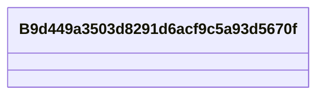

# Class: B9d449a3503d8291d6acf9c5a93d5670f


URI: [_:B9d449a3503d8291d6acf9c5a93d5670f](_:B9d449a3503d8291d6acf9c5a93d5670f)





<!-- no inheritance hierarchy -->


## Slots

| Name | Cardinality and Range | Description | Inheritance | Occurrences |
| ---  | --- | --- | --- | --- |


## LinkML Source

<!-- TODO: investigate https://stackoverflow.com/questions/37606292/how-to-create-tabbed-code-blocks-in-mkdocs-or-sphinx -->

### Direct

<details>

```yaml
name: __B9d449a3503d8291d6acf9c5a93d5670f
from_schema: okns:fio-kg
exact_mappings:
- _:B9d449a3503d8291d6acf9c5a93d5670f
rank: 1000
class_uri: _:B9d449a3503d8291d6acf9c5a93d5670f

```
</details>

### Induced

<details>

```yaml
name: __B9d449a3503d8291d6acf9c5a93d5670f
from_schema: okns:fio-kg
exact_mappings:
- _:B9d449a3503d8291d6acf9c5a93d5670f
rank: 1000
class_uri: _:B9d449a3503d8291d6acf9c5a93d5670f

```
</details>