# Class: EPA PFAS Facility (fio-epa-frs_EPA-PFAS-Facility)


_Facility identified as potentially handling PFAS in EPA PFAS Analytic tools based on industry._


This class occurs 23623 times.


URI: [fio-epa-frs:EPA-PFAS-Facility](http://w3id.org/fio/v1/epa-frs#EPA-PFAS-Facility)

```mermaid
 classDiagram
    class Fio-epa-frsEPA-PFAS-Facility
    click Fio-epa-frsEPA-PFAS-Facility href "../Fio-epa-frsEPA-PFAS-Facility"
      OwlThing <|-- Fio-epa-frsEPA-PFAS-Facility
        click OwlThing href "../OwlThing"
      
      Fio-epa-frsEPA-PFAS-Facility : dc_date
        
          
    
    
    Fio-epa-frsEPA-PFAS-Facility --> "0..1" Any : dc_date
    click Any href "../Any"

        
      Fio-epa-frsEPA-PFAS-Facility : dc_identifier
        
          
    
    
    Fio-epa-frsEPA-PFAS-Facility --> "0..1" Any : dc_identifier
    click Any href "../Any"

        
      Fio-epa-frsEPA-PFAS-Facility : dc_title
        
          
    
    
    Fio-epa-frsEPA-PFAS-Facility --> "0..1" Any : dc_title
    click Any href "../Any"

        
      Fio-epa-frsEPA-PFAS-Facility : dct_alternative
        
          
    
    
    Fio-epa-frsEPA-PFAS-Facility --> "0..1" RdfsLiteral : dct_alternative
    click RdfsLiteral href "../RdfsLiteral"

        
      Fio-epa-frsEPA-PFAS-Facility : dct_created
        
          
    
    
    Fio-epa-frsEPA-PFAS-Facility --> "0..1" RdfsLiteral : dct_created
    click RdfsLiteral href "../RdfsLiteral"

        
      Fio-epa-frsEPA-PFAS-Facility : dct_date
        
          
    
    
    Fio-epa-frsEPA-PFAS-Facility --> "0..1" RdfsLiteral : dct_date
    click RdfsLiteral href "../RdfsLiteral"

        
      Fio-epa-frsEPA-PFAS-Facility : dct_identifier
        
          
    
    
    Fio-epa-frsEPA-PFAS-Facility --> "0..1" RdfsLiteral : dct_identifier
    click RdfsLiteral href "../RdfsLiteral"

        
      Fio-epa-frsEPA-PFAS-Facility : dct_modified
        
          
    
    
    Fio-epa-frsEPA-PFAS-Facility --> "0..1" Any : dct_modified
    click Any href "../Any"

        
      Fio-epa-frsEPA-PFAS-Facility : dct_title
        
          
    
    
    Fio-epa-frsEPA-PFAS-Facility --> "0..1" Any : dct_title
    click Any href "../Any"

        
      Fio-epa-frsEPA-PFAS-Facility : fio_epa_frs_hasEnvironmentalInterest
        
          
    
    
    Fio-epa-frsEPA-PFAS-Facility --> "0..1" Any : fio_epa_frs_hasEnvironmentalInterest
    click Any href "../Any"

        
      Fio-epa-frsEPA-PFAS-Facility : fio_epa_frs_hasFRSId
        
          
    
    
    Fio-epa-frsEPA-PFAS-Facility --> "0..1" Any : fio_epa_frs_hasFRSId
    click Any href "../Any"

        
      Fio-epa-frsEPA-PFAS-Facility : fio_epa_frs_hasRecord
        
          
    
    
    Fio-epa-frsEPA-PFAS-Facility --> "0..1" Any : fio_epa_frs_hasRecord
    click Any href "../Any"

        
      Fio-epa-frsEPA-PFAS-Facility : fio_epa_frs_ofFacilityType
        
          
    
    
    Fio-epa-frsEPA-PFAS-Facility --> "0..1" Any : fio_epa_frs_ofFacilityType
    click Any href "../Any"

        
      Fio-epa-frsEPA-PFAS-Facility : fio_ofIndustry
        
          
    
    
    Fio-epa-frsEPA-PFAS-Facility --> "0..1" Any : fio_ofIndustry
    click Any href "../Any"

        
      Fio-epa-frsEPA-PFAS-Facility : fio_ownedBy
        
          
    
    
    Fio-epa-frsEPA-PFAS-Facility --> "0..1" Any : fio_ownedBy
    click Any href "../Any"

        
      Fio-epa-frsEPA-PFAS-Facility : geo_hasGeometry
        
          
    
    
    Fio-epa-frsEPA-PFAS-Facility --> "0..1" GeoGeometry : geo_hasGeometry
    click GeoGeometry href "../GeoGeometry"

        
      Fio-epa-frsEPA-PFAS-Facility : kwgo_sfWithin
        
          
    
    
    Fio-epa-frsEPA-PFAS-Facility --> "0..1" Any : kwgo_sfWithin
    click Any href "../Any"

        
      Fio-epa-frsEPA-PFAS-Facility : owl_sameAs
        
          
    
    
    Fio-epa-frsEPA-PFAS-Facility --> "0..1" OwlThing : owl_sameAs
    click OwlThing href "../OwlThing"

        
      Fio-epa-frsEPA-PFAS-Facility : rdfs_label
        
          
    
    
    Fio-epa-frsEPA-PFAS-Facility --> "0..1" Any : rdfs_label
    click Any href "../Any"

        
      Fio-epa-frsEPA-PFAS-Facility : sdos_address
        
          
    
    
    Fio-epa-frsEPA-PFAS-Facility --> "0..1" Any : sdos_address
    click Any href "../Any"

        
      
```





## Inheritance
* [OwlThing](../classes/OwlThing.md)
    * **Fio-epa-frsEPA-PFAS-Facility**


## Slots

| Name | Cardinality and Range | Description | Inheritance | Occurrences |
| ---  | --- | --- | --- | --- |
| [dct_created](../slots/dct_created.md) | 0..1 <br/> [RdfsLiteral](../classes/RdfsLiteral.md) | Recommended practice is to describe the date, date/time, or period of time as... <br/> description: Date of creation of the resource. | direct | 22089 |
| [dc_identifier](../slots/dc_identifier.md) | 0..1 <br/> [Any](../classes/Any.md) | Recommended practice is to identify the resource by means of a string conform... <br/> description: An unambiguous reference to the resource within a given context. | direct | 22089 |
| [sdos_address](../slots/sdos_address.md) | 0..1 <br/> [SdosPostalAddress](../classes/SdosPostalAddress.md)&nbsp;or&nbsp;<br />[SdosText](../classes/SdosText.md) | Physical address of the item <br/>  | direct | 16589 |
| [fio_ofIndustry](../slots/fio_ofIndustry.md) | 0..1 <br/> [NaicsNAICS-IndustryGroup](../classes/NaicsNAICS-IndustryGroup.md)&nbsp;or&nbsp;<br />[OwlThing](../classes/OwlThing.md)&nbsp;or&nbsp;<br />[NaicsNAICS-IndustrySubsector](../classes/NaicsNAICS-IndustrySubsector.md)&nbsp;or&nbsp;<br />[NaicsNAICS-IndustrySector](../classes/NaicsNAICS-IndustrySector.md)&nbsp;or&nbsp;<br />[NaicsNAICS-IndustryCode](../classes/NaicsNAICS-IndustryCode.md)&nbsp;or&nbsp;<br />[FioIndustry](../classes/FioIndustry.md)&nbsp;or&nbsp;<br />[OwlNamedIndividual](../classes/OwlNamedIndividual.md) | A relation between an entity and the industry it is classified under <br/>  | direct | 235865 |
| [dct_identifier](../slots/dct_identifier.md) | 0..1 <br/> [RdfsLiteral](../classes/RdfsLiteral.md) | Recommended practice is to identify the resource by means of a string conform... <br/> description: An unambiguous reference to the resource within a given context. | direct | 22089 |
| [kwgo_sfWithin](../slots/kwgo_sfWithin.md) | 0..1 <br/> [Any](../classes/Any.md) | KWG's spatial within relation <br/>  | direct | 63914 |
| [owl_sameAs](../slots/owl_sameAs.md) | 0..1 <br/> [OwlThing](../classes/OwlThing.md) | The property that determines that two given individuals are equal <br/>  | direct | 23623 |
| [dct_modified](../slots/dct_modified.md) | 0..1 <br/> [xsd:date](http://www.w3.org/2001/XMLSchema#date)&nbsp;or&nbsp;<br />[RdfsLiteral](../classes/RdfsLiteral.md) | Recommended practice is to describe the date, date/time, or period of time as... <br/> description: Date on which the resource was changed. | direct | 19225 |
| [dct_title](../slots/dct_title.md) | 0..1 <br/> [xsd:string](http://www.w3.org/2001/XMLSchema#string)&nbsp;or&nbsp;<br />[RdfsLiteral](../classes/RdfsLiteral.md) | A name given to the resource <br/>  | direct | 22089 |
| [dc_title](../slots/dc_title.md) | 0..1 <br/> [Any](../classes/Any.md) | A name given to the resource <br/>  | direct | 22089 |
| [fio_epa_frs_hasEnvironmentalInterest](../slots/fio_epa_frs_hasEnvironmentalInterest.md) | 0..1 <br/> [Fio-epa-frsEnforcementInterest](../classes/Fio-epa-frsEnforcementInterest.md)&nbsp;or&nbsp;<br />[Fio-epa-frsRiskInterest](../classes/Fio-epa-frsRiskInterest.md)&nbsp;or&nbsp;<br />[Fio-epa-frsRemediationRedevelopmentProgram](../classes/Fio-epa-frsRemediationRedevelopmentProgram.md)&nbsp;or&nbsp;<br />[Fio-epa-frsElectronicPermitSystem](../classes/Fio-epa-frsElectronicPermitSystem.md)&nbsp;or&nbsp;<br />[Fio-epa-frsCoastalOceanProgram](../classes/Fio-epa-frsCoastalOceanProgram.md)&nbsp;or&nbsp;<br />[Fio-epa-frsAnimalOperation](../classes/Fio-epa-frsAnimalOperation.md)&nbsp;or&nbsp;<br />[Fio-epa-frsUndergroundStorageTankProgram](../classes/Fio-epa-frsUndergroundStorageTankProgram.md)&nbsp;or&nbsp;<br />[Fio-epa-frsEnvironmentalInterestByProgram](../classes/Fio-epa-frsEnvironmentalInterestByProgram.md)&nbsp;or&nbsp;<br />[Fio-epa-frsComplianceInterest](../classes/Fio-epa-frsComplianceInterest.md)&nbsp;or&nbsp;<br />[Fio-epa-frsPesticidesProgram](../classes/Fio-epa-frsPesticidesProgram.md)&nbsp;or&nbsp;<br />[Fio-epa-frsChemicalReleaseProgram](../classes/Fio-epa-frsChemicalReleaseProgram.md)&nbsp;or&nbsp;<br />[Fio-epa-frsAirProgram](../classes/Fio-epa-frsAirProgram.md)&nbsp;or&nbsp;<br />[Fio-epa-frsRegistryInterest](../classes/Fio-epa-frsRegistryInterest.md)&nbsp;or&nbsp;<br />[Fio-epa-frsRadiationProtectionProgram](../classes/Fio-epa-frsRadiationProtectionProgram.md)&nbsp;or&nbsp;<br />[Fio-epa-frsHazardousWasteProgram](../classes/Fio-epa-frsHazardousWasteProgram.md)&nbsp;or&nbsp;<br />[Fio-epa-frsFacilitySiteIdentification](../classes/Fio-epa-frsFacilitySiteIdentification.md)&nbsp;or&nbsp;<br />[Fio-epa-frsHealthSafetyProgram](../classes/Fio-epa-frsHealthSafetyProgram.md)&nbsp;or&nbsp;<br />[Fio-epa-frsSiteInterest](../classes/Fio-epa-frsSiteInterest.md)&nbsp;or&nbsp;<br />[Fio-epa-frsWasteWaterProgram](../classes/Fio-epa-frsWasteWaterProgram.md)&nbsp;or&nbsp;<br />[Fio-epa-frsAssistanceSupportProgram](../classes/Fio-epa-frsAssistanceSupportProgram.md)&nbsp;or&nbsp;<br />[OwlThing](../classes/OwlThing.md)&nbsp;or&nbsp;<br />[Fio-epa-frsChemicalStorageProgram](../classes/Fio-epa-frsChemicalStorageProgram.md)&nbsp;or&nbsp;<br />[Fio-epa-frsReportingInterest](../classes/Fio-epa-frsReportingInterest.md)&nbsp;or&nbsp;<br />[Fio-epa-frsLegalEnforcementActivities](../classes/Fio-epa-frsLegalEnforcementActivities.md)&nbsp;or&nbsp;<br />[Fio-epa-frsEnvironmentalInterestType](../classes/Fio-epa-frsEnvironmentalInterestType.md)&nbsp;or&nbsp;<br />[Fio-epa-frsSolidWasteProgram](../classes/Fio-epa-frsSolidWasteProgram.md)&nbsp;or&nbsp;<br />[Fio-epa-frsPermitInterest](../classes/Fio-epa-frsPermitInterest.md)&nbsp;or&nbsp;<br />[Fio-epa-frsWaterResourcesProgram](../classes/Fio-epa-frsWaterResourcesProgram.md)&nbsp;or&nbsp;<br />[Fio-epa-frsGroundWaterProgram](../classes/Fio-epa-frsGroundWaterProgram.md)&nbsp;or&nbsp;<br />[Fio-epa-frsDrinkingWaterProgram](../classes/Fio-epa-frsDrinkingWaterProgram.md) |  <br/>  | direct | 114162 |
| [rdfs_label](../slots/rdfs_label.md) | 0..1 <br/> [RdfsLiteral](../classes/RdfsLiteral.md)&nbsp;or&nbsp;<br />[xsd:string](http://www.w3.org/2001/XMLSchema#string) | A human-readable name for the subject <br/>  | direct | 22089 |
| [geo_hasGeometry](../slots/geo_hasGeometry.md) | 0..1 <br/> [GeoGeometry](../classes/GeoGeometry.md) | A spatial representation for a given Feature <br/> source: http://www.opengis.net/spec/geosparql/1.1/req/geometry-extension/feature-properties<br/>source: http://www.opengis.net/ont/geosparql#<br/>source: http://www.opengis.net/spec/geosparql/1.0/req/geometry-extension/feature-properties<br/>description: A spatial representation for a given Feature. | direct | 21169 |
| [dct_date](../slots/dct_date.md) | 0..1 <br/> [RdfsLiteral](../classes/RdfsLiteral.md) | Date may be used to express temporal information at any level of granularity <br/> description: A point or period of time associated with an event in the lifecycle of the resource. | direct | 41262 |
| [dc_date](../slots/dc_date.md) | 0..1 <br/> [Any](../classes/Any.md) | Date may be used to express temporal information at any level of granularity <br/> description: A point or period of time associated with an event in the lifecycle of the resource. | direct | 41262 |
| [fio_epa_frs_ofFacilityType](../slots/fio_epa_frs_ofFacilityType.md) | 0..1 <br/> [OwlThing](../classes/OwlThing.md)&nbsp;or&nbsp;<br />[Fio-epa-frsFacilityType](../classes/Fio-epa-frsFacilityType.md) |  <br/>  | direct | 43923 |
| [fio_epa_frs_hasFRSId](../slots/fio_epa_frs_hasFRSId.md) | 0..1 <br/> [RdfsLiteral](../classes/RdfsLiteral.md)&nbsp;or&nbsp;<br />[xsd:string](http://www.w3.org/2001/XMLSchema#string) | has Identifier in EPA Facility Registry Service <br/>  | direct | 22089 |
| [fio_ownedBy](../slots/fio_ownedBy.md) | 0..1 <br/> [Fio-epa-frsAgency](../classes/Fio-epa-frsAgency.md)&nbsp;or&nbsp;<br />[Fio-epa-frsAgency.Commerce](../classes/Fio-epa-frsAgency.Commerce.md)&nbsp;or&nbsp;<br />[Fio-epa-frsAgency.Interior](../classes/Fio-epa-frsAgency.Interior.md)&nbsp;or&nbsp;<br />[Fio-epa-frsAgency.Justice](../classes/Fio-epa-frsAgency.Justice.md)&nbsp;or&nbsp;<br />[Fio-epa-frsAgency.Transportation](../classes/Fio-epa-frsAgency.Transportation.md)&nbsp;or&nbsp;<br />[Fio-epa-frsAgency.HealthandHumanServices](../classes/Fio-epa-frsAgency.HealthandHumanServices.md)&nbsp;or&nbsp;<br />[Fio-epa-frsAgency.Energy](../classes/Fio-epa-frsAgency.Energy.md)&nbsp;or&nbsp;<br />[Fio-epa-frsAgency.Defense](../classes/Fio-epa-frsAgency.Defense.md)&nbsp;or&nbsp;<br />[OwlNamedIndividual](../classes/OwlNamedIndividual.md)&nbsp;or&nbsp;<br />[Fio-epa-frsAgency.Agriculture](../classes/Fio-epa-frsAgency.Agriculture.md)&nbsp;or&nbsp;<br />[Fio-epa-frsAgency.VeteransAffairs](../classes/Fio-epa-frsAgency.VeteransAffairs.md)&nbsp;or&nbsp;<br />[Fio-epa-frsAgency.HomelandSecurity](../classes/Fio-epa-frsAgency.HomelandSecurity.md) |  <br/>  | direct | 316 |
| [dct_alternative](../slots/dct_alternative.md) | 0..1 <br/> [RdfsLiteral](../classes/RdfsLiteral.md) | The distinction between titles and alternative titles is application-specific <br/> description: An alternative name for the resource. | direct | 22089 |
| [fio_epa_frs_hasRecord](../slots/fio_epa_frs_hasRecord.md) | 0..1 <br/> [B51b8d66516b28a1c54f8d745ede947b9](../classes/B51b8d66516b28a1c54f8d745ede947b9.md)&nbsp;or&nbsp;<br />[B912c2f2722265f457d11b52388b1def0](../classes/B912c2f2722265f457d11b52388b1def0.md)&nbsp;or&nbsp;<br />[Be0e551f6155d8e99ee967119022af97d](../classes/Be0e551f6155d8e99ee967119022af97d.md)&nbsp;or&nbsp;<br />[Bdbdbfbd4ef20ffc37226553d96831226](../classes/Bdbdbfbd4ef20ffc37226553d96831226.md)&nbsp;or&nbsp;<br />[Fio-epa-frsFRS-Facility](../classes/Fio-epa-frsFRS-Facility.md)&nbsp;or&nbsp;<br />[Fio-epa-frsRecord](../classes/Fio-epa-frsRecord.md)&nbsp;or&nbsp;<br />[B5debef6666ba27aa225105865fd22d6c](../classes/B5debef6666ba27aa225105865fd22d6c.md)&nbsp;or&nbsp;<br />[B707e8df015ee2912f85cf2fec8dc4718](../classes/B707e8df015ee2912f85cf2fec8dc4718.md)&nbsp;or&nbsp;<br />[B3a5aa76705834f507db6d3c7d90d63b8](../classes/B3a5aa76705834f507db6d3c7d90d63b8.md)&nbsp;or&nbsp;<br />[B671ac9cd6796151f919e5affbe3cc5f9](../classes/B671ac9cd6796151f919e5affbe3cc5f9.md)&nbsp;or&nbsp;<br />[OwlThing](../classes/OwlThing.md)&nbsp;or&nbsp;<br />[Be082c2fc952b5eb7e355834fa6af4865](../classes/Be082c2fc952b5eb7e355834fa6af4865.md)&nbsp;or&nbsp;<br />[B9968aab18e1237453b5cbb15df1c74b9](../classes/B9968aab18e1237453b5cbb15df1c74b9.md)&nbsp;or&nbsp;<br />[Fio-epa-frsSupplementalRecord](../classes/Fio-epa-frsSupplementalRecord.md)&nbsp;or&nbsp;<br />[Bf0c649c8d760a3559d3d5e5b1f68a59f](../classes/Bf0c649c8d760a3559d3d5e5b1f68a59f.md)&nbsp;or&nbsp;<br />[B43f2153f8fa51cc860da104aa4b996c7](../classes/B43f2153f8fa51cc860da104aa4b996c7.md)&nbsp;or&nbsp;<br />[Ba0ffbf1a7a548fac1e61d3eceada03dd](../classes/Ba0ffbf1a7a548fac1e61d3eceada03dd.md)&nbsp;or&nbsp;<br />[Bea9d030ae5649d7f06d536c2a467e56f](../classes/Bea9d030ae5649d7f06d536c2a467e56f.md)&nbsp;or&nbsp;<br />[Bf906a89c08306329b89456f1d101a6bf](../classes/Bf906a89c08306329b89456f1d101a6bf.md)&nbsp;or&nbsp;<br />[B1d70f10e8204578c89c5f678467193ea](../classes/B1d70f10e8204578c89c5f678467193ea.md) |  <br/>  | direct | 166242 |


## LinkML Source

<!-- TODO: investigate https://stackoverflow.com/questions/37606292/how-to-create-tabbed-code-blocks-in-mkdocs-or-sphinx -->

### Direct

<details>

```yaml
name: fio-epa-frs_EPA-PFAS-Facility
description: Facility identified as potentially handling PFAS in EPA PFAS Analytic
  tools based on industry.
title: EPA PFAS Facility
from_schema: okns:fio-kg
exact_mappings:
- http://w3id.org/fio/v1/epa-frs#EPA-PFAS-Facility
rank: 1000
is_a: owl_Thing
slots:
- dct_created
- dc_identifier
- sdos_address
- fio_ofIndustry
- dct_identifier
- kwgo_sfWithin
- owl_sameAs
- dct_modified
- dct_title
- dc_title
- fio-epa-frs_hasEnvironmentalInterest
- rdfs_label
- geo_hasGeometry
- dct_date
- dc_date
- fio-epa-frs_ofFacilityType
- fio-epa-frs_hasFRSId
- fio_ownedBy
- dct_alternative
- fio-epa-frs_hasRecord
class_uri: fio-epa-frs:EPA-PFAS-Facility

```
</details>

### Induced

<details>

```yaml
name: fio-epa-frs_EPA-PFAS-Facility
description: Facility identified as potentially handling PFAS in EPA PFAS Analytic
  tools based on industry.
title: EPA PFAS Facility
from_schema: okns:fio-kg
exact_mappings:
- http://w3id.org/fio/v1/epa-frs#EPA-PFAS-Facility
rank: 1000
is_a: owl_Thing
attributes:
  dct_created:
    name: dct_created
    description: Recommended practice is to describe the date, date/time, or period
      of time as recommended for the property Date, of which this is a subproperty.
    title: Date Created
    notes:
    - No occurrences of this slot in the graph.
    comments:
    - 'description: Date of creation of the resource.'
    from_schema: okns:dc
    source: http://purl.org/dc/terms/
    slot_uri: dct:created
    alias: dct_created
    owner: fio-epa-frs_EPA-PFAS-Facility
    domain_of:
    - vaem_GraphMetaData
    - fio-epa-frs_EPA-PFAS-Facility
    - fio-epa-frs_FRS-Facility
    subproperty_of: dct_date
    range: rdfs_Literal
  dc_identifier:
    name: dc_identifier
    description: Recommended practice is to identify the resource by means of a string
      conforming to an identification system.
    title: Identifier
    notes:
    - 'A [second property](/specifications/dublin-core/dcmi-terms/#http://purl.org/dc/terms/identifier)
      with the same name as this property has been declared in the [dcterms: namespace](http://purl.org/dc/terms/).  See
      the Introduction to the document [DCMI Metadata Terms](/specifications/dublin-core/dcmi-terms/)
      for an explanation.'
    - No occurrences of this slot in the graph.
    comments:
    - 'description: An unambiguous reference to the resource within a given context.'
    from_schema: okns:dc
    source: http://purl.org/dc/elements/1.1/
    slot_uri: dc:identifier
    alias: dc_identifier
    owner: fio-epa-frs_EPA-PFAS-Facility
    domain_of:
    - __B1d70f10e8204578c89c5f678467193ea
    - __B3a5aa76705834f507db6d3c7d90d63b8
    - __B43f2153f8fa51cc860da104aa4b996c7
    - __B51b8d66516b28a1c54f8d745ede947b9
    - __B5debef6666ba27aa225105865fd22d6c
    - __B671ac9cd6796151f919e5affbe3cc5f9
    - __B707e8df015ee2912f85cf2fec8dc4718
    - __B912c2f2722265f457d11b52388b1def0
    - __B9968aab18e1237453b5cbb15df1c74b9
    - __Ba0ffbf1a7a548fac1e61d3eceada03dd
    - __Bdbdbfbd4ef20ffc37226553d96831226
    - __Be082c2fc952b5eb7e355834fa6af4865
    - __Be0e551f6155d8e99ee967119022af97d
    - __Bea9d030ae5649d7f06d536c2a467e56f
    - __Bf0c649c8d760a3559d3d5e5b1f68a59f
    - __Bf906a89c08306329b89456f1d101a6bf
    - fio-epa-frs_EPA-PFAS-Facility
    - fio-epa-frs_FRS-Facility
    - fio-epa-frs_Record
    - fio-epa-frs_SupplementalRecord
    - naics_NAICS-IndustryCode
    - naics_NAICS-IndustryGroup
    - naics_NAICS-IndustrySector
    - naics_NAICS-IndustrySubsector
    range: Any
  sdos_address:
    name: sdos_address
    description: Physical address of the item.
    title: address
    notes:
    - No occurrences of this slot in the graph.
    from_schema: okns:sdo
    slot_uri: sdos:address
    alias: sdos_address
    owner: fio-epa-frs_EPA-PFAS-Facility
    domain_of:
    - fio-epa-frs_EPA-PFAS-Facility
    - fio-epa-frs_FRS-Facility
    union_of:
    - sdos_Place
    - sdos_Person
    - sdos_Organization
    - sdos_GeoShape
    - sdos_GeoCoordinates
    range: Any
    any_of:
    - range: sdos_PostalAddress
    - range: sdos_Text
  fio_ofIndustry:
    name: fio_ofIndustry
    description: A relation between an entity and the industry it is classified under
    title: of industry
    from_schema: okns:fio-kg
    exact_mappings:
    - http://w3id.org/fio/v1/fio#ofIndustry
    rank: 1000
    slot_uri: fio:ofIndustry
    alias: fio_ofIndustry
    owner: fio-epa-frs_EPA-PFAS-Facility
    domain_of:
    - __B43f2153f8fa51cc860da104aa4b996c7
    - __B51b8d66516b28a1c54f8d745ede947b9
    - __B5debef6666ba27aa225105865fd22d6c
    - __B671ac9cd6796151f919e5affbe3cc5f9
    - __B707e8df015ee2912f85cf2fec8dc4718
    - __B912c2f2722265f457d11b52388b1def0
    - __Ba0ffbf1a7a548fac1e61d3eceada03dd
    - __Bdbdbfbd4ef20ffc37226553d96831226
    - __Be0e551f6155d8e99ee967119022af97d
    - __Bf0c649c8d760a3559d3d5e5b1f68a59f
    - __Bf906a89c08306329b89456f1d101a6bf
    - fio-epa-frs_EPA-PFAS-Facility
    - fio-epa-frs_FRS-Facility
    - fio-epa-frs_Record
    - fio-epa-frs_SupplementalRecord
    range: Any
    any_of:
    - range: naics_NAICS-IndustryGroup
    - range: owl_Thing
    - range: naics_NAICS-IndustrySubsector
    - range: naics_NAICS-IndustrySector
    - range: naics_NAICS-IndustryCode
    - range: fio_Industry
    - range: owl_NamedIndividual
  dct_identifier:
    name: dct_identifier
    description: Recommended practice is to identify the resource by means of a string
      conforming to an identification system. Examples include International Standard
      Book Number (ISBN), Digital Object Identifier (DOI), and Uniform Resource Name
      (URN).  Persistent identifiers should be provided as HTTP URIs.
    title: Identifier
    notes:
    - No occurrences of this slot in the graph.
    comments:
    - 'description: An unambiguous reference to the resource within a given context.'
    from_schema: okns:dc
    source: http://purl.org/dc/terms/
    slot_uri: dct:identifier
    alias: dct_identifier
    owner: fio-epa-frs_EPA-PFAS-Facility
    domain_of:
    - __B1d70f10e8204578c89c5f678467193ea
    - __B3a5aa76705834f507db6d3c7d90d63b8
    - __B43f2153f8fa51cc860da104aa4b996c7
    - __B51b8d66516b28a1c54f8d745ede947b9
    - __B5debef6666ba27aa225105865fd22d6c
    - __B671ac9cd6796151f919e5affbe3cc5f9
    - __B707e8df015ee2912f85cf2fec8dc4718
    - __B912c2f2722265f457d11b52388b1def0
    - __B9968aab18e1237453b5cbb15df1c74b9
    - __Ba0ffbf1a7a548fac1e61d3eceada03dd
    - __Bdbdbfbd4ef20ffc37226553d96831226
    - __Be082c2fc952b5eb7e355834fa6af4865
    - __Be0e551f6155d8e99ee967119022af97d
    - __Bea9d030ae5649d7f06d536c2a467e56f
    - __Bf0c649c8d760a3559d3d5e5b1f68a59f
    - __Bf906a89c08306329b89456f1d101a6bf
    - fio-epa-frs_EPA-PFAS-Facility
    - fio-epa-frs_FRS-Facility
    - fio-epa-frs_Record
    - fio-epa-frs_SupplementalRecord
    - naics_NAICS-IndustryCode
    - naics_NAICS-IndustryGroup
    - naics_NAICS-IndustrySector
    - naics_NAICS-IndustrySubsector
    subproperty_of: dc_identifier
    range: rdfs_Literal
  kwgo_sfWithin:
    name: kwgo_sfWithin
    description: KWG's spatial within relation
    title: within (simple feature)
    notes:
    - No occurrences of this slot in the graph.
    from_schema: okns:kwg
    slot_uri: kwgo:sfWithin
    alias: kwgo_sfWithin
    owner: fio-epa-frs_EPA-PFAS-Facility
    domain_of:
    - fio-epa-frs_EPA-PFAS-Facility
    - fio-epa-frs_FRS-Facility
    subproperty_of: kwgo_spatialRelation
    range: Any
  owl_sameAs:
    name: owl_sameAs
    description: The property that determines that two given individuals are equal.
    title: sameAs
    notes:
    - No occurrences of this slot in the graph.
    from_schema: okns:owl-rdf-rdfs
    source: http://www.w3.org/2002/07/owl#
    domain: owl_Thing
    slot_uri: owl:sameAs
    alias: owl_sameAs
    owner: fio-epa-frs_EPA-PFAS-Facility
    domain_of:
    - __B1d70f10e8204578c89c5f678467193ea
    - __B3a5aa76705834f507db6d3c7d90d63b8
    - __B43f2153f8fa51cc860da104aa4b996c7
    - __B51b8d66516b28a1c54f8d745ede947b9
    - __B5debef6666ba27aa225105865fd22d6c
    - __B671ac9cd6796151f919e5affbe3cc5f9
    - __B707e8df015ee2912f85cf2fec8dc4718
    - __B912c2f2722265f457d11b52388b1def0
    - __B9968aab18e1237453b5cbb15df1c74b9
    - __Ba0ffbf1a7a548fac1e61d3eceada03dd
    - __Bdbdbfbd4ef20ffc37226553d96831226
    - __Be082c2fc952b5eb7e355834fa6af4865
    - __Be0e551f6155d8e99ee967119022af97d
    - __Bea9d030ae5649d7f06d536c2a467e56f
    - __Bf0c649c8d760a3559d3d5e5b1f68a59f
    - __Bf906a89c08306329b89456f1d101a6bf
    - fio-epa-frs_Agency
    - fio-epa-frs_Agency.Agriculture
    - fio-epa-frs_Agency.Commerce
    - fio-epa-frs_Agency.Congress
    - fio-epa-frs_Agency.Defense
    - fio-epa-frs_Agency.Energy
    - fio-epa-frs_Agency.HealthandHumanServices
    - fio-epa-frs_Agency.HomelandSecurity
    - fio-epa-frs_Agency.HousingandUrbanDevelopment
    - fio-epa-frs_Agency.Interior
    - fio-epa-frs_Agency.Judicial
    - fio-epa-frs_Agency.Justice
    - fio-epa-frs_Agency.Labor
    - fio-epa-frs_Agency.State
    - fio-epa-frs_Agency.Transportation
    - fio-epa-frs_Agency.Treasury
    - fio-epa-frs_Agency.VeteransAffairs
    - fio-epa-frs_AirProgram
    - fio-epa-frs_AnimalOperation
    - fio-epa-frs_AssistanceSupportProgram
    - fio-epa-frs_ChemicalReleaseProgram
    - fio-epa-frs_ChemicalStorageProgram
    - fio-epa-frs_CoastalOceanProgram
    - fio-epa-frs_ComplianceInterest
    - fio-epa-frs_ComplianceSystem
    - fio-epa-frs_DrinkingWaterProgram
    - fio-epa-frs_EPA-PFAS-Facility
    - fio-epa-frs_EcologyOperation
    - fio-epa-frs_ElectronicPermitSystem
    - fio-epa-frs_EnforcementInterest
    - fio-epa-frs_EnforcementSystem
    - fio-epa-frs_EnvironmentalInterestByProgram
    - fio-epa-frs_EnvironmentalInterestType
    - fio-epa-frs_FRS-Facility
    - fio-epa-frs_FacilitySiteIdentification
    - fio-epa-frs_FacilityType
    - fio-epa-frs_GrantSystem
    - fio-epa-frs_GroundWaterProgram
    - fio-epa-frs_HazardousWasteProgram
    - fio-epa-frs_HealthSafetyProgram
    - fio-epa-frs_LegacySystem
    - fio-epa-frs_LegalEnforcementActivities
    - fio-epa-frs_PermitInterest
    - fio-epa-frs_PermitSystem
    - fio-epa-frs_PesticidesProgram
    - fio-epa-frs_ProgramInformationSystem
    - fio-epa-frs_ProjectSystem
    - fio-epa-frs_RadiationProtectionProgram
    - fio-epa-frs_Record
    - fio-epa-frs_RegistryInterest
    - fio-epa-frs_RegistrySystem
    - fio-epa-frs_RemediationRedevelopmentProgram
    - fio-epa-frs_ReportingInterest
    - fio-epa-frs_ReportingSystem
    - fio-epa-frs_RiskInterest
    - fio-epa-frs_SiteInterest
    - fio-epa-frs_SiteSystem
    - fio-epa-frs_SolidWasteProgram
    - fio-epa-frs_StateSystem
    - fio-epa-frs_SupplementalRecord
    - fio-epa-frs_TribalSystem
    - fio-epa-frs_UndergroundStorageTankProgram
    - fio-epa-frs_WasteWaterProgram
    - fio-epa-frs_WaterResourcesProgram
    - fio_Industry
    - kwgo_S2Cell_Level13
    - naics_NAICS-IndustryCode
    - naics_NAICS-IndustryGroup
    - naics_NAICS-IndustrySector
    - naics_NAICS-IndustrySubsector
    range: owl_Thing
  dct_modified:
    name: dct_modified
    description: Recommended practice is to describe the date, date/time, or period
      of time as recommended for the property Date, of which this is a subproperty.
    title: Date Modified
    comments:
    - 'description: Date on which the resource was changed.'
    from_schema: okns:dc
    source: http://purl.org/dc/terms/
    slot_uri: dct:modified
    alias: dct_modified
    owner: fio-epa-frs_EPA-PFAS-Facility
    domain_of:
    - vaem_GraphMetaData
    - fio-epa-frs_EPA-PFAS-Facility
    - fio-epa-frs_FRS-Facility
    subproperty_of: dct_date
    range: Any
    any_of:
    - range: date
    - range: rdfs_Literal
  dct_title:
    name: dct_title
    description: A name given to the resource.
    title: Title
    from_schema: okns:dc
    source: http://purl.org/dc/terms/
    slot_uri: dct:title
    alias: dct_title
    owner: fio-epa-frs_EPA-PFAS-Facility
    domain_of:
    - vaem_GraphMetaData
    - fio-epa-frs_EPA-PFAS-Facility
    - fio-epa-frs_FRS-Facility
    subproperty_of: dc_title
    range: Any
    any_of:
    - range: string
    - range: rdfs_Literal
  dc_title:
    name: dc_title
    description: A name given to the resource.
    title: Title
    notes:
    - 'A [second property](/specifications/dublin-core/dcmi-terms/#http://purl.org/dc/terms/title)
      with the same name as this property has been declared in the [dcterms: namespace](http://purl.org/dc/terms/).  See
      the Introduction to the document [DCMI Metadata Terms](/specifications/dublin-core/dcmi-terms/)
      for an explanation.'
    - No occurrences of this slot in the graph.
    from_schema: okns:dc
    source: http://purl.org/dc/elements/1.1/
    slot_uri: dc:title
    alias: dc_title
    owner: fio-epa-frs_EPA-PFAS-Facility
    domain_of:
    - fio-epa-frs_EPA-PFAS-Facility
    - fio-epa-frs_FRS-Facility
    range: Any
  fio-epa-frs_hasEnvironmentalInterest:
    name: fio-epa-frs_hasEnvironmentalInterest
    title: in program type
    from_schema: okns:fio-kg
    exact_mappings:
    - http://w3id.org/fio/v1/epa-frs#hasEnvironmentalInterest
    rank: 1000
    slot_uri: fio-epa-frs:hasEnvironmentalInterest
    alias: fio_epa_frs_hasEnvironmentalInterest
    owner: fio-epa-frs_EPA-PFAS-Facility
    domain_of:
    - __B43f2153f8fa51cc860da104aa4b996c7
    - __B51b8d66516b28a1c54f8d745ede947b9
    - __B671ac9cd6796151f919e5affbe3cc5f9
    - __B912c2f2722265f457d11b52388b1def0
    - __B9968aab18e1237453b5cbb15df1c74b9
    - __Bdbdbfbd4ef20ffc37226553d96831226
    - __Be082c2fc952b5eb7e355834fa6af4865
    - __Be0e551f6155d8e99ee967119022af97d
    - __Bf0c649c8d760a3559d3d5e5b1f68a59f
    - __Bf906a89c08306329b89456f1d101a6bf
    - fio-epa-frs_EPA-PFAS-Facility
    - fio-epa-frs_FRS-Facility
    - fio-epa-frs_Record
    - fio-epa-frs_SupplementalRecord
    union_of:
    - owl_Thing
    - fio-epa-frs_FRS-Facility
    - __B5debef6666ba27aa225105865fd22d6c
    - fio_Facility
    range: Any
    any_of:
    - range: fio-epa-frs_EnforcementInterest
    - range: fio-epa-frs_RiskInterest
    - range: fio-epa-frs_RemediationRedevelopmentProgram
    - range: fio-epa-frs_ElectronicPermitSystem
    - range: fio-epa-frs_CoastalOceanProgram
    - range: fio-epa-frs_AnimalOperation
    - range: fio-epa-frs_UndergroundStorageTankProgram
    - range: fio-epa-frs_EnvironmentalInterestByProgram
    - range: fio-epa-frs_ComplianceInterest
    - range: fio-epa-frs_PesticidesProgram
    - range: fio-epa-frs_ChemicalReleaseProgram
    - range: fio-epa-frs_AirProgram
    - range: fio-epa-frs_RegistryInterest
    - range: fio-epa-frs_RadiationProtectionProgram
    - range: fio-epa-frs_HazardousWasteProgram
    - range: fio-epa-frs_FacilitySiteIdentification
    - range: fio-epa-frs_HealthSafetyProgram
    - range: fio-epa-frs_SiteInterest
    - range: fio-epa-frs_WasteWaterProgram
    - range: fio-epa-frs_AssistanceSupportProgram
    - range: owl_Thing
    - range: fio-epa-frs_ChemicalStorageProgram
    - range: fio-epa-frs_ReportingInterest
    - range: fio-epa-frs_LegalEnforcementActivities
    - range: fio-epa-frs_EnvironmentalInterestType
    - range: fio-epa-frs_SolidWasteProgram
    - range: fio-epa-frs_PermitInterest
    - range: fio-epa-frs_WaterResourcesProgram
    - range: fio-epa-frs_GroundWaterProgram
    - range: fio-epa-frs_DrinkingWaterProgram
  rdfs_label:
    name: rdfs_label
    description: A human-readable name for the subject.
    title: label
    from_schema: okns:owl-rdf-rdfs
    source: http://www.w3.org/2000/01/rdf-schema#
    domain: rdfs_Resource
    slot_uri: rdfs:label
    alias: rdfs_label
    owner: fio-epa-frs_EPA-PFAS-Facility
    domain_of:
    - dcam_VocabularyEncodingScheme
    - dct_AgentClass
    - rdf_List
    - rdfs_Datatype
    - time_DayOfWeek
    - time_TemporalUnit
    - vaem_GraphMetaData
    - vaem_GraphRole
    - vaem_Party
    - sdos_ActionStatusType
    - sdos_AdultOrientedEnumeration
    - sdos_BoardingPolicyType
    - sdos_BodyMeasurementTypeEnumeration
    - sdos_BookFormatType
    - sdos_Boolean
    - sdos_CarUsageType
    - sdos_CertificationStatusEnumeration
    - sdos_ContactPointOption
    - sdos_DataType
    - sdos_DayOfWeek
    - sdos_DeliveryMethod
    - sdos_DigitalDocumentPermissionType
    - sdos_DigitalPlatformEnumeration
    - sdos_DriveWheelConfigurationValue
    - sdos_DrugCostCategory
    - sdos_DrugPregnancyCategory
    - sdos_DrugPrescriptionStatus
    - sdos_EUEnergyEfficiencyEnumeration
    - sdos_EnergyStarEnergyEfficiencyEnumeration
    - sdos_EventAttendanceModeEnumeration
    - sdos_EventStatusType
    - sdos_FulfillmentTypeEnumeration
    - sdos_GameAvailabilityEnumeration
    - sdos_GamePlayMode
    - sdos_GameServerStatus
    - sdos_GenderType
    - sdos_GovernmentBenefitsType
    - sdos_HealthAspectEnumeration
    - sdos_IPTCDigitalSourceEnumeration
    - sdos_IncentiveQualifiedExpenseType
    - sdos_IncentiveStatus
    - sdos_IncentiveType
    - sdos_InfectiousAgentClass
    - sdos_ItemAvailability
    - sdos_ItemListOrderType
    - sdos_LegalForceStatus
    - sdos_LegalValueLevel
    - sdos_MapCategoryType
    - sdos_MeasurementMethodEnum
    - sdos_MediaManipulationRatingEnumeration
    - sdos_MedicalAudienceType
    - sdos_MedicalDevicePurpose
    - sdos_MedicalEvidenceLevel
    - sdos_MedicalImagingTechnique
    - sdos_MedicalObservationalStudyDesign
    - sdos_MedicalProcedureType
    - sdos_MedicalSpecialty
    - sdos_MedicalStudyStatus
    - sdos_MedicalTrialDesign
    - sdos_MedicineSystem
    - sdos_MerchantReturnEnumeration
    - sdos_MusicAlbumProductionType
    - sdos_MusicAlbumReleaseType
    - sdos_MusicReleaseFormatType
    - sdos_NLNonprofitType
    - sdos_OfferItemCondition
    - sdos_OrderStatus
    - sdos_PaymentMethodType
    - sdos_PaymentStatusType
    - sdos_PhysicalActivityCategory
    - sdos_PhysicalExam
    - sdos_PriceComponentTypeEnumeration
    - sdos_PriceTypeEnumeration
    - sdos_ProductReturnEnumeration
    - sdos_PurchaseType
    - sdos_RefundTypeEnumeration
    - sdos_ReservationStatusType
    - sdos_RestrictedDiet
    - sdos_ReturnFeesEnumeration
    - sdos_ReturnLabelSourceEnumeration
    - sdos_ReturnMethodEnumeration
    - sdos_RsvpResponseType
    - sdos_SizeSystemEnumeration
    - sdos_SteeringPositionValue
    - sdos_TierBenefitEnumeration
    - sdos_UKNonprofitType
    - sdos_USNonprofitType
    - sdos_WearableMeasurementTypeEnumeration
    - sdos_WearableSizeGroupEnumeration
    - sdos_WearableSizeSystemEnumeration
    - rdf_DatatypeProperty
    - vaem_CatalogEntry
    - voag_Attribution
    - voag_AttributionLogo
    - voag_ChangeFrequency
    - voag_ChangeType
    - voag_ConfidentialityLevel
    - voag_CreativeCommonsPermission
    - voag_CreativeCommonsProhibition
    - voag_CreativeCommonsRequirement
    - voag_Governance
    - voag_GovernanceRole
    - voag_Icon
    - voag_IssueStatus
    - voag_LicenseModel
    - voag_Logo
    - voag_Maturity
    - voag_OrganizationLogo
    - voag_Pedigree
    - voag_PriorityValue
    - voag_ProductLogo
    - voag_Provenance
    - voag_PublicationStatus
    - voag_SchemaGraph
    - qudt_AspectClass
    - qudt_BinaryPrefix
    - qudt_BitEncodingType
    - qudt_BooleanEncodingType
    - qudt_ByteEncodingType
    - qudt_CardinalityType
    - qudt_CharEncodingType
    - qudt_ContextualUnit
    - qudt_CountingUnit
    - qudt_CurrencyUnit
    - qudt_DateTimeStringEncodingType
    - qudt_DecimalPrefix
    - qudt_DerivedUnit
    - qudt_DimensionlessUnit
    - qudt_EndianType
    - qudt_FloatingPointEncodingType
    - qudt_IntegerEncodingType
    - qudt_LogarithmicUnit
    - qudt_OrderedType
    - qudt_SignednessType
    - qudt_Unit
    - kwgo_AirPollutant
    - kwgo_BlueskyWildfireObservableProperty
    - kwgo_CensusObservableProperty
    - kwgo_ClimateObservableProperty
    - kwgo_CroplandObservableProperty
    - kwgo_DroughtIntensity
    - kwgo_FireCause
    - kwgo_HelipadAvailability
    - kwgo_HospitalStatus
    - kwgo_HospitalType
    - kwgo_ImpactObservableProperty
    - kwgo_LSADArea
    - kwgo_MTBSFireObservableProperty
    - kwgo_MagnitudeObservableProperty
    - kwgo_NIFCFireObservableProperty
    - kwgo_PublicHealthObservableProperty
    - kwgo_RoadType
    - kwgo_SmokePlumeObservableProperty
    - kwgo_SoilMapUnitObservableProperty
    - kwgo_StormTrackObservableProperty
    - kwgo_StormTrackletObservableProperty
    - kwgo_VulnerabilityObservableProperty
    - __B1d70f10e8204578c89c5f678467193ea
    - __B3a5aa76705834f507db6d3c7d90d63b8
    - __B43f2153f8fa51cc860da104aa4b996c7
    - __B51b8d66516b28a1c54f8d745ede947b9
    - __B5debef6666ba27aa225105865fd22d6c
    - __B671ac9cd6796151f919e5affbe3cc5f9
    - __B707e8df015ee2912f85cf2fec8dc4718
    - __B912c2f2722265f457d11b52388b1def0
    - __B9968aab18e1237453b5cbb15df1c74b9
    - __Ba0ffbf1a7a548fac1e61d3eceada03dd
    - __Bdbdbfbd4ef20ffc37226553d96831226
    - __Be082c2fc952b5eb7e355834fa6af4865
    - __Be0e551f6155d8e99ee967119022af97d
    - __Bea9d030ae5649d7f06d536c2a467e56f
    - __Bf0c649c8d760a3559d3d5e5b1f68a59f
    - __Bf906a89c08306329b89456f1d101a6bf
    - fio-epa-frs_Agency
    - fio-epa-frs_Agency.Agriculture
    - fio-epa-frs_Agency.Commerce
    - fio-epa-frs_Agency.Congress
    - fio-epa-frs_Agency.Defense
    - fio-epa-frs_Agency.Energy
    - fio-epa-frs_Agency.HealthandHumanServices
    - fio-epa-frs_Agency.HomelandSecurity
    - fio-epa-frs_Agency.HousingandUrbanDevelopment
    - fio-epa-frs_Agency.Interior
    - fio-epa-frs_Agency.Judicial
    - fio-epa-frs_Agency.Justice
    - fio-epa-frs_Agency.Labor
    - fio-epa-frs_Agency.State
    - fio-epa-frs_Agency.Transportation
    - fio-epa-frs_Agency.Treasury
    - fio-epa-frs_Agency.VeteransAffairs
    - fio-epa-frs_AirProgram
    - fio-epa-frs_AnimalOperation
    - fio-epa-frs_AssistanceSupportProgram
    - fio-epa-frs_ChemicalReleaseProgram
    - fio-epa-frs_ChemicalStorageProgram
    - fio-epa-frs_CoastalOceanProgram
    - fio-epa-frs_ComplianceInterest
    - fio-epa-frs_ComplianceSystem
    - fio-epa-frs_DrinkingWaterProgram
    - fio-epa-frs_EPA-PFAS-Facility
    - fio-epa-frs_EcologyOperation
    - fio-epa-frs_ElectronicPermitSystem
    - fio-epa-frs_EnforcementInterest
    - fio-epa-frs_EnforcementSystem
    - fio-epa-frs_EnvironmentalInterestByProgram
    - fio-epa-frs_EnvironmentalInterestType
    - fio-epa-frs_FRS-Facility
    - fio-epa-frs_FacilitySiteIdentification
    - fio-epa-frs_FacilityType
    - fio-epa-frs_GrantSystem
    - fio-epa-frs_GroundWaterProgram
    - fio-epa-frs_HazardousWasteProgram
    - fio-epa-frs_HealthSafetyProgram
    - fio-epa-frs_LegacySystem
    - fio-epa-frs_LegalEnforcementActivities
    - fio-epa-frs_PermitInterest
    - fio-epa-frs_PermitSystem
    - fio-epa-frs_PesticidesProgram
    - fio-epa-frs_ProgramInformationSystem
    - fio-epa-frs_ProjectSystem
    - fio-epa-frs_RadiationProtectionProgram
    - fio-epa-frs_RegistryInterest
    - fio-epa-frs_RegistrySystem
    - fio-epa-frs_RemediationRedevelopmentProgram
    - fio-epa-frs_ReportingInterest
    - fio-epa-frs_ReportingSystem
    - fio-epa-frs_RiskInterest
    - fio-epa-frs_SiteInterest
    - fio-epa-frs_SiteSystem
    - fio-epa-frs_SolidWasteProgram
    - fio-epa-frs_StateSystem
    - fio-epa-frs_SupplementalRecord
    - fio-epa-frs_TribalSystem
    - fio-epa-frs_UndergroundStorageTankProgram
    - fio-epa-frs_WasteWaterProgram
    - fio-epa-frs_WaterResourcesProgram
    - naics_NAICS-IndustryCode
    - naics_NAICS-IndustryGroup
    - naics_NAICS-IndustrySector
    - naics_NAICS-IndustrySubsector
    range: Any
    any_of:
    - range: rdfs_Literal
    - range: string
  geo_hasGeometry:
    name: geo_hasGeometry
    description: A spatial representation for a given Feature.
    title: No slot (predicate) name specified -- this slot is noted as a subproperty
      of another slot in this graph but has not itself been defined.
    notes:
    - No occurrences of this slot in the graph.
    comments:
    - 'source: http://www.opengis.net/spec/geosparql/1.1/req/geometry-extension/feature-properties'
    - 'source: http://www.opengis.net/ont/geosparql#'
    - 'source: http://www.opengis.net/spec/geosparql/1.0/req/geometry-extension/feature-properties'
    - 'description: A spatial representation for a given Feature.'
    from_schema: okns:geo
    source: http://www.opengis.net/ont/geosparql#
    domain: geo_Feature
    slot_uri: geo:hasGeometry
    alias: geo_hasGeometry
    owner: fio-epa-frs_EPA-PFAS-Facility
    domain_of:
    - fio-epa-frs_EPA-PFAS-Facility
    - fio-epa-frs_FRS-Facility
    range: geo_Geometry
  dct_date:
    name: dct_date
    description: Date may be used to express temporal information at any level of
      granularity.  Recommended practice is to express the date, date/time, or period
      of time according to ISO 8601-1 [[ISO 8601-1](https://www.iso.org/iso-8601-date-and-time-format.html)]
      or a published profile of the ISO standard, such as the W3C Note on Date and
      Time Formats [[W3CDTF](https://www.w3.org/TR/NOTE-datetime)] or the Extended
      Date/Time Format Specification [[EDTF](http://www.loc.gov/standards/datetime/)].  If
      the full date is unknown, month and year (YYYY-MM) or just year (YYYY) may be
      used. Date ranges may be specified using ISO 8601 period of time specification
      in which start and end dates are separated by a '/' (slash) character.  Either
      the start or end date may be missing.
    title: Date
    notes:
    - No occurrences of this slot in the graph.
    comments:
    - 'description: A point or period of time associated with an event in the lifecycle
      of the resource.'
    from_schema: okns:dc
    source: http://purl.org/dc/terms/
    slot_uri: dct:date
    alias: dct_date
    owner: fio-epa-frs_EPA-PFAS-Facility
    domain_of:
    - fio-epa-frs_EPA-PFAS-Facility
    - fio-epa-frs_FRS-Facility
    subproperty_of: dc_date
    range: rdfs_Literal
  dc_date:
    name: dc_date
    description: Date may be used to express temporal information at any level of
      granularity.  Recommended practice is to express the date, date/time, or period
      of time according to ISO 8601-1 [[ISO 8601-1](https://www.iso.org/iso-8601-date-and-time-format.html)]
      or a published profile of the ISO standard, such as the W3C Note on Date and
      Time Formats [[W3CDTF](https://www.w3.org/TR/NOTE-datetime)] or the Extended
      Date/Time Format Specification [[EDTF](http://www.loc.gov/standards/datetime/)].  If
      the full date is unknown, month and year (YYYY-MM) or just year (YYYY) may be
      used. Date ranges may be specified using ISO 8601 period of time specification
      in which start and end dates are separated by a '/' (slash) character.  Either
      the start or end date may be missing.
    title: Date
    notes:
    - 'A [second property](/specifications/dublin-core/dcmi-terms/#http://purl.org/dc/terms/date)
      with the same name as this property has been declared in the [dcterms: namespace](http://purl.org/dc/terms/).  See
      the Introduction to the document [DCMI Metadata Terms](/specifications/dublin-core/dcmi-terms/)
      for an explanation.'
    - No occurrences of this slot in the graph.
    comments:
    - 'description: A point or period of time associated with an event in the lifecycle
      of the resource.'
    from_schema: okns:dc
    source: http://purl.org/dc/elements/1.1/
    slot_uri: dc:date
    alias: dc_date
    owner: fio-epa-frs_EPA-PFAS-Facility
    domain_of:
    - fio-epa-frs_EPA-PFAS-Facility
    - fio-epa-frs_FRS-Facility
    range: Any
  fio-epa-frs_ofFacilityType:
    name: fio-epa-frs_ofFacilityType
    title: of facility type
    from_schema: okns:fio-kg
    exact_mappings:
    - http://w3id.org/fio/v1/epa-frs#ofFacilityType
    rank: 1000
    slot_uri: fio-epa-frs:ofFacilityType
    alias: fio_epa_frs_ofFacilityType
    owner: fio-epa-frs_EPA-PFAS-Facility
    domain_of:
    - fio-epa-frs_EPA-PFAS-Facility
    - fio-epa-frs_FRS-Facility
    union_of:
    - owl_Thing
    - fio-epa-frs_FRS-Facility
    - __B5debef6666ba27aa225105865fd22d6c
    - fio_Facility
    range: Any
    any_of:
    - range: owl_Thing
    - range: fio-epa-frs_FacilityType
  fio-epa-frs_hasFRSId:
    name: fio-epa-frs_hasFRSId
    description: has Identifier in EPA Facility Registry Service
    title: has FRS Id
    from_schema: okns:fio-kg
    exact_mappings:
    - http://w3id.org/fio/v1/epa-frs#hasFRSId
    rank: 1000
    slot_uri: fio-epa-frs:hasFRSId
    alias: fio_epa_frs_hasFRSId
    owner: fio-epa-frs_EPA-PFAS-Facility
    domain_of:
    - fio-epa-frs_EPA-PFAS-Facility
    - fio-epa-frs_FRS-Facility
    subproperty_of: dct_identifier
    union_of:
    - owl_Thing
    - fio-epa-frs_FRS-Facility
    - __B5debef6666ba27aa225105865fd22d6c
    - fio_Facility
    range: Any
    any_of:
    - range: rdfs_Literal
    - range: string
  fio_ownedBy:
    name: fio_ownedBy
    from_schema: okns:fio-kg
    exact_mappings:
    - http://w3id.org/fio/v1/fio#ownedBy
    rank: 1000
    slot_uri: fio:ownedBy
    alias: fio_ownedBy
    owner: fio-epa-frs_EPA-PFAS-Facility
    domain_of:
    - fio-epa-frs_EPA-PFAS-Facility
    - fio-epa-frs_FRS-Facility
    range: Any
    any_of:
    - range: fio-epa-frs_Agency
    - range: fio-epa-frs_Agency.Commerce
    - range: fio-epa-frs_Agency.Interior
    - range: fio-epa-frs_Agency.Justice
    - range: fio-epa-frs_Agency.Transportation
    - range: fio-epa-frs_Agency.HealthandHumanServices
    - range: fio-epa-frs_Agency.Energy
    - range: fio-epa-frs_Agency.Defense
    - range: owl_NamedIndividual
    - range: fio-epa-frs_Agency.Agriculture
    - range: fio-epa-frs_Agency.VeteransAffairs
    - range: fio-epa-frs_Agency.HomelandSecurity
  dct_alternative:
    name: dct_alternative
    description: The distinction between titles and alternative titles is application-specific.
    title: Alternative Title
    notes:
    - No occurrences of this slot in the graph.
    comments:
    - 'description: An alternative name for the resource.'
    from_schema: okns:dc
    source: http://purl.org/dc/terms/
    slot_uri: dct:alternative
    alias: dct_alternative
    owner: fio-epa-frs_EPA-PFAS-Facility
    domain_of:
    - fio-epa-frs_EPA-PFAS-Facility
    - fio-epa-frs_FRS-Facility
    subproperty_of: dct_title
    range: rdfs_Literal
  fio-epa-frs_hasRecord:
    name: fio-epa-frs_hasRecord
    title: has  record
    from_schema: okns:fio-kg
    exact_mappings:
    - http://w3id.org/fio/v1/epa-frs#hasRecord
    rank: 1000
    slot_uri: fio-epa-frs:hasRecord
    alias: fio_epa_frs_hasRecord
    owner: fio-epa-frs_EPA-PFAS-Facility
    domain_of:
    - __B43f2153f8fa51cc860da104aa4b996c7
    - __B51b8d66516b28a1c54f8d745ede947b9
    - __B671ac9cd6796151f919e5affbe3cc5f9
    - __B912c2f2722265f457d11b52388b1def0
    - __B9968aab18e1237453b5cbb15df1c74b9
    - __Bdbdbfbd4ef20ffc37226553d96831226
    - __Be082c2fc952b5eb7e355834fa6af4865
    - __Be0e551f6155d8e99ee967119022af97d
    - __Bf0c649c8d760a3559d3d5e5b1f68a59f
    - __Bf906a89c08306329b89456f1d101a6bf
    - fio-epa-frs_EPA-PFAS-Facility
    - fio-epa-frs_FRS-Facility
    - fio-epa-frs_Record
    - fio-epa-frs_SupplementalRecord
    union_of:
    - owl_Thing
    - fio-epa-frs_FRS-Facility
    - __B5debef6666ba27aa225105865fd22d6c
    - fio_Facility
    range: Any
    any_of:
    - range: __B51b8d66516b28a1c54f8d745ede947b9
    - range: __B912c2f2722265f457d11b52388b1def0
    - range: __Be0e551f6155d8e99ee967119022af97d
    - range: __Bdbdbfbd4ef20ffc37226553d96831226
    - range: fio-epa-frs_FRS-Facility
    - range: fio-epa-frs_Record
    - range: __B5debef6666ba27aa225105865fd22d6c
    - range: __B707e8df015ee2912f85cf2fec8dc4718
    - range: __B3a5aa76705834f507db6d3c7d90d63b8
    - range: __B671ac9cd6796151f919e5affbe3cc5f9
    - range: owl_Thing
    - range: __Be082c2fc952b5eb7e355834fa6af4865
    - range: __B9968aab18e1237453b5cbb15df1c74b9
    - range: fio-epa-frs_SupplementalRecord
    - range: __Bf0c649c8d760a3559d3d5e5b1f68a59f
    - range: __B43f2153f8fa51cc860da104aa4b996c7
    - range: __Ba0ffbf1a7a548fac1e61d3eceada03dd
    - range: __Bea9d030ae5649d7f06d536c2a467e56f
    - range: __Bf906a89c08306329b89456f1d101a6bf
    - range: __B1d70f10e8204578c89c5f678467193ea
class_uri: fio-epa-frs:EPA-PFAS-Facility

```
</details>