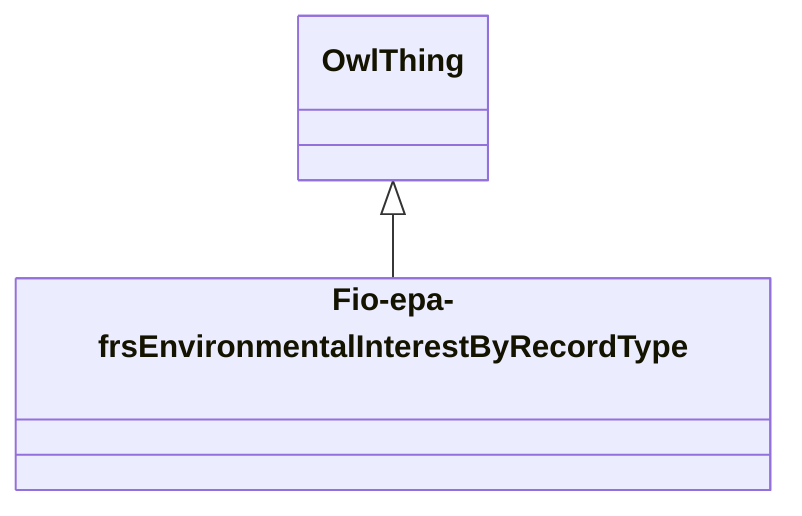

# Class: Environmental Interest By Record Type (fio-epa-frs_EnvironmentalInterestByRecordType)


_Interest classification based on the main subject of the record and what type of activity or entity it identifies._


URI: [fio-epa-frs:EnvironmentalInterestByRecordType](http://w3id.org/fio/v1/epa-frs#EnvironmentalInterestByRecordType)





## Inheritance
* [OwlThing](../classes/OwlThing.md)
    * **Fio-epa-frsEnvironmentalInterestByRecordType**


## Slots

| Name | Cardinality and Range | Description | Inheritance | Occurrences |
| ---  | --- | --- | --- | --- |


## LinkML Source

<!-- TODO: investigate https://stackoverflow.com/questions/37606292/how-to-create-tabbed-code-blocks-in-mkdocs-or-sphinx -->

### Direct

<details>

```yaml
name: fio-epa-frs_EnvironmentalInterestByRecordType
description: Interest classification based on the main subject of the record and what
  type of activity or entity it identifies.
title: Environmental Interest By Record Type
from_schema: okns:fio-kg
rank: 1000
is_a: owl_Thing
class_uri: fio-epa-frs:EnvironmentalInterestByRecordType

```
</details>

### Induced

<details>

```yaml
name: fio-epa-frs_EnvironmentalInterestByRecordType
description: Interest classification based on the main subject of the record and what
  type of activity or entity it identifies.
title: Environmental Interest By Record Type
from_schema: okns:fio-kg
rank: 1000
is_a: owl_Thing
class_uri: fio-epa-frs:EnvironmentalInterestByRecordType

```
</details>