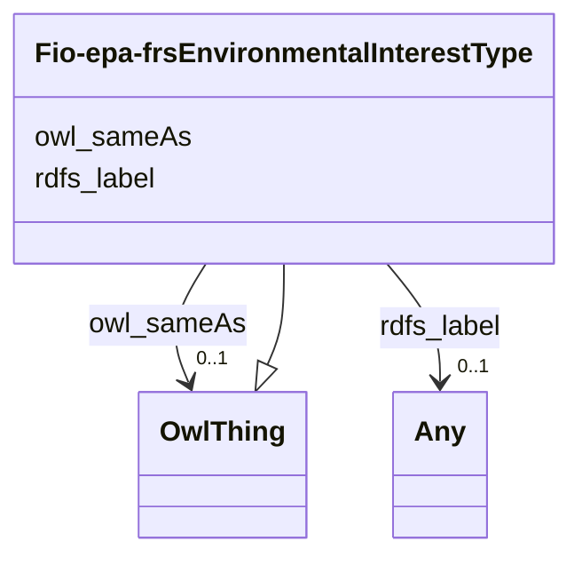

# Class: Environmental Interest Type (fio-epa-frs_EnvironmentalInterestType)


_The environmental permit or regulatory program type that applies to the facility site_


This class occurs 5 times.


URI: [fio-epa-frs:EnvironmentalInterestType](http://w3id.org/fio/v1/epa-frs#EnvironmentalInterestType)





## Inheritance
* [OwlThing](../classes/OwlThing.md)
    * **Fio-epa-frsEnvironmentalInterestType**


## Slots

| Name | Cardinality and Range | Description | Inheritance | Occurrences |
| ---  | --- | --- | --- | --- |
| [rdfs_label](../slots/rdfs_label.md) | 0..1 <br/> [RdfsLiteral](../classes/RdfsLiteral.md)&nbsp;or&nbsp;<br />[xsd:string](http://www.w3.org/2001/XMLSchema#string) | A human-readable name for the subject <br/>  | direct | 1 |
| [owl_sameAs](../slots/owl_sameAs.md) | 0..1 <br/> [OwlThing](../classes/OwlThing.md) | The property that determines that two given individuals are equal <br/>  | direct | 5 |


## Usages

| used by | used in | type | used |
| ---  | --- | --- | --- |
| [B1d70f10e8204578c89c5f678467193ea](../classes/B1d70f10e8204578c89c5f678467193ea.md) | [fio_epa_frs_ofInterestType](../slots/fio_epa_frs_ofInterestType.md) | any_of[range] | [Fio-epa-frsEnvironmentalInterestType](../classes/Fio-epa-frsEnvironmentalInterestType.md) |
| [B3a5aa76705834f507db6d3c7d90d63b8](../classes/B3a5aa76705834f507db6d3c7d90d63b8.md) | [fio_epa_frs_ofInterestType](../slots/fio_epa_frs_ofInterestType.md) | any_of[range] | [Fio-epa-frsEnvironmentalInterestType](../classes/Fio-epa-frsEnvironmentalInterestType.md) |
| [B43f2153f8fa51cc860da104aa4b996c7](../classes/B43f2153f8fa51cc860da104aa4b996c7.md) | [fio_epa_frs_hasEnvironmentalInterest](../slots/fio_epa_frs_hasEnvironmentalInterest.md) | any_of[range] | [Fio-epa-frsEnvironmentalInterestType](../classes/Fio-epa-frsEnvironmentalInterestType.md) |
| [B43f2153f8fa51cc860da104aa4b996c7](../classes/B43f2153f8fa51cc860da104aa4b996c7.md) | [fio_epa_frs_ofInterestType](../slots/fio_epa_frs_ofInterestType.md) | any_of[range] | [Fio-epa-frsEnvironmentalInterestType](../classes/Fio-epa-frsEnvironmentalInterestType.md) |
| [B51b8d66516b28a1c54f8d745ede947b9](../classes/B51b8d66516b28a1c54f8d745ede947b9.md) | [fio_epa_frs_hasEnvironmentalInterest](../slots/fio_epa_frs_hasEnvironmentalInterest.md) | any_of[range] | [Fio-epa-frsEnvironmentalInterestType](../classes/Fio-epa-frsEnvironmentalInterestType.md) |
| [B51b8d66516b28a1c54f8d745ede947b9](../classes/B51b8d66516b28a1c54f8d745ede947b9.md) | [fio_epa_frs_ofInterestType](../slots/fio_epa_frs_ofInterestType.md) | any_of[range] | [Fio-epa-frsEnvironmentalInterestType](../classes/Fio-epa-frsEnvironmentalInterestType.md) |
| [B5debef6666ba27aa225105865fd22d6c](../classes/B5debef6666ba27aa225105865fd22d6c.md) | [fio_epa_frs_ofInterestType](../slots/fio_epa_frs_ofInterestType.md) | any_of[range] | [Fio-epa-frsEnvironmentalInterestType](../classes/Fio-epa-frsEnvironmentalInterestType.md) |
| [B671ac9cd6796151f919e5affbe3cc5f9](../classes/B671ac9cd6796151f919e5affbe3cc5f9.md) | [fio_epa_frs_hasEnvironmentalInterest](../slots/fio_epa_frs_hasEnvironmentalInterest.md) | any_of[range] | [Fio-epa-frsEnvironmentalInterestType](../classes/Fio-epa-frsEnvironmentalInterestType.md) |
| [B671ac9cd6796151f919e5affbe3cc5f9](../classes/B671ac9cd6796151f919e5affbe3cc5f9.md) | [fio_epa_frs_ofInterestType](../slots/fio_epa_frs_ofInterestType.md) | any_of[range] | [Fio-epa-frsEnvironmentalInterestType](../classes/Fio-epa-frsEnvironmentalInterestType.md) |
| [B707e8df015ee2912f85cf2fec8dc4718](../classes/B707e8df015ee2912f85cf2fec8dc4718.md) | [fio_epa_frs_ofInterestType](../slots/fio_epa_frs_ofInterestType.md) | any_of[range] | [Fio-epa-frsEnvironmentalInterestType](../classes/Fio-epa-frsEnvironmentalInterestType.md) |
| [B912c2f2722265f457d11b52388b1def0](../classes/B912c2f2722265f457d11b52388b1def0.md) | [fio_epa_frs_hasEnvironmentalInterest](../slots/fio_epa_frs_hasEnvironmentalInterest.md) | any_of[range] | [Fio-epa-frsEnvironmentalInterestType](../classes/Fio-epa-frsEnvironmentalInterestType.md) |
| [B912c2f2722265f457d11b52388b1def0](../classes/B912c2f2722265f457d11b52388b1def0.md) | [fio_epa_frs_ofInterestType](../slots/fio_epa_frs_ofInterestType.md) | any_of[range] | [Fio-epa-frsEnvironmentalInterestType](../classes/Fio-epa-frsEnvironmentalInterestType.md) |
| [B9968aab18e1237453b5cbb15df1c74b9](../classes/B9968aab18e1237453b5cbb15df1c74b9.md) | [fio_epa_frs_hasEnvironmentalInterest](../slots/fio_epa_frs_hasEnvironmentalInterest.md) | any_of[range] | [Fio-epa-frsEnvironmentalInterestType](../classes/Fio-epa-frsEnvironmentalInterestType.md) |
| [B9968aab18e1237453b5cbb15df1c74b9](../classes/B9968aab18e1237453b5cbb15df1c74b9.md) | [fio_epa_frs_ofInterestType](../slots/fio_epa_frs_ofInterestType.md) | any_of[range] | [Fio-epa-frsEnvironmentalInterestType](../classes/Fio-epa-frsEnvironmentalInterestType.md) |
| [Ba0ffbf1a7a548fac1e61d3eceada03dd](../classes/Ba0ffbf1a7a548fac1e61d3eceada03dd.md) | [fio_epa_frs_ofInterestType](../slots/fio_epa_frs_ofInterestType.md) | any_of[range] | [Fio-epa-frsEnvironmentalInterestType](../classes/Fio-epa-frsEnvironmentalInterestType.md) |
| [Bdbdbfbd4ef20ffc37226553d96831226](../classes/Bdbdbfbd4ef20ffc37226553d96831226.md) | [fio_epa_frs_hasEnvironmentalInterest](../slots/fio_epa_frs_hasEnvironmentalInterest.md) | any_of[range] | [Fio-epa-frsEnvironmentalInterestType](../classes/Fio-epa-frsEnvironmentalInterestType.md) |
| [Bdbdbfbd4ef20ffc37226553d96831226](../classes/Bdbdbfbd4ef20ffc37226553d96831226.md) | [fio_epa_frs_ofInterestType](../slots/fio_epa_frs_ofInterestType.md) | any_of[range] | [Fio-epa-frsEnvironmentalInterestType](../classes/Fio-epa-frsEnvironmentalInterestType.md) |
| [Be082c2fc952b5eb7e355834fa6af4865](../classes/Be082c2fc952b5eb7e355834fa6af4865.md) | [fio_epa_frs_hasEnvironmentalInterest](../slots/fio_epa_frs_hasEnvironmentalInterest.md) | any_of[range] | [Fio-epa-frsEnvironmentalInterestType](../classes/Fio-epa-frsEnvironmentalInterestType.md) |
| [Be082c2fc952b5eb7e355834fa6af4865](../classes/Be082c2fc952b5eb7e355834fa6af4865.md) | [fio_epa_frs_ofInterestType](../slots/fio_epa_frs_ofInterestType.md) | any_of[range] | [Fio-epa-frsEnvironmentalInterestType](../classes/Fio-epa-frsEnvironmentalInterestType.md) |
| [Be0e551f6155d8e99ee967119022af97d](../classes/Be0e551f6155d8e99ee967119022af97d.md) | [fio_epa_frs_hasEnvironmentalInterest](../slots/fio_epa_frs_hasEnvironmentalInterest.md) | any_of[range] | [Fio-epa-frsEnvironmentalInterestType](../classes/Fio-epa-frsEnvironmentalInterestType.md) |
| [Be0e551f6155d8e99ee967119022af97d](../classes/Be0e551f6155d8e99ee967119022af97d.md) | [fio_epa_frs_ofInterestType](../slots/fio_epa_frs_ofInterestType.md) | any_of[range] | [Fio-epa-frsEnvironmentalInterestType](../classes/Fio-epa-frsEnvironmentalInterestType.md) |
| [Bea9d030ae5649d7f06d536c2a467e56f](../classes/Bea9d030ae5649d7f06d536c2a467e56f.md) | [fio_epa_frs_ofInterestType](../slots/fio_epa_frs_ofInterestType.md) | any_of[range] | [Fio-epa-frsEnvironmentalInterestType](../classes/Fio-epa-frsEnvironmentalInterestType.md) |
| [Bf0c649c8d760a3559d3d5e5b1f68a59f](../classes/Bf0c649c8d760a3559d3d5e5b1f68a59f.md) | [fio_epa_frs_hasEnvironmentalInterest](../slots/fio_epa_frs_hasEnvironmentalInterest.md) | any_of[range] | [Fio-epa-frsEnvironmentalInterestType](../classes/Fio-epa-frsEnvironmentalInterestType.md) |
| [Bf0c649c8d760a3559d3d5e5b1f68a59f](../classes/Bf0c649c8d760a3559d3d5e5b1f68a59f.md) | [fio_epa_frs_ofInterestType](../slots/fio_epa_frs_ofInterestType.md) | any_of[range] | [Fio-epa-frsEnvironmentalInterestType](../classes/Fio-epa-frsEnvironmentalInterestType.md) |
| [Bf906a89c08306329b89456f1d101a6bf](../classes/Bf906a89c08306329b89456f1d101a6bf.md) | [fio_epa_frs_hasEnvironmentalInterest](../slots/fio_epa_frs_hasEnvironmentalInterest.md) | any_of[range] | [Fio-epa-frsEnvironmentalInterestType](../classes/Fio-epa-frsEnvironmentalInterestType.md) |
| [Bf906a89c08306329b89456f1d101a6bf](../classes/Bf906a89c08306329b89456f1d101a6bf.md) | [fio_epa_frs_ofInterestType](../slots/fio_epa_frs_ofInterestType.md) | any_of[range] | [Fio-epa-frsEnvironmentalInterestType](../classes/Fio-epa-frsEnvironmentalInterestType.md) |
| [Fio-epa-frsEPA-PFAS-Facility](../classes/Fio-epa-frsEPA-PFAS-Facility.md) | [fio_epa_frs_hasEnvironmentalInterest](../slots/fio_epa_frs_hasEnvironmentalInterest.md) | any_of[range] | [Fio-epa-frsEnvironmentalInterestType](../classes/Fio-epa-frsEnvironmentalInterestType.md) |
| [Fio-epa-frsFRS-Facility](../classes/Fio-epa-frsFRS-Facility.md) | [fio_epa_frs_hasEnvironmentalInterest](../slots/fio_epa_frs_hasEnvironmentalInterest.md) | any_of[range] | [Fio-epa-frsEnvironmentalInterestType](../classes/Fio-epa-frsEnvironmentalInterestType.md) |
| [Fio-epa-frsFRS-Facility](../classes/Fio-epa-frsFRS-Facility.md) | [fio_epa_frs_ofInterestType](../slots/fio_epa_frs_ofInterestType.md) | any_of[range] | [Fio-epa-frsEnvironmentalInterestType](../classes/Fio-epa-frsEnvironmentalInterestType.md) |
| [Fio-epa-frsRecord](../classes/Fio-epa-frsRecord.md) | [fio_epa_frs_hasEnvironmentalInterest](../slots/fio_epa_frs_hasEnvironmentalInterest.md) | any_of[range] | [Fio-epa-frsEnvironmentalInterestType](../classes/Fio-epa-frsEnvironmentalInterestType.md) |
| [Fio-epa-frsSupplementalRecord](../classes/Fio-epa-frsSupplementalRecord.md) | [fio_epa_frs_hasEnvironmentalInterest](../slots/fio_epa_frs_hasEnvironmentalInterest.md) | any_of[range] | [Fio-epa-frsEnvironmentalInterestType](../classes/Fio-epa-frsEnvironmentalInterestType.md) |
| [Fio-epa-frsSupplementalRecord](../classes/Fio-epa-frsSupplementalRecord.md) | [fio_epa_frs_ofInterestType](../slots/fio_epa_frs_ofInterestType.md) | any_of[range] | [Fio-epa-frsEnvironmentalInterestType](../classes/Fio-epa-frsEnvironmentalInterestType.md) |


## LinkML Source

<!-- TODO: investigate https://stackoverflow.com/questions/37606292/how-to-create-tabbed-code-blocks-in-mkdocs-or-sphinx -->

### Direct

<details>

```yaml
name: fio-epa-frs_EnvironmentalInterestType
description: The environmental permit or regulatory program type that applies to the
  facility site
title: Environmental Interest Type
from_schema: okns:fio-kg
exact_mappings:
- http://w3id.org/fio/v1/epa-frs#EnvironmentalInterestType
rank: 1000
is_a: owl_Thing
slots:
- rdfs_label
- owl_sameAs
class_uri: fio-epa-frs:EnvironmentalInterestType

```
</details>

### Induced

<details>

```yaml
name: fio-epa-frs_EnvironmentalInterestType
description: The environmental permit or regulatory program type that applies to the
  facility site
title: Environmental Interest Type
from_schema: okns:fio-kg
exact_mappings:
- http://w3id.org/fio/v1/epa-frs#EnvironmentalInterestType
rank: 1000
is_a: owl_Thing
attributes:
  rdfs_label:
    name: rdfs_label
    description: A human-readable name for the subject.
    title: label
    from_schema: okns:owl-rdf-rdfs
    source: http://www.w3.org/2000/01/rdf-schema#
    domain: rdfs_Resource
    slot_uri: rdfs:label
    alias: rdfs_label
    owner: fio-epa-frs_EnvironmentalInterestType
    domain_of:
    - dcam_VocabularyEncodingScheme
    - dct_AgentClass
    - rdf_List
    - rdfs_Datatype
    - time_DayOfWeek
    - time_TemporalUnit
    - vaem_GraphMetaData
    - vaem_GraphRole
    - vaem_Party
    - sdos_ActionStatusType
    - sdos_AdultOrientedEnumeration
    - sdos_BoardingPolicyType
    - sdos_BodyMeasurementTypeEnumeration
    - sdos_BookFormatType
    - sdos_Boolean
    - sdos_CarUsageType
    - sdos_CertificationStatusEnumeration
    - sdos_ContactPointOption
    - sdos_DataType
    - sdos_DayOfWeek
    - sdos_DeliveryMethod
    - sdos_DigitalDocumentPermissionType
    - sdos_DigitalPlatformEnumeration
    - sdos_DriveWheelConfigurationValue
    - sdos_DrugCostCategory
    - sdos_DrugPregnancyCategory
    - sdos_DrugPrescriptionStatus
    - sdos_EUEnergyEfficiencyEnumeration
    - sdos_EnergyStarEnergyEfficiencyEnumeration
    - sdos_EventAttendanceModeEnumeration
    - sdos_EventStatusType
    - sdos_FulfillmentTypeEnumeration
    - sdos_GameAvailabilityEnumeration
    - sdos_GamePlayMode
    - sdos_GameServerStatus
    - sdos_GenderType
    - sdos_GovernmentBenefitsType
    - sdos_HealthAspectEnumeration
    - sdos_IPTCDigitalSourceEnumeration
    - sdos_IncentiveQualifiedExpenseType
    - sdos_IncentiveStatus
    - sdos_IncentiveType
    - sdos_InfectiousAgentClass
    - sdos_ItemAvailability
    - sdos_ItemListOrderType
    - sdos_LegalForceStatus
    - sdos_LegalValueLevel
    - sdos_MapCategoryType
    - sdos_MeasurementMethodEnum
    - sdos_MediaManipulationRatingEnumeration
    - sdos_MedicalAudienceType
    - sdos_MedicalDevicePurpose
    - sdos_MedicalEvidenceLevel
    - sdos_MedicalImagingTechnique
    - sdos_MedicalObservationalStudyDesign
    - sdos_MedicalProcedureType
    - sdos_MedicalSpecialty
    - sdos_MedicalStudyStatus
    - sdos_MedicalTrialDesign
    - sdos_MedicineSystem
    - sdos_MerchantReturnEnumeration
    - sdos_MusicAlbumProductionType
    - sdos_MusicAlbumReleaseType
    - sdos_MusicReleaseFormatType
    - sdos_NLNonprofitType
    - sdos_OfferItemCondition
    - sdos_OrderStatus
    - sdos_PaymentMethodType
    - sdos_PaymentStatusType
    - sdos_PhysicalActivityCategory
    - sdos_PhysicalExam
    - sdos_PriceComponentTypeEnumeration
    - sdos_PriceTypeEnumeration
    - sdos_ProductReturnEnumeration
    - sdos_PurchaseType
    - sdos_RefundTypeEnumeration
    - sdos_ReservationStatusType
    - sdos_RestrictedDiet
    - sdos_ReturnFeesEnumeration
    - sdos_ReturnLabelSourceEnumeration
    - sdos_ReturnMethodEnumeration
    - sdos_RsvpResponseType
    - sdos_SizeSystemEnumeration
    - sdos_SteeringPositionValue
    - sdos_TierBenefitEnumeration
    - sdos_UKNonprofitType
    - sdos_USNonprofitType
    - sdos_WearableMeasurementTypeEnumeration
    - sdos_WearableSizeGroupEnumeration
    - sdos_WearableSizeSystemEnumeration
    - rdf_DatatypeProperty
    - vaem_CatalogEntry
    - voag_Attribution
    - voag_AttributionLogo
    - voag_ChangeFrequency
    - voag_ChangeType
    - voag_ConfidentialityLevel
    - voag_CreativeCommonsPermission
    - voag_CreativeCommonsProhibition
    - voag_CreativeCommonsRequirement
    - voag_Governance
    - voag_GovernanceRole
    - voag_Icon
    - voag_IssueStatus
    - voag_LicenseModel
    - voag_Logo
    - voag_Maturity
    - voag_OrganizationLogo
    - voag_Pedigree
    - voag_PriorityValue
    - voag_ProductLogo
    - voag_Provenance
    - voag_PublicationStatus
    - voag_SchemaGraph
    - qudt_AspectClass
    - qudt_BinaryPrefix
    - qudt_BitEncodingType
    - qudt_BooleanEncodingType
    - qudt_ByteEncodingType
    - qudt_CardinalityType
    - qudt_CharEncodingType
    - qudt_ContextualUnit
    - qudt_CountingUnit
    - qudt_CurrencyUnit
    - qudt_DateTimeStringEncodingType
    - qudt_DecimalPrefix
    - qudt_DerivedUnit
    - qudt_DimensionlessUnit
    - qudt_EndianType
    - qudt_FloatingPointEncodingType
    - qudt_IntegerEncodingType
    - qudt_LogarithmicUnit
    - qudt_OrderedType
    - qudt_SignednessType
    - qudt_Unit
    - kwgo_AirPollutant
    - kwgo_BlueskyWildfireObservableProperty
    - kwgo_CensusObservableProperty
    - kwgo_ClimateObservableProperty
    - kwgo_CroplandObservableProperty
    - kwgo_DroughtIntensity
    - kwgo_FireCause
    - kwgo_HelipadAvailability
    - kwgo_HospitalStatus
    - kwgo_HospitalType
    - kwgo_ImpactObservableProperty
    - kwgo_LSADArea
    - kwgo_MTBSFireObservableProperty
    - kwgo_MagnitudeObservableProperty
    - kwgo_NIFCFireObservableProperty
    - kwgo_PublicHealthObservableProperty
    - kwgo_RoadType
    - kwgo_SmokePlumeObservableProperty
    - kwgo_SoilMapUnitObservableProperty
    - kwgo_StormTrackObservableProperty
    - kwgo_StormTrackletObservableProperty
    - kwgo_VulnerabilityObservableProperty
    - __B1d70f10e8204578c89c5f678467193ea
    - __B3a5aa76705834f507db6d3c7d90d63b8
    - __B43f2153f8fa51cc860da104aa4b996c7
    - __B51b8d66516b28a1c54f8d745ede947b9
    - __B5debef6666ba27aa225105865fd22d6c
    - __B671ac9cd6796151f919e5affbe3cc5f9
    - __B707e8df015ee2912f85cf2fec8dc4718
    - __B912c2f2722265f457d11b52388b1def0
    - __B9968aab18e1237453b5cbb15df1c74b9
    - __Ba0ffbf1a7a548fac1e61d3eceada03dd
    - __Bdbdbfbd4ef20ffc37226553d96831226
    - __Be082c2fc952b5eb7e355834fa6af4865
    - __Be0e551f6155d8e99ee967119022af97d
    - __Bea9d030ae5649d7f06d536c2a467e56f
    - __Bf0c649c8d760a3559d3d5e5b1f68a59f
    - __Bf906a89c08306329b89456f1d101a6bf
    - fio-epa-frs_Agency
    - fio-epa-frs_Agency.Agriculture
    - fio-epa-frs_Agency.Commerce
    - fio-epa-frs_Agency.Congress
    - fio-epa-frs_Agency.Defense
    - fio-epa-frs_Agency.Energy
    - fio-epa-frs_Agency.HealthandHumanServices
    - fio-epa-frs_Agency.HomelandSecurity
    - fio-epa-frs_Agency.HousingandUrbanDevelopment
    - fio-epa-frs_Agency.Interior
    - fio-epa-frs_Agency.Judicial
    - fio-epa-frs_Agency.Justice
    - fio-epa-frs_Agency.Labor
    - fio-epa-frs_Agency.State
    - fio-epa-frs_Agency.Transportation
    - fio-epa-frs_Agency.Treasury
    - fio-epa-frs_Agency.VeteransAffairs
    - fio-epa-frs_AirProgram
    - fio-epa-frs_AnimalOperation
    - fio-epa-frs_AssistanceSupportProgram
    - fio-epa-frs_ChemicalReleaseProgram
    - fio-epa-frs_ChemicalStorageProgram
    - fio-epa-frs_CoastalOceanProgram
    - fio-epa-frs_ComplianceInterest
    - fio-epa-frs_ComplianceSystem
    - fio-epa-frs_DrinkingWaterProgram
    - fio-epa-frs_EPA-PFAS-Facility
    - fio-epa-frs_EcologyOperation
    - fio-epa-frs_ElectronicPermitSystem
    - fio-epa-frs_EnforcementInterest
    - fio-epa-frs_EnforcementSystem
    - fio-epa-frs_EnvironmentalInterestByProgram
    - fio-epa-frs_EnvironmentalInterestType
    - fio-epa-frs_FRS-Facility
    - fio-epa-frs_FacilitySiteIdentification
    - fio-epa-frs_FacilityType
    - fio-epa-frs_GrantSystem
    - fio-epa-frs_GroundWaterProgram
    - fio-epa-frs_HazardousWasteProgram
    - fio-epa-frs_HealthSafetyProgram
    - fio-epa-frs_LegacySystem
    - fio-epa-frs_LegalEnforcementActivities
    - fio-epa-frs_PermitInterest
    - fio-epa-frs_PermitSystem
    - fio-epa-frs_PesticidesProgram
    - fio-epa-frs_ProgramInformationSystem
    - fio-epa-frs_ProjectSystem
    - fio-epa-frs_RadiationProtectionProgram
    - fio-epa-frs_RegistryInterest
    - fio-epa-frs_RegistrySystem
    - fio-epa-frs_RemediationRedevelopmentProgram
    - fio-epa-frs_ReportingInterest
    - fio-epa-frs_ReportingSystem
    - fio-epa-frs_RiskInterest
    - fio-epa-frs_SiteInterest
    - fio-epa-frs_SiteSystem
    - fio-epa-frs_SolidWasteProgram
    - fio-epa-frs_StateSystem
    - fio-epa-frs_SupplementalRecord
    - fio-epa-frs_TribalSystem
    - fio-epa-frs_UndergroundStorageTankProgram
    - fio-epa-frs_WasteWaterProgram
    - fio-epa-frs_WaterResourcesProgram
    - naics_NAICS-IndustryCode
    - naics_NAICS-IndustryGroup
    - naics_NAICS-IndustrySector
    - naics_NAICS-IndustrySubsector
    range: Any
    any_of:
    - range: rdfs_Literal
    - range: string
  owl_sameAs:
    name: owl_sameAs
    description: The property that determines that two given individuals are equal.
    title: sameAs
    notes:
    - No occurrences of this slot in the graph.
    from_schema: okns:owl-rdf-rdfs
    source: http://www.w3.org/2002/07/owl#
    domain: owl_Thing
    slot_uri: owl:sameAs
    alias: owl_sameAs
    owner: fio-epa-frs_EnvironmentalInterestType
    domain_of:
    - __B1d70f10e8204578c89c5f678467193ea
    - __B3a5aa76705834f507db6d3c7d90d63b8
    - __B43f2153f8fa51cc860da104aa4b996c7
    - __B51b8d66516b28a1c54f8d745ede947b9
    - __B5debef6666ba27aa225105865fd22d6c
    - __B671ac9cd6796151f919e5affbe3cc5f9
    - __B707e8df015ee2912f85cf2fec8dc4718
    - __B912c2f2722265f457d11b52388b1def0
    - __B9968aab18e1237453b5cbb15df1c74b9
    - __Ba0ffbf1a7a548fac1e61d3eceada03dd
    - __Bdbdbfbd4ef20ffc37226553d96831226
    - __Be082c2fc952b5eb7e355834fa6af4865
    - __Be0e551f6155d8e99ee967119022af97d
    - __Bea9d030ae5649d7f06d536c2a467e56f
    - __Bf0c649c8d760a3559d3d5e5b1f68a59f
    - __Bf906a89c08306329b89456f1d101a6bf
    - fio-epa-frs_Agency
    - fio-epa-frs_Agency.Agriculture
    - fio-epa-frs_Agency.Commerce
    - fio-epa-frs_Agency.Congress
    - fio-epa-frs_Agency.Defense
    - fio-epa-frs_Agency.Energy
    - fio-epa-frs_Agency.HealthandHumanServices
    - fio-epa-frs_Agency.HomelandSecurity
    - fio-epa-frs_Agency.HousingandUrbanDevelopment
    - fio-epa-frs_Agency.Interior
    - fio-epa-frs_Agency.Judicial
    - fio-epa-frs_Agency.Justice
    - fio-epa-frs_Agency.Labor
    - fio-epa-frs_Agency.State
    - fio-epa-frs_Agency.Transportation
    - fio-epa-frs_Agency.Treasury
    - fio-epa-frs_Agency.VeteransAffairs
    - fio-epa-frs_AirProgram
    - fio-epa-frs_AnimalOperation
    - fio-epa-frs_AssistanceSupportProgram
    - fio-epa-frs_ChemicalReleaseProgram
    - fio-epa-frs_ChemicalStorageProgram
    - fio-epa-frs_CoastalOceanProgram
    - fio-epa-frs_ComplianceInterest
    - fio-epa-frs_ComplianceSystem
    - fio-epa-frs_DrinkingWaterProgram
    - fio-epa-frs_EPA-PFAS-Facility
    - fio-epa-frs_EcologyOperation
    - fio-epa-frs_ElectronicPermitSystem
    - fio-epa-frs_EnforcementInterest
    - fio-epa-frs_EnforcementSystem
    - fio-epa-frs_EnvironmentalInterestByProgram
    - fio-epa-frs_EnvironmentalInterestType
    - fio-epa-frs_FRS-Facility
    - fio-epa-frs_FacilitySiteIdentification
    - fio-epa-frs_FacilityType
    - fio-epa-frs_GrantSystem
    - fio-epa-frs_GroundWaterProgram
    - fio-epa-frs_HazardousWasteProgram
    - fio-epa-frs_HealthSafetyProgram
    - fio-epa-frs_LegacySystem
    - fio-epa-frs_LegalEnforcementActivities
    - fio-epa-frs_PermitInterest
    - fio-epa-frs_PermitSystem
    - fio-epa-frs_PesticidesProgram
    - fio-epa-frs_ProgramInformationSystem
    - fio-epa-frs_ProjectSystem
    - fio-epa-frs_RadiationProtectionProgram
    - fio-epa-frs_Record
    - fio-epa-frs_RegistryInterest
    - fio-epa-frs_RegistrySystem
    - fio-epa-frs_RemediationRedevelopmentProgram
    - fio-epa-frs_ReportingInterest
    - fio-epa-frs_ReportingSystem
    - fio-epa-frs_RiskInterest
    - fio-epa-frs_SiteInterest
    - fio-epa-frs_SiteSystem
    - fio-epa-frs_SolidWasteProgram
    - fio-epa-frs_StateSystem
    - fio-epa-frs_SupplementalRecord
    - fio-epa-frs_TribalSystem
    - fio-epa-frs_UndergroundStorageTankProgram
    - fio-epa-frs_WasteWaterProgram
    - fio-epa-frs_WaterResourcesProgram
    - fio_Industry
    - kwgo_S2Cell_Level13
    - naics_NAICS-IndustryCode
    - naics_NAICS-IndustryGroup
    - naics_NAICS-IndustrySector
    - naics_NAICS-IndustrySubsector
    range: owl_Thing
class_uri: fio-epa-frs:EnvironmentalInterestType

```
</details>