# Class: FRS Facility (fio-epa-frs_FRS-Facility)


_Facility from EPA Facility Registry Service_


This class occurs 1299140 times.


URI: [fio-epa-frs:FRS-Facility](http://w3id.org/fio/v1/epa-frs#FRS-Facility)

```mermaid
 classDiagram
    class Fio-epa-frsFRS-Facility
    click Fio-epa-frsFRS-Facility href "../Fio-epa-frsFRS-Facility"
      OwlThing <|-- Fio-epa-frsFRS-Facility
        click OwlThing href "../OwlThing"
      
      Fio-epa-frsFRS-Facility : dct_alternative
        
          
    
    
    Fio-epa-frsFRS-Facility --> "0..1" RdfsLiteral : dct_alternative
    click RdfsLiteral href "../RdfsLiteral"

        
      Fio-epa-frsFRS-Facility : dct_created
        
          
    
    
    Fio-epa-frsFRS-Facility --> "0..1" RdfsLiteral : dct_created
    click RdfsLiteral href "../RdfsLiteral"

        
      Fio-epa-frsFRS-Facility : dct_description
        
          
    
    
    Fio-epa-frsFRS-Facility --> "0..1" String : dct_description
    click String href "../String"

        
      Fio-epa-frsFRS-Facility : dct_identifier
        
          
    
    
    Fio-epa-frsFRS-Facility --> "0..1" RdfsLiteral : dct_identifier
    click RdfsLiteral href "../RdfsLiteral"

        
      Fio-epa-frsFRS-Facility : dct_modified
        
          
    
    
    Fio-epa-frsFRS-Facility --> "0..1" Any : dct_modified
    click Any href "../Any"

        
      Fio-epa-frsFRS-Facility : fio_epa_frs_fromSystem
        
          
    
    
    Fio-epa-frsFRS-Facility --> "0..1" Any : fio_epa_frs_fromSystem
    click Any href "../Any"

        
      Fio-epa-frsFRS-Facility : fio_epa_frs_hasEnvironmentalInterest
        
          
    
    
    Fio-epa-frsFRS-Facility --> "0..1" Any : fio_epa_frs_hasEnvironmentalInterest
    click Any href "../Any"

        
      Fio-epa-frsFRS-Facility : fio_epa_frs_hasFRSId
        
          
    
    
    Fio-epa-frsFRS-Facility --> "0..1" String : fio_epa_frs_hasFRSId
    click String href "../String"

        
      Fio-epa-frsFRS-Facility : fio_epa_frs_hasRecord
        
          
    
    
    Fio-epa-frsFRS-Facility --> "0..1" Any : fio_epa_frs_hasRecord
    click Any href "../Any"

        
      Fio-epa-frsFRS-Facility : fio_epa_frs_hasSupplementalRecord
        
          
    
    
    Fio-epa-frsFRS-Facility --> "0..1" Any : fio_epa_frs_hasSupplementalRecord
    click Any href "../Any"

        
      Fio-epa-frsFRS-Facility : fio_epa_frs_ofFacilityType
        
          
    
    
    Fio-epa-frsFRS-Facility --> "0..1" Any : fio_epa_frs_ofFacilityType
    click Any href "../Any"

        
      Fio-epa-frsFRS-Facility : fio_epa_frs_ofInterestType
        
          
    
    
    Fio-epa-frsFRS-Facility --> "0..1" Any : fio_epa_frs_ofInterestType
    click Any href "../Any"

        
      Fio-epa-frsFRS-Facility : fio_epa_frs_ofPrimaryIndustry
        
          
    
    
    Fio-epa-frsFRS-Facility --> "0..1" Any : fio_epa_frs_ofPrimaryIndustry
    click Any href "../Any"

        
      Fio-epa-frsFRS-Facility : fio_epa_frs_ofSecondaryIndustry
        
          
    
    
    Fio-epa-frsFRS-Facility --> "0..1" Any : fio_epa_frs_ofSecondaryIndustry
    click Any href "../Any"

        
      Fio-epa-frsFRS-Facility : fio_ofIndustry
        
          
    
    
    Fio-epa-frsFRS-Facility --> "0..1" Any : fio_ofIndustry
    click Any href "../Any"

        
      Fio-epa-frsFRS-Facility : fio_ownedBy
        
          
    
    
    Fio-epa-frsFRS-Facility --> "0..1" Any : fio_ownedBy
    click Any href "../Any"

        
      Fio-epa-frsFRS-Facility : geo_hasGeometry
        
          
    
    
    Fio-epa-frsFRS-Facility --> "0..1" GeoGeometry : geo_hasGeometry
    click GeoGeometry href "../GeoGeometry"

        
      Fio-epa-frsFRS-Facility : kwgo_sfTouches
        
          
    
    
    Fio-epa-frsFRS-Facility --> "0..1" Any : kwgo_sfTouches
    click Any href "../Any"

        
      Fio-epa-frsFRS-Facility : kwgo_sfWithin
        
          
    
    
    Fio-epa-frsFRS-Facility --> "0..1" Any : kwgo_sfWithin
    click Any href "../Any"

        
      Fio-epa-frsFRS-Facility : kwgo_spatialRelation
        
          
    
    
    Fio-epa-frsFRS-Facility --> "0..1" Any : kwgo_spatialRelation
    click Any href "../Any"

        
      Fio-epa-frsFRS-Facility : owl_sameAs
        
          
    
    
    Fio-epa-frsFRS-Facility --> "0..1" OwlThing : owl_sameAs
    click OwlThing href "../OwlThing"

        
      Fio-epa-frsFRS-Facility : prov_endedAtTime
        
          
    
    
    Fio-epa-frsFRS-Facility --> "0..1" Datetime : prov_endedAtTime
    click Datetime href "../Datetime"

        
      Fio-epa-frsFRS-Facility : prov_startedAtTime
        
          
    
    
    Fio-epa-frsFRS-Facility --> "0..1" Datetime : prov_startedAtTime
    click Datetime href "../Datetime"

        
      Fio-epa-frsFRS-Facility : rdfs_label
        
          
    
    
    Fio-epa-frsFRS-Facility --> "0..1" Any : rdfs_label
    click Any href "../Any"

        
      Fio-epa-frsFRS-Facility : sdos_address
        
          
    
    
    Fio-epa-frsFRS-Facility --> "0..1" Any : sdos_address
    click Any href "../Any"

        
      Fio-epa-frsFRS-Facility : spatial_connectedTo
        
          
    
    
    Fio-epa-frsFRS-Facility --> "0..1" Any : spatial_connectedTo
    click Any href "../Any"

        
      Fio-epa-frsFRS-Facility : spatial_spatiallyRelatedTo
        
          
    
    
    Fio-epa-frsFRS-Facility --> "0..1" Any : spatial_spatiallyRelatedTo
    click Any href "../Any"

        
      
```





## Inheritance
* [OwlThing](../classes/OwlThing.md)
    * **Fio-epa-frsFRS-Facility**


## Slots

| Name | Cardinality and Range | Description | Inheritance | Occurrences |
| ---  | --- | --- | --- | --- |
| [fio_epa_frs_fromSystem](../slots/fio_epa_frs_fromSystem.md) | 0..1 <br/> [Fio-epa-frsLegacySystem](../classes/Fio-epa-frsLegacySystem.md)&nbsp;or&nbsp;<br />[Fio-epa-frsPermitSystem](../classes/Fio-epa-frsPermitSystem.md)&nbsp;or&nbsp;<br />[Fio-epa-frsStateSystem](../classes/Fio-epa-frsStateSystem.md)&nbsp;or&nbsp;<br />[Fio-epa-frsProjectSystem](../classes/Fio-epa-frsProjectSystem.md)&nbsp;or&nbsp;<br />[Fio-epa-frsComplianceSystem](../classes/Fio-epa-frsComplianceSystem.md)&nbsp;or&nbsp;<br />[Fio-epa-frsSiteSystem](../classes/Fio-epa-frsSiteSystem.md)&nbsp;or&nbsp;<br />[RdfsResource](../classes/RdfsResource.md)&nbsp;or&nbsp;<br />[Fio-epa-frsRegistrySystem](../classes/Fio-epa-frsRegistrySystem.md)&nbsp;or&nbsp;<br />[Fio-epa-frsEnforcementSystem](../classes/Fio-epa-frsEnforcementSystem.md)&nbsp;or&nbsp;<br />[Fio-epa-frsGrantSystem](../classes/Fio-epa-frsGrantSystem.md)&nbsp;or&nbsp;<br />[Fio-epa-frsReportingSystem](../classes/Fio-epa-frsReportingSystem.md)&nbsp;or&nbsp;<br />[Fio-epa-frsProgramInformationSystem](../classes/Fio-epa-frsProgramInformationSystem.md)&nbsp;or&nbsp;<br />[xsd:anyURI](http://www.w3.org/2001/XMLSchema#anyURI)&nbsp;or&nbsp;<br />[Fio-epa-frsTribalSystem](../classes/Fio-epa-frsTribalSystem.md)&nbsp;or&nbsp;<br />[OwlThing](../classes/OwlThing.md) |  <br/>  | direct | 525333 |
| [fio_ofIndustry](../slots/fio_ofIndustry.md) | 0..1 <br/> [NaicsNAICS-IndustryGroup](../classes/NaicsNAICS-IndustryGroup.md)&nbsp;or&nbsp;<br />[RdfsResource](../classes/RdfsResource.md)&nbsp;or&nbsp;<br />[NaicsNAICS-IndustrySector](../classes/NaicsNAICS-IndustrySector.md)&nbsp;or&nbsp;<br />[OwlNamedIndividual](../classes/OwlNamedIndividual.md)&nbsp;or&nbsp;<br />[NaicsNAICS-IndustryCode](../classes/NaicsNAICS-IndustryCode.md)&nbsp;or&nbsp;<br />[OwlThing](../classes/OwlThing.md)&nbsp;or&nbsp;<br />[FioIndustry](../classes/FioIndustry.md)&nbsp;or&nbsp;<br />[NaicsNAICS-IndustrySubsector](../classes/NaicsNAICS-IndustrySubsector.md) | A relation between an entity and the industry it is classified under <br/>  | direct | 2728275 |
| [fio_epa_frs_ofInterestType](../slots/fio_epa_frs_ofInterestType.md) | 0..1 <br/> [Bd7175f49ca206d160fdb4fee4dad2747](../classes/Bd7175f49ca206d160fdb4fee4dad2747.md)&nbsp;or&nbsp;<br />[Fio-epa-frsRadiationProtectionProgram](../classes/Fio-epa-frsRadiationProtectionProgram.md)&nbsp;or&nbsp;<br />[Fio-epa-frsEnforcementInterest](../classes/Fio-epa-frsEnforcementInterest.md)&nbsp;or&nbsp;<br />[Fio-epa-frsGroundWaterProgram](../classes/Fio-epa-frsGroundWaterProgram.md)&nbsp;or&nbsp;<br />[Fio-epa-frsAssistanceSupportProgram](../classes/Fio-epa-frsAssistanceSupportProgram.md)&nbsp;or&nbsp;<br />[Fio-epa-frsCoastalOceanProgram](../classes/Fio-epa-frsCoastalOceanProgram.md)&nbsp;or&nbsp;<br />[Fio-epa-frsHazardousWasteProgram](../classes/Fio-epa-frsHazardousWasteProgram.md)&nbsp;or&nbsp;<br />[Bf500d8a8b0381e9decef451f20ba1677](../classes/Bf500d8a8b0381e9decef451f20ba1677.md)&nbsp;or&nbsp;<br />[xsd:anyURI](http://www.w3.org/2001/XMLSchema#anyURI)&nbsp;or&nbsp;<br />[Fio-epa-frsReportingInterest](../classes/Fio-epa-frsReportingInterest.md)&nbsp;or&nbsp;<br />[Fio-epa-frsAnimalOperation](../classes/Fio-epa-frsAnimalOperation.md)&nbsp;or&nbsp;<br />[Fio-epa-frsSolidWasteProgram](../classes/Fio-epa-frsSolidWasteProgram.md)&nbsp;or&nbsp;<br />[Fio-epa-frsComplianceInterest](../classes/Fio-epa-frsComplianceInterest.md)&nbsp;or&nbsp;<br />[Fio-epa-frsHealthSafetyProgram](../classes/Fio-epa-frsHealthSafetyProgram.md)&nbsp;or&nbsp;<br />[Fio-epa-frsSiteInterest](../classes/Fio-epa-frsSiteInterest.md)&nbsp;or&nbsp;<br />[Fio-epa-frsRemediationRedevelopmentProgram](../classes/Fio-epa-frsRemediationRedevelopmentProgram.md)&nbsp;or&nbsp;<br />[Fio-epa-frsUndergroundStorageTankProgram](../classes/Fio-epa-frsUndergroundStorageTankProgram.md)&nbsp;or&nbsp;<br />[Fio-epa-frsDrinkingWaterProgram](../classes/Fio-epa-frsDrinkingWaterProgram.md)&nbsp;or&nbsp;<br />[Fio-epa-frsRegistryInterest](../classes/Fio-epa-frsRegistryInterest.md)&nbsp;or&nbsp;<br />[OwlThing](../classes/OwlThing.md)&nbsp;or&nbsp;<br />[Fio-epa-frsWaterResourcesProgram](../classes/Fio-epa-frsWaterResourcesProgram.md)&nbsp;or&nbsp;<br />[Fio-epa-frsChemicalReleaseProgram](../classes/Fio-epa-frsChemicalReleaseProgram.md)&nbsp;or&nbsp;<br />[Fio-epa-frsPermitInterest](../classes/Fio-epa-frsPermitInterest.md)&nbsp;or&nbsp;<br />[RdfsResource](../classes/RdfsResource.md)&nbsp;or&nbsp;<br />[Fio-epa-frsAirProgram](../classes/Fio-epa-frsAirProgram.md)&nbsp;or&nbsp;<br />[Fio-epa-frsWasteWaterProgram](../classes/Fio-epa-frsWasteWaterProgram.md)&nbsp;or&nbsp;<br />[Fio-epa-frsPesticidesProgram](../classes/Fio-epa-frsPesticidesProgram.md)&nbsp;or&nbsp;<br />[Fio-epa-frsRiskInterest](../classes/Fio-epa-frsRiskInterest.md)&nbsp;or&nbsp;<br />[Fio-epa-frsEnvironmentalInterestByProgram](../classes/Fio-epa-frsEnvironmentalInterestByProgram.md)&nbsp;or&nbsp;<br />[Fio-epa-frsLegalEnforcementActivities](../classes/Fio-epa-frsLegalEnforcementActivities.md)&nbsp;or&nbsp;<br />[Fio-epa-frsElectronicPermitSystem](../classes/Fio-epa-frsElectronicPermitSystem.md)&nbsp;or&nbsp;<br />[Fio-epa-frsEnvironmentalInterestType](../classes/Fio-epa-frsEnvironmentalInterestType.md)&nbsp;or&nbsp;<br />[Fio-epa-frsFacilitySiteIdentification](../classes/Fio-epa-frsFacilitySiteIdentification.md)&nbsp;or&nbsp;<br />[Fio-epa-frsChemicalStorageProgram](../classes/Fio-epa-frsChemicalStorageProgram.md) |  <br/>  | direct | 625554 |
| [fio_epa_frs_ofFacilityType](../slots/fio_epa_frs_ofFacilityType.md) | 0..1 <br/> [Fio-epa-frsFacilityType](../classes/Fio-epa-frsFacilityType.md)&nbsp;or&nbsp;<br />[RdfsResource](../classes/RdfsResource.md)&nbsp;or&nbsp;<br />[OwlThing](../classes/OwlThing.md) |  <br/>  | direct | 4918535 |
| [spatial_spatiallyRelatedTo](../slots/spatial_spatiallyRelatedTo.md) | 0..1 <br/> [Fio-epa-frsEPA-PFAS-Facility](../classes/Fio-epa-frsEPA-PFAS-Facility.md)&nbsp;or&nbsp;<br />[KwgoAdministrativeRegion3](../classes/KwgoAdministrativeRegion3.md)&nbsp;or&nbsp;<br />[KwgoRegion](../classes/KwgoRegion.md)&nbsp;or&nbsp;<br />[RdfsResource](../classes/RdfsResource.md)&nbsp;or&nbsp;<br />[KwgoAdministrativeRegion](../classes/KwgoAdministrativeRegion.md)&nbsp;or&nbsp;<br />[KwgoS2CellLevel13](../classes/KwgoS2CellLevel13.md)&nbsp;or&nbsp;<br />[GeoSpatialObject](../classes/GeoSpatialObject.md)&nbsp;or&nbsp;<br />[OwlThing](../classes/OwlThing.md)&nbsp;or&nbsp;<br />[KwgoAdministrativeRegion2](../classes/KwgoAdministrativeRegion2.md)&nbsp;or&nbsp;<br />[Fio-epa-frsFRS-Facility](../classes/Fio-epa-frsFRS-Facility.md) |  <br/>  | direct | 5329269 |
| [fio_ownedBy](../slots/fio_ownedBy.md) | 0..1 <br/> [Fio-epa-frsAgency.Interior](../classes/Fio-epa-frsAgency.Interior.md)&nbsp;or&nbsp;<br />[Fio-epa-frsAgency.Transportation](../classes/Fio-epa-frsAgency.Transportation.md)&nbsp;or&nbsp;<br />[Fio-epa-frsAgency.Agriculture](../classes/Fio-epa-frsAgency.Agriculture.md)&nbsp;or&nbsp;<br />[RdfsResource](../classes/RdfsResource.md)&nbsp;or&nbsp;<br />[Fio-epa-frsAgency.HealthandHumanServices](../classes/Fio-epa-frsAgency.HealthandHumanServices.md)&nbsp;or&nbsp;<br />[Fio-epa-frsAgency.HomelandSecurity](../classes/Fio-epa-frsAgency.HomelandSecurity.md)&nbsp;or&nbsp;<br />[Fio-epa-frsAgency.Defense](../classes/Fio-epa-frsAgency.Defense.md)&nbsp;or&nbsp;<br />[Fio-epa-frsAgency.Justice](../classes/Fio-epa-frsAgency.Justice.md)&nbsp;or&nbsp;<br />[OwlNamedIndividual](../classes/OwlNamedIndividual.md)&nbsp;or&nbsp;<br />[Fio-epa-frsAgency](../classes/Fio-epa-frsAgency.md)&nbsp;or&nbsp;<br />[Fio-epa-frsAgency.Commerce](../classes/Fio-epa-frsAgency.Commerce.md)&nbsp;or&nbsp;<br />[Fio-epa-frsAgency.Energy](../classes/Fio-epa-frsAgency.Energy.md)&nbsp;or&nbsp;<br />[Fio-epa-frsAgency.VeteransAffairs](../classes/Fio-epa-frsAgency.VeteransAffairs.md) |  <br/>  | direct | 5382 |
| [rdfs_label](../slots/rdfs_label.md) | 0..1 <br/> [RdfsLiteral](../classes/RdfsLiteral.md)&nbsp;or&nbsp;<br />[xsd:string](http://www.w3.org/2001/XMLSchema#string) | A human-readable name for the subject <br/>  | direct | 1120974 |
| [kwgo_sfTouches](../slots/kwgo_sfTouches.md) | 0..1 <br/> [Any](../classes/Any.md) | KWG's spatial touches relation <br/>  | direct | 433 |
| [prov_startedAtTime](../slots/prov_startedAtTime.md) | 0..1 <br/> [xsd:dateTime](http://www.w3.org/2001/XMLSchema#dateTime) | The time at which an activity started <br/>  | direct | 23263 |
| [dct_alternative](../slots/dct_alternative.md) | 0..1 <br/> [RdfsLiteral](../classes/RdfsLiteral.md) | The distinction between titles and alternative titles is application-specific <br/> description: An alternative name for the resource. | direct | 940409 |
| [geo_hasGeometry](../slots/geo_hasGeometry.md) | 0..1 <br/> [GeoGeometry](../classes/GeoGeometry.md) | A spatial representation for a given Feature <br/> source: http://www.opengis.net/spec/geosparql/1.1/req/geometry-extension/feature-properties<br/>source: http://www.opengis.net/ont/geosparql#<br/>source: http://www.opengis.net/spec/geosparql/1.0/req/geometry-extension/feature-properties<br/>description: A spatial representation for a given Feature. | direct | 1171684 |
| [dct_identifier](../slots/dct_identifier.md) | 0..1 <br/> [RdfsLiteral](../classes/RdfsLiteral.md) | Recommended practice is to identify the resource by means of a string conform... <br/> description: An unambiguous reference to the resource within a given context. | direct | 1143834 |
| [fio_epa_frs_hasSupplementalRecord](../slots/fio_epa_frs_hasSupplementalRecord.md) | 0..1 <br/> [Fio-epa-frsReportingRecord](../classes/Fio-epa-frsReportingRecord.md)&nbsp;or&nbsp;<br />[Fio-epa-frsStateTrackingRecord](../classes/Fio-epa-frsStateTrackingRecord.md)&nbsp;or&nbsp;<br />[Fio-epa-frsRecord](../classes/Fio-epa-frsRecord.md)&nbsp;or&nbsp;<br />[RdfsResource](../classes/RdfsResource.md)&nbsp;or&nbsp;<br />[Fio-epa-frsPermitRecord](../classes/Fio-epa-frsPermitRecord.md)&nbsp;or&nbsp;<br />[Fio-epa-frsSiteRecord](../classes/Fio-epa-frsSiteRecord.md)&nbsp;or&nbsp;<br />[Fio-epa-frsRegistrationRecord](../classes/Fio-epa-frsRegistrationRecord.md)&nbsp;or&nbsp;<br />[Fio-epa-frsEnforcementActivity](../classes/Fio-epa-frsEnforcementActivity.md)&nbsp;or&nbsp;<br />[xsd:anyURI](http://www.w3.org/2001/XMLSchema#anyURI)&nbsp;or&nbsp;<br />[Fio-epa-frsRiskPlanRecord](../classes/Fio-epa-frsRiskPlanRecord.md)&nbsp;or&nbsp;<br />[OwlThing](../classes/OwlThing.md)&nbsp;or&nbsp;<br />[Fio-epa-frsEnforcementTrackingRecord](../classes/Fio-epa-frsEnforcementTrackingRecord.md)&nbsp;or&nbsp;<br />[Fio-epa-frsSupplementalRecord](../classes/Fio-epa-frsSupplementalRecord.md)&nbsp;or&nbsp;<br />[Fio-epa-frsFRS-Facility](../classes/Fio-epa-frsFRS-Facility.md) |  <br/>  | direct | 682731 |
| [owl_sameAs](../slots/owl_sameAs.md) | 0..1 <br/> [OwlThing](../classes/OwlThing.md) | The property that determines that two given individuals are equal <br/>  | direct | 3249307 |
| [fio_epa_frs_hasFRSId](../slots/fio_epa_frs_hasFRSId.md) | 0..1 <br/> [xsd:string](http://www.w3.org/2001/XMLSchema#string) | has Identifier in EPA Facility Registry Service <br/>  | direct | 889009 |
| [spatial_connectedTo](../slots/spatial_connectedTo.md) | 0..1 <br/> [Fio-epa-frsEPA-PFAS-Facility](../classes/Fio-epa-frsEPA-PFAS-Facility.md)&nbsp;or&nbsp;<br />[KwgoAdministrativeRegion3](../classes/KwgoAdministrativeRegion3.md)&nbsp;or&nbsp;<br />[KwgoRegion](../classes/KwgoRegion.md)&nbsp;or&nbsp;<br />[RdfsResource](../classes/RdfsResource.md)&nbsp;or&nbsp;<br />[KwgoAdministrativeRegion](../classes/KwgoAdministrativeRegion.md)&nbsp;or&nbsp;<br />[KwgoS2CellLevel13](../classes/KwgoS2CellLevel13.md)&nbsp;or&nbsp;<br />[GeoSpatialObject](../classes/GeoSpatialObject.md)&nbsp;or&nbsp;<br />[OwlThing](../classes/OwlThing.md)&nbsp;or&nbsp;<br />[KwgoAdministrativeRegion2](../classes/KwgoAdministrativeRegion2.md)&nbsp;or&nbsp;<br />[Fio-epa-frsFRS-Facility](../classes/Fio-epa-frsFRS-Facility.md) |  <br/>  | direct | 5329269 |
| [dct_created](../slots/dct_created.md) | 0..1 <br/> [RdfsLiteral](../classes/RdfsLiteral.md) | Recommended practice is to describe the date, date/time, or period of time as... <br/> description: Date of creation of the resource. | direct | 889009 |
| [dct_description](../slots/dct_description.md) | 0..1 <br/> [xsd:string](http://www.w3.org/2001/XMLSchema#string) | Description may include but is not limited to: an abstract, a table of conten... <br/> description: An account of the resource. | direct | 54260 |
| [sdos_address](../slots/sdos_address.md) | 0..1 <br/> [SdosPostalAddress](../classes/SdosPostalAddress.md)&nbsp;or&nbsp;<br />[SdosText](../classes/SdosText.md) | Physical address of the item <br/>  | direct | 672349 |
| [fio_epa_frs_hasRecord](../slots/fio_epa_frs_hasRecord.md) | 0..1 <br/> [Fio-epa-frsReportingRecord](../classes/Fio-epa-frsReportingRecord.md)&nbsp;or&nbsp;<br />[Fio-epa-frsStateTrackingRecord](../classes/Fio-epa-frsStateTrackingRecord.md)&nbsp;or&nbsp;<br />[Fio-epa-frsTribalTrackingRecord](../classes/Fio-epa-frsTribalTrackingRecord.md)&nbsp;or&nbsp;<br />[Fio-epa-frsRecord](../classes/Fio-epa-frsRecord.md)&nbsp;or&nbsp;<br />[RdfsResource](../classes/RdfsResource.md)&nbsp;or&nbsp;<br />[Fio-epa-frsPermitRecord](../classes/Fio-epa-frsPermitRecord.md)&nbsp;or&nbsp;<br />[Fio-epa-frsRegistrationRecord](../classes/Fio-epa-frsRegistrationRecord.md)&nbsp;or&nbsp;<br />[Fio-epa-frsSiteRecord](../classes/Fio-epa-frsSiteRecord.md)&nbsp;or&nbsp;<br />[Fio-epa-frsEnforcementActivity](../classes/Fio-epa-frsEnforcementActivity.md)&nbsp;or&nbsp;<br />[Fio-epa-frsProjectRecord](../classes/Fio-epa-frsProjectRecord.md)&nbsp;or&nbsp;<br />[Fio-epa-frsComplianceRecord](../classes/Fio-epa-frsComplianceRecord.md)&nbsp;or&nbsp;<br />[xsd:anyURI](http://www.w3.org/2001/XMLSchema#anyURI)&nbsp;or&nbsp;<br />[Fio-epa-frsRiskPlanRecord](../classes/Fio-epa-frsRiskPlanRecord.md)&nbsp;or&nbsp;<br />[OwlThing](../classes/OwlThing.md)&nbsp;or&nbsp;<br />[Fio-epa-frsEnforcementTrackingRecord](../classes/Fio-epa-frsEnforcementTrackingRecord.md)&nbsp;or&nbsp;<br />[Fio-epa-frsSupplementalRecord](../classes/Fio-epa-frsSupplementalRecord.md)&nbsp;or&nbsp;<br />[Fio-epa-frsFRS-Facility](../classes/Fio-epa-frsFRS-Facility.md) |  <br/> title: has record | direct | 4192505 |
| [fio_epa_frs_ofPrimaryIndustry](../slots/fio_epa_frs_ofPrimaryIndustry.md) | 0..1 <br/> [NaicsNAICS-IndustryGroup](../classes/NaicsNAICS-IndustryGroup.md)&nbsp;or&nbsp;<br />[RdfsResource](../classes/RdfsResource.md)&nbsp;or&nbsp;<br />[NaicsNAICS-IndustrySector](../classes/NaicsNAICS-IndustrySector.md)&nbsp;or&nbsp;<br />[OwlNamedIndividual](../classes/OwlNamedIndividual.md)&nbsp;or&nbsp;<br />[NaicsNAICS-IndustryCode](../classes/NaicsNAICS-IndustryCode.md)&nbsp;or&nbsp;<br />[OwlThing](../classes/OwlThing.md)&nbsp;or&nbsp;<br />[FioIndustry](../classes/FioIndustry.md)&nbsp;or&nbsp;<br />[NaicsNAICS-IndustrySubsector](../classes/NaicsNAICS-IndustrySubsector.md) |  <br/>  | direct | 67229 |
| [fio_epa_frs_ofSecondaryIndustry](../slots/fio_epa_frs_ofSecondaryIndustry.md) | 0..1 <br/> [NaicsNAICS-IndustryGroup](../classes/NaicsNAICS-IndustryGroup.md)&nbsp;or&nbsp;<br />[RdfsResource](../classes/RdfsResource.md)&nbsp;or&nbsp;<br />[OwlNamedIndividual](../classes/OwlNamedIndividual.md)&nbsp;or&nbsp;<br />[NaicsNAICS-IndustryCode](../classes/NaicsNAICS-IndustryCode.md)&nbsp;or&nbsp;<br />[OwlThing](../classes/OwlThing.md)&nbsp;or&nbsp;<br />[FioIndustry](../classes/FioIndustry.md)&nbsp;or&nbsp;<br />[NaicsNAICS-IndustrySubsector](../classes/NaicsNAICS-IndustrySubsector.md) |  <br/>  | direct | 21810 |
| [dct_modified](../slots/dct_modified.md) | 0..1 <br/> [xsd:date](http://www.w3.org/2001/XMLSchema#date)&nbsp;or&nbsp;<br />[RdfsLiteral](../classes/RdfsLiteral.md) | Recommended practice is to describe the date, date/time, or period of time as... <br/> description: Date on which the resource was changed. | direct | 494535 |
| [fio_epa_frs_hasEnvironmentalInterest](../slots/fio_epa_frs_hasEnvironmentalInterest.md) | 0..1 <br/> [Bd7175f49ca206d160fdb4fee4dad2747](../classes/Bd7175f49ca206d160fdb4fee4dad2747.md)&nbsp;or&nbsp;<br />[Fio-epa-frsRadiationProtectionProgram](../classes/Fio-epa-frsRadiationProtectionProgram.md)&nbsp;or&nbsp;<br />[Fio-epa-frsEnforcementInterest](../classes/Fio-epa-frsEnforcementInterest.md)&nbsp;or&nbsp;<br />[Fio-epa-frsGroundWaterProgram](../classes/Fio-epa-frsGroundWaterProgram.md)&nbsp;or&nbsp;<br />[Fio-epa-frsAssistanceSupportProgram](../classes/Fio-epa-frsAssistanceSupportProgram.md)&nbsp;or&nbsp;<br />[Fio-epa-frsCoastalOceanProgram](../classes/Fio-epa-frsCoastalOceanProgram.md)&nbsp;or&nbsp;<br />[Fio-epa-frsHazardousWasteProgram](../classes/Fio-epa-frsHazardousWasteProgram.md)&nbsp;or&nbsp;<br />[Bf500d8a8b0381e9decef451f20ba1677](../classes/Bf500d8a8b0381e9decef451f20ba1677.md)&nbsp;or&nbsp;<br />[Fio-epa-frsReportingInterest](../classes/Fio-epa-frsReportingInterest.md)&nbsp;or&nbsp;<br />[Fio-epa-frsAnimalOperation](../classes/Fio-epa-frsAnimalOperation.md)&nbsp;or&nbsp;<br />[Fio-epa-frsSolidWasteProgram](../classes/Fio-epa-frsSolidWasteProgram.md)&nbsp;or&nbsp;<br />[Fio-epa-frsHealthSafetyProgram](../classes/Fio-epa-frsHealthSafetyProgram.md)&nbsp;or&nbsp;<br />[Fio-epa-frsComplianceInterest](../classes/Fio-epa-frsComplianceInterest.md)&nbsp;or&nbsp;<br />[Fio-epa-frsSiteInterest](../classes/Fio-epa-frsSiteInterest.md)&nbsp;or&nbsp;<br />[Fio-epa-frsRemediationRedevelopmentProgram](../classes/Fio-epa-frsRemediationRedevelopmentProgram.md)&nbsp;or&nbsp;<br />[Fio-epa-frsChemicalStorageProgram](../classes/Fio-epa-frsChemicalStorageProgram.md)&nbsp;or&nbsp;<br />[Fio-epa-frsUndergroundStorageTankProgram](../classes/Fio-epa-frsUndergroundStorageTankProgram.md)&nbsp;or&nbsp;<br />[Fio-epa-frsDrinkingWaterProgram](../classes/Fio-epa-frsDrinkingWaterProgram.md)&nbsp;or&nbsp;<br />[Fio-epa-frsRegistryInterest](../classes/Fio-epa-frsRegistryInterest.md)&nbsp;or&nbsp;<br />[OwlThing](../classes/OwlThing.md)&nbsp;or&nbsp;<br />[Fio-epa-frsWaterResourcesProgram](../classes/Fio-epa-frsWaterResourcesProgram.md)&nbsp;or&nbsp;<br />[Fio-epa-frsPermitInterest](../classes/Fio-epa-frsPermitInterest.md)&nbsp;or&nbsp;<br />[RdfsResource](../classes/RdfsResource.md)&nbsp;or&nbsp;<br />[Fio-epa-frsAirProgram](../classes/Fio-epa-frsAirProgram.md)&nbsp;or&nbsp;<br />[Fio-epa-frsWasteWaterProgram](../classes/Fio-epa-frsWasteWaterProgram.md)&nbsp;or&nbsp;<br />[Fio-epa-frsPesticidesProgram](../classes/Fio-epa-frsPesticidesProgram.md)&nbsp;or&nbsp;<br />[Fio-epa-frsRiskInterest](../classes/Fio-epa-frsRiskInterest.md)&nbsp;or&nbsp;<br />[Fio-epa-frsEnvironmentalInterestByProgram](../classes/Fio-epa-frsEnvironmentalInterestByProgram.md)&nbsp;or&nbsp;<br />[Fio-epa-frsLegalEnforcementActivities](../classes/Fio-epa-frsLegalEnforcementActivities.md)&nbsp;or&nbsp;<br />[Fio-epa-frsElectronicPermitSystem](../classes/Fio-epa-frsElectronicPermitSystem.md)&nbsp;or&nbsp;<br />[Fio-epa-frsEnvironmentalInterestType](../classes/Fio-epa-frsEnvironmentalInterestType.md)&nbsp;or&nbsp;<br />[Fio-epa-frsFacilitySiteIdentification](../classes/Fio-epa-frsFacilitySiteIdentification.md)&nbsp;or&nbsp;<br />[Fio-epa-frsChemicalReleaseProgram](../classes/Fio-epa-frsChemicalReleaseProgram.md) |  <br/>  | direct | 4175943 |
| [prov_endedAtTime](../slots/prov_endedAtTime.md) | 0..1 <br/> [xsd:dateTime](http://www.w3.org/2001/XMLSchema#dateTime) | The time at which an activity ended <br/>  | direct | 29080 |
| [kwgo_sfWithin](../slots/kwgo_sfWithin.md) | 0..1 <br/> [Any](../classes/Any.md) | KWG's spatial within relation <br/>  | direct | 6009328 |
| [kwgo_spatialRelation](../slots/kwgo_spatialRelation.md) | 0..1 <br/> [Any](../classes/Any.md) | KWG's general spatial relation <br/>  | direct | 5329269 |


## Usages

| used by | used in | type | used |
| ---  | --- | --- | --- |
| [Fio-epa-frsEPA-PFAS-Facility](../classes/Fio-epa-frsEPA-PFAS-Facility.md) | [spatial_connectedTo](../slots/spatial_connectedTo.md) | any_of[range] | [Fio-epa-frsFRS-Facility](../classes/Fio-epa-frsFRS-Facility.md) |
| [Fio-epa-frsEPA-PFAS-Facility](../classes/Fio-epa-frsEPA-PFAS-Facility.md) | [spatial_spatiallyRelatedTo](../slots/spatial_spatiallyRelatedTo.md) | any_of[range] | [Fio-epa-frsFRS-Facility](../classes/Fio-epa-frsFRS-Facility.md) |
| [Fio-epa-frsEPA-PFAS-Facility](../classes/Fio-epa-frsEPA-PFAS-Facility.md) | [fio_epa_frs_hasRecord](../slots/fio_epa_frs_hasRecord.md) | any_of[range] | [Fio-epa-frsFRS-Facility](../classes/Fio-epa-frsFRS-Facility.md) |
| [Fio-epa-frsEnforcementActivity](../classes/Fio-epa-frsEnforcementActivity.md) | [fio_epa_frs_hasSupplementalRecord](../slots/fio_epa_frs_hasSupplementalRecord.md) | any_of[range] | [Fio-epa-frsFRS-Facility](../classes/Fio-epa-frsFRS-Facility.md) |
| [Fio-epa-frsEnforcementActivity](../classes/Fio-epa-frsEnforcementActivity.md) | [fio_epa_frs_hasRecord](../slots/fio_epa_frs_hasRecord.md) | any_of[range] | [Fio-epa-frsFRS-Facility](../classes/Fio-epa-frsFRS-Facility.md) |
| [Fio-epa-frsEnforcementTrackingRecord](../classes/Fio-epa-frsEnforcementTrackingRecord.md) | [fio_epa_frs_hasSupplementalRecord](../slots/fio_epa_frs_hasSupplementalRecord.md) | any_of[range] | [Fio-epa-frsFRS-Facility](../classes/Fio-epa-frsFRS-Facility.md) |
| [Fio-epa-frsEnforcementTrackingRecord](../classes/Fio-epa-frsEnforcementTrackingRecord.md) | [fio_epa_frs_hasRecord](../slots/fio_epa_frs_hasRecord.md) | any_of[range] | [Fio-epa-frsFRS-Facility](../classes/Fio-epa-frsFRS-Facility.md) |
| [Fio-epa-frsFRS-Facility](../classes/Fio-epa-frsFRS-Facility.md) | [spatial_spatiallyRelatedTo](../slots/spatial_spatiallyRelatedTo.md) | any_of[range] | [Fio-epa-frsFRS-Facility](../classes/Fio-epa-frsFRS-Facility.md) |
| [Fio-epa-frsFRS-Facility](../classes/Fio-epa-frsFRS-Facility.md) | [fio_epa_frs_hasSupplementalRecord](../slots/fio_epa_frs_hasSupplementalRecord.md) | any_of[range] | [Fio-epa-frsFRS-Facility](../classes/Fio-epa-frsFRS-Facility.md) |
| [Fio-epa-frsFRS-Facility](../classes/Fio-epa-frsFRS-Facility.md) | [spatial_connectedTo](../slots/spatial_connectedTo.md) | any_of[range] | [Fio-epa-frsFRS-Facility](../classes/Fio-epa-frsFRS-Facility.md) |
| [Fio-epa-frsFRS-Facility](../classes/Fio-epa-frsFRS-Facility.md) | [fio_epa_frs_hasRecord](../slots/fio_epa_frs_hasRecord.md) | any_of[range] | [Fio-epa-frsFRS-Facility](../classes/Fio-epa-frsFRS-Facility.md) |
| [Fio-epa-frsPermitRecord](../classes/Fio-epa-frsPermitRecord.md) | [fio_epa_frs_hasSupplementalRecord](../slots/fio_epa_frs_hasSupplementalRecord.md) | any_of[range] | [Fio-epa-frsFRS-Facility](../classes/Fio-epa-frsFRS-Facility.md) |
| [Fio-epa-frsPermitRecord](../classes/Fio-epa-frsPermitRecord.md) | [fio_epa_frs_hasRecord](../slots/fio_epa_frs_hasRecord.md) | any_of[range] | [Fio-epa-frsFRS-Facility](../classes/Fio-epa-frsFRS-Facility.md) |
| [Fio-epa-frsRecord](../classes/Fio-epa-frsRecord.md) | [fio_epa_frs_hasSupplementalRecord](../slots/fio_epa_frs_hasSupplementalRecord.md) | any_of[range] | [Fio-epa-frsFRS-Facility](../classes/Fio-epa-frsFRS-Facility.md) |
| [Fio-epa-frsRecord](../classes/Fio-epa-frsRecord.md) | [fio_epa_frs_hasRecord](../slots/fio_epa_frs_hasRecord.md) | any_of[range] | [Fio-epa-frsFRS-Facility](../classes/Fio-epa-frsFRS-Facility.md) |
| [Fio-epa-frsRegistrationRecord](../classes/Fio-epa-frsRegistrationRecord.md) | [fio_epa_frs_hasSupplementalRecord](../slots/fio_epa_frs_hasSupplementalRecord.md) | any_of[range] | [Fio-epa-frsFRS-Facility](../classes/Fio-epa-frsFRS-Facility.md) |
| [Fio-epa-frsRegistrationRecord](../classes/Fio-epa-frsRegistrationRecord.md) | [fio_epa_frs_hasRecord](../slots/fio_epa_frs_hasRecord.md) | any_of[range] | [Fio-epa-frsFRS-Facility](../classes/Fio-epa-frsFRS-Facility.md) |
| [Fio-epa-frsReportingRecord](../classes/Fio-epa-frsReportingRecord.md) | [fio_epa_frs_hasSupplementalRecord](../slots/fio_epa_frs_hasSupplementalRecord.md) | any_of[range] | [Fio-epa-frsFRS-Facility](../classes/Fio-epa-frsFRS-Facility.md) |
| [Fio-epa-frsReportingRecord](../classes/Fio-epa-frsReportingRecord.md) | [fio_epa_frs_hasRecord](../slots/fio_epa_frs_hasRecord.md) | any_of[range] | [Fio-epa-frsFRS-Facility](../classes/Fio-epa-frsFRS-Facility.md) |
| [Fio-epa-frsRiskPlanRecord](../classes/Fio-epa-frsRiskPlanRecord.md) | [fio_epa_frs_hasSupplementalRecord](../slots/fio_epa_frs_hasSupplementalRecord.md) | any_of[range] | [Fio-epa-frsFRS-Facility](../classes/Fio-epa-frsFRS-Facility.md) |
| [Fio-epa-frsRiskPlanRecord](../classes/Fio-epa-frsRiskPlanRecord.md) | [fio_epa_frs_hasRecord](../slots/fio_epa_frs_hasRecord.md) | any_of[range] | [Fio-epa-frsFRS-Facility](../classes/Fio-epa-frsFRS-Facility.md) |
| [Fio-epa-frsSiteRecord](../classes/Fio-epa-frsSiteRecord.md) | [fio_epa_frs_hasSupplementalRecord](../slots/fio_epa_frs_hasSupplementalRecord.md) | any_of[range] | [Fio-epa-frsFRS-Facility](../classes/Fio-epa-frsFRS-Facility.md) |
| [Fio-epa-frsSiteRecord](../classes/Fio-epa-frsSiteRecord.md) | [fio_epa_frs_hasRecord](../slots/fio_epa_frs_hasRecord.md) | any_of[range] | [Fio-epa-frsFRS-Facility](../classes/Fio-epa-frsFRS-Facility.md) |
| [Fio-epa-frsStateTrackingRecord](../classes/Fio-epa-frsStateTrackingRecord.md) | [fio_epa_frs_hasSupplementalRecord](../slots/fio_epa_frs_hasSupplementalRecord.md) | any_of[range] | [Fio-epa-frsFRS-Facility](../classes/Fio-epa-frsFRS-Facility.md) |
| [Fio-epa-frsStateTrackingRecord](../classes/Fio-epa-frsStateTrackingRecord.md) | [fio_epa_frs_hasRecord](../slots/fio_epa_frs_hasRecord.md) | any_of[range] | [Fio-epa-frsFRS-Facility](../classes/Fio-epa-frsFRS-Facility.md) |
| [Fio-epa-frsSupplementalRecord](../classes/Fio-epa-frsSupplementalRecord.md) | [fio_epa_frs_hasSupplementalRecord](../slots/fio_epa_frs_hasSupplementalRecord.md) | any_of[range] | [Fio-epa-frsFRS-Facility](../classes/Fio-epa-frsFRS-Facility.md) |
| [Fio-epa-frsSupplementalRecord](../classes/Fio-epa-frsSupplementalRecord.md) | [fio_epa_frs_hasRecord](../slots/fio_epa_frs_hasRecord.md) | any_of[range] | [Fio-epa-frsFRS-Facility](../classes/Fio-epa-frsFRS-Facility.md) |
| [KwgoS2CellLevel13](../classes/KwgoS2CellLevel13.md) | [spatial_connectedTo](../slots/spatial_connectedTo.md) | any_of[range] | [Fio-epa-frsFRS-Facility](../classes/Fio-epa-frsFRS-Facility.md) |
| [KwgoS2CellLevel13](../classes/KwgoS2CellLevel13.md) | [spatial_spatiallyRelatedTo](../slots/spatial_spatiallyRelatedTo.md) | any_of[range] | [Fio-epa-frsFRS-Facility](../classes/Fio-epa-frsFRS-Facility.md) |


## LinkML Source

<!-- TODO: investigate https://stackoverflow.com/questions/37606292/how-to-create-tabbed-code-blocks-in-mkdocs-or-sphinx -->

### Direct

<details>

```yaml
name: fio-epa-frs_FRS-Facility
description: Facility from EPA Facility Registry Service
title: FRS Facility
from_schema: okns:fio-kg
rank: 1000
is_a: owl_Thing
slots:
- fio-epa-frs_fromSystem
- fio_ofIndustry
- fio-epa-frs_ofInterestType
- fio-epa-frs_ofFacilityType
- spatial_spatiallyRelatedTo
- fio_ownedBy
- rdfs_label
- kwgo_sfTouches
- prov_startedAtTime
- dct_alternative
- geo_hasGeometry
- dct_identifier
- fio-epa-frs_hasSupplementalRecord
- owl_sameAs
- fio-epa-frs_hasFRSId
- spatial_connectedTo
- dct_created
- dct_description
- sdos_address
- fio-epa-frs_hasRecord
- fio-epa-frs_ofPrimaryIndustry
- fio-epa-frs_ofSecondaryIndustry
- dct_modified
- fio-epa-frs_hasEnvironmentalInterest
- prov_endedAtTime
- kwgo_sfWithin
- kwgo_spatialRelation
class_uri: fio-epa-frs:FRS-Facility

```
</details>

### Induced

<details>

```yaml
name: fio-epa-frs_FRS-Facility
description: Facility from EPA Facility Registry Service
title: FRS Facility
from_schema: okns:fio-kg
rank: 1000
is_a: owl_Thing
attributes:
  fio-epa-frs_fromSystem:
    name: fio-epa-frs_fromSystem
    from_schema: okns:fio-kg
    rank: 1000
    slot_uri: fio-epa-frs:fromSystem
    alias: fio_epa_frs_fromSystem
    owner: fio-epa-frs_FRS-Facility
    domain_of:
    - fio-epa-frs_ComplianceRecord
    - fio-epa-frs_EnforcementActivity
    - fio-epa-frs_EnforcementTrackingRecord
    - fio-epa-frs_FRS-Facility
    - fio-epa-frs_PermitRecord
    - fio-epa-frs_ProjectRecord
    - fio-epa-frs_Record
    - fio-epa-frs_RegistrationRecord
    - fio-epa-frs_ReportingRecord
    - fio-epa-frs_RiskPlanRecord
    - fio-epa-frs_SiteRecord
    - fio-epa-frs_StateTrackingRecord
    - fio-epa-frs_SupplementalRecord
    - fio-epa-frs_TribalTrackingRecord
    range: Any
    any_of:
    - range: fio-epa-frs_LegacySystem
    - range: fio-epa-frs_PermitSystem
    - range: fio-epa-frs_StateSystem
    - range: fio-epa-frs_ProjectSystem
    - range: fio-epa-frs_ComplianceSystem
    - range: fio-epa-frs_SiteSystem
    - range: rdfs_Resource
    - range: fio-epa-frs_RegistrySystem
    - range: fio-epa-frs_EnforcementSystem
    - range: fio-epa-frs_GrantSystem
    - range: fio-epa-frs_ReportingSystem
    - range: fio-epa-frs_ProgramInformationSystem
    - range: uri
    - range: fio-epa-frs_TribalSystem
    - range: owl_Thing
  fio_ofIndustry:
    name: fio_ofIndustry
    description: A relation between an entity and the industry it is classified under
    title: of industry
    from_schema: okns:fio-kg
    rank: 1000
    slot_uri: fio:ofIndustry
    alias: fio_ofIndustry
    owner: fio-epa-frs_FRS-Facility
    domain_of:
    - fio-epa-frs_ComplianceRecord
    - fio-epa-frs_EPA-PFAS-Facility
    - fio-epa-frs_EnforcementActivity
    - fio-epa-frs_EnforcementTrackingRecord
    - fio-epa-frs_FRS-Facility
    - fio-epa-frs_PermitRecord
    - fio-epa-frs_Record
    - fio-epa-frs_RegistrationRecord
    - fio-epa-frs_ReportingRecord
    - fio-epa-frs_SiteRecord
    - fio-epa-frs_StateTrackingRecord
    - fio-epa-frs_SupplementalRecord
    range: Any
    any_of:
    - range: naics_NAICS-IndustryGroup
    - range: rdfs_Resource
    - range: naics_NAICS-IndustrySector
    - range: owl_NamedIndividual
    - range: naics_NAICS-IndustryCode
    - range: owl_Thing
    - range: fio_Industry
    - range: naics_NAICS-IndustrySubsector
  fio-epa-frs_ofInterestType:
    name: fio-epa-frs_ofInterestType
    title: of program category
    from_schema: okns:fio-kg
    rank: 1000
    slot_uri: fio-epa-frs:ofInterestType
    alias: fio_epa_frs_ofInterestType
    owner: fio-epa-frs_FRS-Facility
    domain_of:
    - fio-epa-frs_ComplianceRecord
    - fio-epa-frs_EnforcementActivity
    - fio-epa-frs_EnforcementTrackingRecord
    - fio-epa-frs_FRS-Facility
    - fio-epa-frs_PermitRecord
    - fio-epa-frs_ProjectRecord
    - fio-epa-frs_Record
    - fio-epa-frs_RegistrationRecord
    - fio-epa-frs_ReportingRecord
    - fio-epa-frs_RiskPlanRecord
    - fio-epa-frs_SiteRecord
    - fio-epa-frs_StateTrackingRecord
    - fio-epa-frs_SupplementalRecord
    - fio-epa-frs_TribalTrackingRecord
    range: Any
    any_of:
    - range: __Bd7175f49ca206d160fdb4fee4dad2747
    - range: fio-epa-frs_RadiationProtectionProgram
    - range: fio-epa-frs_EnforcementInterest
    - range: fio-epa-frs_GroundWaterProgram
    - range: fio-epa-frs_AssistanceSupportProgram
    - range: fio-epa-frs_CoastalOceanProgram
    - range: fio-epa-frs_HazardousWasteProgram
    - range: __Bf500d8a8b0381e9decef451f20ba1677
    - range: uri
    - range: fio-epa-frs_ReportingInterest
    - range: fio-epa-frs_AnimalOperation
    - range: fio-epa-frs_SolidWasteProgram
    - range: fio-epa-frs_ComplianceInterest
    - range: fio-epa-frs_HealthSafetyProgram
    - range: fio-epa-frs_SiteInterest
    - range: fio-epa-frs_RemediationRedevelopmentProgram
    - range: fio-epa-frs_UndergroundStorageTankProgram
    - range: fio-epa-frs_DrinkingWaterProgram
    - range: fio-epa-frs_RegistryInterest
    - range: owl_Thing
    - range: fio-epa-frs_WaterResourcesProgram
    - range: fio-epa-frs_ChemicalReleaseProgram
    - range: fio-epa-frs_PermitInterest
    - range: rdfs_Resource
    - range: fio-epa-frs_AirProgram
    - range: fio-epa-frs_WasteWaterProgram
    - range: fio-epa-frs_PesticidesProgram
    - range: fio-epa-frs_RiskInterest
    - range: fio-epa-frs_EnvironmentalInterestByProgram
    - range: fio-epa-frs_LegalEnforcementActivities
    - range: fio-epa-frs_ElectronicPermitSystem
    - range: fio-epa-frs_EnvironmentalInterestType
    - range: fio-epa-frs_FacilitySiteIdentification
    - range: fio-epa-frs_ChemicalStorageProgram
  fio-epa-frs_ofFacilityType:
    name: fio-epa-frs_ofFacilityType
    title: of facility type
    from_schema: okns:fio-kg
    rank: 1000
    slot_uri: fio-epa-frs:ofFacilityType
    alias: fio_epa_frs_ofFacilityType
    owner: fio-epa-frs_FRS-Facility
    domain_of:
    - fio-epa-frs_EPA-PFAS-Facility
    - fio-epa-frs_FRS-Facility
    union_of:
    - fio_Facility
    - owl_Thing
    - fio-epa-frs_FRS-Facility
    range: Any
    any_of:
    - range: fio-epa-frs_FacilityType
    - range: rdfs_Resource
    - range: owl_Thing
  spatial_spatiallyRelatedTo:
    name: spatial_spatiallyRelatedTo
    title: topological connection (spatial contact) (sawgraph)
    from_schema: okns:fio-kg
    exact_mappings:
    - http://stko-kwg.geog.ucsb.edu/lod/ontology/spatialRelation
    rank: 1000
    slot_uri: spatial:spatiallyRelatedTo
    alias: spatial_spatiallyRelatedTo
    owner: fio-epa-frs_FRS-Facility
    domain_of:
    - fio-epa-frs_EPA-PFAS-Facility
    - fio-epa-frs_FRS-Facility
    - kwgo_S2Cell_Level13
    subproperty_of: kwgo_spatialRelation
    union_of:
    - geo_SpatialObject
    - owl_Thing
    range: Any
    any_of:
    - range: fio-epa-frs_EPA-PFAS-Facility
    - range: kwgo_AdministrativeRegion_3
    - range: kwgo_Region
    - range: rdfs_Resource
    - range: kwgo_AdministrativeRegion
    - range: kwgo_S2Cell_Level13
    - range: geo_SpatialObject
    - range: owl_Thing
    - range: kwgo_AdministrativeRegion_2
    - range: fio-epa-frs_FRS-Facility
  fio_ownedBy:
    name: fio_ownedBy
    from_schema: okns:fio-kg
    rank: 1000
    slot_uri: fio:ownedBy
    alias: fio_ownedBy
    owner: fio-epa-frs_FRS-Facility
    domain_of:
    - fio-epa-frs_EPA-PFAS-Facility
    - fio-epa-frs_FRS-Facility
    range: Any
    any_of:
    - range: fio-epa-frs_Agency.Interior
    - range: fio-epa-frs_Agency.Transportation
    - range: fio-epa-frs_Agency.Agriculture
    - range: rdfs_Resource
    - range: fio-epa-frs_Agency.HealthandHumanServices
    - range: fio-epa-frs_Agency.HomelandSecurity
    - range: fio-epa-frs_Agency.Defense
    - range: fio-epa-frs_Agency.Justice
    - range: owl_NamedIndividual
    - range: fio-epa-frs_Agency
    - range: fio-epa-frs_Agency.Commerce
    - range: fio-epa-frs_Agency.Energy
    - range: fio-epa-frs_Agency.VeteransAffairs
  rdfs_label:
    name: rdfs_label
    description: A human-readable name for the subject.
    title: label
    from_schema: okns:owl-rdf-rdfs
    source: http://www.w3.org/2000/01/rdf-schema#
    domain: rdfs_Resource
    slot_uri: rdfs:label
    alias: rdfs_label
    owner: fio-epa-frs_FRS-Facility
    domain_of:
    - time_DayOfWeek
    - time_TemporalUnit
    - sdos_ActionStatusType
    - sdos_AdultOrientedEnumeration
    - sdos_BoardingPolicyType
    - sdos_BodyMeasurementTypeEnumeration
    - sdos_BookFormatType
    - sdos_Boolean
    - sdos_CarUsageType
    - sdos_CertificationStatusEnumeration
    - sdos_ContactPointOption
    - sdos_DataType
    - sdos_DayOfWeek
    - sdos_DeliveryMethod
    - sdos_DigitalDocumentPermissionType
    - sdos_DigitalPlatformEnumeration
    - sdos_DriveWheelConfigurationValue
    - sdos_DrugCostCategory
    - sdos_DrugPregnancyCategory
    - sdos_DrugPrescriptionStatus
    - sdos_EUEnergyEfficiencyEnumeration
    - sdos_EnergyStarEnergyEfficiencyEnumeration
    - sdos_EventAttendanceModeEnumeration
    - sdos_EventStatusType
    - sdos_FulfillmentTypeEnumeration
    - sdos_GameAvailabilityEnumeration
    - sdos_GamePlayMode
    - sdos_GameServerStatus
    - sdos_GenderType
    - sdos_GovernmentBenefitsType
    - sdos_HealthAspectEnumeration
    - sdos_IPTCDigitalSourceEnumeration
    - sdos_IncentiveQualifiedExpenseType
    - sdos_IncentiveStatus
    - sdos_IncentiveType
    - sdos_InfectiousAgentClass
    - sdos_ItemAvailability
    - sdos_ItemListOrderType
    - sdos_LegalForceStatus
    - sdos_LegalValueLevel
    - sdos_MapCategoryType
    - sdos_MeasurementMethodEnum
    - sdos_MediaManipulationRatingEnumeration
    - sdos_MedicalAudienceType
    - sdos_MedicalDevicePurpose
    - sdos_MedicalEvidenceLevel
    - sdos_MedicalImagingTechnique
    - sdos_MedicalObservationalStudyDesign
    - sdos_MedicalProcedureType
    - sdos_MedicalSpecialty
    - sdos_MedicalStudyStatus
    - sdos_MedicalTrialDesign
    - sdos_MedicineSystem
    - sdos_MerchantReturnEnumeration
    - sdos_MusicAlbumProductionType
    - sdos_MusicAlbumReleaseType
    - sdos_MusicReleaseFormatType
    - sdos_NLNonprofitType
    - sdos_OfferItemCondition
    - sdos_OrderStatus
    - sdos_PaymentMethodType
    - sdos_PaymentStatusType
    - sdos_PhysicalActivityCategory
    - sdos_PhysicalExam
    - sdos_PriceComponentTypeEnumeration
    - sdos_PriceTypeEnumeration
    - sdos_ProductReturnEnumeration
    - sdos_PurchaseType
    - sdos_RefundTypeEnumeration
    - sdos_ReservationStatusType
    - sdos_RestrictedDiet
    - sdos_ReturnFeesEnumeration
    - sdos_ReturnLabelSourceEnumeration
    - sdos_ReturnMethodEnumeration
    - sdos_RsvpResponseType
    - sdos_SizeSystemEnumeration
    - sdos_SteeringPositionValue
    - sdos_TierBenefitEnumeration
    - sdos_UKNonprofitType
    - sdos_USNonprofitType
    - sdos_WearableMeasurementTypeEnumeration
    - sdos_WearableSizeGroupEnumeration
    - sdos_WearableSizeSystemEnumeration
    - rdf_List
    - rdfs_Datatype
    - dcam_VocabularyEncodingScheme
    - dct_AgentClass
    - vaem_GraphMetaData
    - vaem_GraphRole
    - vaem_Party
    - rdf_DatatypeProperty
    - vaem_CatalogEntry
    - voag_Attribution
    - voag_AttributionLogo
    - voag_ChangeFrequency
    - voag_ChangeType
    - voag_ConfidentialityLevel
    - voag_CreativeCommonsPermission
    - voag_CreativeCommonsProhibition
    - voag_CreativeCommonsRequirement
    - voag_Governance
    - voag_GovernanceRole
    - voag_Icon
    - voag_IssueStatus
    - voag_LicenseModel
    - voag_Logo
    - voag_Maturity
    - voag_OrganizationLogo
    - voag_Pedigree
    - voag_PriorityValue
    - voag_ProductLogo
    - voag_Provenance
    - voag_PublicationStatus
    - voag_SchemaGraph
    - qudt_AspectClass
    - qudt_BinaryPrefix
    - qudt_BitEncodingType
    - qudt_BooleanEncodingType
    - qudt_ByteEncodingType
    - qudt_CardinalityType
    - qudt_CharEncodingType
    - qudt_ContextualUnit
    - qudt_CountingUnit
    - qudt_CurrencyUnit
    - qudt_DateTimeStringEncodingType
    - qudt_DecimalPrefix
    - qudt_DerivedUnit
    - qudt_DimensionlessUnit
    - qudt_EndianType
    - qudt_FloatingPointEncodingType
    - qudt_IntegerEncodingType
    - qudt_LogarithmicUnit
    - qudt_OrderedType
    - qudt_SignednessType
    - qudt_Unit
    - kwgo_AirPollutant
    - kwgo_BlueskyWildfireObservableProperty
    - kwgo_CensusObservableProperty
    - kwgo_ClimateObservableProperty
    - kwgo_CroplandObservableProperty
    - kwgo_DroughtIntensity
    - kwgo_FireCause
    - kwgo_HelipadAvailability
    - kwgo_HospitalStatus
    - kwgo_HospitalType
    - kwgo_ImpactObservableProperty
    - kwgo_LSADArea
    - kwgo_MTBSFireObservableProperty
    - kwgo_MagnitudeObservableProperty
    - kwgo_NIFCFireObservableProperty
    - kwgo_PublicHealthObservableProperty
    - kwgo_RoadType
    - kwgo_SmokePlumeObservableProperty
    - kwgo_SoilMapUnitObservableProperty
    - kwgo_StormTrackObservableProperty
    - kwgo_StormTrackletObservableProperty
    - kwgo_VulnerabilityObservableProperty
    - __Bd7175f49ca206d160fdb4fee4dad2747
    - __Bf500d8a8b0381e9decef451f20ba1677
    - fio-epa-frs_Agency
    - fio-epa-frs_Agency.Agriculture
    - fio-epa-frs_Agency.Commerce
    - fio-epa-frs_Agency.Congress
    - fio-epa-frs_Agency.Defense
    - fio-epa-frs_Agency.Energy
    - fio-epa-frs_Agency.HealthandHumanServices
    - fio-epa-frs_Agency.HomelandSecurity
    - fio-epa-frs_Agency.HousingandUrbanDevelopment
    - fio-epa-frs_Agency.Interior
    - fio-epa-frs_Agency.Judicial
    - fio-epa-frs_Agency.Justice
    - fio-epa-frs_Agency.Labor
    - fio-epa-frs_Agency.State
    - fio-epa-frs_Agency.Transportation
    - fio-epa-frs_Agency.Treasury
    - fio-epa-frs_Agency.VeteransAffairs
    - fio-epa-frs_AirProgram
    - fio-epa-frs_AnimalOperation
    - fio-epa-frs_AssistanceSupportProgram
    - fio-epa-frs_ChemicalReleaseProgram
    - fio-epa-frs_ChemicalStorageProgram
    - fio-epa-frs_CoastalOceanProgram
    - fio-epa-frs_ComplianceInterest
    - fio-epa-frs_ComplianceRecord
    - fio-epa-frs_ComplianceSystem
    - fio-epa-frs_DrinkingWaterProgram
    - fio-epa-frs_EPA-PFAS-Facility
    - fio-epa-frs_EcologyOperation
    - fio-epa-frs_ElectronicPermitSystem
    - fio-epa-frs_EnforcementActivity
    - fio-epa-frs_EnforcementInterest
    - fio-epa-frs_EnforcementSystem
    - fio-epa-frs_EnforcementTrackingRecord
    - fio-epa-frs_EnvironmentalInterestByProgram
    - fio-epa-frs_EnvironmentalInterestType
    - fio-epa-frs_FRS-Facility
    - fio-epa-frs_FacilitySiteIdentification
    - fio-epa-frs_FacilityType
    - fio-epa-frs_GrantSystem
    - fio-epa-frs_GroundWaterProgram
    - fio-epa-frs_HazardousWasteProgram
    - fio-epa-frs_HealthSafetyProgram
    - fio-epa-frs_LegacySystem
    - fio-epa-frs_LegalEnforcementActivities
    - fio-epa-frs_PermitInterest
    - fio-epa-frs_PermitRecord
    - fio-epa-frs_PermitSystem
    - fio-epa-frs_PesticidesProgram
    - fio-epa-frs_ProgramInformationSystem
    - fio-epa-frs_ProjectRecord
    - fio-epa-frs_ProjectSystem
    - fio-epa-frs_RadiationProtectionProgram
    - fio-epa-frs_Record
    - fio-epa-frs_RegistrationRecord
    - fio-epa-frs_RegistryInterest
    - fio-epa-frs_RegistrySystem
    - fio-epa-frs_RemediationRedevelopmentProgram
    - fio-epa-frs_ReportingInterest
    - fio-epa-frs_ReportingRecord
    - fio-epa-frs_ReportingSystem
    - fio-epa-frs_RiskInterest
    - fio-epa-frs_RiskPlanRecord
    - fio-epa-frs_SiteInterest
    - fio-epa-frs_SiteRecord
    - fio-epa-frs_SiteSystem
    - fio-epa-frs_SolidWasteProgram
    - fio-epa-frs_StateSystem
    - fio-epa-frs_StateTrackingRecord
    - fio-epa-frs_SupplementalRecord
    - fio-epa-frs_TribalSystem
    - fio-epa-frs_TribalTrackingRecord
    - fio-epa-frs_UndergroundStorageTankProgram
    - fio-epa-frs_WasteWaterProgram
    - fio-epa-frs_WaterResourcesProgram
    - naics_NAICS-IndustryCode
    - naics_NAICS-IndustryGroup
    - naics_NAICS-IndustrySector
    - naics_NAICS-IndustrySubsector
    range: Any
    any_of:
    - range: rdfs_Literal
    - range: string
  kwgo_sfTouches:
    name: kwgo_sfTouches
    description: KWG's spatial touches relation
    title: touches (simple feature)
    notes:
    - No occurrences of this slot in the graph.
    from_schema: okns:kwg
    slot_uri: kwgo:sfTouches
    alias: kwgo_sfTouches
    owner: fio-epa-frs_FRS-Facility
    domain_of:
    - fio-epa-frs_FRS-Facility
    subproperty_of: kwgo_spatialRelation
    range: Any
  prov_startedAtTime:
    name: prov_startedAtTime
    description: The time at which an activity started. See also prov:endedAtTime.
    title: startedAtTime
    notes:
    - No occurrences of this slot in the graph.
    from_schema: okns:prov
    source: http://www.w3.org/ns/prov-o#
    domain: prov_Activity
    slot_uri: prov:startedAtTime
    alias: prov_startedAtTime
    owner: fio-epa-frs_FRS-Facility
    domain_of:
    - fio-epa-frs_EnforcementActivity
    - fio-epa-frs_EnforcementTrackingRecord
    - fio-epa-frs_FRS-Facility
    - fio-epa-frs_PermitRecord
    - fio-epa-frs_ProjectRecord
    - fio-epa-frs_RegistrationRecord
    - fio-epa-frs_ReportingRecord
    - fio-epa-frs_RiskPlanRecord
    - fio-epa-frs_SiteRecord
    - fio-epa-frs_StateTrackingRecord
    - fio-epa-frs_SupplementalRecord
    - fio-epa-frs_TribalTrackingRecord
    range: datetime
  dct_alternative:
    name: dct_alternative
    description: The distinction between titles and alternative titles is application-specific.
    title: Alternative Title
    notes:
    - No occurrences of this slot in the graph.
    comments:
    - 'description: An alternative name for the resource.'
    from_schema: okns:dc
    source: http://purl.org/dc/terms/
    slot_uri: dct:alternative
    alias: dct_alternative
    owner: fio-epa-frs_FRS-Facility
    domain_of:
    - fio-epa-frs_EPA-PFAS-Facility
    - fio-epa-frs_FRS-Facility
    subproperty_of: dct_title
    range: rdfs_Literal
  geo_hasGeometry:
    name: geo_hasGeometry
    description: A spatial representation for a given Feature.
    title: No slot (predicate) name specified -- this slot is noted as a subproperty
      of another slot in this graph but has not itself been defined.
    notes:
    - No occurrences of this slot in the graph.
    comments:
    - 'source: http://www.opengis.net/spec/geosparql/1.1/req/geometry-extension/feature-properties'
    - 'source: http://www.opengis.net/ont/geosparql#'
    - 'source: http://www.opengis.net/spec/geosparql/1.0/req/geometry-extension/feature-properties'
    - 'description: A spatial representation for a given Feature.'
    from_schema: okns:geo
    source: http://www.opengis.net/ont/geosparql#
    domain: geo_Feature
    slot_uri: geo:hasGeometry
    alias: geo_hasGeometry
    owner: fio-epa-frs_FRS-Facility
    domain_of:
    - fio-epa-frs_EPA-PFAS-Facility
    - fio-epa-frs_FRS-Facility
    range: geo_Geometry
  dct_identifier:
    name: dct_identifier
    description: Recommended practice is to identify the resource by means of a string
      conforming to an identification system. Examples include International Standard
      Book Number (ISBN), Digital Object Identifier (DOI), and Uniform Resource Name
      (URN).  Persistent identifiers should be provided as HTTP URIs.
    title: Identifier
    notes:
    - No occurrences of this slot in the graph.
    comments:
    - 'description: An unambiguous reference to the resource within a given context.'
    from_schema: okns:dc
    source: http://purl.org/dc/terms/
    slot_uri: dct:identifier
    alias: dct_identifier
    owner: fio-epa-frs_FRS-Facility
    domain_of:
    - fio-epa-frs_ComplianceRecord
    - fio-epa-frs_EPA-PFAS-Facility
    - fio-epa-frs_EnforcementActivity
    - fio-epa-frs_EnforcementTrackingRecord
    - fio-epa-frs_FRS-Facility
    - fio-epa-frs_PermitRecord
    - fio-epa-frs_ProjectRecord
    - fio-epa-frs_Record
    - fio-epa-frs_RegistrationRecord
    - fio-epa-frs_ReportingRecord
    - fio-epa-frs_RiskPlanRecord
    - fio-epa-frs_SiteRecord
    - fio-epa-frs_StateTrackingRecord
    - fio-epa-frs_SupplementalRecord
    - fio-epa-frs_TribalTrackingRecord
    - naics_NAICS-IndustryCode
    - naics_NAICS-IndustryGroup
    - naics_NAICS-IndustrySector
    - naics_NAICS-IndustrySubsector
    subproperty_of: dc_identifier
    range: rdfs_Literal
  fio-epa-frs_hasSupplementalRecord:
    name: fio-epa-frs_hasSupplementalRecord
    title: has supplemental record
    from_schema: okns:fio-kg
    rank: 1000
    slot_uri: fio-epa-frs:hasSupplementalRecord
    alias: fio_epa_frs_hasSupplementalRecord
    owner: fio-epa-frs_FRS-Facility
    domain_of:
    - fio-epa-frs_EnforcementActivity
    - fio-epa-frs_EnforcementTrackingRecord
    - fio-epa-frs_FRS-Facility
    - fio-epa-frs_PermitRecord
    - fio-epa-frs_Record
    - fio-epa-frs_RegistrationRecord
    - fio-epa-frs_ReportingRecord
    - fio-epa-frs_RiskPlanRecord
    - fio-epa-frs_SiteRecord
    - fio-epa-frs_StateTrackingRecord
    - fio-epa-frs_SupplementalRecord
    subproperty_of: fio-epa-frs_hasRecord
    union_of:
    - fio_Facility
    - owl_Thing
    - fio-epa-frs_FRS-Facility
    range: Any
    any_of:
    - range: fio-epa-frs_ReportingRecord
    - range: fio-epa-frs_StateTrackingRecord
    - range: fio-epa-frs_Record
    - range: rdfs_Resource
    - range: fio-epa-frs_PermitRecord
    - range: fio-epa-frs_SiteRecord
    - range: fio-epa-frs_RegistrationRecord
    - range: fio-epa-frs_EnforcementActivity
    - range: uri
    - range: fio-epa-frs_RiskPlanRecord
    - range: owl_Thing
    - range: fio-epa-frs_EnforcementTrackingRecord
    - range: fio-epa-frs_SupplementalRecord
    - range: fio-epa-frs_FRS-Facility
  owl_sameAs:
    name: owl_sameAs
    description: The property that determines that two given individuals are equal.
    title: sameAs
    notes:
    - No occurrences of this slot in the graph.
    from_schema: okns:owl-rdf-rdfs
    source: http://www.w3.org/2002/07/owl#
    domain: owl_Thing
    slot_uri: owl:sameAs
    alias: owl_sameAs
    owner: fio-epa-frs_FRS-Facility
    domain_of:
    - __Bd7175f49ca206d160fdb4fee4dad2747
    - __Bf500d8a8b0381e9decef451f20ba1677
    - fio-epa-frs_Agency
    - fio-epa-frs_Agency.Agriculture
    - fio-epa-frs_Agency.Commerce
    - fio-epa-frs_Agency.Congress
    - fio-epa-frs_Agency.Defense
    - fio-epa-frs_Agency.Energy
    - fio-epa-frs_Agency.HealthandHumanServices
    - fio-epa-frs_Agency.HomelandSecurity
    - fio-epa-frs_Agency.HousingandUrbanDevelopment
    - fio-epa-frs_Agency.Interior
    - fio-epa-frs_Agency.Judicial
    - fio-epa-frs_Agency.Justice
    - fio-epa-frs_Agency.Labor
    - fio-epa-frs_Agency.State
    - fio-epa-frs_Agency.Transportation
    - fio-epa-frs_Agency.Treasury
    - fio-epa-frs_Agency.VeteransAffairs
    - fio-epa-frs_AirProgram
    - fio-epa-frs_AnimalOperation
    - fio-epa-frs_AssistanceSupportProgram
    - fio-epa-frs_ChemicalReleaseProgram
    - fio-epa-frs_ChemicalStorageProgram
    - fio-epa-frs_CoastalOceanProgram
    - fio-epa-frs_ComplianceInterest
    - fio-epa-frs_ComplianceRecord
    - fio-epa-frs_ComplianceSystem
    - fio-epa-frs_DrinkingWaterProgram
    - fio-epa-frs_EPA-PFAS-Facility
    - fio-epa-frs_EcologyOperation
    - fio-epa-frs_ElectronicPermitSystem
    - fio-epa-frs_EnforcementActivity
    - fio-epa-frs_EnforcementInterest
    - fio-epa-frs_EnforcementSystem
    - fio-epa-frs_EnforcementTrackingRecord
    - fio-epa-frs_EnvironmentalInterestByProgram
    - fio-epa-frs_EnvironmentalInterestType
    - fio-epa-frs_FRS-Facility
    - fio-epa-frs_FacilitySiteIdentification
    - fio-epa-frs_FacilityType
    - fio-epa-frs_GrantSystem
    - fio-epa-frs_GroundWaterProgram
    - fio-epa-frs_HazardousWasteProgram
    - fio-epa-frs_HealthSafetyProgram
    - fio-epa-frs_LegacySystem
    - fio-epa-frs_LegalEnforcementActivities
    - fio-epa-frs_PermitInterest
    - fio-epa-frs_PermitRecord
    - fio-epa-frs_PermitSystem
    - fio-epa-frs_PesticidesProgram
    - fio-epa-frs_ProgramInformationSystem
    - fio-epa-frs_ProjectRecord
    - fio-epa-frs_ProjectSystem
    - fio-epa-frs_RadiationProtectionProgram
    - fio-epa-frs_Record
    - fio-epa-frs_RegistrationRecord
    - fio-epa-frs_RegistryInterest
    - fio-epa-frs_RegistrySystem
    - fio-epa-frs_RemediationRedevelopmentProgram
    - fio-epa-frs_ReportingInterest
    - fio-epa-frs_ReportingRecord
    - fio-epa-frs_ReportingSystem
    - fio-epa-frs_RiskInterest
    - fio-epa-frs_RiskPlanRecord
    - fio-epa-frs_SiteInterest
    - fio-epa-frs_SiteRecord
    - fio-epa-frs_SiteSystem
    - fio-epa-frs_SolidWasteProgram
    - fio-epa-frs_StateSystem
    - fio-epa-frs_StateTrackingRecord
    - fio-epa-frs_SupplementalRecord
    - fio-epa-frs_TribalSystem
    - fio-epa-frs_TribalTrackingRecord
    - fio-epa-frs_UndergroundStorageTankProgram
    - fio-epa-frs_WasteWaterProgram
    - fio-epa-frs_WaterResourcesProgram
    - fio_Industry
    - kwgo_S2Cell_Level13
    - naics_NAICS-IndustryCode
    - naics_NAICS-IndustryGroup
    - naics_NAICS-IndustrySector
    - naics_NAICS-IndustrySubsector
    range: owl_Thing
  fio-epa-frs_hasFRSId:
    name: fio-epa-frs_hasFRSId
    description: has Identifier in EPA Facility Registry Service
    title: has FRS Id
    from_schema: okns:fio-kg
    rank: 1000
    slot_uri: fio-epa-frs:hasFRSId
    alias: fio_epa_frs_hasFRSId
    owner: fio-epa-frs_FRS-Facility
    domain_of:
    - fio-epa-frs_EPA-PFAS-Facility
    - fio-epa-frs_FRS-Facility
    subproperty_of: dct_identifier
    union_of:
    - fio_Facility
    - owl_Thing
    - fio-epa-frs_FRS-Facility
    range: string
  spatial_connectedTo:
    name: spatial_connectedTo
    title: topological connection (spatial contact) (sawgraph)
    from_schema: okns:fio-kg
    rank: 1000
    slot_uri: spatial:connectedTo
    alias: spatial_connectedTo
    owner: fio-epa-frs_FRS-Facility
    domain_of:
    - fio-epa-frs_EPA-PFAS-Facility
    - fio-epa-frs_FRS-Facility
    - kwgo_S2Cell_Level13
    subproperty_of: kwgo_spatialRelation
    union_of:
    - geo_SpatialObject
    - owl_Thing
    range: Any
    any_of:
    - range: fio-epa-frs_EPA-PFAS-Facility
    - range: kwgo_AdministrativeRegion_3
    - range: kwgo_Region
    - range: rdfs_Resource
    - range: kwgo_AdministrativeRegion
    - range: kwgo_S2Cell_Level13
    - range: geo_SpatialObject
    - range: owl_Thing
    - range: kwgo_AdministrativeRegion_2
    - range: fio-epa-frs_FRS-Facility
  dct_created:
    name: dct_created
    description: Recommended practice is to describe the date, date/time, or period
      of time as recommended for the property Date, of which this is a subproperty.
    title: Date Created
    notes:
    - No occurrences of this slot in the graph.
    comments:
    - 'description: Date of creation of the resource.'
    from_schema: okns:dc
    source: http://purl.org/dc/terms/
    slot_uri: dct:created
    alias: dct_created
    owner: fio-epa-frs_FRS-Facility
    domain_of:
    - vaem_GraphMetaData
    - fio-epa-frs_EPA-PFAS-Facility
    - fio-epa-frs_FRS-Facility
    subproperty_of: dct_date
    range: rdfs_Literal
  dct_description:
    name: dct_description
    description: 'Description may include but is not limited to: an abstract, a table
      of contents, a graphical representation, or a free-text account of the resource.'
    title: Description
    comments:
    - 'description: An account of the resource.'
    from_schema: okns:dc
    source: http://purl.org/dc/terms/
    slot_uri: dct:description
    alias: dct_description
    owner: fio-epa-frs_FRS-Facility
    domain_of:
    - vaem_GraphRole
    - qudt_BinaryPrefix
    - qudt_CardinalityType
    - qudt_ContextualUnit
    - qudt_CountingUnit
    - qudt_DecimalPrefix
    - qudt_DerivedUnit
    - qudt_DimensionlessUnit
    - qudt_LogarithmicUnit
    - qudt_Unit
    - __Bd7175f49ca206d160fdb4fee4dad2747
    - __Bf500d8a8b0381e9decef451f20ba1677
    - fio-epa-frs_AirProgram
    - fio-epa-frs_AnimalOperation
    - fio-epa-frs_AssistanceSupportProgram
    - fio-epa-frs_ChemicalReleaseProgram
    - fio-epa-frs_ChemicalStorageProgram
    - fio-epa-frs_CoastalOceanProgram
    - fio-epa-frs_ComplianceInterest
    - fio-epa-frs_ComplianceSystem
    - fio-epa-frs_DrinkingWaterProgram
    - fio-epa-frs_EcologyOperation
    - fio-epa-frs_ElectronicPermitSystem
    - fio-epa-frs_EnforcementActivity
    - fio-epa-frs_EnforcementInterest
    - fio-epa-frs_EnforcementSystem
    - fio-epa-frs_EnforcementTrackingRecord
    - fio-epa-frs_EnvironmentalInterestByProgram
    - fio-epa-frs_FRS-Facility
    - fio-epa-frs_FacilitySiteIdentification
    - fio-epa-frs_GrantSystem
    - fio-epa-frs_GroundWaterProgram
    - fio-epa-frs_HazardousWasteProgram
    - fio-epa-frs_HealthSafetyProgram
    - fio-epa-frs_LegacySystem
    - fio-epa-frs_LegalEnforcementActivities
    - fio-epa-frs_PermitInterest
    - fio-epa-frs_PermitRecord
    - fio-epa-frs_PermitSystem
    - fio-epa-frs_PesticidesProgram
    - fio-epa-frs_ProgramInformationSystem
    - fio-epa-frs_ProjectRecord
    - fio-epa-frs_ProjectSystem
    - fio-epa-frs_RadiationProtectionProgram
    - fio-epa-frs_RegistrationRecord
    - fio-epa-frs_RegistryInterest
    - fio-epa-frs_RegistrySystem
    - fio-epa-frs_RemediationRedevelopmentProgram
    - fio-epa-frs_ReportingInterest
    - fio-epa-frs_ReportingRecord
    - fio-epa-frs_ReportingSystem
    - fio-epa-frs_RiskInterest
    - fio-epa-frs_RiskPlanRecord
    - fio-epa-frs_SiteInterest
    - fio-epa-frs_SiteRecord
    - fio-epa-frs_SiteSystem
    - fio-epa-frs_SolidWasteProgram
    - fio-epa-frs_StateSystem
    - fio-epa-frs_StateTrackingRecord
    - fio-epa-frs_SupplementalRecord
    - fio-epa-frs_TribalSystem
    - fio-epa-frs_TribalTrackingRecord
    - fio-epa-frs_UndergroundStorageTankProgram
    - fio-epa-frs_WasteWaterProgram
    - fio-epa-frs_WaterResourcesProgram
    subproperty_of: dc_description
    range: string
  sdos_address:
    name: sdos_address
    description: Physical address of the item.
    title: address
    notes:
    - No occurrences of this slot in the graph.
    from_schema: okns:sdo
    slot_uri: sdos:address
    alias: sdos_address
    owner: fio-epa-frs_FRS-Facility
    domain_of:
    - fio-epa-frs_EPA-PFAS-Facility
    - fio-epa-frs_FRS-Facility
    union_of:
    - sdos_Place
    - sdos_Person
    - sdos_Organization
    - sdos_GeoShape
    - sdos_GeoCoordinates
    range: Any
    any_of:
    - range: sdos_PostalAddress
    - range: sdos_Text
  fio-epa-frs_hasRecord:
    name: fio-epa-frs_hasRecord
    title: has  record
    comments:
    - 'title: has record'
    from_schema: okns:fio-kg
    rank: 1000
    slot_uri: fio-epa-frs:hasRecord
    alias: fio_epa_frs_hasRecord
    owner: fio-epa-frs_FRS-Facility
    domain_of:
    - fio-epa-frs_EPA-PFAS-Facility
    - fio-epa-frs_EnforcementActivity
    - fio-epa-frs_EnforcementTrackingRecord
    - fio-epa-frs_FRS-Facility
    - fio-epa-frs_PermitRecord
    - fio-epa-frs_Record
    - fio-epa-frs_RegistrationRecord
    - fio-epa-frs_ReportingRecord
    - fio-epa-frs_RiskPlanRecord
    - fio-epa-frs_SiteRecord
    - fio-epa-frs_StateTrackingRecord
    - fio-epa-frs_SupplementalRecord
    union_of:
    - fio_Facility
    - owl_Thing
    - fio-epa-frs_FRS-Facility
    range: Any
    any_of:
    - range: fio-epa-frs_ReportingRecord
    - range: fio-epa-frs_StateTrackingRecord
    - range: fio-epa-frs_TribalTrackingRecord
    - range: fio-epa-frs_Record
    - range: rdfs_Resource
    - range: fio-epa-frs_PermitRecord
    - range: fio-epa-frs_RegistrationRecord
    - range: fio-epa-frs_SiteRecord
    - range: fio-epa-frs_EnforcementActivity
    - range: fio-epa-frs_ProjectRecord
    - range: fio-epa-frs_ComplianceRecord
    - range: uri
    - range: fio-epa-frs_RiskPlanRecord
    - range: owl_Thing
    - range: fio-epa-frs_EnforcementTrackingRecord
    - range: fio-epa-frs_SupplementalRecord
    - range: fio-epa-frs_FRS-Facility
  fio-epa-frs_ofPrimaryIndustry:
    name: fio-epa-frs_ofPrimaryIndustry
    title: of Primary Industry
    from_schema: okns:fio-kg
    rank: 1000
    slot_uri: fio-epa-frs:ofPrimaryIndustry
    alias: fio_epa_frs_ofPrimaryIndustry
    owner: fio-epa-frs_FRS-Facility
    domain_of:
    - fio-epa-frs_ComplianceRecord
    - fio-epa-frs_EnforcementActivity
    - fio-epa-frs_EnforcementTrackingRecord
    - fio-epa-frs_FRS-Facility
    - fio-epa-frs_PermitRecord
    - fio-epa-frs_Record
    - fio-epa-frs_RegistrationRecord
    - fio-epa-frs_ReportingRecord
    - fio-epa-frs_SiteRecord
    - fio-epa-frs_StateTrackingRecord
    - fio-epa-frs_SupplementalRecord
    subproperty_of: fio_ofIndustry
    range: Any
    any_of:
    - range: naics_NAICS-IndustryGroup
    - range: rdfs_Resource
    - range: naics_NAICS-IndustrySector
    - range: owl_NamedIndividual
    - range: naics_NAICS-IndustryCode
    - range: owl_Thing
    - range: fio_Industry
    - range: naics_NAICS-IndustrySubsector
  fio-epa-frs_ofSecondaryIndustry:
    name: fio-epa-frs_ofSecondaryIndustry
    title: of Secondary Industry
    from_schema: okns:fio-kg
    rank: 1000
    slot_uri: fio-epa-frs:ofSecondaryIndustry
    alias: fio_epa_frs_ofSecondaryIndustry
    owner: fio-epa-frs_FRS-Facility
    domain_of:
    - fio-epa-frs_EnforcementTrackingRecord
    - fio-epa-frs_FRS-Facility
    - fio-epa-frs_PermitRecord
    - fio-epa-frs_Record
    - fio-epa-frs_RegistrationRecord
    - fio-epa-frs_ReportingRecord
    - fio-epa-frs_StateTrackingRecord
    - fio-epa-frs_SupplementalRecord
    subproperty_of: fio_ofIndustry
    range: Any
    any_of:
    - range: naics_NAICS-IndustryGroup
    - range: rdfs_Resource
    - range: owl_NamedIndividual
    - range: naics_NAICS-IndustryCode
    - range: owl_Thing
    - range: fio_Industry
    - range: naics_NAICS-IndustrySubsector
  dct_modified:
    name: dct_modified
    description: Recommended practice is to describe the date, date/time, or period
      of time as recommended for the property Date, of which this is a subproperty.
    title: Date Modified
    comments:
    - 'description: Date on which the resource was changed.'
    from_schema: okns:dc
    source: http://purl.org/dc/terms/
    slot_uri: dct:modified
    alias: dct_modified
    owner: fio-epa-frs_FRS-Facility
    domain_of:
    - vaem_GraphMetaData
    - fio-epa-frs_EPA-PFAS-Facility
    - fio-epa-frs_FRS-Facility
    subproperty_of: dct_date
    range: Any
    any_of:
    - range: date
    - range: rdfs_Literal
  fio-epa-frs_hasEnvironmentalInterest:
    name: fio-epa-frs_hasEnvironmentalInterest
    title: in program type
    from_schema: okns:fio-kg
    rank: 1000
    slot_uri: fio-epa-frs:hasEnvironmentalInterest
    alias: fio_epa_frs_hasEnvironmentalInterest
    owner: fio-epa-frs_FRS-Facility
    domain_of:
    - fio-epa-frs_EPA-PFAS-Facility
    - fio-epa-frs_EnforcementActivity
    - fio-epa-frs_EnforcementTrackingRecord
    - fio-epa-frs_FRS-Facility
    - fio-epa-frs_PermitRecord
    - fio-epa-frs_Record
    - fio-epa-frs_RegistrationRecord
    - fio-epa-frs_ReportingRecord
    - fio-epa-frs_RiskPlanRecord
    - fio-epa-frs_SiteRecord
    - fio-epa-frs_StateTrackingRecord
    - fio-epa-frs_SupplementalRecord
    union_of:
    - fio_Facility
    - owl_Thing
    - fio-epa-frs_FRS-Facility
    range: Any
    any_of:
    - range: __Bd7175f49ca206d160fdb4fee4dad2747
    - range: fio-epa-frs_RadiationProtectionProgram
    - range: fio-epa-frs_EnforcementInterest
    - range: fio-epa-frs_GroundWaterProgram
    - range: fio-epa-frs_AssistanceSupportProgram
    - range: fio-epa-frs_CoastalOceanProgram
    - range: fio-epa-frs_HazardousWasteProgram
    - range: __Bf500d8a8b0381e9decef451f20ba1677
    - range: fio-epa-frs_ReportingInterest
    - range: fio-epa-frs_AnimalOperation
    - range: fio-epa-frs_SolidWasteProgram
    - range: fio-epa-frs_HealthSafetyProgram
    - range: fio-epa-frs_ComplianceInterest
    - range: fio-epa-frs_SiteInterest
    - range: fio-epa-frs_RemediationRedevelopmentProgram
    - range: fio-epa-frs_ChemicalStorageProgram
    - range: fio-epa-frs_UndergroundStorageTankProgram
    - range: fio-epa-frs_DrinkingWaterProgram
    - range: fio-epa-frs_RegistryInterest
    - range: owl_Thing
    - range: fio-epa-frs_WaterResourcesProgram
    - range: fio-epa-frs_PermitInterest
    - range: rdfs_Resource
    - range: fio-epa-frs_AirProgram
    - range: fio-epa-frs_WasteWaterProgram
    - range: fio-epa-frs_PesticidesProgram
    - range: fio-epa-frs_RiskInterest
    - range: fio-epa-frs_EnvironmentalInterestByProgram
    - range: fio-epa-frs_LegalEnforcementActivities
    - range: fio-epa-frs_ElectronicPermitSystem
    - range: fio-epa-frs_EnvironmentalInterestType
    - range: fio-epa-frs_FacilitySiteIdentification
    - range: fio-epa-frs_ChemicalReleaseProgram
  prov_endedAtTime:
    name: prov_endedAtTime
    description: The time at which an activity ended. See also prov:startedAtTime.
    title: endedAtTime
    notes:
    - No occurrences of this slot in the graph.
    from_schema: okns:prov
    source: http://www.w3.org/ns/prov-o#
    domain: prov_Activity
    slot_uri: prov:endedAtTime
    alias: prov_endedAtTime
    owner: fio-epa-frs_FRS-Facility
    domain_of:
    - fio-epa-frs_EnforcementTrackingRecord
    - fio-epa-frs_FRS-Facility
    - fio-epa-frs_PermitRecord
    - fio-epa-frs_ProjectRecord
    - fio-epa-frs_ReportingRecord
    - fio-epa-frs_SiteRecord
    - fio-epa-frs_SupplementalRecord
    range: datetime
  kwgo_sfWithin:
    name: kwgo_sfWithin
    description: KWG's spatial within relation
    title: within (simple feature)
    notes:
    - No occurrences of this slot in the graph.
    from_schema: okns:kwg
    slot_uri: kwgo:sfWithin
    alias: kwgo_sfWithin
    owner: fio-epa-frs_FRS-Facility
    domain_of:
    - fio-epa-frs_EPA-PFAS-Facility
    - fio-epa-frs_FRS-Facility
    subproperty_of: kwgo_spatialRelation
    range: Any
  kwgo_spatialRelation:
    name: kwgo_spatialRelation
    description: KWG's general spatial relation
    title: spatial relation
    notes:
    - No occurrences of this slot in the graph.
    from_schema: okns:kwg
    slot_uri: kwgo:spatialRelation
    alias: kwgo_spatialRelation
    owner: fio-epa-frs_FRS-Facility
    domain_of:
    - fio-epa-frs_EPA-PFAS-Facility
    - fio-epa-frs_FRS-Facility
    - kwgo_S2Cell_Level13
    range: Any
class_uri: fio-epa-frs:FRS-Facility

```
</details>