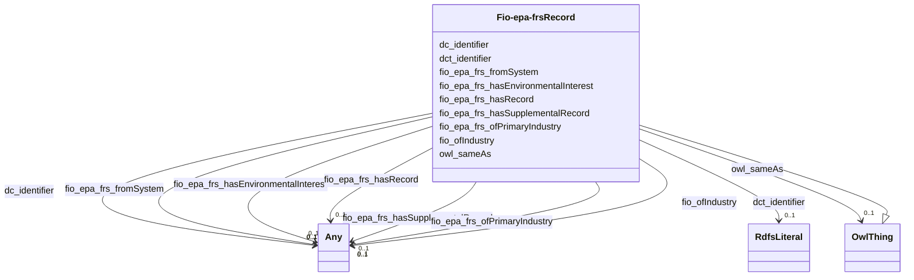

# Class: Facility Record (fio-epa-frs_Record)


This class occurs 128 times.


URI: [fio-epa-frs:Record](http://w3id.org/fio/v1/epa-frs#Record)





## Inheritance
* [OwlThing](../classes/OwlThing.md)
    * **Fio-epa-frsRecord**


## Slots

| Name | Cardinality and Range | Description | Inheritance | Occurrences |
| ---  | --- | --- | --- | --- |
| [fio_ofIndustry](../slots/fio_ofIndustry.md) | 0..1 <br/> [NaicsNAICS-IndustryGroup](../classes/NaicsNAICS-IndustryGroup.md)&nbsp;or&nbsp;<br />[OwlThing](../classes/OwlThing.md)&nbsp;or&nbsp;<br />[NaicsNAICS-IndustrySubsector](../classes/NaicsNAICS-IndustrySubsector.md)&nbsp;or&nbsp;<br />[NaicsNAICS-IndustrySector](../classes/NaicsNAICS-IndustrySector.md)&nbsp;or&nbsp;<br />[NaicsNAICS-IndustryCode](../classes/NaicsNAICS-IndustryCode.md)&nbsp;or&nbsp;<br />[FioIndustry](../classes/FioIndustry.md)&nbsp;or&nbsp;<br />[OwlNamedIndividual](../classes/OwlNamedIndividual.md) | A relation between an entity and the industry it is classified under <br/>  | direct | 13 |
| [dct_identifier](../slots/dct_identifier.md) | 0..1 <br/> [RdfsLiteral](../classes/RdfsLiteral.md) | Recommended practice is to identify the resource by means of a string conform... <br/> description: An unambiguous reference to the resource within a given context. | direct | 128 |
| [fio_epa_frs_fromSystem](../slots/fio_epa_frs_fromSystem.md) | 0..1 <br/> [Fio-epa-frsStateSystem](../classes/Fio-epa-frsStateSystem.md)&nbsp;or&nbsp;<br />[Fio-epa-frsReportingSystem](../classes/Fio-epa-frsReportingSystem.md)&nbsp;or&nbsp;<br />[Fio-epa-frsGrantSystem](../classes/Fio-epa-frsGrantSystem.md)&nbsp;or&nbsp;<br />[OwlThing](../classes/OwlThing.md)&nbsp;or&nbsp;<br />[Fio-epa-frsComplianceSystem](../classes/Fio-epa-frsComplianceSystem.md)&nbsp;or&nbsp;<br />[Fio-epa-frsEnforcementSystem](../classes/Fio-epa-frsEnforcementSystem.md)&nbsp;or&nbsp;<br />[Fio-epa-frsRegistrySystem](../classes/Fio-epa-frsRegistrySystem.md)&nbsp;or&nbsp;<br />[Fio-epa-frsSiteSystem](../classes/Fio-epa-frsSiteSystem.md)&nbsp;or&nbsp;<br />[Fio-epa-frsPermitSystem](../classes/Fio-epa-frsPermitSystem.md)&nbsp;or&nbsp;<br />[Fio-epa-frsTribalSystem](../classes/Fio-epa-frsTribalSystem.md)&nbsp;or&nbsp;<br />[Fio-epa-frsProjectSystem](../classes/Fio-epa-frsProjectSystem.md)&nbsp;or&nbsp;<br />[Fio-epa-frsProgramInformationSystem](../classes/Fio-epa-frsProgramInformationSystem.md)&nbsp;or&nbsp;<br />[Fio-epa-frsLegacySystem](../classes/Fio-epa-frsLegacySystem.md) |  <br/>  | direct | 128 |
| [fio_epa_frs_hasSupplementalRecord](../slots/fio_epa_frs_hasSupplementalRecord.md) | 0..1 <br/> [Fio-epa-frsRecord](../classes/Fio-epa-frsRecord.md)&nbsp;or&nbsp;<br />[B51b8d66516b28a1c54f8d745ede947b9](../classes/B51b8d66516b28a1c54f8d745ede947b9.md)&nbsp;or&nbsp;<br />[B912c2f2722265f457d11b52388b1def0](../classes/B912c2f2722265f457d11b52388b1def0.md)&nbsp;or&nbsp;<br />[OwlThing](../classes/OwlThing.md)&nbsp;or&nbsp;<br />[Bdbdbfbd4ef20ffc37226553d96831226](../classes/Bdbdbfbd4ef20ffc37226553d96831226.md)&nbsp;or&nbsp;<br />[B5debef6666ba27aa225105865fd22d6c](../classes/B5debef6666ba27aa225105865fd22d6c.md)&nbsp;or&nbsp;<br />[Bf0c649c8d760a3559d3d5e5b1f68a59f](../classes/Bf0c649c8d760a3559d3d5e5b1f68a59f.md)&nbsp;or&nbsp;<br />[Ba0ffbf1a7a548fac1e61d3eceada03dd](../classes/Ba0ffbf1a7a548fac1e61d3eceada03dd.md)&nbsp;or&nbsp;<br />[B9968aab18e1237453b5cbb15df1c74b9](../classes/B9968aab18e1237453b5cbb15df1c74b9.md)&nbsp;or&nbsp;<br />[Fio-epa-frsSupplementalRecord](../classes/Fio-epa-frsSupplementalRecord.md)&nbsp;or&nbsp;<br />[B1d70f10e8204578c89c5f678467193ea](../classes/B1d70f10e8204578c89c5f678467193ea.md)&nbsp;or&nbsp;<br />[Fio-epa-frsFRS-Facility](../classes/Fio-epa-frsFRS-Facility.md)&nbsp;or&nbsp;<br />[B671ac9cd6796151f919e5affbe3cc5f9](../classes/B671ac9cd6796151f919e5affbe3cc5f9.md) |  <br/>  | direct | 3 |
| [owl_sameAs](../slots/owl_sameAs.md) | 0..1 <br/> [OwlThing](../classes/OwlThing.md) | The property that determines that two given individuals are equal <br/>  | direct | 135 |
| [dc_identifier](../slots/dc_identifier.md) | 0..1 <br/> [Any](../classes/Any.md) | Recommended practice is to identify the resource by means of a string conform... <br/> description: An unambiguous reference to the resource within a given context. | direct | 128 |
| [fio_epa_frs_hasEnvironmentalInterest](../slots/fio_epa_frs_hasEnvironmentalInterest.md) | 0..1 <br/> [Fio-epa-frsEnforcementInterest](../classes/Fio-epa-frsEnforcementInterest.md)&nbsp;or&nbsp;<br />[Fio-epa-frsRiskInterest](../classes/Fio-epa-frsRiskInterest.md)&nbsp;or&nbsp;<br />[Fio-epa-frsRemediationRedevelopmentProgram](../classes/Fio-epa-frsRemediationRedevelopmentProgram.md)&nbsp;or&nbsp;<br />[Fio-epa-frsElectronicPermitSystem](../classes/Fio-epa-frsElectronicPermitSystem.md)&nbsp;or&nbsp;<br />[Fio-epa-frsCoastalOceanProgram](../classes/Fio-epa-frsCoastalOceanProgram.md)&nbsp;or&nbsp;<br />[Fio-epa-frsAnimalOperation](../classes/Fio-epa-frsAnimalOperation.md)&nbsp;or&nbsp;<br />[Fio-epa-frsUndergroundStorageTankProgram](../classes/Fio-epa-frsUndergroundStorageTankProgram.md)&nbsp;or&nbsp;<br />[Fio-epa-frsEnvironmentalInterestByProgram](../classes/Fio-epa-frsEnvironmentalInterestByProgram.md)&nbsp;or&nbsp;<br />[Fio-epa-frsComplianceInterest](../classes/Fio-epa-frsComplianceInterest.md)&nbsp;or&nbsp;<br />[Fio-epa-frsPesticidesProgram](../classes/Fio-epa-frsPesticidesProgram.md)&nbsp;or&nbsp;<br />[Fio-epa-frsChemicalReleaseProgram](../classes/Fio-epa-frsChemicalReleaseProgram.md)&nbsp;or&nbsp;<br />[Fio-epa-frsAirProgram](../classes/Fio-epa-frsAirProgram.md)&nbsp;or&nbsp;<br />[Fio-epa-frsRegistryInterest](../classes/Fio-epa-frsRegistryInterest.md)&nbsp;or&nbsp;<br />[Fio-epa-frsRadiationProtectionProgram](../classes/Fio-epa-frsRadiationProtectionProgram.md)&nbsp;or&nbsp;<br />[Fio-epa-frsHazardousWasteProgram](../classes/Fio-epa-frsHazardousWasteProgram.md)&nbsp;or&nbsp;<br />[Fio-epa-frsFacilitySiteIdentification](../classes/Fio-epa-frsFacilitySiteIdentification.md)&nbsp;or&nbsp;<br />[Fio-epa-frsHealthSafetyProgram](../classes/Fio-epa-frsHealthSafetyProgram.md)&nbsp;or&nbsp;<br />[Fio-epa-frsSiteInterest](../classes/Fio-epa-frsSiteInterest.md)&nbsp;or&nbsp;<br />[Fio-epa-frsWasteWaterProgram](../classes/Fio-epa-frsWasteWaterProgram.md)&nbsp;or&nbsp;<br />[Fio-epa-frsAssistanceSupportProgram](../classes/Fio-epa-frsAssistanceSupportProgram.md)&nbsp;or&nbsp;<br />[OwlThing](../classes/OwlThing.md)&nbsp;or&nbsp;<br />[Fio-epa-frsChemicalStorageProgram](../classes/Fio-epa-frsChemicalStorageProgram.md)&nbsp;or&nbsp;<br />[Fio-epa-frsReportingInterest](../classes/Fio-epa-frsReportingInterest.md)&nbsp;or&nbsp;<br />[Fio-epa-frsLegalEnforcementActivities](../classes/Fio-epa-frsLegalEnforcementActivities.md)&nbsp;or&nbsp;<br />[Fio-epa-frsEnvironmentalInterestType](../classes/Fio-epa-frsEnvironmentalInterestType.md)&nbsp;or&nbsp;<br />[Fio-epa-frsSolidWasteProgram](../classes/Fio-epa-frsSolidWasteProgram.md)&nbsp;or&nbsp;<br />[Fio-epa-frsPermitInterest](../classes/Fio-epa-frsPermitInterest.md)&nbsp;or&nbsp;<br />[Fio-epa-frsWaterResourcesProgram](../classes/Fio-epa-frsWaterResourcesProgram.md)&nbsp;or&nbsp;<br />[Fio-epa-frsGroundWaterProgram](../classes/Fio-epa-frsGroundWaterProgram.md)&nbsp;or&nbsp;<br />[Fio-epa-frsDrinkingWaterProgram](../classes/Fio-epa-frsDrinkingWaterProgram.md) |  <br/>  | direct | 6 |
| [fio_epa_frs_hasRecord](../slots/fio_epa_frs_hasRecord.md) | 0..1 <br/> [B51b8d66516b28a1c54f8d745ede947b9](../classes/B51b8d66516b28a1c54f8d745ede947b9.md)&nbsp;or&nbsp;<br />[B912c2f2722265f457d11b52388b1def0](../classes/B912c2f2722265f457d11b52388b1def0.md)&nbsp;or&nbsp;<br />[Be0e551f6155d8e99ee967119022af97d](../classes/Be0e551f6155d8e99ee967119022af97d.md)&nbsp;or&nbsp;<br />[Bdbdbfbd4ef20ffc37226553d96831226](../classes/Bdbdbfbd4ef20ffc37226553d96831226.md)&nbsp;or&nbsp;<br />[Fio-epa-frsFRS-Facility](../classes/Fio-epa-frsFRS-Facility.md)&nbsp;or&nbsp;<br />[Fio-epa-frsRecord](../classes/Fio-epa-frsRecord.md)&nbsp;or&nbsp;<br />[B5debef6666ba27aa225105865fd22d6c](../classes/B5debef6666ba27aa225105865fd22d6c.md)&nbsp;or&nbsp;<br />[B707e8df015ee2912f85cf2fec8dc4718](../classes/B707e8df015ee2912f85cf2fec8dc4718.md)&nbsp;or&nbsp;<br />[B3a5aa76705834f507db6d3c7d90d63b8](../classes/B3a5aa76705834f507db6d3c7d90d63b8.md)&nbsp;or&nbsp;<br />[B671ac9cd6796151f919e5affbe3cc5f9](../classes/B671ac9cd6796151f919e5affbe3cc5f9.md)&nbsp;or&nbsp;<br />[OwlThing](../classes/OwlThing.md)&nbsp;or&nbsp;<br />[Be082c2fc952b5eb7e355834fa6af4865](../classes/Be082c2fc952b5eb7e355834fa6af4865.md)&nbsp;or&nbsp;<br />[B9968aab18e1237453b5cbb15df1c74b9](../classes/B9968aab18e1237453b5cbb15df1c74b9.md)&nbsp;or&nbsp;<br />[Fio-epa-frsSupplementalRecord](../classes/Fio-epa-frsSupplementalRecord.md)&nbsp;or&nbsp;<br />[Bf0c649c8d760a3559d3d5e5b1f68a59f](../classes/Bf0c649c8d760a3559d3d5e5b1f68a59f.md)&nbsp;or&nbsp;<br />[B43f2153f8fa51cc860da104aa4b996c7](../classes/B43f2153f8fa51cc860da104aa4b996c7.md)&nbsp;or&nbsp;<br />[Ba0ffbf1a7a548fac1e61d3eceada03dd](../classes/Ba0ffbf1a7a548fac1e61d3eceada03dd.md)&nbsp;or&nbsp;<br />[Bea9d030ae5649d7f06d536c2a467e56f](../classes/Bea9d030ae5649d7f06d536c2a467e56f.md)&nbsp;or&nbsp;<br />[Bf906a89c08306329b89456f1d101a6bf](../classes/Bf906a89c08306329b89456f1d101a6bf.md)&nbsp;or&nbsp;<br />[B1d70f10e8204578c89c5f678467193ea](../classes/B1d70f10e8204578c89c5f678467193ea.md) |  <br/>  | direct | 3 |
| [fio_epa_frs_ofPrimaryIndustry](../slots/fio_epa_frs_ofPrimaryIndustry.md) | 0..1 <br/> [NaicsNAICS-IndustryGroup](../classes/NaicsNAICS-IndustryGroup.md)&nbsp;or&nbsp;<br />[OwlThing](../classes/OwlThing.md)&nbsp;or&nbsp;<br />[NaicsNAICS-IndustrySubsector](../classes/NaicsNAICS-IndustrySubsector.md)&nbsp;or&nbsp;<br />[NaicsNAICS-IndustrySector](../classes/NaicsNAICS-IndustrySector.md)&nbsp;or&nbsp;<br />[NaicsNAICS-IndustryCode](../classes/NaicsNAICS-IndustryCode.md)&nbsp;or&nbsp;<br />[FioIndustry](../classes/FioIndustry.md)&nbsp;or&nbsp;<br />[OwlNamedIndividual](../classes/OwlNamedIndividual.md) |  <br/>  | direct | 5 |


## Usages

| used by | used in | type | used |
| ---  | --- | --- | --- |
| [B43f2153f8fa51cc860da104aa4b996c7](../classes/B43f2153f8fa51cc860da104aa4b996c7.md) | [fio_epa_frs_hasSupplementalRecord](../slots/fio_epa_frs_hasSupplementalRecord.md) | any_of[range] | [Fio-epa-frsRecord](../classes/Fio-epa-frsRecord.md) |
| [B43f2153f8fa51cc860da104aa4b996c7](../classes/B43f2153f8fa51cc860da104aa4b996c7.md) | [fio_epa_frs_hasRecord](../slots/fio_epa_frs_hasRecord.md) | any_of[range] | [Fio-epa-frsRecord](../classes/Fio-epa-frsRecord.md) |
| [B51b8d66516b28a1c54f8d745ede947b9](../classes/B51b8d66516b28a1c54f8d745ede947b9.md) | [fio_epa_frs_hasSupplementalRecord](../slots/fio_epa_frs_hasSupplementalRecord.md) | any_of[range] | [Fio-epa-frsRecord](../classes/Fio-epa-frsRecord.md) |
| [B51b8d66516b28a1c54f8d745ede947b9](../classes/B51b8d66516b28a1c54f8d745ede947b9.md) | [fio_epa_frs_hasRecord](../slots/fio_epa_frs_hasRecord.md) | any_of[range] | [Fio-epa-frsRecord](../classes/Fio-epa-frsRecord.md) |
| [B671ac9cd6796151f919e5affbe3cc5f9](../classes/B671ac9cd6796151f919e5affbe3cc5f9.md) | [fio_epa_frs_hasRecord](../slots/fio_epa_frs_hasRecord.md) | any_of[range] | [Fio-epa-frsRecord](../classes/Fio-epa-frsRecord.md) |
| [B671ac9cd6796151f919e5affbe3cc5f9](../classes/B671ac9cd6796151f919e5affbe3cc5f9.md) | [fio_epa_frs_hasSupplementalRecord](../slots/fio_epa_frs_hasSupplementalRecord.md) | any_of[range] | [Fio-epa-frsRecord](../classes/Fio-epa-frsRecord.md) |
| [B912c2f2722265f457d11b52388b1def0](../classes/B912c2f2722265f457d11b52388b1def0.md) | [fio_epa_frs_hasSupplementalRecord](../slots/fio_epa_frs_hasSupplementalRecord.md) | any_of[range] | [Fio-epa-frsRecord](../classes/Fio-epa-frsRecord.md) |
| [B912c2f2722265f457d11b52388b1def0](../classes/B912c2f2722265f457d11b52388b1def0.md) | [fio_epa_frs_hasRecord](../slots/fio_epa_frs_hasRecord.md) | any_of[range] | [Fio-epa-frsRecord](../classes/Fio-epa-frsRecord.md) |
| [B9968aab18e1237453b5cbb15df1c74b9](../classes/B9968aab18e1237453b5cbb15df1c74b9.md) | [fio_epa_frs_hasSupplementalRecord](../slots/fio_epa_frs_hasSupplementalRecord.md) | any_of[range] | [Fio-epa-frsRecord](../classes/Fio-epa-frsRecord.md) |
| [B9968aab18e1237453b5cbb15df1c74b9](../classes/B9968aab18e1237453b5cbb15df1c74b9.md) | [fio_epa_frs_hasRecord](../slots/fio_epa_frs_hasRecord.md) | any_of[range] | [Fio-epa-frsRecord](../classes/Fio-epa-frsRecord.md) |
| [Bdbdbfbd4ef20ffc37226553d96831226](../classes/Bdbdbfbd4ef20ffc37226553d96831226.md) | [fio_epa_frs_hasRecord](../slots/fio_epa_frs_hasRecord.md) | any_of[range] | [Fio-epa-frsRecord](../classes/Fio-epa-frsRecord.md) |
| [Bdbdbfbd4ef20ffc37226553d96831226](../classes/Bdbdbfbd4ef20ffc37226553d96831226.md) | [fio_epa_frs_hasSupplementalRecord](../slots/fio_epa_frs_hasSupplementalRecord.md) | any_of[range] | [Fio-epa-frsRecord](../classes/Fio-epa-frsRecord.md) |
| [Be082c2fc952b5eb7e355834fa6af4865](../classes/Be082c2fc952b5eb7e355834fa6af4865.md) | [fio_epa_frs_hasSupplementalRecord](../slots/fio_epa_frs_hasSupplementalRecord.md) | any_of[range] | [Fio-epa-frsRecord](../classes/Fio-epa-frsRecord.md) |
| [Be082c2fc952b5eb7e355834fa6af4865](../classes/Be082c2fc952b5eb7e355834fa6af4865.md) | [fio_epa_frs_hasRecord](../slots/fio_epa_frs_hasRecord.md) | any_of[range] | [Fio-epa-frsRecord](../classes/Fio-epa-frsRecord.md) |
| [Be0e551f6155d8e99ee967119022af97d](../classes/Be0e551f6155d8e99ee967119022af97d.md) | [fio_epa_frs_hasRecord](../slots/fio_epa_frs_hasRecord.md) | any_of[range] | [Fio-epa-frsRecord](../classes/Fio-epa-frsRecord.md) |
| [Be0e551f6155d8e99ee967119022af97d](../classes/Be0e551f6155d8e99ee967119022af97d.md) | [fio_epa_frs_hasSupplementalRecord](../slots/fio_epa_frs_hasSupplementalRecord.md) | any_of[range] | [Fio-epa-frsRecord](../classes/Fio-epa-frsRecord.md) |
| [Bf0c649c8d760a3559d3d5e5b1f68a59f](../classes/Bf0c649c8d760a3559d3d5e5b1f68a59f.md) | [fio_epa_frs_hasRecord](../slots/fio_epa_frs_hasRecord.md) | any_of[range] | [Fio-epa-frsRecord](../classes/Fio-epa-frsRecord.md) |
| [Bf0c649c8d760a3559d3d5e5b1f68a59f](../classes/Bf0c649c8d760a3559d3d5e5b1f68a59f.md) | [fio_epa_frs_hasSupplementalRecord](../slots/fio_epa_frs_hasSupplementalRecord.md) | any_of[range] | [Fio-epa-frsRecord](../classes/Fio-epa-frsRecord.md) |
| [Bf906a89c08306329b89456f1d101a6bf](../classes/Bf906a89c08306329b89456f1d101a6bf.md) | [fio_epa_frs_hasSupplementalRecord](../slots/fio_epa_frs_hasSupplementalRecord.md) | any_of[range] | [Fio-epa-frsRecord](../classes/Fio-epa-frsRecord.md) |
| [Bf906a89c08306329b89456f1d101a6bf](../classes/Bf906a89c08306329b89456f1d101a6bf.md) | [fio_epa_frs_hasRecord](../slots/fio_epa_frs_hasRecord.md) | any_of[range] | [Fio-epa-frsRecord](../classes/Fio-epa-frsRecord.md) |
| [Fio-epa-frsEPA-PFAS-Facility](../classes/Fio-epa-frsEPA-PFAS-Facility.md) | [fio_epa_frs_hasRecord](../slots/fio_epa_frs_hasRecord.md) | any_of[range] | [Fio-epa-frsRecord](../classes/Fio-epa-frsRecord.md) |
| [Fio-epa-frsFRS-Facility](../classes/Fio-epa-frsFRS-Facility.md) | [fio_epa_frs_hasSupplementalRecord](../slots/fio_epa_frs_hasSupplementalRecord.md) | any_of[range] | [Fio-epa-frsRecord](../classes/Fio-epa-frsRecord.md) |
| [Fio-epa-frsFRS-Facility](../classes/Fio-epa-frsFRS-Facility.md) | [fio_epa_frs_hasRecord](../slots/fio_epa_frs_hasRecord.md) | any_of[range] | [Fio-epa-frsRecord](../classes/Fio-epa-frsRecord.md) |
| [Fio-epa-frsRecord](../classes/Fio-epa-frsRecord.md) | [fio_epa_frs_hasSupplementalRecord](../slots/fio_epa_frs_hasSupplementalRecord.md) | any_of[range] | [Fio-epa-frsRecord](../classes/Fio-epa-frsRecord.md) |
| [Fio-epa-frsRecord](../classes/Fio-epa-frsRecord.md) | [fio_epa_frs_hasRecord](../slots/fio_epa_frs_hasRecord.md) | any_of[range] | [Fio-epa-frsRecord](../classes/Fio-epa-frsRecord.md) |
| [Fio-epa-frsSupplementalRecord](../classes/Fio-epa-frsSupplementalRecord.md) | [fio_epa_frs_hasRecord](../slots/fio_epa_frs_hasRecord.md) | any_of[range] | [Fio-epa-frsRecord](../classes/Fio-epa-frsRecord.md) |
| [Fio-epa-frsSupplementalRecord](../classes/Fio-epa-frsSupplementalRecord.md) | [fio_epa_frs_hasSupplementalRecord](../slots/fio_epa_frs_hasSupplementalRecord.md) | any_of[range] | [Fio-epa-frsRecord](../classes/Fio-epa-frsRecord.md) |


## LinkML Source

<!-- TODO: investigate https://stackoverflow.com/questions/37606292/how-to-create-tabbed-code-blocks-in-mkdocs-or-sphinx -->

### Direct

<details>

```yaml
name: fio-epa-frs_Record
title: Facility Record
from_schema: okns:fio-kg
exact_mappings:
- http://w3id.org/fio/v1/epa-frs#Record
rank: 1000
is_a: owl_Thing
slots:
- fio_ofIndustry
- dct_identifier
- fio-epa-frs_fromSystem
- fio-epa-frs_hasSupplementalRecord
- owl_sameAs
- dc_identifier
- fio-epa-frs_hasEnvironmentalInterest
- fio-epa-frs_hasRecord
- fio-epa-frs_ofPrimaryIndustry
class_uri: fio-epa-frs:Record

```
</details>

### Induced

<details>

```yaml
name: fio-epa-frs_Record
title: Facility Record
from_schema: okns:fio-kg
exact_mappings:
- http://w3id.org/fio/v1/epa-frs#Record
rank: 1000
is_a: owl_Thing
attributes:
  fio_ofIndustry:
    name: fio_ofIndustry
    description: A relation between an entity and the industry it is classified under
    title: of industry
    from_schema: okns:fio-kg
    exact_mappings:
    - http://w3id.org/fio/v1/fio#ofIndustry
    rank: 1000
    slot_uri: fio:ofIndustry
    alias: fio_ofIndustry
    owner: fio-epa-frs_Record
    domain_of:
    - __B43f2153f8fa51cc860da104aa4b996c7
    - __B51b8d66516b28a1c54f8d745ede947b9
    - __B5debef6666ba27aa225105865fd22d6c
    - __B671ac9cd6796151f919e5affbe3cc5f9
    - __B707e8df015ee2912f85cf2fec8dc4718
    - __B912c2f2722265f457d11b52388b1def0
    - __Ba0ffbf1a7a548fac1e61d3eceada03dd
    - __Bdbdbfbd4ef20ffc37226553d96831226
    - __Be0e551f6155d8e99ee967119022af97d
    - __Bf0c649c8d760a3559d3d5e5b1f68a59f
    - __Bf906a89c08306329b89456f1d101a6bf
    - fio-epa-frs_EPA-PFAS-Facility
    - fio-epa-frs_FRS-Facility
    - fio-epa-frs_Record
    - fio-epa-frs_SupplementalRecord
    range: Any
    any_of:
    - range: naics_NAICS-IndustryGroup
    - range: owl_Thing
    - range: naics_NAICS-IndustrySubsector
    - range: naics_NAICS-IndustrySector
    - range: naics_NAICS-IndustryCode
    - range: fio_Industry
    - range: owl_NamedIndividual
  dct_identifier:
    name: dct_identifier
    description: Recommended practice is to identify the resource by means of a string
      conforming to an identification system. Examples include International Standard
      Book Number (ISBN), Digital Object Identifier (DOI), and Uniform Resource Name
      (URN).  Persistent identifiers should be provided as HTTP URIs.
    title: Identifier
    notes:
    - No occurrences of this slot in the graph.
    comments:
    - 'description: An unambiguous reference to the resource within a given context.'
    from_schema: okns:dc
    source: http://purl.org/dc/terms/
    slot_uri: dct:identifier
    alias: dct_identifier
    owner: fio-epa-frs_Record
    domain_of:
    - __B1d70f10e8204578c89c5f678467193ea
    - __B3a5aa76705834f507db6d3c7d90d63b8
    - __B43f2153f8fa51cc860da104aa4b996c7
    - __B51b8d66516b28a1c54f8d745ede947b9
    - __B5debef6666ba27aa225105865fd22d6c
    - __B671ac9cd6796151f919e5affbe3cc5f9
    - __B707e8df015ee2912f85cf2fec8dc4718
    - __B912c2f2722265f457d11b52388b1def0
    - __B9968aab18e1237453b5cbb15df1c74b9
    - __Ba0ffbf1a7a548fac1e61d3eceada03dd
    - __Bdbdbfbd4ef20ffc37226553d96831226
    - __Be082c2fc952b5eb7e355834fa6af4865
    - __Be0e551f6155d8e99ee967119022af97d
    - __Bea9d030ae5649d7f06d536c2a467e56f
    - __Bf0c649c8d760a3559d3d5e5b1f68a59f
    - __Bf906a89c08306329b89456f1d101a6bf
    - fio-epa-frs_EPA-PFAS-Facility
    - fio-epa-frs_FRS-Facility
    - fio-epa-frs_Record
    - fio-epa-frs_SupplementalRecord
    - naics_NAICS-IndustryCode
    - naics_NAICS-IndustryGroup
    - naics_NAICS-IndustrySector
    - naics_NAICS-IndustrySubsector
    subproperty_of: dc_identifier
    range: rdfs_Literal
  fio-epa-frs_fromSystem:
    name: fio-epa-frs_fromSystem
    from_schema: okns:fio-kg
    exact_mappings:
    - http://w3id.org/fio/v1/epa-frs#fromSystem
    rank: 1000
    slot_uri: fio-epa-frs:fromSystem
    alias: fio_epa_frs_fromSystem
    owner: fio-epa-frs_Record
    domain_of:
    - __B1d70f10e8204578c89c5f678467193ea
    - __B3a5aa76705834f507db6d3c7d90d63b8
    - __B43f2153f8fa51cc860da104aa4b996c7
    - __B51b8d66516b28a1c54f8d745ede947b9
    - __B5debef6666ba27aa225105865fd22d6c
    - __B671ac9cd6796151f919e5affbe3cc5f9
    - __B707e8df015ee2912f85cf2fec8dc4718
    - __B912c2f2722265f457d11b52388b1def0
    - __B9968aab18e1237453b5cbb15df1c74b9
    - __Ba0ffbf1a7a548fac1e61d3eceada03dd
    - __Bdbdbfbd4ef20ffc37226553d96831226
    - __Be082c2fc952b5eb7e355834fa6af4865
    - __Be0e551f6155d8e99ee967119022af97d
    - __Bea9d030ae5649d7f06d536c2a467e56f
    - __Bf0c649c8d760a3559d3d5e5b1f68a59f
    - __Bf906a89c08306329b89456f1d101a6bf
    - fio-epa-frs_FRS-Facility
    - fio-epa-frs_Record
    - fio-epa-frs_SupplementalRecord
    range: Any
    any_of:
    - range: fio-epa-frs_StateSystem
    - range: fio-epa-frs_ReportingSystem
    - range: fio-epa-frs_GrantSystem
    - range: owl_Thing
    - range: fio-epa-frs_ComplianceSystem
    - range: fio-epa-frs_EnforcementSystem
    - range: fio-epa-frs_RegistrySystem
    - range: fio-epa-frs_SiteSystem
    - range: fio-epa-frs_PermitSystem
    - range: fio-epa-frs_TribalSystem
    - range: fio-epa-frs_ProjectSystem
    - range: fio-epa-frs_ProgramInformationSystem
    - range: fio-epa-frs_LegacySystem
  fio-epa-frs_hasSupplementalRecord:
    name: fio-epa-frs_hasSupplementalRecord
    title: has supplemental record
    from_schema: okns:fio-kg
    exact_mappings:
    - http://w3id.org/fio/v1/epa-frs#hasSupplementalRecord
    rank: 1000
    slot_uri: fio-epa-frs:hasSupplementalRecord
    alias: fio_epa_frs_hasSupplementalRecord
    owner: fio-epa-frs_Record
    domain_of:
    - __B43f2153f8fa51cc860da104aa4b996c7
    - __B51b8d66516b28a1c54f8d745ede947b9
    - __B671ac9cd6796151f919e5affbe3cc5f9
    - __B912c2f2722265f457d11b52388b1def0
    - __B9968aab18e1237453b5cbb15df1c74b9
    - __Bdbdbfbd4ef20ffc37226553d96831226
    - __Be082c2fc952b5eb7e355834fa6af4865
    - __Be0e551f6155d8e99ee967119022af97d
    - __Bf0c649c8d760a3559d3d5e5b1f68a59f
    - __Bf906a89c08306329b89456f1d101a6bf
    - fio-epa-frs_FRS-Facility
    - fio-epa-frs_Record
    - fio-epa-frs_SupplementalRecord
    subproperty_of: fio-epa-frs_hasRecord
    union_of:
    - owl_Thing
    - fio-epa-frs_FRS-Facility
    - __B5debef6666ba27aa225105865fd22d6c
    - fio_Facility
    range: Any
    any_of:
    - range: fio-epa-frs_Record
    - range: __B51b8d66516b28a1c54f8d745ede947b9
    - range: __B912c2f2722265f457d11b52388b1def0
    - range: owl_Thing
    - range: __Bdbdbfbd4ef20ffc37226553d96831226
    - range: __B5debef6666ba27aa225105865fd22d6c
    - range: __Bf0c649c8d760a3559d3d5e5b1f68a59f
    - range: __Ba0ffbf1a7a548fac1e61d3eceada03dd
    - range: __B9968aab18e1237453b5cbb15df1c74b9
    - range: fio-epa-frs_SupplementalRecord
    - range: __B1d70f10e8204578c89c5f678467193ea
    - range: fio-epa-frs_FRS-Facility
    - range: __B671ac9cd6796151f919e5affbe3cc5f9
  owl_sameAs:
    name: owl_sameAs
    description: The property that determines that two given individuals are equal.
    title: sameAs
    notes:
    - No occurrences of this slot in the graph.
    from_schema: okns:owl-rdf-rdfs
    source: http://www.w3.org/2002/07/owl#
    domain: owl_Thing
    slot_uri: owl:sameAs
    alias: owl_sameAs
    owner: fio-epa-frs_Record
    domain_of:
    - __B1d70f10e8204578c89c5f678467193ea
    - __B3a5aa76705834f507db6d3c7d90d63b8
    - __B43f2153f8fa51cc860da104aa4b996c7
    - __B51b8d66516b28a1c54f8d745ede947b9
    - __B5debef6666ba27aa225105865fd22d6c
    - __B671ac9cd6796151f919e5affbe3cc5f9
    - __B707e8df015ee2912f85cf2fec8dc4718
    - __B912c2f2722265f457d11b52388b1def0
    - __B9968aab18e1237453b5cbb15df1c74b9
    - __Ba0ffbf1a7a548fac1e61d3eceada03dd
    - __Bdbdbfbd4ef20ffc37226553d96831226
    - __Be082c2fc952b5eb7e355834fa6af4865
    - __Be0e551f6155d8e99ee967119022af97d
    - __Bea9d030ae5649d7f06d536c2a467e56f
    - __Bf0c649c8d760a3559d3d5e5b1f68a59f
    - __Bf906a89c08306329b89456f1d101a6bf
    - fio-epa-frs_Agency
    - fio-epa-frs_Agency.Agriculture
    - fio-epa-frs_Agency.Commerce
    - fio-epa-frs_Agency.Congress
    - fio-epa-frs_Agency.Defense
    - fio-epa-frs_Agency.Energy
    - fio-epa-frs_Agency.HealthandHumanServices
    - fio-epa-frs_Agency.HomelandSecurity
    - fio-epa-frs_Agency.HousingandUrbanDevelopment
    - fio-epa-frs_Agency.Interior
    - fio-epa-frs_Agency.Judicial
    - fio-epa-frs_Agency.Justice
    - fio-epa-frs_Agency.Labor
    - fio-epa-frs_Agency.State
    - fio-epa-frs_Agency.Transportation
    - fio-epa-frs_Agency.Treasury
    - fio-epa-frs_Agency.VeteransAffairs
    - fio-epa-frs_AirProgram
    - fio-epa-frs_AnimalOperation
    - fio-epa-frs_AssistanceSupportProgram
    - fio-epa-frs_ChemicalReleaseProgram
    - fio-epa-frs_ChemicalStorageProgram
    - fio-epa-frs_CoastalOceanProgram
    - fio-epa-frs_ComplianceInterest
    - fio-epa-frs_ComplianceSystem
    - fio-epa-frs_DrinkingWaterProgram
    - fio-epa-frs_EPA-PFAS-Facility
    - fio-epa-frs_EcologyOperation
    - fio-epa-frs_ElectronicPermitSystem
    - fio-epa-frs_EnforcementInterest
    - fio-epa-frs_EnforcementSystem
    - fio-epa-frs_EnvironmentalInterestByProgram
    - fio-epa-frs_EnvironmentalInterestType
    - fio-epa-frs_FRS-Facility
    - fio-epa-frs_FacilitySiteIdentification
    - fio-epa-frs_FacilityType
    - fio-epa-frs_GrantSystem
    - fio-epa-frs_GroundWaterProgram
    - fio-epa-frs_HazardousWasteProgram
    - fio-epa-frs_HealthSafetyProgram
    - fio-epa-frs_LegacySystem
    - fio-epa-frs_LegalEnforcementActivities
    - fio-epa-frs_PermitInterest
    - fio-epa-frs_PermitSystem
    - fio-epa-frs_PesticidesProgram
    - fio-epa-frs_ProgramInformationSystem
    - fio-epa-frs_ProjectSystem
    - fio-epa-frs_RadiationProtectionProgram
    - fio-epa-frs_Record
    - fio-epa-frs_RegistryInterest
    - fio-epa-frs_RegistrySystem
    - fio-epa-frs_RemediationRedevelopmentProgram
    - fio-epa-frs_ReportingInterest
    - fio-epa-frs_ReportingSystem
    - fio-epa-frs_RiskInterest
    - fio-epa-frs_SiteInterest
    - fio-epa-frs_SiteSystem
    - fio-epa-frs_SolidWasteProgram
    - fio-epa-frs_StateSystem
    - fio-epa-frs_SupplementalRecord
    - fio-epa-frs_TribalSystem
    - fio-epa-frs_UndergroundStorageTankProgram
    - fio-epa-frs_WasteWaterProgram
    - fio-epa-frs_WaterResourcesProgram
    - fio_Industry
    - kwgo_S2Cell_Level13
    - naics_NAICS-IndustryCode
    - naics_NAICS-IndustryGroup
    - naics_NAICS-IndustrySector
    - naics_NAICS-IndustrySubsector
    range: owl_Thing
  dc_identifier:
    name: dc_identifier
    description: Recommended practice is to identify the resource by means of a string
      conforming to an identification system.
    title: Identifier
    notes:
    - 'A [second property](/specifications/dublin-core/dcmi-terms/#http://purl.org/dc/terms/identifier)
      with the same name as this property has been declared in the [dcterms: namespace](http://purl.org/dc/terms/).  See
      the Introduction to the document [DCMI Metadata Terms](/specifications/dublin-core/dcmi-terms/)
      for an explanation.'
    - No occurrences of this slot in the graph.
    comments:
    - 'description: An unambiguous reference to the resource within a given context.'
    from_schema: okns:dc
    source: http://purl.org/dc/elements/1.1/
    slot_uri: dc:identifier
    alias: dc_identifier
    owner: fio-epa-frs_Record
    domain_of:
    - __B1d70f10e8204578c89c5f678467193ea
    - __B3a5aa76705834f507db6d3c7d90d63b8
    - __B43f2153f8fa51cc860da104aa4b996c7
    - __B51b8d66516b28a1c54f8d745ede947b9
    - __B5debef6666ba27aa225105865fd22d6c
    - __B671ac9cd6796151f919e5affbe3cc5f9
    - __B707e8df015ee2912f85cf2fec8dc4718
    - __B912c2f2722265f457d11b52388b1def0
    - __B9968aab18e1237453b5cbb15df1c74b9
    - __Ba0ffbf1a7a548fac1e61d3eceada03dd
    - __Bdbdbfbd4ef20ffc37226553d96831226
    - __Be082c2fc952b5eb7e355834fa6af4865
    - __Be0e551f6155d8e99ee967119022af97d
    - __Bea9d030ae5649d7f06d536c2a467e56f
    - __Bf0c649c8d760a3559d3d5e5b1f68a59f
    - __Bf906a89c08306329b89456f1d101a6bf
    - fio-epa-frs_EPA-PFAS-Facility
    - fio-epa-frs_FRS-Facility
    - fio-epa-frs_Record
    - fio-epa-frs_SupplementalRecord
    - naics_NAICS-IndustryCode
    - naics_NAICS-IndustryGroup
    - naics_NAICS-IndustrySector
    - naics_NAICS-IndustrySubsector
    range: Any
  fio-epa-frs_hasEnvironmentalInterest:
    name: fio-epa-frs_hasEnvironmentalInterest
    title: in program type
    from_schema: okns:fio-kg
    exact_mappings:
    - http://w3id.org/fio/v1/epa-frs#hasEnvironmentalInterest
    rank: 1000
    slot_uri: fio-epa-frs:hasEnvironmentalInterest
    alias: fio_epa_frs_hasEnvironmentalInterest
    owner: fio-epa-frs_Record
    domain_of:
    - __B43f2153f8fa51cc860da104aa4b996c7
    - __B51b8d66516b28a1c54f8d745ede947b9
    - __B671ac9cd6796151f919e5affbe3cc5f9
    - __B912c2f2722265f457d11b52388b1def0
    - __B9968aab18e1237453b5cbb15df1c74b9
    - __Bdbdbfbd4ef20ffc37226553d96831226
    - __Be082c2fc952b5eb7e355834fa6af4865
    - __Be0e551f6155d8e99ee967119022af97d
    - __Bf0c649c8d760a3559d3d5e5b1f68a59f
    - __Bf906a89c08306329b89456f1d101a6bf
    - fio-epa-frs_EPA-PFAS-Facility
    - fio-epa-frs_FRS-Facility
    - fio-epa-frs_Record
    - fio-epa-frs_SupplementalRecord
    union_of:
    - owl_Thing
    - fio-epa-frs_FRS-Facility
    - __B5debef6666ba27aa225105865fd22d6c
    - fio_Facility
    range: Any
    any_of:
    - range: fio-epa-frs_EnforcementInterest
    - range: fio-epa-frs_RiskInterest
    - range: fio-epa-frs_RemediationRedevelopmentProgram
    - range: fio-epa-frs_ElectronicPermitSystem
    - range: fio-epa-frs_CoastalOceanProgram
    - range: fio-epa-frs_AnimalOperation
    - range: fio-epa-frs_UndergroundStorageTankProgram
    - range: fio-epa-frs_EnvironmentalInterestByProgram
    - range: fio-epa-frs_ComplianceInterest
    - range: fio-epa-frs_PesticidesProgram
    - range: fio-epa-frs_ChemicalReleaseProgram
    - range: fio-epa-frs_AirProgram
    - range: fio-epa-frs_RegistryInterest
    - range: fio-epa-frs_RadiationProtectionProgram
    - range: fio-epa-frs_HazardousWasteProgram
    - range: fio-epa-frs_FacilitySiteIdentification
    - range: fio-epa-frs_HealthSafetyProgram
    - range: fio-epa-frs_SiteInterest
    - range: fio-epa-frs_WasteWaterProgram
    - range: fio-epa-frs_AssistanceSupportProgram
    - range: owl_Thing
    - range: fio-epa-frs_ChemicalStorageProgram
    - range: fio-epa-frs_ReportingInterest
    - range: fio-epa-frs_LegalEnforcementActivities
    - range: fio-epa-frs_EnvironmentalInterestType
    - range: fio-epa-frs_SolidWasteProgram
    - range: fio-epa-frs_PermitInterest
    - range: fio-epa-frs_WaterResourcesProgram
    - range: fio-epa-frs_GroundWaterProgram
    - range: fio-epa-frs_DrinkingWaterProgram
  fio-epa-frs_hasRecord:
    name: fio-epa-frs_hasRecord
    title: has  record
    from_schema: okns:fio-kg
    exact_mappings:
    - http://w3id.org/fio/v1/epa-frs#hasRecord
    rank: 1000
    slot_uri: fio-epa-frs:hasRecord
    alias: fio_epa_frs_hasRecord
    owner: fio-epa-frs_Record
    domain_of:
    - __B43f2153f8fa51cc860da104aa4b996c7
    - __B51b8d66516b28a1c54f8d745ede947b9
    - __B671ac9cd6796151f919e5affbe3cc5f9
    - __B912c2f2722265f457d11b52388b1def0
    - __B9968aab18e1237453b5cbb15df1c74b9
    - __Bdbdbfbd4ef20ffc37226553d96831226
    - __Be082c2fc952b5eb7e355834fa6af4865
    - __Be0e551f6155d8e99ee967119022af97d
    - __Bf0c649c8d760a3559d3d5e5b1f68a59f
    - __Bf906a89c08306329b89456f1d101a6bf
    - fio-epa-frs_EPA-PFAS-Facility
    - fio-epa-frs_FRS-Facility
    - fio-epa-frs_Record
    - fio-epa-frs_SupplementalRecord
    union_of:
    - owl_Thing
    - fio-epa-frs_FRS-Facility
    - __B5debef6666ba27aa225105865fd22d6c
    - fio_Facility
    range: Any
    any_of:
    - range: __B51b8d66516b28a1c54f8d745ede947b9
    - range: __B912c2f2722265f457d11b52388b1def0
    - range: __Be0e551f6155d8e99ee967119022af97d
    - range: __Bdbdbfbd4ef20ffc37226553d96831226
    - range: fio-epa-frs_FRS-Facility
    - range: fio-epa-frs_Record
    - range: __B5debef6666ba27aa225105865fd22d6c
    - range: __B707e8df015ee2912f85cf2fec8dc4718
    - range: __B3a5aa76705834f507db6d3c7d90d63b8
    - range: __B671ac9cd6796151f919e5affbe3cc5f9
    - range: owl_Thing
    - range: __Be082c2fc952b5eb7e355834fa6af4865
    - range: __B9968aab18e1237453b5cbb15df1c74b9
    - range: fio-epa-frs_SupplementalRecord
    - range: __Bf0c649c8d760a3559d3d5e5b1f68a59f
    - range: __B43f2153f8fa51cc860da104aa4b996c7
    - range: __Ba0ffbf1a7a548fac1e61d3eceada03dd
    - range: __Bea9d030ae5649d7f06d536c2a467e56f
    - range: __Bf906a89c08306329b89456f1d101a6bf
    - range: __B1d70f10e8204578c89c5f678467193ea
  fio-epa-frs_ofPrimaryIndustry:
    name: fio-epa-frs_ofPrimaryIndustry
    title: of Primary Industry
    from_schema: okns:fio-kg
    exact_mappings:
    - http://w3id.org/fio/v1/epa-frs#ofPrimaryIndustry
    rank: 1000
    slot_uri: fio-epa-frs:ofPrimaryIndustry
    alias: fio_epa_frs_ofPrimaryIndustry
    owner: fio-epa-frs_Record
    domain_of:
    - __B43f2153f8fa51cc860da104aa4b996c7
    - __B51b8d66516b28a1c54f8d745ede947b9
    - __B5debef6666ba27aa225105865fd22d6c
    - __B671ac9cd6796151f919e5affbe3cc5f9
    - __B707e8df015ee2912f85cf2fec8dc4718
    - __B912c2f2722265f457d11b52388b1def0
    - __Ba0ffbf1a7a548fac1e61d3eceada03dd
    - __Bdbdbfbd4ef20ffc37226553d96831226
    - __Be0e551f6155d8e99ee967119022af97d
    - __Bf0c649c8d760a3559d3d5e5b1f68a59f
    - __Bf906a89c08306329b89456f1d101a6bf
    - fio-epa-frs_FRS-Facility
    - fio-epa-frs_Record
    - fio-epa-frs_SupplementalRecord
    subproperty_of: fio_ofIndustry
    range: Any
    any_of:
    - range: naics_NAICS-IndustryGroup
    - range: owl_Thing
    - range: naics_NAICS-IndustrySubsector
    - range: naics_NAICS-IndustrySector
    - range: naics_NAICS-IndustryCode
    - range: fio_Industry
    - range: owl_NamedIndividual
class_uri: fio-epa-frs:Record

```
</details>