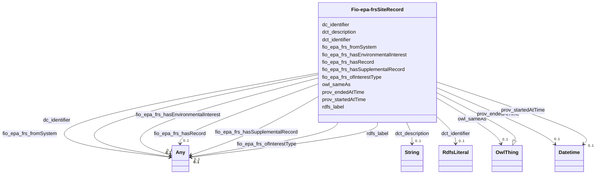

# Class: Site Record (fio-epa-frs_SiteRecord)


_A record that monitors a site, beyond specific ownership of one organization and their activities, e.g. superfund site, air monitoring site_


This class occurs 26897 times.


URI: [fio-epa-frs:SiteRecord](http://w3id.org/fio/v1/epa-frs#SiteRecord)





## Inheritance
* [OwlThing](../classes/OwlThing.md)
    * **Fio-epa-frsSiteRecord**


## Slots

| Name | Cardinality and Range | Description | Inheritance | Occurrences |
| ---  | --- | --- | --- | --- |
| [fio_epa_frs_hasEnvironmentalInterest](../slots/fio_epa_frs_hasEnvironmentalInterest.md) | 0..1 <br/> [Fio-epa-frsWasteWaterProgram](../classes/Fio-epa-frsWasteWaterProgram.md)&nbsp;or&nbsp;<br />[Fio-epa-frsSiteInterest](../classes/Fio-epa-frsSiteInterest.md)&nbsp;or&nbsp;<br />[Fio-epa-frsGroundWaterProgram](../classes/Fio-epa-frsGroundWaterProgram.md)&nbsp;or&nbsp;<br />[Fio-epa-frsPermitInterest](../classes/Fio-epa-frsPermitInterest.md)&nbsp;or&nbsp;<br />[B78889d67d06fc8a172807dd97a6eabac](../classes/B78889d67d06fc8a172807dd97a6eabac.md)&nbsp;or&nbsp;<br />[Fio-epa-frsRiskInterest](../classes/Fio-epa-frsRiskInterest.md)&nbsp;or&nbsp;<br />[Fio-epa-frsChemicalReleaseProgram](../classes/Fio-epa-frsChemicalReleaseProgram.md)&nbsp;or&nbsp;<br />[Fio-epa-frsFacilitySiteIdentification](../classes/Fio-epa-frsFacilitySiteIdentification.md)&nbsp;or&nbsp;<br />[Fio-epa-frsLegalEnforcementActivities](../classes/Fio-epa-frsLegalEnforcementActivities.md)&nbsp;or&nbsp;<br />[Fio-epa-frsRegistryInterest](../classes/Fio-epa-frsRegistryInterest.md)&nbsp;or&nbsp;<br />[Fio-epa-frsCoastalOceanProgram](../classes/Fio-epa-frsCoastalOceanProgram.md)&nbsp;or&nbsp;<br />[Fio-epa-frsHazardousWasteProgram](../classes/Fio-epa-frsHazardousWasteProgram.md)&nbsp;or&nbsp;<br />[Fio-epa-frsRemediationRedevelopmentProgram](../classes/Fio-epa-frsRemediationRedevelopmentProgram.md)&nbsp;or&nbsp;<br />[Fio-epa-frsHealthSafetyProgram](../classes/Fio-epa-frsHealthSafetyProgram.md)&nbsp;or&nbsp;<br />[Fio-epa-frsAirProgram](../classes/Fio-epa-frsAirProgram.md)&nbsp;or&nbsp;<br />[Fio-epa-frsChemicalStorageProgram](../classes/Fio-epa-frsChemicalStorageProgram.md)&nbsp;or&nbsp;<br />[Fio-epa-frsPesticidesProgram](../classes/Fio-epa-frsPesticidesProgram.md)&nbsp;or&nbsp;<br />[Fio-epa-frsWaterResourcesProgram](../classes/Fio-epa-frsWaterResourcesProgram.md)&nbsp;or&nbsp;<br />[Fio-epa-frsEnvironmentalInterestByProgram](../classes/Fio-epa-frsEnvironmentalInterestByProgram.md)&nbsp;or&nbsp;<br />[Fio-epa-frsReportingInterest](../classes/Fio-epa-frsReportingInterest.md)&nbsp;or&nbsp;<br />[Fio-epa-frsElectronicPermitSystem](../classes/Fio-epa-frsElectronicPermitSystem.md)&nbsp;or&nbsp;<br />[Fio-epa-frsSolidWasteProgram](../classes/Fio-epa-frsSolidWasteProgram.md)&nbsp;or&nbsp;<br />[Fio-epa-frsUndergroundStorageTankProgram](../classes/Fio-epa-frsUndergroundStorageTankProgram.md)&nbsp;or&nbsp;<br />[OwlThing](../classes/OwlThing.md)&nbsp;or&nbsp;<br />[Fio-epa-frsComplianceInterest](../classes/Fio-epa-frsComplianceInterest.md)&nbsp;or&nbsp;<br />[Fio-epa-frsAssistanceSupportProgram](../classes/Fio-epa-frsAssistanceSupportProgram.md)&nbsp;or&nbsp;<br />[Fio-epa-frsEnvironmentalInterestType](../classes/Fio-epa-frsEnvironmentalInterestType.md)&nbsp;or&nbsp;<br />[Fio-epa-frsEnforcementInterest](../classes/Fio-epa-frsEnforcementInterest.md)&nbsp;or&nbsp;<br />[Fio-epa-frsRadiationProtectionProgram](../classes/Fio-epa-frsRadiationProtectionProgram.md)&nbsp;or&nbsp;<br />[Fio-epa-frsAnimalOperation](../classes/Fio-epa-frsAnimalOperation.md)&nbsp;or&nbsp;<br />[Fio-epa-frsDrinkingWaterProgram](../classes/Fio-epa-frsDrinkingWaterProgram.md) |  <br/>  | direct | 30 |
| [prov_startedAtTime](../slots/prov_startedAtTime.md) | 0..1 <br/> [xsd:dateTime](http://www.w3.org/2001/XMLSchema#dateTime) | The time at which an activity started <br/>  | direct | 15897 |
| [fio_epa_frs_hasRecord](../slots/fio_epa_frs_hasRecord.md) | 0..1 <br/> [Fio-epa-frsPermitRecord](../classes/Fio-epa-frsPermitRecord.md)&nbsp;or&nbsp;<br />[Fio-epa-frsRiskPlanRecord](../classes/Fio-epa-frsRiskPlanRecord.md)&nbsp;or&nbsp;<br />[Fio-epa-frsComplianceRecord](../classes/Fio-epa-frsComplianceRecord.md)&nbsp;or&nbsp;<br />[Fio-epa-frsTribalTrackingRecord](../classes/Fio-epa-frsTribalTrackingRecord.md)&nbsp;or&nbsp;<br />[Fio-epa-frsProjectRecord](../classes/Fio-epa-frsProjectRecord.md)&nbsp;or&nbsp;<br />[Fio-epa-frsEnforcementActivity](../classes/Fio-epa-frsEnforcementActivity.md)&nbsp;or&nbsp;<br />[Fio-epa-frsFRS-Facility](../classes/Fio-epa-frsFRS-Facility.md)&nbsp;or&nbsp;<br />[Fio-epa-frsStateTrackingRecord](../classes/Fio-epa-frsStateTrackingRecord.md)&nbsp;or&nbsp;<br />[Fio-epa-frsSupplementalRecord](../classes/Fio-epa-frsSupplementalRecord.md)&nbsp;or&nbsp;<br />[Fio-epa-frsRecord](../classes/Fio-epa-frsRecord.md)&nbsp;or&nbsp;<br />[Fio-epa-frsEnforcementTrackingRecord](../classes/Fio-epa-frsEnforcementTrackingRecord.md)&nbsp;or&nbsp;<br />[Fio-epa-frsSiteRecord](../classes/Fio-epa-frsSiteRecord.md)&nbsp;or&nbsp;<br />[Fio-epa-frsReportingRecord](../classes/Fio-epa-frsReportingRecord.md)&nbsp;or&nbsp;<br />[OwlThing](../classes/OwlThing.md)&nbsp;or&nbsp;<br />[Fio-epa-frsRegistrationRecord](../classes/Fio-epa-frsRegistrationRecord.md) |  <br/>  | direct | 12 |
| [fio_epa_frs_hasSupplementalRecord](../slots/fio_epa_frs_hasSupplementalRecord.md) | 0..1 <br/> [Fio-epa-frsPermitRecord](../classes/Fio-epa-frsPermitRecord.md)&nbsp;or&nbsp;<br />[Fio-epa-frsRiskPlanRecord](../classes/Fio-epa-frsRiskPlanRecord.md)&nbsp;or&nbsp;<br />[Fio-epa-frsFRS-Facility](../classes/Fio-epa-frsFRS-Facility.md)&nbsp;or&nbsp;<br />[Fio-epa-frsSupplementalRecord](../classes/Fio-epa-frsSupplementalRecord.md)&nbsp;or&nbsp;<br />[Fio-epa-frsRecord](../classes/Fio-epa-frsRecord.md)&nbsp;or&nbsp;<br />[Fio-epa-frsEnforcementTrackingRecord](../classes/Fio-epa-frsEnforcementTrackingRecord.md)&nbsp;or&nbsp;<br />[Fio-epa-frsSiteRecord](../classes/Fio-epa-frsSiteRecord.md)&nbsp;or&nbsp;<br />[Fio-epa-frsReportingRecord](../classes/Fio-epa-frsReportingRecord.md)&nbsp;or&nbsp;<br />[OwlThing](../classes/OwlThing.md)&nbsp;or&nbsp;<br />[Fio-epa-frsRegistrationRecord](../classes/Fio-epa-frsRegistrationRecord.md) |  <br/>  | direct | 12 |
| [dct_description](../slots/dct_description.md) | 0..1 <br/> [xsd:string](http://www.w3.org/2001/XMLSchema#string) | Description may include but is not limited to: an abstract, a table of conten... <br/> description: An account of the resource. | direct | 24402 |
| [rdfs_label](../slots/rdfs_label.md) | 0..1 <br/> [RdfsLiteral](../classes/RdfsLiteral.md)&nbsp;or&nbsp;<br />[xsd:string](http://www.w3.org/2001/XMLSchema#string) | A human-readable name for the subject <br/>  | direct | 34213 |
| [dct_identifier](../slots/dct_identifier.md) | 0..1 <br/> [RdfsLiteral](../classes/RdfsLiteral.md) | Recommended practice is to identify the resource by means of a string conform... <br/> description: An unambiguous reference to the resource within a given context. | direct | 26897 |
| [prov_endedAtTime](../slots/prov_endedAtTime.md) | 0..1 <br/> [xsd:dateTime](http://www.w3.org/2001/XMLSchema#dateTime) | The time at which an activity ended <br/>  | direct | 870 |
| [owl_sameAs](../slots/owl_sameAs.md) | 0..1 <br/> [OwlThing](../classes/OwlThing.md) | The property that determines that two given individuals are equal <br/>  | direct | 40363 |
| [fio_epa_frs_fromSystem](../slots/fio_epa_frs_fromSystem.md) | 0..1 <br/> [Fio-epa-frsComplianceSystem](../classes/Fio-epa-frsComplianceSystem.md)&nbsp;or&nbsp;<br />[Fio-epa-frsPermitSystem](../classes/Fio-epa-frsPermitSystem.md)&nbsp;or&nbsp;<br />[Fio-epa-frsLegacySystem](../classes/Fio-epa-frsLegacySystem.md)&nbsp;or&nbsp;<br />[Fio-epa-frsEnforcementSystem](../classes/Fio-epa-frsEnforcementSystem.md)&nbsp;or&nbsp;<br />[Fio-epa-frsGrantSystem](../classes/Fio-epa-frsGrantSystem.md)&nbsp;or&nbsp;<br />[Fio-epa-frsProjectSystem](../classes/Fio-epa-frsProjectSystem.md)&nbsp;or&nbsp;<br />[Fio-epa-frsSiteSystem](../classes/Fio-epa-frsSiteSystem.md)&nbsp;or&nbsp;<br />[Fio-epa-frsTribalSystem](../classes/Fio-epa-frsTribalSystem.md)&nbsp;or&nbsp;<br />[Fio-epa-frsRegistrySystem](../classes/Fio-epa-frsRegistrySystem.md)&nbsp;or&nbsp;<br />[Fio-epa-frsProgramInformationSystem](../classes/Fio-epa-frsProgramInformationSystem.md)&nbsp;or&nbsp;<br />[Fio-epa-frsReportingSystem](../classes/Fio-epa-frsReportingSystem.md)&nbsp;or&nbsp;<br />[Fio-epa-frsStateSystem](../classes/Fio-epa-frsStateSystem.md)&nbsp;or&nbsp;<br />[OwlThing](../classes/OwlThing.md) |  <br/>  | direct | 33809 |
| [dc_identifier](../slots/dc_identifier.md) | 0..1 <br/> [Any](../classes/Any.md) | Recommended practice is to identify the resource by means of a string conform... <br/> description: An unambiguous reference to the resource within a given context. | direct | 26897 |
| [fio_epa_frs_ofInterestType](../slots/fio_epa_frs_ofInterestType.md) | 0..1 <br/> [Fio-epa-frsWasteWaterProgram](../classes/Fio-epa-frsWasteWaterProgram.md)&nbsp;or&nbsp;<br />[Fio-epa-frsSiteInterest](../classes/Fio-epa-frsSiteInterest.md)&nbsp;or&nbsp;<br />[Fio-epa-frsGroundWaterProgram](../classes/Fio-epa-frsGroundWaterProgram.md)&nbsp;or&nbsp;<br />[Fio-epa-frsPermitInterest](../classes/Fio-epa-frsPermitInterest.md)&nbsp;or&nbsp;<br />[B78889d67d06fc8a172807dd97a6eabac](../classes/B78889d67d06fc8a172807dd97a6eabac.md)&nbsp;or&nbsp;<br />[Fio-epa-frsRiskInterest](../classes/Fio-epa-frsRiskInterest.md)&nbsp;or&nbsp;<br />[Fio-epa-frsChemicalReleaseProgram](../classes/Fio-epa-frsChemicalReleaseProgram.md)&nbsp;or&nbsp;<br />[Fio-epa-frsFacilitySiteIdentification](../classes/Fio-epa-frsFacilitySiteIdentification.md)&nbsp;or&nbsp;<br />[Fio-epa-frsLegalEnforcementActivities](../classes/Fio-epa-frsLegalEnforcementActivities.md)&nbsp;or&nbsp;<br />[Fio-epa-frsRegistryInterest](../classes/Fio-epa-frsRegistryInterest.md)&nbsp;or&nbsp;<br />[Fio-epa-frsCoastalOceanProgram](../classes/Fio-epa-frsCoastalOceanProgram.md)&nbsp;or&nbsp;<br />[Fio-epa-frsHazardousWasteProgram](../classes/Fio-epa-frsHazardousWasteProgram.md)&nbsp;or&nbsp;<br />[Fio-epa-frsRemediationRedevelopmentProgram](../classes/Fio-epa-frsRemediationRedevelopmentProgram.md)&nbsp;or&nbsp;<br />[Fio-epa-frsAirProgram](../classes/Fio-epa-frsAirProgram.md)&nbsp;or&nbsp;<br />[Fio-epa-frsChemicalStorageProgram](../classes/Fio-epa-frsChemicalStorageProgram.md)&nbsp;or&nbsp;<br />[Fio-epa-frsHealthSafetyProgram](../classes/Fio-epa-frsHealthSafetyProgram.md)&nbsp;or&nbsp;<br />[Fio-epa-frsPesticidesProgram](../classes/Fio-epa-frsPesticidesProgram.md)&nbsp;or&nbsp;<br />[Fio-epa-frsWaterResourcesProgram](../classes/Fio-epa-frsWaterResourcesProgram.md)&nbsp;or&nbsp;<br />[Fio-epa-frsEnvironmentalInterestByProgram](../classes/Fio-epa-frsEnvironmentalInterestByProgram.md)&nbsp;or&nbsp;<br />[Fio-epa-frsReportingInterest](../classes/Fio-epa-frsReportingInterest.md)&nbsp;or&nbsp;<br />[Fio-epa-frsElectronicPermitSystem](../classes/Fio-epa-frsElectronicPermitSystem.md)&nbsp;or&nbsp;<br />[Fio-epa-frsSolidWasteProgram](../classes/Fio-epa-frsSolidWasteProgram.md)&nbsp;or&nbsp;<br />[Fio-epa-frsUndergroundStorageTankProgram](../classes/Fio-epa-frsUndergroundStorageTankProgram.md)&nbsp;or&nbsp;<br />[OwlThing](../classes/OwlThing.md)&nbsp;or&nbsp;<br />[Fio-epa-frsComplianceInterest](../classes/Fio-epa-frsComplianceInterest.md)&nbsp;or&nbsp;<br />[Fio-epa-frsAssistanceSupportProgram](../classes/Fio-epa-frsAssistanceSupportProgram.md)&nbsp;or&nbsp;<br />[Fio-epa-frsEnvironmentalInterestType](../classes/Fio-epa-frsEnvironmentalInterestType.md)&nbsp;or&nbsp;<br />[Fio-epa-frsEnforcementInterest](../classes/Fio-epa-frsEnforcementInterest.md)&nbsp;or&nbsp;<br />[Fio-epa-frsRadiationProtectionProgram](../classes/Fio-epa-frsRadiationProtectionProgram.md)&nbsp;or&nbsp;<br />[Fio-epa-frsAnimalOperation](../classes/Fio-epa-frsAnimalOperation.md)&nbsp;or&nbsp;<br />[Fio-epa-frsDrinkingWaterProgram](../classes/Fio-epa-frsDrinkingWaterProgram.md) |  <br/>  | direct | 63926 |


## Usages

| used by | used in | type | used |
| ---  | --- | --- | --- |
| [Fio-epa-frsEPA-PFAS-Facility](../classes/Fio-epa-frsEPA-PFAS-Facility.md) | [fio_epa_frs_hasRecord](../slots/fio_epa_frs_hasRecord.md) | any_of[range] | [Fio-epa-frsSiteRecord](../classes/Fio-epa-frsSiteRecord.md) |
| [Fio-epa-frsEnforcementActivity](../classes/Fio-epa-frsEnforcementActivity.md) | [fio_epa_frs_hasRecord](../slots/fio_epa_frs_hasRecord.md) | any_of[range] | [Fio-epa-frsSiteRecord](../classes/Fio-epa-frsSiteRecord.md) |
| [Fio-epa-frsEnforcementActivity](../classes/Fio-epa-frsEnforcementActivity.md) | [fio_epa_frs_hasSupplementalRecord](../slots/fio_epa_frs_hasSupplementalRecord.md) | any_of[range] | [Fio-epa-frsSiteRecord](../classes/Fio-epa-frsSiteRecord.md) |
| [Fio-epa-frsEnforcementTrackingRecord](../classes/Fio-epa-frsEnforcementTrackingRecord.md) | [fio_epa_frs_hasRecord](../slots/fio_epa_frs_hasRecord.md) | any_of[range] | [Fio-epa-frsSiteRecord](../classes/Fio-epa-frsSiteRecord.md) |
| [Fio-epa-frsEnforcementTrackingRecord](../classes/Fio-epa-frsEnforcementTrackingRecord.md) | [fio_epa_frs_hasSupplementalRecord](../slots/fio_epa_frs_hasSupplementalRecord.md) | any_of[range] | [Fio-epa-frsSiteRecord](../classes/Fio-epa-frsSiteRecord.md) |
| [Fio-epa-frsFRS-Facility](../classes/Fio-epa-frsFRS-Facility.md) | [fio_epa_frs_hasSupplementalRecord](../slots/fio_epa_frs_hasSupplementalRecord.md) | any_of[range] | [Fio-epa-frsSiteRecord](../classes/Fio-epa-frsSiteRecord.md) |
| [Fio-epa-frsFRS-Facility](../classes/Fio-epa-frsFRS-Facility.md) | [fio_epa_frs_hasRecord](../slots/fio_epa_frs_hasRecord.md) | any_of[range] | [Fio-epa-frsSiteRecord](../classes/Fio-epa-frsSiteRecord.md) |
| [Fio-epa-frsPermitRecord](../classes/Fio-epa-frsPermitRecord.md) | [fio_epa_frs_hasRecord](../slots/fio_epa_frs_hasRecord.md) | any_of[range] | [Fio-epa-frsSiteRecord](../classes/Fio-epa-frsSiteRecord.md) |
| [Fio-epa-frsPermitRecord](../classes/Fio-epa-frsPermitRecord.md) | [fio_epa_frs_hasSupplementalRecord](../slots/fio_epa_frs_hasSupplementalRecord.md) | any_of[range] | [Fio-epa-frsSiteRecord](../classes/Fio-epa-frsSiteRecord.md) |
| [Fio-epa-frsRecord](../classes/Fio-epa-frsRecord.md) | [fio_epa_frs_hasRecord](../slots/fio_epa_frs_hasRecord.md) | any_of[range] | [Fio-epa-frsSiteRecord](../classes/Fio-epa-frsSiteRecord.md) |
| [Fio-epa-frsRecord](../classes/Fio-epa-frsRecord.md) | [fio_epa_frs_hasSupplementalRecord](../slots/fio_epa_frs_hasSupplementalRecord.md) | any_of[range] | [Fio-epa-frsSiteRecord](../classes/Fio-epa-frsSiteRecord.md) |
| [Fio-epa-frsRegistrationRecord](../classes/Fio-epa-frsRegistrationRecord.md) | [fio_epa_frs_hasRecord](../slots/fio_epa_frs_hasRecord.md) | any_of[range] | [Fio-epa-frsSiteRecord](../classes/Fio-epa-frsSiteRecord.md) |
| [Fio-epa-frsRegistrationRecord](../classes/Fio-epa-frsRegistrationRecord.md) | [fio_epa_frs_hasSupplementalRecord](../slots/fio_epa_frs_hasSupplementalRecord.md) | any_of[range] | [Fio-epa-frsSiteRecord](../classes/Fio-epa-frsSiteRecord.md) |
| [Fio-epa-frsReportingRecord](../classes/Fio-epa-frsReportingRecord.md) | [fio_epa_frs_hasRecord](../slots/fio_epa_frs_hasRecord.md) | any_of[range] | [Fio-epa-frsSiteRecord](../classes/Fio-epa-frsSiteRecord.md) |
| [Fio-epa-frsReportingRecord](../classes/Fio-epa-frsReportingRecord.md) | [fio_epa_frs_hasSupplementalRecord](../slots/fio_epa_frs_hasSupplementalRecord.md) | any_of[range] | [Fio-epa-frsSiteRecord](../classes/Fio-epa-frsSiteRecord.md) |
| [Fio-epa-frsSiteRecord](../classes/Fio-epa-frsSiteRecord.md) | [fio_epa_frs_hasRecord](../slots/fio_epa_frs_hasRecord.md) | any_of[range] | [Fio-epa-frsSiteRecord](../classes/Fio-epa-frsSiteRecord.md) |
| [Fio-epa-frsSiteRecord](../classes/Fio-epa-frsSiteRecord.md) | [fio_epa_frs_hasSupplementalRecord](../slots/fio_epa_frs_hasSupplementalRecord.md) | any_of[range] | [Fio-epa-frsSiteRecord](../classes/Fio-epa-frsSiteRecord.md) |
| [Fio-epa-frsStateTrackingRecord](../classes/Fio-epa-frsStateTrackingRecord.md) | [fio_epa_frs_hasRecord](../slots/fio_epa_frs_hasRecord.md) | any_of[range] | [Fio-epa-frsSiteRecord](../classes/Fio-epa-frsSiteRecord.md) |
| [Fio-epa-frsStateTrackingRecord](../classes/Fio-epa-frsStateTrackingRecord.md) | [fio_epa_frs_hasSupplementalRecord](../slots/fio_epa_frs_hasSupplementalRecord.md) | any_of[range] | [Fio-epa-frsSiteRecord](../classes/Fio-epa-frsSiteRecord.md) |
| [Fio-epa-frsSupplementalRecord](../classes/Fio-epa-frsSupplementalRecord.md) | [fio_epa_frs_hasRecord](../slots/fio_epa_frs_hasRecord.md) | any_of[range] | [Fio-epa-frsSiteRecord](../classes/Fio-epa-frsSiteRecord.md) |
| [Fio-epa-frsSupplementalRecord](../classes/Fio-epa-frsSupplementalRecord.md) | [fio_epa_frs_hasSupplementalRecord](../slots/fio_epa_frs_hasSupplementalRecord.md) | any_of[range] | [Fio-epa-frsSiteRecord](../classes/Fio-epa-frsSiteRecord.md) |


## LinkML Source

<!-- TODO: investigate https://stackoverflow.com/questions/37606292/how-to-create-tabbed-code-blocks-in-mkdocs-or-sphinx -->

### Direct

<details>

```yaml
name: fio-epa-frs_SiteRecord
description: A record that monitors a site, beyond specific ownership of one organization
  and their activities, e.g. superfund site, air monitoring site
title: Site Record
from_schema: okns:fio-kg
rank: 1000
is_a: owl_Thing
slots:
- fio-epa-frs_hasEnvironmentalInterest
- prov_startedAtTime
- fio-epa-frs_hasRecord
- fio-epa-frs_hasSupplementalRecord
- dct_description
- rdfs_label
- dct_identifier
- prov_endedAtTime
- owl_sameAs
- fio-epa-frs_fromSystem
- dc_identifier
- fio-epa-frs_ofInterestType
class_uri: fio-epa-frs:SiteRecord

```
</details>

### Induced

<details>

```yaml
name: fio-epa-frs_SiteRecord
description: A record that monitors a site, beyond specific ownership of one organization
  and their activities, e.g. superfund site, air monitoring site
title: Site Record
from_schema: okns:fio-kg
rank: 1000
is_a: owl_Thing
attributes:
  fio-epa-frs_hasEnvironmentalInterest:
    name: fio-epa-frs_hasEnvironmentalInterest
    title: in program type
    from_schema: okns:fio-kg
    rank: 1000
    slot_uri: fio-epa-frs:hasEnvironmentalInterest
    alias: fio_epa_frs_hasEnvironmentalInterest
    owner: fio-epa-frs_SiteRecord
    domain_of:
    - fio-epa-frs_EPA-PFAS-Facility
    - fio-epa-frs_EnforcementActivity
    - fio-epa-frs_EnforcementTrackingRecord
    - fio-epa-frs_FRS-Facility
    - fio-epa-frs_PermitRecord
    - fio-epa-frs_Record
    - fio-epa-frs_RegistrationRecord
    - fio-epa-frs_ReportingRecord
    - fio-epa-frs_SiteRecord
    - fio-epa-frs_StateTrackingRecord
    - fio-epa-frs_SupplementalRecord
    union_of:
    - owl_Thing
    - fio_Facility
    - fio-epa-frs_FRS-Facility
    range: Any
    any_of:
    - range: fio-epa-frs_WasteWaterProgram
    - range: fio-epa-frs_SiteInterest
    - range: fio-epa-frs_GroundWaterProgram
    - range: fio-epa-frs_PermitInterest
    - range: __B78889d67d06fc8a172807dd97a6eabac
    - range: fio-epa-frs_RiskInterest
    - range: fio-epa-frs_ChemicalReleaseProgram
    - range: fio-epa-frs_FacilitySiteIdentification
    - range: fio-epa-frs_LegalEnforcementActivities
    - range: fio-epa-frs_RegistryInterest
    - range: fio-epa-frs_CoastalOceanProgram
    - range: fio-epa-frs_HazardousWasteProgram
    - range: fio-epa-frs_RemediationRedevelopmentProgram
    - range: fio-epa-frs_HealthSafetyProgram
    - range: fio-epa-frs_AirProgram
    - range: fio-epa-frs_ChemicalStorageProgram
    - range: fio-epa-frs_PesticidesProgram
    - range: fio-epa-frs_WaterResourcesProgram
    - range: fio-epa-frs_EnvironmentalInterestByProgram
    - range: fio-epa-frs_ReportingInterest
    - range: fio-epa-frs_ElectronicPermitSystem
    - range: fio-epa-frs_SolidWasteProgram
    - range: fio-epa-frs_UndergroundStorageTankProgram
    - range: owl_Thing
    - range: fio-epa-frs_ComplianceInterest
    - range: fio-epa-frs_AssistanceSupportProgram
    - range: fio-epa-frs_EnvironmentalInterestType
    - range: fio-epa-frs_EnforcementInterest
    - range: fio-epa-frs_RadiationProtectionProgram
    - range: fio-epa-frs_AnimalOperation
    - range: fio-epa-frs_DrinkingWaterProgram
  prov_startedAtTime:
    name: prov_startedAtTime
    description: The time at which an activity started. See also prov:endedAtTime.
    title: startedAtTime
    notes:
    - No occurrences of this slot in the graph.
    from_schema: okns:prov
    source: http://www.w3.org/ns/prov-o#
    domain: prov_Activity
    slot_uri: prov:startedAtTime
    alias: prov_startedAtTime
    owner: fio-epa-frs_SiteRecord
    domain_of:
    - fio-epa-frs_EnforcementActivity
    - fio-epa-frs_EnforcementTrackingRecord
    - fio-epa-frs_FRS-Facility
    - fio-epa-frs_PermitRecord
    - fio-epa-frs_ProjectRecord
    - fio-epa-frs_RegistrationRecord
    - fio-epa-frs_ReportingRecord
    - fio-epa-frs_SiteRecord
    - fio-epa-frs_SupplementalRecord
    - fio-epa-frs_TribalTrackingRecord
    range: datetime
  fio-epa-frs_hasRecord:
    name: fio-epa-frs_hasRecord
    title: has  record
    from_schema: okns:fio-kg
    rank: 1000
    slot_uri: fio-epa-frs:hasRecord
    alias: fio_epa_frs_hasRecord
    owner: fio-epa-frs_SiteRecord
    domain_of:
    - fio-epa-frs_EPA-PFAS-Facility
    - fio-epa-frs_EnforcementActivity
    - fio-epa-frs_EnforcementTrackingRecord
    - fio-epa-frs_FRS-Facility
    - fio-epa-frs_PermitRecord
    - fio-epa-frs_Record
    - fio-epa-frs_RegistrationRecord
    - fio-epa-frs_ReportingRecord
    - fio-epa-frs_SiteRecord
    - fio-epa-frs_StateTrackingRecord
    - fio-epa-frs_SupplementalRecord
    union_of:
    - owl_Thing
    - fio_Facility
    - fio-epa-frs_FRS-Facility
    range: Any
    any_of:
    - range: fio-epa-frs_PermitRecord
    - range: fio-epa-frs_RiskPlanRecord
    - range: fio-epa-frs_ComplianceRecord
    - range: fio-epa-frs_TribalTrackingRecord
    - range: fio-epa-frs_ProjectRecord
    - range: fio-epa-frs_EnforcementActivity
    - range: fio-epa-frs_FRS-Facility
    - range: fio-epa-frs_StateTrackingRecord
    - range: fio-epa-frs_SupplementalRecord
    - range: fio-epa-frs_Record
    - range: fio-epa-frs_EnforcementTrackingRecord
    - range: fio-epa-frs_SiteRecord
    - range: fio-epa-frs_ReportingRecord
    - range: owl_Thing
    - range: fio-epa-frs_RegistrationRecord
  fio-epa-frs_hasSupplementalRecord:
    name: fio-epa-frs_hasSupplementalRecord
    title: has supplemental record
    from_schema: okns:fio-kg
    rank: 1000
    slot_uri: fio-epa-frs:hasSupplementalRecord
    alias: fio_epa_frs_hasSupplementalRecord
    owner: fio-epa-frs_SiteRecord
    domain_of:
    - fio-epa-frs_EnforcementActivity
    - fio-epa-frs_EnforcementTrackingRecord
    - fio-epa-frs_FRS-Facility
    - fio-epa-frs_PermitRecord
    - fio-epa-frs_Record
    - fio-epa-frs_RegistrationRecord
    - fio-epa-frs_ReportingRecord
    - fio-epa-frs_SiteRecord
    - fio-epa-frs_StateTrackingRecord
    - fio-epa-frs_SupplementalRecord
    subproperty_of: fio-epa-frs_hasRecord
    union_of:
    - owl_Thing
    - fio_Facility
    - fio-epa-frs_FRS-Facility
    range: Any
    any_of:
    - range: fio-epa-frs_PermitRecord
    - range: fio-epa-frs_RiskPlanRecord
    - range: fio-epa-frs_FRS-Facility
    - range: fio-epa-frs_SupplementalRecord
    - range: fio-epa-frs_Record
    - range: fio-epa-frs_EnforcementTrackingRecord
    - range: fio-epa-frs_SiteRecord
    - range: fio-epa-frs_ReportingRecord
    - range: owl_Thing
    - range: fio-epa-frs_RegistrationRecord
  dct_description:
    name: dct_description
    description: 'Description may include but is not limited to: an abstract, a table
      of contents, a graphical representation, or a free-text account of the resource.'
    title: Description
    comments:
    - 'description: An account of the resource.'
    from_schema: okns:dc
    source: http://purl.org/dc/terms/
    slot_uri: dct:description
    alias: dct_description
    owner: fio-epa-frs_SiteRecord
    domain_of:
    - vaem_GraphRole
    - qudt_BinaryPrefix
    - qudt_CardinalityType
    - qudt_ContextualUnit
    - qudt_CountingUnit
    - qudt_DecimalPrefix
    - qudt_DerivedUnit
    - qudt_DimensionlessUnit
    - qudt_LogarithmicUnit
    - qudt_Unit
    - __B78889d67d06fc8a172807dd97a6eabac
    - fio-epa-frs_AirProgram
    - fio-epa-frs_AnimalOperation
    - fio-epa-frs_AssistanceSupportProgram
    - fio-epa-frs_ChemicalReleaseProgram
    - fio-epa-frs_ChemicalStorageProgram
    - fio-epa-frs_CoastalOceanProgram
    - fio-epa-frs_ComplianceInterest
    - fio-epa-frs_ComplianceSystem
    - fio-epa-frs_DrinkingWaterProgram
    - fio-epa-frs_EcologyOperation
    - fio-epa-frs_ElectronicPermitSystem
    - fio-epa-frs_EnforcementActivity
    - fio-epa-frs_EnforcementInterest
    - fio-epa-frs_EnforcementSystem
    - fio-epa-frs_EnforcementTrackingRecord
    - fio-epa-frs_EnvironmentalInterestByProgram
    - fio-epa-frs_FRS-Facility
    - fio-epa-frs_FacilitySiteIdentification
    - fio-epa-frs_GrantSystem
    - fio-epa-frs_GroundWaterProgram
    - fio-epa-frs_HazardousWasteProgram
    - fio-epa-frs_HealthSafetyProgram
    - fio-epa-frs_LegacySystem
    - fio-epa-frs_LegalEnforcementActivities
    - fio-epa-frs_PermitInterest
    - fio-epa-frs_PermitRecord
    - fio-epa-frs_PermitSystem
    - fio-epa-frs_PesticidesProgram
    - fio-epa-frs_ProgramInformationSystem
    - fio-epa-frs_ProjectRecord
    - fio-epa-frs_ProjectSystem
    - fio-epa-frs_RadiationProtectionProgram
    - fio-epa-frs_RegistrationRecord
    - fio-epa-frs_RegistryInterest
    - fio-epa-frs_RegistrySystem
    - fio-epa-frs_RemediationRedevelopmentProgram
    - fio-epa-frs_ReportingInterest
    - fio-epa-frs_ReportingRecord
    - fio-epa-frs_ReportingSystem
    - fio-epa-frs_RiskInterest
    - fio-epa-frs_RiskPlanRecord
    - fio-epa-frs_SiteInterest
    - fio-epa-frs_SiteRecord
    - fio-epa-frs_SiteSystem
    - fio-epa-frs_SolidWasteProgram
    - fio-epa-frs_StateSystem
    - fio-epa-frs_SupplementalRecord
    - fio-epa-frs_TribalSystem
    - fio-epa-frs_TribalTrackingRecord
    - fio-epa-frs_UndergroundStorageTankProgram
    - fio-epa-frs_WasteWaterProgram
    - fio-epa-frs_WaterResourcesProgram
    subproperty_of: dc_description
    range: string
  rdfs_label:
    name: rdfs_label
    description: A human-readable name for the subject.
    title: label
    from_schema: okns:owl-rdf-rdfs
    source: http://www.w3.org/2000/01/rdf-schema#
    domain: rdfs_Resource
    slot_uri: rdfs:label
    alias: rdfs_label
    owner: fio-epa-frs_SiteRecord
    domain_of:
    - time_DayOfWeek
    - time_TemporalUnit
    - dcam_VocabularyEncodingScheme
    - dct_AgentClass
    - rdf_List
    - rdfs_Datatype
    - vaem_GraphMetaData
    - vaem_GraphRole
    - vaem_Party
    - sdos_ActionStatusType
    - sdos_AdultOrientedEnumeration
    - sdos_BoardingPolicyType
    - sdos_BodyMeasurementTypeEnumeration
    - sdos_BookFormatType
    - sdos_Boolean
    - sdos_CarUsageType
    - sdos_CertificationStatusEnumeration
    - sdos_ContactPointOption
    - sdos_DataType
    - sdos_DayOfWeek
    - sdos_DeliveryMethod
    - sdos_DigitalDocumentPermissionType
    - sdos_DigitalPlatformEnumeration
    - sdos_DriveWheelConfigurationValue
    - sdos_DrugCostCategory
    - sdos_DrugPregnancyCategory
    - sdos_DrugPrescriptionStatus
    - sdos_EUEnergyEfficiencyEnumeration
    - sdos_EnergyStarEnergyEfficiencyEnumeration
    - sdos_EventAttendanceModeEnumeration
    - sdos_EventStatusType
    - sdos_FulfillmentTypeEnumeration
    - sdos_GameAvailabilityEnumeration
    - sdos_GamePlayMode
    - sdos_GameServerStatus
    - sdos_GenderType
    - sdos_GovernmentBenefitsType
    - sdos_HealthAspectEnumeration
    - sdos_IPTCDigitalSourceEnumeration
    - sdos_IncentiveQualifiedExpenseType
    - sdos_IncentiveStatus
    - sdos_IncentiveType
    - sdos_InfectiousAgentClass
    - sdos_ItemAvailability
    - sdos_ItemListOrderType
    - sdos_LegalForceStatus
    - sdos_LegalValueLevel
    - sdos_MapCategoryType
    - sdos_MeasurementMethodEnum
    - sdos_MediaManipulationRatingEnumeration
    - sdos_MedicalAudienceType
    - sdos_MedicalDevicePurpose
    - sdos_MedicalEvidenceLevel
    - sdos_MedicalImagingTechnique
    - sdos_MedicalObservationalStudyDesign
    - sdos_MedicalProcedureType
    - sdos_MedicalSpecialty
    - sdos_MedicalStudyStatus
    - sdos_MedicalTrialDesign
    - sdos_MedicineSystem
    - sdos_MerchantReturnEnumeration
    - sdos_MusicAlbumProductionType
    - sdos_MusicAlbumReleaseType
    - sdos_MusicReleaseFormatType
    - sdos_NLNonprofitType
    - sdos_OfferItemCondition
    - sdos_OrderStatus
    - sdos_PaymentMethodType
    - sdos_PaymentStatusType
    - sdos_PhysicalActivityCategory
    - sdos_PhysicalExam
    - sdos_PriceComponentTypeEnumeration
    - sdos_PriceTypeEnumeration
    - sdos_ProductReturnEnumeration
    - sdos_PurchaseType
    - sdos_RefundTypeEnumeration
    - sdos_ReservationStatusType
    - sdos_RestrictedDiet
    - sdos_ReturnFeesEnumeration
    - sdos_ReturnLabelSourceEnumeration
    - sdos_ReturnMethodEnumeration
    - sdos_RsvpResponseType
    - sdos_SizeSystemEnumeration
    - sdos_SteeringPositionValue
    - sdos_TierBenefitEnumeration
    - sdos_UKNonprofitType
    - sdos_USNonprofitType
    - sdos_WearableMeasurementTypeEnumeration
    - sdos_WearableSizeGroupEnumeration
    - sdos_WearableSizeSystemEnumeration
    - rdf_DatatypeProperty
    - vaem_CatalogEntry
    - voag_Attribution
    - voag_AttributionLogo
    - voag_ChangeFrequency
    - voag_ChangeType
    - voag_ConfidentialityLevel
    - voag_CreativeCommonsPermission
    - voag_CreativeCommonsProhibition
    - voag_CreativeCommonsRequirement
    - voag_Governance
    - voag_GovernanceRole
    - voag_Icon
    - voag_IssueStatus
    - voag_LicenseModel
    - voag_Logo
    - voag_Maturity
    - voag_OrganizationLogo
    - voag_Pedigree
    - voag_PriorityValue
    - voag_ProductLogo
    - voag_Provenance
    - voag_PublicationStatus
    - voag_SchemaGraph
    - qudt_AspectClass
    - qudt_BinaryPrefix
    - qudt_BitEncodingType
    - qudt_BooleanEncodingType
    - qudt_ByteEncodingType
    - qudt_CardinalityType
    - qudt_CharEncodingType
    - qudt_ContextualUnit
    - qudt_CountingUnit
    - qudt_CurrencyUnit
    - qudt_DateTimeStringEncodingType
    - qudt_DecimalPrefix
    - qudt_DerivedUnit
    - qudt_DimensionlessUnit
    - qudt_EndianType
    - qudt_FloatingPointEncodingType
    - qudt_IntegerEncodingType
    - qudt_LogarithmicUnit
    - qudt_OrderedType
    - qudt_SignednessType
    - qudt_Unit
    - kwgo_AirPollutant
    - kwgo_BlueskyWildfireObservableProperty
    - kwgo_CensusObservableProperty
    - kwgo_ClimateObservableProperty
    - kwgo_CroplandObservableProperty
    - kwgo_DroughtIntensity
    - kwgo_FireCause
    - kwgo_HelipadAvailability
    - kwgo_HospitalStatus
    - kwgo_HospitalType
    - kwgo_ImpactObservableProperty
    - kwgo_LSADArea
    - kwgo_MTBSFireObservableProperty
    - kwgo_MagnitudeObservableProperty
    - kwgo_NIFCFireObservableProperty
    - kwgo_PublicHealthObservableProperty
    - kwgo_RoadType
    - kwgo_SmokePlumeObservableProperty
    - kwgo_SoilMapUnitObservableProperty
    - kwgo_StormTrackObservableProperty
    - kwgo_StormTrackletObservableProperty
    - kwgo_VulnerabilityObservableProperty
    - __B78889d67d06fc8a172807dd97a6eabac
    - fio-epa-frs_Agency
    - fio-epa-frs_Agency.Agriculture
    - fio-epa-frs_Agency.Commerce
    - fio-epa-frs_Agency.Congress
    - fio-epa-frs_Agency.Defense
    - fio-epa-frs_Agency.Energy
    - fio-epa-frs_Agency.HealthandHumanServices
    - fio-epa-frs_Agency.HomelandSecurity
    - fio-epa-frs_Agency.HousingandUrbanDevelopment
    - fio-epa-frs_Agency.Interior
    - fio-epa-frs_Agency.Judicial
    - fio-epa-frs_Agency.Justice
    - fio-epa-frs_Agency.Labor
    - fio-epa-frs_Agency.State
    - fio-epa-frs_Agency.Transportation
    - fio-epa-frs_Agency.Treasury
    - fio-epa-frs_Agency.VeteransAffairs
    - fio-epa-frs_AirProgram
    - fio-epa-frs_AnimalOperation
    - fio-epa-frs_AssistanceSupportProgram
    - fio-epa-frs_ChemicalReleaseProgram
    - fio-epa-frs_ChemicalStorageProgram
    - fio-epa-frs_CoastalOceanProgram
    - fio-epa-frs_ComplianceInterest
    - fio-epa-frs_ComplianceRecord
    - fio-epa-frs_ComplianceSystem
    - fio-epa-frs_DrinkingWaterProgram
    - fio-epa-frs_EPA-PFAS-Facility
    - fio-epa-frs_EcologyOperation
    - fio-epa-frs_ElectronicPermitSystem
    - fio-epa-frs_EnforcementActivity
    - fio-epa-frs_EnforcementInterest
    - fio-epa-frs_EnforcementSystem
    - fio-epa-frs_EnforcementTrackingRecord
    - fio-epa-frs_EnvironmentalInterestByProgram
    - fio-epa-frs_EnvironmentalInterestType
    - fio-epa-frs_FRS-Facility
    - fio-epa-frs_FacilitySiteIdentification
    - fio-epa-frs_FacilityType
    - fio-epa-frs_GrantSystem
    - fio-epa-frs_GroundWaterProgram
    - fio-epa-frs_HazardousWasteProgram
    - fio-epa-frs_HealthSafetyProgram
    - fio-epa-frs_LegacySystem
    - fio-epa-frs_LegalEnforcementActivities
    - fio-epa-frs_PermitInterest
    - fio-epa-frs_PermitRecord
    - fio-epa-frs_PermitSystem
    - fio-epa-frs_PesticidesProgram
    - fio-epa-frs_ProgramInformationSystem
    - fio-epa-frs_ProjectRecord
    - fio-epa-frs_ProjectSystem
    - fio-epa-frs_RadiationProtectionProgram
    - fio-epa-frs_RegistrationRecord
    - fio-epa-frs_RegistryInterest
    - fio-epa-frs_RegistrySystem
    - fio-epa-frs_RemediationRedevelopmentProgram
    - fio-epa-frs_ReportingInterest
    - fio-epa-frs_ReportingRecord
    - fio-epa-frs_ReportingSystem
    - fio-epa-frs_RiskInterest
    - fio-epa-frs_RiskPlanRecord
    - fio-epa-frs_SiteInterest
    - fio-epa-frs_SiteRecord
    - fio-epa-frs_SiteSystem
    - fio-epa-frs_SolidWasteProgram
    - fio-epa-frs_StateSystem
    - fio-epa-frs_StateTrackingRecord
    - fio-epa-frs_SupplementalRecord
    - fio-epa-frs_TribalSystem
    - fio-epa-frs_TribalTrackingRecord
    - fio-epa-frs_UndergroundStorageTankProgram
    - fio-epa-frs_WasteWaterProgram
    - fio-epa-frs_WaterResourcesProgram
    - naics_NAICS-IndustryCode
    - naics_NAICS-IndustryGroup
    - naics_NAICS-IndustrySector
    - naics_NAICS-IndustrySubsector
    range: Any
    any_of:
    - range: rdfs_Literal
    - range: string
  dct_identifier:
    name: dct_identifier
    description: Recommended practice is to identify the resource by means of a string
      conforming to an identification system. Examples include International Standard
      Book Number (ISBN), Digital Object Identifier (DOI), and Uniform Resource Name
      (URN).  Persistent identifiers should be provided as HTTP URIs.
    title: Identifier
    notes:
    - No occurrences of this slot in the graph.
    comments:
    - 'description: An unambiguous reference to the resource within a given context.'
    from_schema: okns:dc
    source: http://purl.org/dc/terms/
    slot_uri: dct:identifier
    alias: dct_identifier
    owner: fio-epa-frs_SiteRecord
    domain_of:
    - fio-epa-frs_ComplianceRecord
    - fio-epa-frs_EPA-PFAS-Facility
    - fio-epa-frs_EnforcementActivity
    - fio-epa-frs_EnforcementTrackingRecord
    - fio-epa-frs_FRS-Facility
    - fio-epa-frs_PermitRecord
    - fio-epa-frs_ProjectRecord
    - fio-epa-frs_Record
    - fio-epa-frs_RegistrationRecord
    - fio-epa-frs_ReportingRecord
    - fio-epa-frs_RiskPlanRecord
    - fio-epa-frs_SiteRecord
    - fio-epa-frs_StateTrackingRecord
    - fio-epa-frs_SupplementalRecord
    - fio-epa-frs_TribalTrackingRecord
    - naics_NAICS-IndustryCode
    - naics_NAICS-IndustryGroup
    - naics_NAICS-IndustrySector
    - naics_NAICS-IndustrySubsector
    subproperty_of: dc_identifier
    range: rdfs_Literal
  prov_endedAtTime:
    name: prov_endedAtTime
    description: The time at which an activity ended. See also prov:startedAtTime.
    title: endedAtTime
    notes:
    - No occurrences of this slot in the graph.
    from_schema: okns:prov
    source: http://www.w3.org/ns/prov-o#
    domain: prov_Activity
    slot_uri: prov:endedAtTime
    alias: prov_endedAtTime
    owner: fio-epa-frs_SiteRecord
    domain_of:
    - fio-epa-frs_EnforcementTrackingRecord
    - fio-epa-frs_FRS-Facility
    - fio-epa-frs_PermitRecord
    - fio-epa-frs_ProjectRecord
    - fio-epa-frs_ReportingRecord
    - fio-epa-frs_SiteRecord
    - fio-epa-frs_SupplementalRecord
    range: datetime
  owl_sameAs:
    name: owl_sameAs
    description: The property that determines that two given individuals are equal.
    title: sameAs
    notes:
    - No occurrences of this slot in the graph.
    from_schema: okns:owl-rdf-rdfs
    source: http://www.w3.org/2002/07/owl#
    domain: owl_Thing
    slot_uri: owl:sameAs
    alias: owl_sameAs
    owner: fio-epa-frs_SiteRecord
    domain_of:
    - __B78889d67d06fc8a172807dd97a6eabac
    - fio-epa-frs_Agency
    - fio-epa-frs_Agency.Agriculture
    - fio-epa-frs_Agency.Commerce
    - fio-epa-frs_Agency.Congress
    - fio-epa-frs_Agency.Defense
    - fio-epa-frs_Agency.Energy
    - fio-epa-frs_Agency.HealthandHumanServices
    - fio-epa-frs_Agency.HomelandSecurity
    - fio-epa-frs_Agency.HousingandUrbanDevelopment
    - fio-epa-frs_Agency.Interior
    - fio-epa-frs_Agency.Judicial
    - fio-epa-frs_Agency.Justice
    - fio-epa-frs_Agency.Labor
    - fio-epa-frs_Agency.State
    - fio-epa-frs_Agency.Transportation
    - fio-epa-frs_Agency.Treasury
    - fio-epa-frs_Agency.VeteransAffairs
    - fio-epa-frs_AirProgram
    - fio-epa-frs_AnimalOperation
    - fio-epa-frs_AssistanceSupportProgram
    - fio-epa-frs_ChemicalReleaseProgram
    - fio-epa-frs_ChemicalStorageProgram
    - fio-epa-frs_CoastalOceanProgram
    - fio-epa-frs_ComplianceInterest
    - fio-epa-frs_ComplianceRecord
    - fio-epa-frs_ComplianceSystem
    - fio-epa-frs_DrinkingWaterProgram
    - fio-epa-frs_EPA-PFAS-Facility
    - fio-epa-frs_EcologyOperation
    - fio-epa-frs_ElectronicPermitSystem
    - fio-epa-frs_EnforcementActivity
    - fio-epa-frs_EnforcementInterest
    - fio-epa-frs_EnforcementSystem
    - fio-epa-frs_EnforcementTrackingRecord
    - fio-epa-frs_EnvironmentalInterestByProgram
    - fio-epa-frs_EnvironmentalInterestType
    - fio-epa-frs_FRS-Facility
    - fio-epa-frs_FacilitySiteIdentification
    - fio-epa-frs_FacilityType
    - fio-epa-frs_GrantSystem
    - fio-epa-frs_GroundWaterProgram
    - fio-epa-frs_HazardousWasteProgram
    - fio-epa-frs_HealthSafetyProgram
    - fio-epa-frs_LegacySystem
    - fio-epa-frs_LegalEnforcementActivities
    - fio-epa-frs_PermitInterest
    - fio-epa-frs_PermitRecord
    - fio-epa-frs_PermitSystem
    - fio-epa-frs_PesticidesProgram
    - fio-epa-frs_ProgramInformationSystem
    - fio-epa-frs_ProjectRecord
    - fio-epa-frs_ProjectSystem
    - fio-epa-frs_RadiationProtectionProgram
    - fio-epa-frs_Record
    - fio-epa-frs_RegistrationRecord
    - fio-epa-frs_RegistryInterest
    - fio-epa-frs_RegistrySystem
    - fio-epa-frs_RemediationRedevelopmentProgram
    - fio-epa-frs_ReportingInterest
    - fio-epa-frs_ReportingRecord
    - fio-epa-frs_ReportingSystem
    - fio-epa-frs_RiskInterest
    - fio-epa-frs_RiskPlanRecord
    - fio-epa-frs_SiteInterest
    - fio-epa-frs_SiteRecord
    - fio-epa-frs_SiteSystem
    - fio-epa-frs_SolidWasteProgram
    - fio-epa-frs_StateSystem
    - fio-epa-frs_StateTrackingRecord
    - fio-epa-frs_SupplementalRecord
    - fio-epa-frs_TribalSystem
    - fio-epa-frs_TribalTrackingRecord
    - fio-epa-frs_UndergroundStorageTankProgram
    - fio-epa-frs_WasteWaterProgram
    - fio-epa-frs_WaterResourcesProgram
    - fio_Industry
    - kwgo_S2Cell_Level13
    - naics_NAICS-IndustryCode
    - naics_NAICS-IndustryGroup
    - naics_NAICS-IndustrySector
    - naics_NAICS-IndustrySubsector
    range: owl_Thing
  fio-epa-frs_fromSystem:
    name: fio-epa-frs_fromSystem
    from_schema: okns:fio-kg
    rank: 1000
    slot_uri: fio-epa-frs:fromSystem
    alias: fio_epa_frs_fromSystem
    owner: fio-epa-frs_SiteRecord
    domain_of:
    - fio-epa-frs_ComplianceRecord
    - fio-epa-frs_EnforcementActivity
    - fio-epa-frs_EnforcementTrackingRecord
    - fio-epa-frs_FRS-Facility
    - fio-epa-frs_PermitRecord
    - fio-epa-frs_ProjectRecord
    - fio-epa-frs_Record
    - fio-epa-frs_RegistrationRecord
    - fio-epa-frs_ReportingRecord
    - fio-epa-frs_RiskPlanRecord
    - fio-epa-frs_SiteRecord
    - fio-epa-frs_StateTrackingRecord
    - fio-epa-frs_SupplementalRecord
    - fio-epa-frs_TribalTrackingRecord
    range: Any
    any_of:
    - range: fio-epa-frs_ComplianceSystem
    - range: fio-epa-frs_PermitSystem
    - range: fio-epa-frs_LegacySystem
    - range: fio-epa-frs_EnforcementSystem
    - range: fio-epa-frs_GrantSystem
    - range: fio-epa-frs_ProjectSystem
    - range: fio-epa-frs_SiteSystem
    - range: fio-epa-frs_TribalSystem
    - range: fio-epa-frs_RegistrySystem
    - range: fio-epa-frs_ProgramInformationSystem
    - range: fio-epa-frs_ReportingSystem
    - range: fio-epa-frs_StateSystem
    - range: owl_Thing
  dc_identifier:
    name: dc_identifier
    description: Recommended practice is to identify the resource by means of a string
      conforming to an identification system.
    title: Identifier
    notes:
    - 'A [second property](/specifications/dublin-core/dcmi-terms/#http://purl.org/dc/terms/identifier)
      with the same name as this property has been declared in the [dcterms: namespace](http://purl.org/dc/terms/).  See
      the Introduction to the document [DCMI Metadata Terms](/specifications/dublin-core/dcmi-terms/)
      for an explanation.'
    - No occurrences of this slot in the graph.
    comments:
    - 'description: An unambiguous reference to the resource within a given context.'
    from_schema: okns:dc
    source: http://purl.org/dc/elements/1.1/
    slot_uri: dc:identifier
    alias: dc_identifier
    owner: fio-epa-frs_SiteRecord
    domain_of:
    - fio-epa-frs_ComplianceRecord
    - fio-epa-frs_EPA-PFAS-Facility
    - fio-epa-frs_EnforcementActivity
    - fio-epa-frs_EnforcementTrackingRecord
    - fio-epa-frs_FRS-Facility
    - fio-epa-frs_PermitRecord
    - fio-epa-frs_ProjectRecord
    - fio-epa-frs_Record
    - fio-epa-frs_RegistrationRecord
    - fio-epa-frs_ReportingRecord
    - fio-epa-frs_RiskPlanRecord
    - fio-epa-frs_SiteRecord
    - fio-epa-frs_StateTrackingRecord
    - fio-epa-frs_SupplementalRecord
    - fio-epa-frs_TribalTrackingRecord
    - naics_NAICS-IndustryCode
    - naics_NAICS-IndustryGroup
    - naics_NAICS-IndustrySector
    - naics_NAICS-IndustrySubsector
    range: Any
  fio-epa-frs_ofInterestType:
    name: fio-epa-frs_ofInterestType
    title: of program category
    from_schema: okns:fio-kg
    rank: 1000
    slot_uri: fio-epa-frs:ofInterestType
    alias: fio_epa_frs_ofInterestType
    owner: fio-epa-frs_SiteRecord
    domain_of:
    - fio-epa-frs_ComplianceRecord
    - fio-epa-frs_EnforcementActivity
    - fio-epa-frs_EnforcementTrackingRecord
    - fio-epa-frs_FRS-Facility
    - fio-epa-frs_PermitRecord
    - fio-epa-frs_ProjectRecord
    - fio-epa-frs_RegistrationRecord
    - fio-epa-frs_ReportingRecord
    - fio-epa-frs_RiskPlanRecord
    - fio-epa-frs_SiteRecord
    - fio-epa-frs_StateTrackingRecord
    - fio-epa-frs_SupplementalRecord
    - fio-epa-frs_TribalTrackingRecord
    range: Any
    any_of:
    - range: fio-epa-frs_WasteWaterProgram
    - range: fio-epa-frs_SiteInterest
    - range: fio-epa-frs_GroundWaterProgram
    - range: fio-epa-frs_PermitInterest
    - range: __B78889d67d06fc8a172807dd97a6eabac
    - range: fio-epa-frs_RiskInterest
    - range: fio-epa-frs_ChemicalReleaseProgram
    - range: fio-epa-frs_FacilitySiteIdentification
    - range: fio-epa-frs_LegalEnforcementActivities
    - range: fio-epa-frs_RegistryInterest
    - range: fio-epa-frs_CoastalOceanProgram
    - range: fio-epa-frs_HazardousWasteProgram
    - range: fio-epa-frs_RemediationRedevelopmentProgram
    - range: fio-epa-frs_AirProgram
    - range: fio-epa-frs_ChemicalStorageProgram
    - range: fio-epa-frs_HealthSafetyProgram
    - range: fio-epa-frs_PesticidesProgram
    - range: fio-epa-frs_WaterResourcesProgram
    - range: fio-epa-frs_EnvironmentalInterestByProgram
    - range: fio-epa-frs_ReportingInterest
    - range: fio-epa-frs_ElectronicPermitSystem
    - range: fio-epa-frs_SolidWasteProgram
    - range: fio-epa-frs_UndergroundStorageTankProgram
    - range: owl_Thing
    - range: fio-epa-frs_ComplianceInterest
    - range: fio-epa-frs_AssistanceSupportProgram
    - range: fio-epa-frs_EnvironmentalInterestType
    - range: fio-epa-frs_EnforcementInterest
    - range: fio-epa-frs_RadiationProtectionProgram
    - range: fio-epa-frs_AnimalOperation
    - range: fio-epa-frs_DrinkingWaterProgram
class_uri: fio-epa-frs:SiteRecord

```
</details>