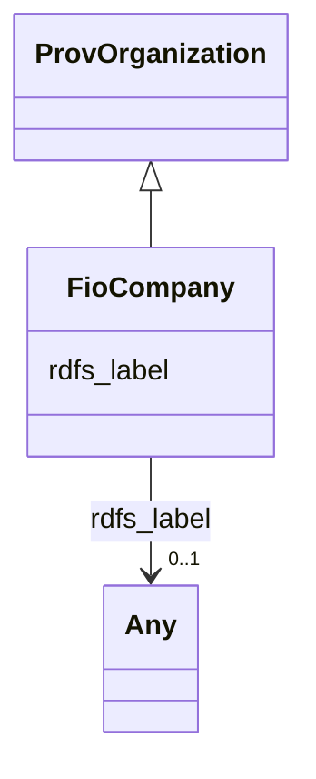

# Class: No class (type) name specified (fio_Company)


_No class (type) description specified_


This class occurs 0 times.


URI: [fio:Company](http://sawgraph.spatialai.org/v1/fio#Company)





## Inheritance
* [ProvOrganization](../classes/ProvOrganization.md)
    * **FioCompany**


## Slots

| Name | Cardinality and Range | Description | Inheritance | Occurrences |
| ---  | --- | --- | --- | --- |
| [rdfs_label](../slots/rdfs_label.md) | 0..1 <br/> [xsd:anyURI](http://www.w3.org/2001/XMLSchema#anyURI)&nbsp;or&nbsp;<br />[xsd:string](http://www.w3.org/2001/XMLSchema#string) | No slot (predicate) description specified | [ProvOrganization](../classes/ProvOrganization.md) |  |


## LinkML Source

<!-- TODO: investigate https://stackoverflow.com/questions/37606292/how-to-create-tabbed-code-blocks-in-mkdocs-or-sphinx -->

### Direct

<details>

```yaml
name: fio_Company
conforms_to: No schema conformance document specified
annotations:
  count:
    tag: count
    value: 0
description: No class (type) description specified
title: No class (type) name specified
from_schema: fio-kg
rank: 1000
is_a: prov_Organization
class_uri: fio:Company

```
</details>

### Induced

<details>

```yaml
name: fio_Company
conforms_to: No schema conformance document specified
annotations:
  count:
    tag: count
    value: 0
description: No class (type) description specified
title: No class (type) name specified
from_schema: fio-kg
rank: 1000
is_a: prov_Organization
attributes:
  rdfs_label:
    name: rdfs_label
    annotations:
      string:
        tag: string
        value: 15
    description: No slot (predicate) description specified
    title: No slot (predicate) name specified
    examples:
    - object:
        example_object: 'Agriculture: Agricultural Research Service'
        example_object_type: string
        example_predicate: rdfs:label
        example_subject: fio:d.Agency.C1017
        example_subject_type: prov_Organization
    - object:
        example_object: 'Agriculture: Agricultural Research Service'
        example_object_type: string
        example_predicate: rdfs:label
        example_subject: fio:d.Agency.C1017
        example_subject_type: fio_Agency
    - object:
        example_object: Soybean Farming
        example_object_type: string
        example_predicate: rdfs:label
        example_subject: naics:NAICS-IndustryCode-11111
        example_subject_type: naics_NAICS-IndustryCode
    - object:
        example_object: Soybean Farming
        example_object_type: string
        example_predicate: rdfs:label
        example_subject: naics:NAICS-IndustryCode-11111
        example_subject_type: naics_NAICS-Industry
    - object:
        example_object: Soybean Farming
        example_object_type: string
        example_predicate: rdfs:label
        example_subject: naics:NAICS-IndustryCode-11111
        example_subject_type: owl_Thing
    - object:
        example_object: Soybean Farming
        example_object_type: string
        example_predicate: rdfs:label
        example_subject: naics:NAICS-IndustryCode-11111
        example_subject_type: fio_Industry
    - object:
        example_object: Soybean Farming
        example_object_type: string
        example_predicate: rdfs:label
        example_subject: naics:NAICS-IndustryCode-11111
        example_subject_type: owl_NamedIndividual
    - object:
        example_object: Oilseed and Grain Farming
        example_object_type: string
        example_predicate: rdfs:label
        example_subject: naics:NAICS-IndustryGroup-1111
        example_subject_type: naics_NAICS-IndustryGroup
    - object:
        example_object: Agriculture, Forestry, Fishing and Hunting
        example_object_type: string
        example_predicate: rdfs:label
        example_subject: naics:NAICS-IndustrySector-11
        example_subject_type: naics_NAICS-IndustrySector
    - object:
        example_object: Crop Production
        example_object_type: string
        example_predicate: rdfs:label
        example_subject: naics:NAICS-IndustrySubsector-111
        example_subject_type: naics_NAICS-IndustrySubsector
    - object:
        example_object: PRATT & WHITNEY
        example_object_type: string
        example_predicate: rdfs:label
        example_subject: usfrsdata:d.FRS-Facility.110000314204
        example_subject_type: usfrs_Stationary-Facility
    - object:
        example_object: PRATT & WHITNEY
        example_object_type: string
        example_predicate: rdfs:label
        example_subject: usfrsdata:d.FRS-Facility.110000314204
        example_subject_type: usfrs_FRS-Facility
    - object:
        example_object: PRATT & WHITNEY
        example_object_type: string
        example_predicate: rdfs:label
        example_subject: usfrsdata:d.FRS-Facility.110000314204
        example_subject_type: fio_Facility
    - object:
        example_object: PRATT & WHITNEY
        example_object_type: string
        example_predicate: rdfs:label
        example_subject: usfrsdata:d.FRS-Facility.110000314204
        example_subject_type: __b1
    - object:
        example_object: COOPER WIRING DEVICES
        example_object_type: string
        example_predicate: rdfs:label
        example_subject: usfrsdata:d.FRS-Facility.110000314222
        example_subject_type: usfrs_EPA-PFAS-Facility
    - object:
        example_object: NASA JOHN H. GLENN RESEARCH CENTER - LEWIS FIELD
        example_object_type: string
        example_predicate: rdfs:label
        example_subject: usfrsdata:d.FRS-Facility.110000387714
        example_subject_type: usfrs_Federal-Facility
    - object:
        example_object: BEHR DAYTON THERMAL SYSTEM VOC PLUME
        example_object_type: string
        example_predicate: rdfs:label
        example_subject: usfrsdata:d.FRS-Facility.110000394635
        example_subject_type: usfrs_ContaminatedSite-Facility
    - object:
        example_object: NALCO CHEMICAL COMPANY
        example_object_type: string
        example_predicate: rdfs:label
        example_subject: usfrsdata:d.FRS-Facility.110000888585
        example_subject_type: usfrs_PotentiallyContaminatedSite-Facility
    - object:
        example_object: BEALL MANUFACTURING
        example_object_type: string
        example_predicate: rdfs:label
        example_subject: usfrsdata:d.FRS-Facility.110001347490
        example_subject_type: usfrs_BrownfieldsSite-Facility
    - object:
        example_object: DAYSPRING ASSISTED LIVING AND CARE
        example_object_type: string
        example_predicate: rdfs:label
        example_subject: usfrsdata:d.FRS-Facility.110006216415
        example_subject_type: usfrs_WaterSystem-Facility
    - object:
        example_object: BOWERS LANDFILL
        example_object_type: string
        example_predicate: rdfs:label
        example_subject: usfrsdata:d.FRS-Facility.110009304485
        example_subject_type: usfrs_ContaminationAddressed-Facility
    - object:
        example_object: RETRIEV TECHNOLOGIES INC
        example_object_type: string
        example_predicate: rdfs:label
        example_subject: usfrsdata:d.FRS-Facility.110009668243
        example_subject_type: usfrs_Barge-Facility
    - object:
        example_object: REGIONAL OFFICE BUILDING
        example_object_type: string
        example_predicate: rdfs:label
        example_subject: usfrsdata:d.FRS-Facility.110020787013
        example_subject_type: usfrs_MonitoringStation-Facility
    - object:
        example_object: DOUG GOTT & SONS, INC.
        example_object_type: string
        example_predicate: rdfs:label
        example_subject: usfrsdata:d.FRS-Facility.110046118330
        example_subject_type: usfrs_Portable-Facility
    - object:
        example_object: AGRIUM TERMINAL
        example_object_type: string
        example_predicate: rdfs:label
        example_subject: usfrsdata:d.FRS-Facility.110063004323
        example_subject_type: usfrs_WaterfrontFacility-Facility
    from_schema: fio-kg
    rank: 1000
    domain: rdfs_label
    slot_uri: rdfs:label
    alias: rdfs_label
    owner: fio_Company
    domain_of:
    - __b1
    - fio_Agency
    - fio_Facility
    - fio_Industry
    - naics_NAICS-Industry
    - naics_NAICS-IndustryCode
    - naics_NAICS-IndustryGroup
    - naics_NAICS-IndustrySector
    - naics_NAICS-IndustrySubsector
    - owl_NamedIndividual
    - owl_Thing
    - prov_Organization
    - usfrs_Barge-Facility
    - usfrs_BrownfieldsSite-Facility
    - usfrs_ContaminatedSite-Facility
    - usfrs_ContaminationAddressed-Facility
    - usfrs_EPA-PFAS-Facility
    - usfrs_FRS-Facility
    - usfrs_Federal-Facility
    - usfrs_MonitoringStation-Facility
    - usfrs_Portable-Facility
    - usfrs_PotentiallyContaminatedSite-Facility
    - usfrs_Stationary-Facility
    - usfrs_WaterSystem-Facility
    - usfrs_WaterfrontFacility-Facility
    range: Any
    any_of:
    - range: uri
    - range: string
class_uri: fio:Company

```
</details>