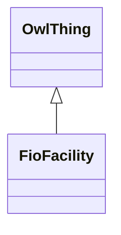

# Class: Facility (fio_Facility)


_Any physical building, building complex or site (e.g. an airstrip, a mine, or superfund site) at which a commercial or institutional activity occurs._


URI: [fio:Facility](http://w3id.org/fio/v1/fio#Facility)





## Inheritance
* [OwlThing](../classes/OwlThing.md)
    * **FioFacility**


## Slots

| Name | Cardinality and Range | Description | Inheritance | Occurrences |
| ---  | --- | --- | --- | --- |


## LinkML Source

<!-- TODO: investigate https://stackoverflow.com/questions/37606292/how-to-create-tabbed-code-blocks-in-mkdocs-or-sphinx -->

### Direct

<details>

```yaml
name: fio_Facility
description: Any physical building, building complex or site (e.g. an airstrip, a
  mine, or superfund site) at which a commercial or institutional activity occurs.
title: Facility
from_schema: okns:fiokg
exact_mappings:
- http://w3id.org/fio/v1/fio#Facility
rank: 1000
is_a: owl_Thing
class_uri: fio:Facility

```
</details>

### Induced

<details>

```yaml
name: fio_Facility
description: Any physical building, building complex or site (e.g. an airstrip, a
  mine, or superfund site) at which a commercial or institutional activity occurs.
title: Facility
from_schema: okns:fiokg
exact_mappings:
- http://w3id.org/fio/v1/fio#Facility
rank: 1000
is_a: owl_Thing
class_uri: fio:Facility

```
</details>