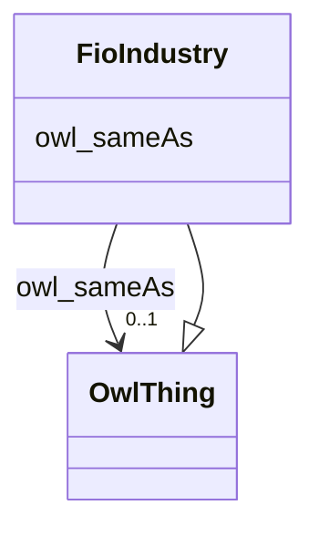

# Class: Industry (fio_Industry)


_A distinct group of productive or profit-making enterprises._


This class occurs 736 times.


URI: [fio:Industry](http://w3id.org/fio/v1/fio#Industry)





## Inheritance
* [OwlThing](../classes/OwlThing.md)
    * **FioIndustry**


## Slots

| Name | Cardinality and Range | Description | Inheritance | Occurrences |
| ---  | --- | --- | --- | --- |
| [owl_sameAs](../slots/owl_sameAs.md) | 0..1 <br/> [OwlThing](../classes/OwlThing.md) | The property that determines that two given individuals are equal <br/>  | direct | 736 |


## Usages

| used by | used in | type | used |
| ---  | --- | --- | --- |
| [B43f2153f8fa51cc860da104aa4b996c7](../classes/B43f2153f8fa51cc860da104aa4b996c7.md) | [fio_ofIndustry](../slots/fio_ofIndustry.md) | any_of[range] | [FioIndustry](../classes/FioIndustry.md) |
| [B43f2153f8fa51cc860da104aa4b996c7](../classes/B43f2153f8fa51cc860da104aa4b996c7.md) | [fio_epa_frs_ofPrimaryIndustry](../slots/fio_epa_frs_ofPrimaryIndustry.md) | any_of[range] | [FioIndustry](../classes/FioIndustry.md) |
| [B43f2153f8fa51cc860da104aa4b996c7](../classes/B43f2153f8fa51cc860da104aa4b996c7.md) | [fio_epa_frs_ofSecondaryIndustry](../slots/fio_epa_frs_ofSecondaryIndustry.md) | any_of[range] | [FioIndustry](../classes/FioIndustry.md) |
| [B51b8d66516b28a1c54f8d745ede947b9](../classes/B51b8d66516b28a1c54f8d745ede947b9.md) | [fio_ofIndustry](../slots/fio_ofIndustry.md) | any_of[range] | [FioIndustry](../classes/FioIndustry.md) |
| [B51b8d66516b28a1c54f8d745ede947b9](../classes/B51b8d66516b28a1c54f8d745ede947b9.md) | [fio_epa_frs_ofPrimaryIndustry](../slots/fio_epa_frs_ofPrimaryIndustry.md) | any_of[range] | [FioIndustry](../classes/FioIndustry.md) |
| [B51b8d66516b28a1c54f8d745ede947b9](../classes/B51b8d66516b28a1c54f8d745ede947b9.md) | [fio_epa_frs_ofSecondaryIndustry](../slots/fio_epa_frs_ofSecondaryIndustry.md) | any_of[range] | [FioIndustry](../classes/FioIndustry.md) |
| [B5debef6666ba27aa225105865fd22d6c](../classes/B5debef6666ba27aa225105865fd22d6c.md) | [fio_ofIndustry](../slots/fio_ofIndustry.md) | any_of[range] | [FioIndustry](../classes/FioIndustry.md) |
| [B5debef6666ba27aa225105865fd22d6c](../classes/B5debef6666ba27aa225105865fd22d6c.md) | [fio_epa_frs_ofSecondaryIndustry](../slots/fio_epa_frs_ofSecondaryIndustry.md) | any_of[range] | [FioIndustry](../classes/FioIndustry.md) |
| [B5debef6666ba27aa225105865fd22d6c](../classes/B5debef6666ba27aa225105865fd22d6c.md) | [fio_epa_frs_ofPrimaryIndustry](../slots/fio_epa_frs_ofPrimaryIndustry.md) | any_of[range] | [FioIndustry](../classes/FioIndustry.md) |
| [B671ac9cd6796151f919e5affbe3cc5f9](../classes/B671ac9cd6796151f919e5affbe3cc5f9.md) | [fio_ofIndustry](../slots/fio_ofIndustry.md) | any_of[range] | [FioIndustry](../classes/FioIndustry.md) |
| [B671ac9cd6796151f919e5affbe3cc5f9](../classes/B671ac9cd6796151f919e5affbe3cc5f9.md) | [fio_epa_frs_ofSecondaryIndustry](../slots/fio_epa_frs_ofSecondaryIndustry.md) | any_of[range] | [FioIndustry](../classes/FioIndustry.md) |
| [B671ac9cd6796151f919e5affbe3cc5f9](../classes/B671ac9cd6796151f919e5affbe3cc5f9.md) | [fio_epa_frs_ofPrimaryIndustry](../slots/fio_epa_frs_ofPrimaryIndustry.md) | any_of[range] | [FioIndustry](../classes/FioIndustry.md) |
| [B707e8df015ee2912f85cf2fec8dc4718](../classes/B707e8df015ee2912f85cf2fec8dc4718.md) | [fio_ofIndustry](../slots/fio_ofIndustry.md) | any_of[range] | [FioIndustry](../classes/FioIndustry.md) |
| [B707e8df015ee2912f85cf2fec8dc4718](../classes/B707e8df015ee2912f85cf2fec8dc4718.md) | [fio_epa_frs_ofPrimaryIndustry](../slots/fio_epa_frs_ofPrimaryIndustry.md) | any_of[range] | [FioIndustry](../classes/FioIndustry.md) |
| [B912c2f2722265f457d11b52388b1def0](../classes/B912c2f2722265f457d11b52388b1def0.md) | [fio_ofIndustry](../slots/fio_ofIndustry.md) | any_of[range] | [FioIndustry](../classes/FioIndustry.md) |
| [B912c2f2722265f457d11b52388b1def0](../classes/B912c2f2722265f457d11b52388b1def0.md) | [fio_epa_frs_ofPrimaryIndustry](../slots/fio_epa_frs_ofPrimaryIndustry.md) | any_of[range] | [FioIndustry](../classes/FioIndustry.md) |
| [B912c2f2722265f457d11b52388b1def0](../classes/B912c2f2722265f457d11b52388b1def0.md) | [fio_epa_frs_ofSecondaryIndustry](../slots/fio_epa_frs_ofSecondaryIndustry.md) | any_of[range] | [FioIndustry](../classes/FioIndustry.md) |
| [Ba0ffbf1a7a548fac1e61d3eceada03dd](../classes/Ba0ffbf1a7a548fac1e61d3eceada03dd.md) | [fio_ofIndustry](../slots/fio_ofIndustry.md) | any_of[range] | [FioIndustry](../classes/FioIndustry.md) |
| [Ba0ffbf1a7a548fac1e61d3eceada03dd](../classes/Ba0ffbf1a7a548fac1e61d3eceada03dd.md) | [fio_epa_frs_ofSecondaryIndustry](../slots/fio_epa_frs_ofSecondaryIndustry.md) | any_of[range] | [FioIndustry](../classes/FioIndustry.md) |
| [Ba0ffbf1a7a548fac1e61d3eceada03dd](../classes/Ba0ffbf1a7a548fac1e61d3eceada03dd.md) | [fio_epa_frs_ofPrimaryIndustry](../slots/fio_epa_frs_ofPrimaryIndustry.md) | any_of[range] | [FioIndustry](../classes/FioIndustry.md) |
| [Bdbdbfbd4ef20ffc37226553d96831226](../classes/Bdbdbfbd4ef20ffc37226553d96831226.md) | [fio_ofIndustry](../slots/fio_ofIndustry.md) | any_of[range] | [FioIndustry](../classes/FioIndustry.md) |
| [Bdbdbfbd4ef20ffc37226553d96831226](../classes/Bdbdbfbd4ef20ffc37226553d96831226.md) | [fio_epa_frs_ofSecondaryIndustry](../slots/fio_epa_frs_ofSecondaryIndustry.md) | any_of[range] | [FioIndustry](../classes/FioIndustry.md) |
| [Bdbdbfbd4ef20ffc37226553d96831226](../classes/Bdbdbfbd4ef20ffc37226553d96831226.md) | [fio_epa_frs_ofPrimaryIndustry](../slots/fio_epa_frs_ofPrimaryIndustry.md) | any_of[range] | [FioIndustry](../classes/FioIndustry.md) |
| [Be0e551f6155d8e99ee967119022af97d](../classes/Be0e551f6155d8e99ee967119022af97d.md) | [fio_ofIndustry](../slots/fio_ofIndustry.md) | any_of[range] | [FioIndustry](../classes/FioIndustry.md) |
| [Be0e551f6155d8e99ee967119022af97d](../classes/Be0e551f6155d8e99ee967119022af97d.md) | [fio_epa_frs_ofPrimaryIndustry](../slots/fio_epa_frs_ofPrimaryIndustry.md) | any_of[range] | [FioIndustry](../classes/FioIndustry.md) |
| [Bf0c649c8d760a3559d3d5e5b1f68a59f](../classes/Bf0c649c8d760a3559d3d5e5b1f68a59f.md) | [fio_ofIndustry](../slots/fio_ofIndustry.md) | any_of[range] | [FioIndustry](../classes/FioIndustry.md) |
| [Bf0c649c8d760a3559d3d5e5b1f68a59f](../classes/Bf0c649c8d760a3559d3d5e5b1f68a59f.md) | [fio_epa_frs_ofSecondaryIndustry](../slots/fio_epa_frs_ofSecondaryIndustry.md) | any_of[range] | [FioIndustry](../classes/FioIndustry.md) |
| [Bf0c649c8d760a3559d3d5e5b1f68a59f](../classes/Bf0c649c8d760a3559d3d5e5b1f68a59f.md) | [fio_epa_frs_ofPrimaryIndustry](../slots/fio_epa_frs_ofPrimaryIndustry.md) | any_of[range] | [FioIndustry](../classes/FioIndustry.md) |
| [Bf906a89c08306329b89456f1d101a6bf](../classes/Bf906a89c08306329b89456f1d101a6bf.md) | [fio_ofIndustry](../slots/fio_ofIndustry.md) | any_of[range] | [FioIndustry](../classes/FioIndustry.md) |
| [Bf906a89c08306329b89456f1d101a6bf](../classes/Bf906a89c08306329b89456f1d101a6bf.md) | [fio_epa_frs_ofPrimaryIndustry](../slots/fio_epa_frs_ofPrimaryIndustry.md) | any_of[range] | [FioIndustry](../classes/FioIndustry.md) |
| [Fio-epa-frsEPA-PFAS-Facility](../classes/Fio-epa-frsEPA-PFAS-Facility.md) | [fio_ofIndustry](../slots/fio_ofIndustry.md) | any_of[range] | [FioIndustry](../classes/FioIndustry.md) |
| [Fio-epa-frsFRS-Facility](../classes/Fio-epa-frsFRS-Facility.md) | [fio_ofIndustry](../slots/fio_ofIndustry.md) | any_of[range] | [FioIndustry](../classes/FioIndustry.md) |
| [Fio-epa-frsFRS-Facility](../classes/Fio-epa-frsFRS-Facility.md) | [fio_epa_frs_ofSecondaryIndustry](../slots/fio_epa_frs_ofSecondaryIndustry.md) | any_of[range] | [FioIndustry](../classes/FioIndustry.md) |
| [Fio-epa-frsFRS-Facility](../classes/Fio-epa-frsFRS-Facility.md) | [fio_epa_frs_ofPrimaryIndustry](../slots/fio_epa_frs_ofPrimaryIndustry.md) | any_of[range] | [FioIndustry](../classes/FioIndustry.md) |
| [Fio-epa-frsRecord](../classes/Fio-epa-frsRecord.md) | [fio_ofIndustry](../slots/fio_ofIndustry.md) | any_of[range] | [FioIndustry](../classes/FioIndustry.md) |
| [Fio-epa-frsRecord](../classes/Fio-epa-frsRecord.md) | [fio_epa_frs_ofPrimaryIndustry](../slots/fio_epa_frs_ofPrimaryIndustry.md) | any_of[range] | [FioIndustry](../classes/FioIndustry.md) |
| [Fio-epa-frsSupplementalRecord](../classes/Fio-epa-frsSupplementalRecord.md) | [fio_ofIndustry](../slots/fio_ofIndustry.md) | any_of[range] | [FioIndustry](../classes/FioIndustry.md) |
| [Fio-epa-frsSupplementalRecord](../classes/Fio-epa-frsSupplementalRecord.md) | [fio_epa_frs_ofSecondaryIndustry](../slots/fio_epa_frs_ofSecondaryIndustry.md) | any_of[range] | [FioIndustry](../classes/FioIndustry.md) |
| [Fio-epa-frsSupplementalRecord](../classes/Fio-epa-frsSupplementalRecord.md) | [fio_epa_frs_ofPrimaryIndustry](../slots/fio_epa_frs_ofPrimaryIndustry.md) | any_of[range] | [FioIndustry](../classes/FioIndustry.md) |
| [NaicsNAICS-IndustryCode](../classes/NaicsNAICS-IndustryCode.md) | [fio_subcodeOf](../slots/fio_subcodeOf.md) | any_of[range] | [FioIndustry](../classes/FioIndustry.md) |
| [NaicsNAICS-IndustryGroup](../classes/NaicsNAICS-IndustryGroup.md) | [fio_subcodeOf](../slots/fio_subcodeOf.md) | any_of[range] | [FioIndustry](../classes/FioIndustry.md) |
| [NaicsNAICS-IndustrySubsector](../classes/NaicsNAICS-IndustrySubsector.md) | [fio_subcodeOf](../slots/fio_subcodeOf.md) | any_of[range] | [FioIndustry](../classes/FioIndustry.md) |


## LinkML Source

<!-- TODO: investigate https://stackoverflow.com/questions/37606292/how-to-create-tabbed-code-blocks-in-mkdocs-or-sphinx -->

### Direct

<details>

```yaml
name: fio_Industry
description: A distinct group of productive or profit-making enterprises.
title: Industry
from_schema: okns:fio-kg
exact_mappings:
- http://w3id.org/fio/v1/fio#Industry
rank: 1000
is_a: owl_Thing
slots:
- owl_sameAs
class_uri: fio:Industry

```
</details>

### Induced

<details>

```yaml
name: fio_Industry
description: A distinct group of productive or profit-making enterprises.
title: Industry
from_schema: okns:fio-kg
exact_mappings:
- http://w3id.org/fio/v1/fio#Industry
rank: 1000
is_a: owl_Thing
attributes:
  owl_sameAs:
    name: owl_sameAs
    description: The property that determines that two given individuals are equal.
    title: sameAs
    notes:
    - No occurrences of this slot in the graph.
    from_schema: okns:owl-rdf-rdfs
    source: http://www.w3.org/2002/07/owl#
    domain: owl_Thing
    slot_uri: owl:sameAs
    alias: owl_sameAs
    owner: fio_Industry
    domain_of:
    - __B1d70f10e8204578c89c5f678467193ea
    - __B3a5aa76705834f507db6d3c7d90d63b8
    - __B43f2153f8fa51cc860da104aa4b996c7
    - __B51b8d66516b28a1c54f8d745ede947b9
    - __B5debef6666ba27aa225105865fd22d6c
    - __B671ac9cd6796151f919e5affbe3cc5f9
    - __B707e8df015ee2912f85cf2fec8dc4718
    - __B912c2f2722265f457d11b52388b1def0
    - __B9968aab18e1237453b5cbb15df1c74b9
    - __Ba0ffbf1a7a548fac1e61d3eceada03dd
    - __Bdbdbfbd4ef20ffc37226553d96831226
    - __Be082c2fc952b5eb7e355834fa6af4865
    - __Be0e551f6155d8e99ee967119022af97d
    - __Bea9d030ae5649d7f06d536c2a467e56f
    - __Bf0c649c8d760a3559d3d5e5b1f68a59f
    - __Bf906a89c08306329b89456f1d101a6bf
    - fio-epa-frs_Agency
    - fio-epa-frs_Agency.Agriculture
    - fio-epa-frs_Agency.Commerce
    - fio-epa-frs_Agency.Congress
    - fio-epa-frs_Agency.Defense
    - fio-epa-frs_Agency.Energy
    - fio-epa-frs_Agency.HealthandHumanServices
    - fio-epa-frs_Agency.HomelandSecurity
    - fio-epa-frs_Agency.HousingandUrbanDevelopment
    - fio-epa-frs_Agency.Interior
    - fio-epa-frs_Agency.Judicial
    - fio-epa-frs_Agency.Justice
    - fio-epa-frs_Agency.Labor
    - fio-epa-frs_Agency.State
    - fio-epa-frs_Agency.Transportation
    - fio-epa-frs_Agency.Treasury
    - fio-epa-frs_Agency.VeteransAffairs
    - fio-epa-frs_AirProgram
    - fio-epa-frs_AnimalOperation
    - fio-epa-frs_AssistanceSupportProgram
    - fio-epa-frs_ChemicalReleaseProgram
    - fio-epa-frs_ChemicalStorageProgram
    - fio-epa-frs_CoastalOceanProgram
    - fio-epa-frs_ComplianceInterest
    - fio-epa-frs_ComplianceSystem
    - fio-epa-frs_DrinkingWaterProgram
    - fio-epa-frs_EPA-PFAS-Facility
    - fio-epa-frs_EcologyOperation
    - fio-epa-frs_ElectronicPermitSystem
    - fio-epa-frs_EnforcementInterest
    - fio-epa-frs_EnforcementSystem
    - fio-epa-frs_EnvironmentalInterestByProgram
    - fio-epa-frs_EnvironmentalInterestType
    - fio-epa-frs_FRS-Facility
    - fio-epa-frs_FacilitySiteIdentification
    - fio-epa-frs_FacilityType
    - fio-epa-frs_GrantSystem
    - fio-epa-frs_GroundWaterProgram
    - fio-epa-frs_HazardousWasteProgram
    - fio-epa-frs_HealthSafetyProgram
    - fio-epa-frs_LegacySystem
    - fio-epa-frs_LegalEnforcementActivities
    - fio-epa-frs_PermitInterest
    - fio-epa-frs_PermitSystem
    - fio-epa-frs_PesticidesProgram
    - fio-epa-frs_ProgramInformationSystem
    - fio-epa-frs_ProjectSystem
    - fio-epa-frs_RadiationProtectionProgram
    - fio-epa-frs_Record
    - fio-epa-frs_RegistryInterest
    - fio-epa-frs_RegistrySystem
    - fio-epa-frs_RemediationRedevelopmentProgram
    - fio-epa-frs_ReportingInterest
    - fio-epa-frs_ReportingSystem
    - fio-epa-frs_RiskInterest
    - fio-epa-frs_SiteInterest
    - fio-epa-frs_SiteSystem
    - fio-epa-frs_SolidWasteProgram
    - fio-epa-frs_StateSystem
    - fio-epa-frs_SupplementalRecord
    - fio-epa-frs_TribalSystem
    - fio-epa-frs_UndergroundStorageTankProgram
    - fio-epa-frs_WasteWaterProgram
    - fio-epa-frs_WaterResourcesProgram
    - fio_Industry
    - kwgo_S2Cell_Level13
    - naics_NAICS-IndustryCode
    - naics_NAICS-IndustryGroup
    - naics_NAICS-IndustrySector
    - naics_NAICS-IndustrySubsector
    range: owl_Thing
class_uri: fio:Industry

```
</details>