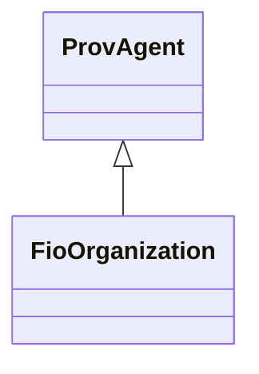

# Class: Organization (fio_Organization)


URI: [fio:Organization](http://w3id.org/fio/v1/fio#Organization)





## Inheritance
* [ProvAgent](../classes/ProvAgent.md)
    * **FioOrganization**


## Slots

| Name | Cardinality and Range | Description | Inheritance | Occurrences |
| ---  | --- | --- | --- | --- |


## LinkML Source

<!-- TODO: investigate https://stackoverflow.com/questions/37606292/how-to-create-tabbed-code-blocks-in-mkdocs-or-sphinx -->

### Direct

<details>

```yaml
name: fio_Organization
description: ''
title: Organization
from_schema: okns:fiokg
exact_mappings:
- http://w3id.org/fio/v1/fio#Organization
rank: 1000
is_a: prov_Agent
class_uri: fio:Organization

```
</details>

### Induced

<details>

```yaml
name: fio_Organization
description: ''
title: Organization
from_schema: okns:fiokg
exact_mappings:
- http://w3id.org/fio/v1/fio#Organization
rank: 1000
is_a: prov_Agent
class_uri: fio:Organization

```
</details>