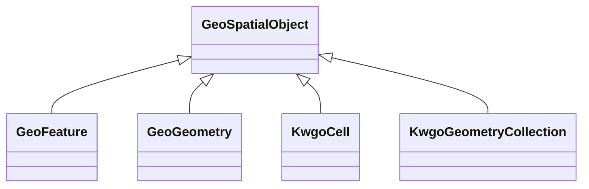

# Class: No class (entity type) name specified -- this class is noted as a superclass of another class in this graph but has not itself been defined. (geo_SpatialObject)


_Anything spatial (being or having a shape, position or an extent)._


This class occurs 1078401 times.


URI: [geo:SpatialObject](http://www.opengis.net/ont/geosparql#SpatialObject)





## Inheritance
* **GeoSpatialObject**
    * [GeoFeature](../classes/GeoFeature.md)
    * [GeoGeometry](../classes/GeoGeometry.md)
    * [KwgoCell](../classes/KwgoCell.md)
    * [KwgoGeometryCollection](../classes/KwgoGeometryCollection.md)


## Slots

| Name | Cardinality and Range | Description | Inheritance | Occurrences |
| ---  | --- | --- | --- | --- |


## Usages

| used by | used in | type | used |
| ---  | --- | --- | --- |
| [Fio-epa-frsEPA-PFAS-Facility](../classes/Fio-epa-frsEPA-PFAS-Facility.md) | [spatial_connectedTo](../slots/spatial_connectedTo.md) | any_of[range] | [GeoSpatialObject](../classes/GeoSpatialObject.md) |
| [Fio-epa-frsEPA-PFAS-Facility](../classes/Fio-epa-frsEPA-PFAS-Facility.md) | [spatial_spatiallyRelatedTo](../slots/spatial_spatiallyRelatedTo.md) | any_of[range] | [GeoSpatialObject](../classes/GeoSpatialObject.md) |
| [Fio-epa-frsFRS-Facility](../classes/Fio-epa-frsFRS-Facility.md) | [spatial_spatiallyRelatedTo](../slots/spatial_spatiallyRelatedTo.md) | any_of[range] | [GeoSpatialObject](../classes/GeoSpatialObject.md) |
| [Fio-epa-frsFRS-Facility](../classes/Fio-epa-frsFRS-Facility.md) | [spatial_connectedTo](../slots/spatial_connectedTo.md) | any_of[range] | [GeoSpatialObject](../classes/GeoSpatialObject.md) |
| [KwgoS2CellLevel13](../classes/KwgoS2CellLevel13.md) | [spatial_connectedTo](../slots/spatial_connectedTo.md) | any_of[range] | [GeoSpatialObject](../classes/GeoSpatialObject.md) |
| [KwgoS2CellLevel13](../classes/KwgoS2CellLevel13.md) | [spatial_spatiallyRelatedTo](../slots/spatial_spatiallyRelatedTo.md) | any_of[range] | [GeoSpatialObject](../classes/GeoSpatialObject.md) |


## Comments

* source: http://www.opengis.net/spec/geosparql/1.0/req/core/spatial-object-class
* source: http://www.opengis.net/ont/geosparql#
* source: http://www.opengis.net/spec/geosparql/1.1/req/core/spatial-object-class
* description: Anything spatial (being or having a shape, position or an extent).


## LinkML Source

<!-- TODO: investigate https://stackoverflow.com/questions/37606292/how-to-create-tabbed-code-blocks-in-mkdocs-or-sphinx -->

### Direct

<details>

```yaml
name: geo_SpatialObject
description: Anything spatial (being or having a shape, position or an extent).
title: No class (entity type) name specified -- this class is noted as a superclass
  of another class in this graph but has not itself been defined.
notes:
- Subclasses of this class are expected to be used for instance data.
comments:
- 'source: http://www.opengis.net/spec/geosparql/1.0/req/core/spatial-object-class'
- 'source: http://www.opengis.net/ont/geosparql#'
- 'source: http://www.opengis.net/spec/geosparql/1.1/req/core/spatial-object-class'
- 'description: Anything spatial (being or having a shape, position or an extent).'
from_schema: okns:geo
source: http://www.opengis.net/ont/geosparql#
class_uri: geo:SpatialObject

```
</details>

### Induced

<details>

```yaml
name: geo_SpatialObject
description: Anything spatial (being or having a shape, position or an extent).
title: No class (entity type) name specified -- this class is noted as a superclass
  of another class in this graph but has not itself been defined.
notes:
- Subclasses of this class are expected to be used for instance data.
comments:
- 'source: http://www.opengis.net/spec/geosparql/1.0/req/core/spatial-object-class'
- 'source: http://www.opengis.net/ont/geosparql#'
- 'source: http://www.opengis.net/spec/geosparql/1.1/req/core/spatial-object-class'
- 'description: Anything spatial (being or having a shape, position or an extent).'
from_schema: okns:geo
source: http://www.opengis.net/ont/geosparql#
class_uri: geo:SpatialObject

```
</details>