# Class: No class (type) name specified -- this class is noted as a superclass of another class in this graph but has not itself been defined. (geo_SpatialObject)


_No class (type) description specified_


This class occurs 0 times.


URI: [geo:SpatialObject](http://www.opengis.net/ont/geosparql#SpatialObject)

```mermaid
 classDiagram
    class GeoSpatialObject
    click GeoSpatialObject href "../GeoSpatialObject"
      GeoSpatialObject <|-- KwgoAdministrativeRegion
        click KwgoAdministrativeRegion href "../KwgoAdministrativeRegion"
      GeoSpatialObject <|-- KwgoClimateDivision
        click KwgoClimateDivision href "../KwgoClimateDivision"
      GeoSpatialObject <|-- KwgoFederalJudicalDistrict
        click KwgoFederalJudicalDistrict href "../KwgoFederalJudicalDistrict"
      GeoSpatialObject <|-- KwgoNationalWeatherZone
        click KwgoNationalWeatherZone href "../KwgoNationalWeatherZone"
      GeoSpatialObject <|-- KwgoNielsenMarketZone
        click KwgoNielsenMarketZone href "../KwgoNielsenMarketZone"
      GeoSpatialObject <|-- KwgoRoadSegment
        click KwgoRoadSegment href "../KwgoRoadSegment"
      GeoSpatialObject <|-- KwgoS2Cell
        click KwgoS2Cell href "../KwgoS2Cell"
      GeoSpatialObject <|-- KwgoStatisticalArea
        click KwgoStatisticalArea href "../KwgoStatisticalArea"
      GeoSpatialObject <|-- KwgoZipCodeArea
        click KwgoZipCodeArea href "../KwgoZipCodeArea"
      
      
```





## Inheritance
* **GeoSpatialObject**
    * [KwgoAdministrativeRegion](../classes/KwgoAdministrativeRegion.md)
    * [KwgoClimateDivision](../classes/KwgoClimateDivision.md)
    * [KwgoFederalJudicalDistrict](../classes/KwgoFederalJudicalDistrict.md)
    * [KwgoNationalWeatherZone](../classes/KwgoNationalWeatherZone.md)
    * [KwgoNielsenMarketZone](../classes/KwgoNielsenMarketZone.md)
    * [KwgoRoadSegment](../classes/KwgoRoadSegment.md)
    * [KwgoS2Cell](../classes/KwgoS2Cell.md)
    * [KwgoStatisticalArea](../classes/KwgoStatisticalArea.md)
    * [KwgoZipCodeArea](../classes/KwgoZipCodeArea.md)


## Slots

| Name | Cardinality and Range | Description | Inheritance | Occurrences |
| ---  | --- | --- | --- | --- |


## LinkML Source

<!-- TODO: investigate https://stackoverflow.com/questions/37606292/how-to-create-tabbed-code-blocks-in-mkdocs-or-sphinx -->

### Direct

<details>

```yaml
name: geo_SpatialObject
conforms_to: No schema conformance document specified
annotations:
  count:
    tag: count
    value: 0
description: No class (type) description specified
title: No class (type) name specified -- this class is noted as a superclass of another
  class in this graph but has not itself been defined.
from_schema: fio-kg
rank: 1000
class_uri: geo:SpatialObject

```
</details>

### Induced

<details>

```yaml
name: geo_SpatialObject
conforms_to: No schema conformance document specified
annotations:
  count:
    tag: count
    value: 0
description: No class (type) description specified
title: No class (type) name specified -- this class is noted as a superclass of another
  class in this graph but has not itself been defined.
from_schema: fio-kg
rank: 1000
class_uri: geo:SpatialObject

```
</details>