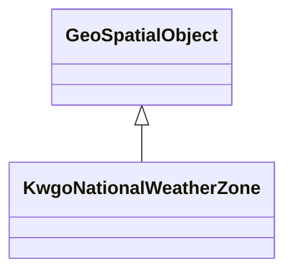

# Class: No class (type) name specified (kwgo_NationalWeatherZone)


_No class (type) description specified_


This class occurs 0 times.


URI: [kwgo:NationalWeatherZone](http://stko-kwg.geog.ucsb.edu/lod/ontology/NationalWeatherZone)





## Inheritance
* [GeoSpatialObject](../classes/GeoSpatialObject.md)
    * **KwgoNationalWeatherZone**


## Slots

| Name | Cardinality and Range | Description | Inheritance | Occurrences |
| ---  | --- | --- | --- | --- |


## LinkML Source

<!-- TODO: investigate https://stackoverflow.com/questions/37606292/how-to-create-tabbed-code-blocks-in-mkdocs-or-sphinx -->

### Direct

<details>

```yaml
name: kwgo_NationalWeatherZone
conforms_to: No schema conformance document specified
annotations:
  count:
    tag: count
    value: 0
description: No class (type) description specified
title: No class (type) name specified
from_schema: fio-kg
rank: 1000
is_a: geo_SpatialObject
class_uri: kwgo:NationalWeatherZone

```
</details>

### Induced

<details>

```yaml
name: kwgo_NationalWeatherZone
conforms_to: No schema conformance document specified
annotations:
  count:
    tag: count
    value: 0
description: No class (type) description specified
title: No class (type) name specified
from_schema: fio-kg
rank: 1000
is_a: geo_SpatialObject
class_uri: kwgo:NationalWeatherZone

```
</details>