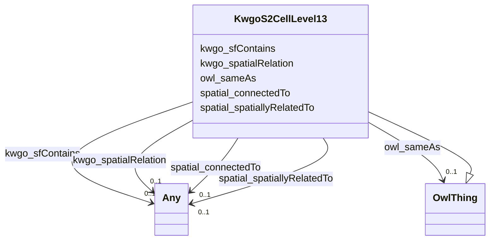

# Class: KwgoS2CellLevel13


This class occurs 249509 times.


URI: [kwgo:S2Cell_Level13](http://stko-kwg.geog.ucsb.edu/lod/ontology/S2Cell_Level13)





## Inheritance
* [OwlThing](../classes/OwlThing.md)
    * **KwgoS2CellLevel13**


## Slots

| Name | Cardinality and Range | Description | Inheritance | Occurrences |
| ---  | --- | --- | --- | --- |
| [owl_sameAs](../slots/owl_sameAs.md) | 0..1 <br/> [OwlThing](../classes/OwlThing.md) | The property that determines that two given individuals are equal <br/>  | direct | 499018 |
| [kwgo_sfContains](../slots/kwgo_sfContains.md) | 0..1 <br/> [Any](../classes/Any.md) | KWG's spatial contains relation <br/>  | direct | 423605 |
| [spatial_connectedTo](../slots/spatial_connectedTo.md) | 0..1 <br/> [Fio-epa-frsEPA-PFAS-Facility](../classes/Fio-epa-frsEPA-PFAS-Facility.md)&nbsp;or&nbsp;<br />[KwgoAdministrativeRegion3](../classes/KwgoAdministrativeRegion3.md)&nbsp;or&nbsp;<br />[KwgoRegion](../classes/KwgoRegion.md)&nbsp;or&nbsp;<br />[RdfsResource](../classes/RdfsResource.md)&nbsp;or&nbsp;<br />[KwgoAdministrativeRegion](../classes/KwgoAdministrativeRegion.md)&nbsp;or&nbsp;<br />[KwgoS2CellLevel13](../classes/KwgoS2CellLevel13.md)&nbsp;or&nbsp;<br />[GeoSpatialObject](../classes/GeoSpatialObject.md)&nbsp;or&nbsp;<br />[OwlThing](../classes/OwlThing.md)&nbsp;or&nbsp;<br />[KwgoAdministrativeRegion2](../classes/KwgoAdministrativeRegion2.md)&nbsp;or&nbsp;<br />[Fio-epa-frsFRS-Facility](../classes/Fio-epa-frsFRS-Facility.md) |  <br/>  | direct | 412333 |
| [spatial_spatiallyRelatedTo](../slots/spatial_spatiallyRelatedTo.md) | 0..1 <br/> [Fio-epa-frsEPA-PFAS-Facility](../classes/Fio-epa-frsEPA-PFAS-Facility.md)&nbsp;or&nbsp;<br />[KwgoAdministrativeRegion3](../classes/KwgoAdministrativeRegion3.md)&nbsp;or&nbsp;<br />[KwgoRegion](../classes/KwgoRegion.md)&nbsp;or&nbsp;<br />[RdfsResource](../classes/RdfsResource.md)&nbsp;or&nbsp;<br />[KwgoAdministrativeRegion](../classes/KwgoAdministrativeRegion.md)&nbsp;or&nbsp;<br />[KwgoS2CellLevel13](../classes/KwgoS2CellLevel13.md)&nbsp;or&nbsp;<br />[GeoSpatialObject](../classes/GeoSpatialObject.md)&nbsp;or&nbsp;<br />[OwlThing](../classes/OwlThing.md)&nbsp;or&nbsp;<br />[KwgoAdministrativeRegion2](../classes/KwgoAdministrativeRegion2.md)&nbsp;or&nbsp;<br />[Fio-epa-frsFRS-Facility](../classes/Fio-epa-frsFRS-Facility.md) |  <br/>  | direct | 412333 |
| [kwgo_spatialRelation](../slots/kwgo_spatialRelation.md) | 0..1 <br/> [Any](../classes/Any.md) | KWG's general spatial relation <br/>  | direct | 412333 |


## Usages

| used by | used in | type | used |
| ---  | --- | --- | --- |
| [Fio-epa-frsEPA-PFAS-Facility](../classes/Fio-epa-frsEPA-PFAS-Facility.md) | [spatial_connectedTo](../slots/spatial_connectedTo.md) | any_of[range] | [KwgoS2CellLevel13](../classes/KwgoS2CellLevel13.md) |
| [Fio-epa-frsEPA-PFAS-Facility](../classes/Fio-epa-frsEPA-PFAS-Facility.md) | [spatial_spatiallyRelatedTo](../slots/spatial_spatiallyRelatedTo.md) | any_of[range] | [KwgoS2CellLevel13](../classes/KwgoS2CellLevel13.md) |
| [Fio-epa-frsFRS-Facility](../classes/Fio-epa-frsFRS-Facility.md) | [spatial_spatiallyRelatedTo](../slots/spatial_spatiallyRelatedTo.md) | any_of[range] | [KwgoS2CellLevel13](../classes/KwgoS2CellLevel13.md) |
| [Fio-epa-frsFRS-Facility](../classes/Fio-epa-frsFRS-Facility.md) | [spatial_connectedTo](../slots/spatial_connectedTo.md) | any_of[range] | [KwgoS2CellLevel13](../classes/KwgoS2CellLevel13.md) |
| [KwgoS2CellLevel13](../classes/KwgoS2CellLevel13.md) | [spatial_connectedTo](../slots/spatial_connectedTo.md) | any_of[range] | [KwgoS2CellLevel13](../classes/KwgoS2CellLevel13.md) |
| [KwgoS2CellLevel13](../classes/KwgoS2CellLevel13.md) | [spatial_spatiallyRelatedTo](../slots/spatial_spatiallyRelatedTo.md) | any_of[range] | [KwgoS2CellLevel13](../classes/KwgoS2CellLevel13.md) |


## LinkML Source

<!-- TODO: investigate https://stackoverflow.com/questions/37606292/how-to-create-tabbed-code-blocks-in-mkdocs-or-sphinx -->

### Direct

<details>

```yaml
name: kwgo_S2Cell_Level13
from_schema: okns:fio-kg
rank: 1000
is_a: owl_Thing
slots:
- owl_sameAs
- kwgo_sfContains
- spatial_connectedTo
- spatial_spatiallyRelatedTo
- kwgo_spatialRelation
class_uri: kwgo:S2Cell_Level13

```
</details>

### Induced

<details>

```yaml
name: kwgo_S2Cell_Level13
from_schema: okns:fio-kg
rank: 1000
is_a: owl_Thing
attributes:
  owl_sameAs:
    name: owl_sameAs
    description: The property that determines that two given individuals are equal.
    title: sameAs
    notes:
    - No occurrences of this slot in the graph.
    from_schema: okns:owl-rdf-rdfs
    source: http://www.w3.org/2002/07/owl#
    domain: owl_Thing
    slot_uri: owl:sameAs
    alias: owl_sameAs
    owner: kwgo_S2Cell_Level13
    domain_of:
    - __Bd7175f49ca206d160fdb4fee4dad2747
    - __Bf500d8a8b0381e9decef451f20ba1677
    - fio-epa-frs_Agency
    - fio-epa-frs_Agency.Agriculture
    - fio-epa-frs_Agency.Commerce
    - fio-epa-frs_Agency.Congress
    - fio-epa-frs_Agency.Defense
    - fio-epa-frs_Agency.Energy
    - fio-epa-frs_Agency.HealthandHumanServices
    - fio-epa-frs_Agency.HomelandSecurity
    - fio-epa-frs_Agency.HousingandUrbanDevelopment
    - fio-epa-frs_Agency.Interior
    - fio-epa-frs_Agency.Judicial
    - fio-epa-frs_Agency.Justice
    - fio-epa-frs_Agency.Labor
    - fio-epa-frs_Agency.State
    - fio-epa-frs_Agency.Transportation
    - fio-epa-frs_Agency.Treasury
    - fio-epa-frs_Agency.VeteransAffairs
    - fio-epa-frs_AirProgram
    - fio-epa-frs_AnimalOperation
    - fio-epa-frs_AssistanceSupportProgram
    - fio-epa-frs_ChemicalReleaseProgram
    - fio-epa-frs_ChemicalStorageProgram
    - fio-epa-frs_CoastalOceanProgram
    - fio-epa-frs_ComplianceInterest
    - fio-epa-frs_ComplianceRecord
    - fio-epa-frs_ComplianceSystem
    - fio-epa-frs_DrinkingWaterProgram
    - fio-epa-frs_EPA-PFAS-Facility
    - fio-epa-frs_EcologyOperation
    - fio-epa-frs_ElectronicPermitSystem
    - fio-epa-frs_EnforcementActivity
    - fio-epa-frs_EnforcementInterest
    - fio-epa-frs_EnforcementSystem
    - fio-epa-frs_EnforcementTrackingRecord
    - fio-epa-frs_EnvironmentalInterestByProgram
    - fio-epa-frs_EnvironmentalInterestType
    - fio-epa-frs_FRS-Facility
    - fio-epa-frs_FacilitySiteIdentification
    - fio-epa-frs_FacilityType
    - fio-epa-frs_GrantSystem
    - fio-epa-frs_GroundWaterProgram
    - fio-epa-frs_HazardousWasteProgram
    - fio-epa-frs_HealthSafetyProgram
    - fio-epa-frs_LegacySystem
    - fio-epa-frs_LegalEnforcementActivities
    - fio-epa-frs_PermitInterest
    - fio-epa-frs_PermitRecord
    - fio-epa-frs_PermitSystem
    - fio-epa-frs_PesticidesProgram
    - fio-epa-frs_ProgramInformationSystem
    - fio-epa-frs_ProjectRecord
    - fio-epa-frs_ProjectSystem
    - fio-epa-frs_RadiationProtectionProgram
    - fio-epa-frs_Record
    - fio-epa-frs_RegistrationRecord
    - fio-epa-frs_RegistryInterest
    - fio-epa-frs_RegistrySystem
    - fio-epa-frs_RemediationRedevelopmentProgram
    - fio-epa-frs_ReportingInterest
    - fio-epa-frs_ReportingRecord
    - fio-epa-frs_ReportingSystem
    - fio-epa-frs_RiskInterest
    - fio-epa-frs_RiskPlanRecord
    - fio-epa-frs_SiteInterest
    - fio-epa-frs_SiteRecord
    - fio-epa-frs_SiteSystem
    - fio-epa-frs_SolidWasteProgram
    - fio-epa-frs_StateSystem
    - fio-epa-frs_StateTrackingRecord
    - fio-epa-frs_SupplementalRecord
    - fio-epa-frs_TribalSystem
    - fio-epa-frs_TribalTrackingRecord
    - fio-epa-frs_UndergroundStorageTankProgram
    - fio-epa-frs_WasteWaterProgram
    - fio-epa-frs_WaterResourcesProgram
    - fio_Industry
    - kwgo_S2Cell_Level13
    - naics_NAICS-IndustryCode
    - naics_NAICS-IndustryGroup
    - naics_NAICS-IndustrySector
    - naics_NAICS-IndustrySubsector
    range: owl_Thing
  kwgo_sfContains:
    name: kwgo_sfContains
    description: KWG's spatial contains relation
    title: contains (simple feature)
    notes:
    - No occurrences of this slot in the graph.
    from_schema: okns:kwg
    slot_uri: kwgo:sfContains
    alias: kwgo_sfContains
    owner: kwgo_S2Cell_Level13
    domain_of:
    - kwgo_S2Cell_Level13
    subproperty_of: kwgo_spatialRelation
    range: Any
  spatial_connectedTo:
    name: spatial_connectedTo
    title: topological connection (spatial contact) (sawgraph)
    from_schema: okns:fio-kg
    rank: 1000
    slot_uri: spatial:connectedTo
    alias: spatial_connectedTo
    owner: kwgo_S2Cell_Level13
    domain_of:
    - fio-epa-frs_EPA-PFAS-Facility
    - fio-epa-frs_FRS-Facility
    - kwgo_S2Cell_Level13
    subproperty_of: kwgo_spatialRelation
    union_of:
    - geo_SpatialObject
    - owl_Thing
    range: Any
    any_of:
    - range: fio-epa-frs_EPA-PFAS-Facility
    - range: kwgo_AdministrativeRegion_3
    - range: kwgo_Region
    - range: rdfs_Resource
    - range: kwgo_AdministrativeRegion
    - range: kwgo_S2Cell_Level13
    - range: geo_SpatialObject
    - range: owl_Thing
    - range: kwgo_AdministrativeRegion_2
    - range: fio-epa-frs_FRS-Facility
  spatial_spatiallyRelatedTo:
    name: spatial_spatiallyRelatedTo
    title: topological connection (spatial contact) (sawgraph)
    from_schema: okns:fio-kg
    exact_mappings:
    - http://stko-kwg.geog.ucsb.edu/lod/ontology/spatialRelation
    rank: 1000
    slot_uri: spatial:spatiallyRelatedTo
    alias: spatial_spatiallyRelatedTo
    owner: kwgo_S2Cell_Level13
    domain_of:
    - fio-epa-frs_EPA-PFAS-Facility
    - fio-epa-frs_FRS-Facility
    - kwgo_S2Cell_Level13
    subproperty_of: kwgo_spatialRelation
    union_of:
    - geo_SpatialObject
    - owl_Thing
    range: Any
    any_of:
    - range: fio-epa-frs_EPA-PFAS-Facility
    - range: kwgo_AdministrativeRegion_3
    - range: kwgo_Region
    - range: rdfs_Resource
    - range: kwgo_AdministrativeRegion
    - range: kwgo_S2Cell_Level13
    - range: geo_SpatialObject
    - range: owl_Thing
    - range: kwgo_AdministrativeRegion_2
    - range: fio-epa-frs_FRS-Facility
  kwgo_spatialRelation:
    name: kwgo_spatialRelation
    description: KWG's general spatial relation
    title: spatial relation
    notes:
    - No occurrences of this slot in the graph.
    from_schema: okns:kwg
    slot_uri: kwgo:spatialRelation
    alias: kwgo_spatialRelation
    owner: kwgo_S2Cell_Level13
    domain_of:
    - fio-epa-frs_EPA-PFAS-Facility
    - fio-epa-frs_FRS-Facility
    - kwgo_S2Cell_Level13
    range: Any
class_uri: kwgo:S2Cell_Level13

```
</details>